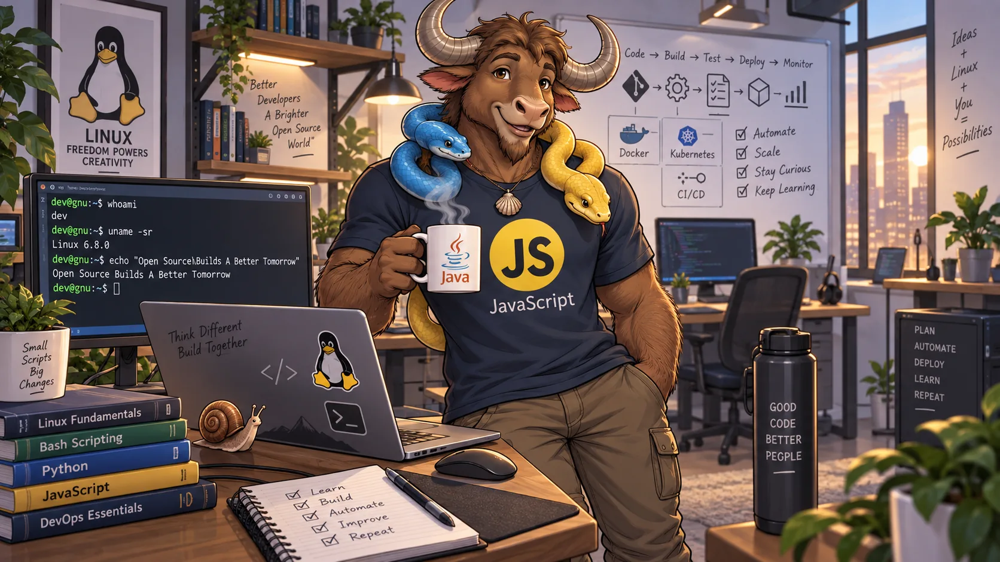
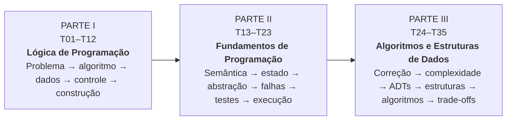

<div align="center">

# Lógica, Fundamentos, Algoritmos e Estruturas de Dados

**35 tópicos para compreender como programas são pensados, construídos, verificados e analisados — antes de depender de uma linguagem específica.**

<a href="https://diego-ch4m4x.github.io/Guia_Logica/">
  
</a>

`Python` · `JavaScript` · `Java` · `Shell / GNU Bash`

**Do problema à modelagem. Da sintaxe aos trade-offs.**

<strong><a href="https://diego-ch4m4x.github.io/Guia_Logica/">Acessar o guia</a></strong>
&nbsp;·&nbsp;
<strong><a href="https://github.com/Diego-Ch4m4X/Guia_Logica">Repositório GitHub</a></strong>

</div>

---

<a id="navegacao"></a>

## Navegação

[Sobre o projeto](#sobre-o-projeto) ·
[Por que estudar estes fundamentos](#por-que-estudar-estes-fundamentos) ·
[Quatro linguagens](#quatro-linguagens-os-mesmos-fundamentos) ·
[Como usar](#como-usar-este-guia) ·
[Visão panorâmica](#visao-panoramica) ·
[Mapa curricular](#mapa-curricular) ·
[Os 35 tópicos](#os-35-topicos) ·
[Como o conteúdo é construído](#como-o-conteudo-e-construido) ·
[Fontes oficiais](#fontes-normativas-e-oficiais) ·
[Projeto](#projeto-e-publicacao)

---

<a id="sobre-o-projeto"></a>

## 01. Sobre o projeto

Este projeto organiza **Lógica de Programação, Fundamentos de Programação, Algoritmos e Estruturas de Dados** em uma coleção progressiva de 35 tópicos. A proposta é permitir dois usos que normalmente aparecem separados: **consulta rápida** quando é preciso reencontrar um conceito e **estudo aprofundado** quando é preciso compreender como ele funciona, por que funciona e quais consequências surgem de cada escolha.

O material não foi estruturado como um curso preso a uma única linguagem. Python, JavaScript, Java e Shell/GNU Bash aparecem como perspectivas diferentes sobre os mesmos fundamentos. O objetivo é distinguir aquilo que pertence ao **conceito** daquilo que pertence à **sintaxe, semântica ou ambiente de execução** de cada tecnologia.

A coleção parte da resolução de problemas e avança por dados, tipos, expressões, controle de fluxo, repetição, modularização, execução, qualidade, testes, correção e complexidade; depois conecta esses fundamentos a Tipos Abstratos de Dados, estruturas, algoritmos clássicos, estratégias de resolução e decisões de modelagem.

> **Linguagens mudam. Os fundamentos atravessam linguagens.**

O corpus técnico contém **35/35 tópicos em estado `baseline-estavel`**, após a consolidação e o Gate Global da coleção. A coleção completa está publicada na Web, com Home + T01–T35 gerados a partir das fontes canônicas.

---

<a id="por-que-estudar-estes-fundamentos"></a>

## 02. Por que estudar estes fundamentos

Aprender a escrever código e aprender a programar estão relacionados, mas não são exatamente a mesma coisa. A sintaxe permite expressar uma solução; os fundamentos ajudam a **formular o problema, construir a solução, acompanhar sua execução, verificar se ela está correta e avaliar seus custos e limitações**.

Na prática, esses conhecimentos reaparecem continuamente: ao escolher uma estrutura de dados, investigar um bug, validar uma entrada, decompor uma rotina, escrever testes, analisar um algoritmo, entender por que duas implementações se comportam de maneira diferente ou decidir entre alternativas com custos distintos.

Por isso, a coleção procura desenvolver uma base que continue útil quando a linguagem, a biblioteca, o framework ou a ferramenta mudarem.

> **Aprender sintaxe permite escrever uma solução. Compreender os fundamentos permite raciocinar sobre ela.**

> **O objetivo não é memorizar quatro maneiras de escrever o mesmo programa; é reconhecer o conceito que permanece quando a sintaxe muda.**

> **Código que funciona responde “o quê”. Compreensão técnica também pergunta “por quê”, “em quais condições” e “a que custo”.**

---

<a id="quatro-linguagens-os-mesmos-fundamentos"></a>

## 03. Quatro linguagens, os mesmos fundamentos

As quatro linguagens foram escolhidas para criar contraste pedagógico, não para transformar cada tópico em quatro cursos paralelos.

| Perspectiva | O que ela ajuda a observar |
|---|---|
| **Python** | Sintaxe concisa, abstrações de alto nível e uma forma direta de observar algoritmos, coleções, funções e estruturas sem excesso de cerimônia sintática. |
| **JavaScript** | Semântica dinâmica, coerção, funções, objetos, coleções e a relação entre uma linguagem de propósito geral e seus diferentes ambientes de execução, com destaque natural para a Web. |
| **Java** | Tipagem estática, declarações e contratos mais explícitos, distinções de tipos em tempo de compilação e uma perspectiva orientada a estruturas formais e à JVM. |
| **Shell / GNU Bash** | Processos, comandos, exit status, streams, pipelines, texto e automação próximos ao sistema operacional. Quando uma característica for específica do Bash, ela deve ser identificada como tal, sem confundi-la com shell POSIX. |

A comparação entre linguagens não é um fim em si mesma. Ela funciona como instrumento para responder perguntas como:

- isto é propriedade do algoritmo ou apenas desta linguagem?
- esta diferença ocorre na sintaxe, no sistema de tipos, no modelo de execução ou na biblioteca?
- duas implementações equivalentes produzem os mesmos efeitos e custos?
- uma abstração disponível em uma linguagem existe diretamente nas outras ou precisa ser construída de outra forma?

---

<a id="como-usar-este-guia"></a>

## 04. Como usar este guia

A coleção foi desenhada para quatro modos complementares de uso:

1. **Estudo sequencial** — seguir T01 → T35 para construir os conceitos em ordem progressiva.
2. **Consulta técnica** — abrir diretamente um tópico para revisar definições, comparações, código, tabelas e decisões rápidas.
3. **Comparação entre linguagens** — observar o mesmo fundamento em Python, JavaScript, Java e Shell/GNU Bash, separando princípio de implementação.
4. **Prática e verificação** — usar exemplos, LABs, exercícios, rastreamento, troubleshooting e referências para transformar leitura em execução observável.

Quem está começando pode seguir a ordem completa. Quem já programa pode usar o mapa como diagnóstico: localizar lacunas, revisar conceitos ou aprofundar os pontos em que “saber usar” ainda não significa “entender o mecanismo”.

---

<a id="visao-panoramica"></a>

## 05. Visão panorâmica

O mapa da coleção pode ser entendido como uma progressão em três grandes partes:



Em linguagem direta:

```text
compreender o problema
        ↓
modelar uma solução
        ↓
representar dados e estado
        ↓
controlar a execução
        ↓
decompor e abstrair
        ↓
rastrear, depurar e testar
        ↓
entender como o programa executa
        ↓
provar e analisar algoritmos
        ↓
escolher abstrações e estruturas
        ↓
aplicar algoritmos e estratégias
        ↓
modelar requisitos e decidir trade-offs
```

A ordem não significa que um conceito deixa de importar quando o próximo aparece. A coleção é cumulativa: tópicos posteriores reutilizam e refinam ideias anteriores.

<a id="mapa-curricular"></a>

### Mapa curricular

A Home apresenta a mesma progressão em três partes, cada uma com um objetivo pedagógico próprio:

| Parte | Tópicos | Foco |
|---|---:|---|
| **Parte I — Lógica de Programação** | **T01–T12** | Transformar problemas em procedimentos verificáveis, acompanhando dados, estado e fluxo de execução. |
| **Parte II — Fundamentos de Programação** | **T13–T23** | Aprofundar significado, estado, abstração, falhas, testes, qualidade e modelos de execução. |
| **Parte III — Algoritmos e Estruturas de Dados** | **T24–T35** | Analisar soluções, escolher representações e relacionar requisitos, custos, estruturas e algoritmos. |

---

<a id="os-35-topicos"></a>

## 06. Os 35 tópicos

### Parte I — Lógica de Programação · T01–T12

A primeira parte constrói a base para transformar problemas em procedimentos verificáveis. Ela começa antes da sintaxe e termina quando o leitor já consegue acompanhar a execução de um algoritmo e raciocinar sobre seu estado.

#### T01 — Pensamento Computacional e Resolução de Problemas

Parte da compreensão do problema e trabalha decomposição, reconhecimento de padrões, abstração, modelagem e construção de soluções como etapas de um processo consciente de resolução.

#### T02 — Fundamentos de Algoritmos

Define o que é um algoritmo e conecta problema computacional, entrada, saída, estado, correção, término, pré-condições, pós-condições e formas de representação.

#### T03 — Dados, Valores, Variáveis e Constantes

Distingue dados, valores, literais, identificadores, bindings, variáveis, constantes e atribuição, mostrando como estado e nomenclatura aparecem nas quatro linguagens.

#### T04 — Tipos de Dados Fundamentais

Apresenta números, booleanos e dados textuais, além de compatibilidade entre tipos, conversões e diferenças semânticas relevantes entre Python, JavaScript, Java e Bash.

#### T05 — Expressões e Operadores

Relaciona expressões a operadores aritméticos, relacionais e lógicos, lógica booleana, precedência, associatividade, ordem de avaliação e short-circuit.

#### T06 — Fluxo de Controle

Mostra como uma execução deixa de ser apenas sequencial e passa a tomar decisões com condições, seleção múltipla, composição lógica e estruturas aninhadas.

#### T07 — Estruturas de Repetição

Desenvolve o raciocínio sobre iteração com `while`, `for`, `do-while` quando aplicável, contadores, intervalos, `break`, `continue`, término, loops infinitos e erros off-by-one.

#### T08 — Padrões Fundamentais de Construção de Algoritmos

Reúne padrões recorrentes como contadores, acumuladores, flags, sentinelas, máximo/mínimo, busca conceitual, filtragem, transformação e agregação.

#### T09 — Entrada, Processamento, Saída e Validação

Organiza o fluxo entrada → parsing → validação → processamento → saída e discute casos extremos, reentrada e diferenças de I/O entre os ambientes usados na coleção.

#### T10 — Estruturas de Dados Elementares

Introduz sequências, arrays/vetores, matrizes e strings como estruturas manipuláveis, preparando a transição entre valores isolados e conjuntos organizados de dados.

#### T11 — Funções, Procedimentos e Modularização

Apresenta decomposição funcional, funções, procedimentos, parâmetros, argumentos, retorno, escopo básico e composição como ferramentas para controlar complexidade.

#### T12 — Rastreamento, Verificação e Raciocínio sobre Execução

Desenvolve teste de mesa, rastreamento de fluxo, observação de estado intermediário, previsão de resultados e identificação de erros lógicos antes de depender de ferramentas de depuração.

---

### Parte II — Fundamentos de Programação · T13–T23

A segunda parte aprofunda o que acontece por trás do código: significado, estado, escopo, abstração, falhas, qualidade, testes, persistência e modelos de execução.

#### T13 — Sintaxe, Semântica e Sistema de Tipos

Separa forma e significado, relacionando sintaxe, semântica, tipagem estática e dinâmica, conversão, casting, parsing e coerção.

#### T14 — Estado, Escopo, Referências e Mutabilidade

Aprofunda tempo de vida, identidade, referências, cópia, aliasing, mutabilidade e efeitos colaterais, pontos em que diferenças entre linguagens se tornam especialmente importantes.

#### T15 — Coleções e Manipulação de Dados

Organiza listas, tuplas, conjuntos, mapas/dicionários, strings, iteração e operações de manipulação de dados como ferramentas recorrentes de programação.

#### T16 — Modularização e Abstração

Amplia a modularização para responsabilidades, interfaces conceituais, contratos, módulos, bibliotecas, dependências, acoplamento, reutilização e APIs.

#### T17 — Recursão

Explica caso-base, caso recursivo, pilha de chamadas, terminação e a relação entre recursão e iteração, preparando conceitos usados por vários algoritmos posteriores.

#### T18 — Erros, Exceções e Tratamento de Falhas

Distingue erros sintáticos, semânticos/de tipo, falhas em execução e erros lógicos, avançando para propagação, captura, recuperação e encerramento seguro.

#### T19 — Depuração

Transforma debugging em método: reproduzir, formular hipóteses, observar estado, coletar evidências, usar logs/debuggers e reduzir o espaço de investigação até isolar a causa.

#### T20 — Testes e Verificação

Trata resultado esperado, casos e classes de teste, assertions, automação e regressão como instrumentos para verificar comportamento e preservar correções.

#### T21 — Entrada/Saída e Persistência Básica

Introduz arquivos, streams, persistência textual, dados estruturados simples e tratamento de falhas de I/O em diferentes ambientes de execução.

#### T22 — Qualidade Básica do Código

Consolida legibilidade, nomenclatura, organização, comentários, documentação, simplicidade e uma mentalidade inicial de segurança como parte do trabalho técnico, não como acabamento opcional.

#### T23 — Modelo Básico de Execução de Programas

Conecta código-fonte a compilação, interpretação, máquinas virtuais, memória, pilha de chamadas, processos e fluxos de entrada/saída para formar um modelo mental de execução.

---

### Parte III — Algoritmos e Estruturas de Dados · T24–T35

A terceira parte transforma os fundamentos anteriores em ferramentas para analisar soluções, escolher representações, estudar estruturas clássicas e tomar decisões orientadas por requisitos e custos.

#### T24 — Correção e Análise de Algoritmos

Formaliza especificações, invariantes e correção, introduz modelos de custo, complexidade temporal e espacial, notações O/Ω/Θ, classes de crescimento, medição e trade-offs.

#### T25 — Tipos Abstratos de Dados, Estruturas e Implementações

Separa contrato, representação e implementação para distinguir TAD/ADT, estrutura de dados e biblioteca concreta, com foco em invariantes e independência de representação.

#### T26 — Algoritmos de Busca

Estuda busca linear e binária a partir de contratos, pré-condições, invariantes, complexidade, casos de borda, duplicatas e critérios práticos de escolha.

#### T27 — Algoritmos de Ordenação

Compara algoritmos por estabilidade, memória, invariantes, complexidade e comportamento dos dados, distinguindo valor conceitual de implementação manual e uso adequado de bibliotecas.

#### T28 — Estruturas Lineares

Relaciona arrays estáticos e dinâmicos, listas ligadas, pilhas, filas e deques aos custos das operações e às decisões de representação.

#### T29 — Estruturas Associativas, Conjuntos e Hashing

Explora Set, Map/Dictionary, funções hash, colisões, chaining, open addressing, load factor, rehash, complexidade esperada e implicações de segurança.

#### T30 — Filas de Prioridade e Heaps

Distingue Priority Queue como TAD de heap como implementação, trabalhando invariantes, representação em array, inserção, extração, `heapify`, custos e usos reais.

#### T31 — Árvores

Constrói a visão de árvores enraizadas, n-árias e binárias, percursos, BSTs, altura, balanceamento e um panorama de AVL, Red-Black, 2-3, B/B+ Trees e tries.

#### T32 — Grafos e Percursos Fundamentais

Apresenta grafos, classificações, listas e matrizes de adjacência, BFS, DFS, componentes, DAGs, caminhos e a relação entre representação, percurso e complexidade.

#### T33 — Estratégias Fundamentais de Resolução Algorítmica

Organiza famílias como brute force, decrease-and-conquer, divide-and-conquer, greedy, transform-and-conquer, programação dinâmica e backtracking, relacionando estratégia, recursão e trade-offs.

#### T34 — Matching, Busca em Strings e Regex no Mapa Algorítmico

Coloca busca em strings e Regex dentro do panorama algorítmico, passando por matching exato, busca ingênua, KMP, Boyer-Moore, LCS, engines e riscos como ReDoS.

#### T35 — Modelagem, Escolha de Estruturas e Trade-offs

Fecha a coleção integrando requisitos, TADs, estruturas, algoritmos, workload, análise, medição, segurança e fatores além de Big O para justificar decisões técnicas.

---

<a id="como-o-conteudo-e-construido"></a>

## 07. Como o conteúdo é construído

A coleção segue uma regra simples: **o conteúdo técnico vive nos Markdown canônicos**. HTML, índices, dados para busca e outros formatos de publicação devem ser derivados desses arquivos, e não mantidos como cópias independentes.

Cada tópico foi organizado para combinar, conforme a necessidade do assunto:

- resumo e decisão rápida;
- visão panorâmica antes dos detalhes;
- explicação progressiva;
- exemplos comparativos;
- código em Python, JavaScript, Java e Shell/GNU Bash;
- diagramas quando melhoram a compreensão;
- práticas e LABs;
- troubleshooting;
- glossário;
- referências;
- histórico e versionamento.

A profundidade varia conforme o assunto. Nem todo conceito exige o mesmo volume de código, o mesmo número de diagramas ou o mesmo nível de formalização. A estrutura serve ao conteúdo, e não o contrário.

---

<a id="fontes-normativas-e-oficiais"></a>

## 08. Fontes normativas e oficiais

O projeto prioriza documentação normativa e fontes oficiais sempre que existe uma autoridade apropriada para o assunto. Material secundário pode auxiliar a explicação, mas não substitui a fonte primária para definir comportamento, sintaxe, semântica ou conformidade.

### Python

- [Python Language Reference](https://docs.python.org/3/reference/)
- [Python Standard Library](https://docs.python.org/3/library/)
- [Python Enhancement Proposals — PEPs](https://peps.python.org/)
- [PEP 1 — PEP Purpose and Guidelines](https://peps.python.org/pep-0001/)
- [PEP 13 — Python Language Governance / Steering Council](https://peps.python.org/pep-0013/)
- [Python Software Foundation](https://www.python.org/psf/)

### JavaScript / ECMAScript

- [ECMA-262 — ECMAScript Language Specification](https://ecma-international.org/publications-and-standards/standards/ecma-262/)
- [TC39 — especificação ECMAScript em desenvolvimento](https://tc39.es/ecma262/)

### Java

- [Java Language Specification — JLS](https://docs.oracle.com/javase/specs/)
- [Java Virtual Machine Specification — JVMS](https://docs.oracle.com/javase/specs/)

### Shell / GNU Bash

- [POSIX.1 — The Open Group Base Specifications](https://pubs.opengroup.org/onlinepubs/9799919799/)
- [GNU Bash Reference Manual](https://www.gnu.org/software/bash/manual/)

### JSON e YAML

- [RFC 8259 / STD 90 — The JavaScript Object Notation (JSON) Data Interchange Format](https://www.rfc-editor.org/rfc/rfc8259.html)
- [ECMA-404 — The JSON Data Interchange Syntax](https://ecma-international.org/publications-and-standards/standards/ecma-404/)
- [ISO/IEC 21778:2017 — The JSON Data Interchange Syntax](https://www.iso.org/standard/71616.html)
- [YAML 1.2.2 Specification](https://yaml.org/spec/1.2.2/)

> A RFC 7159 é histórica e foi substituída pela RFC 8259. “RFC 715” não é usada como referência JSON neste projeto.

### Web e publicação

- [WHATWG HTML Living Standard](https://html.spec.whatwg.org/)
- [WHATWG DOM Standard](https://dom.spec.whatwg.org/)
- [W3C / CSS Working Group](https://www.w3.org/Style/CSS/)
- [WCAG 2.2](https://www.w3.org/TR/WCAG22/)
- [GitHub Flavored Markdown Specification](https://github.github.com/gfm/)

---

<a id="projeto-e-publicacao"></a>

## 09. Projeto e publicação

O projeto mantém uma **fonte única de verdade** para o conteúdo técnico e gera a publicação Web sem duplicar manualmente 35 páginas.

```text
content/topics/T01–T35.md
+
src/templates/
+
src/assets/
        ↓
preflight
        ↓
build estático
        ↓
Home + T01–T35 + índices derivados
        ↓
validate + testes de contrato
        ↓
dist/
        ↓
GitHub Actions
        ↓
GitHub Pages
        ↓
smoke HTTP de produção
```

O conteúdo técnico vive nos Markdown canônicos. Templates, assets e scripts formam a camada de publicação; `dist/` é derivado e não deve ser editado manualmente.

O **runtime entregue ao navegador permanece HTML, CSS e JavaScript nativos**, sem framework client-side obrigatório. O processo de build usa **Node.js 24** e `npm` com lockfile para preflight, geração, testes e validação reproduzível.

A publicação é automatizada por GitHub Actions e GitHub Pages. O workflow executa preflight, build, validação, testes, validação do artefato, deploy e smoke pós-publicação antes de considerar a versão fechada.

- **Guia publicado:** https://diego-ch4m4x.github.io/Guia_Logica/
- **Repositório:** https://github.com/Diego-Ch4m4X/Guia_Logica

---

## 10. Estado da coleção

| Item | Estado |
|---|---|
| Tópicos canônicos | **35/35** |
| Parte I — Lógica de Programação | **T01–T12** |
| Parte II — Fundamentos de Programação | **T13–T23** |
| Parte III — Algoritmos e Estruturas de Dados | **T24–T35** |
| Linguagens de comparação | **Python · JavaScript · Java · Shell/GNU Bash** |
| Estado técnico dos tópicos | **`baseline-estavel`** |
| Gate Global | **concluído** |
| Publicação Web | **Home + T01–T35** |
| GitHub Actions | **ativo** |
| GitHub Pages | **publicado (`v1.3.0`)** |
| Smoke da versão publicada | **PASS (`v1.3.0`)** |
| Baseline Web anterior | **`v1.2.0`** |
| Versão publicada | **`v1.3.0`** |
| QA local `v1.3.0` | **PASS** |
| CI / deploy / smoke `v1.3.0` | **PASS** |

---

<div align="center">

**Conhecimento para compreender, consultar e construir.**

*Curiosidade → Razão → Fundamentos → Método → Construção.*

</div>
