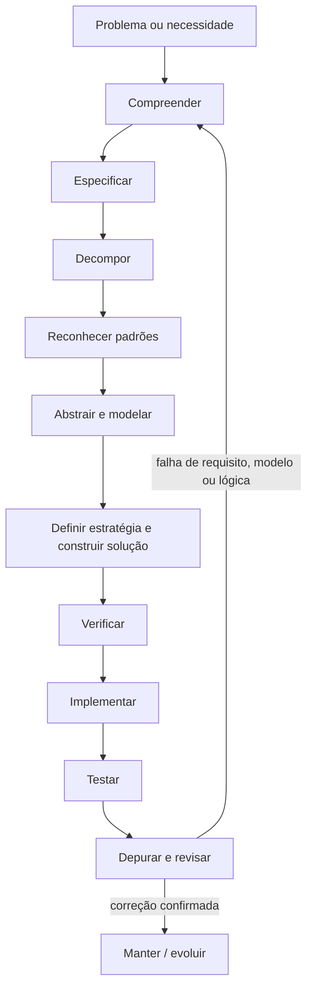
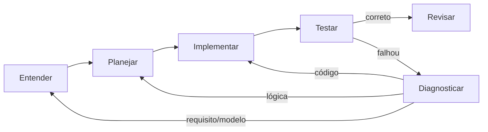
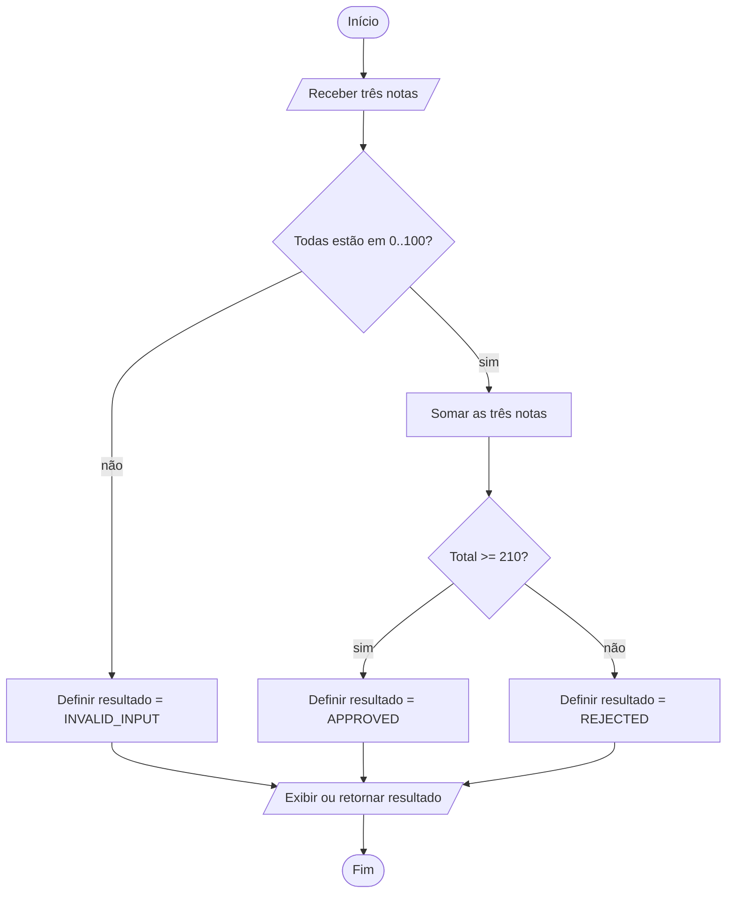

<a id="inicio"></a>

# Pensamento Computacional e Resolução de Problemas

> **Classificação curricular:** `[D] Obrigatório dominar`  
> **Nível:** A — Lógica de Programação  
> **Posição na taxonomia:** tópico 1  
> **Pré-requisitos:** nenhum pré-requisito técnico obrigatório  
> **Próximos tópicos diretamente relacionados:** fundamentos de algoritmos, dados/variáveis, fluxo de controle, repetição, funções, rastreamento e debugging

**Como interpretar esta classificação:** `[D]` indica uma capacidade que deve evoluir até aplicação, depuração e transferência; não significa que o leitor precise dominar integralmente todo o tópico antes de avançar para o próximo. **Nível A** identifica o núcleo de **Lógica de Programação** nesta trilha.

> **Enquadramento da série:** este é o **T01 de uma trilha curricular com 35 tópicos**. Referências como `T02`, `T09` e `T32` indicam onde determinados assuntos serão aprofundados; elas não são pré-requisitos para compreender este capítulo. O T01 foi escrito para permanecer útil tanto como primeira leitura quanto como referência posterior.

---

## Resumo executivo

Programar não começa pela sintaxe.

Antes de escrever `if`, `for`, função, classe ou comando de shell, existe um trabalho anterior:

```text
ENTENDER O PROBLEMA
↓
ESPECIFICAR O QUE DEVE ACONTECER
↓
DIVIDIR O PROBLEMA
↓
RECONHECER PADRÕES
↓
ABSTRAIR E MODELAR
↓
DEFINIR UMA ESTRATÉGIA
↓
CONSTRUIR E VERIFICAR A SOLUÇÃO
↓
IMPLEMENTAR, TESTAR E REVISAR
```

Esse conjunto de capacidades forma parte do que normalmente se chama de **pensamento computacional** e de **resolução de problemas em computação**.

Uma formulação útil e amplamente adotada no ensino apresenta quatro componentes:

```text
DECOMPOSIÇÃO
+
RECONHECIMENTO DE PADRÕES
+
ABSTRAÇÃO
+
PENSAMENTO / PROJETO ALGORÍTMICO
```

Porém, esse modelo dos “quatro pilares” deve ser entendido como uma **estrutura pedagógica**, não como uma definição universal e exclusiva. O conceito de pensamento computacional é mais amplo e inclui, conforme a abordagem, modelagem, avaliação, representação, teste, debugging, generalização, uso de abstrações e raciocínio sobre limitações da solução.

O **CS2023**, currículo de referência da ACM/IEEE-CS/AAAI, enfatiza explicitamente capacidades como:

- resolução de problemas;
- decomposição;
- reconhecimento de padrões de solução;
- pensamento algorítmico;
- raciocínio analítico;
- trabalho em múltiplos níveis de abstração.

A habilidade central deste capítulo é simples de enunciar e difícil de dominar:

> **não começar resolvendo aquilo que ainda não foi compreendido.**

---

## Decisão rápida

| Pergunta | O que está sendo trabalhado? |
|---|---|
| “O que exatamente precisa ser resolvido?” | Compreensão do problema |
| “Como transformo esse entendimento em comportamento verificável?” | Especificação |
| “Quais são as partes menores?” | Decomposição |
| “Já resolvi algo estruturalmente parecido?” | Reconhecimento de padrões |
| “Quais detalhes realmente importam?” | Abstração |
| “Como represento o problema de forma tratável?” | Modelagem |
| “Qual direção global faz sentido?” | Estratégia |
| “Quais passos levam da entrada ao resultado?” | Construção da solução |
| “Essa solução satisfaz todos os casos?” | Verificação conceitual |
| “A ideia funciona independentemente da linguagem?” | Transferência conceitual |
| “O erro está na lógica ou apenas na implementação?” | Diagnóstico do raciocínio |

---

# Índice

- [Resumo executivo](#resumo-executivo)
- [Decisão rápida](#decisão-rápida)
- [1. Posição deste assunto na formação](#1-posição-deste-assunto-na-formação)
  - [1.1 Relação com Lógica de Programação](#11-relação-com-lógica-de-programação)
  - [1.2 Relação com Algoritmos](#12-relação-com-algoritmos)
  - [1.3 Relação com linguagens](#13-relação-com-linguagens)
  - [1.4 Rastreabilidade da taxonomia canônica](#14-rastreabilidade-da-taxonomia-canônica)
  - [1.5 Onde os assuntos são aprofundados depois](#15-onde-os-assuntos-são-aprofundados-depois)
- [2. Visão panorâmica](#2-visão-panorâmica)
  - [🗺️ Visão panorâmica — o mapa antes dos detalhes](#visao-panoramica)
- [3. O que é pensamento computacional](#3-o-que-é-pensamento-computacional)
  - [3.1 Os quatro pilares — úteis, mas não dogmáticos](#31-os-quatro-pilares--úteis-mas-não-dogmáticos)
  - [3.2 Pensamento computacional ≠ programação](#32-pensamento-computacional--programação)
  - [3.3 Pensamento computacional ≠ “pensar como um computador”](#33-pensamento-computacional--pensar-como-um-computador)
  - [3.4 Relação com CS2023](#34-relação-com-cs2023)
- [4. Compreensão do problema](#4-compreensão-do-problema)
  - [4.1 Problema × sintoma × solução sugerida](#41-problema--sintoma--solução-sugerida)
  - [4.2 Começar pelo resultado desejado](#42-começar-pelo-resultado-desejado)
  - [4.3 Entrada](#43-entrada)
    - [4.3.1 Camadas introdutórias de validação da entrada](#431-camadas-introdutórias-de-validação-da-entrada)
  - [4.4 Saída](#44-saída)
  - [4.5 Regra](#45-regra)
  - [4.6 Requisito](#46-requisito)
  - [4.7 Restrição](#47-restrição)
  - [4.8 Suposição](#48-suposição)
  - [4.9 Critério de aceitação](#49-critério-de-aceitação)
  - [4.10 Perguntas antes de programar](#410-perguntas-antes-de-programar)
- [5. Especificar antes de codificar](#5-especificar-antes-de-codificar)
  - [5.1 Template](#51-template)
  - [5.2 Requisito × restrição × suposição](#52-requisito--restrição--suposição)
  - [5.3 Problemas ambíguos](#53-problemas-ambíguos)
- [6. Decomposição](#6-decomposição)
  - [6.1 Decompor não é apenas “quebrar em funções”](#61-decompor-não-é-apenas-quebrar-em-funções)
  - [6.2 Boa decomposição](#62-boa-decomposição)
  - [6.3 Dependências](#63-dependências)
  - [6.4 Ordem](#64-ordem)
  - [6.5 Decomposição recursiva](#65-decomposição-recursiva)
  - [6.6 Quando parar de decompor](#66-quando-parar-de-decompor)
  - [6.7 Antipadrão — decomposição artificial](#67-antipadrão--decomposição-artificial)
- [7. Reconhecimento de padrões](#7-reconhecimento-de-padrões)
  - [7.1 Exemplo conceitual](#71-exemplo-conceitual)
  - [7.2 Padrão não significa copiar código](#72-padrão-não-significa-copiar-código)
  - [7.3 Generalização](#73-generalização)
  - [7.4 Padrões superficiais podem enganar](#74-padrões-superficiais-podem-enganar)
  - [7.5 Contraexemplo como ferramenta](#75-contraexemplo-como-ferramenta)
- [8. Abstração e modelagem](#8-abstração-e-modelagem)
  - [8.1 Abstrair não é “simplificar de qualquer jeito”](#81-abstrair-não-é-simplificar-de-qualquer-jeito)
  - [8.2 Exemplo](#82-exemplo)
  - [8.3 Skiena e a importância da modelagem](#83-skiena-e-a-importância-da-modelagem)
  - [8.4 Modelo não é realidade](#84-modelo-não-é-realidade)
  - [8.5 Níveis de abstração](#85-níveis-de-abstração)
  - [8.6 Abstração × generalização](#86-abstração--generalização)
- [9. Estratégia × tática](#9-estratégia--tática)
  - [9.1 Estratégia](#91-estratégia)
  - [9.2 Tática](#92-tática)
  - [9.3 Antipadrão — resolver tática antes da estratégia](#93-antipadrão--resolver-tática-antes-da-estratégia)
- [10. Construção da solução](#10-construção-da-solução)
  - [10.1 A solução deve ser finita e verificável](#101-a-solução-deve-ser-finita-e-verificável)
  - [10.2 Alternativas](#102-alternativas)
  - [10.3 Verificação conceitual](#103-verificação-conceitual)
  - [10.4 Um caso correto não prova a solução](#104-um-caso-correto-não-prova-a-solução)
  - [10.5 Como procurar um contraexemplo](#105-como-procurar-um-contraexemplo)
- [11. Casos normais, especiais e casos-limite](#11-casos-normais-especiais-e-casos-limite)
  - [11.1 Caso normal](#111-caso-normal)
  - [11.2 Caso especial](#112-caso-especial)
  - [11.3 Caso-limite](#113-caso-limite)
  - [11.4 Caso inválido](#114-caso-inválido)
  - [11.5 Estado vazio ou ausente](#115-estado-vazio-ou-ausente)
  - [11.6 Tabela mínima de casos](#116-tabela-mínima-de-casos)
- [12. Ciclo básico de desenvolvimento da solução](#12-ciclo-básico-de-desenvolvimento-da-solução)
  - [12.1 Etapas do ciclo](#121-etapas-do-ciclo)
  - [12.2 O ciclo não é sempre linear](#122-o-ciclo-não-é-sempre-linear)
  - [12.3 O processo deve ser proporcional ao problema](#123-o-processo-deve-ser-proporcional-ao-problema)
- [13. Pseudocódigo, fluxograma e outras representações](#13-pseudocódigo-fluxograma-e-outras-representações)
  - [13.1 Pseudocódigo](#131-pseudocódigo)
  - [13.2 Pseudocódigo não possui uma sintaxe universal](#132-pseudocódigo-não-possui-uma-sintaxe-universal)
  - [13.3 Fluxograma](#133-fluxograma)
  - [13.4 Tabela de decisão](#134-tabela-de-decisão)
  - [13.5 Tabela de rastreamento](#135-tabela-de-rastreamento)
  - [13.6 Linguagem natural estruturada](#136-linguagem-natural-estruturada)
- [14. Exemplo progressivo completo](#14-exemplo-progressivo-completo)
  - [14.1 Pedido inicial](#141-pedido-inicial)
  - [14.2 Perguntas](#142-perguntas)
  - [14.3 Especificação adotada](#143-especificação-adotada)
  - [14.4 Decomposição](#144-decomposição)
  - [14.5 Padrão reconhecido](#145-padrão-reconhecido)
  - [14.6 Abstração](#146-abstração)
  - [14.7 Solução em pseudocódigo](#147-solução-em-pseudocódigo)
  - [14.8 Rastreamento](#148-rastreamento)
  - [14.9 Por que validar antes?](#149-por-que-validar-antes)
  - [14.10 Contraexemplo](#1410-contraexemplo)
- [15. Transferência para Python, JavaScript, Java e Bash](#15-transferência-para-python-javascript-java-e-bash)
  - [15.1 Python](#151-python)
  - [15.2 JavaScript](#152-javascript)
  - [15.3 Java](#153-java)
  - [15.4 Bash](#154-bash)
  - [15.5 Comparação](#155-comparação)
- [16. Erros de raciocínio mais comuns](#16-erros-de-raciocínio-mais-comuns)
  - [16.1 Começar pelo código](#161-começar-pelo-código)
  - [16.2 Resolver a solução sugerida, não o problema](#162-resolver-a-solução-sugerida-não-o-problema)
  - [16.3 Suposições invisíveis](#163-suposições-invisíveis)
  - [16.4 Testar apenas o caminho feliz](#164-testar-apenas-o-caminho-feliz)
  - [16.5 Escolher linguagem cedo demais](#165-escolher-linguagem-cedo-demais)
  - [16.6 Reconhecer padrão por palavra](#166-reconhecer-padrão-por-palavra)
  - [16.7 Remover informação essencial ao abstrair](#167-remover-informação-essencial-ao-abstrair)
  - [16.8 Decompor demais](#168-decompor-demais)
  - [16.9 Planejar somente o caso normal](#169-planejar-somente-o-caso-normal)
  - [16.10 Confundir execução com correção](#1610-confundir-execução-com-correção)
- [17. Debugging do problema antes do debugging do código](#17-debugging-do-problema-antes-do-debugging-do-código)
  - [17.1 Bug de requisito](#171-bug-de-requisito)
  - [17.2 Bug de modelo](#172-bug-de-modelo)
  - [17.3 Bug de lógica](#173-bug-de-lógica)
  - [17.4 Bug de implementação](#174-bug-de-implementação)
  - [17.5 Bug de ambiente](#175-bug-de-ambiente)
  - [17.6 Pergunta de diagnóstico](#176-pergunta-de-diagnóstico)
- [18. Motor de perguntas para resolver problemas](#18-motor-de-perguntas-para-resolver-problemas)
  - [18.1 Entendimento](#181-entendimento)
  - [18.2 Decomposição](#182-decomposição)
  - [18.3 Padrões](#183-padrões)
  - [18.4 Abstração](#184-abstração)
  - [18.5 Estratégia](#185-estratégia)
  - [18.6 Verificação](#186-verificação)
  - [18.7 Regra “não, porque...”](#187-regra-não-porque)
- [Índice operacional de Problemas Reais `PR-*`](#problemas-reais)
  - [`PR-T01-01` — Pedido ambíguo → especificação verificável](#pr-t01-01)
  - [`PR-T01-02` — Decompor um fluxo sem perder dependências](#pr-t01-02)
  - [`PR-T01-03` — Reutilizar um padrão sem equivalência falsa](#pr-t01-03)
  - [`PR-T01-04` — Modelar sem remover informação necessária](#pr-t01-04)
  - [`PR-T01-05` — “Funciona” no caso comum, falha na fronteira](#pr-t01-05)
  - [🔎 Troubleshooting sistemático](#troubleshooting-sistematico)
    - [`TS-T01-01` — pessoas diferentes produzem resultados diferentes para o mesmo pedido](#ts-t01-01)
    - [`TS-T01-02` — solução passa exemplos comuns e falha no limite](#ts-t01-02)
    - [`TS-T01-03` — padrão conhecido foi reutilizado, mas a solução ficou errada](#ts-t01-03)
    - [`TS-T01-04` — algoritmo correto, resposta incorreta para o mundo real](#ts-t01-04)
    - [`TS-T01-05` — decomposição aumentou a dificuldade em vez de reduzi-la](#ts-t01-05)
- [19. Laboratórios](#19-laboratórios)
  - [🧪 Laboratório 1 — Transformar pedido vago em especificação](#lab-t01-01)
  - [🧪 Laboratório 2 — Decomposição](#lab-t01-02)
  - [🧪 Laboratório 3 — Reconhecimento de padrões](#lab-t01-03)
  - [🧪 Laboratório 4 — Abstração](#lab-t01-04)
  - [🧪 Laboratório 5 — Transferência](#lab-t01-05)
- [20. Exercícios](#20-exercícios)
  - [20.1 Classifique](#201-classifique)
  - [20.2 Encontre ambiguidades](#202-encontre-ambiguidades)
  - [20.3 Decomponha](#203-decomponha)
  - [20.4 Reconheça o padrão](#204-reconheça-o-padrão)
  - [20.5 Contraexemplo](#205-contraexemplo)
  - [20.6 Abstração](#206-abstração)
  - [20.7 Estratégia × tática](#207-estratégia--tática)
  - [20.8 Reescreva](#208-reescreva)
- [21. Evidências de domínio](#21-evidências-de-domínio)
  - [Você deve conseguir explicar](#você-deve-conseguir-explicar)
  - [Você deve conseguir aplicar](#você-deve-conseguir-aplicar)
  - [Você deve conseguir rastrear](#você-deve-conseguir-rastrear)
  - [Você deve conseguir depurar](#você-deve-conseguir-depurar)
  - [Você deve conseguir transferir](#você-deve-conseguir-transferir)
  - [Nível 5 — dominar/ensinar](#nível-5--dominarensinar)
- [22. Checklist de consulta rápida](#22-checklist-de-consulta-rápida)
- [23. Glossário](#23-glossário)
- [24. Referências](#24-referências)
  - [24.1 Currículo e referências institucionais](#241-currículo-e-referências-institucionais)
  - [24.2 Referência histórica e conceitual](#242-referência-histórica-e-conceitual)
  - [24.3 Universidade / algoritmos / modelagem](#243-universidade--algoritmos--modelagem)
  - [24.4 Fontes locais efetivamente consultadas nesta revisão](#244-fontes-locais-efetivamente-consultadas-nesta-revisão)
  - [24.5 Como as fontes foram usadas](#245-como-as-fontes-foram-usadas)
- [25. Histórico de versões](#25-histórico-de-versões)

---

# 1. Posição deste assunto na formação

Este capítulo vem **antes** da sintaxe de uma linguagem.

A relação é:

```text
PROBLEMA
↓
COMPREENSÃO
↓
ESPECIFICAÇÃO
↓
MODELO
↓
SOLUÇÃO
↓
ALGORITMO
↓
IMPLEMENTAÇÃO EM UMA LINGUAGEM
```

Isso evita um erro frequente:

```text
PROBLEMA
↓
ABRIR EDITOR
↓
COMEÇAR A DIGITAR
↓
TENTAR FAZER FUNCIONAR
```

A segunda sequência pode eventualmente produzir um programa que executa, mas não garante que:

- o problema tenha sido entendido;
- as regras estejam corretas;
- os casos-limite tenham sido considerados;
- a solução seja generalizável;
- a solução esteja resolvendo o problema certo.

## 1.1 Relação com Lógica de Programação

Pensamento computacional é mais amplo que “escrever código”.

Dentro desta trilha, ele funciona como uma base para:

```text
compreender
→ especificar
→ decompor
→ abstrair
→ modelar
→ planejar
→ verificar
```

A Lógica de Programação usa essas capacidades para produzir soluções computacionalmente expressáveis.

## 1.2 Relação com Algoritmos

Neste capítulo, “algoritmo” aparece apenas como:

> **uma sequência de passos/regras para atingir um resultado.**

A formalização de:

- propriedades de algoritmos;
- correção;
- invariantes;
- complexidade;
- estratégias algorítmicas;
- análise assintótica;

pertence a capítulos posteriores.

## 1.3 Relação com linguagens

Python, JavaScript, Java e Bash aparecem neste capítulo apenas para mostrar:

> **o raciocínio é transferível; a sintaxe não é.**

## 1.4 Rastreabilidade da taxonomia canônica

Os identificadores `1.1`–`1.6` declarados no Front Matter pertencem ao **Guia curricular desta série**, e não à numeração editorial das subseções deste Markdown.

| Nó do Guia | Capacidade curricular | Destino principal neste T01 |
|---|---|---|
| `1` | Pensamento computacional e resolução de problemas | tópico completo |
| `1.1` | Compreensão do problema | seção 4 |
| `1.2` | Decomposição | seção 6 |
| `1.3` | Reconhecimento de padrões | seção 7 |
| `1.4` | Abstração | seção 8 |
| `1.5` | Construção da solução | seções 5, 9 e 10 + exemplo progressivo da seção 14 |
| `1.6` | Ciclo básico de desenvolvimento da solução | seção 12 |

> A diferença entre os números do **Guia** e os números das seções deste documento é intencional: o primeiro identifica nós curriculares; o segundo organiza a exposição didática do tópico.

## 1.5 Onde os assuntos são aprofundados depois

Alguns conceitos aparecem aqui apenas no nível necessário para o raciocínio do T01.

| Tópico posterior | O que será aprofundado | O que basta compreender aqui |
|---|---|---|
| **T02 — Fundamentos de algoritmos** | propriedades, estado, pré/pós-condições e representação de algoritmos | algoritmo como sequência finita de passos/regras para produzir um resultado |
| **T09 — Entrada, processamento, saída e validação** | obtenção de dados, reentrada, parsing, domínio válido e tratamento de entrada inválida | distinguir presença, representação/interpretação e validade de domínio |
| **T32 — Grafos e percursos fundamentais** | vértices, arestas, pesos, representações e percursos | reconhecer que um problema pode ser modelado como entidades + relações quando isso preserva o que importa |

Essas referências funcionam como **fronteiras de escopo**, não como dependências obrigatórias para continuar a leitura.

[↑ Voltar ao índice](#índice)

---

# 2. Visão panorâmica

<a id="visao-panoramica"></a>

## 🗺️ Visão panorâmica — o mapa antes dos detalhes

Esta seção funciona como **caderno rápido de consulta** e como contrato de cobertura. Na primeira leitura, use-a para construir o mapa mental; depois, ela deve permitir recuperar uma dúvida pontual em aproximadamente 30 segundos.

A síntese combina perspectivas complementares de currículo, pensamento computacional, resolução de problemas, modelagem e desenvolvimento de programas. Nenhuma fonte isolada é tratada como definição universal do domínio.

### 2.1 Mapa do domínio — o que existe

```text
PROBLEMA / NECESSIDADE
│
├── COMPREENDER
│   └── objetivo, entradas, saídas, regras, restrições e suposições
│
├── ESPECIFICAR
│   └── comportamento verificável e critérios de aceitação
│
├── DECOMPOR
│   └── subtarefas, dependências, ordem e fronteiras
│
├── RECONHECER PADRÕES
│   └── estrutura comum, diferenças relevantes e contraexemplos
│
├── ABSTRAIR / MODELAR
│   └── dados, relações, estados e propriedades que precisam ser preservadas
│
├── PLANEJAR / CONSTRUIR
│   └── estratégia, passos, alternativas e representação
│
├── VERIFICAR
│   └── exemplos, inválidos, fronteiras e contraexemplos
│
└── ITERAR
    └── implementar, testar, depurar, revisar e manter
```

### 2.2 Fluxo principal — como o raciocínio progride



Leitura textual: compreender e especificar vêm antes da implementação; decomposição, padrões e abstração reduzem e organizam o espaço do problema; verificação tenta encontrar falhas antes e depois do código; uma falha pode exigir voltar ao requisito, ao modelo ou à lógica.

<a id="210-modo-consulta--modo-estudo"></a>
### 2.3 Rotas de leitura

**Primeira passagem**

```text
Resumo executivo
→ 3. conceito
→ 4. compreensão
→ 5. especificação
→ 6. decomposição
→ 7. padrões
→ 8. abstração/modelagem
→ 9. estratégia × tática
→ 10. construção/verificação
→ 12. ciclo básico
→ 14. exemplo progressivo
→ LAB 1 ou LAB 2
→ seguir para T02
```

**Consulta rápida**

```text
2.4 Consulta rápida
→ 2.5 Pergunta prática
→ 2.6 Não confundir
→ 2.9 Falha típica
→ 22. Checklist
```

**Estudo completo**

```text
3–13. fundamentos e representações
→ 14–15. exemplo progressivo e transferência
→ 16–18. erros, debugging e motor de perguntas
→ PR-* e Troubleshooting
→ 19–21. LABs, exercícios e evidências de domínio
```

> A primeira passagem reduz a carga inicial; ela não redefine o escopo do tópico.

<a id="23-consulta-rápida--conceito--função--risco"></a>
### 2.4 Consulta rápida — conceito × função × risco

| Conceito | Pergunta central | Risco se ignorado |
|---|---|---|
| [Compreensão](#4-compreensão-do-problema) | O que realmente precisa acontecer? | resolver o problema errado |
| [Especificação](#5-especificar-antes-de-codificar) | Como o comportamento será reconhecido como correto? | programar linguagem vaga |
| [Decomposição](#6-decomposição) | Quais partes e dependências existem? | solução monolítica ou fragmentação artificial |
| [Padrão](#7-reconhecimento-de-padrões) | O que se repete estruturalmente? | copiar por semelhança superficial |
| [Abstração/modelagem](#8-abstração-e-modelagem) | Que propriedades precisam ser preservadas? | modelo complexo demais ou incompleto |
| [Estratégia/tática](#9-estratégia--tática) | Qual direção global e quais decisões locais? | escolher ferramenta antes do problema |
| [Verificação](#10-construção-da-solução) | Como tento encontrar uma falha? | confundir exemplo correto com correção |
| [Iteração](#12-ciclo-básico-de-desenvolvimento-da-solução) | O que a tentativa revelou? | acumular remendos sobre requisito/modelo errado |

<a id="24-pergunta-prática--mecanismo-inicial"></a>
### 2.5 Pergunta prática → mecanismo inicial

| Se você está pensando... | Comece por... |
|---|---|
| “O pedido está vago.” | objetivo, regras, restrições, suposições e critérios de aceitação |
| “O problema parece grande.” | decomposição e dependências |
| “Já vi algo parecido.” | comparar estrutura e restrições antes de reutilizar o padrão |
| “Há informação demais.” | abstração: o que muda a resposta? |
| “Não sei como representar.” | entidades, relações, estados e operações |
| “Funciona no meu exemplo.” | fronteiras, inválidos, vazio e contraexemplo |
| “O código está certo, mas a resposta está errada.” | requisito → modelo → lógica → implementação → ambiente |
| “Estou travado.” | motor de perguntas da seção 18 |

<a id="25-não-confundir"></a>
### 2.6 Não confundir

| Não confundir | Diferença |
|---|---|
| **Problema × sintoma** | sintoma é manifestação; problema é a necessidade/causa a tratar |
| **Problema × solução sugerida** | “preciso de X” pode ser proposta, não necessidade |
| **Requisito × restrição × suposição** | requisito define o que deve acontecer; restrição limita; suposição precisa ser confirmada quando material |
| **Abstração × simplificação arbitrária** | abstração remove o irrelevante preservando propriedades necessárias |
| **Abstração × generalização** | abstração reduz detalhes; generalização identifica estrutura comum |
| **Padrão × palavra parecida** | padrão é estrutural, não vocabular |
| **Estratégia × tática** | estratégia orienta a direção; tática resolve detalhe local |
| **Executar × estar correto** | execução sem erro não prova aderência ao problema |

<a id="26-microexemplos-canônicos"></a>
### 2.7 Microexemplos canônicos

<a id="exemplo-a--pedido-vago--especificação-mínima"></a>
**Pedido vago → especificação**

```text
“mostre os clientes antigos”
→ “antigo” = cadastro há mais de 5 anos?
→ qual data de referência?
→ inativos entram?
→ qual saída?
```

<a id="exemplo-b--padrão-útil-mas-com-validação"></a>
**Padrão → validação da equivalência**

```text
contar erros em logs
contar alunos aprovados
contar interfaces down
```

Todos podem usar “percorrer → testar condição → contar”, mas somente após confirmar o que é item, condição válida, duplicidade e domínio da entrada.

<a id="exemplo-c--abstraçãomodelagem-de-rede"></a>
**Abstração/modelagem**

```text
roteador → vértice (entidade)
enlace   → aresta (relação)
latência → peso (valor associado à relação)
```

Se a pergunta for apenas “existe caminho?”, o peso pode ser irrelevante. Se for “qual caminho tem menor latência?”, ele passa a ser essencial. A teoria de grafos fica para o T32.

<a id="27-problemas-reais-representativos"></a>
### 2.8 Problemas reais representativos

| ID | Capacidade central | Destino |
|---|---|---|
| `PR-T01-01` | pedido ambíguo → especificação verificável | [Problemas Reais](#problemas-reais) |
| `PR-T01-02` | decomposição sem perder dependências | [Problemas Reais](#problemas-reais) |
| `PR-T01-03` | padrão sem equivalência falsa | [Problemas Reais](#problemas-reais) |
| `PR-T01-04` | modelo preservando propriedades necessárias | [Problemas Reais](#problemas-reais) |
| `PR-T01-05` | falha em fronteira apesar de casos comuns | [Problemas Reais](#problemas-reais) |

<a id="28-falha-típica--primeira-investigação"></a>
### 2.9 Falha típica → primeira investigação

| Sintoma | Primeira investigação |
|---|---|
| pessoas esperam resultados diferentes | requisito/critério de aceitação ambíguo? |
| falha apenas no limite | desigualdade, domínio ou suposição escondida? |
| padrão reutilizado produz resposta errada | equivalência estrutural ou só aparência? |
| algoritmo parece certo, resposta não representa o mundo | modelo descartou propriedade necessária? |
| muitas partes pequenas pioraram a compreensão | decomposição passou do ponto útil? |
| correções locais não estabilizam | a primeira divergência está antes do código? |

Casos completos aparecem em [🔎 Troubleshooting sistemático](#troubleshooting-sistematico).

<a id="29-transferência-entre-python-javascript-java-e-bash"></a>
### 2.10 Transferência entre Python, JavaScript, Java e Bash

| Permanece | Pode mudar |
|---|---|
| objetivo, regra e resultado conceitual | sintaxe e operadores concretos |
| domínio e casos-limite | tipos, coerções e mecanismos de erro |
| decomposição e modelo | organização idiomática e bibliotecas |
| critério de aceitação | forma de entrada, saída e retorno |

**Proteção prática (guardrail):** se a tradução para outra linguagem altera a regra ou o resultado conceitual, houve mudança de solução — não apenas mudança de sintaxe. A comparação completa está em [§15](#15-transferência-para-python-javascript-java-e-bash).

[↑ Voltar ao índice](#índice)

---

# 3. O que é pensamento computacional

Uma definição útil é:

> **formular problemas e soluções de modo que a solução possa ser executada de maneira efetiva por um agente de processamento de informação.**

Essa formulação, associada ao trabalho de Jeannette Wing e colaboradores, é deliberadamente mais ampla que “programar”.

Wing também enfatiza que pensar computacionalmente envolve:

- resolver problemas;
- projetar sistemas;
- escolher abstrações;
- decompor tarefas complexas;
- trabalhar em múltiplos níveis de representação;
- reconhecer custos e limitações.

## 3.1 Os quatro pilares — úteis, mas não dogmáticos

Uma representação pedagógica muito comum usa:

1. decomposição;
2. reconhecimento de padrões;
3. abstração;
4. projeto/pensamento algorítmico.

Ela é útil porque oferece uma sequência mental fácil de aplicar.

Porém:

> **não existe obrigação acadêmica de reduzir todo pensamento computacional exatamente a quatro caixas.**

Outras abordagens incluem explicitamente:

- avaliação;
- generalização;
- debugging;
- modelagem;
- representação de dados;
- automação;
- simulação;
- paralelização;
- análise de eficiência.

## 3.2 Pensamento computacional ≠ programação

```text
PENSAMENTO COMPUTACIONAL
→ formular
→ decompor
→ abstrair
→ modelar
→ raciocinar

PROGRAMAÇÃO
→ expressar parte dessas soluções em uma linguagem executável
```

É possível:

- pensar computacionalmente sem escrever código;
- escrever código sem demonstrar bom pensamento computacional.

## 3.3 Pensamento computacional ≠ “pensar como um computador”

Computadores executam regras.

O trabalho humano importante ocorre antes:

- escolher o que representar;
- decidir quais detalhes ignorar;
- definir critérios;
- identificar padrões;
- construir estratégias;
- avaliar trade-offs.

O objetivo não é imitar uma máquina.

É **formular problemas de modo preciso e tratável**.

## 3.4 Relação com CS2023

O CS2023 trata como essenciais, entre outras capacidades:

- problem-solving;
- decomposition;
- recognition of solution patterns;
- algorithmic thinking;
- analytical reasoning;
- multiple levels of abstraction.

Isso reforça uma ideia central deste guia:

> essas capacidades não são “soft skills opcionais”; pertencem à formação técnica fundamental.

[↑ Voltar ao índice](#índice)

---

# 4. Compreensão do problema

Compreender o problema significa saber responder:

> **qual transformação precisa ocorrer entre uma situação inicial e um resultado desejado?**

Antes de decidir a solução, identifique:

```text
OBJETIVO
ENTRADAS
SAÍDAS
REGRAS
REQUISITOS
RESTRIÇÕES
SUPOSIÇÕES
CRITÉRIOS DE ACEITAÇÃO
CASOS ESPECIAIS
CASOS-LIMITE
```

## 4.1 Problema × sintoma × solução sugerida

Essas três coisas não são equivalentes.

Exemplo:

```text
“o relatório está lento”
```

pode ser um **sintoma**.

```text
“coloque cache”
```

pode ser uma **solução sugerida**.

O problema real pode ser:

```text
a consulta lê milhões de registros desnecessários
```

Outro erro comum:

```text
Pedido:
“preciso de um botão para exportar CSV”

Problema real:
“preciso analisar os resultados fora do sistema”
```

Talvez CSV seja correto.

Talvez exista solução melhor.

A primeira pergunta deve ser:

> **qual necessidade precisa ser atendida?**

## 4.2 Começar pelo resultado desejado

Uma técnica útil é raciocinar de trás para frente:

```text
QUAL SAÍDA PRECISO?
↓
QUE INFORMAÇÃO É NECESSÁRIA?
↓
QUE ENTRADA POSSUO?
↓
QUE TRANSFORMAÇÃO LIGA UMA À OUTRA?
```

Esse raciocínio aparece de forma explícita em materiais clássicos de programação introdutória.

## 4.3 Entrada

Perguntar:

- quais dados existem?
- em que formato?
- podem faltar?
- podem estar inválidos?
- possuem unidade?
- possuem limite?
- são confiáveis?
- existem valores especiais?

Exemplo:

```text
idade = 18
```

ainda exige perguntas:

```text
18 anos completos?
idade inteira?
idade pode ser negativa?
o valor vem de onde?
o dado já foi validado?
```

### 4.3.1 Camadas introdutórias de validação da entrada

Uma forma didática de evitar que diferentes tipos de problema sejam tratados como se fossem a mesma coisa é separar três perguntas iniciais:

```text
ENTRADA
│
├── presença / completude
│   └── o dado necessário foi fornecido?
│
├── representação / interpretação
│   └── o dado pode ser interpretado na forma esperada?
│
└── validade de domínio
    └── o valor interpretado é permitido pelas regras do problema?
```

| Camada | Pergunta | Exemplo de falha | Observação |
|---|---|---|---|
| **Presença / completude** | O dado necessário existe? | idade ausente, `null`, `undefined` ou campo vazio quando obrigatório | A representação concreta da ausência depende da linguagem, formato e interface. |
| **Representação / interpretação** | O dado recebido pode ser interpretado como a informação esperada? | receber `"vinte"` quando a solução precisa de uma idade numérica | Aqui podem entrar formato, análise/interpretação sintática (**parsing**), conversão e compatibilidade de tipo conforme a linguagem. |
| **Validade de domínio** | O valor já interpretado é aceitável para o problema? | idade `250` em um domínio que não admite esse valor | Um dado pode ser sintaticamente/tecnicamente interpretável e ainda violar uma regra do domínio. |

Exemplo conceitual:

```text
entrada ausente
→ problema de presença

"vinte"
→ problema de representação/interpretação se a regra exige um número

250
→ pode ser um número perfeitamente interpretável,
  mas inválido para o domínio definido
```

No Bash, essa distinção possui uma consequência prática importante: texto recebido de fora não deve ser enviado diretamente para contexto aritmético como se já estivesse validado. Shotts mostra exemplos de entrada vazia e conteúdo não numérico antes do processamento; o **GNU Bash Reference Manual 5.3, §6.5** documenta que valores de variáveis usados em expressões aritméticas são avaliados como expressões e que valor nulo pode ser tratado como `0`. Portanto, **obter um argumento e conseguir avaliá-lo aritmeticamente não equivale a validar presença, representação e domínio**. O aprofundamento operacional permanece no T09.

Essa separação é uma **lente didática introdutória**, não uma taxonomia universal ou exaustiva de validação. Dependendo do sistema, também podem importar proveniência, confiança, autorização, codificação, tamanho, unidade, consistência entre campos e outras restrições. O aprofundamento de entrada, reentrada e validação pertence ao tópico específico **T09 — Entrada, processamento, saída e validação**.

> **Não confundir:** conseguir fazer parsing ou obter um valor do tipo esperado **não prova** que o dado seja válido para o domínio do problema.

## 4.4 Saída

Perguntar:

- o que deve ser produzido?
- em qual formato?
- para quem?
- com qual precisão?
- existe ordem exigida?
- existe mensagem de erro?
- existe mais de uma saída válida?

## 4.5 Regra

Regra define comportamento.

Exemplo:

```text
média >= 70
→ aprovado
```

Mas ainda falta saber:

- notas variam de 0 a 100?
- as três possuem mesmo peso?
- arredondamento é permitido?
- nota inválida deve ser rejeitada?
- ausência conta como zero?

## 4.6 Requisito

Requisito é algo que a solução precisa satisfazer.

Exemplos:

- rejeitar nota fora de 0–100;
- produzir apenas um status;
- aceitar exatamente três notas;
- classificar corretamente a fronteira `70`.

## 4.7 Restrição

Restrição limita as soluções possíveis.

Exemplos:

- memória disponível é pequena;
- execução deve terminar em até dois segundos;
- não é permitido usar biblioteca externa;
- entrada possui no máximo 100 registros.

## 4.8 Suposição

Suposição é algo considerado verdadeiro durante o raciocínio.

Exemplo:

```text
“assumiremos que sempre chegam exatamente três notas inteiras”
```

Suposições devem ser explícitas.

Uma suposição escondida costuma virar bug.

## 4.9 Critério de aceitação

Critério de aceitação é uma condição observável que permite verificar a solução.

Exemplo:

```text
dadas 80, 75 e 65
a solução deve retornar APPROVED
```

Critérios de aceitação conectam:

```text
REQUISITO
↓
TESTE
```

## 4.10 Perguntas antes de programar

Use, quando aplicável:

```text
O que precisa acontecer?
Para quem?
Que entrada existe?
Que saída é esperada?
Que regra decide o resultado?
Que dado pode faltar?
Que valor é inválido?
Quais limites importam?
Que suposição estou fazendo?
Como saberei que terminou corretamente?
```

[↑ Voltar ao índice](#índice)

---

<a id="10-especificar-antes-de-codificar"></a>
# 5. Especificar antes de codificar

Com o problema compreendido, transforme o entendimento atual em um **contrato verificável** antes de escolher detalhes de implementação.

Uma especificação simples para problemas introdutórios pode usar:

```text
PROBLEMA
OBJETIVO
ENTRADAS
SAÍDAS
REGRAS
RESTRIÇÕES
SUPOSIÇÕES
CASOS-LIMITE
CRITÉRIOS DE ACEITAÇÃO
```

<a id="101-template"></a>
## 5.1 Template

```markdown
### Problema

### Objetivo

### Entradas
- ...

### Saídas
- ...

### Regras
- ...

### Restrições
- ...

### Suposições
- ...

### Casos-limite
- ...

### Critérios de aceitação
- Dado ...
  Quando ...
  Então ...
```

<a id="102-requisito--restrição--suposição"></a>
## 5.2 Requisito × restrição × suposição

| Conceito | Pergunta |
|---|---|
| Requisito | O que a solução precisa fazer? |
| Restrição | O que limita as opções? |
| Suposição | O que estamos considerando verdadeiro? |
| Critério de aceitação | Como verificar que funcionou? |

<a id="103-problemas-ambíguos"></a>
## 5.3 Problemas ambíguos

Pedido:

> “calcule a média das notas.”

Ainda faltam respostas:

- quantas notas?
- qual escala?
- pesos?
- arredondamento?
- valor ausente?
- aprovação a partir de quanto?
- entrada inválida?

Uma boa solução começa transformando:

```text
PEDIDO VAGO
↓
ESPECIFICAÇÃO TESTÁVEL
```

[↑ Voltar ao índice](#índice)

---

<a id="5-decomposição"></a>
# 6. Decomposição

Decomposição é dividir um problema em partes menores que possam ser entendidas, tratadas e verificadas com menos complexidade.

Exemplo:

```text
PROCESSAR INSCRIÇÃO
│
├── receber dados
├── validar campos
├── verificar elegibilidade
├── calcular valor
├── registrar
└── emitir confirmação
```

<a id="51-decompor-não-é-apenas-quebrar-em-funções"></a>
## 6.1 Decompor não é apenas “quebrar em funções”

A decomposição ocorre antes da linguagem.

Pode dividir:

- responsabilidades;
- etapas;
- regras;
- dados;
- cenários;
- estados;
- subproblemas.

Somente depois essas partes podem virar:

- funções;
- módulos;
- classes;
- processos;
- serviços;
- pipelines.

<a id="52-boa-decomposição"></a>
## 6.2 Boa decomposição

Uma boa parte tende a possuir:

```text
OBJETIVO CLARO
+
ENTRADA CLARA
+
RESULTADO CLARO
+
FRONTEIRA CLARA
```

<a id="53-dependências"></a>
## 6.3 Dependências

Subtarefas podem depender umas das outras.

Exemplo:

```text
validar notas
↓
calcular total
↓
classificar resultado
```

Não faz sentido calcular a classificação antes de decidir como lidar com entrada inválida.

<a id="54-ordem"></a>
## 6.4 Ordem

Pergunte:

- o que pode ser feito independentemente?
- o que precisa acontecer antes?
- quais etapas podem falhar?
- o que depende de resultado anterior?

<a id="55-decomposição-recursiva"></a>
## 6.5 Decomposição recursiva

Problemas grandes podem exigir vários níveis:

```text
PROBLEMA
├── parte A
│   ├── A1
│   └── A2
├── parte B
└── parte C
    ├── C1
    ├── C2
    └── C3
```

<a id="56-quando-parar-de-decompor"></a>
## 6.6 Quando parar de decompor

Continue até que a parte seja:

- compreensível;
- verificável;
- formada por responsabilidades suficientemente relacionadas (**coesa**);
- pequena o bastante para planejar.

Pare quando decompor mais produzir apenas detalhes mecânicos sem ganho de clareza.

<a id="57-antipadrão--decomposição-artificial"></a>
## 6.7 Antipadrão — decomposição artificial

Aqui, **antipadrão (anti-pattern)** significa uma forma recorrente de organizar a solução que parece útil, mas tende a produzir um problema conhecido naquele contexto.

Ruim:

```text
calcular média
├── pegar primeiro número
├── pegar segundo número
├── pegar terceiro número
├── somar primeiro
├── somar segundo
├── somar terceiro
...
```

se essa granularidade não acrescenta entendimento.

> **Decomposição deve reduzir complexidade cognitiva, não multiplicar burocracia.**

[↑ Voltar ao índice](#índice)

---

<a id="6-reconhecimento-de-padrões"></a>
# 7. Reconhecimento de padrões

Reconhecimento de padrões procura:

- semelhanças;
- diferenças relevantes;
- estruturas recorrentes;
- relações já conhecidas;
- estratégias reaproveitáveis.

<a id="61-exemplo-conceitual"></a>
## 7.1 Exemplo conceitual

Considere:

```text
contar erros em um log
contar alunos aprovados
contar arquivos maiores que 1 GB
```

Os domínios são diferentes.

A estrutura é parecida:

```text
PERCORRER ITENS
↓
TESTAR CONDIÇÃO
↓
INCREMENTAR CONTADOR QUANDO VERDADEIRO
```

Mais tarde isso será reconhecido como um padrão algorítmico de contagem condicional.

<a id="62-padrão-não-significa-copiar-código"></a>
## 7.2 Padrão não significa copiar código

A pergunta correta não é:

> “qual código parecido eu encontro?”

É:

> “qual estrutura de problema aparece novamente?”

<a id="63-generalização"></a>
## 7.3 Generalização

Um padrão permite abstrair:

```text
problema específico
↓
estrutura comum
↓
estratégia reutilizável
```

Exemplo:

```text
maior temperatura
maior nota
maior latência
maior preço
```

Todos podem compartilhar:

```text
MANTER MELHOR VALOR ATUAL
↓
COMPARAR NOVO VALOR
↓
ATUALIZAR SE NECESSÁRIO
```

<a id="64-padrões-superficiais-podem-enganar"></a>
## 7.4 Padrões superficiais podem enganar

Dois problemas podem usar palavras semelhantes e exigir soluções diferentes.

Exemplo:

```text
“buscar”
```

pode significar:

- verificar existência;
- encontrar primeiro elemento;
- encontrar todos;
- localizar melhor correspondência;
- consultar por chave;
- buscar em dados ordenados;
- buscar em grafo.

Antes de reaproveitar um padrão, compare:

```text
ENTRADAS
OBJETIVO
RESTRIÇÕES
ESTRUTURA DOS DADOS
CRITÉRIO DE SUCESSO
```

<a id="65-contraexemplo-como-ferramenta"></a>
## 7.5 Contraexemplo como ferramenta

Se você acredita que dois problemas são equivalentes, procure um caso em que a mesma estratégia falha.

Essa busca ajuda a descobrir:

- diferença escondida;
- restrição ignorada;
- suposição falsa.

[↑ Voltar ao índice](#índice)

---

<a id="7-abstração-e-modelagem"></a>
# 8. Abstração e modelagem

Abstração significa focar nas propriedades importantes e ignorar detalhes que não afetam o problema naquele nível.

Modelagem transforma a situação real em uma representação sobre a qual podemos raciocinar.

<a id="71-abstrair-não-é-simplificar-de-qualquer-jeito"></a>
## 8.1 Abstrair não é “simplificar de qualquer jeito”

Abstração válida:

```text
remove detalhe irrelevante
+
preserva propriedades necessárias
```

Abstração inválida:

```text
remove detalhe que altera a resposta
```

<a id="72-exemplo"></a>
## 8.2 Exemplo

Problema:

> encontrar a rota mais curta entre cidades.

Detalhes provavelmente irrelevantes para uma primeira modelagem:

- cor das placas;
- nome do prefeito;
- quantidade de árvores na estrada.

Detalhes possivelmente essenciais:

- cidades;
- conexões;
- distância;
- direção;
- interdições.

Isso pode ser modelado como:

```text
cidade
→ vértice

estrada
→ aresta

distância
→ peso
```

A modelagem reduz um contexto real a uma estrutura computável.

<a id="73-skiena-e-a-importância-da-modelagem"></a>
## 8.3 Skiena e a importância da modelagem

Em *The Algorithm Design Manual*, Steven Skiena trata a modelagem como uma das principais capacidades do design de algoritmos:

```text
APLICAÇÃO REAL
↓
PROBLEMA BEM DEFINIDO
↓
ESTRUTURA ABSTRATA CONHECIDA
↓
ALGORITMOS DISPONÍVEIS
```

Isso é poderoso porque muitas vezes o problema “novo” é uma instância de uma estrutura já conhecida.

<a id="74-modelo-não-é-realidade"></a>
## 8.4 Modelo não é realidade

Todo modelo perde informação.

Pergunte:

- o que ficou de fora?
- isso realmente é irrelevante?
- existe cenário em que esse detalhe muda a resposta?
- o modelo preserva as restrições?

<a id="75-níveis-de-abstração"></a>
## 8.5 Níveis de abstração

```text
SITUAÇÃO REAL
↓
MODELO DO DOMÍNIO
↓
PROBLEMA COMPUTACIONAL
↓
ALGORITMO
↓
CÓDIGO
↓
EXECUÇÃO
```

Um erro em nível superior pode sobreviver perfeitamente aos níveis inferiores.

Exemplo:

```text
modelo errado
+
algoritmo correto
+
código perfeito
=
solução errada
```

<a id="76-abstração--generalização"></a>
## 8.6 Abstração × generalização

**Abstração**

> remove detalhes para focar no essencial.

**Generalização**

> identifica uma estrutura comum aplicável a vários casos.

Exemplo:

```text
“calcular média de três notas”
```

pode ser abstraído para:

```text
valores
→ combinar
→ comparar com um critério
```

E depois generalizado para diferentes domínios.

[↑ Voltar ao índice](#índice)

---

# 9. Estratégia × tática

Skiena distingue duas camadas úteis.

## 9.1 Estratégia

É a visão global:

```text
qual modelo?
qual abordagem?
qual estrutura geral?
```

Exemplo:

> “o problema pode ser tratado como busca?”

## 9.2 Tática

É decisão local:

```text
qual estrutura concreta?
qual condição?
qual representação?
qual detalhe de implementação?
```

Exemplo:

> “uso lista ou set para registrar itens visitados?”

## 9.3 Antipadrão — resolver tática antes da estratégia

Perguntas prematuras:

- qual framework?
- qual biblioteca?
- `for` ou `while`?
- classe ou função?
- qual banco?

quando ainda não se sabe:

- qual problema;
- qual entrada;
- qual resultado;
- qual regra.

Fluxo preferido:

```text
ESTRATÉGIA
↓
ARQUITETURA DA SOLUÇÃO
↓
TÁTICAS
```

[↑ Voltar ao índice](#índice)

---

<a id="8-construção-da-solução"></a>
# 10. Construção da solução

Depois de compreender, especificar, decompor, reconhecer padrões, abstrair/modelar e escolher uma estratégia, construa a solução.

Uma sequência útil:

```text
ESTADO INICIAL
↓
PASSO 1
↓
PASSO 2
↓
...
↓
ESTADO FINAL
```

<a id="81-a-solução-deve-ser-finita-e-verificável"></a>
## 10.1 A solução deve ser finita e verificável

Aqui, **solução finita** se refere aos problemas algorítmicos delimitados tratados neste tópico: deve existir um critério de término para a tarefa que está sendo resolvida. Programas reativos ou serviços de longa duração podem permanecer ativos por projeto; isso não transforma um loop sem critério de progresso em solução correta.

Mesmo antes do estudo formal de algoritmos, pergunte:

- a sequência termina?
- cada passo é compreensível?
- o passo depende de algo não definido?
- existe caminho sem resultado?
- o resultado atende ao objetivo?

<a id="82-alternativas"></a>
## 10.2 Alternativas

Não trate a primeira ideia como única.

Pergunte:

```text
Existe outra forma?
É mais simples?
É mais clara?
Usa menos estado?
Exige menos pré-condições?
É mais fácil de testar?
```

<a id="83-verificação-conceitual"></a>
## 10.3 Verificação conceitual

Antes de codificar, simule manualmente.

Exemplo:

```text
entrada: 80, 75, 65
total: 220
limiar: 210
resultado: aprovado
```

Teste também:

```text
entrada: 60, 70, 69
total: 199
resultado: reprovado
```

E:

```text
entrada: 110, 70, 70
há valor inválido
resultado: entrada inválida
```

<a id="84-um-caso-correto-não-prova-a-solução"></a>
## 10.4 Um caso correto não prova a solução

Considere a regra:

```text
resultado = valor + 2
```

Para entrada `2`, o resultado é `4`.

Isso não prova que a solução “dobra qualquer número”.

Com entrada `7`:

```text
7 + 2 = 9
```

e o erro aparece.

> **Escolher exemplos diferentes é parte do raciocínio, não apenas do teste posterior.**

## 10.5 Como procurar um contraexemplo

“Procure um contraexemplo” é uma técnica, não apenas um conselho. Um procedimento simples é:

```text
1. identifique a afirmação/regra que você quer testar;
2. localize uma fronteira, exceção ou suposição importante;
3. construa uma entrada que atinja exatamente esse ponto;
4. execute a regra passo a passo;
5. compare resultado observado × resultado esperado.
```

Exemplo:

```text
afirmação:
“aprova quando total > 210”

fronteira relevante:
210

entrada que atinge a fronteira:
70 + 70 + 70 = 210

avaliação da regra:
210 > 210 → falso

resultado esperado pelo requisito:
APPROVED

conclusão:
a regra “> 210” está incorreta; o requisito exige “>= 210”.
```

O contraexemplo não prova sozinho qual é a implementação ideal, mas **refuta uma regra que afirmava funcionar para todo o domínio**.

[↑ Voltar ao índice](#índice)

---

# 11. Casos normais, especiais e casos-limite

## 11.1 Caso normal

Representa uso esperado.

Exemplo:

```text
80, 75, 65
```

## 11.2 Caso especial

É válido, mas possui alguma condição particular.

Exemplo:

```text
70, 70, 70
```

A média está exatamente na fronteira.

## 11.3 Caso-limite

Testa fronteiras.

Exemplos:

```text
0, 0, 0
100, 100, 100
70, 70, 70
```

## 11.4 Caso inválido

Viola o domínio.

Exemplos:

```text
-1
101
```

## 11.5 Estado vazio ou ausente

Dependendo do problema:

```text
nenhuma nota
campo ausente
lista vazia
arquivo vazio
```

pode exigir comportamento explícito.

## 11.6 Tabela mínima de casos

| Classe | Exemplo | Resultado esperado |
|---|---|---|
| normal aprovado | `80, 75, 65` | `APPROVED` |
| normal reprovado | `60, 70, 69` | `REJECTED` |
| fronteira | `70, 70, 70` | `APPROVED` |
| mínimo | `0, 0, 0` | `REJECTED` |
| máximo | `100, 100, 100` | `APPROVED` |
| inválido | `110, 70, 70` | `INVALID_INPUT` |

> **Caso-limite deve nascer durante a compreensão do problema, não apenas depois que o código falha.**

[↑ Voltar ao índice](#índice)

---

# 12. Ciclo básico de desenvolvimento da solução

A taxonomia canônica define:

```text
ENTENDER O PROBLEMA
→ PLANEJAR A LÓGICA
→ IMPLEMENTAR
→ TESTAR
→ DEPURAR
→ REVISAR / MANTER
```

Neste capítulo, a mesma ideia é expandida para tornar explícitas etapas de raciocínio que podem acontecer antes, durante e depois da implementação:

```text
ENTENDER
↓
ESPECIFICAR
↓
DECOMPOR
↓
ABSTRAIR / MODELAR
↓
PLANEJAR
↓
VERIFICAR CONCEITUALMENTE
↓
IMPLEMENTAR
↓
TESTAR
↓
DEPURAR
↓
REVISAR
```

## 12.1 Etapas do ciclo

| Etapa | Pergunta principal | Produto esperado | Falha típica quando ignorada |
|---|---|---|---|
| **Entender** | Qual é o problema real? | necessidade, objetivo e contexto compreendidos | resolver o problema errado |
| **Especificar** | O que exatamente deve acontecer? | comportamento verificável, entradas, saídas e regras | programar linguagem vaga |
| **Decompor** | Quais partes menores existem e como dependem umas das outras? | subtarefas e dependências | solução monolítica ou fragmentação artificial |
| **Abstrair/modelar** | Que informação e relações precisam ser preservadas? | modelo adequado ao objetivo | algoritmo correto sobre representação inadequada |
| **Planejar** | Que sequência de ações transforma entrada em saída? | estratégia de resolução | escolher sintaxe ou ferramenta antes da lógica |
| **Verificar conceitualmente** | Consigo encontrar fronteira, inválido ou contraexemplo? | confiança inicial e falhas encontradas cedo | confundir um exemplo correto com correção |
| **Implementar** | Como representar o plano na linguagem escolhida? | código correspondente ao modelo e à lógica | divergência entre plano e implementação |
| **Testar** | O resultado observado corresponde ao esperado? | evidência reproduzível | confiar em execução isolada |
| **Depurar** | Em que camada surge a primeira divergência? | causa localizada | corrigir sintoma em vez da causa |
| **Revisar/manter** | A mudança preserva comportamento correto e clareza? | solução sustentável | regressão ou acúmulo de remendos |

A tabela substitui headings muito curtos porque as dez etapas pertencem ao mesmo mecanismo. A função pedagógica de cada etapa permanece explícita, mas a consulta fica mais compacta.

## 12.2 O ciclo não é sempre linear

Um teste pode revelar:

```text
bug de código
```

ou algo mais profundo:

```text
regra mal entendida
modelo inadequado
caso ausente
requisito ambíguo
```

Nesse caso, o fluxo volta.



## 12.3 O processo deve ser proporcional ao problema

O ciclo acima descreve **capacidades de raciocínio**, não uma burocracia obrigatória.

Em tarefas pequenas, exploração rápida, protótipos descartáveis ou scripts triviais, várias etapas podem ser mentais e durar segundos. Em problemas ambíguos, arriscados, compartilhados ou caros de corrigir, vale tornar especificação, casos, modelo, testes e decisões mais explícitos.

```text
BAIXO RISCO + BAIXA AMBIGUIDADE
→ processo mais leve

ALTO RISCO OU ALTA AMBIGUIDADE
→ processo mais explícito e verificável
```

> **Antidogma:** não aplique o processo completo mecanicamente quando ele custa mais do que o problema justifica; também não use “é só um script” como desculpa para ignorar uma ambiguidade ou risco material.

[↑ Voltar ao índice](#índice)

---

# 13. Pseudocódigo, fluxograma e outras representações

O objetivo de uma representação intermediária é separar:

```text
RACIOCÍNIO
```

de:

```text
SINTAXE DA LINGUAGEM
```

## 13.1 Pseudocódigo

Pseudocódigo é uma descrição estruturada da solução sem compromisso obrigatório com a gramática de uma linguagem.

Exemplo:

```text
receber nota_a, nota_b, nota_c

se alguma nota estiver fora de 0..100
    retornar INVALID_INPUT

total = nota_a + nota_b + nota_c

se total >= 210
    retornar APPROVED
senão
    retornar REJECTED
```

## 13.2 Pseudocódigo não possui uma sintaxe universal

É possível encontrar:

```text
IF / ENDIF
```

ou:

```text
SE / FIMSE
```

ou descrições mais livres.

O requisito principal é:

- clareza;
- consistência;
- ausência de ambiguidade.

## 13.3 Fluxograma

Fluxograma representa visualmente:

- início/fim;
- processamento;
- decisão;
- entrada/saída;
- direção do fluxo.

Exemplo — mesma regra das três notas:



Leitura textual equivalente:

1. receber as três notas;
2. se alguma estiver fora de `0..100`, produzir `INVALID_INPUT`;
3. caso contrário, somar as notas;
4. se o total for pelo menos `210`, produzir `APPROVED`; senão, `REJECTED`;
5. encerrar.

> Mermaid é usado aqui como meio de publicação do fluxograma. O conceito importante é a representação de sequência, entrada/saída e decisões; ferramentas de desenho podem usar símbolos gráficos mais tradicionais.

Fluxograma é útil quando a visualização do fluxo ajuda, mas não é obrigatório para possuir boa lógica.

## 13.4 Tabela de decisão

Útil quando várias condições produzem resultados diferentes.

## 13.5 Tabela de rastreamento

Útil para observar:

- estado;
- passo;
- condição;
- resultado intermediário.

## 13.6 Linguagem natural estruturada

Às vezes basta:

```text
1. Validar as três notas.
2. Somá-las.
3. Comparar a soma com 210.
4. Retornar o status.
```

> **Escolha a representação que melhora o raciocínio; não a que parece mais sofisticada.**

[↑ Voltar ao índice](#índice)

---

# 14. Exemplo progressivo completo

## 14.1 Pedido inicial

> “Receba três notas e diga se o aluno foi aprovado.”

Parece simples.

Ainda não é especificação suficiente.

## 14.2 Perguntas

```text
Qual escala?
Quantas notas exatamente?
São inteiras?
Qual média mínima?
Valores inválidos?
Pesos iguais?
Como tratar a fronteira?
```

## 14.3 Especificação adotada

### Problema

Classificar o resultado de três notas.

### Entradas

```text
a
b
c
```

Cada nota:

```text
inteiro
0 <= nota <= 100
```

> **Escopo da validação no exemplo:** as implementações da seção 15 partem da pré-condição de que as três notas **já foram obtidas/convertidas como inteiros conforme o contrato da chamada**. Elas demonstram a validação da faixa `0..100`; não implementam, por si só, parsing completo de entrada externa. Em Python, a anotação `int` não impõe o tipo no ambiente de execução (**runtime**); em JavaScript, `Number` não é um tipo exclusivamente inteiro; em Bash, parâmetros de função chegam como texto e entram nas regras próprias da aritmética do shell. Parsing e validação de tipo são aprofundados nos tópicos de tipos de dados e de entrada/validação.

### Regra

A média mínima é:

```text
70
```

Como são exatamente três notas com pesos iguais:

```text
(a + b + c) / 3 >= 70
```

é equivalente a:

```text
a + b + c >= 210
```

A segunda forma evita divisão sem alterar a regra.

### Saídas

Uma entre:

```text
APPROVED
REJECTED
INVALID_INPUT
```

### Casos inválidos

Se qualquer nota estiver fora de:

```text
0..100
```

resultado:

```text
INVALID_INPUT
```

## 14.4 Decomposição

```text
CLASSIFICAR RESULTADO
│
├── validar notas
├── calcular total
└── classificar
```

## 14.5 Padrão reconhecido

Estrutura:

```text
VALIDAR
↓
AGREGAR
↓
COMPARAR COM LIMIAR
↓
CLASSIFICAR
```

Esse padrão aparece em:

- limite de consumo;
- pontuação mínima;
- orçamento;
- nível de alerta;
- quantidade acumulada.

## 14.6 Abstração

Detalhes removidos:

- nome do aluno;
- disciplina;
- professor;
- escola.

Eles não afetam a regra declarada.

Detalhes preservados:

- três valores;
- faixa válida;
- peso igual;
- limiar.

## 14.7 Solução em pseudocódigo

```text
função classificar(a, b, c)

    válido =
        a entre 0 e 100
        E b entre 0 e 100
        E c entre 0 e 100

    se não válido
        retornar INVALID_INPUT

    total = a + b + c

    se total >= 210
        retornar APPROVED

    retornar REJECTED
```

## 14.8 Rastreamento

Caso:

```text
a = 80
b = 75
c = 65
```

| Passo | Estado |
|---|---|
| validar | todas dentro de `0..100` |
| somar | `220` |
| comparar | `220 >= 210` |
| resultado | `APPROVED` |

Caso:

```text
a = 110
b = 70
c = 70
```

| Passo | Estado |
|---|---|
| validar | `110` está fora do domínio |
| somar | não necessário |
| comparar | não necessário |
| resultado | `INVALID_INPUT` |

## 14.9 Por que validar antes?

Alternativa ruim:

```text
somar
↓
classificar
↓
depois perceber que havia valor inválido
```

Isso permite que um dado fora do domínio participe da decisão.

## 14.10 Contraexemplo

Se alguém implementar:

```text
total > 210
```

em vez de:

```text
total >= 210
```

o caso:

```text
70, 70, 70
```

seria classificado incorretamente.

O caso de fronteira revela a falha. O procedimento geral para construir esse tipo de teste está em [§10.5 — Como procurar um contraexemplo](#105-como-procurar-um-contraexemplo).

[↑ Voltar ao índice](#índice)

---

# 15. Transferência para Python, JavaScript, Java e Bash

A lógica deve permanecer:

```text
validar
→ somar
→ comparar
→ retornar status
```

Os snippets abaixo começam **depois** da etapa de obtenção/conversão da entrada descrita na pré-condição de 14.3. Portanto, a equivalência é do contrato e da decisão lógica sobre três inteiros; não é uma promessa de que Python, JavaScript, Java e Bash façam parsing ou validação de tipos da mesma maneira.

A sintaxe e partes da semântica mudam.

## 15.1 Python

```python
def classify_scores(a: int, b: int, c: int) -> str:
    valid = 0 <= a <= 100 and 0 <= b <= 100 and 0 <= c <= 100

    if not valid:
        return "INVALID_INPUT"

    total = a + b + c
    return "APPROVED" if total >= 210 else "REJECTED"


print(classify_scores(80, 75, 65))
print(classify_scores(60, 70, 69))
print(classify_scores(110, 70, 70))
```

Saída reproduzida:

```text
APPROVED
REJECTED
INVALID_INPUT
```

## 15.2 JavaScript

```javascript
function classifyScores(a, b, c) {
  const valid =
    a >= 0 && a <= 100 &&
    b >= 0 && b <= 100 &&
    c >= 0 && c <= 100;

  if (!valid) {
    return "INVALID_INPUT";
  }

  const total = a + b + c;
  return total >= 210 ? "APPROVED" : "REJECTED";
}

console.log(classifyScores(80, 75, 65));
console.log(classifyScores(60, 70, 69));
console.log(classifyScores(110, 70, 70));
```

Saída reproduzida:

```text
APPROVED
REJECTED
INVALID_INPUT
```

> **Escopo do JavaScript:** a função acima valida a **faixa** sob a pré-condição de §14.3; ela não verifica, por si só, se cada `Number` é inteiro. Essa verificação pertence à etapa de obtenção/validação da entrada, aprofundada no T09.

## 15.3 Java

```java
public class Example {
    static String classifyScores(int a, int b, int c) {
        boolean valid =
            a >= 0 && a <= 100 &&
            b >= 0 && b <= 100 &&
            c >= 0 && c <= 100;

        if (!valid) {
            return "INVALID_INPUT";
        }

        int total = a + b + c;
        return total >= 210 ? "APPROVED" : "REJECTED";
    }

    public static void main(String[] args) {
        System.out.println(classifyScores(80, 75, 65));
        System.out.println(classifyScores(60, 70, 69));
        System.out.println(classifyScores(110, 70, 70));
    }
}
```

Saída reproduzida:

```text
APPROVED
REJECTED
INVALID_INPUT
```

## 15.4 Bash

> ⚠️ **Pré-condição deste snippet:** `a`, `b` e `c` já representam inteiros válidos segundo o contrato da chamada. Não passe entrada externa bruta diretamente para `(( ... ))`. No Bash, valores de variáveis em contexto aritmético são avaliados como expressões; valor nulo pode se tornar `0`, nomes podem ser reinterpretados como variáveis e expressões inválidas podem gerar erro aritmético. Valide presença e representação antes desta etapa. (GNU Bash Reference Manual 5.3, §6.5; Shotts, 2019, cap. 28.)

```bash
#!/usr/bin/env bash

classify_scores() {
    local a=$1 b=$2 c=$3

    if (( a < 0 || a > 100 || b < 0 || b > 100 || c < 0 || c > 100 )); then
        printf '%s\n' 'INVALID_INPUT'
        return
    fi

    local total=$((a + b + c))

    if (( total >= 210 )); then
        printf '%s\n' 'APPROVED'
    else
        printf '%s\n' 'REJECTED'
    fi
}

classify_scores 80 75 65
classify_scores 60 70 69
classify_scores 110 70 70
```

Saída reproduzida:

```text
APPROVED
REJECTED
INVALID_INPUT
```

## 15.5 Comparação

| Conceito | Python | JavaScript | Java | Bash |
|---|---|---|---|---|
| função | `def` | `function` | método `static` | função shell |
| AND lógico | `and` | `&&` | `&&` | `&&` em listas de comandos; também combina testes `[[ ... ]]`/`(( ... ))` |
| negação | `not` | `!` | `!` | depende do contexto |
| representação das notas no snippet | `int` anotado; runtime continua dinâmico | `Number`, sob a pré-condição de valor inteiro | `int` explícito | parâmetro textual interpretado no contexto aritmético |
| retorno textual | `return str` | `return string` | `return String` | `printf` + `return` de status separado |
| conceito central | igual | igual | igual | igual |

> A linha de representação numérica **não declara equivalência de tipos**. Ela explicita justamente onde o mesmo contrato conceitual é expresso por mecanismos diferentes.

### Observação importante sobre Bash

Em Bash:

```text
stdout
```

e:

```text
exit status
```

são conceitos distintos.

O exemplo usa `printf` para produzir o resultado textual.

Isso não é semanticamente idêntico a retornar uma `String` em Java.

A equivalência é:

> **resultado conceitual**, não mecanismo interno idêntico.

[↑ Voltar ao índice](#índice)

---

# 16. Erros de raciocínio mais comuns

## 16.1 Começar pelo código

Sintoma:

```text
“vou tentando até funcionar”
```

Problema:

- requisitos permanecem implícitos;
- cada erro gera remendo;
- casos-limite surgem tarde.

**Proteção prática (guardrail):**

```text
especificar
→ exemplos
→ solução
→ código
```

## 16.2 Resolver a solução sugerida, não o problema

Pedido:

```text
“preciso de Redis”
```

Pergunta correta:

```text
“qual problema exige Redis?”
```

Talvez seja adequado.

Talvez não.

## 16.3 Suposições invisíveis

Exemplo:

```text
“sempre haverá pelo menos um item”
```

Se isso não estiver garantido:

```text
lista vazia
```

pode quebrar a lógica.

## 16.4 Testar apenas o caminho feliz

Um exemplo correto não demonstra correção geral.

Testar:

- normal;
- fronteira;
- inválido;
- vazio quando possível.

## 16.5 Escolher linguagem cedo demais

Perguntar:

```text
“como faço em Python?”
```

antes de:

```text
“o que precisa acontecer?”
```

pode misturar raciocínio e sintaxe.

## 16.6 Reconhecer padrão por palavra

Dois problemas possuem “busca” no nome.

Isso não significa que compartilhem a mesma estrutura.

## 16.7 Remover informação essencial ao abstrair

Abstrair não significa apagar qualquer detalhe que pareça “complicação”. Se uma propriedade altera a resposta, removê-la pode destruir o modelo e tornar a solução incorreta.

## 16.8 Decompor demais

Partes pequenas demais aumentam custo cognitivo sem reduzir complexidade.

## 16.9 Planejar somente o caso normal

Soluções robustas incluem o domínio das entradas.

## 16.10 Confundir execução com correção

```text
executou
≠
resolveu corretamente
```

[↑ Voltar ao índice](#índice)

---

# 17. Debugging do problema antes do debugging do código

Nem todo bug nasce no código.

Classifique:

```text
REQUISITO
MODELO
ALGORITMO/LÓGICA
IMPLEMENTAÇÃO
AMBIENTE
```

## 17.1 Bug de requisito

A regra foi entendida errado.

Exemplo:

```text
aprovado se média > 70
```

quando era:

```text
média >= 70
```

## 17.2 Bug de modelo

Informação necessária foi removida.

## 17.3 Bug de lógica

O plano não produz o resultado correto.

## 17.4 Bug de implementação

O plano é correto, mas o código não o representa corretamente.

## 17.5 Bug de ambiente

O comportamento depende de:

- versão;
- configuração;
- arquivo;
- permissão;
- runtime.

## 17.6 Pergunta de diagnóstico

Antes de alterar código:

> **qual camada contém a primeira divergência entre esperado e observado?**

Fluxo:

```text
ESPERADO
↓
REQUISITO CERTO?
↓
MODELO CERTO?
↓
LÓGICA CERTA?
↓
CÓDIGO REPRESENTA A LÓGICA?
↓
AMBIENTE EXECUTA COMO ESPERADO?
```

[↑ Voltar ao índice](#índice)

---

# 18. Motor de perguntas para resolver problemas

Quando travar, não pergunte apenas:

> “qual é a resposta?”

Faça perguntas que reduzam o espaço do problema.

## 18.1 Entendimento

- Qual é o objetivo exato?
- Posso escrever um exemplo de entrada e saída?
- Qual é o menor caso possível?
- Qual é a fronteira?
- Existe dado inválido?
- Existe ambiguidade?

## 18.2 Decomposição

- Posso dividir isso em duas partes?
- O que pode ser resolvido independentemente?
- Que etapa depende de outra?
- Qual parte ainda não sei resolver?

## 18.3 Padrões

- Já vi uma estrutura parecida?
- Esse problema é contagem?
- busca?
- filtragem?
- transformação?
- agregação?
- decisão por limiar?
- percurso?

## 18.4 Abstração

- Qual informação realmente afeta a resposta?
- Qual detalhe é ruído?
- Posso representar o problema com uma lista, conjunto, mapa, árvore ou grafo?
- Qual propriedade precisa ser preservada?

## 18.5 Estratégia

- Existe solução simples de força bruta?
- Posso resolver um caso menor?
- Posso trabalhar de trás para frente?
- Existe uma pré-condição útil?
- Que alternativa é mais fácil de verificar?

## 18.6 Verificação

- Consigo encontrar um contraexemplo?
- Funciona na fronteira?
- Funciona no mínimo?
- Funciona no máximo?
- O que acontece com dado inválido?

## 18.7 Regra “não, porque...”

Ao descartar uma ideia, registre:

```text
“NÃO funciona porque...”
```

Isso é melhor que:

```text
“não funciona”
```

porque obriga a explicitar a razão e pode revelar uma suposição errada.

[↑ Voltar ao índice](#índice)

---

<a id="problemas-reais"></a>

# Índice operacional de Problemas Reais `PR-*`

Os itens abaixo não substituem exercícios nem LABs. Cada `PR-*` representa uma necessidade plausível em que várias capacidades deste tópico precisam ser combinadas.

| ID | Necessidade concreta | Capacidades | Destino | Estado |
|---|---|---|---|---|
| `PR-T01-01` | transformar um pedido ambíguo em especificação verificável | compreensão, requisito, restrição, suposição, aceitação | `#pr-t01-01` | COBERTO |
| `PR-T01-02` | decompor um fluxo com dependências | decomposição, ordem, fronteiras | `#pr-t01-02` | COBERTO |
| `PR-T01-03` | reutilizar um padrão sem assumir equivalência falsa | padrões, generalização, contraexemplo | `#pr-t01-03` | COBERTO |
| `PR-T01-04` | construir um modelo mínimo que preserve a resposta | abstração, modelagem, propriedades necessárias | `#pr-t01-04` | COBERTO |
| `PR-T01-05` | diagnosticar solução que passa casos comuns e falha na fronteira | verificação, caso-limite, hipótese, regressão | `#pr-t01-05` | COBERTO |

<a id="pr-t01-01"></a>

## `PR-T01-01` — Pedido ambíguo → especificação verificável

**Necessidade:** alguém solicita “gere um relatório dos clientes antigos”.

### Raciocínio

Não escolher banco, linguagem ou formato antes de resolver:

```text
“antigos”
→ qual critério temporal?

clientes
→ ativos? inativos? ambos?

data de referência
→ hoje? fechamento do mês?

saída
→ quais campos? qual ordem? qual formato?

ausência de data
→ rejeitar? sinalizar? assumir alguma regra?
```

### Especificação possível após validação

```text
Entrada:
    clientes com id, nome, data_cadastro e status

Regra:
    incluir clientes ativos cadastrados há pelo menos 5 anos
    na data de referência informada

Saída:
    id, nome e data_cadastro
    ordenados da data mais antiga para a mais recente

Caso inválido:
    data_cadastro ausente → registro sinalizado, não classificado silenciosamente
```

### Evidência de fechamento

A solução somente está pronta para implementação quando duas pessoas, lendo a especificação, conseguem prever o mesmo resultado para os mesmos exemplos.

---

<a id="pr-t01-02"></a>

## `PR-T01-02` — Decompor um fluxo sem perder dependências

**Necessidade:** processar uma solicitação que precisa validar dados, verificar elegibilidade, calcular resultado e registrar a decisão.

Decomposição inicial:

```text
PROCESSAR SOLICITAÇÃO
├── validar entrada
├── verificar elegibilidade
├── calcular resultado
├── registrar decisão
└── produzir resposta
```

Dependências:

```text
validar
↓
elegibilidade
↓
calcular
↓
registrar
↓
responder
```

Perguntas de verificação:

- o cálculo pode ocorrer com entrada inválida?
- o registro ocorre se a elegibilidade falhar?
- uma falha ao registrar muda o que pode ser respondido?
- cada parte possui entrada e resultado claros?
- alguma parte foi quebrada em subtarefas que só aumentam burocracia?

### Evidência de fechamento

A decomposição é boa quando reduz complexidade e torna dependências explícitas sem transformar cada operação trivial em uma “subtarefa” independente.

---

<a id="pr-t01-03"></a>

## `PR-T01-03` — Reutilizar um padrão sem equivalência falsa

Considere:

```text
A) contar linhas de log com ERROR
B) contar usuários com status ACTIVE
C) contar interfaces cujo estado operacional está down
```

Padrão candidato:

```text
PERCORRER
→ TESTAR CONDIÇÃO
→ CONTAR
```

Antes de generalizar, verifique diferenças:

- o conjunto contém duplicidades?
- o estado é calculado ou lido diretamente?
- uma linha pode representar mais de um evento?
- “down” inclui `administratively down`?
- registros inválidos são ignorados, rejeitados ou contabilizados separadamente?

### Contraexemplo

Se alguém tratar:

```text
“contar interfaces down”
```

como simples busca pela palavra `down`, pode incluir:

```text
administratively down
```

quando o requisito desejava apenas falha operacional.

### Evidência de fechamento

O padrão foi reutilizado corretamente quando a **estrutura de decisão** é comum e as premissas específicas continuam explícitas.

---

<a id="pr-t01-04"></a>

## `PR-T01-04` — Modelar sem remover informação necessária

Necessidade inicial:

> descobrir se existe caminho entre dois pontos de uma rede.

Modelo mínimo:

```text
ponto/roteador → vértice
conexão/enlace → aresta
```

Se o requisito mudar para:

> encontrar o caminho de menor latência,

a representação precisa preservar também:

```text
latência → peso
```

Se os enlaces forem assimétricos, pode ser necessário preservar:

```text
direção
```

### Teste do modelo

Pergunte:

- duas situações reais diferentes podem virar o mesmo modelo?
- se isso acontecer, elas deveriam produzir a mesma resposta?
- existe propriedade removida que altera o resultado?
- o modelo está representando a pergunta atual ou uma pergunta anterior?

### Evidência de fechamento

O modelo é suficiente quando remove detalhes irrelevantes **sem colapsar casos que deveriam produzir respostas diferentes**.

---

<a id="pr-t01-05"></a>

## `PR-T01-05` — “Funciona” no caso comum, falha na fronteira

Regra correta:

```text
aprovado quando total >= 210
```

Implementação conceitual incorreta:

```text
aprovado quando total > 210
```

Casos:

| Entrada | Total | Esperado | Regra incorreta |
|---|---:|---|---|
| `80, 75, 65` | 220 | aprovado | aprovado |
| `60, 70, 69` | 199 | reprovado | reprovado |
| `70, 70, 70` | 210 | aprovado | **reprovado** |

Os dois primeiros exemplos não revelam a falha.

O caso de fronteira revela.

### Regressão mínima

Depois de corrigir:

```text
>
```

para:

```text
>=
```

preserve pelo menos:

```text
um caso abaixo da fronteira
um caso exatamente na fronteira
um caso acima da fronteira
um caso inválido
```

### Evidência de fechamento

A correção não é “o exemplo agora passa”; é a regra implementada continuar coerente com o domínio e com a fronteira documentada.

[↑ Voltar ao índice](#índice)

---

<a id="troubleshooting-sistematico"></a>

## 🔎 Troubleshooting sistemático

Nesta seção, troubleshooting significa diagnosticar **onde o raciocínio se desviou do contrato esperado**. Em T01, várias falhas acontecem antes do runtime; portanto, a observação principal pode ser especificação, tabela de casos, rastreamento manual ou contraexemplo.

<a id="ts-t01-01"></a>

### `TS-T01-01` — pessoas diferentes produzem resultados diferentes para o mesmo pedido

**Sintoma**

Duas implementações parecem razoáveis, mas retornam conjuntos diferentes de resultados.

**Cenário mínimo**

```text
pedido: “liste clientes antigos”
```

Uma solução usa 3 anos; outra usa 5.

**Hipóteses plausíveis**

- termo ambíguo;
- critério temporal ausente;
- status ativo/inativo não especificado;
- data de referência não definida.

**Como observar**

Escreva três registros de exemplo e peça a cada interpretação para classificá-los.

**Como interpretar**

Se o conflito aparece antes do código, o primeiro defeito está no contrato/requisito.

**Causa / mecanismo**

Linguagem natural incompleta permitiu múltiplas interpretações válidas.

**Correção**

Transformar a expressão vaga em regra mensurável e documentar a data de referência.

**Como validar**

As mesmas entradas devem produzir a mesma classificação segundo a especificação revisada.

**Teste de regressão**

Manter exemplos exatamente na fronteira temporal.

---

<a id="ts-t01-02"></a>

### `TS-T01-02` — solução passa exemplos comuns e falha no limite

**Sintoma**

Vários testes passam; um valor de fronteira falha.

**Reprodução**

```text
regra: aprovado se total >= 210
implementação conceitual: total > 210
entrada: 70, 70, 70
```

**Hipóteses**

- operador de fronteira incorreto;
- arredondamento não especificado;
- domínio diferente do assumido.

**Como observar**

Monte tabela:

```text
abaixo
igual
acima
```

**Como interpretar**

Falha somente no valor igual ao limiar aponta para definição de fronteira.

**Causa / mecanismo**

O teste inicial não discriminava `>` de `>=`.

**Correção**

Alinhar a condição à regra documentada.

**Como validar**

Reexecutar abaixo/igual/acima.

**Teste de regressão**

Preservar o caso exatamente igual ao limiar.

---

<a id="ts-t01-03"></a>

### `TS-T01-03` — padrão conhecido foi reutilizado, mas a solução ficou errada

**Sintoma**

A solução parece familiar e elegante, porém viola casos do novo domínio.

**Cenário mínimo**

```text
“buscar usuário por ID”
```

foi tratado como equivalente a:

```text
“buscar melhor correspondência de nome”
```

**Hipóteses**

- objetivos diferentes;
- critérios de sucesso diferentes;
- estrutura de dados diferente;
- uma busca é exata e a outra é aproximada.

**Como observar**

Compare explicitamente:

```text
entrada
saída
restrições
critério de sucesso
pré-condições
```

**Como interpretar**

Semelhança de vocabulário não estabelece equivalência estrutural.

**Causa / mecanismo**

Reconhecimento de padrão superficial.

**Correção**

Reformular o padrão em termos estruturais e procurar contraexemplo.

**Como validar**

O padrão só permanece se explicar corretamente casos normais e limites do novo problema.

**Teste de regressão**

Adicionar ao conjunto um caso em que a estratégia antiga produziria resposta inadequada.

---

<a id="ts-t01-04"></a>

### `TS-T01-04` — algoritmo correto, resposta incorreta para o mundo real

**Sintoma**

O procedimento está coerente com o modelo, mas o resultado não representa o domínio.

**Cenário mínimo**

Um caminho de rede é modelado ignorando direção, embora alguns enlaces sejam unidirecionais.

**Hipóteses**

- abstração removeu propriedade essencial;
- modelo representa uma versão simplificada diferente do requisito;
- dado necessário nunca entrou na representação.

**Como observar**

Procure dois casos reais que o modelo representa da mesma forma.

**Como interpretar**

Se deveriam produzir respostas diferentes, o modelo perdeu informação material.

**Causa / mecanismo**

Abstração excessiva.

**Correção**

Reintroduzir somente a propriedade necessária — por exemplo, direção da aresta.

**Como validar**

Os dois casos antes indistinguíveis precisam tornar-se distinguíveis.

**Teste de regressão**

Preservar um caso simétrico e um assimétrico.

---

<a id="ts-t01-05"></a>

### `TS-T01-05` — decomposição aumentou a dificuldade em vez de reduzi-la

**Sintoma**

Há muitas subtarefas pequenas, passagens de estado e dependências, mas nenhuma parte isolada possui significado claro.

**Cenário mínimo**

Uma operação simples foi dividida em várias etapas que apenas movem o mesmo valor sem adicionar regra, validação ou independência.

**Hipóteses**

- granularidade excessiva;
- fronteiras artificiais;
- responsabilidades sem coesão.

**Como observar**

Para cada subtarefa, pergunte:

```text
qual objetivo?
qual entrada?
qual resultado?
pode ser entendida/testada isoladamente?
```

**Como interpretar**

Se várias partes só existem porque a anterior foi quebrada arbitrariamente, a decomposição não reduziu complexidade cognitiva.

**Causa / mecanismo**

Confundir “mais partes” com “melhor decomposição”.

**Correção**

Fundir passos sem responsabilidade independente e preservar apenas fronteiras úteis.

**Como validar**

O fluxo resultante deve ficar mais simples de explicar e rastrear.

**Teste de regressão**

Tentar explicar a decomposição sem código; se ela exigir detalhes mecânicos demais para justificar as partes, reavaliar.

[↑ Voltar ao índice](#índice)

---

# 19. Laboratórios

Os LABs foram projetados para tentativa ativa. **Faça a tarefa antes de abrir a solução-modelo.** Em problemas de especificação e modelagem pode existir mais de uma resposta correta; o objetivo da solução-modelo é fornecer critérios de comparação, não transformar uma decisão contextual em verdade única.

<a id="lab-t01-01"></a>

## 🧪 Laboratório 1 — Transformar pedido vago em especificação

### Objetivo

Praticar compreensão do problema.

### Pré-requisitos

- distinguir objetivo, entrada, saída, regra e restrição;
- reconhecer que linguagem vaga ainda não é especificação executável.

### Estado inicial

Pedido:

> “Faça um programa para mostrar clientes atrasados.”

### Tarefa

Descubra as informações faltantes.

### Procedimento

Liste perguntas sobre:

- significado de “atrasado”;
- data de referência;
- clientes ativos/inativos;
- formato de saída;
- ordenação;
- campos exibidos;
- ausência de dados;
- múltiplas faturas.

### O que observar

O problema original não é suficientemente preciso para codificar.

### Testes / autoverificação

Sua especificação deve permitir responder sem improviso a pelo menos estes casos:

| Caso | Pergunta que a especificação precisa resolver |
|---|---|
| cliente sem faturas | aparece ou não? |
| fatura vencida e paga depois | em qual data o cliente deixa de ser considerado atrasado? |
| duas faturas, apenas uma vencida | basta uma dívida vencida? |
| cliente inativo com dívida | entra na saída? |
| nenhum cliente atrasado | qual saída é produzida? |

### Evidência

Produzir:

```text
OBJETIVO
ENTRADA
SAÍDA
REGRAS
RESTRIÇÕES
CASOS-LIMITE
CRITÉRIOS DE ACEITAÇÃO
```

<details>
<summary>Solução-modelo mínima e explicação</summary>

Uma especificação **possível** seria:

```text
OBJETIVO
Listar clientes que possuam ao menos uma fatura não paga
com vencimento anterior à data de referência.

ENTRADAS
- clientes
- faturas associadas a cada cliente
- data de referência

SAÍDA
- ID do cliente
- nome
- quantidade de faturas vencidas
- valor vencido total
ordenados do maior para o menor valor vencido

REGRAS
- fatura é vencida se due_date < reference_date e status = UNPAID
- cliente é atrasado se possuir >= 1 fatura vencida
- faturas canceladas não contam

RESTRIÇÕES / DECISÕES DE ESCOPO
- decidir explicitamente se clientes inativos entram
- datas precisam ser comparáveis no mesmo calendário/fuso aplicável

CASOS-LIMITE
- nenhuma fatura
- nenhuma dívida vencida
- vencimento exatamente na data de referência
- múltiplas faturas vencidas

CRITÉRIOS DE ACEITAÇÃO
Dado um cliente com uma fatura não paga vencida antes da data de referência,
quando a listagem for gerada,
então o cliente deve aparecer exatamente uma vez com o total vencido correto.
```

O ponto não é adotar exatamente essas decisões. O ponto é **substituir palavras vagas por condições observáveis** e registrar as decisões que antes estavam escondidas.

</details>

### Variação / transferência

Faça o mesmo com:

> “mostrar equipamentos com problema.”

Explique quais perguntas permanecem iguais em estrutura e quais pertencem ao novo domínio.

---

<a id="lab-t01-02"></a>

## 🧪 Laboratório 2 — Decomposição

### Objetivo

Separar responsabilidades sem perder dependências.

### Pré-requisitos

- compreender decomposição;
- distinguir parte independente de etapa que depende do resultado anterior.

### Estado inicial

Problema: processar cadastro de usuário.

### Requisitos mínimos

- validar nome;
- validar email;
- verificar duplicidade;
- registrar;
- produzir confirmação.

### Tarefa

Crie:

1. árvore de decomposição;
2. dependências;
3. ordem;
4. entradas/saídas de cada parte.

### Procedimento

1. liste as responsabilidades sem código;
2. marque quais etapas podem ocorrer independentemente;
3. marque dependências obrigatórias;
4. defina o que cada etapa recebe e produz;
5. só então proponha a ordem.

### O que observar

Uma decomposição boa reduz o problema, mas preserva o fluxo necessário para que dados inválidos ou duplicados não sejam registrados.

### Testes / autoverificação

Sua decomposição deve explicar o comportamento para:

- nome inválido;
- email inválido;
- email válido já cadastrado;
- cadastro novo válido;
- falha ao registrar depois das validações.

### Proteção prática (guardrail)

Não escreva código. O objetivo é verificar se a arquitetura do raciocínio existe antes da implementação.

<details>
<summary>Solução-modelo mínima e explicação</summary>

```text
PROCESSAR CADASTRO
│
├── validar nome
├── validar email
├── verificar duplicidade do email
├── registrar usuário
└── produzir confirmação
```

Dependências possíveis:

```text
validar nome ─┐
              ├─> dados básicos válidos
validar email ┘
                    ↓
          verificar duplicidade
                    ↓
             registrar usuário
                    ↓
          produzir confirmação
```

Contrato mínimo por parte:

| Parte | Entrada | Saída |
|---|---|---|
| validar nome | nome | válido/inválido + motivo |
| validar email | email | válido/inválido + motivo |
| verificar duplicidade | email válido | existente/não existente |
| registrar | dados válidos e não duplicados | usuário criado ou falha |
| confirmar | resultado do registro | confirmação observável |

O valor pedagógico está em perceber que **“verificar duplicidade” depende de uma identidade utilizável** e que **“confirmar” depende do resultado real do registro**.

</details>

### Variação / transferência

Refaça a decomposição para “criar conta de equipamento” ou “registrar inscrição em evento” e identifique o que continua estruturalmente igual.

---

<a id="lab-t01-03"></a>

## 🧪 Laboratório 3 — Reconhecimento de padrões

### Objetivo

Identificar estrutura comum entre domínios sem assumir equivalência total.

### Pré-requisitos

- compreender percurso, condição e contador em nível conceitual;
- saber distinguir estrutura comum de detalhes do domínio.

### Estado inicial

Problemas:

A:

> contar notas acima de 70.

B:

> contar arquivos maiores que 100 MB.

C:

> contar temperaturas acima de 30 °C.

### Tarefa

Descreva:

- o que muda;
- o que permanece;
- qual padrão pode ser generalizado.

### Procedimento

Para cada problema, identifique:

1. coleção percorrida;
2. valor observado em cada item;
3. condição;
4. ação quando a condição é verdadeira;
5. resultado acumulado.

### O que observar

O vocabulário muda, mas a estrutura pode permanecer. Ainda assim, unidade, validade e significado da condição pertencem a cada domínio.

### Testes / autoverificação

Considere listas vazias, valores exatamente iguais ao limiar e entradas inválidas. Sua descrição deve deixar claro se “acima de” usa `>` ou `>=`.

### Evidência

Chegar a algo equivalente a:

```text
percorrer
→ testar condição
→ incrementar contador
```

<details>
<summary>Solução-modelo mínima e explicação</summary>

Estrutura generalizada:

```text
count = 0

para cada item da coleção
    obter o valor relevante
    se valor > limite
        count = count + 1

retornar count
```

Mapeamento:

| Problema | Coleção | Valor | Limite |
|---|---|---|---|
| notas | notas | nota | `70` |
| arquivos | arquivos | tamanho em MB | `100` |
| temperaturas | medições | temperatura em °C | `30` |

O que **não** deve ser generalizado sem análise: unidades, validação dos dados, política para valor igual ao limite e significado de itens ausentes/inválidos.

</details>

### Variação / transferência

Troque “contar” por “selecionar” e explique qual parte do padrão muda.

---

<a id="lab-t01-04"></a>

## 🧪 Laboratório 4 — Abstração

### Objetivo

Distinguir detalhe essencial de detalhe irrelevante conforme a pergunta.

### Pré-requisitos

- compreender abstração e modelagem;
- reconhecer que o mesmo domínio pode exigir modelos diferentes.

### Estado inicial

Problema: encontrar caminho entre estações.

### Dados disponíveis

- nome;
- cor da estação;
- coordenadas;
- conexões;
- tempo de viagem;
- ano de inauguração;
- acessibilidade.

### Tarefa

Faça três modelos diferentes:

1. menor número de paradas;
2. menor tempo;
3. rota acessível.

### Procedimento

Para cada objetivo:

1. escolha quais dados são indispensáveis;
2. marque dados possivelmente úteis, mas não necessários;
3. remova dados que não alteram a resposta;
4. explique a propriedade que o modelo precisa preservar.

### O que observar

A relevância de um dado depende do objetivo.

### Testes / autoverificação

Pergunte, para cada campo:

> se eu remover este dado, ainda consigo responder corretamente à pergunta?

Se a resposta for “não”, ele é material para aquele modelo.

<details>
<summary>Solução-modelo mínima e explicação</summary>

| Objetivo | Dados essenciais | Possíveis dados adicionais | Normalmente irrelevantes para esse objetivo |
|---|---|---|---|
| menor número de paradas | estações + conexões | nome/ID para identificar a rota | tempo, ano de inauguração, cor |
| menor tempo | estações + conexões + tempo de viagem | tempo de transferência, se fizer parte do domínio real | ano de inauguração, cor |
| rota acessível | estações + conexões + propriedade de acessibilidade necessária | tempo, se houver critério secundário | ano de inauguração, cor |

O ponto central é que **o mesmo conjunto de estações não implica um único modelo universal**. A pergunta determina quais propriedades precisam sobreviver à abstração.

</details>

### Variação / transferência

Adicione a pergunta “rota com menor distância física” e avalie se coordenadas passam a ser relevantes.

---

<a id="lab-t01-05"></a>

## 🧪 Laboratório 5 — Transferência

### Objetivo

Separar conceito de sintaxe.

### Pré-requisitos

Conhecer o básico de pelo menos duas linguagens.

### Estado inicial

Use a especificação das três notas da seção 14.

### Tarefa

Implemente o problema em:

- linguagem A;
- linguagem B.

### Procedimento

1. escreva primeiro a regra em linguagem neutra;
2. implemente em A;
3. implemente em B;
4. compare o que é conceito e o que pertence à linguagem.

### Compare

- condição;
- função;
- retorno;
- tipos;
- semântica;
- mecanismo de entrada/saída, se houver.

### Testes / autoverificação

As duas implementações devem produzir o mesmo resultado conceitual para:

| Entrada | Resultado |
|---|---|
| `80, 75, 65` | `APPROVED` |
| `60, 70, 69` | `REJECTED` |
| `110, 70, 70` | `INVALID_INPUT` |
| `70, 70, 70` | `APPROVED` |

### Evidência

Conseguir explicar a solução sem citar sintaxe.

<details>
<summary>Solução-modelo mínima e explicação</summary>

A resposta esperada não é um par específico de linguagens, porque a seção 15 já fornece quatro implementações completas. A autoverificação deve produzir um quadro equivalente a:

| Camada | O que deve permanecer |
|---|---|
| contrato | três valores inteiros já obtidos/convertidos para o exemplo |
| validade de domínio | cada nota em `0..100` |
| transformação | somar as três notas |
| decisão | `total >= 210` |
| resultados | `APPROVED`, `REJECTED`, `INVALID_INPUT` |
| linguagem | sintaxe, tipos concretos, mecanismo de retorno/saída |

Se mudar a condição para `total > 210`, por exemplo, a tradução deixou de ser apenas sintática: a regra do problema foi alterada.

Compare sua implementação diretamente com a [seção 15](#15-transferência-para-python-javascript-java-e-bash), observando diferenças semânticas reais em vez de buscar semelhança visual.

</details>

### Variação / transferência

Implemente o mesmo contrato em uma terceira linguagem ou descreva por que uma linguagem escolhida exigiria adaptação não idiomática.

[↑ Voltar ao índice](#índice)

---

# 20. Exercícios

Tente responder antes de abrir os blocos de correção. Em itens de modelagem, mais de uma resposta pode ser aceitável quando as suposições forem explícitas e coerentes.

## 20.1 Classifique

Para cada item, marque:

```text
REQUISITO
RESTRIÇÃO
SUPOSIÇÃO
CRITÉRIO DE ACEITAÇÃO
```

1. o programa deve aceitar até 100 registros;
2. consideramos que o arquivo já está em UTF-8;
3. entrada vazia deve gerar mensagem;
4. execução deve terminar em até 2 s;
5. dado `-1` deve ser rejeitado.

<details>
<summary>Resposta comentada</summary>

1. pode ser requisito + restrição, dependendo do contrato;
2. suposição;
3. requisito / critério de comportamento;
4. restrição não funcional;
5. requisito verificável.

O exercício mostra que classificações reais podem depender do contexto.

</details>

## 20.2 Encontre ambiguidades

Pedido:

> “mostre os cinco melhores resultados.”

Pergunte:

- “melhores” segundo qual métrica?
- empates?
- ordem?
- menos de cinco itens?
- valores inválidos?
- período?

<details>
<summary>Resposta comentada</summary>

As perguntas acima são o próprio núcleo da resposta: o pedido ainda não define um comportamento verificável.

Uma especificação **possível**, depois de obter respostas do responsável pelo domínio, seria:

```text
Selecionar no máximo cinco resultados válidos do período corrente,
ordenados da maior para a menor pontuação.
Em empate, ordenar pelo timestamp mais antigo.
Se houver menos de cinco resultados válidos, retornar todos.
```

Outras decisões podem ser corretas. O erro seria escolher silenciosamente uma métrica, política de empate ou período que o pedido não forneceu.

</details>

## 20.3 Decomponha

Problema:

> ler um arquivo de eventos, contar erros por tipo e exibir os três tipos mais frequentes.

Sem programar, decomponha.

<details>
<summary>Resposta comentada</summary>

Uma decomposição possível:

```text
1. localizar/abrir a fonte de eventos
2. ler eventos
3. validar/interpretar cada registro
4. identificar quais registros representam erro
5. extrair o tipo do erro
6. acumular contagem por tipo
7. ordenar/rankear as contagens
8. selecionar até três tipos
9. formatar/exibir o resultado
10. tratar fonte vazia, registro inválido e falhas de leitura
```

Dependências importantes: não é possível contar corretamente antes de interpretar o registro; selecionar “top 3” depende das contagens já consolidadas.

</details>

## 20.4 Reconheça o padrão

Compare:

```text
maior nota
menor latência
produto mais caro
registro com timestamp mais recente
```

O que é comum?

<details>
<summary>Resposta comentada</summary>

Todos podem ser modelados como:

```text
manter o melhor candidato atual
segundo um critério de comparação
```

Exemplos de critério:

```text
nota           → maior valor
latência       → menor valor
preço          → maior valor
timestamp      → maior/mais recente segundo a ordenação temporal definida
```

A direção da comparação muda, mas a estrutura “percorrer → comparar → atualizar extremo/candidato” permanece.

</details>

## 20.5 Contraexemplo

Alguém afirma:

> “se funcionou para 2, funciona para qualquer número.”

Construa um exemplo que invalide essa conclusão.

<details>
<summary>Resposta comentada</summary>

Considere a afirmação:

```text
n + 2 = 2n
```

Para `n = 2`:

```text
2 + 2 = 2 × 2
4 = 4
```

Mas para `n = 3`:

```text
3 + 2 ≠ 2 × 3
5 ≠ 6
```

Logo, um caso favorável não demonstra uma propriedade universal. Esse exercício aplica diretamente a ideia de [§10.4 — Um caso correto não prova a solução](#104-um-caso-correto-não-prova-a-solução) e o procedimento de [§10.5 — Como procurar um contraexemplo](#105-como-procurar-um-contraexemplo).

</details>

## 20.6 Abstração

Para um sistema que calcula frete, classifique como:

```text
essencial
possivelmente essencial
provavelmente irrelevante
```

- peso;
- destino;
- cor da embalagem;
- tipo de serviço;
- valor segurado;
- nome do operador que digitou.

<details>
<summary>Resposta comentada</summary>

Uma classificação plausível:

| Dado | Classificação provável | Motivo |
|---|---|---|
| peso | essencial | frequentemente afeta preço/faixa de transporte |
| destino | essencial | rota/região costuma alterar custo |
| cor da embalagem | provavelmente irrelevante | normalmente não muda a tarifa |
| tipo de serviço | essencial | econômico/expresso etc. podem ter preços diferentes |
| valor segurado | possivelmente essencial | depende de seguro/taxa declarada |
| nome do operador | provavelmente irrelevante para calcular frete | pode ser útil para auditoria, mas não para a fórmula |

Não existe resposta universal sem o contrato real. O exercício mede a capacidade de justificar relevância **em função da pergunta**.

</details>

## 20.7 Estratégia × tática

Classifique:

- modelar como grafo;
- escolher lista de adjacência;
- decidir usar busca;
- escolher nome de variável;
- decidir usar hash;
- escolher sintaxe de loop.

<details>
<summary>Resposta comentada</summary>

Uma classificação possível:

| Decisão | Nível provável | Observação |
|---|---|---|
| modelar como grafo | estratégia/modelagem | define a representação global do problema |
| escolher lista de adjacência | tática/representação | concretiza como o grafo será armazenado |
| decidir usar busca | estratégia algorítmica, se a decisão for global | ainda precisa especificar qual busca e suas pré-condições |
| escolher nome de variável | tática/local | detalhe de implementação/legibilidade |
| decidir usar hash | depende do papel | pode ser decisão estrutural importante ou detalhe local |
| escolher sintaxe de loop | tática/sintaxe | pertence à linguagem escolhida |

O ponto do exercício é perceber que **estratégia e tática formam um espectro contextual**, não duas caixas universais para toda decisão.

</details>

## 20.8 Reescreva

Converta:

> “se tiver nota boa, aprova”

em uma regra testável.

<details>
<summary>Resposta comentada</summary>

Primeiro é necessário eliminar a ambiguidade de “nota boa”. Uma regra possível:

```text
Escala: 0..100
Regra: se nota >= 70, resultado = APPROVED;
       caso contrário, resultado = REJECTED.
```

Critérios mínimos:

```text
69 → REJECTED
70 → APPROVED
100 → APPROVED
valor fora de 0..100 → tratar conforme política de entrada inválida
```

Se o domínio definir outro limiar ou usar média de várias avaliações, a regra precisa mudar. O objetivo é tornar a condição observável e testável.

</details>

[↑ Voltar ao índice](#índice)

---

# 21. Evidências de domínio

Como o tópico é `[D]`, “li o capítulo” não é evidência suficiente. Cada capacidade abaixo aponta para uma prática concreta que pode ser usada para verificar o domínio.

## Você deve conseguir explicar

- [ ] o que é pensamento computacional — ver [§3](#3-o-que-é-pensamento-computacional) e [EX 20.1](#201-classifique);
- [ ] por que ele não é sinônimo de programação — ver [§3.2](#32-pensamento-computacional--programação);
- [ ] decomposição — ver [LAB-T01-02](#lab-t01-02) e [`PR-T01-02`](#pr-t01-02);
- [ ] reconhecimento de padrões — ver [LAB-T01-03](#lab-t01-03) e [`PR-T01-03`](#pr-t01-03);
- [ ] abstração e modelagem — ver [LAB-T01-04](#lab-t01-04) e [`PR-T01-04`](#pr-t01-04);
- [ ] diferença entre requisito, restrição e suposição — ver [§5.2](#52-requisito--restrição--suposição) e [EX 20.2](#202-encontre-ambiguidades);
- [ ] diferença entre estratégia e tática — ver [§9](#9-estratégia--tática) e [EX 20.7](#207-estratégia--tática).

## Você deve conseguir aplicar

- [ ] transformar pedido vago em especificação — [LAB-T01-01](#lab-t01-01), [`PR-T01-01`](#pr-t01-01), [EX 20.8](#208-reescreva);
- [ ] criar exemplos de entrada/saída e critérios observáveis — [LAB-T01-01](#lab-t01-01);
- [ ] identificar casos-limite — [`PR-T01-05`](#pr-t01-05), [`TS-T01-02`](#ts-t01-02);
- [ ] decompor problema em partes preservando dependências — [LAB-T01-02](#lab-t01-02);
- [ ] construir pseudocódigo independente de linguagem — [§13.1](#131-pseudocódigo) e [LAB-T01-05](#lab-t01-05);
- [ ] testar a solução manualmente — [§14.8](#148-rastreamento) e [EX 20.5](#205-contraexemplo).

## Você deve conseguir rastrear

- [ ] explicar como cada entrada vira saída — [§14.8](#148-rastreamento);
- [ ] mostrar estados intermediários — [§14.8](#148-rastreamento);
- [ ] localizar a primeira decisão incorreta — [`TS-T01-02`](#ts-t01-02) e [§17.6](#176-pergunta-de-diagnóstico).

## Você deve conseguir depurar

- [ ] separar bug de requisito de bug de código — [§17](#17-debugging-do-problema-antes-do-debugging-do-código) e [`TS-T01-01`](#ts-t01-01);
- [ ] criar e usar um contraexemplo — [§10.5](#105-como-procurar-um-contraexemplo), [EX 20.5](#205-contraexemplo);
- [ ] revisar o modelo quando o código está correto mas a solução continua errada — [`TS-T01-04`](#ts-t01-04).

## Você deve conseguir transferir

- [ ] explicar uma solução sem citar linguagem — [LAB-T01-05](#lab-t01-05);
- [ ] implementar o mesmo raciocínio em duas linguagens — [LAB-T01-05](#lab-t01-05) e [§15](#15-transferência-para-python-javascript-java-e-bash);
- [ ] identificar o que é conceito e o que é sintaxe — [§15.5](#155-comparação);
- [ ] reconhecer quando a equivalência entre linguagens é apenas conceitual — [§15.5](#155-comparação).

## Nível 5 — dominar/ensinar

Você deve conseguir receber um problema ambíguo e conduzir outra pessoa por:

```text
entendimento
→ especificação
→ decomposição
→ modelagem
→ estratégia
→ solução
→ verificação
```

sem saltar imediatamente para código e sabendo **abreviar o processo quando o risco e a complexidade não justificarem formalidade adicional**.

[↑ Voltar ao índice](#índice)

---

# 22. Checklist de consulta rápida

Antes de codificar:

```text
[ ] Entendi o objetivo?
[ ] Sei qual saída é esperada?
[ ] Conheço as entradas?
[ ] Conheço o domínio válido?
[ ] Identifiquei regras?
[ ] Identifiquei restrições?
[ ] Explicitei suposições?
[ ] Listei casos-limite?
[ ] Consigo decompor?
[ ] Existe padrão conhecido?
[ ] Modelei apenas o necessário?
[ ] Tenho uma estratégia?
[ ] Consigo explicar os passos sem linguagem?
[ ] Testei mentalmente exemplos?
[ ] Procurei contraexemplo?
[ ] Tenho critério de aceitação?
```

Regra prática:

> **se você não consegue explicar a solução sem sintaxe, provavelmente ainda não separou completamente lógica de implementação.**

[↑ Voltar ao índice](#índice)

---

# 23. Glossário

| Termo | Definição |
|---|---|
| **Abstração** | Seleção das propriedades relevantes de um problema, ocultando detalhes desnecessários naquele nível. |
| **Algoritmo** | Sequência de passos/regras para atingir um resultado; aprofundado no tópico 2. |
| **Caso-limite** | Entrada ou situação próxima de uma fronteira importante do domínio. |
| **Contraexemplo** | Caso que demonstra que uma afirmação ou solução geral é falsa. |
| **Critério de aceitação** | Condição observável usada para verificar um requisito. |
| **Decomposição** | Divisão de um problema em partes menores e mais tratáveis. |
| **Domínio de entrada** | Conjunto de valores considerados válidos para a entrada. |
| **Generalização** | Identificação de uma estrutura comum aplicável a vários casos. |
| **Input / entrada** | Informação recebida pela solução. |
| **Modelagem** | Representação de um problema real em uma forma que permita raciocínio e solução computacional. |
| **Output / saída** | Resultado produzido. |
| **Padrão** | Estrutura recorrente identificada entre problemas ou dados. |
| **Pensamento algorítmico** | Construção e análise de uma sequência de passos para resolver um problema. |
| **Pensamento computacional** | Processo de formular e resolver problemas usando conceitos e métodos fundamentais da computação. |
| **Pseudocódigo** | Representação estruturada de uma solução sem compromisso obrigatório com uma linguagem executável. |
| **Requisito** | Comportamento ou propriedade que a solução precisa satisfazer. |
| **Restrição** | Limite imposto ao espaço de soluções. |
| **Sintoma** | Manifestação observável de um problema, não necessariamente sua causa. |
| **Solução sugerida** | Alternativa proposta antes ou durante a análise; não deve ser confundida com o problema. |
| **Suposição** | Condição considerada verdadeira para construir o raciocínio e que deve ser explicitada/confirmada quando material. |
| **Antipadrão (anti-pattern)** | Forma recorrente de resolver ou organizar algo que parece útil, mas tende a produzir problemas conhecidos naquele contexto. |
| **Coesão** | Grau em que uma parte agrupa responsabilidades relacionadas entre si. |
| **Guardrail / proteção prática** | Regra ou limite usado para evitar uma classe previsível de erro; não substitui a compreensão do mecanismo. |
| **Parsing** | Interpretação de uma representação textual/estruturada segundo regras para obter valores ou estrutura utilizável. |
| **Pré-condição** | Condição que precisa ser verdadeira antes de uma operação/algoritmo para que o contrato considerado seja aplicável. |
| **Regressão** | Perda de comportamento, capacidade ou qualidade que já funcionava antes de uma alteração. |
| **Runtime / ambiente de execução** | Ambiente/mecanismo que executa o programa e aplica a semântica operacional da linguagem/implementação. |
| **Trade-off** | Troca entre propriedades desejáveis em que melhorar um aspecto pode aumentar custo ou reduzir outro. |
| **Tática** | Decisão local de implementação ou detalhe. |
| **Estratégia** | Abordagem global usada para atacar o problema. |

[↑ Voltar ao índice](#índice)

---

# 24. Referências

## 24.1 Currículo e referências institucionais

### ACM / IEEE-CS / AAAI — CS2023

- **Computer Science Curricula 2023**
  - https://csed.acm.org/
- **Software Development Fundamentals**
  - https://csed.acm.org/software-development-fundamentals/
- **SDF CS Core**
  - https://csed.acm.org/sdf-cs-core/
- **Computer Science Foundations**
  - https://csed.acm.org/computer-science-foundations/

Uso neste capítulo:

- resolução de problemas;
- decomposição;
- reconhecimento de padrões de solução;
- pensamento algorítmico;
- abstração;
- fundamentos precoces de desenvolvimento de software.

### ISTE — Computational Thinking

- **Computational Thinking**
  - https://iste.org/computational-thinking
- **Computational Thinking Competencies**
  - https://iste.org/standards/computational-thinking-competencies

Uso:

- enquadramento pedagógico dos quatro componentes:
  - decomposição;
  - pattern recognition;
  - abstração;
  - algorithm design.

> O modelo dos quatro componentes é usado como estrutura pedagógica, não como definição universal fechada.

---

## 24.2 Referência histórica e conceitual

### Jeannette M. Wing

- Wing, Jeannette M. **Computational Thinking.** *Communications of the ACM*, v. 49, n. 3, 2006, p. 33–35.
  - cópia disponibilizada pela Carnegie Mellon University:
  - https://www.cs.cmu.edu/~wing/publications/Wing06.pdf
- Wing, Jeannette M. **Computational Thinking: What and Why?** 2010.
  - https://www.cs.cmu.edu/~CompThink/resources/TheLinkWing.pdf

Uso:

- pensamento computacional como atividade de formulação e resolução;
- abstração;
- decomposição;
- múltiplos níveis de representação.

---

## 24.3 Universidade / algoritmos / modelagem

### MIT OpenCourseWare — 6.006 Introduction to Algorithms

- curso-base consultado — **Spring 2020**:
  - https://ocw.mit.edu/courses/6-006-introduction-to-algorithms-spring-2020/
- syllabus — **Spring 2020**:
  - https://ocw.mit.edu/courses/6-006-introduction-to-algorithms-spring-2020/pages/syllabus/
- complemento específico — **Fall 2011, Recitation 11: Principles of Algorithm Design**:
  - https://ocw.mit.edu/courses/6-006-introduction-to-algorithms-fall-2011/27b552f0a585b81c9a3913549d3365b7_MIT6_006F11_rec11.pdf

> O material de Fall 2011 é usado deliberadamente como **complemento específico de design de algoritmos**; não é apresentado como parte da oferta Spring 2020.

Uso:

- modelagem de problemas computacionais;
- experimentação com exemplos;
- simplificação de problemas;
- princípios de resolução algorítmica.

---

## 24.4 Fontes locais efetivamente consultadas nesta revisão

A File Library foi auditada nesta revisão. As obras abaixo foram efetivamente abertas e consultadas por sua contribuição material ao tópico; resultados apenas localizados por busca não são contabilizados como fontes consultadas.

### Farrell, Joyce

**Programming Logic and Design. 10th ed. Cengage, 2024.**

PDF local consultado:

```text
Joyce Farrell — Programming Logic and Design 10-ed_2024.pdf
```

Localizadores consultados:

- cap. 1, §1.3 — **Understanding the Program Development Cycle**;
- cap. 1, §1.4 — **Using Pseudocode Statements and Flowchart Symbols**;
- cap. 2, §2.3–§2.4 — **Understanding the Advantages of Modularization** e **Modularizing a Program**.

Partes especialmente relevantes:

- compreensão do problema;
- ciclo de desenvolvimento;
- planejamento da lógica;
- pseudocódigo;
- fluxogramas;
- teste;
- abstração e modularização.

A obra reforça que compreender o problema antecede planejar e codificar, e que a lógica pode ser desenvolvida separadamente da sintaxe da linguagem.

### Skiena, Steven S.

**The Algorithm Design Manual. 3rd ed. Springer, 2020.**

PDF local consultado:

```text
The Algorithm Design Manual by Steven S. Skiena 2020.pdf
```

Localizadores consultados:

- cap. 1, §1.5 — **Modeling the Problem**;
- cap. 13 — **How to Design Algorithms**, especialmente a distinção entre estratégia e tática e a sequência de perguntas para orientar a resolução.

Partes especialmente relevantes:

- modelagem do problema;
- abstração de situações reais em estruturas conhecidas;
- estratégia × tática;
- perguntas sistemáticas durante resolução;
- análise de alternativas.

Skiena trata a modelagem e o questionamento sistemático como elementos centrais para transformar aplicações reais em problemas bem definidos e avaliar caminhos de solução.

### Stroustrup, Bjarne

**Programming: Principles and Practice Using C++. 3rd ed. Pearson, 2024.**

PDF local consultado:

```text
Bjarne Stroustrup — Programming Principles and Practice Using C 2024.pdf
```

Localizadores consultados:

- cap. 5, §5.1 — **A Problem**;
- cap. 5, §5.2 — **Thinking about the Problem**;
- cap. 5, §5.2.1 — **Stages of Development**;
- cap. 5, §5.2.2 — **Strategy**;
- cap. 9, §9.5 — **Reading a Single Value**, usado para distinguir problemas de formato/interpretação de problemas ligados à validade contextual da entrada.

Partes especialmente relevantes:

- análise do problema antes da implementação;
- requisitos e especificação como registro do entendimento corrente;
- refinamento progressivo de soluções;
- experimentação, teste e correção como parte da compreensão;
- separação entre problema, solução e recursos específicos da linguagem;
- distinção entre conseguir ler/interpretar uma entrada e decidir se seu valor é válido para o contexto do programa.

A obra reforça que desenvolver um programa é um processo iterativo: compreender, descrever, implementar, testar e refinar a solução são atividades relacionadas, e não uma sequência em que o raciocínio termina quando o código começa. Na discussão de entrada, também distingue problemas locais de formato de problemas de significado que dependem do contexto em que os dados serão usados.

### Shotts, William

**The Linux Command Line. 2nd ed. No Starch Press, 2019.**

PDF local consultado:

```text
William Shotts — The Linux Command Line 2-Edition 2019.pdf
```

Localizador consultado:

- cap. 28 — **Reading Keyboard Input**, seção **Validating Input** (p. 370 na paginação impressa).

Partes especialmente relevantes:

- entrada vazia;
- conteúdo não numérico;
- validação de valores recebidos;
- necessidade de tratar entradas inesperadas antes de usá-las.

A contribuição de Shotts é usada apenas como evidência complementar de que diferentes classes de entrada inválida exigem verificações distintas, especialmente no contexto de Bash; ela não é usada como taxonomia universal de validação.

### GNU Project — Bash Reference Manual

**GNU Bash Reference Manual 5.3.**

PDF local consultado:

```text
GNU Bash Reference Manual 5.3.pdf
```

Localizador consultado:

- §6.5 — **Shell Arithmetic**;
- §3.5.5 — **Arithmetic Expansion**, como complemento.

Uso nesta revisão:

- confirmar que variáveis podem ser referenciadas por nome em expressões aritméticas;
- confirmar que o valor de uma variável é avaliado como expressão aritmética nesse contexto;
- confirmar que valor nulo ou variável não definida referenciada por nome pode avaliar como `0`;
- delimitar corretamente por que os snippets de Bash da seção 15 exigem entrada já validada/convertida segundo o contrato.

Essa documentação oficial define o comportamento do Bash; Shotts permanece como apoio didático para validação de entrada.

---

## 24.5 Como as fontes foram usadas

```text
CS2023
→ posição curricular e capacidades fundamentais

ISTE
→ representação pedagógica compacta do pensamento computacional

Wing
→ base conceitual e histórica

Farrell
→ desenvolvimento da lógica, modularização e ciclo inicial

Skiena
→ modelagem, estratégia e raciocínio de design

Stroustrup
→ análise, especificação, refinamento iterativo e leitura/validação de entrada

Shotts
→ validação de entrada no contexto de Bash

GNU Bash Reference Manual 5.3
→ semântica oficial da aritmética do shell

MIT 6.006
→ resolução de problemas e modelagem algorítmica
```

As fontes foram usadas de forma complementar. Documentação oficial e especificações sustentam comportamento versionado; currículos ajudam a delimitar escopo; livros e materiais acadêmicos contribuem com modelos mentais, exemplos, progressão didática e estratégias de resolução.

A classificação **presença/completude → representação/interpretação → validade de domínio** apresentada em §4.3.1 é uma **síntese didática deste material**, apoiada por exemplos e distinções encontrados nas fontes consultadas; ela não é atribuída aos autores como taxonomia normativa.

Nenhuma fonte foi tratada como autoridade universal para todas as camadas.

[↑ Voltar ao índice](#índice)

---

# 25. Histórico de versões

<details>
<summary>Histórico de versões</summary>

| Versão | Data | Alterações |
|---|---|---|
| **0.4.0** | 2026-09-16 | Refatoração editorial controlada: especificação movida para antes de decomposição/construção; Visão Panorâmica compactada sem perda de função; adicionados princípio de proporcionalidade do processo, walkthrough de contraexemplo, quadro de fronteiras T02/T09/T32 e rastreabilidade das evidências de domínio; governança interna removida do corpo público; compatibilidade de anchors legados preservada nas seções renumeradas. |
| **0.3.4** | 2026-09-16 | LABs e exercícios ganharam autoverificação e soluções-modelo; ciclo de desenvolvimento foi compactado em tabela; fluxograma foi materializado; pré-condição do exemplo Bash foi reforçada; glossário ampliado. |
| **0.3.3** | 2026-09-16 | Rastreabilidade dos nós `1.1`–`1.6`, rota de primeira passagem, anchors estáveis para `TS-*`/`LAB-*` e padronização de Estratégia/Tática. |
| **0.3.2** | 2026-09-16 | Adicionada lente de validação de entrada por presença, representação/interpretação e domínio; orientação de primeira leitura aprimorada. |
| **0.3.1** | 2026-09-16 | Contrato de entrada dos exemplos multilíngues esclarecido; proveniência das referências MIT e localizadores bibliográficos refinados. |
| **0.3.0** | 2026-09-14 | Visão Panorâmica multifonte, inventário `PR-T01-*` e Troubleshooting sistemático adicionados; exemplos multilíngues revalidados. |
| **0.2.0** | 2026-09-14 | Auditoria bibliográfica e técnica; correções em Bash; atualização de referências e validações estruturais. |
| **0.1.1** | 2026-09-14 | Índice reorganizado para refletir a hierarquia já existente no documento. |
| **0.1.0** | 2026-09-13 | Primeira versão canônica do T01. |

</details>

---

**Fim — Pensamento Computacional e Resolução de Problemas v0.4.0**
