<a id="inicio"></a>

# Fundamentos de Algoritmos

> **Classificação curricular:** `[D] Obrigatório dominar`  
> **Nível:** A — Lógica de Programação  
> **Posição na taxonomia:** tópico 2  
> **Pré-requisito principal:** Pensamento Computacional e Resolução de Problemas  
> **Aprofundamentos posteriores:** rastreamento, recursão, análise de algoritmos, invariantes, busca, ordenação, estruturas de dados e estratégias algorítmicas

> **Como interpretar esta classificação:** `[D]` indica uma capacidade que deve evoluir até aplicação, depuração e transferência. Não significa que o leitor precise dominar todo o tópico antes de avançar para o próximo. `Nível A` identifica o núcleo de Lógica de Programação da taxonomia canônica.
>
> **Legenda curricular usada no capítulo:** `[D]` = obrigatório dominar; `[C]` = obrigatório conhecer; `[E]` = extensão/recomendado; `[P]` = progressivo. Essas marcas indicam prioridade curricular, não o nível atual de proficiência do leitor.
>
> **Nível curricular × dificuldade:** `Nível A` indica a posição deste tópico na taxonomia — o núcleo de Lógica de Programação. Já o campo `difficulty` do Front Matter descreve a faixa de dificuldade interna do material; por isso um tópico de Nível A pode conter aprofundamentos intermediários, especialmente quando marcados como `[C]`, `[E]` ou `[P]`.

> **Sobre este material:** este é o **T02** de uma série curricular de 35 tópicos. Referências a outros `Txx` indicam onde determinados conceitos serão retomados ou aprofundados; elas não transformam esses tópicos em pré-requisitos ocultos. O T02 foi escrito para continuar compreensível isoladamente.

---

## Resumo executivo

Um algoritmo não é simplesmente “um código”.

É uma **descrição precisa de um procedimento computacional** que transforma instâncias de entrada em resultados de acordo com um problema definido.

Uma visão útil é:

```text
PROBLEMA
↓
define o que deve ser resolvido e quais resultados são corretos

ALGORITMO
↓
define o procedimento para produzir um resultado

PROGRAMA / IMPLEMENTAÇÃO
↓
concretiza o algoritmo em uma linguagem e ambiente

EXECUÇÃO
↓
aplica a implementação a uma instância concreta

RESULTADO
↓
deve satisfazer a especificação
```

No MIT 6.006, um problema é modelado como uma relação entre entradas e saídas corretas, e um algoritmo resolve esse problema quando produz uma saída correta para cada entrada pertencente ao domínio considerado. Essa distinção é essencial:

> **correção pertence à relação entre especificação e comportamento; sintaxe válida não prova correção.**

Neste capítulo, algoritmo será estudado por cinco eixos:

```text
1. CONCEITO
2. PROPRIEDADES
3. ESTADO
4. CONTRATO E CORREÇÃO
5. REPRESENTAÇÃO
```

A ideia central é:

> **um algoritmo precisa ser compreensível como procedimento antes de ser traduzido para Python, JavaScript, Java ou Bash.**

---

## Decisão rápida

| Pergunta | Conceito |
|---|---|
| “O que deve ser resolvido?” | Problema / especificação |
| “Quais dados chegam?” | Entrada |
| “Qual resultado é aceitável?” | Saída / pós-condição |
| “Quais condições precisam valer antes?” | Pré-condição |
| “Quais passos são executados?” | Algoritmo |
| “O que muda durante a execução?” | Estado |
| “Como sei que o resultado está correto?” | Correção |
| “Como sei que o procedimento termina?” | Término / finitude |
| “A mesma entrada sempre segue o mesmo caminho?” | Determinismo / randomização |
| “Como descrevo sem depender de linguagem?” | Pseudocódigo / linguagem estruturada / fluxograma |
| “Código compilou/executou; logo está certo?” | Não — execução ≠ correção |
| “O código não compila/executa; logo o algoritmo está errado?” | Não necessariamente — erro de sintaxe/runtime pertence à implementação; o algoritmo deve ser analisado separadamente |

> **Primeira vez aqui? Rota essencial:** para construir primeiro o modelo mental central, consulte a [rota de primeira passagem](#modo-primeira-passagem) antes de seguir a leitura completa. Ela é a versão mínima recomendada; a leitura completa preserva aprofundamentos, troubleshooting e prática.

---

# Índice

- [Resumo executivo](#resumo-executivo)
- [Decisão rápida](#decisão-rápida)
- [1. Posição deste assunto](#1-posição-deste-assunto)
  - [1.1 Fronteira deste capítulo](#11-fronteira-deste-capítulo)
  - [1.2 Rastreabilidade da taxonomia canônica](#12-rastreabilidade-da-taxonomia-canônica)
- [2. Visão panorâmica](#2-visão-panorâmica)
- [3. Problema computacional × algoritmo](#3-problema-computacional--algoritmo)
  - [3.1 Problema](#31-problema)
  - [3.2 Algoritmo](#32-algoritmo)
  - [3.3 Instância](#33-instância)
  - [3.4 Por que essa distinção importa](#34-por-que-essa-distinção-importa)
  - [3.5 Formulação do MIT 6.006](#35-formulação-do-mit-6006)
  - [3.6 Um problema pode admitir mais de uma saída correta](#36-um-problema-pode-admitir-mais-de-uma-saída-correta)
- [4. O que é um algoritmo](#4-o-que-é-um-algoritmo)
  - [4.1 “Procedimento”](#41-procedimento)
  - [4.2 “Computacional”](#42-computacional)
  - [4.3 “Bem definido”](#43-bem-definido)
  - [4.4 “Entrada”](#44-entrada)
  - [4.5 “Saída”](#45-saída)
  - [4.6 “Classe de instâncias”](#46-classe-de-instâncias)
  - [4.7 Algoritmo não é sinônimo de “fórmula”](#47-algoritmo-não-é-sinônimo-de-fórmula)
- [5. Entrada, processamento e saída](#5-entrada-processamento-e-saída)
  - [5.1 Entrada](#51-entrada)
  - [5.2 Processamento](#52-processamento)
  - [5.3 Saída](#53-saída)
  - [5.4 Entrada válida × inválida](#54-entrada-válida--inválida)
  - [5.5 Transformação de estado](#55-transformação-de-estado)
- [6. Características de um algoritmo](#6-características-de-um-algoritmo)
  - [6.1 Clareza](#61-clareza)
  - [6.2 Precisão](#62-precisão)
  - [6.3 Ordem](#63-ordem)
  - [6.4 Finitude](#64-finitude)
  - [6.5 Efetividade](#65-efetividade)
  - [6.6 Correção](#66-correção)
  - [6.7 Determinismo — quando aplicável](#67-determinismo--quando-aplicável)
  - [6.8 Generalidade](#68-generalidade)
- [7. Algoritmo × programa × função × heurística](#7-algoritmo--programa--função--heurística)
  - [7.1 Algoritmo](#71-algoritmo)
  - [7.2 Programa](#72-programa)
  - [7.3 Função](#73-função)
  - [7.4 Código](#74-código)
  - [7.5 Heurística](#75-heurística)
  - [7.6 Receita](#76-receita)
  - [7.7 Especificação](#77-especificação)
- [8. Estado de execução](#8-estado-de-execução)
  - [8.1 Estado inicial](#81-estado-inicial)
  - [8.2 Estado intermediário](#82-estado-intermediário)
  - [8.3 Estado final](#83-estado-final)
  - [8.4 Transição de estado](#84-transição-de-estado)
  - [8.5 Controle também faz parte do estado](#85-controle-também-faz-parte-do-estado)
  - [8.6 Estado observável × estado conceitual](#86-estado-observável--estado-conceitual)
- [9. Pré-condições e pós-condições](#9-pré-condições-e-pós-condições)
  - [9.1 Pré-condição](#91-pré-condição)
  - [9.2 Pós-condição](#92-pós-condição)
  - [9.3 Contrato](#93-contrato)
  - [9.4 Pré-condição não é validação](#94-pré-condição-não-é-validação)
  - [9.5 Pós-condição não é “saída de exemplo”](#95-pos-condicao-nao-e-saida-de-exemplo)
  - [9.6 Por que contratos ajudam](#96-por-que-contratos-ajudam)
- [10. Correção](#10-correção)
  - [10.1 Correção para uma instância](#101-correção-para-uma-instância)
  - [10.2 Correção geral](#102-correção-geral)
  - [10.3 Teste ≠ prova](#103-teste--prova)
  - [10.4 Argumento de correção](#104-argumento-de-correção)
  - [10.5 Correção parcial × correção total `[E]`](#105-correção-parcial--correção-total-e)
  - [10.6 Exemplo de algoritmo incorreto](#106-exemplo-de-algoritmo-incorreto)
- [11. Término e finitude](#11-término-e-finitude)
  - [11.1 Um algoritmo clássico precisa terminar](#111-um-algoritmo-clássico-precisa-terminar)
  - [11.2 Loop infinito](#112-loop-infinito)
  - [11.3 Variante de loop `[E]`](#113-variante-de-loop-e)
  - [11.4 Recursão](#114-recursão)
  - [11.5 Programa que nunca termina pode estar correto?](#115-programa-que-nunca-termina-pode-estar-correto)
- [12. Determinismo e algoritmos randomizados](#12-determinismo-e-algoritmos-randomizados)
  - [12.1 Determinístico](#121-determinístico)
  - [12.2 Randomizado](#122-randomizado)
  - [12.3 Randomização não significa “sem regras”](#123-randomização-não-significa-sem-regras)
  - [12.4 Exemplo conceitual](#124-exemplo-conceitual)
  - [12.5 Por que esta seção existe aqui?](#125-por-que-esta-seção-existe-aqui)
- [13. Invariantes — primeira introdução](#13-invariantes--primeira-introdução)
  - [13.1 Exemplo](#131-exemplo)
  - [13.2 Estrutura clássica de prova com invariante](#132-estrutura-clássica-de-prova-com-invariante)
  - [13.3 Não confundir invariante com “variável que não muda”](#133-não-confundir-invariante-com-variável-que-não-muda)
  - [13.4 Por que invariantes importam](#134-por-que-invariantes-importam)
- [14. Representações de algoritmos](#14-representações-de-algoritmos)
  - [14.1 Linguagem natural](#141-linguagem-natural)
  - [14.2 Linguagem natural estruturada](#142-linguagem-natural-estruturada)
  - [14.3 Pseudocódigo](#143-pseudocódigo)
  - [14.4 Fluxograma](#144-fluxograma)
  - [14.5 Código](#145-código)
  - [14.6 Representação ≠ algoritmo](#146-representação--algoritmo)
- [15. Pseudocódigo](#15-pseudocódigo)
  - [15.1 Não existe uma gramática universal](#151-não-existe-uma-gramática-universal)
  - [15.2 Propriedades desejáveis](#152-propriedades-desejáveis)
  - [15.3 Convenções deste material](#153-convenções-deste-material)
  - [15.4 Pseudocódigo pode ser mais abstrato que código](#154-pseudocódigo-pode-ser-mais-abstrato-que-código)
  - [15.5 Cuidado com “mágica”](#155-cuidado-com-mágica)
  - [15.6 Farrell: pseudocódigo × fluxograma](#156-farrell-pseudocódigo--fluxograma)
- [16. Fluxograma](#16-fluxograma)
  - [16.1 O que é — e o que não é](#161-o-que-é--e-o-que-não-é)
  - [16.2 Anatomia — nós, linhas de fluxo e caminhos](#162-anatomia--nós-linhas-de-fluxo-e-caminhos)
  - [16.3 Tabela canônica de símbolos](#163-tabela-canônica-de-símbolos)
  - [16.4 Núcleo essencial — como combinar forma e função](#164-núcleo-essencial--como-combinar-forma-e-função)
  - [16.5 Conectores — linha de fluxo ≠ referência](#165-conectores--linha-de-fluxo--referência)
  - [16.6 Processo predefinido / subprocesso](#166-processo-predefinido--subprocesso)
  - [16.7 Símbolos complementares e fronteira de escopo](#167-símbolos-complementares-e-fronteira-de-escopo)
  - [16.8 Sequência](#168-sequência)
  - [16.9 Seleção / decisão](#169-seleção--decisão)
  - [16.10 Repetição](#1610-repetição)
  - [16.11 Regras de construção e legibilidade](#1611-regras-de-construção-e-legibilidade)
  - [16.12 Exemplo progressivo — `MAXIMUM`](#1612-exemplo-progressivo--maximum)
  - [16.13 Como ler e revisar um fluxograma](#1613-como-ler-e-revisar-um-fluxograma)
  - [16.14 Fluxograma ↔ pseudocódigo](#1614-fluxograma--pseudocódigo)
  - [16.15 Mermaid × notação conceitual](#1615-mermaid--notação-conceitual)
  - [16.16 Vantagens, limitações e quando usar](#1616-vantagens-limitações-e-quando-usar)
- [17. Exemplo progressivo — encontrar o maior valor](#17-exemplo-progressivo--encontrar-o-maior-valor)
  - [17.1 Problema](#171-problema)
  - [17.2 Contrato](#172-contrato)
  - [17.3 Estratégia](#173-estratégia)
  - [17.4 Estado](#174-estado)
  - [17.5 Inicialização correta](#175-inicialização-correta)
  - [17.6 Inicialização incorreta](#176-inicialização-incorreta)
  - [17.7 Pseudocódigo](#177-pseudocódigo)
  - [17.8 Rastreamento](#178-rastreamento)
  - [17.9 Invariante](#179-invariante)
  - [17.10 Correção informal](#1710-correção-informal)
  - [17.11 Término](#1711-término)
  - [17.12 Complexidade — apenas intuição](#1712-complexidade--apenas-intuição)
- [18. Transferência para quatro linguagens](#18-transferência-para-quatro-linguagens)
  - [18.1 Python](#181-python)
  - [18.2 JavaScript](#182-javascript)
  - [18.3 Java](#183-java)
  - [18.4 Bash](#184-bash)
  - [18.5 Comparação semântica](#185-comparação-semântica)
- [19. Erros conceituais frequentes](#19-erros-conceituais-frequentes)
  - [19.1 “Algoritmo é código”](#191-algoritmo-é-código)
  - [19.2 “Se executou, está correto”](#192-se-executou-está-correto)
  - [19.3 “Se passou em vários testes, está provado”](#193-se-passou-em-vários-testes-está-provado)
  - [19.4 “Algoritmo sempre é determinístico”](#194-algoritmo-sempre-é-determinístico)
  - [19.5 “Todo programa deve terminar”](#195-todo-programa-deve-terminar)
  - [19.6 “Pré-condição é a mesma coisa que `if` de validação”](#196-pré-condição-é-a-mesma-coisa-que-if-de-validação)
  - [19.7 “Pós-condição é um exemplo”](#197-pos-condicao-e-um-exemplo)
  - [19.8 “Pseudocódigo possui sintaxe oficial”](#198-pseudocódigo-possui-sintaxe-oficial)
  - [19.9 “Fluxograma é obrigatório”](#199-fluxograma-é-obrigatório)
  - [19.10 “Inicializar máximo com zero funciona”](#1910-inicializar-máximo-com-zero-funciona)
  - [19.11 “Algoritmo correto automaticamente é eficiente”](#1911-algoritmo-correto-automaticamente-é-eficiente)
- [20. Como raciocinar sobre um algoritmo](#20-como-raciocinar-sobre-um-algoritmo)
  - [20.1 Qual é o problema?](#201-qual-é-o-problema)
  - [20.2 Qual é a pré-condição?](#202-qual-é-a-pré-condição)
  - [20.3 Qual é o estado?](#203-qual-é-o-estado)
  - [20.4 Qual é a inicialização?](#204-qual-é-a-inicialização)
  - [20.5 Qual é o progresso?](#205-qual-é-o-progresso)
  - [20.6 Qual propriedade deve permanecer verdadeira?](#206-qual-propriedade-deve-permanecer-verdadeira)
  - [20.7 Qual é a condição de término?](#207-qual-é-a-condição-de-término)
  - [20.8 O estado final implica a pós-condição?](#208-o-estado-final-implica-a-pós-condição)
  - [20.9 Existem contraexemplos?](#209-existem-contraexemplos)
  - [20.10 A representação esconde alguma operação difícil?](#2010-a-representação-esconde-alguma-operação-difícil)
- [Índice operacional de Problemas Reais `PR-*`](#problemas-reais)
  - [`PR-T02-01` — Descrição informal → contrato verificável](#pr-t02-01)
  - [`PR-T02-02` — Encontrar um contraexemplo mínimo](#pr-t02-02)
  - [`PR-T02-03` — Inicializar estado preservando o invariante](#pr-t02-03)
  - [`PR-T02-04` — Diagnosticar ausência de término](#pr-t02-04)
  - [`PR-T02-05` — Pseudocódigo preciso sem operação mágica](#pr-t02-05)
  - [`PR-T02-06` — Testar problema com múltiplas saídas corretas](#pr-t02-06)
- [🔎 Troubleshooting sistemático](#troubleshooting-sistematico)
  - [`TS-T02-01` — máximo incorreto quando todos os valores são negativos](#ts-t02-01)
  - [`TS-T02-02` — falha com entrada vazia: bug ou violação da pré-condição?](#ts-t02-02)
  - [`TS-T02-03` — loop não termina](#ts-t02-03)
  - [`TS-T02-04` — pseudocódigo não é implementável sem adivinhar a etapa central](#ts-t02-04)
  - [`TS-T02-05` — teste rejeita uma saída correta](#ts-t02-05)
  - [`TS-T02-06` — “passou em muitos testes” foi tratado como prova de correção](#ts-t02-06)
- [21. Laboratórios](#21-laboratórios)
  - [🧪 Laboratório 1 — Problema × algoritmo](#lab-t02-01)
  - [🧪 Laboratório 2 — Caça ao contraexemplo](#lab-t02-02)
  - [🧪 Laboratório 3 — Pré e pós-condição](#lab-t02-03)
  - [🧪 Laboratório 4 — Estado e rastreamento](#lab-t02-04)
  - [🧪 Laboratório 5 — Representações](#lab-t02-05)
  - [🧪 Laboratório 6 — Transferência](#lab-t02-06)
- [22. Exercícios](#22-exercícios)
  - [22.1 Classifique](#221-classifique)
  - [22.2 Corrija a definição](#222-corrija-a-definição)
  - [22.3 Domínio](#223-domínio)
  - [22.4 Estado](#224-estado)
  - [22.5 Pós-condição](#225-pós-condição)
  - [22.6 Término](#226-término)
  - [22.7 Não término](#227-não-término)
  - [22.8 Invariante](#228-invariante)
  - [22.9 Determinismo](#229-determinismo)
  - [22.10 Pseudocódigo](#2210-pseudocódigo)
  - [22.11 Contraexemplo](#2211-contraexemplo)
  - [22.12 Correção × eficiência](#2212-correção--eficiência)
  - [22.13 Desafio integrador](#2213-desafio-integrador)
  - [22.14 Escolha o símbolo adequado](#2214-escolha-o-símbolo-adequado)
  - [22.15 Linha de fluxo, conectores e subprocesso](#2215-linha-de-fluxo-conectores-e-subprocesso)
  - [22.16 Depure o fluxograma](#2216-depure-o-fluxograma)
  - [22.17 Fluxograma ↔ pseudocódigo](#2217-fluxograma--pseudocódigo)
  - [22.18 Visualmente válido, logicamente incorreto](#2218-visualmente-válido-logicamente-incorreto)
- [23. Evidências de domínio](#23-evidências-de-domínio)
  - [Você deve conseguir explicar](#você-deve-conseguir-explicar)
  - [Você deve conseguir aplicar](#você-deve-conseguir-aplicar)
  - [Você deve conseguir depurar](#você-deve-conseguir-depurar)
  - [Você deve conseguir transferir](#você-deve-conseguir-transferir)
  - [Nível 5 — dominar/ensinar](#nível-5--dominarensinar)
- [24. Checklist de consulta rápida](#24-checklist-de-consulta-rápida)
- [25. Glossário](#25-glossário)
- [26. Referências](#26-referências)
  - [26.1 Taxonomia canônica](#261-taxonomia-canônica)
  - [26.2 Currículo](#262-currículo)
  - [26.3 MIT OpenCourseWare](#263-mit-opencourseware)
  - [26.4 Stanford](#264-stanford)
  - [26.5 Normas e documentação oficial](#265-normas-e-documentação-oficial)
  - [26.6 Fontes locais efetivamente consultadas](#266-fontes-locais-efetivamente-consultadas)
  - [26.7 Como as fontes foram usadas](#267-como-as-fontes-foram-usadas)
- [27. Histórico de versões](#27-histórico-de-versões)

---

# 1. Posição deste assunto

No tópico anterior, o foco foi:

```text
ENTENDER
→ DECOMPOR
→ ABSTRAIR
→ MODELAR
→ PLANEJAR
```

Agora a pergunta muda:

> **o que transforma esse plano em um procedimento computacional suficientemente preciso para ser executado, analisado e verificado?**

Fluxo:

```text
PROBLEMA
↓
ESPECIFICAÇÃO
↓
ALGORITMO
↓
IMPLEMENTAÇÃO
↓
EXECUÇÃO
↓
RESULTADO
```

Cada camada pode estar certa ou errada independentemente das demais.

Exemplo:

```text
problema entendido corretamente
+
algoritmo incorreto
+
código que implementa perfeitamente o algoritmo incorreto
=
resultado incorreto
```

Ou:

```text
algoritmo correto
+
implementação errada
=
programa incorreto
```

## 1.1 Fronteira deste capítulo

Este capítulo introduz:

- conceito de algoritmo;
- propriedades fundamentais;
- entrada e saída;
- estado;
- pré-condição;
- pós-condição;
- correção;
- término;
- representação.

Ainda NÃO aprofunda:

- Big O;
- análise assintótica;
- provas formais completas;
- invariantes complexos;
- técnicas de projeto;
- estruturas de dados avançadas.

Esses assuntos aparecem depois.

## 1.2 Rastreabilidade da taxonomia canônica

Os números `2.1`–`2.5` abaixo pertencem ao **Guia curricular v2.1.0**; não são a numeração editorial das seções deste T02.

| Nó do Guia | Capacidade curricular | Destino principal neste tópico |
|---|---|---|
| `2.1` | conceito de algoritmo; entrada, processamento, saída, início e término | §§3–5 e §11 |
| `2.2` | clareza, precisão, finitude, ordem, determinismo quando aplicável e correção | §6 e §§10–12 |
| `2.3` | estado inicial, intermediário, final e transformações | §8 e exemplo progressivo §17 |
| `2.4` | pré-condições e pós-condições `[C]` | §9, com ligação à correção em §10 |
| `2.5` | linguagem natural, descrição estruturada, pseudocódigo e fluxograma | §§14–16 |

A tabela serve como rastreabilidade **Guia → conteúdo**. Conceitos auxiliares — problema computacional, instância, invariantes introdutórias e troubleshooting — existem para sustentar essas capacidades sem alterar a taxonomia-mãe.

[↑ Voltar ao índice](#índice)

---

# 2. Visão panorâmica

<a id="visao-panoramica"></a>

## 🗺️ Visão panorâmica — o mapa antes dos detalhes

Esta seção funciona como **caderno rápido de consulta** e como contrato de cobertura deste tópico. Depois de estudar o capítulo, a meta é permitir recuperar em pouco tempo as relações centrais entre problema, algoritmo, estado, contrato, correção, término e representação.

A síntese combina contribuições complementares: a taxonomia v2.1.0 delimita o núcleo curricular; o MIT 6.006 fornece uma formulação operacional de problema, saída correta e algoritmo; CLRS reforça pseudocódigo, invariantes e o raciocínio por inicialização, manutenção e término; Skiena enfatiza que a ideia do algoritmo deve permanecer visível e que contraexemplos simples são uma ferramenta central para refutar soluções incorretas; Farrell compara pseudocódigo e fluxogramas como representações da mesma lógica; Stanford CS161 reforça o papel de invariantes e argumentos de correção.

### 2.1 Mapa do domínio — o que existe

```text
FUNDAMENTOS DE ALGORITMOS
│
├── problema computacional
│   ├── domínio de entradas
│   ├── instâncias concretas
│   ├── critérios de saída correta
│   └── uma ou mais saídas válidas por entrada, conforme o problema
│
├── algoritmo
│   ├── procedimento
│   ├── passos / operações
│   ├── ordem
│   ├── decisões
│   ├── repetição / recursão
│   └── término
│
├── estado
│   ├── estado inicial
│   ├── estados intermediários
│   ├── estado final
│   └── transições
│
├── contrato
│   ├── pré-condição
│   ├── pós-condição
│   └── domínio assumido
│
├── correção
│   ├── resultado correto para uma instância
│   ├── correção geral
│   ├── contraexemplo
│   ├── invariante
│   └── término
│
├── propriedades
│   ├── clareza
│   ├── precisão
│   ├── ordem
│   ├── efetividade
│   ├── finitude
│   └── determinismo quando aplicável
│
└── representação
    ├── linguagem natural
    ├── linguagem natural estruturada
    ├── pseudocódigo
    ├── fluxograma
    │   ├── símbolos e suas funções
    │   ├── linhas de fluxo e conectores
    │   ├── sequência, decisão e repetição
    │   ├── subprocessos
    │   └── leitura, construção e revisão
    └── código
```

### 2.2 Fluxo principal — problema → contrato → execução → verificação

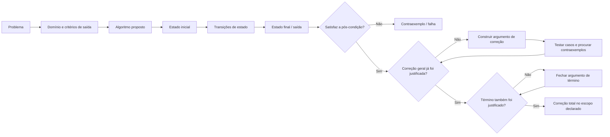

Leitura textual:

1. o problema define quais entradas pertencem ao domínio e o que conta como saída correta;
2. o algoritmo proposto define um procedimento para transformar uma instância em resultado;
3. a execução percorre estados por meio de transições;
4. o estado final deve satisfazer a pós-condição;
5. um único caso correto confirma apenas aquela instância;
6. um contraexemplo é suficiente para refutar uma afirmação universal de correção;
7. quando ainda falta uma justificativa geral, o argumento de correção e a busca por contraexemplos cumprem papéis diferentes: testes ajudam a encontrar falhas, mas não substituem a demonstração exigida pelo contrato;
8. para correção total, além da correção parcial, é necessário justificar o término para as entradas cobertas pela pré-condição.

### 2.3 Consulta rápida — conceito × pergunta × risco

| Conceito | Pergunta central | Função | Risco se ignorado |
|---|---|---|---|
| Problema | “Que relação entre entrada e saída deve ser satisfeita?” | definir correção | implementar o procedimento certo para o problema errado |
| Instância | “Qual entrada concreta estou analisando?” | tornar raciocínio verificável | generalizar a partir de exemplo insuficiente |
| Algoritmo | “Qual procedimento produz uma saída?” | transformar entrada em resultado | confundir ideia com sintaxe ou API |
| Estado | “O que é verdadeiro agora durante a execução?” | rastrear comportamento | não localizar onde a execução divergiu |
| Pré-condição | “O que deve valer antes?” | delimitar o contrato | julgar algoritmo fora do domínio assumido |
| Pós-condição | “O que deve valer ao terminar?” | reconhecer sucesso | confundir saída específica com propriedade correta |
| Invariante | “O que permanece verdadeiro nos pontos definidos?” | apoiar raciocínio de correção | validar apenas exemplos isolados |
| Variante/progresso | “O que aproxima a execução do término?” | raciocinar sobre finitude | criar loop/recursão sem progresso |
| Contraexemplo | “Existe entrada válida que quebra a afirmação?” | refutar correção | aceitar solução plausível sem estressá-la |
| Pseudocódigo | “Como expresso a ideia com precisão suficiente?” | comunicar algoritmo sem prender à sintaxe | esconder operações vagas atrás de aparência formal |
| Fluxograma | “A estrutura visual ajuda a ver decisões e fluxo?” | comunicar controle, caminhos e composição | usar forma/conector inadequado ou tratar o diagrama como prova de correção |
| Código | “Como esta linguagem realiza o procedimento?” | implementação concreta | confundir compilação/execução com correção |

### 2.4 Pergunta prática → mecanismo inicial

| Se você está pensando... | Comece por... |
|---|---|
| “Não sei exatamente o que seria uma resposta correta.” | escreva domínio, pré-condições e pós-condição antes do algoritmo |
| “Meu algoritmo funciona para estes exemplos.” | procure um contraexemplo pequeno e casos de fronteira |
| “A lista pode estar vazia?” | decida se vazio está fora da pré-condição ou se deve ser tratado pelo algoritmo |
| “O loop deveria terminar, mas não termina.” | identifique estado, condição de término e medida de progresso |
| “Não sei como inicializar o acumulador/máximo.” | escolha estado inicial que já satisfaça o invariante |
| “Pseudocódigo parece correto, mas não consigo implementar.” | procure operações vagas, mágicas ou sem contrato |
| “Duas saídas diferentes podem estar corretas?” | verifique se o problema permite múltiplas saídas válidas |
| “O programa executou sem erro.” | compare a saída com a pós-condição; execução não implica correção |
| “Quero provar que está errado.” | encontre uma instância válida cuja saída viole o contrato |
| “Quero comparar implementações em linguagens diferentes.” | preserve problema, contrato e estratégia; depois compare semântica concreta |

### 2.5 Não confundir

| Não confundir | Diferença |
|---|---|
| **Problema × algoritmo** | problema define o que é correto; algoritmo define como produzir uma saída |
| **Algoritmo × programa** | algoritmo é o procedimento abstrato suficientemente definido; programa é uma implementação executável em ambiente concreto |
| **Instância × problema geral** | instância é uma entrada concreta; problema descreve uma classe de entradas e saídas corretas |
| **Pré-condição × validação** | pré-condição é parte do contrato assumido; validação é uma estratégia de implementação para detectar/recusar entrada |
| **Pós-condição × saída de exemplo** | pós-condição é uma propriedade geral; exemplo é apenas uma instância |
| **Teste × prova/argumento de correção** | teste encontra evidência e falhas; não cobre automaticamente todo o domínio |
| **Finitude × “todo programa deve encerrar”** | algoritmo clássico costuma ser especificado para terminar; servidores e sistemas reativos podem ter execução contínua |
| **Determinismo × correção** | um algoritmo pode ser randomizado e ainda possuir contrato/correção adequados ao seu modelo |
| **Invariante × valor imutável** | invariante é uma propriedade preservada; variáveis individuais podem mudar |
| **Representação × algoritmo** | pseudocódigo, fluxograma e código são formas de expressar o procedimento, não o procedimento em si |
| **Linha de fluxo × conector** | a linha/seta liga diretamente etapas; o conector referencia a continuação do fluxo em outro ponto da mesma página ou em outra página |

### 2.6 Microexemplos canônicos

#### Exemplo A — inicialização que preserva o contrato

Problema:

```text
encontrar o maior valor de uma sequência não vazia
```

Inicialização frágil:

```text
max_so_far = 0
```

Contraexemplo:

```text
[-8, -2, -11]
```

Resultado incorreto:

```text
0
```

Inicialização coerente:

```text
max_so_far = values[0]
```

A diferença não é cosmética: a segunda inicialização começa com um valor pertencente ao domínio e permite estabelecer o invariante “`max_so_far` é o maior item já processado”.

#### Exemplo B — pré-condição não é a mesma coisa que `if`

Contrato:

```text
PRE: values não é vazio
POST: retorna o maior elemento de values
```

Duas implementações podem respeitar o mesmo problema de maneiras diferentes:

```text
A) o chamador garante a pré-condição
B) a função verifica vazio e sinaliza erro explicitamente
```

A pré-condição descreve o domínio assumido. O `if` é uma decisão de implementação.

#### Exemplo C — uma entrada pode admitir mais de uma saída correta

Problema conceitual:

```text
dada uma sequência que pode conter valores repetidos,
retorne uma posição em que o valor alvo ocorre
```

Contrato mínimo deste exemplo:

```text
PRE:
o valor alvo ocorre na sequência

POST:
result é uma posição válida da sequência
E
o elemento na posição result é igual ao valor alvo
```

A pré-condição mantém o foco deste exemplo nas **múltiplas posições válidas**. Se o problema também precisar cobrir alvo ausente, a especificação deve definir explicitamente uma saída para “não encontrado”.

Se o alvo aparece em várias posições, mais de uma resposta pode satisfazer a especificação. Um teste que exige uma única posição fixa pode estar testando uma implementação específica em vez do problema.

### 2.7 Problemas reais representativos

| ID | Problema | Capacidades centrais | Destino |
|---|---|---|---|
| `PR-T02-01` | transformar uma descrição de problema em contrato verificável | domínio, entrada, saída, pré/pós-condição | [Problemas Reais](#problemas-reais) |
| `PR-T02-02` | encontrar contraexemplo para algoritmo aparentemente correto | instância, correção, fronteira, contraexemplo | [Problemas Reais](#problemas-reais) |
| `PR-T02-03` | escolher inicialização que preserve o invariante | estado, inicialização, invariante | [Problemas Reais](#problemas-reais) |
| `PR-T02-04` | diagnosticar procedimento que não termina | estado, progresso, condição de término, variante | [Problemas Reais](#problemas-reais) |
| `PR-T02-05` | expressar algoritmo sem esconder operações vagas em pseudocódigo | precisão, representação, implementabilidade | [Problemas Reais](#problemas-reais) |
| `PR-T02-06` | validar uma solução quando o problema admite múltiplas saídas corretas | especificação, correção, oracle de teste | [Problemas Reais](#problemas-reais) |

### 2.8 Falha típica → primeira investigação

| Sintoma | Primeira investigação |
|---|---|
| funciona com positivos e falha com todos negativos | a inicialização criou estado que não pertence ao domínio? |
| falha apenas com coleção vazia | vazio viola a pré-condição ou falta tratamento explícito? |
| loop não termina | qual variável/estado deveria progredir e ela realmente progride? |
| pseudocódigo “parece” correto, mas ninguém consegue codificar | existe passo mágico ou operação não especificada? |
| teste rejeita uma saída que satisfaz a especificação | o problema admite múltiplas respostas válidas? |
| programa executa e produz valor plausível, mas errado | a pós-condição foi realmente verificada? |
| duas implementações diferem, mas ambas parecem razoáveis | estão resolvendo o mesmo problema/contrato ou especificações diferentes? |

Casos reproduzíveis completos aparecem em [🔎 Troubleshooting sistemático](#troubleshooting-sistematico).

### 2.9 Transferência entre Python, JavaScript, Java e Bash

Neste tópico, o que precisa permanecer entre linguagens é principalmente o **contrato e a estratégia**, não a aparência do código.

| Permanece | Pode mudar |
|---|---|
| problema | representação das coleções |
| domínio da entrada | sistema de tipos |
| pré/pós-condição | mecanismo de erro |
| estado conceitual | sintaxe e escopo |
| invariante | construção de loop |
| condição de término | detalhes de runtime |
| resultado conceitual | `return`, stdout, exit status etc. |

O exemplo de máximo deste capítulo materializa essa transferência nas quatro linguagens sem fingir que seus mecanismos de erro e retorno são idênticos.

<a id="modo-primeira-passagem"></a>

### 2.10 Modo primeira passagem × consulta × estudo completo

**Primeira passagem:**

```text
3–6   → problema, algoritmo e propriedades fundamentais
8–11  → estado, contrato, correção e término
14–17 → representações + exemplo progressivo
21.1–21.2 → dois LABs para fechar conceito e contraexemplo
22.1, 22.6, 22.11 → exercícios mínimos de verificação
```

A primeira passagem não substitui o restante do tópico. Ela existe para que o leitor construa o modelo mental central antes de retornar aos aprofundamentos, troubleshooting e prática completa.

**Consulta rápida:**

```text
2.3 → conceito × risco
2.4 → pergunta prática → mecanismo
2.5 → não confundir
2.6 → microexemplos
2.8 → primeira investigação de falha
24 → checklist de consulta rápida
```

**Estudo completo:**

```text
3–7  → problema, algoritmo, propriedades e fronteiras conceituais
8–13 → estado, contratos, correção, término, determinismo e invariantes
14–16 → representações, pseudocódigo e fluxograma
17–18 → exemplo progressivo e transferência entre linguagens
19–20 → erros e raciocínio sistemático
Problemas Reais → aplicação integrada
Troubleshooting → diagnóstico reproduzível
21–23 → LABs, exercícios e evidências de domínio
```

[↑ Voltar ao índice](#índice)

---

# 3. Problema computacional × algoritmo

Essa distinção é uma das mais importantes.

## 3.1 Problema

Um problema define:

```text
ENTRADAS POSSÍVEIS
+
CONDIÇÃO QUE UMA SAÍDA CORRETA DEVE SATISFAZER
```

Exemplo:

> **Problema MAXIMUM**

Entrada:

```text
sequência não vazia de números inteiros
```

Saída:

```text
um valor que seja maior ou igual a todos os elementos da sequência
e que pertença à sequência
```

Para:

```text
[7, 2, 9, 4]
```

a saída correta é:

```text
9
```

## 3.2 Algoritmo

Algoritmo é o procedimento proposto para resolver o problema. A análise de correção determina se esse procedimento de fato satisfaz a especificação.

Exemplo conceitual:

```text
max_so_far = first element

for each value after the first:
    if value > max_so_far:
        max_so_far = value

return max_so_far
```

## 3.3 Instância

Uma instância é uma entrada concreta:

```text
[7, 2, 9, 4]
```

Outra:

```text
[-8, -2, -11]
```

O problema é geral.

A instância é particular.

## 3.4 Por que essa distinção importa

Uma instância favorável não representa todo o problema. Um algoritmo defeituoso pode funcionar para `[7, 2, 9, 4]` e ainda violar a especificação em outra entrada válida.

O contraexemplo canônico deste capítulo — inicializar o máximo com `0` — aparece em forma compacta na [Visão Panorâmica](#26-microexemplos-canônicos) e é analisado em detalhe em [§10.6](#106-exemplo-de-algoritmo-incorreto). Em entradas formadas apenas por números negativos, essa inicialização pode produzir um valor que nem pertence à entrada.

A distinção importa porque **correção é uma propriedade em relação ao domínio especificado**, não ao conjunto pequeno de exemplos que por acaso foi testado.

## 3.5 Formulação do MIT 6.006

O MIT 6.006 apresenta um problema como uma relação entre entradas e saídas corretas e descreve algoritmo, no enquadramento determinístico introdutório do curso, como procedimento que mapeia cada entrada a uma saída.

Um algoritmo resolve o problema quando:

```text
PARA TODA ENTRADA VÁLIDA
→ produz uma saída correta
```

Essa formulação ajuda a separar:

```text
“funcionou neste teste”
```

de:

```text
“resolve o problema”
```

## 3.6 Um problema pode admitir mais de uma saída correta

Modelar um problema como uma **relação** é importante porque uma mesma entrada pode admitir mais de uma resposta correta.

Exemplo conceitual:

```text
problema:
    encontrar qualquer par de itens que satisfaça uma propriedade

entrada:
    pode conter vários pares válidos

saída correta:
    qualquer um dos pares que satisfaça a especificação
```

Logo, não confunda:

```text
PROBLEMA
→ pode admitir várias saídas corretas para a mesma entrada

ALGORITMO DETERMINÍSTICO
→ para um mesmo estado inicial/entrada, escolhe uma saída específica
```

O critério de correção não é “retornar exatamente o exemplo esperado”, mas produzir **uma saída pertencente ao conjunto permitido pela especificação**.

Essa distinção também explica por que testes devem comparar a propriedade exigida pelo problema quando a resposta correta não é única. Um caso operacional completo aparece em [`PR-T02-06`](#pr-t02-06), e a falha correspondente de um teste excessivamente específico é diagnosticada em [`TS-T02-05`](#ts-t02-05).

[↑ Voltar ao índice](#índice)

---

# 4. O que é um algoritmo

Uma definição operacional adequada para este guia:

> **Algoritmo é um procedimento computacional bem definido, composto por passos executáveis, destinado a transformar entradas pertencentes a um domínio em resultados que satisfaçam uma especificação.**

A definição precisa ser lida com cuidado.

## 4.1 “Procedimento”

Existe uma sequência ou estrutura de ações.

## 4.2 “Computacional”

Os passos precisam ser executáveis por um modelo de computação suficientemente definido.

Neste tópico, **modelo de computação** significa apenas um conjunto suficientemente claro de operações e estados que torna cada passo executável sem depender de uma instrução mágica ou ambígua. Um **passo executável**, neste modelo informal, é uma operação cuja entrada/estado relevante, transformação ou efeito e transição para o próximo estado podem ser determinados de maneira suficientemente precisa para a execução. Modelos formais de computação e modelos de custo ficam fora deste escopo e serão aprofundados posteriormente.

## 4.3 “Bem definido”

O significado de cada passo não pode depender de ambiguidade incompatível com a execução.

Ruim:

```text
escolha um número legal
```

Melhor:

```text
escolha o menor número positivo da coleção
```

se essa operação estiver definida.

## 4.4 “Entrada”

Muitos algoritmos recebem dados.

Mas não é necessário forçar a ideia de que todo algoritmo possui uma entrada fornecida pelo usuário.

A entrada pode vir de:

- argumento;
- arquivo;
- memória;
- sensor;
- estrutura já existente;
- estado inicial.

Alguns procedimentos podem operar sem entrada externa variável.

## 4.5 “Saída”

Resultado pode ser:

- valor;
- coleção;
- alteração de uma estrutura;
- decisão;
- caminho;
- ordenação;
- estado final.

## 4.6 “Classe de instâncias”

Um algoritmo interessante normalmente não é uma lista de passos criada apenas para:

```text
[7, 2, 9, 4]
```

Ele resolve uma classe:

```text
qualquer sequência válida pertencente ao domínio especificado
```

## 4.7 Algoritmo não é sinônimo de “fórmula”

Uma fórmula pode fazer parte de um algoritmo.

Exemplo:

```text
área = base * altura
```

é uma relação matemática.

Um procedimento que:

```text
recebe base e altura
valida o domínio
calcula
produz resultado
```

é uma descrição algorítmica mais completa.

[↑ Voltar ao índice](#índice)

---

# 5. Entrada, processamento e saída

O modelo IPO (*Input → Process → Output*) é simples, mas útil.

```text
INPUT
↓
PROCESS
↓
OUTPUT
```

## 5.1 Entrada

Descreva:

- quantidade;
- tipo conceitual;
- domínio;
- estrutura;
- restrições;
- validade.

Exemplo:

```text
sequência não vazia de inteiros
```

é melhor que:

```text
números
```

## 5.2 Processamento

É a transformação.

Pode envolver:

- atribuição;
- comparação;
- decisão;
- repetição;
- chamada;
- atualização de estado.

## 5.3 Saída

Defina propriedade esperada.

Para `MAXIMUM`:

```text
resultado ∈ entrada
E
para todo x da entrada:
    resultado >= x
```

Essa formulação é mais forte que:

```text
“retornar o maior”
```

porque explicita o critério.

Neste capítulo, muitos exemplos usam **valor retornado** por ser a forma mais simples de observar o resultado. Isso não limita a ideia de saída: uma especificação também pode exigir propriedades do **estado final modificado**, como uma coleção alterada *in-place*, um registro persistido ou outro efeito declarado pelo contrato. A pós-condição descreve o que precisa ser verdadeiro ao final, e não necessariamente apenas o conteúdo de um `return`.

## 5.4 Entrada válida × inválida

Um algoritmo pode trabalhar sob uma pré-condição:

```text
a sequência é não vazia
```

Se a entrada for vazia, há duas possibilidades de projeto:

1. a entrada viola o contrato e o algoritmo não é obrigado a produzir resultado;
2. a implementação decide detectar e reportar a violação.

Essas decisões não devem ser confundidas.

## 5.5 Transformação de estado

Processamento pode ser visto como:

```text
ESTADO_0
→ ESTADO_1
→ ESTADO_2
→ ...
→ ESTADO_FINAL
```

Isso conecta algoritmo com rastreamento e debugging.

[↑ Voltar ao índice](#índice)

---

# 6. Características de um algoritmo

A taxonomia canônica lista:

- clareza;
- precisão;
- finitude;
- ordem;
- determinismo quando aplicável;
- correção.

Este capítulo acrescenta **efetividade/executabilidade** como propriedade conceitual útil.

## 6.1 Clareza

O leitor deve compreender a intenção e os passos.

Clareza é parcialmente editorial.

Dois algoritmos podem ser corretos, mas um ser mais fácil de entender.

## 6.2 Precisão

Cada passo deve possuir significado suficientemente determinado.

```text
“repita algumas vezes”
```

é impreciso.

```text
“repita enquanto i < n”
```

é operacionalmente mais preciso, desde que `i` e `n` estejam definidos.

## 6.3 Ordem

A ordem pode alterar o resultado.

Exemplo:

```text
usar valor
→ depois inicializar
```

não é equivalente a:

```text
inicializar
→ depois usar
```

## 6.4 Finitude

Na definição clássica usada neste guia, o algoritmo deve terminar após número finito de passos para toda entrada que satisfaça as condições assumidas.

Isso NÃO significa que todo software precise terminar.

Servidores, event loops e sistemas reativos podem executar indefinidamente.

Nesse caso, é melhor distinguir:

```text
algoritmos finitos internos
+
processo/sistema de longa duração
```

## 6.5 Efetividade

Os passos precisam ser realizáveis no modelo de computação adotado.

Exemplo inadequado:

```text
“descubra instantaneamente a solução ótima de qualquer problema”
```

não descreve uma operação efetiva.

## 6.6 Correção

O resultado deve satisfazer a especificação para todas as entradas válidas.

## 6.7 Determinismo — quando aplicável

Em um algoritmo determinístico, o comportamento é determinado pela entrada e pelo estado inicial.

Mas **determinismo não é requisito universal de todo algoritmo moderno**.

Algoritmos randomizados usam escolhas aleatórias.

Por isso a taxonomia usa corretamente:

> **determinismo quando aplicável.**

## 6.8 Generalidade

Embora não seja necessário transformar “generalidade” em mais uma regra rígida, algoritmos normalmente resolvem uma classe de instâncias, e não apenas um exemplo concreto.

[↑ Voltar ao índice](#índice)

---

# 7. Algoritmo × programa × função × heurística

## 7.1 Algoritmo

Descrição do procedimento.

```text
conceitual
→ independente de uma implementação específica
```

## 7.2 Programa

Artefato executável em determinada linguagem/runtime.

Pode conter:

- vários algoritmos;
- I/O;
- configuração;
- tratamento de erro;
- interface;
- integração;
- persistência.

## 7.3 Função

Uma função é uma unidade de programa/abstração.

Ela pode implementar:

- um algoritmo inteiro;
- uma parte;
- uma operação simples;
- uma transformação que nem vale a pena chamar de algoritmo em sentido pedagógico.

## 7.4 Código

Código é uma representação em linguagem de programação.

```text
ALGORITMO
≠
CÓDIGO
```

## 7.5 Heurística

Heurística é uma estratégia prática que busca uma solução útil, frequentemente sem garantia de produzir a solução ótima ou exata em todos os casos.

Exemplo geral:

```text
escolher rapidamente uma boa alternativa
```

não é o mesmo que:

```text
provar que a alternativa é ótima
```

## 7.6 Receita

Receitas são analogias pedagógicas úteis porque possuem passos.

Mas algoritmos exigem precisão compatível com execução computacional.

“Tempere a gosto” é aceitável em culinária.

É uma instrução inadequada para execução automática sem modelagem adicional.

## 7.7 Especificação

Especificação diz **o que** precisa ser verdadeiro.

Algoritmo descreve **como** produzir um resultado; a análise de correção determina se esse procedimento realmente satisfaz a especificação.

[↑ Voltar ao índice](#índice)

---

# 8. Estado de execução

Estado é a informação relevante sobre a execução em determinado momento.

Pode incluir:

```text
valores atuais
+
estruturas de dados
+
posição no fluxo
+
dados auxiliares
```

## 8.1 Estado inicial

Situação antes dos passos principais.

Para `MAXIMUM`:

```text
values = [7, 2, 9, 4]
max_so_far = 7
```

## 8.2 Estado intermediário

Após processar parte da entrada.

| Elemento processado | `max_so_far` |
|---|---:|
| `7` | `7` |
| `2` | `7` |
| `9` | `9` |
| `4` | `9` |

## 8.3 Estado final

Ao terminar:

```text
max_so_far = 9
```

## 8.4 Transição de estado

Uma instrução transforma estado.

```text
antes:
max_so_far = 7

processar 9

depois:
max_so_far = 9
```

## 8.5 Controle também faz parte do estado

Em um rastreamento, não basta conhecer valores.

Também importa:

```text
qual passo?
qual iteração?
qual condição?
qual chamada?
```

## 8.6 Estado observável × estado conceitual

Pseudocódigo pode omitir detalhes irrelevantes do runtime.

A abstração do algoritmo precisa preservar apenas o estado necessário para explicar o comportamento.

**Estado conceitual não exige mutação in-place.** Em um estilo imperativo, `max_so_far` pode ser atualizado na mesma variável; em um estilo funcional, cada passo pode produzir um novo valor/estado. O contrato e o invariante descrevem **propriedades da computação**, não obrigam uma estratégia específica de armazenamento ou mutação.

[↑ Voltar ao índice](#índice)

---

# 9. Pré-condições e pós-condições

**Classificação curricular:** `[C] Obrigatório conhecer`

## 9.1 Pré-condição

É uma propriedade esperada **antes** da execução.

Para `MAXIMUM`:

```text
PRE:
values possui pelo menos um elemento
```

Podemos acrescentar:

```text
todos os elementos podem ser comparados pela relação usada
```

## 9.2 Pós-condição

É uma propriedade esperada **depois** da execução correta.

```text
POST:
result pertence a values

E

para todo x em values:
    result >= x
```

A pós-condição pode falar sobre um **resultado retornado**, como acima, ou sobre propriedades do **estado final** produzido pelo procedimento. O contrato é que determina qual observação importa.

Quando o procedimento altera algo observável além do valor retornado — por exemplo, uma estrutura *in-place*, um arquivo, um registro persistido ou outro recurso externo — essa alteração pode ser descrita como **efeito colateral (*side effect*)**. Para raciocinar corretamente, o efeito relevante precisa aparecer no contrato/pós-condição em vez de ficar implícito.

## 9.3 Contrato

Modelo:

```text
PRE
↓
ALGORITMO
↓
POST
```

Leitura:

> se a pré-condição vale no estado inicial e a execução termina, a pós-condição deve valer no estado final para que o procedimento seja correto em relação a esse contrato.

Essa leitura corresponde ao núcleo da **correção parcial**; a [§10.5](#105-correção-parcial--correção-total-e) separa explicitamente correção parcial de **correção total**, que também exige justificar o término.

## 9.4 Pré-condição não é validação

Estas duas ideias são diferentes:

### Contrato conceitual

```text
PRE: coleção não vazia
```

### Implementação defensiva

```text
if collection is empty:
    signal error
```

Uma implementação pode verificar a pré-condição.

Mas a existência da pré-condição independe da verificação.

Quando uma API decide rejeitar entradas fora do contrato, **falhar cedo (*fail fast*)** com uma mensagem/exceção clara costuma melhorar o diagnóstico. `if`, exceções, asserções e mecanismos de *Design by Contract* são formas possíveis de materializar essa política; nenhum deles substitui a definição conceitual da pré-condição. Em particular, uma asserção pode servir a verificação interna e não deve ser confundida automaticamente com validação de entrada externa.

<a id="95-pos-condicao-nao-e-saida-de-exemplo"></a>
<a id="95-postcondição-não-é-saída-de-exemplo"></a>

## 9.5 Pós-condição não é “saída de exemplo”

```text
entrada: [7, 2, 9, 4]
saída: 9
```

é um exemplo.

```text
resultado é um elemento da coleção
e nenhum elemento é maior que resultado
```

é uma propriedade geral.

## 9.6 Por que contratos ajudam

Eles ajudam a:

- definir domínio;
- criar testes;
- identificar casos inválidos;
- argumentar sobre correção;
- separar responsabilidade de chamador × algoritmo.

[↑ Voltar ao índice](#índice)

---

# 10. Correção

Um algoritmo correto não é simplesmente um algoritmo que “parece funcionar”.

## 10.1 Correção para uma instância

Se:

```text
entrada = [7, 2, 9, 4]
```

e:

```text
resultado = 9
```

essa execução satisfaz o problema para essa instância.

## 10.2 Correção geral

Para o caso **determinístico/exato** usado como modelo principal neste capítulo, dizer que o algoritmo resolve o problema exige justificar que:

```text
PARA TODA ENTRADA VÁLIDA
→ o resultado satisfaz a especificação
```

Algoritmos randomizados exigem declarar a garantia apropriada em vez de transportar mecanicamente essa formulação. Alguns usam aleatoriedade apenas no caminho/custo e ainda retornam sempre uma resposta correta; outros trabalham com uma probabilidade de erro explicitamente limitada. O ponto fundamental permanece: **a garantia de correção precisa fazer parte do contrato analisado**.

## 10.3 Teste ≠ prova

Testes podem revelar bugs.

Testes não demonstram automaticamente correção para um domínio infinito.

```text
100 testes passaram
```

não significa logicamente:

```text
todas as entradas possíveis estão corretas
```

Ainda assim, testes são fundamentais para software real.

## 10.4 Argumento de correção

No nível introdutório, um argumento pode ser informal, mas precisa justificar a propriedade **para todas as entradas/estados cobertos pela pré-condição**, não apenas para uma instância favorável. A cadeia típica conecta:

```text
estado inicial
→ transformação
→ propriedade preservada
→ estado final
→ pós-condição
```

## 10.5 Correção parcial × correção total `[E]`

Uma distinção clássica:

### Correção parcial

Sob um contrato `PRE → POST`, correção parcial significa:

> **se a pré-condição vale no estado inicial e o algoritmo termina, então a pós-condição vale no estado final.**

A correção parcial, sozinha, **não garante que o algoritmo termine**.

### Correção total

Correção total combina a garantia acima com término:

```text
PRE satisfeita
+
execução termina
+
POST satisfeita no estado final
```

Em outras palavras, para todas as entradas/estados cobertos pela pré-condição, o procedimento termina e produz um estado final que satisfaz a pós-condição.

Essa distinção mostra por que:

```text
resultado correto
```

e:

```text
terminação
```

são preocupações separadas.

O loop infinito de §11.2 torna essa diferença concreta: a **correção parcial** afirma o que deve acontecer *caso* exista término; ela não demonstra que o estado final será alcançado. Para **correção total**, é necessário fechar também o argumento de término.

## 10.6 Exemplo de algoritmo incorreto

```text
max = 0

for each x:
    if x > max:
        max = x
```

Falha em:

```text
[-8, -2, -11]
```

O erro está no estado inicial.

A implementação pode estar perfeitamente fiel a esse algoritmo e continuar errada.

[↑ Voltar ao índice](#índice)

---

# 11. Término e finitude

## 11.1 Um algoritmo clássico precisa terminar

Para cada entrada válida:

```text
PASSOS FINITOS
↓
RESULTADO
```

## 11.2 Loop infinito

Exemplo:

```text
i = 0

enquanto i < 10:
    mostrar i
```

Se `i` nunca muda, o algoritmo não progride para a condição de término.

## 11.3 Variante de loop `[E]`

Uma técnica de raciocínio é identificar uma **medida de progresso** que pertence a um conjunto bem fundado e diminui estritamente rumo ao término. No caso introdutório mais comum, basta trabalhar com um inteiro natural/não negativo.

Considere, por exemplo, um percurso finito em que `n` representa a quantidade total de elementos e `i` representa quantos elementos já foram processados:

```text
i = 0

while i < n
    processar elemento i
    i = i + 1
```

Uma variante natural para esse loop é:

```text
restante = n - i
```

Sob o invariante `0 <= i <= n`, temos:

```text
restante é um inteiro >= 0
+
a cada iteração, restante diminui estritamente
```

Como não existe uma sequência infinita de inteiros não negativos estritamente decrescente, a medida não pode diminuir para sempre. Quando chega ao valor associado à condição de saída, o loop termina.

> Apenas dizer “a medida diminui e possui limite inferior” é insuficiente em domínios contínuos: uma sequência real pode diminuir indefinidamente aproximando-se de um limite. O argumento precisa da propriedade de progresso adequada ao domínio usado.

## 11.4 Recursão

Para recursão, normalmente precisamos de:

```text
caso-base
+
redução do problema
```

Sem progresso:

```text
f(n)
→ f(n)
```

não há razão para terminar.

## 11.5 Programa que nunca termina pode estar correto?

Depende do contrato.

Um servidor:

```text
aguarda requisições
```

pode ser projetado para permanecer ativo.

Não trate automaticamente o servidor inteiro como um único algoritmo finito com uma saída final obrigatória.

Um servidor **pode** permanecer ativo enquanto executa repetidamente procedimentos finitos para tratar eventos ou requisições, por exemplo:

```text
receber requisição
→ processar
→ responder
```

O processo global pode continuar ativo mesmo quando cada tratamento individual possui início, progresso e término próprios.

**Extensão `[E]` — online × offline:** não confunda “processo de longa duração” com “algoritmo online”. Um algoritmo **offline** recebe a sequência inteira de entradas antecipadamente; um algoritmo **online** processa entradas à medida que elas chegam e precisa tomar decisões sem necessariamente conhecer o restante da sequência. Um servidor pode executar algoritmos online, offline ou ambos; são classificações diferentes.

Microexemplo:

```text
OFFLINE
→ receber a coleção values completa
→ calcular MAXIMUM(values)

ONLINE
→ receber um valor por vez de um stream
→ após o primeiro valor, manter current_max conforme os demais chegam
→ não pressupor que o restante da sequência já seja conhecido
```

[↑ Voltar ao índice](#índice)

---

# 12. Determinismo e algoritmos randomizados

## 12.1 Determinístico

Com o mesmo estado inicial e entrada:

```text
mesmas decisões
→ mesmo comportamento
```

Exemplo:

```text
busca linear determinística
```

## 12.2 Randomizado

Algoritmo randomizado usa aleatoriedade como parte da execução.

O mesmo input pode gerar:

- caminhos diferentes;
- tempos diferentes;
- e, conforme o tipo de algoritmo, resultados diferentes segundo a garantia probabilística declarada.

A presença de aleatoriedade, por si só, não autoriza resposta arbitrária. A especificação deve deixar claro se a correção é sempre garantida ou se existe probabilidade de erro controlada.

**Extensão `[E]`:** duas categorias clássicas ajudam a nomear essas garantias:

- **Las Vegas:** produz resultado correto; a aleatoriedade afeta principalmente o caminho e/ou o tempo de execução;
- **Monte Carlo:** pode admitir probabilidade de erro controlada conforme o contrato/análise.

Esses rótulos são apenas uma primeira orientação; análise probabilística formal fica fora do escopo do T02.

## 12.3 Randomização não significa “sem regras”

Um algoritmo randomizado ainda possui:

- contrato;
- operações;
- análise;
- propriedade de correção apropriada.

## 12.4 Exemplo conceitual

Randomized quicksort pode escolher pivô aleatoriamente.

A escolha do pivô varia.

O objetivo continua:

```text
produzir a sequência ordenada
```

## 12.5 Por que esta seção existe aqui?

Para evitar transformar:

> “algoritmos são determinísticos”

em dogma incorreto.

A característica curricular correta é:

> **determinismo quando aplicável.**

[↑ Voltar ao índice](#índice)

---

# 13. Invariantes — primeira introdução

**Classificação curricular:** `[C] Obrigatório conhecer` — introdução neste capítulo; aprofundamento posterior.

Um invariante é uma propriedade que permanece verdadeira em pontos determinados da execução.

Para `MAXIMUM`:

> antes de processar o próximo elemento, `max_so_far` é o maior valor entre os elementos já processados.

## 13.1 Exemplo

Entrada:

```text
[7, 2, 9, 4]
```

A propriedade que queremos preservar é:

> antes de processar o próximo elemento, `max_so_far` é o maior valor do prefixo já processado.

Após a inicialização `max_so_far = values[0]`, e **antes da primeira iteração**, o prefixo processado é `[7]`; portanto, o invariante já precisa ser verdadeiro nesse ponto.

| Prefixo já processado | Próximo valor | `max_so_far` antes | Atualização | `max_so_far` depois | Invariante preservado? |
|---|---:|---:|---|---:|---|
| `[7]` — após inicialização | `2` | `7` | nenhuma | `7` | sim |
| `[7, 2]` | `9` | `7` | `9 > 7` → atualizar | `9` | sim |
| `[7, 2, 9]` | `4` | `9` | nenhuma | `9` | sim |
| `[7, 2, 9, 4]` | — | `9` | percurso encerrado | `9` | sim; o prefixo é a entrada inteira |

A tabela torna explícito que a variável pode mudar, enquanto a **propriedade sobre o estado** permanece verdadeira nos pontos definidos do loop.

## 13.2 Estrutura clássica de prova com invariante

CLRS organiza o raciocínio em:

```text
INICIALIZAÇÃO
→ a propriedade vale antes da primeira iteração

MANUTENÇÃO
→ se vale antes de uma iteração,
  continua valendo antes da próxima

TÉRMINO
→ ao terminar, a propriedade ajuda a obter a pós-condição
```

A ligação final é essencial: quando o loop termina, a região/parte já processada precisa coincidir com aquilo que a pós-condição descreve. No `MAXIMUM`, o prefixo processado passa a ser a sequência inteira; portanto, o invariante preservado durante o percurso torna-se exatamente a propriedade necessária para concluir que `max_so_far` é o máximo da entrada.

## 13.3 Não confundir invariante com “variável que não muda”

A própria variável `max_so_far` pode mudar.

O que permanece é a **propriedade**:

```text
max_so_far = máximo do prefixo processado
```

## 13.4 Por que invariantes importam

Eles conectam:

```text
ESTADO
+
LOOP
+
CORREÇÃO
```

e serão retomados em algoritmos e análise.

[↑ Voltar ao índice](#índice)

---

# 14. Representações de algoritmos

O mesmo algoritmo pode ser representado em formas diferentes.

## 14.1 Linguagem natural

Exemplo:

> Assuma o primeiro elemento como maior. Compare os demais um a um e substitua o maior atual sempre que encontrar valor superior.

Vantagem:

- fácil introdução.

Risco:

- ambiguidade.

## 14.2 Linguagem natural estruturada

```text
PRE: a sequência recebida possui pelo menos um elemento.

1. Definir o primeiro como maior atual.
2. Percorrer os elementos restantes.
3. Atualizar o maior quando encontrar valor superior.
4. Retornar o maior.
```

A linha `PRE` delimita o domínio assumido; ela **não é uma etapa de validação defensiva**. Se uma implementação decidir aceitar entrada externa e rejeitar vazio explicitamente, essa política deve ser especificada e implementada à parte, como discutido em §9.4.

## 14.3 Pseudocódigo

```text
MAXIMUM(values)

    PRE: length(values) > 0
    POST: result is an element of values
          and for every x in values, result >= x

    max_so_far = values[0]

    for each value after the first in values
        if value > max_so_far
            max_so_far = value

    return max_so_far
```

## 14.4 Fluxograma

Fluxograma é uma representação gráfica do fluxo de um procedimento. Ele é especialmente útil quando a forma visual ajuda a perceber:

- sequência;
- entrada e saída;
- decisões e caminhos alternativos;
- repetição;
- continuidade entre trechos;
- chamada de um subprocesso.

O fluxograma **não é o algoritmo em si** e não prova correção. Ele expressa visualmente uma lógica que também poderia ser descrita em linguagem estruturada ou pseudocódigo.

A notação, os símbolos, os conectores, as regras de construção e a conversão entre fluxograma e pseudocódigo são desenvolvidos na [§16](#16-fluxograma).

## 14.5 Código

É uma implementação em linguagem concreta.

## 14.6 Representação ≠ algoritmo

Pseudocódigo e código podem representar o mesmo algoritmo.

Também é possível escrever duas implementações que resolvem o mesmo problema com algoritmos diferentes.

[↑ Voltar ao índice](#índice)

---

# 15. Pseudocódigo

Pseudocódigo busca expressar lógica sem prender a explicação à sintaxe de uma linguagem específica.

## 15.1 Não existe uma gramática universal

Você encontrará diferenças como:

```text
IF
THEN
ENDIF
```

ou:

```text
SE
ENTÃO
FIMSE
```

ou indentação.

Portanto:

> **não trate pseudocódigo como uma quinta linguagem de programação padronizada.**

## 15.2 Propriedades desejáveis

Pseudocódigo deve ser:

- legível;
- consistente;
- não ambíguo no ponto importante;
- independente de detalhes irrelevantes;
- próximo o bastante de operações computacionais.

## 15.3 Convenções deste material

Exemplo:

```text
ALGORITHM NAME(input)

    PRE: ...
    POST: ...

    state = ...

    for each item in input
        if condition
            update state

    return state
```

`PRE` e `POST` são **anotações de contrato**, não instruções executáveis. Mantê-las antes do corpo evita sugerir que a pós-condição seria um passo executado depois de `return`.

## 15.4 Pseudocódigo pode ser mais abstrato que código

Podemos escrever:

```text
for each value
```

sem decidir:

- índice;
- iterator;
- `for...of`;
- enhanced `for`;
- expansão shell.

Essa decisão pertence à implementação.

## 15.5 Cuidado com “mágica”

Ruim:

```text
encontre a solução ótima
```

se justamente essa é a parte difícil do problema.

Pseudocódigo pode abstrair sintaxe.

Não deve esconder o problema computacional central.

**Built-ins e bibliotecas não são “mágica”.** Em código de produção, uma operação como `max(values)` pode ser a escolha idiomática porque a biblioteca já encapsula um procedimento com contrato conhecido. Neste capítulo, o percurso é expandido de propósito para tornar visíveis estado, comparação, invariante e término. O problema surge quando uma operação é invocada **sem contrato conhecido** ou quando ela esconde justamente a etapa que deveria ser projetada/analisada.

## 15.6 Farrell: pseudocódigo × fluxograma

*Programming Logic and Design* apresenta pseudocódigo e fluxograma como duas representações possíveis da mesma lógica e observa que normalmente não é necessário criar ambas para todo problema.

A escolha deve servir à compreensão.

[↑ Voltar ao índice](#índice)

---

# 16. Fluxograma

Fluxograma representa graficamente **passos e caminhos de controle** de um procedimento.

No escopo deste guia, ele é estudado como ferramenta para raciocinar e comunicar algoritmos — não como linguagem de programação, não como prova de correção e não como substituto de uma especificação.

A ISO 5807:1985 é a referência internacional publicada para símbolos e convenções de documentação de fluxogramas de dados, programas e sistemas. A página pública da ISO registra a norma como publicada e confirmada, com última revisão e confirmação em 2019, e informa que esta versão permanece vigente; o conteúdo integral, porém, não é exposto gratuitamente. Por isso, a tabela deste capítulo é o **vocabulário curricular canônico do Guia**, construído para programação a partir de convenções consolidadas e fontes efetivamente verificadas; ela **não afirma reproduzir integralmente o catálogo normativo da ISO**.

## 16.1 O que é — e o que não é

Um fluxograma responde visualmente a perguntas como:

```text
onde começa?
↓
qual operação acontece agora?
↓
existe entrada ou saída?
↓
há uma decisão?
↓
qual caminho é seguido?
↓
há repetição?
↓
o fluxo continua em outro ponto?
↓
quando termina?
```

Não confunda:

```text
ALGORITMO
→ procedimento que resolve um problema segundo um contrato

FLUXOGRAMA
→ uma representação gráfica desse procedimento
```

Dois fluxogramas visualmente diferentes podem representar a mesma lógica. Inversamente, um fluxograma pode estar graficamente bem formado e ainda descrever um algoritmo incorreto.

## 16.2 Anatomia — nós, linhas de fluxo e caminhos

Um fluxograma de programa pode ser lido como uma composição de:

```text
NÓS
→ representam eventos, operações, dados, decisões ou referências

LINHAS DE FLUXO
→ conectam diretamente os nós e indicam direção

CAMINHOS
→ sequências possíveis de nós percorridas durante a execução

CONECTORES / REFERÊNCIAS
→ indicam que o fluxo continua em outro ponto sem exigir uma linha longa atravessando o diagrama
```

Uma **decisão** cria caminhos alternativos. Uma **repetição** aparece quando um caminho retorna a um ponto anterior sob uma condição. Um **subprocesso** representa um conjunto de passos cuja lógica detalhada está definida separadamente.

Sempre que possível, mantenha uma orientação predominante — por exemplo, de cima para baixo ou da esquerda para a direita — para reduzir ambiguidade de leitura.

## 16.3 Tabela canônica de símbolos

A tabela abaixo é a única referência detalhada de símbolos deste tópico. Panorama, LABs, exercícios e glossário remetem a ela em vez de repetir as definições.

| Classe | Símbolo | Forma conceitual | Função / quando usar | Representação no Mermaid deste Guia |
|---|---|---|---|---|
| **Essencial** | Terminal | estádio / retângulo arredondado | marcar início ou fim de um fluxo | `([Início])`, `([Fim])` |
| **Essencial** | Processo | retângulo | cálculo, atribuição, transformação ou operação | `[Calcular total]` |
| **Essencial** | Entrada/Saída | paralelogramo | receber dados ou produzir/exibir dados | `[/Ler n/]`, `[/Exibir resultado/]` |
| **Essencial** | Decisão | losango | avaliar condição e selecionar caminho | `{n > 0?}` |
| **Essencial** | Linha de fluxo | linha com direção / seta | ligar diretamente etapas e indicar sequência | `A --> B` |
| **Estrutural** | Conector na página | pequeno círculo identificado | continuar o fluxo em outro ponto da mesma página sem linha longa ou cruzamento excessivo | `((A))`, usando o mesmo identificador visual no ponto de continuação |
| **Estrutural** | Conector fora da página | marcador de referência para outra página | indicar continuação em outra página/diagrama | não há mapeamento semântico 1:1 adotado pelo Guia; use marcador rotulado e indicação textual explícita |
| **Estrutural** | Processo predefinido / subprocesso | retângulo com marcação lateral | chamar procedimento/módulo cuja lógica é definida separadamente | `[[VALIDAR ENTRADA]]` ou shape `subprocess` quando necessário |
| **Complementar** | Documento | base ondulada | indicar documento produzido ou utilizado | shape `doc` |
| **Complementar** | Múltiplos documentos | documentos empilhados | representar conjunto de documentos | shape `docs` |
| **Complementar** | Entrada manual | quadrilátero de entrada manual | distinguir dado digitado/fornecido manualmente quando isso é relevante | shape `manual-input` |
| **Complementar** | Preparação / inicialização | hexágono | destacar preparação, configuração ou inicialização quando a distinção melhora a leitura | shape `prepare` |
| **Complementar** | Armazenamento / banco de dados | forma de armazenamento, frequentemente cilindro para banco | representar persistência quando ela é parte relevante do algoritmo/sistema | shape `database` ou outra forma de armazenamento apropriada |
| **Complementar** | Display | forma de exibição | distinguir saída em tela quando essa distinção é relevante | shape `display` |
| **Complementar** | Anotação / comentário | anotação associada ao fluxo | acrescentar explicação que não é uma etapa executada | shape `comment` |
| **Complementar** | Atraso / espera | forma de delay | explicitar espera quando ela faz parte do comportamento modelado | shape `delay` |

As formas complementares servem principalmente para **reconhecimento e escolha consciente**. Em lógica de programação, não é objetivo decorar catálogos extensos de símbolos especializados.

> **Regra:** use a forma mais específica somente quando a distinção acrescentar informação. Um diagrama não melhora por possuir mais tipos de símbolos.

### Visualização das formas no renderer do Guia

As formas abaixo mostram como o Mermaid 11.17.2 materializa os símbolos que possuem correspondência direta usada neste capítulo:

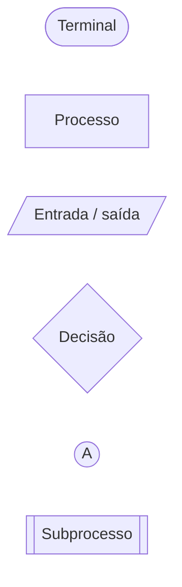

Símbolos complementares com mapeamento direto na versão local:

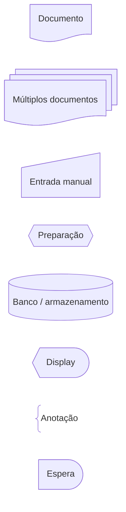

Esses desenhos demonstram a **implementação gráfica deste site**. O significado conceitual continua sendo o definido na tabela, e não o nome interno da API do Mermaid.

## 16.4 Núcleo essencial — como combinar forma e função

O fluxo abaixo materializa os cinco elementos essenciais sem ainda introduzir conectores ou subprocessos:

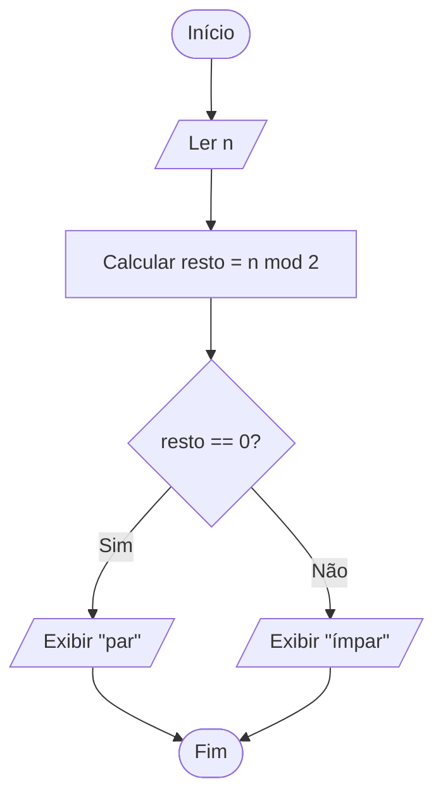

Leitura:

1. **terminal** inicia o procedimento;
2. **entrada/saída** recebe `n`;
3. **processo** calcula o resto da divisão por `2`;
4. **decisão** escolhe o caminho conforme o resto;
5. **entrada/saída** apresenta `par` ou `ímpar`;
6. ambos os caminhos convergem para o **terminal** final;
7. as **linhas de fluxo** tornam a ordem e a direção explícitas.

Dentro da convenção adotada neste Guia, mantenha **forma e função consistentes**. Se “Ler `n`” for desenhado como processo genérico, por exemplo, a lógica ainda pode ser compreensível, mas a notação perde precisão comunicativa. Em ferramentas ou organizações externas, confirme a convenção usada antes de interpretar uma forma isoladamente.

## 16.5 Conectores — linha de fluxo ≠ referência

Uma linha de fluxo conecta diretamente duas etapas:

```text
A ─────→ B
```

Um conector representa **continuidade lógica sem desenhar essa ligação longa diretamente**.

### Conector na mesma página

É útil quando uma ligação atravessaria grande parte do diagrama ou criaria cruzamentos difíceis de seguir.

Exemplo conceitual:

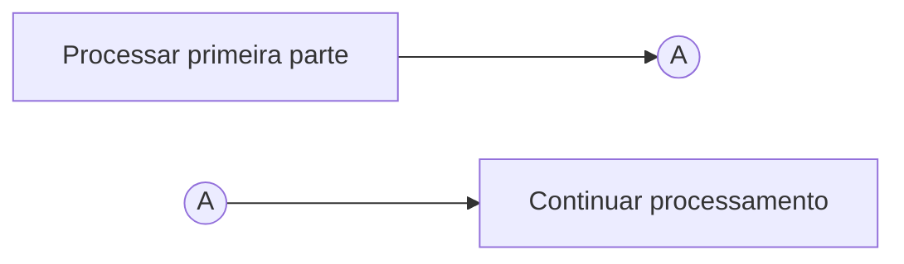

Os marcadores `A` representam os dois pontos correspondentes da mesma continuidade. Eles **não são duas etapas executáveis**.

### Conector fora da página

Indica que o fluxo continua em outra página ou outro diagrama. Ferramentas de desenho podem oferecer uma **forma dedicada de referência fora da página**; no Visio, por exemplo, a referência pode ligar duas páginas e ter sua aparência configurada como saída, entrada, círculo ou seta.

Para reconhecimento conceitual neste Guia, leia um marcador rotulado assim:

```text
PÁGINA A                              PÁGINA B

[Processar]                           [Continuar]
     |                                     ^
     v                                     |
[REF FORA: B]   ··· continuidade ···   [REF DE: A]
```

Os dois marcadores representam **a mesma continuidade lógica entre páginas**; eles não são etapas executáveis.

No Mermaid usado pelo Guia, não force um shape que possua outro significado apenas para imitar uma geometria tradicional. Quando a continuidade entre páginas precisar ser documentada:

```text
1. identifique claramente a página/destino;
2. use marcadores rotulados e pareados;
3. escreva que se trata de continuidade fora da página;
4. mantenha a correspondência inequívoca entre origem e destino.
```

Portanto:

```text
SETA / LINHA DE FLUXO
→ conexão direta

CONECTOR NA PÁGINA
→ referência para outro ponto da mesma página

CONECTOR FORA DA PÁGINA
→ referência para outra página/diagrama
```

## 16.6 Processo predefinido / subprocesso

Um subprocesso encapsula uma sequência que já possui definição própria.

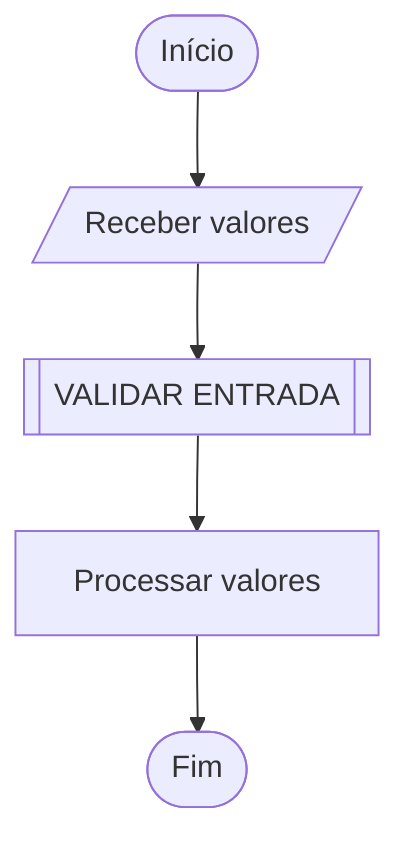

`VALIDAR ENTRADA` não significa “mágica”. Significa que existe outro procedimento com contrato conhecido que define o que essa chamada realiza.

Isso prepara uma ponte para modularização:

```text
FLUXOGRAMA
→ processo predefinido / subprocesso

PSEUDOCÓDIGO
→ chamada de procedimento/função

CÓDIGO
→ chamada concreta conforme linguagem/API
```

Não use subprocesso para esconder justamente a parte do algoritmo que deveria ser explicada. A regra de §15.5 sobre operações mágicas continua válida.

## 16.7 Símbolos complementares e fronteira de escopo

Documento, múltiplos documentos, entrada manual, preparação, armazenamento, display, anotação e atraso aparecem em ferramentas e diagramas reais. Eles são úteis quando o **tipo de interação** importa para a compreensão.

Exemplo:

```text
“obter valor”
```

pode ser suficiente num algoritmo abstrato.

Em outro contexto, distinguir:

```text
entrada manual
→ leitura de banco de dados
→ documento produzido
→ exibição em tela
```

pode evitar uma ambiguidade importante.

A fronteira curricular deste tópico é deliberada:

```text
DOMINAR
→ símbolos essenciais
→ conectores
→ subprocesso
→ composição de sequência, seleção e repetição

RECONHECER E SABER ESCOLHER QUANDO NECESSÁRIO
→ símbolos complementares

FORA DO ESCOPO
→ catálogos especializados de BPMN, UML, DFD, hardware ou processos administrativos
```

## 16.8 Sequência

Na sequência, cada etapa leva à próxima sem escolha de caminho.

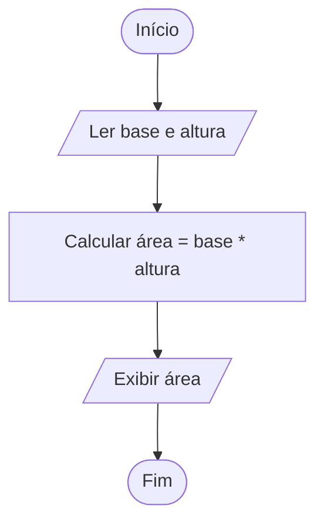

A principal pergunta é:

> **a ordem dos passos está explícita e corresponde ao algoritmo?**

## 16.9 Seleção / decisão

Seleção exige pelo menos uma condição e caminhos compatíveis com seus resultados.

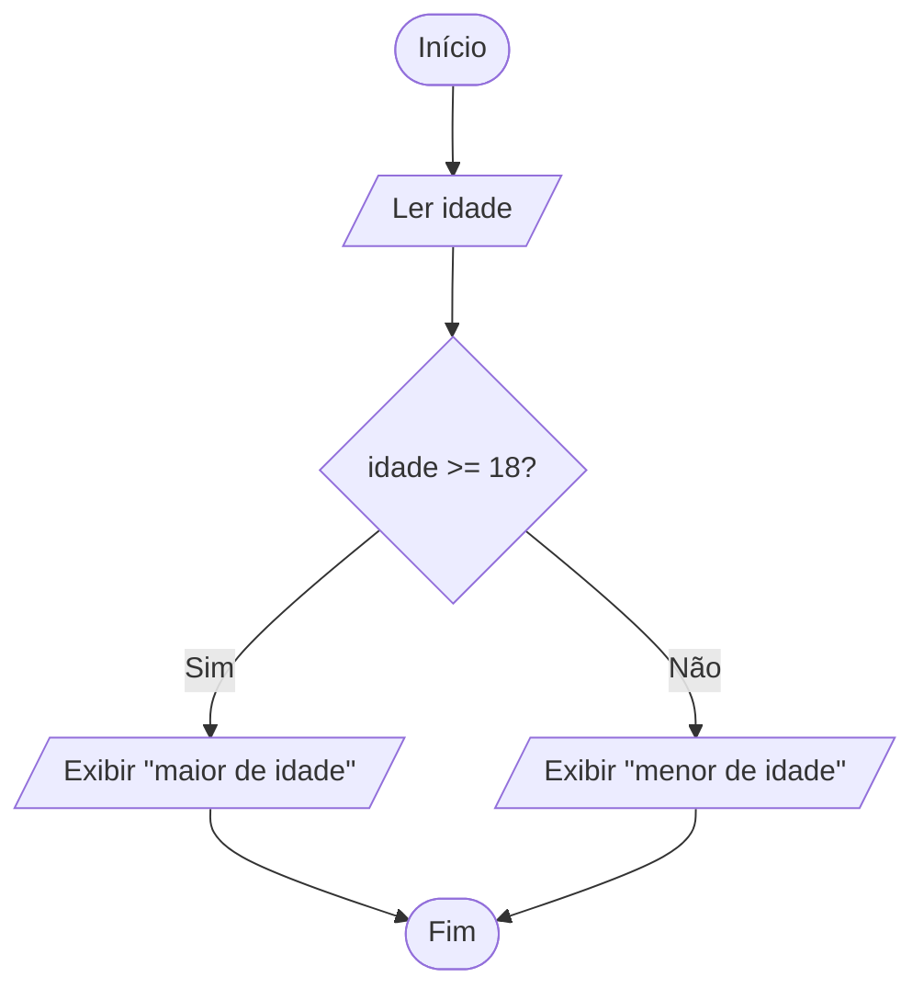

Boas práticas:

- formule a condição de modo verificável;
- rotule as saídas (`Sim`/`Não`, `Verdadeiro`/`Falso` ou equivalentes);
- garanta que cada caminho tenha continuidade definida;
- confirme se os caminhos voltam a convergir ou terminam separadamente.

## 16.10 Repetição

Repetição surge quando um caminho retorna a uma etapa anterior enquanto uma condição permitir.

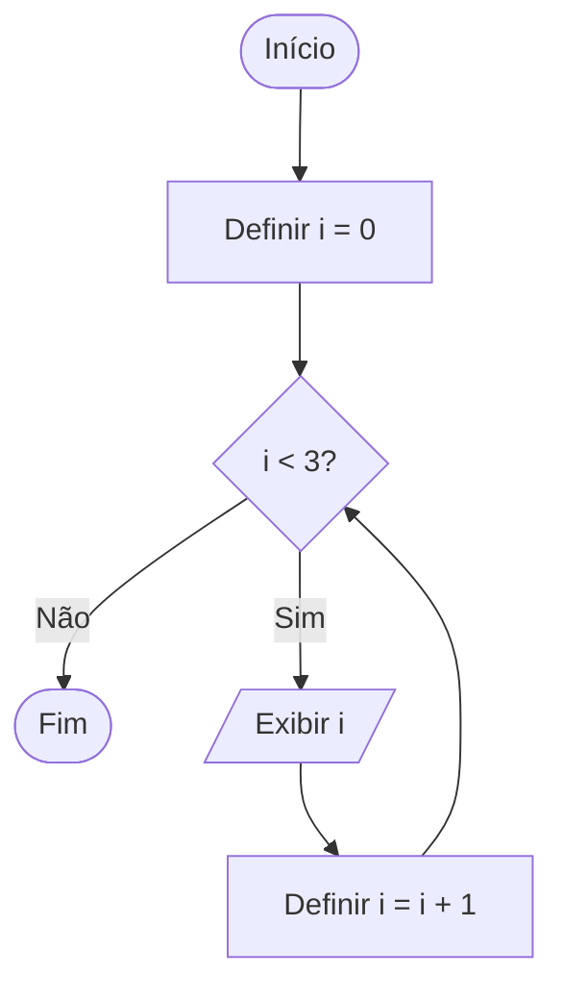

O retorno visual precisa corresponder a **progresso real**. Se `i` não fosse atualizado, o diagrama poderia representar um loop infinito tão claramente quanto o pseudocódigo defeituoso de §11.2.

## 16.11 Regras de construção e legibilidade

Ao construir ou revisar um fluxograma de algoritmo:

1. identifique início e término;
2. escolha uma direção predominante de leitura;
3. use linhas de fluxo com direção inequívoca;
4. use o símbolo de acordo com a função da etapa;
5. rotule as saídas de decisões;
6. não deixe caminhos sem destino;
7. evite cruzamentos e linhas excessivamente longas;
8. use conectores quando eles reduzirem ruído visual;
9. pareie conectores com identificadores inequívocos;
10. use subprocessos para encapsular lógica já definida — não para esconder o problema central;
11. mantenha granularidade consistente: não misture “somar 1” com “resolver todo o problema” no mesmo nível;
12. preserve a equivalência com o contrato e com outras representações do algoritmo;
13. divida diagramas grandes quando a visualização deixar de ajudar.

Evite a conclusão incorreta:

```text
DIAGRAMA BONITO
=
ALGORITMO CORRETO
```

A correção continua dependendo do problema, do contrato e do comportamento representado.

## 16.12 Exemplo progressivo — `MAXIMUM`

O exemplo do capítulo pode ser transformado em fluxograma sem mudar o algoritmo.

### Passo 1 — contrato relevante

```text
PRE:
values não é vazio

POST:
result pertence a values
E
para todo x em values:
    result >= x
```

### Passo 2 — operações necessárias

```text
iniciar
→ receber a sequência values
→ definir max_so_far com o primeiro elemento
→ verificar se resta elemento não processado
→ obter o próximo elemento da sequência já recebida
→ comparar com max_so_far
→ atualizar quando necessário
→ repetir
→ produzir resultado
→ terminar
```

### Passo 3 — mapear função para forma

| Operação | Símbolo apropriado |
|---|---|
| início/fim | terminal |
| receber `values` / produzir resultado | entrada/saída |
| selecionar primeiro/próximo elemento de `values` já recebido | processo |
| inicializar/atualizar estado | processo |
| perguntar se há próximo elemento | decisão |
| comparar `value > max_so_far` | decisão |
| voltar ao teste | linha de fluxo formando repetição |

A distinção é intencional: **receber a coleção do exterior** é I/O; **acessar/avançar dentro da coleção já recebida** é processamento interno neste modelo. Se outra implementação realmente ler cada item de um stream/dispositivo no momento do consumo, então a etapa correspondente pode ser modelada como entrada.

### Passo 4 — fluxograma

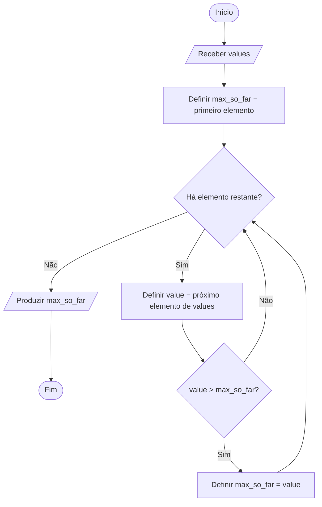

### Passo 5 — verificar progresso

Cada passagem pelo caminho `Sim` de `Há elemento restante?` **consome um novo elemento** antes de retornar ao teste. Depois da inicialização com o primeiro elemento, “restante” refere-se aos elementos de `values` que ainda não foram processados. Esse detalhe evita representar uma repetição sem progresso.

### Passo 6 — verificar término e pós-condição

Quando não restam valores:

```text
prefixo processado = sequência inteira
+
invariante preservado
↓
max_so_far é o máximo da entrada
```

O fluxograma tornou o caminho visual; o argumento de correção continua sendo lógico, não gráfico.

## 16.13 Como ler e revisar um fluxograma

Uma leitura sistemática evita “seguir setas” sem compreender o algoritmo.

Pergunte, nessa ordem:

```text
1. Qual é o ponto inicial?
2. Quais dados entram?
3. Que estado é criado ou alterado?
4. Onde existem decisões?
5. O que cada saída da decisão significa?
6. Existe caminho que retorna? Qual estado progride?
7. Há conectores? Para onde cada um aponta?
8. Há subprocessos? Seus contratos estão definidos?
9. Todos os caminhos relevantes alcançam um término apropriado?
10. O estado final satisfaz a pós-condição?
```

Esse roteiro também funciona como debugging de diagramas.

## 16.14 Fluxograma ↔ pseudocódigo

A conversão deve preservar **semântica**, não aparência.

Pseudocódigo:

```text
ABS_VALUE(n)
    if n < 0
        return -n
    return n
```

Fluxograma equivalente:

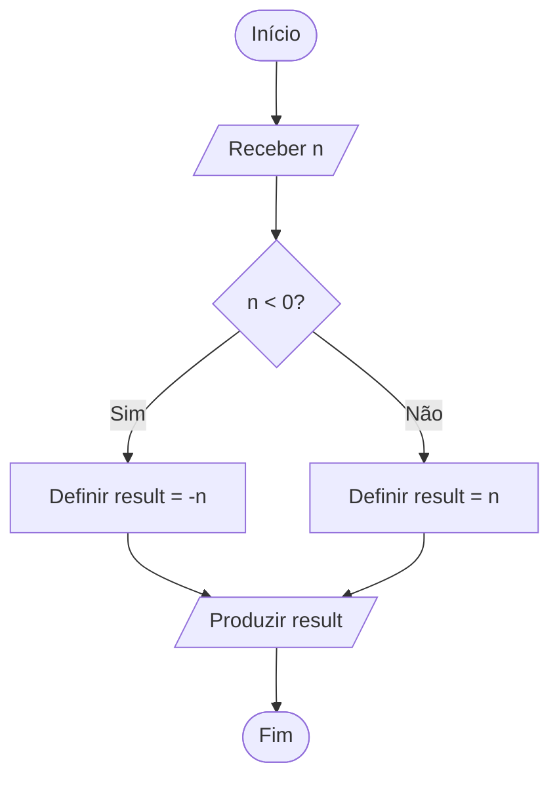

Ao fazer a conversão inversa, a decisão em losango torna-se uma construção condicional; linhas que retornam a uma condição tendem a se tornar repetição; subprocessos tendem a se tornar chamadas de procedimentos/funções. O LAB-T02-05 usa outro problema (`IS_EVEN`) para verificar transferência, em vez de pedir apenas a reprodução deste exemplo.

O teste de equivalência é:

> **para as mesmas entradas e sob o mesmo contrato, as duas representações implicam os mesmos caminhos relevantes e resultados permitidos?**

## 16.15 Mermaid × notação conceitual

Neste projeto, Mermaid é o mecanismo de publicação dos diagramas dentro do Markdown.

```text
CONCEITO DE FLUXOGRAMA
≠
SINTAXE MERMAID
```

Mermaid 11.17.2, versionado localmente no projeto, oferece formas clássicas e formas expandidas. Algumas possuem correspondência direta com o vocabulário deste capítulo, como `process`, `decision`, `terminal`, `subprocess`, `document`, `manual-input`, `database`, `display`, `comment` e `delay`.

Isso não torna o catálogo do Mermaid uma norma de fluxogramas. O software possui formas para muitos outros tipos de diagrama e pode nomear shapes segundo sua própria API.

Regra do Guia:

```text
1. escolha primeiro o significado conceitual;
2. depois escolha uma forma Mermaid compatível;
3. se não houver correspondência semântica 1:1,
   não atribua a uma forma outro significado apenas por semelhança visual;
4. preserve explicação textual quando a forma sozinha não for suficiente.
```

Para publicação, nenhum conceito essencial, LAB ou exercício deve depender **somente** da imagem renderizada: mantenha descrição textual/contrato equivalente ao redor do diagrama. Isso melhora acessibilidade, revisão e resiliência quando o renderer não estiver disponível.

## 16.16 Vantagens, limitações e quando usar

### Vantagens

- torna caminhos de decisão visíveis;
- ajuda a perceber repetição e retorno;
- explicita início, término e direção;
- facilita discussão de fluxo com pessoas que ainda não dominam a sintaxe de uma linguagem;
- pode revelar linhas cruzadas, caminhos órfãos ou ausência de progresso.

### Limitações

Fluxogramas grandes podem ficar:

- extensos;
- difíceis de editar;
- difíceis de consultar;
- visualmente mais complexos do que o pseudocódigo equivalente.

### Quando usar

Use quando a representação visual **reduzir a carga de compreensão**.

Prefira pseudocódigo ou outra representação quando o diagrama exigir dezenas de símbolos e conectores para expressar algo que permanece mais claro em texto estruturado.

Regra final:

```text
FLUXOGRAMA
=
FERRAMENTA DE REPRESENTAÇÃO
```

não:

```text
PRÉ-REQUISITO PARA TER BOA LÓGICA
```

[↑ Voltar ao índice](#índice)

---

# 17. Exemplo progressivo — encontrar o maior valor

## 17.1 Problema

Encontrar o maior elemento de uma sequência não vazia de inteiros.

## 17.2 Contrato

```text
PRE:
values não é vazio

POST:
result pertence a values

e

para todo x em values:
    result >= x
```

## 17.3 Estratégia

Manter o maior valor visto até o momento.

## 17.4 Estado

```text
max_so_far
```

## 17.5 Inicialização correta

```text
max_so_far = values[0]
```

Por quê?

Porque:

- pertence à entrada;
- funciona para números positivos;
- funciona para zero;
- funciona para números negativos.

## 17.6 Inicialização incorreta

```text
max_so_far = 0
```

Essa inicialização introduz um valor que pode não pertencer à entrada e, portanto, pode violar o contrato antes mesmo do percurso produzir informação suficiente. Para `values = [-8, -2, -11]`, por exemplo, `0 ∉ values`, enquanto a pós-condição exige que o resultado pertença à sequência. O contraexemplo completo e sua análise já foram apresentados em [§10.6](#106-exemplo-de-algoritmo-incorreto).

Aqui, o contraste com §17.5 é o ponto principal: inicializar com `values[0]` preserva desde o início a relação entre o estado e os dados reais do problema.

## 17.7 Pseudocódigo

```text
MAXIMUM(values)

    PRE: length(values) > 0
    POST: result is an element of values
          and for every x in values, result >= x

    max_so_far = values[0]

    for each value after the first in values
        if value > max_so_far
            max_so_far = value

    return max_so_far
```

## 17.8 Rastreamento

Entrada:

```text
[7, 2, 9, 4]
```

| Passo | valor | `max_so_far` antes | comparação | depois |
|---:|---:|---:|---|---:|
| inicial | `7` | — | — | `7` |
| 1 | `2` | `7` | `2 > 7` → falso | `7` |
| 2 | `9` | `7` | `9 > 7` → verdadeiro | `9` |
| 3 | `4` | `9` | `4 > 9` → falso | `9` |

## 17.9 Invariante

Antes de cada nova comparação:

> `max_so_far` é o maior valor entre os itens já processados.

## 17.10 Correção informal

### Inicialização

Antes da primeira comparação, apenas o primeiro item foi processado.

Ele é trivialmente o maior desse prefixo.

### Manutenção

Para novo `value`:

- se `value <= max_so_far`, o maior permanece;
- se `value > max_so_far`, atualizar faz `max_so_far` voltar a ser o maior do prefixo.

### Término

Quando todos os elementos foram processados, o prefixo é a sequência inteira.

Logo:

```text
max_so_far
```

é o máximo da entrada. Aqui aparece a ponte completa: **invariante preservado + término do percurso → pós-condição**.

## 17.11 Término

O algoritmo percorre uma quantidade finita de elementos.

A cada passo, um elemento adicional é processado.

## 17.12 Complexidade — apenas intuição

Para uma entrada não vazia com `n` elementos, esta implementação inicializa o estado com o primeiro elemento e compara cada um dos `n - 1` elementos restantes exatamente uma vez com `max_so_far`.

Assim, a quantidade de comparações cresce **linearmente com o número de elementos da entrada**: ao acrescentar elementos, o trabalho adicional cresce na mesma ordem do percurso.

A notação assintótica formal e a análise rigorosa desse crescimento ficam para Análise de Algoritmos; o T02 registra apenas a intuição e o fato contável `n - 1`.

[↑ Voltar ao índice](#índice)

---

# 18. Transferência para quatro linguagens

Todos os exemplos implementam a **mesma ideia algorítmica**:

```text
entrada não vazia
→ maior elemento
```

Mas “inteiro” no contrato matemático e “valor representável” numa linguagem concreta não são automaticamente o mesmo domínio.

Neste exemplo:

- **Python `int`** possui precisão arbitrária, limitada na prática pelos recursos disponíveis;
- **JavaScript `Number`** representa exatamente apenas uma faixa limitada de inteiros; valores fora da faixa de inteiros seguros podem deixar de ser distinguíveis;
- **Java `int`** é um inteiro com sinal de 32 bits;
- **Bash** avalia aritmética em inteiros de largura fixa disponíveis na implementação, sem checagem de overflow.

| Implementação | Fronteira relevante neste exemplo |
|---|---|
| Python `int` | precisão arbitrária; limite prático de recursos |
| JavaScript `Number` | inteiros seguros de `-(2^53 - 1)` a `2^53 - 1` |
| Java `int` | `-2^31` a `2^31 - 1` |
| Bash | largura fixa dependente da implementação; não assumir uma faixa portátil única |

Portanto, as quatro versões preservam o mesmo **algoritmo conceitual** somente sobre a interseção do domínio que cada representação concreta consegue aceitar e comparar corretamente. Se o contrato exigir inteiros fora dessa fronteira, a implementação deve escolher outro tipo/representação — por exemplo, `BigInt` em JavaScript ou `long`/`BigInteger` em Java, conforme o requisito.

As implementações abaixo também detectam entrada vazia para tornar a violação da pré-condição explícita.

## 18.1 Python

```python
def find_max(values: list[int]) -> int:
    if not values:
        raise ValueError("values must not be empty")

    max_so_far = values[0]

    for index in range(1, len(values)):
        value = values[index]
        if value > max_so_far:
            max_so_far = value

    return max_so_far


print(find_max([7, 2, 9, 4]))
print(find_max([-8, -2, -11]))
```

Saída reproduzida:

```text
9
-2
```

## 18.2 JavaScript

```javascript
function findMax(values) {
  if (values.length === 0) {
    throw new RangeError("values must not be empty");
  }

  let maxSoFar = values[0];

  for (let index = 1; index < values.length; index++) {
    const value = values[index];
    if (value > maxSoFar) {
      maxSoFar = value;
    }
  }

  return maxSoFar;
}

console.log(findMax([7, 2, 9, 4]));
console.log(findMax([-8, -2, -11]));
```

Saída reproduzida:

```text
9
-2
```

## 18.3 Java

```java
public class Example {
    static int findMax(int[] values) {
        if (values.length == 0) {
            throw new IllegalArgumentException("values must not be empty");
        }

        int maxSoFar = values[0];

        for (int i = 1; i < values.length; i++) {
            if (values[i] > maxSoFar) {
                maxSoFar = values[i];
            }
        }

        return maxSoFar;
    }

    public static void main(String[] args) {
        System.out.println(findMax(new int[] {7, 2, 9, 4}));
        System.out.println(findMax(new int[] {-8, -2, -11}));
    }
}
```

Saída reproduzida:

```text
9
-2
```

## 18.4 Bash

> **Escopo do exemplo:** a função aceita apenas a forma decimal canônica `0|[1-9][0-9]*|-[1-9][0-9]*`; assim, `-0`, `00`, `08`, expressões e outros conteúdos fora dessa forma são rejeitados **antes de qualquer valor fornecido pelo chamador entrar em contexto aritmético**. Essa validação de formato/base é importante porque Bash reavalia valores de variáveis como expressões em `(( ... ))`. A faixa continua limitada aos inteiros de largura fixa disponíveis na implementação, e Bash não verifica overflow de modo portável; portanto, **estar dentro da faixa representável permanece parte do domínio assumido** deste exemplo.

```bash
#!/usr/bin/env bash

find_max() {
    if (( $# == 0 )); then
        printf '%s\n' 'values must not be empty' >&2
        return 2
    fi

    # Validar todos os valores antes de usar conteúdo externo em aritmética.
    local value
    for value in "$@"; do
        if [[ ! $value =~ ^(0|[1-9][0-9]*|-[1-9][0-9]*)$ ]]; then
            printf '%s\n' 'values must be canonical decimal integers' >&2
            return 2
        fi
    done

    local max_so_far="$1"
    shift  # remove o primeiro argumento; "$@" passa a conter apenas os restantes

    for value in "$@"; do
        if (( value > max_so_far )); then
            max_so_far="$value"
        fi
    done

    printf '%d\n' "$max_so_far"
}

find_max 7 2 9 4
find_max -8 -2 -11
```

Saída reproduzida:

```text
9
-2
```

> **Exit status do script:** a função usa status `2` para sinalizar entrada vazia, mas o status final de um script com várias chamadas é o status do último comando executado, salvo política explícita do chamador. As duas chamadas demonstrativas acima são válidas; em código real, quem chama a função deve decidir se propaga, trata ou acumula uma falha anterior.

## 18.5 Comparação semântica

| Conceito | Python | JavaScript | Java | Bash |
|---|---|---|---|---|
| coleção do exemplo | `list[int]` | `Array` | `int[]` | argumentos posicionais |
| detecção de vazio | `if not values` | `length === 0` | `length == 0` | `$# == 0` |
| estado mutável | `max_so_far` | `maxSoFar` | `maxSoFar` | `max_so_far` |
| percurso sem copiar a coleção | `range` + índice | `for` + índice | `for` + índice | `for value in "$@"` |
| sinalização da violação | `ValueError` | `RangeError` | `IllegalArgumentException` | stderr + exit status |
| resultado | `return int` | `return Number` | `return int` | stdout |

<!-- qa: os quatro exemplos executáveis da §18 devem permanecer cobertos por regressão automatizada/build sempre que esta fonte for alterada -->

Bash ilustra novamente que:

```text
RESULTADO CONCEITUAL EQUIVALENTE
≠
MECANISMO DE RETORNO IDÊNTICO
```

[↑ Voltar ao índice](#índice)

---

# 19. Erros conceituais frequentes

## 19.1 “Algoritmo é código”

Não.

Código implementa um algoritmo em linguagem específica.

## 19.2 “Se executou, está correto”

Não.

```text
executável
≠
correto
```

## 19.3 “Se passou em vários testes, está provado”

Não necessariamente.

Testes aumentam confiança e detectam falhas.

Prova/argumento geral exige raciocínio sobre todas as entradas do domínio.

## 19.4 “Algoritmo sempre é determinístico”

Não.

Há algoritmos randomizados.

## 19.5 “Todo programa deve terminar”

Não.

Serviços de longa duração podem não possuir término global esperado.

Algoritmos internos ainda podem ter contratos finitos.

## 19.6 “Pré-condição é a mesma coisa que `if` de validação”

Não.

Pré-condição é parte do contrato.

Um `if` é uma forma possível de verificar a condição em uma implementação.

<a id="197-pos-condicao-e-um-exemplo"></a>
<a id="197-postcondição-é-um-exemplo"></a>

## 19.7 “Pós-condição é um exemplo”

Não.

Exemplo é instância.

Pós-condição é propriedade geral do estado final.

## 19.8 “Pseudocódigo possui sintaxe oficial”

Não existe padrão universal único.

## 19.9 “Fluxograma é obrigatório”

Não.

É uma ferramenta de representação.

## 19.10 “Inicializar máximo com zero funciona”

Só sob pré-condições adicionais. Sem elas, a inicialização pode introduzir um valor que nem pertence à entrada e destruir a correção. O contraexemplo canônico e seu mecanismo já estão fechados na [§10.6](#106-exemplo-de-algoritmo-incorreto) e na [§17.6](#176-inicialização-incorreta), evitando repetir aqui toda a demonstração.

## 19.11 “Algoritmo correto automaticamente é eficiente”

Não.

Correção e eficiência são dimensões diferentes.

Um algoritmo pode ser correto e impraticavelmente lento.

[↑ Voltar ao índice](#índice)

---

# 20. Como raciocinar sobre um algoritmo

Use este roteiro. Para consulta operacional ainda mais compacta, veja também o [§24 — Checklist de consulta rápida](#24-checklist-de-consulta-rápida).

## 20.1 Qual é o problema?

```text
domínio de entrada
+
propriedade da saída correta
```

## 20.2 Qual é a pré-condição?

O que pode ser assumido?

## 20.3 Qual é o estado?

Que informação precisa ser mantida?

## 20.4 Qual é a inicialização?

O estado inicial já satisfaz a propriedade necessária?

## 20.5 Qual é o progresso?

Cada passo aproxima do término?

## 20.6 Qual propriedade deve permanecer verdadeira?

Existe um invariante útil?

## 20.7 Qual é a condição de término?

Quando o algoritmo para?

## 20.8 O estado final implica a pós-condição?

Essa é a ponte para correção.

## 20.9 Existem contraexemplos?

Teste:

- vazio;
- um item;
- negativos;
- duplicados;
- fronteiras;
- já ordenado;
- ordem inversa;
- mínimo/máximo.

## 20.10 A representação esconde alguma operação difícil?

Pseudocódigo:

```text
“encontre o melhor caminho”
```

não é solução se encontrar o caminho é justamente o problema central.

[↑ Voltar ao índice](#índice)

---


<a id="problemas-reais"></a>

# Índice operacional de Problemas Reais `PR-*`

Os itens abaixo não substituem exercícios nem LABs. Cada `PR-*` representa uma necessidade plausível em que várias capacidades de Fundamentos de Algoritmos precisam ser combinadas e verificadas contra um contrato.

| ID | Necessidade concreta | Capacidades | Destino | Estado |
|---|---|---|---|---|
| `PR-T02-01` | converter uma descrição de problema em contrato verificável | domínio, instância, entrada, saída, pré/pós-condição | `#pr-t02-01` | COBERTO |
| `PR-T02-02` | refutar algoritmo aparentemente correto com contraexemplo mínimo | correção, instância, fronteira, contraexemplo | `#pr-t02-02` | COBERTO |
| `PR-T02-03` | selecionar inicialização que preserve o invariante | estado, inicialização, invariante | `#pr-t02-03` | COBERTO |
| `PR-T02-04` | diagnosticar algoritmo que não termina | estado, progresso, condição de término, variante | `#pr-t02-04` | COBERTO |
| `PR-T02-05` | remover “mágica” de pseudocódigo aparentemente preciso | representação, efetividade, precisão | `#pr-t02-05` | COBERTO |
| `PR-T02-06` | testar corretamente problema com múltiplas saídas válidas | especificação, pós-condição, oracle de teste | `#pr-t02-06` | COBERTO |

<a id="pr-t02-01"></a>

## `PR-T02-01` — Descrição informal → contrato verificável

**Necessidade:** receber uma sequência de inteiros e retornar seu maior valor.

Uma descrição curta como:

```text
“retorne o maior número”
```

é insuficiente para fechar o contrato. Perguntas mínimas:

```text
a sequência pode estar vazia?
quais tipos de valores são válidos?
o resultado precisa pertencer à entrada?
existem NaN, null ou valores não numéricos no domínio?
```

Neste capítulo, o contrato adotado para o exemplo progressivo é:

```text
PRE:
    values é uma sequência não vazia de inteiros

POST:
    result pertence a values
    e, para todo x em values, result >= x
```

### Por que esse contrato é melhor que “retornar o maior”

Ele permite distinguir:

- entrada válida de inválida;
- resultado correto de plausível;
- propriedade geral de saída de um exemplo particular;
- algoritmo de implementação concreta.

### Testes mínimos

| Entrada | Resultado esperado | Papel |
|---|---:|---|
| `[7, 2, 9, 4]` | `9` | caso normal |
| `[-8, -2, -11]` | `-2` | evita suposição de positividade |
| `[5]` | `5` | menor tamanho válido |
| `[]` | fora da pré-condição / erro explícito conforme API | fronteira do domínio |

### Evidência de fechamento

O contrato está suficientemente preciso quando outra pessoa consegue construir testes de aceitação sem precisar adivinhar regras escondidas.

---

<a id="pr-t02-02"></a>

## `PR-T02-02` — Encontrar um contraexemplo mínimo

Algoritmo candidato:

```text
MAXIMUM(values)
    max_so_far = 0
    for each value in values
        if value > max_so_far
            max_so_far = value
    return max_so_far
```

Ele passa em:

```text
[7, 2, 9, 4] → 9
[1] → 1
[0, 3] → 3
```

Contraexemplo mínimo útil:

```text
[-1]
```

O algoritmo retorna:

```text
0
```

mas `0` nem sequer pertence à entrada, violando diretamente a pós-condição.

### Como procurar o contraexemplo

Use perguntas sistemáticas:

```text
qual suposição invisível foi feita?
→ “haverá algum valor >= 0”

qual é o menor caso que quebra essa suposição?
→ sequência unitária negativa
```

### Evidência de fechamento

Um único contraexemplo válido é suficiente para refutar a afirmação universal “o algoritmo resolve o problema para toda entrada do domínio”.

---

<a id="pr-t02-03"></a>

## `PR-T02-03` — Inicializar estado preservando o invariante

Objetivo:

```text
após processar qualquer prefixo não vazio,
max_so_far é o maior valor desse prefixo
```

Inicialização correta:

```text
max_so_far = values[0]
```

Antes da primeira comparação, o prefixo processado contém exatamente um elemento. Esse elemento é, trivialmente, o máximo do prefixo.

Alternativa problemática:

```text
max_so_far = 0
```

Ela cria um estado que pode não representar nenhum elemento processado e exige uma suposição adicional sobre o domínio.

### Regra generalizável

Ao escolher estado inicial, pergunte:

1. o invariante já é verdadeiro antes da primeira iteração?
2. o valor inicial pertence ao domínio ou é um sentinela formalmente justificado?
3. a inicialização introduz uma suposição que não existe no contrato?

### Evidência de fechamento

A inicialização é adequada quando o argumento de correção consegue começar sem exceção ad hoc para classes válidas de entrada.

---

<a id="pr-t02-04"></a>

## `PR-T02-04` — Diagnosticar ausência de término

Procedimento candidato:

```text
n = valor positivo

while n > 0
    imprimir n
```

**Sintoma:** o algoritmo nunca termina.

Estado relevante:

```text
n
```

Condição de término:

```text
n <= 0
```

Problema:

```text
n nunca é alterado
```

Uma correção possível:

```text
while n > 0
    imprimir n
    n = n - 1
```

Agora existe uma medida simples de progresso:

```text
V = n
```

que diminui a cada iteração enquanto permanece não negativa.

### Evidência de fechamento

Não basta observar que “agora terminou” para um valor. Deve ser possível explicar por que, para qualquer `n` inteiro positivo do domínio, a medida de progresso se aproxima inevitavelmente da condição de término.

---

<a id="pr-t02-05"></a>

## `PR-T02-05` — Pseudocódigo preciso sem operação mágica

Pseudocódigo fraco:

```text
SOLVE(problem)
    choose the best solution
    return solution
```

A aparência é formal, mas a etapa central é exatamente o problema que precisava ser resolvido.

Outro exemplo:

```text
ordenar os dados de forma eficiente
```

Se o objetivo do capítulo for explicar o algoritmo de ordenação, essa linha esconde todo o mecanismo.

### Como corrigir

Pergunte para cada passo:

- a operação está definida?
- existe procedimento conhecido ou API cujo contrato foi explicitamente assumido?
- o nível de abstração é adequado ao objetivo pedagógico?
- outra pessoa conseguiria implementar o passo sem reinventar a solução inteira?

### Evidência de fechamento

O pseudocódigo está no nível certo quando revela a **ideia central** do algoritmo e deixa implícitos apenas detalhes que são legítimos naquele nível de abstração.

---

<a id="pr-t02-06"></a>

## `PR-T02-06` — Testar problema com múltiplas saídas corretas

Problema:

```text
dada uma sequência e um valor alvo,
retorne uma posição válida em que o alvo aparece
```

Contrato mínimo:

```text
PRE:
target ocorre em values

POST:
result é um índice válido de values
E
values[result] == target
```

Se `target` puder estar ausente, o problema precisa declarar separadamente qual resultado representa “não encontrado”.

Entrada:

```text
values = [4, 7, 4]
target = 4
```

Saídas válidas possíveis:

```text
0
2
```

Teste inadequado:

```text
assert result == 0
```

Esse teste exige uma decisão de implementação que o problema não exigiu.

Teste orientado ao contrato:

```text
result é um índice válido
E
values[result] == target
```

Se a especificação disser “retorne a primeira ocorrência”, então `0` passa a ser obrigatório. O ponto central é que **o oracle de teste deve validar o problema realmente especificado**.

**Extensão `[E]`:** em *property-based testing*, a mesma ideia pode ser automatizada gerando muitas entradas e verificando **propriedades do contrato** em vez de comparar sempre com uma única saída fixa. Isso amplia a busca por contraexemplos, mas continua sendo teste — não substitui um argumento/prova geral de correção.

### Evidência de fechamento

O teste é correto quando aceita todas as saídas permitidas pelo contrato e rejeita todas as que o violam.

[↑ Voltar ao índice](#índice)

---

<a id="troubleshooting-sistematico"></a>

# 🔎 Troubleshooting sistemático

Aqui o troubleshooting aplica o método de diagnóstico aos mecanismos centrais deste tópico: contrato, estado, correção, término e representação. Alguns casos podem ser reproduzidos em código; outros são falhas de especificação ou raciocínio e devem ser observados por contrato, rastreamento e contraexemplo.

<a id="ts-t02-01"></a>

## `TS-T02-01` — máximo incorreto quando todos os valores são negativos

**Sintoma**

O procedimento funciona com entradas positivas, mas retorna `0` para uma sequência que contém apenas números negativos.

**Reprodução mínima**

```text
values = [-1]
max_so_far = 0
```

**Hipóteses plausíveis**

- inicialização supõe implicitamente que haverá valor não negativo;
- sentinela escolhido não pertence ao domínio;
- pós-condição não foi usada para revisar a inicialização.

**Como observar / instrumentar**

Rastreie:

```text
estado inicial → comparação → estado final
```

Para `[-1]`:

```text
0 → -1 > 0? falso → 0
```

**Como interpretar**

A primeira divergência ocorre antes do loop: o estado inicial já não representa o maior elemento do prefixo processado.

**Causa / mecanismo**

Inicialização incompatível com o domínio e com o invariante.

**Correção**

```text
max_so_far = values[0]
```

processando os elementos restantes depois.

**Como validar**

Testar positivos, zero, todos negativos e sequência unitária.

**Teste de regressão**

Preservar `[-1]` ou outro caso exclusivamente negativo.

---

<a id="ts-t02-02"></a>

## `TS-T02-02` — falha com entrada vazia: bug ou violação da pré-condição?

**Sintoma**

A implementação acessa `values[0]` e falha quando `values` está vazio.

**Cenário mínimo**

```text
values = []
```

**Hipóteses plausíveis**

- vazio está fora do domínio declarado;
- o contrato permite vazio, mas não define resultado;
- a API prometeu validação e não a implementou.

**Como observar**

Comece pelo contrato para decidir se a entrada pertence ao domínio; depois use o stack trace e a observação da execução para localizar eventual falha de implementação.

**Como interpretar**

Se `PRE: values não é vazio`, o algoritmo de máximo está definido apenas para entradas não vazias. A camada de API pode ainda optar por rejeitar vazio explicitamente.

**Causa / mecanismo**

Confusão entre **domínio do problema** e **política de validação da implementação**.

**Correção**

Escolher e documentar uma política coerente:

```text
A) preservar a pré-condição e exigir do chamador
B) verificar vazio e sinalizar erro
C) redefinir o problema com um valor/sentido para vazio, se o domínio permitir
```

**Como validar**

Contrato, código e testes devem contar a mesma história.

**Teste de regressão**

Manter um teste explícito para vazio, com o comportamento esperado documentado.

---

<a id="ts-t02-03"></a>

## `TS-T02-03` — loop não termina

**Sintoma**

O algoritmo permanece executando sem alcançar o estado final.

**Reprodução**

```text
n = 3
while n > 0
    imprimir n
```

**Hipóteses**

- variável de controle não muda;
- atualização move o estado na direção errada;
- condição de término é inalcançável;
- o estado que progride não é o mesmo usado na condição.

**Como observar**

Registre `n` em iterações consecutivas.

**Como interpretar**

Se o estado relevante se repete indefinidamente, não existe progresso observável em direção ao término.

**Causa / mecanismo**

Ausência de atualização/variante que diminua até a condição final.

**Correção**

```text
n = n - 1
```

quando essa for a semântica desejada.

**Como validar**

Explicar uma medida de progresso e testar vários valores válidos, inclusive o menor.

**Teste de regressão**

`n = 1` e um valor maior, como `n = 100`.

---

<a id="ts-t02-04"></a>

## `TS-T02-04` — pseudocódigo não é implementável sem adivinhar a etapa central

**Sintoma**

Duas pessoas implementam o “mesmo pseudocódigo” com algoritmos radicalmente diferentes porque um passo crítico está vago.

**Cenário mínimo**

```text
selecionar a melhor rota
```

sem definir:

```text
“melhor” = menor latência? menos saltos? menor custo?
como as rotas candidatas são geradas?
```

**Hipóteses**

- abstração em nível alto demais;
- operação mágica;
- critério de saída incompleto.

**Como observar**

Peça a outra pessoa para implementar somente aquele passo sem informação adicional.

**Como interpretar**

Se ela precisa redefinir o problema, o pseudocódigo está escondendo a parte essencial.

**Causa / mecanismo**

Formalidade visual substituiu precisão semântica.

**Correção**

Explicitar objetivo, dados, operação e critério — ou referenciar formalmente um subalgoritmo já definido.

**Como validar**

Implementadores independentes devem conseguir preservar o mesmo contrato e estratégia.

**Teste de regressão**

Revisar o pseudocódigo procurando verbos vagos como “otimizar”, “resolver”, “escolher melhor”, “processar corretamente” sem definição local.

---

<a id="ts-t02-05"></a>

## `TS-T02-05` — teste rejeita uma saída correta

**Sintoma**

A implementação retorna uma solução que satisfaz a especificação, mas o teste automatizado falha.

**Cenário mínimo**

```text
values = [4, 7, 4]
target = 4
resultado = 2
```

Teste existente:

```text
resultado deve ser 0
```

Especificação real:

```text
PRE:
target ocorre em values

POST:
result é um índice válido de values
E
values[result] == target
```

Se o domínio também admitir `target` ausente, a especificação deve definir explicitamente o resultado correspondente.

**Hipóteses**

- o teste codificou uma escolha de implementação;
- a pós-condição permite múltiplas respostas;
- falta requisito “primeira ocorrência”.

**Como observar**

Verifique o resultado contra a pós-condição, não contra uma saída exemplificativa.

**Como interpretar**

Se `values[result] == target` e o índice é válido, o resultado satisfaz o problema definido.

**Causa / mecanismo**

Oracle de teste mais restritivo que a especificação.

**Correção**

Testar a propriedade correta ou tornar a especificação mais restrita se isso for requisito real.

**Como validar**

Executar com dados contendo múltiplas ocorrências e confirmar que todas as respostas permitidas são aceitas.

**Teste de regressão**

Preservar caso com mais de uma saída válida.

---

<a id="ts-t02-06"></a>

## `TS-T02-06` — “passou em muitos testes” foi tratado como prova de correção

**Sintoma**

A solução é declarada universalmente correta porque passou em um conjunto grande de exemplos.

**Cenário mínimo**

O algoritmo de máximo inicializado com `0` passa em milhares de listas geradas apenas com inteiros não negativos.

**Hipóteses**

- conjunto de testes não representa o domínio completo;
- gerador de dados incorporou uma suposição não documentada;
- não houve busca por contraexemplos extremos.

**Como observar**

Compare o gerador de testes com a pré-condição verdadeira do problema.

**Como interpretar**

Cobertura de muitos casos dentro de um subconjunto não estabelece correção para entradas válidas fora dele.

**Causa / mecanismo**

Confundir evidência empírica com argumento universal de correção.

**Correção**

Adicionar classes de equivalência/fronteira e raciocínio sobre invariante/contrato; procurar ativamente contraexemplos.

**Como validar**

O conjunto de testes passa a incluir negativos, casos mínimos e fronteiras, e o argumento de correção explica por que o procedimento preserva a propriedade necessária.

**Teste de regressão**

Manter ao menos um caso que quebre a suposição anterior.

[↑ Voltar ao índice](#índice)

---

# 21. Laboratórios

Os LABs abaixo existem para produzir evidência observável de domínio. Tente resolver cada tarefa antes de abrir a solução-modelo; em problemas abertos, a solução apresentada é **uma solução válida**, não a única forma aceitável.

<a id="-laboratório-1--problema--algoritmo"></a>
<a id="lab-t02-01"></a>
## 🧪 Laboratório 1 — Problema × algoritmo

### Objetivo

Separar **o que deve ser resolvido** de **como será resolvido**.

### Pré-requisitos

- §§3–4 — problema, algoritmo e instância;
- §9 — noção inicial de contrato.

### Estado inicial

Problema informal:

> determinar se uma sequência contém um valor alvo.

### Tarefa

Escreva:

1. domínio de entrada;
2. condição de saída correta;
3. algoritmo em linguagem natural estruturada;
4. pseudocódigo.

### Procedimento

1. descreva primeiro **qualquer entrada válida**;
2. defina uma propriedade verificável para a saída;
3. só depois escolha um procedimento;
4. confirme que o procedimento cobre presença e ausência do alvo.

### O que observar

O problema continua o mesmo mesmo que o algoritmo seja trocado. Uma busca sequencial, uma consulta em estrutura previamente indexada ou outra estratégia podem resolver a mesma especificação sob contratos diferentes.

### Testes / autoverificação

Considere pelo menos:

- alvo presente no primeiro elemento;
- alvo presente no último elemento;
- alvo ausente;
- sequência vazia, se ela pertencer ao domínio escolhido.

<details>
<summary><strong>Solução-modelo possível</strong></summary>

Uma especificação simples:

```text
ENTRADA:
    sequência values, possivelmente vazia
    valor target comparável aos elementos

SAÍDA:
    verdadeiro se existe pelo menos um elemento igual a target
    falso caso contrário
```

Algoritmo em linguagem natural estruturada:

```text
Percorrer os elementos de values.
Se algum elemento for igual a target, responder verdadeiro.
Se o percurso terminar sem encontrar target, responder falso.
```

Pseudocódigo:

```text
CONTAINS(values, target)
    for each value in values
        if value == target
            return true
    return false
```

O mesmo **problema** admite outros algoritmos; a especificação não muda apenas porque o procedimento mudou.

</details>

### Variação / transferência

Implemente depois o mesmo contrato em duas linguagens e marque o que mudou por sintaxe, semântica, idiomatismo ou ambiente.

---

<a id="-laboratório-2--caça-ao-contraexemplo"></a>
<a id="lab-t02-02"></a>
## 🧪 Laboratório 2 — Caça ao contraexemplo

### Objetivo

Aprender a refutar uma afirmação universal de correção com uma entrada mínima.

### Pré-requisitos

- §10 — correção;
- §17.5–17.6 — inicialização do máximo.

### Estado inicial

Algoritmo proposto:

```text
MAXIMUM(values)

    max = 0

    for each x in values
        if x > max
            max = x

    return max
```

Assuma como domínio **sequências não vazias de inteiros**, sem restrição de sinal.

### Tarefa

1. encontre entrada para a qual funciona;
2. encontre um contraexemplo pequeno;
3. explique o mecanismo da falha;
4. corrija sem impor nova pré-condição desnecessária.

### Procedimento

1. identifique a suposição escondida na inicialização;
2. procure uma entrada válida que viole essa suposição;
3. execute o algoritmo manualmente;
4. compare a saída obtida com a pós-condição.

### O que observar

Uma inicialização pode introduzir informação que **não pertence à entrada**. Se `0` não for garantidamente menor ou igual ao máximo real, o estado inicial já nasce incompatível com o contrato.

### Testes / autoverificação

Teste, no mínimo:

```text
[5]          → 5
[-1]         → -1
[-8, -2]     → -2
[0]          → 0
```

<details>
<summary><strong>Solução-modelo</strong></summary>

O contraexemplo mínimo pode ser:

```text
[-1]
```

O algoritmo retorna `0`, embora `0` nem pertença à entrada. A correção é inicializar com um elemento válido da própria sequência:

```text
MAXIMUM(values)
    max = values[0]

    for each x after the first in values
        if x > max
            max = x

    return max
```

Isso depende da pré-condição de sequência não vazia, que já faz parte do contrato declarado.

</details>

### Variação / transferência

Repita o raciocínio para um algoritmo que tenta calcular o **mínimo** inicializando com `0`.

---

<a id="-laboratório-3--pré-e-pós-condição"></a>
<a id="lab-t02-03"></a>
## 🧪 Laboratório 3 — Pré e pós-condição

### Objetivo

Distinguir contrato conceitual de política de tratamento de erro.

### Pré-requisitos

- §9 — pré-condições e pós-condições.

### Estado inicial

Operação conceitual:

```text
divide(a, b)
```

### Tarefa

Defina:

- pré-condição;
- pós-condição;
- decisão explícita para `b == 0`.

### Procedimento

1. escolha se divisão por zero ficará **fora do domínio**;
2. ou escolha um contrato total que represente falha explicitamente;
3. não misture as duas decisões sem dizer qual contrato está usando.

### O que observar

Pré-condição não é sinônimo de `if`. A implementação pode verificar uma pré-condição, mas o contrato existe antes da escolha de mecanismo de validação.

### Testes / autoverificação

Considere:

```text
divide(10, 2)
divide(-9, 3)
divide(1, 0)
```

<details>
<summary><strong>Solução-modelo possível</strong></summary>

Contrato com domínio restrito aos números racionais:

```text
DOMÍNIO: a, b e result pertencem aos números racionais
PRE:     b != 0
POST:    result * b == a
```

> **Escopo deste LAB:** adote aritmética racional exata como modelo conceitual. Assim, por exemplo, `divide(5, 2)` pode produzir exatamente `5/2`. Em representações de ponto flutuante, arredondamento pode tornar igualdade exata uma pós-condição inadequada; esse mecanismo será aprofundado posteriormente.

Nesse contrato, `b == 0` é uma **violação de pré-condição** e não uma entrada válida da operação. Outra API poderia deliberadamente aceitar qualquer `b` e retornar um resultado/erro estruturado; seria **outro contrato**.

</details>

### Variação / transferência

Compare como duas linguagens diferentes sinalizam a violação do contrato, sem confundir o mecanismo da linguagem com a definição matemática da operação.

---

<a id="-laboratório-4--estado-e-rastreamento"></a>
<a id="lab-t02-04"></a>
## 🧪 Laboratório 4 — Estado e rastreamento

### Objetivo

Tornar visível a evolução do estado durante uma execução.

### Pré-requisitos

- §8 — estado;
- §13 — invariantes em nível introdutório.

### Estado inicial

Problema: contar quantos valores de uma sequência são positivos.

Entrada:

```text
[-2, 4, 0, 7, -1]
```

### Tarefa

Crie uma tabela com:

| iteração | valor | `count` antes | condição `value > 0` | `count` depois |
|---:|---:|---:|---|---:|

Depois formule um invariante.

### Procedimento

1. inicialize `count = 0`;
2. percorra um elemento por vez;
3. registre o estado antes e depois da decisão;
4. descreva o significado de `count` após cada prefixo processado.

### O que observar

O valor de `count` muda, mas a **propriedade sobre o que ele representa** pode permanecer verdadeira durante todo o percurso.

### Testes / autoverificação

A saída final para a entrada proposta deve ser `2`.

<details>
<summary><strong>Rastreamento e invariante</strong></summary>

| iteração | valor | `count` antes | `value > 0` | `count` depois |
|---:|---:|---:|---|---:|
| 1 | -2 | 0 | falso | 0 |
| 2 | 4 | 0 | verdadeiro | 1 |
| 3 | 0 | 1 | falso | 1 |
| 4 | 7 | 1 | verdadeiro | 2 |
| 5 | -1 | 2 | falso | 2 |

Invariante possível:

> antes de cada nova iteração, `count` é a quantidade de valores positivos no prefixo já processado.

</details>

### Variação / transferência

Troque o predicado por “valor par” e formule o novo invariante.

---

<a id="-laboratório-5--representações"></a>
<a id="lab-t02-05"></a>
## 🧪 Laboratório 5 — Representações

### Objetivo

Comparar representações sem confundir a notação com o algoritmo representado e demonstrar conversão nos dois sentidos entre pseudocódigo e fluxograma.

### Pré-requisitos

- §§14–16 — linguagem natural, pseudocódigo, símbolos, conectores e construção de fluxogramas.

### Estado inicial

Algoritmo curto: determinar se um inteiro é par.

### Tarefa

Represente o mesmo procedimento em:

1. linguagem natural;
2. linguagem natural estruturada;
3. pseudocódigo;
4. fluxograma.

Depois:

5. identifique os tipos de símbolo realmente usados no fluxograma;
6. justifique por que cada forma corresponde à função representada;
7. percorra visualmente os caminhos para uma entrada par e uma ímpar;
8. converta o fluxograma novamente para pseudocódigo sem consultar o pseudocódigo original;
9. compare as duas versões e verifique se preservam o mesmo contrato.

### Procedimento

1. fixe primeiro o contrato;
2. descreva a lógica sem escolher símbolos;
3. mapeie cada função para a tabela canônica da §16.3;
4. desenhe o fluxo;
5. rotule as saídas da decisão;
6. garanta que os dois caminhos chegam ao término;
7. execute manualmente os casos de teste;
8. faça a conversão inversa.

### O que observar

- qual representação evidencia melhor a decisão;
- se a forma escolhida comunica corretamente a função;
- se o fluxograma acrescentou detalhe visual sem mudar a lógica;
- se algum caminho foi criado ou perdido durante a conversão;
- se a notação introduziu detalhe acidental da ferramenta.

### Testes / autoverificação

Use pelo menos `2`, `3`, `0`, `-4` e `-3`. Todas as representações devem implicar as mesmas respostas. O caso `-3` ajuda a detectar implementações que tentam reconhecer ímpar com `resto == 1` em vez de testar paridade por `resto == 0`.

Checklist mínimo do fluxograma:

```text
[ ] terminal inicial
[ ] entrada n
[ ] decisão n MOD 2 == 0?
[ ] dois caminhos rotulados
[ ] saída verdadeiro/falso
[ ] terminal final
```

<details>
<summary><strong>Solução-modelo possível</strong></summary>

Linguagem natural estruturada:

```text
Receber um inteiro n.
Calcular o resto da divisão de n por 2.
Se o resto for zero, responder verdadeiro.
Caso contrário, responder falso.
```

Pseudocódigo:

```text
IS_EVEN(n)
    if n MOD 2 == 0
        return true
    return false
```

Fluxograma:

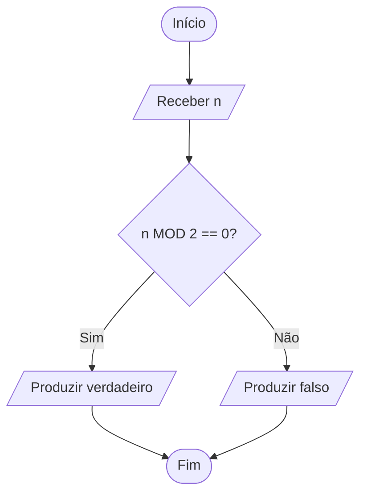

Símbolos utilizados:

- terminal — início/fim;
- entrada/saída — receber `n` e produzir a resposta;
- decisão — testar `n MOD 2 == 0?`;
- linhas de fluxo — conectar as etapas e indicar direção.

Conversão inversa possível:

```text
IS_EVEN(n)
    if n MOD 2 == 0
        return true
    else
        return false
```

A forma textual não precisa ser idêntica ao pseudocódigo inicial. A equivalência está no contrato e nos dois caminhos possíveis.

</details>

### Variação / transferência

Divida deliberadamente um fluxograma maior em dois trechos e use um **conector na página** para preservar a continuidade. Depois explique por que o conector melhora — ou não melhora — a leitura.

<a id="-laboratório-6--transferência"></a>
<a id="lab-t02-06"></a>
## 🧪 Laboratório 6 — Transferência

### Objetivo

Separar algoritmo transferível de sintaxe, semântica, idiomatismo e ambiente.

### Pré-requisitos

- §18 — transferência para quatro linguagens.

### Estado inicial

Escolha um algoritmo simples já compreendido — por exemplo, contar valores positivos.

### Tarefa

Implemente o mesmo contrato em **duas linguagens**. Depois classifique cada diferença encontrada como:

```text
SINTAXE
SEMÂNTICA
IDIOMATISMO
AMBIENTE
```

### Procedimento

1. escreva primeiro o contrato em linguagem neutra;
2. implemente em duas linguagens;
3. execute os mesmos casos;
4. classifique as diferenças;
5. confirme que a coincidência de saída não esconde contratos diferentes.

### O que observar

O estado conceitual e a propriedade desejada podem ser os mesmos, embora tipos, coleções, mecanismo de erro e forma de retorno sejam diferentes.

### Testes / autoverificação

Use pelo menos:

```text
[]
[-1, 0, 2]
[1, 2, 3]
```

Defina previamente o comportamento esperado para coleção vazia.

<details>
<summary><strong>Critérios para considerar o LAB fechado</strong></summary>

O LAB está fechado quando você consegue mostrar:

- um único contrato conceitual;
- duas implementações coerentes com esse contrato;
- mesmos casos de teste;
- ao menos uma diferença de sintaxe;
- ao menos uma diferença de semântica/ambiente **ou** uma justificativa de por que não surgiu diferença material no exemplo escolhido.

Não é obrigatório produzir código visualmente parecido.

</details>

### Variação / transferência

Repita em uma terceira linguagem e identifique se alguma diferença que parecia “só sintaxe” passa a ter consequência semântica.

[↑ Voltar ao índice](#índice)

---

# 22. Exercícios

Tente resolver antes de abrir os blocos de resposta. Os gabaritos explicitam o raciocínio mínimo esperado; formulações equivalentes podem estar corretas.

## 22.1 Classifique

Para cada frase, marque:

```text
PROBLEMA
ALGORITMO
IMPLEMENTAÇÃO
TESTE
```

A. “Dada uma lista não vazia, devolver o maior elemento.”

B. “Definir o primeiro como máximo e comparar os demais.”

C. `max_so_far = values[0]`

D. `assert find_max([1, 9, 3]) == 9`

<details>
<summary><strong>Resposta</strong></summary>

A. problema/especificação  
B. algoritmo  
C. trecho de implementação/representação concreta  
D. teste

</details>

## 22.2 Corrija a definição

> “Algoritmo é um código que recebe dados.”

Encontre pelo menos três problemas nessa frase.

<details>
<summary><strong>Resposta comentada</strong></summary>

Problemas possíveis:

1. algoritmo **não é sinônimo de código**; código é uma representação/implementação concreta;
2. a frase não diz **qual problema** deve ser resolvido nem o que conta como saída correta;
3. “recebe dados” não caracteriza correção, término ou procedimento;
4. um algoritmo pode ser descrito sem escolher uma linguagem de programação.

Uma definição melhor, no escopo deste tópico: **procedimento computacional bem definido que, para entradas pertencentes ao domínio declarado, produz uma saída correta segundo a especificação**.

</details>

## 22.3 Domínio

Defina o domínio de entrada para:

> calcular raiz quadrada real.

Que pré-condição surge?

<details>
<summary><strong>Resposta comentada</strong></summary>

No conjunto dos números reais, uma especificação simples usa domínio:

```text
x >= 0
```

Logo, uma pré-condição natural é `x >= 0`. Se o contrato fosse sobre números complexos, o domínio e a pós-condição seriam outros.

</details>

## 22.4 Estado

Para calcular soma de uma sequência, quais estados mínimos são necessários?

<details>
<summary><strong>Resposta comentada</strong></summary>

Conceitualmente, é necessário ao menos um **acumulador** com a soma do prefixo já processado e algum estado de controle que determine o progresso do percurso — por exemplo, posição atual ou iterador. A representação concreta depende da linguagem.

</details>

## 22.5 Pós-condição

Escreva pós-condição para:

> contar elementos iguais ao alvo.

<details>
<summary><strong>Resposta comentada</strong></summary>

Uma pós-condição possível:

```text
result = quantidade de posições i da entrada tais que values[i] == target
```

Consequentemente, `result` é inteiro não negativo e não pode exceder o tamanho da sequência.

</details>

## 22.6 Término

Explique por que:

```text
i = n

while i > 0
    i = i - 1
```

termina para `n >= 0`.

<details>
<summary><strong>Resposta comentada</strong></summary>

A quantidade `i` começa não negativa, diminui exatamente `1` em cada iteração e é limitada inferiormente por `0`. Portanto, após no máximo `n` iterações, a condição `i > 0` se torna falsa. `i` funciona aqui como uma medida simples de progresso em direção ao término.

</details>

## 22.7 Não término

Encontre o problema:

```text
i = 0

while i < 10
    print(i)
```

<details>
<summary><strong>Resposta comentada</strong></summary>

`i` nunca é alterado. O estado relevante para a condição de continuidade permanece `0`, então `i < 10` continua verdadeiro indefinidamente. Falta uma transição de estado que produza progresso.

</details>

## 22.8 Invariante

Para soma de prefixo:

```text
total = 0

for each value:
    total = total + value
```

proponha um invariante.

<details>
<summary><strong>Resposta comentada</strong></summary>

Invariante possível:

> antes de processar o próximo elemento, `total` é igual à soma de todos os elementos do prefixo já processado.

A inicialização com `0` torna a propriedade verdadeira para o prefixo vazio; cada soma preserva a propriedade para o prefixo seguinte.

</details>

## 22.9 Determinismo

Explique por que usar um pivô aleatório em quicksort não torna o algoritmo “sem especificação”.

<details>
<summary><strong>Resposta comentada</strong></summary>

A randomização altera decisões internas possíveis, mas não elimina o contrato. O algoritmo continua tendo entrada, regras de execução e uma propriedade que a saída deve satisfazer. Para ordenação, por exemplo, a saída ainda deve conter os mesmos elementos em ordem segundo o comparador, independentemente do pivô escolhido.

</details>

## 22.10 Pseudocódigo

Reescreva o algoritmo `MAXIMUM` sem utilizar nenhuma palavra reservada específica de Python, JavaScript, Java ou Bash.

<details>
<summary><strong>Solução-modelo</strong></summary>

```text
MAXIMUM(values)
    PRE: values is not empty
    POST: result is an element of values
          and for every x in values, result >= x

    max_so_far = first element of values

    for each value after the first in values
        if value > max_so_far
            max_so_far = value

    return max_so_far
```

A notação é deliberadamente neutra; o ponto é tornar explícita a operação necessária sem fingir que existe uma sintaxe universal de pseudocódigo.

</details>

## 22.11 Contraexemplo

Alguém afirma:

> “inicializar mínimo com 0 sempre funciona.”

Construa entrada que refute.

<details>
<summary><strong>Resposta comentada</strong></summary>

Um contraexemplo mínimo é:

```text
[1]
```

Se `min = 0`, nenhuma comparação atualiza o estado e o algoritmo pode retornar `0`, que não é o mínimo da entrada — nem sequer pertence à entrada.

</details>

## 22.12 Correção × eficiência

Dê exemplo conceitual de duas soluções corretas para o mesmo problema, mas com custos diferentes.

<details>
<summary><strong>Resposta comentada</strong></summary>

Para procurar um valor em uma sequência **já ordenada**:

- uma busca sequencial pode testar os elementos em ordem;
- uma busca binária pode descartar aproximadamente metade do espaço restante a cada passo.

As duas podem ser corretas sob a mesma especificação, mas realizam quantidades de trabalho diferentes. A análise formal dos custos pertence aos tópicos posteriores de análise e busca.

</details>

## 22.13 Desafio integrador

Integre as capacidades do capítulo em um único problema.

Problema:

> dada uma sequência de inteiros e um inteiro `target`, retornar quantos elementos são **estritamente maiores** que `target`.

Sem começar pelo código, produza:

1. domínio e instâncias de exemplo;
2. pré-condições e pós-condição;
3. estado necessário;
4. pseudocódigo;
5. um invariante para o percurso;
6. um rastreamento manual para `values = [2, 7, -1, 7]` e `target = 2`;
7. um argumento de término;
8. um contraexemplo para uma versão defeituosa que inicializa `count = 1`;
9. uma frase separando aquilo que pertence ao algoritmo daquilo que pertenceria à linguagem de implementação;
10. um fluxograma equivalente ao pseudocódigo, com formas coerentes com suas funções.

<details>
<summary><strong>Solução-modelo comentada</strong></summary>

**Domínio:** sequência finita de inteiros e um inteiro `target`. A sequência pode ser vazia.

Um contrato possível:

```text
PRE:  values é uma sequência finita de inteiros
      target é inteiro

POST: result = quantidade de elementos x em values tais que x > target
```

Estado mínimo:

```text
count
+
estado de progresso do percurso
```

Pseudocódigo:

```text
COUNT_GREATER(values, target)
    count = 0

    for each value in values
        if value > target
            count = count + 1

    return count
```

Fluxograma equivalente:

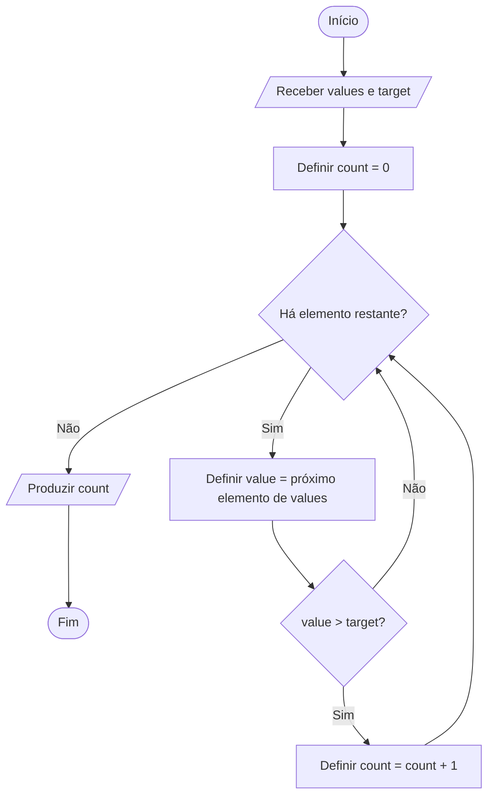

O diagrama e o pseudocódigo preservam a mesma inicialização, o mesmo teste por elemento, a mesma atualização condicional e a mesma condição de término.

Invariante possível:

> antes de processar o próximo elemento, `count` é exatamente a quantidade de elementos maiores que `target` no prefixo já processado.

Rastreamento:

| Prefixo após a etapa | Valor processado | `count` depois |
|---|---:|---:|
| `[2]` | `2` | `0` |
| `[2, 7]` | `7` | `1` |
| `[2, 7, -1]` | `-1` | `1` |
| `[2, 7, -1, 7]` | `7` | `2` |

Ao terminar, o prefixo processado é a sequência inteira; portanto, o invariante implica a pós-condição. O percurso termina porque processa uma sequência finita e avança um elemento por iteração.

Contraexemplo para `count = 1`:

```text
values = []
target = 10
```

O resultado correto é `0`, mas a inicialização defeituosa já começa em `1`. Se o contrato escolhido excluísse sequência vazia, outro contraexemplo seria `values = [0]`, `target = 10`.

A lógica de contar e o contrato pertencem ao **algoritmo**; sintaxe de loop, tipos concretos, mecanismo de retorno e tratamento de erro pertencem à **linguagem/ambiente de implementação**.

</details>

## 22.14 Escolha o símbolo adequado

Associe cada operação ao símbolo **mais informativo** dentro do vocabulário da §16.3:

A. começar o algoritmo  
B. calcular `total = a + b`  
C. receber `idade`  
D. testar `idade >= 18?`  
E. continuar em outro ponto distante da mesma página  
F. executar `VALIDATE_INPUT()` já definido separadamente  
G. indicar continuação em outra página  
H. acrescentar uma observação que não é executada

<details>
<summary><strong>Resposta comentada</strong></summary>

A. terminal;  
B. processo;  
C. entrada/saída;  
D. decisão;  
E. conector na página;  
F. processo predefinido/subprocesso;  
G. conector fora da página;  
H. anotação/comentário.

Uma forma mais genérica às vezes ainda seria legível, mas a pergunta pede a forma que comunica melhor a função.

</details>

## 22.15 Linha de fluxo, conectores e subprocesso

Classifique cada caso como:

```text
LINHA DE FLUXO
CONECTOR NA PÁGINA
CONECTOR FORA DA PÁGINA
SUBPROCESSO
```

1. duas etapas adjacentes possuem relação direta;
2. um retorno cruzaria praticamente todo o diagrama;
3. a continuação está na página seguinte;
4. uma etapa chama um procedimento com contrato já definido.

Depois explique por que **conector** e **subprocesso** não são sinônimos.

<details>
<summary><strong>Resposta comentada</strong></summary>

1. linha de fluxo;  
2. conector na página;  
3. conector fora da página;  
4. subprocesso.

Conector apenas referencia a continuidade do **mesmo fluxo** em outro ponto. Subprocesso representa uma **unidade de lógica definida separadamente** e chamada pelo fluxo atual.

</details>

## 22.16 Depure o fluxograma

Considere a intenção: contar de `0` até `2` e terminar.

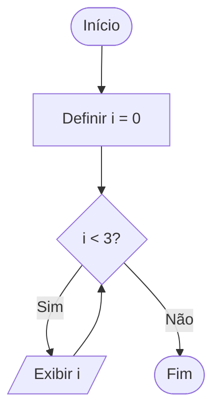

Identifique o defeito lógico e corrija o diagrama.

<details>
<summary><strong>Resposta comentada</strong></summary>

O caminho `Sim` retorna ao teste sem alterar `i`. A condição permanece verdadeira indefinidamente.

Uma correção:

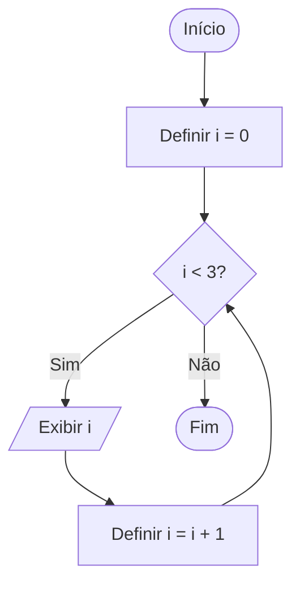

O primeiro diagrama era sintaticamente renderizável e visualmente organizado, mas representava algoritmo sem progresso.

</details>

## 22.17 Fluxograma ↔ pseudocódigo

Converta o fluxograma abaixo para pseudocódigo:

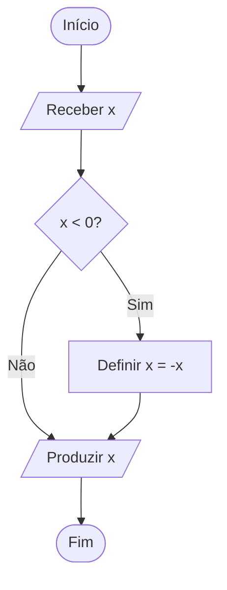

Depois reconstrua um fluxograma a partir do pseudocódigo produzido, **liste os caminhos possíveis** e confirme qual pós-condição deve valer em cada término. Compare então os caminhos das duas representações.

<details>
<summary><strong>Resposta comentada</strong></summary>

Pseudocódigo possível:

```text
ABS_VALUE(x)
    if x < 0
        x = -x
    return x
```

A conversão pode mudar a aparência da representação, mas precisa preservar: uma única decisão, a atualização apenas para negativos e a mesma saída final.

Considere `x_initial` como o valor recebido antes de qualquer atualização. Os dois caminhos são:

```text
CAMINHO 1
x_initial < 0
→ definir x = -x_initial
→ produzir x

CAMINHO 2
x_initial >= 0
→ manter x = x_initial
→ produzir x
```

Em ambos os términos, deve valer a mesma pós-condição:

```text
result = |x_initial|
```

Equivalentemente, para entrada inteira, `result >= 0` e o resultado corresponde ao valor absoluto da entrada original. Assim, o fluxograma reconstruído e o pseudocódigo são equivalentes apenas se preservarem esses dois caminhos e essa pós-condição comum.

</details>

## 22.18 Visualmente válido, logicamente incorreto

Um fluxograma usa símbolos corretos, setas claras e possui início/fim. No entanto, para encontrar o maior valor de uma sequência não vazia, ele começa com:

```text
max_so_far = 0
```

Explique por que **qualidade gráfica não prova correção algorítmica** e forneça um contraexemplo mínimo.

<details>
<summary><strong>Resposta comentada</strong></summary>

A representação pode estar formalmente organizada e ainda expressar uma inicialização incompatível com o domínio. Para:

```text
[-1]
```

o procedimento pode retornar `0`, que nem pertence à entrada.

A correção é iniciar com um elemento válido da própria sequência, por exemplo `values[0]`, sob a pré-condição de sequência não vazia.

</details>

[↑ Voltar ao índice](#índice)

---

# 23. Evidências de domínio

Como o tópico é `[D]`, a meta vai além de reconhecer definições. Cada item abaixo aponta para pelo menos uma forma concreta de praticar ou verificar a capacidade.

## Você deve conseguir explicar

- [ ] problema × algoritmo — §3, LAB-T02-01, EX 22.1;
- [ ] algoritmo × programa — §7, EX 22.2;
- [ ] entrada × domínio — §§3.1, 4.4 e 5.4, EX 22.3;
- [ ] pré-condição — §9.1, LAB-T02-03;
- [ ] pós-condição — §9.2, LAB-T02-03, EX 22.5;
- [ ] estado inicial/intermediário/final — §8, LAB-T02-04;
- [ ] correção — §10, PR-T02-02, TS-T02-06;
- [ ] término — §11, PR-T02-04, EX 22.6–22.7;
- [ ] determinismo quando aplicável — §12, EX 22.9;
- [ ] pseudocódigo — §15, PR-T02-05, EX 22.10;
- [ ] fluxograma como representação, não como algoritmo — §§14.4 e 16.1, EX 22.18;
- [ ] função dos símbolos essenciais e estruturais — §16.3, EX 22.14–22.15;
- [ ] linha de fluxo × conector — §16.5, EX 22.15;
- [ ] Mermaid × notação conceitual — §16.15;
- [ ] invariante em nível introdutório — §13, LAB-T02-04, EX 22.8.

## Você deve conseguir aplicar

- [ ] definir contrato simples — PR-T02-01, LAB-T02-03;
- [ ] escrever pseudocódigo — PR-T02-05, LAB-T02-01, EX 22.10;
- [ ] escolher estado adequado — §8, PR-T02-03, LAB-T02-04;
- [ ] construir rastreamento — §17.8, LAB-T02-04;
- [ ] encontrar contraexemplo — PR-T02-02, LAB-T02-02, EX 22.11;
- [ ] detectar inicialização inválida — §17.6, TS-T02-01;
- [ ] identificar condição de término — §11, PR-T02-04, TS-T02-03;
- [ ] escolher símbolos coerentes com a função representada — §16.3, EX 22.14;
- [ ] representar sequência, seleção e repetição — §§16.8–16.10, LAB-T02-05;
- [ ] usar conectores quando melhorarem a legibilidade — §16.5, LAB-T02-05;
- [ ] representar chamada de subprocesso sem esconder operação central — §16.6, EX 22.15;
- [ ] integrar contrato, estado, invariante, rastreamento, término, fluxograma e busca de contraexemplo em um único problema — EX 22.13.

## Você deve conseguir depurar

- [ ] distinguir algoritmo errado de implementação errada — §7, PR-T02-02;
- [ ] encontrar entrada que quebra uma hipótese — LAB-T02-02, TS-T02-01;
- [ ] localizar violação de pré-condição — TS-T02-02;
- [ ] identificar loop sem progresso — TS-T02-03, EX 22.7 e 22.16;
- [ ] detectar caminho sem destino, decisão sem rotulagem útil ou conector ambíguo — §§16.5 e 16.11;
- [ ] explicar por que um fluxograma visualmente correto pode representar lógica incorreta — §16.11, EX 22.18;
- [ ] explicar por que teste isolado não prova correção — §10.3, TS-T02-06.

## Você deve conseguir transferir

- [ ] descrever o algoritmo sem linguagem — §§14–15, LAB-T02-05;
- [ ] converter pseudocódigo → fluxograma sem alterar o contrato — §16.14, LAB-T02-05;
- [ ] converter fluxograma → pseudocódigo preservando caminhos — §16.14, LAB-T02-05, EX 22.17;
- [ ] interpretar símbolos complementares sem tratá-los como núcleo obrigatório — §16.7;
- [ ] implementar o algoritmo em duas linguagens — §18, LAB-T02-06;
- [ ] reconhecer diferenças semânticas — §18.5, LAB-T02-06;
- [ ] explicar como o mesmo estado conceitual aparece em representações e implementações diferentes — §§8, 16 e 18.5.

## Nível 5 — dominar/ensinar

Você deve conseguir receber uma solução de outra pessoa e perguntar sistematicamente:

```text
qual problema?
qual domínio?
qual contrato?
qual estado?
qual inicialização?
qual progresso?
qual invariante?
qual término?
qual argumento de correção?
quais contraexemplos foram procurados?
qual representação comunica melhor esta parte?
se houver fluxograma, cada forma e conector possui função inequívoca?
fluxograma e pseudocódigo descrevem o mesmo comportamento?
qual parte pertence ao algoritmo e qual pertence à linguagem/ferramenta?
```

Uma evidência forte de nível 5 é conseguir orientar outra pessoa em `PR-T02-01` a `PR-T02-06` sem entregar a solução pronta, explicar o mecanismo das falhas `TS-T02-01` a `TS-T02-06`, revisar um fluxograma usando §16.13 e resolver o desafio integrador `22.13` justificando cada parte do raciocínio.

[↑ Voltar ao índice](#índice)

---

# 24. Checklist de consulta rápida

Antes de aceitar um procedimento como algoritmo bem especificado:

```text
[ ] O problema está definido?
[ ] O domínio de entrada está claro?
[ ] A saída correta possui critério verificável?
[ ] As pré-condições estão explícitas?
[ ] Os passos são precisos?
[ ] A ordem está clara?
[ ] O estado necessário está identificado?
[ ] Existe progresso?
[ ] Existe condição de término?
[ ] O algoritmo termina para toda entrada válida?
[ ] O estado final satisfaz a pós-condição?
[ ] Procurei contraexemplos?
[ ] Diferenciei teste de argumento de correção?
[ ] Diferenciei erro de sintaxe/runtime de erro algorítmico?
[ ] A representação não esconde a parte difícil?
[ ] Se usei built-in/API, conheço o contrato da operação encapsulada?
[ ] A descrição depende desnecessariamente de uma linguagem?
```

Se a representação escolhida for um fluxograma, acrescente:

```text
[ ] Início e término estão claramente identificados?
[ ] Cada forma corresponde à função da etapa?
[ ] As decisões possuem saídas compreensíveis e caminhos completos?
[ ] O sentido das linhas de fluxo é inequívoco?
[ ] Conectores estão identificados e pareados sem ambiguidade?
[ ] O diagrama evita cruzamentos/linhas longas quando um conector melhoraria a leitura?
[ ] Subprocessos referenciam lógica realmente definida em outro lugar?
[ ] Repetições possuem progresso e caminho de saída?
[ ] Fluxograma e pseudocódigo/contrato descrevem o mesmo comportamento?
[ ] Existe descrição textual equivalente para que o raciocínio não dependa apenas da imagem renderizada?
```

[↑ Voltar ao índice](#índice)

---

# 25. Glossário

| Termo | Definição |
|---|---|
| **Algoritmo** | Procedimento computacional bem definido proposto para transformar entradas/estado em resultados segundo uma especificação. |
| **Algoritmo offline** | Algoritmo que recebe a sequência/conjunto relevante de entradas antecipadamente antes de processá-la. |
| **Algoritmo online** | Algoritmo que processa entradas à medida que chegam, sem pressupor conhecimento antecipado de toda a sequência futura. |
| **Conector** | Referência que indica continuidade do fluxo em outro ponto da mesma página ou em outra página, sem representar uma etapa executável. |
| **Contrato** | Conjunto explícito de condições e propriedades que delimitam o uso correto de um algoritmo, incluindo pré-condições e pós-condições quando aplicável. |
| **Correção** | Propriedade de produzir resultados que satisfazem a especificação para o domínio considerado. |
| **Correção parcial** | Sob `PRE → POST`: se a pré-condição vale no estado inicial e o algoritmo termina, então a pós-condição vale no estado final; não garante término por si só. |
| **Correção total** | Correção parcial mais garantia de término para as entradas/estados cobertos pela pré-condição. |
| **Determinístico** | Com entrada/estado inicial iguais, as escolhas do procedimento são determinadas. |
| **Domínio de entrada** | Conjunto de entradas consideradas válidas para o problema/contrato. |
| **Efetividade** | Propriedade de os passos serem executáveis no modelo de computação adotado. |
| **Efeito colateral (*side effect*)** | Alteração observável além do valor retornado, como modificar estrutura, arquivo, banco ou outro estado externo declarado pelo contrato. |
| **Especificação** | Descrição do problema e das propriedades que uma solução correta deve satisfazer, sem determinar necessariamente como a solução será construída. |
| **Estado** | Informação relevante da execução em determinado instante. |
| **Finitude** | Término após quantidade finita de passos para entradas do domínio assumido. |
| **Fail fast** | Estratégia de detectar e sinalizar uma condição inválida o mais cedo possível, antes que a execução prossiga com estado inadequado; é uma decisão de implementação e não substitui a definição do contrato. |
| **Fluxograma** | Representação gráfica dos passos e caminhos de controle de um procedimento. |
| **Heurística** | Estratégia prática que busca solução útil sem necessariamente oferecer as mesmas garantias de um algoritmo exato/ótimo. |
| **Instância** | Entrada concreta de um problema geral. |
| **Invariante** | Propriedade que permanece verdadeira em pontos definidos da execução. |
| **Las Vegas (algoritmo randomizado)** | Categoria em que a resposta produzida é correta; a aleatoriedade pode afetar o caminho ou o tempo de execução. |
| **Linha de fluxo** | Ligação direcionada que conecta diretamente etapas de um fluxograma e indica a sequência do caminho. |
| **Modelo de computação** | Conjunto de estados e operações suficientemente definido para dizer o que cada passo do algoritmo pode executar; neste T02 é usado em sentido informal. |
| **Monte Carlo (algoritmo randomizado)** | Categoria que admite probabilidade de erro controlada conforme a especificação/análise. |
| **Oracle de teste (test oracle)** | Regra ou mecanismo usado para decidir se o resultado observado de um teste satisfaz a especificação esperada. |
| **Pós-condição** | Propriedade que deve valer no estado final correto. |
| **Pré-condição** | Propriedade assumida/esperada antes da execução. |
| **Problema computacional** | Especificação da relação entre entradas e resultados corretos. |
| **Processo predefinido / subprocesso** | Etapa que chama uma unidade de lógica definida separadamente, com comportamento/contrato conhecido no nível de abstração usado. |
| **Programa** | Implementação executável em linguagem/ambiente concreto. |
| **Pseudocódigo** | Representação estruturada de algoritmo sem gramática universal obrigatória. |
| **Randomizado** | Algoritmo que incorpora escolhas aleatórias à execução. |
| **Sentinela** | Valor ou condição especial usado para sinalizar fim/controle de uma sequência quando esse papel faz parte do protocolo do algoritmo; precisa ser escolhido sem colidir indevidamente com dados válidos. |
| **Término** | Propriedade de a execução alcançar um estado final segundo o contrato. |
| **Variante** | Medida que progride em direção ao término, útil para raciocinar sobre loops/recursão. |

[↑ Voltar ao índice](#índice)

---

# 26. Referências

## 26.1 Taxonomia canônica

### Guia curricular deste projeto

`GUIA_LOGICA_FUNDAMENTOS_ALGORITMOS_E_ESTRUTURAS_DE_DADOS_v2.1.0.md`

Nós usados:

```text
2
2.1
2.2
2.3
2.4
2.5
```

---

## 26.2 Currículo

### ACM / IEEE-CS / AAAI — CS2023

- Algorithmic Foundations:
  - https://csed.acm.org/algorithms-and-complexity/
- Computer Science Curricula 2023:
  - https://csed.acm.org/

Uso:

- posicionamento curricular;
- algorithmic foundations;
- correção e resolução algorítmica como parte da formação.

---

## 26.3 MIT OpenCourseWare

### 6.006 — Introduction to Algorithms

- curso:
  - https://ocw.mit.edu/courses/6-006-introduction-to-algorithms-spring-2020/
- Lecture 1 — Introduction:
  - https://ocw.mit.edu/courses/6-006-introduction-to-algorithms-spring-2020/resources/mit6_006s20_lec1/
- Recitation 1 — Correctness:
  - https://ocw.mit.edu/courses/6-006-introduction-to-algorithms-spring-2020/resources/mit6_006s20_r01/

Uso:

- problema como relação entre input e outputs corretos;
- algoritmo determinístico introdutório como mapeamento de entrada para saída;
- correção;
- indução;
- separação entre correção e eficiência.

---

## 26.4 Stanford

### CS161 — Design and Analysis of Algorithms

- material sobre correção e loop invariants:
  - https://web.stanford.edu/class/archive/cs/cs161/cs161.1166/lectures/lecture1.pdf
- página histórica do curso:
  - https://web.stanford.edu/class/archive/cs/cs161/cs161.1166/

Uso:

- correção;
- invariantes;
- inicialização, manutenção e término.

---

## 26.5 Normas e documentação oficial

### ISO 5807:1985

**Information processing — Documentation symbols and conventions for data, program and system flowcharts, program network charts and system resources charts.**

- página oficial:
  - https://www.iso.org/standard/11955.html

Uso nesta versão:

- confirmar a existência, o escopo e o estado publicado/confirmado da norma;
- registrar a última revisão e confirmação em 2019 indicada pela página oficial e que esta versão permanece vigente;
- fundamentar que fluxogramas de programas possuem símbolos e convenções documentais próprios;
- delimitar a relação do assunto com fluxogramas de dados, programas e sistemas.

> **Limite de evidência:** a página pública da ISO expõe metadados, resumo e amostra, não o texto integral da norma. Este tópico, portanto, **não afirma reproduzir exaustivamente todos os símbolos da ISO 5807** nem transcreve conteúdo normativo protegido. A tabela da §16.3 é o vocabulário curricular do Guia para algoritmos, reconciliado com fontes didáticas e documentação oficial de ferramentas.

### Microsoft Support — fluxograma básico no Visio

- documentação oficial:
  - https://support.microsoft.com/pt-br/visio/create-a-basic-flowchart-in-visio
- continuação fora da página:
  - https://support.microsoft.com/en-us/visio/continue-a-flowchart-on-a-separate-page

Uso nesta versão:

- convenções práticas correntes para início/fim, processo, decisão, subprocesso e entrada/saída;
- distinção entre referência/conector na página e referência fora da página;
- uso de referência na página para evitar conectores excessivamente longos.

A documentação do Visio é usada como **referência prática de ferramenta**, não como norma substituta da ISO.

### Mermaid — Flowcharts Syntax

- documentação oficial:
  - https://mermaid.js.org/syntax/flowchart.html

Uso nesta versão:

- sintaxe usada para publicar os diagramas do Guia;
- nós, arestas/linhas e direção do flowchart;
- formas clássicas e formas expandidas disponíveis desde Mermaid 11.3.0;
- mapeamentos de implementação como `process`, `decision`, `terminal`, `subprocess`, `document`, `manual-input`, `database`, `display`, `comment` e `delay`.

O projeto versiona localmente Mermaid **11.17.2**. A documentação do Mermaid sustenta apenas a **implementação gráfica**; ela não define a semântica normativa de fluxogramas.

- release oficial da versão utilizada:
  - https://github.com/mermaid-js/mermaid/releases/tag/mermaid%4011.17.2

### Python — tipos numéricos

- documentação oficial de tipos embutidos:
  - https://docs.python.org/pt-br/3/library/stdtypes.html

Uso nesta versão:

- fundamentar que `int` em Python possui precisão arbitrária, limitada na prática pelos recursos disponíveis.

### ECMAScript — `Number.MAX_SAFE_INTEGER`

- especificação oficial:
  - https://tc39.es/ecma262/multipage/numbers-and-dates.html#sec-number.max_safe_integer

Uso nesta versão:

- delimitar a faixa de inteiros que o tipo `Number` distingue com segurança;
- justificar a ressalva de domínio da implementação JavaScript da §18.

### Java — tipos integrais

- Java Language Specification:
  - https://docs.oracle.com/javase/specs/jls/se27/html/jls-4.html#jls-4.2.1

Uso nesta versão:

- fundamentar que `int` é um inteiro com sinal de 32 bits e delimitar o domínio concreto do exemplo Java.

### NIST — Dictionary of Algorithms and Data Structures (DADS)

- dicionário oficial:
  - https://xlinux.nist.gov/dads/
- algoritmo offline:
  - https://xlinux.nist.gov/dads/HTML/offline.html
- algoritmo online:
  - https://xlinux.nist.gov/dads/HTML/online.html
- algoritmo Las Vegas:
  - https://xlinux.nist.gov/dads/HTML/lasVegas.html
- algoritmo Monte Carlo:
  - https://xlinux.nist.gov/dads/HTML/monteCarlo.html

Uso nesta versão:

- terminologia complementar `online/offline` usada na extensão da §11.5;
- distinção introdutória entre algoritmos randomizados Las Vegas e Monte Carlo na §12.2.

> **Fronteira:** DADS é uma referência terminológica/técnica do NIST, não uma especificação normativa do currículo nem substitui as fontes acadêmicas usadas para correção e invariantes.

---

## 26.6 Fontes locais efetivamente consultadas

Os materiais abaixo estão disponíveis na File Library e foram **abertos e efetivamente consultados** para esta versão. A presença de outros livros na biblioteca não é tratada como consulta nem como autoridade automática.

### Cormen, Leiserson, Rivest e Stein

**Introduction to Algorithms. 4th ed. MIT Press, 2022.**

PDF local:

```text
Cormen et al. — Introduction to Algorithms 2022.pdf
```

Localizadores e uso:

- Capítulo 1 — *The Role of Algorithms in Computing*: papel de algoritmos;
- Capítulo 2, especialmente §2.1 — pseudocódigo, correção e loop invariants;
- estrutura `Initialization → Maintenance → Termination` para raciocínio de correção;
- fronteira com análise de algoritmos.

### Farrell, Joyce

**Programming Logic and Design. 10th ed. Cengage, 2024.**

PDF local:

```text
Joyce Farrell — Programming Logic and Design 10-ed_2024.pdf
```

Localizadores e uso:

- Capítulo 1, §1.3 — ciclo de desenvolvimento;
- Capítulo 1, §1.4 — pseudocódigo, desenho de fluxogramas, terminal, entrada/saída, processo, linhas de fluxo, decisão e chamadas de módulo (Figura 1-7);
- Capítulo 1, §1.4 — orientação predominante do fluxo e equivalência de lógica entre pseudocódigo e fluxograma;
- Capítulo 1, §1.5 — término por sentinela e exemplo de loop infinito;
- Capítulo 3 — sequência, seleção e repetição como estruturas de controle.

### Skiena, Steven S.

**The Algorithm Design Manual. 3rd ed. Springer, 2020.**

PDF local:

```text
The Algorithm Design Manual by Steven S. Skiena 2020.pdf
```

Localizadores e uso:

- Capítulo 1, especialmente §1.3 — raciocínio sobre correção;
- §1.3.1 — problemas e propriedades: entradas permitidas e propriedades da saída;
- busca de contraexemplos para refutar algoritmos aparentemente plausíveis;
- separação entre correção e eficiência.

### GNU Project — Bash Reference Manual

**GNU Bash Reference Manual 5.3. Free Software Foundation, 2025.**

PDF local:

```text
GNU Bash Reference Manual 5.3.pdf
```

Localizadores e uso:

- §3.4.1 — parâmetros posicionais;
- §3.7.5 — exit status;
- §6.5 — *Shell Arithmetic*;
- confirmação de que variáveis podem ser usadas como operandos e seus valores são avaliados como expressões aritméticas;
- confirmação de que valor nulo ou variável não definida, quando referenciada por nome em expressão aritmética, avalia como `0`;
- confirmação de que a avaliação usa os maiores inteiros de largura fixa disponíveis, sem verificação de overflow;
- delimitação do papel de `stdout` e exit status no exemplo Bash da §18.4.

---

## 26.7 Como as fontes foram usadas

```text
TAXONOMIA v2.1.0
→ escopo canônico

CS2023
→ posição curricular

MIT 6.006
→ definição operacional de problema/algoritmo
→ correção

CLRS
→ pseudocódigo
→ invariantes
→ correção

Stanford CS161
→ corroboração acadêmica complementar sobre correção/invariantes

ISO 5807:1985 — página oficial pública
→ escopo e vigência da norma de símbolos/convenções
→ sem alegar reprodução integral do catálogo normativo

Microsoft Support / Visio
→ convenções práticas de formas
→ referências na página e fora da página

Mermaid 11.17.2 / documentação e release oficiais
→ sintaxe de renderização dos flowcharts no site
→ versão local explicitamente rastreada
→ não tratado como norma de fluxogramas

Farrell
→ representação didática
→ pseudocódigo/fluxograma
→ símbolos fundamentais, flowlines e chamadas de módulo
→ sequência, seleção e repetição

Skiena
→ problema × instância
→ especificação e contraexemplos
→ correção × eficiência

Python — documentação oficial
→ precisão arbitrária de `int`

ECMAScript — especificação oficial
→ `Number.MAX_SAFE_INTEGER`
→ limites de representação exata do exemplo JavaScript

Java Language Specification
→ faixa e semântica de `int`

GNU Bash Reference Manual
→ aritmética do shell
→ regras de base para constantes
→ parâmetros posicionais
→ exit status e limites do exemplo Bash

NIST DADS
→ terminologia online/offline
→ terminologia Las Vegas/Monte Carlo
```

O enquadramento determinístico do MIT 6.006 é usado como modelo introdutório; ele não é transformado em afirmação de que todo algoritmo possível precisa ser determinístico.

### Síntese multifonte deste tópico

A Visão Panorâmica não replica a organização de uma única fonte. Ela combina funções complementares:

```text
MIT 6.006
→ problema como relação entrada ↔ saídas corretas
→ algoritmo e correção no escopo do problema

CLRS
→ pseudocódigo
→ invariante: inicialização, manutenção, término

Skiena
→ ideia do algoritmo acima da aparência da notação
→ contraexemplos simples para refutar incorreção

ISO 5807:1985 (página oficial pública)
→ escopo normativo de símbolos e convenções de fluxogramas
→ referência de fronteira, sem reprodução integral da norma

Microsoft Support / Visio
→ convenções práticas atuais para formas e referências/conectores

Mermaid
→ implementação visual dos diagramas no site
→ separação explícita entre ferramenta e conceito

Farrell
→ pseudocódigo × fluxograma como representações
→ símbolos e leitura didática de fluxogramas
→ clareza da lógica antes da linguagem

Stanford CS161
→ reforço independente para correção e loop invariants

Python / ECMAScript / Java / GNU Bash — fontes oficiais
→ fronteiras concretas de representação e aritmética nas quatro implementações

NIST DADS
→ terminologia complementar para algoritmos online/offline e randomizados

TAXONOMIA v2.1.0
→ fronteira curricular e classificação
```

A contribuição de cada fonte foi usada apenas onde ela acrescenta função real; comportamento e definições não foram fundidos quando dependem de escopo diferente.

[↑ Voltar ao índice](#índice)

---

<!-- publication: source-only; histórico editorial não exibido na página didática -->

# 27. Histórico de versões

<details>
<summary>Histórico de versões</summary>

| Versão | Data | Alterações |
|---|---|---|
| **0.4.10** | 2026-09-30 | Patch microscópico final sobre a v0.4.9: corrige no Resumo executivo a ordem conceitual entre algoritmo, programa/implementação, execução e resultado, alinhando-a ao fluxo canônico já apresentado em §1 (`PROBLEMA → ESPECIFICAÇÃO → ALGORITMO → IMPLEMENTAÇÃO → EXECUÇÃO → RESULTADO`); atualiza `last_reviewed`; preserva integralmente contratos, algoritmos, exemplos, Mermaid, referências, âncoras, taxonomia, PR/TS/LABs e demais conteúdos da v0.4.9. |
| **0.4.9** | 2026-09-29 | Patch microscópico de fechamento sobre a v0.4.8: restringe a forma decimal canônica do exemplo Bash para rejeitar `-0` e outras grafias não canônicas antes da aritmética; explicita números racionais como domínio do LAB-T02-03 de divisão exata; substitui “procedimento/ideia” por formulação compatível com a definição rigorosa de algoritmo; corrige “a nova invariante” para “o novo invariante”; substitui “contraprova acadêmica” por “corroboração acadêmica complementar” na síntese de fontes; preserva contratos, Mermaid, referências, âncoras, taxonomia e escopo curricular. |
| **0.4.8** | 2026-09-29 | Patch final de segurança e consistência sobre a v0.4.7: valida previamente todos os argumentos do exemplo Bash antes de qualquer conteúdo externo entrar em contexto aritmético, rejeitando formatos não decimais/canônicos e documentando a fronteira de faixa/overflow; completa o contrato do exemplo de múltiplas saídas em §2.6, `PR-T02-06` e `TS-T02-05`; separa pré-condição de validação em §14.2; completa `PRE`/`POST` e padroniza o percurso do `MAXIMUM` em §14.3 e ocorrências equivalentes; adiciona `-3` ao LAB-T02-05 como regressão para paridade negativa; documenta `shift` no Bash; torna o diagnóstico de `TS-T02-02` menos absoluto; preserva Mermaid, referências, âncoras, taxonomia e escopo curricular. |
| **0.4.7** | 2026-09-29 | Revisão final de fechamento da v0.4.6: contextualiza `n` e `i` no exemplo de variante de §11.3; adiciona microexemplo online/offline sem ampliar o núcleo curricular; alinha a definição introdutória de Las Vegas à garantia de correção; corrige o rótulo residual e explicita o sentido de “elemento restante” no fluxograma `MAXIMUM`; alinha os pseudocódigos de §17.7 e §22.10 à convenção `PRE`/`POST`; completa o gabarito do exercício 22.17 com os dois caminhos e a pós-condição comum; adiciona `Fail fast` ao glossário; preserva compatibilidade de âncoras, referências, taxonomia, contratos, PR/TS/LABs e escopo do T02. |
| **0.4.6** | 2026-09-29 | Revisão de fechamento da v0.4.5: corrige “conjunto com duplicados” para sequência com valores repetidos; fortalece a variante de término com medida bem fundada; reposiciona `POST` como contrato não executável; explicita correção geral em §10.4; adiciona imutabilidade conceitual, efeitos colaterais, fail-fast/asserções, built-ins encapsulados, online/offline e Las Vegas/Monte Carlo como extensões delimitadas; torna explícita a inicialização do invariante; melhora o exemplo de decisão em fluxograma; corrige a semântica I/O × acesso interno nos fluxogramas `MAXIMUM` e `COUNT_GREATER`; reforça acessibilidade textual de Mermaid; registra `n - 1` comparações; remove cópias desnecessárias em Python/JavaScript; reforça Bash e a comparação entre linguagens; adiciona aliases ASCII sem quebrar âncoras antigas; reduz redundância do contraexemplo `max = 0`; amplia checklist/glossário; registra confirmação ISO 2019 e NIST DADS; preserva taxonomia, contratos, PR/TS/LABs e escopo do T02. |
| **0.4.5** | 2026-09-29 | Fecha a auditoria integral da v0.4.4: corrige correção parcial/total com pré-condição explícita; delimita o domínio numérico das quatro implementações; fecha o fluxo lógico do Panorama; remove circularidade do contrato; amplia o ensino do conector fora da página; elimina duplicação `IS_EVEN`; reposiciona retornos ao índice; padroniza “invariante”; qualifica convenções de formas; reforça Bash; atualiza referências oficiais de Python/ECMAScript/Java/Mermaid; ordena e corrige o glossário. A publicação mantém o histórico como metadado editorial do Markdown, não como conteúdo didático da página. |
| **0.4.4** | 2026-09-29 | Amplia a cobertura de fluxogramas sem alterar a taxonomia: consolida símbolos essenciais, conectores na página/fora da página, subprocessos e símbolos complementares; introduz construção por sequência/seleção/repetição, regras de legibilidade, leitura/revisão e conversão fluxograma ↔ pseudocódigo; corrige o exemplo `MAXIMUM` com terminais, I/O, progresso e fim explícitos; atualiza Panorama, LAB-T02-05, desafio integrador, exercícios 22.14–22.18, evidências de domínio, checklist, glossário e referências; adiciona ISO 5807, Microsoft Support e Mermaid como fontes com papéis explicitamente delimitados. |
| **0.4.3** | 2026-09-16 | Fecha explicitamente a ponte invariante → término → pós-condição; amplia pós-condições para propriedades do estado final, não apenas valores retornados; define melhor “passo executável” no modelo informal; conecta correção parcial ao caso de não término; esclarece `Nível A` × `difficulty`; adiciona desafio integrador 22.13 e atualiza evidências de domínio. |
| **0.4.2** | 2026-09-16 | Remove notação assintótica prematura da intuição de complexidade; torna o invariante visual por rastreamento de prefixos; padroniza “pós-condição”; torna `[C]`/`[E]` autocontidos; esclarece modelo de computação em nível informal; reforça a semântica e o exit status do exemplo Bash; liga múltiplas saídas corretas a PR/TS e separa estruturalmente Troubleshooting dos Problemas Reais sem renumerar o capítulo. |
| **0.4.1** | 2026-09-16 | Normaliza a convenção interna de pseudocódigo; adiciona ponteiro antecipado para a rota de primeira passagem; inclui Contrato, Especificação e oracle de teste no glossário; reduz repetição expositiva do contraexemplo `max = 0` por referências cruzadas; explicita aritmética exata no LAB 3; preserva PR-*, TS-*, LABs, exercícios, exemplos executáveis e capacidades da v0.4.0. |
| **0.4.0** | 2026-09-16 | Atualiza o contrato para v1.10.0; corrige o fluxograma do máximo com passo explícito de progresso; adiciona rastreabilidade da taxonomia e rota de primeira passagem; estabiliza âncoras de troubleshooting e LABs; completa LABs com testes, explicação e autoverificação; acrescenta gabaritos comentados aos exercícios; vincula evidências de domínio a práticas concretas; usa páginas estáveis do MIT OCW e atualiza a referência Stanford; adiciona localizadores bibliográficos às fontes locais e preserva o conteúdo técnico já aprovado. |
| **0.3.0** | 2026-09-15 | Amplia a Visão Panorâmica como caderno rápido multifonte; materializa `PR-T02-01` a `PR-T02-06` e `TS-T02-01` a `TS-T02-06`; reforça contratos, invariantes, término, múltiplas saídas corretas, prática e referências. |
| **0.2.0** | 2026-09-14 | Aprofunda múltiplas saídas corretas, correção geral e algoritmos randomizados; reorganiza referências e consolida a baseline estável. |
| **0.1.1** | 2026-09-14 | Melhora a hierarquia do índice sem alterar o conteúdo técnico. |
| **0.1.0** | 2026-09-13 | Primeira versão canônica do T02, cobrindo problema × algoritmo, propriedades, estado, contratos, correção, término, determinismo/randomização, invariantes introdutórias, representações, exemplo progressivo, transferência, prática e referências. |

</details>

---

**Fim — Fundamentos de Algoritmos v0.4.10**
