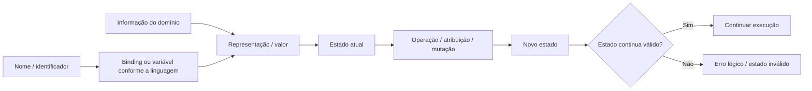

<a id="inicio"></a>

# Dados, Valores, Variáveis e Constantes

> **Classificação curricular:** `[D] Obrigatório dominar`  
> **Nível:** A — Lógica de Programação  
> **Posição na taxonomia:** tópico 3  
> **Pré-requisitos:** pensamento computacional; fundamentos de algoritmos  
> **Aprofundamentos posteriores:** tipos, escopo, lifetime, identidade, referências, mutabilidade, coleções e modelo de execução

> **Como interpretar esta classificação:** `[D]` indica uma capacidade que deve evoluir até aplicação, depuração e transferência. Não significa que o leitor precise dominar integralmente todo o tópico antes de avançar para o próximo. `Nível A` identifica o núcleo de Lógica de Programação da taxonomia canônica.
>
> **Legenda curricular usada no capítulo:** `[D]` = obrigatório dominar; `[C]` = obrigatório conhecer; `[E]` = extensão/recomendado; `[P]` = progressivo. Essas marcas indicam prioridade curricular, não o nível atual de proficiência do leitor.
>
> **Nível curricular × dificuldade:** `Nível A` indica a posição deste tópico na taxonomia. Já o campo `difficulty` do Front Matter descreve a faixa de dificuldade interna do material; por isso um tópico de Nível A pode conter aprofundamentos intermediários sem deixar de pertencer ao núcleo de Lógica de Programação.

> **Sobre este material:** este é o **T03** de uma série curricular de 35 tópicos. Referências a outros `Txx` indicam onde determinados conceitos serão retomados ou aprofundados; elas não criam pré-requisitos ocultos. O T03 foi escrito para permanecer compreensível isoladamente.

---

## Resumo executivo

Programas manipulam **informação**.

Essa informação é representada por:

```text
DADOS
↓
VALORES
↓
NOMES / IDENTIFICADORES
↓
ESTADO
↓
OPERAÇÕES
↓
NOVO ESTADO
```

Mas uma regra precisa ficar clara desde o início:

> **“variável é uma caixinha na memória” não é uma definição universal.**

Essa metáfora pode ajudar em um primeiro contato, porém esconde diferenças importantes entre linguagens.

Em Python, por exemplo, a documentação oficial descreve nomes como referências para objetos e atribuição como uma operação de *binding/rebinding*. Em Java, uma variável possui um tipo e contém um valor — que pode ser um valor primitivo ou uma referência. Em ECMAScript, `let` e `const` criam *bindings* em ambientes léxicos, sendo `const` um binding imutável. Em Bash, uma variável é um parâmetro nomeado que possui valor e atributos.

Por isso, o modelo mais transferível é:

```text
IDENTIFICADOR / NOME
        ↓
ASSOCIAÇÃO / BINDING / LOCAL DE ARMAZENAMENTO
        ↓
VALOR
        ↓
OBJETO / ESTADO REFERENCIADO, quando aplicável
```

A implementação concreta desse modelo varia por linguagem.

Este capítulo também estabelece uma distinção fundamental:

```text
DECLARAÇÃO
≠
INICIALIZAÇÃO
≠
ATRIBUIÇÃO
≠
REATRIBUIÇÃO
≠
ANOTAÇÃO DE TIPO
```

E responde a uma dúvida prática importante:

> **declarar/anotar o tipo explicitamente pode melhorar clareza, mas não existe uma regra universal de que “toda variável deve ter seu tipo escrito antes do uso”.**

A prática correta depende da linguagem e do valor informacional da anotação.

---

## Decisão rápida

| Pergunta | Conceito |
|---|---|
| “O que está sendo representado?” | Dado / informação |
| “Qual conteúdo concreto existe agora?” | Valor |
| “`42` é variável?” | Não — é um literal numérico |
| “`age` é o valor?” | Não — é um identificador/nome |
| “O nome aponta para quê?” | Depende do modelo da linguagem |
| “Criar o nome é atribuir valor?” | Nem sempre |
| “Dar o primeiro valor é o quê?” | Inicialização |
| “Trocar o valor depois é o quê?” | Reatribuição |
| “`age: int` em Python cria um `int`?” | Não |
| “`age: int | None = None` significa o quê?” | Anotação de tipo + valor inicial `None` |
| “`const` em JavaScript torna o objeto imutável?” | Não — torna o binding não reatribuível |
| “`final` em Java torna o objeto imutável?” | Não — impede nova atribuição à variável |
| “Python possui `const` nativo equivalente?” | Não |
| “Bash possui variável tipada como Java?” | Não — `declare -i` é atributo/semântica de aritmética, não tipagem estática |

> **Primeira vez aqui?** Use a [rota de primeira passagem](#modo-primeira-passagem) para construir primeiro o modelo mental essencial e depois voltar aos aprofundamentos.

---

# Índice


- [Resumo executivo](#resumo-executivo)
- [Decisão rápida](#decisão-rápida)
- [1. Posição deste assunto](#1-posição-deste-assunto)
  - [1.1 Fronteira deste capítulo](#11-fronteira-deste-capítulo)
  - [1.2 Rastreabilidade da taxonomia canônica](#12-rastreabilidade-da-taxonomia-canônica)
- [2. Visão panorâmica](#2-visão-panorâmica)
- [3. Dado, informação, valor e representação](#3-dado-informação-valor-e-representação)
  - [3.1 Informação](#31-informação)
  - [3.2 Dado](#32-dado)
  - [3.3 Valor](#33-valor)
  - [3.4 Representação](#34-representação)
  - [3.5 Dado não é automaticamente significado](#35-dado-não-é-automaticamente-significado)
- [4. Literal × valor × expressão](#4-literal--valor--expressão)
  - [4.1 Literal](#41-literal)
  - [4.2 Valor](#42-valor)
  - [4.3 Expressão](#43-expressão)
  - [4.4 Nem todo valor precisa aparecer como literal](#44-nem-todo-valor-precisa-aparecer-como-literal)
  - [4.5 Literal não é variável](#45-literal-não-é-variável)
- [5. Identificador, nome e binding](#5-identificador-nome-e-binding)
  - [5.1 Identificador](#51-identificador)
  - [5.2 Nome não é valor](#52-nome-não-é-valor)
  - [5.3 Binding](#53-binding)
  - [5.4 O binding pode mudar](#54-o-binding-pode-mudar)
  - [5.5 Binding não é necessariamente mutabilidade do objeto](#55-binding-não-é-necessariamente-mutabilidade-do-objeto)
- [6. O que é uma variável](#6-o-que-é-uma-variável)
  - [6.1 Uma variável possui pelo menos contexto](#61-uma-variável-possui-pelo-menos-contexto)
  - [6.2 Variável representa intenção](#62-variável-representa-intenção)
  - [6.3 Variável participa do estado](#63-variável-participa-do-estado)
  - [6.4 Variável não é necessariamente mutável para sempre](#64-variável-não-é-necessariamente-mutável-para-sempre)
- [7. Por que “caixinha na memória” é uma metáfora limitada](#7-por-que-caixinha-na-memória-é-uma-metáfora-limitada)
  - [7.1 Onde ela ajuda](#71-onde-ela-ajuda)
  - [7.2 Onde ela engana](#72-onde-ela-engana)
  - [7.3 Modelo melhor para transferência](#73-modelo-melhor-para-transferência)
  - [7.4 Java é diferente de Python](#74-java-é-diferente-de-python)
- [8. Declaração](#8-declaração)
  - [8.1 Java](#81-java)
  - [8.2 JavaScript](#82-javascript)
  - [8.3 Python](#83-python)
  - [8.4 Bash](#84-bash)
  - [8.5 Declaração não é universalmente obrigatória como etapa separada](#85-declaração-não-é-universalmente-obrigatória-como-etapa-separada)
- [9. Inicialização](#9-inicialização)
  - [9.1 Exemplo](#91-exemplo)
  - [9.2 Inicialização pode ocorrer junto da declaração](#92-inicialização-pode-ocorrer-junto-da-declaração)
  - [9.3 Estado válido](#93-estado-válido)
  - [9.4 Ausência como estado](#94-ausência-como-estado)
  - [9.5 Inicialização e invariantes](#95-inicialização-e-invariantes)
- [10. Atribuição](#10-atribuição)
  - [10.1 Não confundir com igualdade matemática](#101-não-confundir-com-igualdade-matemática)
  - [10.2 Python](#102-python)
  - [10.3 JavaScript](#103-javascript)
  - [10.4 Java](#104-java)
  - [10.5 Bash](#105-bash)
  - [10.6 Lado esquerdo não é “qualquer expressão”](#106-lado-esquerdo-não-é-qualquer-expressão)
- [11. Reatribuição](#11-reatribuição)
  - [11.1 Exemplo](#111-exemplo)
  - [11.2 Reatribuição pode expressar evolução legítima de estado](#112-reatribuição-pode-expressar-evolução-legítima-de-estado)
  - [11.3 Pode também esconder problema](#113-pode-também-esconder-problema)
  - [11.4 Reatribuição × mutação](#114-reatribuição--mutação)
- [12. Estado e transição de estado](#12-estado-e-transição-de-estado)
  - [12.1 Estado simples](#121-estado-simples)
  - [12.2 Transição](#122-transição)
  - [12.3 Várias variáveis compõem estado](#123-várias-variáveis-compõem-estado)
  - [12.4 Estado deve representar o domínio](#124-estado-deve-representar-o-domínio)
  - [12.5 Estado explícito é mais fácil de depurar](#125-estado-explícito-é-mais-fácil-de-depurar)
- [13. Constantes e intenção de estabilidade](#13-constantes-e-intenção-de-estabilidade)
  - [13.1 Por que nomear](#131-por-que-nomear)
  - [13.2 “Magic number”](#132-magic-number)
  - [13.3 Constante é conceito; mecanismos variam](#133-constante-é-conceito-mecanismos-variam)
- [14. Constante × imutabilidade × readonly/final/const](#14-constante--imutabilidade--readonlyfinalconst)
  - [14.1 JavaScript `const`](#141-javascript-const)
  - [14.2 Java `final`](#142-java-final)
  - [14.3 Python](#143-python)
  - [14.4 Bash](#144-bash)
  - [14.5 Conceito × mecanismo](#145-conceito--mecanismo)
- [15. Ausência de valor — None, null, undefined e unset](#15-ausência-de-valor--none-null-undefined-e-unset)
  - [15.1 Python `None`](#151-python-none)
  - [15.2 Java `null`](#152-java-null)
  - [15.3 JavaScript `undefined`](#153-javascript-undefined)
  - [15.4 JavaScript `null`](#154-javascript-null)
  - [15.5 Bash unset](#155-bash-unset)
  - [15.6 String vazia não é ausência universal](#156-string-vazia-não-é-ausência-universal)
  - [15.7 Regra de ouro](#157-regra-de-ouro)
- [16. Tipo esperado e anotações de tipo](#16-tipo-esperado-e-anotações-de-tipo)
  - [16.1 Tipo esperado ≠ anotação obrigatória](#161-tipo-esperado--anotação-obrigatória)
  - [16.2 Python](#162-python)
  - [16.3 Java](#163-java)
  - [16.4 JavaScript](#164-javascript)
  - [16.5 Bash](#165-bash)
- [17. Declarar o tipo antes do uso — boa prática?](#17-declarar-o-tipo-antes-do-uso--boa-prática)
  - [17.1 Java](#171-java)
  - [17.2 Python](#172-python)
  - [17.3 Python com ausência válida](#173-python-com-ausência-válida)
  - [17.4 JavaScript](#174-javascript)
  - [17.5 Bash](#175-bash)
  - [17.6 Regra transferível](#176-regra-transferível)
  - [17.7 Sua preferência pode ser usada conscientemente](#177-sua-preferência-pode-ser-usada-conscientemente)
- [18. Python — nomes, bindings e type hints](#18-python--nomes-bindings-e-type-hints)
  - [18.1 Nomes referem-se a objetos](#181-nomes-referem-se-a-objetos)
  - [18.2 Atribuição](#182-atribuição)
  - [18.3 Rebinding](#183-rebinding)
  - [18.4 Anotação sem valor](#184-anotação-sem-valor)
  - [18.5 Anotação + inicialização](#185-anotação--inicialização)
  - [18.6 União com None](#186-união-com-none)
  - [18.7 `Final`](#187-final)
  - [18.8 Convenção de constantes](#188-convenção-de-constantes)
- [19. JavaScript — let, const, bindings e TDZ](#19-javascript--let-const-bindings-e-tdz)
  - [19.1 `let`](#191-let)
  - [19.2 Reatribuição](#192-reatribuição)
  - [19.3 `const`](#193-const)
  - [19.4 Declaração `const` comum exige inicializador](#194-declaração-const-comum-exige-inicializador)
  - [19.5 `let` sem initializer](#195-let-sem-initializer)
  - [19.6 Temporal Dead Zone — TDZ](#196-temporal-dead-zone--tdz)
  - [19.7 `const` não congela objeto](#197-const-não-congela-objeto)
  - [19.8 `var`](#198-var)
- [20. Java — variáveis, tipos, final e definite assignment](#20-java--variáveis-tipos-final-e-definite-assignment)
  - [20.1 Declaração](#201-declaração)
  - [20.2 Inicialização](#202-inicialização)
  - [20.3 Variáveis locais](#203-variáveis-locais)
  - [20.4 Campos possuem regras diferentes](#204-campos-possuem-regras-diferentes)
  - [20.5 `final`](#205-final)
  - [20.6 Blank final](#206-blank-final)
  - [20.7 Referência final × objeto mutável](#207-referência-final--objeto-mutável)
  - [20.8 “Constant variable” na JLS](#208-constant-variable-na-jls)
- [21. Bash — parâmetros, variáveis, atributos e readonly](#21-bash--parâmetros-variáveis-atributos-e-readonly)
  - [21.1 Parâmetro](#211-parâmetro)
  - [21.2 Atribuição](#212-atribuição)
  - [21.3 String vazia é valor](#213-string-vazia-é-valor)
  - [21.4 Unset é diferente](#214-unset-é-diferente)
  - [21.5 Atributos](#215-atributos)
  - [21.6 Inteiro não significa sistema de tipos como Java](#216-inteiro-não-significa-sistema-de-tipos-como-java)
  - [21.7 `readonly`](#217-readonly)
  - [21.8 `local`](#218-local)
  - [21.9 `export`](#219-export)
- [22. Comparação semântica entre as quatro linguagens](#22-comparação-semântica-entre-as-quatro-linguagens)
- [23. Nomenclatura e significado](#23-nomenclatura-e-significado)
  - [23.1 Nome deve representar o conceito](#231-nome-deve-representar-o-conceito)
  - [23.2 Inglês como padrão recomendado](#232-inglês-como-padrão-recomendado)
  - [23.3 Unidade no nome](#233-unidade-no-nome)
  - [23.4 Booleanos](#234-booleanos)
- [24. Valor inicial coerente](#24-valor-inicial-coerente)
  - [24.1 Contador](#241-contador)
  - [24.2 Total](#242-total)
  - [24.3 Produto](#243-produto)
  - [24.4 Máximo](#244-máximo)
  - [24.5 Ausência](#245-ausência)
  - [24.6 Placeholder mágico](#246-placeholder-mágico)
- [25. Significado consistente durante a vida útil](#25-significado-consistente-durante-a-vida-útil)
  - [25.1 Tipagem dinâmica não autoriza confusão semântica](#251-tipagem-dinâmica-não-autoriza-confusão-semântica)
  - [25.2 Reuso legítimo existe](#252-reuso-legítimo-existe)
- [26. Mutabilidade consciente — introdução](#26-mutabilidade-consciente--introdução)
  - [26.1 Reatribuição](#261-reatribuição)
  - [26.2 Mutação](#262-mutação)
  - [26.3 Por que isso importa para constantes](#263-por-que-isso-importa-para-constantes)
- [27. Exemplo progressivo — contador de tentativas](#27-exemplo-progressivo--contador-de-tentativas)
  - [27.1 Problema](#271-problema)
  - [27.2 Estado inicial](#272-estado-inicial)
  - [27.3 Constante conceitual](#273-constante-conceitual)
  - [27.4 Transição](#274-transição)
  - [27.5 Estado](#275-estado)
  - [27.6 Condição](#276-condição)
  - [27.7 Invariantes conceituais](#277-invariantes-conceituais)
  - [27.8 Por que não usar `-1`](#278-por-que-não-usar--1)
- [28. Transferência para quatro linguagens](#28-transferência-para-quatro-linguagens)
  - [28.1 Python](#281-python)
  - [28.2 JavaScript](#282-javascript)
  - [28.3 Java](#283-java)
  - [28.4 Bash](#284-bash)
  - [28.5 O que é comum?](#285-o-que-é-comum)
  - [28.6 O que NÃO é igual?](#286-o-que-não-é-igual)
- [29. Erros conceituais frequentes](#29-erros-conceituais-frequentes)
  - [29.1 “Variável é sempre uma posição de memória”](#291-variável-é-sempre-uma-posição-de-memória)
  - [29.2 “Declaração e inicialização são a mesma coisa”](#292-declaração-e-inicialização-são-a-mesma-coisa)
  - [29.3 “Anotar `int` cria um inteiro”](#293-anotar-int-cria-um-inteiro)
  - [29.4 “`int | None` significa que a variável já vale None”](#294-int--none-significa-que-a-variável-já-vale-none)
  - [29.5 “`const` torna tudo imutável”](#295-const-torna-tudo-imutável)
  - [29.6 “`final` torna o objeto imutável”](#296-final-torna-o-objeto-imutável)
  - [29.7 “Python tem constante igual a JavaScript const”](#297-python-tem-constante-igual-a-javascript-const)
  - [29.8 “String vazia = variável inexistente no Bash”](#298-string-vazia--variável-inexistente-no-bash)
  - [29.9 “Toda variável Java recebe valor default”](#299-toda-variável-java-recebe-valor-default)
  - [29.10 “Tipagem dinâmica significa que nomes podem representar qualquer coisa sem custo de design”](#2910-tipagem-dinâmica-significa-que-nomes-podem-representar-qualquer-coisa-sem-custo-de-design)
  - [29.11 “Sempre declare primeiro e inicialize depois”](#2911-sempre-declare-primeiro-e-inicialize-depois)
- [Índice operacional de Problemas Reais `PR-*`](#problemas-reais)
  - [`PR-T03-01` — Escolher estado inicial sem placeholder mágico](#pr-t03-01)
  - [`PR-T03-02` — Declaração / annotation ≠ valor inicializado](#pr-t03-02)
  - [`PR-T03-03` — Representar ausência sem confundir valores distintos](#pr-t03-03)
  - [`PR-T03-04` — Estabilidade do nome sem falsa promessa de imutabilidade](#pr-t03-04)
  - [`PR-T03-05` — Garantir estado utilizável antes de toda leitura](#pr-t03-05)
  - [`PR-T03-06` — Preservar significado do identificador durante sua vida útil](#pr-t03-06)
- [🔎 Troubleshooting sistemático](#troubleshooting-sistematico)
  - [`TS-T03-01` — Python: annotation existe, mas o valor não](#ts-t03-01)
  - [`TS-T03-02` — JavaScript: leitura dentro da Temporal Dead Zone](#ts-t03-02)
  - [`TS-T03-03` — Java: variável local pode não ter sido inicializada](#ts-t03-03)
  - [`TS-T03-04` — Bash: string vazia foi confundida com variável unset](#ts-t03-04)
  - [`TS-T03-05` — `const` / `final` não congelou o objeto](#ts-t03-05)
  - [`TS-T03-06` — placeholder inicial produz estado impossível](#ts-t03-06)
- [30. Laboratórios](#30-laboratórios)
  - [🧪 Laboratório 1 — Classificar elementos](#lab-t03-01)
  - [🧪 Laboratório 2 — Estado inicial](#lab-t03-02)
  - [🧪 Laboratório 3 — Declaração × inicialização](#lab-t03-03)
  - [🧪 Laboratório 4 — Constante não é objeto imutável](#lab-t03-04)
  - [🧪 Laboratório 5 — Python type hints](#lab-t03-05)
  - [🧪 Laboratório 6 — Bash unset × vazio](#lab-t03-06)
  - [🧪 Laboratório 7 — Transferência](#lab-t03-07)
- [31. Exercícios](#31-exercícios)
  - [31.1 Classifique](#311-classifique)
  - [31.2 Diferencie](#312-diferencie)
  - [31.3 Corrija](#313-corrija)
  - [31.4 Estado inválido](#314-estado-inválido)
  - [31.5 Constância](#315-constância)
  - [31.6 Java](#316-java)
  - [31.7 Bash](#317-bash)
  - [31.8 Naming](#318-naming)
  - [31.9 Tipo explícito](#319-tipo-explícito)
  - [31.10 Reatribuição × mutação](#3110-reatribuição--mutação)
  - [31.11 Constant binding × immutable object](#3111-constant-binding--immutable-object)
  - [31.12 Ausência](#3112-ausência)
- [32. Evidências de domínio](#32-evidências-de-domínio)
  - [Você deve conseguir explicar](#você-deve-conseguir-explicar)
  - [Você deve conseguir comparar](#você-deve-conseguir-comparar)
  - [Você deve conseguir aplicar](#você-deve-conseguir-aplicar)
  - [Você deve conseguir depurar](#você-deve-conseguir-depurar)
  - [Você deve conseguir transferir](#você-deve-conseguir-transferir)
- [33. Checklist de consulta rápida](#33-checklist-de-consulta-rápida)
- [34. Glossário](#34-glossário)
- [35. Referências](#35-referências)
  - [35.1 Taxonomia canônica](#351-taxonomia-canônica)
  - [35.2 Currículo](#352-currículo)
  - [35.3 Python — documentação oficial](#353-python--documentação-oficial)
  - [35.4 JavaScript / ECMAScript — fontes oficiais](#354-javascript--ecmascript--fontes-oficiais)
  - [35.5 Java — documentação oficial](#355-java--documentação-oficial)
  - [35.6 GNU Bash — documentação oficial](#356-gnu-bash--documentação-oficial)
  - [35.7 Fontes locais efetivamente consultadas](#357-fontes-locais-efetivamente-consultadas)
  - [35.8 Como as fontes foram usadas](#358-como-as-fontes-foram-usadas)
- [36. Histórico de versões](#36-histórico-de-versões)

---

# 1. Posição deste assunto

Nos capítulos anteriores:

```text
PROBLEMA
→ SOLUÇÃO
→ ALGORITMO
```

Agora surge a pergunta:

> **como um programa representa informação enquanto executa essa solução?**

A resposta começa com:

- valores;
- nomes;
- variáveis;
- constantes;
- estado.

## 1.1 Fronteira deste capítulo

Aqui tratamos o núcleo:

```text
DADO
VALOR
LITERAL
IDENTIFICADOR
DECLARAÇÃO
INICIALIZAÇÃO
ATRIBUIÇÃO
REATRIBUIÇÃO
CONSTANTE
ESTADO
```

Alguns conceitos aparecem apenas de forma introdutória porque terão capítulo próprio:

- tipo;
- escopo;
- lifetime;
- identidade;
- referência;
- mutabilidade.

**Por que Bash aparece ao lado de Python, JavaScript e Java?** Não porque as quatro linguagens possuam o mesmo modelo de variável. Bash funciona aqui como contraste deliberado: seu modelo de parâmetros nomeados, valores predominantemente textuais, atributos e distinção entre `set` e `unset` evidencia que “variável” é um conceito transferível, mas não um mecanismo semântico idêntico entre linguagens.

Essa separação evita transformar o tópico 3 em todo o Nível B.

## 1.2 Rastreabilidade da taxonomia canônica

A numeração da taxonomia curricular não é a mesma coisa que a numeração editorial deste Markdown. O mapeamento abaixo deixa explícito onde cada nó do Guia v2.1.0 é aprofundado:

| Nó canônico | Capacidade | Cobertura principal neste T03 |
|---|---|---|
| `3` | Dados, valores, variáveis e constantes | tópico inteiro |
| `3.1` | dado, valor, literal e representação de informação | §§3–4 |
| `3.2` | identificador, declaração, inicialização, atribuição e reatribuição | §§5–12 e semântica específica em §§18–21 |
| `3.3` | constantes e diferença em relação a variáveis | §§13–14 e mecanismos específicos em §§18–21 |
| `3.4` | estado atual e transição de estado | §§9, 11, 12, 24 e 27 |
| `3.5` | uso correto de variáveis | §§7, 17, 23–26, 29, `PR-*`, `TS-*`, LABs e exercícios |

Esse mapeamento é de cobertura, não uma obrigação de transformar cada nó curricular em um heading com o mesmo número.

[↑ Voltar ao índice](#índice)

---

# 2. Visão panorâmica

<a id="visao-panoramica"></a>

## 🗺️ Visão panorâmica — o mapa antes dos detalhes

Esta seção funciona como **caderno rápido de consulta** e como contrato de cobertura do tópico. Depois de estudar o capítulo, a meta é permitir recuperar rapidamente as relações entre informação, valores, nomes, bindings, variáveis, inicialização, atribuição, estado, constantes e ausência de valor sem importar mecanicamente o modelo de uma linguagem para outra.

A síntese combina contribuições complementares: a taxonomia v2.1.0 delimita o núcleo curricular; Farrell oferece uma progressão introdutória entre dados, literais, variáveis, identificadores, atribuição, inicialização e constantes; Stroustrup torna explícita a diferença lógica entre inicialização e atribuição e também mostra por que a metáfora da “caixa” é útil apenas em determinado modelo; Beazley reforça, para Python, a separação entre nome, objeto, rebinding, mutação e type hints; as documentações oficiais de Python, ECMAScript, Java e Bash fecham a semântica específica de cada linguagem.

### 2.1 Mapa do domínio — o que existe

```text
DADOS, VALORES, VARIÁVEIS E CONSTANTES
│
├── informação e representação
│   ├── informação → significado no contexto
│   ├── dado → representação processável
│   ├── valor → entidade manipulada pelo modelo da linguagem
│   ├── literal → forma sintática de escrever certos valores
│   └── expressão → produz um valor quando avaliada
│
├── nomes
│   ├── identificador
│   ├── nome
│   ├── binding / associação
│   └── regras de resolução da linguagem
│
├── ciclo de uma variável / binding
│   ├── introdução / declaração, quando aplicável
│   ├── inicialização
│   ├── leitura
│   ├── atribuição / reatribuição
│   └── fim de escopo / lifetime, aprofundado depois
│
├── estado
│   ├── estado inicial
│   ├── transição
│   ├── estado atual
│   └── invariantes / estados válidos do domínio
│
├── estabilidade
│   ├── constante conceitual
│   ├── binding não reatribuível
│   ├── objeto imutável
│   ├── convenção de nomenclatura
│   └── mecanismos específicos: Final / const / final / readonly
│
├── ausência
│   ├── Python → None
│   ├── JavaScript → undefined / null
│   ├── Java → null para referências
│   ├── Bash → unset
│   └── string vazia / zero → valores, não ausência universal
│
└── transferência entre linguagens
    ├── Python → nomes ↔ objetos; annotations não impõem runtime typing
    ├── JavaScript → lexical bindings; let / const; TDZ
    ├── Java → variável tipada contém valor primitivo ou referência
    └── Bash → parâmetro nomeado + valor + atributos
```

### 2.2 Fluxo principal — informação → estado → novo estado



Leitura textual:

1. o domínio fornece significado;
2. a linguagem representa esse significado por valores;
3. nomes permitem referenciar entidades segundo seu modelo semântico;
4. inicialização estabelece o primeiro estado utilizável;
5. atribuições, rebindings ou mutações podem produzir novos estados;
6. o programa continua correto somente se esses estados permanecerem coerentes com o domínio e com o contrato da linguagem.

### 2.3 Consulta rápida — conceito × função × risco

| Conceito | Pergunta central | Função | Risco se confundido |
|---|---|---|---|
| Dado | “Que representação estou processando?” | transportar informação | assumir significado que o dado não garante |
| Valor | “Qual entidade concreta existe agora?” | compor expressões e estado | confundir nome com conteúdo |
| Literal | “Como este valor aparece diretamente no código?” | representar certos valores | chamar literal de variável |
| Identificador | “Qual nome o código usa?” | denotar entidade conforme as regras léxicas | supor que nome e valor são a mesma coisa |
| Binding | “A que entidade este nome está associado?” | modelar associação nome ↔ entidade | usar a metáfora de memória como explicação universal |
| Declaração | “Estou introduzindo uma entidade?” | estabelecer nome/tipo/atributos conforme a linguagem | confundir declaração com valor inicial |
| Inicialização | “Qual é o primeiro estado válido?” | evitar leitura de estado inexistente/inválido | criar placeholders mágicos |
| Atribuição | “Que valor/associação está sendo estabelecido?” | alterar estado conforme a linguagem | confundir `=` com igualdade matemática |
| Reatribuição | “O nome passa a representar outro valor/entidade?” | evolução explícita de estado | confundir com mutação do objeto |
| Constante | “Este conceito deve permanecer estável?” | comunicar e proteger intenção | supor mecanismo idêntico nas quatro linguagens |
| Ausência | “Não existe valor ainda / aqui?” | modelar estado opcional | usar `0`, `""`, `None/null` ou unset como se fossem equivalentes |
| Type hint | “Que tipo é esperado pelas ferramentas?” | documentação/análise estática em Python | supor enforcement automático de runtime |

### 2.4 Pergunta prática → mecanismo inicial

| Se você está pensando... | Comece por... |
|---|---|
| “Qual valor inicial devo usar?” | defina primeiro o que constitui um estado válido no domínio |
| “Posso inicializar com `-1` só para ter alguma coisa?” | verifique se `-1` possui significado real ou se é placeholder mágico |
| “`age: int` já cria uma variável inteira em Python?” | separe annotation de assignment e teste se existe valor associado |
| “`const` e `final` tornam o objeto imutável?” | separe estabilidade do binding/variável de mutabilidade do objeto |
| “Por que Java aceita field sem initializer e rejeita local?” | consulte valores default × definite assignment |
| “Por que `let` existe antes da linha e mesmo assim dá erro?” | investigue criação do binding × inicialização × TDZ |
| “Bash: vazio e inexistente são a mesma coisa?” | compare `value=` com `unset value` e teste o estado `set` |
| “Preciso anotar todo tipo em Python?” | avalie se a anotação agrega informação; não importe dogma de Java |
| “A variável mudou de `int` para `str`; isso é errado?” | pergunte primeiro se o **significado** do nome permaneceu consistente |
| “O programa funciona, mas não entendo o estado atual.” | rastreie valor/binding antes e depois de cada transição |

### 2.5 Não confundir

| Não confundir | Diferença |
|---|---|
| **Dado × informação** | dado é representação; informação é significado no contexto |
| **Literal × valor** | literal é sintaxe; valor é a entidade produzida/representada |
| **Nome × valor** | o identificador denota; o valor é aquilo que a semântica manipula |
| **Declaração × inicialização** | introduzir uma entidade não implica necessariamente dar seu primeiro valor |
| **Inicialização × reatribuição** | a primeira estabelece o estado inicial; a segunda altera associação/valor já estabelecido |
| **Reatribuição × mutação** | reatribuição altera o alvo associado ao nome/variável; mutação altera estado interno de um objeto já existente |
| **Constante conceitual × mecanismo da linguagem** | intenção de estabilidade é transferível; `Final`, `const`, `final` e `readonly` não são equivalentes |
| **Binding estável × objeto imutável** | impedir novo binding/referência não congela necessariamente o objeto |
| **Ausência × zero/vazio** | `0` e `""` são valores; podem ou não representar ausência no domínio |
| **Python type hint × tipo runtime imposto** | annotation ajuda ferramentas; o runtime não passa a impor automaticamente o tipo |
| **Bash `declare -i` × tipagem estática** | atributo aritmético muda avaliação/atribuição; não cria um sistema de tipos como Java |
| **Metáfora da caixa × modelo universal** | é útil em alguns modelos; falha ao explicar bindings, referências, aliasing e mecanismos de linguagens diferentes |

### 2.6 Microexemplos canônicos

#### Exemplo A — annotation não é valor

```python
age: int
```

Isso informa uma annotation, mas não equivale a:

```python
age: int = 0
```

No primeiro caso não existe, por esse statement sozinho, um valor utilizável associado a `age`.

#### Exemplo B — binding estável não implica objeto congelado

```javascript
const settings = { retries: 3 };
settings.retries = 4;   // permitido
```

O binding `settings` continua apontando para o mesmo objeto; o estado interno do objeto mudou.

#### Exemplo C — Bash: vazio não é unset

```bash
value=
```

é diferente de:

```bash
unset value
```

A string vazia é um valor válido. `unset` remove o estado de parâmetro definido.

#### Exemplo D — inicialização coerente evita sentinela falsa

Para um contador de tentativas já realizadas:

```python
retry_count = 0
```

é um estado inicial natural. Para “maior valor já visto”, porém, `0` pode ser incorreto se o domínio aceitar apenas valores negativos. O valor inicial deve nascer do **contrato do dado**, não de um hábito mecânico.

### 2.7 Problemas reais representativos

| ID | Problema | Capacidades centrais | Destino |
|---|---|---|---|
| `PR-T03-01` | escolher estado inicial sem placeholder mágico | domínio, inicialização, estado válido, sentinelas | [Problemas Reais](#problemas-reais) |
| `PR-T03-02` | separar declaração/annotation de valor realmente inicializado | declaração, annotation, assignment, leitura | [Problemas Reais](#problemas-reais) |
| `PR-T03-03` | representar ausência sem confundir `None/null/undefined/unset/vazio` | ausência, domínio, validação, transferência | [Problemas Reais](#problemas-reais) |
| `PR-T03-04` | proteger estabilidade sem prometer imutabilidade inexistente | constante, binding, referência, mutação | [Problemas Reais](#problemas-reais) |
| `PR-T03-05` | impedir leitura antes de existir estado utilizável | inicialização, definite assignment, TDZ, unset | [Problemas Reais](#problemas-reais) |
| `PR-T03-06` | preservar significado do identificador durante sua vida útil | naming, estado, reatribuição, semântica do domínio | [Problemas Reais](#problemas-reais) |

### 2.8 Falha típica → primeira investigação

| Sintoma | Primeira investigação |
|---|---|
| Python: annotation existe, mas ler o nome falha | há expressão no lado direito (`RHS`, *right-hand side*) com assignment real ou somente annotation? |
| JavaScript: `ReferenceError` antes de `let/const` | a leitura ocorreu dentro da TDZ? |
| Java: compilador diz que variável local pode não ter sido inicializada | todo caminho até a leitura executa uma atribuição? |
| Bash: teste trata vazio como variável inexistente | distinguir `set`/`unset` de conteúdo vazio |
| `const`/`final` aparentemente “deixou o objeto mudar” | o mecanismo protege binding/referência ou estado interno? |
| algoritmo retorna valor impossível, como máximo `0` em lista negativa | estado inicial/sentinela pertence ao domínio? |
| nome começa representando contador e termina representando texto | houve reutilização semântica indevida? |
| type checker reclama, mas runtime executa | regra é estática/tooling ou enforcement de runtime? |

Casos reproduzíveis completos aparecem em [🔎 Troubleshooting sistemático](#troubleshooting-sistematico).

### 2.9 Transferência entre linguagens — o que permanece e o que muda

| Dimensão | Python | JavaScript | Java | Bash |
|---|---|---|---|---|
| Nome/variável | nomes referem-se a objetos | lexical bindings / var bindings | storage location com tipo associado | parâmetro denotado por nome |
| Introdução comum | assignment/binding; annotation pode existir separada | `let`, `const`, `var` | declaração tipada | assignment; `declare/local` adicionam atributos/escopo |
| Estado antes do primeiro valor | leitura pode gerar `NameError`/`UnboundLocalError` conforme contexto | `let/const` ficam inacessíveis até inicialização; `let` sem initializer torna-se `undefined` após avaliação | local exige definite assignment; fields/array components recebem defaults | parâmetro pode estar unset; string vazia é valor distinto |
| Restringir reatribuição | `Final` para type checker / convenção | `const` | `final` | `readonly` |
| Objeto fica imutável automaticamente? | não | não | não | não há equivalência geral com o mesmo modelo de objetos |
| Tipo explícito | annotation opcional | não no ECMAScript | obrigatório na declaração, com recursos de inferência em contextos próprios | atributos não equivalem a tipagem estática |

Regra de transferência:

```text
PRESERVE O CONCEITO
→ estado válido
→ intenção do nome
→ estabilidade necessária
→ ausência quando faz parte do domínio

DEPOIS CONFIRME A SEMÂNTICA DA LINGUAGEM
→ como o nome é introduzido?
→ quando passa a estar utilizável?
→ o que pode ser reatribuído?
→ o que pode ser mutado?
→ quais erros são estáticos e quais são runtime?
```

<a id="modo-primeira-passagem"></a>
<a id="210-modo-consulta--modo-estudo"></a>

### 2.10 Modo primeira passagem × consulta × estudo completo

**Primeira passagem — foco essencial:**

```text
3–6   → dado, valor, literal, nome, binding e variável
8–12  → declaração, inicialização, atribuição, reatribuição e estado
13–15 → constantes, estabilidade e ausência
22    → comparação semântica entre as quatro linguagens
24–25 → valor inicial coerente e significado consistente
27–28 → exemplo progressivo e transferência
LAB 1 + LAB 2
31.1 + 31.2 + 31.5 + 31.7
→ seguir para T04 e voltar aos aprofundamentos quando necessário
```

Essa rota não substitui o estudo completo. Ela separa o **primeiro contato** da camada de **aprofundamento/consulta**, para que o leitor construa primeiro o modelo mental central.

**Consulta rápida:**

```text
2.3 → conceito × risco
2.4 → pergunta prática → mecanismo
2.5 → não confundir
2.6 → microexemplos
2.8 → primeira investigação de falha
22  → comparação semântica entre linguagens
33  → checklist de consulta rápida
```

**Estudo completo:**

```text
3–7   → dado, valor, literal, nome, binding e modelo de variável
8–12  → declaração, inicialização, atribuição, reatribuição e estado
13–17 → constantes, ausência, tipo esperado e annotations
18–21 → semântica específica de Python, JavaScript, Java e Bash
22–26 → comparação, naming, estado inicial e mutabilidade introdutória
27–28 → exemplo progressivo e transferência entre linguagens
29    → erros conceituais recorrentes
Problemas Reais → aplicação integrada
Troubleshooting → diagnóstico reproduzível
30–32 → LABs, exercícios e evidências de domínio
```

[↑ Voltar ao índice](#índice)

---

# 3. Dado, informação, valor e representação

Esses termos aparecem juntos, mas não são exatamente sinônimos.

## 3.1 Informação

Informação é o significado relevante no contexto.

Exemplo:

```text
idade do usuário = vinte anos
```

## 3.2 Dado

Dado é uma representação utilizada para registrar/processar informação.

Exemplo:

```text
20
```

pode representar idade em anos.

Mas:

```text
20
```

sozinho não carrega todo o significado.

Pode representar:

- idade;
- temperatura;
- quantidade;
- código;
- percentual.

O significado depende do contexto.

## 3.3 Valor

Valor é uma entidade manipulada pelo modelo da linguagem.

Exemplos conceituais:

```text
20
true
"Diego"
[1, 2, 3]
```

Cada linguagem define seus próprios tipos e regras para valores.

## 3.4 Representação

A mesma informação pode possuir representações distintas:

```text
vinte
20
0x14
10100₂
"20"
```

Nem todas possuem a mesma semântica na linguagem.

## 3.5 Dado não é automaticamente significado

Considere:

```text
1000
```

Sem domínio, não sabemos se significa:

```text
1000 ms
1000 bytes
R$ 1000
1000 usuários
```

Por isso nomes como:

```text
timeout_ms
size_bytes
user_count
```

podem reduzir ambiguidade.

[↑ Voltar ao índice](#índice)

---

# 4. Literal × valor × expressão

## 4.1 Literal

Literal é uma forma sintática de escrever determinados valores diretamente no código.

Exemplos de *literals* na gramática Python:

```python
42
3.14
"hello"
b"data"
```

Em Python, `True`, `False` e `None` também aparecem diretamente como átomos que produzem valores, mas a gramática os classifica separadamente: são **keywords que nomeiam constantes built-in**, não *literals*. Essa distinção reforça uma regra importante deste capítulo: forma sintática e valor produzido são dimensões relacionadas, mas não idênticas.

## 4.2 Valor

O valor é aquilo que a expressão representa/produz.

```python
40 + 2
```

não é um literal único.

É uma expressão cujo valor é:

```text
42
```

## 4.3 Expressão

Expressão produz um valor.

Exemplos:

```text
42
40 + 2
user_age
get_age()
```

podem todos participar de expressões, porém não possuem a mesma forma.

## 4.4 Nem todo valor precisa aparecer como literal

Um objeto retornado por uma função pode existir sem possuir uma forma literal correspondente simples.

## 4.5 Literal não é variável

```python
42
```

é literal.

```python
age
```

é nome/identificador.

```python
age = 42
```

estabelece uma associação conforme as regras de Python.

[↑ Voltar ao índice](#índice)

---

# 5. Identificador, nome e binding

## 5.1 Identificador

Identificador é um nome escrito segundo as regras léxicas da linguagem.

Exemplos:

```text
age
retry_count
userName
MAX_RETRIES
```

## 5.2 Nome não é valor

```text
age
```

não é o mesmo que:

```text
20
```

O primeiro é um nome.

O segundo é um valor literal numérico.

## 5.3 Binding

*Binding* é a associação entre um nome e alguma entidade do modelo da linguagem.

O conceito é útil porque “variável = endereço de memória” não descreve bem todas as linguagens.

Modelo abstrato:

```text
NOME
↓
BINDING / ASSOCIAÇÃO
↓
VALOR / OBJETO / LOCAL, conforme a linguagem
```

## 5.4 O binding pode mudar

Em linguagens que permitem reatribuição:

```text
age → 20
```

pode depois tornar-se:

```text
age → 21
```

Em Python, a documentação fala explicitamente em operações que **vinculam nomes** (*bind names*).

## 5.5 Binding não é necessariamente mutabilidade do objeto

Duas coisas diferentes:

```text
mudar para qual objeto o nome está associado
```

e:

```text
alterar o estado do objeto já associado
```

Essa distinção será aprofundada em Estado, Escopo, Referências e Mutabilidade.

[↑ Voltar ao índice](#índice)

---

# 6. O que é uma variável

Uma definição transferível:

> **Variável é uma entidade nomeada do programa cujo valor/associação observável pode participar do estado da execução e, quando a linguagem permite, pode ser alterado segundo suas regras.**

Essa definição é propositalmente abstrata.

## 6.1 Uma variável possui pelo menos contexto

Em geral precisamos saber:

```text
NOME
VALOR ATUAL
REGRAS DE USO
ESCOPO
TEMPO DE VIDA
TIPO / RESTRIÇÕES, quando aplicável
```

Nem todas essas propriedades são expressas da mesma forma em todas as linguagens.

## 6.2 Variável representa intenção

Compare:

```python
x = 3
```

e:

```python
retry_count = 3
```

O valor é igual.

A segunda variável comunica domínio/intenção.

## 6.3 Variável participa do estado

```python
retry_count = 0
retry_count = retry_count + 1
```

O programa passou por dois estados observáveis:

```text
retry_count = 0
↓
retry_count = 1
```

## 6.4 Variável não é necessariamente mutável para sempre

Algumas linguagens permitem bindings/variáveis que não podem ser reatribuídos:

- JavaScript `const`;
- Java `final`;
- Bash `readonly`.

Python trabalha de modo diferente e normalmente usa convenções ou ferramentas de tipagem para expressar a intenção de constante.

[↑ Voltar ao índice](#índice)

---

# 7. Por que “caixinha na memória” é uma metáfora limitada

A metáfora:

```text
variável
→ caixa
→ valor dentro
```

é útil para ensinar atribuição básica.

Mas ela falha quando precisamos explicar:

- objetos compartilhados;
- referências;
- bindings;
- aliasing;
- imutabilidade;
- `const`;
- `final`;
- Python;
- closures;
- escopo;
- lifetime.

## 7.1 Onde ela ajuda

Para:

```text
contador = 0
contador = 1
```

a ideia de “conteúdo atual” é intuitiva.

## 7.2 Onde ela engana

Python:

```python
a = [1, 2]
b = a
```

Pensar em duas caixas independentes contendo duas listas seria incorreto.

`a` e `b` podem referir-se ao mesmo objeto.

## 7.3 Modelo melhor para transferência

Use:

```text
NOME
→ ASSOCIAÇÃO
→ VALOR / OBJETO
```

e só desça para memória física quando o assunto exigir.

## 7.4 Java é diferente de Python

Em Java:

```java
int age = 20;
```

a variável de tipo primitivo contém um valor primitivo.

Já:

```java
User user = new User();
```

a variável contém uma referência.

Não aplique um único desenho mental sem considerar o tipo e a linguagem.

[↑ Voltar ao índice](#índice)

---

# 8. Declaração

Declaração introduz uma entidade/nome no contexto da linguagem e pode fornecer informações associadas.

O que uma declaração contém varia.

## 8.1 Java

```java
int age;
```

declara uma variável local `age` de tipo `int`.

## 8.2 JavaScript

```javascript
let age;
```

é uma declaração léxica.

Depois que a declaração é avaliada:

```text
age
```

possui valor `undefined`.

## 8.3 Python

Python não exige uma declaração separada tradicional para nomes locais como Java.

```python
age = 20
```

faz binding do nome.

Uma anotação isolada:

```python
age: int
```

fornece anotação, mas não equivale a inicializar `age` com um `int`.

## 8.4 Bash

Bash permite:

```bash
age=20
```

sem uma declaração separada.

Também oferece builtins como:

```bash
declare
local
readonly
export
```

que adicionam escopo/atributos/semântica.

## 8.5 Declaração não é universalmente obrigatória como etapa separada

A prática transferível não é:

> “sempre escrever uma linha de declaração antes.”

É:

> **entender como a linguagem cria o nome e quais regras passam a valer para ele.**

[↑ Voltar ao índice](#índice)

---

# 9. Inicialização

Inicialização é estabelecer o **primeiro estado válido** de uma variável/binding.

## 9.1 Exemplo

```java
int retryCount = 0;
```

A mesma construção declara e inicializa.

## 9.2 Inicialização pode ocorrer junto da declaração

Python:

```python
retry_count: int = 0
```

JavaScript:

```javascript
let retryCount = 0;
```

Java:

```java
int retryCount = 0;
```

Bash:

```bash
retry_count=0
```

## 9.3 Estado válido

Inicializar não significa “colocar qualquer coisa só para não ficar vazio”.

Ruim:

```python
user_id: int = -999
```

se `-999` não possui significado no domínio.

## 9.4 Ausência como estado

Se ausência é válida:

```python
age: int | None = None
```

pode ser correta.

Se ausência NÃO é válida, iniciar com `None` apenas para “declarar a variável antes” pode introduzir um estado que o domínio não deveria permitir.

## 9.5 Inicialização e invariantes

Boa inicialização ajuda a manter propriedades verdadeiras desde o início.

Exemplo:

```python
retry_count = 0
```

expressa:

> nenhuma tentativa ocorreu ainda.

[↑ Voltar ao índice](#índice)

---

# 10. Atribuição

Atribuição associa/define um valor em um alvo conforme a semântica da linguagem.

## 10.1 Não confundir com igualdade matemática

Em aritmética comum:

```text
x = x + 1
```

é uma equação sem solução: nenhum valor de `x` pode ser igual a ele mesmo mais `1`.

Em programação, em várias linguagens:

```text
x = x + 1
```

significa:

1. ler o valor atual de `x`;
2. somar `1`;
3. atribuir o resultado ao alvo `x`.

## 10.2 Python

A documentação oficial descreve assignment statements como usados para:

- (re)vincular nomes a valores;
- modificar atributos;
- modificar itens de objetos mutáveis.

## 10.3 JavaScript

Atribuição altera um binding mutável ou outro alvo de atribuição válido.

## 10.4 Java

Assignment segue regras de tipo/conversão definidas pela JLS.

## 10.5 Bash

Forma básica:

```bash
name=value
```

Importante:

```bash
name = value
```

NÃO é a mesma coisa.

Os espaços mudam o parsing e podem transformar `name` em comando.

## 10.6 Lado esquerdo não é “qualquer expressão”

O alvo deve ser algo que a linguagem permita atribuir.

Exemplo conceitual:

```text
ALVO ← RESULTADO
```

[↑ Voltar ao índice](#índice)

---

# 11. Reatribuição

Reatribuição altera o valor/associação de uma variável que já possuía estado.

## 11.1 Exemplo

```python
retry_count = 0
retry_count = 1
```

## 11.2 Reatribuição pode expressar evolução legítima de estado

```text
PENDING
→ RUNNING
→ COMPLETED
```

## 11.3 Pode também esconder problema

```python
value = 10
value = "Diego"
value = True
```

É sintaticamente permitido em Python, mas pode indicar que um único nome está sendo reutilizado para conceitos diferentes.

## 11.4 Reatribuição × mutação

Esses conceitos não são sinônimos.

Reatribuição:

```python
items = [1, 2]
items = [3, 4]
```

Mutação:

```python
items = [1, 2]
items.append(3)
```

No segundo caso, o binding de `items` pode continuar apontando para o mesmo objeto, cujo estado foi alterado.

[↑ Voltar ao índice](#índice)

---

# 12. Estado e transição de estado

Estado é a configuração de informações relevantes em determinado instante da execução.

## 12.1 Estado simples

```text
retry_count = 0
```

Depois:

```text
retry_count = 1
```

## 12.2 Transição

```text
ESTADO A
↓ operação
ESTADO B
```

## 12.3 Várias variáveis compõem estado

```text
is_authenticated = false
retry_count = 2
status = "waiting"
```

## 12.4 Estado deve representar o domínio

Estados impossíveis ou sem significado aumentam complexidade.

Exemplo:

```text
status = "COMPLETED"
progress = 10%
```

pode ser contraditório dependendo do contrato.

## 12.5 Estado explícito é mais fácil de depurar

Se o programa possui nomes claros e transições identificáveis:

```text
before
→ operation
→ after
```

fica mais simples:

- rastrear;
- testar;
- localizar erro.

[↑ Voltar ao índice](#índice)

---

# 13. Constantes e intenção de estabilidade

Uma constante nomeada representa um valor/associação que **conceitualmente não deve variar** naquele contexto.

Exemplo:

```text
MAX_RETRIES = 3
```

## 13.1 Por que nomear

Compare:

```python
if retry_count >= 3:
```

com:

```python
MAX_RETRIES = 3

if retry_count >= MAX_RETRIES:
```

O segundo comunica:

```text
3
→ limite máximo de tentativas
```

## 13.2 “Magic number”

Um número literal não é automaticamente ruim.

```python
average = total / 2
```

pode ser perfeitamente claro se `2` significa explicitamente “dois valores”.

Já:

```python
if timeout > 37:
```

pode exigir um nome se `37` tiver significado de domínio.

## 13.3 Constante é conceito; mecanismos variam

Python:

```text
convenção + typing.Final, quando útil
```

JavaScript:

```text
const
```

Java:

```text
final
```

Bash:

```text
readonly / declare -r
```

Esses mecanismos NÃO são semanticamente idênticos.

[↑ Voltar ao índice](#índice)

---

# 14. Constante × imutabilidade × readonly/final/const

Uma das distinções mais importantes deste capítulo:

```text
NÃO REATRIBUIR O NOME
≠
OBJETO IMUTÁVEL
```

## 14.1 JavaScript `const`

```javascript
const user = { name: "Ana" };
user.name = "Bia";
```

O binding `user` não pode ser reatribuído para outro valor.

Mas o objeto continua mutável.

A especificação cria um **immutable binding**, não um “objeto magicamente imutável”.

## 14.2 Java `final`

```java
final List<String> names = new ArrayList<>();
names.add("Ana");
```

A variável `names` não pode receber nova referência depois de atribuída.

O objeto referenciado pode continuar mutável.

A JLS afirma explicitamente essa diferença.

## 14.3 Python

Não existe um modificador `const` nativo equivalente.

Convenção comum:

```python
MAX_RETRIES = 3
```

Ferramentas de tipagem podem usar:

```python
from typing import Final

MAX_RETRIES: Final[int] = 3
```

Mas type hints não são enforcement geral do runtime.

## 14.4 Bash

```bash
readonly MAX_RETRIES=3
```

impede atribuições posteriores ao nome no shell.

## 14.5 Conceito × mecanismo

Use este mapa:

```text
CONSTANTE CONCEITUAL
↓
“não deve variar”

MECANISMO DA LINGUAGEM
↓
pode ser enforcement
pode ser atributo
pode ser binding imutável
pode ser convenção
pode ser verificação estática
```

[↑ Voltar ao índice](#índice)

---

# 15. Ausência de valor — None, null, undefined e unset

Esses termos parecem equivalentes, mas não são.

## 15.1 Python `None`

`None` é um objeto especial usado para representar ausência de valor em muitos contextos. Ele é a única instância de `NoneType`.

```python
age: int | None = None
```

faz sentido quando:

> “idade ainda não conhecida” é estado válido.

Isso não significa que o nome esteja “sem binding”: `age` está associado ao próprio objeto `None`.

## 15.2 Java `null`

`null` é o valor de referência nula.

Não é valor permitido para tipos primitivos como:

```java
int
```

mas pode ser atribuído a referências:

```java
Integer age = null;
```

## 15.3 JavaScript `undefined`

`let age;`

depois de a declaração ser avaliada:

```text
age === undefined
```

`undefined` possui semântica própria.

## 15.4 JavaScript `null`

`null` também existe, normalmente usado para indicar ausência de forma explícita.

Portanto:

```text
undefined
≠
null
```

mesmo que ambos apareçam em contextos de ausência.

## 15.5 Bash unset

Bash distingue:

```text
variável unset
```

de:

```text
variável set com string vazia
```

A documentação deixa claro que a string vazia é um valor válido.

## 15.6 String vazia não é ausência universal

```text
""
```

pode significar:

- texto válido vazio;
- campo fornecido mas sem caracteres;
- estado específico.

Não trate automaticamente como:

```text
não existe valor
```

## 15.7 Regra de ouro

> **Só use um marcador de ausência quando a ausência fizer parte do domínio ou do contrato.**

### Dois eixos para diagnosticar “ausência”

Antes de concluir que “não há valor”, faça duas perguntas separadas:

```text
1. O nome/parâmetro/binding existe e está utilizável?
2. Se existe, o valor associado representa ausência no domínio?
```

| Linguagem | Binding/variável não utilizável ou não set | Valor que pode representar ausência |
|---|---|---|
| Python | nome ainda não associado a um valor utilizável → erro de resolução/leitura conforme o contexto | `None` |
| JavaScript | binding léxico dentro da TDZ ainda não pode ser acessado | `undefined` ou `null`, conforme o contrato |
| Java | variável local declarada mas ainda não definitely assigned não pode ser lida | `null` em tipos de referência |
| Bash | parâmetro `unset` | string vazia pode ser um valor válido; ausência deve ser modelada conforme o contrato |

Portanto:

```text
ausência de binding/estado utilizável
≠
valor existente cujo significado é “ausência”
```

Essa distinção conecta `None`, `null`, `undefined`, TDZ, definite assignment e `unset` sem fingir que os mecanismos são equivalentes.

[↑ Voltar ao índice](#índice)

---

# 16. Tipo esperado e anotações de tipo

Mesmo antes do aprofundamento em sistemas de tipos, é útil perguntar:

> **que tipo de valor este nome representa conceitualmente?**

Exemplo:

```text
retry_count
→ número inteiro não negativo
```

## 16.1 Tipo esperado ≠ anotação obrigatória

O programa pode possuir uma expectativa de tipo mesmo que a linguagem não exija anotação explícita.

## 16.2 Python

```python
retry_count: int = 0
```

A anotação comunica intenção.

A documentação oficial do módulo `typing` afirma:

> o runtime Python não impõe as anotações de tipo de funções e variáveis.

Essas anotações ainda podem ser inspecionadas e usadas por ferramentas ou bibliotecas, por exemplo:

- type checkers;
- IDEs;
- linters;
- frameworks que atribuam semântica própria às anotações.

## 16.3 Java

```java
int retryCount = 0;
```

O tipo faz parte da declaração e das regras estáticas da linguagem.

## 16.4 JavaScript

JavaScript não possui type annotations nativas equivalentes a Java/Python typing no código ECMAScript padrão.

TypeScript é outra camada/ferramenta e será estudado depois.

## 16.5 Bash

```bash
declare -i retry_count=0
```

faz Bash tratar a variável com atributo `integer` em contextos de atribuição/aritmética.

Isso NÃO transforma Bash em linguagem estaticamente tipada.

[↑ Voltar ao índice](#índice)

---

# 17. Declarar o tipo antes do uso — boa prática?

Resposta curta:

> **clareza é boa prática; separar declaração e inicialização mecanicamente não é uma regra universal.**

## 17.1 Java

Java exige declaração de variável.

```java
int retryCount = 0;
```

é natural e claro.

Separar:

```java
int retryCount;
retryCount = 0;
```

só faz sentido quando há razão real para inicializar depois.

## 17.2 Python

Python não exige declaração de tipo.

Se a anotação agrega clareza:

```python
retry_count: int = 0
```

é excelente.

Mas fazer isto por ritual:

```python
retry_count: int
retry_count = 0
```

normalmente não melhora o código.

## 17.3 Python com ausência válida

```python
age: int | None = None
```

é apropriado se:

```text
None
```

representa estado válido:

> idade ainda não conhecida.

Não use `None` apenas para “reservar a variável” quando o domínio exige um `int` válido desde o início.

## 17.4 JavaScript

```javascript
let retryCount = 0;
```

é natural.

Não há anotação de tipo ECMAScript nativa para escrever antes.

## 17.5 Bash

```bash
retry_count=0
```

é suficiente em muitos scripts.

`declare -i` só deve ser usado quando seu comportamento é realmente desejado.

## 17.6 Regra transferível

Preferir:

```text
TIPO / INTENÇÃO CLARA
+
ESTADO INICIAL VÁLIDO
+
MENOR RUÍDO NECESSÁRIO
```

a:

```text
CERIMÔNIA IDÊNTICA EM TODAS AS LINGUAGENS
```

## 17.7 Sua preferência pode ser usada conscientemente

Se você prefere explicitar tipos em Python enquanto aprende:

```python
retry_count: int = 0
user_name: str = "Diego"
is_active: bool = True
```

isso é tecnicamente válido e pode melhorar leitura/transferência conceitual.

Apenas evite transformar:

> “eu prefiro explicitar”

em:

> “Python exige” ou “é sempre melhor”.

[↑ Voltar ao índice](#índice)

---

# 18. Python — nomes, bindings e type hints

## 18.1 Nomes referem-se a objetos

A documentação oficial do modelo de execução afirma:

> names refer to objects.

Operações de binding introduzem nomes.

## 18.2 Atribuição

```python
age = 20
```

vincula `age` ao objeto/valor correspondente segundo o modelo de Python.

## 18.3 Rebinding

```python
age = 20
age = 21
```

o nome é associado ao novo valor.

## 18.4 Anotação sem valor

```python
age: int
```

não cria um valor inicial e não associa automaticamente `age` a um `int` utilizável. A annotation e o valor são dimensões diferentes: sem uma operação de binding/assignment que estabeleça valor, a simples anotação não fornece um valor para leitura.

> **Nota sobre metadados:** o tratamento da annotation depende do escopo. Em escopo de módulo ou classe, uma annotation simples pode ser disponibilizada como metadado por mecanismos como `__annotations__`/`annotationlib`; em escopo de função, annotations de variáveis locais não são armazenadas dessa forma. Em nenhum desses casos, `age: int` sem `RHS` atribui, por si só, um valor utilizável a `age`.

## 18.5 Anotação + inicialização

```python
age: int = 20
```

combina:

```text
intenção de tipo
+
binding/valor inicial
```

## 18.6 União com None

```python
age: int | None = None
```

Leitura:

```text
age: int | None
→ anotação

= None
→ valor inicial
```

O operador `|` compõe tipos na anotação.

O `=` realiza a atribuição inicial.

São funções sintáticas/semânticas diferentes.

## 18.7 `Final`

```python
from typing import Final

MAX_RETRIES: Final[int] = 3
```

expressa para ferramentas de typing que o nome não deveria ser reatribuído.

Não transforme isso em uma alegação de enforcement universal de runtime.

`Final` também restringe **reatribuição do nome para o type checker**; ele não torna mutável ou imutável o objeto por si só. Exemplo:

```python
from typing import Final

items: Final[list[int]] = []
items.append(1)      # mutação do objeto continua possível
# items = [2]        # deve ser rejeitado por um type checker
```

A distinção continua sendo:

```text
nome final / não reatribuível
≠
objeto necessariamente imutável
```

## 18.8 Convenção de constantes

```python
MAX_RETRIES = 3
```

maiúsculas comunicam convenção/intenção.

[↑ Voltar ao índice](#índice)

---

# 19. JavaScript — let, const, bindings e TDZ

## 19.1 `let`

```javascript
let age = 20;
```

cria binding léxico mutável.

## 19.2 Reatribuição

```javascript
age = 21;
```

permitida para `let`.

## 19.3 `const`

```javascript
const MAX_RETRIES = 3;
```

cria binding léxico imutável.

A especificação ECMAScript utiliza a ideia de:

```text
CreateImmutableBinding
```

para declarações `const`.

## 19.4 Declaração `const` comum exige inicializador

Em uma declaração léxica `const` comum, cada binding precisa de inicializador:

```javascript
const maxRetries;
```

é erro sintático.

Isso não deve ser generalizado para toda ocorrência sintática de `const`. Em `for...of` e `for...in`, a gramática usa uma **ForDeclaration** distinta, e o valor da iteração inicializa um novo binding a cada iteração:

```javascript
for (const item of [1, 2, 3]) {
    console.log(item);
}
```

Portanto, a regra transferível é:

> **`const` exige inicialização do binding, mas a origem dessa inicialização depende da construção sintática.**

## 19.5 `let` sem initializer

```javascript
let age;
```

depois da avaliação da declaração:

```text
age === undefined
```

## 19.6 Temporal Dead Zone — TDZ

`let` e `const` possuem binding criado no ambiente léxico antes da avaliação da declaração, mas não podem ser acessados antes da inicialização da declaração.

Conceitualmente:

```text
binding existe internamente
↓
ainda não inicializado/acessível
↓
declaração é avaliada
↓
binding passa a estar utilizável
```

Uma armadilha importante é imaginar que `typeof` sempre pode ser usado para testar um nome “com segurança”. Para um identificador realmente não declarado, `typeof` pode retornar `"undefined"`; porém, para um binding lexical ainda dentro da TDZ, o próprio `typeof` lança `ReferenceError`:

```javascript
typeof age; // ReferenceError: age está na TDZ
let age = 20;
```

Isso reforça a diferença entre:

```text
identificador não declarado
≠
binding existente, mas ainda não inicializado/acessível
```

## 19.7 `const` não congela objeto

```javascript
const settings = { retries: 3 };
settings.retries = 4;
```

é permitido.

Isto não é permitido:

```javascript
settings = {};
```

## 19.8 `var`

`var` existe e possui regras diferentes de escopo/instanciação.

Neste guia:

```text
let / const
→ núcleo moderno

var
→ conhecer depois para leitura de legado e diferenças semânticas
```

[↑ Voltar ao índice](#índice)

---

# 20. Java — variáveis, tipos, final e definite assignment

## 20.1 Declaração

```java
int age;
```

cria variável local de tipo `int`.

## 20.2 Inicialização

```java
int age = 20;
```

## 20.3 Variáveis locais

Uma variável local precisa estar **definitely assigned** antes de seu valor ser lido.

Exemplo inválido:

```java
int age;
System.out.println(age);
```

A JLS exige definite assignment.

## 20.4 Campos possuem regras diferentes

Campos de instância/classe recebem valores default quando criados conforme a JLS.

Por exemplo:

```java
class Example {
    boolean active;  // default: false
    Boolean enabled; // default: null
}
```

A diferença importa porque `boolean` é tipo primitivo, enquanto `Boolean` é tipo de referência. Assim:

```text
boolean field
→ false

Boolean field
→ null

variável local boolean/Boolean sem atribuição definitiva
→ não pode ser lida
```

Isso não significa que “toda variável Java inicia automaticamente com zero”.

Essa afirmação seria incorreta para variáveis locais.

## 20.5 `final`

```java
final int MAX_RETRIES = 3;
```

a variável só pode ser atribuída segundo as regras de `final`.

## 20.6 Blank final

Java permite um `final` sem initializer na declaração em certos contextos, desde que seja definitivamente atribuído uma única vez conforme as regras.

Portanto:

> “`final` sempre precisa ser inicializado na mesma linha”

não é regra universal de Java.

## 20.7 Referência final × objeto mutável

```java
final List<String> names = new ArrayList<>();
names.add("Ana");
```

A variável `names` não pode receber outra referência depois de atribuída.

O objeto referenciado pode continuar mudando.

## 20.8 “Constant variable” na JLS

A JLS usa uma definição técnica específica:

```text
final
+
tipo primitivo ou String
+
inicializada com constant expression
```

para o termo **constant variable**.

Nem todo `final` é tecnicamente uma *constant variable* nesse sentido.

[↑ Voltar ao índice](#índice)

---

# 21. Bash — parâmetros, variáveis, atributos e readonly

Bash merece tratamento próprio.

Não o trate como “Python sem tipos”.

## 21.1 Parâmetro

O GNU Bash Manual define parâmetro como entidade que armazena valores.

Uma variável é um parâmetro denotado por um nome.

## 21.2 Atribuição

```bash
age=20
```

Sem espaços ao redor de `=`.

Quando o valor precisa conter espaço, faça uma única atribuição e proteja o valor com aspas:

```bash
age="20 anos"
```

Isto é diferente de:

```bash
age=20 anos
```

Nesse segundo caso, Bash reconhece `age=20` como uma atribuição que precede uma *simple command* e interpreta `anos` como o nome do comando. Portanto, não significa “atribuir `20 anos` a `age`”. Se `anos` não existir como comando, a execução falha; e essa forma não estabelece persistentemente `age="20 anos"` no shell chamador.

## 21.3 String vazia é valor

```bash
age=
```

atribui string vazia.

A documentação afirma que string nula/vazia é valor válido.

## 21.4 Unset é diferente

```bash
unset age
```

remove o estado “set” do parâmetro.

## 21.5 Atributos

`declare` pode atribuir atributos:

```bash
declare -i retry_count=0
```

## 21.6 Inteiro não significa sistema de tipos como Java

`declare -i` altera o comportamento de atribuição/avaliação aritmética.

Não introduz um sistema de tipagem estática comparável a:

```java
int retryCount;
```

## 21.7 `readonly`

```bash
readonly MAX_RETRIES=3
```

marca o nome como somente leitura.

Atribuição posterior falha.

## 21.8 `local`

Dentro de função:

```bash
local retry_count=0
```

cria variável local ao escopo dinâmico de funções do Bash.

O aprofundamento em escopo fica para tópico posterior.

## 21.9 `export`

```bash
export APP_ENV=production
```

marca o nome para exportação ao ambiente de processos filhos.

Variável shell e variável de ambiente não são exatamente a mesma camada.

[↑ Voltar ao índice](#índice)

---

# 22. Comparação semântica entre as quatro linguagens

| Conceito | Python | JavaScript | Java | Bash |
|---|---|---|---|---|
| criação comum | assignment/binding | `let` / `const` | declaração tipada | assignment |
| tipo explícito | opcional via annotation | não no ECMAScript | faz parte da declaração | atributos como `-i`, sem tipagem estática |
| reatribuição | permitida | `let`: sim; `const`: não | comum; `final`: restrita | comum; `readonly`: não |
| uso antes do primeiro valor | erro conforme escopo/contexto | TDZ para `let/const`; `let` sem initializer vira `undefined` após declaração | local precisa definite assignment | unset possui semântica própria |
| mecanismo para restringir reatribuição | convenção / `Final` para type checker | `const` | `final` | `readonly` |
| objeto imutável garantido pela constante? | não | não | não | não é modelo equivalente de objeto |
| ausência comum | `None` | `null` / `undefined` | `null` para referências | unset / string vazia são distintos |
| modelo útil | nomes ↔ objetos | bindings léxicos | variável contém valor/referência | parâmetro nomeado + valor + atributos |

> **A tabela compara conceitos; não afirma equivalência de implementação interna.**

[↑ Voltar ao índice](#índice)

---

# 23. Nomenclatura e significado

O aprofundamento completo de naming fica em Qualidade Básica do Código.

Aqui importa apenas o vínculo entre nome e significado.

## 23.1 Nome deve representar o conceito

Prefira:

```python
retry_count
timeout_seconds
user_name
is_active
```

a:

```python
x
data
value
thing
```

quando o contexto é duradouro ou não óbvio.

## 23.2 Inglês como padrão recomendado

Neste material:

```text
identificadores → inglês
texto explicativo → PT-BR
```

Isso aproxima:

- documentação;
- APIs;
- ecossistema;
- projetos internacionais.

Não é regra sintática.

## 23.3 Unidade no nome

```python
timeout_seconds
latency_ms
size_bytes
```

evita erro semântico.

## 23.4 Booleanos

```python
is_active
has_permission
can_retry
should_update
```

ajudam a leitura como condição.

[↑ Voltar ao índice](#índice)

---

# 24. Valor inicial coerente

## 24.1 Contador

```python
retry_count = 0
```

é coerente antes de qualquer tentativa.

## 24.2 Total

```python
total = 0
```

é identidade aditiva.

## 24.3 Produto

Frequentemente:

```python
product = 1
```

porque `1` é identidade multiplicativa.

## 24.4 Máximo

Isto pode ser incorreto:

```python
max_value = 0
```

se valores negativos forem válidos.

Melhor:

```text
inicializar com primeiro elemento válido
```

quando o domínio garante coleção não vazia.

## 24.5 Ausência

```python
result: int | None = None
```

é boa modelagem se:

```text
“ainda não existe resultado”
```

é estado real.

## 24.6 Placeholder mágico

Evite:

```python
user_id = -999
```

se `-999` não possui significado formal.

[↑ Voltar ao índice](#índice)

---

# 25. Significado consistente durante a vida útil

Um nome deve representar o mesmo conceito enquanto estiver ativo.

Ruim:

```python
value = 3
value = "Diego"
value = True
```

quando são três conceitos independentes.

Melhor:

```python
retry_count = 3
user_name = "Diego"
is_active = True
```

## 25.1 Tipagem dinâmica não autoriza confusão semântica

Python permitir tecnicamente:

```python
x = 1
x = "abc"
```

não significa que isso seja uma boa decisão de modelagem em qualquer contexto.

## 25.2 Reuso legítimo existe

Em loops pequenos:

```python
for item in items:
```

o nome `item` pode ser suficiente.

Boa prática depende de:

- escopo;
- contexto;
- intenção.

[↑ Voltar ao índice](#índice)

---

# 26. Mutabilidade consciente — introdução

Mutabilidade será aprofundada no tópico 14.

Aqui precisamos apenas da distinção:

```text
REATRIBUIR NOME
≠
MUTAR OBJETO
```

## 26.1 Reatribuição

```python
items = [1, 2]
items = [3, 4]
```

## 26.2 Mutação

```python
items = [1, 2]
items.append(3)
```

## 26.3 Por que isso importa para constantes

JavaScript:

```javascript
const items = [1, 2];
items.push(3);
```

válido.

Java:

```java
final List<Integer> items = new ArrayList<>();
items.add(3);
```

válido.

Logo:

```text
const/final binding
≠
deep immutability
```

[↑ Voltar ao índice](#índice)

---

# 27. Exemplo progressivo — contador de tentativas

## 27.1 Problema

Controlar quantas tentativas de login ocorreram dentro de uma operação.

## 27.2 Estado inicial

```text
retry_count = 0
```

Nenhuma tentativa ocorreu.

## 27.3 Constante conceitual

```text
MAX_RETRIES = 3
```

A regra não deve mudar durante a operação.

## 27.4 Transição

Cada falha:

```text
retry_count ← retry_count + 1
```

## 27.5 Estado

```text
inicial:
retry_count = 0

após primeira falha:
retry_count = 1

após segunda falha:
retry_count = 2
```

## 27.6 Condição

```text
retry_count >= MAX_RETRIES
→ limite atingido
```

## 27.7 Invariantes conceituais

```text
retry_count >= 0
MAX_RETRIES > 0
```

## 27.8 Por que não usar `-1`

```python
retry_count = -1
```

seria um estado incoerente se o valor representa quantidade de tentativas realizadas.

[↑ Voltar ao índice](#índice)

---

# 28. Transferência para quatro linguagens

Objetivo conceitual:

```text
iniciar contador em 0
incrementar uma vez
manter limite em 3
mostrar estado
```

## 28.1 Python

```python
from typing import Final

retry_count: int = 0
MAX_RETRIES: Final[int] = 3

retry_count += 1

print(f"retry_count={retry_count}")
print(f"max_retries={MAX_RETRIES}")
```

Saída reproduzida:

```text
retry_count=1
max_retries=3
```

## 28.2 JavaScript

```javascript
let retryCount = 0;
const MAX_RETRIES = 3;

retryCount += 1;

console.log(`retry_count=${retryCount}`);
console.log(`max_retries=${MAX_RETRIES}`);
```

O identificador permanece idiomaticamente em `camelCase` (`retryCount`), enquanto o rótulo textual `retry_count=` foi mantido de propósito para que a saída reproduzida seja comparável entre as quatro linguagens. O rótulo exibido não redefine a convenção de nomenclatura do código JavaScript.

Saída reproduzida:

```text
retry_count=1
max_retries=3
```

## 28.3 Java

```java
public class Example {
    public static void main(String[] args) {
        int retryCount = 0;
        final int MAX_RETRIES = 3;

        retryCount += 1;

        System.out.println("retry_count=" + retryCount);
        System.out.println("max_retries=" + MAX_RETRIES);
    }
}
```

Saída reproduzida:

```text
retry_count=1
max_retries=3
```

## 28.4 Bash

```bash
#!/usr/bin/env bash

retry_count=0
readonly MAX_RETRIES=3

((retry_count += 1))

printf 'retry_count=%d\n' "$retry_count"
printf 'max_retries=%d\n' "$MAX_RETRIES"
```

Saída reproduzida:

```text
retry_count=1
max_retries=3
```

## 28.5 O que é comum?

```text
conceito de contador
valor inicial
transição de estado
limite conceitualmente estável
```

## 28.6 O que NÃO é igual?

```text
Python Final
≠ JavaScript const
≠ Java final
≠ Bash readonly
```

Cada mecanismo possui sua própria semântica.

[↑ Voltar ao índice](#índice)

---

# 29. Erros conceituais frequentes

## 29.1 “Variável é sempre uma posição de memória”

Simplificação excessiva.

Prefira um modelo que aceite bindings e referências.

## 29.2 “Declaração e inicialização são a mesma coisa”

Podem aparecer na mesma linha.

Não são o mesmo conceito.

## 29.3 “Anotar `int` cria um inteiro”

Python:

```python
age: int
```

não cria automaticamente um valor inteiro utilizável.

## 29.4 “`int | None` significa que a variável já vale None”

Não.

```python
age: int | None
```

é anotação.

```python
= None
```

é atribuição inicial.

## 29.5 “`const` torna tudo imutável”

JavaScript: falso para estado interno de objetos.

## 29.6 “`final` torna o objeto imutável”

Java: falso.

## 29.7 “Python tem constante igual a JavaScript const”

Não.

Convenção/`Final` têm semântica diferente.

## 29.8 “String vazia = variável inexistente no Bash”

Não.

Unset e string vazia são distintos.

## 29.9 “Toda variável Java recebe valor default”

Não para variável local.

## 29.10 “Tipagem dinâmica significa que nomes podem representar qualquer coisa sem custo de design”

Tecnicamente rebindings podem ser permitidos.

Semântica/confiança do código ainda importam.

## 29.11 “Sempre declare primeiro e inicialize depois”

Não é boa prática universal.

Quando possível e claro:

```text
declarar + inicializar juntos
```

reduz estado inválido.

[↑ Voltar ao índice](#índice)

---

<a id="problemas-reais"></a>

# Índice operacional de Problemas Reais `PR-*`

Os itens abaixo não substituem microexemplos, exercícios nem LABs. Cada `PR-*` representa uma necessidade plausível em que várias capacidades deste tópico precisam ser combinadas e verificadas contra um contrato de estado e semântica.

| ID | Necessidade concreta | Capacidades | Destino | Estado |
|---|---|---|---|---|
| `PR-T03-01` | escolher estado inicial sem introduzir placeholder mágico | domínio, valor inicial, estado válido, sentinela | `#pr-t03-01` | FECHADO |
| `PR-T03-02` | distinguir declaração/annotation de valor realmente inicializado | declaração, annotation, assignment, leitura | `#pr-t03-02` | FECHADO |
| `PR-T03-03` | representar ausência sem confundir valores distintos | `None`, `null`, `undefined`, unset, vazio | `#pr-t03-03` | FECHADO |
| `PR-T03-04` | proteger estabilidade sem confundir binding estável com imutabilidade | constante, `Final`, `const`, `final`, `readonly`, mutação | `#pr-t03-04` | FECHADO |
| `PR-T03-05` | garantir estado utilizável antes de toda leitura | inicialização, TDZ, definite assignment, unset | `#pr-t03-05` | FECHADO |
| `PR-T03-06` | preservar significado do identificador ao longo das transições | nomenclatura, estado, reatribuição, semântica | `#pr-t03-06` | FECHADO |

<a id="pr-t03-01"></a>

## `PR-T03-01` — Escolher estado inicial sem placeholder mágico

**Necessidade:** inicializar uma variável de modo que seu primeiro estado já represente algo válido no domínio.

Problema exemplo:

```text
acompanhar a maior latência observada em uma coleção não vazia
```

Inicialização frágil:

```python
max_latency_ms = 0
```

Ela só é segura se o domínio garantir que toda latência válida é `>= 0` e se `0` representa um estado aceitável antes de qualquer amostra. Em outros problemas — por exemplo, máximo de temperaturas que podem ser negativas — o mesmo hábito produz erro lógico.

Estratégias possíveis:

```text
1. usar o primeiro elemento válido da entrada;
2. usar ausência explícita (`None`/equivalente) se “ainda sem amostra” for estado legítimo;
3. usar sentinela somente quando seu significado estiver formalmente definido e fora do domínio válido.
```

### Contrato de decisão

Antes de escolher o valor inicial, responder:

- existe um elemento inicial natural?
- “ainda não existe valor” é estado permitido?
- a sentinela pode colidir com dados válidos?
- o valor inicial permite distinguir claramente “nenhum dado” de “resultado real”?

### Testes mínimos

| Cenário | Verificação |
|---|---|
| primeiro elemento já é o maior | estado inicial continua correto |
| todos os valores pertencem a uma região não prevista pelo placeholder | não surgir resultado inexistente |
| coleção vazia quando permitida | ausência deve ser tratada explicitamente |
| valor de fronteira | não colidir com sentinela |

### Trade-off

`None`/`null` pode tornar ausência explícita, mas amplia estados que o código precisa tratar. Usar o primeiro elemento reduz estados artificiais, porém exige pré-condição de coleção não vazia. Não existe um único valor inicial universal.

---

<a id="pr-t03-02"></a>

## `PR-T03-02` — Declaração / annotation ≠ valor inicializado

**Necessidade:** evitar que a aparência de “declaração de tipo” seja interpretada como criação automática de um valor utilizável em todas as linguagens.

Comparação mínima:

```text
Python
age: int
→ annotation sem assignment de valor

Java
int age;
→ variável local declarada, mas leitura exige definite assignment

JavaScript
let age;
→ após a declaração ser avaliada, o binding contém undefined

Bash
declare age
→ declaração/atributos segundo Bash; conteúdo e estado devem ser observados conforme a construção usada
```

### Contrato

Uma leitura é legítima somente quando, de acordo com a linguagem:

```text
ENTIDADE INTRODUZIDA
+
ESTADO DE INICIALIZAÇÃO SUFICIENTE
+
ACESSO PERMITIDO NO PONTO ATUAL
```

### Evidência de domínio

O leitor deve conseguir explicar por que estas construções **não são semanticamente equivalentes**, apesar de todas poderem parecer “declarações”.

### Testes

- Python: `age: int; print(age)` deve revelar que annotation não criou valor utilizável;
- Java: leitura de local não atribuída deve falhar em compilação;
- JavaScript: `let age; console.log(age)` após a declaração produz `undefined`, mas leitura antes da declaração cai na TDZ;
- Bash: comparar variável unset, `declare` e atribuição vazia sem assumir equivalência com Java/Python.

---

<a id="pr-t03-03"></a>

## `PR-T03-03` — Representar ausência sem confundir valores distintos

**Necessidade:** modelar “ainda não existe valor” sem transformar `0`, `""`, `None`, `null`, `undefined` e unset em sinônimos.

Cenário:

```text
last_error_code
```

Possíveis estados de domínio:

```text
nenhum erro observado ainda
erro de código 0, se o protocolo permitir
erro de código N
```

Se `0` for um código válido, usá-lo como “sem erro observado” cria ambiguidade.

### Estratégia

1. enumerar estados legítimos do domínio;
2. escolher uma representação que não colida com valores reais;
3. tratar ausência explicitamente apenas onde ela existe;
4. não transferir automaticamente o marcador de uma linguagem para outra.

### Comparação

| Linguagem | Forma comum de ausência | Caveat |
|---|---|---|
| Python | `None` | precisa fazer parte do contrato/tipo esperado quando pertinente |
| JavaScript | `undefined` / `null` | possuem origens e convenções distintas |
| Java | `null` para referências | tipos primitivos não recebem `null` diretamente |
| Bash | unset | string vazia continua sendo valor set |

### Testes de fronteira

- valor `0` legítimo;
- string vazia legítima;
- ausência real;
- variável não definida;
- valor definido como `null`/`None` deliberadamente.

---

<a id="pr-t03-04"></a>

## `PR-T03-04` — Estabilidade do nome sem falsa promessa de imutabilidade

**Necessidade:** impedir reatribuição acidental de configuração estável sem afirmar que o objeto inteiro se tornou imutável.

Exemplo JavaScript:

```javascript
const settings = { retries: 3 };
settings.retries = 4;      // permitido
// settings = {};          // reatribuição proibida
```

Exemplo Java:

```java
final List<String> names = new ArrayList<>();
names.add("Ana");         // objeto muda
// names = new ArrayList<>(); // nova atribuição à variável não é permitida
```

Python `Final` comunica restrição para type checkers; Bash `readonly` aplica semântica própria de shell. Os quatro mecanismos não devem ser tratados como aliases conceituais perfeitos.

### Pergunta de projeto

Antes de escolher o mecanismo, defina o que precisa ser estável:

```text
A) o nome/binding/referência não pode mudar?
B) o estado interno do objeto não pode mudar?
C) ambos?
D) é apenas uma convenção editorial?
```

A escolha correta depende dessa resposta.

### Teste de regressão

Adicionar um teste que tente exatamente a operação que deve permanecer proibida: reatribuição, mutação, ou ambas, conforme o contrato real.

---

<a id="pr-t03-05"></a>

## `PR-T03-05` — Garantir estado utilizável antes de toda leitura

**Necessidade:** detectar caminhos em que uma variável/binding é lido antes de adquirir estado utilizável.

Exemplo conceitual:

```text
se condição A:
    definir result

usar result
```

Pergunta:

> existe algum caminho em que `result` é lido sem ter sido estabelecido?

As linguagens tratam isso de formas diferentes:

- Python pode produzir `NameError` ou `UnboundLocalError` conforme o escopo;
- JavaScript possui TDZ para `let/const` e `undefined` após `let` sem initializer;
- Java exige definite assignment para locais;
- Bash pode trabalhar com parâmetro unset, e opções como `set -u` tornam certas expansões de unset um erro.

### Método

```text
LISTAR CAMINHOS
→ localizar a primeira leitura
→ verificar qual assignment domina essa leitura
→ testar caminho normal + alternativo + fronteira
```

### Evidência

O problema está fechado quando cada caminho até a leitura possui estado permitido pelo contrato ou falha explicitamente antes dela.

---

<a id="pr-t03-06"></a>

## `PR-T03-06` — Preservar significado do identificador durante sua vida útil

**Necessidade:** impedir que a mesma variável seja reutilizada para conceitos diferentes apenas porque a linguagem permite.

Evite:

```python
value = 3              # quantidade de tentativas
value = "router-01"    # nome de equipamento
value = True           # status
```

O problema principal não é apenas mudança de tipo. É perda de **identidade semântica** do nome.

Prefira:

```python
retry_count = 3
device_name = "router-01"
is_active = True
```

### Quando reutilização pode ser legítima

Reatribuir a mesma variável é natural quando o conceito permanece o mesmo:

```python
retry_count = 0
retry_count += 1
```

ou:

```python
normalized_name = raw_name.strip()
normalized_name = normalized_name.lower()
```

### Critério

Pergunte:

> se eu ler apenas o nome e duas atribuições em pontos diferentes, ainda consigo dizer que representam o mesmo conceito do domínio?

Se não, provavelmente existem duas variáveis conceituais distintas escondidas sob o mesmo identificador.

[↑ Voltar ao índice](#índice)

---

<a id="troubleshooting-sistematico"></a>

# 🔎 Troubleshooting sistemático

Aqui o troubleshooting aplica o método de diagnóstico aos mecanismos centrais deste tópico: existência do nome, estado de inicialização, binding, reatribuição, ausência, constantes e mutabilidade. Os casos são reproduzíveis e diferenciam falhas de linguagem de erros de modelagem.

<a id="ts-t03-01"></a>

## `TS-T03-01` — Python: annotation existe, mas o valor não

**Sintoma**

O código parece ter “declarado `age` como inteiro”, mas a leitura falha.

**Reprodução mínima**

```python
age: int
print(age)
```

**Hipóteses plausíveis**

- annotation foi confundida com assignment;
- o leitor importou o modelo de declaração/inicialização de outra linguagem;
- alguma atribuição esperada não foi executada.

**Como observar / instrumentar**

Compare:

```python
age: int
```

com:

```python
age: int = 20
```

E inspecione se existe realmente um valor associado ao nome antes da leitura.

**Como interpretar**

A annotation comunica informação de tipo; somente a presença de um RHS/assignment estabelece o valor nesse statement.

**Causa / mecanismo**

Confusão entre annotation e assignment.

**Correção**

Se um valor inicial for necessário:

```python
age: int = 20
```

Se a ausência for estado legítimo:

```python
age: int | None = None
```

com tratamento explícito antes de operações que exigem `int`.

**Como validar**

Executar o caminho que lê `age` e confirmar que existe estado permitido.

**Teste de regressão**

Manter um caso que falhe deliberadamente quando a annotation permanecer sem valor e outro que passe quando houver inicialização.

---

<a id="ts-t03-02"></a>

## `TS-T03-02` — JavaScript: leitura dentro da Temporal Dead Zone

**Sintoma**

`ReferenceError` ocorre embora exista uma declaração `let`/`const` algumas linhas abaixo.

**Reprodução mínima**

```javascript
console.log(age);
let age = 20;
```

**Hipóteses plausíveis**

- leitura antes da inicialização da declaração;
- confusão entre “binding já foi criado no ambiente” e “binding já pode ser acessado”;
- código foi movido durante refatoração sem preservar ordem de inicialização.

**Como observar / instrumentar**

Mova a leitura para depois da declaração:

```javascript
let age = 20;
console.log(age);
```

**Como interpretar**

`let`/`const` pertencem ao ambiente léxico, mas o binding não pode ser acessado antes da inicialização correspondente.

**Causa / mecanismo**

Acesso na TDZ.

**Correção**

Garantir que a leitura ocorra somente depois da declaração/inicialização necessária.

**Como validar**

Executar o arquivo e confirmar ausência de `ReferenceError`.

**Teste de regressão**

Preservar um teste negativo com leitura antecipada e um positivo após inicialização.

---

<a id="ts-t03-03"></a>

## `TS-T03-03` — Java: “variable might not have been initialized”

**Sintoma**

O compilador rejeita uma variável local usada após uma declaração aparentemente válida.

**Reprodução mínima**

```java
int age;
System.out.println(age);
```

**Hipóteses plausíveis**

- variável local não foi definitivamente atribuída;
- o desenvolvedor confundiu locais com fields que recebem valores default;
- existe assignment somente em alguns ramos de controle.

**Como observar / instrumentar**

Teste uma inicialização explícita:

```java
int age = 20;
System.out.println(age);
```

Em código condicional, examine todos os caminhos que chegam à leitura.

**Como interpretar**

Java exige definite assignment de variáveis locais antes da leitura; fields e componentes de arrays possuem regras de valor inicial distintas.

**Causa / mecanismo**

Ausência de definite assignment no caminho relevante.

**Correção**

Inicializar com um valor semanticamente válido ou reestruturar o fluxo para que todo caminho atribua antes da leitura.

**Como validar**

Compilar novamente e executar o caso normal e os ramos alternativos.

**Teste de regressão**

Adicionar caso de compilação/controle que garanta assignment em todo caminho pretendido.

---

<a id="ts-t03-04"></a>

## `TS-T03-04` — Bash: string vazia foi confundida com variável unset

**Sintoma**

O script trata `value=` como se a variável não estivesse definida, ou usa presença de conteúdo para responder uma pergunta sobre existência.

**Reprodução mínima**

```bash
unset value
[[ -v value ]] && echo set || echo unset

value=
[[ -v value ]] && echo set || echo unset
```

**Hipóteses plausíveis**

- conteúdo vazio foi confundido com estado unset;
- teste `-n`/`-z` foi usado para responder “a variável existe?”;
- o script mistura semântica de domínio com semântica do shell.

**Como observar / instrumentar**

Compare separadamente:

```text
está set?
conteúdo é vazio?
```

**Como interpretar**

A string vazia é um valor válido de parâmetro. `unset` representa outro estado.

**Causa / mecanismo**

Mistura de duas perguntas diferentes: existência do parâmetro e conteúdo armazenado.

**Correção**

Usar teste adequado ao requisito e documentar se vazio é valor válido do domínio.

**Como validar**

Testar pelo menos: unset, vazio e valor não vazio.

**Teste de regressão**

Manter os três estados no conjunto de testes do script.

---

<a id="ts-t03-05"></a>

## `TS-T03-05` — `const` / `final` não congelou o objeto

**Sintoma**

Um objeto declarado com mecanismo de estabilidade continua sofrendo mutações internas.

**Reprodução mínima — JavaScript**

```javascript
const settings = { retries: 3 };
settings.retries = 4;
console.log(settings.retries);
```

**Hipóteses plausíveis**

- binding não reatribuível foi confundido com imutabilidade profunda;
- a restrição correta deveria ser sobre o objeto, não apenas sobre a variável;
- uma convenção foi tratada como enforcement.

**Como observar / instrumentar**

Teste separadamente:

```text
A) mutar objeto existente
B) reatribuir nome/referência
```

**Como interpretar**

`const` em JavaScript e `final` em Java restringem nova associação/atribuição do binding ou variável; não congelam automaticamente o estado interno do objeto. `Final` em Python é restrição para type checker, também sem tornar o valor mutável/imutável por si só.

**Causa / mecanismo**

Falsa equivalência entre estabilidade do nome/referência e imutabilidade do valor/objeto.

**Correção**

Escolher mecanismo de imutabilidade adequado ao objeto/tipo quando esse for o requisito real, ou documentar que somente a referência deve permanecer estável.

**Como validar**

Testar separadamente a operação que deve ser aceita e a que deve ser rejeitada.

**Teste de regressão**

Manter um teste explícito para reatribuição e outro para mutação, de acordo com o contrato desejado.

---

<a id="ts-t03-06"></a>

## `TS-T03-06` — placeholder inicial produz estado impossível

**Sintoma**

O programa retorna um valor que nunca apareceu nos dados ou diferencia incorretamente “nenhum resultado” de um resultado real.

**Reprodução mínima**

```python
values = [-8, -2, -11]
max_value = 0

for value in values:
    if value > max_value:
        max_value = value

print(max_value)  # 0, incorreto para este contrato
```

**Hipóteses plausíveis**

- valor inicial escolhido por hábito, não pelo domínio;
- placeholder colide com estado/resultados reais;
- ausência deveria ter sido modelada separadamente;
- pré-condição da entrada não foi explicitada.

**Como observar / instrumentar**

Rastreie o estado antes da primeira iteração e pergunte se ele já satisfaz o significado atribuído à variável.

**Como interpretar**

A falha nasce antes do loop: o estado inicial já não corresponde ao conceito “maior valor observado”.

**Causa / mecanismo**

Inicialização semanticamente inválida.

**Correção**

Para sequência não vazia:

```python
max_value = values[0]
```

ou usar ausência explícita se coleção vazia fizer parte do domínio e o contrato justificar esse estado adicional.

**Como validar**

Testar positivos, todos negativos, um elemento e fronteira vazia conforme a pré-condição.

**Teste de regressão**

Preservar um caso exclusivamente negativo para impedir retorno acidental do placeholder.

[↑ Voltar ao índice](#índice)

---

# 30. Laboratórios

Os LABs abaixo treinam capacidades do tópico. Tente concluir a tarefa e os testes **antes** de abrir a solução-modelo.

<a id="-laboratório-1--classificar-elementos"></a>
<a id="lab-t03-01"></a>

## 🧪 Laboratório 1 — Classificar elementos

### Objetivo

Distinguir literal, identificador, valor, expressão e atribuição sem reduzir todos esses conceitos a “variáveis”.

### Pré-requisitos

§§3–5 e §10.

### Estado inicial

```python
age = 20
next_age = age + 1
```

### Tarefa

Classifique os elementos `age`, `20`, `next_age`, `age + 1` e `=`.

### Procedimento

1. marque quais tokens são nomes/identificadores;
2. identifique o literal;
3. identifique a expressão que precisa ser avaliada;
4. descreva o papel do `=` neste contexto;
5. diga quais valores existem depois da execução das duas linhas.

### O que observar

Um nome pode participar de uma expressão sem ser o próprio valor. Um literal é sintaxe que representa diretamente determinado valor.

### Testes

Você deve conseguir justificar:

- `20` não é uma variável;
- `age + 1` não é um literal;
- `=` não expressa igualdade matemática nesse statement;
- depois da segunda linha, `next_age` está associado ao valor `21`.

### Explicação

<details>
<summary>Solução-modelo</summary>

| Elemento | Classificação principal |
|---|---|
| `age` | identificador/nome |
| `20` | literal inteiro que representa o valor 20 |
| `next_age` | identificador/nome |
| `age + 1` | expressão |
| `=` | operador/sintaxe de atribuição no contexto mostrado |

A primeira linha estabelece o binding/valor inicial de `age`. A segunda avalia `age + 1` e associa o resultado `21` a `next_age`.

</details>

### Variação / transferência

Repita com JavaScript usando `let age = 20;` e explique o que permaneceu conceitualmente igual e o que mudou apenas na sintaxe.

### Limpeza, quando aplicável

Não aplicável: o LAB não cria recursos persistentes.

---

<a id="-laboratório-2--estado-inicial"></a>
<a id="lab-t03-02"></a>

## 🧪 Laboratório 2 — Estado inicial

### Objetivo

Escolher o primeiro estado a partir do significado do domínio, evitando placeholders mágicos.

### Pré-requisitos

§§9, 12 e 24; `PR-T03-01` é aprofundamento relacionado.

### Estado inicial

Você precisa calcular o total de compras e considera três alternativas:

```python
total = 0
```

```python
total = None
```

```python
total = -1
```

### Tarefa

Escolha a representação inicial mais coerente e justifique pelo domínio, não por hábito.

### Procedimento

1. defina o que `total` significa;
2. pergunte se zero é um total legítimo antes de processar compras;
3. pergunte se “ainda não calculado” precisa ser um estado diferente;
4. verifique se `-1` tem algum significado real no domínio;
5. repita o raciocínio para máximo, contador e “usuário ainda não encontrado”.

### O que observar

O mesmo literal pode ser bom estado inicial em um problema e inválido em outro.

### Testes

Sua justificativa deve tratar pelo menos estes casos:

- soma/total começando sem itens;
- máximo de sequência não vazia que pode conter apenas números negativos;
- contador de eventos ainda não ocorridos;
- resultado de busca ainda não encontrado.

### Explicação

<details>
<summary>Solução-modelo</summary>

Para um acumulador de total, `0` costuma ser o estado inicial natural porque é o elemento neutro da soma. `None` só agrega informação se o domínio realmente distinguir “ainda não calculado” de “total calculado e igual a zero”. `-1` é suspeito se não tiver significado próprio.

Para máximo de sequência não vazia, iniciar pelo primeiro elemento costuma preservar o domínio melhor do que usar `0`. Para contador, `0` é natural. Para “usuário não encontrado”, uma representação explícita de ausência pode ser adequada quando o contrato da busca a prevê.

</details>

### Variação / transferência

Escolha um estado inicial para `retry_count`, `max_temperature` e `selected_user` e explique por que não existe uma sentinela universal.

### Limpeza, quando aplicável

Não aplicável.

---

<a id="-laboratório-3--declaração--inicialização"></a>
<a id="lab-t03-03"></a>

## 🧪 Laboratório 3 — Declaração × inicialização

### Objetivo

Separar introdução do nome, primeiro valor e reatribuição em linguagens com regras diferentes.

### Pré-requisitos

§§8–11 e a comparação de §22.

### Estado inicial

Use Java e JavaScript como contraste.

### Tarefa

Produza, em cada linguagem quando permitido:

1. introdução/declaração sem valor inicial explícito;
2. declaração + inicialização;
3. reatribuição posterior.

### Procedimento

Em Java, compare uma variável local declarada sem initializer com uma inicializada. Em JavaScript, compare `let count;` com `let count = 0;`. Depois atribua novo valor onde a linguagem permitir.

### O que observar

“Sem initializer explícito” não tem a mesma consequência nas duas linguagens: uma variável local Java precisa estar definitivamente atribuída antes da leitura; um `let` sem initializer passa a ter `undefined` depois que sua declaração é avaliada.

### Testes

- Java: tentar ler uma local sem definite assignment deve falhar na compilação;
- JavaScript: depois de `let count;`, `count` pode ser lido como `undefined`;
- em ambos os casos, identifique quando ocorre a primeira atribuição útil do domínio.

### Explicação

<details>
<summary>Solução-modelo</summary>

```java
int count;      // declaração local sem initializer
count = 0;      // primeira atribuição antes da leitura
count = 1;      // reatribuição
```

```javascript
let count;      // após a avaliação desta declaração, valor undefined
count = 0;      // atribuição de um estado útil para o domínio
count = 1;      // reatribuição
```

A semelhança sintática parcial não elimina as regras diferentes de inicialização e leitura.

</details>

### Variação / transferência

Explique por que transportar literalmente a regra “declarou, então existe um valor útil” entre linguagens é perigoso.

### Limpeza, quando aplicável

Remova arquivos temporários de compilação se tiver criado um programa Java apenas para o LAB.

---

<a id="-laboratório-4--constante-não-é-objeto-imutável"></a>
<a id="lab-t03-04"></a>

## 🧪 Laboratório 4 — Constante não é objeto imutável

### Objetivo

Distinguir estabilidade do binding/referência de imutabilidade do objeto.

### Pré-requisitos

§§13–14 e §§19–20.

### Estado inicial

JavaScript:

```javascript
const user = { name: "Ana" };
```

Java: uma referência `final` para um objeto mutável.

### Tarefa

Teste mutação do objeto e tentativa de reatribuição da referência/binding.

### Procedimento

No JavaScript, execute:

```javascript
user.name = "Bia";
```

Depois tente, separadamente:

```javascript
user = { name: "Carlos" };
```

Em Java, faça o equivalente com uma referência `final` para uma coleção ou objeto mutável.

### O que observar

O mecanismo protege a associação/referência contra nova atribuição; isso não implica congelamento profundo do objeto referenciado.

### Testes

- mutação permitida do objeto em um caso apropriado;
- reatribuição rejeitada por `const`/`final`;
- explicação sem usar “constante = objeto imutável” como regra universal.

### Explicação

<details>
<summary>Solução-modelo</summary>

Em JavaScript, `const` impede reatribuir o binding `user`, mas a propriedade do objeto continua mutável enquanto nenhuma outra regra a impedir. Em Java, `final` impede que a variável de referência receba outra referência depois de estabelecida; não torna automaticamente imutável o objeto apontado.

```text
binding/referência estável
≠
objeto imutável
```

</details>

### Variação / transferência

Compare com Python `Final` e Bash `readonly`, indicando explicitamente que os mecanismos não são equivalentes em todos os detalhes.

### Limpeza, quando aplicável

Não aplicável, salvo arquivos temporários usados nos testes.

---

<a id="-laboratório-5--python-type-hints"></a>
<a id="lab-t03-05"></a>

## 🧪 Laboratório 5 — Python type hints

### Objetivo

Separar annotation, valor, binding e ausência legítima em Python.

### Pré-requisitos

§§16–18.

### Estado inicial

Compare:

```python
age: int
```

```python
age: int = 20
```

```python
age: int | None = None
```

### Tarefa

Explique onde há annotation, onde há valor e quando `None` participa legitimamente do domínio.

### Procedimento

1. identifique a annotation em cada exemplo;
2. identifique quais statements também fazem assignment;
3. tente raciocinar sobre uma leitura de `age` após apenas `age: int`;
4. separe “tipo esperado por ferramentas” de “valor disponível em runtime”.

### O que observar

Uma annotation sem RHS não fornece, por si só, um valor utilizável. `int | None` descreve uma união de tipos esperados; `= None` é a atribuição inicial.

### Testes

Você deve conseguir explicar por que estas duas afirmações são falsas:

- “`age: int` cria automaticamente o valor inteiro zero”; 
- “o `|` em `int | None` atribui `None`”.

### Explicação

<details>
<summary>Solução-modelo</summary>

```text
age: int
→ annotation; sem valor inicial fornecido por esse statement

age: int = 20
→ annotation + assignment/binding inicial ao valor 20

age: int | None = None
→ annotation permitindo int ou None + valor inicial None
```

Type hints servem à documentação e a ferramentas de análise; não transformam Python em uma linguagem com enforcement automático de tipos em runtime.

</details>

### Variação / transferência

Compare essa separação com uma variável local Java, em que o tipo declarado participa das regras estáticas da linguagem.

### Limpeza, quando aplicável

Não aplicável.

---

<a id="-laboratório-6--bash-unset--vazio"></a>
<a id="lab-t03-06"></a>

## 🧪 Laboratório 6 — Bash unset × vazio

### Objetivo

Distinguir parâmetro não definido de parâmetro definido com string vazia.

### Pré-requisitos

§§15.5–15.6 e §§21.1–21.4. Este LAB assume GNU Bash.

### Estado inicial

```bash
unset value
```

### Tarefa

Compare o estado acima com:

```bash
value=
```

usando um teste de existência do parâmetro.

### Procedimento

Execute:

```bash
unset value
if [[ -v value ]]; then
    printf 'set\n'
else
    printf 'unset\n'
fi

value=
if [[ -v value ]]; then
    printf 'set: <%s>\n' "$value"
else
    printf 'unset\n'
fi
```

### O que observar

No segundo caso a variável está set, embora seu conteúdo tenha comprimento zero.

### Testes

A saída esperada é conceitualmente:

```text
unset
set: <>
```

Também explique por que testar apenas `[[ -z $value ]]` não distingue esses dois estados.

### Explicação

<details>
<summary>Solução-modelo</summary>

`unset value` remove o estado de parâmetro definido. `value=` realiza uma atribuição cuja string resultante é vazia. O operador `-v` testa se a variável está set; `-z` testa comprimento zero do valor expandido e, sozinho, não representa a mesma pergunta.

</details>

### Variação / transferência

Compare “unset” com `None`, `null` e `undefined` sem declarar que sejam equivalentes universais.

### Limpeza, quando aplicável

```bash
unset value
```

---

<a id="-laboratório-7--transferência"></a>
<a id="lab-t03-07"></a>

## 🧪 Laboratório 7 — Transferência

### Objetivo

Transferir um mesmo estado conceitual entre linguagens sem confundir diferenças de sintaxe e semântica.

### Pré-requisitos

§§22, 27 e 28.

### Estado inicial

O domínio possui:

```text
retry_count = tentativas já realizadas
MAX_RETRIES = limite conceitualmente estável
```

### Tarefa

Implemente esse estado em pelo menos duas das quatro linguagens do capítulo e classifique as diferenças observadas.

### Procedimento

Para cada implementação, identifique:

```text
SINTAXE
TIPO
BINDING
CONSTANTE
ESTADO
ESCOPO
```

Depois separe o que pertence ao algoritmo/domínio do que pertence ao mecanismo da linguagem.

### O que observar

A intenção `retry_count` + `MAX_RETRIES` pode ser preservada mesmo quando `Final`, `const`, `final` e `readonly` não têm semântica idêntica.

### Testes

Nas implementações escolhidas:

1. estado inicial do contador deve ser `0`;
2. uma transição deve produzir `1`;
3. o limite deve permanecer `3` no exemplo;
4. a explicação deve indicar pelo menos uma diferença semântica real entre as linguagens.

### Explicação

<details>
<summary>Solução-modelo possível — Python + JavaScript</summary>

Python:

```python
from typing import Final

retry_count: int = 0
MAX_RETRIES: Final[int] = 3
retry_count += 1
```

JavaScript:

```javascript
let retryCount = 0;
const MAX_RETRIES = 3;
retryCount += 1;
```

O conceito transferido é o mesmo: um contador que muda e um limite que não deve ser reatribuído. Os mecanismos de typing e restrição de reatribuição não são equivalentes: `Final` é uma informação/restrição para ferramentas de typing em Python; `const` faz parte da semântica de binding do ECMAScript.

</details>

### Variação / transferência

Refaça em Java ou Bash e registre qual detalhe deixou de ter equivalência direta.

### Limpeza, quando aplicável

Não aplicável, salvo arquivos temporários de compilação/execução.

[↑ Voltar ao índice](#índice)
---

# 31. Exercícios

## 31.1 Classifique

No trecho:

```python
retry_count: int = 0
```

identifique nome, anotação, operador de atribuição, valor inicial e literal.

<details>
<summary>Resposta comentada</summary>

- nome/identificador: `retry_count`;
- annotation: `int`;
- sintaxe de atribuição: `=`;
- valor inicial após a execução: `0`;
- literal que representa diretamente esse valor: `0`.

A annotation e a atribuição aparecem no mesmo statement, mas cumprem funções diferentes.

</details>

## 31.2 Diferencie

Explique declaração, inicialização, atribuição e reatribuição com exemplos.

<details>
<summary>Resposta comentada</summary>

- **declaração:** introduz uma entidade/nome segundo as regras da linguagem; por exemplo, `int count;` em Java;
- **inicialização:** estabelece o primeiro estado/valor utilizável; por exemplo, `int count = 0;` combina declaração e inicialização;
- **atribuição:** operação que estabelece um valor em um alvo; `count = 0;`;
- **reatribuição:** nova atribuição depois de o alvo já possuir valor/associação; `count = 1;`.

As categorias podem ocorrer no mesmo statement, mas não são sinônimos.

</details>

## 31.3 Corrija

> “`age: int | None = None` quer dizer que `|` atribui `None` ao tipo.”

Explique o erro.

<details>
<summary>Resposta comentada</summary>

`int | None` participa da annotation e descreve uma união de tipos esperados. O `=` é que realiza a atribuição inicial, e o valor atribuído é `None`. Portanto:

```text
int | None → annotation
= None     → assignment / valor inicial
```

</details>

## 31.4 Estado inválido

Por que `user_count = -999` é suspeito?

<details>
<summary>Resposta comentada</summary>

Porque `-999` parece funcionar como sentinela/placeholder sem significado do domínio. Se `user_count` representa quantidade de usuários, `0` normalmente já representa legitimamente “nenhum usuário”. Se o sistema precisa distinguir “ainda não calculado”, essa ausência deve ser modelada explicitamente em vez de esconder um segundo significado em `-999`.

</details>

## 31.5 Constância

Explique por que:

```javascript
const items = [];
items.push(1);
```

não contradiz `const`.

<details>
<summary>Resposta comentada</summary>

`const` impede reatribuir o binding `items`; ele não congela automaticamente o objeto associado. `items.push(1)` modifica o estado interno do array sem trocar o binding por outro array.

</details>

## 31.6 Java

Por que:

```java
int x;
System.out.println(x);
```

não é equivalente a um field sem initializer?

<details>
<summary>Resposta comentada</summary>

Variáveis locais estão sujeitas às regras de **definite assignment**: a leitura precisa estar precedida por uma atribuição garantida em todo caminho relevante. Fields, por outro lado, recebem valores default segundo as regras próprias da linguagem. Portanto “variável Java sem initializer” não possui um único comportamento universal.

</details>

## 31.7 Bash

Qual diferença conceitual entre:

```bash
value=
```

e:

```bash
unset value
```

?

<details>
<summary>Resposta comentada</summary>

`value=` deixa `value` **set** com string vazia, que é um valor válido. `unset value` remove o estado de variável/parâmetro definido. Conteúdo vazio e inexistência não são a mesma propriedade.

</details>

## 31.8 Naming

Qual comunica melhor?

```python
x = 5000
```

```python
timeout_ms = 5000
```

Em que contexto `x` ainda poderia ser aceitável?

<details>
<summary>Resposta comentada</summary>

`timeout_ms` comunica intenção e unidade, portanto é melhor quando o valor representa um timeout em milissegundos. `x` pode ser adequado em um contexto matemático pequeno, local e inequívoco, por exemplo ao implementar diretamente uma fórmula em que `x` já é o nome convencional da variável.

</details>

## 31.9 Tipo explícito

Explique por que:

```python
retry_count: int = 0
```

pode ser uma boa prática sem significar “Python exige tipos explícitos”.

<details>
<summary>Resposta comentada</summary>

A annotation pode documentar intenção, ajudar IDEs e alimentar type checkers. Isso é diferente de afirmar que o runtime Python exige aquela annotation ou que impedirá automaticamente uma reatribuição incompatível. A utilidade do tipo explícito depende do contexto.

</details>

## 31.10 Reatribuição × mutação

Dê um exemplo de cada.

<details>
<summary>Resposta comentada</summary>

Python:

```python
items = [1]
items = [2]        # reatribuição do nome
```

```python
items = [1]
items.append(2)    # mutação do objeto existente
```

Na reatribuição, o nome passa a referir-se a outro objeto. Na mutação, o estado interno do objeto existente muda.

</details>

## 31.11 Constant binding × immutable object

Explique em JavaScript ou Java.

<details>
<summary>Resposta comentada</summary>

Em JavaScript, `const` estabiliza o binding, mas não torna automaticamente imutável o objeto. Em Java, uma variável de referência `final` não pode receber outra referência depois de estabelecida, mas o objeto referenciado pode continuar mutável. Portanto estabilidade da referência/binding e imutabilidade do objeto são dimensões distintas.

</details>

## 31.12 Ausência

Dê um exemplo em que `None` é um estado legítimo e outro em que adicioná-lo seria ruído desnecessário.

<details>
<summary>Resposta comentada</summary>

Legítimo: `selected_user: User | None = None` quando o domínio permite que nenhum usuário esteja selecionado.

Ruído: `retry_count: int | None = None` quando a contagem de tentativas já realizadas possui estado inicial natural `0` e nunca precisa representar “contagem inexistente”. Introduzir `None` criaria um estado adicional sem necessidade.

</details>

[↑ Voltar ao índice](#índice)
---

# 32. Evidências de domínio

Como o tópico é `[D]`, você deve conseguir ir além de reconhecer sintaxe.

## Matriz de prática verificável

| Capacidade | Onde praticar / verificar |
|---|---|
| dado, valor, literal, nome e expressão | `LAB-T03-01`, EX 31.1 |
| declaração, inicialização, atribuição e reatribuição | `LAB-T03-03`, `PR-T03-02`, `TS-T03-01`, `TS-T03-03`, EX 31.2 e 31.6 |
| escolher estado inicial coerente | `LAB-T03-02`, `PR-T03-01`, `TS-T03-06`, EX 31.4 |
| constante × estabilidade × imutabilidade | `LAB-T03-04`, `PR-T03-04`, `TS-T03-05`, EX 31.5 e 31.11 |
| ausência e estado utilizável | `LAB-T03-05`, `LAB-T03-06`, `PR-T03-03`, `PR-T03-05`, `TS-T03-02`, `TS-T03-04`, EX 31.3, 31.7 e 31.12 |
| type hints e semântica Python | `LAB-T03-05`, §18, EX 31.9 |
| naming e significado estável | `PR-T03-06`, §23, §25, EX 31.8 |
| transferência entre linguagens | `LAB-T03-07`, §§22 e 28 |

## Você deve conseguir explicar

- [ ] dado × valor;
- [ ] literal × expressão;
- [ ] nome/identificador;
- [ ] binding;
- [ ] variável;
- [ ] declaração;
- [ ] inicialização;
- [ ] atribuição;
- [ ] reatribuição;
- [ ] constante conceitual;
- [ ] estado;
- [ ] ausência de valor;
- [ ] type hint × runtime typing.

## Você deve conseguir comparar

- [ ] Python binding;
- [ ] JavaScript `let/const`;
- [ ] Java variável tipada/`final`;
- [ ] Bash variável/`readonly`;
- [ ] `None`, `null`, `undefined`, unset e vazio;
- [ ] binding estável × objeto imutável.

## Você deve conseguir aplicar

- [ ] escolher valor inicial coerente;
- [ ] evitar placeholder mágico;
- [ ] escolher identificador significativo;
- [ ] explicitar tipo quando agrega clareza;
- [ ] não introduzir `None` sem necessidade;
- [ ] preservar significado do nome.

## Você deve conseguir depurar

- [ ] detectar uso antes de inicialização;
- [ ] detectar estado inválido;
- [ ] detectar reuso semântico;
- [ ] diferenciar reatribuição de mutação;
- [ ] reconhecer erro por falsa equivalência entre linguagens.

## Você deve conseguir transferir

- [ ] implementar contador/estado simples nas quatro linguagens;
- [ ] explicar o conceito sem depender de sintaxe;
- [ ] indicar quando a linguagem não possui equivalente exato.

[↑ Voltar ao índice](#índice)

---

# 33. Checklist de consulta rápida

Ao criar uma variável, pergunte:

```text
[ ] O nome comunica o conceito?
[ ] O tipo esperado é claro?
[ ] Preciso realmente de uma variável?
[ ] O estado inicial é válido?
[ ] Estou inventando um placeholder sem significado?
[ ] Ausência faz parte do domínio?
[ ] A variável precisa mudar?
[ ] Se não precisa, existe mecanismo/convenção adequada?
[ ] Estou confundindo constância do binding com imutabilidade do objeto?
[ ] A unidade deveria aparecer no nome?
[ ] O escopo pode ser menor?
[ ] O nome mantém o mesmo significado?
[ ] A anotação de tipo agrega clareza?
[ ] Estou importando uma regra de outra linguagem sem perceber?
```

[↑ Voltar ao índice](#índice)

---

# 34. Glossário

| Termo | Definição |
|---|---|
| **Assignment / atribuição** | Operação que associa/define um valor em um alvo segundo as regras da linguagem. |
| **Binding** | Associação entre um nome e uma entidade/valor do modelo de execução. |
| **Constante** | Valor/associação que conceitualmente não deve variar no contexto definido. |
| **Dado** | Representação usada para registrar/processar informação. |
| **Declaração** | Construção que introduz uma entidade/nome e possivelmente tipo, escopo, atributos ou initializer. |
| **Definite assignment** | Análise estática do Java que exige que certas variáveis estejam definitivamente atribuídas antes de leitura. |
| **Estado** | Configuração de informações relevantes em determinado instante da execução. |
| **Identificador** | Nome que obedece às regras léxicas da linguagem. |
| **Imutabilidade** | Propriedade de um valor/objeto de não poder ter seu estado alterado segundo o modelo considerado. |
| **Inicialização** | Estabelecimento do primeiro estado/valor válido de uma variável/binding. |
| **Literal** | Forma sintática que representa diretamente determinado valor. |
| **Mutação** | Alteração do estado interno de um objeto/estrutura já existente. |
| **Nome** | Símbolo usado para referenciar uma entidade no programa. |
| **Reatribuição** | Nova atribuição a uma variável/binding que já possuía valor/associação. |
| **Referência** | Valor/mecanismo que permite denotar um objeto/local conforme o modelo da linguagem. |
| **RHS** | *Right-hand side*; lado direito de uma atribuição, onde normalmente aparece a expressão cujo resultado será atribuído ao alvo. |
| **TDZ** | *Temporal Dead Zone*; período em que binding léxico de `let/const` existe internamente mas ainda não pode ser acessado. |
| **Type hint** | Informação de tipo para ferramentas/análise; em Python não é imposta pelo runtime, embora ferramentas e bibliotecas possam inspecioná-la e utilizá-la. |
| **Unset** | Estado de parâmetro Bash que não está definido como set. |
| **Valor** | Entidade manipulada pelo modelo semântico da linguagem. |
| **Variável** | Entidade nomeada cujo valor/associação participa do estado e pode ou não admitir reatribuição conforme a linguagem. |

[↑ Voltar ao índice](#índice)

---

# 35. Referências

## 35.1 Taxonomia canônica

`GUIA_LOGICA_FUNDAMENTOS_ALGORITMOS_E_ESTRUTURAS_DE_DADOS_v2.1.0.md`

Nós usados:

```text
3
3.1
3.2
3.3
3.4
3.5
```

---

## 35.2 Currículo

### ACM / IEEE-CS / AAAI — CS2023

- Software Development Fundamentals:
  - https://csed.acm.org/software-development-fundamentals/
- CS2023 Report:
  - https://csed.acm.org/

Uso:

- variáveis, tipos, expressões e assignment como conceitos fundamentais;
- posicionamento curricular no início da formação.

---

## 35.3 Python — documentação oficial

### Python 3.14.7

- Execution model — Naming and binding:
  - https://docs.python.org/3/reference/executionmodel.html
- Simple statements — assignment / annotated assignment:
  - https://docs.python.org/3/reference/simple_stmts.html
- Expressions — atoms, built-in constants and literals:
  - https://docs.python.org/3/reference/expressions.html
- `typing`:
  - https://docs.python.org/3/library/typing.html
- Built-in constants — `None`:
  - https://docs.python.org/3/builtins/constants.html
- Python typing specification — type qualifiers (`Final`):
  - https://typing.python.org/en/latest/spec/qualifiers.html
- Annotations best practices:
  - https://docs.python.org/3/howto/annotations.html

Uso:

- nomes/bindings;
- assignment/rebinding;
- annotated assignment e metadados de annotations conforme o escopo;
- atoms, built-in constants e literals;
- type hints;
- ausência de enforcement de type annotations pelo runtime;
- `None` como objeto singleton de `NoneType` usado para representar ausência de valor.

---

## 35.4 JavaScript / ECMAScript — fontes oficiais

### ECMA-262 / ECMAScript 2026

- Let and Const Declarations:
  - https://tc39.es/ecma262/2026/multipage/ecmascript-language-statements-and-declarations.html
- Environment Records:
  - https://tc39.es/ecma262/2026/multipage/executable-code-and-execution-contexts.html

### MDN — apoio didático

- `const`:
  - https://developer.mozilla.org/en-US/docs/Web/JavaScript/Reference/Statements/const
- `let`:
  - https://developer.mozilla.org/en-US/docs/Web/JavaScript/Reference/Statements/let
- `typeof` — interação com variáveis não declaradas e bindings na TDZ:
  - https://developer.mozilla.org/en-US/docs/Web/JavaScript/Reference/Operators/typeof

Uso:

- lexical bindings;
- initialization;
- TDZ;
- immutable binding de `const`;
- distinção entre constância do binding e mutabilidade de objeto;
- comportamento de `typeof` para identificador não declarado × binding lexical na TDZ.

---

## 35.5 Java — documentação oficial

### Java SE 27 — JLS

- Chapter 4 — Types, Values, and Variables:
  - https://docs.oracle.com/en/java/javase/27/docs/specs/jls/jls-4.html
- Chapter 16 — Definite Assignment:
  - https://docs.oracle.com/en/java/javase/27/docs/specs/jls/jls-16.html

Uso:

- variáveis primitivas/referências;
- tipos;
- `final`;
- constant variables;
- valores default, incluindo `boolean` → `false` e tipos de referência → `null`;
- definite assignment para variáveis locais.

---

## 35.6 GNU Bash — documentação oficial

### GNU Bash 5.3 Reference Manual

- manual:
  - https://www.gnu.org/software/bash/manual/bash.html
- Shell Parameters:
  - https://www.gnu.org/software/bash/manual/html_node/Shell-Parameters.html
- Bourne Shell Builtins (`readonly`):
  - https://www.gnu.org/software/bash/manual/html_node/Bourne-Shell-Builtins.html
- Bash Builtins (`declare`, `local`):
  - https://www.gnu.org/software/bash/manual/html_node/Bash-Builtins.html
- Simple Command Expansion:
  - https://www.gnu.org/software/bash/manual/html_node/Simple-Command-Expansion.html

Uso:

- variável como parâmetro nomeado;
- assignment;
- set × unset;
- string vazia;
- atributos;
- `declare -i`;
- `readonly`;
- `local`;
- export;
- parsing de assignments antes de uma *simple command*.

---

## 35.7 Fontes locais efetivamente consultadas

### Farrell, Joyce

**Programming Logic and Design. 10th ed. Cengage, 2024.**

PDF local:

```text
Joyce Farrell — Programming Logic and Design 10-ed_2024.pdf
```

Localizadores principais:

- Chapter 2 — **Elements of High-Quality Programs**;
- §2.1 — **Declaring and Using Variables and Constants**, especialmente pp. 29–35 na edição consultada.

Uso:

- declaração;
- inicialização;
- variáveis;
- constantes nomeadas;
- magic numbers;
- identificadores;
- boas práticas de nomenclatura.

A obra distingue explicitamente declaração, inicialização e uso de constantes nomeadas, além de enfatizar identificadores significativos.

### Stroustrup, Bjarne

**Programming: Principles and Practice Using C++. 2024.**

PDF local:

```text
Bjarne Stroustrup — Programming Principles and Practice Using C 2024.pdf
```

Localizadores principais:

- Chapter 2 — **Objects, Types, and Values**;
- §2.5 — **Assignment and initialization**;
- §3.3.1 — **Constant expressions**;
- §7.2.2 — **Variable and constant declarations**.

Uso:

- declaração de variáveis/constantes;
- inicialização;
- risco de uso antes de inicialização;
- motivação para declarar antes de usar em linguagens que exigem isso.

### Beazley, David M.

**Python Distilled. Addison-Wesley Professional. Edição consultada no PDF local (copyright 2022).**

PDF local:

```text
David Beazley — Python Distilled 2021.pdf
```

Localizadores principais:

- §1.3 — **Primitives, Variables, and Expressions**;
- Chapter 4 — **Objects, Types, and Protocols** para referências, identidade e mutabilidade quando usados apenas como fronteira introdutória.

Uso:

- modelo introdutório de variável em Python como nome que referencia um valor;
- distinção entre nome, valor e tipo do objeto;
- type hints como informação para ferramentas, sem imposição automática pelo runtime;
- confirmação didática de que uma anotação de variável não cria, por si só, um valor utilizável.

A obra foi usada como apoio didático e de descoberta; comportamento vigente de Python foi revalidado na documentação oficial 3.14.7 e na especificação atual do sistema de tipos.

---

## 35.8 Como as fontes foram usadas

```text
TAXONOMIA v2.1.0
→ escopo canônico

CS2023
→ posição curricular

PYTHON DOCS
→ nomes, binding, annotations, typing

ECMASCRIPT
→ lexical bindings, let/const, initialization

JLS
→ tipos, final, defaults, definite assignment

BASH MANUAL
→ parameters, values, attributes, readonly

FARRELL
→ didática de declaração/inicialização/constantes/naming

STROUSTRUP
→ distinção entre inicialização e atribuição; objetos, tipos e valores

BEAZLEY
→ modelo Python de nomes/valores; rebinding, mutação e type hints
```

A literatura local é usada para modelo mental, progressão e descoberta; documentação e especificações oficiais permanecem como autoridade para semântica vigente e comportamento versionado.

Nenhuma semântica de linguagem é sustentada apenas por livro genérico.

[↑ Voltar ao índice](#índice)

---

# 36. Histórico de versões

<details>
<summary>Histórico de versões</summary>

| Versão | Data | Alterações |
|---|---|---|
| **0.4.2** | 2026-09-16 | Corrige a classificação de `True`/`False`/`None` em Python, distinguindo built-in constants/keywords de literals; define `RHS` na primeira ocorrência e no glossário; explicita o tratamento de metadados de annotations conforme o escopo sem confundi-lo com valor; torna Troubleshooting um bloco H1 irmão de Problemas Reais; justifica a função comparativa de Bash no T03; atualiza referências oficiais e executa regressão estrutural/runtime. |
| **0.4.1** | 2026-09-16 | Refina precisão e integração conceitual: reformula `x = x + 1` como equação sem solução em aritmética comum; distingue ausência de binding/estado utilizável de valor que representa ausência; explicita `None` como singleton de `NoneType`; acrescenta `typeof` dentro da TDZ, `boolean` field × `Boolean` field, e parsing de `age=20 anos` no Bash; fortalece a formulação sobre type annotations Python; documenta o rótulo canônico da saída JavaScript; atualiza referências oficiais e executa regressão estrutural/runtime. |
| **0.4.0** | 2026-09-16 | Atualiza o contrato para v1.10.0; alinha a referência normativa de Java ao Java SE 27; melhora a precisão sobre annotations Python; explicita o mapeamento taxonômico 3.1–3.5 e a rota de primeira passagem; adiciona anchors estáveis para TS/LAB; completa os 7 LABs com testes e solução-modelo; adiciona respostas comentadas aos 12 exercícios; torna evidências de domínio rastreáveis à prática; acrescenta localizadores bibliográficos e executa regressão estrutural/runtime. |
| **0.3.0** | 2026-09-15 | Auditoria integral sob o Prompt Mestre v1.9.0: contrato atualizado; Visão Panorâmica reconstruída como caderno rápido multifonte; inventário operacional `PR-T03-01` a `PR-T03-06` materializado e fechado; troubleshooting sistemático `TS-T03-01` a `TS-T03-06` acrescentado; semântica de annotation/assignment, TDZ, definite assignment, unset/vazio e estabilidade × imutabilidade revalidada; File Library reconsultada com Farrell, Stroustrup e Beazley; fontes oficiais atuais revalidadas; QA estrutural, runtime e regressão executados. |
| **0.2.0** | 2026-09-14 | Auditoria integral sob o Prompt Mestre v1.7.0: atualização do contrato e status; correção do escopo de `const` em JavaScript para distinguir declaração léxica comum de `for...in/of`; precisão de `Final` em Python como restrição estática de reatribuição sem imutabilidade automática do objeto; precisão da redação sobre referências `final` em Java; auditoria obrigatória da File Library com inclusão de Beazley; remoção de citações efêmeras da interface e normalização da seção de fontes locais. |
| **0.1.1** | 2026-09-14 | Correção exclusivamente representacional do índice: adicionada hierarquia com subcapítulos relevantes já existentes no documento, sem alteração do conteúdo técnico do tópico 3. |
| **0.1.0** | 2026-09-14 | Primeira versão canônica do tópico 3. Integra taxonomia v2.1.0, Farrell/Stroustrup dos PDFs FULLSTACK e documentação oficial atual de Python 3.14.7, ECMAScript 2026, Java SE 26 e GNU Bash 5.3. Expande dado/valor/literal, identificador/binding, declaração/inicialização/atribuição/reatribuição, estado, constantes, ausência, type hints, semântica de `const`/`final`/`readonly`, comparação entre quatro linguagens, LABs, exercícios, evidências de domínio e referências. |

</details>

---

**Fim — Dados, Valores, Variáveis e Constantes v0.4.2**
