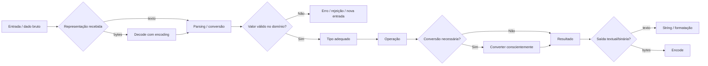

<a id="inicio"></a>

# Tipos de Dados Fundamentais

> **Classificação curricular:** `[D] Obrigatório dominar`  
> **Nível:** A — Lógica de Programação  
> **Posição na taxonomia:** tópico 4  
> **Pré-requisitos:** dados, valores, variáveis e constantes  
> **Aprofundamento posterior:** sintaxe, semântica e sistema de tipos — tópico 13

---

## Resumo executivo

Um **tipo de dado** não é apenas um rótulo como `int`, `float` ou `String`.

Uma forma conceitualmente útil de pensar em tipo é:

```text
TIPO
├── conjunto / categoria de valores possíveis
├── operações que fazem sentido
├── regras de compatibilidade
├── representação definida pela linguagem/runtime
└── restrições e garantias
```

Por isso, escolher um tipo influencia diretamente:

- quais valores podem ser representados;
- quais operações são permitidas;
- quais erros podem ocorrer;
- quanta informação pode ser perdida;
- como comparações se comportam;
- como o programa interpreta um dado.

O mesmo conceito geral assume semânticas diferentes em linguagens diferentes.

Exemplos:

```text
“inteiro”
```

não significa a mesma implementação em:

```text
Python
JavaScript
Java
Bash
```

Python possui `int` de precisão arbitrária; Java possui inteiros primitivos de largura fixa; JavaScript usa `Number` para a maior parte da aritmética numérica e `BigInt` para inteiros arbitrariamente grandes; Bash executa sua aritmética nativa com inteiros de largura fixa da implementação e não possui ponto flutuante nativo na aritmética do shell.

Da mesma forma:

```text
“string”
```

não significa necessariamente:

> sequência de “caracteres visuais”.

Python `str` é uma sequência imutável de **pontos de código Unicode**. ECMAScript `String` é uma sequência de valores de 16 bits tratados como **unidades de código UTF-16**. Java representa texto em sequências de **unidades de código UTF-16**, e um `char` isolado não consegue representar sozinho todo ponto de código Unicode.

A regra central deste capítulo é:

> **O conceito é transferível; largura, representação, coerção, operações e limites pertencem à semântica concreta da linguagem.**

---

## Decisão rápida

| Pergunta | Resposta conceitual |
|---|---|
| “Tipo serve só para dizer se é número ou texto?” | Não. Também restringe valores, operações e semântica. |
| “Inteiro sempre tem 32 bits?” | Não. Depende da linguagem/tipo. |
| “Python `int` estoura em 32/64 bits?” | Não no sentido usual; tem precisão arbitrária limitada por memória. |
| “JavaScript tem `int` primitivo?” | Não. Possui `Number` e `BigInt`, entre outros tipos. |
| “Java `int` pode crescer indefinidamente?” | Não. É inteiro de 32 bits com sinal. |
| “Bash tem `float` nativo?” | Não na aritmética nativa do shell. |
| “`0.1 + 0.2` é exatamente `0.3`?” | Não em aritmética binária de ponto flutuante típica. |
| “Boolean é sempre exatamente 0 ou 1?” | Não como conceito de linguagem; algumas linguagens têm relações numéricas específicas. |
| “`if value` exige `bool`?” | Depende da linguagem. Python/JS têm truthiness; Java exige boolean. |
| “String é sequência de caracteres visuais?” | Não necessariamente. Unicode possui code points, code units e grapheme clusters. |
| “Java `char` representa qualquer caractere Unicode?” | Não. É uma unidade UTF-16 de 16 bits. |
| “JavaScript string indexa code points?” | Não em geral; indexação opera sobre unidades UTF-16. |
| “Converter texto para número é sempre seguro?” | Não. Pode falhar, produzir `NaN`, truncar ou depender de regras específicas. |
| “Coerção é igual a conversão explícita?” | Não. Coerção é conversão implícita segundo regras da linguagem. |

---

> **Primeira vez aqui?** Use a [rota de primeira passagem](#modo-primeira-passagem) para construir primeiro o modelo mental essencial; depois volte à Visão Panorâmica como caderno de consulta.

# Índice


- [Resumo executivo](#resumo-executivo)
- [Decisão rápida](#decisão-rápida)
- [1. Posição deste assunto](#1-posição-deste-assunto)
  - [1.1 Fronteira curricular](#11-fronteira-curricular)
  - [1.2 Por que aprender cedo](#12-por-que-aprender-cedo)
  - [1.3 Rastreabilidade da taxonomia canônica](#13-rastreabilidade-da-taxonomia-canônica)
- [2. Visão panorâmica](#2-visão-panorâmica)
  - [🗺️ Visão panorâmica — o mapa antes dos detalhes](#visao-panoramica)
  - [2.1 Mapa do domínio — o que existe](#21-mapa-do-domínio--o-que-existe)
  - [2.2 Fluxo principal — do dado bruto ao valor utilizável](#22-fluxo-principal--do-dado-bruto-ao-valor-utilizável)
  - [2.3 Consulta rápida — conceito × função × risco](#23-consulta-rápida--conceito--função--risco)
  - [2.4 Pergunta prática → mecanismo inicial](#24-pergunta-prática--mecanismo-inicial)
  - [2.5 Não confundir](#25-não-confundir)
  - [2.6 Microexemplos canônicos](#26-microexemplos-canônicos)
  - [2.7 Problemas reais representativos](#27-problemas-reais-representativos)
  - [2.8 Falha típica → primeira investigação](#28-falha-típica--primeira-investigação)
  - [2.9 Transferência entre linguagens — o que permanece e o que muda](#29-transferência-entre-linguagens--o-que-permanece-e-o-que-muda)
  - [2.10 Modo primeira passagem × consulta × estudo completo](#modo-primeira-passagem)
- [3. O que é um tipo de dado](#3-o-que-é-um-tipo-de-dado)
  - [3.1 Farrell — três perguntas úteis](#31-farrell--três-perguntas-úteis)
  - [3.2 Stroustrup — operações dependem do tipo](#32-stroustrup--operações-dependem-do-tipo)
  - [3.3 Tipo é semântica, não aparência](#33-tipo-é-semântica-não-aparência)
- [4. Tipo × valor × representação](#4-tipo--valor--representação)
  - [4.1 Valor matemático/conceitual](#41-valor-matemáticoconceitual)
  - [4.2 Valor da linguagem](#42-valor-da-linguagem)
  - [4.3 Representação interna](#43-representação-interna)
  - [4.4 Não confundir nível conceitual com implementação](#44-não-confundir-nível-conceitual-com-implementação)
- [5. Tipos fundamentais × tipos da linguagem](#5-tipos-fundamentais--tipos-da-linguagem)
  - [5.1 Python](#51-python)
  - [5.2 JavaScript](#52-javascript)
  - [5.3 Java](#53-java)
  - [5.4 Bash](#54-bash)
  - [5.5 Regra](#55-regra)
- [6. Tipos numéricos — visão geral](#6-tipos-numéricos--visão-geral)
  - [6.1 Inteiro matemático × inteiro de máquina](#61-inteiro-matemático--inteiro-de-máquina)
  - [6.2 Real matemático × float](#62-real-matemático--float)
  - [6.3 Decimal não significa ponto flutuante binário](#63-decimal-não-significa-ponto-flutuante-binário)
- [7. Inteiros](#7-inteiros)
  - [7.1 Python `int`](#71-python-int)
  - [7.2 JavaScript `Number`](#72-javascript-number)
  - [7.3 JavaScript `BigInt`](#73-javascript-bigint)
  - [7.4 Java](#74-java)
  - [7.5 Bash](#75-bash)
- [8. Overflow, precisão e faixa](#8-overflow-precisão-e-faixa)
  - [8.1 Overflow](#81-overflow)
  - [8.2 Java](#82-java)
  - [8.3 Python](#83-python)
  - [8.4 JavaScript `Number`](#84-javascript-number)
  - [8.5 JavaScript `BigInt`](#85-javascript-bigint)
  - [8.6 Bash](#86-bash)
  - [8.7 Faixa faz parte do contrato](#87-faixa-faz-parte-do-contrato)
- [9. Ponto flutuante](#9-ponto-flutuante)
  - [9.1 Ideia](#91-ideia)
  - [9.2 Python `float`](#92-python-float)
  - [9.3 JavaScript `Number`](#93-javascript-number)
  - [9.4 Java](#94-java)
  - [9.5 Bash](#95-bash)
  - [9.6 Ponto flutuante não é bug](#96-ponto-flutuante-não-é-bug)
- [10. Decimal exato × ponto flutuante binário](#10-decimal-exato--ponto-flutuante-binário)
  - [10.1 Consequência](#101-consequência)
  - [10.2 Não arredonde cedo sem necessidade](#102-não-arredonde-cedo-sem-necessidade)
  - [10.3 Dinheiro](#103-dinheiro)
  - [10.4 Não existe solução universal](#104-não-existe-solução-universal)
- [11. NaN, infinito e zeros assinados](#11-nan-infinito-e-zeros-assinados)
  - [11.1 `NaN`](#111-nan)
  - [11.2 JavaScript](#112-javascript)
  - [11.3 Python](#113-python)
  - [11.4 Java](#114-java)
  - [11.5 NaN possui comparação peculiar](#115-nan-possui-comparação-peculiar)
  - [11.6 Zeros assinados](#116-zeros-assinados)
  - [11.7 Introdução, não aprofundamento](#117-introdução-não-aprofundamento)
- [12. Tipo booleano](#12-tipo-booleano)
  - [12.1 Python](#121-python)
  - [12.2 JavaScript](#122-javascript)
  - [12.3 Java](#123-java)
  - [12.4 Bash](#124-bash)
- [13. Boolean × truthiness](#13-boolean--truthiness)
  - [13.1 Python](#131-python)
  - [13.2 JavaScript](#132-javascript)
  - [13.3 Java](#133-java)
  - [13.4 Bash](#134-bash)
  - [13.5 Regra](#135-regra)
- [14. Dados textuais](#14-dados-textuais)
  - [14.1 String](#141-string)
  - [14.2 Caractere](#142-caractere)
  - [14.3 Python](#143-python)
  - [14.4 JavaScript](#144-javascript)
  - [14.5 Java](#145-java)
- [15. Caractere × code point × code unit × grapheme](#15-caractere--code-point--code-unit--grapheme)
  - [15.1 Code point](#151-code-point)
  - [15.2 Code unit](#152-code-unit)
  - [15.3 Grapheme cluster](#153-grapheme-cluster)
  - [15.4 Consequência](#154-consequência)
  - [15.5 Emoji](#155-emoji)
- [16. Unicode e codificação](#16-unicode-e-codificação)
  - [16.1 UTF-8](#161-utf-8)
  - [16.2 UTF-16](#162-utf-16)
  - [16.3 UTF-32](#163-utf-32)
  - [16.4 String interna ≠ arquivo em bytes](#164-string-interna--arquivo-em-bytes)
  - [16.5 Encoding é fronteira](#165-encoding-é-fronteira)
  - [16.6 Erros típicos](#166-erros-típicos)
- [17. String × bytes](#17-string--bytes)
  - [17.1 Python](#171-python)
  - [17.2 Java](#172-java)
  - [17.3 JavaScript](#173-javascript)
  - [17.4 Bash](#174-bash)
  - [17.5 Regra](#175-regra)
- [18. Compatibilidade entre tipos](#18-compatibilidade-entre-tipos)
  - [18.1 Operação](#181-operação)
  - [18.2 Atribuição](#182-atribuição)
  - [18.3 Comparação](#183-comparação)
  - [18.4 Chamada de função](#184-chamada-de-função)
  - [18.5 Promoção numérica — introdução](#185-promoção-numérica--introdução)
  - [18.6 Compatibilidade não é “parece fazer sentido”](#186-compatibilidade-não-é-parece-fazer-sentido)
- [19. Operações válidas e operações inválidas](#19-operações-válidas-e-operações-inválidas)
  - [19.1 Adição numérica](#191-adição-numérica)
  - [19.2 Concatenação](#192-concatenação)
  - [19.3 Mistura em Python](#193-mistura-em-python)
  - [19.4 JavaScript](#194-javascript)
  - [19.5 Java](#195-java)
  - [19.6 Bash](#196-bash)
  - [19.7 Moral](#197-moral)
- [20. Conversão × coerção × parsing × casting](#20-conversão--coerção--parsing--casting)
  - [20.1 Conversão](#201-conversão)
  - [20.2 Conversão explícita](#202-conversão-explícita)
  - [20.3 Coerção](#203-coerção)
  - [20.4 Parsing](#204-parsing)
  - [20.5 Casting](#205-casting)
  - [20.6 Não antecipe dogma](#206-não-antecipe-dogma)
- [21. Conversões numéricas](#21-conversões-numéricas)
  - [21.1 Inteiro → ponto flutuante](#211-inteiro--ponto-flutuante)
  - [21.2 Ponto flutuante → inteiro](#212-ponto-flutuante--inteiro)
  - [21.3 JavaScript](#213-javascript)
  - [21.4 Python](#214-python)
  - [21.5 Erro faz parte do contrato](#215-erro-faz-parte-do-contrato)
- [22. Conversões de texto](#22-conversões-de-texto)
  - [22.1 Número → string](#221-número--string)
  - [22.2 String → número](#222-string--número)
  - [22.3 Cuidado com base](#223-cuidado-com-base)
  - [22.4 Parsing não é validação semântica completa](#224-parsing-não-é-validação-semântica-completa)
- [23. Conversões booleanas](#23-conversões-booleanas)
  - [23.1 Python](#231-python)
  - [23.2 JavaScript](#232-javascript)
  - [23.3 Java](#233-java)
  - [23.4 Bash](#234-bash)
  - [23.5 Armadilha](#235-armadilha)
- [24. Widening × narrowing](#24-widening--narrowing)
  - [24.1 Widening](#241-widening)
  - [24.2 Narrowing](#242-narrowing)
  - [24.3 Stroustrup](#243-stroustrup)
  - [24.4 Nuance importante](#244-nuance-importante)
- [25. Python — tipos fundamentais](#25-python--tipos-fundamentais)
  - [25.1 `int`](#251-int)
  - [25.2 `float`](#252-float)
  - [25.3 `complex`](#253-complex)
  - [25.4 `bool`](#254-bool)
  - [25.5 `str`](#255-str)
  - [25.6 Compatibilidade](#256-compatibilidade)
  - [25.7 Conversão explícita](#257-conversão-explícita)
  - [25.8 Mixed numeric arithmetic](#258-mixed-numeric-arithmetic)
- [26. JavaScript — tipos fundamentais](#26-javascript--tipos-fundamentais)
  - [26.1 Tipos de linguagem](#261-tipos-de-linguagem)
  - [26.2 `Number`](#262-number)
  - [26.3 `BigInt`](#263-bigint)
  - [26.4 Não misturar diretamente](#264-não-misturar-diretamente)
  - [26.5 `Boolean`](#265-boolean)
  - [26.6 `String`](#266-string)
  - [26.7 Coerção](#267-coerção)
  - [26.8 Guardrail](#268-guardrail)
- [27. Java — tipos fundamentais](#27-java--tipos-fundamentais)
  - [27.1 Primitivos](#271-primitivos)
  - [27.2 Inteiros](#272-inteiros)
  - [27.3 `char`](#273-char)
  - [27.4 `float`](#274-float)
  - [27.5 `double`](#275-double)
  - [27.6 `boolean`](#276-boolean)
  - [27.7 `String`](#277-string)
  - [27.8 Conversões](#278-conversões)
  - [27.9 Type safety](#279-type-safety)
- [28. Bash — valores, strings e aritmética](#28-bash--valores-strings-e-aritmética)
  - [28.1 Variáveis shell](#281-variáveis-shell)
  - [28.2 Texto](#282-texto)
  - [28.3 Aritmética](#283-aritmética)
  - [28.4 Largura](#284-largura)
  - [28.5 `declare -i`](#285-declare--i)
  - [28.6 Sem float nativo](#286-sem-float-nativo)
  - [28.7 Boolean](#287-boolean)
  - [28.8 String × número](#288-string--número)
  - [28.9 Guardrail de input](#289-guardrail-de-input)
- [29. Comparação entre as quatro linguagens](#29-comparação-entre-as-quatro-linguagens)
- [30. Exemplo progressivo — texto para número](#30-exemplo-progressivo--texto-para-número)
  - [30.1 Conceito](#301-conceito)
  - [30.2 Python](#302-python)
  - [30.3 JavaScript](#303-javascript)
  - [30.4 Java](#304-java)
  - [30.5 Bash](#305-bash)
  - [30.6 Por que Bash valida primeiro?](#306-por-que-bash-valida-primeiro)
- [31. Exemplo crítico — ponto flutuante](#31-exemplo-crítico--ponto-flutuante)
  - [Python](#exemplo-float-python)
  - [JavaScript](#exemplo-float-javascript)
  - [Java](#exemplo-float-java)
  - [Bash](#exemplo-float-bash)
  - [Moral](#moral)
- [32. Exemplo crítico — Unicode](#32-exemplo-crítico--unicode)
  - [Python](#exemplo-unicode-python)
  - [JavaScript](#exemplo-unicode-javascript)
  - [Java](#exemplo-unicode-java)
  - [O que aconteceu?](#o-que-aconteceu)
  - [Ainda não chegamos ao “caractere visual”](#ainda-não-chegamos-ao-caractere-visual)
- [33. Erros conceituais frequentes](#33-erros-conceituais-frequentes)
  - [33.1 “float é número real”](#331-float-é-número-real)
  - [33.2 “inteiro é sempre 32 bits”](#332-inteiro-é-sempre-32-bits)
  - [33.3 “Python int nunca tem limite”](#333-python-int-nunca-tem-limite)
  - [33.4 “JavaScript Number é inteiro quando não tem ponto”](#334-javascript-number-é-inteiro-quando-não-tem-ponto)
  - [33.5 “BigInt é Number maior”](#335-bigint-é-number-maior)
  - [33.6 “boolean é 0/1”](#336-boolean-é-01)
  - [33.7 “Bash true é 1”](#337-bash-true-é-1)
  - [33.8 “Java char = Unicode character”](#338-java-char--unicode-character)
  - [33.9 “JavaScript length conta caracteres”](#339-javascript-length-conta-caracteres)
  - [33.10 “Python string possui char”](#3310-python-string-possui-char)
  - [33.11 “converter sempre preserva informação”](#3311-converter-sempre-preserva-informação)
  - [33.12 “Number('abc') lança erro”](#3312-numberabc-lança-erro)
  - [33.13 “int('abc') retorna NaN”](#3313-intabc-retorna-nan)
  - [33.14 “string vazia e false textual são iguais”](#3314-string-vazia-e-false-textual-são-iguais)
  - [33.15 “bytes e string são a mesma coisa”](#3315-bytes-e-string-são-a-mesma-coisa)
- [Índice operacional de Problemas Reais `PR-*`](#problemas-reais)
  - [`PR-T04-01` — Escolher representação numérica para valores que exigem exatidão decimal](#pr-t04-01)
  - [`PR-T04-02` — Preservar identificador inteiro grande entre sistemas](#pr-t04-02)
  - [`PR-T04-03` — Converter entrada textual sem confundir parsing com validação](#pr-t04-03)
  - [`PR-T04-04` — Contar texto segundo a unidade que o requisito realmente pede](#pr-t04-04)
  - [`PR-T04-05` — Cruzar corretamente a fronteira texto × bytes](#pr-t04-05)
  - [`PR-T04-06` — Interpretar boolean textual sem depender de truthiness](#pr-t04-06)
- [🔎 Troubleshooting sistemático](#troubleshooting-sistematico)
  - [`TS-T04-01` — `0.1 + 0.2` não compara igual a `0.3`](#ts-t04-01)
  - [`TS-T04-02` — JavaScript altera silenciosamente um inteiro grande](#ts-t04-02)
  - [`TS-T04-03` — texto `false` foi interpretado como verdadeiro](#ts-t04-03)
  - [`TS-T04-04` — o “tamanho do texto” muda entre linguagens](#ts-t04-04)
  - [`TS-T04-05` — texto legível virou bytes inválidos ou mojibake](#ts-t04-05)
  - [`TS-T04-06` — Bash rejeita `08` em contexto aritmético](#ts-t04-06)
- [34. Laboratórios](#34-laboratórios)
  - [🧪 Laboratório 1 — Mapa de tipos](#lab-t04-01)
  - [🧪 Laboratório 2 — Precisão inteira](#lab-t04-02)
  - [🧪 Laboratório 3 — Floating point](#lab-t04-03)
  - [🧪 Laboratório 4 — Truthiness](#lab-t04-04)
  - [🧪 Laboratório 5 — Unicode](#lab-t04-05)
  - [🧪 Laboratório 6 — Conversão com erro](#lab-t04-06)
  - [🧪 Laboratório 7 — Texto × bytes](#lab-t04-07)
- [35. Exercícios](#35-exercícios)
  - [35.1 Tipo e operação](#351-tipo-e-operação)
  - [35.2 Integer](#352-integer)
  - [35.3 Overflow](#353-overflow)
  - [35.4 Floating point](#354-floating-point)
  - [35.5 Boolean](#355-boolean)
  - [35.6 Java](#356-java)
  - [35.7 Bash](#357-bash)
  - [35.8 Unicode](#358-unicode)
  - [35.9 Java char](#359-java-char)
  - [35.10 Python str](#3510-python-str)
  - [35.11 Conversão](#3511-conversão)
  - [35.12 Widening](#3512-widening)
  - [35.13 Domínio](#3513-domínio)
  - [35.14 Dinheiro](#3514-dinheiro)
  - [35.15 String × bytes](#3515-string--bytes)
- [36. Evidências de domínio](#36-evidências-de-domínio)
  - [Conceitos](#conceitos)
  - [Comparação](#comparação)
  - [Aplicação](#aplicação)
  - [Depuração](#depuração)
  - [Transferência](#transferência)
- [37. Checklist de consulta rápida](#37-checklist-de-consulta-rápida)
- [38. Glossário](#38-glossário)
- [39. Referências](#39-referências)
  - [39.1 Taxonomia canônica](#391-taxonomia-canônica)
  - [39.2 Currículo](#392-currículo)
  - [39.3 Python 3.14.7 — documentação oficial](#393-python-3147--documentação-oficial)
  - [39.4 ECMAScript 2026 — especificação oficial](#394-ecmascript-2026--especificação-oficial)
  - [39.5 Java SE 27 — documentação oficial](#395-java-se-27--documentação-oficial)
  - [39.6 GNU Bash 5.3 — documentação oficial](#396-gnu-bash-53--documentação-oficial)
  - [39.7 Unicode Consortium](#397-unicode-consortium)
  - [39.8 Fontes locais efetivamente consultadas — File Library](#398-fontes-locais-efetivamente-consultadas--file-library)
  - [39.9 Como as fontes foram usadas](#399-como-as-fontes-foram-usadas)
- [40. Histórico de versões](#40-histórico-de-versões)

---

# 1. Posição deste assunto

O capítulo anterior estabeleceu:

```text
DADO
→ VALOR
→ NOME
→ VARIÁVEL
→ ESTADO
```

Agora surge a pergunta:

> **que valores uma variável pode representar e que operações fazem sentido sobre esses valores?**

A resposta começa com **tipos**.

## 1.1 Fronteira curricular

Neste tópico estudaremos apenas a base:

```text
NUMÉRICO
BOOLEANO
TEXTUAL
COMPATIBILIDADE
CONVERSÕES BÁSICAS
```

O sistema de tipos completo fica para o Nível B:

- tipagem estática/dinâmica;
- forte/fraca como terminologia problemática;
- inferência;
- unions;
- generics;
- subtyping;
- nominal × structural;
- type checking;
- coerção aprofundada;
- casting;
- parsing em profundidade.

## 1.2 Por que aprender cedo

Tipos afetam desde o primeiro programa:

```text
"5" + "2"
```

não representa a mesma operação conceitual que:

```text
5 + 2
```

Mesmo símbolo:

```text
+
```

pode possuir semântica diferente conforme os tipos envolvidos.

## 1.3 Rastreabilidade da taxonomia canônica

| Nó do Guia | Capacidade curricular | Cobertura principal neste T04 |
|---|---|---|
| `4` | Tipos de dados fundamentais | capítulo completo |
| `4.1` | Tipos numéricos — inteiro e real/ponto flutuante | §§6–11, §§25–29, LAB 2–3 |
| `4.2` | Tipo booleano — verdadeiro/falso | §§12–13, LAB 4 |
| `4.3` | Dados textuais — caractere/string | §§14–17, LAB 5 e 7 |
| `4.4` | Compatibilidade entre tipos e efeitos sobre operações | §§18–19, §§25–29 |
| `4.5` | Conversões básicas — texto↔número, número→texto, conversão explícita | §§20–24, §30, LAB 6 |

A numeração `4.1–4.5` acima pertence ao **Guia curricular**; ela não precisa coincidir com a numeração editorial interna deste capítulo. O aprofundamento de sistemas de tipos, subtyping, generics, inferência e semântica completa permanece reservado ao T13.

[↑ Voltar ao índice](#índice)

---

# 2. Visão panorâmica

<a id="visao-panoramica"></a>

## 🗺️ Visão panorâmica — o mapa antes dos detalhes

Esta seção funciona como **caderno rápido de consulta** e como contrato de cobertura do tópico. Depois de estudar o capítulo, a meta é conseguir recuperar em poucos segundos a relação entre **valor, tipo, operações, representação, compatibilidade, conversão e fronteiras de texto/número**, sem transportar automaticamente a semântica de uma linguagem para outra.

A síntese usa contribuições complementares. A taxonomia v2.1.0 fixa o núcleo curricular — tipos numéricos, booleanos, textuais, compatibilidade e conversões básicas. Farrell oferece o modelo introdutório “valores possíveis + armazenamento/representação + operações”; Stroustrup reforça que tipos determinam operações e que conversões podem preservar ou perder informação; Beazley e Sweigart ajudam a transformar essas ideias em exemplos concretos de Python; o manual GNU Bash revela por que o shell não deve ser tratado como uma linguagem de tipos numéricos tradicional; as documentações oficiais de Python, ECMAScript, Java, Bash e Unicode fecham a semântica vigente e as diferenças entre linguagens.

### 2.1 Mapa do domínio — o que existe

```text
TIPOS DE DADOS FUNDAMENTAIS
│
├── valor e tipo
│   ├── valor → entidade manipulada pela linguagem
│   ├── tipo → categoria semântica do valor
│   ├── operações permitidas
│   ├── representação / faixa / precisão
│   └── erros e garantias
│
├── numéricos
│   ├── inteiros
│   │   ├── precisão arbitrária ou largura fixa
│   │   ├── faixa
│   │   ├── overflow
│   │   └── inteiros seguros em Number / BigInt
│   ├── ponto flutuante
│   │   ├── aproximação binária
│   │   ├── precisão
│   │   ├── NaN / ±Infinity / ±0
│   │   └── arredondamento
│   └── decimal exato / representação escalada
│
├── booleanos
│   ├── true / false
│   ├── boolean como tipo
│   ├── truthiness / falsiness quando existe
│   └── exit status no shell
│
├── texto
│   ├── string
│   ├── caractere, quando a linguagem oferece tipo separado
│   ├── Unicode code point
│   ├── UTF-16 code unit
│   ├── grapheme cluster
│   ├── encoding
│   └── texto × bytes
│
├── compatibilidade
│   ├── operação válida
│   ├── operação incompatível
│   ├── promoção / conversão implícita
│   └── coerção conforme a linguagem
│
└── conversões
    ├── número → texto
    ├── texto → número
    ├── parsing
    ├── widening
    ├── narrowing
    └── perda de informação / erro
```

O mapa revela uma regra importante:

```text
MESMA IDEIA HUMANA
        ↓
“número”, “boolean”, “texto”
        ↓
NÃO IMPLICA
        ↓
MESMO TIPO / MESMA REPRESENTAÇÃO / MESMA SEMÂNTICA
```

### 2.2 Fluxo principal — do dado bruto ao valor utilizável



Leitura textual:

1. a entrada chega em alguma representação concreta;
2. texto e bytes precisam ser distinguidos antes de interpretar significado;
3. parsing produz um valor da linguagem, mas não prova que o valor é válido para o domínio;
4. o tipo escolhido determina operações, faixa, precisão e parte do comportamento;
5. conversões podem preservar, aproximar, truncar ou rejeitar informação;
6. a saída pode exigir nova conversão ou encoding.

### 2.3 Consulta rápida — conceito × função × risco

| Conceito | Pergunta central | Função | Risco se confundido |
|---|---|---|---|
| Tipo | “Que valores e operações esta categoria admite?” | definir semântica e restrições | tratar `int`, `Number`, `long` e shell arithmetic como equivalentes |
| Inteiro | “Preciso de valor exato sem parte fracionária?” | contagem, índices, IDs quando apropriado | ignorar faixa, precisão segura ou overflow |
| Ponto flutuante | “Aceito aproximação binária finita?” | medições e cálculo aproximado | esperar exatidão decimal automática |
| Boolean | “Preciso representar verdade/falsidade?” | decisões e estados lógicos | confundir com `0/1`, string ou exit status |
| Truthiness | “Como a linguagem interpreta um valor em condição?” | converter implicitamente contexto → decisão | interpretar texto `"false"` como falso sem parser |
| String | “Estou manipulando texto segundo o modelo da linguagem?” | armazenar/processar texto | supor que índice/tamanho contam caracteres percebidos |
| Code point | “Qual elemento abstrato Unicode?” | representar caracteres Unicode | confundir com code unit ou grapheme |
| Code unit | “Qual unidade usada pelo encoding/modelo?” | representar texto em UTF-16 etc. | tratar unidade de 16 bits como caractere humano |
| Grapheme cluster | “O que o usuário percebe como unidade de texto?” | UI, limites visuais, edição | usar `length`/`len` bruto como contagem universal |
| Bytes | “Estou lidando com dados binários?” | I/O e protocolos | concatenar/decodificar sem encoding explícito |
| Conversão | “Quero outro tipo/representação?” | tornar intenção explícita | assumir preservação total de informação |
| Parsing | “Como interpreto texto como valor?” | transformar representação textual | confundir parsing sintático com validação de domínio |
| Widening | “A conversão amplia a faixa/representação?” | compatibilidade conveniente | supor que toda widening preserva precisão matemática |
| Narrowing | “Posso perder informação?” | adaptação explícita de tipo | truncamento/overflow silencioso ou inesperado |

### 2.4 Pergunta prática → mecanismo inicial

| Se você está pensando... | Comece por... |
|---|---|
| “Posso usar `float` para dinheiro?” | defina primeiro o requisito de exatidão e arredondamento; não escolha pela aparência decimal |
| “Este ID cabe em JavaScript?” | compare com `Number.MAX_SAFE_INTEGER`; considere `BigInt` ou texto para identificadores |
| “Por que `Number('abc')` não lançou exceção?” | diferencie `NaN` de erro de parsing por exceção |
| “Por que `int('abc')` não retorna `NaN`?” | confirme o contrato de conversão da linguagem |
| “`'false'` deveria ser falso?” | implemente parsing semântico explícito; string não vazia costuma ser truthy em Python/JS |
| “Quantos caracteres existem neste emoji?” | decida se quer code points, code units ou grapheme clusters |
| “Por que meu texto virou caracteres estranhos?” | verifique bytes + encoding usado no encode/decode |
| “Bash diz que `08` é inválido?” | investigue interpretação de base; prefixo `0` pode indicar octal |
| “Por que `1n + 1` falha?” | `BigInt` e `Number` são tipos numéricos distintos, sem conversão implícita geral entre eles |
| “A conversão compila; então é segura?” | pergunte se faixa e precisão do valor são preservadas, não apenas se a sintaxe é aceita |

### 2.5 Não confundir

| Não confundir | Diferença |
|---|---|
| **Tipo × valor** | tipo classifica/restringe; valor é a entidade concreta manipulada |
| **Valor matemático × valor representável** | o conjunto matemático pode ser infinito; o tipo concreto pode representar apenas parte dele |
| **Inteiro matemático × inteiro de máquina** | `ℤ` é ilimitado; tipos fixos têm faixa finita |
| **Decimal × floating point** | uma escrita decimal pode ser armazenada como aproximação binária |
| **Exatidão × precisão** | um resultado pode ter muitos dígitos e ainda não ser o valor exato pretendido |
| **Boolean × truthiness** | um valor booleano é `true/false`; truthiness é regra de conversão/condição da linguagem |
| **`false` boolean × `"false"` string** | um é valor lógico; o outro é texto não vazio |
| **Caractere × code point** | “caractere” é termo ambíguo; code point é unidade abstrata Unicode |
| **Code point × code unit** | code point é elemento Unicode; code unit é unidade da representação, como 16 bits em UTF-16 |
| **Code point × grapheme cluster** | um grapheme pode usar vários code points |
| **String × bytes** | texto já interpretado ≠ sequência binária sem encoding implícito universal |
| **Conversão × coerção** | conversão pode ser explícita; coerção ocorre implicitamente conforme regras da linguagem |
| **Parsing × validação** | parsing reconhece/produz valor; validação decide se ele atende ao domínio |
| **Widening × “sem perda” universal** | a classificação depende do sistema de tipos e pode ainda haver perda de precisão em certos caminhos |

### 2.6 Microexemplos canônicos

#### Exemplo A — aparência numérica não define tipo

```text
"42"  → texto
42    → valor numérico
```

O mesmo conteúdo visual não implica a mesma semântica.

#### Exemplo B — inteiro grande em JavaScript

```javascript
const value = 9007199254740993;
console.log(value); // 9007199254740992
```

O literal foi interpretado como `Number`, e esse inteiro está fora da faixa segura de exatidão inteira.

#### Exemplo C — decimal simples, aproximação binária

```python
0.1 + 0.2 == 0.3
```

é `False` em Python `float`, porque os operandos não são representados exatamente em binary floating point.

#### Exemplo D — texto `false` não é boolean `False`

```python
bool("false")  # True
```

```javascript
Boolean("false") // true
```

A regra é truthiness de string não vazia, não parsing de boolean textual.

#### Exemplo E — “tamanho” depende da unidade

Para:

```text
😀
```

- Python `len("😀")` → `1` code point;
- JavaScript `"😀".length` → `2` UTF-16 code units;
- Java `"😀".length()` → `2` UTF-16 code units.

Nenhum desses valores, sozinho, define universalmente “quantos caracteres o usuário vê”.

#### Exemplo F — base numérica em Bash

```bash
value=08
printf '%d\n' "$((10#$value))"
```

O prefixo `10#` explicita base 10 depois que a entrada foi validada como decimal. Essa sintaxe `base#n` pertence ao **contexto aritmético** do Bash, como `$(( ... ))`, `(( ... ))`, `let` e atribuições com atributo inteiro (`declare -i`).

### 2.7 Problemas reais representativos

| ID | Problema | Capacidades centrais | Destino |
|---|---|---|---|
| `PR-T04-01` | escolher representação numérica para valores que exigem exatidão decimal | precisão, escala, arredondamento, faixa | [Problemas Reais](#problemas-reais) |
| `PR-T04-02` | preservar identificador inteiro grande entre sistemas | faixa, integer safety, `BigInt`, texto, interoperabilidade | [Problemas Reais](#problemas-reais) |
| `PR-T04-03` | converter entrada textual sem confundir parsing com validação | string, parsing, erro, domínio | [Problemas Reais](#problemas-reais) |
| `PR-T04-04` | contar texto segundo a unidade que o requisito realmente pede | code point, code unit, grapheme cluster | [Problemas Reais](#problemas-reais) |
| `PR-T04-05` | cruzar corretamente a fronteira texto × bytes | encoding, UTF-8, encode/decode, I/O | [Problemas Reais](#problemas-reais) |
| `PR-T04-06` | interpretar boolean textual sem depender de truthiness | boolean, string, parser explícito, entrada | [Problemas Reais](#problemas-reais) |

### 2.8 Falha típica → primeira investigação

| Sintoma | Primeira investigação |
|---|---|
| `0.1 + 0.2` não dá exatamente `0.3` | o domínio exige igualdade decimal exata ou tolerância numérica? |
| ID grande mudou em JavaScript | o valor ultrapassou `Number.MAX_SAFE_INTEGER`? |
| `"false"` entrou em um `if` como verdadeiro | houve truthiness em vez de parsing boolean explícito? |
| emoji ocupa `1`, `2` ou mais unidades conforme a API | a API conta code points, UTF-16 code units ou graphemes? |
| texto lido aparece como `�`/mojibake | bytes foram decodificados com encoding diferente do usado na origem? |
| `str` não concatena com `bytes` em Python | está misturando texto com dado binário sem encode/decode? |
| `1n + 1` lança `TypeError` em JavaScript | está misturando `BigInt` com `Number`? |
| Bash rejeita `08` em aritmética | o número com zero inicial está sendo lido como octal? |
| Java aceita cast, mas valor mudou | houve narrowing/truncamento/overflow? |
| comparação com `NaN` nunca encontra igualdade | use a API de teste de NaN da linguagem, não `==` |

Casos completos aparecem em [🔎 Troubleshooting sistemático](#troubleshooting-sistematico).

### 2.9 Transferência entre linguagens — o que permanece e o que muda

| Dimensão | Python | JavaScript | Java | Bash |
|---|---|---|---|---|
| Inteiro principal | `int`, precisão arbitrária | `Number` para muitos inteiros; `BigInt` para inteiros arbitrariamente grandes | tipos inteiros fixos | aritmética inteira de largura fixa disponível na implementação |
| Float principal | `float` (double precision de máquina) | `Number` binary64 | `float` binary32 / `double` binary64 | sem floating point nativo em shell arithmetic |
| Boolean | `bool`, subtipo de `int` | tipo primitivo `Boolean` da especificação; não confundir com objeto wrapper criado por `new Boolean(...)` | `boolean`, separado de inteiro | contexto de comandos usa exit status; não há bool equivalente |
| Truthiness | ampla | ampla | condição exige `boolean` | condição depende do status/comando/teste |
| Texto | `str` como sequência de code points | `String` como sequência de 16-bit elements / UTF-16 code units para texto | `String`/`char` em semântica UTF-16 | valores shell predominantemente textuais; comportamento depende de expansão/locale/ferramentas |
| Bytes | `bytes` / `bytearray` separados de `str` | `Uint8Array`, `ArrayBuffer` etc.; não são `String` | `byte[]` e APIs de charset | shell não oferece container binário geral equivalente a Python `bytes` |
| Conversão inválida texto→número | normalmente exceção para `int()`/`float()` inválidos | várias APIs podem produzir `NaN` | parsers como `Integer.parseInt` lançam exceção | aritmética possui regras próprias; validar entrada antes |
| Inteiro muito grande | cresce com memória | `BigInt` ou preservar como texto | `long` é fixo; `BigInteger` é biblioteca | limitado pela largura fixa da aritmética shell |

Regra de transferência:

```text
PRESERVE A INTENÇÃO
→ valor exato ou aproximado?
→ número ou identificador textual?
→ texto ou bytes?
→ boolean real ou token textual?
→ qual unidade de texto importa?

DEPOIS CONFIRME A LINGUAGEM
→ tipo concreto
→ faixa / precisão
→ conversões
→ operações válidas
→ erro / coerção
```

<a id="modo-primeira-passagem"></a>
<a id="210-modo-consulta--modo-estudo"></a>

### 2.10 Modo primeira passagem × consulta × estudo completo

**Primeira passagem — foco essencial:**

```text
Resumo executivo + Decisão rápida
→ 3. o que é tipo
→ 4. tipo × valor × representação
→ 6. tipos numéricos — visão geral
→ 7. inteiros
→ 9. ponto flutuante
→ 12. booleano
→ 14. dados textuais
→ 18. compatibilidade
→ 20. conversão × coerção × parsing × casting
→ 29. comparação das quatro linguagens
→ 30. exemplo progressivo
→ LAB 1 + um LAB temático
→ seguir para T05
```

Essa rota não substitui o estudo completo. Ela separa o **primeiro contato** do aprofundamento e da consulta posterior.

**Consulta rápida:**

```text
2.3  → conceito × função × risco
2.4  → pergunta prática → mecanismo
2.5  → não confundir
2.6  → microexemplos
2.8  → falha → primeira investigação
29   → comparação das quatro linguagens
37   → checklist rápido
```

**Estudo completo:**

```text
3–5    → tipo, valor e representação
6–11   → números, faixa, overflow, floating point e especiais
12–13  → boolean e truthiness
14–17  → texto, Unicode, code units, graphemes e bytes
18–24  → compatibilidade, conversão, parsing, coerção e narrowing
25–29  → semântica concreta das quatro linguagens
30–32  → exemplos progressivos/críticos
33     → erros conceituais recorrentes
Problemas Reais → aplicação integrada
Troubleshooting → diagnóstico reproduzível
34–36  → LABs, exercícios e evidências de domínio
```

[↑ Voltar ao índice](#índice)

---

# 3. O que é um tipo de dado

Uma definição útil:

> **Tipo é uma classificação semântica que determina quais valores pertencem a determinada categoria e quais operações/regras se aplicam a eles.**

Em linguagens concretas, um tipo também pode determinar ou influenciar:

- representação;
- largura;
- alinhamento;
- métodos;
- conversões;
- verificação estática;
- comportamento do runtime.

## 3.1 Farrell — três perguntas úteis

*Programming Logic and Design* apresenta tipo de dado como classificação que descreve, em termos didáticos:

```text
quais valores o item pode conter
como é representado/armazenado
quais operações podem ser realizadas
```

Essa formulação é útil, mas a parte de armazenamento precisa ser interpretada segundo a linguagem.

## 3.2 Stroustrup — operações dependem do tipo

Em *Programming: Principles and Practice*, Stroustrup enfatiza que o tipo não determina apenas quais valores cabem em uma variável, mas também:

> **quais operações podem ser aplicadas e o que elas significam.**

Exemplo:

```text
número + número
→ adição

string + string
→ pode representar concatenação

string - string
→ normalmente não existe
```

## 3.3 Tipo é semântica, não aparência

```text
"42"
```

parece número para uma pessoa.

Para a linguagem, pode ser:

```text
STRING
```

Enquanto:

```text
42
```

pode ser valor numérico.

[↑ Voltar ao índice](#índice)

---

# 4. Tipo × valor × representação

Considere:

```text
42
```

Podemos falar de três níveis.

## 4.1 Valor matemático/conceitual

```text
quarenta e dois
```

## 4.2 Valor da linguagem

Exemplos:

```text
Python int
Java int
JavaScript Number
JavaScript BigInt
Bash valor usado em contexto aritmético
```

## 4.3 Representação interna

Pode variar:

- número de bits;
- encoding;
- complemento de dois;
- binary floating point;
- objeto arbitrariamente grande.

Também é necessário distinguir **modelo semântico da linguagem/API** de **layout físico escolhido pelo runtime**. Uma especificação pode definir o comportamento observável em termos de code points ou code units sem obrigar toda implementação a armazenar os dados exatamente dessa forma na memória.

Exemplo importante: a especificação Java modela texto em sequências de unidades de código UTF-16, enquanto a HotSpot pode usar **Compact Strings** e armazenar internamente determinados `String` com representação Latin-1 em `byte[]`. Isso não altera o contrato público de `String`, `char`, `length()` e das APIs Unicode.

## 4.4 Não confundir nível conceitual com implementação

Dizer:

> “isso é um inteiro”

não responde sozinho:

- possui largura fixa?
- sofre overflow?
- pode representar `10**100` exatamente?
- divide com truncamento?
- é objeto?
- aceita `NaN`?

[↑ Voltar ao índice](#índice)

---

# 5. Tipos fundamentais × tipos da linguagem

A taxonomia usa categorias fundamentais:

```text
inteiro
real / ponto flutuante
booleano
texto
```

Isso NÃO significa que toda linguagem ofereça exatamente tipos chamados:

```text
int
float
bool
char
string
```

## 5.1 Python

Possui:

```text
int
float
complex
bool
str
```

e muitos outros.

## 5.2 JavaScript

Possui tipos primitivos como:

```text
Undefined
Null
Boolean
String
Symbol
Number
BigInt
```

e `Object`.

Não há um primitivo `int`.

## 5.3 Java

Possui oito tipos primitivos:

```text
byte
short
int
long
char
float
double
boolean
```

e tipos de referência.

`String` NÃO é primitivo.

## 5.4 Bash

Não possui um sistema de tipos de valores equivalente a Java.

Variáveis shell guardam valores textuais e podem possuir atributos; a aritmética nativa interpreta valores em contexto inteiro.

## 5.5 Regra

> **Use a taxonomia para aprender conceitos; use a documentação da linguagem para aprender a semântica concreta.**

[↑ Voltar ao índice](#índice)

---

# 6. Tipos numéricos — visão geral

Dois grupos fundamentais:

```text
INTEIROS
→ valores sem parte fracionária

PONTO FLUTUANTE
→ representação finita aproximada de uma grande classe de números reais
```

Não diga simplesmente:

```text
float = número decimal
```

Isso é didaticamente perigoso.

## 6.1 Inteiro matemático × inteiro de máquina

Inteiros matemáticos:

```text
..., -2, -1, 0, 1, 2, ...
```

são ilimitados.

Um tipo inteiro de máquina pode representar apenas subconjunto finito.

## 6.2 Real matemático × float

Números reais são infinitos em quantidade e precisão.

Um `float` de máquina possui:

```text
número finito de representações
```

Logo:

> **float não é sinônimo de real matemático.**

## 6.3 Decimal não significa ponto flutuante binário

```text
0.1
```

é uma fração decimal simples.

Em binário, sua expansão é infinita.

Por isso, em formatos binários finitos, o valor precisa ser aproximado.

[↑ Voltar ao índice](#índice)

---

# 7. Inteiros

## 7.1 Python `int`

Python documenta:

> integers have unlimited precision.

Mais precisamente:

```text
precisão arbitrária
limitada na prática por memória/recursos
```

Exemplo:

```python
value = 10**100
```

é representável como inteiro Python.

## 7.2 JavaScript `Number`

`Number` é ponto flutuante binary64.

Ele consegue representar muitos inteiros exatamente, mas não todos os inteiros arbitrariamente grandes.

A faixa de **inteiros seguros** é:

```text
-(2^53 - 1)
até
+(2^53 - 1)
```

## 7.3 JavaScript `BigInt`

`BigInt` representa inteiros arbitrariamente grandes.

Literal:

```javascript
123n
```

Mas:

```text
BigInt
≠
Number
```

e várias operações não permitem misturá-los diretamente.

## 7.4 Java

Inteiros primitivos possuem largura fixa:

```text
byte  → 8 bits
short → 16 bits
int   → 32 bits
long  → 64 bits
```

com sinal e representação definida pela linguagem.

## 7.5 Bash

A aritmética do Bash usa:

> **largest fixed-width integers available**

e o manual informa que não há verificação de overflow.

Logo:

```text
Bash integer arithmetic
≠
Python arbitrary-precision int
```

[↑ Voltar ao índice](#índice)

---

# 8. Overflow, precisão e faixa

## 8.1 Overflow

Overflow ocorre quando resultado sai da faixa representável pelo tipo/modelo.

## 8.2 Java

Exemplo:

```java
int value = Integer.MAX_VALUE;
value = value + 1;
```

o resultado sofre overflow segundo a aritmética inteira de largura fixa.

Quando o contrato exige **detectar** overflow em vez de aceitar o wraparound da operação comum, Java também oferece APIs exatas:

```java
Math.addExact(Integer.MAX_VALUE, 1);
```

Nesse caso, a operação lança `ArithmeticException` em vez de produzir silenciosamente o valor com overflow.

## 8.3 Python

```python
value = 2**63 - 1
value += 1
```

não sofre overflow de 64 bits.

O `int` cresce.

## 8.4 JavaScript `Number`

O problema comum não é “overflow em 32 bits”.

É:

```text
perda de precisão inteira
```

depois do limite seguro.

Exemplo clássico:

```javascript
Number.MAX_SAFE_INTEGER + 1
===
Number.MAX_SAFE_INTEGER + 2
```

resulta em `true`: ambos os lados são arredondados para o mesmo valor representável em `Number`.

## 8.5 JavaScript `BigInt`

Evita essa perda para aritmética inteira arbitrariamente grande.

## 8.6 Bash

Overflow em shell arithmetic não é detectado pelo Bash.

Não use aritmética shell para valores que excedem as garantias do ambiente.

## 8.7 Faixa faz parte do contrato

Antes de escolher tipo:

```text
qual é o mínimo?
qual é o máximo?
preciso de exatidão?
pode crescer?
```

[↑ Voltar ao índice](#índice)

---

# 9. Ponto flutuante

Ponto flutuante é um sistema de representação de números com:

```text
sinal
significand / significando
expoente
```

## 9.1 Ideia

Forma conceitual:

```text
s × m × base^e
```

## 9.2 Python `float`

A documentação afirma que Python `float` é **geralmente** implementado como `double` de C.

Em plataformas usuais:

```text
binary64
```

é a representação dominante.

Mas o texto oficial usa “usually”.

## 9.3 JavaScript `Number`

A especificação ECMAScript é explícita:

```text
IEEE 754-2019 binary64
```

## 9.4 Java

`float` e `double` seguem formatos de ponto flutuante definidos pela JLS com base no IEEE 754.

## 9.5 Bash

Bash NÃO possui aritmética nativa de ponto flutuante.

Isto falha como aritmética do shell:

```bash
echo $((1.5 + 2.0))
```

Para ponto flutuante, scripts normalmente recorrem a:

- ferramentas externas;
- outra linguagem;
- `awk`;
- `bc`, se disponível;
- Python etc.

## 9.6 Ponto flutuante não é bug

A aproximação é propriedade da representação.

[↑ Voltar ao índice](#índice)

---

# 10. Decimal exato × ponto flutuante binário

Considere:

```text
0.1
```

Em base 2, essa fração não possui representação finita.

Logo um binary floating point finito armazena uma aproximação.

## 10.1 Consequência

Em Python:

```python
0.1 + 0.2 == 0.3
```

é:

```text
False
```

JavaScript:

```javascript
0.1 + 0.2 === 0.3
```

também é:

```text
false
```

Java:

```java
0.1 + 0.2 == 0.3
```

também é:

```text
false
```

## 10.2 Não arredonde cedo sem necessidade

Formatar saída:

```text
3.14159
→ "3.14"
```

não altera magicamente toda a aritmética anterior.

## 10.3 Dinheiro

Para valores monetários que exigem regras decimais exatas, considere mecanismos apropriados:

Python:

```text
decimal.Decimal
```

Java:

```text
BigDecimal
```

JavaScript:

```text
modelagem inteira em unidade mínima
ou biblioteca/estratégia decimal apropriada
```

conforme o domínio.

## 10.4 Não existe solução universal

A escolha depende de:

- precisão;
- escala;
- desempenho;
- arredondamento;
- interoperabilidade.

[↑ Voltar ao índice](#índice)

---

# 11. NaN, infinito e zeros assinados

Ponto flutuante inclui valores especiais em várias linguagens.

## 11.1 `NaN`

Significa:

```text
Not a Number
```

mas pertence ao tipo numérico de ponto flutuante.

## 11.2 JavaScript

`Number` possui:

- `NaN`;
- `+Infinity`;
- `-Infinity`;
- `+0`;
- `-0`.

## 11.3 Python

`float` pode representar:

```python
float("nan")
float("inf")
```

## 11.4 Java

`Double.NaN`, `Double.POSITIVE_INFINITY` etc.

## 11.5 NaN possui comparação peculiar

Em linguagens IEEE-754-like:

```text
NaN == NaN
```

normalmente é falso.

Use APIs apropriadas:

Python:

```python
math.isnan(x)
```

JavaScript:

```javascript
Number.isNaN(x)
```

Java:

```java
Double.isNaN(x)
```

## 11.6 Zeros assinados

Formatos IEEE 754 distinguem `+0` e `-0`. Em comparações numéricas comuns eles normalmente comparam como iguais, mas o sinal continua observável em operações e APIs específicas.

JavaScript:

```javascript
+0 === -0          // true
Object.is(+0, -0)  // false
1 / +0             // Infinity
1 / -0             // -Infinity
```

Java:

```java
0.0 == -0.0            // true
1.0 / 0.0              // Infinity
1.0 / -0.0             // -Infinity
Double.compare(0.0, -0.0) // valores distinguíveis pela API
```

Python `float` também preserva o sinal de zero nas plataformas usuais IEEE 754; quando o sinal importa, use uma operação/API apropriada, por exemplo `math.copysign()`, em vez de inferi-lo apenas por `==`.

> **Regra:** `+0` e `-0` representam o mesmo zero em muitas comparações, mas não são intercambiáveis em todos os comportamentos de ponto flutuante.

## 11.7 Introdução, não aprofundamento

Detalhes completos de IEEE 754 ficam fora da base mínima deste capítulo.

[↑ Voltar ao índice](#índice)

---

# 12. Tipo booleano

Boolean representa valores lógicos:

```text
verdadeiro
falso
```

## 12.1 Python

```python
True
False
```

`bool` possui exatamente essas duas instâncias constantes.

Curiosidade semântica importante:

```text
bool é subtipo de int
```

Por isso:

```python
int(True) == 1
```

Mas a documentação desaconselha depender disso em vez de conversão explícita quando a intenção é numérica.

## 12.2 JavaScript

Tipo primitivo:

```text
Boolean
```

valores:

```text
true
false
```

## 12.3 Java

Tipo primitivo:

```java
boolean
```

valores:

```text
true
false
```

Não é um inteiro disfarçado.

## 12.4 Bash

Bash não possui tipo booleano de variável equivalente.

Em shell, verdadeiro/falso frequentemente é representado por:

```text
exit status
```

Regra:

```text
0     → sucesso / true em contexto de comando
não 0 → falha / false em contexto de comando
```

Isso é o oposto da intuição comum de linguagens onde:

```text
0
```

é falsy.

[↑ Voltar ao índice](#índice)

---

# 13. Boolean × truthiness

Boolean e truthiness não são sinônimos.

## 13.1 Python

Qualquer objeto pode ser testado em contexto booleano.

Exemplos falsy comuns:

```python
False
None
0
0.0
""
[]
{}
set()
```

## 13.2 JavaScript

Valores falsy incluem:

```text
false
0
-0
0n
""
null
undefined
NaN
```

## 13.3 Java

```java
if (value) { ... }
```

exige expressão de tipo `boolean`.

Isto não é permitido:

```java
int value = 1;
if (value) { ... }
```

## 13.4 Bash

Condições são avaliadas por status de comandos/expressões shell.

Exemplo:

```bash
if grep -q "ERROR" app.log; then
    ...
fi
```

`if` testa o **exit status** do comando.

## 13.5 Regra

Não transporte automaticamente:

```text
truthy/falsy
```

de Python/JS para Java/Bash.

[↑ Voltar ao índice](#índice)

---

# 14. Dados textuais

Texto merece mais cuidado que:

```text
char
string
```

porque Unicode rompe muitas simplificações antigas.

## 14.1 String

String é uma sequência textual segundo o modelo da linguagem.

Mas a unidade da sequência varia.

## 14.2 Caractere

Algumas linguagens possuem tipo separado:

Java:

```java
char
```

Python:

```text
não possui tipo char separado
```

JavaScript:

```text
não possui primitivo char
```

Bash:

```text
não possui tipo char
```

## 14.3 Python

`str` é:

> sequência imutável de pontos de código Unicode.

Indexar:

```python
"abc"[0]
```

retorna:

```text
"a"
```

que ainda é `str`.

## 14.4 JavaScript

`String` é sequência de valores de 16 bits tratados como unidades UTF-16.

Logo uma unidade indexada pode ser apenas parte de um ponto de código fora do BMP.

## 14.5 Java

No **modelo da linguagem/API**, texto é tratado como sequência de unidades de código UTF-16. Isso não significa que toda JVM seja obrigada a usar dois bytes por unidade na representação física interna de cada `String`.

`char` é uma unidade de código de 16 bits.

Um ponto de código suplementar usa:

```text
surrogate pair
```

[↑ Voltar ao índice](#índice)

---

# 15. Caractere × code point × code unit × grapheme

Esses conceitos NÃO são equivalentes.

## 15.1 Code point

Número abstrato atribuído pelo Unicode.

Exemplo:

```text
U+0041
→ A
```

## 15.2 Code unit

Unidade usada por um encoding/representação.

UTF-16 usa code units de 16 bits.

## 15.3 Grapheme cluster

O que uma pessoa percebe como “um caractere visível” pode ser composto por múltiplos code points.

Exemplo conceitual:

```text
letra
+
acento combinante
```

pode formar um único grafema visual.

## 15.4 Consequência

Pergunta:

> “quantos caracteres existem nesta string?”

é ambígua.

Pode significar:

```text
bytes?
code units?
code points?
grapheme clusters?
```

## 15.5 Emoji

```text
😀
```

Python:

```python
len("😀")
```

retorna:

```text
1
```

porque a sequência é de code points.

JavaScript:

```javascript
"😀".length
```

é:

```text
2
```

porque mede unidades UTF-16.

Java:

```java
"😀".length()
```

também é:

```text
2
```

unidades UTF-16.

[↑ Voltar ao índice](#índice)

---

# 16. Unicode e codificação

Unicode define um conjunto universal de caracteres e code points.

Encoding define:

> como esses pontos de código são representados em unidades/bytes.

## 16.1 UTF-8

Encoding variável em bytes.

## 16.2 UTF-16

Usa unidades de 16 bits; alguns code points exigem surrogate pair.

## 16.3 UTF-32

Usa unidades de 32 bits.

## 16.4 String interna ≠ arquivo em bytes

Python:

```python
text = "Olá"
```

é `str`.

Ao escrever bytes UTF-8:

```python
data = text.encode("utf-8")
```

temos:

```text
bytes
```

## 16.5 Encoding é fronteira

```text
STRING
↓ encode
BYTES

BYTES
↓ decode
STRING
```

## 16.6 Erros típicos

- assumir ASCII;
- confundir bytes com caracteres;
- cortar UTF-8 no meio;
- assumir `length == bytes`;
- assumir `length == graphemes`.

[↑ Voltar ao índice](#índice)

---

# 17. String × bytes

Texto e dados binários são conceitos distintos.

## 17.1 Python

```text
str
≠
bytes
```

## 17.2 Java

```text
String
≠
byte[]
```

Conversão exige charset:

```java
text.getBytes(StandardCharsets.UTF_8)
```

## 17.3 JavaScript

String e dados binários usam abstrações distintas:

- `String`;
- `ArrayBuffer`;
- typed arrays;
- `TextEncoder` / `TextDecoder` no ambiente apropriado.

## 17.4 Bash

Shell manipula principalmente cadeias de bytes/texto segundo locale e ferramentas externas.

Um detalhe importante:

> strings shell não são um container binário geral equivalente a `bytes` Python.

NUL (`\0`) é especialmente problemático no shell.

## 17.5 Regra

Não use:

```text
string
```

como sinônimo de:

```text
arquivo binário
```

[↑ Voltar ao índice](#índice)

---

# 18. Compatibilidade entre tipos

Dois tipos são compatíveis em determinado contexto quando a linguagem permite que valores participem daquela operação ou conversão.

Compatibilidade depende do contexto.

## 18.1 Operação

Java:

```java
1 + 2
```

válido.

```java
"abc" - "a"
```

inválido.

## 18.2 Atribuição

```java
long x = 10;
```

é permitido por widening conversion.

## 18.3 Comparação

Nem toda linguagem permite comparar arbitrariamente tipos diferentes.

## 18.4 Chamada de função

Parâmetro esperado:

```text
int
```

pode aceitar certas conversões e rejeitar outras.

## 18.5 Promoção numérica — introdução

Algumas linguagens ajustam os tipos dos operandos antes de executar uma operação numérica. Esse mecanismo costuma ser chamado de **numeric promotion** ou promoção numérica.

Exemplo em Java: operações sobre `byte` e `short` frequentemente promovem os operandos para `int`; em expressões numéricas mistas, as regras da JLS determinam o tipo promovido. Uma promoção pode ser implícita e ainda assim não significar que todas as conversões possíveis preservem precisão.

Python possui regras próprias para aritmética entre tipos numéricos, como `int` e `float`; JavaScript não permite misturar diretamente `Number` e `BigInt` em operações aritméticas; Bash avalia sua aritmética no domínio inteiro suportado pela implementação.

> **Fronteira:** aqui basta reconhecer que a linguagem pode transformar/promover operandos antes da operação. As regras formais completas pertencem ao tópico 13 — Sintaxe, Semântica e Sistema de Tipos.

## 18.6 Compatibilidade não é “parece fazer sentido”

Quem decide a semântica é:

```text
especificação / linguagem / API
```

[↑ Voltar ao índice](#índice)

---

# 19. Operações válidas e operações inválidas

O tipo influencia:

```text
QUAL OPERAÇÃO
+
QUAL SIGNIFICADO
```

## 19.1 Adição numérica

```text
2 + 3
→ 5
```

## 19.2 Concatenação

Python:

```python
"2" + "3"
```

→

```text
"23"
```

## 19.3 Mistura em Python

```python
"2" + 3
```

gera `TypeError`.

## 19.4 JavaScript

```javascript
"2" + 3
```

resulta:

```text
"23"
```

por regras de coerção/adição.

## 19.5 Java

```java
"2" + 3
```

produz uma string:

```text
"23"
```

pela conversão de string associada ao operador `+`.

## 19.6 Bash

```bash
x=2
y=3
echo "$x$y"
```

concatena texto:

```text
23
```

Enquanto:

```bash
echo $((x + y))
```

faz aritmética:

```text
5
```

## 19.7 Moral

> **A mesma aparência superficial não garante a mesma semântica.**

[↑ Voltar ao índice](#índice)

---

# 20. Conversão × coerção × parsing × casting

Esses termos se sobrepõem na literatura, mas não devem ser tratados como sinônimos perfeitos.

## 20.1 Conversão

Termo geral:

```text
valor de uma representação/tipo
→ valor em outra representação/tipo
```

## 20.2 Conversão explícita

O programador solicita diretamente.

Python:

```python
int("42")
```

JavaScript:

```javascript
Number("42")
```

Java:

```java
Integer.parseInt("42")
```

## 20.3 Coerção

Conversão implícita aplicada pela linguagem devido ao contexto/operação.

JavaScript é conhecido por possuir várias regras de coerção.

## 20.4 Parsing

Interpretação de texto conforme uma gramática/formato.

```text
"42"
→ inteiro 42
```

é parsing textual.

## 20.5 Casting

Termo usado em linguagens como Java para conversões especificadas por cast syntax/context.

```java
(int) 3.9
```

## 20.6 Não antecipe dogma

O capítulo 13 aprofundará:

- casting;
- parsing;
- coerção;
- sistema de tipos.

Aqui basta reconhecer a diferença.

[↑ Voltar ao índice](#índice)

---

# 21. Conversões numéricas

## 21.1 Inteiro → ponto flutuante

Pode parecer sempre seguro.

Nem sempre preserva todos os bits de precisão em magnitudes grandes.

Java, por exemplo, permite widening:

```text
long → double
```

mas a JLS reconhece que pode haver perda de precisão.

Logo:

> **widening não significa necessariamente “sem perda de precisão”.**

## 21.2 Ponto flutuante → inteiro

Geralmente pode perder parte fracionária.

Python:

```python
int(3.9)
```

→

```text
3
```

trunca em direção a zero.

Java:

```java
(int) 3.9
```

→

```text
3
```

## 21.3 JavaScript

```javascript
Number("42")
```

→ `42`.

```javascript
Number("abc")
```

→ `NaN`.

## 21.4 Python

```python
int("42")
```

→ `42`.

```python
int("abc")
```

→ `ValueError`.

## 21.5 Erro faz parte do contrato

Ao converter entrada externa:

```text
não assuma sucesso
```

[↑ Voltar ao índice](#índice)

---

# 22. Conversões de texto

## 22.1 Número → string

Python:

```python
str(42)
```

JavaScript:

```javascript
String(42)
```

Java:

```java
String.valueOf(42)
```

Bash:

```text
valores já circulam como parâmetros textuais;
printf controla representação
```

## 22.2 String → número

Python:

```python
int("42")
float("3.14")
```

JavaScript:

```javascript
Number("42")
Number("3.14")
```

Java:

```java
Integer.parseInt("42")
Double.parseDouble("3.14")
```

Bash:

```bash
value="42"
printf '%d\n' "$((10#$value))"
```

quando o contrato exige dígitos decimais e a entrada foi validada.

## 22.3 Cuidado com base

Bash aritmético:

```text
08
```

pode ser interpretado de forma problemática porque prefixo `0` indica octal.

Forma:

```text
10#08
```

força base 10 em contexto apropriado.

## 22.4 Parsing não é validação semântica completa

```text
"2026"
```

pode ser inteiro válido.

Isso não prova que é:

- ano aceitável;
- porta válida;
- idade válida.

[↑ Voltar ao índice](#índice)

---

# 23. Conversões booleanas

## 23.1 Python

```python
bool("")
```

→ `False`.

```python
bool("false")
```

→ `True`.

Por quê?

Porque string não vazia é truthy.

## 23.2 JavaScript

```javascript
Boolean("")
```

→ `false`.

```javascript
Boolean("false")
```

→ `true`.

## 23.3 Java

Java NÃO converte string automaticamente em boolean para `if`.

Parsing explícito:

```java
Boolean.parseBoolean("true")
```

→ `true`.

Outras strings normalmente resultam `false`.

## 23.4 Bash

Não faça:

```text
texto → boolean
```

como se existisse um tipo bool nativo.

Defina contrato.

Exemplo:

```bash
case "$value" in
    true) ...
esac
```

ou trabalhe com exit status.

## 23.5 Armadilha

Texto:

```text
"false"
```

não é automaticamente falso em linguagens com truthiness.

[↑ Voltar ao índice](#índice)

---

# 24. Widening × narrowing

Esses termos aparecem muito em Java/C/C++.

## 24.1 Widening

Conversão para tipo com domínio/representação geralmente mais amplo.

Exemplo Java:

```text
int → long
```

## 24.2 Narrowing

Pode perder informação.

```text
double → int
```

## 24.3 Stroustrup

A obra diferencia:

```text
widening
→ tende a preservar informação

narrowing
→ pode destruir informação
```

## 24.4 Nuance importante

Mesmo widening numérico pode perder **precisão**.

A JLS informa, por exemplo, que:

```text
int → float
long → float
long → double
```

podem perder bits menos significativos.

Portanto:

```text
widening
≠
matematicamente exato em todos os casos
```

[↑ Voltar ao índice](#índice)

---

# 25. Python — tipos fundamentais

Baseline:

```text
Python 3.14.7
```

## 25.1 `int`

- precisão arbitrária;
- literais decimal, hexadecimal, octal e binário;
- operações inteiras.

## 25.2 `float`

- normalmente baseado em `double` C;
- ponto flutuante binário;
- precisão finita.

## 25.3 `complex`

Existe como tipo numérico, mas é extensão para esta base curricular.

## 25.4 `bool`

```text
True
False
```

É subtipo de `int`, mas deve ser tratado semanticamente como booleano quando essa é a intenção.

## 25.5 `str`

- sequência imutável;
- elementos conceituais são Unicode code points;
- não existe `char` separado.

## 25.6 Compatibilidade

Python evita várias coerções implícitas.

```python
"5" + 2
```

→ `TypeError`.

## 25.7 Conversão explícita

```python
int("5")
float("5.5")
str(5)
bool(value)
```

## 25.8 Mixed numeric arithmetic

Python pode converter integer para float em operações mistas.

Exemplo:

```python
4 * 3.75
```

→ `15.0`.

[↑ Voltar ao índice](#índice)

---

# 26. JavaScript — tipos fundamentais

Baseline publicada:

```text
ECMAScript 2026 / ECMA-262 17th edition
```

## 26.1 Tipos de linguagem

Primitivos principais:

```text
Undefined
Null
Boolean
String
Symbol
Number
BigInt
```

mais `Object`.

## 26.2 `Number`

É:

```text
IEEE 754-2019 binary64
```

Inclui:

- números fracionários;
- inteiros dentro da precisão disponível;
- `NaN`;
- ±Infinity;
- ±0.

## 26.3 `BigInt`

Representa inteiros arbitrariamente grandes.

```javascript
42n
```

## 26.4 Não misturar diretamente

```javascript
1n + 1
```

gera `TypeError`.

É necessário escolher/converter conscientemente.

## 26.5 `Boolean`

Na terminologia da especificação ECMAScript, `Boolean` é o **tipo primitivo** cujos valores são:

```text
true
false
```

Não confunda esse tipo com objetos wrapper criados com `new Boolean(...)`. Para conversão comum, `Boolean(value)` retorna um valor booleano primitivo; `new Boolean(value)` cria um objeto e possui semântica diferente.

## 26.6 `String`

A especificação define String como sequência de valores inteiros de 16 bits.

Quando usados como texto:

```text
cada elemento → UTF-16 code unit
```

## 26.7 Coerção

JavaScript possui operações abstratas como:

```text
ToBoolean
ToNumber
ToString
ToNumeric
```

Por isso:

```javascript
"5" + 2
```

e:

```javascript
"5" - 2
```

não seguem a mesma regra superficial.

Conversão numérica e parsing também não são equivalentes:

```javascript
Number("42px")        // NaN
parseInt("42px", 10)  // 42

Number("")            // 0
parseInt("", 10)      // NaN
```

`Number()` tenta converter o valor completo segundo suas regras de conversão numérica. `parseInt()` lê um prefixo inteiro válido e para quando encontra um caractere que não pertence ao numeral; por isso, para entrada externa, a escolha da API faz parte do contrato de parsing e validação.

## 26.8 Guardrail

Para código de aprendizado e produção:

> prefira conversões explícitas quando a coerção implícita ocultar intenção.

[↑ Voltar ao índice](#índice)

---

# 27. Java — tipos fundamentais

Baseline:

```text
Java SE 27
```

## 27.1 Primitivos

```text
byte
short
int
long
char
float
double
boolean
```

## 27.2 Inteiros

```text
byte  8
short 16
int   32
long  64
```

## 27.3 `char`

`char` é:

```text
16-bit unsigned integral type
```

e representa uma unidade UTF-16.

Não é sinônimo perfeito de:

> “um caractere humano”.

## 27.4 `float`

Binary32.

## 27.5 `double`

Binary64.

## 27.6 `boolean`

Separado dos inteiros.

Não existe:

```java
if (1)
```

## 27.7 `String`

`String` é classe, não primitivo.

## 27.8 Conversões

JLS define formalmente:

- identity;
- widening;
- narrowing;
- boxing;
- unboxing;
- string conversion;
- promotions.

## 27.9 Type safety

Java rejeita muitas incompatibilidades em compile time.

Ainda assim, tipos não validam automaticamente regras de domínio.

```java
int age = -100;
```

é válido para o compilador.

Pode ser inválido para o domínio.

[↑ Voltar ao índice](#índice)

---

# 28. Bash — valores, strings e aritmética

Baseline:

```text
GNU Bash 5.3
```

## 28.1 Variáveis shell

Manual:

```text
variable
→ named parameter
→ value + zero or more attributes
```

## 28.2 Texto

O shell trabalha predominantemente com valores textuais e expansão.

## 28.3 Aritmética

```bash
$((expression))
```

avalia expressão inteira.

## 28.4 Largura

O manual define:

```text
largest fixed-width integers available
```

sem checagem de overflow.

## 28.5 `declare -i`

```bash
declare -i count=0
```

faz atribuições serem avaliadas aritmeticamente.

Não cria sistema de tipos estático.

## 28.6 Sem float nativo

```text
Bash shell arithmetic
→ integer only
```

## 28.7 Boolean

Não há tipo bool equivalente.

Comandos usam exit status.

## 28.8 String × número

Uma mesma variável pode:

```bash
value=42
```

ser expandida como texto:

```bash
printf '%s\n' "$value"
```

ou interpretada aritmeticamente:

```bash
printf '%d\n' "$((value + 1))"
```

## 28.9 Guardrail de input

Nunca trate entrada não confiável em contexto aritmético sem entender as regras de parsing/expansão.

[↑ Voltar ao índice](#índice)

---

# 29. Comparação entre as quatro linguagens

| Conceito | Python | JavaScript | Java | Bash |
|---|---|---|---|---|
| inteiro fundamental | `int` arbitrário | `Number` seguro até limite; `BigInt` arbitrário | `byte/short/int/long` fixos | aritmética inteira fixa |
| ponto flutuante | `float` | `Number` | `float/double` | sem nativo |
| boolean | `bool` | `Boolean` | `boolean` | sem tipo equivalente |
| texto | `str` | `String` | `String` | valor textual |
| char separado | não | não | `char` | não |
| string model | Unicode code points | UTF-16 code units | UTF-16 code units | shell/locale; não modelo equivalente |
| integer overflow | cresce | precisão limitada no `Number`; `BigInt` | overflow de tipos fixos | sem check |
| coerção forte em operadores | relativamente limitada | significativa | controlada por regras estáticas | contexto/expansão |
| parse texto→int | `int()` | `Number()` / parsing APIs | `Integer.parseInt()` | aritmética após validação |
| truthiness | sim | sim | condição exige boolean | exit status/expressões |

> **Nenhuma linha desta tabela implica implementação idêntica.**

[↑ Voltar ao índice](#índice)

---

# 30. Exemplo progressivo — texto para número

Problema:

> receber o texto `"42"`, convertê-lo para número, somar `8` e produzir `50`.

## 30.1 Conceito

```text
"42"
↓ parse / conversão
42
↓ + 8
50
```

## 30.2 Python

```python
text = "42"
value = int(text)
result = value + 8

print(result)
```

Saída:

```text
50
```

## 30.3 JavaScript

```javascript
const text = "42";
const value = Number(text);
const result = value + 8;

console.log(result);
```

Saída:

```text
50
```

## 30.4 Java

```java
public class Example {
    public static void main(String[] args) {
        String text = "42";
        int value = Integer.parseInt(text);
        int result = value + 8;

        System.out.println(result);
    }
}
```

Saída:

```text
50
```

## 30.5 Bash

```bash
#!/usr/bin/env bash

text="42"

if [[ $text =~ ^[0-9]+$ ]]; then
    value=$((10#$text))
    result=$((value + 8))
    printf '%d\n' "$result"
else
    printf '%s\n' 'invalid integer' >&2
    exit 1
fi
```

Saída:

```text
50
```

## 30.6 Por que Bash valida primeiro?

Porque:

```text
shell arithmetic
```

possui regras próprias e entrada externa não deve ser tratada cegamente como expressão aritmética.

[↑ Voltar ao índice](#índice)

---

# 31. Exemplo crítico — ponto flutuante

<a id="exemplo-float-python"></a>

## Python

```python
print(0.1 + 0.2)
print(0.1 + 0.2 == 0.3)
```

Saída típica:

```text
0.30000000000000004
False
```

<a id="exemplo-float-javascript"></a>

## JavaScript

```javascript
console.log(0.1 + 0.2);
console.log(0.1 + 0.2 === 0.3);
```

Saída:

```text
0.30000000000000004
false
```

<a id="exemplo-float-java"></a>

## Java

```java
public class Example {
    public static void main(String[] args) {
        System.out.println(0.1 + 0.2);
        System.out.println(0.1 + 0.2 == 0.3);
    }
}
```

Saída:

```text
0.30000000000000004
false
```

<a id="exemplo-float-bash"></a>

## Bash

Bash não possui equivalente nativo com ponto flutuante em:

```bash
$(( ... ))
```

## Moral

> **não compare float com igualdade exata indiscriminadamente quando o domínio envolve resultados aproximados.**

A estratégia correta depende do domínio:

- tolerância;
- arredondamento;
- decimal exato;
- comparação de ULPs;
- biblioteca específica.

[↑ Voltar ao índice](#índice)

---

# 32. Exemplo crítico — Unicode

String:

```text
😀
```

<a id="exemplo-unicode-python"></a>

## Python

```python
print(len("😀"))
```

Resultado:

```text
1
```

<a id="exemplo-unicode-javascript"></a>

## JavaScript

```javascript
console.log("😀".length);
```

Resultado:

```text
2
```

<a id="exemplo-unicode-java"></a>

## Java

```java
public class Example {
    public static void main(String[] args) {
        System.out.println("😀".length());
        System.out.println("😀".codePointCount(0, "😀".length()));
    }
}
```

Resultado:

```text
2
1
```

## O que aconteceu?

Python `str`:

```text
sequência de Unicode code points
```

JavaScript/Java:

```text
comprimento básico
→ UTF-16 code units
```

O emoji está fora do BMP e usa:

```text
surrogate pair
→ 2 code units
→ 1 code point
```

## Ainda não chegamos ao “caractere visual”

Um grapheme cluster pode conter múltiplos code points.

Logo:

```text
len / length
≠
necessariamente quantidade de símbolos visuais
```

[↑ Voltar ao índice](#índice)

---

# 33. Erros conceituais frequentes

## 33.1 “float é número real”

Não.

É representação finita de ponto flutuante.

## 33.2 “inteiro é sempre 32 bits”

Não.

## 33.3 “Python int nunca tem limite”

Ele não possui limite fixo de largura como Java `int`, mas continua limitado por memória/recursos disponíveis.

## 33.4 “JavaScript Number é inteiro quando não tem ponto”

Não.

```javascript
42
```

continua pertencendo ao tipo `Number`.

## 33.5 “BigInt é Number maior”

Não.

É tipo distinto.

## 33.6 “boolean é 0/1”

Não como regra universal.

## 33.7 “Bash true é 1”

Errado em contexto de exit status.

```text
0
→ sucesso
```

## 33.8 “Java char = Unicode character”

Não para todo Unicode.

É uma unidade UTF-16 de 16 bits.

## 33.9 “JavaScript length conta caracteres”

Conta unidades UTF-16.

## 33.10 “Python string possui char”

Não existe tipo `char` separado.

## 33.11 “converter sempre preserva informação”

Não.

Narrowing pode perder.

Até algumas widening conversions podem perder precisão.

## 33.12 “Number('abc') lança erro”

Em JavaScript:

```text
NaN
```

não exception.

## 33.13 “int('abc') retorna NaN”

Em Python:

```text
ValueError
```

## 33.14 “string vazia e false textual são iguais”

```text
"false"
```

é string não vazia e pode ser truthy.

## 33.15 “bytes e string são a mesma coisa”

Não.

[↑ Voltar ao índice](#índice)

---


<a id="problemas-reais"></a>

# Índice operacional de Problemas Reais `PR-*`

Os problemas abaixo não são snippets renomeados. Cada um representa uma necessidade concreta em que a escolha do tipo, da representação ou da conversão altera a correção do programa.

| ID | Necessidade concreta | Capacidades | Destino | Estado |
|---|---|---|---|---|
| `PR-T04-01` | escolher representação para valores que exigem exatidão decimal | floating point, escala, arredondamento, faixa | `#pr-t04-01` | FECHADO |
| `PR-T04-02` | preservar ID inteiro grande entre sistemas | integer safety, `BigInt`, string, interoperabilidade | `#pr-t04-02` | FECHADO |
| `PR-T04-03` | converter entrada textual com contrato de erro e domínio | parsing, validação, conversão, erro | `#pr-t04-03` | FECHADO |
| `PR-T04-04` | aplicar limite de texto na unidade correta | code point, code unit, grapheme cluster | `#pr-t04-04` | FECHADO |
| `PR-T04-05` | transmitir/armazenar texto como bytes sem corromper conteúdo | UTF-8, encode/decode, bytes | `#pr-t04-05` | FECHADO |
| `PR-T04-06` | interpretar `true/false` textual sem depender de truthiness | boolean, string, parser explícito | `#pr-t04-06` | FECHADO |

<a id="pr-t04-01"></a>

## `PR-T04-01` — Escolher representação numérica para valores que exigem exatidão decimal

### Problema / necessidade

Um sistema recebe preços com duas casas decimais e precisa somá-los sem introduzir o erro clássico de aproximação binária de `0.1`, `0.2` e valores semelhantes.

### Requisitos

```text
entrada conceitual → valor monetário com duas casas
operações          → soma / comparação
resultado          → reproduzir centavos exatamente dentro da faixa prevista
```

### Modelo / estratégia

Para um exercício fundamental e um domínio com escala fixa de duas casas, uma estratégia simples é representar o valor em **unidades inteiras mínimas**, por exemplo centavos:

```text
R$ 10,25 → 1025 centavos
R$  3,70 →  370 centavos
soma      → 1395 centavos
```

Isso evita depender de igualdade exata em floating point binário para representar centavos.

### Por que funciona

A operação central passa a ser aritmética inteira. Enquanto os valores permanecerem dentro da faixa do tipo/implementação escolhida, cada centavo é representado exatamente.

### Alternativas e trade-offs

- tipos decimais especializados podem modelar escala/arredondamento de forma mais rica;
- bibliotecas monetárias podem incorporar moeda e regras de arredondamento;
- floating point pode ser adequado para vários domínios de medição, mas não deve ser escolhido automaticamente para dinheiro apenas porque aceita parte fracionária;
- inteiro escalado exige disciplina sobre a unidade e também possui limites de faixa.

### Testes mínimos

| Caso | Entrada | Esperado |
|---|---|---|
| normal | `1025 + 370` | `1395` |
| zero | `0 + 250` | `250` |
| negativo permitido pelo domínio | `1000 + (-250)` | `750` |
| limite | próximo ao máximo do tipo concreto | não ultrapassar contrato de faixa |

### Transferência

Python, JavaScript, Java e Bash conseguem representar a ideia com inteiros, mas as garantias de faixa não são as mesmas. Em JavaScript, se a escala puder ultrapassar a faixa de inteiros seguros de `Number`, usar `BigInt` ou outra representação adequada.

---

<a id="pr-t04-02"></a>

## `PR-T04-02` — Preservar identificador inteiro grande entre sistemas

### Problema / necessidade

Uma API fornece o identificador:

```text
9007199254740993
```

O programa não faz aritmética com esse valor; precisa apenas armazená-lo, compará-lo por identidade e devolvê-lo sem alteração.

### Risco

Em JavaScript:

```javascript
const id = 9007199254740993;
console.log(id); // 9007199254740992
```

O valor ultrapassa `Number.MAX_SAFE_INTEGER`.

### Estratégia

Quando um “número” é, na verdade, um **identificador opaco**, preservar como texto é frequentemente a modelagem mais simples:

```text
"9007199254740993"
```

Se aritmética inteira real for necessária no JavaScript, `BigInt` passa a ser candidato.

Há uma fronteira importante de interoperabilidade: se um sistema transportar esse ID como **número JSON**, `JSON.parse()` normalmente o converte para `Number` antes de seu código poder transformá-lo em `BigInt`. Se o valor estiver fora da faixa inteira segura, a precisão pode já ter sido perdida durante o parsing. Para IDs opacos grandes, transportar o valor como **string no contrato JSON** evita essa perda precoce.

```javascript
const payload = '{"id":9007199254740993}';
const parsed = JSON.parse(payload);

console.log(parsed.id); // 9007199254740992
```

### Por que funciona

A string preserva os dígitos sem pedir à linguagem que interprete o identificador como floating point binary64.

### Trade-offs

- string não permite aritmética direta — o que pode ser positivo para um ID opaco;
- `BigInt` preserva o valor inteiro, mas possui regras próprias de serialização/interoperabilidade;
- Java `long` representa esse valor específico, mas continua tendo faixa fixa;
- Bash usa inteiros de largura fixa na aritmética do shell, logo não é um formato universal para IDs arbitrariamente grandes.

### Testes mínimos

```text
entrada  → "9007199254740993"
saída    → "9007199254740993"
igual?   → sim, dígito por dígito
```

Casos adicionais: zeros à esquerda, ID vazio, caracteres não numéricos se o contrato exigir apenas dígitos.

---

<a id="pr-t04-03"></a>

## `PR-T04-03` — Converter entrada textual sem confundir parsing com validação

### Problema / necessidade

Um programa recebe idade como texto e precisa produzir um inteiro válido no domínio:

```text
entrada válida:  "42"
entrada inválida: "abc"
entrada inválida: "-3"   se o domínio proibir idade negativa
```

### Contrato em duas etapas

```text
TEXTO
  ↓
PARSING
  ↓
valor inteiro ou falha de conversão
  ↓
VALIDAÇÃO DE DOMÍNIO
  ↓
idade aceita ou rejeitada
```

### Estratégia

1. converter explicitamente segundo a API da linguagem;
2. detectar o mecanismo de falha correto daquela API;
3. só depois aplicar regras do domínio.

Exemplos de mecanismos diferentes:

- Python `int("abc")` → `ValueError`;
- Java `Integer.parseInt("abc")` → `NumberFormatException`;
- JavaScript `Number("abc")` → `NaN`, não uma exceção;
- Bash exige validação cuidadosa antes de interpretar entrada em contexto aritmético.

### Validação de domínio

Mesmo depois de parsing bem-sucedido:

```text
-3
```

continua podendo ser inválido como idade.

### Testes mínimos

| Entrada | Parsing | Domínio |
|---|---|---|
| `"42"` | sucesso | válido |
| `"0"` | sucesso | depende da regra |
| `"-3"` | sucesso | inválido no contrato proposto |
| `"abc"` | falha / `NaN` conforme linguagem | não avaliar como idade |
| `""` | comportamento depende da API | não presumir universalidade |

---

<a id="pr-t04-04"></a>

## `PR-T04-04` — Contar texto segundo a unidade que o requisito realmente pede

### Problema / necessidade

Uma interface limita um apelido a “10 caracteres”. Antes de implementar, a palavra **caractere** precisa ser desambiguada.

### Possíveis unidades

```text
bytes
code units
code points
grapheme clusters / caracteres percebidos
```

Essas contagens podem divergir.

### Exemplo mínimo

```text
😀
```

- Python `len()` conta um code point nesse caso;
- JavaScript `.length` conta duas unidades UTF-16;
- Java `String.length()` também conta duas unidades UTF-16;
- a percepção visual do usuário é um grapheme cluster.

Com sequências combinantes ou emoji ZWJ, até “um símbolo visual” pode envolver vários code points.

### Estratégia

O requisito deve declarar a unidade:

- limite técnico de payload → bytes;
- limite de storage/API → a unidade documentada pela plataforma;
- limite visível ao usuário → normalmente considerar grapheme clusters/segmentação adequada.

### Trade-offs

Contagem de graphemes é semanticamente melhor para várias UIs, mas requer algoritmo/biblioteca de segmentação apropriada. Não substituir automaticamente toda contagem técnica por graphemes.

### Testes mínimos

```text
ASCII simples
emoji fora do BMP
letra + combining mark
emoji ZWJ
string vazia
```

---

<a id="pr-t04-05"></a>

## `PR-T04-05` — Cruzar corretamente a fronteira texto × bytes

### Problema / necessidade

Um programa precisa escrever o texto:

```text
São Paulo — ☕
```

em um formato/protocolo que exige UTF-8.

### Modelo

```text
TEXTO (Unicode no modelo da linguagem)
        ↓ encode UTF-8
BYTES
        ↓ transporte/arquivo
BYTES
        ↓ decode UTF-8
TEXTO
```

### Estratégia

Tornar o encoding explícito nas fronteiras que trabalham com bytes.

Python, por exemplo:

```python
text = "São Paulo — ☕"
payload = text.encode("utf-8")
restored = payload.decode("utf-8")
assert restored == text
```

Em Java, usar `StandardCharsets.UTF_8` em vez de depender do default implícito quando o protocolo exige UTF-8.

### Por que funciona

Encode e decode usam o mesmo contrato de representação. O texto interno não é confundido com a sequência de bytes enviada.

### Testes mínimos

- ASCII;
- acentos;
- emoji/símbolos fora de ASCII;
- bytes inválidos para o encoding escolhido;
- decode com encoding deliberadamente diferente para comprovar a falha.

---

<a id="pr-t04-06"></a>

## `PR-T04-06` — Interpretar boolean textual sem depender de truthiness

### Problema / necessidade

Um arquivo de configuração fornece:

```text
enabled=false
```

O programa precisa produzir o valor booleano **falso**.

### Erro de modelagem

Isto não é parsing boolean:

```python
bool("false")
```

nem:

```javascript
Boolean("false")
```

Ambos resultam em verdadeiro porque a string é não vazia.

### Estratégia canônica

Definir tokens aceitos explicitamente:

```text
"true"  → true
"false" → false
outros   → erro
```

Opcionalmente normalizar caixa/espaços conforme o contrato, sem inventar variantes silenciosas.

### Bash

No shell, também não usar simplesmente “string não vazia” como parser boolean. Compare o token ou faça `case` explícito.

### Testes mínimos

| Entrada | Resultado |
|---|---|
| `true` | verdadeiro |
| `false` | falso |
| `TRUE` | depende da política explícita |
| `` | erro/ausência conforme contrato |
| `yes` | somente se o contrato aceitar |
| `0` | não presumir que significa falso |

[↑ Voltar ao índice](#índice)

---

<a id="troubleshooting-sistematico"></a>

# 🔎 Troubleshooting sistemático

Os casos a seguir aplicam o método **reproduzir → observar → formular hipótese → identificar mecanismo → corrigir → validar → testar regressão** a falhas diretamente ligadas a tipos e representações.

<a id="ts-t04-01"></a>

## `TS-T04-01` — `0.1 + 0.2` não compara igual a `0.3`

**Sintoma**

```python
0.1 + 0.2 == 0.3
```

retorna `False`.

**Reprodução mínima**

```python
value = 0.1 + 0.2
print(value)
print(value == 0.3)
```

**Hipóteses plausíveis**

- bug do operador `+`;
- erro de arredondamento binário;
- problema de formatação da saída.

**Como observar**

Imprima com precisão suficiente e compare a diferença numérica.

**Mecanismo**

`0.1` e `0.2` não possuem representação binária finita exata em formatos floating point binários usuais. A soma trabalha com aproximações representáveis.

**Correção**

Depende do domínio:

- comparação aproximada/tolerância para cálculo numérico;
- `Decimal`/tipo decimal quando o domínio exige aritmética decimal;
- inteiro escalado em domínios simples com escala fixa.

**Validação**

Teste valores que exponham a aproximação e valores exatamente representáveis, como potências de 1/2.

**Regressão**

Inclua testes que impeçam retorno à comparação exata inadequada se a regra do domínio for tolerância/decimal.

---

<a id="ts-t04-02"></a>

## `TS-T04-02` — JavaScript altera silenciosamente um inteiro grande

**Sintoma**

```javascript
console.log(9007199254740993);
```

produz `9007199254740992`.

**Hipóteses plausíveis**

- console formatou errado;
- parser leu errado;
- o valor está fora da faixa de inteiros seguros de `Number`.

**Como observar**

```javascript
console.log(Number.MAX_SAFE_INTEGER);
console.log(Number.isSafeInteger(9007199254740993));
```

**Mecanismo**

`Number` é binary64 e não consegue representar exatamente todos os inteiros acima de `2^53 - 1`.

**Correção**

- `9007199254740993n` se for realmente um inteiro usado em aritmética;
- string se for identificador opaco/interoperável.

**Validação**

Verifique round-trip do valor e igualdade exata do ID original.

**Regressão**

Adicione caso logo acima de `MAX_SAFE_INTEGER`.

---

<a id="ts-t04-03"></a>

## `TS-T04-03` — texto `false` foi interpretado como verdadeiro

**Sintoma**

Configuração textual `"false"` ativa uma funcionalidade.

**Reprodução mínima**

```python
print(bool("false"))
```

ou:

```javascript
console.log(Boolean("false"));
```

**Hipóteses**

- a biblioteca não reconhece a palavra `false`;
- o código está usando truthiness em vez de parsing.

**Como observar**

Imprima tipo e valor original antes da conversão.

**Mecanismo**

Uma string não vazia é truthy em Python e JavaScript. Truthiness responde “este valor é considerado verdadeiro em contexto condicional?”, não “qual boolean esta palavra representa?”.

**Correção**

Use parser explícito de tokens aceitos.

**Validação**

Teste `true`, `false`, vazio, caixa diferente e token inválido segundo o contrato.

**Regressão**

Inclua especificamente `"false"` como caso que deve resultar em falso.

---

<a id="ts-t04-04"></a>

## `TS-T04-04` — o “tamanho do texto” muda entre linguagens

**Sintoma**

O mesmo emoji parece ter tamanho `1` em Python e `2` em JavaScript/Java.

**Reprodução mínima**

Python:

```python
print(len("😀"))
```

JavaScript:

```javascript
console.log("😀".length);
```

Java:

```java
System.out.println("😀".length());
```

**Hipóteses**

- uma das linguagens está “errada”;
- as APIs contam unidades diferentes.

**Como observar**

Compare code points e UTF-16 code units; depois teste sequência com combining mark/ZWJ.

**Mecanismo**

Python `str` trabalha com code points no modelo da linguagem; ECMAScript `String` e Java `String.length()` expõem contagem baseada em unidades UTF-16. Grapheme cluster é uma terceira unidade.

**Correção**

Defina a unidade exigida pelo requisito e use API/algoritmo apropriado.

**Validação**

Teste ASCII, emoji fora do BMP, combining marks e emoji ZWJ.

**Regressão**

Mantenha pelo menos um caso em que code unit ≠ code point e outro em que code point ≠ grapheme.

---

<a id="ts-t04-05"></a>

## `TS-T04-05` — texto legível virou bytes inválidos ou mojibake

**Sintoma**

Texto com acento/emoji aparece corrompido após salvar, transmitir ou ler.

**Cenário mínimo**

Um lado codifica UTF-8 e o outro interpreta os mesmos bytes como outro encoding.

**Hipóteses**

- dados foram corrompidos;
- fonte não contém o caractere;
- houve mismatch de encoding.

**Como observar**

Inspecione os bytes e registre explicitamente qual encoding foi usado em cada fronteira.

**Mecanismo**

Bytes não carregam, por si só, uma interpretação textual universal. O mesmo byte sequence pode produzir texto diferente sob decodificações diferentes ou ser inválido para determinada codificação.

**Correção**

Defina e use o mesmo encoding — frequentemente UTF-8 em protocolos modernos que o especificam — nas duas pontas.

**Validação**

Faça round-trip `text → bytes → text` e compare com o original.

**Regressão**

Inclua acentos e pelo menos um símbolo fora de ASCII.

---

<a id="ts-t04-06"></a>

## `TS-T04-06` — Bash rejeita `08` em contexto aritmético

**Sintoma**

```bash
value=08
printf '%d\n' "$((value + 1))"
```

falha porque a constante com zero inicial é interpretada segundo regras de base em shell arithmetic.

**Hipóteses**

- `08` não é número;
- o shell está usando octal;
- `printf` é o problema.

**Como observar**

Compare `7`, `07`, `08` e `10#08` em contexto aritmético.

**Mecanismo**

No Bash, constantes com zero inicial são interpretadas como octais; dígito `8` não pertence à base 8. O formato `[base#]n` permite explicitar base.

**Correção**

Depois de validar que a entrada contém dígitos decimais, use base explícita quando necessário:

```bash
value=08
(( decimal_value = 10#$value ))
printf '%d\n' "$decimal_value"
```

**Validação**

Teste `00`, `07`, `08`, `09`, `10`, valor vazio e caracteres não numéricos.

**Regressão**

Mantenha `08`/`09` no conjunto de testes para impedir retorno da interpretação octal acidental.

[↑ Voltar ao índice](#índice)

---

# 34. Laboratórios

<a id="lab-t04-01"></a>
## 🧪 Laboratório 1 — Mapa de tipos

### Objetivo

Separar **conceito** de **mecanismo da linguagem** ao comparar os tipos fundamentais.

### Pré-requisitos

- §§3–5;
- noções de valor e variável do T03.

### Estado inicial

Use esta tabela vazia:

| Conceito | Python | JavaScript | Java | Bash |
|---|---|---|---|---|
| inteiro | | | | |
| ponto flutuante | | | | |
| booleano | | | | |
| texto | | | | |

### Tarefa

Preencha a tabela e escreva pelo menos **uma diferença semântica** em cada linha. Não force equivalência onde ela não existe.

### Procedimento

1. consulte §§25–29;
2. identifique o mecanismo concreto de cada linguagem;
3. anote faixa/precisão ou ausência de equivalente quando material;
4. destaque pelo menos uma diferença que alteraria o comportamento de um programa.

### O que observar

- “inteiro” não implica largura fixa universal;
- Bash não possui float/bool equivalentes aos demais;
- string não possui a mesma unidade de indexação nas quatro linguagens.

### Testes

Sua tabela deve conseguir explicar, sem contradição:

- por que Python `int` e Java `int` não possuem a mesma faixa;
- por que `1n + 1` falha em JavaScript;
- por que `if (1)` não é válido em Java;
- por que Bash usa exit status em condições.

### Explicação

<details>
<summary><strong>Solução-modelo mínima</strong></summary>

| Conceito | Python | JavaScript | Java | Bash |
|---|---|---|---|---|
| inteiro | `int`, precisão arbitrária | `Number` para muitos inteiros; `BigInt` para inteiros arbitrariamente grandes | `byte/short/int/long`, larguras fixas | aritmética inteira de largura fixa disponível |
| ponto flutuante | `float` | `Number` | `float` / `double` | sem equivalente nativo em `$((...))` |
| booleano | `bool` + truthiness | `Boolean` + truthiness | `boolean` estrito em condições | sem bool equivalente; exit status/comandos |
| texto | `str`, code points | `String`, unidades de 16 bits | `String`/`char`, semântica UTF-16 | valores predominantemente textuais |

A tabela descreve **papéis**, não equivalência de implementação.

</details>

### Variação / transferência

Escolha um quinto ambiente que você conheça e descreva apenas onde existe correspondência real, sem alterar a taxonomia canônica do capítulo.

---

<a id="lab-t04-02"></a>
## 🧪 Laboratório 2 — Precisão inteira

### Objetivo

Distinguir **precisão arbitrária**, **overflow de largura fixa** e **perda de precisão inteira**.

### Pré-requisitos

- §§7–8.

### Estado inicial

Nenhuma variável prévia é necessária.

### Tarefa

Execute os experimentos abaixo e explique por que eles representam mecanismos diferentes.

### Procedimento

**Python:**

```python
value = 2**100
print(value)
```

**JavaScript:**

```javascript
const x = Number.MAX_SAFE_INTEGER + 1;
const y = Number.MAX_SAFE_INTEGER + 2;
console.log(x);
console.log(y);
console.log(x === y);
console.log(BigInt(Number.MAX_SAFE_INTEGER) + 2n);
```

**Java:**

```java
public class IntegerLab {
    public static void main(String[] args) {
        int x = Integer.MAX_VALUE;
        System.out.println(x);
        System.out.println(x + 1);
    }
}
```

### O que observar

- Python aumenta a representação conforme necessário, limitado por recursos;
- JavaScript `Number` pode perder exatidão inteira sem “overflow” de 32/64 bits;
- Java `int` transborda em faixa fixa.

### Testes

Você deve conseguir classificar cada resultado como **overflow**, **perda de precisão** ou **precisão arbitrária**.

### Explicação

<details>
<summary><strong>Autoverificação</strong></summary>

- `2**100` continua inteiro exato em Python;
- acima da faixa segura de `Number`, inteiros diferentes podem tornar-se indistinguíveis;
- `Integer.MAX_VALUE + 1` produz wraparound para `Integer.MIN_VALUE` em Java.

Bash também usa inteiros de largura fixa disponível e não verifica overflow, mas a largura concreta não deve ser presumida universalmente.

</details>

### Variação / transferência

Explique quando um identificador numérico grande deveria permanecer **texto**, mesmo que uma linguagem disponha de inteiro grande.

---

<a id="lab-t04-03"></a>
## 🧪 Laboratório 3 — Floating point

### Objetivo

Observar a diferença entre um decimal escrito no código e sua representação binária de ponto flutuante.

### Pré-requisitos

- §§9–11.

### Estado inicial

Use o mesmo cálculo nas linguagens com ponto flutuante nativo.

### Tarefa

Calcule `0.1 + 0.2` e compare com `0.3`.

### Procedimento

```python
print(0.1 + 0.2)
print(0.1 + 0.2 == 0.3)
```

```javascript
console.log(0.1 + 0.2);
console.log(0.1 + 0.2 === 0.3);
```

```java
public class FloatLab {
    public static void main(String[] args) {
        System.out.println(0.1 + 0.2);
        System.out.println(0.1 + 0.2 == 0.3);
    }
}
```

### O que observar

O fenômeno não é “bug do Python”: as três linguagens usam representações binárias finitas semelhantes para esses valores. Bash não possui equivalente nativo de ponto flutuante em shell arithmetic.

### Testes

Você deve explicar por que o resultado típico é `0.30000000000000004` e por que igualdade exata não é uma regra universalmente adequada para resultados aproximados.

### Explicação

<details>
<summary><strong>Autoverificação</strong></summary>

`0.1` e `0.2` não possuem representação binária finita exata em binary floating point; as operações trabalham sobre aproximações representáveis. A estratégia de comparação deve vir do domínio: tolerância, decimal exato, escala inteira ou outra política explícita.

</details>

### Variação / transferência

Repita com valores exatamente representáveis em binário, como `0.5 + 0.25`.

---

<a id="lab-t04-04"></a>
## 🧪 Laboratório 4 — Truthiness

### Objetivo

Separar **valor booleano**, **truthiness** e **exit status**.

### Pré-requisitos

- §§12–13.

### Estado inicial

Nenhum.

### Tarefa

Compare o mesmo conjunto de intenções nas quatro linguagens.

### Procedimento

Python:

```python
print(bool(""))
print(bool("false"))
print(bool(0))
print(bool(1))
```

JavaScript:

```javascript
console.log(Boolean(""));
console.log(Boolean("false"));
console.log(Boolean(0));
console.log(Boolean(1));
```

Java — tente compilar:

```java
if (1) { }
```

Bash:

```bash
true
printf 'true status=%d\n' "$?"
false
printf 'false status=%d\n' "$?"
```

### O que observar

`"false"` é texto não vazio em Python/JavaScript; Java não converte inteiro para condição; Bash usa sucesso/falha de comandos.

### Testes

Explique por que “0 = falso e 1 = verdadeiro” não é uma definição universal de booleano.

### Explicação

<details>
<summary><strong>Autoverificação</strong></summary>

- Python: `False`, `True`, `False`, `True`;
- JavaScript: `false`, `true`, `false`, `true`;
- Java: `if (1)` não compila porque a condição deve ser `boolean`;
- Bash: status `0` indica sucesso e é tratado como condição verdadeira; status não zero indica falha/falso no contexto de controle.

</details>

### Variação / transferência

Projete um parser explícito para os tokens textuais `true` e `false` sem depender de truthiness.

---

<a id="lab-t04-05"></a>
## 🧪 Laboratório 5 — Unicode

### Objetivo

Distinguir **bytes**, **code points**, **UTF-16 code units** e **grapheme clusters**.

### Pré-requisitos

- §§14–17.

### Estado inicial

Use os textos:

```text
A
á
😀
e + combining acute accent
```

Para o último caso, use a sequência `e\u0301`.

### Tarefa

Registre o que cada API mede — não apenas o número retornado.

### Procedimento

1. em Python, compare `len(text)` com `len(text.encode("utf-8"))`;
2. em JavaScript, compare `text.length` com `[...text].length`;
3. em Java, compare `text.length()` com `text.codePointCount(0, text.length())`;
4. não trate nenhuma dessas medidas como contagem universal de “caracteres visuais”.

### O que observar

Um emoji fora do BMP ocupa um code point, duas UTF-16 code units e vários bytes em UTF-8; um grapheme pode ser composto por múltiplos code points.

### Testes

Você deve conseguir explicar por que `"😀".length` é `2` em JavaScript e por que Python `len("😀")` é `1`.

### Explicação

<details>
<summary><strong>Autoverificação</strong></summary>

A discrepância vem da **unidade contada pela API**. Code point, code unit, byte e grapheme cluster são conceitos diferentes. Contagem de grapheme requer segmentação Unicode, não apenas `len`/`length`.

</details>

### Variação / transferência

Repita com uma sequência contendo emoji + modificador de tom de pele ou sequência com ZWJ e documente por que “um símbolo visual” pode envolver vários code points.

---

<a id="lab-t04-06"></a>
## 🧪 Laboratório 6 — Conversão com erro

### Objetivo

Comparar contratos de **parsing/conversão inválida** sem forçar comportamento equivalente.

### Pré-requisitos

- §§20–24.

### Estado inicial

Casos:

```text
"42"
"3.14"
""
"abc"
"08"
```

### Tarefa

Teste conversões numéricas em Python, JavaScript, Java e Bash e registre **valor, erro, `NaN` ou regra de base**.

### Procedimento

- Python: `int()` / `float()`;
- JavaScript: `Number()` e, quando útil, `parseInt()`;
- Java: `Integer.parseInt()` / `Double.parseDouble()`;
- Bash: valide texto decimal antes de usar `10#...` em shell arithmetic.

### O que observar

- `Number("")` em JavaScript não possui o mesmo contrato de `int("")` em Python;
- Java usa exceções de parsing;
- Bash tem regras de base que tornam `08` um caso importante.

### Testes

Sua tabela deve distinguir **falha sintática de parsing** de **valor fora do domínio da aplicação**.

### Explicação

<details>
<summary><strong>Autoverificação</strong></summary>

Exemplos típicos:

- Python `int("42")` → `42`; `int("")` / `int("abc")` → `ValueError`; `int("08")` → `8`;
- JavaScript `Number("42")` → `42`; `Number("")` → `0`; `Number("abc")` → `NaN`; `Number("08")` → `8`;
- Java `Integer.parseInt("42")` → `42`; texto vazio/não numérico → `NumberFormatException`; `Integer.parseInt("08")` → `8`;
- Bash deve tratar entrada externa como texto e validar antes da avaliação aritmética; `10#08` explicita base decimal após validação.

Parsing bem-sucedido ainda não prova que o valor atende ao domínio.

</details>

### Variação / transferência

Adicione os casos `"-1"`, `"+5"`, espaços em branco e um valor acima da faixa do tipo de destino.

---

<a id="lab-t04-07"></a>
## 🧪 Laboratório 7 — Texto × bytes

### Objetivo

Comprovar que **texto Unicode** e **sequência de bytes** são representações diferentes ligadas por encoding/decoding.

### Pré-requisitos

- §§16–17.

### Estado inicial

Use o texto `Olá`.

### Tarefa

Codifique em UTF-8, compare comprimentos e recupere o texto original.

### Procedimento

```python
text = "Olá"
data = text.encode("utf-8")
restored = data.decode("utf-8")

print(text)
print(data)
print(len(text))
print(len(data))
print(restored == text)
```

### O que observar

`len(text)` mede code points em Python `str`; `len(data)` mede bytes. `á` ocupa mais de um byte em UTF-8.

### Testes

- `restored == text` deve ser `True`;
- explique por que os dois comprimentos podem divergir;
- explique o que aconteceria se bytes UTF-8 fossem decodificados com encoding incompatível.

### Explicação

<details>
<summary><strong>Autoverificação</strong></summary>

Encoding transforma texto em bytes segundo uma regra explícita; decoding faz o caminho inverso. A equivalência de ida e volta depende de usar o encoding correto e de os bytes serem válidos para ele.

</details>

### Variação / transferência

Repita o ciclo com APIs equivalentes de JavaScript (`TextEncoder`/`TextDecoder`) ou Java (`StandardCharsets.UTF_8`) e compare o **contrato**, não apenas a sintaxe.

[↑ Voltar ao índice](#índice)

---

# 35. Exercícios

## 35.1 Tipo e operação

Por que `tipo` não pode ser definido apenas como “o tamanho ocupado na memória”?

<details><summary><strong>Resposta comentada</strong></summary>

Porque tipo também define/restringe valores e operações e pode carregar semântica independente de uma representação física específica. Em Python, por exemplo, `int` não possui largura fixa equivalente a Java `int`.

</details>

## 35.2 Integer

Explique a diferença entre Python `int`, Java `int`, JavaScript `Number`, JavaScript `BigInt` e Bash arithmetic integer.

<details><summary><strong>Resposta comentada</strong></summary>

Python `int` tem precisão arbitrária limitada por recursos; Java `int` é signed 32-bit; `Number` é binary64 e só representa inteiros exatamente dentro de determinada faixa segura; `BigInt` é tipo inteiro arbitrariamente grande distinto de `Number`; Bash avalia aritmética nos maiores inteiros de largura fixa disponíveis sem checagem de overflow.

</details>

## 35.3 Overflow

Dê um exemplo de overflow, perda de precisão e valor arbitrariamente grande sem overflow fixo.

<details><summary><strong>Resposta comentada</strong></summary>

Exemplos: `Integer.MAX_VALUE + 1` em Java → overflow; inteiro acima de `Number.MAX_SAFE_INTEGER` em JavaScript → possível perda de precisão; `2**1000` em Python → inteiro exato enquanto houver recursos suficientes.

</details>

## 35.4 Floating point

Por que `0.1` é problemático em binary floating point?

<details><summary><strong>Resposta comentada</strong></summary>

Porque `0.1` não possui expansão binária finita; a máquina armazena a aproximação representável mais próxima conforme o formato. O problema é de representação finita, não da grafia decimal em si.

</details>

## 35.5 Boolean

Explique `bool("false")` sem executar.

<details><summary><strong>Resposta comentada</strong></summary>

Retorna `True`: em Python, string não vazia é truthy. Isso não faz parsing semântico da palavra `false`.

</details>

## 35.6 Java

Por que `if (1)` não compila?

<details><summary><strong>Resposta comentada</strong></summary>

Porque o contexto condicional do Java exige expressão `boolean`; inteiro não é convertido implicitamente em booleano.

</details>

## 35.7 Bash

Por que exit code `0` representa sucesso/verdade em `if`?

<details><summary><strong>Resposta comentada</strong></summary>

A semântica de controle do shell usa o **status de término do comando**: zero significa sucesso e é tratado como condição satisfeita; não zero representa falha. Isso não é um tipo booleano numérico.

</details>

## 35.8 Unicode

Explique por que `"😀".length` pode ser `2` em JavaScript.

<details><summary><strong>Resposta comentada</strong></summary>

Porque `String` é indexada/medida em elementos de 16 bits; esse emoji está fora do BMP e é representado por um surrogate pair, ou seja, duas UTF-16 code units para um code point.

</details>

## 35.9 Java char

Um `char` Java representa qualquer code point Unicode? Justifique.

<details><summary><strong>Resposta comentada</strong></summary>

Não. `char` é uma unidade integral unsigned de 16 bits e corresponde a uma UTF-16 code unit. Code points suplementares exigem duas code units.

</details>

## 35.10 Python str

Existe tipo `char` nativo separado?

<details><summary><strong>Resposta comentada</strong></summary>

Não. Uma indexação de `str` retorna outro `str`, normalmente de comprimento 1 code point.

</details>

## 35.11 Conversão

Compare `int("abc")` em Python e `Number("abc")` em JavaScript.

<details><summary><strong>Resposta comentada</strong></summary>

Python `int("abc")` lança `ValueError`; JavaScript `Number("abc")` produz `NaN`. Contratos de conversão inválida não são equivalentes.

</details>

## 35.12 Widening

Por que `long → double` pode ser widening em Java e ainda assim perder precisão?

<details><summary><strong>Resposta comentada</strong></summary>

A classificação de widening pertence ao sistema de conversões da linguagem e não promete preservação de todos os bits significativos. Nem todo `long` pode ser representado exatamente por `double`; a conversão pode arredondar para o valor representável mais próximo.

</details>

## 35.13 Domínio

Para armazenar quantidade de pacotes de rede, quais perguntas você faria antes de escolher tipo?

<details><summary><strong>Resposta comentada</strong></summary>

Entre outras: pode ser negativa? qual máximo plausível/contratual? o contador pode crescer por quanto tempo? precisa interoperar com protocolo/arquivo de largura definida? overflow deve ser detectado? o valor precisa ser serializado sem perda?

</details>

## 35.14 Dinheiro

Por que `double`/`Number` pode ser inadequado para certas regras monetárias?

<details><summary><strong>Resposta comentada</strong></summary>

Porque muitos decimais financeiros não são exatos em binary floating point e regras de escala/arredondamento fazem parte do domínio. Dependendo do contrato, pode ser preferível decimal exato ou inteiro escalado.

</details>

## 35.15 String × bytes

Explique `texto → encode → bytes` e `bytes → decode → texto`.

<details><summary><strong>Resposta comentada</strong></summary>

Encoding aplica uma codificação explícita (por exemplo UTF-8) para representar texto como bytes; decoding interpreta bytes segundo a codificação declarada para reconstruir texto. Usar codificação incompatível pode falhar ou corromper a interpretação.

</details>

[↑ Voltar ao índice](#índice)

---

# 36. Evidências de domínio

Como o tópico é `[D]`, você deve conseguir **explicar, aplicar, depurar e transferir**. A tabela abaixo liga capacidades observáveis à prática concreta.

| Capacidade observável | Evidência sugerida |
|---|---|
| explicar tipo × valor × representação | §§3–5; LAB 1; EX 35.1 |
| distinguir faixa, overflow e precisão inteira | §§7–8; `PR-T04-02`; `TS-T04-02`; LAB 2; EX 35.2–35.3 |
| raciocinar sobre floating point e exatidão decimal | §§9–11; `PR-T04-01`; `TS-T04-01`; LAB 3; EX 35.4 e 35.14 |
| diferenciar boolean, truthiness e exit status | §§12–13; `PR-T04-06`; `TS-T04-03`; LAB 4; EX 35.5–35.7 |
| distinguir code point, code unit, grapheme, texto e bytes | §§14–17; `PR-T04-04/05`; `TS-T04-04/05`; LAB 5/7; EX 35.8–35.10 e 35.15 |
| converter/parsing sem confundir com validação de domínio | §§18–24 e §30; `PR-T04-03`; `TS-T04-06`; LAB 6; EX 35.11–35.12 |
| transferir a intenção entre Python, JavaScript, Java e Bash | §§25–29; LAB 1–7; PR/TS correspondentes |


## Conceitos

- [ ] tipo;
- [ ] valor;
- [ ] faixa;
- [ ] precisão;
- [ ] overflow;
- [ ] ponto flutuante;
- [ ] boolean;
- [ ] truthiness;
- [ ] string;
- [ ] char;
- [ ] Unicode;
- [ ] code point;
- [ ] code unit;
- [ ] encoding;
- [ ] conversão;
- [ ] coerção;
- [ ] parsing;
- [ ] narrowing/widening.

## Comparação

- [ ] Python `int` × Java `int`;
- [ ] JS `Number` × `BigInt`;
- [ ] Bash integer arithmetic;
- [ ] Python `str` × JS `String` × Java `String`;
- [ ] Java `char` × code point;
- [ ] bool × truthiness × exit status.

## Aplicação

- [ ] escolher tipo pela faixa/domínio;
- [ ] detectar risco de precisão;
- [ ] não usar float cegamente para decimal exato;
- [ ] validar parsing;
- [ ] tratar erros de conversão;
- [ ] escolher encoding conscientemente.

## Depuração

- [ ] identificar erro de tipo;
- [ ] identificar truncamento;
- [ ] identificar overflow;
- [ ] identificar precisão floating point;
- [ ] identificar erro Unicode/code unit;
- [ ] identificar coerção inesperada.

## Transferência

- [ ] resolver mesmo problema nas quatro linguagens;
- [ ] explicar por que os tipos não são equivalentes 1:1;
- [ ] reconhecer quando Bash não oferece abstração correspondente.

[↑ Voltar ao índice](#índice)

---

# 37. Checklist de consulta rápida

Ao escolher/trabalhar com um tipo:

```text
[ ] Qual informação estou modelando?
[ ] Quais valores são válidos?
[ ] Qual faixa é necessária?
[ ] Preciso de exatidão?
[ ] Ponto flutuante é aceitável?
[ ] Pode ocorrer overflow?
[ ] Pode ocorrer perda de precisão?
[ ] O dado é texto ou bytes?
[ ] Qual encoding existe na fronteira?
[ ] “caractere” significa code point, code unit ou grapheme?
[ ] A operação é válida para esse tipo?
[ ] Existe coerção implícita?
[ ] Devo converter explicitamente?
[ ] Parsing pode falhar?
[ ] A conversão pode perder informação?
[ ] O domínio aceita NaN/infinito?
[ ] A linguagem possui equivalente real deste conceito?
```

[↑ Voltar ao índice](#índice)

---

# 38. Glossário

| Termo | Definição |
|---|---|
| **BigInt** | Tipo ECMAScript para inteiros arbitrariamente grandes. |
| **Boolean** | Tipo/categoria lógica de verdadeiro/falso. |
| **Casting** | Conversão solicitada segundo mecanismos de cast da linguagem. |
| **Code point** | Número abstrato atribuído a um elemento do repertório Unicode. |
| **Code unit** | Unidade de armazenamento/representação utilizada por um encoding como UTF-16. |
| **Coerção** | Conversão implícita aplicada por regras da linguagem/contexto. |
| **Conversão** | Transformação de um valor/representação para outro tipo ou formato. |
| **Encoding** | Regra para representar texto/código em unidades/bytes. |
| **Float** | Valor de ponto flutuante finito/especial segundo formato da linguagem; não sinônimo de real matemático. |
| **Grapheme cluster** | Sequência de code points percebida como uma unidade gráfica pelo usuário. |
| **Integer overflow** | Resultado inteiro fora da faixa representável de um tipo fixo. |
| **Inteiro seguro** | Em JavaScript Number, inteiro representável exatamente e comparável corretamente dentro da faixa segura. |
| **NaN** | Valor especial de ponto flutuante “Not a Number”. |
| **Narrowing** | Conversão para representação mais restrita, com risco de perda. |
| **Parsing** | Interpretação estruturada de texto para obter valor segundo determinada gramática/formato. |
| **Precisão** | Quantidade/qualidade de informação numérica representável. |
| **String** | Sequência textual segundo o modelo da linguagem. |
| **Tipo** | Classificação que define valores e regras/operações aplicáveis. |
| **Truthiness** | Regra pela qual valor não booleano é interpretado em contexto lógico. |
| **Unicode** | Padrão universal para repertório e propriedades de caracteres/code points. |
| **UTF-8** | Encoding Unicode variável em bytes. |
| **UTF-16** | Encoding Unicode baseado em unidades de 16 bits. |
| **Widening** | Conversão para tipo considerado mais amplo no sistema da linguagem. |

[↑ Voltar ao índice](#índice)

---

# 39. Referências

## 39.1 Taxonomia canônica

`GUIA_LOGICA_FUNDAMENTOS_ALGORITMOS_E_ESTRUTURAS_DE_DADOS_v2.1.0.md`

Nós usados:

```text
4
4.1
4.2
4.3
4.4
4.5
```

---

## 39.2 Currículo

### ACM / IEEE-CS / AAAI — CS2023

- Software Development Fundamentals:
  - https://csed.acm.org/software-development-fundamentals/
- CS2023:
  - https://csed.acm.org/

Uso:

- posicionamento de tipos, valores, expressões e programação fundamental no início da formação.

---

## 39.3 Python 3.14.7 — documentação oficial

- Built-in Types:
  - https://docs.python.org/3.14/library/stdtypes.html
- Data model — Strings / Unicode code points:
  - https://docs.python.org/3.14/reference/datamodel.html
- Tutorial — Numbers:
  - https://docs.python.org/3.14/tutorial/introduction.html
- Floating-Point Arithmetic: Issues and Limitations:
  - https://docs.python.org/3.14/tutorial/floatingpoint.html
- Numeric and Mathematical Modules:
  - https://docs.python.org/3.14/library/numeric.html
- Codecs / Unicode:
  - https://docs.python.org/3.14/library/codecs.html
- Unicode HOWTO:
  - https://docs.python.org/3.14/howto/unicode.html

Uso:

- `int` arbitrary precision;
- `float`;
- `bool`;
- truth-value testing;
- `str` como sequência de Unicode code points;
- conversões;
- limitações de ponto flutuante.

---

## 39.4 ECMAScript 2026 — especificação oficial

- Data Types and Values:
  - https://tc39.es/ecma262/2026/multipage/ecmascript-data-types-and-values.html
- Abstract Operations / Type Conversion:
  - https://tc39.es/ecma262/2026/multipage/abstract-operations.html

Uso:

- tipos de linguagem;
- `Number`;
- `BigInt`;
- `Boolean`;
- `String`;
- UTF-16 code units;
- `ToBoolean`, `ToNumber`, `ToString`;
- diferença entre `Boolean` primitivo e wrapper;
- parsing com `parseInt()`;
- perda de precisão na fronteira JSON → `Number`;
- IEEE 754-2019 binary64.

### MDN — apoio didático e API

- Number:
  - https://developer.mozilla.org/en-US/docs/Web/JavaScript/Reference/Global_Objects/Number
- MAX_SAFE_INTEGER:
  - https://developer.mozilla.org/en-US/docs/Web/JavaScript/Reference/Global_Objects/Number/MAX_SAFE_INTEGER
- Boolean():
  - https://developer.mozilla.org/en-US/docs/Web/JavaScript/Reference/Global_Objects/Boolean/Boolean
- parseInt():
  - https://developer.mozilla.org/en-US/docs/Web/JavaScript/Reference/Global_Objects/parseInt
- JSON.parse():
  - https://developer.mozilla.org/en-US/docs/Web/JavaScript/Reference/Global_Objects/JSON/parse
- Numbers and strings:
  - https://developer.mozilla.org/en-US/docs/Web/JavaScript/Guide/Numbers_and_strings

---

<a id="395-java-se-26--documentação-oficial"></a>
<a id="395-java-se-27--documentação-oficial"></a>

## 39.5 Java SE 27 — documentação oficial

- JLS Chapter 4 — Types, Values, and Variables:
  - https://docs.oracle.com/javase/specs/jls/se27/html/jls-4.html
- JLS Chapter 5 — Conversions and Contexts:
  - https://docs.oracle.com/javase/specs/jls/se27/html/jls-5.html
- JLS Chapter 3 — Lexical Structure / Unicode:
  - https://docs.oracle.com/javase/specs/jls/se27/html/jls-3.html
- Java Virtual Machine Guide — Compact Strings:
  - https://docs.oracle.com/en/java/javase/27/vm/java-virtual-machine-guide.pdf
- `java.lang.Math` — operações aritméticas exatas com detecção de overflow:
  - https://docs.oracle.com/en/java/javase/27/docs/api/java.base/java/lang/Math.html

Uso:

- primitivos;
- larguras;
- `char`;
- `boolean`;
- `float/double`;
- conversões;
- numeric promotions;
- widening/narrowing;
- detecção explícita de overflow com `Math.addExact()`;
- UTF-16.

---

## 39.6 GNU Bash 5.3 — documentação oficial

- Bash Reference Manual:
  - https://www.gnu.org/software/bash/manual/bash.html
- Shell Parameters:
  - https://www.gnu.org/software/bash/manual/html_node/Shell-Parameters.html
- Shell Arithmetic:
  - https://www.gnu.org/software/bash/manual/html_node/Shell-Arithmetic.html
- Conditional Constructs:
  - https://www.gnu.org/software/bash/manual/html_node/Conditional-Constructs.html

Uso:

- parâmetros/variáveis;
- contexto textual;
- aritmética inteira;
- fixed-width integers;
- ausência de checagem de overflow;
- `declare -i`;
- exit status e condições.

---

## 39.7 Unicode Consortium

- Unicode Standard:
  - https://www.unicode.org/standard/standard.html
- Technical Introduction:
  - https://www.unicode.org/standard/principles.html
- Unicode Character Property Model — strings:
  - https://www.unicode.org/reports/tr23/
- UAX #29 — Unicode Text Segmentation:
  - https://www.unicode.org/reports/tr29/

Uso:

- code point;
- code units;
- strings;
- grapheme clusters e fronteiras de segmentação;
- diferença entre representação e caractere abstrato.

---

## 39.8 Fontes locais efetivamente consultadas — File Library

### Farrell, Joyce

**Programming Logic and Design. 10th ed. Cengage, 2024.**

PDF local:

```text
Joyce Farrell — Programming Logic and Design 10-ed_2024.pdf
```

Localizador principal: **Chapter 2, §2.1, pp. 29–38**.

Uso:

- definição didática de data type;
- numeric × string;
- integer × floating point;
- boolean;
- operações compatíveis.

### Stroustrup, Bjarne

**Programming: Principles and Practice Using C++. 3rd ed. Addison-Wesley, 2024.**

PDF local:

```text
Bjarne Stroustrup — Programming Principles and Practice Using C 2024.pdf
```

Localizadores principais: **Chapter 2, §§2.7–2.9**.

Uso:

- tipos e operações;
- type safety;
- widening/narrowing;
- perda de informação;
- floating point e integer overflow.

### Sweigart, Al

**Automate the Boring Stuff with Python. 3rd ed. Early Access, 2025.**

PDF local:

```text
Al Sweigart — Automate the Boring Stuff with Python 2025.pdf
```

Localizadores principais: **Chapter 1, pp. 7–24; Chapter 2, início da seção Boolean Values**.

Uso:

- distinção introdutória entre integer, floating-point e string;
- conversões `int()`, `float()`, `str()`;
- booleanos e operadores;
- exemplos iniciais em Python.

### Beazley, David M.

**Python Distilled. Addison-Wesley, 2022.**

PDF local:

```text
David Beazley — Python Distilled 2021.pdf
```

Localizadores principais: **§1.3, §1.6, §2.7, §4.12 e §9.1**.

Uso nesta auditoria:

- primitives, types, values e expressions em Python;
- distinção entre string e valor numérico;
- conversões explícitas e protocolos de conversão;
- truth values e relação entre comportamento Python e intenção de tipo;
- separação entre texto Unicode e bytes.

### GNU Bash Reference Manual 5.3

**Ramey, Chet; Fox, Brian. Bash Reference Manual, Edition 5.3, for Bash Version 5.3. Free Software Foundation, 2025.**

PDF local:

```text
GNU Bash Reference Manual 5.3.pdf
```

Localizadores principais: **§3.4 Shell Parameters e §6.5 Shell Arithmetic**.

Uso nesta auditoria:

- parâmetros/variáveis e atributos;
- aritmética em inteiros de largura fixa;
- ausência de checagem de overflow;
- `declare -i`;
- exit status e construções condicionais.

> As fontes locais foram usadas para descoberta, cobertura, didática e confronto. O PDF do GNU Bash é uma cópia local da própria documentação oficial e, portanto, não constitui evidência independente adicional. A semântica vigente de Python, JavaScript, Java e Bash foi confirmada nas especificações/documentações oficiais atuais.

> **Revisão 0.3.0:** Farrell, Stroustrup, Sweigart, Beazley e o GNU Bash Reference Manual 5.3 foram novamente pesquisados na File Library e abertos para confronto com a baseline; a documentação oficial atual foi usada para fechar comportamento versionado.

---

## 39.9 Como as fontes foram usadas

```text
TAXONOMIA v2.1.0
→ escopo curricular

CS2023
→ posicionamento curricular

PYTHON DOCS
→ int / float / bool / str / Unicode / conversões

ECMASCRIPT
→ Number / BigInt / Boolean / String / coerções

JLS
→ primitivos / ranges / float / char / conversões

BASH MANUAL
→ strings / arithmetic / overflow / conditions

UNICODE
→ code point / code unit / texto

FARRELL
→ didática de tipos fundamentais

STROUSTRUP
→ operações / type safety / widening / narrowing

SWEIGART
→ exemplos introdutórios Python

BEAZLEY
→ semântica prática de tipos/conversões Python

BASH MANUAL LOCAL
→ parâmetros / aritmética / atributos / exit status
```

[↑ Voltar ao índice](#índice)

---

# 40. Histórico de versões

<details>
<summary>Histórico de versões</summary>

| Versão | Data | Alterações |
|---|---|---|
| **0.4.1** | 2026-09-16 | Corrige a formulação determinística de `MAX_SAFE_INTEGER`; adiciona `Math.addExact()` como guardrail de overflow em Java; estabiliza anchors dos exemplos críticos de floating point/Unicode e da referência Java SE 27 preservando aliases anteriores; distingue `Boolean` primitivo de wrapper em JavaScript; explicita `Number()` × `parseInt()`; amplia `PR-T04-02` com o risco de perda de precisão durante `JSON.parse()`; esclarece o uso de `base#n` em contexto aritmético Bash; atualiza referências sem alterar o escopo curricular. |
| **0.4.0** | 2026-09-16 | Atualiza o contrato para v1.10.0 e a baseline Java para SE 27; adiciona rastreabilidade explícita da taxonomia 4.1–4.5 e rota de primeira passagem; completa os 7 LABs com estrutura de objetivo→testes→explicação→transferência; acrescenta respostas comentadas aos 15 exercícios e matriz de evidências de domínio; estabiliza anchors de LAB e hierarquia de Troubleshooting; fixa referências Python 3.14 e amplia localizadores das fontes locais, preservando o conteúdo técnico aprovado. |
| **0.3.0** | 2026-09-15 | Auditoria integral sobre a baseline 0.2.0 conforme Prompt Mestre v1.9.0. Contrato atualizado; Visão Panorâmica reconstruída como caderno rápido multifonte; inventário operacional `PR-T04-01` a `PR-T04-06` materializado e fechado; troubleshooting sistemático `TS-T04-01` a `TS-T04-06` acrescentado; semântica de integer safety, floating point, truthiness, Unicode/code units/graphemes, texto × bytes e bases numéricas no Bash revalidada; File Library reconsultada; fontes oficiais atuais e links revalidados; QA estrutural, runtime e regressão executados. |
| **0.2.0** | 2026-09-14 | Auditoria integral sobre a baseline 0.1.1 conforme Prompt Mestre v1.7.0. Corrigido o contrato; fechado o mapa ↔ conteúdo para grapheme clusters, bytes/texto e promoção numérica; adicionada explicação de zeros assinados; precisada a diferença entre semântica UTF-16 e representação física de `String` em Java; ampliadas referências oficiais de Unicode/Java/Python; formalizada a auditoria da File Library com Farrell, Stroustrup, Sweigart, Beazley e o GNU Bash Reference Manual 5.3. |
| **0.1.1** | 2026-09-14 | Correção exclusivamente representacional do índice: adicionada hierarquia com subcapítulos relevantes já existentes no documento, sem alteração do conteúdo técnico do tópico 4. |
| **0.1.0** | 2026-09-14 | Primeira versão canônica do tópico 4. Integra taxonomia v2.1.0, Farrell/Stroustrup/Sweigart dos PDFs FULLSTACK, CS2023 e documentação oficial atual de Python 3.14.7, ECMAScript 2026, Java SE 27, GNU Bash 5.3 e Unicode Consortium. Aprofunda inteiros, precisão, overflow, ponto flutuante, boolean/truthiness, texto/Unicode, compatibilidade, conversão/coerção/parsing/casting, widening/narrowing, comparação das quatro linguagens, LABs, exercícios e evidências de domínio. |

</details>

---

**Fim — Tipos de Dados Fundamentais v0.4.1**
