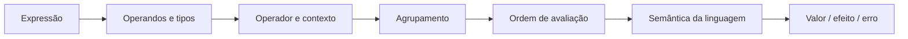

<a id="inicio"></a>

# Expressões e Operadores

> **Classificação curricular:** `[D] Obrigatório dominar`  
> **Nível:** A — Lógica de Programação  
> **Posição na taxonomia:** tópico 5  
> **Pré-requisitos:** dados, valores, variáveis, constantes e tipos fundamentais  
> **Aprofundamentos posteriores:** fluxo de controle, repetição, sintaxe/semântica, coerção, bitwise, overloaded operators e expressões avançadas

**Legenda curricular usada no capítulo:** `[D]` = obrigatório dominar; `[C]` = obrigatório conhecer; `[E]` = extensão/recomendado; `[P]` = progressivo. Essas marcas indicam prioridade curricular, não o nível atual de proficiência do leitor.

---

## Resumo executivo

Uma **expressão** é uma construção sintática que a linguagem pode avaliar segundo sua gramática e semântica. Em muitos contextos ela produz um valor; dependendo da linguagem e da construção, também pode designar uma variável, produzir efeitos ou não produzir um valor utilizável.

Exemplos:

```text
42
price * quantity
age >= 18
is_active and has_permission
```

Operadores combinam operandos:

```text
OPERANDO  OPERADOR  OPERANDO
   10        +         20
```

Mas aprender operadores não significa decorar símbolos.

O que realmente importa é compreender:

```text
TIPO DOS OPERANDOS
+
OPERADOR
+
REGRAS DA LINGUAGEM
+
ORDEM DE AGRUPAMENTO
+
ORDEM DE AVALIAÇÃO
=
RESULTADO / EFEITO
```

O mesmo símbolo pode ter semânticas diferentes.

Exemplo:

```text
+
```

pode significar:

- adição numérica;
- concatenação textual;
- operação definida por um tipo;
- coerção seguida de concatenação/adição.

Outra distinção fundamental:

```text
PRECEDÊNCIA
≠
ASSOCIATIVIDADE
≠
ORDEM DE AVALIAÇÃO
```

- **precedência** determina como operadores de níveis diferentes se agrupam;
- **associatividade** resolve agrupamento entre operadores de mesma precedência;
- **ordem de avaliação** determina em que sequência os operandos/expressões são realmente avaliados.

E há mais uma regra essencial:

> **operadores lógicos de curto-circuito podem evitar a avaliação de parte da expressão.**

Python, JavaScript, Java e Bash compartilham vários conceitos, mas suas semânticas não são idênticas. O objetivo deste capítulo é tornar essas diferenças visíveis desde o início.

---

## Decisão rápida

| Pergunta | Resposta |
|---|---|
| “O que é uma expressão?” | Construção avaliada segundo a gramática e a semântica da linguagem; conforme o contexto, pode produzir valor, designar uma variável/referência, provocar efeito ou terminar em erro. |
| “Operador é só um símbolo?” | Não. O símbolo possui semântica definida pela linguagem e pelos operandos. |
| “`=` é comparação?” | Depende da linguagem e do contexto. Em Python, JavaScript e Java, `=` é atribuição; no Bash, além de atribuição em outros contextos, `=` também pode comparar em construções condicionais como `[[ "$a" = "$b" ]]`. |
| “`==` significa a mesma coisa em todas?” | Não. Regras de igualdade variam bastante. |
| “`+` sempre soma?” | Não. Pode concatenar strings e envolver coerções. |
| “`/` sempre produz decimal?” | Não. Java com inteiros e Bash aritmético fazem divisão inteira; Python `/` e JS `Number` têm outras regras. |
| “Dividir por zero falha igual em todas?” | Não. O comportamento muda por linguagem **e por tipo**: exceção/erro, `Infinity` ou `NaN` são possibilidades reais. |
| “`%` é sempre módulo matemático?” | Não. Java/JS/Bash usam remainder com sinais diferentes de Python em negativos. |
| “`and`/`&&` sempre retorna boolean?” | Não em Python/JavaScript; Java retorna `boolean`; Bash possui contextos distintos. |
| “Precedência diz qual função é executada primeiro?” | Não necessariamente; ela define agrupamento. |
| “AND sempre tem precedência maior que OR?” | Não como regra universal. Em Bash, por exemplo, **listas de comandos** tratam `&&` e `||` com a mesma precedência e associatividade à esquerda. |
| “Parênteses servem só para corrigir precedência?” | Não. Também podem melhorar clareza. |
| “`a < b < c` funciona nas quatro linguagens?” | Não. Python possui comparação encadeada; Java/JS não com a mesma semântica. |
| “Short-circuit pode evitar erro?” | Sim, se usado conscientemente e se a linguagem garantir esse comportamento. |

---

> **Primeira vez aqui?** Use a [rota de primeira passagem](#modo-primeira-passagem) para consolidar primeiro expressão, operadores, lógica e avaliação; depois volte à Visão Panorâmica como caderno de consulta.

# Índice

- [Resumo executivo](#resumo-executivo)
- [Decisão rápida](#decisão-rápida)
- [1. Posição deste assunto](#1-posição-deste-assunto)
  - [1.1 Fronteira](#11-fronteira)
  - [1.2 Rastreabilidade da taxonomia canônica](#12-rastreabilidade-da-taxonomia-canônica)
- [2. Visão panorâmica](#2-visão-panorâmica)
  - [🗺️ Visão panorâmica — o mapa antes dos detalhes](#visao-panoramica-mapa)
  - [2.10 Modo primeira passagem × consulta × estudo completo](#modo-primeira-passagem)
- [3. O que é uma expressão](#3-o-que-é-uma-expressão)
  - [3.1 Expressão literal](#31-expressão-literal)
  - [3.2 Referência a nome](#32-referência-a-nome)
  - [3.3 Expressão composta](#33-expressão-composta)
  - [3.4 Subexpressões](#34-subexpressões)
  - [3.5 Expressão × statement](#35-expressão--statement)
  - [3.6 Atribuição: expressão ou statement?](#36-atribuição-expressão-ou-statement)
- [4. Operando, operador e resultado](#4-operando-operador-e-resultado)
  - [4.1 Tipo dos operandos importa](#41-tipo-dos-operandos-importa)
  - [4.2 Contexto importa](#42-contexto-importa)
  - [4.3 Operador não é apenas pontuação](#43-operador-não-é-apenas-pontuação)
- [5. Aridade — unário, binário e ternário](#5-aridade--unário-binário-e-ternário)
  - [5.1 Unário](#51-unário)
  - [5.2 Binário](#52-binário)
  - [5.3 Ternário](#53-ternário)
  - [5.4 Mesmo símbolo, aridade diferente](#54-mesmo-símbolo-aridade-diferente)
- [6. Operadores aritméticos](#6-operadores-aritméticos)
  - [6.1 Adição](#61-adição)
  - [6.2 Subtração](#62-subtração)
  - [6.3 Multiplicação](#63-multiplicação)
  - [6.4 Divisão](#64-divisão)
  - [6.5 Resto](#65-resto)
  - [6.6 Exponenciação](#66-exponenciação)
  - [6.7 Operadores compostos](#67-operadores-compostos)
- [7. Adição e concatenação](#7-adição-e-concatenação)
  - [7.1 Python](#71-python)
  - [7.2 JavaScript](#72-javascript)
  - [7.3 Java](#73-java)
  - [7.4 Associatividade muda resultados](#74-associatividade-muda-resultados)
  - [7.5 Guardrail](#75-guardrail)
- [8. Divisão](#8-divisão)
  - [8.1 Python](#81-python)
  - [8.2 JavaScript `Number`](#82-javascript-number)
  - [8.3 JavaScript `BigInt`](#83-javascript-bigint)
  - [8.4 Java](#84-java)
  - [8.5 Bash](#85-bash)
  - [8.6 Divisão por zero — diferença material entre linguagens e tipos](#86-divisão-por-zero--diferença-material-entre-linguagens-e-tipos)
  - [8.7 Regra](#87-regra)
- [9. Resto, módulo e `%`](#9-resto-módulo-e-)
  - [9.1 Relação geral](#91-relação-geral)
  - [9.2 Python](#92-python)
  - [9.3 JavaScript](#93-javascript)
  - [9.4 Java](#94-java)
  - [9.5 Bash](#95-bash)
  - [9.6 Consequência](#96-consequência)
  - [9.7 Guardrail terminológico](#97-guardrail-terminológico)
- [10. Exponenciação](#10-exponenciação)
  - [10.1 Python](#101-python)
  - [10.2 JavaScript](#102-javascript)
  - [10.3 Bash](#103-bash)
  - [10.4 Java](#104-java)
  - [10.5 Potência × sinal unário — não transfira por aparência](#105-potência--sinal-unário--não-transfira-por-aparência)
- [11. Operadores relacionais](#11-operadores-relacionais)
  - [11.1 Resultado lógico](#111-resultado-lógico)
  - [11.2 Comparabilidade depende do tipo](#112-comparabilidade-depende-do-tipo)
  - [11.3 Strings não seguem “ordem humana” universal](#113-strings-não-seguem-ordem-humana-universal)
- [12. Igualdade × identidade](#12-igualdade--identidade)
  - [12.1 Python](#121-python)
  - [12.2 JavaScript](#122-javascript)
  - [12.3 Java](#123-java)
  - [12.4 Bash](#124-bash)
  - [12.5 Moral](#125-moral)
- [13. Comparações encadeadas](#13-comparações-encadeadas)
  - [13.1 Python](#131-python)
  - [13.2 Java](#132-java)
  - [13.3 JavaScript](#133-javascript)
  - [13.4 Bash](#134-bash)
  - [13.5 Regra](#135-regra)
- [14. Operadores lógicos](#14-operadores-lógicos)
  - [14.1 Python](#141-python)
  - [14.2 JavaScript](#142-javascript)
  - [14.3 Java](#143-java)
  - [14.4 Bash](#144-bash)
- [15. Lógica booleana](#15-lógica-booleana)
  - [15.1 AND](#151-and)
  - [15.2 OR](#152-or)
  - [15.3 NOT](#153-not)
  - [15.4 Composição](#154-composição)
  - [15.5 De Morgan `[C]`](#155-de-morgan-c)
- [16. Tabelas-verdade](#16-tabelas-verdade)
  - [AND](#and)
  - [OR](#or)
  - [NOT](#not)
  - [16.1 Tabela-verdade não substitui semântica da linguagem](#161-tabela-verdade-não-substitui-semântica-da-linguagem)
- [17. Short-circuit](#17-short-circuit)
  - [17.1 AND](#171-and)
  - [17.2 OR](#172-or)
  - [17.3 Python](#173-python)
  - [17.4 JavaScript](#174-javascript)
  - [17.5 Java](#175-java)
  - [17.6 Bash](#176-bash)
- [18. Valor retornado por AND/OR](#18-valor-retornado-por-andor)
  - [18.1 Python](#181-python)
  - [18.2 JavaScript](#182-javascript)
  - [18.3 Java](#183-java)
  - [18.4 Bash](#184-bash)
  - [18.5 Consequência](#185-consequência)
- [19. Precedência](#19-precedência)
  - [19.1 Farrell](#191-farrell)
  - [19.2 Precedência lógica depende da linguagem **e do contexto**](#192-precedência-lógica-depende-da-linguagem-e-do-contexto)
  - [19.3 Não memorize tabela inteira cedo demais](#193-não-memorize-tabela-inteira-cedo-demais)
  - [19.4 Guardrail](#194-guardrail)
- [20. Associatividade](#20-associatividade)
  - [20.1 Esquerda para direita](#201-esquerda-para-direita)
  - [20.2 Direita para esquerda](#202-direita-para-esquerda)
  - [20.3 Atribuição e encadeamento](#203-atribuição-e-encadeamento)
  - [20.4 Associatividade ≠ ordem de avaliação](#204-associatividade--ordem-de-avaliação)
- [21. Ordem de avaliação](#21-ordem-de-avaliação)
  - [21.1 Python](#211-python)
  - [21.2 Java](#212-java)
  - [21.3 JavaScript](#213-javascript)
  - [21.4 Bash](#214-bash)
  - [21.5 Por que separar dos outros conceitos?](#215-por-que-separar-dos-outros-conceitos)
- [22. Parênteses como ferramenta de correção e clareza](#22-parênteses-como-ferramenta-de-correção-e-clareza)
  - [22.1 Alterar agrupamento](#221-alterar-agrupamento)
  - [22.2 Tornar intenção explícita](#222-tornar-intenção-explícita)
  - [22.3 Não abuse](#223-não-abuse)
  - [22.4 Regra](#224-regra)
- [23. Efeitos colaterais dentro de expressões](#23-efeitos-colaterais-dentro-de-expressões)
  - [23.1 Exemplo Java](#231-exemplo-java)
  - [23.2 Exemplo Python](#232-exemplo-python)
  - [23.3 Regra pedagógica](#233-regra-pedagógica)
- [24. Operadores bit a bit — introdução](#24-operadores-bit-a-bit--introdução)
  - [24.1 Não confundir](#241-não-confundir)
  - [24.2 Por que não aprofundar agora](#242-por-que-não-aprofundar-agora)
- [25. Python — expressões e operadores](#25-python--expressões-e-operadores)
  - [25.1 Aritmética](#251-aritmética)
  - [25.2 Comparações](#252-comparações)
  - [25.3 Boolean](#253-boolean)
  - [25.4 Short-circuit e retorno de operandos](#254-short-circuit-e-retorno-de-operandos)
  - [25.5 Ordem](#255-ordem)
  - [25.6 Division/remainder](#256-divisionremainder)
  - [25.7 Identidade](#257-identidade)
- [26. JavaScript — expressões e operadores](#26-javascript--expressões-e-operadores)
  - [26.1 `+`](#261-)
  - [26.2 Multiplicative](#262-multiplicative)
  - [26.3 Number × BigInt](#263-number--bigint)
  - [26.4 Equality](#264-equality)
  - [26.5 Logical](#265-logical)
  - [26.6 Relational](#266-relational)
  - [26.7 Guardrail](#267-guardrail)
- [27. Java — expressões e operadores](#27-java--expressões-e-operadores)
  - [27.1 Aritmética](#271-aritmética)
  - [27.2 `+` com String](#272--com-string)
  - [27.3 Integer division](#273-integer-division)
  - [27.4 Comparação](#274-comparação)
  - [27.5 Boolean](#275-boolean)
  - [27.6 Short-circuit](#276-short-circuit)
  - [27.7 Evaluation order](#277-evaluation-order)
  - [27.8 Igualdade de objetos](#278-igualdade-de-objetos)
- [28. Bash — expressões e operadores](#28-bash--expressões-e-operadores)
  - [28.1 Arithmetic expansion](#281-arithmetic-expansion)
  - [28.2 Arithmetic command](#282-arithmetic-command)
  - [28.3 Operadores aritméticos](#283-operadores-aritméticos)
  - [28.4 Conditional command](#284-conditional-command)
  - [28.5 Command lists](#285-command-lists)
  - [28.6 Comparação numérica × textual](#286-comparação-numérica--textual)
  - [28.7 Regra](#287-regra)
- [29. Comparação entre as quatro linguagens](#29-comparação-entre-as-quatro-linguagens)
- [30. Exemplo progressivo — regra de aprovação](#30-exemplo-progressivo--regra-de-aprovação)
  - [30.1 Pseudocódigo](#301-pseudocódigo)
  - [30.2 Python](#302-python)
  - [30.3 JavaScript](#303-javascript)
  - [30.4 Java](#304-java)
  - [30.5 Bash](#305-bash)
  - [30.6 Transferência](#306-transferência)
- [31. Exemplo crítico — precedência](#31-exemplo-crítico--precedência)
  - [Regra](#regra)
- [32. Exemplo crítico — resto com negativos](#32-exemplo-crítico--resto-com-negativos)
  - [Por quê?](#por-quê)
  - [Consequência](#consequência)
- [33. Exemplo crítico — short-circuit](#33-exemplo-crítico--short-circuit)
  - [Python](#python)
  - [JavaScript](#javascript)
  - [Java](#java)
  - [Regra](#regra-1)
- [34. Erros conceituais frequentes](#34-erros-conceituais-frequentes)
  - [34.1 “`=` sempre significa atribuição”](#341-sempre-significa-atribuicao)
  - [34.2 “`==` é sempre comparação de conteúdo”](#342--é-sempre-comparação-de-conteúdo)
  - [34.3 “`+` sempre soma”](#343--sempre-soma)
  - [34.4 “`/` sempre produz decimal”](#344--sempre-produz-decimal)
  - [34.5 “`%` é sempre módulo positivo”](#345--é-sempre-módulo-positivo)
  - [34.6 “`and` e `&&` sempre retornam bool”](#346-and-e--sempre-retornam-bool)
  - [34.7 “Precedência é ordem de execução”](#347-precedência-é-ordem-de-execução)
  - [34.8 “Associatividade é avaliação esquerda→direita”](#348-associatividade-é-avaliação-esquerdadireita)
  - [34.9 “Parênteses são desnecessários se sei a tabela”](#349-parênteses-são-desnecessários-se-sei-a-tabela)
  - [34.10 “Python chaining pode ser copiado para JavaScript”](#3410-python-chaining-pode-ser-copiado-para-javascript)
  - [34.11 “JavaScript `==` e `===` são estilisticamente iguais”](#3411-javascript--e--são-estilisticamente-iguais)
  - [34.12 “Bash `&&` significa uma única coisa”](#3412-bash--significa-uma-única-coisa)
  - [34.13 “`&` e `&&` são equivalentes”](#3413--e--são-equivalentes)
  - [34.14 “Se duas expressões dão o mesmo resultado hoje, são semanticamente equivalentes”](#3414-se-duas-expressões-dão-o-mesmo-resultado-hoje-são-semanticamente-equivalentes)
  - [34.15 “`&&` sempre possui precedência maior que `||`”](#3415--sempre-possui-precedência-maior-que-)
  - [34.16 “`-2 ** 2` significa a mesma coisa nas linguagens com `**`”](#3416--2--2-significa-a-mesma-coisa-nas-linguagens-com-)
- [Problemas reais — índice operacional](#problemas-reais)
  - [PR-T05-01 — fórmula de preço com agrupamento explícito](#pr-t05-01)
  - [PR-T05-02 — regra de elegibilidade com AND/OR sem ambiguidade](#pr-t05-02)
  - [PR-T05-03 — acesso seguro com short-circuit guard](#pr-t05-03)
  - [PR-T05-04 — índice circular portável com resto negativo](#pr-t05-04)
  - [PR-T05-05 — razão/média com semântica de divisão explícita](#pr-t05-05)
  - [PR-T05-06 — comparação de entrada sem coerção acidental](#pr-t05-06)
  - [PR-T05-07 — composição Bash no contexto correto](#pr-t05-07)
- [Troubleshooting e diagnóstico](#troubleshooting-diagnostico)
  - [🔎 Troubleshooting sistemático](#troubleshooting-sistematico)
    - [TS-T05-01 — média incorreta por precedência](#ts-t05-01)
    - [TS-T05-02 — `+` concatena quando a intenção era somar](#ts-t05-02)
    - [TS-T05-03 — divisão inteira trunca silenciosamente](#ts-t05-03)
    - [TS-T05-04 — `%` negativo muda ao portar algoritmo](#ts-t05-04)
    - [TS-T05-05 — guard falha porque ambos os lados foram avaliados](#ts-t05-05)
    - [TS-T05-06 — igualdade responde à pergunta errada](#ts-t05-06)
    - [TS-T05-07 — comparação encadeada foi transliterada](#ts-t05-07)
    - [TS-T05-08 — `&&`/`||` em Bash foram agrupados pela tabela errada](#ts-t05-08)
- [35. Laboratórios](#35-laboratórios)
  - [🧪 Laboratório 1 — Precedência](#lab-t05-01)
  - [🧪 Laboratório 2 — Divisão](#lab-t05-02)
  - [🧪 Laboratório 3 — Resto negativo](#lab-t05-03)
  - [🧪 Laboratório 4 — AND/OR retornam o quê?](#lab-t05-04)
  - [🧪 Laboratório 5 — Equality](#lab-t05-05)
  - [🧪 Laboratório 6 — Short-circuit guard](#lab-t05-06)
  - [🧪 Laboratório 7 — Bash contexts](#lab-t05-07)
- [36. Exercícios](#36-exercícios)
  - [36.1 Expressão](#361-expressão)
  - [36.2 Aridade](#362-aridade)
  - [36.3 Precedência](#363-precedência)
  - [36.4 Associatividade](#364-associatividade)
  - [36.5 Python chaining](#365-python-chaining)
  - [36.6 JavaScript](#366-javascript)
  - [36.7 Java division](#367-java-division)
  - [36.8 Python division](#368-python-division)
  - [36.9 Remainder](#369-remainder)
  - [36.10 Equality](#3610-equality)
  - [36.11 Java reference equality](#3611-java-reference-equality)
  - [36.12 Short-circuit](#3612-short-circuit)
  - [36.13 Side effects](#3613-side-effects)
  - [36.14 Bash](#3614-bash)
  - [36.15 De Morgan](#3615-de-morgan)
  - [36.16 Divisão por zero](#3616-divisão-por-zero)
  - [36.17 Potência e sinal unário](#3617-potência-e-sinal-unário)
- [37. Evidências de domínio](#37-evidências-de-domínio)
  - [Você deve conseguir explicar](#você-deve-conseguir-explicar)
  - [Você deve conseguir aplicar](#você-deve-conseguir-aplicar)
  - [Você deve conseguir depurar](#você-deve-conseguir-depurar)
  - [Você deve conseguir transferir](#você-deve-conseguir-transferir)
- [38. Checklist de consulta rápida](#38-checklist-de-consulta-rápida)
- [39. Glossário](#39-glossário)
- [40. Referências](#40-referências)
  - [40.1 Taxonomia canônica](#401-taxonomia-canônica)
  - [40.2 Python 3.14.7 — documentação oficial](#402-python-3147--documentação-oficial)
  - [40.3 ECMAScript 2026 — especificação oficial](#403-ecmascript-2026--especificação-oficial)
  - [40.4 Java SE 27 — documentação oficial](#404-java-se-27--documentação-oficial)
  - [40.5 GNU Bash 5.3 — documentação oficial](#405-gnu-bash-53--documentação-oficial)
  - [40.6 File Library — fontes locais efetivamente consultadas nesta auditoria](#406-file-library--fontes-locais-efetivamente-consultadas-nesta-auditoria)
  - [40.7 Como as fontes foram usadas](#407-como-as-fontes-foram-usadas)
- [41. Histórico de versões](#41-histórico-de-versões)

---
# 1. Posição deste assunto

Nos tópicos anteriores construímos:

```text
VALORES
↓
VARIÁVEIS
↓
TIPOS
```

Agora precisamos operar sobre esses valores:

```text
VALOR
+
OPERADOR
+
VALOR
↓
EXPRESSÃO
↓
RESULTADO
```

Este tópico é a ponte direta para:

- `if`;
- loops;
- validação;
- filtros;
- cálculos;
- comparações;
- regras de negócio.

## 1.1 Fronteira

Aqui entram:

- expressões;
- operadores aritméticos;
- operadores relacionais;
- operadores lógicos;
- lógica booleana;
- precedência;
- associatividade;
- ordem de avaliação;
- short-circuit.

Não aprofundaremos ainda:

- overload de operadores;
- metaprogramação;
- bitwise avançado;
- coercion internals completas;
- AST;
- parsing de expressões;
- álgebra booleana formal em profundidade.

[↑ Voltar ao índice](#índice)

## 1.2 Rastreabilidade da taxonomia canônica

| Nó do Guia | Capacidade curricular | Cobertura principal neste T05 |
|---|---|---|
| `5` | Expressões e operadores | capítulo completo |
| `5.1` | Expressões — operandos, operadores e resultado | §§3–5, §§25–30, LAB 1 |
| `5.2` | Operadores aritméticos | §§6–10, §§25–29, LAB 2–3 |
| `5.3` | Operadores relacionais | §§11–13, §§25–29, LAB 5 |
| `5.4` | Operadores lógicos | §§14, 17–18, §§25–29, LAB 4 e 6–7 |
| `5.5` | Lógica booleana — tabelas-verdade, condições compostas e negação | §§15–16, `PR-T05-02/03`, EX 36.15 |
| `5.6` | Avaliação — precedência, associatividade e parênteses | §§19–23, §31, `PR-T05-01`, `TS-T05-01`, LAB 1 |

A numeração `5.1–5.6` acima pertence ao **Guia curricular**; ela não precisa coincidir com a numeração editorial interna deste capítulo. Coerção profunda, operator overloading, parsing/AST e álgebra booleana formal permanecem em tópicos posteriores ou extensões declaradas.

[↑ Voltar ao índice](#índice)

---

# 2. Visão panorâmica

<a id="visao-panoramica-mapa"></a>

## 🗺️ Visão panorâmica — o mapa antes dos detalhes

Esta visão funciona como **caderno rápido de consulta** e como contrato de cobertura do tópico. O aprofundamento das regras, exceções e diferenças de linguagem permanece nas seções seguintes.

A síntese combina fontes com papéis diferentes: a taxonomia v2.1.0 fixa o núcleo `5.1–5.6`; Farrell ajuda a organizar aritmética, precedência e lógica booleana para iniciantes; Beazley e Sweigart dão exemplos concretos de expressões Python; Stroustrup reforça precedência, legibilidade e o risco de transportar comparações encadeadas por aparência; o GNU Bash Manual evidencia que os mesmos símbolos pertencem a gramáticas diferentes no shell; as documentações oficiais de Python, ECMAScript e Java fecham a semântica vigente de operadores, avaliação e short-circuit.

### 2.1 Mapa do domínio — o que existe

```text
EXPRESSÕES E OPERADORES
│
├── expressão
│   ├── literal / nome / chamada / composição
│   ├── operandos
│   ├── operadores
│   ├── subexpressões
│   └── valor, referência, efeito ou erro conforme a linguagem
│
├── aridade
│   ├── unário
│   ├── binário
│   └── ternário / condicional quando disponível
│
├── aritmética
│   ├── +  -  *  /
│   ├── divisão inteira quando existe
│   ├── % — remainder/módulo conforme a semântica concreta
│   ├── potência quando existe
│   └── casos-limite: zero, sinais, tipos e overflow
│
├── comparação
│   ├── igualdade / desigualdade
│   ├── ordem
│   ├── identidade / referência quando aplicável
│   └── comparação encadeada quando a linguagem realmente oferece
│
├── lógica
│   ├── AND
│   ├── OR
│   ├── NOT
│   ├── truthiness quando aplicável
│   └── short-circuit
│
└── avaliação
    ├── agrupamento
    ├── precedência
    ├── associatividade
    ├── ordem de avaliação
    ├── parênteses
    ├── efeitos colaterais
    └── contexto sintático da linguagem
```

### 2.2 Fluxo principal — como interpretar uma expressão

```text
EXPRESSÃO FONTE
      ↓
IDENTIFICAR OPERANDOS E TIPOS
      ↓
IDENTIFICAR OPERADOR E CONTEXTO SINTÁTICO
      ↓
DETERMINAR AGRUPAMENTO
(precedência + associatividade + parênteses)
      ↓
DETERMINAR ORDEM DE AVALIAÇÃO
      ↓
APLICAR A SEMÂNTICA DA LINGUAGEM
      ↓
VALOR / EFEITO / EXCEÇÃO / ERRO
```



**Leitura textual equivalente:** primeiro descubra **o que está sendo operado** e em **qual contexto**; depois descubra **como a expressão agrupa**; só então raciocine sobre **a ordem real de avaliação** e o resultado.

### 2.3 Consulta rápida — conceito × função × risco

| Conceito | Pergunta que responde | Risco clássico | Primeira verificação |
|---|---|---|---|
| Expressão | “O que será avaliado?” | tratar qualquer trecho como simples valor | delimitar subexpressões |
| Tipo dos operandos | “Que operações fazem sentido?” | `+` somar em um caso e concatenar em outro | inspecionar tipos antes da operação |
| Precedência | “Como operadores diferentes agrupam?” | média/fórmula matematicamente errada | parentetizar a intenção |
| Associatividade | “Como operadores do mesmo nível agrupam?” | interpretar `a-b-c` ou potência incorretamente | consultar a gramática/tabela concreta |
| Ordem de avaliação | “Qual operando roda primeiro?” | efeitos colaterais inesperados | separar efeitos da expressão |
| Short-circuit | “O lado direito pode nem ser avaliado?” | acesso inseguro ou efeito ausente | confirmar operador e garantia da linguagem |
| Igualdade | “Que noção de equivalência é testada?” | conteúdo × identidade × coerção | formular a pergunta antes de escolher operador |
| Divisão | “Que quociente é produzido?” | truncamento ou divisão por zero diferente | verificar tipos e regra concreta |
| `%` | “Como o resto é definido?” | índice negativo ao portar código | testar operandos negativos |
| Bash context | “Este símbolo pertence a aritmética, `[[ ]]` ou lista de comandos?” | aplicar uma tabela de precedência à gramática errada | identificar a construção antes do símbolo |

### 2.4 Pergunta prática → onde começar

| Se a dúvida for... | Comece por... |
|---|---|
| “Por que o cálculo deu outro valor?” | tipos → agrupamento → divisão/resto → ordem de avaliação |
| “Por que `+` produziu texto?” | tipos dos operandos + coerção/concatenação |
| “Por que uma condição acessou algo nulo?” | short-circuit + ordem dos operandos |
| “Por que `a < b < c` mudou de linguagem?” | regra de comparação encadeada da linguagem concreta |
| “Por que `==` não comparou o conteúdo?” | igualdade × identidade/referência |
| “Por que `%` ficou negativo?” | definição de quociente/remainder da linguagem |
| “Por que `&&`/`||` em Bash se comportaram diferente?” | contexto: command list × `[[ ]]` × `(( ))` |
| “Qual parte executa primeiro?” | separar precedência de ordem de avaliação |

### 2.5 Não confundir

```text
PRECEDÊNCIA
→ determina agrupamento entre níveis diferentes

ASSOCIATIVIDADE
→ resolve agrupamento dentro do mesmo nível

ORDEM DE AVALIAÇÃO
→ determina a sequência observável de avaliação
```

```text
IGUALDADE DE VALOR / CONTEÚDO
≠
IDENTIDADE / MESMA REFERÊNCIA
≠
IGUALDADE COM COERÇÃO
```

```text
REMAINDER DA LINGUAGEM
≠
“módulo sempre não negativo” como regra universal
```

```text
`&&` / `||` EM BASH
→ o mesmo desenho de símbolos aparece em gramáticas/contextos diferentes
→ não existe uma única tabela universal para todas elas
```

### 2.6 Microexemplos canônicos

**Agrupamento:**

```text
2 + 3 * 4
→ 2 + (3 * 4)
→ 14

(2 + 3) * 4
→ 20
```

**Tipo altera a operação:**

```javascript
1 + 2      // 3
1 + "2"    // "12"
```

**Divisão depende da linguagem/tipo:**

```text
Python      7 / 2      → 3.5
JavaScript  7 / 2      → 3.5
Java int    7 / 2      → 3
Bash        7 / 2      → 3
```

**Short-circuit como guard:**

```python
user is not None and user["role"] == "admin"
```

O segundo operando só é avaliado se o primeiro permitir.

**Resto negativo não é portável por aparência:**

```text
-7 % 3
Python      →  2
JavaScript  → -1
Java        → -1
Bash        → -1
```

### 2.7 Problemas reais representativos

| ID | Necessidade concreta | Capacidades centrais | Destino |
|---|---|---|---|
| `PR-T05-01` | calcular preço/desconto/taxa sem erro de agrupamento | precedência, parênteses, tipos | [Problemas reais](#problemas-reais) |
| `PR-T05-02` | expressar elegibilidade com regras AND/OR | lógica booleana, precedência, clareza | [Problemas reais](#problemas-reais) |
| `PR-T05-03` | proteger acesso dependente de estado anterior | short-circuit, ordem | [Problemas reais](#problemas-reais) |
| `PR-T05-04` | normalizar índice circular entre linguagens | `%`, sinais, portabilidade | [Problemas reais](#problemas-reais) |
| `PR-T05-05` | calcular razão/média sem truncamento ou zero oculto | divisão, tipos, validação | [Problemas reais](#problemas-reais) |
| `PR-T05-06` | comparar entrada textual com regra numérica | parsing, igualdade, coerção | [Problemas reais](#problemas-reais) |
| `PR-T05-07` | compor comandos Bash sem confundir gramáticas | exit status, `&&`/`||`, contexto | [Problemas reais](#problemas-reais) |

### 2.8 Falha típica → primeira investigação

| Sintoma | Primeira hipótese | Primeira observação |
|---|---|---|
| cálculo “quase certo” | precedência/parentetização | reescrever com parênteses explícitos |
| `"12"` em vez de `3` | coerção/concatenação | imprimir/inspecionar tipos |
| `3` em vez de `3.5` | divisão inteira | verificar tipos dos operandos |
| índice `-1` após portabilidade | remainder negativo | executar tabela com sinais |
| acesso nulo mesmo com “guard” | operador sem short-circuit ou ordem errada | reduzir a dois operandos e instrumentar |
| comparação “igual” retorna falso | identidade/referência | comparar a operação semântica desejada |
| Bash executa comando inesperado | contexto/agrupamento de listas | inserir grupos explícitos e inspecionar exit status |

A investigação completa está em [🔎 Troubleshooting sistemático](#troubleshooting-sistematico).

### 2.9 Transferência entre linguagens — o que permanece e o que muda

| Capacidade | Python | JavaScript | Java | Bash |
|---|---|---|---|---|
| expressão aritmética | natural | natural | natural | natural em contexto aritmético |
| truthiness em AND/OR | sim | sim | `&&`/`||` exigem boolean | exit status ou aritmética/condicional conforme contexto |
| AND/OR retorna operando | sim | sim | não | não como modelo geral |
| comparação encadeada | semântica própria | não equivalente | não equivalente | não equivalente |
| identidade explícita | `is` | igualdade de objetos é por identidade nos operadores de igualdade estrita | `==` em referências | sem equivalente direto geral |
| divisão inteira típica | `//` | BigInt `/` trunca; Number não | `/` com inteiros | aritmética inteira |
| `%` com negativos | alinhado à floor division | sinal acompanha dividendo | sinal acompanha dividendo | sinal acompanha dividendo |
| `&&`/`||` | — | operadores lógicos | operadores booleanos | depende da gramática/contexto |

> **Transferência correta:** leve o **conceito e a intenção**; revalide a sintaxe e a semântica na linguagem de destino.

<a id="modo-primeira-passagem"></a>
<a id="210-modo-consulta--modo-estudo"></a>

### 2.10 Modo primeira passagem × consulta × estudo completo

**Primeira passagem — foco essencial:**

```text
Resumo executivo + Decisão rápida
→ 3. o que é expressão
→ 4. operando, operador e resultado
→ 6. operadores aritméticos
→ 8. divisão
→ 11. operadores relacionais
→ 14–18. lógica + short-circuit
→ 19–22. precedência, associatividade, ordem e parênteses
→ 29. comparação entre linguagens
→ 30. exemplo progressivo
→ LAB 1 + LAB 4 + um LAB de transferência
→ seguir para T06
```

Essa rota não substitui o estudo completo. Ela separa o **primeiro contato** do aprofundamento e da consulta posterior.

**Consulta rápida:**

```text
Decisão rápida
→ 2.3 conceito × função × risco
→ 2.4 pergunta prática → onde começar
→ 2.5 não confundir
→ 2.6 microexemplos
→ 2.8 falha → primeira investigação
→ 29 comparação das quatro linguagens
→ 38 checklist
→ Troubleshooting
```

**Estudo completo:**

```text
3–5     → expressão, operador e aridade
6–10    → aritmética, divisão, remainder e potência
11–13   → relações, igualdade/identidade e chaining
14–18   → lógica booleana, short-circuit e valor retornado
19–23   → precedência, associatividade, ordem e efeitos
24      → bitwise introdutório [C]
25–29   → semântica concreta das quatro linguagens
30–34   → exemplo progressivo, exemplos críticos e erros conceituais
PR-*    → aplicação integrada
TS-*    → diagnóstico reproduzível
35–37   → LABs, exercícios e evidências de domínio
```
[↑ Voltar ao índice](#índice)

---
# 3. O que é uma expressão

Uma expressão é uma construção que pode ser avaliada segundo a gramática e semântica da linguagem.

Exemplos:

```python
42
price
price * quantity
age >= 18
is_active and has_permission
```

## 3.1 Expressão literal

```python
42
```

produz um valor.

## 3.2 Referência a nome

```python
price
```

avalia para o valor associado ao nome naquele contexto.

## 3.3 Expressão composta

```python
price * quantity
```

contém:

- operando esquerdo;
- operador;
- operando direito.

## 3.4 Subexpressões

```text
(a + b) * (c - d)
```

possui:

```text
a + b
c - d
```

como subexpressões.

## 3.5 Expressão × statement

Nem toda linguagem divide esses conceitos da mesma maneira.

Como modelo introdutório:

```text
EXPRESSÃO
→ participa da avaliação definida pela linguagem
→ frequentemente produz um valor

STATEMENT / INSTRUÇÃO
→ organiza uma ação, declaração ou estrutura de controle
```

A fronteira concreta é definida pela gramática da linguagem. Por isso, não transfira mecanicamente a ideia de que “toda expressão produz um valor utilizável” ou de que “toda atribuição é uma expressão”.

## 3.6 Atribuição: expressão ou statement?

A própria atribuição mostra por que essa diferença importa:

| Linguagem / contexto | Modelo relevante neste nível |
|---|---|
| Python `name = value` | assignment **statement**; `=` não é expressão geral |
| Python `name := value` | assignment expression (*walrus*), com regras próprias |
| JavaScript `name = value` | assignment expression; produz o valor atribuído |
| Java `name = value` | assignment expression; produz o valor após a atribuição/conversão aplicável |
| Bash `name=value` | sintaxe de atribuição do shell, não trate como simples equivalente de JS/Java |
| Bash `(( name = value ))` | `=` é operador de atribuição dentro da gramática aritmética |

Consequência pedagógica:

> **Mesmo símbolo não implica a mesma categoria gramatical nem a mesma possibilidade de composição.**

Esse detalhe será aprofundado em sintaxe e semântica, mas já precisa estar visível para evitar transliteração incorreta entre linguagens.

[↑ Voltar ao índice](#índice)

---

# 4. Operando, operador e resultado

Exemplo:

```text
10 + 20
```

Temos:

```text
10
→ operando

+
→ operador

20
→ operando

30
→ resultado
```

## 4.1 Tipo dos operandos importa

```python
2 + 3
```

e:

```python
"2" + "3"
```

usam o mesmo símbolo em Python, mas os resultados são:

```text
5
"23"
```

## 4.2 Contexto importa

Bash:

```bash
x=2
y=3
printf '%s\n' "$x$y"
```

→ concatenação textual.

```bash
printf '%d\n' "$((x + y))"
```

→ aritmética.

## 4.3 Operador não é apenas pontuação

A linguagem especifica:

- tipos permitidos;
- conversões;
- valor produzido;
- erros;
- precedência;
- associatividade;
- avaliação.

[↑ Voltar ao índice](#índice)

---

# 5. Aridade — unário, binário e ternário

A **aridade** informa quantos operandos uma operação recebe.

## 5.1 Unário

Um operando:

```text
-x
not x
!x
```

## 5.2 Binário

Dois operandos:

```text
a + b
a < b
a && b
```

## 5.3 Ternário

Três componentes conceituais.

JavaScript/Java:

```text
condition ? value_if_true : value_if_false
```

Python possui expressão condicional:

```text
value_if_true if condition else value_if_false
```

Bash arithmetic possui operador condicional no contexto aritmético:

```text
condition ? value_if_true : value_if_false
```

## 5.4 Mesmo símbolo, aridade diferente

```text
-
```

pode ser:

```text
-x
→ unário

a - b
→ binário
```

A gramática/contexto determina qual operação está sendo usada.

[↑ Voltar ao índice](#índice)

---

# 6. Operadores aritméticos

Conceitos mais comuns:

| Operação | Símbolo comum |
|---|---|
| adição | `+` |
| subtração | `-` |
| multiplicação | `*` |
| divisão | `/` |
| resto | `%` |
| exponenciação | `**` em algumas linguagens |

## 6.1 Adição

```text
a + b
```

## 6.2 Subtração

```text
a - b
```

## 6.3 Multiplicação

```text
a * b
```

## 6.4 Divisão

Semântica depende fortemente dos tipos e da linguagem.

## 6.5 Resto

```text
a % b
```

não deve ser chamado automaticamente de “módulo matemático” sem observar a regra de sinais.

## 6.6 Exponenciação

Python/JavaScript/Bash arithmetic possuem `**`.

Java não possui operador `**`; normalmente usa-se:

```java
Math.pow(base, exponent)
```

## 6.7 Operadores compostos

Exemplos:

```text
+=
-=
*=
/=
```

São úteis, mas detalhes semânticos podem diferir da simples expansão textual em algumas linguagens.

No nível introdutório:

```python
count += 1
```

expressa atualização de estado.

Um contraexemplo concreto em Java mostra por que `x += y` não deve ser tratado como mera expansão textual de `x = x + y`:

```java
short value = 1;
value += 1;      // compila
```

Enquanto:

```java
short value = 1;
value = value + 1;   // não compila sem conversão explícita
```

A expressão `value + 1` sofre promoção numérica; a atribuição composta aplica regras próprias de conversão ao tipo da variável do lado esquerdo. Portanto, a grafia abreviada pode preservar a intenção de atualização sem ser semanticamente idêntica a uma substituição textual ingênua.

[↑ Voltar ao índice](#índice)

---

# 7. Adição e concatenação

O operador `+` é uma das maiores fontes de falsa equivalência entre linguagens.

## 7.1 Python

```python
2 + 3
```

→ `5`.

```python
"2" + "3"
```

→ `"23"`.

```python
"2" + 3
```

→ `TypeError`.

## 7.2 JavaScript

A especificação afirma:

> addition performs either string concatenation or numeric addition.

Exemplo:

```javascript
"2" + 3
```

→ `"23"`.

A linguagem aplica conversões definidas pela especificação.

## 7.3 Java

Se um operando de `+` for `String`, ocorre string conversion do outro operando e concatenação.

```java
"2" + 3
```

→ `"23"`.

## 7.4 Associatividade muda resultados

Java:

```java
1 + 2 + "3"
```

agrupa como:

```text
(1 + 2) + "3"
→ 3 + "3"
→ "33"
```

Mas:

```java
"1" + 2 + 3
```

→

```text
("1" + 2) + 3
→ "12" + 3
→ "123"
```

## 7.5 Guardrail

Quando tipos misturados tornam `+` ambíguo para o leitor:

> **converta ou formate explicitamente para comunicar intenção.**

[↑ Voltar ao índice](#índice)

---

# 8. Divisão

Divisão é um excelente exemplo de semântica dependente do tipo.

## 8.1 Python

```python
7 / 2
```

→

```text
3.5
```

O operador `/` faz **true division**.

Python também possui:

```python
7 // 2
```

→

```text
3
```

`//` é floor division.

Com negativos:

```python
-7 // 2
```

→

```text
-4
```

porque é piso matemático, não truncamento em direção a zero.

## 8.2 JavaScript `Number`

```javascript
7 / 2
```

→ `3.5`.

## 8.3 JavaScript `BigInt`

```javascript
7n / 2n
```

→ `3n`.

A divisão inteira BigInt trunca em direção a zero.

## 8.4 Java

Com inteiros:

```java
7 / 2
```

→ `3`.

A divisão inteira trunca em direção a zero.

Com `double`:

```java
7.0 / 2.0
```

→ `3.5`.

## 8.5 Bash

Aritmética do shell é inteira:

```bash
echo $((7 / 2))
```

→ `3`.

## 8.6 Divisão por zero — diferença material entre linguagens e tipos

Divisão por zero é um caso-limite em que a aparência sintática esconde comportamentos muito diferentes:

| Caso | Resultado / efeito |
|---|---|
| Python `1 / 0` | `ZeroDivisionError` |
| JavaScript `Number`: `1 / 0` | `Infinity` |
| JavaScript `Number`: `0 / 0` | `NaN` |
| JavaScript `BigInt`: `1n / 0n` | `RangeError` |
| Java `int`: `1 / 0` | `ArithmeticException` |
| Java `double`: `1.0 / 0.0` | infinito IEEE 754; `0.0 / 0.0` produz `NaN` |
| Bash aritmético: `$((1 / 0))` | erro de avaliação aritmética; a expansão/comando não produz um quociente válido |

Em Java há ainda um caso especial importante de overflow na divisão inteira: dividir o menor valor representável do tipo por `-1` resulta novamente nesse menor valor, sem exceção de overflow. Isso decorre da aritmética inteira definida pela JLS e não deve ser confundido com divisão por zero.

## 8.7 Regra

Nunca deduza o resultado de `/` apenas pelo símbolo.

Pergunte:

```text
qual linguagem?
quais tipos?
qual é o caso-limite?
```

[↑ Voltar ao índice](#índice)

---

# 9. Resto, módulo e `%`

É comum chamar `%` de “módulo”.

Isso pode esconder diferenças com números negativos.

## 9.1 Relação geral

Em várias linguagens:

```text
dividendo = quociente * divisor + resto
```

Mas a escolha do quociente determina o sinal do resto.

## 9.2 Python

Python usa floor division.

Exemplo:

```python
-7 // 3
```

→ `-3`.

Então:

```python
-7 % 3
```

→ `2`.

O resto tem o sinal do divisor quando não é zero.

## 9.3 JavaScript

`%` é definido como **remainder**.

```javascript
-7 % 3
```

→ `-1`.

## 9.4 Java

```java
-7 % 3
```

→ `-1`.

A divisão inteira trunca em direção a zero.

## 9.5 Bash

```bash
echo $((-7 % 3))
```

→ `-1` em ambientes usuais compatíveis com a semântica aritmética documentada.

## 9.6 Consequência

Código de normalização circular como:

```text
index % size
```

pode precisar de cuidado extra em linguagens cujo remainder pode ser negativo.

## 9.7 Guardrail terminológico

Use preferencialmente:

```text
operador %
→ remainder/resto na linguagem concreta
```

e só use “módulo matemático” quando a semântica realmente coincidir.

[↑ Voltar ao índice](#índice)

---

# 10. Exponenciação

## 10.1 Python

```python
2 ** 3
```

→ `8`.

## 10.2 JavaScript

```javascript
2 ** 3
```

→ `8`.

## 10.3 Bash

```bash
echo $((2 ** 3))
```

→ `8`.

## 10.4 Java

Não há `**`.

Use:

```java
Math.pow(2, 3)
```

→ `8.0`.

## 10.5 Potência × sinal unário — não transfira por aparência

A expressão visualmente parecida:

```text
-2 ** 2
```

não possui uma interpretação universal.

### Python

```python
-2 ** 2
```

é interpretado como:

```text
-(2 ** 2)
```

→ `-4`.

```python
(-2) ** 2
```

→ `4`.

### JavaScript

```javascript
-2 ** 2
```

é **erro sintático**: a gramática de exponenciação não aceita essa forma com um `UnaryExpression` não parentetizado à esquerda. Para expressar a intenção, escreva explicitamente:

```javascript
(-2) ** 2   // 4
-(2 ** 2)   // -4
```

### Bash arithmetic

No Bash 5.3, a tabela de precedência aritmética coloca os operadores unários `-`/`+` acima de `**`. Assim:

```bash
echo $((-2 ** 2))
```

produz `4`, equivalente ao agrupamento:

```text
(-2) ** 2
```

Para obter `-4`, deixe a intenção explícita:

```bash
echo $((-(2 ** 2)))
```

### Java

Java não possui operador `**`; use uma operação/API apropriada, como `Math.pow`, e explicite o sinal conforme a intenção.

> **Regra:** precedência não é “matemática universal”. Ela pertence à gramática concreta da linguagem e do contexto sintático.

[↑ Voltar ao índice](#índice)

---

# 11. Operadores relacionais

Operadores relacionais comparam valores.

Comuns:

```text
<
<=
>
>=
```

E operadores de igualdade:

```text
==
!=
```

## 11.1 Resultado lógico

Em usos normais, comparações produzem resultado lógico/booleano.

## 11.2 Comparabilidade depende do tipo

Java rejeita várias comparações incompatíveis em compile time.

Python pode lançar `TypeError`:

```python
1 < "2"
```

JavaScript possui coerções em comparações relacionais.

Bash possui operadores diferentes conforme o contexto:

```text
aritmético
string
arquivo
comando
```

## 11.3 Strings não seguem “ordem humana” universal

Comparação textual pode usar:

- code points;
- code units;
- locale;
- regras da API.

ECMAScript faz comparação relacional de strings lexicograficamente por unidades UTF-16 após as conversões aplicáveis.

Não confunda com:

```text
ordenação linguística natural
```

[↑ Voltar ao índice](#índice)

---

# 12. Igualdade × identidade

Igualdade é uma área em que equivalências superficiais são perigosas.

## 12.1 Python

```text
==
→ comparação de valor/equivalência definida pelos objetos

is
→ identidade
```

Não use:

```python
x is 1000
```

para comparação de valor.

Use:

```python
x == 1000
```

## 12.2 JavaScript

Existem:

```text
==
→ loose equality / IsLooselyEqual

===
→ strict equality / IsStrictlyEqual
```

Regra de base segura para aprendizado:

> **prefira `===` e `!==` quando não houver motivo consciente para coerção de igualdade.**

## 12.3 Java

Para primitivos:

```text
==
```

compara valores segundo regras numéricas/booleanas aplicáveis.

Para referências:

```text
==
```

compara se as referências denotam o mesmo objeto ou ambas são `null`.

Para conteúdo de objetos como `String`, normalmente usa-se:

```java
a.equals(b)
```

conforme o contrato da classe.

## 12.4 Bash

Em `[[ ... ]]`:

```bash
[[ "$a" == "$b" ]]
```

faz comparação textual/pattern semantics conforme a forma do operando direito e quoting.

Em aritmética:

```bash
(( a == b ))
```

faz comparação numérica.

## 12.5 Moral

> **“igualdade” não é um operador universal com semântica idêntica.**

[↑ Voltar ao índice](#índice)

---

# 13. Comparações encadeadas

## 13.1 Python

Python permite:

```python
18 <= age < 65
```

A documentação define comparação encadeada com avaliação do operando intermediário apenas uma vez.

Conceitualmente:

```text
18 <= age
AND
age < 65
```

mas com regra própria de avaliação.

## 13.2 Java

Isto não funciona:

```java
18 <= age < 65
```

A primeira comparação produz `boolean`, que não pode ser comparado numericamente com `65`.

Use:

```java
18 <= age && age < 65
```

## 13.3 JavaScript

```javascript
18 <= age < 65
```

é sintaticamente válido, mas pode produzir comportamento surpreendente porque:

```text
18 <= age
```

vira boolean e depois participa de nova comparação/coerção.

Não use isso como equivalente ao Python.

Exemplo concreto:

```javascript
const age = 70;
console.log(18 <= age < 65); // true — resultado incorreto para a intenção de faixa
```

O agrupamento é efetivamente:

```text
(18 <= 70) < 65
true < 65
1 < 65
true
```

Use:

```javascript
18 <= age && age < 65
```

## 13.4 Bash

No contexto aritmético:

```bash
(( 18 <= age && age < 65 ))
```

é a forma clara.

## 13.5 Regra

> **Comparação encadeada é recurso semântico de Python, não padrão universal.**

[↑ Voltar ao índice](#índice)

---

# 14. Operadores lógicos

Conceitos:

```text
AND
OR
NOT
```

## 14.1 Python

```text
and
or
not
```

## 14.2 JavaScript

```text
&&
||
!
```

## 14.3 Java

```text
&&
||
!
```

com operandos booleanos apropriados.

## 14.4 Bash

Existem vários níveis.

### Controle de listas de comandos

```bash
command1 && command2
command1 || command2
```

Opera sobre exit statuses.

### Aritmética

```bash
(( a > 0 && b > 0 ))
```

### Condicional `[[ ]]`

```bash
[[ condition1 && condition2 ]]
```

Não misture esses contextos como se fossem um único “tipo boolean Bash”.

[↑ Voltar ao índice](#índice)

---

# 15. Lógica booleana

Considere proposições:

```text
A
B
```

## 15.1 AND

Verdadeiro apenas quando ambos são verdadeiros.

## 15.2 OR

Verdadeiro quando pelo menos um é verdadeiro.

## 15.3 NOT

Inverte o valor lógico.

## 15.4 Composição

```text
(A AND B) OR C
```

deve ser lida segundo:

- agrupamento;
- precedência;
- semântica;
- short-circuit.

## 15.5 De Morgan `[C]`

Leis importantes:

```text
NOT (A AND B)
≡
(NOT A) OR (NOT B)
```

```text
NOT (A OR B)
≡
(NOT A) AND (NOT B)
```

São úteis para:

- simplificar;
- inverter condições;
- verificar lógica.

[↑ Voltar ao índice](#índice)

---

# 16. Tabelas-verdade

## AND

| A | B | A AND B |
|---|---|---|
| F | F | F |
| F | V | F |
| V | F | F |
| V | V | V |

## OR

| A | B | A OR B |
|---|---|---|
| F | F | F |
| F | V | V |
| V | F | V |
| V | V | V |

## NOT

| A | NOT A |
|---|---|
| F | V |
| V | F |

## 16.1 Tabela-verdade não substitui semântica da linguagem

Em Python/JavaScript:

```text
AND/OR
```

podem retornar operandos, não apenas `True/False`.

A tabela descreve o comportamento **lógico** de truth values.

[↑ Voltar ao índice](#índice)

---

# 17. Short-circuit

Short-circuit significa:

> a expressão deixa de avaliar operandos quando o resultado lógico já está determinado.

## 17.1 AND

Se o lado esquerdo já é falso:

```text
FALSE AND qualquer_coisa
```

o resultado lógico já é falso.

O segundo lado pode não ser avaliado.

## 17.2 OR

Se o lado esquerdo já é verdadeiro:

```text
TRUE OR qualquer_coisa
```

o resultado lógico já está determinado.

## 17.3 Python

`and` e `or` são short-circuit.

## 17.4 JavaScript

`&&` e `||` são short-circuit.

## 17.5 Java

`&&` e `||` são conditional-and / conditional-or e short-circuit.

Java também possui:

```text
&
|
```

Com operandos `boolean`, `&` e `|` **avaliam os dois operandos**; `&&` e `||` podem deixar de avaliar o operando direito por short-circuit. Com operandos integrais, `&` e `|` possuem semântica bitwise.

Logo, resultado lógico semelhante não implica a mesma ordem de avaliação.

## 17.6 Bash

Listas:

```bash
cmd1 && cmd2
```

executam `cmd2` apenas se `cmd1` retorna sucesso.

```bash
cmd1 || cmd2
```

executam `cmd2` apenas se `cmd1` falha.

[↑ Voltar ao índice](#índice)

---

# 18. Valor retornado por AND/OR

## 18.1 Python

```python
"" or "default"
```

→ `"default"`.

```python
"hello" and 42
```

→ `42`.

`and`/`or` retornam o último operando avaliado.

## 18.2 JavaScript

```javascript
"" || "default"
```

→ `"default"`.

```javascript
"hello" && 42
```

→ `42`.

## 18.3 Java

```java
a && b
```

produz `boolean`.

Não retorna arbitrariamente um dos operandos.

## 18.4 Bash

Não aplique esse modelo de retorno diretamente a:

```bash
cmd1 && cmd2
```

O shell controla execução por exit status e o status da lista resultante.

## 18.5 Consequência

Padrão Python/JS:

```text
value OR default
```

não deve ser transliterado mecanicamente para Java/Bash.

[↑ Voltar ao índice](#índice)

---

# 19. Precedência

Precedência determina **como uma expressão é agrupada** quando operadores diferentes aparecem sem parênteses.

Exemplo:

```text
2 + 3 * 4
```

multiplicação possui precedência maior:

```text
2 + (3 * 4)
→ 14
```

Não:

```text
(2 + 3) * 4
→ 20
```

## 19.1 Farrell

Farrell usa exatamente esse tipo de exemplo e destaca que esquecer precedência pode gerar erro lógico.

## 19.2 Precedência lógica depende da linguagem **e do contexto**

Em Python, JavaScript e Java, os operadores lógicos usuais seguem a hierarquia conceitual esperada para este nível: negação antes de AND, e AND antes de OR. Bash exige mais cuidado porque há **gramáticas diferentes**.

| Contexto Bash | Relação relevante |
|---|---|
| aritmética `(( ... ))` | `!` > `&&` > `||` |
| condicional `[[ ... ]]` | `!` > `&&` > `||` |
| listas de comandos | `&&` e `||` têm **a mesma precedência** e são associados à esquerda |

Exemplo de lista de comandos:

```bash
true || false && printf '%s\n' 'executou'
```

Como `&&` e `||` possuem a mesma precedência nesse contexto e a lista é associada à esquerda, a estrutura é lida como:

```text
(true || false) && printf ...
```

e `printf` é executado.

> **Guardrail:** não transfira uma tabela de precedência de `[[ ... ]]` ou `(( ... ))` para listas de comandos. Primeiro identifique a gramática em uso.

## 19.3 Não memorize tabela inteira cedo demais

Aprenda:

- os grupos mais frequentes;
- use parênteses para clareza;
- consulte documentação em casos incomuns.

## 19.4 Guardrail

Se um leitor precisa lembrar cinco níveis pouco usuais para entender sua intenção:

> **adicione parênteses ou decomponha a expressão.**

[↑ Voltar ao índice](#índice)

---

# 20. Associatividade

Associatividade resolve o agrupamento quando operadores de mesma precedência se repetem.

## 20.1 Esquerda para direita

Exemplo:

```text
10 - 3 - 2
```

normalmente:

```text
(10 - 3) - 2
→ 5
```

e não:

```text
10 - (3 - 2)
→ 9
```

## 20.2 Direita para esquerda

Exponenciação em Python é right-associative:

```python
2 ** 3 ** 2
```

interpreta como:

```text
2 ** (3 ** 2)
```

## 20.3 Atribuição e encadeamento

Não trate:

```text
a = b = 0
```

como uma construção universal com a mesma categoria gramatical.

- **JavaScript e Java:** `=` é operador de atribuição e a atribuição é uma expressão; o agrupamento de atribuições é da direita.
- **Python:** `a = b = 0` é uma forma de assignment **statement**; `=` não deve ser explicado como expressão geral. Python possui `:=` para assignment expressions, com outra sintaxe e regras.
- **Bash:** `a=0` é sintaxe de atribuição do shell; dentro de `(( ... ))`, `=` pertence à gramática de operadores aritméticos e pode ser encadeado segundo essa gramática.

A aparência externa pode ser parecida; a estrutura sintática e a capacidade de compor o resultado em outra expressão não são universais.

## 20.4 Associatividade ≠ ordem de avaliação

Este ponto merece repetição:

```text
AGRUPAMENTO
≠
QUANDO CADA OPERANDO É EXECUTADO
```

[↑ Voltar ao índice](#índice)

---

# 21. Ordem de avaliação

Ordem de avaliação diz **quando** subexpressões são executadas.

## 21.1 Python

A referência oficial afirma:

> Python evaluates expressions from left to right.

Com assignment, o lado direito é avaliado antes do alvo ser atribuído.

## 21.2 Java

A JLS garante avaliação de operandos da esquerda para a direita.

Também exige respeito a parênteses e precedência.

## 21.3 JavaScript

A especificação define algoritmos de avaliação para cada construção e, para operadores binários, o operando esquerdo é avaliado antes do direito no fluxo normativo da expressão.

## 21.4 Bash

A aritmética Bash documenta operadores, precedência e associatividade em modelo semelhante ao C, mas isso **não deve ser convertido em uma garantia pedagógica genérica de ordem de avaliação de operandos** equivalente às garantias explícitas de Python ou Java.

Além disso, `(( ... ))`, `[[ ... ]]` e listas de comandos pertencem a contextos sintáticos diferentes.

Guardrail:

> **evite depender de múltiplos efeitos colaterais dentro de uma única expressão aritmética Bash; se a ordem importa, decomponha em comandos simples e observáveis.**

## 21.5 Por que separar dos outros conceitos?

Considere:

```text
f() + g() * h()
```

Precedência diz:

```text
f() + (g() * h())
```

Não significa, por si só:

> “g() roda antes de f()”.

A ordem de avaliação é uma regra diferente da linguagem.

[↑ Voltar ao índice](#índice)

---

# 22. Parênteses como ferramenta de correção e clareza

Parênteses têm duas funções práticas.

## 22.1 Alterar agrupamento

Errado para média:

```text
score1 + score2 / 2
```

Correto:

```text
(score1 + score2) / 2
```

## 22.2 Tornar intenção explícita

Mesmo quando não são necessários:

```text
price + (price * TAX_RATE)
```

pode comunicar melhor:

```text
preço
+
imposto sobre preço
```

## 22.3 Não abuse

Excesso também prejudica:

```text
((((a + b))) * (((c))))
```

## 22.4 Regra

> **use parênteses quando eles mudam a lógica ou reduzem a carga mental do leitor.**

Farrell recomenda exatamente essa postura em vez de exigir memorização mecânica.

[↑ Voltar ao índice](#índice)

---

# 23. Efeitos colaterais dentro de expressões

Uma expressão fica mais difícil de raciocinar quando mistura:

```text
CALCULAR
+
ALTERAR ESTADO
+
CHAMAR FUNÇÕES COM EFEITOS
```

## 23.1 Exemplo Java

```java
int result = i++ + ++i;
```

Mesmo com ordem definida, é muito menos claro do que decompor.

## 23.2 Exemplo Python

Assignment expression:

```python
if (length := len(data)) > 0:
    ...
```

pode ser útil.

Mas:

```text
mais compacto
```

não significa automaticamente:

```text
mais legível
```

## 23.3 Regra pedagógica

Enquanto aprende fundamentos:

> **prefira expressões que possam ser explicadas passo a passo sem esconder múltiplas alterações de estado.**

[↑ Voltar ao índice](#índice)

---

# 24. Operadores bit a bit — introdução

**Classificação:** `[C] conhecer posteriormente dentro dos fundamentos`.

Operadores bitwise trabalham sobre representações inteiras/bit patterns.

Comuns:

```text
&
|
^
~
<<
>>
```

Java também possui:

```text
>>>
```

JavaScript possui operadores bitwise com regras próprias sobre `Number`/BigInt.

Bash arithmetic também oferece bitwise.

Python oferece operações bit a bit sobre inteiros.

## 24.1 Não confundir

```text
and / && 
```

com:

```text
& 
```

Ou:

```text
or / ||
```

com:

```text
|
```

Eles podem possuir:

- tipos aceitos diferentes;
- short-circuit diferente;
- resultados diferentes.

## 24.2 Por que não aprofundar agora

Bitwise é importante para:

- máscaras;
- flags;
- protocolos;
- sistemas;
- redes;
- permissões.

Mas não é necessário dominar antes de condicionais/loops básicos.

[↑ Voltar ao índice](#índice)

---

# 25. Python — expressões e operadores

Baseline:

```text
Python 3.14.7
```

## 25.1 Aritmética

```text
+
-
*
/
//
%
**
```

## 25.2 Comparações

```text
<
<=
>
>=
==
!=
is
is not
in
not in
```

Todas as comparações ficam no mesmo nível de precedência e podem participar do chaining definido pela linguagem.

## 25.3 Boolean

```text
not
and
or
```

Da **maior para a menor precedência** (`>` significa “possui maior precedência que”):

```text
not > and > or
```

## 25.4 Short-circuit e retorno de operandos

```python
x and y
x or y
```

retornam operandos.

## 25.5 Ordem

Expressões são avaliadas da esquerda para a direita.

## 25.6 Division/remainder

```text
/
→ true division

//
→ floor division

%
→ remainder consistente com floor division
```

## 25.7 Identidade

```text
is
```

não substitui:

```text
==
```

[↑ Voltar ao índice](#índice)

---

# 26. JavaScript — expressões e operadores

Baseline:

```text
ECMAScript 2026
```

## 26.1 `+`

Pode realizar:

```text
string concatenation
OU
numeric addition
```

após operações de conversão definidas pela especificação.

## 26.2 Multiplicative

```text
*
/
%
```

`%` é remainder.

## 26.3 Number × BigInt

Operações numéricas binárias geralmente exigem os mesmos numeric types depois das conversões apropriadas.

```javascript
1n + 1
```

→ `TypeError`.

## 26.4 Equality

```text
==
===
!=
!==
```

Para código novo, `===`/`!==` tornam a intenção mais previsível na maior parte das comparações comuns.

## 26.5 Logical

```text
!
&&
||
```

`&&`/`||` short-circuit e retornam operandos.

## 26.6 Relational

Comparações podem envolver coerções definidas por `IsLessThan`.

## 26.7 Guardrail

Nunca memorize JavaScript como:

```text
“é igual a Python, só troca and por &&”
```

A coerção e igualdade possuem diferenças profundas.

[↑ Voltar ao índice](#índice)

---

# 27. Java — expressões e operadores

Baseline:

```text
Java SE 27
```

## 27.1 Aritmética

```text
+
-
*
/
%
```

Sem operador `**`.

## 27.2 `+` com String

Pode fazer concatenação.

A JLS define string conversion do outro operando quando aplicável.

## 27.3 Integer division

```java
7 / 2
```

→ `3`.

## 27.4 Comparação

```text
<
<=
>
>=
==
!=
```

Com regras de tipos estáticas.

## 27.5 Boolean

```text
!
&&
||
```

produzem `boolean`.

## 27.6 Short-circuit

`&&` e `||` condicionais.

## 27.7 Evaluation order

A JLS garante:

```text
left operand
→ right operand
```

para operadores binários, além de outras regras explícitas de avaliação.

## 27.8 Igualdade de objetos

```text
==
```

não significa “mesmo conteúdo” para referências em geral.

[↑ Voltar ao índice](#índice)

---

# 28. Bash — expressões e operadores

Baseline:

```text
GNU Bash 5.3
```

Bash exige separar contextos.

## 28.1 Arithmetic expansion

```bash
$(( expression ))
```

produz expansão do resultado.

## 28.2 Arithmetic command

```bash
(( expression ))
```

usa o valor da expressão para produzir exit status:

```text
resultado != 0
→ status 0 (sucesso)

resultado == 0
→ status 1
```

## 28.3 Operadores aritméticos

Inclui:

```text
**
* / %
+ -
comparações
&& ||
?: 
assignments
```

com precedência documentada em estilo C.

## 28.4 Conditional command

```bash
[[ ... ]]
```

possui operadores próprios para:

- string;
- regex;
- arquivos;
- lógica.

## 28.5 Command lists

```bash
cmd1 && cmd2
cmd1 || cmd2
```

não são simplesmente “expressões booleanas com valores”.

Controlam execução segundo exit statuses. No Bash 5.3:

- `cmd1 && cmd2` executa `cmd2` somente se `cmd1` terminar com status zero;
- `cmd1 || cmd2` executa `cmd2` somente se `cmd1` terminar com status diferente de zero;
- `&&` e `||` possuem **a mesma precedência** em listas de comandos;
- AND/OR lists são associadas à esquerda.

Isso difere da precedência interna de `[[ ... ]]` e `(( ... ))`, onde `&&` fica acima de `||`.

## 28.6 Comparação numérica × textual

Numérica:

```bash
(( a < b ))
```

ou testes numéricos apropriados.

Textual:

```bash
[[ "$a" < "$b" ]]
```

possui semântica textual.

## 28.7 Regra

> **Antes de interpretar um operador Bash, identifique o contexto sintático.**

[↑ Voltar ao índice](#índice)

---

# 29. Comparação entre as quatro linguagens

| Conceito | Python | JavaScript | Java | Bash |
|---|---|---|---|---|
| soma | `+` | `+` | `+` | `+` em aritmética |
| concatenação | `+` strings | `+` com coerção | `+` String | juxtaposição/expansão |
| divisão 7/2 | `3.5` | `3.5` | `3` com `int` | `3` |
| divisão por zero | `ZeroDivisionError` | `Number`: `Infinity`/`NaN`; `BigInt`: `RangeError` | inteiros: `ArithmeticException`; floating: infinito/`NaN` | erro de avaliação aritmética |
| floor division | `//` | não equivalente direto | não | não |
| resto negativo `-7 % 3` | `2` | `-1` | `-1` | `-1` |
| potência | `**` | `**` | `Math.pow` | `**` aritmético |
| `-2 ** 2` | `-4` | `SyntaxError` sem parênteses | não há `**` | `4` |
| logical AND | `and` | `&&` | `&&` | `&&` depende do contexto |
| logical OR | `or` | `||` | `||` | `||` depende do contexto |
| precedência AND × OR | AND > OR | `&&` > `||` | `&&` > `||` | depende do contexto: em command lists, `&&` = `||` em precedência |
| NOT | `not` | `!` | `!` | `!` / contexto |
| AND/OR retorna operandos | sim | sim | não | não como modelo geral |
| chained comparison | sim | não equivalente | não | não equivalente |
| strict equality separada | não nesses termos | `===` | tipos estáticos + `==` regras próprias | contexto |
| identidade | `is` | objetos via igualdade de referência | `==` em refs | não equivalente |
| short-circuit | sim | sim | sim | sim nos contextos apropriados |

[↑ Voltar ao índice](#índice)

---

# 30. Exemplo progressivo — regra de aprovação

Regra:

```text
score >= 70
AND
attendance >= 75
```

## 30.1 Pseudocódigo

```text
approved =
    score >= 70
    AND attendance >= 75
```

## 30.2 Python

```python
score = 82
attendance = 90

approved = score >= 70 and attendance >= 75

print(approved)
```

Saída:

```text
True
```

## 30.3 JavaScript

```javascript
const score = 82;
const attendance = 90;

const approved = score >= 70 && attendance >= 75;

console.log(approved);
```

Saída:

```text
true
```

## 30.4 Java

```java
public class Example {
    public static void main(String[] args) {
        int score = 82;
        int attendance = 90;

        boolean approved = score >= 70 && attendance >= 75;

        System.out.println(approved);
    }
}
```

Saída:

```text
true
```

## 30.5 Bash

```bash
#!/usr/bin/env bash

score=82
attendance=90

if (( score >= 70 && attendance >= 75 )); then
    printf '%s\n' 'true'
else
    printf '%s\n' 'false'
fi
```

Saída:

```text
true
```

## 30.6 Transferência

O conceito é:

```text
COMPARAÇÃO
+
COMPARAÇÃO
+
AND
```

A forma concreta varia.

[↑ Voltar ao índice](#índice)

---

# 31. Exemplo crítico — precedência

Objetivo:

> calcular média de dois valores.

Errado:

```text
a + b / 2
```

Com:

```text
a = 10
b = 20
```

agrupa:

```text
10 + (20 / 2)
→ 20
```

Mas a média é:

```text
(10 + 20) / 2
→ 15
```

## Regra

> **Parênteses não são decoração quando alteram a estrutura matemática da expressão.**

Farrell usa exatamente esse tipo de erro para demonstrar como precedência gera bugs lógicos.

[↑ Voltar ao índice](#índice)

---

# 32. Exemplo crítico — resto com negativos

Mesma aparência:

```text
-7 % 3
```

Resultados:

```text
Python      →  2
JavaScript  → -1
Java        → -1
Bash        → -1
```

## Por quê?

Python usa:

```text
floor division
```

As outras três, nos contextos comparados, usam quociente truncado em direção a zero para esse caso.

## Consequência

Ao transferir algoritmos que dependem de `%`:

- índices circulares;
- normalização;
- hashing;
- calendário;
- criptografia;

não assuma semântica idêntica com negativos.

[↑ Voltar ao índice](#índice)

---

# 33. Exemplo crítico — short-circuit

Objetivo:

> acessar uma propriedade apenas se o objeto existir.

## Python

```python
user = None

is_admin = user is not None and user["role"] == "admin"

print(is_admin)
```

O segundo operando não é avaliado.

## JavaScript

```javascript
const user = null;

const isAdmin = user !== null && user.role === "admin";

console.log(isAdmin);
```

O acesso `user.role` é evitado.

## Java

```java
User user = null;

boolean isAdmin = user != null && user.isAdmin();
```

`user.isAdmin()` não é chamado se `user == null`.

## Regra

Short-circuit pode ser usado como **guard**.

Mas:

> não transforme toda expressão em cadeia complexa de efeitos; clareza continua sendo prioridade.

[↑ Voltar ao índice](#índice)

---

# 34. Erros conceituais frequentes

<a id="341--compara"></a>
<a id="341-sempre-significa-atribuicao"></a>

## 34.1 “`=` sempre significa atribuição”

Falso como regra universal.

Em Python, JavaScript e Java, `=` é usado para atribuição. No Bash, a semântica depende do contexto: `name=value` é atribuição, `(( x = 10 ))` usa `=` como operador de atribuição aritmética, enquanto `[[ "$a" = "$b" ]]` usa `=` como operador de comparação condicional.

> **Guardrail:** identifique primeiro a linguagem e a gramática em uso; o mesmo símbolo não garante a mesma categoria sintática nem a mesma semântica.

## 34.2 “`==` é sempre comparação de conteúdo”

Falso.

Java referências e JavaScript/Python têm semânticas próprias.

## 34.3 “`+` sempre soma”

Falso.

## 34.4 “`/` sempre produz decimal”

Falso.

## 34.5 “`%` é sempre módulo positivo”

Falso.

## 34.6 “`and` e `&&` sempre retornam bool”

Falso em Python/JavaScript.

## 34.7 “Precedência é ordem de execução”

Não.

É principalmente regra de agrupamento sintático/semântico.

## 34.8 “Associatividade é avaliação esquerda→direita”

Não necessariamente.

## 34.9 “Parênteses são desnecessários se sei a tabela”

Eles podem melhorar legibilidade.

## 34.10 “Python chaining pode ser copiado para JavaScript”

Não.

## 34.11 “JavaScript `==` e `===` são estilisticamente iguais”

Não. Possuem algoritmos semânticos diferentes.

## 34.12 “Bash `&&` significa uma única coisa”

Não.

Contexto de lista de comandos e contexto aritmético precisam ser distinguidos.

## 34.13 “`&` e `&&` são equivalentes”

Não.

## 34.14 “Se duas expressões dão o mesmo resultado hoje, são semanticamente equivalentes”

Não necessariamente.

Podem divergir em:

- tipos;
- efeitos colaterais;
- overflow;
- short-circuit;
- exceções.

## 34.15 “`&&` sempre possui precedência maior que `||`”

Falso como regra universal.

Em Bash, isso depende do contexto: dentro de `[[ ... ]]` e da aritmética a hierarquia é `&&` antes de `||`; em **listas de comandos**, ambos possuem a mesma precedência e associatividade à esquerda.

## 34.16 “`-2 ** 2` significa a mesma coisa nas linguagens com `**`”

Falso.

- Python → `-4`;
- JavaScript → `SyntaxError` sem parênteses;
- Bash arithmetic → `4`.

Sempre verifique a gramática concreta.

[↑ Voltar ao índice](#índice)

---

<a id="problemas-reais"></a>

# Problemas reais — índice operacional

O inventário abaixo materializa necessidades em que expressões e operadores deixam de ser apenas sintaxe e passam a formar parte do **contrato de uma solução**.

| ID | Necessidade | Capacidades combinadas | Linguagens avaliadas | Evidência | Estado |
|---|---|---|---|---|---|
| `PR-T05-01` | fórmula de preço correta e legível | aritmética, precedência, parênteses | Python / JavaScript / Java / Bash | `D/S/R` | `FECHADO` |
| `PR-T05-02` | elegibilidade com AND/OR sem ambiguidade | comparações, lógica booleana, precedência | Python / JavaScript / Java / Bash | `D/S/R` | `FECHADO` |
| `PR-T05-03` | acesso dependente protegido | short-circuit, ordem de avaliação | Python / JavaScript / Java / Bash* | `D/S/R` | `FECHADO` |
| `PR-T05-04` | índice circular portável | remainder, sinais, normalização | Python / JavaScript / Java / Bash | `D/S/R` | `FECHADO` |
| `PR-T05-05` | razão/média semanticamente correta | divisão, tipos, zero | Python / JavaScript / Java / Bash | `D/S/R` | `FECHADO` |
| `PR-T05-06` | comparar entrada com domínio sem coerção acidental | parsing, igualdade, tipos | Python / JavaScript / Java / Bash | `D/S/R` | `FECHADO` |
| `PR-T05-07` | encadear comandos Bash pelo exit status | command lists, `&&`, `||`, agrupamento | Bash | `D/S/R` | `FECHADO` |

`*` Em Bash, a transferência é por **controle condicionado por exit status/contexto**, não por acesso a objeto como nas linguagens generalistas.

Legenda de evidência:

- `D` — comportamento confrontado com documentação/especificação apropriada;
- `S` — estrutura/sintaxe/contrato inspecionados;
- `R` — cenário representativo executado no ambiente de QA quando tecnicamente aplicável.

<a id="pr-t05-01"></a>

## PR-T05-01 — fórmula de preço com agrupamento explícito

**Necessidade:** calcular o total após desconto e depois aplicar uma taxa, sem depender de leitura ambígua da expressão.

Contrato:

```text
subtotal = unit_price * quantity
after_discount = subtotal * (1 - discount_rate)
final_total = after_discount * (1 + tax_rate)
```

Exemplo com:

```text
unit_price = 100
quantity = 2
discount_rate = 0.10
tax_rate = 0.05
```

Resultado esperado:

```text
189.0
```

**Estratégia canônica:** nomear estados intermediários quando a fórmula possuir etapas de domínio. Uma expressão única também pode ser correta, mas tende a esconder a regra.

```python
subtotal = unit_price * quantity
after_discount = subtotal * (1 - discount_rate)
final_total = after_discount * (1 + tax_rate)
```

**Por que funciona:** o agrupamento não depende de “lembrar a intenção”; cada etapa explicita qual base recebe desconto e qual base recebe a taxa.

**Alternativa válida:**

```text
unit_price * quantity * (1 - discount_rate) * (1 + tax_rate)
```

Use-a apenas quando a fórmula permanecer inequívoca para o domínio.

**Testes mínimos:** quantidade `0`; desconto `0`; taxa `0`; limites aceitos pelo domínio; valores inválidos devem ser rejeitados antes do cálculo.

**Trade-off:** expressão compacta reduz linhas; estados intermediários melhoram inspeção, logs, testes e manutenção.

[↑ Voltar ao índice](#índice)

---

<a id="pr-t05-02"></a>

## PR-T05-02 — regra de elegibilidade com AND/OR sem ambiguidade

**Necessidade:** conceder benefício a quem seja **membro ativo e adulto**, ou possua **autorização explícita**.

Contrato lógico:

```text
(active AND adult) OR override
```

Forma explícita:

```python
eligible = (is_active and age >= 18) or has_override
```

O problema real não é apenas “usar `and` e `or`”. É preservar a regra de negócio ao combiná-los.

**Alternativas:** extrair subexpressões com nomes (`is_adult`, `standard_eligibility`) quando a condição crescer.

**Testes:** tabela cobrindo combinações de `is_active`, `age >= 18` e `has_override`, incluindo o caso em que `override` sozinho autoriza.

**Erro provável:** mover parênteses e transformar a regra em:

```text
active AND (adult OR override)
```

Isso nega a autorização explícita a um usuário inativo, alterando o contrato.

[↑ Voltar ao índice](#índice)

---

<a id="pr-t05-03"></a>

## PR-T05-03 — acesso seguro com short-circuit guard

**Necessidade:** consultar informação dependente somente quando o primeiro estado tornar o acesso válido.

Exemplo conceitual:

```text
objeto existe
AND
propriedade satisfaz condição
```

Python:

```python
is_admin = user is not None and user["role"] == "admin"
```

JavaScript:

```javascript
const isAdmin = user !== null && user.role === "admin";
```

Java:

```java
boolean isAdmin = user != null && user.isAdmin();
```

**Por que funciona:** o operador short-circuit garante que o operando direito não seja avaliado quando o esquerdo já determina o resultado.

**Bash — transferência conceitual:**

```bash
command -v tool >/dev/null 2>&1 && tool --version
```

O segundo comando só é executado quando o primeiro retorna sucesso (`0`).

**Trade-off:** guards curtos são claros; cadeias grandes com múltiplos efeitos tornam diagnóstico difícil e devem ser decompostas.

**Teste de regressão:** estado ausente/nulo; estado válido; estado válido porém condição falsa.

[↑ Voltar ao índice](#índice)

---

<a id="pr-t05-04"></a>

## PR-T05-04 — índice circular portável com resto negativo

**Necessidade:** mover um índice para trás em uma coleção circular sem produzir posição negativa ao portar o algoritmo.

Objetivo:

```text
size = 5
index = 0
offset = -1
resultado esperado = 4
```

Em Python:

```python
normalized = (index + offset) % size
```

produz `4`.

Em JavaScript, Java e Bash, o mesmo texto conceitual pode produzir `-1` porque `%` segue outra regra de sinal.

Normalização portável para linguagens cujo remainder pode ser negativo:

```text
((index + offset) % size + size) % size
```

**Pré-condição:** `size > 0`.

**Por que funciona:** o primeiro `%` limita a magnitude; a soma de `size` desloca um remainder negativo; o segundo `%` recoloca o resultado no intervalo `[0, size-1]`.

**Testes:** `offset = -1`, `-size`, `-(size+1)`, `0`, `size`, `size+1`.

**Trade-off:** em Python a dupla normalização é redundante para esse domínio, mas pode tornar uma fórmula compartilhada mais portável quando isso for requisito explícito.

[↑ Voltar ao índice](#índice)

---

<a id="pr-t05-05"></a>

## PR-T05-05 — razão/média com semântica de divisão explícita

**Necessidade:** calcular `total / count` sem truncar dados nem dividir por zero.

Contrato:

```text
count > 0
resultado deve preservar parte fracionária quando existir
```

Em Python e JavaScript `Number`, `7 / 2` produz `3.5`. Em Java com `int` e em Bash aritmético, `7 / 2` produz `3`.

Java — uma forma de tornar a intenção explícita:

```java
double average = (double) total / count;
```

Bash não possui aritmética de ponto flutuante nativa equivalente nesse contexto; quando precisão fracionária for requisito, usar ferramenta/linguagem apropriada em vez de fingir equivalência.

**Testes:** `count = 1`; resultado não inteiro; `count = 0`; valores negativos somente se o domínio permitir.

**Trade-off:** converter apenas para “fazer funcionar” pode esconder uma decisão de domínio. O tipo do resultado deve ser parte do contrato.

[↑ Voltar ao índice](#índice)

---

<a id="pr-t05-06"></a>

## PR-T05-06 — comparação de entrada sem coerção acidental

**Necessidade:** comparar uma entrada textual com uma regra numérica sem depender de conversão implícita.

Entrada:

```text
"18"
```

Regra:

```text
idade >= 18
```

Estratégia canônica:

```text
texto externo
→ parsing explícito
→ validação de domínio
→ comparação numérica
```

Python:

```python
age = int(age_text)
is_adult = age >= 18
```

JavaScript:

```javascript
const normalizedAgeText = ageText.trim();
const age = Number(normalizedAgeText);
const isValidAge = normalizedAgeText !== "" && Number.isInteger(age) && age >= 0;
const isAdult = isValidAge && age >= 18;
```

Java:

```java
int age = Integer.parseInt(ageText);
boolean isAdult = age >= 18;
```

Bash, quando a entrada tiver sido validada como inteiro decimal:

```bash
(( age = 10#$age_text ))
(( age >= 18 ))
```

**Por que funciona:** igualdade/comparação deixa de carregar a responsabilidade de “adivinhar” o tipo pretendido.

**Testes:** `"18"`, `"17"`, vazio, texto não numérico, sinais/formato conforme o domínio.

[↑ Voltar ao índice](#índice)

---

<a id="pr-t05-07"></a>

## PR-T05-07 — composição Bash no contexto correto

**Necessidade:** executar uma etapa somente se a anterior tiver sucesso e fornecer fallback quando a composição falhar.

Exemplo:

```bash
prepare && deploy || rollback
```

Isso é uma **lista de comandos**, não uma expressão booleana equivalente a Java/Python/JavaScript.

**Contrato:**

- `deploy` só deve rodar se `prepare` retornar `0`;
- `rollback` roda quando a lista à esquerda de `||` termina com status não zero.

⚠️ Há um detalhe operacional importante: se `prepare` funcionar mas `deploy` falhar, `rollback` também será executado. Portanto, a construção não é equivalente a um `if/else` simples em todos os casos.

Quando o contrato exigir blocos explícitos, prefira:

```bash
if prepare; then
    if ! deploy; then
        rollback
    fi
else
    rollback
fi
```

**Trade-off:** listas curtas são idiomáticas; fluxos com semântica de recuperação ficam mais legíveis com `if` explícito.

**Testes:** `(prepare, deploy)` = `(success, success)`, `(success, fail)`, `(fail, not-run)`.

[↑ Voltar ao índice](#índice)

---

<a id="troubleshooting-diagnostico"></a>

# Troubleshooting e diagnóstico

<a id="troubleshooting-sistematico"></a>

## 🔎 Troubleshooting sistemático

Os casos abaixo aplicam o ciclo:

```text
SINTOMA
→ REPRODUZIR
→ HIPÓTESES
→ OBSERVAR
→ INTERPRETAR
→ CORRIGIR
→ VALIDAR
→ REGRESSÃO
```

<a id="ts-t05-01"></a>

### TS-T05-01 — média incorreta por precedência

**Sintoma:** duas notas `10` e `20` produzem `20` quando o esperado é `15`.

**Reprodução mínima:**

```text
average = 10 + 20 / 2
```

**Hipóteses:** agrupamento errado; divisão inteira; dado incorreto.

**Como observar:** reescreva a expressão mostrando o agrupamento implícito:

```text
10 + (20 / 2)
```

**Causa:** divisão possui precedência maior que adição no contexto analisado.

**Correção:**

```text
(10 + 20) / 2
```

**Validação:** testar pares com resultados conhecidos e incluir caso que produza fração na linguagem/tipo pertinente.

**Regressão:** manter teste para `(10, 20) → 15`.

---

<a id="ts-t05-02"></a>

### TS-T05-02 — `+` concatena quando a intenção era somar

**Sintoma:** JavaScript produz `"1020"` para entradas de formulário `"10"` e `"20"`.

**Reprodução mínima:**

```javascript
const a = "10";
const b = "20";
console.log(a + b); // "1020"
```

**Hipóteses:** operandos continuam strings; parsing não ocorreu; operador `+` acionou concatenação.

**Como observar:** registrar `typeof a` e `typeof b`.

**Causa:** a semântica do `+` considera os tipos/coerções dos operandos.

**Correção:** converter e validar antes da operação:

```javascript
const a = Number(aText);
const b = Number(bText);
```

**Validação:** entradas válidas e inválidas; não aceitar `NaN` silenciosamente.

**Regressão:** `"10" + "20"` não pode reaparecer no caminho numérico.

---

<a id="ts-t05-03"></a>

### TS-T05-03 — divisão inteira trunca silenciosamente

**Sintoma:** em Java ou Bash, `7 / 2` resulta em `3` e uma média perde a parte fracionária.

**Reprodução:** executar `7 / 2` nos tipos/contextos concretos.

**Hipóteses:** ambos os operandos são inteiros; linguagem/contexto usa divisão inteira.

**Como observar:** inspecionar tipos e o tipo esperado do resultado.

**Causa:** a semântica da divisão depende dos operandos; em Java inteiro/inteiro produz quociente inteiro, e Bash aritmético opera com inteiros.

**Correção:** em Java promover um operando para ponto flutuante quando o domínio pedir fração; em Bash escolher ferramenta adequada para ponto flutuante.

**Validação:** `7 / 2 → 3.5` somente no caminho que promete resultado fracionário.

**Regressão:** adicionar caso cujo quociente não seja inteiro.

---

<a id="ts-t05-04"></a>

### TS-T05-04 — `%` negativo muda ao portar algoritmo

**Sintoma:** um índice circular que funcionava em Python vira `-1` em JavaScript/Java/Bash.

**Reprodução:**

```text
-1 % 5
```

**Hipóteses:** semântica de remainder diferente; fórmula assumiu resultado não negativo.

**Como observar:** criar tabela com `(1, -1)`, `(-1, 1)`, `(-6, 5)`.

**Causa:** as linguagens comparadas não usam a mesma regra de sinal para `%` com negativos.

**Correção portável:**

```text
((value % size) + size) % size
```

com `size > 0`.

**Validação:** resultado sempre em `[0, size-1]`.

**Regressão:** testar offsets negativos maiores que uma volta completa.

---

<a id="ts-t05-05"></a>

### TS-T05-05 — guard falha porque ambos os lados foram avaliados

**Sintoma:** código lança erro/acessa estado inválido mesmo parecendo possuir uma condição de proteção.

**Reprodução Java:**

```java
boolean ok = user != null & user.isAdmin();
```

**Hipóteses:** operador errado; ordem dos operandos invertida; não existe short-circuit.

**Como observar:** substituir temporariamente o segundo operando por função que registre quando é chamada.

**Causa:** `&` em booleanos avalia ambos os operandos; `&&` é o operador condicional short-circuit.

**Correção:**

```java
boolean ok = user != null && user.isAdmin();
```

**Validação:** `user = null` não deve avaliar `user.isAdmin()`.

**Regressão:** testar `null`, usuário admin e usuário não admin.

---

<a id="ts-t05-06"></a>

### TS-T05-06 — igualdade responde à pergunta errada

**Sintoma:** duas strings Java com o mesmo conteúdo podem produzir `false` com `==`.

**Reprodução mínima:**

```java
String a = new String("ok");
String b = new String("ok");
System.out.println(a == b);      // false
System.out.println(a.equals(b)); // true
```

**Hipóteses:** operador está comparando referências; a intenção era comparar conteúdo.

**Como observar:** declarar explicitamente a pergunta:

```text
“é o mesmo objeto?”
OU
“possui o mesmo conteúdo?”
```

**Causa:** `==` sobre referências Java testa identidade de referência; `.equals()` pode definir igualdade de conteúdo/lógica do tipo.

**Correção:** escolher a operação que corresponde ao contrato e tratar `null` quando pertinente.

**Validação:** mesmo conteúdo em objetos distintos; conteúdos distintos; mesma referência.

**Regressão:** não usar `==` como atalho genérico para “mesmo conteúdo”.

---

<a id="ts-t05-07"></a>

### TS-T05-07 — comparação encadeada foi transliterada

**Sintoma:** uma condição de intervalo copiada de Python produz resultado surpreendente em JavaScript ou nem compila em Java.

Python:

```python
1 < value < 10
```

**Como observar:** não leia `a < b < c` como notação matemática universal. Pergunte como a gramática da linguagem agrupa e quais tipos cada comparação produz.

JavaScript, por exemplo:

```javascript
3 > 2 > 1
```

é avaliado em etapas e não representa o mesmo contrato de comparação encadeada de Python.

**Correção transferível:**

```text
1 < value AND value < 10
```

traduzido com os operadores lógicos da linguagem concreta.

**Validação:** testar abaixo, dentro e acima do intervalo.

**Regressão:** incluir bordas `1` e `10` para confirmar inclusividade/exclusividade.

---

<a id="ts-t05-08"></a>

### TS-T05-08 — `&&`/`||` em Bash foram agrupados pela tabela errada

**Sintoma:** um comando é executado apesar de o autor esperar que o primeiro `true` encerrasse toda a expressão.

**Reprodução:**

```bash
true || false && printf '%s\n' 'executou'
```

Em uma lista de comandos Bash, `&&` e `||` possuem a mesma precedência e associatividade à esquerda. A leitura é equivalente a:

```text
(true || false) && printf ...
```

**Hipóteses:** foi aplicada a tabela de precedência de outra linguagem ou a precedência de `(( ))`/`[[ ]]` à lista de comandos.

**Como observar:** identificar primeiro a gramática: command list, `[[ ... ]]` ou aritmética `(( ... ))`.

**Causa:** o mesmo símbolo participa de contextos diferentes com regras diferentes.

**Correção:** usar agrupamento/estrutura explícita quando a intenção não for trivial.

**Validação:** testar combinações de exit status e verificar quais comandos realmente executam.

**Regressão:** manter caso que distingue a precedência de command lists da aritmética/condicional.

[↑ Voltar ao índice](#índice)

---

# 35. Laboratórios

<a id="lab-t05-01"></a>
## 🧪 Laboratório 1 — Precedência

### Objetivo

Separar **agrupamento por precedência** de mera leitura esquerda→direita e usar parênteses para tornar a intenção explícita.

### Pré-requisitos

- §§3–6;
- §§19–22.

### Estado inicial

Use estas expressões sem executá-las primeiro:

```text
2 + 3 * 4
(2 + 3) * 4
10 - 6 / 2
```

### Tarefa

Preveja o agrupamento e o resultado; depois confirme em pelo menos duas linguagens.

### Procedimento

1. marque as subexpressões que agrupam primeiro;
2. calcule manualmente;
3. execute em duas linguagens;
4. repita colocando parênteses redundantes apenas onde melhorarem a leitura;
5. explique por que precedência não é sinônimo de ordem observável de avaliação de operandos.

### O que observar

- `*`/`/` agrupam antes de `+`/`-` nos casos escolhidos;
- parênteses podem alterar agrupamento ou apenas comunicar intenção;
- o tipo dos operandos ainda pode alterar o valor final da divisão.

### Testes

Seu registro deve prever corretamente `14` e `20` para as duas primeiras expressões e explicar o tipo do resultado da terceira na linguagem escolhida.

### Explicação

<details><summary><strong>Solução-modelo mínima</strong></summary>

```text
2 + 3 * 4     → 2 + (3 * 4) → 14
(2 + 3) * 4   → 5 * 4       → 20
10 - 6 / 2    → 10 - (6 / 2)
```

Na terceira, o valor numérico é `7`; o tipo/representação pode variar conforme a linguagem e os operandos (`7.0` em Python com `/`, por exemplo).

</details>

### Variação / transferência

Crie uma fórmula de média e mostre uma versão errada e uma versão correta apenas mudando os parênteses.

---

<a id="lab-t05-02"></a>
## 🧪 Laboratório 2 — Divisão

### Objetivo

Distinguir **true division**, **floor division**, truncamento em direção a zero e comportamentos de divisão por zero.

### Pré-requisitos

- §8;
- T04 — tipos numéricos.

### Estado inicial

```text
7 / 2
-7 / 2
```

### Tarefa

Execute os casos em Python, JavaScript, Java e Bash e classifique a regra concreta usada.

### Procedimento

1. teste `7 / 2` e `-7 / 2`;
2. compare Python `//`, Java `int /`, JavaScript `BigInt /` e Bash arithmetic;
3. teste divisão por zero apenas nos tipos/contextos seguros para observação;
4. registre valor, erro/exceção e tipo quando aplicável.

### O que observar

- Python `/` produz true division;
- Python `//` usa floor;
- Java inteiro, JavaScript `BigInt` e Bash arithmetic truncam em direção a zero;
- divisão por zero não possui comportamento universal entre tipos/linguagens.

### Testes

Inclua pelo menos `7/2`, `-7/2`, `1/0` e `0/0` quando o contexto suportar a observação sem encerrar indevidamente o LAB.

### Explicação

<details><summary><strong>Solução-modelo mínima</strong></summary>

| Contexto | `7 / 2` | `-7 / 2` | divisão inteira relevante |
|---|---:|---:|---|
| Python `/` | `3.5` | `-3.5` | — |
| Python `//` | `3` | `-4` | floor |
| JavaScript `Number` | `3.5` | `-3.5` | — |
| JavaScript `BigInt` | `3n` | `-3n` | trunc toward zero |
| Java `int` | `3` | `-3` | trunc toward zero |
| Bash arithmetic | `3` | `-3` | trunc toward zero |

Divisão por zero varia: Python lança `ZeroDivisionError`; `Number` em JavaScript pode produzir `Infinity`/`NaN`; `BigInt` falha; Java inteiro lança `ArithmeticException`, enquanto floating point segue IEEE 754; Bash arithmetic sinaliza erro.

</details>

### Variação / transferência

Explique por que portar apenas o símbolo `/` não preserva o contrato de um cálculo de média.

---

<a id="lab-t05-03"></a>
## 🧪 Laboratório 3 — Resto negativo

### Objetivo

Demonstrar que `%` não possui uma única regra de sinal portável entre linguagens.

### Pré-requisitos

- §9;
- noção de divisão inteira.

### Estado inicial

```text
-7 % 3
7 % -3
-7 % -3
```

### Tarefa

Execute os três casos nas quatro linguagens e explique os resultados pela relação entre dividendo, divisor, quociente e resto.

### Procedimento

1. preveja os resultados;
2. execute;
3. registre o quociente implícito da regra de cada linguagem;
4. verifique `dividendo = quociente * divisor + resto`.

### O que observar

Python alinha `%` à floor division; JavaScript, Java e Bash usam remainder associado a quociente truncado em direção a zero.

### Testes

A tabela deve incluir os três pares de sinais e pelo menos um caso positivo de controle, como `7 % 3`.

### Explicação

<details><summary><strong>Solução-modelo mínima</strong></summary>

| Expressão | Python | JavaScript | Java | Bash |
|---|---:|---:|---:|---:|
| `-7 % 3` | `2` | `-1` | `-1` | `-1` |
| `7 % -3` | `-2` | `1` | `1` | `1` |
| `-7 % -3` | `-1` | `-1` | `-1` | `-1` |

Não normalize a diferença chamando tudo de “módulo positivo”. O contrato deve especificar a semântica necessária.

</details>

### Variação / transferência

Implemente uma normalização de índice para o intervalo `[0, n)` e teste entradas negativas.

---

<a id="lab-t05-04"></a>
## 🧪 Laboratório 4 — AND/OR retornam o quê?

### Objetivo

Distinguir **decisão lógica**, **truthiness** e **valor retornado** por operadores de curto-circuito.

### Pré-requisitos

- §§14–18;
- T04 — boolean e truthiness.

### Estado inicial

Python:

```python
print("" or "fallback")
print("hello" and 42)
```

JavaScript:

```javascript
console.log("" || "fallback");
console.log("hello" && 42);
```

### Tarefa

Preveja e execute os exemplos; depois tente formular um equivalente Java e explique por que a semântica de retorno não é a mesma.

### Procedimento

1. classifique cada operando como truthy/falsy;
2. indique onde o short-circuit termina;
3. registre o valor retornado;
4. compare com `&&`/`||` Java, que operam sobre `boolean`.

### O que observar

Python e JavaScript podem retornar um dos operandos; Java retorna `boolean`; Bash precisa ser analisado por contexto sintático, não por equivalência direta.

### Testes

Inclua ao menos um primeiro operando falsy e um truthy para AND e OR.

### Explicação

<details><summary><strong>Solução-modelo mínima</strong></summary>

```text
Python:      "" or "fallback"   → "fallback"
Python:      "hello" and 42     → 42
JavaScript:  "" || "fallback"  → "fallback"
JavaScript:  "hello" && 42      → 42
Java:        && / ||             → operandos booleanos e resultado boolean
```

A decisão de curto-circuito pode ser parecida, mas o **valor da expressão** não é transferível 1:1.

</details>

### Variação / transferência

Use `value or default` / `value || default` e documente quando um valor falsy legítimo faria esse padrão produzir resultado indesejado.

---

<a id="lab-t05-05"></a>
## 🧪 Laboratório 5 — Equality

### Objetivo

Escolher a operação de igualdade a partir da **pergunta semântica**, e não pela aparência do símbolo.

### Pré-requisitos

- §§11–13;
- noções de valor e referência do T03/T04.

### Estado inicial

Use valores distintos com conteúdo equivalente.

### Tarefa

Compare igualdade/identidade em Python, JavaScript e Java sem forçar uma tabela 1:1.

### Procedimento

1. Python: compare duas listas distintas com `==` e `is`;
2. JavaScript: compare dois arrays distintos com `==` e `===`;
3. Java: compare duas `String` criadas separadamente com `==` e `.equals()`;
4. escreva em linguagem natural a pergunta respondida por cada operação.

### O que observar

- Python `==` pode comparar valor/conteúdo e `is` identidade;
- arrays/objetos JavaScript com `==`/`===` comparam a referência/identidade, sem coerção no `===`;
- Java `==` em referências pergunta se apontam para o mesmo objeto; `.equals()` pode definir igualdade de conteúdo.

### Testes

Inclua um caso “mesmo objeto” e um caso “objetos distintos com conteúdo equivalente”.

### Explicação

<details><summary><strong>Solução-modelo mínima</strong></summary>

Exemplo esperado:

```python
a = [1]
b = [1]
# a == b → True
# a is b → False
```

```javascript
const a = [1];
const b = [1];
// a == b  → false
// a === b → false
```

```java
String a = new String("x");
String b = new String("x");
// a == b       → false
// a.equals(b)  → true
```

O ponto não é decorar símbolos equivalentes, mas **formular primeiro qual relação você quer testar**.

</details>

### Variação / transferência

Repita com números e explique por que a mesma linguagem pode ter semântica diferente conforme o tipo dos operandos.

---

<a id="lab-t05-06"></a>
## 🧪 Laboratório 6 — Short-circuit guard

### Objetivo

Usar curto-circuito para proteger uma operação que só é válida quando uma pré-condição anterior foi satisfeita.

### Pré-requisitos

- §17;
- divisão e comparações.

### Estado inicial

Contrato conceitual:

```text
só dividir se denominator != 0
```

### Tarefa

Crie uma expressão segura em pelo menos duas linguagens e mostre uma variante que avalia ambos os lados quando a linguagem possuir operador apropriado.

### Procedimento

1. escreva `denominator != 0 AND numerator / denominator > limit`;
2. teste `denominator = 0` e valor não zero;
3. instrumente o lado direito ou use uma operação que falharia se fosse avaliada;
4. compare com operador não-short-circuit quando houver equivalente semântico suficiente para o experimento.

### O que observar

Short-circuit é uma **garantia de avaliação**, não apenas uma tabela-verdade.

### Testes

O caso `denominator = 0` não deve executar a divisão na versão protegida.

### Explicação

<details><summary><strong>Solução-modelo mínima</strong></summary>

Python:

```python
denominator != 0 and numerator / denominator > limit
```

JavaScript:

```javascript
denominator !== 0 && numerator / denominator > limit
```

Java:

```java
denominator != 0 && numerator / denominator > limit
```

Em Java, substituir `&&` por `&` com operandos booleanos força a avaliação de ambos e pode expor a divisão por zero. Isso demonstra que `&&` e `&` não são equivalentes apenas porque ambos podem combinar booleanos.

</details>

### Variação / transferência

Troque a divisão por acesso a um elemento/objeto que só existe quando o primeiro teste for verdadeiro.

---

<a id="lab-t05-07"></a>
## 🧪 Laboratório 7 — Bash contexts

### Objetivo

Distinguir os contextos **lista de comandos**, **shell arithmetic** e **`[[ ... ]]`** antes de interpretar `&&`/`||`.

### Pré-requisitos

- §§14.4, 17.6, 19.2 e 28;
- noções de exit status.

### Estado inicial

```bash
true && echo ok
(( 1 && 2 )) && echo ok
[[ -n "x" && -n "y" ]] && echo ok
```

### Tarefa

Execute os três contextos e depois compare agrupamento nestes dois casos:

```bash
true || false && printf '%s\n' 'list'
```

```bash
(( 1 || 0 && 0 )) && printf '%s\n' 'arithmetic'
```

### Procedimento

1. identifique a gramática de cada linha;
2. preveja o agrupamento;
3. execute e registre o exit status quando útil;
4. reescreva com agrupamento explícito para comunicar a intenção.

### O que observar

Em **command lists**, `&&` e `||` têm a mesma precedência e associatividade à esquerda; em shell arithmetic, `&&` tem precedência maior que `||`; `[[ ... ]]` possui sua própria gramática condicional.

### Testes

O primeiro caso de lista deve imprimir `list`; o caso aritmético deve ser interpretado segundo `1 || (0 && 0)` e resultar em sucesso, imprimindo `arithmetic`.

### Explicação

<details><summary><strong>Solução-modelo mínima</strong></summary>

```text
command list:
true || false && printf ...
→ (true || false) && printf ...
→ printf executa

shell arithmetic:
1 || 0 && 0
→ 1 || (0 && 0)
→ 1
→ (( ... )) retorna status 0
```

O mesmo desenho de símbolos não autoriza transportar a mesma tabela de precedência entre gramáticas distintas.

</details>

### Variação / transferência

Crie um terceiro exemplo em `[[ ... ]]` com `&&` e `||`, parentetize a intenção e compare com uma command list equivalente apenas em linguagem natural.

### Limpeza, quando aplicável

Nenhuma alteração persistente é necessária.

[↑ Voltar ao índice](#índice)

---

# 36. Exercícios

## 36.1 Expressão

Classifique:

```text
42
a + b
a > b
foo()
```

como expressões ou não na linguagem escolhida.

<details><summary><strong>Resposta comentada</strong></summary>

Nas quatro linguagens, a categoria concreta depende da gramática. Em Python/JavaScript/Java, os quatro exemplos podem participar de expressões em contextos adequados: literal, operação aritmética, comparação e chamada. Em Bash, a sintaxe equivalente depende do contexto (`$((...))`, `[[...]]`, comando etc.); não translitere `foo()` como se fosse a mesma gramática.

</details>

## 36.2 Aridade

Classifique:

```text
-x
a + b
condition ? x : y
```

<details><summary><strong>Resposta comentada</strong></summary>

`-x` é unário; `a + b` é binário; `condition ? x : y` é ternário/condicional nas linguagens que oferecem essa sintaxe. Python usa outra forma para expressão condicional e Bash possui `?:` em shell arithmetic, não como regra geral de comandos.

</details>

## 36.3 Precedência

Sem executar:

```text
2 + 3 * 4
```

qual agrupamento?

<details><summary><strong>Resposta comentada</strong></summary>

Nos contextos aritméticos estudados: `2 + (3 * 4)`, portanto `14`. A resposta é sobre **agrupamento**; não use esse exemplo para concluir que precedência define toda a ordem observável de avaliação.

</details>

## 36.4 Associatividade

Compare:

```text
10 - 3 - 2
```

e:

```text
10 - (3 - 2)
```

<details><summary><strong>Resposta comentada</strong></summary>

Subtração é normalmente associativa à esquerda nos contextos aritméticos considerados: `(10 - 3) - 2 = 5`. A segunda expressão força `10 - (3 - 2) = 9`. A operação matemática subtração não é associativa; “associatividade do operador” descreve a regra sintática de agrupamento.

</details>

## 36.5 Python chaining

Explique:

```python
0 < x < 10
```

<details><summary><strong>Resposta comentada</strong></summary>

Python oferece comparação encadeada: a intenção é equivalente a `0 < x and x < 10`, com `x` avaliado uma única vez no encadeamento. Essa semântica é própria da linguagem e não deve ser inferida apenas pela aparência matemática.

</details>

## 36.6 JavaScript

Por que:

```javascript
0 < x < 10
```

não deve ser usado como equivalente ao Python?

<details><summary><strong>Resposta comentada</strong></summary>

JavaScript avalia a primeira comparação e depois usa seu resultado na segunda etapa, sujeito às regras de conversão. Não existe a semântica de chained comparison de Python. Escreva explicitamente `0 < x && x < 10` quando esse for o contrato.

</details>

## 36.7 Java division

Qual resultado de:

```java
7 / 2
```

e por quê?

<details><summary><strong>Resposta comentada</strong></summary>

Com ambos os operandos `int`, o resultado é `3`: a divisão inteira Java descarta a parte fracionária, truncando em direção a zero.

</details>

## 36.8 Python division

Qual diferença entre:

```python
/
```

e:

```python
//
```

?

<details><summary><strong>Resposta comentada</strong></summary>

`/` executa true division. `//` executa floor division: arredonda o quociente para baixo, o que importa especialmente com negativos (`-7 // 2 == -4`).

</details>

## 36.9 Remainder

Explique por que:

```text
-7 % 3
```

difere entre Python e Java.

<details><summary><strong>Resposta comentada</strong></summary>

Python combina `%` com floor division e produz `2`. Java usa quociente inteiro truncado em direção a zero e produz remainder `-1`. Nos dois casos vale a relação `a = q*b + r`, mas `q` é escolhido por regra diferente.

</details>

## 36.10 Equality

Qual diferença conceitual entre:

```python
==
is
```

?

<details><summary><strong>Resposta comentada</strong></summary>

Em Python, `==` pergunta por igualdade de valor conforme a semântica do tipo; `is` pergunta por identidade — se são o mesmo objeto. Use `is` para identidade, não como substituto geral de igualdade.

</details>

## 36.11 Java reference equality

Por que:

```java
stringA == stringB
```

não é a operação geral recomendada para comparar conteúdo de strings?

<details><summary><strong>Resposta comentada</strong></summary>

Para referências, `==` testa se as duas referências denotam o mesmo objeto (ou ambas são `null`). `String.equals()` implementa igualdade de conteúdo. O contrato de comparação deve decidir qual pergunta interessa.

</details>

## 36.12 Short-circuit

Por que:

```text
x != 0 AND 10 / x > 2
```

pode ser seguro em linguagem com short-circuit?

<details><summary><strong>Resposta comentada</strong></summary>

Se o AND garante curto-circuito e avalia da esquerda para a direita nesse contexto, `10 / x` só é avaliado quando `x != 0` for verdadeiro. A segurança depende dessa garantia concreta, não apenas da tabela-verdade do AND.

</details>

## 36.13 Side effects

Por que expressões com muitos `++`, assignments ou chamadas com efeitos são difíceis de manter?

<details><summary><strong>Resposta comentada</strong></summary>

Porque o leitor precisa raciocinar simultaneamente sobre valor, agrupamento, ordem de avaliação e mudanças de estado. Separar efeitos em statements menores costuma tornar a intenção e a depuração mais claras.

</details>

## 36.14 Bash

Explique a diferença entre:

```bash
(( a == b ))
```

e:

```bash
[[ "$a" == "$b" ]]
```

<details><summary><strong>Resposta comentada</strong></summary>

`(( ... ))` usa a gramática de shell arithmetic e compara valores aritméticos. `[[ ... ]]` é um comando condicional com regras próprias; com `==`, o operando à direita pode funcionar como pattern quando não protegido por quoting apropriado. Não trate os dois contextos como meras grafias alternativas.

</details>

## 36.15 De Morgan

Reescreva:

```text
NOT (A AND B)
```

sem `NOT` externo.

<details><summary><strong>Resposta comentada</strong></summary>

`(NOT A) OR (NOT B)`.

</details>

## 36.16 Divisão por zero

Compare conceitualmente o que acontece em:

```text
Python: 1 / 0
JavaScript Number: 1 / 0
JavaScript BigInt: 1n / 0n
Java int: 1 / 0
Java double: 1.0 / 0.0
Bash arithmetic: 1 / 0
```

Por que “divisão por zero sempre lança exceção” é uma generalização incorreta?

<details><summary><strong>Resposta comentada</strong></summary>

Python lança `ZeroDivisionError`; JavaScript `Number` segue IEEE 754 e produz `Infinity` (e `0/0` produz `NaN`); JavaScript `BigInt` lança erro; Java inteiro lança `ArithmeticException`; Java `double` produz infinito/NaN conforme o caso; Bash arithmetic sinaliza erro. A semântica depende de linguagem **e tipo/contexto**.

</details>

## 36.17 Potência e sinal unário

Sem executar, preveja/classifique:

```text
Python      → -2 ** 2
JavaScript  → -2 ** 2
Bash        → -2 ** 2
```

Depois explique a diferença em termos de gramática/precedência, não apenas de “regra matemática”.

<details><summary><strong>Resposta comentada</strong></summary>

Python interpreta `-(2 ** 2)` e produz `-4`. JavaScript rejeita a forma sem parênteses por restrição sintática em torno do operador de exponenciação e unary expression. Bash arithmetic dá precedência ao unário `-` sobre `**`, efetivamente `(-2) ** 2`, produzindo `4`. A aparência textual não é contrato portátil.

</details>

[↑ Voltar ao índice](#índice)

---

# 37. Evidências de domínio

Como o tópico é `[D]`, você deve conseguir **explicar, aplicar, depurar e transferir**. A matriz abaixo liga capacidades observáveis a evidências concretas.

| Capacidade observável | Evidência sugerida |
|---|---|
| decompor expressão em operandos, operadores, aridade e subexpressões | §§3–5; LAB 1; EX 36.1–36.4 |
| aplicar aritmética respeitando divisão, remainder e potência concretos | §§6–10; `PR-T05-04/05`; `TS-T05-03/04`; LAB 2–3; EX 36.7–36.9 e 36.16–36.17 |
| escolher relação de igualdade/comparação adequada | §§11–13; `PR-T05-06`; `TS-T05-06/07`; LAB 5; EX 36.5–36.6 e 36.10–36.11 |
| construir lógica booleana e usar short-circuit com contrato explícito | §§14–18; `PR-T05-02/03`; `TS-T05-05`; LAB 4 e 6; EX 36.12 e 36.15 |
| separar precedência, associatividade e ordem real de avaliação | §§19–23; `PR-T05-01`; `TS-T05-01`; LAB 1; EX 36.3–36.4 e 36.13 |
| reconhecer contexto sintático Bash antes de interpretar operadores | §§14.4, 17.6, 19.2 e 28; `PR-T05-07`; `TS-T05-08`; LAB 7; EX 36.14 |
| transferir intenção entre Python, JavaScript, Java e Bash sem transliteração | §§25–30; LAB 1–7; PR/TS correspondentes |

## Você deve conseguir explicar

- [ ] expressão;
- [ ] operando;
- [ ] operador;
- [ ] aridade;
- [ ] precedência;
- [ ] associatividade;
- [ ] ordem de avaliação;
- [ ] short-circuit;
- [ ] igualdade × identidade;
- [ ] remainder × modulo;
- [ ] truthiness × boolean;
- [ ] por que divisão por zero depende da linguagem e do tipo;
- [ ] por que precedência lógica em Bash depende do contexto sintático.

## Você deve conseguir aplicar

- [ ] calcular expressão manualmente;
- [ ] usar parênteses corretamente;
- [ ] construir condição composta;
- [ ] identificar divisão inteira;
- [ ] prever resto negativo;
- [ ] usar guard com short-circuit;
- [ ] escolher igualdade correta para o contexto.

## Você deve conseguir depurar

- [ ] erro de precedência;
- [ ] erro de tipo em operador;
- [ ] coerção inesperada;
- [ ] comparação de referência indevida;
- [ ] falta de short-circuit;
- [ ] falsa equivalência de `%`;
- [ ] contexto Bash incorreto;
- [ ] generalização incorreta de divisão por zero;
- [ ] falsa transferência de `-2 ** 2` entre linguagens.

## Você deve conseguir transferir

- [ ] reescrever a mesma regra lógica nas quatro linguagens;
- [ ] explicar onde os operadores divergem;
- [ ] não transliterar chaining Python;
- [ ] distinguir `const`/tipos/operadores da linguagem concreta.

[↑ Voltar ao índice](#índice)

---

# 38. Checklist de consulta rápida

Ao ler/escrever uma expressão:

```text
[ ] Quais são os operandos?
[ ] Quais são seus tipos?
[ ] Qual operador está sendo usado?
[ ] Esse operador possui mais de uma semântica?
[ ] Há coerção?
[ ] Existe divisão inteira?
[ ] `%` possui a regra de sinal que eu espero?
[ ] A comparação é de valor, identidade ou referência?
[ ] Há short-circuit?
[ ] AND/OR retorna boolean ou operando?
[ ] Qual é a precedência?
[ ] Qual é a associatividade?
[ ] Qual é a ordem real de avaliação?
[ ] Existem efeitos colaterais escondidos?
[ ] Parênteses melhorariam a leitura?
[ ] A mesma expressão teria a mesma semântica em outra linguagem?
```

[↑ Voltar ao índice](#índice)

---

# 39. Glossário

| Termo | Definição |
|---|---|
| **Aridade** | Quantidade de operandos de uma operação. |
| **Associatividade** | Regra de agrupamento entre operadores de mesma precedência. |
| **Coerção** | Conversão implícita aplicada pelas regras da linguagem. |
| **Comparação** | Operação que estabelece relação entre valores. |
| **Curto-circuito** | Avaliação condicional que evita operandos desnecessários quando o resultado já está determinado. |
| **Efeito colateral** | Alteração observável de estado além do valor produzido pela expressão. |
| **Expressão** | Construção avaliada segundo a gramática e a semântica da linguagem; conforme o contexto, pode denotar/produzir valor ou variável, causar efeito, não fornecer valor utilizável ou terminar em erro. |
| **Identidade** | Propriedade de ser a mesma entidade/objeto, diferente de apenas possuir valor equivalente. |
| **Operador** | Construção que especifica uma operação sobre um ou mais operandos. |
| **Operando** | Valor/expressão sobre o qual um operador atua. |
| **Ordem de avaliação** | Sequência na qual subexpressões/operandos são realmente avaliados. |
| **Precedência** | Regra que determina agrupamento entre operadores de níveis diferentes. |
| **Remainder** | Resto produzido pela definição de divisão da linguagem. |
| **Short-circuit** | Ver curto-circuito. |
| **Truthiness** | Interpretação de valores em contexto lógico sem exigir boolean explícito. |

[↑ Voltar ao índice](#índice)

---

# 40. Referências

**Contrato editorial/técnico desta revisão:** `PROMPT_MESTRE_LOGICA_FUNDAMENTOS_ALGORITMOS_E_ESTRUTURAS_DE_DADOS_v1.10.0.md`.

## 40.1 Taxonomia canônica

`GUIA_LOGICA_FUNDAMENTOS_ALGORITMOS_E_ESTRUTURAS_DE_DADOS_v2.1.0.md`

Nós usados:

```text
5
5.1
5.2
5.3
5.4
5.5
5.6
```

---

## 40.2 Python 3.14.7 — documentação oficial

- Expressions:
  - https://docs.python.org/3.14/reference/expressions.html
- Built-in Types:
  - https://docs.python.org/3.14/library/stdtypes.html

Uso:

- comparações;
- chaining;
- `and` / `or` / `not`;
- short-circuit;
- ordem de avaliação;
- precedência;
- arithmetic/floor division/remainder.

---

## 40.3 ECMAScript 2026 — especificação oficial

- ECMAScript Language Expressions:
  - https://tc39.es/ecma262/2026/multipage/ecmascript-language-expressions.html
- Abstract Operations:
  - https://tc39.es/ecma262/2026/multipage/abstract-operations.html
- Data Types and Values:
  - https://tc39.es/ecma262/2026/multipage/ecmascript-data-types-and-values.html

Uso:

- `+`;
- multiplicative operators;
- `%` como remainder;
- equality;
- logical operators;
- Number × BigInt;
- coerções;
- evaluation algorithms.

---

<a id="404-java-se-26--documentação-oficial"></a>
<a id="404-java-se-27--documentação-oficial"></a>

## 40.4 Java SE 27 — documentação oficial

- JLS Chapter 15 — Expressions:
  - https://docs.oracle.com/en/java/javase/27/docs/specs/jls/jls-15.html
- JLS index:
  - https://docs.oracle.com/en/java/javase/27/docs/specs/jls/index.html

Uso:

- avaliação esquerda→direita;
- precedência e parênteses;
- multiplicative/additive operators;
- string concatenation;
- equality;
- conditional AND/OR;
- division/remainder.

---

## 40.5 GNU Bash 5.3 — documentação oficial

- Bash Reference Manual:
  - https://www.gnu.org/software/bash/manual/bash.html
- Shell Arithmetic:
  - https://www.gnu.org/software/bash/manual/html_node/Shell-Arithmetic.html
- Conditional Constructs:
  - https://www.gnu.org/software/bash/manual/html_node/Conditional-Constructs.html
- Lists of Commands:
  - https://www.gnu.org/software/bash/manual/html_node/Lists.html

Uso:

- arithmetic operators;
- precedence/associativity;
- integer division/remainder;
- `(( ))`;
- `[[ ]]`;
- `&&`/`||` como controle de comandos;
- fixed-width arithmetic.

---

## 40.6 File Library — fontes locais efetivamente consultadas nesta auditoria

A presença de um arquivo na biblioteca não foi tratada como evidência de consulta. Nesta revisão foram **abertos e consultados** os materiais abaixo porque contribuíram diretamente para cobertura, didática ou descoberta de edge cases. Afirmações versionadas das quatro linguagens continuaram subordinadas às documentações oficiais das seções anteriores.

### Farrell, Joyce

**Programming Logic and Design. 10th ed. Cengage, 2024.**

Arquivo local:

```text
Joyce Farrell — Programming Logic and Design 10-ed_2024.pdf
```

Localizadores usados nesta revisão: **Chapter 2 §2.2, pp. 36–38** (aritmética, precedência, associatividade e parênteses) e **Chapter 4 §§4.2–4.7, pp. 97–124** (relacionais, AND/OR/NOT e precedência lógica).

Contribuição efetiva:

- operadores aritméticos;
- precedência e associatividade;
- erro clássico de média sem parênteses;
- operadores relacionais;
- AND/OR/NOT e composição de condições;
- uso de parênteses para comunicar intenção.

### Beazley, David M.

**Python Distilled. Pearson, 2022.**

Arquivo local:

```text
David Beazley — Python Distilled 2021.pdf
```

Localizadores usados nesta revisão: **Chapter 2 §§2.2–2.8 e §§2.16–2.18**, especialmente §2.18 *Order of Evaluation*.

Contribuição efetiva:

- operadores e expressões Python;
- comparação e valores lógicos;
- operadores lógicos × bitwise;
- chamadas como expressões;
- precedência, associatividade e ordem de avaliação.

### Sweigart, Al

**Automate the Boring Stuff with Python. 3rd ed. Early Access, 2025.**

Arquivo local:

```text
Al Sweigart — Automate the Boring Stuff with Python 2025.pdf
```

Localizadores usados nesta revisão: **Chapter 1, pp. 5–7** (operadores, precedência e redução passo a passo) e exercícios de revisão dos Chapters 1–2.

Contribuição efetiva:

- introdução didática a expressões;
- `%`, `//`, `/` e `**`;
- avaliação passo a passo;
- precedência aritmética para iniciantes.

### Stroustrup, Bjarne

**Programming: Principles and Practice Using C++. 3rd ed. Addison-Wesley, 2024.**

Arquivo local:

```text
Bjarne Stroustrup — Programming Principles and Practice Using C 2024.pdf
```

Localizadores usados nesta revisão: **§§3.3.2–3.4** (operators/expressions/statements), **Chapter 5 §§5.3–5.5** (grammar, precedência e parsing) e **§17.6** (comparison operators).

Contribuição efetiva:

- expressão como unidade de computação;
- operadores e significado convencional;
- precedência/parsing;
- armadilha de comparações encadeadas em linguagem sem semântica Python;
- legibilidade e parênteses.

### GNU Bash Reference Manual 5.3

**Bash Reference Manual. Edition 5.3, Bash 5.3, 18 May 2025.**

Arquivo local:

```text
GNU Bash Reference Manual 5.3.pdf
```

Localizadores usados nesta revisão: **§3.2.4 Lists of Commands**, **§3.2.5.2 Conditional Constructs** e **§6.5 Shell Arithmetic**.

Contribuição efetiva:

- tabela de operadores aritméticos;
- precedência e associatividade aritmética;
- `[[ ... ]]`;
- semântica de listas `&&`/`||`;
- distinção entre contextos sintáticos do shell.

> Literatura local foi usada principalmente para cobertura, modelo mental e descoberta. A semântica vigente de Python, ECMAScript, Java e Bash foi confirmada nas fontes oficiais correspondentes.

## 40.7 Como as fontes foram usadas

```text
TAXONOMIA v2.1.0
→ escopo canônico

PYTHON DOCS
→ chaining / boolean ops / divisão / evaluation / precedence

ECMASCRIPT
→ addition / remainder / equality / coercion / logical ops / exponentiation

JLS
→ evaluation order / arithmetic / divisão por zero / string concat / equality

BASH MANUAL OFICIAL + PDF LOCAL 5.3
→ arithmetic / conditionals / command lists / diferenças de precedência por contexto

FARRELL
→ didática de operadores, lógica e precedência

BEAZLEY
→ operadores/expressões Python e ordem de avaliação

SWEIGART
→ exemplos introdutórios de arithmetic precedence em Python

STROUSTRUP
→ expressão/gramática, operadores, parsing e armadilhas de transferência
```

[↑ Voltar ao índice](#índice)

---

# 41. Histórico de versões

<details>
<summary>Histórico de versões</summary>

| Versão | Data | Alterações |
|---|---|---|
| **0.4.1** | 2026-09-16 | Correção cirúrgica pós-pareceres: sincroniza a baseline prática de Java com Java SE 27; torna contextual a semântica de `=` ao incluir o uso comparativo em `[[ ... ]]` Bash; explicita que `&`/`|` booleanos em Java avaliam ambos os operandos; torna inequívoca a ordem de precedência `not > and > or`; adiciona contraexemplo concreto mostrando que compound assignment não é mera expansão textual; preserva aliases de compatibilidade e executa regressão estrutural/runtime. |
| **0.4.0** | 2026-09-16 | R3 sob Prompt Mestre v1.10.0: alinha a definição rápida/glossário de expressão ao modelo semântico do corpo; adiciona rastreabilidade explícita `5.1–5.6`, rota de primeira passagem e legenda curricular; transforma os 7 LABs em unidades autoinstrucionais completas; adiciona respostas comentadas aos 17 exercícios e matriz de evidências de domínio; atualiza Java para SE 27; acrescenta localizadores verificáveis às fontes locais e preserva compatibilidade de navegação. |
| **0.3.0** | 2026-09-15 | Auditoria/correção sob Prompt Mestre v1.9.0: Visão Panorâmica materializada como caderno rápido multifonte; inventário operacional `PR-T05-01`–`PR-T05-07`; seção obrigatória `🔎 Troubleshooting sistemático` com `TS-T05-01`–`TS-T05-08`; pesquisa local/externa revalidada; QA e regressão da baseline 0.2.0. |
| **0.2.0** | 2026-09-14 | Auditoria integral sob Prompt Mestre v1.7.0: reconciliação com File Library efetivamente consultada; correções de precedência Bash por contexto, divisão por zero, atribuição expressão × statement, potência × sinal unário e chaining JavaScript; QA documental/estrutural/runtime e regressão sem perda material conhecida. |
| **0.1.1** | 2026-09-14 | Correção exclusivamente representacional do índice: adicionada hierarquia com subcapítulos relevantes já existentes no documento, sem alteração do conteúdo técnico do tópico 5. |
| **0.1.0** | 2026-09-14 | Primeira versão canônica do tópico 5. Integra taxonomia v2.1.0, Farrell/Sweigart/Stroustrup dos PDFs FULLSTACK e documentação oficial de Python 3.14.7, ECMAScript 2026, Java SE 26 e GNU Bash 5.3. Aprofunda expressões, aridade, aritmética, divisão, remainder, igualdade/identidade, lógica booleana, short-circuit, precedência, associatividade, ordem de avaliação, bitwise introdutório, diferenças entre linguagens, LABs, exercícios e evidências de domínio. |

</details>

---

**Fim — Expressões e Operadores v0.4.1**
