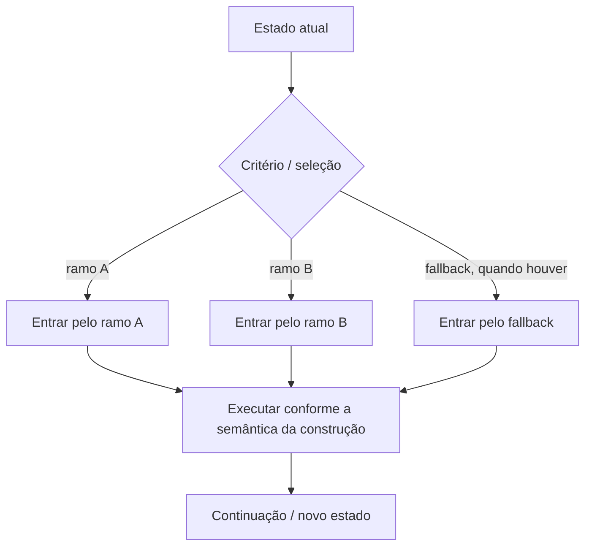

<a id="inicio"></a>

# Fluxo de Controle

> **Classificação curricular:** `[D] Obrigatório dominar`  
> **Nível:** A — Lógica de Programação  
> **Posição na taxonomia:** tópico 6  
> **Pré-requisitos:** expressões, operadores, lógica booleana e short-circuit  
> **Aprofundamentos posteriores:** loops, funções, tratamento de erros, pattern matching, guard clauses, state machines e arquitetura

---

## Resumo executivo

Por padrão, um programa executa instruções em uma ordem determinada pela linguagem.

Esse é o **fluxo sequencial**:

```text
PASSO 1
↓
PASSO 2
↓
PASSO 3
```

Estruturas de controle alteram esse fluxo.

Uma decisão introduz caminhos:

```text
             condição
            /        \
         true        false
          ↓            ↓
      caminho A    caminho B
            \        /
             continuação
```

O núcleo deste capítulo é:

```text
SEQUÊNCIA
+
SELEÇÃO
```

A repetição será o tópico seguinte.

A programação estruturada clássica mostra que programas podem ser organizados combinando:

```text
SEQUÊNCIA
SELEÇÃO
REPETIÇÃO
```

Farrell usa exatamente essa tríade como base didática para raciocinar sobre programas estruturados.

Mas existe uma distinção essencial para quem aprende várias linguagens:

```text
CONCEITO DE SELEÇÃO MÚLTIPLA
≠
MESMO MECANISMO EM TODAS AS LINGUAGENS
```

Python:

```text
match/case
→ structural pattern matching
```

JavaScript:

```text
switch/case
→ seleção por comparação estrita + possibilidade de fall-through
```

Java:

```text
switch
→ statement ou expression, com regras clássicas ou arrow rules
```

Bash:

```text
case
→ pattern matching textual
```

Portanto:

> **aprenda primeiro a decisão que o programa precisa tomar; depois escolha a construção que expressa essa decisão corretamente na linguagem.**

---

## Decisão rápida

| Pergunta | Resposta |
|---|---|
| “Sem `if`, o programa já tem fluxo?” | Sim. Existe fluxo sequencial. |
| “`if` sempre precisa de `else`?” | Não. Pode haver seleção de alternativa única. |
| “`if/elif/else` executa todos os blocos verdadeiros?” | Não. Em uma cadeia, o primeiro ramo selecionado impede os seguintes. |
| “A ordem dos `elif` importa?” | Sim, quando condições se sobrepõem. |
| “`else` tem condição?” | Não; é o caminho residual da estrutura. |
| “Aninhamento é errado?” | Não. Torna-se problema quando prejudica legibilidade ou mascara lógica. |
| “Condição composta substitui todo aninhamento?” | Não. Depende da estrutura da decisão. |
| “Python `match` é um `switch` com outro nome?” | Não. É pattern matching estrutural. |
| “JavaScript `switch` compara com `==`?” | Não. A seleção de `case` usa comparação estrita. |
| “JavaScript `switch` para automaticamente após um `case`?” | Não. Sem `break`/saída, pode ocorrer fall-through. |
| “Java moderno sempre precisa de `break` em `switch`?” | Não. Arrow rules (`case X ->`) não têm o fall-through clássico. |
| “Todo `switch` statement Java precisa ser exhaustivo?” | Não. `switch` statements **enhanced** precisam ser exhaustivos; os não-enhanced continuam podendo não ser por compatibilidade. `switch` expressions são tratadas como seleções que precisam produzir resultado para os valores cobertos. |
| “Java 27 aceita qualquer primitivo em `switch` como recurso estável?” | Não. Em Java SE 27, a ampliação de patterns/`instanceof`/`switch` para todos os primitivos permanece **preview** — quinta prévia (JEP 532). |
| “Bash `if` testa um boolean nativo?” | Não. Ele decide pelo exit status da lista de comandos usada como condição. |
| “Bash `case` faz igualdade estrita?” | Não. Ele casa padrões; com `;;`, o primeiro padrão correspondente encerra a seleção, enquanto `;&` e `;;&` alteram esse fluxo. |

---

# Índice

- [Resumo executivo](#resumo-executivo)
- [Decisão rápida](#decisão-rápida)
- [1. Posição deste assunto](#1-posição-deste-assunto)
  - [1.1 Relação com algoritmos](#11-relação-com-algoritmos)
  - [1.2 Relação com programação estruturada](#12-relação-com-programação-estruturada)
  - [1.3 Fronteira deste capítulo](#13-fronteira-deste-capítulo)
- [2. Visão panorâmica](#2-visão-panorâmica)
  - [🗺️ Visão panorâmica — o mapa antes dos detalhes](#visao-panoramica-mapa)
  - [2.1 Mapa do domínio — o que existe](#21-mapa-do-domínio--o-que-existe)
  - [2.2 Fluxo principal — como uma decisão muda o caminho](#22-fluxo-principal--como-uma-decisão-muda-o-caminho)
  - [2.3 Consulta rápida — conceito × função × risco](#23-consulta-rápida--conceito--função--risco)
  - [2.4 Pergunta prática → onde começar](#24-pergunta-prática--onde-começar)
  - [2.5 Não confundir](#25-não-confundir)
  - [2.6 Microexemplos canônicos](#26-microexemplos-canônicos)
  - [2.7 Problemas reais representativos](#27-problemas-reais-representativos)
  - [2.8 Falha típica → primeira investigação](#28-falha-típica--primeira-investigação)
  - [2.9 Transferência entre linguagens](#29-transferência-entre-linguagens)
  - [2.10 Modo consulta × modo estudo](#210-modo-consulta--modo-estudo)
- [3. Fluxo sequencial](#3-fluxo-sequencial)
  - [3.1 Ordem](#31-ordem)
  - [3.2 Sequência não significa “sempre linha de cima para baixo”](#32-sequência-não-significa-sempre-linha-de-cima-para-baixo)
  - [3.3 Farrell](#33-farrell)
  - [3.4 Por que estudar algo tão óbvio?](#34-por-que-estudar-algo-tão-óbvio)
- [4. Estrutura de seleção](#4-estrutura-de-seleção)
  - [4.1 Condição](#41-condição)
  - [4.2 Ramo](#42-ramo)
  - [4.3 Junção](#43-junção)
  - [4.4 Seleção não repete automaticamente](#44-seleção-não-repete-automaticamente)
- [5. Seleção de alternativa única](#5-seleção-de-alternativa-única)
  - [5.1 Caso verdadeiro](#51-caso-verdadeiro)
  - [5.2 Caso falso](#52-caso-falso)
  - [5.3 Exemplo](#53-exemplo)
  - [5.4 Null branch](#54-null-branch)
- [6. Seleção de duas alternativas](#6-seleção-de-duas-alternativas)
  - [6.1 Exclusividade](#61-exclusividade)
  - [6.2 Exemplo](#62-exemplo)
  - [6.3 Condição positiva](#63-condição-positiva)
- [7. Seleção de múltiplas alternativas com cadeia condicional](#7-seleção-de-múltiplas-alternativas-com-cadeia-condicional)
  - [7.1 Primeiro ramo selecionado vence](#71-primeiro-ramo-selecionado-vence)
  - [7.2 Condições seguintes podem nem ser avaliadas](#72-condições-seguintes-podem-nem-ser-avaliadas)
  - [7.3 Não confundir com vários `if` independentes](#73-não-confundir-com-vários-if-independentes)
- [8. Ordem das condições](#8-ordem-das-condições)
  - [8.1 Do mais específico para o mais amplo](#81-do-mais-específico-para-o-mais-amplo)
  - [8.2 Não é uma regra universal de ordenação](#82-não-é-uma-regra-universal-de-ordenação)
  - [8.3 Sweigart e ramo inalcançável](#83-sweigart-e-ramo-inalcançável)
- [9. Condições mutuamente exclusivas e sobrepostas](#9-condições-mutuamente-exclusivas-e-sobrepostas)
  - [9.1 Mutuamente exclusivas](#91-mutuamente-exclusivas)
  - [9.2 Sobrepostas](#92-sobrepostas)
  - [9.3 Impacto na estrutura](#93-impacto-na-estrutura)
  - [9.4 Pergunta de projeto](#94-pergunta-de-projeto)
- [10. Else como caminho residual](#10-else-como-caminho-residual)
  - [10.1 Não possui condição própria](#101-não-possui-condição-própria)
  - [10.2 Exemplo](#102-exemplo)
  - [10.3 Stroustrup e entrada inválida](#103-stroustrup-e-entrada-inválida)
  - [10.4 Guardrail](#104-guardrail)
- [11. Condições compostas](#11-condições-compostas)
  - [11.1 AND](#111-and)
  - [11.2 OR](#112-or)
  - [11.3 NOT](#113-not)
  - [11.4 Agrupamento](#114-agrupamento)
  - [11.5 Nomear subcondições](#115-nomear-subcondições)
- [12. De Morgan e simplificação de condições](#12-de-morgan-e-simplificação-de-condições)
  - [12.1 Uso prático](#121-uso-prático)
  - [12.2 Simplificação não significa encurtar](#122-simplificação-não-significa-encurtar)
  - [12.3 Cuidado com efeitos colaterais](#123-cuidado-com-efeitos-colaterais)
- [13. Short-circuit como parte do fluxo](#13-short-circuit-como-parte-do-fluxo)
  - [13.1 Guard](#131-guard)
  - [13.2 Python](#132-python)
  - [13.3 JavaScript](#133-javascript)
  - [13.4 Java](#134-java)
  - [13.5 Bash](#135-bash)
  - [13.6 Não transforme tudo em `&&`](#136-não-transforme-tudo-em-)
- [14. Condicionais aninhadas](#14-condicionais-aninhadas)
  - [14.1 É estruturado](#141-é-estruturado)
  - [14.2 Quando faz sentido](#142-quando-faz-sentido)
  - [14.3 Quando pode ser simplificado](#143-quando-pode-ser-simplificado)
  - [14.4 Profundidade](#144-profundidade)
- [15. Aninhamento versus condição composta](#15-aninhamento-versus-condição-composta)
  - [Regra](#regra)
- [16. Caminhos de execução e cobertura lógica](#16-caminhos-de-execução-e-cobertura-lógica)
  - [16.1 Um `if/else`](#161-um-ifelse)
  - [16.2 Dois `if` independentes](#162-dois-if-independentes)
  - [16.3 Cadeia exclusiva](#163-cadeia-exclusiva)
  - [16.4 Path explosion](#164-path-explosion)
  - [16.5 Cobertura lógica](#165-cobertura-lógica)
- [17. Seleção múltipla](#17-seleção-múltipla)
  - [17.1 Cadeia `if`](#171-cadeia-if)
  - [17.2 Construção dedicada](#172-construção-dedicada)
- [18. Python match/case](#18-python-matchcase)
  - [18.1 Literal patterns](#181-literal-patterns)
  - [18.2 Primeiro padrão aplicável](#182-primeiro-padrão-aplicável)
  - [18.3 Wildcard `_`](#183-wildcard-_)
  - [18.4 Pattern matching é mais amplo](#184-pattern-matching-é-mais-amplo)
  - [18.5 Não use `match` só porque existem muitos `if`](#185-não-use-match-só-porque-existem-muitos-if)
- [19. JavaScript switch](#19-javascript-switch)
  - [19.1 Comparação](#191-comparação)
  - [19.2 Fall-through](#192-fall-through)
  - [19.3 Exemplo seguro clássico](#193-exemplo-seguro-clássico)
  - [19.4 Default](#194-default)
  - [19.5 Fall-through deliberado](#195-fall-through-deliberado)
- [20. Java switch](#20-java-switch)
  - [20.1 Forma clássica](#201-forma-clássica)
  - [20.2 Arrow rules](#202-arrow-rules)
  - [20.3 `yield`](#203-yield)
  - [20.4 Pattern matching](#204-pattern-matching)
  - [20.5 Java 27 e preview](#205-java-27-e-preview)
  - [20.6 Exhaustividade: `switch` expression, enhanced statement e compatibilidade](#206-exhaustividade-switch-expression-enhanced-statement-e-compatibilidade)
- [21. Bash case](#21-bash-case)
  - [21.1 É pattern matching](#211-é-pattern-matching)
  - [21.2 Primeiro padrão que casa](#212-primeiro-padrão-que-casa)
  - [21.3 Fallback](#213-fallback)
  - [21.4 Terminadores](#214-terminadores)
- [22. Por que match, switch e case não são equivalentes](#22-por-que-match-switch-e-case-não-são-equivalentes)
  - [22.1 Mesmo exemplo simples pode esconder diferenças](#221-mesmo-exemplo-simples-pode-esconder-diferenças)
  - [22.2 Python](#222-python)
  - [22.3 Bash](#223-bash)
  - [22.4 JavaScript](#224-javascript)
  - [22.5 Java](#225-java)
  - [Regra](#regra-1)
- [23. Default, else e wildcard](#23-default-else-e-wildcard)
  - [Python `if`](#python-if)
  - [Python `match`](#python-match)
  - [JavaScript/Java switch](#javascriptjava-switch)
  - [Bash case](#bash-case)
  - [23.1 Fallback pode representar erro](#231-fallback-pode-representar-erro)
  - [23.2 Fallback pode representar estado normal](#232-fallback-pode-representar-estado-normal)
  - [23.3 Sem fallback](#233-sem-fallback)
- [24. Fall-through](#24-fall-through)
  - [24.1 JavaScript](#241-javascript)
  - [24.2 Java colon labels](#242-java-colon-labels)
  - [24.3 Java arrow rules](#243-java-arrow-rules)
  - [24.4 Bash](#244-bash)
  - [24.5 Python match](#245-python-match)
  - [24.6 Guardrail](#246-guardrail)
- [25. Condição booleana versus truthiness versus exit status](#25-condição-booleana-versus-truthiness-versus-exit-status)
  - [25.1 Python](#251-python)
  - [25.2 JavaScript](#252-javascript)
  - [25.3 Java](#253-java)
  - [25.4 Bash](#254-bash)
  - [25.5 Consequência pedagógica](#255-consequência-pedagógica)
- [26. Blocos e delimitação](#26-blocos-e-delimitação)
  - [Python](#python)
  - [JavaScript](#javascript)
  - [Java](#java)
  - [Bash](#bash)
  - [26.1 Dangling else](#261-dangling-else)
- [27. Execução normal e saída antecipada](#27-execução-normal-e-saída-antecipada)
  - [27.1 Por que mencionar agora?](#271-por-que-mencionar-agora)
  - [27.2 Guard clause](#272-guard-clause)
- [28. Exemplo progressivo — classificar acesso](#28-exemplo-progressivo--classificar-acesso)
  - [28.1 Regras](#281-regras)
  - [28.2 Pseudocódigo](#282-pseudocódigo)
  - [28.3 Python](#283-python)
  - [28.4 JavaScript](#284-javascript)
  - [28.5 Java](#285-java)
  - [28.6 Bash](#286-bash)
  - [28.7 Conceito transferido](#287-conceito-transferido)
- [29. Exemplo progressivo — classificação por faixa](#29-exemplo-progressivo--classificação-por-faixa)
  - [29.1 Ordem importa](#291-ordem-importa)
  - [29.2 Python](#292-python)
  - [29.3 Erro clássico](#293-erro-clássico)
- [30. Exemplo progressivo — seleção múltipla](#30-exemplo-progressivo--seleção-múltipla)
  - [30.1 Python](#301-python)
  - [30.2 JavaScript](#302-javascript)
  - [30.3 Java](#303-java)
  - [30.4 Bash](#304-bash)
  - [30.5 Mesmo resultado, mecanismos diferentes](#305-mesmo-resultado-mecanismos-diferentes)
- [31. Transferência entre as quatro linguagens](#31-transferência-entre-as-quatro-linguagens)
  - [31.1 `if`](#311-if)
  - [31.2 Seleção múltipla](#312-seleção-múltipla)
  - [31.3 Fallback](#313-fallback)
  - [31.4 Transferência correta](#314-transferência-correta)
- [32. Erros conceituais frequentes](#32-erros-conceituais-frequentes)
  - [32.1 “if sempre recebe boolean”](#321-if-sempre-recebe-boolean)
  - [32.2 “else if testa junto com if”](#322-else-if-testa-junto-com-if)
  - [32.3 “vários if = if/elif”](#323-vários-if--ifelif)
  - [32.4 “a ordem dos elif não importa”](#324-a-ordem-dos-elif-não-importa)
  - [32.5 “else significa o contrário da última condição”](#325-else-significa-o-contrário-da-última-condição)
  - [32.6 “nesting é sempre ruim”](#326-nesting-é-sempre-ruim)
  - [32.7 “condição composta sempre substitui nesting”](#327-condição-composta-sempre-substitui-nesting)
  - [32.8 “match é switch Python”](#328-match-é-switch-python)
  - [32.9 “switch JS usa ==”](#329-switch-js-usa-)
  - [32.10 “switch sempre para após um case”](#3210-switch-sempre-para-após-um-case)
  - [32.11 “default é obrigatório”](#3211-default-é-obrigatório)
  - [32.12 “Bash case compara string literalmente”](#3212-bash-case-compara-string-literalmente)
  - [32.13 “Bash if testa `true`/`false` como boolean nativo”](#3213-bash-if-testa-truefalse-como-boolean-nativo)
  - [32.14 “indentação controla bloco em JavaScript/Java”](#3214-indentação-controla-bloco-em-javascriptjava)
  - [32.15 “se passou no caso normal, a decisão está correta”](#3215-se-passou-no-caso-normal-a-decisão-está-correta)
- [33. Debugging de decisões](#33-debugging-de-decisões)
  - [33.1 A condição representa a regra correta?](#331-a-condição-representa-a-regra-correta)
  - [33.2 Os tipos/valores são os esperados?](#332-os-tiposvalores-são-os-esperados)
  - [33.3 A ordem está correta?](#333-a-ordem-está-correta)
  - [33.4 O ramo errado está recebendo entrada inválida?](#334-o-ramo-errado-está-recebendo-entrada-inválida)
  - [33.5 Há ramo inalcançável?](#335-há-ramo-inalcançável)
  - [33.6 O mecanismo de seleção é o esperado?](#336-o-mecanismo-de-seleção-é-o-esperado)
  - [33.7 Há fall-through?](#337-há-fall-through)
  - [33.8 Tabela de decisão](#338-tabela-de-decisão)
- [Problemas reais — índice operacional](#problemas-reais)
  - [PR-T06-01 — classificar acesso preservando validação e exclusividade](#pr-t06-01)
  - [PR-T06-02 — classificar faixa sem perder fronteiras](#pr-t06-02)
  - [PR-T06-03 — despachar estado com seleção múltipla](#pr-t06-03)
  - [PR-T06-04 — distinguir fallback normal de entrada inválida](#pr-t06-04)
  - [PR-T06-05 — escolher `if` independentes ou cadeia exclusiva](#pr-t06-05)
  - [PR-T06-06 — decidir pelo exit status em Bash](#pr-t06-06)
  - [PR-T06-07 — provar cobertura com tabela de decisão](#pr-t06-07)
- [🔎 Troubleshooting sistemático](#troubleshooting-sistematico)
  - [TS-T06-01 — fronteira errada por `>` × `>=`](#ts-t06-01)
  - [TS-T06-02 — condição ampla captura antes da específica](#ts-t06-02)
  - [TS-T06-03 — dois `if` executam quando só um ramo deveria vencer](#ts-t06-03)
  - [TS-T06-04 — `else` mascara entrada inválida](#ts-t06-04)
  - [TS-T06-05 — JavaScript `switch` cai no próximo `case`](#ts-t06-05)
  - [TS-T06-06 — Python `match` casa o padrão, mas o guard falha](#ts-t06-06)
  - [TS-T06-07 — Bash entra no ramo “errado” por interpretar exit status como boolean comum](#ts-t06-07)
  - [TS-T06-08 — Java `switch` enhanced falha por não ser exhaustivo](#ts-t06-08)
- [34. Laboratórios](#34-laboratórios)
  - [🧪 Laboratório 1 — if independente versus cadeia](#-laboratório-1--if-independente-versus-cadeia)
  - [🧪 Laboratório 2 — ordem das condições](#-laboratório-2--ordem-das-condições)
  - [🧪 Laboratório 3 — fronteiras](#-laboratório-3--fronteiras)
  - [🧪 Laboratório 4 — seleção múltipla](#-laboratório-4--seleção-múltipla)
  - [🧪 Laboratório 5 — JavaScript fall-through](#-laboratório-5--javascript-fall-through)
  - [🧪 Laboratório 6 — Python pattern matching](#-laboratório-6--python-pattern-matching)
  - [🧪 Laboratório 7 — Bash patterns](#-laboratório-7--bash-patterns)
  - [🧪 Laboratório 8 — tabela de decisão](#-laboratório-8--tabela-de-decisão)
- [35. Exercícios](#35-exercícios)
  - [35.1 Sequência](#351-sequência)
  - [35.2 Alternativa única](#352-alternativa-única)
  - [35.3 Dupla alternativa](#353-dupla-alternativa)
  - [35.4 If independente versus elif](#354-if-independente-versus-elif)
  - [35.5 Ordem](#355-ordem)
  - [35.6 Else residual](#356-else-residual)
  - [35.7 Condição composta](#357-condição-composta)
  - [35.8 De Morgan](#358-de-morgan)
  - [35.9 Aninhamento](#359-aninhamento)
  - [35.10 Python match](#3510-python-match)
  - [35.11 JavaScript switch](#3511-javascript-switch)
  - [35.12 JavaScript fall-through](#3512-javascript-fall-through)
  - [35.13 Java arrow switch](#3513-java-arrow-switch)
  - [35.14 Java preview](#3514-java-preview)
  - [35.15 Bash if](#3515-bash-if)
  - [35.16 Bash case](#3516-bash-case)
  - [35.17 Cobertura](#3517-cobertura)
  - [35.18 Ramo inalcançável](#3518-ramo-inalcançável)
- [36. Evidências de domínio](#36-evidências-de-domínio)
  - [Explicar](#explicar)
  - [Aplicar](#aplicar)
  - [Comparar linguagens](#comparar-linguagens)
  - [Depurar](#depurar)
  - [Transferir](#transferir)
- [37. Checklist de consulta rápida](#37-checklist-de-consulta-rápida)
- [38. Glossário](#38-glossário)
- [39. Referências](#39-referências)
  - [39.1 Taxonomia canônica](#391-taxonomia-canônica)
  - [39.2 Python 3.14.7 — documentação oficial](#392-python-3147--documentação-oficial)
  - [39.3 ECMAScript 2026 — especificação oficial](#393-ecmascript-2026--especificação-oficial)
  - [39.4 Java SE 27 — documentação oficial](#394-java-se-27--documentação-oficial)
  - [39.5 GNU Bash 5.3 — documentação oficial](#395-gnu-bash-53--documentação-oficial)
  - [39.6 Fontes locais efetivamente consultadas](#396-fontes-locais-efetivamente-consultadas)
  - [39.7 Como as fontes foram usadas](#397-como-as-fontes-foram-usadas)
- [40. Histórico de versões](#40-histórico-de-versões)

---

# 1. Posição deste assunto

Nos tópicos anteriores, aprendemos a construir:

```text
VALORES
↓
EXPRESSÕES
↓
CONDIÇÕES
```

Agora essas condições passam a controlar **qual código será executado**.

Fluxo:

```text
CRITÉRIO / TESTE / COMANDO
↓
INTERPRETAÇÃO SEGUNDO A LINGUAGEM
↓
DECISÃO
↓
CAMINHO SELECIONADO
↓
NOVO ESTADO
```

## 1.1 Relação com algoritmos

Algoritmo:

```text
passos
+
decisões
+
repetições
```

Este capítulo aprofunda a parte:

```text
DECISÕES
```

## 1.2 Relação com programação estruturada

Farrell apresenta três estruturas básicas:

```text
SEQUÊNCIA
SELEÇÃO
LOOP
```

e mostra que elas podem ser:

- empilhadas;
- aninhadas;
- combinadas.

A seleção não é “um recurso extra”.

É um dos blocos centrais da lógica estruturada.

## 1.3 Fronteira deste capítulo

Entram:

- sequência;
- `if`;
- `else`;
- `elif` / `else if`;
- aninhamento;
- condições compostas;
- seleção múltipla;
- `switch`;
- `match`;
- `case`.

Ficam para depois:

- loops;
- `break`/`continue` em repetição;
- `return` aprofundado;
- exceções;
- pattern matching avançado;
- state machines.

Expressões condicionais/ternárias pertencem ao tópico anterior de **Expressões e Operadores (T05)**. Aqui elas podem ser referenciadas como mecanismo de expressão, mas não são duplicadas como núcleo canônico de T06.

**Rastreabilidade com a taxonomia canônica:**

| Nó | Escopo no Guia v2.1.0 | Destino principal neste tópico |
|---|---|---|
| `6` | Fluxo de Controle | capítulo inteiro |
| `6.1` | Execução sequencial | §3 |
| `6.2` | Estruturas condicionais | §§4–10, 14–16 e 26–29 |
| `6.3` | Seleção múltipla | §§17–24 e 30 |
| `6.4` | Condições compostas | §§11–13 |

[↑ Voltar ao índice](#índice)

---

# 2. Visão panorâmica

<a id="visao-panoramica-mapa"></a>

## 🗺️ Visão panorâmica — o mapa antes dos detalhes

Esta visão funciona como **caderno rápido de consulta**. Ela sintetiza estrutura, decisões, diferenças entre linguagens, problemas reais e falhas típicas antes do aprofundamento.

### 2.1 Mapa do domínio — o que existe

```text
FLUXO DE CONTROLE
│
├── sequência
│   ├── estado inicial
│   ├── instrução atual
│   └── próxima instrução
│
├── seleção
│   ├── alternativa única
│   ├── duas alternativas
│   ├── cadeia exclusiva
│   ├── múltiplas alternativas
│   └── pattern matching quando a linguagem oferece
│
├── condição / critério
│   ├── simples
│   ├── composta
│   ├── AND / OR / NOT
│   ├── short-circuit
│   └── boolean / truthiness / exit status conforme a linguagem
│
├── arquitetura da decisão
│   ├── ordem dos testes
│   ├── condições sobrepostas
│   ├── condições mutuamente exclusivas
│   ├── nesting
│   ├── fallback
│   ├── caminhos de execução
│   └── junção / saída antecipada
│
└── mecanismos concretos
    ├── Python       → if / elif / else + match / case
    ├── JavaScript   → if / else + switch / case
    ├── Java         → if / else + switch statement/expression
    └── Bash         → if / elif / else + case por pattern
```

A ideia transferível é **escolher caminhos de execução**. O modo como cada linguagem decide se uma condição é verdadeira, como seleciona alternativas e como delimita blocos pertence à semântica concreta da linguagem.

### 2.2 Fluxo principal — como uma decisão muda o caminho

```text
ESTADO ATUAL
    ↓
AVALIAR CRITÉRIO
    ↓
QUAL RAMO / PONTO DE ENTRADA SE APLICA?
    ├── ramo A
    ├── ramo B
    └── fallback / nenhum ramo, conforme o contrato
            ↓
EXECUTAR CONFORME A SEMÂNTICA DA CONSTRUÇÃO
            ↓
NOVO ESTADO
            ↓
JUNÇÃO / CONTINUAÇÃO / SAÍDA ANTECIPADA
```



**Leitura textual equivalente:** a condição não “faz” a decisão sozinha. O programa avalia um critério, seleciona um caminho segundo a semântica da construção, executa esse caminho e segue a partir do estado resultante.

### 2.3 Consulta rápida — conceito × função × risco

| Conceito | Pergunta que responde | Risco clássico | Primeira verificação |
|---|---|---|---|
| Sequência | “O que acontece se nenhuma estrutura desviar o fluxo?” | supor ordem sem considerar chamadas/saídas | rastrear instruções realmente executadas |
| `if` independente | “Este teste deve acontecer mesmo se outro também for verdadeiro?” | executar múltiplas ações quando só uma era permitida | verificar exclusividade do domínio |
| cadeia `if/elif/else` | “Só um dos ramos deve vencer?” | ramo amplo capturar antes do específico | revisar ordem e sobreposição |
| `else` | “O que fazer quando nenhum teste anterior venceu?” | tratar qualquer residual como dado válido | separar inválido de fallback normal |
| condição composta | “Várias regras formam um único critério?” | precedência ou negação errada | parentetizar/nomear subcondições |
| nesting | “A segunda decisão depende da primeira?” | profundidade desnecessária | tentar decompor sem alterar semântica |
| seleção múltipla | “Estou escolhendo entre alternativas por valor/padrão?” | assumir que `match`, `switch` e `case` são equivalentes | confirmar mecanismo da linguagem |
| fall-through | “Após um `case`, a execução pode continuar?” | executar ramo adicional | confirmar terminador/regra concreta |
| cobertura | “Todos os casos relevantes têm destino?” | caso-limite sem teste | tabela de decisão + fronteiras |
| saída antecipada | “Um ramo encerra a função/programa?” | raciocinar como se houvesse junção | marcar `return`/`exit`/exception explicitamente |

### 2.4 Pergunta prática → onde começar

| Se a dúvida for... | Comece por... |
|---|---|
| “Dois blocos executaram e eu esperava só um.” | `if` independentes × cadeia exclusiva |
| “O valor de fronteira caiu no ramo errado.” | `>` × `>=`, intervalos e ordem |
| “Um ramo nunca executa.” | sobreposição + dominância/ordem dos testes |
| “O `else` está aceitando lixo.” | validação antes do fallback |
| “`switch` executou o próximo `case`.” | fall-through + `break`/arrow rules |
| “Python `match` pulou um `case` cujo pattern parecia correto.” | guard do `case` |
| “Bash entrou no `then` quando o comando ‘deu zero’.” | exit status: `0` significa sucesso |
| “Java exige `default` aqui, mas não em outro `switch`.” | exhaustividade: expression/enhanced × não-enhanced |
| “Preciso provar que nenhuma combinação foi esquecida.” | tabela de decisão + testes de fronteira |

### 2.5 Não confundir

```text
CONDIÇÃO
→ critério avaliado

RAMO
→ bloco escolhido por esse critério
```

```text
DOIS `if` INDEPENDENTES
→ 0, 1 ou 2 blocos podem executar

`if / elif / else`
→ no máximo um ramo da cadeia executa
```

```text
BOOLEANO (Java)
≠
TRUTHINESS (Python/JavaScript)
≠
EXIT STATUS (Bash `if`)
```

```text
Python `match`
→ structural pattern matching

JavaScript `switch`
→ seleção por comparação estrita + fall-through possível

Java `switch`
→ statement/expression; labels clássicos ou rules; regras de exhaustividade

Bash `case`
→ pattern matching textual
```

```text
FALLBACK
≠
VALIDAÇÃO
```

Um `else`, `default`, `case _` ou `*)` não prova que a entrada é válida; apenas representa o caminho residual definido pela estrutura.

### 2.6 Microexemplos canônicos

**Cadeia exclusiva — a ordem importa:**

```python
age = 3000

if age > 100:
    label = "senior"
elif age > 2000:
    label = "ancient"
```

O segundo ramo é logicamente dominado pelo primeiro para `age = 3000`. Se `> 2000` deve ter prioridade, precisa vir antes ou a regra deve ser redesenhada.

**`if` independentes podem executar juntos:**

```python
value = 12

if value > 0:
    print("positive")
if value % 2 == 0:
    print("even")
```

As propriedades **não são mutuamente exclusivas**; os dois blocos podem executar corretamente.

**JavaScript `switch` — fall-through:**

```javascript
const status = "warning";

switch (status) {
  case "warning":
    console.log("yellow");
  case "error":
    console.log("red");
}
```

Sem `break`, a execução pode continuar no bloco seguinte.

**Bash `if` — sucesso é status `0`:**

```bash
if grep -q 'ERROR' app.log; then
    echo 'found'
fi
```

O `then` executa quando `grep` retorna **zero**, isto é, sucesso/match encontrado.

### 2.7 Problemas reais representativos

| ID | Necessidade concreta | Capacidades centrais | Destino |
|---|---|---|---|
| `PR-T06-01` | classificar acesso sem misturar inválido com negado | validação, cadeia exclusiva, fallback | [Problemas reais](#problemas-reais) |
| `PR-T06-02` | classificar faixas sem perder fronteiras | ordem, intervalos, cobertura | [Problemas reais](#problemas-reais) |
| `PR-T06-03` | despachar estados/opções por seleção múltipla | match/switch/case, fallback | [Problemas reais](#problemas-reais) |
| `PR-T06-04` | tratar entrada desconhecida sem `else` genérico perigoso | validação, estado inválido | [Problemas reais](#problemas-reais) |
| `PR-T06-05` | decidir entre testes independentes e cadeia exclusiva | exclusividade, múltiplas propriedades | [Problemas reais](#problemas-reais) |
| `PR-T06-06` | executar ação em Bash apenas quando comando anterior tiver sucesso | exit status, `if`, short-circuit operacional | [Problemas reais](#problemas-reais) |
| `PR-T06-07` | demonstrar cobertura de uma política de decisão | tabela de decisão, casos-limite, regressão | [Problemas reais](#problemas-reais) |

### 2.8 Falha típica → primeira investigação

| Sintoma | Primeira hipótese | Primeira observação |
|---|---|---|
| limite exato cai no ramo errado | `>` × `>=` | testar `limite-1`, `limite`, `limite+1` |
| ramo específico nunca vence | condição ampla veio antes | registrar qual condição foi a primeira verdadeira |
| duas ações mutuamente exclusivas executam | `if` independentes | rastrear todos os testes em ordem |
| dado inválido recebe classificação normal | fallback está amplo demais | separar domínio válido do residual |
| JS executa `case` seguinte | `break` ausente | reduzir para dois cases |
| `match` pula bloco esperado | guard retornou falso | separar resultado do pattern e do guard |
| Bash “inverte” verdadeiro/falso | exit status interpretado como número booleano | imprimir `$?` imediatamente |
| Java não compila `switch` moderno | falta de exhaustividade/dominância | verificar tipo do selector e labels |

A investigação completa está em [🔎 Troubleshooting sistemático](#troubleshooting-sistematico).

### 2.9 Transferência entre linguagens

| Capacidade | Python | JavaScript | Java | Bash |
|---|---|---|---|---|
| seleção simples | `if` | `if` | `if` | `if` por status |
| cadeia exclusiva | `if/elif/else` | `if/else if/else` | `if/else if/else` | `if/elif/else` |
| condição aceita | truthiness | ToBoolean/truthiness | `boolean`; `Boolean` é submetido a unboxing | exit status de comandos/listas |
| seleção múltipla | `match/case` ou cadeia | `switch/case` | `switch` statement/expression | `case` por pattern |
| fallback típico | `else` / `case _` | `else` / `default` | `else` / `default` | `else` / `*)` |
| fall-through clássico | não em `match` | sim em `switch` sem saída | sim em labels `:`; não em rules `->` | terminadores `;;`, `;&`, `;;&` têm semânticas distintas |
| exhaustividade especial | não exigida genericamente em `if`/`match` | `switch` não exige | depende de switch expression/enhanced | `case` não exige |

A transferência correta preserva **o contrato da decisão**, não o desenho superficial da sintaxe.

### 2.10 Modo consulta × modo estudo

```text
MODO CONSULTA (~30 s)
→ Decisão rápida
→ mapa do domínio
→ “não confundir”
→ tabela de transferência
→ falha típica

MODO ESTUDO
→ sequência
→ seleção simples/dupla/múltipla
→ ordem e sobreposição
→ condições compostas/short-circuit
→ nesting/caminhos
→ mecanismos por linguagem
→ problemas reais
→ troubleshooting
→ LABs + exercícios + evidências de domínio
```

[↑ Voltar ao índice](#índice)

---

# 3. Fluxo sequencial

Antes de selecionar caminhos, existe a forma mais simples de controle:

```text
INSTRUÇÃO 1
↓
INSTRUÇÃO 2
↓
INSTRUÇÃO 3
```

## 3.1 Ordem

Exemplo conceitual:

```text
ler preço
calcular desconto
mostrar resultado
```

Trocar a ordem pode destruir a lógica.

## 3.2 Sequência não significa “sempre linha de cima para baixo”

Funções, exceções, callbacks, concorrência e outros mecanismos tornam o modelo de execução mais rico.

Mas para o nível introdutório:

> **dentro de um caminho normal simples, cada comando leva ao próximo segundo a semântica da linguagem.**

## 3.3 Farrell

Farrell define a estrutura sequencial como execução de tarefas:

```text
uma após a outra
```

sem desvio para pular uma delas.

## 3.4 Por que estudar algo tão óbvio?

Porque quando introduzimos seleção:

```text
algumas instruções
```

passam a não ser executadas.

Precisamos saber qual seria o fluxo normal antes de desviá-lo.

[↑ Voltar ao índice](#índice)

---

# 4. Estrutura de seleção

Seleção permite escolher entre caminhos com base em uma condição.

Modelo:

```text
        condição
       /        \
   verdadeiro   falso
      ↓           ↓
    ação A      ação B
```

## 4.1 Condição

A condição deve ser interpretável como:

```text
verdadeiro
ou
falso
```

segundo as regras da linguagem.

## 4.2 Ramo

Cada alternativa é um **ramo** (*branch*).

## 4.3 Junção

Após o ramo, o fluxo normalmente converge para uma continuação comum.

```text
if (...)
    A
else
    B

C
```

`C` executa depois do ramo selecionado, se nada encerrar o fluxo antes.

## 4.4 Seleção não repete automaticamente

A condição de uma estrutura `if` é testada no momento em que o fluxo chega à estrutura.

Se quiser testar repetidamente, entraremos em loops.

[↑ Voltar ao índice](#índice)

---

# 5. Seleção de alternativa única

Executa uma ação apenas quando a condição é satisfeita.

Pseudocódigo:

```text
if condition
    action
```

## 5.1 Caso verdadeiro

```text
condition = true
→ action executa
```

## 5.2 Caso falso

```text
condition = false
→ action é pulada
```

e o fluxo continua.

## 5.3 Exemplo

```text
se temperatura > limite
    emitir alerta
```

Se a temperatura não exceder o limite:

```text
nenhum alerta
```

Isso não exige necessariamente um `else`.

## 5.4 Null branch

Farrell destaca que uma seleção pode possuir um caminho que conceitualmente “não faz nada”.

Isso é perfeitamente válido.

[↑ Voltar ao índice](#índice)

---

# 6. Seleção de duas alternativas

Quando exatamente um entre dois caminhos deve ser escolhido:

```text
if condition
    action A
else
    action B
```

## 6.1 Exclusividade

Em uma estrutura `if/else`:

```text
A ou B
```

é executado.

Não:

```text
A e B
```

## 6.2 Exemplo

```text
if balance >= purchase
    approve
else
    reject
```

## 6.3 Condição positiva

Quando possível, uma condição positiva pode facilitar leitura:

```text
if is_valid
```

em vez de:

```text
if not is_invalid
```

Mas não transforme isso em dogma.

A melhor forma é a que representa a regra com clareza.

[↑ Voltar ao índice](#índice)

---

# 7. Seleção de múltiplas alternativas com cadeia condicional

Quando existem vários caminhos baseados em condições diferentes:

```text
if condition_A
    A
else if condition_B
    B
else if condition_C
    C
else
    D
```

Python usa:

```text
elif
```

JavaScript/Java:

```text
else if
```

Bash:

```text
elif
```

## 7.1 Primeiro ramo selecionado vence

Em uma cadeia:

```text
if
elif
elif
else
```

a avaliação para assim que um ramo aplicável é escolhido.

Python documenta explicitamente:

> exatamente um dos `suite` selecionados é executado.

## 7.2 Condições seguintes podem nem ser avaliadas

Isso importa quando:

- são caras;
- têm efeitos colaterais;
- poderiam falhar;
- dependem de pré-condições.

## 7.3 Não confundir com vários `if` independentes

Isto:

```text
if A
    X

if B
    Y
```

permite:

```text
X e Y
```

se A e B forem verdadeiros.

Enquanto:

```text
if A
    X
else if B
    Y
```

seleciona no máximo um desses ramos.

[↑ Voltar ao índice](#índice)

---

# 8. Ordem das condições

A ordem pode alterar o resultado quando condições se sobrepõem.

Considere uma nota:

```text
score = 95
```

Ruim:

```text
if score >= 60
    "aprovado"
else if score >= 90
    "excelente"
```

O segundo ramo nunca será alcançado para `95`.

## 8.1 Do mais específico para o mais amplo

Uma estratégia comum:

```text
if score >= 90
    excellent
else if score >= 60
    approved
else
    rejected
```

## 8.2 Não é uma regra universal de ordenação

A ordem correta depende da relação lógica entre as condições.

Pergunte:

```text
um caso pode satisfazer mais de uma?
qual ramo deve prevalecer?
```

## 8.3 Sweigart e ramo inalcançável

O exemplo de fluxo discutido por Sweigart mostra exatamente como uma condição posterior pode tornar-se logicamente inalcançável porque uma anterior já captura todos aqueles casos.

[↑ Voltar ao índice](#índice)

---

# 9. Condições mutuamente exclusivas e sobrepostas

## 9.1 Mutuamente exclusivas

Não podem ser verdadeiras simultaneamente.

Exemplo:

```text
x < 0
x == 0
x > 0
```

## 9.2 Sobrepostas

Podem ser verdadeiras juntas.

```text
age >= 18
age >= 65
```

Para:

```text
age = 70
```

ambas são verdadeiras.

## 9.3 Impacto na estrutura

Se deseja apenas um resultado:

```text
cadeia ordenada
```

pode ser correta.

Se deseja executar duas consequências independentes:

```text
dois if independentes
```

podem ser necessários.

## 9.4 Pergunta de projeto

> **As regras competem ou acumulam?**

Competem:

```text
classificação única
```

Acumulam:

```text
aplicar várias validações/avisos independentes
```

[↑ Voltar ao índice](#índice)

---

# 10. Else como caminho residual

`else` representa:

> **nenhuma das condições anteriores selecionou um ramo.**

## 10.1 Não possui condição própria

Evite pensar:

```text
else = “condição oposta escrita magicamente”
```

Ele cobre todo o restante do domínio naquele ponto.

## 10.2 Exemplo

```text
if value > 0
    positive
else
    ...
```

O `else` inclui:

```text
0
negativos
e qualquer outro caso aceito pela linguagem/contrato
```

se não houver validação anterior.

## 10.3 Stroustrup e entrada inválida

Stroustrup mostra um exemplo de conversor com:

```text
if unit == 'i'
else
    assume 'c'
```

Esse código trata qualquer entrada desconhecida como `c`.

A correção é testar explicitamente:

```text
'i'
'c'
else → erro/desconhecido
```

## 10.4 Guardrail

> **Nunca deixe um `else` amplo representar silenciosamente um caso de domínio específico se entradas inválidas também podem cair nele.**

[↑ Voltar ao índice](#índice)

---

# 11. Condições compostas

Condições podem combinar proposições.

```text
age >= 18
AND
has_license
```

## 11.1 AND

Todas as condições necessárias.

```text
adulto
E
habilitado
```

## 11.2 OR

Pelo menos uma alternativa.

```text
is_admin
OU
is_owner
```

## 11.3 NOT

Inversão lógica.

```text
NOT is_blocked
```

## 11.4 Agrupamento

```text
A AND (B OR C)
```

não é o mesmo que:

```text
(A AND B) OR C
```

em geral.

## 11.5 Nomear subcondições

Quando a expressão fica difícil:

```python
is_adult = age >= 18
can_drive = has_license and not is_suspended

if is_adult and can_drive:
    ...
```

pode comunicar melhor que uma linha longa.

[↑ Voltar ao índice](#índice)

---

# 12. De Morgan e simplificação de condições

Leis:

```text
NOT (A AND B)
=
(NOT A) OR (NOT B)
```

```text
NOT (A OR B)
=
(NOT A) AND (NOT B)
```

## 12.1 Uso prático

Original:

```text
if NOT (is_admin OR is_owner)
```

equivalente logicamente:

```text
if NOT is_admin AND NOT is_owner
```

## 12.2 Simplificação não significa encurtar

Uma expressão menor pode ser menos clara.

Critério:

```text
correta
+
compreensível
+
adequada ao domínio
```

## 12.3 Cuidado com efeitos colaterais

Equivalências lógicas puras pressupõem proposições.

Em linguagens reais, expressões com efeitos colaterais e short-circuit exigem atenção extra.

[↑ Voltar ao índice](#índice)

---

# 13. Short-circuit como parte do fluxo

No tópico anterior, short-circuit apareceu como propriedade de operadores.

Aqui ele também é **microcontrole de fluxo**.

## 13.1 Guard

```text
objeto existe
AND
acessar propriedade
```

O segundo passo só acontece se o primeiro permitir.

## 13.2 Python

```python
user is not None and user["active"]
```

## 13.3 JavaScript

```javascript
user !== null && user.active
```

## 13.4 Java

```java
user != null && user.isActive()
```

## 13.5 Bash

Em Bash, a mesma ideia conceitual pode ser expressa com testes encadeados:

```bash
user='diego'
account_status='active'

[[ -n $user ]] && [[ $account_status == 'active' ]] && printf '%s\n' 'active'
```

O paralelismo com Python/JavaScript/Java é:

```text
usuário existe
AND
usuário está ativo
```

mas o mecanismo concreto continua sendo o do shell: cada teste/comando produz **exit status**.

## 13.6 Não transforme tudo em `&&`

Isto:

```text
condição && ação
```

pode ser idiomático em alguns contextos.

Mas:

```text
if condição
    ação
```

pode comunicar intenção melhor, especialmente quando a ação cresce.

> ⚠️ **Guardrail — short-circuit e efeitos colaterais:** o operando seguinte pode nem ser avaliado. Não esconda efeitos de negócio importantes em cadeias `&&`/`||` quando um fluxo explícito tornar execução, teste e debugging mais claros.

[↑ Voltar ao índice](#índice)

---

# 14. Condicionais aninhadas

Aninhamento coloca uma seleção dentro de outra.

```text
if A
    if B
        X
    else
        Y
else
    Z
```

## 14.1 É estruturado

Farrell enfatiza que estruturas podem ser aninhadas.

Portanto:

> **nesting não é antipadrão por definição.**

## 14.2 Quando faz sentido

Quando uma segunda decisão só existe dentro de um contexto criado pela primeira.

Exemplo:

```text
se usuário existe
    se senha correta
        autenticar
```

## 14.3 Quando pode ser simplificado

Se:

```text
A
e
B
```

são apenas duas condições necessárias para uma mesma ação:

```text
if A AND B
```

pode ser mais simples.

## 14.4 Profundidade

Muito aninhamento aumenta:

- carga cognitiva;
- caminhos;
- dificuldade de teste;
- risco de erro.

Mais tarde, funções e guard clauses fornecerão alternativas adicionais.

[↑ Voltar ao índice](#índice)

---

# 15. Aninhamento versus condição composta

Compare:

```text
if is_adult
    if has_license
        allow
```

com:

```text
if is_adult AND has_license
    allow
```

Para apenas executar `allow`, podem ser equivalentes.

Mas considere:

```text
if is_adult
    if has_license
        allow
    else
        request_license
else
    block_minor
```

Agora a estrutura aninhada expressa consequências diferentes.

## Regra

Pergunte:

```text
preciso apenas combinar condições?
ou
cada nível possui consequência própria?
```

[↑ Voltar ao índice](#índice)

---

# 16. Caminhos de execução e cobertura lógica

Cada decisão cria caminhos possíveis.

## 16.1 Um `if/else`

```text
2 caminhos
```

## 16.2 Dois `if` independentes

Podem gerar combinações:

```text
A false / B false
A false / B true
A true / B false
A true / B true
```

## 16.3 Cadeia exclusiva

```text
if A
elif B
elif C
else
```

possui ramos mutuamente selecionados pela ordem.

## 16.4 Path explosion

Com muitas decisões independentes:

```text
quantidade de caminhos
```

cresce rapidamente.

Isso ajuda a explicar por que código com muitas decisões aninhadas é difícil de testar.

## 16.5 Cobertura lógica

Ao testar uma seleção, inclua:

- ramo verdadeiro;
- ramo falso;
- fronteiras;
- `else`;
- entrada inválida;
- ramo que deveria ser inalcançável, quando aplicável.

[↑ Voltar ao índice](#índice)

---

# 17. Seleção múltipla

Seleção múltipla atende problemas como:

> “com base em um discriminante, escolher entre várias alternativas.”

Exemplo:

```text
status = "warning"

warning  → amarelo
error    → vermelho
ok       → verde
outro    → cinza
```

Existem vários mecanismos possíveis.

## 17.1 Cadeia `if`

Funciona quase sempre:

```text
if status == "warning"
...
elif/else if ...
```

## 17.2 Construção dedicada

Pode comunicar melhor:

```text
um valor
→ vários casos
```

Mas não existe uma única semântica universal.

[↑ Voltar ao índice](#índice)

---

# 18. Python match/case

Python `match` foi projetado como **structural pattern matching**.

A documentação oficial alerta que ele é apenas superficialmente semelhante ao `switch` de C/Java/JavaScript.

## 18.1 Literal patterns

```python
match status:
    case "warning":
        color = "yellow"
    case "error":
        color = "red"
    case "ok":
        color = "green"
    case _:
        color = "gray"
```

## 18.2 Primeiro padrão aplicável

Sem `guard`, o primeiro padrão que casa seleciona o bloco.

Com `guard`, casar o padrão não basta: o `guard` também precisa ser verdadeiro. Se o padrão casa, mas o `guard` falha, o Python continua tentando os `case` seguintes.

Portanto, a regra mais precisa é:

> **executa o primeiro `case` cujo padrão casa e cujo `guard`, quando existe, também é satisfeito.**

## 18.3 Wildcard `_`

```python
case _:
```

é o fallback comum.

## 18.4 Pattern matching é mais amplo

Pode casar:

- sequências;
- atributos;
- classes;
- estruturas;
- OR patterns;
- guards.

Exemplo:

```python
match point:
    case (0, 0):
        ...
    case (x, 0):
        ...
```

## 18.5 Não use `match` só porque existem muitos `if`

Use quando o problema é naturalmente:

```text
casar um sujeito
contra padrões
```

[↑ Voltar ao índice](#índice)

---

# 19. JavaScript switch

ECMAScript define:

```javascript
switch (expression) {
    case value:
        ...
        break;
    default:
        ...
}
```

## 19.1 Comparação

A especificação seleciona um `case` usando:

```text
IsStrictlyEqual
```

Isto corresponde à semântica de igualdade estrita relevante ao `switch`.

Uma consequência importante é `NaN`:

```javascript
const value = NaN;

switch (value) {
  case NaN:
    console.log("never selected");
    break;
  default:
    console.log("default");
}
```

`case NaN:` não casa com `NaN`, porque `IsStrictlyEqual(NaN, NaN)` resulta em `false`. Se o domínio precisa detectar `NaN`, use uma verificação apropriada ao problema em vez de `case NaN:`.

## 19.2 Fall-through

Depois que um caso é selecionado, a execução pode continuar pelos statements seguintes até:

- `break`;
- `return`;
- `throw`;
- fim do `switch`;
- outra conclusão abrupta.

## 19.3 Exemplo seguro clássico

```javascript
switch (status) {
  case "warning":
    color = "yellow";
    break;
  case "error":
    color = "red";
    break;
  case "ok":
    color = "green";
    break;
  default:
    color = "gray";
}
```

## 19.4 Default

É opcional.

Mas, quando valores desconhecidos são possíveis, o fallback precisa ser pensado conscientemente.

## 19.5 Fall-through deliberado

Pode agrupar casos:

```javascript
case "warning":
case "degraded":
  color = "yellow";
  break;
```

Não trate todo fall-through como bug.

Trate o **fall-through acidental** como risco.

[↑ Voltar ao índice](#índice)

---

# 20. Java switch

Java moderno possui:

```text
switch statement
e
switch expression
```

## 20.1 Forma clássica

```java
switch (status) {
    case "warning":
        color = "yellow";
        break;
    ...
}
```

Pode haver fall-through.

## 20.2 Arrow rules

```java
String color = switch (status) {
    case "warning" -> "yellow";
    case "error" -> "red";
    case "ok" -> "green";
    default -> "gray";
};
```

Neste exemplo, o `switch` é uma **expressão** porque seu resultado é atribuído a `color`.

A sintaxe com `->`, porém, também pode aparecer em um **`switch` statement**. Portanto:

- `case ... ->` não significa, por si só, que o `switch` seja uma expressão;
- em uma `switch expression`, as regras produzem um valor;
- em um `switch` statement, uma arrow rule pode executar uma statement expression, um bloco ou `throw`;
- arrow rules evitam o fall-through clássico entre regras;
- essa forma pode tornar seleções fechadas mais explícitas.

## 20.3 `yield`

Bloco de uma switch expression pode produzir valor com:

```java
yield value;
```

quando necessário.

## 20.4 Pattern matching

Java moderno também suporta pattern matching em `switch` para tipos de referência em versões estáveis recentes.

Mas isso vai além do mínimo deste tópico.

## 20.5 Java 27 e preview

> **Aprofundamento `[C]`:** esta subseção documenta a fronteira de versão da linguagem e não é pré-requisito para dominar o núcleo fundamental de seleção de T06.

Java SE 27 mantém **Primitive Types in Patterns, `instanceof`, and `switch`** como **preview feature**, agora em sua **quinta prévia (JEP 532)**. A especificação de preview amplia o mecanismo para todos os tipos primitivos, mas isso não faz parte da baseline estável da linguagem sem habilitação explícita de preview.

Guardrail:

> **não apresente a ampliação para todos os tipos primitivos como recurso estável de Java SE 27; marque explicitamente que é preview.**

Para os exemplos canônicos deste guia, usamos:

- `String`;
- inteiros suportados de forma estável;
- enums;
- referências/patterns estáveis quando necessário.

## 20.6 Exhaustividade: `switch` expression, enhanced statement e compatibilidade

> **Aprofundamento `[C]`:** esta distinção é importante para consulta e transferência semântica, mas pode ser retomada depois da primeira passagem pelo núcleo de `if`/`else` e seleção múltipla.

Java moderno exige cuidado com a palavra **exhaustivo**. Não é correto dizer simplesmente que “todo `switch` precisa de `default`” nem que “`switch` statement nunca precisa cobrir tudo”.

Na baseline estável de Java SE 27 — isto é, sem habilitar preview features — valem estas regras:

- uma **`switch` expression** precisa ser capaz de produzir um resultado para o domínio aceito pelo bloco;
- um **enhanced `switch` statement** — por exemplo, quando usa pattern ou `case null`, ou um selector fora do conjunto clássico — deve ser exhaustivo;
- por compatibilidade, um `switch` statement **não-enhanced** pode continuar sem ser exhaustivo; se nenhum label aplicar e o selector não for `null`, ele pode simplesmente completar normalmente sem executar ramo.

Exemplo clássico não-exhaustivo permitido:

```java
enum Status { OK, WARNING, ERROR }

static void report(Status status) {
    switch (status) {
        case OK -> System.out.println("ok");
        case WARNING -> System.out.println("warning");
        // ERROR não possui ramo; este switch statement clássico não é enhanced.
    }
}
```

Em seleção de domínio fechado, omitir um estado pode ser bug lógico mesmo quando o compilador aceita. Por isso, **exhaustividade da linguagem** e **cobertura do problema** são conceitos relacionados, mas não idênticos.

Existe ainda uma fronteira entre **exaustividade em compilação** e **exaustividade em execução**. Um `switch` considerado exhaustivo quando compilado pode lançar `MatchException` em runtime se, por exemplo, uma hierarquia `sealed` usada nessa análise for alterada e recompilada separadamente depois. Nesse cenário, o código que contém o `switch` precisa ser recompilado contra a nova hierarquia.

[↑ Voltar ao índice](#índice)

---

# 21. Bash case

Bash:

```bash
case "$status" in
    warning)
        color="yellow"
        ;;
    error)
        color="red"
        ;;
    ok)
        color="green"
        ;;
    *)
        color="gray"
        ;;
esac
```

## 21.1 É pattern matching

O `case` não funciona como uma simples tabela de igualdade estrita.

Cada cláusula usa **shell patterns**.

Exemplo:

```bash
case "$filename" in
    *.log)
        ...
        ;;
esac
```

## 21.2 Primeiro padrão que casa

O manual afirma que os padrões são testados do primeiro ao último. Com o terminador normal `;;`, o primeiro padrão correspondente seleciona a command-list e encerra o `case`.

Bash permite alterar deliberadamente esse comportamento com `;&` e `;;&`, descritos na seção de terminadores abaixo.

## 21.3 Fallback

```bash
*)
```

é idiomático porque `*` casa qualquer string.

## 21.4 Terminadores

Bash oferece:

```text
;;
;&
;;&
```

Comportamentos:

- `;;` → encerra após o primeiro caso escolhido;
- `;&` → executa os comandos da próxima cláusula;
- `;;&` → continua testando os patterns seguintes.

Esses dois últimos são recursos Bash específicos importantes, mas não precisam ser dominados na primeira passagem.

[↑ Voltar ao índice](#índice)

---

# 22. Por que match, switch e case não são equivalentes

Tabela conceitual:

| Linguagem | Construção | Mecanismo dominante |
|---|---|---|
| Python | `match/case` | structural pattern matching |
| JavaScript | `switch/case` | comparação estrita de selector/case + fall-through |
| Java | `switch` | seleção tipada; statement/expression; patterns modernos |
| Bash | `case` | shell pattern matching |

## 22.1 Mesmo exemplo simples pode esconder diferenças

Todos conseguem classificar:

```text
"warning"
```

Mas apenas isso não prova equivalência.

## 22.2 Python

Pode decompor estrutura:

```python
case {"type": "error", "code": code}:
```

## 22.3 Bash

Pode usar glob:

```bash
error-*)
```

## 22.4 JavaScript

`case` é expressão comparada estritamente ao selector.

## 22.5 Java

Possui sistema estático, regras de exaustividade em determinados contextos e formas modernas de pattern matching.

## Regra

> **Transfira o problema de decisão, não a sintaxe literal da construção.**

[↑ Voltar ao índice](#índice)

---

# 23. Default, else e wildcard

Todos podem ocupar papel de fallback, mas não são a mesma coisa.

## Python `if`

```python
else:
```

## Python `match`

```python
case _:
```

## JavaScript/Java switch

```text
default
```

## Bash case

```bash
*)
```

## 23.1 Fallback pode representar erro

Exemplo:

```text
default:
    unknown status
```

## 23.2 Fallback pode representar estado normal

Nem todo fallback é erro.

## 23.3 Sem fallback

Pode ser correto se:

- realmente não há ação;
- domínio é tratado fora;
- estrutura é exhaustiva por outra garantia.

Mas a decisão deve ser consciente.

[↑ Voltar ao índice](#índice)

---

# 24. Fall-through

Fall-through ocorre quando, após selecionar um caso, a execução continua em outro bloco sem nova seleção equivalente.

## 24.1 JavaScript

Forma clássica permite.

## 24.2 Java colon labels

Forma clássica permite.

## 24.3 Java arrow rules

Não possuem o fall-through clássico entre regras.

## 24.4 Bash

`;&` implementa algo semelhante à execução da próxima command-list.

`;;&` faz algo diferente:

```text
continua testando os padrões seguintes
```

## 24.5 Python match

Não possui fall-through de `case` no modelo de `switch`.

Executa apenas o primeiro `case` aplicável: o padrão precisa casar e, se houver `guard`, o `guard` também precisa ser satisfeito.

## 24.6 Guardrail

Quando usar forma com fall-through:

```text
documente intenção
+
teste
+
evite depender de acidente
```

[↑ Voltar ao índice](#índice)

---

# 25. Condição booleana versus truthiness versus exit status

Essa é uma das maiores diferenças entre as quatro linguagens.

## 25.1 Python

`if` testa truthiness.

```python
if value:
```

não exige que `value` seja literalmente `bool`.

## 25.2 JavaScript

`if` aplica:

```text
ToBoolean
```

ao valor da expressão.

## 25.3 Java

A expressão de um `if` precisa ter tipo:

```text
boolean
ou
Boolean
```

segundo a JLS.

Se o resultado for `Boolean`, ocorre **unboxing** para `boolean`. Por isso:

```java
Boolean allowed = null;

if (allowed) {
    // ...
}
```

pode lançar `NullPointerException` durante o unboxing. Para o modelo mental fundamental, pense em `if` como uma decisão que precisa chegar a um `boolean` efetivo.

## 25.4 Bash

O `if` executa uma lista de comandos.

Em Bash, `[[ ... ]]` e `[ ... ]`/`test` não são equivalentes perfeitos. `[[ ... ]]` é uma construção própria do Bash e evita várias armadilhas de *word splitting* e *pathname expansion* dentro da expressão; `[ ... ]`/`test` continua relevante quando o requisito é portabilidade POSIX. A escolha depende do contrato do script.

Se o status da lista é:

```text
0
→ seleciona then

não zero
→ segue elif/else
```

Exemplo:

```bash
if grep -q "ERROR" app.log; then
    ...
fi
```

Aqui a “condição” é:

```text
resultado do comando grep
```

## 25.5 Consequência pedagógica

Não ensine:

```text
if recebe um boolean
```

como regra universal.

Melhor:

> **`if` decide segundo o mecanismo de condição definido pela linguagem.**

[↑ Voltar ao índice](#índice)

---

# 26. Blocos e delimitação

## Python

Blocos são delimitados por indentação sintática.

```python
if condition:
    action()
```

## JavaScript

Blocos normalmente usam:

```javascript
{
  ...
}
```

Embora uma única statement possa aparecer sem braces, prefira braces em material didático e produção para reduzir ambiguidade visual.

## Java

Mesmo princípio:

```java
if (condition) {
    action();
}
```

A JLS permite statement única sem braces em alguns casos, mas braces tornam manutenção mais segura.

## Bash

Estrutura:

```bash
if commands; then
    ...
elif other_commands; then
    ...
else
    ...
fi
```

## 26.1 Dangling else

Linguagens C-like resolvem `else` para o `if` mais próximo elegível quando braces/estrutura não deixam outra associação.

A especificação ECMAScript documenta explicitamente essa resolução. Em Java, a JLS resolve a mesma ambiguidade pela distinção gramatical entre `Statement` e `StatementNoShortIf`.

Python não apresenta esse mesmo *dangling else*: a indentação faz parte da sintaxe que delimita os blocos.

Guardrail:

> **em Java/JavaScript, use blocos claros em vez de confiar na leitura visual de indentação quando a indentação não define a gramática.**

[↑ Voltar ao índice](#índice)

---

# 27. Execução normal e saída antecipada

Uma estrutura pode terminar seu bloco normalmente:

```text
ramo
↓
continuação
```

Ou pode alterar o fluxo de forma abrupta:

- `return`;
- `throw`;
- `break` em contexto permitido;
- exit do shell;
- exceção.

Esses mecanismos serão aprofundados depois.

## 27.1 Por que mencionar agora?

Porque:

```text
if branch
```

nem sempre converge ao mesmo ponto.

Exemplo:

```text
if input invalid
    return error

process valid input
```

é diferente de:

```text
if input invalid
    mark error

process anyway
```

## 27.2 Guard clause

O padrão:

```text
if invalid
    return
```

pode reduzir nesting em funções.

Mas funções/return serão estudados em tópico próprio.

Aqui basta reconhecer a existência do padrão.

[↑ Voltar ao índice](#índice)

---

# 28. Exemplo progressivo — classificar acesso

Problema:

> permitir acesso somente a pessoa adulta, autorizada e não suspensa.

## 28.1 Regras

```text
age >= 18
AND
has_permission
AND
NOT is_suspended
```

## 28.2 Pseudocódigo

```text
can_access =
    age >= 18
    AND has_permission
    AND NOT is_suspended

if can_access
    ALLOWED
else
    DENIED
```

## 28.3 Python

```python
age = 25
has_permission = True
is_suspended = False

if age >= 18 and has_permission and not is_suspended:
    print("ALLOWED")
else:
    print("DENIED")
```

## 28.4 JavaScript

```javascript
const age = 25;
const hasPermission = true;
const isSuspended = false;

if (age >= 18 && hasPermission && !isSuspended) {
  console.log("ALLOWED");
} else {
  console.log("DENIED");
}
```

## 28.5 Java

```java
public class Example {
    public static void main(String[] args) {
        int age = 25;
        boolean hasPermission = true;
        boolean isSuspended = false;

        if (age >= 18 && hasPermission && !isSuspended) {
            System.out.println("ALLOWED");
        } else {
            System.out.println("DENIED");
        }
    }
}
```

## 28.6 Bash

```bash
#!/usr/bin/env bash

age=25
has_permission='yes'
is_suspended='no'

# 'yes'/'no' são strings de domínio, não booleanos nativos do Bash.
if (( age >= 18 )) \
   && [[ $has_permission == 'yes' ]] \
   && [[ $is_suspended != 'yes' ]]; then
    printf '%s\n' 'ALLOWED'
else
    printf '%s\n' 'DENIED'
fi
```

## 28.7 Conceito transferido

```text
mesma regra
≠
mesmo mecanismo de condição
```

[↑ Voltar ao índice](#índice)

---

# 29. Exemplo progressivo — classificação por faixa

> **Pré-condição deste exemplo:** `score` já foi validado como valor numérico no intervalo `0..100`. Validação de entrada e classificação são capacidades diferentes.

Problema:

```text
score >= 90 → A
score >= 80 → B
score >= 70 → C
score >= 60 → D
senão        → F
```

## 29.1 Ordem importa

```text
mais alta
→ mais baixa
```

porque as condições são sobrepostas.

## 29.2 Python

```python
score = 95

if score >= 90:
    grade = "A"
elif score >= 80:
    grade = "B"
elif score >= 70:
    grade = "C"
elif score >= 60:
    grade = "D"
else:
    grade = "F"

print(grade)
```

## 29.3 Erro clássico

```python
if score >= 60:
    grade = "D or better"
elif score >= 90:
    grade = "A"
```

`95` cai no primeiro ramo.

O segundo torna-se inalcançável para aquele subconjunto.

[↑ Voltar ao índice](#índice)

---

# 30. Exemplo progressivo — seleção múltipla

Problema:

```text
status
→ color
```

Tabela:

| status | color |
|---|---|
| `warning` | `yellow` |
| `error` | `red` |
| `ok` | `green` |
| outro | `gray` |

## 30.1 Python

```python
status = "warning"

match status:
    case "warning":
        color = "yellow"
    case "error":
        color = "red"
    case "ok":
        color = "green"
    case _:
        color = "gray"

print(color)
```

## 30.2 JavaScript

```javascript
const status = "warning";
let color;

switch (status) {
  case "warning":
    color = "yellow";
    break;
  case "error":
    color = "red";
    break;
  case "ok":
    color = "green";
    break;
  default:
    color = "gray";
}

console.log(color);
```

## 30.3 Java

```java
public class Example {
    public static void main(String[] args) {
        String status = "warning";

        String color = switch (status) {
            case "warning" -> "yellow";
            case "error" -> "red";
            case "ok" -> "green";
            default -> "gray";
        };

        System.out.println(color);
    }
}
```

## 30.4 Bash

```bash
#!/usr/bin/env bash

status="warning"

case "$status" in
    warning)
        color="yellow"
        ;;
    error)
        color="red"
        ;;
    ok)
        color="green"
        ;;
    *)
        color="gray"
        ;;
esac

printf '%s\n' "$color"
```

## 30.5 Mesmo resultado, mecanismos diferentes

Saída:

```text
yellow
```

Mas:

```text
Python → pattern
JS     → strict case comparison + switch control
Java   → typed switch expression
Bash   → shell pattern
```

[↑ Voltar ao índice](#índice)

---

# 31. Transferência entre as quatro linguagens

## 31.1 `if`

| Conceito | Python | JavaScript | Java | Bash |
|---|---|---|---|---|
| início | `if cond:` | `if (cond)` | `if (cond)` | `if commands; then` |
| alternativo | `elif` | `else if` | `else if` | `elif` |
| fallback | `else:` | `else` | `else` | `else` |
| fim de bloco | indentação | `}` | `}` | `fi` |
| condição | truthiness | ToBoolean | `boolean` | exit status |

## 31.2 Seleção múltipla

| Linguagem | Construção | Natureza |
|---|---|---|
| Python | `match/case` | structural pattern matching |
| JavaScript | `switch/case` | strict case comparison + fall-through |
| Java | `switch` | typed statement/expression |
| Bash | `case` | shell pattern matching |

## 31.3 Fallback

```text
Python if     → else
Python match  → case _
JS/Java       → default
Bash          → *
```

## 31.4 Transferência correta

Não faça:

```text
“qual é o equivalente textual de switch em Python?”
```

Pergunte:

```text
“qual decisão estou modelando
e qual construção Python a representa melhor?”
```

[↑ Voltar ao índice](#índice)

---

# 32. Erros conceituais frequentes

## 32.1 “if sempre recebe boolean”

Não em todas as linguagens.

## 32.2 “else if testa junto com if”

Não.

Cada condição posterior só é considerada se os ramos anteriores não forem selecionados.

## 32.3 “vários if = if/elif”

Não.

Vários `if` independentes podem executar vários blocos.

## 32.4 “a ordem dos elif não importa”

Errado quando condições se sobrepõem.

## 32.5 “else significa o contrário da última condição”

Ele significa:

```text
nenhuma condição anterior selecionou um ramo
```

## 32.6 “nesting é sempre ruim”

Não.

Pode representar dependência lógica real.

## 32.7 “condição composta sempre substitui nesting”

Não.

## 32.8 “match é switch Python”

Simplificação incorreta.

## 32.9 “switch JS usa ==”

A especificação usa strict equality para selecionar `case`.

## 32.10 “switch sempre para após um case”

Não em JavaScript e no switch clássico de Java sem uma saída apropriada.

## 32.11 “default é obrigatório”

Não universalmente.

## 32.12 “Bash case compara string literalmente”

Não necessariamente.

Os braços são patterns.

## 32.13 “Bash if testa `true`/`false` como boolean nativo”

Não.

Ele usa status de comando.

## 32.14 “indentação controla bloco em JavaScript/Java”

Não.

A indentação é visual; a gramática usa statements/braces.

## 32.15 “se passou no caso normal, a decisão está correta”

Não.

Teste:

- fronteira;
- fallback;
- inválido;
- sobreposição;
- ramos inalcançáveis.

[↑ Voltar ao índice](#índice)

---

# 33. Debugging de decisões

Quando a saída está errada, investigue em ordem.

## 33.1 A condição representa a regra correta?

```text
>=
```

versus:

```text
>
```

é bug frequente.

## 33.2 Os tipos/valores são os esperados?

```text
"18"
```

versus:

```text
18
```

pode alterar resultado em algumas linguagens.

## 33.3 A ordem está correta?

```text
condição geral antes da específica
```

pode capturar cedo demais.

## 33.4 O ramo errado está recebendo entrada inválida?

`else` amplo pode esconder ausência de validação.

## 33.5 Há ramo inalcançável?

Exemplo:

```text
if age > 100
elif age > 2000
```

O segundo nunca vence.

## 33.6 O mecanismo de seleção é o esperado?

Bash:

```text
case
```

usa patterns.

JS:

```text
switch
```

usa strict case selection.

## 33.7 Há fall-through?

Se um `case` executou código adicional inesperado:

```text
break ausente?
```

## 33.8 Tabela de decisão

Para lógica complexa, monte:

| A | B | Resultado esperado |
|---|---|---|
| F | F | X |
| F | V | Y |
| V | F | Z |
| V | V | W |

Depois compare com o código.

[↑ Voltar ao índice](#índice)

---

<a id="problemas-reais"></a>

# Problemas reais — índice operacional

O inventário abaixo transforma fluxo de controle em **decisões observáveis de um sistema**, em vez de limitar o tópico a sintaxe de `if`, `switch` ou `case`.

| ID | Necessidade | Capacidades combinadas | Linguagens avaliadas | Evidência | Estado |
|---|---|---|---|---|---|
| `PR-T06-01` | classificar acesso preservando entrada inválida | validação, cadeia exclusiva, fallback | Python / JavaScript / Java / Bash | `D/S/R` | `FECHADO` |
| `PR-T06-02` | classificar faixa com fronteiras exatas | ordem, intervalos, cobertura | Python / JavaScript / Java / Bash | `D/S/R` | `FECHADO` |
| `PR-T06-03` | despachar estado por seleção múltipla | match/switch/case, fallback | Python / JavaScript / Java / Bash | `D/S/R` | `FECHADO` |
| `PR-T06-04` | não transformar dado inválido em categoria normal | validação, `else` residual, erro | Python / JavaScript / Java / Bash | `D/S/R` | `FECHADO` |
| `PR-T06-05` | distinguir propriedades simultâneas de alternativas exclusivas | `if` independentes × cadeia | Python / JavaScript / Java / Bash | `D/S/R` | `FECHADO` |
| `PR-T06-06` | executar ação em Bash apenas após sucesso real | exit status, `if`, comando como condição | Bash | `D/S/R` | `FECHADO` |
| `PR-T06-07` | demonstrar cobertura de política | tabela de decisão, fronteiras, regressão | independente de linguagem + 4 linguagens na implementação | `D/S/R` | `FECHADO` |

Legenda:

- `D` — comportamento confrontado com documentação/especificação apropriada;
- `S` — estrutura, contrato, caminhos e sintaxe inspecionados;
- `R` — cenário representativo reproduzido em runtime/compilador disponível quando aplicável.

<a id="pr-t06-01"></a>

## PR-T06-01 — classificar acesso preservando validação e exclusividade

**Necessidade:** retornar `INVALID_INPUT`, `DENIED` ou `ALLOWED` sem permitir que uma entrada inválida caia no mesmo `else` usado para negar acesso.

Contrato conceitual:

```text
idade inválida
→ INVALID_INPUT

idade válida + requisitos satisfeitos
→ ALLOWED

idade válida + requisitos não satisfeitos
→ DENIED
```

Python:

```python
def classify_access(age: int, has_permission: bool) -> str:
    if age < 0:
        return "INVALID_INPUT"
    if age >= 18 and has_permission:
        return "ALLOWED"
    return "DENIED"
```

O mesmo contrato aparece no exemplo progressivo da seção 28 nas quatro linguagens.

**Por que funciona:** validação e decisão de domínio são caminhos distintos. O residual final representa “entrada válida que não satisfaz a regra”, e não “qualquer coisa que sobrou”.

**Testes mínimos:** `(-1, true)`, `(17, true)`, `(18, false)`, `(18, true)`.

**Trade-off:** guard clauses reduzem nesting, mas não devem esconder a ordem lógica: primeiro validade; depois política.

[↑ Voltar ao índice](#índice)

---

<a id="pr-t06-02"></a>

## PR-T06-02 — classificar faixa sem perder fronteiras

**Necessidade:** classificar latência em três níveis, com fronteiras explícitas:

```text
0..49 ms     → GOOD
50..99 ms    → WARNING
>= 100 ms    → CRITICAL
negativo     → INVALID_INPUT
```

Forma canônica:

```python
def classify_latency(latency_ms: int) -> str:
    if latency_ms < 0:
        return "INVALID_INPUT"
    if latency_ms < 50:
        return "GOOD"
    if latency_ms < 100:
        return "WARNING"
    return "CRITICAL"
```

A cadeia aproveita o conhecimento acumulado dos ramos anteriores. Quando chega ao segundo teste, já sabemos que `latency_ms >= 50`.

**Testes de fronteira obrigatórios:** `-1`, `0`, `49`, `50`, `99`, `100`.

**Erro provável:** escrever `<= 50` no primeiro ramo e `>= 50` no segundo quando os testes forem independentes, criando sobreposição.

**Trade-off:** condições por limite superior evitam repetir parte do intervalo; condições completas (`50 <= x < 100`) podem ser mais explícitas em outros contextos.

[↑ Voltar ao índice](#índice)

---

<a id="pr-t06-03"></a>

## PR-T06-03 — despachar estado com seleção múltipla

**Necessidade:** mapear um pequeno conjunto de estados para ações sem supor que todas as construções de seleção múltipla possuem a mesma semântica.

Domínio:

```text
"ok"      → green
"warning" → yellow
"error"   → red
outro       → gray
```

Python:

```python
match status:
    case "ok":
        color = "green"
    case "warning":
        color = "yellow"
    case "error":
        color = "red"
    case _:
        color = "gray"
```

JavaScript precisa considerar `break`/`return` ou outra forma de saída para impedir fall-through clássico. Java com arrow rules evita esse fall-through entre rules. Bash `case` compara patterns e normalmente encerra a cláusula com `;;`.

**Capacidade ensinada:** transferir a **decisão** sem fingir equivalência semântica entre `match`, `switch` e `case`.

**Testes:** cada estado conhecido + estado desconhecido.

[↑ Voltar ao índice](#índice)

---

<a id="pr-t06-04"></a>

## PR-T06-04 — distinguir fallback normal de entrada inválida

**Necessidade:** processar unidade `C` ou `F`; qualquer outra entrada é erro e não deve ser tratada como uma das unidades por exclusão.

Incorreto conceitualmente:

```text
if unit == "C"
    converter C→F
else
    converter F→C
```

A string `"X"` cairia no ramo `else` como se fosse Fahrenheit.

Contrato melhor:

```text
if C
    converter C→F
else if F
    converter F→C
else
    sinalizar INVALID_INPUT
```

Esse padrão aparece também na literatura local consultada: o ponto didático não é “sempre ter um terceiro ramo”, mas não confundir **residual sintático** com **valor válido do domínio**. Veja também [§10.3 — Stroustrup e entrada inválida](#103-stroustrup-e-entrada-inválida), que discute o mesmo risco em uma conversão de unidades.

**Testes:** `C`, `F`, `c`/`f` se normalização fizer parte do contrato, vazio e `X`.

[↑ Voltar ao índice](#índice)

---

<a id="pr-t06-05"></a>

## PR-T06-05 — escolher `if` independentes ou cadeia exclusiva

**Necessidade:** emitir etiquetas para propriedades que podem coexistir.

Exemplo: número positivo e par.

```python
if value > 0:
    labels.append("positive")

if value % 2 == 0:
    labels.append("even")
```

Para `12`, ambas as etiquetas são corretas. Converter mecanicamente isso para `if/elif` introduziria regressão:

```python
if value > 0:
    labels.append("positive")
elif value % 2 == 0:
    labels.append("even")
```

Nesse segundo código, `12` perde `"even"`.

**Regra de modelagem:** escolha a estrutura a partir da pergunta **“os estados podem coexistir?”**, não pela quantidade de condições.

**Testes:** `12`, `11`, `-2`, `-3`, `0` conforme o contrato para zero.

[↑ Voltar ao índice](#índice)

---

<a id="pr-t06-06"></a>

## PR-T06-06 — decidir pelo exit status em Bash

**Necessidade:** executar uma etapa somente se uma verificação/command anterior tiver sucesso.

```bash
if command -v python >/dev/null 2>&1; then
    printf '%s\n' 'python-found'
else
    printf '%s\n' 'python-missing'
fi
```

O `if` não recebe um objeto booleano. Ele executa `test-commands` e considera sucesso quando o status final é `0`.

Outra forma curta:

```bash
command -v python >/dev/null 2>&1 && printf '%s\n' 'python-found'
```

**Trade-off:** listas `&&`/`||` são idiomáticas para composições curtas; quando existem vários ramos, efeitos ou recuperação, `if` explícito costuma ser mais fácil de auditar.

**Teste de regressão:** comando existente e nome deliberadamente inexistente.

[↑ Voltar ao índice](#índice)

---

<a id="pr-t06-07"></a>

## PR-T06-07 — provar cobertura com tabela de decisão

**Necessidade:** uma política depende de duas condições booleanas:

```text
A = usuário autenticado
B = usuário possui permissão
```

Contrato:

| A | B | Resultado |
|---|---|---|
| F | F | `DENIED_NOT_AUTHENTICATED` |
| F | V | `DENIED_NOT_AUTHENTICATED` |
| V | F | `DENIED_NO_PERMISSION` |
| V | V | `ALLOWED` |

Implementação conceitual:

```python
if not is_authenticated:
    result = "DENIED_NOT_AUTHENTICATED"
elif not has_permission:
    result = "DENIED_NO_PERMISSION"
else:
    result = "ALLOWED"
```

**Por que a tabela importa:** ela transforma a sensação de “parece coberto” em uma lista explícita de combinações.

**Regressão:** toda mudança na política deve atualizar tabela e testes juntos.

[↑ Voltar ao índice](#índice)

---

<a id="troubleshooting-diagnostico"></a>

# Troubleshooting e diagnóstico

<a id="troubleshooting-sistematico"></a>

## 🔎 Troubleshooting sistemático

Fluxo usado nos casos abaixo:

```text
SINTOMA
→ REPRODUZIR
→ HIPÓTESES
→ OBSERVAR
→ INTERPRETAR
→ CORRIGIR
→ VALIDAR
→ REGRESSÃO
```

<a id="ts-t06-01"></a>

### TS-T06-01 — fronteira errada por `>` × `>=`

**Sintoma:** idade `18` é classificada como menor de idade.

**Reprodução mínima:**

```python
age = 18
print("adult" if age > 18 else "minor")
```

**Hipóteses:** operador relacional incorreto; requisito foi entendido como “mais de 18” em vez de “18 ou mais”.

**Como observar:** testar `17`, `18` e `19` e comparar com o contrato.

**Causa:** erro de fronteira na condição.

**Correção:** usar `age >= 18` quando essa for a regra real.

**Validação:** fronteira e vizinhos imediatos.

**Regressão:** manter explicitamente `18 → adult`.

---

<a id="ts-t06-02"></a>

### TS-T06-02 — condição ampla captura antes da específica

**Sintoma:** `age = 3000` recebe categoria `> 100` e nunca chega a `> 2000`.

**Reprodução:**

```python
if age > 100:
    label = "senior"
elif age > 2000:
    label = "ancient"
```

**Hipóteses:** condições sobrepostas; ordem inadequada.

**Como observar:** registrar os resultados de `age > 100` e `age > 2000`; ambos são verdadeiros, mas a cadeia seleciona o primeiro.

**Causa:** a condição ampla domina o ramo específico.

**Correção:** testar `> 2000` antes de `> 100`, ou expressar intervalos explícitos quando isso reduzir ambiguidade.

**Validação:** `100`, `101`, `2000`, `2001`, `3000`.

**Regressão:** teste para cada categoria e fronteira.

---

<a id="ts-t06-03"></a>

### TS-T06-03 — dois `if` executam quando só um ramo deveria vencer

**Sintoma:** o programa imprime duas classificações mutuamente exclusivas.

**Reprodução mínima:**

```python
score = 95

if score >= 60:
    print("approved")
if score >= 90:
    print("excellent")
```

Se o domínio exige **uma única classificação**, os dois `if` independentes não representam o contrato.

**Hipóteses:** estrutura errada; as categorias foram tratadas como propriedades independentes.

**Como observar:** contar quantos ramos executam para `95`.

**Causa:** `if` independentes são avaliados separadamente.

**Correção possível:**

```python
if score >= 90:
    print("excellent")
elif score >= 60:
    print("approved")
else:
    print("failed")
```

**Validação:** `59`, `60`, `89`, `90`.

**Regressão:** exatamente uma categoria por entrada válida.

---

<a id="ts-t06-04"></a>

### TS-T06-04 — `else` mascara entrada inválida

**Sintoma:** unidade `"X"` é processada como Fahrenheit.

**Reprodução:**

```python
if unit == "C":
    mode = "celsius"
else:
    mode = "fahrenheit"
```

**Hipóteses:** `else` está sendo usado como sinônimo de “F”; domínio possui mais estados do que o modelo.

**Como observar:** listar o conjunto real de entradas aceitas.

**Causa:** o caminho residual contém tanto `F` quanto qualquer valor inválido.

**Correção:** testar `F` explicitamente e reservar o último ramo para erro.

**Validação:** `C`, `F`, vazio, `X`.

**Regressão:** qualquer valor fora do domínio deve permanecer inválido.

---

<a id="ts-t06-05"></a>

### TS-T06-05 — JavaScript `switch` cai no próximo `case`

**Sintoma:** `warning` produz saída de `warning` e também de `error`.

**Reprodução:**

```javascript
const status = "warning";

switch (status) {
  case "warning":
    console.log("yellow");
  case "error":
    console.log("red");
}
```

**Hipóteses:** `break` ausente; fall-through deliberado sem comentário.

**Como observar:** reduzir o `switch` a dois cases e registrar a sequência.

**Causa:** após selecionar um `case`, JavaScript continua executando statements seguintes até uma saída apropriada ou o fim do `switch`.

**Correção:** usar `break`, `return`, `throw` ou reorganizar intencionalmente o fluxo.

**Validação:** cada case conhecido deve produzir apenas a ação contratada.

**Regressão:** teste para `warning` e `error` separadamente.

---

<a id="ts-t06-06"></a>

### TS-T06-06 — Python `match` casa o padrão, mas o guard falha

**Sintoma:** o padrão estrutural parece casar, porém o bloco não executa e outro `case` vence.

**Reprodução mínima:**

```python
point = (2, 3)

match point:
    case (x, y) if x == y:
        result = "diagonal"
    case (x, y):
        result = "point"
```

**Hipóteses:** pattern falhou; guard falhou; ordem dos cases incorreta.

**Como observar:** avaliar separadamente “o pattern casa?” e “o guard é verdadeiro?”.

**Causa:** em `match`, o pattern pode casar e capturar valores; se o guard for falso, o próximo `case` é tentado.

**Correção:** ajustar o guard ao contrato, não remover o segundo `case` apenas para forçar o primeiro.

**Validação:** `(2,2) → diagonal`; `(2,3) → point`.

**Regressão:** cobrir pattern igual com guard verdadeiro e falso.

---

<a id="ts-t06-07"></a>

### TS-T06-07 — Bash entra no ramo “errado” por interpretar exit status como boolean comum

**Sintoma:** alguém lê `0` como “falso” e conclui que o `then` não deveria executar quando um comando retorna `0`.

**Reprodução:**

```bash
if true; then
    printf '%s\n' 'then'
fi
```

O builtin `true` retorna status `0`; por isso o ramo `then` executa.

**Hipóteses:** modelo mental herdado de linguagens em que número zero é falsy; status do comando não foi observado.

**Como observar:** executar o comando isolado e imediatamente imprimir `printf '%s\n' "$?"`.

**Causa:** em Bash, `if` decide pelo **exit status** da lista de comandos: `0` significa sucesso; não zero significa falha.

**Correção:** formular a condição como comando/teste cujo status represente o contrato.

**Validação:** `true`, `false`, comando encontrado/não encontrado.

**Regressão:** não traduzir mecanicamente `0`/`1` de valores numéricos para status de comandos.

---

<a id="ts-t06-08"></a>

### TS-T06-08 — Java `switch` enhanced falha por não ser exhaustivo

**Sintoma:** o compilador rejeita um `switch` statement com pattern mesmo que exista um único caso “que interessa”.

**Cenário conceitual compatível com Java SE 27 estável:**

```java
static void inspect(Object value) {
    switch (value) {
        case String s -> System.out.println(s);
    }
}
```

**Hipóteses:** syntax inválida; pattern não suportado; `switch` enhanced não exhaustivo.

**Como observar:** verificar o tipo do selector, presença de patterns/`case null` e a regra de exhaustividade da versão da JLS.

**Causa:** `switch` statements enhanced devem ser exhaustivos; um único pattern `String` não cobre todos os valores de `Object`.

**Correção típica:** adicionar cobertura apropriada, por exemplo um `default`, quando isso fizer sentido para o domínio.

```java
static void inspect(Object value) {
    switch (value) {
        case String s -> System.out.println(s);
        default -> { }
    }
}
```

**Validação:** compilar na versão declarada e testar `String`, outro tipo e `null` conforme o contrato.

**Regressão:** distinguir **exhaustividade exigida pela linguagem** de **cobertura semanticamente correta do domínio**.

> **Evidência versionada:** `[D27] = CONFIRMADO` pela JLS/preview spec de Java SE 27; `[R21] = PASS` para a regra estável de exhaustividade, reproduzida com `javac 21.0.11`; `[R27] = NOT_RUN` porque o ambiente local não possui JDK 27; `[R27-preview] = NOT_RUN` porque a quinta preview não foi executada localmente. O runtime Java 21 é evidência de reprodução histórica/compatível da regra estável, não execução da baseline Java 27.

[↑ Voltar ao índice](#índice)

---

# 34. Laboratórios

## 🧪 Laboratório 1 — if independente versus cadeia

Use:

```text
age = 70
```

Regras:

```text
adult → age >= 18
senior → age >= 65
```

### Parte A

Use dois `if`.

Resultado esperado:

```text
adult
senior
```

### Parte B

Use `if/elif`.

Observe que apenas um ramo executa.

### Evidência

Explique:

```text
regras acumulativas
versus
classificação exclusiva
```

---

## 🧪 Laboratório 2 — ordem das condições

Classifique nota:

```text
95
```

Escreva propositalmente:

```text
>= 60
antes de
>= 90
```

Observe o erro.

Depois reorganize.

### Evidência

Explique por que o ramo de 90 ficou inalcançável.

---

## 🧪 Laboratório 3 — fronteiras

Regra:

```text
adulto se age >= 18
```

Teste:

```text
17
18
19
```

Depois altere por engano para:

```text
age > 18
```

Identifique o caso que revela o bug.

---

## 🧪 Laboratório 4 — seleção múltipla

Implemente:

```text
status → color
```

em duas linguagens.

Não use apenas sintaxe equivalente.

Documente:

```text
qual mecanismo de matching?
há fall-through?
qual fallback?
```

---

## 🧪 Laboratório 5 — JavaScript fall-through

Execute:

```javascript
let output = "";

switch ("a") {
  case "a":
    output += "A";
  case "b":
    output += "B";
    break;
}

console.log(output);
```

Depois adicione `break` ao primeiro `case`.

Explique a diferença.

---

## 🧪 Laboratório 6 — Python pattern matching

Compare:

```python
if status == "warning":
```

com:

```python
match status:
```

Depois use uma estrutura:

```python
point = (0, 10)
```

e mostre algo que `match` expresse naturalmente por pattern.

### Evidência

Explique por que `match` não é apenas substituto estético de `if`.

---

## 🧪 Laboratório 7 — Bash patterns

Teste:

```bash
filename="system.log"

case "$filename" in
    *.log)
        echo "log"
        ;;
    *)
        echo "other"
        ;;
esac
```

Depois troque o padrão.

### Evidência

Explique:

```text
case Bash
→ pattern matching
```

---

## 🧪 Laboratório 8 — tabela de decisão

Regra:

```text
acesso permitido se
adulto
E
habilitado
E
não suspenso
```

Monte todas as oito combinações de três booleanos.

Confirme que apenas uma classe de combinações permite acesso.

[↑ Voltar ao índice](#índice)

---

# 35. Exercícios

## 35.1 Sequência

Por que:

```text
calcular antes de ler
```

pode ser erro de fluxo?

## 35.2 Alternativa única

Dê um exemplo em que `if` sem `else` seja a estrutura correta.

## 35.3 Dupla alternativa

Escreva regra em pseudocódigo para:

```text
saldo suficiente / insuficiente
```

## 35.4 If independente versus elif

Qual diferença de execução?

## 35.5 Ordem

Por que:

```text
if score >= 60
elif score >= 90
```

está errado para classificação?

## 35.6 Else residual

Se:

```text
if unit == "cm"
else
```

o que acontece com `"kg"`?

## 35.7 Condição composta

Escreva:

```text
idade entre 18 e 65
E
não suspenso
```

## 35.8 De Morgan

Negue corretamente:

```text
is_admin OR is_owner
```

## 35.9 Aninhamento

Quando:

```text
if A:
    if B:
```

é mais expressivo que:

```text
if A and B:
```

?

## 35.10 Python match

Qual é a diferença conceitual entre:

```text
case 404
```

e pattern matching estrutural com destructuring?

## 35.11 JavaScript switch

Que igualdade é usada para selecionar case?

## 35.12 JavaScript fall-through

Por que `break` é normalmente necessário na forma clássica?

## 35.13 Java arrow switch

Que problema de legibilidade ele reduz em relação ao modelo clássico?

## 35.14 Java preview

Por que uma feature preview não deve ser ensinada como baseline estável?

## 35.15 Bash if

O que significa status `0`?

## 35.16 Bash case

Por que:

```bash
*.log)
```

não é comparação literal?

## 35.17 Cobertura

Quais casos mínimos você testaria para:

```text
if age >= 18
```

?

## 35.18 Ramo inalcançável

Construa um exemplo de `elif` que nunca possa executar.

[↑ Voltar ao índice](#índice)

---

# 36. Evidências de domínio

Como o tópico é `[D]`, você deve conseguir raciocinar sobre **caminhos**, não apenas escrever sintaxe.

## Explicar

- [ ] fluxo sequencial;
- [ ] seleção;
- [ ] ramo;
- [ ] `if`;
- [ ] `else`;
- [ ] `elif` / `else if`;
- [ ] condições compostas;
- [ ] nesting;
- [ ] fallback;
- [ ] fall-through;
- [ ] seleção múltipla.

## Aplicar

- [ ] escrever seleção de uma alternativa;
- [ ] escrever duas alternativas;
- [ ] escrever cadeia múltipla;
- [ ] ordenar condições sobrepostas;
- [ ] usar AND/OR/NOT;
- [ ] transformar tabela de decisão em código;
- [ ] testar fronteiras.

## Comparar linguagens

- [ ] Python truthiness;
- [ ] JS ToBoolean;
- [ ] Java boolean;
- [ ] Bash exit status;
- [ ] Python match;
- [ ] JS switch;
- [ ] Java switch;
- [ ] Bash case.

## Depurar

- [ ] identificar ramo inalcançável;
- [ ] detectar `else` amplo demais;
- [ ] detectar operador de fronteira errado;
- [ ] detectar fall-through acidental;
- [ ] distinguir ifs independentes de cadeia exclusiva;
- [ ] identificar pattern inesperado em Bash.

## Transferir

- [ ] representar a mesma regra nas quatro linguagens;
- [ ] explicar diferenças semânticas;
- [ ] escolher construção pela natureza do problema, não pelo nome do keyword.

[↑ Voltar ao índice](#índice)

---

# 37. Checklist de consulta rápida

Antes de considerar uma decisão correta:

```text
[ ] Qual regra estou representando?
[ ] A condição está correta?
[ ] A fronteira usa > ou >= corretamente?
[ ] As regras são exclusivas ou acumulativas?
[ ] Preciso de vários if ou de uma cadeia?
[ ] A ordem das condições importa?
[ ] Algum ramo ficou inalcançável?
[ ] O else representa realmente todo o restante?
[ ] Entrada inválida pode cair silenciosamente no else?
[ ] Há necessidade de condição composta?
[ ] Os parênteses deixam o agrupamento claro?
[ ] O short-circuit é relevante?
[ ] O nesting expressa dependência real?
[ ] Há seleção múltipla mais clara?
[ ] O mecanismo da linguagem é igualdade, pattern ou type matching?
[ ] Existe fall-through?
[ ] Existe fallback apropriado?
[ ] Testei true/false?
[ ] Testei fronteira?
[ ] Testei fallback?
[ ] Testei entrada inválida?
```

[↑ Voltar ao índice](#índice)

---

# 38. Glossário

| Termo | Definição |
|---|---|
| **Branch / ramo** | Caminho de execução selecionável dentro de uma decisão. |
| **Case** | Alternativa de uma construção de seleção múltipla; sua semântica depende da linguagem. |
| **Condição composta** | Condição formada pela combinação de outras condições. |
| **Default** | Ramo de fallback em construções como `switch`. |
| **Else** | Ramo residual executado quando nenhum ramo condicional anterior é selecionado. |
| **Fall-through** | Continuação da execução para outro caso após um case selecionado, quando a construção permite. |
| **Fluxo de controle** | Ordem e caminhos pelos quais as instruções são executadas. |
| **Fluxo sequencial** | Execução normal de instruções em sequência. |
| **Guard** | Condição usada para proteger uma operação/caminho ou restringir um pattern. |
| **Match** | Em Python, statement de structural pattern matching. |
| **Nesting / aninhamento** | Colocação de uma estrutura de controle dentro de outra. |
| **Pattern** | Forma estrutural/textual usada para casar valores em mecanismos de pattern matching. |
| **Seleção** | Estrutura que escolhe um caminho de execução. |
| **Seleção múltipla** | Escolha entre várias alternativas com base em discriminante/padrões. |
| **Short-circuit** | Avaliação que evita a parte restante quando o resultado já está determinado. |
| **Switch** | Construção de seleção disponível em JavaScript/Java, com semânticas específicas. |
| **Truthiness** | Regra que interpreta um valor em contexto condicional. |

[↑ Voltar ao índice](#índice)

---

# 39. Referências

## 39.1 Taxonomia canônica

`GUIA_LOGICA_FUNDAMENTOS_ALGORITMOS_E_ESTRUTURAS_DE_DADOS_v2.1.0.md`

Nós usados:

```text
6
6.1
6.2
6.3
6.4
```

O guia classifica Fluxo de Controle como `[D] Obrigatório dominar` e seleção múltipla como `[C] Obrigatório conhecer`.

---

## 39.2 Python 3.14.7 — documentação oficial

- Tutorial — More Control Flow Tools:
  - https://docs.python.org/3.14/tutorial/controlflow.html
- Language Reference — Compound Statements:
  - https://docs.python.org/3.14/reference/compound_stmts.html

Uso:

- `if/elif/else`;
- seleção do primeiro ramo verdadeiro;
- `match/case`;
- primeiro `case` aplicável;
- wildcard `_`;
- guards e continuação para o próximo `case` quando um guard falha;
- distinção entre match e switch tradicional.

---

## 39.3 ECMAScript 2026 — especificação oficial

- Statements and Declarations:
  - https://tc39.es/ecma262/2026/multipage/ecmascript-language-statements-and-declarations.html

Uso:

- `if`;
- ToBoolean da condição;
- dangling else;
- `switch`;
- comparação de `case` por `IsStrictlyEqual`;
- consequência de `IsStrictlyEqual(NaN, NaN) == false`;
- execução/fall-through.

---

## 39.4 Java SE 27 — documentação oficial

- Java SE Specifications — índice oficial:
  - https://docs.oracle.com/javase/specs/
- JLS 27 — Chapter 14, Blocks, Statements, and Patterns:
  - https://docs.oracle.com/javase/specs/jls/se27/html/jls-14.html
- JLS 27 — índice:
  - https://docs.oracle.com/javase/specs/jls/se27/html/index.html
- JDK 27 — release notes:
  - https://www.oracle.com/java/technologies/javase/27all-relnotes.html
- Preview specification — Primitive Types in Patterns, `instanceof`, and `switch` (Fifth Preview):
  - https://docs.oracle.com/javase/specs/jls/se27/preview/specs/primitive-types-in-patterns-instanceof-switch-jls.html

Uso:

- `if`;
- `boolean`/`Boolean` e unboxing no contexto condicional;
- resolução de *dangling else* pela gramática `Statement`/`StatementNoShortIf`;
- `switch` statement/expression;
- arrow rules;
- classic fall-through;
- `yield`;
- exhaustividade de `switch` expressions e de enhanced `switch` statements;
- `MatchException` quando a análise de exhaustividade feita em compilação deixa de cobrir o runtime após mudança incompatível de hierarquia;
- compatibilidade que permite `switch` statements não-enhanced não exhaustivos;
- fronteira estável × preview em Java SE 27;
- quinta prévia da ampliação para todos os tipos primitivos (JEP 532).

> **Baseline temporal:** JDK 27 tornou-se GA em 15/09/2026. O Guia v2.1.0 registrou Java SE 26 em sua Passagem B de 13/09/2026; esta revisão do T06, executada em 16/09/2026, usa Java SE/JDK 27 como baseline documental corrente sem alterar a taxonomia do tópico.

> A ampliação para todos os tipos primitivos em patterns/`instanceof`/`switch` continua marcada como **preview**, não como recurso estável de Java SE 27.

---

## 39.5 GNU Bash 5.3 — documentação oficial

- Bash Reference Manual:
  - https://www.gnu.org/software/bash/manual/bash.html
- Conditional Constructs:
  - https://www.gnu.org/software/bash/manual/html_node/Conditional-Constructs.html
- Bash Conditional Expressions:
  - https://www.gnu.org/software/bash/manual/html_node/Bash-Conditional-Expressions.html

Uso:

- `if/elif/else`;
- exit status `0` como sucesso;
- `case`;
- ordem de patterns;
- wildcard `*`;
- `;;`, `;&`, `;;&`;
- `[[ ... ]]`.

---

## 39.6 Fontes locais efetivamente consultadas

Nesta auditoria, os materiais abaixo foram **localizados, abertos e consultados efetivamente** na File Library. Eles foram usados para cobertura conceitual, didática, exemplos e descoberta de lacunas.

Para melhorar a reprodutibilidade bibliográfica, cada obra inclui abaixo os capítulos/seções efetivamente usados como localizadores. Para comportamento versionado, sintaxe e semântica normativa de Python, JavaScript, Java e Bash, prevalecem as documentações/especificações oficiais das seções anteriores.

### Farrell, Joyce

**Programming Logic and Design. 10th ed. Cengage, 2024.**

PDF local:

```text
Joyce Farrell — Programming Logic and Design 10-ed_2024.pdf
```

Uso:

- três estruturas básicas:
  - sequência;
  - seleção;
  - loop;
- seleção simples e dupla;
- nesting;
- structured programming;
- clareza/manutenção.

O capítulo sobre estrutura descreve sequência, seleção e repetição como os três blocos fundamentais da lógica estruturada.

**Localizadores consultados:** Capítulo 3, especialmente §3.2 (*Understanding the Three Basic Structures*); Capítulo 4 para seleção/decisões.

### Sweigart, Al

**Automate the Boring Stuff with Python. 3rd ed. Early Access, 2025.**

PDF local:

```text
Al Sweigart — Automate the Boring Stuff with Python 2025.pdf
```

Uso:

- `if`;
- `else`;
- `elif`;
- fluxo de decisão;
- consequência da ordem de condições;
- visualização por flowcharts.

O material mostra que `elif` só é verificado quando condições anteriores falham e ilustra casos em que a ordem torna um ramo logicamente inalcançável.

**Localizador consultado:** Capítulo 2 (*if-else and Flow Control*), especialmente a sequência de exemplos sobre múltiplos `elif` e ordem dos ramos (pp. 38–43 na edição Early Access consultada).

### Stroustrup, Bjarne

**Programming: Principles and Practice Using C++. 3rd ed. Addison-Wesley, 2024.**

PDF local:

```text
Bjarne Stroustrup — Programming Principles and Practice Using C 2024.pdf
```

Uso:

- `if`;
- `else if`;
- seleção por múltiplas alternativas;
- `switch`;
- importância de testar entrada inválida;
- simplicidade das condições.

A obra mostra como um `else` genérico pode classificar entrada inválida incorretamente e corrige o problema testando alternativas explicitamente antes do fallback.

**Localizador consultado:** Capítulo 3, §3.4.1 (*Selection*), especialmente §3.4.1.1 (*if-statements*) e o exemplo de conversão polegadas ↔ centímetros com unidades `i`/`c`.

### Iepsen, Edécio Fernando

**Lógica de Programação e Algoritmos com JavaScript. 2ª ed. Novatec, 2022.**

Arquivo local:

```text
Edécio Iepsen — Lógica de Programação e Algoritmos com JavaScript 2-Edicao.pdf
```

Uso:

- progressão didática entre programação sequencial, condições e repetição;
- `if...else` e cadeias `else if`;
- operadores lógicos aplicados a condições;
- `switch...case` em JavaScript;
- fluxogramas e exercícios de decisão em português brasileiro.

A obra foi usada como apoio didático local, especialmente para confrontar a explicação conceitual de estruturas condicionais com exemplos JavaScript em PT-BR. A semântica vigente do JavaScript permaneceu subordinada à especificação ECMAScript.

**Localizadores consultados:** Capítulo 4 (*Condições*), especialmente §§4.1 (`if...else`), 4.3 (operadores lógicos) e 4.5 (`switch...case`).

---

## 39.7 Como as fontes foram usadas

```text
TAXONOMIA v2.1.0
→ escopo curricular

FARRELL
→ estrutura: sequência / seleção / repetição

SWEIGART
→ didática de if / elif / else e ordem de ramos

STROUSTRUP
→ seleção e risco de fallback amplo

IEPSEN
→ didática PT-BR de programação sequencial, condições, if/else e switch/case em JavaScript

PYTHON DOCS
→ semântica atual de if e match

ECMASCRIPT
→ if / ToBoolean / switch / strict case matching

JLS
→ if / switch statement / switch expression / exhaustividade / preview boundary

BASH MANUAL
→ if por exit status / case por pattern
```

Semântica específica de linguagem não foi derivada apenas dos livros.

[↑ Voltar ao índice](#índice)

---

# 40. Histórico de versões

<details>
<summary>Histórico de versões</summary>

| Versão | Data | Alterações |
|---|---|---|
| **0.4.2** | 2026-09-17 | R5 de fechamento sobre a baseline 0.4.1: corrige o cross-link de Stroustrup, refina a rastreabilidade do nó `6.4`, elimina a string booleana aparente no exemplo Bash de short-circuit, alinha “habilitada” a `has_permission`, torna o modelo inicial de condição neutro entre as quatro linguagens e ajusta a Visão Panorâmica para não pressupor execução de um único bloco em construções com continuidade/fall-through; sem expansão de escopo e com preservação das capacidades protegidas. |
| **0.4.1** | 2026-09-17 | R4 de convergência sobre a baseline 0.4.0: correções locais de rastreabilidade taxonômica, dangling else em Java/Python, paralelismo do short-circuit em Bash, domínio do exemplo de autorização, pré-condição de score, `Boolean`/unboxing, `NaN` em JavaScript `switch`, `MatchException` em exhaustividade Java, distinção `[D27]/[R21]/[R27]`, nota Bash `[[ ]]` × `[ ]`, cross-link para Stroustrup e marcação explícita de aprofundamentos; preservados Visão Panorâmica, PR, TS, LABs e demais capacidades protegidas. |
| **0.4.0** | 2026-09-16 | Reconciliação interna R3 sob Prompt Mestre v1.10.0: atualização da baseline documental de Java SE 26 para Java SE/JDK 27 após GA de 15/09/2026; preservação explícita da fronteira estável × preview (quinta prévia/JEP 532); revalidação runtime da exhaustividade de `switch` enhanced em Java 21; fortalecimento da proveniência das fontes locais com localizadores de capítulo/seção; QA e regressão focados sobre a baseline 0.3.0. |
| **0.3.0** | 2026-09-15 | Auditoria/correção sob Prompt Mestre v1.9.0: Visão Panorâmica materializada como caderno rápido multifonte; inventário operacional `PR-T06-01`–`PR-T06-07`; seção obrigatória `🔎 Troubleshooting sistemático` com `TS-T06-01`–`TS-T06-08`; refinamento de exhaustividade do `switch` moderno em Java; pesquisa local/externa revalidada; QA e regressão da baseline 0.2.0. |
| **0.2.0** | 2026-09-14 | Auditoria integral pelo Prompt Mestre v1.7.0. Corrige a semântica de `match` com guards, distingue arrow rules de `switch` statement × expression em Java, explicita a interação de `case` Bash com `;;`/`;&`/`;;&`, formaliza a File Library com fonte PT-BR adicional e remove citações efêmeras da interface. |
| **0.1.1** | 2026-09-14 | Correção exclusivamente representacional do índice: adicionada hierarquia com subcapítulos relevantes já existentes no documento, sem alteração do conteúdo técnico do tópico 6. |
| **0.1.0** | 2026-09-14 | Primeira versão canônica do tópico 6. Integra taxonomia v2.1.0, Farrell/Sweigart/Stroustrup dos PDFs FULLSTACK e documentação oficial atual de Python 3.14.7, ECMAScript 2026, Java SE 26 e GNU Bash 5.3. Aprofunda sequência, seleção simples/dupla/múltipla, ordem de ramos, condições compostas, nesting, caminhos, fall-through, match/switch/case, truthiness/boolean/exit status, LABs, exercícios, evidências de domínio e referências. |

</details>

---

**Fim — Fluxo de Controle v0.4.2**
