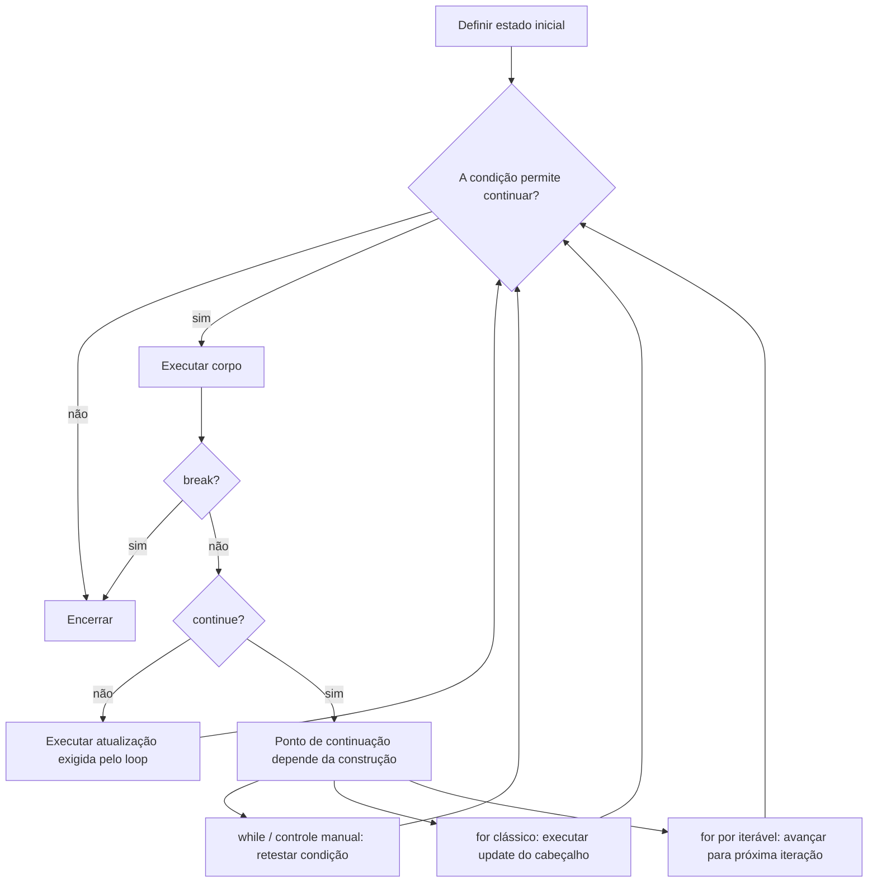

<a id="inicio"></a>

# Estruturas de Repetição

> **Classificação curricular:** `[D] Obrigatório dominar`
>
> **Legenda de siglas:** aqui, `[D]` na classificação curricular significa **Obrigatório dominar**. Nos blocos de evidência/QA, `[D]` = documentação/literatura, `[S]` = inspeção estática/estrutura e `[R]` = reprodução em runtime/compilador. O significado é determinado pelo contexto da seção.
>
> **Nível:** A — Lógica de Programação
> **Posição na taxonomia:** tópico 7
> **Pré-requisitos:** fluxo de controle, expressões, operadores, estado e variáveis
> **Aprofundamentos posteriores:** coleções, iteradores em profundidade, geradores, recursão, invariantes em profundidade, provas formais de correção, análise de algoritmos e complexidade

---

## Resumo executivo

Uma estrutura de repetição permite executar um bloco várias vezes enquanto alguma regra de continuidade permanecer válida.

Modelo geral:

```text
ESTADO INICIAL
↓
TESTAR / OBTER PRÓXIMO ITEM
↓
EXECUTAR CORPO
↓
ATUALIZAR ESTADO
↓
REPETIR OU TERMINAR
```

O conceito de **iteração** é mais amplo que “incrementar um contador”.

Um loop pode ser controlado por:

```text
CONTADOR
CONDIÇÃO
SENTINELA
FIM DE ENTRADA
TAMANHO DE COLEÇÃO
ITERADOR
EVENTO
ESTADO DO PROGRAMA
```

O núcleo curricular deste capítulo é:

```text
while
for
pré-teste
pós-teste quando disponível
inicialização
condição
atualização
término
break
continue
nested loops
loop infinito
off-by-one
```

Mas há uma diferença central entre as linguagens:

```text
Python for
→ percorre um iterável

JavaScript for
→ pode ser contador clássico

JavaScript for...of
→ percorre valores de um iterável

Java enhanced for
→ percorre arrays/Iterable

Bash for
→ percorre palavras/resultados de expansão

Bash for ((...))
→ forma aritmética semelhante ao for de C
```

Portanto:

> **“for” não é uma semântica universal única.**

Outra regra fundamental:

> **todo loop correto precisa possuir uma razão clara para continuar e uma razão clara para terminar.**

Para loops controlados por estado, um modelo didático muito útil é:

```text
INICIALIZAR
TESTAR
EXECUTAR
ATUALIZAR
```

Farrell enfatiza justamente que omitir ou errar inicialização, teste ou atualização cria risco de loop infinito.

---

## Decisão rápida

| Pergunta | Resposta |
|---|---|
| “Quando usar `while`?” | Quando a repetição depende naturalmente de uma condição/estado cuja quantidade de iterações pode não ser conhecida antes. |
| “Quando usar `for`?” | Quando a linguagem oferece uma forma mais direta de percorrer uma faixa, sequência, coleção ou ciclo controlado. |
| “Todo `for` é contador?” | Não. Python `for`, JS `for...of`, Java enhanced `for` e Bash `for` podem percorrer elementos. |
| “`while` pode executar zero vezes?” | Sim, se a condição inicial já for falsa. |
| “`do-while` pode executar zero vezes?” | Não: o corpo é executado antes do teste. |
| “Python possui `do-while` nativo?” | Não. |
| “Bash possui `do-while` nativo?” | Não; Bash oferece `while` e `until`, entre outros loops. |
| “`break` termina todos os loops aninhados?” | Normalmente não; sem recurso adicional, termina o loop-alvo mais interno. Bash permite `break n`; Java/JS têm labels. |
| “`continue` termina o loop?” | Não. Encerra a iteração corrente e prossegue no ponto de continuação do loop. |
| “`continue` em `for` clássico executa a atualização?” | Em Java/JavaScript, sim: segue para a etapa de update do loop. |
| “Python `for` usa índice internamente?” | Não como regra semântica. Ele obtém itens de um iterador. |
| “`range(5)` inclui 5?” | Não; produz `0,1,2,3,4`. |
| “`for...in` em JS é igual a `for...of`?” | Não. `for...in` enumera chaves string de propriedades enumeráveis próprias e herdadas; `for...of` percorre valores produzidos pelo protocolo iterável. |
| “Loop infinito é sempre bug?” | Não. Um loop deliberadamente aberto pode existir em processos de longa duração, desde que tenha contrato e mecanismos de interrupção claros. Isso não autoriza bloquear um event loop gerenciado pelo runtime com `while (true)` síncrono. |
| “Off-by-one é só errar um número?” | É erro de fronteira: executar uma vez a mais ou a menos, frequentemente por `<` × `<=`, início ou fim incorretos. |

---

# Índice


- [Resumo executivo](#resumo-executivo)
- [Decisão rápida](#decisão-rápida)
- [1. Posição deste assunto](#1-posição-deste-assunto)
  - [1.1 O que muda com repetição](#11-o-que-muda-com-repetição)
  - [1.2 Repetição não elimina raciocínio](#12-repetição-não-elimina-raciocínio)
  - [1.3 Fronteira deste capítulo](#13-fronteira-deste-capítulo)
- [2. Visão panorâmica](#2-visão-panorâmica)
- [3. Conceito de iteração](#3-conceito-de-iteração)
  - [3.1 Cada repetição é uma iteração](#31-cada-repetição-é-uma-iteração)
  - [3.2 Iteração não implica contador](#32-iteração-não-implica-contador)
  - [3.3 Iteração sobre coleção](#33-iteração-sobre-coleção)
  - [3.4 Iteração e estado](#34-iteração-e-estado)
- [4. Anatomia de um loop](#4-anatomia-de-um-loop)
  - [4.1 Inicialização](#41-inicialização)
  - [4.2 Teste](#42-teste)
  - [4.3 Corpo](#43-corpo)
  - [4.4 Atualização](#44-atualização)
  - [4.5 Término](#45-término)
- [5. Condição de continuidade e condição de término](#5-condição-de-continuidade-e-condição-de-término)
  - [Continuidade](#continuidade)
  - [Término](#término)
  - [5.1 Por que pensar nos dois lados?](#51-por-que-pensar-nos-dois-lados)
  - [5.2 Contrato do loop](#52-contrato-do-loop)
- [6. Loop definido e indefinido](#6-loop-definido-e-indefinido)
  - [6.1 Definido](#61-definido)
  - [6.2 Indefinido](#62-indefinido)
  - [6.3 Counter-controlled](#63-counter-controlled)
  - [6.4 Sentinel-controlled](#64-sentinel-controlled)
  - [6.5 EOF-controlled](#65-eof-controlled)
  - [6.6 Evento/estado](#66-eventoestado)
- [7. Contador, acumulador e sentinela](#7-contador-acumulador-e-sentinela)
  - [7.1 Contador](#71-contador)
  - [7.2 Acumulador](#72-acumulador)
  - [7.3 Sentinela](#73-sentinela)
  - [7.4 Não escolha sentinela que possa ser dado válido](#74-não-escolha-sentinela-que-possa-ser-dado-válido)
  - [7.5 Contador não precisa começar em zero](#75-contador-não-precisa-começar-em-zero)
- [8. while — repetição por condição](#8-while--repetição-por-condição)
  - [8.1 Semântica](#81-semântica)
  - [8.2 Exemplo conceitual](#82-exemplo-conceitual)
  - [8.3 Quantidade pode ser zero](#83-quantidade-pode-ser-zero)
  - [8.4 Quando `while` é natural](#84-quando-while-é-natural)
  - [8.5 Stroustrup](#85-stroustrup)
- [9. Pré-teste](#9-pré-teste)
  - [9.1 Uso](#91-uso)
- [10. Pós-teste e do-while](#10-pós-teste-e-do-while)
  - [10.1 JavaScript](#101-javascript)
  - [10.2 Java](#102-java)
  - [10.3 Quando faz sentido](#103-quando-faz-sentido)
  - [10.4 Cuidado](#104-cuidado)
- [11. Python sem do-while nativo](#11-python-sem-do-while-nativo)
  - [11.1 Isso é equivalente?](#111-isso-é-equivalente)
  - [11.2 Outra opção](#112-outra-opção)
  - [11.3 Guardrail](#113-guardrail)
- [12. Bash while e until](#12-bash-while-e-until)
  - [12.1 Relação lógica](#121-relação-lógica)
  - [12.2 Sem do-while nativo](#122-sem-do-while-nativo)
- [13. for — conceito geral](#13-for--conceito-geral)
  - [13.1 For clássico](#131-for-clássico)
  - [13.2 For sobre elementos](#132-for-sobre-elementos)
  - [13.3 Vantagem](#133-vantagem)
- [14. for clássico controlado por contador](#14-for-clássico-controlado-por-contador)
  - [14.1 JavaScript](#141-javascript)
  - [14.2 Java](#142-java)
  - [14.3 Bash aritmético](#143-bash-aritmético)
  - [14.4 Python](#144-python)
- [15. Iteração sobre sequências e iteráveis](#15-iteração-sobre-sequências-e-iteráveis)
  - [15.1 Vantagem](#151-vantagem)
  - [15.2 Menos estado manual](#152-menos-estado-manual)
  - [15.3 Nem toda fonte é uma sequência indexável](#153-nem-toda-fonte-é-uma-sequência-indexável)
  - [15.4 Mutar a fonte durante a iteração exige contrato explícito](#154-mutar-a-fonte-durante-a-iteração-exige-contrato-explícito)
- [16. Python for e range](#16-python-for-e-range)
  - [16.1 Sobre iterável](#161-sobre-iterável)
  - [16.2 range](#162-range)
  - [16.3 Start, stop, step](#163-start-stop-step)
  - [16.4 Alterar a variável não controla o iterador](#164-alterar-a-variável-não-controla-o-iterador)
- [17. JavaScript for, for-of e for-in](#17-javascript-for-for-of-e-for-in)
  - [17.1 for clássico](#171-for-clássico)
  - [17.2 for...of](#172-forof)
  - [17.3 for...in](#173-forin)
    - [17.3.1 Próprias, herdadas e Symbols](#1731-próprias-herdadas-e-symbols)
    - [17.3.2 Mutação durante a enumeração](#1732-mutação-durante-a-enumeração)
  - [17.4 Erro frequente](#174-erro-frequente)
  - [17.5 for-await-of `[E]`](#175-for-await-of-e)
- [18. Java basic for e enhanced for](#18-java-basic-for-e-enhanced-for)
  - [18.1 Basic for](#181-basic-for)
  - [18.2 Enhanced for](#182-enhanced-for)
  - [18.3 Quando precisa de índice](#183-quando-precisa-de-índice)
  - [18.4 Quando não precisa](#184-quando-não-precisa)
- [19. Bash for e for aritmético](#19-bash-for-e-for-aritmético)
  - [19.1 For por palavras](#191-for-por-palavras)
  - [19.2 Positional parameters](#192-positional-parameters)
  - [19.3 C-style arithmetic for](#193-c-style-arithmetic-for)
    - [19.3.1 Expressões omitidas e `for ((;;))`](#1931-expressões-omitidas-e-for-)
  - [19.4 Expansão é parte da semântica](#194-expansão-é-parte-da-semântica)
- [20. Inicialização, teste, atualização e término](#20-inicialização-teste-atualização-e-término)
  - [20.1 Inicialização inadequada](#201-inicialização-inadequada)
  - [20.2 Condição inadequada](#202-condição-inadequada)
  - [20.3 Atualização inadequada](#203-atualização-inadequada)
  - [20.4 Término deve ser alcançável](#204-término-deve-ser-alcançável)
- [21. break](#21-break)
  - [21.1 Uso](#211-uso)
  - [21.2 Python](#212-python)
  - [21.3 JavaScript](#213-javascript)
  - [21.4 Java](#214-java)
  - [21.5 Bash](#215-bash)
  - [21.6 Guardrail](#216-guardrail)
- [22. continue](#22-continue)
  - [22.1 Filtro](#221-filtro)
  - [22.2 Python](#222-python)
  - [22.3 Java](#223-java)
  - [22.4 JavaScript](#224-javascript)
  - [22.5 Bash](#225-bash)
  - [22.6 Erro frequente com while](#226-erro-frequente-com-while)
- [23. break e continue em loops aninhados](#23-break-e-continue-em-loops-aninhados)
  - [23.1 Java](#231-java)
  - [23.2 JavaScript](#232-javascript)
  - [23.3 Bash](#233-bash)
  - [23.4 Python](#234-python)
  - [23.5 Guardrail](#235-guardrail)
- [24. Python loop else](#24-python-loop-else)
  - [24.1 Exemplo de busca](#241-exemplo-de-busca)
  - [24.2 Não significa “se o loop nunca executou”](#242-não-significa-se-o-loop-nunca-executou)
  - [24.3 Portabilidade](#243-portabilidade)
- [25. Repetições aninhadas](#25-repetições-aninhadas)
  - [25.1 Outer loop](#251-outer-loop)
  - [25.2 Inner loop](#252-inner-loop)
  - [25.3 Estado de controle](#253-estado-de-controle)
  - [25.4 Reinitialização](#254-reinitialização)
- [26. Processamento bidimensional](#26-processamento-bidimensional)
  - [26.1 Exemplo](#261-exemplo)
  - [26.2 Outras aplicações](#262-outras-aplicações)
- [27. Produto de iterações em loops aninhados](#27-produto-de-iterações-em-loops-aninhados)
  - [27.1 Exemplo](#271-exemplo)
  - [27.2 Ponte para complexidade](#272-ponte-para-complexidade)
- [28. Invariante de loop — introdução](#28-invariante-de-loop--introdução)
  - [28.1 Soma de prefixo](#281-soma-de-prefixo)
  - [28.2 Contador](#282-contador)
  - [28.3 Por que ajuda?](#283-por-que-ajuda)
  - [28.4 Estrutura](#284-estrutura)
- [29. Progresso e variante de término](#29-progresso-e-variante-de-término)
  - [29.1 Exemplo de regressão](#291-exemplo-de-regressão)
  - [29.2 Não precisa formalizar toda vez](#292-não-precisa-formalizar-toda-vez)
- [30. Loop infinito](#30-loop-infinito)
  - [30.1 Atualização ausente](#301-atualização-ausente)
  - [30.2 Atualização na direção errada](#302-atualização-na-direção-errada)
  - [30.3 Condição impossível de falsificar](#303-condição-impossível-de-falsificar)
  - [30.4 Continue que pula progresso](#304-continue-que-pula-progresso)
  - [30.5 Loop deliberadamente aberto](#305-loop-deliberadamente-aberto)
  - [30.6 Durante aprendizado](#306-durante-aprendizado)
- [31. Off-by-one](#31-off-by-one)
  - [31.1 Exemplo](#311-exemplo)
  - [31.2 Range fechado-aberto](#312-range-fechado-aberto)
  - [31.3 Array](#313-array)
  - [31.4 Fronteiras a testar](#314-fronteiras-a-testar)
- [32. Condição incorreta](#32-condição-incorreta)
  - [32.1 Invertida](#321-invertida)
  - [32.2 Operador errado](#322-operador-errado)
  - [32.3 Comparar variável errada](#323-comparar-variável-errada)
  - [32.4 Condição não acompanha atualização](#324-condição-não-acompanha-atualização)
  - [32.5 Debug](#325-debug)
- [33. Atualização incorreta](#33-atualização-incorreta)
  - [33.1 Ausente](#331-ausente)
  - [33.2 Dupla](#332-dupla)
  - [33.3 Direção errada](#333-direção-errada)
  - [33.4 Passo errado](#334-passo-errado)
  - [33.5 Atualização condicional acidental](#335-atualização-condicional-acidental)
- [34. Modificar a variável de controle indevidamente](#34-modificar-a-variável-de-controle-indevidamente)
  - [34.1 Problema principal](#341-problema-principal)
  - [34.2 Melhor](#342-melhor)
- [35. Exemplo progressivo — percorrer 1 a 5](#35-exemplo-progressivo--percorrer-1-a-5)
  - [Python](#python)
  - [JavaScript](#javascript)
  - [Java](#java)
  - [Bash](#bash)
  - [Conceito](#conceito)
  - [Diferença](#diferença)
- [36. Exemplo progressivo — soma de 1 a N](#36-exemplo-progressivo--soma-de-1-a-n)
  - [36.1 Invariante conceitual](#361-invariante-conceitual)
  - [36.2 Python](#362-python)
  - [36.3 JavaScript](#363-javascript)
  - [36.4 Java](#364-java)
  - [36.5 Bash](#365-bash)
- [37. Exemplo crítico — fronteiras](#37-exemplo-crítico--fronteiras)
  - [Tabela](#tabela)
- [38. Exemplo crítico — continue](#38-exemplo-crítico--continue)
  - [Python for](#python-for)
  - [Python while — versão correta](#python-while--versão-correta)
  - [Python while — bug](#python-while--bug)
  - [Regra](#regra)
- [39. Exemplo crítico — nested loops](#39-exemplo-crítico--nested-loops)
  - [Python](#python-1)
  - [Quantidade](#quantidade)
  - [Estado](#estado)
  - [Erro de modelagem](#erro-de-modelagem)
- [40. Transferência entre as quatro linguagens](#40-transferência-entre-as-quatro-linguagens)
  - [While](#while)
  - [Pós-teste](#pós-teste)
  - [For por faixa/contador](#for-por-faixacontador)
  - [For por elemento](#for-por-elemento)
  - [Break/continue](#breakcontinue)
- [41. Erros conceituais frequentes](#41-erros-conceituais-frequentes)
  - [41.1 “for é sempre contador”](#411-for-é-sempre-contador)
  - [41.2 “while executa pelo menos uma vez”](#412-while-executa-pelo-menos-uma-vez)
  - [41.3 “do-while existe em toda linguagem”](#413-do-while-existe-em-toda-linguagem)
  - [41.4 “range(5) inclui 5”](#414-range5-inclui-5)
  - [41.5 “break sai de todos os loops”](#415-break-sai-de-todos-os-loops)
  - [41.6 “continue é igual a break”](#416-continue-é-igual-a-break)
  - [41.7 “continue sempre é seguro”](#417-continue-sempre-é-seguro)
  - [41.8 “for...in e for...of são equivalentes”](#418-forin-e-forof-são-equivalentes)
  - [41.9 “Bash for trabalha como array Java”](#419-bash-for-trabalha-como-array-java)
  - [41.10 “loop infinito é sempre bug”](#4110-loop-infinito-é-sempre-bug)
  - [41.11 “off-by-one acontece só em arrays”](#4111-off-by-one-acontece-só-em-arrays)
  - [41.12 “nested loop sempre é ineficiente”](#4112-nested-loop-sempre-é-ineficiente)
  - [41.13 “for é sempre melhor que while”](#4113-for-é-sempre-melhor-que-while)
  - [41.14 “posso modificar livremente a coleção enquanto itero”](#4114-posso-modificar-livremente-a-coleção-enquanto-itero)
- [42. Debugging de loops](#42-debugging-de-loops)
  - [42.1 Trace](#421-trace)
  - [42.2 Perguntas](#422-perguntas)
  - [42.3 Log temporário](#423-log-temporário)
  - [42.4 Limite de segurança](#424-limite-de-segurança)
  - [42.5 Não “conserte” só adicionando break](#425-não-conserte-só-adicionando-break)
- [Problemas reais — índice operacional](#problemas-reais-indice-operacional)
  - [PR-T07-01 — processar até sentinela ou fim](#pr-t07-01)
  - [PR-T07-02 — percorrer coleção sem erro de fronteira](#pr-t07-02)
  - [PR-T07-03 — repetir validação até entrada aceitável](#pr-t07-03)
  - [PR-T07-04 — interromper busca quando encontrar](#pr-t07-04)
  - [PR-T07-05 — filtrar iterações sem perder progresso](#pr-t07-05)
  - [PR-T07-06 — percorrer grade com loops aninhados](#pr-t07-06)
- [🔎 Troubleshooting sistemático](#troubleshooting-sistematico)
  - [TS-T07-01 — loop não termina](#ts-t07-01)
  - [TS-T07-02 — elemento de fronteira é omitido ou duplicado](#ts-t07-02)
  - [TS-T07-03 — `continue` impede o progresso](#ts-t07-03)
  - [TS-T07-04 — loop interno usa estado da iteração anterior](#ts-t07-04)
  - [TS-T07-05 — mutação da fonte altera a travessia](#ts-t07-05)
  - [TS-T07-06 — `for...in` usado esperando valores](#ts-t07-06)
  - [TS-T07-07 — Bash divide um item em várias palavras](#ts-t07-07)
  - [TS-T07-08 — `else` de loop Python executa quando não era esperado](#ts-t07-08)
- [43. Laboratórios](#43-laboratórios)
  - [🧪 Laboratório 1 — mesmo loop com while e for](#-laboratório-1--mesmo-loop-com-while-e-for)
  - [🧪 Laboratório 2 — zero iterações](#-laboratório-2--zero-iterações)
  - [🧪 Laboratório 3 — sentinel](#-laboratório-3--sentinel)
  - [🧪 Laboratório 4 — off-by-one](#-laboratório-4--off-by-one)
  - [🧪 Laboratório 5 — continue e progresso](#-laboratório-5--continue-e-progresso)
  - [🧪 Laboratório 6 — JS for...in × for...of](#-laboratório-6--js-forin--forof)
  - [🧪 Laboratório 7 — Python loop else](#-laboratório-7--python-loop-else)
  - [🧪 Laboratório 8 — nested loop](#-laboratório-8--nested-loop)
  - [🧪 Laboratório 9 — Bash while × until](#-laboratório-9--bash-while--until)
- [44. Exercícios](#44-exercícios)
  - [44.1 Conceito](#441-conceito)
  - [44.2 While](#442-while)
  - [44.3 Pré-teste](#443-pré-teste)
  - [44.4 Pós-teste](#444-pós-teste)
  - [44.5 Python](#445-python)
  - [44.6 For](#446-for)
  - [44.7 range](#447-range)
  - [44.8 JS](#448-js)
  - [44.9 Java](#449-java)
  - [44.10 Bash](#4410-bash)
  - [44.11 Break](#4411-break)
  - [44.12 Continue](#4412-continue)
  - [44.13 Continue bug](#4413-continue-bug)
  - [44.14 Nested loops](#4414-nested-loops)
  - [44.15 Off-by-one](#4415-off-by-one)
  - [44.16 Término](#4416-término)
  - [44.17 Sentinela](#4417-sentinela)
  - [44.18 Python loop else](#4418-python-loop-else)
- [45. Evidências de domínio](#45-evidências-de-domínio)
  - [Explicar](#explicar)
  - [Aplicar](#aplicar)
  - [Comparar linguagens](#comparar-linguagens)
  - [Depurar](#depurar)
  - [Transferir](#transferir)
- [46. Checklist de consulta rápida](#46-checklist-de-consulta-rápida)
- [47. Glossário](#47-glossário)
- [48. Referências](#48-referências)
  - [48.1 Taxonomia canônica](#481-taxonomia-canônica)
  - [48.2 Python 3.14.7 — documentação oficial](#482-python-3147--documentação-oficial)
  - [48.3 ECMAScript 2026 — especificação oficial](#483-ecmascript-2026--especificação-oficial)
  - [48.4 Java SE 27 — documentação oficial](#484-java-se-27--documentação-oficial)
  - [48.5 GNU Bash 5.3 — documentação oficial](#485-gnu-bash-53--documentação-oficial)
  - [48.6 Fontes locais efetivamente consultadas — File Library](#486-fontes-locais-efetivamente-consultadas--file-library)
  - [48.6.1 Pesquisa externa e validação versionada preservada nesta baseline](#4861-pesquisa-externa-e-validação-versionada-preservada-nesta-baseline)
  - [48.7 Como as fontes foram usadas](#487-como-as-fontes-foram-usadas)
- [49. Histórico de versões](#49-histórico-de-versões)

---

# 1. Posição deste assunto

Até aqui construímos:

```text
SEQUÊNCIA
+
SELEÇÃO
```

Agora adicionamos:

```text
REPETIÇÃO
```

Essas três estruturas formam o núcleo clássico da programação estruturada.

## 1.1 O que muda com repetição

Sem loop:

```text
print item 1
print item 2
print item 3
...
```

Com loop:

```text
para cada item
    processar item
```

A lógica é escrita uma vez e aplicada várias vezes.

## 1.2 Repetição não elimina raciocínio

Um loop concentra complexidade.

Você ainda precisa definir:

- estado inicial;
- critério de continuidade;
- corpo;
- atualização;
- critério de término;
- comportamento de `break`;
- comportamento de `continue`;
- fronteiras.

## 1.3 Fronteira deste capítulo

Entram:

```text
while
do-while
for
break
continue
nested loops
off-by-one
loop infinito
```

Ficam para depois:

- iterators em profundidade;
- generators;
- async iteration;
- streams;
- comprehensions aprofundadas;
- complexidade formal;
- recursão;
- concorrência.

[↑ Voltar ao índice](#índice)

---

# 2. Visão panorâmica

## 🗺️ Visão panorâmica — o mapa antes dos detalhes

Esta seção funciona como **caderno rápido de consulta** e como contrato de cobertura do capítulo. Ela não substitui o aprofundamento: organiza o domínio antes dos detalhes e aponta para os mecanismos que serão demonstrados, testados e depurados ao longo do documento.

### Mapa do domínio — o que existe

```text
ESTRUTURAS DE REPETIÇÃO
│
├── iteração
│   ├── corpo
│   ├── estado
│   ├── continuidade
│   └── término
│
├── controle por condição
│   ├── while
│   │   └── pré-teste
│   ├── do-while quando disponível
│   │   └── pós-teste
│   └── until no Bash
│       └── condição expressa por exit status não zero
│
├── controle por faixa / sequência / fonte iterável
│   ├── for clássico
│   ├── range/faixa
│   ├── elemento de iterável
│   ├── enhanced for
│   ├── for...of
│   └── palavras/expansões no shell
│
├── anatomia do progresso
│   ├── inicialização
│   ├── teste
│   ├── corpo
│   ├── atualização
│   └── condição alcançável de término
│
├── desvios dentro do loop
│   ├── break
│   └── continue
│
├── composição
│   ├── loops aninhados
│   └── processamento bidimensional
│
├── raciocínio
│   ├── rastreamento
│   ├── invariante introdutório
│   └── variante/progresso de término
│
└── classes de falha
    ├── loop infinito
    ├── off-by-one
    ├── condição incorreta
    ├── atualização incorreta
    ├── continue que impede progresso
    ├── variável de controle alterada indevidamente
    └── semântica de iteração confundida entre linguagens
```

### Fluxo principal — como um loop controlado por estado progride



Leitura conceitual:

```text
INICIALIZAR
→ TESTAR / OBTER PRÓXIMO ITEM
→ EXECUTAR
→ GARANTIR PROGRESSO
→ REPETIR OU TERMINAR
```

Nem todo `for` expõe essas etapas da mesma forma. Em Python, por exemplo, o avanço sobre um iterável é controlado pelo protocolo de iteração; em um `for` clássico de JavaScript/Java, inicialização, teste e atualização aparecem explicitamente; em Bash, a semântica ainda depende de expansão, palavras e exit status conforme a construção usada.

> **Guardrail de `continue`:** o ponto de continuação é definido pela construção-alvo. Em um `while` com atualização manual, `continue` pode retestar a condição antes que o estado progrida. Em um `for` clássico de JavaScript/Java, `continue` ainda passa pela etapa de atualização do cabeçalho antes do próximo teste. Em loops por iterável, a construção avança para a próxima iteração segundo seu próprio mecanismo.

### Consulta rápida — escolha, mecanismo e risco dominante

| Situação | Estrutura inicial provável | Pergunta de correção | Risco frequente |
|---|---|---|---|
| repetir enquanto um estado permanecer válido | `while` | o estado caminha para uma condição de término? | loop infinito |
| executar o corpo antes do primeiro teste | `do-while`, quando a linguagem oferece | a primeira execução é realmente obrigatória? | executar uma vez quando não deveria |
| percorrer valores de uma fonte iterável | `for`/enhanced `for`/`for...of` | preciso do valor ou do índice/chave? | confundir modelo de iteração |
| percorrer uma faixa numérica | `range` ou `for` contador | o limite é inclusivo ou exclusivo? | off-by-one |
| abandonar a repetição após atingir o objetivo | `break` | o encerramento antecipado preserva o contrato? | esconder condição de término mal modelada |
| ignorar apenas a iteração corrente | `continue` | o progresso ainda acontece? | pular atualização necessária |
| percorrer linhas × colunas ou pares | loops aninhados | o estado interno é reiniciado corretamente? | quantidade/estado incorretos |
| repetição deliberadamente aberta | loop aberto + mecanismo externo de parada | quem encerra, cancela ou limita a execução? | bloqueio ou consumo descontrolado |

### Pergunta prática → onde começar

| Pergunta | Primeira investigação |
|---|---|
| “Quantas vezes isso deve executar?” | identificar faixa, cardinalidade ou condição de término |
| “Pode executar zero vezes?” | distinguir pré-teste de pós-teste |
| “Preciso do índice?” | preferir iteração direta quando o índice não é requisito |
| “Por que não termina?” | rastrear condição + variável/estado que deveria progredir |
| “Por que pulou o último item?” | revisar início, limite, operador relacional e passo |
| “Por que `continue` travou?” | verificar se atualização/progresso ficou depois do `continue` |
| “Por que meu array JS devolveu `0`, `1`, `2`?” | verificar `for...in` × `for...of` |
| “Por que o Bash separou um item em vários?” | revisar quoting, expansão e word splitting |
| “Por que o loop interno roda errado na segunda volta?” | revisar reinicialização do estado interno |

### Não confundir

| Não confundir | Distinção correta |
|---|---|
| **iteração × contador** | iteração é repetição estruturada; contador é apenas uma forma possível de controle/estado |
| **condição de continuidade × condição de término** | são duas formas de descrever o mesmo contrato por perspectivas opostas; ambas precisam ser coerentes |
| **pré-teste × pós-teste** | pré-teste pode executar zero vezes; pós-teste executa o corpo antes do primeiro teste |
| **`break` × `continue`** | `break` encerra o loop-alvo; `continue` encerra apenas a iteração corrente e segue para o ponto de continuação |
| **faixa fechada × fechada-aberta** | `[a,b]` inclui ambos os limites; `[a,b)` exclui o limite superior e costuma simplificar contagem/índices |
| **`for...in` × `for...of` em JavaScript** | `for...in` enumera propriedades string enumeráveis; `for...of` consome valores de um iterável |
| **`while` Bash × condição booleana de Java/Python** | Bash repete conforme o **exit status** da lista de comandos de teste |
| **loop infinito acidental × loop deliberadamente aberto** | o segundo possui contrato de parada/cancelamento/limite externo; o primeiro perdeu a garantia de progresso |

### Microexemplos canônicos — recuperar o mecanismo em segundos

**Pré-teste que pode executar zero vezes:**

```python
remaining = 0

while remaining > 0:
    remaining -= 1
```

**Faixa fechada-aberta:**

```python
for index in range(0, 5):
    print(index)  # 0, 1, 2, 3, 4
```

**`continue` preservando progresso em `while`:**

```python
index = 0

while index < 5:
    index += 1
    if index == 3:
        continue
    print(index)
```

O avanço ocorre **antes** do ponto que pode executar `continue`, evitando que a iteração fique presa em `index == 3`.

**JavaScript — valor, não propriedade:**

```javascript
const names = ["Ana", "Bruno"];

for (const name of names) {
  console.log(name);
}
```

**Bash — preservar cada argumento como uma unidade:**

```bash
for argument in "$@"; do
    printf '<%s>\n' "$argument"
done
```

### Problemas reais representativos

O índice operacional completo aparece em [Problemas reais — índice operacional](#problemas-reais-indice-operacional). Os casos que melhor representam este tópico são:

- [`PR-T07-01`](#pr-t07-01) — processar dados até sentinela/fim mantendo progresso e término;
- [`PR-T07-02`](#pr-t07-02) — percorrer uma coleção exatamente uma vez sem erro de fronteira;
- [`PR-T07-04`](#pr-t07-04) — encerrar uma busca assim que o objetivo for encontrado;
- [`PR-T07-05`](#pr-t07-05) — filtrar iterações com `continue` sem bloquear o progresso;
- [`PR-T07-06`](#pr-t07-06) — percorrer estrutura bidimensional com loops aninhados e estado interno correto.

### Falha típica → primeira investigação

| Sintoma | Primeira hipótese/verificação | Caso detalhado |
|---|---|---|
| loop nunca termina | variável/estado de progresso não muda ou muda na direção errada | [`TS-T07-01`](#ts-t07-01) |
| último item é ignorado ou há uma iteração extra | limite, operador `<`/`<=`, início ou passo | [`TS-T07-02`](#ts-t07-02) |
| `continue` faz o programa travar | atualização ficou depois do `continue` | [`TS-T07-03`](#ts-t07-03) |
| loop interno falha depois da primeira linha | estado interno não foi reinicializado | [`TS-T07-04`](#ts-t07-04) |
| itens somem ou se repetem durante travessia | coleção/fonte foi modificada durante a iteração | [`TS-T07-05`](#ts-t07-05) |
| JS mostra índices/chaves onde eram esperados valores | uso de `for...in` no lugar de `for...of` | [`TS-T07-06`](#ts-t07-06) |
| Bash divide nomes com espaços | expansão sem quoting / word splitting | [`TS-T07-07`](#ts-t07-07) |
| `else` de loop Python parece “invertido” | interpretar como “terminou sem `break`” | [`TS-T07-08`](#ts-t07-08) |

### Transferência entre linguagens — o conceito permanece, a semântica muda

| Capacidade | Python | JavaScript | Java | Bash |
|---|---|---|---|---|
| pré-teste | `while` | `while` | `while` | `while` por exit status |
| pós-teste nativo | — | `do...while` | `do...while` | — |
| iteração por valor | `for x in iterable` | `for (const x of iterable)` | enhanced `for` | `for x in ...` após expansões |
| `for` clássico contador | não há sintaxe C-style | sim | sim | `for ((...))` |
| alternativa baseada em negação | — | — | — | `until` |
| saída antecipada | `break` | `break`/label | `break`/label | `break [n]` |
| próxima iteração | `continue` | `continue`/label | `continue`/label | `continue [n]` |
| cláusula após término normal | `else` de loop | — | — | — |

### Modo consulta × modo estudo

```text
CONSULTA EM ~30 s
→ Decisão rápida
→ esta Visão panorâmica
→ tabela de transferência
→ Checklist de consulta rápida
→ Troubleshooting sistemático

ESTUDO COMPLETO
→ conceito de iteração
→ anatomia
→ while / pós-teste / for
→ semântica por linguagem
→ break / continue
→ loops aninhados
→ invariantes / progresso / término
→ erros e debugging
→ PR-* / troubleshooting / LABs / exercícios
```

**Síntese multifonte desta visão:** Farrell contribui com a anatomia `inicializar → testar → alterar`, loops definidos/indefinidos e erros clássicos; Stroustrup reforça a concentração do estado de controle e a legibilidade do `for`; Sweigart ajuda a fixar faixas fechadas-abertas e a distinção introdutória entre `for` e `while`; Iepsen adiciona a visão didática de `do...while`, `break` e `continue` em JavaScript; o GNU Bash Reference Manual explicita que `while`, `until` e `for` possuem semântica própria do shell. Comportamentos versionados são confirmados nas documentações oficiais das linguagens listadas em [Referências](#48-referências).

[↑ Voltar ao índice](#índice)

---

# 3. Conceito de iteração

Iteração é a repetição estruturada de uma ação ou conjunto de ações.

Stroustrup resume a motivação de forma simples:

> raramente fazemos algo apenas uma vez.

A estrutura conceitual é:

```text
REPETIR
→ enquanto houver motivo
→ até atingir condição de término
```

## 3.1 Cada repetição é uma iteração

Se um corpo executa cinco vezes:

```text
iteração 1
iteração 2
iteração 3
iteração 4
iteração 5
```

## 3.2 Iteração não implica contador

Exemplo:

```text
enquanto houver linha no arquivo
    processar linha
```

Não é necessário conhecer antecipadamente o número de linhas.

## 3.3 Iteração sobre coleção

```text
para cada usuário
    enviar mensagem
```

O controle pode vir do iterador, não de um índice explícito.

## 3.4 Iteração e estado

Cada passo pode transformar estado:

```text
total = 0

item 1
→ total = 10

item 2
→ total = 25
```

[↑ Voltar ao índice](#índice)

---

# 4. Anatomia de um loop

Um loop controlado por condição normalmente possui quatro responsabilidades:

```text
1. INICIALIZAÇÃO
2. TESTE
3. CORPO
4. ATUALIZAÇÃO / PROGRESSO
```

Farrell destaca três ações críticas para uma variável de controle:

```text
inicializar
testar
alterar
```

Se uma delas estiver errada, há risco de não terminar.

## 4.1 Inicialização

Define o estado antes da primeira decisão.

```text
count = 0
```

## 4.2 Teste

Decide se o corpo executa.

```text
count < 5
```

## 4.3 Corpo

Executa a tarefa.

```text
processar
```

## 4.4 Atualização

Faz o estado avançar.

```text
count = count + 1
```

## 4.5 Término

Quando:

```text
count < 5
```

se torna falso, o loop encerra.

[↑ Voltar ao índice](#índice)

---

# 5. Condição de continuidade e condição de término

As duas perspectivas descrevem a mesma fronteira por ângulos diferentes.

## Continuidade

```text
while count < 5
```

significa:

> continuar enquanto `count < 5`.

## Término

Equivalente:

> terminar quando `count >= 5`.

## 5.1 Por que pensar nos dois lados?

Ajuda a detectar lógica invertida.

Exemplo:

```text
continuar enquanto houver dados
```

implica:

```text
terminar quando não houver dados
```

## 5.2 Contrato do loop

Um loop correto deve permitir responder:

```text
O QUE precisa permanecer verdadeiro para continuar?
O QUE precisa acontecer para eventualmente parar?
```

[↑ Voltar ao índice](#índice)

---

# 6. Loop definido e indefinido

## 6.1 Definido

A quantidade de repetições é determinada antes ou por uma faixa conhecida.

Exemplo:

```text
repetir 5 vezes
```

## 6.2 Indefinido

A quantidade exata depende de dados/estado durante execução.

Exemplo:

```text
ler até usuário digitar "quit"
```

## 6.3 Counter-controlled

Controlado por contador.

```text
0
1
2
3
4
```

## 6.4 Sentinel-controlled

Uma sentinela indica término.

```text
input != "quit"
```

## 6.5 EOF-controlled

Processa enquanto existem dados.

```text
enquanto houver próxima linha
```

## 6.6 Evento/estado

Exemplo:

```text
enquanto conexão estiver ativa
```

Farrell distingue explicitamente loops definidos por contador e loops indefinidos por sentinela.

[↑ Voltar ao índice](#índice)

---

# 7. Contador, acumulador e sentinela

## 7.1 Contador

Conta ocorrências/iterações.

```text
count = count + 1
```

## 7.2 Acumulador

Combina valores ao longo do loop.

```text
total = total + value
```

## 7.3 Sentinela

Valor especial do domínio usado para indicar parada.

```text
"quit"
-1
```

`EOF` também pode controlar o término de uma repetição, mas deve ser distinguido de uma sentinela: em geral, é uma **condição da fonte de entrada**, não um valor sentinela inserido no próprio domínio dos dados.

## 7.4 Não escolha sentinela que possa ser dado válido

Se:

```text
-1
```

é valor legítimo do domínio, usá-lo como sentinela pode introduzir ambiguidade.

## 7.5 Contador não precisa começar em zero

Zero é muito comum, mas não é regra universal.

Farrell reforça que a variável precisa ser inicializada corretamente, não necessariamente com `0`.

[↑ Voltar ao índice](#índice)

---

# 8. while — repetição por condição

Modelo:

```text
while condição
    corpo
```

## 8.1 Semântica

1. avaliar condição;
2. se falsa → sair;
3. se verdadeira → executar corpo;
4. voltar ao teste.

## 8.2 Exemplo conceitual

```text
count = 0

while count < 5
    mostrar count
    count = count + 1
```

## 8.3 Quantidade pode ser zero

Se:

```text
count = 5
```

a condição já é falsa.

O corpo não executa.

## 8.4 Quando `while` é natural

- quantidade desconhecida;
- sentinel;
- estado externo;
- retry;
- leitura até EOF;
- busca até encontrar algo.

## 8.5 Stroustrup

Stroustrup mostra que um `while` exige:

- variável de controle/estado;
- initializer;
- critério de término;
- corpo;
- atualização adequada.

[↑ Voltar ao índice](#índice)

---

# 9. Pré-teste

`while` é normalmente um loop de **pré-teste**:

```text
TESTAR
↓
EXECUTAR
```

Consequência:

```text
0 ou mais execuções
```

Farrell classifica `while` e o `for` didático tradicional como pretest loops e destaca que o corpo pode nunca executar.

## 9.1 Uso

Bom quando:

> pode ser correto não executar nenhuma vez.

Exemplo:

```text
while queue_not_empty
    process
```

Se a fila começar vazia:

```text
0 iterações
```

é correto.

[↑ Voltar ao índice](#índice)

---

# 10. Pós-teste e do-while

Um loop de pós-teste:

```text
EXECUTAR
↓
TESTAR
```

Consequência:

```text
1 ou mais execuções
```

## 10.1 JavaScript

```javascript
do {
  ...
} while (condition);
```

A especificação ECMAScript executa primeiro o statement e somente depois aplica `ToBoolean` à condição.

## 10.2 Java

```java
do {
    ...
} while (condition);
```

A JLS também define execução do corpo antes do teste.

## 10.3 Quando faz sentido

Menus/entrada interativa:

```text
mostrar menu
obter escolha
repetir se necessário
```

quando mostrar uma vez é obrigatório.

## 10.4 Cuidado

Não escolha do-while apenas para evitar uma inicialização bem modelada.

[↑ Voltar ao índice](#índice)

---

# 11. Python sem do-while nativo

Python não possui uma construção `do...while`.

Uma tradução comum:

```python
while True:
    body()

    if not condition:
        break
```

## 11.1 Isso é equivalente?

Pode representar a mesma lógica:

```text
executar ao menos uma vez
↓
testar no final
```

Mas usa:

```text
loop deliberadamente aberto
+
break
```

## 11.2 Outra opção

Reestruturar para evitar pós-teste.

## 11.3 Guardrail

Não invente sintaxe como:

```python
do:
    ...
while condition
```

Ela não existe em Python 3.14.

[↑ Voltar ao índice](#índice)

---

# 12. Bash while e until

Bash oferece:

```bash
while test-commands; do
    commands
done
```

O corpo executa enquanto o status de `test-commands` for:

```text
0
```

Bash também oferece:

```bash
until test-commands; do
    commands
done
```

O corpo executa enquanto o status for:

```text
não zero
```

A documentação atual confirma essa inversão.

## 12.1 Relação lógica

```text
until condition
```

é parecido conceitualmente com:

```text
while NOT condition
```

mas lembre:

> no Bash, a condição é baseada no status de comandos.

## 12.2 Sem do-while nativo

Pode emular com:

```bash
while :; do
    ...
    condition || break
done
```

Mas isso é uma composição, não uma keyword `do-while`.

[↑ Voltar ao índice](#índice)

---

# 13. for — conceito geral

`for` costuma expressar repetição cujo mecanismo de progressão é mais explícito na própria construção.

Mas a semântica concreta varia.

## 13.1 For clássico

```text
inicialização
condição
atualização
```

## 13.2 For sobre elementos

```text
para cada item em coleção
```

## 13.3 Vantagem

Quando o loop é naturalmente descrito por uma faixa/coleção:

> a construção `for` pode concentrar o controle em um ponto mais legível.

Farrell observa que `for` reúne inicialização, teste e alteração do controle em uma estrutura compacta.

Stroustrup reforça que esse formato tende a ser mais legível/manutenível quando o loop possui initializer, condition e increment simples.

[↑ Voltar ao índice](#índice)

---

# 14. for clássico controlado por contador

Forma conceitual C-like:

```text
for (inicialização; condição; atualização)
    corpo
```

Ordem:

```text
inicializar uma vez
↓
testar
↓
corpo
↓
atualizar
↓
testar novamente
```

## 14.1 JavaScript

```javascript
for (let i = 0; i < 5; i++) {
  console.log(i);
}
```

## 14.2 Java

```java
for (int i = 0; i < 5; i++) {
    System.out.println(i);
}
```

## 14.3 Bash aritmético

```bash
for ((i = 0; i < 5; i++)); do
    printf '%d\n' "$i"
done
```

## 14.4 Python

Python NÃO possui esse `for(init; test; update)`.

Use:

```python
for i in range(5):
    print(i)
```

quando o problema for faixa numérica.

[↑ Voltar ao índice](#índice)

---

# 15. Iteração sobre sequências e iteráveis

Uma forma mais abstrata:

```text
PARA CADA ITEM
NA FONTE
    PROCESSAR
```

## 15.1 Vantagem

Evita gerenciar índice quando ele não é necessário.

Em vez de:

```text
for i = 0 ... length-1
    item = items[i]
```

podemos usar:

```text
for each item
```

## 15.2 Menos estado manual

O mecanismo de iteração controla:

- próximo item;
- fim;
- avanço.

## 15.3 Nem toda fonte é uma sequência indexável

Pode ser:

- set;
- generator;
- stream;
- iterable customizado.

O aprofundamento fica para depois.

## 15.4 Mutar a fonte durante a iteração exige contrato explícito

Adicionar, remover ou reorganizar elementos da própria fonte enquanto ela está sendo percorrida **não possui uma semântica universal**. O resultado depende da estrutura, do iterador, da linguagem e da API.

Guardrail:

```text
PRECISA MUTAR DURANTE O PERCURSO?
        ↓
consultar o contrato da estrutura/iterador
        ↓
se o comportamento não estiver claramente definido,
prefira separar percurso e mutação
```

Em algoritmos simples, alternativas comuns são:

- percorrer uma cópia quando isso é correto e aceitável;
- acumular alterações e aplicá-las depois;
- usar uma API/iterador que documente remoção ou atualização durante o percurso.

> **Regra:** não transfira para outra linguagem a suposição de que “deu certo aqui, então é seguro em qualquer loop”.

[↑ Voltar ao índice](#índice)

---

# 16. Python for e range

A documentação Python define `for` como iteração sobre itens fornecidos por um **iterable/iterator**.

## 16.1 Sobre iterável

```python
for name in names:
    print(name)
```

## 16.2 range

```python
for number in range(5):
    print(number)
```

produz:

```text
0
1
2
3
4
```

`5` não é incluído.

Sweigart enfatiza esse intervalo fechado-aberto.

## 16.3 Start, stop, step

```python
range(1, 6)
```

→ `1..5`.

```python
range(10, 0, -2)
```

→ `10,8,6,4,2`.

## 16.4 Alterar a variável não controla o iterador

```python
for i in range(3):
    i = 99
```

não muda qual será o próximo item fornecido pelo iterador.

A documentação Python explicita que o target recebe o próximo item a cada iteração.

[↑ Voltar ao índice](#índice)

---

# 17. JavaScript for, for-of e for-in

ECMAScript possui várias estruturas de iteração.

## 17.1 for clássico

```javascript
for (let i = 0; i < items.length; i++) {
  console.log(items[i]);
}
```

## 17.2 for...of

Percorre valores produzidos por um objeto iterável:

```javascript
for (const item of items) {
  console.log(item);
}
```

## 17.3 for...in

`for...in` enumera **chaves string de propriedades enumeráveis** do objeto e de sua cadeia de protótipos, seguindo as regras definidas pelo ECMAScript. Isso é diferente de percorrer os valores de um iterable.

```javascript
for (const key in object) {
  console.log(key);
}
```

### 17.3.1 Próprias, herdadas e Symbols

A enumeração pode alcançar propriedades enumeráveis **próprias e herdadas**. Chaves do tipo `Symbol` não entram nessa enumeração.

Por isso, quando a intenção é operar apenas nas propriedades próprias de um objeto, a escolha da API deve deixar esse contrato explícito em vez de assumir que `for...in` significa “campos próprios”.

### 17.3.2 Mutação durante a enumeração

Não escreva algoritmos que dependam de uma propriedade recém-adicionada durante um `for...in` ser necessariamente visitada. A especificação não garante que propriedades adicionadas durante uma enumeração ativa sejam processadas.

Esse é um exemplo concreto do guardrail da seção 15.4: **mutar a fonte enquanto ela é percorrida exige conhecer a semântica da operação específica**.

## 17.4 Erro frequente

Usar `for...in` para iterar valores de array como se fosse `for...of`.

Para arrays:

```text
for...of
→ valores

for...in
→ property keys
```

## 17.5 for-await-of `[E]`

Existe para iteração assíncrona.

Fica fora do núcleo deste capítulo.

[↑ Voltar ao índice](#índice)

---

# 18. Java basic for e enhanced for

## 18.1 Basic for

```java
for (int i = 0; i < values.length; i++) {
    ...
}
```

A JLS divide conceitualmente:

```text
initialization
condition
update
body
```

## 18.2 Enhanced for

```java
for (int value : values) {
    ...
}
```

Útil para percorrer:

- arrays;
- `Iterable`.

A JLS possui seção específica para enhanced `for`.

## 18.3 Quando precisa de índice

Use loop apropriado se o índice fizer parte da lógica.

## 18.4 Quando não precisa

Enhanced for comunica melhor:

```text
quero os elementos
```

em vez de:

```text
quero controlar posições
```

[↑ Voltar ao índice](#índice)

---

# 19. Bash for e for aritmético

## 19.1 For por palavras

```bash
for item in one two three; do
    printf '%s\n' "$item"
done
```

O manual expande `words` e executa uma vez para cada item, associando o nome ao item corrente.

## 19.2 Positional parameters

Sem `in words`:

```bash
for item; do
    ...
done
```

equivale conceitualmente a iterar `"$@"`.

## 19.3 C-style arithmetic for

```bash
for ((i = 0; i < 5; i++)); do
    printf '%d\n' "$i"
done
```

O manual descreve:

```text
expr1
→ inicialização

expr2
→ condição

expr3
→ atualização
```

### 19.3.1 Expressões omitidas e `for ((;;))`

No Bash, qualquer uma das três expressões pode ser omitida; uma expressão omitida se comporta, para esse constructo, como se avaliasse para `1`.

Assim:

```bash
for ((;;)); do
    # loop deliberadamente aberto
    ...
    # precisa existir uma política de término/cancelamento coerente
done
```

é uma forma válida de construir um loop sem condição de término interna no cabeçalho. A correção depende do contrato do programa e de como a saída/cancelamento é modelada.

## 19.4 Expansão é parte da semântica

Nunca trate:

```bash
for file in $files
```

como equivalente universal a uma coleção segura de filenames.

Word splitting/globbing podem alterar o resultado.

Esse assunto será aprofundado em Bash/strings/quoting.

[↑ Voltar ao índice](#índice)

---

# 20. Inicialização, teste, atualização e término

Modelo canônico:

```text
INICIALIZAÇÃO
↓
TESTE
├── falso → término
└── verdadeiro
      ↓
    CORPO
      ↓
  ATUALIZAÇÃO
      ↓
    TESTE
```

## 20.1 Inicialização inadequada

```text
count = 1
while count < 1
```

→ zero iterações.

Talvez correto.

Talvez bug.

## 20.2 Condição inadequada

```text
count <= 5
```

versus:

```text
count < 5
```

muda a quantidade.

## 20.3 Atualização inadequada

```text
count = count - 1
```

quando a condição exige subir até o limite.

Pode afastar do término.

## 20.4 Término deve ser alcançável

Pergunta essencial:

> **qual transformação do estado torna a condição falsa?**

[↑ Voltar ao índice](#índice)

---

# 21. break

`break` termina antecipadamente o loop-alvo.

## 21.1 Uso

Busca:

```text
para cada item
    se encontrei alvo
        break
```

## 21.2 Python

`break` encerra o loop mais interno que o contém e impede a cláusula `else` do loop.

## 21.3 JavaScript

`break` produz abrupt completion e pode ser rotulado em contextos permitidos.

## 21.4 Java

`break` pode ser:

- sem label;
- com label.

## 21.5 Bash

```bash
break
```

encerra o loop.

Bash também aceita:

```bash
break n
```

para sair do **n-ésimo loop envolvente**, contando a partir do loop atual; `n` deve ser maior ou igual a `1`.

## 21.6 Guardrail

`break` não é “código ruim” por definição.

É adequado quando representa claramente:

```text
condição legítima de término antecipado
```

[↑ Voltar ao índice](#índice)

---

# 22. continue

`continue` encerra a **iteração atual** e começa/prossegue a próxima.

## 22.1 Filtro

```text
para cada item
    se item inválido
        continue

    processar item válido
```

## 22.2 Python

Pula o restante da suite e segue para o próximo item/reteste.

## 22.3 Java

Transfere controle para o ponto de continuação do loop.

## 22.4 JavaScript

A especificação modela `continue` como Continue Completion; o loop decide se deve iniciar a próxima iteração.

## 22.5 Bash

```bash
continue
```

retoma a próxima iteração.

Também aceita:

```bash
continue n
```

para continuar o **n-ésimo loop envolvente**, contando a partir do loop atual; `n` deve ser maior ou igual a `1`.

## 22.6 Erro frequente com while

```text
continue
```

antes da atualização pode impedir progresso.

Exemplo ruim:

```python
i = 0

while i < 5:
    if i == 2:
        continue

    i += 1
```

Quando `i == 2`:

```text
continue
→ pula i += 1
→ i continua 2
→ loop infinito
```

[↑ Voltar ao índice](#índice)

---

# 23. break e continue em loops aninhados

Por padrão, sem mecanismos extras:

```text
break
→ loop mais interno

continue
→ próxima iteração do loop mais interno
```

## 23.1 Java

Labels podem direcionar `break`/`continue`.

## 23.2 JavaScript

Também possui labeled statements que podem ser targets de `break` e, para loops adequados, `continue`.

## 23.3 Bash

Oferece:

```bash
break 2
continue 2
```

## 23.4 Python

Não possui `break 2` nem `break label`.

Alternativas:

- flag;
- função + `return`;
- exceção em casos específicos;
- reorganização da lógica.

## 23.5 Guardrail

Se labels/níveis começam a dominar o raciocínio:

> considere refatorar a estrutura.

[↑ Voltar ao índice](#índice)

---

# 24. Python loop else

Python possui:

```python
for ...:
    ...
else:
    ...
```

e:

```python
while ...:
    ...
else:
    ...
```

A cláusula `else` pertence ao loop e executa quando ele termina **normalmente**:

- no `for`, quando o iterador é esgotado;
- no `while`, quando a condição se torna falsa.

Um `break` pula essa cláusula. Da mesma forma, se o fluxo deixar o loop por `return` ou por uma exceção não tratada naquele ponto, a execução não “cai” no `else`.

## 24.1 Exemplo de busca

```python
values = [2, 4, 6]
target = 5

for value in values:
    if value == target:
        print("FOUND")
        break
else:
    print("NOT_FOUND")
```

## 24.2 Não significa “se o loop nunca executou”

Esse é um erro comum.

Significa:

```text
TÉRMINO NORMAL
├── for → iterador esgotado
└── while → condição falsa

break / return / exceção que abandona o loop
→ não executam o else daquele loop
```

Um iterable vazio pode, portanto, levar diretamente ao `else`: isso ainda é término normal do `for`.

## 24.3 Portabilidade

JavaScript, Java e Bash não possuem esse `loop else` com a mesma semântica.

Ao transferir, você precisará modelar explicitamente o estado da busca.

[↑ Voltar ao índice](#índice)

---

# 25. Repetições aninhadas

Loop dentro de loop:

```text
for each row
    for each column
        process cell
```

## 25.1 Outer loop

Loop externo.

## 25.2 Inner loop

Loop interno.

Farrell destaca que o loop interno completa suas iterações para cada iteração do externo.

## 25.3 Estado de controle

Normalmente:

```text
outer control
≠
inner control
```

## 25.4 Reinitialização

O estado do loop interno frequentemente precisa ser reinicializado a cada ciclo externo.

Farrell mostra que deixar de resetar o contador interno pode fazer as iterações posteriores ficarem vazias.

[↑ Voltar ao índice](#índice)

---

# 26. Processamento bidimensional

Uso clássico:

```text
MATRIZ
LINHAS × COLUNAS
```

Pseudocódigo:

```text
for each row
    for each column
        process matrix[row][column]
```

## 26.1 Exemplo

Matriz `2 × 3`:

```text
1 2 3
4 5 6
```

Percurso:

```text
row 0:
  col 0
  col 1
  col 2

row 1:
  col 0
  col 1
  col 2
```

## 26.2 Outras aplicações

- tabelas;
- combinações;
- pares;
- grade;
- imagem;
- tabuleiro;
- relatórios por categoria/subcategoria.

[↑ Voltar ao índice](#índice)

---

# 27. Produto de iterações em loops aninhados

Se:

```text
loop externo → M iterações
loop interno → N iterações por iteração externa
```

corpo interno executa aproximadamente:

```text
M × N
```

Farrell explicita essa multiplicação no exemplo de loops aninhados.

## 27.1 Exemplo

```text
5 partes
3 perguntas por parte
```

→

```text
15 iterações internas
```

## 27.2 Ponte para complexidade

Se:

```text
o loop externo executa N vezes
+
o loop interno executa N vezes para cada iteração externa
+
o trabalho relevante do corpo interno é constante
```

então o trabalho total pode ser proporcional a:

```text
N × N
→ comportamento quadrático
```

`break`, filtros, limites diferentes e outras condições podem reduzir ou alterar essa contagem. A formalização Big O fica para análise de algoritmos.

[↑ Voltar ao índice](#índice)

---

# 28. Invariante de loop — introdução

Já introduzimos invariantes em Fundamentos de Algoritmos.

Em loops, uma invariante é uma propriedade que deve permanecer verdadeira em pontos definidos.

## 28.1 Soma de prefixo

```text
total = soma dos itens já processados
```

## 28.2 Contador

```text
count = quantidade de itens válidos já vistos
```

## 28.3 Por que ajuda?

Permite raciocinar sobre:

- estado atual;
- correção;
- atualização;
- fim.

## 28.4 Estrutura

```text
INICIALIZAÇÃO
→ invariante vale

MANUTENÇÃO
→ cada iteração preserva

TÉRMINO
→ invariante + condição final
  produz resultado desejado
```

[↑ Voltar ao índice](#índice)

---

# 29. Progresso e variante de término

Uma **variante** é uma medida que se aproxima de uma fronteira de término.

Exemplo:

```text
remaining = limit - count
```

Se a cada iteração:

```text
remaining diminui
```

e não pode diminuir indefinidamente abaixo de zero no modelo adotado:

```text
há argumento de progresso
```

## 29.1 Exemplo de regressão

```text
count = count - 1
```

quando quer chegar de `0` a `10` aumenta a distância.

## 29.2 Não precisa formalizar toda vez

Mas sempre saiba responder:

> **o que muda a cada iteração que impede repetição infinita acidental?**

[↑ Voltar ao índice](#índice)

---

# 30. Loop infinito

Loop infinito ocorre quando a execução continua sem atingir um término esperado.

## 30.1 Atualização ausente

```python
i = 0

while i < 5:
    print(i)
```

`i` nunca muda.

## 30.2 Atualização na direção errada

```python
i = 0

while i < 5:
    i -= 1
```

a condição continua verdadeira.

## 30.3 Condição impossível de falsificar

```text
while true
```

sem:

- `break`;
- evento de término;
- cancelamento;
- encerramento externo.

## 30.4 Continue que pula progresso

Já visto:

```text
continue
→ atualização não executada
```

## 30.5 Loop deliberadamente aberto

Há programas e componentes cuja duração não é determinada por um contador finito — por exemplo, um daemon, worker ou processo servidor que espera trabalho até receber uma condição de parada. Nesse caso, o loop pode ser **deliberadamente aberto**, mas ainda precisa de um contrato operacional de término/cancelamento.

Pode ser correto quando:

- o contrato é de longa duração;
- existe mecanismo de parada, cancelamento, sinal ou encerramento externo coerente;
- espera/bloqueio e consumo de CPU foram projetados conscientemente;
- recursos são geridos corretamente;
- shutdown e tratamento de falhas foram considerados.

### Atenção a event loops gerenciados

Não confunda “um sistema possui um event loop” com “devo escrever `while (true)` síncrono dentro dele”. Em runtimes orientados a eventos, um loop ocupado no código da aplicação pode bloquear a própria infraestrutura que deveria processar timers, I/O, callbacks ou outras tarefas.

> **O ponto conceitual é:** duração longa pode ser intencional; ausência de progresso, espera inadequada ou bloqueio do runtime continuam sendo bugs.

## 30.6 Durante aprendizado

Sweigart recomenda `Ctrl-C` para interromper um programa preso em loop infinito no terminal.

[↑ Voltar ao índice](#índice)

---

# 31. Off-by-one

Off-by-one é um erro de fronteira:

```text
uma iteração a mais
ou
uma iteração a menos
```

## 31.1 Exemplo

Queremos:

```text
0,1,2,3,4
```

Correto:

```text
i < 5
```

Erro:

```text
i <= 5
```

produz:

```text
0..5
```

## 31.2 Range fechado-aberto

Python:

```python
range(0, 5)
```

→ inclui `0`, exclui `5`.

Sweigart explica que esse padrão closed-open é comum em programação.

## 31.3 Array

Para comprimento `n`, índices típicos:

```text
0 ... n-1
```

Então:

```text
i < n
```

é forma natural.

## 31.4 Fronteiras a testar

- zero itens;
- um item;
- primeiro índice;
- último índice;
- limite exatamente;
- limite ±1.

[↑ Voltar ao índice](#índice)

---

# 32. Condição incorreta

## 32.1 Invertida

```text
while done
```

quando queria:

```text
while NOT done
```

## 32.2 Operador errado

```text
<
```

versus:

```text
<=
```

## 32.3 Comparar variável errada

```text
while outer < limit
```

dentro do loop interno, quando deveria testar `inner`.

## 32.4 Condição não acompanha atualização

```text
while attempts < max
    max += 1
```

O limite muda em vez do contador.

## 32.5 Debug

Registre:

```text
estado antes
condição
estado depois
```

[↑ Voltar ao índice](#índice)

---

# 33. Atualização incorreta

## 33.1 Ausente

Sem progresso.

## 33.2 Dupla

```text
i++ no cabeçalho
+
i++ no corpo
```

pula valores.

Stroustrup alerta explicitamente para não modificar a variável de controle no corpo de um `for` quando isso contradiz a expectativa criada pelo cabeçalho.

## 33.3 Direção errada

```text
i -= 1
```

quando deveria aumentar.

## 33.4 Passo errado

```text
i += 2
```

pode pular itens.

Pode ser correto se deliberado.

## 33.5 Atualização condicional acidental

Se atualização só ocorre em um ramo:

```text
alguns caminhos podem não progredir
```

[↑ Voltar ao índice](#índice)

---

# 34. Modificar a variável de controle indevidamente

Exemplo:

```javascript
for (let i = 0; i < 10; i++) {
  i++;
}
```

Executa menos iterações do que o leitor normalmente espera.

## 34.1 Problema principal

Não é “proibido pela linguagem”.

É:

```text
quebra da expectativa semântica
+
maior dificuldade de manutenção
```

## 34.2 Melhor

Se quer passo `2`:

```javascript
for (let i = 0; i < 10; i += 2) {
  ...
}
```

O controle fica explícito.

Stroustrup usa exatamente esse raciocínio ao comparar incremento oculto no corpo com incremento declarado no `for`.

[↑ Voltar ao índice](#índice)

---

# 35. Exemplo progressivo — percorrer 1 a 5

A taxonomia canônica usa esse exemplo.

## Python

```python
for number in range(1, 6):
    print(number)
```

## JavaScript

```javascript
for (let number = 1; number <= 5; number++) {
  console.log(number);
}
```

## Java

```java
for (int number = 1; number <= 5; number++) {
    System.out.println(number);
}
```

## Bash

```bash
for number in {1..5}; do
    printf '%d\n' "$number"
done
```

Saída:

```text
1
2
3
4
5
```

## Conceito

```text
percorrer exatamente cinco valores
```

## Diferença

Python:

```text
range stop exclusivo
```

JS/Java:

```text
contador explícito + condição inclusiva
```

Bash:

```text
brace expansion produz palavras antes da iteração
```

[↑ Voltar ao índice](#índice)

---

# 36. Exemplo progressivo — soma de 1 a N

Problema:

```text
N = 5
```

Resultado esperado:

```text
1 + 2 + 3 + 4 + 5 = 15
```

## 36.1 Invariante conceitual

Após processar `k`:

```text
total = soma de 1 até k
```

## 36.2 Python

```python
limit = 5
total = 0

for number in range(1, limit + 1):
    total += number

print(total)
```

## 36.3 JavaScript

```javascript
const limit = 5;
let total = 0;

for (let number = 1; number <= limit; number++) {
  total += number;
}

console.log(total);
```

## 36.4 Java

```java
public class Example {
    public static void main(String[] args) {
        int limit = 5;
        int total = 0;

        for (int number = 1; number <= limit; number++) {
            total += number;
        }

        System.out.println(total);
    }
}
```

## 36.5 Bash

```bash
#!/usr/bin/env bash

limit=5
total=0

for ((number = 1; number <= limit; number++)); do
    ((total += number))
done

printf '%d\n' "$total"
```

Todos devem produzir:

```text
15
```

[↑ Voltar ao índice](#índice)

---

# 37. Exemplo crítico — fronteiras

Objetivo:

```text
processar 5 elementos
```

Forma correta C-like:

```text
i = 0
while i < 5
```

Itens:

```text
0,1,2,3,4
```

Erro:

```text
i <= 5
```

→ seis execuções.

## Tabela

| condição | valores de `i` | iterações |
|---|---|---:|
| `i < 5` | `0..4` | 5 |
| `i <= 5` | `0..5` | 6 |
| `i < 4` | `0..3` | 4 |

[↑ Voltar ao índice](#índice)

---

# 38. Exemplo crítico — continue

Queremos imprimir:

```text
0
1
3
4
```

pulando `2`.

## Python for

```python
for i in range(5):
    if i == 2:
        continue

    print(i)
```

Seguro porque o mecanismo do `for` obtém o próximo item.

## Python while — versão correta

```python
i = 0

while i < 5:
    if i == 2:
        i += 1
        continue

    print(i)
    i += 1
```

## Python while — bug

```python
i = 0

while i < 5:
    if i == 2:
        continue

    print(i)
    i += 1
```

Quando chega em `2`:

```text
i nunca muda
```

→ loop infinito.

## Regra

> **`continue` muda o caminho da iteração; verifique se todo caminho ainda garante progresso.**

[↑ Voltar ao índice](#índice)

---

# 39. Exemplo crítico — nested loops

Objetivo:

```text
2 linhas
3 colunas
```

## Python

```python
for row in range(2):
    for column in range(3):
        print(row, column)
```

Produz seis pares.

## Quantidade

```text
2 × 3 = 6
```

## Estado

Para cada novo `row`:

```text
o loop de column recomeça sua própria iteração
```

## Erro de modelagem

Usar um único contador compartilhado indevidamente pode impedir o loop interno de reiniciar.

[↑ Voltar ao índice](#índice)

---

# 40. Transferência entre as quatro linguagens

## While

| Linguagem | Forma |
|---|---|
| Python | `while condition:` |
| JavaScript | `while (condition) {}` |
| Java | `while (condition) {}` |
| Bash | `while commands; do ... done` |

## Pós-teste

| Linguagem | Nativo |
|---|---|
| Python | não |
| JavaScript | `do...while` |
| Java | `do...while` |
| Bash | não |

## For por faixa/contador

| Linguagem | Forma típica |
|---|---|
| Python | `for i in range(...)` |
| JavaScript | `for (init; test; update)` |
| Java | `for (init; test; update)` |
| Bash | `for ((init; test; update))` |

## For por elemento

| Linguagem | Forma |
|---|---|
| Python | `for item in iterable` |
| JavaScript | `for (const item of iterable)` |
| Java | `for (Type item : iterable)` |
| Bash | `for item in words` |

## Break/continue

Todos possuem conceitos correspondentes, mas:

```text
labels
níveis
loop else
ponto de atualização
```

variam.

[↑ Voltar ao índice](#índice)

---

# 41. Erros conceituais frequentes

## 41.1 “for é sempre contador”

Não.

## 41.2 “while executa pelo menos uma vez”

Não.

## 41.3 “do-while existe em toda linguagem”

Não.

## 41.4 “range(5) inclui 5”

Não.

## 41.5 “break sai de todos os loops”

Não por padrão universal.

## 41.6 “continue é igual a break”

Não.

## 41.7 “continue sempre é seguro”

Pode pular atualização necessária.

## 41.8 “for...in e for...of são equivalentes”

Não.

## 41.9 “Bash for trabalha como array Java”

Não.

Expansão de palavras faz parte da semântica.

## 41.10 “loop infinito é sempre bug”

Não, embora geralmente seja bug em exercícios finitos.

## 41.11 “off-by-one acontece só em arrays”

Não.

Aparece em:

- datas;
- intervalos;
- retries;
- paginação;
- limites;
- contagens.

## 41.12 “nested loop sempre é ineficiente”

Não automaticamente.

O custo depende do tamanho das iterações e do trabalho executado.

## 41.13 “for é sempre melhor que while”

Não.

Use a construção que expressa melhor a natureza da repetição.

## 41.14 “posso modificar livremente a coleção enquanto itero”

Não como regra geral.

Inserir, remover ou reorganizar elementos pode:

- alterar quais itens serão visitados;
- pular ou repetir elementos;
- invalidar um iterador;
- provocar exceção/erro;
- ter comportamento definido apenas para uma API específica.

Consulte o contrato da estrutura/iterador e prefira uma estratégia explicitamente suportada.

[↑ Voltar ao índice](#índice)

---

# 42. Debugging de loops

Quando um loop falha, registre uma tabela.

## 42.1 Trace

| iteração | estado antes | condição | ação | estado depois |
|---:|---|---|---|---|

## 42.2 Perguntas

```text
Qual é o estado inicial?
Qual é a condição?
Quando ela deveria ficar falsa?
O corpo altera a variável correta?
Todos os caminhos progridem?
continue pula atualização?
break ocorre cedo demais?
A fronteira é < ou <=?
O loop interno é reinicializado?
```

## 42.3 Log temporário

Exemplo:

```python
print(f"i={i}, total={total}")
```

Remova/ajuste depois de diagnosticar.

## 42.4 Limite de segurança

Durante debug de loop potencialmente infinito:

```text
contador máximo temporário
timeout
Ctrl-C
```

podem proteger a sessão de teste.

## 42.5 Não “conserte” só adicionando break

Se não entende por que o loop não termina:

> adicionar `break` arbitrário mascara o problema.

[↑ Voltar ao índice](#índice)

---

<a id="problemas-reais-indice-operacional"></a>
# Problemas reais — índice operacional

Este índice materializa o inventário `PR-*` do tópico. Os problemas abaixo não são snippets renomeados: cada um representa uma necessidade concreta que exige combinar mecanismo de repetição, estado, término, fronteiras e validação.

| ID | Necessidade concreta | Capacidades principais | Destino | Estado |
|---|---|---|---|---|
| `PR-T07-01` | processar itens até sentinela/fim sem travar nem consumir dado indevido | `while`, sentinela/EOF, progresso, término | [PR-T07-01](#pr-t07-01) | `FECHADO` |
| `PR-T07-02` | visitar todos os itens exatamente uma vez | `for`, faixa, iterável, limites | [PR-T07-02](#pr-t07-02) | `FECHADO` |
| `PR-T07-03` | solicitar/validar novamente até obter entrada aceitável | pré/pós-teste, condição, estado | [PR-T07-03](#pr-t07-03) | `FECHADO` |
| `PR-T07-04` | parar uma busca assim que o objetivo aparecer | `break`, término antecipado, contrato | [PR-T07-04](#pr-t07-04) | `FECHADO` |
| `PR-T07-05` | ignorar itens sem bloquear a progressão | `continue`, progresso, filtro | [PR-T07-05](#pr-t07-05) | `FECHADO` |
| `PR-T07-06` | percorrer linhas × colunas preservando estado correto | loops aninhados, reinicialização, produto de iterações | [PR-T07-06](#pr-t07-06) | `FECHADO` |

Gate de cobertura prática desta iteração:

```text
TOTAL_PR = 6
FECHADO = 6
NÃO_AVALIADO = 0
SEM_DESTINO = 0
PENDENTE_MATERIAL = 0
```

<a id="pr-t07-01"></a>
## PR-T07-01 — processar até sentinela ou fim

**Problema / necessidade:** consumir uma sequência de entradas até que chegue uma sentinela ou que a fonte termine, processando cada item válido uma única vez e garantindo que o loop possa terminar.

**Origem:** taxonomia 7.1–7.4, literatura sobre loops indefinidos e seção [6. Loop definido e indefinido](#6-loop-definido-e-indefinido).

**Capacidades combinadas:** `while`, estado, sentinela/EOF, condição de continuidade, progresso, término e validação mínima.

**Estado inicial mínimo:** fonte com itens válidos e uma condição explícita de encerramento.

**Contrato de sucesso:**

```text
cada item anterior à sentinela/fim é processado exatamente uma vez
+
a sentinela não é tratada como dado quando seu papel é apenas encerrar
+
o loop termina quando o contrato determina
```

**Estratégia canônica:** adquirir o próximo estado/dado em um ponto previsível, testar o encerramento e somente então processar/avançar. Em loops indefinidos, a existência de uma condição de término alcançável faz parte do contrato, não é detalhe de implementação.

**Alternativas relevantes:**

- iteração direta sobre uma fonte finita, quando a linguagem oferece esse modelo;
- `break` após leitura, quando a primeira leitura precisa ocorrer antes da decisão;
- pós-teste nativo em JavaScript/Java, quando a primeira execução é obrigatória.

**Trade-off:** `while` deixa a condição explícita, mas exige disciplina de progresso; iteração direta remove parte do estado manual quando a própria fonte já define término.

**Testes mínimos:** fonte vazia; um único item; sentinela como primeiro valor; vários itens; fim sem sentinela quando esse cenário for válido.

**Linguagens:** Python/JavaScript/Java possuem formas naturais de expressar o contrato; em Bash, `while` é controlado pelo exit status da lista de comandos, e leitura/expansão precisa respeitar quoting e retorno do comando.

**Evidência:** `[D]` documentação/literatura + `[R]` cenário reproduzido nesta revisão.

<a id="pr-t07-02"></a>
## PR-T07-02 — percorrer coleção sem erro de fronteira

**Problema / necessidade:** visitar `n` elementos de uma coleção exatamente uma vez, sem acessar posição inválida, repetir item ou ignorar a última posição.

**Capacidades combinadas:** iteração direta, faixa fechada-aberta, índice, limite e `off-by-one`.

**Contrato de sucesso:** para uma coleção com `n` elementos, a travessia cobre exatamente os `n` elementos válidos; se índice for necessário, ele permanece dentro do domínio válido da coleção.

**Estratégia canônica:** preferir iteração por elemento quando o índice não é requisito. Quando o índice é necessário, alinhar início, operador relacional, limite e passo ao domínio da estrutura. O modelo `[0,n)` é especialmente útil para índices iniciados em zero.

**Alternativas:** `enumerate()` em Python; `entries()`/índice explícito em JavaScript; basic/enhanced `for` em Java; arrays/expansões com cuidado em Bash.

**Trade-off:** índice explícito oferece posição, mas aumenta o estado manual e o risco de fronteira; iteração direta tende a ser mais declarativa.

**Testes mínimos:** coleção vazia; um elemento; dois elementos; primeiro/último; tamanho `n` conhecido.

**Evidência:** `[D]` + `[R]` com casos `n=0`, `n=1` e `n=5`.

<a id="pr-t07-03"></a>
## PR-T07-03 — repetir validação até entrada aceitável

**Problema / necessidade:** solicitar um valor novamente enquanto ele não satisfizer um contrato mínimo, sem duplicar desnecessariamente a lógica de leitura/validação.

**Capacidades combinadas:** condição, pré/pós-teste, estado atual, término e reentrada.

**Contrato de sucesso:** entrada inválida mantém o ciclo; entrada válida encerra o ciclo e deixa disponível o valor validado.

**Estratégia canônica:** usar `while` quando existe um estado inicial claro a testar; usar `do-while` em JavaScript/Java quando a primeira tentativa precisa necessariamente ocorrer antes do teste; em Python/Bash, modelar a primeira tentativa de forma explícita sem fingir que existe `do-while` nativo.

**Fronteira curricular:** validação de domínio em profundidade pertence ao T09; aqui o foco é **a estrutura repetitiva que sustenta a reentrada**.

**Testes mínimos:** válido na primeira tentativa; um inválido seguido de válido; sequência de inválidos; condição de cancelamento quando prevista.

**Evidência:** `[D]` + `[R]` em Python/JavaScript/Java/Bash com entradas sintéticas.

<a id="pr-t07-04"></a>
## PR-T07-04 — interromper busca quando encontrar

**Problema / necessidade:** percorrer candidatos e encerrar a repetição assim que a condição desejada for satisfeita, evitando trabalho posterior que não muda a resposta.

**Capacidades combinadas:** iteração, condição, `break`, estado de “encontrado” e término antecipado.

**Contrato de sucesso:** se o alvo existir, o loop termina na primeira ocorrência relevante; se não existir, a coleção/fonte é esgotada de acordo com o contrato.

**Estratégia canônica:** expressar claramente a condição que justifica `break`. Em Python, `for/while ... else` pode representar elegantemente “terminou sem `break`”, mas essa semântica não deve ser transliterada para linguagens que não possuem o recurso.

**Trade-off:** `break` pode deixar a intenção mais direta; em funções pequenas, um `return` também pode ser adequado, mas altera o escopo do encerramento e pertence ao contrato da função.

**Testes mínimos:** alvo no primeiro item; no meio; no último; ausente; coleção vazia.

**Evidência:** `[D]` + `[R]` com alvo presente e ausente.

<a id="pr-t07-05"></a>
## PR-T07-05 — filtrar iterações sem perder progresso

**Problema / necessidade:** ignorar itens que não precisam de processamento e seguir para o próximo candidato sem executar o restante do corpo.

**Capacidades combinadas:** `continue`, estado de controle, progresso e filtragem.

**Contrato de sucesso:** itens descartados não executam a parte restante do corpo, mas a repetição continua avançando e termina normalmente.

**Estratégia canônica:** em loops onde o mecanismo de iteração controla o avanço (`for` por iterável), `continue` normalmente segue para o próximo item. Em `while` com avanço manual, colocar a atualização em ponto que não possa ser pulado acidentalmente ou reorganizar o loop para tornar o progresso estruturalmente inevitável.

**Trade-off:** `continue` pode reduzir nesting; uso excessivo pode fragmentar o fluxo. A escolha é de clareza, não de dogma.

**Testes mínimos:** nenhum item filtrado; todos filtrados; filtro no primeiro/último; caso que reproduz a atualização pulada.

**Evidência:** `[D]` + `[R]`; regressão ligada a [`TS-T07-03`](#ts-t07-03).

<a id="pr-t07-06"></a>
## PR-T07-06 — percorrer grade com loops aninhados

**Problema / necessidade:** processar todas as combinações linha × coluna de uma grade retangular sem perder células nem carregar estado interno da linha anterior.

**Capacidades combinadas:** loops aninhados, reinicialização do controle interno, produto de iterações e processamento bidimensional.

**Contrato de sucesso:** para `rows × columns`, o corpo interno executa exatamente `rows * columns` vezes e cada par válido `(row, column)` aparece exatamente uma vez.

**Estratégia canônica:** o loop externo seleciona a linha; o interno percorre todas as colunas para aquela linha. Quando o controle interno é manual, ele precisa ser reinicializado para cada nova iteração externa.

**Trade-off:** loops aninhados são a representação natural de várias relações cartesianas; a existência de nesting não implica automaticamente “código ruim”. O custo depende das cardinalidades e do trabalho interno, tema aprofundado depois em análise de algoritmos.

**Testes mínimos:** `0×n`, `1×1`, `1×n`, `n×1`, `2×3` e verificação de cardinalidade.

**Evidência:** `[D]` + `[R]` com grade `2×3`.

[↑ Voltar ao índice](#índice)

---

<a id="troubleshooting-sistematico"></a>
# 🔎 Troubleshooting sistemático

Os casos abaixo aplicam o método **reproduzir → observar → formular hipótese → isolar → corrigir → validar → testar regressão** a falhas próprias de estruturas de repetição.

<a id="ts-t07-01"></a>
## TS-T07-01 — loop não termina

**Sintoma:** CPU/tempo de execução cresce e a mesma iteração aparente se repete indefinidamente.

**Cenário mínimo:**

```python
index = 0
while index < 3:
    print(index)
```

**Hipóteses plausíveis:** atualização ausente; atualização na direção errada; condição nunca se torna falsa; atualização só ocorre em um ramo que nem sempre executa.

**Como observar:** registrar `index` e a condição a cada iteração ou impor um contador de segurança apenas para diagnóstico.

**Como interpretar:** se o estado que deveria aproximar o loop do término permanece constante, o problema é de progresso, não “de desempenho”.

**Causa / mecanismo:** a condição `index < 3` permanece verdadeira porque `index` nunca muda.

**Correção:** tornar explícita a atualização que reduz a distância até o término.

```python
index = 0
while index < 3:
    print(index)
    index += 1
```

**Validação:** saída `0, 1, 2` e término normal.

**Regressão:** testar também `index = 3` para confirmar zero iterações.

<a id="ts-t07-02"></a>
## TS-T07-02 — elemento de fronteira é omitido ou duplicado

**Sintoma:** último item não é processado, ou o loop tenta acessar uma posição além da coleção.

**Reprodução:** para `n = 5`, comparar `index < n` com `index <= n` quando os índices válidos são `0..4`.

**Hipóteses:** limite superior errado; início errado; passo incompatível; confusão entre faixa fechada e fechada-aberta.

**Observação:** trace a sequência de índices, não apenas a quantidade total.

**Mecanismo:** `<= n` inclui `n`, mas em uma coleção indexada de tamanho `n`, o maior índice normalmente é `n-1`.

**Correção:** alinhar o contrato ao domínio, por exemplo `[0,n)`.

**Validação/regressão:** testar `n=0`, `n=1`, `n=2` e confirmar exatamente `n` iterações válidas.

<a id="ts-t07-03"></a>
## TS-T07-03 — `continue` impede o progresso

**Sintoma:** o loop trava exatamente quando uma condição de filtro passa a ser verdadeira.

**Reprodução:**

```python
index = 0
while index < 5:
    if index == 2:
        continue
    index += 1
```

**Hipótese principal:** o `continue` salta a instrução que faria o estado avançar.

**Observação:** trace `index`; ele permanece em `2` indefinidamente.

**Mecanismo:** em `while`, o programador controla manualmente o progresso; `continue` volta ao teste sem executar as linhas posteriores do corpo.

**Correção:** mover a atualização para antes do possível `continue` ou reestruturar a condição.

**Validação:** reproduzir o caso `index == 2` e confirmar que a iteração seguinte chega a `3`.

**Regressão:** incluir casos em que o filtro nunca ocorre e em que ocorre várias vezes.

<a id="ts-t07-04"></a>
## TS-T07-04 — loop interno usa estado da iteração anterior

**Sintoma:** a primeira linha/rodada é processada corretamente, mas as seguintes executam zero ou poucas iterações internas.

**Cenário conceitual:** contador de coluna é inicializado apenas uma vez antes do loop externo.

**Hipótese:** o estado interno não é reinicializado para cada nova iteração externa.

**Observação:** logar `row` e `column` no início de cada loop interno.

**Mecanismo:** ao terminar a primeira linha, `column` já alcançou o limite; sem reinicialização, a condição do loop interno falha imediatamente na próxima linha.

**Correção:** reinicializar o controle interno dentro do corpo externo ou usar uma forma de iteração que faça isso estruturalmente.

**Validação/regressão:** grade `2×3` deve produzir seis pares: `(0,0)..(1,2)`.

<a id="ts-t07-05"></a>
## TS-T07-05 — mutação da fonte altera a travessia

**Sintoma:** elementos são pulados, repetidos ou visitados de forma inesperada ao remover/adicionar itens durante a própria iteração.

**Hipóteses:** a estrutura/iterador possui regras específicas para mutação; índices mudam; o iterador detecta modificação e falha; a linguagem permite comportamento diferente do presumido.

**Observação:** reproduzir com uma coleção mínima e comparar o estado da fonte antes/depois de cada alteração.

**Mecanismo:** “iterar” não significa “tirar uma fotografia imutável da coleção”. O contrato depende da estrutura e da linguagem. Por isso a seção [15.4](#154-mutar-a-fonte-durante-a-iteração-exige-contrato-explícito) exige confirmação da semântica concreta.

**Correção:** quando apropriado, iterar sobre uma cópia, construir nova coleção, acumular alterações para aplicar depois ou usar API documentada para remoção durante iteração.

**Validação/regressão:** coleção sem mutação + caso mínimo de mutação permitido/documentado para a linguagem escolhida.

<a id="ts-t07-06"></a>
## TS-T07-06 — `for...in` usado esperando valores

**Sintoma:** um array JavaScript imprime `"0"`, `"1"`, `"2"` em vez dos elementos.

**Reprodução:**

```javascript
const names = ["Ana", "Bruno", "Carlos"];
for (const value in names) {
  console.log(value);
}
```

**Hipótese:** `for...in` foi interpretado como “for cada valor”.

**Mecanismo:** `for...in` enumera propriedades string enumeráveis; para consumir valores de um iterável, `for...of` é a construção correspondente.

**Correção:**

```javascript
for (const name of names) {
  console.log(name);
}
```

**Validação:** saída `Ana`, `Bruno`, `Carlos`.

**Regressão:** adicionar uma propriedade enumerável e confirmar que a escolha de construção continua coerente com o contrato.

<a id="ts-t07-07"></a>
## TS-T07-07 — Bash divide um item em várias palavras

**Sintoma:** um argumento como `"arquivo com espaço.txt"` aparece como vários itens do loop.

**Reprodução inadequada:**

```bash
for argument in $@; do
    printf '<%s>\n' "$argument"
done
```

**Hipótese:** expansão não citada sofreu word splitting e possivelmente filename expansion.

**Mecanismo:** a semântica do `for` Bash depende do resultado das expansões. `"$@"` preserva cada parâmetro posicional como uma palavra separada.

**Correção:**

```bash
for argument in "$@"; do
    printf '<%s>\n' "$argument"
done
```

**Validação:** executar com dois argumentos, sendo um deles contendo espaços, e confirmar exatamente duas iterações.

**Regressão:** testar também argumento vazio e caracteres de glob.

<a id="ts-t07-08"></a>
## TS-T07-08 — `else` de loop Python executa quando não era esperado

**Sintoma:** o programador espera que `else` signifique “o loop não executou”, mas o bloco é executado após várias iterações normais.

**Reprodução:**

```python
for value in [1, 2, 3]:
    print(value)
else:
    print("finished without break")
```

**Hipótese:** o modelo mental foi importado de `if/else`.

**Mecanismo:** no `for`/`while` Python, a cláusula `else` executa quando o loop termina **sem `break`**; em `for`, isso inclui esgotar o iterador normalmente.

**Correção:** interpretar a construção como “terminou sem interrupção por `break`”, não como “não entrou no loop”.

**Validação:** comparar um caso sem `break` e outro com `break`.

**Regressão:** incluir coleção vazia: o `else` também executa, pois não houve `break`.

[↑ Voltar ao índice](#índice)

---

# 43. Laboratórios

## 🧪 Laboratório 1 — mesmo loop com while e for

Produza:

```text
0
1
2
3
4
```

com:

- `while`;
- `for`.

Explique:

```text
onde estão inicialização, teste e atualização?
```

---

## 🧪 Laboratório 2 — zero iterações

Inicialize:

```text
count = 10
```

e use:

```text
while count < 5
```

Confirme:

```text
0 iterações
```

Depois compare com `do-while` em Java ou JavaScript.

---

## 🧪 Laboratório 3 — sentinel

Leia valores até:

```text
quit
```

Conte quantos valores válidos foram recebidos.

Não use `quit` como dado válido.

---

## 🧪 Laboratório 4 — off-by-one

Faça três versões:

```text
i < 5
i <= 5
i < 4
```

Trace cada uma.

---

## 🧪 Laboratório 5 — continue e progresso

Construa propositalmente um `while` em que `continue` pule a atualização.

> ⚠️ **Barreira de segurança obrigatória:** execute este laboratório somente em ambiente controlado e use um limite explícito de iterações, timeout ou mecanismo equivalente para impedir execução indefinida. `Ctrl+C` pode ser usado para interromper manualmente, mas não deve ser a única proteção planejada.

Interrompa com segurança quando a barreira definida for atingida.

Depois corrija.

Explique o mecanismo do infinito.

---

## 🧪 Laboratório 6 — JS for...in × for...of

Use:

```javascript
const values = ["a", "b", "c"];
```

Compare:

```javascript
for (const x in values)
```

e:

```javascript
for (const x of values)
```

Documente:

```text
keys
versus
values
```

---

## 🧪 Laboratório 7 — Python loop else

Faça busca de `target`.

Teste:

- encontrado → `break`;
- não encontrado → `else`.

Explique por que o `else` não é “else do if”.

---

## 🧪 Laboratório 8 — nested loop

Gere todos os pares:

```text
row = 0..1
column = 0..2
```

Conte execuções.

---

## 🧪 Laboratório 9 — Bash while × until

Escreva duas versões semanticamente equivalentes:

```bash
while (( count < 5 ))
```

e:

```bash
until (( count >= 5 ))
```

Compare a condição.

---

# 44. Exercícios

## 44.1 Conceito

Defina iteração sem usar a palavra `for`.

## 44.2 While

Quais quatro responsabilidades você precisa identificar num loop por condição?

## 44.3 Pré-teste

Por que um `while` pode executar zero vezes?

## 44.4 Pós-teste

Por que `do-while` executa ao menos uma vez?

## 44.5 Python

Como simular pós-teste sem sintaxe inexistente?

## 44.6 For

Quando `for` comunica melhor que `while`?

## 44.7 range

Quais valores produz:

```python
range(1, 6)
```

?

## 44.8 JS

Qual diferença entre:

```javascript
for...in
for...of
```

?

## 44.9 Java

Qual diferença entre basic `for` e enhanced `for`?

## 44.10 Bash

Qual diferença entre:

```bash
for item in ...
```

e:

```bash
for ((...))
```

?

## 44.11 Break

O que acontece com o loop?

## 44.12 Continue

O que acontece com a iteração atual?

## 44.13 Continue bug

Por que um `continue` pode causar loop infinito em `while`?

## 44.14 Nested loops

Se outer executa `4` e inner executa `3` vezes por outer, quantas execuções internas?

## 44.15 Off-by-one

Queremos `0..9`.

Qual condição natural para contador iniciado em zero?

## 44.16 Término

Para:

```text
i = 0
while i < 10
    i -= 1
```

explique o problema.

## 44.17 Sentinela

Por que a sentinela deve estar fora do domínio normal quando possível?

## 44.18 Python loop else

Quando a cláusula `else` executa?

[↑ Voltar ao índice](#índice)

---

# 45. Evidências de domínio

Como o tópico é `[D]`, você deve dominar raciocínio de repetição, não apenas sintaxe.

## Explicar

- [ ] iteração;
- [ ] corpo;
- [ ] condição de continuidade;
- [ ] condição de término;
- [ ] pré-teste;
- [ ] pós-teste;
- [ ] contador;
- [ ] acumulador;
- [ ] sentinela;
- [ ] break;
- [ ] continue;
- [ ] nested loop;
- [ ] off-by-one;
- [ ] invariante;
- [ ] progresso.

## Aplicar

- [ ] escrever while;
- [ ] escrever for;
- [ ] percorrer coleção;
- [ ] controlar por sentinela;
- [ ] usar break conscientemente;
- [ ] usar continue sem destruir progresso;
- [ ] criar nested loops;
- [ ] testar fronteiras.

## Comparar linguagens

- [ ] Python `for` iterável;
- [ ] JS `for`/`for...of`/`for...in`;
- [ ] Java basic/enhanced `for`;
- [ ] Bash word/arithmetic `for`;
- [ ] do-while disponível/ausente;
- [ ] break/continue em nesting.

## Depurar

- [ ] loop infinito;
- [ ] update ausente;
- [ ] update invertido;
- [ ] off-by-one;
- [ ] condição errada;
- [ ] contador interno não resetado;
- [ ] continue que pula progresso.

## Transferir

- [ ] implementar mesma lógica nas quatro linguagens;
- [ ] explicar por que as construções não são equivalentes 1:1;
- [ ] escolher estrutura pela natureza da repetição.

[↑ Voltar ao índice](#índice)

---

# 46. Checklist de consulta rápida

Antes de considerar um loop correto:

```text
[ ] O que está sendo repetido?
[ ] O loop pode executar zero vezes?
[ ] Ele precisa executar pelo menos uma vez?
[ ] Qual é o estado inicial?
[ ] Qual é a condição de continuidade?
[ ] Qual é a condição de término?
[ ] O estado progride em toda iteração?
[ ] Existe algum caminho que pula a atualização?
[ ] O limite usa < ou <= corretamente?
[ ] O início está correto?
[ ] O passo está correto?
[ ] Preciso de índice?
[ ] Posso iterar diretamente sobre valores?
[ ] break representa término antecipado legítimo?
[ ] continue preserva progresso?
[ ] Nested loop reinicializa o estado interno?
[ ] Testei zero itens?
[ ] Testei um item?
[ ] Testei o último item?
[ ] Testei limite - 1 / limite / limite + 1?
[ ] A construção da linguagem possui semântica diferente da que estou assumindo?
```

[↑ Voltar ao índice](#índice)

---

# 47. Glossário

| Termo | Definição |
|---|---|
| **Acumulador** | Variável/estado que combina valores ao longo das iterações. |
| **Break** | Controle que termina antecipadamente o loop-alvo. |
| **Continue** | Controle que encerra a iteração corrente e prossegue no ponto de continuação. |
| **Exit status** | Código numérico produzido por um comando/processo no shell. Em Bash, `0` indica sucesso e valores diferentes de `0` indicam falha; estruturas como `if`, `while` e `until` usam esse resultado no controle de fluxo. |
| **Contador** | Estado numérico usado para contar iterações/ocorrências. |
| **Definite loop** | Loop cujo número de repetições é determinado de forma conhecida/controlada. |
| **Do-while** | Loop de pós-teste presente em linguagens como JavaScript e Java. |
| **Enhanced for** | Forma Java de percorrer elementos de array/Iterable. |
| **For** | Família de construções de iteração cuja semântica varia por linguagem. |
| **For...of** | Construção JavaScript para iterar valores de um objeto iterável. |
| **For...in** | Construção JavaScript para percorrer property keys enumeráveis. |
| **Invariante** | Propriedade preservada em pontos definidos de cada iteração. |
| **Iteração** | Uma execução do corpo de repetição. |
| **Iterável** | Objeto/fonte que pode produzir elementos segundo o protocolo da linguagem. |
| **Loop infinito** | Repetição que não alcança término esperado. |
| **Loop interno** | Loop contido em outro loop. |
| **Loop externo** | Loop que contém outro. |
| **Nested loop** | Loop dentro de outro loop. |
| **Off-by-one** | Erro de fronteira que executa/processa uma unidade a mais ou a menos. |
| **Pós-teste** | Teste realizado depois do corpo. |
| **Pré-teste** | Teste realizado antes do corpo. |
| **Sentinela** | Valor/estado reservado para indicar término. |
| **Variante** | Medida que progride rumo ao término. |
| **Word splitting** | Etapa de expansão do shell em que certos resultados não protegidos por aspas podem ser divididos em múltiplas palavras conforme `IFS`, alterando itens de iteração e argumentos de comandos. |
| **While** | Loop controlado por condição testada antes de cada iteração nas linguagens tratadas. |

[↑ Voltar ao índice](#índice)

---

# 48. Referências

## 48.1 Taxonomia canônica

`GUIA_LOGICA_FUNDAMENTOS_ALGORITMOS_E_ESTRUTURAS_DE_DADOS_v2.1.0.md`

Nós usados:

```text
7
7.1
7.2
7.3
7.4
7.5
7.6
7.7
```

O guia exige domínio de:

- iteração;
- continuidade/término;
- while;
- pré/pós-teste;
- for;
- contador/faixa/sequência;
- inicialização/teste/atualização;
- break/continue;
- nested loops;
- loop infinito;
- off-by-one.

---

## 48.2 Python 3.14.7 — documentação oficial

- Compound Statements — `while`, `for`, `break`, `continue`, loop `else`:
  - https://docs.python.org/3.14/reference/compound_stmts.html
- Built-in `range`:
  - https://docs.python.org/3.14/library/stdtypes.html#range

Uso:

- pré-teste;
- iterables/iterators;
- `range`;
- break;
- continue;
- `else` de loops;
- semântica atual da linguagem.

---

## 48.3 ECMAScript 2026 — especificação oficial

- Iteration Statements:
  - https://tc39.es/ecma262/2026/multipage/ecmascript-language-statements-and-declarations.html#sec-iteration-statements

Uso:

- `while`;
- `do-while`;
- `for`;
- `for-in`;
- `for-of`;
- `continue`;
- semântica de iteração e completion.

---

## 48.4 Java SE 27 — documentação oficial

- JLS 27 — Chapter 14, Blocks and Statements:
  - https://docs.oracle.com/en/java/javase/27/docs/specs/jls/jls-14.html
- JLS 27 — índice oficial:
  - https://docs.oracle.com/en/java/javase/27/docs/specs/jls/index.html
- JDK 27 — release notes:
  - https://www.oracle.com/java/technologies/javase/27-relnote-issues.html

Uso:

- `while`;
- `do`;
- basic `for`;
- enhanced `for`;
- `break`;
- `continue`;
- labels;
- normal/abrupt completion.

> **Baseline temporal:** JDK 27 tornou-se GA em 15/09/2026. Esta revisão R3, executada em 17/09/2026, atualiza a baseline documental de Java SE 26 para Java SE/JDK 27 sem alterar a taxonomia de T07. A semântica canônica de repetição permanece ancorada na JLS 27; o runtime local disponível para QA é Java 21, portanto nenhuma execução local é apresentada como evidência de JDK 27.

---

## 48.5 GNU Bash 5.3 — documentação oficial

- Looping Constructs:
  - https://www.gnu.org/software/bash/manual/html_node/Looping-Constructs.html
- Bourne Shell Builtins — `break`, `continue`:
  - https://www.gnu.org/software/bash/manual/html_node/Bourne-Shell-Builtins.html
- Conditional Constructs:
  - https://www.gnu.org/software/bash/manual/html_node/Conditional-Constructs.html

Uso:

- `while`;
- `until`;
- word-based `for`;
- arithmetic `for`;
- `break n`;
- `continue n`;
- exit status.

---

## 48.6 Fontes locais efetivamente consultadas — File Library

As obras abaixo foram **abertas e consultadas nesta auditoria**. Elas foram usadas para cobertura conceitual, modelos mentais, exemplos e descoberta de lacunas; semântica versionada foi confrontada com as especificações/documentações oficiais das seções anteriores.

Para melhorar a reprodutibilidade bibliográfica, cada obra inclui abaixo os capítulos/seções efetivamente usados como localizadores. A presença de um arquivo na File Library, por si só, não conta como consulta.

### Farrell, Joyce

**Programming Logic and Design. 10th ed. Cengage, 2024.**

Arquivo local:

```text
Joyce Farrell — Programming Logic and Design 10-ed_2024.pdf
```

Contribuição real nesta revisão:

- anatomia de loops;
- inicializar, testar e alterar a variável de controle;
- loops definidos por contador e indefinidos por sentinela;
- nested loops;
- erros clássicos de inicialização, condição e atualização.

**Localizadores consultados:** Capítulo 5 (*Looping*), especialmente §§5.1–5.6: criação da lógica de loop, variável de controle, loops definidos/indefinidos, loops aninhados, erros comuns, `for` e pós-teste.

### Sweigart, Al

**Automate the Boring Stuff with Python. 3rd ed. No Starch Press, 2025.**

**Proveniência desta auditoria:** a cópia efetivamente aberta e consultada na File Library é uma versão **Early Access** de 2025. A 3ª edição final foi publicada em 2025; portanto, o estado editorial atual da obra é registrado sem fingir que a auditoria usou um arquivo local diferente.

Arquivo local:

```text
Al Sweigart — Automate the Boring Stuff with Python 2025.pdf
```

Contribuição real nesta revisão:

- Python `while` e `for`;
- `range()` e intervalo fechado-aberto;
- `break` e `continue`;
- exemplos introdutórios de contagem e repetição.

**Localizador consultado:** Capítulo 3 (*Loops*), especialmente `while`, `break`, `continue`, `for Loops and the range() Function` e a explicação de intervalos fechado-abertos (aprox. pp. 49–71 na edição Early Access consultada).

### Iepsen, Edécio Fernando

**Lógica de Programação e Algoritmos com JavaScript. 2ª ed. Novatec, 2022.**

Arquivo local:

```text
Edécio Iepsen — Lógica de Programação e Algoritmos com JavaScript 2-Edicao.pdf
```

Contribuição real nesta revisão:

- `for`, `while` e `do...while` em JavaScript;
- `break` e `continue`;
- contadores e acumuladores;
- apoio didático em português brasileiro.

**Localizadores consultados:** Capítulo 5 (*Repetições*), especialmente §§5.1–5.6: `for`, `while`, `do...while`, `break`/`continue`, contadores/acumuladores e depuração de programas.

### Stroustrup, Bjarne

**Programming: Principles and Practice Using C++. 3rd ed. Addison-Wesley/Pearson, 2024.**

Arquivo local:

```text
Bjarne Stroustrup — Programming Principles and Practice Using C 2024.pdf
```

Contribuição real nesta revisão:

- iteração e estado de controle;
- initializer, critério de término e atualização;
- relação conceitual entre `for` e `while`;
- guardrail contra alteração escondida da variável de controle no corpo do `for`.

**Localizadores consultados:** Capítulo 3, §3.4.2 (*Iteration*), especialmente §3.4.2.1 (*while-statements*) e §3.4.2.3 (*for-statements*), incluindo initializer, critério de término, incremento e o guardrail contra alterar novamente a variável de controle dentro do corpo.

### GNU Bash Reference Manual

**GNU Bash Reference Manual. Edition 5.3, for Bash Version 5.3. Free Software Foundation, 2025.**

Arquivo local:

```text
GNU Bash Reference Manual 5.3.pdf
```

Contribuição real nesta revisão:

- `while` e `until` por exit status;
- `for` por palavras/positional parameters;
- `for (( expr1; expr2; expr3 ))`;
- regra das expressões omitidas;
- `break n` e `continue n`.

**Localizadores consultados:** §3.2.5.1 (*Looping Constructs*) para `for`, arithmetic `for`, `while` e `until`; entradas dos builtins `break` e `continue` (aprox. pp. 53–54 na edição 5.3 consultada).

> **Presença na File Library não equivale a consulta.** Apenas as fontes acima foram classificadas como efetivamente consultadas nesta rodada.

## 48.6.1 Pesquisa externa e validação versionada preservada nesta baseline

As validações versionadas abaixo foram executadas na revisão `0.4.0` (R3) e permanecem aplicáveis à presente `0.4.2`. A baseline Java foi atualizada de Java SE 26 para Java SE/JDK 27 naquela revisão, após o GA de 15/09/2026; as revisões R4/R5 posteriores não introduziram mudança material nessas âncoras:

- **Python 3.14.7** — `while`, `for`, `break`, `continue`, cláusula `else` de loops e semântica de iteráveis;
- **ECMAScript 2026** — iteration statements, `do-while`, `while`, `for`, `for-in`, `for-of`, `for-await-of` e completion/continue;
- **Java SE 27 / JLS 14** — `while`, `do`, basic/enhanced `for`, `break`, `continue` e abrupt completion;
- **GNU Bash 5.3** — `while`, `until`, word-based `for`, arithmetic `for`, `break n`, `continue n`, expansões e exit status.

A pesquisa externa foi usada para **validar comportamento vigente**. Os livros locais foram usados para **cobertura conceitual, modelos mentais, dúvidas naturais e organização didática**. A síntese panorâmica resultante é original deste documento; não corresponde à reprodução literal de uma única fonte.

## 48.7 Como as fontes foram usadas

```text
TAXONOMIA v2.1.0
→ contrato de cobertura

FARRELL
→ estrutura didática de loops
→ controle/infinito/nesting

SWEIGART
→ range/break/continue Python
→ closed-open range

IEPSEN
→ for/while/do-while JavaScript
→ break/continue e aplicações de repetição

STROUSTRUP
→ controle de loop
→ for versus while
→ legibilidade

GNU BASH MANUAL LOCAL + DOCUMENTAÇÃO OFICIAL
→ while/until/for aritmético
→ expressões omitidas
→ break/continue com níveis

PYTHON DOCS
→ semântica atual de while/for/else/break/continue

ECMASCRIPT
→ while/do/for/for-in/for-of

JLS
→ while/do/basic for/enhanced for/break/continue

```

Semântica específica de linguagem não foi inferida apenas dos livros.

[↑ Voltar ao índice](#índice)

---

# 49. Histórico de versões

<details>
<summary>Histórico de versões</summary>

| Versão | Data | Alterações |
|---|---|---|
| **0.4.2** | 2026-09-17 | Fechamento R5 sob Prompt Mestre v1.11.0: elimina a ambiguidade de double-update no Mermaid de `continue`; separa conceitualmente sentinela de `EOF`; qualifica a ponte `N × N → comportamento quadrático` com suas premissas; troca “condição excepcional” por “condição legítima” no guardrail de `break`; reconcilia temporalmente §48.6.1 sem atribuir às revisões R4/R5 uma pesquisa que foi executada na R3; atualiza o contrato para Prompt Mestre v1.11.0 e preserva integralmente taxonomia, PR-T07-01–06, TS-T07-01–08, LABs, exercícios, evidências e referências. |
| **0.4.1** | 2026-09-17 | R4 de convergência sobre a baseline 0.4.0: corrige a referência interna de revisão em §48.6.1 e explicita a atualização Java SE 26→27; corrige o modelo visual e textual de `continue` distinguindo `while`, `for` clássico e iteração por elemento; desambigua `[D]` curricular de `[D]/[S]/[R]` evidencial; refina a fronteira de invariantes para aprofundamento posterior sem remover a introdução operacional do T07; preserva a proveniência Early Access realmente consultada de Sweigart e registra o estado editorial da 3ª edição; adiciona `exit status` e `word splitting` ao glossário; e torna explícita a barreira de segurança do LAB 5. Sem expansão curricular e sem regressão das capacidades protegidas. |
| **0.4.0** | 2026-09-17 | Reconciliação interna R3 sob Prompt Mestre v1.10.0: atualiza a baseline documental de Java SE 26 para Java SE/JDK 27 após GA de 15/09/2026; revalida a autoridade normativa na JLS 27 sem apresentar o runtime local Java 21 como execução de JDK 27; fortalece a proveniência das fontes locais com localizadores de capítulo/seção após nova abertura na File Library; preserva integralmente a taxonomia, PR-T07-01–06, TS-T07-01–08, Visão Panorâmica, LABs e demais capacidades protegidas; QA e regressão focados sobre a baseline 0.3.0. |
| **0.3.0** | 2026-09-15 | Auditoria integral sobre v0.2.0 conforme Prompt Mestre v1.9.0. Materializa a seção obrigatória `🗺️ Visão panorâmica — o mapa antes dos detalhes` como caderno rápido multifonte; cria inventário operacional `PR-T07-01` a `PR-T07-06` com Gate de Cobertura Prática fechado; adiciona `🔎 Troubleshooting sistemático` com `TS-T07-01` a `TS-T07-08`; revalida semântica atual de Python 3.14.7, ECMAScript 2026, Java SE 26 e GNU Bash 5.3; preserva conteúdo/capacidades anteriores e executa regressão estrutural, de links e de exemplos afetados. |
| **0.2.0** | 2026-09-14 | Auditoria integral sobre v0.1.1 conforme Prompt Mestre v1.7.0. Corrige/precisa `for...in`, Python loop `else`, `break n`/`continue n` e arithmetic `for` do Bash; adiciona guardrail para mutação da fonte durante iteração e distingue loop deliberadamente aberto de bloqueio de event loop; formaliza fontes locais efetivamente consultadas na File Library; remove citações efêmeras da interface e executa regressão/QA proporcional. |
| **0.1.1** | 2026-09-14 | Correção exclusivamente representacional do índice: adicionada hierarquia com subcapítulos relevantes já existentes no documento, sem alteração do conteúdo técnico do tópico 7. |
| **0.1.0** | 2026-09-14 | Primeira versão canônica do tópico 7. Integra taxonomia v2.1.0, Farrell/Sweigart/Stroustrup dos PDFs FULLSTACK e documentação oficial atual de Python 3.14.7, ECMAScript 2026, Java SE 26 e GNU Bash 5.3. Aprofunda iteração, while, pré/pós-teste, do-while, for clássico/iterável, range, for-of/for-in, enhanced for, Bash until/for aritmético, break/continue, loop else, nested loops, invariantes, progresso, loop infinito, off-by-one, LABs, exercícios e evidências de domínio. |

</details>

---

**Fim — Estruturas de Repetição v0.4.2**
