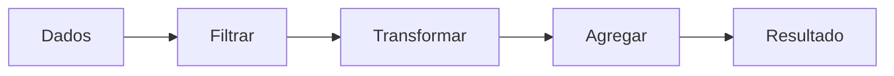

<a id="inicio"></a>

# Padrões Fundamentais de Construção de Algoritmos

> **Classificação curricular:** `[D] Obrigatório dominar`  
>
> **Legenda de evidências/QA:** nos blocos operacionais, `[D]` = documentação/literatura, `[S]` = inspeção estática/estrutura e `[R]` = reprodução em runtime/compilador. Essa legenda é independente do `[D]` curricular acima, que significa **Obrigatório dominar**.  
>
> **Convenção de numeração:** títulos como `4. 8.1 Contadores` usam duas referências diferentes: o primeiro número é a posição da seção dentro deste documento; `8.1` é o nó correspondente da taxonomia curricular canônica. A numeração dupla mantém rastreabilidade sem substituir a sequência editorial do capítulo.  
>
> **Nível:** A — Lógica de Programação  
> **Posição na taxonomia:** tópico 8  
> **Pré-requisitos:** variáveis, expressões, fluxo de controle e repetição  
> **Aprofundamentos posteriores:** funções, coleções, busca/ordenação, análise de algoritmos, pipelines, programação funcional, streams e processamento de dados

---

## Resumo executivo

Depois de aprender:

```text
VARIÁVEIS
CONDIÇÕES
LOOPS
```

surge uma pergunta mais importante:

> **quais formas de raciocínio aparecem repetidamente quando usamos essas estruturas para resolver problemas?**

É aqui que entram os **padrões fundamentais de construção de algoritmos**.

Este tópico transforma sintaxe em vocabulário de resolução:

```text
CONTAR
ACUMULAR
MARCAR ESTADO
ENCERRAR POR SENTINELA
ENCONTRAR MÁXIMO/MÍNIMO
BUSCAR
FILTRAR
TRANSFORMAR
AGREGAR
```

Esses padrões reaparecem em praticamente toda a programação.

Mais tarde, linguagens e bibliotecas oferecem APIs como:

```text
map
filter
reduce
sum
min
max
find
some
any
all
streams
pipelines
```

Mas a regra deste guia é:

> **aprenda primeiro o algoritmo; depois aprenda a API que o encapsula.**

Exemplo:

```text
FILTRAGEM
```

é o conceito:

```text
percorrer valores
↓
testar predicado
↓
manter somente os aprovados
```

Em Python isso pode aparecer como:

```python
[value for value in values if value > 0]
```

Em JavaScript:

```javascript
values.filter((value) => value > 0)
```

Em Java:

```java
values.stream().filter(value -> value > 0)
```

Em Bash, frequentemente:

```bash
for value in "${values[@]}"; do
    if (( value > 0 )); then
        ...
    fi
done
```

O padrão é o mesmo.

A ferramenta é diferente.

---

## Visão de uma linha

```text
MUITOS DADOS
   │
   ├─ contar ─────────────→ número de ocorrências
   ├─ acumular ───────────→ total/produto
   ├─ buscar ─────────────→ ocorrência / posição / existência
   ├─ filtrar ────────────→ subconjunto
   ├─ transformar ────────→ novos valores
   ├─ máximo/mínimo ──────→ extremo
   └─ agregar ────────────→ resumo
```

---

## Decisão rápida

| Necessidade | Padrão |
|---|---|
| “Quantos atendem à condição?” | Contador |
| “Qual é o total?” | Acumulador |
| “Já encontrei?” | Flag ou retorno antecipado |
| “Quando devo parar de ler?” | Sentinela |
| “Qual é o maior?” | Máximo |
| “Qual é o menor?” | Mínimo |
| “Existe um valor que atende?” | Busca / existência |
| “Qual é a primeira ocorrência?” | Busca |
| “Quais valores atendem?” | Filtragem |
| “Quero converter cada item em outro valor” | Transformação |
| “Quero um resumo de muitos valores” | Agregação |
| “Quero média” | Agregação composta: soma + contagem |
| “Quero saber se algum atende” | Busca existencial / `any` / `some` / `anyMatch` |
| “Quero saber se todos atendem” | Quantificação universal / `all` / `every` / `allMatch` |
| “Posso começar máximo em zero?” | Só se o domínio garantir que isso é correto; normalmente prefira o primeiro elemento válido |
| “API `reduce` é obrigatório para agregação?” | Não |
| “`map/filter/reduce` são o conceito?” | Não; são interfaces que expressam conceitos já aprendidos |

---

# Índice


- [Resumo executivo](#resumo-executivo)
- [Visão de uma linha](#visão-de-uma-linha)
- [Decisão rápida](#decisão-rápida)
- [1. Posição deste assunto](#1-posição-deste-assunto)
  - [1.1 Antes](#11-antes)
  - [1.2 Agora](#12-agora)
  - [1.3 Por que este tópico é `[D]`](#13-por-que-este-tópico-é-d)
  - [1.4 Relação com APIs futuras](#14-relação-com-apis-futuras)
- [🗺️ Visão panorâmica — o mapa antes dos detalhes](#visao-panoramica)
- [2. De estrutura de controle para padrão de solução](#2-de-estrutura-de-controle-para-padrão-de-solução)
  - [Contagem](#contagem)
  - [Acumulação](#acumulação)
  - [Busca](#busca)
  - [Filtragem](#filtragem)
  - [Transformação](#transformação)
  - [Máximo](#máximo)
- [3. Estado, iteração e atualização](#3-estado-iteração-e-atualização)
  - [3.1 Estado inicial](#31-estado-inicial)
  - [3.2 Atualização](#32-atualização)
  - [3.3 Invariante](#33-invariante)
  - [3.4 Estado final](#34-estado-final)
- [4. 8.1 Contadores](#4-81-contadores)
  - [4.1 O que está sendo contado?](#41-o-que-está-sendo-contado)
  - [4.2 Invariante do contador](#42-invariante-do-contador)
  - [4.3 Contador não é acumulador](#43-contador-não-é-acumulador)
- [5. Contagem incondicional e condicional](#5-contagem-incondicional-e-condicional)
  - [5.1 Incondicional](#51-incondicional)
  - [5.2 Condicional](#52-condicional)
  - [5.3 API pode tornar contador explícito desnecessário](#53-api-pode-tornar-contador-explícito-desnecessário)
  - [5.4 Regra](#54-regra)
- [6. 8.2 Acumuladores](#6-82-acumuladores)
  - [6.1 Invariante](#61-invariante)
  - [6.2 Tipos de acumulação](#62-tipos-de-acumulação)
  - [6.3 Acumulador não precisa ser numérico](#63-acumulador-não-precisa-ser-numérico)
- [7. Identidade e valor inicial do acumulador](#7-identidade-e-valor-inicial-do-acumulador)
  - [7.1 Soma](#71-soma)
  - [7.2 Produto](#72-produto)
  - [7.3 Concatenação de strings](#73-concatenação-de-strings)
  - [7.4 Redução genérica](#74-redução-genérica)
  - [7.5 Erro clássico](#75-erro-clássico)
- [8. Soma, produto e concatenação](#8-soma-produto-e-concatenação)
  - [Soma](#soma)
  - [Produto](#produto)
  - [Concatenação](#concatenação)
  - [8.1 Cuidado com eficiência](#81-cuidado-com-eficiência)
- [9. 8.3 Flags](#9-83-flags)
  - [9.1 Uso](#91-uso)
  - [9.2 Nome deve expressar proposição](#92-nome-deve-expressar-proposição)
  - [9.3 Invariante](#93-invariante)
- [10. Flag versus retorno antecipado](#10-flag-versus-retorno-antecipado)
  - [10.1 Com flag](#101-com-flag)
  - [10.2 Com retorno antecipado](#102-com-retorno-antecipado)
  - [10.3 Quando flag faz sentido](#103-quando-flag-faz-sentido)
  - [10.4 Quando pode ser redundante](#104-quando-pode-ser-redundante)
  - [10.5 Guardrail](#105-guardrail)
- [11. 8.4 Sentinelas](#11-84-sentinelas)
  - [11.1 Diferente de contador](#111-diferente-de-contador)
  - [11.2 Exemplo](#112-exemplo)
  - [11.3 Sentinel-controlled loop](#113-sentinel-controlled-loop)
- [12. Sentinela versus dado válido](#12-sentinela-versus-dado-válido)
  - [12.1 Problema](#121-problema)
  - [12.2 Melhor](#122-melhor)
  - [12.3 EOF](#123-eof)
  - [12.4 Ausência](#124-ausência)
  - [12.5 Regra](#125-regra)
- [13. 8.5 Maior e menor valor](#13-85-maior-e-menor-valor)
  - [Máximo](#máximo-1)
  - [Mínimo](#mínimo)
  - [13.1 Estado](#131-estado)
- [14. Inicialização correta de máximo e mínimo](#14-inicialização-correta-de-máximo-e-mínimo)
  - [14.1 Solução comum](#141-solução-comum)
  - [14.2 Coleção vazia](#142-coleção-vazia)
  - [14.3 Infinito como inicializador?](#143-infinito-como-inicializador)
- [15. Máximo e mínimo simultâneos](#15-máximo-e-mínimo-simultâneos)
  - [15.1 Forma simples](#151-forma-simples)
  - [15.2 CLRS](#152-clrs)
  - [15.3 Não antecipe micro-otimização](#153-não-antecipe-micro-otimização)
- [16. 8.6 Busca conceitual](#16-86-busca-conceitual)
  - [16.1 Busca simples](#161-busca-simples)
  - [16.2 Não precisa estar ordenado](#162-não-precisa-estar-ordenado)
  - [16.3 Algoritmos mais avançados](#163-algoritmos-mais-avançados)
- [17. Existência, primeira ocorrência, posição e todas as ocorrências](#17-existência-primeira-ocorrência-posição-e-todas-as-ocorrências)
  - [17.1 Existência](#171-existência)
  - [17.2 Primeira ocorrência](#172-primeira-ocorrência)
  - [17.3 Posição](#173-posição)
  - [17.4 Todas as ocorrências](#174-todas-as-ocorrências)
  - [17.5 Antes de codificar](#175-antes-de-codificar)
- [18. Busca linear](#18-busca-linear)
  - [18.1 Melhor caso](#181-melhor-caso)
  - [18.2 Pior caso](#182-pior-caso)
  - [18.3 Complexidade — apenas ponte](#183-complexidade--apenas-ponte)
- [19. Busca e short-circuit](#19-busca-e-short-circuit)
  - [19.1 Flag + break](#191-flag--break)
  - [19.2 API](#192-api)
  - [19.3 Benefício](#193-benefício)
  - [19.4 Não é garantido para toda agregação](#194-não-é-garantido-para-toda-agregação)
- [20. 8.7 Filtragem](#20-87-filtragem)
  - [20.1 Entrada](#201-entrada)
  - [20.2 Predicado](#202-predicado)
  - [20.3 Filtragem não modifica necessariamente o valor](#203-filtragem-não-modifica-necessariamente-o-valor)
- [21. Filtragem preserva ou descarta](#21-filtragem-preserva-ou-descarta)
  - [21.1 Cardinalidade](#211-cardinalidade)
  - [21.2 Exemplo](#212-exemplo)
  - [21.3 Filtragem em SQL](#213-filtragem-em-sql)
- [22. 8.8 Transformação](#22-88-transformação)
  - [22.1 Exemplo](#221-exemplo)
  - [22.2 Estado do elemento](#222-estado-do-elemento)
- [23. Transformação um-para-um](#23-transformação-um-para-um)
  - [23.1 Quantidade preservada](#231-quantidade-preservada)
  - [23.2 Nem toda transformação preserva cardinalidade](#232-nem-toda-transformação-preserva-cardinalidade)
  - [23.3 API não é obrigatória](#233-api-não-é-obrigatória)
- [24. Filtragem versus transformação](#24-filtragem-versus-transformação)
  - [Filtrar pares](#filtrar-pares)
  - [Dobrar](#dobrar)
  - [Filtrar e transformar](#filtrar-e-transformar)
  - [24.1 Ordem pode importar](#241-ordem-pode-importar)
  - [24.2 Pergunta](#242-pergunta)
- [25. 8.9 Agregação](#25-89-agregação)
  - [25.1 Nem toda agregação é numérica](#251-nem-toda-agregação-é-numérica)
  - [25.2 Contagem e extremos também são agregações](#252-contagem-e-extremos-também-são-agregações)
- [26. Redução e acumulador](#26-redução-e-acumulador)
  - [26.1 JavaScript](#261-javascript)
  - [26.2 Java](#262-java)
  - [26.3 Python](#263-python)
  - [26.4 Regra](#264-regra)
- [27. Média como agregação composta](#27-média-como-agregação-composta)
  - [27.1 Loop](#271-loop)
  - [27.2 Coleção vazia](#272-coleção-vazia)
  - [27.3 Um único percurso](#273-um-único-percurso)
  - [27.4 Cuidado numérico](#274-cuidado-numérico)
- [28. any, all e quantificação](#28-any-all-e-quantificação)
  - [Existencial](#existencial)
  - [Universal](#universal)
  - [28.1 Coleção vazia](#281-coleção-vazia)
  - [28.2 Por que isso importa](#282-por-que-isso-importa)
- [29. Padrões combinados](#29-padrões-combinados)
  - [29.1 Loop único](#291-loop-único)
  - [29.2 Pipeline](#292-pipeline)
  - [29.3 Mesma lógica?](#293-mesma-lógica)
  - [29.4 Não presuma equivalência mecânica](#294-não-presuma-equivalência-mecânica)
- [30. Pipeline conceitual](#30-pipeline-conceitual)
  - [30.1 Cada estágio possui contrato](#301-cada-estágio-possui-contrato)
  - [30.2 Vantagem pedagógica](#302-vantagem-pedagógica)
- [31. API não substitui algoritmo](#31-api-não-substitui-algoritmo)
  - [31.1 Aprenda em duas etapas](#311-aprenda-em-duas-etapas)
  - [31.2 Não significa que loop manual é “mais profissional”](#312-não-significa-que-loop-manual-é-mais-profissional)
- [32. Python — dos loops às APIs](#32-python--dos-loops-às-apis)
  - [32.1 Filtrar](#321-filtrar)
  - [32.2 Transformar](#322-transformar)
  - [32.3 Agregar](#323-agregar)
  - [32.4 Existência](#324-existência)
  - [32.5 Guardrail](#325-guardrail)
- [33. JavaScript — dos loops aos métodos de Array](#33-javascript--dos-loops-aos-métodos-de-array)
  - [33.1 Filtragem](#331-filtragem)
  - [33.2 Transformação](#332-transformação)
  - [33.3 Busca](#333-busca)
  - [33.4 Existência](#334-existência)
  - [33.5 Agregação](#335-agregação)
  - [33.6 Guardrail](#336-guardrail)
- [34. Java — dos loops a Stream](#34-java--dos-loops-a-stream)
  - [34.1 Filtrar](#341-filtrar)
  - [34.2 Transformar](#342-transformar)
  - [34.3 Buscar](#343-buscar)
  - [34.4 Agregar](#344-agregar)
  - [34.5 Pipeline oficial](#345-pipeline-oficial)
  - [34.6 Guardrail](#346-guardrail)
- [35. Bash — padrões explícitos em shell](#35-bash--padrões-explícitos-em-shell)
  - [35.1 Contagem](#351-contagem)
  - [35.2 Acumulação](#352-acumulação)
  - [35.3 Busca](#353-busca)
  - [35.4 Filtragem](#354-filtragem)
  - [35.5 Transformação/agregação](#355-transformaçãoagregação)
  - [35.6 Filosofia prática](#356-filosofia-prática)
- [36. Comparação entre as quatro linguagens](#36-comparação-entre-as-quatro-linguagens)
- [37. Exemplo canônico integrado](#37-exemplo-canônico-integrado)
  - [37.1 Python](#371-python)
  - [37.2 JavaScript](#372-javascript)
  - [37.3 Java](#373-java)
  - [37.4 Bash](#374-bash)
  - [37.5 O que este exemplo ensina](#375-o-que-este-exemplo-ensina)
- [38. Rastreamento manual](#38-rastreamento-manual)
  - [38.1 Invariantes](#381-invariantes)
- [39. Exemplo crítico — máximo inicializado incorretamente](#39-exemplo-crítico--máximo-inicializado-incorretamente)
- [40. Exemplo crítico — flag redundante](#40-exemplo-crítico--flag-redundante)
  - [Moral](#moral)
- [41. Exemplo crítico — sentinela ambígua](#41-exemplo-crítico--sentinela-ambígua)
  - [Moral](#moral-1)
- [42. Exemplo crítico — filtro versus busca](#42-exemplo-crítico--filtro-versus-busca)
  - [Erro](#erro)
  - [Melhor](#melhor)
- [43. Exemplo crítico — agregação sem identidade adequada](#43-exemplo-crítico--agregação-sem-identidade-adequada)
  - [Outro caso](#outro-caso)
- [44. Complexidade — primeira intuição](#44-complexidade--primeira-intuição)
  - [Um único percurso](#um-único-percurso)
  - [Busca com short-circuit](#busca-com-short-circuit)
  - [Filtragem](#filtragem-1)
  - [Transformação](#transformação-1)
  - [Agregação](#agregação)
  - [Pipeline separado](#pipeline-separado)
- [45. Erros conceituais frequentes](#45-erros-conceituais-frequentes)
  - [45.1 “contador e acumulador são a mesma coisa”](#451-contador-e-acumulador-são-a-mesma-coisa)
  - [45.2 “flag sempre é necessária para busca”](#452-flag-sempre-é-necessária-para-busca)
  - [45.3 “sentinela pode ser qualquer valor raro”](#453-sentinela-pode-ser-qualquer-valor-raro)
  - [45.4 “máximo deve começar em zero”](#454-máximo-deve-começar-em-zero)
  - [45.5 “busca significa retornar todos”](#455-busca-significa-retornar-todos)
  - [45.6 “filtro transforma o item”](#456-filtro-transforma-o-item)
  - [45.7 “map filtra”](#457-map-filtra)
  - [45.8 “reduce é sempre melhor que loop”](#458-reduce-é-sempre-melhor-que-loop)
  - [45.9 “sum é só açúcar sintático”](#459-sum-é-só-açúcar-sintático)
  - [45.10 “se tenho filter/map/reduce, não preciso aprender loops”](#4510-se-tenho-filtermapreduce-não-preciso-aprender-loops)
  - [45.11 “pipeline é sempre mais eficiente”](#4511-pipeline-é-sempre-mais-eficiente)
  - [45.12 “um único loop deve fazer tudo para ser rápido”](#4512-um-único-loop-deve-fazer-tudo-para-ser-rápido)
  - [45.13 “média é só sum / len sem caso vazio”](#4513-média-é-só-sum--len-sem-caso-vazio)
  - [45.14 “Bash precisa imitar Python”](#4514-bash-precisa-imitar-python)
- [46. Debugging dos padrões](#46-debugging-dos-padrões)
  - [Contador errado](#contador-errado)
  - [Soma errada](#soma-errada)
  - [Flag errada](#flag-errada)
  - [Máximo/mínimo errado](#máximomínimo-errado)
  - [Busca errada](#busca-errada)
  - [Filtro errado](#filtro-errado)
  - [Transformação errada](#transformação-errada)
  - [Agregação errada](#agregação-errada)
  - [Trace universal](#trace-universal)
- [Problemas reais — índice operacional](#problemas-reais)
  - [`PR-T08-01` — contar ocorrências por predicado](#pr-t08-01)
  - [`PR-T08-02` — acumular com identidade/seed e contrato de vazio](#pr-t08-02)
  - [`PR-T08-03` — encerrar entrada por sentinela sem colisão](#pr-t08-03)
  - [`PR-T08-04` — obter mínimo/máximo sem inicialização inválida](#pr-t08-04)
  - [`PR-T08-05` — escolher existência, primeira ocorrência ou todas](#pr-t08-05)
  - [`PR-T08-06` — compor filtrar → transformar → agregar](#pr-t08-06)
  - [`PR-T08-07` — calcular média com contrato explícito para vazio](#pr-t08-07)
  - [`PR-T08-08` — preservar estado em processamento Bash](#pr-t08-08)
- [🔎 Troubleshooting sistemático](#troubleshooting-sistematico)
  - [`TS-T08-01` — máximo inicializado em zero falha com todos negativos](#ts-t08-01)
  - [`TS-T08-02` — produto inicializado em zero colapsa a redução](#ts-t08-02)
  - [`TS-T08-03` — média de entrada vazia não possui contrato](#ts-t08-03)
  - [`TS-T08-04` — sentinela colide com dado legítimo](#ts-t08-04)
  - [`TS-T08-05` — flag é sobrescrita após um match](#ts-t08-05)
  - [`TS-T08-06` — `reduce()` JavaScript falha em array vazio sem valor inicial](#ts-t08-06)
  - [`TS-T08-07` — busca, filtro e primeira ocorrência foram confundidos](#ts-t08-07)
  - [`TS-T08-08` — trocar a ordem filtro/transformação altera a semântica](#ts-t08-08)
  - [`TS-T08-09` — array esparso quebra a suposição “callback = length”](#ts-t08-09)
  - [`TS-T08-10` — contador Bash some após pipeline](#ts-t08-10)
  - [`TS-T08-11` — efeito colateral em Java Stream não é evidência confiável](#ts-t08-11)
- [47. Laboratórios](#47-laboratórios)
  - [🧪 LAB 1 — contador](#-lab-1--contador)
  - [🧪 LAB 2 — acumulador](#-lab-2--acumulador)
  - [🧪 LAB 3 — flag e busca](#-lab-3--flag-e-busca)
  - [🧪 LAB 4 — sentinela](#-lab-4--sentinela)
  - [🧪 LAB 5 — máximo e mínimo](#-lab-5--máximo-e-mínimo)
  - [🧪 LAB 6 — busca versus filtro](#-lab-6--busca-versus-filtro)
  - [🧪 LAB 7 — transformação](#-lab-7--transformação)
  - [🧪 LAB 8 — pipeline](#-lab-8--pipeline)
  - [🧪 LAB 9 — média](#-lab-9--média)
  - [🧪 LAB 10 — NetDev opcional](#-lab-10--netdev-opcional)
- [48. Exercícios](#48-exercícios)
  - [48.1 Contador](#481-contador)
  - [48.2 Acumulador](#482-acumulador)
  - [48.3 Produto](#483-produto)
  - [48.4 Flag](#484-flag)
  - [48.5 Sentinela](#485-sentinela)
  - [48.6 Máximo](#486-máximo)
  - [48.7 Vazio](#487-vazio)
  - [48.8 Busca](#488-busca)
  - [48.9 Short-circuit](#489-short-circuit)
  - [48.10 Filtro](#4810-filtro)
  - [48.11 Transformação](#4811-transformação)
  - [48.12 Agregação](#4812-agregação)
  - [48.13 Média](#4813-média)
  - [48.14 Any](#4814-any)
  - [48.15 All](#4815-all)
  - [48.16 Pipeline](#4816-pipeline)
  - [48.17 API](#4817-api)
  - [48.18 Bash](#4818-bash)
  - [48.19 CLRS](#4819-clrs)
  - [48.20 Complexidade](#4820-complexidade)
- [49. Evidências de domínio](#49-evidências-de-domínio)
  - [Você deve conseguir reconhecer](#você-deve-conseguir-reconhecer)
  - [Você deve conseguir implementar](#você-deve-conseguir-implementar)
  - [Você deve conseguir justificar](#você-deve-conseguir-justificar)
  - [Você deve conseguir transferir](#você-deve-conseguir-transferir)
  - [Você deve conseguir depurar](#você-deve-conseguir-depurar)
- [50. Checklist de consulta rápida](#50-checklist-de-consulta-rápida)
- [51. Glossário](#51-glossário)
- [52. Referências](#52-referências)
  - [52.1 Taxonomia canônica do projeto](#521-taxonomia-canônica-do-projeto)
  - [52.2 Fontes locais efetivamente consultadas — File Library](#522-fontes-locais-efetivamente-consultadas--file-library)
  - [52.3 Python 3.14.7 — documentação oficial](#523-python-3147--documentação-oficial)
  - [52.4 JavaScript — MDN / ECMAScript](#524-javascript--mdn--ecmascript)
  - [52.5 Java SE 27 — documentação oficial](#525-java-se-27--documentação-oficial)
  - [52.6 GNU Bash 5.3 — documentação oficial](#526-gnu-bash-53--documentação-oficial)
  - [52.7 MIT OpenCourseWare](#527-mit-opencourseware)
  - [52.8 Hierarquia de confiança aplicada](#528-hierarquia-de-confiança-aplicada)
- [53. Histórico de versões](#53-histórico-de-versões)

---

# 1. Posição deste assunto

Nos tópicos anteriores, aprendemos peças isoladas:

```text
VARIÁVEL
CONDIÇÃO
LOOP
```

Agora vamos combiná-las em formas recorrentes de resolver problemas.

## 1.1 Antes

Pergunta:

```text
como escrever um loop?
```

## 1.2 Agora

Pergunta:

```text
o que esse loop está tentando fazer?
```

Possíveis respostas:

```text
contar
somar
buscar
filtrar
transformar
resumir
```

## 1.3 Por que este tópico é `[D]`

Porque esses padrões formam um vocabulário que reaparece em:

- processamento de listas;
- dados de API;
- arquivos;
- SQL;
- logs;
- automação;
- redes;
- front-end;
- back-end;
- monitoramento;
- observabilidade;
- algoritmos clássicos.

## 1.4 Relação com APIs futuras

Quando você encontrar:

```text
filter()
map()
reduce()
sum()
find()
anyMatch()
```

a pergunta não deve ser:

> “qual é a mágica dessa função?”

Deve ser:

> “qual padrão algorítmico conhecido essa API está encapsulando?”

[↑ Voltar ao índice](#índice)

---

<a id="visao-panoramica"></a>

## 🗺️ Visão panorâmica — o mapa antes dos detalhes

Esta seção funciona como **caderno rápido de consulta** e como contrato de cobertura do T08. O objetivo é reconhecer o padrão antes de escolher sintaxe ou API.

### Mapa do domínio — que tipo de estado estou construindo?

```text
PADRÕES FUNDAMENTAIS
├── contar
│   └── estado: quantidade de ocorrências
├── acumular / reduzir
│   ├── estado: resultado parcial
│   └── exige: operação + valor inicial/seed coerente
├── marcar estado
│   └── flag: “já ocorreu?”, “continua válido?”, “foi encontrado?”
├── controlar término
│   └── sentinela: distingue dado de sinal de encerramento
├── manter extremos
│   ├── máximo visto até agora
│   └── mínimo visto até agora
├── buscar
│   ├── existência
│   ├── primeira ocorrência
│   ├── posição
│   └── todas as ocorrências
├── filtrar
│   └── mantém apenas itens aprovados por um predicado
├── transformar
│   └── produz novo valor a partir de cada item
├── agregar
│   └── resume muitos itens em um resultado
└── combinar padrões
    ├── loop único com vários estados
    └── pipeline por estágios
```

O modelo comum é:

```text
ESTADO INICIAL
      ↓
ITEM ATUAL
      ↓
PREDICADO / OPERAÇÃO / COMPARAÇÃO
      ↓
ATUALIZAÇÃO DO ESTADO
      ↓
INVARIANTE CONTINUA VERDADEIRO?
      ↓
AINDA PRECISA PROCESSAR?
  ├── sim → próximo item
  └── não → resultado / encerramento
```

A forma concreta muda; o raciocínio permanece.

### Consulta rápida — necessidade → padrão → estado → risco principal

| Necessidade | Padrão | Estado típico | Risco que merece primeira verificação |
|---|---|---|---|
| Quantos itens atendem? | contador | `count` | incrementar no lugar errado ou contar todos |
| Qual é a soma/total? | acumulador | `total` | identidade/seed incorreto |
| Qual é o produto? | acumulador | `product` | iniciar em `0` em vez de `1` |
| Algo já aconteceu? | flag | `found`, `is_valid` | sobrescrever `True` depois de um match |
| Quando a leitura termina? | sentinela | valor/estado de término | sentinela colidir com dado válido |
| Qual é o maior/menor? | extremo | `max_seen` / `min_seen` | iniciar em `0` sem garantia do domínio |
| Existe algum item? | busca existencial | booleano/retorno | continuar percorrendo sem necessidade |
| Qual é o primeiro item? | busca | item/posição | confundir “não encontrado” com dado válido |
| Quais itens atendem? | filtro | coleção de saída | usar busca quando precisa de todos |
| Como converter cada item? | transformação | nova coleção/iterator | mudar cardinalidade sem perceber |
| Como resumir muitos itens? | agregação/redução | acumulador | contrato de vazio indefinido |
| Algum/todos satisfazem? | quantificação | booleano | ignorar semântica da entrada vazia |
| Preciso de várias saídas em uma passagem? | padrões combinados | múltiplos estados | fazer `break` cedo e perder outras saídas |
| Estado Bash precisa sobreviver? | loop no shell atual | variável do shell | pipeline executar loop em subshell |

### Pergunta prática → mecanismo inicial

```text
“quantos?”
→ contador

“qual total/produto?”
→ acumulador + identidade/seed

“já aconteceu?”
→ flag OU retorno/short-circuit

“até quando ler?”
→ sentinela / EOF / protocolo explícito

“qual melhor/maior/menor até agora?”
→ extremo + estado inicial válido

“existe?”
→ busca existencial + short-circuit quando possível

“quais?”
→ filtro

“em que virar cada item?”
→ transformação

“qual resumo final?”
→ agregação

“preciso de várias dessas respostas ao mesmo tempo?”
→ combinar estados em um loop OU compor pipeline consciente
```

### Não confundir

| Par | Distinção essencial |
|---|---|
| **contador × acumulador** | contador soma ocorrências; acumulador combina valores do domínio |
| **flag × sentinela** | flag registra estado; sentinela participa do protocolo de término |
| **busca × filtro** | busca responde existência/primeiro/posição; filtro produz os aprovados |
| **filtro × transformação** | filtro decide manter/descartar; transformação muda o valor |
| **agregação × transformação** | agregação resume vários; transformação normalmente produz um resultado por item |
| **identidade × seed** | identidade é neutra para a operação; seed é apenas o estado inicial escolhido e pode carregar semântica adicional |
| **máximo × “começar em zero”** | máximo depende dos dados/domínio; zero não é inicializador universal |
| **`any` × `all`** | existencial e universal têm perguntas diferentes e casos vazios diferentes |
| **loop único × short-circuit** | se o mesmo loop também calcula outras saídas, parar ao encontrar um item pode tornar o restante incompleto |
| **conceito × API** | `filter`, `map`, `reduce`, streams e comprehensions são interfaces; não substituem o modelo mental |
| **pipeline conceitual × pipeline Bash** | o primeiro descreve estágios; o segundo também envolve processos, pipes, subshells e exit status |

### Microexemplos canônicos

**Contar positivos**

```text
count = 0
para cada valor:
    se valor > 0:
        count = count + 1
```

Invariante: depois de processar `k` itens, `count` é exatamente a quantidade de positivos entre esses `k` itens.

**Máximo sem sentinela numérica inventada**

```text
se a entrada estiver vazia:
    aplicar o contrato de vazio
senão:
    max_seen = primeiro_item
    para cada item restante:
        se item > max_seen:
            max_seen = item
```

**Busca existencial com short-circuit**

```text
para cada item:
    se predicado(item):
        responder verdadeiro imediatamente
responder falso
```

**Filtro → transformação → agregação**

```text
entrada
→ manter positivos
→ elevar ao quadrado
→ somar
```

Esses estágios podem ser escritos como loops explícitos ou APIs idiomáticas. A equivalência precisa ser semântica, não apenas visual.

**Combinação de estados em um único percurso**

```text
para cada item:
    atualizar count
    atualizar total
    atualizar min/max
    atualizar found
```

Aqui, `found = true` não autoriza automaticamente um `break`: outras saídas talvez ainda dependam dos itens restantes.

### Problemas reais representativos

| ID | Necessidade | Padrões envolvidos | Destino |
|---|---|---|---|
| `PR-T08-01` | contar ocorrências que satisfazem um predicado | contador + condição | [`PR-T08-01`](#pr-t08-01) |
| `PR-T08-02` | acumular corretamente inclusive no caso vazio | acumulador + identidade/seed | [`PR-T08-02`](#pr-t08-02) |
| `PR-T08-03` | ler quantidade indefinida sem perder dado legítimo | sentinela + loop | [`PR-T08-03`](#pr-t08-03) |
| `PR-T08-04` | obter extremos em domínio que inclui negativos | max/min + contrato de vazio | [`PR-T08-04`](#pr-t08-04) |
| `PR-T08-05` | escolher existência, primeira ocorrência ou todas | busca + short-circuit/filtro | [`PR-T08-05`](#pr-t08-05) |
| `PR-T08-06` | montar pipeline de processamento com semântica clara | filtro + transformação + agregação | [`PR-T08-06`](#pr-t08-06) |
| `PR-T08-07` | média sem dividir por zero | soma + contador + contrato de vazio | [`PR-T08-07`](#pr-t08-07) |
| `PR-T08-08` | atualizar variável Bash durante processamento por comando | estado + pipeline/subshell | [`PR-T08-08`](#pr-t08-08) |

### Falha típica → primeira investigação

| Sintoma | Primeira hipótese/verificação | Caso |
|---|---|---|
| máximo retorna `0` para `[-9, -4, -7]` | inicialização artificial em zero | [`TS-T08-01`](#ts-t08-01) |
| produto sempre dá `0` | acumulador iniciou em `0` | [`TS-T08-02`](#ts-t08-02) |
| média falha ou vira valor inválido no vazio | ausência de contrato para `count == 0` | [`TS-T08-03`](#ts-t08-03) |
| processamento encerra cedo com dado válido | sentinela pertence ao domínio da entrada | [`TS-T08-04`](#ts-t08-04) |
| busca “desencontra” item já visto | flag está sendo sobrescrita | [`TS-T08-05`](#ts-t08-05) |
| `reduce()` lança `TypeError` em `[]` | não há valor inicial | [`TS-T08-06`](#ts-t08-06) |
| retorno tem formato/quantidade errados | busca e filtro foram confundidos | [`TS-T08-07`](#ts-t08-07) |
| trocar `filter` e `map` muda resultado | predicado opera em domínio diferente após transformação | [`TS-T08-08`](#ts-t08-08) |
| callback JS roda menos vezes que `array.length` | array é esparso | [`TS-T08-09`](#ts-t08-09) |
| `count` Bash volta a `0` após `... | while read` | loop executou em subshell | [`TS-T08-10`](#ts-t08-10) |
| `peek()` não produz o efeito esperado antes de `count()` | Stream pode elidir travessia/estágios quando o resultado é conhecido | [`TS-T08-11`](#ts-t08-11) |

### Transferência entre linguagens — o padrão permanece; o mecanismo muda

| Capacidade | Python | JavaScript | Java | Bash |
|---|---|---|---|---|
| contar | loop / `sum(...)` em alguns padrões | loop / `filter(...).length` | loop / stream `count()` | loop + aritmética |
| filtrar | comprehension / `filter` | `Array.filter` | `Stream.filter` | loop / ferramenta externa apropriada |
| transformar | comprehension / `map` | `Array.map` | `Stream.map` | loop / ferramenta externa apropriada |
| agregar | `sum`, `min`, `max`, `reduce` | `reduce` e APIs específicas | `reduce`, collectors e operações terminais | loop / `awk` / ferramentas conforme o problema |
| existência | `any` / loop | `some` / `find` conforme contrato | `anyMatch` / `findFirst` | loop + status/flag |
| estado em pipeline | generators/iterators seguem semântica Python | métodos de Array/iterables seguem semântica JS | Streams têm regras próprias de laziness/otimização | pipes podem criar subshells; não assumir persistência de variável |

Não force equivalência falsa: especialmente em Bash, o padrão pode ser melhor expresso por composição de processos do que por imitação de uma API de coleções.

### Síntese multifonte — por que este mapa tem esta forma

A composição acima reúne contribuições complementares, sem tratar uma única fonte como “template universal”:

- **Joyce Farrell** oferece a progressão didática entre contador, sentinela, acumulador e aplicações comuns de loops;
- **CLRS** reforça o invariante “melhor elemento visto até agora” para mínimo/máximo e prepara a ponte para análise algorítmica;
- **David Beazley** e **Luciano Ramalho** ajudam a conectar loops fundamentais a comprehensions, `map`, `filter` e reduções idiomáticas em Python;
- o **GNU Bash Reference Manual 5.3** explica por que um padrão conceitualmente simples pode ter comportamento diferente quando estado e pipelines envolvem subshells;
- as documentações oficiais de **Python, ECMAScript e Java** definem a semântica versionada das APIs usadas na transferência.

A síntese preserva o núcleo curricular do T08: **primeiro reconhecer o padrão; depois escolher a representação idiomática e validar o contrato da linguagem/API concreta**.

### Modo consulta × modo estudo

**Consulta em ~30 segundos:**

```text
necessidade
→ tabela “necessidade → padrão”
→ “não confundir”
→ falha típica, se houver
→ seção específica do padrão
```

**Estudo completo:**

```text
estado + invariante
→ contador/acumulador/flag/sentinela
→ extremos + busca
→ filtro + transformação + agregação
→ combinação/pipelines
→ quatro linguagens
→ PR-*
→ troubleshooting
→ LABs + exercícios + evidências de domínio
```

[↑ Voltar ao índice](#índice)

---

# 2. De estrutura de controle para padrão de solução

Considere:

```python
for value in values:
    ...
```

Isso diz apenas:

```text
percorrer valores
```

Não diz o objetivo.

O corpo pode realizar diferentes padrões.

## Contagem

```python
if value > 0:
    count += 1
```

## Acumulação

```python
total += value
```

## Busca

```python
if value == target:
    found = True
    break
```

## Filtragem

```python
if value > 0:
    selected.append(value)
```

## Transformação

```python
squares.append(value * value)
```

## Máximo

```python
if value > maximum:
    maximum = value
```

A estrutura de repetição é parecida.

O **estado mantido** e a **regra de atualização** definem o padrão.

[↑ Voltar ao índice](#índice)

---

# 3. Estado, iteração e atualização

Quase todos os padrões deste capítulo podem ser descritos como:

```text
ESTADO INICIAL
↓
PARA CADA ITEM
    OBSERVAR ITEM
    DECIDIR
    ATUALIZAR ESTADO
↓
RESULTADO
```

## 3.1 Estado inicial

Exemplos:

```text
count = 0
total = 0
found = false
selected = vazio
```

## 3.2 Atualização

Exemplo de contador:

```text
count ← count + 1
```

## 3.3 Invariante

Durante a execução:

```text
count
=
quantidade de itens que satisfizeram a condição
entre os itens já processados
```

## 3.4 Estado final

Depois de processar todos os itens:

```text
count
=
quantidade total de itens que satisfazem a condição
```

Essa estrutura de raciocínio é a ponte entre:

```text
loop
e
correção
```

[↑ Voltar ao índice](#índice)

---

# 4. 8.1 Contadores

Um contador registra **quantidade**.

Modelo:

```text
count = 0

para cada item
    se evento ocorrer
        count = count + 1
```

## 4.1 O que está sendo contado?

Sempre responda isso explicitamente.

Ruim:

```text
count
```

sem contexto.

Melhor:

```text
positive_count
error_count
retry_count
```

## 4.2 Invariante do contador

Após processar um prefixo dos dados:

> `count` é a quantidade de elementos do prefixo que satisfazem a regra.

## 4.3 Contador não é acumulador

Contador:

```text
+1 por ocorrência
```

Acumulador:

```text
+valor
```

Compare:

```python
positive_count += 1
```

com:

```python
total += value
```

[↑ Voltar ao índice](#índice)

---

# 5. Contagem incondicional e condicional

## 5.1 Incondicional

```text
para cada elemento
    count += 1
```

No final:

```text
count = quantidade processada
```

## 5.2 Condicional

```text
para cada elemento
    se elemento > 0
        count += 1
```

No final:

```text
count = quantidade de positivos
```

## 5.3 API pode tornar contador explícito desnecessário

Python:

```python
len(values)
```

é melhor que percorrer apenas para descobrir o tamanho de uma coleção cujo comprimento já está disponível.

Java:

```java
values.size()
```

JavaScript:

```javascript
values.length
```

## 5.4 Regra

> **Não use um padrão manual quando o resultado já faz parte da abstração da estrutura.**

Mas aprenda o contador porque nem toda fonte possui tamanho previamente conhecido.

[↑ Voltar ao índice](#índice)

---

# 6. 8.2 Acumuladores

Um acumulador combina valores sucessivos em um estado.

Modelo de soma:

```text
total = 0

para cada valor
    total = total + valor
```

## 6.1 Invariante

Após processar os primeiros `k` itens:

```text
total
=
soma dos k itens processados
```

## 6.2 Tipos de acumulação

- soma;
- produto;
- concatenação;
- composição;
- contagem ponderada;
- cálculo incremental.

## 6.3 Acumulador não precisa ser numérico

Exemplo conceitual:

```text
result = ""

para cada parte
    result = result + parte
```

Embora APIs especializadas possam ser melhores para strings.

[↑ Voltar ao índice](#índice)

---

# 7. Identidade e valor inicial do acumulador

O valor inicial não deve ser escolhido por hábito.

Ele precisa ser compatível com a operação.

## 7.1 Soma

Identidade aditiva:

```text
0
```

Porque:

```text
0 + x = x
```

## 7.2 Produto

Identidade multiplicativa:

```text
1
```

Porque:

```text
1 × x = x
```

## 7.3 Concatenação de strings

Em muitos contextos:

```text
""
```

é identidade:

```text
"" + text = text
```

## 7.4 Redução genérica

Para uma operação:

```text
accumulator OP value
```

o valor inicial deve respeitar o contrato da operação.

## 7.5 Erro clássico

Produto:

```python
product = 0
```

faz:

```text
0 × qualquer_valor = 0
```

e destrói o resultado.

[↑ Voltar ao índice](#índice)

---

# 8. Soma, produto e concatenação

## Soma

```python
total = 0

for value in values:
    total += value
```

## Produto

```python
product = 1

for value in values:
    product *= value
```

## Concatenação

```python
text = ""

for part in parts:
    text += part
```

## 8.1 Cuidado com eficiência

Em algumas linguagens, concatenação repetida de strings pode criar muitos objetos.

O conceito de acumulador continua correto.

A implementação pode usar estrutura especializada:

- `str.join()` em Python;
- `StringBuilder` em Java;
- arrays + `join` em JavaScript;
- ferramentas/pipelines no shell.

Otimização detalhada fica para outro tópico.

[↑ Voltar ao índice](#índice)

---

# 9. 8.3 Flags

Uma flag representa um estado discreto, normalmente booleano.

Exemplo:

```text
found = false
```

Depois:

```text
se encontrar alvo
    found = true
```

## 9.1 Uso

- encontrado/não encontrado;
- ativo/inativo;
- válido/inválido;
- erro/não erro;
- mudança/não mudança.

## 9.2 Nome deve expressar proposição

Prefira:

```text
found
is_valid
has_error
needs_update
```

a:

```text
flag1
control
status_boolean
```

## 9.3 Invariante

Para uma busca:

```text
found == true
```

significa:

> algum item processado satisfaz a condição.

[↑ Voltar ao índice](#índice)

---

# 10. Flag versus retorno antecipado

Flags são úteis.

Mas não são obrigatórias em toda busca.

## 10.1 Com flag

```text
found = false

para cada item
    se item == alvo
        found = true
        parar

usar found
```

## 10.2 Com retorno antecipado

Dentro de função:

```text
para cada item
    se item == alvo
        retornar true

retornar false
```

## 10.3 Quando flag faz sentido

Quando o estado precisa ser usado depois do loop em múltiplas decisões.

## 10.4 Quando pode ser redundante

Quando o único objetivo é devolver a resposta imediatamente.

## 10.5 Guardrail

> **Não elimine flags por dogma; elimine estado redundante quando a estrutura permite uma solução mais direta.**

[↑ Voltar ao índice](#índice)

---

# 11. 8.4 Sentinelas

Sentinela é um valor ou estado especial que indica encerramento.

Exemplo:

```text
digitar "quit"
```

Fluxo:

```text
ler entrada
↓
entrada == sentinela?
├─ sim → terminar
└─ não → processar e repetir
```

## 11.1 Diferente de contador

Contador:

```text
parar após N
```

Sentinela:

```text
parar quando ocorrer determinado valor/estado
```

## 11.2 Exemplo

```text
while true
    input = ler

    se input == "quit"
        break

    processar input
```

## 11.3 Sentinel-controlled loop

Farrell usa sentinela como padrão clássico de loop indefinido.

[↑ Voltar ao índice](#índice)

---

# 12. Sentinela versus dado válido

Uma boa sentinela deve ser distinguível dos dados normais.

## 12.1 Problema

Suponha temperatura válida:

```text
-100 a 100
```

Usar:

```text
-1
```

como sentinela é ruim.

`-1` pode ser temperatura real.

## 12.2 Melhor

Usar:

```text
"quit"
```

antes do parsing numérico.

Ou outro protocolo explícito.

## 12.3 EOF

Fim de arquivo pode funcionar como condição de encerramento sem inventar valor artificial.

## 12.4 Ausência

Em APIs, ausência pode ser modelada com:

- `None`;
- `null`;
- `Optional`;
- exit status;
- EOF;
- exceção;

dependendo do contrato.

## 12.5 Regra

> **Sentinela não deve colidir silenciosamente com um dado legítimo.**

[↑ Voltar ao índice](#índice)

---

# 13. 8.5 Maior e menor valor

Encontrar extremos é um padrão de atualização condicional.

## Máximo

```text
maximum = primeiro elemento

para cada elemento restante
    se elemento > maximum
        maximum = elemento
```

## Mínimo

```text
minimum = primeiro elemento

para cada elemento restante
    se elemento < minimum
        minimum = elemento
```

## 13.1 Estado

Depois de processar um prefixo:

```text
maximum = maior do prefixo
minimum = menor do prefixo
```

Essa propriedade é uma invariante natural.

[↑ Voltar ao índice](#índice)

---

# 14. Inicialização correta de máximo e mínimo

Erro clássico:

```python
maximum = 0
```

Para:

```text
[-8, -2, -11]
```

o algoritmo produziria:

```text
0
```

que nem pertence à entrada.

## 14.1 Solução comum

Se a coleção é garantidamente não vazia:

```text
maximum = primeiro elemento
```

## 14.2 Coleção vazia

O contrato precisa decidir:

- erro;
- valor default explícito;
- ausência;
- Optional;
- outra semântica.

Python `max()` e `min()` permitem `default` quando um único iterável é fornecido. A documentação oficial define erro quando o iterável vazio não possui default. 

## 14.3 Infinito como inicializador?

Às vezes:

```python
maximum = -math.inf
minimum = math.inf
```

é matematicamente válido para domínio numérico apropriado.

Mas:

- não serve para todo tipo;
- pode mascarar domínio vazio;
- não é necessário quando o primeiro valor já resolve a inicialização.

[↑ Voltar ao índice](#índice)

---

# 15. Máximo e mínimo simultâneos

Podemos manter ambos:

```text
minimum
maximum
```

durante uma única passagem.

## 15.1 Forma simples

```text
minimum = primeiro
maximum = primeiro

para cada próximo
    se valor < minimum
        minimum = valor

    se valor > maximum
        maximum = valor
```

## 15.2 CLRS

*Introduction to Algorithms* mostra que mínimo e máximo podem ser obtidos em tempo linear e discute inclusive uma estratégia em pares para reduzir o número de comparações.

Essa otimização é posterior.

O padrão fundamental aqui é:

> **manter os extremos vistos até o momento.**

## 15.3 Não antecipe micro-otimização

Aprenda primeiro:

```text
correção
→ clareza
→ custo
→ otimização
```

[↑ Voltar ao índice](#índice)

---

# 16. 8.6 Busca conceitual

Busca responde a perguntas diferentes.

```text
EXISTE?
QUAL É?
ONDE ESTÁ?
QUAIS SÃO?
```

A taxonomia introduz a busca conceitual antes de algoritmos especializados.

## 16.1 Busca simples

```text
percorrer
↓
comparar
↓
encontrou?
```

## 16.2 Não precisa estar ordenado

Busca linear funciona em dados não ordenados.

MIT OpenCourseWare descreve linear search como percorrer sequencialmente os dados para encontrar um elemento.

## 16.3 Algoritmos mais avançados

Depois veremos:

- binary search;
- hashing;
- árvores;
- índices.

Mas o conceito permanece:

```text
localizar informação segundo um critério
```

[↑ Voltar ao índice](#índice)

---

# 17. Existência, primeira ocorrência, posição e todas as ocorrências

São problemas diferentes.

## 17.1 Existência

```text
há pelo menos um?
```

Resultado:

```text
boolean
```

## 17.2 Primeira ocorrência

```text
qual é o primeiro item que satisfaz?
```

Resultado:

```text
item ou ausência
```

## 17.3 Posição

```text
em qual índice?
```

Resultado:

```text
índice ou ausência
```

## 17.4 Todas as ocorrências

```text
quais itens satisfazem?
```

Isso já se aproxima de:

```text
filtragem
```

## 17.5 Antes de codificar

Defina qual das quatro perguntas você realmente está respondendo.

[↑ Voltar ao índice](#índice)

---

# 18. Busca linear

Pseudocódigo:

```text
SEARCH(values, target)

    para cada value em values
        se value == target
            retornar true

    retornar false
```

## 18.1 Melhor caso

O primeiro item é o alvo.

## 18.2 Pior caso

- alvo é o último;
- ou não existe.

Nesse caso, precisamos examinar todos os elementos.

## 18.3 Complexidade — apenas ponte

Para `n` elementos:

```text
tempo pior caso
→ proporcional a n
```

A formalização:

```text
O(n)
Θ(n)
```

será aprofundada depois.

[↑ Voltar ao índice](#índice)

---

# 19. Busca e short-circuit

Busca por existência pode terminar cedo.

```text
encontrou?
→ sim
→ resposta já determinada
```

## 19.1 Flag + break

```text
found = false

para cada item
    se condição
        found = true
        break
```

## 19.2 API

Python:

```python
any(...)
```

JavaScript:

```javascript
some(...)
```

Java Stream:

```java
anyMatch(...)
```

Essas APIs podem short-circuit.

## 19.3 Benefício

Evita processar itens desnecessários.

## 19.4 Não é garantido para toda agregação

Soma precisa observar todos os elementos, salvo alguma propriedade especial do domínio.

[↑ Voltar ao índice](#índice)

---

# 20. 8.7 Filtragem

Filtragem seleciona apenas os itens que satisfazem um predicado.

Modelo:

```text
selected = vazio

para cada item
    se predicado(item)
        adicionar item em selected
```

## 20.1 Entrada

```text
[3, -1, 7, 0, 5]
```

Critério:

```text
value > 0
```

Saída:

```text
[3, 7, 5]
```

## 20.2 Predicado

Pergunta lógica:

```text
este item deve permanecer?
```

## 20.3 Filtragem não modifica necessariamente o valor

No padrão puro:

```text
entrada x
→ ou mantém x
→ ou descarta x
```

Se o item é alterado, há transformação também.

[↑ Voltar ao índice](#índice)

---

# 21. Filtragem preserva ou descarta

Podemos imaginar:

```text
item
↓
predicado
├─ true  → passa
└─ false → é descartado
```

## 21.1 Cardinalidade

Para cada item de entrada:

```text
0 ou 1 item
```

é emitido.

## 21.2 Exemplo

```text
[1,2,3,4,5]
↓ pares
[2,4]
```

## 21.3 Filtragem em SQL

Conceitualmente:

```sql
WHERE condition
```

executa papel semelhante de selecionar linhas conforme predicado.

Isso não significa que SQL execute internamente um loop ingênuo.

O conceito é o mesmo; o mecanismo pode ser muito mais otimizado.

[↑ Voltar ao índice](#índice)

---

# 22. 8.8 Transformação

Transformação produz um novo valor a partir de outro.

Modelo:

```text
result = vazio

para cada item
    new_item = transform(item)
    adicionar new_item
```

## 22.1 Exemplo

Entrada:

```text
[1,2,3]
```

Transformação:

```text
quadrado
```

Saída:

```text
[1,4,9]
```

## 22.2 Estado do elemento

Filtragem pergunta:

```text
fica ou sai?
```

Transformação pergunta:

```text
em que valor ele se torna?
```

[↑ Voltar ao índice](#índice)

---

# 23. Transformação um-para-um

O padrão `map` clássico é:

```text
1 item de entrada
→ 1 resultado
```

Exemplo:

```text
3
→ square
→ 9
```

## 23.1 Quantidade preservada

Para entrada com `n` elementos:

```text
map simples
→ n resultados
```

## 23.2 Nem toda transformação preserva cardinalidade

Operações como:

```text
flatMap
```

podem produzir:

```text
0, 1 ou vários
```

por item.

Isso é extensão posterior.

## 23.3 API não é obrigatória

Loop explícito continua sendo transformação:

```python
squares = []

for value in values:
    squares.append(value * value)
```

[↑ Voltar ao índice](#índice)

---

# 24. Filtragem versus transformação

Considere:

```text
[1,2,3,4]
```

## Filtrar pares

```text
[2,4]
```

Os valores são preservados.

## Dobrar

```text
[2,4,6,8]
```

A quantidade permanece, valores mudam.

## Filtrar e transformar

```text
pares
→ dobrar
```

Resultado:

```text
[4,8]
```

## 24.1 Ordem pode importar

```text
filter → map
```

pode diferir de:

```text
map → filter
```

se o predicado depende do valor antes ou depois da transformação.

## 24.2 Pergunta

> o critério pertence ao dado original ou ao dado transformado?

[↑ Voltar ao índice](#índice)

---

# 25. 8.9 Agregação

Agregação transforma muitos valores em um resumo.

```text
MUITOS
↓
UM RESULTADO / RESUMO
```

Exemplos:

- contagem;
- soma;
- produto;
- média;
- máximo;
- mínimo;
- existência;
- todos satisfazem?;
- concatenação.

## 25.1 Nem toda agregação é numérica

```text
juntar nomes
```

é agregação textual.

## 25.2 Contagem e extremos também são agregações

A taxonomia separa esses padrões porque são didaticamente fundamentais.

Mas conceitualmente:

```text
count
sum
min
max
```

são formas de agregação.

[↑ Voltar ao índice](#índice)

---

# 26. Redução e acumulador

Uma forma comum de redução usa um acumulador inicial explícito:

```text
acc = identity_or_seed

para cada value
    acc = combine(acc, value)

resultado = acc
```

Mas **redução não implica obrigatoriamente um valor inicial explícito**. Algumas APIs permitem usar o primeiro elemento disponível como estado inicial e tratar a entrada vazia por outro contrato.

Por isso, antes de usar uma redução, responda:

1. existe uma identidade matemática/natural para a operação?
2. será usado um *seed* que não é identidade?
3. o que acontece quando não existe nenhum elemento?
4. a combinação precisa ser associativa para a API/forma de execução escolhida?

## 26.1 JavaScript

`Array.prototype.reduce(callback, initialValue)` produz um único valor final. O `initialValue` é opcional:

- quando fornecido, ele inicia o acumulador;
- quando omitido, o primeiro elemento presente é usado como acumulador inicial;
- em array sem elementos presentes e sem `initialValue`, ocorre `TypeError`.

Para soma, fornecer `0` deixa explícitos a identidade e o comportamento da entrada vazia:

```javascript
const total = values.reduce((accumulator, value) => accumulator + value, 0);
```

## 26.2 Java

`Stream.reduce(identity, accumulator)` usa uma identidade explícita e exige acumulador associativo, não interferente e sem estado. A API também oferece:

```java
Optional<T> reduce(BinaryOperator<T> accumulator)
```

Nesse caso, uma stream vazia produz `Optional.empty()` em vez de exigir uma identidade artificial. A especificação também deixa claro que a redução não é obrigada a executar sequencialmente.

## 26.3 Python

Existe:

```python
functools.reduce()
```

Mas para operações comuns, built-ins específicos costumam ser mais claros:

```python
sum(values)
min(values)
max(values)
any(values)
all(values)
```

`functools.reduce()` também aceita um valor inicial opcional. A escolha entre fornecê-lo ou não deve seguir o contrato da operação e da entrada vazia, não apenas preferência sintática. **Desde o Python 3.14, esse parâmetro `initial` também pode ser fornecido por nome.**

Beazley observa que comprehensions/generator expressions, `map`, `filter` e `reduce` expressam esses padrões de manipulação de dados.

## 26.4 Regra

> **Não use `reduce` apenas para parecer “funcional”. Defina primeiro o contrato de estado inicial e de entrada vazia e use a abstração mais clara para o problema.**

[↑ Voltar ao índice](#índice)

---

# 27. Média como agregação composta

Média aritmética:

```text
soma / quantidade
```

Precisamos de:

```text
total
count
```

## 27.1 Loop

```text
total = 0
count = 0

para cada valor
    total += valor
    count += 1

average = total / count
```

## 27.2 Coleção vazia

Se:

```text
count == 0
```

a média não está definida no modelo comum.

O contrato precisa tratar o caso.

## 27.3 Um único percurso

É possível acumular soma e contagem na mesma passagem.

## 27.4 Cuidado numérico

Ponto flutuante e precisão foram tratados no tópico 4.

[↑ Voltar ao índice](#índice)

---

# 28. any, all e quantificação

Dois padrões lógicos importantes:

## Existencial

```text
EXISTE pelo menos um x tal que P(x)?
```

Python:

```python
any(...)
```

JavaScript:

```javascript
some(...)
```

Java:

```java
anyMatch(...)
```

## Universal

```text
PARA TODO x, P(x)?
```

Python:

```python
all(...)
```

JavaScript:

```javascript
every(...)
```

Java:

```java
allMatch(...)
```

## 28.1 Coleção vazia

Na lógica e em APIs usuais:

```text
any(empty)
→ false

all(empty)
→ true
```

Python documenta explicitamente esse comportamento.

JavaScript preserva a mesma lógica com `some([]) -> false` e `every([]) -> true`.

Java Stream também documenta `anyMatch` como falso em stream vazio e `allMatch` como verdadeiro por *vacuous truth*.

Bash não possui built-ins nativos equivalentes a `any/all` para coleções gerais; o contrato precisa ser expresso por loop, status de comando ou ferramenta apropriada.

## 28.2 Por que isso importa

Evita flags manuais em muitos casos:

```python
found = any(value > 10 for value in values)
```

Mas compreenda primeiro o algoritmo existencial.

[↑ Voltar ao índice](#índice)

---

# 29. Padrões combinados

Problemas reais raramente usam um único padrão isolado.

Exemplo:

> somar apenas os valores positivos após convertê-los para centavos.

Pipeline conceitual:

```text
ENTRADA
↓
FILTRAR positivos
↓
TRANSFORMAR para centavos
↓
AGREGAR por soma
```

## 29.1 Loop único

```text
total = 0

para cada value
    se value > 0
        cents = transformar(value)
        total += cents
```

## 29.2 Pipeline

Linguagens modernas podem expressar:

```text
filter
→ map
→ reduce/sum
```

## 29.3 Mesma lógica?

Conceitualmente, sim, se:

- ordem;
- tipos;
- efeitos colaterais;
- precisão;
- exceções;

forem equivalentes.

## 29.4 Não presuma equivalência mecânica

Pipelines podem ser:

- lazy;
- eager;
- parallel;
- short-circuiting.

[↑ Voltar ao índice](#índice)

---

# 30. Pipeline conceitual



Exemplo:

```text
[3,-1,7,0,5]
↓ positivos
[3,7,5]
↓ quadrado
[9,49,25]
↓ soma
83
```

## 30.1 Cada estágio possui contrato

Filtrar:

```text
mantém somente P(x)
```

Transformar:

```text
x → f(x)
```

Agregar:

```text
muitos → resumo
```

## 30.2 Vantagem pedagógica

Permite decompor uma tarefa em perguntas simples.

[↑ Voltar ao índice](#índice)

---

# 31. API não substitui algoritmo

Este é um guardrail central.

Saber escrever:

```javascript
values.filter(...).map(...).reduce(...)
```

não prova que você sabe:

- escolher o predicado;
- definir valor inicial;
- tratar vazio;
- entender short-circuit;
- justificar resultado.

## 31.1 Aprenda em duas etapas

```text
ETAPA 1
loop explícito
+
estado
+
rastreio

ETAPA 2
API idiomática
```

## 31.2 Não significa que loop manual é “mais profissional”

Depois que o padrão está dominado:

> use a abstração idiomática quando ela melhorar clareza e preservar o contrato.

[↑ Voltar ao índice](#índice)

---

# 32. Python — dos loops às APIs

Baseline de referência:

```text
Python 3.14.7
```

A documentação oficial expõe:

- `sum`;
- `min`;
- `max`;
- `any`;
- `all`;
- `map`;
- `filter`.

## 32.1 Filtrar

Loop:

```python
positives = []

for value in values:
    if value > 0:
        positives.append(value)
```

Comprehension:

```python
positives = [value for value in values if value > 0]
```

`filter`:

```python
positives = list(filter(lambda value: value > 0, values))
```

Beazley e Ramalho destacam que comprehensions frequentemente expressam filtragem/transformação de forma direta.

## 32.2 Transformar

```python
squares = [value * value for value in values]
```

ou:

```python
squares = list(map(lambda value: value * value, values))
```

Com mais de um iterável, `map()` combina itens em paralelo. No Python 3.14, por padrão ele encerra quando o menor iterável termina; `strict=True` transforma comprimentos diferentes em `ValueError`:

```python
pairs = map(lambda left, right: left + right, left_values, right_values, strict=True)
```

Isso mostra que até uma “transformação elemento a elemento” precisa declarar qual é o contrato de cardinalidade quando existem múltiplas fontes.

## 32.3 Agregar

```python
total = sum(values)
maximum = max(values)
minimum = min(values)
```

Para entrada vazia, o contrato não é uniforme entre agregadores: `sum([])` retorna a identidade aditiva `0`, enquanto `max([])` e `min([])` geram `ValueError` salvo quando um `default=` é fornecido.

## 32.4 Existência

```python
found = any(value == target for value in values)
```

## 32.5 Guardrail

Não materialize lista desnecessariamente quando um generator expression atende:

```python
any(value > 10 for value in values)
```

pode short-circuit.

[↑ Voltar ao índice](#índice)

---

# 33. JavaScript — dos loops aos métodos de Array

Métodos comuns:

```text
filter
map
reduce
find
some
every
```

## 33.1 Filtragem

```javascript
const positives = values.filter((value) => value > 0);
```

MDN documenta `filter()` como criação de um novo array contendo os elementos que passam no teste.

## 33.2 Transformação

```javascript
const squares = values.map((value) => value * value);
```

`map()` cria um novo array com o resultado da função aplicada a cada item.

## 33.3 Busca

```javascript
const firstPositive = values.find((value) => value > 0);
```

`find()` retorna o primeiro elemento correspondente ou `undefined`. Isso pode ser ambíguo quando `undefined` também é um valor válido da coleção; se for necessário distinguir “não encontrado” de “encontrei um elemento cujo valor é `undefined`”, use um contrato que preserve essa distinção, por exemplo `findIndex()` ou uma estrutura de resultado explícita.

## 33.4 Existência

```javascript
const found = values.some((value) => value === target);
```

## 33.5 Agregação

```javascript
const total = values.reduce(
  (accumulator, value) => accumulator + value,
  0,
);
```

## 33.6 Guardrail

Array methods não são necessariamente a melhor escolha para:

- *hot loops* críticos;
- controle complexo;
- múltiplos efeitos;
- lógica que precisa de `break` explícito.

Além disso, **arrays esparsos exigem atenção**:

- `filter`, `map`, `some` e `reduce` consultam apenas índices/propriedades que realmente existem;
- `map` preserva os índices ausentes no resultado, porque cria a saída com o mesmo comprimento e só cria propriedade onde havia elemento presente;
- `filter` compacta os elementos aprovados em uma nova sequência densa de posições;
- `reduce` sem `initialValue` procura o primeiro elemento presente e lança `TypeError` se não existir nenhum.

Esses detalhes impedem assumir que “callback é executado exatamente `array.length` vezes”.

Escolha por clareza e contrato.

[↑ Voltar ao índice](#índice)

---

# 34. Java — dos loops a Stream

Java SE 27 `Stream<T>` oferece pipelines de operações agregadas.

A documentação oficial descreve:

```text
source
→ zero ou mais intermediate operations
→ terminal operation
```

## 34.1 Filtrar

```java
values.stream()
    .filter(value -> value > 0)
```

## 34.2 Transformar

```java
values.stream()
    .map(value -> value * value)
```

## 34.3 Buscar

```java
values.stream()
    .filter(value -> value == target)
    .findFirst()
```

ou existência:

```java
values.stream()
    .anyMatch(value -> value == target)
```

## 34.4 Agregar

Com identidade explícita:

```java
values.stream()
    .reduce(0, Integer::sum)
```

Sem identidade explícita:

```java
Optional<Integer> total = values.stream()
    .reduce(Integer::sum);
```

Na segunda forma, stream vazia produz `Optional.empty()`. Em ambas, o acumulador precisa respeitar as propriedades exigidas pela API, especialmente associatividade; parâmetros comportamentais de Stream devem ser não interferentes e sem estado.

## 34.5 Pipeline oficial

A documentação Java SE 27 dá um exemplo:

```text
filter widgets
→ map weights
→ sum
```

Isso é exatamente:

```text
filtragem
→ transformação
→ agregação
```

## 34.6 Guardrail

Streams são *lazy* até operação terminal e podem ter execução paralela. Uma implementação também pode evitar percorrer elementos quando consegue obter um resultado por outra propriedade da fonte/operação.

Por isso:

- callbacks devem respeitar os requisitos de não interferência e ausência de estado quando a API os exige;
- não use efeitos colaterais de `map`, `filter`, `peek` ou predicates como se fossem garantia de execução;
- `anyMatch` e `allMatch` são operações terminais de *short-circuit* e podem não avaliar todos os elementos.

Não introduza efeitos colaterais em callbacks sem entender as regras da API.

[↑ Voltar ao índice](#índice)

---

# 35. Bash — padrões explícitos em shell

Bash não oferece `map/filter/reduce` como abstrações nativas equivalentes.

Isso não significa que os padrões não existam.

## 35.1 Contagem

```bash
count=0

for value in "${values[@]}"; do
    if (( value > 0 )); then
        ((count += 1))
    fi
done
```

## 35.2 Acumulação

```bash
total=0

for value in "${values[@]}"; do
    ((total += value))
done
```

## 35.3 Busca

```bash
found=false

for value in "${values[@]}"; do
    if (( value == target )); then
        found=true
        break
    fi
done
```

## 35.4 Filtragem

Pode ser:

- loop shell;
- `grep`;
- `awk`;
- outras ferramentas.

## 35.5 Transformação/agregação

Muitas vezes é melhor usar:

```text
awk
sed
cut
sort
uniq
grep
```

ou outra linguagem quando o processamento cresce.

## 35.6 Filosofia prática

Shell é especialmente forte na composição de programas:

```text
producer
|
filter
|
transformer
|
aggregator
```

Mas cada ferramenta possui seu próprio contrato.

Um guardrail importante é **estado do shell dentro de pipelines**. Em Bash, cada comando de uma pipeline com múltiplos comandos normalmente executa em um subshell; por isso, alterar um contador dentro de `... | while read ...` pode não alterar a variável no shell chamador:

```bash
count=0

printf '%s\n' a b c | while IFS= read -r line; do
    ((count += 1))
done

printf '%d\n' "$count"  # normalmente continua 0 no shell chamador
```

Quando o estado precisa sobreviver ao loop, uma alternativa específica de Bash é manter o `while` no shell atual e alimentar sua entrada por process substitution:

```bash
count=0

while IFS= read -r line; do
    ((count += 1))
done < <(printf '%s\n' a b c)

printf '%d\n' "$count"  # 3
```

A opção `lastpipe` pode alterar a execução do último elemento de uma pipeline em condições específicas, mas não deve ser presumida como padrão portável.

[↑ Voltar ao índice](#índice)

---

# 36. Comparação entre as quatro linguagens

| Padrão | Python | JavaScript | Java | Bash |
|---|---|---|---|---|
| contar | loop / `len` / `sum` booleano conforme caso | loop / `.length` / `.filter().length` | loop / Stream `count()` | loop / ferramenta |
| acumular | loop / `sum` / `reduce` | loop / `reduce` | loop / `reduce` / primitive streams | loop aritmético / `awk` |
| flag/existência | loop / `any` | loop / `some` | loop / `anyMatch` | loop + status/flag |
| sentinela | loop + condição | loop + condição | loop + condição | loop + status/string |
| máximo | loop / `max` | loop / reduce / `Math.max` com cuidados | loop / Stream max | loop / `sort`/`awk` |
| mínimo | loop / `min` | loop / reduce / `Math.min` | loop / Stream min | loop / `sort`/`awk` |
| busca | loop / `in` / `next` / `any` | `find` / `some` / loop | loop / `findFirst` / `anyMatch` | loop / `grep` conforme domínio |
| filtrar | comprehension / `filter` | `filter` | Stream `filter` | loop / `grep` / `awk` |
| transformar | comprehension / `map` | `map` | Stream `map` | loop / `awk` / comandos |
| agregar | built-ins / reduce | `reduce` | reduce/collect/specialized streams | shell arithmetic / `awk` |

> A tabela mapeia **padrões** para ferramentas possíveis. Não afirma equivalência operacional.

[↑ Voltar ao índice](#índice)

---

# 37. Exemplo canônico integrado

Entrada:

```text
[3, -1, 7, 0, 5]
```

Queremos descobrir:

```text
quantidade de positivos
soma total
máximo
mínimo
se 7 existe
positivos
quadrados
média
```

Resultados:

```text
positive_count = 3
sum = 14
maximum = 7
minimum = -1
found_7 = true
positives = [3, 7, 5]
squares = [9, 1, 49, 0, 25]
average = 2.8
```

## 37.1 Python

```python
values: list[int] = [3, -1, 7, 0, 5]
target: int = 7

positive_count: int = 0
total: int = 0
found: bool = False
positives: list[int] = []
squares: list[int] = []

maximum: int = values[0]
minimum: int = values[0]

for value in values:
    total += value
    squares.append(value * value)

    if value > 0:
        positive_count += 1
        positives.append(value)

    if value > maximum:
        maximum = value

    if value < minimum:
        minimum = value

    if value == target:
        found = True

average: float = total / len(values)

print(f"positive_count={positive_count}")
print(f"sum={total}")
print(f"maximum={maximum}")
print(f"minimum={minimum}")
print(f"found_7={str(found).lower()}")
print("positives=" + ",".join(map(str, positives)))
print("squares=" + ",".join(map(str, squares)))
print(f"average={average}")
```

## 37.2 JavaScript

```javascript
const values = [3, -1, 7, 0, 5];
const target = 7;

let positiveCount = 0;
let total = 0;
let found = false;
const positives = [];
const squares = [];

let maximum = values[0];
let minimum = values[0];

for (const value of values) {
  total += value;
  squares.push(value * value);

  if (value > 0) {
    positiveCount += 1;
    positives.push(value);
  }

  if (value > maximum) {
    maximum = value;
  }

  if (value < minimum) {
    minimum = value;
  }

  if (value === target) {
    found = true;
  }
}

const average = total / values.length;

console.log(`positive_count=${positiveCount}`);
console.log(`sum=${total}`);
console.log(`maximum=${maximum}`);
console.log(`minimum=${minimum}`);
console.log(`found_7=${found}`);
console.log(`positives=${positives.join(",")}`);
console.log(`squares=${squares.join(",")}`);
console.log(`average=${average}`);
```

## 37.3 Java

```java
import java.util.ArrayList;
import java.util.List;

public class Example {
    public static void main(String[] args) {
        int[] values = {3, -1, 7, 0, 5};
        int target = 7;

        int positiveCount = 0;
        int total = 0;
        boolean found = false;

        List<Integer> positives = new ArrayList<>();
        List<Integer> squares = new ArrayList<>();

        int maximum = values[0];
        int minimum = values[0];

        for (int value : values) {
            total += value;
            squares.add(value * value);

            if (value > 0) {
                positiveCount += 1;
                positives.add(value);
            }

            if (value > maximum) {
                maximum = value;
            }

            if (value < minimum) {
                minimum = value;
            }

            if (value == target) {
                found = true;
            }
        }

        double average = (double) total / values.length;

        System.out.println("positive_count=" + positiveCount);
        System.out.println("sum=" + total);
        System.out.println("maximum=" + maximum);
        System.out.println("minimum=" + minimum);
        System.out.println("found_7=" + found);
        System.out.println(
            "positives=" + positives.toString()
                .replace("[", "")
                .replace("]", "")
                .replace(" ", "")
        );
        System.out.println(
            "squares=" + squares.toString()
                .replace("[", "")
                .replace("]", "")
                .replace(" ", "")
        );
        System.out.println("average=" + average);
    }
}
```

## 37.4 Bash

```bash
#!/usr/bin/env bash

values=(3 -1 7 0 5)
target=7

positive_count=0
total=0
found=false
positives=()
squares=()

maximum=${values[0]}
minimum=${values[0]}

for value in "${values[@]}"; do
    ((total += value))
    squares+=("$((value * value))")

    if (( value > 0 )); then
        ((positive_count += 1))
        positives+=("$value")
    fi

    if (( value > maximum )); then
        maximum=$value
    fi

    if (( value < minimum )); then
        minimum=$value
    fi

    if (( value == target )); then
        found=true
    fi
done

# O resultado exato 2.8 não é produzido pela aritmética inteira nativa do Bash.
average="$(awk -v total="$total" -v count="${#values[@]}" \
    'BEGIN { printf "%.1f", total / count }')"

(
    IFS=,
    printf 'positive_count=%d\n' "$positive_count"
    printf 'sum=%d\n' "$total"
    printf 'maximum=%d\n' "$maximum"
    printf 'minimum=%d\n' "$minimum"
    printf 'found_7=%s\n' "$found"
    printf 'positives=%s\n' "${positives[*]}"
    printf 'squares=%s\n' "${squares[*]}"
    printf 'average=%s\n' "$average"
)
```

## 37.5 O que este exemplo ensina

Um único percurso pode manter vários estados:

```text
contador
acumulador
flag
máximo
mínimo
filtro
transformação
```

Mas isso não significa que todo código real deva fazer tudo em uma única passagem.

Clareza e responsabilidades importam.

[↑ Voltar ao índice](#índice)

---

# 38. Rastreamento manual

Entrada:

```text
[3, -1, 7, 0, 5]
```

Tabela parcial:

| valor | count+ | total | max | min | found 7 |
|---:|---:|---:|---:|---:|---|
| inicial | 0 | 0 | 3 | 3 | false |
| 3 | 1 | 3 | 3 | 3 | false |
| -1 | 1 | 2 | 3 | -1 | false |
| 7 | 2 | 9 | 7 | -1 | true |
| 0 | 2 | 9 | 7 | -1 | true |
| 5 | 3 | 14 | 7 | -1 | true |

## 38.1 Invariantes

Após cada linha:

```text
positive_count
=
positivos vistos
```

```text
total
=
soma do prefixo
```

```text
maximum/minimum
=
extremos do prefixo
```

```text
found
=
se 7 apareceu no prefixo
```

[↑ Voltar ao índice](#índice)

---

# 39. Exemplo crítico — máximo inicializado incorretamente

Entrada:

```text
[-8, -2, -11]
```

Errado:

```python
maximum = 0

for value in values:
    if value > maximum:
        maximum = value
```

Saída:

```text
0
```

Problemas:

```text
0 não está na entrada
0 não é o máximo da entrada
```

Correto:

```python
maximum = values[0]
```

desde que a pré-condição seja:

```text
values não vazio
```

[↑ Voltar ao índice](#índice)

---

# 40. Exemplo crítico — flag redundante

Versão:

```python
def contains(values, target):
    found = False

    for value in values:
        if value == target:
            found = True
            break

    return found
```

Mais direta:

```python
def contains(values, target):
    for value in values:
        if value == target:
            return True

    return False
```

Ou idiomática:

```python
target in values
```

dependendo do tipo de coleção.

## Moral

> **Domine a flag, mas não preserve estado que não agrega informação.**

[↑ Voltar ao índice](#índice)

---

# 41. Exemplo crítico — sentinela ambígua

Problema:

```text
ler temperaturas
```

Ruim:

```text
-1 encerra
```

se `-1°C` é valor válido.

Melhor protocolo:

```text
"quit"
→ encerra

qualquer outro texto
→ tentar converter para temperatura
```

## Moral

> **Sentinela pertence ao protocolo de entrada, não deve roubar um valor legítimo do domínio sem necessidade.**

[↑ Voltar ao índice](#índice)

---

# 42. Exemplo crítico — filtro versus busca

Dados:

```text
[4, 7, 10, 13]
```

Pergunta A:

```text
existe algum > 8?
```

Resposta:

```text
boolean
```

Isso é busca existencial.

Pergunta B:

```text
quais são > 8?
```

Resposta:

```text
[10,13]
```

Isso é filtragem.

## Erro

Construir uma lista inteira quando só precisa saber existência pode fazer trabalho desnecessário.

## Melhor

Use uma operação short-circuiting quando disponível.

[↑ Voltar ao índice](#índice)

---

# 43. Exemplo crítico — agregação sem identidade adequada

Queremos produto:

```text
[2,3,4]
```

Errado:

```text
product = 0
```

Resultado:

```text
0
```

Correto:

```text
product = 1
```

Resultado:

```text
24
```

## Outro caso

Para máximo:

```text
0
```

não é uma identidade universal adequada.

O padrão de extremo exige outro tratamento.

[↑ Voltar ao índice](#índice)

---

# 44. Complexidade — primeira intuição

Este capítulo ainda não é Análise de Algoritmos.

Mas podemos reconhecer padrões.

## Um único percurso

```text
n itens
→ até n inspeções
```

## Busca com short-circuit

Melhor caso:

```text
1 inspeção
```

Pior caso:

```text
n inspeções
```

## Filtragem

Em geral precisa testar cada item:

```text
n predicados
```

## Transformação

Em geral:

```text
n transformações
```

## Agregação

Em geral:

```text
n atualizações
```

## Pipeline separado

```text
filter
→ map
→ sum
```

pode conceitualmente implicar vários estágios.

Implementações lazy podem fundir/compor trabalho.

A análise formal vem depois.

[↑ Voltar ao índice](#índice)

---

# 45. Erros conceituais frequentes

## 45.1 “contador e acumulador são a mesma coisa”

Não.

## 45.2 “flag sempre é necessária para busca”

Não.

## 45.3 “sentinela pode ser qualquer valor raro”

Não se puder colidir com dado legítimo.

## 45.4 “máximo deve começar em zero”

Não universalmente.

## 45.5 “busca significa retornar todos”

Não.

Defina o tipo de busca.

## 45.6 “filtro transforma o item”

O padrão de filtragem decide inclusão.

## 45.7 “map filtra”

Map clássico transforma cada item.

## 45.8 “reduce é sempre melhor que loop”

Não.

## 45.9 “sum é só açúcar sintático”

É uma API específica com contrato próprio; pode ser mais clara e ter implementação otimizada.

## 45.10 “se tenho filter/map/reduce, não preciso aprender loops”

Errado pedagogicamente.

## 45.11 “pipeline é sempre mais eficiente”

Não.

## 45.12 “um único loop deve fazer tudo para ser rápido”

Não.

Clareza e separação também importam.

## 45.13 “média é só sum / len sem caso vazio”

Coleção vazia precisa de contrato.

## 45.14 “Bash precisa imitar Python”

Não.

Shell frequentemente resolve filtragem/transformação por composição de ferramentas.

[↑ Voltar ao índice](#índice)

---

# 46. Debugging dos padrões

## Contador errado

Pergunte:

```text
incrementa exatamente quando deveria?
incrementa mais de uma vez?
```

## Soma errada

```text
valor inicial?
item correto?
operação correta?
```

## Flag errada

```text
foi resetada?
algum ramo sobrescreve true com false?
```

## Máximo/mínimo errado

```text
inicialização pertence ao domínio?
```

## Busca errada

```text
comparação?
short-circuit cedo demais?
```

## Filtro errado

```text
predicado invertido?
```

## Transformação errada

```text
função aplicada ao valor original?
```

## Agregação errada

```text
identidade?
ordem?
associatividade?
caso vazio?
```

## Trace universal

| item | estado antes | decisão | estado depois |
|---|---|---|---|

[↑ Voltar ao índice](#índice)

---


<a id="problemas-reais"></a>

# Problemas reais — índice operacional

Este inventário materializa necessidades concretas do T08. Ele não substitui microexemplos, exercícios ou LABs: cada `PR-*` define **problema, contrato, estratégia, testes e fechamento**.

> **Evidência:** `[D]` = documentação/literatura; `[S]` = inspeção estática/estrutura; `[R]` = reprodução em runtime/compilador.

| ID | Problema / necessidade | Capacidades principais | Destino | Evidência | Estado |
|---|---|---|---|---|---|
| `PR-T08-01` | contar ocorrências por predicado | contador + condição + invariante | [`PR-T08-01`](#pr-t08-01) | `[D][R]` | `FECHADO` |
| `PR-T08-02` | acumular com valor inicial coerente | acumulador + identidade/seed + vazio | [`PR-T08-02`](#pr-t08-02) | `[D][R]` | `FECHADO` |
| `PR-T08-03` | encerrar fluxo por sentinela sem colisão | sentinela + domínio + término | [`PR-T08-03`](#pr-t08-03) | `[D][R]` | `FECHADO` |
| `PR-T08-04` | obter mínimo/máximo robustamente | extremos + inicialização + vazio | [`PR-T08-04`](#pr-t08-04) | `[D][R]` | `FECHADO` |
| `PR-T08-05` | escolher contrato correto de busca | existência + primeiro + todas + short-circuit | [`PR-T08-05`](#pr-t08-05) | `[D][R]` | `FECHADO` |
| `PR-T08-06` | compor filtro, transformação e agregação | pipeline + cardinalidade + ordem | [`PR-T08-06`](#pr-t08-06) | `[D][R]` | `FECHADO` |
| `PR-T08-07` | calcular média com vazio explícito | soma + contagem + contrato de vazio | [`PR-T08-07`](#pr-t08-07) | `[D][R]` | `FECHADO` |
| `PR-T08-08` | manter estado Bash após consumir saída de comando | loop + pipeline + subshell | [`PR-T08-08`](#pr-t08-08) | `[D][R]` | `FECHADO` |

Gate de Cobertura Prática desta iteração:

```text
TOTAL_PR = 8
FECHADO = 8
PARCIAL_COM_LIMITAÇÃO_EXPLÍCITA = 0
EXCLUÍDO_COM_JUSTIFICATIVA = 0
NÃO_APLICÁVEL = 0
NÃO_AVALIADO = 0
SEM_DESTINO = 0
PENDENTE_MATERIAL = 0
```

<a id="pr-t08-01"></a>

## `PR-T08-01` — contar ocorrências por predicado

**Problema / necessidade:** dado um conjunto de medições, determinar **quantas** satisfazem um critério, sem confundir contagem com soma dos próprios valores.

**Origem:** nós 8.1 e 8.7 da taxonomia; aplicação recorrente de loops e filtros.

**Entrada mínima:**

```text
[-2, 4, 0, 7, 9]
predicado: valor > 0
```

**Contrato:** resultado `3`.

**Estratégia canônica:** iniciar `count = 0`; incrementar exatamente uma vez para cada item que satisfizer o predicado.

**Invariante:** após processar `k` itens, `count` é a quantidade de aprovados entre os primeiros `k` itens.

**Alternativas:** loop explícito; `sum(1 for ...)` em Python; `filter(...).length` em JavaScript; `stream().filter(...).count()` em Java. Em Bash, loop explícito é natural.

**Trade-off:** uma API pode reduzir código, mas o loop explícito torna o invariante visível para estudo e debugging.

**Testes:** nenhum positivo → `0`; todos positivos → tamanho da entrada; mistura → quantidade exata; vazio → `0`.

**Linguagens avaliadas:** Python, JavaScript, Java e Bash.

**Estado:** `FECHADO` — documentação + reprodução representativa nesta revisão.

<a id="pr-t08-02"></a>

## `PR-T08-02` — acumular com identidade/seed e contrato de vazio

**Problema / necessidade:** combinar uma sequência em um resultado sem escolher um estado inicial que altere indevidamente a operação.

**Entrada mínima:**

```text
[2, 3, 4]
```

**Contratos:** soma → `9`; produto → `24`.

**Estratégia:** escolher o estado inicial segundo a operação e o contrato:

```text
soma     → 0
produto  → 1
concatenação textual simples → ""
```

Nem todo problema possui uma identidade conveniente no domínio. Nesse caso, usar o primeiro elemento válido, um tipo opcional/result ou exigir entrada não vazia pode ser mais correto.

**Trade-off:** um `seed` arbitrário pode ser útil quando faz parte do resultado desejado, mas não deve ser confundido com identidade matemática.

**Testes:** entrada normal; vazio; um elemento; valores zero/negativos quando aplicável.

**Linguagens avaliadas:** as quatro.

**Estado:** `FECHADO`.

<a id="pr-t08-03"></a>

## `PR-T08-03` — encerrar entrada por sentinela sem colisão

**Problema / necessidade:** processar quantidade desconhecida de entradas e saber quando terminar sem descartar um dado legítimo.

**Cenário:** leituras inteiras podem ser negativas, zero ou positivas.

**Contrato:** o sinal de encerramento não pode ser indistinguível de uma medição válida.

**Estratégia:** preferir um protocolo que separe **controle** de **dados**:

- EOF quando a origem já oferece fim de fluxo;
- palavra/comando fora do domínio dos números após parsing explícito;
- objeto/estado de ausência quando a linguagem/API o oferece;
- mensagem estruturada com campo de controle.

**Alternativa frágil:** usar `-1` “porque provavelmente não ocorrerá” quando `-1` é valor válido.

**Testes:** sentinela imediata; dados normais seguidos de sentinela; valor que antes colidia com a sentinela; EOF.

**Linguagens avaliadas:** as quatro em nível conceitual/implementável.

**Estado:** `FECHADO`.

<a id="pr-t08-04"></a>

## `PR-T08-04` — obter mínimo/máximo sem inicialização inválida

**Problema / necessidade:** encontrar extremos em um domínio que inclui valores negativos e tratar entrada vazia conscientemente.

**Entrada mínima:**

```text
[-9, -4, -7]
```

**Contrato:** `max = -4`, `min = -9`.

**Estratégia:** se a entrada não estiver vazia, inicializar ambos com o primeiro elemento e atualizar a partir dos demais. Para vazio, seguir contrato explícito: erro, `None`/`Optional`, `default` documentado ou resultado estruturado.

**Invariante:** depois de processar cada prefixo, os estados representam os extremos desse prefixo.

**Alternativas:** built-ins/APIs de biblioteca quando o contrato de vazio é conhecido.

**Trade-off:** `-∞/+∞` pode ser apropriado em alguns domínios numéricos, mas não é representação universal nem necessária para o padrão fundamental.

**Testes:** todos negativos; todos positivos; um elemento; duplicatas; vazio.

**Estado:** `FECHADO`.

<a id="pr-t08-05"></a>

## `PR-T08-05` — escolher existência, primeira ocorrência ou todas

**Problema / necessidade:** responder exatamente à pergunta da busca, evitando produzir informação demais ou de menos.

**Cenário:** em `[4, 7, 2, 7]`, alvo `7`.

**Contratos possíveis:**

```text
existe?            → true
primeira ocorrência → valor 7 ou índice 1, conforme API
posição             → 1
 todas ocorrências   → [7, 7] ou [1, 3], conforme contrato
```

**Estratégia:** definir o contrato antes da implementação. Existência/primeira ocorrência podem terminar cedo; “todas” exige percorrer o necessário para coletar todas.

**Trade-off importante:** em um loop integrado que também calcula total, extremos ou transforma todos os itens, um `break` usado apenas por causa da busca pode invalidar essas outras saídas.

**Testes:** alvo no início, meio, fim, repetido e ausente.

**Estado:** `FECHADO`.

<a id="pr-t08-06"></a>

## `PR-T08-06` — compor filtrar → transformar → agregar

**Problema / necessidade:** processar dados em estágios sem perder a semântica de cada etapa.

**Entrada:**

```text
[-2, 3, 4, -1]
```

**Contrato:** manter positivos → `[3, 4]`; elevar ao quadrado → `[9, 16]`; somar → `25`.

**Estratégia conceitual:**

```text
entrada
→ filtro: x > 0
→ transformação: x²
→ agregação: soma
```

**Alternativas:** três etapas materializadas; pipeline lazy; loop único que atualiza diretamente a soma dos quadrados positivos.

**Trade-offs:**

- etapas separadas favorecem inspeção e clareza;
- lazy pipelines podem evitar coleções intermediárias;
- um loop único pode reduzir materialização, mas mistura responsabilidades se ficar complexo;
- reordenar etapas só é válido quando a semântica permitir.

**Testes:** mistura de sinais; nenhum positivo; zeros; um positivo.

**Estado:** `FECHADO`.

<a id="pr-t08-07"></a>

## `PR-T08-07` — calcular média com contrato explícito para vazio

**Problema / necessidade:** calcular média sem assumir que sempre haverá ao menos um valor.

**Estratégia fundamental:** manter dois estados:

```text
total = soma dos itens processados
count = quantidade de itens processados
```

No final:

```text
se count == 0:
    aplicar contrato de vazio
senão:
    average = total / count
```

**Contrato de vazio:** deve ser decidido pelo domínio; possibilidades incluem ausência (`None`/`Optional`), erro explícito ou valor de domínio documentado. Retornar `0` silenciosamente não é universalmente correto.

**Testes:** vazio; um item; vários; negativos; resultado fracionário.

**Estado:** `FECHADO`.

<a id="pr-t08-08"></a>

## `PR-T08-08` — preservar estado em processamento Bash

**Problema / necessidade:** contar linhas produzidas por um comando e usar a variável depois do loop.

**Versão frágil:**

```bash
count=0
printf '%s\n' a b c | while IFS= read -r line; do
    ((count += 1))
done
printf '%d\n' "$count"
```

Em Bash, elementos de pipelines normalmente executam em subshells; a alteração de `count` pode não persistir no shell chamador.

**Estratégia quando o estado precisa sobreviver:** alimentar o loop sem colocá-lo como elemento do pipeline, por exemplo com process substitution quando apropriado:

```bash
count=0
while IFS= read -r line; do
    ((count += 1))
done < <(printf '%s\n' a b c)
printf '%d\n' "$count"
```

**Alternativas:** ferramenta de agregação externa apropriada (`wc`, `awk` etc.) ou `lastpipe` em contexto compatível — sem tratar essa opção como portabilidade universal.

**Testes:** zero, uma e várias linhas; comando produtor que falha quando o exit status também importa.

**Estado:** `FECHADO` — comportamento reproduzido e confrontado com GNU Bash Reference Manual 5.3.

[↑ Voltar ao índice](#índice)

---

<a id="troubleshooting-sistematico"></a>

# 🔎 Troubleshooting sistemático

Os casos abaixo aplicam o ciclo:

```text
REPRODUZIR
→ OBSERVAR
→ FORMULAR HIPÓTESE
→ ISOLAR
→ EXPLICAR O MECANISMO
→ CORRIGIR
→ VALIDAR
→ REGREDIR
```

<a id="ts-t08-01"></a>

## `TS-T08-01` — máximo inicializado em zero falha com todos negativos

**Sintoma:** `[-9, -4, -7]` produz máximo `0`.

**Reprodução mínima:**

```python
values = [-9, -4, -7]
max_seen = 0
for value in values:
    if value > max_seen:
        max_seen = value
print(max_seen)  # 0 — incorreto para este domínio
```

**Hipótese:** `0` foi introduzido como candidato artificial, embora não pertença aos dados.

**Como observar:** rastrear `max_seen` antes/depois de cada item; ele nunca muda porque todos são menores que `0`.

**Mecanismo:** o invariante pretendido — “`max_seen` é o maior item processado” — já nasce falso antes da primeira iteração.

**Correção:** iniciar com o primeiro elemento válido ou usar contrato explícito para vazio.

**Validação:** testar todos negativos, um elemento, positivos e vazio.

**Regressão:** incluir permanentemente um caso só com negativos.

**Transferência:** o bug é lógico e pode ocorrer nas quatro linguagens.

<a id="ts-t08-02"></a>

## `TS-T08-02` — produto inicializado em zero colapsa a redução

**Sintoma:** o produto de `[2, 3, 4]` retorna `0`.

**Reprodução:** `product = 0; product *= item`.

**Hipótese:** foi reutilizado o valor inicial típico da soma.

**Observação:** depois da primeira multiplicação, `0 × 2 = 0`; o estado não consegue mais sair de zero.

**Mecanismo:** `0` não é identidade multiplicativa; `1` é o elemento neutro da multiplicação.

**Correção:** `product = 1`, ou primeiro elemento quando o contrato exigir entrada não vazia.

**Validação:** `[2,3,4] → 24`; `[5] → 5`; decidir explicitamente o contrato de `[]`.

**Regressão:** teste de produto com todos os fatores diferentes de zero.

<a id="ts-t08-03"></a>

## `TS-T08-03` — média de entrada vazia não possui contrato

**Sintoma:** divisão por zero, `NaN`, exceção ou valor arbitrário ao calcular média de nenhum item.

**Reprodução conceitual:**

```text
total = 0
count = 0
average = total / count
```

**Hipóteses:** o programa assumiu entrada não vazia; ou o domínio não definiu o que “média do vazio” significa.

**Como observar:** inspecionar `count` imediatamente antes da divisão.

**Mecanismo:** média exige quantidade positiva de observações no contrato usual.

**Correção:** tratar `count == 0` antes da divisão e retornar/lançar/sinalizar conforme o domínio.

**Validação:** vazio, um item, vários itens e resultado fracionário.

**Regressão:** o caso vazio deve existir mesmo quando a UI “normalmente” impede essa entrada.

<a id="ts-t08-04"></a>

## `TS-T08-04` — sentinela colide com dado legítimo

**Sintoma:** leitura termina antes da hora ao encontrar um valor que também pode ser dado válido.

**Cenário mínimo:** `-1` é usado para encerrar, mas `-1` também é medição permitida.

**Hipótese:** controle e dado compartilham a mesma representação sem discriminação.

**Como observar:** registrar a entrada bruta e a decisão “processar × encerrar”.

**Mecanismo:** o algoritmo não consegue distinguir dois significados diferentes representados pelo mesmo valor.

**Correção:** usar EOF, comando textual fora do domínio, estado opcional/result ou estrutura com campo de controle.

**Validação:** inserir legitimamente o antigo valor sentinela no meio da entrada e confirmar que ele é processado.

**Regressão:** manter caso de colisão no conjunto de testes.

<a id="ts-t08-05"></a>

## `TS-T08-05` — flag é sobrescrita após um match

**Sintoma:** a busca encontrou o alvo, mas o resultado final é `false`.

**Reprodução:**

```python
found = False
for value in [7, 2]:
    if value == 7:
        found = True
    else:
        found = False
```

**Hipótese:** a flag registra apenas o estado do **último item**, não “já encontrei em algum momento”.

**Como observar:** trace `value` e `found` a cada iteração.

**Mecanismo:** o invariante correto seria “`found` é verdadeiro se algum item do prefixo já correspondeu”; a atribuição no `else` viola esse invariante.

**Correção:** nunca voltar a `False` após o primeiro match; ou retornar/`break` quando o contrato permitir.

**Validação:** alvo no início, meio, fim e ausente.

**Regressão:** alvo no início seguido de não-alvos.

<a id="ts-t08-06"></a>

## `TS-T08-06` — `reduce()` JavaScript falha em array vazio sem valor inicial

**Sintoma:** `[].reduce((a, b) => a + b)` lança `TypeError`.

**Hipótese:** esperava-se que `reduce` inventasse uma identidade para qualquer operação.

**Como observar:** reduzir o caso a array vazio e comparar chamadas com e sem `initialValue`.

**Mecanismo:** sem `initialValue`, a redução precisa obter o acumulador inicial da própria coleção; uma entrada sem elementos não oferece esse valor.

**Correção:** fornecer valor inicial quando ele faz parte corretamente do contrato, por exemplo `0` para soma numérica, ou tratar vazio separadamente.

**Validação:** `[].reduce((a,b) => a+b, 0) → 0`; `[1,2,3] → 6`.

**Regressão:** sempre testar entrada vazia em reduções cuja origem pode estar vazia.

**Transferência:** Python `functools.reduce` e Java `Stream.reduce` possuem contratos próprios; não assumir equivalência mecânica.

<a id="ts-t08-07"></a>

## `TS-T08-07` — busca, filtro e primeira ocorrência foram confundidos

**Sintoma:** a chamada retorna apenas um item quando o requisito pedia todos, ou constrói uma coleção inteira para responder apenas “existe?”.

**Cenário:** `[4, 7, 2, 7]`, alvo `7`.

**Hipóteses:** contrato não foi definido antes da API; nomes parecidos foram tratados como equivalentes.

**Como observar:** escrever explicitamente a pergunta e o tipo/cardinalidade esperados:

```text
existe? → booleano
primeiro? → item/posição opcional
quais? → coleção possivelmente vazia
```

**Mecanismo:** são padrões diferentes, ainda que compartilhem um predicado.

**Correção:** selecionar busca existencial, busca de primeira ocorrência ou filtro conforme o contrato.

**Validação:** duplicatas e ausência são testes obrigatórios.

**Regressão:** manter um caso com duas ocorrências do alvo.

<a id="ts-t08-08"></a>

## `TS-T08-08` — trocar a ordem filtro/transformação altera a semântica

**Sintoma:** dois pipelines “parecidos” produzem resultados diferentes.

**Reprodução conceitual:** entrada `[-2, 3]`.

```text
A: filtrar x > 0 → elevar ao quadrado
   [3] → [9]

B: elevar ao quadrado → filtrar x > 0
   [4, 9] → [4, 9]
```

**Hipótese:** assumiu-se que filtros e transformações comutam.

**Como observar:** anotar o domínio sobre o qual cada predicado está sendo avaliado — valor original ou transformado.

**Mecanismo:** a transformação pode mudar exatamente a propriedade usada pelo filtro.

**Correção:** definir a intenção e preservar a ordem que corresponde ao contrato.

**Validação:** usar valores cuja transformação altere a resposta do predicado, como negativos ao quadrado.

**Regressão:** não testar apenas entradas positivas.

<a id="ts-t08-09"></a>

## `TS-T08-09` — array esparso quebra a suposição “callback = length”

**Sintoma:** em JavaScript, callback de `map`, `filter`, `some` ou `reduce` é chamado menos vezes que `array.length`.

**Cenário mínimo:**

```javascript
const values = [10, , 30];
let calls = 0;
values.map((value) => {
  calls += 1;
  return value * 2;
});
console.log(values.length, calls); // 3 2
```

**Hipótese:** confundiu-se `length` com quantidade de propriedades/elementos presentes.

**Como observar:** verificar `index in array` para os índices e contar invocações do callback.

**Mecanismo:** métodos de Array têm contratos específicos para slots ausentes; `map` preserva o “buraco” na posição correspondente, enquanto `filter` produz uma coleção compacta com os aprovados presentes.

**Correção:** evitar depender de uma equivalência falsa entre `length` e número de callbacks; normalizar a estrutura quando a semântica exigir coleção densa.

**Validação:** array denso e esparso com o mesmo `length`.

**Regressão:** incluir sparse array quando o código aceita arrays externos/manipulados dinamicamente.

<a id="ts-t08-10"></a>

## `TS-T08-10` — contador Bash some após pipeline

**Sintoma:** o loop parece incrementar `count`, mas depois do pipeline o shell ainda imprime `0`.

**Reprodução:**

```bash
count=0
printf '%s\n' a b c | while IFS= read -r line; do
    ((count += 1))
done
printf '%d\n' "$count"
```

**Hipótese:** o loop é parte de um pipeline e executa em ambiente de subshell.

**Como observar:** imprimir `BASHPID` dentro e fora do loop, ou reduzir o caso ao exemplo acima.

**Mecanismo:** alterações realizadas no ambiente do subshell não atualizam automaticamente a variável do shell pai.

**Correção:** executar o loop no shell atual, por exemplo:

```bash
count=0
while IFS= read -r line; do
    ((count += 1))
done < <(printf '%s\n' a b c)
printf '%d\n' "$count"
```

**Validação:** saída final `3`.

**Regressão:** caso com três linhas e verificação do exit status quando o produtor puder falhar.

**Transferência:** esta é uma diferença de modelo de execução do shell; não existe equivalente direto simplesmente por “traduzir” um loop Python/JavaScript/Java.

<a id="ts-t08-11"></a>

## `TS-T08-11` — efeito colateral em Java Stream não é evidência confiável

**Sintoma:** `peek()` não imprime/loga todos os elementos quando o terminal `count()` consegue obter o resultado sem percorrer a pipeline como o programador imaginava.

**Cenário:** fonte dimensionada como `List` + `stream().peek(...).count()`.

**Hipótese:** tratou-se `peek` como etapa imperativa garantida de execução para produzir um efeito necessário.

**Como observar:** separar o cálculo do efeito e comparar com `forEach` quando o efeito é realmente parte do objetivo; consultar o contrato da operação terminal.

**Mecanismo:** Streams são lazy e a implementação pode elidir estágios/percursos quando isso não altera o resultado da operação terminal; efeitos colaterais em behavioral parameters não devem sustentar a correção do algoritmo.

**Correção:** não usar `peek` para lógica necessária. Expresse o resultado como operação da pipeline ou execute o efeito em uma operação apropriada, conforme o contrato.

**Validação:** testar o resultado funcional separadamente dos logs; não transformar presença de log em prova de correção.

**Regressão:** revisão de código deve tratar `peek` como ferramenta de observação/debug, não mecanismo essencial de estado.

**Transferência:** laziness e otimizações variam por API; validar o contrato da linguagem concreta.

[↑ Voltar ao índice](#índice)

---

# 47. Laboratórios

## 🧪 LAB 1 — contador

Dados:

```text
[-2, 4, 0, 7, -1, 8]
```

Conte:

- positivos;
- negativos;
- zeros.

### Evidência

Três contadores com invariantes claramente explicadas.

---

## 🧪 LAB 2 — acumulador

Calcule:

```text
soma
produto
```

de:

```text
[2,3,4]
```

Depois explique por que:

```text
sum começa em 0
product começa em 1
```

---

## 🧪 LAB 3 — flag e busca

Procure:

```text
target = 7
```

em:

```text
[3,5,7,9]
```

Faça:

1. versão com flag;
2. versão com retorno antecipado;
3. versão idiomática da linguagem.

Compare clareza.

---

## 🧪 LAB 4 — sentinela

Leia inteiros até:

```text
quit
```

Calcule soma e contagem.

Não trate `quit` como inteiro.

---

## 🧪 LAB 5 — máximo e mínimo

Use:

```text
[-8,-2,-11]
```

Primeiro inicialize com `0` e observe o erro.

Depois corrija usando o primeiro elemento.

---

## 🧪 LAB 6 — busca versus filtro

Dados:

```text
[4,7,10,13]
```

Faça:

```text
existe > 8?
```

e:

```text
quais > 8?
```

Explique por que os resultados têm tipos diferentes.

---

## 🧪 LAB 7 — transformação

Transforme:

```text
[1,2,3,4]
```

em quadrados.

Faça:

1. loop;
2. API idiomática da linguagem.

---

## 🧪 LAB 8 — pipeline

Dados:

```text
[-3,-2,-1,0,1,2,3]
```

Objetivo:

```text
manter positivos
→ elevar ao quadrado
→ somar
```

Resultado esperado:

```text
1 + 4 + 9 = 14
```

Faça:

1. loop único;
2. pipeline.

---

## 🧪 LAB 9 — média

Calcule média sem usar função pronta.

Depois trate:

```text
[]
```

Defina o contrato para entrada vazia.

---

## 🧪 LAB 10 — NetDev opcional

Dada uma coleção de latências:

```text
[12, 8, 35, 120, 18]
```

Produza:

- quantidade acima de `30 ms`;
- média;
- maior;
- menor;
- lista apenas das latências críticas;
- lista transformada em strings como `"12 ms"`.

Objetivo:

> reconhecer os mesmos padrões em dados operacionais.

[↑ Voltar ao índice](#índice)

---

# 48. Exercícios

## 48.1 Contador

Qual invariante descreve um contador de erros?

## 48.2 Acumulador

Qual valor inicial usar para soma?

## 48.3 Produto

Por que `0` é inicializador incorreto?

## 48.4 Flag

Qual vantagem e qual desvantagem de uma flag explícita?

## 48.5 Sentinela

Por que `-1` pode ser sentinela ruim?

## 48.6 Máximo

Por que `maximum = 0` falha para negativos?

## 48.7 Vazio

Como seu algoritmo de `max` trata coleção vazia?

## 48.8 Busca

Diferencie:

```text
exists
find first
find index
find all
```

## 48.9 Short-circuit

Quando busca por existência pode terminar?

## 48.10 Filtro

Qual é a pergunta feita pelo predicado?

## 48.11 Transformação

O que deve acontecer com a cardinalidade em um map simples?

## 48.12 Agregação

Dê cinco exemplos de muitos→um.

## 48.13 Média

Por que precisa de contagem além de soma?

## 48.14 Any

Qual resultado para coleção vazia?

## 48.15 All

Por que costuma retornar true para coleção vazia?

## 48.16 Pipeline

A ordem filter→map pode mudar o resultado em relação a map→filter?

## 48.17 API

Por que saber `filter()` não substitui entender filtragem?

## 48.18 Bash

Dê duas formas possíveis de filtrar dados em shell.

## 48.19 CLRS

Qual invariante natural existe ao procurar máximo?

## 48.20 Complexidade

Qual pior caso da busca linear em `n` itens?

[↑ Voltar ao índice](#índice)

---

# 49. Evidências de domínio

## Você deve conseguir reconhecer

- [ ] contador;
- [ ] acumulador;
- [ ] flag;
- [ ] sentinela;
- [ ] máximo;
- [ ] mínimo;
- [ ] busca;
- [ ] filtro;
- [ ] transformação;
- [ ] agregação.

## Você deve conseguir implementar

- [ ] contador condicional;
- [ ] soma;
- [ ] produto;
- [ ] busca com flag;
- [ ] busca com término antecipado;
- [ ] loop por sentinela;
- [ ] máximo/mínimo robusto;
- [ ] filtro manual;
- [ ] transformação manual;
- [ ] média.

## Você deve conseguir justificar

- [ ] valor inicial;
- [ ] condição de atualização;
- [ ] invariante;
- [ ] caso vazio;
- [ ] short-circuit;
- [ ] diferença entre busca e filtro.

## Você deve conseguir transferir

- [ ] loop → comprehension;
- [ ] loop → JS Array API;
- [ ] loop → Java Stream;
- [ ] loop → composição shell quando apropriado;
- [ ] reconhecer a mesma ideia sob APIs diferentes.

## Você deve conseguir depurar

- [ ] contagem duplicada;
- [ ] acumulador inicial errado;
- [ ] flag sobrescrita;
- [ ] sentinela ambígua;
- [ ] máximo inicial incorreto;
- [ ] filtro invertido;
- [ ] transformação aplicada no estágio errado;
- [ ] redução com identidade errada.

[↑ Voltar ao índice](#índice)

---

# 50. Checklist de consulta rápida

Ao resolver um problema de processamento de dados:

```text
[ ] Preciso contar?
[ ] Preciso acumular?
[ ] Preciso saber se algo aconteceu?
[ ] Existe uma sentinela?
[ ] Preciso de máximo/mínimo?
[ ] Estou buscando existência, item, posição ou todos?
[ ] Preciso selecionar alguns valores?
[ ] Preciso transformar cada valor?
[ ] Preciso resumir muitos em um?
[ ] Qual é o estado inicial correto?
[ ] Qual é a identidade da operação?
[ ] Coleção vazia é válida?
[ ] Posso terminar cedo?
[ ] A ordem dos dados importa?
[ ] O padrão pode ser expresso por API mais clara?
[ ] A API é lazy ou eager?
[ ] Estou criando coleção intermediária sem necessidade?
[ ] Estou misturando padrões demais em um único loop?
[ ] Consigo explicar o algoritmo sem citar a API?
```

[↑ Voltar ao índice](#índice)

---

# 51. Glossário

| Termo | Definição |
|---|---|
| **Acumulador** | Estado que combina valores progressivamente. |
| **Agregação** | Operação que resume muitos valores em um resultado ou estrutura resumida. |
| **All / universal** | Pergunta se todos os elementos satisfazem um predicado. |
| **Any / existencial** | Pergunta se pelo menos um elemento satisfaz um predicado. |
| **Busca linear** | Busca que examina elementos sequencialmente até encontrar ou esgotar a entrada. |
| **Contador** | Estado numérico que registra quantidade de ocorrências. |
| **Flag** | Estado discreto, frequentemente booleano, usado para registrar uma condição. |
| **Filtragem** | Seleção de elementos que satisfazem um predicado. |
| **Identidade** | Valor neutro de uma operação, como `0` para soma e `1` para produto. |
| **Invariante** | Propriedade mantida durante a iteração. |
| **Máximo** | Maior elemento segundo a relação de ordem usada. |
| **Mínimo** | Menor elemento segundo a relação de ordem usada. |
| **Pipeline** | Composição sequencial de estágios de processamento. |
| **Predicado** | Função/condição cujo resultado lógico decide alguma propriedade. |
| **Redução** | Forma de agregação que combina elementos com um acumulador. |
| **Seed** | Valor inicial explícito usado para iniciar uma acumulação/redução. Pode coincidir com a identidade da operação, mas não é sinônimo dela por definição. |
| **Sentinela** | Valor/estado especial que sinaliza encerramento. |
| **Short-circuit** | Término antecipado quando o resultado já está determinado. |
| **Transformação** | Produção de novo valor a partir de um valor de entrada. |

[↑ Voltar ao índice](#índice)

---

# 52. Referências

## 52.1 Taxonomia canônica do projeto

`GUIA_LOGICA_FUNDAMENTOS_ALGORITMOS_E_ESTRUTURAS_DE_DADOS_v2.1.0.md`

Cobertura obrigatória:

```text
8.1 Contadores
8.2 Acumuladores
8.3 Flags
8.4 Sentinelas
8.5 Maior e menor valor
8.6 Busca conceitual
8.7 Filtragem
8.8 Transformação
8.9 Agregação
```

---

## 52.2 Fontes locais efetivamente consultadas — File Library

As fontes abaixo foram **abertas e consultadas na R3 (`v0.4.0`)**, rodada em que a reprodutibilidade bibliográfica foi revalidada. A presença de um arquivo na File Library não foi tratada como consulta automática nem como autoridade normativa.

Na R3, as fontes pertinentes foram **reabertas na File Library** para responder ao finding de reprodutibilidade. Cada entrada inclui localizadores efetivamente verificados. As revisões posteriores preservam essa proveniência, salvo indicação explícita de nova consulta. O ambiente de File Library não expõe um hash criptográfico do arquivo ao documento canônico; por isso não se inventa hash bibliográfico.

### Farrell, Joyce

**Programming Logic and Design. 10th ed. Cengage, 2024.**

Contribuição nesta revisão:

- contadores e variáveis de controle;
- acumuladores;
- sentinelas;
- aplicações comuns de loops;
- erros recorrentes de inicialização/atualização.

**Localizadores revalidados:** Capítulo 5 (*Looping*), especialmente §5.2 (*Using a Loop Control Variable*) e §5.8 (*Common Loop Applications*), incluindo a distinção entre contador e acumulador e exemplos de totais/sentinelas.

### Cormen, Thomas H.; Leiserson, Charles E.; Rivest, Ronald L.; Stein, Clifford

**Introduction to Algorithms. 4th ed. MIT Press, 2022.**

Contribuição nesta revisão:

- manutenção do mínimo/máximo visto até o momento;
- seleção e extremos;
- ponte entre padrões fundamentais e análise algorítmica posterior.

**Localizador revalidado:** Capítulo 9 (*Medians and Order Statistics*), §9.1 (*Minimum and maximum*), incluindo a estratégia de manter mínimo/máximo vistos até o momento e a inicialização a partir de elementos reais da entrada.

### Beazley, David M.

**Python Distilled. Pearson, 2022.**

Contribuição nesta revisão:

- comprehensions e generator expressions;
- `map`, `filter` e `reduce`;
- preferência por operações específicas como `sum`, `min` e `max` quando deixam a intenção mais clara.

**Localizadores revalidados:** §§2.14–2.15 (*List, Set, and Dictionary Comprehensions* / *Generator Expressions*) e §5.19 (*Map, Filter, and Reduce*).

### Ramalho, Luciano

**Fluent Python. 2nd ed. O’Reilly, 2022.**

Contribuição nesta revisão:

- filtragem e transformação por comprehensions;
- comparação entre list comprehensions e composição `map/filter`;
- comportamento idiomático de sequências em Python.

**Localizador revalidado:** Capítulo 2 (*An Array of Sequences*), especialmente *List Comprehensions and Generator Expressions* e *Listcomps Versus map and filter* (aprox. pp. 25–29 na edição consultada).

### GNU Project

**GNU Bash Reference Manual. Edition 5.3, Bash 5.3, 2025.**

Contribuição nesta revisão:

- pipelines e ambientes de subshell;
- `lastpipe`;
- impacto de pipelines sobre contadores/acumuladores mantidos como estado do shell.

**Localizadores revalidados:** §3.2.3 (*Pipelines*), §3.7.3 (*Command Execution Environment*) e §4.3.2 (*The Shopt Builtin*), incluindo a regra de subshell por comando de pipeline e a exceção condicionada por `lastpipe`.

### Sweigart, Al

**Automate the Boring Stuff with Python. 3rd ed. Early Access. No Starch Press, edição Early Access 2024 / copyright 2025.**

Contribuição nesta revisão:

- loops aplicados a coleções;
- exemplos práticos de contagem e processamento;
- apoio didático complementar.

**Localizadores revalidados:** Capítulo 6 (*Lists*), trecho *for Loops and Lists* (aprox. pp. 116–117), e Capítulo 7 (*Dictionaries and Structuring Data*), incluindo iteração por `keys()/values()/items()` e o exercício de inventário com `item_total` (aprox. pp. 142–157 na cópia Early Access consultada).

> **Proveniência editorial:** a cópia local efetivamente consultada é a edição **Early Access** de 2025. O registro preserva a identidade do arquivo realmente usado, sem convertê-lo retroativamente em outra edição.

> **Nota de autoridade:** essas fontes locais apoiam cobertura, modelo mental, exemplos e descoberta de lacunas. Semântica versionada de Python, ECMAScript, Java e Bash foi confirmada nas fontes oficiais abaixo.

---

## 52.3 Python 3.14.7 — documentação oficial

### Built-in Functions

https://docs.python.org/3.14/library/functions.html

Uso:

- `sum`;
- `min`;
- `max`;
- `any`;
- `all`;
- `map`;
- `filter`.

Observações relevantes:

- `filter` constrói iterator com elementos aprovados;
- `map` aplica função aos elementos; em Python 3.14 passou a oferecer `strict=` para múltiplos iteráveis;
- `max/min` tratam extremos e aceitam `default=` na forma iterável;
- `sum` agrega e usa `0` como valor inicial padrão;
- `any/all` expressam quantificações e definem comportamento explícito para iterável vazio.

### functools — Higher-order functions and operations on callable objects

https://docs.python.org/3.14/library/functools.html

Uso:

- contrato de `functools.reduce()`;
- valor inicial opcional, suporte a `initial` nomeado no Python 3.14 e comportamento da entrada vazia.

### Functional Programming HOWTO

https://docs.python.org/3.14/howto/functional.html

Uso:

- relação entre `map/filter` e comprehensions/generator expressions;
- iterator-oriented processing.

---

## 52.4 JavaScript — MDN / ECMAScript

### Array.prototype.filter

https://developer.mozilla.org/en-US/docs/Web/JavaScript/Reference/Global_Objects/Array/filter

### Array.prototype.map

https://developer.mozilla.org/en-US/docs/Web/JavaScript/Reference/Global_Objects/Array/map

### Array.prototype.reduce

https://developer.mozilla.org/en-US/docs/Web/JavaScript/Reference/Global_Objects/Array/reduce

### Array.prototype.find

https://developer.mozilla.org/en-US/docs/Web/JavaScript/Reference/Global_Objects/Array/find

### Array.prototype.some

https://developer.mozilla.org/en-US/docs/Web/JavaScript/Reference/Global_Objects/Array/some

### Array.prototype.every

https://developer.mozilla.org/en-US/docs/Web/JavaScript/Reference/Global_Objects/Array/every

Uso:

- filtragem;
- transformação;
- redução/agregação;
- busca pela primeira ocorrência;
- quantificação existencial/universal;
- comportamento de arrays esparsos e de entrada vazia.

Para semântica normativa, consultar ECMA-262 2026:

https://tc39.es/ecma262/2026/multipage/indexed-collections.html

---

## 52.5 Java SE 27 — documentação oficial

### `Stream<T>`

https://docs.oracle.com/en/java/javase/27/docs/api/java.base/java/util/stream/Stream.html

### JDK 27 — release notes

https://www.oracle.com/java/technologies/javase/27-relnote-issues.html

Uso:

- `filter`;
- `map`;
- `reduce`;
- `count`;
- `findFirst`;
- `anyMatch`;
- `allMatch`;
- composição de pipeline.

A documentação oficial descreve streams como sequências que suportam operações agregadas e apresenta pipeline com:

```text
source
→ intermediate operations
→ terminal operation
```

> **Baseline temporal:** JDK 27 tornou-se GA em 15/09/2026 e foi adotado como baseline Java na R3 (`v0.4.0`); essa baseline permanece vigente nesta `v0.4.3`. A documentação de `Stream<T>` foi revalidada na R3 em Java SE 27. O runtime Java local disponível para QA continua sendo Java 21; portanto, nenhuma execução local é apresentada como evidência de JDK 27.

---

## 52.6 GNU Bash 5.3 — documentação oficial

### Bash Reference Manual

https://www.gnu.org/software/bash/manual/bash.html

### Looping Constructs

https://www.gnu.org/software/bash/manual/html_node/Looping-Constructs.html

Uso:

- `for`;
- `while`;
- shell arithmetic;
- estado explícito para contagem/acumulação;
- composição com comandos;
- ambiente de execução de pipelines, subshells e `lastpipe`.

Referências específicas:

- https://www.gnu.org/software/bash/manual/html_node/Pipelines.html
- https://www.gnu.org/software/bash/manual/html_node/Command-Execution-Environment.html
- https://www.gnu.org/software/bash/manual/html_node/The-Shopt-Builtin.html

Bash não possui abstrações nativas equivalentes a `Array.map/filter/reduce`; os padrões são implementados por loops, arithmetic, arrays e/ou ferramentas de processamento.

---

## 52.7 MIT OpenCourseWare

### Introduction to Computer Science and Programming in Python — Searching and Sorting

https://ocw.mit.edu/courses/6-0001-introduction-to-computer-science-and-programming-in-python-fall-2016/resources/lecture-12-searching-and-sorting/

Uso:

- busca linear como fundamento;
- distinção posterior de algoritmos de busca mais eficientes.

---

## 52.8 Hierarquia de confiança aplicada

```text
1. especificação/documentação oficial atual
2. currículo/material acadêmico
3. livros técnicos recentes e reconhecidos
4. exemplos didáticos
```

Livros foram usados para:

- descoberta;
- explicação;
- contraste;
- exemplos.

Semântica atual de APIs e linguagens foi confrontada com documentação oficial.

[↑ Voltar ao índice](#índice)

---

# 53. Histórico de versões

<details>
<summary>Histórico de versões</summary>

| Versão | Data | Alterações |
|---|---|---|
| **0.4.3** | 2026-09-26 | Patch controlado de preflight da camada de publicação: representa `Stream<T>` como código inline no heading de referência Java para impedir que `<T>` seja interpretado como raw HTML pelo CommonMark; não altera conteúdo técnico, taxonomia, PR/TS/LABs, exemplos ou referências. |
| **0.4.2** | 2026-09-17 | Fechamento R5 sob Prompt Mestre v1.11.0: move a convenção de numeração documento ↔ taxonomia para o bloco inicial de convenções, removendo-a da subseção temática 1.4; torna explícita a proveniência histórica das consultas à File Library e da adoção/revalidação do JDK 27 na R3 (`v0.4.0`), sem atribuir essas ações às revisões posteriores; mantém sem alteração a legenda `[D]/[S]/[R]`, os backlinks `#índice`, §37.5, Visão Panorâmica, PR-T08-01–08, TS-T08-01–11, LABs, exercícios, evidências, checklist, glossário, referências e fronteiras curriculares após reconciliação R5. |
| **0.4.1** | 2026-09-17 | R4 de convergência sob Prompt Mestre v1.11.0: desambigua `[D]` curricular de `[D]/[S]/[R]` evidencial; adiciona legenda local ao Gate de Cobertura Prática; explica a numeração dupla documento ↔ taxonomia usada em títulos como `4. 8.1 Contadores`; adiciona `seed` ao glossário para fechar a distinção identidade × seed já central no corpo; rejeita reestruturações amplas, divisão em múltiplos artefatos e expansões curriculares sem defect material reproduzido; preserva Visão Panorâmica, PR-T08-01–08, TS-T08-01–11, LABs, exercícios, evidências, checklist, referências e fronteiras curriculares. |
| **0.4.0** | 2026-09-17 | Fechamento da R3 sob Prompt Mestre v1.11.0: atualiza a baseline Java SE 26 → Java SE/JDK 27 após GA de 15/09/2026; revalida `Stream<T>` na documentação Java SE 27; reabre as fontes locais pertinentes na File Library e adiciona localizadores reproduzíveis para Farrell, CLRS, Python Distilled, Fluent Python, GNU Bash Reference Manual e Sweigart; atualiza o contrato para Prompt Mestre v1.11.0; preserva integralmente a taxonomia 8/8.1–8.9, PR-T08-01–08, TS-T08-01–11, LABs, exercícios, evidências, checklist, glossário e fronteiras curriculares. |
| **0.3.0** | 2026-09-15 | Nova auditoria integral sob o Prompt Mestre v1.9.0: materializa a Visão Panorâmica multifonte como caderno rápido de consulta; formaliza `PR-T08-01` a `PR-T08-08` e fecha o Gate de Cobertura Prática; adiciona `TS-T08-01` a `TS-T08-11` com troubleshooting reproduzível; reforça identidade × seed, contratos de entrada vazia, short-circuit em loops combinados, arrays esparsos no JavaScript, otimizações/laziness de Stream no Java e persistência de estado em pipelines Bash; atualiza o detalhe de `functools.reduce(initial=...)` no Python 3.14; executa QA estrutural, runtime e regressão por capacidade/representação. |
| **0.2.0** | 2026-09-14 | Auditoria integral sob o Prompt Mestre v1.7.0: corrige o contrato de redução/entrada vazia; documenta `map(..., strict=True)` no Python 3.14; trata arrays esparsos e ambiguidade de `find()` no JavaScript; precisa `Stream.reduce`, associatividade e short-circuit no Java; adiciona guardrail de subshell em pipelines Bash; formaliza fontes locais efetivamente consultadas e atualiza referências oficiais. |
| **0.1.1** | 2026-09-14 | Correção exclusivamente representacional do índice: adicionada hierarquia com subcapítulos relevantes já existentes no documento, sem alteração do conteúdo técnico do tópico 8. |
| **0.1.0** | 2026-09-14 | Primeira versão canônica do tópico 8. Cobre integralmente os nós 8.1–8.9 da taxonomia v2.1.0; integra Farrell, CLRS, Python Distilled, Fluent Python, Sweigart e documentação oficial atual de Python 3.14.7, ECMAScript/MDN, Java SE 26 e GNU Bash 5.3; adiciona invariantes, identidade, short-circuit, pipeline conceitual, APIs idiomáticas, exemplos nas quatro linguagens, LAB NetDev opcional, exercícios e QA executável. |

</details>

---

**Fim — Padrões Fundamentais de Construção de Algoritmos v0.4.3**
