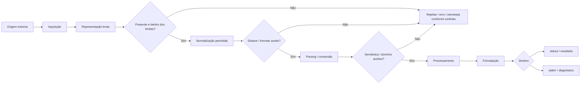

<a id="inicio"></a>

# Entrada, Processamento, Saída e Validação

> **Classificação curricular:** `[D] Obrigatório dominar`  
>
> **Legenda de evidências/QA:** nos blocos operacionais, `[D]` = documentação/literatura, `[S]` = inspeção estática/estrutura e `[R]` = reprodução em runtime/compilador. Essa legenda é independente do `[D]` curricular acima, que significa **Obrigatório dominar**.  
>
> **Nível:** A — Lógica de Programação  
> **Posição na taxonomia:** tópico 9  
> **Pré-requisitos:** tipos, expressões, decisões, loops e padrões fundamentais de algoritmos  
> **Aprofundamentos posteriores:** funções, arquivos, APIs, HTTP, segurança, testes, exceções, serialização, bancos de dados e interfaces gráficas

---

## Resumo executivo

Um programa útil normalmente participa de um fluxo:

```text
ENTRADA
↓
VALIDAÇÃO / INTERPRETAÇÃO
↓
PROCESSAMENTO
↓
SAÍDA
```

Mas esse modelo simples precisa de algumas distinções.

A entrada que chega a um programa pode ser apenas:

```text
TEXTO / BYTES / EVENTO / DADO EXTERNO
```

antes de tornar-se um valor utilizável pelo domínio.

Por isso, um fluxo mais rigoroso é:

```text
ORIGEM EXTERNA
↓
AQUISIÇÃO
↓
REPRESENTAÇÃO BRUTA
↓
VALIDAÇÃO SINTÁTICA / PARSING
↓
VALOR TIPADO
↓
VALIDAÇÃO SEMÂNTICA
↓
PROCESSAMENTO
↓
FORMATAÇÃO
↓
SAÍDA
```

E, em aplicações interativas:

```text
entrada inválida
↓
mensagem útil
↓
nova tentativa
↓
revalidar
```

Há três distinções que você deve dominar desde já:

```text
CONVERSÃO BEM-SUCEDIDA
≠
DADO VÁLIDO PARA O DOMÍNIO
≠
DADO VERDADEIRO / CORRETO NO MUNDO REAL
```

Exemplo:

```text
"25"
```

pode:

1. ser convertido corretamente para inteiro;
2. estar dentro de uma faixa permitida de idade;
3. ainda assim não ser a idade verdadeira da pessoa.

Outra distinção fundamental:

```text
VALIDAÇÃO
≠
SANITIZAÇÃO
≠
AUTENTICAÇÃO
≠
AUTORIZAÇÃO
≠
ESCAPING / OUTPUT ENCODING
```

Validação responde principalmente:

> **este dado possui forma e significado aceitáveis para este contrato?**

Ela não resolve sozinha todos os problemas de segurança ou integridade.

E há um detalhe importante para nossa comparação entre linguagens:

> **ECMAScript não define uma API universal de entrada/saída de terminal.**

Nos exemplos JavaScript de CLI deste capítulo, a linguagem é ECMAScript, mas `stdin`, `stdout`, `stderr` e `readline` vêm do **host Node.js**. A documentação atual do Node.js 26 expõe `process.stdin`, `process.stdout`, `process.stderr` e `node:readline`.

---

## Regra de ouro

```text
NÃO CONFIE NA FORMA EXTERNA DO DADO
↓
INTERPRETE
↓
VALIDE
↓
SÓ ENTÃO USE NO PROCESSAMENTO QUE EXIGE ESSAS GARANTIAS
```

---

## Decisão rápida

| Pergunta | Resposta |
|---|---|
| “Entrada significa teclado?” | Não. Pode vir de stdin, argumento, ambiente, arquivo, API, banco, rede, formulário, sensor etc. |
| “`input()` Python retorna inteiro?” | Não. Retorna `str`; conversão é outra etapa. |
| “JavaScript possui `input()` padrão ECMAScript?” | Não. Entrada depende do ambiente/host. |
| “Node.js possui stdin?” | Sim, via `process.stdin`; `node:readline` facilita leitura linha a linha. |
| “Java `System.in` é texto pronto?” | Não; é um `InputStream`. APIs como `Scanner`, `Console` ou `IO.readln` fornecem camadas de conveniência. |
| “Bash `read` lê stdin?” | Sim, por padrão, e atribui o conteúdo a nomes shell. |
| “Conseguiu converter = válido?” | Não. `500` é inteiro válido sintaticamente, mas pode estar fora de uma faixa permitida. |
| “Válido = verdadeiro?” | Não. Uma data pode ter formato válido e ainda representar informação falsa. |
| “Validação deve ocorrer só na UI?” | Não. A fronteira que realmente confia/processa o dado precisa validar seu contrato. |
| “Devo re-perguntar sempre?” | Só em fluxo interativo onde existe nova tentativa útil. Arquivos/APIs normalmente rejeitam, registram, ignoram ou retornam erro conforme contrato. |
| “Loop de reentrada deve ser infinito?” | Não obrigatoriamente. Cancelamento, EOF e limite de tentativas podem fazer parte do contrato. |
| “Erro deve ir para stdout?” | Para CLI automatizável, normalmente resultado vai a stdout e diagnósticos a stderr. |
| “`print()` e `console.log()` são a lógica do programa?” | Não. São mecanismos de saída/apresentação. |
| “Formato é validação?” | Formato é uma camada da validação; ainda pode haver faixa, consistência e regra de domínio. |
| “Casos extremos são só valores inválidos?” | Não. Zero, mínimo e máximo podem ser perfeitamente válidos e ainda revelar bugs de fronteira. |

---

# Índice


- [Resumo executivo](#resumo-executivo)
- [Regra de ouro](#regra-de-ouro)
- [Decisão rápida](#decisão-rápida)
- [1. Posição deste assunto](#1-posição-deste-assunto)
  - [1.1 Dados externos não chegam com nossas garantias internas](#11-dados-externos-não-chegam-com-nossas-garantias-internas)
  - [1.2 Relação com o tópico anterior](#12-relação-com-o-tópico-anterior)
- [2. Visão panorâmica](#2-visão-panorâmica)
  - [🗺️ Visão panorâmica — o mapa antes dos detalhes](#visao-panoramica)
- [3. Modelo IPO — Input, Process, Output](#3-modelo-ipo--input-process-output)
  - [3.1 Exemplo](#31-exemplo)
  - [3.2 O que o IPO não mostra sozinho?](#32-o-que-o-ipo-não-mostra-sozinho)
  - [3.3 IPO expandido](#33-ipo-expandido)
- [4. Entrada, processamento e saída não são a mesma responsabilidade](#4-entrada-processamento-e-saída-não-são-a-mesma-responsabilidade)
  - [4.1 Por que separar conceitualmente?](#41-por-que-separar-conceitualmente)
  - [4.2 Stroustrup](#42-stroustrup)
  - [4.3 Ainda não precisamos de funções](#43-ainda-não-precisamos-de-funções)
- [5. 9.1 Entrada](#5-91-entrada)
  - [5.1 Entrada não é necessariamente confiável](#51-entrada-não-é-necessariamente-confiável)
  - [5.2 Origem faz parte do contrato](#52-origem-faz-parte-do-contrato)
- [6. Origens de entrada](#6-origens-de-entrada)
  - [6.1 Terminal / stdin](#61-terminal--stdin)
  - [6.2 Argumentos de linha de comando](#62-argumentos-de-linha-de-comando)
  - [6.3 Variáveis de ambiente](#63-variáveis-de-ambiente)
  - [6.4 Arquivo](#64-arquivo)
  - [6.5 API / rede](#65-api--rede)
  - [6.6 UI](#66-ui)
  - [6.7 Sensores/dispositivos](#67-sensoresdispositivos)
  - [6.8 Regra](#68-regra)
- [7. Entrada interativa versus não interativa](#7-entrada-interativa-versus-não-interativa)
  - [Interativa](#interativa)
  - [Não interativa](#não-interativa)
  - [7.1 Estratégias diferentes](#71-estratégias-diferentes)
  - [7.2 Reentrada não é política universal](#72-reentrada-não-é-política-universal)
- [8. Entrada bruta versus valor interpretado](#8-entrada-bruta-versus-valor-interpretado)
  - [8.1 Modelo](#81-modelo)
  - [8.2 Falha](#82-falha)
  - [8.3 Semântica posterior](#83-semântica-posterior)
  - [8.4 Regra](#84-regra)
- [9. Standard input, output e error](#9-standard-input-output-e-error)
  - [9.1 Por que existem separados?](#91-por-que-existem-separados)
  - [9.2 Exemplo shell](#92-exemplo-shell)
  - [9.3 Contrato de CLI](#93-contrato-de-cli)
- [10. Python — input e fluxos padrão](#10-python--input-e-fluxos-padrão)
  - [10.1 input não converte](#101-input-não-converte)
  - [10.2 EOF](#102-eof)
  - [10.3 Fluxos](#103-fluxos)
  - [10.4 Diagnóstico](#104-diagnóstico)
- [11. JavaScript — ECMAScript versus host](#11-javascript--ecmascript-versus-host)
  - [11.1 ECMAScript](#111-ecmascript)
  - [11.2 Browser](#112-browser)
  - [11.3 Node.js](#113-nodejs)
  - [11.4 Regra](#114-regra)
- [12. Node.js — stdin e readline](#12-nodejs--stdin-e-readline)
  - [12.1 Fluxos](#121-fluxos)
  - [12.2 Linha a linha](#122-linha-a-linha)
  - [12.3 Async iteration](#123-async-iteration)
  - [12.4 Output](#124-output)
- [13. Java — System.in e APIs de leitura](#13-java--systemin-e-apis-de-leitura)
  - [13.1 Fluxos padrão](#131-fluxos-padrão)
  - [13.2 Scanner](#132-scanner)
  - [13.3 Linha + parse](#133-linha--parse)
  - [13.4 Java moderno](#134-java-moderno)
- [14. Bash — read](#14-bash--read)
  - [14.1 Forma segura comum](#141-forma-segura-comum)
  - [14.2 Prompt](#142-prompt)
  - [14.3 Timeout](#143-timeout)
  - [14.4 EOF](#144-eof)
- [15. 9.2 Processamento](#15-92-processamento)
  - [15.1 Exemplo](#151-exemplo)
  - [15.2 Não confundir processamento com parsing](#152-não-confundir-processamento-com-parsing)
  - [15.3 Processamento deve poder assumir seu contrato](#153-processamento-deve-poder-assumir-seu-contrato)
- [16. Estado intermediário](#16-estado-intermediário)
  - [16.1 Estado intermediário não é saída](#161-estado-intermediário-não-é-saída)
  - [16.2 Nome significativo](#162-nome-significativo)
  - [16.3 Validação interna](#163-validação-interna)
- [17. Separar diálogo da regra](#17-separar-diálogo-da-regra)
  - [17.1 Direção futura](#171-direção-futura)
  - [17.2 Por enquanto](#172-por-enquanto)
- [18. 9.3 Saída](#18-93-saída)
  - [18.1 Resultado](#181-resultado)
  - [18.2 Apresentação](#182-apresentação)
  - [18.3 Representação estruturada](#183-representação-estruturada)
  - [18.4 Destino importa](#184-destino-importa)
- [19. Resultado versus apresentação](#19-resultado-versus-apresentação)
  - [19.1 Por que importa?](#191-por-que-importa)
  - [19.2 Reuso](#192-reuso)
  - [19.3 Regra](#193-regra)
- [20. stdout versus stderr](#20-stdout-versus-stderr)
  - [stdout](#stdout)
  - [stderr](#stderr)
  - [20.1 Por que é útil?](#201-por-que-é-útil)
  - [20.2 Python](#202-python)
  - [20.3 Node.js](#203-nodejs)
  - [20.4 Java](#204-java)
  - [20.5 Bash](#205-bash)
- [21. Saída humana versus saída para máquina](#21-saída-humana-versus-saída-para-máquina)
  - [Humana](#humana)
  - [Máquina](#máquina)
  - [21.1 Mistura problemática](#211-mistura-problemática)
  - [21.2 Melhor CLI](#212-melhor-cli)
- [22. Formatação básica](#22-formatação-básica)
  - [Python](#python)
  - [JavaScript](#javascript)
  - [Java](#java)
  - [Bash](#bash)
  - [22.1 Formatação não corrige semântica](#221-formatação-não-corrige-semântica)
- [23. 9.4 Validação](#23-94-validação)
  - [23.1 Exemplo](#231-exemplo)
  - [23.2 Farrell](#232-farrell)
- [24. Validação sintática](#24-validação-sintática)
  - [24.1 Forma estrita](#241-forma-estrita)
  - [24.2 Contrato antes do parser](#242-contrato-antes-do-parser)
- [25. Parsing e conversão](#25-parsing-e-conversão)
  - [Python](#python-1)
  - [JavaScript](#javascript-1)
  - [Java](#java-1)
  - [Bash](#bash-1)
  - [25.1 Parsing pode falhar de maneiras distintas](#251-parsing-pode-falhar-de-maneiras-distintas)
- [26. Validação semântica](#26-validação-semântica)
  - [Exemplo](#exemplo)
  - [26.1 Semântica pode depender de outros dados](#261-semântica-pode-depender-de-outros-dados)
- [27. Validação de faixa](#27-validação-de-faixa)
  - [27.1 Inclusivo ou exclusivo?](#271-inclusivo-ou-exclusivo)
  - [27.2 Testes de fronteira](#272-testes-de-fronteira)
  - [27.3 Farrell](#273-farrell)
- [28. Validação de conjunto permitido](#28-validação-de-conjunto-permitido)
  - [28.1 Modelo](#281-modelo)
  - [28.2 Vantagem](#282-vantagem)
  - [28.3 Case sensitivity](#283-case-sensitivity)
- [29. Validação de tamanho e limites](#29-validação-de-tamanho-e-limites)
  - [29.1 Segurança e recursos](#291-segurança-e-recursos)
  - [29.2 Não invente limite](#292-não-invente-limite)
- [30. Consistência entre campos](#30-consistência-entre-campos)
  - [30.1 Farrell](#301-farrell)
  - [30.2 Regra](#302-regra)
- [31. Validação não prova correção factual](#31-validação-não-prova-correção-factual)
  - [31.1 Validade](#311-validade)
  - [31.2 Veracidade](#312-veracidade)
  - [31.3 Autenticidade](#313-autenticidade)
- [32. Allowlist versus denylist — introdução de segurança](#32-allowlist-versus-denylist--introdução-de-segurança)
  - [Allowlist](#allowlist)
  - [Denylist](#denylist)
  - [32.1 Problema de denylist isolada](#321-problema-de-denylist-isolada)
  - [32.2 Exemplo](#322-exemplo)
  - [32.3 Escopo](#323-escopo)
- [33. Validação versus sanitização](#33-validação-versus-sanitização)
  - [33.1 Trim](#331-trim)
  - [33.2 Lowercase](#332-lowercase)
  - [33.3 Segurança](#333-segurança)
  - [Regra](#regra)
- [34. Fronteiras de confiança](#34-fronteiras-de-confiança)
  - [34.1 Client-side validation](#341-client-side-validation)
  - [34.2 Server-side / process boundary](#342-server-side--process-boundary)
  - [34.3 Interno também pode exigir contrato](#343-interno-também-pode-exigir-contrato)
- [35. JavaScript — armadilhas de parsing](#35-javascript--armadilhas-de-parsing)
  - [35.1 Number](#351-number)
  - [35.2 String vazia](#352-string-vazia)
  - [35.3 parseInt](#353-parseint)
  - [35.4 Número inteiro](#354-número-inteiro)
  - [35.5 Regra](#355-regra)
- [36. 9.5 Reentrada](#36-95-reentrada)
  - [36.1 Nilo](#361-nilo)
  - [36.2 Farrell](#362-farrell)
  - [36.3 Logo](#363-logo)
- [37. Repetir até obter dado aceitável](#37-repetir-até-obter-dado-aceitável)
  - [37.1 Duas camadas visíveis](#371-duas-camadas-visíveis)
  - [37.2 Mensagem útil](#372-mensagem-útil)
  - [37.3 Não ecoe segredo](#373-não-ecoe-segredo)
- [38. Limitar tentativas](#38-limitar-tentativas)
  - [38.1 Por quê?](#381-por-quê)
  - [38.2 Modelo](#382-modelo)
  - [38.3 Depois do limite](#383-depois-do-limite)
  - [38.4 Default não é cura universal](#384-default-não-é-cura-universal)
- [39. Cancelamento e EOF](#39-cancelamento-e-eof)
  - [EOF](#eof)
  - [Python](#python-2)
  - [Node readline](#node-readline)
  - [Java Scanner](#java-scanner)
  - [Bash](#bash-2)
  - [39.1 Contrato](#391-contrato)
- [40. Quando não existe reentrada](#40-quando-não-existe-reentrada)
  - [Arquivo batch](#arquivo-batch)
  - [API](#api)
  - [Pipeline](#pipeline)
  - [Evento](#evento)
  - [Regra](#regra-1)
- [41. 9.6 Casos extremos](#41-96-casos-extremos)
  - [41.1 Edge case não é sinônimo de inválido](#411-edge-case-não-é-sinônimo-de-inválido)
- [42. Vazio e whitespace](#42-vazio-e-whitespace)
  - [42.1 Política](#421-política)
  - [42.2 JavaScript](#422-javascript)
  - [42.3 Bash](#423-bash)
  - [42.4 Python](#424-python)
- [43. Zero](#43-zero)
  - [Teste](#teste)
- [44. Negativos](#44-negativos)
- [45. Mínimo e máximo](#45-mínimo-e-máximo)
  - [45.1 Bug clássico](#451-bug-clássico)
  - [45.2 Outro](#452-outro)
- [46. Fora do domínio](#46-fora-do-domínio)
  - [46.1 Muito fora](#461-muito-fora)
- [47. Valores imediatamente abaixo e acima da fronteira](#47-valores-imediatamente-abaixo-e-acima-da-fronteira)
- [48. Valores muito grandes](#48-valores-muito-grandes)
  - [Python](#python-3)
  - [JavaScript](#javascript-2)
  - [Java](#java-2)
  - [Bash](#bash-3)
  - [Regra](#regra-2)
- [49. Encoding, locale e representação](#49-encoding-locale-e-representação)
  - [49.1 Python](#491-python)
  - [49.2 Java](#492-java)
  - [49.3 Node.js](#493-nodejs)
  - [49.4 Bash](#494-bash)
  - [49.5 Números](#495-números)
- [50. Exemplo canônico — inteiro entre 1 e 5](#50-exemplo-canônico--inteiro-entre-1-e-5)
- [51. Python — exemplo completo](#51-python--exemplo-completo)
  - [Observações](#observações)
- [52. JavaScript/Node.js — exemplo completo](#52-javascriptnodejs--exemplo-completo)
  - [Observações](#observações-1)
- [53. Java — exemplo completo](#53-java--exemplo-completo)
  - [Observações](#observações-2)
- [54. Bash — exemplo completo](#54-bash--exemplo-completo)
  - [Observações](#observações-3)
- [55. Comparação entre as quatro linguagens](#55-comparação-entre-as-quatro-linguagens)
- [56. Fluxo de validação rastreado](#56-fluxo-de-validação-rastreado)
  - [Invariante](#invariante)
- [57. Exemplo crítico — converte mas não pertence ao domínio](#57-exemplo-crítico--converte-mas-não-pertence-ao-domínio)
  - [Moral](#moral)
- [58. Exemplo crítico — dado válido mas inconsistente](#58-exemplo-crítico--dado-válido-mas-inconsistente)
- [59. Exemplo crítico — reprompt apenas uma vez](#59-exemplo-crítico--reprompt-apenas-uma-vez)
- [60. Exemplo crítico — diagnóstico em stdout](#60-exemplo-crítico--diagnóstico-em-stdout)
  - [Melhor](#melhor)
  - [Moral](#moral-1)
- [61. Exemplo crítico — tratar EOF como dado inválido](#61-exemplo-crítico--tratar-eof-como-dado-inválido)
  - [Por que importa?](#por-que-importa)
- [62. Exemplo crítico — Number e parseInt no JavaScript](#62-exemplo-crítico--number-e-parseint-no-javascript)
  - [Number](#number)
  - [parseInt](#parseint)
  - [Estratégia do exemplo canônico](#estratégia-do-exemplo-canônico)
- [63. Estratégia de validação em camadas](#63-estratégia-de-validação-em-camadas)
  - [63.1 Nem toda entrada exige todas as camadas](#631-nem-toda-entrada-exige-todas-as-camadas)
  - [63.2 Não valide sem entender contrato](#632-não-valide-sem-entender-contrato)
- [64. Matriz de casos de teste](#64-matriz-de-casos-de-teste)
  - [64.1 Por que declarar formato lexical?](#641-por-que-declarar-formato-lexical)
- [Problemas reais — índice operacional e resolução](#problemas-reais)
  - [`PR-T09-01` — aceitar somente inteiro decimal ASCII de `1..5`](#pr-t09-01)
  - [`PR-T09-02` — produzir uma CLI composável](#pr-t09-02)
  - [`PR-T09-03` — reentrada robusta sem loop infinito](#pr-t09-03)
  - [`PR-T09-04` — validar consistência entre campos](#pr-t09-04)
  - [`PR-T09-05` — processar entrada batch sem diálogo inexistente](#pr-t09-05)
  - [`PR-T09-06` — normalizar sem destruir informação](#pr-t09-06)
  - [`PR-T09-07` — validar inteiro estrito em JavaScript](#pr-t09-07)
  - [`PR-T09-08` — preservar linha literal no Bash](#pr-t09-08)
  - [`PR-T09-09` — limitar entrada externa antes de processamento caro](#pr-t09-09)
- [65. Erros conceituais frequentes](#65-erros-conceituais-frequentes)
  - [65.1 “input = teclado”](#651-input--teclado)
  - [65.2 “parse = validate”](#652-parse--validate)
  - [65.3 “converteu = válido”](#653-converteu--válido)
  - [65.4 “válido = verdadeiro”](#654-válido--verdadeiro)
  - [65.5 “sanitizar = validar”](#655-sanitizar--validar)
  - [65.6 “front-end validou, back-end pode confiar”](#656-front-end-validou-back-end-pode-confiar)
  - [65.7 “reentrada sempre é solução”](#657-reentrada-sempre-é-solução)
  - [65.8 “perguntar uma segunda vez basta”](#658-perguntar-uma-segunda-vez-basta)
  - [65.9 “loop até acertar nunca precisa de limite”](#659-loop-até-acertar-nunca-precisa-de-limite)
  - [65.10 “EOF é formato inválido”](#6510-eof-é-formato-inválido)
  - [65.11 “stderr e stdout são iguais”](#6511-stderr-e-stdout-são-iguais)
  - [65.12 “JavaScript tem input padrão”](#6512-javascript-tem-input-padrão)
  - [65.13 “Number('') é erro”](#6513-number-é-erro)
  - [65.14 “parseInt valida inteiro inteiro”](#6514-parseint-valida-inteiro-inteiro)
  - [65.15 “Bash arithmetic pode receber qualquer texto externo diretamente”](#6515-bash-arithmetic-pode-receber-qualquer-texto-externo-diretamente)
  - [65.16 “caso extremo = caso inválido”](#6516-caso-extremo--caso-inválido)
  - [65.17 “trim sempre é correto”](#6517-trim-sempre-é-correto)
  - [65.18 “default silencioso sempre melhora UX”](#6518-default-silencioso-sempre-melhora-ux)
- [66. Debugging de entrada e validação](#66-debugging-de-entrada-e-validação)
  - [Trace](#trace)
  - [66.1 Não logue segredos](#661-não-logue-segredos)
  - [66.2 Perguntas](#662-perguntas)
  - [66.3 Erro observável](#663-erro-observável)
- [🔎 Troubleshooting sistemático](#troubleshooting-sistematico)
  - [`TS-T09-01` — valor converte, mas não pertence ao domínio](#ts-t09-01)
  - [`TS-T09-02` — string vazia vira zero em JavaScript](#ts-t09-02)
  - [`TS-T09-03` — `parseInt()` aceita prefixo e ignora sufixo](#ts-t09-03)
  - [`TS-T09-04` — programa repete apenas uma vez](#ts-t09-04)
  - [`TS-T09-05` — EOF é tratado como “mais uma entrada inválida”](#ts-t09-05)
  - [`TS-T09-06` — diagnóstico em stdout quebra pipeline](#ts-t09-06)
  - [`TS-T09-07` — Bash altera linha que deveria ser literal](#ts-t09-07)
  - [`TS-T09-08` — Java `nextInt()` seguido de `nextLine()` parece “pular” a entrada](#ts-t09-08)
  - [`TS-T09-09` — Node.js perde a última mensagem ao chamar `process.exit()`](#ts-t09-09)
  - [`TS-T09-10` — misturar `IO.readln()` e `System.in` em Java moderno](#ts-t09-10)
  - [`TS-T09-11` — normalização altera dado legítimo](#ts-t09-11)
  - [`TS-T09-12` — leitura sem limite consome memória excessiva](#ts-t09-12)
- [67. Laboratórios](#67-laboratórios)
  - [🧪 LAB 1 — IPO](#-lab-1--ipo)
  - [🧪 LAB 2 — parse versus domínio](#-lab-2--parse-versus-domínio)
  - [🧪 LAB 3 — reentrada](#-lab-3--reentrada)
  - [🧪 LAB 4 — limite de tentativas](#-lab-4--limite-de-tentativas)
  - [🧪 LAB 5 — stdout e stderr](#-lab-5--stdout-e-stderr)
  - [🧪 LAB 6 — EOF](#-lab-6--eof)
  - [🧪 LAB 7 — fronteiras](#-lab-7--fronteiras)
  - [🧪 LAB 8 — JavaScript parsing](#-lab-8--javascript-parsing)
  - [🧪 LAB 9 — consistência](#-lab-9--consistência)
  - [🧪 LAB 10 — NetDev opcional](#-lab-10--netdev-opcional)
- [68. Exercícios](#68-exercícios)
  - [68.1 Entrada](#681-entrada)
  - [68.2 Raw input](#682-raw-input)
  - [68.3 Parsing](#683-parsing)
  - [68.4 Validação sintática](#684-validação-sintática)
  - [68.5 Validação semântica](#685-validação-semântica)
  - [68.6 Validade factual](#686-validade-factual)
  - [68.7 Faixa](#687-faixa)
  - [68.8 Consistência](#688-consistência)
  - [68.9 Reentrada](#689-reentrada)
  - [68.10 Limite](#6810-limite)
  - [68.11 EOF](#6811-eof)
  - [68.12 stdout](#6812-stdout)
  - [68.13 stderr](#6813-stderr)
  - [68.14 JavaScript](#6814-javascript)
  - [68.15 Java](#6815-java)
  - [68.16 Bash](#6816-bash)
  - [68.17 Segurança](#6817-segurança)
  - [68.18 Sanitização](#6818-sanitização)
  - [68.19 Edge case](#6819-edge-case)
  - [68.20 Automação](#6820-automação)
- [69. Evidências de domínio](#69-evidências-de-domínio)
  - [Você deve conseguir explicar](#você-deve-conseguir-explicar)
  - [Você deve conseguir aplicar](#você-deve-conseguir-aplicar)
  - [Você deve conseguir testar](#você-deve-conseguir-testar)
  - [Você deve conseguir comparar](#você-deve-conseguir-comparar)
  - [Você deve conseguir evitar](#você-deve-conseguir-evitar)
- [70. Checklist de consulta rápida](#70-checklist-de-consulta-rápida)
- [71. Glossário](#71-glossário)
- [72. Referências](#72-referências)
  - [72.1 Taxonomia canônica](#721-taxonomia-canônica)
  - [72.2 PDFs FULLSTACK](#722-pdfs-fullstack)
  - [72.3 Python 3.14.7 — documentação oficial](#723-python-3147--documentação-oficial)
  - [72.4 Node.js 26 — documentação oficial](#724-nodejs-26--documentação-oficial)
  - [72.5 ECMAScript / JavaScript](#725-ecmascript--javascript)
  - [72.6 Java SE 27 — documentação oficial](#726-java-se-27--documentação-oficial)
  - [72.7 GNU Bash 5.3 — documentação oficial](#727-gnu-bash-53--documentação-oficial)
  - [72.8 OWASP Cheat Sheet Series](#728-owasp-cheat-sheet-series)
  - [72.9 Hierarquia de uso das fontes](#729-hierarquia-de-uso-das-fontes)
- [73. Histórico de versões](#73-histórico-de-versões)

---

# 1. Posição deste assunto

Os tópicos anteriores já nos permitem:

```text
receber valor
tomar decisão
repetir
contar
acumular
buscar
```

Agora precisamos tratar a fronteira entre:

```text
PROGRAMA
↕
MUNDO EXTERNO
```

Essa fronteira é onde muitos erros reais aparecem.

## 1.1 Dados externos não chegam com nossas garantias internas

Dentro do algoritmo podemos querer:

```text
port: integer entre 1 e 65535
```

Mas uma entrada externa pode chegar como:

```text
"abc"
""
"-1"
"70000"
" 443 "
"4.43e2"
```

Antes do processamento, precisamos decidir:

- que formatos aceitamos;
- como interpretar;
- quais valores pertencem ao domínio;
- o que fazer em caso de erro.

## 1.2 Relação com o tópico anterior

O tópico 8 ensinou padrões como:

```text
sentinela
contador
acumulador
```

Agora eles aparecem em I/O:

```text
reentrada
→ loop

limite de tentativas
→ contador

EOF/cancelamento
→ condição de término

entrada "quit"
→ sentinela
```

[↑ Voltar ao índice](#índice)

---

# 2. Visão panorâmica

<a id="visao-panoramica"></a>

## 🗺️ Visão panorâmica — o mapa antes dos detalhes

Esta visão funciona como **caderno rápido de consulta** e como contrato de cobertura do T09. O objetivo é permitir que um leitor que já estudou o assunto recupere, em poucos segundos, o fluxo completo entre **entrada, interpretação, validação, processamento e saída**, além de saber onde investigar quando algo falha.

### Mapa do domínio — o que existe

```text
ENTRADA / PROCESSAMENTO / SAÍDA / VALIDAÇÃO
│
├── origem da entrada
│   ├── terminal / stdin
│   ├── argumentos de linha de comando
│   ├── variáveis de ambiente
│   ├── arquivo
│   ├── API / rede
│   ├── UI / formulário
│   └── sensor / evento
│
├── aquisição e representação bruta
│   ├── bytes
│   ├── texto
│   ├── linha / token / mensagem
│   └── encoding / locale / delimitadores
│
├── interpretação
│   ├── presença
│   ├── normalização permitida pelo contrato
│   ├── validação lexical/sintática
│   ├── parsing / conversão
│   └── valor tipado
│
├── validação semântica
│   ├── faixa
│   ├── tamanho
│   ├── conjunto permitido / allowlist
│   ├── consistência entre campos
│   ├── invariantes do domínio
│   └── fronteira de confiança
│
├── processamento
│   ├── cálculo
│   ├── transformação
│   ├── decisão
│   └── estado intermediário
│
├── saída
│   ├── resultado
│   ├── formatação
│   ├── stdout
│   ├── stderr
│   ├── exit status
│   └── destino humano × máquina
│
└── robustez operacional
    ├── reentrada quando existe diálogo
    ├── limite de tentativas
    ├── cancelamento
    ├── EOF / fim de fluxo
    ├── limites de tamanho/recursos
    └── casos normais + limites + inválidos
```

### Fluxo principal — da origem até uma saída confiável



A ordem exata pode variar: algumas APIs **parseiam enquanto validam a forma**, e algumas normalizações precisam ocorrer antes da validação. O contrato deve deixar explícito o que pode ser transformado sem alterar o significado do dado.

### Consulta rápida — pergunta → mecanismo → risco principal

| Pergunta prática | Mecanismo inicial | Risco que merece primeira verificação |
|---|---|---|
| De onde veio o dado? | identificar origem e fronteira de confiança | assumir teclado/UI quando veio de arquivo, pipe ou API |
| O dado existe? | distinguir valor, vazio, whitespace, EOF e ausência | tratar EOF como string inválida e entrar em loop |
| A forma textual é aceita? | validação lexical/sintática | parser permissivo aceitar prefixo e ignorar resto |
| Consegui converter? | parsing/conversão com erro explícito | confundir conversão bem-sucedida com validade de domínio |
| O valor pertence ao domínio? | range, allowlist, tamanho, consistência | aceitar `500` porque “é um inteiro” |
| Posso alterar espaços/case? | normalização definida pelo contrato | `trim()`/lowercase destruir informação significativa |
| A entrada é interativa? | reentrada/cancelamento/limite | aplicar reprompt em batch/API e travar automação |
| Preciso produzir dado para outro programa? | stdout limpo + stderr para diagnóstico | misturar mensagens humanas em stdout |
| Como encerrar em falha? | exit status / erro estruturado | usar default silencioso e ocultar falha |
| Quanto posso consumir? | limite de tamanho/tempo/memória | ler entrada arbitrária inteira sem bound |
| JavaScript: é número estrito? | validar formato → `Number` → domínio | `Number("") === 0` ou `parseInt("12x") === 12` |
| Bash: quero a linha literalmente? | `IFS= read -r` | perder espaços ou interpretar backslashes |
| Java: token ou linha? | escolher uma estratégia consistente | misturar `nextInt()` e `nextLine()` e ler linha vazia |

### Não confundir

| Par | Distinção essencial |
|---|---|
| **entrada × teclado** | teclado é uma origem; entrada pode vir de muitos canais |
| **raw input × valor tipado** | dado externo ainda não possui automaticamente o contrato interno |
| **validação sintática × parsing** | a primeira pergunta “a forma é permitida?”; o segundo constrói/interpreta um valor; uma API pode combinar ambos |
| **parsing × validação semântica** | parse reconhece representação; validação semântica testa regras do domínio |
| **validade × veracidade** | dado pode cumprir formato/faixa e ainda ser factualmente falso |
| **validação × sanitização** | validação aceita/rejeita segundo contrato; sanitização transforma; transformação pode alterar significado |
| **normalização × correção silenciosa** | normalização é parte explícita do contrato; “consertar” entrada arbitrariamente mascara erro |
| **reentrada × tratamento de erro** | reentrada só existe quando há um interlocutor capaz de tentar novamente |
| **vazio × EOF** | vazio é um dado/linha possível; EOF é ausência de mais dados |
| **stdout × stderr** | stdout carrega o resultado normal; stderr carrega diagnóstico por convenção de CLI |
| **resultado × apresentação** | resultado é o dado semântico; apresentação é uma representação para um destino |
| **caso-limite × inválido** | `0`, mínimo e máximo podem ser válidos e ainda expor bugs |
| **allowlist × denylist** | allowlist define o universo permitido; denylist isolada tenta adivinhar o universo proibido |
| **ECMAScript × Node.js** | a linguagem não define `stdin`; o host Node.js fornece `process.stdin`/`readline` |

### Microexemplos canônicos

**1. Conversão não basta**

```text
raw = "500"
↓
parse inteiro = 500      ✅
↓
contrato 1..5            ❌
```

**2. Validação em camadas**

```text
" 4 "
↓ normalização permitida
"4"
↓ sintaxe decimal ASCII
válida
↓ parsing
4
↓ domínio 1..5
válido
```

**3. EOF não é “texto inválido”**

```text
leitura
├── linha presente → validar a linha
└── EOF           → aplicar política de fim de fluxo
```

**4. Saída automatizável**

```text
stdout: result=8
stderr: invalid-input
status: 2
```

**5. Contrato lexical evita parser permissivo**

```text
"12x"
↓
parseInt(..., 10) em JavaScript pode produzir 12
↓
logo: parseInt isolado NÃO prova que toda a string era um inteiro decimal estrito
```

### Problemas reais representativos

| ID | Necessidade | Capacidades combinadas | Destino |
|---|---|---|---|
| `PR-T09-01` | aceitar somente inteiro decimal ASCII de `1..5` | presença + sintaxe + parsing + range | [`PR-T09-01`](#pr-t09-01) |
| `PR-T09-02` | produzir CLI composável | stdout + stderr + exit status | [`PR-T09-02`](#pr-t09-02) |
| `PR-T09-03` | reentrada sem loop infinito | reprompt + limite + cancelamento/EOF | [`PR-T09-03`](#pr-t09-03) |
| `PR-T09-04` | validar relação entre campos | parsing + consistência semântica | [`PR-T09-04`](#pr-t09-04) |
| `PR-T09-05` | processar batch sem diálogo inexistente | arquivo/stdin + rejeição + relatório | [`PR-T09-05`](#pr-t09-05) |
| `PR-T09-06` | normalizar sem alterar significado | contrato + whitespace/case + validação | [`PR-T09-06`](#pr-t09-06) |
| `PR-T09-07` | validar inteiro estrito em JavaScript | formato + `Number` + safe integer | [`PR-T09-07`](#pr-t09-07) |
| `PR-T09-08` | preservar linha literal no Bash | `IFS` + `read -r` + EOF/status | [`PR-T09-08`](#pr-t09-08) |
| `PR-T09-09` | limitar entrada externa antes de trabalho caro | tamanho + recursos + falha segura | [`PR-T09-09`](#pr-t09-09) |

### Falha típica → primeira investigação

| Sintoma | Primeira hipótese/verificação | Caso |
|---|---|---|
| `500` foi aceito onde só `1..5` deveria entrar | parsing foi usado como validação completa | [`TS-T09-01`](#ts-t09-01) |
| string vazia virou `0` em JavaScript | `Number("")` foi usado sem validar presença/formato | [`TS-T09-02`](#ts-t09-02) |
| `12x` virou `12` | `parseInt()` aceitou prefixo numérico | [`TS-T09-03`](#ts-t09-03) |
| usuário erra duas vezes e código segue inválido | houve apenas um reprompt | [`TS-T09-04`](#ts-t09-04) |
| programa insiste depois que stdin acabou | EOF foi tratado como dado inválido | [`TS-T09-05`](#ts-t09-05) |
| pipeline recebe mensagem humana em vez de dado | diagnóstico foi para stdout | [`TS-T09-06`](#ts-t09-06) |
| Bash remove espaços ou altera backslashes | leitura não usa `IFS= read -r` quando literalidade era requisito | [`TS-T09-07`](#ts-t09-07) |
| Java lê string vazia após `nextInt()` | tokenização e leitura de linha foram misturadas | [`TS-T09-08`](#ts-t09-08) |
| última saída Node.js desaparece ao falhar | `process.exit()` encerrou antes de escrita assíncrona terminar | [`TS-T09-09`](#ts-t09-09) |
| Java moderno apresenta comportamento estranho ao alternar APIs | `IO.readln()` foi misturado com uso posterior de `System.in` | [`TS-T09-10`](#ts-t09-10) |
| campo válido muda após `trim`/lowercase | normalização não fazia parte do contrato | [`TS-T09-11`](#ts-t09-11) |
| memória cresce com entrada não confiável | leitura/buffering não possui limite apropriado | [`TS-T09-12`](#ts-t09-12) |

### Transferência entre linguagens — o conceito permanece, a API muda

| Capacidade | Python | JavaScript / Node.js | Java | Bash |
|---|---|---|---|---|
| ler linha interativa | `input()` | `node:readline` / promises | `IO.readln`, `Console`, `Scanner` | `read` |
| stdin/stdout/stderr | `sys.stdin/out/err` | `process.stdin/out/err` | `System.in/out/err` | fd `0/1/2` |
| parsing inteiro | `int(text)` | `Number(text)` + contrato explícito | `Integer.parseInt` / `Scanner.nextInt` | regex/`[[ ]]` + aritmética após validação |
| sinalizar parse inválido | exceção (`ValueError`) | `NaN` em várias conversões | exceção / `hasNextInt()` | status/condição de validação |
| EOF | `input()` → `EOFError`; streams podem usar vazio | evento/fim do stream | API específica (`null`, `hasNext*` etc.) | `read` retorna status de falha |
| diagnóstico | `print(..., file=sys.stderr)` | `console.error` / `process.stderr` | `System.err` | `>&2` |
| reentrada | loop explícito | loop/async loop explícito | loop explícito | loop explícito |

Não force equivalência falsa: em JavaScript, I/O de terminal pertence ao host; em Bash, texto, quoting, expansão e exit status fazem parte do mecanismo; em Java, `Scanner`, `Console` e `IO` possuem contratos diferentes.

### Síntese multifonte — por que este mapa tem esta forma

A composição acima usa fontes diferentes para funções diferentes:

- **Joyce Farrell** fornece o modelo introdutório IPO, input priming/sentinel, validação, consistência e problemas recorrentes de reentrada;
- **Bjarne Stroustrup** reforça que I/O precisa tratar falhas e que validação de formato e validação dependente do significado podem pertencer a níveis diferentes;
- **David Beazley** conecta representação de dados, encoding, stdin/stdout/stderr, produção e consumo de entrada em Python;
- **Nilo Ney C. Menezes** oferece progressão didática em português entre entrada textual, conversão, faixa e repetição até entrada válida;
- o **GNU Bash Reference Manual 5.3** define a semântica de `read`, `IFS`, `-r`, redirecionamentos e file descriptors;
- **Python 3.14.7**, **ECMAScript 2026**, **Node.js 26**, **Java SE 27** e **OWASP** foram usados para revalidar comportamento atual, limites de APIs e distinção entre validação sintática/semântica.

A síntese não transforma uma fonte didática em autoridade normativa: comportamento versionado permanece ancorado na documentação oficial da linguagem/runtime correspondente.

### Modo consulta × modo estudo

**Consulta em ~30 segundos:**

```text
origem do dado
→ raw × tipado
→ sintaxe × parsing × semântica
→ política de erro/reentrada/EOF
→ stdout × stderr
→ tabela de falha típica
```

**Estudo completo:**

```text
IPO
→ origens de entrada
→ stdin/stdout/stderr
→ APIs nas quatro linguagens
→ parsing e validação em camadas
→ segurança e fronteiras de confiança
→ reentrada / EOF / limites
→ casos extremos
→ exemplos completos
→ PR-*
→ troubleshooting
→ LABs / exercícios / evidências de domínio
```

[↑ Voltar ao índice](#índice)

---

# 3. Modelo IPO — Input, Process, Output

IPO:

```text
INPUT
↓
PROCESS
↓
OUTPUT
```

é um modelo clássico para decompor programas.

Farrell utiliza explicitamente **IPO charts** no ensino de design de métodos, e a lógica já é útil antes de funções.

## 3.1 Exemplo

Problema:

> calcular área de um retângulo.

Input:

```text
width
height
```

Process:

```text
area = width * height
```

Output:

```text
area
```

## 3.2 O que o IPO não mostra sozinho?

- formato inválido;
- origem;
- EOF;
- erro de conversão;
- reentrada;
- segurança;
- destino da saída.

Por isso expandimos o modelo.

## 3.3 IPO expandido

```text
INPUT
↓
VALIDATE / PARSE
↓
PROCESS
↓
FORMAT
↓
OUTPUT
```

[↑ Voltar ao índice](#índice)

---

# 4. Entrada, processamento e saída não são a mesma responsabilidade

Considere:

```python
age = int(input("Age: "))
print(age * 2)
```

Funciona em um exemplo simples.

Mas mistura:

```text
diálogo
parsing
processamento
saída
```

## 4.1 Por que separar conceitualmente?

Porque depois a origem pode mudar:

```text
terminal
→ arquivo
→ API
→ teste automatizado
```

sem mudar a regra:

```text
resultado = age * 2
```

## 4.2 Stroustrup

No capítulo de I/O, Stroustrup trata explicitamente:

```text
reading a single value
+
breaking the problem into manageable parts
+
separating dialog from function
```

A ideia prepara o terreno para modularização.

## 4.3 Ainda não precisamos de funções

Neste capítulo basta reconhecer as camadas.

Funções serão estudadas formalmente no tópico 11.

[↑ Voltar ao índice](#índice)

---

# 5. 9.1 Entrada

Entrada é a aquisição de dados que chegam ao programa.

Ela pode vir de:

```text
pessoa
arquivo
processo
sistema operacional
rede
API
dispositivo
banco
fila
sensor
```

## 5.1 Entrada não é necessariamente confiável

Mesmo quando vem de “nosso próprio sistema”:

- versão pode mudar;
- arquivo pode corromper;
- processo pode falhar;
- configuração pode estar errada.

## 5.2 Origem faz parte do contrato

Pergunte:

```text
de onde vem?
em qual representação?
pode faltar?
pode estar malformado?
pode ser hostil?
pode ser enorme?
```

[↑ Voltar ao índice](#índice)

---

# 6. Origens de entrada

## 6.1 Terminal / stdin

Pessoa ou pipeline envia dados.

## 6.2 Argumentos de linha de comando

Exemplo conceitual:

```text
program --port 443
```

## 6.3 Variáveis de ambiente

Comum para configuração:

```text
APP_PORT
DATABASE_HOST
```

## 6.4 Arquivo

- texto;
- CSV;
- JSON;
- configuração;
- logs.

## 6.5 API / rede

Dados remotos são uma fronteira clara de validação.

## 6.6 UI

Formulários e componentes coletam entrada.

## 6.7 Sensores/dispositivos

Também podem produzir:

- valor ausente;
- outlier;
- estado impossível;
- timeout.

## 6.8 Regra

> **a fonte muda o mecanismo de aquisição, não elimina a necessidade de contrato.**

[↑ Voltar ao índice](#índice)

---

# 7. Entrada interativa versus não interativa

## Interativa

Existe um usuário disponível para responder novamente.

Exemplo:

```text
Digite o mês:
```

## Não interativa

Exemplo:

```text
arquivo
pipeline
requisição HTTP
job agendado
mensagem de fila
```

Não faz sentido o programa “perguntar novamente” ao arquivo.

## 7.1 Estratégias diferentes

Interativa:

```text
explicar erro
→ reprompt
```

API:

```text
rejeitar request
→ devolver erro estruturado
```

Arquivo:

```text
falhar
ou
pular registro
ou
registrar erro
```

Pipeline:

```text
stderr
+
exit status
```

## 7.2 Reentrada não é política universal

Ela pertence a um tipo específico de interação.

[↑ Voltar ao índice](#índice)

---

# 8. Entrada bruta versus valor interpretado

Entrada de terminal frequentemente chega como texto.

Exemplo:

```text
raw = "42"
```

Ainda não temos:

```text
integer 42
```

até interpretar.

## 8.1 Modelo

```text
"42"
↓ parsing
42
```

## 8.2 Falha

```text
"forty-two"
↓
não pode ser interpretado pelo parser inteiro escolhido
```

## 8.3 Semântica posterior

Mesmo:

```text
42
```

pode ser inválido se o domínio exige:

```text
1 <= value <= 5
```

## 8.4 Regra

> **Não misture a pergunta “consigo interpretar?” com “aceito esse valor?”.**

[↑ Voltar ao índice](#índice)

---

# 9. Standard input, output e error

Em ambientes de linha de comando, três fluxos clássicos:

```text
stdin  → entrada padrão
stdout → saída padrão
stderr → erro/diagnóstico padrão
```

## 9.1 Por que existem separados?

Para permitir:

```text
resultado
```

seguir para um pipeline/arquivo, enquanto:

```text
avisos
erros
progresso
```

continuam separados.

## 9.2 Exemplo shell

```bash
program >result.txt 2>errors.txt
```

## 9.3 Contrato de CLI

Uma ferramenta automatizável deve pensar conscientemente:

```text
o que é dado?
o que é diagnóstico?
qual exit status?
```

[↑ Voltar ao índice](#índice)

---

# 10. Python — input e fluxos padrão

Baseline:

```text
Python 3.14.7
```

A documentação oficial define:

```python
input()
```

como leitura de uma linha e retorno de uma `str` sem o newline final.

## 10.1 input não converte

```python
raw = input()
```

produz string.

Depois:

```python
value = int(raw)
```

é outra operação.

## 10.2 EOF

Se `input()` encontra EOF:

```text
EOFError
```

## 10.3 Fluxos

Python documenta:

```text
sys.stdin
sys.stdout
sys.stderr
```

`input()` lê de `stdin`.

`print()` normalmente escreve em `stdout`.

## 10.4 Diagnóstico

```python
print("invalid input", file=sys.stderr)
```

permite não contaminar stdout.

[↑ Voltar ao índice](#índice)

---

# 11. JavaScript — ECMAScript versus host

Esta distinção é obrigatória.

## 11.1 ECMAScript

Define:

- tipos;
- expressões;
- objetos;
- funções;
- linguagem.

Não define um único:

```text
stdin universal
prompt universal
console universal
```

para todos os hosts.

## 11.2 Browser

Pode oferecer:

- DOM;
- forms;
- `prompt()` em alguns contextos;
- eventos.

Esses são APIs do ambiente web.

## 11.3 Node.js

Oferece:

```text
process.stdin
process.stdout
process.stderr
node:readline
```

## 11.4 Regra

> **JavaScript é a linguagem; browser e Node.js fornecem APIs de I/O diferentes.**

[↑ Voltar ao índice](#índice)

---

# 12. Node.js — stdin e readline

Baseline pesquisada para este capítulo:

```text
Node.js v26.x
```

A documentação atual do Node 26 descreve `node:readline` como interface para ler dados de um `Readable` como `process.stdin` linha a linha.

## 12.1 Fluxos

```javascript
process.stdin
process.stdout
process.stderr
```

## 12.2 Linha a linha

```javascript
import { createInterface } from "node:readline";
import { stdin, stdout } from "node:process";

const rl = createInterface({
  input: stdin,
  output: stdout,
});
```

## 12.3 Async iteration

É possível consumir linhas com:

```javascript
for await (const line of rl) {
  ...
}
```

## 12.4 Output

```javascript
console.log(...)
```

é conveniente.

Para contratos de CLI mais explícitos:

```javascript
process.stdout.write(...)
process.stderr.write(...)
```

podem comunicar destino diretamente.

[↑ Voltar ao índice](#índice)

---

# 13. Java — System.in e APIs de leitura

Baseline documental desta revisão:

```text
Java SE / JDK 27
```

> **Limite de evidência:** JDK 27 está GA desde 15/09/2026 e é a baseline documental corrente. O runtime Java local disponível para QA é Java 21; portanto, comportamento específico de `java.lang.IO` em Java 27 é validado documentalmente, não apresentado como reprodução local.

## 13.1 Fluxos padrão

`System` fornece:

```text
System.in  → InputStream
System.out → PrintStream
System.err → PrintStream
```

A documentação Java SE 27 define esses três fluxos explicitamente.

## 13.2 Scanner

Uma camada comum para parsing:

```java
Scanner scanner = new Scanner(System.in);
```

Pode testar:

```java
scanner.hasNextInt()
```

antes de:

```java
scanner.nextInt()
```

`Scanner` trabalha com **tokens delimitados** por padrão, enquanto `nextLine()` retorna o restante da linha atual. Essa diferença explica uma armadilha clássica: depois de `nextInt()`, um `nextLine()` pode consumir apenas o restante vazio daquela mesma linha. Para fluxos didáticos simples, ler a linha inteira e depois fazer parsing costuma tornar o contrato mais explícito.

## 13.3 Linha + parse

Outra abordagem didaticamente previsível:

```java
String raw = scanner.nextLine();
int value = Integer.parseInt(raw);
```

Assim separamos:

```text
aquisição textual
↓
parsing
```

## 13.4 Java moderno

Java SE 27 também oferece `java.lang.IO` com métodos de conveniência para I/O orientado a linhas. `IO.readln()` retorna uma linha sem o terminador e retorna `null` quando o fim do stream é atingido antes de qualquer caractere.

Há um caveat importante no contrato atual: a documentação de `java.lang.IO` informa que a primeira chamada a `readln()` pode manter bytes adicionais em buffer e que **usar `System.in` posteriormente possui comportamento não especificado**. Portanto, escolha uma estratégia de leitura e não misture `IO.readln()` com outras leituras diretas de `System.in` no mesmo fluxo sem um motivo e contrato muito claros.

Neste guia, usamos `Scanner`/`System.in` por sua relação explícita com os conceitos ensinados, mas registramos `IO` para que o leitor reconheça a API moderna.

[↑ Voltar ao índice](#índice)

---

# 14. Bash — read

Baseline:

```text
GNU Bash 5.3
```

O builtin:

```bash
read
```

lê uma linha da entrada padrão, ou de outro file descriptor com `-u`.

## 14.1 Forma segura comum

```bash
IFS= read -r line
```

Por quê?

```text
IFS=
→ evita word splitting da linha

-r
→ não trata backslash como escape de continuação
```

## 14.2 Prompt

Bash suporta:

```bash
read -r -p 'Value: ' value
```

## 14.3 Timeout

Também possui:

```text
-t
```

para timeout.

## 14.4 EOF

`read` retorna status não zero quando não consegue ler conforme o contrato, incluindo fim de entrada.

Isso se integra naturalmente ao fluxo de shell.

[↑ Voltar ao índice](#índice)

---

# 15. 9.2 Processamento

Processamento é o trabalho realizado sobre dados aceitos.

Pode incluir:

```text
cálculo
transformação
decisão
busca
agregação
atualização de estado
```

## 15.1 Exemplo

Entrada validada:

```text
quantity = 4
unit_price = 12.50
```

Processamento:

```text
total = quantity * unit_price
```

## 15.2 Não confundir processamento com parsing

```text
"4" → 4
```

é interpretação/conversão.

```text
4 × 12.50
```

é processamento de domínio.

## 15.3 Processamento deve poder assumir seu contrato

Idealmente, depois da validação:

```text
quantity
```

já atende as pré-condições necessárias.

Isso reduz verificações espalhadas.

[↑ Voltar ao índice](#índice)

---

# 16. Estado intermediário

Processamento pode criar valores intermediários.

```text
gross
discount
tax
net
```

## 16.1 Estado intermediário não é saída

Nem tudo precisa ser mostrado.

## 16.2 Nome significativo

```python
discounted_price
```

é melhor do que:

```python
x2
```

quando o valor tem significado de domínio.

## 16.3 Validação interna

Algumas invariantes também podem ser verificadas durante processamento.

Exemplo:

```text
total não pode ficar negativo
```

se isso for uma regra real.

[↑ Voltar ao índice](#índice)

---

# 17. Separar diálogo da regra

Considere:

```text
PERGUNTAR
VALIDAR
CALCULAR
IMPRIMIR
```

em um bloco único.

Funciona em exercícios.

Mas dificulta:

- testar sem terminal;
- reutilizar cálculo;
- mudar a interface;
- usar API;
- automatizar.

## 17.1 Direção futura

Mais tarde:

```text
read_input()
validate()
calculate()
format_output()
```

serão responsabilidades separadas.

## 17.2 Por enquanto

Mesmo sem funções, pense em fases.

Stroustrup defende explicitamente separar o diálogo do processamento lógico ao tratar leitura de valores.

[↑ Voltar ao índice](#índice)

---

# 18. 9.3 Saída

Saída é a informação emitida pelo programa para algum destino.

Possíveis destinos:

- terminal;
- arquivo;
- API;
- banco;
- rede;
- UI;
- log;
- outro processo.

## 18.1 Resultado

Exemplo:

```text
8
```

## 18.2 Apresentação

Exemplo:

```text
Result: 8
```

## 18.3 Representação estruturada

Exemplo conceitual:

```text
{"result": 8}
```

## 18.4 Destino importa

Um humano pode preferir:

```text
Total: R$ 12,50
```

Outro programa pode preferir:

```text
12.50
```

ou formato estruturado.

[↑ Voltar ao índice](#índice)

---

# 19. Resultado versus apresentação

Cálculo:

```text
result = 8
```

Apresentação:

```text
"Result: 8"
```

São responsabilidades diferentes.

## 19.1 Por que importa?

Se você mistura tudo cedo:

```text
resultado
```

fica preso ao formato visual.

## 19.2 Reuso

O mesmo valor pode ser:

- exibido;
- retornado;
- serializado;
- salvo;
- enviado.

## 19.3 Regra

> **formate no limite apropriado, não transforme o valor interno em texto cedo demais sem necessidade.**

[↑ Voltar ao índice](#índice)

---

# 20. stdout versus stderr

## stdout

Resultado normal:

```text
result=8
```

## stderr

Diagnóstico:

```text
invalid input
```

## 20.1 Por que é útil?

Pipeline:

```bash
program | another_program
```

deveria receber:

```text
dados
```

não mensagens humanas inesperadas.

## 20.2 Python

```python
print("error", file=sys.stderr)
```

## 20.3 Node.js

```javascript
console.error("error");
```

ou:

```javascript
process.stderr.write("error\n");
```

Em Node.js, `process.stdout` e `process.stderr` possuem comportamento de escrita que pode ser síncrono ou assíncrono conforme sistema operacional e destino. Se o programa acabou de escrever uma mensagem e precisa terminar com falha, prefira definir `process.exitCode` e permitir o encerramento natural quando isso satisfizer o contrato, em vez de chamar `process.exit()` imediatamente e correr o risco de encerrar antes de uma escrita assíncrona terminar.

## 20.4 Java

```java
System.err.println("error");
```

## 20.5 Bash

```bash
printf '%s\n' 'error' >&2
```

[↑ Voltar ao índice](#índice)

---

# 21. Saída humana versus saída para máquina

## Humana

Pode incluir:

- rótulos;
- explicações;
- unidades;
- alinhamento.

## Máquina

Precisa de contrato estável:

- delimitadores;
- campos;
- encoding;
- exit status;
- formato.

## 21.1 Mistura problemática

```text
Processing...
42
Done!
```

em stdout pode quebrar:

```text
consumer espera apenas número
```

## 21.2 Melhor CLI

```text
stdout → 42
stderr → Processing... Done!
```

quando o contrato exigir.

[↑ Voltar ao índice](#índice)

---

# 22. Formatação básica

Formatação decide como um valor aparece.

## Python

```python
print(f"{price:.2f}")
```

## JavaScript

```javascript
console.log(price.toFixed(2));
```

## Java

```java
System.out.printf("%.2f%n", price);
```

## Bash

```bash
printf '%.2f\n' "$price"
```

com a ressalva de que aritmética nativa Bash não é floating point.

## 22.1 Formatação não corrige semântica

Arredondar a apresentação:

```text
0.30000000000000004 → "0.30"
```

não altera o valor interno que foi usado nos cálculos anteriores.

[↑ Voltar ao índice](#índice)

---

# 23. 9.4 Validação

Validação verifica se dados atendem a um contrato.

OWASP distingue duas dimensões úteis:

```text
SYNTACTIC VALIDATION
→ forma esperada

SEMANTIC VALIDATION
→ valor permitido no contexto
```

## 23.1 Exemplo

Entrada:

```text
"999"
```

Para um mês:

Sintaxe:

```text
é inteiro decimal?
→ sim
```

Semântica:

```text
1 <= mês <= 12?
→ não
```

## 23.2 Farrell

Farrell separa:

- tipo;
- faixa;
- razoabilidade;
- consistência.

Isso reforça que validação possui camadas.

[↑ Voltar ao índice](#índice)

---

# 24. Validação sintática

Pergunta:

> **o dado possui a forma que nosso parser/contrato aceita?**

Exemplos:

```text
inteiro decimal
UUID
data ISO
e-mail
código de equipamento
IPv4
JSON
```

## 24.1 Forma estrita

Se o contrato exige:

```text
apenas dígitos ASCII
```

então:

```text
"12"
```

é aceito.

Talvez:

```text
"+12"
"12.0"
"1e1"
```

sejam rejeitados, mesmo que outra API consiga convertê-los numericamente.

## 24.2 Contrato antes do parser

Não escolha o parser primeiro e deixe seu comportamento definir acidentalmente o formato aceito.

[↑ Voltar ao índice](#índice)

---

# 25. Parsing e conversão

Parsing transforma representação em valor segundo regras.

## Python

```python
int("42")
```

## JavaScript

```javascript
Number("42")
```

ou APIs de parsing com contratos diferentes.

## Java

```java
Integer.parseInt("42")
```

## Bash

Aritmética pode interpretar texto numérico, mas precisa de cuidado com:

- bases;
- expansão;
- formato;
- entrada não confiável.

## 25.1 Parsing pode falhar de maneiras distintas

Python:

```text
ValueError
```

Java:

```text
NumberFormatException
```

JavaScript:

```text
Number("abc") → NaN
```

Bash:

```text
erro/status/comportamento de arithmetic expansion
```

depende da construção.

[↑ Voltar ao índice](#índice)

---

# 26. Validação semântica

Depois de obter um valor:

```text
42
```

pergunte:

```text
42 é permitido neste domínio?
```

## Exemplo

Porta TCP/UDP conceitual:

```text
1..65535
```

Um inteiro:

```text
70000
```

é sintaticamente inteiro.

Mas está fora do domínio usado pelo programa.

## 26.1 Semântica pode depender de outros dados

```text
end_date >= start_date
```

Isso não pode ser validado olhando apenas uma data isolada.

[↑ Voltar ao índice](#índice)

---

# 27. Validação de faixa

Padrão:

```text
MIN <= value <= MAX
```

## 27.1 Inclusivo ou exclusivo?

Defina explicitamente.

```text
1..5
```

pode significar:

```text
1 <= value <= 5
```

## 27.2 Testes de fronteira

Para:

```text
1 <= x <= 5
```

teste:

```text
0
1
2
4
5
6
```

## 27.3 Farrell

O exemplo clássico de mês:

```text
1..12
```

mostra validação por faixa e loop de reprompt.

[↑ Voltar ao índice](#índice)

---

# 28. Validação de conjunto permitido

Quando existe lista pequena de opções:

```text
GET
POST
PUT
DELETE
```

pode ser melhor validar por allowlist.

## 28.1 Modelo

```text
value ∈ allowed_values
```

## 28.2 Vantagem

O contrato declara explicitamente:

```text
o que é aceito
```

em vez de tentar listar tudo que é proibido.

## 28.3 Case sensitivity

Defina:

```text
"GET"
```

e:

```text
"get"
```

são equivalentes ou não?

Se normalizar, faça conscientemente.

[↑ Voltar ao índice](#índice)

---

# 29. Validação de tamanho e limites

Strings:

```text
minimum_length
maximum_length
```

Coleções:

```text
maximum_items
```

Arquivos:

```text
maximum_size
```

Números:

```text
range
```

## 29.1 Segurança e recursos

Limites também evitam:

- uso excessivo de memória;
- trabalho desnecessário;
- payloads absurdos.

> **Leitura potencialmente não limitada exige contrato de tamanho.** APIs convenientes podem acumular muito mais dados do que o esperado quando a origem não é confiável. Por exemplo, a documentação de `Scanner.nextLine()` no Java SE 27 alerta que, se não houver separador de linha, a operação pode continuar buscando e armazenar todo o input disponível. Quando tamanho importa, imponha limites coerentes com o domínio ou prefira processamento incremental.

## 29.2 Não invente limite

Um limite deve vir de:

- domínio;
- protocolo;
- capacidade;
- segurança;
- requisito.

[↑ Voltar ao índice](#índice)

---

# 30. Consistência entre campos

Cada campo pode ser válido sozinho e o conjunto ser inválido.

Exemplo:

```text
start_date = 2026-10-10
end_date   = 2026-10-01
```

Ambas podem ser datas válidas.

A relação:

```text
end >= start
```

falha.

## 30.1 Farrell

A autora usa exemplos como:

- data de pagamento anterior à compra;
- estado incompatível com CEP;
- valores incoerentes entre registros.

## 30.2 Regra

> **Validação de campo e validação de objeto/registro são camadas diferentes.**

[↑ Voltar ao índice](#índice)

---

# 31. Validação não prova correção factual

Farrell usa um ponto essencial:

```text
mês 5
```

pode ser:

- tipo correto;
- faixa correta;
- ainda assim não ser o mês real do aniversário.

## 31.1 Validade

```text
obedece ao contrato
```

## 31.2 Veracidade

```text
corresponde ao fato real
```

## 31.3 Autenticidade

```text
foi fornecido pela entidade alegada?
```

São perguntas diferentes.

[↑ Voltar ao índice](#índice)

---

# 32. Allowlist versus denylist — introdução de segurança

OWASP recomenda validar entrada tão cedo quanto possível e privilegia regras positivas/allowlists quando o domínio pode ser descrito.

## Allowlist

```text
aceitar apenas o conjunto/formato esperado
```

## Denylist

```text
tentar bloquear padrões considerados ruins
```

## 32.1 Problema de denylist isolada

É difícil enumerar:

```text
todas as formas ruins possíveis
```

## 32.2 Exemplo

Se o domínio é:

```text
status ∈ {ok, warning, error}
```

valide exatamente esse conjunto.

Não tente:

```text
“bloquear algumas strings perigosas”
```

como definição principal do domínio.

## 32.3 Escopo

Segurança de entrada será aprofundada em tópicos de software seguro.

Aqui fica a mentalidade básica.

[↑ Voltar ao índice](#índice)

---

# 33. Validação versus sanitização

Validação:

```text
aceitar ou rejeitar conforme contrato
```

Normalização:

```text
transformar para uma representação canônica permitida pelo contrato
```

Sanitização:

```text
transformar conteúdo segundo uma finalidade específica de processamento/segurança
```

Escaping / output encoding:

```text
representar dados corretamente para um contexto de saída
```

Essas operações **não são sinônimas** e não substituem a decisão de aceitar/rejeitar conforme o contrato.

## 33.1 Trim

```text
"  Diego  "
→ "Diego"
```

Pode ser desejado.

Mas talvez espaços sejam significativos em outro domínio.

## 33.2 Lowercase

```text
"ADMIN"
→ "admin"
```

só é correto se o domínio for case-insensitive.

## 33.3 Segurança

Remover caracteres “perigosos” não substitui:

- prepared statements;
- escaping contextual;
- output encoding;
- APIs seguras.

## Regra

> **Não altere silenciosamente um dado para fazê-lo “passar” sem saber se essa transformação preserva significado.**

[↑ Voltar ao índice](#índice)

---

# 34. Fronteiras de confiança

Dados externos entram por uma **trust boundary**.

Exemplos:

```text
browser → servidor
arquivo → parser
rede → aplicação
ambiente → processo
CLI → script
```

## 34.1 Client-side validation

Ajuda UX.

Não deve ser a única garantia de um servidor.

## 34.2 Server-side / process boundary

A camada que realmente executa uma operação sensível precisa validar as pré-condições que assume.

## 34.3 Interno também pode exigir contrato

Mesmo funções internas precisam de contratos claros.

Mas evitar validação redundante indiscriminada também é importante.

[↑ Voltar ao índice](#índice)

---

# 35. JavaScript — armadilhas de parsing

JavaScript merece atenção especial.

## 35.1 Number

```javascript
Number("42")
```

→ `42`.

```javascript
Number("abc")
```

→ `NaN`.

## 35.2 String vazia

```javascript
Number("")
```

produz:

```text
0
```

segundo as regras de conversão.

Logo:

> se string vazia é inválida no seu contrato, valide-a antes.

## 35.3 parseInt

`parseInt` possui semântica própria e pode parar ao encontrar caractere que não pertence ao numeral.

Portanto não trate:

```javascript
parseInt(raw, 10)
```

como validador de formato inteiro estrito de toda a string.

## 35.4 Número inteiro

Depois de converter:

```javascript
Number.isInteger(value)
```

pode verificar se o `Number` resultante representa inteiro.

Para valores grandes, lembre também de:

```javascript
Number.isSafeInteger(value)
```

quando exatidão inteira precisa ser garantida.

## 35.5 Regra

```text
FORMATO
→ validar contrato textual

CONVERSÃO
→ transformar

SEMÂNTICA
→ validar domínio
```

[↑ Voltar ao índice](#índice)

---

# 36. 9.5 Reentrada

Reentrada é solicitar um novo valor após entrada rejeitada.

Modelo:

```text
LOOP
    ler
    validar

    se válido
        sair do loop

    explicar erro
```

## 36.1 Nilo

O livro apresenta exatamente:

```text
while True
→ ler
→ verificar faixa
→ break/return quando válido
```

## 36.2 Farrell

Farrell explica por que:

```text
if inválido
    perguntar uma vez novamente
```

não garante correção.

A segunda tentativa também pode ser inválida.

## 36.3 Logo

Se o requisito é:

> só prosseguir quando o valor for válido,

a estrutura natural é repetição, não uma única seleção.

[↑ Voltar ao índice](#índice)

---

# 37. Repetir até obter dado aceitável

Pseudocódigo:

```text
while true
    raw = read

    if invalid_format(raw)
        show error
        continue

    value = parse(raw)

    if invalid_domain(value)
        show error
        continue

    break
```

## 37.1 Duas camadas visíveis

```text
formato
↓
domínio
```

## 37.2 Mensagem útil

Ruim:

```text
Invalid
```

Melhor:

```text
Enter an integer from 1 to 5.
```

## 37.3 Não ecoe segredo

Nunca reproduza senha/token em mensagem de erro.

[↑ Voltar ao índice](#índice)

---

# 38. Limitar tentativas

Repetir indefinidamente pode ser ruim.

Farrell discute explicitamente a possibilidade de limitar um reprompting loop.

## 38.1 Por quê?

- UX;
- automação travada;
- origem quebrada;
- segurança;
- disponibilidade.

## 38.2 Modelo

```text
attempts = 0

while attempts < MAX_ATTEMPTS
    ...
```

## 38.3 Depois do limite

Contrato pode:

- abortar;
- retornar erro;
- usar fallback permitido;
- escalar para outro fluxo.

## 38.4 Default não é cura universal

Substituir entrada inválida por default silencioso pode esconder erro.

Use default apenas quando o domínio definir esse comportamento.

[↑ Voltar ao índice](#índice)

---

# 39. Cancelamento e EOF

Nem toda ausência de nova linha significa “entrada inválida”.

## EOF

Significa:

```text
não há mais dados nessa fonte
```

## Python

`input()`:

```text
EOFError
```

## Node readline

A interface termina quando a entrada chega ao fim.

## Java Scanner

```java
hasNextLine()
```

pode indicar ausência de próxima linha.

## Bash

```bash
read
```

retorna status de falha quando não lê conforme esperado.

## 39.1 Contrato

Decida:

```text
EOF = erro?
cancelamento?
fim normal?
```

Depende da aplicação.

[↑ Voltar ao índice](#índice)

---

# 40. Quando não existe reentrada

## Arquivo batch

Registro inválido pode:

- abortar arquivo;
- ser rejeitado;
- ir para dead-letter;
- ser registrado e pulado.

## API

Resposta pode ser:

```text
erro de validação
```

O cliente decide se envia outra requisição.

## Pipeline

Processo pode:

```text
stderr
+
exit non-zero
```

## Evento

Mensagem inválida pode:

- rejeitar;
- descartar;
- reprocessar segundo política.

## Regra

> **Não transforme “reentrada” em loop interno quando o protocolo externo já controla novas tentativas.**

[↑ Voltar ao índice](#índice)

---

# 41. 9.6 Casos extremos

A taxonomia exige explicitamente:

```text
vazio
zero
negativo
mínimo
máximo
fora de domínio
```

Esses casos não são detalhes.

Eles revelam muitos erros de lógica.

## 41.1 Edge case não é sinônimo de inválido

Exemplo:

```text
zero
```

pode ser:

- inválido para divisor;
- válido para saldo;
- válido para contagem;
- fronteira para temperatura.

O domínio decide.

[↑ Voltar ao índice](#índice)

---

# 42. Vazio e whitespace

Diferencie:

```text
""
" "
"\t"
"\n"
```

## 42.1 Política

O contrato pode:

- rejeitar;
- trimar;
- aceitar.

## 42.2 JavaScript

Importante:

```javascript
Number("")
```

→ `0`.

Logo vazio deve ser tratado antes se não for válido.

## 42.3 Bash

```bash
[[ -z $value ]]
```

testa string vazia.

## 42.4 Python

```python
raw.strip() == ""
```

pode identificar somente whitespace, se trim for parte da política.

[↑ Voltar ao índice](#índice)

---

# 43. Zero

Pergunte:

```text
zero é dado válido?
```

Exemplos:

```text
quantidade de erros = 0
→ válido

divisor = 0
→ inválido para divisão comum

porta = 0
→ depende do contrato/API, não assuma

idade = 0
→ pode ser válida
```

## Teste

Sempre que houver limites numéricos, zero merece atenção especial.

[↑ Voltar ao índice](#índice)

---

# 44. Negativos

Negativos podem ser:

- válidos;
- inválidos;
- sentinelas antigas;
- resultado intermediário.

Exemplo:

```text
temperatura = -10
→ perfeitamente plausível

quantity = -10
→ provavelmente inválida para compra comum
```

Não escreva:

```text
negative = invalid
```

como regra universal.

[↑ Voltar ao índice](#índice)

---

# 45. Mínimo e máximo

Para domínio:

```text
1 <= value <= 5
```

testes obrigatórios:

```text
1
5
```

Esses são valores válidos nas bordas.

## 45.1 Bug clássico

Usar:

```text
value > 1
```

quando queria:

```text
value >= 1
```

rejeita o mínimo.

## 45.2 Outro

Usar:

```text
value < 5
```

rejeita o máximo.

[↑ Voltar ao índice](#índice)

---

# 46. Fora do domínio

Teste:

```text
MIN - 1
MAX + 1
```

Exemplo:

```text
0
6
```

para faixa `1..5`.

## 46.1 Muito fora

Também:

```text
-1000000
999999999999
```

pode revelar:

- overflow;
- parser;
- limites;
- resource issues.

[↑ Voltar ao índice](#índice)

---

# 47. Valores imediatamente abaixo e acima da fronteira

Técnica básica:

Para:

```text
1 <= x <= 5
```

use:

```text
0   → fora
1   → mínimo
2   → dentro
4   → dentro
5   → máximo
6   → fora
```

Isso é uma introdução prática à **boundary value analysis**.

Formalização de técnicas de teste virá depois.

[↑ Voltar ao índice](#índice)

---

# 48. Valores muito grandes

Um parser pode aceitar um número que:

- não cabe no tipo alvo;
- perde precisão;
- excede limite de negócio;
- causa custo absurdo.

## Python

`int` cresce arbitrariamente, mas recursos continuam finitos.

## JavaScript

`Number` possui limite de inteiro seguro.

## Java

`Integer.parseInt` falha se o valor está fora de `int`.

## Bash

Aritmética usa inteiros de largura fixa e não deve ser tratada como bigint arbitrário.

## Regra

> **capacidade do tipo e validade do domínio são restrições separadas.**

[↑ Voltar ao índice](#índice)

---

# 49. Encoding, locale e representação

Entrada textual existe em alguma codificação.

## 49.1 Python

`sys.stdin/stdout/stderr` possuem encoding configurado pelo runtime/ambiente.

## 49.2 Java

Java SE 27 documenta propriedades como:

```text
stdin.encoding
stdout.encoding
stderr.encoding
```

## 49.3 Node.js

Streams trabalham com bytes/chunks; APIs podem definir encoding textual.

## 49.4 Bash

Locale influencia várias operações textuais e ferramentas.

## 49.5 Números

Separador decimal:

```text
3.14
3,14
```

não deve ser aceito/rejeitado por acidente.

Defina locale/formato do protocolo.

[↑ Voltar ao índice](#índice)

---

# 50. Exemplo canônico — inteiro entre 1 e 5

Contrato:

```text
ENTRADA
→ linhas de stdin

FORMATO ACEITO
→ após trim, um ou mais dígitos ASCII

DOMÍNIO
→ inteiro entre 1 e 5 inclusive

PROCESSAMENTO
→ multiplicar por 2

SAÍDA NORMAL
→ result=N em stdout

ERRO
→ diagnóstico em stderr

NOVA TENTATIVA / PRÓXIMA ENTRADA
→ continuar consumindo linhas fornecidas pela fonte; em uma interface interativa, uma camada de diálogo pode solicitar reentrada

EOF SEM VALOR VÁLIDO
→ erro e status 2
```

> **Contrato de normalização deste exemplo:** a política lógica comum permite whitespace periférico e o remove antes de validar os dígitos ASCII. Cada runtime usa sua operação idiomática e pode reconhecer um conjunto diferente de caracteres como whitespace; portanto, a equivalência pretendida é **semântica**, não identidade byte a byte ou de code points. Protocolos que exigem um conjunto exato devem especificá-lo explicitamente.

> **Contrato de status:** o código `2` é uma escolha **deste exemplo** para `no-valid-input`; não é um significado universal de exit status entre programas.

> **Escopo de robustez:** os quatro exemplos demonstram o **contrato de conteúdo e fluxo**; eles não implementam, por si só, um limite máximo de bytes antes de uma linha ser adquirida pela API. Quando a origem puder fornecer entradas arbitrariamente grandes, o limite de recursos deve ser definido e aplicado com mecanismos adequados ao runtime/protocolo, conforme `PR-T09-09` e `TS-T09-12`.

Entrada de teste:

```text
abc
9
4
```

Fluxo:

```text
abc
→ formato inválido
→ continuar

9
→ formato válido
→ valor 9
→ fora da faixa
→ continuar

4
→ formato válido
→ valor 4
→ válido
→ processar
→ result=8
→ terminar
```

[↑ Voltar ao índice](#índice)

---

# 51. Python — exemplo completo

```python
import sys

valid_value: int | None = None

for line in sys.stdin:
    raw = line.strip()

    if not raw.isascii() or not raw.isdigit():
        print("invalid-format", file=sys.stderr)
        continue

    try:
        value = int(raw)
    except ValueError:
        print("invalid-integer-representation", file=sys.stderr)
        continue

    if not 1 <= value <= 5:
        print("out-of-range", file=sys.stderr)
        continue

    valid_value = value
    break

if valid_value is None:
    print("no-valid-input", file=sys.stderr)
    raise SystemExit(2)

result = valid_value * 2
print(f"result={result}")
```

## Observações

`sys.stdin` é usado aqui porque o contrato consome **múltiplas linhas até obter valor válido ou EOF**. Para uma única leitura interativa, `input()` continua sendo a API didática apresentada na seção 10.

A conversão `int(raw)` permanece dentro de `try/except`: em CPython moderno, conversões textuais decimais muito longas podem ser recusadas por um limite de segurança configurável e levantar `ValueError`. Na documentação Python 3.14.7, `sys.int_info.default_max_str_digits` é `4300` por padrão, e o limite pode ser ajustado por `sys.set_int_max_str_digits()`. Assim, validação lexical bem-sucedida não transforma a conversão em uma garantia absoluta.

Separação:

```text
lexical validation
→ int()
→ range validation
→ processing
→ output
```

[↑ Voltar ao índice](#índice)

---

# 52. JavaScript/Node.js — exemplo completo

```javascript
import { createInterface } from "node:readline";
import { stdin } from "node:process";

const rl = createInterface({
  input: stdin,
  crlfDelay: Infinity,
});

let validValue = null;

for await (const line of rl) {
  const raw = line.trim();

  if (!/^[0-9]+$/.test(raw)) {
    console.error("invalid-format");
    continue;
  }

  const value = Number(raw);

  if (!Number.isSafeInteger(value)) {
    console.error("invalid-integer-representation");
    continue;
  }

  if (value < 1 || value > 5) {
    console.error("out-of-range");
    continue;
  }

  validValue = value;
  break;
}

rl.close();

if (validValue === null) {
  console.error("no-valid-input");
  process.exitCode = 2;
} else {
  const result = validValue * 2;
  console.log(`result=${result}`);
}
```

## Observações

`node:readline`:

```text
é API Node.js
≠
keyword ECMAScript
```

A regex aqui define o formato aceito:

```text
somente dígitos ASCII
```

Depois `Number()` converte, `Number.isSafeInteger()` verifica se a representação inteira é segura e o range valida o domínio.

[↑ Voltar ao índice](#índice)

---

# 53. Java — exemplo completo

```java
import java.util.Scanner;

public class Example {
    public static void main(String[] args) {
        Scanner scanner = new Scanner(System.in);

        Integer validValue = null;

        while (scanner.hasNextLine()) {
            String raw = scanner.nextLine().trim();

            if (!raw.matches("[0-9]+")) {
                System.err.println("invalid-format");
                continue;
            }

            final int value;

            try {
                value = Integer.parseInt(raw);
            } catch (NumberFormatException error) {
                System.err.println("invalid-integer-representation");
                continue;
            }

            if (value < 1 || value > 5) {
                System.err.println("out-of-range");
                continue;
            }

            validValue = value;
            break;
        }

        if (validValue == null) {
            System.err.println("no-valid-input");
            System.exit(2);
        }

        int result = validValue * 2;
        System.out.println("result=" + result);
    }
}
```

## Observações

Mesmo texto só com dígitos pode conter um número grande demais para `int`.

Por isso:

```text
regex passou
≠
parseInt garantido
```

O `try/catch` ainda faz parte do contrato. Nesta implementação, falha de `Integer.parseInt()` após a forma lexical ter sido aceita é classificada como `invalid-integer-representation`; `out-of-range` fica reservado à regra de negócio `1..5`.

[↑ Voltar ao índice](#índice)

---

# 54. Bash — exemplo completo

```bash
#!/usr/bin/env bash

valid_value=""

while IFS= read -r line || [[ -n $line ]]; do
    raw=$line

    # Trim periférico para alinhar este exemplo ao contrato comum.
    raw="${raw#"${raw%%[![:space:]]*}"}"
    raw="${raw%"${raw##*[![:space:]]}"}"

    if [[ ! $raw =~ ^[0-9]+$ ]]; then
        printf '%s\n' 'invalid-format' >&2
        continue
    fi

    # Para o domínio 1..5, valide lexicalmente a faixa antes de
    # qualquer aritmética sobre texto externo arbitrariamente grande.
    if [[ ! $raw =~ ^0*([1-5])$ ]]; then
        printf '%s\n' 'out-of-range' >&2
        continue
    fi

    valid_value="${BASH_REMATCH[1]}"
    break
done

if [[ -z $valid_value ]]; then
    printf '%s\n' 'no-valid-input' >&2
    exit 2
fi

result=$((valid_value * 2))
printf 'result=%d\n' "$result"
```

## Observações

O `while IFS= read -r line || [[ -n $line ]]` preserva também uma **última linha que contenha dados mas não termine em newline**.

O trim periférico torna o comportamento do exemplo Bash compatível com o contrato comum desta seção.

A entrada externa não entra na aritmética enquanto ainda pode representar um inteiro arbitrariamente grande: a regex de domínio reduz primeiro o valor a `1..5`; somente o valor controlado participa de `(( ... ))`.

Essa solução lexical é deliberadamente específica para o pequeno domínio `1..5`; ela não deve ser generalizada como estratégia universal para faixas numéricas arbitrárias.

[↑ Voltar ao índice](#índice)

---

# 55. Comparação entre as quatro linguagens

| Conceito | Python | JavaScript/Node | Java | Bash |
|---|---|---|---|---|
| entrada de terminal | `input()` / `sys.stdin` | host: `process.stdin`, `readline` | `System.in`, `Scanner`, `Console`, `IO` | `read` |
| tipo inicial comum | `str` | `string` por readline | `String` com leitura textual | string shell |
| parsing inteiro | `int(raw)` | `Number(raw)` + checks / parsing APIs | `Integer.parseInt(raw)` | arithmetic após validação |
| erro de parsing | exception | frequentemente `NaN` para `Number` | exception | depende da construção |
| stdout | `sys.stdout` / `print` | `process.stdout` / console | `System.out` | stdout |
| stderr | `sys.stderr` | `process.stderr` / `console.error` | `System.err` | `>&2` |
| EOF | iterator termina / `input` lança `EOFError` | stream/readline termina | `hasNextLine() == false` | `read` status não zero |
| reentrada | loop | loop/async iteration | loop | loop |
| input API pertence à linguagem? | built-in Python | Node/browser host | Java platform | Bash |

[↑ Voltar ao índice](#índice)

---

# 56. Fluxo de validação rastreado

Entrada:

```text
abc
9
4
```

| tentativa | raw | sintaxe | valor | semântica | ação |
|---:|---|---|---:|---|---|
| 1 | `abc` | inválida | — | — | stderr + continuar |
| 2 | `9` | válida | 9 | fora de 1..5 | stderr + continuar |
| 3 | `4` | válida | 4 | válida | processar |
| final | — | — | 4 | — | `result=8` |

## Invariante

Antes do resultado:

```text
nenhum valor inválido chegou ao processamento final
```

[↑ Voltar ao índice](#índice)

---

# 57. Exemplo crítico — converte mas não pertence ao domínio

```python
value = int("999")
```

Converte.

Se contrato:

```text
month ∈ 1..12
```

falha.

## Moral

```text
PARSE SUCCESS
≠
DOMAIN VALID
```

[↑ Voltar ao índice](#índice)

---

# 58. Exemplo crítico — dado válido mas inconsistente

Campos:

```text
purchase_date = 2026-10-03
payment_due   = 2026-09-30
```

Cada data:

```text
sintaticamente válida
```

Mas a regra:

```text
payment_due >= purchase_date
```

falha.

Farrell usa esse tipo de relação como validação de razoabilidade/consistência.

[↑ Voltar ao índice](#índice)

---

# 59. Exemplo crítico — reprompt apenas uma vez

Ruim:

```text
ler month

if month inválido
    ler month novamente

continuar programa
```

Problema:

> a segunda entrada pode ser inválida também.

Farrell usa exatamente essa situação para justificar loop de validação.

Correto:

```text
enquanto inválido
    solicitar novamente
```

com limite/cancelamento quando o contrato exigir.

[↑ Voltar ao índice](#índice)

---

# 60. Exemplo crítico — diagnóstico em stdout

Programa:

```text
Checking...
result=8
```

Consumer espera:

```text
result=8
```

e falha.

## Melhor

stdout:

```text
result=8
```

stderr:

```text
Checking...
```

## Moral

> **saída correta inclui o canal correto, não apenas o texto correto.**

[↑ Voltar ao índice](#índice)

---

# 61. Exemplo crítico — tratar EOF como dado inválido

Imagine arquivo vazio.

Não houve:

```text
entrada malformada
```

Houve:

```text
nenhuma entrada
```

São estados diferentes.

## Por que importa?

Mensagem:

```text
invalid number
```

pode ser enganosa.

Melhor:

```text
no input
```

ou comportamento de fim normal, conforme contrato.

[↑ Voltar ao índice](#índice)

---

# 62. Exemplo crítico — Number e parseInt no JavaScript

## Number

```javascript
Number("")
```

→ `0`.

Se vazio é inválido:

```text
não confie apenas no resultado numérico
```

## parseInt

Pode aceitar um prefixo numérico e parar depois.

Logo:

```text
parseInt
```

não deve ser usado como prova de que **a string inteira** obedece ao formato.

## Estratégia do exemplo canônico

```text
regex da forma
↓
Number
↓
Number.isSafeInteger
↓
range
```

Cada passo responde uma pergunta diferente.

[↑ Voltar ao índice](#índice)

---

# 63. Estratégia de validação em camadas

Modelo recomendado:

```text
1. PRESENÇA
   existe dado?

2. TAMANHO
   tamanho permitido?

3. SINTAXE
   forma aceita?

4. PARSING
   vira o tipo esperado?

5. FAIXA / ALLOWLIST
   pertence ao domínio local?

6. CONSISTÊNCIA
   combina com outros dados?
```

Depois que o dado atende ao seu contrato, **outras decisões podem existir em camadas separadas**, por exemplo:

```text
AUTENTICAÇÃO
→ quem é a entidade?

AUTORIZAÇÃO
→ essa entidade pode realizar a operação?

REGRAS EXTERNAS
→ políticas/estado externo permitem prosseguir?
```

Essas verificações podem depender da entrada, mas **não são sinônimos de validação sintática/semântica do dado**.

## 63.1 Nem toda entrada exige todas as camadas

Exemplo:

```text
boolean interno
```

pode precisar de muito menos.

## 63.2 Não valide sem entender contrato

Mais checks não significam automaticamente mais qualidade.

[↑ Voltar ao índice](#índice)

---

# 64. Matriz de casos de teste

Contrato:

```text
ASCII decimal integer
1..5
```

| entrada | esperado |
|---|---|
| `""` | invalid-format |
| `" "` | invalid-format depois de trim → vazio |
| `" 4 "` | válido → 4 depois da normalização periférica deste exemplo |
| `"abc"` | invalid-format |
| `"1.5"` | invalid-format |
| `"-1"` | invalid-format pelo contrato lexical escolhido |
| `"0"` | out-of-range |
| `"1"` | válido |
| `"2"` | válido |
| `"5"` | válido |
| `"6"` | out-of-range |
| `"0004"` | válido → 4 |
| número decimal gigantesco | `invalid-integer-representation` ou `out-of-range`, conforme a estratégia de representação da linguagem |
| última linha válida sem newline | válido; deve ser processada |
| EOF sem válido | no-valid-input |

## 64.1 Por que declarar formato lexical?

Porque decide conscientemente se:

```text
+4
04
4.0
4e0
```

fazem parte do contrato.

[↑ Voltar ao índice](#índice)

---


<a id="problemas-reais"></a>

# Problemas reais — índice operacional e resolução

O inventário abaixo transforma o conteúdo conceitual do T09 em necessidades concretas com contrato verificável. Os blocos detalhados não substituem os exemplos e LABs anteriores; cumprem outra função: responder **“como resolvo esta necessidade real e como sei que o contrato foi atendido?”**.

> **Evidência:** `[D]` = documentação/literatura; `[S]` = inspeção estática/estrutura; `[R]` = reprodução em runtime/compilador.

## Índice operacional `PR-*`

| ID | Problema / necessidade | Capacidades envolvidas | Evidência desta revisão | Estado |
|---|---|---|---|---|
| `PR-T09-01` | aceitar apenas inteiro decimal ASCII em `1..5` | presença + sintaxe + parsing + faixa | `[D][R]` | `FECHADO` |
| `PR-T09-02` | produzir CLI composável para humanos e automação | stdout + stderr + exit status | `[D][R]` | `FECHADO` |
| `PR-T09-03` | reentrada robusta sem loop infinito | loop + limite + EOF/cancelamento | `[D][R]` | `FECHADO` |
| `PR-T09-04` | validar consistência entre campos | parsing + domínio + relação entre valores | `[D][R]` | `FECHADO` |
| `PR-T09-05` | processar entrada batch sem reprompt | stdin/arquivo + rejeição + relatório | `[D][R]` | `FECHADO` |
| `PR-T09-06` | normalizar sem destruir informação | contrato + whitespace/case + validação | `[D][R]` | `FECHADO` |
| `PR-T09-07` | validar inteiro estrito em JavaScript | lexical + `Number` + `Number.isSafeInteger` | `[D][R]` | `FECHADO` |
| `PR-T09-08` | ler linha literal em Bash | `IFS` + `read -r` + status | `[D][R]` | `FECHADO` |
| `PR-T09-09` | limitar entrada externa antes de processamento caro | tamanho + recursos + falha segura | `[D][S/R]` | `FECHADO` |

**Gate de Cobertura Prática / Operacional:** `FECHADO` — `NÃO_AVALIADO = 0`, `SEM_DESTINO = 0`, `PENDENTE_MATERIAL = 0`.

<a id="pr-t09-01"></a>

## `PR-T09-01` — aceitar somente inteiro decimal ASCII de `1..5`

**Problema / necessidade:** receber texto externo e produzir um inteiro utilizável somente quando toda a string representa dígitos ASCII e o valor pertence ao intervalo inclusivo `1..5`.

**Entrada mínima representativa:** `"4"`.

**Contrato:**

```text
"1" .. "5" → válido
"0" / "6"  → out-of-range
"" / " " / "1.5" / "-1" / "4x" → invalid-format
EOF sem valor válido → no-valid-input
```

**Estratégia canônica:**

```text
adquirir raw
→ distinguir EOF
→ normalizar SOMENTE o que o contrato autoriza
→ validar toda a forma lexical
→ converter
→ validar faixa
→ processar
```

**Alternativas:** parser que já rejeita toda a forma inválida pode reduzir uma etapa, desde que seu contrato seja conhecido; Regex não é obrigatória se uma API estrita resolve o mesmo problema com mais clareza.

**Trade-off:** aceitar `+4`, `04` ou whitespace é uma decisão de contrato, não consequência inevitável do parser.

**Testes:** os casos da matriz da seção 64, incluindo fronteiras e EOF.

**Linguagens:** Python, JavaScript/Node.js, Java e Bash.

**Estado:** `FECHADO` — exemplos equivalentes e casos representativos executados nesta revisão.

<a id="pr-t09-02"></a>

## `PR-T09-02` — produzir uma CLI composável

**Problema / necessidade:** permitir uso humano e em pipeline sem misturar resultado normal com diagnóstico.

**Contrato:**

```text
sucesso:
  stdout → somente dado/resultados
  stderr → vazio ou diagnóstico não pertencente ao resultado
  status → 0

falha de entrada:
  stdout → sem dado enganoso
  stderr → motivo útil
  status → não zero
```

**Estratégia:** separar os canais desde o desenho do programa. Prompts interativos também precisam ser considerados quando stdout será consumido por máquina; em ferramentas maiores, modo interativo e modo máquina podem exigir contratos distintos.

**Alternativas:** resultado estruturado em arquivo/socket/API; logging separado; JSON em stdout com diagnóstico estruturado em outro canal, conforme contexto.

**Teste operacional:** redirecionar stdout e stderr separadamente e verificar exit status.

**Linguagens:** as quatro; em Node.js, evitar `process.exit()` imediato após saída que ainda possa estar pendente e preferir `process.exitCode` quando adequado.

**Estado:** `FECHADO`.

<a id="pr-t09-03"></a>

## `PR-T09-03` — reentrada robusta sem loop infinito

**Problema / necessidade:** pedir novamente um valor inválido em contexto interativo, mas terminar corretamente em sucesso, cancelamento, EOF ou limite de tentativas.

**Contrato exemplo:** no máximo 3 tentativas; aceitar primeiro valor válido; EOF encerra; após 3 inválidas, falhar explicitamente.

**Estratégia:**

```text
attempts = 0
while attempts < MAX_ATTEMPTS:
    ler
    se EOF/cancelamento: terminar conforme contrato
    se válido: usar e sair
    attempts += 1
falhar: no-valid-input
```

**Não fazer:** perguntar uma segunda vez fora de loop e assumir que a segunda resposta será válida; converter EOF em “mais uma entrada inválida”; usar loop infinito quando o produto exige timeout/cancelamento.

**Testes:** válido de primeira; inválido→válido; três inválidos; EOF imediato; EOF depois de inválido.

**Estado:** `FECHADO`.

<a id="pr-t09-04"></a>

## `PR-T09-04` — validar consistência entre campos

**Problema / necessidade:** dois campos podem ser individualmente válidos e, juntos, violar o domínio.

**Cenário:** `start = 18`, `end = 9` em um intervalo que exige `start <= end`.

**Contrato:** ambos devem parsear e pertencer aos limites individuais; adicionalmente, a relação `start <= end` deve ser verdadeira.

**Estratégia:** validar em camadas e só executar o processamento dependente depois que todas as invariantes relacionais estiverem satisfeitas.

**Trade-off:** a validação semântica deve ficar no nível onde o significado dos campos é conhecido; não tentar empurrar toda regra para um parser lexical.

**Testes:** iguais; ordem válida; ordem invertida; um campo inválido; fronteiras.

**Estado:** `FECHADO`.

<a id="pr-t09-05"></a>

## `PR-T09-05` — processar entrada batch sem diálogo inexistente

**Problema / necessidade:** ler registros de arquivo/stdin em automação onde não existe pessoa para responder “tente novamente”.

**Contrato exemplo:** cada linha válida gera resultado; linha inválida gera diagnóstico com número da linha; política decide entre rejeitar o arquivo inteiro, pular registro, acumular erros ou encerrar.

**Estratégia:** separar **rejeição** de **reentrada**. Em batch, normalmente a origem precisa ser corrigida e reenviada; o programa não deve bloquear aguardando um teclado que não existe.

**Alternativas:** fail-fast; relatório de todos os erros; dead-letter/rejeitados; modo estrito × tolerante, todos explicitamente documentados.

**Testes:** arquivo vazio; todas válidas; erro no início/meio/fim; EOF; linha gigantesca quando existir limite.

**Estado:** `FECHADO`.

<a id="pr-t09-06"></a>

## `PR-T09-06` — normalizar sem destruir informação

**Problema / necessidade:** decidir se espaços, maiúsculas/minúsculas, separadores ou Unicode podem ser transformados antes da validação.

**Exemplo:** para um comando textual `YES/NO`, o contrato pode aceitar `" yes "` após trim + case folding; para uma senha, remover espaços ou mudar case pode alterar o segredo e é incorreto.

**Estratégia:** documentar a normalização como parte do contrato e testá-la. Se não houver justificativa de domínio, preserve a entrada bruta para diagnóstico e valide sem transformação destrutiva.

**Testes:** espaços relevantes e irrelevantes; case; string vazia após normalização; caracteres Unicode pertinentes ao domínio.

**Estado:** `FECHADO`.

<a id="pr-t09-07"></a>

## `PR-T09-07` — validar inteiro estrito em JavaScript

**Problema / necessidade:** impedir que conversões permissivas transformem entrada inválida em valor aparentemente aceitável.

**Armadilhas materiais:**

```javascript
Number("")        // 0
parseInt("12x", 10) // 12
```

**Estratégia canônica para decimal ASCII estrito:**

```javascript
const normalized = raw.trim();
if (!/^[0-9]+$/.test(normalized)) {
  // invalid-format
}
const value = Number(normalized);
if (!Number.isSafeInteger(value)) {
  // invalid-integer-representation
}
// então validar faixa/domínio
```

A Regex é apenas uma forma de expressar o contrato lexical; outra técnica equivalente pode ser usada se validar **a string inteira**.

**Testes:** `""`, `" "`, `"12x"`, `"1.0"`, `"0012"`, valor acima de `MAX_SAFE_INTEGER`, fronteiras do domínio.

**Estado:** `FECHADO`.

<a id="pr-t09-08"></a>

## `PR-T09-08` — preservar linha literal no Bash

**Problema / necessidade:** ler uma linha sem remover whitespace por `IFS` nem interpretar backslash como escape.

**Estratégia:**

```bash
while IFS= read -r line || [[ -n $line ]]; do
    printf '%s\n' "$line"
done
```

**Mecanismo:** `IFS=` evita divisão/remoção de delimitadores conforme o uso típico de `read`; `-r` faz o backslash ser tratado como caractere literal em vez de escape/continuação. A condição `|| [[ -n $line ]]` permite processar uma última linha que contenha dados mesmo quando EOF chega antes do delimitador newline.

**Caveat:** `read` usa status de retorno para sinalizar sucesso/fim/timeout; EOF precisa fazer parte do controle, não ser convertido automaticamente em string inválida.

**Testes:** espaços iniciais/finais; backslashes; linha vazia; última linha sem newline; EOF.

**Estado:** `FECHADO` — comportamento confrontado com GNU Bash Reference Manual 5.3 e reproduzido em Bash local.

<a id="pr-t09-09"></a>

## `PR-T09-09` — limitar entrada externa antes de processamento caro

**Problema / necessidade:** impedir que uma entrada não confiável ou simplesmente inesperadamente grande consuma memória/CPU desproporcional antes mesmo da validação semântica.

**Estratégia:** estabelecer limites de tamanho compatíveis com o domínio, aplicar limites o mais cedo possível e preferir processamento incremental/streaming quando a entrada puder ser grande.

**Não fazer:** inventar um limite arbitrário sem necessidade de domínio; carregar “tudo” em memória apenas por conveniência quando a origem tem tamanho desconhecido.

**Trade-off:** limites muito baixos rejeitam dados legítimos; limites inexistentes ampliam risco operacional. O valor precisa vir de requisitos, formato/protocolo, capacidade e observação real.

**Testes:** vazio; tamanho normal; exatamente no limite; um acima; entrada muito maior; fluxo interrompido.

**Estado:** `FECHADO` — princípio documentado e teste representativo de limite executado; valores concretos permanecem dependentes do domínio.

[↑ Voltar ao índice](#índice)

---

# 65. Erros conceituais frequentes

## 65.1 “input = teclado”

Não.

## 65.2 “parse = validate”

Não.

## 65.3 “converteu = válido”

Não.

## 65.4 “válido = verdadeiro”

Não.

## 65.5 “sanitizar = validar”

Não.

## 65.6 “front-end validou, back-end pode confiar”

Não como regra de segurança.

## 65.7 “reentrada sempre é solução”

Não para protocolos não interativos.

## 65.8 “perguntar uma segunda vez basta”

Não garante dado válido.

## 65.9 “loop até acertar nunca precisa de limite”

Pode precisar.

## 65.10 “EOF é formato inválido”

Não.

## 65.11 “stderr e stdout são iguais”

Não para automação.

## 65.12 “JavaScript tem input padrão”

ECMAScript não define stdin universal.

## 65.13 “Number('') é erro”

Não; resulta em `0`.

## 65.14 “parseInt valida inteiro inteiro”

Não valida necessariamente a string completa.

## 65.15 “Bash arithmetic pode receber qualquer texto externo diretamente”

Prática perigosa.

## 65.16 “caso extremo = caso inválido”

Não.

## 65.17 “trim sempre é correto”

Não; depende do contrato.

## 65.18 “default silencioso sempre melhora UX”

Pode ocultar erro.

[↑ Voltar ao índice](#índice)

---

# 66. Debugging de entrada e validação

Quando um programa rejeita/aceita errado, registre etapas.

## Trace

```text
RAW
NORMALIZED
PARSED
VALID?
REASON
```

Exemplo:

```text
raw=" 9 "
trimmed="9"
parsed=9
syntax=true
range=false
```

## 66.1 Não logue segredos

Evite registrar:

- senha;
- token;
- chave;
- credencial;
- PII desnecessária.

## 66.2 Perguntas

```text
O dado chegou?
Chegou inteiro?
Qual encoding?
Foi normalizado?
O parser aceitou?
Qual valor produziu?
Qual regra rejeitou?
Foi para stdout ou stderr?
Qual status de saída?
EOF ocorreu?
```

## 66.3 Erro observável

Mensagens diferentes ajudam:

```text
invalid-format
out-of-range
no-valid-input
```

mais que:

```text
error
```

durante desenvolvimento/teste.

[↑ Voltar ao índice](#índice)

---


<a id="troubleshooting-sistematico"></a>

## 🔎 Troubleshooting sistemático

Os casos abaixo aplicam o ciclo:

```text
SINTOMA
→ REPRODUÇÃO MÍNIMA
→ HIPÓTESE
→ OBSERVAÇÃO
→ MECANISMO
→ CORREÇÃO
→ VALIDAÇÃO
→ REGRESSÃO
```

Eles não substituem a seção de debugging; mostram como o método se materializa em falhas típicas de entrada, parsing, validação e saída.

<a id="ts-t09-01"></a>

### `TS-T09-01` — valor converte, mas não pertence ao domínio

**Sintoma:** `500` é aceito em campo permitido apenas de `1` a `5`.

**Reprodução:** converter `"500"` para inteiro e seguir diretamente para o processamento.

**Hipótese:** parsing foi tratado como validação completa.

**Como observar:** registrar separadamente `parsed=true` e `range=false`.

**Mecanismo:** o parser responde “consigo representar isto como inteiro?”, não “este inteiro é permitido pelo negócio?”.

**Correção:** validação semântica após parsing.

**Validação:** `1`, `5` válidos; `0`, `6`, `500` rejeitados por faixa.

**Regressão:** manter casos imediatamente abaixo/acima das fronteiras.

<a id="ts-t09-02"></a>

### `TS-T09-02` — string vazia vira zero em JavaScript

**Sintoma:** campo obrigatório vazio passa por uma regra que aceita `0` ou produz erro errado.

**Reprodução:** `Number("")` produz `0` pelas regras de `StringToNumber`.

**Hipótese:** presença/formato foram delegados à conversão.

**Correção:** testar vazio/whitespace e contrato lexical antes de `Number()`.

**Validação:** `""` e `"   "` devem seguir a política de ausência, não a semântica numérica por acidente.

**Regressão:** casos vazio e somente whitespace.

<a id="ts-t09-03"></a>

### `TS-T09-03` — `parseInt()` aceita prefixo e ignora sufixo

**Sintoma:** `"12x"` é aceito como `12`.

**Reprodução:** `parseInt("12x", 10)`.

**Mecanismo:** `parseInt` interpreta um prefixo válido e pode parar quando encontra caractere que não pertence ao numeral.

**Correção:** validar a string inteira conforme o formato desejado antes/ao fazer parsing.

**Validação:** `"12"` válido; `"12x"`, `"12.0"` e `"x12"` rejeitados para contrato de inteiro decimal estrito.

**Regressão:** manter ao menos um caso “prefixo válido + lixo”.

<a id="ts-t09-04"></a>

### `TS-T09-04` — programa repete apenas uma vez

**Sintoma:** primeira entrada inválida dispara nova pergunta, mas segunda entrada inválida segue para processamento ou encerra de forma incoerente.

**Hipótese:** reentrada foi implementada com um `if`, não como protocolo repetível.

**Correção:** loop com condições explícitas de sucesso e término; limite de tentativas se exigido.

**Validação:** inválido→inválido→válido; todas inválidas até o limite.

**Regressão:** sequência com pelo menos duas falhas consecutivas.

<a id="ts-t09-05"></a>

### `TS-T09-05` — EOF é tratado como “mais uma entrada inválida”

**Sintoma:** programa em pipeline/arquivo entra em loop, imprime erros indefinidamente ou tenta ler novamente depois que a origem terminou.

**Hipótese:** ausência de mais dados foi confundida com conteúdo inválido.

**Como observar:** distinguir retorno/exception/status de EOF do conteúdo da linha.

**Correção:** fazer EOF transicionar para o estado de término previsto pelo contrato.

**Validação:** EOF imediato e EOF após uma entrada inválida.

**Transferência:** Python `input()` sinaliza EOF por `EOFError`; outras APIs usam `null`, status, evento ou fim de stream.

<a id="ts-t09-06"></a>

### `TS-T09-06` — diagnóstico em stdout quebra pipeline

**Sintoma:** consumidor automático recebe linhas como `Invalid input` misturadas com resultados.

**Reprodução:** executar `program | parser` enquanto o programa imprime erro com a mesma API/canal do resultado.

**Mecanismo:** stdout é parte do contrato de dados da pipeline.

**Correção:** diagnóstico em stderr; dado normal em stdout; exit status coerente.

**Validação:** redirecionar `stdout` e `stderr` para arquivos diferentes e comparar conteúdos.

**Regressão:** teste automatizado dos dois canais.

<a id="ts-t09-07"></a>

### `TS-T09-07` — Bash altera linha que deveria ser literal

**Sintoma:** espaços iniciais/finais desaparecem ou backslashes não chegam iguais ao valor de entrada.

**Reprodução:** usar `read line` sobre dados em que whitespace/backslash são significativos.

**Hipótese:** semântica padrão de `IFS`/backslash foi ignorada.

**Correção:** quando o contrato pede linha literal, usar `IFS= read -r`; em loops que também precisam preservar uma última linha sem newline, combinar o status com `[[ -n $line ]]`.

**Validação:** linhas com espaços, `\\`, linha vazia e última linha sem newline.

**Regressão:** fixture textual com esses quatro casos.

<a id="ts-t09-08"></a>

### `TS-T09-08` — Java `nextInt()` seguido de `nextLine()` parece “pular” a entrada

**Sintoma:** depois de ler um inteiro com `Scanner.nextInt()`, o próximo `nextLine()` retorna `""` em vez da linha que o programador esperava pedir.

**Reprodução mínima:** entrada `42\nDiego\n`; chamar `nextInt()` e depois `nextLine()`.

**Mecanismo:** `nextInt()` lê o token numérico; `nextLine()` retorna o restante da linha atual, que pode ser vazio antes do separador.

**Correções possíveis:** consumir conscientemente o restante da linha antes da próxima linha lógica, ou adotar a estratégia mais previsível para este tópico: ler linhas com `nextLine()` e fazer parsing explícito.

**Validação:** número seguido de texto; linha vazia intencional; EOF.

**Regressão:** manter o cenário token→linha.

<a id="ts-t09-09"></a>

### `TS-T09-09` — Node.js perde a última mensagem ao chamar `process.exit()`

**Sintoma:** em algumas combinações de SO/destino, a última saída em stdout/stderr pode não ser completamente gravada antes do término forçado.

**Hipótese:** `process.exit()` foi chamado imediatamente após uma escrita cujo comportamento era assíncrono naquele destino.

**Mecanismo:** a documentação Node.js informa que `process.stdout`/`stderr` podem ser síncronos ou assíncronos conforme destino e plataforma; `process.exit()` encerra o processo sem esperar necessariamente as escritas pendentes.

**Correção:** quando apropriado, definir `process.exitCode` e permitir encerramento natural; para protocolos mais complexos, aguardar explicitamente o término da escrita.

**Validação:** execução com redirecionamento/pipeline e verificação do conteúdo completo.

**Regressão:** teste que captura stdout/stderr e status.

<a id="ts-t09-10"></a>

### `TS-T09-10` — misturar `IO.readln()` e `System.in` em Java moderno

**Sintoma:** após usar `IO.readln()`, código muda para outra API sobre `System.in` e encontra comportamento inesperado.

**Mecanismo:** Java SE 27 documenta que `IO.readln()` configura decoding e pode bufferizar bytes adicionais; depois da primeira chamada, uso subsequente de `System.in` possui comportamento não especificado.

**Correção:** escolher uma estratégia de leitura e mantê-la para aquele fluxo; não alternar APIs sobre a mesma origem sem contrato documentado.

**Validação:** este caveat é **documental para Java SE 27** nesta revisão; o runtime local disponível é Java 21 e, portanto, não reproduz `java.lang.IO` moderno.

**Regressão:** revisão documental quando a baseline Java mudar.

<a id="ts-t09-11"></a>

### `TS-T09-11` — normalização altera dado legítimo

**Sintoma:** identificador, senha, chave ou texto livre muda após `trim`, lowercase ou outra transformação aplicada “por segurança”.

**Hipótese:** sanitização/normalização foi usada sem contrato de domínio.

**Correção:** separar entrada bruta, normalização permitida e validação; aplicar transformação somente quando seu significado estiver definido.

**Validação:** casos em que espaços/case são significativos e casos em que são deliberadamente ignorados.

**Regressão:** teste de round-trip ou comparação com entrada bruta quando aplicável.

<a id="ts-t09-12"></a>

### `TS-T09-12` — leitura sem limite consome memória excessiva

**Sintoma:** consumo de memória cresce com entrada muito grande antes que a validação do conteúdo ocorra.

**Hipóteses:** API materializa toda a entrada; ausência de limite de tamanho; atacante/arquivo defeituoso controla volume.

**Como observar:** medir bytes/linhas recebidos e memória; localizar em que estágio a entrada é materializada.

**Correção:** limite coerente com o domínio, processamento incremental, streaming/chunking apropriado e rejeição antecipada quando o limite for ultrapassado.

**Validação:** exatamente no limite, um acima e entrada muito maior.

**Regressão:** teste de limite de tamanho; não usar dados reais/sensíveis para carga.

[↑ Voltar ao índice](#índice)

---

# 67. Laboratórios

## 🧪 LAB 1 — IPO

Problema:

```text
calcular área
```

Monte:

```text
Input
Validation
Process
Output
```

Inclua dimensões:

```text
> 0
```

---

## 🧪 LAB 2 — parse versus domínio

Teste:

```text
"abc"
"999"
"5"
```

para mês `1..12`.

Classifique:

```text
sintaxe
parse
semântica
```

---

## 🧪 LAB 3 — reentrada

Leia mês até obter `1..12`.

Teste três entradas inválidas consecutivas antes da válida.

Comprove que um simples `if` não seria suficiente.

---

## 🧪 LAB 4 — limite de tentativas

Permita no máximo:

```text
3
```

tentativas.

Depois:

```text
exit/error
```

Defina o contrato.

---

## 🧪 LAB 5 — stdout e stderr

Crie programa que:

```text
resultado → stdout
diagnóstico → stderr
```

No shell:

```bash
program >out.txt 2>err.txt
```

confirme a separação.

---

## 🧪 LAB 6 — EOF

Execute o programa sem entrada.

Decida:

```text
fim normal
ou
erro
```

e justifique.

---

## 🧪 LAB 7 — fronteiras

Domínio:

```text
10..20
```

Teste:

```text
9
10
11
19
20
21
```

---

## 🧪 LAB 8 — JavaScript parsing

Compare:

```javascript
Number("")
Number("12")
Number("12x")
Number.parseInt("12x", 10)
```

Depois explique por que:

```text
parser
≠
validador de formato completo
```

---

## 🧪 LAB 9 — consistência

Dados:

```text
start=10
end=5
```

Ambos são inteiros válidos.

Crie regra:

```text
end >= start
```

---

## 🧪 LAB 10 — NetDev opcional

Entrada:

```text
latency_ms
```

Contrato:

```text
inteiro
0..60000
```

Classifique:

```text
0..29      → OK
30..99     → WARNING
100..60000 → CRITICAL
```

Trate:

- vazio;
- `abc`;
- `-1`;
- `60000`;
- `60001`;
- EOF.

Objetivo:

> aplicar o mesmo fluxo de validação em dado operacional.

[↑ Voltar ao índice](#índice)

---

# 68. Exercícios

## 68.1 Entrada

Cite cinco origens diferentes.

## 68.2 Raw input

Por que `"42"` e `42` não são a mesma etapa?

## 68.3 Parsing

O que significa parsing?

## 68.4 Validação sintática

Dê exemplo.

## 68.5 Validação semântica

Dê exemplo.

## 68.6 Validade factual

Por que idade válida não prova idade verdadeira?

## 68.7 Faixa

Para `1..5`, quais seis valores são bons testes de fronteira?

## 68.8 Consistência

Dê exemplo com dois campos.

## 68.9 Reentrada

Por que um `if` com um único reprompt é insuficiente?

## 68.10 Limite

Quando faz sentido limitar tentativas?

## 68.11 EOF

Por que EOF não é automaticamente dado inválido?

## 68.12 stdout

Qual conteúdo deveria ir?

## 68.13 stderr

Qual conteúdo deveria ir?

## 68.14 JavaScript

Por que Node.js aparece num guia de JavaScript para CLI?

## 68.15 Java

Qual diferença entre `System.in` e `Scanner`?

## 68.16 Bash

Por que `IFS= read -r` é uma forma comum de ler linha literalmente?

## 68.17 Segurança

Por que allowlist tende a ser melhor definição do domínio que denylist?

## 68.18 Sanitização

Por que trim pode ser incorreto em alguns domínios?

## 68.19 Edge case

Zero é necessariamente inválido?

## 68.20 Automação

Por que prompts e logs em stdout podem quebrar pipelines?

[↑ Voltar ao índice](#índice)

---

# 69. Evidências de domínio

## Você deve conseguir explicar

- [ ] entrada;
- [ ] origem;
- [ ] raw input;
- [ ] parsing;
- [ ] processamento;
- [ ] saída;
- [ ] formatação;
- [ ] validação sintática;
- [ ] validação semântica;
- [ ] consistência;
- [ ] reentrada;
- [ ] EOF;
- [ ] stdout;
- [ ] stderr.

## Você deve conseguir aplicar

- [ ] ler texto;
- [ ] converter;
- [ ] tratar conversão inválida;
- [ ] validar faixa;
- [ ] validar allowlist;
- [ ] repetir até válido;
- [ ] limitar tentativas;
- [ ] tratar ausência/EOF;
- [ ] separar resultado de diagnóstico.

## Você deve conseguir testar

- [ ] vazio;
- [ ] whitespace;
- [ ] zero;
- [ ] negativo;
- [ ] mínimo;
- [ ] máximo;
- [ ] min - 1;
- [ ] max + 1;
- [ ] tipo/formato inválido;
- [ ] valor muito grande;
- [ ] EOF.

## Você deve conseguir comparar

- [ ] Python input/sys streams;
- [ ] ECMAScript versus Node host;
- [ ] Java System.in/Scanner/System.out/System.err;
- [ ] Bash read/printf/status.

## Você deve conseguir evitar

- [ ] confiar só no parser;
- [ ] re-prompt único;
- [ ] loop de reentrada sem saída apropriada;
- [ ] default silencioso indevido;
- [ ] misturar diagnóstico com dado de stdout;
- [ ] logar segredo;
- [ ] usar sanitização como substituto universal de validação.

[↑ Voltar ao índice](#índice)

---

# 70. Checklist de consulta rápida

Quando dados entram no programa:

```text
[ ] Qual é a origem?
[ ] Qual é a representação bruta?
[ ] Pode faltar?
[ ] EOF é possível?
[ ] Vazio é válido?
[ ] Whitespace é significativo?
[ ] Qual sintaxe aceito?
[ ] Qual parser/conversão uso?
[ ] Parsing pode falhar?
[ ] Qual tipo preciso?
[ ] Qual faixa?
[ ] Qual conjunto permitido?
[ ] Qual tamanho máximo?
[ ] Há relação com outros campos?
[ ] Qual é a fronteira de confiança?
[ ] Normalização preserva significado?
[ ] O que faço se inválido?
[ ] Existe reentrada?
[ ] Existe limite de tentativas?
[ ] Existe cancelamento?
[ ] Qual saída é dado?
[ ] Qual saída é diagnóstico?
[ ] Qual exit status?
[ ] Testei vazio/zero/negativo/min/max/fora?
[ ] Testei exatamente as fronteiras?
```

[↑ Voltar ao índice](#índice)

---

# 71. Glossário

| Termo | Definição |
|---|---|
| **Allowlist** | Conjunto/regra positiva que descreve explicitamente valores aceitos. |
| **Boundary value** | Valor na fronteira ou imediatamente próximo de um limite. |
| **Denylist** | Lista/regra de padrões proibidos; não deve ser o único mecanismo quando o domínio pode ser definido positivamente. |
| **EOF** | End of File; condição que indica fim de dados de uma fonte. |
| **Entrada** | Dados adquiridos pelo programa de uma fonte. |
| **Formatação** | Transformação da representação de saída para apresentação/intercâmbio. |
| **IPO** | Input–Process–Output. |
| **Normalização** | Transformação para uma representação considerada canônica segundo contrato. |
| **Parsing** | Interpretação de uma representação conforme gramática/formato para produzir valor estruturado/tipado. |
| **Processamento** | Cálculo, decisão ou transformação realizada sobre dados. |
| **Raw input** | Representação ainda não interpretada pelo contrato do domínio. |
| **Reentrada** | Nova aquisição solicitada após entrada rejeitada. |
| **Sanitização** | Transformação aplicada ao dado; não é sinônimo de validação. |
| **Semântica** | Significado/regras do valor no domínio. |
| **stderr** | Fluxo padrão de erro/diagnóstico. |
| **stdin** | Fluxo padrão de entrada. |
| **stdout** | Fluxo padrão de saída. |
| **Trust boundary** | Fronteira em que dados mudam de nível/contexto de confiança e precisam de contrato apropriado. |
| **Validação** | Verificação de conformidade do dado com um contrato. |
| **Validação semântica** | Verificação de significado/faixa/relação permitida. |
| **Validação sintática** | Verificação da forma/estrutura esperada. |

[↑ Voltar ao índice](#índice)

---

# 72. Referências

## 72.1 Taxonomia canônica

`GUIA_LOGICA_FUNDAMENTOS_ALGORITMOS_E_ESTRUTURAS_DE_DADOS_v2.1.0.md`

Cobertura:

```text
9.1 Entrada
9.2 Processamento
9.3 Saída
9.4 Validação
9.5 Reentrada
9.6 Casos extremos
```

A taxonomia exige explicitamente:

```text
vazio
zero
negativo
mínimo
máximo
fora do domínio
```

---

## 72.2 PDFs FULLSTACK

> **Proveniência das fontes locais:** Farrell, Stroustrup, Beazley, Nilo e GNU Bash Reference Manual 5.3 foram efetivamente reabertos na **R3 (`v0.3.0`)**, quando a proveniência bibliográfica foi revalidada. As revisões R4/R5 preservam esses localizadores, salvo indicação explícita de nova consulta. A presença de um arquivo na File Library não foi tratada como consulta automática nem como autoridade normativa. A interface da File Library não expõe ao documento canônico um hash criptográfico do arquivo; portanto, nenhum hash bibliográfico foi inventado.


### Farrell, Joyce

**Programming Logic and Design. 10th ed. Cengage, 2024.**

Uso:

- loop para validação;
- reprompt;
- limitação de reprompt;
- tipo;
- faixa;
- razoabilidade;
- consistência;
- GIGO;
- IPO.

A obra diferencia claramente dado com tipo/faixa válidos de dado realmente correto e mostra por que uma única nova tentativa não garante validade.

**Localizador revalidado:** Capítulo 5, §5.8 (*Common Loop Applications*), especialmente validação de tipo, range checks, reasonableness/consistency e reprompt (aprox. pp. 160–163 na edição consultada).

### Menezes, Nilo Ney C.

**Introdução à Programação com Python. 2ª ed. local, 2014.**

Uso didático:

- validação por faixa;
- loop até entrada válida;
- entrada por teclado/arquivo.

> Edição local antiga: utilizada apenas como apoio didático. Semântica atual de Python é validada na documentação 3.14.7.

**Localizadores revalidados:** Capítulo 3, §3.7 (*Entrada de dados*) e Capítulo 8, §8.3 (*Validação*), especialmente o loop que repete a entrada até obter inteiro dentro de mínimo/máximo (aprox. pp. 69–72 e 173–174).

### Stroustrup, Bjarne

**Programming: Principles and Practice Using C++. 3rd ed. 2024.**

Uso:

- I/O;
- variedade de fontes/destinos;
- abstração de streams;
- I/O error handling;
- separação de diálogo e lógica;
- leitura estruturada;
- formatação.

**Localizadores revalidados:** Capítulo 9 (*Input and Output Streams*), especialmente §§9.1, 9.4, 9.5 e 9.10; a obra explicita fontes/destinos variados, tratamento de erro, leitura de valor e separação entre diálogo e função.

### Beazley, David

**Python Distilled. arquivo local da biblioteca.**

Uso:

- data representation;
- encoding/decoding;
- stdin/stdout/stderr;
- generating output;
- consuming input;
- arquivos e abstrações de I/O.

**Localizador revalidado:** Capítulo 9, §9.8 (*Standard Input, Output, and Error*), com `sys.stdin`, `sys.stdout`, `sys.stderr` e distinção entre `input()` e leitura direta de `sys.stdin`; seções adjacentes cobrem encoding e abstrações de arquivo.

### GNU Bash Reference Manual 5.3

**Edition 5.3, Bash Version 5.3, May 2025; last updated 18 May 2025.**

Uso:

- `read`;
- redirecionamentos;
- stdin/stdout/stderr;
- file descriptors;
- exit status.

**Localizadores revalidados:** §3.6 (*Redirections*), §3.7.5 (*Exit Status*) e §4.2 (*Bash Builtin Commands*, `read`).

---

## 72.3 Python 3.14.7 — documentação oficial

### Built-in Functions

https://docs.python.org/3.14/library/functions.html

Uso:

- `input()`;
- conversões como `int()`.

A documentação define `input()` como leitura de uma linha, remoção do newline final e retorno de `str`; EOF gera `EOFError`.

### sys

https://docs.python.org/3.14/library/sys.html

Uso:

- `sys.stdin`;
- `sys.stdout`;
- `sys.stderr`;
- encoding dos fluxos.

---

## 72.4 Node.js 26 — documentação oficial

Na revisão de 2026-09-17, a linha corrente do Node.js permanece em **v26.8.2 (Current)**. As URLs oficiais abaixo servem a documentação dessa linha.


### Readline

https://nodejs.org/api/readline.html

Uso:

- `node:readline`;
- leitura linha a linha de `process.stdin`;
- interface de entrada.

### Process

https://nodejs.org/api/process.html

Uso:

- `process.stdin`;
- `process.stdout`;
- `process.stderr`;
- streams do processo.

> Essas APIs pertencem ao host Node.js; não são primitivas universais definidas pela especificação ECMAScript.

---

## 72.5 ECMAScript / JavaScript

### ECMA-262

https://tc39.es/ecma262/2026/

Uso:

- semântica da linguagem;
- `Number`;
- `NaN`;
- operações de conversão.

### MDN — Number

https://developer.mozilla.org/en-US/docs/Web/JavaScript/Reference/Global_Objects/Number

### Number.isInteger

https://developer.mozilla.org/en-US/docs/Web/JavaScript/Reference/Global_Objects/Number/isInteger

### parseInt

https://developer.mozilla.org/en-US/docs/Web/JavaScript/Reference/Global_Objects/parseInt

Uso:

- diferença entre conversão, `NaN` e parsing;
- cuidados com validação estrita.

---

## 72.6 Java SE 27 — documentação oficial

### JDK 27 — release notes

https://www.oracle.com/java/technologies/javase/27-relnote-issues.html

Uso:

- fixar a baseline temporal Java desta revisão;
- registrar o GA de 15/09/2026.

### System

https://docs.oracle.com/en/java/javase/27/docs/api/java.base/java/lang/System.html

Uso:

- `System.in`;
- `System.out`;
- `System.err`;
- encodings dos fluxos.

### Scanner

https://docs.oracle.com/en/java/javase/27/docs/api/java.base/java/util/Scanner.html

Uso:

- leitura;
- tokenização;
- `hasNextInt`;
- parsing.

### PrintStream

https://docs.oracle.com/en/java/javase/27/docs/api/java.base/java/io/PrintStream.html

Uso:

- output;
- formatting;
- charset.

### IO

https://docs.oracle.com/en/java/javase/27/docs/api/java.base/java/lang/IO.html

Uso:

- registrar a API moderna de conveniência para line-oriented I/O;
- documentar `readln()` e EOF por `null`;
- registrar o caveat de não misturar `IO.readln()` com uso posterior de `System.in` após a inicialização do decoder.

---

## 72.7 GNU Bash 5.3 — documentação oficial

### Bash Reference Manual

https://www.gnu.org/software/bash/manual/bash.html

### Bash Builtins

https://www.gnu.org/software/bash/manual/html_node/Bash-Builtins.html

Uso:

- `read`;
- `printf`;
- stdin;
- file descriptors;
- opções de leitura;
- status.

---

## 72.8 OWASP Cheat Sheet Series

### Input Validation Cheat Sheet

https://cheatsheetseries.owasp.org/cheatsheets/Input_Validation_Cheat_Sheet.html

Uso:

- validação sintática;
- validação semântica;
- range;
- length;
- conjuntos permitidos;
- allowlist versus denylist;
- mentalidade básica de validação na fronteira.

> Esta fonte amplia o tópico com segurança básica, sem transformar a seção em um guia completo de segurança.

---

## 72.9 Hierarquia de uso das fontes

```text
TAXONOMIA v2.1.0
→ contrato de cobertura

DOCUMENTAÇÃO OFICIAL
→ semântica atual de linguagem/runtime

OWASP
→ princípios de validação segura

FARRELL
→ didática de validação / reentrada / consistência

STROUSTRUP
→ arquitetura de I/O e separação de responsabilidades

BEAZLEY
→ I/O Python e representação

NILO
→ apoio didático histórico em PT-BR
```

[↑ Voltar ao índice](#índice)

---

# 73. Histórico de versões

<details>
<summary>Histórico de versões</summary>

| Versão | Data | Alterações |
|---|---|---|
| **0.3.2** | 2026-09-17 | Fechamento R5 sob Prompt Mestre v1.11.0: distingue “nova tentativa/próxima entrada” de reentrada interativa no exemplo canônico; explicita que o contrato cross-language de whitespace busca equivalência semântica, não identidade de code points; declara que os exemplos canônicos não implementam limite prévio de bytes por linha e remete `PR-T09-09`/`TS-T09-12` para defesa de recursos; precisa a justificativa do `try/except` Python com o limite configurável de conversão decimal do CPython/Python 3.14.7; registra que a validação lexical `1..5` do Bash é específica desse pequeno domínio; reconcilia a proveniência das fontes locais como consulta executada na R3 (`v0.3.0`) e preservada nas revisões posteriores; executa Final Gate R5 e regressão dos quatro exemplos canônicos sem expansão curricular. |
| **0.3.1** | 2026-09-17 | R4 de convergência sob Prompt Mestre v1.11.0: corrige o exemplo Bash para processar última linha sem newline, aplicar a normalização periférica prevista no contrato e impedir aritmética sobre inteiro externo arbitrariamente grande antes da validação de domínio; harmoniza JavaScript com `Number.isSafeInteger`; separa em Java falha de representação (`invalid-integer-representation`) de faixa de negócio; protege o exemplo Python contra `ValueError` de conversão após validação lexical; corrige a estratégia em camadas para manter autenticação/autorização fora da validação de dado; refina normalização × sanitização × output encoding; atualiza matriz de testes, PR-T09-08 e TS-T09-07; executa regressão completa dos quatro exemplos canônicos nos runtimes locais disponíveis; preserva taxonomia 9/9.1–9.6, Visão Panorâmica, PR-T09-01–09, TS-T09-01–12, LABs, exercícios, evidências, checklist, glossário, referências e baselines documentais. |
| **0.3.0** | 2026-09-17 | Fechamento R3 sob Prompt Mestre v1.11.0: promove a baseline após auditoria adversarial ampla; remove `runtime_contexts`, extensão isolada de schema não prevista no Front Matter canônico; atualiza a baseline documental Java SE/JDK 26 → 27 após GA de 15/09/2026 e revalida `java.lang.IO`/`Scanner` na API Java SE 27; confirma Node.js v26.8.2 Current, Python 3.14.7 e Bash 5.3; reabre Farrell, Stroustrup, Beazley, Nilo e GNU Bash Reference Manual 5.3 na File Library e registra localizadores reproduzíveis; desambigua `[D]` curricular de `[D]/[S]/[R]` evidencial; atualiza contrato para Prompt Mestre v1.11.0; preserva taxonomia 9/9.1–9.6, Visão Panorâmica, PR-T09-01–09, TS-T09-01–12, LABs, exercícios, evidências, checklist, glossário e fronteiras curriculares. |
| **0.2.0** | 2026-09-15 | Nova auditoria integral sob o Prompt Mestre v1.9.0: amplia a Visão Panorâmica para caderno rápido multifonte; formaliza `PR-T09-01` a `PR-T09-09` e fecha o Gate de Cobertura Prática; adiciona `TS-T09-01` a `TS-T09-12` com troubleshooting sistemático; reforça token × linha em `Scanner`, contrato moderno de `java.lang.IO`, semântica de `process.exitCode`/I/O no Node.js e limites de tamanho/recursos; consulta efetivamente fontes locais e revalida documentação oficial atual; executa QA estrutural, runtime e regressão por conteúdo/capacidade/representação. |
| **0.1.1** | 2026-09-14 | Correção exclusivamente representacional do índice: adicionada hierarquia com subcapítulos relevantes já existentes no documento, sem alteração do conteúdo técnico do tópico 9. |
| **0.1.0** | 2026-09-14 | Primeira versão canônica do tópico 9. Cobre integralmente 9.1–9.6 da taxonomia v2.1.0. Integra Farrell, Stroustrup, Beazley e Nilo; valida semântica atual com Python 3.14.7, Node.js 26, ECMAScript 2026, Java SE 26, GNU Bash 5.3 e OWASP. Expande IPO, origens de entrada, raw input, parsing, validação sintática/semântica, consistência, stdout/stderr, reentrada, EOF, limite de tentativas, casos extremos, fronteiras, exemplos executáveis em quatro linguagens, LABs e QA. |

</details>

---

**Fim — Entrada, Processamento, Saída e Validação v0.3.2**
