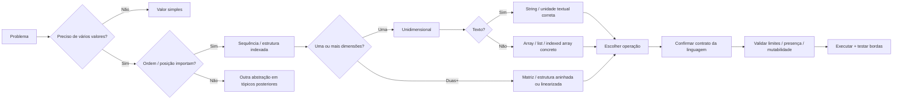

<a id="inicio"></a>

# Estruturas de Dados Elementares

> **Classificação curricular:** `[D] Obrigatório dominar no uso básico`  
>
> **Legenda de evidências/QA:** nos blocos operacionais, `[D]` = documentação/literatura, `[S]` = inspeção estática/estrutura e `[R]` = reprodução em runtime/compilador. Essa legenda é independente do `[D]` curricular acima, que significa **Obrigatório dominar**.  
>
> **Convenção de numeração:** em títulos como `8. 10.1 Sequências`, o primeiro número indica a posição editorial da seção neste documento; `10.1` é o nó da taxonomia curricular canônica. Os dois números têm funções diferentes e preservam rastreabilidade sem criar um segundo nível curricular.  
>
> **Nível:** A — Lógica de Programação  
> **Posição na taxonomia:** tópico 10  
> **Pré-requisitos:** variáveis, tipos, loops, padrões fundamentais e validação  
> **Aprofundamentos posteriores:** referências/mutabilidade, coleções, ADTs, listas ligadas, hashing, busca, ordenação e análise de complexidade

---

## Resumo executivo

Até este ponto, muitos exemplos trabalharam com:

```text
um valor
```

por variável.

Agora começamos a organizar:

```text
MUITOS VALORES
```

em uma única estrutura.

O modelo mais simples é:

```text
posição  0    1    2    3
valor   10   20   30   40
```

Essa mudança introduz conceitos fundamentais:

```text
COLEÇÃO
POSIÇÃO
ÍNDICE
TAMANHO
PERCURSO
ACESSO
ALTERAÇÃO
PROCURA
INSERÇÃO
REMOÇÃO
```

Mas existe um cuidado importante:

> **“array”, “lista”, “vetor” e “sequência” não são sinônimos universais entre linguagens.**

Neste guia, **vetor** é usado no sentido didático de uma coleção indexada unidimensional.

Isso NÃO significa que:

```text
Python list
JavaScript Array
Java array
Bash indexed array
```

tenham a mesma implementação ou as mesmas propriedades.

Algumas diferenças centrais:

```text
Python list
→ sequência mutável e redimensionável

JavaScript Array
→ objeto indexado mutável, redimensionável e até esparso

Java array
→ objeto de comprimento fixo e componentes do mesmo tipo

Bash indexed array
→ unidimensional, indexado, zero-based e pode ser esparso
```

Strings também parecem sequências, mas possuem semânticas diferentes:

```text
Python str
→ sequência imutável de Unicode code points

JavaScript String
→ sequência de UTF-16 code units

Java String
→ imutável; índices de char usam UTF-16 code units

Bash string
→ parâmetro textual; substring via parameter expansion,
  não um array de caracteres
```

A regra central do capítulo é:

> **Transfira o conceito de coleção/indexação/percurso; não presuma que a estrutura concreta é igual em outra linguagem.**

---

## Fronteira curricular

Este tópico ensina:

```text
USO BÁSICO
```

de estruturas elementares.

Não é ainda o momento de aprofundar:

```text
layout de memória
contiguidade como garantia de implementação
alocação
realocação
capacity
amortized analysis
cache locality
linked-list tradeoffs
Big O formal
```

Esses assuntos pertencem aos níveis posteriores.

Farrell ensina arrays usando um modelo clássico de memória, mas esse modelo não deve ser generalizado automaticamente para `list` Python, `Array` JavaScript ou array Bash.

---

## Decisão rápida

| Pergunta | Resposta |
|---|---|
| “Sequência e array são a mesma coisa?” | Não. Array é uma estrutura concreta/família de estruturas; sequência é um conceito mais amplo. |
| “Vetor aqui significa vetor matemático?” | Não. Aqui significa coleção indexada unidimensional no sentido didático. |
| “Índices começam em zero?” | A posição inicial é zero nas estruturas principais, mas índices negativos não são universais: Python e Bash possuem semânticas próprias; JavaScript usa `at(-1)` para acesso relativo, enquanto `array[-1]` não é índice de array; em Java, uma expressão inteira negativa pode ser usada sintaticamente como índice, mas o acesso é inválido em runtime e lança `ArrayIndexOutOfBoundsException`. |
| “Python tem array como estrutura básica?” | Para o uso introdutório, `list` é a sequência mutável principal; `array.array` é uma estrutura especializada. |
| “Python list precisa ter um único tipo?” | Não em runtime, embora coleções homogêneas sejam comuns e frequentemente desejáveis. |
| “JavaScript Array é fixo?” | Não. É redimensionável e pode ser esparso. |
| “Java array é redimensionável?” | Não. `length` é fixado quando o array é criado. |
| “Bash array precisa ter índices contínuos?” | Não. Indexed arrays podem ser esparsos. |
| “`${#array[@]}` no Bash é o maior índice + 1?” | Não. É a quantidade de elementos atribuídos. |
| “Matriz é sempre tipo nativo?” | Não. Python/JS normalmente usam estruturas aninhadas; Java usa arrays de arrays; Bash não possui array multidimensional nativo. |
| “Toda matriz precisa ser retangular?” | Conceitualmente muitas são, mas estruturas aninhadas podem ser irregulares/jagged. |
| “String pode ser alterada por índice?” | Não em Python, JavaScript ou Java `String`; Bash também não trata string como array mutável de chars. |
| “`len("😀")` é igual em todas?” | Não. Python retorna 1 code point; JS/Java length básico conta duas unidades UTF-16. |
| “Acesso fora do limite falha igual?” | Não. Python/Java lançam erro; JS normalmente retorna `undefined`; Bash tem outra semântica. |
| “Inserir/remover em array fixo Java é operação nativa?” | Não. É necessário criar/copiar outra estrutura ou usar uma coleção dinâmica posteriormente. |

---

# Índice


- [Resumo executivo](#resumo-executivo)
- [Fronteira curricular](#fronteira-curricular)
- [Decisão rápida](#decisão-rápida)
- [1. Posição deste assunto](#1-posição-deste-assunto)
  - [1.1 Por que isso importa?](#11-por-que-isso-importa)
  - [1.2 Ponte para algoritmos](#12-ponte-para-algoritmos)
  - [1.3 Currículo externo](#13-currículo-externo)
- [2. Visão panorâmica](#2-visão-panorâmica)
  - [🗺️ Visão panorâmica — o mapa antes dos detalhes](#visao-panoramica)
- [3. Coleção, sequência, vetor e array](#3-coleção-sequência-vetor-e-array)
  - [3.1 Coleção](#31-coleção)
  - [3.2 Sequência](#32-sequência)
  - [3.3 Vetor](#33-vetor)
  - [3.4 Array](#34-array)
  - [3.5 Python](#35-python)
  - [3.6 Regra](#36-regra)
- [4. Índice e posição](#4-índice-e-posição)
  - [4.1 Índice não é valor](#41-índice-não-é-valor)
  - [4.2 Índice identifica posição](#42-índice-identifica-posição)
- [5. Zero-based indexing](#5-zero-based-indexing)
  - [5.1 Último índice](#51-último-índice)
  - [5.2 Consequência para loops](#52-consequência-para-loops)
  - [5.3 Índices negativos não são portáveis](#53-indices-negativos)
- [6. Tamanho versus último índice](#6-tamanho-versus-último-índice)
  - [6.1 Bash exige ressalva](#61-bash-exige-ressalva)
- [7. Limites e acesso inválido](#7-limites-e-acesso-inválido)
  - [Python](#python)
  - [Java](#java)
  - [JavaScript](#javascript)
  - [Bash](#bash)
  - [7.1 Moral](#71-moral)
- [8. 10.1 Sequências](#8-101-sequências)
  - [8.1 CS2023](#81-cs2023)
  - [8.2 Python](#82-python)
  - [8.3 Sequência é uma abstração útil](#83-sequência-é-uma-abstração-útil)
- [9. Propriedades conceituais de uma sequência](#9-propriedades-conceituais-de-uma-sequência)
  - [9.1 Duplicatas](#91-duplicatas)
  - [9.2 Ordem importa](#92-ordem-importa)
  - [9.3 Elementos podem ser iguais](#93-elementos-podem-ser-iguais)
- [10. Sequência mutável versus imutável](#10-sequência-mutável-versus-imutável)
  - [Mutável](#mutável)
  - [Imutável](#imutável)
  - [10.1 Imutável não significa variável imutável](#101-imutável-não-significa-variável-imutável)
- [11. Iterável não é necessariamente sequência indexável](#11-iterável-não-é-necessariamente-sequência-indexável)
  - [Regra](#regra)
- [12. 10.2 Vetores e arrays](#12-102-vetores-e-arrays)
  - [Modelo conceitual](#modelo-conceitual)
  - [Operações](#operações)
  - [Fronteira](#fronteira)
- [13. Criação](#13-criação)
  - [Python](#python-1)
  - [JavaScript](#javascript-1)
  - [Java](#java-1)
  - [Bash](#bash-1)
  - [13.1 Aparência semelhante, contrato diferente](#131-aparência-semelhante-contrato-diferente)
- [14. Acesso](#14-acesso)
- [15. Alteração](#15-alteração)
  - [Python](#python-2)
  - [JavaScript](#javascript-2)
  - [Java](#java-2)
  - [Bash](#bash-2)
- [16. Tamanho](#16-tamanho)
  - [Python](#python-3)
  - [JavaScript](#javascript-3)
  - [Java](#java-3)
  - [Bash](#bash-3)
  - [16.1 Mesmo nome não significa mesma regra](#161-mesmo-nome-não-significa-mesma-regra)
- [17. Percurso](#17-percurso)
  - [Python](#python-4)
  - [JavaScript](#javascript-4)
  - [Java](#java-4)
  - [Bash](#bash-4)
  - [17.1 Prefira valor quando índice não interessa](#171-prefira-valor-quando-índice-não-interessa)
- [18. Percorrer por valor versus por índice](#18-percorrer-por-valor-versus-por-índice)
  - [18.1 Não carregue índice sem necessidade](#181-não-carregue-índice-sem-necessidade)
- [19. Python list](#19-python-list)
  - [19.1 Criação](#191-criação)
  - [19.2 Pode crescer](#192-pode-crescer)
  - [19.3 Pode inserir](#193-pode-inserir)
  - [19.4 Pode remover](#194-pode-remover)
  - [19.5 Tipos](#195-tipos)
  - [19.6 Beazley](#196-beazley)
- [20. JavaScript Array](#20-javascript-array)
  - [20.1 Redimensionável](#201-redimensionável)
  - [20.2 Pode ser esparso](#202-pode-ser-esparso)
  - [20.3 Pode conter tipos diferentes](#203-pode-conter-tipos-diferentes)
  - [20.4 Métodos](#204-métodos)
  - [20.5 Hole não é o mesmo que `undefined`](#205-hole-undefined)
  - [Guardrail](#guardrail)
- [21. Java array](#21-java-array)
  - [21.1 Comprimento fixo](#211-comprimento-fixo)
  - [21.2 Índices](#212-índices)
  - [21.3 Mesmo component type](#213-mesmo-component-type)
  - [21.4 Mutável nos elementos](#214-mutável-nos-elementos)
  - [21.5 Não cresce](#215-não-cresce)
  - [21.6 JLS](#216-jls)
- [22. Bash indexed array](#22-bash-indexed-array)
  - [22.1 Criação](#221-criação)
  - [22.2 Índices](#222-índices)
  - [22.3 Não precisam ser contíguos](#223-não-precisam-ser-contíguos)
  - [22.4 Elementos](#224-elementos)
  - [22.5 Percurso seguro](#225-percurso-seguro)
  - [22.6 Índices existentes](#226-índices-existentes)
- [23. Arrays esparsos](#23-arrays-esparsos)
  - [JavaScript](#javascript-5)
  - [Bash](#bash-5)
  - [Python list](#python-list)
  - [Java array](#java-array)
  - [Consequência](#consequência)
- [24. Tipos dos elementos](#24-tipos-dos-elementos)
  - [Java](#java-5)
  - [Python list](#python-list-1)
  - [JavaScript Array](#javascript-array)
  - [Bash](#bash-6)
  - [24.1 Boa modelagem](#241-boa-modelagem)
- [25. 10.3 Matrizes](#25-103-matrizes)
  - [25.1 Dimensões](#251-dimensões)
  - [25.2 Índices](#252-índices)
  - [25.3 Currículo](#253-currículo)
- [26. Linha, coluna e par de índices](#26-linha-coluna-e-par-de-índices)
- [27. Matrizes retangulares e irregulares](#27-matrizes-retangulares-e-irregulares)
  - [Java](#java-6)
  - [Python/JS](#pythonjs)
- [28. Python — lista de listas](#28-python--lista-de-listas)
  - [28.1 Não é um tipo Matrix nativo especial](#281-não-é-um-tipo-matrix-nativo-especial)
- [29. JavaScript — array de arrays](#29-javascript--array-de-arrays)
- [30. Java — array de arrays](#30-java--array-de-arrays)
  - [30.1 Tecnicamente](#301-tecnicamente)
  - [30.2 Acesso](#302-acesso)
  - [30.3 Irregular](#303-irregular)
- [31. Bash — sem array multidimensional nativo](#31-bash--sem-array-multidimensional-nativo)
  - [31.1 Alternativas conceituais](#311-alternativas-conceituais)
  - [31.2 Neste capítulo](#312-neste-capítulo)
- [32. Representação linear de matriz](#32-representação-linear-de-matriz)
  - [32.1 Isso ensina modelagem](#321-isso-ensina-modelagem)
- [33. Loops aninhados para matrizes](#33-loops-aninhados-para-matrizes)
  - [33.1 Número de visitas](#331-número-de-visitas)
  - [33.2 Relação com tópico 7](#332-relação-com-tópico-7)
- [34. Armadilha de linhas compartilhadas](#34-armadilha-de-linhas-compartilhadas)
  - [Python — errado](#python--errado)
  - [Python — correto](#python--correto)
  - [JavaScript — armadilha semelhante](#javascript--armadilha-semelhante)
  - [Correto](#correto)
  - [Fronteira](#fronteira-1)
- [35. 10.4 Strings como sequências](#35-104-strings-como-sequências)
  - [Guardrail](#guardrail-1)
- [36. String não é array de caracteres universal](#36-string-não-é-array-de-caracteres-universal)
  - [Consequência](#consequência-1)
- [37. Python str](#37-python-str)
  - [Acesso](#acesso)
  - [Tamanho](#tamanho)
  - [Percurso](#percurso)
  - [Imutável](#imutável-1)
- [38. JavaScript String](#38-javascript-string)
  - [Índice](#índice-1)
  - [Length](#length)
  - [Imutabilidade](#imutabilidade)
  - [Unicode](#unicode)
  - [Iteração](#iteração)
- [39. Java String](#39-java-string)
  - [Tamanho](#tamanho-1)
  - [Acesso](#acesso-1)
  - [Code points](#code-points)
  - [Regra](#regra-1)
- [40. Bash string](#40-bash-string)
  - [Tamanho](#tamanho-2)
  - [Substring](#substring)
  - [Percurso didático ASCII](#percurso-didático-ascii)
  - [Guardrail](#guardrail-2)
- [41. Unicode e comprimento](#41-unicode-e-comprimento)
  - [Python](#python-5)
  - [JavaScript](#javascript-6)
  - [Java](#java-7)
  - [Moral](#moral)
- [42. Percurso textual](#42-percurso-textual)
  - [Python](#python-6)
  - [JavaScript](#javascript-7)
  - [Java](#java-8)
  - [Bash](#bash-7)
  - [Regra](#regra-2)
- [43. Imutabilidade de strings](#43-imutabilidade-de-strings)
  - [43.1 Operações produzem novos valores](#431-operações-produzem-novos-valores)
  - [43.2 Bash](#432-bash)
- [44. 10.5 Operações fundamentais](#44-105-operações-fundamentais)
  - [44.1 Nem toda estrutura oferece todas igualmente](#441-nem-toda-estrutura-oferece-todas-igualmente)
  - [44.2 Operação conceitual versus método](#442-operação-conceitual-versus-método)
- [45. Acesso](#45-acesso)
  - [45.1 Pré-condição](#451-pré-condição)
- [46. Alteração](#46-alteração)
  - [46.1 Não é inserção](#461-não-é-inserção)
- [47. Percurso](#47-percurso)
  - [47.1 Ordem](#471-ordem)
- [48. Procura](#48-procura)
  - [Busca linear](#busca-linear)
  - [Python](#python-7)
  - [JavaScript](#javascript-8)
  - [Java](#java-9)
  - [Bash](#bash-8)
- [49. Inserção](#49-inserção)
  - [Python list](#python-list-2)
  - [JavaScript Array](#javascript-array-1)
  - [Java array](#java-array-1)
  - [Bash indexed array](#bash-indexed-array)
- [50. Remoção](#50-remoção)
  - [Python](#python-8)
  - [JavaScript](#javascript-9)
  - [Java](#java-10)
  - [Bash](#bash-9)
  - [Moral](#moral-1)
- [51. Busca linear como operação fundamental](#51-busca-linear-como-operação-fundamental)
  - [51.1 Currículo](#511-currículo)
  - [51.2 Fronteira](#512-fronteira)
- [52. Python — operações fundamentais](#52-python--operações-fundamentais)
- [53. JavaScript — operações fundamentais](#53-javascript--operações-fundamentais)
- [54. Java — operações fundamentais](#54-java--operações-fundamentais)
  - [Inserção/remoção](#inserçãoremoção)
- [55. Bash — operações fundamentais](#55-bash--operações-fundamentais)
- [56. Comparação entre as quatro linguagens](#56-comparação-entre-as-quatro-linguagens)
- [57. Exemplo canônico — vetor de latências](#57-exemplo-canônico--vetor-de-latências)
  - [Python](#python-9)
  - [JavaScript](#javascript-10)
  - [Java](#java-11)
  - [Bash](#bash-10)
- [58. Exemplo canônico — matriz 2 por 3](#58-exemplo-canônico--matriz-2-por-3)
  - [Python](#python-10)
  - [JavaScript](#javascript-11)
  - [Java](#java-12)
  - [Bash — representação linear](#bash--representação-linear)
- [59. Exemplo canônico — string](#59-exemplo-canônico--string)
  - [Python](#python-11)
  - [JavaScript](#javascript-12)
  - [Java](#java-13)
  - [Bash](#bash-11)
- [60. Exemplo crítico — último índice](#60-exemplo-crítico--último-índice)
  - [Python](#python-12)
  - [JavaScript](#javascript-13)
  - [Java](#java-14)
- [61. Exemplo crítico — acesso fora do limite](#61-exemplo-crítico--acesso-fora-do-limite)
  - [Python](#python-13)
  - [Java](#java-15)
  - [JavaScript](#javascript-14)
  - [Consequência](#consequência-2)
- [62. Exemplo crítico — Java array não cresce](#62-exemplo-crítico--java-array-não-cresce)
  - [Para adicionar](#para-adicionar)
- [63. Exemplo crítico — JavaScript array esparso](#63-exemplo-crítico--javascript-array-esparso)
  - [Guardrail](#guardrail-3)
- [64. Exemplo crítico — Bash count não é max-index mais um](#64-exemplo-crítico--bash-count-não-é-max-index-mais-um)
  - [Moral](#moral-2)
- [65. Exemplo crítico — matriz com aliasing](#65-exemplo-crítico--matriz-com-aliasing)
  - [Python](#python-14)
  - [JavaScript](#javascript-15)
  - [Motivo conceitual](#motivo-conceitual)
  - [Correção](#correção)
- [66. Exemplo crítico — emoji e indexação textual](#66-exemplo-crítico--emoji-e-indexação-textual)
  - [Python](#python-15)
  - [JavaScript](#javascript-16)
  - [Java](#java-16)
  - [Por quê?](#por-quê)
  - [Consequência](#consequência-3)
- [67. Robustez e validação de entradas](#67-robustez-e-validação-de-entradas)
  - [67.1 Índices externos](#671-índices-externos)
  - [67.2 Tamanho externo](#672-tamanho-externo)
  - [67.3 Bash](#673-bash)
  - [67.4 JavaScript](#674-javascript)
- [68. O que fica para Estruturas de Dados](#68-o-que-fica-para-estruturas-de-dados)
  - [68.1 Fronteira canônica](#681-fronteira-canônica)
- [69. Erros conceituais frequentes](#69-erros-conceituais-frequentes)
  - [69.1 “Array é igual em toda linguagem”](#691-array-é-igual-em-toda-linguagem)
  - [69.2 “Python list é Java array”](#692-python-list-é-java-array)
  - [69.3 “JavaScript Array é sempre denso”](#693-javascript-array-é-sempre-denso)
  - [69.4 “Bash array é lista contínua”](#694-bash-array-é-lista-contínua)
  - [69.5 “length é último índice”](#695-length-é-último-índice)
  - [69.6 “Matriz é sempre um tipo nativo especial”](#696-matriz-é-sempre-um-tipo-nativo-especial)
  - [69.7 “Array multidimensional Java é um bloco retangular indivisível”](#697-array-multidimensional-java-é-um-bloco-retangular-indivisível)
  - [69.8 “String é array de char”](#698-string-é-array-de-char)
  - [69.9 “Java char é qualquer caractere Unicode”](#699-java-char-é-qualquer-caractere-unicode)
  - [69.10 “JavaScript length conta símbolos visuais”](#6910-javascript-length-conta-símbolos-visuais)
  - [69.11 “Python list precisa ser homogênea”](#6911-python-list-precisa-ser-homogênea)
  - [69.12 “Insert = replace”](#6912-insert--replace)
  - [69.13 “unset Bash compacta os índices”](#6913-unset-bash-compacta-os-índices)
  - [69.14 “Se acesso JS não lança erro, índice estava correto”](#6914-se-acesso-js-não-lança-erro-índice-estava-correto)
  - [69.15 “Matriz criada com repetição sempre cria linhas independentes”](#6915-matriz-criada-com-repetição-sempre-cria-linhas-independentes)
- [Problemas reais — índice operacional e resolução](#problemas-reais)
  - [`PR-T10-01` — percorrer uma sequência sem ultrapassar limites](#pr-t10-01)
  - [`PR-T10-02` — usar valor ou índice conforme a necessidade](#pr-t10-02)
  - [`PR-T10-03` — distinguir array esparso, hole e `undefined`](#pr-t10-03)
  - [`PR-T10-04` — validar matriz retangular ou aceitar jagged conscientemente](#pr-t10-04)
  - [`PR-T10-05` — construir linhas independentes sem aliasing acidental](#pr-t10-05)
  - [`PR-T10-06` — percorrer texto na unidade Unicode correta](#pr-t10-06)
  - [`PR-T10-07` — inserir/remover respeitando a estrutura concreta](#pr-t10-07)
  - [`PR-T10-08` — manipular Bash indexed array esparso com segurança](#pr-t10-08)
  - [`PR-T10-09` — validar índice vindo de entrada externa](#pr-t10-09)
  - [`PR-T10-10` — transferir acesso relativo sem assumir índice negativo universal](#pr-t10-10)
- [70. Debugging](#70-debugging)
  - [Índice](#índice-2)
  - [Estado](#estado)
  - [Matriz](#matriz)
  - [Aliasing](#aliasing)
  - [String](#string)
  - [Bash](#bash-12)
  - [🔎 Troubleshooting sistemático](#troubleshooting-sistematico)
    - [`TS-T10-01` — off-by-one acessa `length`](#ts-t10-01)
    - [`TS-T10-02` — JavaScript confunde hole, ausência e `undefined`](#ts-t10-02)
    - [`TS-T10-03` — callback de `map` não roda para holes](#ts-t10-03)
    - [`TS-T10-04` — Bash usa contagem como se fosse maior índice + 1](#ts-t10-04)
    - [`TS-T10-05` — Bash quebra elementos por expansão sem aspas](#ts-t10-05)
    - [`TS-T10-06` — linhas de matriz compartilham a mesma subestrutura](#ts-t10-06)
    - [`TS-T10-07` — emoji é dividido em duas unidades UTF-16](#ts-t10-07)
    - [`TS-T10-08` — Java trata array fixo como coleção expansível](#ts-t10-08)
    - [`TS-T10-09` — remover enquanto percorre faz elemento ser pulado](#ts-t10-09)
    - [`TS-T10-10` — índice negativo foi transferido literalmente entre linguagens](#ts-t10-10)
- [71. Laboratórios](#71-laboratórios)
  - [🧪 LAB 1 — vetor básico](#-lab-1--vetor-básico)
  - [🧪 LAB 2 — limite](#-lab-2--limite)
  - [🧪 LAB 3 — busca linear](#-lab-3--busca-linear)
  - [🧪 LAB 4 — matriz](#-lab-4--matriz)
  - [🧪 LAB 5 — jagged](#-lab-5--jagged)
  - [🧪 LAB 6 — aliasing](#-lab-6--aliasing)
  - [🧪 LAB 7 — strings](#-lab-7--strings)
  - [🧪 LAB 8 — Bash sparse array](#-lab-8--bash-sparse-array)
  - [🧪 LAB 9 — inserção e remoção](#-lab-9--inserção-e-remoção)
  - [🧪 LAB 10 — NetDev opcional](#-lab-10--netdev-opcional)
- [72. Exercícios](#72-exercícios)
  - [72.1 Coleção](#721-coleção)
  - [72.2 Sequência](#722-sequência)
  - [72.3 Vetor](#723-vetor)
  - [72.4 Índice](#724-índice)
  - [72.5 Python](#725-python)
  - [72.6 JavaScript](#726-javascript)
  - [72.7 Java](#727-java)
  - [72.8 Bash](#728-bash)
  - [72.9 Matriz](#729-matriz)
  - [72.10 Jagged](#7210-jagged)
  - [72.11 Aliasing](#7211-aliasing)
  - [72.12 String](#7212-string)
  - [72.13 Unicode](#7213-unicode)
  - [72.14 Operações](#7214-operações)
  - [72.15 Remoção](#7215-remoção)
  - [72.16 Busca](#7216-busca)
  - [72.17 Percurso](#7217-percurso)
  - [72.18 Fronteira](#7218-fronteira)
- [73. Evidências de domínio](#73-evidências-de-domínio)
  - [Conceitos](#conceitos)
  - [Uso](#uso)
  - [Comparação](#comparação)
  - [Matrizes](#matrizes)
  - [Strings](#strings)
  - [Transferência](#transferência)
- [74. Checklist de consulta rápida](#74-checklist-de-consulta-rápida)
- [75. Glossário](#75-glossário)
- [76. Referências](#76-referências)
  - [76.1 Taxonomia canônica](#761-taxonomia-canônica)
  - [76.2 CS2023 — ACM / IEEE-CS / AAAI](#762-cs2023--acm--ieee-cs--aaai)
  - [76.3 Python 3.14.7 — documentação oficial](#763-python-3147--documentação-oficial)
  - [76.4 ECMAScript 2026 — especificação oficial](#764-ecmascript-2026--especificação-oficial)
  - [76.5 Java SE 27 — documentação oficial](#765-java-se-27--documentação-oficial)
  - [76.6 GNU Bash 5.3 — documentação oficial](#766-gnu-bash-53--documentação-oficial)
  - [76.7 Literatura de referência local](#767-literatura-de-referência-local)
  - [76.8 Como as fontes foram reconciliadas](#768-como-as-fontes-foram-reconciliadas)
- [77. Histórico de versões](#77-histórico-de-versões)

---

# 1. Posição deste assunto

Os tópicos anteriores ensinaram como processar valores.

Agora precisamos armazenar grupos:

```text
latency_1
latency_2
latency_3
```

pode evoluir para:

```text
latencies = [12, 8, 35]
```

## 1.1 Por que isso importa?

Sem coleção:

```text
variável por item
+
lógica repetida
```

Com coleção:

```text
uma estrutura
+
loop
+
padrões algorítmicos
```

## 1.2 Ponte para algoritmos

Arrays/sequências permitem aplicar:

- contagem;
- soma;
- máximo;
- mínimo;
- busca;
- filtragem;
- transformação.

## 1.3 Currículo externo

CS2023 coloca arrays unidimensionais e multidimensionais entre as estruturas fundamentais e espera que o estudante consiga aplicá-los na resolução de problemas.

Também coloca strings e processamento textual dentro das estruturas fundamentais disponibilizadas pela linguagem.

[↑ Voltar ao índice](#índice)

---

# 2. Visão panorâmica

<a id="visao-panoramica"></a>

## 🗺️ Visão panorâmica — o mapa antes dos detalhes

Esta visão funciona como **caderno rápido de consulta** e como contrato de cobertura do T10. O objetivo é recuperar rapidamente como **sequência, índice, vetor/array, matriz, string e operações fundamentais** se relacionam sem presumir que estruturas com nomes parecidos possuem a mesma semântica em Python, JavaScript, Java e Bash.

### Mapa do domínio — o que existe

```text
ESTRUTURAS DE DADOS ELEMENTARES
│
├── sequência / coleção ordenada
│   ├── elementos
│   ├── ordem
│   ├── posição
│   ├── índice, quando suportado
│   ├── tamanho
│   └── percurso
│
├── estrutura unidimensional
│   ├── Python list
│   ├── JavaScript Array
│   ├── Java array
│   └── Bash indexed array
│
├── estrutura bidimensional / matriz
│   ├── linha
│   ├── coluna
│   ├── [row][column]
│   ├── retangular × jagged
│   ├── estrutura aninhada × representação linear
│   └── independência das linhas / aliasing
│
├── string como sequência textual
│   ├── Python → Unicode code points
│   ├── JavaScript → UTF-16 code units na indexação/length
│   ├── Java → UTF-16 code units em char/length
│   └── Bash → parâmetro textual + parameter expansion
│
└── operações fundamentais
    ├── acessar
    ├── alterar
    ├── percorrer
    ├── procurar
    ├── inserir
    └── remover
```

### Fluxo principal — do requisito para a operação correta



A pergunta central não é apenas “qual sintaxe acessa a posição 2?”, mas:

> **qual estrutura concreta tenho, quais posições realmente existem, que unidade está sendo indexada e qual contrato a operação preserva?**

### Consulta rápida — necessidade → mecanismo → risco

| Necessidade | Mecanismo inicial | Primeira verificação |
|---|---|---|
| acessar um elemento conhecido | índice/subscript | `0 <= index < tamanho` no modelo denso; estruturas esparsas exigem presença explícita |
| percorrer todos os valores | iteração por valor | não carregar índice se ele não participa do problema |
| usar posição e valor | iteração por índice/par | fronteiras e relação índice→valor |
| descobrir o último item | operação idiomática da linguagem | não assumir que `length` é o último índice |
| usar acesso relativo ao fim | recurso específico da linguagem | Python/Bash e `Array.at()` não significam portabilidade universal de `[-1]` |
| modelar linhas e colunas | estrutura 2D / arrays aninhados / linearização | retangular × jagged e independência das linhas |
| inserir/remover | API da estrutura concreta | replace ≠ insert; array Java não cresce; Bash pode deixar gaps |
| contar itens em Bash | `${#array[@]}` | contagem ≠ maior índice + 1 em array esparso |
| detectar presença em JavaScript | propriedade/índice existente | hole ≠ propriedade com valor `undefined` |
| medir texto | unidade definida pela API | bytes × code units × code points × grapheme clusters |
| processar emoji/suplementares | code points ou graphemes conforme o problema | indexação UTF-16 pode separar surrogate pair |
| usar índice recebido externamente | validar antes de acessar | negativos, fora do limite e estruturas vazias |

### Não confundir

| Par | Distinção essencial |
|---|---|
| **coleção × sequência** | coleção é conceito amplo; sequência preserva ordem e normalmente possui operações posicionais |
| **vetor didático × vetor matemático** | neste tópico, “vetor” significa estrutura unidimensional indexada no sentido didático |
| **sequência × array concreto** | sequência é abstração; cada linguagem oferece estruturas com contratos próprios |
| **posição × valor** | índice identifica onde; elemento é o valor localizado ali |
| **tamanho × último índice** | em sequência densa zero-based não vazia, último índice é `size - 1`; isso não generaliza para toda estrutura esparsa |
| **índice zero-based × índice negativo** | zero é a origem posicional; acesso negativo é uma conveniência adicional e não universal |
| **alterar × inserir** | alterar substitui elemento existente; inserir muda a estrutura/posição quando a API permite |
| **remover × deixar hole** | certas operações compactam; outras apenas removem uma propriedade/posição lógica |
| **hole × `undefined`** | em JavaScript, ausência da propriedade de índice não é igual a uma propriedade existente cujo valor é `undefined` |
| **matriz × array nativo 2D universal** | Python/JS usam estruturas aninhadas; Java usa array de arrays; Bash não possui array multidimensional nativo |
| **retangular × jagged** | linhas podem ter comprimentos iguais ou diferentes conforme a estrutura/contrato |
| **cópia de linha × referência compartilhada** | repetir a mesma subestrutura pode fazer várias linhas apontarem para o mesmo objeto |
| **string × array de caracteres** | o modelo textual varia; JavaScript/Java usam UTF-16 em várias APIs, Python usa code points e Bash usa parameter expansion |
| **code point × grapheme cluster** | um code point ainda não é necessariamente um “caractere visual” completo |

### Microexemplos canônicos

**1. Fronteira densa zero-based**

```text
values = [10, 20, 30]
size = 3
índices válidos = 0, 1, 2
índice 3 = fora do limite
```

**2. Índice negativo não é contrato universal**

```text
Python      values[-1]  → último elemento
JavaScript  values[-1]  → propriedade "-1", normalmente undefined
JavaScript  values.at(-1) → último elemento
Java        values[-1]  → erro em runtime
Bash        ${values[-1]} → relativo ao maior índice atribuído
```

**3. JavaScript: hole × `undefined`**

```javascript
const a = [];
a.length = 1;       // hole em 0

const b = [undefined]; // propriedade 0 existe
```

Ambos podem produzir `undefined` ao ler `array[0]`, mas **não possuem a mesma estrutura**.

**4. Matriz com linhas compartilhadas**

```text
linha única
  ↑       ↑
row 0   row 1
```

Alterar `row 0` pode aparecer em `row 1` se ambas referenciam a mesma subestrutura.

**5. Unicode**

```text
"😀"
Python len           → 1 code point
JavaScript .length   → 2 UTF-16 code units
Java .length()       → 2 UTF-16 code units
```

### Problemas reais representativos

| ID | Necessidade | Capacidades combinadas | Destino |
|---|---|---|---|
| `PR-T10-01` | percorrer sem sair do limite | tamanho + índice + condição de loop | [`PR-T10-01`](#pr-t10-01) |
| `PR-T10-02` | escolher percurso por valor ou índice | intenção + iteração + legibilidade | [`PR-T10-02`](#pr-t10-02) |
| `PR-T10-03` | distinguir hole de `undefined` | presença + sparse array + iteração | [`PR-T10-03`](#pr-t10-03) |
| `PR-T10-04` | processar matriz retangular ou jagged | linha + coluna + validação estrutural | [`PR-T10-04`](#pr-t10-04) |
| `PR-T10-05` | criar linhas independentes | referências + construção + teste de aliasing | [`PR-T10-05`](#pr-t10-05) |
| `PR-T10-06` | processar Unicode sem cortar símbolo suplementar | unidade textual + percurso | [`PR-T10-06`](#pr-t10-06) |
| `PR-T10-07` | inserir/remover conforme a estrutura | operação conceitual + API concreta | [`PR-T10-07`](#pr-t10-07) |
| `PR-T10-08` | manipular Bash array esparso corretamente | índices existentes + quoting + contagem | [`PR-T10-08`](#pr-t10-08) |
| `PR-T10-09` | usar índice vindo de fora com segurança | validação + bounds + falha explícita | [`PR-T10-09`](#pr-t10-09) |
| `PR-T10-10` | transferir acesso ao fim entre linguagens | índice relativo + semântica específica | [`PR-T10-10`](#pr-t10-10) |

### Falha típica → primeira investigação

| Sintoma | Primeira hipótese/verificação | Caso |
|---|---|---|
| erro ao acessar exatamente `length` | *off-by-one*: último índice é `length - 1` em sequência densa | [`TS-T10-01`](#ts-t10-01) |
| JS retorna `undefined`, mas não sei se havia elemento | verificar presença da propriedade/índice, não apenas o valor | [`TS-T10-02`](#ts-t10-02) |
| `map()` executa menos callbacks que `length` | array possui holes | [`TS-T10-03`](#ts-t10-03) |
| Bash percorre índices inexistentes | contagem foi tratada como maior índice + 1 | [`TS-T10-04`](#ts-t10-04) |
| elemento Bash com espaço vira vários argumentos | `${array[@]}` foi expandido sem aspas | [`TS-T10-05`](#ts-t10-05) |
| mudar uma célula altera outra linha | linhas compartilham a mesma subestrutura | [`TS-T10-06`](#ts-t10-06) |
| emoji é cortado em JavaScript/Java | algoritmo percorre UTF-16 code units quando precisava de code points | [`TS-T10-07`](#ts-t10-07) |
| tentativa de “append” em Java array falha | array tem comprimento fixo | [`TS-T10-08`](#ts-t10-08) |
| remoção durante loop pula item | mutação deslocou posições ainda não visitadas | [`TS-T10-09`](#ts-t10-09) |
| `[-1]` funciona numa linguagem e falha noutra | semântica de índice negativo foi transferida literalmente | [`TS-T10-10`](#ts-t10-10) |

### Transferência entre linguagens — conceito comum, contratos diferentes

| Capacidade | Python | JavaScript | Java | Bash |
|---|---|---|---|---|
| estrutura unidimensional principal aqui | `list` | `Array` | `T[]` / primitivos `int[]` etc. | indexed array |
| tamanho | `len(values)` | `values.length` | `values.length` | `${#values[@]}` = elementos atribuídos |
| acesso básico | `values[i]` | `values[i]` | `values[i]` | `${values[i]}` |
| negativo relativo ao fim | `values[-1]` | `values.at(-1)`; `values[-1]` não é índice de Array | não | `${values[-1]}` |
| crescimento | `append` etc. | `push` etc. | não cresce | atribuição/`+=`, podendo ser esparso |
| estrutura esparsa | não em `list` | sim, holes | não | sim |
| matriz | lista de listas | array de arrays | array de arrays | modelar/linearizar; sem array 2D nativo |
| string indexada | code point como `str` de tamanho 1 | UTF-16 code unit | `char`/UTF-16 code unit | substring via expansão |
| string mutável por índice | não | não | não | não se modela como array de chars |

> **Bash não deve ser forçado a fingir equivalência estrutural com arrays/matrizes de linguagens generalistas.** Quando a estrutura cresce em complexidade, uma linguagem como Python, JavaScript ou Java costuma representar o problema de forma mais natural.

### Síntese multifonte desta visão

A arquitetura panorâmica resulta de contribuições complementares, não de uma única fonte:

```text
GUIA v2.1.0 + CS2023
→ fronteira curricular e capacidades fundamentais

Farrell
→ modelo didático de arrays, bounds, busca e multidimensionais

Beazley
→ list Python, indexação, mutação, nested lists e operações de sequência

Stroustrup
→ distinção entre abstração sequencial e estruturas concretas com propriedades diferentes

GNU Bash Reference Manual 5.3
→ indexed arrays unidimensionais, sparse, índices existentes e índices negativos

Python / ECMAScript / Java oficiais
→ semântica vigente de listas/sequências, Array, arrays Java e strings/Unicode
```

A definição universal do capítulo permanece propositalmente **conceitual**. Propriedades como contiguidade, crescimento, densidade, unidade textual e comportamento fora do limite são confirmadas na linguagem/estrutura concreta antes de serem ensinadas como verdade.

### Modo consulta × modo estudo

**Consulta em ~30 segundos:**

```text
Decisão rápida
→ esta Visão Panorâmica
→ seção da linguagem/estrutura
→ exemplo crítico
→ troubleshooting correspondente
```

**Estudo completo:**

```text
posição curricular
→ coleção/sequência/array
→ índice e bounds
→ estruturas 1D
→ matrizes
→ strings/Unicode
→ operações fundamentais
→ exemplos
→ PR-*
→ debugging/troubleshooting
→ LABs
→ evidências de domínio
```

**Primeira passagem essencial — núcleo do T10:**

`coleção/sequência → posição/índice → tamanho/limites → criação/acesso/alteração/percurso → vetores/arrays → matriz básica → string básica → operações fundamentais → exemplo canônico 1D → LABs 1–4`

**Segunda passagem — contrastes e casos que evitam falsas generalizações:**

`holes/sparse arrays → jagged/aliasing → unidades Unicode → índices negativos/portabilidade → PR-* → TS-*`

> Essa ordem é apenas uma **prioridade de leitura**. Não cria nova classificação curricular, não rebaixa as diferenças entre linguagens e não remove conteúdo obrigatório da taxonomia `10.1–10.5`.

[↑ Voltar ao índice](#índice)

---

# 3. Coleção, sequência, vetor e array

Esses termos precisam ser separados.

## 3.1 Coleção

Termo genérico:

```text
grupo de valores
```

Pode ser:

- ordenado;
- não ordenado;
- indexado;
- associado por chave.

## 3.2 Sequência

Conceitualmente:

```text
valores em determinada ordem
```

Neste capítulo focamos sequências que oferecem posições/indexação ou percurso previsível.

## 3.3 Vetor

Na didática de programação em português:

```text
vetor
≈
estrutura indexada de uma dimensão
```

Isso não significa vetor matemático.

## 3.4 Array

Nome usado por muitas linguagens para uma estrutura indexada.

Mas:

```text
Java array
```

possui semântica diferente de:

```text
JavaScript Array
```

## 3.5 Python

A estrutura introdutória mais próxima do uso didático de “vetor” é normalmente:

```python
list
```

Não:

```text
array fixo
```

## 3.6 Regra

> **Use o conceito comum para aprender lógica; use o nome e contrato reais da linguagem ao programar.**

[↑ Voltar ao índice](#índice)

---

# 4. Índice e posição

Considere:

```text
valores = [10, 20, 30]
```

Podemos falar:

```text
primeira posição
segunda posição
terceira posição
```

Mas os índices são:

```text
0
1
2
```

Tabela:

| posição humana | índice | valor |
|---:|---:|---:|
| 1ª | 0 | 10 |
| 2ª | 1 | 20 |
| 3ª | 2 | 30 |

## 4.1 Índice não é valor

```text
índice 2
```

não significa que o elemento vale `2`.

## 4.2 Índice identifica posição

Exemplo:

```text
values[2]
→ 30
```

[↑ Voltar ao índice](#índice)

---

# 5. Zero-based indexing

Python:

```python
values[0]
```

JavaScript:

```javascript
values[0]
```

Java:

```java
values[0]
```

Bash:

```bash
"${values[0]}"
```

## 5.1 Último índice

Para uma sequência densa de tamanho:

```text
n
```

os índices convencionais são:

```text
0 ... n - 1
```

## 5.2 Consequência para loops

Forma clássica:

```text
i = 0
while i < length
```

em vez de:

```text
i <= length
```

[↑ Voltar ao índice](#índice)

---


## 5.3 Índices negativos não são portáveis

<a id="53-indices-negativos"></a>

A origem posicional continua sendo zero, mas algumas linguagens oferecem **formas adicionais de acesso relativo ao fim**.

| Linguagem | Exemplo | Semântica |
|---|---|---|
| Python | `values[-1]` | último elemento; índices negativos fazem parte das operações de sequência |
| JavaScript | `values[-1]` | acessa a propriedade `"-1"`; não é índice de Array |
| JavaScript | `values.at(-1)` | acesso relativo ao fim por API explícita |
| Java | `values[-1]` | `ArrayIndexOutOfBoundsException` em runtime |
| Bash | `${values[-1]}` | índice negativo é relativo a um além do maior índice atribuído |

Isso produz uma regra de transferência importante:

> **transfira a intenção “acessar a partir do fim”; não copie literalmente a sintaxe `[-1]` entre linguagens.**

Em Bash esparso, “último” significa o elemento relativo ao **maior índice atribuído**, e não necessariamente a posição `count - 1`.

[↑ Voltar ao índice](#índice)

---

# 6. Tamanho versus último índice

Para:

```text
[10, 20, 30]
```

temos:

```text
tamanho = 3
último índice = 2
```

Logo:

```text
último índice
=
tamanho - 1
```

para uma sequência densa zero-based.

## 6.1 Bash exige ressalva

Bash indexed arrays podem ser **esparsos**:

```text
índices 0 e 5
```

Quantidade de elementos:

```text
2
```

Maior índice:

```text
5
```

Logo:

```text
count != max_index + 1
```

nesse caso.

[↑ Voltar ao índice](#índice)

---

# 7. Limites e acesso inválido

## Python

```python
values[10]
```

fora do intervalo gera:

```text
IndexError
```

## Java

Acesso inválido gera:

```text
ArrayIndexOutOfBoundsException
```

## JavaScript

Acesso a propriedade de índice inexistente normalmente produz:

```text
undefined
```

## Bash

Um elemento não atribuído possui semântica de expansão de parâmetro shell, não exceção de array como Python/Java.

## 7.1 Moral

> **A mesma falha conceitual de índice possui mecanismos diferentes entre linguagens.**

[↑ Voltar ao índice](#índice)

---

# 8. 10.1 Sequências

A taxonomia define o núcleo:

```text
coleção de elementos
posição
índice
percurso
```

## 8.1 CS2023

O currículo atual inclui estruturas sequenciais fornecidas pela linguagem, como:

```text
arrays
lists
```

e strings/processamento textual.

## 8.2 Python

Documentação oficial lista como sequências básicas:

```text
list
tuple
range
```

e trata `str` como sequência textual.

## 8.3 Sequência é uma abstração útil

Podemos escrever algoritmos pensando:

```text
primeiro
próximo
último
percorrer
buscar
```

antes de discutir representação interna.

[↑ Voltar ao índice](#índice)

---

# 9. Propriedades conceituais de uma sequência

Uma sequência possui:

```text
ordem
```

Os elementos têm relação de posição.

## 9.1 Duplicatas

Sequências podem conter:

```text
[1, 1, 2]
```

## 9.2 Ordem importa

```text
[1,2,3]
```

é diferente de:

```text
[3,2,1]
```

para muitos contratos.

## 9.3 Elementos podem ser iguais

Índice permite distinguir:

```text
primeiro 1
segundo 1
```

[↑ Voltar ao índice](#índice)

---

# 10. Sequência mutável versus imutável

## Mutável

Elementos/estrutura podem ser alterados.

Python:

```text
list
```

JavaScript:

```text
Array
```

Java:

```text
array components
```

Bash:

```text
indexed array
```

## Imutável

A sequência não permite alteração de seus elementos após criação.

Python:

```text
tuple
str
```

Java:

```text
String
```

JavaScript:

```text
String primitive value
```

## 10.1 Imutável não significa variável imutável

A variável pode ser reassociada a outro valor.

O objeto/string original é que não muda.

[↑ Voltar ao índice](#índice)

---

# 11. Iterável não é necessariamente sequência indexável

Esse refinamento evita uma generalização futura incorreta.

Uma fonte pode permitir:

```text
for each
```

sem oferecer:

```text
source[5]
```

Exemplos posteriores:

- generators;
- iterators;
- streams.

## Regra

```text
PERCORRÍVEL
≠
NECESSARIAMENTE INDEXÁVEL
```

Neste tópico, porém, o foco são estruturas elementares com acesso posicional ou comportamento equivalente.

[↑ Voltar ao índice](#índice)

---

# 12. 10.2 Vetores e arrays

A taxonomia exige:

```text
criação
acesso
alteração
tamanho
percurso
```

## Modelo conceitual

```text
index:  0    1    2
value: 10   20   30
```

## Operações

```text
create
get
set
length
iterate
```

## Fronteira

Ainda não analisaremos formalmente:

```text
por que acesso pode ser O(1)
por que inserir no meio pode custar O(n)
```

Isso vem depois.

[↑ Voltar ao índice](#índice)

---

# 13. Criação

## Python

```python
values = [10, 20, 30]
```

## JavaScript

```javascript
const values = [10, 20, 30];
```

## Java

```java
int[] values = {10, 20, 30};
```

## Bash

```bash
values=(10 20 30)
```

## 13.1 Aparência semelhante, contrato diferente

Essa semelhança sintática não implica estrutura idêntica.

[↑ Voltar ao índice](#índice)

---

# 14. Acesso

Índice `1`:

Python:

```python
values[1]
```

JavaScript:

```javascript
values[1]
```

Java:

```java
values[1]
```

Bash:

```bash
"${values[1]}"
```

Resultado:

```text
20
```

[↑ Voltar ao índice](#índice)

---

# 15. Alteração

## Python

```python
values[1] = 25
```

## JavaScript

```javascript
values[1] = 25;
```

## Java

```java
values[1] = 25;
```

## Bash

```bash
values[1]=25
```

Depois:

```text
[10,25,30]
```

conceitualmente.

[↑ Voltar ao índice](#índice)

---

# 16. Tamanho

## Python

```python
len(values)
```

## JavaScript

```javascript
values.length
```

## Java

```java
values.length
```

## Bash

```bash
"${#values[@]}"
```

## 16.1 Mesmo nome não significa mesma regra

Java:

```text
fixed array length
```

JavaScript:

```text
length mutable e relacionada aos array-index properties
```

Bash:

```text
número de elementos atribuídos
```

[↑ Voltar ao índice](#índice)

---

# 17. Percurso

## Python

```python
for value in values:
    print(value)
```

## JavaScript

```javascript
for (const value of values) {
  console.log(value);
}
```

## Java

```java
for (int value : values) {
    System.out.println(value);
}
```

## Bash

```bash
for value in "${values[@]}"; do
    printf '%s\n' "$value"
done
```

## 17.1 Prefira valor quando índice não interessa

Isso reduz estado manual.

[↑ Voltar ao índice](#índice)

---

# 18. Percorrer por valor versus por índice

Por valor:

```text
for each value
```

Use quando:

```text
posição não importa
```

Por índice:

```text
for i
    value = values[i]
```

Use quando precisa:

- posição;
- elemento anterior/seguinte;
- alterar posição específica;
- comparar estruturas paralelas;
- mapear linha/coluna.

## 18.1 Não carregue índice sem necessidade

Código fica mais simples quando o problema pede apenas os valores.

[↑ Voltar ao índice](#índice)

---

# 19. Python list

Python 3.14.7 define:

```text
list
→ mutable sequence
```

## 19.1 Criação

```python
values = [10, 20, 30]
```

## 19.2 Pode crescer

```python
values.append(40)
```

## 19.3 Pode inserir

```python
values.insert(1, 15)
```

## 19.4 Pode remover

```python
values.pop()
values.remove(20)
```

## 19.5 Tipos

Runtime permite:

```python
values = [1, "two", 3.0]
```

Mas coleções homogêneas frequentemente produzem contratos mais claros.

## 19.6 Beazley

*Python Distilled* apresenta listas como coleções ordenadas, indexadas por inteiros a partir de zero, com alteração, append, insert e slicing.

[↑ Voltar ao índice](#índice)

---

# 20. JavaScript Array

ECMAScript 2026 define Array como objeto exótico com:

```text
length
+
propriedades com nomes de array index
```

## 20.1 Redimensionável

```javascript
const values = [10, 20, 30];
values.push(40);
```

## 20.2 Pode ser esparso

```javascript
const values = [];
values[5] = 10;
```

Agora:

```text
length = 6
```

mas isso não significa que cinco valores anteriores normais tenham sido inseridos.

Existem holes.

## 20.3 Pode conter tipos diferentes

```javascript
[1, "two", true]
```

## 20.4 Métodos

ECMAScript fornece:

- `push`;
- `pop`;
- `shift`;
- `unshift`;
- `splice`;
- `includes`;
- `indexOf`;
- `find`;
- `map`;
- `filter`.

## 20.5 Hole não é o mesmo que `undefined`

<a id="205-hole-undefined"></a>

Compare:

```javascript
const withHole = [];
withHole.length = 1;

const withUndefined = [undefined];
```

Nos dois casos:

```javascript
array[0]
```

pode produzir:

```text
undefined
```

Mas a estrutura é diferente:

```javascript
0 in withHole       // false
0 in withUndefined  // true
```

Essa diferença afeta operações. Por exemplo, `Array.prototype.map()` chama o callback apenas para elementos que **realmente existem**; holes não são visitados pelo callback.

> **Valor ausente e valor `undefined` não são automaticamente a mesma coisa em um Array esparso.**

[↑ Voltar ao índice](#índice)

---

## Guardrail

> **Array JavaScript não deve ser mentalmente reduzido a “array fixo de C/Java”.**

[↑ Voltar ao índice](#índice)

---

# 21. Java array

A JLS 27 define arrays como objetos criados dinamicamente.

## 21.1 Comprimento fixo

Na criação:

```java
int[] values = new int[3];
```

existem exatamente:

```text
3 components
```

## 21.2 Índices

Para comprimento `n`:

```text
0 ... n - 1
```

## 21.3 Mesmo component type

```java
int[]
```

contém componentes `int`.

## 21.4 Mutável nos elementos

```java
values[0] = 10;
```

## 21.5 Não cresce

Não existe:

```text
array.append(...)
```

Se precisa crescimento dinâmico, posteriormente veremos:

```text
ArrayList
```

como coleção diferente.

## 21.6 JLS

A especificação separa formalmente:

- array type;
- creation;
- access;
- initializer;
- members.

[↑ Voltar ao índice](#índice)

---

# 22. Bash indexed array

GNU Bash 5.3 oferece:

```text
one-dimensional indexed arrays
```

e arrays associativos.

Aqui usamos indexed arrays.

## 22.1 Criação

```bash
values=(10 20 30)
```

## 22.2 Índices

São zero-based.

## 22.3 Não precisam ser contíguos

```bash
values[0]=10
values[5]=60
```

é válido.

## 22.4 Elementos

Os valores do shell são strings/valores textuais submetidos às regras de expansão e contextos shell.

## 22.5 Percurso seguro

```bash
for value in "${values[@]}"; do
    ...
done
```

As aspas são importantes.

## 22.6 Índices existentes

```bash
"${!values[@]}"
```

expande os índices atribuídos.

[↑ Voltar ao índice](#índice)

---

# 23. Arrays esparsos

Esparso significa que nem toda posição entre zero e o maior índice está necessariamente atribuída.

## JavaScript

Pode ter holes.

## Bash

O manual explicitamente informa:

```text
no requirement that members be indexed contiguously
```

## Python list

É uma sequência densa do ponto de vista de índices:

```text
0 ... len - 1
```

## Java array

Também:

```text
0 ... length - 1
```

todos os componentes existem.

## Consequência

Não universalize:

```text
size == highest_index + 1
```

para toda estrutura chamada “array”.

[↑ Voltar ao índice](#índice)

---

# 24. Tipos dos elementos

## Java

Array possui component type fixo:

```java
int[]
String[]
```

## Python list

Pode ser heterogênea em runtime.

## JavaScript Array

Também pode misturar tipos.

## Bash

Indexed array não possui component type estático equivalente.

## 24.1 Boa modelagem

Mesmo em linguagens flexíveis:

```text
uma coleção com papel único
```

geralmente é mais simples quando os elementos têm contratos coerentes.

Exemplo:

```text
latencies_ms: inteiros
```

é melhor que misturar:

```text
[12, "down", true]
```

sem uma modelagem explícita.

[↑ Voltar ao índice](#índice)

---

# 25. 10.3 Matrizes

Matriz introdutória:

```text
linhas × colunas
```

Exemplo:

```text
1 2 3
4 5 6
```

Podemos representar:

```text
matrix[row][column]
```

## 25.1 Dimensões

```text
rows = 2
columns = 3
```

## 25.2 Índices

```text
row:    0..1
column: 0..2
```

## 25.3 Currículo

CS2023 trata explicitamente:

```text
single-dimensional (vector)
vs
multidimensional (matrix)
```

como fundamento.

[↑ Voltar ao índice](#índice)

---

# 26. Linha, coluna e par de índices

Elemento:

```text
matrix[1][2]
```

em:

```text
1 2 3
4 5 6
```

é:

```text
6
```

Porque:

```text
linha 1
→ segunda linha

coluna 2
→ terceira coluna
```

[↑ Voltar ao índice](#índice)

---

# 27. Matrizes retangulares e irregulares

Matriz matemática costuma ser retangular.

Mas estruturas de programação podem permitir linhas de comprimentos diferentes.

Exemplo:

```text
[
  [1, 2],
  [3, 4, 5]
]
```

Isso é:

```text
estrutura aninhada irregular
```

também chamada frequentemente de:

```text
jagged / ragged
```

## Java

Arrays multidimensionais são arrays cujos componentes podem referenciar subarrays.

Logo podem ser irregulares.

## Python/JS

Listas/arrays aninhados também podem ser irregulares.

[↑ Voltar ao índice](#índice)

---

# 28. Python — lista de listas

```python
matrix = [
    [1, 2, 3],
    [4, 5, 6],
]
```

Acesso:

```python
matrix[1][2]
```

Alteração:

```python
matrix[1][2] = 60
```

Percurso:

```python
for row in matrix:
    for value in row:
        print(value)
```

## 28.1 Não é um tipo Matrix nativo especial

É:

```text
list
contendo
lists
```

[↑ Voltar ao índice](#índice)

---

# 29. JavaScript — array de arrays

```javascript
const matrix = [
  [1, 2, 3],
  [4, 5, 6],
];
```

Acesso:

```javascript
matrix[1][2]
```

Alteração:

```javascript
matrix[1][2] = 60;
```

Percurso:

```javascript
for (const row of matrix) {
  for (const value of row) {
    console.log(value);
  }
}
```

[↑ Voltar ao índice](#índice)

---

# 30. Java — array de arrays

```java
int[][] matrix = {
    {1, 2, 3},
    {4, 5, 6}
};
```

## 30.1 Tecnicamente

```text
int[][]
```

é array cujo component type é:

```text
int[]
```

## 30.2 Acesso

```java
matrix[1][2]
```

## 30.3 Irregular

Também é possível:

```java
int[][] matrix = new int[2][];
matrix[0] = new int[2];
matrix[1] = new int[5];
```

[↑ Voltar ao índice](#índice)

---

# 31. Bash — sem array multidimensional nativo

Bash 5.3 fornece:

```text
one-dimensional indexed arrays
```

Não um array multidimensional nativo equivalente a:

```text
matrix[row][column]
```

## 31.1 Alternativas conceituais

- achatar em uma dimensão;
- usar array associativo com chave `"row,column"`;
- usar ferramenta/linguagem apropriada.

## 31.2 Neste capítulo

Usaremos:

```text
flat indexed array
```

para demonstrar matriz.

[↑ Voltar ao índice](#índice)

---

# 32. Representação linear de matriz

Para matriz com:

```text
columns = C
```

posição:

```text
row, column
```

pode mapear para:

```text
index = row * C + column
```

Exemplo `2 × 3`:

```text
[1,2,3,4,5,6]
```

Mapeamento:

```text
row 0 col 0 → 0
row 0 col 1 → 1
row 0 col 2 → 2
row 1 col 0 → 3
row 1 col 1 → 4
row 1 col 2 → 5
```

## 32.1 Isso ensina modelagem

Não precisa significar que todas as linguagens internamente representam matrizes assim.

[↑ Voltar ao índice](#índice)

---

# 33. Loops aninhados para matrizes

Modelo:

```text
para cada linha
    para cada coluna
        processar célula
```

## 33.1 Número de visitas

Matriz retangular:

```text
R × C
```

possui:

```text
R * C
```

células.

## 33.2 Relação com tópico 7

Loops aninhados agora ganham uma aplicação natural:

```text
estrutura bidimensional
```

[↑ Voltar ao índice](#índice)

---

# 34. Armadilha de linhas compartilhadas

Esse bug merece aparecer cedo.

## Python — errado

```python
matrix = [[0] * 3] * 2
matrix[0][0] = 9
```

Resultado:

```text
[[9, 0, 0],
 [9, 0, 0]]
```

Por quê?

As duas posições externas referenciam a mesma lista interna.

*Python Distilled* mostra a mesma classe de problema ao multiplicar uma sequência contendo uma lista: são replicadas referências.

## Python — correto

```python
matrix = [[0] * 3 for _ in range(2)]
```

## JavaScript — armadilha semelhante

```javascript
const row = [0, 0, 0];
const matrix = Array(2).fill(row);
matrix[0][0] = 9;
```

Ambas as posições referenciam o mesmo `row`.

## Correto

```javascript
const matrix = Array.from(
  { length: 2 },
  () => Array(3).fill(0),
);
```

## Fronteira

Referências e aliasing serão aprofundados no tópico 14.

Aqui basta reconhecer o bug.

[↑ Voltar ao índice](#índice)

---

# 35. 10.4 Strings como sequências

Strings representam texto, mas várias linguagens oferecem operações sequenciais:

- tamanho;
- índice;
- substring/slice;
- percurso;
- procura.

## Guardrail

> **String não deve ser reduzida mentalmente a “array de caracteres”.**

O modelo Unicode varia.

[↑ Voltar ao índice](#índice)

---

# 36. String não é array de caracteres universal

Java chega a declarar isso explicitamente na JLS:

```text
An Array of Characters Is Not a String
```

Python:

```text
str
```

é tipo próprio.

JavaScript:

```text
String
```

é valor primitivo textual próprio.

Bash:

```text
parameter value
```

é manipulado por parameter expansion.

## Consequência

Operações podem parecer indexação de array, mas contratos não são idênticos.

[↑ Voltar ao índice](#índice)

---

# 37. Python str

Python 3.14.7:

```text
str
→ immutable sequence of Unicode code points
```

## Acesso

```python
text = "ABC"
text[0]
```

→ `"A"`.

## Tamanho

```python
len(text)
```

→ `3`.

## Percurso

```python
for character in text:
    print(character)
```

## Imutável

Isto falha:

```python
text[0] = "Z"
```

[↑ Voltar ao índice](#índice)

---

# 38. JavaScript String

ECMAScript representa String como sequência de valores de 16 bits usados como unidades UTF-16.

## Índice

```javascript
const text = "ABC";
console.log(text[0]);
```

## Length

```javascript
text.length
```

## Imutabilidade

```javascript
text[0] = "Z";
```

não transforma o valor String em uma string alterada.

## Unicode

Com:

```javascript
"😀".length
```

o resultado é:

```text
2
```

porque são duas unidades UTF-16.

## Iteração

`for...of` sobre String trata corretamente code points representados por surrogate pairs no mecanismo de iterator.

Logo:

```text
indexação/length
```

e:

```text
for...of
```

podem observar unidades diferentes em Unicode suplementar.

[↑ Voltar ao índice](#índice)

---

# 39. Java String

Java 27:

```text
String
→ immutable
```

## Tamanho

```java
text.length()
```

é número de:

```text
Unicode code units
```

## Acesso

```java
text.charAt(index)
```

retorna:

```text
char
```

ou seja:

```text
UTF-16 code unit
```

## Code points

Java fornece APIs como:

```java
codePointAt(...)
codePointCount(...)
codePoints()
```

## Regra

Não trate:

```java
charAt(i)
```

como “sempre um símbolo Unicode completo”.

[↑ Voltar ao índice](#índice)

---

# 40. Bash string

Bash não possui uma classe `String` equivalente.

Um parâmetro pode conter texto.

## Tamanho

```bash
text='ABC'
printf '%d\n' "${#text}"
```

## Substring

```bash
printf '%s\n' "${text:0:1}"
```

## Percurso didático ASCII

```bash
for ((i = 0; i < ${#text}; i++)); do
    printf '%s\n' "${text:i:1}"
done
```

## Guardrail

Não transforme Bash string em “array de chars” mentalmente.

Use:

```text
parameter expansion
```

como mecanismo real da linguagem.

[↑ Voltar ao índice](#índice)

---

# 41. Unicode e comprimento

Retomando o tópico 4:

String:

```text
😀
```

## Python

```python
len("😀")
```

→ `1`.

## JavaScript

```javascript
"😀".length
```

→ `2`.

## Java

```java
"😀".length()
```

→ `2`.

Mas:

```java
"😀".codePointCount(0, "😀".length())
```

→ `1`.

## Moral

> **“tamanho da string” depende da unidade definida pela API.**

Pode significar:

- bytes;
- code units;
- code points;
- grapheme clusters.

[↑ Voltar ao índice](#índice)

---

# 42. Percurso textual

## Python

```python
for character in text:
    ...
```

Elementos:

```text
Unicode code points como strings de comprimento 1
```

segundo o modelo de `str`.

## JavaScript

```javascript
for (const character of text) {
    ...
}
```

o String iterator lida com code points.

## Java

Pode percorrer:

```text
char
```

ou:

```text
codePoints()
```

dependendo do problema.

## Bash

Substring por offset em loop pode servir para casos simples.

## Regra

Antes de implementar processamento Unicode:

> **defina qual unidade textual seu algoritmo precisa.**

[↑ Voltar ao índice](#índice)

---

# 43. Imutabilidade de strings

Python:

```python
text[0] = "A"
```

não é permitido.

Java String:

```text
não oferece alteração in-place
```

JavaScript String:

```text
não é mutável
```

## 43.1 Operações produzem novos valores

Exemplo conceitual:

```text
original
→ replace
→ nova string
```

## 43.2 Bash

Expansões produzem texto resultante; uma variável pode depois receber outro valor.

[↑ Voltar ao índice](#índice)

---

# 44. 10.5 Operações fundamentais

A taxonomia exige:

```text
acesso
alteração
percurso
procura
inserção
remoção
```

em nível conceitual.

## 44.1 Nem toda estrutura oferece todas igualmente

Exemplo:

```text
Java array
```

possui alteração de componente, mas não inserção dinâmica que aumente `length`.

## 44.2 Operação conceitual versus método

Inserção significa:

> adicionar um elemento preservando o contrato da sequência.

A API concreta pode ser:

- `insert`;
- `splice`;
- cópia para outra estrutura;
- assignment em índice;
- append;
- outra coleção.

[↑ Voltar ao índice](#índice)

---

# 45. Acesso

Pergunta:

```text
qual elemento está na posição i?
```

Modelos:

```python
values[i]
```

```javascript
values[i]
```

```java
values[i]
```

```bash
"${values[i]}"
```

## 45.1 Pré-condição

Índice precisa ser válido segundo o contrato da estrutura.

[↑ Voltar ao índice](#índice)

---

# 46. Alteração

Pergunta:

```text
substituir elemento em posição existente
```

Exemplo:

```text
[10,20,30]
↓ posição 1 = 25
[10,25,30]
```

## 46.1 Não é inserção

Alteração:

```text
mesma posição
novo valor
```

Inserção:

```text
novo elemento
```

[↑ Voltar ao índice](#índice)

---

# 47. Percurso

Pergunta:

```text
visitar todos os elementos
```

Pode usar:

- loop por valor;
- loop por índice;
- iterador;
- API de alto nível.

## 47.1 Ordem

Em sequências:

```text
ordem de percurso
```

normalmente faz parte do contrato.

[↑ Voltar ao índice](#índice)

---

# 48. Procura

Pergunta:

```text
o valor existe?
onde está?
```

## Busca linear

```text
percorrer
→ comparar
→ terminar ao encontrar
```

## Python

```python
target in values
```

## JavaScript

```javascript
values.includes(target)
```

## Java

Para array básico, loop explícito é uma forma clara neste nível.

## Bash

Loop sobre elementos/índices.

[↑ Voltar ao índice](#índice)

---

# 49. Inserção

## Python list

```python
values.insert(index, value)
values.append(value)
```

## JavaScript Array

```javascript
values.splice(index, 0, value);
values.push(value);
```

## Java array

Comprimento é fixo.

Inserir conceitualmente exige:

```text
nova estrutura
+
cópia/reposicionamento
```

ou usar coleção dinâmica posteriormente.

## Bash indexed array

Append:

```bash
values+=("$value")
```

Inserção no meio com deslocamento não é operação de alto nível equivalente a `list.insert`.

[↑ Voltar ao índice](#índice)

---

# 50. Remoção

## Python

```python
values.pop(index)
values.remove(value)
```

## JavaScript

```javascript
values.splice(index, 1);
```

## Java

Array fixo não encolhe.

## Bash

```bash
unset 'values[index]'
```

Mas isso pode deixar:

```text
buraco
```

no indexed array.

## Moral

> **“remover” não produz a mesma forma final em toda estrutura.**

[↑ Voltar ao índice](#índice)

---

# 51. Busca linear como operação fundamental

Pseudocódigo:

```text
found = false

for each value
    if value == target
        found = true
        break
```

## 51.1 Currículo

CS2023 associa arrays e linear search no núcleo introdutório.

## 51.2 Fronteira

Aqui dominamos:

```text
usar
```

a busca conceitual.

A análise formal e algoritmos de busca ficam para tópicos posteriores.

[↑ Voltar ao índice](#índice)

---

# 52. Python — operações fundamentais

```python
values = [10, 20, 30]
```

Acesso:

```python
values[1]
```

Alteração:

```python
values[1] = 25
```

Append:

```python
values.append(40)
```

Inserção:

```python
values.insert(1, 15)
```

Remoção:

```python
values.pop(1)
```

Procura:

```python
20 in values
```

Tamanho:

```python
len(values)
```

Percurso:

```python
for value in values:
    ...
```

[↑ Voltar ao índice](#índice)

---

# 53. JavaScript — operações fundamentais

```javascript
const values = [10, 20, 30];
```

Acesso:

```javascript
values[1]
```

Alteração:

```javascript
values[1] = 25;
```

Append:

```javascript
values.push(40);
```

Inserção:

```javascript
values.splice(1, 0, 15);
```

Remoção:

```javascript
values.splice(1, 1);
```

Procura:

```javascript
values.includes(20)
```

Tamanho:

```javascript
values.length
```

Percurso:

```javascript
for (const value of values) {
    ...
}
```

[↑ Voltar ao índice](#índice)

---

# 54. Java — operações fundamentais

```java
int[] values = {10, 20, 30};
```

Acesso:

```java
values[1]
```

Alteração:

```java
values[1] = 25;
```

Tamanho:

```java
values.length
```

Percurso:

```java
for (int value : values) {
    ...
}
```

Procura básica:

```java
boolean found = false;

for (int value : values) {
    if (value == target) {
        found = true;
        break;
    }
}
```

## Inserção/remoção

Não alteram o comprimento do array.

Isso pertence a outro tipo de estrutura/estratégia.

[↑ Voltar ao índice](#índice)

---

# 55. Bash — operações fundamentais

```bash
values=(10 20 30)
```

Acesso:

```bash
printf '%s\n' "${values[1]}"
```

Alteração:

```bash
values[1]=25
```

Append:

```bash
values+=(40)
```

Remoção:

```bash
unset 'values[1]'
```

Tamanho:

```bash
printf '%d\n' "${#values[@]}"
```

Percurso por valores:

```bash
for value in "${values[@]}"; do
    ...
done
```

Percurso por índices:

```bash
for index in "${!values[@]}"; do
    printf '%s\n' "${values[index]}"
done
```

[↑ Voltar ao índice](#índice)

---

# 56. Comparação entre as quatro linguagens

| Propriedade | Python `list` | JavaScript `Array` | Java array | Bash indexed array |
|---|---|---|---|---|
| zero-based | sim | sim | sim | sim |
| comprimento mutável | sim | sim | não | elementos podem ser adicionados/removidos |
| índices contíguos | sim | não necessariamente | sim | não necessariamente |
| componente de um único tipo obrigatório | não em runtime | não | sim | não equivalente |
| posição inexistente/inválida | `IndexError` | `undefined` no bracket access simples de propriedade ausente | `ArrayIndexOutOfBoundsException` | comportamento de expansão/subscript próprio do shell |
| append | `append` | `push` | não | `+=` |
| insert meio | `insert` | `splice` | não nativo | manual |
| remove e compacta | `pop/remove` | `splice` | não | `unset` não necessariamente compacta |
| matriz natural | list de lists | array de arrays | array de arrays | representação manual |
| tamanho | `len` | `.length` | `.length` | `${#a[@]}` |

> **Nota:** a linha “posição inexistente/inválida” compara situações de expectativa de presença, mas elas **não são semanticamente equivalentes** entre as quatro linguagens.

[↑ Voltar ao índice](#índice)

---

# 57. Exemplo canônico — vetor de latências

Dados:

```text
[12, 8, 35, 18]
```

Objetivo:

```text
alterar 35 para 30
percorrer
somar
procurar 18
```

Resultado:

```text
values=12,8,30,18
sum=68
found_18=true
length=4
```

## Python

```python
values = [12, 8, 35, 18]
values[2] = 30

total = 0
found = False

for value in values:
    total += value

    if value == 18:
        found = True

print("values=" + ",".join(map(str, values)))
print(f"sum={total}")
print(f"found_18={str(found).lower()}")
print(f"length={len(values)}")
```

## JavaScript

```javascript
const values = [12, 8, 35, 18];
values[2] = 30;

let total = 0;
let found = false;

for (const value of values) {
  total += value;

  if (value === 18) {
    found = true;
  }
}

console.log(`values=${values.join(",")}`);
console.log(`sum=${total}`);
console.log(`found_18=${found}`);
console.log(`length=${values.length}`);
```

## Java

```java
public class Example {
    public static void main(String[] args) {
        int[] values = {12, 8, 35, 18};
        values[2] = 30;

        int total = 0;
        boolean found = false;

        for (int value : values) {
            total += value;

            if (value == 18) {
                found = true;
            }
        }

        System.out.print("values=");
        for (int i = 0; i < values.length; i++) {
            if (i > 0) {
                System.out.print(",");
            }
            System.out.print(values[i]);
        }
        System.out.println();

        System.out.println("sum=" + total);
        System.out.println("found_18=" + found);
        System.out.println("length=" + values.length);
    }
}
```

## Bash

```bash
values=(12 8 35 18)
values[2]=30

total=0
found=false

for value in "${values[@]}"; do
    ((total += value))

    if (( value == 18 )); then
        found=true
    fi
done

(
    IFS=,
    printf 'values=%s\n' "${values[*]}"
)
printf 'sum=%d\n' "$total"
printf 'found_18=%s\n' "$found"
printf 'length=%d\n' "${#values[@]}"
```

[↑ Voltar ao índice](#índice)

---

# 58. Exemplo canônico — matriz 2 por 3

Matriz:

```text
1 2 3
4 5 6
```

Objetivo:

```text
acessar [1][2]
somar todas as células
```

Resultado:

```text
cell=6
sum=21
```

## Python

```python
matrix = [
    [1, 2, 3],
    [4, 5, 6],
]

total = 0

for row in matrix:
    for value in row:
        total += value

print(f"cell={matrix[1][2]}")
print(f"sum={total}")
```

## JavaScript

```javascript
const matrix = [
  [1, 2, 3],
  [4, 5, 6],
];

let total = 0;

for (const row of matrix) {
  for (const value of row) {
    total += value;
  }
}

console.log(`cell=${matrix[1][2]}`);
console.log(`sum=${total}`);
```

## Java

```java
public class MatrixExample {
    public static void main(String[] args) {
        int[][] matrix = {
            {1, 2, 3},
            {4, 5, 6}
        };

        int total = 0;

        for (int[] row : matrix) {
            for (int value : row) {
                total += value;
            }
        }

        System.out.println("cell=" + matrix[1][2]);
        System.out.println("sum=" + total);
    }
}
```

## Bash — representação linear

```bash
matrix=(1 2 3 4 5 6)
rows=2
columns=3
total=0

for ((row = 0; row < rows; row++)); do
    for ((column = 0; column < columns; column++)); do
        index=$((row * columns + column))
        ((total += matrix[index]))
    done
done

index=$((1 * columns + 2))

printf 'cell=%d\n' "${matrix[index]}"
printf 'sum=%d\n' "$total"
```

[↑ Voltar ao índice](#índice)

---

# 59. Exemplo canônico — string

Texto:

```text
ABC
```

Objetivo:

```text
acessar primeiro elemento
medir
percorrer
```

## Python

```python
text = "ABC"

print(text[0])
print(len(text))

for character in text:
    print(character)
```

## JavaScript

```javascript
const text = "ABC";

console.log(text[0]);
console.log(text.length);

for (const character of text) {
  console.log(character);
}
```

## Java

```java
String text = "ABC";

System.out.println(text.charAt(0));
System.out.println(text.length());

for (int i = 0; i < text.length(); i++) {
    System.out.println(text.charAt(i));
}
```

## Bash

```bash
text='ABC'

printf '%s\n' "${text:0:1}"
printf '%d\n' "${#text}"

for ((i = 0; i < ${#text}; i++)); do
    printf '%s\n' "${text:i:1}"
done
```

[↑ Voltar ao índice](#índice)

---

# 60. Exemplo crítico — último índice

Array denso:

```text
length = 4
```

Índices:

```text
0
1
2
3
```

Erro:

```text
values[length]
```

Correto para último elemento:

```text
values[length - 1]
```

## Python

Também pode usar:

```python
values[-1]
```

## JavaScript

Pode usar:

```javascript
values.at(-1)
```

## Java

Use:

```java
values[values.length - 1]
```

[↑ Voltar ao índice](#índice)

---

# 61. Exemplo crítico — acesso fora do limite

Dados:

```text
[10,20,30]
```

Acesso:

```text
index = 10
```

## Python

```text
IndexError
```

## Java

```text
ArrayIndexOutOfBoundsException
```

## JavaScript

```text
undefined
```

## Consequência

Um bug pode:

- falhar imediatamente;
- produzir valor ausente e continuar.

O segundo caso pode ser mais silencioso.

[↑ Voltar ao índice](#índice)

---

# 62. Exemplo crítico — Java array não cresce

```java
int[] values = {1, 2, 3};
```

Não existe:

```java
values.push(4);
```

Nem:

```java
values.length = 4;
```

`length` do array é fixo.

## Para adicionar

É necessário:

- criar outro array;
- copiar;
- ou usar coleção dinâmica apropriada.

[↑ Voltar ao índice](#índice)

---

# 63. Exemplo crítico — JavaScript array esparso

```javascript
const values = [];
values[5] = 10;
```

Agora:

```javascript
console.log(values.length);
```

→ `6`.

Mas:

```text
não temos seis valores normais densamente preenchidos
```

Há holes.

## Guardrail

Não use:

```text
length
```

como contagem de elementos semanticamente presentes em todo algoritmo sem entender a estrutura.

[↑ Voltar ao índice](#índice)

---

# 64. Exemplo crítico — Bash count não é max-index mais um

```bash
values=()
values[0]='a'
values[5]='b'
```

Quantidade:

```bash
printf '%d\n' "${#values[@]}"
```

→ `2`.

Índices:

```bash
printf '%s\n' "${!values[@]}"
```

→ inclui:

```text
0
5
```

## Moral

```text
element_count
≠
highest_index + 1
```

para indexed array esparso.

[↑ Voltar ao índice](#índice)

---

# 65. Exemplo crítico — matriz com aliasing

## Python

Errado:

```python
matrix = [[0] * 3] * 2
```

Depois:

```python
matrix[0][1] = 9
```

ambas as linhas parecem mudar.

## JavaScript

Errado:

```javascript
const row = [0, 0, 0];
const matrix = Array(2).fill(row);
```

## Motivo conceitual

As linhas externas não são cópias independentes.

Elas apontam para a mesma estrutura mutável.

## Correção

Construa uma nova linha para cada posição.

[↑ Voltar ao índice](#índice)

---

# 66. Exemplo crítico — emoji e indexação textual

Texto:

```text
😀
```

## Python

```text
len = 1
```

## JavaScript

```text
length = 2
```

## Java

```text
length() = 2
```

## Por quê?

Python indexa `str` por code points.

JavaScript/Java APIs básicas de índice/comprimento usam UTF-16 code units.

## Consequência

Algoritmo:

```text
“percorrer caracteres”
```

precisa definir o que “caractere” significa.

[↑ Voltar ao índice](#índice)

---

# 67. Robustez e validação de entradas

> Esta seção trata **robustez básica do uso das estruturas** e validação de valores externos que viram índice/tamanho. Segurança de software em profundidade pertence a tópicos posteriores.

## 67.1 Índices externos

Nunca use índice recebido externamente sem validar.

```text
0 <= index < length
```

quando esse é o contrato.

## 67.2 Tamanho externo

Evite criar estruturas gigantes a partir de tamanho não validado.

## 67.3 Bash

Subscripts passam por expansões e contexto aritmético.

Entrada não confiável merece validação antes de virar índice/expressão.

## 67.4 JavaScript

Arrays esparsos e `undefined` podem esconder bugs.

Valide expectativa de presença.

[↑ Voltar ao índice](#índice)

---

# 68. O que fica para Estruturas de Dados

Este tópico PARA antes de:

```text
por que array é contíguo em determinada implementação?
quanto custa insert?
quanto custa remove?
quando list ligada é melhor?
como dynamic array cresce?
qual fator de capacidade?
```

Mais tarde estudaremos:

```text
ADT
implementação
complexidade
tradeoffs
```

## 68.1 Fronteira canônica

A taxonomia afirma:

> usar array para resolver problema pertence aos fundamentos; estudar representação interna e custos pertence a Estruturas de Dados.

[↑ Voltar ao índice](#índice)

---


<a id="problemas-reais"></a>

# Problemas reais — índice operacional e resolução

O inventário `PR-*` transforma as capacidades do T10 em necessidades concretas e verificáveis. Ele não substitui os exemplos críticos nem os LABs: sua função é ligar **problema → estrutura/operação → contrato → teste**.

> **Evidência:** `[D]` = documentação/literatura; `[S]` = inspeção estática/estrutura; `[R]` = reprodução em runtime/compilador.

## Índice operacional `PR-*`

| ID | Problema / necessidade | Capacidades envolvidas | Evidência desta revisão | Estado |
|---|---|---|---|---|
| `PR-T10-01` | percorrer uma sequência densa sem ultrapassar os limites | tamanho + índice + loop | `[D][R]` | `FECHADO` |
| `PR-T10-02` | escolher percurso por valor ou por índice conforme a necessidade | intenção + iteração + legibilidade | `[D][R]` | `FECHADO` |
| `PR-T10-03` | distinguir hole, posição ausente e valor `undefined` em JavaScript | sparse array + presença + iteração | `[D][R]` | `FECHADO` |
| `PR-T10-04` | processar matriz retangular ou jagged sem pressupor largura errada | linha + coluna + validação estrutural | `[D][R]` | `FECHADO` |
| `PR-T10-05` | construir linhas independentes sem aliasing acidental | construção + referência + mutação | `[D][R]` | `FECHADO` |
| `PR-T10-06` | percorrer texto na unidade Unicode exigida pelo problema | code unit + code point + percurso | `[D][R]` | `FECHADO` |
| `PR-T10-07` | inserir/remover respeitando a estrutura concreta | replace × insert × remove + contrato | `[D][R]` | `FECHADO` |
| `PR-T10-08` | manipular Bash indexed array esparso preservando elementos | quoting + índices existentes + count | `[D][R]` | `FECHADO` |
| `PR-T10-09` | validar índice vindo de entrada externa antes do acesso | bounds + vazio + falha explícita | `[D][R]` | `FECHADO` |
| `PR-T10-10` | acessar relativo ao fim sem assumir `[-1]` universal | transferência semântica entre linguagens | `[D][R]` | `FECHADO` |

**Gate de Cobertura Prática / Operacional:** `FECHADO` — `TOTAL_PR = 10`, `FECHADO = 10`, `NÃO_AVALIADO = 0`, `SEM_DESTINO = 0`, `PENDENTE_MATERIAL = 0`.

<a id="pr-t10-01"></a>

## `PR-T10-01` — percorrer uma sequência sem ultrapassar limites

**Problema / necessidade:** visitar cada elemento de uma sequência densa de tamanho `n` exatamente uma vez sem acessar `n`.

**Contrato:** para zero-based indexing denso, índices válidos são `0 .. n-1`. A sequência vazia possui `n = 0` e nenhuma posição válida.

**Estratégia:** quando o índice não for necessário, preferir iteração direta por elemento. Quando for necessário, usar uma condição equivalente a `index < size`.

**Testes:** vazio; um elemento; três elementos; último índice válido; tentativa deliberada em `size` deve seguir a semântica de falha da linguagem.

**Estado:** `FECHADO` — cenários representativos reproduzidos nas quatro linguagens.

<a id="pr-t10-02"></a>

## `PR-T10-02` — usar valor ou índice conforme a necessidade

**Problema / necessidade:** evitar carregar índice apenas por hábito quando a operação depende somente do valor, e preservar índice quando posição é parte do resultado.

**Exemplos:**

```text
somar latências
→ valor basta

localizar a primeira latência > 100 ms
→ posição + valor podem importar
```

**Regra:** escolha a forma de iteração a partir da informação necessária para resolver o problema, não a partir da sintaxe aprendida primeiro.

**Estado:** `FECHADO`.

<a id="pr-t10-03"></a>

## `PR-T10-03` — distinguir array esparso, hole e `undefined`

**Problema / necessidade:** em JavaScript, decidir se uma posição realmente existe ou se a leitura apenas devolveu `undefined`.

**Cenário:**

```javascript
const a = [];
a.length = 1;

const b = [undefined];
```

**Contrato:** `0 in a` é falso; `0 in b` é verdadeiro. `map()` não chama callback para o hole de `a`, mas chama para o elemento existente de `b`.

**Teste:** comparar `length`, leitura por índice, operador `in` e contagem de callbacks.

**Estado:** `FECHADO` — reproduzido em Node.js local e confrontado com ECMA-262.

<a id="pr-t10-04"></a>

## `PR-T10-04` — validar matriz retangular ou aceitar jagged conscientemente

**Problema / necessidade:** processar dados 2D sem assumir que todas as linhas possuem o mesmo comprimento quando a estrutura permite jagged arrays/lists.

**Contrato:**

```text
modo retangular
→ todas as linhas devem possuir a mesma largura

modo jagged
→ cada linha usa seu próprio tamanho
```

**Estratégia:** validar a forma quando retangularidade fizer parte do domínio; caso contrário, iterar a largura real de cada linha.

**Testes:** matriz vazia; linha vazia; retangular `2x3`; jagged `3,1,2`; acesso à coluna existente apenas em algumas linhas.

**Estado:** `FECHADO`.

<a id="pr-t10-05"></a>

## `PR-T10-05` — construir linhas independentes sem aliasing acidental

**Problema / necessidade:** criar matriz mutável em que alterar uma célula de uma linha não altere outra linha por compartilhamento involuntário da mesma subestrutura.

**Armadilhas:**

```python
matrix = [[0] * 3] * 2
```

```javascript
const matrix = Array(2).fill(Array(3).fill(0));
```

Ambas podem compartilhar a mesma linha interna.

**Estratégia:** construir uma nova subestrutura para cada linha.

**Teste de regressão:** alterar apenas `matrix[0][0]` e verificar que `matrix[1][0]` permanece inalterado.

**Estado:** `FECHADO` — reproduzido em Python e Node.js.

<a id="pr-t10-06"></a>

## `PR-T10-06` — percorrer texto na unidade Unicode correta

**Problema / necessidade:** processar texto contendo caracteres suplementares sem assumir que cada índice UTF-16 representa um símbolo Unicode completo.

**Contrato mínimo:** definir antes se o algoritmo trabalha com:

```text
bytes
code units
code points
grapheme clusters
```

**Exemplo:** para `"😀"`, Python `len()` retorna 1 code point; JavaScript `.length` e Java `.length()` retornam 2 unidades UTF-16. JavaScript `for...of` e Java `codePoints()` oferecem caminhos para code points.

**Limite:** code point ainda não resolve todos os problemas de grapheme clusters.

**Estado:** `FECHADO` — diferenças reproduzidas localmente e confirmadas na documentação oficial.

<a id="pr-t10-07"></a>

## `PR-T10-07` — inserir/remover respeitando a estrutura concreta

**Problema / necessidade:** traduzir “inserir” e “remover” para a operação real disponível sem assumir que todas as estruturas redimensionam ou compactam.

**Comparação:**

```text
Python list       → insert/pop/remove podem alterar tamanho
JavaScript Array  → splice/push/pop etc.; delete pode deixar hole
Java array        → comprimento fixo; criar/copiar ou usar coleção dinâmica
Bash indexed array→ unset remove membro e pode deixar índice esparso
```

**Regra:** operação conceitual não implica método idêntico nem mesmo efeito estrutural idêntico.

**Estado:** `FECHADO`.

<a id="pr-t10-08"></a>

## `PR-T10-08` — manipular Bash indexed array esparso com segurança

**Problema / necessidade:** preservar elementos com espaços, percorrer apenas membros existentes e não derivar maior índice pela contagem.

**Estratégia:**

```bash
for index in "${!values[@]}"; do
    printf 'index=%s value=%s\n' "$index" "${values[index]}"
done
```

**Regras:** usar `"${values[@]}"` para preservar elementos; `${#values[@]}` é quantidade de membros atribuídos; índices podem possuir gaps; `-1` é relativo ao maior índice.

**Estado:** `FECHADO` — confrontado com GNU Bash Reference Manual 5.3 e reproduzido no Bash local disponível.

<a id="pr-t10-09"></a>

## `PR-T10-09` — validar índice vindo de entrada externa

**Problema / necessidade:** impedir que um índice controlado externamente provoque exceção, leitura ausente ou acesso ao elemento errado por semântica de índice negativo.

**Estratégia:**

```text
parse/interpretar índice
→ definir se negativos são permitidos pelo contrato
→ validar estrutura não vazia quando necessário
→ validar faixa/presença
→ somente então acessar
```

**Segurança/robustez:** limite também tamanho e dimensão quando a estrutura for construída a partir de entrada não confiável.

**Estado:** `FECHADO`.

<a id="pr-t10-10"></a>

## `PR-T10-10` — transferir acesso relativo ao fim sem assumir índice negativo universal

**Problema / necessidade:** portar a intenção “último elemento” entre as quatro linguagens.

**Estratégias idiomáticas deste tópico:**

```text
Python      → values[-1] após garantir não vazio
JavaScript  → values.at(-1) quando essa intenção for desejada
Java        → values[values.length - 1] após garantir length > 0
Bash        → ${values[-1]} quando a semântica de indexed array Bash for aceitável
```

**Caveat:** Bash esparso usa o maior índice atribuído como referência para índices negativos; JavaScript `values[-1]` não equivale a `at(-1)`.

**Estado:** `FECHADO`.

[↑ Voltar ao índice](#índice)

---

# 69. Erros conceituais frequentes

## 69.1 “Array é igual em toda linguagem”

Não.

## 69.2 “Python list é Java array”

Não.

## 69.3 “JavaScript Array é sempre denso”

Não.

## 69.4 “Bash array é lista contínua”

Não obrigatoriamente.

## 69.5 “length é último índice”

Não.

## 69.6 “Matriz é sempre um tipo nativo especial”

Não.

## 69.7 “Array multidimensional Java é um bloco retangular indivisível”

A linguagem modela arrays de arrays.

## 69.8 “String é array de char”

Não como regra universal.

## 69.9 “Java char é qualquer caractere Unicode”

Não.

## 69.10 “JavaScript length conta símbolos visuais”

Não.

## 69.11 “Python list precisa ser homogênea”

Não em runtime.

## 69.12 “Insert = replace”

Não.

## 69.13 “unset Bash compacta os índices”

Não necessariamente.

## 69.14 “Se acesso JS não lança erro, índice estava correto”

Não.

`undefined` pode indicar posição ausente.

## 69.15 “Matriz criada com repetição sempre cria linhas independentes”

Não em Python/JS quando você replica a mesma referência.

[↑ Voltar ao índice](#índice)

---

# 70. Debugging

Quando uma estrutura produz valor errado:

## Índice

```text
qual índice?
qual length?
índice é válido?
```

## Estado

```text
estrutura antes
operação
estrutura depois
```

## Matriz

```text
row
column
row length
```

## Aliasing

Pergunte:

```text
duas posições apontam para a mesma subestrutura?
```

## String

Pergunte:

```text
estou contando bytes?
code units?
code points?
graphemes?
```

## Bash

Exiba:

```bash
declare -p values
```

durante debug quando apropriado.


<a id="troubleshooting-sistematico"></a>

## 🔎 Troubleshooting sistemático

Os casos abaixo aplicam o ciclo:

```text
SINTOMA
→ REPRODUÇÃO MÍNIMA
→ HIPÓTESE
→ OBSERVAÇÃO
→ MECANISMO
→ CORREÇÃO
→ VALIDAÇÃO
→ REGRESSÃO
```

Eles são diferentes da lista de erros conceituais: cada caso possui um comportamento concreto que pode ser observado e testado.

<a id="ts-t10-01"></a>

### `TS-T10-01` — *off-by-one* acessa `length`

**Sintoma:** a última iteração falha ou lê valor ausente.

**Reprodução:** em `[10,20,30]`, loop usa `index <= size` e tenta acessar `index = 3`.

**Mecanismo:** para sequência densa zero-based de tamanho `n`, a última posição válida é `n - 1`.

**Correção:** usar `index < size` ou iteração direta por elemento.

**Validação:** vazio, um item, três itens; nenhuma iteração deve produzir índice `size`.

**Regressão:** manter caso exatamente na fronteira.

<a id="ts-t10-02"></a>

### `TS-T10-02` — JavaScript confunde hole, ausência e `undefined`

**Sintoma:** código interpreta `array[i] === undefined` como prova de que a posição não existe.

**Reprodução:** comparar `[]` com `length = 1` e `[undefined]`.

**Como observar:** usar `i in array` ou outra verificação apropriada de propriedade/presença.

**Mecanismo:** leitura de posição ausente e leitura de elemento existente com valor `undefined` podem produzir o mesmo valor observado.

**Correção:** quando presença estrutural importa, testar presença; quando somente o valor importa, documentar que ambos são equivalentes para o algoritmo.

**Regressão:** incluir hole e `undefined` explícito no mesmo teste.

<a id="ts-t10-03"></a>

### `TS-T10-03` — callback de `map()` não roda para holes

**Sintoma:** `array.length === 3`, mas callback registra apenas duas chamadas.

**Reprodução:** `const a = [10, , 30]; a.map(...)`.

**Mecanismo:** ECMA-262 define que `map` chama o callback apenas para elementos que realmente existem.

**Correção:** não usar `length` como sinônimo de quantidade de callbacks/elementos presentes em array esparso; densificar apenas se isso fizer parte do contrato.

**Validação:** comparar array denso, hole e `undefined` explícito.

**Regressão:** verificar contagem de callbacks e presença dos índices.

<a id="ts-t10-04"></a>

### `TS-T10-04` — Bash usa contagem como se fosse maior índice + 1

**Sintoma:** loop `for ((i=0; i<${#values[@]}; i++))` perde elementos ou visita índices inexistentes.

**Reprodução:** atribuir somente `values[0]=A` e `values[5]=F`; a contagem é 2, mas o maior índice é 5.

**Mecanismo:** `${#values[@]}` conta membros atribuídos; Bash não exige índices contíguos.

**Correção:** percorrer `"${!values[@]}"` quando a posição importa ou `"${values[@]}"` quando apenas os valores importam.

**Validação:** arrays com gaps e após `unset`.

**Regressão:** manter um caso esparso `0` e `5`.

<a id="ts-t10-05"></a>

### `TS-T10-05` — Bash quebra elementos por expansão sem aspas

**Sintoma:** um elemento como `"edge router"` aparece como dois argumentos/iterações ou sofre globbing.

**Reprodução:** comparar `${values[@]}` com `"${values[@]}"`.

**Mecanismo:** expansão não citada participa de word splitting e filename expansion conforme o contexto shell.

**Correção:** para preservar cada elemento como uma palavra, usar `"${values[@]}"`.

**Validação:** elementos com espaço, wildcard literal e string vazia.

**Regressão:** fixture com esses três casos.

<a id="ts-t10-06"></a>

### `TS-T10-06` — linhas de matriz compartilham a mesma subestrutura

**Sintoma:** alterar `matrix[0][0]` também altera `matrix[1][0]`.

**Reprodução:** Python `[[0] * 3] * 2` ou JavaScript `Array(2).fill(Array(3).fill(0))`.

**Hipótese:** as linhas não foram criadas independentemente.

**Mecanismo:** a operação repetiu referências para a mesma subestrutura mutável.

**Correção:** criar uma nova linha para cada posição externa.

**Validação:** identidade/referência das linhas deve ser distinta; mutar uma linha e comparar a outra.

**Regressão:** teste de independência das linhas.

<a id="ts-t10-07"></a>

### `TS-T10-07` — emoji é dividido em duas unidades UTF-16

**Sintoma:** JavaScript `text[0]` ou Java `charAt(0)` não representa o emoji completo, ou `length` retorna 2 para um símbolo visual.

**Reprodução:** usar `"😀"`.

**Mecanismo:** JavaScript String e Java String usam posições baseadas em unidades UTF-16 em APIs fundamentais; caracteres suplementares usam surrogate pair.

**Correção:** quando o algoritmo requer code points, usar iteração/API de code points; quando requer grapheme clusters, usar mecanismo próprio de segmentação Unicode.

**Validação:** BMP + suplementar + sequência com múltiplos code points.

**Regressão:** incluir `"A😀B"`.

<a id="ts-t10-08"></a>

### `TS-T10-08` — Java trata array fixo como coleção expansível

**Sintoma:** código procura `push`, tenta alterar `length` ou grava em `values[values.length]` para “adicionar”.

**Mecanismo:** o comprimento do objeto array Java é fixado na criação; índice igual ao comprimento já está fora do limite.

**Correção:** criar outro array/cópia ou escolher uma coleção dinâmica quando crescimento fizer parte do requisito.

**Validação:** capacidade necessária conhecida × crescimento dinâmico; teste de índice `length` deve falhar no array.

**Regressão:** caso com array cheio e tentativa de quarto elemento em tamanho 3.

<a id="ts-t10-09"></a>

### `TS-T10-09` — remover enquanto percorre faz elemento ser pulado

**Sintoma:** dois elementos adjacentes que deveriam ser removidos deixam um sobrevivente.

**Reprodução conceitual:** percorrer por índice crescente e remover/compactar o elemento atual; o próximo desloca para o índice já ultrapassado.

**Hipótese:** a estrutura foi mutada de forma que o cursor/índice deixou de representar a próxima posição desejada.

**Correções possíveis:** filtrar para nova estrutura; percorrer de trás para frente quando apropriado; usar iterador/API que documente remoção segura; ou controlar conscientemente o índice.

**Validação:** elementos removíveis consecutivos no início, meio e fim.

**Regressão:** cenário com dois alvos adjacentes.

<a id="ts-t10-10"></a>

### `TS-T10-10` — índice negativo foi transferido literalmente entre linguagens

**Sintoma:** `values[-1]` retorna `undefined` em JavaScript ou lança exceção em Java apesar de funcionar em Python.

**Mecanismo:** sintaxe visual parecida não implica mesma semântica. JavaScript bracket access com `-1` usa uma propriedade chamada `"-1"`; Java não admite índice negativo válido; Python e Bash possuem regras próprias.

**Correção:** portar a **intenção** de acesso ao fim usando a API/expressão idiomática da linguagem.

**Validação:** estrutura vazia e não vazia; último elemento; Bash esparso.

**Regressão:** teste de portabilidade com o mesmo conjunto `[10,20,30]`.


[↑ Voltar ao índice](#índice)

---

# 71. Laboratórios

## 🧪 LAB 1 — vetor básico

Crie:

```text
[10,20,30,40]
```

Faça:

- acessar índice 2;
- alterar índice 1;
- medir;
- percorrer;
- somar.

Refaça em duas linguagens.

---

## 🧪 LAB 2 — limite

Para tamanho 4, tente:

```text
index 3
index 4
```

Compare Python, JS e Java.

Explique a diferença de falha.

---

## 🧪 LAB 3 — busca linear

Dados:

```text
[4,8,15,16,23,42]
```

Busque:

```text
23
```

e:

```text
99
```

Faça com loop explícito.

---

## 🧪 LAB 4 — matriz

Matriz:

```text
1 2 3
4 5 6
```

Calcule:

- soma total;
- soma da primeira linha;
- soma da terceira coluna.

---

## 🧪 LAB 5 — jagged

Crie:

```text
[
 [1],
 [2,3],
 [4,5,6]
]
```

Percorra sem assumir mesmo número de colunas.

---

## 🧪 LAB 6 — aliasing

Python:

```python
[[0] * 3] * 2
```

JS:

```javascript
Array(2).fill(Array(3).fill(0))
```

Altere uma célula.

Depois crie corretamente.

Explique o problema.

---

## 🧪 LAB 7 — strings

Use:

```text
ABC
😀
```

Compare:

- tamanho;
- índice;
- percurso.

Em Python, JS e Java.

---

## 🧪 LAB 8 — Bash sparse array

Crie:

```text
index 0 = A
index 5 = B
```

Mostre:

- count;
- índices;
- valores.

---

## 🧪 LAB 9 — inserção e remoção

Em Python e JavaScript:

- insira no meio;
- remova no meio.

Em Java:

- explique por que array não muda de tamanho.

Em Bash:

- use `unset` e observe os índices restantes.

---

## 🧪 LAB 10 — NetDev opcional

Latências:

```text
[12,8,35,18,120]
```

Faça:

- acessar terceira medição;
- corrigir uma medição;
- buscar `120`;
- calcular máximo;
- percorrer;
- contar valores críticos.

Depois represente medições de:

```text
3 roteadores × 4 coletas
```

como matriz.

[↑ Voltar ao índice](#índice)

---

# 72. Exercícios

## 72.1 Coleção

Defina coleção.

## 72.2 Sequência

O que a ordem acrescenta ao conceito?

## 72.3 Vetor

Como o termo é usado neste guia?

## 72.4 Índice

Qual último índice de uma estrutura densa de tamanho 10?

## 72.5 Python

Por que `list` não deve ser chamada simplesmente de “array Java”?

## 72.6 JavaScript

O que significa array esparso?

## 72.7 Java

Por que `length` não pode ser alterado para crescer o array?

## 72.8 Bash

Por que `${#a[@]}` não informa necessariamente `max_index + 1`?

## 72.9 Matriz

Como acessar linha 2, coluna 3 em indexação zero-based?

## 72.10 Jagged

O que é estrutura irregular?

## 72.11 Aliasing

Por que replicar uma mesma lista interna é perigoso?

## 72.12 String

Por que String não é universalmente “array de char”?

## 72.13 Unicode

Por que `"😀".length` em JS é 2?

## 72.14 Operações

Diferencie alteração e inserção.

## 72.15 Remoção

Por que `unset` Bash não equivale necessariamente a `splice` JS?

## 72.16 Busca

Escreva busca linear em pseudocódigo.

## 72.17 Percurso

Quando índice é desnecessário?

## 72.18 Fronteira

Quais assuntos foram deliberadamente adiados?

[↑ Voltar ao índice](#índice)

---

# 73. Evidências de domínio

## Conceitos

- [ ] coleção;
- [ ] sequência;
- [ ] vetor;
- [ ] array;
- [ ] índice;
- [ ] posição;
- [ ] tamanho;
- [ ] matriz;
- [ ] linha;
- [ ] coluna;
- [ ] string como sequência.

## Uso

- [ ] criar;
- [ ] acessar;
- [ ] alterar;
- [ ] medir;
- [ ] percorrer;
- [ ] procurar;
- [ ] inserir;
- [ ] remover.

## Comparação

- [ ] Python list;
- [ ] JavaScript Array;
- [ ] Java array;
- [ ] Bash indexed array;
- [ ] diferenças de crescimento;
- [ ] diferenças de sparsity;
- [ ] diferenças de bounds.

## Matrizes

- [ ] criar matriz;
- [ ] acessar `[row][column]`;
- [ ] percorrer com nested loops;
- [ ] reconhecer jagged structure;
- [ ] reconhecer aliasing de linhas.

## Strings

- [ ] acessar;
- [ ] percorrer;
- [ ] medir;
- [ ] explicar imutabilidade;
- [ ] explicar code point × code unit.

## Transferência

- [ ] resolver mesmo problema nas quatro linguagens;
- [ ] não assumir semântica idêntica pelo uso de `[]`.

[↑ Voltar ao índice](#índice)

---

# 74. Checklist de consulta rápida

Ao usar uma estrutura indexada:

```text
[ ] Qual estrutura real estou usando?
[ ] É sequência?
[ ] É mutável?
[ ] Pode crescer?
[ ] Os índices são densos?
[ ] O índice começa em zero?
[ ] O tamanho é fixo?
[ ] O índice está dentro do limite?
[ ] Preciso realmente do índice?
[ ] Posso percorrer por valor?
[ ] Elementos precisam ter mesmo tipo?
[ ] Existe risco de referência compartilhada?
[ ] É matriz retangular ou jagged?
[ ] A estrutura possui multidimensional nativo?
[ ] Inserção muda o tamanho?
[ ] Remoção compacta?
[ ] Procura pode terminar cedo?
[ ] A string mede code units ou code points?
[ ] Estou confundindo string com array?
[ ] Estou invadindo assuntos de implementação/complexidade que pertencem ao nível posterior?
```

[↑ Voltar ao índice](#índice)

---

# 75. Glossário

| Termo | Definição |
|---|---|
| **Array** | Estrutura indexada cujo contrato concreto depende da linguagem. |
| **Array esparso** | Estrutura na qual nem todos os índices até o maior índice possuem elemento atribuído. |
| **Coleção** | Agrupamento de valores. |
| **Componente** | Em Java, variável contida em um array. |
| **Índice** | Valor usado para identificar posição em estrutura indexada. |
| **Jagged/Ragged** | Estrutura multidimensional cujas linhas/subestruturas podem ter comprimentos diferentes. |
| **Matriz** | Estrutura conceitualmente organizada por linhas e colunas. |
| **Percurso** | Visita sistemática aos elementos. |
| **Posição** | Lugar lógico de um elemento na ordem da sequência. |
| **Sequência** | Coleção ordenada de elementos segundo determinado contrato. |
| **String** | Estrutura/valor textual da linguagem; não universalmente um array de caracteres. |
| **Subscript** | Índice usado entre colchetes para acessar elemento. |
| **Vetor** | Neste guia, coleção indexada unidimensional em sentido didático. |
| **Aliasing** | Duas ou mais referências/posições designando a mesma estrutura mutável. |
| **Code point** | Unidade abstrata Unicode. |
| **Code unit** | Unidade usada por representação como UTF-16. |

[↑ Voltar ao índice](#índice)

---

# 76. Referências

## 76.1 Taxonomia canônica

`GUIA_LOGICA_FUNDAMENTOS_ALGORITMOS_E_ESTRUTURAS_DE_DADOS_v2.1.0.md`

Cobertura obrigatória:

```text
10.1 Sequências
10.2 Vetores e arrays
10.3 Matrizes
10.4 Strings como sequências
10.5 Operações fundamentais
```

Fronteira:

```text
uso básico agora
↓
representação/custo/linked lists depois
```

---

## 76.2 CS2023 — ACM / IEEE-CS / AAAI

### SDF CS Core

https://csed.acm.org/sdf-cs-core/

Uso:

- structured data types;
- sequences como arrays/lists;
- strings;
- escolha de estruturas fornecidas pela linguagem.

### Algorithmic Foundations — CS Core

https://csed.acm.org/al-cs-core/

Uso:

- arrays unidimensionais;
- arrays multidimensionais;
- linear search;
- strings como dados estruturados fundamentais.

---

## 76.3 Python 3.14.7 — documentação oficial

### Built-in Types

https://docs.python.org/3.14/library/stdtypes.html

Uso:

- sequence types;
- `list`;
- `tuple`;
- `range`;
- common sequence operations;
- `str`.

A documentação atual define:

```text
list → mutable sequence
str  → immutable sequence of Unicode code points
```

---

## 76.4 ECMAScript 2026 — especificação oficial

### Indexed Collections

https://tc39.es/ecma262/2026/multipage/indexed-collections.html

Uso:

- Array;
- length;
- array index properties;
- push/pop/splice/includes/indexOf;
- iteration.

### Data Types / String semantics

https://tc39.es/ecma262/2026/multipage/ecmascript-data-types-and-values.html

A snapshot anual 2026 é usada como baseline versionada. A especificação viva permanece em:

https://tc39.es/ecma262/

Uso:

- String values;
- UTF-16 code units;
- string indexing model.

---

## 76.5 Java SE 27 — documentação oficial

### JLS Chapter 10 — Arrays

https://docs.oracle.com/en/java/javase/27/docs/specs/jls/jls-10.html

Uso:

- array objects;
- component type;
- fixed length;
- index range;
- multidimensional arrays como arrays de arrays;
- “An Array of Characters Is Not a String”.

### String

https://docs.oracle.com/en/java/javase/27/docs/api/java.base/java/lang/String.html

Uso:

- immutability;
- `length`;
- `charAt`;
- code points;
- UTF-16 code units.

### JDK 27 — release notes

https://www.oracle.com/java/technologies/javase/27-relnote-issues.html

> **Baseline temporal:** JDK 27 tornou-se GA em 15/09/2026 e foi adotado como baseline documental Java na R3 (`v0.3.0`); essa baseline permanece vigente nesta `v0.3.2`. O runtime Java local disponível para QA é anterior; portanto, nenhuma execução local é apresentada como evidência de comportamento exclusivo do JDK 27.

---

## 76.6 GNU Bash 5.3 — documentação oficial

### Arrays

https://www.gnu.org/software/bash/manual/html_node/Arrays.html

Uso:

- one-dimensional indexed arrays;
- zero-based indexing;
- sparse indices;
- `${array[@]}`;
- `${!array[@]}`;
- `${#array[@]}`;
- append;
- unset.

### Shell Parameter Expansion

https://www.gnu.org/software/bash/manual/html_node/Shell-Parameter-Expansion.html

Uso:

- string length;
- substring expansion;
- offsets.

---

## 76.7 Literatura de referência local

### Farrell, Joyce

**Programming Logic and Design. 10th ed. Cengage, 2024.**

Uso:

- arrays;
- indices/subscripts;
- bounds;
- traversal;
- exact/range search;
- multidimensional arrays.

**Localizadores revalidados nesta R3:** Capítulo 6 (*Arrays*), especialmente §§6.1, 6.7 e 6.8; e Capítulo 8, §8.5 (*Using Multidimensional Arrays*). A edição consultada localmente é a 10ª edição, impressão de 2024.

### Beazley, David M.

**Python Distilled. Pearson. Arquivo local da biblioteca.**

Uso:

- lists;
- indexing;
- mutation;
- append/insert;
- slicing;
- nested lists;
- generic sequence operations;
- referências e cópias.

**Localizadores revalidados nesta R3:** §1.8 (*Lists*), §§2.10–2.11 (*Operations on Sequences* / *Operations on Mutable Sequences*) e §4.4 (*References and Copies*).

### Ramalho, Luciano

**Fluent Python. 2nd ed. O’Reilly, 2022.**

Uso:

- interface uniforme de sequências;
- lists/tuples;
- sequence operations;
- slicing;
- construção de listas de listas;
- aliasing/referências.

**Localizadores revalidados nesta R3:** Capítulo 2 (*An Array of Sequences*), especialmente *Overview of Built-In Sequences*, *Slicing* e *Building Lists of Lists*; e Capítulo 6 (*Object References, Mutability, and Recycling*), especialmente *Identity, Equality, and Aliases* e cópias rasas/profundas.

### Stroustrup, Bjarne

**Programming: Principles and Practice Using C++. 3rd ed. 2024.**

Uso:

- sequência/container;
- array/vector/string como estruturas diferentes;
- indexação;
- traversal;
- cuidado para não generalizar propriedades de uma implementação a todas as sequências.

**Localizadores revalidados nesta R3:** §3.6 (*vector*), Capítulo 16 §16.1 (*Arrays*) e Capítulo 19 §19.2 (*Sequences and iterators*).

---

## 76.8 Como as fontes foram reconciliadas

**Proveniência bibliográfica:** Farrell, Beazley, Ramalho, Stroustrup e GNU Bash Reference Manual 5.3 foram efetivamente reabertos na R3 (`v0.3.0`), quando os localizadores abaixo foram estabelecidos. Nesta R4, as fontes locais pertinentes foram novamente auditadas para verificar as sugestões externas de slicing, cópias, progressão pedagógica e semântica de arrays; nenhuma delas exige ampliar a taxonomia `10.1–10.5`. A semântica versionada continua ancorada nas documentações/especificações oficiais atuais.

**Localizador adicional do Bash:** GNU Bash Reference Manual 5.3, §6.7 (*Arrays*), pp. 110–112 na edição consultada, incluindo indexed arrays zero-based, índices não contíguos, expansões `${name[@]}` / `${!name[@]}`, contagem e subscritos negativos.

```text
TAXONOMIA v2.1.0
→ escopo obrigatório

CS2023
→ validação curricular externa

DOCUMENTAÇÃO OFICIAL
→ semântica atual das quatro linguagens

FARRELL
→ didática de arrays/matrizes/bounds

BEAZLEY + RAMALHO
→ semântica e didática de sequências Python

STROUSTRUP
→ distinção entre sequência e estrutura concreta
```

### Divergência intencional importante

Livros introdutórios frequentemente descrevem:

```text
array
→ série de valores do mesmo tipo
→ posições contíguas de memória
```

Essa descrição é válida para determinados modelos/linguagens, mas **não é usada como definição universal neste guia**.

Aqui distinguimos:

```text
conceito lógico
da
representação concreta
```

e adiamos detalhes de layout/custo para o nível de Estruturas de Dados.

[↑ Voltar ao índice](#índice)

---

# 77. Histórico de versões

<details>
<summary>Histórico de versões</summary>

| Versão | Data | Alterações |
|---|---|---|
| **0.3.2** | 2026-09-17 | Fechamento R5 sob Prompt Mestre v1.11.0: corrige o resíduo `JLS 26` → `JLS 27`; refina a semântica de índice negativo em Java, deixando explícito que a expressão inteira compila mas o acesso fora de `0..length-1` falha em runtime com `ArrayIndexOutOfBoundsException`; torna a comparação de posição inexistente/inválida mais precisa e explicita a não equivalência semântica entre Python, JavaScript, Java e Bash; revalida exemplo canônico §57, Front Matter, Mermaid, code fences, PR-T10-01–10, TS-T10-01–10, LABs, exercícios, checklist, glossário e referências; executa Final Gate R5 sem expansão curricular nem reestruturação editorial ampla. |
| **0.3.1** | 2026-09-17 | R4 de convergência sob Prompt Mestre v1.11.0: explicita a convenção de numeração documento ↔ taxonomia sem renumerar o capítulo; adiciona uma prioridade de primeira passagem (núcleo) e segunda passagem (contrastes/casos-limite) dentro do Modo consulta × estudo, sem criar nova classificação curricular; renomeia “Segurança e robustez básica” para “Robustez e validação de entradas” e delimita que segurança em profundidade pertence a tópicos posteriores; renomeia “PDFs FULLSTACK” para “Literatura de referência local”; reconcilia temporalmente a proveniência do JDK 27 e da auditoria bibliográfica R3; faz o exemplo canônico Java derivar a linha `values=` do próprio array em vez de imprimir literal fixo; rejeita reestruturação ampla, divisão em múltiplos artefatos e expansões curriculares (slicing, cópias profundas, map/filter/reduce) por pertencerem a tópicos posteriores; preserva taxonomia 10/10.1–10.5, Visão Panorâmica, PR-T10-01–10, TS-T10-01–10, LABs, exercícios, evidências, checklist, glossário e referências. |
| **0.3.0** | 2026-09-17 | Fechamento R3 sob Prompt Mestre v1.11.0: promove `status` de `em-revisao` para `baseline-estavel` após auditoria adversarial ampla sem blockers materiais; atualiza o contrato v1.9.0 → v1.11.0; atualiza a baseline Java SE/JDK 26 → 27 após GA de 15/09/2026 e revalida JLS Chapter 10/`String` na documentação Java SE 27; desambigua `[D]` curricular de `[D]/[S]/[R]` evidencial; reabre Farrell, Beazley, Ramalho, Stroustrup e GNU Bash Reference Manual 5.3 na File Library e adiciona localizadores reproduzíveis; preserva integralmente a taxonomia 10/10.1–10.5, Visão Panorâmica, PR-T10-01–10, TS-T10-01–10, LABs, exercícios, evidências, checklist, glossário, referências e fronteiras curriculares. |
| **0.2.0** | 2026-09-15 | Nova auditoria integral sob o Prompt Mestre v1.9.0: transforma a Visão Panorâmica em caderno rápido multifonte; formaliza `PR-T10-01` a `PR-T10-10` e fecha o Gate de Cobertura Prática; adiciona `TS-T10-01` a `TS-T10-10` com troubleshooting sistemático; fecha lacuna de índices negativos/portabilidade; explicita hole × `undefined` em JavaScript; reforça sparse arrays Bash, aliasing de matrizes e Unicode; consulta efetivamente fontes locais; revalida Python 3.14.x, ECMAScript 2026/living spec, Java SE 26, Bash 5.3 e CS2023; executa QA estrutural, runtime e regressão por conteúdo/capacidade/representação. |
| **0.1.1** | 2026-09-14 | Correção exclusivamente representacional do índice: adicionada hierarquia com subcapítulos relevantes já existentes no documento, sem alteração do conteúdo técnico do tópico 10. |
| **0.1.0** | 2026-09-14 | Primeira versão canônica do tópico 10. Cobre 10.1–10.5 da taxonomia v2.1.0; integra Farrell, Python Distilled, Fluent Python, Stroustrup, CS2023 e documentação oficial atual de Python 3.14.7, ECMAScript 2026, Java SE 26 e GNU Bash 5.3. Diferencia sequência/array/vetor, dense/sparse, fixed/dynamic, matrizes/jagged, strings e Unicode, operações fundamentais, aliasing, bounds, exemplos em quatro linguagens, LABs e QA executável. |

</details>

---

**Fim — Estruturas de Dados Elementares v0.3.2**
