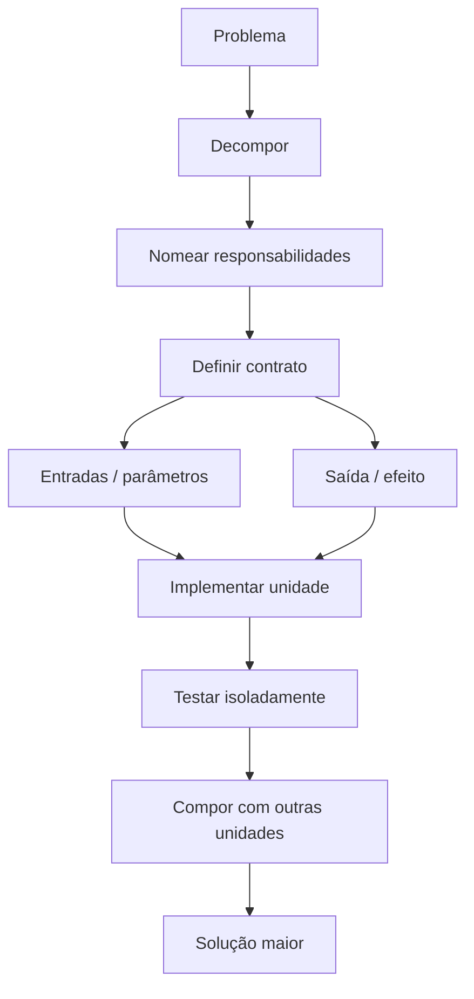

<a id="inicio"></a>

# Funções, Procedimentos e Modularização

> **Classificação curricular:** `[D] Obrigatório dominar`  
>
> **Legenda de evidências/QA:** nos blocos operacionais, `[D]` = documentação/literatura, `[S]` = inspeção estática/estrutura e `[R]` = reprodução em runtime/compilador. Essa legenda é independente do `[D]` curricular acima, que significa **Obrigatório dominar**.  
>
> **Convenção de numeração:** em títulos como `5. 11.1 Decomposição funcional`, o primeiro número é a posição editorial da seção neste documento e `11.1` é o nó curricular canônico. O identificador `70A` marca uma inserção operacional entre as seções 70 e 71 para preservar referências já existentes; não representa um novo nó da taxonomia.  
>
> **Nível:** A — Lógica de Programação  
> **Posição na taxonomia:** tópico 11  
> **Pré-requisitos:** algoritmos, fluxo de controle, loops, I/O, validação e estruturas elementares  
> **Aprofundamentos posteriores:** referências e mutabilidade, recursão, funções de ordem superior, módulos/pacotes, testes, APIs, classes e arquitetura

---

## Resumo executivo

Até aqui, resolvemos problemas principalmente como uma sequência única de instruções:

```text
ENTRADA
↓
VALIDAÇÃO
↓
PROCESSAMENTO
↓
SAÍDA
```

À medida que o programa cresce, essa única sequência se torna difícil de:

- compreender;
- testar;
- reutilizar;
- alterar;
- depurar.

A modularização divide a solução em unidades menores com responsabilidades nomeadas.

```text
PROBLEMA MAIOR
│
├── obter dados
├── validar dados
├── calcular resultado
└── apresentar resultado
```

Uma dessas unidades pode ser expressa como **função** ou mecanismo equivalente da linguagem.

Modelo conceitual:

```text
ENTRADAS
↓
FUNÇÃO
↓
RESULTADO
```

Exemplo:

```text
a = 10
b = 20

average(a, b)
↓
15
```

Mas nem toda rotina existe principalmente para produzir um valor.

Algumas executam uma tarefa:

```text
mostrar mensagem
salvar arquivo
registrar log
alterar estado
enviar comando
```

Didaticamente, chamamos isso de **procedimento**.

Há uma ressalva central:

> **“procedimento” não é uma construção separada em todas as linguagens.**

Neste guia:

```text
PROCEDIMENTO
=
rotina cujo objetivo principal é executar uma ação,
sem um valor de dados relevante para o chamador
```

Nas linguagens:

```text
Python
→ toda função retorna algum valor;
  sem return explícito, retorna None

JavaScript
→ sem return com expressão, resultado normal é undefined

Java
→ método pode declarar void

Bash
→ função sempre produz um exit status;
  dados normalmente são comunicados por stdout,
  variável/estado, arquivo etc.
```

Outro ponto que precisa ficar cristalino:

```text
PARÂMETRO
≠
ARGUMENTO
```

Parâmetro:

```text
nome declarado na definição
```

Argumento:

```text
valor/expressão fornecido na chamada
```

Exemplo:

```python
def double(value):      # value = parâmetro
    return value * 2

double(21)              # 21 = argumento
```

E há uma terceira distinção:

```text
RETORNAR VALOR
≠
IMPRIMIR VALOR
```

Uma função que:

```text
return 42
```

entrega `42` ao chamador.

Uma função que:

```text
print 42
```

produz um efeito de saída.

Essas operações podem ocorrer juntas, mas não significam a mesma coisa.

---

## Regra de ouro

> **Dê nome a uma responsabilidade, defina suas entradas, produza uma saída/efeito coerente e mantenha o contrato da unidade pequeno o suficiente para ser compreendido.**

---

## Decisão rápida

| Pergunta | Resposta |
|---|---|
| “Função serve apenas para evitar repetição?” | Não. Também nomeia uma abstração, reduz complexidade e separa responsabilidades. |
| “Toda função precisa receber parâmetros?” | Não. |
| “Toda função precisa retornar um valor explícito?” | Não; a semântica depende da linguagem. |
| “Procedimento é keyword universal?” | Não. É um conceito didático/algorítmico. |
| “Parâmetro e argumento são sinônimos?” | Não. Parâmetro pertence à definição; argumento à chamada. |
| “`print()` equivale a `return`?” | Não. |
| “Python sem `return` retorna nada?” | Retorna `None`. |
| “JavaScript sem `return` retorna nada?” | A chamada produz `undefined`. |
| “Java possui função global livre?” | No modelo da linguagem Java usado aqui, comportamento executável é declarado como método de classe/interface; exemplos usam `static` para evitar introduzir objetos cedo demais. |
| “Método `void` Java não termina com retorno?” | Pode terminar normalmente ou usar `return;`; não retorna um valor ao chamador. |
| “Bash `return 42` devolve o número 42 como dado?” | Não. Define o exit status da função. |
| “Como uma função Bash fornece dados?” | Com frequência via stdout + command substitution, ou por estado/variável/arquivo conforme contrato. |
| “Variável local tem o mesmo escopo nas quatro linguagens?” | Não. |
| “Python type hint impede argumento incompatível em runtime?” | Não por si só. |
| “Argumentos são passados por referência em toda linguagem?” | Não. Não use essa frase como regra universal. |
| “Função longa é sempre errada?” | Não existe número mágico; o problema é responsabilidade confusa e dificuldade de entendimento/manutenção. |
| “Uma função pode chamar outra?” | Sim; isso é parte central da composição. |
| “Recursão entra aqui?” | Apenas como referência futura; será aprofundada depois. |

---

# Índice


- [Resumo executivo](#resumo-executivo)
- [Regra de ouro](#regra-de-ouro)
- [Decisão rápida](#decisão-rápida)
- [1. Posição deste assunto](#1-posição-deste-assunto)
  - [1.1 Não é apenas organização visual](#11-não-é-apenas-organização-visual)
  - [1.2 CS2023](#12-cs2023)
- [2. Visão panorâmica](#2-visão-panorâmica)
  - [🗺️ Visão panorâmica — o mapa antes dos detalhes](#visao-panoramica-mapa)
- [3. Por que modularizar](#3-por-que-modularizar)
  - [3.1 Reduzir carga cognitiva](#31-reduzir-carga-cognitiva)
  - [3.2 Reutilizar](#32-reutilizar)
  - [3.3 Localizar mudanças](#33-localizar-mudanças)
  - [3.4 Testar isoladamente](#34-testar-isoladamente)
  - [3.5 Nomear intenção](#35-nomear-intenção)
- [4. Abstração e responsabilidade](#4-abstração-e-responsabilidade)
  - [4.1 Responsabilidade](#41-responsabilidade)
  - [4.2 Evite regra mecânica](#42-evite-regra-mecânica)
- [5. 11.1 Decomposição funcional](#5-111-decomposição-funcional)
  - [5.1 Exemplo](#51-exemplo)
  - [5.2 Cada bloco responde uma pergunta](#52-cada-bloco-responde-uma-pergunta)
  - [5.3 Não decomponha artificialmente](#53-não-decomponha-artificialmente)
- [6. De problema maior para subtarefas](#6-de-problema-maior-para-subtarefas)
  - [Exemplo](#exemplo)
  - [6.1 Funções podem refletir linguagem do domínio](#61-funções-podem-refletir-linguagem-do-domínio)
- [7. Top-down decomposition](#7-top-down-decomposition)
  - [7.1 Exemplo](#71-exemplo)
  - [7.2 Parar no nível útil](#72-parar-no-nível-útil)
- [8. Coesão e acoplamento — primeira noção](#8-coesão-e-acoplamento--primeira-noção)
  - [8.1 Coesão](#81-coesão)
  - [8.2 Acoplamento](#82-acoplamento)
  - [8.3 Neste nível](#83-neste-nível)
- [9. Interface versus implementação](#9-interface-versus-implementação)
  - [Exemplo](#exemplo-1)
  - [Benefício](#benefício)
- [10. 11.2 Procedimentos](#10-112-procedimentos)
  - [10.1 Conceito didático](#101-conceito-didático)
  - [10.2 Não precisa existir keyword `procedure`](#102-não-precisa-existir-keyword-procedure)
- [11. Procedimento como conceito](#11-procedimento-como-conceito)
  - [11.1 Efeito observável](#111-efeito-observável)
  - [11.2 Valor de controle ainda pode existir](#112-valor-de-controle-ainda-pode-existir)
- [12. Efeito versus valor](#12-efeito-versus-valor)
  - [12.1 Exemplo](#121-exemplo)
  - [12.2 Testabilidade](#122-testabilidade)
- [13. Procedimento nas quatro linguagens](#13-procedimento-nas-quatro-linguagens)
  - [Python](#python)
  - [JavaScript](#javascript)
  - [Java](#java)
  - [Bash](#bash)
- [14. 11.3 Funções](#14-113-funções)
  - [14.1 Exemplo](#141-exemplo)
  - [14.2 Entrada pode ser zero parâmetros](#142-entrada-pode-ser-zero-parâmetros)
  - [14.3 Resultado pode depender do ambiente](#143-resultado-pode-depender-do-ambiente)
- [15. Definição e chamada](#15-definição-e-chamada)
  - [Definição](#definição)
  - [Chamada](#chamada)
  - [15.1 Bash é semanticamente diferente](#151-bash-é-semanticamente-diferente)
- [16. Corpo da função](#16-corpo-da-função)
  - [Python](#python-1)
  - [JavaScript/Java](#javascriptjava)
  - [Bash](#bash-1)
  - [16.1 Definir não é necessariamente executar](#161-definir-não-é-necessariamente-executar)
- [17. Funções com zero parâmetros](#17-funções-com-zero-parâmetros)
  - [17.1 Zero parâmetros não significa zero dependências](#171-zero-parâmetros-não-significa-zero-dependências)
- [18. Funções com resultado](#18-funções-com-resultado)
  - [18.1 Composição](#181-composição)
- [19. Função não é apenas bloco copiável](#19-função-não-é-apenas-bloco-copiável)
  - [Exemplo](#exemplo-2)
- [20. 11.4 Parâmetros](#20-114-parâmetros)
  - [20.1 Escopo](#201-escopo)
  - [20.2 Contrato](#202-contrato)
- [21. Parâmetros formais](#21-parâmetros-formais)
  - [21.1 Evite ambiguidade](#211-evite-ambiguidade)
- [22. Ordem, nome e tipo](#22-ordem-nome-e-tipo)
  - [Java](#java-1)
  - [Python](#python-2)
  - [JavaScript](#javascript-1)
  - [Bash](#bash-2)
- [23. Parâmetros opcionais e avançados — fronteira](#23-parâmetros-opcionais-e-avançados--fronteira)
  - [Neste tópico](#neste-tópico)
- [24. 11.5 Argumentos](#24-115-argumentos)
  - [24.1 Podem ser literais](#241-podem-ser-literais)
  - [24.2 Variáveis](#242-variáveis)
  - [24.3 Expressões](#243-expressões)
- [25. Expressões como argumentos](#25-expressões-como-argumentos)
  - [Python](#python-3)
  - [Guardrail](#guardrail)
- [26. Quantidade e ordem](#26-quantidade-e-ordem)
- [27. Argumento por posição versus por nome](#27-argumento-por-posição-versus-por-nome)
  - [Python](#python-4)
  - [JavaScript](#javascript-2)
  - [Java](#java-2)
  - [Bash](#bash-3)
  - [Regra](#regra)
- [28. Parâmetro versus argumento — tabela](#28-parâmetro-versus-argumento--tabela)
- [29. Passagem de argumentos — guardrail conceitual](#29-passagem-de-argumentos--guardrail-conceitual)
  - [Python](#python-5)
  - [JavaScript](#javascript-3)
  - [Java](#java-3)
  - [Bash](#bash-4)
  - [Fronteira](#fronteira)
- [30. 11.6 Retorno](#30-116-retorno)
  - [Exemplo](#exemplo-3)
- [31. Retorno de dados](#31-retorno-de-dados)
  - [31.1 Ignorar retorno é possível](#311-ignorar-retorno-é-possível)
- [32. Retorno antecipado](#32-retorno-antecipado)
  - [Benefício](#benefício-1)
  - [Guardrail](#guardrail-1)
- [33. Sem retorno explícito](#33-sem-retorno-explícito)
  - [Python](#python-6)
  - [JavaScript](#javascript-4)
  - [Java](#java-4)
  - [Bash](#bash-5)
- [34. Return versus output](#34-return-versus-output)
  - [Correto para cálculo](#correto-para-cálculo)
  - [Separação](#separação)
- [35. Bash — return status versus dados](#35-bash--return-status-versus-dados)
  - [35.1 `return` versus `exit`](#351-return-versus-exit)
  - [35.2 Dados por stdout](#352-dados-por-stdout)
  - [35.3 Cuidado](#353-cuidado)
  - [35.4 Status e dado podem coexistir](#354-status-e-dado-podem-coexistir)
- [36. 11.7 Escopo básico](#36-117-escopo-básico)
  - [36.1 Não confundir com lifetime](#361-não-confundir-com-lifetime)
- [37. Local e externo/global](#37-local-e-externoglobal)
  - [37.1 Vantagem do local](#371-vantagem-do-local)
  - [37.2 Parâmetros são normalmente locais](#372-parâmetros-são-normalmente-locais)
- [38. Python — escopo básico](#38-python--escopo-básico)
  - [Exemplo](#exemplo-4)
  - [38.1 Parâmetros](#381-parâmetros)
  - [38.2 Type hints](#382-type-hints)
- [39. JavaScript — escopo básico](#39-javascript--escopo-básico)
  - [let / const](#let--const)
  - [var](#var)
  - [Parâmetros](#parâmetros)
  - [Guardrail](#guardrail-2)
- [40. Java — escopo básico](#40-java--escopo-básico)
  - [40.1 Campos não são locais](#401-campos-não-são-locais)
- [41. Bash — escopo básico](#41-bash--escopo-básico)
  - [Sem local](#sem-local)
  - [Com local](#com-local)
  - [41.1 `local`](#411-local)
  - [41.2 Guardrail](#412-guardrail)
- [42. Shadowing](#42-shadowing)
  - [42.1 Não é automaticamente bug](#421-não-é-automaticamente-bug)
  - [42.2 Parâmetros](#422-parâmetros)
- [43. Globais — uso consciente](#43-globais--uso-consciente)
  - [43.1 Quando global faz sentido](#431-quando-global-faz-sentido)
  - [Regra](#regra-1)
- [44. 11.8 Composição](#44-118-composição)
  - [Exemplo](#exemplo-5)
  - [44.1 CS2023](#441-cs2023)
- [45. Função chamando função](#45-função-chamando-função)
  - [Fluxo](#fluxo)
  - [45.1 Reuso interno](#451-reuso-interno)
- [46. Pipeline funcional simples](#46-pipeline-funcional-simples)
  - [46.1 Cada etapa muda o contrato](#461-cada-etapa-muda-o-contrato)
- [47. Composição e contratos](#47-composição-e-contratos)
  - [Exemplo](#exemplo-6)
  - [Erro](#erro)
- [48. Exemplo canônico — média](#48-exemplo-canônico--média)
  - [Contrato](#contrato)
- [49. Python — média](#49-python--média)
  - [Observação](#observação)
- [50. JavaScript — média](#50-javascript--média)
- [51. Java — média](#51-java--média)
  - [Observação](#observação-1)
- [52. Bash — média](#52-bash--média)
  - [52.1 Por quê?](#521-por-quê)
  - [52.2 Importante](#522-importante)
- [53. Exemplo canônico — validar e classificar](#53-exemplo-canônico--validar-e-classificar)
  - [Python](#python-7)
  - [Benefício](#benefício-2)
- [54. Exemplo de procedimento](#54-exemplo-de-procedimento)
  - [Papel](#papel)
- [55. Exemplo de composição](#55-exemplo-de-composição)
- [56. Exemplo crítico — imprimir em vez de retornar](#56-exemplo-crítico--imprimir-em-vez-de-retornar)
  - [Correto](#correto)
- [57. Exemplo crítico — ordem de argumentos](#57-exemplo-crítico--ordem-de-argumentos)
  - [Moral](#moral)
- [58. Exemplo crítico — estado global oculto](#58-exemplo-crítico--estado-global-oculto)
  - [58.1 Não é sempre obrigatório](#581-não-é-sempre-obrigatório)
- [59. Exemplo crítico — Bash return](#59-exemplo-crítico--bash-return)
  - [Correto para dado](#correto-para-dado)
- [60. Exemplo crítico — Python default mutável](#60-exemplo-crítico--python-default-mutável)
  - [Forma comum](#forma-comum)
  - [Fronteira](#fronteira-1)
- [61. Exemplo crítico — JavaScript var e let](#61-exemplo-crítico--javascript-var-e-let)
  - [Conceito](#conceito)
  - [Guardrail](#guardrail-3)
- [62. Exemplo crítico — função com responsabilidades demais](#62-exemplo-crítico--função-com-responsabilidades-demais)
  - [Refatoração conceitual](#refatoração-conceitual)
  - [Cuidado](#cuidado)
- [63. Tipagem e contratos](#63-tipagem-e-contratos)
  - [Python](#python-8)
  - [Java](#java-5)
  - [JavaScript](#javascript-5)
  - [Bash](#bash-6)
- [64. Funções puras e efeitos colaterais — introdução](#64-funções-puras-e-efeitos-colaterais--introdução)
  - [64.1 Por que conhecer?](#641-por-que-conhecer)
  - [64.2 Não é dogma](#642-não-é-dogma)
- [65. Testabilidade](#65-testabilidade)
  - [Casos](#casos)
  - [Procedimento](#procedimento)
  - [Moral](#moral-1)
- [66. Nomenclatura](#66-nomenclatura)
  - [Funções de ação](#funções-de-ação)
  - [Predicados](#predicados)
  - [Evite](#evite)
  - [Regra](#regra-2)
- [67. Documentação mínima útil](#67-documentação-mínima-útil)
  - [Não repita o código](#não-repita-o-código)
- [68. O que fica para depois](#68-o-que-fica-para-depois)
  - [68.1 Python Distilled e Fluent Python](#681-python-distilled-e-fluent-python)
- [69. Comparação entre as quatro linguagens](#69-comparação-entre-as-quatro-linguagens)
- [70. Erros conceituais frequentes](#70-erros-conceituais-frequentes)
  - [70.1 “Função só serve para eliminar duplicação”](#701-função-só-serve-para-eliminar-duplicação)
  - [70.2 “Procedure existe em toda linguagem”](#702-procedure-existe-em-toda-linguagem)
  - [70.3 “Parâmetro = argumento”](#703-parâmetro--argumento)
  - [70.4 “Print = return”](#704-print--return)
  - [70.5 “Função sem return não retorna nada”](#705-função-sem-return-não-retorna-nada)
  - [70.6 “Bash return devolve dados”](#706-bash-return-devolve-dados)
  - [70.7 “Toda variável dentro de braces JS é block-local”](#707-toda-variável-dentro-de-braces-js-é-block-local)
  - [70.8 “Python type hint força tipo em runtime”](#708-python-type-hint-força-tipo-em-runtime)
  - [70.9 “Java passa objetos por referência”](#709-java-passa-objetos-por-referência)
  - [70.10 “Modificar objeto mutável recebido prova pass-by-reference”](#7010-modificar-objeto-mutável-recebido-prova-pass-by-reference)
  - [70.11 “Global é sempre proibido”](#7011-global-é-sempre-proibido)
  - [70.12 “Função pequena é sempre boa”](#7012-função-pequena-é-sempre-boa)
  - [70.13 “Mais parâmetros = função mais flexível”](#7013-mais-parâmetros--função-mais-flexível)
  - [70.14 “Uma função deve sempre fazer I/O e cálculo juntos para ser prática”](#7014-uma-função-deve-sempre-fazer-io-e-cálculo-juntos-para-ser-prática)
  - [70.15 “Bash function roda sempre em processo separado”](#7015-bash-function-roda-sempre-em-processo-separado)
- [70A. Problemas reais — índice operacional `PR-*`](#problemas-reais)
- [71. Debugging de funções](#71-debugging-de-funções)
  - [🔎 Troubleshooting sistemático](#troubleshooting-sistematico)
  - [Tabela](#tabela)
  - [71.1 Perguntas](#711-perguntas)
- [72. Laboratórios](#72-laboratórios)
  - [🧪 LAB 1 — decomposição](#-lab-1--decomposição)
  - [🧪 LAB 2 — parâmetro versus argumento](#-lab-2--parâmetro-versus-argumento)
  - [🧪 LAB 3 — return versus print](#-lab-3--return-versus-print)
  - [🧪 LAB 4 — procedimento](#-lab-4--procedimento)
  - [🧪 LAB 5 — escopo](#-lab-5--escopo)
  - [🧪 LAB 6 — Bash return](#-lab-6--bash-return)
  - [🧪 LAB 7 — composição](#-lab-7--composição)
  - [🧪 LAB 8 — dependência global](#-lab-8--dependência-global)
  - [🧪 LAB 9 — Python mutable default](#-lab-9--python-mutable-default)
  - [🧪 LAB 10 — NetDev opcional](#-lab-10--netdev-opcional)
- [73. Exercícios](#73-exercícios)
  - [73.1 Modularização](#731-modularização)
  - [73.2 Decomposição](#732-decomposição)
  - [73.3 Procedimento](#733-procedimento)
  - [73.4 Função](#734-função)
  - [73.5 Parâmetro](#735-parâmetro)
  - [73.6 Argumento](#736-argumento)
  - [73.7 Ordem](#737-ordem)
  - [73.8 Return](#738-return)
  - [73.9 Python](#739-python)
  - [73.10 JavaScript](#7310-javascript)
  - [73.11 Java](#7311-java)
  - [73.12 Bash](#7312-bash)
  - [73.13 Escopo](#7313-escopo)
  - [73.14 Shadowing](#7314-shadowing)
  - [73.15 JS](#7315-js)
  - [73.16 Python](#7316-python)
  - [73.17 Java](#7317-java)
  - [73.18 Composição](#7318-composição)
  - [73.19 Testabilidade](#7319-testabilidade)
  - [73.20 Fronteira](#7320-fronteira)
- [74. Evidências de domínio](#74-evidências-de-domínio)
  - [Conceitos](#conceitos)
  - [Implementação](#implementação)
  - [Comparação](#comparação)
  - [Raciocínio](#raciocínio)
  - [Transferência](#transferência)
- [75. Checklist de consulta rápida](#75-checklist-de-consulta-rápida)
- [76. Glossário](#76-glossário)
- [77. Referências](#77-referências)
  - [77.1 Taxonomia canônica](#771-taxonomia-canônica)
  - [77.2 CS2023 — ACM / IEEE-CS / AAAI](#772-cs2023--acm--ieee-cs--aaai)
  - [77.3 Python 3.14.7 — documentação oficial](#773-python-3147--documentação-oficial)
  - [77.4 ECMAScript 2026 — especificação oficial](#774-ecmascript-2026--especificação-oficial)
  - [77.5 Java SE 27 — documentação oficial](#775-java-se-27--documentação-oficial)
  - [77.6 GNU Bash 5.3 — documentação oficial](#776-gnu-bash-53--documentação-oficial)
  - [77.7 PDFs FULLSTACK](#777-pdfs-fullstack)
  - [77.8 Reconciliação das fontes](#778-reconciliação-das-fontes)
- [78. Histórico de versões](#78-histórico-de-versões)

---

# 1. Posição deste assunto

Até agora, um algoritmo podia ser escrito como:

```text
ler
validar
calcular
mostrar
```

em um bloco.

Agora passamos a estruturar o programa como:

```text
main
│
├── read_input
├── validate_input
├── calculate_result
└── format_output
```

Essa mudança é decisiva.

## 1.1 Não é apenas organização visual

Funções criam:

- unidades nomeadas;
- fronteiras de escopo;
- contratos de entrada;
- contratos de saída;
- pontos de reutilização;
- pontos de teste.

## 1.2 CS2023

O currículo atual coloca funções/métodos entre os principais **modularity constructs** e associa a elas:

- parameter passing;
- scope;
- abstraction;
- data encapsulation.

Neste capítulo ficamos no núcleo necessário da taxonomia.

[↑ Voltar ao índice](#índice)

---

# 2. Visão panorâmica

<a id="visao-panoramica-mapa"></a>

## 🗺️ Visão panorâmica — o mapa antes dos detalhes

Esta visão funciona como **caderno rápido de consulta**, **modelo mental** e **contrato de cobertura** do T11. Ela combina representações complementares: nenhuma delas tenta carregar sozinha todo o domínio.

### Mapa do domínio — o que existe

```text
FUNÇÕES, PROCEDIMENTOS E MODULARIZAÇÃO
│
├── decomposição
│   ├── dividir problema
│   ├── nomear subtarefa
│   ├── separar responsabilidade
│   └── definir fronteiras
│
├── unidade invocável
│   ├── procedimento — efeito principal
│   └── função — resultado reutilizável
│
├── contrato de entrada
│   ├── parâmetros — definição
│   ├── argumentos — chamada
│   ├── ordem / nome / tipo
│   └── dependências explícitas × ocultas
│
├── contrato de saída
│   ├── valor retornado
│   ├── ausência de valor explícito
│   ├── efeito observável
│   └── Bash: stdout ≠ exit status
│
├── escopo
│   ├── local
│   ├── externo/global
│   ├── shadowing
│   └── Bash: `local` com alcance dinâmico durante a cadeia de chamadas
│
└── composição
    ├── função chama função
    ├── pipeline de contratos
    ├── teste por unidade
    └── solução maior formada por unidades menores
```

A árvore mantém a função da representação da versão anterior, mas explicita contratos, dependências ocultas e diferenças semânticas que se tornam importantes quando o código deixa de ser um bloco único.

### Fluxo principal — da necessidade ao contrato



Leitura textual equivalente:

```text
PROBLEMA
→ decompor
→ nomear responsabilidade
→ definir entradas + resultado/efeito
→ implementar
→ testar isoladamente
→ compor
→ verificar a solução maior
```

### Consulta rápida — conceito × pergunta × risco

| Conceito | Pergunta de consulta | Regra central | Risco típico |
|---|---|---|---|
| decomposição | “onde cortar?” | corte por responsabilidade e contrato | fragmentação artificial |
| função | “que valor entrega?” | resultado deve ser reutilizável pelo chamador | imprimir quando deveria retornar |
| procedimento | “que ação executa?” | efeito é parte consciente do contrato | efeito oculto/difícil de testar |
| parâmetro | “o que a unidade recebe?” | pertence à definição | confundir com argumento |
| argumento | “o que forneço nesta chamada?” | pertence à chamada | ordem incorreta |
| retorno | “o que volta ao chamador?” | não é sinônimo de output | `print`/stdout tratado como return |
| escopo | “onde este nome é visível?” | reduzir dependências implícitas | global oculto/shadowing |
| composição | “como as unidades se conectam?” | saída de uma etapa precisa satisfazer a entrada da próxima | contratos incompatíveis |
| Bash | “é dado ou status?” | stdout transporta dados; `return` transporta exit status | `return 42` usado como dado |

### Pergunta prática → mecanismo inicial

| Se a dúvida for... | Comece por... | Destino principal |
|---|---|---|
| “esta rotina faz coisas demais?” | listar responsabilidades e efeitos | [§4](#4-abstração-e-responsabilidade), [§62](#62-exemplo-crítico--função-com-responsabilidades-demais) |
| “devo retornar ou imprimir?” | separar valor de efeito | [§12](#12-efeito-versus-valor), [§34](#34-return-versus-output) |
| “parâmetro e argumento são a mesma coisa?” | localizar definição e chamada | [§20–29](#20-114-parâmetros) |
| “a ordem dos argumentos pode me enganar?” | conferir contrato e testes | [§57](#57-exemplo-crítico--ordem-de-argumentos) |
| “por que a função depende de algo que não recebe?” | procurar estado externo/global | [§17.1](#171-zero-parâmetros-não-significa-zero-dependências), [§58](#58-exemplo-crítico--estado-global-oculto) |
| “por que Bash não devolveu meu número?” | separar stdout de exit status | [§35](#35-bash--return-status-versus-dados), [§59](#59-exemplo-crítico--bash-return) |
| “por que a alteração feita dentro de `$(...)` sumiu?” | lembrar que command substitution normal usa subshell | [TS-T11-09](#ts-t11-09) |
| “como unir várias funções sem acoplá-las demais?” | escrever contrato de cada etapa | [§44–47](#44-118-composição) |

### Não confundir

| Não confundir | Distinção |
|---|---|
| função × procedimento | “procedimento” é uma classificação didática por propósito; nem toda linguagem possui construção separada |
| parâmetro × argumento | parâmetro está na definição; argumento está na chamada |
| `return` × `print` | `return` entrega controle/valor ao chamador; `print` produz efeito de saída |
| valor retornado × efeito colateral | uma unidade pode produzir ambos, mas são partes diferentes do contrato |
| escopo × lifetime | escopo trata de onde um nome pode ser referenciado; lifetime trata de quanto tempo entidade/estado existe |
| passagem por valor × mutabilidade | modificar um objeto recebido não prova “pass-by-reference” universal |
| Bash function × processo separado | função Bash normalmente executa no contexto do shell chamador; command substitution/pipeline podem introduzir subshell |
| stdout × exit status | são canais distintos no shell |
| pequena × coesa | poucas linhas não garantem responsabilidade clara |

### Microexemplos canônicos

**1. Valor reutilizável**

```python
def calculate_total(price, quantity):
    return price * quantity

subtotal = calculate_total(10, 3)
```

**2. Efeito explícito**

```python
def show_total(total):
    print(f"Total: {total}")
```

**3. Parâmetro × argumento**

```python
def double(value):       # value = parâmetro
    return value * 2

result = double(21)      # 21 = argumento
```

**4. Bash — dado × status**

```bash
get_value() {
    printf '%s\n' '42'   # dado em stdout
    return 0              # status de sucesso
}

value="$(get_value)"
```

### Problemas reais representativos

| ID | Necessidade concreta | Mecanismo principal |
|---|---|---|
| `PR-T11-01` | decompor processamento sem criar funções artificiais | responsabilidade + contrato |
| `PR-T11-02` | calcular e depois apresentar sem acoplar cálculo ao console | return × efeito |
| `PR-T11-03` | impedir troca silenciosa de argumentos do mesmo tipo | assinatura + nomenclatura + testes |
| `PR-T11-04` | remover dependência global oculta | parâmetro explícito / escopo |
| `PR-T11-05` | compor etapas mantendo contratos compatíveis | composição |
| `PR-T11-06` | função Bash precisa fornecer dado e status | stdout + exit status |
| `PR-T11-07` | impedir estado persistente acidental em default mutável Python | inicialização por chamada |
| `PR-T11-08` | controlar estado local em função Bash e chamadas internas | `local` + alcance dinâmico |

O índice operacional completo está em [Problemas reais `PR-*`](#problemas-reais).

### Falha típica → primeira investigação

| Sintoma | Primeira hipótese/verificação |
|---|---|
| resultado vira `None`/`undefined` | caminho terminou sem retorno de valor? |
| cálculo aparece na tela, mas não compõe | houve `print`/stdout em vez de `return`? |
| números plausíveis porém errados | argumentos foram invertidos? |
| função muda comportamento entre chamadas Python | existe default mutável? |
| variável Python “global” gera `UnboundLocalError` | há atribuição local ao mesmo nome? |
| objeto Java “não foi trocado” no chamador | houve apenas reatribuição do parâmetro local? |
| Bash retorna status inesperado | último comando ou `return n` definiu o status? |
| estado Bash desaparece após `value="$(func)"` | a função executou dentro de command substitution/subshell? |
| função Bash interna enxerga variável local do chamador | efeito do escopo dinâmico de `local`? |

A investigação completa está em [🔎 Troubleshooting sistemático](#troubleshooting-sistematico).

### Transferência entre linguagens — o que permanece e o que muda

| Capacidade | Python | JavaScript | Java | Bash |
|---|---|---|---|---|
| definir unidade invocável | `def` | `function`, arrow etc. | método | shell function |
| zero parâmetros | natural | natural | natural | natural; argumentos aparecem em `$1...` se fornecidos |
| retorno de dado | `return value` | `return value` | `return value` | normalmente stdout/variável/arquivo; `return` é status |
| término sem valor explícito | chamada produz `None` | chamada produz `undefined` | `void` ou erro se método exige valor | status do último comando |
| argumentos nomeados na chamada | keyword arguments conforme a assinatura | não há equivalente geral nativo; objeto nomeado é outro padrão | não | não |
| escopo local | função | função/bloco conforme declaração | método/bloco | `local` explícito; alcance dinâmico na cadeia de chamadas |
| tipos na assinatura | hints opcionais | JavaScript puro não | obrigatórios conforme declaração | não há assinatura estática de tipos |
| composição | chamada de função | chamada de função | chamada de método | chamada de função/comando + streams/status |

> A transferência é conceitual. A sintaxe parecida não autoriza assumir semântica idêntica.

### Síntese multifonte — por que o mapa está organizado assim

As fontes cumprem papéis diferentes e complementares:

```text
CS2023
→ confirma funções/métodos, parameter passing, scope e abstraction como núcleo curricular

Farrell
→ fornece progressão didática para modularização, functional decomposition,
  parâmetro/argumento, coesão e acoplamento

Stroustrup
→ reforça função como unidade nomeada para computação/ação,
  com declaração de parâmetros e retorno

Python Distilled / Fluent Python
→ refinam chamada, defaults, escopo, mutabilidade e type hints em Python

DOCUMENTAÇÕES OFICIAIS
→ definem a semântica vigente de Python, ECMAScript, Java e Bash

GNU Bash Reference Manual
→ impede falsa equivalência: função shell, positional parameters,
  local, exit status e command substitution possuem modelo próprio
```

A síntese não transforma essas fontes em uma única semântica. Quando as linguagens divergem, a divergência fica explícita.

### Modo consulta × modo estudo

**Consulta em ~30 segundos**

```text
Decisão rápida
→ esta Visão Panorâmica
→ comparação das quatro linguagens
→ erros conceituais
→ troubleshooting
```

**Estudo completo**

```text
posição curricular
→ decomposição e abstração
→ função/procedimento
→ parâmetros/argumentos
→ retorno
→ escopo
→ composição
→ exemplos críticos
→ PR-*
→ troubleshooting
→ LABs/exercícios
→ evidências de domínio
```

[↑ Voltar ao índice](#índice)

---
# 3. Por que modularizar

Farrell apresenta benefícios clássicos:

```text
ABSTRAÇÃO
TRABALHO EM EQUIPE
REUTILIZAÇÃO
MANUTENÇÃO
```

## 3.1 Reduzir carga cognitiva

Em vez de pensar simultaneamente em 100 detalhes:

```text
calculate_average(...)
```

permite pensar:

> “obter a média”.

## 3.2 Reutilizar

A mesma função pode ser chamada:

```text
1 vez
10 vezes
1000 vezes
```

sem duplicar sua lógica.

## 3.3 Localizar mudanças

Se a regra muda:

```text
corrigir uma unidade
```

é melhor que procurar cópias espalhadas.

## 3.4 Testar isoladamente

Uma função com contrato claro pode ser testada com:

```text
input conhecido
→ output esperado
```

## 3.5 Nomear intenção

```python
calculate_average(a, b)
```

comunica mais que repetir:

```python
(a + b) / 2
```

em muitos pontos de um programa.

[↑ Voltar ao índice](#índice)

---

# 4. Abstração e responsabilidade

Abstração permite usar uma unidade sem carregar todos os detalhes da implementação na cabeça.

Exemplo:

```text
validate_port(raw)
```

O chamador precisa saber:

```text
o que recebe
o que devolve
quais erros/efeitos fazem parte do contrato
```

Não necessariamente cada `if` interno.

## 4.1 Responsabilidade

Uma função deve ter um propósito compreensível.

Heurística:

```text
nome da função
≈
uma ação ou cálculo coerente
```

## 4.2 Evite regra mecânica

“Uma função só pode fazer uma linha” é absurdo.

“Uma função deve ter uma única responsabilidade compreensível” é uma orientação útil.

[↑ Voltar ao índice](#índice)

---

# 5. 11.1 Decomposição funcional

Taxonomia:

```text
dividir um problema
separar responsabilidades
```

## 5.1 Exemplo

Problema:

> receber três notas, validar, calcular média e classificar.

Decomposição:

```text
read_scores
validate_scores
calculate_average
classify_average
present_result
```

## 5.2 Cada bloco responde uma pergunta

```text
como obtenho?
é válido?
qual média?
qual classificação?
como apresento?
```

## 5.3 Não decomponha artificialmente

Isto:

```text
add_one()
add_two()
add_three()
```

não é melhor só porque existem mais funções.

A divisão deve acompanhar responsabilidades reais.

[↑ Voltar ao índice](#índice)

---

# 6. De problema maior para subtarefas

Técnica:

```text
1. descreva o resultado final
2. identifique etapas independentes
3. nomeie cada etapa
4. defina entrada/saída
5. implemente
6. combine
```

## Exemplo

```text
PROCESSAR PEDIDO
│
├── validate_order
├── calculate_subtotal
├── calculate_discount
├── calculate_total
└── format_receipt
```

## 6.1 Funções podem refletir linguagem do domínio

Nomes como:

```text
calculate_discount
validate_ip_address
is_port_allowed
```

aproximam código e problema.

[↑ Voltar ao índice](#índice)

---

# 7. Top-down decomposition

Uma estratégia clássica:

```text
problema geral
↓
partes
↓
subpartes
↓
operações implementáveis
```

## 7.1 Exemplo

```text
monitor_device
├── collect_metrics
│   ├── collect_latency
│   └── collect_loss
├── classify_health
└── report_health
```

## 7.2 Parar no nível útil

Decompor demais também piora legibilidade.

A unidade deve representar algo que mereça um nome.

Stroustrup resume uma ideia semelhante ao dizer que funções representam ações e cálculos dignos de um nome.

[↑ Voltar ao índice](#índice)

---

# 8. Coesão e acoplamento — primeira noção

Farrell usa:

```text
high cohesion
loose coupling
```

como características de bons módulos.

## 8.1 Coesão

Uma função coesa agrupa tarefas relacionadas.

Ruim:

```text
calculate_average_and_save_file_and_send_email
```

## 8.2 Acoplamento

Quanto uma unidade depende de detalhes externos.

Muitos globais:

```text
config
current_user
database
output_format
```

podem criar dependências ocultas.

## 8.3 Neste nível

Não precisamos medir formalmente.

Use a pergunta:

> “Consigo entender o contrato desta função sem conhecer o programa inteiro?”

[↑ Voltar ao índice](#índice)

---

# 9. Interface versus implementação

Interface conceitual:

```text
nome
parâmetros
resultado
efeitos/erros relevantes
```

Implementação:

```text
como a função realiza o trabalho
```

## Exemplo

Interface:

```text
calculate_average(a, b) → number
```

Implementação:

```text
(a + b) / 2
```

## Benefício

Podemos alterar a implementação sem mudar os chamadores, se o contrato permanecer.

[↑ Voltar ao índice](#índice)

---

# 10. 11.2 Procedimentos

Taxonomia:

> execução de uma tarefa sem retorno relevante, conforme o modelo da linguagem.

A frase “conforme o modelo da linguagem” é essencial.

## 10.1 Conceito didático

Procedimento:

```text
ROTINA
↓
efeito principal
```

Exemplos:

```text
show_menu
log_message
save_file
reset_counter
send_command
```

## 10.2 Não precisa existir keyword `procedure`

Muitas linguagens usam a mesma construção `function`/`method`.

[↑ Voltar ao índice](#índice)

---

# 11. Procedimento como conceito

Pseudocódigo:

```text
procedure show_warning(message)
    output message
end
```

O resultado relevante é:

```text
a mensagem foi emitida
```

não:

```text
um valor numérico devolvido
```

## 11.1 Efeito observável

Procedimentos costumam:

- escrever;
- alterar estado;
- enviar;
- salvar;
- registrar.

## 11.2 Valor de controle ainda pode existir

Uma linguagem pode sempre produzir algum valor/status técnico.

Isso não transforma automaticamente o objetivo da rotina em “calcular um dado”.

[↑ Voltar ao índice](#índice)

---

# 12. Efeito versus valor

Função de cálculo:

```text
inputs
→ calculate
→ return value
```

Procedimento:

```text
inputs
→ perform action
→ external effect
```

## 12.1 Exemplo

```python
def calculate_total(price, quantity):
    return price * quantity
```

versus:

```python
def print_total(total):
    print(total)
```

## 12.2 Testabilidade

Funções que retornam dados geralmente são fáceis de testar diretamente.

Procedimentos exigem observar o efeito.

[↑ Voltar ao índice](#índice)

---

# 13. Procedimento nas quatro linguagens

## Python

```python
def show_message(message):
    print(message)
```

Mesmo sem `return` explícito:

```text
resultado da chamada = None
```

## JavaScript

```javascript
function showMessage(message) {
  console.log(message);
}
```

Sem `return` de expressão:

```text
resultado = undefined
```

## Java

```java
static void showMessage(String message) {
    System.out.println(message);
}
```

`void` declara ausência de valor retornado.

## Bash

```bash
show_message() {
    printf '%s\n' "$1"
}
```

A função possui:

```text
stdout
+
exit status
```

Não há um tipo de retorno de dados como Java.

> **Não trate esses quatro casos como equivalentes:** Python `None` e JavaScript `undefined` são **valores existentes** que podem participar de atribuições e comparações; em Java, `void` declara que o método **não produz um valor de retorno utilizável**; em Bash, `return n` define **exit status**, isto é, um canal de conclusão/sucesso-falha, não um valor de dados retornado. Para dados em Bash, o contrato do guia usa stdout quando apropriado.

[↑ Voltar ao índice](#índice)

---

# 14. 11.3 Funções

Taxonomia:

```text
entrada
processamento
resultado
```

Modelo:

```text
f(x)
```

## 14.1 Exemplo

```text
double(10)
→ 20
```

## 14.2 Entrada pode ser zero parâmetros

```text
current_timestamp()
```

ainda é função.

## 14.3 Resultado pode depender do ambiente

Nem toda função é matemática/pura.

Mas o modelo entrada-processamento-saída continua útil.

[↑ Voltar ao índice](#índice)

---

# 15. Definição e chamada

## Definição

Descreve:

```text
nome
parâmetros
corpo
retorno
```

## Chamada

Solicita execução.

Python:

```python
def double(value):
    return value * 2

result = double(21)
```

JavaScript:

```javascript
function double(value) {
  return value * 2;
}

const result = double(21);
```

Java:

```java
static int doubleValue(int value) {
    return value * 2;
}

int result = doubleValue(21);
```

Bash:

```bash
double_value() {
    printf '%d\n' "$(($1 * 2))"
}

result="$(double_value 21)"
```

## 15.1 Bash é semanticamente diferente

O exemplo usa:

```text
stdout
+
command substitution
```

para transportar dados.

[↑ Voltar ao índice](#índice)

---

# 16. Corpo da função

O corpo contém as instruções executadas quando a função é chamada.

## Python

Indentação delimita corpo.

## JavaScript/Java

Braces delimitam bloco.

## Bash

Frequentemente:

```bash
name() {
    commands
}
```

## 16.1 Definir não é necessariamente executar

Python documenta que executar `def` cria/vincula o objeto função; o corpo só executa quando chamado.

JavaScript/Java/Bash possuem suas próprias regras de definição, declaração e execução.

[↑ Voltar ao índice](#índice)

---

# 17. Funções com zero parâmetros

Python:

```python
def get_answer():
    return 42
```

JavaScript:

```javascript
function getAnswer() {
  return 42;
}
```

Java:

```java
static int getAnswer() {
    return 42;
}
```

Bash:

```bash
get_answer() {
    printf '%d\n' 42
}
```

## 17.1 Zero parâmetros não significa zero dependências

Uma rotina pode ler global/ambiente/arquivo.

Por isso contrato explícito continua importante.

[↑ Voltar ao índice](#índice)

---

# 18. Funções com resultado

Uma função pode produzir um valor reutilizável:

```text
x = calculate()
```

ou participar de outra expressão:

```text
double(calculate())
```

## 18.1 Composição

O valor retornado por uma função pode virar argumento de outra.

Esse é um dos mecanismos centrais para construir soluções maiores.

[↑ Voltar ao índice](#índice)

---

# 19. Função não é apenas bloco copiável

Motivações:

```text
ABSTRAÇÃO
NOME
CONTRATO
ESCOPO
REUSO
COMPOSIÇÃO
TESTE
```

Evitar duplicação é apenas uma delas.

## Exemplo

Uma lógica usada uma única vez pode merecer função se:

```text
é complexa
tem responsabilidade clara
fica mais legível nomeada
merece teste isolado
```

[↑ Voltar ao índice](#índice)

---

# 20. 11.4 Parâmetros

Parâmetro é um nome declarado pela rotina para receber informação.

```python
def calculate_average(a, b):
    ...
```

Parâmetros:

```text
a
b
```

## 20.1 Escopo

Parâmetros normalmente possuem escopo local da rotina segundo regras da linguagem.

## 20.2 Contrato

Parâmetros declaram:

```text
que informações a rotina precisa
```

[↑ Voltar ao índice](#índice)

---

# 21. Parâmetros formais

Termo tradicional:

```text
formal parameter
```

Farrell diferencia explicitamente:

```text
argumento enviado pelo chamador
parâmetro recebido pela rotina
```

Stroustrup também usa “formal arguments” para parâmetros em declarações.

## 21.1 Evite ambiguidade

Neste guia:

```text
PARÂMETRO
→ definição

ARGUMENTO
→ chamada
```

[↑ Voltar ao índice](#índice)

---

# 22. Ordem, nome e tipo

## Java

```java
static double calculateAverage(double a, double b)
```

Parâmetros têm tipos declarados.

## Python

```python
def calculate_average(a: float, b: float) -> float:
```

Anotações são opcionais e não são enforcement automático de runtime.

## JavaScript

```javascript
function calculateAverage(a, b)
```

ECMAScript não exige type annotation nessa sintaxe.

## Bash

Não existe lista formal de parâmetros nomeados na definição:

```bash
function_name() {
    local first=$1
    local second=$2
}
```

Os argumentos viram parâmetros posicionais.

[↑ Voltar ao índice](#índice)

---

# 23. Parâmetros opcionais e avançados — fronteira

Existem mecanismos adicionais.

Python:

- defaults;
- positional-only;
- keyword-only;
- `*args`;
- `**kwargs`.

JavaScript:

- default parameters;
- rest parameters;
- destructuring parameters.

Java:

- varargs;
- overloading.

Bash:

- quantidade variável por `$#`;
- `$@`;
- `shift`.

## Neste tópico

Precisamos **conhecer que existem**, mas não dominar todas as formas avançadas.

O núcleo permanece:

```text
dados necessários
→ parâmetros claros
```

[↑ Voltar ao índice](#índice)

---

# 24. 11.5 Argumentos

Argumentos são fornecidos no local da chamada.

```python
calculate_average(10, 20)
```

Argumentos:

```text
10
20
```

## 24.1 Podem ser literais

```text
10
```

## 24.2 Variáveis

```python
calculate_average(score1, score2)
```

## 24.3 Expressões

```python
calculate_average(x + 1, y * 2)
```

[↑ Voltar ao índice](#índice)

---

# 25. Expressões como argumentos

Python/JavaScript/Java avaliam expressões para produzir valores usados na chamada.

Exemplo:

```text
double(10 + 5)
```

conceitualmente:

```text
10 + 5
→ 15
→ double(15)
```

## Python

Beazley observa que os argumentos são avaliados antes da execução do corpo da função.

## Guardrail

A ordem de avaliação detalhada é propriedade da linguagem.

Não transfira uma regra sem verificar.

[↑ Voltar ao índice](#índice)

---

# 26. Quantidade e ordem

Função:

```text
subtract(a, b)
```

Chamada:

```text
subtract(10, 3)
→ 7
```

Invertida:

```text
subtract(3, 10)
→ -7
```

Se ambos têm tipo compatível:

```text
compila/executa
mas lógica muda
```

Farrell destaca exatamente esse risco para argumentos do mesmo tipo.

[↑ Voltar ao índice](#índice)

---

# 27. Argumento por posição versus por nome

## Python

Pode permitir:

```python
connect(host="example", port=443)
```

quando o parâmetro aceita keyword.

## JavaScript

Não possui keyword arguments formais iguais aos de Python.

Pode usar objeto:

```javascript
connect({ host: "example", port: 443 });
```

mas isso é outro padrão.

## Java

Chamadas são posicionais.

## Bash

Argumentos de função são posicionais:

```text
$1
$2
...
```

## Regra

> **Não transporte mentalmente “keyword argument” de Python para todas as linguagens.**

[↑ Voltar ao índice](#índice)

---

# 28. Parâmetro versus argumento — tabela

| Momento | Conceito | Exemplo |
|---|---|---|
| definição | parâmetro | `value` |
| chamada | argumento | `21` |
| execução | binding/recebimento | `value` representa o valor recebido |

Exemplo:

```python
def double(value):
    return value * 2

double(21)
```

```text
value → parâmetro
21    → argumento
```

[↑ Voltar ao índice](#índice)

---

# 29. Passagem de argumentos — guardrail conceitual

Não use:

```text
“todas passam por valor”
```

ou:

```text
“todas passam por referência”
```

como explicação universal introdutória.

As linguagens modelam isso de maneiras diferentes.

## Python

Parâmetros são nomes locais vinculados aos objetos fornecidos como argumentos.

Mutabilidade do objeto importa.

## JavaScript

Argument values são passados à função; para objetos, o valor envolve referência ao objeto, mas reassociar o parâmetro não reassocia a variável do chamador.

## Java

Java passa argumentos por valor; para referências, o valor passado é uma referência.

## Bash

Argumentos tornam-se parâmetros posicionais textuais durante a execução da função.

## Fronteira

Referências, mutabilidade e efeitos sobre argumentos serão aprofundados no tópico 14.

[↑ Voltar ao índice](#índice)

---

# 30. 11.6 Retorno

Retorno permite entregar resultado ao chamador.

Modelo:

```text
CALL
↓
FUNCTION
↓
RETURN VALUE
↓
CALLER
```

## Exemplo

```python
def square(value):
    return value * value

result = square(4)
```

`result` recebe:

```text
16
```

[↑ Voltar ao índice](#índice)

---

# 31. Retorno de dados

O valor retornado pode:

- ser armazenado;
- entrar em expressão;
- virar argumento;
- ser comparado;
- ser ignorado.

Exemplo:

```python
if is_valid(value):
    ...
```

A chamada participa da condição.

## 31.1 Ignorar retorno é possível

Mas verifique se isso faz sentido.

Uma função de cálculo chamada sem usar o resultado pode indicar erro de design/uso.

[↑ Voltar ao índice](#índice)

---

# 32. Retorno antecipado

Uma função pode terminar antes do fim textual.

Exemplo:

```python
def classify(value):
    if value < 0:
        return "negative"

    if value == 0:
        return "zero"

    return "positive"
```

## Benefício

Pode reduzir nesting.

## Guardrail

Muitos retornos desconexos podem dificultar leitura em funções complexas.

Use clareza, não dogma.

[↑ Voltar ao índice](#índice)

---

# 33. Sem retorno explícito

## Python

Se chega ao fim:

```text
return value = None
```

A documentação oficial confirma que toda chamada retorna algum valor, salvo exceção.

## JavaScript

Função sem `return` de valor produz:

```text
undefined
```

## Java

Método `void`:

```text
não produz valor da expressão de chamada
```

## Bash

Função sempre termina com um:

```text
exit status
```

seja explícito por `return n` ou herdado do último comando executado.

[↑ Voltar ao índice](#índice)

---

# 34. Return versus output

Errado conceitualmente:

```python
def calculate():
    print(42)
```

se o chamador precisa:

```python
result = calculate()
```

Nesse caso:

```text
42 vai para stdout
result recebe None
```

## Correto para cálculo

```python
def calculate():
    return 42
```

Depois:

```python
print(calculate())
```

## Separação

```text
CALCULAR
≠
APRESENTAR
```

[↑ Voltar ao índice](#índice)

---

# 35. Bash — return status versus dados

Este é um dos pontos mais importantes do capítulo.

```bash
my_function() {
    return 42
}
```

Isso NÃO significa:

```text
“a função retorna o número 42 como dado”
```

Significa:

```text
exit status = 42
```

Consultável por:

```bash
my_function
status=$?
```

## 35.1 `return` versus `exit`

Dentro de uma função shell:

```text
return n
→ encerra a função atual e define seu exit status

exit n
→ encerra o shell em que está executando
```

Se a função estiver em um subshell, `exit` encerra esse subshell; se estiver no shell/script corrente, encerra esse shell/script. Portanto, `exit` não é substituto de `return` para apenas concluir uma função.

## 35.2 Dados por stdout

```bash
double_value() {
    printf '%d\n' "$(($1 * 2))"
}

result="$(double_value 21)"
```

## 35.3 Cuidado

Command substitution:

```text
captura stdout
```

Logo logs/diagnósticos não devem contaminar esse canal.

## 35.4 Status e dado podem coexistir

```bash
get_value() {
    if something_failed; then
        return 1
    fi

    printf '%s\n' "$value"
    return 0
}
```

[↑ Voltar ao índice](#índice)

---

# 36. 11.7 Escopo básico

Escopo responde:

> **onde um nome pode ser referenciado?**

Taxonomia:

```text
local
externo/global
visibilidade
```

## 36.1 Não confundir com lifetime

Escopo:

```text
visibilidade textual/semântica do nome
```

Lifetime:

```text
por quanto tempo objeto/estado existe
```

São conceitos relacionados, mas diferentes.

[↑ Voltar ao índice](#índice)

---

# 37. Local e externo/global

Variável local:

```text
declarada/vinculada dentro da unidade
```

Variável externa/global:

```text
vive em escopo mais amplo
```

## 37.1 Vantagem do local

Reduz:

- colisões;
- efeitos inesperados;
- dependências ocultas.

## 37.2 Parâmetros são normalmente locais

O parâmetro existe para o corpo da função/método segundo regras da linguagem.

[↑ Voltar ao índice](#índice)

---

# 38. Python — escopo básico

Modelo pedagógico comum:

```text
Local
Enclosing
Global
Builtins
```

Mas o importante aqui é:

- atribuição dentro da função normalmente cria binding local;
- `global` permite rebinding de nome global;
- `nonlocal` permite rebinding em escopo de função envolvente.

## Exemplo

```python
value = 10

def example():
    value = 20
    return value

print(example())  # 20
print(value)      # 10
```

## 38.1 Parâmetros

São bindings locais da função.

## 38.2 Type hints

Não mudam por si só as regras de escopo.

[↑ Voltar ao índice](#índice)

---

# 39. JavaScript — escopo básico

JavaScript possui diferenças importantes entre:

```text
let
const
var
```

## let / const

Têm escopo de bloco.

```javascript
function example() {
  if (true) {
    const value = 20;
  }

  // value não está disponível aqui
}
```

## var

Possui escopo de função, não de bloco.

## Parâmetros

Fazem parte do ambiente da função.

## Guardrail

Para código moderno, prefira:

```text
const
let
```

e evite ensinar `var` como padrão inicial.

[↑ Voltar ao índice](#índice)

---

# 40. Java — escopo básico

A JLS define escopo formalmente.

Parâmetro de método:

```text
escopo = corpo inteiro do método
```

Variável local de bloco:

```text
escopo conforme declaração/bloco
```

Exemplo:

```java
static int doubleValue(int value) {
    int result = value * 2;
    return result;
}
```

```text
value
result
```

não são variáveis globais.

## 40.1 Campos não são locais

Variáveis de classe/instância pertencem ao modelo de objetos/classes, aprofundado depois.

[↑ Voltar ao índice](#índice)

---

# 41. Bash — escopo básico

Bash possui uma diferença forte:

> funções executam no contexto do shell chamador.

Por padrão, variáveis podem ser compartilhadas.

## Sem local

```bash
value=10

change_value() {
    value=20
}

change_value
printf '%s\n' "$value"
```

pode alterar:

```text
value externo
```

## Com local

```bash
change_value() {
    local value=20
}
```

## 41.1 `local`

O builtin cria variável local à função e às funções que ela chama, segundo a semântica de escopo dinâmico do Bash.

## 41.2 Guardrail

Use `local` para temporários internos, salvo quando modificar estado externo for parte consciente do contrato.

[↑ Voltar ao índice](#índice)

---

# 42. Shadowing

Shadowing ocorre quando um nome interno oculta outro nome de escopo mais externo.

Exemplo conceitual:

```text
outer value = 10

function
    local value = 20
```

Dentro da função:

```text
value → 20
```

## 42.1 Não é automaticamente bug

Mas nomes iguais podem confundir.

## 42.2 Parâmetros

Um parâmetro pode ter mesmo nome que variável externa e ocultá-la dentro do escopo local.

[↑ Voltar ao índice](#índice)

---

# 43. Globais — uso consciente

Globais não são “proibidas”.

Mas aumentam acoplamento quando usadas como entrada/saída oculta.

Compare:

```python
tax_rate = 0.1

def calculate_tax(amount):
    return amount * tax_rate
```

com:

```python
def calculate_tax(amount, tax_rate):
    return amount * tax_rate
```

A segunda função explicita a dependência.

## 43.1 Quando global faz sentido

Exemplos:

- constante de configuração imutável;
- estado de processo deliberado;
- recurso compartilhado controlado.

## Regra

> **dependência importante deve ser visível no contrato sempre que isso melhorar clareza e teste.**

[↑ Voltar ao índice](#índice)

---

# 44. 11.8 Composição

Composição:

```text
função chama função
```

e usa resultados para construir algo maior.

## Exemplo

```text
validate
↓
normalize
↓
calculate
↓
format
```

Cada unidade possui contrato próprio.

## 44.1 CS2023

Modularidade e abstração aparecem como fundamento justamente para permitir programas maiores organizados em componentes.

[↑ Voltar ao índice](#índice)

---

# 45. Função chamando função

Python:

```python
def square(value):
    return value * value

def sum_of_squares(a, b):
    return square(a) + square(b)
```

## Fluxo

```text
sum_of_squares
├── square(a)
└── square(b)
```

## 45.1 Reuso interno

Uma função pequena e correta pode servir como bloco para outra.

[↑ Voltar ao índice](#índice)

---

# 46. Pipeline funcional simples

Modelo:

```text
RAW
↓ parse
VALUE
↓ validate
VALID VALUE
↓ calculate
RESULT
↓ format
TEXT
```

Exemplo:

```text
parse_port
→ validate_port
→ build_endpoint
```

## 46.1 Cada etapa muda o contrato

Isso é diferente de uma função enorme que conhece:

- terminal;
- parsing;
- domínio;
- cálculo;
- formatação;
- arquivo.

[↑ Voltar ao índice](#índice)

---

# 47. Composição e contratos

Para compor:

```text
output A
```

precisa ser compatível com:

```text
input B
```

## Exemplo

```text
parse_int(raw) → int
```

e:

```text
is_valid_port(port: int) → bool
```

podem compor.

## Erro

Se primeira função pode devolver:

```text
int ou string de erro
```

a segunda precisa tratar essa união ou o contrato deve ser redesenhado.

[↑ Voltar ao índice](#índice)

---

# 48. Exemplo canônico — média

Taxonomia canônica usa função de média.

Objetivo:

```text
10 e 20
→ 15
```

## Contrato

```text
input:
a, b numéricos

process:
(a + b) / 2

output:
média
```

[↑ Voltar ao índice](#índice)

---

# 49. Python — média

```python
def calculate_average(a: float, b: float) -> float:
    return (a + b) / 2

result: float = calculate_average(10, 20)
print(f"{result:.1f}")
```

Saída:

```text
15.0
```

## Observação

Anotações:

```text
float
```

não são checagem automática de runtime pela linguagem.

[↑ Voltar ao índice](#índice)

---

# 50. JavaScript — média

```javascript
function calculateAverage(a, b) {
  return (a + b) / 2;
}

const result = calculateAverage(10, 20);
console.log(result.toFixed(1));
```

Saída:

```text
15.0
```

[↑ Voltar ao índice](#índice)

---

# 51. Java — média

```java
public class Example {
    static double calculateAverage(double a, double b) {
        return (a + b) / 2;
    }

    public static void main(String[] args) {
        double result = calculateAverage(10, 20);
        System.out.printf("%.1f%n", result);
    }
}
```

Saída:

```text
15.0
```

## Observação

Usamos método:

```text
static
```

para ensinar o conceito antes de instâncias/classes em profundidade.

[↑ Voltar ao índice](#índice)

---

# 52. Bash — média

A taxonomia original usa aritmética inteira.

Aqui mantemos a diferença explícita.

```bash
calculate_average() {
    local first=$1
    local second=$2

    printf '%d\n' "$(((first + second) / 2))"
}

result="$(calculate_average 10 20)"
printf '%s\n' "$result"
```

Saída:

```text
15
```

## 52.1 Por quê?

Bash arithmetic é inteira.

## 52.2 Importante

O dado `15` veio por:

```text
stdout
```

O status da função é outro canal conceitual.

[↑ Voltar ao índice](#índice)

---

# 53. Exemplo canônico — validar e classificar

Problema:

```text
score
```

Regras:

```text
0..100 válido
>=70 approved
<70 rejected
```

Decomposição:

```text
is_valid_score
classify_score
```

## Python

```python
def is_valid_score(score: int) -> bool:
    return 0 <= score <= 100

def classify_score(score: int) -> str:
    if not is_valid_score(score):
        return "INVALID"

    if score >= 70:
        return "APPROVED"

    return "REJECTED"
```

## Benefício

`classify_score` usa `is_valid_score`.

Isso é composição.

[↑ Voltar ao índice](#índice)

---

# 54. Exemplo de procedimento

Python:

```python
def show_result(result: str) -> None:
    print(result)
```

JavaScript:

```javascript
function showResult(result) {
  console.log(result);
}
```

Java:

```java
static void showResult(String result) {
    System.out.println(result);
}
```

Bash:

```bash
show_result() {
    printf '%s\n' "$1"
}
```

## Papel

```text
apresentação
```

Não cálculo.

[↑ Voltar ao índice](#índice)

---

# 55. Exemplo de composição

```text
raw input
↓ parse
score
↓ classify
classification
↓ show
stdout
```

Python:

```python
def parse_score(raw: str) -> int:
    return int(raw)

def is_valid_score(score: int) -> bool:
    return 0 <= score <= 100

def classify_score(score: int) -> str:
    if not is_valid_score(score):
        return "INVALID"

    return "APPROVED" if score >= 70 else "REJECTED"

def show_result(result: str) -> None:
    print(result)

score = parse_score("82")
result = classify_score(score)
show_result(result)
```

[↑ Voltar ao índice](#índice)

---

# 56. Exemplo crítico — imprimir em vez de retornar

Errado para uma função de cálculo:

```python
def double(value):
    print(value * 2)

result = double(21)
```

Saída:

```text
42
```

Mas:

```text
result == None
```

## Correto

```python
def double(value):
    return value * 2
```

Agora:

```text
result == 42
```

[↑ Voltar ao índice](#índice)

---

# 57. Exemplo crítico — ordem de argumentos

```python
def divide(numerator, denominator):
    return numerator / denominator
```

Correto:

```python
divide(10, 2)
→ 5
```

Invertido:

```python
divide(2, 10)
→ 0.2
```

Nenhum type checker básico precisa detectar isso porque ambos podem ser numéricos.

## Moral

Nomes e ordem fazem parte do contrato.

[↑ Voltar ao índice](#índice)

---

# 58. Exemplo crítico — estado global oculto

```python
discount_rate = 0.2

def calculate_discount(price):
    return price * discount_rate
```

A função possui dependência não visível na assinatura.

Versão explícita:

```python
def calculate_discount(price, discount_rate):
    return price * discount_rate
```

## 58.1 Não é sempre obrigatório

Mas melhora:

- teste;
- reuso;
- leitura;

quando a taxa varia.

[↑ Voltar ao índice](#índice)

---

# 59. Exemplo crítico — Bash return

```bash
get_answer() {
    return 42
}

answer="$(get_answer)"
```

`answer` recebe:

```text
string vazia
```

porque a função não escreveu em stdout.

Status:

```bash
get_answer
printf '%d\n' "$?"
```

→ `42`.

## Correto para dado

```bash
get_answer() {
    printf '%d\n' 42
}
```

[↑ Voltar ao índice](#índice)

---

# 60. Exemplo crítico — Python default mutável

Beazley chama atenção para um problema clássico.

```python
def add_item(value, items=[]):
    items.append(value)
    return items
```

Chamadas:

```text
add_item(1) → [1]
add_item(2) → [1,2]
```

porque o objeto default é criado na definição, não a cada chamada.

## Forma comum

```python
def add_item(value, items=None):
    if items is None:
        items = []

    items.append(value)
    return items
```

## Fronteira

Defaults são extensão deste tópico, mas o bug é importante como guardrail.

[↑ Voltar ao índice](#índice)

---

# 61. Exemplo crítico — JavaScript var e let

```javascript
function example() {
  if (true) {
    var x = 10;
    let y = 20;
  }

  console.log(x);
  // console.log(y); // ReferenceError
}
```

## Conceito

```text
var → function-scoped
let → block-scoped
```

## Guardrail

Escopo JavaScript não pode ser explicado apenas como:

```text
“tudo dentro de {} é local”
```

[↑ Voltar ao índice](#índice)

---

# 62. Exemplo crítico — função com responsabilidades demais

Sinal de problema:

```text
read_validate_calculate_save_email_log(...)
```

Não é o tamanho do nome que é o problema.

É a quantidade de responsabilidades acopladas.

## Refatoração conceitual

```text
read_order
validate_order
calculate_total
save_order
notify_customer
```

## Cuidado

Não crie funções inúteis de uma linha sem significado.

A unidade deve representar abstração real.

[↑ Voltar ao índice](#índice)

---

# 63. Tipagem e contratos

## Python

```python
def double(value: int) -> int:
```

type hints:

- documentam;
- ajudam IDE/type checkers;
- não impõem runtime automaticamente.

Ramalho enfatiza que Python continua dinamicamente tipado e hints são opcionais.

## Java

Tipos de parâmetros/retorno fazem parte da declaração e são verificados estaticamente conforme a linguagem.

## JavaScript

JavaScript puro não usa type annotation equivalente nessa sintaxe.

TypeScript virá na trilha Full Stack posterior.

## Bash

Não possui assinatura estática de tipos.

Validação precisa ser explícita quando necessária.

[↑ Voltar ao índice](#índice)

---

# 64. Funções puras e efeitos colaterais — introdução

Função “pura” em sentido funcional simplificado:

```text
mesmos inputs
→ mesmo output

sem efeitos observáveis relevantes
```

Exemplo:

```python
def square(value):
    return value * value
```

Efeito colateral:

```text
print
arquivo
rede
global
banco
```

## 64.1 Por que conhecer?

Ajuda a separar:

```text
cálculo
de
I/O
```

## 64.2 Não é dogma

Aplicações precisam de efeitos.

A questão é torná-los conscientes e bem localizados.

[↑ Voltar ao índice](#índice)

---

# 65. Testabilidade

Função:

```python
def calculate_average(a, b):
    return (a + b) / 2
```

pode ser testada sem:

- terminal;
- arquivo;
- rede.

## Casos

O retorno permite verificar diretamente o contrato sem capturar console:

```python
assert calculate_average(10, 20) == 15.0
assert calculate_average(0, 0) == 0.0
assert calculate_average(-10, 10) == 0.0
```

## Procedimento

Se imprime:

```text
precisamos capturar/observar stdout
```

## Moral

Separar cálculo de I/O simplifica teste.

[↑ Voltar ao índice](#índice)

---

# 66. Nomenclatura

Como o usuário deste guia adota identificadores em inglês, exemplos seguem essa regra.

## Funções de ação

Use verbo:

```text
calculate_average
validate_input
send_request
parse_config
```

## Predicados

Nomes que expressem pergunta:

```text
is_valid
has_access
contains_error
```

## Evite

```text
do_stuff
process_data
func1
helper2
```

quando há nome de domínio melhor.

## Regra

> **o nome deve ajudar o leitor a evitar abrir o corpo só para descobrir a intenção.**

[↑ Voltar ao índice](#índice)

---

# 67. Documentação mínima útil

Função simples:

```python
def square(value: int) -> int:
    return value * value
```

pode ser autoexplicativa.

Função com contrato menos óbvio pode documentar:

- propósito;
- parâmetros;
- retorno;
- erros;
- efeitos;
- unidades;
- pré-condições.

## Não repita o código

Ruim:

```text
“incrementa x em 1”
```

se o corpo já é óbvio.

Documente o **porquê/contrato**.

[↑ Voltar ao índice](#índice)

---

# 68. O que fica para depois

Este tópico NÃO pretende esgotar:

```text
closures
decorators
callbacks
higher-order functions
lambda
currying
partial application
recursion aprofundada
generators
async functions
method dispatch
overloading avançado
reference semantics
mutable arguments
modules/packages
dependency injection
```

## 68.1 Python Distilled e Fluent Python

Esses livros cobrem funções muito além do necessário neste nível.

Usamos esses capítulos como:

```text
fonte de descoberta
+
contraprova
```

sem antecipar toda a linguagem avançada.

[↑ Voltar ao índice](#índice)

---

# 69. Comparação entre as quatro linguagens

| Conceito | Python | JavaScript | Java | Bash |
|---|---|---|---|---|
| unidade básica | function | function | method | shell function |
| definição | `def` | `function` / arrow etc. | método em tipo | `name() { ...; }` |
| nomes de parâmetros na declaração | sim | sim | sim | não como assinatura formal; usa `$1...` |
| argumentos nomeados na chamada | sim, conforme a assinatura | não há equivalente geral nativo | não | não |
| tipo estático na assinatura | hint opcional | não | sim | não |
| sem return explícito | `None` | `undefined` | `void` ou erro se método exige valor | status do último comando |
| return de dados | `return value` | `return value` | `return value` | não por `return n`; use outro canal |
| retorno de controle/status | exceção/valor etc. | completion/value | valor/void/exception | exit status |
| local | função | função/bloco | método/bloco | `local` recomendado |
| global externo | módulo | lexical/global env | field/static state | shell variable |
| composição | chamada | chamada | chamada de método | chamada de função/comando |

> A tabela mostra correspondências conceituais, não equivalência mecânica.

[↑ Voltar ao índice](#índice)

---

# 70. Erros conceituais frequentes

## 70.1 “Função só serve para eliminar duplicação”

Não.

## 70.2 “Procedure existe em toda linguagem”

Não.

## 70.3 “Parâmetro = argumento”

Não.

## 70.4 “Print = return”

Não.

## 70.5 “Função sem return não retorna nada”

Python/JS produzem valores específicos (`None`/`undefined`).

## 70.6 “Bash return devolve dados”

Não.

## 70.7 “Toda variável dentro de braces JS é block-local”

`var` contradiz isso.

## 70.8 “Python type hint força tipo em runtime”

Não.

## 70.9 “Java passa objetos por referência”

Formulação imprecisa. Java passa valores; referências são valores.

## 70.10 “Modificar objeto mutável recebido prova pass-by-reference”

Não.

## 70.11 “Global é sempre proibido”

Não.

## 70.12 “Função pequena é sempre boa”

Não se fragmenta uma operação sem benefício.

## 70.13 “Mais parâmetros = função mais flexível”

Pode aumentar acoplamento e complexidade.

## 70.14 “Uma função deve sempre fazer I/O e cálculo juntos para ser prática”

Não.

## 70.15 “Bash function roda sempre em processo separado”

Não. O manual informa que shell functions executam no contexto do shell corrente.

[↑ Voltar ao índice](#índice)

---

<a id="problemas-reais"></a>

# 70A. Problemas reais — índice operacional `PR-*`

> **Nota de estabilidade editorial:** `70A` é uma inserção operacional preservada entre as seções 70 e 71 para não renumerar referências e destinos internos já estabelecidos. Não é um novo nó curricular.

Os problemas reais abaixo não substituem microexemplos, exercícios ou LABs. Eles representam **capacidades combinadas** que precisam existir no material e possuir destino verificável.

> **Evidência:** `[D]` = documentação/literatura; `[S]` = inspeção estática/estrutura; `[R]` = reprodução em runtime/compilador.

| ID | Necessidade concreta | Capacidades combinadas | Destino principal | Estado |
|---|---|---|---|---|
| `PR-T11-01` | decompor uma rotina grande sem fragmentação artificial | decomposição, coesão, contrato | [§4](#4-abstração-e-responsabilidade), [§62](#62-exemplo-crítico--função-com-responsabilidades-demais) | `FECHADO` |
| `PR-T11-02` | calcular e apresentar mantendo o cálculo reutilizável | retorno, efeito, composição | [§34](#34-return-versus-output), [§56](#56-exemplo-crítico--imprimir-em-vez-de-retornar) | `FECHADO` |
| `PR-T11-03` | evitar troca silenciosa de argumentos semanticamente distintos | parâmetros, argumentos, ordem, teste | [§28](#28-parâmetro-versus-argumento--tabela), [§57](#57-exemplo-crítico--ordem-de-argumentos) | `FECHADO` |
| `PR-T11-04` | eliminar dependência global oculta | escopo, parâmetros, testabilidade | [§43](#43-globais--uso-consciente), [§58](#58-exemplo-crítico--estado-global-oculto) | `FECHADO` |
| `PR-T11-05` | compor várias etapas sem quebrar contratos | composição, retorno, validação | [§44–47](#44-118-composição), [§55](#55-exemplo-de-composição) | `FECHADO` |
| `PR-T11-06` | função Bash fornecer dado e sucesso/falha separadamente | stdout, command substitution, exit status | [§35](#35-bash--return-status-versus-dados), [§59](#59-exemplo-crítico--bash-return) | `FECHADO` |
| `PR-T11-07` | impedir estado persistente acidental em parâmetro default Python | parâmetros, defaults, mutabilidade | [§60](#60-exemplo-crítico--python-default-mutável) | `FECHADO` |
| `PR-T11-08` | usar temporários Bash sem vazar estado e compreender chamadas internas | `local`, escopo, composição | [§41](#41-bash--escopo-básico), [TS-T11-10](#ts-t11-10) | `FECHADO` |

```text
TOTAL_PR = 8
FECHADO = 8
NÃO_AVALIADO = 0
SEM_DESTINO = 0
PENDENTE_MATERIAL = 0
```

> **Gate de Cobertura Prática / Operacional:** `FECHADO` — todos os `PR-*` materiais possuem necessidade, capacidades combinadas, destino e solução verificável.

## PR-T11-01 — decompor sem criar funções artificiais

**Cenário:** uma rotina lê dados, valida, calcula, formata e exibe tudo no mesmo bloco.

**Risco:** qualquer mudança exige compreender e testar responsabilidades não relacionadas ao mesmo tempo.

**Solução:** separar apenas responsabilidades que possuem contrato e significado próprios, por exemplo:

```text
read_order
→ validate_order
→ calculate_total
→ format_summary
→ show_summary
```

**Validação:** cada unidade deve poder ser explicada em uma frase e testada isoladamente quando possuir resultado observável próprio.

**Regressão:** adicionar uma nova regra de cálculo não deve exigir alterar a apresentação quando o contrato entre elas permanece estável.

## PR-T11-02 — cálculo reutilizável não deve depender de `print`

**Cenário:** uma função calcula média e imprime o resultado internamente.

**Problema:** o chamador não consegue reutilizar o valor para comparar, armazenar ou compor outro cálculo sem capturar I/O.

**Solução:** retornar o dado e deixar a apresentação em outra responsabilidade.

```python
def calculate_average(a, b):
    return (a + b) / 2


def show_average(value):
    print(value)
```

**Validação:** `calculate_average(10, 20)` deve poder ser usado em expressão/atribuição sem depender do console.

## PR-T11-03 — ordem de argumentos semanticamente diferentes

**Cenário:** `calculate_utilization(20, 100)` recebe dois números do mesmo tipo: `used` e `capacity`. Se as posições forem invertidas, a chamada continua sintaticamente válida, mas o significado muda.

**Solução:** assinatura, nomes e testes precisam tornar o contrato evidente. Onde a linguagem oferecer argumentos nomeados adequados, eles podem reduzir ambiguidade; onde não oferecer, a API precisa compensar pela modelagem.

**Validação mínima:**

```python
def calculate_utilization(used, capacity):
    return used / capacity

assert calculate_utilization(20, 100) == 0.2
assert calculate_utilization(100, 20) == 5.0
```

O teste é deliberadamente não comutativo: inverter os argumentos precisa produzir resultado observavelmente diferente.

## PR-T11-04 — remover dependência global oculta

**Cenário:** `calculate_total()` lê `tax_rate` global sem declarar a dependência.

**Problema:** teste e reuso dependem de estado externo invisível na assinatura.

**Solução preferencial quando adequado:** tornar a dependência explícita.

```python
def calculate_total(subtotal, tax_rate):
    return subtotal * (1 + tax_rate)
```

**Validação:** o mesmo subtotal deve poder ser testado com taxas diferentes sem alterar estado global.

## PR-T11-05 — pipeline de contratos

**Cenário:** uma solução precisa normalizar, validar e transformar um valor.

```text
raw input
→ normalize
→ validate
→ transform
→ result
```

Cada etapa precisa declarar o que recebe e o que produz. Se `normalize()` devolve texto e `validate()` espera número, há uma incompatibilidade arquitetural mesmo que cada função isolada esteja “correta”.

**Validação:** testar cada etapa e pelo menos um teste de integração que atravesse toda a composição.

## PR-T11-06 — Bash: dado e status em canais diferentes

**Cenário:** uma função shell precisa produzir um identificador e também indicar falha.

```bash
get_id() {
    local input=$1

    if [[ -z $input ]]; then
        printf '%s\n' 'missing input' >&2
        return 2
    fi

    printf '%s\n' "$input"
    return 0
}
```

Uso:

```bash
if id="$(get_id "router-01")"; then
    printf 'id=%s\n' "$id"
else
    printf 'failed\n' >&2
fi
```

**Contrato:** stdout carrega dado; stderr carrega diagnóstico; exit status carrega sucesso/falha.

**Caveat:** command substitution normal `$(...)` executa em subshell; mudanças de estado interno não persistem no shell chamador. Isso é aprofundado em `TS-T11-09`.

## PR-T11-07 — default mutável em Python

**Cenário:** uma lista default é alterada pela função e reaparece modificada em chamadas futuras.

**Solução:** quando a intenção for criar estado novo por chamada, usar um sentinel como `None` e construir o objeto dentro da função.

```python
def append_value(value, items=None):
    if items is None:
        items = []
    items.append(value)
    return items
```

**Validação:** duas chamadas sem argumento explícito devem começar de estados independentes.

## PR-T11-08 — estado local em Bash durante composição

**Cenário:** uma função usa temporários e chama outra função.

```bash
outer() {
    local mode='safe'
    inner
}
```

Em Bash, `local` é visível durante a cadeia dinâmica de chamadas enquanto aquela ativação estiver em execução. Uma função interna pode enxergar esse nome caso não possua binding local próprio.

**Guardrail:** não trate `local` do Bash como equivalente mecânico ao escopo lexical de Python/JavaScript/Java.

**Validação:** testar explicitamente funções aninhadas/chamadas quando nomes locais iguais puderem interferir no comportamento.

[↑ Voltar ao índice](#índice)

---

# 71. Debugging de funções

Quando uma função produz resultado errado, trace:

```text
CALL
↓
ARGUMENTOS
↓
PARÂMETROS
↓
ESTADO LOCAL
↓
RETURN / EFEITO
```

<a id="troubleshooting-sistematico"></a>

## 🔎 Troubleshooting sistemático

Os casos abaixo aplicam o método **reproduzir → observar → formular hipótese → isolar → corrigir → validar → testar regressão** a falhas concretas deste tópico.

<a id="ts-t11-01"></a>

### TS-T11-01 — a função “calcula”, mas o chamador recebe `None`/`undefined`

**Sintoma:** a tela mostra o valor esperado, porém uma atribuição recebe `None` em Python ou `undefined` em JavaScript.

**Reprodução mínima:**

```python
def double(value):
    print(value * 2)

result = double(21)
print(result)  # None
```

**Hipótese:** houve efeito de saída, mas nenhum valor foi retornado.

**Como observar:** inspecione o resultado da chamada separadamente da saída do console.

**Mecanismo:** em Python, chegar ao fim sem `return` explícito faz a chamada produzir `None`; em ECMAScript, `return;` ou ausência de valor retorna `undefined` no caminho aplicável.

**Correção:** usar `return value` quando o contrato exige dado reutilizável.

**Regressão:** teste a chamada em atribuição e em composição com outra função.

<a id="ts-t11-02"></a>

### TS-T11-02 — valores plausíveis, porém errados, após chamada

**Sintoma:** não ocorre erro de tipo/runtime, mas o resultado está incorreto.

**Reprodução:** dois argumentos do mesmo tipo são invertidos em uma operação cuja ordem é material.

```python
def calculate_utilization(used, capacity):
    return used / capacity

print(calculate_utilization(20, 100))  # 0.2
print(calculate_utilization(100, 20))  # 5.0
```

**Mecanismo:** a linguagem aceita os dois números nas duas posições; o erro é semântico. Um exemplo com operação comutativa, como multiplicação simples, pode ocultar a inversão e produzir o mesmo resultado.

**Hipóteses:** ordem dos argumentos; assinatura ambígua; teste fraco.

**Correção:** nomes semanticamente claros, argumentos nomeados quando apropriados/disponíveis e casos de teste que diferenciem posições.

**Regressão:** inclua um caso em que trocar os argumentos altere necessariamente a saída.

<a id="ts-t11-03"></a>

### TS-T11-03 — caminho de execução termina sem valor

**Sintoma:** alguns inputs funcionam; outros produzem ausência de valor ou erro de compilação/análise.

**Reprodução conceitual:**

```text
if condição A
    return resultado

# e o caminho B?
```

**Interpretação por linguagem:**

- Python pode chegar ao fim e produzir `None`;
- JavaScript pode chegar ao fim e produzir `undefined`;
- Java exige compatibilidade com o resultado declarado e pode rejeitar método não-`void` sem retorno garantido;
- Bash sempre possui exit status, mesmo sem `return` explícito, usando o status do último comando executado.

**Correção:** desenhar os caminhos e declarar o contrato para cada um.

**Regressão:** cobrir todos os ramos materiais.

<a id="ts-t11-04"></a>

### TS-T11-04 — Python: chamadas acumulam estado inesperadamente

**Sintoma:** segunda chamada começa com dados deixados pela primeira.

**Reprodução:**

```python
def add_item(value, items=[]):
    items.append(value)
    return items

print(add_item(1))  # [1]
print(add_item(2))  # [1, 2]
```

**Mecanismo:** o valor default é criado quando a definição da função é executada, não recriado em cada chamada.

**Correção:** usar `None`/sentinel e criar a lista dentro da chamada quando a intenção for estado independente.

**Validação:** chamadas consecutivas sem argumento explícito não devem compartilhar a lista.

<a id="ts-t11-05"></a>

### TS-T11-05 — Python: `UnboundLocalError` ao ler nome que existe fora da função

**Sintoma:** existe variável global com aquele nome, mas a função falha antes de uma atribuição local posterior.

**Reprodução:**

```python
count = 10

def update():
    print(count)
    count = 11
```

**Mecanismo:** a presença de binding local no corpo faz `count` ser tratado como local naquele escopo, salvo declaração adequada como `global`/`nonlocal` conforme o caso.

**Correção preferencial em código fundamental:** reduzir dependência de global e passar/retornar valores explicitamente quando possível.

**Regressão:** testar a função isoladamente sem depender de estado global acidental.

<a id="ts-t11-06"></a>

### TS-T11-06 — JavaScript: `return` em uma linha e objeto na linha seguinte

**Sintoma:** a função retorna `undefined` quando se esperava um objeto.

**Reprodução:**

```javascript
function buildResult() {
  return
  {
    ok: true
  };
}
```

**Mecanismo:** a gramática do `return` não permite LineTerminator entre `return` e a expressão; Automatic Semicolon Insertion faz o retorno sem expressão.

**Correção:** manter a expressão na mesma linha ou abrir parênteses na própria linha do `return`.

```javascript
return {
  ok: true
};
```

**Regressão:** afirmar estruturalmente `result.ok === true`.

<a id="ts-t11-07"></a>

### TS-T11-07 — Java: reatribuir parâmetro não troca a variável do chamador

**Sintoma:** o método recebe uma referência, atribui outra referência ao parâmetro, mas o chamador continua apontando para o objeto original.

**Mecanismo:** Java passa argumentos por valor. Quando o valor é uma referência, o método recebe uma cópia desse valor de referência; reatribuir o parâmetro altera apenas o binding local.

**Correção:** retornar a nova referência quando o contrato exige substituição, ou modificar conscientemente o objeto compartilhado quando esse for o contrato.

**Regressão:** diferenciar em testes `reassign(parameter)` de `mutate(object)`.

<a id="ts-t11-08"></a>

### TS-T11-08 — Bash: `return 42` foi tratado como dado

**Sintoma:** espera-se capturar `42` em uma variável, mas `return 42` apenas define o exit status.

**Reprodução:**

```bash
answer() {
    return 42
}

answer
status=$?
printf 'status=%s\n' "$status"
```

**Mecanismo:** `return` em função shell controla status; não é canal geral de retorno de dados.

**Correção:** enviar dado por stdout (ou outro canal definido) e usar status para sucesso/falha.

**Regressão:** testar stdout e `$?` separadamente.

<a id="ts-t11-09"></a>

### TS-T11-09 — Bash: estado alterado dentro de `$(function)` não persiste

**Sintoma:** a função altera variável, mas após `value="$(function)"` a alteração não aparece no shell chamador.

**Reprodução:**

```bash
state='before'

change_state() {
    state='after'
    printf '%s\n' 'data'
}

value="$(change_state)"
printf 'state=%s value=%s\n' "$state" "$value"
```

**Mecanismo:** a forma normal de command substitution executa o comando em **subshell environment**. Mudanças nesse ambiente não afetam o ambiente do shell chamador.

**Correção:** se o objetivo for retornar dado, aceite o isolamento e não dependa de side effect; se o objetivo for alterar estado do shell atual, chame a função diretamente e use outro contrato para dados.

**Nota Bash 5.3:** existe uma forma alternativa de command substitution que pode executar no ambiente atual; ela é específica e não deve ser introduzida como equivalência portável no nível fundamental.

**Regressão:** teste separadamente o dado capturado e o estado que deve ou não persistir.

<a id="ts-t11-10"></a>

### TS-T11-10 — Bash: função chamada enxerga `local` do chamador

**Sintoma:** uma função interna lê um valor que não foi declarado nela nem globalmente como esperado.

**Reprodução:**

```bash
inner() {
    printf '%s\n' "$mode"
}

outer() {
    local mode='safe'
    inner
}

outer
```

**Mecanismo:** variáveis `local` de Bash têm alcance dinâmico durante a cadeia ativa de chamadas.

**Correção:** evitar depender implicitamente desse comportamento quando um parâmetro explícito deixa o contrato mais claro; quando usar escopo dinâmico conscientemente, documentar a dependência.

**Regressão:** chamar `inner` tanto isoladamente quanto a partir de `outer` e verificar o comportamento esperado.

## Tabela

| etapa | valor |
|---|---|
| argumento `a` | 10 |
| argumento `b` | 20 |
| parâmetro `a` | 10 |
| parâmetro `b` | 20 |
| expressão | 15 |
| retorno | 15 |

## 71.1 Perguntas

```text
A função foi chamada?
Os argumentos estão na ordem correta?
Os parâmetros receberam o esperado?
Existe global escondida?
Há shadowing?
O return é alcançado?
Estou imprimindo quando deveria retornar?
No Bash, estou confundindo stdout e status?
```

[↑ Voltar ao índice](#índice)

---

# 72. Laboratórios

## 🧪 LAB 1 — decomposição

Problema:

```text
receber largura/altura
validar
calcular área
mostrar
```

Divida conceitualmente em:

```text
validate_dimension
calculate_area
show_result
```

---

## 🧪 LAB 2 — parâmetro versus argumento

Para:

```python
def calculate_tax(amount, rate):
    return amount * rate

calculate_tax(100, 0.1)
```

marque:

- parâmetros;
- argumentos;
- retorno.

---

## 🧪 LAB 3 — return versus print

Implemente `double`:

1. imprimindo;
2. retornando.

Depois tente:

```text
result = double(21)
result + 1
```

Explique a diferença.

---

## 🧪 LAB 4 — procedimento

Crie:

```text
show_warning(message)
```

nas quatro linguagens.

Identifique:

```text
efeito
resultado técnico
```

---

## 🧪 LAB 5 — escopo

Crie variável:

```text
value = 10
```

fora e outra:

```text
value = 20
```

dentro.

Observe cada linguagem.

---

## 🧪 LAB 6 — Bash return

Execute:

```bash
status_only() {
    return 42
}

status_only
status=$?
printf 'status=%d\n' "$status"
```

Depois compare com uma função que entrega dado por stdout:

```bash
data_and_status() {
    printf '%s\n' '42'
    return 0
}

value="$(data_and_status)"
status=$?
printf 'value=%s status=%d\n' "$value" "$status"
```

Explique por que `42` no primeiro caso é **exit status**, enquanto no segundo caso `42` é **dado capturado de stdout** e o status é um canal separado.

---

## 🧪 LAB 7 — composição

Implemente:

```text
square
sum_of_squares
```

onde a segunda chama a primeira.

---

## 🧪 LAB 8 — dependência global

Implemente desconto:

1. taxa global;
2. taxa parâmetro.

Compare testabilidade.

---

## 🧪 LAB 9 — Python mutable default

Execute o exemplo:

```python
def add_item(value, items=[]):
```

Explique por que estado permanece.

Corrija com `None`.

---

## 🧪 LAB 10 — NetDev opcional

Implemente:

```text
is_valid_latency(value)
classify_latency(value)
format_latency(value)
```

Contrato:

```text
0..60000
<30 OK
30..99 WARNING
>=100 CRITICAL
```

Depois componha:

```text
raw
→ parse
→ validate
→ classify
→ format
```

[↑ Voltar ao índice](#índice)

---

# 73. Exercícios

## 73.1 Modularização

Dê três benefícios além de reduzir duplicação.

## 73.2 Decomposição

Divida “processar pedido” em quatro responsabilidades.

## 73.3 Procedimento

Defina sem depender de keyword de uma linguagem.

## 73.4 Função

Qual modelo entrada-processamento-resultado?

## 73.5 Parâmetro

Onde aparece?

## 73.6 Argumento

Onde aparece?

## 73.7 Ordem

Por que trocar argumentos do mesmo tipo pode gerar bug lógico?

## 73.8 Return

Qual diferença entre devolver e imprimir?

## 73.9 Python

O que uma função sem return explícito produz?

## 73.10 JavaScript

O que uma função sem return explícito produz?

## 73.11 Java

O que significa `void`?

## 73.12 Bash

O que `return 5` representa?

## 73.13 Escopo

Diferencie local e global.

## 73.14 Shadowing

O que é?

## 73.15 JS

Qual diferença básica entre escopo de `var` e `let`?

## 73.16 Python

Type hint muda enforcement runtime?

## 73.17 Java

Qual é o escopo de formal parameter de método?

## 73.18 Composição

Dê exemplo de função chamando função.

## 73.19 Testabilidade

Por que separar cálculo de I/O ajuda?

## 73.20 Fronteira

Quais assuntos de funções foram adiados?

[↑ Voltar ao índice](#índice)

---

# 74. Evidências de domínio

## Conceitos

- [ ] modularização;
- [ ] decomposição funcional;
- [ ] procedimento;
- [ ] função;
- [ ] parâmetro;
- [ ] argumento;
- [ ] retorno;
- [ ] escopo;
- [ ] composição.

## Implementação

- [ ] definir função;
- [ ] chamar;
- [ ] receber parâmetros;
- [ ] fornecer argumentos;
- [ ] retornar valor;
- [ ] escrever rotina de efeito;
- [ ] compor duas funções.

## Comparação

- [ ] Python `None`;
- [ ] JS `undefined`;
- [ ] Java `void`;
- [ ] Bash exit status;
- [ ] diferenças de escopo;
- [ ] diferenças de parâmetros.

## Raciocínio

- [ ] separar cálculo de apresentação;
- [ ] detectar global escondida;
- [ ] distinguir print de return;
- [ ] identificar ordem errada de argumentos;
- [ ] identificar função com responsabilidades excessivas.

## Transferência

- [ ] implementar média nas quatro linguagens;
- [ ] explicar por que Bash não possui retorno de dados equivalente;
- [ ] transferir contrato, não sintaxe.

[↑ Voltar ao índice](#índice)

---

# 75. Checklist de consulta rápida

Ao criar uma função:

```text
[ ] Qual responsabilidade estou nomeando?
[ ] O nome descreve a ação/cálculo?
[ ] Quais dados ela realmente precisa?
[ ] Esses dados devem ser parâmetros?
[ ] Alguma dependência está escondida em global?
[ ] Quais valores/efeitos ela produz?
[ ] Preciso retornar ou imprimir?
[ ] O chamador precisa reutilizar o resultado?
[ ] Os parâmetros estão em ordem intuitiva?
[ ] O contrato aceita argumentos por nome?
[ ] A função possui efeitos colaterais?
[ ] O escopo local está claro?
[ ] Existe shadowing confuso?
[ ] Posso testar sem I/O?
[ ] A função está fazendo responsabilidades não relacionadas?
[ ] Estou fragmentando demais?
[ ] A linguagem retorna algo implicitamente?
[ ] No Bash, estou separando dado de exit status?
[ ] Outra função pode compor este resultado?
```

[↑ Voltar ao índice](#índice)

---

# 76. Glossário

| Termo | Definição |
|---|---|
| **Argumento** | Valor ou expressão fornecido em uma chamada. |
| **Acoplamento** | Grau de dependência entre unidades. |
| **Abstração** | Representação de uma responsabilidade por interface mais simples que seus detalhes internos. |
| **Chamada** | Ato de invocar função/método/rotina. |
| **Coesão** | Grau em que as tarefas de uma unidade pertencem à mesma responsabilidade. |
| **Composição** | Construção de comportamento maior combinando unidades menores. |
| **Decomposição funcional** | Divisão de problema em subtarefas nomeadas. |
| **Efeito colateral** | Efeito observável além do valor retornado, como I/O ou mudança de estado externo. |
| **Escopo** | Região na qual um nome pode ser referenciado segundo as regras da linguagem. |
| **Função** | Unidade invocável que executa comportamento e pode produzir resultado. |
| **Implementação** | Detalhes internos usados para cumprir o contrato. |
| **Interface** | Parte do contrato visível ao chamador. |
| **Parâmetro** | Nome/variável declarado na definição para receber informação. |
| **Procedimento** | Conceito didático para rotina cujo propósito principal é executar uma ação sem retorno de dados relevante. |
| **Retorno** | Transferência de controle e, quando suportado, de valor para o chamador. |
| **Shadowing** | Ocultação de nome externo por declaração/binding mais interno. |
| **`void`** | Em Java, palavra-chave usada no resultado da declaração de um método para indicar que ele não retorna um valor ao chamador. |
| **Exit status** | Código numérico de conclusão de comando/função shell. |

[↑ Voltar ao índice](#índice)

---

# 77. Referências

## 77.1 Taxonomia canônica

`GUIA_LOGICA_FUNDAMENTOS_ALGORITMOS_E_ESTRUTURAS_DE_DADOS_v2.1.0.md`

Cobertura obrigatória:

```text
11.1 Decomposição funcional
11.2 Procedimentos
11.3 Funções
11.4 Parâmetros
11.5 Argumentos
11.6 Retorno
11.7 Escopo básico
11.8 Composição
```

---

## 77.2 CS2023 — ACM / IEEE-CS / AAAI

### Software Development Fundamentals — CS Core

https://csed.acm.org/sdf-cs-core/

Uso:

- funções/métodos como modularity constructs;
- parameter passing;
- scope;
- abstraction;
- fundamentos ensinados cedo.

O currículo atual coloca funções e conceitos relacionados explicitamente no núcleo de fundamentos de desenvolvimento.

---

## 77.3 Python 3.14.7 — documentação oficial

### Function definitions

https://docs.python.org/3.14/reference/compound_stmts.html#function-definitions

Uso:

- `def`;
- parameter list;
- criação do objeto função;
- execução do corpo apenas na chamada.

### Calls

https://docs.python.org/3.14/reference/expressions.html#calls

Uso:

- binding de formal parameters aos argumentos;
- valor de retorno;
- `None` quando chega ao fim sem return.

### Return statement

https://docs.python.org/3.14/reference/simple_stmts.html#the-return-statement

Uso:

- `return`;
- saída da chamada;
- `None`.

### Execution model / scopes

https://docs.python.org/3.14/reference/executionmodel.html

Uso:

- binding;
- local/global/enclosing;
- escopo.

---

## 77.4 ECMAScript 2026 — especificação oficial

https://tc39.es/ecma262/2026/multipage/

Referências diretas:

- Function Definitions: https://tc39.es/ecma262/2026/multipage/ecmascript-language-functions-and-classes.html#sec-function-definitions
- `return` Statement: https://tc39.es/ecma262/2026/multipage/ecmascript-language-statements-and-declarations.html#sec-return-statement

Seções relevantes:

```text
FormalParameters
Function Definitions
Function calls / [[Call]]
Return completion
Lexical environments
```

Uso:

- formal parameters;
- function objects;
- arguments list;
- return semantics;
- lexical scope.

> A especificação viva já contém desenvolvimento de ECMAScript 2027. Este arquivo usa o snapshot publicado de 2026 como baseline canônica da trilha.

---

## 77.5 Java SE 27 — documentação oficial

### JLS Chapter 8 — Method Declarations

https://docs.oracle.com/en/java/javase/27/docs/specs/jls/jls-8.html#jls-8.4

Uso:

- methods;
- formal parameters;
- result/return type;
- `void`;
- method body.

### JLS Chapter 6 — Names / Scope

https://docs.oracle.com/en/java/javase/27/docs/specs/jls/jls-6.html

Uso:

- scope;
- formal parameter scope;
- shadowing.

A JLS 27 define o escopo de formal parameter de método sobre o corpo do método e distingue resultado tipado de `void`.

### JDK 27 — release notes

https://www.oracle.com/java/technologies/javase/27-relnote-issues.html

> **Baseline temporal:** JDK 27 tornou-se GA em 15/09/2026, foi adotado como baseline documental Java na R3 (`v0.3.0`) e permanece vigente nesta `v0.3.2`. O runtime Java local disponível para QA é anterior; portanto, nenhuma execução local é apresentada como evidência de comportamento exclusivo do JDK 27.

---

## 77.6 GNU Bash 5.3 — documentação oficial

### Shell Functions

https://www.gnu.org/software/bash/manual/html_node/Shell-Functions.html

Uso:

- definição;
- execução no shell atual;
- positional parameters;
- exit status;
- `return`;
- `local`;
- função chamando função.

### Positional Parameters

https://www.gnu.org/software/bash/manual/html_node/Positional-Parameters.html

Uso:

- `$1`, `$2`, ...;
- `$#`;
- substituição temporária durante função.

### Command Substitution

https://www.gnu.org/software/bash/manual/html_node/Command-Substitution.html

Uso:

- captura de stdout com `$(...)`;
- execução normal em subshell environment;
- diferença entre retorno de dado e efeitos sobre o estado do shell chamador.

### Bash Reference Manual

https://www.gnu.org/software/bash/manual/bash.html

Baseline:

```text
Bash 5.3
```

---

## 77.7 PDFs FULLSTACK

### Farrell, Joyce

**Programming Logic and Design. 10th ed. Cengage, 2024.**

Uso:

- modularization;
- abstraction;
- functional decomposition;
- module/method;
- parameter versus argument;
- return;
- local scope;
- cohesion/coupling.

A obra define argumento como dado fornecido na chamada e parâmetro como a entidade que recebe o dado na rotina.

**Localizadores estabelecidos/revalidados na R3 (`v0.3.0`):** Capítulo 2, §§2.3–2.4 (*Advantages of Modularization* / *Modularizing a Program*, aprox. pp. 39–50) e Capítulo 9, §§9.1–9.4 e §9.8 (*Advanced Modularization Techniques*, aprox. pp. 273–298), cobrindo partes de um método, parâmetros, retorno, implementation hiding, coesão e acoplamento.

### Beazley, David M.

**Python Distilled. Pearson, 2022.**

Uso:

- function definitions;
- parameters;
- arguments;
- defaults;
- return values;
- scoping rules;
- composition;
- mutable default guardrail.

O capítulo 5 é dedicado a Functions e inclui definição, aplicação, parâmetros, return, scope e composição.

**Localizadores estabelecidos/revalidados na R3 (`v0.3.0`):** Capítulo 5, especialmente §§5.1–5.12 (*Function Definitions* até *Scoping Rules*) e §5.24 (*Final Words: Thoughts on Functions and Composition*).

### Ramalho, Luciano

**Fluent Python. 2nd ed. O'Reilly, 2022.**

Uso:

- functions as first-class objects;
- parameter styles;
- type hints;
- variable scope rules;
- funções antes de classes como ferramenta de composição.

A edição reforça que type hints em Python são opcionais e não impõem tipos em runtime.

**Localizadores estabelecidos/revalidados na R3 (`v0.3.0`):** Capítulo 6, *Function Parameters as References* e *Mutable Types as Parameter Defaults: Bad Idea* (aprox. pp. 213–218); Capítulo 7, *Functions as First-Class Objects* e estilos de parâmetros (aprox. pp. 231–249); Capítulo 8, *Type Hints in Functions*; e Capítulo 9, *Variable Scope Rules*.

### Stroustrup, Bjarne

**Programming: Principles and Practice Using C++. 3rd ed. Pearson, 2024.**

Uso:

- funções como representação de ações/cálculos;
- argumentos;
- parâmetros;
- return;
- scope;
- modularização conceitual.

Embora use C++, os conceitos independentes de linguagem são aproveitados apenas quando transferíveis.

**Localizadores estabelecidos/revalidados na R3 (`v0.3.0`):** Capítulo 3, §3.5 (*Functions*) e Capítulo 7, especialmente §§7.2–7.4 (*Declarations and definitions*, *Scope*, *Function call and return*).

---

## 77.8 Reconciliação das fontes

**Proveniência bibliográfica:** Farrell, Beazley, Ramalho, Stroustrup e GNU Bash Reference Manual 5.3 foram reabertos na R3 (`v0.3.0`), quando os localizadores acima foram estabelecidos. As rodadas seguintes preservam essa origem histórica e reconsultam apenas as fontes pertinentes aos findings materiais; não se presume reabertura integral de toda a bibliografia a cada patch. Nesta R5, o GNU Bash Reference Manual 5.3 e referências Python locais pertinentes foram novamente consultados, enquanto a semântica Java foi revalidada na JLS 27 oficial. A presença de um arquivo na File Library não é tratada como consulta automática e nenhum hash bibliográfico não fornecido pela biblioteca é inventado.

**Localizadores Bash estabelecidos na R3 e reconsultados quando pertinentes:** GNU Bash Reference Manual 5.3, §3.3 (*Shell Functions*, aprox. pp. 19–22), §3.4.1 (*Positional Parameters*) e §3.5.4 (*Command Substitution*). A própria §3.3 documenta `return` como status da função, `local` e o escopo dinâmico entre funções ativas.

```text
TAXONOMIA v2.1.0
→ escopo obrigatório

CS2023
→ validação curricular externa

DOCUMENTAÇÃO OFICIAL
→ semântica atual de cada linguagem

FARRELL
→ didática de modularização e terminologia

BEAZLEY / RAMALHO
→ profundidade Python e guardrails atuais

STROUSTRUP
→ função como abstração de ação/cálculo
```

### Divergência deliberada

Farrell usa fortemente a palavra:

```text
method
```

em pseudocódigo didático.

Neste guia não universalizamos:

```text
function
method
procedure
```

como sinônimos perfeitos.

Cada linguagem possui sua taxonomia própria.

[↑ Voltar ao índice](#índice)

---

# 78. Histórico de versões

<details>
<summary>Histórico de versões</summary>

| Versão | Data | Alterações |
|---|---|---|
| **0.3.2** | 2026-09-17 | Fechamento R5 sob Prompt Mestre v1.11.0: corrige a regressão editorial da §35 (`35.2` duplicado), sincroniza o índice com `35.1 return × exit` e renumera as subseções seguintes para `35.2–35.4`; repete junto de `70A` a justificativa de estabilidade editorial sem renumerar referências existentes; torna o LAB 6 Bash executável e distingue concretamente exit status de dado em stdout; refina o glossário de `void` segundo a JLS 27; reconcilia a proveniência R3/R4/R5 das referências sem apagar a origem histórica; revalida estrutura, exemplos afetados, Bash, Java e gates; executa Final Gate R5 sem expansão curricular ou reestruturação ampla. |
| **0.3.1** | 2026-09-17 | R4 de convergência sob Prompt Mestre v1.11.0: explicita a convenção de numeração editorial × taxonomia e documenta `70A` como inserção operacional sem renumerar referências existentes; corrige a ambiguidade entre nomes de parâmetros na declaração e argumentos nomeados na chamada nas tabelas comparativas; substitui o exemplo comutativo de inversão de argumentos por `calculate_utilization(used, capacity)`, tornando o erro observável em PR-T11-03 e TS-T11-02; materializa testabilidade com `assert` executável; acrescenta o guardrail Bash `return` × `exit`; revalida Front Matter, fences, Mermaid e o núcleo executável nas quatro linguagens; preserva taxonomia 11/11.1–11.8, Visão Panorâmica, PR-T11-01–08, TS-T11-01–10, LABs, exercícios, evidências, checklist, glossário, referências e fronteiras curriculares. |
| **0.3.0** | 2026-09-17 | Fechamento R3 sob Prompt Mestre v1.11.0: promove `status` de `em-revisao` para `baseline-estavel` após auditoria adversarial sem blockers materiais; atualiza o contrato v1.9.0 → v1.11.0; atualiza a baseline documental Java SE/JDK 26 → 27 após GA de 15/09/2026 e revalida Method Declarations/Scope na JLS 27; torna explícita em §13 a diferença entre `None`, `undefined`, `void` e exit status Bash; desambigua `[D]` curricular de `[D]/[S]/[R]` evidencial; reabre Farrell, Beazley, Ramalho, Stroustrup e GNU Bash Reference Manual 5.3 na File Library e adiciona localizadores reproduzíveis; preserva taxonomia 11/11.1–11.8, Visão Panorâmica, PR-T11-01–08, TS-T11-01–10, LABs, exercícios, evidências, checklist, glossário e fronteiras curriculares. |
| **0.2.0** | 2026-09-15 | Auditoria integral sob o Prompt Mestre v1.9.0. Materializa `🗺️ Visão panorâmica — o mapa antes dos detalhes` como caderno rápido multifonte e contrato de cobertura; cria inventário operacional `PR-T11-01`–`PR-T11-08`; adiciona `🔎 Troubleshooting sistemático` com `TS-T11-01`–`TS-T11-10`; explicita command substitution/subshell e escopo dinâmico de `local` no Bash; adiciona caso JavaScript `return` + quebra de linha; atualiza referências oficiais e executa regressão preservando o conteúdo anterior. |
| **0.1.1** | 2026-09-14 | Correção exclusivamente representacional do índice: adicionada hierarquia com subcapítulos relevantes já existentes no documento, sem alteração do conteúdo técnico do tópico 11. |
| **0.1.0** | 2026-09-14 | Primeira versão canônica do tópico 11. Cobre 11.1–11.8 da taxonomia v2.1.0; integra Farrell, Python Distilled, Fluent Python, Stroustrup e CS2023; valida semântica atual com Python 3.14.7, ECMAScript 2026, Java SE 26 e GNU Bash 5.3. Diferencia procedimento/função, parâmetro/argumento, retorno/output, valor/efeito, local/global e retorno de dados/exit status Bash; inclui composição, tipagem, guardrails, LABs, exercícios e QA executável. |

</details>

---

**Fim — Funções, Procedimentos e Modularização v0.3.2**
