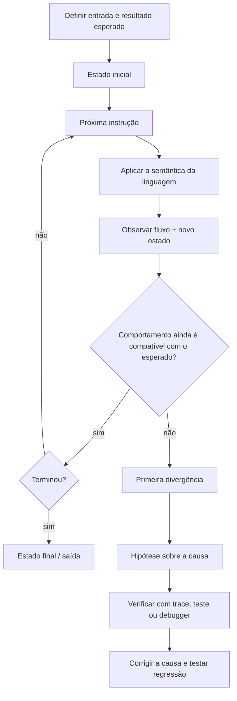

<a id="inicio"></a>

# Rastreamento, Verificação e Raciocínio sobre Execução

> **Classificação curricular:** `[D] Obrigatório dominar`  
>
> **Legenda de evidências/QA:** nos blocos operacionais, `[D]` = documentação/literatura, `[S]` = inspeção estática/estrutura e `[R]` = reprodução em runtime/ferramenta. Essa legenda é independente do `[D]` curricular acima, que significa **Obrigatório dominar**.  
>
> **Nível:** A — Lógica de Programação  
> **Posição na taxonomia:** tópico 12  
> **Papel curricular:** fechamento do Nível A  
> **Pré-requisitos:** todos os tópicos 1–11  
> **Aprofundamentos posteriores:** testes automatizados, debugging com ferramentas, invariantes, assertions, exceções, análise de algoritmos e correção formal

---

## Resumo executivo

Saber escrever código não basta.

Você precisa conseguir responder, **antes ou durante a execução**:

```text
qual instrução executa agora?
quais variáveis existem?
quais valores elas possuem?
qual condição será verdadeira?
quantas vezes o loop executará?
qual função será chamada?
o que será retornado?
qual será a saída?
onde o estado muda?
em qual passo o comportamento se desvia do esperado?
```

Esse conjunto de habilidades forma o tema deste capítulo.

A taxonomia canônica divide o assunto em cinco blocos:

```text
12.1 TESTE DE MESA
12.2 RASTREAMENTO DE FLUXO
12.3 ESTADO INTERMEDIÁRIO
12.4 PREVISÃO DE RESULTADOS
12.5 IDENTIFICAÇÃO DE ERROS LÓGICOS
```

O conceito central pode ser representado assim:

```text
CÓDIGO
↓
ESTADO INICIAL
↓
PRÓXIMA INSTRUÇÃO
↓
EFEITO SOBRE O ESTADO
↓
PRÓXIMA DECISÃO
↓
...
↓
ESTADO FINAL / SAÍDA
```

Um **teste de mesa** é uma simulação manual da execução.

Você age como se fosse o runtime:

```text
ler instrução
↓
aplicar exatamente a semântica
↓
atualizar o estado
↓
registrar
↓
seguir o fluxo
```

Farrell chama esse processo de **desk-checking**: caminhar pela lógica da solução no papel antes ou independentemente da execução real. (Farrell, 2024)

Esse hábito é especialmente valioso porque:

> **programa sem erro de sintaxe ainda pode estar logicamente errado.**

Farrell mostra exatamente essa distinção: código pode executar normalmente e ainda usar uma instrução incorreta para o objetivo desejado. (Farrell, 2024)

Também precisamos separar cinco atividades que costumam ser confundidas:

```text
RASTREAMENTO
≠
TESTE
≠
DEBUGGING
≠
PROVA DE CORREÇÃO
≠
EXECUÇÃO REAL
```

### Rastreamento

```text
seguir a execução passo a passo
```

### Teste

```text
fornecer casos e comparar resultado real com resultado esperado
```

### Debugging

```text
investigar a causa de comportamento incorreto e corrigi-la
```

### Prova/verificação formal

```text
demonstrar propriedades de correção por raciocínio rigoroso
```

### Execução real

```text
deixar o runtime executar o programa
```

Essas práticas se complementam.

Uma execução que produz o resultado esperado para **um caso** não prova que o programa está correto para todos os casos. Farrell usa um exemplo simples: um programa incorreto que soma `2` pode coincidir com um programa que deveria multiplicar por `2` quando a entrada é `2`, mas falha com outras entradas. (Farrell, 2024)

---

## Regra de ouro

> **Antes de confiar no que você acha que o código faz, consiga explicar o que ele realmente faz, instrução por instrução, estado por estado.**

---

## Decisão rápida

| Pergunta | Resposta |
|---|---|
| “Teste de mesa executa o programa de verdade?” | Não. É uma simulação manual/simbólica da execução. |
| “Posso usar tabela?” | Sim; uma trace table é uma das formas mais úteis. |
| “Tenho que registrar todas as variáveis?” | Registre as que influenciam o raciocínio; em exercícios didáticos, é comum registrar todas as relevantes. |
| “Valor antes e depois são importantes?” | Sim. Essa comparação mostra transições de estado. |
| “Condição deve ser registrada?” | Sim, especialmente em `if`, `while` e `for`. |
| “Resultado correto em um teste prova correção?” | Não. |
| “Programa sem syntax error pode estar errado?” | Sim, por erro lógico. |
| “Debugging é adivinhar até funcionar?” | Não. Deve ser investigação sistemática. |
| “Breakpoint corrige bug?” | Não. Ele apenas pausa a execução para inspeção. |
| “Step over e step into são a mesma coisa?” | Não. Em depuradores, `step into` entra em chamadas; `step over` normalmente executa a chamada sem entrar em seus detalhes. |
| “Print debugging é inútil?” | Não; é simples e muitas vezes eficaz, mas precisa ser usado conscientemente. |
| “Trace manual fica inútil quando aprendo debugger?” | Não. O debugger automatiza observação; raciocínio continua necessário. |
| “Erro lógico sempre produz exception?” | Não. Muitas vezes produz saída errada sem falhar. |
| “Loop invariant faz parte deste tópico?” | Como ponte para verificação: sim; a formalização completa fica para algoritmos. |
| “Posso alterar variável durante debugging?” | Algumas ferramentas permitem, mas isso muda o estado observado e pode mascarar a causa original. |
| “Bash `set -x` é debugger completo?” | Não. É tracing de comandos após expansões, útil para observar execução. |

---

# Índice


- [Resumo executivo](#resumo-executivo)
- [Regra de ouro](#regra-de-ouro)
- [Decisão rápida](#decisão-rápida)
- [1. Posição deste assunto](#1-posição-deste-assunto)
  - [1.1 Fechamento do nível](#11-fechamento-do-nível)
  - [1.2 Ponte para o Nível B](#12-ponte-para-o-nível-b)
- [2. Visão panorâmica](#2-visão-panorâmica)
  - [🗺️ Visão panorâmica — o mapa antes dos detalhes](#visao-panoramica-mapa)
- [3. O que significa raciocinar sobre execução](#3-o-que-significa-raciocinar-sobre-execução)
  - [3.1 Três perguntas](#31-três-perguntas)
  - [3.2 Exemplo](#32-exemplo)
  - [3.3 Não é “ler de cima para baixo” sempre](#33-não-é-ler-de-cima-para-baixo-sempre)
  - [3.4 Fronteira do modelo — execução sequencial](#34-fronteira-do-modelo--execução-sequencial)
- [4. Modelo de estado](#4-modelo-de-estado)
  - [4.1 Estado inclui mais que variáveis](#41-estado-inclui-mais-que-variáveis)
- [5. Estado inicial, intermediário e final](#5-estado-inicial-intermediário-e-final)
  - [Estado inicial](#estado-inicial)
  - [Estado intermediário](#estado-intermediário)
  - [Estado final](#estado-final)
  - [5.1 Por que intermediário importa?](#51-por-que-intermediário-importa)
  - [5.2 Bug aparece na primeira divergência](#52-bug-aparece-na-primeira-divergência)
- [6. Instrução versus efeito](#6-instrução-versus-efeito)
  - [6.1 Registre efeito, não apenas linha](#61-registre-efeito-não-apenas-linha)
  - [6.2 Condição](#62-condição)
- [7. 12.1 Teste de mesa](#7-121-teste-de-mesa)
  - [7.1 Objetivo](#71-objetivo)
  - [7.2 Quando usar](#72-quando-usar)
  - [7.3 Benefício didático](#73-benefício-didático)
- [8. Como montar uma trace table](#8-como-montar-uma-trace-table)
  - [8.1 Resultado](#81-resultado)
  - [8.2 O guia canônico usa exatamente esse exemplo](#82-o-guia-canônico-usa-exatamente-esse-exemplo)
- [9. O que registrar](#9-o-que-registrar)
  - [9.1 Condição](#91-condição)
  - [9.2 Coleção](#92-coleção)
  - [9.3 Função](#93-função)
  - [9.4 Evite ruído](#94-evite-ruído)
- [10. Granularidade do rastreamento](#10-granularidade-do-rastreamento)
  - [10.1 Iniciante](#101-iniciante)
  - [10.2 Código conhecido](#102-código-conhecido)
  - [10.3 Ao procurar bug](#103-ao-procurar-bug)
- [11. Exemplo canônico do guia](#11-exemplo-canônico-do-guia)
  - [Previsão](#previsão)
  - [Resultado](#resultado)
  - [Invariante informal](#invariante-informal)
- [12. 12.2 Rastreamento de fluxo](#12-122-rastreamento-de-fluxo)
  - [Modelo](#modelo)
- [13. Rastreamento de sequência](#13-rastreamento-de-sequência)
  - [Resultado](#resultado-1)
  - [Guardrail](#guardrail)
- [14. Rastreamento de condição](#14-rastreamento-de-condição)
  - [Tabela](#tabela)
- [15. Rastreamento de if-elif-else](#15-rastreamento-de-if-elif-else)
  - [Erro comum](#erro-comum)
- [16. Rastreamento de loop](#16-rastreamento-de-loop)
  - [Invariante](#invariante)
- [17. Rastreamento de nested loops](#17-rastreamento-de-nested-loops)
  - [Resultado](#resultado-2)
  - [Relação](#relação)
- [18. Rastreamento de break](#18-rastreamento-de-break)
- [19. Rastreamento de continue](#19-rastreamento-de-continue)
  - [Pergunta crítica](#pergunta-crítica)
- [20. Rastreamento de função](#20-rastreamento-de-função)
  - [Estado do chamador](#estado-do-chamador)
- [21. Call stack — primeira noção](#21-call-stack--primeira-noção)
  - [Fronteira](#fronteira)
- [22. Parâmetro, argumento e frame](#22-parâmetro-argumento-e-frame)
  - [Tabela](#tabela-1)
- [23. Return e retomada do chamador](#23-return-e-retomada-do-chamador)
  - [Erro de leitura](#erro-de-leitura)
- [24. 12.3 Estado intermediário](#24-123-estado-intermediário)
  - [24.1 Estado não é só valor final](#241-estado-não-é-só-valor-final)
  - [24.2 Por que importa?](#242-por-que-importa)
- [25. Antes e depois](#25-antes-e-depois)
  - [25.1 Condições não precisam alterar estado](#251-condições-não-precisam-alterar-estado)
- [26. Transições de estado](#26-transições-de-estado)
  - [26.1 Sequência](#261-sequência)
  - [26.2 Bug](#262-bug)
- [27. Estado local versus externo](#27-estado-local-versus-externo)
  - [27.1 Trace separado](#271-trace-separado)
- [28. Aliasing e estado compartilhado](#28-aliasing-e-estado-compartilhado)
  - [Fronteira](#fronteira-1)
- [29. 12.4 Previsão de resultados](#29-124-previsão-de-resultados)
  - [Modelo](#modelo-1)
  - [29.1 Habilidade](#291-habilidade)
- [30. Prever saída sem executar](#30-prever-saída-sem-executar)
  - [Não faça](#não-faça)
- [31. Justificar cada etapa](#31-justificar-cada-etapa)
  - [31.1 Justificativa usa semântica](#311-justificativa-usa-semântica)
- [32. Não confiar em intuição informal](#32-não-confiar-em-intuição-informal)
  - [Moral](#moral)
- [33. Casos de fronteira na previsão](#33-casos-de-fronteira-na-previsão)
  - [Por quê?](#por-quê)
  - [Loops](#loops)
- [34. 12.5 Identificação de erros lógicos](#34-125-identificação-de-erros-lógicos)
- [35. Condição incorreta](#35-condição-incorreta)
  - [Trace de fronteira](#trace-de-fronteira)
- [36. Cálculo incorreto](#36-cálculo-incorreto)
- [37. Atualização incorreta](#37-atualização-incorreta)
  - [Diagnóstico](#diagnóstico)
- [38. Ordem incorreta](#38-ordem-incorreta)
  - [Exemplo simples](#exemplo-simples)
- [39. Caminho inalcançável](#39-caminho-inalcançável)
  - [Correção possível](#correção-possível)
  - [Trace ajuda](#trace-ajuda)
- [40. Atualização omitida — estado permanece inalterado](#40-atualização-omitida--estado-permanece-inalterado)
  - [Erro](#erro)
- [41. Erro de fronteira](#41-erro-de-fronteira)
  - [Off-by-one](#off-by-one)
- [42. Erro lógico versus erro de execução](#42-erro-lógico-versus-erro-de-execução)
  - [Lógico](#lógico)
  - [Runtime](#runtime)
  - [Sintático](#sintático)
  - [Regra](#regra)
- [43. Rastreamento versus teste](#43-rastreamento-versus-teste)
  - [Rastreamento](#rastreamento-1)
  - [Teste](#teste-1)
  - [Exemplo](#exemplo)
- [44. Um teste que passa não prova correção](#44-um-teste-que-passa-não-prova-correção)
  - [Farrell](#farrell)
- [45. Escolha de casos de teste](#45-escolha-de-casos-de-teste)
  - [45.1 Cobrir caminhos](#451-cobrir-caminhos)
  - [45.2 Farrell](#452-farrell)
- [46. Tabela de decisão para rastreamento](#46-tabela-de-decisão-para-rastreamento)
  - [Benefício](#benefício)
  - [46.1 Curto-circuito — nem toda subexpressão executa](#461-curto-circuito--nem-toda-subexpressão-executa)
- [47. Invariantes — ponte para correção](#47-invariantes--ponte-para-correção)
  - [CLRS](#clrs)
  - [Neste capítulo](#neste-capítulo)
- [48. Inicialização, manutenção e término](#48-inicialização-manutenção-e-término)
  - [Inicialização](#inicialização)
  - [Manutenção](#manutenção)
  - [Término](#término)
  - [Exemplo](#exemplo-1)
- [49. Ferramentas de debugging — ponte prática](#49-ferramentas-de-debugging--ponte-prática)
  - [Ferramentas comuns](#ferramentas-comuns)
  - [Como a sessão pode começar](#como-a-sessão-pode-começar)
  - [Guardrail](#guardrail-1)
- [50. Breakpoint](#50-breakpoint)
  - [Não é](#não-é)
  - [CS50](#cs50)
- [51. Step into, step over e continue](#51-step-into-step-over-e-continue)
  - [Step into](#step-into)
  - [Step over](#step-over)
  - [Continue](#continue)
  - [Python pdb](#python-pdb)
  - [Guardrail](#guardrail-2)
- [52. Inspeção de variáveis](#52-inspeção-de-variáveis)
  - [Estratégia](#estratégia)
- [53. Python pdb](#53-python-pdb)
  - [Comandos conceituais](#comandos-conceituais)
  - [Escopo deste guia](#escopo-deste-guia)
- [54. JavaScript debugger](#54-javascript-debugger)
  - [Contexto](#contexto)
  - [Guardrail](#guardrail-3)
- [55. Java JDI e jdb](#55-java-jdi-e-jdb)
  - [Currículo](#currículo)
- [56. Bash xtrace](#56-bash-xtrace)
  - [Saída de trace](#saída-de-trace)
  - [BASH_XTRACEFD](#bash_xtracefd)
  - [Guardrail](#guardrail-4)
- [57. Print debugging](#57-print-debugging)
  - [Vantagens](#vantagens)
  - [Desvantagens](#desvantagens)
  - [Melhor](#melhor)
- [58. Ferramenta não substitui modelo mental](#58-ferramenta-não-substitui-modelo-mental)
- [59. Método sistemático de investigação](#59-método-sistemático-de-investigação)
  - [59.1 Evitar](#591-evitar)
- [60. Reproduzir antes de corrigir](#60-reproduzir-antes-de-corrigir)
- [61. Hipótese e evidência](#61-hipótese-e-evidência)
  - [Guardrail](#guardrail-5)
- [62. Reduzir o caso](#62-reduzir-o-caso)
  - [Benefício](#benefício-1)
  - [Técnica](#técnica)
- [63. Corrigir a causa, não o sintoma](#63-corrigir-a-causa-não-o-sintoma)
  - [Regra](#regra-1)
- [64. Reexecutar casos relevantes](#64-reexecutar-casos-relevantes)
  - [Por quê?](#por-quê-1)
- [65. Exemplo integrado — condição e loop](#65-exemplo-integrado--condição-e-loop)
- [66. Exemplo integrado — função](#66-exemplo-integrado--função)
- [67. Exemplo integrado — nested loop](#67-exemplo-integrado--nested-loop)
- [68. Exemplo integrado — erro lógico](#68-exemplo-integrado--erro-lógico)
  - [Causa](#causa)
- [69. Python — rastreamento equivalente](#69-python--rastreamento-equivalente)
  - [Ferramenta futura](#ferramenta-futura)
- [70. JavaScript — rastreamento equivalente](#70-javascript--rastreamento-equivalente)
  - [Atenção](#atenção)
- [71. Java — rastreamento equivalente](#71-java--rastreamento-equivalente)
  - [Diferença](#diferença)
- [72. Bash — rastreamento equivalente](#72-bash--rastreamento-equivalente)
  - [`set -x`](#set--x)
- [73. Diferenças importantes entre linguagens](#73-diferenças-importantes-entre-linguagens)
  - [Regra](#regra-2)
- [74. Erros conceituais frequentes](#74-erros-conceituais-frequentes)
  - [74.1 “Se compilou, está correto”](#741-se-compilou-está-correto)
  - [74.2 “Se um teste passou, está correto”](#742-se-um-teste-passou-está-correto)
  - [74.3 “Trace é executar no computador”](#743-trace-é-executar-no-computador)
  - [74.4 “Debugging é colocar prints aleatórios”](#744-debugging-é-colocar-prints-aleatórios)
  - [74.5 “Breakpoint mostra onde está o bug”](#745-breakpoint-mostra-onde-está-o-bug)
  - [74.6 “Estado final basta”](#746-estado-final-basta)
  - [74.7 “Condição usa sempre o valor inicial”](#747-condição-usa-sempre-o-valor-inicial)
  - [74.8 “Loop trace precisa só do contador”](#748-loop-trace-precisa-só-do-contador)
  - [74.9 “Return só devolve valor”](#749-return-só-devolve-valor)
  - [74.10 “Erro lógico produz exception”](#7410-erro-lógico-produz-exception)
  - [74.11 “Output errado significa que a última linha está errada”](#7411-output-errado-significa-que-a-última-linha-está-errada)
  - [74.12 “Corrigir sintoma basta”](#7412-corrigir-sintoma-basta)
  - [74.13 “Trace manual é coisa de iniciante”](#7413-trace-manual-é-coisa-de-iniciante)
  - [74.14 “Debugger elimina necessidade de entender escopo”](#7414-debugger-elimina-necessidade-de-entender-escopo)
  - [74.15 “set -x pode ser ligado sempre em produção”](#7415-set--x-pode-ser-ligado-sempre-em-produção)
- [Problemas reais — índice operacional `PR-*`](#problemas-reais)
- [🔎 Troubleshooting sistemático](#troubleshooting-sistematico)
- [75. Laboratórios](#75-laboratórios)
  - [🧪 LAB 1 — guia canônico](#-lab-1--guia-canônico)
  - [🧪 LAB 2 — condição](#-lab-2--condição)
  - [🧪 LAB 3 — while](#-lab-3--while)
  - [🧪 LAB 4 — continue](#-lab-4--continue)
  - [🧪 LAB 5 — função](#-lab-5--função)
  - [🧪 LAB 6 — um teste enganoso](#-lab-6--um-teste-enganoso)
  - [🧪 LAB 7 — off-by-one](#-lab-7--off-by-one)
  - [🧪 LAB 8 — debugger Python](#-lab-8--debugger-python)
  - [🧪 LAB 9 — Bash xtrace](#-lab-9--bash-xtrace)
  - [🧪 LAB 10 — NetDev opcional](#-lab-10--netdev-opcional)
- [76. Exercícios](#76-exercícios)
  - [76.1 Teste de mesa](#761-teste-de-mesa)
  - [76.2 Estado](#762-estado)
  - [76.3 Trace](#763-trace)
  - [76.4 Fluxo](#764-fluxo)
  - [76.5 Loop](#765-loop)
  - [76.6 Function call](#766-function-call)
  - [76.7 Call stack](#767-call-stack)
  - [76.8 Previsão](#768-previsão)
  - [76.9 Erro lógico](#769-erro-lógico)
  - [76.10 Condição incorreta](#7610-condição-incorreta)
  - [76.11 Cálculo](#7611-cálculo)
  - [76.12 Atualização](#7612-atualização)
  - [76.13 Ordem](#7613-ordem)
  - [76.14 Testes](#7614-testes)
  - [76.15 Invariante](#7615-invariante)
  - [76.16 Debugger](#7616-debugger)
  - [76.17 Step into](#7617-step-into)
  - [76.18 Bash](#7618-bash)
  - [76.19 Segurança](#7619-segurança)
  - [76.20 Método](#7620-método)
- [77. Evidências de domínio](#77-evidências-de-domínio)
  - [Teste de mesa](#teste-de-mesa)
  - [Fluxo](#fluxo)
  - [Estado](#estado)
  - [Previsão](#previsão-1)
  - [Erro lógico](#erro-lógico)
  - [Debugging](#debugging-1)
  - [Ferramentas](#ferramentas)
- [78. Checklist de consulta rápida](#78-checklist-de-consulta-rápida)
- [79. Glossário](#79-glossário)
- [80. Referências](#80-referências)
  - [80.1 Taxonomia canônica](#801-taxonomia-canônica)
  - [80.2 Farrell, Joyce](#802-farrell-joyce)
  - [80.3 Cormen et al.](#803-cormen-et-al)
  - [80.4 CS2023 — ACM / IEEE-CS / AAAI](#804-cs2023--acm--ieee-cs--aaai)
  - [80.5 Python 3.14 — documentação oficial](#805-python-314--documentação-oficial)
  - [80.6 ECMAScript / JavaScript](#806-ecmascript--javascript)
  - [80.7 Java SE 27 / JPDA](#807-java-se-27--jpda)
  - [80.8 GNU Bash 5.3](#808-gnu-bash-53)
  - [80.9 MIT OpenCourseWare](#809-mit-opencourseware)
  - [80.10 Teach Computing](#8010-teach-computing)
  - [80.11 CS50](#8011-cs50)
  - [80.12 Hierarquia de uso das fontes](#8012-hierarquia-de-uso-das-fontes)
  - [80.13 Fronteira deliberada](#8013-fronteira-deliberada)
  - [80.14 Stroustrup — fonte local complementar](#8014-stroustrup--fonte-local-complementar)
- [81. Histórico de versões](#81-histórico-de-versões)

---

# 1. Posição deste assunto

Este é o último tópico do **Nível A — Lógica de Programação**.

Isso não é coincidência.

Os tópicos 1–11 ensinaram a construir:

```text
problema
→ algoritmo
→ variáveis
→ expressões
→ condições
→ loops
→ padrões
→ I/O
→ estruturas
→ funções
```

Agora precisamos demonstrar que conseguimos:

```text
LER
SIMULAR
PREVER
JUSTIFICAR
VERIFICAR
LOCALIZAR ERROS
```

## 1.1 Fechamento do nível

Dominar lógica significa não apenas escrever:

```python
for i in range(3):
    ...
```

mas conseguir dizer:

```text
quantas vezes executa
quais valores i assume
qual estado muda
qual é o resultado final
```

## 1.2 Ponte para o Nível B

O Nível B começa com:

```text
sintaxe
semântica
sistema de tipos
```

Raciocinar sobre execução prepara você para distinguir:

```text
o código é válido?
o código significa o quê?
o runtime faz o quê?
o resultado corresponde ao requisito?
```

[↑ Voltar ao índice](#índice)

---

# 2. Visão panorâmica

<a id="visao-panoramica-mapa"></a>

## 🗺️ Visão panorâmica — o mapa antes dos detalhes

Esta visão funciona como **caderno rápido de consulta**, **modelo mental** e **contrato de cobertura** do T12. O foco continua sendo raciocinar sobre o que o programa realmente executa; as ferramentas de debugging entram como instrumentos de observação, não como substitutos desse raciocínio.

### Mapa do domínio — o que existe

```text
RASTREAMENTO, VERIFICAÇÃO E RACIOCÍNIO SOBRE EXECUÇÃO
│
├── contrato / expectativa
│   ├── entrada conhecida
│   ├── resultado esperado
│   └── regra que deveria ser satisfeita
│
├── teste de mesa
│   ├── execução manual
│   ├── trace table
│   ├── instrução executada
│   └── efeito observado
│
├── fluxo de controle
│   ├── sequência
│   ├── condição / ramo
│   ├── loop
│   ├── break / continue
│   ├── chamada
│   └── return
│
├── estado
│   ├── inicial
│   ├── intermediário
│   ├── final
│   ├── local / externo
│   └── compartilhado / aliasing
│
├── previsão e verificação
│   ├── prever saída
│   ├── justificar cada passo
│   ├── escolher casos de fronteira
│   └── comparar esperado × observado
│
├── erro lógico
│   ├── condição
│   ├── cálculo
│   ├── atualização
│   ├── ordem
│   ├── caminho inalcançável
│   └── off-by-one / atualização omitida / estado desatualizado
│
├── ponte para correção
│   ├── invariante informal
│   ├── inicialização
│   ├── manutenção
│   └── término
│
└── ferramentas de observação
    ├── breakpoint
    ├── step into / step over
    ├── call stack / locals
    ├── print/logging dirigido
    └── Bash xtrace
```

O mapa preserva os cinco nós curriculares `12.1`–`12.5` e explicita as pontes necessárias para T19 (Depuração), T20 (Testes e Verificação) e T24 (Correção e Análise de Algoritmos), sem antecipar integralmente esses capítulos.

### Fluxo principal — localizar a primeira divergência



Leitura textual equivalente:

```text
DEFINIR EXPECTATIVA
→ fixar entrada reproduzível
→ registrar estado inicial
→ executar mentalmente/observar uma instrução por vez
→ atualizar estado
→ comparar esperado × observado
→ encontrar a PRIMEIRA divergência
→ formular hipótese
→ coletar evidência
→ corrigir a causa
→ reexecutar caso + regressão
```

> O erro percebido na saída pode ser consequência de uma divergência que ocorreu muitas instruções antes.

### Consulta rápida — conceito × pergunta × risco

| Conceito | Pergunta de consulta | Regra central | Risco típico |
|---|---|---|---|
| teste de mesa | “o que executa passo a passo?” | simular a semântica, não a intenção | registrar só o resultado final |
| trace table | “que estado existia em cada passo?” | registrar apenas variáveis/condições relevantes | tabela grande sem função |
| estado intermediário | “quando o valor deixou de estar correto?” | procurar a primeira divergência | olhar somente o valor final |
| fluxo | “qual ramo/iteração/chamada executa?” | condição decide caminho; loop muda o ponto de retorno | seguir a ordem visual do arquivo cegamente |
| previsão | “qual saída deveria ocorrer sem executar?” | justificar por semântica e estado | responder por intuição |
| caso de fronteira | “onde a condição muda de verdade?” | testar antes/no/depois do limite | escolher apenas caso confortável |
| invariante | “o que deve permanecer verdadeiro?” | conferir inicialização, manutenção e término | transformar uma observação em prova sem justificativa |
| breakpoint | “onde vale pausar?” | pausar perto de uma hipótese concreta | colocar breakpoints aleatórios |
| step into | “a causa pode estar na função chamada?” | entrar quando o interior importa | entrar em toda chamada e gerar ruído |
| step over | “a função chamada é confiável neste diagnóstico?” | manter o frame atual | ocultar bug dentro da chamada |
| xtrace | “que comandos o Bash realmente expandiu/executou?” | trace de shell não é trace table didática | vazar segredos / misturar stderr |

### Pergunta prática → mecanismo inicial

| Se a dúvida for... | Comece por... | Destino principal |
|---|---|---|
| “qual será a saída?” | montar estado inicial e trace table | [§7–11](#7-121-teste-de-mesa) |
| “qual ramo executa?” | avaliar cada condição com os valores daquele instante | [§12–19](#12-122-rastreamento-de-fluxo) |
| “onde o valor ficou errado?” | comparar antes/depois e localizar a primeira divergência | [§24–28](#24-123-estado-intermediário) |
| “um teste que passou prova correção?” | procurar um caso que diferencie hipóteses concorrentes | [§43–45](#43-rastreamento-versus-teste) |
| “como raciocinar sobre um loop além de listar valores?” | formular propriedade preservada | [§47–48](#47-invariantes--ponte-para-correção) |
| “step over ou step into?” | decidir se a hipótese envolve o interior da chamada | [§51](#51-step-into-step-over-e-continue) |
| “debugger mostra a causa?” | definir antes o estado/resultado esperado | [§58–64](#58-ferramenta-não-substitui-modelo-mental) |
| “como observar Bash?” | usar xtrace de forma localizada e separar trace de diagnóstico | [§56](#56-bash-xtrace) |
| “como transformar sintoma em investigação?” | reproduzir → hipótese → evidência → primeira divergência | [§59–64](#59-método-sistemático-de-investigação) |

### Não confundir

| Não confundir | Distinção |
|---|---|
| trace manual × execução real | trace manual simula; runtime executa |
| trace × teste | trace explica um caminho; teste compara comportamento observado com esperado |
| teste × prova de correção | um conjunto de testes pode encontrar falhas, mas não demonstra todos os casos por si só |
| debugging × tentativa e erro | debugging sistemático trabalha com hipótese e evidência |
| estado final × histórico de estados | mesmo final pode ser atingido por caminhos diferentes; bug pode surgir e ser mascarado depois |
| linha visual × próxima instrução | loops, condições, chamadas e returns alteram o fluxo |
| breakpoint × causa | breakpoint só define onde observar |
| step over × “ignorar para sempre” | é uma decisão de granularidade; use step into quando a hipótese muda |
| editar variável no debugger × observar | alteração no debugger modifica o experimento e pode mascarar a causa |
| Bash xtrace × debugger completo | xtrace mostra expansão/execução; não oferece, por si só, o mesmo modelo de frames/watchpoints de um debugger de linguagem |

### Microexemplos canônicos

**1. Estado intermediário**

```python
x = 1
for i in range(3):
    x *= 2
```

```text
inicial: x=1

i=0 → x=2
i=1 → x=4
i=2 → x=8
```

**2. Primeira divergência em fronteira**

```python
age = 18
is_adult = age > 18
```

```text
esperado: True
observado: False
primeira divergência: avaliação de 18 > 18
```

**3. Um teste enganoso**

```text
intenção: resultado = input × 2
bug:      resultado = input + 2

input 2 → ambos produzem 4
input 3 → 6 esperado, 5 observado
```

**4. Call stack conceitual**

```text
main()
└── calculate_total()
    └── apply_discount()
```

Ao entrar em `apply_discount()`, existem frames pendentes que precisam ser retomados na ordem inversa.

### Problemas reais representativos

| ID | Necessidade concreta | Capacidade principal |
|---|---|---|
| `PR-T12-01` | localizar erro que só aparece exatamente na fronteira | trace de condição + caso-limite |
| `PR-T12-02` | descobrir em qual iteração um acumulador diverge | estado antes/depois + primeira divergência |
| `PR-T12-03` | explicar por que `continue` altera o caminho esperado | rastreamento de fluxo |
| `PR-T12-04` | seguir chamada, retorno e frames sem perder o estado do chamador | call stack + escopo |
| `PR-T12-05` | construir teste que diferencie duas implementações que coincidem em um caso | escolha de dados de teste |
| `PR-T12-06` | usar uma propriedade preservada para raciocinar sobre loop | invariante informal |
| `PR-T12-07` | correlacionar trace manual com breakpoint/step sem alterar o experimento | debugger + estado esperado |
| `PR-T12-08` | observar execução Bash sem misturar trace e diagnóstico nem expor segredo | xtrace + `BASH_XTRACEFD` + segurança |

O índice operacional completo está em [Problemas reais — índice operacional `PR-*`](#problemas-reais).

### Falha típica → primeira investigação

| Sintoma | Primeira hipótese/verificação |
|---|---|
| funciona para 17 e 19, falha em 18 | operador de fronteira (`>` × `>=`)? |
| total fica incorreto após várias iterações | em qual iteração ocorre a primeira divergência? |
| loop não termina | variável/estado de progresso realmente muda em todos os caminhos? |
| resultado final está certo, mas log mostra estado impossível no meio | algum passo posterior está mascarando um erro anterior? |
| step over “pula” onde o bug parece ocorrer | a hipótese envolve o interior da função chamada? |
| debugger “resolve” depois de editar variável | a observação foi contaminada pela própria intervenção? |
| Bash trace mostra token/senha | xtrace foi habilitado sobre expansão sensível? |
| trace Bash se mistura com mensagens de erro | separar via `BASH_XTRACEFD` quando necessário |

A investigação completa está em [🔎 Troubleshooting sistemático](#troubleshooting-sistematico).

### Transferência entre linguagens — o que permanece e o que muda

| Capacidade | Python | JavaScript | Java | Bash |
|---|---|---|---|---|
| trace manual | mesma ideia | mesma ideia | mesma ideia | mesma ideia |
| condição | truthiness própria | truthiness própria | condição booleana | comandos/status ou contextos `[[ ]]`/`(( ))` |
| loop | `for`/`while` | `for`/`while` etc. | `for`/`while` etc. | `for`, `while`, `until`, aritmético |
| término de função sem valor de retorno explícito | `None` | `undefined` | depende da assinatura (`void` ou valor obrigatório) | exit status da função, normalmente derivado do último comando; **não é retorno de dados** |
| debugger/observação | `pdb`/IDE | DevTools/Node/IDE + `debugger` | JPDA/JDI/jdb/IDE | xtrace/traps/ferramentas externas |
| stack/frames | explícitos no debugger | explícitos no debugger | explícitos no debugger | modelo de shell/processos é diferente; não forçar equivalência |
| mutar durante debug | possível; altera o experimento | geralmente possível em DevTools | debuggers podem permitir avaliação/alteração | comandos executados para “inspecionar” também podem ter efeito |

> A habilidade transferível é acompanhar **fluxo + estado + contrato esperado**. A ferramenta e a semântica concreta continuam pertencendo à linguagem/runtime.

### Síntese multifonte — por que o mapa está organizado assim

As fontes cumprem papéis diferentes e complementares:

```text
GUIA v2.1.0
→ fixa os cinco nós curriculares 12.1–12.5

FARRELL (2024)
→ desk-checking, logical errors, escolha de dados de teste e hábitos de debugging

CORMEN ET AL. (2022)
→ invariantes e raciocínio initialization → maintenance → termination

STROUSTRUP (2024)
→ erro como diferença entre intenção e comportamento; experimentos reproduzíveis e disciplina de investigação

CS2023
→ reading/understanding code, testing, debugging e uso de debugger como competência fundamental

DOCUMENTAÇÕES OFICIAIS
→ comportamento atual de pdb, debugger statement, JDI e Bash xtrace

MIT / CS50 / TEACH COMPUTING
→ prática pedagógica de testing, stepping e trace tables
```

A síntese não transforma todas essas fontes em uma única autoridade. Semântica de linguagem/ferramenta continua sendo confirmada em documentação oficial; livros e materiais acadêmicos ajudam a organizar modelo mental, prática e cobertura.

### Modo consulta × modo estudo

**Consulta em ~30 segundos:**

```text
1. identificar se a dúvida é fluxo, estado, previsão ou erro lógico;
2. consultar a tabela rápida;
3. reproduzir com entrada fixa;
4. localizar primeira divergência;
5. usar debugger somente se precisar observar o runtime real.
```

**Estudo completo:**

```text
teste de mesa
→ trace table
→ fluxo
→ estado intermediário
→ previsão
→ logical errors
→ escolha de casos
→ invariantes
→ debugger/observação
→ método sistemático
→ transferência entre linguagens
→ PR-* / troubleshooting / LABs
```

**Primeira passagem — núcleo curricular `12.1–12.5`:**

```text
teste de mesa
→ fluxo
→ estado antes/depois
→ previsão justificada
→ identificação da primeira divergência
→ erros de condição/cálculo/atualização/ordem
```

**Segunda passagem — pontes e observação prática:**

```text
casos de teste
→ invariantes informais
→ debugger
→ pdb / DevTools / JDI-jdb / xtrace
→ PR-* / troubleshooting / LABs
```

> Essa ordem é uma **prioridade de leitura**, não uma nova classificação curricular. Ferramentas e pontes continuam no mesmo documento porque ajudam a transferir o raciocínio manual para observação real, mas não substituem o domínio de `12.1–12.5`.

### Contrato panorâmico de cobertura

| Nó canônico | Cobertura principal | Estado |
|---|---|---|
| `12.1` Teste de mesa | §7–11 | `COBERTO` |
| `12.2` Rastreamento de fluxo | §12–23 | `COBERTO` |
| `12.3` Estado intermediário | §24–28 | `COBERTO` |
| `12.4` Previsão de resultados | §29–33 | `COBERTO` |
| `12.5` Identificação de erros lógicos | §34–42 | `COBERTO` |
| ponte: teste/debugging | §43–64 | `REFERENCIADO / APROFUNDADO LOCALMENTE` |
| ponte: invariantes/correção | §47–48 | `INTRODUZIDO` |
| transferência de linguagem | §69–73 | `COBERTO` |
| problemas reais | `PR-T12-01`–`PR-T12-08` | `COBERTO` |
| troubleshooting | `TS-T12-01`–`TS-T12-10` | `COBERTO` |

[↑ Voltar ao índice](#índice)

---
# 3. O que significa raciocinar sobre execução

Raciocinar sobre execução é conseguir mapear:

```text
CÓDIGO
→ FLUXO
→ ESTADO
→ RESULTADO
```

sem depender apenas de tentativa e erro.

## 3.1 Três perguntas

Para cada instrução:

```text
1. ELA EXECUTA?
2. SE EXECUTA, COM QUAIS VALORES?
3. QUAL ESTADO MUDA DEPOIS?
```

## 3.2 Exemplo

```python
x = 10

if x > 5:
    x += 2
```

Raciocínio:

```text
x começa 10
10 > 5 → true
ramo executa
x = 12
```

## 3.3 Não é “ler de cima para baixo” sempre

Fluxo pode:

- pular ramo;
- voltar por loop;
- entrar em função;
- retornar;
- interromper por `break`;
- pular por `continue`;
- lançar erro.

## 3.4 Fronteira do modelo — execução sequencial

O núcleo deste capítulo acompanha **um caminho de execução por vez**, com ordem de avaliação definida pela semântica da linguagem para aquele caso.

```text
próxima operação
→ efeito observável
→ novo estado
→ próximo ponto do fluxo
```

Assincronismo, concorrência, paralelismo e múltiplos fluxos de execução podem introduzir interleavings e relações temporais que exigem um modelo mais rico. Eles ficam fora do escopo de `12.1–12.5`; o guardrail aqui é não generalizar um trace sequencial simples para esses cenários.

[↑ Voltar ao índice](#índice)

---

# 4. Modelo de estado

Para este capítulo, podemos pensar no estado como:

```text
conjunto de valores relevantes em determinado instante
```

Exemplo:

```text
x = 2
y = 5
```

Estado:

```text
{x: 2, y: 5}
```

Depois:

```python
x = x + y
```

Estado:

```text
{x: 7, y: 5}
```

## 4.1 Estado inclui mais que variáveis

Pode incluir:

- posição no fluxo;
- call stack;
- conteúdo de coleção;
- output já produzido;
- arquivo/estado externo;
- status de função/comando.

Neste nível, focamos principalmente:

```text
variáveis
fluxo
retorno
saída
```

[↑ Voltar ao índice](#índice)

---

# 5. Estado inicial, intermediário e final

## Estado inicial

Antes da parte analisada:

```text
x = 1
```

## Estado intermediário

Após uma transformação:

```text
x = 2
```

## Estado final

Depois que o algoritmo termina:

```text
x = 8
```

## 5.1 Por que intermediário importa?

Dois programas podem:

```text
produzir mesma saída em um caso
```

mas percorrer estados diferentes e divergir em outro caso.

## 5.2 Bug aparece na primeira divergência

Quando existe um estado intermediário esperado explícito, compare:

```text
estado esperado
versus
estado observado
```

Em muitos problemas reais, porém, a expectativa é **parcial**: uma propriedade, uma faixa válida, uma pós-condição ou outra restrição do contrato. Nesse caso, não é necessário conhecer antecipadamente cada valor intermediário.

> **Primeira divergência:** primeiro ponto observável em que o comportamento deixa de ser compatível com a expectativa, propriedade ou contrato estabelecido.

[↑ Voltar ao índice](#índice)

---

# 6. Instrução versus efeito

Instrução:

```python
x += 2
```

Efeito:

```text
x_after = x_before + 2
```

## 6.1 Registre efeito, não apenas linha

Trace ruim:

```text
executou x += 2
```

Trace melhor:

```text
x: 5 → 7
```

## 6.2 Condição

Instrução:

```python
if x >= 10:
```

Efeito no fluxo:

```text
x=7
7 >= 10 → false
ramo não executa
```

[↑ Voltar ao índice](#índice)

---

# 7. 12.1 Teste de mesa

A taxonomia exige:

```text
execução manual
valores das variáveis
sequência executada
```

Farrell define desk-checking como caminhar pela solução no papel. (Farrell, 2024)

## 7.1 Objetivo

Não é “fingir que compilou”.

É:

```text
simular a semântica
```

## 7.2 Quando usar

- antes de executar;
- ao estudar código;
- ao revisar algoritmo;
- ao depurar;
- em prova/entrevista;
- ao validar pseudocódigo;
- ao explicar código de outra pessoa.

## 7.3 Benefício didático

Trace tables são usadas explicitamente em material educacional de computação para caminhar por loops e detectar/corrigir erros.

[↑ Voltar ao índice](#índice)

---

# 8. Como montar uma trace table

Comece pelas variáveis relevantes.

Código:

```python
x = 1

for i in range(3):
    x = x * 2
```

Tabela:

| etapa | `i` | `x` antes | operação | `x` depois |
|---|---:|---:|---|---:|
| inicial | — | — | `x = 1` | 1 |
| iteração 1 | 0 | 1 | `x = x * 2` | 2 |
| iteração 2 | 1 | 2 | `x = x * 2` | 4 |
| iteração 3 | 2 | 4 | `x = x * 2` | 8 |

## 8.1 Resultado

```text
x = 8
```

## 8.2 O guia canônico usa exatamente esse exemplo

Isso torna este padrão a referência mínima obrigatória do tópico.

[↑ Voltar ao índice](#índice)

---

# 9. O que registrar

Nem toda tabela precisa ter as mesmas colunas.

Pode incluir:

```text
linha
iteração
condição
variável antes
variável depois
output
return
```

## 9.1 Condição

```text
x > 10?
```

## 9.2 Coleção

Pode registrar:

```text
values antes
values depois
```

## 9.3 Função

Pode registrar:

```text
caller
callee
argumentos
parâmetros
retorno
```

## 9.4 Evite ruído

Não registre 30 valores irrelevantes só porque existem.

A tabela deve apoiar a pergunta que você está investigando.

[↑ Voltar ao índice](#índice)

---

# 10. Granularidade do rastreamento

Trace por:

```text
linha
bloco
iteração
chamada
evento
```

## 10.1 Iniciante

Prefira passo pequeno.

## 10.2 Código conhecido

Pode agrupar operações simples.

## 10.3 Ao procurar bug

Aproxime a granularidade da região suspeita.

Estratégia:

```text
trace amplo
↓
identificar região
↓
trace detalhado
```

[↑ Voltar ao índice](#índice)

---

# 11. Exemplo canônico do guia

Código:

```python
x = 1

for i in range(3):
    x = x * 2
```

## Previsão

`range(3)` produz:

```text
0
1
2
```

Logo são três multiplicações por `2`.

Estado:

```text
1
→ 2
→ 4
→ 8
```

## Resultado

```text
x = 8
```

## Invariante informal

Depois de `k` iterações:

```text
x = 2^k
```

porque começou em `1`.

Esse raciocínio já prepara para invariantes formais posteriormente.

[↑ Voltar ao índice](#índice)

---

# 12. 12.2 Rastreamento de fluxo

A taxonomia exige:

```text
condições
loops
funções
```

Rastrear fluxo é determinar:

```text
qual caminho de controle é percorrido
```

## Modelo

```text
linha A
↓
condição
├─ true  → B
└─ false → C
```

ou:

```text
loop
→ corpo
→ volta ao teste
```

ou:

```text
caller
→ function
→ return
→ caller
```

[↑ Voltar ao índice](#índice)

---

# 13. Rastreamento de sequência

Código:

```python
x = 2
y = x + 3
x = y * 2
```

Trace:

| passo | `x` | `y` |
|---|---:|---:|
| inicial | — | — |
| `x = 2` | 2 | — |
| `y = x + 3` | 2 | 5 |
| `x = y * 2` | 10 | 5 |

## Resultado

```text
x=10
y=5
```

## Guardrail

A última atribuição a `x` não retroage e muda `y`.

[↑ Voltar ao índice](#índice)

---

# 14. Rastreamento de condição

```python
score = 75

if score >= 70:
    result = "APPROVED"
else:
    result = "REJECTED"
```

Trace:

```text
score = 75
75 >= 70 → true
executa ramo true
result = APPROVED
```

## Tabela

| passo | expressão | valor | ação |
|---|---|---|---|
| 1 | `score >= 70` | `true` | ramo `if` |
| 2 | — | — | `result = "APPROVED"` |

[↑ Voltar ao índice](#índice)

---

# 15. Rastreamento de if-elif-else

```python
value = 12

if value > 10:
    result = "A"
elif value > 5:
    result = "B"
else:
    result = "C"
```

Trace:

```text
12 > 10 → true
result = A
elif NÃO é avaliado
else NÃO executa
```

## Erro comum

Pensar:

```text
ambas as condições são true
→ B também executa
```

Não numa cadeia exclusiva.

[↑ Voltar ao índice](#índice)

---

# 16. Rastreamento de loop

Código:

```python
total = 0

for value in [2, 3, 4]:
    total += value
```

Trace:

| iteração | `value` | `total` antes | `total` depois |
|---:|---:|---:|---:|
| 1 | 2 | 0 | 2 |
| 2 | 3 | 2 | 5 |
| 3 | 4 | 5 | 9 |

## Invariante

```text
total
=
soma dos valores já processados
```

[↑ Voltar ao índice](#índice)

---

# 17. Rastreamento de nested loops

```python
count = 0

for row in range(2):
    for column in range(3):
        count += 1
```

Trace resumido:

```text
row=0
  column=0 → count=1
  column=1 → count=2
  column=2 → count=3

row=1
  column=0 → count=4
  column=1 → count=5
  column=2 → count=6
```

## Resultado

```text
count=6
```

## Relação

```text
2 × 3 = 6
```

[↑ Voltar ao índice](#índice)

---

# 18. Rastreamento de break

```python
for value in [3, 7, 9]:
    if value == 7:
        break

    print(value)
```

Trace:

```text
value=3
3==7 → false
print 3

value=7
7==7 → true
break
loop termina

9 nunca é processado
```

Saída:

```text
3
```

[↑ Voltar ao índice](#índice)

---

# 19. Rastreamento de continue

```python
for value in [1, 2, 3]:
    if value == 2:
        continue

    print(value)
```

Trace:

```text
1 → print
2 → continue → print é pulado
3 → print
```

Saída:

```text
1
3
```

## Pergunta crítica

Em `while`:

```text
continue pula alguma atualização necessária?
```

Esse raciocínio detecta loops infinitos.

[↑ Voltar ao índice](#índice)

---

# 20. Rastreamento de função

```python
def double(value):
    return value * 2

x = 5
y = double(x)
```

Trace:

```text
x = 5
↓
call double(5)
↓
value = 5
↓
return 10
↓
y = 10
```

## Estado do chamador

```text
x continua 5
y passa a 10
```

[↑ Voltar ao índice](#índice)

---

# 21. Call stack — primeira noção

Quando funções chamam funções, precisamos lembrar:

```text
quem chamou quem?
onde retornar?
quais locais pertencem a cada chamada?
```

Modelo:

```text
main
↓
function_a
↓
function_b
```

Stack conceitual:

```text
top → function_b
      function_a
      main
```

Quando `function_b` retorna:

```text
frame B sai
↓
execução volta a function_a
```

## Fronteira

Detalhes de stack frame e memória serão aprofundados depois.

[↑ Voltar ao índice](#índice)

---

# 22. Parâmetro, argumento e frame

```python
def add_one(value):
    result = value + 1
    return result

x = 5
y = add_one(x)
```

Trace da chamada:

```text
argumento x
→ valor 5

parâmetro value
→ 5

local result
→ 6

return
→ 6
```

## Tabela

| contexto | nome | valor |
|---|---|---:|
| caller | `x` | 5 |
| callee | `value` | 5 |
| callee | `result` | 6 |
| caller depois | `y` | 6 |

[↑ Voltar ao índice](#índice)

---

# 23. Return e retomada do chamador

```python
def f():
    return 10
    print("never")

x = f()
```

Trace:

```text
entra em f
return 10
f termina
print nunca executa
caller retoma
x = 10
```

## Erro de leitura

Pensar que:

```text
return apenas produz um valor
```

e esquecer:

```text
return também termina a execução da função naquele ponto
```

[↑ Voltar ao índice](#índice)

---

# 24. 12.3 Estado intermediário

A taxonomia exige:

```text
antes
depois
transições
```

## 24.1 Estado não é só valor final

Código:

```python
x = 1
x += 2
x *= 5
```

Estado:

```text
1
→ 3
→ 15
```

## 24.2 Por que importa?

Se resultado esperado era:

```text
11
```

precisamos localizar onde:

```text
estado real
≠
estado esperado
```

[↑ Voltar ao índice](#índice)

---

# 25. Antes e depois

Uma coluna poderosa:

| instrução | antes | depois |
|---|---|---|
| `x += 3` | `x=2` | `x=5` |
| `x *= 2` | `x=5` | `x=10` |

## 25.1 Condições não precisam alterar estado

```text
x > 5
```

pode alterar apenas o **fluxo**, não `x`.

Então registre:

```text
condição: true
próximo bloco: A
```

[↑ Voltar ao índice](#índice)

---

# 26. Transições de estado

Formalização simples:

```text
S0 --instrução--> S1
```

Exemplo:

```text
{x: 2}
-- x = x + 3 -->
{x: 5}
```

## 26.1 Sequência

```text
S0 → S1 → S2 → S3
```

## 26.2 Bug

Pode ser visto como:

```text
transição diferente do contrato
```

[↑ Voltar ao índice](#índice)

---

# 27. Estado local versus externo

Função:

```python
x = 10

def f():
    y = 20
    return y
```

Estados:

```text
externo:
x = 10

local de f:
y = 20
```

## 27.1 Trace separado

Evita confundir:

```text
variável local
com
variável do chamador
```

[↑ Voltar ao índice](#índice)

---

# 28. Aliasing e estado compartilhado

Tópico 10 introduziu:

```python
a = [1, 2]
b = a
b.append(3)
```

Trace incorreto:

```text
b mudou
a ficou igual
```

Trace correto:

```text
a e b referem-se à mesma lista
↓
mutação observável por ambos
```

Estado:

```text
a → [1,2,3]
b → [1,2,3]
```

## Fronteira

Referências e mutabilidade serão aprofundadas no tópico 14.

[↑ Voltar ao índice](#índice)

---

# 29. 12.4 Previsão de resultados

A taxonomia exige:

```text
determinar saída sem executar
justificar o resultado
```

Previsão não é chute.

É derivação.

## Modelo

```text
INPUT
↓
regras de execução
↓
trace
↓
OUTPUT previsto
```

## 29.1 Habilidade

Dado código curto, você deve conseguir:

- dizer a saída;
- indicar valores intermediários;
- explicar por quê.

[↑ Voltar ao índice](#índice)

---

# 30. Prever saída sem executar

Código:

```python
value = 3

for _ in range(2):
    value += 4

print(value)
```

Derivação:

```text
inicial 3
1ª iteração → 7
2ª iteração → 11
print → 11
```

Saída:

```text
11
```

## Não faça

```text
“acho que dá 11”
```

Faça:

```text
“dá 11 porque...”
```

[↑ Voltar ao índice](#índice)

---

# 31. Justificar cada etapa

Previsão forte:

```text
range(2) possui dois elementos
logo o corpo executa duas vezes
value começa 3
cada iteração soma 4
3 + 4 + 4 = 11
```

## 31.1 Justificativa usa semântica

Você precisa conhecer:

- `range`;
- assignment;
- loop;
- output.

Por isso rastreamento integra todos os tópicos anteriores.

[↑ Voltar ao índice](#índice)

---

# 32. Não confiar em intuição informal

Código:

```python
x = 10

if x > 5:
    x = 1

if x > 5:
    x = 2
```

Leitura apressada:

```text
x começou >5
então ambos os if executam
```

Errado.

Trace:

```text
x=10
primeiro true
x=1
segundo:
1>5 → false
final x=1
```

## Moral

> **Cada condição usa o estado existente naquele momento, não o estado antigo.**

[↑ Voltar ao índice](#índice)

---

# 33. Casos de fronteira na previsão

Para:

```python
if age >= 18:
```

trace:

```text
17
18
19
```

## Por quê?

`18` distingue:

```text
>
de
>=
```

## Loops

Para tamanho `n`:

```text
0
1
n-1
n
n+1
```

podem revelar off-by-one.

[↑ Voltar ao índice](#índice)

---

# 34. 12.5 Identificação de erros lógicos

A taxonomia exige:

```text
condição incorreta
cálculo incorreto
atualização incorreta
ordem incorreta
```

Erro lógico significa:

```text
programa executa uma lógica diferente da requerida
```

Farrell define logical error como instrução incorreta ou instruções executadas na ordem errada. (Farrell, 2024)

[↑ Voltar ao índice](#índice)

---

# 35. Condição incorreta

Requisito:

```text
adulto se age >= 18
```

Código:

```python
if age > 18:
```

Bug:

```text
age=18
```

é classificado incorretamente.

## Trace de fronteira

```text
18 > 18 → false
```

A tabela torna o erro evidente.

[↑ Voltar ao índice](#índice)

---

# 36. Cálculo incorreto

Requisito:

```text
dobrar
```

Código:

```python
result = value + 2
```

Para:

```text
value=2
```

resultado é:

```text
4
```

e parece correto.

Para:

```text
value=7
```

resultado:

```text
9
```

mas esperado:

```text
14
```

Farrell usa exatamente esse tipo de contraexemplo para mostrar que um caso que passa não prova correção. (Farrell, 2024)

[↑ Voltar ao índice](#índice)

---

# 37. Atualização incorreta

Objetivo:

```text
i subir até 5
```

Código:

```python
i = 0

while i < 5:
    i -= 1
```

Trace:

```text
0
-1
-2
-3
...
```

Condição:

```text
i < 5
```

continua verdadeira.

## Diagnóstico

A atualização move o estado **para longe** do término.

[↑ Voltar ao índice](#índice)

---

# 38. Ordem incorreta

Objetivo:

```text
aplicar desconto antes do imposto
```

Código:

```text
taxed = price * 1.10
final = taxed * 0.90
```

Talvez, para operações multiplicativas simples, o resultado coincida.

Mas em regras com:

- thresholds;
- arredondamento;
- taxa fixa;
- mínimo;

ordem pode alterar resultado.

## Exemplo simples

```python
value = 3
value *= 2
value += 1
```

→ `7`.

Invertido:

```python
value = 3
value += 1
value *= 2
```

→ `8`.

[↑ Voltar ao índice](#índice)

---

# 39. Caminho inalcançável

```python
if age >= 18:
    category = "adult"
elif age >= 65:
    category = "senior"
```

Para:

```text
age=70
```

o primeiro ramo já vence.

Neste encadeamento, a condição `age >= 65` fica **sombreada pela condição anterior**: todo valor que satisfaz `age >= 65` também satisfaz `age >= 18`, portanto o segundo ramo é inalcançável **sob essas condições e nessa ordem**.

## Correção possível

```python
if age >= 65:
    ...
elif age >= 18:
    ...
```

## Trace ajuda

Tabela de casos:

| age | `>=18` | `>=65` seria testado? | resultado |
|---:|---|---|---|
| 70 | true | não | adult |

[↑ Voltar ao índice](#índice)

---

# 40. Atualização omitida — estado permanece inalterado

Código:

```python
total = 0

for value in [1, 2, 3]:
    total + value
```

Nenhuma atribuição.

Trace:

```text
total começa 0
expressão é calculada
resultado não é armazenado
total continua 0
```

## Erro

Esperar que:

```text
total + value
```

altere `total`.

Neste exemplo, o defeito específico é **calcular e descartar o resultado**, deixando de atualizar a variável. “Estado stale” ou **estado desatualizado** é uma categoria mais ampla: descreve um estado que deixou de representar a situação relevante/atual. Não use o termo como sinônimo automático de qualquer atribuição ausente.

[↑ Voltar ao índice](#índice)

---

# 41. Erro de fronteira

Objetivo:

```text
executar 5 vezes
```

Código:

```python
for i in range(6):
```

Executa:

```text
6 vezes
```

Trace de `i`:

```text
0
1
2
3
4
5
```

## Off-by-one

É um dos erros mais comuns justamente porque:

```text
fluxo parece quase certo
```

[↑ Voltar ao índice](#índice)

---

# 42. Erro lógico versus erro de execução

## Lógico

```python
result = value + 2
```

quando deveria multiplicar por 2.

O programa:

```text
executa
mas dá resposta errada
```

## Runtime

```python
10 / 0
```

produz falha/exceção.

## Sintático

```python
if x > 0
```

sem `:` em Python.

## Regra

Essas categorias não devem ser confundidas.

O próximo tópico, no Nível B, aprofunda:

```text
sintaxe × semântica × tipos
```

[↑ Voltar ao índice](#índice)

---

# 43. Rastreamento versus teste

## Rastreamento

```text
simular/observar estado e fluxo
```

## Teste

Neste capítulo usamos deliberadamente o modelo introdutório:

```text
caso de entrada
+
resultado esperado
+
resultado observado
```

> **Fronteira:** T20 amplia esse modelo para assertions, classes de teste, propriedades/condições esperadas, casos de falha e regressão. Aqui o objetivo é apenas diferenciar **observar a execução** de **comparar comportamento esperado e observado**.

## Exemplo

Teste:

```text
input 7
expected 14
actual 9
FAIL
```

Rastreamento:

```text
value=7
result=value+2
result=9
```

Agora vemos o mecanismo.

[↑ Voltar ao índice](#índice)

---

# 44. Um teste que passa não prova correção

Programa errado:

```python
def supposed_double(value):
    return value + 2
```

Teste:

```text
input 2
expected 4
actual 4
PASS
```

Isso não prova:

```text
double correto
```

Segundo teste:

```text
input 7
expected 14
actual 9
FAIL
```

## Farrell

Esse exemplo didático aparece diretamente na discussão de testing/debugging da obra. (Farrell, 2024)

[↑ Voltar ao índice](#índice)

---

# 45. Escolha de casos de teste

Casos úteis:

```text
normal
fronteira
vazio
mínimo
máximo
inválido
caso especial
```

## 45.1 Cobrir caminhos

Para:

```python
if x < 0:
    ...
elif x == 0:
    ...
else:
    ...
```

use:

```text
-1
0
1
```

## 45.2 Farrell

A autora enfatiza que test data precisa incluir cenários variados e situações incomuns, não apenas casos que naturalmente passam. (Farrell, 2024)

[↑ Voltar ao índice](#índice)

---

# 46. Tabela de decisão para rastreamento

Código:

```text
if A and B
    X
else
    Y
```

Tabela:

| A | B | `A and B` | caminho |
|---|---|---|---|
| F | F | F | Y |
| F | T | F | Y |
| T | F | F | Y |
| T | T | T | X |

## Benefício

Ajuda a verificar:

- condição composta;
- cobertura;
- casos esquecidos.

## 46.1 Curto-circuito — nem toda subexpressão executa

Uma tabela-verdade mostra o **resultado lógico**, mas o trace também precisa registrar **quais operandos foram realmente avaliados**.

Em Python:

```python
def right_side():
    print("right")
    return True

result = False and right_side()
```

`right_side()` não executa. O primeiro operando já determina o resultado de `and`.

Transferência correta:

| Contexto | Regra de curto-circuito |
|---|---|
| Python `a and b` / `a or b` | `b` só é avaliado quando necessário; `and`/`or` retornam um dos operandos |
| JavaScript `a && b` / `a || b` | o operando direito só é avaliado quando necessário; o resultado pode ser um dos operandos, não necessariamente `boolean` |
| Java `a && b` / `a || b` | o operando direito é avaliado condicionalmente; a expressão produz `boolean` |
| Bash `cmd1 && cmd2` / `cmd1 || cmd2` | `cmd2` executa conforme o **exit status** de `cmd1`; é composição de comandos, não equivalência direta com os operadores de valores acima |

**Guardrail de trace:** se a expressão à direita tiver chamada, mutação, I/O ou outro efeito observável, não registre esse efeito quando o curto-circuito impedir sua avaliação.

[↑ Voltar ao índice](#índice)

---

# 47. Invariantes — ponte para correção

Uma invariante é uma propriedade que permanece verdadeira em pontos definidos da execução.

Exemplo de soma:

```python
total = 0

for value in values:
    total += value
```

Invariante:

```text
antes de cada próxima iteração,
total = soma dos elementos já processados
```

## CLRS

Cormen et al. usam invariantes para demonstrar correção e estruturam o raciocínio em:

```text
initialization
maintenance
termination
```

(Cormen et al., 2022)

## Neste capítulo

Usamos invariantes de forma informal.

A prova formal vem mais adiante.

[↑ Voltar ao índice](#índice)

---

# 48. Inicialização, manutenção e término

## Inicialização

A propriedade vale antes da primeira iteração?

## Manutenção

Se vale antes da iteração:

```text
continua valendo depois?
```

## Término

Quando loop encerra:

```text
invariante + condição de término
→ o que podemos concluir?
```

## Exemplo

Busca de máximo:

```text
maximum
=
maior elemento já processado
```

No fim:

```text
todos foram processados
→ maximum é o maior de todos
```

[↑ Voltar ao índice](#índice)

---

# 49. Ferramentas de debugging — ponte prática

A habilidade principal deste tópico é manual.

Mas ferramentas automatizam observação.

CS2023 inclui explicitamente:

```text
basic testing
debugging
uso de debugger da IDE
```

como parte dos fundamentos.

## Ferramentas comuns

- breakpoint;
- step;
- next/step over;
- continue;
- watch;
- locals;
- call stack;
- conditional breakpoint;
- trace output.

## Como a sessão pode começar

Dois cenários não devem ser confundidos:

- **debugger acoplado desde o início:** o processo já nasce sob controle/observação da ferramenta;
- **attach em processo já em execução:** a ferramenta se conecta depois a um processo existente, quando a plataforma suporta essa capacidade.

No Python 3.14, por exemplo, `pdb -p PID` adiciona o segundo cenário. Em Bash, `set -x` é outra categoria: tracing é habilitado no shell durante a execução; não é um debugger interativo anexado posteriormente.

## Guardrail

> **Ferramenta mostra estado; você ainda precisa interpretar o que esse estado significa.**

[↑ Voltar ao índice](#índice)

---

# 50. Breakpoint

Breakpoint:

```text
pausa planejada na execução
```

Objetivo:

- inspecionar variáveis;
- observar fluxo;
- examinar stack;
- continuar passo a passo.

## Não é

```text
correção automática
```

## CS50

Material atual de debugging descreve breakpoint como um ponto para pausar e observar variáveis e execução passo a passo.

[↑ Voltar ao índice](#índice)

---

# 51. Step into, step over e continue

## Step into

```text
executa próxima unidade
e entra em função chamada
```

## Step over

```text
executa chamada
mas permanece no nível atual
```

## Continue

```text
retoma execução até próxima pausa/breakpoint/término
```

## Python pdb

Documentação diferencia:

```text
step
→ pode parar dentro da função chamada

next
→ avança no frame atual
```

## Guardrail

Os nomes exatos variam por debugger.

O conceito é o importante.

[↑ Voltar ao índice](#índice)

---

# 52. Inspeção de variáveis

Ao pausar:

```text
x?
i?
total?
current item?
```

Compare:

```text
esperado
versus
observado
```

## Estratégia

Não procure apenas:

```text
“qual variável está errada?”
```

Procure:

> **em qual passo ela se tornou errada pela primeira vez?**

[↑ Voltar ao índice](#índice)

---

# 53. Python pdb

Python 3.14 fornece `pdb`, com suporte a:

- breakpoints;
- conditional breakpoints;
- single stepping;
- stack frames;
- source listing;
- evaluation no contexto do frame.

Exemplo mínimo:

```python
breakpoint()
```

ou execução com debugger.

## Comandos conceituais

```text
step
next
continue
where
up
down
```

## Python 3.14 — observação também pode alterar o experimento

A documentação oficial do Python 3.14.7, revalidada em 2026-09-17, registra duas observações úteis para este capítulo:

- `python -m pdb -p PID` permite anexar o `pdb` a um processo Python em execução; a opção `-p/--pid` foi adicionada no Python 3.14 e o mecanismo de attach usa a infraestrutura introduzida pelo PEP 768;
- desde o Python 3.13, a implementação do PEP 667 faz com que atribuições de nomes realizadas via `pdb` afetem imediatamente o escopo ativo, inclusive em escopos otimizados.

Há ainda um caveat operacional: se o processo alvo estiver bloqueado em uma system call ou esperando I/O, o attach só progride quando houver nova instrução de bytecode ou sinal apropriado.

Isso reforça um guardrail importante:

> **inspecionar estado e modificar estado são operações diferentes.**

Se você altera uma variável durante o debugging, passa a observar uma execução diferente da original. Essa intervenção pode ser útil para experimentos controlados, mas não deve ser confundida com evidência de que a causa foi encontrada.

## Escopo deste guia

Conhecer que existe e compreender a correspondência com:

```text
trace manual
```

é suficiente neste nível.

[↑ Voltar ao índice](#índice)

---

# 54. JavaScript debugger

JavaScript possui a statement:

```javascript
debugger;
```

Quando há funcionalidade de debugging disponível:

```text
execution pauses
```

como em um breakpoint.

## Contexto

Browser DevTools e debuggers Node/IDE podem oferecer:

- step;
- scopes;
- watch;
- call stack.

## Guardrail

`debugger;` sem debugger disponível pode não produzir efeito visível.

[↑ Voltar ao índice](#índice)

---

# 55. Java JDI e jdb

Java Platform Debugger Architecture possui:

```text
JDI
JDWP
JVMTI
```

A JDI oferece acesso ao estado de uma VM em execução e controle como:

- suspend/resume;
- breakpoint;
- watchpoint;
- stack;
- locals.

Java SE 27 inclui também:

```text
jdb
```

como debugger simples de linha de comando.

## Currículo

Não precisamos programar JDI.

O ponto é reconhecer:

```text
debugger observa estado real
```

que estamos aprendendo a raciocinar manualmente.

[↑ Voltar ao índice](#índice)

---

# 56. Bash xtrace

Bash 5.3:

```bash
set -x
```

ativa:

```text
xtrace
```

O manual define que comandos e argumentos são impressos após expansão e antes da execução.

Exemplo:

```bash
set -x
value=10
result=$((value * 2))
set +x
```

## Saída de trace

Vai normalmente para:

```text
stderr
```

## BASH_XTRACEFD

Pode separar tracing em outro file descriptor.

## Guardrail

`set -x` pode expor:

- tokens;
- passwords;
- secrets;

se eles aparecem em comandos/expansões.

Nunca use tracing indiscriminado em contexto sensível.

[↑ Voltar ao índice](#índice)

---

# 57. Print debugging

Técnica:

```python
print("i=", i, "total=", total)
```

ou equivalente.

## Vantagens

- simples;
- universal;
- útil em ambiente limitado.

## Desvantagens

- polui output;
- pode alterar timing;
- pode vazar dados;
- exige remoção/controle;
- não mostra automaticamente stack.

## Melhor

Use mensagens estruturadas e direcionadas.

Não:

```text
here
here2
x
```

Prefira:

```text
iteration=3 value=7 total_before=10
```

[↑ Voltar ao índice](#índice)

---

# 58. Ferramenta não substitui modelo mental

Debugger pode mostrar:

```text
x=7
```

Mas não sabe automaticamente que:

```text
x deveria ser 14
```

Isso vem do:

- requisito;
- contrato;
- algoritmo esperado.

CS50 resume bem o papel: a ferramenta ajuda a desacelerar e observar passo a passo, mas não “aponta magicamente” a causa lógica.

[↑ Voltar ao índice](#índice)

---

# 59. Método sistemático de investigação

Fluxo recomendado:

```text
1. REPRODUZIR
2. DEFINIR ESPERADO
3. OBSERVAR REAL
4. REDUZIR ESCOPO
5. FORMULAR HIPÓTESE
6. COLETAR EVIDÊNCIA
7. LOCALIZAR PRIMEIRA DIVERGÊNCIA
8. CORRIGIR CAUSA
9. RETESTAR
```

## 59.1 Evitar

```text
alterar cinco coisas
→ executar
→ “agora funcionou”
```

Você não sabe qual alteração resolveu nem o que quebrou.

[↑ Voltar ao índice](#índice)

---

# 60. Reproduzir antes de corrigir

Bug:

```text
“às vezes dá resultado errado”
```

Primeiro transforme em:

```text
input específico
estado específico
output esperado
output real
```

Exemplo:

```text
input=18
expected=ADULT
actual=MINOR
```

Agora existe um caso reproduzível.

[↑ Voltar ao índice](#índice)

---

# 61. Hipótese e evidência

Hipótese:

```text
talvez condição use >
em vez de >=
```

Evidência:

```text
trace com age=18
18 > 18 → false
```

Conclusão:

```text
hipótese confirmada
```

## Guardrail

Não trate:

```text
suspeita
```

como:

```text
causa comprovada
```

[↑ Voltar ao índice](#índice)

---

# 62. Reduzir o caso

Programa grande:

```text
1000 linhas
```

Bug ocorre numa transformação.

Crie exemplo mínimo:

```text
3 valores
1 loop
1 condição
```

## Benefício

Remove variáveis que não participam do problema.

## Técnica

```text
reduzir entrada
reduzir módulos
reduzir caminho
```

até preservar o bug no menor cenário útil.

[↑ Voltar ao índice](#índice)

---

# 63. Corrigir a causa, não o sintoma

Sintoma:

```text
total está 1 a mais
```

Correção ruim:

```python
total -= 1
```

sem saber por quê.

Causa real pode ser:

```text
loop executa uma vez a mais
```

Correção:

```text
corrigir fronteira
```

## Regra

> **Uma compensação que “faz o teste passar” não é necessariamente uma correção.**

[↑ Voltar ao índice](#índice)

---

# 64. Reexecutar casos relevantes

Depois da correção:

```text
caso que falhava
+
casos que já passavam
+
fronteiras próximas
```

## Por quê?

Correção pode introduzir regressão.

Exemplo:

Trocar:

```text
>
```

por:

```text
>=
```

corrige fronteira 18.

Ainda teste:

```text
17
18
19
```

[↑ Voltar ao índice](#índice)

---

# 65. Exemplo integrado — condição e loop

Código:

```python
total = 0

for value in [2, 5, 8]:
    if value > 4:
        total += value
```

Trace:

| iteração | value | `value > 4` | total antes | ação | total depois |
|---:|---:|---|---:|---|---:|
| 1 | 2 | false | 0 | nenhuma | 0 |
| 2 | 5 | true | 0 | `+5` | 5 |
| 3 | 8 | true | 5 | `+8` | 13 |

Resultado:

```text
total=13
```

[↑ Voltar ao índice](#índice)

---

# 66. Exemplo integrado — função

```python
def adjust(value):
    if value < 0:
        return 0

    return value + 1

x = adjust(-2)
y = adjust(4)
```

Trace:

```text
adjust(-2)
value=-2
value<0 → true
return 0
x=0

adjust(4)
value=4
value<0 → false
return 5
y=5
```

Resultado:

```text
x=0
y=5
```

[↑ Voltar ao índice](#índice)

---

# 67. Exemplo integrado — nested loop

```python
result = ""

for row in range(2):
    for column in range(2):
        result += f"{row}{column}"
```

Trace:

```text
row=0 column=0 → "00"
row=0 column=1 → "0001"
row=1 column=0 → "000110"
row=1 column=1 → "00011011"
```

Resultado:

```text
00011011
```

[↑ Voltar ao índice](#índice)

---

# 68. Exemplo integrado — erro lógico

Requisito:

```text
somar apenas positivos
```

Bug:

```python
total = 0

for value in [-2, 3, 4]:
    if value >= 0:
        total += 1
```

Trace:

| value | condition | total antes | total depois |
|---:|---|---:|---:|
| -2 | false | 0 | 0 |
| 3 | true | 0 | 1 |
| 4 | true | 1 | 2 |

Actual:

```text
2
```

Expected:

```text
7
```

## Causa

Código:

```text
conta positivos
```

em vez de:

```text
somar positivos
```

O trace revela exatamente o padrão errado.

[↑ Voltar ao índice](#índice)

---

# 69. Python — rastreamento equivalente

Programa:

```python
x = 1

for i in range(3):
    x *= 2

print(x)
```

Saída real:

```text
8
```

Manual:

```text
1 → 2 → 4 → 8
```

## Ferramenta futura

`pdb` pode permitir:

- `break`;
- `next`;
- `step`;
- inspect.

Mas o resultado manual precisa ser compreendido sem depender dela.

[↑ Voltar ao índice](#índice)

---

# 70. JavaScript — rastreamento equivalente

```javascript
let x = 1;

for (let i = 0; i < 3; i++) {
  x *= 2;
}

console.log(x);
```

Trace:

```text
i=0 x:1→2
i=1 x:2→4
i=2 x:4→8
```

Output:

```text
8
```

## Atenção

A expressão de atualização do `for` também faz parte do fluxo:

```text
i++
```

[↑ Voltar ao índice](#índice)

---

# 71. Java — rastreamento equivalente

```java
int x = 1;

for (int i = 0; i < 3; i++) {
    x *= 2;
}

System.out.println(x);
```

Trace conceitual idêntico:

```text
1 → 2 → 4 → 8
```

## Diferença

Tipos e regras de overflow Java pertencem à semântica concreta da linguagem.

Não alteram o padrão de trace básico.

[↑ Voltar ao índice](#índice)

---

# 72. Bash — rastreamento equivalente

```bash
x=1

for ((i = 0; i < 3; i++)); do
    ((x *= 2))
done

printf '%d\n' "$x"
```

Trace:

```text
i=0 x=2
i=1 x=4
i=2 x=8
```

## `set -x`

Pode mostrar comandos expandidos e auxiliar na observação real.

Mas:

```text
xtrace
≠
trace table didática
```

[↑ Voltar ao índice](#índice)

---

# 73. Diferenças importantes entre linguagens

| Aspecto | Python | JavaScript | Java | Bash |
|---|---|---|---|---|
| debugger oficial/plataforma | `pdb` | depende host/DevTools; `debugger` statement | JPDA/JDI/jdb | xtrace/traps/ferramentas externas |
| erro de índice | exception | frequentemente `undefined` | exception | expansão shell |
| término sem valor de retorno explícito | `None` | `undefined` | depende do método (`void` ou erro de compilação) | exit status da função, normalmente derivado do último comando; **não equivale a retorno de dados** |
| truthiness | própria da linguagem | própria da linguagem | condição exige boolean | status/comandos e contextos |
| overflow inteiro básico | `int` arbitrary precision | Number/BigInt distintos | inteiros fixos com overflow definido | aritmética shell fixa dependente da implementação |
| trace de shell | não | não | não | `set -x` nativo |

## Regra

> **O método de raciocínio é transferível; a semântica concreta que você simula precisa ser a da linguagem real.**
>
> **Guardrail Bash:** o exit status é um canal de conclusão/sucesso-falha. Não o trate como equivalente ao valor retornado por uma função Python/JavaScript ou por um método Java.

[↑ Voltar ao índice](#índice)

---

# 74. Erros conceituais frequentes

## 74.1 “Se compilou, está correto”

Não.

## 74.2 “Se um teste passou, está correto”

Não.

## 74.3 “Trace é executar no computador”

Não necessariamente.

## 74.4 “Debugging é colocar prints aleatórios”

Não.

## 74.5 “Breakpoint mostra onde está o bug”

Ele mostra estado em um ponto; interpretação é sua.

## 74.6 “Estado final basta”

Não para localizar transição incorreta.

## 74.7 “Condição usa sempre o valor inicial”

Não; usa o estado naquele momento.

## 74.8 “Loop trace precisa só do contador”

Não; registre estado relevante.

## 74.9 “Return só devolve valor”

Também altera o fluxo terminando a função naquele ponto.

## 74.10 “Erro lógico produz exception”

Nem sempre.

## 74.11 “Output errado significa que a última linha está errada”

A causa pode ter ocorrido muito antes.

## 74.12 “Corrigir sintoma basta”

Não.

## 74.13 “Trace manual é coisa de iniciante”

Não. A forma muda, mas raciocínio de estado/fluxo permanece central.

## 74.14 “Debugger elimina necessidade de entender escopo”

Não.

## 74.15 “set -x pode ser ligado sempre em produção”

Perigoso; pode expor segredos.

[↑ Voltar ao índice](#índice)

---

<a id="problemas-reais"></a>

# Problemas reais — índice operacional `PR-*`

Os `PR-*` abaixo não substituem microexemplos, exercícios ou LABs. Eles verificam se o leitor consegue combinar as capacidades do T12 em situações recorrentes de leitura, validação e diagnóstico de programas.

> **Evidência:** `[D]` = documentação/literatura; `[S]` = inspeção estática/estrutura; `[R]` = reprodução em runtime/ferramenta.

| ID | Problema real | Capacidades combinadas | Destino / evidência | Estado |
|---|---|---|---|---|
| `PR-T12-01` | localizar falha que ocorre exatamente na fronteira | condição + trace + caso-limite | §35, §45, TS-T12-01 | `FECHADO` |
| `PR-T12-02` | encontrar a primeira iteração em que acumulador diverge | estado antes/depois + loop + hipótese | §16, §25–26, TS-T12-02 | `FECHADO` |
| `PR-T12-03` | explicar fluxo alterado por `continue` | rastreamento de fluxo + atualização | §19, TS-T12-03 | `FECHADO` |
| `PR-T12-04` | seguir chamada/retorno sem perder estado do chamador | função + frame + call stack | §20–23, TS-T12-04 | `FECHADO` |
| `PR-T12-05` | criar caso de teste que diferencie implementações que coincidem em um valor | previsão + expected × observed + seleção de dados | §43–46, TS-T12-05 | `FECHADO` |
| `PR-T12-06` | usar propriedade preservada para justificar comportamento de loop | estado + invariante + término | §47–48, TS-T12-06 | `FECHADO` |
| `PR-T12-07` | correlacionar trace manual com debugger sem contaminar o estado | breakpoint + step + locals + hipótese | §49–58, TS-T12-07/08 | `FECHADO` |
| `PR-T12-08` | produzir trace Bash útil sem expor segredos e sem misturá-lo ao diagnóstico | xtrace + stderr + `BASH_XTRACEFD` + segurança | §56, TS-T12-09/10 | `FECHADO` |

```text
TOTAL_PR = 8
FECHADO = 8
NÃO_AVALIADO = 0
SEM_DESTINO = 0
PENDENTE_MATERIAL = 0
```

> **Gate de Cobertura Prática / Operacional:** `FECHADO` — todos os `PR-*` materiais possuem necessidade concreta, capacidades combinadas, destino e forma de validação/regressão.

<a id="pr-t12-01"></a>

## PR-T12-01 — fronteira que falha apenas no valor-limite

**Necessidade:** política “18 anos ou mais = adulto”, mas o programa funciona para `17` e `19` e falha em `18`.

```python
is_adult = age > 18
```

Trace mínimo:

| `age` | expressão | observado | esperado |
|---:|---|---|---|
| 17 | `17 > 18` | `False` | `False` |
| 18 | `18 > 18` | `False` | `True` |
| 19 | `19 > 18` | `True` | `True` |

**Conclusão:** o caso de fronteira localiza a primeira divergência na própria condição. A correção é o contrato correto (`>=`), não compensação posterior.

**Regressão:** repetir `17`, `18`, `19`.

<a id="pr-t12-02"></a>

## PR-T12-02 — primeira iteração divergente de um acumulador

Problema recorrente: o total final está errado, mas a causa ocorreu várias iterações antes.

```python
total = 0
for value in [3, -2, 5]:
    if value > 0:
        total += 1  # bug: conta, mas o requisito era somar os positivos
```

Trace orientado à hipótese:

| item | `total` antes | efeito observado | `total` depois | esperado depois |
|---:|---:|---|---:|---:|
| 3 | 0 | `+1` | 1 | 3 |
| -2 | 1 | nenhum | 1 | 3 |
| 5 | 1 | `+1` | 2 | 8 |

A primeira divergência ocorre no primeiro item positivo. O trace evita “corrigir” o `2` final com uma compensação arbitrária.

<a id="pr-t12-03"></a>

## PR-T12-03 — `continue` muda o caminho, não apenas “pula uma linha”

```python
index = 0
while index < 3:
    if index == 1:
        continue
    index += 1
```

Quando `index == 1`, o `continue` retorna ao teste do `while` antes da atualização. O estado de progresso fica preso em `1`.

**Capacidade exigida:** rastrear o ponto exato para onde o fluxo retorna, não apenas a ordem visual das linhas.

**Correção:** garantir progresso em todos os caminhos ou reestruturar o loop.

<a id="pr-t12-04"></a>

## PR-T12-04 — seguir frames e retorno sem perder o chamador

Modelo:

```text
main()
└── calculate_total()
    └── apply_discount()
```

Ao rastrear `apply_discount()`, registre separadamente:

- argumentos do frame atual;
- variáveis locais do frame atual;
- ponto de retorno em `calculate_total()`;
- estado do chamador que permanecerá pendente.

O objetivo não é desenhar internals de VM, e sim impedir o erro conceitual “entrei em outra função, então o estado anterior desapareceu”.

<a id="pr-t12-05"></a>

## PR-T12-05 — dado de teste que realmente distingue hipóteses

Duas implementações:

```text
A: x * 2
B: x + 2
```

Com `x=2`, ambas produzem `4`.

Um caso discriminante é `x=3`:

```text
A → 6
B → 5
```

**Capacidade:** escolher dados de teste pelo comportamento que se quer distinguir, não apenas por conveniência.

**Regressão:** manter pelo menos um caso em que as duas fórmulas divergem.

<a id="pr-t12-06"></a>

## PR-T12-06 — invariante informal como ferramenta de rastreamento

Para:

```python
x = 1
for _ in range(3):
    x *= 2
```

Uma propriedade útil é:

```text
após k iterações, x = 2^k
```

Use-a em três momentos:

1. **inicialização:** antes do loop, `k=0`, `x=1=2^0`;
2. **manutenção:** multiplicar por `2` transforma `2^k` em `2^(k+1)`;
3. **término:** após três iterações, `x=2^3=8`.

Isso cria a ponte entre trace concreto e raciocínio de correção, sem transformar o T12 em capítulo formal de provas.

<a id="pr-t12-07"></a>

## PR-T12-07 — debugger confirma hipótese; não define o esperado

Cenário:

```text
expected total = 8
observed total = 2
```

Uso disciplinado do debugger:

```text
1. definir a hipótese: “o loop conta em vez de somar”
2. breakpoint antes da atualização
3. observar value e total
4. step sobre a atualização
5. comparar estado novo com o esperado
6. entrar em chamada apenas se a hipótese envolver seu interior
```

**Guardrail:** não editar `total` para `8` e depois concluir que o bug foi resolvido. Alterar estado durante debugging muda o experimento.

<a id="pr-t12-08"></a>

## PR-T12-08 — Bash xtrace útil e seguro

Evite ligar `set -x` ao redor de comandos que expandem segredo:

```bash
# inadequado em contexto real com segredo
set -x
curl -H "Authorization: Bearer $TOKEN" ...
set +x
```

O Bash imprime comandos/argumentos após expansão, então o valor pode aparecer no trace.

Quando tracing for necessário:

- reduza o escopo temporal do `set -x`;
- use dados sintéticos em laboratório;
- considere separar trace com `BASH_XTRACEFD`;
- desabilite tracing antes de qualquer expansão sensível;
- trate o arquivo de trace como dado potencialmente sensível.

**Validação:** confirmar que o trace contém apenas os dados planejados e que stderr de diagnóstico não foi confundido com xtrace.

[↑ Voltar ao índice](#índice)

---

<a id="troubleshooting-sistematico"></a>

# Diagnóstico aplicado

## 🔎 Troubleshooting sistemático

Os casos seguintes aplicam o ciclo **reproduzir → observar → formular hipótese → localizar primeira divergência → corrigir → validar → testar regressão**. A quantidade não é um objetivo; cada caso cobre uma classe de falha material do T12.

<a id="ts-t12-01"></a>

### TS-T12-01 — comportamento errado somente no limite

| Etapa | Aplicação |
|---|---|
| **Sintoma** | valores abaixo/acima funcionam, exatamente o limite falha |
| **Reprodução mínima** | `age=18`, regra “18 ou mais”, condição `age > 18` |
| **Hipóteses** | operador errado; valor de entrada incorreto; normalização anterior |
| **Observar** | valor real de `age` e resultado da expressão |
| **Interpretar** | `18 > 18` é `False`; a divergência nasce na condição |
| **Causa** | fronteira implementada como exclusiva quando o contrato é inclusivo |
| **Correção** | usar `>=` conforme o requisito |
| **Validar** | `17→False`, `18→True`, `19→True` |
| **Regressão** | manter casos imediatamente antes/no/depois do limite |

<a id="ts-t12-02"></a>

### TS-T12-02 — total final errado, mas não se sabe onde

| Etapa | Aplicação |
|---|---|
| **Sintoma** | acumulador termina com valor incorreto |
| **Reprodução mínima** | coleção pequena, por exemplo `[3, -2, 5]` |
| **Hipóteses** | seed errado; condição errada; atualização errada; item processado duas vezes |
| **Observar** | `item`, `total_before`, condição, `total_after` em cada iteração |
| **Interpretar** | localizar a primeira linha em que `total_after != expected_after` |
| **Causa** | depende do trace; não assumir que a última iteração é culpada |
| **Correção** | alterar a atualização/condição que cria a primeira divergência |
| **Validar** | trace completo da entrada mínima |
| **Regressão** | vazio, um item, misto, todos positivos/negativos conforme contrato |

<a id="ts-t12-03"></a>

### TS-T12-03 — loop não termina após `continue`

| Etapa | Aplicação |
|---|---|
| **Sintoma** | loop fica preso em um valor específico |
| **Reprodução mínima** | `while` com atualização posicionada depois de um `continue` |
| **Hipóteses** | condição nunca muda; caminho de progresso foi pulado |
| **Observar** | valor de controle antes do `continue` e ponto para onde o fluxo retorna |
| **Interpretar** | o teste é reavaliado com o mesmo estado |
| **Causa** | ausência de progresso em um caminho do loop |
| **Correção** | mover/garantir atualização ou reestruturar o loop |
| **Validar** | verificar término e sequência de estados |
| **Regressão** | exercer caminho normal e caminho do `continue` |

<a id="ts-t12-04"></a>

### TS-T12-04 — valor “some” ao entrar em outra função

| Etapa | Aplicação |
|---|---|
| **Sintoma** | leitor perde de vista o estado do chamador ao seguir uma chamada |
| **Reprodução mínima** | `main → calculate → helper` |
| **Hipóteses** | confusão entre frame local e estado pendente do chamador |
| **Observar** | call stack, argumentos, locals e ponto de retorno |
| **Interpretar** | cada chamada possui seu contexto; frames anteriores aguardam retorno |
| **Causa** | trace achatado sem distinguir frames |
| **Correção** | manter blocos/colunas separados por frame |
| **Validar** | reconstruir a sequência call → nested call → return → resume |
| **Regressão** | função que chama função e retorno usado em expressão |

<a id="ts-t12-05"></a>

### TS-T12-05 — “meu teste passou, então está correto”

| Etapa | Aplicação |
|---|---|
| **Sintoma** | implementação errada coincide com o esperado para um caso |
| **Reprodução mínima** | `x+2` usado no lugar de `x*2`; `x=2` produz `4` nos dois casos |
| **Hipóteses** | caso de teste não diferencia as implementações |
| **Observar** | escolher `x` em que as fórmulas gerem resultados distintos |
| **Interpretar** | o teste anterior tinha baixo poder discriminante |
| **Causa** | conjunto de testes insuficiente, não “bug intermitente” |
| **Correção** | acrescentar casos normais, limites e discriminantes |
| **Validar** | `x=3` expõe `5` × `6` |
| **Regressão** | preservar o contraexemplo que revelou o defeito |

<a id="ts-t12-06"></a>

### TS-T12-06 — trace de loop parece correto, mas a propriedade não se sustenta

| Etapa | Aplicação |
|---|---|
| **Sintoma** | algumas iterações parecem plausíveis, mas não há justificativa geral |
| **Reprodução mínima** | loop com propriedade candidata, como “após k iterações, x=2^k” |
| **Hipóteses** | propriedade está mal formulada ou falha na inicialização/manutenção |
| **Observar** | estado antes da primeira iteração e depois de cada corpo |
| **Interpretar** | verificar `initialization`, `maintenance`, `termination` |
| **Causa** | uma propriedade que “parece verdade” não é automaticamente invariante |
| **Correção** | reformular a propriedade ou corrigir o algoritmo |
| **Validar** | conferir os três momentos e a pós-condição |
| **Regressão** | testar também mínimo/vazio quando aplicável |

<a id="ts-t12-07"></a>

### TS-T12-07 — `step over` atravessa exatamente a função suspeita

| Etapa | Aplicação |
|---|---|
| **Sintoma** | estado muda de correto para incorreto depois de uma chamada, mas nada foi observado dentro dela |
| **Reprodução mínima** | breakpoint antes da chamada + `step over` |
| **Hipóteses** | defeito está no corpo da função chamada |
| **Observar** | repetir execução e usar `step into` naquela chamada |
| **Interpretar** | granularidade anterior ocultava a primeira divergência |
| **Causa** | estratégia de stepping inadequada à hipótese |
| **Correção** | entrar apenas na chamada materialmente suspeita |
| **Validar** | localizar a instrução interna que altera o estado incorretamente |
| **Regressão** | executar função isoladamente e fluxo integrado |

<a id="ts-t12-08"></a>

### TS-T12-08 — o bug “desaparece” depois de editar variável no debugger

| Etapa | Aplicação |
|---|---|
| **Sintoma** | após alterar manualmente uma variável no debugger, a execução termina correta |
| **Reprodução mínima** | pausar antes da divergência e atribuir o valor esperado |
| **Hipóteses** | a intervenção mascarou a causa em vez de corrigi-la |
| **Observar** | repetir desde o início sem alterar estado |
| **Interpretar** | debugger permite experimentação; isso não é observação passiva |
| **Causa** | experimento contaminado por mutação manual |
| **Correção** | reproduzir e coletar evidência sem modificar estado; depois corrigir código |
| **Validar** | execução limpa passa sem intervenção |
| **Regressão** | automatizar ou registrar o caso que originalmente falhava |

> No Python 3.14, a documentação do `pdb` torna esse caveat particularmente concreto: atribuições realizadas no debugger afetam imediatamente o escopo ativo.

<a id="ts-t12-09"></a>

### TS-T12-09 — `set -x` expõe segredo

| Etapa | Aplicação |
|---|---|
| **Sintoma** | token/senha aparece no trace Bash |
| **Reprodução mínima** | xtrace habilitado durante expansão de variável sensível |
| **Hipóteses** | comando expandido foi impresso antes da execução |
| **Observar** | revisar trecho exato onde `set -x` estava ativo |
| **Interpretar** | xtrace registra comandos/argumentos após expansão |
| **Causa** | tracing indiscriminado sobre dado sensível |
| **Correção** | desabilitar xtrace antes da expansão; usar dado sintético; minimizar escopo |
| **Validar** | pesquisar o segredo no artefato de trace e confirmar ausência |
| **Regressão** | incluir guardrail para novos comandos sensíveis |

<a id="ts-t12-10"></a>

### TS-T12-10 — trace Bash se mistura com stderr de diagnóstico

| Etapa | Aplicação |
|---|---|
| **Sintoma** | é difícil distinguir erro real de linhas de xtrace |
| **Reprodução mínima** | `set -x` + comando que também escreve em stderr |
| **Hipóteses** | ambos estão usando o mesmo canal |
| **Observar** | confirmar destino do xtrace e do stderr |
| **Interpretar** | por padrão, xtrace usa stderr |
| **Causa** | canais não separados para a investigação |
| **Correção** | quando necessário, direcionar xtrace a descritor próprio via `BASH_XTRACEFD` |
| **Validar** | confirmar trace e erro em destinos distintos |
| **Regressão** | verificar cleanup/fechamento do descritor e ausência de segredo |

[↑ Voltar ao índice](#índice)

---

# 75. Laboratórios

## Critério comum de conclusão

Salvo indicação diferente no próprio LAB:

1. **preveja antes de executar**;
2. registre o fluxo/estado mínimo necessário;
3. execute somente depois de fixar a previsão;
4. compare esperado × observado;
5. se houver diferença, localize a **primeira divergência** e explique a causa;
6. preserve o trace, tabela ou explicação como evidência do raciocínio.

Isso define o entregável mínimo sem transformar cada LAB em um gabarito antecipado.

## 🧪 LAB 1 — guia canônico

Faça trace manual de:

```python
x = 1

for i in range(3):
    x *= 2
```

Sem executar.

Depois execute e compare.

---

## 🧪 LAB 2 — condição

Trace:

```python
value = 8

if value > 10:
    result = "A"
elif value > 5:
    result = "B"
else:
    result = "C"
```

Preveja antes de executar.

---

## 🧪 LAB 3 — while

Trace:

```python
i = 0
total = 0

while i < 3:
    total += i
    i += 1
```

Tabela mínima:

```text
i before
condition
total before
total after
i after
```

---

## 🧪 LAB 4 — continue

Trace um loop em que `continue` pula a atualização.

Identifique exatamente:

```text
primeiro estado que se repete indefinidamente
```

---

## 🧪 LAB 5 — função

Trace:

```python
def square(x):
    return x * x

def add_squares(a, b):
    return square(a) + square(b)

result = add_squares(2, 3)
```

Inclua call stack conceitual.

---

## 🧪 LAB 6 — um teste enganoso

Implemente:

```python
def double(value):
    return value + 2
```

Teste:

```text
2
7
0
-3
```

Explique por que o primeiro caso engana.

---

## 🧪 LAB 7 — off-by-one

Compare:

```text
i < 5
i <= 5
```

Faça trace completo dos valores de `i`.

---

## 🧪 LAB 8 — debugger Python

Use `breakpoint()` ou `pdb` em um programa curto.

Compare:

```text
estado observado no debugger
versus
trace table manual
```

---

## 🧪 LAB 9 — Bash xtrace

Script:

```bash
value=3
result=$((value * 2))
printf '%d\n' "$result"
```

Execute com:

```bash
set -x
```

Observe:

- comandos;
- expansões;
- stderr.

Não use dados secretos.

---

## 🧪 LAB 10 — NetDev opcional

Dado:

```text
latencies = [12, 35, 8, 120]
```

Algoritmo:

```text
count critical >=100
sum
max
```

Faça trace manual.

Depois introduza bug:

```text
critical if >100
```

e mostre por que `120` ainda passa mas `100` revelaria a fronteira errada.

[↑ Voltar ao índice](#índice)

---

# 76. Exercícios

## 76.1 Teste de mesa

Defina com suas palavras.

## 76.2 Estado

Diferencie inicial, intermediário e final.

## 76.3 Trace

Por que registrar “antes” e “depois”?

## 76.4 Fluxo

O que precisa registrar em um `if`?

## 76.5 Loop

Quais colunas mínimas você escolheria para contador e acumulador?

## 76.6 Function call

O que acontece quando a função retorna?

## 76.7 Call stack

Por que precisamos lembrar o caller?

## 76.8 Previsão

Por que justificativa é mais importante que chute correto?

## 76.9 Erro lógico

Dê exemplo sem exception.

## 76.10 Condição incorreta

Como testar `>= 18`?

## 76.11 Cálculo

Por que `value+2` pode parecer que dobra quando `value=2`?

## 76.12 Atualização

Como trace detecta loop infinito?

## 76.13 Ordem

Dê duas operações cuja troca altere resultado.

## 76.14 Testes

Um caso aprovado prova correção?

## 76.15 Invariante

Defina informalmente.

## 76.16 Debugger

O que breakpoint faz?

## 76.17 Step into

Qual diferença para step over?

## 76.18 Bash

O que `set -x` mostra?

## 76.19 Segurança

Por que xtrace pode ser perigoso?

## 76.20 Método

Qual é a primeira coisa a fazer ao investigar bug intermitente?

[↑ Voltar ao índice](#índice)

---

# 77. Evidências de domínio

## Teste de mesa

- [ ] executar manualmente;
- [ ] construir trace table;
- [ ] registrar variáveis relevantes;
- [ ] registrar sequência executada.

## Fluxo

- [ ] sequência;
- [ ] if;
- [ ] if/elif/else;
- [ ] while;
- [ ] for;
- [ ] nested loop;
- [ ] break;
- [ ] continue;
- [ ] function call;
- [ ] return.

## Estado

- [ ] inicial;
- [ ] intermediário;
- [ ] final;
- [ ] antes/depois;
- [ ] transição;
- [ ] local versus externo.

## Previsão

- [ ] prever output;
- [ ] justificar passo a passo;
- [ ] prever número de iterações;
- [ ] prever branch tomado;
- [ ] prever valor retornado.

## Erro lógico

- [ ] condição incorreta;
- [ ] cálculo incorreto;
- [ ] atualização incorreta;
- [ ] ordem incorreta;
- [ ] off-by-one;
- [ ] caminho inalcançável;
- [ ] atualização omitida ou estado desatualizado.

## Debugging

- [ ] reproduzir;
- [ ] definir esperado;
- [ ] observar real;
- [ ] formular hipótese;
- [ ] localizar primeira divergência;
- [ ] corrigir causa;
- [ ] retestar.

## Ferramentas

- [ ] explicar breakpoint;
- [ ] distinguir step into/over;
- [ ] reconhecer stack/locals;
- [ ] usar print debugging conscientemente;
- [ ] entender xtrace Bash;
- [ ] não depender da ferramenta para raciocinar.

[↑ Voltar ao índice](#índice)

---

# 78. Checklist de consulta rápida

Ao rastrear código:

```text
[ ] Qual é o estado inicial?
[ ] Qual é a próxima instrução?
[ ] Essa instrução realmente executa?
[ ] Qual expressão é avaliada?
[ ] Com quais valores?
[ ] Qual condição resulta?
[ ] Qual ramo é escolhido?
[ ] Quais variáveis mudam?
[ ] Qual era o valor antes?
[ ] Qual é o valor depois?
[ ] O loop continua?
[ ] Qual atualização ocorre?
[ ] Existe break/continue?
[ ] Uma função é chamada?
[ ] Quais argumentos entram?
[ ] Quais parâmetros recebem?
[ ] Qual estado local existe?
[ ] Qual valor retorna?
[ ] Onde o caller retoma?
[ ] Qual output foi produzido?
[ ] O comportamento/estado observado ainda é compatível com a expectativa ou propriedade relevante?
[ ] Qual foi a primeira divergência?
[ ] O caso de teste cobre fronteira?
[ ] Estou confundindo sintaxe, runtime e lógica?
[ ] Minha correção trata a causa?
[ ] Retestei casos anteriores?
```

[↑ Voltar ao índice](#índice)

---

# 79. Glossário

| Termo | Definição |
|---|---|
| **Breakpoint** | Ponto em que debugger pausa a execução. |
| **Call stack** | Estrutura conceitual/runtime que representa chamadas ativas e pontos de retorno. |
| **Desk-checking** | Simulação manual da lógica de um programa. |
| **Debugging** | Processo sistemático de localizar, compreender e corrigir defeitos. |
| **Estado** | Conjunto de valores e informações relevantes em determinado instante da execução. |
| **Estado intermediário** | Estado observado entre início e término. |
| **Frame** | Contexto de uma chamada, incluindo informações como locals e ponto de execução, conforme runtime/debugger. |
| **Invariante** | Propriedade que permanece verdadeira em pontos definidos da execução. |
| **Logical error** | Erro em que a lógica executada não corresponde ao comportamento pretendido. |
| **Rastreamento** | Acompanhamento passo a passo do fluxo e do estado. |
| **Regressão** | Perda de um comportamento anteriormente correto após uma alteração no código, configuração ou ambiente. |
| **Step into** | Avançar entrando em chamada de função/método. |
| **Step over** | Avançar executando a chamada sem entrar nela no debugger. |
| **Trace table** | Tabela usada para registrar fluxo e valores durante uma execução simulada/observada. |
| **Transição de estado** | Mudança de um estado para outro causada por uma instrução/evento. |
| **xtrace** | Modo de tracing do Bash habilitado por `set -x`. |

[↑ Voltar ao índice](#índice)

---

# 80. Referências

## 80.1 Taxonomia canônica

`GUIA_LOGICA_FUNDAMENTOS_ALGORITMOS_E_ESTRUTURAS_DE_DADOS_v2.1.0.md`

Cobertura obrigatória:

```text
12.1 Teste de mesa
12.2 Rastreamento de fluxo
12.3 Estado intermediário
12.4 Previsão de resultados
12.5 Identificação de erros lógicos
```

Exemplo canônico:

```python
x = 1

for i in range(3):
    x = x * 2
```

Resultado:

```text
1 → 2 → 4 → 8
```

---

## 80.2 Farrell, Joyce

**Programming Logic and Design. 10th ed. Cengage, 2024.**

Uso:

- desk-checking;
- logical errors;
- testing;
- debugging;
- escolha de dados de teste;
- raciocínio sobre fluxo.

A obra define desk-checking como caminhar pela lógica no papel e mostra que código sem syntax error ainda pode conter logical errors. (Farrell, 2024)

A discussão de testing usa um contraexemplo particularmente importante: um algoritmo que soma `2` pode passar no caso `2 → 4`, apesar de estar errado para a intenção “dobrar”. (Farrell, 2024)

**Localizadores revalidados nesta R3:** Capítulo 1, §1.3 (*Understanding the Program Development Cycle*), especialmente *Planning the Logic* (p. 8) e *Testing the Program* (pp. 10–11); e Capítulo 2, §2.5 (p. 50), que volta a tratar desk-checking como prática de qualidade.

---

## 80.3 Cormen et al.

**Introduction to Algorithms. 4th ed. MIT Press, 2022.**

Uso:

- invariantes de loop;
- initialization;
- maintenance;
- termination;
- ponte entre trace informal e raciocínio de correção.

A obra estrutura provas por loop invariant em:

```text
initialization
maintenance
termination
```

(Cormen et al., 2022)

**Localizador revalidado nesta R3:** Capítulo 2, §2.1 (*Insertion sort*), na passagem que formaliza as três propriedades de um loop invariant — **Initialization, Maintenance e Termination** — e as usa para mostrar correção.

---

## 80.4 CS2023 — ACM / IEEE-CS / AAAI

### Software Development Fundamentals — CS Core

https://csed.acm.org/sdf-cs-core/

Uso:

- reading and understanding code;
- programming errors;
- testing;
- debugging;
- uso de debugger de IDE.

O currículo atual inclui explicitamente:

```text
Basic concept of programming errors, testing, and debugging
Reading and understanding code
```

e, nas práticas, uso de debugger de IDE.

---

## 80.5 Python 3.14 — documentação oficial

### pdb — The Python Debugger

https://docs.python.org/3.14/library/pdb.html

### PEP 667 — Consistent views of namespaces

https://peps.python.org/pep-0667/

### PEP 768 — Safe external debugger interface for CPython

https://peps.python.org/pep-0768/

> **Verificação temporal:** conferido em 2026-09-17 contra a documentação oficial Python **3.14.7**. A opção `-p/--pid` consta como adicionada no Python 3.14; o attach usa a infraestrutura do PEP 768; desde 3.13, o PEP 667 dá suporte consistente às alterações de locais observadas por ferramentas como `pdb`.

Uso:

- breakpoints;
- conditional breakpoints;
- single stepping;
- stack frames;
- source listing;
- avaliação no contexto do frame;
- `step`;
- `next`;
- `where`;
- `up`;
- `down`;
- attach a processo existente com `python -m pdb -p PID` (adicionado no Python 3.14);
- caveat de que atribuições executadas via `pdb` alteram imediatamente o escopo ativo.

### Debugging and Profiling

https://docs.python.org/3.14/library/debug.html

Uso:

- visão oficial das ferramentas de depuração disponíveis na biblioteca padrão.

---

## 80.6 ECMAScript / JavaScript

### debugger statement — MDN

https://developer.mozilla.org/en-US/docs/Web/JavaScript/Reference/Statements/debugger

Uso:

- pausa da execução quando uma funcionalidade de debugging está disponível;
- equivalência prática com breakpoint.

### ECMAScript Specification

https://tc39.es/ecma262/

Uso:

- referência normativa para semântica da linguagem quando necessário.

---

## 80.7 Java SE 27 / JPDA

### Java Debug Interface

https://docs.oracle.com/en/java/javase/27/docs/api/jdk.jdi/module-summary.html

Uso:

- acesso ao estado da VM;
- suspend/resume;
- breakpoints;
- watchpoints;
- locals;
- stack backtrace;
- `jdb`.

### Java Debug Wire Protocol

https://docs.oracle.com/en/java/javase/27/docs/specs/jdwp/jdwp-protocol.html

Uso:

- confirmação de que stack frames e local variables fazem parte da infraestrutura de debugging Java.

### JDK 27 — release notes e especificações

https://www.oracle.com/java/technologies/javase/27all-relnotes.html

https://docs.oracle.com/en/java/javase/27/docs/specs/

> **Baseline temporal:** JDK 27 tornou-se GA em 15/09/2026 e é a baseline documental Java desta R3. O runtime Java local usado no QA pode ser anterior; portanto, nenhuma execução local é apresentada como evidência de comportamento exclusivo do JDK 27.

---

## 80.8 GNU Bash 5.3

### Bash Reference Manual

https://www.gnu.org/software/bash/manual/bash.html

### The Set Builtin

https://www.gnu.org/software/bash/manual/html_node/The-Set-Builtin.html

Uso:

- `set -x`;
- `xtrace`;
- comandos/argumentos após expansão e antes da execução.

**Localizador revalidado nesta R3:** GNU Bash Reference Manual 5.3, §4.3.1 (*The Set Builtin*, p. 74 na edição consultada), opção `-x`.

### Bash Variables

https://www.gnu.org/software/bash/manual/html_node/Bash-Variables.html

Uso:

- `BASH_XTRACEFD`;
- separação de trace output.

**Localizador revalidado nesta R3:** GNU Bash Reference Manual 5.3, §5.2 (*Bash Variables*), entrada `BASH_XTRACEFD` (aprox. p. 90), que permite separar o trace de `stderr`.

---

## 80.9 MIT OpenCourseWare

### 6.0001 — Testing, Debugging, Exceptions, Assertions

https://ocw.mit.edu/courses/6-0001-introduction-to-computer-science-and-programming-in-python-fall-2016/

Uso:

- debugging como prática sistemática;
- ferramentas;
- uso de prints;
- investigação consciente;
- relação entre testing e debugging.

---

## 80.10 Teach Computing

### Trace Tables

https://teachcomputing.org/curriculum/key-stage-4/programming-part-3-iteration/trace-tables

Uso:

- trace table como ferramenta pedagógica para:
  - caminhar por loops;
  - detectar erros;
  - corrigir programas.

---

## 80.11 CS50

### Debugging — Step Through

https://cs50.harvard.edu/x/shorts/debugging_step_through/

Uso:

- breakpoint;
- stepping;
- inspeção de variáveis;
- função do debugger como ferramenta de observação.

---

## 80.12 Hierarquia de uso das fontes

```text
TAXONOMIA v2.1.0
→ cobertura obrigatória

FARRELL
→ desk-checking / logical errors / testing

CLRS
→ invariantes e ponte de correção

CS2023
→ validação curricular

DOCUMENTAÇÃO OFICIAL
→ ferramentas e semântica atual

MIT / CS50 / Teach Computing
→ prática pedagógica complementar
```

---

## 80.13 Fronteira deliberada

Este tópico NÃO vira um manual completo de debugger.

O objetivo principal permanece:

```text
RACIOCINAR MANUALMENTE SOBRE EXECUÇÃO
```

Ferramentas entram apenas como ponte.

Da mesma forma, loop invariants entram como introdução:

```text
trace informal
→ propriedade preservada
→ futura prova de correção
```

A formalização pertence a níveis posteriores.

[↑ Voltar ao índice](#índice)

---

## 80.14 Stroustrup — fonte local complementar

**Bjarne Stroustrup — _Programming: Principles and Practice Using C++_. 3rd ed. Pearson, 2024.**

Fonte local efetivamente reaberta na R3 (`v0.3.0`).

**Localizadores estabelecidos/revalidados na R3:** §4.7.2 (*Debugging*) e §4.7.4 (*Testing*), que distinguem debugging de testing, enfatizam investigação sistemática, resultados plausíveis e casos de teste escolhidos de forma consciente.

Uso:

- distinguir intenção do programador do comportamento efetivamente expresso pelo código;
- reforçar que debugging e testing dependem de experimentos reproduzíveis;
- sustentar a ideia de modificar uma hipótese por vez e observar evidência;
- complementar a ponte entre rastreamento manual, erros e investigação prática.

O livro não é autoridade normativa para Python, JavaScript, Java ou Bash; sua função aqui é didática e metodológica.

> **Registro histórico da auditoria bibliográfica da R3 (`v0.3.0`):** Farrell, CLRS, Stroustrup e GNU Bash Reference Manual 5.3 foram efetivamente reabertos naquela rodada, quando os localizadores acima foram estabelecidos. R4 e R5 preservam essa proveniência e reconsultam apenas as fontes pertinentes aos findings materiais; nesta R5, o GNU Bash Reference Manual 5.3 foi reconsultado para a semântica de exit status de funções. Semântica versionada de Python e Java permanece ancorada nas documentações oficiais atuais. A presença de um arquivo na File Library não é tratada como consulta automática e nenhum hash bibliográfico não exposto pela biblioteca é inventado.

[↑ Voltar ao índice](#índice)

---

# 81. Histórico de versões

<details>
<summary>Histórico de versões</summary>

| Versão | Data | Alterações |
|---|---|---|
| **0.3.2** | 2026-09-17 | Fechamento R5 sob Prompt Mestre v1.11.0: refina “primeira divergência” para aceitar expectativa/propriedade parcial, sem exigir estado intermediário completo previamente conhecido; substitui o uso estreito de “estado stale” por “atualização omitida — estado permanece inalterado” e delimita `stale state` como categoria mais ampla; remove equivalência implícita entre retorno de dados e exit status Bash nas tabelas comparativas; torna “casos de falha” explícito na fronteira para T20; reconcilia a proveniência da auditoria bibliográfica R3 com o estado corrente R5; refina a definição de regressão; revalida estrutura, Mermaid, PR/TS, exemplos executáveis e semântica Bash; executa Final Gate R5 sem reestruturação editorial ampla nem expansão curricular. |
| **0.3.1** | 2026-09-17 | R4 de convergência sob Prompt Mestre v1.11.0: corrige o TOC da §49 para incluir “Como a sessão pode começar”, subseção criada na R3; adiciona prioridade de primeira passagem (`12.1–12.5`) e segunda passagem de pontes/ferramentas sem criar nova taxonomia curricular; explicita a fronteira do modelo de trace sequencial frente a assincronismo/concorrência; refina “caminho inalcançável” para ramo sombreado/inalcançável sob as condições anteriores; delimita a definição introdutória de teste frente ao aprofundamento de T20; adiciona curto-circuito como parte do rastreamento de condições em Python/JavaScript/Java/Bash; define critério mínimo de conclusão dos LABs; adiciona referências diretas aos PEPs 667 e 768; preserva taxonomia 12/12.1–12.5, Visão Panorâmica, PR-T12-01–08, TS-T12-01–10, LABs, exercícios, evidências, checklist, glossário, referências e fronteiras curriculares. |
| **0.3.0** | 2026-09-17 | Fechamento R3 sob Prompt Mestre v1.11.0: promove `status` de `em-revisao` para `baseline-estavel`; atualiza contrato v1.9.0 → v1.11.0; revalida `pdb -p/--pid` no Python 3.14.7, distingue PEP 768 (attach) de PEP 667 (atribuições via debugger) e registra caveat de processo bloqueado em syscall/I/O; distingue debugger iniciado com o processo de attach posterior e de tracing Bash; atualiza Java SE/JPDA 26 → 27 após GA de 15/09/2026; desambigua `[D]` curricular de `[D]/[S]/[R]` evidencial; reabre Farrell, CLRS, Stroustrup e GNU Bash Reference Manual 5.3 na File Library, adicionando localizadores reproduzíveis; preserva taxonomia 12/12.1–12.5, Visão Panorâmica, PR-T12-01–08, TS-T12-01–10, LABs, exercícios, evidências, checklist, glossário e fronteiras curriculares. |
| **0.2.0** | 2026-09-15 | Auditoria integral sob o Prompt Mestre v1.9.0. Materializa `🗺️ Visão panorâmica — o mapa antes dos detalhes` como caderno rápido multifonte e contrato de cobertura; cria inventário operacional `PR-T12-01`–`PR-T12-08`; adiciona `🔎 Troubleshooting sistemático` com `TS-T12-01`–`TS-T12-10`; atualiza `pdb` para detalhes relevantes do Python 3.14; reforça segurança/observabilidade de Bash xtrace; adiciona Stroustrup como fonte local complementar; remove sintaxe efêmera de `filecite` do Markdown canônico e executa regressão preservando o conteúdo anterior. |
| **0.1.1** | 2026-09-14 | Correção exclusivamente representacional do índice: adicionada hierarquia com subcapítulos relevantes já existentes no documento, sem alteração do conteúdo técnico do tópico 12. |
| **0.1.0** | 2026-09-14 | Primeira versão canônica do tópico 12. Cobre integralmente 12.1–12.5 da taxonomia v2.1.0; integra Farrell, CLRS, CS2023, Python pdb, JavaScript debugger, Java JDI/JDWP, Bash xtrace, MIT OCW, CS50 e Teach Computing. Expande teste de mesa, trace tables, fluxo, estados antes/depois, previsão, logical errors, escolha de casos de teste, invariantes, debugging sistemático, ferramentas e exemplos equivalentes nas quatro linguagens. |

</details>

---

**Fim — Rastreamento, Verificação e Raciocínio sobre Execução v0.3.2**

**Marco curricular:** conclusão do **Nível A — Lógica de Programação**.
