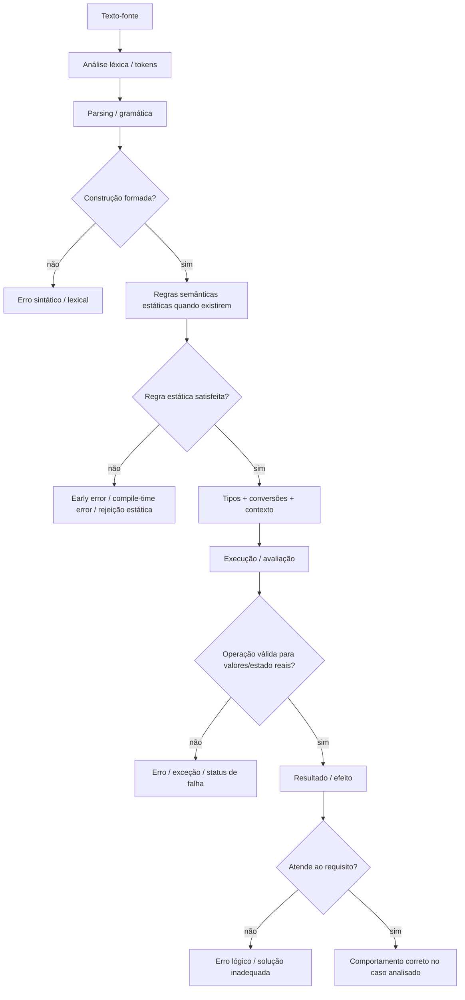

<a id="inicio"></a>

# Sintaxe, Semântica e Sistema de Tipos

> **Classificação:** `[D] Obrigatório dominar`  
> **Nível:** B — Fundamentos de Programação  
> **Posição na taxonomia:** tópico 13  
> **Convenção de numeração:** em títulos como `13. 13.4 Tipagem`, o primeiro número é a posição editorial da seção neste documento e `13.4` é o nó curricular canônico. Subseções internas de um nó curricular usam a forma `13.4.1`, evitando colisão com nós irmãos como `13.1 Sintaxe`.  
> **Pré-requisitos principais:** tópicos 1–12  
> **Próximos aprofundamentos:** estado, escopo, referências e mutabilidade; coleções; erros e exceções; modelo de execução; paradigmas e linguagens

---

## Resumo executivo

Ao escrever um programa, pelo menos três perguntas diferentes precisam permanecer separadas:

```text
SINTAXE
→ isso está escrito de forma válida?

SEMÂNTICA
→ se está válido, o que significa e o que faz?

TIPOS
→ que valores existem, que operações são válidas e quando incompatibilidades são detectadas?
```

Essas perguntas se relacionam, mas não são sinônimas.

Um programa pode ser:

```text
sintaticamente inválido
→ o parser não consegue formar a construção esperada

sintaticamente válido e semanticamente inválido segundo regras estáticas
→ a construção existe, mas viola uma regra da linguagem antes da execução normal

sintaticamente válido e executável, mas falhar em runtime
→ a operação encontra um valor/estado incompatível durante a execução

sintaticamente e semanticamente válido, mas logicamente errado
→ executa e produz um resultado que não resolve corretamente o problema
```

O sistema de tipos participa dessa história porque associa categorias a valores, expressões, variáveis, parâmetros ou resultados — dependendo da linguagem — e define restrições e operações.

As quatro linguagens canônicas mostram modelos diferentes:

```text
Python
→ tipos pertencem aos objetos/valores em runtime
→ linguagem dinamicamente tipada
→ anotações de tipo não são impostas pelo runtime por padrão

JavaScript / ECMAScript
→ valores possuem tipos ECMAScript
→ linguagem dinamicamente tipada
→ várias operações executam conversões implícitas definidas pela especificação

Java
→ toda expressão possui um tipo dedutível em compile time
→ linguagem estaticamente tipada
→ conversões dependem do contexto e algumas exigem cast explícito

Bash
→ shell parameters carregam valores e podem possuir atributos
→ muitos contextos tratam conteúdo como texto
→ contextos aritméticos interpretam valores como expressões inteiras
→ não deve ser modelado simplesmente como “Java/Python sem declaração de tipo”
```

O objetivo deste capítulo é construir um modelo mental transferível sem apagar essas diferenças.

---

## Distinções fundamentais

```text
SINTAXE
≠
SEMÂNTICA
≠
LÓGICA DO PROBLEMA
≠
SISTEMA DE TIPOS
```

E também:

```text
CONVERSÃO
≠
CASTING
≠
PARSING
≠
COERÇÃO
```

Esses termos podem se sobrepor em explicações informais, mas possuem papéis conceituais diferentes.

### Definições de trabalho

| Termo | Definição operacional neste guia |
|---|---|
| **Sintaxe** | Regras que determinam quais formas de código são estruturalmente válidas. |
| **Semântica** | Regras que determinam o significado e o comportamento das construções válidas. |
| **Sistema de tipos** | Regras e categorias usadas para classificar valores/expressões e restringir ou orientar operações. |
| **Conversão** | Transformação de um valor para uma representação/tipo esperado por outra operação. |
| **Casting** | Conversão solicitada explicitamente por uma construção de cast da linguagem, quando ela existe. |
| **Parsing** | Interpretação de uma representação segundo uma gramática/formato para obter estrutura ou valor. Neste T13, o termo aparece em dois contextos: parsing sintático de código e parsing de dados externos. |
| **Coerção** | Conversão implícita feita pela linguagem/contexto sem uma operação explícita de conversão escrita pelo programador. |

> **Guardrail:** terminologia varia entre comunidades e documentações. Quando a especificação de uma linguagem usa um termo mais preciso, a terminologia da especificação prevalece para aquela linguagem.

---

## Regra de ouro

> **Antes de perguntar “por que este código deu esse resultado?”, separe: forma válida, regra semântica, tipos envolvidos, conversões aplicadas e lógica pretendida.**

Essa separação reduz grande parte das confusões iniciais de programação.

---

## Decisão rápida

| Pergunta | Resposta curta |
|---|---|
| “Se compila, está correto?” | Não. Pode haver erro lógico, falha de runtime ou comportamento inadequado. |
| “Se executa, a sintaxe está correta?” | Para o caminho efetivamente analisado/executado, a construção precisou superar as etapas sintáticas pertinentes; isso não prova correção lógica. |
| “Sintaxe e semântica são a mesma coisa?” | Não. Sintaxe é forma; semântica é significado/comportamento. |
| “Tipagem dinâmica significa ausência de tipos?” | Não. Significa que a verificação/associação relevante ocorre principalmente em runtime, conforme o modelo da linguagem. |
| “Tipagem estática significa que nunca há erro de tipo em runtime?” | Não. Existem casts verificados em runtime, reflexão, dados externos e outros mecanismos. |
| “Python type hint transforma Python em estaticamente tipado?” | Não. O runtime Python não impõe anotações de função/variável por padrão. |
| “JavaScript não tem tipos?” | Tem. ECMAScript define tipos de linguagem como Undefined, Null, Boolean, String, Symbol, Number, BigInt e Object. |
| “Java converte tudo automaticamente?” | Não. Existem conversões permitidas por contexto e conversões que exigem cast ou são proibidas. |
| “Bash é simplesmente ‘tudo string’?” | É uma simplificação perigosa. Shell parameters possuem valores/atributos e contextos como aritmética reinterpretam os conteúdos segundo regras próprias. |
| “`int("42")` em Python é cast?” | Em linguagem informal pode ser chamado assim, mas tecnicamente é construção/conversão por `int`; ao receber texto, também envolve interpretação da string. |
| “`Integer.parseInt("42")` em Java é cast?” | Não. É parsing textual. |
| “`(int) value` em Java é parsing?” | Não. É cast/conversão em contexto de casting. |
| “Coerção é sempre ruim?” | Não. É comportamento da linguagem; o risco aparece quando é implícita e surpreendente ou quando o programador não conhece a regra. |
| “`+` significa sempre soma?” | Não. A semântica depende da linguagem e dos operandos. |
| “Código válido pode ser ruim?” | Sim. Validade sintática e semântica não garantem clareza, segurança, desempenho ou adequação. |

---

# Índice


- [Resumo executivo](#resumo-executivo)
- [Distinções fundamentais](#distinções-fundamentais)
- [Regra de ouro](#regra-de-ouro)
- [Decisão rápida](#decisão-rápida)
- [1. Posição deste assunto](#1-posição-deste-assunto)
  - [1.1 Relação com tópicos anteriores](#11-relação-com-tópicos-anteriores)
  - [1.2 Relação com tópicos posteriores](#12-relação-com-tópicos-posteriores)
- [2. Visão panorâmica](#2-visão-panorâmica)
  - [🗺️ Visão panorâmica — o mapa antes dos detalhes](#visao-panoramica-mapa)
- [3. Do texto-fonte ao comportamento](#3-do-texto-fonte-ao-comportamento)
  - [3.1 Camada lexical](#31-camada-lexical)
  - [3.2 Camada sintática](#32-camada-sintática)
  - [3.3 Camada semântica](#33-camada-semântica)
  - [3.4 Camada lógica](#34-camada-lógica)
  - [3.5 Moral](#35-moral)
- [4. 13.1 Sintaxe](#4-131-sintaxe)
  - [4.1 Sintaxe não é estética](#41-sintaxe-não-é-estética)
- [5. Tokens, delimitadores e gramática](#5-tokens-delimitadores-e-gramática)
  - [5.1 Caractere não é token](#51-caractere-não-é-token)
  - [5.2 Tokens](#52-tokens)
  - [5.3 Delimitadores](#53-delimitadores)
  - [5.4 Gramática](#54-gramática)
- [6. Sintaxe nas quatro linguagens](#6-sintaxe-nas-quatro-linguagens)
  - [6.1 Python](#61-python)
  - [6.2 JavaScript](#62-javascript)
  - [6.3 Java](#63-java)
  - [6.4 Bash](#64-bash)
  - [6.5 O que transfere](#65-o-que-transfere)
- [7. Erro sintático e erro antecipado](#7-erro-sintático-e-erro-antecipado)
  - [7.1 Nem toda rejeição antes da execução é “apenas parser”](#71-nem-toda-rejeição-antes-da-execução-é-apenas-parser)
- [8. 13.2 Semântica](#8-132-semântica)
- [9. Semântica estática e comportamento em runtime](#9-semântica-estática-e-comportamento-em-runtime)
  - [9.1 Regras antes da execução normal](#91-regras-antes-da-execução-normal)
  - [9.2 Regras durante execução](#92-regras-durante-execução)
  - [9.3 O mesmo rótulo não descreve todas as linguagens](#93-o-mesmo-rótulo-não-descreve-todas-as-linguagens)
- [10. Mesma aparência, semântica diferente](#10-mesma-aparência-semântica-diferente)
  - [10.1 `+`](#101-)
  - [10.2 Moral](#102-moral)
- [11. 13.3 Sintaxe × semântica](#11-133-sintaxe--semântica)
  - [11.1 Exemplo em Python](#111-exemplo-em-python)
- [12. Quatro categorias de erro que não devem ser confundidas](#12-quatro-categorias-de-erro-que-não-devem-ser-confundidas)
  - [12.1 Erro sintático](#121-erro-sintático)
  - [12.2 Erro de tipo/execução](#122-erro-de-tipoexecução)
  - [12.3 Erro lógico](#123-erro-lógico)
  - [12.4 Código válido, porém inadequado](#124-código-válido-porém-inadequado)
  - [12.5 Matriz](#125-matriz)
- [13. 13.4 Tipagem](#13-134-tipagem)
  - [13.4.1 Tipo não é apenas “quanto espaço ocupa”](#1341-tipo-não-é-apenas-quanto-espaço-ocupa)
- [14. Tipo de valor, expressão e variável](#14-tipo-de-valor-expressão-e-variável)
  - [14.1 Tipo do valor](#141-tipo-do-valor)
  - [14.2 Tipo da expressão](#142-tipo-da-expressão)
  - [14.3 Tipo da variável](#143-tipo-da-variável)
  - [14.4 Python: anotação não equivale ao modelo de Java](#144-python-anotação-não-equivale-ao-modelo-de-java)
- [15. Tipagem estática e dinâmica](#15-tipagem-estática-e-dinâmica)
  - [15.1 Tipagem estática](#151-tipagem-estática)
  - [15.2 Tipagem dinâmica](#152-tipagem-dinâmica)
  - [15.3 Dinâmica não significa “sem tipos”](#153-dinâmica-não-significa-sem-tipos)
  - [15.4 Estática não significa “zero runtime checks”](#154-estática-não-significa-zero-runtime-checks)
  - [15.5 Tipagem estática × dinâmica não é ranking de qualidade](#155-tipagem-estática--dinâmica-não-é-ranking-de-qualidade)
  - [15.6 Inferência de tipo não é tipagem dinâmica](#156-inferência-de-tipo-não-é-tipagem-dinâmica)
- [16. Type hints e análise estática em Python](#16-type-hints-e-análise-estática-em-python)
  - [16.1 Modelo mental correto](#161-modelo-mental-correto)
  - [16.2 Python 3.14: anotações preguiçosas mudam a introspecção, não a tipagem runtime](#162-python-314-anotações-preguiçosas-mudam-a-introspecção-não-a-tipagem-runtime)
- [17. Tipos em ECMAScript](#17-tipos-em-ecmascript)
  - [17.1 Variáveis não possuem uma declaração de tipo estático obrigatória](#171-variáveis-não-possuem-uma-declaração-de-tipo-estático-obrigatória)
  - [17.2 Operações podem acionar conversões abstratas](#172-operações-podem-acionar-conversões-abstratas)
  - [17.3 `Number` e `BigInt` não são intercambiáveis livremente](#173-number-e-bigint-não-são-intercambiáveis-livremente)
- [18. Tipos e contextos em Java](#18-tipos-e-contextos-em-java)
  - [18.1 Exemplo de widening](#181-exemplo-de-widening)
  - [18.2 Exemplo de narrowing explícito](#182-exemplo-de-narrowing-explícito)
  - [18.3 Informação pode ser perdida](#183-informação-pode-ser-perdida)
- [19. O modelo de Bash](#19-o-modelo-de-bash)
  - [19.1 Shell parameters e valores](#191-shell-parameters-e-valores)
  - [19.2 Atributo integer](#192-atributo-integer)
  - [19.3 Contexto aritmético](#193-contexto-aritmético)
  - [19.4 Comparação textual e numérica são construções diferentes](#194-comparação-textual-e-numérica-são-construções-diferentes)
- [20. “Forte” e “fraca”: por que evitar o rótulo solto](#20-forte-e-fraca-por-que-evitar-o-rótulo-solto)
  - [Regra deste guia](#regra-deste-guia)
- [21. 13.5 Conversão, casting e parsing](#21-135-conversão-casting-e-parsing)
- [22. Conversão explícita](#22-conversão-explícita)
- [23. Casting](#23-casting)
  - [23.1 Cast não é validação textual](#231-cast-não-é-validação-textual)
  - [23.2 Python não possui operador de cast equivalente ao de Java](#232-python-não-possui-operador-de-cast-equivalente-ao-de-java)
- [24. Parsing](#24-parsing)
  - [24.1 Java](#241-java)
  - [24.2 JavaScript](#242-javascript)
  - [24.3 Python](#243-python)
  - [24.4 Parsing não garante semântica de domínio](#244-parsing-não-garante-semântica-de-domínio)
- [25. Comparativo: conversão × casting × parsing](#25-comparativo-conversão--casting--parsing)
  - [25.1 Um mesmo mecanismo pode envolver mais de uma ideia](#251-um-mesmo-mecanismo-pode-envolver-mais-de-uma-ideia)
- [26. Python: conversões](#26-python-conversões)
  - [26.1 Texto → inteiro](#261-texto--inteiro)
  - [26.2 Texto → ponto flutuante](#262-texto--ponto-flutuante)
  - [26.3 Número → texto](#263-número--texto)
  - [26.4 Falha de parsing/conversão](#264-falha-de-parsingconversão)
  - [26.5 Conversão não é mutação do objeto original](#265-conversão-não-é-mutação-do-objeto-original)
- [27. JavaScript: conversões explícitas e parsing](#27-javascript-conversões-explícitas-e-parsing)
  - [27.1 `Number`](#271-number)
  - [27.2 `String`](#272-string)
  - [27.3 `Boolean`](#273-boolean)
  - [27.4 `Number.parseInt`](#274-numberparseint)
  - [27.5 `Number` e `parseInt` não são substitutos universais](#275-number-e-parseint-não-são-substitutos-universais)
  - [27.6 Regra](#276-regra)
- [28. Java: conversões, cast e parsing](#28-java-conversões-cast-e-parsing)
  - [28.1 Widening primitive conversion](#281-widening-primitive-conversion)
  - [28.2 Narrowing com cast](#282-narrowing-com-cast)
  - [28.3 Parsing](#283-parsing)
  - [28.4 Boxing](#284-boxing)
  - [28.5 Unboxing](#285-unboxing)
- [29. Bash: interpretação por contexto](#29-bash-interpretação-por-contexto)
  - [29.1 Valor textual](#291-valor-textual)
  - [29.2 Aritmética](#292-aritmética)
  - [29.3 Atributo integer](#293-atributo-integer)
  - [29.4 Entrada inválida](#294-entrada-inválida)
- [30. 13.6 Coerção](#30-136-coerção)
  - [30.1 O perigo pedagógico](#301-o-perigo-pedagógico)
- [31. Coerção em JavaScript](#31-coerção-em-javascript)
  - [31.1 Soma/concatenação](#311-somaconcatenação)
  - [31.2 Subtração](#312-subtração)
  - [31.3 Boolean context](#313-boolean-context)
  - [31.4 Igualdade abstrata](#314-igualdade-abstrata)
  - [Recomendação](#recomendação)
- [32. Conversões implícitas em Java](#32-conversões-implícitas-em-java)
  - [32.1 Widening numérico](#321-widening-numérico)
  - [32.2 Promoção numérica](#322-promoção-numérica)
  - [32.3 String context](#323-string-context)
  - [32.4 Não existe coerção ilimitada](#324-não-existe-coerção-ilimitada)
- [33. Conversões implícitas e truth-value testing em Python](#33-conversões-implícitas-e-truth-value-testing-em-python)
  - [33.1 Numérico compatível](#331-numérico-compatível)
  - [33.2 Texto + número](#332-texto--número)
  - [33.3 Contexto booleano](#333-contexto-booleano)
  - [Regra](#regra)
- [34. Coerção/interpretação contextual em Bash](#34-coerçãointerpretação-contextual-em-bash)
  - [Guardrail](#guardrail)
- [35. Exemplo canônico: texto para número](#35-exemplo-canônico-texto-para-número)
  - [Python](#python)
  - [JavaScript](#javascript)
  - [Java](#java)
  - [Bash](#bash)
  - [Comparação](#comparação)
- [36. Exemplo crítico: operador +](#36-exemplo-crítico-operador-)
  - [Python](#python-1)
  - [JavaScript](#javascript-1)
  - [Java](#java-1)
  - [Bash](#bash-1)
  - [Moral](#moral)
- [37. Exemplo crítico: igualdade](#37-exemplo-crítico-igualdade)
  - [Python](#python-2)
  - [JavaScript](#javascript-2)
  - [Java](#java-2)
  - [Bash](#bash-2)
  - [Regra](#regra-1)
- [38. Exemplo crítico: divisão](#38-exemplo-crítico-divisão)
  - [Python](#python-3)
  - [JavaScript](#javascript-3)
  - [Java](#java-3)
  - [Bash](#bash-3)
  - [Moral](#moral-1)
- [39. Exemplo crítico: booleanos e contextos condicionais](#39-exemplo-crítico-booleanos-e-contextos-condicionais)
  - [Python](#python-4)
  - [JavaScript](#javascript-4)
  - [Java](#java-4)
  - [Bash](#bash-4)
- [40. Overflow, precisão e representação](#40-overflow-precisão-e-representação)
  - [40.1 Java](#401-java)
  - [40.2 JavaScript](#402-javascript)
  - [40.3 Python](#403-python)
  - [40.4 Bash](#404-bash)
  - [Regra](#regra-2)
- [41. Erros conceituais frequentes](#41-erros-conceituais-frequentes)
  - [41.1 “Sintaxe é como o código funciona”](#411-sintaxe-é-como-o-código-funciona)
  - [41.2 “Semântica é a lógica do meu problema”](#412-semântica-é-a-lógica-do-meu-problema)
  - [41.3 “Tipagem dinâmica = sem tipos”](#413-tipagem-dinâmica--sem-tipos)
  - [41.4 “Tipagem estática = nenhum erro de tipo em runtime”](#414-tipagem-estática--nenhum-erro-de-tipo-em-runtime)
  - [41.5 “Type hint torna Python estaticamente tipado”](#415-type-hint-torna-python-estaticamente-tipado)
  - [41.6 “JavaScript converte qualquer coisa”](#416-javascript-converte-qualquer-coisa)
  - [41.7 “Java nunca converte implicitamente”](#417-java-nunca-converte-implicitamente)
  - [41.8 “Bash é só string”](#418-bash-é-só-string)
  - [41.9 “Conversão = cast = parsing”](#419-conversão--cast--parsing)
  - [41.10 “Se `Number.parseInt()` retornou algo, a entrada inteira era válida”](#4110-se-numberparseint-retornou-algo-a-entrada-inteira-era-válida)
  - [41.11 “`+` sempre soma”](#4111--sempre-soma)
  - [41.12 “`==` significa a mesma coisa em todas as linguagens”](#4112--significa-a-mesma-coisa-em-todas-as-linguagens)
  - [41.13 “Código que compila está correto”](#4113-código-que-compila-está-correto)
  - [41.14 “Coerção é automaticamente bug”](#4114-coerção-é-automaticamente-bug)
  - [41.15 “O nome do tipo explica tudo”](#4115-o-nome-do-tipo-explica-tudo)
- [42. Método de diagnóstico](#42-método-de-diagnóstico)
  - [42.1 Exemplo](#421-exemplo)
  - [42.2 Correção](#422-correção)
- [43. Boas práticas](#43-boas-práticas)
  - [43.1 Faça conversões importantes de forma visível](#431-faça-conversões-importantes-de-forma-visível)
  - [43.2 Separe formato de domínio](#432-separe-formato-de-domínio)
  - [43.3 Não esconda perda de informação](#433-não-esconda-perda-de-informação)
  - [43.4 Prefira nomes que indiquem representação](#434-prefira-nomes-que-indiquem-representação)
  - [43.5 Não use coerção como truque de concisão](#435-não-use-coerção-como-truque-de-concisão)
  - [43.6 Aprenda a regra da linguagem, não uma superstição](#436-aprenda-a-regra-da-linguagem-não-uma-superstição)
- [44. Segurança e robustez](#44-segurança-e-robustez)
  - [44.1 Validar antes de usar em contexto perigoso](#441-validar-antes-de-usar-em-contexto-perigoso)
  - [44.2 Parsing permissivo pode mascarar entrada ruim](#442-parsing-permissivo-pode-mascarar-entrada-ruim)
  - [44.3 Overflow e limites importam](#443-overflow-representabilidade-e-limites-importam)
  - [44.4 Não use `eval` como substituto de parsing/conversão de dados externos](#444-não-use-eval-como-substituto-de-parsingconversão-de-dados-externos)
- [45. NetDev — aplicação prática](#45-netdev--aplicação-prática)
  - [45.1 Porta](#451-porta)
  - [45.2 Latência](#452-latência)
  - [45.3 VLAN](#453-vlan)
  - [45.4 Prefixo IPv4](#454-prefixo-ipv4)
  - [45.5 Regra operacional](#455-regra-operacional)
- [46. Comparativo das quatro linguagens](#46-comparativo-das-quatro-linguagens)
- [47. O que fica para depois](#47-o-que-fica-para-depois)
  - [47.1 Fronteira](#471-fronteira)
- [Problemas reais — índice operacional `PR-*`](#problemas-reais)
- [🔎 Troubleshooting sistemático](#troubleshooting-sistematico)
- [48. Laboratórios](#48-laboratórios)
  - [🧪 LAB 1 — Sintaxe versus semântica](#-lab-1--sintaxe-versus-semântica)
  - [🧪 LAB 2 — `+` em quatro linguagens](#-lab-2---em-quatro-linguagens)
  - [🧪 LAB 3 — Parsing estrito](#-lab-3--parsing-estrito)
  - [🧪 LAB 4 — Java casting](#-lab-4--java-casting)
  - [🧪 LAB 5 — JavaScript coercion](#-lab-5--javascript-coercion)
  - [🧪 LAB 6 — Python type hints](#-lab-6--python-type-hints)
  - [🧪 LAB 7 — Bash: texto versus aritmética](#-lab-7--bash-texto-versus-aritmética)
  - [🧪 LAB 8 — NetDev: porta de serviço](#-lab-8--netdev-porta-de-serviço)
- [49. Exercícios](#49-exercícios)
- [50. Evidências de domínio](#50-evidências-de-domínio)
  - [13.1 Sintaxe `[D]`](#131-sintaxe-d)
  - [13.2 Semântica `[D]`](#132-semântica-d)
  - [13.3 Sintaxe × semântica `[D]`](#133-sintaxe--semântica-d)
  - [13.4 Tipagem `[D]`](#134-tipagem-d)
  - [13.5 Conversão, casting e parsing `[D]`](#135-conversão-casting-e-parsing-d)
  - [13.6 Coerção `[D]`](#136-coerção-d)
  - [Transferência](#transferência-1)
- [51. Checklist de consulta rápida](#51-checklist-de-consulta-rápida)
- [52. Glossário](#52-glossário)
- [53. Referências](#53-referências)
  - [53.1 Taxonomia e contrato](#531-taxonomia-e-contrato)
  - [53.2 Currículo e fundamentos](#532-currículo-e-fundamentos)
  - [53.3 Python 3.14](#533-python-314)
  - [53.4 ECMAScript 2026](#534-ecmascript-2026)
  - [53.5 Java SE 27](#535-java-se-27)
  - [53.6 GNU Bash 5.3](#536-gnu-bash-53)
  - [53.7 Livros técnicos](#537-livros-técnicos)
  - [53.8 Hierarquia usada nesta versão](#538-hierarquia-usada-nesta-versão)
- [54. Histórico de versões](#54-histórico-de-versões)

---

# 1. Posição deste assunto

Nos tópicos 1–12, o foco principal foi:

```text
resolver problemas
↓
representar dados
↓
construir expressões
↓
controlar fluxo
↓
repetir
↓
organizar em funções
↓
rastrear execução
```

O tópico 13 inicia o **Nível B — Fundamentos de Programação** e muda a pergunta.

Antes:

```text
como estruturo uma solução?
```

Agora:

```text
como uma linguagem reconhece essa solução?
o que cada construção significa?
como os tipos limitam ou orientam operações?
quando e como valores são convertidos?
```

Essa transição é importante porque duas implementações da mesma lógica podem ter resultados diferentes se as linguagens possuírem regras semânticas diferentes.

## 1.1 Relação com tópicos anteriores

O tópico 4 já introduziu tipos de dados fundamentais.

Aqui aprofundamos:

```text
TIPOS FUNDAMENTAIS
→ quais categorias básicas existem

SISTEMA DE TIPOS
→ como a linguagem usa tipos para classificar valores/expressões
  e determinar operações/conversões válidas
```

O tópico 5 já introduziu operadores.

Aqui aprofundamos:

```text
OPERADOR
+
TIPOS DOS OPERANDOS
+
REGRAS SEMÂNTICAS
=
COMPORTAMENTO
```

## 1.2 Relação com tópicos posteriores

Este capítulo prepara diretamente:

- tópico 14 — estado, escopo, referências e mutabilidade;
- tópico 18 — erros, exceções e tratamento de falhas;
- tópico 19 — depuração;
- tópico 23 — modelo básico de execução;
- estudos posteriores de linguagens, compiladores e teoria de tipos.

[↑ Voltar ao índice](#índice)

---

# 2. Visão panorâmica

<a id="visao-panoramica-mapa"></a>

## 🗺️ Visão panorâmica — o mapa antes dos detalhes

Esta visão funciona simultaneamente como **caderno rápido de consulta**, **modelo mental** e **contrato de cobertura** do T13. Ela não substitui o aprofundamento: organiza o domínio para que o leitor consiga recuperar em poucos segundos **onde está o problema, qual camada define a regra e que tipo de evidência deve procurar**.

### Mapa do domínio — da forma escrita ao comportamento

```text
SINTAXE, SEMÂNTICA E SISTEMA DE TIPOS
│
├── TEXTO-FONTE
│   ├── caracteres / encoding
│   ├── tokens
│   ├── palavras reservadas
│   └── delimitadores
│
├── SINTAXE
│   ├── gramática
│   ├── expressões
│   ├── statements / comandos
│   ├── contexto gramatical
│   └── construções válidas / inválidas
│
├── SEMÂNTICA
│   ├── significado
│   ├── avaliação
│   ├── efeitos
│   ├── regras estáticas / early errors quando a linguagem as define
│   └── comportamento em runtime
│
├── SISTEMA DE TIPOS
│   ├── tipos de valores
│   ├── tipos de expressões
│   ├── tipos declarados / inferidos / anotados
│   ├── compatibilidade
│   ├── type safety
│   ├── verificação estática
│   └── verificação dinâmica
│
├── MUDANÇA DE REPRESENTAÇÃO / TIPO
│   ├── conversão explícita
│   ├── conversão implícita
│   ├── casting
│   ├── parsing
│   └── coerção / conversões contextuais
│
└── RESULTADO OBSERVÁVEL
    ├── valor
    ├── efeito
    ├── erro de compilação/análise
    ├── exceção/falha runtime
    └── resultado logicamente correto ou incorreto
```

A principal disciplina conceitual deste tópico é **não colapsar essas camadas em uma única ideia de “o código funciona ou não”**.

### Fluxo principal — em que camada investigar



Leitura textual equivalente:

```text
FORMA
→ a linguagem consegue reconhecer a construção?

SIGNIFICADO
→ que regra a linguagem atribui à construção válida?

TIPOS / CONVERSÕES
→ quais valores participam e que transformações são permitidas?

EXECUÇÃO
→ que resultado, efeito ou falha ocorre com os valores reais?

LÓGICA DO PROBLEMA
→ esse comportamento resolve o requisito?
```

> O diagrama é um **modelo mental de investigação**, não uma afirmação de que Python, ECMAScript, Java e Bash usem internamente o mesmo pipeline de implementação.

### Consulta rápida — camada × pergunta × evidência

| Camada | Pergunta rápida | Evidência mais útil | Erro mental frequente |
|---|---|---|---|
| lexical | “quais tokens foram reconhecidos?” | tokenizer/spec lexical | tratar caractere, token e palavra como sinônimos |
| sintaxe | “essa sequência forma uma construção válida?” | gramática/parser | chamar todo erro anterior ao runtime de “sintaxe” |
| semântica estática | “há regra adicional que rejeita uma forma gramaticalmente formada?” | spec/compilador | assumir que gramática sozinha define toda validade |
| semântica runtime | “o que essa construção faz quando executada?” | spec + runtime reproduzível | inferir comportamento só pela aparência do código |
| tipo | “que categoria e operações são permitidas?” | spec/type checker/compiler | confundir tipo com tamanho físico em memória |
| conversão | “o valor mudou de representação/tipo?” | regra de conversão | chamar toda conversão de cast |
| parsing | “texto foi interpretado segundo qual formato?” | API/parser + casos inválidos | parsing bem-sucedido = dado de domínio válido |
| coerção | “a linguagem converteu implicitamente por contexto?” | spec da operação | tratar coerção como aleatória |
| lógica | “o resultado atende ao requisito?” | contrato/teste | “compilou/executou = correto” |

### Pergunta prática → onde começar

| Se a dúvida for... | Comece por... | Destino principal |
|---|---|---|
| “isso é erro de sintaxe ou outra coisa?” | separar grammar/parsing de early/static rules | [§7](#7-erro-sintático-e-erro-antecipado) |
| “por que `+` mudou de comportamento?” | olhar tipos dos operandos + semântica do operador | [§10](#10-mesma-aparência-semântica-diferente) e [§36](#36-exemplo-crítico-operador-) |
| “Python tem tipos mesmo sendo dinâmico?” | separar tipo do valor de anotação do nome | [§14](#14-tipo-de-valor-expressão-e-variável) a [§16](#16-type-hints-e-análise-estática-em-python) |
| “JavaScript converteu sem eu pedir?” | localizar abstract operation de conversão | [§30](#30-136-coerção) e [§31](#31-coerção-em-javascript) |
| “Java aceitou/perdeu informação na conversão” | identificar o contexto e o tipo de conversion | [§18](#18-tipos-e-contextos-em-java) e [§28](#28-java-conversões-cast-e-parsing) |
| “Bash comparou como texto ou número?” | identificar a construção (`[[ ]]`, `(( ))`, `declare -i`) | [§19](#19-o-modelo-de-bash) e [§34](#34-coerçãointerpretação-contextual-em-bash) |
| “texto virou número, então está válido?” | separar parsing de validação de domínio | [§24](#24-parsing) e [§44](#44-segurança-e-robustez) |
| “type hint Python impediu um valor incompatível?” | distinguir ferramenta estática de runtime | [§16](#16-type-hints-e-análise-estática-em-python) |
| “como diagnosticar sem adivinhar?” | forma → regra → tipos → conversões → runtime → requisito | [§42](#42-método-de-diagnóstico) |

### Não confundir

| Não confundir | Distinção operacional |
|---|---|
| sintaxe × semântica | sintaxe forma construções; semântica define significado/comportamento |
| semântica × lógica do problema | uma linguagem pode executar exatamente sua semântica e ainda produzir solução errada para o requisito |
| parser × todas as validações pré-runtime | uma linguagem pode possuir **static semantics / early errors** além da gramática |
| tipo do valor × tipo/anotação do nome | Python permite o nome referenciar objetos de tipos diferentes; Java declara tipo da variável |
| tipagem dinâmica × ausência de tipos | Python/ECMAScript possuem tipos e regras de tipo em runtime |
| tipagem estática × ausência de checks runtime | casts, dados externos e operações específicas ainda podem falhar em runtime |
| conversão × cast | cast é uma forma específica de conversão quando a linguagem oferece essa construção |
| conversão × parsing | parsing interpreta uma representação, frequentemente textual, segundo formato/gramática |
| parsing × validação de domínio | `443` pode ser inteiro válido e ainda ser porta proibida pelo contrato local |
| coerção × “mágica” | coerção segue regras específicas e reproduzíveis da linguagem/contexto |
| truthiness × boolean puro | Python/JS aceitam outros valores em contexto condicional; Java exige `boolean` |
| Bash parameter × variável Java | Bash combina valores, atributos, expansões e contextos; não possui o mesmo sistema estático de Java |

### Microexemplos canônicos

**1. Sintaticamente válido, logicamente errado**

```python
age = 18
is_adult = age > 18
```

A sintaxe é válida; a operação é semanticamente definida; o bug está no requisito se “18 ou mais” deveria ser verdadeiro.

**2. Mesmo `+`, semântica diferente**

```text
Python      → "5" + 2  → TypeError
JavaScript  → "5" + 2  → "52"
Java        → "5" + 2  → "52"
Bash        → não há operador textual `+` equivalente; contexto importa
```

**3. Parsing permissivo não prova validade integral**

```javascript
Number.parseInt("443tcp", 10) // 443
```

Se o contrato exige apenas dígitos, o valor deve ser rejeitado antes/depois do parsing conforme a estratégia escolhida.

**4. Cast explícito pode perder informação**

```java
double latencyMs = 12.9;
int truncated = (int) latencyMs; // 12
```

**5. Type hint Python não muda a tipagem runtime**

```python
count: int = 10
count = "ten"   # o runtime padrão permite; type checker pode rejeitar
```

**6. Bash muda interpretação pelo contexto**

```bash
value=10

[[ $value < 2 ]]   # comparação textual
(( value < 2 ))    # comparação aritmética
```

### Problemas reais representativos

| ID | Necessidade concreta | Capacidades combinadas |
|---|---|---|
| `PR-T13-01` | classificar uma falha sem rotular tudo como “erro de sintaxe” | sintaxe + semântica + runtime + lógica |
| `PR-T13-02` | converter texto externo para inteiro sem aceitar lixo residual | parsing + validação + domínio |
| `PR-T13-03` | explicar e controlar coerção em `+` no JavaScript | tipos + `ToPrimitive`/conversão + operador |
| `PR-T13-04` | evitar perda silenciosa em narrowing Java | tipos + conversion context + range |
| `PR-T13-05` | usar type hints Python sem atribuir enforcement inexistente ao runtime | annotation + tooling + runtime |
| `PR-T13-06` | distinguir comparação textual e aritmética em Bash | shell parameters + contexto + operadores |
| `PR-T13-07` | transferir o mesmo contrato “porta TCP válida” entre quatro linguagens | parsing + tipo + range + erro |
| `PR-T13-08` | escolher testes que exponham diferenças semânticas entre linguagens | transferência + edge cases + regressão |

O índice operacional completo está em [Problemas reais — índice operacional `PR-*`](#problemas-reais).

### Falha típica → primeira investigação

| Sintoma | Primeira hipótese/verificação |
|---|---|
| parser aponta linha posterior à causa real | delimitador/string/bloco anterior ficou aberto? |
| JavaScript retorna `"52"` em vez de `7` | um operando virou `String` antes de `+`? |
| `Number("")` vira `0` | entrada vazia foi validada antes da conversão? |
| `parseInt("443tcp")` retorna `443` | API aceita prefixo numérico; contrato exige consumo integral? |
| Python aceita valor incompatível com annotation | type hints não são enforcement runtime por padrão |
| Java compila apenas após cast, mas resultado muda | narrowing descartou informação? |
| cast de referência Java falha em runtime | tipo runtime do objeto é compatível com o alvo? |
| Bash trata `08` como erro aritmético | número com zero inicial foi interpretado em base octal? |
| `[[ 10 < 2 ]]` surpreende no Bash | operador está comparando strings, não números? |
| condição “funciona” em Python/JS e não compila em Java | truthiness e `boolean` puro não são equivalentes |

A investigação detalhada está em [🔎 Troubleshooting sistemático](#troubleshooting-sistematico).

### Transferência entre linguagens — conceito comum × diferença material

| Capacidade | Python | JavaScript / ECMAScript | Java | Bash |
|---|---|---|---|---|
| tipos existem | objetos/valores possuem tipo | valores possuem tipo ECMAScript | expressões/variáveis têm tipos definidos estaticamente | parâmetros têm valores/atributos e são reinterpretados por contexto |
| verificação estática | opcional via ferramentas/type hints | não no ECMAScript puro | parte central da linguagem/compilação | não equivalente ao sistema Java |
| truthiness | sim | sim via `ToBoolean` | condição exige `boolean` | frequentemente status de comando ou `[[ ]]`/`(( ))` |
| cast operator clássico | não | não como Java | sim | não |
| parsing inteiro | `int(text)` | `Number(...)`/`Number.parseInt(...)` com contratos diferentes | `Integer.parseInt(...)` | normalmente validação + aritmética/contexto |
| coerção implícita | existe, mais restrita em várias operações | ampla e normativamente definida | conversões implícitas em contextos específicos | interpretação fortemente dependente de expansão/construção |
| erro de tipo incompatível | frequentemente runtime | frequentemente runtime/conversão | frequentemente compile time, mas há checks runtime | falha/resultado depende do contexto shell |

### Modo consulta × modo estudo

```text
MODO CONSULTA (~30 s)
→ Decisão rápida
→ mapa acima
→ “Não confundir”
→ tabela das quatro linguagens
→ troubleshooting correspondente

MODO ESTUDO
→ texto-fonte → tokens → gramática
→ semântica
→ sistema de tipos
→ static × dynamic
→ conversão / casting / parsing / coerção
→ exemplos críticos
→ problemas reais
→ troubleshooting
→ LABs + exercícios + evidências de domínio
```

### Síntese multifonte — por que este mapa tem esta forma

A organização combina funções complementares, sem tratar uma única fonte como suficiente para todo o domínio:

- **CS2023 / Foundations of Programming Languages** orienta a fronteira curricular entre componentes de linguagem, sintaxe, semântica e sistemas de tipos;
- **Python Language Reference**, **ECMA-262**, **JLS** e **GNU Bash Reference Manual** definem comportamento versionado de cada linguagem;
- **Farrell** reforça didaticamente a separação entre lógica, sintaxe e erro lógico;
- **Stroustrup** ajuda a tornar type safety e narrowing concretos como problema de programação;
- **Beazley** fornece o modelo prático Python de objetos, tipos, protocolos e type hints.

A síntese não afirma equivalência entre os modelos das quatro linguagens. Onde a semântica diverge, a divergência é ensinada explicitamente.

[↑ Voltar ao índice](#índice)

---

# 3. Do texto-fonte ao comportamento

Considere:

```python
result = "5" + "2"
```

Podemos analisar em camadas.

## 3.1 Camada lexical

O analisador reconhece unidades como:

```text
NAME      → result
=         → operador/delimitador
STRING    → "5"
+         → operador
STRING    → "2"
```

Python documenta explicitamente que o parser recebe uma sequência de tokens produzida pelo analisador léxico.

## 3.2 Camada sintática

A sequência possui forma válida de atribuição com uma expressão à direita.

## 3.3 Camada semântica

O operador `+`, aplicado a duas strings, representa concatenação.

Resultado:

```text
"52"
```

## 3.4 Camada lógica

Se a intenção era calcular:

```text
5 + 2 = 7
```

o programa está logicamente errado para o requisito, mesmo estando sintática e semanticamente válido.

## 3.5 Moral

```text
CÓDIGO VÁLIDO
≠
SOLUÇÃO CORRETA
```

[↑ Voltar ao índice](#índice)

---

# 4. 13.1 Sintaxe

**Classificação:** `[D]`

Taxonomia canônica:

```text
gramática
estrutura válida
tokens
delimitadores
regras de escrita
```

Sintaxe responde:

> **Quais sequências de símbolos formam construções reconhecidas pela linguagem?**

Exemplo conceitual:

```text
if condição:
    ação
```

A linguagem define:

- quais palavras têm significado especial;
- onde delimitadores aparecem;
- como expressões são combinadas;
- onde blocos começam/terminam;
- quais sequências são inválidas.

## 4.1 Sintaxe não é estética

Em Python:

```python
if is_ready:
    start()
```

A indentação participa da estrutura do programa.

Em Java:

```java
if (isReady) {
    start();
}
```

Chaves delimitam o bloco.

Essas diferenças não são apenas “formatação visual”. Fazem parte das regras sintáticas de cada linguagem.

[↑ Voltar ao índice](#índice)

---

# 5. Tokens, delimitadores e gramática

## 5.1 Caractere não é token

Código-fonte começa como texto, mas parsers normalmente raciocinam sobre unidades lexicais.

Exemplo:

```text
count += 1
```

Pode ser decomposto conceitualmente em:

```text
identifier
operator
literal
```

Não em caracteres independentes sem significado.

## 5.2 Tokens

Categorias comuns:

- identificadores;
- palavras reservadas;
- literais;
- operadores;
- delimitadores;
- marcadores estruturais.

As categorias exatas dependem da linguagem.

## 5.3 Delimitadores

Exemplos:

```text
( )
[ ]
{ }
,
:
;
```

O mesmo símbolo pode ter funções diferentes por linguagem e contexto.

## 5.4 Gramática

Uma gramática descreve formas permitidas.

Modelo simplificado:

```text
assignment
→ identifier '=' expression
```

Isso não pretende ser a gramática formal de nenhuma das quatro linguagens.

Serve para mostrar que:

```text
estrutura válida
```

pode ser descrita por regras de composição.

[↑ Voltar ao índice](#índice)

---

# 6. Sintaxe nas quatro linguagens

Problema conceitual:

```text
se idade >= 18, exibir "Adult"
```

## 6.1 Python

```python
age = 20

if age >= 18:
    print("Adult")
```

Características sintáticas relevantes:

- `:` após o cabeçalho do `if`;
- indentação significativa;
- ausência de chaves para delimitar esse bloco.

## 6.2 JavaScript

```javascript
const age = 20;

if (age >= 18) {
  console.log("Adult");
}
```

Características:

- parênteses na condição do `if`;
- chaves para o bloco;
- ponto e vírgula pode participar de regras de término de statements; ECMAScript também possui Automatic Semicolon Insertion em contextos definidos.

## 6.3 Java

```java
int age = 20;

if (age >= 18) {
    System.out.println("Adult");
}
```

Características:

- declaração inclui tipo estático;
- condição entre parênteses;
- chaves delimitam bloco;
- `;` termina determinadas instruções.

## 6.4 Bash

```bash
age=20

if (( age >= 18 )); then
    printf '%s\n' 'Adult'
fi
```

Características:

- atribuição simples não usa espaços ao redor de `=`;
- `(( ... ))` é contexto aritmético;
- `then` e `fi` fazem parte da construção condicional.

## 6.5 O que transfere

```text
CONCEITO:
condição controla execução de um bloco
```

O que não transfere literalmente:

```text
pontuação
palavras-chave
delimitadores
regras de bloco
regras de expansão
```

[↑ Voltar ao índice](#índice)

---

# 7. Erro sintático e erro antecipado

Erro sintático ocorre quando o texto não forma uma construção válida segundo a gramática relevante.

Python:

```python
if age >= 18
    print("Adult")
```

Falta `:`.

Java:

```java
if (age >= 18 {
    System.out.println("Adult");
}
```

Falta `)`.

## 7.1 Nem toda rejeição antes da execução é “apenas parser”

Linguagens também podem possuir regras verificadas depois do parsing, mas antes da execução normal daquela construção.

ECMAScript, por exemplo, possui **Early Errors** definidos pela especificação para certas estruturas sintaticamente reconhecíveis.

Java possui extensa verificação semântica e de tipos em compile time.

Portanto, pedagogicamente:

```text
REJEITADO ANTES DE EXECUTAR
```

não deve ser automaticamente reduzido a:

```text
erro de sintaxe puro
```

[↑ Voltar ao índice](#índice)

---

# 8. 13.2 Semântica

**Classificação:** `[D]`

Taxonomia:

```text
significado das construções
comportamento das operações
efeitos produzidos
```

Semântica responde:

> **Dada uma construção válida, o que ela significa e que comportamento a linguagem define?**

Exemplo:

```javascript
"5" + 2
```

A sintaxe é válida.

A semântica de `+` em ECMAScript pode produzir concatenação depois das conversões definidas para os operandos.

Resultado:

```text
"52"
```

Já em Python:

```python
"5" + 2
```

é sintaticamente válido, mas a operação entre esses operandos não é aceita e resulta em `TypeError` em runtime.

A diferença é semântica, não apenas visual.

[↑ Voltar ao índice](#índice)

---

# 9. Semântica estática e comportamento em runtime

A palavra “semântica” cobre regras em momentos diferentes.

## 9.1 Regras antes da execução normal

Java:

```java
int count = "10";
```

A forma é reconhecível, mas o compilador rejeita a atribuição incompatível.

## 9.2 Regras durante execução

Python:

```python
count = "10"
result = count + 1
```

A construção é aceita pelo parser.

Quando a expressão é avaliada, os operandos são incompatíveis para `+`, gerando `TypeError`.

## 9.3 O mesmo rótulo não descreve todas as linguagens

Evite o modelo simplista:

```text
compilada = tudo verificado antes
interpretada = tudo descoberto durante execução
```

As implementações e especificações reais possuem múltiplas fases.

Esse tema será aprofundado no tópico 23.

[↑ Voltar ao índice](#índice)

---

# 10. Mesma aparência, semântica diferente

## 10.1 `+`

Python:

```python
print("5" + "2")
```

Resultado esperado:

```text
52
```

JavaScript:

```javascript
console.log("5" + 2);
```

Resultado esperado:

```text
52
```

Java:

```java
System.out.println("5" + 2);
```

Resultado esperado:

```text
52
```

Bash:

```bash
value='5'
printf '%s\n' "${value}2"
```

Resultado esperado:

```text
52
```

Mas esses quatro exemplos **não executam o mesmo mecanismo interno**.

## 10.2 Moral

```text
MESMA SAÍDA
≠
MESMA SEMÂNTICA
```

[↑ Voltar ao índice](#índice)

---

# 11. 13.3 Sintaxe × semântica

**Classificação:** `[D]`

Taxonomia:

```text
construção inválida
construção válida
significado da construção válida
```

Modelo:

```text
TEXTO
↓
A forma é permitida?
├── NÃO → problema sintático
└── SIM
    ↓
    Que regra de significado se aplica?
    ↓
    comportamento / erro / efeito
```

## 11.1 Exemplo em Python

Inválido:

```python
if x > 0
    print(x)
```

Válido:

```python
if x > 0:
    print(x)
```

Agora a pergunta passa de:

```text
isso pode ser escrito?
```

para:

```text
o que `>` exige?
qual é o valor de x?
a condição é verdadeira?
qual bloco executa?
```

[↑ Voltar ao índice](#índice)

---

# 12. Quatro categorias de erro que não devem ser confundidas

O Guia canônico define quatro categorias. A segunda é deliberadamente ampla porque uma incompatibilidade de tipos pode ser detectada **antes** da execução normal em uma linguagem/contexto e apenas **durante** a execução em outro.

## 12.1 Erro sintático

```python
if age >= 18
    print("Adult")
```

## 12.2 Erro de tipo/execução

Detecção antes de runtime, em Java:

```java
int age = "20";
```

A construção é reconhecível pela gramática, mas a atribuição é rejeitada pela verificação de tipos.

Falha durante runtime, em Python:

```python
"20" >= 18
```

A construção é sintaticamente válida; a comparação de ordenação entre esses operandos é incompatível e levanta `TypeError` durante a avaliação.

> **Guardrail:** “erro de tipo/execução” é a categoria curricular. Para diagnosticar corretamente, registre também **quando** a incompatibilidade é detectada: análise estática/compilação ou runtime.

## 12.3 Erro lógico

```python
if age < 18:
    print("Adult")
```

O programa pode executar, mas a condição contradiz o requisito.

## 12.4 Código válido, porém inadequado

Pode:

- ser difícil de ler;
- usar coerção surpreendente;
- ignorar entrada inválida;
- depender de detalhe de implementação;
- ser inseguro;
- ser desnecessariamente complexo.

## 12.5 Matriz

| Categoria canônica | Variante de detecção | Parser reconhece a construção? | Execução normal | Resolve corretamente? |
|---|---|---:|---:|---:|
| Erro sintático | forma inválida | Não | Não | Não aplicável |
| Erro de tipo/execução | rejeição antes de runtime | Pode reconhecer | Não inicia normalmente | Não |
| Erro de tipo/execução | incompatibilidade detectada em runtime | Sim | Inicia e falha | Não |
| Erro lógico | comportamento executável, requisito errado | Sim | Sim | Não |
| Código válido, porém inadequado | fragilidade/segurança/manutenção/contexto | Sim | Pode executar | Pode até produzir o resultado esperado, mas viola outro critério relevante |

[↑ Voltar ao índice](#índice)

---

# 13. 13.4 Tipagem

**Classificação:** `[D]`

Taxonomia:

```text
tipo de valores
tipo de expressões
compatibilidade
verificação estática ou dinâmica conforme a linguagem
```

Um tipo ajuda a responder perguntas como:

```text
que valores pertencem a esta categoria?
que operações existem?
que resultados essas operações produzem?
que conversões são possíveis?
quando incompatibilidades são detectadas?
```

## 13.4.1 Tipo não é apenas “quanto espaço ocupa”

Em nível fundamental, pense em tipo como combinação de:

```text
CONJUNTO/CATEGORIA DE VALORES
+
OPERAÇÕES E REGRAS ASSOCIADAS
```

Representação física em memória é importante, mas pertence a aprofundamentos posteriores e varia por linguagem/runtime.

> **Guardrail:** “categoria de valores + operações/regras” é um **modelo mental introdutório**, não uma definição formal universal capaz de descrever sozinho todos os sistemas de tipos, subtipagem, tipos abstratos, refinamentos ou efeitos.

[↑ Voltar ao índice](#índice)

---

# 14. Tipo de valor, expressão e variável

Esses conceitos precisam ser separados.

## 14.1 Tipo do valor

Python:

```python
value = 10
```

O objeto `10` possui tipo `int`.

Depois:

```python
value = "10"
```

O nome `value` passa a referenciar um objeto `str`.

## 14.2 Tipo da expressão

Java:

```java
1 + 2.5
```

Cada subexpressão participa das regras de promoção/conversão numérica e a expressão completa possui tipo determinado em compile time.

## 14.3 Tipo da variável

Java:

```java
int count = 10;
```

`count` possui tipo declarado `int`.

Não pode simplesmente receber depois:

```java
count = "ten";
```

## 14.4 Python: anotação não equivale ao modelo de Java

```python
count: int = 10
```

A anotação comunica expectativa de tipo, mas o runtime Python não a impõe por padrão.

Portanto:

```text
ANOTAÇÃO DE TIPO
≠
RESTRIÇÃO RUNTIME AUTOMÁTICA
```

[↑ Voltar ao índice](#índice)

---

# 15. Tipagem estática e dinâmica

## 15.1 Tipagem estática

Em uma linguagem estaticamente tipada, informações e regras de tipo são verificadas de forma material antes da execução normal do programa, tipicamente durante compilação/análise.

Java é o exemplo canônico deste guia.

```java
int count = 10;
count = "ten";
```

A segunda atribuição é rejeitada pelo compilador.

## 15.2 Tipagem dinâmica

Em uma linguagem dinamicamente tipada, tipos acompanham valores em runtime e muitas verificações de compatibilidade acontecem quando as operações são executadas.

Python:

```python
value = 10
value = "ten"
```

É permitido.

Mas:

```python
result = value + 1
```

falha quando executado com `value` referindo-se a uma string.

## 15.3 Dinâmica não significa “sem tipos”

Python e JavaScript possuem tipos reais e regras semânticas extensas.

A diferença central não é:

```text
TEM TIPO
vs
NÃO TEM TIPO
```

mas envolve:

```text
ONDE/QUANDO AS REGRAS DE TIPO SÃO ASSOCIADAS E VERIFICADAS
```

## 15.4 Estática não significa “zero runtime checks”

Java pode realizar verificações em runtime, por exemplo em casts de referência.

Logo:

```text
TIPAGEM ESTÁTICA
≠
TODOS OS ERROS DE TIPO IMPOSSÍVEIS EM RUNTIME
```


## 15.5 Tipagem estática × dinâmica não é ranking de qualidade

Os rótulos descrevem **quando e como determinadas regras de tipo são verificadas**, não uma escala universal de “linguagem boa × ruim”.

```text
TIPAGEM ESTÁTICA
→ pode detectar classes de incompatibilidade antes da execução
→ pode oferecer inferência, tooling e contratos fortes
→ ainda possui limites e checks runtime em vários cenários

TIPAGEM DINÂMICA
→ permite que operações sejam verificadas com os valores reais em runtime
→ favorece certos estilos de flexibilidade e metaprogramação
→ pode combinar-se com análise estática opcional
```

O desenho real pode ser híbrido:

- Python é dinamicamente tipado, mas possui um ecossistema de typing estático opcional;
- Java é estaticamente tipado, mas casts de referência podem exigir check runtime;
- ECMAScript é dinamicamente tipado e possui coerções definidas normativamente;
- Bash exige outro modelo mental, baseado em parameters, attributes, expansão e contextos de avaliação.

> **Regra:** compare garantias e trade-offs concretos; não use “estática” ou “dinâmica” como rótulo de qualidade.

## 15.6 Inferência de tipo não é tipagem dinâmica

Uma linguagem estaticamente tipada pode inferir um tipo sem exigir que ele seja escrito pelo programador.

Java:

```java
var count = 42;
```

Aqui `count` continua sendo uma variável local **estaticamente tipada**; o compilador infere `int` a partir do inicializador. A ausência de uma anotação explícita não transforma Java em linguagem dinamicamente tipada.

Em sentido inverso, escrever `let value = 42` em ECMAScript puro não cria um tipo estático inferido para o binding. E ferramentas estáticas para Python podem inferir informações de tipo sem mudar a semântica dinâmica do runtime Python.

> **Guardrail:** `tipo explícito × tipo inferido` é um eixo diferente de `tipagem estática × tipagem dinâmica`.

[↑ Voltar ao índice](#índice)

---

# 16. Type hints e análise estática em Python

Python suporta anotações:

```python
retry_count: int = 0
```

Função:

```python
def add(a: int, b: int) -> int:
    return a + b
```

A documentação oficial é explícita: o runtime Python não impõe anotações de tipo de funções e variáveis por padrão.

Elas podem ser consumidas por:

- type checkers;
- IDEs;
- linters;
- documentação;
- ferramentas de análise.

## 16.1 Modelo mental correto

```text
PYTHON RUNTIME
→ dinamicamente tipado

TYPE HINTS
→ metadados/anotações que ferramentas podem verificar estaticamente
```

Não concluir:

```text
“adicionar : int torna Python igual a Java”
```


## 16.2 Python 3.14: anotações preguiçosas mudam a introspecção, não a tipagem runtime

Na documentação oficial Python 3.14.7, anotações são **avaliadas preguiçosamente por padrão** em um *annotation scope*. O PEP 649 define o modelo de avaliação adiada; o PEP 749 **suplementa** esse modelo com ajustes de especificação e a infraestrutura de `annotationlib`. Isso é relevante para reflexão/introspecção, resolução de nomes em annotations e ferramentas que as consomem.

Ela NÃO altera a conclusão fundamental deste capítulo:

```text
ANNOTATION LAZY EVALUATION
≠
RUNTIME TYPE ENFORCEMENT
```

Exemplo conceitual:

```python
count: int = 10
count = "ten"
```

O runtime padrão continua permitindo a reatribuição. Um type checker pode sinalizar incompatibilidade porque usa a annotation como parte de seu modelo estático.

Para ferramentas que precisam ler annotations em Python 3.14+, a documentação recomenda APIs apropriadas de introspecção, como `annotationlib.get_annotations()`, em vez de depender de acesso ingênuo a `__annotations__`.

[↑ Voltar ao índice](#índice)

---

# 17. Tipos em ECMAScript

ECMAScript define tipos de linguagem diretamente manipuláveis pelo programador.

Na edição 2026:

```text
Undefined
Null
Boolean
String
Symbol
Number
BigInt
Object
```

## 17.1 Variáveis não possuem uma declaração de tipo estático obrigatória

```javascript
let value = 10;
value = "ten";
```

É permitido.

## 17.2 Operações podem acionar conversões abstratas

A especificação define operações como:

```text
ToPrimitive
ToNumber
ToString
ToBoolean
ToNumeric
```

Essas operações ajudam a definir a semântica de construções que realizam conversão implícita.

## 17.3 `Number` e `BigInt` não são intercambiáveis livremente

Exemplo:

```javascript
1n + 1
```

produz `TypeError`.

A existência de coerção em JavaScript não significa que qualquer combinação de tipos seja aceita.

[↑ Voltar ao índice](#índice)

---

# 18. Tipos e contextos em Java

A Java Language Specification afirma que cada expressão Java produz nenhum resultado ou possui um tipo dedutível em compile time.

Java organiza conversões por contextos, incluindo:

- assignment contexts;
- invocation contexts;
- string contexts;
- casting contexts;
- numeric contexts;
- testing contexts.

## 18.1 Exemplo de widening

```java
int count = 10;
double value = count;
```

A conversão de `int` para `double` é permitida nesse contexto.

## 18.2 Exemplo de narrowing explícito

```java
double value = 10.8;
int count = (int) value;
```

Resultado:

```text
10
```

A parte fracionária é descartada segundo as regras de conversão numérica aplicáveis.

## 18.3 Informação pode ser perdida

```text
widening
```

e:

```text
narrowing
```

não significam “seguro” e “perigoso” de forma absoluta.

A JLS distingue widening conversions exatas de casos em que a **magnitude permanece representável, mas a precisão pode diminuir**. Em particular, `int → float`, `long → float` e `long → double` podem perder bits menos significativos. Narrowing frequentemente exige ainda mais atenção porque pode perder faixa, precisão ou outra informação.

[↑ Voltar ao índice](#índice)

---

# 19. O modelo de Bash

Bash exige um modelo próprio.

Evite:

```text
“Bash é dinamicamente tipado igual ao Python”
```

E evite também:

```text
“Bash não tem tipo nenhum, tudo é uma string e acabou”
```

Ambas as simplificações escondem mecanismos importantes.

## 19.1 Shell parameters e valores

Uma variável shell pode armazenar valor textual e possuir atributos definidos por builtins como `declare`.

Exemplo:

```bash
value='42'
```

## 19.2 Atributo integer

```bash
declare -i count=10
count='20 + 2'
printf '%s\n' "$count"
```

Saída esperada:

```text
22
```

Com `declare -i`, avaliação aritmética é feita quando um valor é atribuído.

## 19.3 Contexto aritmético

```bash
count='40'
printf '%d\n' "$(( count + 2 ))"
```

Saída esperada:

```text
42
```

No contexto aritmético, Bash interpreta o valor da variável como expressão aritmética.

## 19.4 Comparação textual e numérica são construções diferentes

```bash
[[ '10' < '2' ]]
```

faz comparação lexicográfica.

Já:

```bash
(( 10 < 2 ))
```

faz comparação aritmética.

Isso mostra por que o contexto é parte essencial da semântica em shell.

[↑ Voltar ao índice](#índice)

---

# 20. “Forte” e “fraca”: por que evitar o rótulo solto

É comum encontrar classificações como:

```text
strongly typed
weakly typed
```

O problema é que esses termos não possuem uma única definição operacional universalmente aceita entre comunidades e textos.

Uma pessoa pode usar “fraca” para falar de:

- coerção implícita;
- reinterpretar bits;
- permissividade entre tipos;
- falta de determinadas verificações;
- conversões automáticas específicas.

## Regra deste guia

Prefira descrever o mecanismo real:

```text
JavaScript executa ToNumber neste contexto
Java permite widening conversion aqui
Python rejeita str + int
Bash avalia o conteúdo como expressão em contexto aritmético
```

em vez de encerrar a explicação com:

```text
“porque a linguagem é fraca/forte”
```

[↑ Voltar ao índice](#índice)

---

# 21. 13.5 Conversão, casting e parsing

**Classificação:** `[D]`

Taxonomia:

```text
conversão explícita
interpretação textual
mudança de representação/tipo
```

Esses mecanismos compartilham a ideia de obter um valor sob outra representação ou tipo, mas não devem ser tratados como sinônimos universais.

[↑ Voltar ao índice](#índice)

---

# 22. Conversão explícita

O programador solicita uma transformação de forma visível.

Python:

```python
value = int("42")
```

JavaScript:

```javascript
const value = Number("42");
```

Java:

```java
int value = Integer.parseInt("42");
```

Bash:

```bash
text='42'
value=$(( 10#$text ))
```

Todos chegam conceitualmente ao número 42, mas por mecanismos diferentes.

> Em Bash, `10#` força base decimal para o literal interpretado no contexto aritmético e evita que zeros à esquerda introduzam interpretação octal.

[↑ Voltar ao índice](#índice)

---

# 23. Casting

Casting é especialmente explícito em Java.

```java
double source = 42.9;
int target = (int) source;
```

O operador de cast:

```text
(int)
```

solicita uma conversão permitida no casting context.

## 23.1 Cast não é validação textual

Isto:

```java
(int) source
```

não interpreta texto.

Para texto:

```java
Integer.parseInt("42")
```

é outra operação.

## 23.2 Python não possui operador de cast equivalente ao de Java

Python usa chamadas/construtores/conversores:

```python
int(value)
float(value)
str(value)
```

Chamar tudo isso de “casting” em conversa informal pode ocorrer, mas ao aprender os mecanismos é melhor distinguir.

[↑ Voltar ao índice](#índice)

---

# 24. Parsing

`Parsing` é um termo mais amplo que “texto → número”.

Neste documento, diferencie:

```text
PARSING SINTÁTICO
tokens / texto-fonte
→ estrutura sintática segundo a gramática
→ tratado nas §§3–7

PARSING DE DADOS
representação externa
→ valor/estrutura segundo o formato da entrada
→ foco de 13.5 e desta seção
```

Os dois casos interpretam uma representação segundo regras formais, mas **não são a mesma operação nem possuem o mesmo produto**.

Exemplo simples de parsing de dados:

```text
"42"
```

é texto.

Interpretar esse texto como inteiro requer reconhecer que os caracteres representam um número válido naquele formato.

## 24.1 Java

```java
int port = Integer.parseInt("443");
```

## 24.2 JavaScript

```javascript
const port = Number.parseInt("443", 10);
```

ou, quando a intenção é converter toda a string segundo as regras de `Number`:

```javascript
const port = Number("443");
```

Essas APIs possuem semânticas diferentes.

## 24.3 Python

```python
port = int("443")
```

A função/construtor aceita uma string válida para a conversão numérica segundo suas regras.

## 24.4 Parsing não garante semântica de domínio

```text
"70000"
```

pode ser parseado como inteiro.

Mas não é uma porta TCP/UDP válida.

Logo:

```text
PARSE CORRETO
≠
VALOR VÁLIDO PARA O DOMÍNIO
```

[↑ Voltar ao índice](#índice)

---

# 25. Comparativo: conversão × casting × parsing

| Operação | Entrada típica | Objetivo | Exemplo |
|---|---|---|---|
| Conversão | valor de outro tipo/representação | obter valor compatível | `float(10)` em Python |
| Casting | valor já existente | solicitar conversão via sintaxe de cast | `(int) 10.8` em Java |
| Parsing | texto/representação estruturada | interpretar conteúdo | `Integer.parseInt("42")` |
| Coerção | valor de outro tipo | linguagem converte implicitamente por contexto | `"5" + 2` em JavaScript |

## 25.1 Um mesmo mecanismo pode envolver mais de uma ideia

`int("42")` em Python:

- é uma conversão explícita para `int`;
- como a entrada é texto, há interpretação do conteúdo textual;
- não é um cast operator no sentido Java.

Terminologia precisa melhora o modelo mental.

[↑ Voltar ao índice](#índice)

---

# 26. Python: conversões

## 26.1 Texto → inteiro

```python
port = int("443")
```

## 26.2 Texto → ponto flutuante

```python
ratio = float("0.75")
```

## 26.3 Número → texto

```python
message = str(443)
```

## 26.4 Falha de parsing/conversão

```python
port = int("http")
```

Produz `ValueError`.

## 26.5 Conversão não é mutação do objeto original

```python
text = "42"
number = int(text)
```

Após isso:

```text
text continua sendo string
number referencia um int
```

[↑ Voltar ao índice](#índice)

---

# 27. JavaScript: conversões explícitas e parsing

## 27.1 `Number`

```javascript
const value = Number("42");
```

## 27.2 `String`

```javascript
const text = String(42);
```

## 27.3 `Boolean`

```javascript
const enabled = Boolean(1);
```

## 27.4 `Number.parseInt`

```javascript
const value = Number.parseInt("42", 10);
```

## 27.5 `Number` e `parseInt` não são substitutos universais

```javascript
Number("42px")
```

resultado:

```text
NaN
```

Enquanto:

```javascript
Number.parseInt("42px", 10)
```

pode retornar:

```text
42
```

A diferença importa porque uma API é mais permissiva em relação ao prefixo numérico.

## 27.6 Regra

Escolha a operação conforme o contrato de entrada.

Não use parsing permissivo quando a aplicação exige que **toda** a entrada seja numérica válida.

[↑ Voltar ao índice](#índice)

---

# 28. Java: conversões, cast e parsing

## 28.1 Widening primitive conversion

```java
int count = 42;
double value = count;
```

## 28.2 Narrowing com cast

```java
double source = 42.9;
int value = (int) source;
```

## 28.3 Parsing

```java
int port = Integer.parseInt("443");
```

## 28.4 Boxing

```java
int primitive = 42;
Integer boxed = primitive;
```

## 28.5 Unboxing

```java
Integer boxed = 42;
int primitive = boxed;
```

Essas conversões fazem parte do sistema de tipos e dos contextos de conversão de Java.

[↑ Voltar ao índice](#índice)

---

# 29. Bash: interpretação por contexto

Bash não oferece um operador de cast geral equivalente ao Java.

O comportamento depende muito do contexto.

## 29.1 Valor textual

```bash
value='42'
printf '%s\n' "$value"
```

## 29.2 Aritmética

```bash
value='42'
printf '%d\n' "$(( 10#$value + 8 ))"
```

Saída esperada:

```text
50
```

`$(( expression ))` é **arithmetic expansion**: produz a representação textual do resultado aritmético. Já `(( expression ))` é um **comando aritmético**: seu exit status é `0` quando o valor da expressão é diferente de zero e `1` quando é zero. Sintaxe parecida, contrato observável diferente.

> **Guardrail:** `10#` usa a forma aritmética Bash `base#n` para interpretar os dígitos em base 10, evitando a semântica octal associada a constantes com zero inicial. Isso **não** transforma Bash em aritmética de precisão arbitrária nem impede overflow: shell arithmetic continua usando inteiros de largura fixa. Validação de formato e validação de faixa são responsabilidades separadas.

## 29.3 Atributo integer

```bash
declare -i count
count='40 + 2'
printf '%s\n' "$count"
```

Saída esperada:

```text
42
```

`declare -i` também ativa avaliação aritmética na atribuição. Portanto, regras de base continuam relevantes: por exemplo, atribuir a expressão textual `08` pode falhar como número octal inválido. O atributo `-i` não é um parser decimal estrito e não substitui validação de formato/faixa.

## 29.4 Entrada inválida

Não assuma que qualquer texto pode ser colocado diretamente em aritmética de forma segura.

Valide o formato quando a entrada vier de fonte não confiável.

Exemplo:

```bash
if [[ $input =~ ^[0-9]+$ ]]; then
    value=$(( 10#$input ))
else
    printf '%s\n' 'invalid integer' >&2
    exit 1
fi
```

[↑ Voltar ao índice](#índice)

---

# 30. 13.6 Coerção

**Classificação:** `[D]`

Taxonomia:

```text
conversão implícita
regras específicas da linguagem
```

**Neste guia**, coerção descreve uma conversão implícita provocada pelo contexto da operação, sem uma chamada explícita como `Number(...)`, `int(...)` ou um cast escrito. Outras fontes podem usar o termo com alcance diferente; quando houver terminologia normativa da linguagem, ela prevalece.

## 30.1 O perigo pedagógico

Coerção costuma ser ensinada como:

```text
“a linguagem converte sozinha”
```

Isso é insuficiente.

Pergunte:

```text
qual operação?
qual tipo original?
qual tipo alvo?
qual regra define a conversão?
qual resultado?
pode falhar?
```

[↑ Voltar ao índice](#índice)

---

# 31. Coerção em JavaScript

ECMAScript usa operações abstratas de conversão para definir vários comportamentos.

## 31.1 Soma/concatenação

```javascript
console.log("5" + 2);
```

Saída esperada:

```text
52
```

## 31.2 Subtração

```javascript
console.log("5" - 2);
```

Saída esperada:

```text
3
```

A semântica de `-` exige comportamento numérico, enquanto `+` também participa de concatenação de strings.

## 31.3 Boolean context

```javascript
if ("0") {
  console.log("runs");
}
```

A string não vazia é truthy.

## 31.4 Igualdade abstrata

```javascript
0 == "0"
```

pode ser `true` devido às regras de Abstract Equality Comparison.

Já:

```javascript
0 === "0"
```

é `false`.

## Recomendação

Para código de aplicação, `===`/`!==` normalmente reduz surpresa por não acionar o mesmo conjunto de coerções da igualdade abstrata.

Isso é recomendação contextual, não afirmação de que `==` seja “proibido”.

[↑ Voltar ao índice](#índice)

---

# 32. Conversões implícitas em Java

Java também executa conversões implícitas, porém sob regras estáticas bem definidas.

## 32.1 Widening numérico

```java
int count = 42;
double value = count;
```

## 32.2 Promoção numérica

```java
int a = 5;
double b = 2.0;
double result = a + b;
```

A operação produz resultado `double` conforme as regras de promoção/conversão numérica.

## 32.3 String context

```java
String message = "port=" + 443;
```

O valor numérico participa de conversão para representação textual no contexto de concatenação.

## 32.4 Não existe coerção ilimitada

Isto não compila:

```java
int value = "42";
```

Parsing precisa ser explícito.

[↑ Voltar ao índice](#índice)

---

# 33. Conversões implícitas e truth-value testing em Python

Python possui conversões/promotions em operações específicas, especialmente numéricas, mas tende a rejeitar várias combinações que JavaScript converteria implicitamente.

`Truth-value testing` merece ser separado conceitualmente de uma conversão numérica ou de uma chamada explícita `bool(x)`: em contexto condicional, Python consulta as regras de valor-verdade do objeto.

## 33.1 Numérico compatível

```python
result = 5 + 2.5
```

Resultado esperado:

```text
7.5
```

## 33.2 Texto + número

```python
result = "5" + 2
```

Produz `TypeError`.

## 33.3 Contexto booleano

Python também define truth value testing.

Exemplo:

```python
if []:
    print("runs")
```

A lista vazia é falsa em contexto booleano. Para objetos definidos pelo usuário, o protocolo considera `__bool__()` e, na ausência dele, `__len__()`; comprimento zero é falso.

Isso não exige modelar o `if` como se o programa tivesse escrito explicitamente:

```python
if bool(value):
    ...
```

O resultado lógico pode coincidir, mas o conceito didático correto aqui é **truth-value testing segundo o protocolo da linguagem**.

## Regra

Não conclua que:

```text
Python “não tem coerção”
```

O ponto correto é:

```text
as conversões implícitas aceitas são específicas das operações e tipos
```

[↑ Voltar ao índice](#índice)

---

# 34. Coerção/interpretação contextual em Bash

Em Bash, a palavra “coerção” precisa ser usada com cuidado.

O que aparece como “mesmo valor” pode ser reinterpretado por construções diferentes.

```bash
value='010'
```

Como texto:

```bash
printf '%s\n' "$value"
```

é:

```text
010
```

Em aritmética Bash, um literal com zero inicial pode ser interpretado como octal.

Por isso, ao converter entrada decimal textual validada:

```bash
number=$(( 10#$value ))
```

pode ser necessário.

## Guardrail

Nunca transfira automaticamente para Bash o modelo mental de conversão de Python/Java/JavaScript.

[↑ Voltar ao índice](#índice)

---

# 35. Exemplo canônico: texto para número

Problema:

```text
entrada textual = "42"
adicionar 8
resultado numérico = 50
```

## Python

```python
text = "42"
number = int(text)
result = number + 8

print(result)
```

Saída esperada:

```text
50
```

## JavaScript

```javascript
const text = "42";
const number = Number(text);
const result = number + 8;

console.log(result);
```

Saída esperada:

```text
50
```

## Java

```java
public class Main {
    public static void main(String[] args) {
        String text = "42";
        int number = Integer.parseInt(text);
        int result = number + 8;

        System.out.println(result);
    }
}
```

Saída esperada:

```text
50
```

## Bash

```bash
#!/usr/bin/env bash

text='42'

if [[ $text =~ ^[0-9]+$ ]]; then
    number=$(( 10#$text ))
    result=$(( number + 8 ))
    printf '%d\n' "$result"
else
    printf '%s\n' 'invalid integer' >&2
    exit 1
fi
```

Saída esperada:

```text
50
```

## Comparação

| Linguagem | Entrada inicial | Conversão/interpretação | Tipo/modelo resultante |
|---|---|---|---|
| Python | `str` | `int(text)` | objeto `int` |
| JavaScript | `String` | `Number(text)` | valor `Number` |
| Java | `String` | `Integer.parseInt(text)` | primitive `int` |
| Bash | shell parameter | contexto aritmético após validação | valor aritmético inteiro dentro do modelo shell |

[↑ Voltar ao índice](#índice)

---

# 36. Exemplo crítico: operador +

## Python

```python
"5" + "2"   # "52"
5 + 2         # 7
```

```python
"5" + 2
```

falha com `TypeError`.

## JavaScript

```javascript
"5" + 2   // "52"
5 + 2      // 7
```

## Java

```java
"5" + 2   // "52"
5 + 2      // 7
```

## Bash

Concatenação textual:

```bash
left='5'
right='2'
printf '%s\n' "${left}${right}"
```

Aritmética:

```bash
printf '%d\n' "$(( 5 + 2 ))"
```

## Moral

O símbolo visual `+` não possui uma semântica universal independente da linguagem e dos operandos.

[↑ Voltar ao índice](#índice)

---

# 37. Exemplo crítico: igualdade

Igualdade é um dos pontos onde “mesma sintaxe” causa modelos mentais errados.

## Python

```python
5 == 5.0
```

é `True`.

```python
"5" == 5
```

é `False`.

`is` não é operador de igualdade de valor; compara identidade.

## JavaScript

```javascript
"5" == 5   // true
"5" === 5  // false
```

## Java

Para primitives:

```java
5 == 5
```

compara valores.

Para referências, `==` compara referências/identidade de referência; classes como `String` normalmente usam `.equals()` para igualdade de conteúdo.

## Bash

Igualdade **literal** de strings:

```bash
[[ $a == "$b" ]]
```

Em `[[ ... ]]`, o operando direito de `==`/`!=` sem quoting é tratado como **pattern**. Quotar a expansão força comparação literal do conteúdo. Para `<` e `>`, Bash realiza ordenação lexicográfica segundo as regras/locale do shell.

Numérico:

```bash
(( a == b ))
```

ou operadores numéricos de teste conforme o contexto.

## Regra

> **Não transfira automaticamente o operador de igualdade de uma linguagem para outra.**

[↑ Voltar ao índice](#índice)

---

# 38. Exemplo crítico: divisão

## Python

```python
5 / 2
```

resultado:

```text
2.5
```

```python
5 // 2
```

resultado:

```text
2
```

## JavaScript

```javascript
5 / 2
```

resultado:

```text
2.5
```

para `Number`.

## Java

```java
5 / 2
```

resultado:

```text
2
```

porque ambos operandos são `int`.

```java
5.0 / 2
```

resultado:

```text
2.5
```

## Bash

```bash
printf '%d\n' "$(( 5 / 2 ))"
```

resultado:

```text
2
```

Bash arithmetic é inteira nesse modelo.

## Moral

```text
MESMA EXPRESSÃO VISUAL
→ resultados diferentes por tipos e semântica
```

[↑ Voltar ao índice](#índice)

---

# 39. Exemplo crítico: booleanos e contextos condicionais

“Verdadeiro” em uma condição também é linguagem-dependente.

## Python

Valores podem participar de truth value testing.

Exemplos falsos incluem, em geral:

- `False`;
- `None`;
- zero numérico;
- coleções vazias.

## JavaScript

`ToBoolean` define a conversão para contexto booleano.

Exemplos falsy incluem:

- `false`;
- `undefined`;
- `null`;
- `0` e `-0`;
- `NaN`;
- `0n`;
- string vazia.

## Java

Condição de `if` deve ser compatível com `boolean`.

Isto não compila:

```java
if (1) {
}
```

## Bash

Shell tradicionalmente raciocina muito por **exit status**.

```bash
if grep -q 'ERROR' app.log; then
    printf '%s\n' 'found'
fi
```

Aqui a condição é o status de saída do comando.

Em `(( expression ))`:

```text
valor aritmético != 0
→ status 0 (sucesso/true para o shell)

valor aritmético == 0
→ status 1
```

Essa inversão entre “zero numérico” e “status zero” é um ponto crítico de Bash.

[↑ Voltar ao índice](#índice)

---

# 40. Overflow, precisão e representação

Tipos também limitam valores e precisão.

## 40.1 Java

Tipos inteiros primitives possuem largura fixa.

Overflow inteiro normalmente envolve wraparound segundo as regras da linguagem para operações integer pertinentes.

## 40.2 JavaScript

`Number` usa modelo IEEE 754 binary64.

Nem toda fração decimal possui representação binária exata; por isso expressões como `0.1 + 0.2` não precisam produzir exatamente o número decimal `0.3`.

Inteiros muito grandes também podem perder precisão.

`BigInt` existe para inteiros arbitrariamente grandes, mas não pode ser misturado livremente com `Number` em operações aritméticas.

## 40.3 Python

`int` oferece precisão arbitrária limitada pelos recursos disponíveis.

`float` segue normalmente double precision IEEE 754 na implementação CPython/plataformas usuais. Assim como em JavaScript `Number`, valores como `0.1` e `0.2` não são, em geral, representados como frações decimais exatas; não assuma representação decimal exata para todo valor real.

## 40.4 Bash

A documentação GNU Bash informa que shell arithmetic usa o maior inteiro de largura fixa disponível, sem verificação de overflow.

## Regra

> **“É número” não é informação suficiente para prever precisão, faixa ou overflow.**

[↑ Voltar ao índice](#índice)

---

# 41. Erros conceituais frequentes

## 41.1 “Sintaxe é como o código funciona”

Não. Sintaxe descreve forma válida; funcionamento pertence à semântica.

## 41.2 “Semântica é a lógica do meu problema”

Não exatamente. Semântica da linguagem define o significado das construções; lógica do problema avalia se esse comportamento resolve o requisito.

## 41.3 “Tipagem dinâmica = sem tipos”

Falso.

## 41.4 “Tipagem estática = nenhum erro de tipo em runtime”

Falso.

## 41.5 “Type hint torna Python estaticamente tipado”

Falso.

## 41.6 “JavaScript converte qualquer coisa”

Falso.

## 41.7 “Java nunca converte implicitamente”

Falso.

## 41.8 “Bash é só string”

Simplificação insuficiente para aritmética, arrays, attributes, nameref, exit status e outros mecanismos.

## 41.9 “Conversão = cast = parsing”

Falso como modelo geral.

## 41.10 “Se `Number.parseInt()` retornou algo, a entrada inteira era válida”

Não necessariamente.

## 41.11 “`+` sempre soma”

Falso.

## 41.12 “`==` significa a mesma coisa em todas as linguagens”

Falso.

## 41.13 “Código que compila está correto”

Falso.

## 41.14 “Coerção é automaticamente bug”

Não. É um mecanismo; bugs surgem quando a regra não corresponde à intenção ou surpreende o programador.

## 41.15 “O nome do tipo explica tudo”

Não. Faixa, representação, mutabilidade, identidade, operações e conversões também importam.

[↑ Voltar ao índice](#índice)

---

# 42. Método de diagnóstico

Quando um trecho apresentar comportamento inesperado:

```text
1. O código é sintaticamente válido?
2. Quais tokens/construções a linguagem reconheceu?
3. Quais são os tipos dos operandos/valores?
4. Qual operador/contexto está sendo usado?
5. Existe conversão explícita?
6. Existe conversão implícita/coerção?
7. O parsing aceita toda a entrada ou apenas prefixo?
8. O tipo resultante é qual?
9. Há perda de precisão/faixa?
10. O comportamento está correto para o requisito?
```

## 42.1 Exemplo

JavaScript:

```javascript
const total = "10" + 5;
```

Diagnóstico:

```text
sintaxe válida
↓
"10" é String
5 é Number
↓
+ aplica regras próprias
↓
concatenação
↓
"105"
↓
se intenção era soma → erro lógico/de modelagem de entrada
```

## 42.2 Correção

```javascript
const total = Number("10") + 5;
```

Mas ainda falta validar se a entrada é realmente aceitável para o domínio.

[↑ Voltar ao índice](#índice)

---

# 43. Boas práticas

## 43.1 Faça conversões importantes de forma visível

Quando a entrada chega de uma fronteira externa, o fluxo depende do contrato e da API usada. Um modelo mais robusto é:

```text
definir a política da entrada
→ normalizar somente o que o contrato permitir
→ validar o formato OU usar parser de consumo integral
→ parse/convert
→ verificar sucesso/representabilidade quando aplicável
→ validar faixa e regras de domínio
→ use
```

Isso evita aplicar universalmente `parse → validate`: APIs permissivas, como `Number.parseInt()`, podem exigir validação da representação **antes** do parsing quando o contrato proíbe lixo residual.

## 43.2 Separe formato de domínio

```text
"443" é inteiro parseável
```

não basta.

Depois valide:

```text
1 <= port <= 65535
```

## 43.3 Não esconda perda de informação

Casting de `double` para `int` em Java descarta parte fracionária.

Esse comportamento deve ser intencional.

## 43.4 Prefira nomes que indiquem representação

```python
port_text = "443"
port = int(port_text)
```

é mais claro durante parsing do que reutilizar um nome genérico e perder a distinção entre representação externa e valor interno.

## 43.5 Não use coerção como truque de concisão

Exemplo JavaScript:

```javascript
const n = +text;
```

pode ser idiomático em certos contextos, mas:

```javascript
const n = Number(text);
```

é mais explícito para material didático e vários códigos de aplicação.

## 43.6 Aprenda a regra da linguagem, não uma superstição

Evite:

```text
“JavaScript == é sempre proibido”
```

Prefira:

```text
entender Abstract Equality Comparison
usar === por padrão quando não há motivo claro para coerção
```

[↑ Voltar ao índice](#índice)

---

# 44. Segurança e robustez

Conversão e parsing são fronteiras de entrada.

Dados podem vir de:

- usuário;
- arquivo;
- API;
- variável de ambiente;
- saída de comando;
- banco;
- dispositivo de rede.

## 44.1 Validar antes de usar em contexto perigoso

Bash:

```bash
input=$1
```

Antes de aritmética ou uso como índice:

```bash
[[ $input =~ ^[0-9]+$ ]]
```

pode ser uma validação inicial de formato para um inteiro decimal não negativo.

## 44.2 Parsing permissivo pode mascarar entrada ruim

JavaScript:

```javascript
Number.parseInt("443tcp", 10)
```

pode produzir `443`.

Se o contrato exige apenas dígitos:

```text
isso deveria ser rejeitado
```

## 44.3 Overflow, representabilidade e limites importam

Converter não significa que o valor está dentro do domínio seguro nem que a representação numérica preservou exatamente a entrada.

Em domínios pequenos e conhecidos — por exemplo, porta `1..65535` — rejeite cedo entradas que não possam pertencer ao domínio. Em Bash, validar somente `^[0-9]+$` não prova que uma sequência decimal arbitrariamente grande cabe na aritmética de largura fixa; em JavaScript, `Number(text)` não prova que um inteiro textual está na faixa de **safe integers**.

## 44.4 Não use `eval` como substituto de parsing/conversão de dados externos

Python `eval`, JavaScript `eval` e mecanismos equivalentes de execução dinâmica não são parsers de dados.

Usá-los para interpretar entrada externa pode transformar **dados em código executável**, especialmente quando a origem não é confiável. Use parsers/conversores específicos para o formato e o contrato.

[↑ Voltar ao índice](#índice)

---

# 45. NetDev — aplicação prática

Em automação de rede, dados frequentemente chegam como texto:

```text
CLI
SNMP textualizado
CSV
logs
configuração
variáveis de ambiente
JSON
YAML
```

Mesmo quando a fonte é estruturada, campos podem chegar como string.

## 45.1 Porta

Entrada:

```text
"443"
```

Pipeline correto:

```text
texto
↓
parsing para inteiro
↓
validação de domínio 1..65535
↓
uso
```

## 45.2 Latência

Entrada de CLI:

```text
"18.7 ms"
```

Não pode ser passada diretamente para `float` sem antes extrair a parte numérica de forma controlada.

## 45.3 VLAN

```text
"010"
```

Em Bash, tratar descuidadamente como aritmética pode introduzir semântica de base numérica inesperada.

## 45.4 Prefixo IPv4

```text
"24"
```

Parsear como inteiro é apenas a primeira etapa.

Depois:

```text
0 <= prefix <= 32
```

## 45.5 Regra operacional

> **Representação externa deve ser convertida para um modelo interno explícito antes da lógica de negócio, e o valor interno deve ser validado segundo o domínio.**

[↑ Voltar ao índice](#índice)

---

# 46. Comparativo das quatro linguagens

| Dimensão | Python | JavaScript / ECMAScript | Java | Bash |
|---|---|---|---|---|
| Tipagem predominante | dinâmica | dinâmica | estática | modelo shell baseado em parameters/attributes e contextos |
| Tipo acompanha | objetos/valores | valores | expressões/variáveis declaradas | valores de shell parameters interpretados conforme contexto |
| Anotação opcional | sim | não no ECMAScript puro | tipo faz parte da linguagem | `declare` pode aplicar atributos, não equivalente a type hints |
| Papel da verificação estática | opcional via ferramentas; não imposta pelo runtime padrão | não integra o sistema de tipos obrigatório do ECMAScript puro | central à compilação e às regras de tipo da linguagem | não equivalente ao modelo Java |
| Conversão texto → inteiro | `int(text)` | `Number(text)` / parsing específico | `Integer.parseInt(text)` | contexto aritmético após validação |
| Cast operator clássico | não | não como Java | sim | não |
| Coerção implícita | limitada por operações | extensa e especificada por abstract operations | existe em contextos definidos | forte dependência de contexto/expansion/arithmetic |
| `"5" + 2` | `TypeError` | `"52"` | `"52"` | não há operador `+` textual equivalente; concatenação é expansão/justaposição |
| `5 / 2` | `2.5` | `2.5` | `2` para `int / int` | `2` em shell arithmetic |
| Condição exige boolean puro | não; truth value testing | não; ToBoolean | sim (`boolean`) | frequentemente exit status ou construção condicional/aritimética |
| Overflow inteiro comum | `int` arbitrário | `Number`/`BigInt` têm modelos distintos | fixed-width primitives | fixed-width shell arithmetic, sem check de overflow |

> A tabela compara propriedades de alto nível. Ela não implica equivalência de implementação nem afirma que Bash possua um sistema de tipos equivalente ao de Python/ECMAScript/Java; a coluna Bash descreve parameters/attributes, expansões e contextos de avaliação do shell.

[↑ Voltar ao índice](#índice)

---

# 47. O que fica para depois

Este capítulo não pretende esgotar teoria de linguagens.

Aprofundamentos posteriores incluem:

```text
gramáticas formais em profundidade
AST / CST
parsing algorithms
operational semantics
denotational semantics
axiomatic semantics
type inference avançada
subtyping
variance
parametric polymorphism
generics em profundidade
type erasure
refinement types
dependent types
algebraic data types
union/intersection types em profundidade
ownership/borrow checking
static analysis avançada
compiler semantic analysis
JIT
bytecode
machine code
ABI
FFI
memory model
```

## 47.1 Fronteira

Aqui o domínio obrigatório é:

```text
sintaxe
semântica
sistema de tipos no nível fundamental
conversão
casting
parsing
coerção
```

O suficiente para interpretar corretamente programas reais e transferir conhecimento entre linguagens.

[↑ Voltar ao índice](#índice)

---

<a id="problemas-reais"></a>

# Problemas reais — índice operacional `PR-*`

Os problemas abaixo representam **necessidades concretas** que combinam capacidades do T13. Eles não substituem microexemplos, exercícios ou LABs.

| ID | Necessidade concreta | Capacidades combinadas | Destino / evidência | Estado |
|---|---|---|---|---|
| `PR-T13-01` | classificar corretamente uma falha | sintaxe + semântica + tipos + runtime + lógica | [PR-T13-01](#pr-t13-01) | FECHADO |
| `PR-T13-02` | converter texto externo sem aceitar lixo residual | parsing + validação + domínio | [PR-T13-02](#pr-t13-02) | FECHADO |
| `PR-T13-03` | controlar coerção do `+` em JavaScript | tipos + conversões abstratas + operador | [PR-T13-03](#pr-t13-03) | FECHADO |
| `PR-T13-04` | evitar perda de informação em narrowing Java | tipos + conversion context + range | [PR-T13-04](#pr-t13-04) | FECHADO |
| `PR-T13-05` | usar type hints Python sem falsa promessa runtime | annotation + tooling + runtime | [PR-T13-05](#pr-t13-05) | FECHADO |
| `PR-T13-06` | escolher comparação textual × aritmética Bash | parameters + contexto + operadores | [PR-T13-06](#pr-t13-06) | FECHADO |
| `PR-T13-07` | validar porta TCP em quatro linguagens | parsing + tipo + range + erro | [PR-T13-07](#pr-t13-07) | FECHADO |
| `PR-T13-08` | criar testes que revelem diferenças semânticas | transferência + edge cases + regressão | [PR-T13-08](#pr-t13-08) | FECHADO |

```text
TOTAL_PR = 8
FECHADO = 8
NÃO_AVALIADO = 0
SEM_DESTINO = 0
PENDENTE_MATERIAL = 0
```

> **Gate de Cobertura Prática / Operacional:** `FECHADO`.
>
> **Escopo do estado:** `FECHADO` aqui significa que cada `PR-*` material possui destino e estado de cobertura conforme o Prompt Mestre. Não significa, sozinho, que todo snippet do capítulo foi executado em todas as versões de runtime nem substitui QA semântico, QA executável e regressão registrados separadamente.

<a id="pr-t13-01"></a>

## PR-T13-01 — classificar a falha antes de corrigi-la

**Necessidade:** uma equipe recebe “erro no código” e precisa localizar a camada correta sem tentar correções aleatórias.

Casos mínimos:

```python
# A — sintaxe
if age >= 18
    print("adult")

# B — runtime/tipo
"5" + 2

# C — lógica
age = 18
is_adult = age > 18
```

Classificação:

| Caso | Forma | Semântica/tipos | Runtime | Requisito |
|---|---|---|---|---|
| A | inválida | não chega à avaliação normal | — | — |
| B | válida | operação incompatível para os valores Python | falha com `TypeError` | — |
| C | válida | comportamento definido | executa | pode estar errado para “18 ou mais” |

**Validação/regressão:** manter ao menos um caso de cada classe ao evoluir o material.

<a id="pr-t13-02"></a>

## PR-T13-02 — parsing estrito de entrada externa

**Contrato:** aceitar apenas texto decimal inteiro completo, sem lixo residual, e depois validar domínio.

Entrada candidata:

```text
443tcp
```

JavaScript permissivo:

```javascript
Number.parseInt("443tcp", 10) // 443
```

Isso não atende ao contrato de consumo integral.

Uma estratégia possível para contratos cujo valor interno será um `Number` inteiro exato:

```javascript
function parseStrictDecimalInteger(text) {
  if (!/^[0-9]+$/.test(text)) {
    throw new Error("invalid-format");
  }

  const value = Number(text);

  if (!Number.isSafeInteger(value)) {
    throw new Error("out-of-safe-integer-range");
  }

  return value;
}
```

Esse parser garante **consumo lexical integral** e representabilidade como **safe integer** de `Number`. O passo seguinte ainda precisa validar o **domínio** da aplicação. Se o contrato admitir inteiros além da faixa segura de `Number`, a representação interna deve mudar, por exemplo para `BigInt` quando isso for semanticamente adequado.

**Regressão:** `"443"`, `"0"`, `"443tcp"`, `""`, `" 443 "`, `"9007199254740991"`, `"9007199254740992"`, limite inferior/superior do domínio.

<a id="pr-t13-03"></a>

## PR-T13-03 — controlar coerção em `+` no JavaScript

Requisito: somar dois valores numéricos recebidos como texto.

```javascript
const left = "5";
const right = "2";

console.log(left + right); // "52"
```

Correção por contrato explícito:

```javascript
const result = Number(left) + Number(right);
```

Modelo mental:

```text
ENTRADA TEXTUAL
→ conversão explícita
→ validação quando necessária
→ operação numérica
```

**Regressão:** texto numérico, vazio, whitespace, `NaN`, valores fora do domínio.

<a id="pr-t13-04"></a>

## PR-T13-04 — narrowing Java com perda de informação

```java
double latencyMs = 12.9;
int truncated = (int) latencyMs;
```

O cast é explícito, mas **não preserva automaticamente toda a informação**.

```text
12.9
↓ cast para int
12
```

Se perda não é aceitável, validar antes ou escolher representação diferente.

**Regressão:** positivo fracionário, negativo fracionário, valores nos limites, valor fora do intervalo do tipo alvo quando pertinente.

<a id="pr-t13-05"></a>

## PR-T13-05 — type hint Python como contrato de ferramenta, não enforcement automático

```python
def add(a: int, b: int) -> int:
    return a + b

print(add("5", "2"))
```

O runtime padrão pode executar e produzir `"52"`; o type checker pode sinalizar o uso incompatível.

A lição é dupla:

```text
RUNTIME
→ segue a semântica real dos objetos/operadores

TYPE CHECKER
→ usa annotations para detectar incompatibilidades segundo seu sistema estático
```

**Regressão:** manter teste runtime separado de análise estática; nunca chamar um de evidência do outro.

<a id="pr-t13-06"></a>

## PR-T13-06 — Bash: texto e aritmética não são o mesmo contexto

```bash
left=10
right=2

if [[ $left < $right ]]; then
    echo "text-less"
fi

if (( left < right )); then
    echo "numeric-less"
fi
```

`[[ ... < ... ]]` compara lexicalmente; `(( ... ))` usa shell arithmetic.

**Regressão:** `2/10`, `10/2`, negativos e entradas inválidas quando o contrato permitir dados externos.

<a id="pr-t13-07"></a>

## PR-T13-07 — contrato “porta TCP” transferido entre quatro linguagens

Contrato conceitual:

```text
entrada externa textual
→ deve representar inteiro decimal completo
→ 1 <= port <= 65535
→ somente depois o valor interno é usado
```

A sintaxe muda entre as linguagens; as capacidades preservadas são:

1. verificar/interpretar representação;
2. rejeitar formato inválido;
3. produzir inteiro;
4. validar faixa;
5. reportar falha de forma explícita.

> O objetivo não é fazer quatro APIs parecerem iguais; é preservar o mesmo contrato de dados.

**Regressão:** `1`, `65535`, `0`, `65536`, vazio, `443tcp`, whitespace conforme política declarada.

<a id="pr-t13-08"></a>

## PR-T13-08 — testes de transferência que revelem diferenças reais

Um teste útil deve ser escolhido porque **diferencia semânticas**, não porque apenas “roda nas quatro linguagens”.

Conjunto mínimo de comparação:

```text
"5" + 2
5 / 2
"" em contexto booleano
"10" comparado com "2"
texto decimal com lixo residual
```

A saída esperada deve ser derivada da semântica de cada linguagem, não forçada para parecer igual.

**Regressão:** quando uma versão de linguagem mudar comportamento, revisar o caso e a fonte normativa correspondente.

[↑ Voltar ao índice](#índice)

---

<a id="troubleshooting-sistematico"></a>

## 🔎 Troubleshooting sistemático

Os casos seguintes aplicam **reproduzir → classificar a camada → formular hipótese → observar evidência → explicar o mecanismo → corrigir → validar → testar regressão**.

<a id="ts-t13-01"></a>

### TS-T13-01 — erro apontado “na linha errada”

| Etapa | Aplicação |
|---|---|
| **Sintoma** | parser marca uma linha que visualmente parece correta |
| **Reprodução mínima** | remover delimitador/quote/fechamento na linha anterior |
| **Hipóteses** | construção anterior ficou incompleta; token atual só tornou a inconsistência detectável |
| **Observar** | tokenização, delimitadores, bloco/string imediatamente anteriores |
| **Interpretar** | posição reportada pode ser onde o parser detectou impossibilidade, não onde a causa começou |
| **Causa** | estrutura sintática aberta/incompleta |
| **Correção** | reparar a construção que iniciou a inconsistência |
| **Validar** | parser/compile check volta a aceitar |
| **Regressão** | incluir caso mínimo que antes falhava |

<a id="ts-t13-02"></a>

### TS-T13-02 — Python: `"5" + 2` falha

| Etapa | Aplicação |
|---|---|
| **Sintoma** | `TypeError` em soma aparentemente simples |
| **Reprodução mínima** | `"5" + 2` |
| **Hipóteses** | um operando está textual; parsing não ocorreu |
| **Observar** | `type()` dos operandos e origem dos dados |
| **Interpretar** | Python não define soma/concatenação automática entre `str` e `int` |
| **Causa** | representação externa chegou à operação sem conversão adequada |
| **Correção** | converter/validar explicitamente conforme contrato |
| **Validar** | testar válido, inválido e limite |
| **Regressão** | preservar entrada textual realista |

<a id="ts-t13-03"></a>

### TS-T13-03 — JavaScript: `"5" + 2` produz `"52"`

| Etapa | Aplicação |
|---|---|
| **Sintoma** | concatenação aparece onde era esperada soma |
| **Reprodução mínima** | `"5" + 2` |
| **Hipóteses** | `+` entrou em caminho de concatenação após conversão/primitive handling |
| **Observar** | tipos dos operandos antes da expressão |
| **Interpretar** | a semântica de `+` ECMAScript não é “sempre soma numérica” |
| **Causa** | operando textual não normalizado |
| **Correção** | conversão explícita + validação antes da operação |
| **Validar** | `"5"`, `"2"`, vazio, `NaN` |
| **Regressão** | manter um caso textual para impedir retorno do bug |

<a id="ts-t13-04"></a>

### TS-T13-04 — JavaScript: `Number("")` vira `0`

| Etapa | Aplicação |
|---|---|
| **Sintoma** | campo vazio passa a se comportar como zero |
| **Reprodução mínima** | `Number("")` |
| **Hipóteses** | conversão ECMAScript aceita string vazia/whitespace conforme suas regras |
| **Observar** | valor bruto antes da conversão |
| **Interpretar** | conversão bem-sucedida não significa entrada aceitável ao domínio |
| **Causa** | validação de presença/formato ausente |
| **Correção** | validar texto bruto antes de `Number()` ou definir política equivalente |
| **Validar** | vazio, whitespace, zero explícito, número normal |
| **Regressão** | distinguir `""` de `"0"` |

<a id="ts-t13-05"></a>

### TS-T13-05 — JavaScript: `parseInt("443tcp")` aceita prefixo

| Etapa | Aplicação |
|---|---|
| **Sintoma** | entrada contendo lixo residual é aceita como `443` |
| **Reprodução mínima** | `Number.parseInt("443tcp", 10)` |
| **Hipóteses** | API faz parsing de prefixo, não valida consumo integral |
| **Observar** | comparar entrada inteira com contrato esperado |
| **Interpretar** | resultado numérico não prova validade lexical completa |
| **Causa** | ferramenta escolhida não implementa sozinha o contrato de validação |
| **Correção** | validação integral + conversão/parsing apropriado |
| **Validar** | `443`, `443tcp`, vazio, sinais conforme política |
| **Regressão** | manter especificamente o caso de lixo residual |

<a id="ts-t13-06"></a>

### TS-T13-06 — Python: annotation não impede valor incompatível

| Etapa | Aplicação |
|---|---|
| **Sintoma** | `count: int` termina contendo `str` |
| **Reprodução mínima** | `count: int = 10; count = "ten"` |
| **Hipóteses** | annotation foi confundida com restrição runtime |
| **Observar** | executar sem type checker e depois analisar com ferramenta estática, quando disponível |
| **Interpretar** | o runtime Python não impõe annotations por padrão |
| **Causa** | modelo mental importado de linguagem estaticamente tipada |
| **Correção** | usar typing como contrato de ferramenta e validação runtime quando o domínio exigir |
| **Validar** | separar evidência runtime de evidência estática |
| **Regressão** | não usar “executou” como prova de que typing passou |

<a id="ts-t13-07"></a>

### TS-T13-07 — Java: cast numérico compila, mas trunca

| Etapa | Aplicação |
|---|---|
| **Sintoma** | `12.9` vira `12` depois do cast |
| **Reprodução mínima** | `(int) 12.9` |
| **Hipóteses** | narrowing descarta parte fracionária |
| **Observar** | valor antes/depois e tipo alvo |
| **Interpretar** | cast explícito autoriza conversão; não garante preservação de informação |
| **Causa** | narrowing usado sem validar requisito de exatidão |
| **Correção** | validar faixa/exatidão ou escolher tipo apropriado |
| **Validar** | positivos, negativos, limites |
| **Regressão** | incluir valor fracionário que expõe perda |

<a id="ts-t13-08"></a>

### TS-T13-08 — Java: cast de referência falha em runtime

| Etapa | Aplicação |
|---|---|
| **Sintoma** | código compila, mas lança `ClassCastException` |
| **Reprodução mínima** | referência ampla apontando para objeto incompatível com o tipo alvo |
| **Hipóteses** | cast era permitido sintaticamente/estaticamente, mas check runtime falhou |
| **Observar** | tipo runtime do objeto e tipo-alvo |
| **Interpretar** | tipagem estática não elimina todos os checks de tipo runtime |
| **Causa** | suposição incorreta sobre o objeto referenciado |
| **Correção** | modelar tipos corretamente; usar teste/pattern quando apropriado |
| **Validar** | objeto compatível e incompatível |
| **Regressão** | manter cenário negativo de cast |

<a id="ts-t13-09"></a>

### TS-T13-09 — Bash: `08` falha em aritmética

| Etapa | Aplicação |
|---|---|
| **Sintoma** | valor textual aparentemente decimal gera erro aritmético |
| **Reprodução mínima** | `value=08; (( result = value + 1 ))` |
| **Hipóteses** | zero inicial acionou interpretação de base octal |
| **Observar** | texto bruto e contexto aritmético |
| **Interpretar** | shell arithmetic segue sintaxe de constantes em que prefixos podem definir base |
| **Causa** | representação externa foi reutilizada diretamente como expressão aritmética |
| **Correção** | validar e normalizar decimal; quando apropriado usar forma explícita `10#...` |
| **Validar** | `07`, `08`, `09`, `10` |
| **Regressão** | preservar `08`/`09` porque expõem o problema |

<a id="ts-t13-10"></a>

### TS-T13-10 — Bash: comparação textual usada esperando número

| Etapa | Aplicação |
|---|---|
| **Sintoma** | `10` aparece “menor” que `2` |
| **Reprodução mínima** | `[[ 10 < 2 ]]` |
| **Hipóteses** | operador executa comparação lexical |
| **Observar** | construção e operador usados |
| **Interpretar** | `[[ ... < ... ]]` não é a mesma coisa que `(( 10 < 2 ))` |
| **Causa** | contexto semântico incorreto para o requisito |
| **Correção** | usar contexto/operador aritmético quando os dados são números |
| **Validar** | pares que diferenciem ordem lexical e numérica |
| **Regressão** | `10/2`, `2/10`, negativos quando aplicável |

[↑ Voltar ao índice](#índice)

---

# 48. Laboratórios

## 🧪 LAB 1 — Sintaxe versus semântica

### Objetivo

Separar erro de forma de erro de significado.

### Tarefa

Crie três snippets por linguagem:

1. sintaticamente inválido;
2. sintaticamente válido, mas com operação de tipo incompatível;
3. válido e executável, porém logicamente incorreto.

### O que observar

Classifique onde cada falha aparece.

### Transferência

Compare Python e Java.

---

## 🧪 LAB 2 — `+` em quatro linguagens

### Objetivo

Demonstrar que a sintaxe visual não determina sozinha a semântica.

### Casos

Teste equivalentes de:

```text
5 + 2
"5" + "2"
"5" + 2
```

### Registre

- resultado;
- tipo dos operandos;
- regra aplicada;
- erro quando existir.

---

## 🧪 LAB 3 — Parsing estrito

### Objetivo

Distinguir parsing de validação.

Entradas:

```text
42
0042
42px
-1
3.14
texto
```

Crie uma função que aceite somente inteiro decimal conforme contrato escolhido.

Depois valide um domínio:

```text
1..65535
```

---

## 🧪 LAB 4 — Java casting

### Objetivo

Observar perda de informação.

```java
double[] values = {42.9, -42.9, 0.9};
```

Faça cast para `int`.

Antes de executar, preveja resultados.

Depois compare previsão e execução.

---

## 🧪 LAB 5 — JavaScript coercion

### Objetivo

Rastrear coerção conscientemente.

Analise antes de executar:

```javascript
"5" + 2
"5" - 2
0 == "0"
0 === "0"
Boolean("")
Boolean("0")
Number("")
```

Para cada expressão:

```text
tipo inicial
→ conversão
→ operação
→ tipo final
→ valor
```

---

## 🧪 LAB 6 — Python type hints

### Objetivo

Separar anotação de enforcement runtime.

```python
def double(value: int) -> int:
    return value * 2
```

Teste:

```python
double(10)
double("a")
```

Observe o comportamento do runtime.

Depois use um type checker em ambiente apropriado e compare as responsabilidades.

---

## 🧪 LAB 7 — Bash: texto versus aritmética

### Objetivo

Observar interpretação contextual.

Teste:

```bash
value='010'
printf '%s\n' "$value"
printf '%d\n' "$(( value ))"
printf '%d\n' "$(( 10#$value ))"
```

Explique por que os resultados podem diferir.

---

## 🧪 LAB 8 — NetDev: porta de serviço

### Objetivo

Construir pipeline de entrada robusto.

Entradas:

```text
443
0
65535
65536
22tcp
 80
```

Requisitos:

1. decidir se espaços são aceitos;
2. parsear;
3. validar domínio;
4. retornar erro claro;
5. testar limites.

Implemente em duas linguagens.

[↑ Voltar ao índice](#índice)

---

# 49. Exercícios

1. Defina sintaxe.
2. Defina semântica.
3. Explique por que lógica do problema não é sinônimo de semântica da linguagem.
4. O que é token?
5. O que é uma gramática em nível introdutório?
6. Dê um exemplo de código sintaticamente válido e logicamente incorreto.
7. Tipagem dinâmica significa ausência de tipos?
8. Qual diferença central entre tipagem estática e dinâmica?
9. Por que type hint não torna o runtime Python estaticamente tipado?
10. Quais são os tipos de linguagem ECMAScript principais?
11. O que significa dizer que uma expressão Java possui tipo dedutível em compile time?
12. Por que “Bash é só string” é simplificação insuficiente?
13. Defina conversão explícita.
14. Defina casting.
15. Defina parsing.
16. Defina coerção.
17. `Integer.parseInt("42")` é cast? Justifique.
18. `(int) 42.9` é parsing? Justifique.
19. Por que `Number("42px")` e `Number.parseInt("42px", 10)` podem divergir?
20. Qual risco existe em parsing permissivo?
21. Explique `"5" + 2` em JavaScript.
22. Por que a mesma expressão falha em Python?
23. Compare `5 / 2` nas quatro linguagens.
24. Compare igualdade Python, JavaScript, Java e Bash.
25. O que significa truthiness?
26. Por que Java não aceita `if (1)`?
27. Como Bash representa sucesso/falha em condições baseadas em comandos?
28. Por que status zero em Bash é diferente do valor aritmético zero?
29. O que é widening conversion em Java?
30. O que é narrowing conversion?
31. Por que narrowing pode perder informação?
32. Qual diferença entre parsing e validação de domínio?
33. Por que uma porta parseável pode ser inválida?
34. Por que `eval` não deve ser usado como conversor de entrada?
35. Explique por que os rótulos “forte/fraca” podem esconder o mecanismo real.

[↑ Voltar ao índice](#índice)

---

# 50. Evidências de domínio

## 13.1 Sintaxe `[D]`

- [ ] explicar caracteres, tokens e construções;
- [ ] distinguir erro lexical/sintático em nível conceitual;
- [ ] reconhecer delimitadores e regras de bloco das quatro linguagens;
- [ ] corrigir uma construção sintaticamente inválida.

## 13.2 Semântica `[D]`

- [ ] explicar o significado de operadores conforme tipos/contexto;
- [ ] prever comportamento sem executar exemplos básicos;
- [ ] distinguir regra de linguagem de lógica do problema;
- [ ] identificar efeitos relevantes.

## 13.3 Sintaxe × semântica `[D]`

- [ ] classificar erro sintático;
- [ ] classificar incompatibilidade de tipo;
- [ ] classificar falha de runtime;
- [ ] classificar erro lógico;
- [ ] explicar código válido porém inadequado.

## 13.4 Tipagem `[D]`

- [ ] distinguir tipo de valor, expressão e variável;
- [ ] explicar tipagem estática × dinâmica sem dizer “tem tipo × não tem tipo”;
- [ ] distinguir **tipo explícito × tipo inferido** de **tipagem estática × tipagem dinâmica**;
- [ ] explicar type hints em Python;
- [ ] explicar tipos ECMAScript;
- [ ] explicar compile-time typing em Java;
- [ ] explicar por que Bash exige modelo próprio.

## 13.5 Conversão, casting e parsing `[D]`

- [ ] distinguir os três conceitos;
- [ ] converter texto em número nas quatro linguagens;
- [ ] detectar parsing inválido;
- [ ] validar domínio após parsing;
- [ ] explicar perda de informação em cast Java.

## 13.6 Coerção `[D]`

- [ ] rastrear coerção em exemplos JavaScript;
- [ ] reconhecer conversões implícitas Java;
- [ ] reconhecer conversões implícitas Python pertinentes;
- [ ] reconhecer interpretação contextual em Bash;
- [ ] substituir coerção surpreendente por conversão explícita quando isso melhora clareza.

## Transferência

- [ ] explicar o conceito sem citar uma linguagem;
- [ ] implementar exemplo equivalente em pelo menos duas linguagens;
- [ ] apontar pelo menos uma diferença semântica real entre elas;
- [ ] justificar por que uma tradução literal poderia falhar.

[↑ Voltar ao índice](#índice)

---

# 51. Checklist de consulta rápida

Ao analisar comportamento estranho:

```text
[ ] A sintaxe é válida?
[ ] Qual construção a linguagem reconheceu?
[ ] Quais são os tipos dos valores?
[ ] Qual é o tipo esperado pelo contexto?
[ ] Existe type annotation ou declaração estática?
[ ] Ela é imposta em compile time, runtime ou apenas por ferramenta?
[ ] Existe conversão explícita?
[ ] Existe cast?
[ ] Existe parsing textual?
[ ] Existe coerção implícita?
[ ] A operação aceita esses tipos?
[ ] Algum tipo é promovido?
[ ] Pode haver narrowing/perda de informação?
[ ] Pode haver overflow?
[ ] Pode haver perda de precisão?
[ ] Parsing consumiu toda a entrada?
[ ] O valor parseado é válido para o domínio?
[ ] A condição usa boolean, truthiness ou exit status?
[ ] `==` significa igualdade de valor, referência ou comparação com coerção neste contexto?
[ ] O resultado está correto para o requisito?
```

[↑ Voltar ao índice](#índice)

---

# 52. Glossário

| Termo | Definição |
|---|---|
| **AST** | Árvore de sintaxe abstrata; representação estruturada do código. Introduzida aqui apenas como referência futura. |
| **Casting** | Conversão solicitada via mecanismo de cast da linguagem, como `(int)` em Java. |
| **Coerção** | Conversão implícita aplicada pelas regras da linguagem/contexto. |
| **Conversão** | Transformação de valor/representação para outro tipo ou forma. |
| **Dynamic typing** | Modelo em que tipos/checagens relevantes são associados principalmente a valores/operações em runtime. |
| **Early Error** | Em ECMAScript, classe de erro definida por regras estáticas da especificação e detectada antes da avaliação normal da construção. |
| **Gramática** | Conjunto de regras que descreve formas estruturais válidas. |
| **Literal** | Notação no código que representa diretamente um valor. |
| **Narrowing** | Conversão para domínio/tipo mais estreito, potencialmente com perda de informação. |
| **Parsing** | Interpretação de uma representação segundo regras de sintaxe/formato. |
| **Runtime** | Período/ambiente em que o programa é executado. |
| **Semântica** | Significado e comportamento definido para construções da linguagem. |
| **Sintaxe** | Regras de formação das construções válidas. |
| **Static typing** | Modelo em que informações de tipo são materialmente verificadas antes da execução normal, como parte da análise/compilação. |
| **Token** | Unidade léxica reconhecida a partir do texto-fonte. |
| **Truthiness** | Regras que determinam como valores não necessariamente booleanos participam de contextos condicionais. |
| **Type hint** | Anotação de tipo usada por ferramentas e documentação; em Python não é imposta pelo runtime por padrão. |
| **Type system** | Conjunto de categorias e regras que classifica valores/expressões e governa compatibilidade e operações. |
| **Widening** | Conversão para um tipo/domínio considerado mais amplo segundo as regras da linguagem. |

[↑ Voltar ao índice](#índice)

---

# 53. Referências

## 53.1 Taxonomia e contrato

### Guia curricular canônico

`GUIA_LOGICA_FUNDAMENTOS_ALGORITMOS_E_ESTRUTURAS_DE_DADOS_v2.1.0.md`

Cobertura obrigatória deste capítulo:

```text
13.1 Sintaxe
13.2 Semântica
13.3 Sintaxe × semântica
13.4 Tipagem
13.5 Conversão, casting e parsing
13.6 Coerção
```

### Prompt Mestre

`PROMPT_MESTRE_LOGICA_FUNDAMENTOS_ALGORITMOS_E_ESTRUTURAS_DE_DADOS_v1.11.0.md`

---

## 53.2 Currículo e fundamentos

### ACM / IEEE-CS / AAAI — CS2023

**Computer Science Curricula 2023**  
https://csed.acm.org/

Uso:

- Foundations of Programming Languages;
- Software Development Fundamentals;
- tipos como fundamento curricular;
- sintaxe × semântica;
- abstrações comuns entre linguagens.

### CS2023 — Foundations of Programming Languages / Core

https://csed.acm.org/fpl-cs-core/

> **Registro histórico:** o endpoint específico `fpl-cs-core/` foi revalidado na R3 (`v0.3.0`), em 2026-09-17, e contém, entre outros, o núcleo **FPL-G: Type Systems**, com static × dynamic typing, type safety, coercion e associação de tipos a variáveis/argumentos/resultados/campos.

Uso:

- associação de tipos a variáveis, argumentos, resultados e campos;
- type safety;
- static × dynamic typing;
- coerção e polimorfismo em contexto curricular.

---

## 53.3 Python 3.14

### Python Language Reference — Lexical analysis

https://docs.python.org/3.14/reference/lexical_analysis.html

Uso:

- parser recebe tokens do lexical analyzer;
- tokens;
- nomes;
- literais;
- indentação;
- delimitadores.

### Python Language Reference — Full Grammar

https://docs.python.org/3.14/reference/grammar.html

Uso:

- gramática sintática;
- estrutura formal das construções Python.

### Python Data Model

https://docs.python.org/3.14/reference/datamodel.html

Uso:

- objetos, valores e tipos;
- identidade;
- tipos determinam operações e valores possíveis.

### Built-in Functions

https://docs.python.org/3.14/library/functions.html

Uso:

- `int()`;
- `float()`;
- `str()`;
- conversões explícitas.

### `typing` — Support for type hints

https://docs.python.org/3.14/library/typing.html

Uso:

- anotações de tipo;
- ausência de enforcement automático pelo runtime;
- ferramentas de análise estática.


### Python 3.14 — Annotations / `annotationlib`

https://docs.python.org/3.14/reference/compound_stmts.html#annotations  
https://docs.python.org/3.14/reference/executionmodel.html#annotation-scopes  
https://docs.python.org/3.14/library/annotationlib.html  
https://peps.python.org/pep-0649/  
https://peps.python.org/pep-0749/

> **Verificação temporal:** revalidado em 2026-09-17 contra a documentação oficial Python **3.14.7**. Annotations usam avaliação adiada por padrão em annotation scopes; PEP 649 define o modelo de deferred evaluation e PEP 749 complementa sua implementação em Python 3.14.

Uso:

- avaliação preguiçosa de annotations a partir do Python 3.14;
- annotation scopes;
- separação entre annotation e enforcement runtime;
- introspecção por APIs apropriadas, incluindo `annotationlib`.

---

## 53.4 ECMAScript 2026

### ECMA-262 — ECMAScript® 2026 Language Specification

https://tc39.es/ecma262/2026/multipage/

Uso:

- tipos de linguagem ECMAScript;
- gramática;
- static semantics;
- early errors;
- avaliação.

### ECMA-262 — Abstract Operations / Type Conversion

https://tc39.es/ecma262/2026/multipage/abstract-operations.html

Uso:

- `ToPrimitive`;
- `ToNumeric`;
- `ToNumber`;
- `ToString`;
- `ToBoolean`;
- coerção e conversão implícita.

> A especificação viva em `https://tc39.es/ecma262/` pode já apontar para a edição seguinte. Para este capítulo, referências normativas de comportamento consolidado foram amarradas ao snapshot ECMAScript 2026.

---

## 53.5 Java SE 27

### Java Language Specification — Grammar / Lexical Structure

https://docs.oracle.com/en/java/javase/27/docs/specs/jls/

Uso:

- lexical grammar;
- syntactic grammar;
- tokens;
- estrutura da linguagem.

### JLS Chapter 5 — Conversions and Contexts

https://docs.oracle.com/en/java/javase/27/docs/specs/jls/jls-5.html

Uso:

- identity conversion;
- widening/narrowing primitive conversion;
- reference conversion;
- boxing/unboxing;
- assignment/invocation/string/casting/numeric/testing contexts.

### JDK 27 — release notes

https://www.oracle.com/java/technologies/javase/27-relnote-issues.html

> **Baseline temporal:** JDK 27 teve publicação/GA em 15/09/2026 e foi estabelecido como baseline documental Java na R3 (`v0.3.0`). O runtime Java local usado no QA é anterior; portanto, exemplos executados localmente validam apenas semântica compatível já existente, não comportamento exclusivo do JDK 27.

---

## 53.6 GNU Bash 5.3

### Bash Reference Manual

https://www.gnu.org/software/bash/manual/

Uso geral:

- shell syntax;
- shell parameters;
- expansions;
- arithmetic;
- conditional constructs.

### Shell Arithmetic

https://www.gnu.org/software/bash/manual/html_node/Shell-Arithmetic.html

Uso:

- avaliação aritmética;
- integer context;
- interpretação de variáveis;
- bases numéricas;
- overflow sem check.

### Bash Builtins — `declare`

https://www.gnu.org/software/bash/manual/html_node/Bash-Builtins.html

Uso:

- atributos de variáveis;
- `declare -i`;
- arrays e nameref como evidência de que o modelo de Bash é mais rico que “apenas strings”.

### Bash Conditional Expressions

https://www.gnu.org/software/bash/manual/html_node/Bash-Conditional-Expressions.html

Uso:

- comparação textual;
- comparação numérica;
- semântica de `[[ ... ]]`.

---

## 53.7 Livros técnicos

### Fontes locais efetivamente consultadas nesta revisão

> **Registro histórico da auditoria bibliográfica R3 (`v0.3.0`):** Beazley, Farrell, Stroustrup e GNU Bash Reference Manual 5.3 foram efetivamente reabertos naquela rodada. R4/R5 preservam essa origem e reconsultam fontes pertinentes apenas quando um finding material exige nova verificação. A presença do arquivo na biblioteca não é tratada como consulta automática e nenhum hash bibliográfico não exposto pela File Library é inventado.

#### Beazley, David M.

**Python Distilled.** Addison-Wesley / Pearson, 2021/2022 conforme edição/mercado.

Contribuição:

- modelo prático de objetos e tipos Python;
- protocolos de conversão;
- type hints e comportamento runtime;
- apoio para separar semântica Python de simplificações genéricas.

**Localizadores estabelecidos/revalidados na R3 (`v0.3.0`):** Capítulo 4, especialmente §4.2 (*Object Identity and Type*) e §4.12 (*Conversion Protocols*); Capítulo 5, §5.8 (*Names, Documentation Strings, and Type Hints*).

#### Farrell, Joyce

**Programming Logic and Design. 10th ed.** Cengage, 2024.

Contribuição:

- distinção pedagógica entre sintaxe e lógica;
- erros de sintaxe × erros lógicos;
- tipos como classificação de valores/operações;
- progressão adequada para o primeiro contato com o domínio.

**Localizadores estabelecidos/revalidados na R3 (`v0.3.0`):** Capítulo 1, §1.3 (*Using Software to Translate the Program into Machine Language* / *Testing the Program*, aprox. pp. 9–10); Capítulo 2, §2.1 (*Understanding Data Types* / *Understanding a Variable's Data Type*, aprox. pp. 29–31) e §2.2 (*Mixing Data Types*, aprox. p. 38).

#### Stroustrup, Bjarne.

**Programming: Principles and Practice Using C++. 3rd ed.** Addison-Wesley, 2024.

Contribuição:

- type safety como propriedade prática;
- narrowing e perda de informação;
- exemplos de conversões que ajudam a construir o modelo mental transferível.

**Localizadores estabelecidos/revalidados na R3 (`v0.3.0`):** Capítulo 2, §§2.7–2.9 (*Types and objects*, *Type safety*, *Conversions*), incluindo a distinção widening × narrowing e exemplos de perda de informação.

#### GNU Bash Reference Manual 5.3 — cópia local

Contribuição:

- shell parameters e attributes;
- `declare -i`;
- shell arithmetic e interpretação de bases;
- confirmação de que Bash exige modelo contextual próprio.

**Localizadores estabelecidos/revalidados na R3 (`v0.3.0`):** GNU Bash Reference Manual 5.3, §6.5 (*Shell Arithmetic*, aprox. pp. 107–109) para inteiros de largura fixa, ausência de overflow check, zero inicial como octal e forma `[base#]n`; §4.2 para `declare -i`.

### Bibliografia complementar preservada

#### Pierce, Benjamin C.

**Types and Programming Languages.** MIT Press, 2002.

Papel recomendado:

- sistemas de tipos formais;
- semântica;
- aprofundamento além da fronteira introdutória deste tópico.

> A presença de uma referência bibliográfica complementar não significa que ela tenha sido efetivamente aberta nesta revisão.

---

## 53.8 Hierarquia usada nesta versão

```text
GUIA v2.1.0
→ escopo curricular

PROMPT MESTRE v1.11.0
→ contrato metodológico/editorial

CS2023
→ validação curricular do domínio

PYTHON DOCS
→ semântica/sintaxe atual de Python

ECMA-262 2026
→ semântica/sintaxe atual consolidada de ECMAScript

JLS 27
→ semântica/sintaxe e conversões Java

GNU BASH MANUAL
→ semântica de shell parameters, arithmetic e conditionals

LIVROS LOCAIS CONSULTADOS
→ apoio didático/conceitual e descoberta de lacunas, sem substituir especificações atuais
```

[↑ Voltar ao índice](#índice)

---

# 54. Histórico de versões

<details>
<summary>Histórico de versões</summary>

| Versão | Data | Alterações |
|---|---|---|
| **0.3.3** | 2026-09-22 | Gate Global Delta: corrige 1 destino de âncora interna obsoleto para o heading atual de overflow/representabilidade; preserva headings, conteúdo didático, taxonomia, PR/TS/LABs e evidências. |
| **0.3.2** | 2026-09-17 | Fechamento R5 sob Prompt Mestre v1.11.0: alinha §12 às quatro categorias canônicas do Guia e distingue detecção estática de falha de tipo em runtime; marca o modelo “valores + operações/regras” como aproximação introdutória; propaga inferência de tipos para Evidências de domínio; refina o pipeline de entrada para separar política, validação de representação, parsing/conversão, representabilidade e domínio; fortalece PR-T13-02 com `Number.isSafeInteger()`; corrige igualdade literal Bash para `[[ $a == "$b" ]]` e explicita pattern matching quando o RHS não é quoted; refina overflow/representabilidade, escopo de `eval` e o rótulo de verificação estática no comparativo; torna a proveniência R3 explicitamente histórica; corrige a data local da R4/`last_reviewed`; executa Final Gate R5 sem expansão curricular nem reestruturação editorial ampla. |
| **0.3.1** | 2026-09-17 | R4 de convergência sob Prompt Mestre v1.11.0: corrige a referência residual ao Prompt Mestre v1.9.0 em §53.1; documenta a convenção numeração editorial × taxonomia e renomeia a subseção interna `13.1` para `13.4.1`; torna explícitos os destinos de links de faixa §14–16 e §30–31; distingue parsing sintático de parsing de dados; adiciona inferência de tipo como eixo distinto de tipagem estática/dinâmica; refina PEP 649 × PEP 749; explicita perda de precisão em widening Java; separa truth-value testing Python de simples conversão explícita para `bool`; reforça diferenças `$(( ))` × `(( ))` e `declare -i` em Bash; adiciona exemplo mínimo de precisão binária em Python/JavaScript; explicita o escopo do Gate `PR-*`; preserva taxonomia 13/13.1–13.6, Visão Panorâmica, PR-T13-01–08, TS-T13-01–10, LABs, exercícios, evidências, checklist, glossário e referências. |
| **0.3.0** | 2026-09-17 | Fechamento R3 sob Prompt Mestre v1.11.0: promove `status` de `em-revisao` para `baseline-estavel`; atualiza contrato v1.9.0 → v1.11.0; revalida Python 3.14.7 lazy annotations em annotation scopes e adiciona referências diretas a PEP 649/749 e `annotationlib`; confirma o endpoint CS2023 `fpl-cs-core/`; atualiza a baseline documental Java SE/JDK 26 → 27 após publicação de 15/09/2026; acrescenta guardrail Bash deixando explícito que `10#` controla a base numérica, mas não range/overflow; reabre Beazley, Farrell, Stroustrup e GNU Bash Reference Manual 5.3 na File Library e adiciona localizadores reproduzíveis; preserva taxonomia 13/13.1–13.6, Visão Panorâmica, PR-T13-01–08, TS-T13-01–10, LABs, exercícios, evidências, checklist, glossário e referências. |
| **0.2.0** | 2026-09-15 | Auditoria integral sob o Prompt Mestre v1.9.0. Materializa `🗺️ Visão panorâmica — o mapa antes dos detalhes` como caderno rápido multifonte; cria `PR-T13-01`–`PR-T13-08`; adiciona `🔎 Troubleshooting sistemático` com `TS-T13-01`–`TS-T13-10`; atualiza taxonomia para Guia v2.1.0; incorpora Python 3.14 lazy annotations, reforça static × dynamic como eixo de verificação e não ranking, revisa fontes locais e executa regressão estrutural/capacidade. |
| **0.1.1** | 2026-09-14 | Correção representacional: índice convertido para estrutura hierárquica com subcapítulos relevantes, preservando o conteúdo técnico e a ordem do documento. |
| **0.1.0** | 2026-09-14 | Primeira versão canônica do tópico 13. Cobre integralmente 13.1–13.6 do Guia v1.2.0. Distingue sintaxe, semântica, lógica, sistema de tipos, conversão, casting, parsing e coerção. Compara Python, ECMAScript, Java e Bash sem forçar equivalência falsa; inclui tipagem estática/dinâmica, type hints Python, tipos ECMAScript, contextos de conversão Java, modelo contextual do Bash, exemplos críticos, LABs, NetDev, segurança, evidências de domínio e referências oficiais atuais. |

</details>

---

**Fim — Sintaxe, Semântica e Sistema de Tipos v0.3.3**
