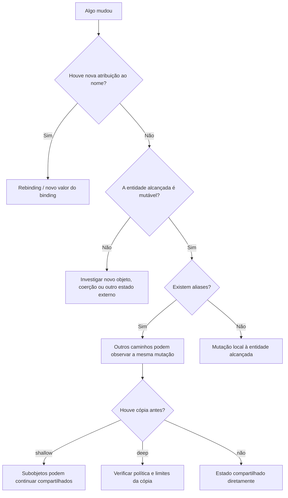

<a id="inicio"></a>

# Estado, Escopo, Referências e Mutabilidade

> **Classificação do tópico:** `[P] Conhecer e dominar progressivamente`  
> **Nível:** B — Fundamentos de Programação  
> **Posição na taxonomia:** tópico 14  
> **Pré-requisitos:** Nível A completo + tópico 13  
> **Aprofundamentos posteriores:** coleções, recursão, closures, OOP, memória, garbage collection, concorrência, programação funcional e arquitetura

---

## Resumo executivo

Este tópico explica uma das fontes mais comuns de confusão em programação:

```text
NOME
≠
VALOR
≠
OBJETO
≠
REFERÊNCIA
≠
CÓPIA
≠
ESCOPO
≠
TEMPO DE VIDA
```

Até aqui usamos variáveis como ferramentas para guardar e transformar dados.

Agora precisamos entender **o que realmente pode estar mudando**.

Considere Python:

```python
a = [1, 2]
b = a

b.append(3)
```

Resultado:

```text
a → [1, 2, 3]
b → [1, 2, 3]
```

Não porque:

```text
“Python copiou a lista e sincronizou as duas”
```

mas porque:

```text
a
┐
├──→ MESMO OBJETO LIST
┘
b
```

Temos **aliasing**.

Agora:

```python
a = 10
b = a
b = 20
```

Resultado:

```text
a = 10
b = 20
```

Aqui não houve mutação do objeto inteiro `10`.

Houve:

```text
REBINDING
```

de `b`.

Essa distinção é central:

```text
MUTAÇÃO
≠
REATRIBUIÇÃO / REBINDING
```

Outro exemplo importante:

JavaScript:

```javascript
const user = { name: "Ana" };
user.name = "Bia";
```

é permitido.

Mas:

```javascript
user = { name: "Carlos" };
```

não é.

Logo:

```text
const
→ impede reatribuição do binding
≠
torna o objeto imutável
```

Java possui uma distinção semelhante com:

```java
final
```

Uma variável `final` que contém referência não pode receber outra referência depois de inicializada, mas o objeto referenciado pode continuar mutável. A JLS 27 declara isso explicitamente.

Bash precisa de um cuidado adicional:

```text
nameref
```

é uma **referência a outro nome de variável** no shell.

Não é automaticamente equivalente a:

```text
object reference
```

de Python, Java ou JavaScript.

Este capítulo também separa:

```text
ESCOPO
≠
TEMPO DE VIDA
```

Escopo responde:

> **onde o nome pode ser usado?**

Tempo de vida responde:

> **por quanto tempo a entidade/objeto/estado continua existindo?**

Uma função pode terminar e um objeto criado dentro dela continuar vivo se alguma referência alcançável for devolvida ou capturada.

Da mesma forma, um nome pode sair de escopo enquanto o objeto que ele referenciava permanece vivo.

---

## Núcleo conceitual

```text
ESTADO
→ o que pode mudar ao longo do tempo

ESCOPO
→ onde um nome é visível

TEMPO DE VIDA
→ por quanto tempo uma entidade existe/permanece alcançável

MUTABILIDADE
→ se o próprio valor/estado interno pode mudar

IDENTIDADE
→ qual objeto é aquele

REFERÊNCIA
→ mecanismo que permite chegar a uma entidade/objeto

CÓPIA
→ criação de estado independente ou parcialmente independente

ALIASING
→ dois caminhos acessam a mesma entidade mutável

EFEITO COLATERAL
→ função/operação altera estado observável fora de seu resultado
```

---

## Regra de ouro

> **Ao observar uma mudança, pergunte primeiro: o nome foi reatribuído ou o objeto/estado compartilhado foi mutado?**

---

## Decisão rápida

| Pergunta | Resposta |
|---|---|
| “Variável é uma caixa universal?” | Não. É uma metáfora limitada; modelos reais diferem por linguagem. |
| “`a = b` cria uma cópia profunda?” | Não como regra. Em Python/JS/Java com objetos/referências, normalmente não. |
| “Python assignment copia objeto?” | Não; cria/redefine bindings. |
| “`a is b` em Python compara valor?” | Não; compara identidade. |
| “`a == b` em Python compara identidade?” | Não necessariamente; normalmente compara igualdade de valor conforme o tipo. |
| “`const` JS torna objeto imutável?” | Não. Impede reatribuição do binding; propriedades podem continuar mutáveis. |
| “`final` Java torna objeto imutável?” | Não. Impede nova atribuição à variável `final`; estado do objeto pode mudar. |
| “`readonly` Bash é igual a objeto imutável?” | Não. É atributo de nome/variável do shell, não modelo de objeto imutável. |
| “Bash `nameref` é igual a reference variable Java?” | Não. É referência indireta a outro nome de variável Bash. |
| “Escopo = lifetime?” | Não. |
| “Objeto pode viver depois do nome local sair de escopo?” | Sim, se continuar alcançável por outro caminho. |
| “Objeto imutável nunca participa de estado mutável?” | Pode participar como elemento de estrutura mutável; containers imutáveis também podem referenciar mutáveis em certas linguagens. |
| “Tuple Python é sempre deep immutable?” | Não. A tuple não muda quais objetos referencia, mas esses objetos podem ser mutáveis. |
| “Cópia rasa isola tudo?” | Não. Subobjetos podem continuar compartilhados. |
| “Deep copy é sempre melhor?” | Não. Pode ser caro, desnecessário ou semanticamente errado. |
| “Argumento mutável pode ser alterado por função?” | Sim em Python/JS/Java quando a função recebe acesso ao mesmo objeto mutável. |
| “Java passa objetos por referência?” | Formulação imprecisa. Java passa argumentos por valor; quando o valor é uma referência, uma cópia desse valor-referência é passada. |
| “JavaScript passa objeto por referência?” | Melhor dizer: o argumento contém um valor que referencia o mesmo objeto; reassociar o parâmetro não reassocia o binding do chamador. |
| “Python passa por referência?” | Melhor dizer: parâmetros são bindings locais para os objetos fornecidos; mutação do mesmo objeto pode ser observada pelo chamador. |
| “Bash função vê variável local da função chamadora?” | Sim, Bash usa escopo dinâmico para variáveis locais. |
| “Efeito colateral é sempre ruim?” | Não. I/O, persistência e mudanças de estado são necessários; o importante é torná-los explícitos e controlados. |

---

<a id="índice"></a>
# Índice


- [Resumo executivo](#resumo-executivo)
- [Núcleo conceitual](#núcleo-conceitual)
- [Regra de ouro](#regra-de-ouro)
- [Decisão rápida](#decisão-rápida)
- [1. Posição deste assunto](#1-posição-deste-assunto)
  - [1.1 Por que isso muda a qualidade do código?](#11-por-que-isso-muda-a-qualidade-do-código)
  - [1.2 Classificação curricular](#12-classificação-curricular)
- [2. Visão panorâmica](#2-visão-panorâmica)
  - [🗺️ Visão panorâmica — o mapa antes dos detalhes](#visao-panoramica-caderno)
- [3. Modelo mental: nomes, valores e entidades](#3-modelo-mental-nomes-valores-e-entidades)
  - [Python](#python)
  - [JavaScript](#javascript)
  - [Java](#java)
  - [Bash](#bash)
  - [Regra](#regra)
- [4. Binding, assignment e mutation](#4-binding-assignment-e-mutation)
  - [Binding](#binding)
  - [Assignment](#assignment)
  - [Mutation](#mutation)
  - [Exemplo Python](#exemplo-python)
- [5. Rebinding versus in-place mutation](#5-rebinding-versus-in-place-mutation)
  - [Rebinding](#rebinding)
  - [Mutation](#mutation-1)
  - [Por que importa?](#por-que-importa)
- [6. 14.1 Estado](#6-141-estado)
  - [6.1 Estado pode estar em diferentes lugares](#61-estado-pode-estar-em-diferentes-lugares)
- [7. Estado observável](#7-estado-observável)
  - [7.1 Estado interno não observado](#71-estado-interno-não-observado)
- [8. Sequência temporal](#8-sequência-temporal)
  - [8.1 Ordem importa](#81-ordem-importa)
  - [8.2 Relação com tópico 12](#82-relação-com-tópico-12)
- [9. Transição de estado](#9-transição-de-estado)
  - [9.1 Função de estado](#91-função-de-estado)
- [10. Estado local e externo](#10-estado-local-e-externo)
  - [Regra](#regra-1)
- [11. Estado compartilhado](#11-estado-compartilhado)
  - [Risco](#risco)
  - [Benefício](#benefício)
  - [Regra](#regra-2)
- [12. 14.2 Escopo](#12-142-escopo)
  - [Não confundir](#não-confundir)
- [13. Escopo não é acesso nem lifetime](#13-escopo-não-é-acesso-nem-lifetime)
  - [Scope](#scope)
  - [Lifetime](#lifetime)
  - [Access control](#access-control)
  - [Moral](#moral)
- [14. Python — escopo](#14-python--escopo)
  - [Função](#função)
  - [Bloco if/for](#bloco-iffor)
  - [Comprehension](#comprehension)
  - [Annotation scopes — Python 3.14](#annotation-scopes--python-314-e)
- [15. JavaScript — escopo](#15-javascript--escopo)
  - [`let` / `const`](#let--const)
  - [`var`](#var)
- [16. Java — escopo](#16-java--escopo)
  - [Local de bloco](#local-de-bloco)
  - [Parâmetro](#parâmetro)
  - [Shadowing](#shadowing)
- [17. Bash — escopo dinâmico](#17-bash--escopo-dinâmico)
  - [Exemplo](#exemplo)
  - [Importante](#importante)
- [18. Shadowing](#18-shadowing)
  - [Guardrail](#guardrail)
- [19. Global state](#19-global-state)
  - [Problemas comuns](#problemas-comuns)
  - [Uso válido](#dados-globais-estáveis--estado-global-mutável)
- [20. 14.3 Tempo de vida](#20-143-tempo-de-vida)
  - [Importante](#importante-1)
- [21. Criação, existência e descarte](#21-criação-existência-e-descarte)
  - [Guardrail](#guardrail-1)
- [22. Nome fora de escopo, objeto ainda vivo](#22-nome-fora-de-escopo-objeto-ainda-vivo)
  - [JavaScript](#javascript-1)
  - [Java](#java-1)
  - [Moral](#moral-1)
- [23. Python — alcançabilidade e garbage collection](#23-python--alcançabilidade-e-garbage-collection)
  - [CPython](#cpython)
  - [Guardrail](#guardrail-2)
- [24. JavaScript — liveness e garbage collection](#24-javascript--liveness-e-garbage-collection)
  - [Consequência](#consequência)
  - [Regra](#regra-3)
- [25. Java — reachability](#25-java--reachability)
  - [Garbage collection](#garbage-collection)
  - [Guardrail](#guardrail-3)
- [26. Bash — lifetime de variáveis locais](#26-bash--lifetime-de-variáveis-locais)
  - [Exemplo](#exemplo-1)
  - [Diferença](#diferença)
- [27. Recursos externos não devem depender do GC](#27-recursos-externos-não-devem-depender-do-gc)
- [28. 14.4 Mutabilidade](#28-144-mutabilidade)
- [29. Objeto mutável](#29-objeto-mutável)
  - [JavaScript](#javascript-2)
  - [Java](#java-2)
- [30. Objeto imutável](#30-objeto-imutável)
  - [Consequência](#consequência-1)
- [31. Imutabilidade rasa e composta](#31-imutabilidade-rasa-e-composta)
  - [Moral](#moral-2)
- [32. Python — mutabilidade](#32-python--mutabilidade)
  - [Caveat](#caveat)
- [33. JavaScript — mutabilidade](#33-javascript--mutabilidade)
  - [`const`](#const)
  - [Object.freeze](#objectfreeze)
- [34. Java — mutabilidade](#34-java--mutabilidade)
  - [Array](#array)
  - [Rebinding](#rebinding-1)
  - [String](#string)
  - [Objetos próprios](#objetos-próprios)
- [35. Bash — mutabilidade de variáveis](#35-bash--mutabilidade-de-variáveis)
  - [readonly](#readonly)
  - [Importante](#importante-2)
- [36. const, final e readonly](#36-const-final-e-readonly)
  - [Regra](#regra-4)
- [37. Mutação versus substituição](#37-mutação-versus-substituição)
- [38. Augmented assignment](#38-augmented-assignment)
  - [Exemplo](#exemplo-2)
  - [Contraste](#contraste)
- [39. 14.5 Valor, cópia, identidade e referência](#39-145-valor-cópia-identidade-e-referência)
- [40. Valor](#40-valor)
- [41. Identidade](#41-identidade)
  - [Cuidado](#cuidado)
- [42. Igualdade versus identidade](#42-igualdade-versus-identidade)
  - [JavaScript](#javascript-3)
  - [Java](#java-3)
  - [Regra](#regra-5)
- [43. Referência](#43-referência)
  - [Python](#python-1)
  - [JavaScript](#javascript-4)
  - [Java](#java-4)
  - [Bash](#bash-1)
  - [Guardrail](#guardrail-4)
- [44. Aliasing](#44-aliasing)
  - [Consequência](#consequência-2)
- [45. Cópia](#45-cópia)
  - [Value copy](#cópia-do-valor-armazenado)
  - [Shallow copy](#shallow-copy)
  - [Deep copy](#deep-copy)
  - [Importante](#importante-2)
- [46. Shallow copy](#46-shallow-copy)
  - [Python](#python-2)
  - [JavaScript](#javascript-5)
- [47. Deep copy](#47-deep-copy)
  - [Problemas](#problemas)
  - [Beazley](#beazley)
  - [Regra](#regra-6)
- [48. Python — assignment e copy](#48-python--assignment-e-copy)
  - [Shallow](#shallow)
  - [Deep](#deep)
  - [Identidade](#identidade)
- [49. JavaScript — assignment e shallow copy](#49-javascript--assignment-e-shallow-copy)
  - [Shallow copy](#shallow-copy-1)
  - [Regra](#regra-7)
- [50. Java — primitive value versus reference value](#50-java--primitive-value-versus-reference-value)
  - [Primitive](#primitive)
  - [Reference](#reference)
  - [Formulação correta](#formulação-correta)
- [51. Bash — cópia de valor e nameref](#51-bash--cópia-de-valor-e-nameref)
  - [Cópia textual simples](#cópia-textual-simples)
  - [Array](#array-1)
  - [nameref](#nameref)
- [52. Passagem de argumentos](#52-passagem-de-argumentos)
- [53. Python — argumento mutável](#53-python--argumento-mutável)
  - [Por quê?](#por-quê)
  - [Rebinding](#rebinding-2)
- [54. JavaScript — argumento objeto](#54-javascript--argumento-objeto)
  - [Reassignment local](#reassignment-local)
  - [Moral](#moral-3)
- [55. Java — referência passada por valor](#55-java--referência-passada-por-valor)
  - [Mas:](#mas)
  - [Formulação](#formulação)
- [56. Bash — parâmetros posicionais e nameref](#56-bash--parâmetros-posicionais-e-nameref)
  - [Para modificar variável pelo nome](#para-modificar-variável-pelo-nome)
  - [Guardrail](#guardrail-5)
- [57. 14.6 Efeitos colaterais](#57-146-efeitos-colaterais)
- [58. O que conta como efeito colateral](#58-o-que-conta-como-efeito-colateral)
  - [Não é automaticamente ruim](#não-é-automaticamente-ruim)
- [59. Função pura — primeira noção](#59-função-pura--primeira-noção)
  - [Contraste](#contraste-1)
- [60. Mutação de argumento como efeito](#60-mutação-de-argumento-como-efeito)
  - [Contrato precisa deixar claro](#contrato-precisa-deixar-claro)
- [61. I/O como efeito](#61-io-como-efeito)
  - [Por que importa?](#por-que-importa-1)
- [62. Estado global como efeito](#62-estado-global-como-efeito)
  - [Risco](#risco-1)
  - [Teste](#teste)
- [63. Efeito explícito versus oculto](#63-efeito-explícito-versus-oculto)
  - [Princípio](#princípio)
- [64. Cópia defensiva](#64-cópia-defensiva)
  - [Cuidado](#cuidado-1)
- [65. Exemplo canônico — aliasing](#65-exemplo-canônico--aliasing)
  - [Python](#python-3)
  - [JavaScript](#javascript-6)
  - [Java](#java-5)
  - [Bash](#bash-2)
- [66. Exemplo canônico — mutação por função](#66-exemplo-canônico--mutação-por-função)
  - [Python](#python-4)
  - [JavaScript](#javascript-7)
  - [Java](#java-6)
  - [Bash](#bash-3)
- [67. Exemplo canônico — cópia rasa](#67-exemplo-canônico--cópia-rasa)
- [68. Exemplo canônico — binding imutável, objeto mutável](#68-exemplo-canônico--binding-imutável-objeto-mutável)
  - [JavaScript](#javascript-8)
  - [Java](#java-7)
  - [Bash](#bash-4)
  - [Moral](#moral-4)
- [69. Exemplo crítico — final Java](#69-exemplo-crítico--final-java)
  - [Moral](#moral-5)
- [70. Exemplo crítico — const JavaScript](#70-exemplo-crítico--const-javascript)
  - [Moral](#moral-6)
- [71. Exemplo crítico — tuple Python com mutável](#71-exemplo-crítico--tuple-python-com-mutável)
  - [O que permaneceu imutável?](#o-que-permaneceu-imutável)
- [72. Exemplo crítico — shallow copy aninhada](#72-exemplo-crítico--shallow-copy-aninhada)
  - [Diagnóstico](#diagnóstico)
- [73. Exemplo crítico — parâmetro e reatribuição](#73-exemplo-crítico--parâmetro-e-reatribuição)
  - [Mas:](#mas-1)
  - [Moral](#moral-7)
- [74. Exemplo crítico — Bash dynamic scope](#74-exemplo-crítico--bash-dynamic-scope)
  - [Por quê?](#por-quê-1)
  - [Não transporte essa regra](#não-transporte-essa-regra)
- [75. Exemplo crítico — Bash nameref](#75-exemplo-crítico--bash-nameref)
  - [Porém](#porém)
- [76. Matriz comparativa das quatro linguagens](#76-matriz-comparativa-das-quatro-linguagens)
- [77. Método de análise de uma mudança de estado](#77-método-de-análise-de-uma-mudança-de-estado)
- [78. Debugging de aliasing](#78-debugging-de-aliasing)
  - [Depois](#depois)
  - [Regra](#regra-8)
  - [Problemas reais — índice operacional `PR-T14-*`](#problemas-reais-t14)
  - [🔎 Troubleshooting sistemático](#troubleshooting-t14)
- [79. Segurança e robustez](#79-segurança-e-robustez)
  - [79.1 Entrada recebida](#791-entrada-recebida)
  - [79.2 Cópia defensiva](#792-cópia-defensiva)
  - [79.3 Segredo global](#793-segredo-global)
  - [79.4 Bash nameref](#794-bash-nameref)
- [80. O que fica para depois](#80-o-que-fica-para-depois)
  - [Guardrail](#guardrail-6)
- [81. Erros conceituais frequentes](#81-erros-conceituais-frequentes)
  - [81.1 “Variável é uma caixa”](#811-variável-é-uma-caixa)
  - [81.2 “Assignment sempre copia”](#812-assignment-sempre-copia)
  - [81.3 “Assignment nunca copia”](#813-assignment-nunca-copia)
  - [81.4 “Mutação = reatribuição”](#814-mutação--reatribuição)
  - [81.5 “Escopo = lifetime”](#815-escopo--lifetime)
  - [81.6 “Saiu do escopo = objeto destruído”](#816-saiu-do-escopo--objeto-destruído)
  - [81.7 “Tuple é deep immutable”](#817-tuple-é-deep-immutable)
  - [81.8 “const deixa objeto imutável”](#818-const-deixa-objeto-imutável)
  - [81.9 “final deixa objeto imutável”](#819-final-deixa-objeto-imutável)
  - [81.10 “readonly Bash é igual a const JS”](#8110-readonly-bash-é-igual-a-const-js)
  - [81.11 “Python `==` testa identidade”](#8111-python--testa-identidade)
  - [81.12 “Java `==` em objeto chama equals”](#8112-java--em-objeto-chama-equals)
  - [81.13 “JS spread faz deep clone”](#8113-js-spread-faz-deep-clone)
  - [81.14 “Python `.copy()` faz deep copy”](#8114-python-copy-faz-deep-copy)
  - [81.15 “Deep copy é sempre melhor”](#8115-deep-copy-é-sempre-melhor)
  - [81.16 “Java passa objeto por referência”](#8116-java-passa-objeto-por-referência)
  - [81.17 “Python passa por referência” como explicação completa](#8117-python-passa-por-referência-como-explicação-completa)
  - [81.18 “Bash nameref é igual a pointer”](#8118-bash-nameref-é-igual-a-pointer)
  - [81.19 “Efeito colateral é sempre ruim”](#8119-efeito-colateral-é-sempre-ruim)
  - [81.20 “Garbage collection fecha recurso na hora”](#8120-garbage-collection-fecha-recurso-na-hora)
- [82. Laboratórios](#82-laboratórios)
  - [🧪 LAB 1 — rebinding versus mutation](#-lab-1--rebinding-versus-mutation)
  - [🧪 LAB 2 — identity versus equality](#-lab-2--identity-versus-equality)
  - [🧪 LAB 3 — JS const](#-lab-3--js-const)
  - [🧪 LAB 4 — Java final](#-lab-4--java-final)
  - [🧪 LAB 5 — shallow copy](#-lab-5--shallow-copy)
  - [🧪 LAB 6 — deep copy Python](#-lab-6--deep-copy-python)
  - [🧪 LAB 7 — argument mutation](#-lab-7--argument-mutation)
  - [🧪 LAB 8 — Bash dynamic scope](#-lab-8--bash-dynamic-scope)
  - [🧪 LAB 9 — Bash nameref](#-lab-9--bash-nameref)
  - [🧪 LAB 10 — NetDev opcional](#-lab-10--netdev-opcional)
- [83. Exercícios](#83-exercícios)
  - [83.1 Estado](#831-estado)
  - [83.2 Escopo](#832-escopo)
  - [83.3 Lifetime](#833-lifetime)
  - [83.4 Mutation](#834-mutation)
  - [83.5 Identity](#835-identity)
  - [83.6 Aliasing](#836-aliasing)
  - [83.7 Python](#837-python)
  - [83.8 Python](#838-python)
  - [83.9 Python](#839-python)
  - [83.10 JavaScript](#8310-javascript)
  - [83.11 Java](#8311-java)
  - [83.12 Java](#8312-java)
  - [83.13 Bash](#8313-bash)
  - [83.14 Bash](#8314-bash)
  - [83.15 Side effect](#8315-side-effect)
  - [83.16 Pure function](#8316-pure-function)
  - [83.17 GC](#8317-gc)
  - [83.18 Resource lifetime](#8318-resource-lifetime)
  - [83.19 Copy](#8319-copy)
  - [83.20 Design](#8320-design)
- [84. Evidências de domínio](#84-evidências-de-domínio)
  - [14.1 Estado `[D]`](#141-estado-d)
  - [14.2 Escopo `[D]`](#142-escopo-d)
  - [14.3 Lifetime `[C]`](#143-lifetime-c)
  - [14.4 Mutabilidade `[C → D]`](#144-mutabilidade-c--d)
  - [14.5 Valor/cópia/identidade/referência `[C → D]`](#145-valorcópiaidentidadereferência-c--d)
  - [14.6 Efeitos colaterais `[C → D]`](#146-efeitos-colaterais-c--d)
- [85. Checklist de consulta rápida](#85-checklist-de-consulta-rápida)
- [86. Glossário](#86-glossário)
- [87. Referências](#87-referências)
  - [87.1 Taxonomia canônica](#871-taxonomia-canônica)
  - [87.2 CS2023 — ACM / IEEE-CS / AAAI](#872-cs2023--acm--ieee-cs--aaai)
  - [87.3 Python 3.14.7 — documentação oficial](#873-python-3147--documentação-oficial)
  - [87.4 ECMAScript 2026 — especificação oficial](#874-ecmascript-2026--especificação-oficial)
  - [87.5 Java SE 27 — JLS](#875-java-se-27--jls)
  - [87.6 GNU Bash 5.3 — documentação oficial](#876-gnu-bash-53--documentação-oficial)
  - [87.7 Fluent Python](#877-fluent-python)
  - [87.8 Python Distilled](#878-python-distilled)
  - [87.9 Programming Logic and Design](#879-programming-logic-and-design)
  - [87.10 Proveniência bibliográfica local](#8710-proveniência-bibliográfica-local)
  - [87.11 Hierarquia das fontes](#8711-hierarquia-das-fontes)
  - [87.12 Decisões terminológicas deliberadas](#8712-decisões-terminológicas-deliberadas)
- [88. Histórico de versões](#88-histórico-de-versões)

---

# 1. Posição deste assunto

O tópico 13 explicou:

```text
sintaxe
semântica
tipos
conversões
```

Agora entramos em:

```text
COMO O ESTADO É REPRESENTADO E COMPARTILHADO
```

## 1.1 Por que isso muda a qualidade do código?

Sem estes conceitos, bugs parecem “mágicos”:

```text
“por que a lista original mudou?”
“por que const deixou alterar?”
“por que final deixou alterar?”
“por que minha cópia mudou junto?”
“por que a variável local da função pai apareceu na filha?”
```

A resposta está em:

```text
binding
scope
lifetime
identity
mutability
reference
aliasing
side effects
```

## 1.2 Classificação curricular

O guia canônico classifica o tópico como:

```text
[P] Conhecer e dominar progressivamente
```

Porque parte do conteúdo precisa ser compreendida agora, mas detalhes de:

- garbage collection;
- memória;
- closures;
- objetos;
- concorrência;

amadurecem ao longo da trilha.

[↑ Voltar ao índice](#índice)

---

# 2. Visão panorâmica

<a id="visao-panoramica-caderno"></a>
## 🗺️ Visão panorâmica — o mapa antes dos detalhes

Esta visão serve como **caderno rápido de consulta** e como contrato de cobertura do T14. O ponto central é separar coisas que costumam ser misturadas:

```text
NOME / BINDING
      ↓
VALOR OU REFERÊNCIA OBSERVADA PELA LINGUAGEM
      ↓
ENTIDADE / OBJETO / PARÂMETRO
      ↓
ESTADO ATUAL
      ↓
OPERAÇÃO
├── rebinding / reassignment
├── mutation
├── copy
└── side effect
      ↓
NOVO ESTADO OBSERVÁVEL
```

A pergunta correta quase nunca é apenas **“a variável mudou?”**. Pergunte também:

```text
qual nome?
qual binding?
qual entidade?
mesma identidade?
mesmo valor?
houve cópia?
qual profundidade da cópia?
quem mais enxerga esse estado?
qual escopo resolve o nome?
por quanto tempo a entidade continua viva?
```

### 2.1 Mapa do domínio — o que existe

```text
T14 — ESTADO, ESCOPO, REFERÊNCIAS E MUTABILIDADE
│
├── 14.1 Estado [D]
│   ├── estado observável
│   ├── estado interno
│   ├── sequência temporal
│   ├── transição
│   └── estado compartilhado
│
├── 14.2 Escopo [D]
│   ├── resolução de nomes
│   ├── local / global / enclosing / block, conforme linguagem
│   ├── shadowing
│   ├── global state
│   └── Bash dynamic scope
│
├── 14.3 Tempo de vida [C]
│   ├── criação
│   ├── existência / reachability
│   ├── fim do binding
│   ├── fim do recurso
│   └── coleta de memória ≠ cleanup determinístico
│
├── 14.4 Mutabilidade [C → D]
│   ├── mutable × immutable
│   ├── rebinding × in-place mutation
│   ├── mutabilidade rasa/composta
│   └── const / final / readonly ≠ deep immutability
│
├── 14.5 Valor, cópia, identidade e referência [C → D]
│   ├── equality × identity
│   ├── aliasing
│   ├── shallow copy
│   ├── deep copy
│   ├── passagem de argumentos
│   └── Bash nameref como indireção por nome
│
└── 14.6 Efeitos colaterais [C → D]
    ├── mutação de argumento
    ├── estado global
    ├── I/O
    ├── recurso externo
    └── efeito explícito × oculto
```

### 2.2 Fluxo principal — como investigar uma mudança



Leitura textual equivalente:

```text
SINTOMA
→ localizar o nome observado
→ distinguir assignment de mutation
→ verificar identidade / aliasing
→ verificar shallow/deep copy
→ verificar escopo e passagem de argumentos
→ verificar side effects / estado externo
→ só então corrigir
```

### 2.3 Consulta rápida — conceito × pergunta × risco

| Conceito | Pergunta de consulta | Risco típico |
|---|---|---|
| **Estado** | Qual informação semanticamente relevante/observável caracteriza a situação neste ponto da execução? | assumir que só variáveis locais formam estado |
| **Escopo** | Onde este nome pode ser resolvido? | confundir visibilidade com lifetime |
| **Lifetime** | Até quando binding, objeto ou recurso permanece relevante? | depender de GC para fechar recurso |
| **Mutação** | O mesmo objeto mudou internamente? | chamar rebinding de mutação |
| **Rebinding** | O nome passou a designar outro valor/objeto? | acreditar que aliases também foram rebindeados |
| **Identidade** | É a mesma entidade? | usar igualdade de valor como prova de identidade |
| **Aliasing** | Há dois ou mais caminhos para a mesma entidade? | se ela for mutável, uma alteração pode ser observada pelos aliases |
| **Shallow copy** | Só o container externo foi separado? | subobjetos continuam compartilhados |
| **Deep copy** | O grafo relevante foi copiado segundo a política da API? | copiar demais ou copiar objetos inadequados |
| **Side effect** | A execução produz alteração ou interação observável além de seu resultado principal? | dependência oculta de ordem, estado ou ambiente |
| **`const` / `final` / `readonly`** | O binding está protegido ou o objeto também? | confundir binding estável com objeto imutável |
| **Bash `nameref`** | O nome referencia outro nome de variável? | transportar modelo de object reference de outra linguagem |

### 2.4 Pergunta prática → onde começar

| Se a dúvida for... | Primeiro mecanismo a verificar |
|---|---|
| “Mudei `b` e `a` também mudou.” | identidade + aliasing + mutation |
| “Copiei, mas o item interno ainda muda dos dois lados.” | shallow copy + subobjetos compartilhados |
| “A variável existe fora daqui?” | scope / resolução de nomes |
| “O nome saiu do escopo; o objeto morreu?” | lifetime + reachability |
| “`const`/`final` deixou alterar campo.” | binding immutability × object mutability |
| “A função alterou o argumento do caller.” | passagem de argumentos + mutation |
| “Reatribuir o parâmetro não alterou o caller.” | binding local / valor de referência copiado |
| “Função Bash leu `local` do chamador.” | dynamic scope do Bash |
| “Quero mudar variável Bash cujo nome chegou como argumento.” | `nameref`, com validação do nome |
| “Quero garantir cleanup no fim.” | mecanismo explícito de recurso; não GC |

### 2.5 Não confundir

| A | B | Distinção operacional |
|---|---|---|
| **scope** | **lifetime** | scope é onde o nome pode ser resolvido; lifetime é quanto tempo a entidade/binding/recurso permanece existente/relevante |
| **reassignment/rebinding** | **mutation** | rebinding muda a associação do nome; mutation altera estado da mesma entidade |
| **equality** | **identity** | igualdade compara valor/semântica; identidade pergunta se é a mesma entidade |
| **alias** | **copy** | alias compartilha entidade; copy cria alguma forma de entidade distinta |
| **shallow copy** | **deep copy** | shallow separa o nível externo; deep tenta copiar recursivamente segundo a API/política |
| **immutable binding** | **immutable object** | `const`/`final` podem impedir reatribuição sem congelar o objeto |
| **unreachable** | **destruído imediatamente** | perder alcançabilidade não implica cleanup temporalmente garantido |
| **Bash nameref** | **object reference** | nameref resolve outro nome de variável; não é o mesmo modelo de objetos de Python/JS/Java |

### 2.6 Microexemplos canônicos

**Aliasing + mutation — Python**

```python
a = [1, 2]
b = a
b.append(3)

assert a is b
assert a == [1, 2, 3]
```

**Binding estável, objeto mutável — JavaScript**

```javascript
const user = { name: "Ana" };
user.name = "Bia";      // permitido
// user = {};            // reatribuição do binding: erro
```

**Referência `final`, objeto mutável — Java**

```java
final int[] values = {1, 2};
values[0] = 9;           // permitido
// values = new int[]{3}; // nova atribuição à variável final: erro
```

**Escopo dinâmico — Bash**

```bash
outer() {
    local value="outer-local"
    inner
}

inner() {
    printf '%s\n' "$value"
}
```

No Bash, `inner` pode resolver `value` no escopo dinâmico do chamador. Não transfira essa regra para Python, JavaScript ou Java.

### 2.7 Falha típica → primeira investigação

| Sintoma | Primeira investigação |
|---|---|
| objeto “mudou sozinho” | procurar aliases e mutações indiretas |
| cópia não isolou nested data | determinar se foi shallow |
| `UnboundLocalError` em Python | procurar binding local no mesmo bloco de função |
| `const` não protegeu propriedade | separar binding de estado do objeto |
| método Java mudou objeto do caller | referência recebida por valor ainda aponta para o mesmo objeto |
| reatribuição Java não trocou objeto do caller | somente a cópia local do reference value foi alterada |
| função Bash vê `local` inesperado | verificar cadeia de chamadas / dynamic scope |
| recurso ficou aberto | procurar cleanup explícito, não timing do GC |
| teste depende da ordem de execução | procurar side effect oculto/global state |

### 2.8 Transferência entre linguagens — o que permanece e o que muda

| Pergunta | Python | JavaScript | Java | Bash |
|---|---|---|---|---|
| assignment simples de objeto cria deep copy? | não | não | não; reference value é copiado | não é object model equivalente |
| identidade de objetos | `is` | `===` para Object values | `==` para reference equality | não há equivalente geral |
| binding não reatribuível | sem keyword geral equivalente | `const` | `final` | `readonly` |
| objeto alcançado ainda pode ser mutável? | sim, conforme tipo | sim | sim | modelo diferente |
| escopo de bloco comum | `if/for` não criam scope comum de nome | `let`/`const`: sim | sim | não no mesmo modelo |
| escopo de função | léxico; regras próprias de name binding | léxico; `var` é function-scoped | léxico/estático | `local` usa dynamic scope entre funções |
| cópia profunda universal da linguagem | `copy.deepcopy()` é biblioteca, com limites | não | não | não aplicável do mesmo modo |
| GC com momento previsível | não portavelmente | não | não | não é o mesmo modelo |

> **Python 3.14:** além dos scopes usuais, annotations, listas de parâmetros de tipo e `type` statements usam **annotation scopes**. Esse detalhe é classificado como aprofundamento de escopo; ele não altera a regra fundamental de que scope e lifetime são conceitos diferentes.

### 2.9 Problemas reais representativos

O aprofundamento operacional fecha, entre outros:

- [`PR-T14-01`](#pr-t14-01) — mutation observada por alias;
- [`PR-T14-02`](#pr-t14-02) — shallow copy de estrutura aninhada;
- [`PR-T14-03`](#pr-t14-03) — `const`/`final` confundidos com imutabilidade;
- [`PR-T14-04`](#pr-t14-04) — side effect em argumento;
- [`PR-T14-05`](#pr-t14-05) — reatribuição local versus mutação no Java;
- [`PR-T14-06`](#pr-t14-06) — escopo dinâmico Bash;
- [`PR-T14-07`](#pr-t14-07) — política de cópia adequada;
- [`PR-T14-08`](#pr-t14-08) — lifetime de recurso separado de GC.

### 2.10 Modo consulta × modo estudo

```text
CONSULTA RÁPIDA
→ 2.3 tabela
→ 2.5 não confundir
→ 2.7 falha típica
→ 76 matriz comparativa
→ 85 checklist

ESTUDO COMPLETO
→ 3–11 estado / binding
→ 12–19 escopo
→ 20–27 lifetime
→ 28–38 mutabilidade
→ 39–56 identidade / referência / cópia / parâmetros
→ 57–64 efeitos colaterais
→ 65–75 exemplos críticos
→ 77–78 método + troubleshooting
→ 82–84 prática + evidência de domínio
```

### 2.11 Contrato de cobertura panorâmica

| Nó | Promessa desta visão | Destino principal |
|---|---|---|
| `14.1 Estado [D]` | identificar estado, transição e compartilhamento | seções 6–11 |
| `14.2 Escopo [D]` | separar resolução de nomes de lifetime/access | seções 12–19 |
| `14.3 Tempo de vida [C]` | separar binding, reachability, recurso e GC | seções 20–27 |
| `14.4 Mutabilidade [C → D]` | distinguir mutation, rebinding e imutabilidade | seções 28–38 |
| `14.5 Valor/cópia/identidade/referência [C → D]` | compreender aliasing, copies e parâmetros | seções 39–56 |
| `14.6 Efeitos colaterais [C → D]` | reconhecer efeitos necessários, explícitos e ocultos | seções 57–64 |

A Visão Panorâmica foi sintetizada a partir da taxonomia v2.1.0, CS2023, documentação oficial atual de Python/ECMAScript/Java/Bash e das fontes locais efetivamente consultadas nesta revisão: **Fluent Python**, **Python Distilled**, **Programming Logic and Design** e **GNU Bash Reference Manual 5.3**. Cada fonte cumpre papel distinto: semântica oficial, modelo mental, exemplos de aliasing/cópia, escopo e particularidades do shell.

[↑ Voltar ao índice](#índice)

---

# 3. Modelo mental: nomes, valores e entidades

O erro mais comum é assumir:

```text
VARIÁVEL
=
OBJETO
```

Nem sempre.

## Python

```text
name
→ binding
→ object
```

## JavaScript

```text
binding
→ ECMAScript value
```

Um value pode ser:

```text
primitive
ou
Object reference value
```

## Java

Variável contém:

```text
primitive value
ou
reference value
```

## Bash

Nome de variável identifica um:

```text
shell parameter
```

que possui:

- valor;
- atributos.

## Regra

> **Use o modelo real da linguagem antes de raciocinar sobre cópia e mutação.**

[↑ Voltar ao índice](#índice)

---

# 4. Binding, assignment e mutation

Três operações diferentes:

## Binding

```text
associar nome a entidade/valor
```

## Assignment

```text
alterar o valor/binding de uma variável
```

## Mutation

```text
alterar estado interno do mesmo objeto/estrutura
```

## Exemplo Python

```python
items = [1, 2]
```

Cria/vincula:

```text
items → list
```

Depois:

```python
items.append(3)
```

muta o mesmo objeto.

Depois:

```python
items = [9]
```

rebinda o nome para outro objeto.

[↑ Voltar ao índice](#índice)

---

# 5. Rebinding versus in-place mutation

## Rebinding

```python
x = [1]
x = [2]
```

O nome passa a apontar para outro objeto.

## Mutation

```python
x = [1]
x.append(2)
```

Mesmo objeto recebe novo estado.

## Por que importa?

Se existe alias:

```python
a = [1]
b = a
```

Então:

```python
a = [9]
```

não muda `b`.

Mas:

```python
a.append(9)
```

muda o objeto observado por ambos.

[↑ Voltar ao índice](#índice)

---

# 6. 14.1 Estado

**Classificação:** `[D]`

Taxonomia:

```text
mudanças de valores
sequência temporal
```

Estado é a **informação semanticamente relevante/observável que caracteriza a situação do programa ou sistema em um ponto da execução**. Parte desse estado pode variar ao longo do tempo.

Exemplos:

```text
counter = 0
counter = 1
counter = 2
```

ou:

```text
items = []
items = [A]
items = [A,B]
```

## 6.1 Estado pode estar em diferentes lugares

- variável local;
- objeto;
- coleção;
- campo;
- módulo;
- global;
- arquivo;
- banco;
- sistema externo.

[↑ Voltar ao índice](#índice)

---

# 7. Estado observável

Uma mudança é observável quando algum código consegue perceber:

```text
antes ≠ depois
```

Exemplo:

```python
items = [1]
items.append(2)
```

Observável:

```text
len(items)
1 → 2
```

## 7.1 Estado interno não observado

Implementações podem possuir detalhes internos que o programa não vê.

Este guia trata principalmente:

```text
estado semanticamente observável
```

[↑ Voltar ao índice](#índice)

---

# 8. Sequência temporal

Estado existe no tempo.

```text
t0 → x = 0
t1 → x = 1
t2 → x = 2
```

## 8.1 Ordem importa

```python
x = 1
x += 2
x *= 3
```

→ `9`.

Invertendo:

```python
x = 1
x *= 3
x += 2
```

→ `5`.

## 8.2 Relação com tópico 12

Rastreamento de execução é:

```text
seguir as transições de estado
```

[↑ Voltar ao índice](#índice)

---

# 9. Transição de estado

Podemos modelar:

```text
S0 --operação--> S1
```

Exemplo:

```text
S0 = {items:[1,2]}

append(3)

S1 = {items:[1,2,3]}
```

## 9.1 Função de estado

Algumas funções:

```text
recebem estado
retornam novo estado
```

Outras:

```text
mutam estado existente
```

Essa diferença se torna importante em design.

[↑ Voltar ao índice](#índice)

---

# 10. Estado local e externo

Função:

```python
def calculate(value):
    local_result = value * 2
    return local_result
```

`local_result`:

```text
estado local
```

Agora:

```python
total = 0

def add(value):
    global total
    total += value
```

A função altera:

```text
estado externo/global
```

## Regra

Quanto mais estado externo uma função modifica:

```text
mais difícil pode ser prever/testar seu comportamento
```

[↑ Voltar ao índice](#índice)

---

# 11. Estado compartilhado

**Shared state** significa que mais de um participante/caminho pode observar a mesma informação.

**Shared mutable state** é o caso de maior risco:

```text
mais de um participante
→ alcança o mesmo estado
→ e pelo menos um caminho pode modificá-lo
```

Exemplo:

```python
shared = []

a = shared
b = shared
```

`a` e `b` podem observar a mesma list; uma mutação por um caminho fica visível pelo outro.

## Risco

```text
quem mudou?
quando?
quem mais observa?
```

## Benefício

Compartilhamento também é útil:

- cache;
- estado de aplicação;
- estruturas colaborativas;
- recursos.

Leitura compartilhada de estado imutável não possui o mesmo perfil de risco de **shared mutable state**.

## Regra

> **Compartilhamento de estado deve ser uma decisão explícita de design, com responsáveis, limites e efeitos observáveis conhecidos.**

[↑ Voltar ao índice](#índice)

---

# 12. 14.2 Escopo

**Classificação:** `[D]`

Taxonomia:

```text
local
global
bloco
função
```

Escopo:

> **região do programa em que um nome pode ser resolvido/visível segundo as regras da linguagem.**

## Não confundir

```text
ESCOPO
≠
LIFETIME
≠
ACCESS CONTROL
```

[↑ Voltar ao índice](#índice)

---

# 13. Escopo não é acesso nem lifetime

## Scope

```text
onde o nome simples pode ser usado
```

## Lifetime

```text
quanto tempo entidade/objeto continua existindo
```

## Access control

Java:

```text
public
private
protected
```

controla acesso a membros.

A JLS 27 diz explicitamente:

```text
access is a different concept from scope
```

## Moral

Três problemas diferentes.

[↑ Voltar ao índice](#índice)

---

# 14. Python — escopo

Python usa regras de resolução lexical.

Modelo didático:

```text
Local
Enclosing
Global
Builtins
```

## Função

```python
x = 10

def f():
    x = 20
    return x
```

Dentro:

```text
x → 20
```

Fora:

```text
x → 10
```

## Bloco if/for

Python não cria um novo escopo lexical comum para:

```python
if
for
while
```

Exemplo:

```python
if True:
    value = 10

print(value)
```

`value` continua acessível no mesmo escopo envolvente.

## Comprehension

Comprehensions possuem regras próprias e não devem ser usadas para inferir regra geral de `for`.

[↑ Voltar ao índice](#índice)

---


## Annotation scopes — Python 3.14 `[E]`

Python moderno possui uma nuance que não cabe no modelo simplificado “módulo/função/bloco de classe”. Desde 3.12 existem **annotation scopes**; no Python 3.14, annotations também passam por esse mecanismo e sua avaliação é diferida por padrão.

Eles aparecem, entre outros contextos, em:

- annotations de funções e variáveis;
- listas de parâmetros de tipo;
- `type` statements e aliases tipados;
- bounds, constraints e defaults de parâmetros de tipo.

Modelo mínimo:

```text
SCOPE NORMAL DE FUNÇÃO
≠
ANNOTATION SCOPE
```

Annotation scopes se comportam em grande parte como function scopes, mas possuem diferenças específicas — por exemplo, podem acessar o namespace de uma classe envolvente em situações em que um método comum não resolve o nome dessa forma.

> **Classificação neste tópico:** `[E] Extensão / recomendado`. O iniciante deve dominar primeiro resolução de nomes, local/global/nonlocal, shadowing e a diferença entre scope e lifetime. A existência de annotation scopes impede apenas que o material apresente “LEGB” como descrição exaustiva de todo Python moderno.

# 15. JavaScript — escopo

ECMAScript 2026 define:

```text
LexicalEnvironment
Environment Records
bindings mutáveis e imutáveis
```

## `let` / `const`

Block-scoped:

```javascript
if (true) {
  let x = 10;
  const y = 20;
}
```

Fora:

```text
x/y não estão no escopo
```

## `var`

Function-scoped:

```javascript
function f() {
  if (true) {
    var x = 10;
  }

  console.log(x);
}
```

`x` existe no escopo da função.

[↑ Voltar ao índice](#índice)

---

# 16. Java — escopo

JLS 27 define scope para:

- local variable;
- parameter;
- field;
- type parameter;
- pattern variable.

## Local de bloco

```java
{
    int value = 10;
}
```

Depois do bloco:

```text
value fora de escopo
```

## Parâmetro

O escopo do formal parameter de método:

```text
corpo inteiro do método
```

## Shadowing

A JLS possui regras específicas e evita certos shadowings de variáveis locais.

[↑ Voltar ao índice](#índice)

---

# 17. Bash — escopo dinâmico

Bash é diferente das três linguagens anteriores.

O manual 5.3 descreve:

```text
dynamic scoping
```

para variáveis locais de funções.

## Exemplo

```bash
show_value() {
    printf '%s\n' "$value"
}

caller() {
    local value='local'
    show_value
}

caller
```

`show_value` enxerga:

```text
local
```

porque procura em:

```text
current scope
→ callers
→ global
```

## Importante

Isso não é:

```text
lexical scope JavaScript/Python
```

[↑ Voltar ao índice](#índice)

---

# 18. Shadowing

Shadowing:

```text
nome interno esconde nome externo
```

Python:

```python
value = 10

def f():
    value = 20
```

JavaScript:

```javascript
const value = 10;
{
  const value = 20;
}
```

Java:

regras permitem algumas formas de shadowing, mas locais possuem restrições.

Bash:

```bash
local value=20
```

oculta variável de escopo anterior enquanto função está ativa.

## Guardrail

Shadowing não é necessariamente bug.

Mas pode dificultar leitura.

[↑ Voltar ao índice](#índice)

---

# 19. Global state

Global state:

```text
estado acessível por amplo conjunto de partes do programa
```

Exemplo:

```python
counter = 0
```

módulo inteiro pode potencialmente observar.

## Problemas comuns

- dependência oculta;
- teste difícil;
- ordem de execução;
- concorrência futura;
- coupling.

## Dados globais estáveis × estado global mutável

Dados globais **estáveis** podem ser apropriados, por exemplo:

- constantes;
- metadados;
- configuração imutável.

Isso não possui o mesmo perfil de risco de **mutable global state**.

Estado global mutável também pode ser deliberado, por exemplo:

- cache;
- registry controlado;
- contador/telemetria;
- configuração recarregável.

Nesses casos, o contrato deve tornar explícitos leitura, escrita, ownership lógico e reset/isolamento em testes.

[↑ Voltar ao índice](#índice)

---

# 20. 14.3 Tempo de vida

**Classificação:** `[C]`

Taxonomia:

```text
criação
existência
descarte
```

“Lifetime” precisa indicar **de qual entidade estamos falando**. Neste capítulo, não colapse quatro ciclos diferentes:

| Dimensão | Pergunta principal | Fim típico |
|---|---|---|
| **binding lifetime** | por quanto tempo aquela associação nome → valor/entidade é relevante? | fim da ativação/escopo aplicável, `unset`, rebinding ou regra da linguagem |
| **object/entity lifetime** | por quanto tempo a entidade continua existente/alcançável segundo o runtime? | quando deixa de precisar permanecer alcançável e o runtime recupera armazenamento conforme seu modelo |
| **environment/activation lifetime** | por quanto tempo o ambiente de execução permanece necessário? | retorno/fim da ativação, salvo ambientes preservados por closures ou mecanismos equivalentes |
| **resource lifetime** | por quanto tempo arquivo/socket/lock/conexão permanece adquirido? | **release/close explícito conforme o contrato**, não “quando o GC quiser” |

Modelo conceitual:

```text
scope do nome
≠
lifetime do binding
≠
lifetime do objeto
≠
lifetime do recurso
≠
momento físico de reclaim de memória
```

A linguagem/runtime pode não garantir o momento exato de coleta/reclaim, e isso não redefine o contrato de liberação de recursos externos.

[↑ Voltar ao índice](#índice)

---

# 21. Criação, existência e descarte

Use “criação/existência/descarte” junto com a entidade correta.

## Binding

Pode surgir por declaração, assignment, parâmetro, import ou outro mecanismo da linguagem; pode terminar ou ser substituído sem destruir a entidade antes alcançada.

## Objeto/entidade

Pode continuar alcançável depois de um binding local desaparecer.

## Ambiente/ativação

Uma chamada pode terminar, mas dados capturados por uma closure podem continuar relevantes.

## Recurso externo

Arquivo, socket, lock ou conexão possui contrato próprio de aquisição/liberação. Não use GC/finalization como substituto de cleanup determinístico.

## Guardrail

Não trate:

```text
“saiu do escopo”
```

como sinônimo universal de:

```text
“foi destruído imediatamente”
```

[↑ Voltar ao índice](#índice)

---

# 22. Nome fora de escopo, objeto ainda vivo

Python:

```python
def create():
    items = [1, 2, 3]
    return items

result = create()
```

Depois da função:

```text
nome local items
→ não existe no caller
```

Mas a lista:

```text
continua alcançável por result
```

## JavaScript

Closure pode manter binding/environments vivos.

## Java

Objeto retornado pode continuar reachable por referência do chamador.

## Moral

```text
scope do nome
≠
lifetime do objeto
```

[↑ Voltar ao índice](#índice)

---

# 23. Python — alcançabilidade e garbage collection

Python Data Model 3.14:

```text
quando um objeto deixa de ser alcançável,
a semântica normal do programa já não precisa preservá-lo
por causa desses caminhos
```

Isso **não** implica destruição imediata nem um instante portátil de reclaim.

A implementação pode:

- adiar a recuperação de armazenamento;
- variar a estratégia de garbage collection;
- usar reference counting, tracing GC ou outros mecanismos;
- desde que não colete objetos que ainda precisem permanecer alcançáveis segundo a linguagem/runtime.

## CPython

Atualmente usa:

```text
reference counting
+
detecção de ciclos
```

como detalhe de implementação.

## Guardrail

Não escreva lógica dependente de:

```text
objeto ser destruído exatamente quando última referência desaparece
```

[↑ Voltar ao índice](#índice)

---

# 24. JavaScript — liveness e garbage collection

ECMAScript define semântica relacionada a:

```text
liveness
WeakRef
FinalizationRegistry
```

e declara que não há garantia de que um objeto será coletado em determinado momento — ou mesmo necessariamente de forma observável.

## Consequência

Não use GC como:

```text
scheduler
mecanismo de fechamento
garantia temporal
```

## Regra

Lifetime lógico deve ser separado de:

```text
momento físico de garbage collection
```

[↑ Voltar ao índice](#índice)

---

# 25. Java — reachability

JLS 27 usa categorias como:

```text
reachable
finalizer-reachable
unreachable
```

Objeto reachable:

```text
pode ser acessado por uma computação futura de thread viva
```

## Garbage collection

Java oferece:

```text
automatic storage management
```

## Guardrail

Não dependa de:

```text
“variável saiu do bloco, então objeto foi destruído”
```

A variável local saiu de escopo.

O objeto pode continuar reachable.

[↑ Voltar ao índice](#índice)

---

# 26. Bash — lifetime de variáveis locais

Bash:

```bash
local value=...
```

cria variável local ao escopo dinâmico da função.

Quando a função retorna:

```text
o binding local deixa de ser o binding ativo
```

e eventual variável anterior com mesmo nome volta a ser visível.

## Exemplo

```bash
value='global'

f() {
    local value='local'
    printf '%s\n' "$value"
}

f
printf '%s\n' "$value"
```

Saída:

```text
local
global
```

## Diferença

Não há garbage-collected object model equivalente ao de Python/JS/Java para parâmetros comuns.

[↑ Voltar ao índice](#índice)

---

# 27. Recursos externos não devem depender do GC

Arquivo aberto:

```text
objeto
+
recurso do sistema operacional
```

Mesmo em linguagem com GC:

> liberação de memória e liberação de recurso externo não devem ser tratadas como a mesma garantia temporal.

Python Data Model recomenda:

```text
close explícito
with
try/finally
```

para recursos.

Java usa mecanismos como:

```text
try-with-resources
```

JavaScript hosts oferecem APIs próprias.

Bash usa file descriptors/process lifecycle.

[↑ Voltar ao índice](#índice)

---

# 28. 14.4 Mutabilidade

**Classificação:** `[C → D]`

Taxonomia:

```text
objeto mutável
objeto imutável
consequências sobre operações e compartilhamento
```

Mutabilidade:

> **o estado/valor do mesmo objeto pode ser alterado após criação?**

[↑ Voltar ao índice](#índice)

---

# 29. Objeto mutável

Python:

```python
items = [1, 2]
items.append(3)
```

Mesma identidade:

```text
novo estado
```

## JavaScript

```javascript
const obj = { value: 1 };
obj.value = 2;
```

Objeto continua sendo:

```text
o mesmo objeto
```

com propriedade alterada.

## Java

```java
int[] values = {1,2};
values[0] = 9;
```

mesmo array, componente alterado.

[↑ Voltar ao índice](#índice)

---

# 30. Objeto imutável

Python:

```text
int
str
tuple
```

são exemplos importantes de imutabilidade no modelo padrão.

Java:

```text
String
```

é imutável.

JavaScript:

primitive String values são imutáveis.

## Consequência

Operação:

```text
“mudar string”
```

normalmente produz:

```text
novo valor/string
```

em vez de alterar a existente.

[↑ Voltar ao índice](#índice)

---

# 31. Imutabilidade rasa e composta

Python tuple:

```python
container = ([1, 2],)
```

A tuple:

```text
não pode substituir seu único elemento
```

Mas esse elemento:

```text
é uma list mutável
```

Logo:

```python
container[0].append(3)
```

é permitido.

Resultado:

```text
([1,2,3],)
```

## Moral

> **container imutável não implica deep immutability de tudo que pode ser alcançado por ele.**

Fluent Python enfatiza exatamente essa sutileza.

[↑ Voltar ao índice](#índice)

---

# 32. Python — mutabilidade

Python Data Model 3.14:

```text
mutability é determinada pelo tipo
```

Exemplos:

Mutáveis:

```text
list
dict
set
bytearray
muitos objetos de classe
```

Imutáveis:

```text
int
float
bool
str
tuple
frozenset
```

## Caveat

Tuple pode referenciar objeto mutável.

## `+=`

Para imutável:

```python
x = 1
x += 1
```

normalmente rebinding para novo objeto.

Para list:

```python
a = [1]
b = a
a += [2]
```

pode mutar a list in-place.

Python Distilled e Fluent Python destacam esse contraste.

[↑ Voltar ao índice](#índice)

---

# 33. JavaScript — mutabilidade

Objetos ECMAScript:

```text
properties podem normalmente ser alteradas
```

Primitives:

```text
não têm estado interno mutável observável equivalente
```

## `const`

```javascript
const user = { name: "Ana" };
user.name = "Bia";
```

permitido.

```javascript
user = {};
```

não permitido.

## `Object.freeze()`

Restringe alterações diretas nas próprias propriedades do objeto congelado, conforme as regras da plataforma/linguagem.

Mas:

```text
freeze é shallow
```

por padrão.

Objetos aninhados podem continuar mutáveis se não forem congelados separadamente.

```text
const
≠
Object.freeze()
≠
deep immutability
```

[↑ Voltar ao índice](#índice)

---

# 34. Java — mutabilidade

Java separa:

```text
variável
referência
objeto
```

## Array

```java
final int[] values = {1,2};
values[0] = 9;
```

permitido.

## Rebinding

```java
values = new int[]{3,4};
```

não permitido porque `values` é `final`.

## String

```java
String
```

é imutável.

## Objetos próprios

Podem ser:

- mutáveis;
- projetados como imutáveis.

Depende da classe.

## Records — imutabilidade rasa

Record classes modernas possuem component fields `final` e são descritas pela API Java como **shallowly immutable**. Isso não garante deep immutability se um componente referencia um objeto mutável.

```java
record Config(java.util.List<String> names) {}

var names = new java.util.ArrayList<String>();
var config = new Config(names);

names.add("edge-01");
System.out.println(config.names()); // [edge-01]
```

> **Guardrail:** `record` reduz boilerplate e estabiliza os component references; não transforma automaticamente o grafo alcançável em profundamente imutável. A própria API Java cita **defensive copies de componentes mutáveis** como motivo para declarar explicitamente o construtor canônico. Isso pode isolar o container/componente, mas deep immutability continua dependendo dos objetos alcançáveis.

[↑ Voltar ao índice](#índice)

---

# 35. Bash — mutabilidade de variáveis

Bash trabalha com:

```text
variável/parâmetro
+
valor
+
atributos
```

Variável comum:

```bash
value=10
value=20
```

muda.

## readonly

```bash
readonly value=10
```

Depois:

```bash
value=20
```

falha.

## Importante

Isso significa:

```text
nome não pode receber novo valor
```

Não é um object immutability model equivalente a Python/Java/JS.

[↑ Voltar ao índice](#índice)

---

# 36. const, final e readonly

| Construção | Impede reatribuição? | Torna objeto alcançado imutável? |
|---|---|---|
| JS `const` | sim | não |
| Java `final` reference | sim | não |
| Bash `readonly` | sim para a variável/nome | não é modelo de objeto equivalente |
| Python | não possui keyword equivalente universal para bindings comuns | — |

## Regra

```text
BINDING IMMUTABILITY
≠
OBJECT IMMUTABILITY
```

[↑ Voltar ao índice](#índice)

---

# 37. Mutação versus substituição

Python:

```python
items.append(3)
```

mutação.

```python
items = items + [3]
```

tipicamente cria outra list e rebinda.

JavaScript:

```javascript
items.push(3)
```

muta.

```javascript
items = [...items, 3]
```

cria outro array e rebinda, se binding permitir.

Java:

```java
values[0] = 9
```

muta array.

```java
values = new int[]{9}
```

substitui referência, se não `final`.

[↑ Voltar ao índice](#índice)

---

# 38. Augmented assignment

Python:

```python
a += b
```

não deve ser mentalmente reduzido sempre a:

```python
a = a + b
```

porque objetos mutáveis podem implementar operação in-place.

## Exemplo

```python
a = [1]
b = a

a += [2]
```

Agora:

```text
a → [1,2]
b → [1,2]
```

## Contraste

```python
a = a + [2]
```

cria nova list.

`b` continua apontando para a antiga.

[↑ Voltar ao índice](#índice)

---

# 39. 14.5 Valor, cópia, identidade e referência

**Classificação:** `[C → D]`

Taxonomia:

```text
cópia
compartilhamento
aliasing introdutório
```

Esses conceitos precisam ser separados.

[↑ Voltar ao índice](#índice)

---

# 40. Valor

Valor responde:

> **qual conteúdo/estado semântico este objeto/variável representa?**

Exemplo:

```text
[1,2,3]
```

Duas lists diferentes podem possuir:

```text
mesmo valor/conteúdo
```

sem serem:

```text
mesmo objeto
```

[↑ Voltar ao índice](#índice)

---

# 41. Identidade

Identidade responde:

> **é a mesma entidade/objeto?**

Python:

```python
a is b
```

JavaScript objects:

```javascript
a === b
```

é verdadeiro se ambos são o mesmo Object value.

Java references:

```java
a == b
```

para referências testa se os valores de referência são iguais, isto é, referem-se ao mesmo objeto ou ambos `null`.

## Cuidado

Os operadores:

```text
is
===
==
```

não são equivalentes universalmente.

[↑ Voltar ao índice](#índice)

---

# 42. Igualdade versus identidade

Python:

```python
a = [1,2]
b = [1,2]
```

```text
a == b → True
a is b → False
```

## JavaScript

```javascript
const a = [1,2];
const b = [1,2];
```

```text
a === b → false
```

Arrays não fazem deep equality automática.

## Java

Para objetos:

```text
== → identidade de referência
equals(...) → contrato de igualdade definido pela classe
```

## Regra

> **“mesmo valor” e “mesmo objeto” são perguntas diferentes.**

[↑ Voltar ao índice](#índice)

---

# 43. Referência

Termo “referência” aparece em diferentes modelos.

## Python

Nomes estão vinculados a objetos; containers armazenam referências a objetos.

## JavaScript

Object values têm identidade e bindings/fields podem referir-se ao mesmo objeto.

## Java

Reference values são parte formal do sistema de tipos.

## Bash

`nameref` referencia:

```text
outro nome de variável
```

não um heap object model semelhante.

## Guardrail

Não use a palavra “referência” sem dizer:

```text
referência a quê
em qual linguagem
```

[↑ Voltar ao índice](#índice)

---

# 44. Aliasing

Aliasing:

> **duas ou mais formas de acesso designam a mesma entidade.**

Aliasing não exige mutabilidade. A mutabilidade é o que torna a relação operacionalmente mais perigosa: se a entidade compartilhada puder mudar, a alteração realizada por um alias pode ser observada pelos demais.

Python:

```python
a = [1]
b = a
```

JavaScript:

```javascript
const a = { value: 1 };
const b = a;
```

Java:

```java
int[] a = {1};
int[] b = a;
```

## Consequência

Mutação por um alias:

```text
é observada pelo outro
```

[↑ Voltar ao índice](#índice)

---

# 45. Cópia

Cópia cria uma **nova entidade/estrutura segundo uma política de compartilhamento**. A pergunta não é apenas “houve cópia?”, mas:

```text
o que foi duplicado?
o que continuou compartilhado?
qual contrato de independência é necessário?
```

Por isso, “cópia” não implica independência total.

Existem níveis.

## Cópia do valor armazenado

A operação copia **o valor que a variável/binding fornece segundo o modelo da linguagem**.

Isso não significa necessariamente “copiar a entidade alcançada”. Em Java, por exemplo, o valor copiado pode ser:

```text
primitive value
ou
reference value
```

Copiar um `reference value` cria outra variável com uma cópia da referência; **não copia o objeto referenciado**.

## Shallow copy

Novo container:

```text
mesmos subobjetos referenciados
```

## Deep copy

Cópia recursiva de estrutura alcançada segundo política.

## Importante

```text
deep copy
≠
sempre desejável
```

[↑ Voltar ao índice](#índice)

---

# 46. Shallow copy

Original:

```text
A
└── inner
```

Shallow:

```text
B
└── same inner
```

## Python

```python
a = [[1,2]]
b = a.copy()
```

`a` e `b`:

```text
containers externos diferentes
```

Mas:

```text
a[0] is b[0]
```

é `True`.

## JavaScript

Spread:

```javascript
const b = [...a];
```

também é shallow para elementos objeto.

[↑ Voltar ao índice](#índice)

---

# 47. Deep copy

Python:

```python
copy.deepcopy(...)
```

tenta copiar recursivamente objetos compostos.

## Problemas

Documentação Python alerta:

- ciclos;
- copiar demais;
- objetos que não devem ser duplicados;
- custo.

## Beazley

*Python Distilled* recomenda usar deep copy apenas quando realmente necessário.

## Regra

> **Copie o mínimo necessário para preservar o contrato.**

[↑ Voltar ao índice](#índice)

---

# 48. Python — assignment e copy

Assignment:

```python
a = [1,2]
b = a
```

não copia a list.

Documentação `copy`:

```text
assignment statements do not copy objects
```

## Shallow

```python
b = a.copy()
```

ou:

```python
b = list(a)
```

## Deep

```python
import copy
b = copy.deepcopy(a)
```

## Substituição estrutural com `copy.replace()`

Python 3.13+ também oferece `copy.replace(obj, **changes)`. A documentação do módulo `copy` o descreve como uma operação **mais limitada** que `copy()`/`deepcopy()`: ela suporta named tuples, dataclasses e outras classes que definem `__replace__()`.

Ele cria outro objeto do mesmo tipo com campos selecionados substituídos, mas:

```text
copy.replace()
≠
copy.copy()
≠
copy.deepcopy()
```

Não é um substituto geral para `list.copy()`/`dict.copy()` e não promete duplicar recursivamente os objetos referenciados.

## Identidade

```python
a is b
```

distingue mesmo objeto.

[↑ Voltar ao índice](#índice)

---

# 49. JavaScript — assignment e shallow copy

```javascript
const a = { x: 1 };
const b = a;
```

Aliasing.

## Shallow copy

```javascript
const b = { ...a };
```

Novo objeto externo.

Para nested:

```javascript
const a = { inner: { x: 1 } };
const b = { ...a };
```

Então:

```text
a !== b
a.inner === b.inner
```

## Regra

Spread:

```text
não é deep clone
```

## `structuredClone()` — API de plataforma

Ambientes modernos expõem `structuredClone(value)`, definido pelo **HTML Structured Clone Algorithm**, não como uma operação universal do núcleo ECMAScript.

Ele pode clonar muitos valores estruturados e preservar ciclos, mas possui contrato próprio:

- somente valores *structured-cloneable*;
- funções não são clonáveis;
- em ambiente Web, DOM nodes também não são clonáveis por esse algoritmo;
- nem todo metadado/propriedade especial é preservado;
- valores *transferable* podem ser transferidos em vez de duplicados.

> **Guardrail:** `structuredClone()` é uma ferramenta prática importante, mas não torna verdadeira a regra “JavaScript possui deep copy universal para qualquer objeto”. Como é uma API de host/plataforma, sua disponibilidade concreta deve ser verificada no runtime-alvo; o contrato semântico deste T14 permanece ancorado no HTML Standard.

[↑ Voltar ao índice](#índice)

---

# 50. Java — primitive value versus reference value

## Primitive

```java
int a = 10;
int b = a;
b = 20;
```

`a` continua:

```text
10
```

## Reference

```java
int[] a = {1,2};
int[] b = a;
b[0] = 9;
```

`a[0]`:

```text
9
```

Porque:

```text
b recebeu cópia do reference value
```

e ambos referem-se ao mesmo array.

## Formulação correta

> **Java always passes/copies variable values; reference variables contain reference values.**

[↑ Voltar ao índice](#índice)

---

# 51. Bash — cópia de valor e nameref

## Cópia textual simples

```bash
a='hello'
b=$a
b='world'
```

`a`:

```text
hello
```

## Array

```bash
a=(one two)
b=("${a[@]}")
b[0]=changed
```

`a[0]` continua:

```text
one
```

## nameref

```bash
a='hello'
declare -n ref=a
ref='world'
```

Agora:

```text
a = world
```

Porque `ref` referencia:

```text
o nome a
```

[↑ Voltar ao índice](#índice)

---

# 52. Passagem de argumentos

Esse é um ponto de linguagem que gera muita confusão.

Não pergunte apenas:

```text
“passa por valor ou referência?”
```

Pergunte:

```text
o que é copiado para o parâmetro?
o que esse valor permite alcançar?
a função pode mutar o mesmo objeto?
reatribuir o parâmetro afeta o caller?
```

[↑ Voltar ao índice](#índice)

---

# 53. Python — argumento mutável

```python
def add_item(items):
    items.append("x")

data = []
add_item(data)
```

Depois:

```text
data == ["x"]
```

## Por quê?

Parâmetro local:

```text
items
```

é binding para o mesmo objeto list fornecido.

## Rebinding

```python
def replace(items):
    items = ["new"]
```

não muda o binding `data` no caller.

[↑ Voltar ao índice](#índice)

---

# 54. JavaScript — argumento objeto

```javascript
function change(obj) {
  obj.value = 2;
}

const user = { value: 1 };
change(user);
```

Agora:

```text
user.value = 2
```

## Reassignment local

```javascript
function replace(obj) {
  obj = { value: 99 };
}
```

não reassocia `user`.

## Moral

```text
mutar objeto compartilhado
≠
reassign parameter binding
```

[↑ Voltar ao índice](#índice)

---

# 55. Java — referência passada por valor

```java
static void change(int[] values) {
    values[0] = 9;
}
```

Caller:

```java
int[] data = {1};
change(data);
```

Depois:

```text
data[0] = 9
```

## Mas:

```java
static void replace(int[] values) {
    values = new int[]{99};
}
```

não substitui variável `data` do caller.

## Formulação

O parâmetro recebe:

```text
uma cópia do reference value
```

[↑ Voltar ao índice](#índice)

---

# 56. Bash — parâmetros posicionais e nameref

Função comum:

```bash
f() {
    local value=$1
    value='changed'
}
```

Não muda automaticamente a variável do caller cujo valor foi passado.

## Para modificar variável pelo nome

```bash
set_value() {
    local -n target=$1
    target=$2
}
```

Chamada:

```bash
name='old'
set_value name 'new'
```

Resultado:

```text
name=new
```

## Guardrail

Isso é:

```text
name reference
```

não object-reference semantics.

[↑ Voltar ao índice](#índice)

---

# 57. 14.6 Efeitos colaterais

**Classificação:** `[C → D]`

Taxonomia:

```text
alteração de estado externo
impacto de funções sobre o programa
```

Efeito colateral:

> **alteração ou interação observável produzida pela execução além de seu resultado principal.**

A definição não depende de existir um `return`: escrita em arquivo, I/O, mutação compartilhada, envio de pacote e alteração de ambiente continuam sendo efeitos.

[↑ Voltar ao índice](#índice)

---

# 58. O que conta como efeito colateral

Exemplos:

```text
modificar argumento mutável
modificar global
escrever arquivo
escrever stdout/stderr
alterar banco
enviar pacote
mudar environment
atualizar cache
registrar log
```

## Não é automaticamente ruim

Um servidor precisa:

```text
enviar resposta
```

Um script precisa:

```text
alterar arquivo
```

A questão é:

```text
efeito é claro?
é controlado?
é testável?
```

[↑ Voltar ao índice](#índice)

---

# 59. Função pura — primeira noção

Função pura, simplificando:

```text
mesmos inputs relevantes
→ mesmo resultado
```

e:

```text
sem alterar estado externo observável
```

“Mesmos inputs relevantes” significa que a função não depende silenciosamente de relógio, aleatoriedade, ambiente, arquivo, rede ou estado global mutável fora de seu contrato explícito.

> **Distinção:** ler estado externo pode quebrar pureza/reprodutibilidade mesmo sem produzir uma escrita externa. Portanto, **dependência externa** e **efeito colateral** são conceitos relacionados, mas não idênticos.

Exemplo:

```python
def double(value):
    return value * 2
```

## Contraste

```python
total = 0

def add(value):
    global total
    total += value
```

depende e altera estado externo.

[↑ Voltar ao índice](#índice)

---

# 60. Mutação de argumento como efeito

```python
def normalize(values):
    values.sort()
```

Caller:

```python
data = [3,1,2]
normalize(data)
```

Agora:

```text
data=[1,2,3]
```

## Contrato precisa deixar claro

A função:

```text
muta o argumento?
ou
retorna uma cópia normalizada?
```

Ambos os designs podem ser válidos.

[↑ Voltar ao índice](#índice)

---

# 61. I/O como efeito

```python
print(...)
```

é efeito.

```javascript
console.log(...)
```

é efeito.

```java
System.out.println(...)
```

é efeito.

```bash
printf ...
```

é efeito.

## Por que importa?

Função:

```text
calcular
```

fica mais previsível quando não depende da saída.

Isso não significa:

```text
nunca faça I/O em função
```

[↑ Voltar ao índice](#índice)

---

# 62. Estado global como efeito

```python
counter = 0

def increment():
    global counter
    counter += 1
```

Chamada:

```text
altera estado fora do frame local
```

## Risco

Resultado de uma chamada pode depender de:

```text
quantas vezes foi chamada antes
```

## Teste

Precisa controlar/resetar estado.

[↑ Voltar ao índice](#índice)

---

# 63. Efeito explícito versus oculto

Explícito:

```text
save_file(path, data)
```

Nome sugere efeito.

Oculto:

```text
calculate_total(...)
```

mas função também:

```text
escreve banco
envia email
```

## Princípio

> **efeito importante deve ser previsível pelo contrato/nome/contexto.**

[↑ Voltar ao índice](#índice)

---

# 64. Cópia defensiva

Se uma função/classe precisa evitar que caller altere seu estado interno:

```text
pode copiar entrada
```

Fluent Python mostra um exemplo em que armazenar diretamente a lista fornecida cria aliasing e efeitos inesperados; copiar a lista evita que operações internas removam itens do objeto do caller.

## Cuidado

Defensive copy:

- tem custo;
- pode ser shallow;
- pode alterar semântica desejada de compartilhamento.

Use quando o contrato exige independência.

[↑ Voltar ao índice](#índice)

---

# 65. Exemplo canônico — aliasing

## Python

```python
a = [1, 2]
b = a

b.append(3)

print(a)
print(b)
print(a is b)
```

Saída:

```text
[1, 2, 3]
[1, 2, 3]
True
```

## JavaScript

```javascript
const a = [1, 2];
const b = a;

b.push(3);

console.log(a.join(","));
console.log(b.join(","));
console.log(a === b);
```

Saída conceitual:

```text
1,2,3
1,2,3
true
```

## Java

```java
int[] a = {1, 2};
int[] b = a;

b[0] = 9;

System.out.println(a[0]);
System.out.println(b[0]);
System.out.println(a == b);
```

→ `9`, `9`, `true`.

## Bash

Para comportamento de alias, use explicitamente nameref:

```bash
a='original'
declare -n b=a

b='changed'

printf '%s\n' "$a"
printf '%s\n' "$b"
```

→ ambos mostram `changed`.

[↑ Voltar ao índice](#índice)

---

# 66. Exemplo canônico — mutação por função

## Python

```python
def mutate(items):
    items.append(3)

data = [1, 2]
mutate(data)

print(data)
```

## JavaScript

```javascript
function mutate(items) {
  items.push(3);
}

const data = [1, 2];
mutate(data);

console.log(data.join(","));
```

## Java

```java
static void mutate(int[] values) {
    values[0] = 9;
}
```

## Bash

Com nameref:

```bash
mutate() {
    local -n target=$1
    target+='X'
}
```

Os mecanismos não são equivalentes, mas o efeito conceitual é:

```text
caller observa alteração
```

[↑ Voltar ao índice](#índice)

---

# 67. Exemplo canônico — cópia rasa

Python:

```python
original = [[1], [2]]
copied = original.copy()

copied[0].append(9)
```

Resultado:

```text
original → [[1,9],[2]]
copied   → [[1,9],[2]]
```

Porque:

```text
outer list diferente
inner list compartilhada
```

JavaScript:

```javascript
const original = [[1], [2]];
const copied = [...original];

copied[0].push(9);
```

mesmo padrão.

[↑ Voltar ao índice](#índice)

---

# 68. Exemplo canônico — binding imutável, objeto mutável

## JavaScript

```javascript
const values = [1, 2];
values.push(3);
```

permitido.

## Java

```java
final int[] values = {1,2};
values[0] = 9;
```

permitido.

## Bash

```bash
readonly value='abc'
```

impede assignment posterior ao nome.

## Moral

```text
const/final/readonly
```

não possuem semântica universal idêntica.

[↑ Voltar ao índice](#índice)

---

# 69. Exemplo crítico — final Java

```java
final int[] values = {1,2};

values[0] = 9;     // permitido
values = new int[]{3,4}; // erro de compilação
```

JLS 27 declara:

> se final contém referência, estado do objeto pode mudar, mas variável continua referindo-se ao mesmo objeto.

## Moral

```text
final reference
≠
immutable object
```

[↑ Voltar ao índice](#índice)

---

# 70. Exemplo crítico — const JavaScript

```javascript
const user = { name: "Ana" };

user.name = "Bia"; // permitido
user = {};         // TypeError
```

MDN resume:

```text
const cria binding não reatribuível
não deep immutability
```

## Moral

```text
const
≠
freeze
```

[↑ Voltar ao índice](#índice)

---

# 71. Exemplo crítico — tuple Python com mutável

```python
data = ([1, 2],)

data[0].append(3)
```

Agora:

```text
([1,2,3],)
```

## O que permaneceu imutável?

A tuple ainda referencia:

```text
o mesmo único objeto list
```

Ela não substituiu elemento.

O estado da list interna mudou.

[↑ Voltar ao índice](#índice)

---

# 72. Exemplo crítico — shallow copy aninhada

```python
a = [[1,2]]
b = a.copy()

b.append([3])
```

`a` não recebe nova linha.

Mas:

```python
b[0].append(9)
```

muda:

```text
a[0]
e
b[0]
```

## Diagnóstico

Pergunte:

```text
qual nível foi copiado?
quais subobjetos continuam compartilhados?
```

[↑ Voltar ao índice](#índice)

---

# 73. Exemplo crítico — parâmetro e reatribuição

Python:

```python
def replace(items):
    items = [9]

data = [1]
replace(data)
```

`data` continua:

```text
[1]
```

## Mas:

```python
def mutate(items):
    items.append(9)
```

muda `data`.

## Moral

```text
rebind local parameter
≠
mutate shared object
```

O mesmo padrão básico aparece em JavaScript e Java com referências.

[↑ Voltar ao índice](#índice)

---

# 74. Exemplo crítico — Bash dynamic scope

```bash
value='global'

reader() {
    printf '%s\n' "$value"
}

caller() {
    local value='caller-local'
    reader
}

caller
```

Saída:

```text
caller-local
```

## Por quê?

Bash procura variável local na cadeia dinâmica de chamadas.

## Não transporte essa regra

Para:

- Python;
- JavaScript;
- Java.

[↑ Voltar ao índice](#índice)

---

# 75. Exemplo crítico — Bash nameref

```bash
original='A'
declare -n alias=original

alias='B'
```

Agora:

```text
original=B
```

## Porém

```text
alias
```

não é:

```text
referência a objeto no heap
```

É uma variável com atributo:

```text
nameref
```

cujo valor nomeia outra variável.

[↑ Voltar ao índice](#índice)

---

# 76. Matriz comparativa das quatro linguagens

| Conceito | Python | JavaScript | Java | Bash |
|---|---|---|---|---|
| unidade de dados | object | ECMAScript value/Object | primitive/reference value + object | parameter/value |
| nome/binding | nome ligado a objeto | lexical/variable binding | variável contém primitive/reference value | variável shell/parameter |
| mutable object | sim | sim | sim | não mesmo object model |
| immutable common | int/str/tuple etc. | primitives; objects geralmente mutáveis | String e classes imutáveis específicas | readonly é atributo do nome |
| identity | `is`, `id` | object identity via `===` | reference equality via `==` | nameref é nome indireto |
| assignment object | binding | binding recebe value | reference value copiado | valor expandido/atribuído |
| aliasing | vários nomes → mesmo objeto | vários bindings → mesmo object | referências iguais → mesmo object | nameref explicitamente referencia nome |
| shallow copy | `copy`, `.copy`, slice | spread/Object.assign para casos comuns | manual/copy APIs específicas | array expansion copia elementos textuais |
| deep copy | `copy.deepcopy` | não é operação ECMAScript universal | não é operação universal da linguagem | não aplicável da mesma forma |
| block scope | não para `if/for` comuns | `let`/`const` | sim | não no mesmo modelo |
| escopo de função/método e locais | namespace local de função; `global`/`nonlocal` alteram resolução | `var` é function-scoped; `let`/`const` seguem escopo léxico/bloco | parâmetros e locais possuem escopos definidos por método/bloco; não há uma categoria equivalente ao `var` de JS | `local` em função participa de **dynamic scope** pela cadeia de chamadas |
| GC / reclaim automático | automático conforme implementação/runtime; sem timing portável garantido | automático conforme implementação/host; sem garantia de coleta/timing observável | automático; sem contrato de cleanup determinístico por timing de GC | sem GC de objetos equivalente; lifetime de variáveis segue processo/funções/escopos do shell |
| “constant binding” | não keyword geral | `const` | `final` | `readonly` |
| side effect | mutação/I/O/global | idem | idem | assignment/export/I/O/files |

[↑ Voltar ao índice](#índice)

---

# 77. Método de análise de uma mudança de estado

Quando algo “mudou sozinho”, pergunte:

```text
1. Qual linguagem?
2. Qual nome mudou?
3. Houve assignment ou mutation?
4. Existe mais de um alias?
5. É o mesmo objeto ou objeto igual?
6. Existe shallow copy?
7. Algum subobjeto continua compartilhado?
8. A função recebeu acesso ao mesmo objeto?
9. Houve rebind apenas local?
10. Existe global/nonlocal/dynamic scope?
11. Existe const/final/readonly confundido com imutabilidade?
12. Existe nameref?
13. O objeto ainda está alive por outra referência?
14. Qual foi o efeito colateral?
```

[↑ Voltar ao índice](#índice)

---

# 78. Debugging de aliasing

Trace útil:

```text
NAME
IDENTITY
VALUE
```

Python:

```python
print(id(a), id(b))
print(a is b)
```

`id()` é único apenas durante o lifetime do objeto; o inteiro pode ser reutilizado depois que outro objeto deixa de existir. Para dois objetos **simultaneamente vivos**, prefira `is` para responder diretamente à pergunta de identidade.

JavaScript:

```javascript
console.log(a === b);
```

Java:

```java
System.out.println(a == b);
```

## Depois

Teste nested identity:

```text
outer same?
inner same?
```

## Regra

Não dependa do endereço físico de memória como modelo portátil.

Use:

```text
identidade semântica
```

fornecida pela linguagem.


<a id="problemas-reais-t14"></a>
## Problemas reais — índice operacional `PR-T14-*`

Os problemas abaixo não substituem LABs ou microexemplos. Eles verificam se o leitor consegue **combinar** estado, escopo, identidade, mutabilidade, cópia e efeitos colaterais em situações nas quais um modelo mental incorreto produz bug real.

| ID | Problema | Capacidade principal | Destino | Estado |
|---|---|---|---|---|
| `PR-T14-01` | mudança observada por dois aliases | identity + mutation | seções 44, 65 e TS-T14-01 | `FECHADO` |
| `PR-T14-02` | shallow copy aninhada não isola subobjeto | shallow copy + aliasing | seções 46, 67, 72 e TS-T14-02 | `FECHADO` |
| `PR-T14-03` | `const`/`final` confundidos com objeto imutável | binding × object state | seções 33, 34, 36, 68–70 | `FECHADO` |
| `PR-T14-04` | função altera argumento do caller | parameter binding + side effect | seções 52–60 e TS-T14-04 | `FECHADO` |
| `PR-T14-05` | reatribuir reference parameter Java não troca referência do caller | pass-by-value | seções 50, 55, 73 e TS-T14-05 | `FECHADO` |
| `PR-T14-06` | função Bash resolve `local` do chamador | dynamic scope | seções 17, 26, 74 e TS-T14-06 | `FECHADO` |
| `PR-T14-07` | escolher entre alias, shallow copy e deep copy | política de compartilhamento | seções 45–49, 64 e TS-T14-07 | `FECHADO` |
| `PR-T14-08` | recurso externo não pode depender do GC | lifetime + cleanup | seções 20–27 e TS-T14-08 | `FECHADO` |

<a id="pr-t14-01"></a>
### PR-T14-01 — Dois nomes observam a mesma mutação

**Necessidade:** manter duas variáveis apontando para uma configuração e entender por que alterar por um caminho afeta o outro.

```python
primary = {"retries": 3}
alias = primary
alias["retries"] = 5
```

**Diagnóstico:** `primary is alias` é verdadeiro; não houve cópia. A alteração é uma mutação do mesmo objeto.

**Correção possível:** manter o compartilhamento quando ele for parte do contrato ou criar cópia explícita quando isolamento for requisito.

**Regressão:** testar identidade e valor depois de uma alteração deliberada.

<a id="pr-t14-02"></a>
### PR-T14-02 — Cópia externa nova, lista interna ainda compartilhada

```python
original = {"interfaces": [{"name": "Gi0/0"}]}
clone = original.copy()
clone["interfaces"][0]["name"] = "Gi0/1"
```

**Resultado conceitual:** o dicionário externo é outro objeto, mas o valor associado a `interfaces` continua compartilhado.

**Capacidade:** explicar por que `clone is not original` não prova isolamento profundo.

**Correção:** escolher uma política de cópia compatível com o domínio. `deepcopy()` não deve ser usado mecanicamente; pode copiar demais, preservar/transformar ciclos segundo sua política e não serve para certos recursos de runtime.

<a id="pr-t14-03"></a>
### PR-T14-03 — Binding protegido não implica deep immutability

**JavaScript:**

```javascript
const settings = { nested: { enabled: true } };
settings.nested.enabled = false;
```

**Java:**

```java
final int[] ports = {80, 443};
ports[0] = 8080;
```

Nos dois casos, a proteção relevante impede nova atribuição ao binding/variável, mas não transforma automaticamente o objeto alcançado em profundamente imutável.

**Regressão:** teste de compilação/execução deve distinguir reatribuição proibida de mutação permitida.

<a id="pr-t14-04"></a>
### PR-T14-04 — Função produz side effect no argumento

```python
def enable(config: dict[str, bool]) -> None:
    config["enabled"] = True
```

A função não precisa retornar o objeto para que o caller observe a mudança. O parâmetro local permite acesso ao mesmo objeto mutável.

**Decisão de design:** documentar a mutação, retornar novo valor/objeto quando for mais claro ou copiar defensivamente quando o contrato exigir isolamento.

<a id="pr-t14-05"></a>
### PR-T14-05 — Java: mutação atravessa a chamada; reatribuição local não

```java
static void mutate(int[] values) {
    values[0] = 9;
}

static void replace(int[] values) {
    values = new int[]{7, 8};
}
```

Em ambos os casos, o método recebe **por valor** o valor da referência. `mutate()` usa esse valor para alcançar o mesmo array; `replace()` altera somente a variável local `values`.

**Regressão:** após `mutate`, o caller observa `9`; após `replace`, o caller continua com a referência original.

<a id="pr-t14-06"></a>
### PR-T14-06 — Bash: `local` pode ser visível à função chamada

```bash
show_value() {
    printf '%s\n' "$value"
}

caller() {
    local value="caller-local"
    show_value
}
```

O Bash usa escopo dinâmico para variáveis locais de função. `show_value` pode resolver `value` no escopo do chamador.

**Correção de design:** quando o dado faz parte do contrato da função, prefira parâmetro explícito em vez de depender acidentalmente do escopo dinâmico.

<a id="pr-t14-07"></a>
### PR-T14-07 — Escolher política de compartilhamento em vez de “sempre copiar”

Antes de copiar, responda:

```text
quero compartilhar estado?
├── sim → alias pode ser intencional
└── não
    ↓
preciso separar só o container externo?
├── sim → shallow copy pode bastar
└── não
    ↓
preciso duplicar o grafo relevante?
└── avaliar deep copy / reconstrução específica / tipo imutável
```

**Critério:** deep copy não é automaticamente “mais segura”; o contrato do domínio define o que deve permanecer compartilhado.

<a id="pr-t14-08"></a>
### PR-T14-08 — Lifetime de recurso ≠ lifetime de objeto

Abrir arquivo, socket ou outro recurso e esperar que GC faça cleanup “logo depois” é uma dependência temporal incorreta.

**Política correta:** use mecanismos explícitos/determinísticos fornecidos pela linguagem/API (`with`, `try`/`finally`, `try-with-resources`, `finally`, traps quando apropriado etc.).

**Regressão:** validar que o recurso é encerrado pelo fluxo normal e também pelo caminho de erro aplicável.

### Gate de Cobertura Prática / Operacional

```text
TOTAL_PR = 8
FECHADO = 8
NÃO_AVALIADO = 0
SEM_DESTINO = 0
PENDENTE_MATERIAL = 0
```

**Estado do Gate:** `FECHADO`.

<a id="troubleshooting-t14"></a>
## 🔎 Troubleshooting sistemático

### TS-T14-01 — “Mudei `b`; por que `a` também mudou?”

**Sintoma:** dois nomes mostram a mesma alteração.

**Reprodução mínima:**

```python
a = [1, 2]
b = a
b.append(3)
```

**Hipóteses plausíveis:** aliasing; cópia não executada; função recebeu o mesmo objeto.

**Observar:** `a is b`, identidades e mutações executadas.

**Interpretar:** `b = a` criou outro binding para o mesmo objeto; `append` mudou esse objeto.

**Correção:** compartilhar conscientemente ou criar cópia conforme o contrato.

**Validação:** uma cópia realmente independente deve permitir modificar o nível que se deseja isolar sem alterar o original.

**Regressão:** caso simples + estrutura aninhada.

### TS-T14-02 — “Usei `.copy()`/spread, mas nested data ainda mudou”

**Sintoma:** o container externo parece diferente, mas um filho muda dos dois lados.

**Reprodução Python:**

```python
original = [[1], [2]]
clone = original.copy()
clone[0].append(9)
```

**Observar:** `original is clone` é falso, mas `original[0] is clone[0]` é verdadeiro.

**Causa:** shallow copy copia o container externo e preserva referências para os itens.

**Correção:** reconstrução específica, deep copy quando realmente apropriada ou estruturas imutáveis.

**Regressão:** testar identidade nos níveis relevantes, não apenas no outer object.

### TS-T14-03 — `UnboundLocalError` depois de apenas adicionar uma atribuição em Python

**Sintoma:** um nome global que era lido normalmente passa a falhar dentro da função.

```python
count = 10

def increment():
    print(count)
    count += 1
```

**Hipótese:** a operação de binding dentro do bloco faz `count` ser tratado como local naquele bloco de função, salvo declaração apropriada.

**Observar:** traceback e operações de binding no corpo da função.

**Causa:** resolução de nomes / escopo, não “objeto apagado”.

**Correção:** retornar novo estado, passar estado explicitamente ou usar `global`/`nonlocal` somente quando esse contrato for deliberado.

**Regressão:** leitura, escrita e caminho de inicialização.

### TS-T14-04 — Função muda coleção do caller sem retorno

**Sintoma:** lista/dicionário muda mesmo que a função retorne `None`/não retorne o objeto.

**Hipóteses:** parâmetro permite acesso à mesma entidade mutável; método chamado muta in-place.

**Observar:** identidade antes/depois e operações como `append`, `update`, atribuição de item.

**Causa:** side effect por mutation.

**Correção:** tornar a mutação parte explícita do contrato ou trabalhar sobre cópia/novo resultado.

**Regressão:** verificar valor de retorno **e** estado externo.

### TS-T14-05 — Java: método recebeu array, reatribuiu e caller não mudou

**Sintoma:** `values = new int[]{...}` dentro do método não substitui a referência mantida pelo caller.

**Observar:** compare com `values[0] = ...` dentro do mesmo método.

**Causa:** Java passa argumentos por valor; quando o argumento é referência, o **reference value** é copiado para o parâmetro local.

**Correção:** retornar a nova referência quando substituição for parte do contrato, ou mutar deliberadamente o objeto quando isso for o contrato.

**Regressão:** um teste para mutation e outro para reassignment local.

### TS-T14-06 — Bash: função usa variável local que não foi passada como argumento

**Sintoma:** uma função interna imprime/altera valor declarado `local` pela função chamadora.

**Reprodução:** use o `PR-T14-06`.

**Causa:** Bash usa **dynamic scoping** para variáveis locais de função.

**Observar:** cadeia de chamadas e declarações `local`/`declare`.

**Correção:** parâmetros explícitos para dependências reais; evite depender implicitamente do nome do chamador.

**Regressão:** chame a mesma função a partir de contextos com e sem variável homônima.

### TS-T14-07 — `nameref` alterou a variável errada no Bash

**Sintoma:** função destinada a atualizar uma variável por nome escreve em alvo inesperado.

```bash
set_value() {
    local -n ref=$1
    ref=$2
}
```

**Hipóteses:** nome recebido não foi validado; shadowing/dynamic scope alterou resolução; caller forneceu nome incorreto.

**Observar:** valor literal de `$1`, `declare -p` do alvo esperado e escopo da chamada.

**Causa:** `nameref` é indireção por **nome de variável**.

**Correção:** limitar nomes aceitos, documentar contrato e não usar texto externo arbitrário como alvo de escrita.

**Regressão:** alvo válido, nome inexistente e nome proibido.

### TS-T14-08 — Recurso permanece aberto porque o código “esperou o GC”

**Sintoma:** descritor/socket permanece ativo por mais tempo que o esperado ou cleanup depende do runtime.

**Hipóteses:** ausência de fechamento explícito; objeto ainda reachable; coleta adiada; sem garantia temporal.

**Observar:** caminho de execução e mecanismo explícito de release.

**Causa:** lifetime lógico do recurso não é sinônimo do momento de coleta de memória do objeto wrapper.

**Correção:** cleanup determinístico da API/linguagem.

**Regressão:** caminho de sucesso + exceção/erro.

### TS-T14-09 — `Object.freeze()` foi aplicado, mas objeto aninhado continuou mutável

**Sintoma:** propriedade direta está protegida, mas nested object ainda muda.

```javascript
const config = Object.freeze({ nested: { enabled: true } });
config.nested.enabled = false;
```

**Causa:** `Object.freeze()` é **shallow**; o objeto aninhado é outra entidade.

**Correção:** congelamento recursivo cuidadosamente definido, reconstrução imutável ou outra política de dados.

**Regressão:** testar outer object e cada nível cujo contrato promete imutabilidade.

### TS-T14-10 — Testes passam isoladamente e falham em conjunto

**Sintoma:** ordem dos testes altera resultado.

**Hipóteses:** global state compartilhado; singleton/cache mutável; fixture não restaurada; arquivo/env alterado.

**Observar:** estado inicial e final de cada teste e dependências externas.

**Causa:** side effect oculto ou cleanup incompleto.

**Correção:** isolar estado, restaurar explicitamente recursos/configuração e tornar dependências visíveis.

**Regressão:** executar testes em ordens diferentes e repetir a suíte no mesmo processo quando aplicável.


[↑ Voltar ao índice](#índice)

---

# 79. Segurança e robustez

Estado compartilhado e mutabilidade podem gerar:

- alterações não intencionais;
- vazamento de segredo;
- corrupção de cache;
- race conditions futuras;
- TOCTOU;
- bugs por ordem de chamadas.

## 79.1 Entrada recebida

Se você armazena referência à coleção do caller e depois a muta:

```text
pode violar expectativa
```

## 79.2 Cópia defensiva

Pode reduzir compartilhamento indesejado.

## 79.3 Segredo global

Evite:

```text
tokens em globals mutáveis
```

quando não necessário.

## 79.4 Bash nameref

Nunca transforme arbitrariamente texto externo em nome de variável e depois escreva via `nameref`.

Validar apenas a **sintaxe** do identificador não define autorização. Para entrada externa, prefira uma allowlist explícita dos alvos permitidos:

```bash
set_setting() {
    case $1 in
        retries|timeout)
            local -n target=$1
            ;;
        *)
            printf 'invalid-target\n' >&2
            return 2
            ;;
    esac

    target=$2
}
```

Sem essa política, um chamador pode direcionar a escrita para outra variável válida porém não autorizada, inclusive estado de ambiente/processo. Isso é **indireção por nome com risco de corrupção de estado**, não autorização automática para afirmar “arbitrary code execution” em todo uso de `nameref`.

[↑ Voltar ao índice](#índice)

---

# 80. O que fica para depois

Não aprofundamos ainda:

```text
memory layout
stack versus heap como regra física universal
escape analysis
JIT allocation elimination
weak references
finalizers/cleaners profundos
ownership
borrowing
copy-on-write
persistent data structures
structural sharing
concurrency memory model
atomicity
volatile
locks
closures em profundidade
capture semantics
immutability libraries
object cloning protocols avançados
```

## Guardrail

Especialmente:

> **não ensine “local = stack, object = heap” como lei universal.**

Compiladores/runtimes podem otimizar representações.

O modelo semântico é mais seguro para esta etapa.

[↑ Voltar ao índice](#índice)

---

# 81. Erros conceituais frequentes

## 81.1 “Variável é uma caixa”

Metáfora limitada.

## 81.2 “Assignment sempre copia”

Não.

## 81.3 “Assignment nunca copia”

Também é simplificação ruim; primitive/reference/value semantics variam.

## 81.4 “Mutação = reatribuição”

Não.

## 81.5 “Escopo = lifetime”

Não.

## 81.6 “Saiu do escopo = objeto destruído”

Não universalmente.

## 81.7 “Tuple é deep immutable”

Não.

## 81.8 “const deixa objeto imutável”

Não.

## 81.9 “final deixa objeto imutável”

Não.

## 81.10 “readonly Bash é igual a const JS”

Não.

## 81.11 “Python `==` testa identidade”

Não.

## 81.12 “Java `==` em objeto chama equals”

Não.

## 81.13 “JS spread faz deep clone”

Não.

## 81.14 “Python `.copy()` faz deep copy”

Não.

## 81.15 “Deep copy é sempre melhor”

Não.

## 81.16 “Java passa objeto por referência”

Formulação imprecisa.

## 81.17 “Python passa por referência” como explicação completa

Insuficiente.

## 81.18 “Bash nameref é igual a pointer”

Não.

## 81.19 “Efeito colateral é sempre ruim”

Não.

## 81.20 “Garbage collection fecha recurso na hora”

Não conte com isso.

[↑ Voltar ao índice](#índice)

---

# 82. Laboratórios

## Critério comum de conclusão

Para cada LAB:

1. **preveja antes de executar**;
2. identifique nomes/bindings e entidades relevantes;
3. marque aliases/compartilhamento quando existirem;
4. execute;
5. compare previsto × observado;
6. explique em termos de **rebinding, mutation, identity, scope, lifetime ou copy policy**;
7. registre o resultado esperado e a explicação como evidência.

## 🧪 LAB 1 — rebinding versus mutation

Python:

```python
a = [1]
b = a

a = [2]
```

Depois refaça:

```python
a = [1]
b = a
a.append(2)
```

Explique por que `b` se comporta diferente.

---

## 🧪 LAB 2 — identity versus equality

Python:

```python
a = [1,2]
b = [1,2]
c = a
```

Monte tabela:

```text
a == b
a is b
a is c
```

---

## 🧪 LAB 3 — JS const

```javascript
const obj = { value: 1 };
```

Teste:

```text
property mutation
binding reassignment
```

Explique.

---

## 🧪 LAB 4 — Java final

```java
final int[] values = {1,2};
```

Teste:

```text
values[0] = 9
values = new int[]{9}
```

Classifique:

```text
object mutation
reference rebinding
```

---

## 🧪 LAB 5 — shallow copy

Python e JavaScript:

```text
outer collection
nested mutable item
```

Faça shallow copy.

Mude nested.

Explique aliasing.

---

## 🧪 LAB 6 — deep copy Python

Compare:

```python
copy.copy
copy.deepcopy
```

com nested list.

Não use `deepcopy` automaticamente como solução.

---

## 🧪 LAB 7 — argument mutation

Implemente função que:

```text
muta collection
```

e outra que:

```text
rebind local parameter
```

Compare Python, JS e Java.

---

## 🧪 LAB 8 — Bash dynamic scope

```bash
reader
caller local value
global value
```

Mostre qual binding `reader` resolve.

---

## 🧪 LAB 9 — Bash nameref

Crie:

```bash
set_value variable_name value
```

com:

```bash
local -n
```

Explique por que é referência a nome.

---

## 🧪 LAB 10 — NetDev opcional

Estado:

```text
interfaces = {
    "Gi0/0": "up",
    "Gi0/1": "down"
}
```

Implemente duas versões:

1. função que muta estrutura recebida;
2. função que cria cópia e retorna nova estrutura.

Compare:

```text
previsibilidade
memória
side effect
caller expectations
```

[↑ Voltar ao índice](#índice)

---

# 83. Exercícios

## 83.1 Estado

Defina.

## 83.2 Escopo

O que responde?

## 83.3 Lifetime

Por que não é igual a escopo?

## 83.4 Mutation

Diferencie de rebinding.

## 83.5 Identity

Diferencie de equality.

## 83.6 Aliasing

Defina.

## 83.7 Python

Por que `b=a` com list não copia?

## 83.8 Python

Qual diferença entre shallow e deep copy?

## 83.9 Python

Por que tuple pode “parecer mudar” internamente?

## 83.10 JavaScript

Por que `const` não garante imutabilidade?

## 83.11 Java

Por que `final int[]` ainda permite alterar componentes?

## 83.12 Java

“Pass by reference” é explicação correta?

## 83.13 Bash

O que significa dynamic scope?

## 83.14 Bash

O que nameref referencia?

## 83.15 Side effect

Dê quatro exemplos.

## 83.16 Pure function

Defina em nível introdutório.

## 83.17 GC

Por que não confiar no momento exato?

## 83.18 Resource lifetime

Por que arquivo deve ser fechado explicitamente?

## 83.19 Copy

Quando defensive copy ajuda?

## 83.20 Design

Quando estado compartilhado é intencional?

[↑ Voltar ao índice](#índice)

---

# 84. Evidências de domínio

## 14.1 Estado `[D]`

- [ ] explicar estado;
- [ ] rastrear mudanças;
- [ ] diferenciar estado local/externo;
- [ ] reconhecer shared state.

## 14.2 Escopo `[D]`

- [ ] local;
- [ ] global;
- [ ] block;
- [ ] function;
- [ ] shadowing;
- [ ] Python versus JS/Java/Bash.

## 14.3 Lifetime `[C]`

- [ ] distinguir lifetime de **binding**, **objeto/entidade**, **ambiente/ativação** e **recurso**;
- [ ] explicar criação/existência/descarte sem colapsar tudo em GC;
- [ ] reconhecer alcançabilidade;
- [ ] não confundir scope com lifetime;
- [ ] explicar por que recurso externo exige cleanup conforme seu próprio contrato.

## 14.4 Mutabilidade `[C → D]`

- [ ] mutable;
- [ ] immutable;
- [ ] mutation versus rebinding;
- [ ] const/final/readonly;
- [ ] nested mutability.

## 14.5 Valor/cópia/identidade/referência `[C → D]`

- [ ] distinguir value × identity × reference;
- [ ] dado um trecho com aliases, **prever quais mudanças serão observadas por cada nome**;
- [ ] explicar a política de compartilhamento de uma shallow copy;
- [ ] decidir quando deep copy é inadequada ou excessiva;
- [ ] distinguir `structuredClone()` de “deep copy universal” em JavaScript;
- [ ] explicar primitive versus reference value em Java;
- [ ] explicar `nameref` Bash como indireção por nome.

## 14.6 Efeitos colaterais `[C → D]`

- [ ] identificar mutation, global state, I/O e recurso externo como efeitos quando aplicável;
- [ ] reconhecer dependência externa **lida** mesmo sem escrita;
- [ ] comparar função que muta argumento × função que retorna novo estado;
- [ ] justificar quando defensive copy é parte do contrato;
- [ ] aplicar a noção introdutória de pure function sem confundir pureza com “não criar objetos”.

[↑ Voltar ao índice](#índice)

---

# 85. Checklist de consulta rápida

Quando uma alteração inesperada acontece:

```text
[ ] O nome foi reatribuído?
[ ] O objeto foi mutado?
[ ] É o mesmo objeto?
[ ] Os valores são apenas iguais?
[ ] Existe alias?
[ ] Houve shallow copy?
[ ] Algum nested object continua compartilhado?
[ ] A função muta argumento?
[ ] A função apenas rebinda o parâmetro local?
[ ] Existe global/nonlocal?
[ ] Existe block scope?
[ ] Existe dynamic scope?
[ ] Existe nameref?
[ ] const/final/readonly está sendo confundido com imutabilidade?
[ ] O objeto pode continuar vivo por outra referência?
[ ] Estou dependendo do momento do GC?
[ ] Existe recurso externo que deve ser fechado explicitamente?
[ ] Qual side effect ocorreu?
[ ] O efeito faz parte do contrato?
[ ] Preciso de defensive copy?
[ ] Deep copy é realmente necessária?
```

[↑ Voltar ao índice](#índice)

---

# 86. Glossário

| Termo | Definição |
|---|---|
| **Aliasing** | Situação em que dois ou mais caminhos designam a mesma entidade; se ela for mutável, alterações por um caminho podem ser observadas pelos demais. |
| **Binding** | Associação entre nome e valor/objeto/entidade conforme a linguagem. |
| **Cópia defensiva** | Cópia criada para impedir compartilhamento indesejado de estado mutável. |
| **Deep copy** | Cópia recursiva de estrutura composta segundo política da linguagem/API. |
| **Efeito colateral** | Alteração ou interação observável produzida pela execução além de seu resultado principal. |
| **Escopo** | Região em que um nome pode ser usado/resolvido. |
| **Estado** | Informação semanticamente relevante ou observável que caracteriza a situação do programa/sistema em um ponto da execução. |
| **Garbage collection** | Mecanismo automático para recuperar armazenamento de objetos que não precisam mais permanecer vivos segundo o runtime. |
| **Identidade** | Propriedade que distingue uma entidade/objeto de outro, mesmo com valores iguais. |
| **Imutável** | Objeto/valor que não permite mudança de seu estado/valor segundo o contrato de tipo. |
| **Lifetime** | Ciclo de existência/relevância que deve ser qualificado pela entidade: binding, objeto, ambiente/ativação ou recurso. |
| **Mutável** | Entidade/estrutura cujo estado pode ser alterado após criação. |
| **Mutation** | Alteração do estado da mesma entidade/estrutura, sem que isso implique rebinding do nome. |
| **Nameref** | Recurso Bash no qual uma variável referencia outro nome de variável. |
| **Política de compartilhamento** | Decisão sobre quais entidades permanecem compartilhadas e quais são duplicadas/reconstruídas em uma operação de cópia. |
| **Reachability** | Possibilidade de um objeto continuar acessível por caminhos relevantes do programa/runtime. |
| **Rebinding** | Alteração da associação de um nome para outro valor/objeto. |
| **Reference value** | Em Java, valor que referencia objeto/array ou `null`. |
| **Shared mutable state** | Estado alcançado por mais de um participante/caminho no qual pelo menos um deles pode modificar a entidade compartilhada. |
| **Shared state** | Estado/informação que pode ser observado por mais de um participante/caminho. |
| **Shallow copy** | Novo container/objeto externo que continua compartilhando subobjetos com o original. |
| **Shadowing** | Ocultação de um nome externo por outro nome mais interno. |
| **Side effect** | Sinônimo de efeito colateral. |

[↑ Voltar ao índice](#índice)

---

# 87. Referências

## 87.1 Taxonomia canônica

`GUIA_LOGICA_FUNDAMENTOS_ALGORITMOS_E_ESTRUTURAS_DE_DADOS_v2.1.0.md`

Cobertura:

```text
14.1 Estado [D]
14.2 Escopo [D]
14.3 Tempo de vida [C]
14.4 Mutabilidade [C → D]
14.5 Valor, cópia, identidade e referência [C → D]
14.6 Efeitos colaterais [C → D]
```

Classificação geral:

```text
[P] Conhecer e dominar progressivamente
```

---

## 87.2 CS2023 — ACM / IEEE-CS / AAAI

### Software Development Fundamentals

https://csed.acm.org/sdf-cs-core/

#### Foundations of Programming Languages — complemento curricular desta revisão

https://csed.acm.org/programming-languages/

Uso:

- mutable × immutable;
- tipos de variáveis locais/nonlocal/globais;
- static × dynamic scope;
- visibility;
- side effects;
- abstração e fundamentos de desenvolvimento.

O T14 usa especialmente FPL para justificar a presença explícita de **mutabilidade, regras de escopo e efeitos colaterais** no núcleo curricular, mantendo SDF como ponte para prática de programação.

---

## 87.3 Python 3.14.7 — documentação oficial

### Data Model

https://docs.python.org/3.14/reference/datamodel.html

Uso:

- identity;
- type;
- value;
- mutable/immutable;
- unreachable objects;
- garbage collection;
- implementação CPython como detalhe.

A documentação define:

```text
todo objeto tem identity, type e value
```

e distingue mutáveis de imutáveis.

### Execution Model

https://docs.python.org/3.14/reference/executionmodel.html

> **Registro histórico da verificação R3 (`v0.3.0`) — 2026-09-17:** conferido contra a documentação oficial Python **3.14.7**. Annotation scopes são usados por annotations, listas de parâmetros de tipo e `type` statements; no Python 3.14, annotations passam a usar avaliação adiada por padrão.

Uso:

- scopes;
- name resolution;
- local/global/enclosing environment;
- annotation scopes introduzidos em 3.12 e ampliados no Python 3.14 para annotations com avaliação diferida.

### copy — shallow and deep copy operations

https://docs.python.org/3.14/library/copy.html

Uso:

- assignment não copia objetos;
- shallow copy;
- deep copy;
- limites de deep copy;
- `copy.replace()` como operação específica de substituição estrutural adicionada em Python 3.13, sem confundi-la com deep copy.

### gc

https://docs.python.org/3.14/library/gc.html

Uso:

- garbage collector;
- cycles;
- diferença entre semântica da linguagem e implementação CPython.

---

## 87.4 ECMAScript 2026 — especificação oficial

### ECMAScript 2026

https://tc39.es/ecma262/2026/multipage/

> **Recorte temporal desta baseline:** o snapshot **ECMAScript 2026** permanece a referência versionada/reproduzível deste T14. Revalidado em **2026-09-17**: `https://tc39.es/ecma262/` apresenta **ECMAScript 2027 Language Specification — Draft ECMA-262 / September 8, 2026** como a especificação viva mais atual. Isso não invalida o snapshot 2026; apenas separa **snapshot curricular reproduzível** de **living specification corrente**.

Uso:

- bindings;
- Environment Records;
- mutable/immutable bindings;
- execution contexts;
- Object values;
- identity/liveness.

### Let and Const Declarations

https://tc39.es/ecma262/2026/multipage/ecmascript-language-statements-and-declarations.html

Uso:

- lexical bindings;
- `let`;
- `const`;
- mutable/immutable binding semantics.

### Processing Model of WeakRef / FinalizationRegistry

https://tc39.es/ecma262/2026/multipage/executable-code-and-execution-contexts.html

Uso:

- liveness;
- ausência de garantia temporal de garbage collection.

### HTML Living Standard — Structured cloning API

https://html.spec.whatwg.org/multipage/structured-data.html#structured-cloning-api

Uso:

- `structuredClone()`;
- valores structured-cloneable;
- ciclos;
- transferables;
- `DataCloneError` para valores não serializáveis.

> `structuredClone()` é API de plataforma baseada no HTML Standard; não é uma operação definida pelo núcleo ECMA-262.

### MDN — const

https://developer.mozilla.org/en-US/docs/Web/JavaScript/Reference/Statements/const

Uso complementar:

- `const` impede reassignment;
- object properties podem continuar mutáveis;
- distinção binding × object immutability.

---

## 87.5 Java SE 27 — JLS

### JLS Chapter 4 — Types, Values, and Variables

https://docs.oracle.com/en/java/javase/27/docs/specs/jls/jls-4.html

Uso:

- primitive values;
- reference values;
- variables;
- `final`;
- object versus variable.

A JLS especifica explicitamente:

```text
final reference
→ mesma referência permanece

objeto referenciado
→ ainda pode mudar de estado
```

### JLS Chapter 6 — Names

https://docs.oracle.com/en/java/javase/27/docs/specs/jls/jls-6.html

Uso:

- scope;
- shadowing;
- distinção scope × access.

### JLS Chapter 12 — Execution

https://docs.oracle.com/en/java/javase/27/docs/specs/jls/jls-12.html

Uso:

- reachability;
- object lifecycle/GC model em nível introdutório.

> **Registro histórico da baseline R3 (`v0.3.0`):** Java SE 27, publicado em setembro de 2026, foi estabelecido como baseline documental Java nesta trilha. A JLS 27 mantém as categorias de reachability usadas no capítulo e registra que a finalização pode ser desabilitada por uma implementação, antecipando sua remoção futura. Isso reforça o guardrail do T14: finalization/GC não é mecanismo de cleanup determinístico.

---

## 87.6 GNU Bash 5.3 — documentação oficial

### Bash Reference Manual

https://www.gnu.org/software/bash/manual/bash.html

Uso:

- shell parameters;
- variables;
- attributes;
- local;
- dynamic scoping;
- readonly;
- nameref.

### Shell Functions

https://www.gnu.org/software/bash/manual/html_node/Shell-Functions.html

Uso:

- local variables;
- caller scopes;
- function execution.

### Shell Parameters

https://www.gnu.org/software/bash/manual/html_node/Shell-Parameters.html

Uso:

- values;
- attributes;
- nameref.

### Bash Builtins

https://www.gnu.org/software/bash/manual/html_node/Bash-Builtins.html

Uso:

- `local`;
- `declare`;
- `readonly`.

---

## 87.7 Fluent Python

Ramalho, Luciano.  
**Fluent Python. 2nd ed. O’Reilly, 2022.**

Capítulo central:

```text
Object References, Mutability, and Recycling
```

Uso:

- nomes como labels;
- object identity;
- value;
- aliasing;
- mutable/immutable;
- shallow/deep copy;
- function parameters;
- defensive copy;
- garbage collection.

A obra enfatiza que:

```text
simple assignment não cria cópia
```

e mostra bugs reais causados por mutação de argumento compartilhado.

**Localizador estabelecido/revalidado na R3 (`v0.3.0`):** Capítulo 6, *Object References, Mutability, and Recycling*, pp. 201–223.

---

## 87.8 Python Distilled

Beazley, David M.  
**Python Distilled. Pearson, 2022.**

Uso:

- object identity;
- mutability;
- references;
- copies;
- reference counting;
- garbage collection;
- scope;
- augmented assignment.

O capítulo 4 cobre diretamente:

```text
Object Identity and Type
Reference Counting and Garbage Collection
References and Copies
```

**Localizadores estabelecidos/revalidados na R3 (`v0.3.0`):** §§4.2, 4.3, 4.4 e §5.12 (*Scoping Rules*).

---

## 87.9 Programming Logic and Design

Farrell, Joyce.  
**Programming Logic and Design. 10th ed. Cengage, 2024.**

Uso:

- scope;
- local/global;
- modularization;
- state changes;
- visibility;
- design de programas.

A obra funciona como ponte didática, mas conceitos específicos de referência/mutabilidade são validados pelas especificações das linguagens.

**Localizador estabelecido/revalidado na R3 (`v0.3.0`):** Capítulo 2, §2.4, pp. 44–46, especialmente a distinção local × global e a noção de visibilidade/escopo por módulo.

---

## 87.10 Proveniência bibliográfica local

### 87.10.1 Bibliografia complementar preservada

#### Sweigart, Al

**Automate the Boring Stuff with Python. 2015.**

Uso complementar:

- passing references;
- list mutation through function;
- `copy.copy`;
- `copy.deepcopy`.

Esta obra permanece como bibliografia complementar do baseline. **Não foi usada como fonte material nesta R3**.

### 87.10.2 Registro histórico — fontes efetivamente reabertas na R3 (`v0.3.0`)

A File Library foi pesquisada e os seguintes materiais foram **efetivamente reabertos**:

- Ramalho, **Fluent Python**, 2ª ed. — Capítulo 6, pp. 201–223: nomes × objetos, identidade, aliases, shallow/deep copy, parâmetros mutáveis e garbage collection;
- Beazley, **Python Distilled** — Capítulo 4, §§4.2–4.4, e §5.12: identity/type, reference counting/GC, references/copies e scoping rules;
- Farrell, **Programming Logic and Design**, 10ª ed. — Capítulo 2, §2.4, pp. 44–46: local/global, visibilidade e escopo em módulos;
- **GNU Bash Reference Manual 5.3** — §3.3 (*Shell Functions*, pp. 19–22), §3.4 (*Shell Parameters*, pp. 22–24) e §4.2 (*Bash Builtin Commands*, pp. 61–73): dynamic scope, `local`, `readonly`, `declare` e `nameref`.

A função dos livros é didática, de cobertura e descoberta; afirmações versionadas permanecem subordinadas às especificações/documentações oficiais atuais.

> **R4/R5:** as rodadas posteriores preservam essa origem histórica e reconsultam apenas as fontes pertinentes aos findings materiais. Na R5, foram reabertos o **GNU Bash Reference Manual 5.3** e **Fluent Python, 2ª ed.** para revalidar `nameref`, aliasing, shallow/deep copy e reachability.

> **Limite de proveniência:** a presença de um arquivo na File Library não é tratada como consulta automática. A biblioteca não expõe aqui um hash criptográfico confiável do PDF para persistência no canônico; nenhum hash bibliográfico foi inventado.

## 87.11 Hierarquia das fontes

```text
TAXONOMIA v2.1.0
→ cobertura e classificação

DOCUMENTAÇÃO / ESPECIFICAÇÃO OFICIAL
→ semântica normativa/atual

FLUENT PYTHON / PYTHON DISTILLED
→ profundidade de identidade, mutabilidade, cópias

FARRELL
→ organização didática

OUTROS LIVROS
→ exemplos e descoberta
```

---

## 87.12 Decisões terminológicas deliberadas

### “Pass by reference”

Não usamos esse rótulo como explicação para Java.

Usamos:

```text
pass-by-value
+
reference value
```

### Python

Evitamos a frase solta:

```text
“Python passa por referência”
```

Preferimos:

```text
parâmetro local é binding para o objeto fornecido
```

### JavaScript

Evitamos:

```text
“objeto é passado por referência”
```

sem caveat.

Preferimos explicar:

```text
o valor recebido permite acessar o mesmo objeto
```

### Bash

`nameref` é descrito como:

```text
referência a outro nome de variável
```

e não como pointer/object reference.

### “Stack × heap”

Não usamos como eixo didático deste tópico porque:

- não é necessário para explicar semântica;
- implementações podem otimizar;
- pode criar modelo falso cedo demais.

[↑ Voltar ao índice](#índice)

---

# 88. Histórico de versões

<details>
<summary>Histórico de versões</summary>

| Versão | Data | Alterações |
|---|---|---|
| **0.3.3** | 2026-09-22 | Gate Global Delta: corrige 3 destinos de índice para headings atuais e remove 4 subentradas órfãs sem heading correspondente; preserva conteúdo didático, taxonomia, PR/TS/LABs e evidências. |
| **0.3.2** | 2026-09-17 | Fechamento R5 sob Prompt Mestre v1.11.0: sincroniza Estado, Aliasing e Efeito colateral entre Visão Panorâmica, corpo e Glossário; generaliza aliasing para mesma entidade, deixando mutabilidade como amplificador do risco; separa dados globais estáveis de estado global mutável; refina reachability/GC Python sem pressupor um instante procedural de “candidatura à coleta”; substitui “value copy = primitive” por cópia do valor armazenado conforme o modelo da linguagem; explicita o escopo real de `copy.replace()`; distingue dependência externa de efeito colateral na noção de pureza; reforça records Java com defensive-copy guardrail sem prometer deep immutability; explicita disponibilidade de `structuredClone()` como dependência de host/runtime; sincroniza o glossário com shared state/shared mutable state e política de compartilhamento; torna a proveniência R3 explicitamente histórica e registra as fontes reconsultadas na R5; revalida ECMAScript 2027 living draft em 17/09/2026; executa Final Gate R5 sem reestruturação editorial ampla nem expansão curricular. |
| **0.3.1** | 2026-09-17 | R4 de convergência sob Prompt Mestre v1.11.0: torna explícito o alvo `#índice`; refina estado e separa shared state de shared mutable state; decompõe lifetime em binding/object/environment/resource e separa GC de cleanup; refina política de cópia; adiciona `copy.replace()` como substituição estrutural, sem confundir com deep copy; adiciona `structuredClone()` como API de plataforma/HTML Standard, sem tratá-la como deep copy universal ou recurso do núcleo ECMAScript; corrige a sugestão externa sobre Java records registrando-os como shallowly immutable; refina Object.freeze, função pura e efeitos colaterais; corrige a linha de escopo da matriz comparativa; adiciona guardrail de reutilização de `id()` e política de allowlist para Bash nameref; fortalece critérios dos LABs e Evidências de domínio; mantém ECMAScript 2026 como snapshot curricular reproduzível e registra o living draft 2027; preserva taxonomia 14/14.1–14.6, Visão Panorâmica, PR-T14-01–08, TS-T14-01–10, exercícios, checklist, glossário e referências. |
| **0.3.0** | 2026-09-17 | Fechamento R3 sob Prompt Mestre v1.11.0: promove `status` de `em-revisao` para `baseline-estavel`; atualiza contrato v1.9.0 → v1.11.0; substitui o marcador não canônico `[E → C]` de annotation scopes por `[E] Extensão/recomendado` e revalida Python 3.14.7; atualiza baseline documental Java SE/JLS 26 → 27 e registra o caveat atual de finalization/GC; uniformiza a granularidade da linha GC na matriz comparativa; separa bibliografia complementar de fontes efetivamente reabertas; reabre Fluent Python, Python Distilled, Farrell e GNU Bash Reference Manual 5.3 na File Library, adicionando localizadores reproduzíveis; preserva taxonomia 14/14.1–14.6, Visão Panorâmica, PR-T14-01–08, TS-T14-01–10, LABs, exercícios, evidências, checklist, glossário e fronteiras curriculares. |
| **0.2.0** | 2026-09-15 | Auditoria integral sobre o baseline v0.1.1 sob o Prompt Mestre v1.9.0. Nova Visão Panorâmica multifonte; 8 PR-* fechados; troubleshooting sistemático com 10 casos; atualização de escopo Python 3.14 (annotation scopes); auditoria bibliográfica da File Library; revalidação oficial de Python 3.14.7, ECMAScript 2026, Java SE 26, Bash 5.3 e CS2023; QA e regressão por conteúdo/capacidade/representação. |
| **0.1.1** | 2026-09-14 | Correção exclusivamente representacional do índice: adicionada hierarquia com subcapítulos relevantes já existentes no documento, sem alteração do conteúdo técnico do tópico 14. |
| **0.1.0** | 2026-09-14 | Primeira versão canônica do tópico 14. Cobre integralmente 14.1–14.6 e preserva a classificação `[P]` e os subníveis `[D]/[C]/[C→D]`. Integra Fluent Python, Python Distilled, Farrell, CS2023 e documentação oficial de Python 3.14.7, ECMAScript 2026, Java SE 26 e GNU Bash 5.3. Distingue state/scope/lifetime, rebinding/mutation, identity/equality, reference/copy, shallow/deep copy, aliasing, const/final/readonly, dynamic scope Bash, nameref e efeitos colaterais. |

</details>

---

**Fim — Estado, Escopo, Referências e Mutabilidade v0.3.3**
