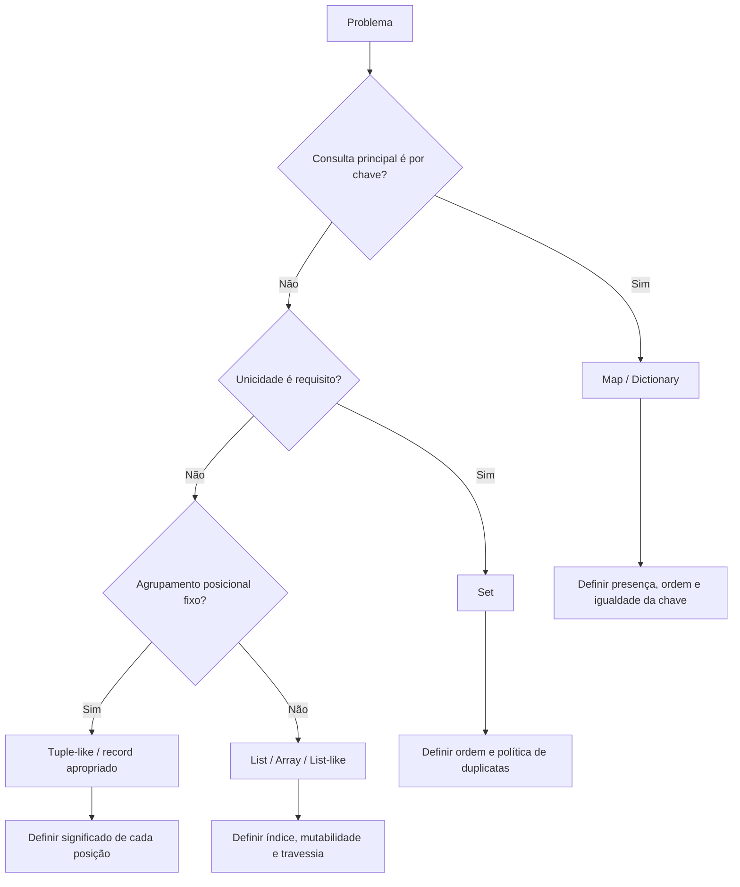
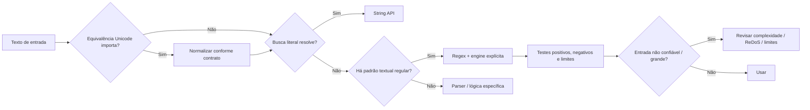

<a id="inicio"></a>

# Coleções e Manipulação de Dados

> **Classificação:** `[D] Obrigatório dominar`  
> **Nível:** B — Fundamentos de Programação  
> **Posição na taxonomia:** tópico 15  
> **Pré-requisitos:** tópicos 1–14  
> **Aprofundamentos posteriores:** ADTs, hashing, complexidade, estruturas de dados, iteradores avançados, streams, generators, parsers, Unicode avançado e segurança de Regex

> **Estado editorial:** `baseline-estavel` significa que este arquivo é uma baseline reproduzível e tecnicamente estável; **não** significa tópico editorialmente finalizado. A R5 de saturação foi concluída nesta `v0.3.2` sem pendência material conhecida; o tópico permanece aguardando apenas o **aval explícito do usuário** para ser tratado como finalizado/congelado.

---

## Resumo executivo

Coleções permitem representar:

```text
MUITOS VALORES
```

com uma estrutura coerente.

O ponto central deste tópico não é decorar APIs.

É conseguir responder:

```text
qual relação existe entre os dados?
ordem importa?
duplicatas importam?
preciso buscar por posição?
preciso buscar por chave?
preciso garantir unicidade?
preciso preservar um agrupamento fixo?
preciso transformar/filtrar?
o problema é estrutural ou textual?
```

Modelo de decisão:

```text
DADOS
│
├── sequência ordenada
│   └── LIST
│
├── agrupamento posicional fixo
│   └── TUPLE / estrutura equivalente
│
├── valores únicos
│   └── SET
│
├── chave → valor
│   └── MAP / DICTIONARY
│
└── texto
    ├── operações de string
    └── Regex quando há padrão textual
```

Uma regra precisa ficar clara desde o início:

> **Os nomes das coleções não têm equivalentes perfeitos em todas as linguagens.**

Exemplos:

```text
Python list
≠
Java List
≠
JavaScript Array
≠
Bash indexed array
```

e:

```text
Python tuple
```

não possui um equivalente nativo direto em:

```text
JavaScript puro
Java
Bash
```

Da mesma forma:

```text
Python dict
JavaScript Map
Java Map
Bash associative array
```

são mecanismos diferentes que implementam a ideia de:

```text
chave → valor
```

Também existe uma fronteira importante entre:

```text
COLEÇÃO
e
IMPLEMENTAÇÃO
```

Neste tópico aprendemos principalmente:

```text
USO E SEMÂNTICA
```

Detalhes como:

- hash tables;
- load factor;
- colisões;
- amortized complexity;
- árvores;
- implementação interna;

serão aprofundados mais adiante.

Regex entra aqui como uma ferramenta especializada para:

```text
PADRÕES EM TEXTO
```

Não substitui:

- coleção adequada;
- parser;
- validação semântica;
- lógica de negócio.

---

## Regra de ouro

> **Escolha a coleção pelo contrato dos dados e use Regex apenas quando o problema for naturalmente textual.**

---

## Decisão rápida

| Necessidade | Estrutura/conceito provável |
|---|---|
| ordem + acesso posicional + duplicatas | list/array/list-like |
| agrupamento posicional que não deve mudar | tuple ou estrutura equivalente |
| valores únicos | set |
| chave → valor | map/dictionary |
| texto e busca literal | operações de string |
| padrão textual | Regex |
| remover duplicatas sem preservar multiplicidade | set |
| contar frequência | map/dictionary |
| filtrar elementos | loop/filter/comprehension/stream |
| transformar elementos | loop/map/comprehension/stream |
| extrair campos de log previsível | split/parser/Regex conforme complexidade |
| validar formato simples | Regex pode ajudar |
| validar semântica complexa | lógica/parser além de Regex |

---

## Guardrails centrais

```text
LISTA
≠
SET

SET
≠
MAP

MAP
≠
OBJETO JS

TUPLE
≠
LISTA IMUTÁVEL UNIVERSAL

STRING
≠
ARRAY UNIVERSAL DE CARACTERES

BUSCA LITERAL
≠
REGEX

MATCH DE FORMATO
≠
VALIDAÇÃO SEMÂNTICA

REGEX
≠
UM ÚNICO DIALETO UNIVERSAL
```


---

<a id="baselines-documentais-e-compatibilidade"></a>
## Baselines documentais e compatibilidade

As referências versionadas deste tópico usam a seguinte baseline documental:

| Tecnologia | Baseline documental | Pontos especialmente sensíveis à versão neste T15 |
|---|---|---|
| Python | 3.14.7 | `re.fullmatch`, `\z`, Unicode/`re`, comportamento atual dos built-ins |
| ECMAScript | 2026 / ECMA-262 17ª ed. | Set algebra, `Map.getOrInsert*`, `RegExp.escape`, Unicode/RegExp |
| Java | Java SE 27 | Collections Framework, `String`, `Pattern`/`Matcher`, `Normalizer` |
| GNU Bash | 5.3 | arrays, `mapfile`/`readarray`, `[[ =~ ]]`, quoting e expansões |
| GNU grep | 3.12 | BRE/ERE/PCRE e opções da implementação GNU |
| POSIX | POSIX.1-2024 / Issue 8 | shell/ERE portáveis e semântica normativa correspondente |

> **Compatibilidade ≠ presença na especificação.** Uma API pode existir na baseline documental e ainda não estar disponível em runtimes anteriores. Neste tópico, `Set.prototype.union`/`intersection`/`difference`/`symmetricDifference` e `RegExp.escape` já foram padronizados no ECMAScript 2025 e permanecem no snapshot 2026; `Map.prototype.getOrInsert*` integra a baseline ECMAScript 2026. Sempre confirme o runtime concreto antes de depender de recurso recente.

### Convenção terminológica

Neste tópico:

- **map** em minúsculas indica a abstração conceitual `chave → valor`;
- `Map` indica tipo/interface com esse nome na linguagem correspondente;
- `dict` indica o tipo concreto de Python;
- **mapping** aparece quando a documentação/família conceitual da linguagem usa esse termo;
- **list-like** e **tuple-like** indicam papéis semânticos, não promessa de implementação interna equivalente.

<a id="rota-curricular"></a>
## Rota curricular — primeira passagem × aprofundamento

A classificação `[D]`/`[C]`/`[E]` governa a profundidade esperada; o leitor **não precisa dominar toda extensão avançada na primeira passagem**.

| Faixa | O que priorizar nesta passagem | Expectativa |
|---|---|---|
| **Núcleo `[D]`** | 15.1 listas, 15.3 sets, 15.4 maps, 15.5 strings, 15.6 iteração | explicar, aplicar, depurar e transferir |
| **Conhecimento `[C]`** | 15.2 tuplas e 15.7 Regex no núcleo operacional | reconhecer, compreender, usar e consultar com segurança |
| **Progressivo `[C → D]`** | testes de Regex, Unicode conforme domínio, transferência entre engines | aprofundar pela prática e regressão |
| **Extensão `[E]`** | recursos avançados de Regex, NFA/DFA/backtracking teórico e teoria aprofundada | estudar depois sem bloquear a conclusão do núcleo |

**Leitura das transições:** `[C → D]` significa conteúdo que começa como conhecimento obrigatório e evolui para domínio pela prática; `[E → C]` significa extensão que não bloqueia a primeira passagem, mas passa a ser conhecimento recomendado depois que o núcleo estiver consolidado.

**Prática multilinguagem:** o conceito deve ser compreendido de forma transferível entre Python, JavaScript, Java e Bash, mas isso **não** exige que o estudante implemente todo exercício quatro vezes. Em geral, domine a capacidade em uma linguagem principal e use as demais para reconhecer diferenças semânticas, limitações e formas idiomáticas.

```text
PRIMEIRA PASSAGEM
→ decisão por contrato
→ list / set / map / string / iteração
→ Regex fundamental quando o problema for textual

SEGUNDA PASSAGEM / APROFUNDAMENTO
→ diferenças finas de engine
→ Unicode avançado
→ performance / ReDoS
→ teoria de matching e extensões
```

> **Fronteira preservada:** complexidade assintótica detalhada, hashing interno, concorrência/thread safety e estruturas especializadas pertencem a tópicos posteriores. Aqui só aparecem quando forem indispensáveis para não ensinar uma semântica errada.

---

# Índice

- [Resumo executivo](#resumo-executivo)
- [Regra de ouro](#regra-de-ouro)
- [Decisão rápida](#decisão-rápida)
- [Guardrails centrais](#guardrails-centrais)
- [Baselines documentais e compatibilidade](#baselines-documentais-e-compatibilidade)
- [Rota curricular — primeira passagem × aprofundamento](#rota-curricular)
- [1. Posição deste assunto](#1-posição-deste-assunto)
- [2. Visão panorâmica](#2-visão-panorâmica)
- [3. Coleção, container e iterable](#3-coleção-container-e-iterable)
- [4. Estrutura abstrata versus implementação concreta](#4-estrutura-abstrata-versus-implementação-concreta)
- [5. Como escolher uma coleção](#5-como-escolher-uma-coleção)
- [Listas — §§ 6–12](#6-151-listas)
- [Tuplas / tuple-like — §§ 13–17](#13-152-tuplas)
- [Sets / conjuntos — §§ 18–25](#18-153-sets--conjuntos)
- [Maps / dicionários — §§ 26–35](#26-154-maps--dicionários)
- [Strings e Unicode — §§ 36–48](#36-155-strings-em-profundidade)
- [Iteração, filtragem e transformação — §§ 49–63](#49-156-iteração-sobre-coleções)
- [Regex — §§ 64–109](#64-157-expressões-regulares--regex)
- [Exemplos comparativos e edge cases — §§ 110–116](#110-exemplo-comparativo--somente-dígitos-ascii)
- [117. Segurança e robustez](#117-segurança-e-robustez)
- [118. O que fica para depois](#118-o-que-fica-para-depois)
- [119. Erros conceituais frequentes](#119-erros-conceituais-frequentes)
- [Problemas reais `PR-T15-*`](#problemas-reais-t15)
- [🔎 Troubleshooting sistemático](#troubleshooting-t15)
- [120. Laboratórios](#120-laboratórios)
- [121. Exercícios](#121-exercícios)
- [122. Evidências de domínio](#122-evidências-de-domínio)
- [123. Checklist de consulta rápida](#123-checklist-de-consulta-rápida)
- [124. Glossário](#124-glossário)
- [125. Referências](#125-referências)
- [126. Histórico de versões](#126-histórico-de-versões)

# 1. Posição deste assunto

Os tópicos anteriores explicaram:

```text
arrays
strings
mutabilidade
identidade
referências
```

Agora o objetivo é escolher e manipular coleções conforme o problema.

## 1.1 Mudança de pergunta

Antes:

```text
como armazeno vários valores?
```

Agora:

```text
qual coleção representa melhor a relação entre eles?
```

## 1.2 Ponte para Estruturas de Dados

Neste tópico:

```text
USAMOS
```

listas, sets e maps.

Depois:

```text
ANALISAREMOS
```

- implementação;
- hashing;
- colisões;
- complexidade;
- trade-offs.

[↑ Voltar ao índice](#índice)

---

# 2. Visão panorâmica

<a id="visao-panoramica-caderno"></a>
## 🗺️ Visão panorâmica — o mapa antes dos detalhes

Esta visão funciona como **caderno rápido de consulta** e como contrato de cobertura do T15. O objetivo é recuperar, em poucos minutos, quatro perguntas centrais:

```text
QUE RELAÇÃO OS DADOS POSSUEM?
        ↓
QUAL ABSTRAÇÃO EXPRESSA ESSA RELAÇÃO?
        ↓
QUAL OPERAÇÃO PRECISO EXECUTAR?
        ↓
QUAL SEMÂNTICA / LIMITE DA LINGUAGEM PODE MUDAR O RESULTADO?
```

O tópico possui duas dimensões que se encontram, mas não devem ser misturadas:

```text
DADOS ESTRUTURADOS
→ list / tuple-like / set / map
→ iteração / filtro / transformação

TEXTO
→ string / Unicode / normalização
→ busca literal / split / replace
→ Regex quando existe um padrão textual
```

### 2.1 Mapa do domínio — o que existe

```text
COLEÇÕES E MANIPULAÇÃO DE DADOS
│
├── 15.1 LIST-LIKE [D]
│   ├── ordem
│   ├── posição / índice
│   ├── duplicatas
│   ├── alteração
│   └── travessia
│
├── 15.2 TUPLE-LIKE [C]
│   ├── agrupamento posicional
│   ├── estabilidade estrutural
│   └── ausência de equivalente nativo universal
│
├── 15.3 SET [D]
│   ├── unicidade
│   ├── pertinência
│   ├── operações de conjuntos
│   └── ordem depende do contrato concreto
│
├── 15.4 MAP / DICTIONARY [D]
│   ├── chave → valor
│   ├── presença × ausência
│   ├── atualização
│   ├── igualdade das chaves
│   └── ordem depende da implementação/linguagem
│
├── 15.5 STRING [D]
│   ├── busca literal
│   ├── substring / slicing
│   ├── substituição
│   ├── split / join
│   ├── code units × code points
│   └── Unicode normalization
│
├── 15.6 ITERAÇÃO [D]
│   ├── por índice
│   ├── por elemento
│   ├── chave/valor
│   ├── filtering
│   ├── transformation
│   └── mutação durante travessia
│
└── 15.7 REGEX [C]
    ├── padrão conceitual
    ├── dialeto / engine
    ├── string literal hospedeira
    ├── busca × full match
    ├── extração / substituição
    ├── formato × semântica
    ├── testes / edge cases
    └── performance / ReDoS
```

**Fronteira curricular:** aqui o foco é **usar e compreender a semântica das coleções**. Hashing interno, colisões, load factor, complexidade amortizada, árvores e ADTs são aprofundados nos tópicos posteriores.

### 2.2 Fluxos principais — estrutura e texto

#### Escolha estrutural



Leitura textual equivalente:

```text
PROBLEMA
→ identificar operações dominantes
→ escolher abstração
→ confirmar contrato concreto da linguagem
→ executar operação
→ testar ausência, vazio, duplicata, ordem e limites
```

#### Manipulação textual



### 2.3 Consulta rápida — necessidade × contrato × risco

| Necessidade | Estrutura/mecanismo inicial | Contrato que precisa ficar explícito | Erro típico |
|---|---|---|---|
| preservar ordem e duplicatas | list/array/list-like | ordem, índice e mutabilidade | trocar por `set` e perder multiplicidade/ordem |
| representar valores únicos | set | igualdade, hash quando aplicável, ordem | assumir ordem igual em todas as linguagens |
| associar identificador a estado | map/dictionary | ausência, igualdade da chave, ordem | `get()` confundido com presença |
| contar frequências | map/dictionary | valor inicial e atualização | usar `set` e perder contagem |
| registro posicional curto | tuple-like | significado das posições | assumir equivalente nativo nas quatro linguagens |
| percorrer sem precisar da posição | iteração por elemento | contrato do iterator | usar índice sem necessidade |
| filtrar | predicado + loop/filter | fonte × resultado | mutar a fonte sem entender o contrato |
| transformar | função de transformação + loop/map | resultado novo × side effect | usar `map` só por efeito colateral |
| comparar texto canonically equivalente | Unicode normalization | NFC/NFD/NFKC/NFKD conforme domínio | confundir `lower()` com normalização Unicode |
| separar por delimitador literal | string API | literal × Regex | esquecer que `String.split` Java recebe Regex |
| validar formato integral | full-match API quando houver | texto inteiro deve corresponder | usar busca parcial e aceitar lixo adicional |
| incorporar texto literal em Regex | função oficial de escaping | literal × pattern | pattern injection / metacaracteres acidentais |
| Regex sobre entrada não confiável | pattern testado + limites | engine, tamanho, tempo | ReDoS / backtracking patológico |

### 2.4 Pergunta prática → onde começar

| Pergunta | Primeiro mecanismo/seção |
|---|---|
| “preciso manter a sequência exatamente como chegou?” | list-like → §§ 6–12 |
| “quero saber apenas se já vi este valor” | set → §§ 18–25 |
| “quero localizar status por interface” | map → §§ 26–35 |
| “`get()` retornou vazio; a chave existe?” | presença × valor → § 33 |
| “dois textos visualmente iguais comparam diferente” | Unicode normalization → §§ 42–48 |
| “devo iterar por índice ou por valor?” | iteração → §§ 49–59 |
| “quero remover itens enquanto percorro” | contrato de mutação durante iteração → § 59 |
| “quero validar a linha inteira” | full match × anchors → §§ 74–75 |
| “meu delimitador Java tem `.` ou `|`” | `String.split` recebe Regex → § 40 |
| “preciso procurar texto fornecido pelo usuário em uma Regex” | escape de literal → §§ 78–79 e `PR-T15-09` |
| “a Regex funciona, mas trava em entradas grandes” | performance/ReDoS → §§ 97–99 |
| “copiei uma Regex de outra ferramenta” | engine/sabor → §§ 90–96 |

### 2.5 Não confundir

```text
LIST / ARRAY-LIKE
≠ SET

SET
≠ MAP

MAP
≠ OBJECT JAVASCRIPT

CHAVE AUSENTE
≠ CHAVE PRESENTE COM None / null / undefined / string vazia

TUPLE PYTHON
≠ “LISTA IMUTÁVEL UNIVERSAL”

ITERABLE
≠ COLEÇÃO MATERIALIZADA

ORDEM OBSERVADA
≠ ORDEM GARANTIDA PELO CONTRATO

STRING
≠ SEQUÊNCIA UNIVERSAL DE CARACTERES VISUAIS

CASE FOLD / lower()
≠ UNICODE NORMALIZATION

BUSCA LITERAL
≠ REGEX

REGEX
≠ DIALETO UNIVERSAL

MATCH DE FORMATO
≠ VALIDAÇÃO SEMÂNTICA

^...$
≠ FULL MATCH EM TODO EDGE CASE / ENGINE

ESCAPE DA STRING HOSPEDEIRA
≠ ESCAPE DA REGEX
```

### 2.6 Microexemplos canônicos

#### Frequência exige preservar multiplicidade

```text
entrada:  up up down up
set:      {up, down}          → responde “quais existem?”
map:      {up: 3, down: 1}    → responde “quantas vezes?”
```

#### Ausência precisa de um teste próprio quando o valor sentinela é legítimo

```javascript
const cache = new Map([["router-a", undefined]]);

cache.get("router-a"); // undefined
cache.get("router-b"); // undefined

cache.has("router-a"); // true
cache.has("router-b"); // false
```

#### Unicode: mesma aparência pode não significar mesma sequência de code points

```python
import unicodedata

a = "é"
b = "e\u0301"

assert a != b
assert unicodedata.normalize("NFC", a) == unicodedata.normalize("NFC", b)
```

#### Full-input validation é contrato diferente de “encontrar um trecho”

```python
import re

assert re.search(r"[0-9]+", "id=123") is not None
assert re.fullmatch(r"[0-9]+", "id=123") is None
```

#### Bash: quantidade de elementos não é “maior índice + 1” em array esparso

```bash
values=([2]="A" [8]="B")
printf 'count=%d\n' "${#values[@]}"   # 2
printf 'indices=%s\n' "${!values[*]}" # 2 8
```

### 2.7 Falha típica → primeira investigação

| Sintoma | Primeira hipótese / verificação |
|---|---|
| duplicatas desapareceram | a estrutura virou `set` sem que unicidade fosse o requisito? |
| ordem mudou entre execuções/implementações | a ordem é realmente garantida pela estrutura concreta? |
| `get()` devolveu `None`/`null`/`undefined` | a chave está ausente ou esse valor foi armazenado? use membership/`has`/`containsKey` |
| loop não visitou o que você esperava | está iterando índices/keys em vez de values? houve mutação durante o percurso? |
| array Bash “tem tamanho 2”, mas índice `1` não existe | array indexado é esparso; examine `${!arr[@]}` |
| texto “igual” não compara igual | compare code points e política de normalization |
| `split(".")` Java produz resultado estranho | `split` recebe Regex; use `"\\."` ou `Pattern.quote` |
| Regex aceita `123\n` quando você queria fim absoluto | verifique semântica de `$`; em Python 3.14 use `fullmatch` ou `\z` conforme o contrato |
| texto do usuário altera o significado da Regex | literal foi interpolado sem escaping próprio da engine? |
| Regex degrada CPU em entrada criada para pior caso | investigar backtracking, repetição ambígua e limites de entrada/tempo |

### 2.8 Transferência entre linguagens

| Conceito | Python | JavaScript | Java | Bash |
|---|---|---|---|---|
| list-like | `list` | `Array` | `List`/`ArrayList` | indexed array |
| tuple-like nativo | `tuple` | sem equivalente direto | sem equivalente direto | sem equivalente direto |
| set | `set`/`frozenset` | `Set` | `Set`/`HashSet` | emulação comum com associative array |
| map | `dict` | `Map` | `Map`/`HashMap` | associative array |
| ordem de map | `dict`: inserção garantida | `Map`: inserção | depende da implementação; `HashMap` não garante | não tratar como contrato de ordem |
| missing key | `in`, `get`, `KeyError` | `has`, `get → undefined` | `containsKey`, `get → null` | `[[ -v 'map[key]' ]]`/expansões adequadas |
| filtro/transformação | comprehensions / `filter` / `map` | `filter` / `map` | loop / Streams | loops + utilitários/pipelines conforme contexto |
| Unicode normalization | `unicodedata.normalize` | `String.prototype.normalize` | `Normalizer` | normalmente ferramenta externa apropriada |
| Regex | `re` | `RegExp` | `Pattern`/`Matcher` | `[[ =~ ]]` com POSIX ERE |
| full-input Regex | `re.fullmatch` | anchors/contrato construído | `Matcher.matches` | anchors POSIX ERE |
| escaping literal para Regex | `re.escape` | `RegExp.escape` no snapshot ECMAScript 2026 | `Pattern.quote` | não existe equivalente universal; tratar o dialeto/contexto explicitamente |

> **Transferência correta não é transliteração.** A ideia pode ser comum e, ainda assim, as garantias de ordem, igualdade, Unicode, ausência e Regex serem diferentes.

### 2.9 Problemas reais representativos

O aprofundamento operacional fecha os seguintes contratos:

```text
PR-T15-01 → escolher coleção pelo contrato dos dados
PR-T15-02 → deduplicar preservando primeira ocorrência
PR-T15-03 → contar frequências sem perder multiplicidade
PR-T15-04 → distinguir key ausente de valor “ausente-like” armazenado
PR-T15-05 → normalizar Unicode quando equivalência canônica fizer parte do domínio
PR-T15-06 → filtrar/transformar sem violar o contrato de travessia
PR-T15-07 → manipular arrays Bash esparsos preservando elementos literalmente
PR-T15-08 → validar a entrada textual inteira, não apenas encontrar um trecho
PR-T15-09 → incorporar texto literal em Regex sem pattern injection
PR-T15-10 → tratar Regex em entrada não confiável como questão de correção + performance + segurança
```

Os casos completos aparecem em [Problemas reais — índice operacional `PR-T15-*`](#problemas-reais-t15).

### 2.10 Modo consulta × modo estudo

**Consulta rápida:**

```text
Decisão rápida / Guardrails
→ Visão Panorâmica
→ seção da estrutura ou Regex
→ “Erros conceituais frequentes”
→ Troubleshooting
```

**Estudo completo:**

```text
posição curricular
→ coleção/container/iterable
→ abstração × implementação
→ list / tuple / set / map
→ strings + Unicode
→ iteração / filter / transform
→ Regex do conceito até engine e segurança
→ PR-*
→ troubleshooting
→ LABs / exercícios / evidências de domínio
```

### 2.11 Contrato de cobertura panorâmica

| Bloco prometido no mapa | Destino principal | Estado |
|---|---|---|
| list-like | §§ 6–12 | COBERTO |
| tuple-like | §§ 13–17 | COBERTO |
| set | §§ 18–25 | COBERTO |
| map/dictionary | §§ 26–35 | COBERTO |
| strings/Unicode | §§ 36–48 | COBERTO |
| iteração/filtro/transformação | §§ 49–63 | COBERTO |
| Regex — sintaxe/semântica/engines | §§ 64–96 | COBERTO |
| Regex — performance/segurança | §§ 97–99 e § 117 | COBERTO |
| Regex — teoria e TDD | §§ 100–109 | COBERTO |
| exemplos comparativos | §§ 110–116 | COBERTO |
| problemas reais | `PR-T15-01`–`PR-T15-10` | COBERTO |
| troubleshooting | `TS-T15-01`–`TS-T15-12` | COBERTO |
| prática e evidência de domínio | §§ 120–123 | COBERTO |
| aprofundamentos posteriores | § 118 | REFERENCIADO |

> **Semântica do estado:** `COBERTO` nesta matriz significa que o elemento material do mapa possui destino verificável no aprofundamento; não significa, por si só, execução em runtime, domínio do aluno ou fechamento editorial do tópico. `REFERENCIADO` indica fronteira deliberadamente remetida a aprofundamento posterior.

> Nenhum elemento material desta Visão Panorâmica deve existir sem destino no aprofundamento. Mudanças futuras precisam preservar também a **função de consulta**, e não apenas as frases.

[↑ Voltar ao índice](#índice)

---

# 3. Coleção, container e iterable

Esses termos não são idênticos.

## Collection

Agrupamento de elementos.

## Container

Objeto/estrutura que contém ou dá acesso a elementos.

## Iterable

Objeto/fonte que pode fornecer elementos em sequência de iteração.

## Guardrail

```text
ITERABLE
≠
NECESSARIAMENTE COLEÇÃO MATERIALIZADA
```

Generators e streams aprofundados depois ilustram isso.

## Python

Beazley destaca que:

```text
lists
tuples
dicts
sets
files
generators
```

podem participar do protocolo de iteração, mas não têm o mesmo contrato.

[↑ Voltar ao índice](#índice)

---

# 4. Estrutura abstrata versus implementação concreta

Conceito:

```text
MAP
```

pode ser implementado por:

- hash table;
- árvore;
- outra estrutura.

Java deixa isso explícito:

```text
Map
→ interface

HashMap
→ implementação
```

Python:

```text
dict
```

é um tipo concreto com contrato próprio.

JavaScript:

```text
Map
```

é um objeto builtin com semântica definida pela especificação.

Bash:

```text
associative array
```

é recurso do shell.

## Regra

> **Não confunda a abstração “map” com a estrutura interna usada para implementá-la.**

[↑ Voltar ao índice](#índice)

---

# 5. Como escolher uma coleção

Perguntas:

```text
1. ordem importa?
2. posição importa?
3. duplicatas importam?
4. unicidade é requisito?
5. acesso é por índice ou chave?
6. preciso atualizar valor por chave?
7. preciso preservar quantidade de ocorrências?
8. preciso de agrupamento fixo?
9. vou filtrar/transformar?
10. preciso de texto ou estrutura?
```

## Exemplo

Dados:

```text
interfaces ativas
```

Se só importa:

```text
quais nomes existem
```

set pode ser natural.

Se importa:

```text
interface → status
```

map é melhor.

Se importa:

```text
ordem das amostras
```

list pode ser melhor.

[↑ Voltar ao índice](#índice)

---

# 6. 15.1 Listas

**Classificação:** `[D]`

Taxonomia:

```text
armazenamento
acesso
alteração
percurso
```

Uma list-like collection normalmente representa:

```text
sequência ordenada
```

e pode aceitar:

```text
duplicatas
```

## Exemplo

```text
["Gi0/0", "Gi0/1", "Gi0/1"]
```

A duplicata pode ser:

- válida;
- erro;
- informação importante.

A coleção não decide o domínio.

[↑ Voltar ao índice](#índice)

---

# 7. Python list

```python
names = ["Ana", "Bruno", "Carlos"]
```

Características:

```text
ordered
mutable
indexable
resizable
allows duplicates
```

Operações:

```python
names[0]
names.append("Diana")
names[1] = "Bia"
names.remove("Carlos")
```

Python 3.14 documenta `list` como:

```text
mutable sequence
```

[↑ Voltar ao índice](#índice)

---

# 8. JavaScript Array como lista dinâmica

```javascript
const names = ["Ana", "Bruno", "Carlos"];
```

Características úteis como lista:

```text
ordered
mutable
resizable
allows duplicates
iterable
```

Mas a especificação define Array como:

```text
Array exotic object
```

não como “Java List”.

## Operações

```javascript
names[0]
names.push("Diana")
names[1] = "Bia"
names.splice(2, 1)
```

## Guardrail

Arrays JS podem:

```text
ser esparsos
```

e possuem semântica de propriedades indexadas.

[↑ Voltar ao índice](#índice)

---

# 9. Java List e ArrayList

Java diferencia:

```text
List<E>
→ interface

ArrayList<E>
→ implementação redimensionável
```

Exemplo:

```java
List<String> names = new ArrayList<>();
names.add("Ana");
names.add("Bruno");
names.add("Carlos");
```

Acesso:

```java
names.get(0)
```

Alteração:

```java
names.set(1, "Bia")
```

Remoção:

```java
names.remove(2)
```

## Guardrail

```text
Java array
≠
Java List
```

Array tem comprimento fixo.

`ArrayList` é coleção redimensionável.

[↑ Voltar ao índice](#índice)

---

# 10. Bash indexed array

```bash
names=("Ana" "Bruno" "Carlos")
```

Acesso:

```bash
printf '%s\n' "${names[0]}"
```

Alteração:

```bash
names[1]='Bia'
```

Append:

```bash
names+=('Diana')
```

Percurso:

```bash
for name in "${names[@]}"; do
    printf '%s\n' "$name"
done
```

Para carregar linhas de uma entrada diretamente em um array indexado, Bash oferece `mapfile`/`readarray`:

```bash
mapfile -t lines < input.txt
```

A opção `-t` remove o delimitador de linha lido. Isso evita usar `for $(cat ...)`, construção que introduz *word splitting* e pathname expansion e não preserva linhas como unidades de dados.

## Cuidado

Indexed arrays Bash:

```text
podem ser esparsos
```

e não são uma List API equivalente.

[↑ Voltar ao índice](#índice)

---

# 11. Operações fundamentais de lista

Modelo:

```text
CREATE
READ
UPDATE
ITERATE
ADD
REMOVE
SEARCH
```

## Tabela

| Operação | Python | JavaScript | Java | Bash |
|---|---|---|---|---|
| adicionar fim | `append` | `push` | `add` | `+=` |
| ler | `[i]` | `[i]` | `get(i)` | `${a[i]}` |
| alterar | `[i]=` | `[i]=` | `set(i,v)` | `a[i]=` |
| tamanho | `len` | `.length` | `.size()` | `${#a[@]}` |
| remover | `pop/remove` | `splice` | `remove` | `unset` |
| iterar | `for x in` | `for...of` | enhanced `for` | `for x in "${a[@]}"` |

### Guardrail — “remover” não é uma única operação semântica

A linha compacta acima é apenas um mapa de APIs. Antes de transferir código entre linguagens, distinga **remover por posição** de **remover por valor**:

| Intenção | Python | JavaScript | Java `List` | Bash indexed array |
|---|---|---|---|---|
| remover por posição | `pop(i)` | `splice(i, 1)` | `remove(i)` | `unset 'a[i]'` |
| remover primeira ocorrência de um valor | `remove(x)` | localizar índice + `splice` ou construir novo resultado | `remove(Object)` | busca explícita + `unset` do índice encontrado |

Em Java essa diferença é especialmente importante com `List<Integer>`: `remove(1)` seleciona a sobrecarga por **índice**; remover o valor inteiro `1` exige tornar a intenção de objeto explícita, por exemplo `remove(Integer.valueOf(1))`.

No Bash, `unset 'a[i]'` remove **aquele índice**, mas não compacta automaticamente o array. Como arrays indexados Bash podem ser esparsos, remover o índice `1` não implica que o antigo índice `2` passe a ser `1`. Reindexar só deve ser feito deliberadamente quando o contrato exigir uma sequência densa.

[↑ Voltar ao índice](#índice)

---

# 12. Ordem, duplicatas e posição

Listas são apropriadas quando:

```text
A
B
C
```

não é equivalente a:

```text
C
B
A
```

Também quando:

```text
A
A
B
```

precisa preservar ambas as ocorrências.

## Exemplo

Latências:

```text
[10, 10, 12]
```

Converter para set destruiria:

```text
multiplicidade
```

e talvez:

```text
ordem
```

[↑ Voltar ao índice](#índice)

---

# 13. 15.2 Tuplas

**Classificação:** `[C]`

Taxonomia:

```text
agrupamento
imutabilidade quando aplicável
```

Tupla é especialmente importante em Python.

## Modelo

```text
(host, port)
```

Exemplo:

```python
endpoint = ("router01", 22)
```

A posição possui significado:

```text
0 → host
1 → port
```

[↑ Voltar ao índice](#índice)

---

# 14. Python tuple

Python 3.14 define tuple como:

```text
immutable sequence
```

e destaca o uso comum para:

```text
heterogeneous data
```

Exemplo:

```python
interface = ("Gi0/0", "up", 1000)
```

## Criação

```python
empty = ()
single = ("one",)
pair = ("host", 443)
```

## Ponto importante

A vírgula:

```text
faz a tuple
```

mais que os parênteses.

[↑ Voltar ao índice](#índice)

---

# 15. Tupla como registro posicional

Exemplo:

```python
measurement = ("router01", 12.5, True)
```

Pode representar:

```text
device
latency
reachable
```

## Limite

Quando há muitos campos:

```text
posição 5 significa o quê?
```

estrutura nomeada pode ser mais legível.

Em Python, alternativas como `collections.namedtuple`, `typing.NamedTuple` e `dataclass` tornam campos nomeados explícitos quando um registro posicional deixa de ser claro. Elas **não são sinônimos de `tuple`** e o aprofundamento de modelagem por tipos/classes pertence a tópicos posteriores.

Fluent Python enfatiza:

```text
tuples não são apenas listas imutáveis
```

e também podem atuar como records.

[↑ Voltar ao índice](#índice)

---

# 16. Imutabilidade da tupla

Tupla não permite:

```python
pair[0] = "other"
```

Mas:

```python
data = ([1, 2],)
data[0].append(3)
```

é possível porque:

```text
tuple não muda sua referência ao elemento
list interna é mutável
```

## Regra

```text
TUPLE IMMUTABILITY
≠
DEEP IMMUTABILITY
```

[↑ Voltar ao índice](#índice)

---

# 17. JavaScript, Java e Bash — ausência de equivalente direto

## JavaScript

ECMAScript puro não possui:

```text
tuple type
```

equivalente a Python tuple.

Um Array:

```javascript
["router01", 22]
```

é mutável.

TypeScript tem tuples, mas:

```text
TypeScript está fora deste tópico
```

## Java

Java não possui um tuple builtin geral na linguagem/`java.util` equivalente ao Python tuple.

Alternativas dependem do modelo:

- record;
- classe;
- array;
- `Map.Entry`;
- biblioteca.

Mas cada uma tem contrato diferente.

## Bash

Não possui tuple.

Pode usar:

- indexed array;
- associative array;
- parâmetros posicionais;

dependendo do problema.

## Regra

> **Não crie equivalência artificial só para preencher uma tabela comparativa.**

[↑ Voltar ao índice](#índice)

---

# 18. 15.3 Sets / conjuntos

**Classificação:** `[D]`

Taxonomia:

```text
unicidade
pertinência
operações básicas
```

Modelo:

```text
{A, B, C}
```

Não existe:

```text
A duas vezes
```

como dois elementos distintos do set.

[↑ Voltar ao índice](#índice)

---

# 19. Unicidade e pertinência

Set responde muito bem:

```text
ESTÁ PRESENTE?
```

Exemplo:

```text
interfaces_up
```

```text
Gi0/0 ∈ interfaces_up?
```

## Usos

- remover duplicatas;
- membership;
- diferença;
- interseção;
- união.

## Não use set quando precisa preservar:

- duplicatas;
- frequência;
- posição.

[↑ Voltar ao índice](#índice)

---

# 20. Python set

```python
interfaces = {"Gi0/0", "Gi0/1"}
```

Operações:

```python
interfaces.add("Gi0/2")
"Gi0/1" in interfaces
interfaces.remove("Gi0/0")
```

Conjuntos:

```python
a | b
a & b
a - b
a ^ b
```

Python 3.14 define:

```text
set
→ unordered collection of distinct hashable objects
```

e:

```text
frozenset
→ immutable/hashable set
```

Quando um conjunto precisa participar de outro contexto que exige valor hashable, `frozenset` pode ser apropriado:

```python
permissions = frozenset({"read", "write"})
policy_by_permissions = {permissions: "operator"}
```

Isso não torna `frozenset` “melhor” que `set`; muda o contrato de mutabilidade e hashabilidade.

[↑ Voltar ao índice](#índice)

---

# 21. JavaScript Set

```javascript
const interfaces = new Set(["Gi0/0", "Gi0/1"]);
```

Operações:

```javascript
interfaces.add("Gi0/2");
interfaces.has("Gi0/1");
interfaces.delete("Gi0/0");
```

ECMAScript 2026:

```text
Set may contain each distinct value at most once
```

e itera:

```text
em value insertion order
```

## Operações modernas

O snapshot ECMAScript 2026 contém as operações abaixo em `Set.prototype`; elas já haviam sido padronizadas no ECMAScript 2025 e permanecem na baseline 2026:

```text
union
intersection
difference
symmetricDifference
```

no `Set.prototype`.

[↑ Voltar ao índice](#índice)

---

# 22. Java Set / HashSet

```java
Set<String> interfaces = new HashSet<>();

interfaces.add("Gi0/0");
interfaces.add("Gi0/1");
interfaces.add("Gi0/1");
```

Tamanho:

```text
2
```

`Set<E>` exige:

```text
sem elementos duplicados segundo equals
```

## HashSet

Não garante:

```text
ordem de iteração
```

Não confunda:

```text
Set interface
```

com:

```text
HashSet implementation
```

[↑ Voltar ao índice](#índice)

---

# 23. Bash — emulação de conjunto com associative array

Bash não possui um tipo nativo:

```text
Set
```

Mas podemos representar:

```text
elemento como chave
```

```bash
declare -A seen=()

seen["Gi0/0"]=1
seen["Gi0/1"]=1
seen["Gi0/1"]=1
```

Teste:

```bash
if [[ -v 'seen[Gi0/1]' ]]; then
    printf '%s\n' 'present'
fi
```

## Guardrail

Isso é:

```text
uma convenção usando associative array
```

não um Set builtin.

[↑ Voltar ao índice](#índice)

---

# 24. Operações de conjuntos

Conceitos:

```text
UNION
INTERSECTION
DIFFERENCE
SYMMETRIC DIFFERENCE
SUBSET
SUPERSET
MEMBERSHIP
```

## Python

```python
a | b
a & b
a - b
a ^ b
```

## JavaScript 2026

```javascript
a.union(b)
a.intersection(b)
a.difference(b)
a.symmetricDifference(b)
```

Esses métodos produzem **um novo `Set`**; não devem ser lidos como mutação automática do conjunto receptor.

## Java

```java
union.addAll(b)
intersection.retainAll(b)
difference.removeAll(b)
```

normalmente usando cópia se não quer mutar original.

## Bash

Implementação manual sobre chaves de associative array.

[↑ Voltar ao índice](#índice)

---

# 25. Ordem em sets

## Python set

Não trate ordem como contrato de sequência.

## JavaScript Set

A especificação define iteração em:

```text
insertion order
```

## Java HashSet

Não garante ordem.

## Moral

> **“Set” não implica um único contrato de ordenação entre linguagens.**

[↑ Voltar ao índice](#índice)

---

# 26. 15.4 Maps / dicionários

**Classificação:** `[D]`

Taxonomia:

```text
chave
valor
consulta
atualização
```

Modelo:

```text
KEY
↓
VALUE
```

Exemplo:

```text
"Gi0/0" → "up"
"Gi0/1" → "down"
```

[↑ Voltar ao índice](#índice)

---

# 27. Chave e valor

Map possui:

```text
uma chave distinta
→ associada a um valor
```

Atualizar mesma chave:

```text
não cria uma segunda chave igual
```

normalmente substitui/atualiza o valor associado.

## Exemplos de chave

- nome;
- ID;
- porta;
- endereço;
- combinação imutável/hashable, dependendo da linguagem.

[↑ Voltar ao índice](#índice)

---

# 28. Python dict

```python
status = {
    "Gi0/0": "up",
    "Gi0/1": "down",
}
```

Consulta:

```python
status["Gi0/0"]
status.get("Gi0/2")
```

Atualização:

```python
status["Gi0/1"] = "up"
```

Iteração:

```python
for interface, state in status.items():
    ...
```

Python 3.14:

```text
dict keys precisam ser hashable
```

e:

```text
dict preserva insertion order
```

como garantia da linguagem desde Python 3.7.

[↑ Voltar ao índice](#índice)

---

# 29. JavaScript Map

```javascript
const status = new Map([
  ["Gi0/0", "up"],
  ["Gi0/1", "down"],
]);
```

Consulta:

```javascript
status.get("Gi0/0")
status.has("Gi0/2")
```

Atualização:

```javascript
status.set("Gi0/1", "up");
```

Iteração:

```javascript
for (const [interfaceName, state] of status) {
  ...
}
```

ECMAScript define:

```text
arbitrary ECMAScript language values
```

como keys e values.

No snapshot ECMAScript 2026, `Map` também possui:

```javascript
map.getOrInsert(key, defaultValue)
map.getOrInsertComputed(key, callback)
```

A ideia é:

```text
key já existe
→ retornar o valor existente

key não existe
→ inserir o valor fornecido/calculado
→ retornar esse valor
```

Isso não elimina a distinção entre:

```text
AUSÊNCIA DA KEY
versus
KEY PRESENTE COM undefined
```

> **Verificação temporal R3 — 2026-09-17:** `Map.prototype.getOrInsert` e `Map.prototype.getOrInsertComputed` foram revalidados diretamente no snapshot oficial **ECMAScript 2026**. O runtime Node.js local desta auditoria é anterior e não expõe esses métodos; portanto, esta afirmação é documental, não um PASS de execução local.

`has()` continua sendo a operação explícita quando a pergunta é sobre **presença**. APIs novas também podem ainda não estar disponíveis em runtimes mais antigos; confirme a versão do ambiente antes de usá-las.

[↑ Voltar ao índice](#índice)

---

# 30. Object JavaScript não é Map

Objeto:

```javascript
const status = {
  "Gi0/0": "up",
};
```

pode ser usado como registro/dicionário simples.

Mas:

```text
Object
≠
Map
```

Diferenças incluem:

- modelo de keys;
- prototype;
- APIs;
- `size`;
- iteração;
- semântica de uso.

## Regra

Use:

```text
Object
```

quando modela propriedades/registro.

Use:

```text
Map
```

quando modela coleção explícita de key/value arbitrários.

## Guardrail — JSON não torna `Map` equivalente a `Object`

`Object` continua muito comum em JavaScript quando os dados representam um registro com propriedades e precisam circular naturalmente por JSON. `JSON.stringify` serializa propriedades próprias enumeráveis de objetos comuns, enquanto um `Map` não vira automaticamente um objeto JSON com suas entradas:

```javascript
JSON.stringify({ interface: "Gi0/0", status: "up" });
// '{"interface":"Gi0/0","status":"up"}'

JSON.stringify(new Map([["Gi0/0", "up"]]));
// '{}'

const statusMap = new Map([
  ["Gi0/0", "up"],
  ["Gi0/1", "down"],
]);

JSON.stringify(Object.fromEntries(statusMap));
// '{"Gi0/0":"up","Gi0/1":"down"}'
```

Quando um `Map` precisa ser serializado, defina explicitamente a representação, por exemplo convertendo suas entradas ou usando um `replacer` apropriado. `Object.fromEntries(...)` é adequado quando as chaves podem ser representadas corretamente como propriedades de objeto; ele **não preserva o domínio arbitrário de chaves de `Map`** em todos os casos. A escolha continua sendo orientada pelo contrato do domínio, não pela ideia de que um tipo seja universalmente “superior”.

[↑ Voltar ao índice](#índice)

---

# 31. Java Map / HashMap

```java
Map<String, String> status = new HashMap<>();

status.put("Gi0/0", "up");
status.put("Gi0/1", "down");
```

Consulta:

```java
status.get("Gi0/0")
status.containsKey("Gi0/2")
```

Atualização:

```java
status.put("Gi0/1", "up");
```

Iteração:

```java
for (Map.Entry<String, String> entry : status.entrySet()) {
    ...
}
```

`Map<K,V>`:

```text
não permite duplicate keys
```

`HashMap`:

```text
não garante ordem
```

[↑ Voltar ao índice](#índice)

---

# 32. Bash associative array

```bash
declare -A status=(
    ["Gi0/0"]="up"
    ["Gi0/1"]="down"
)
```

Consulta:

```bash
printf '%s\n' "${status[Gi0/0]}"
```

Atualização:

```bash
status["Gi0/1"]="up"
```

Chaves:

```bash
"${!status[@]}"
```

Valores:

```bash
"${status[@]}"
```

## Limite

Associative arrays Bash são:

```text
one-dimensional
```

e usam string keys.

[↑ Voltar ao índice](#índice)

---

# 33. Consulta, atualização e ausência

Diferencie:

```text
KEY AUSENTE
```

de:

```text
KEY PRESENTE COM VALOR NULO/VAZIO
```

## Python

```python
d[key]
```

ausente:

```text
KeyError
```

```python
d.get(key)
```

pode retornar `None` por ausência ou porque valor é `None`.

Se precisa distinguir:

```python
if key in d:
```

## JavaScript Map

```javascript
map.get(key)
```

retorna `undefined` quando ausente.

Mas valor também pode ser `undefined`.

Use:

```javascript
map.has(key)
```

para distinguir.

## Java Map

`get` pode retornar:

```text
null por ausência
ou valor null
```

Use:

```java
containsKey
```

quando distinção importa.

## Bash

Teste existência com mecanismo apropriado, como `[[ -v ... ]]`, não apenas string vazia.

[↑ Voltar ao índice](#índice)

---

# 34. Chaves e igualdade

## Python

Keys devem ser:

```text
hashable
```

Igualdade e hash participam da identidade lógica da chave.

## JavaScript Map

Usa:

```text
SameValueZero
```

para discriminar keys.

Objetos distintos:

```javascript
{}
```

e:

```javascript
{}
```

são keys diferentes.

## Java Map

Contrato depende de:

```text
equals
hashCode
```

em hash-based maps.

## Bash

Associative keys:

```text
strings
```

com semântica do shell.

[↑ Voltar ao índice](#índice)

---

# 35. Ordem em mappings

## Python dict

Insertion order é garantida.

## JavaScript Map

Iteração segue key insertion order.

## Java HashMap

Sem garantia de ordem.

## Bash associative array

Não use ordem de iteração como contrato.

## Moral

> **Map não significa ordered map universalmente.**

[↑ Voltar ao índice](#índice)

---

# 36. 15.5 Strings em profundidade

**Classificação:** `[D]`

Taxonomia:

```text
busca
substring/slicing
substituição
separação
junção
normalização
```

String é uma estrutura textual especializada.

Operações de string resolvem muitos problemas sem Regex.

[↑ Voltar ao índice](#índice)

---

# 37. Busca literal

Pergunta:

```text
“texto contém esta substring literal?”
```

Use operação literal antes de Regex quando possível.

## Python

```python
"error" in text
text.find("error")
```

## JavaScript

```javascript
text.includes("error")
text.indexOf("error")
```

## Java

```java
text.contains("error")
text.indexOf("error")
```

## Bash

```bash
[[ $text == *error* ]]
```

Isso usa pattern matching do shell, não Regex.

[↑ Voltar ao índice](#índice)

---

# 38. Substring e slicing

## Python

```python
text[0:5]
```

## JavaScript

```javascript
text.slice(0, 5)
text.substring(0, 5)
```

Não são APIs semanticamente idênticas para índices negativos/invertidos.

## Java

```java
text.substring(0, 5)
```

## Bash

```bash
"${text:0:5}"
```

## Guardrail

Substrings lidam com:

```text
unidades de indexação da linguagem
```

e Unicode exige atenção.

[↑ Voltar ao índice](#índice)

---

# 39. Substituição

## Python

```python
text.replace("old", "new")
```

## JavaScript

```javascript
text.replace("old", "new")
text.replaceAll("old", "new")
```

## Java

```java
text.replace("old", "new")
```

e APIs Regex diferentes:

```java
replaceAll
```

usa Regex.

## Bash

Parameter expansion:

```bash
"${text/old/new}"
"${text//old/new}"
```

usa shell pattern, não Regex.

[↑ Voltar ao índice](#índice)

---

# 40. Separação

## Python

```python
parts = text.split(",")
```

## JavaScript

```javascript
const parts = text.split(",");
```

## Java

```java
String[] parts = text.split(",");
```

Cuidado:

```text
String.split em Java recebe Regex
```

Logo:

```java
text.split(".")
```

não significa literalmente ponto.

Use:

```java
text.split("\\.")
```

ou `Pattern.quote`.

## Bash

```bash
IFS=',' read -r -a parts <<< "$text"
```

[↑ Voltar ao índice](#índice)

---

# 41. Junção

## Python

```python
result = ",".join(parts)
```

## JavaScript

```javascript
const result = parts.join(",");
```

## Java

```java
String result = String.join(",", parts);
```

## Bash

Uma forma:

```bash
old_ifs=$IFS
IFS=,
result="${parts[*]}"
IFS=$old_ifs
```

## Guardrail

Bash join precisa cuidar de:

- IFS;
- quoting;
- elementos contendo delimitador.

Exemplo de ambiguidade:

```bash
parts=("a,b" "c")

old_ifs=$IFS
IFS=,
result="${parts[*]}"
IFS=$old_ifs

printf '%s\n' "$result"
# a,b,c
```

O texto final não permite distinguir sozinho se a entrada original era:

```text
["a,b", "c"]
```

ou:

```text
["a", "b", "c"]
```

> **Regra:** join textual não é serialização reversível quando o delimitador pode ocorrer nos próprios elementos.

[↑ Voltar ao índice](#índice)

---

# 42. Normalização textual

“Normalização” pode significar várias coisas:

```text
trim
case normalization
whitespace normalization
Unicode normalization
format normalization
```

Não misture tudo.

## Exemplo operacional

Entrada:

```text
"  ERROR  "
```

Pode normalizar:

```text
strip/trim
↓
casefold/lower
↓
"error"
```

Mas isso é uma política de domínio.

[↑ Voltar ao índice](#índice)

---

# 43. Unicode normalization

Duas sequências Unicode podem:

```text
parecer iguais visualmente
```

e ter:

```text
code points diferentes
```

Formas:

```text
NFC
NFD
NFKC
NFKD
```

## Python

```python
import unicodedata
normalized = unicodedata.normalize("NFC", text)
```

## JavaScript

```javascript
const normalized = text.normalize("NFC");
```

## Java

```java
String normalized =
    Normalizer.normalize(text, Normalizer.Form.NFC);
```

## Bash

Não há builtin Bash equivalente para Unicode normalization.

Use:

- ferramenta externa apropriada;
- Python;
- Perl;
- ICU;
- biblioteca/utility adequada.

## Regra

> **Não tente implementar Unicode normalization manualmente com substituições simples.**

[↑ Voltar ao índice](#índice)

---

# 44. Python — strings

Python `str` é:

```text
immutable sequence of Unicode code points
```

Operações centrais:

```python
text.find("abc")
text.startswith("abc")
text.endswith("xyz")
text[1:4]
text.replace("a", "b")
text.split(",")
",".join(parts)
text.strip()
text.casefold()
```

## Unicode

```python
unicodedata.normalize(...)
```

é ferramenta específica de normalização.

[↑ Voltar ao índice](#índice)

---

# 45. JavaScript — strings

ECMAScript 2026 oferece:

```text
indexOf
includes
startsWith
endsWith
slice
substring
replace
replaceAll
split
normalize
trim
toLowerCase
```

## String iteration

```javascript
for (const character of text) {
    ...
}
```

possui regras Unicode diferentes da indexação por code unit.

## Join

Join pertence:

```text
Array.prototype.join
```

não a String.

[↑ Voltar ao índice](#índice)

---

# 46. Java — strings

Na baseline documental Java SE 27, `String` oferece:

```text
contains
indexOf
substring
replace
split
matches
```

## Cuidado

```java
split
matches
replaceAll
replaceFirst
```

entram em Regex em APIs específicas.

## Normalização

```java
java.text.Normalizer
```

implementa formas Unicode:

- NFC;
- NFD;
- NFKC;
- NFKD.

[↑ Voltar ao índice](#índice)

---

# 47. Bash — strings

Bash string manipulation usa principalmente:

```text
parameter expansion
```

Exemplos:

Tamanho:

```bash
"${#text}"
```

Substring:

```bash
"${text:2:5}"
```

Remover prefixo pattern:

```bash
"${text#pattern}"
```

Substituir:

```bash
"${text/pattern/replacement}"
```

## Importante

Esses `pattern`s são:

```text
shell patterns
```

não Regex.

Regex entra via:

```bash
[[ ... =~ ... ]]
```

## Quando Bash deixa de ser a abstração adequada

Bash é excelente para orquestrar processos, arquivos e pipelines. Se o problema passar a exigir estruturas profundamente aninhadas, normalização Unicode robusta, parsing estrutural complexo ou grande volume de transformação em memória, prefira uma linguagem/ferramenta desenhada para esse domínio. Isso **não é limitação didática a esconder**: reconhecer quando não forçar equivalência é parte da transferência correta.

[↑ Voltar ao índice](#índice)

---

# 48. String versus bytes

Texto:

```text
caracteres / Unicode
```

Bytes:

```text
dados binários
```

Python 3 faz separação forte:

```text
str
≠
bytes
```

Fluent Python dedica um capítulo inteiro a:

```text
Unicode text versus bytes
```

## Guardrail

Não decodifique/encode sem saber:

```text
qual encoding?
```

[↑ Voltar ao índice](#índice)

---

# 49. 15.6 Iteração sobre coleções

**Classificação:** `[D]`

Taxonomia:

```text
por índice
por elemento
chave/valor
filtragem
transformação
```

A escolha do tipo de iteração deve acompanhar:

```text
o que o algoritmo precisa
```

[↑ Voltar ao índice](#índice)

---

# 50. Iterar por índice

Use quando posição importa.

Python:

```python
for index in range(len(values)):
    print(index, values[index])
```

Melhor quando precisa index + value:

```python
for index, value in enumerate(values):
    ...
```

JavaScript:

```javascript
for (let index = 0; index < values.length; index++) {
  ...
}
```

Java:

```java
for (int index = 0; index < values.size(); index++) {
    ...
}
```

Bash:

```bash
for index in "${!values[@]}"; do
    ...
done
```

[↑ Voltar ao índice](#índice)

---

# 51. Iterar por elemento

Prefira quando índice não importa.

Python:

```python
for value in values:
```

JavaScript:

```javascript
for (const value of values) {
```

Java:

```java
for (String value : values) {
```

Bash:

```bash
for value in "${values[@]}"; do
```

## Regra

> **Não mantenha um contador manual se não precisa dele.**

[↑ Voltar ao índice](#índice)

---

# 52. Iterar chave/valor

Python:

```python
for key, value in mapping.items():
```

JavaScript Map:

```javascript
for (const [key, value] of mapping) {
```

Java:

```java
for (Map.Entry<K,V> entry : mapping.entrySet()) {
```

Bash associative:

```bash
for key in "${!mapping[@]}"; do
    value=${mapping[$key]}
done
```

[↑ Voltar ao índice](#índice)

---

# 53. Filtragem

Filtragem:

```text
entrada
↓
predicado
↓
apenas elementos aprovados
```

Exemplo:

```text
[12,35,8,120]
↓ >=30
[35,120]
```

## Python

```python
filtered = [x for x in values if x >= 30]
```

## JavaScript

```javascript
const filtered = values.filter(x => x >= 30);
```

## Java

Fundamental:

```java
List<Integer> filtered = new ArrayList<>();

for (int value : values) {
    if (value >= 30) {
        filtered.add(value);
    }
}
```

## Bash

```bash
filtered=()

for value in "${values[@]}"; do
    if (( value >= 30 )); then
        filtered+=("$value")
    fi
done
```

[↑ Voltar ao índice](#índice)

---

# 54. Transformação

Transformação:

```text
cada elemento
→ novo elemento
```

Exemplo conceitual comum às quatro linguagens:

```text
[12, 35, 8]
→ dobrar cada elemento
[24, 70, 16]
```

## Python

```python
result = [x * 2 for x in values]
```

## JavaScript

```javascript
const result = values.map(x => x * 2);
```

## Java

```java
List<Integer> result = new ArrayList<>();

for (int value : values) {
    result.add(value * 2);
}
```

## Bash

```bash
result=()

for value in "${values[@]}"; do
    result+=("$(( value * 2 ))")
done
```

> **Transferência:** a capacidade é a mesma — produzir uma nova coleção a partir de uma transformação por elemento. A API e o modelo de tipos/aritimética continuam pertencendo à linguagem concreta.

[↑ Voltar ao índice](#índice)

---

# 55. Python — comprehensions e iteração

Python oferece:

```text
list comprehension
set comprehension
dict comprehension
generator expression
```

Exemplos:

```python
squares = [x * x for x in values]
unique = {x for x in values}
mapping = {x: x * x for x in values}
```

## Guardrail

Comprehension muito complexa:

```text
piora legibilidade
```

Use loop explícito quando houver:

- muitos ramos;
- efeitos;
- lógica difícil.

[↑ Voltar ao índice](#índice)

---

# 56. JavaScript — map/filter e for-of

```javascript
const active = interfaces.filter(item => item.up);
const names = active.map(item => item.name);
```

## `for...of`

Itera valores de iterables.

## `for...in`

Itera:

```text
property keys
```

Não use `for...in` como substituto automático de `for...of` para arrays.

[↑ Voltar ao índice](#índice)

---

# 57. Java — loops e streams como extensão

Fundamental:

```java
for (String value : values) {
    ...
}
```

Transformação/filtragem podem ser implementadas com loops.

Java também oferece:

```text
Stream API
```

como mecanismo de nível mais alto:

```java
values.stream()
    .filter(...)
    .map(...)
```

## Neste tópico

Conheça:

```text
existe
```

mas não trate Streams como requisito para dominar o conceito de filter/map. No nível fundamental, loops explícitos são a referência mais transparente; Streams passam a ser especialmente úteis quando uma pipeline declarativa melhora a expressão do problema e a equipe compreende suas regras, custos e efeitos.

[↑ Voltar ao índice](#índice)

---

# 58. Bash — loops e arrays

Indexed:

```bash
for value in "${values[@]}"; do
    ...
done
```

Associative:

```bash
for key in "${!mapping[@]}"; do
    printf '%s=%s\n' "$key" "${mapping[$key]}"
done
```

## Guardrail

Quoting:

```bash
"${array[@]}"
```

é essencial para preservar elementos individualmente.

Sem aspas:

```text
word splitting
pathname expansion
```

podem alterar os dados.

[↑ Voltar ao índice](#índice)

---

# 59. Não modificar coleção durante iteração sem entender o contrato

Modificar a coleção enquanto percorre pode:

- invalidar iterador;
- pular elementos;
- duplicar processamento;
- causar exception;
- ter comportamento definido de forma específica.

## Python dict

Alterar tamanho durante view iteration pode causar:

```text
RuntimeError
```

## Java

Iteradores podem ser:

```text
fail-fast
```

em várias implementações. Quando a remoção fizer parte do próprio percurso, use a operação prevista pelo contrato do iterador quando suportada, ou APIs da coleção como `removeIf` quando exprimirem melhor a intenção:

```java
Iterator<String> iterator = values.iterator();
while (iterator.hasNext()) {
    if (shouldRemove(iterator.next())) {
        iterator.remove();
    }
}
```

ou:

```java
values.removeIf(value -> shouldRemove(value));
```

Isso não autoriza modificar arbitrariamente a coleção por outra referência enquanto o iterador está ativo.

## JavaScript

Map/Set possuem semântica definida para alterações durante iteração, mas precisa ser conhecida.

## Regra

> **Quando precisar remover/transformar durante percurso, confirme o contrato da API.**

[↑ Voltar ao índice](#índice)

---

# 60. Exemplo integrado — inventário

Problema:

```text
interface → status
```

Estrutura natural:

```text
MAP
```

Python:

```python
status = {
    "Gi0/0": "up",
    "Gi0/1": "down",
}
```

Não:

```text
duas listas paralelas
```

sem necessidade.

## Por quê?

A relação principal é:

```text
KEY → VALUE
```

[↑ Voltar ao índice](#índice)

---

# 61. Exemplo integrado — deduplicação

Entrada:

```text
["A","B","A","C","B"]
```

Se objetivo:

```text
quais valores únicos existem?
```

set é natural.

## Mas se objetivo:

```text
preservar primeira ocorrência
```

a solução precisa considerar ordem.

Python:

```python
unique_in_order = list(dict.fromkeys(values))
```

JavaScript:

```javascript
const uniqueInOrder = [...new Set(values)];
```

## Guardrail

Não assuma a mesma garantia de ordem em todo set.

[↑ Voltar ao índice](#índice)

---

# 62. Exemplo integrado — frequência

Entrada:

```text
A
B
A
C
A
```

Objetivo:

```text
A → 3
B → 1
C → 1
```

Estrutura:

```text
MAP
```

Python:

```python
counts = {}

for value in values:
    counts[value] = counts.get(value, 0) + 1
```

Beazley usa dictionaries e `Counter` para exatamente esse tipo de tabulação.

[↑ Voltar ao índice](#índice)

---

# 63. Exemplo integrado — filtro e transformação

Entrada:

```text
[12, 35, 8, 120]
```

Objetivo:

```text
manter >= 30
dobrar
```

Pipeline:

```text
FILTER
↓
[35,120]
↓
TRANSFORM
↓
[70,240]
```

## Importante

Filtrar:

```text
remove elementos do resultado
```

Transformar:

```text
muda cada elemento produzido
```

[↑ Voltar ao índice](#índice)

---

# 64. 15.7 Expressões Regulares — Regex

**Classificação:** `[C]`

Regex é uma:

```text
LINGUAGEM ESPECIALIZADA
```

para descrever:

```text
PADRÕES DE TEXTO
```

Usos:

- localizar;
- validar formato;
- extrair;
- dividir;
- substituir;
- processar logs;
- automação textual.

## Importante

Regex não substitui:

```text
lógica geral
parser
estrutura de dados
validação semântica
```

[↑ Voltar ao índice](#índice)

---

# 65. 15.7.1 Conceito e finalidade

Padrão:

```regex
[0-9]+
```

descreve:

```text
um ou mais caracteres ASCII de 0 a 9
```

## Modelo

```text
TEXT
↓
REGEX PATTERN
↓
ENGINE
↓
MATCH / NO MATCH
```

## Diferença

Regex descreve:

```text
classe de textos
```

não apenas um literal.

[↑ Voltar ao índice](#índice)

---

# 66. Regex como DSL

DSL:

```text
Domain-Specific Language
```

Regex possui:

- sintaxe;
- operadores;
- precedência;
- semântica;
- engine.

Nöteberg descreve Regex como uma linguagem especializada e conecta seu núcleo a:

- concatenação;
- alternância;
- Kleene star;
- automata.

## Guardrail

> **Regex é código compacto. Trate como código.**

[↑ Voltar ao índice](#índice)

---

# 67. Quando usar Regex

Bom caso:

```text
extrair "Gi0/1 up" de linha previsível
```

```text
validar ID ABC-1234
```

```text
normalizar espaços
```

```text
encontrar timestamps
```

## Sinal

Problema é:

```text
padrão lexical/textual
```

[↑ Voltar ao índice](#índice)

---

# 68. Quando não usar Regex

Evite quando problema exige:

- parser recursivo complexo;
- semântica profunda;
- cálculo;
- estrutura aninhada;
- protocolo já coberto por biblioteca confiável.

## Exemplos

Não valide semanticamente IPv4 apenas por “parecer IPv4” se biblioteca de IP resolve o domínio.

Não parseie JSON completo com Regex.

Não substitua parser de linguagem estruturada arbitrária.

[↑ Voltar ao índice](#índice)

---

# 69. 15.7.2 Literais e metacaracteres

Literal:

```regex
abc
```

procura:

```text
abc
```

Metacaracteres frequentes:

```text
. ^ $ * + ? { } [ ] ( ) |
```

Mas:

```text
o conjunto exato varia por dialeto
```

Jargas enfatiza diferenças entre:

- sed BRE;
- sed ERE;
- Bash;
- grep;
- ferramentas.

[↑ Voltar ao índice](#índice)

---

# 70. 15.7.3 Classes de caracteres

Exemplos:

```regex
[abc]
[0-9]
[A-Z]
[^0-9]
```

POSIX classes:

```regex
[[:digit:]]
[[:alpha:]]
[[:space:]]
```

Shorthands em várias engines:

```text
\d
\w
\s
```

## Guardrail

Não presuma:

```text
\d
```

como universal.

Bash POSIX ERE não oferece `\d` com o significado PCRE/Python.

[↑ Voltar ao índice](#índice)

---

# 71. ASCII versus Unicode

Padrão:

```regex
[0-9]
```

expressa:

```text
ASCII digits
```

de forma clara nas engines discutidas.

Já:

```regex
\d
```

pode ter semântica Unicode diferente conforme engine/flags.

## Python

Por padrão em `str` patterns:

```text
\d
```

casa Unicode decimal digits.

`re.ASCII` restringe classes abreviadas.

## Java

`\d` básico representa `[0-9]`; `UNICODE_CHARACTER_CLASS` altera classes predefinidas para compatibilidade Unicode.

## Bash ERE

Use:

```regex
[0-9]
```

ou classes POSIX.

## Regra

> **Quando quer ASCII explicitamente, escreva ASCII explicitamente.**

[↑ Voltar ao índice](#índice)

---

# 72. 15.7.4 Quantificadores

```text
*       zero ou mais
+       um ou mais
?       zero ou um
{n}     exatamente n
{n,}    n ou mais
{n,m}   entre n e m
```

Exemplo:

```regex
[0-9]{1,3}
```

[↑ Voltar ao índice](#índice)

---

# 73. Greedy, lazy e possessive

Greedy:

```regex
.*
```

tenta consumir o máximo compatível com o restante.

Lazy:

```regex
.*?
```

quando engine suporta:

```text
consome o mínimo necessário
```

Possessive:

```regex
.*+
```

quando suportado:

```text
não devolve caracteres por backtracking
```

## Não universal

A situação de **ERE mínimo/lazy** exige escopo de versão e implementação:

- POSIX.1-2024 (Issue 8) acrescentou um *repetition modifier* `?` para solicitar comportamento **leftmost-shortest** em repetições ERE;
- isso **não significa que implementações existentes já ofereçam o recurso**;
- a documentação GNU/Bash 5.3 não deve ser lida como promessa de `.*?` com semântica Perl-style;
- componentes GNU de Regex ainda registraram lacuna de implementação em relação a essa adição do POSIX.1-2024.

Portanto, para Bash e utilitários POSIX/GNU:

```text
NÃO PRESUMA que .*? seja lazy apenas porque a norma atual o especifica.
CONFIRME a implementação concreta.
```

Quantificadores **possessive** (`*+`, `++` etc.) continuam fora do contrato POSIX ERE e não devem ser presumidos no Bash.

No runtime local usado no QA desta revisão (`GNU Bash 5.2.37`), por exemplo, `[[ "abc abc" =~ b.*?c ]]` produz um match compatível com comportamento não-minimal e não demonstra a semântica leftmost-shortest esperada para o modificador mínimo do POSIX.1-2024.

> **Separação de evidências:** a **baseline documental** deste tópico é GNU Bash **5.3**, enquanto o **runtime executável local** disponível é Bash **5.2.37**. Esta R3 não transforma o teste 5.2.37 em evidência empírica sobre 5.3. Para Bash 5.3, o capítulo afirma apenas o que a documentação oficial sustenta e exige verificação da implementação concreta para recursos POSIX.1-2024 recém-adicionados.

## Nöteberg

A obra 2025 cobre:

- greedy;
- reluctant;
- possessive.

[↑ Voltar ao índice](#índice)

---

# 74. 15.7.5 Âncoras e limites

Comuns:

```text
^
$
\b
```

Mas semântica depende:

- engine;
- flags;
- multiline;
- API.

## Exemplo

```regex
^[0-9]+$
```

intenção:

```text
somente dígitos
```

Porém:

```text
$ pode ter nuance com final newline
```

em algumas engines.

No Python 3.14, existe também:

```regex
\z
```

com contrato de **fim absoluto da string**. `\Z` possui a mesma semântica em Python 3.14 por compatibilidade. Isso não torna `\z` um metacaractere universal: a portabilidade continua dependente da engine.

[↑ Voltar ao índice](#índice)

---

# 75. Full match versus anchors

Quando API possui operação de:

```text
FULL MATCH
```

prefira o contrato explícito.

## Python

```python
re.fullmatch(r"[0-9]+", text)
```

Quando a intenção é validar a **entrada inteira**, `fullmatch()` comunica o contrato diretamente. Em Python 3.14, `\z` também representa fim absoluto, enquanto `$` continua podendo corresponder imediatamente antes da newline final.

## Java

```java
Pattern.matches("[0-9]+", text)
```

ou:

```java
matcher.matches()
```

## JavaScript

Não possui método `fullmatch` builtin equivalente.

Normalmente usa:

```regex
^...$
```

com cuidado sobre semantics de anchors/line terminators.

## Bash

Usa anchors em POSIX ERE:

```bash
[[ $text =~ ^[0-9]+$ ]]
```

[↑ Voltar ao índice](#índice)

---

# 76. 15.7.6 Grupos e captura

Grupo:

```regex
(ab)+
```

Captura:

```regex
([A-Z]+)-([0-9]+)
```

Texto:

```text
ABC-123
```

Grupos:

```text
1 → ABC
2 → 123
```

## Uso

- extração;
- substituição;
- reorganização;
- backreferences.

## Guardrail

Se só precisa agrupar e não capturar:

```text
non-capturing group
```

pode existir em várias engines:

```regex
(?:...)
```

Mas não em POSIX ERE puro.

[↑ Voltar ao índice](#índice)

---

# 77. 15.7.7 Alternância

```regex
Linux|Windows|macOS
```

Significa:

```text
Linux
OU
Windows
OU
macOS
```

## Precedência

Agrupe quando intenção exige:

```regex
^(Linux|Windows|macOS)$
```

ou, em engines com non-capturing group:

```regex
^(?:Linux|Windows|macOS)$
```

[↑ Voltar ao índice](#índice)

---

# 78. 15.7.8 Escape

Regex usa:

```text
\
```

para alterar significado.

Exemplo:

```regex
\.
```

literal `.`.

Mas a linguagem hospedeira também pode usar escapes.

Logo:

```text
dois parsers
```

podem existir:

```text
STRING LITERAL PARSER
↓
REGEX PARSER
```

[↑ Voltar ao índice](#índice)

---

# 79. Escape da linguagem versus escape da Regex

## Python

```python
pattern = r"\d+"
```

Raw string reduz conflito de escaping.

## Java

```java
String pattern = "\\d+";
```

Java string parser:

```text
\\
→ \
```

Regex recebe:

```regex
\d+
```

## JavaScript literal

```javascript
const pattern = /\d+/;
```

ou:

```javascript
const pattern = new RegExp("\\d+");
```

Segundo caso atravessa:

```text
string parsing
+
regex parsing
```

## Bash

Com `[[ =~ ]]`, quoting do RHS altera semântica.

O manual atual recomenda entender cuidadosamente quais partes ficam quoted/unquoted.

### Texto literal incorporado ao padrão

Quando uma parte do padrão vem de **texto que deve ser tratado literalmente**, não concatene dados arbitrários como se já fossem Regex. Use o mecanismo específico da engine quando existir:

```python
import re
pattern = re.compile(r"^" + re.escape(user_text) + r"$")
```

```javascript
const pattern = new RegExp(`^${RegExp.escape(userText)}$`);
```

```java
Pattern pattern = Pattern.compile("^" + Pattern.quote(userText) + "$");
```

Em Bash/POSIX ERE não existe um equivalente universal simples às três APIs acima. Se o objetivo é igualdade literal, prefira **comparação literal** em vez de construir Regex dinamicamente. Se Regex for realmente necessária, o escaping deve ser projetado para o dialeto e contexto concretos.

> **Segurança:** escapar texto literal reduz *pattern injection*, mas não prova que o restante do padrão seja eficiente nem elimina risco de ReDoS.

[↑ Voltar ao índice](#índice)

---

# 80. 15.7.9 Flags e modos

Exemplos comuns:

```text
case-insensitive
multiline
dot-all
verbose/comments
Unicode
ASCII
global
sticky
```

Não universais.

## Python

```text
re.IGNORECASE
re.MULTILINE
re.DOTALL
re.VERBOSE
re.ASCII
```

## JavaScript

Flags incluem:

```text
g i m s u v y d
```

segundo ECMAScript 2026.

## Java

Pattern flags:

```text
CASE_INSENSITIVE
MULTILINE
DOTALL
COMMENTS
UNICODE_CASE
UNICODE_CHARACTER_CLASS
...
```

## Bash

Possui opções do shell como:

```text
nocasematch
```

para matching condicional, não um sistema de flags idêntico.

[↑ Voltar ao índice](#índice)

---

# 81. 15.7.10 Busca e correspondência

Diferencie:

```text
match anywhere
match at beginning
match entire input
all matches
```

A API define qual operação acontece.

[↑ Voltar ao índice](#índice)

---

# 82. Python search, match e fullmatch

Python 3.14:

```python
re.search(...)
```

procura em qualquer posição.

```python
re.match(...)
```

começa no início.

```python
re.fullmatch(...)
```

exige match da string inteira.

```python
re.findall(...)
```

retorna todas as ocorrências em formato dependente de grupos.

```python
re.finditer(...)
```

produz Match objects.

## Regra

> **Escolha API pelo contrato; não use anchors para simular tudo sem necessidade.**

[↑ Voltar ao índice](#índice)

---

# 83. Java Matcher find, lookingAt e matches

A API `Matcher` diferencia:

```text
find()
→ procura próxima subsequência

lookingAt()
→ tenta a partir do início

matches()
→ tenta a região inteira
```

Isso é documentado diretamente em `Matcher`.

## Guardrail

```java
find()
```

e:

```java
matches()
```

não são equivalentes.

[↑ Voltar ao índice](#índice)

---

# 84. JavaScript test, exec, match e matchAll

RegExp:

```javascript
pattern.test(text)
```

→ boolean.

```javascript
pattern.exec(text)
```

→ match info ou null.

String:

```javascript
text.match(pattern)
text.matchAll(pattern)
text.search(pattern)
text.replace(pattern, ...)
text.split(pattern)
```

## Estado

Regex com flags:

```text
g
y
```

pode usar `lastIndex`.

Isso cria um estado observável que precisa ser entendido em loops com `exec/test`.

[↑ Voltar ao índice](#índice)

---

# 85. Bash operador =~

```bash
if [[ $text =~ ^[0-9]+$ ]]; then
    ...
fi
```

Bash usa:

```text
POSIX extended regular expression
```

no RHS.

## Capturas

```bash
BASH_REMATCH
```

guarda match/grupos.

## Quoting

O manual Bash 5.3 deixa claro:

```text
quoting characters no pattern pode forçá-los a perder significado especial
```

Portanto:

```text
RHS completamente quoted
```

pode transformar a Regex em literal.

Forma robusta para padrão variável:

```bash
regex='^[0-9]+$'

if [[ $text =~ $regex ]]; then
    ...
fi
```

[↑ Voltar ao índice](#índice)

---

# 86. 15.7.11 Extração

Linha:

```text
interface=Gi0/1 status=up
```

Regex conceitual:

```regex
interface=([^ ]+) status=([^ ]+)
```

Extrai:

```text
Gi0/1
up
```

## Mas

Se formato tem:

- quoting;
- escaping;
- campos opcionais complexos;

parser estruturado pode ser melhor.

[↑ Voltar ao índice](#índice)

---

# 87. 15.7.12 Substituição

Python:

```python
re.sub(r"\s+", " ", text)
```

JavaScript:

```javascript
text.replace(/\s+/g, " ")
```

Java:

```java
text.replaceAll("\\s+", " ")
```

Bash:

```text
não possui builtin geral de Regex substitution via =~
```

Use:

- parameter expansion para shell patterns;
- `sed`;
- `awk`;
- outra ferramenta.

## Guardrail

Pattern syntax de `sed` depende:

```text
BRE/ERE/opções
```

[↑ Voltar ao índice](#índice)

---

# 88. 15.7.13 Validação

Regex valida bem:

```text
FORMA
```

Exemplo ID:

```regex
^[A-Z]{3}-[0-9]{4}$
```

Aceita:

```text
ABC-1234
```

Rejeita:

```text
AB-1234
```

## Mas

Não valida:

```text
se ABC existe no sistema
```

Isso é semântica do domínio.

[↑ Voltar ao índice](#índice)

---

# 89. Formato versus semântica

Data:

```text
2026-99-99
```

Regex simples:

```text
pode aceitar formato YYYY-MM-DD
```

Mas:

```text
mês 99
dia 99
```

não são válidos.

## Melhor

```text
Regex
→ forma básica
Parser de data
→ semântica/calendário
```

ou use diretamente:

```text
biblioteca de data
```

quando ela resolve o problema.

[↑ Voltar ao índice](#índice)

---

# 90. 15.7.14 Engines e sabores de Regex

Não existe:

```text
“a Regex universal”
```

Engines relevantes:

```text
Python re
Java java.util.regex
ECMAScript RegExp
Bash =~ / POSIX ERE
GNU grep BRE/ERE/PCRE
sed
awk
PCRE2
```

Diferenças:

- metacaracteres;
- Unicode;
- lookbehind;
- named groups;
- backreferences;
- atomic groups;
- possessive quantifiers;
- escaping;
- anchors;
- performance.

[↑ Voltar ao índice](#índice)

---

# 91. Python re

Python `re`:

```text
Perl-style engine
```

com recursos próprios.

Oferece:

- groups;
- named groups;
- lookarounds;
- backreferences;
- atomic groups;
- possessive quantifiers nas versões atuais;
- Unicode-aware behavior.

## Não presuma PCRE

Python `re`:

```text
não é PCRE2
```

[↑ Voltar ao índice](#índice)

---

# 92. Java RegExp

Java:

```text
java.util.regex.Pattern
java.util.regex.Matcher
```

`Pattern` é:

```text
compiled representation
```

`Matcher` possui:

```text
state da operação
```

Java oferece:

- lookahead;
- lookbehind;
- backreferences;
- named groups;
- possessive quantifiers;
- atomic groups.

[↑ Voltar ao índice](#índice)

---

# 93. ECMAScript RegExp

ECMAScript 2026 define formalmente:

```text
RegExp grammar
RegExp objects
matching algorithms
flags
```

Recursos atuais incluem:

- named groups;
- lookbehind;
- Unicode modes;
- Unicode sets `v`;
- match indices `d`;
- `RegExp.escape`.

`RegExp.escape(string)` produz texto de pattern destinado a corresponder literalmente à string recebida. O recurso foi padronizado no ECMAScript 2025 e permanece no snapshot ECMAScript 2026 usado como baseline deste tópico. Ele é preferível a funções caseiras de escaping quando o runtime concreto o implementa.

## Guardrail

Tutoriais antigos podem estar desatualizados sobre recursos JS Regex.

Use o snapshot atual.

[↑ Voltar ao índice](#índice)

---

# 94. Bash POSIX ERE

Bash:

```bash
[[ string =~ regex ]]
```

usa:

```text
POSIX ERE
```

## Portanto

Não espere automaticamente:

- `\d`;
- `.*?`/minimal repetition só porque existe em engines Perl-style — e nem apenas porque POSIX.1-2024 passou a especificar um modificador mínimo; suporte depende da implementação concreta;
- possessive quantifiers;
- lookahead;
- lookbehind;
- non-capturing groups.

## Classes portáveis

```regex
[[:digit:]]
[[:alpha:]]
[[:space:]]
```

dependem de locale para certas categorias.

[↑ Voltar ao índice](#índice)

---

# 95. GNU grep BRE, ERE e PCRE

GNU grep 3.12 suporta:

```text
BRE
ERE
PCRE
```

conforme modo/opção.

Conceitos:

```bash
grep 'pattern'
grep -E 'pattern'
grep -P 'pattern'
```

## Cuidado

PCRE mode depende:

```text
PCRE2 disponível
```

e possui recursos diferentes de POSIX ERE.

[↑ Voltar ao índice](#índice)

---

# 96. POSIX BRE e ERE

POSIX define:

```text
Basic Regular Expressions
Extended Regular Expressions
```

Diferenças históricas envolvem:

- agrupamento;
- alternância;
- quantificadores;
- escapes.

Jargas mostra essas diferenças de forma prática em:

- sed;
- grep;
- find.

## Regra

> **Ao usar ferramenta Unix, descubra primeiro qual dialeto ela está usando.**

[↑ Voltar ao índice](#índice)

---

# 97. 15.7.15 Legibilidade, desempenho e limites

Regex deve ser:

```text
compreensível
testável
adequada à engine
```

## Sinais de risco

- nested quantifiers;
- alternâncias ambíguas;
- `.*` indiscriminado;
- backreferences complexas;
- padrão copiado sem compreensão;
- input externo enorme;
- pattern externo não confiável.

## Legibilidade

Prefira:

```text
etapas
+
nomes
+
comentários
```

quando uma única Regex vira enigma.

[↑ Voltar ao índice](#índice)

---

# 98. Catastrophic backtracking e ReDoS

Algumas engines exploram alternativas por:

```text
backtracking
```

Padrões podem criar:

```text
árvore enorme de possibilidades
```

especialmente com:

```text
nested unlimited repeats
```

PCRE2 documenta explicitamente esse risco e oferece:

- match limit;
- depth limit;
- heap limit.

OWASP chama a exploração disso de:

```text
Regular Expression Denial of Service
ReDoS
```

## Guardrail

Se Regex processa:

```text
entrada longa e não confiável
```

considere:

- engine;
- padrão;
- limites;
- timeout;
- parser alternativo.

[↑ Voltar ao índice](#índice)

---

# 99. Regex não confiável e entrada não confiável

Dois riscos diferentes:

## Pattern controlado pelo sistema

```text
pattern confiável
input não confiável
```

Ainda pode haver ReDoS se o pattern tiver comportamento ruim em determinada engine.

Exemplo conceitual:

```text
pattern fixo com repetições/alternativas ambíguas
+
input adversarial muito longo
→ explosão de tentativas em engine com backtracking
```

## Pattern fornecido pelo usuário

```text
pattern não confiável
input não confiável
```

O risco é maior porque o usuário controla também a **semântica do pattern** e pode escolher construções patologicamente caras ou diferentes da política pretendida.

Exemplo conceitual:

```text
serviço aceita Regex arbitrária para pesquisar logs
→ pattern fornecido externamente
→ custo e significado deixam de estar sob controle exclusivo da aplicação
```

## Regra

> **Não exponha avaliação de Regex arbitrária sem política de recursos e segurança.**

[↑ Voltar ao índice](#índice)

---

# 100. 15.7.16 Recursos avançados

**Classificação:** `[E]`

Incluem:

- lookahead;
- lookbehind;
- complex backreferences;
- named groups;
- non-capturing groups;
- atomic groups;
- possessive quantifiers;
- Unicode properties;
- branch/reset/recursion em engines específicas;
- advanced ReDoS mitigation.

## Não dominar agora

Conheça que:

```text
existem
```

e confirme suporte na engine.

[↑ Voltar ao índice](#índice)

---

# 101. 15.7.17 Modelo mental da engine

**Classificação:** `[C]`

```text
PATTERN
↓
parse/compile
↓
ENGINE
+
INPUT
↓
MATCH ATTEMPTS
↓
RESULT
```

Resultado pode incluir:

- boolean;
- match object;
- groups;
- indices;
- captures;
- replacement.

[↑ Voltar ao índice](#índice)

---

# 102. Regex linguagem versus engine

Regex pattern:

```text
descrição
```

Engine:

```text
implementação que executa
```

Duas engines podem aceitar:

```text
sintaxe semelhante
```

e ainda divergir em:

- Unicode;
- anchors;
- backtracking;
- features;
- flags;
- performance.

Nöteberg 2025 enfatiza o modelo de máquina por trás da linguagem.

[↑ Voltar ao índice](#índice)

---

# 103. 15.7.18 Autômatos finitos e estratégias de matching — NFA, DFA e backtracking

**Classificação:** `[E → C]`

NFA e DFA são **modelos de autômatos finitos**; backtracking é uma **estratégia de exploração/execução usada por algumas engines**. Eles não formam três categorias simétricas de engine.

Teoria clássica:

```text
regular languages
↔
finite automata
```

Mas engines modernas podem adicionar recursos além do núcleo clássico:

- backreferences;
- lookarounds;
- recursion em algumas engines.

## Três ideias para guardar

```text
1. engines percorrem pattern/input por estratégias diferentes
2. algumas usam backtracking
3. performance não pode ser inferida só pelo tamanho visual da Regex
```

[↑ Voltar ao índice](#índice)

---

# 104. Não usar NFA/DFA como explicação mágica

Frase ruim:

```text
“essa Regex é lenta porque é NFA”
```

sem conhecer a engine.

Melhor:

```text
qual engine?
qual algoritmo?
qual pattern?
qual input?
quais otimizações?
quais limites?
```

GNU grep, PCRE2, Java, Python e JS:

```text
não devem ser reduzidos a um rótulo único
```

[↑ Voltar ao índice](#índice)

---

# 105. 15.7.19 Desenvolvimento orientado a testes para Regex

**Classificação:** `[C → D]`

Regex precisa de:

```text
casos positivos
casos negativos
fronteiras
regressão
```

Nöteberg dedica uma parte do livro 2025 a:

```text
Test-Driven Regex Development
```

Mertz reforça que Regex “quase correta” frequentemente falha em edge cases.

[↑ Voltar ao índice](#índice)

---

# 106. Matriz de casos para Regex

Intenção:

```text
somente ASCII digits
pelo menos um
```

| Entrada | Esperado |
|---|---|
| `123` | match |
| `0` | match |
| `` | no match |
| `12a` | no match |
| ` 123` | no match |
| `123 ` | no match |
| `١٢٣` | no match se requisito é ASCII |
| `123\n` | deve ser decidido/testado explicitamente |

## Processo

```text
INTENÇÃO
→ CASOS
→ PATTERN
→ TESTE
→ FALHA
→ REFINAMENTO
→ REGRESSÃO
```

[↑ Voltar ao índice](#índice)

---

# 107. 15.7.20 Regex gerada por IA

**Classificação:** `[C]`

IA pode produzir Regex:

```text
sintaticamente válida
plausível
quase correta
```

e ainda falhar.

Mertz documenta vários casos em que assistentes:

```text
acertam parcialmente
falham em edge cases
```

## Regra

> **Regex sugerida por IA entra como hipótese, não como evidência.**

[↑ Voltar ao índice](#índice)

---

# 108. Processo de revisão de Regex sugerida por IA

```text
IA SUGERE
↓
CONFIRMAR ENGINE
↓
EXPLICAR CADA PARTE
↓
CRIAR POSITIVOS
↓
CRIAR NEGATIVOS
↓
CRIAR FRONTEIRAS
↓
TESTAR
↓
AVALIAR PERFORMANCE
↓
INCORPORAR
```

## Não aceite

```text
“testei com um exemplo e funcionou”
```

como critério suficiente.

[↑ Voltar ao índice](#índice)

---

# 109. 15.7.21 Onde a teoria aprofundada entra

**Classificação:** `[E]`

Depois:

- alphabet;
- states;
- transitions;
- DFA;
- NFA;
- Kleene closure;
- regular languages;
- equivalência formal;
- engine construction;
- parsing theory;
- automata;
- hardware acceleration.

Nöteberg e o material acadêmico especializado da biblioteca entram aqui.

[↑ Voltar ao índice](#índice)

---

# 110. Exemplo comparativo — somente dígitos ASCII

Intenção:

```text
um ou mais caracteres 0..9
nada além
```

## Python

```python
import re

def is_ascii_digits(text: str) -> bool:
    return re.fullmatch(r"[0-9]+", text) is not None
```

## JavaScript

Para entradas textuais comuns sem line terminator final:

```javascript
function isAsciiDigits(text) {
  return /^[0-9]+$/.test(text);
}
```

Para validação rigorosa, inclua teste de trailing line terminator e confirme o contrato de `$` na engine.

## Java

```java
static boolean isAsciiDigits(String text) {
    return Pattern.matches("[0-9]+", text);
}
```

## Bash

```bash
is_ascii_digits() {
    local text=$1
    local regex='^[0-9]+$'

    [[ $text =~ $regex ]]
}
```

## Casos

```text
123 → true
0 → true
"" → false
12a → false
```

[↑ Voltar ao índice](#índice)

---

# 111. Exemplo comparativo — extrair interface e status

Entrada:

```text
interface=Gi0/1 status=up
```

## Python

```python
match = re.fullmatch(
    r"interface=([^ ]+) status=([^ ]+)",
    text,
)

if match:
    interface_name, status = match.groups()
```

## JavaScript

```javascript
const match =
  /^interface=([^ ]+) status=([^ ]+)$/.exec(text);

if (match) {
  const [, interfaceName, status] = match;
}
```

## Java

```java
Pattern pattern =
    Pattern.compile("interface=([^ ]+) status=([^ ]+)");

Matcher matcher = pattern.matcher(text);

if (matcher.matches()) {
    String interfaceName = matcher.group(1);
    String status = matcher.group(2);
}
```

## Bash

```bash
regex='^interface=([^[:space:]]+)[[:space:]]status=([^[:space:]]+)$'

if [[ $text =~ $regex ]]; then
    interface_name=${BASH_REMATCH[1]}
    status=${BASH_REMATCH[2]}
fi
```

[↑ Voltar ao índice](#índice)

---

# 112. Exemplo crítico — 123 newline

Texto conceitual:

```text
"123\n"
```

## Python

```python
re.fullmatch(r"[0-9]+", text)
```

→ no match.

Mas:

```python
re.search(r"^[0-9]+$", text)
```

pode casar antes do newline final porque `$` possui essa semântica em Python.

## JavaScript

No ECMAScript atual, sem `m`:

```javascript
/^[0-9]+$/.test("123\n")
```

→ `false`.

Com modo multiline:

```javascript
/^[0-9]+$/m.test("123\n")
```

→ `true`.

Portanto, a semântica de `$` **não deve ser transferida de Python para JavaScript por semelhança visual**.

## Moral

> **Full-match API é mais explícita quando a linguagem oferece uma. Quando ela não oferece, teste deliberadamente os edge cases das âncoras na engine real.**

```text
mesma aparência de ^ e $
≠
semântica necessariamente idêntica entre engines
```

[↑ Voltar ao índice](#índice)

---

# 113. Exemplo crítico — d não é universal

Padrão:

```regex
\d+
```

## Python

Pode reconhecer Unicode decimal digits por padrão.

## Java

Default `\d` é `[0-9]`, com comportamento Unicode expandido sob flag apropriada.

## Bash POSIX ERE

`\d` não é shorthand padrão de dígito.

## Regra

Se contrato é:

```text
ASCII digits
```

use:

```regex
[0-9]
```

[↑ Voltar ao índice](#índice)

---

# 114. Exemplo crítico — quoting no Bash

Problema:

```bash
[[ $text =~ "^[0-9]+$" ]]
```

Quoting pode tornar:

```text
metacaracteres literais
```

e não produzir o matching esperado.

## Forma recomendada

```bash
regex='^[0-9]+$'

if [[ $text =~ $regex ]]; then
    ...
fi
```

## Guardrail

Quoting do Bash e Regex são:

```text
camadas diferentes
```

[↑ Voltar ao índice](#índice)

---

# 115. Exemplo crítico — parsear IPv4 apenas com Regex

Regex simples:

```regex
^[0-9]{1,3}(\.[0-9]{1,3}){3}$
```

aceita:

```text
999.999.999.999
```

como formato.

Mas IPv4 semântico exige:

```text
cada octeto 0..255
```

## Melhor

Use:

- parser de IP;
- biblioteca padrão;
- validação numérica após split.

Regex pode validar:

```text
estrutura lexical
```

não precisa carregar toda a semântica.

[↑ Voltar ao índice](#índice)

---

# 116. Comparativo geral das quatro linguagens

| Conceito | Python | JavaScript | Java | Bash |
|---|---|---|---|---|
| lista principal | `list` | `Array` | `List`/`ArrayList` | indexed array |
| tuple nativa | `tuple` | não | não geral | não |
| set | `set` | `Set` | `Set`/`HashSet` | não; assoc-array convention |
| map | `dict` | `Map` | `Map`/`HashMap` | associative array |
| map order | insertion | insertion | depende implementation | não confiar |
| string | `str` | String | `String` | parameter text |
| string normalization | `unicodedata` | `.normalize()` | `Normalizer` | não builtin |
| filter | comprehension/filter | `.filter()` | loop/Stream | loop |
| transform | comprehension/map | `.map()` | loop/Stream | loop |
| Regex | `re` | `RegExp` | `Pattern/Matcher` | POSIX ERE via `=~` |
| fullmatch API | sim | não dedicada | sim | anchors |
| captures | Match groups | match arrays/groups | Matcher groups | `BASH_REMATCH` |
| Regex substitution | `re.sub` | `replace` | `replaceAll` | ferramenta externa/pattern expansion não Regex |
| Unicode regex | próprio modelo `re` | ECMAScript u/v | flags/classes Java | POSIX/locale |

[↑ Voltar ao índice](#índice)

---

# 117. Segurança e robustez

## Coleções

Entrada externa pode causar:

- coleção gigante;
- memory pressure;
- hash-collision abuse;
- valores inesperados.

La Rocca discute ataques históricos contra hash tables e por que detalhes de implementação podem se tornar tema de segurança.

## Strings

Cuide de:

- encoding;
- Unicode;
- normalization;
- confusables;
- limites de tamanho.

## Regex

Cuide de:

- ReDoS;
- pattern injection;
- entrada enorme;
- backtracking;
- logs com segredo;
- falsos positivos.

[↑ Voltar ao índice](#índice)

---

# 118. O que fica para depois

Não aprofundamos ainda:

```text
ADT formal
hash function
collision resolution
load factor
amortized complexity
tree map
ordered set implementations
persistent collections
concurrent collections
iterators avançados
generators
lazy evaluation profunda
stream pipelines profundos
parser combinators
formal languages
automata implementation
regex engine construction
Unicode collation
grapheme segmentation
```

[↑ Voltar ao índice](#índice)

---

# 119. Erros conceituais frequentes

## 119.1 “List e array são a mesma coisa”

Não universalmente.

## 119.2 “Tuple existe igual em todas as quatro”

Não.

## 119.3 “Set preserva ordem igual em toda linguagem”

Não.

## 119.4 “Set serve para contar frequência”

Não diretamente; map costuma ser melhor.

## 119.5 “dict é unordered em Python atual”

Não; insertion order é garantida.

## 119.6 “HashMap Java preserva insertion order”

Não.

## 119.7 “Object JS é Map”

Não.

## 119.8 “Map.get ausente sempre é distinguível de valor null/undefined”

Não sem `has/containsKey` quando o valor pode ser ausente-equivalente.

## 119.9 “String split é literal em Java”

Não; recebe Regex.

## 119.10 “Bash parameter replacement é Regex”

Não; usa shell pattern matching.

## 119.11 “for...in é o loop padrão de valores de Array JS”

Não.

## 119.12 “Regex é a mesma linguagem em todo lugar”

Não.

## 119.13 “\d significa ASCII em todo lugar”

Não.

## 119.14 “^...$ sempre é equivalente a fullmatch”

Não em todos edge cases/APIs.

## 119.15 “Regex valida semântica”

Não necessariamente.

## 119.16 “Regex curta é sempre rápida”

Não.

## 119.17 “Regex gerada por IA precisa só de leitura visual”

Não; precisa de testes.

## 119.18 “Deep copy é mais correta que shallow”

Não universalmente. A escolha depende do grafo de objetos, do compartilhamento intencional e do contrato de mutabilidade. Este guardrail é apenas uma ponte; cópia, identidade, aliasing e mutabilidade são aprofundados no **T14 — Estado, escopo, referências e mutabilidade**.

## 119.19 “Normalização = lower()”

Não.

## 119.20 “Unicode visualmente igual = mesmos code points”

Não.

[↑ Voltar ao índice](#índice)

---

<a id="problemas-reais-t15"></a>
## Problemas reais — índice operacional `PR-T15-*`

Este índice operacional transforma os conceitos do T15 em problemas verificáveis. Cada PR possui contrato, risco, solução e evidência mínima de fechamento.

| ID | Problema | Capacidades combinadas | Estado |
|---|---|---|---|
| `PR-T15-01` | escolher coleção pelo contrato dos dados | ordem, duplicatas, posição, unicidade, key/value | FECHADO |
| `PR-T15-02` | deduplicar preservando primeira ocorrência | list + set/map auxiliar + ordem | FECHADO |
| `PR-T15-03` | contar frequências | map + ausência + atualização | FECHADO |
| `PR-T15-04` | distinguir chave ausente de valor sentinela armazenado | membership + lookup + contrato de ausência | FECHADO |
| `PR-T15-05` | comparar texto canonically equivalente | Unicode + normalization + igualdade | FECHADO |
| `PR-T15-06` | filtrar e transformar sem corromper travessia | iteração + fonte/resultante + mutabilidade | FECHADO |
| `PR-T15-07` | percorrer array Bash esparso sem perder dados | índices reais + quoting + expansão | FECHADO |
| `PR-T15-08` | validar formato sobre a entrada inteira | full match + anchors + testes de borda | FECHADO |
| `PR-T15-09` | incorporar texto literal em Regex com segurança semântica | escaping + engine + string hospedeira | FECHADO |
| `PR-T15-10` | evitar Regex vulnerável em entrada não confiável | TDD + performance + limites + ReDoS | FECHADO |

```text
TOTAL_PR = 10
FECHADO = 10
NÃO_AVALIADO = 0
SEM_DESTINO = 0
PENDENTE_MATERIAL = 0
```

**Gate de Cobertura Prática / Operacional:** `FECHADO`.

> **Semântica de `FECHADO`:** neste índice, `FECHADO` é o estado editorial/operacional do problema real conforme o Prompt Mestre: o PR possui contrato, destino e critério de fechamento no artefato. Isso **não equivale automaticamente a `[R]` runtime executado**. Evidência documental `[D]`, estrutural `[S]` e runtime `[R]` continuam sendo dimensões separadas e devem ser declaradas pelo QA correspondente.

### PR-T15-01 — escolher coleção pelo contrato dos dados

**Necessidade:** modelar quatro requisitos diferentes sem escolher estrutura apenas pela familiaridade com a API.

```text
histórico de latências       → ordem + duplicatas
interfaces únicas            → unicidade
interface → status           → chave → valor
host + porta como par lógico → agrupamento posicional/record apropriado
```

**Erro que o PR previne:** usar uma única estrutura para todos os casos e introduzir perda de ordem, multiplicidade ou significado.

**Critério de solução:** justificar a estrutura pelas operações e invariantes exigidas, não pelo nome da linguagem.

**Regressão:** para cada nova estrutura proposta, responder explicitamente: ordem? duplicatas? acesso? mutabilidade? ausência? igualdade?

**Estado:** `FECHADO`.

### PR-T15-02 — deduplicar preservando a primeira ocorrência

Entrada:

```text
Gi0/0 Gi0/1 Gi0/0 Gi0/2 Gi0/1
```

Contrato:

```text
resultado = Gi0/0 Gi0/1 Gi0/2
```

Um `set` puro resolve **unicidade**, mas não é uma especificação universal de “preservar a primeira ocorrência”. A solução precisa de uma estrutura cujo contrato preserve essa informação ou de uma combinação explícita:

```text
resultado ordenado
+
estrutura auxiliar de membership
```

**Validação:** testar duplicata no início, meio e fim e comparar exatamente a ordem esperada.

**Estado:** `FECHADO`.

### PR-T15-03 — contar frequências sem perder multiplicidade

Entrada:

```text
up up down up unknown down
```

Saída esperada:

```text
up      → 3
down    → 2
unknown → 1
```

Modelo:

```text
para cada item
→ consultar contador atual
→ se ausente, iniciar em zero
→ incrementar
```

Um `set` não resolve o problema porque elimina justamente a multiplicidade que queremos contar.

**Casos de regressão:** entrada vazia; um único valor; todos iguais; todos diferentes.

**Estado:** `FECHADO`.

### PR-T15-04 — distinguir chave ausente de valor “ausente-like” armazenado

Cenários equivalentes conceitualmente:

```text
Python     → dict.get() pode devolver None
JavaScript → Map.get() devolve undefined quando ausente
Java       → Map.get() pode devolver null
Bash       → string vazia é valor válido
```

O contrato correto separa duas perguntas:

```text
A CHAVE EXISTE?
        ↓
membership / has / containsKey / -v

QUAL É O VALOR?
        ↓
lookup
```

**Teste obrigatório:** criar uma chave existente cujo valor seja exatamente o sentinela que também pode representar ausência e demonstrar que o teste de presença distingue os estados.

**Estado:** `FECHADO`.

### PR-T15-05 — normalizar Unicode quando equivalência canônica fizer parte do domínio

Entrada mínima:

```text
U+00E9        → é
U+0065 U+0301 → e + combining acute
```

Essas sequências podem parecer iguais e ainda comparar diferentes sem normalization.

Fluxo:

```text
DEFINIR POLÍTICA DO DOMÍNIO
→ normalizar ambas as entradas para a mesma forma
→ então comparar / indexar / deduplicar
```

**Guardrail:** normalization Unicode não é a mesma coisa que `lower()`/case folding e não deve ser aplicada cegamente se diferenças de representação forem semanticamente relevantes ao domínio.

**Estado:** `FECHADO`.

### PR-T15-06 — filtrar e transformar sem violar o contrato de travessia

Problema:

```text
filtrar latências >= 30 ms
→ converter para microssegundos
```

Boa decomposição:

```text
FONTE
→ FILTRO
→ TRANSFORMAÇÃO
→ RESULTADO NOVO
```

Evitar como padrão inicial:

```text
percorrer a mesma coleção
+
remover/adicionar elementos estruturais durante a travessia
```

porque o comportamento depende do iterator/estrutura concreta e pode produzir elementos pulados, exceções ou semântica não óbvia.

**Regressão:** incluir elementos consecutivos que serão removidos; isso expõe rapidamente travessias incorretas.

**Estado:** `FECHADO`.

### PR-T15-07 — array Bash esparso com preservação literal dos elementos

Estado:

```bash
values=([2]="Gi0/0 up" [8]="*.log")
```

Dois contratos precisam ser preservados:

```text
ÍNDICES REAIS
→ "${!values[@]}"

ELEMENTOS COMO PALAVRAS INDIVIDUAIS
→ "${values[@]}"
```

Não inferir índices por:

```bash
for ((i = 0; i < ${#values[@]}; i++))
```

porque `count == 2` não significa que os índices sejam `0` e `1`.

Também não usar expansão não citada quando espaços e metacaracteres de glob fazem parte dos dados.

**Estado:** `FECHADO`.

### PR-T15-08 — validar a entrada textual inteira

Contrato:

```text
um ou mais dígitos ASCII
E NADA MAIS
```

Casos:

| Entrada | Esperado |
|---|---|
| `123` | aceita |
| `0` | aceita |
| `` | rejeita |
| `12a` | rejeita |
| `a12` | rejeita |
| `123\n` | depende da API/padrão; o contrato deve resolver explicitamente |

Preferências por linguagem:

```text
Python → re.fullmatch(...)
Java   → matcher.matches() / Pattern.matches(...)
JS     → pattern construído para input inteiro
Bash   → anchors em POSIX ERE, testados no shell concreto
```

Em Python 3.14, `\z` representa fim absoluto; `$` continua tendo semântica própria em relação à newline final.

**Estado:** `FECHADO`.

### PR-T15-09 — incorporar texto literal em Regex sem pattern injection

Requisito:

```text
usuário escolhe texto literal: a+b(c)
programa precisa procurar exatamente esses caracteres
```

Incorreto:

```text
"^" + user_text + "$"
```

quando `user_text` entra diretamente como pattern.

Mecanismos oficiais:

```text
Python     → re.escape(text)
JavaScript → RegExp.escape(text) no snapshot ECMAScript 2026
Java       → Pattern.quote(text)
Bash       → preferir comparação literal quando o problema é literal;
             se ERE for necessária, projetar escaping específico do contexto
```

**Teste de regressão:** incluir `.`, `+`, `*`, `?`, `(`, `)`, `[`, `]`, `^`, `$`, `\` e texto começando por letra/dígito.

**Estado:** `FECHADO`.

### PR-T15-10 — Regex com entrada não confiável: correção, limites e ReDoS

Uma Regex pode estar:

```text
sintaticamente correta
+
semanticamente correta nos testes comuns
+
operacionalmente perigosa no pior caso
```

Fluxo mínimo:

```text
pattern conhecido
→ positivos / negativos / limites
→ caso adversarial crescente
→ revisar repetição ambígua / backtracking
→ limitar tamanho de entrada quando o domínio permitir
→ usar API/engine/estratégia adequada
→ manter regressão de performance quando o risco for material
```

Exemplo clássico de forma perigosa em engines de backtracking:

```regex
^(a+)+$
```

com entradas próximas do match, como muitos `a` seguidos de caractere incompatível, pode produzir exploração excessiva em engines suscetíveis.

**Guardrail:** o objetivo não é decorar uma única “Regex malvada”; é reconhecer que complexidade e segurança dependem do **pattern + engine + input**.

**Estado:** `FECHADO`.

[↑ Voltar ao índice](#índice)

---

<a id="troubleshooting-t15"></a>
## 🔎 Troubleshooting sistemático

Os casos abaixo não substituem a teoria nem a lista de erros conceituais. Eles aplicam o ciclo:

```text
SINTOMA
→ REPRODUÇÃO
→ HIPÓTESE
→ OBSERVAÇÃO
→ INTERPRETAÇÃO
→ MECANISMO
→ CORREÇÃO
→ VALIDAÇÃO
→ REGRESSÃO
```

### TS-T15-01 — deduplicação destruiu informação de ordem/multiplicidade

**Sintoma:** após converter uma sequência para `set`, o resultado já não preserva a sequência exigida ou a quantidade de ocorrências.

**Reprodução mínima:** `A B A C`.

**Hipótese:** o problema pedia mais que unicidade.

**Observar:** compare o contrato original com a propriedade fornecida pelo set concreto.

**Mecanismo:** `set` representa pertinência/unicidade, não “histórico ordenado com multiplicidade”.

**Correção:** preservar a sequência e usar set apenas como índice auxiliar, ou escolher estrutura com o contrato necessário.

**Validação:** ordem e quantidade esperadas precisam ser testadas explicitamente.

**Regressão:** caso com duplicatas intercaladas.

### TS-T15-02 — código depende da ordem observada de `set` Python

**Sintoma:** testes ou saída mudam após alteração de processo/versão/dados, embora os mesmos elementos estejam presentes.

**Reprodução mínima:** construir um `set` e transformar a iteração em saída ordenada “por acaso”.

**Hipótese:** ordem incidental foi promovida a requisito.

**Observar:** a documentação define `set` como coleção não ordenada; não há posição nem insertion-order contract.

**Mecanismo:** layout/hash não é API de ordenação.

**Correção:** se a ordem importa, represente-a explicitamente (`list`, `dict` quando a semântica de chave fizer sentido, ou `sorted(...)` quando a ordem desejada for classificável).

**Validação:** verificar a propriedade de ordem que o domínio realmente requer.

**Regressão:** executar com dados adicionais e sem depender de `repr(set)`.

### TS-T15-03 — `Map.get()` JavaScript não distingue ausência de `undefined`

**Sintoma:** `map.get(key) === undefined` leva o código a concluir que a chave não existe.

**Reprodução:** armazenar `map.set("a", undefined)` e comparar com `map.get("b")`.

**Hipótese:** valor e presença foram fundidos numa única pergunta.

**Observar:** `map.has("a") === true`; `map.has("b") === false`.

**Mecanismo:** `get()` devolve `undefined` quando a key está ausente, mas `undefined` também é valor permitido.

**Correção:** usar `has()` quando presença importa.

**Validação:** testar chave presente com `undefined` e chave ausente.

**Regressão:** não substituir `has()` por teste de truthiness.

### TS-T15-04 — `HashMap.get()` Java não distingue ausência de valor `null`

**Sintoma:** `map.get(key) == null` é interpretado sempre como “não existe”.

**Reprodução:** `map.put("a", null)` e consultar `"a"` e `"b"`.

**Hipótese:** mesmo erro de modelagem do TS anterior, em API diferente.

**Observar:** `map.containsKey("a")` é verdadeiro; `containsKey("b")` é falso.

**Mecanismo:** `HashMap` admite `null` como valor; `get()` também usa `null` para ausência.

**Correção:** usar `containsKey()` quando a distinção fizer parte do contrato.

**Validação:** dois estados precisam ser observáveis.

**Regressão:** chave com `null`, chave ausente e chave com valor não nulo.

### TS-T15-05 — array Bash esparso é percorrido como se fosse contíguo

**Sintoma:** elementos em índices altos não são visitados ou posições inexistentes são lidas.

**Reprodução:** `arr=([2]=A [8]=B)`.

**Hipótese:** `${#arr[@]}` foi tratado como `max_index + 1`.

**Observar:** count é `2`; índices atribuídos são `2` e `8`.

**Mecanismo:** indexed arrays Bash não precisam de índices contíguos.

**Correção:** iterar pelos valores (`"${arr[@]}"`) ou pelos índices atribuídos (`"${!arr[@]}"`) conforme o problema.

**Validação:** ambos os elementos precisam aparecer exatamente uma vez.

**Regressão:** adicionar/remover índice intermediário sem alterar a lógica.

### TS-T15-06 — expansão de array Bash quebra elementos com espaço ou glob

**Sintoma:** um elemento vira várias palavras ou `*.log` expande para filenames.

**Reprodução:** `arr=("Gi0/0 up" "*.log")` e expandir `${arr[@]}` sem aspas.

**Hipótese:** word splitting e filename expansion atuaram depois da parameter expansion.

**Observar:** compare `printf '<%s>\n' ${arr[@]}` com `printf '<%s>\n' "${arr[@]}"`.

**Mecanismo:** quoting é parte da semântica do shell.

**Correção:** para preservar cada elemento como palavra distinta, usar `"${arr[@]}"`.

**Validação:** número e conteúdo dos argumentos recebidos pelo comando devem coincidir com os elementos originais.

**Regressão:** valores com espaços, `*`, `?`, colchetes e string vazia.

### TS-T15-07 — mutação estrutural durante iteração causa elementos pulados ou exceção

**Sintoma:** remoções deixam itens para trás, ou um iterator Java lança `ConcurrentModificationException` em cenário fail-fast.

**Reprodução:** remover da mesma coleção enquanto um loop convencional a percorre.

**Hipóteses:** índice mudou após remoção; iterator detectou modificação estrutural externa; contrato da linguagem é diferente do imaginado.

**Observar:** compare fonte antes/depois e registre a posição/elemento visitado.

**Mecanismo:** traversal state e estrutura estão acoplados.

**Correção:** produzir coleção nova, usar API de remoção própria do iterator quando suportada/adequada, ou aplicar operação segura documentada.

**Validação:** entradas com dois elementos removíveis consecutivos.

**Regressão:** vazio, primeiro, último e sequência inteira removível.

### TS-T15-08 — textos visualmente iguais falham na igualdade

**Sintoma:** `"é" == "e\u0301"` é falso ou uma busca/map lookup falha.

**Reprodução:** comparar forma precomposed e decomposed.

**Hipótese:** sequências Unicode diferentes representam texto canonically equivalente.

**Observar:** imprimir code points antes de comparar.

**Mecanismo:** strings não são automaticamente normalizadas para uma única representação.

**Correção:** quando o domínio exigir equivalência canônica, normalizar para a mesma forma antes da operação relevante.

**Validação:** NFC/NFD conforme contrato, sem confundir normalization com case folding.

**Regressão:** texto já normalizado e texto com combining marks.

### TS-T15-09 — `String.split(".")` Java não separa por ponto literal

**Sintoma:** resultado inesperado ao usar um delimitador com significado Regex.

**Reprodução:** `"a.b".split(".")`.

**Hipótese:** o argumento foi tratado como string literal.

**Observar:** a API declara `split(String regex)`.

**Mecanismo:** `.` é metacaractere Regex.

**Correção:** `split("\\.")` ou `split(Pattern.quote("."))`.

**Validação:** delimitadores `.`, `|`, `+`, `(` e um delimitador comum sem metacaractere.

**Regressão:** não criar escaping manual genérico quando `Pattern.quote` resolve texto literal.

### TS-T15-10 — `$` aceita posição antes da newline final em Python

**Sintoma:** um padrão ancorado com `$` aceita uma string terminada por newline onde o requisito era fim absoluto.

**Reprodução:** testar `re.search(r"^[0-9]+$", "123\n")`.

**Hipótese:** `$` foi mentalmente tratado como “apenas fim absoluto”.

**Observar:** a documentação Python define `$` também imediatamente antes da newline final.

**Mecanismo:** semântica do anchor, não bug do parser.

**Correção:** para validação integral, preferir `re.fullmatch(r"[0-9]+", text)`; em Python 3.14, `\z` também expressa fim absoluto.

**Validação:** `123`, `123\n`, `123\n\n`, `12a`.

**Regressão:** manter esse caso na suíte quando a entrada puder vir de arquivos/linhas.

### TS-T15-11 — texto literal interpolado muda a Regex em JavaScript

**Sintoma:** procurar literalmente `a+b(c)` passa a interpretar `+` e parênteses como Regex.

**Reprodução:** construir `new RegExp("^" + userText + "$")` com metacaracteres.

**Hipótese:** dado foi promovido a código/pattern sem escaping.

**Observar:** compare o pattern compilado com a intenção literal.

**Mecanismo:** o construtor recebe texto que será interpretado pela gramática Regex.

**Correção:** no snapshot ECMAScript 2026, usar `RegExp.escape(userText)` antes da interpolação; em runtime antigo, confirmar suporte e adotar abordagem compatível cuidadosamente testada, sem inventar equivalência com outras engines.

**Validação:** corpus de metacaracteres e pontuação; confirmar que somente o texto literal é aceito.

**Regressão:** incluir strings iniciadas por letra/dígito, pois `RegExp.escape` também trata ambiguidades contextuais de escapes precedentes.

### TS-T15-12 — Regex pequena causa consumo excessivo de CPU

**Sintoma:** tempo cresce drasticamente em input adversarial apesar de pattern curto.

**Reprodução controlada:** usar ambiente isolado e tamanhos pequenos/crescentes com pattern deliberadamente ambíguo, sem executar carga destrutiva em produção.

**Hipóteses:** nested repetition, alternativas sobrepostas, backtracking excessivo, ausência de limite de entrada.

**Observar:** tempo por tamanho de input e comportamento da engine concreta.

**Mecanismo:** algumas engines revisitam escolhas anteriores; certas estruturas geram espaço de tentativas muito maior do que o tamanho visual do pattern sugere.

**Correção:** simplificar o pattern, reduzir ambiguidade, usar recursos adequados da engine quando comprovados, limitar entrada/tempo e considerar parser/algoritmo alternativo.

**Validação:** casos funcionais continuam corretos e o caso adversarial deixa de crescer de forma perigosa no escopo testado.

**Regressão:** manter teste funcional + benchmark/limite apenas quando o risco operacional justificar.

[↑ Voltar ao índice](#índice)

---

# 120. Laboratórios

## 🧪 LAB 1 — escolha de coleção

Para cada caso escolha:

```text
list
tuple
set
map
```

Casos:

- histórico de latências;
- interfaces únicas;
- interface → status;
- host/port fixos.

Justifique.

---

## 🧪 LAB 2 — lista

Dados:

```text
[12,35,8,120]
```

Faça:

- acesso;
- alteração;
- append;
- remoção;
- percurso.

Nas quatro linguagens.

---

## 🧪 LAB 3 — set

Entrada:

```text
A B A C B
```

Produza valores únicos.

Compare:

- Python;
- JS;
- Java;
- Bash emulado.

---

## 🧪 LAB 4 — map

Construa:

```text
Gi0/0 → up
Gi0/1 → down
```

Faça:

- lookup;
- update;
- missing key;
- key/value iteration.

---

## 🧪 LAB 5 — strings

Texto:

```text
"  Router01,UP  "
```

Faça:

- trim;
- split;
- case normalization;
- join.

Compare semântica.

---

## 🧪 LAB 6 — Unicode normalization

Compare:

```text
é
```

precomposed com:

```text
e + combining acute
```

Normalize para NFC em:

- Python;
- JS;
- Java.

---

## 🧪 LAB 7 — filter e transform

Entrada:

```text
[12,35,8,120]
```

Filtre:

```text
>=30
```

Depois multiplique por 2.

---

## 🧪 LAB 8 — Regex ASCII digits

Casos:

```text
123
0
""
12a
 123
123 
١٢٣
```

Teste nas quatro engines.

---

## 🧪 LAB 9 — Regex extraction

Entrada:

```text
interface=Gi0/1 status=up
```

Extraia os dois campos.

---

## 🧪 LAB 10 — Regex search × full match

Python:

```text
search
match
fullmatch
```

Java:

```text
find
lookingAt
matches
```

Crie três inputs que distingam as operações.

---

## 🧪 LAB 11 — Regex greedy

Texto:

```text
<a>one</a><a>two</a>
```

Compare:

```regex
<.*>
```

e:

```regex
<.*?>
```

em engine que suporta lazy quantifier.

---

## 🧪 LAB 12 — Bash quoting

Compare:

```bash
[[ $text =~ ^[0-9]+$ ]]
```

com RHS totalmente quoted.

Documente.

---

## 🧪 LAB 13 — Regex com IA

Peça a uma IA:

```text
Regex para validar identificador ABC-1234
```

Antes de aceitar:

- explique;
- crie 10 testes;
- inclua inválidos;
- inclua edge cases;
- confirme engine.

---

## 🧪 LAB 14 — ReDoS awareness

Estude conceitualmente um pattern com nested repeats.

Não rode inputs gigantes.

Identifique:

```text
onde existem escolhas ambíguas
```

e por que falha tardia pode aumentar trabalho.

---

## 🧪 LAB 15 — Capstone NetDev

Este laboratório integra as capacidades centrais do T15 em um único fluxo.

Linhas:

```text
Sep 14 router01 Gi0/0 up latency=12ms
Sep 14 router02 Gi0/1 down latency=120ms
```

Objetivo:

- extrair router;
- interface;
- status;
- latency;
- armazenar em map;
- filtrar críticos;
- produzir resumo.

### Critérios mínimos de aceite

Considere, para este LAB, `latency >= 100 ms` ou `status != up` como condição crítica de exercício.

A solução deve demonstrar que:

1. cada linha válida gera exatamente um registro lógico;
2. `latency` é convertido para valor numérico antes da comparação;
3. `router02/Gi0/1` é classificado como crítico;
4. `router01/Gi0/0` não é classificado como crítico;
5. uma linha inválida ou incompleta é detectada explicitamente, não aceita silenciosamente;
6. o resumo final preserva a relação `router/interface → status/latency` sem depender de listas paralelas frágeis.

### Extensão de transferência

Implemente primeiro em uma linguagem adequada ao processamento estruturado (por exemplo, Python, JavaScript ou Java) e depois avalie o que é natural ou artificial ao transferir a mesma capacidade para Bash.

[↑ Voltar ao índice](#índice)

---

# 121. Exercícios

1. Quando usar list e não set?
2. O que a tuple Python adiciona além de “lista que não muda”?
3. Existe tuple nativa em ECMAScript?
4. Como emular set em Bash?
5. O que `Set` Java garante sobre duplicatas?
6. `HashSet` garante ordem?
7. O que `Map` representa?
8. Como distinguir key ausente de value `undefined` em JS Map?
9. Como distinguir key ausente de value `null` em Java Map?
10. `dict` Python preserva insertion order?
11. Por que JS Object não é igual a Map?
12. Por que `String.split(".")` em Java é perigoso para intenção literal?
13. O que é Unicode normalization?
14. `lower()` é normalização Unicode?
15. Quando iterar por índice?
16. Quando iterar por elemento?
17. Qual diferença entre filter e transform?
18. O que Regex descreve?
19. O que é engine Regex?
20. Por que `\d` não é universal?
21. Qual diferença entre greedy e lazy?
22. Qual diferença entre search e full match?
23. Por que anchors exigem edge-case testing?
24. Qual diferença entre formato e semântica?
25. O que é ReDoS?
26. Por que nested unlimited repeats podem ser perigosos?
27. Por que Regex de IA precisa de regressão?
28. Bash `=~` usa qual família de Regex?
29. GNU grep pode usar quais três famílias principais?
30. Quando Regex deve ser substituída por parser?

[↑ Voltar ao índice](#índice)

---

# 122. Evidências de domínio

## 15.1 Listas `[D]`

- [ ] armazenar;
- [ ] acessar;
- [ ] alterar;
- [ ] percorrer;
- [ ] inserir;
- [ ] remover;
- [ ] distinguir lista de array fixo.

## 15.2 Tuplas `[C]`

- [ ] agrupamento posicional;
- [ ] tuple Python;
- [ ] imutabilidade rasa;
- [ ] reconhecer ausência de equivalente direto nas outras três.

## 15.3 Sets `[D]`

- [ ] unicidade;
- [ ] membership;
- [ ] union;
- [ ] intersection;
- [ ] difference;
- [ ] reconhecer ordem específica da implementação.

## 15.4 Maps `[D]`

- [ ] key/value;
- [ ] lookup;
- [ ] update;
- [ ] missing key;
- [ ] key/value iteration;
- [ ] diferenciar Map de Object JS.

## 15.5 Strings `[D]`

- [ ] search;
- [ ] substring;
- [ ] replace;
- [ ] split;
- [ ] join;
- [ ] trim;
- [ ] normalization;
- [ ] Unicode awareness.

## 15.6 Iteração `[D]`

- [ ] índice;
- [ ] elemento;
- [ ] key/value;
- [ ] filter;
- [ ] transform;
- [ ] evitar mutation acidental durante iteration.

## 15.7 Regex `[C]`

- [ ] literais;
- [ ] metacharacters;
- [ ] classes;
- [ ] quantifiers;
- [ ] anchors;
- [ ] groups;
- [ ] alternation;
- [ ] escapes;
- [ ] flags;
- [ ] search/full match;
- [ ] extraction;
- [ ] replacement;
- [ ] validation;
- [ ] engine differences;
- [ ] tests;
- [ ] performance awareness;
- [ ] IA guardrail.

[↑ Voltar ao índice](#índice)

---

# 123. Checklist de consulta rápida

Ao escolher/manipular dados:

```text
[ ] Ordem importa?
[ ] Duplicatas importam?
[ ] Preciso de posição?
[ ] Preciso de chave?
[ ] Preciso de unicidade?
[ ] Preciso contar frequência?
[ ] A coleção concreta preserva ordem?
[ ] Ausência é diferente de valor nulo?
[ ] A key pode ser mutável?
[ ] Estou usando Object JS quando Map seria mais claro?
[ ] Preciso realmente de Regex?
[ ] Busca literal resolveria?
[ ] Split resolveria?
[ ] Qual é a engine Regex?
[ ] O pattern é ASCII ou Unicode?
[ ] Estou usando \d sem confirmar semântica?
[ ] Preciso de full match?
[ ] A API diferencia search/match/fullmatch?
[ ] O escaping pertence à linguagem ou Regex?
[ ] A Regex tem casos positivos?
[ ] Tem negativos?
[ ] Tem fronteiras?
[ ] Tem regressão?
[ ] Pode sofrer backtracking excessivo?
[ ] Input/pattern é não confiável?
[ ] Regex valida só formato ou também preciso validar semântica?
[ ] Normalização Unicode é necessária?
[ ] Bash está usando shell pattern ou Regex?
```

[↑ Voltar ao índice](#índice)

---

# 124. Glossário

| Termo | Definição |
|---|---|
| **Collection** | Agrupamento de elementos sob determinado contrato. |
| **List** | Coleção sequencial ordenada, normalmente com duplicatas e acesso posicional. |
| **Tuple** | Em Python, sequência imutável frequentemente usada para agrupamento posicional/records. |
| **Set** | Coleção que representa valores distintos/únicos. |
| **Map** | Coleção de associações chave → valor. |
| **Dictionary** | Nome comum para abstração/map; em Python, `dict` é o tipo builtin concreto. |
| **Key** | Identificador usado para localizar valor em map. |
| **Value** | Dado associado a uma key. |
| **Membership** | Pergunta se elemento pertence à coleção. |
| **Filtering** | Seleção dos elementos que satisfazem um predicado. |
| **Transformation** | Produção de novos elementos a partir dos existentes. |
| **Normalization** | Transformação para forma canônica definida por um contrato, incluindo Unicode normalization quando aplicável. |
| **Regex** | Linguagem especializada para descrever padrões textuais. |
| **Regex engine** | Implementação que interpreta/compila e executa padrões Regex. |
| **Metacharacter** | Caractere com significado especial no dialeto Regex. |
| **Character class** | Construção que representa um conjunto/categoria de caracteres. |
| **Quantifier** | Operador que define repetição. |
| **Anchor** | Construção que restringe posição do match. |
| **Capture group** | Grupo que registra parte do match. |
| **Alternation** | Escolha entre padrões, normalmente com `|`. |
| **Greedy** | Quantificação que prefere consumir o máximo compatível. |
| **Lazy** | Quantificação que prefere o mínimo compatível, quando suportada. |
| **Possessive** | Quantificação que não retrocede por backtracking, quando suportada. |
| **Backtracking** | Estratégia em que engine revisita escolhas anteriores de matching. |
| **ReDoS** | Denial of Service causado por comportamento patológico de Regex. |
| **BRE** | POSIX Basic Regular Expression. |
| **ERE** | POSIX Extended Regular Expression. |
| **PCRE2** | Biblioteca moderna de Regular Expressions compatíveis em estilo com Perl, mas não idênticas ao Perl. |

[↑ Voltar ao índice](#índice)

---

# 125. Referências

## 125.0 Histórico de proveniência bibliográfica local — R3/R4/R5

A proveniência é registrada **por rodada** para não confundir a consulta histórica de uma fonte com o estado atual da baseline. Um rótulo como “Proveniência R3” nas entradas posteriores informa **quando aquela evidência foi reaberta**, não que a revisão corrente ainda seja R3.

### R3 — construção da `v0.3.0`

Na R3, a File Library foi pesquisada e as seguintes fontes foram **efetivamente reabertas**:

| Fonte local | Localizador revalidado | Contribuição usada | Papel |
|---|---|---|---|
| Luciano Ramalho — *Fluent Python*, 2nd ed. (2022) | Parte I; cap. 2, 3 e 4 | sequences/tuples, dict/set, Unicode, normalization, text × bytes | modelo mental / didática / descoberta |
| David Beazley — *Python Distilled* (2022) | §§1.8–1.12; §§2.9–2.14; §§4.13–4.14; §10.3.8 | lists, tuples, sets, mappings, iterables, container/iteration protocols e `re` | didática / comparação operacional |
| Aurelio Marinho Jargas — *Expressões Regulares — Uma Abordagem Divertida*, 5ª ed. | caps. 2, 3 e 8 | metacaracteres, anchors, greedy/non-greedy, flavors e ferramentas | didática PT-BR / descoberta |
| Goyvaerts & Levithan — *Regular Expressions Cookbook*, 2nd ed. | caps. 1–3; especialmente 2.13–2.15, 3.6 e 3.19 | flavors, repetição mínima/máxima, backtracking, full match e split | descoberta / exemplos históricos revalidados |
| *GNU Bash Reference Manual 5.3* | §§3.2.5.2, 6.4 e 6.7 | `[[ =~ ]]`, quoting, arrays indexados/associativos, sparse indices e expansões | autoridade oficial / comportamento versionado |

### R4 — convergência da `v0.3.1`

Na R4, a File Library foi consultada novamente para verificar se os pareceres revelavam lacunas materiais. Foram reabertos, entre outros, **Fluent Python 2nd ed.**, **Python Distilled**, **Programação em Shell Linux, 8ª edição — Julio Cezar Neves** e **Expressões Regulares — Uma Abordagem Divertida, 5ª edição**. A obra de Shell foi usada somente como referência histórica/didática; comportamento vigente de Bash permaneceu ancorado no **GNU Bash Reference Manual 5.3**.

### R5 — saturação da `v0.3.2`

Na R5, a File Library foi auditada novamente e foram reabertos materialmente o **GNU Bash Reference Manual 5.3**, o **Regular Expressions Cookbook, 2nd ed.** e **Regular Expressions Machinery (2025)**. Essas fontes confirmaram os mecanismos já cobertos e ajudaram a avaliar os findings residuais sobre arrays/quoting, ferramentas de Regex e a distinção entre autômatos finitos e estratégias de matching. **Nenhuma lacuna curricular material nova foi encontrada** que justificasse expandir o T15 além da taxonomia vigente.

As demais referências abaixo continuam úteis como bibliografia ou origem da baseline. As marcas “Proveniência R3” preservadas em algumas entradas são registros históricos da rodada em que a fonte foi reaberta ou preservada.

> **Limite de proveniência:** a presença de um arquivo na File Library não é tratada como consulta automática. A File Library não expõe aqui um hash criptográfico confiável dos PDFs para persistência no canônico; nenhum hash bibliográfico foi inventado. Para comportamento versionado, prevalecem especificações/documentações oficiais atuais.

---

## 125.1 Taxonomia canônica

`GUIA_LOGICA_FUNDAMENTOS_ALGORITMOS_E_ESTRUTURAS_DE_DADOS_v2.1.0.md`

Cobertura:

```text
15.1 Listas [D]
15.2 Tuplas [C]
15.3 Sets / conjuntos [D]
15.4 Maps / dicionários [D]
15.5 Strings em profundidade [D]
15.6 Iteração sobre coleções [D]
15.7 Regex [C]
```

Subitens Regex:

```text
15.7.1–15.7.21
```

foram preservados.

---

## 125.2 Python 3.14.7 — documentação oficial

### Built-in Types

https://docs.python.org/3.14/library/stdtypes.html

Uso:

- `list`;
- `tuple`;
- `set`;
- `frozenset`;
- `dict`;
- `str`;
- sequence operations;
- mapping operations.

### Data Structures tutorial

https://docs.python.org/3.14/tutorial/datastructures.html

Uso:

- listas;
- sets;
- dictionaries;
- looping techniques.

### re

https://docs.python.org/3.14/library/re.html

Uso:

- `search`;
- `match`;
- `fullmatch`;
- `split`;
- `findall`;
- `finditer`;
- `sub`;
- groups;
- flags;
- semântica de `$`;
- `\z` e `\Z` como fim absoluto em Python 3.14.

### unicodedata

https://docs.python.org/3.14/library/unicodedata.html

Uso:

- Unicode normalization.

---

## 125.3 ECMAScript 2026

> **Verificação temporal R3 — 2026-09-17:** o snapshot versionado `https://tc39.es/ecma262/2026/` contém diretamente `Map.prototype.getOrInsert`, `Map.prototype.getOrInsertComputed` e `RegExp.escape`. A página viva `https://tc39.es/ecma262/` já corresponde ao draft ECMAScript 2027; o snapshot 2026 é mantido aqui por reprodutibilidade curricular.

### Indexed Collections

https://tc39.es/ecma262/2026/multipage/indexed-collections.html

Uso:

- Array;
- iteration;
- `filter`;
- `map`;
- array methods.

### Keyed Collections

https://tc39.es/ecma262/2026/multipage/keyed-collections.html

Uso:

- Map;
- Set;
- SameValueZero;
- insertion-order iteration;
- Set algebra methods;
- `Map.prototype.getOrInsert`;
- `Map.prototype.getOrInsertComputed`.

> **Precisão temporal R4:** os métodos algébricos de `Set.prototype` já constam do ECMAScript 2025; o snapshot 2026 os preserva. Esta distinção evita atribuir ao ano da baseline uma introdução histórica que ocorreu na edição anterior.

### Text Processing

https://tc39.es/ecma262/2026/multipage/text-processing.html

Uso:

- String;
- `normalize`;
- `split`;
- `replace`;
- `replaceAll`;
- RegExp grammar;
- RegExp objects;
- flags;
- matching;
- `RegExp.escape`.

> **Precisão temporal R4:** `RegExp.escape` foi padronizado no ECMAScript 2025 e permanece no snapshot 2026. O uso no código continua condicionado à disponibilidade do runtime concreto.

---

## 125.4 Java SE 27

### Collections Framework Overview

https://docs.oracle.com/en/java/javase/27/docs/api/java.base/java/util/doc-files/coll-overview.html

### List

https://docs.oracle.com/en/java/javase/27/docs/api/java.base/java/util/List.html

### ArrayList

https://docs.oracle.com/en/java/javase/27/docs/api/java.base/java/util/ArrayList.html

### Set

https://docs.oracle.com/en/java/javase/27/docs/api/java.base/java/util/Set.html

### HashSet

https://docs.oracle.com/en/java/javase/27/docs/api/java.base/java/util/HashSet.html

### Map

https://docs.oracle.com/en/java/javase/27/docs/api/java.base/java/util/Map.html

### HashMap

https://docs.oracle.com/en/java/javase/27/docs/api/java.base/java/util/HashMap.html

### String

https://docs.oracle.com/en/java/javase/27/docs/api/java.base/java/lang/String.html

### Pattern

https://docs.oracle.com/en/java/javase/27/docs/api/java.base/java/util/regex/Pattern.html

### Matcher

https://docs.oracle.com/en/java/javase/27/docs/api/java.base/java/util/regex/Matcher.html

### Iterator

https://docs.oracle.com/en/java/javase/27/docs/api/java.base/java/util/Iterator.html

### Collection / `removeIf`

https://docs.oracle.com/en/java/javase/27/docs/api/java.base/java/util/Collection.html

### Normalizer

https://docs.oracle.com/en/java/javase/27/docs/api/java.base/java/text/Normalizer.html

> **Baseline temporal R3:** Java SE/JDK **27** teve GA/publicação em **15/09/2026** e passa a ser a baseline documental Java deste tópico. O runtime Java local usado no QA é Java 21; exemplos executados localmente validam apenas semântica compatível já existente, não recursos exclusivos do Java 27.

---

## 125.5 GNU Bash 5.3

### Bash Reference Manual

https://www.gnu.org/software/bash/manual/bash.html

### Arrays

https://www.gnu.org/software/bash/manual/html_node/Arrays.html

Uso:

- indexed arrays;
- associative arrays;
- iteration;
- sparse indices;
- `mapfile` / `readarray` para leitura de linhas em arrays indexados.

### Bash Builtins — `mapfile`

https://www.gnu.org/software/bash/manual/html_node/Bash-Builtins.html

### Conditional Constructs

https://www.gnu.org/software/bash/manual/html_node/Conditional-Constructs.html

Uso:

- `[[ =~ ]]`;
- quoting behavior;
- POSIX ERE;
- `BASH_REMATCH`.

---

## 125.6 GNU grep 3.12

https://www.gnu.org/software/grep/manual/grep.html

Uso:

- BRE;
- ERE;
- PCRE;
- diferenças de dialeto.

---

## 125.7 POSIX.1-2024 / The Open Group

https://pubs.opengroup.org/onlinepubs/9799919799/

Seção relevante:

```text
Base Definitions
Chapter 9 — Regular Expressions
```

Uso:

- BRE;
- ERE;
- bracket expressions;
- anchors;
- portability;
- semântica leftmost-shortest / repetition modifier adicionada no POSIX.1-2024 e necessidade de verificar adoção pelas implementações.

---

## 125.8 Fluent Python

Ramalho, Luciano.  
**Fluent Python. 2nd ed. O’Reilly, 2022.**

Uso:

- sequences;
- tuples;
- dictionaries;
- sets;
- comprehensions;
- mapping views;
- hashing consequences;
- Unicode normalization;
- text versus bytes.

Pontos especialmente relevantes:

```text
Tuples Are Not Just Immutable Lists
Dictionaries and Sets
Unicode Text Versus Bytes
```

**Proveniência R3:** fonte reaberta materialmente; capítulos 2–4 revalidados na File Library.

---

## 125.9 Python Distilled

Beazley, David M.  
**Python Distilled. Pearson, 2022.**

Uso:

- lists;
- tuples;
- sets;
- dictionaries;
- iteration;
- operations on sequences/sets/mappings;
- `collections`;
- `re`.

A obra mostra diretamente:

```text
iterables
membership
dict lookup
set operations
mapping operations
```

**Proveniência R3:** fonte reaberta materialmente; §§1.8–1.12, 2.9–2.14, 4.13–4.14 e 10.3.8 usados como localizadores.

---

## 125.10 Programming Logic and Design

Farrell, Joyce.  
**Programming Logic and Design. 10th ed. Cengage, 2024.**

Uso:

- arrays;
- search;
- loops over collections;
- strings e processamento básico;
- ponte didática para coleções.

**Proveniência R3:** referência preservada da baseline; não foi necessário reabrir esta obra nesta rodada.

---

## 125.11 Grokking Data Structures

La Rocca, Marcello.  
**Grokking Data Structures. Manning, material 2024.**

Uso:

- diferença ADT × estrutura × implementação;
- arrays;
- dictionaries;
- hash tables;
- trade-offs;
- segurança de hashing.

Neste tópico, implementação profunda é deliberadamente adiada.

**Proveniência R3:** referência preservada da baseline; não foi necessário reabrir esta obra nesta rodada.

---

## 125.12 Expressões Regulares — Jargas

Jargas, Aurelio Marinho.  
**Expressões Regulares — Uma Abordagem Divertida. 5ª ed.**

Uso:

- metacaracteres;
- greedy/non-greedy;
- grupos;
- backreferences;
- ferramentas Unix;
- Bash;
- diferenças de sabores.

Importante:

```text
detalhes históricos de versões
→ confirmados nas docs atuais antes de serem usados como regra contemporânea
```

**Proveniência R3:** fonte reaberta materialmente; capítulos 2, 3 e 8 usados para metacaracteres, quantificação e comparação entre ferramentas/linguagens.

---

## 125.13 Regular Expressions Cookbook

Goyvaerts, Jan; Levithan, Steven.  
**Regular Expressions Cookbook. 2nd ed. O’Reilly.**

Uso:

- problemas práticos;
- diferenças de sabores;
- validação;
- extração;
- transformação.

As versões de engines tratadas no livro são históricas.

Por isso:

```text
a semântica atual vem das especificações/docs oficiais
```

**Proveniência R3:** fonte reaberta materialmente; capítulos 1–3 e receitas 2.13–2.15, 3.6 e 3.19 usados como localizadores.

---

## 125.14 Regular Expressions Machinery

Nöteberg, Staffan.  
**Regular Expressions Machinery: The Illustrated Guide. 2025.**

Uso:

- automata;
- NFA/DFA;
- greedy/reluctant;
- quantifiers;
- groups;
- captures;
- atomic groups;
- lookarounds;
- TDD;
- regression testing.

A teoria profunda permanece marcada:

```text
[E]
```

**Proveniência R3:** referência preservada da baseline; não foi necessário reabrir esta obra nesta rodada.

---

## 125.15 Regular Expression Puzzles and AI Coding Assistants

Mertz, David Q.  
**Regular Expression Puzzles and AI Coding Assistants. Manning, 2023.**

Uso:

- edge cases;
- padrões quase corretos;
- greedy/non-greedy;
- catastrophic backtracking;
- necessidade de revisar Regex gerada por IA;
- testes.

Não é usado como autoridade normativa de engine.

**Proveniência R3:** referência preservada da baseline; não foi necessário reabrir esta obra nesta rodada.

---

## 125.16 PCRE2

https://www.pcre.org/current/doc/html/pcre2pattern.html

Uso:

- backtracking;
- possessive/atomic behavior;
- match resource limits;
- nested repetition hazards.

---

## 125.17 OWASP — ReDoS

https://owasp.org/www-community/attacks/Regular_expression_Denial_of_Service_-_ReDoS

Uso:

- risco de denial of service por Regex;
- impacto de padrões com comportamento patológico.

---

## 125.18 Hierarquia das fontes

```text
TAXONOMIA v2.1.0
→ escopo obrigatório

DOCUMENTAÇÃO / ESPECIFICAÇÃO ATUAL
→ semântica concreta

LIVROS MODERNOS
→ explicação, descoberta, aprofundamento

LIVROS HISTÓRICOS DE REGEX
→ conceitos e exemplos
→ detalhes atuais sempre revalidados

OWASP / PCRE2
→ segurança e performance
```

---

# 126. Histórico de versões

<details>
<summary>Histórico de versões</summary>

| Versão | Data | Alterações |
|---|---|---|
| **0.3.2** | 2026-09-18 | R5 de saturação sobre a baseline `0.3.1`: corrige o rodapé de versão e reorganiza a proveniência R3/R4/R5; explicita as transições `[C → D]` e `[E → C]` e que transferência multilinguagem não exige repetir todo exercício quatro vezes; fecha a equivalência conceitual de transformação com exemplos em Python/JavaScript/Java/Bash; registra que `unset` em arrays Bash não compacta índices; acrescenta conversão explícita `Map → Object → JSON` com caveat sobre domínio de chaves; precisa que as operações algébricas modernas de `Set` retornam novo conjunto; e reformula 15.7.18 para separar modelos de autômatos (NFA/DFA) de estratégias de matching/backtracking. A R5 não encontrou motivo material para nova rodada externa; o tópico permanece `baseline-estavel` e aguarda somente aval explícito do usuário para finalização editorial. |
| **0.3.1** | 2026-09-18 | R4 de convergência sobre a baseline `0.3.0`: corrige resíduos Java 26 → Java SE 27; simplifica o índice para navegação macro sem alterar a arquitetura do conteúdo; adiciona rota curricular `[D]/[C]/[E]` e matriz de baselines/compatibilidade; precisa a cronologia de Set algebra e `RegExp.escape` no ECMAScript; acrescenta `mapfile`/`readarray` em Bash, serialização JSON em `Object` × `Map`, remoção segura durante iteração Java, limites práticos de Bash e critérios objetivos ao Capstone NetDev; explicita que `COBERTO` e `PR FECHADO` são estados editoriais/operacionais distintos de evidência `[D]/[S]/[R]`; preserva Regex dentro do T15 conforme a taxonomia canônica e mantém complexidade/hashing/concorrência como aprofundamentos posteriores. O tópico permanece `baseline-estavel`, mas não congelado/finalizado, aguardando R5 e aval explícito do usuário. |
| **0.3.0** | 2026-09-17 | Fechamento R3 sob Prompt Mestre v1.11.0: promove `status` de `em-revisao` para `baseline-estavel`; atualiza contrato v1.9.0 → v1.11.0; revalida diretamente no snapshot ECMAScript 2026 `Map.getOrInsert*` e `RegExp.escape`, separando snapshot versionado da living specification 2027 e do runtime Node local anterior; atualiza baseline documental Java SE 26 → Java SE 27; explicita baseline Bash 5.3 × runtime QA local 5.2.37 sem generalização indevida; adiciona microexemplo de ambiguidade do join por `IFS` em Bash e exemplos conceituais dos dois modelos de ameaça ReDoS; reabre Fluent Python, Python Distilled, Jargas, Regular Expressions Cookbook e GNU Bash Reference Manual 5.3 na File Library, com localizadores e distinção entre fonte reaberta × preservada; preserva taxonomia 15/15.1–15.7.21, Visão Panorâmica, PR-T15-01–10, TS-T15-01–12, LABs, exercícios, evidências, checklist, glossário e fronteiras curriculares. |
| **0.2.0** | 2026-09-15 | Auditoria integral sob o Prompt Mestre v1.9.0. Amplia a Visão Panorâmica para caderno rápido multifonte; formaliza 10 problemas reais `PR-T15-*` e 12 casos de troubleshooting; atualiza o contrato para v1.9.0; registra fontes locais efetivamente consultadas; incorpora Python 3.14 `\z`, ECMAScript 2026 `Map.getOrInsert*` e `RegExp.escape`, e corrige a nuance POSIX.1-2024 sobre repetição leftmost-shortest versus suporte real das implementações GNU/Bash; reforça ausência × valor, Unicode normalization, arrays Bash esparsos/quoting, escaping de texto literal em Regex, segurança/ReDoS e regressão por capacidade/representação. |
| **0.1.1** | 2026-09-14 | Correção exclusivamente representacional do índice: adicionada hierarquia com subcapítulos relevantes já existentes no documento, sem alteração do conteúdo técnico do tópico 15. |
| **0.1.0** | 2026-09-14 | Primeira versão canônica do tópico 15. Cobre integralmente 15.1–15.7.21 da taxonomia v2.1.0. Integra Python Distilled, Fluent Python, Farrell, Grokking Data Structures, Jargas, Goyvaerts/Levithan, Nöteberg e Mertz; valida semântica atual com Python 3.14.7, ECMAScript 2026, Java SE 26, GNU Bash 5.3, GNU grep, POSIX.1-2024, PCRE2 e OWASP. Explicita ausência de tuple equivalente nas outras três linguagens, Set/Map sem falsa equivalência, Unicode normalization, filtros/transformações, diferenças de engines Regex, TDD de Regex, ReDoS e guardrails para Regex gerada por IA. |

</details>

---

**Fim — Coleções e Manipulação de Dados v0.3.2**
