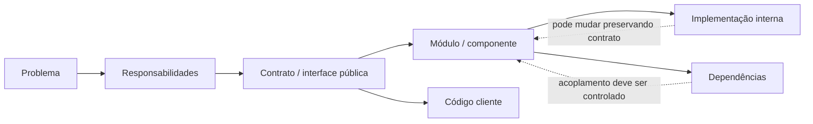

<a id="inicio"></a>

# Modularização e Abstração

> **Classificação:** `[D] Obrigatório dominar`  
> **Nível:** B — Fundamentos de Programação  
> **Posição na taxonomia:** tópico 16  
> **Pré-requisitos:** tópicos 1–15  
> **Aprofundamentos posteriores:** arquitetura, interfaces formais, encapsulamento, OOP, dependency inversion, package management, versionamento semântico, HTTP/REST, SDKs e design de APIs

**Legenda curricular usada neste tópico:**

- `[D]` — obrigatório dominar nesta etapa;
- `[C]` — complementar: compreender, reconhecer e saber consultar/aplicar quando necessário.

---

## Resumo executivo

À medida que um programa cresce, deixa de ser suficiente escrever:

```text
um bloco grande
```

mesmo que esse bloco:

- compile;
- execute;
- produza a saída esperada.

Precisamos organizar a solução em partes que tenham:

```text
RESPONSABILIDADE
INTERFACE
CONTRATO
FRONTEIRA
DEPENDÊNCIAS
```

O núcleo deste tópico pode ser representado assim:

```text
PROBLEMA MAIOR
│
├── responsabilidade A
├── responsabilidade B
└── responsabilidade C
        ↓
    cada parte expõe
    uma interface útil
        ↓
    detalhes internos
    ficam escondidos
```

Isso é modularização apoiada por abstração.

Farrell apresenta três benefícios iniciais clássicos:

```text
ABSTRAÇÃO
TRABALHO EM EQUIPE
REUTILIZAÇÃO
```

e, mais adiante, conecta bom design de métodos a:

```text
IMPLEMENTATION HIDING
HIGH COHESION
LOW/LOOSE COUPLING
```

No nível fundamental, não precisamos transformar isso em arquitetura empresarial.

Precisamos conseguir olhar para um programa e perguntar:

```text
qual parte faz o quê?
o que cada parte recebe?
o que devolve?
o que promete?
de que outras partes depende?
a implementação interna pode mudar sem quebrar o cliente?
```

Outro conceito central:

> **API não significa automaticamente “API Web”.**

Uma API é uma interface pública para uso por outro código.

Exemplos:

```text
math.sqrt(...)
list.append(...)
Map.get(...)
String.substring(...)
printf ...
uma função exportada por um módulo
```

Todos podem fazer parte de uma API.

HTTP, REST, autenticação, endpoints e APIs de serviços vêm depois.

---

## Distinções fundamentais

```text
MÓDULO
≠
PACOTE
≠
BIBLIOTECA
≠
FRAMEWORK
≠
API
≠
SDK
≠
DEPENDÊNCIA
```

### Módulo

Unidade de organização/reutilização reconhecida pela linguagem/ecossistema.

### Pacote

Agrupamento hierárquico/distribuível de módulos ou componentes, conforme o ecossistema.

### Biblioteca

Conjunto reutilizável de funcionalidades chamado pelo seu código.

### API

Superfície pública/contrato por meio da qual outro código usa uma funcionalidade.

### Dependência

Componente externo ou interno do qual seu código precisa para funcionar.

### Framework

Estrutura maior que costuma definir fluxo, convenções e pontos de extensão.

### SDK

Conjunto de ferramentas, bibliotecas, documentação e recursos para desenvolver contra uma plataforma.

Esses termos podem se sobrepor em produtos reais, mas:

> **não são sinônimos.**

---

## Regra de ouro

> **Separe responsabilidades, exponha contratos pequenos e claros e dependa do que é público — não de detalhes internos acidentais.**

---

## Decisão rápida

| Pergunta | Resposta |
|---|---|
| “Modularizar é só dividir arquivo?” | Não. A fronteira principal é de responsabilidade e contrato. |
| “Uma função pequena já é módulo?” | Pode ser uma unidade modular conceitual, mas “module” como construção de linguagem tem significado específico. |
| “Um arquivo = um módulo em toda linguagem?” | Não. |
| “Abstração significa esconder tudo?” | Não. Significa expor o necessário e esconder detalhes que o cliente não precisa conhecer. |
| “Encapsulamento = abstração?” | Relacionados, mas não idênticos. |
| “API = REST?” | Não. REST é um estilo possível de API de rede. |
| “Biblioteca = API?” | Não. Uma biblioteca expõe uma ou mais APIs. |
| “Importar é copiar código?” | Não necessariamente; a semântica depende da linguagem/runtime. |
| “Python package é sempre só diretório com `__init__.py`?” | Não. Python também possui namespace packages. |
| “Java package = Java module?” | Não. |
| “JavaScript module = Node package?” | Não. |
| “Bash possui module system igual a Python?” | Não. Reuso costuma usar funções, scripts e `source`/`.`. |
| “Reutilização significa generalizar tudo?” | Não. Generalização prematura aumenta complexidade. |
| “Duplicação zero é sempre objetivo?” | Não. Às vezes pequena duplicação é melhor que abstração errada. |
| “Baixo acoplamento significa nenhuma dependência?” | Não. Significa dependências controladas e apropriadas. |
| “Alta coesão significa função curta?” | Não necessariamente. Significa que responsabilidades relacionadas permanecem juntas. |
| “Dependência externa é sempre ruim?” | Não. O custo precisa ser justificado pelo valor. |
| “Biblioteca padrão deve ser preferida sempre?” | Não como dogma, mas deve ser considerada antes de adicionar dependência externa. |
| “Contrato é só tipos?” | Não. Inclui entradas, saídas, erros, efeitos, pré-condições e comportamento observável. |
| “Interface pública deve mostrar implementação?” | Apenas o necessário para usar corretamente. |
| “Mudar implementação pode quebrar cliente?” | Não deveria se o contrato público compatível for preservado. |
| “Toda alteração interna é segura?” | Não. Pode existir comportamento observável não documentado do qual clientes passaram a depender. |
| “Versionamento entra aqui?” | Em nível introdutório, sim: mudanças de API podem exigir compatibilidade/versionamento. |

---

# Índice


- [Resumo executivo](#resumo-executivo)
- [Distinções fundamentais](#distinções-fundamentais)
- [Regra de ouro](#regra-de-ouro)
- [Decisão rápida](#decisão-rápida)
- [1. Posição deste assunto](#1-posição-deste-assunto)
  - [1.1 O salto conceitual](#11-o-salto-conceitual)
  - [1.2 CS2023](#12-cs2023)
- [2. Mapa do tópico](#2-mapa-do-tópico)
  - [🗺️ Visão panorâmica — o mapa antes dos detalhes](#visao-panoramica)
- [3. Decomposição versus modularização](#3-decomposição-versus-modularização)
  - [Exemplo](#exemplo)
  - [Não é automático](#não-é-automático)
- [4. Unidade modular](#4-unidade-modular)
  - [Fundamental](#fundamental)
  - [Guardrail](#guardrail)
- [5. Responsabilidade](#5-responsabilidade)
  - [Regra](#regra)
- [6. Coesão — primeira noção](#6-coesão--primeira-noção)
  - [Farrell](#farrell)
- [7. 16.1 Divisão de responsabilidades](#7-161-divisão-de-responsabilidades)
  - [Técnica](#técnica)
- [8. Separar por intenção](#8-separar-por-intenção)
  - [Mas](#mas)
- [9. Separar cálculo de I/O](#9-separar-cálculo-de-io)
  - [Benefícios](#benefícios)
  - [Regra](#regra-1)
- [10. Separar domínio de infraestrutura](#10-separar-domínio-de-infraestrutura)
  - [Benefício](#benefício)
- [11. Responsabilidade excessiva](#11-responsabilidade-excessiva)
  - [Exemplo](#exemplo-1)
  - [Correção](#correção)
- [12. Fragmentação excessiva](#12-fragmentação-excessiva)
  - [Custo](#custo)
  - [Regra](#regra-2)
- [13. 16.2 Interfaces conceituais](#13-162-interfaces-conceituais)
  - [Elementos](#elementos)
- [14. Entrada esperada](#14-entrada-esperada)
  - [Não basta tipo](#não-basta-tipo)
- [15. Saída](#15-saída)
  - [Mais claro que:](#mais-claro-que)
- [16. Erros](#16-erros)
  - [Regra](#regra-3)
- [17. Efeitos](#17-efeitos)
  - [Exemplo](#exemplo-2)
- [18. Pré-condições e pós-condições](#18-pré-condições-e-pós-condições)
  - [Exemplo](#exemplo-3)
  - [Nível](#nível)
- [19. Contrato mínimo útil](#19-contrato-mínimo-útil)
  - [Resultado](#resultado)
- [20. 16.3 Abstração](#20-163-abstração)
- [21. Esconder detalhes](#21-esconder-detalhes)
  - [Benefício](#benefício-1)
- [22. Expor apenas o necessário](#22-expor-apenas-o-necessário)
  - [Beazley](#beazley)
- [23. Abstração não é ignorância](#23-abstração-não-é-ignorância)
  - [Regra](#regra-4)
- [24. Camadas de abstração](#24-camadas-de-abstração)
  - [CS2023](#cs2023)
- [25. Implementation hiding](#25-implementation-hiding)
  - [Vantagem](#vantagem)
- [26. Abstração versus encapsulamento](#26-abstração-versus-encapsulamento)
  - [Neste tópico](#neste-tópico)
- [27. 16.4 Reutilização](#27-164-reutilização)
- [28. Reutilizar comportamento](#28-reutilizar-comportamento)
  - [Benefício](#benefício-2)
- [29. Generalização](#29-generalização)
  - [Mas](#mas-1)
- [30. DRY sem dogma](#30-dry-sem-dogma)
  - [Cuidado](#cuidado)
  - [Regra](#regra-5)
- [31. Abstração prematura](#31-abstração-prematura)
  - [Melhor](#melhor)
- [32. Reuso interno versus biblioteca](#32-reuso-interno-versus-biblioteca)
  - [Ao publicar biblioteca](#ao-publicar-biblioteca)
- [33. 16.5 Bibliotecas e módulos](#33-165-bibliotecas-e-módulos)
- [34. O que é módulo](#34-o-que-é-módulo)
- [35. O que é pacote](#35-o-que-é-pacote)
  - [Python](#python)
  - [Java](#java)
  - [JavaScript](#javascript)
- [36. O que é biblioteca](#36-o-que-é-biblioteca)
  - [Exemplo](#exemplo-4)
- [37. Biblioteca padrão versus externa](#37-biblioteca-padrão-versus-externa)
  - [Python](#python-1)
  - [Java](#java-1)
  - [Regra](#regra-6)
- [38. Python — módulos e pacotes](#38-python--módulos-e-pacotes)
  - [Regular package](#regular-package)
  - [Namespace package](#namespace-package)
- [39. Python — import](#39-python--import)
  - [Import selecionado](#import-selecionado)
  - [Dependência](#dependência-1)
- [40. Python — superfície pública do pacote](#40-python--superfície-pública-do-pacote)
  - [Benefício](#benefício-3)
- [41. JavaScript — modules](#41-javascript--modules)
  - [Exemplo](#exemplo-5)
- [42. JavaScript — import/export](#42-javascript--importexport)
  - [Contrato público](#contrato-público)
- [43. JavaScript module versus package npm](#43-javascript-module-versus-package-npm)
  - [Regra](#regra-7)
- [44. Java — packages](#44-java--packages)
  - [Uso](#uso)
- [45. Java — imports](#45-java--imports)
  - [Importante](#importante)
- [46. Java — modules](#46-java--modules)
  - [Fundamental](#fundamental-1)
- [47. Java package versus module](#47-java-package-versus-module)
  - [JLS 27](#jls-27)
- [48. Bash — funções e source](#48-bash--funções-e-source)
- [49. Bash não possui module system equivalente](#49-bash-não-possui-module-system-equivalente)
  - [Consequência](#consequência)
- [50. 16.6 Dependências e acoplamento introdutório](#50-166-dependências-e-acoplamento-introdutório)
- [51. Dependência](#51-dependência)
  - [Exemplo](#exemplo-6)
- [52. Dependência interna](#52-dependência-interna)
  - [Benefício](#benefício-4)
  - [Mesmo assim](#mesmo-assim)
- [53. Dependência externa](#53-dependência-externa)
  - [Não é ruim](#não-é-ruim)
- [54. Acoplamento](#54-acoplamento)
  - [Objetivo](#objetivo)
- [55. Coesão versus acoplamento](#55-coesão-versus-acoplamento)
  - [Coesão](#coesão)
  - [Acoplamento](#acoplamento)
- [56. Dependência concreta versus contrato](#56-dependência-concreta-versus-contrato)
  - [Princípio](#princípio)
- [57. Dependência transitiva](#57-dependência-transitiva)
  - [Impacto](#impacto)
  - [Fundamental](#fundamental-2)
- [58. Dependência circular](#58-dependência-circular)
  - [Python Distilled](#python-distilled)
  - [Solução de design](#solução-de-design)
- [59. Custo de uma dependência](#59-custo-de-uma-dependência)
  - [Não escolha só por:](#não-escolha-só-por)
- [60. Biblioteca padrão antes de dependência externa](#60-biblioteca-padrão-antes-de-dependência-externa)
  - [Regra equilibrada](#regra-equilibrada)
- [61. 16.7 Bibliotecas, APIs e contratos](#61-167-bibliotecas-apis-e-contratos)
- [62. API como contrato](#62-api-como-contrato)
  - [Modelo](#modelo)
- [63. API pública versus implementação interna](#63-api-pública-versus-implementação-interna)
  - [Cliente deve depender de:](#cliente-deve-depender-de)
- [64. Operações aceitas](#64-operações-aceitas)
  - [Tipos/formatos](#tiposformatos)
- [65. Valores e resultados](#65-valores-e-resultados)
- [66. Erros e condições de falha](#66-erros-e-condições-de-falha)
  - [Regra](#regra-8)
- [67. Documentação como parte do uso correto](#67-documentação-como-parte-do-uso-correto)
  - [Regra](#regra-9)
- [68. Compatibilidade](#68-compatibilidade)
  - [Importante](#importante-1)
- [69. Versionamento introdutório](#69-versionamento-introdutório)
  - [Não aprofundamos ainda](#não-aprofundamos-ainda)
- [70. API estável versus implementação mutável](#70-api-estável-versus-implementação-mutável)
  - [Isso é fronteira de abstração.](#isso-é-fronteira-de-abstração)
- [71. API não é necessariamente rede](#71-api-não-é-necessariamente-rede)
  - [Fronteira](#fronteira)
- [72. API local versus API remota](#72-api-local-versus-api-remota)
- [73. Biblioteca, API, framework e SDK](#73-biblioteca-api-framework-e-sdk)
  - [Biblioteca](#biblioteca-1)
  - [API](#api-1)
  - [Framework](#framework-1)
  - [SDK](#sdk-1)
  - [Guardrail](#guardrail-1)
- [74. Exemplo canônico — cálculo isolado](#74-exemplo-canônico--cálculo-isolado)
  - [Benefício](#benefício-5)
- [75. Exemplo canônico — módulo reutilizável](#75-exemplo-canônico--módulo-reutilizável)
- [76. Python — módulo reutilizável](#76-python--módulo-reutilizável)
  - [Interface pública](#interface-pública)
- [77. JavaScript — módulo reutilizável](#77-javascript--módulo-reutilizável)
- [78. Java — pacote reutilizável](#78-java--pacote-reutilizável)
- [79. Bash — arquivo reutilizável](#79-bash--arquivo-reutilizável)
  - [Guardrail](#guardrail-2)
- [80. Exemplo canônico — dependência pública](#80-exemplo-canônico--dependência-pública)
- [81. Exemplo crítico — import não é cópia textual](#81-exemplo-crítico--import-não-é-cópia-textual)
  - [Moral](#moral)
- [82. Exemplo crítico — API interna acidental](#82-exemplo-crítico--api-interna-acidental)
  - [Causa](#causa)
- [83. Exemplo crítico — módulo utilitário genérico demais](#83-exemplo-crítico--módulo-utilitário-genérico-demais)
  - [Problema](#problema)
  - [Melhor](#melhor-1)
- [84. Exemplo crítico — circular dependency](#84-exemplo-crítico--circular-dependency)
  - [Estratégias](#estratégias)
  - [Não apenas](#não-apenas)
- [85. Exemplo crítico — dependência externa desnecessária](#85-exemplo-crítico--dependência-externa-desnecessária)
  - [Mas](#mas-2)
  - [Regra](#regra-10)
- [86. Exemplo crítico — contrato incompleto](#86-exemplo-crítico--contrato-incompleto)
  - [API melhor](#api-melhor)
- [87. Exemplo crítico — mudança breaking](#87-exemplo-crítico--mudança-breaking)
  - [Moral](#moral-1)
- [88. Exemplo crítico — comportamento acidental](#88-exemplo-crítico--comportamento-acidental)
  - [Lição](#lição)
- [89. Design de módulo por responsabilidade](#89-design-de-módulo-por-responsabilidade)
  - [Bons limites](#bons-limites)
- [90. Nomeação de módulos e APIs](#90-nomeação-de-módulos-e-apis)
  - [Funções](#funções)
- [91. Tamanho de módulo](#91-tamanho-de-módulo)
  - [Sinais melhores](#sinais-melhores)
- [92. Direção de dependência](#92-direção-de-dependência)
  - [Por quê?](#por-quê)
  - [Nível](#nível-1)
- [93. Testabilidade](#93-testabilidade)
  - [Estratégia](#estratégia)
- [94. Substituibilidade por contrato](#94-substituibilidade-por-contrato)
- [95. Documentação mínima da API](#95-documentação-mínima-da-api)
  - [Evite](#evite)
- [96. Segurança e robustez](#96-segurança-e-robustez)
  - [API](#api-2)
  - [Regra](#regra-11)
- [97. NetDev — aplicação prática](#97-netdev--aplicação-prática)
  - [Benefício](#benefício-6)
- [98. Comparativo das quatro linguagens](#98-comparativo-das-quatro-linguagens)
- [99. Método de análise de um módulo](#99-método-de-análise-de-um-módulo)
- [100. O que fica para depois](#100-o-que-fica-para-depois)
  - [Fronteira](#fronteira-1)
- [101. Erros conceituais frequentes](#101-erros-conceituais-frequentes)
  - [101.1 “Modularizar = criar arquivos”](#1011-modularizar--criar-arquivos)
  - [101.2 “Mais módulos = melhor design”](#1012-mais-módulos--melhor-design)
  - [101.3 “Função pequena = alta coesão”](#1013-função-pequena--alta-coesão)
  - [101.4 “Abstração = esconder tudo”](#1014-abstração--esconder-tudo)
  - [101.5 “API = REST”](#1015-api--rest)
  - [101.6 “Biblioteca = API”](#1016-biblioteca--api)
  - [101.7 “Package = module”](#1017-package--module)
  - [101.8 “Java package = Java module”](#1018-java-package--java-module)
  - [101.9 “npm package = ECMAScript module”](#1019-npm-package--ecmascript-module)
  - [101.10 “source Bash = import Python”](#10110-source-bash--import-python)
  - [101.11 “Importar copia código”](#10111-importar-copia-código)
  - [101.12 “Dependência externa é ruim”](#10112-dependência-externa-é-ruim)
  - [101.13 “Standard library é sempre melhor”](#10113-standard-library-é-sempre-melhor)
  - [101.14 “DRY significa zero repetição”](#10114-dry-significa-zero-repetição)
  - [101.15 “Generalização sempre melhora reuso”](#10115-generalização-sempre-melhora-reuso)
  - [101.16 “Low coupling = nenhuma dependência”](#10116-low-coupling--nenhuma-dependência)
  - [101.17 “Cliente pode usar qualquer função acessível”](#10117-cliente-pode-usar-qualquer-função-acessível)
  - [101.18 “Mudança interna nunca quebra cliente”](#10118-mudança-interna-nunca-quebra-cliente)
  - [101.19 “Contrato é assinatura”](#10119-contrato-é-assinatura)
  - [101.20 “Versionamento só importa em APIs web”](#10120-versionamento-só-importa-em-apis-web)
- [🧩 Problemas Reais — índice operacional](#problemas-reais)
- [🔎 Troubleshooting sistemático](#troubleshooting-sistematico)
- [102. Laboratórios](#102-laboratórios)
  - [🧪 LAB 1 — responsabilidade](#-lab-1--responsabilidade)
  - [🧪 LAB 2 — contrato](#-lab-2--contrato)
  - [🧪 LAB 3 — implementation hiding](#-lab-3--implementation-hiding)
  - [🧪 LAB 4 — Python module](#-lab-4--python-module)
  - [🧪 LAB 5 — ECMAScript module](#-lab-5--ecmascript-module)
  - [🧪 LAB 6 — Java package](#-lab-6--java-package)
  - [🧪 LAB 7 — Bash library](#-lab-7--bash-library)
  - [🧪 LAB 8 — dependência externa](#-lab-8--dependência-externa)
  - [🧪 LAB 9 — circular dependency](#-lab-9--circular-dependency)
  - [🧪 LAB 10 — public API](#-lab-10--public-api)
  - [🧪 LAB 11 — API version change](#-lab-11--api-version-change)
  - [🧪 LAB 12 — NetDev](#-lab-12--netdev)
- [103. Exercícios](#103-exercícios)
- [104. Evidências de domínio](#104-evidências-de-domínio)
  - [16.1 Divisão de responsabilidades `[D]`](#161-divisão-de-responsabilidades-d)
  - [16.2 Interfaces conceituais `[D]`](#162-interfaces-conceituais-d)
  - [16.3 Abstração `[D]`](#163-abstração-d)
  - [16.4 Reutilização `[D]`](#164-reutilização-d)
  - [16.5 Bibliotecas e módulos `[D]`](#165-bibliotecas-e-módulos-d)
  - [16.6 Dependências e acoplamento `[C]`](#166-dependências-e-acoplamento-c)
  - [16.7 APIs e contratos `[C]`](#167-apis-e-contratos-c)
- [105. Checklist de consulta rápida](#105-checklist-de-consulta-rápida)
- [106. Glossário](#106-glossário)
- [107. Referências](#107-referências)
  - [107.1 Taxonomia canônica](#1071-taxonomia-canônica)
  - [107.2 CS2023 — ACM / IEEE-CS / AAAI](#1072-cs2023--acm--ieee-cs--aaai)
  - [107.3 Python 3.14.7](#1073-python-3147)
  - [107.4 ECMAScript 2026](#1074-ecmascript-2026)
  - [107.5 Java SE 27](#1075-java-se-27)
  - [107.6 GNU Bash 5.3](#1076-gnu-bash-53)
  - [107.7 Farrell, Joyce](#1077-farrell-joyce)
  - [107.8 Beazley, David M.](#1078-beazley-david-m)
  - [107.9 Eric Chou](#1079-eric-chou)
  - [107.10 Hierarquia das fontes](#10710-hierarquia-das-fontes)
  - [107.11 Decisões terminológicas deliberadas](#10711-decisões-terminológicas-deliberadas)
  - [107.12 Registro histórico — fontes locais consultadas na revisão 0.3.0](#10712-registro-histórico--fontes-locais-consultadas-na-revisão-030)
  - [107.13 Registro histórico — revalidação oficial da revisão 0.3.0](#10713-registro-histórico--revalidação-oficial-da-revisão-030)
  - [107.14 Estado de QA e evidência da revisão 0.3.2](#10714-estado-de-qa-e-evidência-da-revisão-032)
- [108. Histórico de versões](#108-histórico-de-versões)

---

# 1. Posição deste assunto

O tópico 11 introduziu:

```text
funções
procedimentos
composição
```

Agora ampliamos:

```text
FUNÇÃO
↓
MÓDULO
↓
PACOTE / BIBLIOTECA
↓
API / CONTRATO
```

## 1.1 O salto conceitual

Uma função responde:

```text
como isolo uma operação?
```

Modularização responde:

```text
como organizo um sistema em partes cooperantes?
```

## 1.2 CS2023

O currículo atual inclui entre os fundamentos:

```text
modularity constructs
abstraction
libraries
frameworks
API-based access
```

Logo, não é tema “avançado demais”.

É fundamento de desenvolvimento.

[↑ Voltar ao índice](#índice)

---

# 2. Mapa do tópico

A seção obrigatória abaixo funciona como **posição lógica 2** do documento e preserva o heading canônico exigido pelo Prompt Mestre.

<a id="visao-panoramica"></a>

## 🗺️ Visão panorâmica — o mapa antes dos detalhes

Esta seção funciona como **caderno rápido de consulta**, **modelo mental**, **índice conceitual** e **contrato de cobertura** do tópico. O objetivo é permitir recuperar a arquitetura do domínio em poucos segundos antes de voltar aos detalhes.

### Mapa do domínio

```text
MODULARIZAÇÃO E ABSTRAÇÃO
│
├── 1. PROBLEMA / RESPONSABILIDADES
│   ├── decompor o problema
│   ├── separar responsabilidades
│   └── buscar alta coesão
│
├── 2. FRONTEIRAS / CONTRATOS
│   ├── entrada esperada
│   ├── saída / resultado
│   ├── erros / falhas
│   ├── efeitos observáveis
│   ├── pré-condições
│   └── pós-condições
│
├── 3. ABSTRAÇÃO
│   ├── expor o necessário
│   ├── esconder detalhes de implementação
│   └── preservar liberdade para mudar internals
│
├── 4. ORGANIZAÇÃO E REUSO
│   ├── função / método
│   ├── módulo
│   ├── pacote
│   ├── biblioteca
│   └── API pública
│
├── 5. DEPENDÊNCIAS
│   ├── internas
│   ├── externas
│   ├── transitivas
│   ├── circulares
│   └── acoplamento
│
└── 6. EVOLUÇÃO
    ├── compatibilidade
    ├── mudança interna
    ├── breaking change
    ├── documentação
    └── testes de regressão
```

O fluxo conceitual principal é:

```text
PROBLEMA
   ↓
RESPONSABILIDADES COESAS
   ↓
FRONTEIRAS CLARAS
   ↓
CONTRATO / API PÚBLICA
   ↓
IMPLEMENTAÇÃO INTERNA
   ↓
DEPENDÊNCIAS CONTROLADAS
   ↓
REUSO + EVOLUÇÃO COM MENOR IMPACTO
```



### Consulta rápida — conceito, função, regra e risco

| Conceito | Para que serve | Regra prática | Risco quando mal usado |
|---|---|---|---|
| **Responsabilidade** | delimitar o que uma unidade faz | uma razão coerente para existir/mudar | módulo “faz tudo” |
| **Coesão** | manter operações relacionadas juntas | unidade deve servir a um propósito claro | mistura de tarefas sem relação |
| **Interface** | definir como o cliente interage | expor somente o necessário | cliente passa a depender de internals |
| **Contrato** | definir comportamento observável | entradas, resultados, erros e efeitos precisam ser claros | uso incorreto ou mudança incompatível |
| **Abstração** | permitir pensar no essencial | esconder detalhe sem esconder requisito importante | “caixa-preta” incompreensível ou vazamento de detalhe |
| **Implementation hiding** | permitir mudar internals | preservar a superfície pública compatível | refactor interno quebra consumidores |
| **Módulo** | organizar comportamento/estado relacionado | não assumir que “módulo” significa a mesma construção em todas as linguagens | falsa equivalência entre ecossistemas |
| **Pacote** | organizar/agrupar unidades conforme o ecossistema | distinguir pacote de módulo e de artefato de distribuição | confusão de namespace, import e deploy |
| **Biblioteca** | reutilizar funcionalidade | adotar por contrato/documentação, não por internals | dependência sem controle |
| **API** | expor uma superfície pública | API não significa automaticamente HTTP/REST | acoplamento a detalhe não suportado |
| **Dependência** | fornecer capacidade usada pela unidade | justificar valor, versão, estabilidade e risco | acoplamento excessivo / supply chain |
| **Acoplamento** | descrever grau de dependência entre unidades | reduzir dependências desnecessárias, não eliminar colaboração | ripple effect de mudanças |
| **Reutilização** | reaproveitar uma solução comprovada | generalizar após reconhecer semelhança real | abstração prematura |

### Pergunta prática → onde olhar primeiro

| Pergunta | Mecanismo / seção de referência |
|---|---|
| “Onde devo dividir este código?” | responsabilidade, coesão e seções 5–12 |
| “O que este módulo precisa prometer?” | interface/contrato, seções 13–19 |
| “O cliente precisa conhecer este detalhe?” | abstração e implementation hiding, seções 20–26 |
| “Vale extrair uma abstração reutilizável?” | reuso, DRY e abstração prematura, seções 27–32 |
| “Isto é módulo, pacote, biblioteca ou API?” | organização, seções 33–49 e APIs em 61–73 |
| “Por que uma mudança aqui quebrou outro lugar?” | dependências/acoplamento, seções 50–60 |
| “Esta mudança é compatível?” | API/contrato/versionamento, seções 61–73 e exemplos 74–80 |
| “Como isso muda entre linguagens?” | exemplos 76–79 e comparativo da seção 98 |
| “O programa está correto, mas o design está difícil de manter?” | método de análise, seção 99 |
| “Qual é a primeira hipótese para esta falha?” | [Troubleshooting sistemático](#troubleshooting-sistematico) |

### Não confundir

```text
DECOMPOSIÇÃO
→ descobrir partes do problema

MODULARIZAÇÃO
→ organizar partes em unidades com fronteira e responsabilidade
```

```text
INTERFACE
→ superfície de interação

CONTRATO
→ comportamento observável prometido pela interface
```

```text
ABSTRAÇÃO
→ escolher o que precisa ficar visível

ENCAPSULAMENTO
→ mecanismo de agrupar/proteger estado e implementação
```

```text
MÓDULO ≠ PACOTE ≠ BIBLIOTECA ≠ API ≠ FRAMEWORK ≠ SDK
```

```text
BAIXO ACOPLAMENTO
≠
ZERO DEPENDÊNCIA
```

```text
DRY
≠
ELIMINAR TODA REPETIÇÃO A QUALQUER CUSTO
```

### Microexemplos canônicos

**Contrato antes da implementação:**

```text
classify_latency(ms)

entrada:
    inteiro >= 0

saída:
    "OK" | "WARNING" | "CRITICAL"

falha:
    rejeitar qualquer entrada fora do domínio "inteiro não negativo"

efeito:
    nenhum I/O
```

O cliente pode depender desse contrato sem conhecer se a implementação usa `if`, tabela de faixas ou outra técnica equivalente.

**Superfície pública menor que a implementação:**

```python
# latency.py

def _validate_ms(value: int) -> None:
    if type(value) is not int:
        raise TypeError("latency must be an integer")

    if value < 0:
        raise ValueError("latency must be >= 0")


def classify_latency(value: int) -> str:
    _validate_ms(value)

    if value < 30:
        return "OK"
    if value < 100:
        return "WARNING"
    return "CRITICAL"
```

O helper interno agora preserva exatamente o contrato declarado: o domínio é um **inteiro não negativo**, valores fora desse domínio são rejeitados e as mesmas faixas `OK` / `WARNING` / `CRITICAL` usadas no exemplo canônico posterior são mantidas. O ponto conceitual continua independente de Python: **cliente deve depender da superfície suportada, não de helpers acidentais**.

### Problemas reais representativos

O inventário completo aparece em [Problemas Reais](#problemas-reais). Os casos de maior poder de transferência são:

- `PR-T16-01` — programa monolítico precisa de fronteiras por responsabilidade;
- `PR-T16-02` — cliente depende de detalhe interno e quebra após refactor;
- `PR-T16-03` — contrato incompleto gera uso ambíguo;
- `PR-T16-05` — dependência circular torna inicialização/organização frágil;
- `PR-T16-07` — mudança de API pública quebra consumidores;
- `PR-T16-08` — abstração prematura reduz clareza em vez de aumentar reuso;
- `PR-T16-09` — biblioteca Bash carregada com `source` altera o estado do shell chamador.

### Entrada rápida de troubleshooting

| Sintoma | Primeira hipótese / verificação |
|---|---|
| módulo/pacote não encontrado | nome, caminho de busca, empacotamento e ambiente |
| símbolo importado/exportado não existe | superfície pública e nome efetivamente exportado |
| import funciona em uma ordem e falha em outra | dependência circular / inicialização parcial |
| refactor interno quebrou consumidores | cliente dependia de implementation detail ou comportamento observável não preservado |
| função “aceita” entrada mas produz efeito inesperado | contrato incompleto: efeitos, pré-condições ou erros não documentados |
| alteração local exige mudanças em muitos módulos | acoplamento elevado / responsabilidade mal posicionada |
| `source` em Bash muda variáveis ou encerra o chamador | execução no contexto atual do shell |
| biblioteca externa quebra após atualização | versão/compatibilidade/API/dependência transitiva |

### Transferência entre Python, JavaScript, Java e Bash

| Ideia | Python | JavaScript / ECMAScript | Java | GNU Bash |
|---|---|---|---|---|
| unidade reutilizável comum | função, módulo, package | função, ECMAScript module | método, classe, package/module | função, script sourced/executável |
| exposição de nomes | convenções, imports, `__all__` em contextos específicos | `export` / `import` | modificadores de acesso + exports de módulo quando aplicável | convenção de nomes; funções/variáveis entram no shell ao usar `source` |
| agrupamento hierárquico | packages | módulos + estrutura do host/ecossistema | packages; módulos Java são conceito distinto | diretórios/scripts por convenção |
| dependência | import/package | import/module graph/package ecosystem | imports + module/package dependencies | comandos, arquivos sourced, executáveis, ambiente |
| risco circular | import parcial/inicialização | ciclos no grafo de módulos | ciclos de dependência podem surgir em níveis de tipos/build/módulos | ciclos de `source` por convenção podem recarregar/recursar |
| fronteira pública | API documentada do módulo/package | exports | tipos/membros acessíveis e packages exportados | contrato documentado de funções, parâmetros, stdout/stderr e status |

> **Equivalência é conceitual, não estrutural.** Python module, ECMAScript module, Java module e um arquivo Bash carregado com `source` não são a mesma construção.

### Modo consulta × modo estudo

**Para consulta rápida:**

```text
Mapa do domínio
→ tabela conceito/função/risco
→ “não confundir”
→ pergunta prática
→ troubleshooting
```

**Para estudar do início:**

```text
posição do assunto
→ decomposição e responsabilidade
→ interface e contrato
→ abstração
→ reutilização
→ módulos/pacotes/bibliotecas
→ dependências/acoplamento
→ APIs/versionamento
→ comparação entre linguagens
→ PR-*
→ troubleshooting
→ LABs
```

### Pré-requisitos e fronteiras

Pré-requisitos diretamente reutilizados:

- T11 — funções, procedimentos e modularização inicial;
- T13 — sintaxe, semântica e sistema de tipos;
- T14 — estado, escopo, referências e mutabilidade;
- T15 — coleções e manipulação de dados.

Este tópico **não** transforma fundamentos em arquitetura avançada. Ficam para etapas posteriores, entre outros: SOLID, dependency inversion, arquiteturas em camadas formais, package managers em profundidade, semantic versioning formal, HTTP/REST, autenticação de APIs, OpenAPI, SDK design, ABI e plugin architectures.

[↑ Voltar ao índice](#índice)

---

# 3. Decomposição versus modularização

Decomposição:

```text
quebrar problema em partes
```

Modularização:

```text
organizar essas partes como unidades
com responsabilidade e interface claras
```

## Exemplo

Problema:

```text
processar relatório de rede
```

Decomposição:

```text
ler arquivo
parsear linhas
validar dados
classificar eventos
gerar relatório
```

Modularização:

```text
io
parser
validation
classification
reporting
```

## Não é automático

Toda decomposição:

```text
não precisa virar arquivo
```

[↑ Voltar ao índice](#índice)

---

# 4. Unidade modular

Uma unidade modular pode ser:

- função;
- método;
- classe;
- módulo;
- package;
- componente.

Depende do nível de análise.

## Fundamental

Aqui:

```text
módulo
```

é a principal unidade maior que função.

## Guardrail

Não trate:

```text
“módulo”
```

como sinônimo universal de:

```text
arquivo
```

porque cada linguagem possui modelo próprio.

[↑ Voltar ao índice](#índice)

---

# 5. Responsabilidade

Responsabilidade responde:

> **qual razão esta unidade tem para existir?**

Bom exemplo:

```text
parse_config
```

Responsabilidade:

```text
converter representação externa
em estrutura interna
```

Ruim:

```text
parse_config_and_connect_and_log_and_email
```

## Regra

Uma unidade deve representar:

```text
um conjunto coerente de decisões
```

[↑ Voltar ao índice](#índice)

---

# 6. Coesão — primeira noção

Coesão mede conceitualmente:

```text
o quanto as partes internas pertencem juntas
```

Alta coesão:

```text
parser
├── tokenize
├── validate_syntax
└── build_result
```

Baixa coesão:

```text
utils
├── parse_date
├── send_email
├── calculate_tax
└── draw_chart
```

## Farrell

Recomenda aumentar:

```text
cohesion
```

e reduzir:

```text
coupling
```

[↑ Voltar ao índice](#índice)

---

# 7. 16.1 Divisão de responsabilidades

**Classificação:** `[D]`

Taxonomia:

```text
partes menores
responsabilidades claras
```

## Técnica

Pergunte:

```text
o que esta parte decide?
o que conhece?
o que altera?
```

Agrupe:

```text
operações que compartilham a mesma responsabilidade
```

Separe:

```text
operações que pertencem a preocupações diferentes
```

[↑ Voltar ao índice](#índice)

---

# 8. Separar por intenção

Código grande:

```text
read
parse
validate
calculate
print
save
```

Pode virar:

```text
input
parsing
validation
domain
presentation
persistence
```

## Mas

Não crie:

```text
1 arquivo por função
```

por regra mecânica.

A fronteira precisa:

```text
fazer sentido
```

[↑ Voltar ao índice](#índice)

---

# 9. Separar cálculo de I/O

Exemplo:

```python
def calculate_average(values):
    return sum(values) / len(values)
```

Separado de:

```python
def show_average(value):
    print(value)
```

## Benefícios

Cálculo:

- testável;
- reutilizável;
- independente de terminal.

I/O:

- substituível;
- controlável.

## Regra

Não é obrigatório separar tudo sempre.

Mas:

```text
cálculo
+
I/O
```

merecem fronteira quando isso melhora contrato.

[↑ Voltar ao índice](#índice)

---

# 10. Separar domínio de infraestrutura

Domínio:

```text
classificar latência
```

Infraestrutura:

```text
ler arquivo
abrir socket
consultar banco
```

Exemplo:

```text
classify_latency(ms)
```

não precisa saber:

```text
se valor veio de arquivo
SSH
API
banco
```

## Benefício

A mesma lógica pode ser reutilizada.

[↑ Voltar ao índice](#índice)

---

# 11. Responsabilidade excessiva

Sinais:

- muitos tipos de entrada;
- muitos efeitos;
- muitos motivos para alterar;
- nome com vários verbos;
- testes exigem muitas dependências;
- entender exige contexto inteiro.

## Exemplo

```text
process_order
```

pode esconder:

```text
validate
calculate
persist
notify
audit
```

## Correção

Descubra as responsabilidades reais.

[↑ Voltar ao índice](#índice)

---

# 12. Fragmentação excessiva

Problema oposto:

```text
funções/módulos minúsculos
sem abstração real
```

Exemplo:

```text
increment_by_one
add_one
plus_one
```

espalhados sem necessidade.

## Custo

- navegação;
- nomes;
- imports;
- indireção;
- dificuldade para montar o fluxo mental.

## Regra

> **Modularizar não significa maximizar a quantidade de módulos.**

[↑ Voltar ao índice](#índice)

---

# 13. 16.2 Interfaces conceituais

**Classificação:** `[D]`

> **Escopo deste bloco:** §§13–19 tratam o contrato de uma **unidade qualquer** — função, procedimento, módulo ou componente. §§61–73 retomam o mesmo modelo em outra escala: **API pública**, compatibilidade e evolução. A repetição é deliberada por mudança de contexto, não equivalência entre interface local e API publicada.

Taxonomia:

```text
entrada esperada
saída
contrato
```

Interface conceitual responde:

```text
como outro código usa esta unidade?
```

## Elementos

```text
nome
inputs
outputs
errors
effects
preconditions
postconditions
```

[↑ Voltar ao índice](#índice)

---

# 14. Entrada esperada

Contrato pode declarar:

```text
port: integer
1 <= port <= 65535
```

## Não basta tipo

```text
int
```

aceita:

```text
-1
0
999999
```

como valores inteiros.

Logo:

```text
TYPE
≠
DOMAIN VALIDATION
```

[↑ Voltar ao índice](#índice)

---

# 15. Saída

Saída deve responder:

```text
o que o cliente recebe?
```

Exemplo:

```text
classify_latency(ms)
→ "OK" | "WARNING" | "CRITICAL"
```

## Mais claro que:

```text
retorna algo
```

[↑ Voltar ao índice](#índice)

---

# 16. Erros

Contrato precisa explicar:

```text
o que acontece se entrada for inválida?
```

Possibilidades:

- exception;
- error value;
- status;
- `None`;
- `null`;
- exit code.

## Regra

Não obrigue cliente a:

```text
adivinhar falha
```

[↑ Voltar ao índice](#índice)

---

# 17. Efeitos

Uma API pode:

```text
retornar valor
```

e também:

```text
alterar arquivo
mudar estado
enviar rede
registrar log
```

Efeito observável faz parte do contrato.

## Exemplo

```text
save_config(path, data)
```

deve deixar claro:

```text
escreve arquivo
pode substituir conteúdo
pode falhar por permissão
```

[↑ Voltar ao índice](#índice)

---

# 18. Pré-condições e pós-condições

Pré-condição:

```text
o que precisa ser verdadeiro antes
```

Pós-condição:

```text
o que a unidade garante depois
```

## Exemplo

```text
normalize_hostname(value)
```

Pré:

```text
value é string não vazia
```

Pós:

```text
retorna hostname sem espaços nas extremidades e em lowercase
não altera o objeto de entrada
```

O exemplo torna a transformação observável; pré e pós-condições não devem apenas repetir o tipo da entrada.

## Nível

Conhecer conceito.

Formalização vem depois.

[↑ Voltar ao índice](#índice)

---

# 19. Contrato mínimo útil

Template:

```text
NOME:
calculate_average

ENTRADA:
sequência não vazia de números

SAÍDA:
média numérica

ERROS:
sequência vazia → erro definido

EFEITOS:
nenhum externo

GARANTIA:
entrada não é modificada
```

## Resultado

Cliente pode usar sem conhecer:

```text
algoritmo interno
```

[↑ Voltar ao índice](#índice)

---

# 20. 16.3 Abstração

**Classificação:** `[D]`

Taxonomia:

```text
esconder detalhes
expor apenas o necessário
```

Abstração permite raciocinar em nível mais alto.

Em vez de:

```text
abrir arquivo
ler buffer
separar linha
converter
validar
```

cliente vê:

```text
load_config(path)
```

[↑ Voltar ao índice](#índice)

---

# 21. Esconder detalhes

Detalhe interno:

```text
usa list?
dict?
cache?
Regex?
parser manual?
```

Cliente talvez não precise saber.

## Benefício

Implementação pode mudar:

```text
sem alterar o uso
```

desde que contrato continue compatível.

[↑ Voltar ao índice](#índice)

---

# 22. Expor apenas o necessário

API grande:

```text
20 funções internas
```

não precisa expor:

```text
todas as 20
```

Pode expor:

```text
3 operações públicas
```

## Beazley

Mostra exatamente essa ideia em Python packages:

```text
__init__.py
```

pode consolidar classes/funções de submódulos e apresentar:

```text
namespace público mais simples
```

[↑ Voltar ao índice](#índice)

---

# 23. Abstração não é ignorância

Usar:

```text
list.append
```

sem conhecer implementação interna é abstração.

Mas você ainda precisa saber:

```text
contrato
efeitos
complexidade relevante
erros
```

## Regra

> **Abstração esconde detalhes não necessários; não elimina a necessidade de conhecer o contrato.**

[↑ Voltar ao índice](#índice)

---

# 24. Camadas de abstração

Exemplo:

```text
APP
↓
HTTP CLIENT
↓
SOCKET
↓
OS API
↓
NETWORK STACK
```

Cada camada expõe:

```text
interface
```

e oculta detalhes abaixo.

## CS2023

Princípios atuais incluem:

```text
layering
abstraction
modularity
```

como formas de organizar software.

[↑ Voltar ao índice](#índice)

---

# 25. Implementation hiding

Farrell:

```text
calling method
```

não precisa conhecer:

```text
statements internos do called method
```

Isso é:

```text
implementation hiding
```

## Vantagem

Implementação muda:

```text
cliente não muda
```

se contrato é preservado.

[↑ Voltar ao índice](#índice)

---

# 26. Abstração versus encapsulamento

Abstração:

```text
o que exponho?
em qual nível?
```

Encapsulamento:

```text
como agrupo/protejo estado e implementação?
```

Relacionados:

```text
sim
```

Idênticos:

```text
não
```

## Neste tópico

Foco:

```text
interface pública
versus
implementação interna
```

[↑ Voltar ao índice](#índice)

---

# 27. 16.4 Reutilização

**Classificação:** `[D]`

Taxonomia:

```text
generalização
evitar repetição desnecessária
```

Reuso pode ocorrer:

```text
na mesma função
no mesmo módulo
entre módulos
entre projetos
por biblioteca
```

[↑ Voltar ao índice](#índice)

---

# 28. Reutilizar comportamento

Duplicado:

```text
validate_port
```

em cinco pontos.

Melhor:

```text
uma implementação
+
cinco chamadas
```

## Benefício

Correção:

```text
em um local
```

Testes:

```text
sobre uma unidade
```

[↑ Voltar ao índice](#índice)

---

# 29. Generalização

Específico demais:

```text
calculate_average_for_router_a
```

se algoritmo não depende do router.

Generalize:

```text
calculate_average(values)
```

## Mas

Generalização exige:

```text
similaridade real
```

Não invente parâmetros para um futuro hipotético.

[↑ Voltar ao índice](#índice)

---

# 30. DRY sem dogma

DRY:

```text
Don't Repeat Yourself
```

Boa ideia quando duplicação representa:

```text
o mesmo conhecimento/regra
```

## Cuidado

Dois trechos parecidos podem:

```text
evoluir por motivos diferentes
```

Unificá-los cedo pode criar acoplamento indevido.

## Regra

> **Evite repetição desnecessária, não toda repetição visual.**

[↑ Voltar ao índice](#índice)

---

# 31. Abstração prematura

Problema:

```text
criar framework interno
antes de conhecer variações reais
```

Sinais:

- muitos parâmetros genéricos;
- callbacks sem necessidade;
- configuração enorme;
- abstração com um único caso;
- nomes vagos.

## Melhor

```text
resolver corretamente
observar repetição
abstrair quando padrão estiver claro
```

[↑ Voltar ao índice](#índice)

---

# 32. Reuso interno versus biblioteca

Código reutilizado em um projeto:

```text
internal module
```

Código distribuído para vários projetos:

```text
library/package
```

## Ao publicar biblioteca

Contrato precisa ser mais cuidadoso:

- API pública;
- versões;
- documentação;
- compatibilidade;
- instalação;
- dependências.

[↑ Voltar ao índice](#índice)

---

# 33. 16.5 Bibliotecas e módulos

**Classificação:** `[D]`

Taxonomia:

```text
organização
importação/reutilização
dependências
```

[↑ Voltar ao índice](#índice)

---

# 34. O que é módulo

Definição pedagógica:

> **Unidade nomeada de código que pode organizar e expor funcionalidades para reutilização.**

Mas implementação varia.

Python:

```text
module object / module source
```

ECMAScript:

```text
Module Record / import-export graph
```

Java:

```text
module no Java Platform Module System
```

Bash:

```text
não possui equivalente nativo direto
```

[↑ Voltar ao índice](#índice)

---

# 35. O que é pacote

Pacote agrupa:

```text
módulos/componentes
```

sob namespace/distribuição.

## Python

Package é:

```text
tipo especial de module com __path__
```

e pode ser:

- regular package;
- namespace package.

## Java

Package agrupa:

```text
classes/interfaces
```

e organiza namespace.

## JavaScript

“package” costuma vir do ecossistema:

```text
npm package
```

não da gramática ECMAScript como equivalente direto a Module.

[↑ Voltar ao índice](#índice)

---

# 36. O que é biblioteca

Biblioteca:

> **coleção reutilizável de funcionalidades utilizada pelo código cliente.**

Pode conter:

- módulos;
- packages;
- classes;
- funções;
- recursos.

## Exemplo

Python standard library.

Java SE API libraries.

Node/npm libraries.

Unix utilities e shell libraries.

[↑ Voltar ao índice](#índice)

---

# 37. Biblioteca padrão versus externa

Standard library:

```text
fornecida/distribuída como parte da plataforma
```

Third-party/external:

```text
adicionada separadamente
```

## Python

`json`:

```text
standard library
```

`requests`:

```text
third-party
```

## Java

`java.util`:

```text
Java SE
```

Dependência Maven externa:

```text
third-party
```

## Regra

Biblioteca externa adiciona:

- versão;
- supply-chain;
- licença;
- atualização;
- vulnerabilidades;
- transitive dependencies.

[↑ Voltar ao índice](#índice)

---

# 38. Python — módulos e pacotes

Python 3.14.7:

```text
import
```

permite código de um módulo acessar código de outro.

Package:

```text
organiza modules em hierarchy
```

A documentação atual esclarece:

```text
all packages are modules
but not all modules are packages
```

## Regular package

Normalmente:

```text
directory + __init__.py
```

## Namespace package

Pode existir:

```text
sem __init__.py
```

por mecanismos específicos.

[↑ Voltar ao índice](#índice)

---

# 39. Python — import

```python
import math

result = math.sqrt(25)
```

`import`:

```text
procura/carrega o módulo
e cria binding apropriado
```

Não pense:

```text
“cola o conteúdo do arquivo aqui”
```

## Import selecionado

```python
from math import sqrt
```

## Dependência

Código passa a depender:

```text
do contrato de math.sqrt
```

[↑ Voltar ao índice](#índice)

---

# 40. Python — superfície pública do pacote

Estrutura:

```text
mypackage/
├── __init__.py
├── parser.py
└── validation.py
```

Internamente:

```text
múltiplos submódulos
```

Publicamente:

```python
from mypackage import parse
```

pode esconder organização interna.

Um `__init__.py` pode reexportar nomes escolhidos:

```python
from .parser import parse
from .validation import validate

__all__ = ["parse", "validate"]
```

`__all__` documenta/controla os nomes públicos usados por `from mypackage import *`; **não é mecanismo de controle de acesso** e não é necessário para que um import explícito de nome funcione.

## Benefício

Cliente depende:

```text
da API do package
```

não:

```text
da localização interna
```

[↑ Voltar ao índice](#índice)

---

# 41. JavaScript — modules

ECMAScript 2026 define:

```text
Module
ImportDeclaration
ExportDeclaration
Module Record
```

Module Record armazena:

```text
imports
exports
estrutura necessária para linking/evaluation
```

## Exemplo

```javascript
export function double(value) {
  return value * 2;
}
```

Cliente:

```javascript
import { double } from "./math.js";
```

[↑ Voltar ao índice](#índice)

---

# 42. JavaScript — import/export

Módulo:

```javascript
// math.js
export function double(value) {
  return value * 2;
}
```

Cliente:

```javascript
// app.js
import { double } from "./math.js";

console.log(double(21));
```

## Contrato público

Export:

```text
double
```

é público.

Função não exportada:

```text
detalhe interno
```

[↑ Voltar ao índice](#índice)

---

# 43. JavaScript module versus package npm

ECMAScript module:

```text
conceito da linguagem
```

npm package:

```text
unidade de distribuição/ecossistema
```

Um package npm pode conter:

```text
muitos modules
```

e definir:

- entrypoints;
- exports;
- dependencies;
- metadata.

## Regra

```text
module
≠
package
```

[↑ Voltar ao índice](#índice)

---

# 44. Java — packages

JLS 27:

```text
programs are organized as sets of packages
```

Package declaration:

```java
package com.example.math;
```

Agrupa:

- classes;
- interfaces.

## Uso

Namespace:

```text
com.example.math.Calculator
```

[↑ Voltar ao índice](#índice)

---

# 45. Java — imports

```java
import java.util.List;
```

Import declaration permite usar:

```text
simple name
```

em vez do fully qualified name.

Sem import:

```java
java.util.List<String>
```

Com import:

```java
List<String>
```

## Importante

Import:

```text
não “carrega biblioteca” no mesmo sentido mental de Python runtime import
```

Uma declaração `import` torna types/membros acessíveis por nome simples na unidade de compilação; **o `import` em si não é uma operação de carregamento de classe em runtime**.

[↑ Voltar ao índice](#índice)

---

# 46. Java — modules

Java possui:

```text
Java Platform Module System
```

Module declaration pode:

```text
requires
exports
opens
uses
provides
```

Exemplo:

```java
module com.example.app {
    requires java.logging;
    exports com.example.api;
}
```

## Fundamental

Conhecer:

```text
module agrupa packages
dependências podem ser explícitas
packages podem ser exportados
```

Detalhes completos:

```text
posteriores
```

[↑ Voltar ao índice](#índice)

---

# 47. Java package versus module

Package:

```text
namespace/agrupamento de types
```

Module:

```text
agrupamento de packages
+
dependências
+
exports
```

Não são equivalentes.

## JLS 27

O capítulo 7 separa:

```text
Packages
Modules
Imports
Dependencies
Exports
```

[↑ Voltar ao índice](#índice)

---

# 48. Bash — funções e source

Bash possui:

```text
shell functions
```

para agrupar comandos.

```bash
double_value() {
    printf '%d\n' "$(($1 * 2))"
}
```

Para reutilizar arquivo:

```bash
source ./math.sh
```

ou:

```bash
. ./math.sh
```

GNU Bash 5.3:

```text
source/dot lê e executa comandos
no contexto do shell atual
```

Não é execução em subshell: alterações de estado produzidas pelo arquivo sourced podem permanecer no shell chamador.

[↑ Voltar ao índice](#índice)

---

# 49. Bash não possui module system equivalente

Evite dizer:

```text
source = import Python
```

como equivalência técnica.

`source`:

```text
executa arquivo no shell atual
```

Pode:

- definir funções;
- definir variáveis;
- alterar options;
- mudar estado.

## Consequência

Shell library precisa:

```text
controlar side effects
```

[↑ Voltar ao índice](#índice)

---

# 50. 16.6 Dependências e acoplamento introdutório

**Classificação:** `[C]`

Taxonomia:

```text
relação entre módulos
impacto de alterações
dependência excessiva
```

[↑ Voltar ao índice](#índice)

---

# 51. Dependência

A depende de B quando:

```text
A precisa de B
```

para:

- compilar;
- importar;
- executar;
- cumprir contrato.

## Exemplo

```python
import json
```

módulo depende de:

```text
json API
```

[↑ Voltar ao índice](#índice)

---

# 52. Dependência interna

```text
app
→ parser
```

Ambos fazem parte do projeto.

## Benefício

Você controla:

- versão;
- implementação;
- mudança.

## Mesmo assim

Acoplamento excessivo interno ainda pode:

```text
dificultar mudanças
```

[↑ Voltar ao índice](#índice)

---

# 53. Dependência externa

```text
project
→ third-party library
```

Você não controla:

- roadmap;
- compatibilidade;
- release;
- vulnerabilidades;
- abandono.

## Não é ruim

Bibliotecas externas economizam:

- tempo;
- bugs;
- manutenção;

quando bem escolhidas.

[↑ Voltar ao índice](#índice)

---

# 54. Acoplamento

Acoplamento:

```text
grau de dependência entre unidades
```

Um caso particularmente problemático de alto acoplamento é:

```text
A conhece muitos detalhes internos de B
```

Mas acoplamento elevado também pode existir **somente por APIs públicas** quando há dependências numerosas, rígidas, temporais ou que exigem mudanças coordenadas. Encapsulamento reduz um tipo importante de acoplamento; não elimina o problema inteiro.

Baixo/controlado:

```text
A depende de interface pública pequena e estável
```

## Objetivo

Não:

```text
zero dependências
```

Mas:

```text
dependências necessárias
claras
estáveis
```

[↑ Voltar ao índice](#índice)

---

# 55. Coesão versus acoplamento

Desejável:

```text
ALTA COESÃO
+
BAIXO/CONTROLADO ACOPLAMENTO
```

## Coesão

Interno:

```text
coisas relacionadas ficam juntas
```

## Acoplamento

Externo:

```text
quanto unidades dependem uma da outra
```

[↑ Voltar ao índice](#índice)

---

# 56. Dependência concreta versus contrato

Ruim:

```text
cliente lê variável interna
mexe em cache interno
depende de filename privado
```

Melhor:

```text
cliente chama função pública
```

## Princípio

```text
CLIENT
↓
CONTRACT
↓
IMPLEMENTATION
```

Isso reduz impacto de mudança interna.

[↑ Voltar ao índice](#índice)

---

# 57. Dependência transitiva

Projeto:

```text
A
→ B
→ C
```

Mesmo que A não importe C diretamente:

```text
C pode ser dependência transitiva
```

## Impacto

Atualização de C pode:

```text
afetar B
e eventualmente A
```

## Fundamental

Conhecer o conceito.

Ferramentas de package management vêm depois.

[↑ Voltar ao índice](#índice)

---

# 58. Dependência circular

```text
A → B
↑   ↓
└───┘
```

Problemas possíveis:

- inicialização parcial;
- imports quebrados;
- dificuldade de teste;
- acoplamento forte.

## Python Distilled

Dedica seção específica a:

```text
circular imports
```

## Solução de design

Pergunte:

```text
responsabilidades estão separadas corretamente?
existe abstração comum?
```

[↑ Voltar ao índice](#índice)

---

# 59. Custo de uma dependência

Avalie:

```text
necessidade
manutenção
licença
segurança
tamanho
compatibilidade
documentação
estabilidade
transitive deps
```

## Não escolha só por:

```text
“é popular”
```

[↑ Voltar ao índice](#índice)

---

# 60. Biblioteca padrão antes de dependência externa

*Python Distilled* recomenda observar primeiro:

```text
built-ins
+
standard library
```

antes de procurar package externo para todo problema pequeno.

## Regra equilibrada

Pergunte:

```text
a standard library resolve suficientemente?
```

Se sim:

```text
menos dependency cost
```

Se não:

```text
third-party pode ser a melhor escolha
```

[↑ Voltar ao índice](#índice)

---

# 61. 16.7 Bibliotecas, APIs e contratos

**Classificação:** `[C]`

Taxonomia canônica:

```text
API como contrato de uso
operações/entradas
resultados
erros
interface pública
implementação interna
biblioteca padrão × externa
documentação
compatibilidade/versionamento
```

[↑ Voltar ao índice](#índice)

---

# 62. API como contrato

API:

```text
Application Programming Interface
```

No nível fundamental:

> **conjunto de operações públicas e regras de uso que outro código pode utilizar sem depender de todos os detalhes internos.**

## Modelo

```text
CLIENT
↓
API
↓
IMPLEMENTATION
```

[↑ Voltar ao índice](#índice)

---

# 63. API pública versus implementação interna

Public:

```text
calculate_total(...)
```

Internal:

```text
_normalize_items(...)
_cache
_temp_state
```

## Cliente deve depender de:

```text
public contract
```

não de:

```text
private/internal accident
```

[↑ Voltar ao índice](#índice)

---

# 64. Operações aceitas

API precisa dizer:

```text
o que posso chamar?
```

Exemplo:

```text
add
remove
find
save
```

## Tipos/formatos

```text
qual input?
```

Exemplo:

```text
port integer
```

[↑ Voltar ao índice](#índice)

---

# 65. Valores e resultados

API precisa dizer:

```text
o que retorna?
```

Exemplo:

```text
find_user(id)
→ User | None
```

ou:

```text
exit status
```

ou:

```text
Promise
```

conforme linguagem/API.

[↑ Voltar ao índice](#índice)

---

# 66. Erros e condições de falha

Contrato deve documentar:

- entrada inválida;
- recurso inexistente;
- permissão negada;
- timeout;
- exception;
- error status.

## Regra

Erro é:

```text
parte da API
```

não:

```text
detalhe irrelevante
```

[↑ Voltar ao índice](#índice)

---

# 67. Documentação como parte do uso correto

Ao usar biblioteca:

```text
documentação oficial
```

é fonte principal para:

- assinatura;
- tipos;
- erros;
- efeitos;
- disponibilidade;
- versão;
- deprecações.

## Regra

> **Não deduza contrato apenas pelo nome da função.**

[↑ Voltar ao índice](#índice)

---

# 68. Compatibilidade

Mudança compatível:

```text
implementação interna melhora
API permanece
```

Mudança potencialmente incompatível:

```text
remove parâmetro
muda tipo retornado
muda nome
muda error behavior
```

## Importante

Mesmo sem syntax break:

```text
behavior change
```

pode quebrar cliente.

[↑ Voltar ao índice](#índice)

---

# 69. Versionamento introdutório

Versão comunica:

```text
evolução
```

No nível fundamental:

```text
clientes dependem de um contrato em determinada versão
```

## Não aprofundamos ainda

- SemVer formal;
- constraints;
- lockfiles;
- dependency resolution.

Mas conceito:

```text
API muda
→ compatibilidade precisa ser considerada
```

[↑ Voltar ao índice](#índice)

---

# 70. API estável versus implementação mutável

Antes de comparar implementações, explicite o contrato usado neste exemplo:

```text
unique(values)
entrada: sequência de valores hashable
saída: lista sem duplicatas, preservando a primeira ocorrência e a ordem
efeito: não modifica a entrada
```

Sob **esse** contrato, as duas versões abaixo são substituíveis para o cliente. Se a API também prometesse aceitar elementos não hashable, a segunda implementação (`dict.fromkeys`) deixaria de cumprir o contrato.

Versão 1:

```python
def unique(values):
    result = []

    for value in values:
        if value not in result:
            result.append(value)

    return result
```

Versão 2:

```python
def unique(values):
    return list(dict.fromkeys(values))
```

Se contrato permanece:

```text
mesmos resultados observáveis
```

cliente não precisa mudar.

## Isso é fronteira de abstração.

[↑ Voltar ao índice](#índice)

---

# 71. API não é necessariamente rede

Exemplos de API local:

```text
Python stdlib API
Java Collection API
ECMAScript Array API
Bash builtin interface
OS system-call API
```

API remota:

```text
interface acessível por outro processo/sistema
→ pode usar HTTP, mecanismos RPC ou outro protocolo de transporte
```

**Guardrail:** HTTP/RPC/protocolo é mecanismo de comunicação; **não é sinônimo da API**.

## Fronteira

Neste capítulo:

```text
API
```

é conceito geral.

[↑ Voltar ao índice](#índice)

---

# 72. API local versus API remota

Local:

```text
chamada de função/método
```

Remota:

```text
interação atravessa fronteira de processo e, frequentemente, rede
```

A API continua sendo o contrato de interação; HTTP, RPC ou outro protocolo materializam a comunicação.

Remota adiciona:

- serialização;
- latency;
- partial failures;
- authentication;
- protocol;
- versioning de serviço.

Esses detalhes:

```text
posteriores
```

[↑ Voltar ao índice](#índice)

---

# 73. Biblioteca, API, framework e SDK

## Biblioteca

Seu código chama:

```text
funções/classes reutilizáveis
```

## API

Contrato exposto:

```text
como usar
```

## Framework

Frequentemente:

```text
framework controla fluxo
e chama seu código
```

## SDK

Conjunto mais amplo:

- libraries;
- tools;
- docs;
- examples;
- CLI.

## Guardrail

Categorias podem se sobrepor.

Não use definições absolutas além do útil.

[↑ Voltar ao índice](#índice)

---

# 74. Exemplo canônico — cálculo isolado

Problema:

```text
classificar latency
```

Contrato:

```text
entrada válida: inteiro >= 0
0..29 → OK
30..99 → WARNING
>=100 → CRITICAL
entrada fora do domínio → rejeitar
```

Função:

```text
classify_latency
```

não deve precisar saber:

- arquivo;
- equipamento;
- terminal;
- API remota.

## Benefício

Pode ser usada em:

- CLI;
- web;
- batch;
- testes;
- automação de rede.

[↑ Voltar ao índice](#índice)

---

# 75. Exemplo canônico — módulo reutilizável

Estrutura conceitual:

```text
latency
├── _validate   ← detalhe interno
└── classify    ← superfície pública
```

Cliente:

```text
import/use latency
```

Interface pública:

```text
classify(value)
```

Detalhes internos:

```text
_validate(value)
threshold implementation
```

Os exemplos concretos preservam o mesmo contrato semântico, mas usam a convenção idiomática de nomes de cada linguagem (`classify` em Python/Java, `classifyLatency` em JavaScript e `classify_latency` em Bash).

[↑ Voltar ao índice](#índice)

---

# 76. Python — módulo reutilizável

`latency.py`:

```python
def _validate(value: int) -> None:
    if type(value) is not int:
        raise TypeError("latency must be an integer")

    if value < 0:
        raise ValueError("latency must be >= 0")


def classify(value: int) -> str:
    _validate(value)

    if value < 30:
        return "OK"

    if value < 100:
        return "WARNING"

    return "CRITICAL"
```

`app.py`:

```python
from latency import classify

print(classify(120))
```

Saída:

```text
CRITICAL
```

## Interface pública

Cliente precisa:

```text
classify
```

Não precisa conhecer:

```text
_validate
ifs internos
```

[↑ Voltar ao índice](#índice)

---

# 77. JavaScript — módulo reutilizável

`latency.mjs`:

```javascript
export function classifyLatency(value) {
  if (!Number.isInteger(value)) {
    throw new TypeError("latency must be an integer");
  }

  if (value < 0) {
    throw new RangeError("latency must be >= 0");
  }

  if (value < 30) {
    return "OK";
  }

  if (value < 100) {
    return "WARNING";
  }

  return "CRITICAL";
}
```

`app.mjs`:

```javascript
import { classifyLatency } from "./latency.mjs";

console.log(classifyLatency(120));
```

Saída:

```text
CRITICAL
```

[↑ Voltar ao índice](#índice)

---

# 78. Java — pacote reutilizável

`net/Latency.java`:

```java
package net;

public final class Latency {
    private Latency() {
    }

    public static String classify(int value) {
        if (value < 0) {
            throw new IllegalArgumentException(
                "latency must be >= 0"
            );
        }

        if (value < 30) {
            return "OK";
        }

        if (value < 100) {
            return "WARNING";
        }

        return "CRITICAL";
    }
}
```

Cliente:

```java
import net.Latency;

public class App {
    public static void main(String[] args) {
        System.out.println(Latency.classify(120));
    }
}
```

Aqui o parâmetro `int` já restringe o domínio de tipo no código Java; a validação em runtime ainda rejeita o inteiro negativo.

[↑ Voltar ao índice](#índice)

---

# 79. Bash — arquivo reutilizável

`latency.sh`:

```bash
classify_latency() {
    local value=${1-}

    if [[ ! $value =~ ^[0-9]+$ ]]; then
        printf '%s\n' 'latency must be a non-negative integer' >&2
        return 2
    fi

    local ms=$((10#$value))

    if (( ms < 30 )); then
        printf '%s\n' 'OK'
    elif (( ms < 100 )); then
        printf '%s\n' 'WARNING'
    else
        printf '%s\n' 'CRITICAL'
    fi
}
```

Cliente — caminho válido:

```bash
source ./latency.sh

classify_latency 120
```

Saída:

```text
CRITICAL
```

Cliente — contrato de erro:

```bash
result=$(classify_latency -1)
status=$?

if (( status != 0 )); then
    printf 'classify_latency failed: status=%d\n' "$status" >&2
fi
```

Nesse caso, a mensagem de domínio sai em `stderr`, `stdout` não recebe classificação e o chamador observa status `2`. A mesma rejeição ocorre para valores não inteiros, evitando que a aritmética do shell faça coerções ou interpretações acidentais.

## Guardrail

Arquivo sourced pode alterar:

```text
current shell
```

Logo biblioteca shell deve minimizar:

```text
efeitos no load
```

[↑ Voltar ao índice](#índice)

---

# 80. Exemplo canônico — dependência pública

Ruim:

```text
cliente
→ módulo interno
→ função privada
```

Melhor:

```text
cliente
→ API pública
```

Exemplo Python:

```python
from package import parse
```

melhor que:

```python
from package._internal_parser_v2 import _parse_impl
```

se o package documenta apenas:

```text
parse
```

[↑ Voltar ao índice](#índice)

---

# 81. Exemplo crítico — import não é cópia textual

Modelo incorreto:

```text
import
→ copiar e colar arquivo inteiro
```

Python:

```text
import machinery
module object
cache
binding
```

ECMAScript:

```text
module records
linking
bindings
evaluation
```

Java:

```text
import declaration
→ name resolution
```

Bash source:

```text
executa comandos do arquivo
no shell atual
```

## Moral

> **A palavra “importar” esconde semânticas bem diferentes.**

[↑ Voltar ao índice](#índice)

---

# 82. Exemplo crítico — API interna acidental

Biblioteca:

```text
public:
parse()

internal:
_parse_tokens()
```

Cliente usa:

```text
_parse_tokens()
```

porque “funciona”.

Versão seguinte reorganiza internals.

Cliente quebra.

## Causa

Dependência em:

```text
implementation detail
```

[↑ Voltar ao índice](#índice)

---

# 83. Exemplo crítico — módulo utilitário genérico demais

Arquivo:

```text
utils
```

cresce:

```text
parse_date
send_email
calculate_average
open_socket
format_money
```

## Problema

Baixa coesão.

## Melhor

Módulos por domínio/responsabilidade:

```text
dates
mail
statistics
network
currency
```

quando escala justificar.

[↑ Voltar ao índice](#índice)

---

# 84. Exemplo crítico — circular dependency

```text
parser imports validation
validation imports parser
```

Pode indicar:

```text
responsabilidades misturadas
```

## Estratégias

- extrair contrato comum;
- mover função para dono correto;
- inverter fluxo;
- reduzir dependency direction.

## Não apenas

```text
“mover import para dentro da função”
```

sem entender causa.

[↑ Voltar ao índice](#índice)

---

# 85. Exemplo crítico — dependência externa desnecessária

Problema:

```text
calcular média simples
```

Adicionar package externo só para:

```text
sum / len
```

aumenta custo sem valor proporcional.

## Mas

Problema complexo:

```text
criptografia
HTTP robusto
parsing especializado
```

reinventar pode ser pior.

## Regra

> **Dependência deve justificar seu custo.**

[↑ Voltar ao índice](#índice)

---

# 86. Exemplo crítico — contrato incompleto

Documentação:

```text
get_user(id)
```

não diz:

```text
retorna null?
lança exception?
bloqueia?
faz rede?
usa cache?
```

Cliente precisa experimentar.

## API melhor

Documentar:

```text
input
return
errors
effects relevantes
```

[↑ Voltar ao índice](#índice)

---

# 87. Exemplo crítico — mudança breaking

Versão 1:

```text
parse(text) → dict
```

Versão 2:

```text
parse(text) → list
```

Sintaxe de chamada:

```text
igual
```

Contrato:

```text
quebrou
```

## Moral

Breaking change não é apenas:

```text
função removida
```

[↑ Voltar ao índice](#índice)

---

# 88. Exemplo crítico — comportamento acidental

API documenta:

```text
retorna itens
```

Implementação atual:

```text
ordem alfabética por acaso
```

Cliente passa a depender da ordem.

Versão interna muda.

Cliente quebra.

## Lição

Contrato deve indicar:

```text
ordem garantida?
```

Cliente não deve presumir comportamento não prometido.

[↑ Voltar ao índice](#índice)

---

# 89. Design de módulo por responsabilidade

Perguntas:

```text
qual domínio?
qual contrato?
quem usa?
o que é interno?
o que muda junto?
```

## Bons limites

Componentes que:

```text
mudam juntos
```

tendem a pertencer juntos.

Componentes que:

```text
mudam por motivos diferentes
```

merecem separação.

[↑ Voltar ao índice](#índice)

---

# 90. Nomeação de módulos e APIs

Prefira nomes:

```text
network
parsing
validation
reporting
```

quando representam responsabilidade.

Evite:

```text
misc
helpers
utils2
common_stuff
```

se escondem mistura de responsabilidades.

## Funções

Verbos:

```text
parse_config
validate_port
classify_latency
```

[↑ Voltar ao índice](#índice)

---

# 91. Tamanho de módulo

Não há:

```text
número mágico de linhas
```

Módulo grande pode ser coeso.

Módulo pequeno pode ser confuso.

## Sinais melhores

- quantas responsabilidades?
- quantas dependências?
- interface pública é coerente?
- mudanças distintas se misturam?
- testes exigem coisas não relacionadas?

[↑ Voltar ao índice](#índice)

---

# 92. Direção de dependência

Exemplo simples de direção que costuma preservar reutilização:

```text
presentation / adapters
        ↓
      domain
```

Evite, sem necessidade:

```text
domain
→ presentation
```

Este diagrama é **um exemplo de direção, não uma arquitetura universal**. Não transforme `core`, `common` ou `utils` em destino arquitetural genérico apenas para “fazer as setas apontarem para baixo”; a fronteira continua sendo definida por responsabilidade e contrato.

## Por quê?

Lógica de domínio fica reutilizável.

## Nível

Introdução apenas.

Dependency inversion formal:

```text
posterior
```

[↑ Voltar ao índice](#índice)

---

# 93. Testabilidade

Módulo coeso:

```text
inputs explícitos
outputs explícitos
poucos efeitos
```

tende a ser fácil de testar.

Módulo acoplado a:

- terminal;
- filesystem;
- global;
- rede;

pode exigir mais setup.

## Estratégia

Separar:

```text
core logic
```

de:

```text
adapters/I-O
```

quando útil.

[↑ Voltar ao índice](#índice)

---

# 94. Substituibilidade por contrato

Se dois componentes cumprem:

```text
mesmo contrato relevante
```

cliente pode potencialmente trocar um pelo outro.

Exemplo:

```text
load_config(path)
```

Implementação A:

```text
JSON
```

Implementação B:

```text
YAML
```

Mas só são substituíveis se:

```text
contrato observado pelo cliente for realmente equivalente
```

[↑ Voltar ao índice](#índice)

---

# 95. Documentação mínima da API

Inclua:

```text
NOME
PROPÓSITO
PARÂMETROS
RETORNO
ERROS
EFEITOS
EXEMPLO
VERSÃO/DEPRECATION quando relevante
```

## Evite

Documentação que apenas repete:

```text
“get_value gets value”
```

[↑ Voltar ao índice](#índice)

---

# 96. Segurança e robustez

Dependências criam:

```text
supply-chain surface
```

Riscos:

- pacote malicioso;
- versão vulnerável;
- typosquatting;
- dependency confusion;
- transitive vulnerability;
- abandoned package.

## API

Valide:

```text
inputs na boundary
```

Não exponha internals sensíveis.

## Regra

> **Cada dependência adicionada passa a fazer parte da superfície de manutenção e segurança do projeto.**

[↑ Voltar ao índice](#índice)

---

# 97. NetDev — aplicação prática

Automação de rede:

```text
collect
parse
normalize
classify
report
```

Boa modularização:

```text
transport/
    ssh
    http

parsing/
    cli
    json

domain/
    interface_status
    latency

reporting/
    text
    csv
```

## Benefício

Trocar:

```text
CLI scraping
```

por:

```text
API estruturada
```

não deveria obrigar reescrever:

```text
classify_latency
```

se a fronteira foi bem desenhada.

Eric Chou discute exatamente a evolução de:

```text
CLI
→ programmatic interfaces/APIs
```

em automação de rede.

[↑ Voltar ao índice](#índice)

---

# 98. Comparativo das quatro linguagens

| Conceito | Python | JavaScript | Java | Bash |
|---|---|---|---|---|
| módulo nativo | module object/import system | ECMAScript Module | JPMS module | não equivalente |
| agrupamento hierárquico | package | host/ecosystem package não é ESM module | package + module | scripts/diretórios por convenção |
| import | runtime import machinery + binding | static/dynamic module import | name resolution / module import features | `source` executa arquivo |
| export público | namespace/package API | `export` | `public`, package/module exports | funções/variáveis definidas após source |
| biblioteca/recursos padrão | standard library | ECMAScript built-ins; APIs de host/runtime são uma camada separada | Java SE APIs | builtins + Unix/POSIX tools conforme ambiente |
| dependência externa | PyPI/etc. | npm/etc. | Maven/Gradle/etc. | executáveis/scripts/packages do sistema |
| contrato de erro | exceptions/status/etc. | exceptions/rejections/etc. | exceptions/return | exit status/stdout/stderr |
| carregamento/estado de módulo | import system mantém módulos carregados conforme sua semântica | module graph + semântica do host | class/module loading | `source` altera o estado do shell atual; não é cache de módulo equivalente |
| circular dependency | possível | possível | possível em diferentes níveis | possível por source conventions |

> A tabela mostra conceitos comparáveis, não equivalência de implementação.

[↑ Voltar ao índice](#índice)

---

# 99. Método de análise de um módulo

Pergunte:

```text
1. Qual responsabilidade?
2. Qual API pública?
3. Quais entradas?
4. Quais saídas?
5. Quais erros?
6. Quais efeitos?
7. O que é interno?
8. Quem depende dele?
9. De quem ele depende?
10. Dependências são necessárias?
11. Existe circular dependency?
12. Interface é pequena/coesa?
13. Cliente depende de internals?
14. Mudança interna pode preservar contrato?
15. Há duplicação real?
16. A abstração é prematura?
17. Standard library resolveria?
18. Documentação define comportamento?
19. Compatibilidade está explícita?
20. Existe risco de supply chain?
```

[↑ Voltar ao índice](#índice)

---

# 100. O que fica para depois

Não aprofundamos:

```text
SOLID
dependency inversion
hexagonal architecture
clean architecture
ports and adapters
DDD
microservices
service boundaries
package managers em profundidade
lockfiles
semantic versioning formal
API gateways
HTTP
REST
GraphQL
RPC
OpenAPI
authentication
authorization
rate limiting
SDK design
binary compatibility
ABI
plugin architectures
dynamic linking
service discovery
```

## Fronteira

Neste tópico:

```text
API = contrato público geral
```

HTTP API:

```text
depois
```

[↑ Voltar ao índice](#índice)

---

# 101. Erros conceituais frequentes

## 101.1 “Modularizar = criar arquivos”

Não.

## 101.2 “Mais módulos = melhor design”

Não.

## 101.3 “Função pequena = alta coesão”

Não necessariamente.

## 101.4 “Abstração = esconder tudo”

Não.

## 101.5 “API = REST”

Não.

## 101.6 “Biblioteca = API”

Não.

## 101.7 “Package = module”

Não universalmente.

## 101.8 “Java package = Java module”

Não.

## 101.9 “npm package = ECMAScript module”

Não.

## 101.10 “source Bash = import Python”

Não.

## 101.11 “Importar copia código”

Não como regra.

## 101.12 “Dependência externa é ruim”

Não necessariamente.

## 101.13 “Standard library é sempre melhor”

Não como dogma.

## 101.14 “DRY significa zero repetição”

Não.

## 101.15 “Generalização sempre melhora reuso”

Não.

## 101.16 “Low coupling = nenhuma dependência”

Não.

## 101.17 “Cliente pode usar qualquer função acessível”

Não se ela não faz parte da API suportada.

## 101.18 “Mudança interna nunca quebra cliente”

Pode quebrar se comportamento observável mudar.

## 101.19 “Contrato é assinatura”

É mais amplo.

## 101.20 “Versionamento só importa em APIs web”

Não.

[↑ Voltar ao índice](#índice)

---

<a id="problemas-reais"></a>

# 🧩 Problemas Reais — índice operacional

O inventário abaixo converte capacidades do tópico em situações que exigem decisão técnica, não apenas reconhecimento de definição.

| ID | Necessidade / problema concreto | Capacidades exercitadas | Destino principal | Estado |
|---|---|---|---|---|
| `PR-T16-01` | um fluxo monolítico mistura leitura, validação, regra e saída | responsabilidade, coesão, decomposição, fronteira | §§ 3–12 + LAB 1 | `FECHADO` |
| `PR-T16-02` | consumidor usa helper interno e quebra após refactor | API pública, fronteira de abstração, implementation hiding | §§ 20–26, 40, 63, 70 + LAB 3 + TS-T16-04 | `FECHADO` |
| `PR-T16-03` | função é “usável”, mas entrada, saída, erros ou efeitos estão ambíguos | interface, contrato, pré/pós-condição | §§ 13–19 + LAB 2 + TS-T16-05 | `FECHADO` |
| `PR-T16-04` | package/biblioteca expõe nomes demais e transforma detalhe em compromisso público | public surface, exports, compatibilidade | §§ 33–49, 61–68 + LABs 4–6 | `FECHADO` |
| `PR-T16-05` | dois módulos dependem um do outro e a ordem de inicialização/import passa a importar | dependências, ciclo, acoplamento, reorganização | §§ 50–60 + LAB 9 + TS-T16-02 | `FECHADO` |
| `PR-T16-06` | equipe adiciona dependência externa para resolver problema pequeno sem avaliar custo | stdlib × third-party, transitividade, supply chain, manutenção | §§ 37, 50–60, 96 + LAB 8 | `FECHADO` |
| `PR-T16-07` | alteração de API pública quebra clientes existentes | contrato, compatibilidade, breaking change, regressão | §§ 61–70, 87 + LAB 11 + TS-T16-04 | `FECHADO` |
| `PR-T16-08` | duplicação aparente é eliminada por abstração genérica demais, aumentando condicionais e acoplamento | generalização, DRY, abstração prematura, trade-off | §§ 27–32 + TS-T16-08 | `FECHADO` |
| `PR-T16-09` | arquivo Bash reutilizado com `source` altera estado global do chamador ou encerra o fluxo | shell context, efeitos, contrato, namespaces por convenção | §§ 17, 48–49, 79 + LAB 7 + TS-T16-09 | `FECHADO` |

## Gate de Cobertura Prática / Operacional

```text
TOTAL_PR: 9
FECHADO: 9
NÃO_AVALIADO: 0
SEM_DESTINO: 0
PENDENTE_MATERIAL: 0

GATE DE COBERTURA PRÁTICA: FECHADO
```

O fechamento significa que cada necessidade possui explicação, mecanismo, destino didático e forma de prática/diagnóstico no tópico. Não significa que uma única implementação seja obrigatória: as escolhas concretas dependem do contexto e da linguagem.

[↑ Voltar ao índice](#índice)

---

<a id="troubleshooting-sistematico"></a>

# 🔎 Troubleshooting sistemático

A investigação parte do **sintoma observável** e tenta localizar a fronteira que falhou: resolução/import, contrato, superfície pública, dependência, inicialização, compatibilidade ou efeito colateral.

## TS-T16-01 — módulo ou pacote não é localizado

**Sintoma:** import/include equivalente falha antes de a funcionalidade ser usada.

**Reprodução mínima:** referenciar um módulo ausente ou executar o programa em ambiente no qual ele não está no caminho/resolvedor esperado.

**Hipóteses iniciais:**

1. nome incorreto;
2. artefato não instalado/disponível;
3. caminho de busca diferente do esperado;
4. package/module confundido com diretório/artefato de distribuição;
5. ambiente/runtime diferente.

**Observação:** confirmar o nome resolvido, ambiente, localização física/lógica e mecanismo de import da linguagem.

**Interpretação:** modularização não elimina o mecanismo de resolução. A API pode estar correta e ainda assim ser inalcançável por configuração/empacotamento.

**Correção:** corrigir nome, instalação, estrutura ou configuração do resolvedor sem criar dependência de caminho acidental.

**Validação:** executar novamente a partir do ambiente real de uso e confirmar que o cliente acessa somente a superfície pública pretendida.

**Regressão:** testar execução a partir de um ambiente limpo/reprodutível.

---

## TS-T16-02 — dependência circular e inicialização parcial

**Sintoma:** dois módulos existem, mas um nome esperado aparece como ainda não definido durante import/inicialização.

**Reprodução mínima em Python:** dois módulos importam um ao outro e um deles acessa um símbolo que o outro ainda não terminou de definir.

```text
mod_a → importa mod_b
mod_b → importa mod_a e precisa de símbolo ainda não criado
```

**Hipótese:** o ciclo fez um módulo ser observado em estado parcialmente inicializado.

**Observação:** desenhar o grafo `A → B → A` e acompanhar a ordem de execução dos módulos.

**Interpretação:** o problema não é “Python não suporta módulos”; é uma fronteira de responsabilidade/dependência que tornou a inicialização sensível à ordem.

**Correção:** preferir reorganizar a responsabilidade comum em unidade independente ou inverter a direção da dependência. Import local pode quebrar o ciclo em casos específicos, mas não deve mascarar desenho ruim sem análise.

**Validação:** importar os módulos em processo novo e executar os caminhos que usam os símbolos envolvidos.

**Regressão:** teste automatizado que inicialize o package a partir de estado limpo.

---

## TS-T16-03 — símbolo público esperado não está disponível

**Sintoma:** o módulo/package é encontrado, porém o cliente não consegue importar/acessar um nome.

**Hipóteses:** nome não exportado; nome renomeado; visibilidade inadequada; consumidor usa caminho interno que deixou de existir.

**Observação:** comparar documentação/API pública com os exports/membros acessíveis reais.

**Interpretação:** localização da unidade e disponibilidade de sua **superfície pública** são problemas diferentes.

**Correção:** expor deliberadamente o nome quando ele pertence ao contrato ou corrigir o cliente para consumir a API suportada.

**Validação:** teste de contrato/import que use apenas a interface pública.

**Regressão:** proteger nomes públicos críticos com teste de compatibilidade.

---

## TS-T16-04 — refactor interno quebra consumidores

**Sintoma:** a assinatura pública “parece igual”, mas clientes passam a falhar após mudança interna.

**Hipóteses:** consumidor dependia de detalhe interno; efeito colateral mudou; ordem/erro/valor retornado mudou; contrato era mais amplo que a assinatura.

**Observação:** comparar o comportamento observável antes/depois: entradas aceitas, saída, exceções/status, stdout/stderr, estado compartilhado e efeitos externos.

**Interpretação:** **contrato ≠ assinatura**. Implementation hiding só funciona quando o comportamento público relevante é preservado.

**Correção:** restaurar compatibilidade ou assumir breaking change de forma explícita e migrar consumidores.

**Validação:** executar testes de contrato contra a implementação nova.

**Regressão:** manter casos que capturem comportamento público, não estrutura interna.

---

## TS-T16-05 — contrato incompleto gera uso ambíguo

**Sintoma:** consumidores passam valores “plausíveis” que produzem resultados inesperados ou tratamento inconsistente de erro.

**Reprodução:** escolha uma função cuja documentação informe apenas nome e parâmetros, omitindo domínio válido, erros ou efeitos.

**Hipótese:** pré-condição, pós-condição ou efeito relevante não foi explicitado.

**Observação:** enumerar `entrada → saída → erro → efeito` para casos normais, limites e inválidos.

**Interpretação:** uma interface sintaticamente simples pode ter contrato semanticamente incompleto.

**Correção:** tornar o contrato explícito e, quando apropriado, validar entradas na fronteira correta.

**Validação:** testes normais, limites e inválidos derivados do contrato.

**Regressão:** toda nova condição pública relevante deve gerar caso de teste/documentação correspondente.

---

## TS-T16-06 — mudança local provoca ripple effect

**Sintoma:** alterar uma regra exige editar muitos módulos não relacionados.

**Hipótese:** responsabilidade espalhada, conhecimento duplicado ou acoplamento excessivo.

**Observação:** listar todos os pontos alterados e perguntar qual conceito comum eles conhecem indevidamente.

**Interpretação:** o número de arquivos não mede modularidade; a direção e a qualidade das dependências importam.

**Correção:** reposicionar a regra na unidade que realmente a possui e expor contrato coeso.

**Validação:** repetir a mudança conceitual em uma branch/teste e verificar redução de pontos afetados sem criar “god module”.

**Regressão:** testes da unidade proprietária + consumidores representativos.

---

## TS-T16-07 — atualização de dependência quebra integração

**Sintoma:** código próprio não mudou, mas build/test/runtime quebra após atualizar biblioteca.

**Hipóteses:** breaking change; comportamento alterado; dependência transitiva; versão/runtime incompatível.

**Observação:** comparar release notes/documentação, versão resolvida e API efetivamente usada.

**Interpretação:** dependência externa transfere parte do risco de evolução para um contrato fora do seu controle.

**Correção:** adaptar uso, fixar/selecionar versão compatível quando justificável ou substituir dependência; evitar “downgrade às cegas”.

**Validação:** suite de integração no ambiente de destino.

**Regressão:** registrar versão e manter teste de contrato nos pontos críticos de integração.

---

## TS-T16-08 — abstração genérica demais ficou mais difícil que a duplicação

**Sintoma:** uma função/classe “reutilizável” acumula flags, condicionais e parâmetros opcionais para atender casos diferentes.

**Hipótese:** semelhanças superficiais foram tratadas como um único conceito.

**Observação:** identificar quais variações realmente compartilham invariantes e quais mudam por razões diferentes.

**Interpretação:** DRY é sobre conhecimento/decisão repetida, não sobre eliminar qualquer trecho parecido.

**Correção:** separar conceitos ou adiar a abstração até existir padrão estável.

**Validação:** comparar complexidade, legibilidade e independência das mudanças antes/depois.

**Regressão:** adicionar novo caso sem tocar nos casos sem relação; se isso for impossível, reavaliar a fronteira.

---

## TS-T16-09 — `source` em Bash contamina ou encerra o shell chamador

**Sintoma:** após carregar uma “biblioteca” Bash, variáveis/funções inesperadas aparecem, opções do shell mudam ou o fluxo termina.

**Reprodução segura em processo descartável:**

```bash
printf 'temporary_state=1\nexit 7\n' > ./bad_lib.sh
bash -c 'source ./bad_lib.sh; echo "after"'
printf 'status=%s\n' "$?"
rm -f ./bad_lib.sh
```

A palavra `after` não deve aparecer porque `exit` atua no shell que executa o arquivo sourced; o subprocesso `bash -c` evita encerrar seu shell interativo atual.

**Hipótese:** o arquivo foi tratado mentalmente como “import isolado”, mas `source`/`.` executa comandos no contexto atual do shell.

**Observação:** revisar variáveis globais, `set`/`shopt`, traps, diretório corrente, funções, `return`/`exit` e output durante carga.

**Interpretação:** reuso em Bash exige contrato de efeitos especialmente explícito.

**Correção:** bibliotecas sourced devem minimizar efeitos na carga, usar funções e nomes disciplinados, preferir `return` quando o arquivo é destinado a ser sourced e documentar estado deliberadamente compartilhado.

**Validação:** carregar em shell descartável e comparar estado relevante antes/depois.

**Regressão:** teste que faça `source` e confirme ausência de output/exit/mudança global não contratada.

---

## TS-T16-10 — categoria errada: módulo, pacote, biblioteca, API ou framework

**Sintoma:** decisões de import, instalação, deploy ou compatibilidade são tomadas com base em equivalências incorretas, como “npm package = ECMAScript module” ou “Java package = Java module”.

**Hipótese:** o nome organizacional foi confundido com unidade de distribuição ou com superfície pública.

**Observação:** para o artefato real, responda separadamente: “como é carregado?”, “como é distribuído?”, “qual namespace usa?”, “qual API expõe?”, “quem gerencia dependências?”.

**Interpretação:** termos parecidos atravessam ecossistemas com semânticas diferentes.

**Correção:** usar a terminologia específica do ecossistema e manter o conceito universal separado da construção concreta.

**Validação:** explicar o mesmo sistema sem usar um termo como sinônimo de outro e conferir na documentação oficial.

**Regressão:** incluir a distinção no README/API docs quando ela for relevante para novos consumidores.

[↑ Voltar ao índice](#índice)

---

# 102. Laboratórios

**Regra de conclusão dos LABs:** além de executar ou documentar a tarefa, registre (1) qual contrato/fronteira está sendo exercitado, (2) um critério de aceite observável e (3) pelo menos um caso de regressão ou contraexemplo quando aplicável. LABs conceituais podem usar diagramas/decisões justificadas em vez de código.

## 🧪 LAB 1 — responsabilidade

Pegue um programa que:

```text
lê
valida
calcula
imprime
salva
```

Desenhe fronteiras possíveis.

Não crie arquivos ainda.

---

## 🧪 LAB 2 — contrato

Documente:

```text
classify_latency(ms)
```

com:

- input;
- output;
- errors;
- effects;
- precondition;
- postcondition.

---

## 🧪 LAB 3 — implementation hiding

Implemente:

```text
unique(values)
```

de duas formas diferentes.

Mantenha:

```text
mesma API
```

Teste clientes sem alterá-los.

---

## 🧪 LAB 4 — Python module

Crie:

```text
latency.py
app.py
```

Importe apenas:

```text
classify
```

---

## 🧪 LAB 5 — ECMAScript module

Crie:

```text
latency.mjs
app.mjs
```

Use:

```text
export/import
```

Deixe helper não exportado.

---

## 🧪 LAB 6 — Java package

Crie:

```text
net.Latency
App
```

Use import.

Depois explique:

```text
package
≠
module
```

---

## 🧪 LAB 7 — Bash library

Crie:

```text
latency.sh
app.sh
```

Use:

```bash
source
```

Garanta que apenas sourcear:

```text
não produz output inesperado
```

---

## 🧪 LAB 8 — dependência externa

Escolha uma third-party library real.

Registre:

```text
problema resolvido
versão
licença
docs
dependências
risco de atualização
alternativa standard library
```

---

## 🧪 LAB 9 — circular dependency

Crie conceitualmente:

```text
A → B
B → A
```

Depois redesenhe:

```text
A → C
B → C
```

quando C representa responsabilidade comum.

---

## 🧪 LAB 10 — public API

Package:

```text
parser
validation
internal helpers
```

Defina:

```text
o que cliente deve poder importar
```

e justifique.

---

## 🧪 LAB 11 — API version change

Versão A:

```text
parse(text) → dict
```

Versão B:

```text
parse(text) → object custom
```

Liste clientes que quebrariam.

---

## 🧪 LAB 12 — NetDev

Crie módulos:

```text
transport
parser
domain
report
```

Requisito:

```text
entrada pode vir de SSH hoje
e HTTP amanhã
```

Garanta que:

```text
domain
```

não dependa diretamente do transporte.

[↑ Voltar ao índice](#índice)

---

# 103. Exercícios

1. Defina modularização.
2. Modularização é igual a decomposição?
3. Defina responsabilidade.
4. O que é coesão?
5. O que é acoplamento?
6. Qual combinação costuma ser desejável?
7. Defina interface conceitual.
8. O que faz parte de um contrato além dos parâmetros?
9. Abstração é esconder tudo?
10. O que é implementation hiding?
11. Por que separar cálculo de I/O?
12. Reuso é igual a generalização máxima?
13. Quando DRY pode ser aplicado mal?
14. O que é abstração prematura?
15. O que é módulo?
16. O que é pacote?
17. O que é biblioteca?
18. API significa HTTP?
19. O que é dependência?
20. O que é dependência transitiva?
21. O que é circular dependency?
22. Python package é sempre diretório tradicional com `__init__.py`?
23. O que `import` Python faz em alto nível?
24. Como ESM expõe API?
25. Qual diferença entre npm package e ESM module?
26. Qual diferença entre Java package e Java module?
27. O que `source` Bash faz?
28. Por que `source` exige cuidado com efeitos?
29. O que é API pública?
30. Por que documentação faz parte do uso correto?
31. O que é breaking change comportamental?
32. Por que cliente não deve depender de ordem não documentada?
33. Por que standard library pode reduzir custo de dependência?
34. Quando third-party é claramente justificável?
35. Como modularização melhora testabilidade?
36. Um módulo mistura parsing, I/O, validação e regra de domínio. Proponha fronteiras e justifique por responsabilidade e contrato.
37. Uma API mantém a mesma assinatura, mas passa a lançar exceção onde antes retornava `None`/`null`. Isso é apenas refactor interno? Justifique pelo contrato observável.
38. Dois trechos têm 70% de código parecido, mas mudam por motivos diferentes. Você extrairia uma abstração comum agora? Quais evidências usaria para decidir?
39. Dois módulos formam `A → B → A`. Proponha ao menos uma reorganização e explique qual responsabilidade foi reposicionada.
40. Uma biblioteca third-party resolve cinco linhas de código local. Quais custos técnicos, operacionais, de segurança e governança você avaliaria antes de adicioná-la?

[↑ Voltar ao índice](#índice)

---

# 104. Evidências de domínio

## 16.1 Divisão de responsabilidades `[D]`

- [ ] identificar responsabilidades;
- [ ] separar preocupações;
- [ ] evitar módulo “faz tudo”;
- [ ] evitar fragmentação artificial.

**Evidência observável mínima:** dado um fluxo que mistura I/O, validação e regra de domínio, propor fronteiras e justificar por que cada responsabilidade muda por um motivo diferente.

## 16.2 Interfaces conceituais `[D]`

- [ ] input;
- [ ] output;
- [ ] errors;
- [ ] effects;
- [ ] pre/postconditions;
- [ ] contrato observável.

**Evidência observável mínima:** documentar uma unidade com entradas válidas, resultado, erros e efeitos suficientes para que outro consumidor a use sem ler a implementação.

## 16.3 Abstração `[D]`

- [ ] esconder detalhes;
- [ ] expor necessário;
- [ ] interface × implementation;
- [ ] implementation hiding;
- [ ] camadas.

**Evidência observável mínima:** trocar uma implementação interna por outra e demonstrar que um cliente correto continua funcionando quando o contrato público é preservado.

## 16.4 Reutilização `[D]`

- [ ] identificar duplicação real;
- [ ] generalizar quando justificado;
- [ ] evitar abstração prematura;
- [ ] distinguir reuso interno/library.

**Evidência observável mínima:** comparar duas duplicações aparentes e justificar, pelos invariantes e motivos de mudança, se devem permanecer separadas ou virar abstração comum.

## 16.5 Bibliotecas e módulos `[D]`

- [ ] Python module/package;
- [ ] ESM module;
- [ ] Java package/module;
- [ ] Bash source/functions;
- [ ] standard × external library.

**Evidência observável mínima:** explicar a unidade de organização/carregamento em pelo menos duas linguagens sem tratar module, package, biblioteca e `source` como equivalentes estruturais.

## 16.6 Dependências e acoplamento `[C]`

- [ ] internal dependency;
- [ ] external dependency;
- [ ] transitive dependency;
- [ ] circular dependency;
- [ ] coupling;
- [ ] cohesion;
- [ ] dependency cost.

**Evidência observável mínima:** identificar um ciclo ou ripple effect, localizar a dependência responsável e propor correção sem apenas mover código para um módulo `utils` genérico.

## 16.7 APIs e contratos `[C]`

- [ ] API como contrato;
- [ ] public × internal;
- [ ] operations;
- [ ] return;
- [ ] errors;
- [ ] effects;
- [ ] documentation;
- [ ] compatibility;
- [ ] version awareness;
- [ ] API não limitada a rede.

**Evidência observável mínima:** comparar duas versões de uma API, identificar se houve breaking change de assinatura ou comportamento e apontar quais consumidores precisam de migração/regressão.

[↑ Voltar ao índice](#índice)

---

# 105. Checklist de consulta rápida

Ao criar/revisar módulo:

```text
[ ] Qual é a responsabilidade?
[ ] Posso descrevê-la em uma frase?
[ ] Há responsabilidades não relacionadas?
[ ] Interface pública é pequena?
[ ] Entradas estão documentadas?
[ ] Saídas estão documentadas?
[ ] Erros estão documentados?
[ ] Efeitos estão claros?
[ ] Cliente precisa conhecer internals?
[ ] Há helpers públicos por acidente?
[ ] Existe duplicação real?
[ ] A generalização já é necessária?
[ ] Estou criando abstração prematuramente?
[ ] Dependências internas são claras?
[ ] Existem third-party dependencies?
[ ] Standard library resolveria?
[ ] Há dependência transitiva relevante?
[ ] Existe ciclo?
[ ] Módulo é coeso?
[ ] Acoplamento está controlado?
[ ] Import semantics estão corretas para a linguagem?
[ ] Estou confundindo package/module/library?
[ ] API é local ou remota?
[ ] Cliente depende apenas de API pública?
[ ] Uma mudança interna preservaria contrato?
[ ] Há comportamento acidental não documentado?
[ ] Mudança de API exige versão/compatibilidade?
```

[↑ Voltar ao índice](#índice)

---

# 106. Glossário

| Termo | Definição |
|---|---|
| **Abstração** | Representação de uma responsabilidade por uma interface que esconde detalhes não necessários ao cliente. |
| **API** | Interface pública/contrato programável oferecido a outro código. |
| **Acoplamento** | Grau em que uma unidade depende de outra. |
| **Biblioteca** | Conjunto de funcionalidades reutilizáveis usadas por código cliente. |
| **Coesão** | Grau em que elementos de uma unidade pertencem à mesma responsabilidade. |
| **Contrato** | Conjunto de expectativas observáveis sobre entrada, saída, erros, efeitos e comportamento. |
| **Dependência** | Componente necessário por outro componente. |
| **Dependência transitiva** | Dependência introduzida por outra dependência. |
| **Encapsulamento** | Agrupamento e controle de acesso/estado/implementação segundo mecanismos de design/linguagem. |
| **Framework** | Estrutura reutilizável que fornece convenções, infraestrutura e pontos de extensão, frequentemente controlando parte do fluxo. |
| **Implementation hiding** | Ocultação dos detalhes internos de implementação atrás de uma interface. |
| **Interface** | Superfície pela qual outro componente interage com uma unidade. |
| **Módulo** | Unidade nomeada de organização/reutilização definida pelo modelo da linguagem/ecossistema. |
| **Package** | Agrupamento/distribuição hierárquica de módulos/componentes conforme o ecossistema. |
| **Public API** | Parte documentada/suportada da interface destinada ao cliente. |
| **Reutilização** | Uso da mesma unidade de comportamento em mais de um contexto. |
| **SDK** | Conjunto de ferramentas, bibliotecas e documentação para desenvolvimento contra uma plataforma. |
| **Breaking change** | Alteração incompatível com clientes existentes do contrato. |

[↑ Voltar ao índice](#índice)

---

# 107. Referências

## 107.1 Taxonomia canônica

`GUIA_LOGICA_FUNDAMENTOS_ALGORITMOS_E_ESTRUTURAS_DE_DADOS_v2.1.0.md`

Cobertura obrigatória:

```text
16.1 Divisão de responsabilidades
16.2 Interfaces conceituais
16.3 Abstração
16.4 Reutilização
16.5 Bibliotecas e módulos
16.6 Dependências e acoplamento introdutório [C]
16.7 Bibliotecas, APIs e contratos [C]
```

---

## 107.2 CS2023 — ACM / IEEE-CS / AAAI

### SDF CS Core

https://csed.acm.org/sdf-cs-core/

Uso:

- modularity constructs;
- abstraction;
- APIs;
- libraries;
- frameworks.

O currículo coloca explicitamente no núcleo:

```text
key modularity constructs
abstraction
input/output using APIs
libraries/frameworks
```

### Fundamental Principles

https://csed.acm.org/fundamental-principles/

Uso:

- layering;
- abstraction;
- modularity;
- interfaces.

---

## 107.3 Python 3.14.7

### Import System

https://docs.python.org/3/reference/import.html

Uso:

- import machinery;
- module objects;
- binding;
- package hierarchy;
- regular packages;
- namespace packages.

A documentação atual esclarece:

```text
all packages are modules
not all modules are packages
```

### Standard Library

https://docs.python.org/3/library/intro.html

Uso:

- standard library como coleção de módulos;
- interfaces oferecidas por módulos.

### Installing Python Modules

https://docs.python.org/3.14/installing/

Uso introdutório:

- third-party packages;
- dependencies;
- versões.

---

## 107.4 ECMAScript 2026

### Scripts and Modules

https://tc39.es/ecma262/2026/multipage/ecmascript-language-scripts-and-modules.html

Uso:

- Module syntax;
- ImportDeclaration;
- ExportDeclaration;
- Module Records;
- linking/evaluation.

Ponto importante:

```text
ECMAScript module
≠
npm package
```

O segundo pertence ao ecossistema de distribuição.

---

## 107.5 Java SE 27

### JLS Chapter 7 — Packages and Modules

https://docs.oracle.com/en/java/javase/27/docs/specs/jls/jls-7.html

Uso:

- packages;
- import declarations;
- modules;
- dependencies;
- exports;
- public API de módulos.

A JLS afirma:

```text
programs are organized as sets of packages
```

e modules permitem agrupar packages e declarar dependências/exports.

### Java SE 27 API

https://docs.oracle.com/en/java/javase/27/docs/api/

Uso:

- Java SE standard APIs;
- modules `java.*`;
- documentação pública de contratos.

---

## 107.6 GNU Bash 5.3

### Shell Functions

https://www.gnu.org/s/bash/manual/html_node/Shell-Functions.html

Uso:

- funções para agrupar comandos;
- execução no contexto do shell.

### Bourne Shell Builtins

https://www.gnu.org/software/bash/manual/html_node/Bourne-Shell-Builtins.html

Uso:

- `.`;
- `source`;
- execução de arquivo no shell atual.

### Bash Builtins

https://www.gnu.org/s/bash/manual/html_node/Bash-Builtins.html

Uso:

- `source`;
- builtins;
- interfaces de comandos.

---

## 107.7 Farrell, Joyce

**Programming Logic and Design. 10th ed. Cengage, 2024.**

Uso:

- modularization;
- abstraction;
- reuse;
- modules;
- implementation hiding;
- cohesion;
- coupling.

Seções especialmente relevantes:

```text
2.3 Understanding the Advantages of Modularization
2.4 Modularizing a Program
9.8 Method Design Issues:
    Implementation Hiding,
    Cohesion,
    Coupling
```

A obra fornece a principal base pedagógica para:

```text
abstração
reuso
coesão
acoplamento
```

---

## 107.8 Beazley, David M.

**Python Distilled. Pearson, 2022.**

Uso:

- modules;
- packages;
- imports;
- application structure;
- package namespace;
- package exports;
- standard library;
- third-party dependencies.

Capítulo 8:

```text
Modules and Packages
```

inclui:

- import;
- package;
- circular imports;
- namespace/export surface;
- deployment.

A obra também mostra que:

```text
um package pode apresentar uma API pública consolidada
sem expor sua organização interna
```

---

## 107.9 Eric Chou

**Mastering Python Networking. Packt, 2018.**

Uso complementar:

- modules/packages em Python;
- compartilhamento de código;
- APIs para network automation;
- transição de CLI/screen scraping para interfaces programáticas.

Detalhes de bibliotecas/versões são históricos.

Conceitos atuais são verificados contra documentação oficial.

---

## 107.10 Hierarquia das fontes

```text
TAXONOMIA v2.1.0
→ escopo obrigatório

ESPECIFICAÇÃO / DOC OFICIAL
→ semântica atual de modules/imports/APIs

CS2023
→ validação curricular

FARRELL
→ modularização, abstração, coesão, acoplamento

PYTHON DISTILLED
→ modules/packages/public surface

ERIC CHOU
→ exemplo aplicado a NetDev
```

---

## 107.11 Decisões terminológicas deliberadas

### API

Não restringimos API a:

```text
HTTP/REST
```

### Module

Não tratamos:

```text
Python module
ECMAScript module
Java module
```

como equivalentes de implementação.

### Bash

Não chamamos:

```text
source
```

de “module import” como equivalência técnica.

### Package

Distinguimos:

```text
Python package
Java package
npm package
```

### Dependency

Não tratamos toda dependência como problema.

A decisão é:

```text
benefício
versus
custo/risco
```

[↑ Voltar ao índice](#índice)

---

## 107.12 Registro histórico — fontes locais consultadas na revisão 0.3.0

Este bloco é um **registro histórico da R3/v0.3.0** e não declara nova reconsulta bibliográfica na R5. A File Library foi auditada naquela revisão antes do fechamento da `v0.3.0`.

### Joyce Farrell — *Programming Logic and Design*, 10ª ed., 2024

**Localizador revalidado:** cap. 2, §§2.3–2.4 (vantagens e construção modular); cap. 9, §9.8 (implementation hiding, cohesion, coupling).

Trechos consultados nesta revisão:

- vantagens da modularização;
- abstração como foco nas propriedades importantes;
- reutilização;
- implementation hiding;
- coesão;
- acoplamento.

Contribuição incorporada:

```text
RESPONSABILIDADE COESA
→ INTERFACE
→ ABSTRAÇÃO / IMPLEMENTATION HIDING
→ REUSO
→ MENOR ACOPLAMENTO DESNECESSÁRIO
```

A obra também sustenta uma distinção importante preservada no tópico: **coesão não deve ser reduzida a contagem de linhas**.

### David M. Beazley — *Python Distilled*

**Localizador revalidado:** cap. 8, especialmente §§8.1, 8.4, 8.9–8.13 e 8.17–8.18.

Trechos consultados nesta revisão:

- modules e packages;
- `import`;
- imports circulares;
- package namespace;
- package exports;
- organização progressiva de uma aplicação como package.

Contribuição incorporada:

- diferenciar organização interna de superfície pública;
- usar import circular como problema real de dependência/inicialização;
- reforçar que package pode consolidar uma API sem obrigar o consumidor a conhecer sua estrutura interna.

### Eric Chou — *Mastering Python Networking*, 2018

A busca focal foi repetida na File Library nesta R3, mas não retornou trecho recuperável com qualidade suficiente para nova atribuição material ao T16. A obra permanece **preservada da versão 0.1.x** por seu papel aplicado em NetDev e **não é contada como fonte local materialmente reconsultada nesta revisão**. Afirmações atuais sobre linguagem/API continuam subordinadas à documentação oficial.

> **Limite de proveniência:** a File Library não expõe, neste fluxo, hash criptográfico persistível e confiável dos PDFs. Nenhum hash foi inventado. Para reprodutibilidade editorial, esta revisão registra edição + capítulo/seção; para comportamento versionado, prevalecem especificações e documentações oficiais atuais.

---

## 107.13 Registro histórico — revalidação oficial da revisão 0.3.0

Este bloco registra a revalidação temporal executada na **R3/v0.3.0**. Os pontos suscetíveis a versão foram confrontados em **2026-09-18** com fontes primárias/autoridades atuais:

- **CS2023 / Software Development Fundamentals** — modularidade, abstração, APIs, bibliotecas e frameworks como conteúdo fundamental;
- **CS2023 / Fundamental Principles** — a URL `https://csed.acm.org/fundamental-principles/` foi reaberta e confirmada; a página explicita layering, abstraction e modularity;
- **Python 3.14.7** — import system, módulos/packages, namespace packages e carregamento;
- **ECMAScript 2026 / ECMA-262 17th edition** — `Module`, `ImportDeclaration` e `ExportDeclaration`;
- **Java SE 27 / JLS 27** — packages, modules, dependencies, exports e acessibilidade; Java SE 27 já consta como edição lançada em setembro de 2026;
- **GNU Bash 5.3** — shell functions e execução no contexto atual do shell.

Regra de evidência aplicada:

```text
LIVRO LOCAL
→ modelo mental, cobertura, exemplos e falhas recorrentes

DOCUMENTAÇÃO / ESPECIFICAÇÃO OFICIAL
→ comportamento vigente, semântica e versão
```

[↑ Voltar ao índice](#índice)

---

## 107.14 Estado de QA e evidência da revisão 0.3.2

Os estados abaixo descrevem **o que foi realmente validado nesta revisão**. `PASS` não é usado para algo que não foi executado.

> **Duas dimensões independentes:** `PASS_DOCUMENTAL` confirma o comportamento contra a especificação/documentação da baseline declarada; `PASS` de runtime registra somente o que foi observado no runtime local disponível. Um runtime local mais antigo não é apresentado como prova da baseline documental mais nova.

| Dimensão | Estado | Evidência / limite |
|---|---|---|
| Front Matter YAML | `PASS` | parse realizado; campos obrigatórios presentes; versão `0.3.2`; contrato apontando para Prompt Mestre `v1.11.0` |
| Cobertura taxonômica 16.1–16.7 | `PASS` | todos os nós canônicos continuam presentes |
| Regressão estrutural `v0.3.1 → v0.3.2` | `PASS` | headings `329 → 329`; H1 `113 → 113`; PR `9 → 9`; TS `10 → 10`; LAB `12 → 12`; fences `784 → 786` pela adição de um exemplo Python em §40 |
| Links internos / âncoras | `PASS` | 391 links internos verificados no arquivo resultante; 0 não resolvido pelo validador de anchors/slugs usado nesta R5 |
| Fences de código Markdown | `PASS` | 786 marcadores de fence; pares balanceados |
| `PR-T16-*` | `PASS` | `PR-T16-01`–`PR-T16-09`; `NÃO_AVALIADO = 0`, `SEM_DESTINO = 0`, `PENDENTE_MATERIAL = 0` |
| QA semântico `PR → seção/LAB/TS` | `PASS` | destinos dos 9 PRs revalidados semanticamente na R4; correções aplicadas a PR-02/03/04/05/06/07/08/09 |
| QA semântico de navegação | `PASS` | intervalos manuais da Visão Panorâmica preservados; referência cross-language corrigida para exemplos `76–79` + comparativo §98 |
| QA semântico de contrato cross-language | `PASS` | contrato canônico de `classify_latency` unificado: inteiro não negativo, faixas `30/100`, saída uppercase e rejeição explícita de entradas fora do domínio nas linguagens dinâmicas |
| `TS-T16-*` | `PASS` | `TS-T16-01`–`TS-T16-10` materializados |
| Exemplo representativo Python | `PASS` | executado em Python 3.13.5; limites `0/29/30/99/100/120`; `-1`, `1.5` e `"20"` rejeitados conforme o domínio; `unique()` validado para domínio hashable e contraexemplo não-hashable |
| Exemplo representativo JavaScript | `PASS` | executado em Node.js 22.16.0; limites canônicos validados; `-1`, `1.5`, `"20"`, `NaN`, `null` e `undefined` rejeitados |
| Exemplo representativo Java | `PASS` | compilado/executado em OpenJDK 21.0.11; limites canônicos e negativo validados; o parâmetro `int` define o domínio integral no código Java |
| Exemplo representativo Bash | `PASS` | executado em GNU Bash 5.2.37; limites canônicos validados; `-1`, `1.5`, `foo` e argumento ausente rejeitados com `stderr` + status `2` |
| Reprodução segura `TS-T16-09` | `PASS` | subprocesso Bash retornou status `7` e não executou a instrução posterior ao `exit` do arquivo sourced |
| Renderização Mermaid | `NOT_RUN` | `mmdc` não está disponível no ambiente de QA; diagrama foi inspecionado estruturalmente, sem alegar renderização executada |
| Baseline semântica Python 3.14.7 | `PASS_DOCUMENTAL` | revalidada na documentação oficial; runtime local usado para snippets é 3.13.5 e não substitui a evidência documental 3.14.7 |
| Baseline semântica ECMAScript 2026 | `PASS_DOCUMENTAL` | revalidada na especificação ECMA-262 2026; execução local via Node não é apresentada como prova integral da especificação |
| Baseline semântica Java SE 27 | `PASS_DOCUMENTAL` | revalidada na JLS/API SE 27 em 2026-09-18; runtime local é Java 21 e serve apenas ao exemplo estável |
| Baseline semântica GNU Bash 5.3 | `PASS_DOCUMENTAL` | revalidada no GNU Bash Reference Manual 5.3; runtime local é Bash 5.2.37 e serve apenas ao exemplo estável |
| File Library | `PASS` | Farrell e Beazley reabertos com localizadores bibliográficos; busca focal de Eric Chou não produziu trecho material adequado e ele permanece explicitamente fora da contagem de reconsulta |

### Gate 2 — estado desta iteração

```text
FAIL BLOQUEANTE: 0
PR-* NÃO_AVALIADO: 0
PR-* SEM_DESTINO: 0
PR-* PENDENTE_MATERIAL: 0
TROUBLESHOOTING MATERIAL SEM DESTINO: 0
NÃO_AVALIADO MATERIAL: 0
SEM_DESTINO MATERIAL: 0
PENDENTE_MATERIAL: 0
REGRESSÃO MATERIAL CONHECIDA: 0

NOT_RUN VISÍVEL:
- renderização Mermaid

ESTADO: FECHADA TECNICAMENTE NA R5 / ITERAÇÃO 0.3.2
STATUS DA BASELINE TÉCNICA: baseline-estavel
STATUS EDITORIAL FINAL: não declarado; depende de aval explícito do usuário
```

Fechar o Gate Final desta R5 significa que **não há bloqueio material conhecido para entregar a `v0.3.2` como baseline técnica estável de fechamento**. Isso não equivale a declarar o tópico editorialmente finalizado/congelado; o aval explícito do usuário continua obrigatório conforme o contrato canônico.

[↑ Voltar ao índice](#índice)

---

# 108. Histórico de versões

<details>
<summary>Histórico de versões</summary>

| Versão | Data | Alterações |
|---|---|---|
| **0.3.2** | 2026-09-18 | R5 de saturação sobre a `v0.3.1`: corrige resíduos materiais do contrato canônico de `classify_latency` (uppercase, domínio inteiro não negativo e coerência cross-language), torna `_validate` explicitamente interno, fecha a validação de tipo em Python/JavaScript/Bash, corrige a referência comparativa para §§76–79, esclarece `__all__`, `import` Java e `source` Bash, normaliza “fronteira de abstração”, torna 107.12/107.13 registros históricos explícitos e amplia o QA de contrato sem expandir a taxonomia 16.1–16.7. R5 fecha tecnicamente sem declarar finalização editorial. |
| **0.3.1** | 2026-09-18 | R4 de convergência sobre a `v0.3.0`: reconcilia pareceres multimodelo; corrige a contradição do microexemplo `classify_latency` e alinha suas faixas ao contrato canônico; explicita o contrato/hashability de `unique(values)`; corrige drift dos intervalos de navegação e audita semanticamente todos os destinos `PR → seção/LAB/TS`; esclarece contrato de unidade × API pública, API remota × protocolo, acoplamento por API pública, direção de dependência sem `utils/core` genérico e semântica comparativa de recursos padrão/carregamento; melhora o contrato de erro do exemplo Bash; adiciona critérios observáveis às evidências de domínio e exercícios de decisão; preserva a seção canônica de Visão Panorâmica e registra sua posição lógica 2 sem alterar taxonomia 16.1–16.7. |
| **0.3.0** | 2026-09-18 | Fechamento R3 sob o Prompt Mestre v1.11.0: promove `status` para `baseline-estavel` sem declarar finalização editorial; revalida a URL oficial de CS2023 Fundamental Principles; atualiza a baseline documental Java SE 26 → Java SE 27 após a publicação de setembro de 2026; separa explicitamente evidência documental da observação em runtimes locais anteriores; reabre Farrell e Beazley na File Library com localizadores reproduzíveis por edição/capítulo/seção, preservando Eric Chou apenas como referência aplicada não reconsultada materialmente; mantém íntegros a taxonomia 16.1–16.7, a Visão Panorâmica, `PR-T16-01`–`PR-T16-09`, `TS-T16-01`–`TS-T16-10`, laboratórios, exercícios, evidências e fronteiras curriculares. |
| **0.2.0** | 2026-09-15 | Revisão material sob o Prompt Mestre v1.9.0: atualiza o contrato canônico; reconstrói a Visão Panorâmica como caderno rápido e contrato de cobertura; adiciona inventário `PR-T16-01`–`PR-T16-09` com Gate de Cobertura Prática fechado; materializa `🔎 Troubleshooting sistemático` com `TS-T16-01`–`TS-T16-10`; audita fontes locais e distingue consulta efetiva de referência preservada; revalida Python 3.14.7, ECMAScript 2026, Java SE 26, GNU Bash 5.3 e CS2023; preserva a cobertura técnica anterior e corrige o identificador de versão final. |
| **0.1.1** | 2026-09-14 | Correção representacional: índice convertido para estrutura hierárquica com subcapítulos relevantes, preservando o conteúdo técnico e a ordem do documento. |
| **0.1.0** | 2026-09-14 | Primeira versão canônica do tópico 16. Cobre integralmente 16.1–16.7. Integra Farrell, Python Distilled, Eric Chou e CS2023; valida modelos atuais com Python 3.14.7, ECMAScript 2026, Java SE 26 e GNU Bash 5.3. Distingue responsabilidade, interface, contrato, abstração, encapsulamento, coesão/acoplamento, module/package/library/API/framework/SDK, dependências internas/externas/transitivas/circulares, public API e implementation detail. Inclui exemplos executáveis de reutilização modular nas quatro linguagens e fronteira explícita entre API geral e HTTP/REST. |

</details>

---

**Fim — Modularização e Abstração v0.3.2**
