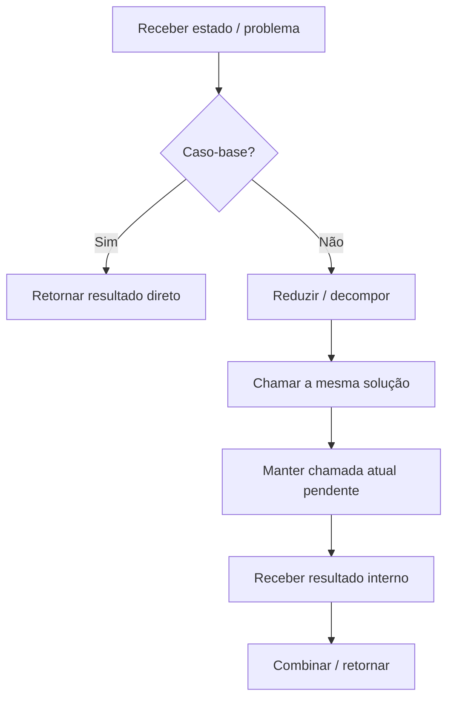

<a id="inicio"></a>

# Recursão

> **Classificação:** `[C] Obrigatório conhecer`  
> **Nível:** B — Fundamentos de Programação  
> **Posição na taxonomia:** tópico 17  
> **Pré-requisitos principais:** funções, parâmetros, retorno, condicionais e rastreamento de execução  
> **Conceitos introduzidos/reforçados aqui:** pilha de chamadas, frames, profundidade e desempilhamento (*unwinding*)  
> **Aprofundamentos posteriores:** árvores, busca/percursos, divisão e conquista, backtracking, análise de complexidade e modelos de execução

---

## Resumo executivo

Recursão é uma técnica em que uma solução usa novamente a própria definição — direta ou indiretamente. Em um algoritmo recursivo que precisa terminar, cada caminho recursivo deve conduzir o estado, dentro do domínio válido, a uma condição terminal que possa ser resolvida sem nova chamada recursiva.

O modelo mínimo é:

```text
PROBLEMA
↓
É CASO-BASE?
├── SIM → responder sem nova chamada recursiva
└── NÃO
    ↓
    REDUZIR O PROBLEMA
    ↓
    CHAMAR A MESMA IDEIA
    ↓
    COMBINAR / RETORNAR O RESULTADO
```

Uma função recursiva útil precisa de três propriedades:

```text
1. CASO-BASE
→ existe uma condição que encerra a expansão

2. CASO RECURSIVO
→ a função volta a usar a própria definição

3. PROGRESSO
→ cada chamada aproxima o problema do caso-base
```

Exemplo clássico:

```text
fatorial(4)
= 4 × fatorial(3)
= 4 × 3 × fatorial(2)
= 4 × 3 × 2 × fatorial(1)
= 4 × 3 × 2 × 1
= 24
```

A execução não “substitui texto” magicamente. Cada chamada cria estado de execução próprio e fica pendente até a chamada interna retornar.

```text
fatorial(4)
└── fatorial(3)
    └── fatorial(2)
        └── fatorial(1)
            └── retorna 1
        retorna 2
    retorna 6
retorna 24
```

Isso conecta recursão à **pilha de chamadas**.

> **Guardrail dos exemplos mínimos:** quando um snippet didático de fatorial omitir validação explícita, assuma a pré-condição `n` inteiro e `n >= 0`. O contrato cross-language robusto e a validação de domínio aparecem na §28.

Recursão não é automaticamente melhor que iteração. Em muitos problemas simples, um loop:

- consome menos stack;
- é mais direto;
- é mais fácil de depurar;
- evita limites de profundidade.

Por outro lado, recursão representa naturalmente problemas com estrutura recursiva, como:

- árvores;
- diretórios hierárquicos;
- expressões aninhadas;
- divisão do problema em subproblemas semelhantes.

O objetivo deste tópico não é “usar recursão sempre”. É aprender a:

```text
reconhecer
rastrear
escrever
comparar
limitar
escolher conscientemente
```

---

## Distinções fundamentais

```text
RECURSÃO
≠
REPETIÇÃO AUTOMATICAMENTE
≠
LOOP
≠
CHAMADA INFINITA
```

E:

```text
CASO-BASE
≠
CASO RECURSIVO
≠
MEDIDA DE PROGRESSO
```

### Definições de trabalho

| Termo | Definição operacional |
|---|---|
| **Recursão** | Técnica em que uma solução usa novamente a própria definição, direta ou indiretamente; em algoritmos que precisam terminar, o estado recursivo deve progredir até uma condição terminal no domínio válido. |
| **Caso-base** | Condição resolvida diretamente, sem nova chamada recursiva. |
| **Caso recursivo** | Parte que reduz/decompõe o problema e realiza nova chamada. |
| **Progresso** | Propriedade de cada chamada aproximar o estado do caso-base. |
| **Profundidade** | Número de chamadas recursivas ativas/aninhadas em determinado ponto. |
| **Pilha de chamadas** | Estrutura conceitual/runtime que mantém os contextos de chamadas ainda não concluídas. |
| **Recursão direta** | Função chama a si própria diretamente. |
| **Recursão indireta** | Função A chama B, que eventualmente volta a chamar A. |

---

## Regra de ouro

> **Não basta existir um caso-base: o caso recursivo precisa garantir progresso em direção a ele.**

Exemplo incorreto:

```python
def countdown(number):
    if number == 0:
        return

    countdown(number)
```

Existe caso-base, mas:

```text
number nunca muda
```

Logo a recursão não progride.

---

## Decisão rápida

| Pergunta | Resposta |
|---|---|
| “Recursão é função chamar a si própria?” | É o caso direto mais comum; também existe recursão indireta/mútua. |
| “Ter caso-base garante terminação?” | Não. As chamadas precisam realmente chegar a ele. |
| “Recursão usa loop por baixo?” | Não como regra conceitual; ela usa chamadas de função. Implementações podem otimizar, mas não se deve pressupor isso. |
| “Recursão sempre usa mais memória?” | Em implementações comuns, chamadas recursivas mantêm frames/contextos e consomem stack; otimizações específicas podem alterar isso. |
| “Recursão sempre é mais lenta?” | Não universalmente, mas possui overhead de chamada e pode ter complexidade pior se repetir subproblemas. |
| “Todo problema recursivo pode virar iteração?” | Muitos problemas práticos podem ser reformulados iterativamente, às vezes com stack explícita; a transformação pode não ser igualmente simples. |
| “Fatorial é bom exemplo de uso real?” | É ótimo exemplo didático de mecanismo, mas normalmente não justifica recursão em produção. |
| “Fibonacci ingênuo é bom exemplo?” | É útil para mostrar árvore de chamadas e explosão de trabalho; é ruim como implementação eficiente. |
| “Python limita recursão?” | Sim. O interpretador possui limite de profundidade para proteger a stack. |
| “Java pode estourar stack?” | Sim; recursão profunda pode resultar em `StackOverflowError`. |
| “JavaScript tem profundidade universal garantida?” | Não. Limites de stack são dependentes da implementação/host. |
| “Bash permite função recursiva?” | Sim. `FUNCNEST` pode limitar o nível de aninhamento; por padrão Bash não impõe esse limite específico. |
| “Tail recursion elimina stack em todas as quatro?” | Não assuma. Otimização de tail call é específica de linguagem/implementação e não deve ser requisito da solução neste nível. |
| “Quando recursão é natural?” | Estruturas hierárquicas e problemas definidos em termos de instâncias menores do mesmo problema. |

---

# Índice


- [Resumo executivo](#resumo-executivo)
- [Distinções fundamentais](#distinções-fundamentais)
- [Regra de ouro](#regra-de-ouro)
- [Decisão rápida](#decisão-rápida)
- [1. Posição deste assunto](#1-posição-deste-assunto)
  - [1.1 Fronteira com tópicos futuros](#11-fronteira-com-tópicos-futuros)
- [2. Mapa do tópico](#2-mapa-do-tópico)
  - [🗺️ Visão panorâmica — o mapa antes dos detalhes](#visao-panoramica)
- [3. 17.1 Conceito](#3-171-conceito)
  - [3.1 O que realmente acontece](#31-o-que-realmente-acontece)
- [4. Recursão direta e indireta](#4-recursão-direta-e-indireta)
  - [4.1 Direta](#41-direta)
  - [4.2 Indireta / mútua](#42-indireta--mútua)
  - [4.3 Escopo deste capítulo](#43-escopo-deste-capítulo)
- [5. 17.2 Caso-base](#5-172-caso-base)
  - [5.1 Base case não é “if obrigatório”](#51-base-case-não-é-if-obrigatório)
- [6. Mais de um caso-base](#6-mais-de-um-caso-base)
  - [6.1 Base case deve corresponder ao domínio](#61-base-case-deve-corresponder-ao-domínio)
- [7. 17.3 Caso recursivo](#7-173-caso-recursivo)
  - [7.1 O caso recursivo não pode apenas repetir](#71-o-caso-recursivo-não-pode-apenas-repetir)
- [8. Medida de progresso](#8-medida-de-progresso)
  - [8.1 Pergunta de ouro](#81-pergunta-de-ouro)
  - [8.2 Progresso não precisa ser “-1”](#82-progresso-não-precisa-ser--1)
- [9. Terminação](#9-terminação)
  - [9.1 Falha 1 — sem caso-base](#91-falha-1--sem-caso-base)
  - [9.2 Falha 2 — base inalcançável](#92-falha-2--base-inalcançável)
  - [9.3 Falha 3 — domínio não validado](#93-falha-3--domínio-não-validado)
  - [9.4 Correção](#94-correção)
- [10. 17.4 Pilha de chamadas](#10-174-pilha-de-chamadas)
  - [10.1 Pilha explica o “vai e volta”](#101-pilha-explica-o-vai-e-volta)
- [11. Rastreamento completo de fatorial](#11-rastreamento-completo-de-fatorial)
  - [11.1 Expansão](#111-expansão)
  - [11.2 Retorno](#112-retorno)
  - [11.3 Tabela de rastreamento](#113-tabela-de-rastreamento)
- [12. Frames e estado local](#12-frames-e-estado-local)
- [13. Profundidade e estouro de pilha](#13-profundidade-e-estouro-de-pilha)
  - [13.1 Não ensine “o limite é 1000” como universal](#131-não-ensine-o-limite-é-1000-como-universal)
- [14. Python e RecursionError](#14-python-e-recursionerror)
  - [14.1 Não “resolva” recursão ruim aumentando o limite](#141-não-resolva-recursão-ruim-aumentando-o-limite)
- [15. Java e StackOverflowError](#15-java-e-stackoverflowerror)
  - [15.1 Profundidade não é constante universal](#151-profundidade-não-é-constante-universal)
- [16. JavaScript e limites de implementação](#16-javascript-e-limites-de-implementação)
  - [16.1 Regra portátil](#161-regra-portátil)
  - [16.2 Tail position](#162-tail-position)
- [17. Bash e FUNCNEST](#17-bash-e-funcnest)
  - [17.1 Por padrão](#171-por-padrão)
  - [17.2 Call stack observável](#172-call-stack-observável)
- [18. 17.5 Recursão × iteração](#18-175-recursão--iteração)
  - [18.1 Iteração](#181-iteração)
  - [18.2 Recursão](#182-recursão)
  - [18.3 Escolha](#183-escolha)
- [19. Fatorial recursivo × iterativo](#19-fatorial-recursivo--iterativo)
  - [19.1 Recursivo](#191-recursivo)
  - [19.2 Iterativo](#192-iterativo)
  - [19.3 Comparação](#193-comparação)
  - [19.4 Conclusão](#194-conclusão)
- [20. Stack implícita × stack explícita](#20-stack-implícita--stack-explícita)
  - [20.1 Vantagem da recursão](#201-vantagem-da-recursão)
  - [20.2 Vantagem da stack explícita](#202-vantagem-da-stack-explícita)
- [21. Custo e complexidade](#21-custo-e-complexidade)
  - [21.1 Fatorial](#211-fatorial)
  - [21.2 Recursão não determina complexidade sozinha](#212-recursão-não-determina-complexidade-sozinha)
- [22. Fibonacci ingênuo: explosão de chamadas](#22-fibonacci-ingênuo-explosão-de-chamadas)
  - [22.1 Moral](#221-moral)
- [23. Tail recursion](#23-tail-recursion)
  - [23.1 Por que isso importa](#231-por-que-isso-importa)
  - [23.2 Guardrail](#232-guardrail)
- [24. 17.6 Aplicações simples](#24-176-aplicações-simples)
- [25. Countdown](#25-countdown)
  - [Python](#python)
  - [Modelo](#modelo)
- [26. Soma de sequência](#26-soma-de-sequência)
  - [26.1 Observação importante](#261-observação-importante)
  - [26.2 Lição](#262-lição)
- [27. Percurso hierárquico conceitual](#27-percurso-hierárquico-conceitual)
- [28. Fatorial nas quatro linguagens](#28-fatorial-nas-quatro-linguagens)
  - [28.1 Python](#281-python)
  - [28.2 JavaScript](#282-javascript)
  - [28.3 Java](#283-java)
  - [28.4 Bash](#284-bash)
  - [28.5 Bash não é equivalência perfeita](#285-bash-não-é-equivalência-perfeita)
- [29. Erros conceituais frequentes](#29-erros-conceituais-frequentes)
  - [29.1 “Tem caso-base, então termina”](#291-tem-caso-base-então-termina)
  - [29.2 “Recursão é loop com outro nome”](#292-recursão-é-loop-com-outro-nome)
  - [29.3 “Cada chamada sobrescreve as variáveis da anterior”](#293-cada-chamada-sobrescreve-as-variáveis-da-anterior)
  - [29.4 “Quando chega na base, tudo termina de uma vez”](#294-quando-chega-na-base-tudo-termina-de-uma-vez)
  - [29.5 “Recursão sempre é elegante”](#295-recursão-sempre-é-elegante)
  - [29.6 “Recursão sempre é lenta”](#296-recursão-sempre-é-lenta)
  - [29.7 “Fibonacci recursivo ingênuo é bom algoritmo”](#297-fibonacci-recursivo-ingênuo-é-bom-algoritmo)
  - [29.8 “Aumentar limite de recursão corrige algoritmo”](#298-aumentar-limite-de-recursão-corrige-algoritmo)
  - [29.9 “Tail recursion é sempre otimizada”](#299-tail-recursion-é-sempre-otimizada)
  - [29.10 “Bash não permite recursão”](#2910-bash-não-permite-recursão)
  - [29.11 “A profundidade máxima é igual em todo computador”](#2911-a-profundidade-máxima-é-igual-em-todo-computador)
  - [29.12 “Recursão de diretório pode seguir qualquer link sem risco”](#2912-recursão-de-diretório-pode-seguir-qualquer-link-sem-risco)
- [30. Método de análise de função recursiva](#30-método-de-análise-de-função-recursiva)
- [31. Debugging de recursão](#31-debugging-de-recursão)
  - [31.1 Python — instrumentação simples](#311-python--instrumentação-simples)
  - [31.2 Estratégia](#312-estratégia)
  - [31.3 Stack trace é evidência](#313-stack-trace-é-evidência)
- [32. Testes](#32-testes)
  - [32.1 Teste de profundidade](#321-teste-de-profundidade)
  - [32.2 Teste estrutural](#322-teste-estrutural)
- [33. Boas práticas](#33-boas-práticas)
  - [33.1 Declare o domínio](#331-declare-o-domínio)
  - [33.2 Faça o caso-base visível](#332-faça-o-caso-base-visível)
  - [33.3 Mostre o progresso](#333-mostre-o-progresso)
  - [33.4 Evite efeitos colaterais desnecessários](#334-evite-efeitos-colaterais-desnecessários)
  - [33.5 Não use recursão apenas para “parecer elegante”](#335-não-use-recursão-apenas-para-parecer-elegante)
  - [33.6 Não misture múltiplos problemas](#336-não-misture-múltiplos-problemas)
- [34. Segurança e robustez](#34-segurança-e-robustez)
  - [34.1 Riscos](#341-riscos)
  - [34.2 Guardrails](#342-guardrails)
- [35. NetDev — aplicação prática](#35-netdev--aplicação-prática)
  - [35.1 Inventário hierárquico](#351-inventário-hierárquico)
  - [35.2 Configuração aninhada](#352-configuração-aninhada)
  - [35.3 Topologia não é automaticamente árvore](#353-topologia-não-é-automaticamente-árvore)
  - [35.4 Diretórios de backup/config](#354-diretórios-de-backupconfig)
- [36. Comparativo das quatro linguagens](#36-comparativo-das-quatro-linguagens)
  - [36.1 Diferença crítica de Bash](#361-diferença-crítica-de-bash)
- [37. O que fica para depois](#37-o-que-fica-para-depois)
  - [Fronteira](#fronteira)
- [🧩 Problemas Reais — índice operacional](#problemas-reais)
- [🔎 Troubleshooting sistemático](#troubleshooting-sistematico)
- [38. Laboratórios](#38-laboratórios)
  - [Critério mínimo de conclusão dos LABs](#critério-mínimo-de-conclusão-dos-labs)
  - [🧪 LAB 1 — rastrear fatorial](#-lab-1--rastrear-fatorial)
  - [🧪 LAB 2 — quebrar a terminação](#-lab-2--quebrar-a-terminação)
  - [🧪 LAB 3 — recursivo × iterativo](#-lab-3--recursivo--iterativo)
  - [🧪 LAB 4 — Python recursion limit](#-lab-4--python-recursion-limit)
  - [🧪 LAB 5 — Bash FUNCNEST](#-lab-5--bash-funcnest)
  - [🧪 LAB 6 — Fibonacci ingênuo](#-lab-6--fibonacci-ingênuo)
  - [🧪 LAB 7 — árvore pequena](#-lab-7--árvore-pequena)
  - [🧪 LAB 8 — NetDev: grupos aninhados](#-lab-8--netdev-grupos-aninhados)
- [39. Exercícios](#39-exercícios)
  - [Exercícios de diagnóstico e decisão](#exercícios-de-diagnóstico-e-decisão)
- [40. Evidências de domínio](#40-evidências-de-domínio)
  - [17.1 Conceito `[C]`](#171-conceito-c)
  - [17.2 Caso-base `[C]`](#172-caso-base-c)
  - [17.3 Caso recursivo `[C]`](#173-caso-recursivo-c)
  - [17.4 Pilha de chamadas `[C]`](#174-pilha-de-chamadas-c)
  - [17.5 Recursão × iteração `[C]`](#175-recursão--iteração-c)
  - [17.6 Aplicações simples `[C]`](#176-aplicações-simples-c)
  - [Transferência](#transferência)
- [41. Checklist de consulta rápida](#41-checklist-de-consulta-rápida)
- [42. Glossário](#42-glossário)
- [43. Referências](#43-referências)
  - [43.1 Taxonomia e contrato](#431-taxonomia-e-contrato)
  - [43.2 Currículo](#432-currículo)
  - [43.3 Python 3.14.7](#433-python-3147)
  - [43.4 ECMAScript 2026](#434-ecmascript-2026)
  - [43.5 Java SE 27](#435-java-se-27)
  - [43.6 GNU Bash 5.3](#436-gnu-bash-53)
  - [43.7 Livros técnicos](#437-livros-técnicos)
  - [43.8 Hierarquia usada nesta versão](#438-hierarquia-usada-nesta-versão)
  - [43.9 Registro histórico — fontes locais revalidadas na revisão 0.3.0](#439-registro-histórico--fontes-locais-revalidadas-na-revisão-030)
  - [43.10 Registro histórico — revalidação oficial realizada na revisão 0.3.0](#4310-registro-histórico--revalidação-oficial-realizada-na-revisão-030)
  - [43.11 Síntese multifonte e divergências reconciliadas](#4311-síntese-multifonte-e-divergências-reconciliadas)
  - [43.12 Estado de QA e evidência da revisão 0.3.2](#4312-estado-de-qa-e-evidência-da-revisão-032)
- [44. Histórico de versões](#44-histórico-de-versões)

---

# 1. Posição deste assunto

O tópico 11 apresentou funções, parâmetros e retorno.

O tópico 12 apresentou rastreamento da execução.

Agora combinamos os dois:

```text
FUNÇÃO
+
CHAMADA DE FUNÇÃO
+
ESTADO LOCAL
+
RASTREAMENTO
↓
RECURSÃO
```

A taxonomia classifica recursão como:

```text
[C] Obrigatório conhecer
```

Isso é coerente com seu papel curricular:

- é fundamento importante;
- aparece em algoritmos e estruturas hierárquicas;
- precisa ser compreendida e rastreada;
- não precisa ser escolhida como solução padrão para todo problema.

CS2023 inclui **recursion** no núcleo de Software Development Fundamentals.

## 1.1 Fronteira com tópicos futuros

Aqui:

```text
mecanismo
caso-base
caso recursivo
pilha
comparação com iteração
aplicações simples
```

Depois:

```text
árvores
DFS
divisão e conquista
backtracking
recorrências
complexidade aprofundada
```

[↑ Voltar ao índice](#índice)

---

# 2. Mapa do tópico

> **Convenção de numeração:** o número editorial identifica a posição da seção neste documento; `17.x` identifica o nó curricular canônico. IDs `PR-T17-*` e `TS-T17-*` pertencem à rastreabilidade operacional e não são novos nós da taxonomia.

<a id="visao-panoramica"></a>

## 🗺️ Visão panorâmica — o mapa antes dos detalhes

Esta seção funciona como **caderno rápido de consulta**, **modelo mental** e **contrato de cobertura** do T17. Ela sintetiza o que precisa ser recuperado rapidamente antes de entrar nos detalhes.

### Mapa do domínio

```text
RECURSÃO
│
├── definição
│   ├── direta
│   └── indireta / mútua
│
├── terminação
│   ├── domínio válido
│   ├── caso-base
│   ├── caso recursivo
│   └── medida de progresso
│
├── execução
│   ├── chamada
│   ├── frame / contexto
│   ├── chamada pendente
│   ├── profundidade
│   ├── retorno
│   └── unwinding / desempilhamento
│
├── escolha
│   ├── recursão
│   ├── iteração
│   └── stack explícita
│
├── custo e risco
│   ├── número de chamadas
│   ├── memória de stack
│   ├── limite do runtime
│   ├── subproblemas repetidos
│   ├── ciclos
│   └── entrada adversarialmente profunda
│
└── aplicações
    ├── definições matemáticas
    ├── estruturas hierárquicas
    ├── diretórios / árvores
    ├── configuração aninhada
    └── divisão em subproblemas semelhantes
```

### Fluxo essencial — expansão e retorno



Leitura operacional:

```text
ENTRADA
↓
VALIDAR DOMÍNIO
↓
CASO-BASE?
├── sim → RESULTADO DIRETO
└── não
    ↓
    PROGRESSO
    ↓
    NOVA CHAMADA
    ↓
    ...
    ↓
CASO-BASE
↓
RETORNOS EM ORDEM INVERSA
↓
RESULTADO FINAL
```

A ida e a volta são partes diferentes do mecanismo:

```text
EXPANSÃO
→ cria chamadas pendentes

UNWINDING
→ resolve essas chamadas em ordem inversa
```

### Consulta rápida — conceito, regra e risco

| Conceito | Para que serve | Regra operacional | Risco se entendido errado |
|---|---|---|---|
| Recursão | expressar solução em termos de instâncias menores da mesma ideia | cada caminho válido precisa terminar | chamada infinita / stack exhaustion |
| Caso-base | resolver diretamente uma condição terminal | não faz nova chamada recursiva naquele caminho | base ausente ou incorreta |
| Caso recursivo | decompor/reduzir e chamar novamente | precisa preservar o contrato | redução errada / resultado incorreto |
| Progresso | aproximar cada chamada de uma base | deve existir medida observável | base existe, mas nunca é alcançada |
| Frame/contexto | manter estado de uma chamada ativa | chamadas ativas não “sobrescrevem” simplesmente umas às outras | modelo mental incorreto do retorno |
| Profundidade | quantificar aninhamento simultâneo | considerar pior caminho, não apenas número total de chamadas | overflow mesmo com algoritmo terminante |
| Unwinding | concluir chamadas pendentes | combinação ocorre na ordem inversa da expansão | resultado combinado em ordem errada |
| Recursão × iteração | escolher representação adequada | comparar clareza, profundidade, custo e robustez | usar recursão por estética |
| Stack explícita | substituir chamada recursiva por estado controlado pelo programa | útil quando profundidade não é confiável | complexidade adicional desnecessária |
| Ciclo | revisitar estado/nó anterior | árvore verdadeira não tem ciclo; grafo/topologia pode ter | não terminação apesar de “filhos menores” |
| Subproblema repetido | mesma computação reaparece em ramos diferentes | medir árvore de chamadas | explosão temporal |
| Tail position | chamada sem trabalho relevante posterior no chamador | não implica otimização portátil em todas as linguagens/runtimes | falsa sensação de segurança |

### Pergunta prática → onde olhar primeiro

| Pergunta | Mecanismo / seção principal |
|---|---|
| “Por que não termina?” | domínio + caso-base + progresso — §§ 5–9 |
| “Por que retorna na ordem inversa?” | stack, frames e unwinding — §§ 10–12 |
| “Por que estourou mesmo com base correta?” | profundidade e runtime — §§ 13–17 |
| “Loop seria melhor?” | recursão × iteração — §§ 18–20 |
| “O código curto está lento?” | número de chamadas e repetição de subproblemas — §§ 21–22 |
| “Tail recursion resolve o limite?” | tail position / PTC — § 23 |
| “Como transferir para outra linguagem?” | exemplos e comparação — §§ 28 e 36 |
| “Como investigar uma falha?” | debugging + troubleshooting — § 31 + `TS-T17-*` |
| “Como atravessar hierarquia de rede/config?” | aplicação estrutural e NetDev — §§ 27 e 35 |
| “E se a estrutura tiver ciclos?” | segurança, `visited` e limites — §§ 34–35 + `TS-T17-10` |

### Não confundir

```text
RECursão
≠
LOOP
```

Ambos podem expressar repetição, mas o mecanismo de controle de fluxo é diferente.

```text
CASO-BASE
≠
PROGRESSO
```

Uma função pode possuir base correta e mesmo assim nunca chegar a ela.

```text
NÚMERO TOTAL DE CHAMADAS
≠
PROFUNDIDADE MÁXIMA
```

Um algoritmo pode fazer muitas chamadas com pouca profundidade, ou poucas chamadas em uma cadeia profunda.

```text
TAIL RECURSION
≠
TAIL-CALL ELIMINATION GARANTIDA
```

A forma do código e a garantia do runtime são questões diferentes.

```text
ÁRVORE
≠
GRAFO / TOPOLOGIA
```

Uma topologia de rede pode conter ciclos; atravessá-la recursivamente sem estado de visita pode não terminar.

### Microexemplos canônicos

**1. Base + progresso:**

```python
def countdown(number: int) -> None:
    if number == 0:
        return
    countdown(number - 1)
```

**2. Base existe, mas não há progresso:**

```python
def broken(number: int) -> None:
    if number == 0:
        return
    broken(number)
```

**3. Trabalho depois da chamada:**

```python
def factorial(n: int) -> int:
    if n <= 1:
        return 1
    return n * factorial(n - 1)
```

A multiplicação fica pendente enquanto a chamada interna é resolvida; portanto esse fatorial clássico **não** é tail recursive.

### Problemas reais representativos

Os problemas abaixo têm rastreabilidade formal no índice `PR-T17-*`:

- `PR-T17-01` — atravessar estrutura aninhada preservando base, progresso e profundidade;
- `PR-T17-02` — diagnosticar recursão que não termina apesar de existir um `if` de parada;
- `PR-T17-03` — substituir recursão por iteração/stack explícita quando a profundidade não é confiável;
- `PR-T17-04` — impedir revisita infinita em topologia/grafo com ciclos;
- `PR-T17-05` — escolher entre recursão e loop para problema linear simples;
- `PR-T17-06` — reconhecer explosão de trabalho por subproblemas repetidos;
- `PR-T17-07` — tratar limites/falhas de stack de forma dependente do runtime;
- `PR-T17-08` — transferir o mesmo contrato entre Python, JavaScript, Java e Bash sem fingir equivalência perfeita;
- `PR-T17-09` — percorrer políticas/grupos/configurações hierárquicas em automação de rede com guardrails de ciclo/profundidade.

### Entrada rápida de troubleshooting

| Sintoma | Primeira hipótese útil | Primeira verificação |
|---|---|---|
| chamadas repetem até falhar | base ausente ou progresso inexistente | registrar argumento em cada nível |
| base aparece no código, mas não é alcançada | domínio inválido ou direção de progresso errada | testar valor inicial + sequência de estados |
| resultado final está errado, mas termina | combinação no unwinding | rastrear retorno de cada frame |
| funciona pequeno e falha grande | profundidade/stack | medir profundidade esperada e runtime alvo |
| demora muito para entrada moderada | ramos repetem subproblemas | desenhar árvore de chamadas / contar invocações |
| traversal de topologia não termina | ciclo | registrar `visited` / identidade dos nós |
| JavaScript acusa “Maximum call stack size exceeded” | profundidade excessiva/base ausente | reproduzir com entrada mínima e stack trace |
| Bash aborta ao aninhar funções | `FUNCNEST` ou recurso finito | inspecionar `FUNCNEST`, `FUNCNAME`, `caller` |

### Transferência entre Python, JavaScript, Java e Bash

| Dimensão | Python | JavaScript | Java | Bash |
|---|---|---|---|---|
| chamada recursiva | natural | natural | natural | possível em shell functions |
| retorno de dado | `return value` | `return value` | `return value` | `return` é status; dado exige outro canal |
| falha típica de profundidade | `RecursionError` | dependente da engine, frequentemente `RangeError`/`InternalError` | `StackOverflowError` | `FUNCNEST` pode abortar a invocação; outros limites continuam finitos |
| limite numérico portátil | não assumir; consultar API/runtime | não existe número universal no ECMAScript | não existe número universal | `FUNCNEST` é opcional, não “stack infinita” |
| PTC/TCO para segurança | não assumir | a especificação define tail position em condições específicas; não usar como pressuposto operacional geral | não assumir | não assumir |
| recursão profunda como escolha padrão | não | não | não | especialmente não |

### Modo consulta × modo estudo

**Consulta rápida (~30 s):**

```text
Regra de ouro
→ tabela de consulta rápida
→ sintoma de troubleshooting
→ comparativo da linguagem
```

**Primeira passagem — núcleo do tópico:**

```text
conceito
→ base
→ caso recursivo / progresso
→ stack / frames / unwinding
→ rastreamento
→ recursão × iteração
→ aplicações simples
→ checklist
```

**Segunda passagem — aprofundamento operacional/version-sensitive:**

```text
limites por runtime
→ Fibonacci / custo
→ tail position
→ quatro linguagens
→ segurança / NetDev
→ PR-*
→ troubleshooting
→ LABs
→ evidências de domínio
```

A primeira passagem deve construir o modelo mental. Detalhes normativos de ECMAScript, Bash 5.3 e limites de runtime servem principalmente como **aprofundamento e referência**, não como pré-requisito para compreender a mecânica básica.

### Convenção terminológica

Na primeira ocorrência relevante, o texto pode apresentar português + termo técnico em inglês, como **pilha de chamadas** (*call stack*) e **desempilhamento** (*unwinding*). Depois, prefira o termo em português quando ele não reduzir a precisão; nomes normativos, APIs e exceções permanecem na forma oficial.

### Pré-requisitos e fronteiras

Pré-requisitos materiais:

```text
funções
parâmetros
retorno
condicionais
escopo / estado local
rastreamento de execução
```

Fica **neste tópico**:

```text
mecanismo fundamental de recursão
base / caso recursivo / progresso
call stack e unwinding
profundidade e limites introdutórios
recursão × iteração
aplicações simples
```

Fica **para aprofundamentos posteriores**:

```text
recorrências e Master Theorem
memoization e programação dinâmica
backtracking formal
divide and conquer formal
DFS/BFS
tree algorithms completos
trampolines / CPS
provas formais de terminação
```

A Visão Panorâmica combina a taxonomia v2.1.0, CS2023, documentação oficial das quatro linguagens/runtimes e modelos didáticos de Farrell, Bhargava, Ramalho, Beazley e CLRS. Diferenças entre simplificações didáticas e comportamento versionado são reconciliadas nas referências.

[↑ Voltar ao índice](#índice)

---

# 3. 17.1 Conceito

**Classificação:** `[C]`

Taxonomia:

```text
função chama a si própria
```

Exemplo mínimo:

```python
def countdown(number):
    if number == 0:
        return

    print(number)
    countdown(number - 1)
```

Chamada:

```python
countdown(3)
```

Saída esperada:

```text
3
2
1
```

## 3.1 O que realmente acontece

Não acontece:

```text
“a função volta para o começo como um loop”
```

Acontece:

```text
countdown(3)
→ cria uma chamada
→ chama countdown(2)
   → cria outra chamada
   → chama countdown(1)
      → cria outra chamada
      → chama countdown(0)
         → retorna
      → retorna
   → retorna
→ retorna
```

Cada chamada possui seu próprio parâmetro `number`.

[↑ Voltar ao índice](#índice)

---

# 4. Recursão direta e indireta

## 4.1 Direta

```python
def function_a(n):
    if n == 0:
        return
    function_a(n - 1)
```

## 4.2 Indireta / mútua

> **Pré-condição didática deste exemplo:** `n` é inteiro e `n >= 0`. Para valores fora desse domínio, a função precisa validar/normalizar a entrada antes de iniciar a recursão; caso contrário, `n - 1` pode afastar o estado da base `0`.

```python
def is_even(n):
    if n == 0:
        return True
    return is_odd(n - 1)


def is_odd(n):
    if n == 0:
        return False
    return is_even(n - 1)
```

Aqui:

```text
is_even
→ is_odd
→ is_even
→ ...
```

Existe ciclo de chamadas mesmo sem uma função chamar a si própria diretamente na mesma linha.

## 4.3 Escopo deste capítulo

Dominar o mecanismo de recursão direta é suficiente para o núcleo.

Recursão indireta é importante para não adotar a definição estreita:

```text
“recursão só existe quando vejo o mesmo nome dentro da função”
```

[↑ Voltar ao índice](#índice)

---

# 5. 17.2 Caso-base

**Classificação:** `[C]`

Taxonomia:

```text
condição de término
```

Caso-base é uma instância que pode ser resolvida sem nova chamada recursiva.

Fatorial:

```text
1! = 1
```

Implementação:

```python
def factorial(n):
    if n <= 1:
        return 1

    return n * factorial(n - 1)
```

O caso-base:

```python
if n <= 1:
    return 1
```

impede novas chamadas quando o problema chega à condição resolvível diretamente.

## 5.1 Base case não é “if obrigatório”

O conceito é:

```text
algum caminho termina sem recursão adicional
```

A forma sintática pode variar.

[↑ Voltar ao índice](#índice)

---

# 6. Mais de um caso-base

Uma função pode possuir vários casos-base.

Exemplo didático de Fibonacci:

```python
def fibonacci(n):
    if n == 0:
        return 0

    if n == 1:
        return 1

    return fibonacci(n - 1) + fibonacci(n - 2)
```

Casos-base:

```text
fibonacci(0) = 0
fibonacci(1) = 1
```

## 6.1 Base case deve corresponder ao domínio

Se a função aceita apenas:

```text
n >= 0
```

esse contrato precisa ser definido.

Não use um caso-base amplo apenas para “parar” chamadas inválidas sem explicar a semântica.

[↑ Voltar ao índice](#índice)

---

# 7. 17.3 Caso recursivo

**Classificação:** `[C]`

Taxonomia:

```text
redução progressiva do problema
```

Fatorial:

```python
return n * factorial(n - 1)
```

Essa linha contém duas ideias:

```text
1. REDUZIR
n → n - 1

2. COMBINAR
n × resultado do problema menor
```

## 7.1 O caso recursivo não pode apenas repetir

Errado:

```python
def factorial(n):
    if n <= 1:
        return 1

    return n * factorial(n)
```

O argumento não diminui.

Resultado:

```text
fatorial(5)
→ fatorial(5)
→ fatorial(5)
→ ...
```

[↑ Voltar ao índice](#índice)

---

# 8. Medida de progresso

Para analisar terminação, identifique uma **medida de progresso** que, em todo caminho recursivo válido, aproxime o estado de uma condição terminal e impeça regressão indefinida.

Exemplos:

```text
countdown(n)
→ n diminui até 0

factorial(n)
→ n diminui até 1

process_list(items)
→ quantidade de itens restantes diminui

walk_tree(node)
→ cada chamada desce para subárvore menor
```

## 8.1 Pergunta de ouro

> **O que fica estritamente menor, mais perto, mais simples ou mais resolvido em cada chamada?**

Se você não consegue responder, a terminação merece suspeita.

## 8.2 Progresso não precisa ser “-1”

Busca binária recursiva, por exemplo, reduz um intervalo aproximadamente pela metade.

Esse aprofundamento pertence ao tópico de algoritmos de busca.

[↑ Voltar ao índice](#índice)

---

# 9. Terminação

Caso-base e progresso trabalham juntos.

```text
CASO-BASE EXISTE
+
TODAS AS CADEIAS RECURSIVAS VÁLIDAS PROGRIDEM PARA ELE
→ terminação esperada dentro do domínio
```

## 9.1 Falha 1 — sem caso-base

```python
def forever(n):
    return forever(n - 1)
```

## 9.2 Falha 2 — base inalcançável

```python
def countdown(n):
    if n == 0:
        return

    countdown(n + 1)
```

Para entrada positiva:

```text
n se afasta de 0
```

## 9.3 Falha 3 — domínio não validado

```python
def countdown(n):
    if n == 0:
        return

    countdown(n - 1)
```

Se `n = -1`:

```text
-1 → -2 → -3 → ...
```

O caso-base existe, mas é inalcançável para aquela entrada.

## 9.4 Correção

Definir contrato:

```text
n é inteiro >= 0
```

ou adaptar a função para o domínio desejado.

[↑ Voltar ao índice](#índice)

---

# 10. 17.4 Pilha de chamadas

**Classificação:** `[C]`

Taxonomia:

```text
chamadas pendentes
retorno
```

Quando uma função chama outra, a chamada atual precisa preservar informações para continuar depois.

Modelo conceitual:

```text
CALL STACK

┌───────────────┐
│ factorial(1)  │ ← topo
├───────────────┤
│ factorial(2)  │
├───────────────┤
│ factorial(3)  │
├───────────────┤
│ factorial(4)  │
└───────────────┘
```

Quando `factorial(1)` retorna:

```text
frame de factorial(1) sai
↓
factorial(2) continua
↓
retorna
↓
factorial(3) continua
...
```

## 10.1 Pilha explica o “vai e volta”

Recursão possui duas fases mentais:

```text
DESCIDA
→ novas chamadas

SUBIDA / UNWINDING
→ retornos e combinação dos resultados
```

[↑ Voltar ao índice](#índice)

---

# 11. Rastreamento completo de fatorial

Função:

```python
def factorial(n):
    if n <= 1:
        return 1

    return n * factorial(n - 1)
```

Chamada:

```python
factorial(4)
```

## 11.1 Expansão

```text
factorial(4)
→ 4 * factorial(3)

factorial(3)
→ 3 * factorial(2)

factorial(2)
→ 2 * factorial(1)

factorial(1)
→ 1
```

## 11.2 Retorno

```text
factorial(1)
→ 1

factorial(2)
→ 2 * 1
→ 2

factorial(3)
→ 3 * 2
→ 6

factorial(4)
→ 4 * 6
→ 24
```

## 11.3 Tabela de rastreamento

| Profundidade | Chamada | Ação antes da chamada interna | Resultado retornado |
|---:|---|---|---:|
| 1 | `factorial(4)` | aguarda `4 * ...` | 24 |
| 2 | `factorial(3)` | aguarda `3 * ...` | 6 |
| 3 | `factorial(2)` | aguarda `2 * ...` | 2 |
| 4 | `factorial(1)` | caso-base | 1 |

[↑ Voltar ao índice](#índice)

---

# 12. Frames e estado local

Cada chamada possui seu próprio contexto local.

Exemplo:

```python
def show_depth(n):
    current = n

    if n == 0:
        print("base", current)
        return

    print("down", current)
    show_depth(n - 1)
    print("up", current)
```

Chamada:

```python
show_depth(2)
```

Saída esperada:

```text
down 2
down 1
base 0
up 1
up 2
```

Observe:

```text
current=2
```

não é sobrescrito pela chamada com:

```text
current=1
```

Cada chamada mantém seu próprio estado local enquanto está ativa.

[↑ Voltar ao índice](#índice)

---

# 13. Profundidade e estouro de pilha

Cada chamada ativa consome recursos.

Se a profundidade cresce demais:

```text
recursão profunda
↓
muitos frames/contextos ativos
↓
limite de runtime/stack/recurso
↓
falha
```

O limite exato não é universal.

Depende de:

- linguagem;
- implementação;
- runtime;
- configuração;
- plataforma;
- tamanho dos frames;
- otimizações.

## 13.1 Não ensine “o limite é 1000” como universal

Python frequentemente usa valor próximo disso por padrão em CPython, mas a API correta é consultar:

```python
sys.getrecursionlimit()
```

E o próprio valor pode ser alterado.

[↑ Voltar ao índice](#índice)

---

# 14. Python e RecursionError

Python expõe:

```python
import sys

print(sys.getrecursionlimit())
```

A documentação define esse valor como a profundidade máxima da stack do interpretador, usada para impedir que recursão infinita provoque overflow da stack C.

Recursão excessiva normalmente resulta em:

```text
RecursionError
```

## 14.1 Não “resolva” recursão ruim aumentando o limite

```python
sys.setrecursionlimit(...)
```

existe, mas aumentar sem compreender o algoritmo pode apenas mover o ponto de falha e elevar risco de crash.

Primeiro pergunte:

```text
por que a profundidade é tão grande?
iteração seria melhor?
o problema é naturalmente profundo?
há bug de terminação?
```

[↑ Voltar ao índice](#índice)

---

# 15. Java e StackOverflowError

A API Java SE 27 define `StackOverflowError` como erro lançado quando ocorre stack overflow porque a aplicação recorre profundamente demais.

Exemplo perigoso:

```java
static void recurse() {
    recurse();
}
```

A execução eventualmente pode produzir:

```text
StackOverflowError
```

## 15.1 Profundidade não é constante universal

A documentação de `Thread` observa que tamanho de stack e profundidade máxima dependem de plataforma e JVM.

Logo evite:

```text
“Java suporta exatamente N chamadas”
```

[↑ Voltar ao índice](#índice)

---

# 16. JavaScript e limites de implementação

ECMAScript define semântica de chamadas, execution contexts e operações relacionadas, mas não oferece ao programador uma profundidade numérica universal garantida para recursão comum.

Implementações possuem limites de recurso.

Em engines comuns, recursão excessiva termina com erro de stack, frequentemente `RangeError` ou erro equivalente da implementação.

## 16.1 Regra portátil

Não escreva lógica que dependa de:

```text
“meu browser/Node suporta exatamente N níveis”
```

## 16.2 Tail position

ECMAScript 2026 define formalmente *tail position* e `PrepareForTailCall`. A própria operação `IsInTailPosition` restringe essa classificação: a chamada precisa estar em código *strict* e existem exclusões para corpos generator/async especificados pelo standard.

Portanto:

```text
return f(x)
```

não basta, sozinho, para justificar a afirmação “esta chamada será otimizada em qualquer runtime”. Neste tópico, robustez nunca depende de uma profundidade “salva” por tail-call elimination.

[↑ Voltar ao índice](#índice)

---

# 17. Bash e FUNCNEST

GNU Bash permite funções recursivas.

A documentação informa:

```text
FUNCNEST > 0
→ define nível máximo de aninhamento de funções
```

Exemplo seguro:

```bash
FUNCNEST=20
```

Se o nível for excedido, a invocação é abortada.

## 17.1 Por padrão

GNU Bash 5.3 informa que, por padrão, não coloca limite próprio no número de chamadas recursivas por `FUNCNEST`.

Isso **não significa profundidade infinita real**.

Outros recursos da máquina/processo continuam finitos.

## 17.2 Call stack observável

Bash possui:

```text
FUNCNAME
BASH_SOURCE
BASH_LINENO
caller
```

que podem ajudar a observar a pilha de chamadas.

[↑ Voltar ao índice](#índice)

---

# 18. 17.5 Recursão × iteração

**Classificação:** `[C]`

Taxonomia:

```text
equivalência possível
clareza
custo
limitações
```

Recursão e iteração são duas formas de expressar repetição/composição de estados.

## 18.1 Iteração

```text
estado explícito
↓
loop atualiza estado
↓
condição encerra
```

## 18.2 Recursão

```text
estado via parâmetros/frames
↓
chamada reduz problema
↓
caso-base encerra
↓
retornos recompõem resultado
```

## 18.3 Escolha

Pergunte:

```text
problema é naturalmente hierárquico/recursivo?
profundidade pode crescer muito?
estado é simples de manter em loop?
recursão melhora clareza?
há repetição de subproblemas?
stack é um risco?
```

[↑ Voltar ao índice](#índice)

---

# 19. Fatorial recursivo × iterativo

## 19.1 Recursivo

```python
def factorial_recursive(n):
    if n <= 1:
        return 1

    return n * factorial_recursive(n - 1)
```

## 19.2 Iterativo

```python
def factorial_iterative(n):
    result = 1

    for value in range(2, n + 1):
        result *= value

    return result
```

## 19.3 Comparação

| Critério | Recursivo | Iterativo |
|---|---|---|
| correspondência com definição matemática | alta | média |
| stack adicional proporcional a `n` | sim no modelo comum | não |
| número de multiplicações | `n-1` | `n-1` |
| risco de profundidade | sim | muito menor |
| clareza para fatorial simples | discutível | geralmente alta |

## 19.4 Conclusão

Fatorial é excelente para aprender recursão.

Não é evidência de que recursão seja a melhor implementação operacional para fatorial.

[↑ Voltar ao índice](#índice)

---

# 20. Stack implícita × stack explícita

Problemas hierárquicos frequentemente exigem lembrar “o que falta processar”.

Recursão usa a pilha de chamadas implicitamente.

Uma solução iterativa pode usar uma estrutura explícita:

```text
stack = [...]
while stack not empty:
    item = pop
    process
    push children
```

## 20.1 Vantagem da recursão

Código pode refletir a definição natural da estrutura.

## 20.2 Vantagem da stack explícita

Você controla:

- memória;
- ordem;
- profundidade;
- pausa/retomada;
- tratamento de casos extremos.

A estrutura `Stack` será aprofundada no tópico 27.

[↑ Voltar ao índice](#índice)

---

# 21. Custo e complexidade

O custo de uma função recursiva depende de:

```text
quantas chamadas são feitas?
quanto trabalho cada chamada faz?
qual profundidade máxima fica ativa?
os mesmos subproblemas são recalculados?
```

## 21.1 Fatorial

```text
factorial(n)
→ uma chamada para n, n-1, ..., 1
```

Tempo:

```text
O(n)
```

Stack:

```text
O(n)
```

no modelo comum sem eliminação da recursão.

> **Precisão do modelo:** `O(n)` acima conta chamadas/multiplicações no modelo introdutório de custo unitário. O custo da aritmética com inteiros de magnitude crescente pertence à análise de complexidade mais aprofundada e não é tratado como constante universal fora desse modelo.

## 21.2 Recursão não determina complexidade sozinha

Duas funções recursivas podem ter custos drasticamente diferentes.

[↑ Voltar ao índice](#índice)

---

# 22. Fibonacci ingênuo: explosão de chamadas

> **Pré-condição didática:** `n` é inteiro e `n >= 0`. O exemplo abaixo existe para visualizar árvore de chamadas e repetição de subproblemas; validação robusta de entrada não é o foco deste snippet.

```python
def fibonacci(n):
    if n <= 1:
        return n

    return fibonacci(n - 1) + fibonacci(n - 2)
```

Para `fibonacci(5)`:

```text
fib(5)
├── fib(4)
│   ├── fib(3)
│   └── fib(2)
└── fib(3)
    ├── fib(2)
    └── fib(1)
```

Observe:

```text
fib(3)
```

e:

```text
fib(2)
```

são recalculados várias vezes.

## 22.1 Moral

> **Código recursivo curto não implica algoritmo eficiente.**

A forma ingênua cresce exponencialmente em número total de chamadas. Isso **não** significa profundidade exponencial: nesse modelo, o caminho ativo mais profundo reduz `n` até a base, portanto a profundidade máxima da pilha cresce linearmente, `O(n)`.

Memoization/dynamic programming serão tratados posteriormente como estratégias mais avançadas. Para o objetivo operacional deste tópico, se você precisa calcular Fibonacci numericamente para entradas maiores, uma **formulação iterativa linear** é a alternativa imediata mais simples antes desses aprofundamentos.

[↑ Voltar ao índice](#índice)

---

# 23. Tail recursion

> **Aprofundamento version-sensitive:** nesta etapa, o objetivo é reconhecer a forma e saber que ela **não garante** segurança de stack de modo portátil. Os detalhes normativos servem como referência.

Tail recursion ocorre quando a chamada recursiva é a última operação relevante do caminho e o resultado é retornado diretamente.

Exemplo conceitual:

```text
return f(next_state)
```

## 23.1 Por que isso importa

Algumas linguagens/implementações conseguem reutilizar recursos de execução em tail calls.

## 23.2 Guardrail

Neste guia:

> **não dependa de otimização de tail call para tornar uma recursão profunda segura.**

Python não fornece *proper tail calls* como mecanismo geral; escrever uma forma tail-recursive não elimina por si só os frames de chamadas.

Java não oferece garantia geral de tail-call optimization como contrato de linguagem.

Bash também não deve ser tratado como runtime com TCO garantida.

ECMAScript 2026 possui semântica normativa de *tail position* e `PrepareForTailCall`, mas somente em condições específicas — incluindo código *strict*. `IsInTailPosition` também exclui, entre outros casos normativos, corpos de **generator**, **async function**, **async generator** e `AsyncConciseBody`. Para código que precisa ser robusto entre ambientes, **não use PTC como substituto de análise de profundidade, testes e escolha explícita de iteração/stack quando necessário**.

[↑ Voltar ao índice](#índice)

---

# 24. 17.6 Aplicações simples

**Classificação:** `[C]`

Taxonomia:

```text
fatorial
estruturas hierárquicas
divisão de problemas
```

Recursão é especialmente natural quando o problema já possui definição recursiva.

Exemplos:

```text
árvore
→ nó contém subárvores

diretório
→ diretório contém arquivos e subdiretórios

expressão
→ expressão contém subexpressões

problema
→ pode ser reduzido a instância menor do mesmo problema
```

[↑ Voltar ao índice](#índice)

---

# 25. Countdown

Exemplo mínimo de recursão linear.

## Python

```python
def countdown(number):
    if number == 0:
        return

    print(number)
    countdown(number - 1)
```

## Modelo

```text
3
↓
2
↓
1
↓
0 base
```

É simples porque não existe trabalho após o retorno da chamada interna.

[↑ Voltar ao índice](#índice)

---

# 26. Soma de sequência

Definição:

```text
sum([]) = 0
sum([x, ...rest]) = x + sum(rest)
```

Python didático:

```python
def recursive_sum(values):
    if not values:
        return 0

    return values[0] + recursive_sum(values[1:])
```

## 26.1 Observação importante

Esse exemplo cria slices sucessivos:

```python
values[1:]
```

Isso adiciona custo de cópia/alocação. Com listas Python e slicing eager, os slices de tamanhos aproximadamente `n-1`, `n-2`, ..., `1` fazem o **total de referências copiadas** crescer como `O(n²)` ao longo da execução; como os frames ancestrais continuam ativos, os slices também podem elevar o espaço auxiliar agregado para `O(n²)` no pior ponto dessa implementação. Esse custo vem da **representação do subproblema**, não da recursão por si só.

Uma versão com índice evita as cópias dos slices; a pilha recursiva ainda cresce `O(n)`:

```python
def recursive_sum(values, index=0):
    if index == len(values):
        return 0

    return values[index] + recursive_sum(values, index + 1)
```

## 26.2 Lição

> A estrutura recursiva e a representação dos subproblemas são decisões separadas.

[↑ Voltar ao índice](#índice)

---

# 27. Percurso hierárquico conceitual

Estrutura:

```text
root
├── a
│   ├── a1
│   └── a2
└── b
    └── b1
```

Modelo recursivo:

```text
visit(node):
    process node
    for each child:
        visit(child)
```

Pseudocódigo:

```text
FUNCTION visit(node)
    PROCESS node

    FOR child IN node.children
        visit(child)
    END
END
```

Esse padrão reaparece em:

- árvores;
- DOM;
- diretórios;
- estruturas de configuração;
- ASTs.

A análise formal de árvores fica para o tópico 29.

[↑ Voltar ao índice](#índice)

---

# 28. Fatorial nas quatro linguagens

Contrato didático:

```text
input: integer n >= 0
output: n!
0! = 1
```

## 28.1 Python

```python
def factorial(n: int) -> int:
    if not isinstance(n, int) or isinstance(n, bool):
        raise TypeError("n must be an integer")
    if n < 0:
        raise ValueError("n must be >= 0")

    if n <= 1:
        return 1

    return n * factorial(n - 1)


print(factorial(5))
```

Saída esperada:

```text
120
```

## 28.2 JavaScript

```javascript
function factorial(n) {
  if (!Number.isInteger(n)) {
    throw new TypeError("n must be an integer");
  }
  if (n < 0) {
    throw new RangeError("n must be >= 0");
  }

  if (n <= 1) {
    return 1;
  }

  return n * factorial(n - 1);
}

console.log(factorial(5));
```

Saída esperada:

```text
120
```

> Para valores grandes, `Number` perde precisão inteira. Este exemplo é didático e usa entrada pequena.

## 28.3 Java

```java
public class Main {
    static long factorial(int n) {
        if (n < 0) {
            throw new IllegalArgumentException("n must be >= 0");
        }

        if (n <= 1) {
            return 1L;
        }

        return n * factorial(n - 1);
    }

    public static void main(String[] args) {
        System.out.println(factorial(5));
    }
}
```

Saída esperada:

```text
120
```

> `long` também possui limite; overflow numérico pode ocorrer muito antes de stack overflow para fatoriais maiores.

## 28.4 Bash

```bash
#!/usr/bin/env bash

factorial() {
    if (( $# != 1 )) || [[ ! $1 =~ ^[0-9]+$ ]]; then
        printf 'n must be an integer >= 0\n' >&2
        return 2
    fi

    local n=$((10#$1))

    if (( n <= 1 )); then
        printf '%d\n' 1
        return 0
    fi

    local previous
    previous=$(factorial "$(( n - 1 ))") || return

    printf '%d\n' "$(( n * previous ))"
}

factorial 5
```

Saída esperada:

```text
120
```

A validação textual ocorre **antes** da aritmética Bash para impedir que nomes, strings decimais ou argumento ausente sejam interpretados acidentalmente como uma expressão aritmética válida. `10#` força base decimal para entradas como `08`.

## 28.5 Bash não é equivalência perfeita

O exemplo usa a forma clássica:

```bash
previous=$(factorial ...)
```

Na forma clássica `$(...)`, Bash executa o comando em um **subshell environment** e captura sua saída.

GNU Bash 5.3 também documenta uma forma alternativa de command substitution com `${ ...; }` / `${| ...; }` que pode executar no **ambiente de execução atual**. Essa forma não altera a semântica deste exemplo, que usa `$(...)`, mas impede transformar “command substitution sempre cria subshell” em regra universal do Bash 5.3.

Isso torna o mecanismo operacional deste exemplo diferente das chamadas em Python/JavaScript/Java.

> **Guardrail operacional:** como cada nível deste exemplo usa a forma clássica `$(...)`, a profundidade também acumula ambientes de subshell e recursos de processo/sistema. Em profundidade elevada, o primeiro limite observado pode ser `FUNCNEST`, stack, quantidade de processos/PIDs, memória ou outro limite do ambiente; **não existe uma ordem portátil garantida de falha**. O exemplo serve para comparação semântica e não como recomendação para recursão profunda em Bash.

O conceito recursivo é equivalente:

```text
caso-base
+
subproblema n-1
+
combinação por multiplicação
```

A implementação não é idêntica.

[↑ Voltar ao índice](#índice)

---

# 29. Erros conceituais frequentes

## 29.1 “Tem caso-base, então termina”

Falso. Precisa ser alcançável.

## 29.2 “Recursão é loop com outro nome”

Não. Usa chamadas e retornos aninhados.

## 29.3 “Cada chamada sobrescreve as variáveis da anterior”

Não para variáveis locais normais; cada chamada possui contexto próprio.

## 29.4 “Quando chega na base, tudo termina de uma vez”

Não. As chamadas pendentes retornam em ordem inversa.

## 29.5 “Recursão sempre é elegante”

Não. Pode ocultar custo e risco de profundidade.

## 29.6 “Recursão sempre é lenta”

Generalização incorreta. O custo depende do algoritmo e do runtime.

## 29.7 “Fibonacci recursivo ingênuo é bom algoritmo”

Não para eficiência; ele recalcula muitos subproblemas.

## 29.8 “Aumentar limite de recursão corrige algoritmo”

Não necessariamente.

## 29.9 “Tail recursion é sempre otimizada”

Não.

## 29.10 “Bash não permite recursão”

Falso. GNU Bash documenta funções recursivas.

## 29.11 “A profundidade máxima é igual em todo computador”

Falso.

## 29.12 “Recursão de diretório pode seguir qualquer link sem risco”

Falso. Ciclos podem existir via links/estruturas externas e precisam de política explícita.

[↑ Voltar ao índice](#índice)

---

# 30. Método de análise de função recursiva

Use este roteiro:

```text
1. Qual é o domínio da entrada?
2. Qual é o caso-base?
3. O caso-base retorna sem nova recursão?
4. Qual é o caso recursivo?
5. O que fica menor ou mais simples em cada chamada?
6. Toda entrada válida alcança uma base?
7. Quantas chamadas novas cada chamada gera?
8. Qual é a profundidade máxima?
9. Existe trabalho após o retorno?
10. Algum subproblema é repetido?
11. Qual é o custo temporal?
12. Qual é o custo de stack?
13. Um loop seria mais simples?
14. Uma stack explícita seria mais robusta?
15. Entradas adversas podem provocar profundidade excessiva?
```

[↑ Voltar ao índice](#índice)

---

# 31. Debugging de recursão

Recursão fica muito mais fácil de depurar quando você observa:

```text
entrada
profundidade
base
retorno
```

## 31.1 Python — instrumentação simples

```python
def factorial(n, depth=0):
    print("  " * depth, "call", n)

    if n <= 1:
        print("  " * depth, "return 1")
        return 1

    result = n * factorial(n - 1, depth + 1)
    print("  " * depth, "return", result)
    return result
```

## 31.2 Estratégia

```text
REPRODUZIR
↓
ENCONTRAR PRIMEIRA CHAMADA ERRADA
↓
VERIFICAR ARGUMENTO
↓
VERIFICAR PROGRESSO
↓
VERIFICAR BASE
↓
VERIFICAR RETORNO
```

## 31.3 Stack trace é evidência

Quando ocorre stack overflow/recursion error, o traceback costuma mostrar repetição de frames.

Não ignore isso como “mensagem gigante”; ele revela o padrão de chamadas.

[↑ Voltar ao índice](#índice)

---

# 32. Testes

Função recursiva deve ser testada perto das fronteiras.

Fatorial:

```text
normal: 5 → 120
base: 0 → 1
base: 1 → 1
inválido: -1 → erro
```

## 32.1 Teste de profundidade

Se a função pode receber entrada grande:

- teste valores próximos do uso real;
- não dependa de stack indefinida;
- meça comportamento no runtime alvo.

## 32.2 Teste estrutural

Para árvore/diretório:

- vazio;
- um nó;
- cadeia profunda;
- muitos filhos;
- ciclo quando a estrutura puder conter referência cíclica.

[↑ Voltar ao índice](#índice)

---

# 33. Boas práticas

## 33.1 Declare o domínio

```text
n >= 0
```

é parte do contrato.

## 33.2 Faça o caso-base visível

Não esconda a condição de parada em lógica difícil de rastrear sem necessidade.

## 33.3 Mostre o progresso

Preferível:

```python
factorial(n - 1)
```

onde a redução é evidente.

## 33.4 Evite efeitos colaterais desnecessários

Recursão com mutação global pode ficar difícil de raciocinar.

## 33.5 Não use recursão apenas para “parecer elegante”

Se um loop simples resolve melhor, use o loop.

## 33.6 Não misture múltiplos problemas

Separe:

```text
traversal
parsing
I/O
aggregation
```

quando isso melhora clareza.

[↑ Voltar ao índice](#índice)

---

# 34. Segurança e robustez

Recursão pode virar vetor de consumo de recursos quando a profundidade depende de entrada não confiável.

Exemplos:

- JSON/estrutura extremamente aninhada;
- árvore criada por usuário;
- diretório muito profundo;
- parser recursivo;
- chamadas sobre grafo com ciclo.

## 34.1 Riscos

```text
stack exhaustion
CPU exhaustion
reprocessamento exponencial
ciclo infinito
DoS por entrada adversa
```

## 34.2 Guardrails

- imponha limites de profundidade quando apropriado;
- detecte ciclos em estruturas que podem não ser árvores puras;
- prefira iteração/stack explícita para profundidade não controlada;
- evite recursão exponencial em entrada grande;
- valide o domínio.

[↑ Voltar ao índice](#índice)

---

# 35. NetDev — aplicação prática

Recursão aparece menos em scripts operacionais simples que loops, mas é útil para estruturas hierárquicas.

## 35.1 Inventário hierárquico

Considere:

```text
site
├── region
│   ├── cluster
│   │   ├── router
│   │   └── router
│   └── cluster
└── region
```

Modelo:

```text
visit(node)
→ process node
→ visit each child
```

## 35.2 Configuração aninhada

JSON/YAML pode representar:

```text
policy
└── groups
    └── rules
        └── conditions
```

Uma função recursiva pode navegar essa árvore.

## 35.3 Topologia não é automaticamente árvore

Redes possuem ciclos.

Se você aplicar recursão em grafo:

```text
visited set
```

é essencial para evitar revisitar indefinidamente os mesmos nós.

Grafos e DFS ficam fora do escopo deste capítulo, mas este guardrail já precisa estar explícito.

## 35.4 Diretórios de backup/config

Percorrer diretórios recursivamente parece natural, mas ferramentas prontas (`find`, APIs de filesystem) frequentemente são mais robustas que implementar recursão manual em shell.

> **Em automação real, conhecer recursão também significa saber quando usar uma API/ferramenta que já implementa a travessia.**

[↑ Voltar ao índice](#índice)

---

# 36. Comparativo das quatro linguagens

| Dimensão | Python | JavaScript | Java | Bash |
|---|---|---|---|---|
| função pode chamar a si própria | sim | sim | sim | sim |
| limite próprio documentado | `sys.getrecursionlimit()` | sem número universal ECMAScript | depende da stack/JVM | `FUNCNEST` opcional |
| falha típica por profundidade | `RecursionError` | erro de stack dependente da engine, frequentemente `RangeError` | `StackOverflowError` | abort ao exceder `FUNCNEST`; outros limites de recurso também existem |
| estado local por chamada | sim | sim | sim | funções têm escopo/local conforme regras Bash; positional params são salvos/restaurados |
| retorno de valor | `return value` | `return value` | `return value` | `return` devolve status; dados costumam ir por stdout/variáveis/outros mecanismos |
| tail-call optimization portátil a assumir? | não | não como pressuposto operacional geral | não | não |
| uso idiomático para recursão profunda | cautela | cautela | cautela | cautela elevada |

## 36.1 Diferença crítica de Bash

Em Python/JS/Java:

```text
return value
```

é mecanismo natural de retorno de dados.

Em Bash:

```bash
return 2
```

retorna **status**, não um inteiro de dados arbitrário.

Por isso exemplos recursivos Bash frequentemente usam stdout para transportar resultado, o que muda a implementação.

[↑ Voltar ao índice](#índice)

---

# 37. O que fica para depois

Não aprofundamos aqui:

```text
recurrence relations
Master Theorem
memoization
programação dinâmica
backtracking
divide and conquer formal
DFS/BFS
tree balancing
recursive descent parsing
continuations
trampolines
CPS
tail-call elimination formal
mutual recursion avançada
structural recursion
generative recursion
coinduction
```

## Fronteira

O objetivo deste capítulo é dominar o modelo fundamental:

```text
BASE
+
RECURSIVE CASE
+
PROGRESS
+
CALL STACK
+
RETURN
+
TRADE-OFF COM ITERAÇÃO
```

[↑ Voltar ao índice](#índice)

---

<a id="problemas-reais"></a>

# 🧩 Problemas Reais — índice operacional

O inventário abaixo transforma capacidades do tópico em necessidades concretas. `PR-*` não é sinônimo de exemplo ou exercício: cada item exige combinar mecanismo, decisão e validação.

| ID | Necessidade / problema concreto | Capacidades exercitadas | Destino principal | Estado |
|---|---|---|---|---|
| `PR-T17-01` | percorrer uma estrutura hierárquica/aninhada sem perder estado nem ignorar profundidade | base, progresso, frames, traversal | §§ 5–13, 24–27 + LAB 7 | `FECHADO` |
| `PR-T17-02` | função possui condição de parada aparente, mas continua chamando até falhar | base alcançável, domínio, progresso, debugging | §§ 7–9, 30–32 + `TS-T17-01`–`03` | `FECHADO` |
| `PR-T17-03` | entrada válida pode ser muito profunda para a stack do runtime | profundidade, limites, recursão × iteração, stack explícita | §§ 13–20 + `TS-T17-04`–`07`, `TS-T17-11` | `FECHADO` |
| `PR-T17-04` | topologia/grafo “parece árvore”, mas possui ciclos e revisita nós indefinidamente | identidade, `visited`, ciclo, segurança | §§ 27, 34–35 + `TS-T17-10` | `FECHADO` |
| `PR-T17-05` | escolher entre recursão e loop para cálculo linear simples | trade-off, clareza, stack, custo | §§ 18–21, 25–26 + LAB 3 | `FECHADO` |
| `PR-T17-06` | implementação recursiva curta fica exponencialmente lenta por repetir subproblemas | árvore de chamadas, contagem, complexidade introdutória | §§ 21–22 + `TS-T17-09` + LAB 6 | `FECHADO` |
| `PR-T17-07` | o mesmo padrão de recursão falha de maneira diferente conforme o runtime | Python `RecursionError`, JS engine errors, Java `StackOverflowError`, Bash `FUNCNEST` | §§ 13–17, 36 + LABs 4–5 | `FECHADO` |
| `PR-T17-08` | transferir um algoritmo recursivo entre quatro linguagens sem confundir retorno, stack e idiomatismo | equivalência semântica, contrato, retorno | §§ 28, 36 + exercícios de transferência | `FECHADO` |
| `PR-T17-09` | navegar grupos/políticas/configurações aninhadas em automação de rede com limite de profundidade e ciclo | NetDev, traversal, guardrails, validação | §§ 34–35 + LAB 8 | `FECHADO` |

## Gate de Cobertura Prática / Operacional

```text
TOTAL_PR: 9
FECHADO: 9
NÃO_AVALIADO: 0
SEM_DESTINO: 0
PENDENTE_MATERIAL: 0

GATE DE COBERTURA PRÁTICA: FECHADO
```

O Gate está fechado porque cada necessidade material possui destino técnico e didático. Isso não declara que recursão seja a implementação correta para todos os cenários; em vários `PR-*`, a capacidade ensinada inclui **decidir abandonar a recursão**.

[↑ Voltar ao índice](#índice)

---

<a id="troubleshooting-sistematico"></a>

## 🔎 Troubleshooting sistemático

Use a sequência:

```text
SINTOMA
↓
REPRODUÇÃO MÍNIMA
↓
ESTADO DE ENTRADA
↓
BASE
↓
PROGRESSO
↓
PROFUNDIDADE / RAMOS
↓
RETORNO / COMBINAÇÃO
↓
RUNTIME
↓
CORREÇÃO
↓
REGRESSÃO
```

## TS-T17-01 — não existe caso-base alcançável

**Sintoma:** a mesma função aparece repetidamente no stack trace até o runtime interromper a execução.

**Reprodução mínima:**

```python
def recurse(n: int) -> None:
    recurse(n + 1)
```

**Hipótese:** não existe caminho terminal para as entradas permitidas.

**Observação:** registrar as primeiras chamadas e confirmar que nenhuma condição retorna sem nova recursão.

**Interpretação:** não é “loop lento”; o contrato de terminação está ausente.

**Correção:** definir o domínio e um ou mais casos-base semanticamente corretos.

**Validação:** testar base, valor imediatamente acima da base e caso normal.

**Regressão:** manter teste que falharia caso a condição terminal fosse removida.

---

## TS-T17-02 — existe caso-base, mas não há progresso

**Sintoma:** o código tem um `if` de parada, porém o argumento observado não se aproxima dele.

**Reprodução mínima:**

```python
def countdown(n: int) -> None:
    if n == 0:
        return
    countdown(n)
```

**Hipótese:** estado recursivo é idêntico ou oscila sem reduzir a medida escolhida.

**Observação:** imprimir `n`/estado por profundidade e comparar dois níveis consecutivos.

**Interpretação:** **base existente ≠ terminação**.

**Correção:** modificar o estado recursivo para garantir progresso sobre o domínio válido.

**Validação:** demonstrar a sequência de estados até a base.

**Regressão:** teste com entrada que percorra mais de um nível.

---

## TS-T17-03 — a entrada está fora do domínio e se afasta da base

**Sintoma:** função funciona para positivos, mas entrada negativa causa recursão até o limite.

**Reprodução:** um fatorial que só testa `n == 0` e executa `factorial(n - 1)` com `n = -1`.

**Hipótese:** contrato `n >= 0` não foi validado e a medida de progresso é válida apenas no domínio esperado.

**Observação:** sequência `-1, -2, -3, ...` nunca alcança `0`.

**Interpretação:** terminação depende do **domínio**, não apenas da forma da função.

**Correção:** validar/precondicionar domínio ou definir semântica deliberada para outros valores.

**Validação:** casos `-1`, `0`, `1`, normal e limite escolhido.

**Regressão:** teste explícito de entrada inválida.

---

## TS-T17-04 — Python levanta `RecursionError`

**Sintoma:** `RecursionError: maximum recursion depth exceeded` ou mensagem equivalente.

**Hipóteses:** bug de terminação; estrutura válida profunda demais; limite alterado inadequadamente.

**Observação:** consultar `sys.getrecursionlimit()`, stack trace e profundidade esperada do problema.

**Interpretação:** o limite protege o interpretador/stack; não é uma “meta de profundidade” que o algoritmo deve tentar alcançar.

**Correção:** primeiro corrigir terminação; se a profundidade é legitimamente grande, avaliar iteração/stack explícita. Alterar `sys.setrecursionlimit()` exige justificativa e teste na plataforma real.

**Validação:** repetir com profundidades representativas sem depender de valor fixo universal.

**Regressão:** incluir cadeia profunda próxima ao envelope real de uso.

---

## TS-T17-05 — Java lança `StackOverflowError`

**Sintoma:** `java.lang.StackOverflowError` após cadeia de chamadas profunda.

**Hipótese:** profundidade excede a stack disponível para a thread, com ou sem bug lógico.

**Observação:** stack trace, forma da recursão, tamanho/ramificação da entrada e ambiente/JVM.

**Interpretação:** a API Java não define “N chamadas seguras” universal; stack e profundidade dependem da plataforma/configuração.

**Correção:** corrigir terminação ou redesenhar para iteração/stack explícita quando a profundidade puder ser grande.

**Validação:** testar no runtime/alvo relevante; não transformar `-Xss` em correção automática do algoritmo.

**Regressão:** caso profundo representativo + caso de borda.

---

## TS-T17-06 — JavaScript acusa “too much recursion” / “Maximum call stack size exceeded”

**Sintoma:** engine interrompe a execução, frequentemente com `RangeError` ou `InternalError`, conforme o ambiente.

**Hipóteses:** ausência de base; progresso errado; profundidade grande demais para a implementação.

**Observação:** reduzir a entrada até encontrar o menor caso que reproduz; acompanhar stack trace e argumento por nível.

**Interpretação:** ECMAScript não fornece um número portátil de níveis para recursão comum.

**Correção:** corrigir base/progresso ou usar estratégia iterativa quando a profundidade não for controlada.

**Validação:** executar no(s) runtime(s) suportado(s); não extrapolar um limite observado em uma engine para outra.

**Regressão:** teste de profundidade representativa no ambiente-alvo.

---

## TS-T17-07 — Bash aborta por `FUNCNEST` ou apresenta comportamento inesperado entre níveis

**Sintoma:** invocação é abortada ao exceder nível configurado, ou dados/estado não se comportam como em Python/Java/JS.

**Hipóteses:** `FUNCNEST` definido; uso de command substitution criando subshell environments; retorno de status confundido com retorno de dado.

**Observação:** inspecionar `FUNCNEST`, `FUNCNAME`, `BASH_SOURCE`, `BASH_LINENO`, `BASH_SUBSHELL` e `caller` conforme necessário.

**Interpretação:** funções Bash podem ser recursivas, mas seu modelo de dados/estado e o custo do shell tornam equivalências literais enganosas.

**Correção:** simplificar a solução; limitar profundidade; preferir ferramenta/API adequada quando traversal profundo não é papel ideal do shell.

**Validação:** executar em subprocesso de teste para evitar contaminar o shell interativo.

**Regressão:** caso normal + limite de aninhamento deliberadamente baixo em ambiente controlado.

---

## TS-T17-08 — termina, mas o resultado do unwinding está errado

**Sintoma:** todas as chamadas chegam à base, porém o resultado final diverge do esperado.

**Hipóteses:** combinação incorreta após retorno; base retorna identidade errada; ordem de operação importa.

**Observação:** construir tabela `entrada → retorno interno → combinação → retorno externo` para cada frame.

**Interpretação:** provar terminação não prova correção do valor.

**Correção:** corrigir base e/ou função de combinação segundo a definição do problema.

**Validação:** comparar rastreamento manual com execução para entradas pequenas.

**Regressão:** incluir casos em que a ordem de combinação seja observável.

---

## TS-T17-09 — algoritmo recursivo termina, mas explode em tempo

**Sintoma:** entrada cresce pouco e o tempo/número de chamadas cresce muito.

**Reprodução:** Fibonacci ingênuo com duas chamadas recursivas por estado.

**Hipótese:** subproblemas iguais são recalculados em ramos diferentes.

**Observação:** contar invocações ou desenhar árvore de chamadas para `n` pequeno.

**Interpretação:** recursão não é a causa isolada; a **estrutura do algoritmo** repete trabalho.

**Correção:** escolher estratégia apropriada — por exemplo, iteração; memoization/programação dinâmica ficam para aprofundamento posterior.

**Validação:** comparar contagem/tempo antes e depois em faixa pequena e controlada.

**Regressão:** proteger a estratégia escolhida contra retorno acidental à implementação exponencial.

---

## TS-T17-10 — traversal de topologia/diretório volta a nós já visitados

**Sintoma:** execução revisita os mesmos nós/caminhos e não termina ou duplica resultados.

**Hipóteses:** estrutura não é árvore; existem ciclos, symlinks, aliases ou referências cruzadas.

**Observação:** registrar identidade canônica de cada nó e arestas percorridas; verificar repetição.

**Interpretação:** uma função recursiva correta para **árvore** não é automaticamente correta para **grafo**.

**Correção:** usar conjunto `visited`, política de links/aliases e limites de profundidade adequados ao domínio.

**Validação:** fixture com ciclo proposital, cadeia acíclica e múltiplos ramos.

**Regressão:** manter caso cíclico explícito.

---

## TS-T17-11 — algoritmo é correto, mas a profundidade legítima é grande demais

**Sintoma:** não há ciclo nem erro de progresso; a entrada válida simplesmente cria uma cadeia profunda.

**Hipótese:** a estrutura do problema e a estratégia recursiva tornam profundidade `O(n)` incompatível com o envelope operacional.

**Observação:** medir tamanho da entrada e profundidade máxima, separadamente do número total de nós/chamadas.

**Interpretação:** o bug não está na correção lógica; está na **adequação operacional da estratégia**.

**Correção:** converter para loop/stack explícita ou usar API iterativa/streaming quando existir.

**Validação:** testar entradas no envelope máximo esperado sem alterar artificialmente limites apenas para “passar”.

**Regressão:** caso profundo sintético controlado.

[↑ Voltar ao índice](#índice)

---

# 38. Laboratórios

### Critério mínimo de conclusão dos LABs

Um LAB é considerado concluído quando o estudante registra, de forma reproduzível:

- a entrada/cenário usado;
- o comportamento ou saída esperada e o observado;
- a explicação do caso-base, progresso, profundidade ou trade-off material ao exercício;
- pelo menos um limite, contraexemplo ou caso inválido quando o LAB envolver robustez;
- uma conclusão curta conectando a observação ao conceito do T17.

## 🧪 LAB 1 — rastrear fatorial

### Objetivo

Entender descida e retorno.

### Tarefa

Rastreie manualmente:

```text
factorial(4)
```

Antes de executar.

### Registre

```text
chamada
profundidade
valor local
operação pendente
retorno
```

---

## 🧪 LAB 2 — quebrar a terminação

### Objetivo

Diferenciar base existente de base alcançável.

Parta de:

```python
def countdown(n):
    if n == 0:
        return
    countdown(n - 1)
```

Teste conceitualmente:

```text
3
0
-1
```

Corrija o contrato ou a implementação.

---

## 🧪 LAB 3 — recursivo × iterativo

Implemente fatorial das duas formas.

Compare:

- número de passos;
- clareza;
- stack;
- comportamento para entrada grande.

---

## 🧪 LAB 4 — Python recursion limit

### Objetivo

Observar limite sem alterá-lo irresponsavelmente.

```python
import sys

print(sys.getrecursionlimit())
```

Depois crie uma recursão controlada e capture `RecursionError` em ambiente de laboratório.

Não use `setrecursionlimit` para valores extremos.

---

## 🧪 LAB 5 — Bash FUNCNEST

### Objetivo

Observar limitação explícita.

```bash
FUNCNEST=20
```

Crie uma função recursiva simples e mantenha profundidade baixa/controlada.

Observe o erro quando exceder o limite.

---

## 🧪 LAB 6 — Fibonacci ingênuo

Instrumente um contador de chamadas.

Compare:

```text
fib(5)
fib(10)
fib(20)
```

Não use valores grandes demais.

Objetivo:

```text
perceber crescimento explosivo
```

---

## 🧪 LAB 7 — árvore pequena

Crie uma estrutura fixa:

```text
root
├── a
│   └── a1
└── b
```

Implemente percurso recursivo em Python ou JavaScript.

Depois desenhe a pilha durante a execução.

---

## 🧪 LAB 8 — NetDev: grupos aninhados

Estrutura fictícia:

```text
network
├── access
│   ├── olt-a
│   └── olt-b
└── core
    ├── pe-a
    └── pe-b
```

Objetivo:

- visitar todos os nós;
- imprimir profundidade;
- impedir profundidade acima de limite definido;
- explicar como mudaria se a estrutura pudesse ter ciclos.

[↑ Voltar ao índice](#índice)

---

# 39. Exercícios

1. Defina recursão.
2. Qual diferença entre recursão direta e indireta?
3. O que é caso-base?
4. O que é caso recursivo?
5. Por que caso-base não garante terminação?
6. O que é medida de progresso?
7. Dê um exemplo de base inalcançável.
8. Explique as fases de descida e retorno.
9. O que é call stack?
10. O que fica pendente em `factorial(4)` enquanto `factorial(3)` executa?
11. Por que cada chamada pode manter valor local diferente?
12. O que é profundidade de recursão?
13. O que Python faz para limitar profundidade?
14. O que significa `RecursionError`?
15. O que significa `StackOverflowError` em Java?
16. Por que não existe profundidade Java universal fixa?
17. O que `FUNCNEST` faz em Bash?
18. Bash permite recursão por padrão?
19. Recursão é sempre melhor que iteração?
20. Quais custos adicionais recursão pode introduzir?
21. Por que fatorial é bom exemplo didático?
22. Por que Fibonacci ingênuo é algoritmo ruim para entradas maiores?
23. O que é repetição de subproblemas?
24. O que é tail recursion?
25. Devemos assumir TCO nas quatro linguagens?
26. Como transformar travessia recursiva em iterativa?
27. O que é stack explícita?
28. Por que estruturas hierárquicas combinam com recursão?
29. Por que um grafo exige cuidado adicional?
30. Como detectar ciclo?
31. Qual diferença de `return` entre Bash e Python?
32. Quais testes mínimos faria para função fatorial?
33. Por que entrada negativa precisa de contrato?
34. Como depurar recursão infinita?
35. Quando escolher iteração mesmo que recursão seja possível?

### Exercícios de diagnóstico e decisão

36. Dada uma função com caso-base correto, mas chamada recursiva que mantém o mesmo estado, identifique o defeito e proponha a menor correção que garanta progresso.
37. Rastreie uma função recursiva de soma até o caso-base e indique, para cada nível, **profundidade máxima**, operação pendente e ordem de retorno.
38. Converta um percurso recursivo de uma pequena hierarquia para uma solução com **stack explícita** e compare o estado que antes ficava implícito nos frames.
39. Você precisa processar uma sequência linear potencialmente com um milhão de elementos. Compare recursão e iteração e justifique a escolha sem usar “elegância” como único critério.
40. Uma topologia recebida externamente contém ciclo e profundidade imprevisível. Proponha os guardrails mínimos (`visited`, limite de profundidade e comportamento ao excedê-lo) antes de escolher recursão ou stack explícita.

[↑ Voltar ao índice](#índice)

---

# 40. Evidências de domínio

## 17.1 Conceito `[C]`

- [ ] definir recursão;
- [ ] reconhecer recursão direta;
- [ ] reconhecer recursão indireta simples;
- [ ] explicar por que recursão não é apenas loop.

## 17.2 Caso-base `[C]`

- [ ] identificar caso-base;
- [ ] explicar o valor retornado;
- [ ] detectar caso-base ausente;
- [ ] detectar base inalcançável.

## 17.3 Caso recursivo `[C]`

- [ ] identificar redução do problema;
- [ ] explicar medida de progresso;
- [ ] corrigir chamada que não progride.

## 17.4 Pilha de chamadas `[C]`

- [ ] desenhar frames de exemplo simples;
- [ ] explicar chamadas pendentes;
- [ ] rastrear fase de retorno;
- [ ] explicar risco de stack overflow.

## 17.5 Recursão × iteração `[C]`

- [ ] implementar problema simples das duas formas;
- [ ] comparar clareza;
- [ ] comparar memória;
- [ ] justificar escolha.

## 17.6 Aplicações simples `[C]`

- [ ] implementar fatorial;
- [ ] percorrer estrutura hierárquica pequena;
- [ ] reconhecer problema definido por subproblemas semelhantes.

## Transferência

- [ ] implementar recursão simples em duas linguagens;
- [ ] explicar diferenças de retorno/stack/limites;
- [ ] explicar por que Bash não é transliteração direta de Python;
- [ ] reconhecer quando ferramenta/biblioteca pronta é melhor que recursão manual.

[↑ Voltar ao índice](#índice)

---

# 41. Checklist de consulta rápida

Antes de aceitar uma solução recursiva:

```text
[ ] Qual é o domínio da entrada?
[ ] Existe caso-base?
[ ] A base é alcançável para toda entrada válida?
[ ] O caso recursivo reduz o problema?
[ ] Qual é a medida de progresso?
[ ] Quantas chamadas cada chamada gera?
[ ] Qual é a profundidade máxima esperada?
[ ] O runtime possui limite relevante?
[ ] Existe risco de stack overflow?
[ ] Há subproblemas repetidos?
[ ] Há risco de complexidade exponencial?
[ ] Existe trabalho depois da chamada recursiva?
[ ] Um loop simples ficaria mais claro?
[ ] Uma stack explícita seria mais robusta?
[ ] A entrada pode ser adversarial/profundamente aninhada?
[ ] A estrutura pode conter ciclos?
[ ] Preciso limitar profundidade?
[ ] O retorno de dados funciona naturalmente nesta linguagem?
[ ] Os casos-base foram testados?
[ ] O caso inválido foi testado?
```

[↑ Voltar ao índice](#índice)

---

# 42. Glossário

| Termo | Definição |
|---|---|
| **Base case** | Caso resolvido diretamente, sem nova chamada recursiva. |
| **Call frame** | Contexto de uma chamada ativa, com informações necessárias para continuar/retornar. |
| **Call stack** | Pilha de chamadas ainda ativas. |
| **Depth** | Quantidade de chamadas recursivas ativas/aninhadas. |
| **Direct recursion** | Função chama a si própria diretamente. |
| **Indirect recursion** | Ciclo de chamadas entre funções leva de volta a uma função anterior. |
| **Progress measure** | Quantidade/propriedade que demonstra aproximação do caso-base. |
| **Recursive case** | Caso que reduz/decompõe e chama novamente a solução. |
| **Recursion** | Técnica em que uma definição/solução usa instância menor de si própria. |
| **Stack overflow** | Falha por exceder a capacidade da stack de execução. |
| **Tail call** | Chamada feita em posição em que não resta trabalho relevante no chamador após seu retorno. |
| **Tail recursion** | Recursão cuja chamada recursiva relevante ocorre em tail position. |
| **Unwinding** | Fase de retorno/desempilhamento após atingir caso-base ou concluir chamadas internas. |

[↑ Voltar ao índice](#índice)

---

# 43. Referências

## 43.1 Taxonomia e contrato

### Guia curricular canônico

`GUIA_LOGICA_FUNDAMENTOS_ALGORITMOS_E_ESTRUTURAS_DE_DADOS_v2.1.0.md`

Cobertura obrigatória:

```text
17.1 Conceito
17.2 Caso-base
17.3 Caso recursivo
17.4 Pilha de chamadas
17.5 Recursão × iteração
17.6 Aplicações simples
```

### Prompt Mestre

`PROMPT_MESTRE_LOGICA_FUNDAMENTOS_ALGORITMOS_E_ESTRUTURAS_DE_DADOS_v1.11.0.md`

---

## 43.2 Currículo

### ACM / IEEE-CS / AAAI — CS2023

https://csed.acm.org/

Uso:

- enquadramento curricular de recursão como fundamento de programação.

### CS2023 — SDF CS Core

https://csed.acm.org/sdf-cs-core/

Uso:

- recursion explicitamente listada em Fundamental Programming Concepts and Practices;
- conexão com funções, fluxo, debugging e leitura de código.

---

## 43.3 Python 3.14.7

### `sys.getrecursionlimit()` / `sys.setrecursionlimit()`

https://docs.python.org/3.14/library/sys.html

Uso:

- limite da stack do interpretador;
- proteção contra recursão infinita provocar overflow da stack C.

### Built-in Exceptions — `RecursionError`

https://docs.python.org/3.14/library/exceptions.html

Uso:

- falha por profundidade máxima de recursão excedida.

---

## 43.4 ECMAScript 2026

### ECMA-262 — Function calls / EvaluateCall

https://tc39.es/ecma262/2026/multipage/ecmascript-language-expressions.html

Uso:

- semântica de chamadas;
- execution context de chamadas;
- tail position como conceito da especificação.

### ECMA-262 — Functions and Classes / PrepareForTailCall

https://tc39.es/ecma262/2026/multipage/ecmascript-language-functions-and-classes.html

Uso:

- conceito normativo de tail call;
- evitar tratar otimização prática de engines como comportamento universal simples.

---

## 43.5 Java SE 27

### `StackOverflowError`

https://docs.oracle.com/en/java/javase/27/docs/api/java.base/java/lang/StackOverflowError.html

Uso:

- stack overflow provocado por recursão excessivamente profunda.

### `Thread` — stack size

https://docs.oracle.com/en/java/javase/27/docs/api/java.base/java/lang/Thread.html

Uso:

- dependência de plataforma/JVM da relação entre tamanho de stack e profundidade máxima.

---

## 43.6 GNU Bash 5.3

### Shell Functions

https://www.gnu.org/software/bash/manual/html_node/Shell-Functions.html

Uso:

- funções podem ser recursivas;
- execução no contexto do shell;
- positional parameters;
- `FUNCNEST`;
- retorno de status.

### Bash Variables

https://www.gnu.org/software/bash/manual/html_node/Bash-Variables.html

Uso:

- `FUNCNAME`;
- `FUNCNEST`;
- observação da pilha de chamadas.

### Command Substitution

https://www.gnu.org/software/bash/manual/html_node/Command-Substitution.html

Uso:

- forma clássica `$(...)` em subshell environment;
- formas alternativas do Bash 5.3 que podem executar no ambiente atual;
- distinção version-sensitive aplicada ao exemplo §28.5.

---

## 43.7 Livros técnicos

### Cormen, Thomas H.; Leiserson, Charles E.; Rivest, Ronald L.; Stein, Clifford

**Introduction to Algorithms. 4th ed.** MIT Press, 2022.

Uso posterior/complementar:

- recurrences;
- divide and conquer;
- análise de algoritmos recursivos.

### Farrell, Joyce

**Programming Logic and Design. 10th ed.** Cengage, 2024.

Uso:

- funções;
- raciocínio procedural;
- recursão em nível introdutório.

### Sedgewick, Robert; Wayne, Kevin

**Algorithms. 4th ed.** Addison-Wesley, 2011.

Uso complementar:

- recursão aplicada a algoritmos e estruturas;
- progressão para tópicos posteriores.

---

### Bhargava, Aditya

**Entendendo Algoritmos: Um Guia Ilustrado Para Programadores e Outros Curiosos. 1ª ed. Novatec, 2017.**

Uso nesta revisão:

- modelo visual de call stack;
- custo de memória por chamadas pendentes;
- caso-base × caso recursivo;
- redução de problema em dividir para conquistar.

### Ramalho, Luciano

**Fluent Python. 2nd ed. O'Reilly, 2022.**

Uso nesta revisão:

- traversal recursivo de árvores;
- base implícita em uma estrutura de controle;
- tail calls / proper tail calls;
- ausência de PTC em Python como decisão de implementação/linguagem.

### Beazley, David M.

**Python Distilled. Addison-Wesley, 2021.**

Uso nesta revisão:

- suporte a funções recursivas em Python;
- recursion limit e relação com a stack do host;
- árvores/grafos como casos de profundidade relevante.

Detalhes versionados do livro foram revalidados na documentação Python 3.14.7.

---

## 43.8 Hierarquia usada nesta versão

```text
GUIA v2.1.0
→ escopo curricular

PROMPT MESTRE v1.11.0
→ contrato metodológico/editorial

CS2023
→ validação curricular

PYTHON DOCS
→ limite/erro de recursão Python

ECMA-262
→ semântica de chamadas e tail-position

JAVA SE 27
→ StackOverflowError e stack

GNU BASH 5.3
→ recursão de shell functions e FUNCNEST

LIVROS DE ALGORITMOS
→ análise e aprofundamentos posteriores
```

[↑ Voltar ao índice](#índice)

---

## 43.9 Registro histórico — fontes locais revalidadas na revisão 0.3.0

> **Proveniência:** esta subseção registra a reabertura bibliográfica executada na `v0.3.0`. As revisões posteriores podem revalidar claims afetados sem reescrever retroativamente esse registro histórico.

A File Library foi pesquisada novamente na revisão `0.3.0`, e as obras abaixo foram **reabertas/revalidadas** para reproduzir as atribuições materiais registradas no tópico.

**Limite de proveniência:** a File Library permite confirmar arquivo, edição/conteúdo e localizadores textuais, mas este fluxo não fornece um hash criptográfico confiável do arquivo-fonte. Nenhum hash bibliográfico foi inventado; a reprodutibilidade usa título/edição + seção/página quando disponível.

### Joyce Farrell — *Programming Logic and Design*, 10ª ed., 2024

Trecho revalidado: seção **9.9 Understanding Recursion**, pp. 298–301 na edição consultada.

Contribuição:

- função/método definido em termos de si mesmo;
- relação entre chamadas pendentes e stack;
- base case / recursive case;
- comparação pedagógica entre recursão e solução iterativa.

A explicação da obra é deliberadamente introdutória. O Markdown mantém o modelo mais preciso de **frame/contexto + estado local + retorno**, evitando reduzir toda call stack apenas a “endereços de retorno”.

### Aditya Bhargava — *Entendendo Algoritmos*

Trechos consultados: capítulo de recursão e transição para dividir para conquistar.

Contribuição:

- visualização da pilha de chamadas como memória de trabalho pendente;
- custo de manter muitas chamadas;
- síntese caso-base × caso recursivo;
- regra didática “reduzir até a base”.

A formulação “toda função recursiva tem dois casos” é usada como modelo introdutório, não como restrição sintática: este tópico preserva bases múltiplas e bases implícitas.

### Luciano Ramalho — *Fluent Python*, 2ª ed., 2022

Trechos consultados:

- traversal recursivo de hierarquias;
- base implícita quando não existem filhos;
- **Efficient Recursion with Proper Tail Calls**.

Contribuição:

- mostrar que base case não exige necessariamente um `if` literal;
- distinguir tail recursion de proper tail-call support;
- reforçar que Python não ganha segurança de stack apenas por reescrever uma função em forma tail-recursive.

### David M. Beazley — *Python Distilled*, 2021

Trecho revalidado: **5.13 Recursion**.

Contribuição:

- recursão em Python;
- limite de profundidade;
- risco de estruturas hierárquicas profundas.

**Reconcilição temporal importante:** a obra usa a formulação `RuntimeError` ao descrever excesso de profundidade. Na documentação Python 3.14.7, o tipo específico é `RecursionError`, subclasse de `RuntimeError`, introduzida no Python 3.5. A documentação vigente prevalece para o comportamento atual.

### Cormen, Leiserson, Rivest e Stein — *Introduction to Algorithms*, 4ª ed., 2022

Trecho revalidado: Capítulo 4, especialmente §§4.3–4.5 sobre recorrências e árvores de recursão.

Contribuição:

- separar *base case* de *recursive case*;
- tornar explícito que cada caminho da recursão algorítmica deve terminar em base dentro de número finito de invocações;
- reforçar a fronteira entre **mecanismo de recursão** (T17) e **análise formal de recorrências/divide and conquer** (tópicos posteriores).

---

## 43.10 Registro histórico — revalidação oficial realizada na revisão 0.3.0

> **Proveniência:** esta subseção registra a revalidação temporal executada na `v0.3.0`. Na R5 da `v0.3.2`, os pontos temporais materiais foram confrontados novamente antes do Gate Final; o detalhe da rodada permanece no artefato separado de reconciliação.

Pontos suscetíveis a versão foram confrontados novamente com fontes atuais/primárias:

### CS2023 — Software Development Fundamentals

https://csed.acm.org/sdf-cs-core/

Confirmado:

- `Recursion` aparece explicitamente em SDF-A — Fundamental Programming Concepts and Practices;
- os learning outcomes incluem explicar recursão, saber quando/como usá-la e desenvolver funções recursivas.

### Python 3.14.7

https://docs.python.org/3.14/library/sys.html

https://docs.python.org/3.14/library/exceptions.html

Confirmado:

- `sys.getrecursionlimit()` fornece o limite atual do interpretador;
- `sys.setrecursionlimit()` deve ser usado com cuidado, pois limite alto demais pode causar crash;
- o maior valor utilizável é dependente da plataforma;
- `RecursionError` é levantado quando o interpretador detecta profundidade máxima excedida.

### ECMAScript 2026

https://tc39.es/ecma262/2026/multipage/ecmascript-language-functions-and-classes.html

https://tc39.es/ecma262/2026/multipage/ecmascript-language-expressions.html

Confirmado:

- `IsInTailPosition` exige código *strict* e exclui determinados contextos generator/async;
- `PrepareForTailCall` define a liberação/reutilização de recursos do execution context em tail position;
- a especificação não fornece ao código uma constante universal de “profundidade máxima comum”.

Complemento operacional para mensagens de engines:

https://developer.mozilla.org/en-US/docs/Web/JavaScript/Reference/Errors/Too_much_recursion

- Chrome/Safari podem reportar `RangeError: Maximum call stack size exceeded`;
- Firefox documenta `InternalError: too much recursion`.

### Java SE 27

https://docs.oracle.com/en/java/javase/27/docs/api/java.base/java/lang/StackOverflowError.html

https://docs.oracle.com/en/java/javase/27/docs/api/java.base/java/lang/Thread.html

https://www.oracle.com/java/technologies/downloads/

Confirmado na revisão de **2026-09-18**:

- `StackOverflowError` ocorre quando a aplicação recorre profundamente demais;
- a relação entre tamanho de stack e profundidade é dependente da plataforma/JVM;
- `stackSize` é uma sugestão e pode até ser ignorada por uma implementação;
- a Oracle identifica **JDK 27 como a versão mais recente da plataforma Java SE** e disponibiliza JDK 27.

A divergência temporal registrada na `v0.2.0` foi, portanto, **superada por revalidação**: Java SE 27 passa a ser a baseline documental vigente deste tópico.

### GNU Bash 5.3

https://www.gnu.org/software/bash/manual/html_node/Shell-Functions.html

https://www.gnu.org/software/bash/manual/html_node/Bash-Variables.html

https://www.gnu.org/software/bash/manual/html_node/Command-Substitution.html

Confirmado:

- shell functions podem ser recursivas;
- por padrão Bash não impõe limite próprio de chamadas recursivas via `FUNCNEST`;
- `FUNCNEST > 0` define nível máximo e a invocação que o excede aborta o comando;
- `FUNCNAME`, `BASH_SOURCE` e `BASH_LINENO` descrevem a call stack observável;
- a forma clássica `$(...)` usa subshell environment;
- Bash 5.3 documenta formas alternativas de command substitution que podem executar no ambiente atual.

---

## 43.11 Síntese multifonte e divergências reconciliadas

A Visão Panorâmica foi construída combinando contribuições **complementares**, não copiando uma única fonte.

| Fonte | Melhor contribuição | Revalidação / reconciliação | Destino |
|---|---|---|---|
| Guia v2.1.0 | fronteira curricular 17.1–17.6 | preservada integralmente | mapa + evidências |
| CS2023 | recursão como fundamento e learning outcome | autoridade curricular | posição do tópico |
| Farrell | base/recursive case, stack, comparação didática | stack explicada com modelo de frames mais preciso | mecanismo + rastreamento |
| Bhargava | visualização de call stack e redução | simplificação “dois casos” expandida para bases múltiplas/implícitas | panorama + prática |
| Ramalho | árvore, base implícita, tail calls | comportamento Python atual revalidado | aplicações + tail recursion |
| Beazley | recursion limit e profundidade | `RuntimeError` histórico reconciliado com `RecursionError` atual | Python + nota temporal |
| CLRS | terminação de caminhos recursivos e recorrências | aprofundamento formal mantido fora do T17 | fronteira futura |
| Python docs | comportamento vigente | primária | Python / TS-T17-04 |
| ECMA-262 | tail position normativa | primária | JavaScript / §23 |
| Java API | stack overflow e stackSize | primária | Java / TS-T17-05 |
| GNU Bash Manual | recursão e `FUNCNEST` | primária | Bash / TS-T17-07 |

Protocolo anti-colagem aplicado:

```text
CONTRIBUIÇÃO DIDÁTICA
+
VERDADE VERSIONADA
↓
COMPATIBILIDADE SEMÂNTICA?
├── não → manter separadas e explicar divergência
└── sim → sintetizar em representação canônica
```

Não foram fundidas como se fossem equivalentes:

- “stack” pedagógica genérica × detalhes internos de cada runtime;
- tail recursion × garantia prática universal de TCO/PTC;
- árvore × grafo/topologia com ciclos;
- `return value` de Python/JS/Java × status de `return` em Bash.

---

## 43.12 Estado de QA e evidência da revisão 0.3.2

Os estados abaixo registram somente validações realmente executadas/documentadas nesta revisão.

**Duas dimensões não devem ser confundidas:** `PASS_DOCUMENTAL` valida o comportamento contra a **baseline oficial declarada**; `PASS` de exemplo registra o que foi efetivamente observado no **runtime local de QA**, que pode ser anterior à baseline documental.

| Dimensão | Estado | Evidência / limite |
|---|---|---|
| Front Matter YAML | `PASS` | parse realizado; campos obrigatórios presentes; versão `0.3.2`; contrato v1.11.0 e taxonomia v2.1.0 |
| Cobertura taxonômica 17.1–17.6 | `PASS` | todos os nós canônicos permanecem presentes |
| Regressão estrutural da `v0.1.1` | `PASS` | headings H1 anteriores preservados; a Visão Panorâmica obrigatória introduzida no ciclo v1.9.0 permanece compatível com o contrato v1.11.0 |
| Visão Panorâmica v1.11.0 | `PASS` | mapa, fluxo, consulta rápida, pergunta→mecanismo, distinções, microexemplos, PR, troubleshooting, transferência e rotas consulta/estudo presentes |
| Links internos / âncoras | `PASS` | 205 links internos verificados; 0 destino não resolvido; 0 anchor explícito/GitHub-like duplicado |
| Links externos | `PASS_DOCUMENTAL` | 13 URLs únicas de referência; fontes version-sensitive principais reabertas/consultadas nesta revisão; 0 link morto conhecido entre as fontes revalidadas |
| Fences Markdown | `PASS` | 326 delimitadores de fence; balanceamento válido |
| `PR-T17-*` | `PASS` | `PR-T17-01`–`PR-T17-09`; 9/9 `FECHADO`; `NÃO_AVALIADO = 0`, `SEM_DESTINO = 0`, `PENDENTE_MATERIAL = 0` |
| `TS-T17-*` | `PASS` | `TS-T17-01`–`TS-T17-11`; todos possuem sintoma, hipótese, observação, interpretação, correção, validação e regressão |
| Exemplo representativo Python | `PASS` | Python local 3.13.5; `factorial(5) == 120` executado |
| Exemplo representativo JavaScript | `PASS` | Node.js local 22.16.0; `factorial(5) === 120` executado |
| Exemplo representativo Java | `PASS` | OpenJDK local 21.0.11; compilação + execução; `factorial(5) == 120` |
| Exemplo representativo Bash | `PASS` | GNU Bash local 5.2.37; `factorial 5 → 120` executado |
| Contrato de domínio do fatorial cross-language | `PASS` | Python rejeita tipo não inteiro/negativo; JavaScript rejeita não inteiro/negativo; Java mantém parâmetro `int` e rejeita negativo; Bash valida inteiro não negativo antes da aritmética |
| QA semântico de recursão indireta | `PASS` | exemplo `is_even`/`is_odd` agora declara explicitamente domínio didático `n` inteiro e `n >= 0`; evita sugerir terminação para negativos sem validação |
| QA semântico custo × profundidade | `PASS` | Fibonacci separa total exponencial de chamadas de profundidade `O(n)`; soma com slicing distingue custo dos slices da stack recursiva |
| QA semântico Bash `$(...)` | `PASS_DOCUMENTAL` | GNU Bash 5.3 documenta command substitution clássica em subshell environment; o texto não promete qual recurso/limite falhará primeiro em profundidade alta |
| QA semântico de numeração/rota curricular | `PASS` | posição editorial 2 materializada; convenção `posição editorial × nó 17.x` explícita; primeira e segunda passagens preservam a taxonomia 17.1–17.6 |
| Reprodução segura Python `RecursionError` | `PASS` | subprocesso; `sys.setrecursionlimit(60)` temporário; `RecursionError` capturado e limite restaurado |
| Reprodução segura JavaScript stack overflow | `PASS` | subprocesso Node; `RangeError: Maximum call stack size exceeded` capturado |
| Reprodução segura Bash `FUNCNEST` | `PASS` | subprocesso com `FUNCNEST=5`; diagnóstico de nível máximo observado; status final `1` |
| Renderização Mermaid | `NOT_RUN` | `mmdc` não está instalado; sintaxe/estrutura inspecionadas sem alegar renderização |
| Baseline Python 3.14.7 | `PASS_DOCUMENTAL` | documentação oficial vigente; runtime local 3.13.5 não substitui a evidência documental |
| Baseline ECMAScript 2026 | `PASS_DOCUMENTAL` | ECMA-262 2026; Node local 22.16.0 usado apenas para exemplos estáveis |
| Baseline Java SE 27 | `PASS_DOCUMENTAL` | Oracle Downloads identifica JDK 27 como latest em 2026-09-18; documentação SE 27 vigente |
| Baseline GNU Bash 5.3 | `PASS_DOCUMENTAL` | GNU Bash Reference Manual 5.3; Bash local 5.2.37 usado apenas para exemplos estáveis |
| File Library | `PASS` | Farrell, Bhargava, Ramalho, Beazley e CLRS efetivamente consultados |

### Gate 2 — estado desta iteração

```text
FAIL BLOQUEANTE: 0
PR-* NÃO_AVALIADO: 0
PR-* SEM_DESTINO: 0
PR-* PENDENTE_MATERIAL: 0
TROUBLESHOOTING MATERIAL SEM DESTINO: 0
NÃO_AVALIADO MATERIAL: 0
SEM_DESTINO MATERIAL: 0
PENDENTE_MATERIAL: 0
REGRESSÃO MATERIAL CONHECIDA: 0

NOT_RUN VISÍVEL:
- renderização Mermaid

ESTADO: FECHADA TECNICAMENTE NA R5 / ITERAÇÃO 0.3.2
STATUS DA BASELINE: baseline-estavel
STATUS EDITORIAL FINAL: não declarado
```

Fechar o Gate 2 desta iteração significa que não existe bloqueio material conhecido para entregar a `v0.3.2` como **baseline estável e reproduzível** apta ao aval explícito do usuário para eventual finalização editorial. `baseline-estavel` **não significa** tópico congelado/finalizado. O tópico **não é declarado editorialmente final** sem aval explícito do usuário.

[↑ Voltar ao índice](#índice)

---

# 44. Histórico de versões

<details>
<summary>Histórico de versões</summary>

| Versão | Data | Alterações |
|---|---|---|
| **0.3.2** | 2026-09-18 | R5 de saturação: fecha resíduos materiais sem expansão curricular; explicita o domínio didático da recursão indireta; separa no Fibonacci o número total exponencial de chamadas da profundidade máxima `O(n)`; quantifica o custo de slicing em `recursive_sum`; acrescenta guardrail operacional para `$(...)` recursivo em Bash sem inventar ordem portátil de falha; torna explícita a proveniência histórica de §43.9–43.10; revalida baselines temporais e executa Final Gate mantendo `baseline-estavel` até aval explícito do usuário. |
| **0.3.1** | 2026-09-18 | Quarta rodada de auditoria (R4) — convergência: corrige o resíduo `JAVA SE 26` na hierarquia de fontes; materializa a posição editorial 2 sem remover a Visão Panorâmica canônica; alinha pré-requisitos e convenção de numeração; refina a definição de recursão e a medida de progresso sem antecipar prova formal; torna explícito o domínio dos exemplos mínimos de fatorial; fortalece validação de domínio no exemplo cross-language Python/JavaScript/Bash; qualifica o modelo de complexidade do fatorial; orienta Fibonacci operacional para alternativa iterativa antes de memoization/DP; adiciona rota de primeira/segunda passagem, critérios globais de LAB e exercícios de diagnóstico/decisão; preserva integralmente 17.1–17.6, 9 PRs, 11 TSs e 8 LABs. |
| **0.3.0** | 2026-09-18 | Revisão de baseline sob o Prompt Mestre v1.11.0: promove o artefato a `baseline-estavel` sem declará-lo final; revalida a proveniência local com localizadores reproduzíveis; atualiza a baseline Java para SE 27 após confirmação oficial de GA/latest; qualifica command substitution clássico `$(...)` versus as formas alternativas do Bash 5.3 no ambiente atual; explicita as exclusões normativas de generator/async em `IsInTailPosition`; separa evidência documental da observação em runtime local; preserva 17.1–17.6, 9 PRs, 11 TSs e 8 LABs sem expansão curricular. |
| **0.2.0** | 2026-09-15 | Revisão material sob o Prompt Mestre v1.9.0: atualiza contrato/taxonomia para v1.9.0/v2.1.0; reconstrói a Visão Panorâmica como caderno rápido e contrato de cobertura; adiciona `PR-T17-01`–`PR-T17-09` e Gate de Cobertura Prática; materializa `🔎 Troubleshooting sistemático` com `TS-T17-01`–`TS-T17-11`; revalida Python 3.14.7, ECMAScript 2026, Java SE 26, GNU Bash 5.3 e CS2023; audita Farrell, Bhargava, Ramalho, Beazley e CLRS; reconcilia `RecursionError` atual com literatura histórica e explicita as restrições normativas de tail position no ECMAScript; preserva integralmente a cobertura técnica anterior, corrigindo também o identificador final da versão. |
| **0.1.1** | 2026-09-14 | Correção representacional: índice convertido para estrutura hierárquica com subcapítulos relevantes, preservando o conteúdo técnico e a ordem do documento. |
| **0.1.0** | 2026-09-14 | Primeira versão canônica do tópico 17. Cobre integralmente 17.1–17.6 do Guia v1.2.0: conceito, caso-base, caso recursivo, progresso/terminação, pilha de chamadas, recursão × iteração e aplicações simples. Inclui rastreamento completo, profundidade/stack overflow, Python `RecursionError`, Java `StackOverflowError`, ECMAScript/tail-position, Bash `FUNCNEST`, Fibonacci ingênuo como antipadrão de eficiência, exemplos nas quatro linguagens, LABs, NetDev, segurança e evidências de domínio. |

</details>

---

**Fim — Recursão v0.3.2**
