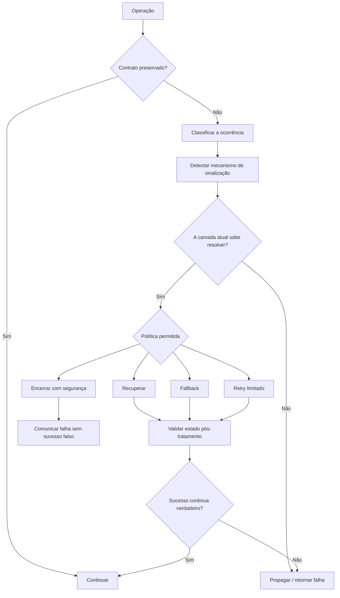

<a id="inicio"></a>

# Erros, Exceções e Tratamento de Falhas

> **Classificação:** `[D] Obrigatório dominar`  
> **Nível:** B — Fundamentos de Programação  
> **Posição na taxonomia:** tópico 18  
> **Pré-requisitos principais:** sintaxe e semântica, tipos de dados, fluxo de controle, funções, escopo, validação de entrada e rastreamento de execução  
> **Aprofundamentos posteriores:** depuração sistemática, testes, I/O e persistência, modelo de execução, logging estruturado, observabilidade e desenho de APIs

---

## Resumo executivo

Programas falham de formas diferentes e essas formas não devem ser colocadas na mesma categoria.

Um programa pode:

```text
NÃO SER ACEITO
→ erro sintático / restrição estática

SER ACEITO, MAS FALHAR DURANTE A EXECUÇÃO
→ exceção, status de falha, erro de runtime, recurso indisponível...

EXECUTAR ATÉ O FIM E ENTREGAR A RESPOSTA ERRADA
→ erro lógico
```

O primeiro objetivo deste tópico é aprender a **classificar a falha antes de tentar tratá-la**.

Uma mesma ocorrência pode precisar de classificações complementares: **natureza**, **momento de detecção**, **mecanismo de sinalização**, **política de tratamento** e **resultado contratual**. Esses eixos são formalizados em §4.1 e retomados pelo método operacional da §39.

O segundo é compreender que linguagens sinalizam falhas por mecanismos diferentes:

```text
Python
→ exceções

JavaScript / ECMAScript
→ throw + abrupt completion + catch

Java
→ exceções checked e unchecked + Error

GNU Bash
→ principalmente exit status / return status + fluxo condicional
→ `stderr` como canal de diagnóstico, não como sinalização contratual por si só
```

Bash é especialmente importante para evitar uma falsa equivalência:

```text
try / catch
≠
set -e
```

`set -e` (`errexit`) possui regras contextuais e exceções próprias; não transforma Bash em uma linguagem com exceções estruturadas equivalentes às de Python, JavaScript ou Java.

Um modelo geral útil é:

```text
OPERAÇÃO
↓
OCORREU UMA CONDIÇÃO DE FALHA?
├── NÃO → continuar normalmente
└── SIM
    ↓
DETECTAR
    ↓
SINALIZAR
    ↓
PROPAGAR OU TRATAR AQUI?
    ├── PROPAGAR → preservar contexto/causa quando possível
    └── TRATAR
        ↓
        RECUPERAR / USAR ALTERNATIVA / ENCERRAR COM SEGURANÇA
        ↓
        COMUNICAR A FALHA SEM VAZAR DADOS SENSÍVEIS
```

A regra central não é “capturar todo erro”. É:

> **trate uma falha no nível em que existe informação e autoridade suficientes para tomar uma decisão útil; caso contrário, preserve o contexto e deixe a falha propagar.**

---

## Distinções fundamentais

```text
ERRO DE SINTAXE
≠
ERRO SEMÂNTICO / DE TIPO
≠
ERRO DE EXECUÇÃO
≠
ERRO LÓGICO
≠
EXCEÇÃO
≠
MECANISMO DE TRATAMENTO
```

E:

```text
VALIDAÇÃO
≠
TRATAMENTO DE EXCEÇÃO
≠
DEPURAÇÃO
≠
TESTE
≠
LOGGING
```

### Definições de trabalho

| Termo | Definição operacional neste tópico |
|---|---|
| **Erro sintático** | Código que viola a gramática/regras sintáticas exigidas pela linguagem e não pode ser processado normalmente como escrito. |
| **Erro semântico** | Código que pode parecer sintaticamente bem formado, mas viola regras de significado da linguagem ou usa uma operação de modo incompatível. |
| **Erro de tipo** | Incompatibilidade relacionada aos tipos aceitos por uma operação, detectada estaticamente ou em runtime conforme a linguagem. |
| **Erro de execução** | Problema que surge quando uma operação é efetivamente executada: recurso inexistente, acesso inválido, divisão problemática, falha externa etc. |
| **Erro lógico** | O programa executa, mas implementa a regra errada ou produz resultado incorreto. |
| **Falha** | Termo geral para uma operação não cumprir o resultado/contrato esperado. |
| **Exceção** | Mecanismo/objeto de sinalização de fluxo excepcional em linguagens que oferecem esse modelo. Não é sinônimo universal de qualquer falha. |
| **Propagação** | Transferência da condição de falha para uma camada/chamada anterior quando não é tratada localmente. |
| **Captura** | Interceptação de uma exceção ou sinal de falha por código preparado para tomar uma decisão. |
| **Recuperação** | Continuação segura por correção, repetição controlada, fallback ou outra estratégia definida pelo contrato. |
| **Encerramento seguro** | Finalização previsível, sem deixar estado inconsistente, recursos indevidamente abertos ou sucesso falso. |

---

## Regra de ouro

> **Falha detectada não significa automaticamente falha tratada. Capturar sem saber o que fazer pode esconder o problema e piorar o sistema.**

Este padrão é perigoso:

```python
try:
    risky_operation()
except Exception:
    pass
```

Ele pode transformar:

```text
FALHA VISÍVEL
↓
ERRO SILENCIOSO
↓
ESTADO POSSIVELMENTE INCORRETO
```

Um handler só é útil quando consegue fazer algo consciente, por exemplo:

- recuperar com segurança;
- converter a falha para uma abstração melhor;
- adicionar contexto e propagar;
- selecionar um caminho alternativo válido;
- liberar recursos;
- produzir mensagem apropriada;
- encerrar com status coerente.

---

## Decisão rápida

| Pergunta | Resposta curta |
|---|---|
| “Todo erro vira exceção?” | Não. Erros lógicos normalmente não; Bash usa amplamente status; operações com `Number` em JavaScript podem produzir valores especiais sem lançar; algumas falhas são detectadas antes da execução. |
| “Erro sintático acontece sempre em compile time?” | Não use essa frase como regra universal. As fases variam por linguagem, implementação e forma de carregar/avaliar código. |
| “Erro de tipo é sempre compile time?” | Não. Java detecta muitas incompatibilidades estaticamente; Python e JavaScript detectam várias apenas quando a operação é executada. |
| “Divisão por zero sempre lança exceção?” | Não. Python lança `ZeroDivisionError`; Java lança em divisão inteira, mas floating-point segue IEEE 754; `Number` em JavaScript pode produzir `Infinity`/`NaN`; Bash sinaliza erro aritmético. |
| “Se não houve exceção, o resultado está correto?” | Não. Erros lógicos frequentemente executam sem qualquer exceção. |
| “`catch`/`except` deve pegar tudo?” | Normalmente não. Prefira condições específicas que realmente consegue tratar. |
| “Posso capturar e ignorar?” | Só se ignorar fizer parte explícita do contrato e for realmente seguro; caso contrário, isso esconde falhas. |
| “`finally` significa tratamento?” | Não. É mecanismo de finalização/cleanup; uma exceção pode continuar propagando depois dele. |
| “Bash possui `try/catch` nativo equivalente?” | Não. O modelo idiomático é baseado sobretudo em status, condicionais, redirecionamento, `return`/`exit` e, quando necessário, `trap`. |
| “`set -e` resolve tratamento de erro em Bash?” | Não. `errexit` possui exceções contextuais e não substitui modelagem explícita de falhas. |
| “`pipefail` deve ser entendido?” | Sim. Sem ele, o status de um pipeline é normalmente o status do último comando; com ele, uma falha anterior pode afetar o status do pipeline. |
| “Mensagem para usuário deve conter stack trace?” | Em geral, não em interfaces não confiáveis. Detalhes técnicos podem ser registrados de modo seguro internamente, sem expor segredos ou detalhes desnecessários. |
| “Validar entrada elimina exceções?” | Não. Validação reduz estados inválidos conhecidos; recursos externos, runtime e outras dependências ainda podem falhar. |
| “Depurar é o mesmo que tratar?” | Não. Tratamento define comportamento diante de falhas previstas; depuração investiga a causa de comportamento incorreto. |

---

# Índice

- [Resumo executivo](#resumo-executivo)
- [Distinções fundamentais](#distinções-fundamentais)
- [Regra de ouro](#regra-de-ouro)
- [Decisão rápida](#decisão-rápida)
- [1. Posição deste assunto](#1-posição-deste-assunto)
  - [1.1 Fronteira com T13 — Sintaxe, semântica e sistema de tipos](#11-fronteira-com-t13--sintaxe-semântica-e-sistema-de-tipos)
  - [1.2 Fronteira com T19 — Depuração](#12-fronteira-com-t19--depuração)
  - [1.3 Fronteira com T20 — Testes](#13-fronteira-com-t20--testes)
  - [1.4 Fronteira com T21 — Entrada, saída e persistência](#14-fronteira-com-t21--entrada-saída-e-persistência)
  - [1.5 Fronteira com T23 — Modelo de execução](#15-fronteira-com-t23--modelo-de-execução)
- [2. 🗺️ Visão panorâmica — o mapa antes dos detalhes](#visao-panoramica)
- [3. Modelo universal: detectar, sinalizar, propagar e decidir](#3-modelo-universal-detectar-sinalizar-propagar-e-decidir)
  - [3.1 Detecção](#31-detecção)
  - [3.2 Sinalização](#32-sinalização)
  - [3.3 Propagação](#33-propagação)
  - [3.4 Decisão](#34-decisão)
- [4. “Erro” é uma palavra sobrecarregada](#4-erro-é-uma-palavra-sobrecarregada)
  - [4.1 Categorias curriculares e eixos complementares](#41-categorias-curriculares-e-eixos-complementares)
- [5. 18.1 Erros sintáticos](#5-181-erros-sintáticos)
  - [5.1 Python](#51-python)
  - [5.2 JavaScript / ECMAScript](#52-javascript--ecmascript)
  - [5.3 Java](#53-java)
  - [5.4 Bash](#54-bash)
- [6. Sintaxe válida não garante programa válido](#6-sintaxe-válida-não-garante-programa-válido)
- [7. 18.2 Erros semânticos/de tipo](#7-182-erros-semânticosde-tipo)
  - [7.1 Erro de tipo pode ser detectado em momentos diferentes](#71-erro-de-tipo-pode-ser-detectado-em-momentos-diferentes)
  - [7.2 Semântico não significa automaticamente “exceção”](#72-semântico-não-significa-automaticamente-exceção)
- [8. Sistema de tipos e tratamento de falhas](#8-sistema-de-tipos-e-tratamento-de-falhas)
- [9. 18.3 Erros de execução](#9-183-erros-de-execução)
- [10. Divisão por zero: mesma ideia matemática, semânticas diferentes](#10-divisão-por-zero-mesma-ideia-matemática-semânticas-diferentes)
  - [10.1 Python](#101-python)
  - [10.2 JavaScript / ECMAScript com `Number`](#102-javascript--ecmascript-com-number)
  - [10.3 Java](#103-java)
  - [10.4 GNU Bash](#104-gnu-bash)
  - [10.5 Comparação](#105-comparação)
- [11. Recurso inexistente](#11-recurso-inexistente)
  - [11.1 Ausência esperada versus falha inesperada](#111-ausência-esperada-versus-falha-inesperada)
- [12. Acesso inválido](#12-acesso-inválido)
- [13. Falha de I/O](#13-falha-de-io)
- [14. 18.4 Erros lógicos](#14-184-erros-lógicos)
- [15. Erro lógico não se “resolve com try/catch”](#15-erro-lógico-não-se-resolve-com-trycatch)
- [16. 18.5 Exceções](#16-185-exceções)
- [17. Geração: `raise`, `throw` e sinalização explícita](#17-geração-raise-throw-e-sinalização-explícita)
  - [17.1 Python — `raise`](#171-python--raise)
  - [17.2 JavaScript — `throw`](#172-javascript--throw)
  - [17.3 Java — `throw`](#173-java--throw)
  - [17.4 Bash — não fabricar `throw`](#174-bash--não-fabricar-throw)
- [18. Propagação](#18-propagação)
  - [18.1 Python](#181-python)
  - [18.2 JavaScript](#182-javascript)
  - [18.3 Java](#183-java)
  - [18.4 Bash](#184-bash)
- [19. Captura](#19-captura)
  - [19.1 Python](#191-python)
  - [19.2 JavaScript](#192-javascript)
  - [19.3 Java](#193-java)
  - [19.4 Bash](#194-bash)
- [20. Capturar o tipo mais específico possível](#20-capturar-o-tipo-mais-específico-possível)
  - [20.1 Não aumentar artificialmente o `try`](#201-não-aumentar-artificialmente-o-try)
- [21. Python — hierarquia e boas práticas fundamentais](#21-python--hierarquia-e-boas-práticas-fundamentais)
  - [21.1 Evitar `except BaseException`](#211-evitar-except-baseexception)
  - [21.2 Re-raise](#212-re-raise)
  - [21.3 Encadeamento implícito e causa explícita](#213-encadeamento-implícito-e-causa-explícita)
- [22. JavaScript — `throw`, `Error` e `try/catch/finally`](#22-javascript--throw-error-e-trycatchfinally)
  - [22.1 `throw` pode lançar qualquer valor](#221-throw-pode-lançar-qualquer-valor)
  - [22.2 `catch` recebe o valor lançado](#222-catch-recebe-o-valor-lançado)
  - [22.3 `finally`](#223-finally)
- [23. Java — `Throwable`, checked, unchecked e `Error`](#23-java--throwable-checked-unchecked-e-error)
  - [23.1 Checked exception](#231-checked-exception)
  - [23.2 Unchecked exception](#232-unchecked-exception)
  - [23.3 `Error` não significa “erro comum para capturar”](#233-error-não-significa-erro-comum-para-capturar)
- [24. Bash — status é parte do contrato](#24-bash--status-é-parte-do-contrato)
  - [24.1 `$?`](#241-)
  - [24.2 `return` e `exit`](#242-return-e-exit)
  - [24.3 stderr](#243-stderr)
- [25. `set -e` não é `try/catch`](#25-set--e-não-é-trycatch)
  - [25.1 Exemplo explícito preferível](#251-exemplo-explícito-preferível)
  - [25.2 “Strict mode” não é especificação da linguagem](#252-strict-mode-não-é-especificação-da-linguagem)
- [26. Pipelines e `pipefail`](#26-pipelines-e-pipefail)
  - [26.1 Exemplo](#261-exemplo)
- [27. 18.6 Tratamento de erros](#27-186-tratamento-de-erros)
- [28. Recuperação](#28-recuperação)
  - [28.1 Recuperar não é fingir sucesso](#281-recuperar-não-é-fingir-sucesso)
- [29. Encerramento seguro](#29-encerramento-seguro)
  - [29.1 Fail-fast versus fail-safe](#291-fail-fast-versus-fail-safe)
- [30. Mensagens de erro](#30-mensagens-de-erro)
  - [30.1 Mensagem ruim](#301-mensagem-ruim)
  - [30.2 Mensagem ruim por excesso](#302-mensagem-ruim-por-excesso)
  - [30.3 Mensagem melhor](#303-mensagem-melhor)
  - [30.4 Mensagem para usuário versus diagnóstico interno](#304-mensagem-para-usuário-versus-diagnóstico-interno)
- [31. Caminho alternativo / fallback](#31-caminho-alternativo--fallback)
  - [31.1 Fallback observável](#311-fallback-observável)
- [32. Cleanup e `finally`](#32-cleanup-e-finally)
  - [32.1 Python — context manager](#321-python--context-manager)
  - [32.2 Java — try-with-resources](#322-java--try-with-resources)
  - [32.3 JavaScript](#323-javascript)
  - [32.4 Bash — `trap`](#324-bash--trap)
  - [32.5 Falha durante o cleanup](#325-falha-durante-o-cleanup)
- [33. Preservar causa ao transformar uma falha](#33-preservar-causa-ao-transformar-uma-falha)
  - [33.1 Python](#331-python)
  - [33.2 Java](#332-java)
  - [33.3 JavaScript](#333-javascript)
  - [33.4 Bash](#334-bash)
- [34. Validação não substitui tratamento de falhas](#34-validação-não-substitui-tratamento-de-falhas)
- [35. Capturar e engolir a falha](#35-capturar-e-engolir-a-falha)
- [36. Exceções para fluxo normal: cuidado com o contrato](#36-exceções-para-fluxo-normal-cuidado-com-o-contrato)
- [37. Exemplo comparativo — parsing de quantidade de tentativas](#37-exemplo-comparativo--parsing-de-quantidade-de-tentativas)
  - [37.1 Python](#371-python)
  - [37.2 JavaScript](#372-javascript)
  - [37.3 Java](#373-java)
  - [37.4 GNU Bash](#374-gnu-bash)
- [38. Comparativo das quatro linguagens](#38-comparativo-das-quatro-linguagens)
  - [38.1 Conceito universal × sintaxe × semântica × idiomatismo](#381-conceito-universal--sintaxe--semântica--idiomatismo)
- [39. Método de análise de uma falha](#39-método-de-análise-de-uma-falha)
  - [39.1 Qual é a categoria?](#391-qual-é-a-categoria)
  - [39.2 Quem detecta?](#392-quem-detecta)
  - [39.3 Como a condição é representada ao chamador?](#393-como-a-condição-é-representada-ao-chamador)
    - [39.3.1 Qual diagnóstico acompanha a condição?](#3931-qual-diagnóstico-acompanha-a-condição)
  - [39.4 A camada atual sabe resolver?](#394-a-camada-atual-sabe-resolver)
  - [39.5 Qual é a política correta?](#395-qual-é-a-política-correta)
  - [39.6 O sucesso continua verdadeiro?](#396-o-sucesso-continua-verdadeiro)
- [40. Boas práticas](#40-boas-práticas)
- [41. Erros conceituais frequentes](#41-erros-conceituais-frequentes)
  - [41.1 “Se compilou, está certo”](#411-se-compilou-está-certo)
  - [41.2 “Se não lançou exceção, funcionou”](#412-se-não-lançou-exceção-funcionou)
  - [41.3 “Todo status não zero é o mesmo erro”](#413-todo-status-não-zero-é-o-mesmo-erro)
  - [41.4 “Capturar `Exception` é mais seguro”](#414-capturar-exception-é-mais-seguro)
  - [41.5 “`finally` corrige a exceção”](#415-finally-corrige-a-exceção)
  - [41.6 “Bash tem exceções porque existe `trap ERR`”](#416-bash-tem-exceções-porque-existe-trap-err)
  - [41.7 “Validação elimina I/O errors”](#417-validação-elimina-io-errors)
  - [41.8 “Fallback sempre melhora robustez”](#418-fallback-sempre-melhora-robustez)
  - [41.9 “Mensagem detalhada deve ir para qualquer usuário”](#419-mensagem-detalhada-deve-ir-para-qualquer-usuário)
- [🧩 Problemas Reais — índice operacional](#problemas-reais)
- [🔎 Troubleshooting sistemático](#troubleshooting-sistematico)
- [42. Depuração: somente a fronteira necessária](#42-depuração-somente-a-fronteira-necessária)
- [43. Testes: somente a fronteira necessária](#43-testes-somente-a-fronteira-necessária)
- [44. Segurança e robustez](#44-segurança-e-robustez)
  - [44.1 Não expor informação sensível](#441-não-expor-informação-sensível)
  - [44.2 Não registrar segredos](#442-não-registrar-segredos)
  - [44.3 Fail closed em segurança](#443-fail-closed-em-segurança)
  - [44.4 Limites de repetição](#444-limites-de-repetição)
  - [44.5 Entrada não confiável](#445-entrada-não-confiável)
- [45. NetDev — aplicação prática com dados sintéticos](#45-netdev--aplicação-prática-com-dados-sintéticos)
  - [45.1 Python — simulação sem rede real](#451-python--simulação-sem-rede-real)
  - [45.2 O que não fazer](#452-o-que-não-fazer)
  - [45.3 Sem credenciais reais](#453-sem-credenciais-reais)
- [46. O que fica para depois](#46-o-que-fica-para-depois)
  - [T19 — Depuração](#t19--depuração)
  - [T20 — Testes](#t20--testes)
  - [T21 — I/O e persistência](#t21--io-e-persistência)
  - [T23 — Modelo de execução](#t23--modelo-de-execução)
  - [Engenharia posterior](#engenharia-posterior)
    - [Fronteira assíncrona e falhas agregadas](#fronteira-assíncrona-e-falhas-agregadas)
- [47. Laboratórios](#47-laboratórios)
  - [🧪 LAB 1 — classificar antes de corrigir](#-lab-1--classificar-antes-de-corrigir)
  - [🧪 LAB 2 — mesma divisão em quatro linguagens](#-lab-2--mesma-divisão-em-quatro-linguagens)
  - [🧪 LAB 3 — propagação em Python](#-lab-3--propagação-em-python)
  - [🧪 LAB 4 — Java checked × unchecked](#-lab-4--java-checked--unchecked)
  - [🧪 LAB 5 — Bash status explícito](#-lab-5--bash-status-explícito)
  - [🧪 LAB 6 — pipeline e `pipefail`](#-lab-6--pipeline-e-pipefail)
  - [🧪 LAB 7 — não engolir erro](#-lab-7--não-engolir-erro)
  - [🧪 LAB 8 — cleanup](#-lab-8--cleanup)
  - [🧪 LAB 9 — falha lógica sem exception](#-lab-9--falha-lógica-sem-exception)
  - [🧪 LAB 10 — NetDev sintético](#-lab-10--netdev-sintético)
- [48. Exercícios](#48-exercícios)
- [49. Evidências de domínio](#49-evidências-de-domínio)
  - [18.1 Erros sintáticos `[D]`](#181-erros-sintáticos-d)
  - [18.2 Erros semânticos/de tipo `[D]`](#182-erros-semânticosde-tipo-d)
  - [18.3 Erros de execução `[D]`](#183-erros-de-execução-d)
  - [18.4 Erros lógicos `[D]`](#184-erros-lógicos-d)
  - [18.5 Exceções `[D]`](#185-exceções-d)
  - [18.6 Tratamento de erros `[D]`](#186-tratamento-de-erros-d)
  - [Transferência entre linguagens](#transferência-entre-linguagens)
- [50. Checklist de consulta rápida](#50-checklist-de-consulta-rápida)
- [51. Glossário](#51-glossário)
- [52. Referências](#52-referências)
  - [52.1 Taxonomia e contrato](#521-taxonomia-e-contrato)
  - [52.2 Currículo](#522-currículo)
  - [52.3 Python 3.14.7](#523-python-3147)
  - [52.4 ECMAScript 2026](#524-ecmascript-2026)
  - [52.5 Java SE 27](#525-java-se-27)
  - [52.6 GNU Bash 5.3](#526-gnu-bash-53)
  - [52.7 Segurança](#527-segurança)
  - [52.8 Fontes locais e proveniência bibliográfica](#528-fontes-locais-e-proveniência-bibliográfica)
  - [52.9 Hierarquia usada nesta versão](#529-hierarquia-usada-nesta-versão)
  - [52.10 Síntese multifonte e matriz de contribuição](#5210-síntese-multifonte-e-matriz-de-contribuição)
  - [52.11 Estado de QA e evidência da revisão 0.4.2](#5211-estado-de-qa-e-evidência-da-revisão-042)
- [53. Histórico de versões](#53-histórico-de-versões)

---

# 1. Posição deste assunto

O T18 é o ponto da trilha em que erros deixam de ser apenas eventos observados durante exemplos e passam a ser estudados como parte explícita do desenho do programa.

Ele depende diretamente de conceitos já construídos:

```text
T03–T05
→ valores, tipos, expressões e operadores

T06–T08
→ fluxo de controle e construção de algoritmos

T09
→ entrada e validação

T11–T12
→ funções, contratos, rastreamento e verificação

T13
→ sintaxe, semântica e sistemas de tipos

T14–T16
→ estado, mutabilidade, modularização, APIs e contratos
```

A ideia central é conectar esses fundamentos à pergunta:

> **o que o programa deve fazer quando algo não ocorre como o contrato previa?**

## 1.1 Fronteira com T13 — Sintaxe, semântica e sistema de tipos

O T13 apresentou as diferenças entre sintaxe, semântica e tipagem.

Aqui essas ideias são aplicadas especificamente à **classificação de falhas**.

```text
T13
→ o que sintaxe/semântica/tipo significam

T18
→ como violações e falhas relacionadas se manifestam e são tratadas
```

Não se repete toda a teoria de sistemas de tipos.

## 1.2 Fronteira com T19 — Depuração

T19 estudará sistematicamente:

- reprodução do problema;
- formulação de hipóteses;
- inspeção de estado;
- logging;
- debugger;
- isolamento.

Neste T18, depuração aparece apenas o suficiente para separar:

```text
TRATAR UMA FALHA PREVISTA
≠
INVESTIGAR POR QUE O PROGRAMA ESTÁ ERRADO
```

## 1.3 Fronteira com T20 — Testes

Testes serão aprofundados no T20.

Aqui eles aparecem somente como meio de verificar que:

- o caminho de sucesso funciona;
- a falha esperada realmente é detectada;
- o handler toma a decisão pretendida;
- a falha inesperada não é mascarada.

## 1.4 Fronteira com T21 — Entrada, saída e persistência

O Guia inclui **falha de I/O** em 18.3 porque ela é um exemplo fundamental de erro de execução.

Porém:

```text
T18
→ reconhecer e tratar a condição de falha

T21
→ estudar I/O, arquivos, streams e persistência com profundidade própria
```

## 1.5 Fronteira com T23 — Modelo de execução

Bash exige alguma introdução a `exit status`, `stderr` e pipelines para que o tratamento de falhas seja correto.

O modelo completo de:

- processo;
- stdin/stdout/stderr;
- pipes;
- códigos de saída;

fica para T23.

[↑ Voltar ao índice](#índice)

---

<a id="visao-panoramica"></a>

# 2. 🗺️ Visão panorâmica — o mapa antes dos detalhes

Esta seção funciona como **caderno rápido de consulta**, **modelo mental** e **contrato de cobertura** do T18. O objetivo é permitir recuperar em poucos segundos **que tipo de falha ocorreu, como a linguagem a sinaliza, quem deve tratá-la e qual resposta preserva o contrato**.

## Mapa do domínio

```text
ERROS, EXCEÇÕES E TRATAMENTO DE FALHAS
│
├── classificação da ocorrência
│   ├── erro sintático
│   ├── erro semântico / de tipo
│   ├── erro de execução
│   └── erro lógico
│
├── manifestação / sinalização
│   ├── diagnóstico estático / parsing
│   ├── exceção / throw
│   ├── return / result
│   ├── exit status / return code
│   └── valor especial / sentinel
│
├── diagnóstico complementar
│   ├── stderr
│   ├── log
│   └── evento / tracing quando o ambiente oferecer
│
├── fluxo de exceção
│   ├── geração
│   ├── propagação
│   ├── captura
│   ├── transformação
│   └── preservação de causa
│
├── política de tratamento
│   ├── recuperar
│   ├── fallback
│   ├── retry limitado
│   ├── encerrar com segurança
│   └── propagar
│
├── integridade operacional
│   ├── cleanup
│   ├── estado consistente
│   ├── status coerente
│   ├── sem sucesso falso
│   └── sem ocultar bug inesperado
│
├── segurança
│   ├── mensagem externa mínima
│   ├── diagnóstico interno suficiente
│   ├── sem segredos em logs
│   └── fail closed quando a garantia não pode ser confirmada
│
└── diferenças de linguagem
    ├── Python → exceptions / raise / except
    ├── JavaScript → throw / abrupt completion / catch
    ├── Java → `throw` / hierarquia `Throwable` / `catch` / checked / unchecked
    └── Bash → exit/return status / condicionais / `trap`; diagnóstico opcional em stderr
```

## Fluxo essencial — da falha à decisão



Leitura operacional:

```text
SINTOMA
↓
CLASSIFICAR
↓
COMO FOI SINALIZADO?
↓
QUEM POSSUI CONTEXTO PARA DECIDIR?
↓
RECUPERAR / PROPAGAR / FALLBACK / ENCERRAR
↓
CLEANUP
↓
PRESERVAR CAUSA E STATUS
↓
COMUNICAR COM SEGURANÇA
↓
VALIDAR O CONTRATO
```

## Consulta rápida — categoria, mecanismo e primeira ação

| Situação | Categoria inicial | Mecanismo típico | Primeira ação útil |
|---|---|---|---|
| parser rejeita o código | sintaxe | diagnóstico de parsing/compilação | corrigir gramática; `try/catch` de runtime não resolve |
| operação viola regra de tipo/semântica | semântico/de tipo | estático ou runtime, depende da linguagem | identificar regra concreta da linguagem |
| arquivo/rede/recurso falha durante execução | runtime | exception, status, erro de I/O | determinar se é recuperável e quem decide |
| programa termina e devolve valor errado | lógico | pode não haver sinalização automática | reproduzir com entrada conhecida e comparar com especificação |
| função baixa detecta falha mas não conhece política | exceção/status | propagação / retorno de falha | preservar causa/contexto e delegar decisão |
| cleanup precisa ocorrer mesmo com falha | finalização | `finally`, context manager, try-with-resources, `trap EXIT` | liberar recurso sem mascarar a falha original |
| pipeline Bash “passa” apesar de comando intermediário falhar | status composto | status do pipeline / `pipefail` | inspecionar status e contrato do pipeline |
| fallback funciona tecnicamente, mas reduz garantia | política | caminho alternativo | confirmar se o contrato permite fallback |
| mensagem externa revela stack/versão/segredo | segurança | erro não sanitizado | separar mensagem externa de diagnóstico interno |
| lote NetDev tem sucessos e falhas parciais | resultado composto | exception/status por item + resumo | preservar resultado por alvo; não declarar sucesso global falso |

## Pergunta prática → mecanismo / seção

| Pergunta | Onde olhar primeiro |
|---|---|
| “É sintaxe, tipo, runtime ou lógica?” | §§ 4–15 |
| “Como a linguagem gera e propaga a falha?” | §§ 16–19 |
| “Estou capturando amplo demais?” | §§ 20–23, 35 |
| “Bash possui algo equivalente a exception?” | §§ 24–26 |
| “Devo recuperar, fazer fallback ou encerrar?” | §§ 27–31 |
| “Como garantir cleanup?” | § 32 |
| “Como transformar erro sem perder a causa?” | § 33 |
| “Validação evita exception?” | § 34 |
| “Estou engolindo uma falha?” | § 35 |
| “O mesmo contrato muda entre linguagens?” | §§ 10, 37–38 |
| “Como investigar um handler que não funciona?” | `TS-T18-*` |
| “Como aplicar isso em automação de rede?” | § 45 + `PR-T18-10` |

## Não confundir

```text
ERRO LÓGICO
≠
EXCEÇÃO
```

Um resultado incorreto pode ser produzido sem qualquer exception.

```text
VALIDAÇÃO
≠
TRATAMENTO DE FALHA
```

Validação reduz estados inválidos conhecidos; não elimina falhas externas, concorrentes ou de runtime.

```text
CAPTURAR
≠
RECUPERAR
```

Um `catch`/`except` pode apenas observar ou converter a falha; sucesso só existe se o contrato voltar a ser verdadeiro.

```text
CLEANUP
≠
RECUPERAÇÃO
```

Liberar recurso corretamente não transforma operação fracassada em operação bem-sucedida.

```text
FALLBACK
≠
SUCESSO AUTOMÁTICO
```

O caminho alternativo só é válido quando o contrato permite a degradação.

```text
EXIT STATUS NÃO ZERO
≠
“EXCEÇÃO BASH”
```

Status de processo é um contrato próprio. `set -e` e `trap ERR` não transformam o shell em Python/Java/JavaScript.

## Microexemplos canônicos

**1. Erro lógico sem exception:**

```python
def calculate_total(price: float, quantity: int) -> float:
    return price + quantity  # executa, mas a regra esperada era multiplicar
```

**2. Propagar preservando causa:**

```python
try:
    retry_count = int(raw_value)
except ValueError as cause:
    raise ValueError("retry_count must be an integer") from cause
```

**3. Bash — falha explícita sem `set -e`:**

```bash
if ! cp -- "$source" "$destination"; then
    printf '%s\n' 'copy failed' >&2
    return 1
fi
```

## Problemas reais representativos

Os problemas abaixo têm rastreabilidade formal no índice `PR-T18-*`:

- `PR-T18-01` — classificar corretamente a falha antes de escolher o tratamento;
- `PR-T18-02` — separar validação de configuração de falhas reais de execução;
- `PR-T18-03` — transformar uma falha técnica em erro de domínio preservando causalidade;
- `PR-T18-04` — evitar que captura ampla esconda um bug inesperado;
- `PR-T18-05` — liberar recursos sem mascarar a falha original;
- `PR-T18-06` — escolher recuperação, fallback ou encerramento sem produzir sucesso falso;
- `PR-T18-07` — separar mensagem segura ao usuário de diagnóstico interno;
- `PR-T18-08` — tratar corretamente status, pipeline, `pipefail` e `errexit` em Bash;
- `PR-T18-09` — transferir o mesmo contrato de falha entre Python, JavaScript, Java e Bash;
- `PR-T18-10` — executar lote NetDev com falhas parciais, resultado por alvo e sem vazamento de credenciais.

## Entrada rápida de troubleshooting

| Sintoma | Primeira hipótese útil | Primeira verificação |
|---|---|---|
| handler “não executa” | a operação não gera a exception esperada | reproduzir e observar tipo/status real |
| programa “continua” após erro em Bash | contexto onde `errexit` é ignorado | testar status explicitamente e revisar `if`/`&&`/`||`/pipeline |
| pipeline termina com status 0 apesar de falha intermediária | status veio do último comando | comparar com `set -o pipefail` |
| exception foi convertida e o traceback perdeu contexto | causa não foi encadeada | inspecionar `__cause__`/cause |
| usuário vê stack trace/versão interna | erro técnico vazou até interface | separar resposta externa de log interno |
| fallback “resolve”, mas autorização falhou | política permissiva indevida | confirmar invariantes de segurança |
| retry aumenta carga e demora | falha permanente ou sem limite | contar tentativas, intervalo e classe de falha |
| lote mostra “sucesso” com dispositivos falhos | agregação perdeu estados individuais | auditar resultado por alvo e status final |

## Transferência entre Python, JavaScript, Java e Bash

| Dimensão | Python | JavaScript | Java | Bash |
|---|---|---|---|---|
| sinalização estruturada | exceptions | `throw` / abrupt completion | `throw` de objetos da hierarquia `Throwable` | não há exception equivalente; status é central |
| geração explícita | `raise` | `throw` | `throw` | `return`/`exit` com status |
| captura | `try/except` | `try/catch` | `try/catch` | teste de status / condicionais |
| finalização | `finally`, `with` | `finally` | `finally`, try-with-resources | `trap`, cleanup explícito |
| causa encadeada | `raise ... from ...` | `Error(..., {cause})` quando aplicável | constructors/initCause | preservar stderr/status/contexto manualmente |
| falha matemática `1/0` | `ZeroDivisionError` | `Infinity` com `Number` | depende do tipo: inteiro lança; floating-point segue IEEE 754 | erro aritmético/status de shell |
| risco de captura ampla | esconder bugs e sinais de controle | valor lançado pode nem ser `Error` | capturar `Throwable`/`Exception` sem política adequada | ignorar status / `|| true` |
| principal pergunta | “quem sabe recuperar?” | “qual abrupt completion/valor foi lançado?” | “checked ou unchecked; quem declara/trata?” | “qual status e em que contexto ele é consumido?” |

## Rota de consulta × rota de estudo

**Consulta rápida:**

```text
categoria
→ mecanismo de sinalização
→ política de tratamento
→ cleanup/status
→ mensagem segura
→ troubleshooting
```

**Estudo completo:**

```text
classificação
→ semântica das quatro linguagens
→ geração/propagação/captura
→ recuperação/fallback/encerramento
→ cleanup e causalidade
→ segurança
→ PR-*
→ troubleshooting
→ LABs
→ evidências de domínio
```

[↑ Voltar ao índice](#índice)

---

# 3. Modelo universal: detectar, sinalizar, propagar e decidir

Apesar das diferenças de sintaxe, existe um modelo conceitual reaproveitável.

## 3.1 Detecção

Algum componente percebe que o contrato não pode continuar normalmente.

Exemplos:

- parser encontra gramática inválida;
- operação recebe tipo incompatível;
- índice não existe;
- arquivo não existe;
- conversão de texto falha;
- comando externo retorna status não zero;
- regra de negócio é violada.

## 3.2 Sinalização

A falha precisa ser representada de algum modo para que a próxima camada possa interpretá-la.

Mecanismos que podem fazer parte do **contrato entre operação e chamador** incluem:

```text
EXCEÇÃO / THROW
RETURN / RESULT
EXIT STATUS
VALOR SENTINELA
VALOR ESPECIAL
```

Já canais como:

```text
STDERR
LOG
EVENTO / TRACE
```

são **diagnóstico complementar**. Eles podem acompanhar sucesso ou falha e, isoladamente, não definem o estado contratual da operação.

Portanto:

```text
DIAGNÓSTICO
≠
SINALIZAÇÃO CONTRATUAL AUTOMÁTICA
```

Esses mecanismos não são equivalentes automaticamente.

Por exemplo:

```text
JavaScript
10 / 0
→ Infinity
```

Não existe `throw` nesse caso.

Logo:

> **não detectar uma exceção não significa necessariamente que não aconteceu uma situação matematicamente indesejada para o seu domínio.**

## 3.3 Propagação

Se a camada atual não consegue decidir corretamente, a falha deve continuar para um nível que consiga.

Modelo:

```text
função baixa
↓
conhece o detalhe técnico
↓
não conhece a política do negócio
↓
propaga
↓
camada superior
↓
conhece contexto suficiente
↓
recupera / converte / encerra
```

## 3.4 Decisão

Tratar é escolher uma política.

As quatro respostas fundamentais deste tópico são:

```text
RECUPERAR
ENCERRAR COM SEGURANÇA
COMUNICAR
USAR CAMINHO ALTERNATIVO
```

Essas quatro respostas correspondem diretamente ao nó 18.6 do Guia.

[↑ Voltar ao índice](#índice)

---

# 4. “Erro” é uma palavra sobrecarregada

Em conversa informal, “erro” pode significar qualquer coisa que deu errado.

Tecnicamente, o termo depende do contexto.

Python, por exemplo, separa no tutorial:

```text
syntax errors
versus
exceptions
```

Java possui uma classe `Error` dentro da hierarquia de `Throwable`, com significado próprio.

JavaScript possui objetos `Error`, mas `throw` pode lançar qualquer valor permitido pela linguagem.

Bash trabalha extensivamente com **status de saída**, e um comando retornar status não zero não cria um objeto “exception”.

Por isso, neste material:

```text
falha
→ termo geral para operação não cumprir o resultado esperado

exceção
→ mecanismo específico de determinadas linguagens

Error
→ nome específico quando a linguagem/API o define dessa forma
```

Essa separação evita frases incorretas como:

> “Todo erro gera exception.”

Não gera.

## 4.1 Categorias curriculares e eixos complementares

Os nós `18.1`–`18.4` do Guia são a **taxonomia curricular canônica** deste tópico e permanecem preservados. Eles não precisam ser interpretados como classes mutuamente exclusivas em todos os vocabulários técnicos.

Uma ocorrência pode ser descrita por eixos diferentes ao mesmo tempo:

| Eixo | Pergunta | Exemplos |
|---|---|---|
| **natureza** | o que está errado? | sintaxe, tipo/semântica, recurso/I/O, lógica/domínio |
| **momento de detecção** | quando é percebido? | parsing, compilação/análise estática, runtime, teste/validação posterior |
| **sinalização** | como chega ao chamador? | diagnóstico estático, exceção, resultado, sentinel, exit status |
| **política** | o que a camada pode fazer? | recuperar, propagar, fallback, encerrar |
| **resultado contratual** | o contrato continua verdadeiro? | preservado ou violado |

Exemplo:

```text
TypeError em Python
├── natureza → incompatibilidade de tipos/operação
├── momento → runtime
└── mecanismo → exceção
```

Assim, chamar algo de “erro de tipo” descreve a **natureza** da incompatibilidade; dizer que ele ocorre “em runtime” descreve o **momento** em que se manifesta. As duas afirmações podem ser verdadeiras simultaneamente.

[↑ Voltar ao índice](#índice)

---

# 5. 18.1 Erros sintáticos

O Guia define o núcleo de 18.1 como:

> **gramática inválida.**

Erro sintático significa que o texto do programa não satisfaz a forma exigida pela linguagem naquele contexto.

Exemplo conceitual:

```text
PALAVRAS/TOKENS
↓
GRAMÁTICA
↓
ESTRUTURA VÁLIDA?
├── SIM → etapas seguintes
└── NÃO → erro sintático
```

Um erro de sintaxe geralmente impede a execução normal daquela unidade de código.

## 5.1 Python

Exemplo deliberadamente inválido:

```python
if temperature > 30
    print("hot")
```

Falta `:`.

O parser pode produzir `SyntaxError` antes que a lógica do bloco seja executada.

Outro exemplo:

```python
while True print("running")
```

A documentação oficial do Python usa a categoria **syntax error / parsing error** para esse tipo de problema.

## 5.2 JavaScript / ECMAScript

Exemplo deliberadamente inválido:

```javascript
function calculate( {
  return 10;
}
```

A unidade não satisfaz a gramática da linguagem.

ECMAScript também possui restrições chamadas **Early Errors**, verificadas antes da avaliação normal de certas construções.

Portanto, “sintático” não deve ser reduzido a “um caractere está faltando”; existem restrições gramaticais e estáticas definidas pela especificação.

## 5.3 Java

Exemplo deliberadamente inválido:

```java
int total = ;
```

O compilador não consegue formar uma expressão válida depois de `=`.

Java possui uma fase de compilação explícita no fluxo cotidiano:

```text
.java
↓
javac
↓
bytecode / diagnóstico de compilação
```

Isso torna muito visível a separação entre falhas detectadas pelo compilador e falhas que só aparecem quando o programa executa.

## 5.4 Bash

Exemplo deliberadamente inválido:

```bash
if [[ -f "$file" ]]
    echo "found"
fi
```

Falta `then`.

Uma verificação estática mínima pode ser feita com:

```bash
bash -n script.sh
```

Isso verifica sintaxe sem executar normalmente os comandos do script.

### Cuidado

```text
bash -n passou
≠
script está semanticamente correto
≠
script está livre de falhas em runtime
≠
script produz resultado correto
```

[↑ Voltar ao índice](#índice)

---

# 6. Sintaxe válida não garante programa válido

Considere:

```python
result = "10" + 5
```

O código é sintaticamente válido em Python.

Mas a operação não possui a semântica desejada para `str + int`, resultando em `TypeError` quando executada.

Agora:

```javascript
const result = "10" + 5;
```

Também é sintaticamente válido — e executa.

O resultado é:

```text
"105"
```

A comparação mostra por que a classificação deve respeitar a **semântica da linguagem**, e não apenas a aparência do código.

```text
mesmos símbolos aproximados
≠
mesma semântica
```

[↑ Voltar ao índice](#índice)

---

# 7. 18.2 Erros semânticos/de tipo

O Guia define dois eixos:

- operação incompatível;
- uso incorreto segundo regras da linguagem.

A pergunta deixa de ser apenas:

> “A gramática está correta?”

E passa a ser:

> “Esta operação tem significado permitido neste contexto?”

## 7.1 Erro de tipo pode ser detectado em momentos diferentes

### Java

Exemplo:

```java
int count = "10";
```

A incompatibilidade é detectada estaticamente pelo compilador.

### Python

```python
count = "10"
result = count + 1
```

A atribuição é aceita; a incompatibilidade aparece quando `+` é executado com os valores concretos.

### JavaScript

```javascript
const count = "10";
const result = count + 1;
```

A linguagem define concatenação nesse caso; o resultado é `"101"`.

Isso pode ser correto pela semântica da linguagem e ainda ser **errado para a intenção do programa**.

### Bash

Bash não possui um sistema de tipos estático equivalente ao Java.

Contextos diferentes interpretam texto de modos diferentes.

Exemplo:

```bash
count='10'
printf '%s\n' "$count"
```

`count` é uma variável shell com valor textual.

Em contexto aritmético:

```bash
(( count += 1 ))
```

Bash aplica regras de aritmética próprias.

Não é correto descrever isso como “Bash tem `int` igual a Java”.

## 7.2 Semântico não significa automaticamente “exceção”

Um programa pode violar a intenção do domínio sem violar a semântica da linguagem.

Exemplo:

```python
price = 100
percentage = 10
final_price = price + percentage
```

Tudo é perfeitamente válido para Python.

Mas se a regra desejada era “aplicar 10% de desconto”, o algoritmo está errado.

Isso já pertence à categoria **erro lógico**, não erro de tipo.

[↑ Voltar ao índice](#índice)

---

# 8. Sistema de tipos e tratamento de falhas

Uma linguagem com verificações estáticas pode impedir certas classes de programa antes da execução.

Isso não elimina falhas de runtime.

Java pode verificar tipos e exceções checked em compilação, mas ainda pode enfrentar:

- `NullPointerException`;
- `ArithmeticException` em divisão inteira por zero;
- `IndexOutOfBoundsException`;
- falhas de I/O;
- recursos indisponíveis;
- `OutOfMemoryError`;
- erros lógicos.

Da mesma forma, Python e JavaScript realizam muitas verificações quando uma operação concreta é avaliada.

A conclusão correta é:

```text
TIPAGEM
→ elimina / detecta certas classes de estados inválidos

TRATAMENTO DE FALHAS
→ continua necessário para condições restantes
```

Não existe sistema de tipos que faça recursos externos “nunca falharem”.

[↑ Voltar ao índice](#índice)

---

# 9. 18.3 Erros de execução

O Guia exige quatro exemplos:

1. divisão por zero;
2. recurso inexistente;
3. acesso inválido;
4. falha de I/O.

A categoria “execução” significa que a condição depende da operação ocorrer com determinados valores, recursos ou estado de runtime.

```text
CÓDIGO ACEITO
↓
EXECUÇÃO
↓
CONDIÇÃO CONCRETA
↓
FALHA
```

Porém a forma de sinalização depende da linguagem e da operação.

[↑ Voltar ao índice](#índice)

---

# 10. Divisão por zero: mesma ideia matemática, semânticas diferentes

Este é um dos melhores exemplos para evitar traduções mecânicas entre linguagens.

## 10.1 Python

```python
result = 10 / 0
```

Resultado:

```text
ZeroDivisionError
```

Também ocorre em divisão inteira:

```python
10 // 0
```

## 10.2 JavaScript / ECMAScript com `Number`

```javascript
const result = 10 / 0;
console.log(result);
```

Saída:

```text
Infinity
```

Não há `throw` nessa operação.

Também:

```javascript
console.log(0 / 0);
```

produz:

```text
NaN
```

Logo, se `Infinity` for inválido para o domínio, o próprio programa precisa impor essa regra.

Exemplo:

```javascript
function divide(dividend, divisor) {
  if (divisor === 0) {
    throw new RangeError("divisor must not be zero");
  }

  return dividend / divisor;
}
```

A exceção agora é uma decisão da aplicação, não uma consequência automática de `Number::divide`.

## 10.3 Java

Divisão inteira:

```java
int result = 10 / 0;
```

é código sintaticamente válido e pode ser aceito pelo compilador; quando essa divisão inteira é executada com divisor zero, ocorre `ArithmeticException`.

> **Nota de especificação:** na JLS 27, uma *constant expression* precisa completar normalmente. Como a divisão inteira por zero completa abruptamente com `ArithmeticException`, `10 / 0` não se torna uma “expressão constante inválida” apenas por usar literais. A regra de divisão inteira continua sendo aplicada em runtime.

Exemplo com divisor obtido em runtime:

```java
int divisor = Integer.parseInt(args[0]);
int result = 10 / divisor;
```

Com `divisor == 0`:

```text
ArithmeticException
```

Floating-point possui outra semântica:

```java
double result = 10.0 / 0.0;
System.out.println(result);
```

Saída:

```text
Infinity
```

A JLS define divisão floating-point segundo IEEE 754 e não lança exceção apenas por divisor zero.

## 10.4 GNU Bash

```bash
result=$((10 / 0))
```

Bash trata divisão por zero em aritmética shell como erro.

A documentação do Bash 5.3 afirma explicitamente que divisão por zero é detectada e sinalizada como erro.

## 10.5 Comparação

| Linguagem / operação | `10 / 0` conceitual | Sinalização |
|---|---|---|
| Python | divisão numérica por zero | `ZeroDivisionError` |
| JavaScript `Number` | resultado IEEE 754 | `Infinity` |
| Java `int`/`long` | divisão inteira por zero | `ArithmeticException` |
| Java `float`/`double` | resultado IEEE 754 | `Infinity`/`NaN` conforme operandos |
| Bash arithmetic | divisão shell por zero | diagnóstico/erro da avaliação aritmética |

> **Regra:** nunca projete tratamento de falhas supondo que o mesmo operador produz o mesmo mecanismo de erro em linguagens diferentes.

[↑ Voltar ao índice](#índice)

---

# 11. Recurso inexistente

Um recurso pode estar ausente mesmo quando o código está correto.

Exemplos:

```text
arquivo
socket
host
processo
variável de ambiente exigida
comando externo
registro em banco
objeto remoto
```

Neste tópico, basta dominar o padrão:

```text
TENTAR OPERAÇÃO
↓
RECURSO NÃO EXISTE
↓
SINALIZAÇÃO DA PLATAFORMA
↓
APLICAÇÃO DECIDE
├── é opcional? → fallback possível
└── é obrigatório? → falhar explicitamente
```

## 11.1 Ausência esperada versus falha inesperada

Um arquivo de configuração opcional ausente pode significar:

```text
usar default
```

Um arquivo obrigatório ausente pode significar:

```text
não iniciar
```

O mesmo evento técnico pode receber políticas diferentes conforme o contrato.

Isso é parte essencial do tratamento:

> **o mecanismo detecta a condição; o contrato decide o significado.**

[↑ Voltar ao índice](#índice)

---

# 12. Acesso inválido

“Acesso inválido” inclui tentativas de alcançar algo que não existe ou não está permitido naquele estado.

Exemplos didáticos:

## Python

```python
items = ["a", "b"]
print(items[5])
```

→ `IndexError`.

## JavaScript

```javascript
const items = ["a", "b"];
console.log(items[5]);
```

→ `undefined`.

Nenhuma exceção é lançada apenas por esse acesso.

Mas:

```javascript
const item = null;
console.log(item.name);
```

→ `TypeError`.

## Java

```java
var items = new int[] {10, 20};
System.out.println(items[5]);
```

→ exceção de índice em runtime.

## Bash

Bash não possui o mesmo modelo de acesso a objetos/arrays das outras três linguagens.

Falhas precisam ser analisadas conforme a expansão, comando e opção em uso.

Novamente:

```text
“acesso inválido”
≠
“sempre mesma exception”
```

[↑ Voltar ao índice](#índice)

---

# 13. Falha de I/O

I/O depende de recursos fora do fluxo puro do algoritmo.

Pode falhar por:

- arquivo inexistente;
- permissão negada;
- filesystem somente leitura;
- volume cheio;
- conexão encerrada;
- timeout;
- dispositivo indisponível;
- path inválido;
- dados truncados ou corrompidos.

Neste capítulo, a lição fundamental é:

> **operações de I/O devem ser tratadas como operações capazes de falhar, mesmo quando os argumentos parecem válidos.**

A validação prévia não elimina a possibilidade de mudança entre:

```text
VERIFICAR
↓
USAR
```

Por exemplo, verificar que um arquivo existe e depois abri-lo ainda deixa uma janela em que o estado pode mudar.

O aprofundamento completo de arquivos, streams e persistência fica no T21.

[↑ Voltar ao índice](#índice)

---

# 14. 18.4 Erros lógicos

O Guia define:

- programa executa;
- resultado incorreto.

Essa é uma distinção crítica porque muitos iniciantes associam “erro” apenas a mensagens do runtime.

Erro lógico é frequentemente mais perigoso porque:

```text
não há SyntaxError
não há stack trace
não há exit status de falha
não há mensagem automática

MAS

o resultado está errado
```

Exemplo:

```python
def average(total, count):
    return total * count
```

A função executa.

Para:

```python
average(100, 4)
```

retorna:

```text
400
```

A linguagem fez exatamente o que foi pedido.

O algoritmo está errado.

[↑ Voltar ao índice](#índice)

---

# 15. Erro lógico não se “resolve com try/catch”

Considere:

```javascript
function applyDiscount(price, percentage) {
  return price + price * (percentage / 100);
}
```

Se a intenção era **descontar**, o sinal está errado.

Adicionar:

```javascript
try {
  // ...
} catch (error) {
  // ...
}
```

não corrige nada, porque nenhuma exceção precisa ocorrer.

O caminho correto passa por:

```text
especificação / contrato
↓
casos de teste
↓
resultado esperado × observado
↓
localizar erro de lógica
```

Esse é o ponto de conexão com T19 e T20 sem absorver esses tópicos.

[↑ Voltar ao índice](#índice)

---

# 16. 18.5 Exceções

O Guia exige três ideias:

- geração;
- propagação;
- captura.

Exceções oferecem um caminho de controle diferente do retorno normal.

Modelo:

```text
CHAMADA
↓
EXECUÇÃO NORMAL
├── retorna valor
└── ocorre exceção
    ↓
    procurar handler compatível
    ↓
    encontrado?
    ├── SIM → executar handler
    └── NÃO → continuar propagando
```

É importante não confundir:

```text
EXCEÇÃO
≠
MENSAGEM IMPRESSA
```

Uma exceção pode existir sem ser imediatamente impressa.

A impressão típica de traceback/stack trace ocorre quando ela chega sem tratamento a um limite do runtime/aplicação.

[↑ Voltar ao índice](#índice)

---

# 17. Geração: `raise`, `throw` e sinalização explícita

## 17.1 Python — `raise`

```python
def calculate_ratio(total, count):
    if count == 0:
        raise ValueError("count must not be zero")

    return total / count
```

`raise` força a ocorrência da exceção indicada.

## 17.2 JavaScript — `throw`

```javascript
function calculateRatio(total, count) {
  if (count === 0) {
    throw new RangeError("count must not be zero");
  }

  return total / count;
}
```

ECMAScript permite lançar um valor por `throw`.

Para código de aplicação, objetos derivados de `Error` são normalmente preferíveis porque carregam estrutura e intenção mais apropriadas ao ecossistema.

Evite:

```javascript
throw "failed";
```

Prefira:

```javascript
throw new Error("operation failed");
```

## 17.3 Java — `throw`

```java
static double calculateRatio(double total, int count) {
    if (count == 0) {
        throw new IllegalArgumentException("count must not be zero");
    }

    return total / count;
}
```

Java representa exceções por instâncias de `Throwable` ou subclasses.

## 17.4 Bash — não fabricar `throw`

Bash não possui `throw`/`catch` nativo equivalente.

Uma função normalmente sinaliza falha por status:

```bash
calculate_ratio() {
    local total=$1
    local count=$2

    if (( count == 0 )); then
        printf '%s\n' 'count must not be zero' >&2
        return 2
    fi

    printf '%d\n' "$(( total / count ))"
}
```

Uso:

```bash
if calculate_ratio 100 4; then
    printf '%s\n' 'operation succeeded'
else
    status=$?
    printf 'operation failed: status=%d\n' "$status" >&2
fi
```

Aqui:

```text
return 2
→ status de falha

stderr
→ canal de diagnóstico
```

Não existe objeto exception sendo propagado.

[↑ Voltar ao índice](#índice)

---

# 18. Propagação

Propagação permite que uma função que não sabe resolver a condição deixe outra camada decidir.

## 18.1 Python

```python
def parse_count(raw):
    return int(raw)


def load_count(raw):
    return parse_count(raw)


try:
    count = load_count("abc")
except ValueError as error:
    print(f"invalid count: {error}")
```

`ValueError` nasce durante `int(raw)` e atravessa `load_count` porque essa função não o captura.

## 18.2 JavaScript

```javascript
function parseCount(raw) {
  const value = Number(raw);

  if (!Number.isInteger(value)) {
    throw new TypeError("count must be an integer");
  }

  return value;
}

function loadCount(raw) {
  return parseCount(raw);
}

try {
  const count = loadCount("abc");
  console.log(count);
} catch (error) {
  console.error(error.message);
}
```

O `throw` produz uma conclusão abrupta que sobe pelas chamadas até existir um `catch` apropriado.

## 18.3 Java

```java
static int parseCount(String raw) {
    return Integer.parseInt(raw);
}

static int loadCount(String raw) {
    return parseCount(raw);
}
```

`NumberFormatException` é unchecked e pode propagar sem aparecer no `throws` da assinatura.

## 18.4 Bash

Em Bash, propagação precisa ser projetada por status.

```bash
parse_count() {
    local raw=$1

    [[ $raw =~ ^[0-9]+$ ]] || return 2
    PARSED_COUNT=$raw
}

load_count() {
    local raw=$1

    parse_count "$raw" || return
    LOADED_COUNT=$PARSED_COUNT
}
```

O `return` sem argumento retorna o status do último comando executado naquele contexto; aqui ele preserva o status de `parse_count`.

Mais explícito:

```bash
load_count() {
    local raw=$1

    if ! parse_count "$raw"; then
        return 2
    fi

    LOADED_COUNT=$PARSED_COUNT
}
```

A escolha entre preservar exatamente o status ou mapear para um código próprio depende do contrato do script.

[↑ Voltar ao índice](#índice)

---

# 19. Captura

Capturar significa interceptar a sinalização para tomar uma decisão.

## 19.1 Python

```python
try:
    port = int(raw_port)
except ValueError:
    port = 22
```

Aqui existe um fallback explícito.

## 19.2 JavaScript

```javascript
try {
  const config = JSON.parse(rawConfig);
  console.log(config);
} catch (error) {
  console.error("invalid JSON configuration");
}
```

`JSON.parse` pode produzir `SyntaxError` para texto JSON inválido.

## 19.3 Java

```java
try {
    int port = Integer.parseInt(rawPort);
    System.out.println(port);
} catch (NumberFormatException error) {
    System.err.println("invalid port");
}
```

## 19.4 Bash

O equivalente conceitual não é `catch`; é testar o status e interpretar o **contrato específico do comando**:

```bash
if grep -E '^enabled=true$' config.env >/dev/null; then
    printf '%s\n' 'enabled'
else
    status=$?

    case $status in
        1)
            printf '%s\n' 'enabled=false or setting absent'
            ;;
        *)
            printf 'grep failed: status=%d\n' "$status" >&2
            ;;
    esac
fi
```

Há uma nuance importante: alguns comandos usam **mais de um status não zero com significados distintos**.

No GNU `grep`, por exemplo, o contrato normal é:

```text
0 → encontrou correspondência
1 → não encontrou
2 → erro
```

Outras implementações podem usar status de erro maiores que `2`. Além disso, `grep -q` possui uma particularidade: se encontrar uma correspondência, pode retornar `0` mesmo se também ocorrer um erro. Por isso o exemplo acima evita `-q` enquanto ensina a diferença entre “não encontrou” e “falhou”.

Então “qualquer não zero = mesma falha” pode destruir informação.

O programa deve conhecer o contrato do comando que chama.

[↑ Voltar ao índice](#índice)

---

# 20. Capturar o tipo mais específico possível

Considere Python:

```python
try:
    value = int(raw_value)
except Exception:
    value = 0
```

Esse handler captura muito mais do que a conversão inválida esperada.

Se surgir outro defeito dentro do bloco, ele também pode ser mascarado.

Melhor:

```python
try:
    value = int(raw_value)
except ValueError:
    value = 0
```

A mesma ideia vale para outras linguagens com hierarquias de exceção:

```text
handler estreito
→ documenta intenção
→ reduz captura acidental
→ facilita detectar defeitos inesperados
```

## 20.1 Não aumentar artificialmente o `try`

Python recomenda manter o bloco protegido tão estreito quanto fizer sentido, inclusive usando `else` quando isso evita capturar exceções de código que não precisava estar no `try`.

Exemplo:

```python
try:
    count = int(raw_count)
except ValueError:
    print("invalid count")
else:
    result = calculate(count)
```

Agora uma exceção inesperada de `calculate` não será confundida com erro de conversão.

[↑ Voltar ao índice](#índice)

---

# 21. Python — hierarquia e boas práticas fundamentais

Toda exceção levantada segundo o modelo da linguagem é uma instância de uma classe derivada de `BaseException`.

Exceções de aplicação normalmente devem derivar de `Exception`, direta ou indiretamente; aplicações comuns também costumam capturar subclasses de `Exception`, não `BaseException` indiscriminadamente.

Estrutura simplificada:

```text
BaseException
├── SystemExit
├── KeyboardInterrupt
├── GeneratorExit
└── Exception
    ├── ValueError
    ├── TypeError
    ├── OSError
    ├── LookupError
    │   ├── IndexError
    │   └── KeyError
    └── ...
```

A documentação do Python recomenda ser específico e permitir que exceções inesperadas propaguem.

## 21.1 Evitar `except BaseException`

Isto tende a capturar sinais de terminação que a aplicação normalmente não deve esconder.

```python
try:
    run()
except BaseException:
    pass
```

é quase sempre amplo demais para lógica de aplicação comum.

Um exemplo importante é `SystemExit`: `sys.exit()` levanta essa exceção, que deriva de `BaseException` e não de `Exception`. Isso permite que `finally` e outros cleanups normais sejam executados antes do encerramento quando a exceção não é interceptada.

`os._exit()` é diferente: é um mecanismo de saída imediata e de baixo nível, que não executa os handlers normais registrados por `atexit`; não deve ser tratado como substituto cotidiano de `sys.exit()`.

## 21.2 Re-raise

Quando você precisa observar/adicionar contexto, mas não consegue recuperar:

```python
try:
    process_item()
except ValueError:
    log_failure()
    raise
```

`raise` sem novo argumento dentro do handler relança a exceção atual.

## 21.3 Encadeamento implícito e causa explícita

Quando uma nova exceção nasce enquanto outra já está sendo tratada, Python pode preservar a anterior em `__context__`.

Quando a relação causal faz parte do contrato que você quer comunicar explicitamente, use `raise ... from ...`, que define a causa explícita (`__cause__`):

```python
try:
    value = int(raw_value)
except ValueError as cause:
    raise RuntimeError("failed to load retry count") from cause
```

`raise ... from None` suprime a exibição do contexto implícito quando isso for deliberado.

Não substitua a causa por uma mensagem genérica e perca a evidência original sem necessidade.

[↑ Voltar ao índice](#índice)

---

# 22. JavaScript — `throw`, `Error` e `try/catch/finally`

ECMAScript define `throw` e `try` como parte da linguagem.

## 22.1 `throw` pode lançar qualquer valor

Sintaticamente, isto é possível:

```javascript
throw 42;
```

ou:

```javascript
throw "failed";
```

Porém, código de aplicação normalmente deve preferir objetos `Error` ou subclasses adequadas:

```javascript
throw new TypeError("expected an integer");
```

Isso melhora:

- consistência;
- identificação do tipo;
- mensagem;
- stack disponibilizada pelo ambiente;
- interoperabilidade com ferramentas.

## 22.2 `catch` recebe o valor lançado

```javascript
try {
  throw new RangeError("out of range");
} catch (error) {
  console.error(error.name);
  console.error(error.message);
}
```

## 22.3 `finally`

O bloco `finally` executa após `try`/`catch` na saída do constructo, inclusive em conclusões abruptas.

Evite produzir novo `return`/`throw` desnecessário dentro de `finally`, porque isso pode substituir a conclusão anterior.

Exemplo conceitualmente perigoso:

```javascript
function example() {
  try {
    throw new Error("original failure");
  } finally {
    return "success";
  }
}
```

O `return` do `finally` interfere no fluxo de falha.

> **Cleanup não deve apagar a causa original.**

[↑ Voltar ao índice](#índice)

---

# 23. Java — `Throwable`, checked, unchecked e `Error`

A hierarquia fundamental é:

```text
Throwable
├── Error
└── Exception
    └── RuntimeException
```

A JLS classifica como **unchecked**:

- subclasses de `RuntimeException`;
- subclasses de `Error`.

Outras subclasses relevantes de `Exception` são **checked**.

> **Checked × unchecked não é uma escala de gravidade.** A distinção descreve obrigações de compilação/contrato da linguagem, não “o quanto a falha é séria”.

## 23.1 Checked exception

Uma checked exception que pode escapar do método precisa satisfazer as regras de declaração/tratamento da linguagem.

Exemplo conceitual:

```java
static String loadData(Path path) throws IOException {
    return Files.readString(path);
}
```

Quem chama precisa lidar com o contrato checked conforme as regras de compilação.

## 23.2 Unchecked exception

```java
int count = Integer.parseInt(rawCount);
```

`NumberFormatException` deriva de `RuntimeException`, portanto não precisa ser declarada em `throws` para propagar.

## 23.3 `Error` não significa “erro comum para capturar”

`Error` é uma categoria específica da plataforma Java para condições das quais aplicações comuns normalmente não são esperadas a se recuperar rotineiramente.

Não adote a política:

```java
catch (Throwable error) {
    // tentar continuar sempre
}
```

sem uma razão arquitetural muito forte.

Capturar `Throwable` pode interceptar também `Error`.

[↑ Voltar ao índice](#índice)

---

# 24. Bash — status é parte do contrato

Bash exige um modelo mental diferente.

```text
COMANDO
↓
TERMINA
↓
STATUS
├── 0 → sucesso convencional
└── não zero → condição não bem-sucedida segundo o comando
```

“Não zero” não significa que todos os valores têm o mesmo significado.

Um utilitário pode usar códigos diferentes para:

- ausência esperada;
- entrada inválida;
- falha de acesso;
- erro interno;
- uso incorreto.

Logo, antes de tratar:

> **leia o contrato do comando.**

## 24.1 `$?`

`$?` contém o status do comando/pipeline anterior.

Exemplo:

```bash
some_command
status=$?

if (( status != 0 )); then
    printf 'failed: status=%d\n' "$status" >&2
fi
```

Mas o estilo idiomático costuma evitar depender de `$?` quando a condição pode ser testada diretamente:

```bash
if some_command; then
    printf '%s\n' 'success'
else
    status=$?
    printf 'failure: status=%d\n' "$status" >&2
fi
```

Quando o status original importa, cuidado com `!`:

```bash
if ! some_command; then
    status=$?
fi
```

Nesse ramo, `$?` representa o status da **negação lógica com `!`**, não necessariamente o status bruto produzido por `some_command`. Se você precisa preservar o código original, capture-o imediatamente após o comando ou use `if some_command; then ... else status=$?; ... fi` sem `!`.

## 24.2 `return` e `exit`

Dentro de função:

```bash
return 2
```

No script/processo shell:

```bash
exit 2
```

Não use `exit` indiscriminadamente dentro de funções reutilizáveis se o contrato esperado é apenas devolver controle ao chamador.

## 24.3 stderr

Diagnóstico normalmente deve ir para stderr:

```bash
printf '%s\n' 'configuration invalid' >&2
```

Assim stdout permanece disponível para dados úteis ao pipeline.

[↑ Voltar ao índice](#índice)

---

# 25. `set -e` não é `try/catch`

Um dos erros conceituais mais importantes em shell é assumir:

```text
set -e
=
pare em qualquer erro
```

Essa descrição é incompleta.

O `errexit` possui condições em que uma falha não provoca a saída esperada pela simplificação, incluindo contextos associados a:

- testes de `if`/`elif`;
- `while`/`until`;
- listas `&&` e `||` em posições específicas;
- pipelines;
- inversão com `!`;
- outros detalhes definidos pelo Bash.

O `trap ERR` segue condições relacionadas.

Portanto:

> **use `set -e` somente entendendo sua semântica; não o use como substituto de tratamento explícito nos pontos em que a política da aplicação importa.**

## 25.1 Exemplo explícito preferível

```bash
if ! generate_report; then
    printf '%s\n' 'report generation failed' >&2
    return 1
fi
```

Aqui a intenção está no código.

## 25.2 “Strict mode” não é especificação da linguagem

A combinação popular:

```bash
set -euo pipefail
```

pode ser útil em determinados scripts, mas cada opção possui semântica própria.

Ela não deve ser ensinada como um botão mágico chamado “modo seguro”.

### `set -u` / `nounset`: detector útil, não mecanismo de exceções

A auditoria bibliográfica da File Library reforça outra distinção importante em Bash: `set -u` pode revelar variáveis não definidas — inclusive erros de digitação em nomes —, mas ele **altera a semântica de expansão de parâmetros** e não cria um sistema de exceções.

No Bash 5.3, `-u` (`nounset`) trata a expansão de parâmetros não definidos como erro, com exceções documentadas para parâmetros especiais; em shell não interativo, esse erro pode encerrar a execução.

Exemplo didático:

```bash
set -u
user_count=10
printf '%s\n' "$user_cout"  # typo intencional: variável não definida
```

Isso pode ser útil para revelar o typo cedo, mas não autoriza a regra:

```text
set -u
=
script correto ou seguro
```

Assim como `errexit`, `nounset` deve ser entendido pelo efeito real que produz. Em scripts reais, a decisão de habilitá-lo permanentemente depende do contrato, das expansões utilizadas e da compatibilidade esperada.

[↑ Voltar ao índice](#índice)

---

# 26. Pipelines e `pipefail`

Considere:

```bash
producer | consumer
```

Por padrão no Bash, o status do pipeline é o status do **último comando**, a menos que `pipefail` esteja habilitado.

Isso significa que uma falha anterior pode ficar invisível no status final se o último comando terminar com sucesso.

Com:

```bash
set -o pipefail
```

o status passa a refletir o comando mais à direita que terminou com status não zero, ou zero quando todos tiveram sucesso.

## 26.1 Exemplo

```bash
set +o pipefail
false | true
printf 'without pipefail: %d\n' "$?"

set -o pipefail
false | true
printf 'with pipefail: %d\n' "$?"
```

Resultado esperado:

```text
without pipefail: 0
with pipefail: 1
```

Essa diferença é central para automações em shell.

Mas:

```text
pipefail
≠
tratamento completo
```

Ele altera como o pipeline calcula seu status; sua aplicação ainda precisa decidir o que fazer com esse status.

Quando o diagnóstico precisa saber **qual elemento** do pipeline produziu cada status, Bash também expõe o array `PIPESTATUS`. Isso é diferente de `pipefail`: `pipefail` calcula o status agregado do pipeline; `PIPESTATUS` permite inspecionar os status individuais. Como comandos subsequentes podem atualizar esse array, copie/inspecione seus valores imediatamente após o pipeline de interesse. O modelo aprofundado de processos/pipelines permanece na fronteira de T23.

[↑ Voltar ao índice](#índice)

---

# 27. 18.6 Tratamento de erros

O Guia exige quatro dimensões:

```text
RECUPERAÇÃO
ENCERRAMENTO SEGURO
MENSAGEM
CAMINHO ALTERNATIVO
```

Tratamento não significa necessariamente continuar.

Às vezes, a resposta correta é:

```text
parar
```

mas parar de modo previsível, com:

- status coerente;
- cleanup;
- diagnóstico suficiente;
- sem sucesso falso;
- sem estado parcialmente comprometido quando evitável.

[↑ Voltar ao índice](#índice)

---

# 28. Recuperação

Recuperar significa que existe uma ação segura capaz de restaurar o contrato desejado.

Exemplos legítimos:

- pedir nova entrada ao usuário;
- usar valor default quando o campo é realmente opcional;
- repetir uma operação transitória com política limitada;
- recriar cache descartável;
- ignorar item individual quando o processamento em lote explicitamente permite falha parcial.

## 28.1 Recuperar não é fingir sucesso

Isto é perigoso:

```python
try:
    value = load_required_config()
except OSError:
    value = None
```

Se a configuração é obrigatória, `None` pode apenas empurrar a falha para um ponto mais distante e confuso.

A pergunta correta é:

> **o contrato permite continuar sem esse dado?**

Se não permite, a recuperação é falsa.

[↑ Voltar ao índice](#índice)

---

# 29. Encerramento seguro

Encerrar com segurança significa:

```text
não continuar com estado inválido
não anunciar sucesso
liberar recursos relevantes
preservar diagnóstico
usar status coerente
```

Exemplo de CLI conceitual:

```text
configuração obrigatória inválida
↓
mensagem curta em stderr
↓
log técnico apropriado se necessário
↓
exit status não zero
↓
nenhuma ação destrutiva é iniciada
```

## 29.1 Fail-fast versus fail-safe

Os termos aparecem em engenharia, mas não devem virar slogans.

Pergunte:

```text
continuar aumenta o dano?
→ provavelmente pare cedo

existe isolamento entre itens?
→ talvez continue somente o lote restante

há fallback oficialmente suportado?
→ pode recuperar
```

A política depende do sistema.

[↑ Voltar ao índice](#índice)

---

# 30. Mensagens de erro

Uma boa mensagem precisa ajudar a ação correta sem revelar mais do que deveria.

Para quem opera/desenvolve, uma mensagem útil responde, quando apropriado:

```text
O QUE falhou?
EM QUAL operação/contexto?
QUAL entrada/identificador seguro está envolvido?
QUAL ação pode ser tomada?
QUAL causa técnica precisa ser preservada internamente?
```

## 30.1 Mensagem ruim

```text
Error.
```

Não ajuda.

## 30.2 Mensagem ruim por excesso

```text
Database password abc123 failed at /srv/app/prod/config...
```

Vaza informação sensível.

## 30.3 Mensagem melhor

```text
Unable to load application configuration. Check the configured path and permissions.
```

Internamente, logs protegidos podem conter contexto técnico adicional — sem registrar segredos.

## 30.4 Mensagem para usuário versus diagnóstico interno

```text
USUÁRIO / CLIENTE NÃO CONFIÁVEL
→ mensagem controlada

LOG INTERNO PROTEGIDO
→ detalhes técnicos necessários para operação
```

Não exponha stack traces, tokens, credenciais, chaves, queries sensíveis ou paths internos sem necessidade.

> **Logar ou emitir diagnóstico não é tratar a falha.** Logging melhora observabilidade; recuperação exige restaurar o contrato ou escolher explicitamente outra política. “Logar e relançar” em todas as camadas também pode duplicar eventos sem acrescentar contexto útil.

### Mensagem e localização são evidência, não sentença sobre a causa

Uma mensagem de erro pode apontar corretamente o ponto em que parser, runtime ou biblioteca **detectou** a impossibilidade de continuar e, ainda assim, a condição causadora ter sido introduzida antes.

Exemplo conceitual:

```text
linha reportada
→ conversão falhou aqui

causa possível
→ valor inválido foi produzido em uma etapa anterior
```

Por isso, tratamento e diagnóstico devem preservar contexto suficiente para a investigação posterior. A localização reportada é uma pista forte; a determinação da causa-raiz pertence ao método de depuração aprofundado no T19.

[↑ Voltar ao índice](#índice)

---

# 31. Caminho alternativo / fallback

Fallback só é correto se estiver previsto pelo contrato.

Exemplo:

```text
idioma solicitado indisponível
→ usar idioma padrão
```

Pode ser razoável.

Mas:

```text
falha ao validar autorização
→ liberar acesso com perfil padrão
```

é inaceitável.

A regra é:

> **fallback não pode reduzir silenciosamente uma garantia de segurança ou consistência.**

## 31.1 Fallback observável

Quando um fallback importa operacionalmente, considere torná-lo observável:

- contador/métrica;
- evento de log apropriado;
- aviso controlado;
- estado retornado ao chamador.

O aprofundamento de observabilidade fica para tópicos posteriores.

[↑ Voltar ao índice](#índice)

---

# 32. Cleanup e `finally`

Recursos precisam ser liberados mesmo quando a operação falha.

Padrões preferenciais variam por linguagem.

## 32.1 Python — context manager

Para recursos compatíveis, prefira:

```python
with open("data.txt", encoding="utf-8") as file:
    content = file.read()
```

em vez de gerenciar manualmente `close()` quando não há necessidade.

`try/finally` continua sendo ferramenta geral:

```python
resource = acquire_resource()
try:
    use_resource(resource)
finally:
    release_resource(resource)
```

## 32.2 Java — try-with-resources

```java
try (var reader = Files.newBufferedReader(path)) {
    return reader.readLine();
}
```

Recursos que implementam o contrato adequado são fechados automaticamente.

## 32.3 JavaScript

`finally` é parte da linguagem:

```javascript
let resource;

try {
  resource = acquireResource();
  useResource(resource);
} finally {
  if (resource !== undefined) {
    releaseResource(resource);
  }
}
```

A forma idiomática concreta de gerenciamento de recursos depende do host/API usada.

## 32.4 Bash — `trap`

Para arquivos temporários:

```bash
tmp_file=$(mktemp) || exit 1

cleanup() {
    rm -f -- "$tmp_file"
}

trap cleanup EXIT
```

Isso é cleanup, não exception handling equivalente a `finally` em todos os detalhes semânticos.

A comparação é funcional, não uma afirmação de identidade entre mecanismos.

## 32.5 Falha durante o cleanup

Cleanup também pode falhar.

```text
OPERAÇÃO PRINCIPAL FALHA
+
CLEANUP FALHA
↓
DUAS FALHAS PRECISAM SER REPRESENTADAS SEM APAGAR A CAUSA PRINCIPAL
```

A política depende da linguagem e da API:

- em Python, uma nova exceção durante `finally` pode preservar a falha anterior como contexto;
- em Java, *try-with-resources* preserva a exceção principal e pode registrar falhas de fechamento como **suppressed exceptions**;
- em JavaScript, um novo `throw` ou `return` em `finally` pode substituir a conclusão anterior;
- em Java, um `finally` que completa abruptamente também pode substituir a razão anterior de conclusão;
- em Bash, comandos executados durante cleanup podem alterar `$?`; se o status original importa, ele precisa ser capturado antes de executar o cleanup.

Exemplo de risco em Java:

```java
static int dangerous() {
    try {
        throw new IllegalStateException("primary failure");
    } finally {
        return 0; // substitui a falha anterior
    }
}
```

Exemplo de guardrail em um handler de cleanup Bash:

```bash
cleanup() {
    local original_status=$?

    if ! rm -f -- "$tmp_file"; then
        printf '%s\n' 'cleanup failed' >&2
    fi

    return "$original_status"
}
```

O ponto não é fingir que os mecanismos são idênticos. É preservar o princípio:

> **liberar recurso é obrigatório quando o contrato exige, mas uma falha no cleanup não deve transformar a operação em sucesso nem apagar sem explicação a falha principal.**

[↑ Voltar ao índice](#índice)

---

# 33. Preservar causa ao transformar uma falha

Uma camada pode precisar esconder detalhes da implementação e expor um erro de nível mais apropriado.

Isso não significa perder a causa original.

## 33.1 Python

```python
try:
    retries = int(raw_retries)
except ValueError as cause:
    raise RuntimeError("invalid retry configuration") from cause
```

## 33.2 Java

```java
try {
    int retries = Integer.parseInt(rawRetries);
    return retries;
} catch (NumberFormatException cause) {
    throw new IllegalArgumentException("invalid retry configuration", cause);
}
```

## 33.3 JavaScript

Ambientes modernos suportam a opção `cause` no construtor de `Error` conforme as APIs disponíveis:

```javascript
try {
  parseConfiguration(rawConfig);
} catch (cause) {
  throw new Error("invalid application configuration", { cause });
}
```

## 33.4 Bash

Não existe cadeia de objetos de exceção nativa equivalente.

A função pode:

- preservar status;
- adicionar contexto em stderr;
- devolver status próprio documentado.

Exemplo:

```bash
load_inventory() {
    if ! parse_inventory; then
        printf '%s\n' 'load_inventory: inventory parsing failed' >&2
        return 2
    fi
}
```

Cuide para que a mensagem adicional não destrua o diagnóstico útil do comando interno.

[↑ Voltar ao índice](#índice)

---

# 34. Validação não substitui tratamento de falhas

O T09 tratou validação.

A relação correta é:

```text
VALIDAÇÃO
→ rejeita estados conhecidos como inválidos antes de processar

TRATAMENTO DE FALHA
→ define comportamento quando uma operação falha apesar das verificações
```

Exemplo:

```python
from pathlib import Path

path = Path("config.txt")

if path.suffix != ".txt":
    raise ValueError("expected a .txt configuration")

with path.open(encoding="utf-8") as file:
    content = file.read()
```

A validação da extensão não garante:

- arquivo existente;
- permissão;
- filesystem saudável;
- leitura sem erro.

Outro antipadrão é tentar “pré-checar tudo” e acreditar que isso elimina a necessidade de lidar com a operação real.

[↑ Voltar ao índice](#índice)

---

# 35. Capturar e engolir a falha

Um **swallowed error** ocorre quando a falha é interceptada e desaparece sem política coerente.

## Python

```python
try:
    synchronize()
except Exception:
    pass
```

## JavaScript

```javascript
try {
  synchronize();
} catch (error) {
  // ignored
}
```

## Java

```java
try {
    synchronize();
} catch (Exception error) {
    // ignored
}
```

## Bash

```bash
synchronize || true
```

Todos podem ser corretos em casos raros se “ignorar” for explicitamente parte do contrato.

Mas sem justificativa eles podem produzir:

```text
falha real
↓
status aparente de sucesso
↓
estado incompleto
↓
problema detectado muito depois
```

> **Não transforme falha em sucesso sem uma razão verificável.**

[↑ Voltar ao índice](#índice)

---

# 36. Exceções para fluxo normal: cuidado com o contrato

Exceções são mecanismos de controle previstos pelas linguagens, mas não devem ser usadas automaticamente para substituir toda decisão normal.

Pergunte:

```text
a condição é parte comum do contrato?
existe API idiomática que retorna ausência?
a biblioteca já documenta exception como forma normal de consulta?
```

Exemplo Python:

```python
try:
    value = mapping[key]
except KeyError:
    value = default_value
```

Pode ser perfeitamente idiomático.

Portanto, a regra não é:

> “Nunca use exceção para controle de fluxo.”

A regra melhor é:

> **respeite o contrato e o idiomatismo da linguagem/API; não force exceções onde um resultado normal expressa melhor a condição.**

## Exceção, sentinel, valor opcional e status são escolhas de contrato

A literatura consultada na File Library converge em um ponto útil: **detectar uma condição inválida não determina sozinho como ela deve ser comunicada ao chamador**.

Considere quatro perguntas:

```text
1. a condição é resultado normal ou anormal para esta operação?
2. o chamador precisa distinguir causas diferentes?
3. existe um valor de retorno que represente falha sem ambiguidade?
4. qual mecanismo é idiomático e documentado nesta linguagem/API?
```

Exemplos:

- em Python, uma API pode retornar `None` para ausência prevista ou lançar uma exceção para uma operação que não pôde cumprir seu contrato;
- em JavaScript, uma função pode retornar `undefined`/resultado estruturado ou lançar, conforme a API e o domínio;
- em Java, o contrato pode usar retorno, `Optional` em contextos adequados ou exceções checked/unchecked conforme a natureza da API;
- em Bash, **status de saída** é um mecanismo fundamental de composição, e o chamador precisa preservá-lo/interpretá-lo explicitamente.

Não existe uma regra universal “exceptions sempre” ou “return code sempre”. A escolha faz parte do contrato e precisa continuar observável para o chamador.

[↑ Voltar ao índice](#índice)

---

# 37. Exemplo comparativo — parsing de quantidade de tentativas

Objetivo:

```text
entrada textual
↓
validar uma representação decimal canônica comum
↓
aceitar valor inteiro entre 0 e 10
↓
falha prevista → mensagem controlada
```

Para que a comparação realmente use **o mesmo contrato de entrada** nas quatro linguagens, esta seção fixa antes a gramática textual:

```text
REPRESENTAÇÃO VÁLIDA
→ somente dígitos ASCII 0–9
→ "0" é válido
→ valores positivos não possuem zero à esquerda
→ sem sinal, espaços, ponto decimal, expoente ou prefixo hexadecimal
→ após o parsing, valor precisa estar no intervalo 0..10
```

Regex conceitual:

```regex
^(?:0|[1-9][0-9]*)$
```

Essa regex expressa a **gramática pretendida**, mas a engine também faz parte da semântica. Quando uma engine trata *range expressions* segundo locale, a implementação concreta precisa fechar explicitamente a premissa “ASCII”; a versão Bash abaixo faz isso sem depender de ranges com hífen.

Casos de regressão compartilhados:

| Entrada | Resultado contratual |
|---|---|
| `"0"` | aceita → `0` |
| `"3"` | aceita → `3` |
| `"10"` | aceita → `10` |
| `"03"` | rejeita — representação não canônica |
| `"+3"` | rejeita |
| `" 3 "` | rejeita |
| `"3.0"` | rejeita |
| `"1e1"` | rejeita |
| `"0xA"` | rejeita |
| `""` | rejeita |
| `"11"` | rejeita — fora da faixa |
| `"007"` | rejeita — representação não canônica |
| `"00000010"` | rejeita — representação não canônica |
| `"-1"` | rejeita — sinal não permitido |
| `"abc"` | rejeita — não numérica |

A regra do domínio e a linguagem textual de entrada são iguais. O mecanismo usado para sinalizar a falha continua diferente.

## 37.1 Python

```python
import re

RETRY_COUNT_PATTERN = re.compile(r"(?:0|[1-9][0-9]*)")


def parse_retry_count(raw_value: str) -> int:
    if RETRY_COUNT_PATTERN.fullmatch(raw_value) is None:
        raise ValueError("retry_count must use canonical ASCII decimal notation")

    # Depois da gramática acima, >2 caracteres só pode estar fora de 0..10.
    if len(raw_value) > 2:
        raise ValueError("retry_count must be between 0 and 10")

    retry_count = int(raw_value)

    if not 0 <= retry_count <= 10:
        raise ValueError("retry_count must be between 0 and 10")

    return retry_count


def main():
    raw_value = "3"

    try:
        retry_count = parse_retry_count(raw_value)
    except ValueError as error:
        print(f"configuration error: {error}")
        return

    print(f"retry_count={retry_count}")


main()
```

Saída esperada:

```text
retry_count=3
```

## 37.2 JavaScript

```javascript
const RETRY_COUNT_PATTERN = /^(?:0|[1-9][0-9]*)$/;

function parseRetryCount(rawValue) {
  if (!RETRY_COUNT_PATTERN.test(rawValue)) {
    throw new TypeError(
      "retryCount must use canonical ASCII decimal notation",
    );
  }

  // Depois da gramática acima, >2 caracteres só pode estar fora de 0..10.
  if (rawValue.length > 2) {
    throw new RangeError("retryCount must be between 0 and 10");
  }

  const retryCount = Number(rawValue);

  if (retryCount < 0 || retryCount > 10) {
    throw new RangeError("retryCount must be between 0 and 10");
  }

  return retryCount;
}

function main() {
  const rawValue = "3";

  try {
    const retryCount = parseRetryCount(rawValue);
    console.log(`retryCount=${retryCount}`);
  } catch (error) {
    console.error(`configuration error: ${error.message}`);
  }
}

main();
```

Saída esperada:

```text
retryCount=3
```

## 37.3 Java

```java
public class RetryConfig {
    static int parseRetryCount(String rawValue) {
        if (!rawValue.matches("(?:0|[1-9][0-9]*)")) {
            throw new IllegalArgumentException(
                "retryCount must use canonical ASCII decimal notation"
            );
        }

        // Depois da gramática acima, >2 caracteres só pode estar fora de 0..10.
        if (rawValue.length() > 2) {
            throw new IllegalArgumentException(
                "retryCount must be between 0 and 10"
            );
        }

        int retryCount = Integer.parseInt(rawValue);

        if (retryCount < 0 || retryCount > 10) {
            throw new IllegalArgumentException(
                "retryCount must be between 0 and 10"
            );
        }

        return retryCount;
    }

    public static void main(String[] args) {
        String rawValue = "3";

        try {
            int retryCount = parseRetryCount(rawValue);
            System.out.println("retryCount=" + retryCount);
        } catch (IllegalArgumentException error) {
            System.err.println("configuration error: " + error.getMessage());
        }
    }
}
```

Saída esperada:

```text
retryCount=3
```

## 37.4 GNU Bash

Há uma sutileza de portabilidade aqui. O contrato exige **ASCII 0–9**, enquanto *range expressions* com hífen podem depender do locale. Por isso, a ERE concreta abaixo evita `[0-9]` e `[1-9]` e enumera explicitamente os caracteres ASCII pretendidos.

Neste exemplo, o **status da função** comunica sucesso/falha e `RETRY_COUNT` é a variável de saída documentada; ela só deve ser consumida quando o status indicar sucesso.

```bash
#!/usr/bin/env bash

parse_retry_count() {
    local raw_value=$1
    RETRY_COUNT=

    if [[ ! $raw_value =~ ^(0|[123456789][0123456789]*)$ ]]; then
        printf '%s\n' \
            'retry_count must use canonical ASCII decimal notation' >&2
        return 2
    fi

    # Depois da gramática acima, >2 caracteres só pode estar fora de 0..10.
    if (( ${#raw_value} > 2 )); then
        printf '%s\n' 'retry_count must be between 0 and 10' >&2
        return 2
    fi

    local retry_count=$((10#$raw_value))

    if (( retry_count < 0 || retry_count > 10 )); then
        printf '%s\n' 'retry_count must be between 0 and 10' >&2
        return 2
    fi

    RETRY_COUNT=$retry_count
    return 0
}

main() {
    local raw_value=3

    if ! parse_retry_count "$raw_value"; then
        printf '%s\n' 'configuration error' >&2
        return 1
    fi

    printf 'retry_count=%d\n' "$RETRY_COUNT"
}

main "$@"
```

Saída esperada:

```text
retry_count=3
```

### O que é equivalente

- mesma gramática textual;
- mesma faixa `0..10`;
- mesma matriz de entradas aceitas/rejeitadas;
- entrada inválida não vira sucesso;
- mensagem explícita;
- chamador decide o comportamento final.

### O que não é equivalente

```text
Python
→ sinaliza por ValueError

JavaScript
→ sinaliza por TypeError / RangeError

Java
→ sinaliza por IllegalArgumentException

Bash
→ sinaliza por status não zero
→ pode emitir diagnóstico complementar em stderr
```

A equivalência existe no **contrato** — inclusive na gramática textual agora explicitada —, não na sintaxe ou na hierarquia de erros.

[↑ Voltar ao índice](#índice)

---

# 38. Comparativo das quatro linguagens

| Dimensão | Python | JavaScript / ECMAScript | Java | GNU Bash |
|---|---|---|---|---|
| Erro sintático | `SyntaxError` / parsing | Syntax Error / Early Errors | diagnóstico de compilação | erro de parsing; `bash -n` ajuda a detectar |
| Incompatibilidade de tipo | muitas em runtime | coerções e erros dependem da operação | muitas em compile time; outras em runtime | sem sistema estático equivalente; contexto importa |
| Sinalização explícita | `raise` | `throw` | `throw` | `return`/`exit` com status |
| Captura | `try/except` | `try/catch` | `try/catch` | condicionais/status; não há `catch` nativo equivalente |
| Finalização | `finally`; context managers | `finally` | `finally`; try-with-resources | `trap`, fluxo explícito, cleanup |
| Propagação | automática até handler | automática do throw até catch | automática conforme regras; checked afeta compilação | precisa ser composta via status/return |
| Exceção checked | não | não | sim | não aplicável |
| Divisão `Number`/float por zero | exceção em Python | `Infinity`/`NaN` | IEEE 754 em `float`/`double` | aritmética inteira shell sinaliza erro |
| Divisão inteira por zero | `ZeroDivisionError` | `Number` não distingue inteiro runtime | `ArithmeticException` | erro aritmético |
| Falha lógica | normalmente sem exceção automática | idem | idem | idem |
| Canal diagnóstico CLI | stderr via APIs/print apropriado | host-dependent; Node oferece stderr, mas não é ECMA puro | `System.err` | stderr é mecanismo central |
| Status de processo | disponível pelo host/runtime | host-dependent | disponível pela plataforma | mecanismo nativo central |

> **Fronteira:** esta tabela resume predominantemente o fluxo síncrono fundamental. Promises, `async`/`await`, grupos/agregações de exceções e falhas de tarefas possuem fronteiras próprias; consulte §46.

## 38.1 Conceito universal × sintaxe × semântica × idiomatismo

```text
CONCEITO UNIVERSAL
→ uma operação pode falhar e o chamador precisa decidir

SINTAXE
→ except / catch / return / if

SEMÂNTICA
→ o que é considerado falha e como ela propaga

IDIOMATISMO
→ como a comunidade/API espera que você modele isso
```

Uma boa tradução entre linguagens preserva o **contrato**, não copia palavras-chave.

[↑ Voltar ao índice](#índice)

---

# 39. Método de análise de uma falha

Este método operacionaliza os eixos da §4.1: **natureza → detecção → representação/sinalização → política → resultado contratual**.

Quando encontrar comportamento problemático, responda nesta ordem:

## 39.1 Qual é a categoria?

```text
sintaxe?
semântica/tipo?
runtime?
lógica?
```

## 39.2 Quem detecta?

```text
parser?
compilador?
runtime?
biblioteca?
comando externo?
nossa própria regra de domínio?
```

## 39.3 Como a condição é representada ao chamador?

```text
exception / throw?
return / result?
exit status?
sentinel?
valor especial como Infinity/NaN?
diagnóstico estático?
```

## 39.3.1 Qual diagnóstico acompanha a condição?

```text
stderr?
log?
evento / trace?
mensagem externa controlada?
```

Diagnóstico pode acompanhar a falha, mas não substitui o mecanismo contratual que o chamador precisa interpretar.

## 39.4 A camada atual sabe resolver?

Uma heurística útil para distinguir **falha prevista** de **falha inesperada** é perguntar:

```text
o contrato documenta essa condição?
a camada atual possui política explícita para ela?
existe um caso negativo reproduzível/testável para essa política?
```

Se a resposta for “não”, não trate a condição como esperada apenas porque um handler amplo consegue capturá-la.

Se a camada não sabe resolver:

```text
não inventar fallback
não esconder
propagar com contexto
```

### Detectar não obriga tratar no mesmo nível

Uma função pode ser o lugar certo para **detectar** uma violação e o lugar errado para escolher a política de **recuperação**. Esse ponto aparece de forma consistente na literatura consultada: uma camada de baixo nível normalmente conhece melhor a condição técnica; uma camada superior pode conhecer melhor a intenção da aplicação.

Exemplo mental:

```text
parse_config()
→ sabe que o conteúdo é inválido
→ não sabe se a aplicação deve pedir outro arquivo, usar default ou encerrar

main()/serviço chamador
→ conhece a política do produto
→ decide o que fazer com a falha
```

Nas linguagens com exceções, isso frequentemente significa **propagar até uma camada que consiga agir de forma correta**. Em Bash, significa preservar/transformar status e diagnóstico de maneira explícita, sem anunciar sucesso falso.

A regra é:

> **trate uma falha onde exista informação suficiente para tomar uma decisão correta; antes disso, preserve sua evidência e seu contexto.**

## 39.5 Qual é a política correta?

```text
recuperar?
repetir?
fallback?
encerrar?
continuar item seguinte?
```

## 39.6 O sucesso continua verdadeiro?

Se a resposta for “não”, o programa não deve anunciar sucesso.

[↑ Voltar ao índice](#índice)

---

# 40. Boas práticas

1. **Classifique antes de tratar.**
2. **Capture apenas o que sabe tratar.**
3. **Use handlers específicos.**
4. **Mantenha blocos `try` tão estreitos quanto razoável.**
5. **Preserve a causa quando converter exceções.**
6. **Não transforme falha em sucesso silencioso.**
7. **Não exponha segredos em mensagens.**
8. **Separe mensagem externa de diagnóstico interno.**
9. **Libere recursos com mecanismos idiomáticos.**
10. **Conheça o contrato de retorno/status de comandos externos.**
11. **Não trate `set -e` como exception handling.**
12. **Use `pipefail` entendendo o que ele altera.**
13. **Teste caminhos de falha previsíveis.**
14. **Deixe defeitos inesperados visíveis o suficiente para serem diagnosticados.**
15. **Não use exceção para esconder erro lógico.**

[↑ Voltar ao índice](#índice)

---

# 41. Erros conceituais frequentes

## 41.1 “Se compilou, está certo”

Errado.

Compilação não prova regra de negócio nem ausência de falhas de runtime.

## 41.2 “Se não lançou exceção, funcionou”

Errado.

JavaScript pode produzir `Infinity`; erros lógicos podem retornar valores incorretos; APIs podem representar ausência por valor normal.

## 41.3 “Todo status não zero é o mesmo erro”

Errado.

O contrato do comando pode distinguir condições diferentes.

## 41.4 “Capturar `Exception` é mais seguro”

Não necessariamente.

Pode mascarar defeitos inesperados.

## 41.5 “`finally` corrige a exceção”

Não.

`finally` executa ações finais; não implica recuperação.

## 41.6 “Bash tem exceções porque existe `trap ERR`”

Não.

`ERR` é um trap associado a condições de status e às regras do shell; não cria o mesmo modelo semântico de exceções de Java/Python/ECMAScript.

## 41.7 “Validação elimina I/O errors”

Não.

Estado externo pode mudar e recursos podem falhar.

## 41.8 “Fallback sempre melhora robustez”

Não.

Fallback incorreto pode violar segurança, integridade ou esconder indisponibilidade.

## 41.9 “Mensagem detalhada deve ir para qualquer usuário”

Não.

Detalhe excessivo pode expor implementação e dados sensíveis.

[↑ Voltar ao índice](#índice)

---

<a id="problemas-reais"></a>

# 🧩 Problemas Reais — índice operacional

O inventário abaixo transforma capacidades do T18 em necessidades concretas. `PR-*` não é sinônimo de snippet, pergunta ou LAB: cada item exige combinar **classificação da falha, mecanismo de sinalização, decisão de tratamento e validação do contrato**.

| ID | Necessidade / problema concreto | Origem principal | Capacidades envolvidas | Destino principal | Estado |
|---|---|---|---|---|---|
| `PR-T18-01` | classificar uma ocorrência antes de decidir se deve corrigir sintaxe, depurar lógica ou tratar runtime | taxonomia 18.1–18.4 + dúvida recorrente | sintaxe, semântica/tipo, runtime, lógica | §§ 4–15 + LAB 1 | `FECHADO` |
| `PR-T18-02` | validar configuração/entrada sem assumir que validação elimina falhas de I/O/runtime | 18.3, 18.6 + literatura | validação, exceção, contrato, fronteira temporal | §§ 11–13, 34, 37 | `FECHADO` |
| `PR-T18-03` | converter falha técnica de camada baixa em erro de domínio sem perder a causa original | docs Python/Java/JS + literatura | propagação, chaining/cause, abstração | §§ 18, 33 + `TS-T18-04` | `FECHADO` |
| `PR-T18-04` | impedir que `catch`/`except` amplo transforme bug inesperado em comportamento aparentemente normal | Beazley + documentação | captura específica, re-raise, observabilidade | §§ 20–23, 35 + `TS-T18-03` | `FECHADO` |
| `PR-T18-05` | liberar arquivo/conexão/recurso mesmo quando a operação falha, sem mascarar a falha original | docs de linguagem | cleanup, `finally`, context manager, try-with-resources, `trap` | §§ 29, 32 + LAB 8 | `FECHADO` |
| `PR-T18-06` | escolher entre recuperar, fallback, retry ou encerramento e provar que o resultado final ainda satisfaz o contrato | 18.6 + segurança | política de falha, sucesso falso, retry | §§ 27–31, 44 + `TS-T18-10`–`11` | `FECHADO` |
| `PR-T18-07` | informar a falha ao usuário sem expor stack trace, versão, segredo ou detalhe interno desnecessário | OWASP + 18.6 | mensagem externa, logging, minimização | §§ 30, 44 + `TS-T18-12` | `FECHADO` |
| `PR-T18-08` | detectar corretamente falha de comando/pipeline em Bash sem tratar `set -e` como `try/catch` | GNU Bash Manual | exit status, stderr, `pipefail`, `errexit`, `ERR` | §§ 24–26 + `TS-T18-07`–`09` + LABs 5–6 | `FECHADO` |
| `PR-T18-09` | transferir a mesma regra de negócio entre quatro linguagens sem supor que “falha” é representada igual | exemplos canônicos + docs | equivalência semântica, divisão por zero, exception/status | §§ 10, 37–38 + LAB 2 | `FECHADO` |
| `PR-T18-10` | processar lote NetDev preservando sucesso/falha por alvo, política de continuação e status agregado | cenário operacional sintético | falha parcial, isolamento, segurança, resumo | § 45 + LAB 10 + `TS-T18-10` | `FECHADO` |

## Gate de Cobertura Prática / Operacional

```text
TOTAL_PR: 10
FECHADO: 10
PARCIAL_COM_LIMITAÇÃO_EXPLÍCITA: 0
EXCLUÍDO_COM_JUSTIFICATIVA: 0
NÃO_APLICÁVEL: 0
NÃO_AVALIADO: 0
SEM_DESTINO: 0
PENDENTE_MATERIAL: 0

GATE DE COBERTURA PRÁTICA: FECHADO
```

Auditoria bidirecional executada:

```text
PR-* → conteúdo
10/10 com destino explícito

conteúdo material → PR-*
classificação
propagação
captura
cleanup
fallback/retry
mensagens
Bash/status
transferência
NetDev
→ todos representados
```

[↑ Voltar ao índice](#índice)

---

<a id="troubleshooting-sistematico"></a>

## 🔎 Troubleshooting sistemático

Use a sequência:

```text
SINTOMA
↓
REPRODUÇÃO MÍNIMA
↓
CLASSIFICAÇÃO DA FALHA
↓
MECANISMO REAL DE SINALIZAÇÃO
↓
CONTEXTO / CAMADA RESPONSÁVEL
↓
ESTADO / STATUS / CAUSA
↓
CORREÇÃO
↓
VALIDAÇÃO
↓
TESTE DE REGRESSÃO
```

### TS-T18-01 — o parser aponta uma linha, mas a causa está antes

**Sintoma:** erro de sintaxe parece indicar que um token válido é o problema.

**Cenário mínimo / reprodução:**

```python
if enabled
    print("ready")
```

**Hipóteses plausíveis:** delimitador ausente, bloco anterior incompleto ou estrutura gramatical inválida.

**Como observar:** ler a mensagem, posição indicada e também o token imediatamente anterior.

**Como interpretar:** a posição reportada é onde o parser **detectou** a inconsistência; nem sempre é exatamente onde ela foi introduzida.

**Correção:** corrigir a construção sintática (`:` no exemplo), não adicionar `try/except`.

**Validação:** executar parse/compile novamente.

**Regressão:** manter lint/compilação ou teste de import/parse no fluxo de qualidade.

---

### TS-T18-02 — o resultado está errado, mas nenhuma exception ocorre

**Sintoma:** execução termina normalmente e produz valor incorreto.

**Reprodução mínima:**

```python
def calculate_total(price: float, quantity: int) -> float:
    return price + quantity
```

**Hipótese:** erro lógico, não falha de runtime.

**Como observar:** comparar entrada e saída com um caso conhecido.

**Como interpretar:** ausência de exception não prova correção.

**Correção:** corrigir a regra (`price * quantity`), não envolver a função em captura genérica.

**Validação:** testar casos normais, zero e valores de fronteira definidos pelo domínio.

**Regressão:** teste automatizado com resultado esperado.

---

### TS-T18-03 — captura ampla transforma bug inesperado em “sucesso”

**Sintoma:** o programa continua, mas parte do processamento desaparece ou usa valor padrão sem explicação.

**Reprodução mínima:**

```python
try:
    result = payload["value"] + missing_name
except Exception:
    result = 0
```

**Hipótese:** handler genérico está engolindo um `NameError`/bug de programação.

**Como observar:** registrar/reproduzir sem o handler amplo ou relançar a exceção.

**Como interpretar:** `except Exception` pode ser legítimo em fronteiras específicas, mas sem política clara ele oculta causas inesperadas.

**Correção:** capturar somente falhas previstas e deixar bugs não previstos propagarem.

**Validação:** provocar a falha esperada e um bug diferente; o primeiro deve ser tratado, o segundo deve permanecer visível.

**Regressão:** teste negativo para falha inesperada.

---

### TS-T18-04 — exceção transformada perde causalidade

**Sintoma:** camada superior recebe “configuration failed”, mas não consegue descobrir a causa técnica original.

**Reprodução mínima:**

```python
try:
    int("abc")
except ValueError as cause:
    raise RuntimeError("configuration failed") from cause
```

**Hipótese:** transformação anterior criou uma nova exceção sem encadear a causa.

**Como observar:** inspecionar traceback e `__cause__`.

**Como interpretar:** traduzir a abstração pode ser correto; apagar a causa reduz diagnóstico.

**Correção:** usar mecanismo de causa da linguagem (`raise ... from ...`, causa em Java, `Error.cause` quando aplicável).

**Validação:** confirmar que mensagem de domínio e causa técnica coexistem.

**Regressão:** teste da exception externa e da cadeia de causa.

---

### TS-T18-05 — JavaScript lança valor que não é `Error`

**Sintoma:** handler assume `error.message`/stack, mas recebe `undefined` ou informação pobre.

**Reprodução mínima:**

```javascript
try {
  throw "timeout";
} catch (error) {
  console.log(error.message); // undefined
}
```

**Hipótese:** o valor lançado é uma string, permitido pelo ECMAScript, mas não possui contrato de `Error`.

**Como observar:** inspecionar `typeof error` e `error instanceof Error`.

**Como interpretar:** `throw` aceita qualquer valor; isso não significa que qualquer valor seja uma boa escolha de API.

**Correção:** preferir objetos `Error`/subclasses no código da aplicação.

**Validação:** handler recebe tipo e mensagem esperados.

**Regressão:** teste que rejeite lançamento de primitivo na camada definida pelo projeto.

---

### TS-T18-06 — Java exige tratamento/declaração de checked exception

**Sintoma:** compilador informa exception não reportada/tratada em chamada de API.

**Cenário mínimo:**

```java
import java.io.IOException;
import java.nio.file.Files;
import java.nio.file.Path;

class Example {
    static String load() throws IOException {
        return Files.readString(Path.of("config.txt"));
    }
}
```

**Hipótese:** a operação pode lançar checked exception e o contrato do método precisa declarar ou tratar.

**Como observar:** ler o tipo da exception na assinatura/documentação e a mensagem do compilador.

**Como interpretar:** checked exception faz parte das regras estáticas de Java; não é equivalente a Python/JavaScript.

**Correção:** tratar onde existe política útil ou declarar/propagar com `throws`.

**Validação:** compilar e testar caminho de arquivo existente e inexistente.

**Regressão:** teste de comportamento da camada que assume a responsabilidade pelo tratamento.

---

### TS-T18-07 — pipeline Bash esconde falha intermediária

**Sintoma:** comando intermediário falha, mas o pipeline retorna sucesso.

**Reprodução mínima:**

```bash
false | true
printf 'status=%d\n' "$?"
```

**Hipótese:** sem `pipefail`, o status do pipeline é normalmente o status do último comando.

**Como observar:**

```bash
set -o pipefail
false | true
printf 'status=%d\n' "$?"
```

**Interpretação:** pipeline é uma unidade de status com regras próprias.

**Correção:** habilitar `pipefail` quando o contrato exigir que falhas intermediárias afetem o resultado, ou testar componentes explicitamente.

**Validação:** uma falha relevante precisa produzir status não zero.

**Regressão:** teste com falha no primeiro e no último elemento do pipeline.

---

### TS-T18-08 — `set -e` não encerra onde o autor esperava

**Sintoma:** comando retorna status não zero, mas o script continua.

**Reprodução mínima:**

```bash
set -e

if false; then
    printf '%s\n' 'never'
fi

printf '%s\n' 'still running'
```

**Hipótese:** a falha ocorreu em um contexto explicitamente excluído das regras de `errexit`.

**Como observar:** identificar se o comando está em `if`, `while`/`until`, lista `&&`/`||`, pipeline ou inversão `!`.

**Interpretação:** `errexit` é contextual; não é um handler universal.

**Correção:** usar fluxo explícito (`if ! command; then ... fi`) quando a decisão de erro faz parte do contrato.

**Validação:** testar cada contexto de controle usado pelo script.

**Regressão:** caso mínimo que confirme o status e o ramo esperado.

---

### TS-T18-09 — `trap ERR` não dispara ou não é herdado

**Sintoma:** handler de `ERR` funciona em um ponto e não em função/subshell/contexto semelhante.

**Hipóteses:** mesma lista de exceções contextuais de `errexit`; herança de trap não habilitada; `pipefail` altera qual pipeline é considerado falho.

**Como observar:** inspecionar `set -o`, `shopt`, contexto de execução e status real do comando/pipeline.

**Como interpretar:** `ERR` não equivale a `catch`; seu disparo segue regras específicas do Bash.

**Correção:** não depender de `ERR` como única política de tratamento; usar status explícito nos pontos materiais.

**Validação:** reproduzir em função, pipeline e condição usados de verdade pelo script.

**Regressão:** teste por contexto relevante.

---

### TS-T18-10 — fallback transforma falha de segurança em sucesso

**Sintoma:** autorização, validação de certificado ou consulta crítica falha e o sistema usa um caminho “menos restritivo”.

**Hipótese:** fallback foi aplicado a uma garantia que deveria ser *fail closed*.

**Como observar:** listar quais invariantes deixam de ser verificadas no caminho alternativo.

**Como interpretar:** disponibilidade não deve silenciosamente substituir requisito de segurança.

**Correção:** permitir fallback somente para falhas e garantias explicitamente previstas pelo contrato.

**Validação:** simular falha da verificação e confirmar que acesso/ação indevida não é concedido.

**Regressão:** teste negativo de autorização/validação.

---

### TS-T18-11 — retry sem limite piora a falha

**Sintoma:** automação demora indefinidamente, aumenta carga ou repete operação não idempotente.

**Hipóteses:** número de tentativas ilimitado; falha permanente tratada como transitória; ausência de backoff; operação não idempotente.

**Como observar:** contar tentativas, intervalos, classe da falha e efeitos já produzidos.

**Como interpretar:** retry é política de recuperação, não resposta automática a qualquer erro.

**Correção:** limitar tentativas, classificar falhas recuperáveis, aplicar atraso/backoff quando apropriado e proteger operações não idempotentes.

**Validação:** falha permanente deve encerrar previsivelmente; falha transitória simulada deve recuperar dentro do limite.

**Regressão:** teste de limite máximo e de efeito duplicado.

---

### TS-T18-12 — mensagem de erro vaza informação sensível

**Sintoma:** resposta ao usuário inclui stack trace, path interno, versão, token, senha, payload ou detalhe de infraestrutura.

**Hipótese:** diagnóstico interno foi enviado diretamente à interface externa.

**Como observar:** revisar saída externa e logs separadamente.

**Como interpretar:** mensagem externa e evidência operacional têm públicos e níveis de detalhe diferentes.

**Correção:** retornar mensagem segura/correlacionável externamente e manter detalhes necessários em canal interno protegido, sem registrar segredos.

**Validação:** testar erro conhecido e confirmar ausência de dados sensíveis na resposta.

**Regressão:** verificação automatizada de padrões sensíveis quando aplicável.

---

### Matriz rápida de troubleshooting entre linguagens

| Classe de falha | Python | JavaScript | Java | Bash |
|---|---|---|---|---|
| sintaxe | `SyntaxError`/parse | `SyntaxError`/parse | compile-time error | `bash -n`/parse |
| conversão inválida | `ValueError` | API/checagem definida pelo código | `NumberFormatException` | status/validação explícita |
| acesso/lookup inválido | exceptions específicas | `undefined` ou exception conforme API | exceptions conforme operação | status/diagnóstico conforme comando |
| propagação | exception stack | abrupt completion | exception propagation | retorno/status entre comandos/funções |
| captura ampla | `except Exception` | `catch` sem discriminação | `catch (Exception)`/mais amplo | `|| true`, status ignorado |
| cleanup | `finally`/`with` | `finally`/API | `finally`/try-with-resources | `trap EXIT`/cleanup explícito |
| pipeline | N/A como mecanismo nativo da linguagem | N/A | N/A | `pipefail`, `$?`, `PIPESTATUS` |
| causa | `__cause__`/chaining | `Error.cause` quando usado | `Throwable.getCause()` | contexto manual/status/stderr |

[↑ Voltar ao índice](#índice)

---

# 42. Depuração: somente a fronteira necessária

Quando uma falha inesperada aparece, tratamento e depuração têm papéis distintos.

```text
TRATAMENTO
→ comportamento projetado diante de uma condição

DEPURAÇÃO
→ investigação para descobrir causa do defeito
```

Exemplo:

```text
usuário informa "abc" onde inteiro era exigido
→ falha prevista
→ handler de validação/conversão

aplicação lança TypeError em entrada válida
→ provavelmente defeito
→ reproduzir e depurar
```

Não crie um `catch` amplo apenas para impedir que um bug fique visível.

O método completo de depuração começa no T19.

[↑ Voltar ao índice](#índice)

---

# 43. Testes: somente a fronteira necessária

Para cada handler importante, pense em pelo menos três caminhos:

```text
1. SUCESSO
2. FALHA PREVISTA
3. FALHA NÃO PREVISTA / NÃO MASCARADA
```

Para `parse_retry_count`, a **fonte única do conjunto de regressão deste T18 é a matriz de 15 entradas da §37**. Ela cobre:

- sucessos canônicos: `"0"`, `"3"` e `"10"`;
- falhas lexicais/representacionais: `"03"`, `"+3"`, espaços, decimal, expoente, hexadecimal, vazio, `"007"`, `"00000010"`, `"-1"` e `"abc"`;
- falha de faixa após representação válida: `"11"`.

Esta seção não mantém uma segunda tabela concorrente; ela apenas estabelece a fronteira mínima de raciocínio para testes. Assertions, fixtures, mocks, automação de suíte e estratégia de cobertura pertencem ao T20.

[↑ Voltar ao índice](#índice)

---

# 44. Segurança e robustez

Tratamento de falhas é parte da superfície de segurança.

## 44.1 Não expor informação sensível

Evite enviar a clientes/usuários não confiáveis:

- stack trace completo;
- paths internos desnecessários;
- nomes de hosts internos;
- versões técnicas sem necessidade;
- tokens;
- senhas;
- chaves;
- strings de conexão;
- conteúdo de variáveis sensíveis.

## 44.2 Não registrar segredos

“Mandar para o log” não torna um dado automaticamente seguro.

Logs também precisam de:

- controle de acesso;
- retenção adequada;
- sanitização quando necessário;
- proteção contra injeção de log;
- ausência de segredos desnecessários.

## 44.3 Fail closed em segurança

Para controles de autorização/autenticação, uma falha não deve resultar em acesso liberado por conveniência.

```text
NÃO CONSEGUI VERIFICAR AUTORIZAÇÃO
≠
AUTORIZADO
```

## 44.4 Limites de repetição

Antes de repetir, pergunte também se a operação é **idempotente** para o contrato em questão: repetir a mesma intenção não deve produzir efeitos adicionais incompatíveis depois da primeira aplicação bem-sucedida. Um timeout local, por exemplo, **não prova** que a operação remota deixou de ser aplicada.

Retry sem limite ou retry de operação sem proteção contra duplicidade pode transformar uma falha em:

- tempestade de requisições;
- amplificação de indisponibilidade;
- consumo excessivo de CPU/rede;
- efeitos duplicados;
- bloqueio prolongado.

Retry avançado, backoff e circuit breaker ficam para arquitetura posterior, mas a regra fundamental já vale:

> **repetição precisa ser limitada, coerente com a natureza da falha e segura quanto aos efeitos que pode repetir.**

## 44.5 Entrada não confiável

Nunca inclua diretamente entrada externa em:

- comandos shell;
- paths sensíveis;
- mensagens de log estruturadas;
- consultas;
- parsers perigosos;

sem aplicar o mecanismo correto para cada contexto.

Validação, escaping, parametrização e autorização são mecanismos diferentes.

[↑ Voltar ao índice](#índice)

---

# 45. NetDev — aplicação prática com dados sintéticos

Cenário fictício:

```text
inventário
├── access-01 → sucesso
├── access-02 → timeout simulado
└── access-03 → sucesso
```

A política do lote é:

```text
falha em um equipamento
→ registrar condição
→ continuar os demais
→ resultado final do lote deve indicar falha parcial
```

Isso é diferente de:

```text
falha na autenticação global do sistema
→ continuar como se nada tivesse acontecido
```

## 45.1 Python — simulação sem rede real

```python
class DeviceTimeoutError(Exception):
    pass


def collect_status(device_name):
    if device_name == "access-02":
        raise DeviceTimeoutError("simulated timeout")

    return "up"


def collect_batch(device_names):
    succeeded = {}
    failed = {}

    for device_name in device_names:
        try:
            succeeded[device_name] = collect_status(device_name)
        except DeviceTimeoutError as error:
            failed[device_name] = {
                "code": "DEVICE_TIMEOUT",
                "message": str(error),
                "retryable": True,
            }

    if succeeded and failed:
        status = "partial_failure"
    elif failed:
        status = "failure"
    else:
        status = "success"

    return {
        "status": status,
        "succeeded": succeeded,
        "failed": failed,
        "total": len(device_names),
        "success_count": len(succeeded),
        "failure_count": len(failed),
    }


batch_result = collect_batch(
    ["access-01", "access-02", "access-03"]
)

print(batch_result)
```

Saída esperada, resumida:

```text
status=partial_failure
success_count=2
failure_count=1
access-02 → DEVICE_TIMEOUT
```

O exemplo ensina cinco decisões:

1. a falha é prevista;
2. ela é específica (`DeviceTimeoutError`);
3. o contrato permite continuar o lote;
4. a falha não é apagada — aparece por alvo com código e contexto controlados;
5. o resultado agregado declara explicitamente `partial_failure`, evitando sucesso global falso.

## 45.2 O que não fazer

```python
for device_name in device_names:
    try:
        collect_status(device_name)
    except Exception:
        pass
```

Isso elimina a informação necessária para operação.

## 45.3 Sem credenciais reais

Este laboratório é deliberadamente sintético.

Não use:

- IPs internos reais;
- usuários reais;
- senhas;
- tokens;
- communities;
- chaves SSH.

[↑ Voltar ao índice](#índice)

---

# 46. O que fica para depois

Este tópico não deve crescer até absorver disciplinas posteriores.

## T19 — Depuração

Fica para o próximo tópico:

- reprodução;
- hipóteses;
- inspeção de estado;
- logging;
- debugger;
- isolamento.

## T20 — Testes

Fica para T20:

- unidade;
- integração;
- casos de borda;
- assertions;
- desenho sistemático de testes.

## T21 — I/O e persistência

Fica para T21:

- arquivos;
- leitura/escrita;
- formatos;
- persistência;
- tratamento específico das operações de I/O.

## T23 — Modelo de execução

Fica para T23:

- processos;
- stdin/stdout/stderr com profundidade;
- pipes;
- códigos de saída no modelo de execução.

## Engenharia posterior

Também ficam para etapas posteriores:

- retries com backoff/jitter;
- circuit breakers;
- distributed tracing;
- error budgets;
- observabilidade distribuída;
- desenho de protocolos de erro de APIs;
- exceções assíncronas avançadas/concurrency;
- transações e compensação distribuída.

### Fronteira assíncrona e falhas agregadas

O núcleo deste T18 ensina o modelo fundamental de falha e tratamento, predominantemente em fluxo síncrono. Não generalize automaticamente esse fluxo para concorrência ou assincronismo.

Guardrails de fronteira:

- em JavaScript, *Promise rejections*, `async`/`await` e callbacks possuem fronteiras de propagação próprias; um `try/catch` síncrono externo não captura simplesmente um `throw` que ocorrer depois em outro turno do *event loop*;
- Python moderno possui `ExceptionGroup`/`BaseExceptionGroup` e `except*` para representar e selecionar múltiplas exceções;
- ECMAScript possui `AggregateError` para representar conjuntos de erros em APIs que adotem esse contrato;
- falhas de múltiplas tarefas, cancelamento, futures/promises e políticas de concorrência precisam de tratamento próprio.

Esses mecanismos são **sinalizados aqui para impedir uma generalização errada**, não aprofundados: concorrência/assincronismo e seus modelos de execução permanecem para tópicos posteriores.

[↑ Voltar ao índice](#índice)

---

# 47. Laboratórios

## 🧪 LAB 1 — classificar antes de corrigir

Classifique cada caso como:

```text
SINTÁTICO
SEMÂNTICO / TIPO
EXECUÇÃO
LÓGICO
```

Casos:

1. `if value > 10` sem `:` em Python.
2. `"10" + 5` em Python.
3. `"10" + 5` em JavaScript quando a intenção era soma numérica.
4. acesso a arquivo obrigatório inexistente.
5. cálculo de desconto usando `+` em vez de `-`.
6. índice fora do array em Java.

Depois explique por que o item 3 é **erro lógico para o domínio**, e não necessariamente erro da linguagem.

---

## 🧪 LAB 2 — mesma divisão em quatro linguagens

Execute, em ambiente de laboratório:

### Python

```python
print(10 / 0)
```

### JavaScript

```javascript
console.log(10 / 0);
console.log(0 / 0);
```

### Java

Teste separadamente:

```java
int divisor = 0;
System.out.println(10 / divisor);
```

E:

```java
System.out.println(10.0 / 0.0);
```

### Bash

```bash
printf '%s\n' "$((10 / 0))"
```

Objetivo:

> demonstrar empiricamente que “divisão por zero” não possui semântica idêntica nas quatro linguagens.

---

## 🧪 LAB 3 — propagação em Python

Crie três funções:

```text
parse_value
↓
load_value
↓
main
```

Faça `parse_value` gerar `ValueError`.

Não capture em `load_value`.

Capture apenas em `main`.

Depois desenhe:

```text
onde nasceu
onde atravessou
onde foi tratada
```

---

## 🧪 LAB 4 — Java checked × unchecked

Crie dois métodos:

1. um que chama `Integer.parseInt`;
2. outro que lê um arquivo com API que declara `IOException`.

Observe:

- qual falha é checked;
- qual é unchecked;
- o que o compilador exige.

Não conclua que checked significa “mais grave”.

---

## 🧪 LAB 5 — Bash status explícito

Crie:

```bash
validate_value() {
    # retorna 0 ou 2
}
```

Use:

```bash
if validate_value "$input"; then
    ...
else
    status=$?
    ...
fi
```

Objetivo:

- usar status como contrato;
- não fabricar `try/catch`;
- enviar diagnóstico para stderr;
- demonstrar por que `if ! comando; then status=$?` não preserva o status original e corrigir usando `else` sem `!`.

---

## 🧪 LAB 6 — pipeline e `pipefail`

Compare:

```bash
set +o pipefail
false | true
echo "$?"
```

com:

```bash
set -o pipefail
false | true
echo "$?"
```

Explique:

- por que o primeiro pode resultar em 0;
- o que `pipefail` muda;
- como `PIPESTATUS` permite observar os status individuais imediatamente após o pipeline;
- por que ainda é necessário decidir como tratar o status.

---

## 🧪 LAB 7 — não engolir erro

Parta de:

```python
try:
    process_data()
except Exception:
    pass
```

Refatore para:

- exceção específica;
- mensagem útil;
- re-raise quando não houver recuperação possível.

Explique cada decisão.

---

## 🧪 LAB 8 — cleanup

Implemente cleanup equivalente em intenção usando:

- Python `with` ou `finally`;
- Java try-with-resources;
- JavaScript `finally`;
- Bash `trap ... EXIT`.

Depois provoque também uma falha no próprio cleanup e responda:

- qual falha fica visível;
- qual evidência da falha principal é preservada;
- como impedir que cleanup transforme falha em sucesso.

Por fim, escreva explicitamente:

```text
“equivalente em intenção” não significa “mecanismo semanticamente idêntico”.
```

---

## 🧪 LAB 9 — falha lógica sem exception

Implemente uma função de desconto com um defeito intencional.

Requisitos:

- o programa deve executar sem exception;
- um caso conhecido deve mostrar resultado incorreto;
- corrija o algoritmo;
- explique por que `try/catch` não era a solução.

---

## 🧪 LAB 10 — NetDev sintético

Use apenas os equipamentos fictícios:

```text
access-01
access-02
access-03
```

Simule falha em `access-02`.

Objetivo:

- continuar itens independentes;
- preservar informação da falha;
- retornar estado agregado explícito (`success`, `partial_failure` ou `failure`) com sucessos e falhas;
- discutir se retry seria seguro caso o timeout pudesse ter ocorrido **depois** de uma alteração remota ser aplicada;
- relacionar essa decisão à idempotência;
- não usar rede nem credenciais reais.

[↑ Voltar ao índice](#índice)

---

# 48. Exercícios

1. Defina erro sintático.
2. O que significa “gramática inválida”?
3. Por que sintaxe válida não garante semântica correta?
4. Dê exemplo de incompatibilidade de tipo em Python.
5. Dê exemplo de incompatibilidade detectada estaticamente em Java.
6. Por que `"10" + 5` possui comportamento diferente em Python e JavaScript?
7. O que caracteriza erro de execução?
8. Cite quatro exemplos exigidos pelo Guia para 18.3.
9. Python lança qual exceção em divisão por zero numérica comum?
10. O que JavaScript `Number` produz em `10 / 0`?
11. Java trata igualmente divisão inteira e floating-point por zero?
12. Como Bash trata divisão aritmética por zero?
13. O que é um erro lógico?
14. Por que um erro lógico pode ser mais silencioso que uma exceção?
15. `try/catch` corrige automaticamente erro lógico?
16. O que significa gerar uma exceção?
17. O que significa propagação?
18. O que significa captura?
19. Quando uma camada deve deixar uma exceção propagar?
20. Por que capturar exceção ampla pode ser perigoso?
21. Qual diferença entre `Exception` e `BaseException` no uso cotidiano de Python?
22. O que `raise` sem argumento faz dentro de handler Python?
23. Para que serve `raise ... from ...`?
24. JavaScript permite `throw` de valores que não são `Error`?
25. Por que ainda é preferível normalmente usar objetos `Error`?
26. O que são checked exceptions em Java?
27. O que são unchecked exceptions em Java?
28. `Error` em Java deve ser tratado como sinônimo de falha comum recuperável?
29. Bash possui exceções estruturadas nativas equivalentes a Java?
30. O que status zero convencionalmente significa em Bash?
31. Todo status não zero tem o mesmo significado?
32. Qual diferença prática entre `return` e `exit` em shell functions/scripts?
33. Para que serve stderr?
34. Por que `set -e` não equivale a `try/catch`?
35. O que `pipefail` altera?
36. Sem `pipefail`, qual comando normalmente define o status do pipeline Bash?
37. O que significa recuperação?
38. Quando fallback é inadequado?
39. O que significa encerramento seguro?
40. Que dados não devem aparecer em mensagens de erro públicas?
41. Por que cleanup não significa que a falha foi recuperada?
42. O que context manager resolve em Python?
43. O que try-with-resources resolve em Java?
44. Para que `trap ... EXIT` pode ser usado em Bash?
45. Qual diferença entre validação e tratamento de falha?
46. O que é swallowed error?
47. `command || true` pode esconder falha?
48. Quando ignorar uma falha pode ser legítimo?
49. Como preservar causalidade ao converter uma exceção?
50. Quais três caminhos mínimos devem ser considerados ao testar um handler?
51. Em lote NetDev, quando é razoável continuar após falha de um item?
52. Por que falha de autorização não deve cair em fallback permissivo?
53. Por que retry sem limite pode piorar incidente?
54. Classifique: programa retorna preço errado sem exception.
55. Classifique: parser rejeita token inválido.
56. Classifique: arquivo obrigatório deixa de existir durante execução.
57. Classifique: Java tenta somar `String` onde o operador/tipos não permitem a atribuição esperada.
58. Explique “mecanismo equivalente em intenção não significa semântica idêntica”.
59. Diferencie mensagem para usuário de diagnóstico interno.
60. Explique por que tratamento correto começa pelo contrato, não pelo `try`.
61. Em Bash, por que `$?` dentro de `if ! comando; then ... fi` não representa necessariamente o status bruto de `comando`?
62. Diferencie `pipefail` de `PIPESTATUS`.
63. Se a operação principal e o cleanup falham, por que a falha de cleanup não deve apagar silenciosamente a causa principal?
64. Por que um timeout não prova que uma operação remota não produziu efeito, e como isso afeta a decisão de retry?
65. Por que um contrato que exige dígitos ASCII precisa considerar a semântica de ranges/locale da engine usada?
66. Por que um `try/catch` síncrono externo não captura automaticamente toda falha que ocorre posteriormente em callback/Promise?

[↑ Voltar ao índice](#índice)

---

# 49. Evidências de domínio

## 18.1 Erros sintáticos `[D]`

- [ ] definir erro sintático;
- [ ] reconhecer gramática inválida;
- [ ] diferenciar falha de parsing de erro lógico;
- [ ] usar verificação sintática apropriada quando disponível;
- [ ] explicar por que sintaxe válida não garante execução correta.

## 18.2 Erros semânticos/de tipo `[D]`

- [ ] reconhecer operação incompatível;
- [ ] diferenciar detecção estática e runtime;
- [ ] explicar que sistemas de tipos variam entre linguagens;
- [ ] evitar classificar coerção válida de JavaScript como “SyntaxError”;
- [ ] separar regra da linguagem de regra do domínio.

## 18.3 Erros de execução `[D]`

- [ ] reconhecer divisão por zero conforme a linguagem;
- [ ] reconhecer recurso inexistente;
- [ ] reconhecer acesso inválido;
- [ ] reconhecer falha de I/O;
- [ ] explicar por que o mesmo cenário pode produzir mecanismos diferentes nas quatro linguagens.

## 18.4 Erros lógicos `[D]`

- [ ] reconhecer programa que executa com resultado incorreto;
- [ ] demonstrar erro lógico com caso conhecido;
- [ ] explicar por que exception handling não corrige a lógica automaticamente;
- [ ] conectar erro lógico a especificação e testes.

## 18.5 Exceções `[D]`

- [ ] explicar geração;
- [ ] explicar propagação;
- [ ] explicar captura;
- [ ] capturar exceção específica;
- [ ] relançar/preservar causa quando necessário;
- [ ] diferenciar checked/unchecked em Java;
- [ ] explicar por que Bash não possui equivalência direta;
- [ ] explicar a diferença entre `__context__` e causa explícita (`raise ... from ...`) em Python;
- [ ] reconhecer `SystemExit` como sinal de terminação fora de `Exception` no uso comum.

## 18.6 Tratamento de erros `[D]`

- [ ] decidir quando recuperar;
- [ ] decidir quando encerrar;
- [ ] escrever mensagem útil sem vazamento indevido;
- [ ] implementar fallback somente quando o contrato permitir;
- [ ] fazer cleanup de recurso;
- [ ] preservar status de falha;
- [ ] evitar sucesso falso;
- [ ] explicar `set -e` e `pipefail` sem simplificações incorretas;
- [ ] preservar status bruto quando `!` faria perder essa informação;
- [ ] diferenciar `pipefail` de `PIPESTATUS`;
- [ ] analisar falha durante cleanup sem apagar a causa principal;
- [ ] avaliar idempotência antes de recomendar retry.

## Transferência entre linguagens

- [ ] implementar a mesma regra de falha em Python, JavaScript, Java e Bash sem transliteração mecânica;
- [ ] identificar quais mecanismos são sintáticos, semânticos e idiomáticos;
- [ ] consultar documentação da operação quando status/exceções não forem óbvios;
- [ ] classificar adequadamente comportamento de divisão por zero em cada linguagem;
- [ ] reconhecer quando a ausência de exception não implica sucesso do domínio;
- [ ] implementar o contrato lexical comum da §37 sem depender de coerções permissivas ou ranges de locale incompatíveis com a premissa ASCII.

[↑ Voltar ao índice](#índice)

---

# 50. Checklist de consulta rápida

Antes de considerar o tratamento de falhas adequado:

```text
[ ] Qual é o contrato de sucesso?
[ ] Qual categoria de falha estou enfrentando?
[ ] A falha é sintática, semântica/tipo, runtime ou lógica?
[ ] Quem detecta essa falha?
[ ] Como esta linguagem/API sinaliza a condição?
[ ] Existe exception ou apenas status/valor especial?
[ ] A camada atual realmente sabe recuperar?
[ ] Estou capturando um tipo específico?
[ ] O bloco protegido está maior do que precisa?
[ ] Estou engolindo uma falha inesperada?
[ ] Estou transformando falha em sucesso falso?
[ ] Preciso preservar a causa original?
[ ] Existe cleanup necessário?
[ ] Há recurso que deve ser fechado/liberado?
[ ] O fallback é permitido pelo contrato?
[ ] O fallback reduz alguma garantia de segurança?
[ ] A mensagem externa revela informação demais?
[ ] O log contém segredo?
[ ] O status de processo/comando permanece coerente?
[ ] Conheço o significado específico dos status do comando externo?
[ ] Pipeline Bash precisa de pipefail?
[ ] Estou supondo incorretamente que set -e é try/catch?
[ ] O caminho de sucesso foi testado?
[ ] A falha prevista foi testada?
[ ] Uma falha inesperada continua visível?
[ ] Existe retry? Ele possui limite?
[ ] Estou confundindo validação com tratamento?
[ ] Estou confundindo tratamento com depuração?
[ ] Estou tentando corrigir erro lógico com exception handling?
[ ] A solução respeita o idiomatismo da linguagem?
```

[↑ Voltar ao índice](#índice)

---

# 51. Glossário

| Termo | Definição |
|---|---|
| **Abrupt completion** | Modelo da especificação ECMAScript para conclusões não normais, incluindo `throw`, `return`, `break` e `continue` em contextos definidos. |
| **Catch / captura** | Interceptação de exceção/condição para executar uma política de tratamento. |
| **Checked exception** | Em Java, categoria de exceção sujeita às regras de verificação estática de declaração/tratamento. |
| **Cleanup** | Liberação/reversão de recursos ou estado temporário ao terminar uma operação. |
| **Error swallowing** | Captura/neutralização de falha sem tratamento adequado, tornando-a invisível ou falsa como sucesso. |
| **Exception** | Mecanismo/objeto de sinalização excepcional em linguagens que o definem. |
| **Exit status** | Valor numérico pelo qual um processo/comando comunica seu término ao chamador. |
| **Fail closed** | Política em que falha de verificação não concede acesso/garantia que não pôde ser confirmada. |
| **Fallback** | Caminho alternativo válido quando o caminho principal falha e o contrato permite alternativa. |
| **Failure / falha** | Não cumprimento do resultado esperado por uma operação. |
| **Finally** | Bloco executado durante a finalização de um constructo `try`, segundo as regras da linguagem. |
| **Logical error** | Defeito em que o programa executa, mas produz comportamento/resultado incorreto. |
| **Propagation** | Continuação da sinalização de falha para níveis de chamada superiores. |
| **Raise** | Palavra-chave Python usada para gerar/relançar exceção. |
| **Recovery** | Ação que restaura um caminho válido após falha recuperável. |
| **Return status** | Status devolvido por função/comando; em Bash é mecanismo central de controle. |
| **Runtime error** | Falha surgida durante a execução de uma operação concreta. |
| **Semantic error** | Violação/incompatibilidade relacionada ao significado/regras da linguagem ou operação. |
| **stderr** | Canal padrão de diagnóstico/erro em ambientes de processo/CLI. |
| **Syntax error** | Violação das regras sintáticas/gramaticais da linguagem. |
| **Throw** | Operação JavaScript/Java para produzir sinalização por exceção/abrupt completion conforme a linguagem. |
| **Unchecked exception** | Em Java, `RuntimeException`/subclasses e `Error`/subclasses; não sujeitas à declaração checked ordinária. |

[↑ Voltar ao índice](#índice)

---

# 52. Referências

## 52.1 Taxonomia e contrato

### Guia curricular canônico

`GUIA_LOGICA_FUNDAMENTOS_ALGORITMOS_E_ESTRUTURAS_DE_DADOS_v2.1.0.md`

Cobertura obrigatória:

```text
18.1 Erros sintáticos
18.2 Erros semânticos/de tipo
18.3 Erros de execução
18.4 Erros lógicos
18.5 Exceções
18.6 Tratamento de erros
```

### Prompt Mestre

`PROMPT_MESTRE_LOGICA_FUNDAMENTOS_ALGORITMOS_E_ESTRUTURAS_DE_DADOS_v1.11.0.md`

---

## 52.2 Currículo

### ACM / IEEE-CS / AAAI — CS2023

https://csed.acm.org/

Uso:

- enquadramento de fundamentos de programação;
- erros, debugging, práticas de programação e raciocínio sobre execução.

### CS2023 — Software Development Fundamentals

https://csed.acm.org/sdf-cs-core/

Uso:

- referência curricular complementar para programação, debugging e construção de software.

---

## 52.3 Python 3.14.7

### Python Tutorial — Errors and Exceptions

https://docs.python.org/3.14/tutorial/errors.html

Uso:

- distinção entre syntax errors e exceptions;
- `try`/`except`/`else`/`finally`;
- `raise`;
- propagação;
- exception chaining;
- recomendação de handlers específicos;
- `SyntaxWarning` em Python 3.14 para fluxo de controle problemático em `finally`.

### Built-in Exceptions

https://docs.python.org/3.14/library/exceptions.html

Uso:

- hierarquia `BaseException` → `Exception`;
- `ValueError`, `TypeError`, `ZeroDivisionError`, `OSError`, `IndexError` e demais exceções embutidas;
- `ExceptionGroup` / `BaseExceptionGroup` como fronteira para múltiplas falhas.

### PEP 765 — control flow que sai de `finally`

https://peps.python.org/pep-0765/

Uso:

- fundamentação normativa da mudança do Python 3.14;
- `SyntaxWarning` de CPython para `return`, `break` ou `continue` que saem de `finally`.

### Simple Statements — `raise`

https://docs.python.org/3.14/reference/simple_stmts.html#the-raise-statement

Uso:

- semântica formal de `raise`;
- re-raise;
- encadeamento implícito em `__context__`;
- `from` e causa explícita em `__cause__`;
- `raise ... from None`.

### `sys.exit()` / `SystemExit`

https://docs.python.org/3.14/library/sys.html#sys.exit

Uso:

- `sys.exit()` como levantamento de `SystemExit`;
- relação com `BaseException`;
- preservação de `finally` durante o encerramento normal.

### `atexit`

https://docs.python.org/3.14/library/atexit.html

Uso:

- handlers de encerramento normal;
- diferença relevante de `os._exit()`, que não executa handlers registrados por `atexit`.

---

## 52.4 ECMAScript 2026

### ECMA-262 — Statements and Declarations

https://tc39.es/ecma262/2026/multipage/ecmascript-language-statements-and-declarations.html

Uso:

- `throw` statement;
- `try` statement;
- `catch`;
- `finally`;
- modelo de abrupt completion.

### ECMA-262 — ECMAScript Data Types and Values / Numeric Types

https://tc39.es/ecma262/2026/multipage/ecmascript-data-types-and-values.html

Uso:

- `Number`;
- `Infinity`, `-Infinity`, `NaN`;
- regras IEEE 754 relevantes.

### ECMA-262 — Error Objects / `AggregateError`

https://tc39.es/ecma262/2026/multipage/fundamental-objects.html#sec-aggregate-error-objects

Uso:

- existência e contrato de `AggregateError`;
- fronteira conceitual para múltiplas falhas, sem absorver assincronismo/concorrência neste tópico.

### MDN — Control flow and error handling

https://developer.mozilla.org/en-US/docs/Web/JavaScript/Guide/Control_flow_and_error_handling

Uso secundário:

- orientação prática para `Error` objects;
- exemplos de `try`/`catch`/`finally`.

---

## 52.5 Java SE 27

> **Recorte temporal — 2026-09-18:** Java SE/JDK 27 já é a release corrente. A Oracle publica as especificações Java SE 27 e disponibiliza JDK 27 como a versão mais recente da plataforma. A baseline documental deste tópico foi, portanto, atualizada de Java SE 26 para **Java SE 27**. O runtime local usado para QA executável continua sendo OpenJDK 21.0.11 e não é apresentado como prova da baseline documental 27.

Referências correntes:

- Java SE Specifications: https://docs.oracle.com/javase/specs/
- Java SE & JDK Specifications Version 27: https://docs.oracle.com/en/java/javase/27/docs/specs/index.html
- Oracle Java Downloads: https://www.oracle.com/java/technologies/downloads/

### Java Language Specification — Chapter 11: Exceptions

https://docs.oracle.com/javase/specs/jls/se27/html/jls-11.html

Uso:

- hierarquia conceitual de exceptions;
- checked × unchecked;
- causas e propagação;
- tratamento em runtime.

### Java Language Specification — Chapter 14: Blocks and Statements

https://docs.oracle.com/javase/specs/jls/se27/html/jls-14.html

Uso:

- `try`;
- `catch`;
- `finally`;
- try-with-resources.

### Java Language Specification — 15.17 Multiplicative Operators

https://docs.oracle.com/javase/specs/jls/se27/html/jls-15.html#jls-15.17

Uso:

- divisão inteira por zero → `ArithmeticException`;
- divisão floating-point segundo IEEE 754;
- diferença semântica entre inteiros e `float`/`double`.

### Java Language Specification — 15.29 Constant Expressions

https://docs.oracle.com/javase/specs/jls/se27/html/jls-15.html#jls-15.29

Uso:

- uma *constant expression* deve completar normalmente;
- esclarecimento de por que `10 / 0` não se torna erro de compilação apenas por conter literais inteiros.

### Java SE 27 API — `Throwable`

https://docs.oracle.com/en/java/javase/27/docs/api/java.base/java/lang/Throwable.html

Uso:

- `Throwable`;
- causa;
- stack trace;
- hierarquia base.

### Java SE 27 API — `Exception`

https://docs.oracle.com/en/java/javase/27/docs/api/java.base/java/lang/Exception.html

Uso:

- checked exceptions fora de `RuntimeException`;
- papel de `Exception`.

---

## 52.6 GNU Bash 5.3

### Bash Reference Manual — Shell Arithmetic

https://www.gnu.org/software/bash/manual/html_node/Shell-Arithmetic.html

Uso:

- avaliação aritmética;
- divisão por zero sinalizada como erro;
- inteiros de largura fixa;
- ausência de verificação de overflow aritmético comum.

### Bash Reference Manual — Pipelines

https://www.gnu.org/software/bash/manual/html_node/Pipelines.html

Uso:

- status de pipeline;
- comportamento padrão;
- efeito de `pipefail`;
- inversão lógica com `!`;
- relação com a preservação do status original.

### Bash Reference Manual — Bash Variables (`PIPESTATUS`)

https://www.gnu.org/software/bash/manual/html_node/Bash-Variables.html

Uso:

- status individual dos elementos de pipelines;
- distinção entre `PIPESTATUS` e status agregado por `pipefail`.

### Bash Reference Manual — The Set Builtin

https://www.gnu.org/software/bash/manual/html_node/The-Set-Builtin.html

Uso:

- `errexit`;
- `nounset` / `-u`;
- `pipefail`;
- opções de execução.

### Bash Reference Manual — Bourne Shell Builtins

https://www.gnu.org/software/bash/manual/html_node/Bourne-Shell-Builtins.html

Uso:

- `trap`;
- condições do `ERR` trap;
- relação com `errexit`.

### Bash Reference Manual — Shell Functions

https://www.gnu.org/software/bash/manual/html_node/Shell-Functions.html

Uso:

- funções;
- `return`;
- contexto de execução.

### Bash Reference Manual — Conditional Constructs / Pattern Matching

https://www.gnu.org/software/bash/manual/html_node/Conditional-Constructs.html

https://www.gnu.org/software/bash/manual/html_node/Pattern-Matching.html

Uso:

- `[[ ... =~ ... ]]` com POSIX ERE;
- ranges e influência do locale;
- justificativa para enumerar explicitamente dígitos ASCII na implementação Bash da §37.

### GNU Grep — Exit Status

https://www.gnu.org/software/grep/manual/html_node/Exit-Status.html

Uso:

- status `0` para match;
- status `1` para ausência de match;
- status `2` para erro no GNU `grep`;
- particularidade de `-q` quando match e erro coexistem.

---

## 52.7 Segurança

### OWASP Cheat Sheet Series — Error Handling Cheat Sheet

https://cheatsheetseries.owasp.org/cheatsheets/Error_Handling_Cheat_Sheet.html

Uso:

- evitar vazamento de detalhes internos;
- separar resposta genérica de diagnóstico interno;
- tratamento de falhas como parte da segurança.

### OWASP Cheat Sheet Series — Logging Cheat Sheet

https://cheatsheetseries.owasp.org/cheatsheets/Logging_Cheat_Sheet.html

Uso:

- eventos de falha relevantes;
- cuidado com dados sensíveis e logs.

---

## 52.8 Fontes locais e proveniência bibliográfica

Esta seção distingue três estados diferentes:

```text
PRESENTE NA FILE LIBRARY
≠
CONSULTADO EM VERSÃO ANTERIOR
≠
REABERTO NESTA RECONCILIAÇÃO R3
```

A presença de uma obra na biblioteca não é tratada como prova de consulta. Nesta reconciliação de `2026-09-18`, somente as fontes explicitamente listadas abaixo como **reabertas** sustentam o `PASS_COM_ESCOPO` de proveniência da rodada.

### Fontes locais reabertas nesta reconciliação R3

#### Farrell, Joyce

**Programming Logic and Design. 10th ed.** Cengage, 2024.

Localizador revalidado:

- Chapter 11, §11.6 — *Understanding Exception Handling*, especialmente pp. 361–365 na edição consultada.

Contribuição confirmada:

- limitações de tratamento rígido acoplado à rotina que detecta o problema;
- separação entre detecção da falha e decisão de tratamento pelo chamador;
- exceções como mecanismo de transferência da falha para outro nível;
- flexibilidade/reutilização ao permitir que cada cliente decida a política de tratamento.

#### Beazley, David M.

**Python Distilled.** Addison-Wesley.

Localizadores revalidados:

- §1.14 — *Exceptions*;
- discussão de propagação e captura estreita imediatamente antes de §3.5;
- §3.5 — *Context Managers and the with Statement*.

Contribuição confirmada:

- propagação e captura específica;
- `finally`/`with` para liberação de recursos;
- deixar propagar quando a camada atual não possui recuperação útil;
- captura tão estreita quanto razoável;
- preservação de informação diagnóstica.

#### GNU Bash Reference Manual 5.3

**Bash Reference Manual**, Edition 5.3, GNU Project / Free Software Foundation.

Localizadores revalidados:

- §3.2.3 — *Pipelines*;
- §4.1 — `trap` / `ERR`;
- §4.3.1 — *The Set Builtin* (`errexit`, `nounset`, `pipefail`).

Contribuição confirmada:

- exit status de pipeline;
- efeito de `pipefail`;
- condições contextuais de `ERR`;
- relação entre `ERR` e `errexit`;
- distinção entre status de shell e exceções estruturadas.

### Limite de reprodutibilidade dos arquivos locais

A interface da File Library permitiu localizar e reabrir os conteúdos e seus localizadores, mas não expôs nesta execução os bytes brutos dos PDFs para cálculo independente de SHA-256.

```text
HASH_DOS_PDFS_LOCAIS = NOT_AVAILABLE
```

Esse limite permanece explícito e **não** foi convertido em falso `PASS`.

### Fontes consultadas na v0.2.0 e preservadas historicamente, mas não reabertas nesta reconciliação

#### Stroustrup, Bjarne

**Programming: Principles and Practice Using C++. 3rd ed.** Pearson, 2024.

Contribuição histórica preservada:

- classificação entre erros de compilação, execução e lógica;
- pergunta de engenharia sobre quem é responsável por detectar/tratar;
- recuperação, cleanup e retorno a estado conhecido.

> C++ permanece literatura conceitual; não é quinta linguagem canônica deste guia.

#### Sweigart, Al

**Automate the Boring Stuff with Python. 3rd ed. Early Access.** No Starch Press, 2025.

Contribuição histórica preservada:

- falha esperada/recuperável versus bug;
- `raise`, `try`/`except`;
- assertions, logging e debugger como mecanismos complementares.

#### Menezes, Nilo Ney C.

**Introdução à Programação com Python.** Novatec.

Contribuição histórica preservada:

- leitura pedagógica de exceções comuns;
- mensagem/linha como evidência a investigar, não automaticamente causa-raiz;
- erros de conversão e uso de valores.

#### Iepsen, Edécio Fernando

**Lógica de Programação e Algoritmos com JavaScript. 2ª ed.** Novatec.

Contribuição histórica preservada:

- coerção implícita como comportamento válido que pode contrariar a intenção do algoritmo;
- distinção didática entre erro de sintaxe e erro lógico.

#### Shotts, William

**The Linux Command Line. 2nd ed.** No Starch Press, 2019.

Contribuição histórica preservada:

- troubleshooting de shell;
- localização da região problemática, tracing e inspeção de valores;
- erros comuns de scripts e validação de entrada.

#### Tevault, Donald A.

**The Ultimate Linux Shell Scripting Guide.** Packt, 2024.

Contribuição histórica preservada:

- `set -x`/xtrace;
- `set -u` como mudança semântica e auxílio diagnóstico;
- limitações e armadilhas práticas de `set -e`.

### Bibliografia complementar preservada — não usada como evidência local nesta reconciliação

#### Bloch, Joshua

**Effective Java. 3rd ed.** Addison-Wesley, 2018.

Referência complementar para design de exceções em Java. **Não foi reaberta nesta reconciliação e não sustenta afirmação nova desta versão.**

#### McConnell, Steve

**Code Complete. 2nd ed.** Microsoft Press, 2004.

Referência complementar para programação defensiva e qualidade. **Não foi reaberta nesta reconciliação e não sustenta afirmação nova desta versão.**

### Regra de uso aplicada

A File Library foi usada para **reproduzir a proveniência bibliográfica questionada pelo parecer R3** e validar contribuições conceituais. Comportamentos versionados de Python, ECMAScript, Java e Bash continuam ancorados prioritariamente em documentação oficial/especificações atuais.

---

## 52.9 Hierarquia usada nesta versão

```text
GUIA v2.1.0
→ escopo curricular e classificação [D]

PROMPT MESTRE v1.11.0
→ contrato metodológico/editorial/QA

PYTHON 3.14.7 DOCS
→ sintaxe, exceções, propagação, chaining, finally

ECMA-262 2026
→ throw, try/catch/finally, abrupt completion, Number

JAVA SE 27 / JLS
→ checked/unchecked, Throwable, try-with-resources, divisão

GNU BASH 5.3
→ status, pipelines, pipefail, errexit, trap e aritmética

OWASP
→ exposição segura de erros e logging

FILE LIBRARY — LIVROS EFETIVAMENTE CONSULTADOS
→ cobertura conceitual, modelos mentais, exemplos, pegadinhas e descoberta de lacunas

LITERATURA COMPLEMENTAR NÃO CONSULTADA
→ leitura futura; não usada como evidência desta revisão
```

### Conflitos de fonte encontrados nesta revisão

```text
NÃO RESOLVIDO: nenhum conflito material identificado.

DEPENDENTE DE ESCOPO:
- “erro” é termo sobrecarregado entre linguagens;
- “divisão por zero” depende do tipo/operação;
- “falha” em Bash depende do contrato do comando/status.

RESOLVIDO:
- contribuições bibliográficas sobre Bash/Python/JavaScript foram usadas para descoberta e didática, enquanto a semântica versionada foi reancorada em documentação oficial atual;
- não foi criada equivalência artificial entre exceções e status Bash;
- ECMA-262 2026 foi usado como baseline estável do Guia, sem substituir silenciosamente a taxonomia por drafts posteriores;
- a transição Java SE/JDK 26 → 27 registrada na v0.3.0 foi encerrada na R3: em `2026-09-18`, Oracle já disponibiliza JDK 27 como release corrente e publica as especificações Java SE 27; a baseline documental foi atualizada para 27;
- a alegação R4 de que `int result = 10 / 0;` deveria falhar na compilação foi rejeitada após confronto com JLS 27 §§15.17.2/15.29 e reprodução executável: a expressão é aceita pelo `javac` disponível e lança `ArithmeticException` na avaliação;
- a alegação R4 de que o `SyntaxWarning` para fluxo que sai de `finally` não seria novidade do Python 3.14 foi rejeitada pela PEP 765 e documentação oficial do Python 3.14;
- a divergência real do parser comparativo da §37 foi corrigida por contrato lexical único, compartilhado pelas quatro linguagens.
```

[↑ Voltar ao índice](#índice)

---

## 52.10 Síntese multifonte e matriz de contribuição

A revisão `0.4.1` preserva a síntese multifonte consolidada na `0.4.0`. As distinções de **evidência histórica** e **fonte reaberta na R3** permanecem registradas, enquanto a R4 revalida somente os pontos materiais levantados pelos novos pareceres:

| Fonte | Contribuição útil | Autoridade para comportamento versionado? | Destino no T18 |
|---|---|---|---|
| Joyce Farrell, *Programming Logic and Design* (2024) | separar detecção da falha da política de tratamento; reusabilidade; casos de entrada inválida | não | modelo mental, 18.5–18.6 |
| David Beazley, *Python Distilled* (2021) | captura específica, propagação, re-raise, `finally`, chaining | não para versão atual | Python + `TS-T18-03`/`04` |
| GNU Bash Reference Manual 5.3 (File Library) | exit status, `errexit`, `pipefail`, `ERR` | **sim**, manual oficial da baseline Bash | §§ 24–26 + `TS-T18-07`–`09` |
| Python 3.14.7 docs | sintaxe vigente de exceptions, `raise`, `finally`, `SyntaxWarning` 3.14 | **sim** | Python + cleanup |
| ECMA-262 2026 | `ThrowCompletion`, `try`/`catch`/`finally`, abrupt completion | **sim** | JavaScript + `TS-T18-05` |
| JLS / API Java SE 27 | checked/unchecked, propagação, `try`/`catch`/`finally`, `Throwable` e divisão | **sim** | Java + `TS-T18-06` |
| OWASP Error Handling | informação exposta por erros e separação de diagnóstico | autoridade de segurança prática, não de semântica da linguagem | § 44 + `TS-T18-12` |

Protocolo anti-colagem aplicado:

```text
CONTRIBUIÇÃO DIDÁTICA
+
FATO VERSIONADO
↓
SÃO SEMANTICAMENTE COMPATÍVEIS?
├── não → manter separados e explicar a diferença
└── sim → sintetizar em modelo canônico
```

Exemplos de distinções preservadas:

- exceção estruturada em Python/JavaScript/Java **não** foi fundida com exit status de Bash;
- “erro de execução” genérico **não** foi usado para apagar diferenças entre `ZeroDivisionError`, `Infinity`, `ArithmeticException` e erro aritmético do shell;
- cleanup **não** foi tratado como sinônimo de recuperação;
- fallback **não** foi tratado como sinônimo de sucesso;
- mensagem externa **não** foi tratada como cópia do diagnóstico interno.

### Revalidação aplicada nesta síntese

- Farrell — Chapter 11, §11.6, com foco na separação entre detecção e decisão de tratamento;
- Beazley — §1.14, discussão de propagação/captura estreita e §3.5;
- GNU Bash Reference Manual 5.3 — §§3.2.3, 4.1 e 4.3.1;
- documentação oficial vigente de Python 3.14.7, PEP 765 e `ExceptionGroup` como fronteira;
- ECMA-262 2026, incluindo `AggregateError` como fronteira;
- Java SE/JDK 27 — JLS §§15.17.2/15.29 e especificações correntes, revalidadas em `2026-09-18`;
- GNU Bash 5.3 — `!`, `pipefail`, `PIPESTATUS`, `errexit` e `ERR`;
- OWASP Error Handling Cheat Sheet.

As demais fontes bibliográficas herdadas permanecem identificadas como **evidência histórica** quando aplicável e não são apresentadas como reabertas nesta reconciliação.

---

## 52.11 Estado de QA e evidência da revisão 0.4.2

Os estados abaixo registram apenas validações realmente executadas ou documentais desta revisão. Ausência de ferramenta não é convertida em `PASS`.

| Dimensão | Estado | Evidência / limite |
|---|---|---|
| Front Matter YAML | `PASS` | parse executado com sucesso; versão `0.4.2`; contrato v1.11.0; taxonomia v2.1.0; nós 18/18.1–18.6 presentes |
| Cobertura taxonômica 18.1–18.6 | `PASS` | todos os seis nós canônicos preservados |
| Regressão estrutural da `v0.4.1` | `PASS` | 279/282 headings anteriores preservados literalmente; 3 headings foram renomeados deliberadamente (§21.3, §39.3 e QA `0.4.1` → `0.4.2`); novos headings apenas complementam capacidades; nenhuma capacidade técnica conhecida foi removida |
| Estrutura Markdown | `PASS` | 287 headings totais; 486 delimitadores de code fence, número par; 4 anchors explícitos sem duplicação |
| Links internos / âncoras | `PASS` | **243 referências internas verificadas; 0 destino não resolvido** |
| Visão Panorâmica v1.11.0 | `PASS` | mapa, fluxo, consulta rápida, pergunta→mecanismo, distinções, microexemplos, PR, troubleshooting, transferência e rotas consulta/estudo presentes |
| `PR-T18-*` | `PASS` | `PR-T18-01`–`PR-T18-10`; 10/10 `FECHADO`; `NÃO_AVALIADO = 0`, `SEM_DESTINO = 0`, `PENDENTE_MATERIAL = 0` |
| `TS-T18-*` | `PASS` | `TS-T18-01`–`TS-T18-12`; 12/12 contêm sintoma, hipótese, observação/interpretação, correção, validação e regressão |
| Exemplo representativo Python | `PASS` | executado em Python 3.13.5; saída `retry_count=3` |
| Exemplo representativo JavaScript | `PASS` | `node --check` + execução em Node.js 22.16.0; saída `retryCount=3` |
| Exemplo representativo Java | `PASS` | compilado/executado em OpenJDK 21.0.11; saída `retryCount=3` |
| Exemplo representativo Bash | `PASS` | `bash -n` + execução em GNU Bash 5.2.37; saída `retry_count=3` |
| Contrato textual comparativo da §37 | `PASS 4/4` | a própria §37 documenta as 15 entradas executadas em Python/Node/Java/Bash; as quatro implementações aceitaram somente `0`, `3` e `10` e rejeitaram `03`, `+3`, espaços, decimal, expoente, hexadecimal, vazio, `11`, `007`, `00000010`, `-1` e `abc`; Bash usa listas explícitas de dígitos ASCII para não depender de range sensível a locale |
| Java `int result = 10 / 0;` | `PASS_EXECUTÁVEL + PASS_DOCUMENTAL` | `javac` local aceitou o código; execução lançou `ArithmeticException`; JLS 27 §§15.17.2/15.29 revalidadas |
| Bash `!` × `$?` | `PASS` | função retornando `7`: dentro de `if ! f; then`, `$?` observado como `0`; no `else` sem `!`, `$?` preservou `7` |
| Bash — contrato ASCII da §37 | `PASS_EXECUTÁVEL + PASS_DOCUMENTAL` | parser reexecutado com ERE sem ranges (`[123456789][0123456789]*`); 15/15 casos preservaram o contrato; manual GNU confirma que ranges podem depender de locale |
| GNU `grep` — status diferenciado | `PASS_DOCUMENTAL` | manual GNU: `0` match, `1` ausência de match, `2` erro; exemplo pedagógico evita `-q` para não introduzir a exceção documentada de quiet mode |
| Python `SystemExit` | `PASS_DOCUMENTAL` | `sys.exit()` levanta `SystemExit`, derivada de `BaseException`; `finally` é honrado; `os._exit()` é saída imediata de baixo nível |
| Reprodução de chaining Python | `PASS` | `RuntimeError` preservou `ValueError` em `__cause__`; documentação também distingue contexto implícito em `__context__` |
| Reprodução de `throw` não-`Error` em JavaScript | `PASS` | `throw "timeout"` resultou em valor capturado de tipo `string`, sem propriedade `message` garantida |
| Reprodução Bash `pipefail` | `PASS` | `false \| true` retornou `0` no padrão e `1` com `pipefail` |
| Reprodução Bash `errexit` contextual | `PASS` | com `set -e`, `false` usado como condição de `if` não encerrou o shell; execução posterior ocorreu |
| Fontes locais | `PASS_COM_ESCOPO` | Farrell, Beazley e GNU Bash Reference Manual 5.3 reabertos com localizadores bibliográficos; hashes dos PDFs locais permanecem `NOT_AVAILABLE` porque a interface não expõe bytes brutos |
| Python 3.14.7 | `PASS_DOCUMENTAL` | documentação oficial vigente revalidada, inclusive tratamento, chaining, `finally`, PEP 765 e fronteira `ExceptionGroup`/`except*` |
| ECMAScript 2026 | `PASS_DOCUMENTAL` | ECMA-262 17ª edição/2026 revalidado; `throw` e `try`/`catch`/`finally` conferidos |
| Java SE 27 | `PASS_DOCUMENTAL` | Oracle lista Java SE/JDK 27 como release corrente em `2026-09-18`; JLS/API 27 revalidadas, inclusive §§15.17.2/15.29; runtime local Java 21 serve apenas aos exemplos estáveis |
| GNU Bash 5.3 | `PASS_DOCUMENTAL` | manual oficial 5.3 local + documentação GNU para status, `!`, `PIPESTATUS`, `pipefail`, `errexit`, `ERR`, POSIX ERE em `[[ =~ ]]` e influência de locale em range expressions |
| OWASP Error Handling | `PASS_DOCUMENTAL` | orientação de não expor detalhes internos revalidada |
| Renderização Mermaid | `NOT_RUN` | `mmdc` não disponível no ambiente; fonte Mermaid inspecionada estruturalmente |
| ShellCheck | `NOT_RUN` | `shellcheck` não disponível no ambiente |
| Links externos | `PASS_DOCUMENTAL` | autoridades principais desta revisão foram reabertas; não foi executado crawler integral de todos os links históricos |
| Aprovação editorial final pelo usuário | `PENDENTE_USUARIO` | `status: baseline-estavel` registra somente a estabilidade técnica desta iteração; a finalização editorial continua dependente de manifestação explícita do usuário |

### Gate 2 — estado desta iteração

```text
FAIL BLOQUEANTE: 0
PR-* NÃO_AVALIADO: 0
PR-* SEM_DESTINO: 0
PR-* PENDENTE_MATERIAL: 0
TROUBLESHOOTING MATERIAL SEM DESTINO: 0
NÃO_AVALIADO MATERIAL: 0
SEM_DESTINO MATERIAL: 0
PENDENTE_MATERIAL: 0
REGRESSÃO MATERIAL CONHECIDA: 0

GATE 2: FECHADO PARA A ITERAÇÃO 0.4.2
STATUS DA BASELINE TÉCNICA: baseline-estavel
STATUS EDITORIAL FINAL: não declarado; depende de aval explícito do usuário
```

Fechar o Gate 2 desta iteração significa que **não há bloqueio material conhecido para entregar a `v0.4.2` como baseline técnica estável**. Isso não equivale a declarar o tópico editorialmente finalizado nem a consolidar T01–T35; esses estados dependem dos gates próprios do Prompt Mestre.

[↑ Voltar ao índice](#índice)

---

# 53. Histórico de versões

<details>
<summary>Histórico de versões</summary>

| Versão | Data | Alterações |
|---|---|---|
| **0.4.2** | 2026-09-18 | Fechamento R5/convergência sobre sete novos pareceres: elimina resíduos que ainda misturavam `stderr` com sinalização contratual; torna a matriz de 15 entradas da §37 a fonte única de regressão e sincroniza §43/QA; endurece o parser Bash para o contrato ASCII sem depender de ranges sensíveis a locale; diferencia de fato os status do GNU `grep`; acrescenta guardrails sobre `SystemExit`, `__context__`/`__cause__`, falha durante cleanup e fronteira síncrona/assíncrona; torna explícito o estado agregado no exemplo NetDev; estende LABs, exercícios e evidências aos mecanismos introduzidos na R4; rejeita novamente como falso positivo o suposto erro de compilação de `10 / 0` e os relatos de truncamento/front matter inválido; preserva a arquitetura canônica de arquivo único e `baseline-estavel`. |
| **0.4.1** | 2026-09-18 | Fechamento R4/convergência sobre sete pareceres externos: corrige o contrato comparativo da §37 para uma única gramática textual e o mesmo conjunto de entradas em Python/JavaScript/Java/Bash; separa sinalização contratual de diagnóstico (`stderr`/log); explicita eixos complementares à taxonomia curricular sem substituir 18.1–18.4; documenta a armadilha `!` × `$?`, `PIPESTATUS`, idempotência de retry, falha durante cleanup e fronteira assíncrona/agregada; corrige a numeração da Visão Panorâmica para §2; revalida como falsos positivos as alegações de erro de compilação de `10 / 0`, de ausência de `SyntaxWarning` novo no Python 3.14 e de Markdown/front matter/truncamento; preserva `baseline-estavel`, PR/TS/LABs, Visão Panorâmica e arquitetura canônica de arquivo único. |
| **0.4.0** | 2026-09-18 | Fechamento R3 sob o Prompt Mestre v1.11.0: promove `status` para `baseline-estavel` sem declarar finalização editorial; reconcilia quatro pareceres externos, reproduzindo como `ACEITO_PARCIALMENTE` o finding de proveniência do Microsoft 365 Copilot; reabre Farrell, Beazley e GNU Bash Reference Manual 5.3 com localizadores reproduzíveis e explicita `HASH_DOS_PDFS_LOCAIS = NOT_AVAILABLE`; corrige a ambiguidade entre fontes consultadas historicamente e fontes realmente reabertas na rodada; atualiza a baseline documental Java SE/JDK 26 → 27 após a disponibilização corrente do JDK 27; atualiza o vínculo contratual v1.9.0 → v1.11.0; preserva taxonomia 18.1–18.6, Visão Panorâmica, `PR-T18-01`–`PR-T18-10`, `TS-T18-01`–`TS-T18-12`, laboratórios, exercícios, evidências e fronteiras curriculares. |
| **0.3.0** | 2026-09-15 | Revisão material sob o Prompt Mestre v1.9.0: reconstrói a Visão Panorâmica como caderno rápido/contrato de cobertura; adiciona `PR-T18-01`–`PR-T18-10` e Gate de Cobertura Prática; materializa `🔎 Troubleshooting sistemático` com `TS-T18-01`–`TS-T18-12`; reabre Farrell, Beazley e GNU Bash 5.3 na File Library; revalida Python 3.14.7, ECMA-262 2026, Java SE 26 e a transição documental para Java SE 27, GNU Bash 5.3 e OWASP; acrescenta síntese multifonte, protocolo anti-colagem e estado de QA; preserva integralmente a taxonomia 18.1–18.6 e o conteúdo técnico correto da v0.2.0. |
| **0.2.0** | 2026-09-14 | Revisão bibliográfica retroativa da File Library conforme Prompt Mestre v1.6.0. Foram efetivamente consultados Farrell, Stroustrup, Beazley, Sweigart, Menezes, Iepsen, Shotts e Tevault; incorporadas distinções sobre responsabilidade de detecção × tratamento, escolha contratual entre exceção/sentinel/status, mensagem de erro como evidência e não causa automática, `set -u` como mudança semântica/auxílio diagnóstico e cautelas adicionais de Bash. Bibliografia agora distingue fontes locais consultadas de referências complementares não usadas como evidência. Sem alteração da taxonomia 18.1–18.6. |
| **0.1.0** | 2026-09-14 | Primeira versão canônica do tópico 18, já criada com índice hierárquico corrigido. Cobre integralmente 18.1–18.6 do Guia v2.1.0: erros sintáticos, erros semânticos/de tipo, erros de execução, erros lógicos, exceções (geração, propagação e captura) e tratamento (recuperação, encerramento seguro, mensagem e caminho alternativo). Inclui comparação sem falsa equivalência entre Python, ECMAScript, Java e Bash; divisão por zero como estudo semântico; checked/unchecked exceptions; status/`pipefail`/`errexit`; cleanup; segurança; LABs; NetDev sintético; evidências de domínio; glossário; referências e fronteiras curriculares para T19–T23. |

</details>

---

**Fim — Erros, Exceções e Tratamento de Falhas v0.4.2**
