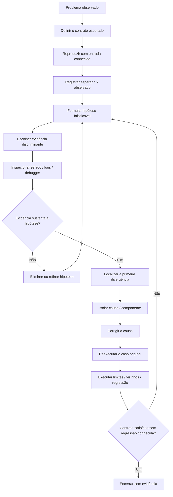

<a id="inicio"></a>

# Depuração

> **Classificação:** `[D] Obrigatório dominar`  
> **Nível:** B — Fundamentos de Programação  
> **Posição na taxonomia:** tópico 19  
> **Pré-requisitos principais:** T12 — Rastreamento, Verificação e Raciocínio sobre Execução; T18 — Erros, Exceções e Tratamento de Falhas; fluxo de controle; funções; escopo; estado e mutabilidade  
> **Aprofundamentos posteriores:** T20 — Testes e Verificação; T21 — Entrada/Saída e Persistência Básica; T23 — Modelo Básico de Execução; observabilidade, profiling, tracing distribuído, concorrência e diagnóstico de produção

---

## Resumo executivo

Depuração é o processo sistemático de **explicar uma divergência entre o comportamento esperado e o comportamento observado, localizar sua causa e verificar a correção**.

Não é sinônimo de:

```text
colocar prints aleatórios
alterar código até "funcionar"
reiniciar o programa repetidamente
culpar a última linha que mostrou o sintoma
usar um debugger sem hipótese
```

O núcleo do processo é:

```text
PROBLEMA OBSERVADO
↓
REPRODUZIR
↓
DEFINIR ESPERADO × REAL
↓
FORMULAR HIPÓTESES
↓
COLETAR EVIDÊNCIA
↓
INSPECIONAR ESTADO / FLUXO / STACK / LOGS
↓
ELIMINAR HIPÓTESES
↓
ISOLAR A CAUSA
↓
CORRIGIR A CAUSA
↓
REEXECUTAR O CASO QUE FALHAVA
↓
VERIFICAR EFEITOS COLATERAIS / REGRESSÃO
```

A taxonomia canônica deste tópico é:

```text
19.1 Reprodução do problema
     ├── cenário reproduzível
     └── entrada conhecida

19.2 Formulação de hipóteses
     ├── causas prováveis
     ├── teste de hipóteses
     └── eliminação progressiva

19.3 Inspeção de estado
     ├── variáveis
     ├── expressões
     └── condições

19.4 Logging
     ├── eventos
     ├── valores relevantes
     └── sequência temporal

19.5 Debugger
     ├── breakpoint
     ├── step over
     ├── step into
     ├── step out
     ├── watch
     └── call stack

19.6 Isolamento
     ├── reduzir o caso
     └── localizar o componente responsável
```

A ideia central é simples:

> **depurar bem é reduzir incerteza com evidência, não aumentar o número de alterações.**

---

## Objetivos de aprendizagem

Ao concluir o T19, você deve ser capaz de:

1. transformar um relato vago em uma reprodução controlada com entrada e ambiente relevantes;
2. registrar o comportamento **esperado versus observado** sem confundir sintoma com causa;
3. formular hipóteses falsificáveis e escolher evidência capaz de distingui-las;
4. inspecionar variáveis, expressões, condições e frames sem alterar o estado inadvertidamente;
5. escolher entre logging, debugger, tracing e isolamento de acordo com a pergunta investigativa;
6. usar breakpoint, step over, step into, step out, watch e call stack como **conceitos**, sem presumir equivalência perfeita entre ferramentas;
7. reduzir o caso até localizar uma divergência explicativa e condições causais suficientes para o caso reproduzido;
8. corrigir a causa demonstrada, reexecutar o caso original e preparar a ponte para regressão em T20;
9. depurar sem expor segredos, portas privilegiadas ou dados sensíveis desnecessários.

Esses objetivos correspondem aos nós canônicos `19.1`–`19.6`; ferramentas específicas são meios para demonstrar as capacidades, não a finalidade curricular.

---

## Distinções fundamentais

```text
SINTOMA
≠
CAUSA

REPRODUÇÃO
≠
CORREÇÃO

HIPÓTESE
≠
EVIDÊNCIA

LOG
≠
DEBUGGER

BREAKPOINT
≠
BUG

CALL STACK
≠
HISTÓRICO COMPLETO DO PROGRAMA

DEPURAÇÃO
≠
TESTE

DEPURAÇÃO
≠
PROFILING

DEPURAÇÃO
≠
OBSERVABILIDADE DE PRODUÇÃO
```

### Definições de trabalho

| Termo | Definição operacional neste tópico |
|---|---|
| **Bug** | Defeito no software, configuração, integração ou hipótese de projeto que contribui para comportamento incorreto. |
| **Sintoma** | Manifestação observável do problema: saída errada, exceção, travamento, status inesperado, estado incorreto etc. |
| **Causa** | Condição que explica por que o sintoma ocorre no caso analisado. Em sistemas reais pode existir mais de uma causa contribuinte. |
| **Reprodução** | Procedimento capaz de provocar novamente o problema sob condições conhecidas. |
| **Hipótese** | Explicação provisória e testável para o comportamento observado. |
| **Evidência** | Observação, trace, estado, log, resultado de teste ou outra informação capaz de apoiar ou enfraquecer uma hipótese. |
| **Inspeção de estado** | Observação dos valores e condições relevantes em um ponto da execução. |
| **Breakpoint** | Ponto configurado para pausar a execução quando uma condição de depuração é atingida. |
| **Step over** | Executa a próxima unidade de execução sem entrar deliberadamente nas chamadas feitas por ela. |
| **Step into** | Avança entrando em uma chamada quando o debugger consegue acompanhar seu código. |
| **Step out** | Continua até sair do frame/chamada atual e retornar ao chamador. |
| **Watch** | Expressão/valor acompanhado durante a depuração; o mecanismo exato depende da ferramenta. |
| **Call stack** | Pilha de frames/chamadas ativas que levou ao ponto atual. |
| **Isolamento** | Redução controlada do espaço de busca até identificar entrada, caminho, módulo, operação ou condição responsável. |

---

## Regra de ouro

> **Antes de alterar o código, consiga dizer qual hipótese a alteração está testando ou qual causa já demonstrada ela pretende corrigir.**

Um anti-padrão típico:

```text
mudar condição
mudar entrada
mudar timeout
adicionar retry
mudar ordem
executar
"agora funcionou"
```

Esse procedimento destrói informação causal.

Um procedimento melhor:

```text
1 alteração controlada
→ 1 hipótese explícita
→ 1 observação prevista
→ resultado
→ hipótese confirmada ou rejeitada
```

---

## Decisão rápida

| Pergunta | Resposta curta |
|---|---|
| “Depurar é testar?” | Não. Teste verifica comportamento diante de casos; depuração investiga a causa de uma divergência. |
| “O primeiro passo é abrir o debugger?” | Não necessariamente. Primeiro torne o problema observável e reproduzível. |
| “Se o bug é intermitente, não dá para depurar?” | Dá, mas a reprodução pode exigir registrar ambiente, ordem, timing, dados e eventos antes de reduzir o caso. |
| “Print debugging é errado?” | Não. É uma técnica válida quando usada de forma dirigida; logging ou debugger podem ser melhores conforme o contexto. |
| “Posso colocar log em toda linha?” | Normalmente não. Excesso de ruído dificulta causalidade, aumenta custo e pode expor dados. |
| “Breakpoint mostra onde o bug está?” | Não. Mostra um ponto de execução. Você ainda precisa interpretar estado e fluxo. |
| “Step over e step into são universais?” | São conceitos comuns de debuggers, mas detalhes dependem da ferramenta/runtime. |
| “Watch pode mudar o programa?” | Em algumas ferramentas, avaliar uma expressão com efeitos colaterais pode alterar estado. Prefira expressões sem efeitos. |
| “Call stack é o histórico completo?” | Não. É a cadeia de frames ativos naquele instante. |
| “Bash tem debugger nativo equivalente a pdb/jdb?” | Não no mesmo modelo. `set -x`, `PS4`, `BASH_XTRACEFD` e `trap DEBUG` ajudam no tracing, mas não criam equivalência automática com breakpoints/stepping estruturado. |
| “Logs substituem debugger?” | Não. Logs registram eventos escolhidos; debugger permite pausar e inspecionar estado vivo. |
| “Debugger substitui logs?” | Não. Em produção, attach pode ser inviável ou inseguro; logs podem ser a principal evidência disponível. |
| “Corrigi o caso que falhava; terminou?” | Não. Reexecute casos próximos e, no T20, transforme a regressão relevante em teste quando fizer sentido. |
| “Profiling é depuração?” | Não. Profiling mede desempenho/uso de recursos; pode apoiar diagnóstico, mas é outro foco. |
| “Posso expor uma porta de debug para facilitar?” | Só com controles adequados. Interfaces de debug podem permitir inspeção profunda e até execução de código. |

---

# Índice

  - [Resumo executivo](#resumo-executivo)
  - [Objetivos de aprendizagem](#objetivos-de-aprendizagem)
  - [Distinções fundamentais](#distinções-fundamentais)
  - [Regra de ouro](#regra-de-ouro)
  - [Decisão rápida](#decisão-rápida)
- [1. Posição deste assunto](#1-posição-deste-assunto)
  - [1.1 Fronteira com T12 — Rastreamento e raciocínio sobre execução](#11-fronteira-com-t12--rastreamento-e-raciocínio-sobre-execução)
  - [1.2 Fronteira com T18 — Erros, exceções e tratamento de falhas](#12-fronteira-com-t18--erros-exceções-e-tratamento-de-falhas)
  - [1.3 Fronteira com T20 — Testes e verificação](#13-fronteira-com-t20--testes-e-verificação)
  - [1.4 Fronteira com T21 e T23](#14-fronteira-com-t21-e-t23)
  - [1.5 Fronteira com observabilidade, profiling e diagnóstico distribuído](#15-fronteira-com-observabilidade-profiling-e-diagnóstico-distribuído)
- [2. 🗺️ Visão panorâmica — o mapa antes dos detalhes](#visao-panoramica)
- [3. Modelo mental: depuração como redução de incerteza](#3-modelo-mental-depuração-como-redução-de-incerteza)
  - [3.1 Uma boa hipótese produz uma previsão](#31-uma-boa-hipótese-produz-uma-previsão)
  - [3.2 O objetivo não é coletar toda informação possível](#32-o-objetivo-não-é-coletar-toda-informação-possível)
  - [3.3 Primeira divergência é mais valiosa que último sintoma](#33-primeira-divergência-é-mais-valiosa-que-último-sintoma)
- [4. Método sistemático de depuração](#4-método-sistemático-de-depuração)
  - [4.1 Registro mínimo do incidente de desenvolvimento](#41-registro-mínimo-do-incidente-de-desenvolvimento)
  - [4.2 Não confundir correlação com causa](#42-não-confundir-correlação-com-causa)
- [5. 19.1 — Reprodução do problema `[D]`](#5-191--reprodução-do-problema-d)
  - [5.1 Cenário reproduzível](#51-cenário-reproduzível)
  - [5.2 Entrada conhecida](#52-entrada-conhecida)
  - [5.3 Esperado × real](#53-esperado--real)
  - [5.4 Ambiente relevante](#54-ambiente-relevante)
  - [5.5 Reproduzir não significa reproduzir em produção](#55-reproduzir-não-significa-reproduzir-em-produção)
  - [5.6 Bug determinístico](#56-bug-determinístico)
  - [5.7 Bug intermitente](#57-bug-intermitente)
  - [5.8 Heisenbug como alerta conceitual](#58-heisenbug-como-alerta-conceitual)
  - [5.9 Reprodução mínima útil](#59-reprodução-mínima-útil)
  - [5.10 Checklist de reprodução](#510-checklist-de-reprodução)
- [6. 19.2 — Formulação de hipóteses `[D]`](#6-192--formulação-de-hipóteses-d)
  - [6.1 De sintoma para hipóteses](#61-de-sintoma-para-hipóteses)
  - [6.2 Priorizar causas prováveis](#62-priorizar-causas-prováveis)
  - [6.3 Hipótese e previsão](#63-hipótese-e-previsão)
  - [6.4 Teste discriminante](#64-teste-discriminante)
  - [6.5 Uma mudança por vez](#65-uma-mudança-por-vez)
  - [6.6 Eliminação progressiva](#66-eliminação-progressiva)
  - [6.7 Busca binária conceitual no caminho](#67-busca-binária-conceitual-no-caminho)
  - [6.8 Hipóteses negativas](#68-hipóteses-negativas)
  - [6.9 Evite hipótese impossível de testar](#69-evite-hipótese-impossível-de-testar)
  - [6.10 Hipótese sobre requisito](#610-hipótese-sobre-requisito)
  - [6.11 Diário de hipóteses](#611-diário-de-hipóteses)
- [7. 19.3 — Inspeção de estado `[D]`](#7-193--inspeção-de-estado-d)
  - [7.1 Variáveis](#71-variáveis)
  - [7.2 Expressões](#72-expressões)
  - [7.3 Condições](#73-condições)
  - [7.4 Estado esperado × observado](#74-estado-esperado--observado)
  - [7.5 Frame atual](#75-frame-atual)
  - [7.6 Ler sem alterar](#76-ler-sem-alterar)
  - [7.7 Alterar variável no debugger](#77-alterar-variável-no-debugger)
  - [7.8 Primeiro valor incorreto](#78-primeiro-valor-incorreto)
  - [7.9 Estado invisível](#79-estado-invisível)
- [8. 19.4 — Logging `[D]`](#8-194--logging-d)
  - [8.1 Logging não é despejar todo o estado](#81-logging-não-é-despejar-todo-o-estado)
  - [8.2 Eventos](#82-eventos)
  - [8.3 Valores relevantes](#83-valores-relevantes)
  - [8.4 Sequência temporal](#84-sequência-temporal)
  - [8.5 Timestamp não resolve tudo](#85-timestamp-não-resolve-tudo)
  - [8.6 Logging × print debugging](#86-logging--print-debugging)
  - [8.7 Python — logging básico](#87-python--logging-básico)
  - [8.8 JavaScript — console e runtime](#88-javascript--console-e-runtime)
  - [8.9 Java — `java.util.logging`](#89-java--javautillogging)
  - [8.10 Bash — stderr e função de log](#810-bash--stderr-e-função-de-log)
  - [8.11 Dados sensíveis](#811-dados-sensíveis)
  - [8.12 Redação e minimização](#812-redação-e-minimização)
  - [8.13 Logging pode alterar comportamento](#813-logging-pode-alterar-comportamento)
  - [8.14 Log de entrada e saída](#814-log-de-entrada-e-saída)
  - [8.15 Correlação básica](#815-correlação-básica)
  - [8.16 Checklist de logging para depuração](#816-checklist-de-logging-para-depuração)
- [9. 19.5 — Debugger `[D]`](#9-195--debugger-d)
  - [9.1 Breakpoint](#91-breakpoint)
  - [9.2 Onde colocar breakpoint](#92-onde-colocar-breakpoint)
  - [9.3 Breakpoint condicional](#93-breakpoint-condicional)
  - [9.4 Step over](#94-step-over)
  - [9.5 Step into](#95-step-into)
  - [9.6 Step out](#96-step-out)
  - [9.7 Watch](#97-watch)
  - [9.8 Call stack](#98-call-stack)
  - [9.9 Call stack não é histórico completo](#99-call-stack-não-é-histórico-completo)
  - [9.10 Frames](#910-frames)
  - [9.11 Continue/resume](#911-continueresume)
  - [9.12 Debugger altera o ritmo da execução](#912-debugger-altera-o-ritmo-da-execução)
  - [9.13 Avaliação no console](#913-avaliação-no-console)
- [10. Python — `pdb`](#10-python--pdb)
  - [10.1 Entrada simples com `breakpoint()`](#101-entrada-simples-com-breakpoint)
  - [10.2 Executar um script sob `pdb`](#102-executar-um-script-sob-pdb)
  - [10.3 Comandos fundamentais](#103-comandos-fundamentais)
  - [10.4 Exemplo conceitual](#104-exemplo-conceitual)
  - [10.5 `where`, `up` e `down`](#105-where-up-e-down)
  - [10.6 Breakpoint condicional](#106-breakpoint-condicional)
  - [10.7 Post-mortem](#107-post-mortem)
  - [10.8 Python 3.14 — attach por PID](#108-python-314--attach-por-pid)
  - [10.9 Alterar estado dentro de `pdb`](#109-alterar-estado-dentro-de-pdb)
  - [10.10 Remover `breakpoint()` esquecido](#1010-remover-breakpoint-esquecido)
- [11. JavaScript / ECMAScript — `debugger`, DevTools e Node.js](#11-javascript--ecmascript--debugger-devtools-e-nodejs)
  - [11.1 `debugger;`](#111-debugger)
  - [11.2 Chrome DevTools](#112-chrome-devtools)
  - [11.3 Step over no DevTools](#113-step-over-no-devtools)
  - [11.4 Step into](#114-step-into)
  - [11.5 Step out](#115-step-out)
  - [11.6 Watch e Scope](#116-watch-e-scope)
  - [11.7 Node.js — debugger de linha de comando](#117-nodejs--debugger-de-linha-de-comando)
  - [11.8 Node Inspector](#118-node-inspector)
  - [11.9 Segurança do Inspector](#119-segurança-do-inspector)
  - [11.10 Código transpilado/minificado](#1110-código-transpiladominificado)
- [12. Java — `jdb` e JPDA](#12-java--jdb-e-jpda)
  - [12.1 Conceito de arquitetura](#121-conceito-de-arquitetura)
  - [12.2 Iniciar com `jdb`](#122-iniciar-com-jdb)
  - [12.3 Breakpoint por linha](#123-breakpoint-por-linha)
  - [12.4 Breakpoint por método](#124-breakpoint-por-método)
  - [12.5 Step into × step over](#125-step-into--step-over)
  - [12.6 Exceções](#126-exceções)
  - [12.7 Attach a JVM](#127-attach-a-jvm)
  - [12.8 Threads virtuais — detalhe atual](#128-threads-virtuais--detalhe-atual)
  - [12.9 IDEs Java](#129-ides-java)
- [13. GNU Bash — tracing sem falsa equivalência](#13-gnu-bash--tracing-sem-falsa-equivalência)
  - [13.1 `set -x`](#131-set--x)
  - [13.2 `PS4`](#132-ps4)
  - [13.3 `BASH_XTRACEFD`](#133-bash_xtracefd)
  - [13.4 `FUNCNAME`, `BASH_SOURCE`, `BASH_LINENO`](#134-funcname-bash_source-bash_lineno)
  - [13.5 `trap DEBUG`](#135-trap-debug)
  - [13.6 Segredos em xtrace](#136-segredos-em-xtrace)
  - [13.7 Desativação localizada](#137-desativação-localizada)
  - [13.8 Bash e “breakpoints”](#138-bash-e-breakpoints)
- [14. Comparação entre as quatro linguagens](#14-comparação-entre-as-quatro-linguagens)
  - [14.1 Conceito universal × ferramenta](#141-conceito-universal--ferramenta)
- [15. 19.6 — Isolamento `[D]`](#15-196--isolamento-d)
  - [15.1 Reduzir a entrada](#151-reduzir-a-entrada)
  - [15.2 Reduzir o caminho de execução](#152-reduzir-o-caminho-de-execução)
  - [15.3 Reduzir componentes](#153-reduzir-componentes)
  - [15.4 Substituir dependência por dado sintético](#154-substituir-dependência-por-dado-sintético)
  - [15.5 Dividir para localizar](#155-dividir-para-localizar)
  - [15.6 Isolamento por função](#156-isolamento-por-função)
  - [15.7 Isolamento por commit/alteração](#157-isolamento-por-commitalteração)
  - [15.8 Isolamento não é desabilitar segurança](#158-isolamento-não-é-desabilitar-segurança)
  - [15.9 Isolamento e estado compartilhado](#159-isolamento-e-estado-compartilhado)
  - [15.10 Critério de parada](#1510-critério-de-parada)
- [16. Sintoma × causa × correção](#16-sintoma--causa--correção)
- [17. Depuração de erros lógicos](#17-depuração-de-erros-lógicos)
- [18. Depuração de exceções e falhas explícitas](#18-depuração-de-exceções-e-falhas-explícitas)
- [19. Stack trace como evidência](#19-stack-trace-como-evidência)
  - [Leitura contextual](#leitura-contextual)
  - [A primeira linha não é “mais importante” universalmente](#a-primeira-linha-não-é-mais-importante-universalmente)
- [20. Breakpoints estratégicos](#20-breakpoints-estratégicos)
  - [20.1 Antes e depois](#201-antes-e-depois)
  - [20.2 Condicional](#202-condicional)
  - [20.3 Breakpoint em exceção](#203-breakpoint-em-exceção)
- [21. Watch sem efeitos colaterais](#21-watch-sem-efeitos-colaterais)
  - [21.1 Funções aparentemente simples](#211-funções-aparentemente-simples)
- [22. Logging × debugger × teste de mesa](#22-logging--debugger--teste-de-mesa)
- [23. Debugging não é profiling](#23-debugging-não-é-profiling)
- [24. Debugging não é observabilidade completa](#24-debugging-não-é-observabilidade-completa)
- [25. Segurança durante depuração](#25-segurança-durante-depuração)
  - [25.1 Não registrar segredos](#251-não-registrar-segredos)
  - [25.2 Não expor portas de debug](#252-não-expor-portas-de-debug)
  - [25.3 Dados sintéticos](#253-dados-sintéticos)
  - [25.4 Dump de memória e estado](#254-dump-de-memória-e-estado)
  - [25.5 Debugger em produção](#255-debugger-em-produção)
- [26. Padrões de investigação por tipo de sintoma](#26-padrões-de-investigação-por-tipo-de-sintoma)
  - [26.1 Saída errada](#261-saída-errada)
  - [26.2 Exceção](#262-exceção)
  - [26.3 Falha externa](#263-falha-externa)
  - [26.4 Intermitência](#264-intermitência)
  - [26.5 “Funciona na minha máquina”](#265-funciona-na-minha-máquina)
- [27. Anti-padrões de depuração](#27-anti-padrões-de-depuração)
  - [27.1 Alterações aleatórias](#271-alterações-aleatórias)
  - [27.2 Reiniciar sem coletar evidência](#272-reiniciar-sem-coletar-evidência)
  - [27.3 Culpar dependência cedo demais](#273-culpar-dependência-cedo-demais)
  - [27.4 Corrigir output manualmente](#274-corrigir-output-manualmente)
  - [27.5 `try/catch` para esconder bug](#275-trycatch-para-esconder-bug)
  - [27.6 Logar tudo](#276-logar-tudo)
  - [27.7 Debugger sem objetivo](#277-debugger-sem-objetivo)
  - [27.8 Mudar estado no debugger e esquecer](#278-mudar-estado-no-debugger-e-esquecer)
  - [27.9 Confundir ausência de reprodução com correção](#279-confundir-ausência-de-reprodução-com-correção)
  - [27.10 Corrigir sem retestar o caso original](#2710-corrigir-sem-retestar-o-caso-original)
- [28. Fluxo integrado — Python](#28-fluxo-integrado--python)
- [29. Fluxo integrado — JavaScript](#29-fluxo-integrado--javascript)
- [30. Fluxo integrado — Java](#30-fluxo-integrado--java)
- [31. Fluxo integrado — Bash](#31-fluxo-integrado--bash)
- [32. Exemplo NetDev sintético](#32-exemplo-netdev-sintético)
- [Prática operacional — problemas reais e troubleshooting](#prática-operacional--problemas-reais-e-troubleshooting)
  - [Problemas Reais `PR-T19-*` e Gate de Cobertura Prática](#problemas-reais-t19)
  - [🔎 Troubleshooting sistemático](#troubleshooting-sistematico)
- [33. Laboratórios](#33-laboratórios)
  - [🧪 LAB 1 — tornar o problema reproduzível](#-lab-1--tornar-o-problema-reproduzível)
  - [🧪 LAB 2 — hipótese falsificável](#-lab-2--hipótese-falsificável)
  - [🧪 LAB 3 — primeira divergência](#-lab-3--primeira-divergência)
  - [🧪 LAB 4 — logging direcionado](#-lab-4--logging-direcionado)
  - [🧪 LAB 5 — Python `pdb`](#-lab-5--python-pdb)
  - [🧪 LAB 6 — Node debugger](#-lab-6--node-debugger)
  - [🧪 LAB 7 — Java com `jdb`](#-lab-7--java-com-jdb)
  - [🧪 LAB 8 — Bash `set -x`](#-lab-8--bash-set--x)
  - [🧪 LAB 9 — isolamento](#-lab-9--isolamento)
  - [🧪 LAB 10 — NetDev sintético](#-lab-10--netdev-sintético)
- [34. Exercícios](#34-exercícios)
  - [34.1 Reprodução](#341-reprodução)
  - [34.2 Esperado × real](#342-esperado--real)
  - [34.3 Hipótese](#343-hipótese)
  - [34.4 Evidência](#344-evidência)
  - [34.5 Estado](#345-estado)
  - [34.6 Condição](#346-condição)
  - [34.7 Logging](#347-logging)
  - [34.8 Segurança](#348-segurança)
  - [34.9 Breakpoint](#349-breakpoint)
  - [34.10 Step over](#3410-step-over)
  - [34.11 Step into](#3411-step-into)
  - [34.12 Step out](#3412-step-out)
  - [34.13 Watch](#3413-watch)
  - [34.14 Call stack](#3414-call-stack)
  - [34.15 Python](#3415-python)
  - [34.16 JavaScript](#3416-javascript)
  - [34.17 Java](#3417-java)
  - [34.18 Bash](#3418-bash)
  - [34.19 Isolamento](#3419-isolamento)
  - [34.20 Regressão](#3420-regressão)
  - [34.21 Intermitência](#3421-intermitência)
  - [34.22 Ferramenta](#3422-ferramenta)
  - [34.23 Primeira divergência](#3423-primeira-divergência)
  - [34.24 Produção](#3424-produção)
- [35. Evidências de domínio](#35-evidências-de-domínio)
  - [35.1 Reprodução](#351-reprodução)
  - [35.2 Hipóteses](#352-hipóteses)
  - [35.3 Estado](#353-estado)
  - [35.4 Logging](#354-logging)
  - [35.5 Debugger](#355-debugger)
  - [35.6 Isolamento](#356-isolamento)
  - [35.7 Evidência mínima integrada](#357-evidência-mínima-integrada)
- [36. Checklist de consulta rápida](#36-checklist-de-consulta-rápida)
  - [Antes de depurar](#antes-de-depurar)
  - [Durante a investigação](#durante-a-investigação)
  - [Ao isolar](#ao-isolar)
  - [Depois da correção](#depois-da-correção)
- [37. Glossário](#37-glossário)
- [38. Auditoria de cobertura da taxonomia](#38-auditoria-de-cobertura-da-taxonomia)
  - [38.1 Conteúdo deliberadamente referenciado](#381-conteúdo-deliberadamente-referenciado)
- [39. Referências](#39-referências)
  - [39.1 Taxonomia e contrato](#391-taxonomia-e-contrato)
  - [39.2 Currículo](#392-currículo)
  - [39.3 Python 3.14.7](#393-python-3147)
  - [39.4 ECMAScript 2026 e ambiente JavaScript](#394-ecmascript-2026-e-ambiente-javascript)
  - [39.5 Java SE 27](#395-java-se-27)
  - [39.6 GNU Bash 5.3](#396-gnu-bash-53)
  - [39.7 Segurança](#397-segurança)
  - [39.8 Literatura técnica complementar](#398-literatura-técnica-complementar)
  - [39.9 Hierarquia usada nesta versão](#399-hierarquia-usada-nesta-versão)
  - [39.10 Revisão 0.4.0 — R3, fontes reconsultadas e revalidação](#3910-revisão-040--r3-fontes-reconsultadas-e-revalidação)
  - [39.11 Estado de QA e evidência da revisão 0.4.2](#3911-estado-de-qa-e-evidência-da-revisão-042)
- [40. Histórico de versões](#40-histórico-de-versões)

---

# 1. Posição deste assunto

T19 está no Nível B — Fundamentos de Programação e recebe classificação `[D] Obrigatório dominar`.

Ele transforma habilidades já introduzidas no T12 em um **processo operacional de investigação**.

```text
T12
Rastrear e raciocinar sobre execução
        ↓
T18
Classificar falhas e entender mecanismos de sinalização
        ↓
T19
Investigar sistematicamente a causa
        ↓
T20
Criar verificações/testes capazes de detectar regressões
```

## 1.1 Fronteira com T12 — Rastreamento e raciocínio sobre execução

T12 já ensinou:

- teste de mesa;
- rastreamento de fluxo;
- estado intermediário;
- previsão de resultado;
- primeira divergência;
- introdução a `pdb`, `debugger`, jdb/JDI e `set -x`;
- reprodução, hipótese e redução do caso como ponte para debugging.

T19 **não recomeça esses conceitos do zero**.

Aprofunda:

- como obter reprodução útil;
- como escrever hipóteses falsificáveis;
- como escolher evidências;
- como inspecionar estado sem mascarar a causa;
- como usar logging e debugger de forma consciente;
- como isolar componente/entrada/caminho responsável.

## 1.2 Fronteira com T18 — Erros, exceções e tratamento de falhas

T18 pergunta:

```text
que tipo de falha é esta?
como a linguagem a sinaliza?
como o programa deve reagir?
```

T19 pergunta:

```text
por que ocorreu neste caso?
onde o estado se desviou?
qual hipótese explica o sintoma?
qual evidência confirma ou rejeita essa hipótese?
```

Tratamento de exceção não é depuração.

Um `catch` pode lidar corretamente com uma falha prevista sem investigar sua causa; da mesma forma, um bug lógico pode exigir depuração sem gerar exceção alguma.

## 1.3 Fronteira com T20 — Testes e verificação

T19 usa execuções controladas para investigar.

T20 sistematiza:

- casos normais;
- limites;
- inválidos;
- assertions;
- testes automatizados;
- regressões.

Uma prática importante é:

```text
bug reproduzível
→ causa identificada
→ correção
→ caso de regressão
```

Mas a arquitetura completa de testes pertence ao T20.

## 1.4 Fronteira com T21 e T23

T21 aprofundará I/O e persistência.

T23 aprofundará:

- processo;
- stdin/stdout/stderr;
- pipes;
- exit codes;
- ambiente básico de execução.

T19 usa esses elementos quando necessários à investigação, sem antecipar seus capítulos completos.

## 1.5 Fronteira com observabilidade, profiling e diagnóstico distribuído

Este capítulo apresenta logging como ferramenta de depuração e diagnóstico básico.

Ficam para aprofundamentos posteriores:

- métricas;
- tracing distribuído;
- correlação entre serviços;
- OpenTelemetry;
- flame graphs;
- profiling de CPU/memória;
- dumps avançados;
- análise de deadlocks;
- debugging de kernel;
- post-mortem avançado.

Esses temas podem ser citados, mas não redefinem a taxonomia do T19.

[↑ Voltar ao índice](#índice)

---

<a id="visao-panoramica"></a>

# 2. 🗺️ Visão panorâmica — o mapa antes dos detalhes

Esta seção é o **caderno rápido de consulta** do T19. Ela não substitui o aprofundamento: organiza o domínio inteiro antes dos detalhes e aponta para onde investigar quando um programa diverge do comportamento esperado.

A ideia central é simples:

```text
DEPURAR
≠
ALTERAR CÓDIGO ATÉ O SINTOMA SUMIR

DEPURAR
=
TRANSFORMAR UMA DIVERGÊNCIA OBSERVADA
EM UMA EXPLICAÇÃO TESTÁVEL,
LOCALIZAR O PRIMEIRO PONTO OBSERVADO
EM QUE O CONTRATO DEIXA DE COINCIDIR COM A EXECUÇÃO
E IDENTIFICAR CONDIÇÕES CAUSAIS SUFICIENTES
PARA EXPLICAR O CASO REPRODUZIDO
E VALIDAR A CORREÇÃO SEM REGRESSÃO CONHECIDA
```

### Mapa do domínio — o que precisa ser dominado

```text
DEPURAÇÃO [D]
│
├── 19.1 REPRODUÇÃO
│   ├── cenário reproduzível
│   ├── entrada conhecida
│   ├── esperado × real
│   ├── ambiente relevante
│   └── determinístico × intermitente
│
├── 19.2 HIPÓTESES
│   ├── causa provável
│   ├── previsão observável
│   ├── teste discriminante
│   ├── uma mudança por vez
│   └── eliminação progressiva
│
├── 19.3 INSPEÇÃO DE ESTADO
│   ├── variáveis
│   ├── expressões
│   ├── condições
│   ├── frame / escopo
│   └── primeira divergência
│
├── 19.4 LOGGING
│   ├── eventos
│   ├── valores relevantes
│   ├── sequência temporal
│   ├── contexto suficiente
│   └── minimização de dados sensíveis
│
├── 19.5 DEBUGGER
│   ├── breakpoint
│   ├── breakpoint condicional
│   ├── step over
│   ├── step into
│   ├── step out
│   ├── watch / scope
│   ├── call stack / frames
│   └── continue / resume
│
└── 19.6 ISOLAMENTO
    ├── reduzir entrada
    ├── reduzir caminho de execução
    ├── reduzir componentes
    ├── substituir dependência por dado sintético
    └── localizar o primeiro componente que produz estado incorreto
```

**Destinos principais:** [reprodução](#5-191--reprodução-do-problema-d), [hipóteses](#6-192--formulação-de-hipóteses-d), [estado](#7-193--inspeção-de-estado-d), [logging](#8-194--logging-d), [debugger](#9-195--debugger-d) e [isolamento](#15-196--isolamento-d).

### Fluxo principal — investigar em vez de adivinhar



O fluxo pode voltar etapas. A disciplina está em **preservar a pergunta e a evidência**, não em obedecer uma sequência rígida.

### Consulta rápida — pergunta × mecanismo × evidência × risco

| Pergunta prática | Primeiro mecanismo | Evidência útil | Erro frequente | Aprofundamento |
|---|---|---|---|---|
| “Consigo provocar o problema de novo?” | reprodução controlada | entrada, ambiente, passos, saída | mudar o cenário antes de registrar | [19.1](#5-191--reprodução-do-problema-d) |
| “O que deveria acontecer?” | esperado × observado | contrato/requisito + resultado real | depurar sem critério de sucesso | [5.3](#53-esperado--real) |
| “Qual causa explicaria isto?” | hipótese falsificável | previsão observável | hipótese vaga: “algo está errado” | [19.2](#6-192--formulação-de-hipóteses-d) |
| “Qual hipótese merece ser testada primeiro?” | prioridade + teste discriminante | teste que separa causas concorrentes | alterar várias coisas simultaneamente | [6.2–6.6](#62-priorizar-causas-prováveis) |
| “Onde o valor passa a ficar errado?” | inspeção de estado | primeiro valor/condição divergente | observar só o estado final | [7.8](#78-primeiro-valor-incorreto) |
| “Preciso entender a sequência ao longo do tempo?” | logging direcionado | eventos + valores + contexto | logar tudo e esconder o sinal | [19.4](#8-194--logging-d) |
| “Preciso pausar e explorar o frame?” | debugger | locals, watches, stack, frames | stepping sem hipótese | [19.5](#9-195--debugger-d) |
| “O bug só aparece em certa iteração?” | breakpoint condicional / log seletivo | estado no caso raro | pausar milhares de vezes | [9.3](#93-breakpoint-condicional) |
| “A exceção aponta a causa?” | stack trace + contexto | cadeia de chamadas e valores anteriores | tratar a linha do sintoma como causa automática | [19](#19-stack-trace-como-evidência) |
| “Funciona na minha máquina.” | comparar ambiente e dependências | versões/config/entrada/estado | reproduzir só no ambiente original | [26.5](#265-funciona-na-minha-máquina) |
| “Ao instrumentar o bug ele desaparece.” | reduzir instrumentação; preservar timings | comparação com/sem observação | concluir que foi corrigido | [5.8](#58-heisenbug-como-alerta-conceitual) |
| “Qual parte do sistema é responsável?” | isolamento | caso mínimo que preserva o sintoma | remover também a condição causadora | [19.6](#15-196--isolamento-d) |

### Pergunta → primeira ação útil

```text
NÃO TENHO REPRODUÇÃO
→ congele entrada, passos, ambiente e observado

TENHO REPRODUÇÃO, MAS NÃO SEI A CAUSA
→ formule uma hipótese que gere previsão verificável

TENHO MUITAS HIPÓTESES
→ escolha teste que elimine o maior número delas com menor perturbação

TENHO UM VALOR FINAL ERRADO
→ procure a primeira divergência, não apenas o último sintoma

PRECISO DE HISTÓRICO DE EXECUÇÃO
→ logging direcionado

PRECISO PAUSAR E EXPLORAR UM INSTANTE
→ debugger / breakpoint / frame

BUG APARECE SÓ EM UM CASO RARO
→ breakpoint condicional ou instrumentação seletiva

BUG DESAPARECE COM DEBUGGER/LOG
→ suspeite perturbação temporal/estado e trate como intermitência

CASO É GRANDE DEMAIS
→ reduza entrada, caminho e dependências sem perder o sintoma

CORRIGI
→ volte ao caso original + casos vizinhos + regressão no T20
```

### Não confundir

| Conceitos | Diferença operacional |
|---|---|
| **sintoma × causa** | sintoma é o que apareceu; causa explica por que apareceu |
| **reprodução × correção** | reproduzir torna o problema observável; não significa resolvê-lo |
| **hipótese × palpite** | hipótese prevê algo que pode ser confirmado/rejeitado |
| **evidência × impressão** | evidência é observação ligada a uma pergunta explícita |
| **logging × debugger** | logging registra execução ao longo do tempo; debugger permite pausar/inspecionar/controlar execução |
| **breakpoint × bug** | breakpoint é um ponto de parada; não é o defeito |
| **call stack × histórico completo** | stack mostra chamadas ativas naquele instante; não reconstrói automaticamente tudo que ocorreu |
| **debugging × testing** | debugging investiga uma divergência; testes verificam contratos/casos e previnem regressão |
| **debugging × profiling** | debugging busca causa de comportamento incorreto; profiling mede custo/desempenho |
| **debugging × observabilidade** | T19 usa evidência local e logging; observabilidade distribuída é domínio posterior |
| **Bash xtrace × debugger interativo** | `set -x` mostra comandos após expansão/antes da execução; não oferece por si só frames/watches/stepping equivalentes a `pdb`/DevTools/`jdb` |

### Microexemplo canônico — encontre a primeira divergência

Requisito:

```text
score >= 100 recebe 20% de desconto
```

Código:

```python
def calculate_discount(score: int) -> float:
    if score > 100:
        return 0.20
    return 0.0
```

Caso:

```text
score=100
expected=0.20
actual=0.0
```

Raciocínio de depuração:

```text
REPRODUÇÃO
score=100

HIPÓTESE
operador > exclui o limite 100

PREVISÃO
score > 100 será False quando score=100

EVIDÊNCIA
100 > 100 → False

PRIMEIRA DIVERGÊNCIA
condição do branch

CORREÇÃO
>  →  >=

REGRESSÃO
verificar 99, 100 e 101
```

O mesmo **método** transfere entre linguagens; a ferramenta concreta muda.

### Problemas reais que este tópico precisa fechar

| ID | Situação real | Capacidade dominante | Destino |
|---|---|---|---|
| `PR-T19-01` | bug descrito de forma vaga e não reproduzível | 19.1 | [reprodução](#5-191--reprodução-do-problema-d) |
| `PR-T19-02` | resultado incorreto sem exceção | 19.2 + 19.3 | [erros lógicos](#17-depuração-de-erros-lógicos) |
| `PR-T19-03` | tentativa e erro sem hipótese | 19.2 | [hipóteses](#6-192--formulação-de-hipóteses-d) |
| `PR-T19-04` | falha ocorre apenas em uma iteração/estado raro | 19.3 + 19.5 | [breakpoint condicional](#93-breakpoint-condicional) |
| `PR-T19-05` | stack trace mostra o sintoma, mas a causa nasceu antes | 19.3 + 19.5 | [stack trace](#19-stack-trace-como-evidência) |
| `PR-T19-06` | instrumentação altera o comportamento | 19.1 + 19.4/19.5 | [Heisenbug](#58-heisenbug-como-alerta-conceitual) |
| `PR-T19-07` | logs têm ruído, contexto insuficiente ou segredo | 19.4 | [logging](#8-194--logging-d) + [segurança](#25-segurança-durante-depuração) |
| `PR-T19-08` | “funciona na minha máquina” | 19.1 + 19.6 | [26.5](#265-funciona-na-minha-máquina) |
| `PR-T19-09` | caso grande esconde a primeira causa | 19.6 | [isolamento](#15-196--isolamento-d) |
| `PR-T19-10` | Bash perde o status relevante antes da inspeção | 19.3 + 19.4 | [fluxo Bash](#31-fluxo-integrado--bash) |

O fechamento formal desses problemas aparece em [Problemas Reais e Gate de Cobertura Prática](#problemas-reais-t19).

### Entrada rápida de troubleshooting

| Sintoma | Primeira pergunta | Primeira evidência |
|---|---|---|
| não consigo reproduzir | o cenário/entrada/ambiente são realmente os mesmos? | passos mínimos + entrada + versão/config relevante |
| saída está errada | onde surge o primeiro valor diferente do esperado? | checkpoints de estado antes/depois |
| exceção aparece longe da causa | quem produziu o dado/estado usado no frame que falhou? | stack + frames + argumentos |
| branch “não deveria” executar | qual expressão booleana concreta foi avaliada? | valores dos operandos + resultado da condição |
| loop falha apenas em N | o que distingue essa iteração? | breakpoint condicional / log seletivo |
| bug some com log/debugger | observação alterou timing/estado/ordem? | execução comparativa com instrumentação mínima |
| funciona só em um host | qual diferença de ambiente é causal? | versões, config, env, permissões, dados |
| Bash mostra status inesperado | `$?` já foi sobrescrito por outro comando? | salvar status imediatamente + `set -x` localizado |

Casos completos e reproduzíveis: [Troubleshooting sistemático](#troubleshooting-sistematico).

### Transferência entre linguagens — conceito comum, ferramentas diferentes

| Capacidade | Python | JavaScript / Node.js | Java | GNU Bash |
|---|---|---|---|---|
| pausar explicitamente | `breakpoint()` / `pdb` | `debugger;` com debugger ativo | breakpoint no `jdb`/IDE | sem equivalente nativo direto |
| iniciar debugger CLI | `python -m pdb app.py` | `node inspect app.js` | `jdb Classe` | tracing via `bash -x` / `set -x` |
| step into | `step` | DevTools/Node `step` | `step` | não equivalente por `set -x` |
| step over | `next` | DevTools/Node `next` | `next` | não equivalente por `set -x` |
| step out | `return` | DevTools/Node `out` | `step up` | não equivalente por `set -x` |
| observar expressão | `p expr` | Watch / REPL / watcher | `print`/`dump` conforme `jdb` | saída direcionada / xtrace / variáveis shell |
| call stack | `where` | Call Stack / backtrace | `where` | `FUNCNAME` + `BASH_SOURCE` + `BASH_LINENO` ajudam a reconstruir contexto de funções |
| logging | `logging` | console/logging da aplicação | `java.util.logging` ou solução adotada | `printf`/stderr/syslog conforme contexto |
| risco específico | alterar frame/estado; attach a processo em execução pode exigir acesso privilegiado | Inspector exposto; source maps | JDWP/debug remoto privilegiado | xtrace pode revelar dados já expandidos |

**Regra de transferência:** transfira o **método investigativo**; não force equivalência entre interfaces que possuem semânticas diferentes.

### Modo consulta × modo estudo

**Consulta rápida:**

```text
1. esperado × observado
2. reproduzo?
3. hipótese?
4. qual evidência discrimina?
5. onde está a primeira divergência?
6. preciso de log, debugger ou isolamento?
7. corrigi a causa?
8. retestei e criei regressão?
```

**Estudo completo:** siga [modelo mental](#3-modelo-mental-depuração-como-redução-de-incerteza) → [método](#4-método-sistemático-de-depuração) → 19.1–19.6 → ferramentas por linguagem → [padrões por sintoma](#26-padrões-de-investigação-por-tipo-de-sintoma) → [problemas reais](#problemas-reais-t19) → [troubleshooting](#troubleshooting-sistematico) → LABs.

### Fronteiras do mapa

```text
T12
→ aprender a rastrear e raciocinar sobre execução

T18
→ classificar/tratar falhas e exceções

T19
→ investigar sistematicamente por que o observado diverge do esperado

T20
→ transformar casos importantes em verificação repetível/regressão

PROFILING / OBSERVABILIDADE DISTRIBUÍDA / POST-MORTEM AVANÇADO
→ aprofundamentos posteriores
```

### Gate 1 — mapa congelado para a iteração 0.4.2

```text
DOMÍNIO 19.1–19.6: representado
PR-* MATERIAIS: com destino
CLASSES DE FALHA: com destino
PYTHON / JAVASCRIPT / JAVA / BASH: avaliados sem equivalência forçada
SÍNTESE MULTIFONTE: executada e revalidada
ELEMENTO MATERIAL SEM DESTINO: 0
GATE 1: FECHADO
```

A partir deste ponto, o aprofundamento deve cumprir o que o mapa prometeu; qualquer descoberta material nova exigiria reabrir a reconciliação do mapa.

[↑ Voltar ao índice](#índice)
---

# 3. Modelo mental: depuração como redução de incerteza

Suponha que uma saída esteja errada.

No início existem muitas explicações possíveis:

```text
entrada errada?
parsing errado?
condição errada?
loop a mais?
função recebeu valor incorreto?
função retornou valor incorreto?
estado foi alterado antes?
configuração mudou?
componente externo respondeu diferente?
```

A depuração sistemática reduz esse conjunto.

```text
HIPÓTESES POSSÍVEIS
H1 H2 H3 H4 H5 H6 H7
       ↓ evidência
H1 H3 H5
       ↓ nova evidência
H3
       ↓ reprodução direcionada
causa localizada
```

## 3.1 Uma boa hipótese produz uma previsão

Hipótese fraca:

```text
"deve ser alguma coisa no loop"
```

Hipótese melhor:

```text
"o loop executa uma iteração extra porque a condição usa <= em vez de <"
```

Previsão:

```text
se a hipótese estiver correta,
o contador atingirá o valor limite e o corpo ainda executará uma vez
```

Evidência necessária:

```text
valor do contador
condição avaliada
número de iterações
```

## 3.2 O objetivo não é coletar toda informação possível

Mais dados não significam automaticamente melhor diagnóstico.

```text
milhares de linhas de log
≠
boa evidência
```

O objetivo é coletar **informação discriminante**: algo que diferencie hipóteses concorrentes.

## 3.3 Primeira divergência é mais valiosa que último sintoma

Exemplo:

```text
entrada correta
↓
normalização correta
↓
classificação errada  ← primeira divergência
↓
relatório errado
↓
arquivo final errado  ← sintoma tardio
```

Depurar apenas o arquivo final tende a atacar o efeito.

Rastrear até a primeira divergência aproxima você da causa.

> **Guardrail:** “primeira divergência conhecida” não significa necessariamente primeira causa absoluta do sistema nem uma causa-raiz única. Em software com estado persistente, assincronismo, concorrência ou múltiplas condições contribuintes, ela é o primeiro ponto **observado** em que o contrato deixa de coincidir com a execução. A investigação ainda precisa demonstrar quais condições são causalmente suficientes para explicar o caso reproduzido.

[↑ Voltar ao índice](#índice)

---

# 4. Método sistemático de depuração

Um procedimento robusto para este nível:

```text
1. DESCREVER O SINTOMA
2. REPRODUZIR
3. FIXAR ENTRADA E AMBIENTE RELEVANTE
4. DEFINIR O RESULTADO ESPERADO
5. REGISTRAR O RESULTADO REAL
6. LOCALIZAR A PRIMEIRA DIVERGÊNCIA CONHECIDA
7. FORMULAR UMA HIPÓTESE TESTÁVEL
8. ESCOLHER A MENOR EVIDÊNCIA ÚTIL
9. INSPECIONAR / LOGAR / PAUSAR
10. CONFIRMAR OU REJEITAR
11. REDUZIR O CASO
12. IDENTIFICAR A CAUSA
13. CORRIGIR UMA COISA POR VEZ
14. REEXECUTAR O CASO
15. VERIFICAR CASOS VIZINHOS / REGRESSÃO
```

## 4.1 Registro mínimo do incidente de desenvolvimento

Mesmo num exercício pequeno, registre:

```text
entrada:
resultado esperado:
resultado real:
ambiente relevante:
passos para reproduzir:
hipótese atual:
evidência observada:
conclusão:
```

Exemplo:

```text
entrada: age=18
esperado: ADULT
real: MINOR
ambiente: Python 3.x, função classify_age()
passos: executar classify_age(18)
hipótese: condição usa > em vez de >=
evidência: 18 > 18 resulta False
conclusão: hipótese confirmada
```

## 4.2 Não confundir correlação com causa

Você adicionou um `print()` e o bug sumiu.

Isso **não prova** que o print corrigiu a causa.

Pode existir:

- mudança de timing;
- mudança de buffering;
- corrida;
- efeito colateral indireto;
- comportamento não determinístico;
- simples coincidência.

Para fundamentos, a regra é:

> **mudança do sintoma após uma intervenção é uma evidência; não é automaticamente explicação causal.**

[↑ Voltar ao índice](#índice)

---
# 5. 19.1 — Reprodução do problema `[D]`

A depuração começa quando o problema deixa de ser uma descrição vaga e se torna um **caso observável**.

A taxonomia exige dois elementos mínimos:

```text
19.1 Reprodução do problema
├── cenário reproduzível
└── entrada conhecida
```

## 5.1 Cenário reproduzível

Um cenário reproduzível responde:

```text
O QUE EXECUTAR?
COM QUAIS DADOS?
EM QUAL ESTADO INICIAL?
EM QUAL AMBIENTE RELEVANTE?
QUAL RESULTADO ESPERADO?
QUAL RESULTADO REAL?
```

Ruim:

```text
"às vezes o total sai errado"
```

Melhor:

```text
função: calculate_total()
entrada: [10, 20, 30]
desconto: 10%
esperado: 54.0
real: 60.0
reprodução: ocorre em todas as execuções com desconto diferente de zero
```

## 5.2 Entrada conhecida

Sem entrada conhecida, você não sabe se está investigando o mesmo caso.

Exemplo ruim:

```python
import random

value = random.randint(1, 100)
print(process(value))
```

Durante a investigação, prefira controlar o dado:

```python
value = 42
print(process(value))
```

Depois, restaure a fonte real e teste novamente.

A ideia vale para as quatro linguagens:

```text
entrada aleatória
→ semente controlada ou valor fixo

hora atual
→ instante conhecido/injetado quando possível

arquivo variável
→ fixture/cópia sintética conhecida

resposta de rede
→ resposta sintética/mocked quando o objetivo é isolar lógica local
```

O aprofundamento formal de mocks/stubs pertence a testes e engenharia posterior.

## 5.3 Esperado × real

Uma reprodução sem expectativa explícita ainda é incompleta.

Modelo:

```text
INPUT
↓
EXPECTED
↓
ACTUAL
↓
DELTA
```

Exemplo:

```text
input: 18
expected: adult=true
actual: adult=false

Delta:
expected true
received false
```

## 5.4 Ambiente relevante

Nem todo detalhe do computador precisa ser registrado.

Registre aquilo que **pode mudar a semântica ou o caminho executado**:

- versão da linguagem/runtime;
- sistema operacional quando pertinente;
- variáveis de ambiente relevantes;
- configuração;
- locale/timezone quando influenciam dados;
- versão de dependência relevante;
- permissões;
- caminho/arquivo realmente usado;
- entrada externa sintetizada.

Evite transformar reprodução em inventário irrelevante.

## 5.5 Reproduzir não significa reproduzir em produção

Se o problema ocorre em ambiente sensível:

```text
produção
↓
coletar evidência segura
↓
reproduzir em ambiente controlado quando possível
```

Não faça experimentos intrusivos apenas para “ver o que acontece”.

## 5.6 Bug determinístico

Exemplo:

```python
def is_adult(age: int) -> bool:
    return age > 18
```

Caso:

```text
age=18
esperado=True
real=False
```

Sempre ocorre da mesma forma.

Isso facilita:

```text
reprodução
→ inspeção
→ hipótese
→ correção
```

## 5.7 Bug intermitente

Um bug intermitente exige ampliar o registro do cenário.

Pergunte:

- ocorre depois de quantas execuções?
- existe ordem específica?
- depende de dado anterior?
- existe concorrência?
- depende de horário?
- depende de rede/I/O?
- depende de carga?
- depende de arquivo/configuração externa?

Para este nível, não é necessário dominar concorrência avançada.

A habilidade fundamental é **não apagar a variabilidade importante**.

## 5.8 Heisenbug como alerta conceitual

Alguns problemas mudam quando você observa o sistema de forma intrusiva.

Exemplo conceitual:

```text
bug dependente de timing
+
logging pesado
→ timing diferente
→ sintoma desaparece
```

Não use “Heisenbug” como explicação mágica. Use-o apenas como alerta:

> **a técnica de observação também faz parte do experimento.**

## 5.9 Reprodução mínima útil

O menor caso nem sempre é o menor número de linhas possível.

O objetivo é preservar:

```text
CAUSA
+
SINTOMA
```

removendo o que não influencia o problema.

Exemplo:

```text
aplicação completa
→ 5 módulos
→ 2 módulos
→ 1 função
→ 3 valores
```

Se o bug desapareceu ao reduzir, alguma parte removida era relevante — isso também é evidência.

## 5.10 Checklist de reprodução

- [ ] Tenho passos claros?
- [ ] A entrada é conhecida?
- [ ] Sei o esperado?
- [ ] Sei o observado?
- [ ] Registrei ambiente relevante?
- [ ] Consigo repetir?
- [ ] Se é intermitente, registrei frequência/condições?
- [ ] Evitei usar dados reais sensíveis quando dados sintéticos bastam?

[↑ Voltar ao índice](#índice)

---

# 6. 19.2 — Formulação de hipóteses `[D]`

Depuração não é uma sequência de palpites desconectados.

Uma hipótese útil é:

```text
ESPECÍFICA
TESTÁVEL
FALSIFICÁVEL
LIGADA A UMA PREVISÃO OBSERVÁVEL
```

A taxonomia exige:

```text
causas prováveis
→ teste de hipóteses
→ eliminação progressiva
```

## 6.1 De sintoma para hipóteses

Sintoma:

```text
total final está 10 acima do esperado
```

Hipóteses possíveis:

```text
H1 desconto não foi aplicado
H2 um item foi contado duas vezes
H3 taxa foi somada em vez de subtraída
H4 entrada já chegou incorreta
```

Não tente corrigir quatro hipóteses ao mesmo tempo.

## 6.2 Priorizar causas prováveis

Probabilidade não é certeza.

Use contexto:

- qual código foi alterado recentemente?
- qual caminho é realmente executado?
- em que ponto surge a primeira divergência?
- que condição diferencia caso correto e incorreto?
- qual dado influencia diretamente o resultado?

Evite:

```text
"essa biblioteca costuma dar problema"
```

sem evidência específica.

## 6.3 Hipótese e previsão

Exemplo:

```text
HIPÓTESE
O desconto não é aplicado porque a função recebe 0.0.

PREVISÃO
No início de apply_discount(), discount será 0.0.

EVIDÊNCIA A COLETAR
argumento discount na entrada da função.
```

Se o debugger mostrar:

```text
discount=0.1
```

essa hipótese foi enfraquecida/rejeitada.

Não altere a conclusão para salvar o palpite.

## 6.4 Teste discriminante

Uma boa observação diferencia hipóteses.

Suponha:

```text
H1 valor chega errado à função
H2 função transforma valor errado
```

Inspecione:

```text
entrada da função
+
saída da função
```

Se entrada já está errada:

```text
H1 ganha suporte
H2 deixa de ser o primeiro ponto de divergência
```

Se entrada está correta e saída errada:

```text
H1 perde suporte
H2 ganha suporte
```

## 6.5 Uma mudança por vez

Durante a investigação:

```text
MUDANÇA A
+
MUDANÇA B
+
MUDANÇA C
→ comportamento mudou
```

não permite saber qual fator foi causal.

Prefira:

```text
A → observar
B → observar
C → observar
```

quando o custo permitir.

Isso não significa que sistemas reais sempre permitem experimentos perfeitos. É uma disciplina para preservar informação.

## 6.6 Eliminação progressiva

Exemplo:

```text
H1 parsing
H2 regra de negócio
H3 formatação
H4 persistência
```

Evidência 1:

```text
valor após parsing está correto
→ elimina H1 como primeira divergência
```

Evidência 2:

```text
valor após regra de negócio está errado
→ foco em H2
```

Evidência 3:

```text
primeira transformação da regra já está incorreta
→ espaço de busca reduzido
```

## 6.7 Busca binária conceitual no caminho

Quando existe uma sequência longa de transformações:

```text
A → B → C → D → E → F → G → H
```

em vez de observar cada ponto desde o começo, você pode inspecionar o meio:

```text
D correto?
├── NÃO → causa está entre A e D
└── SIM → causa está entre E e H
```

Repita.

Essa técnica não é “busca binária” formal sobre qualquer programa; é uma **heurística de divisão do espaço de investigação** quando o fluxo permite.

## 6.8 Hipóteses negativas

Também é útil provar que algo **não** é a causa.

Exemplo:

```text
"o arquivo errado está sendo lido"
```

Evidência:

```text
path absoluto registrado
hash/tamanho esperado
conteúdo sintético conhecido
```

Se tudo coincide, essa linha de investigação pode ser encerrada.

## 6.9 Evite hipótese impossível de testar

Fraca:

```text
"o sistema ficou confuso"
```

Forte:

```text
"a variável cached_value mantém o valor da execução anterior porque não é reinicializada"
```

A segunda permite prever e observar estado.

## 6.10 Hipótese sobre requisito

Nem todo bug está na implementação.

Pode existir divergência em:

```text
requisito
interpretação
configuração
entrada
implementação
```

Exemplo:

```text
programador espera timeout=30 segundos
configuração documentada define timeout=30 milissegundos
```

Antes de corrigir código, confirme o contrato.

## 6.11 Diário de hipóteses

Para problemas maiores:

| Hipótese | Evidência esperada | Resultado | Estado |
|---|---|---|---|
| desconto chega como zero | argumento `discount == 0` | `0.1` | rejeitada |
| desconto não é aplicado | subtotal == total | subtotal 60, total 60 | sustentada |
| branch incorreto | condição falsa | `has_discount` é falso | sustentada |

Isso evita circular pelas mesmas suspeitas.

[↑ Voltar ao índice](#índice)

---

# 7. 19.3 — Inspeção de estado `[D]`

Estado é o conjunto de informações relevantes para a execução naquele momento.

Neste tópico, o núcleo obrigatório é:

```text
variáveis
expressões
condições
```

Mas a leitura correta também depende de:

- escopo;
- frame atual;
- parâmetros;
- valores retornados;
- coleções;
- mutabilidade;
- ordem das chamadas.

## 7.1 Variáveis

Não pergunte apenas:

```text
"qual é x?"
```

Pergunte:

```text
qual x?
em qual frame?
em qual escopo?
antes ou depois de qual instrução?
quem alterou?
qual valor era esperado?
```

Exemplo:

```python
def apply_discount(total: float, discount: float) -> float:
    result = total * (1 - discount)
    return result
```

Estado relevante antes do cálculo:

```text
total=100.0
discount=0.10
```

Depois:

```text
result=90.0
```

## 7.2 Expressões

Uma expressão grande pode esconder qual parte está errada.

```python
final_price = subtotal * (1 - discount) + shipping if is_active else 0
```

Durante a depuração, decomponha mentalmente ou temporariamente:

```text
subtotal
1 - discount
subtotal * (1 - discount)
shipping
is_active
resultado do branch
```

Não é obrigatório refatorar produção apenas para depurar; o objetivo é observar partes discriminantes.

## 7.3 Condições

Para um branch incorreto, registre:

```text
operandos
operador
resultado booleano
```

Exemplo:

```python
age = 18
is_adult = age > 18
```

Trace:

```text
age      = 18
condition= 18 > 18
result   = False
expected = True
```

A primeira divergência está clara.

## 7.4 Estado esperado × observado

Use pares explícitos:

| Ponto | Esperado | Observado |
|---|---:|---:|
| entrada | 10 | 10 |
| após transformação A | 20 | 20 |
| após transformação B | 40 | 30 |
| saída | 41 | 31 |

A causa provável está próxima da transformação B, não necessariamente na saída.

## 7.5 Frame atual

Em uma cadeia:

```text
main()
└── process_order()
    └── calculate_total()
        └── apply_discount()
```

cada chamada possui seu contexto/frame.

O mesmo nome pode existir em mais de um frame:

```text
total em process_order()
≠
total em calculate_total()
```

Debugger permite mudar o frame selecionado em muitas ferramentas.

## 7.6 Ler sem alterar

A inspeção ideal é inicialmente observacional.

Cuidado com expressões como:

```text
next(iterator)
queue.pop()
list.remove(...)
object.update()
function_with_side_effect()
```

Se você as avalia no console/watch, pode alterar o programa.

Prefira observar:

- valores simples;
- propriedades sem efeito conhecido;
- tamanho/estado já existente;
- expressões puras quando possível.

## 7.7 Alterar variável no debugger

Algumas ferramentas permitem modificar valores em runtime.

Isso é útil para experimentar:

```text
"se flag fosse true, qual caminho ocorreria?"
```

Mas cria um novo experimento.

Não conclua:

```text
"mudei no debugger e funcionou, então está corrigido"
```

A causa original ainda precisa ser explicada.

## 7.8 Primeiro valor incorreto

Uma técnica forte:

```text
identifique valor final errado
↓
pergunte onde ele foi produzido
↓
inspecione entradas dessa operação
↓
repita para trás
```

Isso cria uma investigação causal reversa.

## 7.9 Estado invisível

Nem todo estado aparece como variável local evidente.

Pode existir em:

- variável global;
- atributo de objeto;
- closure;
- arquivo;
- banco;
- cache;
- variável de ambiente;
- opção de shell;
- working directory;
- processo externo.

No T19 basta reconhecer isso. T21/T23 aprofundam recursos externos e execução.

[↑ Voltar ao índice](#índice)

---
# 8. 19.4 — Logging `[D]`

Logging é o registro intencional de eventos e contexto relevantes durante a execução.

Neste tópico, logging serve principalmente para responder:

```text
O QUE ACONTECEU?
EM QUAL ORDEM?
COM QUAIS VALORES RELEVANTES?
EM QUAL CONTEXTO?
```

A taxonomia exige:

```text
19.4 Logging
├── eventos
├── valores relevantes
└── sequência temporal
```

## 8.1 Logging não é despejar todo o estado

Um log útil possui propósito.

Ruim:

```text
here
here2
x=5
ok
```

Melhor:

```text
order_id=synthetic-42 event=discount_evaluated subtotal=100.00 discount=0.10 total=90.00
```

O segundo registro ajuda a reconstruir o caminho.

## 8.2 Eventos

Registre transições relevantes:

```text
operação iniciada
entrada aceita
branch importante selecionado
chamada externa iniciada
chamada externa concluída
fallback usado
operação concluída
falha observada
```

Evite transformar cada linha em evento.

## 8.3 Valores relevantes

Um valor é relevante quando ajuda a distinguir hipóteses.

Exemplo:

```text
hipótese: desconto chega zerado
```

Valor relevante:

```text
discount
```

Valor possivelmente irrelevante:

```text
largura da janela do terminal
```

## 8.4 Sequência temporal

Logs ganham valor quando permitem reconstruir ordem.

Exemplo:

```text
10:00:00 request_received
10:00:00 cache_lookup miss
10:00:01 backend_call start
10:00:03 backend_call timeout
10:00:03 fallback_used
10:00:03 response_sent
```

Sem sequência:

```text
timeout
fallback
request
```

fica muito mais difícil interpretar causalidade.

## 8.5 Timestamp não resolve tudo

Relógios podem ter:

- resolução limitada;
- fuso diferente;
- clock skew entre máquinas;
- eventos com o mesmo timestamp;
- buffering.

Para fundamentos, basta entender:

> **ordem temporal observada em logs é evidência importante, mas não deve ser interpretada além da precisão que o sistema realmente oferece.**

## 8.6 Logging × print debugging

| Aspecto | `print`/equivalente | Sistema de logging |
|---|---|---|
| início rápido | excelente | bom |
| níveis | manual | normalmente nativo |
| formato | manual | configurável |
| destino | stdout/stderr | handlers/destinos configuráveis |
| desligar/filtrar | manual | normalmente suportado |
| contexto estruturado | manual | possível/esperado |
| uso em programa real | limitado | mais adequado |

`print` não é “proibido”.

A pergunta é:

```text
essa observação é temporária e local?
ou precisa ser controlada, filtrada e preservada?
```

A auditoria bibliográfica reforça outro critério: instrumentação útil para investigação recorrente deve poder ser **ativada, filtrada e direcionada** sem exigir apagar manualmente dezenas de `print`s. Isso é uma vantagem operacional de um sistema de logging; não significa que toda observação temporária precise virar log permanente.

### Logging estruturado sem confundir formato com conceito

Para investigação em sistemas reais, contexto estruturado costuma ser mais útil quando cada campo preserva significado próprio:

```text
event
request_id / correlation_id quando existir
operation
relevant_value
outcome
```

Esses campos podem ser serializados como JSON, pares chave/valor ou outro formato suportado pela stack. **JSON é um formato comum, não a definição de logging estruturado.** O critério de T19 continua sendo o mesmo: registrar a menor evidência necessária para discriminar hipóteses, sem expor segredos nem transformar o tópico em observabilidade de produção.

## 8.7 Python — logging básico

A biblioteca padrão oferece `logging`.

Exemplo:

```python
import logging

logger = logging.getLogger(__name__)


def calculate_total(subtotal: float, discount: float) -> float:
    logger.debug(
        "calculating total: subtotal=%s discount=%s",
        subtotal,
        discount,
    )
    return subtotal * (1 - discount)
```

Ponto didático:

```text
logger.debug(...)
```

é diferente de espalhar `print()` sem controle.

Para este capítulo, não precisamos aprofundar toda a arquitetura de handlers, formatters e configuração.

## 8.8 JavaScript — console e runtime

JavaScript como linguagem não define sozinho toda a infraestrutura de logging de um browser ou Node.js.

Em ambientes comuns:

```javascript
function calculateTotal(subtotal, discount) {
  console.debug("calculateTotal", { subtotal, discount });
  return subtotal * (1 - discount);
}
```

Mas:

```text
console
```

é API de ambiente/runtime, não uma construção central da especificação ECMAScript equivalente a uma biblioteca de logging universal.

Em aplicações reais, bibliotecas/frameworks podem oferecer logging estruturado.

## 8.9 Java — `java.util.logging`

A plataforma Java fornece `java.util.logging`.

```java
import java.util.logging.Logger;

public class PriceService {
    private static final Logger LOGGER = Logger.getLogger(PriceService.class.getName());

    static double calculateTotal(double subtotal, double discount) {
        LOGGER.fine(() -> "subtotal=" + subtotal + " discount=" + discount);
        return subtotal * (1 - discount);
    }
}
```

A documentação do JDK descreve loggers nomeados e encaminhamento de registros para handlers.

Frameworks de mercado como SLF4J/Logback existem, mas não são necessários para dominar o conceito curricular deste tópico.

## 8.10 Bash — stderr e função de log

Bash não possui uma biblioteca de logging embutida equivalente ao módulo `logging` de Python.

Um padrão simples:

```bash
log_debug() {
    printf 'DEBUG: %s\n' "$*" >&2
}

subtotal=100
discount=10
log_debug "subtotal=$subtotal discount=$discount"
```

Em scripts reais, adicione controle de nível/ativação conforme necessidade.

## 8.11 Dados sensíveis

Nunca trate logging de debug como desculpa para registrar:

- passwords;
- tokens;
- cookies de sessão;
- chaves privadas;
- secrets;
- dados pessoais desnecessários;
- payload completo quando apenas um identificador sintético basta.

Exemplo ruim:

```text
Authorization: Bearer eyJ...
```

Melhor:

```text
auth_present=true
credential_source=environment
```

quando essa informação for suficiente para a hipótese.

## 8.12 Redação e minimização

Pergunte:

```text
qual é a menor informação necessária para investigar?
```

Exemplo:

```text
email completo
```

pode ser desnecessário se você precisa apenas saber:

```text
email_present=true
email_length=20
```

## 8.13 Logging pode alterar comportamento

Logs podem:

- aumentar I/O;
- alterar timing;
- preencher disco;
- afetar concorrência;
- mudar buffering;
- aumentar custo.

Logo:

```text
mais log
≠
sempre melhor depuração
```

## 8.14 Log de entrada e saída

Pode ser útil registrar fronteiras:

```text
entrada da função
saída da função
```

Mas evite duplicar todo payload.

Exemplo:

```text
process_items start count=3
process_items end accepted=2 rejected=1
```

## 8.15 Correlação básica

Mesmo em programa simples, um identificador sintético ajuda:

```text
request_id=lab-001
```

Todos os eventos daquele fluxo podem carregá-lo.

Isso antecipa a ideia de correlação sem transformar o T19 em capítulo de observabilidade distribuída.

## 8.16 Checklist de logging para depuração

- [ ] O evento ajuda uma hipótese?
- [ ] O valor é realmente necessário?
- [ ] A ordem pode ser reconstruída?
- [ ] O nível é adequado?
- [ ] O log evita segredos?
- [ ] O volume é controlado?
- [ ] O local do log está próximo da decisão relevante?
- [ ] Remover/desativar o log não destrói comportamento necessário?

[↑ Voltar ao índice](#índice)

---

# 9. 19.5 — Debugger `[D]`

Debugger é uma ferramenta capaz de controlar e observar a execução de um programa.

Os conceitos obrigatórios são:

```text
breakpoint
step over
step into
step out
watch
call stack
```

Eles aparecem em muitas ferramentas, mas **não são construções semânticas idênticas das quatro linguagens**.

## 9.1 Breakpoint

Breakpoint significa:

```text
pausar a execução quando determinado ponto/condição de depuração for atingido
```

Pode ser:

- por linha;
- por função/método;
- condicional;
- associado a exceção/evento, dependendo da ferramenta.

O ponto principal é:

> **breakpoint fornece uma janela de observação; não identifica automaticamente a causa.**

## 9.2 Onde colocar breakpoint

Evite começar com dezenas de breakpoints.

Escolha uma fronteira que diferencie hipóteses:

```text
antes da transformação suspeita
+
depois da transformação suspeita
```

Se o estado entra correto e sai errado, o espaço de investigação diminui.

## 9.3 Breakpoint condicional

Quando um loop possui milhares de iterações, parar em todas pode ser inútil.

Exemplo conceitual:

```text
parar apenas quando index == 999
```

ou:

```text
parar quando total < 0
```

A sintaxe depende do debugger.

## 9.4 Step over

Conceito:

```text
executar a próxima unidade sem entrar deliberadamente nas chamadas feitas por ela
```

Exemplo:

```text
A: result = calculate_total(order)
B: print(result)
```

Em A:

```text
step over
→ executa calculate_total(...)
→ pausa em B
```

Use quando a função chamada não é a suspeita atual.

## 9.5 Step into

Conceito:

```text
entrar na chamada para observar sua execução interna
```

Em A:

```text
step into
→ entra em calculate_total(...)
```

Use quando a hipótese está dentro da função chamada.

## 9.6 Step out

Você entrou numa função e concluiu que ela não é relevante.

```text
step out
→ executa até retornar ao chamador
```

É uma forma de recuperar o nível de abstração sem continuar linha a linha.

## 9.7 Watch

Watch acompanha uma expressão ou valor relevante.

Exemplos:

```text
total
discount
items.length
counter == limit
```

Cuidado:

> **uma watch expression pode ser avaliada repetidamente. Não use expressão com efeito colateral sem compreender o comportamento da ferramenta.**

Ruim:

```text
queue.pop()
```

como expressão de watch.

## 9.8 Call stack

Considere:

```text
main
→ load_order
→ calculate_total
→ apply_discount
```

Ao pausar em `apply_discount`, a call stack mostra a cadeia ativa.

Ela responde:

```text
quem chamou esta função?
de onde veio este frame?
qual caminho de chamadas está ativo agora?
```

## 9.9 Call stack não é histórico completo

Depois que uma função retorna, seu frame normalmente sai da pilha ativa.

Logo:

```text
call stack atual
≠
trace temporal completo de tudo que ocorreu
```

Logs/traces podem ser necessários para reconstruir passado.

Em fluxos assíncronos ou orientados a eventos, a pilha síncrona atual também pode não representar sozinha toda a **linhagem causal** que iniciou a operação. Algumas ferramentas conseguem associar *async frames*; isso é capacidade do runtime/ferramenta, não uma propriedade universal da call stack. O aprofundamento de event loop, tarefas, concorrência e tracing causal fica para T23 e observabilidade posterior.

## 9.10 Frames

Cada frame costuma conter contexto como:

- função/método;
- posição no código;
- argumentos;
- variáveis locais;
- referência ao chamador.

A ferramenta pode permitir selecionar frames diferentes e inspecionar seus valores.

## 9.11 Continue/resume

Depois de pausar:

```text
continue/resume
→ executa até próximo breakpoint/evento relevante
```

Não confunda com step:

```text
continue
≠
next
```

## 9.12 Debugger altera o ritmo da execução

Pausar pode modificar:

- timing;
- timeout;
- interação com sistemas externos;
- concorrência.

Em bugs sensíveis ao tempo, isso é relevante.

## 9.13 Avaliação no console

Muitos debuggers permitem avaliar expressões no frame atual.

Isso é poderoso, mas pode:

- chamar funções;
- alterar objetos;
- consumir iteradores;
- executar I/O;
- lançar exceção.

Use primeiro para inspeção sem efeito.

[↑ Voltar ao índice](#índice)

---

# 10. Python — `pdb`

Python inclui `pdb` na biblioteca padrão.

Na documentação Python 3.14, `pdb` oferece:

- breakpoints;
- stepping;
- inspeção de frames;
- listagem de código;
- avaliação de expressões;
- depuração post-mortem;
- attach a processo por PID a partir do Python 3.14.

## 10.1 Entrada simples com `breakpoint()`

```python
def calculate_total(subtotal: float, discount: float) -> float:
    breakpoint()
    return subtotal * (1 - discount)


print(calculate_total(100.0, 0.10))
```

Quando o debugger padrão está ativo, a execução entra no `pdb`.

## 10.2 Executar um script sob `pdb`

```bash
python -m pdb app.py
```

A execução pode ser controlada desde o início.

## 10.3 Comandos fundamentais

| Conceito | `pdb` |
|---|---|
| continuar | `continue` / `c` |
| step into | `step` / `s` |
| step over | `next` / `n` |
| step out | `return` / `r` |
| call stack | `where` / `w` |
| frame anterior/mais antigo | `up` / `u` |
| frame posterior/mais novo | `down` / `d` |
| breakpoint | `break` / `b` |
| imprimir expressão | `p expression` |
| ajuda | `help` |

## 10.4 Exemplo conceitual

Arquivo:

```python
def apply_discount(total: float, discount: float) -> float:
    return total * (1 - discount)


def checkout(total: float) -> float:
    discount = 0.10
    return apply_discount(total, discount)


print(checkout(100.0))
```

Fluxo:

```text
break em checkout
→ n: observar discount
→ s: entrar em apply_discount
→ p total
→ p discount
→ w: observar stack
→ r: retornar
```

## 10.5 `where`, `up` e `down`

`where` mostra a pilha.

Depois:

```text
up
```

move a seleção para um frame mais antigo/chamador.

```text
down
```

move para um frame mais recente.

Isso ajuda a responder:

```text
onde o valor incorreto surgiu?
quem passou este argumento?
```

## 10.6 Breakpoint condicional

A documentação atual permite condição no comando `break`.

Conceito:

```text
parar na linha apenas quando a condição for verdadeira
```

Útil em:

- loops longos;
- entrada específica;
- estado raro.

## 10.7 Post-mortem

Depois de uma exceção não tratada em contexto interativo, `pdb.pm()` pode permitir inspeção do frame da falha.

Isso é diferente de tentar reproduzir manualmente tudo antes de olhar a exceção.

## 10.8 Python 3.14 — attach por PID

Python 3.14 adicionou:

```bash
python -m pdb -p PID
```

para anexar o `pdb` a um processo Python em execução.

A própria documentação ressalta que um processo bloqueado em syscall/I/O pode não responder ao attach até executar a próxima instrução de bytecode ou receber um sinal.

### Fronteira

Este recurso é **extensão útil**, não requisito mínimo para dominar T19.

### QA deste documento

O ambiente local usado para reprodução deste capítulo possui Python 3.13.5; portanto:

```text
-p PID
```

foi validado **documentalmente [D]**, não reproduzido localmente `[R]`.

## 10.9 Alterar estado dentro de `pdb`

É possível avaliar código e, em determinadas situações, alterar nomes/estado.

Trate isso como experimento separado.

Primeiro registre o estado original.

## 10.10 Remover `breakpoint()` esquecido

Antes de entregar código:

- procure breakpoints temporários;
- remova instrumentação indevida;
- execute novamente sem o debugger;
- confirme que comportamento não dependia da intervenção.

[↑ Voltar ao índice](#índice)

---

# 11. JavaScript / ECMAScript — `debugger`, DevTools e Node.js

ECMAScript define a statement:

```javascript
debugger;
```

A especificação ECMAScript 2026 estabelece que, quando existe uma facilidade de debugging habilitada, sua avaliação pode provocar uma ação de depuração definida pela implementação; sem debugger ativo, a statement não precisa produzir efeito observável.

Isso é importante:

```text
ECMAScript define `debugger;`
≠
ECMAScript padroniza toda interface de DevTools
```

## 11.1 `debugger;`

```javascript
function calculateTotal(subtotal, discount) {
  debugger;
  return subtotal * (1 - discount);
}

console.log(calculateTotal(100, 0.1));
```

Em um ambiente com debugger conectado, esse ponto pode pausar a execução.

## 11.2 Chrome DevTools

Chrome DevTools oferece os conceitos curriculares:

- breakpoints;
- inspeção de valores;
- step over;
- step into;
- step out;
- Watch;
- Call Stack.

A interface pode evoluir; o conceito não depende do ícone específico.

## 11.3 Step over no DevTools

Use quando a chamada não é foco da hipótese.

```javascript
const name = getName();
render(name);
```

Pausado na primeira linha:

```text
step over
→ executa getName()
→ pausa na próxima unidade relevante
```

## 11.4 Step into

Se `getName()` é suspeita:

```text
step into
→ entrar em getName()
```

## 11.5 Step out

Se entrou na função errada:

```text
step out
→ concluir o frame atual
→ voltar ao chamador
```

## 11.6 Watch e Scope

No DevTools, Watch acompanha expressões e Scope mostra propriedades/variáveis do contexto pausado.

A literatura JavaScript consultada na File Library usa justamente a combinação **breakpoint + Watch** para acompanhar a evolução de variáveis dentro de repetições. O ponto conceitual é transferível: escolha valores ligados à hipótese, em vez de observar todo o estado disponível.

Perguntas úteis:

```text
qual valor local?
qual valor veio da closure?
qual propriedade global está influenciando?
```

## 11.7 Node.js — debugger de linha de comando

Node.js inclui:

```bash
node inspect app.js
```

A documentação atual lista comandos como:

```text
cont / c
next / n
step / s
out / o
```

E watchers:

```javascript
watch('expression')
watchers
unwatch('expression')
```

## 11.8 Node Inspector

Outra forma é iniciar:

```bash
node --inspect app.js
```

ou, quando você precisa pausar desde o início:

```bash
node --inspect-brk app.js
```

A documentação atual também oferece `--inspect-wait` para aguardar conexão antes da execução.

## 11.9 Segurança do Inspector

A documentação do Node alerta explicitamente que expor o inspector em IP público, por exemplo:

```bash
node --inspect=0.0.0.0 app.js
```

com porta acessível é inseguro e pode permitir execução remota de código por um atacante que consiga conectar-se.

Regra prática:

> **interface de debug é superfície privilegiada; não publique porta de debugger como se fosse endpoint comum.**

## 11.10 Código transpilado/minificado

No front-end, o código executado pode não ser idêntico ao fonte escrito.

Source maps podem permitir mapear execução para o código original.

Se breakpoint, linha ou stack apontarem para arquivo gerado/minificado em vez do fonte esperado, verifique antes de concluir que o debugger “está errado”:

- se o source map correspondente àquele build foi carregado;
- se o artefato em execução corresponde à versão do fonte aberta;
- se bundler/transpilador não está exibindo um caminho gerado ou ignorado pela interface.

O aprofundamento de build systems fica fora deste capítulo, mas o modelo mental importa:

```text
fonte que você vê
≠
necessariamente bytes/código exatamente executados
```

[↑ Voltar ao índice](#índice)

---

# 12. Java — `jdb` e JPDA

O JDK inclui `jdb`, um debugger simples de linha de comando para programas Java.

A documentação Java SE 27 descreve `jdb` como ferramenta de inspeção e depuração de JVM local ou remota, baseada na Java Platform Debugger Architecture.

## 12.1 Conceito de arquitetura

```text
Debugger / IDE / jdb
        ↓
JDI / JDWP / mecanismos JPDA
        ↓
JVM alvo
```

Não é necessário programar JDI para dominar T19.

## 12.2 Iniciar com `jdb`

Exemplo conceitual:

```bash
javac -g DebugExample.java
jdb DebugExample
```

A opção `-g` pede ao `javac` todas as informações de depuração, incluindo variáveis locais. Sem `-g`, o padrão normalmente preserva linha e arquivo-fonte, mas não necessariamente locals.

Quando `jdb` lança a aplicação, é possível configurar breakpoints antes de continuar.

## 12.3 Breakpoint por linha

Segundo a documentação Java SE 27:

```text
stop at MyClass:22
```

configura breakpoint em uma linha.

## 12.4 Breakpoint por método

```text
stop in MyClass.myMethod
```

Quando há overload, pode ser necessário especificar tipos dos argumentos.

## 12.5 Step into × step over

Na documentação do `jdb`:

```text
step
```

avança para a próxima linha, inclusive entrando em método chamado.

```text
next
```

avança para a próxima linha no frame atual.

Esse mapeamento corresponde aos conceitos:

```text
step      → step into
next      → step over
step up   → step out
```

O comando `step up` executa até o método atual retornar ao chamador.

## 12.6 Exceções

`jdb` pode devolver controle ao debugger quando uma exceção não capturada ocorre.

Também é possível configurar parada em exceções específicas com `catch` do debugger.

Não confunda:

```text
jdb catch
≠
try/catch da linguagem Java
```

Um controla o debugger; o outro controla o fluxo do programa.

## 12.7 Attach a JVM

Java permite executar uma JVM com agente JDWP e anexar um debugger.

Esse mecanismo é poderoso e deve ser tratado como acesso privilegiado.

## 12.8 Threads virtuais — detalhe atual

A documentação `jdb` do Java SE 27 inclui comportamento específico para virtual threads e a opção `-trackallthreads`.

Esse detalhe é **dependente de versão/ferramenta** e não faz parte do núcleo curricular de T19.

Ele aparece aqui apenas para evitar a falsa ideia de que debuggers são estáticos no tempo.

## 12.9 IDEs Java

IDEs normalmente oferecem interface gráfica para os mesmos conceitos:

- breakpoint;
- conditional breakpoint;
- stepping;
- watches;
- locals;
- stack frames;
- exception breakpoints.

O objetivo pedagógico é aprender os conceitos, não decorar uma IDE.

[↑ Voltar ao índice](#índice)

---

# 13. GNU Bash — tracing sem falsa equivalência

GNU Bash exige cuidado especial.

Não devemos escrever:

```text
pdb = debugger Python
jdb = debugger Java
set -x = debugger Bash
```

Essa equivalência é falsa.

`set -x` fornece **execution tracing**, não o mesmo modelo de pausa, frame selection, watch e stepping de um debugger interativo completo.

## 13.1 `set -x`

```bash
set -x
value=10
result=$((value * 2))
printf '%s\n' "$result"
set +x
```

O Bash Reference Manual especifica que `-x` imprime um trace de comandos e argumentos/listas associados **depois das expansões e antes da execução**.

Isso é extremamente útil para ver o que o shell realmente vai executar.

### Prefira tracing localizado quando a hipótese permitir

Shotts e Tevault tratam tracing como ferramenta de investigação prática. Em um script grande, ligar xtrace apenas na região suspeita reduz ruído e diminui a chance de expor valores sensíveis:

```bash
set -x
# região sob investigação
run_calculation
set +x
```

A técnica continua obedecendo à regra central do T19:

```text
hipótese específica
→ instrumentação mínima capaz de discriminá-la
```

## 13.2 `PS4`

`PS4` controla o prefixo do xtrace.

Exemplo:

```bash
PS4='+ ${BASH_SOURCE}:${LINENO}:${FUNCNAME[0]}: '
set -x
```

Isso pode acrescentar:

- arquivo;
- linha;
- função.

## 13.3 `BASH_XTRACEFD`

Por padrão, xtrace usa stderr.

`BASH_XTRACEFD` pode direcionar o trace para outro file descriptor, separando-o de diagnósticos normais.

Exemplo controlado:

```bash
exec 9>trace.log
BASH_XTRACEFD=9
set -x

value=10
result=$((value * 2))

set +x
unset BASH_XTRACEFD
```

### Cuidado

O manual alerta para a semântica de fechamento do file descriptor ao alterar/desconfigurar `BASH_XTRACEFD`.

Não copie configuração de FD sem entender o ciclo de vida.

## 13.4 `FUNCNAME`, `BASH_SOURCE`, `BASH_LINENO`

Bash expõe arrays úteis para reconstruir contexto de funções:

```text
FUNCNAME
BASH_SOURCE
BASH_LINENO
```

O manual documenta a correspondência entre eles para descrever a pilha de chamadas de funções shell.

Exemplo:

```bash
show_stack() {
    local i
    for ((i = 0; i < ${#FUNCNAME[@]}; i++)); do
        printf 'frame=%d function=%s source=%s line=%s\n' \
            "$i" \
            "${FUNCNAME[$i]}" \
            "${BASH_SOURCE[$i]}" \
            "${BASH_LINENO[$i]:-n/a}"
    done
}
```

Isso é uma forma de inspeção; não transforme em equivalência com frames de um debugger interativo.

## 13.5 `trap DEBUG`

Bash possui pseudo-sinal `DEBUG` no builtin `trap`.

Ele pode executar ação antes de várias classes de comandos.

Exemplo didático:

```bash
trap 'printf "DEBUG line=%s command=%q\n" "$LINENO" "$BASH_COMMAND" >&2' DEBUG
```

### Guardrail — `trap DEBUG`

`DEBUG` trap possui regras de herança e interação com opções como `functrace`/`extdebug`.

Não é requisito deste capítulo dominar todas essas regras.

## 13.6 Segredos em xtrace

Este é um risco crítico:

```bash
TOKEN='secret-value'
curl -H "Authorization: Bearer $TOKEN" ...
```

Com `set -x`, o valor expandido pode aparecer no trace.

Nunca ative xtrace indiscriminadamente ao redor de:

- passwords;
- tokens;
- chaves;
- comandos com segredos;
- dados pessoais sensíveis.

A mitigação operacional mínima aparece imediatamente em [§13.7 — Desativação localizada](#137-desativação-localizada): delimite a região de trace e mantenha operações sensíveis fora dela sempre que possível.

## 13.7 Desativação localizada

Quando tracing é necessário perto de informação sensível, planeje limites explícitos.

Exemplo conceitual:

```bash
set +x
# obter/usar segredo
set -x
```

Mas lembre:

- o próprio comando de reativação pode aparecer conforme contexto;
- bibliotecas/funções chamadas podem herdar comportamentos;
- o melhor é minimizar a exposição desde o design.

## 13.8 Bash e “breakpoints”

É possível construir mecanismos com `DEBUG` trap, leitura interativa ou ferramentas externas.

Isso não muda a regra curricular:

> **Bash não oferece nativamente a mesma experiência semântica de `pdb`, DevTools ou `jdb`; explique o mecanismo real em vez de fabricar equivalência.**

### `set -u` como detector de uma classe de defeitos

`set -u` (`nounset`) pode ajudar a revelar variável não definida ou nome digitado incorretamente. Porém, conforme o Bash 5.3, ele **muda a regra de expansão de parâmetros** e pode encerrar um shell não interativo quando ocorre expansão inválida.

Logo:

```text
set -u
→ pode produzir evidência útil
→ não é debugger
→ não deve ser habilitado às cegas apenas para “depurar melhor”
```

A recomendação prática de um livro nunca substitui a semântica documentada do shell.

### `trap ERR` como instrumentação de falha — não como breakpoint

Bash também oferece o pseudo-sinal `ERR`. Um `trap ... ERR` pode registrar contexto quando determinadas falhas retornam status não zero, mas **não pausa a execução como um breakpoint interativo** e não cria frames/stepping equivalentes a `pdb`, DevTools ou `jdb`.

As condições em que `ERR` é executado seguem exceções contextuais relacionadas a `errexit` (`set -e`), e sua herança em funções/subshells depende de opções como `errtrace` (`set -E`). Portanto:

```text
trap ERR
→ pode produzir evidência sobre certas falhas
→ não é “catch”
→ não é breakpoint
→ não substitui o desenho de status/tratamento do T18
```

Use-o como instrumento dirigido por hipótese; o tratamento completo de falhas Bash permanece no T18.

### Debuggers externos de Bash

A literatura consultada também apresenta ferramentas externas, como `bashdb`, capazes de oferecer stepping mais próximo de um debugger. Elas são úteis como **extensão**, mas não fazem parte da linguagem Bash, sua instalação/disponibilidade varia e não são requisito curricular deste T19.

[↑ Voltar ao índice](#índice)

---
# 14. Comparação entre as quatro linguagens

A pergunta correta não é:

```text
"qual comando em cada linguagem faz exatamente a mesma coisa?"
```

A pergunta correta é:

```text
"qual mecanismo real do ambiente permite observar e controlar a execução?"
```

| Conceito | Python | JavaScript | Java | GNU Bash |
|---|---|---|---|---|
| entrada explícita no debugger | `breakpoint()` / `pdb` | `debugger;` / DevTools / Node Inspector | `jdb`/IDE/JPDA | não há equivalente nativo único |
| breakpoint | sim | sim, via ferramenta | sim | normalmente simulado/externo; xtrace não pausa |
| step over | `next` | DevTools / `next` no Node debugger | `next` no jdb | não equivalente em `set -x` |
| step into | `step` | DevTools / `step` no Node debugger | `step` no jdb | não equivalente em `set -x` |
| step out | `return` | DevTools / `out` no Node debugger | `step up` no `jdb` | não equivalente em `set -x` |
| watch | display/avaliação conforme `pdb`/IDE | Watch/Node watcher | IDE/JDI/jdb conforme ferramenta | observar variáveis via trace/comandos próprios |
| call stack | `where` | Call Stack / backtrace | stack frames / jdb | `FUNCNAME` + `BASH_SOURCE` + `BASH_LINENO` para funções shell |
| instrumentação / tracing textual | `python -m trace` / logging / prints | console/logging/runtime | logging/JVM tools | `set -x`, `PS4` |
| attach | Python 3.14 `pdb -p PID` | Inspector | JPDA/JDWP | depende de ferramentas externas; não é recurso equivalente do shell |

## 14.1 Conceito universal × ferramenta

```text
CONCEITO UNIVERSAL
pausar e observar

PYTHON
pdb / IDE

JAVASCRIPT
DevTools / Inspector

JAVA
jdb / IDE / JPDA

BASH
tracing e instrumentação do shell
```

Não existe obrigação de todas as linguagens oferecerem a mesma ferramenta porque o objetivo pedagógico é compreender o **processo de investigação**, não forçar simetria sintática.

[↑ Voltar ao índice](#índice)

---

# 15. 19.6 — Isolamento `[D]`

Isolamento reduz o problema até que a relação entre causa e sintoma fique clara.

A taxonomia exige:

```text
19.6 Isolamento
├── reduzir o caso
└── localizar o componente responsável
```

## 15.1 Reduzir a entrada

Se o bug ocorre com uma lista de 10.000 itens, tente preservar o problema com menos dados.

```text
10.000 itens
→ 1.000
→ 100
→ 10
→ 3
```

Não remova dados aleatoriamente.

Pergunte:

```text
qual menor conjunto ainda reproduz?
```

## 15.2 Reduzir o caminho de execução

Se o programa possui:

```text
load
→ parse
→ validate
→ transform
→ calculate
→ format
→ save
```

mas o bug aparece antes de `save`, retire temporariamente as etapas posteriores do experimento.

Objetivo:

```text
menor caminho que ainda contém a divergência
```

## 15.3 Reduzir componentes

Aplicação:

```text
UI
→ API
→ serviço
→ banco
```

Perguntas:

```text
API recebe valor correto?
serviço recebe valor correto?
banco contém valor correto?
```

Se o valor já chega errado à API:

```text
problema pode estar antes da API
```

Se chega correto e sai errado do serviço:

```text
foco no serviço
```

## 15.4 Substituir dependência por dado sintético

Para testar lógica local:

```text
rede real
→ resposta sintética conhecida
```

Se o bug persiste:

```text
rede deixa de ser hipótese necessária
```

Se desaparece:

```text
investigar integração/contrato/dado externo
```

Isso não prova automaticamente que “a rede está errada”. Apenas reduz o espaço de investigação.

## 15.5 Dividir para localizar

Fluxo:

```text
A → B → C → D → E → F
```

Inspecione C.

Se C já está incorreto:

```text
investigue A..C
```

Se C está correto:

```text
investigue D..F
```

Repita.

## 15.6 Isolamento por função

Exemplo:

```python
def process_order(raw: str) -> float:
    order = parse_order(raw)
    subtotal = calculate_subtotal(order)
    discount = calculate_discount(order)
    return apply_discount(subtotal, discount)
```

Se `subtotal` e `discount` estão corretos, mas retorno está errado:

```text
apply_discount
```

vira alvo principal.

## 15.7 Isolamento por commit/alteração

Em engenharia de software, histórico de versão pode reduzir o espaço:

```text
versão A funciona
versão B falha
```

Técnicas como `git bisect` automatizam busca entre commits.

Esse é um aprofundamento prático útil, mas Git não é parte da taxonomia obrigatória do T19.

## 15.8 Isolamento não é desabilitar segurança

Não use:

```text
"desliga autenticação para ver se funciona"
```

como correção.

Em laboratório controlado, você pode substituir uma dependência por stub/simulador, mas precisa preservar a fronteira de confiança e não transportar bypass para produção.

## 15.9 Isolamento e estado compartilhado

Se o bug some quando executa uma função isoladamente, investigue:

- estado global;
- ordem anterior;
- cache;
- arquivo temporário;
- variável de ambiente;
- mutação compartilhada.

Exemplo mínimo de aliasing em Python:

```python
def append_default(items: list[str]) -> None:
    items.append("default")


original = ["core"]
alias = original
append_default(alias)

print(original)  # ["core", "default"]
```

Se a hipótese era “`append_default` altera apenas `alias`”, a inspeção de identidade/estado mostra que `alias` e `original` referenciam o mesmo objeto. O objetivo aqui não é reensinar mutabilidade do T14, mas demonstrar como **estado compartilhado** pode fazer um bug desaparecer quando uma unidade é testada fora da sequência que o produz.

O desaparecimento do bug é evidência de dependência contextual.

## 15.10 Critério de parada

Você isolou suficientemente quando consegue formular algo como:

```text
Dada a entrada X,
a operação Y,
no estado Z,
produz A em vez de B
porque a condição C avalia de forma incorreta.
```

Isso é muito mais útil do que:

```text
"a aplicação está bugada"
```

[↑ Voltar ao índice](#índice)

---

# 16. Sintoma × causa × correção

Considere:

```python
def average(total: float, count: int) -> float:
    return total / (count - 1)
```

Sintoma:

```text
média maior que o esperado
```

Correção ruim:

```python
return (total / (count - 1)) - 1
```

Isso compensa um caso sem explicar a causa.

Investigação:

```text
expected denominator = count
observed denominator = count - 1
```

Causa:

```text
denominador incorreto
```

Correção:

```python
def average(total: float, count: int) -> float:
    return total / count
```

Regra:

> **corrija o mecanismo que produz a divergência, não o número final apenas porque ele parece próximo do esperado.**

[↑ Voltar ao índice](#índice)

---

# 17. Depuração de erros lógicos

Erros lógicos são especialmente importantes porque:

```text
programa pode executar sem exception
```

Exemplo:

```javascript
function isEligible(score) {
  return score > 70;
}
```

Requisito:

```text
70 também é elegível
```

Caso:

```text
input=70
expected=true
actual=false
```

Hipótese:

```text
limite deveria ser inclusivo
```

Evidência:

```text
70 > 70 → false
```

Correção:

```javascript
return score >= 70;
```

Depois:

```text
69 → false
70 → true
71 → true
```

A última etapa já faz ponte com T20.

[↑ Voltar ao índice](#índice)

---

# 18. Depuração de exceções e falhas explícitas

Quando existe stack trace/exceção, você possui evidência adicional.

Mas não conclua:

```text
linha que lançou
=
linha que causou
```

Exemplo:

```text
parse_config()
→ retorna None indevidamente
→ várias funções propagam o valor
→ format_result()
→ lança TypeError
```

A exceção aparece em `format_result`, mas a primeira divergência pode estar em `parse_config`.

Procedimento:

```text
ler exception
→ ler stack
→ identificar valores
→ subir frames
→ localizar origem do estado inválido
```

T18 explica como exceções são sinalizadas/tratadas. T19 usa essa evidência para investigação.

[↑ Voltar ao índice](#índice)

---

# 19. Stack trace como evidência

Stack trace geralmente informa:

- tipo da falha;
- mensagem;
- frames relevantes;
- arquivo/classe/método;
- linha, quando disponível.

Ele não informa automaticamente:

- requisito correto;
- valor que deveria existir;
- causa raiz de negócio;
- evento externo que ocorreu minutos antes.

## Leitura contextual

Em Python, por exemplo, uma traceback costuma listar a cadeia de frames até a exceção.

Em Java, stack traces seguem a cadeia de chamadas da exceção.

Em JavaScript, o formato de stack é amplamente provido pelo runtime e ferramentas, não uma interface universal completa da especificação ECMAScript.

Em Bash, diagnósticos não fornecem automaticamente stack de funções equivalente; você pode instrumentar com variáveis como `FUNCNAME`/`BASH_SOURCE`.

## A primeira linha não é “mais importante” universalmente

Leia:

```text
mensagem
+
frame onde falhou
+
frames chamadores
+
contexto dos argumentos/estado
```

### O local reportado é evidência, não necessariamente a causa-raiz

A literatura didática consultada na File Library reforça um princípio que evita muito tempo perdido: a mensagem de erro normalmente informa **onde a execução/parsing detectou que algo não podia continuar**, mas a condição que tornou aquele ponto inválido pode ter surgido antes.

Exemplo mental:

```text
linha 80
→ falha ao converter valor

linha 42
→ valor incorreto foi produzido

linha 17
→ entrada foi interpretada com premissa errada
```

Portanto:

```text
local da manifestação
≠ automaticamente
local de introdução do defeito
```

Use o diagnóstico como **pista verificável** e procure a primeira divergência entre estado esperado e estado observado.

[↑ Voltar ao índice](#índice)

---

# 20. Breakpoints estratégicos

Breakpoints demais podem produzir mais ruído que clareza.

Escolha pontos de fronteira:

```text
entrada de função suspeita
saída de função suspeita
antes de branch crítico
após transformação
antes de I/O relevante
```

## 20.1 Antes e depois

```text
estado antes = correto
estado depois = incorreto
```

A operação entre ambos merece investigação.

## 20.2 Condicional

Quando o bug ocorre apenas para:

```text
id=42
```

um breakpoint condicional evita parar para todos os outros casos.

## 20.3 Breakpoint em exceção

Ferramentas modernas podem pausar quando determinada exceção é lançada, inclusive antes de ser capturada.

Isso pode revelar:

```text
ponto original do throw
```

que um handler posterior esconderia do fluxo normal.

[↑ Voltar ao índice](#índice)

---

# 21. Watch sem efeitos colaterais

Boa watch:

```text
counter
subtotal
discount
items.length
counter >= limit
```

Watch perigosa:

```text
next(iterator)
queue.pop()
service.fetch()
write_file()
```

Uma expressão de observação que altera o programa deixa de ser observação passiva.

## 21.1 Funções aparentemente simples

Mesmo getter/método pode ter efeito colateral dependendo da linguagem/design.

Não assuma:

```text
obj.getValue()
```

é puro apenas pelo nome.

[↑ Voltar ao índice](#índice)

---

# 22. Logging × debugger × teste de mesa

| Ferramenta | Melhor para | Limitação principal |
|---|---|---|
| teste de mesa | raciocinar manualmente e prever fluxo | não observa runtime real |
| print/logging | registrar sequência ao longo do tempo | só mostra o que foi instrumentado |
| debugger | pausar e inspecionar estado vivo | pode alterar timing; attach pode ser inviável |
| teste automatizado | repetir verificação e impedir regressão | não explica sozinho por que falhou |

A escolha depende da pergunta.

```text
"qual valor passou por aqui há 5 minutos?"
→ log

"qual é o valor agora neste frame?"
→ debugger

"o que deveria acontecer nesta condição?"
→ raciocínio/teste de mesa

"isso volta a quebrar no futuro?"
→ teste de regressão
```

[↑ Voltar ao índice](#índice)

---

# 23. Debugging não é profiling

Debugging:

```text
por que o comportamento está incorreto?
```

Profiling:

```text
onde tempo/memória/recursos estão sendo consumidos?
```

Um programa pode estar:

```text
correto e lento
```

ou:

```text
rápido e errado
```

Profilers podem apoiar diagnóstico, mas performance não é o escopo central de T19.

[↑ Voltar ao índice](#índice)

---

# 24. Debugging não é observabilidade completa

Logging aparece no T19 porque ajuda a investigar execução.

Observabilidade de sistemas inclui temas muito maiores:

```text
logs
metrics
traces
events
correlation
SLOs
telemetry pipelines
```

Não precisamos dominar essa arquitetura aqui.

A fronteira evita que “logging” faça o capítulo crescer artificialmente.

[↑ Voltar ao índice](#índice)

---

# 25. Segurança durante depuração

Debugging costuma expor mais informação que execução normal.

Por isso é uma atividade privilegiada.

## 25.1 Não registrar segredos

Evite:

```text
password=...
token=...
private_key=...
session_cookie=...
```

## 25.2 Não expor portas de debug

Interfaces como Node Inspector e JDWP permitem controle profundo do processo.

Não as exponha a redes não confiáveis.

## 25.3 Dados sintéticos

Nos laboratórios deste documento:

```text
IPs de documentação
IDs sintéticos
credenciais inexistentes
arquivos temporários locais
```

Nenhum exemplo exige segredo real.

## 25.4 Dump de memória e estado

Um debugger pode revelar:

- dados do usuário;
- tokens em memória;
- chaves;
- payloads;
- caminhos internos.

Acesso ao debugger deve seguir o mesmo cuidado de qualquer acesso administrativo.

## 25.5 Debugger em produção

Antes de attach em produção, considere:

- risco de pausa;
- mudança de timing;
- impacto no processo;
- exposição da interface;
- autorização;
- política operacional;
- dados visíveis.

A recomendação não é “nunca”. É:

> **trate attach/debug remoto como operação privilegiada, não como ferramenta inocente de leitura.**

[↑ Voltar ao índice](#índice)

---

# 26. Padrões de investigação por tipo de sintoma

## 26.1 Saída errada

```text
reproduzir
→ definir esperado
→ rastrear estado intermediário
→ localizar primeira divergência
```

## 26.2 Exceção

```text
ler tipo/mensagem
→ stack
→ frame da falha
→ argumentos/locais
→ origem do estado inválido
```

## 26.3 Falha externa

```text
confirmar entrada enviada
→ confirmar endpoint/recurso
→ registrar status/erro sem segredo
→ separar erro local de remoto
```

## 26.4 Intermitência

```text
registrar frequência
→ ordem
→ timing
→ estado anterior
→ ambiente
→ reduzir variáveis
```

## 26.5 “Funciona na minha máquina”

Compare apenas dimensões relevantes:

```text
runtime
configuração
variáveis de ambiente
arquivos
permissões
locale/timezone
dependências
imagem/container quando houver
mounts/volumes quando houver
rede, DNS/hostnames e portas do ambiente isolado
```

Evite culpar “a máquina” como entidade abstrata.

[↑ Voltar ao índice](#índice)

---

# 27. Anti-padrões de depuração

## 27.1 Alterações aleatórias

```text
mudar até funcionar
```

Problema: perde causalidade.

## 27.2 Reiniciar sem coletar evidência

Reiniciar pode apagar:

- estado;
- log temporário;
- sequência que produziu o bug.

## 27.3 Culpar dependência cedo demais

```text
"deve ser o banco"
"deve ser a rede"
"deve ser o runtime"
```

Sem evidência, isso é apenas hipótese.

## 27.4 Corrigir output manualmente

Compensação numérica não é correção causal.

## 27.5 `try/catch` para esconder bug

Capturar exceção e retornar valor padrão pode transformar falha visível em estado incorreto silencioso.

## 27.6 Logar tudo

Excesso de log:

- esconde sinal;
- aumenta custo;
- pode vazar dados.

## 27.7 Debugger sem objetivo

Stepping por centenas de linhas sem hipótese é “assistir ao programa”, não necessariamente investigar.

## 27.8 Mudar estado no debugger e esquecer

Depois você não sabe mais se observa o programa real ou um experimento artificial.

## 27.9 Confundir ausência de reprodução com correção

```text
não consegui reproduzir agora
≠
bug resolvido
```

## 27.10 Corrigir sem retestar o caso original

Sempre volte ao caso que motivou a investigação.

[↑ Voltar ao índice](#índice)

---

# 28. Fluxo integrado — Python

Código com bug:

```python
def calculate_discount(score: int) -> float:
    if score > 100:
        return 0.20
    return 0.0


def checkout(score: int, subtotal: float) -> float:
    discount = calculate_discount(score)
    return subtotal * (1 - discount)
```

Requisito:

```text
score >= 100 recebe 20%
```

Caso:

```text
score=100
subtotal=200
expected=160
actual=200
```

Investigação:

```text
1. reprodução: checkout(100, 200)
2. hipótese: condição exclui limite 100
3. breakpoint em calculate_discount
4. inspect score → 100
5. inspect score > 100 → False
6. causa localizada
7. corrigir para >=
8. reexecutar 99, 100, 101
```

Correção:

```python
def calculate_discount(score: int) -> float:
    if score >= 100:
        return 0.20
    return 0.0
```

[↑ Voltar ao índice](#índice)

---

# 29. Fluxo integrado — JavaScript

```javascript
function normalizePort(port) {
  if (port) {
    return Number(port);
  }
  return 8080;
}
```

Suponha contrato:

```text
"0" é uma entrada explicitamente inválida e deve ser rejeitada
```

Caso:

```text
input="0"
```

Investigação:

```text
1. reproduzir normalizePort("0")
2. observar que string "0" é truthy
3. Number("0") → 0
4. retorno 0
5. primeira divergência: validação/contrato não está representado
```

O bug não é “truthiness quebrada”. É uso inadequado da regra para o contrato pretendido.

[↑ Voltar ao índice](#índice)

---

# 30. Fluxo integrado — Java

```java
static int calculateLimit(int base, int extra) {
    int limit = base - extra;
    return limit;
}
```

Requisito:

```text
extra deve aumentar o limite
```

Caso:

```text
base=10
extra=2
expected=12
actual=8
```

Se a reprodução usar `jdb` e depender de inspeção de variáveis locais, compile o exemplo com informações de depuração:

```bash
javac -g DebugExample.java
```

Investigação com `jdb`/IDE:

```text
break no método
→ inspect base=10
→ inspect extra=2
→ step over atribuição
→ inspect limit=8
→ primeira divergência na expressão base - extra
```

Correção:

```java
int limit = base + extra;
```

[↑ Voltar ao índice](#índice)

---

# 31. Fluxo integrado — Bash

Script:

```bash
#!/usr/bin/env bash

count_files() {
    local dir=$1
    find "$dir" -type f | wc -l
}

count_files "$1"
```

Sintoma:

```text
resultado inesperado para diretório inexistente
```

Investigação:

```text
1. entrada conhecida: /tmp/path-that-does-not-exist
2. observar stderr de find
3. observar status do pipeline
4. perceber que wc pode produzir 0 mesmo quando find falhou
5. investigar semântica de pipeline/status
```

Esse exemplo faz ponte com T18/T23.

Uma forma de tornar a falha observável pode envolver:

```bash
set -o pipefail
```

mas a política completa de tratamento pertence ao contexto do script.

O ponto de T19 é:

```text
sintoma "0 arquivos"
≠
causa "diretório vazio"
```

O diretório pode nem existir.

[↑ Voltar ao índice](#índice)

---

# 32. Exemplo NetDev sintético

Cenário:

```text
um inventário classifica equipamento como UNKNOWN
```

Dados sintéticos:

```text
hostname: lab-pe-01
vendor: NOKIA
model: 7750-SR
```

Código Python simplificado:

```python
def classify_vendor(vendor: str) -> str:
    if vendor == "Nokia":
        return "SR_OS"
    if vendor == "Huawei":
        return "VRP"
    return "UNKNOWN"
```

Reprodução:

```text
input="NOKIA"
expected="SR_OS"
actual="UNKNOWN"
```

Hipóteses:

```text
H1 valor está ausente
H2 capitalização difere
H3 branch nunca é executado
```

Evidência:

```text
vendor="NOKIA"
```

Causa:

```text
comparação case-sensitive não corresponde ao formato recebido
```

Correção possível conforme contrato:

```python
def classify_vendor(vendor: str) -> str:
    normalized_vendor = vendor.strip().casefold()

    if normalized_vendor == "nokia":
        return "SR_OS"
    if normalized_vendor == "huawei":
        return "VRP"
    return "UNKNOWN"
```

### Guardrail — normalização de identificadores

Não generalize automaticamente normalização de identificadores técnicos.

Para alguns protocolos/campos:

```text
case
whitespace
encoding
```

podem fazer parte do contrato real.

Confirme especificação do dado antes de normalizar.

[↑ Voltar ao índice](#índice)

---
# Prática operacional — problemas reais e troubleshooting

> **Bloco transversal:** esta camada usa identificadores próprios (`PR-T19-*` e `TS-T19-*`) para rastreabilidade e permanece deliberadamente fora da numeração editorial 1–40. Ela não cria novos nós curriculares além de `19.1`–`19.6`.

<a id="problemas-reais-t19"></a>

## Problemas Reais `PR-T19-*` e Gate de Cobertura Prática

`PR-*` representa **problema real que torna o conceito necessário**. Não é sinônimo de microexemplo, exercício ou LAB. Os destinos abaixo apontam para conteúdo já desenvolvido neste próprio tópico; esta revisão formaliza a rastreabilidade exigida pelo Prompt Mestre v1.11.0.

| ID | Necessidade concreta | Capacidades | Destino principal | Fechamento | Estado |
|---|---|---|---|---|---|
| `PR-T19-01` | transformar “não funciona” em caso que outra pessoa consiga reproduzir | 19.1 | [§5](#5-191--reprodução-do-problema-d) | registra cenário, entrada, esperado, observado e ambiente relevante | `FECHADO` |
| `PR-T19-02` | localizar causa de resultado incorreto quando o programa termina normalmente | 19.2, 19.3 | [§17](#17-depuração-de-erros-lógicos) | procura primeira divergência em vez de depender de exceção | `FECHADO` |
| `PR-T19-03` | substituir alterações aleatórias por investigação falsificável | 19.2 | [§6](#6-192--formulação-de-hipóteses-d) | hipótese → previsão → teste discriminante → eliminar/refinar | `FECHADO` |
| `PR-T19-04` | investigar falha que surge apenas em iteração/estado raro | 19.3, 19.5 | [§9.3](#93-breakpoint-condicional) | condiciona parada/observação ao estado ligado à hipótese | `FECHADO` |
| `PR-T19-05` | não confundir ponto de falha com ponto causal | 19.3, 19.5 | [§19](#19-stack-trace-como-evidência) | lê stack, frame, argumentos e origem do primeiro estado inválido | `FECHADO` |
| `PR-T19-06` | investigar intermitência que muda sob logging/debugger | 19.1, 19.4, 19.5 | [§5.8](#58-heisenbug-como-alerta-conceitual) | registra perturbação e reduz instrumentação em vez de declarar correção | `FECHADO` |
| `PR-T19-07` | obter evidência em logs sem afogar o sinal nem vazar segredo | 19.4 | [§8](#8-194--logging-d), [§25](#25-segurança-durante-depuração) | eventos/valores/contexto mínimos + proteção de dados | `FECHADO` |
| `PR-T19-08` | explicar “funciona na minha máquina” | 19.1, 19.6 | [§26.5](#265-funciona-na-minha-máquina) | compara somente diferenças de ambiente capazes de alterar o contrato | `FECHADO` |
| `PR-T19-09` | reduzir caso grande sem remover a condição que causa o defeito | 19.6 | [§15](#15-196--isolamento-d) | redução progressiva preservando o sintoma e validando cada corte | `FECHADO` |
| `PR-T19-10` | diagnosticar Shell Script cujo status relevante foi sobrescrito | 19.3, 19.4 | [§31](#31-fluxo-integrado--bash), [§13](#13-gnu-bash--tracing-sem-falsa-equivalência) | captura status imediatamente e usa xtrace localizado para provar a sequência | `FECHADO` |

### Fechamento operacional de cada problema

**`PR-T19-01` — caso não reproduzível.** O problema deixa de ser relato vago quando existe entrada conhecida, sequência mínima, resultado esperado, resultado observado e ambiente material. Se a reprodução ainda for intermitente, o estado correto é “intermitente com evidência”, não “corrigido”.

**`PR-T19-02` — saída errada sem crash.** O método não depende de exceção. Instrumenta-se o caminho em pontos de contrato e procura-se a **primeira divergência** entre estado esperado e observado.

**`PR-T19-03` — tentativa e erro.** Uma mudança só é investigativa quando testa uma hipótese. “Trocar coisas até funcionar” pode remover o sintoma sem explicar o mecanismo e aumenta risco de regressão.

**`PR-T19-04` — caso raro.** Breakpoint condicional, Watch ou log seletivo reduzem ruído. A condição do breakpoint deve nascer da hipótese, e não de curiosidade indiscriminada.

**`PR-T19-05` — stack aponta o sintoma.** A linha que falhou é ponto de observação. Frames chamadores, argumentos e estado anterior determinam se a causa nasceu ali ou foi propagada.

**`PR-T19-06` — Heisenbug.** Mudança temporal causada por pausa, I/O de log ou tracing é informação sobre o sistema. A instrumentação deve ser reduzida/alterada, e a ausência temporária do sintoma não fecha o bug.

**`PR-T19-07` — logging útil e seguro.** Registre o suficiente para discriminar hipóteses. Não registre tokens, passwords, chaves ou dados sensíveis apenas porque “está depurando”.

**`PR-T19-08` — diferença de ambiente.** Compare runtime, versão, configuração, variáveis, permissões, dados e dependências; depois teste uma diferença por vez. “Máquina” é categoria ampla demais para ser causa.

**`PR-T19-09` — isolamento.** Remova partes irrelevantes e valide se o sintoma continua. Quando desaparecer, o último corte contém informação causal e deve ser reconciliado.

**`PR-T19-10` — `$?` em Bash.** `$?` representa o status do comando mais recente. Outro comando/teste pode sobrescrever a evidência; portanto, salve o status imediatamente quando ele fizer parte da hipótese.

### Gate de Cobertura Prática / Operacional

```text
TOTAL_PR: 10
FECHADO: 10
PARCIAL_COM_LIMITAÇÃO_EXPLÍCITA: 0
EXCLUÍDO_COM_JUSTIFICATIVA: 0
NÃO_APLICÁVEL: 0
NÃO_AVALIADO: 0
SEM_DESTINO: 0
PENDENTE_MATERIAL: 0
GATE DE COBERTURA PRÁTICA: FECHADO
```

Auditoria bidirecional:

```text
PR-* → conteúdo: 10/10 com destino
conteúdo prático material → PR-* / LAB / troubleshooting: reconciliado
LAB ≠ PR-* preservado
microexemplo ≠ PR-* preservado
```

[↑ Voltar ao índice](#índice)

---

<a id="troubleshooting-sistematico"></a>

## 🔎 Troubleshooting sistemático

Os casos abaixo aplicam o método do T19 a falhas concretas. O objetivo não é decorar uma receita, mas saber **qual evidência pedir em seguida**.

### `TS-T19-01` — “não consigo reproduzir”

**Sintoma:** o relato descreve uma falha, mas a execução local passa.

**Reprodução:** registre a entrada exata, passos, saída, runtime/versão, configuração material e frequência do problema. Evite começar pela correção.

**Hipóteses:** entrada diferente; ambiente diferente; estado persistente; corrida/intermitência; relato incompleto.

**Observação:** compare uma execução que falha com outra que passa usando o menor conjunto de diferenças observáveis.

**Interpretação:** ausência de reprodução é apenas ausência de evidência sob aquele cenário. Não prova que a falha foi corrigida.

**Correção do processo:** construa um caso reproduzível ou classifique honestamente como intermitente, preservando evidências disponíveis.

**Validação:** outra pessoa/processo consegue executar os mesmos passos e obter o mesmo resultado ou, para intermitência, observar a mesma classe de evidência.

**Regressão:** quando a causa for corrigida, congele o caso como teste em T20 sempre que viável.

### `TS-T19-02` — programa termina normalmente, mas o resultado está errado

**Sintoma:** não há exceção; apenas `actual != expected`.

**Reprodução:** use entrada pequena com resultado calculável manualmente.

**Hipótese:** uma condição, atualização ou transformação introduz o primeiro estado incorreto.

**Observação:** inspecione valores em fronteiras do fluxo — entrada, antes/depois de branch, atualização e retorno.

**Interpretação:** o ponto em que o valor fica errado pela primeira vez é normalmente mais informativo que o output final.

**Correção:** altere a regra causal, não o output final.

**Validação:** caso original + valores imediatamente abaixo/acima do limite ou equivalentes relevantes.

**Regressão:** preserve pelo menos um caso que falhava antes da correção.

### `TS-T19-03` — muitas alterações, nenhuma explicação

**Sintoma:** depois de várias mudanças o bug some, mas não se sabe por quê.

**Reprodução:** volte ao baseline reproduzível, usando versionamento quando disponível.

**Hipótese:** uma das mudanças afetou a causa; as demais são ruído.

**Observação:** aplique uma mudança por vez ou use redução/bisect conceitual quando a história permitir.

**Interpretação:** “funcionou depois” é correlação, não prova causal.

**Correção:** retenha apenas a mudança necessária e explique o mecanismo.

**Validação:** reproduza falha antes da mudança e sucesso depois dela sob o mesmo contrato.

**Regressão:** mantenha o caso que diferencia as duas versões.

### `TS-T19-04` — bug aparece somente em uma iteração específica

**Sintoma:** loop funciona centenas de vezes e falha quando determinado índice/valor aparece.

**Reprodução:** identifique o menor `i`/entrada/estado que diferencia a iteração problemática.

**Hipótese:** a condição rara depende de um valor específico.

**Observação:** use breakpoint condicional ou log seletivo, por exemplo `i == N`, em vez de percorrer manualmente todas as iterações.

**Interpretação:** o debugger é ferramenta para testar a hipótese; não um substituto para formulá-la.

**Correção:** ajuste a condição/transformação responsável.

**Validação:** iteração anterior, problemática e seguinte; depois conjunto completo.

**Regressão:** automatize o valor limite quando o contrato permitir.

### `TS-T19-05` — stack trace aponta uma linha válida, mas o dado já chegou inválido

**Sintoma:** a exceção ocorre em uma operação legítima para dados válidos.

**Reprodução:** preserve o traceback/stack e a entrada que chega ao frame.

**Hipótese:** o estado foi corrompido/produzido em um frame anterior.

**Observação:** percorra frames chamadores e argumentos; pergunte onde o valor adquiriu pela primeira vez a propriedade inválida.

**Interpretação:** **local da falha ≠ causa-raiz automática**.

**Correção:** corrija a origem/contrato que gerou o dado inválido; tratamento local só é correto se a política pertencer de fato àquela camada.

**Validação:** a origem passa a produzir estado válido e a operação downstream funciona sem esconder falhas novas.

**Regressão:** teste o produtor e o fluxo integrado.

### `TS-T19-06` — bug desaparece quando adiciono log ou breakpoint

**Sintoma:** instrumentação reduz ou elimina a falha.

**Reprodução:** execute séries comparáveis com e sem instrumentação mínima.

**Hipótese:** timing, concorrência, buffering, I/O, ordem, cache ou estado é perturbado pela observação.

**Observação:** registre somente evidência de baixo impacto possível; compare frequência e sequência.

**Interpretação:** isso é pista de um **Heisenbug**/falha sensível à observação, não prova de correção.

**Correção:** ataque a condição temporal/estado causal; não mantenha um `sleep` ou log apenas porque mascara o sintoma.

**Validação:** o comportamento fica correto também sem o instrumento que alterava o timing.

**Regressão:** quando determinismo total não for possível, registre estratégia probabilística/estresse em camada posterior de testes.

### `TS-T19-07` — logs demais e nenhuma resposta

**Sintoma:** milhares de linhas existem, mas não permitem distinguir hipóteses.

**Reprodução:** declare uma pergunta concreta, como “qual valor entra nesta função quando `id=X`?”.

**Hipótese:** o log atual não contém os campos/eventos que discriminam a causa ou contém ruído em excesso.

**Observação:** adicione evento, identificador de correlação local e valores mínimos ligados à hipótese; remova dumps irrelevantes.

**Interpretação:** volume não equivale a observabilidade útil.

**Correção:** use níveis/contexto e instrumentação focada.

**Validação:** a sequência permite responder a pergunta sem inferência impossível.

**Regressão/segurança:** confirme que o log não contém password, token, chave, sessão ou dado sensível desnecessário.

### `TS-T19-08` — “funciona na minha máquina”

**Sintoma:** mesmo código aparente produz resultados diferentes entre ambientes.

**Reprodução:** execute o mesmo caso com inventário mínimo de runtime, versão, config, variáveis de ambiente, permissões, locale/timezone quando relevantes, dependências e dados.

**Hipótese:** uma diferença ambiental específica altera a execução.

**Observação:** compare diferenças e reproduza uma delas de cada vez; containers/fixtures podem ajudar, mas não substituem a hipótese.

**Interpretação:** “ambiente” é categoria, não causa suficientemente específica.

**Correção:** fixe/valide a dependência material ou torne o contrato explícito.

**Validação:** o caso passa nos dois ambientes suportados ou falha explicitamente onde não é suportado.

**Regressão:** capture a diferença relevante em configuração/teste/documentação.

### `TS-T19-09` — JavaScript não para onde o fonte parece indicar

**Sintoma:** breakpoint no fonte não é atingido ou linha observada não corresponde claramente ao código executado.

**Reprodução:** confirme que o arquivo/versão carregado é o esperado e se existe transformação/minificação/source map.

**Hipóteses:** código não executado; branch não alcançado; bundle diferente; source map ausente/incorreto; breakpoint em linha sem ponto executável.

**Observação:** use Sources/loaded scripts, Call Stack e breakpoints em pontos executáveis; reduza o caso antes de culpar DevTools.

**Interpretação:** fonte exibido pode ser uma representação mapeada do código realmente executado.

**Correção:** alinhe build/source map ou reposicione o breakpoint conforme a execução real.

**Validação:** o debugger para no caminho esperado e os valores confirmam/rejeitam a hipótese original.

**Regressão:** valide o fluxo após rebuild limpo quando transformação de código era a causa.

### `TS-T19-10` — `pdb -p PID` não pausa imediatamente

**Sintoma:** no Python 3.14+, o attach por PID é solicitado, mas o processo não entra imediatamente no `pdb`.

**Reprodução:** somente em runtime Python 3.14+ e ambiente em que attach seja permitido. O ambiente local desta revisão é Python 3.13.5, portanto esta reprodução ficou `UNSUPPORTED` localmente.

**Hipóteses:** alvo está bloqueado em syscall/I/O; ainda não executou novo bytecode; política/permissão do sistema impede attach.

**Observação:** a documentação Python 3.14.7 alerta que processo bloqueado pode responder apenas quando executar a próxima instrução de bytecode ou receber sinal; regras de tracer do sistema operacional também podem limitar o attach.

**Interpretação:** “não pausou instantaneamente” não significa necessariamente comando inválido.

**Correção:** valide versão, permissões e estado do processo antes de alterar código.

**Validação:** em ambiente suportado, o debugger conecta e apresenta sessão quando o processo volta a um ponto de execução compatível.

**Regressão:** não aplicável como teste unitário; registre procedimento operacional quando attach for parte de um runbook.

### `TS-T19-11` — `jdb` não para no breakpoint esperado

**Sintoma:** aplicação Java continua apesar de um breakpoint solicitado.

**Reprodução:** compile/executa a classe correspondente e confirme classe/método/linha realmente carregados; para attach, confirme a configuração JDWP e alvo corretos.

**Hipóteses:** classe ainda não carregada; linha sem localização executável adequada; fonte/binário divergentes; nome/método incorreto; sessão conectada a outra JVM.

**Observação:** use os comandos do `jdb`/JDI para confirmar classes carregadas, localização e stack antes de alterar o programa.

**Interpretação:** um breakpoint não atingido pode significar “caminho não executado” ou “ponto não vinculado”, e essas hipóteses exigem evidências diferentes.

**Correção:** ajuste o ponto/target/session, não a lógica da aplicação sem prova.

**Validação:** o breakpoint é atingido pelo caso conhecido e o frame contém os valores esperados para a investigação.

**Regressão:** a lógica corrigida deve ser validada fora da sessão de debugger e, quando material, convertida em teste.

### `TS-T19-12` — Bash mostra `$?` diferente do status que você queria investigar

**Sintoma:** um comando falha, mas a checagem posterior vê `0`.

**Reprodução:**

```bash
false
[[ -n x ]]
printf '%s\n' "$?"   # status de [[ ... ]], não de false
```

**Hipótese:** outro comando sobrescreveu `$?`.

**Observação:** salve imediatamente:

```bash
false
status=$?
[[ -n x ]]
printf 'original=%d atual=%d\n' "$status" "$?"
```

**Interpretação:** `$?` é estado efêmero do comando mais recente. O xtrace pode ajudar a provar a sequência executada, mas também altera a saída e pode expor valores já expandidos.

**Correção:** capture o status no ponto correto e estruture a condição para não depender acidentalmente de um status já substituído.

**Validação:** o caso retorna/decide conforme o status original pretendido.

**Regressão:** inclua sucesso e falha do comando, sem segredos no trace.

### Cobertura de troubleshooting

```text
TS-T19-01 a TS-T19-12: materializados
CLASSES MATERIAIS SEM DESTINO: 0
CASOS COM REPRODUÇÃO OU CENÁRIO CONCRETO: 12/12
GATE DE TROUBLESHOOTING: FECHADO
```

[↑ Voltar ao índice](#índice)

---

# 33. Laboratórios

Os laboratórios usam dados sintéticos e foram desenhados para verificar o processo, não apenas a sintaxe.

Há dois tipos de LAB neste tópico, e o critério de conclusão não deve fingir que ambos têm a mesma finalidade.

**Em qualquer LAB**, registre no mínimo:

- **objetivo/contrato da observação**;
- ambiente e entrada relevantes;
- evidência realmente observada;
- interpretação compatível com a evidência;
- ausência de segredos, credenciais ou dados pessoais desnecessários nos artefatos de depuração.

**Quando o LAB contiver um defeito a investigar**, acrescente:

- reprodução do problema;
- hipótese específica e previsão observável;
- primeira divergência conhecida ou justificativa para ainda não localizá-la;
- causa demonstrada;
- correção ligada à causa;
- reteste do caso original.

**Quando o LAB for predominantemente instrumental** — por exemplo, praticar navegação em `pdb`, Node debugger ou `jdb` — acrescente:

- comandos/mecanismos usados;
- estado/frame observado;
- diferença entre mover a execução e mudar o ponto de observação, quando aplicável;
- limitação concreta da ferramenta que o LAB demonstrou.

Cada LAB acrescenta seu objetivo específico abaixo.

---

## 🧪 LAB 1 — tornar o problema reproduzível

Código:

```python
def classify_age(age: int) -> str:
    return "adult" if age > 18 else "minor"
```

Tarefa:

1. escreva entrada conhecida;
2. escreva resultado esperado;
3. execute;
4. registre resultado real;
5. formule uma reprodução em uma linha.

Caso obrigatório:

```text
age=18
```

Evidência esperada:

```text
input=18
expected=adult
actual=minor
```

---

## 🧪 LAB 2 — hipótese falsificável

Use o LAB 1.

Escreva:

```text
HIPÓTESE:
PREVISÃO:
EVIDÊNCIA A COLETAR:
RESULTADO:
CONCLUSÃO:
```

Não altere o código antes de preencher os três primeiros campos.

---

## 🧪 LAB 3 — primeira divergência

```python
def normalize(value: int) -> int:
    return value * 2


def adjust(value: int) -> int:
    return value - 3


def process(value: int) -> int:
    normalized = normalize(value)
    adjusted = adjust(normalized)
    return adjusted + 1
```

Requisito sintético:

```text
normalize(5) = 10
adjust deveria somar 3
resultado final esperado = 14
```

Tarefa:

| Ponto | Esperado | Real |
|---|---:|---:|
| entrada | 5 | ? |
| normalized | 10 | ? |
| adjusted | 13 | ? |
| final | 14 | ? |

Identifique a primeira divergência.

---

## 🧪 LAB 4 — logging direcionado

Código:

```python
import logging

logging.basicConfig(level=logging.DEBUG)
logger = logging.getLogger(__name__)


def calculate_total(subtotal: float, discount: float) -> float:
    logger.debug(
        "calculate_total subtotal=%s discount=%s",
        subtotal,
        discount,
    )
    return subtotal * (1 - discount)


print(calculate_total(100.0, 0.10))
```

Tarefa:

- identifique qual hipótese esse log poderia testar;
- remova qualquer dado desnecessário;
- explique por que não é necessário registrar segredo/token algum.

---

## 🧪 LAB 5 — Python `pdb`

Crie `lab_pdb.py`:

```python
def calculate_total(subtotal: float, discount: float) -> float:
    result = subtotal * (1 - discount)
    return result


def checkout() -> float:
    subtotal = 100.0
    discount = 0.10
    return calculate_total(subtotal, discount)


print(checkout())
```

Execute:

```bash
python -m pdb lab_pdb.py
```

Pratique:

```text
break
next
step
p subtotal
p discount
where
up
down
return
continue
```

Objetivo:

```text
explicar a diferença entre mover a execução e mover o frame selecionado
```

---

## 🧪 LAB 6 — Node debugger

Arquivo `lab_debug.js`:

```javascript
function multiply(value, factor) {
  return value * factor;
}

function run() {
  const value = 7;
  const factor = 3;
  return multiply(value, factor);
}

console.log(run());
```

Execute em ambiente Node compatível:

```bash
node inspect lab_debug.js
```

Experimente os conceitos:

```text
next
step
out
watch('value')
watchers
```

A sintaxe exata de comandos deve seguir a documentação da versão instalada.

---

## 🧪 LAB 7 — Java com `jdb`

Arquivo `DebugExample.java`:

```java
public class DebugExample {
    static int multiply(int value, int factor) {
        return value * factor;
    }

    public static void main(String[] args) {
        int value = 7;
        int factor = 3;
        int result = multiply(value, factor);
        System.out.println(result);
    }
}
```

Compile:

```bash
javac -g DebugExample.java
```

Inicie:

```bash
jdb DebugExample
```

Pratique conforme `help` da ferramenta instalada:

```text
stop in DebugExample.multiply
run
where
locals
step
next
cont
```

Objetivo:

```text
relacionar método → frame → locals → call stack
```

---

## 🧪 LAB 8 — Bash `set -x`

```bash
#!/usr/bin/env bash

multiply() {
    local value=$1
    local factor=$2
    printf '%s\n' "$((value * factor))"
}

PS4='+ ${BASH_SOURCE}:${LINENO}:${FUNCNAME[0]}: '
set -x
multiply 7 3
set +x
```

Observe:

- expansão dos argumentos;
- arquivo/linha/função;
- diferença entre trace e output do programa.

Depois responda:

```text
por que isso não equivale a step over/step into?
```

---

## 🧪 LAB 9 — isolamento

Programa conceitual:

```text
read_file
→ parse
→ normalize
→ classify
→ format
→ write_file
```

Sintoma:

```text
classification final está incorreta
```

Tarefa:

1. substitua leitura por entrada sintética conhecida;
2. inspecione resultado após `normalize`;
3. inspecione após `classify`;
4. retire `format`/`write_file` do experimento;
5. identifique o menor caminho que ainda reproduz.

---

## 🧪 LAB 10 — NetDev sintético

```python
def classify_vendor(vendor: str) -> str:
    if vendor == "Nokia":
        return "SR_OS"
    if vendor == "Huawei":
        return "VRP"
    return "UNKNOWN"
```

Casos sintéticos:

```text
Nokia
NOKIA
 Nokia 
Huawei
HUAWEI
unknown
```

Antes de corrigir:

1. documente o contrato desejado;
2. reproduza cada caso;
3. formule hipótese;
4. registre primeira divergência;
5. só então escolha normalização adequada.

### Evidência de domínio do LAB

Você deve conseguir explicar:

```text
por que casefold/strip é uma decisão de contrato,
não uma correção universal para qualquer protocolo/campo
```

[↑ Voltar ao índice](#índice)

---

# 34. Exercícios

## 34.1 Reprodução

Transforme:

```text
"o programa falha às vezes"
```

em um template de reprodução com pelo menos seis campos úteis.

## 34.2 Esperado × real

Explique por que apenas registrar “deu errado” não basta.

## 34.3 Hipótese

Crie uma hipótese falsificável para um loop que executa uma vez a mais.

## 34.4 Evidência

Qual observação diferenciaria:

```text
H1 entrada errada
H2 transformação errada
```

## 34.5 Estado

Explique por que `x=10` sem informar frame/ponto de execução pode ser insuficiente.

## 34.6 Condição

Para:

```text
age=18
condition age > 18
```

registre operandos, operador, resultado e expectativa.

## 34.7 Logging

Reescreva:

```text
here2
```

como evento útil de depuração.

## 34.8 Segurança

Liste quatro tipos de segredo que não devem aparecer em logs de debug.

## 34.9 Breakpoint

Explique por que um breakpoint “na linha do erro” não prova que aquela linha é causa raiz.

## 34.10 Step over

Quando você usaria step over em vez de step into?

## 34.11 Step into

Quando entrar em uma função aumenta a informação disponível?

## 34.12 Step out

Você entrou numa biblioteca que não é foco atual. Qual conceito usar e por quê?

## 34.13 Watch

Por que `queue.pop()` é uma watch expression perigosa?

## 34.14 Call stack

Explique a diferença entre call stack e histórico temporal completo.

## 34.15 Python

Associe:

```text
next
step
return
where
```

com os conceitos curriculares.

## 34.16 JavaScript

Explique por que `debugger;` não padroniza a interface do Chrome DevTools.

## 34.17 Java

Diferencie `jdb catch` de `try/catch` no código Java.

## 34.18 Bash

Explique por que `set -x` é tracing e não um debugger equivalente a `pdb`.

## 34.19 Isolamento

Dado:

```text
A → B → C → D → E → F
```

proponha uma sequência de inspeções que reduza o espaço de busca.

## 34.20 Regressão

Depois de corrigir um limite `>` para `>=`, quais casos vizinhos deveriam ser reexecutados?

## 34.21 Intermitência

Liste cinco dimensões que você registraria quando o bug ocorre apenas ocasionalmente.

## 34.22 Ferramenta

Escolha entre log, debugger, teste de mesa e teste automatizado para quatro perguntas diferentes e justifique.

## 34.23 Primeira divergência

Explique por que a primeira divergência costuma ser mais útil que o último sintoma.

## 34.24 Produção

Quais riscos devem ser considerados antes de anexar debugger a processo de produção?

[↑ Voltar ao índice](#índice)

---

# 35. Evidências de domínio

Como T19 é `[D] Obrigatório dominar`, reconhecer termos não é suficiente.

## 35.1 Reprodução

Você domina quando consegue:

- transformar sintoma vago em caso reproduzível;
- fixar entrada conhecida;
- separar esperado de real;
- registrar ambiente relevante sem ruído;
- explicar quando uma reprodução mínima deixou de preservar o bug.

## 35.2 Hipóteses

Você domina quando consegue:

- propor causas prováveis;
- transformar causa em previsão observável;
- escolher evidência discriminante;
- rejeitar a própria hipótese quando os dados contradizem;
- reduzir progressivamente o espaço de busca.

## 35.3 Estado

Você domina quando consegue:

- identificar valores relevantes;
- escolher frame correto;
- avaliar condições;
- localizar primeira divergência;
- evitar inspeção que altera estado sem perceber.

## 35.4 Logging

Você domina quando consegue:

- registrar eventos úteis;
- escolher valores mínimos relevantes;
- preservar sequência temporal suficiente;
- evitar segredos;
- distinguir log temporário, print e logging estruturado.

## 35.5 Debugger

Você domina quando consegue explicar e usar:

- breakpoint;
- step over;
- step into;
- step out;
- watch;
- call stack.

Também consegue transferir esses conceitos entre ferramentas sem exigir sintaxe idêntica.

## 35.6 Isolamento

Você domina quando consegue:

- reduzir entrada;
- reduzir caminho;
- substituir dependência por dado sintético quando apropriado;
- localizar componente responsável;
- corrigir causa em vez de compensar sintoma.

## 35.7 Evidência mínima integrada

Pegue um bug pequeno e produza:

```text
REPRODUÇÃO
HIPÓTESE
EVIDÊNCIA
INSPEÇÃO
ISOLAMENTO
CAUSA
CORREÇÃO
RETESTE
```

Se você não consegue explicar um desses passos, ainda existe uma lacuna no processo.

[↑ Voltar ao índice](#índice)

---

# 36. Checklist de consulta rápida

## Antes de depurar

- [ ] Sei qual comportamento deveria ocorrer?
- [ ] Tenho entrada conhecida?
- [ ] Consigo reproduzir?
- [ ] Registrei resultado real?
- [ ] Registrei ambiente realmente relevante?

## Durante a investigação

- [ ] Tenho hipótese explícita?
- [ ] Sei qual evidência confirmaria/rejeitaria?
- [ ] Estou mudando uma variável por vez quando possível?
- [ ] Identifiquei primeira divergência?
- [ ] Escolhi log/breakpoint no ponto certo?
- [ ] Estou no frame correto?
- [ ] Minha watch é livre de efeitos colaterais conhecidos?
- [ ] Estou evitando segredos?

## Ao isolar

- [ ] Reduzi entrada?
- [ ] Reduzi caminho?
- [ ] Removi componentes irrelevantes?
- [ ] Preservei o sintoma?
- [ ] Sei qual componente produz o primeiro estado incorreto?

## Depois da correção

- [ ] Reexecutei o caso original?
- [ ] Reexecutei limites/casos vizinhos?
- [ ] Removi breakpoints/log temporário indevido?
- [ ] Confirmei comportamento sem debugger?
- [ ] Existe caso de regressão que deve virar teste no T20?

[↑ Voltar ao índice](#índice)

---

# 37. Glossário

| Termo | Significado neste documento |
|---|---|
| **bug** | defeito que contribui para comportamento incorreto |
| **sintoma** | manifestação observável do problema |
| **causa** | condição que explica a divergência observada |
| **condições causais suficientes** | conjunto de condições demonstradas como suficiente para explicar o comportamento no caso reproduzido, sem implicar causa única ou universal |
| **reprodução** | procedimento que provoca novamente o problema |
| **caso mínimo** | menor cenário útil que preserva o comportamento investigado |
| **hipótese** | explicação provisória testável |
| **evidência** | observação capaz de apoiar/rejeitar hipótese |
| **estado** | valores e condições relevantes em um ponto da execução |
| **frame** | contexto ativo de uma chamada |
| **breakpoint** | ponto de pausa configurado no debugger |
| **conditional breakpoint** | breakpoint ativado apenas sob condição |
| **step over** | avançar sem entrar deliberadamente em chamada |
| **step into** | avançar entrando em chamada |
| **step out** | continuar até sair do frame atual |
| **watch** | expressão/valor acompanhado durante debugging |
| **call stack** | cadeia de frames ativos |
| **logging** | registro intencional de eventos/contexto |
| **xtrace** | tracing de execução do Bash habilitado por `set -x` |
| **primeira divergência** | primeiro ponto conhecido onde observado difere do esperado |
| **isolamento** | redução do problema até localizar entrada/caminho/componente responsável |
| **post-mortem debugging** | inspeção do estado associado a uma falha já ocorrida |
| **attach** | conexão de debugger a processo já em execução |
| **regressão** | retorno de defeito ou quebra de comportamento antes funcional |
| **profiling** | medição de consumo/desempenho, distinta de debugging |

[↑ Voltar ao índice](#índice)

---

# 38. Auditoria de cobertura da taxonomia

| Nó canônico | Cobertura neste documento | Estado |
|---|---|---|
| **19** Depuração | processo sistemático, comparação e prática | COBERTO |
| **19.1 Reprodução do problema** | cenário, entrada, esperado × real, ambiente | COBERTO |
| cenário reproduzível | seções 5.1–5.9 + LAB 1 | COBERTO |
| entrada conhecida | seção 5.2 + LABs | COBERTO |
| **19.2 Formulação de hipóteses** | hipótese, previsão, teste discriminante | COBERTO |
| causas prováveis | seção 6.2 | COBERTO |
| teste de hipóteses | seções 6.3–6.4 | COBERTO |
| eliminação progressiva | seções 6.6–6.7 | COBERTO |
| **19.3 Inspeção de estado** | frames, valores, primeira divergência | COBERTO |
| variáveis | seção 7.1 | COBERTO |
| expressões | seção 7.2 | COBERTO |
| condições | seção 7.3 | COBERTO |
| **19.4 Logging** | eventos, valores, sequência, segurança | COBERTO |
| eventos | seção 8.2 | COBERTO |
| valores relevantes | seção 8.3 | COBERTO |
| sequência temporal | seção 8.4 | COBERTO |
| **19.5 Debugger** | conceitos + quatro linguagens | COBERTO |
| breakpoint | seção 9.1 + linguagens | COBERTO |
| step over | seção 9.4 + linguagens | COBERTO |
| step into | seção 9.5 + linguagens | COBERTO |
| step out | seção 9.6 + linguagens | COBERTO |
| watch | seção 9.7/21 + linguagens | COBERTO |
| call stack | seção 9.8/19 + linguagens | COBERTO |
| **19.6 Isolamento** | redução e localização | COBERTO |
| reduzir o caso | seções 15.1–15.2 | COBERTO |
| localizar componente responsável | seções 15.3–15.10 | COBERTO |

## 38.1 Conteúdo deliberadamente referenciado

| Assunto | Destino | Estado |
|---|---|---|
| tratamento de falhas | T18 | REFERENCIADO |
| testes automatizados e regressão | T20 | REFERENCIADO |
| I/O/persistência | T21 | REFERENCIADO |
| processos, streams e exit codes | T23 | REFERENCIADO |
| profiling avançado | engenharia posterior | EXTENSÃO |
| observabilidade distribuída | engenharia posterior | EXTENSÃO |
| concorrência/deadlocks | tópicos posteriores/especialização | EXTENSÃO |

[↑ Voltar ao índice](#índice)

---

# 39. Referências

## 39.1 Taxonomia e contrato

### Guia curricular canônico

**GUIA_LOGICA_FUNDAMENTOS_ALGORITMOS_E_ESTRUTURAS_DE_DADOS_v2.1.0.md**

Uso:

- tópico 19;
- classificação `[D]`;
- nós 19.1–19.6;
- fronteiras T18/T20/T21/T23;
- evidência prática B7.

### Prompt Mestre

**PROMPT_MESTRE_LOGICA_FUNDAMENTOS_ALGORITMOS_E_ESTRUTURAS_DE_DADOS_v1.11.0.md**

Uso:

- metodologia;
- estrutura editorial;
- hierarquia de fontes;
- distinção `[D]/[S]/[R]`;
- quatro linguagens canônicas;
- QA e segurança.

## 39.2 Currículo

### ACM / IEEE-CS / AAAI — CS2023

https://csed.acm.org/cs2023-report-with-citation/

Uso:

- fundamentos de desenvolvimento de software;
- debugging como habilidade prática de desenvolvimento;
- relação com testes e qualidade.

## 39.3 Python 3.14.7

### Python documentation

https://docs.python.org/3.14/

Uso:

- baseline documental Python 3.14.7 revalidada em 2026-09-18;
- Python.org registra 3.14.7 como a release Python 3 estável mais recente nesta data.

### `pdb` — The Python Debugger

https://docs.python.org/3.14/library/pdb.html

Uso:

- breakpoints;
- `step` / `next` / `return`;
- `where` / `up` / `down`;
- post-mortem;
- attach por PID introduzido no Python 3.14.

### Logging HOWTO

https://docs.python.org/3/howto/logging.html

Uso:

- logging como registro de eventos;
- níveis e logger da biblioteca padrão.

## 39.4 ECMAScript 2026 e ambiente JavaScript

### ECMAScript 2026 — `debugger` Statement

https://tc39.es/ecma262/2026/multipage/ecmascript-language-statements-and-declarations.html#sec-debugger-statement

Uso:

- semântica da statement `debugger;`;
- ação de debugging dependente da implementação.

### Chrome DevTools — JavaScript debugging reference

https://developer.chrome.com/docs/devtools/javascript/reference

Uso:

- breakpoints;
- step over;
- step into;
- step out;
- Watch;
- Call Stack;
- Scope.

### Node.js — Debugger

https://nodejs.org/api/debugger.html

Estado revalidado em 2026-09-18:

- documentação corrente consultada: **Node.js v26.9.0** (Current, publicada em 2026-09-16);
- o runtime local de QA desta revisão é **Node.js v22.16.0**, portanto a documentação corrente não foi confundida com o ambiente executado;
- o modo `node inspect --probe`, introduzido no Node 26 e ainda experimental, é uma extensão atual e **não foi promovido a requisito curricular do T19**.

Uso:

- `node inspect`;
- stepping;
- watchers;
- Inspector;
- `--inspect`, `--inspect-brk`, `--inspect-wait`.

### Node.js — Command-line API

https://nodejs.org/api/cli.html

Uso:

- implicações de segurança do Inspector;
- alerta sobre bind público/`0.0.0.0`.

## 39.5 Java SE 27

### Estado da baseline Java em 2026-09-18

A transição registrada na v0.3.0 foi concluída. A Oracle apresenta **JDK 27 como a release mais recente da plataforma Java SE**, e o índice oficial de especificações identifica Java SE 27 como a edição de setembro de 2026.

Nesta revisão:

```text
JAVA SE / JDK 27
→ baseline documental corrente do T19

OPENJDK 21.0.11 LOCAL
→ runtime disponível para QA executável de compatibilidade; não é apresentado como execução em Java 27
```

A semântica fundamental de debugging discutida no T19 permanece estável, mas referências versionadas foram promovidas para a documentação corrente.

### `javac` — informações de depuração

- Oracle — *The javac Command* — JDK Tool Specifications.
- `-g` gera todas as informações de depuração, incluindo variáveis locais; sem `-g`, o padrão inclui linha e arquivo-fonte, mas não necessariamente locals.
- Consultado em 2026-09-18 para alinhar §12.2 e LAB 7.

### `jdb` Command — Java SE 27

https://docs.oracle.com/en/java/javase/27/docs/specs/man/jdb.html

Uso:

- debugger de linha de comando;
- breakpoints por linha e método;
- `step` / `next`;
- attach a JVM em execução;
- eventos de exceção;
- `-trackallthreads` e comportamento de virtual threads.

### Java Platform Debugger Architecture / JDWP — Java SE 27

https://docs.oracle.com/en/java/javase/27/docs/specs/jdwp/jdwp-spec.html

Uso:

- relação debugger ↔ JVM;
- papel do JDWP;
- depuração local/remota.

### `java.util.logging.Logger` — Java SE 27

https://docs.oracle.com/en/java/javase/27/docs/api/java.logging/java/util/logging/Logger.html

Uso:

- logging padrão da plataforma;
- loggers e handlers.

## 39.6 GNU Bash 5.3

### Bash Reference Manual — The Set Builtin

https://www.gnu.org/software/bash/manual/html_node/The-Set-Builtin.html

Uso:

- `set -x`;
- `set -u` / `nounset`;
- comportamento de xtrace;
- expansão antes da execução.

### Bash Reference Manual — Bash Variables

https://www.gnu.org/software/bash/manual/html_node/Bash-Variables.html

Uso:

- `PS4`;
- `BASH_XTRACEFD`;
- `FUNCNAME`;
- `BASH_SOURCE`;
- `BASH_LINENO`;
- `LINENO`.

### Bash Reference Manual — Bourne Shell Builtins

https://www.gnu.org/software/bash/manual/html_node/Bourne-Shell-Builtins.html

Uso:

- `trap`;
- `DEBUG` pseudo-signal.

## 39.7 Segurança

### OWASP Cheat Sheet Series — Logging Cheat Sheet

https://cheatsheetseries.owasp.org/cheatsheets/Logging_Cheat_Sheet.html

Uso:

- minimização de dados;
- eventos de segurança;
- cuidado com dados sensíveis em logs.

## 39.8 Literatura técnica complementar

### Livros da File Library efetivamente consultados na revisão 0.2.0

#### Stroustrup, Bjarne

**Programming: Principles and Practice Using C++. 3rd ed.** Pearson, 2024.

Contribuição registrada na revisão 0.2.0:

- distinção debugging × testing;
- investigação de erros como parte da correção de programas;
- plausibilidade de resultados e busca por causas;
- fronteira conceitual entre localizar defeito e decidir política de tratamento.

> C++ foi usado como literatura conceitual, não como linguagem canônica adicional.

#### Sweigart, Al

**Automate the Boring Stuff with Python. 3rd ed. Early Access.** No Starch Press, 2025.

Contribuição registrada na revisão 0.2.0:

- stepping, breakpoint e inspeção de valores;
- logging como ferramenta controlável em comparação com `print`;
- integração entre assertions, exceções, logging e debugger sem confundir suas funções.

#### Beazley, David M.

**Python Distilled.** Addison-Wesley, 2021.

Contribuição registrada na revisão 0.2.0:

- traceback como objeto/evidência de execução;
- `__cause__`, `__context__` e falhas ocorridas durante o próprio tratamento;
- captura estreita e preservação de informação útil para diagnosticar falhas inesperadas.

#### Menezes, Nilo Ney C.

**Introdução à Programação com Python.** Novatec.

Contribuição registrada na revisão 0.2.0:

- mensagem e linha reportada como um bom indício do ponto em que o interpretador parou;
- necessidade de investigar linhas/contexto anteriores quando o local apontado não explica a causa;
- leitura de mensagens de erro frequentes em Python.

#### Iepsen, Edécio Fernando

**Lógica de Programação e Algoritmos com JavaScript. 2ª ed.** Novatec.

Contribuição registrada na revisão 0.2.0:

- uso didático do Chrome DevTools;
- breakpoint e Watch para acompanhar alteração de variáveis em loops;
- depuração de erros lógicos que não impedem a execução.

#### Shotts, William

**The Linux Command Line. 2nd ed.** No Starch Press, 2019.

Contribuição registrada na revisão 0.2.0:

- encontrar a região problemática;
- tracing;
- examinar valores durante a execução;
- troubleshooting de scripts como processo incremental.

#### Tevault, Donald A.

**The Ultimate Linux Shell Scripting Guide.** Packt, 2024.

Contribuição registrada na revisão 0.2.0:

- xtrace (`-x`/`set -x`) e tracing localizado;
- `set -u` para revelar variáveis não definidas/typos, tratado aqui com a semântica atual do Bash Manual;
- armadilhas de `set -e`;
- `bashdb` apenas como extensão externa possível, sem torná-lo requisito do Bash ou do capítulo.

#### Farrell, Joyce

**Programming Logic and Design. 10th ed.** Cengage, 2024.

Contribuição registrada na revisão 0.2.0:

- exercícios de debugging e leitura crítica de programas como parte recorrente do aprendizado;
- distinção didática entre erros sintáticos e lógicos usada como apoio para formular hipóteses.

### Bibliografia complementar preservada — não usada como evidência local nesta revisão

#### Zeller, Andreas

**Why Programs Fail: A Guide to Systematic Debugging. 2nd ed.** Morgan Kaufmann, 2009.

Referência complementar clássica para debugging sistemático. **Não foi localizada/consultada na File Library nesta revisão e não sustenta afirmações novas desta versão.**

#### Agans, David J.

**Debugging: The 9 Indispensable Rules for Finding Even the Most Elusive Software and Hardware Problems.** AMACOM, 2002.

Referência complementar metodológica. **Não foi localizada/consultada na File Library nesta revisão e não sustenta afirmações novas desta versão.**

#### McConnell, Steve

**Code Complete. 2nd ed.** Microsoft Press, 2004.

Referência complementar para qualidade e debugging. **Não foi localizada/consultada na File Library nesta revisão e não sustenta afirmações novas desta versão.**

### Regra de uso aplicada

Os livros locais foram usados para descobrir lacunas, reforçar modelos mentais e melhorar exemplos/heurísticas. Comandos, semântica e capacidades versionadas de `pdb`, JavaScript/DevTools/Node.js, `jdb`/JPDA e Bash continuam validados pelas respectivas fontes oficiais.

## 39.9 Hierarquia usada nesta versão

```text
GUIA v2.1.0
→ taxonomia, classificação e fronteiras

PROMPT MESTRE v1.11.0
→ contrato editorial, técnico, Visão Panorâmica, PR-*, troubleshooting e QA

PYTHON 3.14.7
→ pdb e logging

ECMASCRIPT 2026
→ debugger statement

CHROME / NODE.JS
→ ferramentas reais de debugging JavaScript

JAVA SE 27
→ jdb / JPDA / java.util.logging

GNU BASH 5.3
→ xtrace, PS4, BASH_XTRACEFD e stack de funções

OWASP
→ segurança de logging

FILE LIBRARY — LIVROS EFETIVAMENTE CONSULTADOS
→ método, modelos mentais, exemplos, técnicas de inspeção e descoberta de lacunas

LITERATURA COMPLEMENTAR NÃO CONSULTADA
→ leitura futura; não usada como evidência desta revisão
```

### Conflitos de fonte encontrados nesta revisão

```text
NÃO RESOLVIDO:
- nenhum conflito material identificado.

DEPENDENTE DE ESCOPO:
- nomes/comandos de stepping variam entre debuggers;
- JavaScript depende de implementação/DevTools para a experiência concreta;
- Bash tracing não oferece equivalência direta com debugger interativo;
- attach remoto possui capacidades e riscos diferentes por runtime/ferramenta.

RESOLVIDO:
- recomendações práticas dos livros locais foram separadas de capacidades/semântica das ferramentas e rechecadas em documentação oficial quando versionadas;
- `debugger;` foi separado da interface do DevTools;
- `set -x` foi classificado como tracing, não como try/catch nem debugger equivalente;
- Python 3.14 `pdb -p PID` foi marcado como [D] documental porque o runtime local é Python 3.13.5;
- Java SE 27 é a baseline documental corrente; o runtime local OpenJDK 21 continua separado como evidência executável de compatibilidade.
```

## 39.10 Revisão 0.4.0 — R3, fontes reconsultadas e revalidação

A R3 desta baseline foi executada sob o Prompt Mestre v1.11.0. **Presença na File Library não foi tratada como consulta.** Foram reabertas somente fontes com contribuição material para findings, modelos mentais ou validação de mecanismos.

### Proveniência local reproduzida nesta R3

| Fonte reaberta | Localizador reproduzível | Contribuição confirmada | SHA-256 do PDF local |
|---|---|---|---|
| Bjarne Stroustrup — *Programming: Principles and Practice Using C++*, 3rd ed. (2024) | cap. 4, §4.7.2 — *Debugging* | debugging deliberado; crítica a mudanças aleatórias; necessidade de saber como reconhecer comportamento correto | `NOT_AVAILABLE` |
| Al Sweigart — *Automate the Boring Stuff with Python*, 3rd ed. Early Access (2025) | cap. 5 — *Debugging*, especialmente logging, debugger e breakpoints | logging controlável; Step In/Over/Out; breakpoint e inspeção de valores | `NOT_AVAILABLE` |
| David M. Beazley — *Python Distilled* | §3.4.5 — *Exception Tracebacks* e §3.4.6 — *Exception Handling Advice* | traceback como evidência de execução; preservação de contexto; evitar captura que esconde defeitos | `NOT_AVAILABLE` |
| Donald A. Tevault — *The Ultimate Linux Shell Scripting Guide* (2024) | cap. 21 — *Debugging Shell Scripts*, subseções *Using xtrace for Debugging* e *Checking for Undefined Variables* | `set -x`/`set +x`, xtrace em `stderr`, `set -u` e troubleshooting incremental | `NOT_AVAILABLE` |
| GNU — *Bash Reference Manual 5.3* | *The Set Builtin*; *Bash Variables*; `trap`/`DEBUG` | semântica normativa de `-x`, `PS4`, `BASH_XTRACEFD`, `-u`, `DEBUG` e herança | `NOT_AVAILABLE` |

`NOT_AVAILABLE` significa apenas que a interface da File Library permite reabrir e localizar o conteúdo, mas não expõe os bytes brutos dos PDFs ao processo desta reconciliação para cálculo independente de hash. Isso **não** foi convertido em falso `PASS`.

As fontes registradas na revisão 0.2.0 que não foram reabertas nesta R3 permanecem **evidência histórica daquela iteração**, não são apresentadas como consulta nova.

### Síntese multifonte aplicada

```text
GUIA v2.1.0
→ define 19.1–19.6 e o nível [D]

PROMPT MESTRE v1.11.0
→ governa R3, rastreabilidade, QA e regressão

STROUSTRUP
→ método sistemático e anti-alteração-aleatória

SWEIGART
→ inspeção passo a passo, logging e breakpoints

BEAZLEY
→ traceback/contexto como evidência e cuidado para não esconder defeitos

TEVAULT + BASH 5.3
→ troubleshooting concreto de shell + semântica normativa

DOCUMENTAÇÃO OFICIAL ATUAL
→ comportamento vigente das ferramentas versionadas

BASELINE T19 v0.3.0
→ conteúdo correto preservado quando não afetado pela R3
```

### Revalidação oficial em 2026-09-18

- **Python 3.14.7:** continua sendo a release Python 3 estável mais recente no Python.org; `pdb -p/--pid` permanece documentado como recurso introduzido no Python 3.14, inclusive com a limitação de attach quando o processo está bloqueado em syscall/I/O.
- **ECMAScript 2026 / Chrome DevTools:** `debugger;` continua sendo uma statement cuja ação concreta depende da facilidade de debugging da implementação; a interface de DevTools permanece camada de ferramenta.
- **Node.js v26.9.0:** a página oficial de releases marca v26.9.0 como `Current` em 2026-09-16; a documentação corrente do debugger confirma modo interativo, Inspector, `--inspect`, `--inspect-brk`, `--inspect-wait` e o modo experimental `--probe`. `--probe` continua fora do núcleo obrigatório do T19.
- **Java SE/JDK 27:** a Oracle apresenta JDK 27 como release mais recente; `jdb` 27 documenta breakpoints, stepping, attach, exception events e `-trackallthreads` para virtual threads.
- **GNU Bash 5.3:** `-x` continua definido como trace de comandos/argumentos após expansão e antes da execução; `PS4`, `BASH_XTRACEFD` e `DEBUG` mantêm os papéis descritos no tópico.
- **Segurança:** interfaces/portas de debug e traces continuam tratados como superfícies privilegiadas; logging/tracing não autoriza exposição de segredos.

### Divergências e decisões

```text
NÃO RESOLVIDO MATERIAL: 0

DEPENDENTE DE IMPLEMENTAÇÃO:
- experiência concreta de DevTools/IDE;
- attach e permissões do sistema operacional;
- disponibilidade de debuggers externos de Bash.

TRANSIÇÃO TEMPORAL FECHADA:
- Java SE/JDK 27 é a baseline documental corrente.
- Node.js v26.9.0 substitui v26.8.2 como documentação corrente da linha 26.

DECISÃO EDITORIAL:
- preservar Python 3.14.7, ECMAScript 2026 e Bash 5.3;
- promover Java SE/JDK 27;
- atualizar Node para v26.9.0;
- manter Node Probe mode experimental fora do núcleo obrigatório;
- preservar Bash xtrace como tracing sem falsa equivalência.
```

## 39.11 Estado de QA e evidência da revisão 0.4.2

Os estados abaixo descrevem **o que foi realmente verificado nesta versão**. Uma documentação oficial atual pode sustentar semântica vigente, mas não é convertida artificialmente em execução local.

### Vocabulário de QA usado neste tópico

| Estado | Significado |
|---|---|
| `PASS` | verificação executada no ambiente disponível e concluída com o resultado esperado |
| `PASS_DOCUMENTAL` | afirmação versionada revalidada em documentação oficial corrente, sem fingir execução local nessa versão |
| `NOT_RUN` | verificação executável não realizada neste ambiente |
| `UNSUPPORTED` | o runtime/ferramenta local não oferece o recurso necessário para a verificação |
| `PENDENTE_USUARIO` | gate editorial que depende de decisão explícita do usuário, não de QA técnico |

| Dimensão | Estado | Evidência / limite |
|---|---|---|
| Front Matter YAML | `PASS` | arquivo bruto delimitado por `---`; parse com `yaml.safe_load`; versão `0.4.2`; status `baseline-estavel`; contrato v1.11.0 |
| Taxonomia 19.1–19.6 | `PASS` | todos os seis nós canônicos preservados |
| Visão Panorâmica v1.11.0 | `PASS` | domínio inteiro, fluxo, consulta rápida, distinções, microexemplo, PR, troubleshooting e transferência preservados |
| Gate 1 | `PASS` | fechado com 0 elemento material conhecido sem destino |
| Inventário `PR-T19-*` | `PASS` | `PR-T19-01`–`PR-T19-10`; 10/10 fechados |
| Gate de Cobertura Prática | `PASS` | `NÃO_AVALIADO=0`, `SEM_DESTINO=0`, `PENDENTE_MATERIAL=0` |
| Troubleshooting `TS-T19-*` | `PASS` | `TS-T19-01`–`TS-T19-12`; classes materiais com destino |
| Regressão estrutural | `PASS` | capacidades corretas da v0.4.1 preservadas; R5 concentrou-se em resíduos de precisão, rastreabilidade e saturação |
| Markdown/code fences | `PASS` | `638` delimitadores cercados; total par/balanceado; código, texto e Mermaid permanecem em blocos explícitos |
| Mermaid — bloco estrutural | `PASS` | exatamente 1 bloco cercado `mermaid`; fechamento presente |
| Anchors/links internos | `PASS` | verificação automatizada; `338` links internos; 0 destino conhecido não resolvido |
| Python — fluxo integrado | `PASS` | Python 3.13.5: caso `score=100` reproduziu `buggy=200` e correção produziu `fixed=160` |
| JavaScript — fluxo integrado | `PASS` | Node.js v22.16.0: `normalizePort("0")` reproduziu `0`, conforme análise do caso |
| JavaScript/source maps — guardrail documental | `PASS_DOCUMENTAL` | documentação atual de runtimes/ferramentas foi usada para validar que código transformado pode exigir mapeamento para fonte original |
| JavaScript/source maps — cadeia build → map → fonte | `NOT_RUN` | nenhum artefato transpilado/minificado específico foi produzido nesta QA; a seção ensina o procedimento sem fingir teste end-to-end |
| Java — fluxo integrado | `PASS` | OpenJDK 21.0.11: `calculateLimit(10,2)` reproduziu `actual=8` |
| Bash — pipeline | `PASS` | Bash 5.2.37: pipeline inexistente retornou `0` sem `pipefail` e `1` com `pipefail` |
| Bash — `$?` sobrescrito | `PASS` | status original salvo foi `1`; após `[[ -n x ]]`, status corrente foi `0` |
| Bash — xtrace | `PASS` | `set -x` exibiu comando expandido `+ result=3` antes de `set +x` |
| Bash — `trap ERR` | `PASS` | falha simples acionou o trap; a documentação GNU foi usada para preservar as exceções contextuais e a distinção em relação a breakpoint/catch |
| `jdb` — binário local | `PASS` | ferramenta presente: jdb 21.0 / Java SE 21.0.11 |
| `jdb` — LAB interativo completo | `NOT_RUN` | presença do binário não foi usada como prova de breakpoint/locals/stepping; o LAB permanece instrução executável para o ambiente do leitor |
| Python 3.14 `pdb -p PID` — documentação | `PASS_DOCUMENTAL` | recurso revalidado na documentação Python 3.14.7; opção adicionada no Python 3.14 |
| Python 3.14 `pdb -p PID` — runtime local | `UNSUPPORTED` | runtime local é Python 3.13.5 e não anuncia `-p/--pid` |
| Node.js v26.9.0 — documentação corrente | `PASS_DOCUMENTAL` | recursos versionados citados foram revalidados documentalmente sem fingir execução local na linha 26 |
| Node.js v26.9.0 — execução local específica | `NOT_RUN` | runtime local é Node.js v22.16.0 |
| Java SE/JDK 27 — documentação corrente | `PASS_DOCUMENTAL` | especificação/tooling Java 27 revalidada documentalmente |
| Java SE/JDK 27 — execução local específica | `NOT_RUN` | runtime local é OpenJDK 21.0.11 |
| Renderização Mermaid | `NOT_RUN` | `mmdc` não está instalado no ambiente; diagrama inspecionado estruturalmente |
| ShellCheck | `NOT_RUN` | `shellcheck` não está instalado; exemplos Bash executáveis relevantes foram testados diretamente |

### Proveniência do artefato de QA

As verificações estruturais desta iteração são executadas contra o arquivo Markdown exato produzido na rodada. O SHA-256 final **não é embutido no próprio arquivo canônico**, porque alterar o arquivo para inserir seu próprio hash mudaria novamente esse hash. A reconciliação da rodada e o manifesto SHA-256 associado registram de forma externa e reproduzível o identificador criptográfico do artefato entregue.

### Gate 2 — encerramento técnico da iteração 0.4.2

```text
FAIL BLOQUEANTE: 0
PR-* NÃO_AVALIADO: 0
PR-* SEM_DESTINO: 0
PR-* PENDENTE_MATERIAL: 0
TROUBLESHOOTING MATERIAL SEM DESTINO: 0
NÃO_AVALIADO MATERIAL: 0
SEM_DESTINO MATERIAL: 0
PENDENTE_MATERIAL: 0
REGRESSÃO MATERIAL CONHECIDA: 0

NOT_RUN / UNSUPPORTED VISÍVEIS:
- Mermaid: NOT_RUN
- ShellCheck: NOT_RUN
- Node.js v26.9.0 específico: NOT_RUN
- Java SE/JDK 27 específico: NOT_RUN
- Python 3.14 pdb -p PID no runtime local 3.13.5: UNSUPPORTED

REVISÃO TÉCNICA DA ITERAÇÃO: ENCERRADA COM LIMITAÇÕES EXPLÍCITAS
STATUS DA BASELINE TÉCNICA: baseline-estavel
STATUS EDITORIAL FINAL: PENDENTE_USUARIO
```

Encerrar tecnicamente o Gate 2 significa que **esta iteração** não possui pendência material conhecida sob o contrato executado. Não equivale a aprovação editorial final do usuário nem transforma checks `NOT_RUN` em `PASS`. O gate de conteúdo/QA técnico deste tópico também não declara, por si só, validação de um pipeline externo específico de publicação.

[↑ Voltar ao índice](#índice)

---

# 40. Histórico de versões

<details>
<summary>Histórico de versões</summary>

| Versão | Data | Alterações |
|---|---|---|
| **0.4.2** | 2026-09-18 | R5 de convergência/saturação. Foram corrigidos resíduos de precisão sem reestruturar o domínio: formulação da primeira divergência no mapa, distinção de attach Python, logging estruturado sem impor JSON, `trap ERR` como instrumentação de falha (não breakpoint/catch), `python -m trace` explicitado na comparação, diferenças de container/ambiente, `javac -g` retomado no fluxo integrado Java, critérios de LAB separados entre investigação e treino instrumental, condições causais suficientes no glossário e QA de source maps/`trap ERR`. A alegação histórica de “verificação prática de source maps” foi corrigida para refletir o nível real de evidência. PR/TS, taxonomia 19.1–19.6 e capacidades estáveis anteriores foram preservados. |
| **0.4.1** | 2026-09-18 | R4 de convergência sobre sete pareceres externos. Falsos positivos de truncamento/YAML/fences/Mermaid foram rejeitados após inspeção do arquivo bruto. A Visão Panorâmica passou a ser a seção 2; objetivos de aprendizagem foram explicitados; a terminologia de “primeira divergência” ganhou guardrail causal; subseções de stack trace deixaram de colidir nominalmente com os nós curriculares 19.1/19.2; foi acrescentada fronteira curta para call stacks assíncronas, checklist operacional/documental de source maps, `javac -g` no fluxo Java e um microexemplo de estado compartilhado; o bloco PR/TS foi explicitado como transversal; LABs receberam critério comum de conclusão; QA passou a separar presença do `jdb`, execução do LAB e validação documental versus execução local. Taxonomia 19.1–19.6, PR-T19-01–10, TS-T19-01–12 e capacidades corretas da v0.4.0 foram preservadas. |
| **0.4.0** | 2026-09-18 | R3 reconciliada sob o Prompt Mestre v1.11.0. Pareceres externos foram reproduzidos contra a baseline exata v0.3.0; proveniência local foi reaberta com localizadores e limitação explícita de hash; estados de QA foram formalmente definidos; `pdb -p PID` foi revalidado na documentação Python 3.14.7; Node.js corrente atualizado para v26.9.0; transição Java 26→27 encerrada com Java SE/JDK 27 como baseline documental; segurança de xtrace recebeu remissão explícita para desativação localizada. PR/TS, taxonomia 19.1–19.6, LABs e capacidades corretas anteriores foram preservados. |
| **0.3.0** | 2026-09-15 | Auditoria material contra o Prompt Mestre v1.9.0. A antiga Visão panorâmica foi substituída pelo heading canônico `🗺️ Visão panorâmica — o mapa antes dos detalhes` e expandida para caderno rápido/contrato de cobertura multifonte. Foram formalizados `PR-T19-01`–`PR-T19-10`, Gate de Cobertura Prática e `TS-T19-01`–`TS-T19-12`; reconsultadas fontes locais materialmente pertinentes; revalidados Python 3.14.7, ECMAScript 2026, Node.js v26.8.2, Java SE 26/estado de transição para 27 e Bash 5.3; QA executável distinguiu runtimes locais de baselines documentais e manteve `NOT_RUN`/`UNSUPPORTED` visíveis. Taxonomia 19.1–19.6 e conteúdo correto da v0.2.0 preservados. |
| **0.2.0** | 2026-09-14 | Revisão bibliográfica retroativa da File Library conforme Prompt Mestre v1.6.0. Foram efetivamente consultados Stroustrup, Sweigart, Beazley, Menezes, Iepsen, Shotts, Tevault e Farrell. Foram reforçados: diagnóstico/linha como evidência e não causa automática; breakpoint + Watch orientados por hipótese; tracing Bash localizado; `set -u` como detector de defeitos com mudança semântica; distinção entre tracing nativo e debugger externo (`bashdb`); logging controlável em contraste com `print`. Bibliografia agora separa fontes locais consultadas de leituras complementares não usadas como evidência. Sem alteração da taxonomia 19.1–19.6. |
| **0.1.0** | 2026-09-14 | Primeira versão canônica do tópico 19. Cobre integralmente 19.1–19.6 do Guia v2.1.0: reprodução com cenário/entrada conhecidos; formulação, teste e eliminação progressiva de hipóteses; inspeção de variáveis, expressões e condições; logging de eventos/valores/sequência temporal; debugger com breakpoint, step over/into/out, watch e call stack; isolamento por redução do caso e localização do componente responsável. Aprofunda T12 sem duplicá-lo, preserva fronteira com T18/T20/T21/T23, compara Python/JavaScript/Java/Bash sem equivalências artificiais e inclui segurança, LABs, exercícios, evidências de domínio, glossário, referências e auditoria de cobertura. |

</details>

---

**Fim — Depuração v0.4.2**
