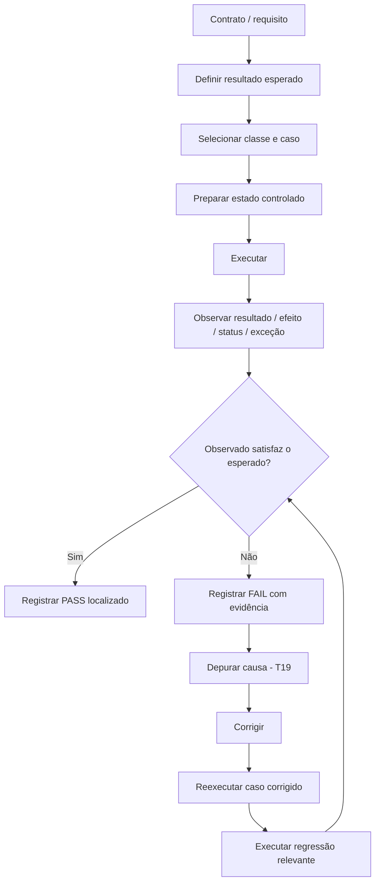

<a id="inicio"></a>

# Testes e Verificação

> **Classificação:** `[D] Dominar o conceito; ferramentas evoluem progressivamente`  
> **Nível:** B — Fundamentos de Programação  
> **Posição na taxonomia:** tópico 20  
> **Pré-requisitos principais:** T09 — Validação de Dados e Pré-condições; T12 — Rastreamento, Verificação e Raciocínio sobre Execução; T18 — Erros, Exceções e Tratamento de Falhas; T19 — Depuração; funções, condições e contratos básicos  
> **Aprofundamentos posteriores:** T21 — Entrada/Saída e Persistência Básica; T22 — Qualidade Básica do Código; T24 — Correção e Análise de Algoritmos; testes de integração, propriedade, carga, segurança, mocks, cobertura e CI/CD em camadas posteriores

> **Legenda curricular:** `[D]` indica domínio obrigatório neste tópico; `[C → D]` indica capacidade introduzida aqui e destinada a evoluir para domínio progressivo nas camadas posteriores.

---

## Resumo executivo

Testar é executar deliberadamente um comportamento sob condições conhecidas e **comparar o que aconteceu com o que deveria acontecer**.

O núcleo é:

```text
CONTRATO / REQUISITO
        ↓
RESULTADO ESPERADO
        ↓
CASO DE TESTE
entrada + condições
        ↓
EXECUÇÃO
        ↓
RESULTADO OBSERVADO
        ↓
COMPARAÇÃO
   ┌────┴────┐
   │         │
PASSA      FALHA
   │         │
   │         └──→ evidência para investigação no T19
   ↓
repetir em outros casos e após mudanças
```

Uma execução que passou **não prova que o programa está correto para todo o domínio**. Ela mostra apenas que, naquele caso e sob aquelas condições, o resultado observado foi compatível com o esperado. Joyce Farrell usa um exemplo particularmente útil para mostrar esse limite: uma implementação errada pode coincidir com a resposta correta para um dado de teste e falhar para outro. A consequência prática é direta: **a escolha dos casos importa tanto quanto a execução do teste**.

A taxonomia canônica deste tópico é:

```text
20.1 Resultado esperado
     └── especificar o comportamento correto

20.2 Casos de teste
     ├── entrada
     ├── resultado esperado
     └── resultado observado

20.3 Classes de teste
     ├── normal
     ├── positivo
     ├── negativo
     ├── limite
     └── inválido

20.4 Assertions
     ├── condição esperada
     └── falha explícita

20.5 Testes automatizados [C → D]
     ├── execução repetível
     ├── isolamento
     └── frameworks específicos posteriormente

20.6 Regressão [C → D]
     └── verificar se uma alteração que corrigiu algo
         não quebrou comportamento existente
```

A ideia central é:

> **um teste útil declara a expectativa antes de observar o resultado e consegue falhar quando o comportamento deixa de satisfazer essa expectativa.**

---

## Visão rápida

| Pergunta | Resposta |
|---|---|
| **O que é?** | Disciplina de especificar comportamento esperado, executar casos e comparar o observado contra a expectativa. |
| **Por que importa?** | Transforma confiança subjetiva em evidência repetível e preserva comportamento ao longo de mudanças. |
| **Onde se encaixa?** | Depois de tratamento de falhas (T18) e depuração (T19), antes de I/O (T21) e da discussão mais formal de correção algorítmica (T24). |
| **Conceitos principais** | esperado, observado, caso, classes de teste, assertion, automação, isolamento e regressão. |
| **Pré-requisitos** | condições, funções, contratos básicos, validação, falhas e depuração. |
| **Resultado de aprendizagem** | conseguir projetar casos relevantes, automatizar verificações introdutórias nas quatro linguagens e transformar bugs corrigidos em proteção contra regressão. |

Ao final, você deve conseguir olhar para uma regra simples e produzir uma matriz de casos que inclua comportamento ordinário, transições, rejeições e uma forma objetiva de PASS/FAIL — sem depender de “parece que funcionou”.

---

## Distinções fundamentais

```text
TESTE
≠
DEPURAÇÃO

CASO DE TESTE
≠
ASSERTION

RESULTADO ESPERADO
≠
RESULTADO OBSERVADO

ASSERTION DE TESTE
≠
VALIDAÇÃO DE ENTRADA

TESTE POSITIVO
≠
ENTRADA NECESSARIAMENTE VÁLIDA EM TODO CONTEXTO

TESTE NEGATIVO
≠
TESTE INVÁLIDO

TESTE AUTOMATIZADO
≠
TESTE UNITÁRIO OBRIGATORIAMENTE

RETESTE DA CORREÇÃO
≠
REGRESSÃO DA SUÍTE

EVIDÊNCIA EMPÍRICA
≠
PROVA DE CORREÇÃO PARA TODO O DOMÍNIO

BASH test
≠
FRAMEWORK DE TESTES DE SOFTWARE
```

### Definições de trabalho

| Termo | Definição operacional neste tópico |
|---|---|
| **Resultado esperado** | Comportamento que o contrato, requisito ou regra determina que deveria ocorrer. |
| **Resultado observado** | Comportamento realmente produzido durante a execução do caso. |
| **Caso de teste** | Cenário executável ou reproduzível que combina condições, entrada e uma expectativa verificável. |
| **Oracle de teste** | Fonte ou critério usado para decidir qual deveria ser o resultado correto. |
| **Assertion** | Verificação explícita de uma condição esperada; sua falsidade transforma uma divergência em falha observável. |
| **Teste automatizado** | Teste executável repetidamente por máquina, com comparação automática do observado contra o esperado. |
| **Isolamento** | Redução de dependências e estado compartilhado para que o resultado de um teste dependa do comportamento sob teste e de condições controladas. |
| **Regressão** | Retorno de um defeito corrigido ou quebra de comportamento anteriormente correto após uma mudança. |
| **Teste de regressão** | Caso mantido para detectar novamente um defeito conhecido ou preservar comportamento já estabelecido. |
| **Suíte** | Conjunto de casos executados em conjunto. |

---

## Regra de ouro

> **Não decida se o teste passou olhando primeiro para a saída. Especifique antes o que deveria acontecer e só depois compare.**

Se o esperado nasce depois do observado, existe risco de racionalizar o comportamento atual:

```text
programa retornou 17
↓
"então acho que 17 está certo"
↓
nenhum contrato foi realmente testado
```

O fluxo correto é:

```text
contrato diz 20
↓
executo
↓
programa retorna 17
↓
17 ≠ 20
↓
falha objetiva
```

---

## Decisão rápida

| Pergunta | Resposta curta |
|---|---|
| “Um teste que passou prova que o programa está correto?” | Não. Ele aumenta evidência para os casos cobertos, mas não prova correção geral. |
| “Testar e depurar são a mesma coisa?” | Não. O teste detecta/expõe divergência; a depuração investiga a causa. |
| “Preciso de framework para começar a testar?” | Não. Primeiro domine esperado, caso, classe e comparação. Frameworks automatizam e organizam isso. |
| “Todo teste negativo usa entrada inválida?” | Não. Um caso negativo pode usar entrada perfeitamente válida e esperar `false`, ausência ou rejeição de uma condição. |
| “Teste de limite é sempre inválido?” | Não. O próprio limite pode ser válido; valores imediatamente fora dele podem ser inválidos ou apenas pertencer a outra faixa. |
| “`assert` substitui validação de usuário?” | Não. Assertions expressam hipóteses/expectativas do programa ou teste; validação trata dados não confiáveis segundo contrato. |
| “Python `assert` serve como mecanismo obrigatório de produção?” | Não. Pode ser removido quando Python executa com `-O`. |
| “Java `assert` sempre executa?” | Não. Pode estar desabilitado; por padrão o launcher não habilita assertions de aplicação. |
| “JavaScript tem palavra-chave `assert`?” | Não em ECMAScript. Ambientes como Node.js oferecem APIs de assertion. |
| “Bash `test` é framework de testes?” | Não. É um builtin que avalia expressão condicional e devolve status. |
| “Automatizado significa determinístico?” | Não automaticamente. O teste precisa controlar ou modelar fontes de variabilidade. |
| “Depois de corrigir um bug, basta testar o caso que falhava?” | Não. Reexecute o caso corrigido e também casos de regressão relevantes. |

---

# Índice

  - [Resumo executivo](#resumo-executivo)
  - [Visão rápida](#visão-rápida)
  - [Distinções fundamentais](#distinções-fundamentais)
  - [Regra de ouro](#regra-de-ouro)
  - [Decisão rápida](#decisão-rápida)
- [1. Posição deste assunto na trilha](#1-posição-deste-assunto-na-trilha)
- [2. Visão panorâmica — teste, verificação e depuração](#2-visão-panorâmica--teste-verificação-e-depuração)
  - [🗺️ Visão panorâmica — o mapa antes dos detalhes](#visao-panoramica)
- [3. Modelo mínimo de um teste](#3-modelo-mínimo-de-um-teste)
- [4. O que um teste pode e não pode demonstrar](#4-o-que-um-teste-pode-e-não-pode-demonstrar)
- [5. 20.1 — Resultado esperado `[D]`](#5-201--resultado-esperado-d)
- [6. Contrato didático comum aos exemplos](#6-contrato-didático-comum-aos-exemplos)
- [7. 20.2 — Casos de teste `[D]`](#7-202--casos-de-teste-d)
- [8. Matriz inicial de casos](#8-matriz-inicial-de-casos)
- [9. 20.3 — Classes de teste `[D]`](#9-203--classes-de-teste-d)
- [10. Teste negativo não é sinônimo de dado inválido](#10-teste-negativo-não-é-sinônimo-de-dado-inválido)
- [11. Seleção sistemática de dados](#11-seleção-sistemática-de-dados)
- [12. Resultado esperado para falhas](#12-resultado-esperado-para-falhas)
- [13. 20.4 — Assertions `[D]`](#13-204--assertions-d)
- [14. Python — assertions e `unittest`](#14-python--assertions-e-unittest)
- [15. JavaScript — ECMAScript versus ambiente Node.js](#15-javascript--ecmascript-versus-ambiente-nodejs)
- [16. Java — `assert` e verificações de teste](#16-java--assert-e-verificações-de-teste)
- [17. GNU Bash — condição, status e assertion construída](#17-gnu-bash--condição-status-e-assertion-construída)
- [18. Comparação das quatro linguagens](#18-comparação-das-quatro-linguagens)
- [19. 20.5 — Testes automatizados `[C → D]`](#19-205--testes-automatizados-c--d)
- [20. Isolamento](#20-isolamento)
- [21. Determinismo e fontes de variabilidade](#21-determinismo-e-fontes-de-variabilidade)
- [22. Exemplo automatizado em Python](#22-exemplo-automatizado-em-python)
- [23. Exemplo automatizado em JavaScript / Node.js](#23-exemplo-automatizado-em-javascript--nodejs)
- [24. Exemplo automatizado mínimo em Java](#24-exemplo-automatizado-mínimo-em-java)
- [25. Exemplo automatizado mínimo em GNU Bash](#25-exemplo-automatizado-mínimo-em-gnu-bash)
- [26. Um teste automatizado precisa ser confiável](#26-um-teste-automatizado-precisa-ser-confiável)
- [27. 20.6 — Regressão `[C → D]`](#27-206--regressão-c--d)
- [28. Exemplo de regressão na fronteira](#28-exemplo-de-regressão-na-fronteira)
- [29. TDD como extensão, não como requisito do T20](#29-tdd-como-extensão-não-como-requisito-do-t20)
- [30. Testes e validação de dados](#30-testes-e-validação-de-dados)
- [31. Testes e tratamento de falhas](#31-testes-e-tratamento-de-falhas)
- [32. Testes e depuração](#32-testes-e-depuração)
- [33. Testes e correção algorítmica](#33-testes-e-correção-algorítmica)
- [34. Anti-padrões](#34-anti-padrões)
- [35. Padrões de qualidade para bons casos](#35-padrões-de-qualidade-para-bons-casos)
- [36. Estado mutável e testes](#36-estado-mutável-e-testes)
- [37. Coleções e ordem](#37-coleções-e-ordem)
- [38. Testando ausência, vazio e zero](#38-testando-ausência-vazio-e-zero)
- [39. Testes de exceções e mensagens](#39-testes-de-exceções-e-mensagens)
- [40. Testes de comandos e scripts](#40-testes-de-comandos-e-scripts)
- [41. Exemplo NetDev sintético — política de VLAN](#41-exemplo-netdev-sintético--política-de-vlan)
- [41A. Problemas reais, Gate de Cobertura Prática e troubleshooting](#41a-problemas-reais-gate-de-cobertura-prática-e-troubleshooting)
  - [🔎 Troubleshooting sistemático](#troubleshooting-sistematico)
- [42. Laboratórios](#42-laboratórios)
  - [🧪 LAB 1 — da regra ao caso de teste](#-lab-1--da-regra-ao-caso-de-teste)
  - [🧪 LAB 2 — descobrir o caso enganoso](#-lab-2--descobrir-o-caso-enganoso)
  - [🧪 LAB 3 — fronteira do frete nas quatro linguagens](#-lab-3--fronteira-do-frete-nas-quatro-linguagens)
  - [🧪 LAB 4 — assertion da linguagem versus assertion de framework](#-lab-4--assertion-da-linguagem-versus-assertion-de-framework)
  - [🧪 LAB 5 — Java assertions habilitadas e desabilitadas](#-lab-5--java-assertions-habilitadas-e-desabilitadas)
  - [🧪 LAB 6 — Node.js test runner](#-lab-6--nodejs-test-runner)
  - [🧪 LAB 7 — harness de testes em Bash](#-lab-7--harness-de-testes-em-bash)
  - [🧪 LAB 8 — regressão de erro de fronteira](#-lab-8--regressão-de-erro-de-fronteira)
  - [🧪 LAB 9 — detectar dependência de ordem](#-lab-9--detectar-dependência-de-ordem)
  - [🧪 LAB 10 — teste do teste](#-lab-10--teste-do-teste)
- [43. Exercícios](#43-exercícios)
- [44. Evidências de domínio](#44-evidências-de-domínio)
- [45. Checklist de domínio](#45-checklist-de-domínio)
- [46. Glossário](#46-glossário)
- [47. Auditoria de cobertura da taxonomia](#47-auditoria-de-cobertura-da-taxonomia)
- [48. Auditoria da File Library](#48-auditoria-da-file-library)
- [49. Referências](#49-referências)
  - [49.1 Contratos canônicos do projeto](#491-contratos-canônicos-do-projeto)
  - [49.2 Documentação oficial e fontes primárias atuais](#492-documentação-oficial-e-fontes-primárias-atuais)
  - [49.3 Literatura local e proveniência](#493-literatura-local-e-proveniência)
  - [49.4 Hierarquia usada nesta revisão](#494-hierarquia-usada-nesta-revisão)
  - [49.5 Estado de QA e evidência da R5 / revisão 0.3.2](#495-estado-de-qa-e-evidência-da-r5--revisão-032)
- [50. Histórico de versões](#50-histórico-de-versões)

---

# 1. Posição deste assunto na trilha

T20 vem imediatamente depois de erros/exceções e depuração porque existe uma progressão natural:

```text
T18 — reconhecer e tratar falhas
       ↓
T19 — investigar por que ocorreu uma divergência
       ↓
T20 — especificar e repetir verificações de comportamento
       ↓
T21 — aplicar isso também em I/O e persistência básica
       ↓
T24 — separar testes empíricos de argumentos de correção algorítmica
```

## 1.1 O que T20 ensina

T20 ensina a responder:

- o que exatamente deveria acontecer?;
- qual entrada exercita essa regra?;
- como registrar esperado e observado?;
- que classes de caso evitam testes ingênuos?;
- como transformar expectativa em falha explícita?;
- como repetir testes sem depender de inspeção manual?;
- como preservar uma correção contra regressões futuras?

## 1.2 O que T20 deliberadamente não tenta esgotar

Este tópico **não transforma fundamentos em curso completo de QA**. Ficam para camadas posteriores, quando fizer sentido:

- mocking/stubbing avançado;
- testes de integração em sistemas distribuídos;
- testes end-to-end de UI;
- property-based testing;
- fuzzing especializado;
- testes de carga e performance;
- testes de segurança;
- mutation testing como disciplina;
- métricas e metas de cobertura;
- pipelines CI/CD completos;
- estratégias de banco de dados e containers para testes;
- pirâmides/troféus de teste como arquitetura organizacional.

Esses assuntos podem aparecer como **ponte**, mas não são pré-requisitos para dominar 20.1–20.6.

[↑ Voltar ao índice](#índice)

---

# 2. Visão panorâmica — teste, verificação e depuração

<a id="visao-panoramica"></a>

## 🗺️ Visão panorâmica — o mapa antes dos detalhes

Esta seção funciona como **caderno rápido de consulta**, modelo mental, contrato de cobertura e ponte prática para o restante do T20. Ela deve permitir recuperar o mecanismo central sem reler o capítulo inteiro:

```text
CONTRATO / REGRA
        ↓
DEFINIR O ESPERADO ANTES DA EXECUÇÃO
        ↓
ESCOLHER CASOS QUE REALMENTE DISCRIMINEM COMPORTAMENTOS
        ↓
PREPARAR ESTADO CONTROLADO
        ↓
EXECUTAR
        ↓
OBSERVAR
        ↓
COMPARAR ESPERADO × OBSERVADO
        ↓
PASSOU? ── sim ──→ evidência localizada, não prova universal
   │
   não
   ↓
FALHA OBSERVÁVEL
        ↓
DEPURAÇÃO (T19) → CORREÇÃO → RETESTE → REGRESSÃO
```

O núcleo do domínio não é “decorar um framework”. É dominar a relação:

```text
EXPECTATIVA EXPLÍCITA
+
CASO REPRESENTATIVO
+
OBSERVAÇÃO CONTROLADA
+
COMPARAÇÃO QUE CONSEGUE FALHAR
+
REPETIÇÃO APÓS MUDANÇAS
```

### 2.1 Mapa do domínio coberto

```text
TESTES E VERIFICAÇÃO
│
├── 20.1 Resultado esperado
│   ├── contrato / requisito / regra
│   ├── oracle de teste
│   ├── valor, exceção, status ou efeito esperado
│   └── esperado definido antes de olhar o observado
│
├── 20.2 Caso de teste
│   ├── estado inicial / pré-condições
│   ├── entrada / ação
│   ├── resultado esperado
│   ├── resultado observado
│   └── PASS / FAIL rastreável
│
├── 20.3 Classes de teste
│   ├── normal
│   ├── positivo
│   ├── negativo
│   ├── limite
│   └── inválido
│
├── 20.4 Assertions
│   ├── condição esperada
│   ├── falha explícita
│   ├── assertion de teste
│   └── assertion interna ≠ validação de entrada
│
├── 20.5 Testes automatizados [C → D]
│   ├── execução repetível
│   ├── comparação automática
│   ├── isolamento
│   ├── determinismo controlado
│   └── runner / harness introdutório
│
└── 20.6 Regressão [C → D]
    ├── reproduzir o bug
    ├── demonstrar que o teste falha antes da correção
    ├── corrigir
    ├── reexecutar o caso
    └── manter proteção para mudanças futuras
```

Esse mapa cobre 20.1–20.6. Ferramentas avançadas de QA continuam fora do núcleo e aparecem somente como extensão quando ajudam a compreender o fundamento.

### 2.2 Fluxo completo



### 2.3 Uma falha de teste não localiza automaticamente o bug

Considere:

```text
esperado: 1500
observado: 0
```

A falha informa que existe divergência. Ela não prova se a causa está:

- na função;
- no dado de entrada;
- na preparação do teste;
- no próprio valor esperado;
- em uma dependência;
- em estado compartilhado;
- no ambiente.

O teste produz **evidência de divergência**. T19 fornece o método para investigar a causa.

### 2.4 Consulta rápida — conceito × função × risco

| Conceito | Para que serve | Pergunta rápida | Risco típico |
|---|---|---|---|
| **Resultado esperado** | tornar o contrato comparável | “o que deveria acontecer?” | copiar como esperado aquilo que o programa acabou de produzir |
| **Caso de teste** | exercitar uma regra em condições conhecidas | “qual cenário comprova ou falsifica esta regra?” | caso que passa por coincidência |
| **Classe de teste** | diversificar cenários com intenção | “normal, positivo, negativo, limite ou inválido?” | testar apenas o caminho feliz |
| **Assertion** | converter divergência em falha explícita | “como o teste acusa que o contrato foi violado?” | assertion tautológica ou mecanismo desabilitado |
| **Automação** | repetir a verificação com baixo custo | “consigo executar de novo sem inspeção manual?” | automatizar um teste ruim e ganhar falsa confiança |
| **Isolamento** | reduzir interferência entre casos | “o teste depende de estado deixado por outro?” | passa sozinho e falha na suíte |
| **Determinismo controlado** | tornar falhas reproduzíveis | “tempo, aleatoriedade, rede ou ambiente variam?” | teste intermitente (*flaky*) |
| **Regressão** | preservar comportamento já corrigido | “uma mudança trouxe o defeito de volta?” | corrigir o bug e apagar/esquecer o caso que o revelou |

### 2.5 Pergunta prática → mecanismo inicial

| Se a pergunta é... | Comece por... | Destino principal |
|---|---|---|
| “Qual deveria ser a resposta?” | contrato + oracle independente | [20.1](#5-201--resultado-esperado-d) |
| “Que entrada realmente diferencia certo de errado?” | matriz de casos + fronteiras | [20.2/20.3](#8-matriz-inicial-de-casos) |
| “Como tornar a divergência impossível de ignorar?” | assertion específica | [20.4](#13-204--assertions-d) |
| “Como repetir isso toda vez?” | runner/harness + isolamento | [20.5](#19-205--testes-automatizados-c--d) |
| “O teste passa sozinho e falha junto?” | investigar estado compartilhado/ordem | [Isolamento](#20-isolamento) |
| “Às vezes passa, às vezes falha?” | controlar tempo, aleatoriedade, rede e ambiente | [Determinismo](#21-determinismo-e-fontes-de-variabilidade) |
| “Corrigi o bug; como impedir que volte?” | manter o caso como regressão | [20.6](#27-206--regressão-c--d) |
| “O teste falhou; onde está o bug?” | registrar a divergência e voltar ao método do T19 | [Testes e depuração](#32-testes-e-depuração) |

### 2.6 Não confundir

```text
TESTE
→ produz evidência sobre comportamento

DEPURAÇÃO
→ investiga a causa de uma divergência

ASSERTION DE TESTE
→ compara esperado × observado

ASSERTION INTERNA
→ verifica uma hipótese/invariante do programa

VALIDAÇÃO DE ENTRADA
→ trata dado não confiável segundo contrato

TESTE NEGATIVO
→ cenário em que a condição/resultado esperado é negativo ou uma operação deve ser rejeitada

ENTRADA INVÁLIDA
→ dado fora do contrato de entrada

RETESTE
→ confirma a correção específica

REGRESSÃO
→ procura quebras introduzidas pela mudança e preserva comportamentos anteriores

PASSOU
→ evidência daquele caso

CORRETO PARA TODO O DOMÍNIO
→ afirmação muito mais forte; normalmente não decorre de testes finitos
```

### 2.7 Microexemplos canônicos

**Caso enganoso:**

```text
implementação errada: resultado = entrada + 2
regra correta:        resultado = entrada * 2

entrada 2  → observado 4 → PASSA por coincidência
entrada 7  → observado 9 → FALHA; esperado 14
```

O primeiro teste não era “falso”; era **insuficiente para discriminar** duas implementações diferentes.

**Fronteira de frete:**

```text
regra: frete grátis se total >= 10000 centavos

9999  → 1500
10000 → 0
10001 → 0
```

O trio imediatamente abaixo/no/acima da fronteira é mais informativo que três valores aleatórios distantes dela.

**Teste do teste:**

```text
1. introduza uma mutação intencional controlada
2. execute o teste que deveria detectá-la
3. se ele continuar verde, a suíte não está protegendo aquela regra
```

### 2.8 Problemas reais e entrada de troubleshooting

Problemas materiais rastreados nesta versão incluem:

```text
PR-T20-01 → um único caso passa por coincidência
PR-T20-02 → oracle circular copia a implementação
PR-T20-03 → fronteira não testada
PR-T20-04 → negativo confundido com inválido
PR-T20-05 → assertion inexistente/desabilitada/tautológica
PR-T20-06 → teste não consegue falhar
PR-T20-07 → dependência de ordem / estado compartilhado
PR-T20-08 → teste intermitente por variabilidade externa
PR-T20-09 → bug corrigido sem proteção de regressão
PR-T20-10 → Bash: saída textual confundida com exit status
```

Primeira rota de troubleshooting:

```text
TESTE FALHOU OU SE COMPORTOU ESTRANHAMENTE
        ↓
A EXPECTATIVA É INDEPENDENTE E CORRETA?
        ↓
O CASO EXECUTOU O CAMINHO QUE EU PENSO?
        ↓
A ASSERTION REALMENTE PODE FALHAR?
        ↓
O ESTADO É ISOLADO E REPRODUZÍVEL?
        ↓
HÁ DIFERENÇA DE RUNTIME / AMBIENTE / STATUS?
        ↓
REDUZIR PARA O MENOR CASO
        ↓
DEPURAR A PRIMEIRA DIVERGÊNCIA
```

O inventário formal e os casos `TS-T20-*` aparecem em [Problemas reais, Gate e troubleshooting](#41a-problemas-reais-gate-de-cobertura-prática-e-troubleshooting).

### 2.9 Transferência entre linguagens

| Dimensão | Python | JavaScript / Node.js | Java | Bash |
|---|---|---|---|---|
| mecanismo introdutório de teste | `unittest` | `node:test` | harness didático / framework posteriormente | função/harness + exit status |
| comparação | métodos `assert*` de `TestCase` | `node:assert/strict` | comparação explícita / API de framework | condição + `return`/`exit` |
| assertion da linguagem | `assert` existe, mas pode ser removido com `-O` | ECMAScript não possui palavra-chave `assert`; Node oferece API | `assert` existe e pode estar desabilitado | `test`/`[`/`[[` são condicionais, não framework |
| falha esperada | `assertRaises` | `assert.throws` | capturar/verificar exceção no harness; frameworks oferecem APIs | verificar status/saída conforme contrato |
| sinal principal de runner | relatório + status do processo | TAP/relatório + status do processo | depende do harness/runner | exit status do harness |
| risco de falsa equivalência | `assert` da linguagem ≠ `self.assert*` | ECMAScript ≠ APIs específicas do Node | `assert` da linguagem ≠ assertion de framework | `test` builtin ≠ “teste de software” completo |
| teste do próprio teste | mutação controlada deve fazer a suíte falhar | mutação controlada deve fazer o runner falhar | quebrar o harness/implementação deve produzir falha observável | forçar divergência deve produzir mensagem + status não zero |

### 2.10 Modo consulta × modo estudo

**Consulta rápida:** use 2.4–2.9 para recuperar expectativa, classes, assertion, isolamento, regressão e diferenças de linguagem.

**Estudo progressivo:** siga 20.1 → 20.6, depois exemplos nas quatro linguagens, confiabilidade da suíte, regressão, anti-padrões, problemas reais, troubleshooting e LABs.

### 2.11 Fronteiras desta etapa

T20 domina o **conceito** e introduz ferramentas sem transformar fundamentos em especialização de QA. Permanecem posteriores, entre outros: mocks avançados, integração distribuída, E2E, property-based testing, fuzzing, carga, segurança, mutation testing como disciplina, metas de cobertura e CI/CD completo.

```text
GATE 1 — VISÃO PANORÂMICA
ORIGEM MATERIAL: R3 / ITERAÇÃO 0.3.0
REVALIDAÇÃO CORRENTE: R5 / ITERAÇÃO 0.3.2
DOMÍNIO 20.1–20.6: representado
PR-* materiais: com destino
TROUBLESHOOTING material: com destino
DIFERENÇAS DE LINGUAGEM: representadas quando relevantes
SÍNTESE MULTIFONTE: preservada; afirmações alteradas/recentes revalidadas
ESTADO CORRENTE: FECHADO
```

[↑ Voltar ao índice](#índice)

---
# 3. Modelo mínimo de um teste

O modelo mais simples útil é:

```text
DADO / ESTADO INICIAL
        ↓
AÇÃO
        ↓
OBSERVAÇÃO
        ↓
COMPARAÇÃO COM EXPECTATIVA
```

## 3.1 Arrange — Act — Assert como organização

Uma convenção comum é organizar um teste em três fases:

```text
ARRANGE
preparar entrada e estado

ACT
executar o comportamento

ASSERT
comparar observado e esperado
```

Não é uma regra da linguagem, nem o único estilo possível. É uma forma de tornar visível onde o cenário é preparado, onde ocorre a ação e onde a expectativa é verificada.

Exemplo conceitual:

```text
arrange: total = 5000
act:     fee = calculate_fee(total)
assert:  fee == 1500
```

## 3.2 O teste precisa conseguir falhar

Este “teste” não verifica nada:

```python
result = calculate_fee(5_000)
print(result)
```

Ele produz observação, mas exige julgamento humano.

Uma verificação explícita:

```python
result = calculate_fee(5_000)
assert result == 1_500
```

já transforma divergência em falha observável — com a ressalva importante de que o `assert` da linguagem Python possui semântica própria e pode ser removido sob `-O`, discutida adiante.

[↑ Voltar ao índice](#índice)

---

# 4. O que um teste pode e não pode demonstrar

Testes são evidência empírica sobre execuções concretas.

## 4.1 O que uma passagem demonstra

Se um teste foi bem construído e passou, podemos afirmar algo como:

> para as condições deste caso, nesta execução, o comportamento observado satisfez a expectativa codificada.

Isso é útil e operacionalmente forte.

## 4.2 O que uma passagem não demonstra

Uma passagem isolada não demonstra automaticamente que:

- todas as entradas possíveis funcionam;
- todos os caminhos foram exercitados;
- não existem condições de corrida;
- não há vulnerabilidades;
- o requisito está correto;
- o próprio teste está correto;
- o programa está matematicamente correto para todo o domínio.

Bjarne Stroustrup separa explicitamente testing de uma prova geral de correção: testes executam casos selecionados e comparam os resultados ao esperado, mas não oferecem uma resposta universal para “encontramos todos os erros?”. Essa fronteira será retomada em T24.

## 4.3 Um teste pode estar errado

Existem pelo menos três fontes de defeito:

```text
CÓDIGO SOB TESTE
TESTE
EXPECTATIVA / REQUISITO
```

Por isso, uma falha deve ser investigada; não corrigida automaticamente alterando o código de produção até a suíte ficar verde.

[↑ Voltar ao índice](#índice)

---

# 5. 20.1 — Resultado esperado `[D]`

**Classificação do nó:** `[D]`

Resultado esperado é a descrição verificável do comportamento correto **antes** de olhar para a execução do caso.

## 5.1 De onde vem o esperado

A expectativa pode vir de:

- requisito;
- contrato da função;
- regra de negócio;
- especificação;
- exemplo canônico previamente aceito;
- propriedade/invariante;
- implementação de referência independente;
- padrão/protocolo quando aplicável.

A ordem importa:

```text
REQUISITO
↓
EXPECTATIVA
↓
EXECUÇÃO
```

Não:

```text
EXECUÇÃO
↓
EXPECTATIVA INVENTADA PARA CABER NO RESULTADO
```

## 5.2 Resultado esperado não é apenas valor de retorno

Uma expectativa pode ser:

| Tipo de comportamento | Exemplo de esperado |
|---|---|
| Valor | retorna `1500` |
| Booleano | retorna `false` |
| Exceção/erro | rejeita total negativo com erro definido |
| Status | comando termina com status `0` ou status de erro previsto |
| Estado | saldo passa de `10000` para `8500` |
| Não alteração | entrada original permanece intacta |
| Efeito | registro sintético é criado uma única vez |
| Ausência de efeito | operação inválida não altera estado |

Efeitos de I/O serão aprofundados em T21; aqui interessa apenas entender que “resultado” é mais amplo que `return`.

## 5.3 O problema do oracle circular

Um erro comum é calcular o esperado usando a mesma lógica que está sendo testada:

```python
expected = calculate_fee(5_000)
actual = calculate_fee(5_000)
assert actual == expected
```

Esse teste pode continuar passando mesmo que `calculate_fee()` esteja errada, porque **esperado e observado vieram da mesma fonte**.

Melhor:

```python
expected = 1_500  # derivado do contrato do exemplo
actual = calculate_fee(5_000)
assert actual == expected
```

## 5.4 Esperado deve ser específico na medida certa

Teste frágil:

```text
"a mensagem completa deve conter exatamente timestamp, PID,
ordem de campos e espaços atuais"
```

quando o contrato exige apenas:

```text
"o erro deve identificar o campo inválido"
```

Não congele detalhes não contratados sem necessidade. O teste deve proteger **comportamento relevante**, não toda coincidência acidental da implementação.

## 5.5 Quando o oracle independente não é óbvio

Nem todo comportamento possui uma resposta simples que possa ser calculada manualmente. Ainda assim, não derive o esperado chamando novamente a própria implementação sob teste. Dependendo do contrato, fontes independentes de evidência podem incluir:

- propriedades e invariantes conhecidas;
- exemplos canônicos previamente aceitos;
- dados de referência estáveis;
- uma implementação de referência realmente independente;
- comparação com outro mecanismo cuja independência seja justificada.

Técnicas como *golden files* (saídas de referência preservadas), property-based testing (propriedades verificadas sobre muitos dados) e differential testing (comparação entre implementações/mecanismos independentes) pertencem a aprofundamentos posteriores. O princípio de T20 é mais básico: **se a fonte do esperado compartilha o mesmo defeito da implementação, o teste pode mentir com aparência de rigor**.

Um oracle não precisa ser isolado de toda dependência externa; precisa ser **independente o suficiente do caminho lógico sob teste** para não reproduzir automaticamente os mesmos pressupostos e defeitos.

[↑ Voltar ao índice](#índice)

---

# 6. Contrato didático comum aos exemplos

Para comparar as quatro linguagens sem mudar o problema, este tópico usa um contrato sintético simples.

## 6.1 Regra de frete

```text
Entrada:
    order_total_cents inteiro

Pré-condição:
    order_total_cents >= 0

Comportamento:
    0 .. 9999     → taxa 1500
    10000 ou mais → taxa 0

Entrada negativa:
    inválida; deve ser sinalizada
```

A função conceitual é:

```text
calculate_shipping_fee(order_total_cents)
```

Esse contrato é **didático**. Não representa preço ou política de empresa real.

## 6.2 Por que centavos inteiros

Usar inteiro neste exemplo evita misturar T20 com detalhes de representação de ponto flutuante. O assunto testado é **seleção de casos e verificação**, não arredondamento monetário.

## 6.3 Guardrail — comparação aproximada

Não generalize a igualdade exata deste exemplo para toda computação numérica. Valores de ponto flutuante podem representar aproximações; quando o contrato admite tolerância, o teste deve explicitar essa tolerância em vez de exigir igualdade bit a bit por hábito. Em Python, por exemplo, `math.isclose()` materializa esse tipo de comparação. O critério correto continua vindo do **contrato**, não de uma tolerância arbitrária.

[↑ Voltar ao índice](#índice)

---

# 7. 20.2 — Casos de teste `[D]`

**Classificação do nó:** `[D]`

O GUIA reúne no nó 20.2 três elementos mínimos:

```text
ENTRADA
RESULTADO ESPERADO
RESULTADO OBSERVADO
```

Há, porém, duas fases conceitualmente distintas:

```text
ESPECIFICAÇÃO DO CASO
→ condições / entrada / ação
→ resultado esperado

REGISTRO DA EXECUÇÃO
→ resultado observado
→ PASS / FAIL / ERROR / outro estado aplicável
```

Antes da execução, o observado ainda não existe; depois da execução, ele completa a evidência do caso. T20 mantém os dois no mesmo nó curricular porque o objetivo é comparar **esperado × observado**, mas não os trata como se fossem produzidos no mesmo momento.

## 7.1 Registro mínimo

| Caso | Entrada | Esperado | Observado | Resultado |
|---|---:|---:|---:|---|
| C01 | `5000` | `1500` | `1500` | PASS |
| C02 | `10000` | `0` | `1500` | FAIL |

A segunda linha não diz por que falhou. Ela só registra a divergência.

## 7.2 Caso de teste também precisa de contexto quando necessário

Para comportamentos com estado, um caso pode precisar registrar:

- preparação;
- pré-condições;
- dados sintéticos;
- ação;
- expectativa;
- limpeza;
- ambiente relevante.

Mas não transforme todo teste trivial em burocracia documental. O detalhamento deve ser suficiente para tornar o caso compreensível e reproduzível.

## 7.3 Esperado e observado não devem ser misturados

Ruim:

```text
C01: retorno 1500
```

Não sabemos se `1500` era expectativa ou observação.

Melhor:

```text
entrada: 5000
esperado: 1500
observado: 1500
status: PASS
```

[↑ Voltar ao índice](#índice)

---

# 8. Matriz inicial de casos

A regra de frete permite construir uma matriz que revela mais que um “exemplo feliz”.

| ID | Entrada | Classe principal | Esperado |
|---|---:|---|---:|
| C01 | `0` | limite / positivo | `1500` |
| C02 | `5000` | normal / positivo | `1500` |
| C03 | `9999` | limite | `1500` |
| C04 | `10000` | limite | `0` |
| C05 | `10001` | limite / positivo | `0` |
| C06 | `25000` | normal / positivo | `0` |
| C07 | `-1` | inválido / rejeição esperada | erro previsto |

> **Nota:** nesta matriz, “positivo” descreve um caminho de comportamento/sucesso esperado; não o sinal matemático da entrada. A entrada `-1` é **inválida** pelo contrato e exercita um caminho de rejeição esperado.

## 8.1 Por que `9999`, `10000` e `10001` são importantes

A regra muda exatamente em `10000`.

```text
9999   → lado inferior
10000  → fronteira
10001  → lado superior
```

Se alguém escreveu por engano:

```text
if total > 10000
```

em vez de:

```text
if total >= 10000
```

um caso normal como `25000` não encontra o defeito. O caso da fronteira encontra.

[↑ Voltar ao índice](#índice)

---

# 9. 20.3 — Classes de teste `[D]`

**Classificação do nó:** `[D]`

As classes do GUIA são perspectivas úteis para escolher entradas. Elas **não formam categorias mutuamente exclusivas**.

## 9.1 Normal

Caso representativo do uso ordinário e válido.

Exemplo:

```text
5000 → 1500
```

## 9.2 Positivo

Caso em que a condição/ação esperada ocorre com sucesso.

Exemplos dependem do contrato:

```text
is_even(4) → true
user_has_permission(valid_user) → true
shipping_fee(5000) → 1500
```

“Positivo” não quer dizer necessariamente “número positivo”. É **semântico**.

## 9.3 Negativo

Caso que verifica ausência, rejeição ou resultado falso esperado.

```text
is_even(3) → false
contains_route(routes, missing_route) → false
```

Uma entrada negativa pode ser totalmente válida.

## 9.4 Limite

Caso no ponto de transição ou imediatamente próximo de um limite relevante.

```text
9999
10000
10001
```

Outros padrões comuns:

```text
mínimo - 1
mínimo
mínimo + 1
máximo - 1
máximo
máximo + 1
```

Nem todos fazem sentido em todo domínio.

## 9.5 Inválido

Caso que viola uma pré-condição ou formato aceito.

```text
-1  # contrato exige total >= 0
```

O objetivo é verificar a **resposta definida para entrada inválida**, não tratar qualquer comportamento acidental como aceitável.

## 9.6 As classes podem se sobrepor

`0` pode ser simultaneamente:

```text
válido
positivo no sentido de caminho de sucesso
limite inferior
```

Por isso, não use as classes como caixas rígidas; use-as como perguntas de cobertura mental.

## 9.7 “Classes de teste” neste T20 não significa “classes de equivalência”

Neste tópico, **classes de teste** é o nome curricular das perspectivas `normal`, `positivo`, `negativo`, `limite` e `inválido`. Não significa classe de código de framework, tipo de teste como unitário/integração, nem automaticamente uma **classe de equivalência** formal.

**Particionamento de equivalência** agrupa entradas que, segundo o contrato, deveriam produzir comportamento equivalente. **Análise de valor-limite** concentra casos nas transições entre regiões de comportamento. T20 usa essas intuições para escolher casos discriminantes, sem transformar o tópico em uma disciplina completa de técnicas de design de testes.

[↑ Voltar ao índice](#índice)

---

# 10. Teste negativo não é sinônimo de dado inválido

Essa distinção evita muitos testes confusos.

## 10.1 Negativo válido

Contrato:

```text
is_allowed_vlan(150) → true
is_allowed_vlan(250) → false
```

Se a política sintética permite apenas `100..200`, `250` pode ser um identificador numericamente bem formado, mas **não permitido pela política**.

## 10.2 Inválido

Se a função exige inteiro e recebe uma estrutura incompatível, temos violação do contrato de entrada.

Em linguagens com modelos de tipo diferentes, a forma de sinalização varia. O conceito universal é:

```text
NEGATIVO
= resposta legítima a um caso

INVÁLIDO
= entrada viola o contrato aceito
```

## 10.3 Não fabrique equivalência entre linguagens

Python, JavaScript, Java e Bash diferem em:

- tipagem;
- coerções;
- parsing;
- exceções;
- status;
- contratos de funções/comandos.

O teste deve seguir o contrato **da implementação real**, não forçar a mesma sintaxe de falha nas quatro linguagens.

## 10.4 Nota terminológica sobre “teste negativo”

Neste T20, **teste negativo** significa um caso que espera ausência, rejeição ou condição falsa segundo o contrato, podendo usar uma entrada perfeitamente válida. Outras literaturas e equipes podem empregar *negative testing* de forma mais ampla, inclusive para entradas inválidas ou condições de erro.

Ao consultar outras fontes, preserve a distinção conceitual e confira a definição local antes de assumir que os rótulos são equivalentes.

[↑ Voltar ao índice](#índice)

---

# 11. Seleção sistemática de dados

Farrell destaca que escolher dados de teste exige cuidado: um conjunto que contém apenas casos semelhantes pode esconder defeitos. Stroustrup reforça a seleção sistemática de entradas corretas e incorretas e sugere explorar zero, negativos, valores muito pequenos, muito grandes e entradas deliberadamente estranhas quando o domínio permitir.

## 11.1 Perguntas práticas

Para uma regra qualquer, pergunte:

```text
qual é o caso comum?
qual é o menor valor válido?
qual é o maior valor válido?
o que acontece exatamente na transição?
o que acontece logo abaixo?
o que acontece logo acima?
qual é um caso que deve retornar falso?
qual entrada deve ser rejeitada?
qual caso vazio faz sentido?
há estado anterior relevante?
```

## 11.2 Não multiplique casos sem propósito

Testar `5001`, `5002`, `5003`, `5004` pode adicionar pouco se todos percorrem exatamente a mesma regra.

Prefira casos que representam **diferenças de comportamento**.

Isso prepara a ideia posterior de particionamento/equivalência, sem transformar T20 em disciplina completa de técnicas de design de testes.

[↑ Voltar ao índice](#índice)

---

# 12. Resultado esperado para falhas

Um teste não precisa esperar sucesso. Muitas vezes o comportamento correto é **falhar da maneira especificada**.

## 12.1 Exemplo conceitual

Entrada:

```text
order_total_cents = -1
```

Esperado:

```text
operação rejeitada
```

A forma concreta pode ser:

- exceção em Python;
- `Error` lançado em JavaScript;
- exceção em Java;
- status não zero em Bash.

## 12.2 O tipo de falha também faz parte do contrato

Teste fraco:

```text
"qualquer erro serve"
```

Teste melhor, quando o contrato define:

```text
"entrada negativa deve produzir ValueError"
```

ou:

```text
"script deve retornar status 2 para uso/entrada inválida"
```

Não seja mais específico do que o contrato. Mensagens exatas, por exemplo, só devem ser comparadas integralmente quando forem realmente interface estável.

[↑ Voltar ao índice](#índice)

---
# 13. 20.4 — Assertions `[D]`

**Classificação do nó:** `[D]`

Uma assertion transforma uma condição esperada em uma verificação explícita.

Modelo universal:

```text
ASSERT condição

se condição é verdadeira:
    seguir

se condição é falsa:
    falhar explicitamente
```

## 13.1 Assertion de teste

Em um teste, a assertion liga:

```text
OBSERVADO
↕ comparação
ESPERADO
```

Exemplo conceitual:

```text
assert_equal(actual_fee, 1500)
```

## 13.2 Assertion interna ao programa

Uma assertion também pode expressar uma condição que o programador acredita que deveria ser sempre verdadeira em determinado ponto:

```text
assert balance_cents >= 0
```

Esse uso está relacionado a invariantes e depuração. A semântica concreta depende da linguagem.

## 13.3 Assertion não é validação de entrada não confiável

Considere um endpoint que recebe um valor enviado por cliente externo.

Ruim como contrato obrigatório:

```python
assert order_total_cents >= 0
```

Se a entrada faz parte da interface pública, ela deve ser validada e tratada conforme o contrato da aplicação. Em Python, `assert` pode nem existir em execução com `-O`.

Separação:

```text
VALIDAÇÃO
protege fronteira contra entrada externa/inválida esperável

ASSERTION
explicita hipótese/invariante ou expectativa de teste
```

[↑ Voltar ao índice](#índice)

---

# 14. Python — assertions e `unittest`

Python possui uma instrução `assert` na própria linguagem e também frameworks/APIs de teste.

## 14.1 `assert` da linguagem

```python
order_total_cents = 5_000
fee_cents = 1_500

assert fee_cents == 1_500
```

Se a expressão for falsa em execução normal, Python levanta `AssertionError`.

Porém, a documentação Python 3.14 deixa uma ressalva essencial: a instrução é condicionada a `__debug__` e o gerador de código não emite `assert` quando a otimização `-O` é solicitada.

Portanto:

> **não use `assert` como validação obrigatória de produção, autorização, checagem de segurança ou regra que precisa executar sempre.**

## 14.2 Assertion de framework

O `unittest` oferece métodos próprios, por exemplo:

```python
self.assertEqual(actual, expected)
self.assertTrue(condition)
self.assertRaises(ValueError, function, argument)
```

Esses métodos são chamadas normais do framework; não são a instrução `assert` removível por `-O`.

## 14.3 Exemplo completo

```python
import unittest


def calculate_shipping_fee(order_total_cents: int) -> int:
    if order_total_cents < 0:
        raise ValueError("order total must be non-negative")

    if order_total_cents >= 10_000:
        return 0

    return 1_500


class ShippingFeeTest(unittest.TestCase):
    def test_below_free_shipping_boundary(self) -> None:
        self.assertEqual(calculate_shipping_fee(9_999), 1_500)

    def test_at_free_shipping_boundary(self) -> None:
        self.assertEqual(calculate_shipping_fee(10_000), 0)

    def test_negative_total_is_rejected(self) -> None:
        with self.assertRaises(ValueError):
            calculate_shipping_fee(-1)


if __name__ == "__main__":
    unittest.main()
```

O foco aqui não é decorar `unittest`, e sim enxergar a tradução:

```text
caso
→ chamada
→ observado
→ comparação/erro esperado
→ PASS ou FAIL automático
```

> **Escolha didática:** `unittest` é usado aqui por fazer parte da biblioteca padrão e expor diretamente `TestCase`, comparação e falha esperada. Projetos reais podem preferir outros frameworks; essa escolha de ferramenta não altera os conceitos de T20 e pertence a camadas posteriores de prática/arquitetura de testes.

> **Ponte de ferramenta:** frameworks externos como `pytest` também podem usar a instrução Python `assert` em testes e acrescentar introspecção por *assertion rewriting*. Isso é comportamento do framework de testes e **não** transforma `assert` em mecanismo obrigatório de validação, autorização ou segurança do código de produção.

[↑ Voltar ao índice](#índice)

---

# 15. JavaScript — ECMAScript versus ambiente Node.js

ECMAScript 2026 define a linguagem JavaScript, mas **não define uma palavra-chave de teste ou `assert` equivalente à de Python/Java**. Ambientes de execução podem oferecer APIs próprias.

No Node.js, dois módulos úteis para demonstração são:

```text
node:assert/strict
node:test
```

## 15.1 Assertion no Node.js

```javascript
import assert from 'node:assert/strict';

const actual = 1500;
const expected = 1500;

assert.strictEqual(actual, expected);
```

Se a comparação falhar, o módulo gera `AssertionError`.

## 15.2 Exemplo com test runner nativo

```javascript
import assert from 'node:assert/strict';
import test from 'node:test';

function calculateShippingFee(orderTotalCents) {
  if (orderTotalCents < 0) {
    throw new RangeError('order total must be non-negative');
  }

  return orderTotalCents >= 10_000 ? 0 : 1_500;
}

test('fee immediately below the boundary', () => {
  assert.strictEqual(calculateShippingFee(9_999), 1_500);
});

test('free shipping at the boundary', () => {
  assert.strictEqual(calculateShippingFee(10_000), 0);
});

test('negative total is rejected', () => {
  assert.throws(
    () => calculateShippingFee(-1),
    RangeError,
  );
});
```

## 15.3 Não generalize Node para todo JavaScript

Este código:

```javascript
import assert from 'node:assert/strict';
```

é uma API do Node.js. Não é automaticamente disponível em qualquer browser ou host ECMAScript.

Conceito universal:

```text
assertion / test runner
```

Implementação concreta:

```text
Node.js → node:assert + node:test
browser/projeto → ferramenta e ambiente escolhidos
```

[↑ Voltar ao índice](#índice)

---

# 16. Java — `assert` e verificações de teste

Java possui a instrução `assert`, mas ela pode estar habilitada ou desabilitada.

## 16.1 Forma básica

```java
int feeCents = 1500;
assert feeCents == 1500;
```

Forma com detalhe:

```java
assert feeCents == 1500 : "unexpected fee";
```

Segundo a Java Language Specification, se a assertion estiver desabilitada, sua execução **não tem efeito**. Quando habilitada e a expressão for falsa, ocorre `AssertionError`.

## 16.2 Assertions normalmente são habilitadas explicitamente

Exemplo de execução:

```bash
java -ea MyProgram
```

O launcher Java documenta `-ea` / `-enableassertions` para habilitá-las.

## 16.3 Não dependa de `assert` para contrato público

A própria JLS alerta que assertions não devem ser usadas para validar argumentos de métodos públicos quando essa validação precisa existir independentemente de assertions estarem habilitadas.

Também evite efeitos colaterais dentro da expressão:

```java
assert list.remove(item); // ruim: comportamento muda se assert estiver desabilitado
```

Melhor:

```java
boolean removed = list.remove(item);
assert removed;
```

se essa realmente for uma invariável interna apropriada.

## 16.4 Harness mínimo sem framework externo

Como frameworks específicos pertencem a aprofundamento posterior, é útil compreender um harness mínimo:

```java
public class ShippingFeeTest {
    static int calculateShippingFee(int orderTotalCents) {
        if (orderTotalCents < 0) {
            throw new IllegalArgumentException(
                "order total must be non-negative"
            );
        }

        return orderTotalCents >= 10_000 ? 0 : 1_500;
    }

    static void assertEquals(int expected, int actual) {
        if (expected != actual) {
            throw new AssertionError(
                "expected=" + expected + ", actual=" + actual
            );
        }
    }

    public static void main(String[] args) {
        assertEquals(1_500, calculateShippingFee(9_999));
        assertEquals(0, calculateShippingFee(10_000));

        try {
            calculateShippingFee(-1);
            throw new AssertionError("expected IllegalArgumentException");
        } catch (IllegalArgumentException expected) {
            // PASS: a falha prevista ocorreu.
        }
    }
}
```

Aqui o helper lança `AssertionError` explicitamente; ele não depende da instrução Java `assert` estar habilitada.

[↑ Voltar ao índice](#índice)

---

# 17. GNU Bash — condição, status e assertion construída

Bash exige uma distinção de vocabulário importante:

> o builtin `test` **não é um framework de testes de software**.

Ele avalia uma expressão condicional e retorna status.

## 17.1 Verdade em termos de status

No modelo do shell:

```text
status 0      → sucesso / condição verdadeira
status != 0   → falha / condição falsa ou outro erro, conforme comando
```

O GNU Bash 5.3 documenta especificamente que `test expr` retorna `0` para verdadeiro e `1` para falso.

Exemplo:

```bash
if [[ 10 -gt 5 ]]; then
    printf '%s\n' 'condition is true'
fi
```

## 17.2 Helper de assertion didático

```bash
assert_equals() {
    local expected=$1
    local actual=$2
    local message=${3:-"values differ"}

    if [[ $actual != "$expected" ]]; then
        printf 'FAIL: %s | expected=%s actual=%s\n' \
            "$message" "$expected" "$actual" >&2
        return 1
    fi

    return 0
}
```

Uso:

```bash
fee_cents=1500
assert_equals 1500 "$fee_cents" 'shipping fee'
```

## 17.3 Não use `set -e` como substituto de test runner

`errexit` possui regras contextuais próprias. Para um harness didático, é melhor registrar falhas explicitamente do que presumir:

```text
"qualquer status não zero encerrará sempre o script exatamente como espero"
```

O teste precisa saber:

- qual comando está sendo verificado;
- qual status é esperado;
- como a falha será contabilizada;
- se a suíte deve continuar para reportar outros casos.

[↑ Voltar ao índice](#índice)

---

# 18. Comparação das quatro linguagens

| Aspecto | Python | JavaScript / Node.js | Java | GNU Bash |
|---|---|---|---|---|
| Assertion na linguagem | `assert` | não em ECMAScript | `assert` | não equivalente |
| Pode ser desabilitada/removida | `assert` pode não ser emitido com `-O` | módulo Node executa quando chamado | `assert` pode estar desabilitado | N/A |
| Ferramenta básica demonstrada | `unittest` | `node:test` + `node:assert/strict` | harness explícito; frameworks depois | funções + status |
| Falha esperada | exceção | throw/rejection conforme contrato | exceção | status/stderr conforme contrato |
| Verdade de comando | N/A | N/A | N/A | status `0` é sucesso |
| Cuidado central | não usar `assert` como validação obrigatória | Node API ≠ ECMAScript | `assert` não deve carregar efeito essencial | `test` builtin ≠ software test framework |

## 18.1 O conceito compartilhado

Apesar das diferenças:

```text
ARRANGE
ACT
COMPARE
REPORT
```

permanece.

A sintaxe muda. A disciplina mental não.

[↑ Voltar ao índice](#índice)

---

# 19. 20.5 — Testes automatizados `[C → D]`

**Classificação do nó:** `[C → D]`

Automatizar um teste significa, **neste T20**, tornar sua execução e sua avaliação repetíveis por máquina. Essa é uma definição operacional para o núcleo curricular; em engenharia de testes existem graus e arranjos de automação mais amplos, inclusive fluxos parcialmente automatizados.

## 19.1 Propriedades fundamentais nesta etapa

O GUIA exige:

```text
EXECUÇÃO REPETÍVEL
ISOLAMENTO
```

Frameworks específicos serão aprofundados depois.

## 19.2 Execução repetível

Um teste automatizado útil deve poder ser executado novamente:

```text
agora
após refatoração
amanhã
por outra pessoa
em outro ciclo de mudança
```

sem reconstruir manualmente a expectativa a cada vez.

## 19.3 Comparação automática

Ruim:

```text
execute
abra o terminal
leia 40 linhas
compare mentalmente
```

Melhor:

```text
execute
assertions avaliam
runner reporta PASS/FAIL
```

## 19.4 Automação não elimina julgamento humano

Alguém ainda precisa decidir:

- qual comportamento merece proteção;
- qual entrada é representativa;
- qual resultado é correto;
- se o teste está acoplado demais à implementação;
- se uma mudança no requisito exige mudar o teste.

## 19.5 PASS, FAIL, ERROR e SKIP não são sinônimos

Runners diferentes usam vocabulários próprios, mas uma distinção operacional útil é:

| Estado conceitual | Significado nesta seção |
|---|---|
| `PASS` | o caso foi executado e a expectativa foi satisfeita |
| `FAIL` | uma expectativa/assertion do caso não foi satisfeita |
| `ERROR` | o caso não conseguiu completar normalmente por erro inesperado no teste, fixture, ambiente ou dependência |
| `SKIP` | o runner deliberadamente não executou o caso segundo uma regra declarada |

Esses nomes **não são universais entre ferramentas**. O ponto importante é não transformar `não executou` em `passou`. Como exemplo conceitual em `unittest`, `self.assertEqual(1, 2)` produz `FAIL`, enquanto um `KeyError` inesperado no `setUp()`/corpo do teste é registrado como `ERROR`; um teste marcado deliberadamente para não rodar é `SKIP`.

O estado editorial `NOT_RUN` usado no QA deste documento também não é sinônimo obrigatório de `SKIP` de um runner: ele apenas registra que uma verificação desta revisão não foi executada.

[↑ Voltar ao índice](#índice)

---

# 20. Isolamento

Um teste isolado reduz dependências não relacionadas ao comportamento que pretende verificar.

## 20.1 Estado compartilhado cria testes dependentes de ordem

Imagine:

```text
Teste A cria item
Teste B pressupõe que item já existe
```

Se B só passa depois de A, ele não é independente.

Preparação e limpeza fazem parte do isolamento quando há estado mutável: um teste que cria arquivo, item ou configuração deve deixar explícito **como esse estado é preparado e, quando necessário, restaurado/removido**. Frameworks costumam chamar essas fases de `setup`/`teardown` ou fixture; T20 usa apenas o conceito, sem aprofundar APIs específicas.

Sinal de problema:

```text
A → PASS
B → PASS

B sozinho → FAIL
```

## 20.2 Prefira preparar o próprio estado necessário

```text
Teste B:
1. cria estado mínimo
2. executa comportamento
3. verifica resultado
4. limpa recurso, quando necessário
```

## 20.3 Isolamento não significa “nenhuma dependência”

Todo teste executa sobre alguma infraestrutura:

- runtime;
- biblioteca;
- filesystem;
- relógio;
- processo;
- rede;
- banco;
- ambiente.

Isolar significa **controlar e tornar explícito o que é relevante**, não fingir que o sistema não possui dependências.

[↑ Voltar ao índice](#índice)

---

# 21. Determinismo e fontes de variabilidade

Um teste pode ser automatizado e ainda ser instável.

## 21.1 Fontes comuns

```text
relógio atual
número aleatório
ordem não garantida
rede externa
arquivo compartilhado
estado global
variável de ambiente
locale/timezone
concorrência
serviço terceiro
```

## 21.2 Exemplo com aleatoriedade

Fraco:

```python
import random

assert random.randint(1, 10) == 7
```

O teste mede sorte.

Uma estratégia melhor depende do contrato:

- testar propriedades da faixa;
- injetar fonte controlável;
- usar seed quando isso realmente torna a sequência contratualmente reproduzível;
- separar algoritmo determinístico da origem aleatória.

## 21.3 Testes não devem depender da Internet sem necessidade

Para fundamentos, use dados sintéticos e dependências locais. Um teste que chama serviço real pode falhar por:

- DNS;
- timeout;
- quota;
- mudança externa;
- indisponibilidade;
- autenticação.

Isso não prova que a lógica local esteja errada.

[↑ Voltar ao índice](#índice)

---

# 22. Exemplo automatizado em Python

Arquivo conceitual `test_shipping_fee.py`:

```python
import unittest


def calculate_shipping_fee(order_total_cents: int) -> int:
    if order_total_cents < 0:
        raise ValueError("order total must be non-negative")

    return 0 if order_total_cents >= 10_000 else 1_500


class ShippingFeeTest(unittest.TestCase):
    def test_zero(self) -> None:
        self.assertEqual(calculate_shipping_fee(0), 1_500)

    def test_immediately_below_boundary(self) -> None:
        self.assertEqual(calculate_shipping_fee(9_999), 1_500)

    def test_at_boundary(self) -> None:
        self.assertEqual(calculate_shipping_fee(10_000), 0)

    def test_immediately_above_boundary(self) -> None:
        self.assertEqual(calculate_shipping_fee(10_001), 0)

    def test_invalid_negative_total(self) -> None:
        with self.assertRaises(ValueError):
            calculate_shipping_fee(-1)
```

Execução:

```bash
python -m unittest -v test_shipping_fee.py
```

## 22.1 O que interessa pedagogicamente

```text
cada método
→ um comportamento específico

nome
→ comunica cenário

assertion
→ codifica esperado

runner
→ executa e reporta
```

Não é necessário decorar toda a API do `unittest` para dominar T20.

[↑ Voltar ao índice](#índice)

---

# 23. Exemplo automatizado em JavaScript / Node.js

```javascript
import assert from 'node:assert/strict';
import test from 'node:test';

function calculateShippingFee(orderTotalCents) {
  if (orderTotalCents < 0) {
    throw new RangeError('order total must be non-negative');
  }

  return orderTotalCents >= 10_000 ? 0 : 1_500;
}

test('zero uses standard fee', () => {
  assert.strictEqual(calculateShippingFee(0), 1_500);
});

test('9999 is immediately below the boundary', () => {
  assert.strictEqual(calculateShippingFee(9_999), 1_500);
});

test('10000 reaches free shipping', () => {
  assert.strictEqual(calculateShippingFee(10_000), 0);
});

test('10001 remains free shipping', () => {
  assert.strictEqual(calculateShippingFee(10_001), 0);
});

test('negative total is invalid', () => {
  assert.throws(() => calculateShippingFee(-1), RangeError);
});
```

Execução:

```bash
node --test shipping-fee.test.mjs
```

## 23.1 O runner interpreta throw como falha

No `node:test`, uma função de teste síncrona que lança exceção falha; uma que termina normalmente passa.

> **Guardrail assíncrono:** `assert.throws()` verifica **exceções síncronas**. Uma função `async` retorna uma `Promise`; rejeições devem ser verificadas com um mecanismo assíncrono como `await assert.rejects(...)`. T20 não aprofunda Promises/event loop aqui, mas evita aplicar o mecanismo síncrono à semântica assíncrona.

[↑ Voltar ao índice](#índice)

---

# 24. Exemplo automatizado mínimo em Java

Sem introduzir JUnit como dependência obrigatória neste tópico:

```java
public class ShippingFeeTest {
    static int calculateShippingFee(int orderTotalCents) {
        if (orderTotalCents < 0) {
            throw new IllegalArgumentException(
                "order total must be non-negative"
            );
        }
        return orderTotalCents >= 10_000 ? 0 : 1_500;
    }

    static void assertEquals(int expected, int actual) {
        if (expected != actual) {
            throw new AssertionError(
                "expected=" + expected + ", actual=" + actual
            );
        }
    }

    static void assertThrowsIllegalArgument(Runnable action) {
        try {
            action.run();
        } catch (IllegalArgumentException expected) {
            return;
        }
        throw new AssertionError("expected IllegalArgumentException");
    }

    public static void main(String[] args) {
        assertEquals(1_500, calculateShippingFee(0));
        assertEquals(1_500, calculateShippingFee(9_999));
        assertEquals(0, calculateShippingFee(10_000));
        assertEquals(0, calculateShippingFee(10_001));
        assertThrowsIllegalArgument(() -> calculateShippingFee(-1));
    }
}
```

## 24.1 Por que não usar apenas `assert` da linguagem aqui

Porque o objetivo do harness é executar as verificações sempre que ele for chamado. A instrução Java `assert` pode estar desabilitada.

Frameworks de teste dedicados resolvem isso com APIs próprias e runners. O harness acima é propositalmente didático: `assertThrowsIllegalArgument` verifica **o tipo de falha esperado neste exemplo**, não uma API genérica para qualquer exceção e nem a mensagem textual completa. Frameworks como JUnit entram em aprofundamento posterior.

[↑ Voltar ao índice](#índice)

---

# 25. Exemplo automatizado mínimo em GNU Bash

```bash
#!/usr/bin/env bash

calculate_shipping_fee() {
    local order_total_cents=$1

    if (( order_total_cents < 0 )); then
        printf '%s\n' 'invalid order total' >&2
        return 2
    fi

    if (( order_total_cents >= 10000 )); then
        printf '%s\n' '0'
    else
        printf '%s\n' '1500'
    fi
}

assert_equals() {
    local expected=$1
    local actual=$2
    local label=$3

    if [[ $actual != "$expected" ]]; then
        printf 'FAIL: %s | expected=%s actual=%s\n' \
            "$label" "$expected" "$actual" >&2
        return 1
    fi

    return 0
}

assert_status() {
    local expected=$1
    local actual=$2
    local label=$3

    if (( actual != expected )); then
        printf 'FAIL: %s | expected_status=%d actual_status=%d\n' \
            "$label" "$expected" "$actual" >&2
        return 1
    fi

    return 0
}

failures=0

actual=$(calculate_shipping_fee 9999)
assert_equals 1500 "$actual" '9999' || ((failures += 1))

actual=$(calculate_shipping_fee 10000)
assert_equals 0 "$actual" '10000' || ((failures += 1))

calculate_shipping_fee -1 >/dev/null 2>&1
actual_status=$?
assert_status 2 "$actual_status" '-1 status' || ((failures += 1))

if (( failures > 0 )); then
    printf 'FAILED: %d test(s)\n' "$failures" >&2
    exit 1
fi

printf '%s\n' 'PASS'
```

## 25.1 Particularidade importante

No harness acima, o padrão:

```bash
assert_equals expected "$actual" 'case' || ((failures += 1))
```

usa a semântica normal de listas OR do shell: o lado direito só é executado quando `assert_equals` termina com status diferente de zero. O contador é parte explícita do harness; ele não transforma `||` em assertion ou test runner por si só.

O valor textual produzido e o exit status são canais distintos. `assert_equals` compara **saída textual exata**; `assert_status` compara **status numérico**. Se o contrato quisesse equivalência numérica de duas strings formatadas de modo diferente, isso deveria ser outra assertion explícita — não uma mudança silenciosa na semântica de `assert_equals`.

Quando o status é a evidência sob teste, capture `$?` **imediatamente** antes de executar `printf`, outro helper ou qualquer comando que possa sobrescrevê-lo.

> **Guardrail `set -e`:** o harness acima não depende de `errexit`. Com `set -e`, um comando que retorna o status não zero **esperado pelo teste** pode encerrar o script antes da captura de `$?`, salvo nos contextos em que o Bash suprime a ação de `-e`. Test runner e política de `errexit` são decisões distintas.

```text
stdout/stderr
≠
exit status
```

T23 aprofundará o modelo de processos/streams/status. Aqui basta não confundi-los ao testar scripts.

[↑ Voltar ao índice](#índice)

---
# 26. Um teste automatizado precisa ser confiável

Automação só traz valor se o sinal produzido pela suíte for confiável.

## 26.1 Falso positivo de confiança

Se o teste sempre passa, mesmo quando a implementação é quebrada, ele não protege o contrato.

Exemplo ruim:

```python
def test_fee() -> None:
    actual = calculate_shipping_fee(5_000)
    assert actual == actual
```

A comparação é tautológica.

## 26.2 Testar o próprio teste

Uma técnica simples ao criar um teste importante:

1. execute com a implementação correta → deve passar;
2. introduza temporariamente uma mutação controlada → o teste relevante deve falhar;
3. reverta a mutação → deve voltar a passar.

Isso não é uma disciplina completa de mutation testing. É apenas uma verificação prática de que a assertion possui poder de detecção.

## 26.3 Mensagem de falha deve ajudar

Compare:

```text
FAIL
```

com:

```text
FAIL shipping fee at boundary
expected=0
actual=1500
input=10000
```

A segunda saída reduz o custo de iniciar a investigação no T19.

[↑ Voltar ao índice](#índice)

---

# 27. 20.6 — Regressão `[C → D]`

**Classificação do nó:** `[C → D]`

Regressão é a quebra de algo que antes funcionava ou o retorno de um defeito anteriormente corrigido.

## 27.1 Fluxo mínimo após encontrar um bug

```text
BUG OBSERVADO
↓
CASO REPRODUZÍVEL
↓
TESTE QUE FALHA PELO MOTIVO CERTO
↓
CORREÇÃO
↓
TESTE PASSA
↓
SUÍTE DE REGRESSÃO PASSA
↓
CASO É MANTIDO PARA O FUTURO
```

## 27.2 O teste deve demonstrar o defeito anterior

Se possível, antes da correção:

```text
versão com bug
+ novo teste
→ FAIL
```

Depois:

```text
versão corrigida
+ mesmo teste
→ PASS
```

Isso é muito mais forte do que escrever o teste apenas depois e presumir que ele teria capturado o defeito.

## 27.3 Regressão não é apenas “rodar de novo”

Reteste:

```text
corrigi C04
→ reexecuto C04
```

Regressão:

```text
corrigi C04
→ C04 passa
→ C01, C02, C03, C05, C06... continuam passando
```

Ambos importam.

## 27.4 Regressão também sustenta mudanças internas

Uma suíte de regressão não serve apenas para reencontrar bugs antigos. Ela também fornece evidência repetível de que uma refatoração ou reorganização interna preservou os comportamentos protegidos pelo contrato.

Isso não prova que **todo** comportamento foi preservado: a confiança continua limitada pelos casos, oracles e propriedades realmente cobertos.

[↑ Voltar ao índice](#índice)

---

# 28. Exemplo de regressão na fronteira

Defeito:

```python
def calculate_shipping_fee(order_total_cents: int) -> int:
    if order_total_cents < 0:
        raise ValueError

    return 0 if order_total_cents > 10_000 else 1_500
```

O operador está errado: `>` em vez de `>=`.

## 28.1 Caso de regressão

No mesmo estilo de `unittest` usado como ferramenta didática em §22:

```python
import unittest


class ShippingFeeRegressionTest(unittest.TestCase):
    def test_free_shipping_starts_at_10000(self) -> None:
        self.assertEqual(calculate_shipping_fee(10_000), 0)
```

Isso mantém explícita a distinção entre a assertion do framework usada pela suíte e a instrução Python `assert`, cuja semântica sob `-O` foi discutida em §14.

Antes da correção:

```text
FAIL
expected 0
observed 1500
```

Depois:

```python
return 0 if order_total_cents >= 10_000 else 1_500
```

```text
PASS
```

## 28.2 Por que manter o teste

Sem o caso de `10000`, uma refatoração futura pode reintroduzir exatamente o erro de fronteira.

O teste de regressão registra conhecimento histórico em forma executável:

> **“já erramos aqui; esta propriedade precisa permanecer protegida.”**

[↑ Voltar ao índice](#índice)

---

# 29. TDD como extensão, não como requisito do T20

A File Library contém uma aplicação clara de **Red–Green–Refactor** em *Regular Expressions Machinery*, de Staffan Nöteberg:

```text
RED
escrever um teste que falha

GREEN
implementar o mínimo para fazê-lo passar

REFACTOR
melhorar estrutura preservando os testes
```

## 29.1 Relação com T20

TDD é uma estratégia de desenvolvimento orientada por testes. T20 exige algo mais fundamental:

```text
saber definir expectativa
saber construir casos
saber afirmar resultado
saber automatizar progressivamente
saber preservar regressões
```

Você pode dominar T20 sem adotar TDD como método obrigatório.

## 29.2 Lição útil de regressão

No exemplo de Nöteberg, quando uma regex é modificada para satisfazer um novo caso, os casos anteriores continuam sendo executados. Essa é a essência operacional da regressão:

```text
novo comportamento
+
comportamento anterior preservado
```

[↑ Voltar ao índice](#índice)

---

# 30. Testes e validação de dados

T09 trata validação. T20 testa se essa validação realmente cumpre o contrato.

## 30.1 Exemplo

Contrato:

```text
age deve estar entre 0 e 130 inclusive
```

Casos:

| Entrada | Classe | Esperado |
|---:|---|---|
| `0` | limite válido | aceitar |
| `1` | logo acima do mínimo | aceitar |
| `129` | próximo do máximo | aceitar |
| `130` | limite válido | aceitar |
| `-1` | inválido | rejeitar |
| `131` | inválido | rejeitar |

## 30.2 O teste não substitui a validação

```text
VALIDAÇÃO
executa no programa

TESTE
verifica que a validação se comporta conforme esperado
```

[↑ Voltar ao índice](#índice)

---

# 31. Testes e tratamento de falhas

T18 define como programas sinalizam e tratam falhas. T20 verifica esses contratos.

## 31.1 Caminho de sucesso não basta

Se uma função pode:

```text
retornar dado
ou
sinalizar entrada inválida
```

precisamos testar ambos.

## 31.2 Falha esperada é PASS

Um caso de entrada inválida que produz exatamente a falha especificada **passou**.

```text
entrada inválida
↓
ValueError esperado
↓
ValueError observado
↓
PASS
```

Não confunda:

```text
programa lançou erro
```

com:

```text
teste falhou
```

Se o erro era esperado e foi corretamente verificado, o teste passa.

[↑ Voltar ao índice](#índice)

---

# 32. Testes e depuração

O T19 fornece o processo de investigação; T20 fornece casos repetíveis.

## 32.1 Um bom bug report pode virar teste

Entrada conhecida:

```text
10000
```

Esperado:

```text
0
```

Observado no incidente:

```text
1500
```

Isso já contém a semente de um teste de regressão.

## 32.2 Não depure alterando o teste para ficar verde

Ao encontrar:

```text
expected 0
actual 1500
```

não faça automaticamente:

```text
expected = 1500
```

Primeiro determine:

```text
qual é o contrato correto?
```

Só altere o esperado quando o requisito mudou ou estava errado.

[↑ Voltar ao índice](#índice)

---

# 33. Testes e correção algorítmica

T24 fará a distinção completa entre evidência experimental e argumento de correção.

Por enquanto, retenha:

```text
TESTE
→ mostra comportamento para casos executados

ARGUMENTO DE CORREÇÃO
→ explica por que uma estratégia deve funcionar sob condições declaradas
```

## 33.1 Muitos testes ainda são finitos

Mesmo um milhão de casos é um conjunto finito de execuções.

Isso pode ser excelente evidência de engenharia, mas não transforma automaticamente a suíte em prova formal para todo domínio infinito ou muito grande.

## 33.2 Testes ajudam a falsificar hipóteses

Se o contrato diz:

```text
para toda entrada válida, resultado >= 0
```

um único caso válido com resultado negativo já mostra que a implementação viola essa propriedade.

Esse poder de encontrar contraexemplo é uma das razões pelas quais testes de limite e entradas adversariais são valiosos.

[↑ Voltar ao índice](#índice)

---

# 34. Anti-padrões

## 34.1 Só testar o caminho feliz

```text
entrada comum
→ PASS
→ “está pronto”
```

Faltam limites, negativos e inválidos.

## 34.2 Escrever esperado a partir do observado

```text
actual = 73
expected = 73 porque foi isso que saiu
```

Sem oracle independente, o teste pode canonizar um bug.

## 34.3 Assertion tautológica

```javascript
assert.strictEqual(actual, actual);
```

Não verifica contrato.

## 34.4 Um teste gigantesco para muitas regras

Quando falha, é difícil identificar qual expectativa foi violada.

Prefira casos com intenção clara e escopo compreensível.

## 34.5 Testes dependentes de ordem

```text
B só passa se A executar antes
```

Isso cria falsos diagnósticos e fragilidade.

## 34.6 Teste que modifica produção real

Evite, em fundamentos:

- credenciais reais;
- equipamentos reais;
- APIs pagas;
- contas reais;
- arquivos importantes;
- comandos destrutivos;
- redes de produção.

Use dados e ambientes sintéticos.

## 34.7 `sleep` como sincronização universal

```text
sleep 5
```

não prova que uma condição ficou pronta; apenas espera tempo. Estratégias robustas de sincronização ficam para camadas posteriores, mas o princípio já deve ser conhecido.

## 34.8 Confiar apenas em cobertura percentual

Cobertura pode indicar **quais caminhos foram executados**, mas não prova que as assertions verificaram o contrato correto. Uma linha pode estar coberta por um teste tautológico e continuar sem proteção semântica. Use cobertura como sinal de caminhos possivelmente não exercitados, não como sinônimo isolado de qualidade. Métricas serão aprofundadas depois.

[↑ Voltar ao índice](#índice)

---

# 35. Padrões de qualidade para bons casos

Um bom caso tende a ser:

| Propriedade | Pergunta |
|---|---|
| Específico | qual regra ele protege? |
| Repetível | posso executá-lo novamente? |
| Legível | outra pessoa entende o cenário? |
| Determinístico quando possível | mesma condição produz interpretação estável? |
| Isolado | depende apenas do necessário? |
| Diagnóstico | quando falha, sei qual expectativa divergiu? |
| Relevante | protege contrato real, não detalhe acidental? |

## 35.1 Nome do teste como documentação

Ruim:

```text
test1
check2
testFunction
```

Melhor:

```text
test_free_shipping_starts_at_10000
negative_total_is_rejected
returns_false_when_route_is_missing
```

Os nomes não precisam formar frases gigantes. Precisam comunicar intenção.

[↑ Voltar ao índice](#índice)

---

# 36. Estado mutável e testes

Estado mutável cria uma pergunta adicional:

> **qual era o estado antes e qual deve ser o estado depois?**

## 36.1 Exemplo conceitual

```text
saldo inicial: 10000
saque: 1500
saldo esperado: 8500
```

O caso completo inclui:

```text
ARRANGE
saldo = 10000

ACT
withdraw(1500)

ASSERT
saldo == 8500
```

## 36.2 Verifique ausência de mudança quando necessário

Se saque inválido deve ser rejeitado sem alterar saldo:

```text
saldo inicial: 10000
tentativa: 15000
esperado:
    erro
    saldo continua 10000
```

Uma assertion apenas sobre a exceção pode perder uma corrupção de estado.

[↑ Voltar ao índice](#índice)

---

# 37. Coleções e ordem

Ao testar coleções, pergunte se **ordem faz parte do contrato**.

## 37.1 Ordem contratada

```text
sort_values(...)
```

A ordem é essencial.

## 37.2 Ordem não contratada

Se o contrato diz apenas “retornar os identificadores encontrados”, exigir uma ordem interna acidental pode tornar o teste frágil.

Conceitualmente:

```text
esperado como conjunto
≠
esperado como sequência ordenada
```

A comparação deve representar a semântica correta.

[↑ Voltar ao índice](#índice)

---

# 38. Testando ausência, vazio e zero

`None`/`null`, vazio e zero são conceitos diferentes e devem ser testados conforme o domínio.

```text
0
""
[]
null / None
ausência de chave
status 0 em Bash
```

## 38.1 Atenção especial ao Bash

Em Bash:

```text
exit status 0
```

significa sucesso, não “falso”.

Já em uma comparação aritmética ou expansão, o significado do valor textual `0` depende do comando/contexto.

Esse contraste torna especialmente perigoso transportar intuições de booleanos de outra linguagem para Shell sem conferir a semântica.

[↑ Voltar ao índice](#índice)

---

# 39. Testes de exceções e mensagens

## 39.1 Prefira testar o contrato mais estável

Se o contrato é:

```text
levantar ValueError para total negativo
```

este teste tende a ser mais robusto:

```python
with self.assertRaises(ValueError):
    calculate_shipping_fee(-1)
```

que exigir texto completo:

```text
"Error 23 at line 91: order total -1 is invalid!!!!"
```

## 39.2 Quando a mensagem importa

Mensagem faz parte do contrato quando é:

- protocolo;
- formato consumido por outra ferramenta;
- requisito de UX explicitamente estável;
- erro estruturado com campos definidos.

Mesmo nesses casos, prefira estrutura estável a detalhes cosméticos quando possível.

[↑ Voltar ao índice](#índice)

---

# 40. Testes de comandos e scripts

Scripts frequentemente comunicam resultado por mais de um canal:

```text
stdout
stderr
exit status
arquivos alterados
```

## 40.1 Não confunda conteúdo e status

Um comando pode:

```text
imprimir nada
status 0
```

ou:

```text
imprimir mensagem de diagnóstico em stderr
status 2
```

Testar apenas stdout pode perder a semântica de sucesso/falha.

## 40.2 Fronteira com T23

T23 explicará em profundidade processos, stdin/stdout/stderr, pipes e exit codes. T20 usa somente o necessário para construir expectativas observáveis em Bash.

[↑ Voltar ao índice](#índice)

---

# 41. Exemplo NetDev sintético — política de VLAN

Este exemplo não consulta equipamento real e não representa regra IEEE completa. É uma **política sintética de laboratório**:

```text
VLAN permitida pela aplicação: 100 .. 200 inclusive
```

Função conceitual:

```text
is_allowed_vlan(vlan_id)
```

## 41.1 Casos

| VLAN | Classe | Esperado |
|---:|---|---|
| `100` | limite | permitido |
| `101` | logo acima | permitido |
| `150` | normal | permitido |
| `199` | logo abaixo do máximo | permitido |
| `200` | limite | permitido |
| `99` | negativo/política | não permitido |
| `201` | negativo/política | não permitido |

## 41.2 Python

```python
def is_allowed_vlan(vlan_id: int) -> bool:
    return 100 <= vlan_id <= 200


assert is_allowed_vlan(100)
assert is_allowed_vlan(200)
assert not is_allowed_vlan(99)
assert not is_allowed_vlan(201)
```

## 41.3 JavaScript

```javascript
function isAllowedVlan(vlanId) {
  return vlanId >= 100 && vlanId <= 200;
}
```

## 41.4 Java

```java
static boolean isAllowedVlan(int vlanId) {
    return vlanId >= 100 && vlanId <= 200;
}
```

## 41.5 Bash

```bash
is_allowed_vlan() {
    local vlan_id=$1
    (( vlan_id >= 100 && vlan_id <= 200 ))
}
```

A função Bash comunica verdadeiro/falso pelo status, não imprimindo `true`/`false` obrigatoriamente.

[↑ Voltar ao índice](#índice)

---


# 41A. Problemas reais, Gate de Cobertura Prática e troubleshooting

## 41A.1 Índice operacional de Problemas Reais — `PR-T20-*`

`PR-*` não substitui microexemplo, exercício nem LAB. Cada item abaixo representa uma necessidade prática que deve possuir destino material e estado explícito.

| ID | Necessidade concreta | Capacidades principais | Destino material | Estado |
|---|---|---|---|---|
| `PR-T20-01` | impedir que um caso coincidentemente verde seja tratado como prova suficiente | 20.1, 20.2, 20.3 | §§4, 8, 11; LAB 2 | `FECHADO` |
| `PR-T20-02` | evitar oracle circular derivado da própria implementação | 20.1 | §5.3; §34.2 | `FECHADO` |
| `PR-T20-03` | revelar erro de fronteira na transição `9999/10000/10001` | 20.2, 20.3, 20.6 | §§8, 28; LABs 3 e 8 | `FECHADO` |
| `PR-T20-04` | distinguir teste negativo de entrada inválida | 20.3 | §§9–10 | `FECHADO` |
| `PR-T20-05` | impedir falsa proteção por assertion tautológica ou mecanismo desabilitado | 20.4 | §§13–17, 26; LABs 4–5 | `FECHADO` |
| `PR-T20-06` | demonstrar que o próprio teste consegue falhar quando o comportamento quebra | 20.4, 20.5 | §26.2; LAB 10 | `FECHADO` |
| `PR-T20-07` | diagnosticar teste que passa isolado e falha por ordem/estado compartilhado | 20.5 | §§20, 36; LAB 9 | `FECHADO` |
| `PR-T20-08` | controlar variabilidade de aleatoriedade, tempo, rede e ambiente | 20.5 | §21 | `FECHADO` |
| `PR-T20-09` | transformar bug corrigido em proteção repetível contra retorno do defeito | 20.6 | §§27–29; LAB 8 | `FECHADO` |
| `PR-T20-10` | testar scripts Bash sem confundir stdout/stderr com sucesso/falha do processo | 20.2, 20.4, 20.5 | §§17, 25, 40 | `FECHADO` |

## 41A.2 Gate de Cobertura Prática / Operacional

Este gate responde a uma pergunta específica: **as capacidades curriculares possuem destino prático materializado em `PR-*`, conteúdo, LAB ou troubleshooting?** Ele não substitui o QA estrutural/documental/executável da seção 49.5, que responde se o artefato e os exemplos foram validados dentro do escopo declarado.

```text
TOTAL_PR: 10
FECHADO: 10
PARCIAL_COM_LIMITAÇÃO_EXPLÍCITA: 0
EXCLUÍDO_COM_JUSTIFICATIVA: 0
NÃO_APLICÁVEL: 0
NÃO_AVALIADO: 0
SEM_DESTINO: 0
PENDENTE_MATERIAL: 0
GATE DE COBERTURA PRÁTICA: FECHADO
```

A auditoria foi bidirecional:

```text
TAXONOMIA / CAPACIDADES → PR-*
20.1 → PR-01, PR-02
20.2 → PR-01, PR-03, PR-10
20.3 → PR-01, PR-03, PR-04
20.4 → PR-05, PR-06, PR-10
20.5 → PR-05, PR-06, PR-07, PR-08, PR-10
20.6 → PR-03, PR-09

PR-* → CONTEÚDO / LAB / TROUBLESHOOTING
10/10 com destino material
```

<a id="troubleshooting-sistematico"></a>

## 🔎 Troubleshooting sistemático

A finalidade aqui é diagnosticar **o teste e o comportamento sob teste**. Uma falha de teste é um sintoma; o método abaixo procura a primeira divergência verificável sem alterar aleatoriamente produção ou expectativa.

### TS-T20-01 — um teste passa, mas outra entrada revela implementação errada

- **Sintoma:** um caso verde cria confiança, mas o comportamento geral está errado.
- **Reprodução:** para uma função que deveria dobrar, uma implementação `x + 2` passa com `x=2` e falha com `x=7`.
- **Hipótese:** o caso escolhido não discrimina a implementação correta da incorreta.
- **Observação:** compare casos cuja saída esperada difere entre as duas regras concorrentes.
- **Interpretação:** PASS localizado não implica correção geral.
- **Correção:** acrescente casos representativos e fronteiras, sem simplesmente multiplicar entradas aleatórias.
- **Validação:** a implementação correta passa; a versão `x + 2` falha pelo menos em um caso discriminante.
- **Regressão:** mantenha o caso que matou a implementação errada.

### TS-T20-02 — o esperado muda junto com o bug

- **Sintoma:** produção e teste “evoluem juntos” e a suíte permanece verde mesmo com regra incorreta.
- **Reprodução:** calcule o esperado chamando a mesma função/algoritmo usado pelo código sob teste.
- **Hipótese:** existe **oracle circular**.
- **Observação:** rastreie de onde veio o valor esperado: requisito independente ou resultado da implementação?
- **Interpretação:** comparar uma implementação consigo mesma não testa o contrato externo.
- **Correção:** derive o esperado de regra independente, tabela conhecida, cálculo simples verificável ou outra autoridade apropriada.
- **Validação:** introduza uma mutação controlada na produção; o teste deve falhar sem alterar o oracle.
- **Regressão:** preserve a independência do oracle em revisões futuras.

### TS-T20-03 — erro aparece exatamente na fronteira

- **Sintoma:** casos “normais” passam, mas o valor de transição falha.
- **Reprodução:** regra `frete grátis se total >= 10000`; implementação usa `> 10000`.
- **Hipótese:** operador de comparação incorreto / fronteira não coberta.
- **Observação:** execute `9999`, `10000` e `10001`.
- **Interpretação:** abaixo e acima podem passar mesmo quando o próprio limite está errado.
- **Correção:** corrigir a condição e manter casos imediatamente abaixo/no/acima.
- **Validação:** os três casos produzem `1500`, `0`, `0`.
- **Regressão:** o caso `10000` torna-se proteção permanente do bug.

### TS-T20-04 — teste negativo foi modelado como “entrada inválida” sem necessidade

- **Sintoma:** a matriz de casos tem lacunas porque todo cenário negativo é tratado como erro de validação.
- **Reprodução:** pesquisar um elemento inexistente em uma coleção válida e esperar “não encontrado”.
- **Hipótese:** confusão semântica entre resultado negativo e entrada inválida.
- **Observação:** verifique primeiro se a entrada satisfaz o contrato de entrada.
- **Interpretação:** entrada válida pode produzir legitimamente `false`, ausência, lista vazia ou outro resultado negativo.
- **Correção:** classifique separadamente “negativo válido” e “inválido”.
- **Validação:** a suíte contém ambos quando o domínio possui ambos.
- **Regressão:** a nomenclatura dos testes mantém a distinção explícita.

### TS-T20-05 — assertion parece proteger a regra, mas nunca acusa falha

- **Sintoma:** uma alteração obviamente errada não deixa o teste vermelho.
- **Reprodução:** assertion tautológica (`actual == actual`) ou Python executado com `-O` usando `assert` da linguagem como verificação obrigatória.
- **Hipótese:** a verificação não depende do contrato ou foi desativada pelo runtime.
- **Observação:** inspecione a expressão da assertion e execute um **teste negativo do próprio teste** com mutação controlada.
- **Interpretação:** teste que não consegue falhar não fornece a proteção pretendida.
- **Correção:** comparar esperado independente × observado; em suites Python, usar métodos `TestCase.assert*` em vez de depender do `assert` da linguagem para o runner.
- **Validação:** a mutação proposital gera FAIL.
- **Regressão:** conservar ao menos uma checagem de sanidade do harness quando o risco justificar.

### TS-T20-06 — Java `assert` não executa

- **Sintoma:** `assert false;` não interrompe a execução.
- **Reprodução:** execute a classe sem `-ea`.
- **Hipótese:** assertions da linguagem estão desabilitadas.
- **Observação:** compare `java Classe` com `java -ea Classe`.
- **Interpretação:** `assert` da linguagem não é substituto automático de assertion de framework/harness.
- **Correção:** habilitar `-ea` quando a intenção for exercitar assertions da linguagem ou usar API de teste que sempre execute suas verificações.
- **Validação:** sem `-ea` o programa continua; com `-ea`, `AssertionError` é observável.
- **Regressão:** scripts de execução que dependam de language assertions devem declarar a opção explicitamente.

### TS-T20-07 — passa isolado, falha quando executado com outros testes

- **Sintoma:** caso verde sozinho; vermelho na suíte ou em ordem diferente.
- **Reprodução:** um teste deixa variável global, arquivo temporário ou configuração que outro assume limpa.
- **Hipótese:** estado compartilhado / dependência de ordem.
- **Observação:** execute isolado, suíte completa e ordem invertida quando a ferramenta permitir.
- **Interpretação:** o caso não possui fixture/estado suficientemente independente.
- **Correção:** preparar e limpar estado por teste; evitar dependências implícitas entre casos.
- **Validação:** qualquer ordem suportada produz o mesmo resultado.
- **Regressão:** mantenha caso que exercite o estado limpo após execução anterior quando necessário.

### TS-T20-08 — teste intermitente (*flaky*)

- **Sintoma:** a mesma versão alterna PASS e FAIL sem alteração conhecida no código.
- **Reprodução:** use relógio real, aleatoriedade sem seed/controlador, rede externa ou recurso compartilhado instável.
- **Hipótese:** resultado depende de variável externa não controlada.
- **Observação:** registre seed, tempo, ambiente, dependência e ordem; reduza o teste até isolar a fonte de variabilidade.
- **Interpretação:** repetição não é evidência confiável quando as condições mudam silenciosamente.
- **Correção:** controlar/injetar a fonte quando possível ou classificar explicitamente o teste como dependente de ambiente.
- **Validação:** múltiplas execuções sob as mesmas condições produzem resultado estável.
- **Regressão:** preservar o controle de variabilidade como parte da fixture.

### TS-T20-09 — bug foi corrigido, mas voltou meses depois

- **Sintoma:** defeito conhecido reaparece após refatoração ou nova funcionalidade.
- **Reprodução:** o caso que originalmente falhava não existe mais na suíte ou nunca foi automatizado.
- **Hipótese:** houve correção sem teste de regressão persistente.
- **Observação:** reconstrua o menor caso que demonstrava o bug antes da correção.
- **Interpretação:** reteste pontual confirmou a correção naquele momento, mas não criou proteção futura.
- **Correção:** transformar o caso em teste de regressão e mantê-lo versionado.
- **Validação:** ele falha na versão defeituosa e passa na corrigida.
- **Regressão:** por definição, o próprio caso permanece na suíte futura.

### TS-T20-10 — harness Bash imprime mensagem correta, mas retorna status errado

- **Sintoma:** saída mostra `FAIL`, porém o processo termina com `0`; ou saída parece correta enquanto comando interno falhou.
- **Reprodução:** imprimir mensagem de falha e executar depois um comando bem-sucedido sem `exit 1`/`return 1` apropriado.
- **Hipótese:** stdout/stderr foi confundido com o contrato de exit status.
- **Observação:** capture separadamente saída e `$?` imediatamente após o comando/harness.
- **Interpretação:** em Bash, texto e status são canais distintos.
- **Correção:** tornar o status final parte explícita do harness e verificar comandos cujo status importa.
- **Validação:** cenário de falha produz status não zero; cenário de sucesso produz `0`.
- **Regressão:** teste o próprio harness com ao menos uma falha intencional controlada.

### TS-T20-11 — falha esperada é reportada como erro do teste

- **Sintoma:** um cenário que deveria rejeitar entrada faz a suíte abortar em vez de passar.
- **Reprodução:** chame diretamente função que deve lançar exceção sem usar o mecanismo de “esperar exceção”.
- **Hipótese:** o teste não codificou o tipo de falha como parte do esperado.
- **Observação:** diferencie “o código lançou o que deveria” de “o teste quebrou inesperadamente”.
- **Interpretação:** uma exceção pode representar **PASS** quando o contrato exige aquela exceção.
- **Correção:** usar `assertRaises`, `assert.throws`, harness equivalente ou verificação de status apropriada.
- **Validação:** a falha correta passa; ausência da falha ou tipo incorreto falha.
- **Regressão:** manter o caso de rejeição junto aos caminhos de sucesso.

### TS-T20-12 — suíte está verde porque o caso não foi executado

- **Sintoma:** um arquivo/caso aparentemente existente nunca aparece no relatório do runner.
- **Reprodução:** nome/padrão de descoberta incorreto, comando que seleciona subconjunto ou caso marcado como skip/todo sem percepção.
- **Hipótese:** ausência de execução foi interpretada como PASS.
- **Observação:** conferir quantidade, nomes e estados dos casos reportados pelo runner.
- **Interpretação:** “não falhou” não significa “executou e passou”.
- **Correção:** corrigir descoberta/seleção e tornar a contagem/identidade dos testes auditável quando material.
- **Validação:** o caso aparece explicitamente no relatório e consegue falhar sob mutação controlada.
- **Regressão:** não converter `skip`, `todo`, `NOT_RUN` ou ausência de descoberta em PASS silencioso.

### Fechamento do troubleshooting

```text
CASOS TS MATERIALIZADOS: 12
CASOS SEM DESTINO: 0
CLASSES DE FALHA MATERIAIS SEM TRATAMENTO: 0
ORIGEM MATERIAL: R3 / ITERAÇÃO 0.3.0
REVALIDAÇÃO CORRENTE: R5 / ITERAÇÃO 0.3.2
ESTADO CORRENTE: FECHADO
```

[↑ Voltar ao índice](#índice)

---

# 42. Laboratórios

Os laboratórios usam dados sintéticos, não exigem serviços externos e foram desenhados para verificar capacidade — não apenas cópia de sintaxe.

---

## 🧪 LAB 1 — da regra ao caso de teste

### Objetivo

Transformar uma regra textual em casos com entrada, esperado e classe de teste.

### Pré-requisitos

- condições;
- intervalos;
- 20.1–20.3 deste tópico.

### Estado inicial

Contrato sintético:

```text
score < 60          → "fail"
60 <= score <= 100  → "pass"
score fora 0..100   → inválido
```

### Tarefa

Criar uma matriz de casos que demonstre comportamento normal, limite e inválido.

### Procedimento

1. escreva a regra sem código;
2. defina o esperado para cada caso **antes** de executar;
3. use obrigatoriamente `59`, `60`, `61`, `-1` e `101`;
4. adicione pelo menos um caso normal distante da fronteira;
5. implemente a função em uma das linguagens canônicas;
6. registre o observado;
7. marque PASS/FAIL.

### O que observar

`59`, `60` e `61` exercitam lados diferentes da fronteira. `-1` e `101` não são apenas “negativos” no sentido coloquial: violam o domínio aceito.

### Testes

A matriz mínima deve conter:

```text
59  → fail
60  → pass
61  → pass
-1  → erro/rejeição conforme contrato
101 → erro/rejeição conforme contrato
```

### Explicação

O LAB evidencia que a escolha dos dados deriva de transições do contrato, não de números aleatórios convenientes.

### Variação / transferência

Troque a regra por uma política sintética de retries `1..5` e repita o processo.

### Limpeza

Nenhuma limpeza externa é necessária.

---

## 🧪 LAB 2 — descobrir o caso enganoso

### Objetivo

Demonstrar por que um caso que passa pode coincidir acidentalmente com uma implementação errada.

### Pré-requisitos

- funções;
- esperado × observado.

### Estado inicial

```python
def double(value: int) -> int:
    return value + 2
```

A especificação real é:

```text
double(x) = x * 2
```

### Tarefa

Encontrar um teste que passa apesar do bug e outro que o expõe.

### Procedimento

1. escreva `double(2) → 4` como expectativa;
2. execute e registre PASS;
3. não conclua que a função está correta;
4. escreva `double(7) → 14`;
5. execute e registre FAIL;
6. corrija a implementação;
7. execute os dois casos novamente;
8. mantenha ambos como regressão.

### O que observar

Para `2`, `2 + 2` e `2 * 2` coincidem. O caso não distingue as duas hipóteses de implementação.

### Testes

```text
2 → 4
7 → 14
0 → 0  (extensão recomendada)
```

### Explicação

Esse laboratório materializa a lição de Farrell: uma única execução bem-sucedida pode fornecer confiança enganosa quando o dado não discrimina implementações diferentes.

### Variação / transferência

Crie duas fórmulas diferentes que coincidam para uma entrada e escolha um segundo caso que as diferencie.

### Limpeza

Reverta qualquer mutação temporária usada no código.

---

## 🧪 LAB 3 — fronteira do frete nas quatro linguagens

### Objetivo

Transferir a mesma regra entre Python, JavaScript, Java e Bash sem forçar equivalência sintática.

### Pré-requisitos

- funções;
- exceções/status do T18;
- sintaxe básica das quatro linguagens.

### Estado inicial

Contrato:

```text
0..9999       → 1500
>= 10000      → 0
< 0           → inválido
```

### Tarefa

Implementar e verificar o mesmo contrato nas quatro linguagens.

### Procedimento

1. implemente `calculate_shipping_fee` / `calculateShippingFee` conforme convenção da linguagem;
2. escolha o mecanismo natural de falha da linguagem;
3. execute `0`, `9999`, `10000`, `10001` e `-1`;
4. compare cada observado ao esperado;
5. registre qualquer diferença sem “corrigir o teste” antes de revisar o contrato.

### O que observar

O conceito é idêntico, mas a forma de sinalizar `-1` não precisa ser: exceção em linguagens de aplicação e status/diagnóstico em Bash são modelos naturais diferentes.

### Testes

| Entrada | Esperado |
|---:|---:|
| `0` | `1500` |
| `9999` | `1500` |
| `10000` | `0` |
| `10001` | `0` |
| `-1` | rejeição explícita |

### Explicação

O teste verifica semântica; a comparação entre linguagens não deve virar tradução mecânica de APIs.

### Variação / transferência

Altere a fronteira para `20000` e atualize primeiro os testes, depois a implementação.

### Limpeza

Remova apenas os artefatos compilados temporários de Java, se criados em diretório de laboratório descartável.

---

## 🧪 LAB 4 — assertion da linguagem versus assertion de framework

### Objetivo

Distinguir o `assert` de Python de uma assertion fornecida por `unittest`.

### Pré-requisitos

- Python básico;
- terminal;
- 20.4.

### Estado inicial

Crie `assert_probe.py`:

```python
assert False, "probe"
print("after assert")
```

### Tarefa

Comparar execução normal e otimizada e depois executar uma assertion de `unittest`.

### Procedimento

1. execute `python assert_probe.py`;
2. registre status/traceback;
3. execute `python -O assert_probe.py`;
4. registre a diferença;
5. crie um `unittest.TestCase` com `self.assertEqual(1, 2)`;
6. execute normalmente;
7. execute o mesmo teste com `python -O -m unittest`;
8. compare os mecanismos.

### O que observar

A instrução Python `assert` pode não ser emitida sob `-O`. Já `self.assertEqual(...)` é uma chamada do framework e continua sendo executada.

### Testes

O LAB está concluído quando você consegue explicar por que:

```text
assert de linguagem
≠
assertion de framework
```

### Explicação

Essa diferença é essencial para não transformar assertions de depuração em mecanismos obrigatórios de validação, segurança ou contrato público.

### Variação / transferência

Repita o raciocínio em Java com `assert` e um helper que lança `AssertionError` explicitamente.

### Limpeza

Apague os arquivos temporários do laboratório se não quiser mantê-los como material de estudo.

---

## 🧪 LAB 5 — Java assertions habilitadas e desabilitadas

### Objetivo

Reproduzir a semântica de habilitação de assertions do Java launcher.

### Pré-requisitos

- JDK disponível;
- compilação e execução Java básicas.

### Estado inicial

```java
public class AssertProbe {
    public static void main(String[] args) {
        assert false : "probe";
        System.out.println("after assert");
    }
}
```

### Tarefa

Executar a mesma classe com e sem `-ea`.

### Procedimento

1. compile com `javac AssertProbe.java`;
2. execute `java AssertProbe`;
3. registre status e saída;
4. execute `java -ea AssertProbe`;
5. registre status e saída;
6. explique por que o comportamento essencial do programa não pode depender de um efeito colateral dentro de `assert`.

### O que observar

Sem habilitação, a assertion pode não avaliar sua expressão. Com `-ea`, a expressão falsa gera `AssertionError`.

### Testes

Critério mínimo:

```text
sem -ea → chega ao print
com -ea → AssertionError antes do print
```

### Explicação

O resultado reproduz a distinção normativa da JLS entre assertion habilitada e desabilitada.

### Variação / transferência

Crie uma precondição pública inválida e compare `assert` com `IllegalArgumentException` para discutir qual contrato precisa existir em produção.

### Limpeza

Remova `AssertProbe.class` do diretório temporário.

---

## 🧪 LAB 6 — Node.js test runner

### Objetivo

Transformar três expectativas em testes automatizados com APIs nativas do Node.js.

### Pré-requisitos

- JavaScript básico;
- Node.js com `node:test` disponível.

### Estado inicial

Use a função de frete deste tópico.

### Tarefa

Criar casos para `9999`, `10000` e `-1`.

### Procedimento

1. importe `test` de `node:test`;
2. importe `assert` de `node:assert/strict`;
3. crie um teste para cada comportamento;
4. use `assert.strictEqual` para valores;
5. use `assert.throws` para a rejeição síncrona;
6. execute `node --test`.

### O que observar

O runner separa casos e reporta falhas; o módulo de assertion expressa a comparação. Ambos pertencem ao ambiente Node.js, não à sintaxe ECMAScript.

### Testes

A suíte deve produzir três PASS. Depois, altere temporariamente `>=` para `>` e confirme que o caso `10000` falha.

### Explicação

A mutação confirma que o caso realmente protege a fronteira.

### Variação / transferência

Adicione `10001` e explique por que ele complementa, mas não substitui, o teste do limite exato.

### Limpeza

Reverta a mutação temporária.

---

## 🧪 LAB 7 — harness de testes em Bash

### Objetivo

Construir um harness mínimo baseado em funções e exit status, sem fingir que Bash possui framework nativo equivalente a `unittest`/`node:test`.

### Pré-requisitos

- funções Bash;
- `[[ ... ]]`;
- aritmética `(( ... ))`;
- exit status.

### Estado inicial

Função `calculate_shipping_fee` conforme seção 25.

### Tarefa

Implementar `assert_equals` e `assert_status`, acumular falhas e devolver status final coerente.

### Procedimento

1. crie `failures=0`;
2. implemente `assert_equals expected actual label`;
3. implemente um helper para executar comando e comparar status esperado;
4. execute pelo menos três casos;
5. incremente o contador quando uma assertion falhar;
6. ao final, retorne `1` se `failures > 0`, caso contrário `0`;
7. não dependa de `set -e` para controlar o relatório da suíte.

### O que observar

O harness precisa distinguir saída textual e status. Um comando esperado para falhar pode representar PASS do teste.

### Testes

Inclua:

```text
9999  → stdout 1500, status 0
10000 → stdout 0, status 0
-1    → status 2
```

### Explicação

O shell oferece excelentes primitivas de composição, mas o protocolo de teste precisa ser construído ou fornecido por ferramenta externa.

### Variação / transferência

Teste uma função `is_allowed_vlan` que comunica verdadeiro/falso apenas por exit status.

### Limpeza

Nenhuma além dos arquivos temporários do laboratório.

---

## 🧪 LAB 8 — regressão de erro de fronteira

### Objetivo

Percorrer o ciclo completo bug → teste que falha → correção → suíte verde.

### Pré-requisitos

- 20.3 limites;
- 20.6 regressão.

### Estado inicial

Implemente propositalmente:

```text
free shipping quando total > 10000
```

apesar do contrato exigir `>= 10000`.

### Tarefa

Produzir uma evidência de regressão que sobreviva à correção.

### Procedimento

1. escreva o caso `10000 → 0`;
2. execute contra a implementação defeituosa;
3. confirme FAIL pelo motivo esperado;
4. corrija `>` para `>=`;
5. reexecute o caso;
6. reexecute também `9999` e `10001`;
7. mantenha o caso `10000` na suíte.

### O que observar

O novo teste precisa falhar **antes** da correção. Se ele já passa na versão defeituosa, não demonstra poder de regressão sobre esse bug.

### Testes

```text
antes: 10000 → FAIL
após:  9999, 10000, 10001 → PASS
```

### Explicação

O caso preservado transforma uma descoberta histórica em conhecimento executável.

### Variação / transferência

Repita com limite inferior de uma faixa: `>= 100` implementado incorretamente como `> 100`.

### Limpeza

Mantenha a versão correta; descarte somente a variante defeituosa usada para demonstração.

---

## 🧪 LAB 9 — detectar dependência de ordem

### Objetivo

Reconhecer e remover acoplamento entre testes causado por estado compartilhado.

### Pré-requisitos

- estado e mutabilidade;
- testes automatizados básicos.

### Estado inicial

Crie dois testes deliberadamente acoplados:

```text
A cria item em coleção global
B assume que o item já existe
```

### Tarefa

Demonstrar que B depende de A e refatorá-lo para ser independente.

### Procedimento

1. execute A → B;
2. registre resultado;
3. execute B sozinho;
4. execute B → A;
5. documente a diferença;
6. mova a preparação mínima necessária para cada caso;
7. repita as três ordens.

### O que observar

Um caso que só passa em certa ordem produz sinal frágil e pode esconder vazamento de estado.

### Testes

Depois da refatoração:

```text
A sozinho → PASS
B sozinho → PASS
A→B       → PASS
B→A       → PASS
```

### Explicação

Isolamento é uma propriedade operacional: cada teste deve estabelecer as condições de que realmente depende ou usar contexto controlado pelo framework.

### Variação / transferência

Troque a coleção global por arquivo temporário e pense em setup/cleanup — sem avançar ainda para persistência complexa de T21.

### Limpeza

Remova qualquer arquivo temporário criado pela variação.

---

## 🧪 LAB 10 — teste do teste

### Objetivo

Comprovar que a suíte possui capacidade real de detectar uma alteração relevante.

### Pré-requisitos

- suíte verde;
- controle de versão ou cópia descartável do arquivo.

### Estado inicial

Uma implementação correta de `calculate_shipping_fee` e sua suíte passando.

### Tarefa

Introduzir uma mutação controlada e observar uma falha prevista.

### Procedimento

1. confirme a suíte verde;
2. faça uma cópia ou garanta possibilidade de rollback;
3. mude `>=` para `>`;
4. execute a suíte;
5. identifique qual caso falhou;
6. confirme que é o caso da fronteira;
7. reverta a mudança;
8. execute novamente;
9. confirme suíte verde.

### O que observar

Se nenhuma assertion falhar, a suíte não protege a diferença semântica introduzida pela mutação.

### Testes

Critério de sucesso do LAB:

```text
implementação correta → PASS
mutação controlada   → FAIL
rollback              → PASS
```

### Explicação

Esse procedimento não substitui ferramentas de mutation testing. Ele ensina a pergunta fundamental: **“meu teste realmente detecta o defeito que afirmo que ele cobre?”**

### Variação / transferência

Troque a mutação por `return 1500` incondicional e observe quais casos detectam o defeito.

### Limpeza

Reverta obrigatoriamente toda mutação antes de encerrar o laboratório.

[↑ Voltar ao índice](#índice)

---

# 43. Exercícios

Os exercícios desta seção são **abertos**: o objetivo é justificar a expectativa, a classe do caso e o mecanismo de verificação, não reproduzir uma frase única de gabarito. Eles podem ser promovidos a LAB quando for necessário produzir evidência executável adicional.

1. Defina, em uma frase, a diferença entre resultado esperado e observado.
2. Explique por que `actual == actual` é uma assertion inútil na maioria dos testes.
3. Para uma função `is_even`, proponha um caso positivo e um negativo válidos.
4. Para um intervalo válido `10..20`, escolha casos de limite.
5. Explique por que `9` pode ser inválido ou apenas negativo, dependendo do contrato.
6. Dê um exemplo de teste normal que não detectaria um erro de fronteira.
7. Explique por que um único teste passando não prova correção geral.
8. Diferencie reteste da correção e regressão da suíte.
9. Escreva o caso mínimo que impediria reintroduzir um bug `>` versus `>=`.
10. Explique o que é um oracle de teste.
11. Dê um exemplo de oracle circular.
12. Explique por que mensagem completa de erro pode tornar teste frágil.
13. Em Python, por que `assert` não deve implementar autorização?
14. Em Java, por que efeitos colaterais dentro de `assert` são perigosos?
15. Em JavaScript, explique por que `node:assert` não é parte da sintaxe ECMAScript.
16. Em Bash, o que significa status `0`?
17. Em Bash, qual é a diferença entre o builtin `test` e um software test runner?
18. Crie um helper Bash que compare strings e retorne `1` em divergência.
19. Explique como estado compartilhado pode tornar testes dependentes de ordem.
20. Cite três fontes de não determinismo em testes.
21. Crie casos para uma política sintética `1 <= retry_count <= 5`.
22. Classifique `0`, `1`, `5`, `6` nesse contrato.
23. Explique por que uma falha esperada pode representar PASS.
24. Proponha um teste para verificar que uma operação inválida não altera estado.
25. Explique por que cobertura de linhas não garante qualidade das assertions.
26. Dê um exemplo de detalhe de implementação que não deveria ser congelado pelo teste.
27. Transforme um bug report “10000 cobrou taxa” em caso de regressão.
28. Diferencie TDD de testes em geral.
29. Explique por que a suíte deve conseguir falhar diante de uma mutação controlada.
30. Relacione T18, T19 e T20 em uma sequência lógica.

[↑ Voltar ao índice](#índice)

---

# 44. Evidências de domínio

Você domina T20 no nível esperado quando consegue, sem decorar framework:

## 44.1 Resultado esperado

- derivar expectativa de um contrato;
- escrevê-la antes de observar a execução;
- distinguir comportamento relevante de detalhe acidental;
- identificar oracle circular.

## 44.2 Casos

- registrar entrada, esperado e observado;
- escolher mais de um caso quando um exemplo isolado é insuficiente;
- incluir cenários de erro quando fazem parte do contrato.

## 44.3 Classes

- explicar normal, positivo, negativo, limite e inválido;
- reconhecer sobreposição entre classes;
- não confundir negativo com inválido;
- escolher casos imediatamente ao redor de transições.

## 44.4 Assertions

- explicar condição esperada e falha explícita;
- separar assertion de validação;
- reconhecer semântica específica de Python e Java;
- não fabricar palavra-chave `assert` para ECMAScript ou Bash.

## 44.5 Automação

- transformar inspeção manual em comparação repetível;
- isolar estado mínimo;
- reconhecer fontes de não determinismo;
- executar exemplos básicos nas quatro linguagens conforme seus modelos reais.

## 44.6 Regressão

- escrever caso que falha antes da correção;
- fazer o mesmo caso passar após a correção;
- reexecutar comportamento já protegido;
- manter conhecimento do bug na suíte.

[↑ Voltar ao índice](#índice)

---

# 45. Checklist de domínio

Use como checklist final:

- [ ] Consigo definir teste sem confundi-lo com depuração.
- [ ] Consigo escrever resultado esperado antes de executar.
- [ ] Consigo identificar a fonte/oracle da expectativa.
- [ ] Evito calcular o esperado com a própria função sob teste.
- [ ] Registro entrada, esperado e observado.
- [ ] Sei que um teste passando não prova correção geral.
- [ ] Sei construir caso normal.
- [ ] Sei construir caso positivo.
- [ ] Sei construir caso negativo.
- [ ] Sei construir caso de limite.
- [ ] Sei construir caso inválido.
- [ ] Sei que essas classes podem se sobrepor.
- [ ] Não confundo teste negativo com entrada inválida.
- [ ] Entendo assertion como condição esperada + falha explícita.
- [ ] Não uso assertion como substituto genérico de validação.
- [ ] Sei que Python pode remover `assert` com `-O`.
- [ ] Sei que Java pode executar com assertions desabilitadas.
- [ ] Sei que ECMAScript não define `node:assert` como sintaxe da linguagem.
- [ ] Sei que Bash `test` é builtin condicional, não framework.
- [ ] Consigo criar teste automatizado repetível.
- [ ] Consigo explicar isolamento.
- [ ] Consigo reconhecer dependência de ordem.
- [ ] Consigo controlar ou identificar não determinismo.
- [ ] Consigo transformar bug em teste de regressão.
- [ ] Consigo distinguir reteste e regressão.
- [ ] Consigo demonstrar que um teste realmente falha diante de defeito relevante.
- [ ] Consigo relacionar T18 → T19 → T20.

[↑ Voltar ao índice](#índice)

---

# 46. Glossário

| Termo | Definição |
|---|---|
| **Actual / observado** | Resultado produzido pela execução do caso. |
| **Assertion / asserção** | Verificação explícita de condição esperada; “assertion” é o termo frequente em APIs e documentação técnica. |
| **Caso de teste** | Cenário com condições/entrada e expectativa verificável. |
| **Classe de teste** | Perspectiva usada para selecionar casos, como normal, limite ou inválido. |
| **Determinismo** | Propriedade de um teste produzir interpretação estável sob condições controladas. |
| **Expected / esperado** | Comportamento que deveria ocorrer segundo contrato/oracle. |
| **Falha de teste** | Em sentido amplo, execução de teste que não produziu o sucesso esperado; quando o runner distingue categorias, `FAIL` e `ERROR` devem ser lidos separadamente. |
| **Fixture/contexto** | Preparação e limpeza necessárias para executar um ou mais testes; o termo é comum em frameworks, mas não é obrigatório nesta etapa. |
| **Flaky test / teste intermitente** | Teste que passa e falha sem mudança semântica relevante no código sob teste, normalmente por variabilidade não controlada como tempo, ordem, estado compartilhado, aleatoriedade, ambiente ou dependência externa. |
| **Harness** | Código/infraestrutura que executa verificações e agrega resultados. |
| **Isolamento** | Controle de estado e dependências para reduzir interferências entre testes. |
| **Oracle de teste** | Fonte/critério que determina a resposta correta esperada. |
| **PASS** | Caso satisfez a expectativa definida. |
| **FAIL** | Caso executado cuja expectativa/assertion não foi satisfeita; runners podem usar nomenclaturas próprias. |
| **ERROR** | Caso que não completou normalmente por erro inesperado no teste, fixture, ambiente ou dependência; a distinção exata depende do runner. |
| **SKIP** | Caso deliberadamente não executado segundo uma regra declarada pelo runner; não equivale a PASS. |
| **Refatoração** | Alteração da estrutura interna do código preservando o comportamento externo pretendido; uma suíte adequada fornece evidência empírica para essa preservação. |
| **Regressão** | Quebra de comportamento anteriormente correto ou retorno de defeito corrigido. |
| **Reteste** | Reexecução focada no comportamento que foi corrigido/modificado. |
| **Runner** | Ferramenta que descobre/executa testes e reporta resultados. |
| **Suíte** | Conjunto de casos de teste. |
| **TDD** | Estratégia de desenvolvimento que usa ciclo Red–Green–Refactor; não é sinônimo de testes em geral. |
| **Teste automatizado** | Caso executável e avaliável por máquina de maneira repetível. |
| **Teste de limite** | Caso localizado em ou próximo a uma transição relevante do domínio. |
| **Teste de regressão** | Caso mantido para detectar quebra futura de comportamento já conhecido/protegido. |
| **Teste inválido** | Caso cuja entrada viola o contrato aceito. |
| **Teste negativo** | Caso que espera ausência, rejeição ou condição falsa segundo contrato. |
| **Teste normal** | Caso representativo do uso ordinário. |
| **Teste positivo** | Caso que verifica ocorrência/sucesso de comportamento esperado. |
| **Verificação neste tópico** | Comparação prática do observado com uma expectativa; não equivale a prova formal de correção. |

[↑ Voltar ao índice](#índice)

---

# 47. Auditoria de cobertura da taxonomia

| Nó canônico | Cobertura neste documento | Status |
|---|---|---|
| **20** | modelo de teste/verificação, fronteiras e integração com T18/T19 | coberto |
| **20.1 Resultado esperado** | contrato, oracle, tipos de resultado, circularidade, especificidade | coberto |
| **20.2 Casos de teste** | especificação (entrada/esperado) + registro de execução (observado), contexto e matriz | coberto |
| **20.3 Classes de teste** | normal, positivo, negativo, limite e inválido | coberto |
| **20.4 Assertions** | conceito universal e semântica em Python, Node.js/JS, Java e Bash | coberto |
| **20.5 Testes automatizados** | repetibilidade, isolamento, determinismo e runners/harnesses introdutórios | coberto |
| **20.6 Regressão** | bug → teste vermelho → correção → verde → suíte e preservação | coberto |

## 47.1 Fronteiras preservadas

- depuração aprofundada permanece em T19;
- I/O e persistência permanecem em T21;
- modelo de processos/streams/exit codes permanece em T23;
- argumentos de correção algorítmica permanecem em T24;
- frameworks e estratégias avançadas de testes foram apenas introduzidos quando necessários para demonstrar automação.

## 47.2 Linguagens canônicas

- Python: coberta;
- JavaScript / ECMAScript + Node.js quando API de host é necessária: coberta;
- Java: coberta;
- GNU Bash: coberta sem equivalência artificial de framework/assertion de linguagem.

[↑ Voltar ao índice](#índice)

---

# 48. Auditoria da File Library

Na versão `0.1.0`, a auditoria bibliográfica então exigida pelo Prompt Mestre v1.6.0 foi executada **antes do fechamento daquela iteração**. A revisão `0.2.0` também registrou sua própria passagem bibliográfica. A **R3 / v0.3.0** reabriu materialmente as fontes locais listadas em [48.4](#484-fontes-locais-reabertas-nesta-r3-v030). As R4 e R5 **não renomeiam retroativamente essa proveniência**: preservam o marcador da rodada em que a fonte foi realmente reaberta e revalidam apenas as afirmações alteradas, versionáveis ou afetadas pela revisão corrente.

## 48.1 Fontes locais registradas nas revisões anteriores

| Fonte local | Contribuição material para T20 |
|---|---|
| Joyce Farrell — *Programming Logic and Design*, 10ª ed., 2024 | diferença entre ausência de erro sintático e correção lógica; um caso bem-sucedido não basta; seleção cuidadosa de dados de teste e casos incomuns |
| Bjarne Stroustrup — *Programming: Principles and Practice Using C++*, 3ª ed., 2024 | teste como execução sistemática de casos comparando observado e esperado; casos corretos/incorretos; assertions, invariantes, limites e automação por frameworks |
| Staffan Nöteberg — *Regular Expressions Machinery*, 2025 | Red–Green–Refactor e preservação de testes anteriores ao evoluir comportamento; usado apenas como extensão de TDD/regressão |
| Al Sweigart — *Automate the Boring Stuff with Python*, 3ª ed. Early Access, 2025 | modelo didático de assertions, fail-fast e distinção entre assertion de programador e erro esperado; sem substituir documentação Python atual |
| Luciano Ramalho — *Fluent Python*, 2ª ed., 2022 | doctest como exemplo executável, explicitação de comportamento antes da implementação e uso pedagógico de testes automatizados |
| GNU Bash Reference Manual 5.3, 2025 | semântica normativa local de exit status, `test`, `[`, `[[` e condicionais do shell |

## 48.2 Fontes encontradas, mas não usadas para inflar a bibliografia

A busca também retornou obras com menções genéricas ou antigas a testes. Elas não foram adicionadas automaticamente porque fontes mais atuais/específicas já cobriam o mesmo papel.

Regra aplicada:

```text
ENCONTRADO NA BUSCA
≠
CONSULTADO COMO FONTE MATERIAL
≠
OBRIGAÇÃO DE CITAR
```

## 48.3 Papel dos livros versus documentação oficial

```text
LIVROS
→ modelos mentais
→ didática
→ seleção de casos
→ exemplos
→ lacunas

DOCUMENTAÇÃO OFICIAL ATUAL
→ sintaxe
→ runtime
→ APIs
→ comportamento versionado
```

Essa separação foi estabelecida/revalidada materialmente na R3 e **preservada nas R4/R5 sob o Prompt Mestre v1.11.0**; afirmações alteradas ou dependentes de versão foram rechecadas contra documentação oficial corrente.

[↑ Voltar ao índice](#índice)

---


## 48.4 Fontes locais reabertas nesta R3 (v0.3.0)

A R3 reabriu fontes locais para não herdar automaticamente a proveniência da revisão anterior. A File Library permite localizar obra e conteúdo, mas **não expõe os bytes brutos dos PDFs ao processo**, portanto SHA-256 dos PDFs locais permanece `NOT_AVAILABLE` nesta interface.

| Fonte local reaberta | Localizador reproduzível | Contribuição confirmada nesta R3 |
|---|---|---|
| Joyce Farrell — *Programming Logic and Design*, 10ª ed., 2024 | Chapter 1, §1.3 — “Testing the Program” | um caso pode passar por coincidência; seleção cuidadosa de dados e cenários incomuns |
| Bjarne Stroustrup — *Programming: Principles and Practice Using C++*, 3ª ed., 2024 | §4.7.4 — “Testing” | teste como execução sistemática de entradas e comparação com o esperado; casos corretos e incorretos |
| David Beazley — *Python Distilled*, 2021 | §3.6 — “Assertions and `__debug__`” | `assert` para invariantes/debugging; não usar para lógica obrigatória porque pode desaparecer com `-O` |
| Eric Chou — *Mastering Python Networking*, 2018 | Chapter 13 — “Test-Driven Development for Networks” | `unittest`/`pytest`, PASS/FAIL e validação de estado de rede; ponte NetDev |
| Staffan Nöteberg — *Regular Expressions Machinery*, 2025 | Part IV, pp. 143–147 — Red–Green–Refactor / regression testing | preservar testes anteriores ao evoluir comportamento; regressão como rede de segurança |
| Al Sweigart — *Automate the Boring Stuff with Python*, 3ª ed. Early Access, 2025 | Chapter 5 — “Assertions” / “Debugging” | assertion como sanity check/fail-fast para erro de programação |
| GNU — *Bash Reference Manual 5.3* | exit status, `test`/`[` e listas condicionais | semântica normativa usada no harness Bash |

Luciano Ramalho permanece na bibliografia histórica do tópico, mas não é apresentado como **reaberto nesta R3** quando a busca corrente não forneceu um trecho novo necessário ao fechamento.

## 48.5 Síntese multifonte aplicada na R3 (v0.3.0)

A síntese foi reconciliada por capacidade, não por autoridade agregada:

```text
FARRELL
→ mostra por que um teste verde isolado pode ser enganoso

STROUSTRUP
→ transforma isso em seleção sistemática de casos + esperado

BEAZLEY / SWEIGART / PYTHON DOCS
→ delimitam assertion interna versus verificação obrigatória

CHOU
→ aplica testes automatizados a estado de rede e mostra que a escolha entre unittest/pytest é de ferramenta

NÖTEBERG
→ reforça regressão e preservação da suíte ao evoluir comportamento

BASH MANUAL
→ impede falsa equivalência entre condição, texto e exit status

DOCUMENTAÇÃO OFICIAL ATUAL
→ revalida APIs, versões e semântica versionável
```

Não foi encontrada contradição material que exigisse escalada de fontes. Diferenças de linguagem continuam explícitas em vez de fundidas artificialmente.

## 48.6 Herança explícita de evidência — R4 e R5

```text
R3-REABERTA
→ descreve quando a fonte local foi efetivamente reaberta

R4 / R5
→ não falsificam uma nova abertura
→ preservam a proveniência R3
→ revalidam afirmações alteradas/versionáveis quando necessário
```

Portanto, encontrar `R3-REABERTA` nesta baseline **não significa que o documento esteja preso à R3**. É um marcador histórico de proveniência. O estado corrente da baseline e seus gates aparece no QA da rodada atual; documentação oficial corrente e probes executáveis são revalidados quando a mudança exige.

[↑ Voltar ao índice](#índice)

---

# 49. Referências

## 49.1 Contratos canônicos do projeto

1. `PROMPT_MESTRE_LOGICA_FUNDAMENTOS_ALGORITMOS_E_ESTRUTURAS_DE_DADOS_v1.11.0.md` — contrato metodológico, editorial, técnico e de QA.
2. `GUIA_LOGICA_FUNDAMENTOS_ALGORITMOS_E_ESTRUTURAS_DE_DADOS_v2.1.0.md` — taxonomia curricular e fronteiras do T20.
3. `T18_ERROS_EXCECOES_E_TRATAMENTO_DE_FALHAS_v0.4.2.md` — pré-requisito sobre sinalização/tratamento de falhas.
4. `T19_DEPURACAO_v0.4.2.md` — pré-requisito sobre investigação sistemática de divergências.

## 49.2 Documentação oficial e fontes primárias atuais

### Python

- Python 3.14.7 — `assert` statement: <https://docs.python.org/3.14/reference/simple_stmts.html#the-assert-statement>
- Python 3.14.7 — `unittest`: <https://docs.python.org/3.14/library/unittest.html>
- Python 3.14.7 — *Floating-Point Arithmetic: Issues and Limitations*: <https://docs.python.org/3.14/tutorial/floatingpoint.html>
- Python 3.14.7 — `math.isclose()`: <https://docs.python.org/3.14/library/math.html#math.isclose>
- pytest — assertions e *assertion rewriting* (ponte de ferramenta, não requisito curricular): <https://docs.pytest.org/en/stable/how-to/assert.html>

### JavaScript / ECMAScript / Node.js

- ECMA-262, 17ª edição — ECMAScript 2026: <https://262.ecma-international.org/>
- Node.js 26.9.0 (documentação revalidada na R5) — `node:assert`: <https://nodejs.org/api/assert.html>
- Node.js 26.9.0 (documentação revalidada na R5) — Test runner (`node:test`): <https://nodejs.org/api/test.html>

### Java

- Java Language Specification, Java SE 27 — §14.10 `assert`: <https://docs.oracle.com/javase/specs/jls/se27/html/jls-14.html#jls-14.10>
- Java SE 27 — launcher `java`, opções `-ea` / `-enableassertions`: <https://docs.oracle.com/en/java/javase/27/docs/specs/man/java.html>
- Oracle Java Downloads — JDK 27 é a release mais recente da plataforma em 2026-09-18: <https://www.oracle.com/java/technologies/downloads/>

### GNU Bash

- GNU Bash Reference Manual 5.3: <https://www.gnu.org/software/bash/manual/bash.html>
- Exit Status: <https://www.gnu.org/software/bash/manual/html_node/Exit-Status.html>
- Bourne Shell Builtins — `test` / `[`: <https://www.gnu.org/software/bash/manual/html_node/Bourne-Shell-Builtins.html>
- Conditional Constructs: <https://www.gnu.org/software/bash/manual/html_node/Conditional-Constructs.html>

## 49.3 Literatura local e proveniência

Legenda: `R3-REABERTA` = fonte efetivamente reaberta **na R3 / v0.3.0**; `HISTÓRICA` = preservada da bibliografia anterior. R4/R5 mantêm esses rótulos como proveniência histórica e **não alegam nova consulta material** sem que ela tenha ocorrido.

- `R3-REABERTA` — FARRELL, Joyce. *Programming Logic and Design*. 10th ed. Cengage, 2024. Chapter 1, §1.3 “Testing the Program”.
- `R3-REABERTA` — STROUSTRUP, Bjarne. *Programming: Principles and Practice Using C++*. 3rd ed. Pearson, 2024. §4.7.4 “Testing”.
- `R3-REABERTA` — BEAZLEY, David M. *Python Distilled*. Addison-Wesley, 2021. §3.6 “Assertions and `__debug__`”.
- `R3-REABERTA` — CHOU, Eric. *Mastering Python Networking*. Packt, 2018. Chapter 13 — “Test-Driven Development for Networks”.
- `R3-REABERTA` — NÖTEBERG, Staffan. *Regular Expressions Machinery: The Illustrated Guide*. Rekursiv AB, 2025. Part IV, pp. 143–147.
- `R3-REABERTA` — SWEIGART, Al. *Automate the Boring Stuff with Python*. 3rd ed., Early Access. No Starch Press, material ©2025. Chapter 5 — assertions/debugging.
- `HISTÓRICA` — RAMALHO, Luciano. *Fluent Python: Clear, Concise, and Effective Programming*. 2nd ed. O’Reilly, 2022.
- `R3-REABERTA` — FREE SOFTWARE FOUNDATION. *GNU Bash Reference Manual*. Edition 5.3, for Bash 5.3.

`SHA-256 DOS PDFs LOCAIS = NOT_AVAILABLE` nesta interface; a rastreabilidade corrente usa obra/edição/seção, enquanto o manifesto criptográfico cobre os artefatos Markdown produzidos pela rodada.

## 49.4 Hierarquia usada nesta revisão

Para afirmações versionáveis:

```text
especificação / documentação oficial atual
>
manual oficial local da mesma versão, quando aplicável
>
literatura técnica atual
>
literatura histórica para fundamentos estáveis
```

Livros não foram usados para sobrescrever comportamento documentado oficialmente.

[↑ Voltar ao índice](#índice)

---


## 49.5 Estado de QA e evidência da R5 / revisão 0.3.2

### Vocabulário de estados

```text
PASS
→ verificação executada e aprovada no ambiente disponível

PASS_DOCUMENTAL
→ comportamento/versionamento confirmado em fonte oficial atual, sem alegar execução local nessa versão

NOT_RUN
→ verificação não executada; motivo precisa permanecer visível

UNSUPPORTED
→ runtime/ferramenta local não oferece a capacidade necessária

PENDENTE_USUARIO
→ depende de decisão editorial explícita do usuário, não de correção técnica
```

### QA estrutural/documental

```text
FRONT MATTER YAML: PASS
VERSÃO: 0.3.2
CONTRATO: Prompt Mestre v1.11.0
STATUS TÉCNICO: baseline-estavel
STATUS EDITORIAL FINAL: PENDENTE_USUARIO
TAXONOMIA 20.1–20.6: PASS
VISÃO PANORÂMICA EXATA: PASS
HEADINGS: 333
CODE FENCE DELIMITERS: 370 — balanceados
ÂNCORAS EXPLÍCITAS: 3 — únicas
LINKS INTERNOS: 130 — 0 destino não resolvido
PR-T20-01..10: 10/10 FECHADOS
TS-T20-01..12: 12/12 MATERIALIZADOS
LABS: 10
REGRESSÃO ESTRUTURAL MATERIAL CONHECIDA: 0
ARTEFATO CANÔNICO: T20_TESTES_E_VERIFICACAO_v0.3.2.md
SHA-256 FINAL: registrado externamente em R5_T20_SHA256SUMS.txt
RECONCILIAÇÃO: R5_RECONCILIACAO_T20.md
```

### QA executável desta revisão

Ambiente local disponível para executar exemplos estáveis:

```text
Python: 3.13.5
Node.js: 22.16.0
OpenJDK/javac: 21.0.11
GNU Bash: 5.2.37
```

Essas versões **não substituem** as baselines documentais mais atuais. Servem apenas como evidência de execução dos exemplos introdutórios, cuja semântica utilizada é estável nessas versões.

| Verificação | Estado | Evidência |
|---|---|---|
| exemplo automatizado Python / `unittest` | `PASS` | 5 casos executados; suíte `OK` |
| exemplo `node:test` + `node:assert/strict` | `PASS` | 5 casos; 0 falhas |
| harness Java explícito | `PASS` | compilou e imprimiu `PASS` |
| harness Bash | `PASS` | saída `PASS`, status 0; helper `assert_status` confirmou status `2` do caso inválido |
| Bash harness sob `set -e` | `PASS` | probe controlado confirmou encerramento com status `2` antes da captura; guardrail documentado |
| Node.js `assert.throws` × rejeição assíncrona | `PASS` | probe local confirmou que `assert.throws` não captura a rejeição da `Promise`; `await assert.rejects` validou o caso assíncrono |
| self-test negativo por mutação `>=` → `>` no limite | `PASS` | suíte Python retornou status 1; mutação detectada |
| Python `assert` normal × `python -O` | `PASS` | normal: status 1; otimizado: status 0, confirmando que `assert` não é verificação obrigatória de produção |
| Java `assert` sem `-ea` × com `-ea` | `PASS` | padrão: status 0; `-ea`: status 1 |
| Mermaid renderizado por `mmdc` | `NOT_RUN` | `mmdc` indisponível no ambiente; sintaxe inspecionada estruturalmente |
| ShellCheck nos exemplos Bash | `NOT_RUN` | `shellcheck` indisponível; exemplos foram executados no Bash local |
| modelo `FAIL` / `ERROR` / `SKIP` | `PASS_DOCUMENTAL` | `unittest` distingue falhas, erros e skips; Node test runner documenta `skip`/`todo`; nomenclatura permanece runner-specific |
| pytest `assert` / assertion rewriting | `PASS_DOCUMENTAL` | documentação oficial do pytest confirma reescrita de `assert` em módulos de teste |
| comparação aproximada de ponto flutuante | `PASS_DOCUMENTAL` | documentação Python 3.14.7 confirma limitações de representação binária e `math.isclose()` como mecanismo de proximidade |
| APIs específicas de Python 3.14.7 / Node 26.9.0 / Java 27 | `PASS_DOCUMENTAL` | semântica versionada revalidada em fontes oficiais; os runtimes locais disponíveis são anteriores |

### Revalidação oficial da R5 / revisão 0.3.2

```text
Python 3.14.7
→ release estável corrente; unittest e assert revalidados na documentação oficial

Node.js 26.9.0
→ documentação corrente; node:test e node:assert permanecem estáveis

Java SE / JDK 27
→ release corrente desde 2026-09-15
→ JLS 27 e launcher java 27 revalidados para assertions

GNU Bash 5.3
→ exit status e test/[ revalidados no manual oficial 5.3
```

### Gate 2 — R5 / iteração 0.3.2

```text
FAIL BLOQUEANTE: 0
PR-* NÃO_AVALIADO: 0
PR-* SEM_DESTINO: 0
PR-* PENDENTE_MATERIAL: 0
TROUBLESHOOTING MATERIAL SEM DESTINO: 0
NÃO_AVALIADO MATERIAL: 0
SEM_DESTINO MATERIAL: 0
PENDENTE_MATERIAL: 0
REGRESSÃO MATERIAL CONHECIDA: 0
NOT_RUN VISÍVEL:
- renderização Mermaid
- ShellCheck
PASS_DOCUMENTAL VISÍVEL:
- validação das versões atuais em fontes oficiais quando o runtime local é anterior
ESTADO DA R5 T20: FECHADA
STATUS TÉCNICO DA BASELINE: baseline-estavel
STATUS EDITORIAL FINAL: PENDENTE_USUARIO
```

Fechar o Gate 2 desta R5 **não equivale a aprovação editorial final do usuário**. O status `baseline-estavel` expressa fechamento técnico da baseline; a finalização editorial permanece separada e `PENDENTE_USUARIO`. Esse estado só muda mediante **gate editorial explícito do usuário**, não por inferência automática a partir do QA.

[↑ Voltar ao índice](#índice)

---

# 50. Histórico de versões

<details>
<summary><strong>Histórico</strong></summary>

| Versão | Data | Alterações |
|---|---|---|
| `0.3.2` | 2026-09-18 | R5 de convergência/saturação sobre sete pareceres: herança R3→R4→R5 explicitada sem falsificar proveniência `R3-REABERTA`; Gate 1 e troubleshooting revalidados na rodada corrente; distinção caso especificado × registro de execução; guardrail de ponto flutuante; `ERROR` exemplificado; definição operacional de automação qualificada; guardrail Node síncrono `assert.throws` × assíncrono `assert.rejects`; setup/teardown ligado ao isolamento; helpers Bash com retorno explícito e guardrail `set -e`; `flaky test`/refatoração adicionados ao glossário; QA R5 e vínculo externo ao manifesto SHA-256; sem reestruturação ampla. |
| `0.3.1` | 2026-09-18 | R4 de convergência sobre sete pareceres: falsos positivos de extração Markdown rejeitados contra o arquivo bruto; distinção `PASS/FAIL/ERROR/SKIP`; clarificação de classes curriculares versus equivalence partitioning/BVA; nota terminológica sobre teste negativo; oracle difícil delimitado; ponte curta para pytest; helper Java de exceção renomeado; `assert_status` Bash e captura imediata de `$?`; regressão Python alinhada a `unittest`; cobertura descrita como execução, não prova semântica; QA e histórico atualizados sem reestruturação ampla. |
| `0.3.0` | 2026-09-18 | R3 interna sobre a baseline 0.2.0: Prompt Mestre corrente atualizado para v1.11.0; reconciliação dos pareceres externos; proveniência local reaberta com localizadores e `NOT_AVAILABLE` para hashes dos PDFs; distinção Gate PR × QA final; vocabulário `PASS/PASS_DOCUMENTAL/NOT_RUN/UNSUPPORTED/PENDENTE_USUARIO`; `unittest` explicitado como escolha didática, não preferência universal; harness Bash documentado; Node.js 26.9.0 e Java SE/JDK 27 revalidados; T18/T19 atualizados para v0.4.2; status técnico promovido a `baseline-estavel` sem declarar finalização editorial. |
| `0.2.0` | 2026-09-15 | Auditoria material contra Prompt Mestre v1.9.0; Visão Panorâmica elevada a caderno rápido de consulta; inventário formal `PR-T20-01..10` e Gate de Cobertura Prática; `TS-T20-01..12`; síntese multifonte reconsultada; revalidação Python 3.14.7, Node.js 26.8.2, Java SE 26/27 em transição e Bash 5.3; QA executável com self-test negativo e estados `PASS/NOT_RUN/MANUAL`; regressão estrutural e links auditados. |
| `0.1.0` | 2026-09-14 | Criação integral do T20 conforme Prompt Mestre v1.6.0 e Guia v2.1.0; cobertura de 20.1–20.6; auditoria obrigatória da File Library; exemplos nas quatro linguagens canônicas; laboratórios, exercícios, evidências de domínio, checklist, glossário, referências e QA documental/estrutural/runtime. |

</details>

[↑ Voltar ao índice](#índice)

---

**Fim — Testes e Verificação v0.3.2**
