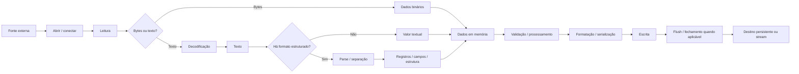

<a id="inicio"></a>

# Entrada/Saída e Persistência Básica

> **Classificação:** `[C] Obrigatório conhecer`  
> **Nível:** B — Fundamentos de Programação  
> **Posição na taxonomia:** tópico 21  
> **Pré-requisitos principais:** T09 — Entrada, Processamento, Saída e Validação; T18 — Erros, Exceções e Tratamento de Falhas; T19 — Depuração; T20 — Testes e Verificação; strings, coleções, funções e laços  
> **Aprofundamentos posteriores:** T22 — Qualidade Básica do Código; T23 — Modelo Básico de Execução; bancos de dados, serialização avançada, redes, concorrência e I/O assíncrono em camadas posteriores

---

## Resumo executivo

Entrada/saída — **I/O, de input/output** — é a fronteira pela qual um programa recebe dados e entrega resultados. Persistência básica é o passo adicional de fazer parte desses dados sobreviver ao fim da execução, normalmente por meio de arquivos.

> **Escopo de persistência neste T21:** “persistido” significa que a operação de I/O foi concluída segundo o contrato da API e que o dado pode ser recuperado em execução posterior. Isso **não** promete, por si só, durabilidade contra queda de energia, crash do sistema, corrupção de mídia ou falha de storage. Garantias desse tipo exigem mecanismos e APIs adicionais, fora do núcleo deste tópico.

O modelo mental essencial é:

```text
FONTE
console | arquivo | stream
   ↓
LEITURA
   ↓
bytes / texto
   ↓
DECODIFICAÇÃO + PARSE, quando aplicável
   ↓
DADOS EM MEMÓRIA
   ↓
PROCESSAMENTO
   ↓
FORMATAÇÃO / SERIALIZAÇÃO, quando aplicável
   ↓
ESCRITA
   ↓
DESTINO
console | arquivo | stream
```

Um arquivo não é simplesmente “uma variável que fica salva”. Entre o valor em memória e o conteúdo persistido existem decisões sobre:

- caminho;
- modo de abertura;
- texto versus bytes;
- codificação;
- formato;
- separadores;
- buffering;
- fechamento/liberação do recurso;
- falhas de acesso;
- conteúdo malformado;
- política de sobrescrita ou anexação.

A taxonomia canônica deste tópico é:

```text
21.1 Entrada e saída
     ├── console
     ├── arquivos
     └── streams

21.2 Arquivos
     ├── abrir
     ├── ler
     ├── escrever
     ├── anexar
     └── fechar

21.3 Dados estruturados simples
     ├── linhas
     ├── campos
     ├── separadores
     └── formatos simples

21.4 Falhas de I/O
     ├── arquivo inexistente
     ├── permissão
     ├── conteúdo inválido
     └── recurso indisponível
```

> **Persistência básica aqui significa arquivos e formatos textuais simples. Banco de dados, transações, ORM, replicação, armazenamento distribuído e persistência complexa pertencem a outras camadas.**

---

## Visão rápida

| Pergunta | Resposta |
|---|---|
| **O que é I/O?** | Troca de dados entre o programa e fontes/destinos externos à lógica puramente em memória. |
| **O que é stream?** | Abstração de uma sequência de dados que pode ser lida ou escrita progressivamente. |
| **Arquivo e stream são sinônimos?** | Não. Um arquivo pode ser uma fonte/destino de stream; streams também podem estar ligados a console, pipe, socket e outros recursos. |
| **Persistir é só “dar `write`”?** | Não. É preciso definir formato, encoding, política de escrita, fechamento e comportamento diante de falhas. |
| **`write` sempre acrescenta ao final?** | Não. Depende do modo/opção; escrita pode truncar, substituir ou anexar. |
| **JSON é arquivo?** | Não. JSON é um formato textual de representação de dados; pode estar em arquivo, memória ou rede. |
| **CSV é “split por vírgula”?** | Não em geral. CSV real possui regras de quoting, delimitadores e linhas; `split(',')` só serve para formatos deliberadamente mais simples. |
| **Conteúdo inválido é o mesmo que falha ao abrir o arquivo?** | Não. O I/O pode funcionar e o parse falhar depois. |
| **JavaScript possui API de arquivos no ECMAScript?** | Não. Arquivos dependem do ambiente hospedeiro; neste tópico usamos Node.js `node:fs`. |
| **Bash possui um objeto `File` equivalente a Python/Java?** | Não de forma idiomática. O shell trabalha fortemente com redirecionamentos, descritores, builtins e utilitários. |

---

## Distinções fundamentais

```text
ENTRADA
≠
VALIDAÇÃO

I/O
≠
PARSE

ARQUIVO
≠
FORMATO

STREAM
≠
ARQUIVO

TEXTO
≠
BYTES

ENCODING
≠
FORMATO DE DADOS

ESCREVER
≠
ANEXAR

FLUSH
≠
FECHAR

ARQUIVO INEXISTENTE
≠
CONTEÚDO INVÁLIDO

CSV
≠
"STRING COM VÍRGULAS" EM QUALQUER SITUAÇÃO

JSON
≠
OBJETO EM MEMÓRIA

PERSISTÊNCIA EM ARQUIVO
≠
BANCO DE DADOS
```

### Definições de trabalho

| Termo | Definição operacional neste tópico |
|---|---|
| **Entrada** | Dados que entram no programa a partir de console, arquivo ou outra fonte externa. |
| **Saída** | Dados que o programa envia a console, arquivo ou outro destino. |
| **I/O** | Operações de entrada e saída. |
| **Stream** | Fluxo/sequência de dados consumida ou produzida ao longo do tempo. |
| **Arquivo** | Recurso persistente identificado por caminho/nome no sistema de arquivos. |
| **Handle/recurso aberto** | Referência usada pelo programa para operar sobre um recurso de I/O. |
| **Buffer** | Área intermediária usada para agrupar dados antes de transferi-los entre camadas. |
| **Encoding** | Regra de conversão entre caracteres e bytes, como UTF-8. |
| **Parse** | Conversão de uma representação textual/serializada em estrutura de dados compreendida pelo programa. |
| **Serialização** | Conversão de dados em memória para uma representação armazenável/transmissível. |
| **Truncar** | Reduzir um arquivo existente, tipicamente a zero, antes de uma nova escrita. |
| **Anexar/append** | Escrever novos dados depois do conteúdo existente. |
| **EOF** | Fim da sequência de entrada; não significa necessariamente erro. |
| **Formato simples** | Convenção pequena e explícita de linhas/campos/separadores, sem exigir banco de dados ou parser complexo. |

---

## Regra de ouro

> **Defina separadamente a origem/destino, a representação e a política de erro.**

Exemplo:

```text
origem        = arquivo devices.tsv
representação = UTF-8, uma linha por registro, TAB entre campos
política      = arquivo ausente é erro; linha malformada é rejeitada com número da linha
```

Misturar essas três decisões costuma produzir código frágil:

```text
"abri o arquivo"
≠
"o conteúdo está válido"
≠
"os dados foram persistidos do jeito pretendido"
```

---

## Decisão rápida

| Situação | Escolha inicial |
|---|---|
| Poucos dados textuais e simples | Arquivo texto com formato explícito. |
| Ler arquivo pequeno inteiro | API conveniente de leitura integral pode ser adequada. |
| Arquivo grande | Preferir leitura incremental/por linhas ou stream. |
| Atualizar sem apagar conteúdo anterior | Modo/opção de append. |
| Substituir conteúdo antigo por completo | Escrita com truncamento, conscientemente. |
| Dados com delimitadores possíveis dentro dos campos | Usar parser de formato real, não `split()` ingênuo. |
| Estrutura hierárquica simples | JSON é natural em Python/JavaScript; em Java/Bash a ferramenta/biblioteca deve ser escolhida explicitamente. |
| Intercâmbio tabular simples controlado | TSV pode ser didaticamente útil se TAB/newline forem proibidos ou escapados nos campos. |
| Entrada externa | Validar depois de ler/parsear e antes de confiar. |
| Arquivo importante que será reescrito | Evitar experimentos diretamente sobre o original; usar cópia/arquivo temporário quando pertinente. |

---

# Índice

  - [Resumo executivo](#resumo-executivo)
  - [Visão rápida](#visão-rápida)
  - [Distinções fundamentais](#distinções-fundamentais)
  - [Regra de ouro](#regra-de-ouro)
  - [Decisão rápida](#decisão-rápida)
- [1. Posição deste assunto na trilha](#1-posição-deste-assunto-na-trilha)
- [2. 🗺️ Visão panorâmica — o mapa antes dos detalhes](#visao-panoramica)
- [3. Modelo mínimo do domínio de I/O](#3-modelo-mínimo-do-domínio-de-io)
- [4. 21.1 — Entrada e saída `[C]`](#4-211--entrada-e-saída-c)
- [5. Console nas quatro linguagens](#5-console-nas-quatro-linguagens)
- [6. Streams: o modelo que conecta console e arquivo](#6-streams-o-modelo-que-conecta-console-e-arquivo)
- [7. Texto versus bytes](#7-texto-versus-bytes)
- [8. 21.2 — Arquivos `[C]`](#8-212--arquivos-c)
- [9. Modos de abertura e o risco de truncamento](#9-modos-de-abertura-e-o-risco-de-truncamento)
- [10. Python — arquivo texto idiomático](#10-python--arquivo-texto-idiomático)
- [11. JavaScript / Node.js — arquivo é API do host](#11-javascript--nodejs--arquivo-é-api-do-host)
- [12. Java — `java.nio.file.Files`](#12-java--javaniofilefiles)
- [13. GNU Bash — redirecionamento e arquivos](#13-gnu-bash--redirecionamento-e-arquivos)
- [14. Comparação — abrir, ler, escrever, anexar e fechar](#14-comparação--abrir-ler-escrever-anexar-e-fechar)
- [15. Fechamento, contexto e vida útil do recurso](#15-fechamento-contexto-e-vida-útil-do-recurso)
- [16. Leitura integral versus incremental](#16-leitura-integral-versus-incremental)
- [17. Caminhos e localização de arquivos](#17-caminhos-e-localização-de-arquivos)
- [18. 21.3 — Dados estruturados simples `[C]`](#18-213--dados-estruturados-simples-c)
- [19. Linhas, campos e separadores](#19-linhas-campos-e-separadores)
- [20. CSV — formato real, não `split(',')`](#20-csv--formato-real-não-split)
- [21. JSON — estrutura simples hierárquica](#21-json--estrutura-simples-hierárquica)
- [22. Exemplo comum — inventário TSV sintético](#22-exemplo-comum--inventário-tsv-sintético)
- [23. Parse TSV em Python](#23-parse-tsv-em-python)
- [24. Parse TSV em JavaScript / Node.js](#24-parse-tsv-em-javascript--nodejs)
- [25. Parse TSV em Java](#25-parse-tsv-em-java)
- [26. Parse TSV em GNU Bash](#26-parse-tsv-em-gnu-bash)
- [27. 21.4 — Falhas de I/O `[C]`](#27-214--falhas-de-io-c)
- [28. Falha de I/O versus conteúdo inválido](#28-falha-de-io-versus-conteúdo-inválido)
- [29. Tratamento de arquivo inexistente](#29-tratamento-de-arquivo-inexistente)
- [30. Permissão e ambiente](#30-permissão-e-ambiente)
- [31. Conteúdo inválido e parse](#31-conteúdo-inválido-e-parse)
- [32. EOF — fim da entrada não é automaticamente erro](#32-eof--fim-da-entrada-não-é-automaticamente-erro)
- [33. Escrita pode falhar depois de abrir](#33-escrita-pode-falhar-depois-de-abrir)
- [34. Buffering em nível conceitual](#34-buffering-em-nível-conceitual)
- [35. Formato, interoperabilidade e evolução](#35-formato-interoperabilidade-e-evolução)
- [36. Persistência básica não é banco de dados](#36-persistência-básica-não-é-banco-de-dados)
- [37. Segurança e dados sensíveis](#37-segurança-e-dados-sensíveis)
- [38. Anti-padrões frequentes](#38-anti-padrões-frequentes)
- [39. Problemas reais e mecanismo da falha](#39-problemas-reais-e-mecanismo-da-falha)
  - [Inventário formal de Problemas Reais — PR-T21-*](#inventario-pr-t21)
  - [🔎 Troubleshooting sistemático](#troubleshooting-sistematico)
- [40. Testes aplicados a I/O](#40-testes-aplicados-a-io)
- [41. Exemplo integrador — inventário de dispositivos](#41-exemplo-integrador--inventário-de-dispositivos)
- [42. Implementação integradora em Python](#42-implementação-integradora-em-python)
- [43. Implementação integradora em JavaScript / Node.js](#43-implementação-integradora-em-javascript--nodejs)
- [44. Implementação integradora em Java](#44-implementação-integradora-em-java)
- [45. Implementação integradora em GNU Bash](#45-implementação-integradora-em-gnu-bash)
- [46. Laboratórios](#46-laboratórios)
  - [🧪 LAB 1 — escrever, ler e anexar sem perder o conteúdo](#-lab-1--escrever-ler-e-anexar-sem-perder-o-conteúdo)
  - [🧪 LAB 2 — detectar truncamento destrutivo](#-lab-2--detectar-truncamento-destrutivo)
  - [🧪 LAB 3 — parser TSV com contrato explícito](#-lab-3--parser-tsv-com-contrato-explícito)
  - [🧪 LAB 4 — encoding UTF-8](#-lab-4--encoding-utf-8)
  - [🧪 LAB 5 — falha de arquivo inexistente](#-lab-5--falha-de-arquivo-inexistente)
  - [🧪 LAB 6 — JSON válido, JSON inválido e domínio inválido](#-lab-6--json-válido-json-inválido-e-domínio-inválido)
  - [🧪 LAB 7 — arquivo grande sem carregar tudo](#-lab-7--arquivo-grande-sem-carregar-tudo)
  - [🧪 LAB 8 — integração T18–T21](#-lab-8--integração-t18t21)
- [47. Exercícios](#47-exercícios)
- [48. Evidências de domínio](#48-evidências-de-domínio)
- [49. Checklist de domínio](#49-checklist-de-domínio)
- [50. Glossário](#50-glossário)
- [51. Auditoria de cobertura da taxonomia](#51-auditoria-de-cobertura-da-taxonomia)
- [52. Auditoria da File Library](#52-auditoria-da-file-library)
  - [52.1 Fontes locais efetivamente consultadas na revisão 0.1.0](#521-fontes-locais-efetivamente-consultadas-na-revisão-010)
  - [52.2 Como a biblioteca alterou o documento](#522-como-a-biblioteca-alterou-o-documento)
  - [52.3 Fontes encontradas versus fontes usadas](#523-fontes-encontradas-versus-fontes-usadas)
  - [52.4 Fontes locais efetivamente reconsultadas na revisão 0.2.0](#524-fontes-locais-efetivamente-reconsultadas-na-revisão-020)
  - [52.5 Revalidação oficial e Passagem B da revisão 0.3.0 (R3)](#525-revalidação-oficial-e-passagem-b-da-revisão-030-r3)
  - [52.6 Estado de QA e evidência da revisão 0.3.2 (R5)](#526-estado-de-qa-e-evidência-da-revisão-032-r5)
- [53. Referências](#53-referências)
  - [53.1 Contratos canônicos do projeto](#531-contratos-canônicos-do-projeto)
  - [53.2 Documentação oficial e fontes primárias atuais](#532-documentação-oficial-e-fontes-primárias-atuais)
  - [53.3 Literatura local efetivamente consultada na revisão 0.1.0](#533-literatura-local-efetivamente-consultada-na-revisão-010)
  - [53.4 Literatura local reconsultada na revisão 0.2.0](#534-literatura-local-reconsultada-na-revisão-020)
  - [53.5 Literatura local reaberta na revisão 0.3.0 (R3)](#535-literatura-local-reaberta-na-revisão-030-r3)
  - [53.6 Hierarquia usada nesta revisão](#536-hierarquia-usada-nesta-revisão)
- [54. Histórico de versões](#54-histórico-de-versões)

---

# 1. Posição deste assunto na trilha

T21 conecta algoritmos que até aqui poderiam operar apenas em memória com o mundo externo e com estado persistente entre execuções.

```text
T09
entrada / processamento / saída
        ↓
T18
falhas e tratamento
        ↓
T19
investigação de problemas
        ↓
T20
testes
        ↓
T21
I/O + arquivos + persistência simples
        ↓
T22
qualidade básica do código
        ↓
T23
modelo de execução, stdin/stdout/stderr, pipes e exit codes em maior profundidade
```

## 1.1 O que T21 ensina

- reconhecer console, arquivo e stream como formas de I/O;
- abrir, ler, escrever, anexar e fechar arquivos;
- entender texto versus bytes em nível prático;
- trabalhar conscientemente com UTF-8;
- representar registros simples em linhas e campos;
- distinguir formato simples de CSV/JSON reais;
- reconhecer falhas de abertura, permissão, leitura, escrita e parse;
- liberar recursos de maneira segura;
- transferir o conceito entre Python, JavaScript/Node.js, Java e Bash sem fingir APIs equivalentes.

## 1.2 O que T21 não tenta esgotar

Não é objetivo deste tópico ensinar em profundidade:

- banco de dados relacional ou NoSQL;
- SQL;
- ORM;
- transações;
- locking/concurrency de arquivos;
- memory mapping;
- arquivos binários complexos;
- formatos como Parquet, Avro, Protobuf ou XML avançado;
- streams reativos;
- I/O assíncrono de alto desempenho;
- sockets e protocolos de rede;
- segurança completa de filesystem;
- internals de descritores de arquivo e processos, aprofundados em T23.

O foco é construir o **modelo conceitual correto** antes dessas camadas.

[↑ Voltar ao índice](#índice)

<a id="visao-panoramica"></a>

# 2. 🗺️ Visão panorâmica — o mapa antes dos detalhes

Esta seção é o **caderno rápido de consulta** do T21. Ela não substitui o restante do capítulo: oferece um mapa que permite recuperar rapidamente **onde o dado está, em que representação se encontra, qual operação está sendo feita, qual falha é plausível e qual mecanismo investigar primeiro**.

## 2.1 O domínio inteiro em uma tela

```text
ENTRADA / SAÍDA E PERSISTÊNCIA BÁSICA
│
├── 21.1 ENTRADA E SAÍDA
│   ├── console
│   ├── arquivo
│   └── stream
│
├── 21.2 ARQUIVOS
│   ├── caminho
│   ├── abrir
│   ├── ler
│   ├── escrever
│   ├── anexar
│   ├── flush, quando pertinente
│   └── fechar / liberar recurso
│
├── REPRESENTAÇÃO
│   ├── bytes
│   ├── texto
│   ├── encoding
│   ├── newline
│   ├── linhas
│   ├── campos
│   └── separadores
│
├── 21.3 DADOS ESTRUTURADOS SIMPLES
│   ├── formato textual controlado
│   ├── TSV didático
│   ├── CSV real → parser de CSV
│   └── JSON → serialização / parse
│
└── 21.4 FALHAS DE I/O
    ├── arquivo inexistente
    ├── permissão / acesso
    ├── caminho / diretório incorreto
    ├── recurso indisponível
    ├── leitura / escrita incompleta ou falha
    ├── encoding incompatível
    └── conteúdo inválido depois de o I/O funcionar
```

O mapa mental principal é:

```text
FONTE EXTERNA
    ↓
I/O
    ↓
BYTES
    ↓  se o contrato for texto
DECODIFICAÇÃO
    ↓
TEXTO
    ↓  se houver estrutura
PARSE / SEPARAÇÃO
    ↓
DADOS EM MEMÓRIA
    ↓
VALIDAÇÃO / REGRA DE DOMÍNIO
    ↓
PROCESSAMENTO
    ↓
FORMATAÇÃO / SERIALIZAÇÃO
    ↓
CODIFICAÇÃO
    ↓
I/O
    ↓
DESTINO EXTERNO
```

**Regra de diagnóstico:** descubra primeiro **em qual seta** o comportamento divergiu do esperado. “O arquivo deu erro” é informação insuficiente.

## 2.2 Fluxo operacional completo



Este fluxo deixa explícito que:

- **I/O** transporta representação;
- **encoding** relaciona caracteres e bytes;
- **parse** interpreta estrutura;
- **validação** decide se valores são aceitáveis;
- **persistência** exige que o ciclo de escrita realmente termine conforme o contrato;
- falhas podem acontecer **antes, durante ou depois** de abrir o recurso.

## 2.3 Consulta rápida — conceito, função, risco e primeiro diagnóstico

| Conceito | Função | Risco frequente | Primeira pergunta de diagnóstico |
|---|---|---|---|
| **caminho** | localizar recurso | CWD diferente / caminho errado | “qual caminho efetivo está sendo usado?” |
| **modo de abertura** | definir intenção | truncar quando queria anexar | “a operação abre para replace ou append?” |
| **stream** | fluxo progressivo | confundir stream com arquivo | “qual é a fonte/destino real deste stream?” |
| **bytes** | representação bruta | interpretar bytes como texto sem contrato | “qual encoding produz esses caracteres?” |
| **encoding** | bytes ↔ caracteres | mojibake / erro de decode | “quem gravou, em qual encoding?” |
| **newline** | delimitar linhas | linha extra / quebra inesperada | “quem controla a tradução de newline?” |
| **buffer** | reduzir custo de I/O | dado ainda não visível | “a escrita chegou à camada esperada?” |
| **CSV** | tabular com regras próprias | `split(',')` quebra campos quoted | “o parser conhece quoting/dialeto?” |
| **JSON** | estrutura hierárquica textual | I/O funciona, parse falha | “o documento é JSON válido?” |
| **EOF** | fim normal da entrada | tratado como erro | “fim esperado ou interrupção anormal?” |
| **close** | encerrar/liberar recurso | descritor vazado / dados pendentes | “o ciclo de vida terminou?” |
| **falha de I/O** | sinalizar operação externa malsucedida | ser confundida com erro de formato | “falhou transportar ou interpretar?” |

## 2.4 Pergunta prática → mecanismo a verificar primeiro

| Pergunta | Verifique primeiro | Depois |
|---|---|---|
| “O arquivo sumiu ou ficou vazio.” | modo de abertura / truncamento / redirecionamento | temporário, backup e política de substituição |
| “Eu queria acrescentar, mas substituiu.” | `append` versus write/truncate | opções específicas da API |
| “O programa diz que o arquivo não existe.” | caminho efetivo + CWD | permissões, symlink, montagem/ambiente |
| “O arquivo existe, mas não abre.” | tipo do recurso + permissão + operação | erro específico da API/OS |
| “Os acentos ficaram estranhos.” | encoding de escrita e leitura | BOM, newline e transformação intermediária |
| “JSON não carrega.” | separar leitura de `JSON.parse`/`json.load` | posição/causa do erro e regra de domínio |
| “CSV deslocou as colunas.” | quoting/delimitador/newline | parser CSV e dialeto |
| “Arquivo grande consome muita memória.” | leitura integral | stream / iterador / leitura por linhas |
| “Escrevi, mas outro processo ainda não vê.” | buffering / flush / fechamento | cache/FS/remoto e requisitos de durabilidade |
| “Bash mandou stderr para lugar errado.” | ordem dos redirecionamentos | descritores 0/1/2 e agrupamento |
| “Só funciona quando executo da pasta do script.” | caminho relativo × CWD | base explícita e composição de paths |
| “O parse passou, mas o dado é impossível.” | validação semântica | regra de domínio, não I/O |

## 2.5 Não confundir

```text
I/O                 ≠ parse
parse               ≠ validação
arquivo             ≠ formato
arquivo             ≠ stream
texto               ≠ bytes
encoding             ≠ formato
flush                ≠ close
close                ≠ garantia universal de durabilidade física
EOF                  ≠ falha automaticamente
arquivo existente   ≠ arquivo acessível
caminho válido       ≠ arquivo regular
JSON válido          ≠ dado semanticamente válido
CSV                  ≠ split por vírgula
append               ≠ overwrite
persistência básica  ≠ banco de dados
```

## 2.6 As três camadas que não devem ser confundidas

| Camada | Pergunta | Exemplo de falha |
|---|---|---|
| **Transporte / I/O** | consegui obter ou enviar bytes/texto? | `ENOENT`, `PermissionError`, `IOException`, redirecionamento falho |
| **Representação / formato** | como interpretar a representação recebida? | UTF-8 inválido, JSON malformado, CSV quoted processado como `split()` |
| **Semântica / domínio** | o valor interpretado faz sentido para o programa? | IP fora do contrato, campo obrigatório vazio, quantidade impossível |

Exemplo:

```text
"sw-01\taccess\t192.0.2.10"
```

Pode ocorrer:

1. o arquivo abre corretamente;
2. os bytes são decodificados como UTF-8;
3. a linha é separada em três campos;
4. o terceiro campo ainda precisa satisfazer a regra do programa.

Logo:

```text
I/O OK
não implica
PARSE OK
não implica
DADO VÁLIDO
```

## 2.7 Fonte, destino e conteúdo são dimensões diferentes

A mesma representação textual pode vir de:

- teclado;
- arquivo;
- pipe;
- memória;
- subprocesso;
- socket/conexão de rede em camadas posteriores.

A mesma estrutura pode ser enviada para:

- console;
- arquivo;
- outro processo;
- stream de memória;
- rede em camadas posteriores.

O **conteúdo** não determina sozinho o **transporte**. Isso é a base da abstração de streams.

## 2.8 Ciclo de vida mínimo de arquivo/recurso

```text
NÃO ABERTO
    ↓ open / create
ABERTO
    ↓ read / write / append
EM USO
    ↓ flush quando o contrato exigir visibilidade da camada de buffer
FINALIZAÇÃO
    ↓ close / saída de contexto / try-with-resources / encerramento controlado
FECHADO
```

Falhas possíveis:

```text
open falha
read falha
write falha
flush falha
close/finalização falha
parse falha depois de read bem-sucedido
```

Por isso, a frase “abriu, então deu certo” é incompleta.

## 2.9 Microexemplos canônicos

### A — overwrite não é append

```text
conteúdo inicial: A
write/replace:    B     → B
append:           B     → AB
```

### B — arquivo existe, JSON continua inválido

```text
arquivo: config.json
conteúdo: {"port": 8080,

open/read: PASS
parse JSON: FAIL
```

### C — CSV não é `split(',')`

```text
"sw-01","São Paulo, SP","192.0.2.10"
```

O segundo campo contém vírgula como **dado**, não como separador de coluna.

### D — encoding incompatível

```text
UTF-8 bytes
   ↓ interpretados como outra codificação
texto corrompido / falha de decode
```

### E — Bash pode truncar antes de o programa começar

```bash
tr '[:lower:]' '[:upper:]' < data.txt > data.txt
```

O shell prepara `> data.txt` antes da execução do `tr`; a origem pode ser esvaziada antes da leitura útil.

## 2.10 Transferência entre Python, JavaScript/Node.js, Java e Bash

| Capacidade | Python | JavaScript / Node.js | Java | Bash |
|---|---|---|---|---|
| console input | `input()` / `sys.stdin` | `readline` / `process.stdin` | `System.in`, readers/scanners | `read` / stdin |
| console output | `print()` / `sys.stdout` | `console.log()` / `process.stdout` | `System.out` | `printf` / stdout |
| arquivo texto simples | `open`, `Path` | `node:fs` | `Files`, readers/writers | redirecionamento + comandos/builtins |
| append | modo `a` | `appendFile` / flag apropriada | `StandardOpenOption.APPEND` | `>>` |
| leitura incremental | iterar arquivo | `createReadStream` / streams | `BufferedReader`, `Files.lines` | `while IFS= read -r` |
| JSON nativo/built-in | `json` stdlib | `JSON.parse/stringify` da linguagem | requer API/biblioteca escolhida | requer ferramenta/parser escolhido |
| CSV pronto no ecossistema base | módulo `csv` | não é parte de ECMAScript; escolher biblioteca/parser | escolher biblioteca/parser | escolher ferramenta/parser |
| fechamento estruturado | `with` | APIs podem fechar internamente; streams/handles têm ciclo próprio | try-with-resources | redirecionamentos de comando ou `exec`/FD explícito |

**Não force equivalência.** O conceito comum é I/O e ciclo de vida; as APIs e garantias são diferentes.

## 2.11 Problemas reais representativos — índice rápido

| ID | Situação | Destino principal |
|---|---|---|
| `PR-T21-01` | overwrite/truncamento destrói conteúdo anterior | §§ 9, 33, 39 |
| `PR-T21-02` | append e replace confundidos | §§ 8–14 |
| `PR-T21-03` | encoding incompatível corrompe texto | §§ 7, 39 |
| `PR-T21-04` | CSV real tratado com `split(',')` | § 20 |
| `PR-T21-05` | leitura funciona, parse JSON falha | §§ 21, 28, 31 |
| `PR-T21-06` | leitura integral escala mal | § 16 |
| `PR-T21-07` | arquivo inexistente/permissão/recurso confundidos | §§ 27–30 |
| `PR-T21-08` | caminho relativo depende do CWD | § 17 |
| `PR-T21-09` | sucesso declarado antes de finalizar escrita | §§ 15, 33–34 |
| `PR-T21-10` | redirecionamento Bash muda semântica pela ordem | §§ 13, 39 |

## 2.12 Entrada rápida de troubleshooting

```text
1. REPRODUZA com entrada e caminho conhecidos.
2. IDENTIFIQUE a camada:
   caminho/open → read/write → decode → parse → validação → finalização.
3. OBSERVE o erro/status real; não substitua por “não funcionou”.
4. REDUZA para arquivo mínimo e operação mínima.
5. TESTE uma hipótese por vez.
6. CORRIJA o mecanismo, não apenas a mensagem.
7. VALIDE o caso que falhava.
8. CRIE regressão para impedir retorno da falha.
```

A seção [`🔎 Troubleshooting sistemático`](#troubleshooting-sistematico) materializa os casos prioritários.

## 2.13 Modo consulta × modo estudo

**Se você já estudou T21 e quer recuperar algo em ~30 segundos:**

```text
panorama
→ tabela 2.3 ou pergunta 2.4
→ seção específica
→ PR/TS correspondente se houver falha
```

**Se está estudando pela primeira vez:**

```text
panorama
→ modelo mínimo
→ 21.1 / 21.2
→ texto × bytes / encoding
→ 21.3 formatos
→ 21.4 falhas
→ problemas reais
→ troubleshooting
→ LABs
```

## 2.14 Fronteiras e aprofundamentos

T21 **inclui**:

- console, arquivos e streams em nível fundamental;
- abertura, leitura, escrita, append e fechamento;
- texto/bytes/encoding/newline em nível operacional introdutório;
- linhas, campos, separadores, CSV/JSON em nível de fundamentos;
- falhas de I/O e de parse em nível necessário para uso seguro.

T21 **não promove para o núcleo**:

- bancos de dados e transações;
- I/O assíncrono avançado;
- sockets/protocolos;
- memory mapping;
- locking concorrente de arquivos;
- garantias de durabilidade de storage distribuído;
- formatos binários complexos.

Essas fronteiras impedem que “persistência básica” vire um curso inteiro de storage.

[↑ Voltar ao índice](#índice)

# 3. Modelo mínimo do domínio de I/O

## 3.1 Entidades

```text
programa
fonte
destino
stream
arquivo
caminho
buffer
encoding
formato
registro
campo
separador
erro/falha
```

## 3.2 Relações

```text
arquivo ──pode fornecer──> stream de leitura
arquivo ──pode receber───> stream de escrita
stream ──transporta──────> bytes/texto
encoding ──converte──────> bytes ↔ caracteres
formato ──organiza───────> caracteres ↔ registros/campos
programa ──interpreta────> valores em memória
```

## 3.3 Estados relevantes

Um recurso de arquivo pode estar conceitualmente:

```text
não aberto
  ↓
aberto para leitura / escrita / append
  ↓
em uso
  ↓
flush, quando necessário
  ↓
fechado
```

Abrir pode falhar antes de o estado “aberto” existir. Ler ou escrever também pode falhar depois da abertura.

## 3.4 Invariantes úteis

- não tentar operar depois de fechar o recurso;
- não assumir que texto externo está no encoding esperado sem contrato;
- não tratar EOF como conteúdo;
- não confundir “arquivo existe” com “tenho permissão para operar nele”;
- não confundir “li a linha” com “a linha é válida”;
- se a operação exige preservar conteúdo anterior, não usar modo que trunque o arquivo.

[↑ Voltar ao índice](#índice)

# 4. 21.1 — Entrada e saída `[C]`

Entrada e saída descrevem **movimento de dados entre o programa e o exterior da lógica em memória**.

## 4.1 Console

Console é a forma mais visível para iniciantes:

```text
usuário → stdin/entrada → programa → stdout/saída → terminal
```

Mas “console” não é sinônimo de stream padrão. O mesmo programa pode ser executado com entrada redirecionada de um arquivo ou saída encaminhada para outro processo.

## 4.2 Arquivos

Arquivos introduzem persistência:

```text
execução A
   ↓ escreve
arquivo
   ↓ permanece
execução B
   ↓ lê
dado recuperado
```

O dado continua existindo depois que a variável em memória e o processo deixam de existir.

## 4.3 Streams

Stroustrup usa o modelo de stream justamente para separar o programa dos detalhes físicos do dispositivo: o consumidor trabalha com uma sequência de dados, enquanto biblioteca e sistema operacional resolvem a origem/destino concreta.

Neste tópico, pense em stream como:

> **um canal lógico pelo qual dados são lidos ou escritos progressivamente.**

Não é necessário dominar buffers internos, backpressure ou event loops para compreender a abstração básica.

## 4.4 Entrada/saída pode bloquear

Uma operação de I/O pode precisar esperar por:

- usuário;
- disco;
- sistema operacional;
- outro processo;
- rede, em tópicos posteriores.

Isso explica por que APIs síncronas e assíncronas existem. T21 usa principalmente operações simples e previsíveis; concorrência/I/O assíncrono ficam fora do núcleo.

[↑ Voltar ao índice](#índice)

# 5. Console nas quatro linguagens

## 5.1 Python

```python
name: str = input("Nome: ")
print(f"Olá, {name}")
```

`input()` devolve texto. Conversão e validação são etapas separadas:

```python
raw_age: str = input("Idade: ")
age: int = int(raw_age)
```

Se `raw_age` não representar inteiro, a conversão falha; isso não é uma falha do mecanismo de leitura do console.

## 5.2 JavaScript / Node.js

ECMAScript por si só não define uma API universal de console/arquivo para todos os hosts. Em Node.js, `process.stdin` e `process.stdout` são streams do ambiente, e `node:readline/promises` fornece leitura de linha:

```javascript
import { createInterface } from 'node:readline/promises';
import { stdin, stdout } from 'node:process';

const rl = createInterface({ input: stdin, output: stdout });

const name = await rl.question('Nome: ');
console.log(`Olá, ${name}`);

rl.close();
```

A distinção é importante:

```text
ECMAScript
→ linguagem

Node.js
→ ambiente hospedeiro + APIs de I/O
```

## 5.3 Java

```java
import java.io.BufferedReader;
import java.io.InputStreamReader;
import java.nio.charset.StandardCharsets;

public class ConsoleExample {
    public static void main(String[] args) throws Exception {
        var reader = new BufferedReader(
            new InputStreamReader(System.in, StandardCharsets.UTF_8)
        );

        System.out.print("Nome: ");
        String name = reader.readLine();
        System.out.println("Olá, " + name);
    }
}
```

`System.in` e `System.out` são recursos padrão do runtime. A leitura textual exige uma camada que transforme bytes em caracteres.

## 5.4 GNU Bash

```bash
read -r -p 'Nome: ' name
printf 'Olá, %s\n' "$name"
```

`read` e `printf` são idiomáticos para entrada/saída textual simples no shell.

Não tente traduzir mecanicamente:

```text
Python input()
≠
JavaScript readline
≠
Java BufferedReader
≠
Bash read
```

O conceito é comum; as APIs e semânticas são diferentes.

[↑ Voltar ao índice](#índice)

# 6. Streams: o modelo que conecta console e arquivo

## 6.1 Fluxo de leitura

```text
origem
  ↓
stream de entrada
  ↓
programa consome dados
```

## 6.2 Fluxo de escrita

```text
programa produz dados
  ↓
stream de saída
  ↓
destino
```

## 6.3 Por que isso é útil

O mesmo algoritmo de processamento pode, idealmente, depender menos do dispositivo concreto.

Exemplo conceitual:

```text
ler linhas
↓
validar
↓
transformar
↓
escrever linhas
```

Esse fluxo pode ser adaptado para arquivos ou streams padrão sem mudar a regra de transformação.

## 6.4 Streams não significam “carregar tudo”

Uma das vantagens da leitura incremental é trabalhar com dados maiores do que seria razoável carregar de uma vez na memória.

```text
arquivo pequeno
→ read all pode ser simples

arquivo grande
→ linha a linha / chunks / stream costuma ser mais apropriado
```

O tamanho que separa “pequeno” de “grande” depende de memória, ambiente e requisitos; não existe número universal.

[↑ Voltar ao índice](#índice)

# 7. Texto versus bytes

Arquivo em disco é armazenado como bytes. Quando um programa trabalha com texto, algum componente precisa interpretar esses bytes como caracteres.

```text
bytes
  ↓ decode usando UTF-8
texto

texto
  ↓ encode usando UTF-8
bytes
```

## 7.1 Encoding explícito reduz ambiguidade

Para dados textuais do projeto, UTF-8 é uma escolha segura e interoperável quando o contrato está sob seu controle.

Evite depender silenciosamente do encoding padrão do ambiente quando a portabilidade importa.

## 7.2 Encoding não é formato

```text
UTF-8
→ como caracteres viram bytes

JSON / CSV / TSV
→ como os caracteres representam estrutura
```

Um arquivo JSON pode estar codificado em UTF-8. As duas decisões coexistem e resolvem problemas diferentes.

## 7.3 Nova linha também é parte da representação

Sistemas podem usar convenções de newline diferentes. Bibliotecas de alto nível frequentemente normalizam isso, mas arquivos interoperáveis devem ser tratados conscientemente.

Beazley destaca que Python possui tratamento específico para encoding, buffering e linhas em modo texto; isso é uma boa evidência de que “arquivo texto” é uma abstração composta, não apenas bytes mágicos que já chegam como `str`.

## 7.4 BOM — assinatura no início do texto

**BOM (Byte Order Mark)** é uma marca Unicode que pode aparecer no início de certos textos. Em UTF-8 ela não é necessária para definir ordem de bytes; alguns produtores ainda a usam como assinatura. Se o contrato não a prevê, pode aparecer como caractere inesperado no primeiro campo ou cabeçalho.

No contrato TSV didático deste T21, **BOM não é esperado**. Quando um formato real precisar aceitá-lo, a política deve ser declarada e tratada conscientemente — por exemplo, usando um decoder que reconheça a assinatura em vez de remover bytes/caracteres às cegas.

[↑ Voltar ao índice](#índice)

# 8. 21.2 — Arquivos `[C]`

O ciclo conceitual mínimo é:

```text
ABRIR
  ↓
LER e/ou ESCREVER
  ↓
FECHAR
```

Nilo Menezes apresenta esse ciclo de forma direta, e Farrell organiza o tratamento de arquivos em torno de abrir, ler/escrever registros e finalizar recursos. Em linguagens modernas, constructs como `with` e try-with-resources automatizam parte da etapa de fechamento.

## 8.1 Abrir

Abrir estabelece uma associação entre o programa e o recurso, com uma intenção:

- leitura;
- escrita;
- append;
- leitura/escrita combinadas em APIs que suportem isso.

## 8.2 Ler

Leitura pode ocorrer:

- inteira;
- linha a linha;
- por blocos/chunks;
- por parser de formato.

## 8.3 Escrever

Escrita pode:

- criar arquivo novo;
- substituir/truncar arquivo existente;
- falhar se o arquivo já existir, dependendo da opção;
- atualizar por mecanismos específicos.

## 8.4 Anexar

Append preserva o conteúdo anterior e escreve depois dele.

É útil para:

- logs simples;
- histórico textual;
- coleta sequencial.

Não é automaticamente adequado para formatos com estrutura global, como um único array JSON.

## 8.5 Fechar

Fechar libera o recurso e permite que buffers pendentes sejam finalizados pela API.

A regra prática é:

> **prefira mecanismos estruturados de gerenciamento de recursos que fechem o arquivo mesmo quando ocorre uma exceção/falha.**

[↑ Voltar ao índice](#índice)

# 9. Modos de abertura e o risco de truncamento

Uma das falhas mais destrutivas para iniciantes é confundir escrita com append.

```text
arquivo existente
conteúdo: A B C

modo de escrita com truncamento
+ escreve D
→ resultado: D

modo append
+ escreve D
→ resultado: A B C D
```

## 9.1 Python

Modos comuns:

| Modo | Ideia |
|---|---|
| `r` | leitura |
| `w` | escrita com criação/truncamento |
| `a` | anexação |
| `x` | criação exclusiva; falha se já existir |
| `b` | binário, combinado com outros modos |
| `+` | atualização, combinado com outros modos |

## 9.2 Node.js

APIs de `node:fs` recebem opções/flags. Para código introdutório, é mais legível usar operações cujo nome deixe a intenção clara:

```javascript
await writeFile(path, content, 'utf8');
await appendFile(path, content, 'utf8');
```

## 9.3 Java

`Files.newBufferedWriter` e `Files.writeString` usam `OpenOption`/`StandardOpenOption` quando precisamos alterar a política padrão.

Append explícito:

```java
Files.writeString(
    path,
    "linha\n",
    StandardCharsets.UTF_8,
    StandardOpenOption.CREATE,
    StandardOpenOption.APPEND
);
```

## 9.4 Bash

```bash
printf '%s\n' 'novo conteúdo' > file.txt   # sobrescreve/trunca
printf '%s\n' 'nova linha' >> file.txt     # anexa
```

Shotts e Tevault chamam atenção para esse risco: `>` abre o destino para nova escrita e pode apagar o conteúdo anterior antes mesmo de o comando produzir dados úteis.

[↑ Voltar ao índice](#índice)

# 10. Python — arquivo texto idiomático

## 10.1 Escrita segura quanto ao fechamento

```python
from pathlib import Path

path = Path("notes.txt")

with path.open("w", encoding="utf-8") as file:
    file.write("alpha\n")
    file.write("beta\n")
```

Ao sair do `with`, o contexto encerra o arquivo mesmo se ocorrer exceção durante o bloco.

## 10.2 Leitura integral para caso pequeno

```python
from pathlib import Path

path = Path("notes.txt")
content: str = path.read_text(encoding="utf-8")
print(content)
```

É simples, mas não deve ser aplicado cegamente a arquivo enorme.

## 10.3 Leitura linha a linha

```python
from pathlib import Path

path = Path("notes.txt")

with path.open("r", encoding="utf-8") as file:
    for line_number, line in enumerate(file, start=1):
        clean_line = line.rstrip("\n")
        print(line_number, clean_line)
```

## 10.4 Append

```python
from pathlib import Path

path = Path("notes.txt")

with path.open("a", encoding="utf-8") as file:
    file.write("gamma\n")
```

## 10.5 `write()` não acrescenta newline automaticamente

```python
file.write("a")
file.write("b")
```

produz:

```text
ab
```

se `\n` não for incluído explicitamente.

[↑ Voltar ao índice](#índice)

# 11. JavaScript / Node.js — arquivo é API do host

## 11.1 Escrita e leitura com Promises

```javascript
import { readFile, writeFile, appendFile } from 'node:fs/promises';

const path = 'notes.txt';

await writeFile(path, 'alpha\nbeta\n', 'utf8');
await appendFile(path, 'gamma\n', 'utf8');

const content = await readFile(path, 'utf8');
console.log(content);
```

O ponto conceitual é triplo:

1. `await` aguarda a conclusão da operação baseada em Promise;
2. `node:fs` é Node.js, não sintaxe/semântica central do ECMAScript;
3. Node.js também oferece APIs síncronas de filesystem (`*Sync`), mas elas bloqueiam o event loop e a continuação do JavaScript até a operação terminar; são uma política diferente, não um atalho semanticamente neutro.

## 11.2 Leitura integral não é sempre a melhor escolha

`readFile()` é conveniente porque devolve o conteúdo inteiro. Para arquivos grandes ou processamento incremental, streams ou leitura por linhas são alternativas melhores.

Exemplo mínimo de leitura linha a linha com APIs do host Node.js:

```javascript
import { createReadStream } from 'node:fs';
import { createInterface } from 'node:readline';

const input = createReadStream('devices.tsv', { encoding: 'utf8' });
const lines = createInterface({ input, crlfDelay: Infinity });

for await (const line of lines) {
  console.log(line);
}
```

`crlfDelay: Infinity` faz o `readline` tratar `CRLF` como um único terminador de linha mesmo quando `\r` e `\n` chegam separados no stream; o valor padrão documentado pelo Node.js é `100` ms. O exemplo materializa a alternativa incremental; não transforma `readline` em parser de TSV/CSV.

## 11.3 Não ignorar rejeições

```javascript
try {
  const content = await readFile('notes.txt', 'utf8');
  console.log(content);
} catch (error) {
  console.error('Falha ao ler notes.txt');
  throw error;
}
```

Capturar apenas para esconder a falha não é tratamento útil. T18 continua valendo.

[↑ Voltar ao índice](#índice)

# 12. Java — `java.nio.file.Files`

## 12.1 Escrita e leitura convenientes

```java
import java.nio.charset.StandardCharsets;
import java.nio.file.Files;
import java.nio.file.Path;
import java.nio.file.StandardOpenOption;

public class FileExample {
    public static void main(String[] args) throws Exception {
        Path path = Path.of("notes.txt");

        // Sem OpenOption explícita, writeString cria o arquivo se necessário
        // e trunca um arquivo regular existente antes de escrever.
        Files.writeString(path, "alpha\nbeta\n", StandardCharsets.UTF_8);

        Files.writeString(
            path,
            "gamma\n",
            StandardCharsets.UTF_8,
            StandardOpenOption.CREATE,
            StandardOpenOption.APPEND
        );

        String content = Files.readString(path, StandardCharsets.UTF_8);
        System.out.print(content);
    }
}
```

## 12.2 Leitura integral é para casos adequados

A própria API de `Files.readString()` documenta a intenção de uso simples e alerta que não é uma API para arquivos muito grandes.

## 12.3 Try-with-resources para streams/readers abertos

```java
import java.nio.charset.StandardCharsets;
import java.nio.file.Files;
import java.nio.file.Path;

try (var reader = Files.newBufferedReader(
        Path.of("notes.txt"),
        StandardCharsets.UTF_8)) {
    String line;
    while ((line = reader.readLine()) != null) {
        System.out.println(line);
    }
}
```

O recurso é fechado automaticamente ao sair do bloco.

[↑ Voltar ao índice](#índice)

# 13. GNU Bash — redirecionamento e arquivos

Bash não precisa expor um objeto de arquivo para as operações mais comuns. Redirecionamento faz parte do modelo do shell.

## 13.1 Escrever

```bash
printf '%s\n' 'alpha' 'beta' > notes.txt
```

## 13.2 Anexar

```bash
printf '%s\n' 'gamma' >> notes.txt
```

## 13.3 Ler linha a linha

```bash
while IFS= read -r line; do
    printf 'linha=%s\n' "$line"
done < notes.txt
```

Por que `IFS=` e `-r`?

- `IFS=` evita remoções/splitting indesejados no início/fim da linha;
- `read -r` impede que backslash seja tratado como escape pela leitura comum.

## 13.4 Abrir descritor explicitamente quando necessário

```bash
exec {fd}< notes.txt
while IFS= read -r line <&"$fd"; do
    printf '%s\n' "$line"
done
exec {fd}<&-
```

Isso mostra que Bash também pode gerenciar descritores, mas detalhes de processo e descritores ficam para T23.

## 13.5 Ordem de redirecionamento importa

```bash
command >out.txt 2>&1
```

não é semanticamente igual a:

```bash
command 2>&1 >out.txt
```

Esse detalhe será aprofundado no modelo de execução; aqui basta saber que redirecionamentos são operações ordenadas.

[↑ Voltar ao índice](#índice)

# 14. Comparação — abrir, ler, escrever, anexar e fechar

| Capacidade | Python | JavaScript / Node.js | Java | GNU Bash |
|---|---|---|---|---|
| abrir recurso explicitamente | `open()` / `Path.open()` | `open()`/FileHandle quando necessário | `Files.newBufferedReader/Writer()` | `exec {fd}<...` quando necessário |
| ler arquivo pequeno inteiro | `Path.read_text()` | `readFile()` | `Files.readString()` | `$(<file)` existe, mas linha a linha costuma ser mais segura para processamento |
| escrever/substituir | modo `w` / `write_text()` | `writeFile()` | `Files.writeString()` | `>` |
| anexar | modo `a` | `appendFile()` | `APPEND` | `>>` |
| fechar | `with` / `close()` | APIs de alto nível cuidam por operação; `FileHandle.close()` se aberto | try-with-resources / `close()` | fechar FD explícito quando abriu um |
| encoding textual explícito | `encoding="utf-8"` | `'utf8'` | `StandardCharsets.UTF_8` | depende das ferramentas/locale; shell trafega texto/bytes segundo ambiente |
| erro comum | modo `w` destrói conteúdo anterior | rejeição ignorada | `IOException` ignorada/propagada sem política | redirecionamento pode truncar antes da execução útil |

A tabela compara **capacidades**, não afirma equivalência perfeita de APIs.

[↑ Voltar ao índice](#índice)

# 15. Fechamento, contexto e vida útil do recurso

## 15.1 Por que fechar

Recursos de I/O são finitos e podem manter buffers/handles no sistema operacional.

Deixar recursos abertos desnecessariamente pode causar:

- vazamento de descritores/handles;
- dificuldade para renomear/remover arquivos em alguns ambientes;
- dados pendentes em buffers;
- comportamento difícil de prever em programas longos.

## 15.2 Preferência estrutural

```text
Python
→ with

Java
→ try-with-resources

Node.js
→ APIs de operação única ou using/close conforme o tipo de recurso

Bash
→ redirecionamento de comando fecha naturalmente ao terminar; FDs abertos com exec exigem ciclo de vida consciente
```

## 15.3 `flush` não é `close`

Flush pede à camada de biblioteca que encaminhe dados pendentes do buffer. Fechar encerra o recurso e normalmente implica etapas de flush, mas os conceitos não são sinônimos.

Além disso:

```text
flush da biblioteca
≠
garantia absoluta de persistência física em mídia
```

A durabilidade física envolve camadas do sistema operacional/dispositivo e está fora do núcleo do T21.

[↑ Voltar ao índice](#índice)

# 16. Leitura integral versus incremental

## 16.1 Arquivo pequeno

Quando o arquivo é pequeno e conhecido, leitura integral simplifica o código:

```text
ler tudo
→ parsear
→ processar
```

## 16.2 Arquivo grande ou tamanho desconhecido

```text
abrir
→ ler uma linha/chunk
→ processar
→ repetir
→ fechar
```

Vantagens:

- menor pico de memória;
- possibilidade de começar a processar antes de receber tudo;
- melhor comportamento para arquivos longos.

Trade-off:

- estado incremental pode ser mais complexo;
- alguns formatos exigem parser que entenda a estrutura global.

## 16.3 Regra prática

> **Escolha a estratégia pelo tamanho, formato e necessidade de processamento — não por hábito.**

[↑ Voltar ao índice](#índice)

# 17. Caminhos e localização de arquivos

Um arquivo é acessado por um caminho. Caminhos podem ser:

```text
relativos
→ dependem do diretório de trabalho ou contexto da aplicação

absolutos
→ identificam uma localização completa no ambiente
```

## 17.1 Armadilha comum: “funciona na minha pasta”

Código:

```text
open("config.txt")
```

não significa necessariamente “arquivo ao lado do código-fonte”. Em muitos runtimes, significa um caminho relativo ao diretório de trabalho atual.

## 17.2 Não concatenar caminho como string sem necessidade

Preferir APIs de path da linguagem/host quando disponíveis:

- Python: `pathlib.Path`;
- Node.js: `node:path` para composição de caminhos;
- Java: `Path`;
- Bash: quoting rigoroso de variáveis de caminho.

## 17.3 Segurança básica

Se nome/caminho vier de entrada não confiável:

- não assuma que ele permanece no diretório pretendido;
- não aceite traversal como `../` sem política;
- não use caminho fornecido externamente para sobrescrever arquivos arbitrários;
- aplique allowlist/normalização/controle de base quando a aplicação exigir.

Segurança completa de filesystem é tema maior; aqui fica o guardrail.

[↑ Voltar ao índice](#índice)

# 18. 21.3 — Dados estruturados simples `[C]`

Arquivos de texto ficam mais úteis quando existe uma convenção explícita de estrutura.

Exemplo sintético de inventário:

```text
hostname	role	mgmt_ip
sw-01	access	192.0.2.10
rtr-01	edge	198.51.100.20
```

Temos:

```text
arquivo
└── linhas
    └── campos
        └── separados por TAB
```

## 18.1 Registro

Uma linha pode representar um registro.

## 18.2 Campos

Cada registro contém posições/atributos.

## 18.3 Separador

O separador precisa ser parte do contrato do formato.

## 18.4 Formato simples precisa declarar restrições

Se usarmos TSV didático simples, precisamos decidir:

- TAB pode aparecer dentro de campo?
- newline pode aparecer dentro de campo?
- existe cabeçalho?
- campo vazio é permitido?
- quantos campos são esperados?

Sem essas regras, o parser e o produtor podem discordar.

[↑ Voltar ao índice](#índice)

# 19. Linhas, campos e separadores

Considere:

```text
sw-01\taccess\t192.0.2.10
```

Um parser simples pode separar em três campos.

Mas considere agora um campo livre:

```text
sw-01\t"Access - prédio A\tandar 2"\t192.0.2.10
```

Se TAB for permitido no campo, `split('\t')` deixa de ser suficiente sem regra de escaping/quoting.

## 19.1 O formato determina a complexidade do parser

```text
campos não podem conter delimitador/newline
→ split simples pode ser suficiente

campos podem conter delimitador, aspas, newline
→ use formato/parser que modele essas regras
```

## 19.2 Não chamar qualquer texto delimitado de CSV

CSV possui convenções de quoting e variações de dialeto. A biblioteca `csv` do Python existe justamente porque detalhes como delimitadores, aspas e newlines tornam o formato mais complexo do que um `split(',')` universal.

## 19.3 TSV simples como ferramenta didática

Neste tópico, TSV é útil quando declaramos a restrição:

> campos não contêm TAB nem newline.

Isso permite ensinar registros/campos sem esconder um parser real atrás de uma falsa simplificação de CSV.

> **Guardrail:** a simplicidade vem do **contrato didático restrito** acima, não do nome “TSV” por si só. Dados tabulares reais podem exigir regras adicionais de quoting, escaping, terminadores de linha e interoperabilidade conforme o produtor/consumidor.

[↑ Voltar ao índice](#índice)

# 20. CSV — formato real, não `split(',')`

Sweigart destaca CSV como formato tabular de texto e recomenda usar módulos/bibliotecas próprios em vez de manipular manualmente os detalhes do formato.

## 20.1 Exemplo que quebra `split(',')`

```csv
name,city
"Doe, Jane",São Paulo
```

A primeira linha de dados possui uma vírgula **dentro do campo**.

```text
linha.split(',')
→ não conhece quoting CSV
→ produz campos errados
```

## 20.2 Python possui módulo `csv`

```python
import csv

with open("devices.csv", "r", encoding="utf-8", newline="") as file:
    reader = csv.DictReader(file)
    for row in reader:
        print(row["hostname"])
```

## 20.3 JavaScript, Java e Bash

Não fabrique equivalência inexistente:

- Node.js não possui um parser CSV universal no ECMAScript central;
- Java SE não oferece uma API CSV de alto nível equivalente no `java.base`;
- Bash não é um parser CSV apropriado para casos completos.

Para CSV real, escolha biblioteca/ferramenta adequada ao ecossistema e ao dialeto do dado.

No T21, o objetivo é reconhecer **por que** essa escolha é necessária.

[↑ Voltar ao índice](#índice)

# 21. JSON — estrutura simples hierárquica

JSON representa valores estruturados em texto.

Exemplo:

```json
{
  "hostname": "sw-01",
  "role": "access",
  "mgmt_ip": "192.0.2.10"
}
```

## 21.1 Serializar e parsear não são a mesma coisa

```text
objeto/estrutura em memória
  ↓ serializar
texto JSON
  ↓ parsear
objeto/estrutura em memória
```

## 21.2 Python

```python
import json

record = {
    "hostname": "sw-01",
    "role": "access",
    "mgmt_ip": "192.0.2.10",
}

with open("device.json", "w", encoding="utf-8") as file:
    # ensure_ascii=False mantém caracteres Unicode legíveis no JSON;
    # o encoding do arquivo continua explicitamente UTF-8.
    json.dump(record, file, ensure_ascii=False, indent=2)

with open("device.json", "r", encoding="utf-8") as file:
    loaded = json.load(file)
```

## 21.3 JavaScript

ECMAScript possui `JSON.stringify()` e `JSON.parse()` para representação em memória. Node.js fornece a camada de arquivo:

```javascript
import { readFile, writeFile } from 'node:fs/promises';

const record = {
  hostname: 'sw-01',
  role: 'access',
  mgmtIp: '192.0.2.10',
};

await writeFile(
  'device.json',
  JSON.stringify(record, null, 2) + '\n',
  'utf8',
);

const text = await readFile('device.json', 'utf8');
const loaded = JSON.parse(text);
```

## 21.4 Java e Bash: sem falsa equivalência

Para JSON real em Java, este tópico não improvisa um parser nem pressupõe uma API específica: escolha uma biblioteca/API de JSON apropriada ao projeto e valide sua documentação. O objetivo aqui é o formato e o contrato de persistência, não selecionar uma biblioteca JSON para Java.

Bash também não deve ganhar um parser JSON improvisado com `grep`, `sed` ou regex. Ferramentas específicas como `jq` podem ser apropriadas em outro contexto, mas não são builtin do Bash.

[↑ Voltar ao índice](#índice)

# 22. Exemplo comum — inventário TSV sintético

Usaremos este contrato:

```text
encoding: UTF-8
BOM: não esperado neste contrato didático
newline garantido na leitura: LF ou CRLF
CR isolado como terminador: fora das entradas garantidas pelo contrato
newline final: recomendado na escrita, mas não obrigatório na leitura
cabeçalho: hostname<TAB>role<TAB>mgmt_ip
campos por registro: 3
TAB/newline dentro de campo: proibido neste formato didático
primeira linha: cabeçalho obrigatório; linha vazia antes dele é inválida
linhas vazias após o cabeçalho: ignoradas
whitespace dentro de campo: preservado; campo só com espaços é questão de domínio, não vazio estrutural
```

> **Conformidade:** os testes canônicos deste T21 exigem LF e CRLF. Como `CR` isolado está fora do conjunto garantido, uma API pode rejeitá-lo ou aceitá-lo incidentalmente por normalização; isso não amplia o contrato.

Representação visível abaixo (`\t` representa um caractere TAB):

```text
hostname\trole\tmgmt_ip
sw-01\taccess\t192.0.2.10
rtr-01\tedge\t198.51.100.20
```

## 22.1 O que o parser precisa verificar

Para cada registro:

1. linha existe;
2. linha não é vazia, ou é ignorada por regra;
3. existem exatamente três campos;
4. `hostname`, `role` e `mgmt_ip` não são vazios;
5. validação semântica mais profunda pode ocorrer depois.

## 22.2 Por que usar endereços RFC de documentação

`192.0.2.0/24` e `198.51.100.0/24` são blocos reservados para documentação pelo RFC 5737; por isso são usados aqui como dados sintéticos, não como endereços reais do ambiente do leitor.

[↑ Voltar ao índice](#índice)

# 23. Parse TSV em Python

```python
from dataclasses import dataclass
from pathlib import Path

@dataclass(frozen=True)
class Device:
    hostname: str
    role: str
    mgmt_ip: str


def load_devices(path: Path) -> list[Device]:
    devices: list[Device] = []

    with path.open("r", encoding="utf-8", newline=None) as file:
        header = file.readline().rstrip("\n")
        if header != "hostname\trole\tmgmt_ip":
            raise ValueError("unexpected header")

        for line_number, raw_line in enumerate(file, start=2):
            line = raw_line.rstrip("\n")
            if not line:
                continue

            fields = line.split("\t")
            if len(fields) != 3:
                raise ValueError(f"line {line_number}: expected 3 fields")

            hostname, role, mgmt_ip = fields
            if not all(fields):
                raise ValueError(f"line {line_number}: empty field")

            devices.append(Device(hostname, role, mgmt_ip))

    return devices
```

Neste exemplo, `newline=None` explicita o comportamento padrão de *universal newlines* do modo texto do Python: terminadores `\n`, `\r` e `\r\n` são reconhecidos na leitura e traduzidos para `\n`. Por isso, `rstrip("\n")` remove o terminador já normalizado. Se o contrato exigisse preservar terminadores originais, seria necessário escolher outra política de `newline`.

Não transplante essa escolha mecanicamente para CSV: na §20.2 o arquivo é aberto com `newline=""`, conforme a política recomendada pela API `csv`, para que o próprio módulo trate a semântica de newline do formato.

Observe a separação:

```text
open/read
→ falhas de I/O

split/estrutura
→ falhas de formato

regras dos valores
→ validação semântica
```

[↑ Voltar ao índice](#índice)

# 24. Parse TSV em JavaScript / Node.js

Para um arquivo pequeno, leitura integral simplifica o exemplo:

```javascript
import { readFile } from 'node:fs/promises';

export async function loadDevices(path) {
  const text = await readFile(path, 'utf8');
  // Contrato didático: aceita LF ou CRLF; CR isolado fica fora do contrato.
  const lines = text.split(/\r?\n/);

  const header = lines.shift();
  if (header !== 'hostname\trole\tmgmt_ip') {
    throw new Error('unexpected header');
  }

  const devices = [];

  for (const [index, line] of lines.entries()) {
    if (line === '') continue;

    const fields = line.split('\t');
    if (fields.length !== 3) {
      throw new Error(`line ${index + 2}: expected 3 fields`);
    }

    const [hostname, role, mgmtIp] = fields;
    if (fields.some((field) => field === '')) {
      throw new Error(`line ${index + 2}: empty field`);
    }

    devices.push({ hostname, role, mgmtIp });
  }

  return devices;
}
```

Para arquivo grande, `readline` sobre um file stream evita carregar tudo. Esse é um aprofundamento natural, não requisito para todo caso pequeno.

[↑ Voltar ao índice](#índice)

# 25. Parse TSV em Java

```java
import java.io.IOException;
import java.nio.charset.StandardCharsets;
import java.nio.file.Files;
import java.nio.file.Path;
import java.util.ArrayList;
import java.util.List;

record Device(String hostname, String role, String mgmtIp) {}

public class DeviceLoader {
    static List<Device> loadDevices(Path path) throws IOException {
        List<String> lines = Files.readAllLines(path, StandardCharsets.UTF_8);

        if (lines.isEmpty() || !lines.get(0).equals("hostname\trole\tmgmt_ip")) {
            throw new IllegalArgumentException("unexpected header");
        }

        List<Device> devices = new ArrayList<>();

        for (int i = 1; i < lines.size(); i++) {
            String line = lines.get(i);
            if (line.isEmpty()) continue;

            String[] fields = line.split("\\t", -1);
            if (fields.length != 3) {
                throw new IllegalArgumentException(
                    "line " + (i + 1) + ": expected 3 fields"
                );
            }

            if (fields[0].isEmpty() || fields[1].isEmpty() || fields[2].isEmpty()) {
                throw new IllegalArgumentException(
                    "line " + (i + 1) + ": empty field"
                );
            }

            devices.add(new Device(fields[0], fields[1], fields[2]));
        }

        return devices;
    }
}
```

`split("\\t", -1)` preserva campos vazios finais, o que evita esconder uma linha malformada como:

```text
sw-01\taccess\t
```

[↑ Voltar ao índice](#índice)

# 26. Parse TSV em GNU Bash

Para o formato didático simples:

```bash
line_number=0

while IFS= read -r line || [[ -n $line ]]; do
    ((line_number += 1))

    # O contrato aceita CRLF: `read` remove LF, então removemos um CR terminal.
    line=${line%$'\r'}

    # O cabeçalho é obrigatório literalmente na primeira linha.
    if (( line_number == 1 )); then
        if [[ $line != $'hostname\trole\tmgmt_ip' ]]; then
            printf 'cabeçalho inválido na linha 1\n' >&2
            exit 1
        fi
        continue
    fi

    [[ -z $line ]] && continue

    # O contrato deste exemplo proíbe campos vazios e exige exatamente 2 TABs.
    # Bash trata TAB como whitespace em IFS; por isso validamos a forma antes
    # de separar os campos, em vez de supor que read preservará campos vazios.
    if [[ $line == $'\t'* || $line == *$'\t' || $line == *$'\t\t'* ]]; then
        printf 'registro inválido na linha %d\n' "$line_number" >&2
        exit 1
    fi

    without_tabs=${line//$'\t'/}
    tab_count=$(( ${#line} - ${#without_tabs} ))
    if (( tab_count != 2 )); then
        printf 'registro inválido na linha %d\n' "$line_number" >&2
        exit 1
    fi

    IFS=$'\t' read -r hostname role mgmt_ip <<< "$line"
    printf 'host=%s role=%s ip=%s\n' "$hostname" "$role" "$mgmt_ip"
done < devices.tsv

if (( line_number == 0 )); then
    printf 'cabeçalho ausente: arquivo vazio\n' >&2
    exit 1
fi
```

Limitação importante:

- `read` + `IFS` servem para o contrato simples que definimos;
- o exemplo exige o cabeçalho exatamente na primeira linha e rejeita arquivo vazio/linha vazia inicial;
- isso **não transforma Bash em parser CSV/JSON geral**;
- regras de campos vazios e whitespace em shell exigem testes cuidadosos.

[↑ Voltar ao índice](#índice)

# 27. 21.4 — Falhas de I/O `[C]`

O Guia exige quatro classes mínimas:

```text
arquivo inexistente
permissão
conteúdo inválido
recurso indisponível
```

Essas classes não acontecem todas na mesma camada.

## 27.1 Arquivo inexistente

Falha ao localizar/abrir o recurso esperado.

## 27.2 Permissão

O recurso pode existir, mas o processo não possui autorização suficiente para a operação solicitada.

## 27.3 Conteúdo inválido

A leitura pode terminar com sucesso e o conteúdo ainda assim violar o formato.

## 27.4 Recurso indisponível

Pode incluir:

- filesystem montado indisponível;
- dispositivo removido;
- espaço insuficiente;
- erro de hardware;
- handle inválido;
- recurso temporariamente inacessível, conforme a API/ambiente.

T21 não tenta catalogar todos os códigos do sistema operacional. O objetivo é **não assumir que I/O sempre funciona só porque a sintaxe está correta**.

[↑ Voltar ao índice](#índice)

# 28. Falha de I/O versus conteúdo inválido

Considere `device.json`.

## Caso A — arquivo não existe

```text
open/read
→ falha
→ parser nunca recebe conteúdo
```

## Caso B — arquivo existe, mas contém JSON inválido

```text
open/read
→ sucesso
parse JSON
→ falha
```

## Caso C — JSON é válido, mas regra do domínio é inválida

```json
{
  "hostname": "",
  "role": "access",
  "mgmt_ip": "not-an-ip"
}
```

```text
I/O
→ sucesso

parse JSON
→ sucesso

validação de domínio
→ falha
```

Essas distinções são fundamentais para mensagens de erro, logs, testes e recuperação.

[↑ Voltar ao índice](#índice)

# 29. Tratamento de arquivo inexistente

## 29.1 Python

```python
from pathlib import Path

path = Path("devices.tsv")

try:
    text = path.read_text(encoding="utf-8")
except FileNotFoundError:
    print(f"Arquivo não encontrado: {path}")
```

## 29.2 JavaScript / Node.js

```javascript
import { readFile } from 'node:fs/promises';

try {
  const text = await readFile('devices.tsv', 'utf8');
  console.log(text);
} catch (error) {
  if (error?.code === 'ENOENT') {
    console.error('Arquivo não encontrado');
  } else {
    throw error;
  }
}
```

## 29.3 Java

```java
import java.nio.file.Files;
import java.nio.file.NoSuchFileException;
import java.nio.file.Path;

try {
    String text = Files.readString(Path.of("devices.tsv"));
    System.out.println(text);
} catch (NoSuchFileException error) {
    System.err.println("Arquivo não encontrado: " + error.getFile());
}
```

## 29.4 Bash

```bash
file='devices.tsv'

if [[ ! -r $file ]]; then
    printf 'arquivo ausente ou não legível: %s\n' "$file" >&2
    exit 1
fi

while IFS= read -r line; do
    printf '%s\n' "$line"
done < "$file"
```

A checagem prévia pode melhorar mensagem, mas não elimina condições de corrida: o arquivo pode mudar entre a checagem e a abertura. Para código crítico, trate também a falha da própria operação.

[↑ Voltar ao índice](#índice)

# 30. Permissão e ambiente

“Permission denied” não significa que o arquivo esteja malformado.

O diagnóstico correto começa por separar:

```text
EXISTÊNCIA
PERMISSÃO
TIPO DO RECURSO
CAMINHO
FORMATO DO CONTEÚDO
```

## 30.1 Evite “corrigir” com permissão excessiva

Uma resposta ruim:

```text
chmod 777 em tudo
```

Isso mascara a causa e amplia acesso desnecessariamente.

Uma abordagem melhor:

1. identificar qual identidade/processo acessa o arquivo;
2. identificar a operação necessária: leitura, escrita, criação;
3. verificar proprietário/grupo/permissões/ACL/contextos pertinentes;
4. conceder o mínimo necessário;
5. retestar.

Aprofundamento de permissões do sistema operacional pertence ao estudo de Linux/sistemas; T21 registra apenas a consequência para I/O.

## 30.2 Arquivo existente pode ser diretório

Algumas APIs falham se o caminho aponta para recurso de tipo inesperado. “Existe” não é uma validação suficiente.

[↑ Voltar ao índice](#índice)

# 31. Conteúdo inválido e parse

O parser deve falhar de forma observável quando o contrato estrutural é quebrado.

Exemplo TSV:

```text
hostname\trole\tmgmt_ip
sw-01\taccess
```

Esperado:

```text
linha 2
esperados 3 campos
recebidos 2
```

## 31.1 Não preencher silenciosamente o que não existe

Anti-padrão:

```text
campo ausente
→ "deve ser vazio"
→ segue processamento
```

Isso transforma erro de formato em dado aparentemente válido.

## 31.2 Mensagem útil inclui contexto sem vazar segredo

Bom contexto:

- nome lógico/seguro do arquivo;
- número da linha;
- tipo de erro;
- campo esperado.

Evite despejar conteúdo sensível inteiro em log apenas para facilitar debug.

[↑ Voltar ao índice](#índice)

# 32. EOF — fim da entrada não é automaticamente erro

EOF significa que não há mais dados na sequência.

Exemplo de leitura linha a linha:

```text
read line
  ↓
há linha? ── sim → processa → volta
  │
  não
  ↓
fim normal
```

Um arquivo vazio pode ser:

- válido por contrato;
- inválido por contrato;
- simplesmente sem registros.

A semântica vem do domínio, não do mecanismo de EOF.

## 32.1 Diferencie EOF de falha

Algumas APIs distinguem claramente fim de stream e erro. Não converta todo “não veio mais dado” em exceção de negócio.

[↑ Voltar ao índice](#índice)

# 33. Escrita pode falhar depois de abrir

Conseguir abrir um arquivo para escrita não prova que todas as escritas futuras terminarão com sucesso.

Falhas possíveis incluem:

- espaço esgotado;
- filesystem ficando somente leitura;
- desconexão de storage remoto;
- erro de encoding ao converter texto;
- falha no flush/close;
- processo interrompido no meio da operação.

## 33.1 Não declarar sucesso cedo demais

Anti-padrão:

```text
abriu o arquivo
→ imprime "salvo com sucesso"
→ write/close ainda nem terminou
```

Melhor:

```text
open
→ write
→ finalizar recurso
→ só então reportar sucesso
```

## 33.2 Arquivo crítico merece estratégia própria

Para sobrescrita de dados importantes, uma estratégia frequente é:

```text
escrever arquivo temporário
→ validar
→ substituir destino
```

Atomicidade, `fsync`, rename e crash consistency são aprofundamentos fora do núcleo, mas o princípio de não destruir o único original antes de ter nova versão válida é importante.

[↑ Voltar ao índice](#índice)

# 34. Buffering em nível conceitual

Bibliotecas podem acumular dados em memória antes de enviá-los ao sistema operacional.

```text
programa
→ buffer
→ sistema operacional
→ dispositivo/recurso
```

## 34.1 Por que existe

Fazer muitas operações minúsculas pode ser caro. Buffering reduz a quantidade de interações de baixo nível.

## 34.2 Consequência prática

Dados que você “escreveu” pela API podem ainda estar em camada intermediária até:

- buffer encher;
- `flush()`;
- fechamento;
- regra específica da biblioteca.

## 34.3 Não otimizar prematuramente

No T21 basta entender o conceito. Ajuste de buffer exige medição e caso real.

[↑ Voltar ao índice](#índice)

# 35. Formato, interoperabilidade e evolução

Persistência cria uma dependência temporal:

```text
programa versão A
→ grava arquivo

programa versão B
→ precisa entender o arquivo antigo?
```

Mesmo em formato simples, pense em:

- cabeçalho;
- ordem de campos;
- nomes;
- encoding;
- versão do formato, quando necessário;
- compatibilidade ao adicionar/remover campos.

## 35.1 Formato posicional é frágil quando evolui

```text
hostname<TAB>role<TAB>ip
```

Se amanhã surgir `site`, precisamos definir:

```text
hostname<TAB>role<TAB>ip<TAB>site
```

Leitores antigos saberão ignorar? Vão falhar? Essa política precisa ser intencional.

## 35.2 JSON pode ser mais auto-descritivo

Chaves nomeadas reduzem dependência da posição, mas não eliminam a necessidade de schema/contrato para sistemas sérios.

[↑ Voltar ao índice](#índice)

# 36. Persistência básica não é banco de dados

Arquivos simples são excelentes quando:

- volume é pequeno/moderado;
- acesso é simples;
- um processo controla a escrita;
- consulta complexa não é requisito;
- transações não são necessárias.

Banco de dados começa a fazer sentido quando surgem requisitos como:

- concorrência de escritores;
- consultas por vários critérios;
- integridade relacional;
- transações;
- índices;
- recuperação sofisticada;
- controle de acesso próprio;
- escala operacional.

## 36.1 Anti-regra

```text
"arquivo é sempre simples"
```

é falso.

Formatos e políticas de arquivo também podem se tornar complexos. A fronteira é definida pelos requisitos.

[↑ Voltar ao índice](#índice)

# 37. Segurança e dados sensíveis

Persistência cria risco porque o dado permanece.

## 37.1 Não persistir segredo sem necessidade

Evite gravar em texto puro:

- senha;
- token;
- chave privada;
- cookie/sessão sensível;
- dados pessoais desnecessários.

## 37.2 Caminhos derivados de entrada são fronteira de confiança

```text
user_input = "../../etc/something"
```

Nunca assuma que um “nome de arquivo” recebido externamente é inofensivo.

## 37.3 Logs também são persistência

`append` em arquivo de log pode vazar dados se mensagens incluírem:

- credenciais;
- payload completo;
- cabeçalhos sensíveis;
- caminhos internos desnecessários.

## 37.4 Permissão mínima

Arquivos criados pela aplicação devem ter permissões adequadas ao conteúdo e ao ambiente. A política exata é dependente de sistema operacional e deployment.

[↑ Voltar ao índice](#índice)

# 38. Anti-padrões frequentes

| Anti-padrão | Problema | Correção |
|---|---|---|
| `split(',')` para qualquer CSV | ignora quoting/dialetos | parser CSV real |
| abrir com modo de escrita sem pensar | pode truncar | escolher `write` versus `append` conscientemente |
| não especificar encoding | comportamento pode variar | UTF-8 explícito quando controlável |
| ler arquivo enorme inteiro | pico de memória | streaming/linha a linha |
| capturar toda exceção e seguir | corrupção silenciosa | tratar apenas o que tem política de recuperação |
| ignorar erro de `close`/finalização | falsa sensação de persistência | considerar o ciclo completo |
| assumir que existência implica permissão | diagnóstico errado | separar existência/acesso/operação |
| salvar segredo em JSON “porque é local” | exposição persistente | mecanismo seguro apropriado |
| usar Bash/regex como parser JSON | parser frágil | ferramenta de JSON |
| usar CSV quando campo pode conter vírgula sem quoting | perda de estrutura | formato/parser correto |
| sobrescrever arquivo original durante transformação | risco de perda | temporário + substituição quando necessário |
| confiar em extensão do nome | `.json` não garante JSON válido | parse/validação |

[↑ Voltar ao índice](#índice)

# 39. Problemas reais e mecanismo da falha

## 39.1 Arquivo fica vazio depois de comando Bash

Código:

```bash
tr '[:lower:]' '[:upper:]' < data.txt > data.txt
```

Mecanismo:

```text
shell prepara redirecionamento de saída
→ data.txt é truncado
→ comando começa a ler
→ entrada já foi esvaziada
```

Correção conceitual:

```text
ler origem
→ escrever destino temporário diferente
→ substituir depois
```

## 39.2 JSON parse falha embora arquivo exista

Mecanismo:

```text
I/O OK
→ texto recebido
→ sintaxe JSON inválida
→ parse falha
```

Não é erro de `readFile()`/`open()`.

## 39.3 Acentos ficam corrompidos

Mecanismo provável:

```text
bytes foram gravados em encoding A
→ leitor decodifica como encoding B
→ caracteres incorretos ou erro
```

## 39.4 Campo final vazio desaparece no Java

`String.split()` sem limite pode remover elementos vazios finais. Em parser posicional, usar uma forma que preserve o campo vazio permite detectar a estrutura inválida.

## 39.5 Linha com `\\` muda no Bash

Sem `read -r`, backslashes podem ser interpretados pela própria leitura. Para leitura literal de linhas, `-r` é o padrão seguro.

[↑ Voltar ao índice](#índice)

<a id="inventario-pr-t21"></a>

## Inventário formal de Problemas Reais — `PR-T21-*`

O inventário abaixo transforma os problemas já ensinados no capítulo em unidades rastreáveis de cobertura prática. `FECHADO` significa que o problema tem mecanismo explicado, destino no material, forma de reprodução/observação e caminho de validação.

| ID | Problema real | Mecanismo principal | Destino | Estado |
|---|---|---|---|---|
| `PR-T21-01` | conteúdo anterior desaparece ao escrever | truncamento/replace | §§ 9, 33, 39.1; LAB 2 | `FECHADO` |
| `PR-T21-02` | operação deveria acrescentar mas substitui, ou vice-versa | política write × append incorreta | §§ 8–14; LAB 1 | `FECHADO` |
| `PR-T21-03` | texto com acentos é corrompido ou não decodifica | encoding de leitura ≠ encoding de escrita | §§ 7, 39.3; LAB 4 | `FECHADO` |
| `PR-T21-04` | CSV desloca colunas quando campo contém delimitador | parser ingênuo com `split(',')` | § 20 | `FECHADO` |
| `PR-T21-05` | arquivo é lido, mas JSON não carrega | I/O bem-sucedido seguido de falha de parse | §§ 21, 28, 31; LAB 6 | `FECHADO` |
| `PR-T21-06` | arquivo grande causa uso excessivo de memória | leitura integral desnecessária | §§ 16, 20.3; LAB 7 | `FECHADO` |
| `PR-T21-07` | falha é classificada genericamente como “arquivo não abre” | inexistência, permissão, diretório ou recurso indisponível não separados | §§ 27–30; LAB 5 | `FECHADO` |
| `PR-T21-08` | arquivo “existe”, mas execução a partir de outra pasta não o encontra | caminho relativo resolvido contra CWD diferente | § 17 | `FECHADO` |
| `PR-T21-09` | programa declara sucesso antes de a escrita relevante terminar | ignorar await/erro/finalização/buffering | §§ 15, 33–34 | `FECHADO` |
| `PR-T21-10` | stdout/stderr vão para destinos inesperados em Bash | redirecionamentos processados da esquerda para a direita | §§ 13.5, 39; T23 para aprofundamento | `FECHADO` |

### PR-T21-01 — truncamento destrutivo

**Cenário mínimo:** usar operação de replace no mesmo arquivo que contém dados ainda necessários.

**Mecanismo:** a abertura/redirecionamento pode truncar o destino antes de a operação de leitura útil terminar.

**Validação:** começar com conteúdo conhecido, executar a operação e comparar bytes/conteúdo antes e depois.

**Regressão:** teste que exige preservar o conteúdo original ou fluxo com arquivo temporário distinto.

### PR-T21-02 — write e append não são intercambiáveis

**Cenário:** segunda execução deveria acrescentar uma linha, mas o arquivo passa a conter somente a última execução.

**Mecanismo:** modo/opção de escrita substitui o conteúdo em vez de posicionar a escrita no final.

**Validação:** arquivo inicial `A\n`; após a operação de append esperada, deve conter `A\nB\n`.

### PR-T21-03 — encoding incompatível

**Cenário:** `São Paulo` é gravado corretamente e lido com caracteres corrompidos ou erro de decode.

**Mecanismo:** os mesmos bytes são interpretados segundo convenção diferente da usada para produzi-los.

**Validação:** fixar UTF-8 dos dois lados e comparar texto/bytes esperados.

### PR-T21-04 — CSV ≠ `split(',')`

**Cenário:** campo `"São Paulo, SP"` vira duas colunas.

**Mecanismo:** vírgula dentro de campo quoted é dado, não delimitador estrutural.

**Validação:** parser CSV deve devolver exatamente a quantidade e o conteúdo dos campos contratados.

### PR-T21-05 — I/O OK, parse FAIL

**Cenário:** `read` retorna texto, mas `json.loads`/`JSON.parse` falha.

**Mecanismo:** transportar texto e validar sintaxe JSON são etapas independentes.

**Validação:** testar separadamente existência/leitura, parse e regra de domínio.

### PR-T21-06 — leitura integral de arquivo grande

**Cenário:** consumo de memória cresce proporcionalmente ao arquivo quando apenas um registro por vez é necessário.

**Mecanismo:** API conveniente materializa o conteúdo inteiro.

**Validação:** trocar por iterador/stream/leitura por linha e observar que a lógica continua correta sem exigir o conteúdo completo simultaneamente.

### PR-T21-07 — classes de falha de acesso

**Cenário:** mensagem “arquivo não existe” para recurso que na verdade é diretório ou está sem permissão.

**Mecanismo:** exceções/status distintos foram achatados em diagnóstico genérico.

**Validação:** reproduzir separadamente inexistência, diretório e permissão quando o ambiente permitir.

### PR-T21-08 — caminho relativo depende do diretório de trabalho

**Cenário:** `data/input.tsv` funciona no terminal do projeto e falha em cron, IDE, serviço ou outro diretório.

**Mecanismo:** caminho relativo é resolvido contra o CWD do processo, não necessariamente contra a localização do código.

**Validação:** registrar/inspecionar caminho absoluto efetivo e repetir a execução com CWD diferente.

### PR-T21-09 — sucesso prematuro

**Cenário:** mensagem “salvo” aparece antes de Promise terminar, stream fechar ou erro de escrita ser observado.

**Mecanismo:** o programa confirma intenção de escrita, não conclusão da operação relevante.

**Validação:** aguardar a primitiva correta, verificar erro e reler o resultado persistido quando o caso exigir.

### PR-T21-10 — ordem dos redirecionamentos em Bash

**Cenário:** `stdout` e `stderr` não terminam no mesmo lugar apesar de comandos visualmente parecidos.

**Mecanismo:** descritores são duplicados/redirecionados na ordem textual.

**Validação:** comparar `cmd >out 2>&1` com `cmd 2>&1 >out` usando saída conhecida em fd 1 e fd 2.

### Gate de Cobertura Prática / Operacional — T21

```text
TOTAL_PR: 10
FECHADO: 10
NÃO_APLICÁVEL: 0
NÃO_AVALIADO: 0
SEM_DESTINO: 0
PENDENTE_MATERIAL: 0
GATE DE COBERTURA PRÁTICA: FECHADO
```

Auditoria bidirecional:

```text
PR → conteúdo: 10/10 possuem destino material.
conteúdo material → PR: classes práticas prioritárias do T21 possuem PR ou justificativa de fronteira.
```

> **Escopo do gate:** este fechamento mede **cobertura material/rastreabilidade** dos problemas priorizados. Ele não prova, sozinho, eficácia pedagógica nem domínio do aluno; essas dimensões dependem dos LABs, exercícios e evidências de domínio.

[↑ Voltar ao índice](#índice)

<a id="troubleshooting-sistematico"></a>

## 🔎 Troubleshooting sistemático

Troubleshooting de I/O deve localizar **a camada e a primeira divergência observável**, não apenas repetir a mensagem final do usuário.

### Método T21

```text
SINTOMA
  ↓
REPRODUÇÃO MÍNIMA
  ↓
CAMADA
  ├── path/open
  ├── read/write
  ├── bytes/encoding
  ├── parse/formato
  ├── domínio
  └── flush/close/finalização
  ↓
HIPÓTESE TESTÁVEL
  ↓
OBSERVAÇÃO
  ↓
INTERPRETAÇÃO
  ↓
CORREÇÃO
  ↓
VALIDAÇÃO
  ↓
REGRESSÃO
```

### TS-T21-01 — `file not found`, mas “o arquivo está ali”

- **Sintoma:** `FileNotFoundError`, `ENOENT`, `NoSuchFileException` ou redirecionamento Bash falha.
- **Reprodução:** arquivo conhecido com caminho relativo; executar o programa a partir de dois CWDs diferentes.
- **Hipóteses:** CWD diferente; nome/case incorreto; componente intermediário ausente; caminho construído errado.
- **Observar:** CWD, caminho absoluto resolvido, existência de cada componente.
- **Interpretar:** se o absoluto aponta para outro lugar, o problema é resolução de caminho, não conteúdo.
- **Correção:** definir base de caminho coerente com o contrato e compor com API de paths.
- **Validação:** repetir nos dois CWDs e obter o mesmo arquivo esperado.
- **Regressão:** teste que altera CWD ou injeta diretório temporário explicitamente.

### TS-T21-02 — `permission denied`

- **Sintoma:** recurso existe, mas abrir/escrever falha por permissão.
- **Reprodução:** usar diretório/arquivo de teste com permissão restrita quando seguro e suportado.
- **Hipóteses:** usuário efetivo diferente; diretório pai não permite operação; arquivo read-only; política do ambiente.
- **Observar:** identidade do processo, permissões e operação exata solicitada.
- **Interpretar:** existência não implica autorização.
- **Correção:** ajustar ownership/permissão/deployment pelo princípio do menor privilégio; não usar `chmod 777` como diagnóstico final.
- **Validação:** operação necessária passa e acesso desnecessário continua bloqueado.
- **Regressão:** teste de integração em ambiente controlado quando política de permissões fizer parte do requisito.

### TS-T21-03 — arquivo ficou vazio após transformação

- **Sintoma:** arquivo de entrada tinha dados; depois da execução tem tamanho zero ou conteúdo incompleto.
- **Reprodução:** `printf 'abc\n' > data.txt; tr '[:lower:]' '[:upper:]' < data.txt > data.txt`.
- **Hipótese:** destino foi truncado antes de o leitor consumir a origem.
- **Observar:** tamanho/conteúdo antes e depois; modo/redirecionamento usado.
- **Interpretar:** falha é de política de abertura/redirecionamento, não do algoritmo `tr`.
- **Correção:** escrever em arquivo diferente/temporário e substituir somente após sucesso.
- **Validação:** entrada `abc` produz `ABC` sem perda.
- **Regressão:** fixture que garante preservação durante transformação.

### TS-T21-04 — append substitui conteúdo ou replace duplica dados

- **Sintoma:** histórico some ou registros repetem a cada execução.
- **Reprodução:** iniciar com uma linha; executar duas vezes a operação.
- **Hipóteses:** opção de append ausente; append usado quando o contrato era snapshot/replace.
- **Observar:** modo/flag efetivo e conteúdo após cada execução.
- **Interpretar:** escolha de persistência está errada, não necessariamente a geração da linha.
- **Correção:** alinhar `w`/`a`, `writeFile`/`appendFile`, `TRUNCATE_EXISTING`/`APPEND`, `>`/`>>` ao contrato.
- **Validação:** declarar conteúdo exato esperado após duas execuções.
- **Regressão:** teste sequencial de duas execuções.

### TS-T21-05 — acentos corrompidos ou erro de decode

- **Sintoma:** `São Paulo` vira texto corrompido ou a API lança erro de decodificação.
- **Reprodução:** gravar bytes UTF-8 e lê-los deliberadamente com encoding incompatível.
- **Hipótese:** contrato de encoding divergente.
- **Observar:** bytes reais, encoding declarado em cada ponta, BOM quando pertinente.
- **Interpretar:** corrupção visual pode ocorrer mesmo com leitura de bytes bem-sucedida.
- **Correção:** padronizar encoding explícito, preferencialmente UTF-8 quando o formato/integração permitir.
- **Validação:** round-trip preserva caracteres e bytes esperados.
- **Regressão:** incluir texto não ASCII na suíte.

### TS-T21-06 — JSON falha depois de `read` bem-sucedido

- **Sintoma:** arquivo abre e retorna string, mas parse lança erro.
- **Reprodução:** `{"port": 8080,` como conteúdo completo.
- **Hipótese:** documento JSON incompleto/malformado.
- **Observar:** exceção de parse, posição/linha/coluna quando a API fornecer.
- **Interpretar:** não classificar como arquivo inexistente nem erro genérico de I/O.
- **Correção:** corrigir produtor/formato; não “consertar” silenciosamente conteúdo arbitrário.
- **Validação:** parse do documento corrigido + validação semântica posterior.
- **Regressão:** manter caso JSON inválido e caso JSON sintaticamente válido porém semanticamente inválido.

### TS-T21-07 — CSV desloca campos

- **Sintoma:** uma linha aparentemente com três colunas vira quatro.
- **Reprodução:** `"sw-01","São Paulo, SP","192.0.2.10"` com `split(',')`.
- **Hipótese:** parser ignora quoting/escape/dialeto.
- **Observar:** tokens do parser ingênuo versus parser CSV.
- **Interpretar:** delimitador literal pode fazer parte do valor.
- **Correção:** usar parser CSV e declarar encoding/dialeto quando necessário.
- **Validação:** exatamente três campos com `São Paulo, SP` íntegro.
- **Regressão:** caso com delimitador dentro de quoted field e newline/quotes quando o contrato exigir.

### TS-T21-08 — memória cresce ao ler arquivo grande

- **Sintoma:** processo usa memória próxima ao tamanho do arquivo ou falha em arquivo maior.
- **Reprodução:** comparar leitura integral com iteração em arquivo sintético suficientemente grande, sem forçar exaustão do host.
- **Hipótese:** materialização completa desnecessária.
- **Observar:** API escolhida e necessidade real de acesso global.
- **Interpretar:** conveniência da API não implica adequação para todos os tamanhos.
- **Correção:** leitura por linhas/chunks/stream.
- **Validação:** mesmo resultado funcional com processamento incremental.
- **Regressão:** teste de comportamento em arquivo maior e revisão de API, sem transformar teste unitário em benchmark frágil.

### TS-T21-09 — “escreveu”, mas o consumidor ainda não vê

- **Sintoma:** produtor executou `write`, consumidor não observa imediatamente o dado esperado.
- **Reprodução:** usar escrita bufferizada e observar antes/depois de flush/close em cenário controlado.
- **Hipóteses:** dado permanece em buffer; operação assíncrona ainda não concluiu; requisito exige camada de durabilidade maior que simples `write`.
- **Observar:** conclusão da Promise/chamada, estado do stream, flush/close e contrato de persistência.
- **Interpretar:** “chamei write” não é sinônimo universal de “persistido em mídia estável”.
- **Correção:** aguardar/finalizar a primitiva correta; requisitos fortes de durabilidade exigem APIs/garantias específicas fora do escopo básico.
- **Validação:** consumidor observa o resultado após a fronteira definida pelo contrato.
- **Regressão:** teste sincroniza na conclusão correta, não com `sleep` arbitrário.

### TS-T21-10 — stdout/stderr em arquivo inesperado no Bash

- **Sintoma:** stderr continua no terminal ou segue um destino antigo.
- **Reprodução:** comando que escreve nos dois descritores; comparar `>out 2>&1` e `2>&1 >out`.
- **Hipótese:** redirecionamentos foram processados em ordem diferente da imaginada.
- **Observar:** conteúdo do terminal e do arquivo.
- **Interpretar:** `2>&1` copia o destino atual de fd 1 naquele ponto.
- **Correção:** escrever redirecionamentos na ordem que representa o fluxo desejado.
- **Validação:** stdout/stderr terminam exatamente nos destinos declarados.
- **Regressão:** harness que captura os dois descritores separadamente.

### TS-T21-11 — último campo vazio desaparece no Java

- **Sintoma:** linha TSV termina em TAB, mas a contagem de campos é menor que a estrutura física sugere.
- **Reprodução:** `"sw-01\taccess\t".split("\\t")` e comparar com `split("\\t", -1)`.
- **Hipótese:** comportamento de split descarta trailing empty strings sem limite negativo.
- **Observar:** `length` e conteúdo do array.
- **Interpretar:** parser posicional perdeu evidência de campo vazio.
- **Correção:** preservar campos finais vazios quando o contrato precisa distingui-los.
- **Validação:** comprimento 3 e terceiro campo vazio, seguido da validação que rejeita campo obrigatório vazio.
- **Regressão:** fixture `sw-01<TAB>access<TAB>`.

### TS-T21-12 — backslashes mudam durante leitura em Bash

- **Sintoma:** caminho/valor contendo `\` não chega literalmente à variável.
- **Reprodução:** alimentar linha com backslash para `read` com e sem `-r`.
- **Hipótese:** `read` interpreta backslash quando `-r` não está presente.
- **Observar:** valor/bytes resultantes.
- **Interpretar:** a própria primitiva de leitura transformou a representação antes do parser.
- **Correção:** `IFS= read -r line` para leitura literal de linhas quando esse é o contrato.
- **Validação:** valor lido coincide com a entrada original.
- **Regressão:** incluir backslash em fixture textual.

### Fechamento de troubleshooting

```text
TS MATERIAL SEM DESTINO: 0
TS-T21 MATERIALIZADOS: 12
VALIDAÇÃO/REGRESSÃO DEFINIDAS: 12/12
```

[↑ Voltar ao índice](#índice)

# 40. Testes aplicados a I/O

T20 agora ganha aplicação concreta.

## 40.1 Testar sem depender do arquivo real do usuário

Use diretório temporário/fixture:

```text
criar ambiente isolado
→ escrever dado sintético
→ executar função
→ verificar resultado
→ limpar
```

## 40.2 Casos mínimos

| Caso | Esperado |
|---|---|
| arquivo válido com 2 registros | carrega 2 registros |
| arquivo vazio | comportamento definido pelo contrato |
| cabeçalho errado | falha de formato |
| linha com 2 campos | falha de formato |
| linha com 4 campos | falha de formato |
| campo vazio | falha de validação estrutural |
| arquivo inexistente | falha de I/O identificável |
| conteúdo JSON inválido | falha de parse |
| append | conteúdo anterior preservado |
| write/truncate | conteúdo anterior substituído conscientemente |

## 40.3 Regressão útil

Bug corrigido:

```text
campo vazio final era perdido
```

Transforme em teste permanente:

```text
"sw-01\taccess\t"
→ deve falhar
```

[↑ Voltar ao índice](#índice)

# 41. Exemplo integrador — inventário de dispositivos

Objetivo: ler `devices.tsv`, contar por função e salvar resumo.

Entrada:

```text
hostname\trole\tmgmt_ip
sw-01\taccess\t192.0.2.10
sw-02\taccess\t192.0.2.11
rtr-01\tedge\t198.51.100.20
```

Saída desejada:

```text
access\t2
edge\t1
```

## 41.1 Pipeline conceitual

```text
abrir arquivo
→ validar cabeçalho
→ ler registros
→ validar 3 campos
→ acumular por role
→ produzir linhas de resumo
→ gravar novo arquivo
→ finalizar recursos
```

## 41.2 Separação de responsabilidades

```text
load_devices()
→ I/O + parse estrutural

count_by_role()
→ lógica pura em memória

save_summary()
→ formatação + I/O de saída
```

Essa separação melhora testes: `count_by_role()` pode ser testada sem filesystem.

## 41.3 Premissa de tamanho do exemplo integrador

As implementações integradoras abaixo privilegiam **clareza didática** e assumem um arquivo pequeno/controlado: Python materializa a lista de `Device`, Node.js usa `readFile()` e Java usa `Files.readAllLines()`. Para arquivo grande ou tamanho desconhecido, preserve o mesmo contrato e troque a estratégia de transporte pela leitura incremental discutida na §16 e, no caso de Node.js, exemplificada na §11.2.

A ordenação do `summary.tsv` nestes exemplos é uma conveniência de apresentação, não parte do contrato de domínio. Se a ordem passar a ser requisito, declare também a política de comparação/collation — inclusive locale — antes de exigir equivalência byte a byte entre linguagens.

[↑ Voltar ao índice](#índice)

# 42. Implementação integradora em Python

```python
from collections import Counter
from dataclasses import dataclass
from pathlib import Path

@dataclass(frozen=True)
class Device:
    hostname: str
    role: str
    mgmt_ip: str


def load_devices(path: Path) -> list[Device]:
    devices: list[Device] = []

    with path.open("r", encoding="utf-8", newline=None) as file:
        header = file.readline().rstrip("\n")
        if header != "hostname\trole\tmgmt_ip":
            raise ValueError("unexpected header")

        for line_number, raw_line in enumerate(file, start=2):
            line = raw_line.rstrip("\n")
            if not line:
                continue

            fields = line.split("\t")
            if len(fields) != 3 or not all(fields):
                raise ValueError(f"invalid record at line {line_number}")

            devices.append(Device(*fields))

    return devices


def count_by_role(devices: list[Device]) -> Counter[str]:
    return Counter(device.role for device in devices)


def save_summary(path: Path, counts: Counter[str]) -> None:
    lines = [f"{role}\t{count}\n" for role, count in sorted(counts.items())]
    path.write_text("".join(lines), encoding="utf-8")
```

A lógica de contagem não conhece arquivo. O parser não conhece detalhes de relatório além do contrato de entrada.

[↑ Voltar ao índice](#índice)

# 43. Implementação integradora em JavaScript / Node.js

```javascript
import { readFile, writeFile } from 'node:fs/promises';

export async function loadDevices(path) {
  const text = await readFile(path, 'utf8');
  // Contrato didático: aceita LF ou CRLF; CR isolado fica fora do contrato.
  const lines = text.split(/\r?\n/);

  const header = lines.shift();
  if (header !== 'hostname\trole\tmgmt_ip') {
    throw new Error('unexpected header');
  }

  const devices = [];

  for (const [index, line] of lines.entries()) {
    if (line === '') continue;

    const fields = line.split('\t');
    if (fields.length !== 3 || fields.some((field) => field === '')) {
      throw new Error(`invalid record at line ${index + 2}`);
    }

    const [hostname, role, mgmtIp] = fields;
    devices.push({ hostname, role, mgmtIp });
  }

  return devices;
}

export function countByRole(devices) {
  const counts = new Map();

  for (const device of devices) {
    counts.set(device.role, (counts.get(device.role) ?? 0) + 1);
  }

  return counts;
}

export async function saveSummary(path, counts) {
  const lines = [...counts.entries()]
    .sort(([left], [right]) => left.localeCompare(right))
    .map(([role, count]) => `${role}\t${count}`);

  await writeFile(path, lines.join('\n') + '\n', 'utf8');
}
```

[↑ Voltar ao índice](#índice)

# 44. Implementação integradora em Java

```java
import java.io.IOException;
import java.nio.charset.StandardCharsets;
import java.nio.file.Files;
import java.nio.file.Path;
import java.util.ArrayList;
import java.util.Map;
import java.util.TreeMap;

record Device(String hostname, String role, String mgmtIp) {}

public class Inventory {
    static ArrayList<Device> loadDevices(Path path) throws IOException {
        var lines = Files.readAllLines(path, StandardCharsets.UTF_8);

        if (lines.isEmpty() || !lines.get(0).equals("hostname\trole\tmgmt_ip")) {
            throw new IllegalArgumentException("unexpected header");
        }

        var devices = new ArrayList<Device>();
        for (int i = 1; i < lines.size(); i++) {
            String line = lines.get(i);
            if (line.isEmpty()) continue;

            String[] fields = line.split("\\t", -1);
            if (fields.length != 3 ||
                fields[0].isEmpty() ||
                fields[1].isEmpty() ||
                fields[2].isEmpty()) {
                throw new IllegalArgumentException("invalid record at line " + (i + 1));
            }

            devices.add(new Device(fields[0], fields[1], fields[2]));
        }

        return devices;
    }

    static Map<String, Integer> countByRole(Iterable<Device> devices) {
        var counts = new TreeMap<String, Integer>();
        for (Device device : devices) {
            counts.merge(device.role(), 1, Integer::sum);
        }
        return counts;
    }

    static void saveSummary(Path path, Map<String, Integer> counts) throws IOException {
        var output = new StringBuilder();
        counts.forEach((role, count) -> output.append(role).append('\t').append(count).append('\n'));
        Files.writeString(path, output, StandardCharsets.UTF_8);
    }
}
```

[↑ Voltar ao índice](#índice)

# 45. Implementação integradora em GNU Bash

```bash
#!/usr/bin/env bash
set -u
set -o pipefail

input_file=${1:-devices.tsv}
output_file=${2:-summary.tsv}

if [[ ! -f $input_file || ! -r $input_file ]]; then
    printf 'entrada deve ser arquivo regular legível: %s\n' "$input_file" >&2
    exit 1
fi

declare -A counts=()
line_number=0

while IFS= read -r line || [[ -n $line ]]; do
    ((line_number += 1))
    # O contrato aceita CRLF: `read` remove LF, então removemos um CR terminal.
    line=${line%$'\r'}

    if [[ -z $line ]]; then
        if (( line_number == 1 )); then
            printf 'cabeçalho inválido\n' >&2
            exit 1
        fi
        continue
    fi

    # Campos vazios são inválidos neste contrato. A validação anterior ao split
    # evita a compactação de TABs-whitespace feita pelo IFS do Bash.
    if [[ $line == $'\t'* || $line == *$'\t' || $line == *$'\t\t'* ]]; then
        printf 'registro inválido na linha %d\n' "$line_number" >&2
        exit 1
    fi

    without_tabs=${line//$'\t'/}
    tab_count=$(( ${#line} - ${#without_tabs} ))
    if (( tab_count != 2 )); then
        printf 'registro inválido na linha %d\n' "$line_number" >&2
        exit 1
    fi

    IFS=$'\t' read -r hostname role mgmt_ip <<< "$line"

    if (( line_number == 1 )); then
        if [[ $hostname != hostname || $role != role || $mgmt_ip != mgmt_ip ]]; then
            printf 'cabeçalho inválido\n' >&2
            exit 1
        fi
        continue
    fi

    counts["$role"]=$(( ${counts["$role"]:-0} + 1 ))
done < "$input_file"

if (( line_number == 0 )); then
    printf 'cabeçalho ausente: arquivo vazio\n' >&2
    exit 1
fi

for role in "${!counts[@]}"; do
    printf '%s\t%d\n' "$role" "${counts[$role]}"
done | sort > "$output_file"
```

Observações:

- associative arrays são recurso Bash, não POSIX `sh`;
- `-f` + `-r` impedem que um diretório apenas “legível” passe pela precondição de arquivo regular;
- o arquivo de saída é truncado conscientemente apenas depois de a leitura/validação ter concluído;
- `sort` é utilitário externo, não builtin da linguagem;
- nesta pipeline, o produtor é o bloco `for`; `pipefail` evita esconder uma falha dele atrás de um `sort` bem-sucedido;
- `set -e` não é ativado como substituto de tratamento explícito: suas exceções contextuais pertencem à semântica de shell e exigem política própria;
- este Bash existe para demonstrar transferência do contrato; para dados estruturados mais complexos, Bash deixa de ser a ferramenta natural.

[↑ Voltar ao índice](#índice)

# 46. Laboratórios

## 🧪 LAB 1 — escrever, ler e anexar sem perder o conteúdo

### Objetivo

Distinguir sobrescrita de append e observar o conteúdo após cada operação.

### Pré-requisitos

- arquivo temporário;
- uma das quatro linguagens canônicas.

### Estado inicial

Nenhum arquivo `lab_notes.txt`.

### Tarefa

Criar o arquivo com duas linhas, ler, anexar uma terceira linha e ler novamente.

### Procedimento

1. escreva `alpha` e `beta` usando operação de substituição/criação;
2. confirme o conteúdo;
3. anexe `gamma`;
4. confirme que as três linhas existem;
5. repita usando operação de escrita/truncamento e observe que o conteúdo anterior desaparece.

### O que observar

A diferença é política de abertura/escrita, não “sorte” da biblioteca.

### Testes

```text
após write:  alpha, beta
após append: alpha, beta, gamma
após novo write: delta
```

### Explicação

Write e append resolvem intenções diferentes.

### Variação / transferência

Repita em duas linguagens e compare a forma idiomática.

### Limpeza

Remova `lab_notes.txt`.

---

## 🧪 LAB 2 — detectar truncamento destrutivo

### Objetivo

Entender por que ler e escrever no mesmo caminho pode destruir a entrada antes do processamento.

### Pré-requisitos

Bash ou qualquer linguagem com exemplo equivalente de abertura truncante.

### Estado inicial

`data.txt` com três linhas.

### Tarefa

Execute em cópia descartável um fluxo que abra o mesmo caminho para entrada e saída com truncamento.

### Procedimento

1. faça backup do arquivo;
2. execute o exemplo inseguro sobre a cópia;
3. verifique quando o arquivo é truncado;
4. corrija usando `data.tmp`;
5. compare resultados.

### O que observar

A preparação do destino pode acontecer antes de o processamento útil ler a origem.

### Testes

O arquivo seguro deve preservar todas as linhas transformadas.

### Explicação

A ordem de abertura/redirecionamento faz parte da semântica de I/O.

### Variação / transferência

Implemente “escreve temporário → substitui destino” em Python.

### Limpeza

Remova cópias temporárias.

---

## 🧪 LAB 3 — parser TSV com contrato explícito

### Objetivo

Separar leitura, estrutura e validação.

### Pré-requisitos

Laços, strings e listas/arrays.

### Estado inicial

Use `devices.tsv` sintético deste tópico.

### Tarefa

Carregar registros válidos e rejeitar linha com número incorreto de campos.

### Procedimento

1. valide cabeçalho;
2. leia linhas;
3. ignore linha vazia apenas se o contrato permitir;
4. exija três campos;
5. rejeite campo vazio;
6. armazene registros válidos.

### O que observar

Erro de estrutura ocorre depois de o I/O ter funcionado.

### Testes

Inclua:

- 2, 3 e 4 campos;
- campo final vazio;
- arquivo sem cabeçalho;
- linha vazia antes do cabeçalho;
- arquivo vazio;
- LF e CRLF;
- última linha sem terminador final.

### Explicação

Parser estrutural e validação semântica são camadas diferentes.

### Variação / transferência

Converta de TSV para JSON em Python ou Node.js.

### Limpeza

Remova arquivos sintéticos.

---

## 🧪 LAB 4 — encoding UTF-8

### Objetivo

Observar a diferença entre caracteres e bytes.

### Pré-requisitos

Arquivo texto.

### Estado inicial

Texto: `São Paulo — ação`.

### Tarefa

Gravar em UTF-8 e ler com encoding correto; depois simular leitura com encoding incompatível em cópia controlada quando a linguagem permitir.

### Procedimento

1. grave UTF-8;
2. inspecione bytes se desejar;
3. leia UTF-8;
4. compare string original e recuperada;
5. experimente encoding incompatível apenas como teste local.

### O que observar

O arquivo contém bytes; caracteres resultam de decodificação.

### Testes

A leitura UTF-8 deve reproduzir exatamente o texto.

### Explicação

Encoding e formato resolvem problemas diferentes.

### Variação / transferência

Repita em Java e Python.

### Limpeza

Remova o arquivo.

---

## 🧪 LAB 5 — falha de arquivo inexistente

### Objetivo

Tratar uma falha de I/O sem confundi-la com parse inválido.

### Pré-requisitos

T18.

### Estado inicial

Garanta que `missing.tsv` não exista.

### Tarefa

Executar leitura e produzir mensagem de erro específica.

### Procedimento

1. tente abrir/ler;
2. identifique a categoria de erro exposta pela API;
3. produza mensagem curta;
4. não tente parsear conteúdo inexistente;
5. preserve/propague falhas inesperadas.

### O que observar

O parser não deve ser chamado.

### Testes

Arquivo ausente versus arquivo presente com conteúdo inválido devem resultar em diagnósticos diferentes.

### Explicação

Falha de transporte/I/O antecede falha de representação.

### Variação / transferência

Repita em Node.js e Java.

### Limpeza

Nenhuma.

---

## 🧪 LAB 6 — JSON válido, JSON inválido e domínio inválido

### Objetivo

Separar três camadas de validade.

### Pré-requisitos

Python ou JavaScript/Node.js.

### Estado inicial

Crie três arquivos:

1. JSON válido e domínio válido;
2. JSON sintaticamente inválido;
3. JSON sintaticamente válido com `hostname` vazio.

### Tarefa

Classificar a falha correta de cada arquivo.

### Procedimento

1. leia o texto;
2. execute parse JSON;
3. valide campos obrigatórios;
4. reporte a camada que falhou.

### O que observar

I/O, parse e domínio têm causas diferentes.

### Testes

Os três arquivos devem seguir caminhos distintos.

### Explicação

“Arquivo inválido” é um diagnóstico impreciso demais.

### Variação / transferência

Serialize um objeto válido e confirme round-trip.

### Limpeza

Remova os três arquivos.

---

## 🧪 LAB 7 — arquivo grande sem carregar tudo

### Objetivo

Praticar leitura incremental.

### Pré-requisitos

Laços e arquivo texto.

### Estado inicial

Gere milhares de linhas sintéticas.

### Tarefa

Contar linhas válidas sem criar uma lista com todas elas.

### Procedimento

1. abra o arquivo;
2. itere linha a linha;
3. atualize apenas contador/estado necessário;
4. feche o recurso;
5. compare com versão que lê tudo apenas para estudo.

### O que observar

A solução incremental mantém estado proporcional ao processamento necessário, não ao tamanho total do arquivo.

### Testes

Compare contagem final e, se desejar, memória por ferramenta externa.

### Explicação

Stream permite processamento progressivo.

### Variação / transferência

Use `readline` com file stream em Node.js.

### Limpeza

Remova arquivo gerado.

---

## 🧪 LAB 8 — integração T18–T21

### Objetivo

Construir um pequeno pipeline robusto de I/O.

### Pré-requisitos

T18, T19, T20 e conteúdo do T21.

### Estado inicial

`devices.tsv` sintético.

### Tarefa

Ler, validar, contar por função e salvar `summary.tsv`.

### Procedimento

1. defina contrato do formato;
2. leia arquivo;
3. valide cabeçalho e número de campos;
4. conte por `role`;
5. escreva resumo em destino separado;
6. cubra arquivo ausente e linha inválida com testes;
7. introduza um defeito deliberado e use T19 para localizar a causa.

### O que observar

O pipeline combina conceitos anteriores sem misturar responsabilidades.

### Testes

- arquivo válido;
- arquivo inexistente;
- cabeçalho inválido;
- campo vazio;
- saída esperada.

### Explicação

Persistência simples já exige contratos, tratamento de falha, testes e depuração.

### Variação / transferência

Implemente em outra linguagem canônica.

### Limpeza

Remova arquivos de laboratório.

[↑ Voltar ao índice](#índice)

# 47. Exercícios

1. Explique por que stream e arquivo não são sinônimos.
2. Dê um exemplo em que leitura do arquivo funciona, mas o parse falha.
3. Explique a diferença entre UTF-8 e JSON.
4. Mostre por que `split(',')` não é parser CSV universal.
5. Compare `write` e `append` nas quatro linguagens.
6. Explique por que `with` e try-with-resources reduzem risco de vazamento de recurso.
7. Escreva um formato textual simples com três campos e declare suas restrições.
8. Crie um caso de teste para campo final vazio em TSV.
9. Explique por que arquivo vazio pode ser válido ou inválido dependendo do contrato.
10. Diferencie `FileNotFound`/`ENOENT` de conteúdo JSON inválido.
11. Diga por que JavaScript precisa de uma API de host para acessar filesystem.
12. Explique por que Bash não deve receber um parser JSON improvisado.
13. Descreva quando leitura integral é aceitável e quando leitura incremental é preferível.
14. Explique o risco de caminho fornecido pelo usuário.
15. Descreva uma estratégia básica para reduzir risco ao substituir arquivo importante.
16. Implemente o inventário TSV em uma segunda linguagem.
17. Adicione um campo `site` ao formato e defina como versões antigas devem se comportar.
18. Crie testes para arquivo ausente, permissão negada e conteúdo inválido.
19. Explique a diferença entre flush e close.
20. Relacione T20 e T21 em uma suíte de testes de I/O.

[↑ Voltar ao índice](#índice)

# 48. Evidências de domínio

Considere o tópico compreendido quando você consegue demonstrar, sem copiar mecanicamente:

| Evidência | Critério observável |
|---|---|
| **ED-21-01** | explica fonte, destino, arquivo e stream com exemplos distintos |
| **ED-21-02** | cria arquivo, lê, escreve e anexa sem perder dados por acidente |
| **ED-21-03** | usa UTF-8 explicitamente nas linguagens em que isso é natural |
| **ED-21-04** | diferencia texto e bytes |
| **ED-21-05** | projeta formato simples de linhas/campos/separadores com restrições claras |
| **ED-21-06** | reconhece por que CSV real exige parser apropriado |
| **ED-21-07** | serializa e parseia JSON onde a linguagem/host oferece suporte natural |
| **ED-21-08** | não inventa equivalência JSON para Java/Bash sem biblioteca/ferramenta apropriada |
| **ED-21-09** | distingue arquivo inexistente, permissão, parse inválido e domínio inválido |
| **ED-21-10** | usa mecanismo estruturado de fechamento quando disponível |
| **ED-21-11** | escolhe leitura integral versus incremental conscientemente |
| **ED-21-12** | cria teste de regressão para erro de formato |
| **ED-21-13** | identifica risco de truncamento |
| **ED-21-14** | explica por que caminho não confiável é fronteira de segurança |
| **ED-21-15** | integra leitura → validação → processamento → escrita com responsabilidades separadas |

[↑ Voltar ao índice](#índice)

# 49. Checklist de domínio

## 21.1 Entrada e saída

- [ ] Entendo entrada e saída como fronteiras do programa.
- [ ] Sei diferenciar console, arquivo e stream.
- [ ] Entendo stream em nível básico.
- [ ] Sei que ECMAScript e Node.js não são a mesma camada de API.
- [ ] Sei que Bash possui modelo próprio de redirecionamento.

## 21.2 Arquivos

- [ ] Sei abrir um arquivo.
- [ ] Sei ler conteúdo.
- [ ] Sei escrever conteúdo.
- [ ] Sei anexar conteúdo.
- [ ] Entendo o risco de truncamento.
- [ ] Sei fechar/liberar recurso de forma idiomática.
- [ ] Entendo `flush` versus `close` em nível conceitual.
- [ ] Entendo texto versus bytes.
- [ ] Uso encoding explícito quando apropriado.
- [ ] Sei escolher leitura integral ou incremental.

## 21.3 Dados estruturados simples

- [ ] Entendo linhas, registros, campos e separadores.
- [ ] Consigo declarar o contrato de um formato simples.
- [ ] Não trato `split(',')` como parser CSV universal.
- [ ] Entendo serialização e parse.
- [ ] Sei trabalhar com JSON em Python e JavaScript.
- [ ] Reconheço quando a linguagem precisa de biblioteca/ferramenta adicional.

## 21.4 Falhas de I/O

- [ ] Reconheço arquivo inexistente.
- [ ] Reconheço problema de permissão.
- [ ] Diferencio falha de I/O e conteúdo inválido.
- [ ] Reconheço recurso indisponível como possibilidade real.
- [ ] Não escondo falhas inesperadas com catch genérico vazio.
- [ ] Só declaro sucesso depois da operação relevante terminar.

### Integração

- [ ] Sei testar I/O com arquivos sintéticos/temporários.
- [ ] Sei criar regressão para parser malformado.
- [ ] Consigo separar I/O, parse, validação e lógica de domínio.
- [ ] Entendo a fronteira entre T21 e bancos de dados.

[↑ Voltar ao índice](#índice)

# 50. Glossário

| Termo | Definição |
|---|---|
| **Append** | Escrita que preserva conteúdo existente e adiciona dados ao final. |
| **Arquivo** | Neste T21, termo usado principalmente para um arquivo regular persistente no filesystem; um caminho também pode apontar para diretório, link ou outro tipo de recurso. |
| **BOM (Byte Order Mark)** | Marca/assinatura Unicode que pode aparecer no início de certos textos; no contrato TSV didático deste T21 ela não é esperada. |
| **Buffer** | Área intermediária para acumular dados antes de transferência. |
| **Bytes** | Unidade bruta de dados; texto exige interpretação por encoding. |
| **Campo** | Parte de um registro segundo o formato. |
| **CSV** | Família/formato de valores separados, com regras de delimitador e quoting; não é equivalente a `split(',')`. |
| **Decode** | Converter bytes em caracteres segundo encoding. |
| **Encode** | Converter caracteres em bytes segundo encoding. |
| **Encoding** | Convenção de representação de caracteres em bytes. |
| **Descritor/handle** | Identificador/referência de baixo nível usado pelo processo/runtime para um recurso de I/O aberto; a representação concreta varia entre sistemas e APIs. |
| **EOF** | Fim do fluxo de entrada. |
| **Flush** | Solicitar encaminhamento de dados pendentes de buffer para camada inferior. |
| **Formato** | Regra de organização/representação do conteúdo. |
| **I/O** | Input/output; operações de entrada e saída. |
| **JSON** | Formato textual estruturado de intercâmbio de dados. |
| **Linha** | Unidade textual delimitada por convenção de newline. |
| **Parse** | Interpretar representação externa e construir estrutura em memória. |
| **Persistência** | Manutenção de dados além da vida da execução que os criou; no T21 não implica garantia absoluta de durabilidade física contra qualquer falha. |
| **Registro** | Conjunto de campos que representa uma unidade lógica de dados. |
| **Round-trip** | Ciclo escrever/serializar → ler/parsear no qual o dado relevante deve ser recuperado sem perda ou alteração indevida segundo o contrato. |
| **Serialização** | Converter estrutura em memória para representação armazenável/transmissível. |
| **Stream** | Sequência de dados consumida ou produzida progressivamente. |
| **Truncamento** | Redução/substituição do conteúdo anterior ao abrir/escrever segundo determinada política. |
| **TSV** | Valores separados por TAB; neste tópico usado com contrato didático simples. |
| **UTF-8** | Encoding Unicode amplamente usado para texto. |

[↑ Voltar ao índice](#índice)

# 51. Auditoria de cobertura da taxonomia

| Nó canônico | Cobertura neste documento | Status |
|---|---|---|
| **21** | modelo de I/O, persistência textual simples e fronteiras | coberto |
| **21.1 Entrada e saída** | console, arquivos, streams e comparação entre as quatro linguagens | coberto |
| **21.2 Arquivos** | abrir, ler, escrever, anexar, fechar, encoding, truncamento e ciclo de vida | coberto |
| **21.3 Dados estruturados simples** | linhas, campos, separadores, TSV didático, CSV real e JSON | coberto |
| **21.4 Falhas de I/O** | inexistência, permissão, conteúdo inválido e recurso indisponível | coberto |

## 51.1 Fronteiras preservadas

- validação aprofundada continua referenciada a T09;
- tratamento geral de falhas continua em T18;
- depuração continua em T19;
- testes continuam em T20;
- qualidade ampla de código fica em T22;
- internals de processo, stdin/stdout/stderr, pipes e exit codes ficam em T23;
- bancos de dados e persistência complexa ficam fora do T21.

## 51.2 Linguagens canônicas

- Python: coberta com APIs idiomáticas e encoding explícito;
- JavaScript / ECMAScript: coberta distinguindo linguagem de host Node.js;
- Java: coberta com `java.nio.file` e gerenciamento de recursos;
- GNU Bash: coberta por redirecionamento, `read`, `printf` e descritores sem fabricar um objeto de arquivo equivalente.

[↑ Voltar ao índice](#índice)

# 52. Auditoria da File Library

A auditoria bibliográfica obrigatória do Prompt Mestre v1.6.0 foi executada **antes do fechamento do conteúdo**.

## 52.1 Fontes locais efetivamente consultadas na revisão 0.1.0

| Fonte local | Contribuição material para T21 |
|---|---|
| Bjarne Stroustrup — *Programming: Principles and Practice Using C++*, 3ª ed., 2024 | modelo de streams, separação entre programa e dispositivo, arquivos, erros de I/O, leitura estruturada e buffering |
| Joyce Farrell — *Programming Logic and Design*, 10ª ed., 2024 | registros, campos, delimitadores, arquivos sequenciais e ciclo conceitual de processamento de arquivos |
| Nilo Ney C. Menezes — *Introdução à Programação com Python*, 2ª ed. | abertura/leitura/escrita/fechamento, modos `r`/`w`/`a`, arquivos como persistência e exemplos introdutórios em Python |
| David Beazley — *Python Distilled*, 2021/2022 | encoding, newline, buffering e camadas de I/O em Python |
| Al Sweigart — *Automate the Boring Stuff with Python*, 3ª ed. Early Access, 2025 | leitura/escrita de arquivos e formatos CSV/JSON como representações textuais estruturadas |
| Edécio Iepsen — *Lógica de Programação e Algoritmos com JavaScript*, 2ª ed., 2022 | distinção entre JavaScript no browser e Node.js; persistência dependente do ambiente e JSON em aplicações |
| William Shotts — *The Linux Command Line*, 2ª ed., 2019 | stdin/stdout/stderr, redirecionamento, truncamento com `>` e append com `>>` |
| Donald A. Tevault — *The Ultimate Linux Shell Scripting Guide*, 2024 | I/O redirection, descritores, `tee`, stdin/stdout/stderr e armadilhas práticas de sobrescrita |
| GNU Bash Reference Manual 5.3, 2025 | fonte normativa local para redirecionamentos, descritores e semântica atual do Bash 5.3 |

## 52.2 Como a biblioteca alterou o documento

A consulta bibliográfica adicionou/reforçou material que uma leitura apenas de APIs poderia deixar fragmentado:

- stream como abstração entre programa e dispositivo;
- ciclo completo abrir → operar → fechar;
- registros/campos/delimitadores;
- diferença entre processamento sequencial e leitura integral;
- encoding/newline/buffering como camadas reais de I/O textual;
- CSV/JSON como formatos, não “tipos de arquivo mágicos”;
- risco de truncamento em shell;
- distinção entre linguagem JavaScript e ambiente de execução.

## 52.3 Fontes encontradas versus fontes usadas

```text
ENCONTRADO NA BUSCA
≠
CONSULTADO
≠
MATERIALMENTE ÚTIL
≠
AUTORIDADE NORMATIVA PARA COMPORTAMENTO VERSIONADO
```

Livros sustentam modelos mentais, cobertura, exemplos e descoberta de lacunas. Semântica atual de APIs/runtime foi confrontada com documentação oficial atual.

[↑ Voltar ao índice](#índice)

## 52.4 Fontes locais efetivamente reconsultadas na revisão 0.2.0

Nesta rodada, a File Library foi novamente pesquisada e as fontes abaixo foram **efetivamente abertas e lidas**. A lista histórica da §52.1 permanece como evidência da criação `0.1.0`; não é reapresentada como se todos aqueles livros tivessem sido reabertos agora.

| Fonte reconsultada | Trecho/capacidade usada nesta revisão | Papel |
|---|---|---|
| Bjarne Stroustrup — *Programming: Principles and Practice Using C++*, 3ª ed., 2024 | modelo de streams, fonte/destino, bytes, persistência, ciclo abrir→ler/escrever→fechar e estados de falha de I/O | modelo mental / descoberta didática |
| Joyce Farrell — *Programming Logic and Design*, 10ª ed., 2024 | operações fundamentais de arquivo, registros/campos/delimitadores, leitura sequencial e distinção memória × storage | taxonomia prática / exemplos |
| David Beazley — *Python Distilled*, 2021/2022 | modos `r/w/a/x`, truncamento, buffering, encoding, newline e camadas de I/O | aprofundamento de representação / edge cases |
| Al Sweigart — *Automate the Boring Stuff with Python*, 3ª ed. Early Access, 2025 | CSV real, quoting, risco de `split(',')`, iteração de `csv.reader` sem materializar tudo | exemplo de formato / problema real |
| GNU Bash Reference Manual 5.3 | redirecionamentos, ordem esquerda→direita, `>`, `>>` e descritores | autoridade local para Bash 5.3 |

### Matriz interna de contribuição multifonte

| Necessidade | Melhor contribuição encontrada | Revalidação |
|---|---|---|
| stream como abstração | Stroustrup | Node.js Streams + APIs oficiais das linguagens |
| ciclo básico de arquivo | Farrell | Python/Java/Node docs atuais |
| encoding/newline/buffering | Beazley | Python 3.14.7 docs |
| CSV e quoted delimiters | Sweigart | Python `csv` 3.14.7 |
| redirecionamento/truncamento Bash | Bash Manual local | GNU Bash Manual 5.3 online |

A síntese não mistura semânticas: ideias didáticas são usadas como **descoberta/modelo**, enquanto comportamento versionado é decidido pelas fontes oficiais vigentes.

## 52.5 Revalidação oficial e Passagem B da revisão 0.3.0 (R3)

Revalidação documental feita em `2026-09-18` contra fontes oficiais atuais:

- **Python 3.14.7** — `open`, `pathlib`, tutorial de I/O, `csv`, `json` e semântica de `newline`;
- **Node.js 26.9.0** — `node:fs`, `node:stream`, `node:process` e `node:readline`;
- **ECMAScript 2026** — `JSON.parse()` / `JSON.stringify()` no objeto `JSON`;
- **Java SE / JDK 27** — `Files`, `StandardOpenOption`, `System`, `BufferedReader` e especificações da plataforma;
- **GNU Bash 5.3** — redirecionamentos, descritores, `read` e semântica de truncamento/anexação.

A transição Java 26 → 27 registrada na revisão anterior **já terminou**: Java SE/JDK 27 possui especificação e documentação oficiais publicadas. Esta revisão não mantém a antiga fotografia temporal como se ainda fosse corrente.

### Passagem B — fontes locais efetivamente reabertas nesta R3

A File Library foi reconsultada nesta rodada. Foram efetivamente reabertas e usadas como evidência complementar:

| Fonte reaberta | Trecho/capacidade usado | Papel nesta R3 |
|---|---|---|
| Joyce Farrell — *Programming Logic and Design*, 10ª ed., 2024 | Chapter 7 — operações de arquivo, memória × storage, abrir/ler/escrever/fechar, registros/campos | modelo mental / taxonomia prática |
| David Beazley — *Python Distilled*, 2021/2022 | Chapter 9 — modos de arquivo, encoding, buffering e *universal newlines* | edge cases de I/O textual / verificação do finding CRLF |
| William Shotts — *The Linux Command Line*, 2ª ed., 2019 | Chapter 6 — stdin/stdout/stderr, redirecionamento, pipelines e risco de sobrescrita | modelo operacional Bash |
| Donald A. Tevault — *The Ultimate Linux Shell Scripting Guide*, 2024 | Chapter 4 — input/output redirection, descritores e canais padrão | complemento operacional Bash |
| GNU Bash Reference Manual 5.3 | §3.6 — redirections; builtins `read`/`printf` | autoridade local de referência para Bash 5.3 |

A reabertura acima não reclassifica automaticamente toda a bibliografia histórica como “reconsultada nesta R3”. Fontes de §52.1/§52.4 continuam com sua proveniência original.

### Pontos versionados confirmados

- Node.js `fsPromises.writeFile()` substitui o arquivo existente por padrão; append exige API/flag apropriada.
- Node.js Streams continuam sendo uma interface abstrata para dados em streaming; `stdin`/`stdout`/`stderr` são streams do processo.
- Python `csv` recomenda abrir CSV com `newline=''` e permite encoding explícito.
- Python `open()`/`Path.open()` usam `newline=None` por padrão em texto, reconhecendo terminadores universais e normalizando-os para `\n` na leitura.
- Python `json` diferencia falha de parse (`JSONDecodeError`) de falha anterior de I/O/decodificação.
- Java `Files.readString()` usa UTF-8 na sobrecarga sem charset e é uma conveniência inadequada para arquivos muito grandes.
- Java `Files.writeString()` sem opções cria/escreve com política equivalente a `CREATE + TRUNCATE_EXISTING + WRITE`.
- Java `StandardOpenOption.APPEND` e `TRUNCATE_EXISTING` representam políticas distintas.
- Bash 5.3 processa redirecionamentos da esquerda para a direita; `>` trunca arquivo regular existente e `>>` anexa.

### Reconciliação de um finding externo importante

O parecer R3 que afirmava que o parser Python preservaria `\r` em arquivos CRLF foi **rejeitado como incorreto para o código real**. Com `newline=None` — comportamento padrão agora explicitado no snippet — Python traduz `\r\n` para `\n` antes de `readline()`/iteração. O `rstrip("\n")` opera, portanto, sobre o terminador normalizado.

## 52.6 Estado de QA e evidência da revisão 0.3.2 (R5)

A R5 preserva a **proveniência histórica** das Passagens B anteriores: fontes marcadas como `R3-REABERTA` continuam significando que foram efetivamente reabertas naquela rodada; não são renomeadas retroativamente. Nesta R5 houve nova busca focal na File Library e revalidação documental oficial somente dos mecanismos afetados pelos patches, além do QA estrutural e executável do artefato corrente.

Os estados seguem o Prompt Mestre v1.11.0 e o vocabulário padronizado no corpus:

```text
PASS              → verificação realmente executada e aprovada
PASS_DOCUMENTAL   → afirmação versionada revalidada em fonte oficial atual
FAIL              → verificação executada e falhou
NOT_RUN           → verificação aplicável, mas ferramenta/ambiente não disponível
UNSUPPORTED       → ambiente local não suporta a capacidade/versionamento requerido
PENDENTE_USUARIO  → decisão editorial final reservada ao usuário
```

### QA estrutural / editorial executado na R5

| Verificação | Resultado |
|---|---|
| artefato auditado | `T21_ENTRADA_SAIDA_E_PERSISTENCIA_BASICA_v0.3.2.md` |
| Front Matter parseável | `PASS` — YAML carregado por parser |
| versão / contrato / data | `PASS` — `0.3.2`, Prompt Mestre `v1.11.0`, `2026-09-19` |
| status técnico | `PASS` — `baseline-estavel`; aprovação editorial final permanece `PENDENTE_USUARIO` |
| taxonomia 21.1–21.4 | `PASS` |
| hierarquia de headings | `PASS` — 339 headings; 0 salto direto de nível estrutural |
| `PR-T21-01`–`PR-T21-10` | `PASS` — 10/10 preservados |
| `TS-T21-01`–`TS-T21-12` | `PASS` — 12/12 preservados |
| LABs | `PASS` — 8 preservados |
| code fences | `PASS` — 280 delimitadores, balanceados |
| bloco Mermaid fenced | `PASS` estrutural — 1 bloco `mermaid`; renderização segue `NOT_RUN` |
| anchors explícitos | `PASS` — 4, sem duplicação |
| links internos | `PASS` — 139 links verificados, 0 destino não resolvido |
| regressão material | `PASS` — nenhum nó canônico, PR, TS ou LAB removido |

O SHA-256 final do Markdown é publicado no **manifesto externo da entrega R5**. Ele não é inserido dentro do próprio arquivo porque isso alteraria os bytes do artefato e invalidaria o hash que se tentasse registrar internamente.

### QA executável direcionado aos patches da R5

Ambiente local disponível:

```text
Python 3.13.5
Node.js 22.16.0
OpenJDK / javac 21.0.11
GNU Bash 5.2.37
```

Os testes executáveis amplos das rodadas anteriores permanecem como evidência histórica; eles não são renomeados artificialmente como PASS da R5. Nesta R5 foram executados testes dirigidos às mudanças:

| Caso executado | Resultado | Evidência |
|---|---|---|
| Bash §26 — arquivo válido LF | `PASS` | registro processado |
| Bash §26 — arquivo válido CRLF | `PASS` | mesmo registro após normalização |
| Bash §26 — última linha sem newline final | `PASS` | registro processado |
| Bash §26 — arquivo sem cabeçalho | `PASS` negativo | status `1`, cabeçalho rejeitado na linha 1 |
| Bash §26 — linha vazia antes do cabeçalho | `PASS` negativo | status `1` |
| Bash §26 — arquivo vazio | `PASS` negativo | status `1`, cabeçalho ausente |
| Bash §26 — 2 campos / campo final vazio | `PASS` negativo | ambos rejeitados |
| Bash integrador — LF × CRLF | `PASS` | `summary.tsv` equivalente |
| Bash integrador — arquivo vazio / sem cabeçalho / linha vazia inicial | `PASS` negativo | todos rejeitados antes da saída |
| Bash integrador — diretório como entrada | `PASS` negativo | `-f` + `-r` rejeitam recurso não regular |
| Python / Node.js / Java — LF, CRLF e última linha sem newline final | `PASS` | os três parsers processaram o mesmo registro |
| CR isolado fora do contrato | `PASS` de caracterização | Python/Java aceitaram por semântica da API; Node/Bash rejeitaram, confirmando que não deve ser requisito de conformidade |
| headings / anchors / links | `PASS` | promoção de níveis não alterou slugs; 0 destino interno perdido |

### Revalidação documental direcionada da R5

```text
Python 3.14.7
→ newline=None ativa universal newlines: \n, \r e \r\n podem ser reconhecidos
  e são traduzidos para \n na leitura.

Node.js 26.9.0
→ readline documenta crlfDelay com padrão de 100 ms;
→ Infinity faz CRLF ser tratado como um único terminador mesmo se os bytes chegarem separados.

GNU Bash 5.3
→ -f testa arquivo regular; -r testa legibilidade;
→ nounset (-u) transforma expansão de variável não definida em erro;
→ pipefail altera o status da pipeline para refletir falhas não-zero conforme sua regra documentada.
```

Essas revalidações são `PASS_DOCUMENTAL`; não são convertidas em execução local das versões correntes.

### Ferramentas/validações ainda não executadas localmente

```text
Mermaid / mmdc: NOT_RUN
→ `mmdc` não está instalado no ambiente.
→ o bloco permanece fenced e foi revisado estruturalmente; isso não vira PASS de renderização.

ShellCheck: NOT_RUN
→ `shellcheck` não está instalado no ambiente.
→ os trechos Bash alterados foram executados, mas execução não substitui lint estático.

Python 3.14.7 / Node.js 26.9.0 / Java SE 27 / Bash 5.3 local: UNSUPPORTED
→ runtimes locais são anteriores às baselines documentais atuais.
```

### Gate 2 — fechamento da iteração 0.3.2 (R5)

```text
FAIL BLOQUEANTE: 0
PR-* NÃO_AVALIADO: 0
PR-* SEM_DESTINO: 0
PR-* PENDENTE_MATERIAL: 0
TROUBLESHOOTING MATERIAL SEM DESTINO: 0
NÃO_AVALIADO MATERIAL: 0
SEM_DESTINO MATERIAL: 0
PENDENTE_MATERIAL: 0
REGRESSÃO MATERIAL CONHECIDA: 0
NOT_RUN VISÍVEL:
- renderização Mermaid
- ShellCheck
UNSUPPORTED VISÍVEL:
- runtimes locais das baselines atuais
PASS_DOCUMENTAL VISÍVEL:
- Python 3.14.7, Node.js 26.9.0 e GNU Bash 5.3 para os pontos alterados
ESTADO: FECHADA PARA A ITERAÇÃO 0.3.2 / R5
STATUS TÉCNICO DO TÓPICO: baseline-estavel
STATUS EDITORIAL FINAL: PENDENTE_USUARIO
```

Fechar o Gate 2 desta iteração estabelece uma **baseline técnica estável** para esta rodada; não equivale à declaração editorial final do usuário.

[↑ Voltar ao índice](#índice)

# 53. Referências

## 53.1 Contratos canônicos do projeto

1. `PROMPT_MESTRE_LOGICA_FUNDAMENTOS_ALGORITMOS_E_ESTRUTURAS_DE_DADOS_v1.11.0.md` — contrato metodológico, editorial, técnico e de QA.
2. `GUIA_LOGICA_FUNDAMENTOS_ALGORITMOS_E_ESTRUTURAS_DE_DADOS_v2.1.0.md` — taxonomia curricular e fronteiras do T21.
3. `T18_ERROS_EXCECOES_E_TRATAMENTO_DE_FALHAS_v0.4.2.md` — tratamento de falhas.
4. `T19_DEPURACAO_v0.4.2.md` — investigação de problemas.
5. `T20_TESTES_E_VERIFICACAO_v0.3.2.md` — testes e regressão aplicados a I/O.

## 53.2 Documentação oficial e fontes primárias atuais

### Python

- Python 3.14.7 — Built-in `open()`: <https://docs.python.org/3.14/library/functions.html#open>
- Python 3.14.7 — Input and Output tutorial: <https://docs.python.org/3.14/tutorial/inputoutput.html>
- Python 3.14.7 — `json`: <https://docs.python.org/3.14/library/json.html>
- Python 3.14.7 — `csv`: <https://docs.python.org/3.14/library/csv.html>
- Python 3.14.7 — `pathlib`: <https://docs.python.org/3.14/library/pathlib.html>
- Python 3.14.7 — `codecs` / BOM / `utf-8-sig`: <https://docs.python.org/3.14/library/codecs.html>

### JavaScript / ECMAScript / Node.js

- ECMA-262, ECMAScript 2026 — JSON Object: <https://tc39.es/ecma262/multipage/structured-data.html#sec-json-object>
- Node.js v26.9.0 — File system: <https://nodejs.org/api/fs.html>
- Node.js v26.9.0 — Process / standard streams: <https://nodejs.org/api/process.html>
- Node.js v26.9.0 — Readline: <https://nodejs.org/api/readline.html>
- Node.js v26.9.0 — Streams: <https://nodejs.org/api/stream.html>
- Node.js v26.9.0 — release/archive: <https://nodejs.org/download/release/latest/>

### Java

- Java SE 27 — `java.nio.file.Files`: <https://docs.oracle.com/en/java/javase/27/docs/api/java.base/java/nio/file/Files.html>
- Java SE 27 — `StandardOpenOption`: <https://docs.oracle.com/en/java/javase/27/docs/api/java.base/java/nio/file/StandardOpenOption.html>
- Java SE 27 — `System`: <https://docs.oracle.com/en/java/javase/27/docs/api/java.base/java/lang/System.html>
- Java SE 27 — `BufferedReader`: <https://docs.oracle.com/en/java/javase/27/docs/api/java.base/java/io/BufferedReader.html>
- Java SE / JDK 27 — specifications index: <https://docs.oracle.com/en/java/javase/27/docs/specs/index.html>

### GNU Bash

- RFC 5737 — IPv4 Address Blocks Reserved for Documentation: <https://www.rfc-editor.org/rfc/rfc5737>
- GNU Bash Reference Manual 5.3: <https://www.gnu.org/software/bash/manual/bash.html>
- Redirections: <https://www.gnu.org/software/bash/manual/html_node/Redirections.html>
- Pipelines: <https://www.gnu.org/software/bash/manual/html_node/Pipelines.html>
- The Set Builtin — `nounset`, `pipefail`: <https://www.gnu.org/s/bash/manual/html_node/The-Set-Builtin.html>
- Bash Conditional Expressions — `-f`, `-r`: <https://www.gnu.org/software/bash/manual/bash.html#Bash-Conditional-Expressions>
- Bash Builtins — `read`, `printf`: <https://www.gnu.org/software/bash/manual/html_node/Bash-Builtins.html>

## 53.3 Literatura local efetivamente consultada na revisão 0.1.0

- STROUSTRUP, Bjarne. *Programming: Principles and Practice Using C++*. 3rd ed. Pearson, 2024. Especialmente Chapter 9 — Input and Output Streams.
- FARRELL, Joyce. *Programming Logic and Design*. 10th ed. Cengage, 2024. Especialmente Chapter 7 — File Handling and Applications.
- MENEZES, Nilo Ney Coutinho. *Introdução à Programação com Python: Algoritmos e Lógica de Programação para Iniciantes*. 2ª ed. Novatec. Especialmente Chapter 9 — Arquivos.
- BEAZLEY, David M. *Python Distilled*. Pearson/Addison-Wesley, 2021/2022. Especialmente File I/O e I/O abstraction layers.
- SWEIGART, Al. *Automate the Boring Stuff with Python*. 3rd ed., Early Access. No Starch Press, ©2025. Especialmente Chapters 10 e 18.
- IEPSEN, Edécio Fernando. *Lógica de Programação e Algoritmos com JavaScript*. 2ª ed. Novatec, 2022. Especialmente capítulos sobre Node.js e persistência/JSON.
- SHOTTS, William. *The Linux Command Line*. 2nd ed. No Starch Press, 2019. Especialmente Chapter 6 — Redirection.
- TEVAULT, Donald A. *The Ultimate Linux Shell Scripting Guide*. Packt, 2024. Especialmente Input/Output Redirection.
- FREE SOFTWARE FOUNDATION. *GNU Bash Reference Manual*. Edition 5.3, for Bash 5.3. May 2025.

## 53.4 Literatura local reconsultada na revisão 0.2.0

- STROUSTRUP, Bjarne. *Programming: Principles and Practice Using C++*. 3rd ed. Pearson, 2024. Chapter 9 — Input and Output Streams.
- FARRELL, Joyce. *Programming Logic and Design*. 10th ed. Cengage, 2024. Chapter 7 — File Handling and Applications.
- BEAZLEY, David M. *Python Distilled*. Pearson/Addison-Wesley, 2021/2022. Chapter 9 — Input and Output.
- SWEIGART, Al. *Automate the Boring Stuff with Python*. 3rd ed., Early Access. No Starch Press, ©2025. Chapter 18 — CSV, JSON, and XML Files.
- FREE SOFTWARE FOUNDATION. *GNU Bash Reference Manual*. Edition 5.3, Bash 5.3, May 2025. §3.6 — Redirections.

## 53.5 Literatura local reaberta na revisão 0.3.0 (R3)

- FARRELL, Joyce. *Programming Logic and Design*. 10th ed. Cengage, 2024. Chapter 7 — File Handling and Applications.
- BEAZLEY, David M. *Python Distilled*. Pearson/Addison-Wesley, 2021/2022. Chapter 9 — Input and Output; especialmente file modes, encoding, buffering e text-mode line handling.
- SHOTTS, William. *The Linux Command Line*. 2nd ed. No Starch Press, 2019. Chapter 6 — Redirection.
- TEVAULT, Donald A. *The Ultimate Linux Shell Scripting Guide*. Packt, 2024. Chapter 4 — Understanding Input/Output Redirection.
- FREE SOFTWARE FOUNDATION. *GNU Bash Reference Manual*. Edition 5.3, Bash 5.3, 2025. §3.6 — Redirections e builtins relacionados.

## 53.6 Hierarquia usada nesta revisão

```text
comportamento versionado / API
→ documentação oficial atual

modelo mental / didática / cobertura
→ livros técnicos efetivamente consultados

conflito
→ ampliar fontes e não escolher silenciosamente
```

Nenhuma obra local foi usada para sobrescrever documentação atual de linguagem/runtime.

[↑ Voltar ao índice](#índice)

# 54. Histórico de versões

<details>
<summary><strong>Histórico (0.1.0 → 0.3.2)</strong></summary>

| Versão | Data | Alterações |
|---|---|---|
| `0.3.2` | 2026-09-19 | R5 de convergência/saturação: parser TSV Bash da §26 corrigido para exigir cabeçalho na primeira linha e rejeitar arquivo vazio/linha vazia inicial; integrador Bash passou a exigir arquivo regular legível e a rejeitar arquivo vazio; contrato TSV esclarece LF/CRLF, CR isolado fora das garantias, newline final e whitespace; hierarquia de headings normalizada sem alterar slugs; `crlfDelay` documentado com seu padrão; regressões adicionadas ao LAB 3; QA dirigido reexecutado sem regressão material. |
| `0.3.1` | 2026-09-19 | R4 de convergência sobre sete pareceres externos; falsos positivos de extração (YAML, fences, referências e truncamento) rejeitados contra o arquivo bruto; seção 2 formalizada; contrato TSV passou a declarar LF/CRLF e ausência de BOM; Bash alinhado a CRLF e `pipefail`; leitura incremental Node materializada; relação `newline=None` × `newline=""` explicitada; premissa de arquivo pequeno nos integradores e guardrails de persistência/BOM/round-trip adicionados; QA reexecutado sem regressão material. |
| `0.3.0` | 2026-09-18 | R3 de auditoria e convergência sob Prompt Mestre v1.11.0; promoção técnica para `baseline-estavel`; atualização documental para Node.js 26.9.0 e Java SE/JDK 27; Passagem B reaberta com Farrell, Beazley, Shotts, Tevault e Bash Manual; reconciliação do finding CRLF do parser Python; guardrail explícito sobre o contrato TSV; vocabulário de QA padronizado e referências T18–T20 atualizadas. |
| `0.2.0` | 2026-09-15 | Auditoria material contra o Prompt Mestre v1.9.0; Visão Panorâmica transformada em caderno rápido de consulta; inventário `PR-T21-01`–`PR-T21-10` e Gate de Cobertura Prática; `🔎 Troubleshooting sistemático` com `TS-T21-01`–`TS-T21-12`; nova auditoria efetiva da File Library; revalidação oficial Python 3.14.7, Node.js 26.8.2, ECMAScript 2026, Java SE 26/27 e Bash 5.3; QA e regressão por capacidade, preservando o status `em-revisao`. |
| `0.1.0` | 2026-09-14 | Criação integral do T21 conforme Prompt Mestre v1.6.0 e Guia v2.1.0; cobertura de 21.1–21.4; auditoria obrigatória da File Library; exemplos nas quatro linguagens; comparação sem falsa equivalência; formatos simples, TSV/CSV/JSON, falhas de I/O, laboratórios, exercícios, evidências de domínio, checklist, glossário, referências e QA documental/estrutural/runtime. |

</details>

[↑ Voltar ao índice](#índice)

---

**Fim — Entrada/Saída e Persistência Básica v0.3.2**
