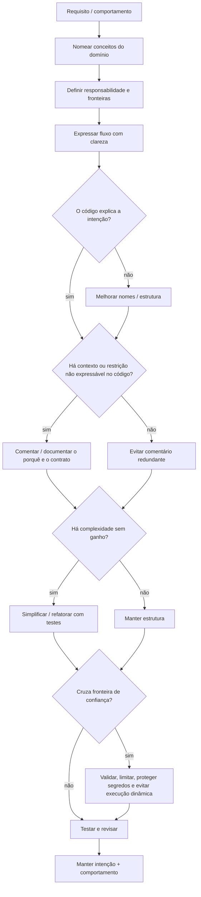

<a id="inicio"></a>

# Qualidade Básica do Código

> **Classificação:** `[D] Obrigatório dominar desde o início`  
> **Nível:** B — Fundamentos de Programação  
> **Posição na taxonomia:** tópico 22  
> **Pré-requisitos principais:** T03 — Dados, Valores, Variáveis e Constantes; T09 — Entrada, Processamento, Saída e Validação; T11 — Funções; T14 — Estado, Escopo, Referências e Mutabilidade; T16 — Modularização e Abstração; T18 — Erros, Exceções e Tratamento de Falhas; T20 — Testes e Verificação  
> **Aprofundamentos posteriores:** T23 — Modelo Básico de Execução; engenharia de software; refatoração sistemática; segurança de software; arquitetura; padrões de projeto

---

## Resumo executivo

Qualidade básica do código é a capacidade de escrever programas que outra pessoa — inclusive você no futuro — consiga **ler, compreender, testar, alterar e operar com menor chance de introduzir erro**.

Neste nível, qualidade não significa adotar uma metodologia, arquitetura ou ferramenta específica. O núcleo é mais simples e mais importante:

```text
INTENÇÃO CLARA
      ↓
NOMES QUE COMUNICAM
      ↓
ESTRUTURA COERENTE
      ↓
COMENTÁRIOS APENAS ONDE AGREGAM CONTEXTO
      ↓
CONTRATOS BÁSICOS DOCUMENTADOS
      ↓
SOLUÇÃO TÃO SIMPLES QUANTO O PROBLEMA PERMITE
      ↓
FRONTEIRAS DE CONFIANÇA TRATADAS COM CUIDADO
```

Código de qualidade não é necessariamente o menor código, o código com mais abstrações, o código com mais comentários nem o código que segue uma lista de regras mecanicamente.

A pergunta central é:

> **A intenção está evidente e o comportamento é seguro, previsível e fácil de manter dentro do contexto?**

A taxonomia canônica deste tópico é:

```text
22.1 Legibilidade
22.2 Nomenclatura e boas práticas com identificadores
     ├── 22.2.1 Nomes significativos
     ├── 22.2.2 Intenção semântica
     ├── 22.2.3 Inglês como padrão recomendado
     ├── 22.2.4 Consistência de idioma
     ├── 22.2.5 Convenções da linguagem
     ├── 22.2.6 Booleanos com nomes de condição
     ├── 22.2.7 Coleções preferencialmente no plural
     ├── 22.2.8 Quantidades e contadores
     ├── 22.2.9 Unidades explícitas
     ├── 22.2.10 Evitar nomes genéricos sem contexto
     ├── 22.2.11 Evitar abreviações obscuras
     ├── 22.2.12 Evitar reutilização semântica
     ├── 22.2.13 Evitar codificar o tipo no nome sem necessidade
     ├── 22.2.14 Evitar valores mágicos
     ├── 22.2.15 Escopo mínimo necessário
     ├── 22.2.16 Mutabilidade consciente
     └── 22.2.17 Clareza acima de dogma
22.3 Organização
22.4 Comentários
22.5 Documentação básica
22.6 Simplicidade
22.7 Mentalidade básica de segurança [C → D]
```

> **SOLID, Design Patterns e Clean Architecture não são requisitos deste tópico.** Eles podem ser úteis em outras camadas, mas não devem ser impostos como sinônimo de “código bom” para quem ainda está consolidando fundamentos.

---

## Visão rápida

| Pergunta | Resposta curta |
|---|---|
| Código que funciona já é código de qualidade? | Não. Correção é necessária, mas legibilidade, manutenção, previsibilidade e segurança também importam. |
| Nome longo é sempre melhor? | Não. O melhor nome carrega informação suficiente para o contexto sem ruído desnecessário. |
| Identificadores precisam estar em inglês? | A taxonomia do projeto recomenda inglês para hábito profissional e interoperabilidade; português não é erro da linguagem. Consistência é essencial. |
| Comentário melhora qualquer código? | Não. Comentário redundante cria ruído; comentário desatualizado pode enganar. |
| “Código autodocumentado” elimina documentação? | Não. Código pode comunicar implementação; contrato, intenção, restrições e decisões podem precisar de documentação. |
| Função curta é sempre boa? | Não. Tamanho é sinal, não regra absoluta. Coesão e responsabilidade importam mais. |
| DRY significa nunca repetir uma linha? | Não. Remover repetição sem entender a abstração pode aumentar acoplamento e complexidade. |
| `const`, `final` e `readonly` são equivalentes? | Não. Cada linguagem possui semântica própria; todos podem apoiar intenção de estabilidade, mas não significam a mesma coisa. |
| Validação é a mesma coisa que escaping? | Não. Validação verifica aceitabilidade; escaping/encoding trata representação em um contexto específico. |
| Segurança começa só no backend? | Não. O hábito de tratar entradas/dependências como não confiáveis começa nos fundamentos. |

---

## Distinções fundamentais

```text
FUNCIONAR
≠
SER FÁCIL DE ENTENDER

SINTAXE VÁLIDA
≠
BOA NOMENCLATURA

NOME COMPRIDO
≠
NOME SIGNIFICATIVO

COMENTÁRIO
≠
DOCUMENTAÇÃO

COMENTAR O QUE O CÓDIGO FAZ
≠
EXPLICAR POR QUE UMA DECISÃO EXISTE

SIMPLES
≠
SIMPLISTA

MENOS LINHAS
≠
MENOR COMPLEXIDADE

DUPLICAÇÃO TEXTUAL
≠
ABSTRAÇÃO NECESSARIAMENTE AUSENTE

VALIDAÇÃO
≠
SANITIZAÇÃO
≠
ESCAPING / ENCODING
≠
AUTORIZAÇÃO

CONVENÇÃO DE ESTILO
≠
REGRA SINTÁTICA DA LINGUAGEM

HEURÍSTICA
≠
DOGMA
```

---

## Regra de ouro

> **Faça o código dizer claramente o que ele representa, o que ele decide e quais limites ele respeita.**

Quando isso não cabe apenas no código, complemente com comentário ou documentação na camada apropriada.

---

## Decisão rápida

| Situação | Primeira decisão de qualidade |
|---|---|
| Variável representa tempo | Inclua unidade quando houver ambiguidade: `timeout_seconds`, `latency_ms`. |
| Booleano representa condição | Prefira nome interrogável: `is_active`, `has_permission`, `should_retry`. |
| Coleção contém vários itens | Prefira plural: `users`, `routes`, `errors`. |
| Literal possui significado de domínio | Dê nome ao conceito: `MAX_RETRIES`, `DEFAULT_PORT`. |
| Função faz ações conceitualmente diferentes | Reveja a responsabilidade antes de apenas “quebrar em funções menores”. |
| Comentário repete o código | Remova ou melhore o código. |
| Comentário explica decisão não óbvia | Mantenha e preserve atualizado. |
| Entrada vem de fora | Valide por contrato e limite tamanho/faixa quando pertinente. |
| Segredo aparece no código | Retire do código-fonte; use mecanismo apropriado de configuração/segredos. |
| Comando de SO é montado com entrada externa | Evite shell/eval; use APIs e argumentos estruturados quando possível. |
| Solução tem abstrações antecipadas sem caso real | Simplifique e espere evidência antes de generalizar. |

---

# Índice

  - [Resumo executivo](#resumo-executivo)
  - [Visão rápida](#visão-rápida)
  - [Distinções fundamentais](#distinções-fundamentais)
  - [Regra de ouro](#regra-de-ouro)
  - [Decisão rápida](#decisão-rápida)
- [1. Posição deste assunto na trilha](#1-posição-deste-assunto-na-trilha)
  - [1.1 Fronteira com T16 — Modularização e Abstração](#11-fronteira-com-t16--modularização-e-abstração)
  - [1.2 Fronteira com T09 — Validação](#12-fronteira-com-t09--validação)
  - [1.3 Fronteira com T18/T19/T20](#13-fronteira-com-t18t19t20)
  - [1.4 O que fica para depois](#14-o-que-fica-para-depois)
- [2. Modelo mental de qualidade básica](#2-modelo-mental-de-qualidade-básica)
- [3. 🗺️ Visão panorâmica — o mapa antes dos detalhes](#visao-panoramica)
- [4. Qualidade não é estética isolada](#4-qualidade-não-é-estética-isolada)
- [5. 22.1 — Legibilidade [D]](#5-221--legibilidade-d)
  - [5.1 Intenção evidente](#51-intenção-evidente)
  - [5.2 Leia como um revisor](#52-leia-como-um-revisor)
  - [5.3 Complexidade visual também importa](#53-complexidade-visual-também-importa)
  - [5.4 Consistência reduz decisões locais](#54-consistência-reduz-decisões-locais)
  - [5.5 Legibilidade versus concisão](#55-legibilidade-versus-concisão)
- [6. 22.2 — Nomenclatura e boas práticas com identificadores [D]](#6-222--nomenclatura-e-boas-práticas-com-identificadores-d)
- [7. 22.2.1 — Nomes significativos [D]](#7-2221--nomes-significativos-d)
  - [7.1 Verbo para ação, substantivo para dado](#71-verbo-para-ação-substantivo-para-dado)
  - [7.2 Nome não precisa contar a implementação](#72-nome-não-precisa-contar-a-implementação)
- [8. 22.2.2 — Intenção semântica [D]](#8-2222--intenção-semântica-d)
  - [8.1 Não nomeie pelo acidente de implementação](#81-não-nomeie-pelo-acidente-de-implementação)
  - [8.2 Nome deve acompanhar o significado](#82-nome-deve-acompanhar-o-significado)
- [9. 22.2.3 — Inglês como padrão recomendado [D]](#9-2223--inglês-como-padrão-recomendado-d)
- [10. 22.2.4 — Consistência de idioma [D]](#10-2224--consistência-de-idioma-d)
- [11. 22.2.5 — Convenções da linguagem [D]](#11-2225--convenções-da-linguagem-d)
  - [11.1 Python](#111-python)
  - [11.2 JavaScript](#112-javascript)
  - [11.3 Java](#113-java)
  - [11.4 Bash](#114-bash)
- [12. 22.2.6 — Booleanos com nomes de condição [D]](#12-2226--booleanos-com-nomes-de-condição-d)
  - [12.1 Evite dupla negação mental](#121-evite-dupla-negação-mental)
- [13. 22.2.7 — Coleções preferencialmente no plural [D]](#13-2227--coleções-preferencialmente-no-plural-d)
- [14. 22.2.8 — Quantidades e contadores [D]](#14-2228--quantidades-e-contadores-d)
- [15. 22.2.9 — Unidades explícitas [D]](#15-2229--unidades-explícitas-d)
  - [15.1 Unidade é parte do contrato](#151-unidade-é-parte-do-contrato)
- [16. 22.2.10 — Evitar nomes genéricos sem contexto [D]](#16-22210--evitar-nomes-genéricos-sem-contexto-d)
- [17. 22.2.11 — Evitar abreviações obscuras [D]](#17-22211--evitar-abreviações-obscuras-d)
  - [17.1 Abreviações de domínio podem ser boas](#171-abreviações-de-domínio-podem-ser-boas)
- [18. 22.2.12 — Evitar reutilização semântica [D]](#18-22212--evitar-reutilização-semântica-d)
  - [18.1 Reutilização semântica também aparece em parâmetros](#181-reutilização-semântica-também-aparece-em-parâmetros)
- [19. 22.2.13 — Evitar codificar o tipo no nome sem necessidade [D]](#19-22213--evitar-codificar-o-tipo-no-nome-sem-necessidade-d)
  - [19.1 Exceções contextuais](#191-exceções-contextuais)
- [20. 22.2.14 — Evitar valores mágicos [D]](#20-22214--evitar-valores-mágicos-d)
  - [20.1 Nem todo literal precisa de constante](#201-nem-todo-literal-precisa-de-constante)
  - [20.2 Nomeie o significado, não o número](#202-nomeie-o-significado-não-o-número)
- [21. 22.2.15 — Escopo mínimo necessário [D]](#21-22215--escopo-mínimo-necessário-d)
  - [21.1 Escopo mínimo não significa esconder dependência](#211-escopo-mínimo-não-significa-esconder-dependência)
- [22. 22.2.16 — Mutabilidade consciente [D]](#22-22216--mutabilidade-consciente-d)
- [23. 22.2.17 — Clareza acima de dogma [D]](#23-22217--clareza-acima-de-dogma-d)
- [24. Comparação consolidada de nomenclatura](#24-comparação-consolidada-de-nomenclatura)
  - [24.1 Python](#241-python)
  - [24.2 JavaScript](#242-javascript)
  - [24.3 Java](#243-java)
  - [24.4 GNU Bash](#244-gnu-bash)
- [25. Nomes e Unicode — validade não é necessariamente prudência](#25-nomes-e-unicode--validade-não-é-necessariamente-prudência)
- [26. 22.3 — Organização [D]](#26-223--organização-d)
  - [26.1 Organize pelo fluxo e pelo domínio](#261-organize-pelo-fluxo-e-pelo-domínio)
  - [26.2 Funções devem representar ações/coerências](#262-funções-devem-representar-açõescoerências)
  - [26.3 Ordem de leitura](#263-ordem-de-leitura)
  - [26.4 Separar cálculo de I/O quando útil](#264-separar-cálculo-de-io-quando-útil)
  - [26.5 Organização excessiva](#265-organização-excessiva)
- [27. 22.4 — Comentários [D]](#27-224--comentários-d)
  - [27.1 Comentário redundante](#271-comentário-redundante)
  - [27.2 Comentário de intenção/decisão](#272-comentário-de-intençãodecisão)
  - [27.3 Comentário de restrição externa](#273-comentário-de-restrição-externa)
  - [27.4 Comentário desatualizado é pior que ausência](#274-comentário-desatualizado-é-pior-que-ausência)
  - [27.5 Não use comentário para salvar nome ruim](#275-não-use-comentário-para-salvar-nome-ruim)
  - [27.6 TODO não é depósito infinito](#276-todo-não-é-depósito-infinito)
- [28. Comentários nas quatro linguagens](#28-comentários-nas-quatro-linguagens)
  - [28.1 Python](#281-python)
  - [28.2 JavaScript](#282-javascript)
  - [28.3 Java](#283-java)
  - [28.4 Bash](#284-bash)
- [29. 22.5 — Documentação básica [D]](#29-225--documentação-básica-d)
  - [29.1 Exemplo conceitual](#291-exemplo-conceitual)
  - [29.2 Documentação não precisa narrar implementação](#292-documentação-não-precisa-narrar-implementação)
  - [29.3 Código e documentação têm funções diferentes](#293-código-e-documentação-têm-funções-diferentes)
  - [29.4 Documente efeitos relevantes](#294-documente-efeitos-relevantes)
- [30. Documentação básica por linguagem](#30-documentação-básica-por-linguagem)
  - [30.1 Python — docstring](#301-python--docstring)
  - [30.2 JavaScript — JSDoc quando útil](#302-javascript--jsdoc-quando-útil)
  - [30.3 Java — Javadoc](#303-java--javadoc)
  - [30.4 Bash — contrato em comentário de função](#304-bash--contrato-em-comentário-de-função)
- [31. 22.6 — Simplicidade [D]](#31-226--simplicidade-d)
  - [31.1 Complexidade acidental](#311-complexidade-acidental)
  - [31.2 Abstração precisa pagar seu custo](#312-abstração-precisa-pagar-seu-custo)
  - [31.3 DRY não é “zero linha repetida”](#313-dry-não-é-zero-linha-repetida)
  - [31.4 KISS como heurística](#314-kiss-como-heurística)
  - [31.5 Remova código morto](#315-remova-código-morto)
- [32. Refatoração básica sem mudar comportamento](#32-refatoração-básica-sem-mudar-comportamento)
  - [32.1 Renomear](#321-renomear)
  - [32.2 Extrair conceito](#322-extrair-conceito)
  - [32.3 Refatorar não é “reescrever tudo”](#323-refatorar-não-é-reescrever-tudo)
- [33. Anti-padrões básicos de qualidade](#33-anti-padrões-básicos-de-qualidade)
  - [33.1 Nome misterioso](#331-nome-misterioso)
  - [33.2 Booleano ambíguo](#332-booleano-ambíguo)
  - [33.3 Função “faz tudo”](#333-função-faz-tudo)
  - [33.4 Comentário narrador](#334-comentário-narrador)
  - [33.5 Valor mágico repetido](#335-valor-mágico-repetido)
  - [33.6 else profundo sem necessidade](#336-else-profundo-sem-necessidade)
  - [33.7 Estado global por conveniência](#337-estado-global-por-conveniência)
  - [33.8 Abstração sem caso real](#338-abstração-sem-caso-real)
  - [33.9 Catch vazio / erro ignorado](#339-catch-vazio--erro-ignorado)
  - [33.10 Segredo hardcoded](#3310-segredo-hardcoded)
- [34. Code smell é sinal, não sentença](#34-code-smell-é-sinal-não-sentença)
- [35. Exemplo progressivo — de código opaco a código explícito](#35-exemplo-progressivo--de-código-opaco-a-código-explícito)
  - [35.1 Versão opaca](#351-versão-opaca)
  - [35.2 Versão com nomes](#352-versão-com-nomes)
  - [35.3 O que mudou](#353-o-que-mudou)
- [36. Transferência do exemplo para JavaScript](#36-transferência-do-exemplo-para-javascript)
- [37. Transferência do exemplo para Java](#37-transferência-do-exemplo-para-java)
- [38. Transferência do exemplo para GNU Bash](#38-transferência-do-exemplo-para-gnu-bash)
- [39. 22.7 — Mentalidade básica de segurança [C → D]](#39-227--mentalidade-básica-de-segurança-c--d)
- [40. Entrada externa é potencialmente inválida ou adversarial](#40-entrada-externa-é-potencialmente-inválida-ou-adversarial)
  - [40.1 Validação sintática e semântica](#401-validação-sintática-e-semântica)
  - [40.2 Validar cedo](#402-validar-cedo)
- [41. Validação não substitui escaping, autorização ou APIs seguras](#41-validação-não-substitui-escaping-autorização-ou-apis-seguras)
- [42. Não hardcode segredos](#42-não-hardcode-segredos)
- [43. Não registre segredos em logs](#43-não-registre-segredos-em-logs)
- [44. Execução dinâmica e injeção](#44-execução-dinâmica-e-injeção)
  - [44.1 Bash — evite eval com entrada externa](#441-bash--evite-eval-com-entrada-externa)
  - [44.2 Python — prefira argumentos estruturados ao shell](#442-python--prefira-argumentos-estruturados-ao-shell)
  - [44.3 Regra](#443-regra)
- [45. Menor privilégio necessário](#45-menor-privilégio-necessário)
- [46. Limites de recursos também são segurança](#46-limites-de-recursos-também-são-segurança)
- [47. Falha segura versus falha silenciosa](#47-falha-segura-versus-falha-silenciosa)
- [48. Dependências e APIs suportadas](#48-dependências-e-apis-suportadas)
- [49. Segurança comparada nas quatro linguagens](#49-segurança-comparada-nas-quatro-linguagens)
- [50. Ferramentas ajudam, mas não substituem julgamento](#50-ferramentas-ajudam-mas-não-substituem-julgamento)
- [51. Formatação e estilo — objetivo, não religião](#51-formatação-e-estilo--objetivo-não-religião)
  - [51.1 Python](#511-python)
  - [51.2 JavaScript](#512-javascript)
  - [51.3 Java](#513-java)
  - [51.4 Bash](#514-bash)
- [52. Revisão de código — checklist mental pequeno](#52-revisão-de-código--checklist-mental-pequeno)
- [53. Problemas reais e mecanismo da falha](#53-problemas-reais-e-mecanismo-da-falha)
  - [Inventário formal de problemas reais (`PR-T22-*`)](#inventario-pr-t22)
  - [🔎 Troubleshooting sistemático](#troubleshooting-t22)
  - [53.1 timeout = 5](#531-timeout--5)
  - [53.2 data](#532-data)
  - [53.3 comentário desatualizado](#533-comentário-desatualizado)
  - [53.4 eval com dado externo](#534-eval-com-dado-externo)
  - [53.5 segredo no log](#535-segredo-no-log)
- [54. Exemplo integrador — classificador de saúde de endpoint](#54-exemplo-integrador--classificador-de-saúde-de-endpoint)
- [55. Implementação integradora em Python](#55-implementação-integradora-em-python)
- [56. Implementação integradora em JavaScript](#56-implementação-integradora-em-javascript)
- [57. Implementação integradora em Java](#57-implementação-integradora-em-java)
- [58. Implementação integradora em GNU Bash](#58-implementação-integradora-em-gnu-bash)
- [59. Análise do exemplo integrador](#59-análise-do-exemplo-integrador)
  - [59.1 Legibilidade](#591-legibilidade)
  - [59.2 Nomenclatura](#592-nomenclatura)
  - [59.3 Organização](#593-organização)
  - [59.4 Comentários](#594-comentários)
  - [59.5 Documentação](#595-documentação)
  - [59.6 Simplicidade](#596-simplicidade)
  - [59.7 Segurança](#597-segurança)
- [60. Laboratórios](#60-laboratórios)
  - [🧪 LAB 1 — renomear sem mudar comportamento](#-lab-1--renomear-sem-mudar-comportamento)
  - [🧪 LAB 2 — encontrar valores mágicos](#-lab-2--encontrar-valores-mágicos)
  - [🧪 LAB 3 — comentário que envelhece](#-lab-3--comentário-que-envelhece)
  - [🧪 LAB 4 — reduzir aninhamento](#-lab-4--reduzir-aninhamento)
  - [🧪 LAB 5 — contrato mínimo de função](#-lab-5--contrato-mínimo-de-função)
  - [🧪 LAB 6 — segredo não pertence ao código](#-lab-6--segredo-não-pertence-ao-código)
  - [🧪 LAB 7 — entrada, limite e consumo de recursos](#-lab-7--entrada-limite-e-consumo-de-recursos)
  - [🧪 LAB 8 — revisão completa T22](#-lab-8--revisão-completa-t22)
- [61. Exercícios](#61-exercícios)
- [62. Evidências de domínio](#62-evidências-de-domínio)
  - [62.1 22.1 Legibilidade [D]](#621-221-legibilidade-d)
  - [62.2 22.2 Nomenclatura [D]](#622-222-nomenclatura-d)
  - [62.3 22.3 Organização [D]](#623-223-organização-d)
  - [62.4 22.4 Comentários [D]](#624-224-comentários-d)
  - [62.5 22.5 Documentação básica [D]](#625-225-documentação-básica-d)
  - [62.6 22.6 Simplicidade [D]](#626-226-simplicidade-d)
  - [62.7 22.7 Segurança [C → D]](#627-227-segurança-c--d)
- [63. Checklist de domínio](#63-checklist-de-domínio)
- [64. Glossário](#64-glossário)
- [65. Auditoria de cobertura da taxonomia](#65-auditoria-de-cobertura-da-taxonomia)
  - [65.1 Fronteiras preservadas](#651-fronteiras-preservadas)
  - [65.2 Linguagens canônicas](#652-linguagens-canônicas)
- [66. Auditoria da File Library](#66-auditoria-da-file-library)
  - [66.1 Fontes locais efetivamente consultadas na revisão 0.1.0](#661-fontes-locais-efetivamente-consultadas-na-revisão-010)
  - [66.2 Como a biblioteca alterou o documento](#662-como-a-biblioteca-alterou-o-documento)
  - [66.3 Fontes encontradas versus fontes usadas](#663-fontes-encontradas-versus-fontes-usadas)
- [67. Referências](#67-referências)
  - [67.1 Contratos canônicos do projeto](#671-contratos-canônicos-do-projeto)
  - [67.2 Documentação oficial e fontes primárias atuais](#672-documentação-oficial-e-fontes-primárias-atuais)
  - [67.3 Literatura local — histórico e revisão atual](#673-literatura-local--histórico-e-revisão-atual)
  - [67.4 Hierarquia usada nesta revisão](#674-hierarquia-usada-nesta-revisão)
- [68. QA e evidências](#68-qa-e-evidências)
  - [68.1 Estados formais usados nesta revisão](#681-estados-formais-usados-nesta-revisão)
  - [68.2 [D] Evidência documental](#682-d-evidência-documental)
  - [68.3 [S] Validação estrutural/estática](#683-s-validação-estruturalestática)
  - [68.4 [R] Reprodução em runtime](#684-r-reprodução-em-runtime)
  - [68.5 Gate 2 — fechamento da iteração](#685-gate-2--fechamento-da-iteração)
- [69. Histórico de versões](#69-histórico-de-versões)

---

# 1. Posição deste assunto na trilha

T22 não começa a preocupação com qualidade do zero. Os tópicos anteriores já introduziram peças importantes:

```text
T03 → dados, variáveis e constantes
T09 → validação de entrada
T11 → funções
T14 → estado, escopo e mutabilidade
T16 → modularização, responsabilidade e abstração
T18 → falhas e recuperação
T19 → depuração
T20 → testes
T21 → I/O e persistência básica
                  ↓
T22 → disciplina cotidiana para tornar tudo isso legível, consistente, simples e seguro
```

A diferença é que agora essas escolhas deixam de aparecer apenas como observações locais e passam a formar um **modelo explícito de qualidade básica**.

## 1.1 Fronteira com T16 — Modularização e Abstração

T16 já trata profundamente:

- divisão de responsabilidades;
- coesão;
- interfaces conceituais;
- abstração;
- módulos;
- dependências e acoplamento.

T22 usa esses conceitos para avaliar qualidade, mas **não repete a teoria completa de modularização**.

## 1.2 Fronteira com T09 — Validação

T09 explica validação como etapa do fluxo de dados. T22 retoma o assunto apenas pela ótica de segurança e clareza:

```text
entrada externa
→ não confiar automaticamente
→ validar cedo
→ manter contrato explícito
```

## 1.3 Fronteira com T18/T19/T20

```text
T18 → como falhas são representadas e tratadas
T19 → como investigar uma falha
T20 → como verificar comportamento
T22 → como escrever para reduzir ambiguidade e facilitar manutenção
```

## 1.4 O que fica para depois

Ficam fora do núcleo:

- métricas avançadas de qualidade;
- análise estática industrial;
- cobertura de testes como política organizacional;
- arquitetura limpa;
- SOLID em profundidade;
- catálogos de Design Patterns;
- threat modeling formal;
- SAST/DAST;
- gestão de vulnerabilidades;
- engenharia de supply chain;
- secure SDLC completo.

[↑ Voltar ao índice](#índice)

---

# 2. Modelo mental de qualidade básica

Qualidade deve ser analisada por perguntas diferentes.

```text
QUALIDADE BÁSICA
│
├── o leitor entende?
│   └── legibilidade + nomes + organização
│
├── a intenção está preservada?
│   └── comentários + documentação + contratos
│
├── existe complexidade desnecessária?
│   └── simplicidade
│
├── a mudança é previsível?
│   └── escopo + mutabilidade + testes + responsabilidades
│
└── o código trata fronteiras com desconfiança adequada?
    └── segurança básica
```

Nenhuma dimensão isolada define qualidade.

Um programa pode ser:

- muito legível e incorreto;
- correto e desnecessariamente difícil de alterar;
- bem documentado e inseguro;
- curto e confuso;
- modularizado demais e mais difícil de navegar;
- cheio de abstrações “elegantes” que não resolvem nenhum problema real.

[↑ Voltar ao índice](#índice)

---

<a id="visao-panoramica"></a>

# 3. 🗺️ Visão panorâmica — o mapa antes dos detalhes

Esta seção funciona em dois modos ao mesmo tempo:

- **consulta rápida:** localizar a decisão de qualidade relevante sem reler o tópico inteiro;
- **estudo:** enxergar como legibilidade, nomes, organização, documentação, simplicidade e segurança básica se conectam.

O ponto central do T22 é simples:

> **qualidade básica reduz a distância entre a intenção do programa e aquilo que o leitor consegue inferir com segurança do código.**

## Mapa do domínio

```text
QUALIDADE BÁSICA DO CÓDIGO [D]
│
├── 22.1 LEGIBILIDADE
│   ├── código compreensível
│   └── intenção evidente
│
├── 22.2 NOMENCLATURA
│   ├── nomes significativos
│   ├── intenção semântica
│   ├── idioma consistente
│   ├── convenções do ecossistema
│   ├── booleanos interrogáveis
│   ├── coleções no plural
│   ├── contadores explícitos
│   ├── unidades explícitas
│   ├── evitar nomes genéricos/abreviações obscuras
│   ├── evitar reutilização semântica
│   ├── não codificar tipo sem necessidade
│   ├── evitar valores mágicos
│   ├── escopo mínimo
│   ├── mutabilidade consciente
│   └── clareza acima de dogma
│
├── 22.3 ORGANIZAÇÃO
│   ├── responsabilidades
│   ├── funções
│   └── módulos
│
├── 22.4 COMENTÁRIOS
│   ├── contexto que o código não expressa bem
│   └── comentário atualizado
│
├── 22.5 DOCUMENTAÇÃO BÁSICA
│   ├── comportamento
│   ├── entrada/saída
│   └── restrições/efeitos relevantes
│
├── 22.6 SIMPLICIDADE
│   ├── evitar complexidade acidental
│   ├── abstrair somente quando houver ganho
│   └── refatorar sem alterar comportamento
│
└── 22.7 SEGURANÇA BÁSICA [C → D]
    ├── entrada externa é não confiável
    ├── validar domínio e limites
    ├── não hardcode/logar segredos
    ├── menor privilégio
    ├── evitar execução dinâmica/injeção
    ├── falhar de forma segura e observável
    ├── limitar recursos
    └── preferir APIs/dependências suportadas
```

## Fluxo mental antes de alterar código



Versão operacional:

```text
entender o contrato
→ nomear
→ organizar
→ tornar o fluxo legível
→ documentar somente o que precisa de contexto
→ remover complexidade acidental
→ proteger fronteiras
→ testar
→ revisar
→ manter
```

## Caderno rápido de consulta

| Conceito | Pergunta de consulta | Sinal de problema | Primeira ação |
|---|---|---|---|
| Legibilidade | “Consigo explicar o fluxo sem executar mentalmente cada detalhe?” | expressão densa, nesting profundo, estado implícito | revelar intenção com nomes, etapas e estrutura |
| Nome | “O identificador diz o que representa?” | `data`, `tmp`, `x1` fora de contexto local óbvio | nomear pelo domínio |
| Unidade | “A grandeza possui unidade?” | `timeout = 5` | `timeout_seconds`, `latency_ms`, tipo de duração quando cabível |
| Booleano | “O nome pode ser lido como pergunta?” | `disabled = false`, dupla negação | `is_enabled`, `has_permission`, `can_retry` |
| Coleção | “Fica claro que há vários elementos?” | `user` contendo lista | plural quando isso melhora a distinção |
| Constante | “O literal tem significado de domínio?” | `if retries > 5` repetido | nomear política: `MAX_RETRIES` |
| Escopo | “Quem realmente precisa conhecer esse estado?” | variável global por conveniência | reduzir escopo / explicitar dependência |
| Mutabilidade | “Esse valor precisa mudar?” | reatribuições sem necessidade | usar recurso de estabilidade da linguagem quando adequado |
| Organização | “Uma unidade responde por ações coerentes?” | função faz parse + I/O + regra + log + persistência | separar responsabilidades que mudam por motivos diferentes |
| Comentário | “O comentário explica algo que o código não consegue expressar?” | `# incrementa i` | remover ruído ou registrar decisão/restrição |
| Documentação | “O consumidor conhece entrada, saída, falhas e efeitos?” | precisa ler implementação para descobrir contrato | documentar fronteira pública/operacional |
| Simplicidade | “A abstração resolve um problema real?” | factory/helper genérico com um único caso | simplificar até existir evidência de generalização |
| Segurança | “Algum dado cruza fronteira de confiança?” | shell/eval, segredo em string/log, tamanho ilimitado | validar/limitar; usar API estruturada; proteger segredo |

## Pergunta prática → onde olhar primeiro

| Pergunta | Mecanismo inicial | Seção principal |
|---|---|---|
| “Esse nome está bom?” | intenção + contexto + convenção local | [22.2](#6-222--nomenclatura-e-boas-práticas-com-identificadores-d) |
| “Preciso usar inglês?” | convenção do projeto + consistência + público do código | [22.2.3](#9-2223--inglês-como-padrão-recomendado-d) |
| “`x` é sempre nome ruim?” | avaliar tamanho e obviedade do contexto | [22.2.10](#16-22210--evitar-nomes-genéricos-sem-contexto-d) |
| “Devo criar uma constante?” | perguntar se o literal carrega política/significado | [22.2.14](#20-22214--evitar-valores-mágicos-d) |
| “A função está grande demais?” | avaliar coesão/responsabilidade, não contar linhas isoladamente | [22.3](#26-223--organização-d) |
| “Devo comentar?” | explicar *por quê*, restrição ou contexto que não cabe no código | [22.4](#27-224--comentários-d) |
| “Isso merece uma abstração?” | comparar duplicação real × custo de acoplamento | [22.6](#31-226--simplicidade-d) |
| “Essa entrada é segura?” | validar domínio, comprimento/faixa e contexto de uso | [22.7](#39-227--mentalidade-básica-de-segurança-c--d) |
| “Posso montar um comando com texto externo?” | preferir API/argumentos estruturados; evitar shell/eval | [execução dinâmica](#44-execução-dinâmica-e-injeção) |
| “Posso registrar esse valor?” | classificar sensibilidade antes do log | [segredos em logs](#43-não-registre-segredos-em-logs) |

## Não confundir

```text
legibilidade
≠
formatação bonita

nome significativo
≠
nome comprido

código autodocumentado
≠
documentação desnecessária

comentário
≠
narrar a sintaxe

função pequena
≠
função automaticamente coesa

DRY
≠
proibir qualquer duplicação textual

abstração
≠
generalização antecipada

const / final / readonly
≠
a mesma semântica nas quatro linguagens

validação
≠
escaping / autorização / parametrização

entrada sintaticamente válida
≠
entrada semanticamente aceitável

code smell
≠
defeito provado

menos linhas
≠
menor complexidade
```

## Microexemplos canônicos

**Nome sem unidade:**

```python
timeout = 5
```

Pergunta inevitável: cinco **o quê**?

```python
timeout_seconds = 5
```

**Booleano com dupla negação mental:**

```python
if not is_disabled:
    ...
```

Quando o domínio permite:

```python
if is_enabled:
    ...
```

**Comentário redundante:**

```python
retry_count += 1  # incrementa retry_count
```

Melhor: remover o comentário. Se houver regra externa, registre a regra:

```python
# O provedor limita a três tentativas por operação.
retry_count += 1
```

**Valor mágico:**

```javascript
if (latencyMs >= 200) {
  // ...
}
```

Quando `200` é política reutilizada:

```javascript
const DEGRADED_LATENCY_MS = 200;
```

**Segurança — dado virando código:**

```bash
# Perigoso se user_input não for confiável:
eval "$user_input"
```

A decisão correta começa perguntando se é possível **não invocar um interpretador** e usar uma API/comando com argumentos estruturados.

## Problemas reais representativos

Os problemas abaixo são rastreados formalmente em [Inventário `PR-T22-*`](#inventario-pr-t22):

- `PR-T22-01` — nome genérico esconde significado;
- `PR-T22-02` — unidade implícita altera o contrato;
- `PR-T22-03` — booleano ambíguo/dupla negação;
- `PR-T22-04` — responsabilidade excessiva aumenta o risco de mudança;
- `PR-T22-05` — comentário desatualizado cria contrato falso;
- `PR-T22-06` — DRY/abstração prematura piora o acoplamento;
- `PR-T22-07` — estado mutável amplo cria dependência escondida;
- `PR-T22-08` — segredo hardcoded ou registrado amplia exposição;
- `PR-T22-09` — dado externo interpretado como comando cria injeção;
- `PR-T22-10` — entrada sem limites consome recursos ou rompe o domínio.

## Entrada rápida de troubleshooting

Se o código “funciona”, mas a manutenção continua difícil, use esta ordem:

```text
1. reproduza a dificuldade com um exemplo concreto
2. descreva a intenção em uma frase
3. encontre a primeira divergência entre intenção e representação
4. classifique:
   nome? unidade? booleano? responsabilidade? comentário?
   estado? abstração? fronteira de confiança?
5. faça a menor correção que melhora o modelo
6. valide comportamento
7. rode regressão
8. verifique se a mudança apenas deslocou a complexidade
```

Casos completos estão em [🔎 Troubleshooting sistemático](#troubleshooting-t22).

## Transferência entre linguagens — o conceito é estável; a sintaxe não

| Intenção | Python | JavaScript | Java | GNU Bash |
|---|---|---|---|---|
| variável/função | `snake_case` | `camelCase` é convenção comum | `camelCase` é convenção comum | `snake_case` é comum |
| constante/política | `UPPER_SNAKE_CASE` por convenção | contexto define; maiúsculas são comuns para constantes de módulo/configuração | `static final` + `UPPER_SNAKE_CASE` por convenção | `readonly name=value`; caixa alta é convenção, não semântica |
| valor “estável” | convenção + design; linguagem não possui `const` geral para nomes | `const` impede reatribuição do binding, não torna objeto profundamente imutável | `final` impede reatribuição da variável/referência; não congela automaticamente o objeto | `readonly` impede nova atribuição/unset do nome |
| documentação | docstring quando apropriado | JSDoc quando útil | Javadoc em API/documentação apropriada | comentário de contrato |
| segurança de comando | subprocess/API com argumentos | APIs de processo com argumentos | `ProcessBuilder`/APIs estruturadas | quoting correto e evitar `eval`; shell já é o interpretador |

> A tabela compara **intenção de engenharia**, não declara equivalência semântica entre recursos.

## Rota de consulta × rota de estudo

**Consulta rápida:**

```text
Visão panorâmica
→ tabela “Pergunta prática”
→ seção específica
→ PR/TS correspondente
→ checklist
```

**Estudo completo:**

```text
modelo mental
→ 22.1
→ 22.2.1–22.2.17
→ organização
→ comentários
→ documentação
→ simplicidade/refatoração
→ segurança básica
→ problemas reais
→ troubleshooting
→ LABs
→ evidências de domínio
```

## Fronteiras desta visão

Este tópico **não transforma heurísticas em dogmas**. Em especial:

- tamanho de função é sinal contextual, não métrica absoluta de qualidade;
- uma repetição pode ser mais segura que uma abstração errada;
- um nome curto pode ser excelente em um escopo matemático/local;
- comentários podem ser indispensáveis quando registram contexto externo;
- SOLID, Design Patterns e Clean Architecture continuam fora do núcleo obrigatório do T22;
- segurança avançada continua em camadas posteriores, mas hábitos de fronteira segura começam aqui.

[↑ Voltar ao índice](#índice)

---

# 4. Qualidade não é estética isolada

Formatação importa porque reduz custo de leitura. Mas estilo visual é apenas uma camada.

Considere:

```python
result = a + b
```

Mesmo perfeitamente formatado, ainda não sabemos:

- o que `a` representa;
- o que `b` representa;
- qual unidade está envolvida;
- o que `result` significa;
- quais valores são válidos.

Agora:

```python
round_trip_latency_ms = outbound_latency_ms + return_latency_ms
```

A forma continua simples, mas a semântica é muito mais explícita.

> **Formatação ajuda o olho. Nomenclatura e estrutura ajudam o raciocínio.**

[↑ Voltar ao índice](#índice)

---

# 5. 22.1 — Legibilidade `[D]`

Legibilidade é a facilidade com que uma pessoa consegue construir um modelo mental correto do código.

Ela depende de:

- nomes;
- fluxo;
- estrutura;
- consistência;
- tamanho das unidades;
- nível de aninhamento;
- abstrações adequadas;
- comentários úteis;
- previsibilidade das convenções.

## 5.1 Intenção evidente

Compare:

```python
if x > 5:
    y += 1
```

com:

```python
if retry_count > MAX_RETRIES:
    failed_attempt_count += 1
```

O segundo exemplo reduz perguntas.

## 5.2 Leia como um revisor

Uma técnica prática:

```text
1. esconda o contexto que só existe na sua cabeça;
2. leia o código como se tivesse recebido de outra pessoa;
3. anote cada pergunta necessária para entender o fluxo;
4. veja quais perguntas podem ser eliminadas por nomes/estrutura;
5. use comentário/documentação apenas para o restante.
```

## 5.3 Complexidade visual também importa

Muitos níveis de indentação aumentam a carga cognitiva:

```python
if user is not None:
    if user.is_active:
        if user.has_permission:
            process_request(user)
```

Uma alternativa pode tornar as condições explícitas:

```python
if user is None:
    return
if not user.is_active:
    return
if not user.has_permission:
    return

process_request(user)
```

Isso não é regra universal sobre “guard clauses”. É uma demonstração de que **forma do fluxo altera custo de leitura**.

## 5.4 Consistência reduz decisões locais

Se o projeto já usa:

```text
snake_case em Python
camelCase em JavaScript/Java
snake_case em Bash
```

seguir o padrão permite que o leitor concentre atenção no comportamento, não em variações arbitrárias.

## 5.5 Legibilidade versus concisão

Código menor pode ser menos legível:

```python
status = "up" if ok and age < 300 and retries < 3 else "down"
```

Talvez seja melhor decompor se os conceitos forem relevantes:

```python
is_fresh = age_seconds < MAX_AGE_SECONDS
can_retry = retry_count < MAX_RETRIES
is_available = probe_succeeded and is_fresh and can_retry
status = "up" if is_available else "down"
```

A escolha depende do domínio e da frequência com que cada condição precisa ser compreendida/reutilizada.

[↑ Voltar ao índice](#índice)

---

# 6. 22.2 — Nomenclatura e boas práticas com identificadores `[D]`

Um identificador é uma pequena interface cognitiva.

Ao ler:

```text
retry_count
```

o leitor recebe informação sobre o significado sem precisar rastrear imediatamente toda a origem do valor.

A sintaxe define **quais nomes são permitidos**. A convenção define **quais nomes são recomendados**. O domínio define **quais nomes comunicam a intenção correta**.

> **Nota de taxonomia:** `22.2.15` (escopo) e `22.2.16` (mutabilidade) permanecem sob `22.2` porque disciplinam **o uso dos identificadores e o estado associado a eles**; não são regras de grafia/nomenclatura em sentido estrito.

```text
VALIDADE SINTÁTICA
≠
CONVENÇÃO DO ECOSSISTEMA
≠
QUALIDADE SEMÂNTICA DO NOME
```

[↑ Voltar ao índice](#índice)

---

# 7. 22.2.1 — Nomes significativos `[D]`

Nomes devem carregar informação relevante para o contexto.

Evite, quando não houver contexto suficiente:

```python
x = 3
tmp = 10
data = get_data()
```

Prefira:

```python
retry_count = 3
timeout_seconds = 10
customer_records = get_customer_records()
```

## 7.1 Verbo para ação, substantivo para dado

Heurística útil:

```text
variável / constante → coisa, estado, quantidade, conceito
função / método      → ação, cálculo, consulta, transformação
```

Exemplos:

```text
retry_count
calculate_average()
parse_config()
has_permission
```

Não é regra gramatical absoluta, mas reduz ambiguidade.

## 7.2 Nome não precisa contar a implementação

Evite:

```python
users_from_list_after_filtering_duplicates
```

se o conceito de domínio é simplesmente:

```python
unique_users
```

[↑ Voltar ao índice](#índice)

---

# 8. 22.2.2 — Intenção semântica `[D]`

O nome deve responder, quando possível:

> **O que este valor representa no problema?**

Compare:

```text
value
number
text
```

com:

```text
total_price
retry_count
user_name
```

## 8.1 Não nomeie pelo acidente de implementação

Se um dado representa uma coleção de rotas, isto é mais estável:

```python
routes
```

do que:

```python
route_list
```

quando o fato de ser uma `list` não é parte relevante do contrato.

## 8.2 Nome deve acompanhar o significado

Se uma variável muda de papel durante uma refatoração, o nome também precisa mudar.

> **Nome desatualizado é documentação falsa embutida no código.**

[↑ Voltar ao índice](#índice)

---

# 9. 22.2.3 — Inglês como padrão recomendado `[D]`

Neste projeto, identificadores em inglês são o padrão recomendado para código técnico/profissional.

Motivos práticos:

- APIs e bibliotecas frequentemente usam termos em inglês;
- documentação oficial é majoritariamente escrita em inglês;
- o código pode ser compartilhado fora do contexto local;
- reduz mistura de idiomas ao integrar com ecossistemas internacionais;
- cria hábito transferível entre projetos.

Exemplo:

```python
user_name = "Ana"
retry_count = 3
is_authenticated = True
```

Mas a distinção é essencial:

```text
PORTUGUÊS EM IDENTIFICADOR
≠
ERRO DE PROGRAMAÇÃO
```

Python, JavaScript e Java aceitam vários caracteres Unicode em identificadores segundo suas regras. A recomendação de inglês é **decisão editorial/profissional deste currículo**, não uma alegação de que a linguagem exige inglês.

Quando um domínio local possui termo técnico sem tradução inglesa estável, preservar esse vocabulário pode ser mais claro do que inventar uma tradução artificial. A prioridade continua sendo **clareza + consistência + entendimento compartilhado pela equipe**.

[↑ Voltar ao índice](#índice)

---

# 10. 22.2.4 — Consistência de idioma `[D]`

Misturas como:

```python
nome_user = "Ana"
quantidadeRetries = 3
```

criam um dialeto local desnecessário.

Prefira um padrão consistente:

```python
user_name = "Ana"
retry_count = 3
```

Consistência também vale para vocabulário do domínio.

Evite alternar arbitrariamente entre:

```text
customer
client
consumer
user
```

se todos representam a mesma entidade.

> **Um glossário de domínio pequeno pode ser mais valioso do que uma regra sofisticada de nomenclatura.**

[↑ Voltar ao índice](#índice)

---

# 11. 22.2.5 — Convenções da linguagem `[D]`

A mesma intenção usa estilos diferentes conforme o ecossistema.

| Linguagem | Variáveis/funções | Tipos/classes | Constantes por convenção |
|---|---|---|---|
| Python | `snake_case` | `CapWords` | `UPPER_SNAKE_CASE` |
| JavaScript | `camelCase` | `PascalCase` em classes/construtores por convenção comum | `UPPER_SNAKE_CASE` quando realmente tratada como constante global/configuração; não é regra da linguagem |
| Java | `camelCase` | `PascalCase`/mixed case com inicial maiúscula | `UPPER_SNAKE_CASE` para constantes |
| GNU Bash | `snake_case` é comum em funções/variáveis locais | não há sistema de classes equivalente | `UPPER_SNAKE_CASE` é comum para ambiente/valores tratados como constantes, com cuidado para não colidir com variáveis do ambiente |

## 11.1 Python

PEP 8 recomenda `lower_case_with_underscores` para funções/variáveis e `UPPER_CASE_WITH_UNDERSCORES` para constantes de módulo.

```python
MAX_RETRIES = 5

def calculate_latency(samples):
    ...
```

## 11.2 JavaScript

ECMAScript define o que é um `IdentifierName` e quais palavras são reservadas, mas **não transforma camelCase em regra normativa da especificação**.

No currículo, usamos:

```javascript
const maxRetries = 5;
function calculateLatency(samples) {
  // ...
}
```

## 11.3 Java

A JLS inclui convenções de nomenclatura para bibliotecas/plataforma e recomenda nomes de classe descritivos e métodos/variáveis em estilo apropriado ao ecossistema.

```java
final int maxRetries = 5;
int retryCount = 0;
```

Constantes `static final` normalmente seguem:

```java
private static final int MAX_RETRIES = 5;
```

## 11.4 Bash

Bash não possui uma convenção normativa única de estilo equivalente à PEP 8.

Neste material:

```bash
local retry_count=0
readonly max_retries=5
```

Para variáveis exportadas ao ambiente, maiúsculas são comuns:

```bash
export APP_ENV="production"
```

Evite criar variáveis genéricas em maiúsculas sem necessidade, porque o ambiente já contém muitos nomes com esse padrão.

[↑ Voltar ao índice](#índice)

---

# 12. 22.2.6 — Booleanos com nomes de condição `[D]`

Booleanos ficam mais legíveis quando o nome pode ser lido como pergunta.

Padrões úteis:

```text
is_
has_
can_
should_
```

Exemplos:

```python
is_active = True
has_permission = False
can_retry = True
should_update = False
```

Compare:

```python
if active:
```

com:

```python
if is_active:
```

Ambos podem ser aceitáveis; o segundo é mais explícito em contextos onde `active` poderia ser outra coisa.

## 12.1 Evite dupla negação mental

```python
if not is_not_ready:
```

é mais difícil que:

```python
if is_ready:
```

Nem sempre é possível eliminar negações, mas nomes devem reduzir esforço de interpretação.

[↑ Voltar ao índice](#índice)

---

# 13. 22.2.7 — Coleções preferencialmente no plural `[D]`

Quando uma variável representa vários elementos, plural ajuda a distinguir item e coleção:

```python
user
users
route
routes
error
errors
```

Exemplo:

```python
for user in users:
    notify(user)
```

A leitura revela imediatamente:

```text
user  → um elemento
users → coleção
```

Não force plural quando a estrutura representa outro conceito singular, por exemplo:

```python
cache
queue
inventory
```

mesmo contendo vários elementos.

[↑ Voltar ao índice](#índice)

---

# 14. 22.2.8 — Quantidades e contadores `[D]`

Nomes devem deixar claro quando o valor é quantidade:

```python
retry_count
error_count
user_count
total_items
```

Evite confundir coleção e quantidade:

```python
users = [...]
user_count = len(users)
```

Isso também ajuda a detectar erros de unidade conceitual:

```text
user_count + users
```

é visualmente suspeito.

[↑ Voltar ao índice](#índice)

---

# 15. 22.2.9 — Unidades explícitas `[D]`

Quando a unidade muda o significado, coloque-a no nome.

```python
timeout_seconds = 10
latency_ms = 35
size_bytes = 4096
memory_mb = 512
```

Ruim:

```python
timeout = 10
```

Pergunta inevitável:

```text
10 segundos?
10 milissegundos?
10 minutos?
```

## 15.1 Unidade é parte do contrato

Se uma função recebe milissegundos:

```python
def is_slow(latency_ms: int) -> bool:
    return latency_ms > 200
```

o nome ajuda a preservar o contrato mesmo sem uma unidade incorporada ao tipo.

[↑ Voltar ao índice](#índice)

---

# 16. 22.2.10 — Evitar nomes genéricos sem contexto `[D]`

Nomes como:

```text
x
tmp
data
value
obj
item
```

não são proibidos.

Eles são adequados quando o contexto torna o significado óbvio e local.

Exemplo matemático:

```python
for x in coordinates:
    ...
```

Exemplo de índice:

```python
for i in range(10):
    ...
```

Mas em lógica de domínio:

```python
data = load_data()
```

pode ocultar demais.

Prefira:

```python
device_records = load_device_records()
```

> **Regra prática:** o nome deve carregar informação suficiente para o contexto sem narrar a história inteira do valor.

[↑ Voltar ao índice](#índice)

---

# 17. 22.2.11 — Evitar abreviações obscuras `[D]`

Evite economizar caracteres às custas do leitor:

```python
usr_cnt
cfg_val
tmp_res
```

quando:

```python
user_count
configuration_value
temporary_result
```

for mais claro.

## 17.1 Abreviações de domínio podem ser boas

Em redes, por exemplo:

```text
ip
dns
dhcp
mtu
ttl
```

podem ser mais claras que expansões artificiais para leitores do domínio.

A pergunta não é:

> “Existe abreviação?”

É:

> **“O público esperado reconhece essa abreviação sem ambiguidade relevante?”**

[↑ Voltar ao índice](#índice)

---

# 18. 22.2.12 — Evitar reutilização semântica `[D]`

Não use a mesma variável para representar conceitos diferentes apenas porque o tipo permite.

Ruim:

```python
value = "router-01"
# ...
value = 35
# ...
value = True
```

O leitor precisa reconstruir o significado a cada trecho.

Melhor:

```python
device_name = "router-01"
latency_ms = 35
is_reachable = True
```

## 18.1 Reutilização semântica também aparece em parâmetros

Se uma função recebe `value` e ora espera segundos, ora bytes, o problema pode ser maior que o nome: talvez existam responsabilidades diferentes escondidas sob a mesma interface.

[↑ Voltar ao índice](#índice)

---

# 19. 22.2.13 — Evitar codificar o tipo no nome sem necessidade `[D]`

Evite padrões como:

```text
strUserName
intRetryCount
boolIsActive
```

quando o tipo já é inferível pela linguagem, IDE, anotação ou contexto.

Python:

```python
user_name: str
retry_count: int
is_active: bool
```

Java:

```java
String userName;
int retryCount;
boolean isActive;
```

O nome deve priorizar **semântica**, não repetir o sistema de tipos.

## 19.1 Exceções contextuais

Tipo/forma pode ser semanticamente relevante:

```text
raw_bytes
parsed_config
html_text
```

Aqui `bytes`, `parsed` e `html` descrevem estado/representação importante, não uma notação húngara mecânica.

[↑ Voltar ao índice](#índice)

---

# 20. 22.2.14 — Evitar valores mágicos `[D]`

Um valor mágico é um literal cujo significado não está evidente no contexto.

```python
if retry_count > 5:
    ...
```

Se `5` representa uma política:

```python
MAX_RETRIES = 5

if retry_count > MAX_RETRIES:
    ...
```

O ganho não é apenas “não repetir 5”. Agora existe um conceito nomeado.

## 20.1 Nem todo literal precisa de constante

Isso seria exagero:

```python
ZERO = 0
ONE = 1
```

em situações onde `0` e `1` já são semanticamente evidentes.

## 20.2 Nomeie o significado, não o número

Bom:

```python
HTTP_OK = 200
```

ou, melhor ainda quando a biblioteca oferece uma abstração oficial, usar essa abstração em vez de recriar constantes manualmente.

[↑ Voltar ao índice](#índice)

---

# 21. 22.2.15 — Escopo mínimo necessário `[D]`

Identificadores devem existir onde são necessários.

Menor escopo tende a:

- reduzir efeitos colaterais;
- facilitar raciocínio;
- diminuir colisões;
- diminuir alteração acidental;
- tornar dependências mais visíveis.

Compare um contador global com um contador local à operação.

Python:

```python
def count_failures(results):
    failure_count = 0
    for result in results:
        if not result:
            failure_count += 1
    return failure_count
```

Não há motivo para `failure_count` sobreviver fora da função.

## 21.1 Escopo mínimo não significa esconder dependência

Também é ruim criar dependência implícita em estado global apenas para evitar passar um parâmetro.

```text
MENOR ESCOPO
+
DEPENDÊNCIAS EXPLÍCITAS
```

é uma combinação mais saudável.

[↑ Voltar ao índice](#índice)

---

# 22. 22.2.16 — Mutabilidade consciente `[D]`

Se um valor não precisa mudar, expresse essa intenção quando a linguagem oferece mecanismo/convenção apropriado.

Mas não fabrique equivalência entre linguagens.

| Linguagem | Construção relacionada | O que significa em nível básico |
|---|---|---|
| Python | convenção + tipos imutáveis; `Final` em type hints quando aplicável | não existe keyword universal que torne binding comum constante em runtime |
| JavaScript | `const` | impede reatribuição do binding; não congela automaticamente objeto/array |
| Java | `final` | variável só recebe uma atribuição; referência `final` não torna o objeto imutável |
| Bash | `readonly` / `declare -r` | impede nova atribuição/unset do nome conforme semântica do shell |

JavaScript:

```javascript
const settings = { retries: 3 };
settings.retries = 4; // permitido: objeto continua mutável
```

Java:

```java
final int[] values = {1, 2};
values[0] = 9; // permitido: o array continua mutável
```

> T14 é a referência principal para mutabilidade. Aqui a preocupação é usar o mecanismo correto para **comunicar intenção e reduzir mudança acidental**.

[↑ Voltar ao índice](#índice)

---

# 23. 22.2.17 — Clareza acima de dogma `[D]`

Boas práticas são heurísticas.

Um nome de uma letra pode ser perfeito em uma equação local e péssimo para um conceito de negócio.

Uma função de 30 linhas pode ser coesa e clara; três funções de 10 linhas podem criar indireção desnecessária.

Um comentário pode ser essencial ou redundante.

Uma duplicação pequena pode ser mais barata que uma abstração errada.

Critérios superiores:

```text
clareza
intenção
consistência
manutenção
correção
segurança
adequação ao ecossistema
```

Pergunte:

> **Qual problema esta regra evita aqui?**

Se não existe resposta, talvez você esteja aplicando estilo como ritual.

[↑ Voltar ao índice](#índice)

---

# 24. Comparação consolidada de nomenclatura

## 24.1 Python

```python
MAX_RETRIES = 3

def should_retry(retry_count: int, is_transient: bool) -> bool:
    return is_transient and retry_count < MAX_RETRIES
```

Leitura:

```text
MAX_RETRIES   → política nomeada
should_retry  → booleano/decisão
retry_count   → quantidade
is_transient  → condição
```

## 24.2 JavaScript

```javascript
const MAX_RETRIES = 3;

function shouldRetry(retryCount, isTransient) {
  return isTransient && retryCount < MAX_RETRIES;
}
```

## 24.3 Java

```java
private static final int MAX_RETRIES = 3;

static boolean shouldRetry(int retryCount, boolean isTransient) {
    return isTransient && retryCount < MAX_RETRIES;
}
```

## 24.4 GNU Bash

```bash
readonly max_retries=3

should_retry() {
    local retry_count=$1
    local is_transient=$2

    [[ $is_transient == true && $retry_count -lt $max_retries ]]
}
```

Bash retorna sucesso/falha como status da função/comando; não possui `boolean` equivalente ao modelo de Python/Java/JavaScript.

[↑ Voltar ao índice](#índice)

---

# 25. Nomes e Unicode — validade não é necessariamente prudência

Python, JavaScript e Java permitem ampla faixa de Unicode em identificadores.

Isso não significa que todo identificador visualmente possível seja boa escolha.

Riscos práticos:

- caracteres visualmente parecidos;
- dificuldade para digitar/pesquisar;
- ferramentas/fontes diferentes;
- mistura de alfabetos;
- revisão de código mais difícil.

Java documenta inclusive que identificadores com aparência externa semelhante podem ser caracteres Unicode diferentes.

Para código profissional compartilhado, o padrão deste material continua:

```text
identificadores em inglês
+
ASCII quando não houver necessidade legítima de Unicode no nome
```

Isso é recomendação de interoperabilidade e clareza, não limitação universal das linguagens.

[↑ Voltar ao índice](#índice)

---

# 26. 22.3 — Organização `[D]`

Organização responde:

> **As partes que o leitor precisa entender juntas estão agrupadas de forma coerente?**

O núcleo inclui:

- responsabilidades;
- funções;
- módulos.

Mas T16 já é o tópico de modularização. Aqui aplicamos critérios de qualidade.

## 26.1 Organize pelo fluxo e pelo domínio

Em um programa pequeno:

```text
constantes/configuração
funções auxiliares
função principal / fluxo de execução
```

pode ser suficiente.

Em projeto maior, agrupe por responsabilidade real:

```text
validation
parsing
domain
reporting
```

em vez de criar um arquivo genérico:

```text
utils2
misc
helpers_everything
```

## 26.2 Funções devem representar ações/coerências

Ruim:

```text
process_data_and_save_and_notify()
```

Sinal de múltiplas responsabilidades.

Melhor decomposição possível:

```text
validate_record()
calculate_result()
save_result()
notify_user()
```

A decomposição só é útil quando as fronteiras têm significado.

## 26.3 Ordem de leitura

A organização pode privilegiar:

- interface antes de detalhe;
- fluxo principal antes de helpers;
- constantes perto de uso ou configuração central, conforme contexto;
- dependências explícitas.

Não existe uma ordem universal; o objetivo é reduzir navegação aleatória.

## 26.4 Separar cálculo de I/O quando útil

```python
def classify_latency(latency_ms: int) -> str:
    return "slow" if latency_ms >= 200 else "ok"
```

pode ser testado sem terminal, arquivo ou rede.

A leitura/escrita pode ficar em outra camada.

## 26.5 Organização excessiva

Isto também pode ser ruim:

```text
one_function_per_file/
    add_one.py
    subtract_one.py
    compare_one.py
```

quando não existe benefício de modularidade, reuso ou separação de responsabilidades.

> **Organizar é reduzir custo de entendimento, não maximizar quantidade de pastas.**

[↑ Voltar ao índice](#índice)

---

# 27. 22.4 — Comentários `[D]`

Comentário é texto destinado ao leitor do código.

Boa pergunta:

> **Que informação importante não está expressa de forma adequada pelo próprio código?**

## 27.1 Comentário redundante

Ruim:

```python
retry_count += 1  # incrementa retry_count em 1
```

O comentário repete a operação.

## 27.2 Comentário de intenção/decisão

Útil:

```python
# O provedor pode repetir o mesmo evento; usamos o ID para tornar a operação idempotente.
if event_id in processed_ids:
    return
```

O comentário explica **por quê**.

## 27.3 Comentário de restrição externa

```python
# Limite definido pelo contrato da API externa; valores maiores são rejeitados pelo provedor.
MAX_BATCH_SIZE = 100
```

## 27.4 Comentário desatualizado é pior que ausência

```python
# Retry máximo: 3
MAX_RETRIES = 5
```

Agora existem duas “verdades”.

> **Comentário faz parte da manutenção. Se o comportamento muda, revise o comentário.**

## 27.5 Não use comentário para salvar nome ruim

Ruim:

```python
x = 5  # número máximo de tentativas
```

Melhor:

```python
MAX_RETRIES = 5
```

## 27.6 TODO não é depósito infinito

Um `TODO` útil precisa de contexto rastreável quando o projeto exigir:

```text
TODO: tratar timeout do provedor antes de habilitar retry automático — issue #123
```

Evite:

```text
TODO: melhorar
```

[↑ Voltar ao índice](#índice)

---

# 28. Comentários nas quatro linguagens

## 28.1 Python

```python
# Linha única.
```

Strings triplas são strings. Docstrings têm finalidade própria quando aparecem em posições definidas pela linguagem/convenção; não devem ser ensinadas simplesmente como “comentários multilinha equivalentes a #”.

Exemplo de docstring:

```python
def normalize_hostname(hostname: str) -> str:
    """Return a normalized hostname used by this application."""
    return hostname.strip().lower()
```

## 28.2 JavaScript

```javascript
// linha

/*
bloco
*/
```

## 28.3 Java

```java
// linha

/* bloco */

/** documentação para Javadoc */
```

## 28.4 Bash

```bash
# comentário até o fim da linha
```

A sequência `#` nem sempre inicia comentário em qualquer posição; o shell possui regras lexicais próprias. Para o uso didático comum, comentários de linha devem aparecer de forma clara e convencional.

[↑ Voltar ao índice](#índice)

---

# 29. 22.5 — Documentação básica `[D]`

Documentação básica deve comunicar o **contrato observável** suficiente para uso e manutenção.

Quatro perguntas mínimas:

```text
COMPORTAMENTO → o que a unidade faz?
ENTRADA        → o que recebe e em qual domínio?
SAÍDA          → o que devolve/produz?
RESTRIÇÕES     → quais limites, falhas, efeitos ou pré-condições importam?
```

## 29.1 Exemplo conceitual

```text
classify_latency(latency_ms)

Entrada:
  inteiro >= 0 em milissegundos

Saída:
  "ok" para < 200
  "slow" para >= 200

Falha:
  rejeita valor negativo

Efeito colateral:
  nenhum
```

## 29.2 Documentação não precisa narrar implementação

Ruim:

```text
"A função cria uma variável x, entra no if e retorna..."
```

Melhor:

```text
"Classifica a latência conforme o limiar operacional de 200 ms."
```

## 29.3 Código e documentação têm funções diferentes

Código expressa com precisão:

```text
como o computador executa
```

Documentação pode expressar melhor:

```text
por que existe
qual contrato promete
qual restrição externa vale
qual comportamento é estável
```

## 29.4 Documente efeitos relevantes

Se uma função:

- escreve arquivo;
- altera objeto recebido;
- executa comando;
- envia requisição;
- usa estado global;

isso pode fazer parte do contrato e deve estar claro para quem usa.

[↑ Voltar ao índice](#índice)

---

# 30. Documentação básica por linguagem

## 30.1 Python — docstring

```python
def classify_latency(latency_ms: int) -> str:
    """Classify non-negative latency as 'ok' or 'slow'.

    Raises:
        ValueError: If latency_ms is negative.
    """
    if latency_ms < 0:
        raise ValueError("latency_ms must be non-negative")
    return "slow" if latency_ms >= 200 else "ok"
```

## 30.2 JavaScript — JSDoc quando útil

JSDoc é convenção/ferramenta do ecossistema, não parte da semântica normativa do ECMAScript.

```javascript
/**
 * Classifies a non-negative latency value.
 * @param {number} latencyMs latency in milliseconds
 * @returns {"ok"|"slow"}
 */
function classifyLatency(latencyMs) {
  if (latencyMs < 0) throw new RangeError("latencyMs must be non-negative");
  return latencyMs >= 200 ? "slow" : "ok";
}
```

## 30.3 Java — Javadoc

```java
/**
 * Classifies a non-negative latency in milliseconds.
 *
 * @throws IllegalArgumentException if latencyMs is negative
 */
static String classifyLatency(int latencyMs) {
    if (latencyMs < 0) {
        throw new IllegalArgumentException("latencyMs must be non-negative");
    }
    return latencyMs >= 200 ? "slow" : "ok";
}
```

## 30.4 Bash — contrato em comentário de função

Bash não possui um sistema de docstring equivalente imposto pela linguagem.

```bash
# classify_latency LATENCY_MS
# stdout: "ok" or "slow"
# returns: 0 on valid input; 2 on invalid input
classify_latency() {
    local latency_ms=$1
    # ...
}
```

[↑ Voltar ao índice](#índice)

---

# 31. 22.6 — Simplicidade `[D]`

Simplicidade significa resolver o problema com o menor conjunto de conceitos necessários **sem esconder requisitos reais**.

Não significa:

```text
menos linhas a qualquer custo
```

## 31.1 Complexidade acidental

Exemplo exagerado para uma regra simples:

```text
StrategyFactory
→ ProviderRegistry
→ RetryPolicyAdapter
→ ConditionEvaluator
→ ThresholdResolver
```

quando o problema é apenas:

```python
return latency_ms >= 200
```

## 31.2 Abstração precisa pagar seu custo

Uma abstração pode valer a pena quando:

- remove duplicação conceitual estável;
- protege um contrato;
- isola variação real;
- reduz dependência;
- melhora testes/reuso;
- simplifica o chamador.

Ela pode ser prematura quando existe apenas uma hipótese de uso futuro.

## 31.3 DRY não é “zero linha repetida”

Duas linhas iguais podem representar regras diferentes que hoje coincidem.

Unificá-las cedo cria acoplamento indevido.

```text
DUPLICAÇÃO DE TEXTO
≠
DUPLICAÇÃO DE CONHECIMENTO
```

## 31.4 KISS como heurística

“Keep it simple” é útil quando significa:

```text
não adicionar mecanismo sem necessidade
```

É ruim quando vira desculpa para ignorar:

- validação;
- erro;
- segurança;
- casos-limite;
- contrato.

## 31.5 Remova código morto

Código que não participa de comportamento atual:

- aumenta superfície de leitura;
- pode carregar dependências;
- pode confundir manutenção;
- pode esconder caminhos obsoletos.

Controle de versão é melhor lugar para preservar histórico do que blocos enormes comentados.

[↑ Voltar ao índice](#índice)

---

# 32. Refatoração básica sem mudar comportamento

Refatorar é alterar estrutura interna preservando o comportamento observável pretendido.

T20 é importante porque testes ajudam a detectar regressão.

## 32.1 Renomear

Antes:

```python
def f(x):
    return x >= 200
```

Depois:

```python
def is_slow_latency(latency_ms):
    return latency_ms >= 200
```

## 32.2 Extrair conceito

Antes:

```python
if retry_count < 3 and error_code in (502, 503, 504):
    ...
```

Depois:

```python
MAX_RETRIES = 3
TRANSIENT_ERROR_CODES = {502, 503, 504}

can_retry = retry_count < MAX_RETRIES
is_transient = error_code in TRANSIENT_ERROR_CODES

if can_retry and is_transient:
    ...
```

## 32.3 Refatorar não é “reescrever tudo”

Mudanças pequenas e verificáveis reduzem risco:

```text
teste verde
→ pequena mudança estrutural
→ teste verde
→ próxima mudança
```

[↑ Voltar ao índice](#índice)

---

# 33. Anti-padrões básicos de qualidade

## 33.1 Nome misterioso

```python
r = 3
```

## 33.2 Booleano ambíguo

```python
disabled = False
if not disabled:
    ...
```

Pode ser melhor:

```python
is_enabled = True
```

## 33.3 Função “faz tudo”

```text
read_validate_transform_save_notify()
```

## 33.4 Comentário narrador

```java
retryCount++; // increments retry count
```

## 33.5 Valor mágico repetido

```javascript
if (retryCount < 3) ...
if (attempts === 3) ...
```

## 33.6 `else` profundo sem necessidade

Fluxo excessivamente aninhado pode esconder a regra principal.

## 33.7 Estado global por conveniência

Facilita o primeiro passo e aumenta dependências implícitas depois.

## 33.8 Abstração sem caso real

Código “para o futuro” aumenta presente sem evidência.

## 33.9 Catch vazio / erro ignorado

Oculta falha e reduz observabilidade.

## 33.10 Segredo hardcoded

```text
API_TOKEN = "..."
```

Cria risco de vazamento, histórico em Git e distribuição indevida.

[↑ Voltar ao índice](#índice)

---

# 34. Code smell é sinal, não sentença

Um “smell” é uma pista de que algo merece investigação.

Exemplos:

- função muito longa;
- muitos parâmetros;
- nome genérico;
- duplicação;
- comentários explicando código confuso;
- estado global;
- módulo `utils` gigantesco;
- condicionais profundamente aninhadas.

Mas:

```text
SINAL
≠
PROVA DE DEFEITO
```

Um algoritmo naturalmente complexo pode exigir um trecho maior. Uma função curta pode ainda misturar responsabilidades.

A auditoria deve perguntar:

> **Qual custo real esse sinal está criando neste contexto?**

[↑ Voltar ao índice](#índice)

---

# 35. Exemplo progressivo — de código opaco a código explícito

Considere a regra:

```text
um probe pode ser repetido se:
- a falha for transitória;
- ainda não atingiu o máximo de tentativas;
- o atraso acumulado não ultrapassou o orçamento.
```

## 35.1 Versão opaca

```python
def f(a, b, c):
    return a in (502, 503, 504) and b < 3 and c < 10
```

Funciona, mas exige tradução mental.

## 35.2 Versão com nomes

```python
TRANSIENT_STATUS_CODES = {502, 503, 504}
MAX_RETRIES = 3
MAX_BACKOFF_SECONDS = 10


def should_retry(status_code, retry_count, backoff_seconds):
    is_transient = status_code in TRANSIENT_STATUS_CODES
    has_retry_budget = retry_count < MAX_RETRIES
    has_time_budget = backoff_seconds < MAX_BACKOFF_SECONDS

    return is_transient and has_retry_budget and has_time_budget
```

## 35.3 O que mudou

Nenhuma “arquitetura” nova foi necessária.

A melhoria veio de:

- conceitos nomeados;
- unidades explícitas;
- booleanos interrogáveis;
- valores de política extraídos;
- função com responsabilidade clara.

[↑ Voltar ao índice](#índice)

---

# 36. Transferência do exemplo para JavaScript

```javascript
const TRANSIENT_STATUS_CODES = new Set([502, 503, 504]);
const MAX_RETRIES = 3;
const MAX_BACKOFF_SECONDS = 10;

function shouldRetry(statusCode, retryCount, backoffSeconds) {
  const isTransient = TRANSIENT_STATUS_CODES.has(statusCode);
  const hasRetryBudget = retryCount < MAX_RETRIES;
  const hasTimeBudget = backoffSeconds < MAX_BACKOFF_SECONDS;

  return isTransient && hasRetryBudget && hasTimeBudget;
}

console.log(shouldRetry(503, 1, 2));
```

A semântica de `Set`, `const` e números é JavaScript. O conceito universal é a expressão clara da política.

[↑ Voltar ao índice](#índice)

---

# 37. Transferência do exemplo para Java

```java
import java.util.Set;

public class RetryPolicy {
    private static final Set<Integer> TRANSIENT_STATUS_CODES = Set.of(502, 503, 504);
    private static final int MAX_RETRIES = 3;
    private static final int MAX_BACKOFF_SECONDS = 10;

    static boolean shouldRetry(int statusCode, int retryCount, int backoffSeconds) {
        boolean isTransient = TRANSIENT_STATUS_CODES.contains(statusCode);
        boolean hasRetryBudget = retryCount < MAX_RETRIES;
        boolean hasTimeBudget = backoffSeconds < MAX_BACKOFF_SECONDS;

        return isTransient && hasRetryBudget && hasTimeBudget;
    }

    public static void main(String[] args) {
        System.out.println(shouldRetry(503, 1, 2));
    }
}
```

[↑ Voltar ao índice](#índice)

---

# 38. Transferência do exemplo para GNU Bash

Bash não possui `Set` ou booleano tipado equivalente.

```bash
#!/usr/bin/env bash

readonly max_retries=3
readonly max_backoff_seconds=10

is_transient_status() {
    case $1 in
        502|503|504) return 0 ;;
        *) return 1 ;;
    esac
}

should_retry() {
    local status_code=$1
    local retry_count=$2
    local backoff_seconds=$3

    is_transient_status "$status_code" \
        && (( retry_count < max_retries )) \
        && (( backoff_seconds < max_backoff_seconds ))
}

if should_retry 503 1 2; then
    printf '%s\n' 'retry'
else
    printf '%s\n' 'stop'
fi
```

Aqui o resultado lógico é representado idiomaticamente por **exit status**.

[↑ Voltar ao índice](#índice)

---

# 39. 22.7 — Mentalidade básica de segurança `[C → D]`

Segurança começa com um hábito mental:

> **Que entrada, estado, dependência ou saída não devo confiar automaticamente?**

Modelo:

```text
ENTRADA / DEPENDÊNCIA
        ↓
FRONTEIRA DE CONFIANÇA
        ↓
VALIDAR / LIMITAR / TRATAR ERROS
        ↓
PROCESSAR COM MENOR PRIVILÉGIO NECESSÁRIO
        ↓
SAÍDA / LOG SEM EXPOR SEGREDOS
```

Neste nível, segurança significa desenvolver reflexos básicos, não estudar um catálogo completo de vulnerabilidades.

[↑ Voltar ao índice](#índice)

---

# 40. Entrada externa é potencialmente inválida ou adversarial

Fontes externas incluem:

- usuário;
- arquivo;
- variável de ambiente;
- API;
- banco;
- fila;
- socket;
- subprocesso;
- dispositivo;
- dados de terceiro.

Mesmo uma origem “interna” pode produzir dado inválido por bug, versão incompatível ou comprometimento.

## 40.1 Validação sintática e semântica

Exemplo:

```text
"443"
```

Sintaticamente pode ser inteiro.

Semanticamente uma porta precisa respeitar o domínio permitido pela aplicação.

Python:

```python
def parse_port(raw_port: str) -> int:
    port = int(raw_port)
    if not 1 <= port <= 65535:
        raise ValueError("port must be between 1 and 65535")
    return port
```

## 40.2 Validar cedo

Quanto mais cedo uma fronteira rejeita dado impossível, menos estados inválidos percorrem o sistema.

Isso não significa “validar tudo em toda linha”; significa colocar validação em **boundaries adequadas**.

[↑ Voltar ao índice](#índice)

---

# 41. Validação não substitui escaping, autorização ou APIs seguras

Distinga mecanismos:

| Mecanismo | Pergunta |
|---|---|
| Validação | Este dado pertence ao domínio aceito? |
| Normalização | Duas representações equivalentes serão tratadas de forma consistente? |
| Sanitização | Há uma transformação deliberada de dados exigida por este contexto específico? |
| Escaping/encoding | Como representar dado com segurança no contexto de saída? |
| Autenticação | Quem é o agente? |
| Autorização | O agente pode executar esta ação? |
| Parametrização/API estruturada | Como evitar misturar dado com linguagem/comando? |

> **Guardrail terminológico:** “sanitização” é um rótulo contextual e ambíguo. Neste T22 ele **não** significa “tornar qualquer entrada segura” e não substitui validação, normalização, escaping/encoding, parametrização ou autorização.

Exemplo:

```text
validar username
```

não autoriza esse usuário a acessar um recurso.

E:

```text
escapar HTML
```

não valida regra de negócio.

[↑ Voltar ao índice](#índice)

---

# 42. Não hardcode segredos

Segredos comuns:

- senhas;
- tokens;
- API keys;
- chaves privadas;
- strings de conexão com credencial;
- certificados privados.

Evite:

```python
API_TOKEN = "real-secret-here"
```

Porque o segredo pode acabar em:

- Git;
- backup;
- screenshot;
- log;
- pacote;
- imagem de container;
- compartilhamento de código.

Neste nível, a regra é:

> **se o valor concede acesso, não trate o código-fonte como cofre.**

Mecanismos reais de secret management pertencem a uma camada posterior.

[↑ Voltar ao índice](#índice)

---

# 43. Não registre segredos em logs

Logs são úteis para operação e investigação, mas podem virar superfície de vazamento.

Evite:

```text
password=...
token=...
Authorization: Bearer ...
private_key=...
```

Prefira registrar contexto operacional suficiente:

```text
request_id
status
error_class
duration
resource identifier não sensível
```

quando necessário.

O dado exato depende do domínio e das obrigações de privacidade/compliance.

[↑ Voltar ao índice](#índice)

---

# 44. Execução dinâmica e injeção

Funções que interpretam texto como código/comando exigem atenção especial.

Exemplos conceituais:

```text
eval
exec
shell command string
SQL concatenado
HTML construído sem encoding adequado
```

## 44.1 Bash — evite `eval` com entrada externa

Ruim:

```bash
# NÃO USE com entrada não confiável.
eval "$user_input"
```

O texto deixa de ser apenas dado e passa a ser interpretado como shell.

## 44.2 Python — prefira argumentos estruturados ao shell

Quando executar programa externo, uma API que separa executável e argumentos reduz a mistura entre dado e sintaxe do shell:

```python
import subprocess

subprocess.run(
    ["ping", "-c", "1", "192.0.2.10"],
    check=False,
)
```

Isso não torna toda execução “automaticamente segura”; ainda é preciso validar o que pode ser executado e com quais argumentos.

## 44.3 Regra

```text
DADO NÃO CONFIÁVEL
+
INTERPRETADOR
=
FRONTEIRA DE ALTO CUIDADO
```

[↑ Voltar ao índice](#índice)

---

# 45. Menor privilégio necessário

Um programa deve receber apenas as permissões necessárias para sua função.

Se um script só precisa ler um arquivo de inventário, executá-lo como administrador/root aumenta o impacto possível de qualquer falha.

Pergunte:

```text
precisa realmente de escrita?
precisa acessar todo o diretório?
precisa de root/admin?
precisa de credencial com permissão total?
```

Menor privilégio não elimina vulnerabilidades; reduz o dano potencial.

[↑ Voltar ao índice](#índice)

---

# 46. Limites de recursos também são segurança

Entrada não confiável pode consumir:

- CPU;
- memória;
- disco;
- descritores;
- threads/processos;
- tempo.

Exemplos de limites básicos:

```text
tamanho máximo de arquivo
comprimento máximo de string
quantidade máxima de itens
profundidade máxima quando aplicável
timeout
limite de retries
```

Evite derivar alocação ilimitada diretamente da entrada.

```python
count = int(user_input)
items = [0] * count
```

sem limite de domínio pode consumir memória de forma extrema.

[↑ Voltar ao índice](#índice)

---

# 47. Falha segura versus falha silenciosa

Falha segura não significa “capturar tudo e continuar”.

Exemplo ruim:

```python
try:
    update_config()
except Exception:
    pass
```

O sistema perdeu informação sobre a falha e pode continuar em estado incorreto.

Alternativas dependem do contrato:

- rejeitar operação;
- preservar estado anterior;
- registrar erro sem segredo;
- retornar status explícito;
- encerrar com mensagem adequada;
- usar fallback deliberado.

T18 é a referência principal para tratamento de falhas.

[↑ Voltar ao índice](#índice)

---

# 48. Dependências e APIs suportadas

Qualidade básica também inclui não construir em comportamento acidental.

Prefira:

- APIs documentadas;
- versões suportadas;
- contratos estáveis;
- dependências realmente necessárias.

Evite depender de:

- internals não documentados;
- comportamento deprecated sem plano;
- pacote adicional para resolver algo trivial que a biblioteca padrão já oferece adequadamente.

A gestão de dependências em profundidade fica para engenharia de software/produção.

[↑ Voltar ao índice](#índice)

---

# 49. Segurança comparada nas quatro linguagens

| Preocupação | Python | JavaScript | Java | Bash |
|---|---|---|---|---|
| entrada numérica | parse + range check | `Number`/parse quando necessário + `Number.isFinite`/`Number.isInteger`/`Number.isSafeInteger` conforme o contrato + range | parse + exceção + range | regex + representação decimal explícita + arithmetic/test conforme caso |
| segredo | fora do código; mecanismo externo adequado | idem | idem | idem; cuidado extra com ambiente/process list/log |
| comando externo | `subprocess` com lista de args quando possível | `child_process` com APIs de args, evitando shell quando possível | `ProcessBuilder` com args | shell já interpreta comandos; quoting e desenho da interface são críticos |
| log | não registrar segredo | não registrar segredo | não registrar segredo | não imprimir segredo / xtrace pode vazar valores |
| imutabilidade do binding | não há keyword geral | `const` | `final` | `readonly` |
| validação | contrato de domínio | contrato de domínio | contrato de domínio | contrato de domínio |

> “Mesmo objetivo” não implica “mesma construção”.

[↑ Voltar ao índice](#índice)

---

# 50. Ferramentas ajudam, mas não substituem julgamento

Ferramentas podem detectar inconsistências e automatizar estilo.

Exemplos de categorias:

```text
formatter
linter
static analyzer
type checker
test runner
security scanner
```

Mas uma ferramenta não sabe automaticamente:

- se `customer` e `client` deveriam ser o mesmo conceito;
- se `timeout` está em segundos ou ms;
- se uma abstração faz sentido para o domínio;
- se um comentário documenta uma decisão empresarial real;
- se uma permissão é necessária.

> **Automatize o que é mecânico para reservar atenção humana ao que é semântico.**

[↑ Voltar ao índice](#índice)

---

# 51. Formatação e estilo — objetivo, não religião

Formatadores reduzem discussões mecânicas:

```text
indentação
espaçamento
quebra de linha
ordem/forma quando a ferramenta define
```

O valor está em consistência.

## 51.1 Python

PEP 8 é guia de estilo ativo e explicita que consistência e legibilidade podem justificar exceções contextualizadas.

## 51.2 JavaScript

ECMAScript não define um estilo editorial universal. Projetos escolhem convenções/formatadores.

## 51.3 Java

A JLS traz convenções de nomes, mas layout completo costuma ser definido por projeto/organização/ferramenta.

## 51.4 Bash

Ferramentas como ShellCheck podem encontrar classes de erro e problemas de quoting, mas não substituem a compreensão da semântica do shell.

[↑ Voltar ao índice](#índice)

---

# 52. Revisão de código — checklist mental pequeno

Antes de considerar uma mudança pronta:

```text
[ ] Entendo o fluxo sem reconstruir nomes mentalmente?
[ ] Cada nome representa uma coisa estável?
[ ] Unidades estão explícitas onde importam?
[ ] Existe literal mágico com significado de domínio?
[ ] A função/módulo tem responsabilidade coerente?
[ ] Comentários explicam contexto em vez de repetir código?
[ ] O contrato de entrada/saída/restrições está claro?
[ ] Existe complexidade que não compra capacidade real?
[ ] Entrada externa foi tratada como não confiável?
[ ] Algum segredo pode vazar em código/log/erro?
[ ] Permissões e recursos estão limitados ao necessário?
[ ] Testes protegem o comportamento antes/depois de refatorar?
```

[↑ Voltar ao índice](#índice)

---

# 53. Problemas reais e mecanismo da falha

## 53.1 `timeout = 5`

Problema:

```text
unidade implícita
```

Mecanismo:

```text
caller assume segundos
implementation usa milissegundos
→ comportamento incorreto
```

Correção:

```text
timeout_seconds
```

ou tipo/abstração de duração em camadas avançadas.

## 53.2 `data`

Problema:

```text
semântica insuficiente
```

Mecanismo:

```text
cada leitor precisa rastrear origem
→ maior carga cognitiva
→ alteração mais arriscada
```

## 53.3 comentário desatualizado

Problema:

```text
duas fontes contraditórias
```

Mecanismo:

```text
leitor confia no comentário
→ decisão baseada em contrato falso
```

## 53.4 `eval` com dado externo

Problema:

```text
dado vira código
```

Mecanismo:

```text
entrada controlável
→ parser/interpreter
→ execução de semântica não pretendida
```

## 53.5 segredo no log

Problema:

```text
observabilidade vira canal de exposição
```

Mecanismo:

```text
segredo
→ log centralizado
→ mais leitores/cópias/retensão
→ superfície de vazamento maior
```

[↑ Voltar ao índice](#índice)

---


<a id="inventario-pr-t22"></a>

## Inventário formal de problemas reais (`PR-T22-*`)

O inventário abaixo transforma os casos reais do T22 em **unidades auditáveis de cobertura prática**. Um `PR-*` não é apenas um exemplo: ele deve ter problema, mecanismo, destino didático, evidência e estado explícitos.

### PR-T22-01 — Nome genérico esconde o conceito de domínio

- **Problema/necessidade:** `data`, `value`, `tmp` ou equivalente obriga o leitor a reconstruir o significado pela origem e pelos usos.
- **Origem:** manutenção, revisão de código e integração entre módulos.
- **Capacidades envolvidas:** 22.1, 22.2.1, 22.2.2, 22.2.10.
- **Estado inicial:** código executa, mas o significado não está localmente evidente.
- **Contrato esperado:** o nome deve carregar informação suficiente para o escopo sem narrar a implementação.
- **Estratégia:** nomear pelo papel no domínio; manter nomes curtos apenas em contextos pequenos e convencionais.
- **Alternativas/trade-offs:** nomes excessivamente longos também geram ruído; abreviação de domínio pode ser adequada quando inequívoca.
- **Teste:** pedir a um leitor para explicar o valor sem rastrear sua origem; executar regressão após renomear.
- **Linguagens:** Python, JavaScript, Java e Bash.
- **Destino:** [22.2.1](#7-2221--nomes-significativos-d), [22.2.10](#16-22210--evitar-nomes-genéricos-sem-contexto-d), [53.2](#532-data).
- **Evidência:** exemplos antes/depois + exercícios de renomeação + checklist.
- **Status:** `FECHADO`.

### PR-T22-02 — Unidade implícita muda o contrato

- **Problema/necessidade:** `timeout = 5` permite interpretações incompatíveis.
- **Origem:** APIs, configuração, automação de rede e integração.
- **Capacidades envolvidas:** 22.2.2, 22.2.9, 22.5.
- **Estado inicial:** valor numérico correto, sem semântica de unidade.
- **Contrato esperado:** quando a unidade altera o significado, ela deve estar explícita no nome, tipo ou contrato.
- **Estratégia:** `timeout_seconds`, `latency_ms`, `size_bytes`; tipos de duração ficam para camadas que os ofereçam.
- **Alternativas/trade-offs:** repetir unidade pode ser desnecessário quando o tipo/estrutura já a torna inequívoca.
- **Teste:** trocar deliberadamente a interpretação de segundos por milissegundos e verificar se o contrato evita a ambiguidade.
- **Linguagens:** todas.
- **Destino:** [22.2.9](#15-2229--unidades-explícitas-d), [53.1](#531-timeout--5), exemplo integrador.
- **Evidência:** classificador de endpoint usa `latency_ms`/`latencyMs`.
- **Status:** `FECHADO`.

### PR-T22-03 — Booleano ambíguo cria dupla negação

- **Problema/necessidade:** nomes como `disabled`, `invalid` ou flags sem forma condicional tornam expressões como `!disabled` cognitivamente frágeis.
- **Origem:** condições, feature flags e políticas.
- **Capacidades envolvidas:** 22.1, 22.2.6, 22.2.17.
- **Estado inicial:** lógica correta, leitura propensa a inversão.
- **Contrato esperado:** o nome deve permitir leitura natural da condição.
- **Estratégia:** preferir `is_*`, `has_*`, `can_*`, `should_*` quando eles refletem o domínio; simplificar a condição.
- **Alternativas/trade-offs:** nem toda linguagem/projeto usa prefixos idênticos; clareza local prevalece.
- **Teste:** comparar leitura e testes de casos `true/false`; manter regressão para os dois ramos.
- **Linguagens:** todas, respeitando convenções.
- **Destino:** [22.2.6](#12-2226--booleanos-com-nomes-de-condição-d), [33.2](#332-booleano-ambíguo).
- **Evidência:** exemplos de `is_reachable` no integrador.
- **Status:** `FECHADO`.

### PR-T22-04 — Responsabilidade excessiva torna a mudança arriscada

- **Problema/necessidade:** uma função mistura leitura, parsing, regra de negócio, persistência, logging e saída.
- **Origem:** crescimento incremental de scripts/programas.
- **Capacidades envolvidas:** 22.1, 22.3, 22.6; ponte com T16.
- **Estado inicial:** função “faz tudo”; teste e diagnóstico exigem ambiente completo.
- **Contrato esperado:** unidades de código devem agrupar ações coerentes e dependências relevantes.
- **Estratégia:** separar por motivo de mudança e fronteira, não por contagem mecânica de linhas.
- **Alternativas/trade-offs:** fragmentar demais pode piorar navegação e esconder o fluxo.
- **Teste:** testar cálculo isolado e integração separadamente; confirmar comportamento antes/depois.
- **Linguagens:** todas.
- **Destino:** [22.3](#26-223--organização-d), [33.3](#333-função-faz-tudo), [32](#32-refatoração-básica-sem-mudar-comportamento).
- **Evidência:** LABs de organização/refatoração.
- **Status:** `FECHADO`.

### PR-T22-05 — Comentário desatualizado cria contrato falso

- **Problema/necessidade:** comentário e código descrevem comportamentos diferentes.
- **Origem:** alteração de regra sem manutenção da documentação interna.
- **Capacidades envolvidas:** 22.4, 22.5.
- **Estado inicial:** duas fontes de verdade contraditórias.
- **Contrato esperado:** comentários devem acrescentar contexto e permanecer alinhados ao comportamento.
- **Estratégia:** remover comentário redundante; atualizar comentário necessário; quando possível, tornar a regra evidente em código/teste.
- **Alternativas/trade-offs:** apagar todo comentário pode perder contexto externo legítimo.
- **Teste:** revisão código↔comentário↔teste; cenário que exercita a regra documentada.
- **Linguagens:** todas.
- **Destino:** [22.4](#27-224--comentários-d), [53.3](#533-comentário-desatualizado).
- **Evidência:** checklist + troubleshooting dedicado.
- **Status:** `FECHADO`.

### PR-T22-06 — DRY/abstração prematura aumenta acoplamento

- **Problema/necessidade:** duas regras apenas parecidas são unificadas cedo demais em helper/configuração genérica.
- **Origem:** aplicação mecânica de “não repetir código”.
- **Capacidades envolvidas:** 22.6, 22.2.17; ponte com T16.
- **Estado inicial:** menos linhas, porém mais parâmetros condicionais e motivos de mudança compartilhados.
- **Contrato esperado:** abstração deve representar conceito comum real e pagar o custo cognitivo que introduz.
- **Estratégia:** tolerar duplicação temporária quando as regras ainda divergem; abstrair após evidência.
- **Alternativas/trade-offs:** duplicação persistente de uma regra realmente comum também aumenta risco de divergência.
- **Teste:** alterar uma regra e verificar se a outra deveria ou não mudar; regressão independente.
- **Linguagens:** todas.
- **Destino:** [22.6](#31-226--simplicidade-d), [31.3](#313-dry-não-é-zero-linha-repetida), [33.8](#338-abstração-sem-caso-real).
- **Evidência:** discussão de trade-off e exercícios.
- **Status:** `FECHADO`.

### PR-T22-07 — Estado mutável amplo esconde dependências

- **Problema/necessidade:** variável global/reutilizada é modificada por vários pontos e altera comportamento longe da origem.
- **Origem:** scripts crescentes, caches, flags e configuração.
- **Capacidades envolvidas:** 22.2.12, 22.2.15, 22.2.16, 22.3; ponte com T14.
- **Estado inicial:** leitura local insuficiente para saber quem altera o valor.
- **Contrato esperado:** estado deve ter escopo e mutabilidade apenas na extensão necessária.
- **Estratégia:** reduzir escopo, passar dependência explicitamente, separar valores estáveis de estado realmente mutável.
- **Alternativas/trade-offs:** estado global pode ser legítimo em infraestrutura/runtime; ocultá-lo atrás de camadas artificiais não resolve acoplamento.
- **Teste:** executar casos em ordens diferentes e verificar independência; revisar pontos de escrita.
- **Linguagens:** todas.
- **Destino:** [22.2.12](#18-22212--evitar-reutilização-semântica-d), [22.2.15](#21-22215--escopo-mínimo-necessário-d), [22.2.16](#22-22216--mutabilidade-consciente-d), [33.7](#337-estado-global-por-conveniência).
- **Evidência:** comparações de escopo/mutabilidade por linguagem.
- **Status:** `FECHADO`.

### PR-T22-08 — Segredo hardcoded ou registrado amplia exposição

- **Problema/necessidade:** token/senha/chave aparece em código, exemplo ou log.
- **Origem:** configuração rápida, troubleshooting e observabilidade.
- **Capacidades envolvidas:** 22.7, documentação segura, logging.
- **Estado inicial:** segredo replicado em repositórios, histórico, artefatos ou agregadores de log.
- **Contrato esperado:** segredo deve vir de mecanismo apropriado de configuração/gestão e não ser emitido em logs.
- **Estratégia:** retirar segredo do código, usar valor sintético em exemplos, mascarar/omitir em logs, aplicar menor privilégio e rotação quando pertinente.
- **Alternativas/trade-offs:** variáveis de ambiente são um mecanismo de entrega, não um cofre universal.
- **Teste:** busca por padrões/nomes de segredo em código e saída; teste de log com valor sintético.
- **Linguagens:** todas.
- **Destino:** [42](#42-não-hardcode-segredos), [43](#43-não-registre-segredos-em-logs), [45](#45-menor-privilégio-necessário).
- **Evidência:** exemplos sem credencial real + checklist de segurança.
- **Status:** `FECHADO`.

### PR-T22-09 — Dado externo interpretado como comando cria injeção

- **Problema/necessidade:** entrada não confiável é concatenada em comando ou passada a execução dinâmica.
- **Origem:** automação, shell, wrappers de processos e utilitários administrativos.
- **Capacidades envolvidas:** 22.7, validação, APIs seguras.
- **Estado inicial:** fronteira dado→código não está preservada.
- **Contrato esperado:** dados devem permanecer dados; quando processo externo for necessário, preferir API/argumentos estruturados e validação por domínio.
- **Estratégia:** eliminar `eval`/shell desnecessário; separar programa de argumentos; aplicar allowlist quando o domínio permitir.
- **Alternativas/trade-offs:** quoting é necessário em shell, mas não converte execução dinâmica arbitrária em design seguro.
- **Teste:** payload sintético e inofensivo contendo metacaractere deve permanecer um único dado e não produzir comando extra.
- **Linguagens:** todas quando invocam interpretadores; risco especialmente explícito em Bash.
- **Destino:** [44](#44-execução-dinâmica-e-injeção), [49](#49-segurança-comparada-nas-quatro-linguagens).
- **Evidência:** reprodução controlada no troubleshooting e QA.
- **Status:** `FECHADO`.

### PR-T22-10 — Entrada válida em formato, mas sem limite de domínio/recursos

- **Problema/necessidade:** tamanho, quantidade, faixa ou custo computacional são aceitos sem limite.
- **Origem:** arquivos, payloads, listas, repetição, regex e parâmetros externos.
- **Capacidades envolvidas:** 22.7; ponte com T09/T21.
- **Estado inicial:** parser aceita a forma, mas o programa pode consumir CPU/memória/tempo excessivos ou operar fora do domínio.
- **Contrato esperado:** validar formato **e** domínio; impor limites coerentes com o caso de uso.
- **Estratégia:** comprimento máximo, faixa, contagem máxima, timeout/orçamento quando pertinente.
- **Alternativas/trade-offs:** limites arbitrariamente baixos também podem rejeitar uso legítimo; devem vir de contrato/capacidade.
- **Teste:** fronteiras `max-1`, `max`, `max+1`; entrada sintética grande; comportamento de falha seguro.
- **Linguagens:** todas.
- **Destino:** [40](#40-entrada-externa-é-potencialmente-inválida-ou-adversarial), [46](#46-limites-de-recursos-também-são-segurança), [47](#47-falha-segura-versus-falha-silenciosa).
- **Evidência:** exercícios e QA de limites.
- **Status:** `FECHADO`.

### Gate de Cobertura Prática

```text
TOTAL_PR: 10
FECHADO: 10
PARCIAL_COM_LIMITAÇÃO_EXPLÍCITA: 0
EXCLUÍDO_COM_JUSTIFICATIVA: 0
NÃO_APLICÁVEL: 0

NÃO_AVALIADO: 0
SEM_DESTINO: 0
PENDENTE_MATERIAL: 0

GATE DE COBERTURA PRÁTICA: FECHADO
```

<a id="troubleshooting-t22"></a>

## 🔎 Troubleshooting sistemático

Os casos abaixo tratam **falhas de representação, manutenção e fronteira**, não apenas erros de runtime. O procedimento é o mesmo: reproduzir a dificuldade, formular hipótese, observar evidência, localizar o mecanismo e validar a correção sem regressão.

### TS-T22-01 — “O código funciona, mas ninguém consegue explicar a intenção”

- **Sintoma:** uma pessoa consegue executar o código, mas precisa rastrear várias linhas para dizer o que `data`, `value` ou `x1` representam.
- **Reprodução mínima:** escolha uma função curta com nome genérico e esconda o contexto externo; peça para um leitor descrever o dado.
- **Hipóteses:** nome insuficiente; escopo grande; função mistura conceitos.
- **Observação:** marque cada identificador que exige voltar à origem para descobrir significado.
- **Interpretação:** se a carga vem da reconstrução semântica, o problema é de representação, não de sintaxe.
- **Mecanismo/causa:** conceito de domínio não está codificado no identificador/estrutura.
- **Correção:** renomear pelo papel e reduzir o escopo quando isso remove contexto implícito.
- **Validação:** leitor consegue explicar entrada, transformação e saída localmente; testes continuam verdes.
- **Regressão:** buscar nomes antigos/referências e executar suíte.
- **Transferência:** mesma heurística nas quatro linguagens; apenas convenção de caixa/separador muda.

### TS-T22-02 — Valor numérico está correto, mas o sistema usa a unidade errada

- **Sintoma:** timeout, latência, tamanho ou intervalo fica centenas/milhares de vezes fora do esperado.
- **Reprodução mínima:** `timeout = 5`; um consumidor interpreta segundos, outro milissegundos.
- **Hipóteses:** unidade ausente; conversão duplicada; contrato divergente.
- **Observação:** liste unidade na origem, no nome, na API e na saída.
- **Interpretação:** se a mesma grandeza atravessa fronteiras sem unidade explícita, o contrato está incompleto.
- **Mecanismo/causa:** número cru carrega magnitude, não significado.
- **Correção:** nome/tipo/documentação com unidade; centralizar conversão.
- **Validação:** casos com valores conhecidos e teste de fronteira.
- **Regressão:** pesquisar todos os call sites para conversões antigas.
- **Transferência:** `latency_ms`, `latencyMs`; o princípio não depende da linguagem.

### TS-T22-03 — Condição booleana é frequentemente invertida

- **Sintoma:** correções repetidas em `!disabled`, `not invalid`, flags `0/1` ou condições negativas.
- **Reprodução mínima:** escreva dois ramos usando dupla negação e peça leitura em voz alta.
- **Hipóteses:** nome negativo; condição composta; estado tri-state disfarçado de booleano.
- **Observação:** tabela-verdade dos ramos e casos `true/false`.
- **Interpretação:** se a frase mental não corresponde diretamente ao nome, há atrito semântico.
- **Mecanismo/causa:** representação da condição exige transformação mental antes da decisão.
- **Correção:** nome positivo/interrogável quando o domínio permitir; extrair predicado significativo.
- **Validação:** testes dos dois ramos + revisão de legibilidade.
- **Regressão:** procurar chamadas que dependiam da polaridade antiga.
- **Transferência:** prefixos específicos variam; clareza da proposição permanece.

### TS-T22-04 — Comentário e código discordam

- **Sintoma:** comentário diz “3 tentativas”, implementação usa 5; comentário descreve algoritmo antigo.
- **Reprodução mínima:** altere a constante/regra sem alterar o comentário.
- **Hipóteses:** comentário redundante; fonte de verdade duplicada; documentação sem teste.
- **Observação:** compare comentário, constante, contrato externo e testes.
- **Interpretação:** comentário contraditório é informação ativa e errada.
- **Mecanismo/causa:** manutenção alterou comportamento, mas não o texto duplicado.
- **Correção:** remover narração redundante; manter apenas decisão/restrição necessária e atualizar sua fonte.
- **Validação:** revisão por regra e teste que materializa o contrato.
- **Regressão:** busca por valores/textos antigos.
- **Transferência:** igual nas quatro linguagens.

### TS-T22-05 — Duas cópias de uma regra começaram a divergir

- **Sintoma:** bug corrigido em um ponto reaparece no outro.
- **Reprodução mínima:** duplique uma política simples e altere somente uma cópia.
- **Hipóteses:** conhecimento realmente comum duplicado; ou regras apenas parecidas.
- **Observação:** compare motivos de mudança, entradas e contrato.
- **Interpretação:** duplicação de **conhecimento** comum pode pedir extração; duplicação apenas textual pode não pedir.
- **Mecanismo/causa:** regra única passou a ter várias fontes de verdade.
- **Correção:** centralizar quando o conceito é realmente o mesmo; caso contrário manter separação e nomear diferenças.
- **Validação:** testes de ambos os cenários.
- **Regressão:** mudança futura deve exigir editar somente a fonte correta.
- **Transferência:** módulos/helpers/classes/scripts mudam; critério de conhecimento compartilhado não.

### TS-T22-06 — Refatoração “DRY” deixou o código mais difícil

- **Sintoma:** helper genérico ganhou flags, parâmetros opcionais e condicionais para atender dois casos.
- **Reprodução mínima:** extraia duas rotinas semelhantes cedo demais e observe a cascata de parâmetros.
- **Hipóteses:** abstração prematura; fronteiras de domínio distintas; nome genérico.
- **Observação:** conte motivos de mudança e ramos condicionais exigidos pela abstração.
- **Interpretação:** se cada caso continua mudando independentemente, a abstração não representa conceito estável.
- **Mecanismo/causa:** otimização para redução textual substituiu clareza semântica.
- **Correção:** desfazer/generalizar menos; tolerar duplicação até o conceito comum emergir.
- **Validação:** comparar compreensão e impacto de uma alteração real.
- **Regressão:** suíte dos dois casos antes/depois.
- **Transferência:** aplica-se igualmente às quatro linguagens.

### TS-T22-07 — Testes dependem da ordem por causa de estado escondido

- **Sintoma:** teste passa sozinho e falha depois de outro; script muda comportamento após função anterior.
- **Reprodução mínima:** execute casos em ordem A→B e B→A.
- **Hipóteses:** global mutável; cache não reiniciado; variável reutilizada; ambiente alterado.
- **Observação:** pontos de escrita e lifetime do estado.
- **Interpretação:** ordem influencia resultado quando deveria existir isolamento.
- **Mecanismo/causa:** dependência real não aparece na assinatura/contrato.
- **Correção:** reduzir escopo, reinicializar estado, injetar dependência ou explicitar lifecycle.
- **Validação:** permutar ordem e repetir execução.
- **Regressão:** teste de isolamento.
- **Transferência:** em Bash, lembrar que `source` e funções podem alterar o shell chamador; em outras linguagens, módulos/singletons também podem manter estado.

### TS-T22-08 — Segredo aparece em repositório ou log

- **Sintoma:** token/chave sintética ou real é visível em código, traceback, log ou comando.
- **Reprodução mínima segura:** use `DEMO_SECRET=demo-only-token` e verifique se a saída o contém.
- **Hipóteses:** segredo hardcoded; logging de objeto inteiro; erro imprime configuração.
- **Observação:** buscar valor e nomes sensíveis na saída/artefatos.
- **Interpretação:** log/repositório aumenta leitores, retenção e cópias.
- **Mecanismo/causa:** dado sensível atravessou fronteira de observabilidade/configuração sem política.
- **Correção:** mecanismo de secrets/configuração; mascarar/omitir; menor privilégio; nunca usar segredo real no LAB.
- **Validação:** execução com valor sintético não deve expô-lo.
- **Regressão:** scanner/busca textual em código e logs.
- **Transferência:** independe da linguagem.

### TS-T22-09 — Entrada externa executa comando extra

- **Sintoma:** um argumento contendo `;`, `&&`, substituição de comando ou equivalente muda o programa executado.
- **Reprodução mínima segura:** em diretório temporário, use apenas `printf` com payload sintético; não execute comandos destrutivos nem rede.
- **Hipóteses:** `eval`; string passada ao shell; concatenação de comando; quoting inadequado.
- **Observação:** compare lista estruturada de argumentos com string interpretada por shell.
- **Interpretação:** o dado atravessou a fronteira e virou sintaxe.
- **Mecanismo/causa:** mistura entre canal de dados e canal de código.
- **Correção:** evitar shell/eval quando possível; usar API de processo/argumentos; allowlist e validação quando o domínio permitir.
- **Validação:** payload permanece um único argumento literal e nenhuma segunda ação ocorre.
- **Regressão:** conjunto de metacaracteres sintéticos, sem payload ofensivo.
- **Transferência:** Python/Node/Java também podem reintroduzir shell via APIs; Bash exige disciplina de quoting porque o interpretador é o próprio ambiente.

### TS-T22-10 — Entrada formalmente válida consome recursos demais

- **Sintoma:** CPU, memória, disco ou tempo cresce de forma desproporcional.
- **Reprodução mínima:** use tamanho sintético controlado `N`, aumentando gradualmente dentro de limites seguros.
- **Hipóteses:** ausência de limite; processamento quadrático; regex custosa; log sem limite.
- **Observação:** tamanho de entrada, iterações, tempo e memória.
- **Interpretação:** “parseou” não significa “é aceitável operacionalmente”.
- **Mecanismo/causa:** contrato validou forma, não orçamento/faixa.
- **Correção:** impor limites vindos do domínio/capacidade e falhar explicitamente.
- **Validação:** `max-1`, `max`, `max+1`.
- **Regressão:** teste de limite permanece na suíte.
- **Transferência:** todas as linguagens.

### TS-T22-11 — Bash divide/expande um valor que deveria ser um argumento

- **Sintoma:** caminho com espaço vira vários argumentos ou `*` expande nomes de arquivos.
- **Reprodução mínima:** `value='alpha beta'`; compare `printf '<%s>\n' $value` com `printf '<%s>\n' "$value"`.
- **Hipóteses:** expansão não citada; word splitting; globbing.
- **Observação:** quantidade de argumentos recebidos pela função/comando.
- **Interpretação:** em Bash, quoting altera como o texto participa das expansões.
- **Mecanismo/causa:** valor não citado foi reinterpretado pelo shell.
- **Correção:** citar expansões quando se deseja preservar um argumento; usar arrays quando representar listas de argumentos.
- **Validação:** espaço e `*` permanecem dados literais no caso pretendido.
- **Regressão:** casos com espaço, vazio e metacaracteres.
- **Transferência:** não force equivalência com Python/JavaScript/Java; é semântica específica de shell.

### TS-T22-12 — Identificador é legal, mas visualmente/confusamente ruim

- **Sintoma:** dois nomes parecem iguais, diferem só em caixa, Unicode visualmente semelhante ou caracteres `l`/`I`/`O` confundíveis.
- **Reprodução mínima:** mostre os identificadores em fonte diferente ou diff.
- **Hipóteses:** legalidade confundida com prudência; convenção inconsistente.
- **Observação:** code review, busca, diff e ferramentas de lint/style.
- **Interpretação:** gramática da linguagem aceita mais do que uma equipe deveria necessariamente adotar.
- **Mecanismo/causa:** otimização local para digitação/estética reduz distinção visual.
- **Correção:** nomes distinguíveis, convenção consistente e prudência com Unicode.
- **Validação:** revisão em editor/diff e testes/compilação normais.
- **Regressão:** lint/convenção de projeto quando disponível.
- **Transferência:** regras normativas de identificadores variam; princípio de não surpreender o leitor permanece.

### Fechamento do troubleshooting

```text
TS MATERIAL SEM DESTINO: 0
TS NÃO_AVALIADO: 0
TS PENDENTE_MATERIAL: 0

COBERTURA DE TROUBLESHOOTING: INTRODUZIDA/FECHADA EM 0.2.0; RASTREABILIDADE REVALIDADA NAS R4/R5; ÚLTIMA = R5 / 0.3.2
```

[↑ Voltar ao índice](#índice)

---

# 54. Exemplo integrador — classificador de saúde de endpoint

Contrato sintético:

```text
Entrada:
  latency_ms >= 0
  is_reachable booleano

Regra:
  unreachable → "down"
  reachable e latency >= 200 ms → "degraded"
  caso contrário → "healthy"

Segurança/qualidade:
  nenhuma credencial real
  unidade explícita
  sem estado global mutável
  contrato validado
  interface mínima: toda entrada participa do comportamento
  nomes coerentes
```

A meta não é o algoritmo em si; é aplicar T22. O contrato evita parâmetros que não influenciam o comportamento, porque uma interface maior sem necessidade aumenta superfície de validação e reduz a coesão.

> **Representação numérica também faz parte da implementação.** O contrato conceitual pede um inteiro não negativo, mas Python, ECMAScript, Java e Bash não possuem a mesma representação numérica. Os exemplos usam valores pequenos e previsíveis; cada implementação deve impedir que detalhes de representação alterem silenciosamente o significado do dado.

> **Contrato conceitual compartilhado ≠ faixa representável idêntica.** As quatro implementações demonstram a mesma regra de negócio sobre um conjunto comum de valores pequenos e previsíveis. A comparação de comportamento não implica que todos os runtimes aceitem exatamente o mesmo maior inteiro possível; limites de representação continuam pertencendo à implementação.

[↑ Voltar ao índice](#índice)

---

# 55. Implementação integradora em Python

```python
DEGRADED_LATENCY_MS = 200


def classify_endpoint_health(
    latency_ms: int,
    is_reachable: bool,
) -> str:
    """Classify endpoint health from synthetic probe data.

    Args:
        latency_ms: Non-negative latency in milliseconds.
        is_reachable: Whether the endpoint responded.

    Returns:
        "down", "degraded", or "healthy".

    Raises:
        TypeError: If either argument has an incompatible type.
        ValueError: If latency_ms is negative.
    """
    if isinstance(latency_ms, bool) or not isinstance(latency_ms, int):
        raise TypeError("latency_ms must be an integer")
    if latency_ms < 0:
        raise ValueError("latency_ms must be non-negative")
    if not isinstance(is_reachable, bool):
        raise TypeError("is_reachable must be a boolean")

    if not is_reachable:
        return "down"
    if latency_ms >= DEGRADED_LATENCY_MS:
        return "degraded"
    return "healthy"


if __name__ == "__main__":
    print(classify_endpoint_health(35, True))
    print(classify_endpoint_health(250, True))
    print(classify_endpoint_health(0, False))
```

Saída:

```text
healthy
degraded
down
```

> **Por que excluir `bool` explicitamente?** Em Python, `bool` é subclasse de `int`. O teste combina `isinstance(...)` com exclusão explícita de `bool` para aceitar inteiros compatíveis sem transformar `True`/`False` em latência. Isso é uma decisão deste contrato, não uma regra universal de checagem de tipos.

[↑ Voltar ao índice](#índice)

---

# 56. Implementação integradora em JavaScript

```javascript
const DEGRADED_LATENCY_MS = 200;

function classifyEndpointHealth(latencyMs, isReachable) {
  if (typeof latencyMs !== "number") {
    throw new TypeError("latencyMs must be a number");
  }
  if (!Number.isSafeInteger(latencyMs) || latencyMs < 0) {
    throw new RangeError("latencyMs must be a non-negative safe integer");
  }
  if (typeof isReachable !== "boolean") {
    throw new TypeError("isReachable must be a boolean");
  }

  if (!isReachable) return "down";
  if (latencyMs >= DEGRADED_LATENCY_MS) return "degraded";
  return "healthy";
}

console.log(classifyEndpointHealth(35, true));
console.log(classifyEndpointHealth(250, true));
console.log(classifyEndpointHealth(0, false));
```

Saída:

```text
healthy
degraded
down
```

> `Number.isSafeInteger(...)` é usado porque o contrato depende de semântica inteira exata. `Number.isInteger(...)` pode aceitar valores inteiros fora da faixa de inteiros seguros, nos quais números matematicamente distintos deixam de ser necessariamente distinguíveis pelo tipo `Number`.

> A validação separa **tipo** de **domínio**: um valor que não é `number` produz `TypeError`; um `number` que existe, mas não é inteiro seguro não negativo, produz `RangeError`.

[↑ Voltar ao índice](#índice)

---

# 57. Implementação integradora em Java

```java
public final class EndpointHealth {
    private static final int DEGRADED_LATENCY_MS = 200;

    private EndpointHealth() {
    }

    private static String classifyEndpointHealth(
            int latencyMs,
            boolean isReachable) {
        if (latencyMs < 0) {
            throw new IllegalArgumentException("latencyMs must be non-negative");
        }

        if (!isReachable) {
            return "down";
        }
        if (latencyMs >= DEGRADED_LATENCY_MS) {
            return "degraded";
        }
        return "healthy";
    }

    public static void main(String[] args) {
        System.out.println(classifyEndpointHealth(35, true));
        System.out.println(classifyEndpointHealth(250, true));
        System.out.println(classifyEndpointHealth(0, false));
    }
}
```

> A função é `private static` porque, neste exemplo, é detalhe interno da classe demonstrativa. Se fizesse parte de uma API pública, a visibilidade deveria refletir explicitamente esse contrato.

[↑ Voltar ao índice](#índice)

---

# 58. Implementação integradora em GNU Bash

```bash
#!/usr/bin/env bash

readonly degraded_latency_ms=200
readonly max_supported_latency_ms=999999999

is_supported_latency_ms() {
    # Forma decimal canônica e faixa didática que evita ambiguidades
    # de base e overflow no exemplo de aritmética do shell.
    (( $# == 1 )) && [[ $1 =~ ^(0|[1-9][0-9]{0,8})$ ]]
}

classify_endpoint_health() {
    if (( $# != 2 )); then
        printf '%s\n' 'usage: classify_endpoint_health LATENCY_MS true|false' >&2
        return 2
    fi

    local latency_ms=$1
    local is_reachable=$2

    if ! is_supported_latency_ms "$latency_ms"; then
        printf 'invalid latency_ms: expected decimal 0..%s without leading zeros\n' \
            "$max_supported_latency_ms" >&2
        return 2
    fi
    if [[ $is_reachable != true && $is_reachable != false ]]; then
        printf '%s\n' 'invalid is_reachable' >&2
        return 2
    fi

    if [[ $is_reachable == false ]]; then
        printf '%s\n' 'down'
    elif (( 10#$latency_ms >= degraded_latency_ms )); then
        printf '%s\n' 'degraded'
    else
        printf '%s\n' 'healthy'
    fi
}

classify_endpoint_health 35 true
classify_endpoint_health 250 true
classify_endpoint_health 0 false
```

Saída:

```text
healthy
degraded
down
```

O Bash usa strings, testes e status; não há tentativa de simular classes, tipos ou exceções das demais linguagens. A aridade é validada antes de expandir `$1`/`$2`, tornando a falha de interface explícita mesmo sem depender de `set -u`.

O guardrail decimal é deliberado. Na aritmética do Bash, uma constante com zero inicial é interpretada como octal; além disso, a avaliação usa inteiros de largura fixa sem checagem de overflow. Por isso, esta implementação didática:

- aceita somente a forma decimal canônica `0` ou um número sem zero inicial;

> `10#` é mantido como **redundância defensiva deliberada**: a regex já restringe a forma lexical, mas a base explícita documenta a intenção no ponto aritmético e reduz o risco de futuras mudanças na validação reintroduzirem interpretação octal.
- limita o valor a nove dígitos (`0..999999999`) antes de entrar no contexto aritmético;
- usa `10#` para explicitar base decimal na comparação.

Esse limite é uma **salvaguarda da implementação didática Bash**, não uma lei universal de domínio para latência.

> **Não há “strict mode universal”.** Opções como `set -u`, `set -e` e `pipefail` têm semânticas próprias e precisam ser escolhidas conforme o contrato do script; elas não substituem validação explícita da interface.

[↑ Voltar ao índice](#índice)

---

# 59. Análise do exemplo integrador

## 59.1 Legibilidade

A função principal revela a ordem das decisões.

## 59.2 Nomenclatura

- `latency_ms` / `latencyMs`: unidade explícita;
- `is_reachable` / `isReachable`: condição;
- `DEGRADED_LATENCY_MS`: política nomeada.

## 59.3 Organização

Validação está próxima da fronteira da função. Classificação permanece pequena e sem I/O externo. Em Python e JavaScript, o exemplo faz checagens de runtime porque anotações de tipo Python e parâmetros JavaScript não impõem, sozinhos, o mesmo contrato estático do parâmetro primitivo `boolean` em Java.

A interface também é deliberadamente mínima: cada parâmetro altera ou protege o comportamento observável. Um parâmetro aceito, validado e ignorado seria dívida de contrato, não “flexibilidade gratuita”.

## 59.4 Comentários

Poucos comentários são necessários porque nomes e estrutura comunicam o fluxo.

## 59.5 Documentação

Python inclui uma docstring curta; JavaScript/Java podem documentar contrato se a função fizer parte de uma API maior.

## 59.6 Simplicidade

Não foi criada hierarchy/pattern/factory para três condições, nem foram mantidas entradas que não participam da regra.

## 59.7 Segurança

A entrada numérica é validada contra o contrato declarado. A variante Bash acrescenta uma salvaguarda de representação antes da aritmética para impedir que base implícita ou overflow silencioso alterem a decisão. Não existem segredos nem comandos dinâmicos.

[↑ Voltar ao índice](#índice)

---

# 60. Laboratórios

Os LABs abaixo usam dados sintéticos e têm objetivos diferentes. Não são traduções mecânicas do mesmo exercício.

## 🧪 LAB 1 — renomear sem mudar comportamento

### Objetivo

Transformar nomes opacos em nomes semânticos sem alterar a saída.

### Pré-requisitos

- variáveis;
- funções;
- T20 para teste básico.

### Estado inicial

```python
def f(a, b):
    return a > b
```

### Tarefa

Escolha um domínio simples — por exemplo latência — e renomeie função/parâmetros.

### Procedimento

1. escreva três casos de teste;
2. rode a versão original;
3. faça apenas renomeações;
4. rode novamente;
5. explique o ganho de informação.

### O que observar

O comportamento não muda, mas o custo de leitura muda.

### Testes

Inclua menor, igual e maior que o limite.

### Explicação

Renomear é refatoração quando preserva comportamento observável.

### Variação / transferência

Repita em JavaScript ou Java usando a convenção de nomes do ecossistema.

---

## 🧪 LAB 2 — encontrar valores mágicos

### Objetivo

Distinguir literal comum de literal com significado de domínio.

### Pré-requisitos

Condicionais e constantes.

### Estado inicial

```javascript
if (retryCount >= 3) {
  return "stop";
}
```

### Tarefa

Explique o que `3` significa e extraia somente se existir política real.

### Procedimento

1. dê um nome ao conceito;
2. mova o literal;
3. altere o valor em um único ponto;
4. verifique os testes.

### O que observar

A constante nomeia conhecimento, não apenas economiza digitação.

### Testes

2, 3 e 4 tentativas.

### Explicação

Valor mágico é problema de semântica contextual.

### Variação / transferência

Compare `const` JavaScript, `static final` Java e convenção Python.

---

## 🧪 LAB 3 — comentário que envelhece

### Objetivo

Detectar divergência entre comentário e código.

### Pré-requisitos

Comentários e testes.

### Estado inicial

```python
# timeout de 5 segundos
TIMEOUT_SECONDS = 10
```

### Tarefa

Decida qual é a fonte correta e remova a duplicação desnecessária.

### Procedimento

1. procure contrato/teste;
2. identifique a verdade vigente;
3. corrija código ou comentário;
4. deixe apenas informação útil.

### O que observar

Comentário também pode ser defeito.

### Testes

Teste o comportamento relacionado ao timeout se houver implementação.

### Explicação

Documentação falsa aumenta risco de manutenção.

### Variação / transferência

Crie exemplo equivalente em Bash com comentário sobre variável `readonly`.

---

## 🧪 LAB 4 — reduzir aninhamento

### Objetivo

Comparar duas estruturas de controle semanticamente equivalentes.

### Pré-requisitos

Condicionais e retorno de função.

### Estado inicial

Use três `if` aninhados para validar pré-condições.

### Tarefa

Reescreva usando retornos antecipados quando isso melhorar a leitura.

### Procedimento

1. escreva casos de teste;
2. preserve resultados;
3. reestruture;
4. compare profundidade e fluxo principal.

### O que observar

Menos indentação pode reduzir carga cognitiva, mas não é dogma.

### Testes

Uma condição falhando por vez e todas verdadeiras.

### Explicação

Estrutura visual afeta entendimento.

### Variação / transferência

Repita em Java.

---

## 🧪 LAB 5 — contrato mínimo de função

### Objetivo

Documentar comportamento, entrada, saída e restrições.

### Pré-requisitos

Funções e tratamento de falhas.

### Estado inicial

```text
parse_port(raw_port)
```

### Tarefa

Documente:

- domínio aceito;
- saída;
- erro;
- efeitos colaterais.

### Procedimento

1. escreva o contrato em texto;
2. implemente;
3. derive testes do contrato;
4. compare documentação e implementação.

### O que observar

Documentação útil permite derivar testes.

### Testes

`1`, `443`, `65535`, `0`, `65536`, texto inválido.

### Explicação

Contrato e implementação são camadas diferentes.

### Variação / transferência

Implemente em Python e JavaScript.

---

## 🧪 LAB 6 — segredo não pertence ao código

### Objetivo

Reconhecer vazamento por hardcode/log sem usar credencial real.

### Pré-requisitos

Variáveis de ambiente e logs em nível conceitual.

### Estado inicial

Use apenas segredo sintético:

```text
TOKEN_EXAMPLE_NOT_REAL
```

### Tarefa

1. identifique onde o segredo apareceria no fonte;
2. remova-o do código;
3. carregue configuração externa sintética;
4. garanta que a saída/log não imprime o valor.

### Procedimento

Nunca utilize token real no LAB.

### O que observar

Mover segredo para outro lugar não basta se ele continuar sendo registrado.

### Testes

Procure a string sintética na saída esperada; ela não deve aparecer.

### Explicação

Segredo deve ter ciclo de vida separado do fonte e dos logs.

### Variação / transferência

Compare Python, JavaScript, Java e Bash apenas em nível de mecanismo de configuração disponível no ambiente.

---

## 🧪 LAB 7 — entrada, limite e consumo de recursos

### Objetivo

Aplicar limite de domínio antes de alocar/processar.

### Pré-requisitos

Entrada, validação e coleções.

### Estado inicial

Programa recebe quantidade de itens.

### Tarefa

Defina um `MAX_ITEMS` sintético e rejeite valores negativos ou acima do limite.

### Procedimento

1. valide sintaxe;
2. converta;
3. valide semântica/faixa;
4. somente então aloque/processe.

### O que observar

Validação também protege recursos.

### Testes

0, 1, máximo, máximo+1, negativo, texto.

### Explicação

Dado externo não deve controlar recursos sem restrição.

### Variação / transferência

Repita na linguagem que você estiver estudando.

---

## 🧪 LAB 8 — revisão completa T22

### Objetivo

Aplicar todos os nós 22.1–22.7 a um programa pequeno já funcional.

### Pré-requisitos

T03–T22 conforme necessidade.

### Estado inicial

Escolha programa de 30–80 linhas com:

- entrada;
- validação;
- cálculo;
- saída.

### Tarefa

Produza uma revisão em sete eixos:

```text
legibilidade
nomenclatura
organização
comentários
documentação
simplicidade
segurança básica
```

### Procedimento

1. congele testes atuais;
2. registre problemas observados;
3. faça mudanças pequenas;
4. execute testes após cada grupo;
5. registre o que deliberadamente não foi alterado.

### O que observar

Qualidade é trade-off e contexto; nem todo “smell” precisa virar mudança.

### Testes

Preserve todos os testes anteriores e acrescente casos de fronteira se lacunas forem descobertas.

### Explicação

A evidência de melhoria deve combinar leitura mais clara com ausência de regressão.

### Variação / transferência

Faça a revisão de um segundo programa em outra linguagem e compare quais regras permaneceram universais.

[↑ Voltar ao índice](#índice)

---

# 61. Exercícios

1. Explique por que um nome sintaticamente válido pode ser semanticamente ruim.
2. Dê três exemplos em que uma variável de uma letra é aceitável e três em que é ruim.
3. Diferencie nome significativo e nome excessivamente longo.
4. Por que `timeout_seconds` é geralmente melhor que `timeout`?
5. Dê quatro prefixos úteis para booleanos.
6. Por que coleções costumam usar plural?
7. Qual a diferença entre `users` e `user_count`?
8. Quando uma abreviação de domínio é aceitável?
9. Por que notação húngara de tipo pode ser redundante em código moderno?
10. Defina valor mágico.
11. Por que `ZERO = 0` não é automaticamente melhoria?
12. Como escopo mínimo ajuda manutenção?
13. Diferencie `const` JavaScript, `final` Java e `readonly` Bash.
14. Por que comentário redundante é ruído?
15. Dê exemplo de comentário que explica decisão externa.
16. Por que comentário desatualizado pode ser pior que ausência?
17. Quais quatro elementos mínimos aparecem na documentação básica do T22?
18. Diferencie simplicidade e menor número de linhas.
19. Por que abstração prematura pode aumentar complexidade?
20. Diferencie duplicação textual e duplicação de conhecimento.
21. O que significa “code smell é sinal, não sentença”?
22. Por que entrada interna também pode precisar validação?
23. Diferencie validação e autorização.
24. Diferencie validação e escaping/encoding.
25. Por que segredo hardcoded é risco mesmo em repositório privado?
26. Cite dados que não devem aparecer diretamente em logs.
27. Por que `eval` com entrada externa é uma fronteira perigosa?
28. O que é menor privilégio?
29. Como limites de tamanho podem reduzir risco de exaustão de recursos?
30. Por que capturar erro e ignorar não é “falha segura”?
31. O que uma ferramenta de lint não consegue decidir sobre o domínio?
32. Reescreva `f(a,b,c)` do exemplo de retry com nomes de domínio.
33. Explique por que JavaScript `camelCase` é convenção e não sintaxe obrigatória do ECMAScript.
34. Explique por que Python PEP 8 é guia de estilo e não parte da gramática da linguagem.
35. Explique por que Bash não deve ser tratado como “Python com outra sintaxe”.

[↑ Voltar ao índice](#índice)

---

# 62. Evidências de domínio

## 62.1 22.1 Legibilidade `[D]`

- [ ] identificar fluxo difícil de ler;
- [ ] reduzir ambiguidade sem alterar comportamento;
- [ ] distinguir concisão de clareza;
- [ ] justificar organização visual.

## 62.2 22.2 Nomenclatura `[D]`

- [ ] criar nomes significativos;
- [ ] expressar intenção semântica;
- [ ] usar inglês de forma consistente neste currículo;
- [ ] respeitar convenção da linguagem;
- [ ] nomear booleanos como condições;
- [ ] distinguir item e coleção;
- [ ] nomear quantidades;
- [ ] explicitar unidades;
- [ ] reconhecer quando nome genérico é aceitável;
- [ ] evitar abreviação obscura;
- [ ] evitar reutilização semântica;
- [ ] evitar codificação mecânica de tipo;
- [ ] reconhecer valor mágico;
- [ ] limitar escopo;
- [ ] expressar estabilidade/mutabilidade conscientemente;
- [ ] priorizar clareza sobre dogma.

## 62.3 22.3 Organização `[D]`

- [ ] reconhecer responsabilidade coerente;
- [ ] organizar funções/módulos sem fragmentação artificial;
- [ ] separar cálculo e I/O quando isso melhora testabilidade;
- [ ] identificar módulo/função “faz tudo”.

## 62.4 22.4 Comentários `[D]`

- [ ] diferenciar comentário útil e redundante;
- [ ] explicar “por quê” quando o código não expressa bem;
- [ ] manter comentário sincronizado;
- [ ] não usar comentário para mascarar nome ruim.

## 62.5 22.5 Documentação básica `[D]`

- [ ] documentar comportamento;
- [ ] documentar entrada;
- [ ] documentar saída;
- [ ] documentar restrições/efeitos/falhas relevantes.

## 62.6 22.6 Simplicidade `[D]`

- [ ] identificar abstração prematura;
- [ ] distinguir simplicidade de simplismo;
- [ ] reconhecer complexidade acidental;
- [ ] refatorar de forma incremental;
- [ ] evitar código morto.

## 62.7 22.7 Segurança `[C → D]`

- [ ] reconhecer fronteira de confiança;
- [ ] validar entrada sintática e semanticamente;
- [ ] diferenciar validação, escaping e autorização;
- [ ] não hardcode segredo;
- [ ] não registrar segredo;
- [ ] reconhecer risco de execução dinâmica/injeção;
- [ ] aplicar menor privilégio em nível conceitual;
- [ ] limitar consumo de recursos quando entrada controla custo;
- [ ] diferenciar falha segura e falha silenciosa.

[↑ Voltar ao índice](#índice)

---

# 63. Checklist de domínio

## Leitura e intenção

- [ ] Consigo explicar o fluxo sem depender de comentários redundantes.
- [ ] Nomes comunicam o domínio.
- [ ] Não existem unidades importantes implícitas.
- [ ] Não existem abreviações obscuras desnecessárias.
- [ ] Booleanos comunicam condição.

## Estrutura

- [ ] Funções possuem responsabilidade compreensível.
- [ ] Organização não está fragmentada artificialmente.
- [ ] Escopo é tão local quanto razoável.
- [ ] Mutabilidade é deliberada.
- [ ] Valores de política estão nomeados quando necessário.

## Comentários e documentação

- [ ] Comentários não repetem operações óbvias.
- [ ] Comentários importantes explicam contexto/decisão.
- [ ] Não há comentário contradizendo código.
- [ ] Contratos básicos explicam entrada, saída, comportamento e restrições.

## Simplicidade

- [ ] Não existe abstração apenas “para talvez usar no futuro”.
- [ ] Complexidade adicionada compra uma capacidade real.
- [ ] Código morto foi removido.
- [ ] Refatorações preservaram testes/comportamento.

## Segurança

- [ ] Entrada externa é tratada como não confiável.
- [ ] Validação usa domínio e limites apropriados.
- [ ] Segredos não estão hardcoded.
- [ ] Segredos não aparecem em logs/erros.
- [ ] Execução dinâmica foi evitada ou rigidamente controlada.
- [ ] Permissões são mínimas quando aplicável.
- [ ] Recursos possuem limites quando entrada pode ampliar custo.
- [ ] Falhas não são escondidas silenciosamente.

[↑ Voltar ao índice](#índice)

---

# 64. Glossário

| Termo | Definição |
|---|---|
| **Abstração prematura** | Generalização criada antes de existir evidência suficiente de variação/reuso. |
| **Code smell** | Sinal superficial que sugere investigar um possível problema; não prova automática de defeito. |
| **Comentário** | Texto no fonte destinado ao leitor e ignorado semanticamente pelo fluxo normal da linguagem conforme suas regras. |
| **Complexidade acidental** | Complexidade introduzida pela solução, não exigida pelo problema essencial. |
| **Contrato** | Comportamento observável prometido por uma unidade: entradas, saídas, falhas, efeitos e restrições relevantes. |
| **Escopo** | Região em que um nome pode ser referenciado segundo as regras da linguagem. |
| **Escaping/encoding** | Representação de dado para um contexto de saída/interpretação específico. |
| **Hardcode** | Inserção direta de valor/configuração no código-fonte; especialmente perigoso para segredos. |
| **Identificador** | Nome usado para referenciar entidade da linguagem, como variável, função ou classe conforme o modelo da linguagem. |
| **Legibilidade** | Facilidade de construir um modelo mental correto do código. |
| **Menor privilégio** | Conceder somente permissões necessárias para a função pretendida. |
| **Mutabilidade** | Capacidade de estado/objeto/valor ser alterado, conforme o modelo da linguagem. |
| **Nomenclatura** | Regras e escolhas de nomes usados no programa. |
| **Refatoração** | Mudança de estrutura interna que preserva o comportamento observável pretendido. |
| **Sanitização** | Transformação contextual de dados segundo uma política específica; termo ambíguo que não substitui validação, normalização, escaping/encoding, parametrização ou autorização. |
| **Segredo** | Dado cuja posse concede acesso/autoridade, como senha, token ou chave privada. |
| **Simplicidade** | Ausência de mecanismo/complexidade desnecessária sem omitir requisitos reais. |
| **Validação** | Verificação de que entrada pertence ao domínio/formato aceito. |
| **Valor mágico** | Literal cujo significado de domínio não está evidente no ponto de uso. |

[↑ Voltar ao índice](#índice)

---

# 65. Auditoria de cobertura da taxonomia

| Nó canônico | Cobertura neste documento | Status |
|---|---|---|
| **22** | modelo completo de qualidade básica | coberto |
| **22.1** | legibilidade, intenção, fluxo, consistência | coberto |
| **22.2** | nomenclatura e identificadores | coberto |
| **22.2.1** | nomes significativos | coberto |
| **22.2.2** | intenção semântica | coberto |
| **22.2.3** | inglês recomendado | coberto |
| **22.2.4** | consistência de idioma | coberto |
| **22.2.5** | convenções por linguagem | coberto |
| **22.2.6** | booleanos | coberto |
| **22.2.7** | coleções no plural | coberto |
| **22.2.8** | quantidades/contadores | coberto |
| **22.2.9** | unidades | coberto |
| **22.2.10** | nomes genéricos | coberto |
| **22.2.11** | abreviações | coberto |
| **22.2.12** | reutilização semântica | coberto |
| **22.2.13** | tipo no nome | coberto |
| **22.2.14** | valores mágicos | coberto |
| **22.2.15** | escopo mínimo | coberto |
| **22.2.16** | mutabilidade consciente | coberto |
| **22.2.17** | clareza acima de dogma | coberto |
| **22.3** | organização | coberto |
| **22.4** | comentários | coberto |
| **22.5** | documentação básica | coberto |
| **22.6** | simplicidade | coberto |
| **22.7** | mentalidade básica de segurança | coberto |

## 65.1 Fronteiras preservadas

- T09 permanece referência principal para validação;
- T14 permanece referência principal para mutabilidade/estado;
- T16 permanece referência principal para modularização/abstração;
- T18 permanece referência principal para falhas;
- T20 permanece referência principal para testes/regressão;
- segurança avançada não foi absorvida;
- SOLID, Design Patterns e Clean Architecture não foram classificados como lógica/fundamento obrigatório do T22.

## 65.2 Linguagens canônicas

- Python: convenções PEP 8 e semântica real preservadas;
- JavaScript: camelCase tratado como convenção curricular/ecossistema, não regra normativa do ECMAScript;
- Java: convenções confrontadas com JLS atual;
- GNU Bash: sem equivalência artificial de tipos/classes/booleanos; status, quoting e `readonly` preservados conforme shell.

[↑ Voltar ao índice](#índice)

---

# 66. Auditoria da File Library

A auditoria bibliográfica obrigatória foi reexecutada na R3 sob o Prompt Mestre v1.11.0. O histórico das revisões `0.1.0` e `0.2.0` permanece preservado, mas as fontes marcadas abaixo como R3 foram **efetivamente reabertas** nesta rodada; aparecer na File Library, por si só, não conta como consulta.

## 66.1 Fontes locais efetivamente consultadas na revisão 0.1.0

| Fonte local | Contribuição material para T22 |
|---|---|
| Joyce Farrell — *Programming Logic and Design*, 10ª ed., 2024 | capítulo “Elements of High-Quality Programs”; identificadores significativos, comentários, statements claros, modularização e hábitos de programação |
| Bjarne Stroustrup — *Programming: Principles and Practice Using C++*, 3ª ed., 2024 | legibilidade para reduzir bugs, nomes significativos sem excesso, funções por ação lógica, layout, comentários que explicam o que código não expressa bem e simplificação durante cleanup |
| Luciano Ramalho — *Fluent Python*, 2ª ed., 2022 | legibilidade idiomática em Python, code smells como indicadores e refatoração contextual, não dogmática |
| Edécio Iepsen — *Lógica de Programação e Algoritmos com JavaScript*, 2ª ed., 2022 | nomes que indiquem conteúdo, camelCase introdutório, `const`/`let`, comentários e didática JavaScript/Node |
| Donald A. Tevault — *The Ultimate Linux Shell Scripting Guide*, 2024 | segurança em shell: dados sensíveis, arquivos temporários, `eval`, command injection, PATH e práticas de script |
| Free Software Foundation — *GNU Bash Reference Manual 5.3* | fonte primária local para nomes de shell, `readonly`, quoting, expansão e semântica atual do Bash 5.3 |

## 66.2 Como a biblioteca alterou o documento

A literatura local reforçou pontos que uma consulta apenas a especificações de linguagem não ensina bem:

- nome significativo não é sinônimo de nome longo;
- comentários devem explicar intenção/contexto que o código expressa mal;
- comentários precisam ser mantidos atualizados;
- funções devem refletir ações lógicas e estrutura do programa;
- code smells são indicadores, não condenações automáticas;
- convenções de nomes precisam considerar leitor/equipe/cultura;
- segurança de shell exige atenção especial a `eval`, dados sensíveis e contexto de execução.
- o manual local do GNU Bash 5.3 permitiu separar convenção editorial de comportamento normativo de `readonly`, nomes e quoting.

## 66.3 Fontes encontradas versus fontes usadas

```text
ENCONTRADO NA BUSCA
≠
CONSULTADO
≠
MATERIALMENTE ÚTIL
≠
AUTORIDADE NORMATIVA
```

Materiais encontrados mas sem ganho material sobre fontes mais diretas não foram adicionados só para aumentar bibliografia.


## 66.4 Fontes locais efetivamente reconsultadas na revisão 0.2.0

| Fonte local reaberta | Trecho/tema verificado | Uso nesta iteração |
|---|---|---|
| Joyce Farrell — *Programming Logic and Design*, 10ª ed., 2024 | Chapter 2, comentários, identificadores e statements claros | nomes significativos, comentários atualizados, clareza de expressão e refatoração de nomes |
| Bjarne Stroustrup — *Programming: Principles and Practice Using C++*, 3ª ed., 2024 | §4.7.2.1, legibilidade, comentários, nomes, funções e complexidade | reforço do vínculo entre legibilidade e detecção de bugs; comentário não deve repetir o que o código diz melhor |
| Luciano Ramalho — *Fluent Python*, 2ª ed., 2022 | “Data Class as a Code Smell” | code smell tratado como **indicador contextual**, não sentença automática |
| Brendan Choi — *Introduction to Python Network Automation*, Vol. I | convenções de nomes e comentários em Python | contraste didático para nomenclatura; afirmações de sintaxe foram reconciliadas com documentação oficial |
| Edécio Iepsen — *Lógica de Programação e Algoritmos com JavaScript*, 2ª ed. | exemplos Node.js, variáveis auxiliares e unidades | reforço de nomes que carregam conteúdo/unidade e uso didático de `const` |
| Donald A. Tevault — *The Ultimate Linux Shell Scripting Guide*, 2024 | shell security / `eval` / command injection | problema real de dado externo tornando-se comando |
| Free Software Foundation — *GNU Bash Reference Manual 5.3* | quoting, nomes e `readonly` | semântica normativa de shell e distinção entre convenção editorial e comportamento da linguagem |

### 66.4.1 O que a leitura cruzada acrescentou

A síntese desta rodada produziu quatro conclusões operacionais:

1. **legibilidade é instrumento de correção e manutenção**, não estética isolada;
2. **nomes são parte do modelo do domínio**, mas tamanho e estilo precisam permanecer proporcionais ao contexto;
3. **code smells são sinais para investigação**, não regras automáticas de refatoração;
4. **qualidade básica e segurança se encontram nas fronteiras**: entrada, execução dinâmica, segredos, logs, limites e privilégios.

## 66.4.2 Fontes locais efetivamente reabertas na R3 / revisão 0.3.0

| Fonte local reaberta | Trecho/tema verificado | Contribuição nesta R3 |
|---|---|---|
| Joyce Farrell — *Programming Logic and Design*, 10ª ed., 2024 | Chapter 2 — *Elements of High-Quality Programs*; §2.5, comentários, identificadores e clareza de statements | confirma que comentários, escolha de identificadores e statements claros são mecanismos básicos de manutenção, não cosmética |
| Edécio Iepsen — *Lógica de Programação e Algoritmos com JavaScript*, 2ª ed., 2022 | §1.6, nomes que indiquem conteúdo, `let`/`const`, camelCase didático | reforça intenção semântica e consistência; convenção permanece distinta da gramática ECMAScript |
| Brendan Choi — *Introduction to Python Network Automation*, Vol. I, 2ª ed., 2024 | Chapter 2, commenting e Python naming conventions | usado como contraste didático; a afirmação sobre triple quotes como “comentários” continua subordinada à semântica oficial de Python/PEP 257 |
| Free Software Foundation — *GNU Bash Reference Manual 5.3* | quoting, comentários, parâmetros e `readonly` | autoridade normativa local para comportamento do shell, distinta de preferências editoriais de estilo |

A File Library não expõe os bytes brutos desses PDFs nesta interface; portanto, **SHA-256 local do PDF = `NOT_AVAILABLE`**, e nenhum hash foi inventado.

### 66.4.3 Fontes locais efetivamente reabertas na R4 / revisão 0.3.1

| Fonte local reaberta | Trecho/tema verificado | Contribuição nesta R4 |
|---|---|---|
| Joyce Farrell — *Programming Logic and Design*, 10ª ed., 2024 | Chapter 2 — *Elements of High-Quality Programs*; comentários, identificadores e statements claros | confirma que clareza, identificadores e comentários apropriados pertencem ao núcleo de qualidade básica; não sustenta transformar heurísticas em dogmas |
| Free Software Foundation — *GNU Bash Reference Manual 5.3* | shell functions, positional parameters, expansão e opções do `set` | revalida que argumentos de função viram parâmetros posicionais, `$#` informa aridade e `-u` altera o tratamento de parâmetros não definidos |

A R4 reabriu apenas as fontes necessárias aos findings novos; fontes históricas não foram artificialmente marcadas como reconsultadas.

### 66.4.4 Fontes locais efetivamente reabertas na R5 / revisão 0.3.2

| Fonte local reaberta | Trecho/tema verificado | Contribuição nesta R5 |
|---|---|---|
| Free Software Foundation — *GNU Bash Reference Manual 5.3* | §6.5 — Shell Arithmetic | confirma que inteiros com zero inicial são interpretados como octais, que `base#n` explicita a base e que a aritmética usa inteiros de largura fixa sem checagem de overflow |
| Joyce Farrell — *Programming Logic and Design*, 10ª ed., 2024 | Chapter 2 — *Elements of High-Quality Programs* | mantém como referência didática de clareza, identificadores e design; não acrescenta regra normativa para a semântica aritmética do Bash |

A R5 reabriu a biblioteca local somente onde os findings novos exigiam evidência adicional.

## 66.5 Reconciliação de divergências entre fontes

Uma auditoria multifonte não trata todo texto encontrado como autoridade normativa.

### 66.5.1 Triple quotes em Python não são “comentários” sintáticos

Uma das fontes locais descreve strings delimitadas por aspas triplas como forma de comentário multilinha. Isso é uma simplificação didática que **não foi adotada como semântica normativa** neste guia.

Neste documento:

- comentário Python é tratado conforme a gramática/documentação e PEP 8, com `#`;
- uma string tripla continua sendo **string literal**;
- docstrings são strings usadas por convenção/semântica específica de documentação quando aparecem em posições apropriadas;
- uma string literal isolada pode ser ignorada em certos contextos de execução, mas isso não a transforma em token de comentário.

A regra de reconciliação aplicada foi:

```text
livro local
+ documentação oficial atual
+ contexto
→ síntese

nunca:
livro local isolado
→ sobrescrever semântica da linguagem
```

### 66.5.2 Convenção não é gramática

- `camelCase` em JavaScript é uma convenção amplamente usada e curricular; ECMA-262 não a impõe como regra de identificador.
- `snake_case`/`UPPER_SNAKE_CASE` em Python são convenções PEP 8, não restrições gramaticais gerais.
- caixa alta em Bash não torna um nome imutável; `readonly` é o mecanismo que impede reatribuição/unset do nome.
- `final` em Java e `const` em JavaScript também não são equivalentes a “objeto profundamente imutável”.

## 66.6 Revalidação oficial da R3 / revisão 0.3.0

Foram revalidados pontos sujeitos a versão ou interpretação normativa em 2026-09-19:

- **Python:** Python 3.14.7 + PEP 8/PEP 257 para identificadores, comentários, estilo e docstrings;
- **ECMAScript:** ECMA-262 2026 permanece como **snapshot anual fixo** desta revisão; a **living specification** do TC39 já está no draft ECMAScript 2027 e é usada para verificar o estado corrente. Convenções de caixa continuam tratadas como convenção, não norma sintática da linguagem;
- **Java:** Java SE/JDK 27 é a release corrente; JLS 27 e a especificação Javadoc 27 substituem a antiga fotografia de transição 26 → 27;
- **GNU Bash:** Manual 5.3 para quoting, comentários, nomes, expansão e `readonly`;
- **segurança:** OWASP Cheat Sheet Series atual para validação de entrada, logging, segredos, command injection e limites/indisponibilidade.

A revalidação não troca números de versão por estética. Ela existe para impedir que comportamento versionado, convenção ou recomendação de segurança seja apresentado como fato atemporal.


## 66.7 Revalidação dirigida da R4 / revisão 0.3.1

A R4 foi concentrada nos findings novos dos oito pareceres externos e no arquivo bruto real:

- **integridade do artefato:** front matter, fences, URLs, exercícios, glossário e final do documento foram verificados no Markdown bruto; falsos positivos de extração não foram convertidos em patches;
- **estrutura:** a lacuna numérica `2 → 4` foi fechada promovendo a Visão Panorâmica para a seção `3`, preservando o anchor explícito e os links existentes;
- **Python:** a relação em que `bool` é subclasse de `int` foi revalidada na documentação oficial 3.14 e o integrador passou a tornar a exclusão de booleanos explícita;
- **Bash:** shell functions/positional parameters foram revalidados no Manual 5.3; o integrador agora verifica `$#` antes de consumir `$1`/`$2`;
- **segurança:** o termo “sanitização”, antes apenas listado, passou a ter definição contextual e guardrail contra uso como sinônimo de “entrada segura”.

## 66.8 Revalidação dirigida da R5 / revisão 0.3.2

A R5 concentrou-se em oito novos pareceres externos e em regressões executáveis dos integradores:

- **Bash:** foi reproduzido que `0200` era interpretado como octal `128` e que `08` gerava erro aritmético, mas o fluxo ainda podia terminar em `healthy` com status `0`; o integrador passou a validar forma decimal canônica/faixa didática e a explicitar base `10#`;
- **aritmética Bash:** o Manual 5.3 foi reaberto para confirmar base octal com zero inicial e ausência de checagem de overflow;
- **JavaScript:** a função integradora passou de `Number.isInteger` para `Number.isSafeInteger` porque o contrato depende de semântica inteira exata;
- **Java:** a visibilidade da função integradora foi tornada explicitamente `private`, coerente com seu papel de detalhe interno do exemplo;
- **integridade do artefato:** alegações de truncamento, exercícios/glossário vazios e encoding inválido foram novamente confrontadas com o Markdown bruto e rejeitadas quando não reproduzidas;
- **QA:** a cadeia de entrega passa a nomear explicitamente a reconciliação e o manifesto SHA-256 externos, sem tentar inserir hash autorreferente dentro do próprio Markdown.

[↑ Voltar ao índice](#índice)

## 66.9 Revalidação dirigida da R6 / revisão 0.3.3

A R6 examinou oito novos pareceres externos contra o Markdown bruto e concentrou patches apenas em pontos reproduzíveis ou documentalmente atuais:

- **JavaScript:** entrada de tipo incompatível para `latencyMs` agora produz `TypeError`; valores `number` fora do domínio de inteiro seguro não negativo permanecem `RangeError`;
- **contrato multilinguagem:** o texto agora distingue contrato conceitual compartilhado de faixa representável idêntica entre runtimes;
- **Bash:** `10#` foi explicitado como redundância defensiva deliberada após a validação da forma decimal canônica, não como substituto da regex/faixa;
- **ECMAScript:** ECMA-262 2026 foi mantido como snapshot anual fixo e separado da living specification do TC39, já no draft ECMAScript 2027;
- **integridade do artefato:** alegações recorrentes de truncamento e de seções vazias foram novamente rejeitadas após inspeção do bruto; exercícios e glossário continuam presentes.

Nenhuma proposta editorial de divisão do canônico, Quick Reference, tooling adicional, DDD/Git, gabaritos ou ampliação curricular foi convertida em correção material desta rodada.

---

# 67. Referências

## 67.1 Contratos canônicos do projeto

1. `PROMPT_MESTRE_LOGICA_FUNDAMENTOS_ALGORITMOS_E_ESTRUTURAS_DE_DADOS_v1.11.0.md` — contrato metodológico, editorial, técnico e de QA.
2. `GUIA_LOGICA_FUNDAMENTOS_ALGORITMOS_E_ESTRUTURAS_DE_DADOS_v2.1.0.md` — taxonomia curricular e fronteiras do T22.
3. `T16_MODULARIZACAO_E_ABSTRACAO_v0.3.0.md` — responsabilidades, abstração, módulos e dependências.
4. `T18_ERROS_EXCECOES_E_TRATAMENTO_DE_FALHAS_v0.4.2.md` — tratamento de falhas.
5. `T19_DEPURACAO_v0.4.2.md` — investigação sistemática e evidência de causa.
6. `T20_TESTES_E_VERIFICACAO_v0.3.2.md` — proteção contra regressão durante melhoria estrutural.
7. `T21_ENTRADA_SAIDA_E_PERSISTENCIA_BASICA_v0.3.2.md` — fronteiras externas e I/O.

## 67.2 Documentação oficial e fontes primárias atuais

### Python

- PEP 8 — Style Guide for Python Code: <https://peps.python.org/pep-0008/>
- PEP 257 — Docstring Conventions: <https://peps.python.org/pep-0257/>
- Python 3.14.7 — lexical analysis / identifiers: <https://docs.python.org/3.14/reference/lexical_analysis.html>
- Python 3.14.7 — built-in types / `bool` e tipos numéricos: <https://docs.python.org/3.14/library/stdtypes.html>

### JavaScript / ECMAScript

- ECMA-262, ECMAScript 2026 — **snapshot anual fixo** (17ª edição, junho de 2026): <https://ecma-international.org/publications-and-standards/standards/ecma-262/>
- ECMA-262, ECMAScript 2026 — Lexical Grammar / Names and Keywords: <https://tc39.es/ecma262/2026/multipage/ecmascript-language-lexical-grammar.html>
- ECMA-262, ECMAScript 2026 — Identifiers: <https://tc39.es/ecma262/2026/multipage/ecmascript-language-expressions.html#sec-identifiers>
- ECMA-262, ECMAScript 2026 — `Number.isInteger` / `Number.isSafeInteger`: <https://tc39.es/ecma262/2026/multipage/numbers-and-dates.html>
- TC39 — ECMA-262 **living specification** (draft ECMAScript 2027 em 2026-09-19): <https://tc39.es/ecma262/>

### Java

- Java Language Specification, Java SE 27 — Chapter 3, Lexical Structure: <https://docs.oracle.com/en/java/javase/27/docs/specs/jls/jls-3.html>
- Java Language Specification, Java SE 27 — Chapter 6, Names: <https://docs.oracle.com/en/java/javase/27/docs/specs/jls/jls-6.html>
- Java SE 27 — Javadoc Documentation Comment Specification: <https://docs.oracle.com/en/java/javase/27/docs/specs/javadoc/doc-comment-spec.html>
- Oracle — JDK 27 Release Notes: <https://www.oracle.com/java/technologies/javase/27-relnote-issues.html>
- Oracle Java Downloads — JDK 27 atual: <https://www.oracle.com/java/technologies/downloads/>

### GNU Bash

- GNU Bash Reference Manual 5.3: <https://www.gnu.org/software/bash/manual/bash.html>
- GNU Bash — Quoting: <https://www.gnu.org/software/bash/manual/html_node/Quoting.html>
- GNU Bash — Bourne Shell Builtins (`readonly`): <https://www.gnu.org/software/bash/manual/html_node/Bourne-Shell-Builtins.html>
- GNU Bash — Shell Functions: <https://www.gnu.org/software/bash/manual/html_node/Shell-Functions.html>
- GNU Bash — Positional Parameters: <https://www.gnu.org/software/bash/manual/html_node/Positional-Parameters.html>
- GNU Bash — The Set Builtin: <https://www.gnu.org/software/bash/manual/html_node/The-Set-Builtin.html>
- GNU Bash — Shell Arithmetic: <https://www.gnu.org/software/bash/manual/html_node/Shell-Arithmetic.html>

### Segurança

- OWASP Input Validation Cheat Sheet: <https://cheatsheetseries.owasp.org/cheatsheets/Input_Validation_Cheat_Sheet.html>
- OWASP OS Command Injection Defense Cheat Sheet: <https://cheatsheetseries.owasp.org/cheatsheets/OS_Command_Injection_Defense_Cheat_Sheet.html>
- OWASP Secrets Management Cheat Sheet: <https://cheatsheetseries.owasp.org/cheatsheets/Secrets_Management_Cheat_Sheet.html>
- OWASP Logging Cheat Sheet: <https://cheatsheetseries.owasp.org/cheatsheets/Logging_Cheat_Sheet.html>
- OWASP Denial of Service Cheat Sheet: <https://cheatsheetseries.owasp.org/cheatsheets/Denial_of_Service_Cheat_Sheet.html>

## 67.3 Literatura local — histórico e revisão atual

- FARRELL, Joyce. *Programming Logic and Design*. 10th ed. Cengage, 2024. Especialmente Chapter 2 — Elements of High-Quality Programs.
- STROUSTRUP, Bjarne. *Programming: Principles and Practice Using C++*. 3rd ed. Pearson, 2024. Especialmente Chapters 2, 4 e 6 — names, avoiding/finding errors e cleaning up code.
- RAMALHO, Luciano. *Fluent Python: Clear, Concise, and Effective Programming*. 2nd ed. O’Reilly, 2022. Especialmente discussões de legibilidade, refatoração e code smells.
- CHOI, Brendan. *Introduction to Python Network Automation*, Vol. I. Consultado criticamente para convenções iniciais; afirmações de sintaxe foram reconciliadas com a documentação oficial Python.
- IEPSEN, Edécio Fernando. *Lógica de Programação e Algoritmos com JavaScript*. 2ª ed. Novatec, 2022. Especialmente variáveis/constantes, nomenclatura e comentários.
- TEVAULT, Donald A. *The Ultimate Linux Shell Scripting Guide*. Packt, 2024. Especialmente Shell Script Security e práticas de construção de scripts.
- FREE SOFTWARE FOUNDATION. *GNU Bash Reference Manual*. Edition 5.3, Bash 5.3, 2025. Fonte primária local efetivamente consultada para quoting, parâmetros e `readonly`.

## 67.4 Hierarquia usada nesta revisão

```text
sintaxe / semântica / versão
→ especificação ou documentação oficial

segurança aplicada
→ OWASP + documentação oficial da linguagem/runtime

modelo mental / didática / exemplos / lacunas
→ livros locais efetivamente consultados

convenção editorial do currículo
→ Guia v2.1.0
```

Nenhum livro local foi usado para sobrescrever semântica normativa atual.

[↑ Voltar ao índice](#índice)

---

# 68. QA e evidências

## 68.1 Estados formais usados nesta revisão

```text
PASS              = verificação executada e satisfeita
FAIL              = verificação executada e não satisfeita
PASS_DOCUMENTAL   = afirmação versionada/normativa revalidada em fonte adequada, sem execução equivalente local
NOT_RUN           = ferramenta/verificação não executada
UNSUPPORTED       = runtime/ferramenta local não suporta a versão ou semântica citada
PENDENTE_USUARIO  = decisão editorial humana ainda não declarada
```

Nenhum `PASS_DOCUMENTAL`, `NOT_RUN`, `UNSUPPORTED` ou `PENDENTE_USUARIO` é convertido em `PASS`.

## 68.2 `[D]` Evidência documental

**PASS.** A revisão `0.3.2` foi confrontada com:

- Prompt Mestre v1.11.0;
- Guia v2.1.0;
- literatura local materialmente reaberta na R3 e, de forma dirigida, nas R4/R5;
- Python 3.14.7 + PEP 8/PEP 257;
- ECMA-262 2026;
- Java SE/JDK 27;
- GNU Bash Reference Manual 5.3;
- OWASP Cheat Sheet Series atual para validação, logging, segredos, command injection e limites de recursos.

A divergência didática sobre “triple quotes como comentários” foi novamente reconciliada com a semântica oficial: docstrings são string literals em posições específicas; comentário léxico Python usa `#`.

## 68.3 `[S]` Validação estrutural/estática

A R5 usa `T22_QUALIDADE_BASICA_DO_CODIGO_v0.3.1.md` como baseline de entrada. As métricas abaixo pertencem **ao artefato final `0.3.2`**, não são copiadas da R4 histórica.

| Verificação estrutural | Resultado R5 / `0.3.2` |
|---|---|
| Front Matter YAML | `PASS` |
| `version` / `status` | `0.3.2` / `baseline-estavel` |
| contrato canônico | Prompt Mestre `v1.11.0` |
| taxonomia | `22`, `22.1`–`22.7` e `22.2.1`–`22.2.17` presentes |
| linhas | `4944` |
| headings fora de code fences | `332` |
| saltos estruturais de heading > 1 nível | `0` |
| delimitadores de code fence | `416`, balanceados |
| blocos Mermaid fenced | `1` |
| anchors explícitos | `4`, sem duplicação |
| links internos Markdown | `274` |
| destinos internos não resolvidos | `0` |
| `PR-T22-*` | `10/10` |
| `TS-T22-*` | `12/12` |
| LABs | `8` |

A checagem de links usa a mesma convenção de slug adotada pelo índice do documento, inclusive headings com emoji; uma checagem genérica que elimina o hífen inicial desses slugs produz falsos positivos nos LABs.


### 68.3.1 Regressão estrutural por capacidade

A auditoria desta R6 parte da `0.3.2` e reexecuta as métricas no artefato final `0.3.3`.

Invariantes preservados na `0.3.3`:

- taxonomia canônica `22.1–22.7` e `22.2.1–22.2.17`;
- `PR-T22-01`–`PR-T22-10`;
- `TS-T22-01`–`TS-T22-12`;
- 8 LABs;
- exercícios, evidências de domínio, checklist, glossário, referências e histórico;
- quatro linguagens canônicas;
- Visão Panorâmica e Troubleshooting sistemático.

Alterações materiais da R6 foram localizadas: classificação de erro JavaScript refinada (`TypeError` versus `RangeError`); contrato conceitual compartilhado distinguido de faixa representável; redundância defensiva `10#` explicitada; snapshot ECMA-262 2026 separado da living specification 2027; QA/proveniência reexecutados. Taxonomia, PR/TS e LABs permanecem intactos.

### 68.3.2 Código estático e ferramentas externas

A R6 reexecuta verificações representativas sobre os exemplos centrais após os patches. A reconciliação é `R6_RECONCILIACAO_T22.md` e o manifesto de hashes é `R6_T22_SHA256SUMS.txt`; o SHA-256 do próprio Markdown permanece externo para evitar autorreferência instável.

Ferramentas não disponíveis no ambiente continuam visíveis como `NOT_RUN`; ausência de ferramenta nunca é convertida em `PASS`.

## 68.4 `[R]` Reprodução em runtime

Ambiente local usado na R6:

```text
Python 3.13.5
Node.js 22.16.0
javac 21.0.11
GNU Bash 5.2.37
mmdc: ausente
ShellCheck: ausente
```

| Verificação executável/estática | Resultado |
|---|---|
| Python `py_compile` do integrador | `PASS` |
| Node.js `--check` do integrador | `PASS` |
| Java `javac` do integrador | `PASS` |
| Bash `bash -n` do integrador | `PASS` |
| Python — `healthy / degraded / down` | `PASS` |
| Node.js — `healthy / degraded / down` | `PASS` |
| Java — `healthy / degraded / down` | `PASS` |
| Bash — `healthy / degraded / down` | `PASS` |
| Python rejeita `bool` como `latency_ms` | `PASS` — `TypeError` |
| Python aceita subclasse de `int` como inteiro compatível | `PASS` |
| Node.js rejeita booleano textual | `PASS` — `TypeError` |
| Bash rejeita aridade incorreta | `PASS` — status `2` |
| Bash rejeita booleano inválido | `PASS` — status `2` |
| Bash rejeita `0200` antes da aritmética | `PASS` — status `2` |
| Bash rejeita `08` antes da aritmética | `PASS` — status `2` |
| Bash rejeita valor acima da faixa didática (`1000000000`) | `PASS` — status `2` |
| Bash aceita o limite didático (`999999999`) | `PASS` — `degraded` |
| Node.js rejeita inteiro não seguro (`Number.MAX_SAFE_INTEGER + 1`) | `PASS` — `RangeError` |
| Node.js rejeita tipo incompatível (`"35"`) | `PASS` — `TypeError` |
| Java impede reatribuição de `final` | `PASS` — compilação falha |
| Bash impede reatribuição de `readonly` | `PASS` — status não zero |
| Mermaid renderizado por `mmdc` | `NOT_RUN` |
| ShellCheck | `NOT_RUN` |

As execuções locais validam o mecanismo e a lógica nos runtimes disponíveis; elas não são apresentadas como execução de Python 3.14.7, Java 27 ou Bash 5.3. As afirmações específicas dessas baselines permanecem `PASS_DOCUMENTAL`.


`[R]` significa execução de casos representativos e dos mecanismos de risco relevantes; não significa execução mecânica de todo fragmento didático do documento.

## 68.5 Gate 2 — fechamento da iteração

```text
FAIL BLOQUEANTE: 0

PR-* NÃO_AVALIADO: 0
PR-* SEM_DESTINO: 0
PR-* PENDENTE_MATERIAL: 0

TROUBLESHOOTING MATERIAL SEM DESTINO: 0
NÃO_AVALIADO MATERIAL: 0
SEM_DESTINO MATERIAL: 0
PENDENTE_MATERIAL: 0

REGRESSÃO MATERIAL CONHECIDA: 0

NOT_RUN VISÍVEL:
- renderização Mermaid (`mmdc`)
- ShellCheck

PASS_DOCUMENTAL / UNSUPPORTED VISÍVEL:
- semântica/versionamento atual de Python 3.14.7, Java SE/JDK 27 e Bash 5.3 quando não reproduzíveis no runtime local

ESTADO: FECHADA PARA A R6 / ITERAÇÃO 0.3.3
SATURAÇÃO MATERIAL INTERNA: ATINGIDA
STATUS TÉCNICO: baseline-estavel
STATUS EDITORIAL FINAL: PENDENTE_USUARIO
```

Fechar o Gate 2 desta iteração significa que **não há pendência material conhecida contra o contrato v1.11.0**. Não significa aprovação editorial final do usuário.

[↑ Voltar ao índice](#índice)

---

# 69. Histórico de versões

<details>
<summary><strong>Histórico</strong></summary>

| Versão | Data | Alterações |
|---|---|---|
| `0.3.4` | 2026-09-22 | Gate Global Delta: regenera 69 destinos de links internos conforme os slugs atuais dos headings GitHub; preserva headings, rótulos, ordem, conteúdo didático, taxonomia, PR/TS/LABs e evidências. |
| `0.3.3` | 2026-09-19 | Fechamento R6 sobre oito pareceres externos: separa `TypeError` de `RangeError` no integrador JavaScript; explicita contrato conceitual compartilhado versus faixa representável por linguagem; documenta `10#` como redundância defensiva deliberada no Bash; distingue ECMA-262 2026 snapshot da living specification TC39/ECMAScript 2027; reexecuta QA e rejeita novamente falsos positivos de truncamento/seções vazias; preserva taxonomia, PR/TS e LABs. |
| `0.3.2` | 2026-09-19 | Fechamento R5 sobre oito pareceres externos: reproduz e corrige a ambiguidade octal/overflow do integrador Bash (`0200`/`08`); adiciona forma decimal canônica e faixa didática antes da aritmética; usa `Number.isSafeInteger` no integrador JavaScript; explicita visibilidade interna no Java; nomeia reconciliação/manifesto externos no QA; rejeita novamente falsos positivos de truncamento, encoding e seções vazias; preserva taxonomia, PR/TS e LABs. |
| `0.3.1` | 2026-09-19 | Fechamento R4 sobre oito pareceres externos: rejeita falsos positivos de extração após inspeção do Markdown bruto; formaliza a Visão Panorâmica como seção `3`; explicita a validação Python de `bool` versus `int`; valida aridade no integrador Bash; atualiza o marcador de troubleshooting; define “sanitização” com guardrail contextual; reabre Farrell e Bash Manual apenas para findings dirigidos; reexecuta QA sem alterar taxonomia, PR/TS ou LABs. |
| `0.3.0` | 2026-09-19 | Fechamento R3 sob Prompt Mestre v1.11.0: promove `status` para `baseline-estavel`; atualiza Java para SE/JDK 27; reabre fontes locais materiais; remove `retry_count` do integrador porque não participava da decisão; substitui `MANUAL` por `PASS_DOCUMENTAL`; corrige a auditoria estrutural que citava subseções inexistentes (`41.1`, `43.1`, `67.1–67.5`); preserva integralmente a taxonomia 22.1–22.7, PR/TS, LABs, exercícios, checklist, glossário e fronteiras curriculares. |
| `0.2.0` | 2026-09-15 | Adequação integral ao Prompt Mestre v1.9.0 sem reescrever a base madura: Visão Panorâmica transformada em caderno rápido de consulta; inventário formal `PR-T22-01`–`PR-T22-10`; Gate de Cobertura Prática; `TS-T22-01`–`TS-T22-12` em Troubleshooting sistemático; nova auditoria multifonte com reconciliação explícita de divergências; revalidação oficial de versões e segurança; atualização de referências; regressão estrutural e QA formal com `PASS`/`NOT_RUN`/`MANUAL`/`UNSUPPORTED`. |
| `0.1.0` | 2026-09-14 | Criação integral do T22 conforme Prompt Mestre v1.6.0 e Guia v2.1.0; cobertura de 22.1–22.7 e 22.2.1–22.2.17; auditoria obrigatória da File Library; nomenclatura nas quatro linguagens sem equivalência artificial; organização, comentários, documentação, simplicidade, segurança básica, exemplos progressivos, LABs, exercícios, evidências de domínio, checklist, glossário, referências e QA documental/estrutural/runtime. |

</details>

[↑ Voltar ao índice](#índice)

---

**Fim — Qualidade Básica do Código v0.3.4**
