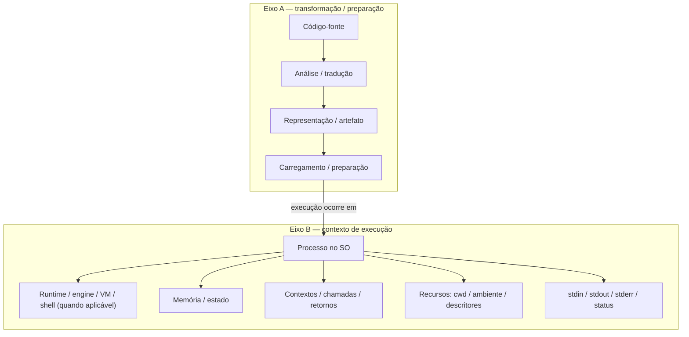
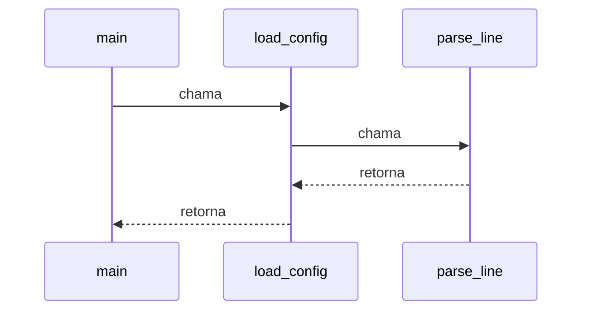
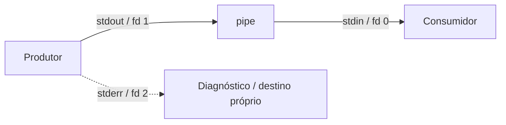

<a id="inicio"></a>

# Modelo Básico de Execução de Programas

> **Classificação:** `[C] Obrigatório conhecer`  
> **Nível:** B — Fundamentos de Programação  
> **Posição na taxonomia:** tópico 23 — último tópico do Nível B  
> **Pré-requisitos principais:** T02 — Fundamentos de Algoritmos; T11 — Funções; T14 — Estado, Escopo, Referências e Mutabilidade; T18 — Erros, Exceções e Tratamento de Falhas; T19 — Depuração; T21 — Entrada/Saída e Persistência Básica  
> **Aprofundamentos posteriores:** sistemas operacionais; compiladores; runtimes e VMs; concorrência; arquitetura de computadores; observabilidade; T24 em diante — Algoritmos e Estruturas de Dados

---

## Resumo executivo

Um arquivo de código não "se executa sozinho". Entre o texto que o programador escreve e os efeitos observáveis do programa existem **camadas de tradução, runtime, memória, chamadas, processo e I/O**.

O modelo mental mínimo deste tópico **não é uma pipeline única**. Pense em dois eixos complementares:

```text
PROGRAMA / CÓDIGO-FONTE
├── TRANSFORMAÇÃO / PREPARAÇÃO
│   └── fonte → análise/tradução → representação/artefato → carregamento
│
└── EXECUÇÃO EM UM PROCESSO DO SO
    ├── runtime / engine / VM / shell, quando aplicável
    ├── memória / estado
    ├── chamadas / retornos
    └── recursos / stdin / stdout / stderr / status
```

Esse desenho é propositalmente genérico. **As quatro linguagens canônicas não percorrem uma única cadeia idêntica**, e runtime, memória, chamadas e I/O não devem ser lidos como etapas físicas sequenciais pelas quais o programa obrigatoriamente “passa”.

- Java possui um modelo explícito de compilação para `class` files executados por uma JVM.
- CPython normalmente compila código Python para uma representação interna de bytecode e a executa no runtime do interpretador; esse bytecode é detalhe da implementação CPython.
- ECMAScript especifica a semântica e contextos de execução, mas **não obriga** uma implementação concreta a ser "interpretada" ou "compilada" de uma forma específica.
- Bash lê, analisa, expande e executa comandos; builtins, funções, comandos externos, subshells e pipelines podem ter contextos de execução diferentes.

Portanto:

> **"Compilada" versus "interpretada" não é uma divisão binária confiável para classificar linguagens modernas.** A pergunta melhor é: **qual implementação/toolchain estamos observando e quais etapas ela realmente executa?**

Este tópico encerra os fundamentos antes da entrada no Nível C. O objetivo não é ensinar internals de CPython, V8, HotSpot ou kernel Linux; é construir um modelo suficiente para explicar **o que acontece entre escrever código e observar seus efeitos**.

---

## Visão rápida

| Conceito | Pergunta que responde | Ideia mínima |
|---|---|---|
| Código-fonte | "O que escrevi?" | representação textual do programa |
| Compilação | "Há tradução antes de executar?" | transforma uma representação em outra |
| Interpretação | "Quem medeia a execução?" | runtime interpreta/avalia uma representação |
| Máquina virtual | "Há uma máquina abstrata intermediária?" | ambiente de execução definido por software/especificação |
| Memória | "Onde fica o estado enquanto executa?" | dados e estruturas do runtime/processo |
| Pilha de chamadas | "Como chamadas retornam?" | frames/contextos organizam chamadas e retornos |
| Processo | "O que está realmente rodando no SO?" | instância de programa em execução com recursos |
| I/O | "Como entra e sai informação?" | `stdin`, `stdout`, `stderr`, pipes, redirecionamentos e status |

---

## Distinções fundamentais

```text
LINGUAGEM
≠ IMPLEMENTAÇÃO
≠ RUNTIME
≠ PROCESSO
≠ SISTEMA OPERACIONAL
```

Exemplos:

```text
Python            → linguagem
CPython           → uma implementação de Python
python script.py  → inicia/usa um runtime dentro de um processo
Linux             → sistema operacional que hospeda o processo
```

```text
ECMAScript        → especificação da linguagem
V8                → engine/implementação de ECMAScript
Node.js           → runtime/host que usa V8 e fornece APIs próprias
node app.js       → processo que executa esse runtime
```

```text
Java              → linguagem
javac             → compilador do JDK
JVM               → máquina virtual especificada
HotSpot           → uma implementação de JVM
java Main         → processo que hospeda a JVM e executa a aplicação
```

```text
Bash              → linguagem
GNU Bash          → implementação da linguagem + shell
bash script.sh    → processo do GNU Bash que interpreta/executa o script
comando externo   → normalmente outro programa/processo iniciado pelo shell
```

---

## Regra de ouro

> **Explique a execução pelo mecanismo observável, não por rótulos simplistas.**

Em vez de:

```text
"Python é interpretado."
```

prefira:

```text
"Neste ambiente usamos CPython: o código é analisado/compilado para uma representação
interna e executado pelo runtime CPython."
```

Em vez de:

```text
"JavaScript é interpretado."
```

prefira:

```text
"ECMAScript define a semântica; a engine concreta decide suas estratégias internas
de interpretação, compilação e otimização."
```

---

## Decisão rápida

Quando alguém disser "como este código roda?", pergunte na ordem:

1. qual é a **linguagem**?
2. qual é a **implementação/runtime**?
3. há **artefato intermediário** visível?
4. qual é o **processo** criado ou reutilizado?
5. quais dados ficam em **memória**?
6. como chamadas e retornos são representados no nível apropriado?
7. de onde vêm `stdin`, `stdout` e `stderr`?
8. qual **status de término** chega ao chamador?

---

# Índice

  - [Resumo executivo](#resumo-executivo)
  - [Visão rápida](#visão-rápida)
  - [Distinções fundamentais](#distinções-fundamentais)
  - [Regra de ouro](#regra-de-ouro)
  - [Decisão rápida](#decisão-rápida)
- [1. Posição deste assunto na trilha](#1-posição-deste-assunto-na-trilha)
  - [1.1 Fronteira com T21 — I/O](#11-fronteira-com-t21--io)
  - [1.2 Fronteira com T18/T19](#12-fronteira-com-t18t19)
  - [1.3 Fronteira com sistemas operacionais](#13-fronteira-com-sistemas-operacionais)
  - [1.4 Fronteira com compiladores e runtimes](#14-fronteira-com-compiladores-e-runtimes)
  - [1.5 Fronteira com T24](#15-fronteira-com-t24)
- [2. 🗺️ Visão panorâmica — o mapa antes dos detalhes](#visao-panoramica)
- [3. 23.1 — Código-fonte `[C]`](#3-231--código-fonte-c)
  - [3.1 Fonte não é a execução](#31-fonte-não-é-a-execução)
  - [3.2 Extensão ajuda, mas não define semanticamente a linguagem](#32-extensão-ajuda-mas-não-define-semanticamente-a-linguagem)
  - [3.3 Shebang em scripts Unix](#33-shebang-em-scripts-unix)
- [4. Representações: fonte, artefato intermediário e código de máquina](#4-representações-fonte-artefato-intermediário-e-código-de-máquina)
- [5. 23.2 — Compilação `[C]`](#5-232--compilação-c)
  - [5.1 Compilação não significa necessariamente "gera .exe"](#51-compilação-não-significa-necessariamente-gera-exe)
  - [5.2 Compilar detecta uma classe de problemas, não todos](#52-compilar-detecta-uma-classe-de-problemas-não-todos)
  - [5.3 Exemplo Java — fonte para `class`](#53-exemplo-java--fonte-para-class)
- [6. Compilação em Python — o cuidado com a palavra](#6-compilação-em-python--o-cuidado-com-a-palavra)
- [7. Compilação em JavaScript — não atribua ao ECMAScript uma estratégia que ele não exige](#7-compilação-em-javascript--não-atribua-ao-ecmascript-uma-estratégia-que-ele-não-exige)
- [8. Compilação em Bash — não fabrique um equivalente a `javac`](#8-compilação-em-bash--não-fabrique-um-equivalente-a-javac)
- [9. 23.3 — Interpretação `[C]`](#9-233--interpretação-c)
  - [9.1 O importante é o nível da abstração](#91-o-importante-é-o-nível-da-abstração)
  - [9.2 REPL torna a mediação visível](#92-repl-torna-a-mediação-visível)
- [10. Compilação e interpretação podem coexistir](#10-compilação-e-interpretação-podem-coexistir)
- [11. 23.4 — Máquina virtual `[C]`](#11-234--máquina-virtual-c)
  - [11.1 VM não é sinônimo de virtualização de um computador inteiro](#111-vm-não-é-sinônimo-de-virtualização-de-um-computador-inteiro)
  - [11.2 Python "VM" exige qualificação](#112-python-vm-exige-qualificação)
  - [11.3 ECMAScript não define uma "JVM do JavaScript"](#113-ecmascript-não-define-uma-jvm-do-javascript)
  - [11.4 Bash também não precisa de equivalência](#114-bash-também-não-precisa-de-equivalência)
- [12. Camadas — linguagem, runtime, biblioteca e sistema operacional](#12-camadas--linguagem-runtime-biblioteca-e-sistema-operacional)
- [13. 23.5 — Memória `[C]`](#13-235--memória-c)
  - [13.1 Modelo mínimo](#131-modelo-mínimo)
  - [13.2 Evite o mito "tudo local vai para stack e tudo objeto vai para heap"](#132-evite-o-mito-tudo-local-vai-para-stack-e-tudo-objeto-vai-para-heap)
  - [13.3 Vida útil lógica versus posição física](#133-vida-útil-lógica-versus-posição-física)
- [14. Memória no modelo da JVM](#14-memória-no-modelo-da-jvm)
- [15. Memória no modelo Python](#15-memória-no-modelo-python)
- [16. Memória no modelo ECMAScript](#16-memória-no-modelo-ecmascript)
- [17. Memória e Bash](#17-memória-e-bash)
- [18. 23.6 — Pilha de chamadas `[C]`](#18-236--pilha-de-chamadas-c)
  - [18.1 LIFO](#181-lifo)
  - [18.2 Frame](#182-frame)
- [19. Pilha de chamadas em Python](#19-pilha-de-chamadas-em-python)
- [20. Pilha/contextos em JavaScript](#20-pilhacontextos-em-javascript)
- [21. Pilha de chamadas na JVM](#21-pilha-de-chamadas-na-jvm)
- [22. Chamadas em Bash — função e processo não são a mesma coisa](#22-chamadas-em-bash--função-e-processo-não-são-a-mesma-coisa)
- [23. Recursão e profundidade da pilha](#23-recursão-e-profundidade-da-pilha)
- [24. Stack trace não é a própria pilha física](#24-stack-trace-não-é-a-própria-pilha-física)
- [25. 23.7 — Processo `[C]`](#25-237--processo-c)
  - [25.1 Um arquivo, vários processos](#251-um-arquivo-vários-processos)
- [26. Observando o PID nas quatro linguagens](#26-observando-o-pid-nas-quatro-linguagens)
  - [26.1 Python](#261-python)
  - [26.2 JavaScript / Node.js](#262-javascript--nodejs)
  - [26.3 Java](#263-java)
  - [26.4 GNU Bash](#264-gnu-bash)
- [27. Processo pai e processo filho](#27-processo-pai-e-processo-filho)
- [28. Ambiente do processo](#28-ambiente-do-processo)
- [29. Processo não é thread](#29-processo-não-é-thread)
- [30. 23.8 — Fluxos de entrada e saída `[C]`](#30-238--fluxos-de-entrada-e-saída-c)
  - [30.1 Dados versus diagnóstico](#301-dados-versus-diagnóstico)
- [31. `stdin`, `stdout` e `stderr` em Python](#31-stdin-stdout-e-stderr-em-python)
- [32. `stdin`, `stdout` e `stderr` em Node.js](#32-stdin-stdout-e-stderr-em-nodejs)
- [33. `stdin`, `stdout` e `stderr` em Java](#33-stdin-stdout-e-stderr-em-java)
- [34. `stdin`, `stdout` e `stderr` em Bash](#34-stdin-stdout-e-stderr-em-bash)
- [35. Pipes — composição por fluxo](#35-pipes--composição-por-fluxo)
  - [35.1 Por que isso é tão poderoso](#351-por-que-isso-é-tão-poderoso)
  - [35.2 `stderr` não entra automaticamente no pipe `|`](#352-stderr-não-entra-automaticamente-no-pipe-)
- [36. Pipeline e processos no Bash](#36-pipeline-e-processos-no-bash)
- [37. Exit status — outro canal de informação](#37-exit-status--outro-canal-de-informação)
  - [37.1 Status não deve ser misturado com texto](#371-status-não-deve-ser-misturado-com-texto)
  - [37.2 Linguagens podem definir status do próprio processo](#372-linguagens-podem-definir-status-do-próprio-processo)
- [38. Status de pipeline e `pipefail`](#38-status-de-pipeline-e-pipefail)
- [39. Comparação consolidada das quatro linguagens](#39-comparação-consolidada-das-quatro-linguagens)
- [40. Conceito universal ≠ sintaxe ≠ semântica ≠ idiomatismo](#40-conceito-universal--sintaxe--semântica--idiomatismo)
  - [40.1 Conceito universal](#401-conceito-universal)
  - [40.2 Sintaxe](#402-sintaxe)
  - [40.3 Semântica](#403-semântica)
  - [40.4 Idiomatismo](#404-idiomatismo)
- [41. Modelo de execução Python — visão mínima correta](#41-modelo-de-execução-python--visão-mínima-correta)
  - [41.1 Python 3.14.7 — camadas conceituais atuais do runtime](#411-python-3147--camadas-conceituais-atuais-do-runtime)
- [42. Modelo de execução JavaScript / Node.js — visão mínima correta](#42-modelo-de-execução-javascript--nodejs--visão-mínima-correta)
- [43. Modelo de execução Java — visão mínima correta](#43-modelo-de-execução-java--visão-mínima-correta)
  - [43.1 Baseline Java desta revisão — 19/09/2026](#431-baseline-java-desta-revisão--19092026)
- [44. Modelo de execução GNU Bash — visão mínima correta](#44-modelo-de-execução-gnu-bash--visão-mínima-correta)
- [45. O que acontece quando você executa um comando?](#45-o-que-acontece-quando-você-executa-um-comando)
- [46. Argumentos da linha de comando](#46-argumentos-da-linha-de-comando)
- [47. Código, dados e comandos — mantenha as fronteiras](#47-código-dados-e-comandos--mantenha-as-fronteiras)
- [48. Redirecionamento pode alterar dados antes do programa rodar](#48-redirecionamento-pode-alterar-dados-antes-do-programa-rodar)
- [49. Buffers — saída pode não aparecer no instante em que você imagina](#49-buffers--saída-pode-não-aparecer-no-instante-em-que-você-imagina)
- [50. Erros conceituais frequentes](#50-erros-conceituais-frequentes)
  - [50.1 "O arquivo está executando"](#501-o-arquivo-está-executando)
  - [50.2 "Python não compila"](#502-python-não-compila)
  - [50.3 "JavaScript é interpretado linha por linha"](#503-javascript-é-interpretado-linha-por-linha)
  - [50.4 "Java compila direto para CPU"](#504-java-compila-direto-para-cpu)
  - [50.5 "Toda variável local está fisicamente na stack"](#505-toda-variável-local-está-fisicamente-na-stack)
  - [50.6 "Pipe passa variáveis"](#506-pipe-passa-variáveis)
  - [50.7 "stderr é apenas para exceções"](#507-stderr-é-apenas-para-exceções)
  - [50.8 "status 1 significa sempre o mesmo erro"](#508-status-1-significa-sempre-o-mesmo-erro)
  - [50.9 "Bash function sempre cria processo"](#509-bash-function-sempre-cria-processo)
  - [50.10 "subshell e subprocesso são sinônimos perfeitos"](#5010-subshell-e-subprocesso-são-sinônimos-perfeitos)
- [51. Problemas reais e mecanismo da falha](#51-problemas-reais-e-mecanismo-da-falha)
  - [51.1 Variável modificada dentro de pipeline "não mudou"](#511-variável-modificada-dentro-de-pipeline-não-mudou)
  - [51.2 Saída de dados contaminada por log](#512-saída-de-dados-contaminada-por-log)
  - [51.3 Pipeline retorna sucesso apesar de uma etapa falhar](#513-pipeline-retorna-sucesso-apesar-de-uma-etapa-falhar)
  - [51.4 Código Java alterado, mas comportamento antigo continua](#514-código-java-alterado-mas-comportamento-antigo-continua)
  - [51.5 Inspeção de bytecode Python muda após atualizar versão](#515-inspeção-de-bytecode-python-muda-após-atualizar-versão)
  - [51.6 `console.log` funciona no Node, mas `process` não existe em outro host](#516-consolelog-funciona-no-node-mas-process-não-existe-em-outro-host)
  - [51.7 `>` destruiu arquivo que deveria ser processado](#517--destruiu-arquivo-que-deveria-ser-processado)
  - [Inventário formal de problemas reais (`PR-T23-*`)](#inventário-formal-de-problemas-reais-pr-t23-)
  - [🔎 Troubleshooting sistemático](#troubleshooting-t23)
- [52. Exemplo integrador — filtro de eventos por stdin/stdout](#52-exemplo-integrador--filtro-de-eventos-por-stdinstdout)
- [53. Implementação integradora em Python](#53-implementação-integradora-em-python)
- [54. Implementação integradora em JavaScript / Node.js](#54-implementação-integradora-em-javascript--nodejs)
- [55. Implementação integradora em Java](#55-implementação-integradora-em-java)
- [56. Implementação integradora em GNU Bash](#56-implementação-integradora-em-gnu-bash)
- [57. Composição do exemplo integrador](#57-composição-do-exemplo-integrador)
- [58. Segurança básica aplicada ao modelo de execução](#58-segurança-básica-aplicada-ao-modelo-de-execução)
  - [58.1 Não confunda argumento com comando](#581-não-confunda-argumento-com-comando)
  - [58.2 Quote dados no shell](#582-quote-dados-no-shell)
  - [58.3 Redirecionamento é efeito destrutivo potencial](#583-redirecionamento-é-efeito-destrutivo-potencial)
  - [58.4 Não exponha segredos em argumentos sem necessidade](#584-não-exponha-segredos-em-argumentos-sem-necessidade)
  - [58.5 `stdout` de ferramenta pode virar entrada de outra](#585-stdout-de-ferramenta-pode-virar-entrada-de-outra)
  - [58.6 Limite consumo](#586-limite-consumo)
- [59. Laboratórios](#59-laboratórios)
  - [🧪 LAB 1 — observar fonte e artefato de execução](#-lab-1--observar-fonte-e-artefato-de-execução)
  - [🧪 LAB 2 — fonte alterada versus classe já compilada](#-lab-2--fonte-alterada-versus-classe-já-compilada)
  - [🧪 LAB 3 — visualizar cadeia de chamadas](#-lab-3--visualizar-cadeia-de-chamadas)
  - [🧪 LAB 4 — observar PIDs e contextos](#-lab-4--observar-pids-e-contextos)
  - [🧪 LAB 5 — separar `stdout` de `stderr`](#-lab-5--separar-stdout-de-stderr)
  - [🧪 LAB 6 — pipeline e status](#-lab-6--pipeline-e-status)
  - [🧪 LAB 7 — redirecionamento e truncamento](#-lab-7--redirecionamento-e-truncamento)
  - [🧪 LAB 8 — integração multilíngue por pipe](#-lab-8--integração-multilíngue-por-pipe)
- [60. Exercícios](#60-exercícios)
- [61. Evidências de domínio](#61-evidências-de-domínio)
- [62. Checklist de domínio](#62-checklist-de-domínio)
- [63. Glossário](#63-glossário)
- [64. Auditoria de cobertura da taxonomia](#64-auditoria-de-cobertura-da-taxonomia)
- [65. Auditoria da File Library](#65-auditoria-da-file-library)
  - [65.1 Fontes locais efetivamente consultadas na revisão `0.1.0`](#651-fontes-locais-efetivamente-consultadas-na-revisão-010)
  - [65.2 Como a biblioteca alterou a revisão `0.1.0`](#652-como-a-biblioteca-alterou-a-revisão-010)
  - [65.3 Livros antigos e revalidação](#653-livros-antigos-e-revalidação)
  - [65.4 Fonte encontrada não significa fonte usada](#654-fonte-encontrada-não-significa-fonte-usada)
  - [65.5 Fontes locais efetivamente reconsultadas na revisão `0.2.0`](#655-fontes-locais-efetivamente-reconsultadas-na-revisão-020)
  - [65.6 Revalidação oficial da revisão `0.2.0`](#656-revalidação-oficial-da-revisão-020)
  - [65.7 Passagem B reaberta na R3 (`0.3.0`)](#657-passagem-b-reaberta-na-r3-030)
  - [65.8 Revalidação oficial da R3 (`0.3.0`)](#658-revalidação-oficial-da-r3-030)
  - [65.9 Passagem B reaberta na R4 (`0.3.1`)](#659-passagem-b-reaberta-na-r4-031)
  - [65.10 Passagem B reaberta na R5 (`0.3.2`)](#6510-passagem-b-reaberta-na-r5-032)
  - [65.11 Passagem B reaberta na R6 (`0.3.3`)](#6511-passagem-b-reaberta-na-r6-033)
  - [65.12 Passagem B reaberta na R7 (`0.3.4`)](#6512-passagem-b-reaberta-na-r7-034)
  - [65.13 Passagem B reaberta na R8 (`0.3.5`)](#6513-passagem-b-reaberta-na-r8-035)
  - [65.14 Passagem B reaberta na R9 (`0.3.6`)](#6514-passagem-b-reaberta-na-r9-036)
- [66. Referências](#66-referências)
  - [66.1 Contratos canônicos do projeto](#661-contratos-canônicos-do-projeto)
  - [66.2 Python — fontes oficiais](#662-python--fontes-oficiais)
  - [66.3 ECMAScript / Node.js — fontes oficiais](#663-ecmascript--nodejs--fontes-oficiais)
  - [66.4 Java — fontes oficiais](#664-java--fontes-oficiais)
  - [66.5 GNU Bash / Unix shell — fontes oficiais](#665-gnu-bash--unix-shell--fontes-oficiais)
  - [66.6 Literatura local — histórico efetivamente consultado na `0.1.0`](#666-literatura-local--histórico-efetivamente-consultado-na-010)
  - [66.7 Literatura local reconsultada historicamente na `0.2.0`](#667-literatura-local-reconsultada-historicamente-na-020)
  - [66.8 Literatura local reaberta na R3 (`0.3.0`)](#668-literatura-local-reaberta-na-r3-030)
  - [66.9 Literatura local reaberta na R4 (`0.3.1`)](#669-literatura-local-reaberta-na-r4-031)
  - [66.10 Literatura local reaberta na R5 (`0.3.2`)](#6610-literatura-local-reaberta-na-r5-032)
  - [66.11 Literatura local reaberta na R6 (`0.3.3`)](#6611-literatura-local-reaberta-na-r6-033)
  - [66.12 Literatura local reaberta na R7 (`0.3.4`)](#6612-literatura-local-reaberta-na-r7-034)
  - [66.13 Literatura local reaberta na R8 (`0.3.5`)](#6613-literatura-local-reaberta-na-r8-035)
  - [66.14 Literatura local reaberta na R9 (`0.3.6`)](#6614-literatura-local-reaberta-na-r9-036)
  - [66.15 Hierarquia usada nesta revisão](#6615-hierarquia-usada-nesta-revisão)
- [67. QA e evidências](#67-qa-e-evidências)
  - [67.1 Estados formais usados nesta revisão](#671-estados-formais-usados-nesta-revisão)
  - [67.2 `[D]` Evidência documental](#672-d-evidência-documental)
  - [67.3 `[S]` Validação estrutural/estática](#673-s-validação-estruturalestática)
    - [67.3.1 Regressão estrutural por capacidade](#6731-regressão-estrutural-por-capacidade)
    - [67.3.2 Consistência contrato → implementação → teste → QA](#6732-consistência-contrato--implementação--teste--qa)
    - [67.3.3 Ferramentas estáticas externas](#6733-ferramentas-estáticas-externas)
    - [67.3.4 Rastreabilidade externa do QA](#6734-rastreabilidade-externa-do-qa)
  - [67.4 `[R]` Reprodução em runtime](#674-r-reprodução-em-runtime)
  - [67.5 Gate 2 — fechamento da iteração](#675-gate-2--fechamento-da-iteração)
- [68. Histórico de versões](#68-histórico-de-versões)

# 1. Posição deste assunto na trilha

O T23 fecha o **Nível B — Fundamentos de Programação**. Até aqui, a trilha já construiu variáveis, tipos, operadores, fluxo de controle, funções, coleções, escopo, erros, depuração, testes, I/O e qualidade básica.

Agora o objetivo é conectar esses conceitos à execução real:

```text
"tenho uma função"
      ↓
"quando ela é chamada, existe um contexto de execução"
      ↓
"esse contexto usa memória e participa de uma sequência de chamadas"
      ↓
"tudo isso ocorre dentro de um runtime/processo"
      ↓
"o processo conversa com o ambiente por fluxos, arquivos, sinais/status e APIs"
```

## 1.1 Fronteira com T21 — I/O

T21 ensinou **como programar I/O básico**. T23 mostra **onde esses fluxos se encaixam no modelo de execução**, especialmente no ambiente Unix/Linux.

T23 não repete APIs de arquivos em profundidade.

## 1.2 Fronteira com T18/T19

T18 explicou falhas e exceções; T19 ensinou depuração. Aqui, stack traces, frames, processos e streams aparecem como **mecanismos que ajudam a explicar** por que essas ferramentas funcionam.

T23 não volta a ensinar método de debugging.

## 1.3 Fronteira com sistemas operacionais

Processos, descritores de arquivo, memória virtual e scheduling possuem enorme profundidade. Neste tópico, entra apenas o modelo necessário para programação básica.

Ficam para uma trilha de sistemas:

- syscalls em profundidade;
- page tables e paginação;
- ELF/PE e loaders em detalhe;
- scheduler;
- sinais em profundidade;
- namespaces/cgroups;
- memória virtual avançada;
- IPC avançado.

## 1.4 Fronteira com compiladores e runtimes

Não entram em profundidade:

- análise léxica e parsing formal;
- AST internals;
- IRs de compiladores;
- SSA;
- otimização de código;
- registradores e alocação de registradores;
- JIT internals;
- garbage collectors específicos;
- bytecodes completos de VMs.

Esses assuntos podem ser citados para formar o mapa mental, mas não precisam ser dominados aqui.

## 1.5 Fronteira com T24

Após T23, o currículo entra no **Nível C — Algoritmos e Estruturas de Dados**. A mudança de pergunta será:

```text
Nível B: como escrever e executar programas corretamente?
Nível C: como representar problemas e analisar algoritmos/estruturas com rigor?
```

> **Baseline temporal:** as versões normativas citadas refletem a revisão de **19/09/2026**. Os runtimes locais usados no QA podem ser anteriores e são registrados separadamente em §67.4; detalhes de implementação podem variar sem invalidar o modelo conceitual.

[↑ Voltar ao índice](#índice)

<a id="visao-panoramica"></a>

# 2. 🗺️ Visão panorâmica — o mapa antes dos detalhes

Esta seção funciona em dois modos simultâneos:

- **consulta rápida:** descobrir em qual camada procurar quando algo “roda diferente do esperado”;
- **estudo:** formar um modelo mental que conecte fonte, tradução, runtime, memória, chamadas, processo e I/O sem fabricar equivalências entre linguagens.

A pergunta central do T23 é:

> **o que existe entre o texto que escrevemos e os efeitos observáveis de um programa em execução?**

A resposta mínima correta não é “compilado” ou “interpretado”. É um mapa de camadas.

## Mapa do domínio

```text
MODELO BÁSICO DE EXECUÇÃO DE PROGRAMAS [C]
│
├── 23.1 CÓDIGO-FONTE
│   └── representação escrita/persistida do programa
│
├── 23.2 COMPILAÇÃO
│   ├── tradução antes ou durante etapas de execução
│   └── pode produzir artefato intermediário ou nativo
│
├── 23.3 INTERPRETAÇÃO
│   └── execução mediada por runtime/interpretador
│
├── 23.4 MÁQUINA VIRTUAL
│   ├── máquina abstrata / camada intermediária
│   └── não é sinônimo de VM de virtualização de SO
│
├── 23.5 MEMÓRIA
│   ├── estado em execução
│   ├── objetos/dados/contextos
│   └── layout físico depende do modelo concreto
│
├── 23.6 PILHA DE CHAMADAS
│   ├── chamadas
│   ├── frames/contextos
│   └── retornos / propagação
│
├── 23.7 PROCESSO
│   ├── programa em execução
│   ├── PID / ambiente / cwd / descritores
│   └── fronteira entre processos
│
└── 23.8 FLUXOS DE I/O
    ├── stdin
    ├── stdout
    ├── stderr
    ├── pipes
    ├── redirecionamentos
    └── exit status
```

## Fluxo conceitual — da fonte ao efeito



> O diagrama separa **transformação/preparação** de **contexto de execução** para evitar a impressão de uma pipeline universal. O processo **hospeda o runtime/engine/VM/shell quando essa camada existe no modelo observado**; a seta entre os eixos indica a passagem da preparação para a execução, não que “o runtime cria o processo”. É um **mapa de perguntas**, não uma sequência física obrigatória.

## Caderno rápido de consulta

| Conceito | Pergunta prática | Evidência que ajuda | Erro mental frequente |
|---|---|---|---|
| código-fonte | “o que está armazenado?” | arquivo/texto/repositório | tratar arquivo como processo |
| compilação | “houve tradução para outra representação?” | `.class`, code object, artefato, diagnóstico do compilador | “compilar = gerar `.exe`” |
| interpretação/runtime | “quem medeia a execução?” | processo/runtime, REPL, documentação da implementação | “interpretado = linha por linha” |
| VM | “qual máquina abstrata define a execução?” | JVMS, runtime específico | chamar qualquer runtime de “VM” |
| memória | “qual estado precisa sobreviver durante a execução?” | objetos, buffers, frames, heap/áreas especificadas | stack/heap como lei universal |
| chamada | “como o runtime volta ao chamador?” | stack trace, frame/contexto, debugger | stack trace = layout físico da RAM |
| processo | “qual instância está rodando?” | PID, cwd, ambiente, descritores | programa = processo |
| I/O | “qual canal carrega dado, diagnóstico ou status?” | fd 0/1/2, pipe, exit code | misturar `stdout`, `stderr` e status |

## Pergunta prática → onde olhar primeiro

| Sintoma | Primeira hipótese | Seção |
|---|---|---|
| “editei o Java, mas ainda roda o código antigo” | artefato `.class` desatualizado | 5, 43, 51, `PR-T23-02` |
| “o `dis` mudou depois do upgrade” | bytecode CPython é detalhe de implementação | 6, 41, `PR-T23-03` |
| “`process` existe no Node, mas não no browser” | API do host, não da linguagem ECMAScript | 12, 42, `PR-T23-04` |
| “variável mudou dentro do pipe, mas voltou ao valor antigo” | subshell/ambiente separado | 17, 36, `PR-T23-06` |
| “pipeline parece sucesso mesmo com falha antes” | status padrão da pipeline | 37–38, `PR-T23-08` |
| “consumidor quebrou por causa de log” | diagnóstico foi para `stdout` | 30–35, `PR-T23-07` |
| “arquivo ficou vazio antes do programa ler” | `>` truncou no redirecionamento | 48, `PR-T23-09` |
| “funciona em um diretório/servidor e falha em outro” | cwd, PATH, ambiente ou arquivos herdados | 27–29, 45, `PR-T23-10` |

## Não confundir

| A | ≠ | B | Por quê |
|---|---|---|---|
| linguagem | ≠ | implementação | Python ≠ CPython; ECMAScript ≠ V8 |
| runtime/host | ≠ | especificação da linguagem | Node.js acrescenta APIs que ECMA-262 não define |
| código-fonte | ≠ | processo | arquivo persistido não possui PID nem recursos de processo |
| compilação | ≠ | geração de executável nativo | Java compila normalmente para `.class`; CPython compila para code objects/bytecode interno |
| interpretação | ≠ | “executar uma linha textual por vez” | runtimes podem analisar/compilar/otimizar internamente |
| execution context | ≠ | frame físico de CPU | abstração normativa não obriga layout físico |
| call stack conceitual | ≠ | toda a memória do programa | objetos/estado podem seguir outros modelos |
| `stdout` | ≠ | `stderr` | dados e diagnóstico têm contratos diferentes |
| exit status | ≠ | texto de saída | são canais distintos |
| subshell | ≠ | sinônimo perfeito de subprocesso | Bash define semântica própria de subshell environment |

## Microexemplos que fixam o modelo

**Arquivo não é processo:**

```bash
cp app.py app-copy.py
```

Isso cria/copia dados persistidos; não cria um processo Python.

**Mesmo fonte, hosts diferentes:**

```javascript
console.log(typeof process);
```

No Node.js, `process` é API do host. Outro host ECMAScript não é obrigado a expô-la.

**Status não é texto:**

```bash
false
printf 'status=%d\n' "$?"
```

O `1` observado é status do comando; não é `stdout` produzido por `false`.

**Redirecionamento acontece antes da execução útil do comando:**

```bash
cat data.txt > data.txt
```

O shell pode truncar `data.txt` ao preparar `>`, antes de `cat` obter o conteúdo que se pretendia ler.

## Problemas reais representativos

O inventário formal desta revisão rastreia:

- `PR-T23-01` — arquivo/fonte confundido com processo;
- `PR-T23-02` — fonte Java alterada, `.class` antigo executado;
- `PR-T23-03` — bytecode CPython tratado como contrato estável da linguagem;
- `PR-T23-04` — API do host Node confundida com ECMAScript universal;
- `PR-T23-05` — modelo stack/heap generalizado como lei universal;
- `PR-T23-06` — estado Bash alterado em subshell/pipeline não retorna ao pai;
- `PR-T23-07` — diagnóstico em `stdout` contamina pipeline;
- `PR-T23-08` — falha anterior da pipeline escondida pelo status padrão;
- `PR-T23-09` — redirecionamento destrutivo/truncamento antecipado;
- `PR-T23-10` — diferença de cwd/ambiente/PATH muda o comportamento do processo.

## Entrada rápida de troubleshooting

```text
1. identifique a linguagem
2. identifique a implementação/runtime/host
3. identifique o processo e seu ambiente
4. determine a representação realmente executada
5. separe estado em memória de persistência em arquivo
6. observe chamadas/frames no nível suportado
7. separe stdin/stdout/stderr/status
8. reproduza com cwd/ambiente conhecidos
9. corrija o mecanismo, não o sintoma
10. rode regressão
```

Casos completos estão em [🔎 Troubleshooting sistemático](#troubleshooting-t23).

## Transferência entre as quatro linguagens

| Pergunta | Python / CPython | JavaScript / Node.js | Java / JVM | GNU Bash |
|---|---|---|---|---|
| fonte típica | `.py` | `.js` | `.java` | `.sh`/texto shell |
| tradução observável | code object/bytecode interno no CPython | estratégia interna da engine; ECMA-262 não fixa bytecode | `javac` → `.class` | análise/expansões; sem `.class` equivalente |
| runtime/host | implementação Python | Node.js + engine ECMAScript | JVM | shell Bash |
| contexto de chamada | execution frames | execution contexts + implementação da engine | JVM frames por thread | funções/contextos do shell + processos externos |
| processo | processo que hospeda o runtime | processo Node | processo que hospeda JVM | processo Bash e processos externos conforme comando |
| I/O | `sys.stdin/out/err` | `process.stdin/out/err` | `System.in/out/err` | fd 0/1/2 + redirecionamentos |

> A tabela alinha **perguntas conceituais**, não afirma equivalência interna.

## Consulta rápida × estudo completo

**Consulta:**

```text
Visão panorâmica
→ sintoma
→ mecanismo provável
→ seção específica
→ PR/TS
→ checklist
```

**Estudo:**

```text
Eixo A — transformação/preparação:
fonte → análise/tradução → representação/artefato → carregamento

Eixo B — contexto de execução:
processo → runtime/host quando aplicável
        → memória/estado
        → chamadas/retornos
        → recursos e I/O

depois:
problemas reais → troubleshooting → LABs
```

> Essa é uma **ordem de estudo**, não uma pipeline física universal.

## Fronteiras do tópico

O T23 não exige domínio de:

- arquitetura de CPU;
- assembly;
- memória virtual em profundidade;
- internals de garbage collectors;
- JIT e otimizações de engine;
- scheduler e concorrência avançada;
- compiladores, SSA ou IRs avançadas;
- kernel internals.

Esses temas podem explicar detalhes, mas não devem deslocar o objetivo: **entender as camadas mínimas necessárias para raciocinar corretamente sobre execução.**

[↑ Voltar ao índice](#índice)

---

# 3. 23.1 — Código-fonte `[C]`

Código-fonte é a representação escrita do programa em uma linguagem compreensível pelas ferramentas daquela linguagem.

Exemplo mínimo:

```python
print("hello")
```

O arquivo contendo esse texto é **dados armazenados**. Enquanto ninguém o analisa ou executa, ele não é um processo.

```text
arquivo .py no disco
≠
processo Python em execução
```

O mesmo vale para `.js`, `.java` e `.sh`.

## 3.1 Fonte não é a execução

Considere:

```bash
cp app.py backup.py
```

Copiar o arquivo não executa o programa; apenas duplica sua representação persistida.

O efeito de execução surge quando uma ferramenta/runtime recebe aquele código como entrada:

```bash
python app.py
node app.js
java Main
bash app.sh
```

Observe que `java Main` normalmente recebe uma **classe já compilada**, não diretamente `Main.java` no modelo clássico `javac` → `java` que usaremos neste tópico.

## 3.2 Extensão ajuda, mas não define semanticamente a linguagem

Uma extensão de arquivo é uma convenção útil para ferramentas e humanos, mas o conteúdo e o modo como a ferramenta é invocada também importam.

Por exemplo:

```bash
python arquivo_sem_extensao
bash arquivo_sem_extensao
```

podem funcionar se o conteúdo for apropriado. Portanto:

> **`.py` sugere Python; não é a extensão que cria a semântica Python.**

## 3.3 Shebang em scripts Unix

Um script executável pode começar com:

```bash
#!/usr/bin/env bash
```

ou:

```python
#!/usr/bin/env python3
```

O shebang participa da forma como sistemas Unix-like escolhem o interpretador quando o arquivo é executado diretamente. Ele não transforma o texto em binário nativo e não elimina o runtime correspondente.

[↑ Voltar ao índice](#índice)

---

# 4. Representações: fonte, artefato intermediário e código de máquina

Evite imaginar apenas duas possibilidades, "fonte" e "executável". Toolchains podem produzir representações intermediárias.

```text
fonte
  ↓
representação intermediária
  ↓
execução / tradução adicional
```

Exemplos didáticos:

| Ecossistema | Fonte típica | Representação/artefato relevante | Observação |
|---|---|---|---|
| CPython | `.py` | code objects / bytecode interno; cache `.pyc` em certos fluxos | detalhe de implementação do CPython |
| Java | `.java` | `.class` no formato da JVM | parte central do modelo Java/JVM |
| ECMAScript | `.js` | representação interna definida pela engine | especificação não fixa um bytecode universal |
| Bash | `.sh` | comandos/estruturas analisados pelo shell | não há um bytecode canônico Bash equivalente ao `.class` |

A tabela serve para impedir uma falsa equivalência: **"bytecode" não significa a mesma coisa em todos os runtimes**.

[↑ Voltar ao índice](#índice)

---

# 5. 23.2 — Compilação `[C]`

Compilar é, em sentido amplo, **traduzir uma representação de programa para outra antes ou durante a estratégia de execução**.

No ensino básico, costuma-se mostrar:

```text
código-fonte
    ↓ compilador
código alvo
    ↓
execução
```

Esse desenho é útil, mas precisa de duas correções:

1. o alvo não precisa ser código de máquina nativo;
2. runtimes modernos podem realizar novas traduções/otimizações durante a execução.

## 5.1 Compilação não significa necessariamente "gera .exe"

Java é o exemplo canônico:

```text
Main.java
   ↓ javac
Main.class
   ↓ JVM
execução
```

O `class` file é um formato binário independente da arquitetura física específica, definido pela especificação da JVM.

## 5.2 Compilar detecta uma classe de problemas, não todos

Se `javac` aceita um programa, isso não prova que:

- o resultado está correto;
- todas as entradas são válidas;
- não haverá exceção em runtime;
- não haverá consumo excessivo de recursos;
- o requisito foi compreendido corretamente.

Isso conecta conceitualmente T23 a T18 e T20:

```text
compilação bem-sucedida
≠ teste suficiente
≠ prova de correção
```

A remissão a T20 é uma **conexão curricular com testes/verificação**, não a criação de um novo pré-requisito formal do T23.

## 5.3 Exemplo Java — fonte para `class`

```java
public class Main {
    public static void main(String[] args) {
        System.out.println("hello");
    }
}
```

```bash
javac Main.java
java Main
```

Para inspecionar o artefato sem precisar entender todo o bytecode:

```bash
javap -c Main
```

Java moderno também possui **source-file mode**. No JDK 27, por exemplo, é possível executar:

```bash
java Main.java
```

Nesse modo, o launcher compila o fonte em memória e executa a classe resultante. Portanto, `java Main.java` **não elimina conceitualmente a compilação**; apenas torna implícita a etapa que, no fluxo clássico, aparece como `javac Main.java` seguido de `java Main`.

Objetivo pedagógico: observar que existe uma etapa de tradução anterior à execução pela JVM, seja ela explícita no fluxo clássico ou coordenada pelo launcher no source-file mode.

[↑ Voltar ao índice](#índice)

---

# 6. Compilação em Python — o cuidado com a palavra

Dizer apenas "Python não compila" é incorreto para CPython.

A implementação CPython analisa código e produz code objects contendo instruções de bytecode para sua máquina de execução. O módulo `dis` permite observar essa representação.

Exemplo:

```python
def add(left: int, right: int) -> int:
    return left + right
```

Inspeção:

```bash
python -m dis example.py
```

Mas existe uma ressalva essencial:

> O bytecode observado por `dis` é **detalhe de implementação do CPython** e pode mudar entre versões. Não é um formato portátil que define a linguagem Python.

Portanto, as duas frases abaixo têm níveis diferentes de precisão:

```text
"Python é interpretado."                         ← simplificação excessiva
"CPython compila para bytecode interno e o executa em seu runtime." ← mais preciso
```

Isso não obriga PyPy, GraalPy ou outra implementação a reproduzir internamente a mesma arquitetura.

[↑ Voltar ao índice](#índice)

---

# 7. Compilação em JavaScript — não atribua ao ECMAScript uma estratégia que ele não exige

ECMAScript especifica **o comportamento observável da linguagem**. A especificação usa conceitos como *execution context* para descrever a avaliação do código, mas não fixa uma arquitetura interna única de interpretador/JIT.

Assim, frases como:

```text
"JavaScript é sempre interpretado linha por linha."
```

são ruins por dois motivos:

1. engines modernas podem compilar e otimizar internamente;
2. a especificação não exige que toda implementação use a mesma estratégia.

No projeto, a regra será:

```text
ECMAScript → semântica normativa
engine concreta → estratégia de implementação
Node.js/browser → host/runtime que oferece APIs além da linguagem
```

Com Node.js, por exemplo:

```bash
node app.js
```

inicia um processo do runtime Node que carrega e executa o código JavaScript por sua engine.

[↑ Voltar ao índice](#índice)

---

# 8. Compilação em Bash — não fabrique um equivalente a `javac`

Bash não possui, no uso normal, uma etapa canônica equivalente a:

```text
script.sh → compilador Bash → arquivo bytecode portátil → VM Bash
```

O shell lê a entrada, reconhece sintaxe, executa expansões e executa comandos conforme sua semântica.

Uma verificação como:

```bash
bash -n script.sh
```

pode analisar sintaxe sem executar comandos, mas **isso não é "compilar Bash" no mesmo sentido de `javac`**.

Da mesma forma, **expansões, preparação de redirecionamentos e resolução de comandos são fases de processamento do shell, não uma etapa de compilação que gere um artefato intermediário canônico equivalente a `.class`**.

Essa diferença precisa ser preservada.

[↑ Voltar ao índice](#índice)

---

# 9. 23.3 — Interpretação `[C]`

Interpretação é a execução mediada por um programa/runtime que analisa ou executa uma representação do programa.

O modelo didático simples é:

```text
programa
  ↓
interpretador/runtime
  ↓
efeitos
```

Mas não confunda isso com "o interpretador relê uma linha textual e executa diretamente essa linha". Um runtime pode:

- parsear antes;
- construir estruturas internas;
- compilar para bytecode;
- cachear código;
- otimizar trechos;
- delegar operações para bibliotecas nativas.

## 9.1 O importante é o nível da abstração

Para aprender fundamentos, você precisa compreender:

```text
há uma camada de software executando/mediando a semântica da linguagem
```

Você **não precisa** conhecer a implementação do dispatch loop de uma VM para escrever corretamente um `if`.

## 9.2 REPL torna a mediação visível

Python:

```text
$ python
>>> 2 + 3
5
```

Node.js:

```text
$ node
> 2 + 3
5
```

Bash interativo:

```text
$ printf '%s\n' "$((2 + 3))"
5
```

Cada ambiente recebe entrada, analisa e produz efeito/resultado. Isso ajuda a visualizar a ideia de runtime, sem provar que internamente todos funcionam da mesma forma.

[↑ Voltar ao índice](#índice)

---

# 10. Compilação e interpretação podem coexistir

A oposição rígida:

```text
COMPILADO  versus  INTERPRETADO
```

é menos útil do que o modelo:

```text
FONTE
  ↓
uma ou mais traduções
  ↓
uma ou mais camadas de runtime
  ↓
execução física pela CPU
```

Exemplos:

- Java: compilação para `class` + execução pela JVM, que pode interpretar e/ou compilar código internamente.
- CPython: compilação para representação interna + execução pelo interpretador de bytecode.
- JavaScript em engines modernas: parsing + representações internas + estratégias de execução/otimização da engine.
- Bash: parsing/expansões do shell + execução de builtins/funções e lançamento de programas externos conforme o comando.

A conclusão curricular é:

> **Classifique o pipeline real da implementação, não a linguagem com um rótulo eterno.**

[↑ Voltar ao índice](#índice)

---

# 11. 23.4 — Máquina virtual `[C]`

Uma máquina virtual, no contexto deste tópico, é uma **máquina abstrata implementada em software** sobre a qual uma representação de programa pode ser executada.

A JVM fornece o exemplo mais explícito entre as quatro linguagens:

```text
código Java
   ↓ javac
class file
   ↓
JVM
   ↓
sistema operacional / hardware
```

A especificação da JVM define, entre outros pontos:

- formato `class`;
- instruções da JVM;
- áreas de dados em runtime;
- frames;
- carregamento e inicialização de classes;
- comportamento esperado da máquina abstrata.

Ela **não** obriga uma implementação a organizar fisicamente toda a memória de uma única maneira.

## 11.1 VM não é sinônimo de virtualização de um computador inteiro

Não confunda:

```text
JVM
```

com:

```text
VMware / KVM / VirtualBox
```

A JVM virtualiza uma máquina de execução para programas de sua plataforma; um hypervisor/VM de sistema virtualiza recursos de uma máquina inteira em outro nível.

## 11.2 Python "VM" exige qualificação

É comum encontrar o termo **Python Virtual Machine** para descrever a máquina de execução de bytecode do CPython. Isso pode ser didaticamente útil, desde que fique explícito:

- estamos falando de uma implementação;
- o bytecode CPython não define a linguagem Python;
- outras implementações podem estruturar a execução de forma diferente.

## 11.3 ECMAScript não define uma "JVM do JavaScript"

Engines possuem máquinas de execução internas, mas não existe na especificação ECMAScript um formato universal equivalente ao Java `class` file que todas as engines devam usar.

## 11.4 Bash também não precisa de equivalência

Bash é o shell/runtime que interpreta sua linguagem e coordena comandos. Chamar qualquer detalhe interno de "Bash VM" não melhora o modelo curricular básico e criaria uma equivalência artificial.

[↑ Voltar ao índice](#índice)

---

# 12. Camadas — linguagem, runtime, biblioteca e sistema operacional

Um erro comum é atribuir à linguagem aquilo que pertence ao runtime ou ao SO.

Considere:

```javascript
console.log(process.pid);
```

- `console.log` e `process` estão disponíveis no host Node.js;
- `process.pid` expõe o PID do processo;
- PID é conceito do ambiente de processos do sistema operacional;
- ECMAScript, isoladamente, não precisa definir `process.pid`.

Outro exemplo:

```python
import os
print(os.getpid())
```

`os.getpid()` é API da biblioteca/runtime que expõe uma informação do ambiente de processo; não é um operador da gramática Python.

Modelo por **camadas de responsabilidade**:

```text
linguagem / especificação   → sintaxe e semântica
runtime / biblioteca        → APIs e mecanismos de execução
sistema operacional         → processo, descritores, arquivos, rede, sinais
hardware                    → recursos físicos usados pelas camadas superiores
```

As setas acima indicam **dependência/exposição entre camadas**, não uma cronologia física universal. Essa separação será importante quando você aprender redes, arquivos, subprocessos, sockets e concorrência.

[↑ Voltar ao índice](#índice)

---

# 13. 23.5 — Memória `[C]`

Durante a execução, o programa precisa manter **estado**. Em algum nível, esse estado ocupa memória.

Exemplos de estado:

- valores de variáveis;
- objetos;
- argumentos de funções;
- endereços/pontos de retorno;
- buffers de I/O;
- estruturas internas do runtime;
- módulos/classes carregados;
- metadados necessários à execução.

## 13.1 Modelo mínimo

```text
PROCESSO / RUNTIME
      │
      ├── código/representações executáveis
      ├── estado global do runtime
      ├── dados/objetos
      ├── contextos de chamadas
      └── buffers e recursos
```

Isso é suficiente neste nível.

## 13.2 Evite o mito "tudo local vai para stack e tudo objeto vai para heap"

Esse slogan é uma simplificação que pode ser falsa ou enganosa entre linguagens e implementações.

- A JVM especifica stacks por thread e heap compartilhado, mas ainda deixa detalhes de implementação livres.
- Python define frames e objetos em seu modelo de execução; o layout físico concreto depende da implementação.
- ECMAScript define execution contexts e semântica, não um layout universal de stack/heap para engines.
- Bash mantém estado do shell e pode lançar processos separados, cada um com seu próprio espaço de processo.

Portanto:

> Use **stack/heap** quando a especificação/implementação concreta justificar; não transforme uma metáfora em lei universal.

## 13.3 Vida útil lógica versus posição física

Quando uma variável deixa de estar acessível por escopo, isso é uma questão semântica. O momento em que a memória subjacente é reutilizada/liberada pode ser outra questão.

Isso conecta T14 a T23:

```text
ESCOPO       → onde um nome é visível
TEMPO DE VIDA → por quanto tempo um valor/recurso permanece relevante
MEMÓRIA       → como a implementação armazena estado
```

São conceitos relacionados, não sinônimos.

[↑ Voltar ao índice](#índice)

---

# 14. Memória no modelo da JVM

A Java Virtual Machine Specification define áreas de dados em runtime, entre elas:

- `pc` register por thread;
- JVM stack por thread;
- heap compartilhado;
- method area;
- runtime constant pool;
- native method stacks, quando aplicáveis.

Para o T23, o principal é:

```text
thread
  └── JVM stack
       └── frames de chamadas

JVM
  └── heap compartilhado
       └── instâncias de classes e arrays
```

A própria especificação alerta que detalhes como layout físico e algoritmo de garbage collection ficam a cargo da implementação.

Isso é um bom exemplo de uma regra geral:

> **Especificação descreve obrigações sem necessariamente prescrever toda a mecânica interna.**

[↑ Voltar ao índice](#índice)

---

# 15. Memória no modelo Python

A documentação Python descreve código executado em **execution frames**. Um frame contém informações administrativas e ajuda a determinar como a execução continua depois que o bloco termina.

No CPython, podemos observar frames sem assumir que essa inspeção representa toda a arquitetura física da memória.

```python
import inspect


def current_function() -> str:
    frame = inspect.currentframe()
    if frame is None:
        return "unknown"
    return frame.f_code.co_name


print(current_function())
```

A lição não é "frames Python são exatamente frames de CPU". A lição é:

```text
runtime Python mantém contexto suficiente
para saber código atual, nomes/estado e continuidade da execução
```

[↑ Voltar ao índice](#índice)

---

# 16. Memória no modelo ECMAScript

A especificação ECMAScript usa **execution contexts** como dispositivo normativo para acompanhar a avaliação em runtime.

Um execution context não deve ser confundido automaticamente com:

- uma região física da RAM;
- um frame de CPU;
- uma estrutura concreta idêntica em todas as engines.

É uma abstração da especificação.

Quando uma engine executa JavaScript, ela naturalmente armazena estado em memória, mas estratégias internas de representação e otimização pertencem à implementação.

Regra:

```text
execution context da especificação
≠ promessa de layout físico específico
```

[↑ Voltar ao índice](#índice)

---

# 17. Memória e Bash

Bash mantém estado de shell como:

- parâmetros/variáveis;
- funções;
- opções;
- diretório corrente;
- traps;
- descritores abertos;
- informações de jobs/processos.

Mas um comando externo normalmente executa em um ambiente separado e não pode alterar diretamente o estado interno do shell pai.

Exemplo:

```bash
value='before'

bash -c 'value="inside"; printf "%s\n" "$value"'
printf '%s\n' "$value"
```

Saída esperada:

```text
inside
before
```

Isso mostra uma consequência prática de **contextos/processos separados**, sem precisar estudar memória virtual em profundidade.

[↑ Voltar ao índice](#índice)

---

# 18. 23.6 — Pilha de chamadas `[C]`

Quando uma função chama outra função, o runtime precisa preservar informação suficiente para:

1. executar a função chamada;
2. manter seu estado/contexto apropriado;
3. saber para onde retornar depois;
4. entregar retorno ou propagar falha.

O modelo clássico é a **pilha de chamadas**:

```text
main()
  ↓ chama
load_config()
  ↓ chama
parse_line()
```

Durante `parse_line()`:

```text
┌──────────────────┐ ← topo / chamada atual
│ parse_line       │
├──────────────────┤
│ load_config      │
├──────────────────┤
│ main             │
└──────────────────┘
```

Ao retornar:

```text
parse_line sai
      ↓
load_config volta a ser o contexto corrente
```

Como **diagrama de sequência de chamadas** — complementando o snapshot da pilha mostrado logo acima — a ordem temporal pode ser resumida assim:



O `sequenceDiagram` mostra **quem chama quem e em que ordem**; o bloco textual imediatamente anterior mostra o **estado empilhado (LIFO)**. As duas representações são complementares, e o texto permanece canônico para leitores em Markdown bruto e tecnologias assistivas.

## 18.1 LIFO

A intuição é **Last In, First Out**:

```text
última chamada empilhada
→ primeira chamada a terminar/desempilhar
```

Isso explica por que stack traces mostram uma cadeia de chamadas.

## 18.2 Frame

Um frame/contexto de chamada pode guardar conceitualmente:

- argumentos;
- locais;
- informação de retorno;
- estado de execução;
- metadados necessários pelo runtime.

A composição exata depende da plataforma/runtime.

[↑ Voltar ao índice](#índice)

---

# 19. Pilha de chamadas em Python

Exemplo:

```python
def third() -> None:
    print("third")


def second() -> None:
    third()


def first() -> None:
    second()


first()
```

Fluxo conceitual:

```text
module
  → first
      → second
          → third
          ←
      ←
  ←
```

Para visualizar a cadeia em runtime sem provocar erro:

```python
import traceback


def third() -> None:
    traceback.print_stack(limit=4)


def second() -> None:
    third()


def first() -> None:
    second()


first()
```

A documentação Python formaliza a execução por frames; ferramentas como traceback e debugger exploram essa estrutura.

[↑ Voltar ao índice](#índice)

---

# 20. Pilha/contextos em JavaScript

Exemplo:

```javascript
function third() {
  console.log('third');
}

function second() {
  third();
}

function first() {
  second();
}

first();
```

A especificação ECMAScript modela execução usando uma **execution context stack**. Quando o controle passa para código associado a um novo contexto, esse contexto é colocado no topo da pilha conceitual da especificação.

Na prática, stack traces tornam essa cadeia visível:

```javascript
function third() {
  console.log(new Error('trace').stack);
}
```

Mas lembre:

> O *execution context stack* da especificação é um dispositivo semântico; não obriga engines a uma estrutura física idêntica byte por byte.

[↑ Voltar ao índice](#índice)

---

# 21. Pilha de chamadas na JVM

Na JVM, a relação é mais explicitamente especificada:

- cada thread possui uma JVM stack;
- a stack armazena frames;
- um frame é criado quando um método é invocado;
- é destruído quando aquela invocação termina normalmente ou abruptamente.

Exemplo Java:

```java
public class Main {
    static void third() {
        System.out.println("third");
    }

    static void second() {
        third();
    }

    static void first() {
        second();
    }

    public static void main(String[] args) {
        first();
    }
}
```

O conceito ajuda a compreender:

- retornos;
- variáveis locais por invocação;
- stack traces;
- recursão;
- `StackOverflowError` quando a profundidade excede o que a implementação pode suportar.

[↑ Voltar ao índice](#índice)

---

# 22. Chamadas em Bash — função e processo não são a mesma coisa

Uma função Bash pode ser executada no contexto do shell chamador:

```bash
show_value() {
    local value='inside-function'
    printf '%s\n' "$value"
}

show_value
```

Bash mantém informações de chamadas de funções — por exemplo, arrays especiais como `FUNCNAME` podem expor a cadeia de funções.

```bash
outer() {
    inner
}

inner() {
    printf 'current=%s caller=%s\n' "${FUNCNAME[0]}" "${FUNCNAME[1]}"
}

outer
```

Entretanto:

```bash
external_command
```

não é simplesmente "mais um frame Bash". Um programa externo é executado em um ambiente de processo separado.

Essa distinção evita um erro comum:

```text
função Bash
≠ comando externo
≠ pipeline inteiro
```

[↑ Voltar ao índice](#índice)

---

# 23. Recursão e profundidade da pilha

A recursão torna o modelo de chamadas especialmente visível:

```python
def countdown(value: int) -> None:
    if value == 0:
        return
    countdown(value - 1)
```

Cada chamada ainda não concluída precisa de contexto. Conceitualmente:

```text
countdown(3)
  countdown(2)
    countdown(1)
      countdown(0)
```

Isso conecta o T23 ao estudo posterior de algoritmos:

- uma solução recursiva pode consumir memória proporcional à profundidade de chamadas;
- uma solução iterativa pode ter outro perfil;
- analisar formalmente esse custo pertence ao Nível C.

Aqui basta reconhecer:

> **chamadas aninhadas possuem custo e estado; a pilha não é infinita.**

[↑ Voltar ao índice](#índice)

---

# 24. Stack trace não é a própria pilha física

Um stack trace é uma **representação diagnóstica da cadeia de chamadas relevante**. Ele não deve ser confundido com um dump completo da memória física.

Exemplo Python:

```python
def parse_port(text: str) -> int:
    return int(text)


def load() -> int:
    return parse_port("invalid")


load()
```

A exceção mostra frames/caminho de chamadas. O valor prático é responder:

```text
onde a falha se manifestou?
quem chamou quem?
qual sequência levou até ali?
```

Esse mecanismo já foi usado em T18/T19; T23 explica sua base conceitual.

[↑ Voltar ao índice](#índice)

---

# 25. 23.7 — Processo `[C]`

Um **processo** é, de forma básica, uma instância de programa em execução gerenciada pelo sistema operacional.

Um processo possui contexto e recursos como, dependendo do SO:

- identificador (PID);
- memória/endereço virtual;
- descritores/handles abertos;
- diretório corrente;
- ambiente;
- credenciais;
- estado de execução;
- relações com outros processos.

Não confunda:

```text
programa no disco  → descrição/código persistido
processo           → instância em execução
```

O mesmo programa pode ter vários processos simultâneos.

## 25.1 Um arquivo, vários processos

Se executar:

```bash
python worker.py &
python worker.py &
```

existem duas instâncias de execução, mesmo que a fonte seja a mesma.

Cada processo terá, em geral, seu próprio PID e seu próprio espaço de estado de processo.

[↑ Voltar ao índice](#índice)

---

# 26. Observando o PID nas quatro linguagens

## 26.1 Python

```python
import os

print(os.getpid())
```

## 26.2 JavaScript / Node.js

```javascript
console.log(process.pid);
```

`process.pid` é API do Node.js, não da linguagem ECMAScript em abstrato.

## 26.3 Java

```java
public class Main {
    public static void main(String[] args) {
        System.out.println(ProcessHandle.current().pid());
    }
}
```

## 26.4 GNU Bash

```bash
printf 'BASHPID=%s\n' "$BASHPID"
printf '$$=%s\n' "$$"
```

No Bash, `BASHPID` e `$$` podem divergir em certos contextos de subshell. Para observar o processo Bash corrente em exemplos de subshell, `BASHPID` é frequentemente a variável mais informativa.

[↑ Voltar ao índice](#índice)

---

# 27. Processo pai e processo filho

Em sistemas Unix-like, processos formam relações de criação/parentesco.

Modelo simples:

```text
shell
  ├── python app.py
  ├── node app.js
  └── java Main
```

O shell inicia programas e espera ou não por eles conforme a sintaxe/comando.

Em Bash:

```bash
printf 'shell=%s\n' "$BASHPID"
(
    printf 'subshell=%s\n' "$BASHPID"
)
```

O agrupamento com parênteses é executado em **subshell environment**.

Já:

```bash
{
    printf 'same shell context for group: %s\n' "$BASHPID"
}
```

usa agrupamento em chaves, normalmente no contexto corrente do shell.

Esse contraste é útil para entender por que mudanças de variável podem ou não "voltar" ao shell pai.

[↑ Voltar ao índice](#índice)

---

# 28. Ambiente do processo

Processos podem receber pares nome/valor no **environment**.

Bash:

```bash
export APP_MODE='test'
python app.py
```

Python:

```python
import os

print(os.environ.get("APP_MODE"))
```

JavaScript / Node.js:

```javascript
console.log(process.env.APP_MODE);
```

Java:

```java
public class Main {
    public static void main(String[] args) {
        System.out.println(System.getenv("APP_MODE"));
    }
}
```

Cuidados:

- environment é um mecanismo de configuração/propagação;
- valores sensíveis ainda exigem tratamento seguro;
- não imprima segredos só porque estão disponíveis como variável de ambiente;
- processo filho herda um ambiente construído pelo chamador/runtime; alterar seu próprio ambiente não significa reescrever magicamente o ambiente do processo pai.

[↑ Voltar ao índice](#índice)

---

# 29. Processo não é thread

No T23, basta distinguir:

```text
processo → unidade de execução gerenciada pelo SO, com estado e recursos associados
thread   → fluxo de execução dentro de um processo
```

Um processo pode conter múltiplas threads. Runtimes também podem criar threads internas.

Mas concorrência, sincronização, locks, event loops, workers e modelos assíncronos ficam para estudo posterior.

Não use este capítulo para concluir frases absolutas como:

```text
"um programa = uma thread"
```

ou:

```text
"um processo executa uma única coisa por vez"
```

Essas simplificações quebram rapidamente.

[↑ Voltar ao índice](#índice)

---

# 30. 23.8 — Fluxos de entrada e saída `[C]`

Em Unix/Linux, três fluxos convencionais são fundamentais:

```text
fd 0 → stdin  → entrada padrão
fd 1 → stdout → saída padrão
fd 2 → stderr → saída padrão de erro/diagnóstico
```

O poder está no fato de que esses fluxos podem ser conectados a:

- terminal;
- arquivo;
- pipe;
- outro recurso suportado pelo ambiente.

Modelo:

```text
                  ┌─────────────┐
stdin ───────────►│   processo  │──────────► stdout
                  │             │
                  └──────┬──────┘
                         └───────────────► stderr
```

## 30.1 Dados versus diagnóstico

Uma regra operacional forte é:

```text
stdout → resultado/dados que podem ser consumidos
stderr → diagnóstico, aviso, erro operacional
```

Isso permite:

```bash
program >result.txt 2>error.log
```

sem misturar dados válidos com mensagens diagnósticas.

[↑ Voltar ao índice](#índice)

---

# 31. `stdin`, `stdout` e `stderr` em Python

Python expõe os streams padrão por `sys`:

```python
import sys

line = sys.stdin.readline().rstrip("\n")
print(line.upper(), file=sys.stdout)
print("processed one line", file=sys.stderr)
```

No uso comum:

- `input()` lê da entrada padrão por abstrações da linguagem/runtime;
- `print()` escreve em `stdout` por padrão;
- tracebacks/diagnósticos do interpretador normalmente usam `stderr`.

Exemplo para pipeline:

```python
import sys

for raw_line in sys.stdin:
    print(raw_line.rstrip("\n").upper())
```

Uso:

```bash
printf 'alpha\nbeta\n' | python upper.py
```

[↑ Voltar ao índice](#índice)

---

# 32. `stdin`, `stdout` e `stderr` em Node.js

Node.js expõe streams do processo:

```javascript
process.stdout.write('result\n');
process.stderr.write('diagnostic\n');
```

Os descritores subjacentes convencionais no processo Node.js principal são:

```text
process.stdin.fd  → 0
process.stdout.fd → 1
process.stderr.fd → 2
```

A documentação Node.js registra uma exceção importante: esses campos `.fd` **não existem em `Worker` threads**. Concorrência com Workers fica fora do T23; aqui o modelo é o processo principal.

Exemplo de filtro simples:

```javascript
let input = '';

process.stdin.setEncoding('utf8');
process.stdin.on('data', (chunk) => {
  input += chunk;
});
process.stdin.on('end', () => {
  process.stdout.write(input.toUpperCase());
});
```

Esse exemplo usa APIs do host Node.js, não primitivas definidas pela ECMA-262.

[↑ Voltar ao índice](#índice)

---

# 33. `stdin`, `stdout` e `stderr` em Java

Java disponibiliza:

```java
System.in
System.out
System.err
```

Exemplo:

```java
import java.io.BufferedReader;
import java.io.InputStreamReader;
import java.nio.charset.StandardCharsets;

public class Main {
    public static void main(String[] args) throws Exception {
        var reader = new BufferedReader(new InputStreamReader(System.in, StandardCharsets.UTF_8));
        String line;

        while ((line = reader.readLine()) != null) {
            System.out.println(line.toUpperCase());
        }

        System.err.println("input finished");
    }
}
```

A abstração Java é orientada a streams/objetos de biblioteca, mas o processo ainda pode ser conectado a pipes/redirecionamentos pelo ambiente que o iniciou.

[↑ Voltar ao índice](#índice)

---

# 34. `stdin`, `stdout` e `stderr` em Bash

Bash torna redirecionamento parte central da linguagem do shell:

```bash
printf '%s\n' 'result'
printf '%s\n' 'diagnostic' >&2
```

Redirecionar:

```bash
./script.sh >result.txt 2>error.log
```

Ler de arquivo como entrada padrão:

```bash
./script.sh <input.txt
```

Anexar stdout:

```bash
./script.sh >>history.log
```

A ordem de redirecionamentos importa:

```bash
command >all.log 2>&1
```

não é semanticamente idêntico a:

```bash
command 2>&1 >all.log
```

porque Bash processa redirecionamentos **da esquerda para a direita**.

[↑ Voltar ao índice](#índice)

---

# 35. Pipes — composição por fluxo

O Guia canônico usa:

```bash
grep "ERROR" app.log | sort | uniq -c
```

Conceitualmente:

```text
app.log
  ↓
grep "ERROR"
  │ stdout
  ▼
pipe
  │ stdin
  ▼
sort
  │ stdout
  ▼
pipe
  │ stdin
  ▼
uniq -c
  ↓ stdout
terminal / próximo consumidor
```

A conexão entre os descritores também pode ser visualizada assim:



O diagrama reforça o fluxo, mas não substitui a explicação textual: em Markdown bruto, o modelo ASCII acima continua completo.

O pipe conecta **fluxos**, não variáveis internas.

`grep` não entrega uma lista de objetos Bash para `sort`; entrega bytes pelo fluxo. O consumidor precisa interpretar esses bytes conforme seu contrato.

## 35.1 Por que isso é tão poderoso

Ferramentas podem ser pequenas e especializadas:

```text
produtor → filtro → transformador → agregador
```

A composição ocorre no nível de I/O do processo.

## 35.2 `stderr` não entra automaticamente no pipe `|`

Em:

```bash
producer | consumer
```

é `stdout` do produtor que alimenta o `stdin` do consumidor. O `stderr` do produtor mantém seu destino próprio, salvo redirecionamento explícito.

Bash oferece `|&` como forma de conectar também `stderr` ao pipe, equivalente conceitualmente ao redirecionamento apropriado.

[↑ Voltar ao índice](#índice)

---

# 36. Pipeline e processos no Bash

A documentação Bash 5.3 descreve que comandos em pipelines normalmente executam em ambientes de subshell/processos separados, com uma exceção possível para o último elemento quando a opção `lastpipe` está ativa e job control não está ativo.

Isso explica um clássico:

```bash
count=0
printf 'a\nb\n' | while IFS= read -r line; do
    ((count += 1))
done
printf '%s\n' "$count"
```

Dependendo das regras de execução do shell/pipeline, alterações realizadas dentro do loop podem ocorrer em subshell e não permanecer no shell pai.

Para código portável e claro, não dependa de uma suposição vaga sobre "tudo roda no mesmo shell".

Esse detalhe é **semântica de Bash**, não regra universal de pipelines de todas as linguagens.

[↑ Voltar ao índice](#índice)

---

# 37. Exit status — outro canal de informação

Além de `stdout` e `stderr`, um processo/comando comunica um **status de término** ao chamador.

Na convenção Unix:

```text
0     → sucesso
não 0 → alguma condição de insucesso/resultado específico
```

Em Bash:

```bash
grep -q 'ERROR' app.log
status=$?
printf 'status=%d\n' "$status"
```

Importante: comandos podem usar diferentes códigos não zero para significados distintos. `grep`, por exemplo, diferencia "não encontrou" de erro operacional.

Portanto:

> **Não interprete todo não zero como a mesma coisa sem consultar o contrato da ferramenta.**

## 37.1 Status não deve ser misturado com texto

Evite depender de parsing de uma mensagem humana se há exit status adequado:

```bash
if command; then
    printf '%s\n' 'success'
else
    printf '%s\n' 'failure' >&2
fi
```

## 37.2 Linguagens podem definir status do próprio processo

Python:

```python
import sys
sys.exit(2)
```

Node.js:

```javascript
process.exitCode = 2;
```

No Node.js, `process.exitCode = 2` define o código usado quando o processo terminar normalmente, permitindo que trabalho/I/O já pendente seja concluído. Já `process.exit(2)` força a terminação síncrona e pode interromper escritas ainda pendentes em `stdout`/`stderr`. Para CLIs que não precisam abortar imediatamente, `exitCode` costuma preservar melhor o contrato de saída.

Java:

```java
System.exit(2);
```

Bash:

```bash
exit 2
```

O número chega ao ambiente chamador dentro das regras da plataforma/runtime.

[↑ Voltar ao índice](#índice)

---

# 38. Status de pipeline e `pipefail`

Por padrão em Bash, o status de uma pipeline é o status do **último comando**, salvo regras/opções como `pipefail`.

Exemplo:

```bash
false | true
printf 'status=%d\n' "$?"
```

normalmente mostra `0`, porque `true` foi o último comando.

Com:

```bash
set -o pipefail
false | true
printf 'status=%d\n' "$?"
```

a falha à esquerda passa a influenciar o status da pipeline conforme a regra de `pipefail`.

Isso é decisivo em automações:

```text
saída aparentemente produzida
≠ toda etapa da pipeline teve sucesso
```

Também existe o array Bash `PIPESTATUS` para inspecionar os status dos elementos **imediatamente após** uma pipeline:

```bash
false | true
printf '%s\n' "${PIPESTATUS[*]}"
```

No caso acima, a saída esperada é equivalente a `1 0`. Leia `PIPESTATUS` antes que outro comando/pipeline substitua os valores que você queria observar.

[↑ Voltar ao índice](#índice)

---

# 39. Comparação consolidada das quatro linguagens

| Aspecto | Python / CPython | JavaScript / Node.js | Java / JVM | GNU Bash |
|---|---|---|---|---|
| fonte | `.py` | `.js`/módulos | `.java` | `.sh`/entrada shell |
| tradução visível | bytecode interno pode ser inspecionado; detalhe CPython | engine decide estratégia interna | `javac` → `.class` | sem artefato bytecode canônico no uso normal |
| runtime | CPython neste material | Node.js + engine JS | JVM | Bash |
| modelo de chamada | execution frames | execution contexts/stack normativa + engine | JVM frames/stacks | funções no shell; externos são processos |
| PID | `os.getpid()` | `process.pid` | `ProcessHandle.current().pid()` | `$BASHPID` / `$$` com semânticas próprias |
| stdin/out/err | `sys.stdin/out/err` | `process.stdin/out/err` | `System.in/out/err` | fd `0/1/2`, redirecionamentos |
| status do processo | `sys.exit()` | `process.exitCode` | `System.exit()` | `exit`, `$?` |
| VM canônica | não como contrato da linguagem; CPython tem máquina de execução | não há VM universal definida por ECMA-262 | JVM explícita | não há equivalente natural |

A tabela é uma ponte, não uma alegação de simetria perfeita.

[↑ Voltar ao índice](#índice)

---

# 40. Conceito universal ≠ sintaxe ≠ semântica ≠ idiomatismo

## 40.1 Conceito universal

```text
programas precisam de um mecanismo de execução
```

## 40.2 Sintaxe

```python
print("ok")
```

```javascript
console.log('ok');
```

```java
System.out.println("ok");
```

```bash
printf '%s\n' 'ok'
```

## 40.3 Semântica

Apesar de todas produzirem texto, cada expressão é definida por uma linguagem/runtime diferente.

## 40.4 Idiomatismo

- Python favorece APIs de alto nível e objetos do runtime.
- Node.js expõe streams/eventos/APIs do host.
- Java usa classes e streams da plataforma/JDK.
- Bash é especialmente forte na **composição de processos por fluxos e redirecionamentos**.

A finalidade da comparação não é esconder essas diferenças; é torná-las explícitas.

[↑ Voltar ao índice](#índice)

---

# 41. Modelo de execução Python — visão mínima correta

Nos modelos 41–44, as setas resumem **transformações, dependências e relações observáveis**. Elas não devem ser lidas como uma cronologia física universal; o modelo canônico continua sendo o de dois eixos da seção 2.

Para o escopo deste guia:

```text
source .py
   ↓
parser/compiler da implementação
   ↓
code object / bytecode interno (CPython)
   ↓
runtime CPython executa código em frames
   ↓
processo usa memória e recursos
   ↓
I/O / resultados / exit status
```

Pontos importantes:

1. **Python** é a linguagem; **CPython** é a implementação usada como referência prática.
2. code blocks são executados em execution frames segundo a documentação da linguagem.
3. `dis` fala de bytecode **CPython**, não de um formato obrigatório de toda implementação Python.
4. o processo Python pode usar bibliotecas nativas, syscalls e múltiplas camadas que este tópico não detalha.
5. não assuma que a representação interna permanecerá estável entre versões.

## 41.1 Python 3.14.7 — camadas conceituais atuais do runtime

A referência oficial Python 3.14.7, seção **4.4 Runtime Components** (revalidada em 19/09/2026), explicita um modelo conceitual útil para este tópico:

```text
host machine
└── process (recursos globais)
    └── Python global runtime (estado)
        └── Python interpreter (estado)
            └── thread
                └── Python thread state
```

Duas cautelas são essenciais:

1. esse diagrama é um **modelo conceitual da referência atual**, não uma promessa de que toda implementação Python materialize cada camada como estrutura física distinta;
2. “Python interpreter” neste diagrama significa **interpreter state / camada de estado do runtime**; a própria referência distingue isso explicitamente do **bytecode interpreter**, que é o mecanismo que executa código compilado em threads.

Para o T23, o ganho é separar com mais rigor:

```text
processo do SO
≠ runtime global Python
≠ interpreter state
≠ thread
≠ frame de execução
```

Isso reforça a regra de não reduzir toda execução Python à frase “o interpretador executa linha por linha”.

[↑ Voltar ao índice](#índice)

---

# 42. Modelo de execução JavaScript / Node.js — visão mínima correta

```text
source ECMAScript
   ↓
Node.js carrega módulo/script
   ↓
engine ECMAScript analisa/executa conforme semântica ECMA-262
   ↓
execution contexts representam avaliação na especificação
   ↓
processo Node hospeda runtime + APIs do host
   ↓
I/O / resultados / exit status
```

Pontos importantes:

1. ECMA-262 não define `process`, `fs`, `Buffer` ou APIs Node.
2. browser e Node são hosts diferentes para JavaScript.
3. a engine pode interpretar, compilar e otimizar internamente; não force um único rótulo.
4. a execution context stack da especificação é um modelo normativo, não compromisso com uma estrutura física específica.
5. Node é processo observável pelo SO e expõe `process.pid`, streams e exit status.
6. O runtime/host Node também coordena callbacks e I/O assíncrono por meio de um **event loop**. T23 reconhece essa camada para não deixar um buraco no modelo mental, mas filas, microtasks, concorrência e scheduling ficam para aprofundamento posterior.

[↑ Voltar ao índice](#índice)

---

# 43. Modelo de execução Java — visão mínima correta

```text
Main.java
   ↓ javac
Main.class
   ↓ class loader / JVM
bytecode da JVM
   ↓
frames + áreas de runtime da JVM
   ↓
implementação da JVM executa/otimiza
   ↓
processo Java
   ↓
I/O / resultados / exit status
```

Pontos importantes:

1. `.class` é formato especificado pela JVM.
2. JVM é máquina abstrata; HotSpot é uma implementação concreta.
3. detalhes internos como JIT/GC não precisam ser dominados no T23.
4. cada thread possui sua JVM stack; frames representam invocações de método.
5. heap é compartilhado entre threads da JVM conforme o modelo especificado.

## 43.1 Baseline Java desta revisão — 19/09/2026

A transição observada na revisão anterior já terminou para o estado documental atual:

- **Java 27 / Oracle JDK 27** está disponível desde 15/09/2026;
- a Oracle publica a **Java Language Specification 27** e a **Java Virtual Machine Specification 27**;
- esta revisão passa a usar **Java SE/JDK 27** como baseline documental corrente.

Os conceitos usados aqui — `.class`, áreas de runtime, JVM stacks e frames — continuam sendo verificados diretamente na JVMS 27. O histórico da `0.2.0` preserva a fotografia anterior, mas ela não é mantida como estado corrente.

[↑ Voltar ao índice](#índice)

---

# 44. Modelo de execução GNU Bash — visão mínima correta

O shell exige um modelo diferente:

```text
script / linha de comando
   ↓
leitura + análise
   ↓
expansões / redirecionamentos conforme a semântica
   ↓
resolução do comando
   ├── builtin
   ├── função shell
   └── programa externo
          ↓
       processo/ambiente separado
   ↓
status + stdout/stderr
```

Pipelines adicionam composição:

```text
cmd1 stdout → pipe → cmd2 stdin
```

Pontos importantes:

1. função shell normalmente executa no contexto do shell chamador;
2. comando externo executa em ambiente separado;
3. subshell inicia com estado derivado/herdado do shell, mas alterações feitas nesse contexto não modificam automaticamente o estado do shell pai;
4. redirecionamento é preparado pelo shell e sua ordem importa;
5. exit status é elemento central do controle de fluxo do shell.

[↑ Voltar ao índice](#índice)

---

# 45. O que acontece quando você executa um comando?

Use uma pergunta concreta:

```bash
python app.py
```

Modelo simplificado para um **simple command** no GNU Bash:

```text
1. shell lê e analisa a linha, reconhecendo palavras, assignments e redirecionamentos
2. shell realiza as expansões aplicáveis às palavras do comando
3. após a expansão, identifica nome do comando e argumentos
4. shell realiza os redirecionamentos e prepara o ambiente/assignments aplicáveis
5. shell resolve função/builtin/PATH e inicia/invoca `python` no contexto apropriado
6. runtime Python carrega `app.py`
7. implementação prepara a representação necessária e inicia a execução
8. processo usa memória, chamadas e outros recursos
9. stdout/stderr fluem para os destinos configurados; falhas operacionais podem afetar o status
10. processo termina, e o shell recebe o status e continua
```

A ordem acima é um **modelo simplificado do caso concreto**, não uma especificação universal de todo shell ou de toda forma de comando. No GNU Bash, a expansão do simple command e a realização dos redirecionamentos precedem a busca/execução efetiva do comando conforme as regras da linguagem.

Cada item possui detalhes que podem ocupar capítulos inteiros. Para o T23, o ganho é enxergar a **cadeia de responsabilidades**.

[↑ Voltar ao índice](#índice)

---

# 46. Argumentos da linha de comando

Argumentos são outra fronteira entre o processo chamador e o programa.

Python:

```python
import sys
print(sys.argv)
```

Node.js:

```javascript
console.log(process.argv);
```

Java:

```java
import java.util.Arrays;

public class Main {
    public static void main(String[] args) {
        System.out.println(Arrays.toString(args));
    }
}
```

Bash:

```bash
printf 'first=%s\n' "${1-}"
```

O shell realiza parsing/quoting **antes** de entregar argumentos a muitos programas externos. Por isso:

```bash
program "hello world"
```

tende a entregar **um** argumento contendo espaço, enquanto:

```bash
program hello world
```

tende a entregar dois argumentos.

Isso é uma consequência do modelo de shell e já prepara terreno para segurança contra command injection.

[↑ Voltar ao índice](#índice)

---

# 47. Código, dados e comandos — mantenha as fronteiras

Uma das consequências de entender execução é perceber que **dados não deveriam virar código/comando sem necessidade**.

Ruim em Bash:

```bash
# NÃO use eval com entrada não confiável.
eval "$user_input"
```

Melhor, quando a intenção é passar um argumento:

```bash
printf '%s\n' "$user_input"
```

Em Python, a mesma mentalidade vale para `eval()`/`exec()`; em JavaScript, para geração/execução dinâmica; em Java, para comandos externos construídos de forma insegura.

A regra curricular é:

```text
dado externo
   ↓ validar/interpretar como dado
estrutura segura
   ↓
operação explícita
```

não:

```text
dado externo → texto de código/comando → executar
```

[↑ Voltar ao índice](#índice)

---

# 48. Redirecionamento pode alterar dados antes do programa rodar

Considere:

```bash
cat important.txt >important.txt
```

O redirecionamento `>` é preparado pelo shell e pode truncar o arquivo **antes** de `cat` efetivamente ler seu conteúdo.

Resultado: o arquivo pode ficar vazio.

Esse exemplo demonstra por que o modelo de execução importa para segurança operacional:

```text
"o comando parece ler e depois escrever"
≠
"é essa a ordem real dos efeitos"
```

Regra:

> Antes de usar `>` em arquivo importante, compreenda quando o shell abre/trunca o destino e use arquivo temporário/estratégia segura quando houver leitura e escrita relacionadas.

[↑ Voltar ao índice](#índice)

---

# 49. Buffers — saída pode não aparecer no instante em que você imagina

Entre:

```text
programa chama função de escrita
```

e:

```text
bytes chegam ao destino final
```

podem existir buffers em bibliotecas, runtime e sistema operacional.

Consequências:

- saída pode aparecer em blocos;
- terminar processo abruptamente pode perder dados pendentes em certos contextos;
- programas interativos podem precisar de flush;
- comportamento pode mudar entre terminal, arquivo e pipe.

Não transforme isso em regra universal do tipo **“terminal = line-buffered; pipe/arquivo = block-buffered”** para todas as linguagens. Essa política pertence à camada concreta de I/O/runtime. Em Python, por exemplo, objetos de arquivo podem usar estratégias diferentes conforme o tipo de destino e a configuração de buffering; outros runtimes possuem políticas próprias.

Exemplo Python:

```python
print("working", flush=True)
```

O T23 precisa apenas reconhecer buffering como camada. Estratégias avançadas de I/O permanecem fora de escopo.

[↑ Voltar ao índice](#índice)

---

# 50. Erros conceituais frequentes

## 50.1 "O arquivo está executando"

Mais preciso:

```text
um runtime/processo está executando código obtido daquele arquivo
```

## 50.2 "Python não compila"

Para CPython, incorreto: existe compilação para representação interna/bytecode.

## 50.3 "JavaScript é interpretado linha por linha"

Excessivamente simplista e não exigido pela ECMA-262.

## 50.4 "Java compila direto para CPU"

No fluxo padrão `javac`, Java é compilado para `class`/bytecode da JVM, e a implementação da JVM decide como executar/otimizar.

## 50.5 "Toda variável local está fisicamente na stack"

Generalização indevida entre linguagens/runtimes.

## 50.6 "Pipe passa variáveis"

Pipe passa fluxo de bytes; os programas definem como interpretar esses bytes.

## 50.7 "stderr é apenas para exceções"

Não. É fluxo de diagnóstico; programas podem escrever avisos e informações operacionais nele.

## 50.8 "status 1 significa sempre o mesmo erro"

Não. O contrato do comando define o significado dos códigos.

## 50.9 "Bash function sempre cria processo"

Não. Funções shell normalmente executam no contexto do shell corrente.

## 50.10 "subshell e subprocesso são sinônimos perfeitos"

Não. Em Bash, *subshell environment* tem semântica específica; processo é conceito do sistema operacional mais geral.

[↑ Voltar ao índice](#índice)

---

# 51. Problemas reais e mecanismo da falha

## 51.1 Variável modificada dentro de pipeline "não mudou"

Sintoma:

```bash
count=0
printf 'a\nb\n' | while read -r line; do
    ((count += 1))
done
printf '%d\n' "$count"
```

Mecanismo: o corpo pode executar em subshell dentro da pipeline; a alteração não afeta o estado do shell pai.

## 51.2 Saída de dados contaminada por log

Sintoma:

```text
consumer recebe linhas de log no meio dos dados
```

Mecanismo: programa escreveu diagnóstico em `stdout` em vez de `stderr`.

## 51.3 Pipeline retorna sucesso apesar de uma etapa falhar

Mecanismo: status padrão da pipeline Bash é associado ao último comando, salvo `pipefail`.

## 51.4 Código Java alterado, mas comportamento antigo continua

Mecanismo possível: `.class` antigo foi executado porque a fonte não foi recompilada no fluxo usado.

## 51.5 Inspeção de bytecode Python muda após atualizar versão

Mecanismo: bytecode CPython é detalhe de implementação e não possui promessa de estabilidade entre versões.

## 51.6 `console.log` funciona no Node, mas `process` não existe em outro host

Mecanismo: `process` pertence ao host Node.js, não à especificação ECMAScript universal.

## 51.7 `>` destruiu arquivo que deveria ser processado

Mecanismo: shell abriu/truncou o arquivo de saída durante preparação do redirecionamento, antes da leitura pretendida pelo comando.

[↑ Voltar ao índice](#índice)


## Inventário formal de problemas reais (`PR-T23-*`)

Um `PR-*` representa uma **necessidade concreta que exige combinar conceitos do tópico**. Não é sinônimo de exemplo, exercício ou LAB.

| ID | Necessidade concreta | Capacidades combinadas | Destino principal | Estado |
|---|---|---|---|---|
| `PR-T23-01` | explicar por que copiar/editar um arquivo não significa alterar um processo já em execução | fonte × processo × persistência | 3, 25, TS-01 | `FECHADO` |
| `PR-T23-02` | diagnosticar Java executando comportamento antigo após alteração de `Main.java` | compilação × artefato `.class` × runtime | 5, 43, LAB 2, TS-02 | `FECHADO` |
| `PR-T23-03` | evitar ferramenta quebrar após assumir bytecode CPython estável entre versões | linguagem × implementação × representação interna | 6, 41, TS-03 | `FECHADO` |
| `PR-T23-04` | explicar por que `process` funciona no Node e não é universal em JavaScript | ECMAScript × host × runtime | 12, 42, TS-04 | `FECHADO` |
| `PR-T23-05` | corrigir diagnóstico baseado no mito “local=stack, objeto=heap” | memória × especificação × implementação | 13–24, TS-05 | `FECHADO` |
| `PR-T23-06` | explicar por que estado alterado em pipeline/subshell Bash não persiste no pai | processo × subshell × shell state | 17, 36, TS-06 | `FECHADO` |
| `PR-T23-07` | manter pipeline consumível quando programa precisa emitir diagnóstico | stdout × stderr × contrato de dados | 30–35, 52–57, TS-07 | `FECHADO` |
| `PR-T23-08` | detectar falha em etapa intermediária de pipeline Bash | pipe × exit status × `pipefail`/`PIPESTATUS` | 37–38, LAB 6, TS-08 | `FECHADO` |
| `PR-T23-09` | evitar perda de arquivo por redirecionamento destrutivo | shell × redirecionamento × ordem de preparação | 48, LAB 7, TS-09 | `FECHADO` |
| `PR-T23-10` | diagnosticar “funciona aqui, falha ali” por cwd/PATH/ambiente | processo × ambiente × arquivos × resolução de comando | 27–29, 45, TS-10/11 | `FECHADO` |

### Auditoria bidirecional dos `PR-*`

```text
23.1 fonte             → PR-01, PR-02, PR-03
23.2 compilação        → PR-02, PR-03
23.3 interpretação     → PR-03, PR-04
23.4 VM/runtime        → PR-03, PR-04, PR-05
23.5 memória           → PR-05, PR-06
23.6 pilha/chamadas    → PR-05
23.7 processo          → PR-01, PR-06, PR-10
23.8 I/O               → PR-07, PR-08, PR-09, PR-10
```

No sentido inverso, todos os `PR-T23-*` possuem destino conceitual, reprodução ou LAB aplicável e caso de troubleshooting quando material.

### Gate de Cobertura Prática

```text
TOTAL_PR: 10
FECHADO: 10
NÃO_AVALIADO: 0
SEM_DESTINO: 0
PENDENTE_MATERIAL: 0

GATE DE COBERTURA PRÁTICA: FECHADO
```

<a id="troubleshooting-t23"></a>

## 🔎 Troubleshooting sistemático

Os casos abaixo investigam falhas de **modelo de execução**, não apenas exceções da linguagem. Cada caso parte de uma evidência observável e tenta localizar em qual camada a suposição deixou de ser verdadeira.

### TS-T23-01 — “Editei/copiei o arquivo; por que o processo atual não mudou?”

- **Sintoma:** arquivo no disco possui conteúdo novo, mas um processo já iniciado continua com comportamento antigo.
- **Reprodução:** inicie um programa que permanece ativo, altere seu arquivo-fonte sem reiniciar e observe o comportamento.
- **Hipóteses:** processo já carregou código/estado; hot reload inexistente; outro arquivo/artefato está sendo usado.
- **Observação:** compare PID, horário de início, caminho do arquivo e mecanismo de carregamento.
- **Interpretação:** persistência no disco e estado do processo são camadas diferentes.
- **Correção:** reiniciar/recarregar pelo mecanismo real do runtime; confirmar qual artefato foi carregado.
- **Validação:** novo PID/reload controlado + comportamento esperado.
- **Regressão:** documentar caminho de deploy/reload e testá-lo.
- **Transferência:** aplica-se às quatro linguagens, embora o mecanismo de reload varie.

### TS-T23-02 — Java continua imprimindo `OLD` depois de `Stale.java` virar `NEW`

- **Sintoma:** fonte mudou, mas `java Stale` continua executando o resultado antigo.
- **Reprodução:** compile uma classe que imprime `OLD`; altere somente a fonte para `NEW`; rode sem `javac`.
- **Hipótese:** `.class` antigo continua sendo o artefato executado.
- **Observação:** compare timestamps/hash de `.java` e `.class`; use `javap` quando útil.
- **Interpretação:** `java` executa a classe carregada; alterar fonte não recompila automaticamente o fluxo clássico.
- **Correção:** recompilar o artefato correto e garantir classpath correto.
- **Validação:** após `javac`, execução passa a imprimir `NEW`.
- **Regressão:** build limpo ou pipeline que falha quando artefato está obsoleto.
- **Transferência:** princípio vale para qualquer toolchain com artefato intermediário; o artefato específico muda.

### TS-T23-03 — `dis`/bytecode Python mudou após atualizar Python

- **Sintoma:** teste/ferramenta que dependia de opcodes/offsets específicos quebra após upgrade.
- **Reprodução:** compare `dis.dis()` em versões diferentes quando disponíveis.
- **Hipótese:** a ferramenta depende de detalhe CPython, não de contrato da linguagem Python.
- **Observação:** versão do runtime, opcodes, offsets, caches/adaptação e documentação `dis`.
- **Interpretação:** bytecode CPython pode mudar entre releases e VMs.
- **Correção:** não usar forma exata do bytecode como API estável salvo ferramenta deliberadamente acoplada à versão; versionar esse acoplamento.
- **Validação:** suíte por versão suportada ou uso de API sem dependência no opcode exato.
- **Regressão:** matriz de runtimes explicitamente suportados.
- **Transferência:** distingue linguagem de implementação em qualquer ecossistema.

### TS-T23-04 — `ReferenceError: process is not defined` fora do Node

- **Sintoma:** código JavaScript usa `process.pid` ou `process.stdout` e falha em outro host.
- **Reprodução:** compare execução no Node com ambiente ECMAScript que não fornece `process`.
- **Hipótese:** API pertence ao host Node.js.
- **Observação:** verificar documentação ECMA-262 versus documentação Node.
- **Interpretação:** sintaxe/semântica ECMAScript e APIs do host são camadas distintas.
- **Correção:** usar API do host alvo ou introduzir abstração de ambiente.
- **Validação:** código executa somente onde o contrato de host declarado é satisfeito.
- **Regressão:** teste de ambiente/feature detection quando apropriado.
- **Transferência:** análogo a separar linguagem, biblioteca e SO nas demais linguagens.

### TS-T23-05 — Diagnóstico depende de “tudo local está na stack”

- **Sintoma:** explicação de bug/memória assume um layout que a especificação não garante.
- **Reprodução:** compare o modelo JVM especificado com frames Python e execution contexts ECMAScript.
- **Hipótese:** metáfora pedagógica foi tratada como layout físico universal.
- **Observação:** identificar exatamente qual especificação/implementação garante stack, heap, frame ou contexto.
- **Interpretação:** abstrações de execução e layout físico não são sinônimos.
- **Correção:** falar no nível garantido: frame/contexto/objeto/área de runtime; descer ao layout físico apenas com fonte específica.
- **Validação:** a explicação continua correta ao trocar de implementação compatível.
- **Regressão:** revisar frases absolutas como “sempre”, “todo local”, “todo objeto”.
- **Transferência:** especialmente importante em comparações multilíngues.

### TS-T23-06 — Variável Bash alterada em pipeline continua com valor antigo

- **Sintoma:** `count` é incrementado dentro de `while` alimentado por pipe, mas vale `0` depois.
- **Reprodução:** caso da seção 51.1.
- **Hipótese:** corpo executou em ambiente de subshell da pipeline.
- **Observação:** imprimir `BASHPID`; comparar com shell pai; consultar `lastpipe` antes de generalizar exceções.
- **Interpretação:** mudança em ambiente derivado não altera automaticamente o estado do pai.
- **Correção:** reorganizar fluxo para evitar depender de mutação no subshell. Em Bash, quando apropriado, alimente o loop por redirecionamento/process substitution para que o `while` permaneça no shell corrente:

  ```bash
  count=0
  while IFS= read -r line; do
      ((count += 1))
  done < <(printf 'a\nb\n')
  printf '%d\n' "$count"
  ```

  Não dependa de `lastpipe` como premissa portátil.
- **Validação:** valor final correto e PID/contexto entendido.
- **Regressão:** teste que verifica estado depois do loop.
- **Transferência:** processo filho não reescreve arbitrariamente o estado interno do processo pai.

### TS-T23-07 — Consumidor recebe logs misturados aos dados

- **Sintoma:** `sort`, parser JSON/CSV ou outro consumidor falha porque linhas de diagnóstico aparecem no fluxo de dados.
- **Reprodução:** faça produtor escrever dado e log em `stdout` e conecte-o a outro processo.
- **Hipótese:** contrato de canais foi violado.
- **Observação:** capture `stdout` e `stderr` separadamente.
- **Interpretação:** pipeline `|` transporta `stdout` por padrão; diagnóstico deve ter destino apropriado.
- **Correção:** dados em `stdout`, diagnóstico em `stderr`, salvo contrato explícito diferente.
- **Validação:** consumidor recebe somente formato esperado; diagnóstico continua observável.
- **Regressão:** teste que compara os dois fluxos.
- **Transferência:** `sys.stderr`, `process.stderr`, `System.err`, `>&2`.

### TS-T23-08 — Pipeline Bash “passa” mesmo com primeiro comando falhando

- **Sintoma:** `false | true` retorna status `0` no comportamento padrão.
- **Reprodução:** execute pipeline com e sem `set -o pipefail` e inspecione `PIPESTATUS`.
- **Hipótese:** status da pipeline está refletindo o último comando.
- **Observação:** `$?`, `PIPESTATUS`, estado de `pipefail`.
- **Interpretação:** sucesso textual/visual e status são canais distintos; política da pipeline importa.
- **Correção:** escolher conscientemente `pipefail`/inspeção de status quando falha intermediária é material.
- **Validação:** cenário controlado retorna status coerente com a política desejada.
- **Regressão:** teste de pipeline com falha em cada estágio relevante.
- **Transferência:** outros hosts têm mecanismos diferentes; não exporte `pipefail` como conceito universal.

### TS-T23-09 — `cat data.txt > data.txt` zerou o arquivo

- **Sintoma:** arquivo de entrada fica vazio antes de o programa produzir saída útil.
- **Reprodução:** use arquivo sintético e execute o comando acima.
- **Hipótese:** shell abriu/truncou o destino antes de iniciar `cat`.
- **Observação:** tamanho do arquivo imediatamente após a execução; regras de redirecionamento.
- **Interpretação:** redirecionamento é preparado pelo shell e pode ter efeito antes do comando ler seus dados.
- **Correção:** usar arquivo temporário + substituição controlada, ou ferramenta que suporte atualização segura.
- **Validação:** original preservado até a nova saída estar pronta.
- **Regressão:** teste com cópia sintética; nunca use dado real no LAB destrutivo.
- **Transferência:** ordem e semântica de abertura de arquivos importam em qualquer runtime, mas aqui o mecanismo é do shell.

### TS-T23-10 — Programa funciona em um diretório e falha em outro

- **Sintoma:** arquivo relativo, módulo, comando ou configuração é encontrado somente quando iniciado de certo diretório.
- **Reprodução:** execute o mesmo comando a partir de dois `cwd` diferentes.
- **Hipóteses:** caminho relativo; `PATH`; classpath/module path; configuração relativa ao processo.
- **Observação:** cwd real, argumentos, variáveis de ambiente e caminhos resolvidos.
- **Interpretação:** o processo herda/recebe contexto de execução além do código-fonte.
- **Correção:** definir base de caminhos de forma explícita e documentar pré-condições de ambiente.
- **Validação:** execução reproduzível a partir do diretório previsto ou independente dele, conforme contrato.
- **Regressão:** teste executado em diretório temporário conhecido.
- **Transferência:** aplica-se às quatro linguagens.

### TS-T23-11 — Processo filho “exportou”/mudou diretório, mas o pai não mudou

- **Sintoma:** script/comando filho faz `cd` ou altera variável e o shell chamador permanece igual.
- **Reprodução:** `bash -c 'cd /; export X=1'`; depois inspecione `pwd`/`X` no pai.
- **Hipótese:** processos possuem ambientes/estado separados; herança ocorre do pai para o filho, não escrita arbitrária de volta.
- **Observação:** PID/PPID, cwd e ambiente antes/depois.
- **Interpretação:** fronteira de processo é parte do modelo, não detalhe cosmético.
- **Correção:** quando a intenção é alterar o shell corrente, usar mecanismo que executa no contexto correto conscientemente (`cd` no pai, `source` quando realmente apropriado e seguro).
- **Validação:** mudança acontece somente no contexto pretendido.
- **Regressão:** teste pai/filho explícito.
- **Transferência:** princípio de isolamento de processos é geral; APIs específicas variam.

### TS-T23-12 — Saída parece “presa” e só aparece depois

- **Sintoma:** produtor escreveu dados, mas consumidor/usuário não os observa imediatamente.
- **Reprodução:** compare saída para terminal versus pipe/arquivo quando o runtime usa buffering.
- **Hipóteses:** buffer não foi flushado; processo não terminou; consumidor espera delimitador.
- **Observação:** destino do fluxo, política de buffering, flush/close e timestamps.
- **Interpretação:** `write` no nível da linguagem/runtime não implica necessariamente visibilidade física instantânea no destino.
- **Correção:** usar flush/close/protocolo apropriado quando latência de entrega faz parte do contrato.
- **Validação:** consumidor observa a unidade no ponto temporal exigido.
- **Regressão:** teste de integração com pipe/subprocesso quando esse comportamento for material.
- **Transferência:** mecanismo concreto varia entre runtimes; o conceito de buffering é comum.

[↑ Voltar ao índice](#índice)

---

# 52. Exemplo integrador — filtro de eventos por stdin/stdout

Contrato:

```text
encoding:
  pré-condição de stdin → texto UTF-8 válido, orientado a linhas e sem U+0000/NUL
  UTF-8 malformado ou NUL → fora do contrato deste exemplo;
                            runtimes/shells podem rejeitar, substituir, ignorar ou preservar bytes de formas diferentes
  stdout/stderr → as implementações canônicas deste exemplo emitem texto UTF-8;
                   dado e diagnóstico permanecem em canais distintos

stdin:
  terminadores garantidos pelo contrato: LF ou CRLF
  CR imediatamente antes de LF → pertence ao terminador CRLF, não ao campo message
  U+000D literal como último caractere de message → não é representável sem outro mecanismo de escaping/encoding neste fixture
  outros terminadores → fora do contrato; o comportamento pode variar por implementação
  newline final: recomendado, mas não obrigatório
  cada linha: LEVEL<TAB>message

stdout:
  somente mensagens cujo LEVEL seja ERROR

stderr:
  diagnóstico para linha inválida;
  a linha inválida é descartada e o processamento continua

exit status:
  0 → processamento concluído;
      linhas inválidas diagnosticadas/descartadas, por si só, não tornam o status não zero
  não zero → falha operacional/de execução, inclusive falha de I/O quando detectada;
             o código exato pode variar por runtime/implementação/SO

parsing:
  entrada vazia → zero registros
  linha vazia → inválida; diagnóstico em stderr
  primeiro TAB → separa LEVEL de message
  TABs adicionais → pertencem a message
  message vazio → permitido
  LEVEL → somente o literal ERROR é selecionado;
          validar um vocabulário de níveis — inclusive proibir LEVEL vazio — fica fora do escopo
```

Entrada sintética:

```text
INFO	service started
ERROR	backend timeout
WARN	retry scheduled
ERROR	database unavailable
```

Saída:

```text
backend timeout
database unavailable
```

O contrato trata **UTF-8 válido sem NUL como pré-condição**, não como pedido para as quatro linguagens implementarem o mesmo validador de bytes. **A restrição “sem NUL” pertence ao protocolo comum deste fixture multilíngue; não é uma limitação geral de UTF-8, `stdin` ou `stdout`.** O recorte é necessário porque o `read` do GNU Bash, no modo usado pelo fixture, ignora caracteres NUL; dados binários ou texto contendo NUL exigem outro protocolo/abstração. Isso preserva o foco do T23 em execução/processos/streams e evita prometer equivalência que as implementações não oferecem.

O exemplo mostra simultaneamente:

- processo;
- streams;
- parsing;
- separação dado/diagnóstico;
- possibilidade de composição por pipe;
- status de término.

[↑ Voltar ao índice](#índice)

---

# 53. Implementação integradora em Python

```python
import sys


# O exemplo canônico assume os streams textuais padrão do CPython
# e fixa UTF-8 para entrada, saída e diagnóstico.
for stream in (sys.stdin, sys.stdout, sys.stderr):
    stream.reconfigure(encoding="utf-8", errors="strict")


def process_line(raw_line: str) -> str | None:
    line = raw_line.removesuffix("\n").removesuffix("\r")
    parts = line.split("\t", maxsplit=1)
    if len(parts) != 2:
        print(f"invalid line: {line!r}", file=sys.stderr)
        return None

    level, message = parts
    if level == "ERROR":
        return message
    return None


def main() -> int:
    for raw_line in sys.stdin:
        result = process_line(raw_line)
        if result is not None:
            print(result)
    return 0


if __name__ == "__main__":
    raise SystemExit(main())
```

Composição:

```bash
python filter_events.py <events.tsv >errors.txt 2>diagnostic.log
```

O programa não precisa saber se `stdin` veio de teclado, arquivo ou pipe; ele consome o fluxo que recebeu. A remoção do terminador trata explicitamente LF e CRLF porque `sys.stdin` é um stream já aberto pelo runtime e não deve ser tratado como se tivesse exatamente a mesma política de newline de `Path.open(..., newline=None)`. O exemplo canônico usa os streams textuais padrão do CPython e configura UTF-8 explicitamente; wrappers customizados de `sys.stdin/stdout/stderr` ficam fora deste fixture.

Neste exemplo, falhas de escrita não são convertidas manualmente em um código próprio: uma exceção de I/O não tratada, como `BrokenPipeError`, propaga e produz término não zero. O contrato exige **não zero**, não o mesmo código numérico entre runtimes.

[↑ Voltar ao índice](#índice)

---

# 54. Implementação integradora em JavaScript / Node.js

```javascript
let input = '';

process.stdin.setEncoding('utf8');

process.stdin.on('data', (chunk) => {
  input += chunk;
});

process.stdin.on('end', () => {
  if (input === '') {
    return;
  }

  const lines = input.split(/\r?\n/);

  // Um terminador final cria um item vazio sintético em split().
  // Removemos apenas esse item; linhas vazias reais continuam sendo
  // validadas pelo mesmo contrato das outras linguagens.
  if (lines.at(-1) === '') {
    lines.pop();
  }

  for (const rawLine of lines) {
    const tabIndex = rawLine.indexOf('\t');
    if (tabIndex < 0) {
      process.stderr.write(`invalid line: ${JSON.stringify(rawLine)}\n`, 'utf8');
      continue;
    }

    const level = rawLine.slice(0, tabIndex);
    const message = rawLine.slice(tabIndex + 1);
    if (level === 'ERROR') {
      process.stdout.write(`${message}\n`, 'utf8');
    }
  }
});
```

Para uma entrada pequena, acumular em memória é aceitável didaticamente. O cuidado com o item vazio criado por `split()` mantém o contrato uniforme sem confundir **entrada vazia** com **linha vazia real**. Processamento incremental/streaming robusto em grande escala pertence a aprofundamento posterior.

`process.stdout` e `process.stderr` são streams do host Node.js. Neste fixture, erros desses streams — por exemplo `EPIPE` em um pipe encerrado pelo consumidor — ficam a cargo do mecanismo de erro dos streams padrão; o código não impõe um número específico de saída. O contrato exige apenas **status não zero** para a falha operacional detectada. Em uma CLI de produção que precise controlar mensagem, limpeza e política de término, handlers explícitos de `error` podem ser preferíveis; eles foram omitidos aqui para manter o foco no contrato fundamental de streams/status.

[↑ Voltar ao índice](#índice)

---

# 55. Implementação integradora em Java

```java
import java.io.BufferedReader;
import java.io.FileDescriptor;
import java.io.FileOutputStream;
import java.io.InputStreamReader;
import java.io.PrintStream;
import java.nio.charset.StandardCharsets;

public class FilterEvents {
    public static void main(String[] args) throws Exception {
        System.exit(run());
    }

    private static int run() throws Exception {
        var reader = new BufferedReader(
            new InputStreamReader(System.in, StandardCharsets.UTF_8)
        );
        var out = new PrintStream(
            new FileOutputStream(FileDescriptor.out),
            true,
            StandardCharsets.UTF_8
        );
        var err = new PrintStream(
            new FileOutputStream(FileDescriptor.err),
            true,
            StandardCharsets.UTF_8
        );

        String line;
        while ((line = reader.readLine()) != null) {
            int tabIndex = line.indexOf('\t');
            if (tabIndex < 0) {
                err.println("invalid line: " + line);
                if (err.checkError()) {
                    return 1;
                }
                continue;
            }

            String level = line.substring(0, tabIndex);
            String message = line.substring(tabIndex + 1);
            if (level.equals("ERROR")) {
                out.println(message);
                if (out.checkError()) {
                    return 1;
                }
            }
        }

        return (out.checkError() || err.checkError()) ? 1 : 0;
    }
}
```

Compilar/executar:

```bash
javac FilterEvents.java
java FilterEvents <events.tsv
```

Aqui ficam visíveis duas etapas: `javac` produz o artefato `.class`; `java` inicia a JVM para executar a classe. Entrada, `stdout` e `stderr` usam `StandardCharsets.UTF_8` explicitamente porque o contrato externo da seção 52 exige interoperabilidade textual UTF-8; depender do charset default poderia alterar os bytes observados em pipes/arquivos, especialmente sob locales restritivos.

`PrintStream` também registra falhas de escrita internamente em vez de lançar `IOException` pelos métodos de impressão; por isso o exemplo consulta `checkError()` — que também força `flush()` — e converte falha detectada em status não zero. Os `FileOutputStream` são abertos diretamente sobre `FileDescriptor.out`/`FileDescriptor.err`, evitando que um `PrintStream` intermediário masque o erro antes da checagem. O `autoFlush=true` é efetivo aqui porque o código usa `println()`.

Os wrappers dos descritores padrão não são fechados explicitamente neste exemplo curto: eles pertencem ao processo e permanecem válidos até seu término. O objetivo fundamental continua sendo separar `stdin`, `stdout`, `stderr` e status; descer a `FileDescriptor` é um **detalhe de robustez** para tornar falha de escrita observável no contrato Unix do fixture.

[↑ Voltar ao índice](#índice)

---

# 56. Implementação integradora em GNU Bash

```bash
#!/usr/bin/env bash

while IFS= read -r line || [[ -n $line ]]; do
    line=${line%$'\r'}

    if [[ $line != *$'\t'* ]]; then
        if ! printf 'invalid line: %q\n' "$line" >&2; then
            exit 1
        fi
        continue
    fi

    level=${line%%$'\t'*}
    message=${line#*$'\t'}

    if [[ $level == 'ERROR' ]]; then
        if ! printf '%s\n' "$message"; then
            exit 1
        fi
    fi
done
```

Uso:

```bash
bash filter_events.sh <events.tsv >errors.txt 2>diagnostic.log
```

O loop aceita a última linha mesmo sem newline final: `read` retorna não zero ao atingir EOF, e `[[ -n $line ]]` preserva a última linha quando ela contém dados apesar de não terminar em newline. Depois, remove um `CR` terminal para que LF e CRLF obedeçam ao mesmo contrato, testa a presença do TAB e só então separa nível/mensagem.

O fixture exclui `NUL` porque o builtin `read` do GNU Bash ignora esse byte no modo usado aqui. As duas escritas com `printf` são verificadas explicitamente: se `stdout` ou `stderr` falhar, o script encerra com status `1`, impedindo que um `continue` ou uma iteração posterior masque a falha. Não há `exit 0` forçado no fim; em sucesso normal, o `while` termina com `0`, enquanto falhas de I/O **explicitamente detectadas** são convertidas em não zero.

Há uma limitação deliberada no lado da leitura: o builtin `read` usa status não zero para EOF e também para algumas condições de falha. Este fixture não tenta inventar uma classificação portátil de “EOF normal × erro de leitura” que a API usada não fornece de forma uniforme. Por isso, a regressão de falha de I/O em §67.4 testa de forma dirigida **falhas de escrita**, que são observáveis e comparáveis nas quatro implementações. Para formatos/protocolos que exijam diagnóstico robusto de erro de leitura, use uma API/linguagem com contrato apropriado ou componha o pipeline com política explícita de status.

Para formatos tabulares reais com quoting, múltiplos campos e regras complexas, use parser/formato adequado — assunto já discutido em T21.

[↑ Voltar ao índice](#índice)

---

# 57. Composição do exemplo integrador

Uma vez que o contrato usa `stdout` apenas para dados, podemos compor:

```bash
python filter_events.py <events.tsv | sort | uniq -c
```

ou:

```bash
node filter_events.js <events.tsv | wc -l
```

ou:

```bash
java FilterEvents <events.tsv | sort
```

ou:

```bash
bash filter_events.sh <events.tsv | sort
```

A linguagem do produtor muda, mas a composição Unix funciona porque o contrato externo é um **fluxo textual**.

Esse é um princípio de interoperabilidade:

```text
contrato de processo/stream bem definido
→ ferramentas de tecnologias diferentes podem compor
```

Quando um consumidor fecha o pipe antes do produtor terminar, a falha pode chegar por mecanismos diferentes. Um runtime pode expor uma exceção/evento de I/O; em sistemas Unix-like o processo também pode terminar por `SIGPIPE`. Na convenção observada pelo Bash, término por sinal fatal `N` aparece como `128 + N`; para `SIGPIPE` (13), isso explica o `141` visto no QA local. O contrato comum exige **status não zero**, não um número universal.

[↑ Voltar ao índice](#índice)

---

# 58. Segurança básica aplicada ao modelo de execução

## 58.1 Não confunda argumento com comando

Se você precisa passar um caminho, passe como argumento estruturado; não concatene texto para `eval`.

## 58.2 Quote dados no shell

```bash
printf '%s\n' "$path"
```

em vez de:

```bash
printf '%s\n' $path
```

quando a intenção é preservar um único valor sem word splitting/globbing indesejado.

## 58.3 Redirecionamento é efeito destrutivo potencial

`>` pode truncar arquivo. Use dados sintéticos em laboratórios e confira caminhos antes de escrever.

## 58.4 Não exponha segredos em argumentos sem necessidade

Argumentos de processo podem ser observáveis por ferramentas/sistema dependendo do ambiente. Use mecanismos apropriados para segredos.

## 58.5 `stdout` de ferramenta pode virar entrada de outra

Trate dados vindos de processo externo como **entrada não confiável** quando a confiança não estiver estabelecida.

## 58.6 Limite consumo

Um pipeline ou parser sem limites pode receber entrada ilimitada. T23 introduz a preocupação; segurança/robustez avançada fica para trilhas específicas.

[↑ Voltar ao índice](#índice)

---

# 59. Laboratórios

Os laboratórios usam arquivos/dados sintéticos e evitam comandos destrutivos fora de diretórios temporários controlados.

## 🧪 LAB 1 — observar fonte e artefato de execução

### Objetivo

Distinguir código-fonte de representações/artefatos usados por implementações.

### Pré-requisitos

Python, Node.js, JDK e Bash disponíveis conforme o ambiente.

### Estado inicial

Crie um diretório temporário e quatro programas mínimos que imprimam `hello`.

### Tarefa

Observe quais ecossistemas oferecem artefato intermediário diretamente visível sem afirmar equivalência entre eles.

### Procedimento

Python:

```bash
python -m dis hello.py
```

JavaScript:

```bash
node --check hello.js
```

Java:

```bash
javac Hello.java
javap -c Hello
```

Bash:

```bash
bash -n hello.sh
```

### O que observar

- `dis` mostra bytecode CPython da versão instalada;
- `node --check` verifica sintaxe, mas não cria um `.class` ECMAScript universal;
- `javac` cria `Hello.class`;
- `bash -n` verifica sintaxe sem ser um compilador Bash equivalente ao `javac`.

### Testes

Introduza temporariamente um erro sintático em cada fonte e repita a ferramenta adequada.

### Explicação

Ferramentas diferentes cumprem papéis diferentes. "Verificação sintática" não significa necessariamente "compilação".

### Variação / transferência

Compare o tamanho de `Hello.java` com `Hello.class` sem inferir qualidade ou desempenho pelo tamanho.

### Limpeza

Remova apenas o diretório temporário criado pelo LAB.

---

## 🧪 LAB 2 — fonte alterada versus classe já compilada

### Objetivo

Observar que fonte Java e artefato `.class` são objetos distintos.

### Pré-requisitos

JDK com `javac` e `java`.

### Estado inicial

`VersionDemo.java` imprime `version A`.

### Tarefa

Compilar, alterar a fonte para `version B` e executar sem recompilar.

### Procedimento

```bash
javac VersionDemo.java
java VersionDemo
```

Altere apenas a string na fonte para `version B` e execute novamente:

```bash
java VersionDemo
```

Depois:

```bash
javac VersionDemo.java
java VersionDemo
```

### O que observar

Sem recompilar, a JVM continua executando o `.class` existente. Após recompilar, o novo artefato reflete a alteração.

### Testes

Use `stat` ou `ls -l` para comparar timestamps do `.java` e `.class`.

### Explicação

Código-fonte e artefato compilado não são a mesma representação.

### Variação / transferência

Relacione com caches/artefatos de build em outros ecossistemas, sem assumir que todos funcionam igual ao Java.

### Limpeza

Apague `VersionDemo.java` e `VersionDemo.class` apenas no diretório do LAB.

---

## 🧪 LAB 3 — visualizar cadeia de chamadas

### Objetivo

Reconhecer chamada, frame/contexto e retorno.

### Pré-requisitos

Uma das quatro linguagens; idealmente execute nas quatro.

### Estado inicial

Implemente `first → second → third`.

### Tarefa

Mostrar a ordem de entrada e saída das funções.

### Procedimento

Python:

```python
def third():
    print("enter third")
    print("leave third")


def second():
    print("enter second")
    third()
    print("leave second")


def first():
    print("enter first")
    second()
    print("leave first")


first()
```

### O que observar

A função chamada termina antes de o chamador continuar após a chamada. **Este LAB usa chamadas síncronas simples**; callbacks, promises, event loop e outras formas assíncronas não fazem parte deste cenário.

### Testes

Preveja a saída antes de executar e compare.

### Explicação

A sequência reflete a natureza aninhada das chamadas e retornos.

### Variação / transferência

Implemente a mesma sequência em JavaScript, Java e Bash; não trate comando externo Bash como função.

### Limpeza

Nenhuma além dos arquivos de exemplo.

---

## 🧪 LAB 4 — observar PIDs e contextos

### Objetivo

Distinguir programa-fonte de instância de processo.

### Pré-requisitos

Linux/Unix-like recomendado para observação com `ps`.

### Estado inicial

Crie programas que imprimam o PID e aguardem brevemente, usando apenas atraso controlado.

### Tarefa

Inicie duas instâncias e observe PIDs diferentes.

### Procedimento

Python de exemplo:

```python
import os
import time

print(os.getpid(), flush=True)
time.sleep(2)
```

Execute duas vezes em background dentro de um ambiente de laboratório.

### O que observar

Mesmo arquivo-fonte pode originar processos diferentes.

### Testes

Compare os PIDs e confirme que são distintos durante as execuções simultâneas.

### Explicação

Processo é instância em execução, não o arquivo de programa.

### Variação / transferência

Use `process.pid`, `ProcessHandle.current().pid()` e `$BASHPID` nas demais linguagens.

### Limpeza

Espere os processos terminarem; não use `kill -9` sem necessidade.

---

## 🧪 LAB 5 — separar `stdout` de `stderr`

### Objetivo

Tratar resultado e diagnóstico como canais distintos.

### Pré-requisitos

Shell com redirecionamento.

### Estado inicial

Programa que escreve uma linha em stdout e outra em stderr.

### Tarefa

Capturar cada fluxo em arquivo diferente.

### Procedimento

Bash:

```bash
printf '%s\n' 'result'
printf '%s\n' 'diagnostic' >&2
```

Execute:

```bash
bash streams.sh >out.txt 2>err.txt
```

### O que observar

`out.txt` recebe apenas `result`; `err.txt`, apenas `diagnostic`.

### Testes

Troque os destinos e confirme o efeito.

### Explicação

stdout e stderr são descritores/canais separados até que sejam explicitamente combinados.

### Variação / transferência

Repita usando `sys.stderr`, `process.stderr` e `System.err`.

### Limpeza

Remova os arquivos sintéticos do LAB.

---

## 🧪 LAB 6 — pipeline e status

### Objetivo

Observar que dados e status são canais diferentes.

### Pré-requisitos

GNU Bash.

### Estado inicial

Nenhum arquivo necessário.

### Tarefa

Comparar status de pipeline com e sem `pipefail` em um shell de teste.

### Procedimento

```bash
bash -c 'false | true; printf "default=%d\n" "$?"'
bash -c 'set -o pipefail; false | true; printf "pipefail=%d\n" "$?"'
```

### O que observar

O status final muda conforme a política da pipeline.

### Testes

Experimente `true | false` e preveja os resultados.

### Explicação

O pipe transporta dados; o shell também calcula um status para a pipeline segundo regras próprias.

### Variação / transferência

Inspecione `PIPESTATUS` imediatamente após uma pipeline em Bash.

### Limpeza

Nenhuma.

---

## 🧪 LAB 7 — redirecionamento e truncamento

### Objetivo

Comprovar de forma segura que `>` pode truncar antes da execução do comando.

### Pré-requisitos

GNU Bash e diretório temporário.

### Estado inicial

Crie **somente dentro do diretório de laboratório**:

```bash
printf '%s\n' 'synthetic content' >sample.txt
```

### Tarefa

Executar:

```bash
cat sample.txt >sample.txt
```

### Procedimento

Confira antes/depois com:

```bash
wc -c <sample.txt
```

### O que observar

O arquivo fica vazio porque o redirecionamento prepara/trunca o destino antes de `cat` consumi-lo como esperado.

### Testes

Recrie o arquivo sintético e use destino diferente:

```bash
cat sample.txt >copy.txt
```

### Explicação

A ordem real das operações do shell importa mais que a leitura superficial da linha.

### Variação / transferência

Projete uma estratégia com arquivo temporário e rename para transformação segura, sem implementá-la em diretórios importantes.

### Limpeza

Remova o diretório temporário criado para o LAB.

---

## 🧪 LAB 8 — integração multilíngue por pipe

### Objetivo

Demonstrar interoperabilidade entre processos escritos em linguagens diferentes.

### Pré-requisitos

Pelo menos duas linguagens canônicas disponíveis.

### Estado inicial

Use `events.tsv` sintético do exemplo integrador.

### Tarefa

Fazer um programa filtrar linhas e outro programa contar/transformar a saída via pipe.

### Procedimento

Exemplo:

```bash
python filter_events.py <events.tsv | sort | uniq -c
```

Depois troque o produtor:

```bash
java FilterEvents <events.tsv | sort | uniq -c
```

### O que observar

O consumidor não precisa conhecer a linguagem do produtor; ele depende do contrato do fluxo.

### Testes

Inclua uma linha inválida e confirme que o diagnóstico vai a stderr sem contaminar stdout.

### Explicação

Processos heterogêneos compõem porque concordam em um protocolo externo simples: bytes/texto + separação de streams + status.

### Variação / transferência

Substitua `sort | uniq -c` por outro consumidor simples e documente o contrato esperado.

### Limpeza

Remova apenas os fixtures sintéticos.

[↑ Voltar ao índice](#índice)

---

# 60. Exercícios

1. Explique por que "linguagem compilada" e "linguagem interpretada" são rótulos insuficientes para muitos runtimes modernos.
2. Diferencie linguagem, implementação, runtime e processo usando Python/CPython como exemplo.
3. Desenhe o fluxo `Main.java → javac → Main.class → JVM`.
4. Explique por que `python -m dis` não define um bytecode universal da linguagem Python.
5. Explique por que ECMA-262 não obriga todas as engines JavaScript a implementar uma mesma VM física.
6. Diferencie uma função Bash de um programa externo chamado pelo Bash.
7. Defina processo e explique por que o mesmo arquivo pode originar dois PIDs.
8. Diferencie escopo de variável, tempo de vida lógico e armazenamento físico.
9. Desenhe `first → second → third` como pilha de chamadas.
10. Explique por que um stack trace não é um dump completo da memória.
11. Mostre a função de `stdin`, `stdout` e `stderr`.
12. Explique por que logs em stdout podem quebrar uma pipeline de dados.
13. Explique a diferença entre `command >file 2>&1` e `command 2>&1 >file` em Bash.
14. Explique por que `false | true` pode retornar status zero sem `pipefail`.
15. Dê um exemplo em que exit status é melhor que parsear uma mensagem textual.
16. Explique o risco de `cat file >file`.
17. Mostre como dois programas em linguagens diferentes podem interoperar por pipe.
18. Explique por que `process.pid` é Node.js, e não ECMAScript puro.
19. Explique por que dizer "todo objeto fica no heap" sem qualificar runtime é perigoso.
20. Descreva, em dez passos, o que ocorre conceitualmente ao executar `python app.py` a partir do Bash.

[↑ Voltar ao índice](#índice)

---

# 61. Evidências de domínio

Você demonstra domínio básico do T23 quando consegue, sem decorar frases:

- separar código-fonte de processo;
- explicar compilação sem reduzi-la a "gera executável nativo";
- explicar interpretação sem pressupor "linha por linha";
- usar Java/JVM como exemplo de máquina virtual sem generalizar indevidamente;
- explicar por que CPython bytecode é detalhe de implementação;
- explicar por que ECMAScript não fixa uma estratégia universal de JIT/interpretação;
- descrever memória como estado de execução sem usar o mito universal stack/heap;
- desenhar uma cadeia de chamadas e retornos;
- reconhecer frames/contextos como abstrações de runtime/especificação;
- identificar um processo e seu PID;
- distinguir processo de thread;
- separar stdout de stderr;
- explicar pipe e redirecionamento;
- interpretar exit status de acordo com o contrato do comando;
- explicar `pipefail` em nível conceitual;
- prever o risco de truncamento por `>`;
- comparar as quatro linguagens sem fabricar equivalências.

[↑ Voltar ao índice](#índice)

---

# 62. Checklist de domínio

- [ ] Sei dizer o que é código-fonte.
- [ ] Sei explicar que arquivo-fonte e processo são entidades diferentes.
- [ ] Sei explicar compilação como tradução de representação.
- [ ] Sei explicar que compilação pode produzir bytecode/intermediário.
- [ ] Não classifico Python apenas como "não compilado".
- [ ] Sei que CPython bytecode é detalhe de implementação.
- [ ] Não digo que JavaScript é obrigatoriamente interpretado linha por linha.
- [ ] Sei separar ECMAScript de Node.js.
- [ ] Sei explicar o papel de `javac` e JVM.
- [ ] Sei que JVM é máquina abstrata e HotSpot é implementação.
- [ ] Sei explicar memória como armazenamento de estado em execução.
- [ ] Não trato "stack local / heap objeto" como regra universal.
- [ ] Sei explicar uma pilha de chamadas em LIFO.
- [ ] Sei relacionar frames a chamadas/retornos.
- [ ] Sei explicar stack trace sem confundi-lo com memória física completa.
- [ ] Sei definir processo.
- [ ] Sei obter PID nas quatro linguagens em seu ambiente apropriado.
- [ ] Sei distinguir processo de thread.
- [ ] Sei o papel de `stdin`, `stdout` e `stderr`.
- [ ] Sei explicar fd `0`, `1` e `2` no ambiente Unix/Bash.
- [ ] Sei explicar um pipe como fluxo de bytes.
- [ ] Sei redirecionar stdout/stderr separadamente em Bash.
- [ ] Sei que a ordem dos redirecionamentos importa.
- [ ] Sei explicar exit status e a convenção zero/não zero.
- [ ] Sei que códigos não zero têm significado específico por ferramenta.
- [ ] Sei explicar a motivação de `pipefail`.
- [ ] Sei prever o risco de `cat file >file`.
- [ ] Sei explicar por que funções Bash e comandos externos não são equivalentes.
- [ ] Sei montar uma pipeline entre programas de linguagens diferentes.

[↑ Voltar ao índice](#índice)

---

# 63. Glossário

| Termo | Definição no contexto deste tópico |
|---|---|
| Código-fonte | representação escrita do programa em uma linguagem |
| Compilador | ferramenta que traduz uma representação de programa para outra |
| Interpretador | runtime/programa que medeia a avaliação/execução de uma representação |
| Bytecode | conjunto de instruções para uma máquina de execução intermediária; significado depende da VM/runtime |
| Máquina virtual | máquina abstrata implementada por software/especificação para executar uma representação |
| Runtime | conjunto/camada responsável por dar suporte à execução do programa |
| Engine | implementação/motor de execução, termo comum em JavaScript e outros runtimes |
| Event loop | mecanismo do runtime/host que coordena eventos, callbacks e continuidade de operações assíncronas; scheduling detalhado fica fora do T23 |
| Processo | instância de programa em execução gerenciada pelo SO |
| PID | identificador de processo |
| Thread | fluxo de execução dentro de um processo |
| Memória | recurso em que estado e estruturas de execução são mantidos |
| Frame | estrutura/contexto associado a uma invocação/bloco, conforme o runtime/especificação |
| Pilha de chamadas | organização aninhada de chamadas e retornos, frequentemente LIFO |
| Stack trace | representação diagnóstica da cadeia de chamadas |
| `stdin` | entrada padrão; fd 0 na convenção Unix |
| `stdout` | saída padrão; fd 1 |
| `stderr` | saída padrão de diagnóstico/erro; fd 2 |
| File descriptor | identificador usado para referenciar um recurso aberto em ambientes Unix-like |
| Pipe | mecanismo que conecta saída de um processo/comando à entrada de outro |
| Redirecionamento | mudança do destino/origem de um fluxo/descritor |
| Exit status | valor de término devolvido ao chamador |
| `pipefail` | opção Bash que altera como falhas em elementos da pipeline influenciam seu status |
| Subshell | ambiente de shell derivado/copiado com semântica própria no Bash |
| Host | ambiente que fornece serviços ao código da linguagem, como browser ou Node.js para ECMAScript |
| JIT | compilação realizada durante runtime; aprofundamento fora do escopo deste tópico |
| Garbage collection | gerenciamento automático de memória não mais alcançável/necessária; detalhes variam por runtime |

[↑ Voltar ao índice](#índice)

---

# 64. Auditoria de cobertura da taxonomia

| Nó canônico | Requisito do Guia v2.1.0 | Cobertura neste documento |
|---|---|---|
| 23 | Modelo básico de execução de programas | documento inteiro |
| 23.1 | Código-fonte | seções 3–4 |
| 23.2 | Compilação | seções 5–8, 10 e modelos por linguagem |
| 23.3 | Interpretação | seções 9–10 e modelos por linguagem |
| 23.4 | Máquina virtual | seções 11–12, 41–44 |
| 23.5 | Memória | seções 13–17 |
| 23.6 | Pilha de chamadas | seções 18–24 |
| 23.7 | Processo | seções 25–29 e 45–46 |
| 23.8 | stdin/stdout/stderr/pipes/redirecionamentos/exit codes | seções 30–38, 52–58 |

O exemplo Bash canônico do Guia:

```bash
grep "ERROR" app.log | sort | uniq -c
```

foi preservado e explicado por fluxo na seção 35.

Nenhum nó do T24 foi promovido para o T23. Complexidade assintótica e análise formal de algoritmos permanecem para o Nível C.

[↑ Voltar ao índice](#índice)

---

# 65. Auditoria da File Library

## 65.1 Fontes locais efetivamente consultadas na revisão `0.1.0`

Nesta revisão foram pesquisados e **abertos efetivamente** materiais locais pertinentes. Foram usados quando agregaram modelo mental, exemplos ou cobertura:

1. FARRELL, Joyce. *Programming Logic and Design*. 10th ed. Cengage, 2024.
   - programa-fonte, tradução, ciclo de desenvolvimento e modelo introdutório de stack.
2. BEAZLEY, David M. *Python Distilled*. Pearson, 2022.
   - estrutura/execução Python, frames e inspeção de contexto.
3. SWEIGART, Al. *Automate the Boring Stuff with Python*. 3rd ed., Early Access. No Starch Press, 2025.
   - modelo pedagógico de call stack e frames Python.
4. BHARGAVA, Aditya Y. *Entendendo Algoritmos*. Novatec, 2017.
   - explicação visual de pilha de chamadas, recursão e custo de manter chamadas pendentes.
5. IEPSEN, Edécio Fernando. *Lógica de Programação e Algoritmos com JavaScript*. 2ª ed. Novatec, 2022.
   - diferenciação prática entre execução JavaScript no navegador e no Node.js.
6. STROUSTRUP, Bjarne. *Programming: Principles and Practice Using C++*. 3rd ed. Pearson, 2024.
   - compilação/linkagem e pilha de chamadas como modelo conceitual, incluindo ressalva sobre detalhes de implementação.
7. SHOTTS, William. *The Linux Command Line*. 2nd ed. No Starch Press, 2019.
   - processos, redirecionamento, pipelines e standard streams.
8. NEVES, Julio Cezar. *Programação Shell Linux*. 8ª ed. Brasport, 2010.
   - processo pai/filho, descritores 0/1/2 e execução de comandos no ambiente Unix/Linux.
9. FREE SOFTWARE FOUNDATION. *GNU Bash Reference Manual*. Edition 5.3, 2025.
   - fonte local primária para pipeline, redirecionamento, execução de comandos, subshells e environment.

## 65.2 Como a biblioteca alterou a revisão `0.1.0`

A File Library levou a reforçar explicitamente:

- **call stack como modelo de continuidade de chamadas**, apoiado por Beazley, Sweigart, Bhargava e Stroustrup;
- diferença entre **programa armazenado e processo em execução**, reforçada pelos livros de Shell/Linux;
- centralidade de **stdin/stdout/stderr e pipelines** para compreender Bash/Unix;
- cuidado para não transformar um modelo pedagógico de stack em alegação universal de layout de memória;
- distinção navegador versus Node.js no caso JavaScript;
- relação entre tradução/compilação e execução sem reduzir tudo a "compilado versus interpretado".

## 65.3 Livros antigos e revalidação

As obras de Shotts (2019), Bhargava (2017) e Neves (2010) foram usadas apenas em fundamentos estáveis/modelos didáticos. Toda semântica Bash sujeita a versão foi revalidada no **GNU Bash Reference Manual 5.3** atual.

Da mesma forma, livros Python/JavaScript foram usados para didática, enquanto comportamento normativo/versionado foi confrontado com documentação oficial atual.

## 65.4 Fonte encontrada não significa fonte usada

A busca também localizou materiais sobre concorrência avançada, threads, GIL, integração C/Python e outros temas. Eles **não foram incluídos como fontes consultadas do T23** quando ampliariam o escopo sem benefício material para 23.1–23.8.


## 65.5 Fontes locais efetivamente reconsultadas na revisão `0.2.0`

Nesta rodada, a regra foi **abrir o trecho material e reconciliá-lo com o contrato atual**, não apenas localizar o livro.

1. **FARRELL, Joyce. _Programming Logic and Design_. 10th ed. Cengage, 2024.**
   - páginas 20–26;
   - fonte, memória, tradução e ciclo de desenvolvimento;
   - **reconciliação:** a formulação introdutória “scripting languages são interpretadas linha a linha” foi tratada como simplificação pedagógica histórica, não como definição normativa para Python/ECMAScript modernos.
2. **STROUSTRUP, Bjarne. _Programming: Principles and Practice Using C++_. 3rd ed. Pearson, 2024.**
   - páginas 319–321;
   - activation records e call stack;
   - reforça explicitamente que detalhes de implementação variam.
3. **BEAZLEY, David M. _Python Distilled_. Pearson, 2022.**
   - páginas 215–217;
   - `locals()`, frames, `f_back`, código/estado observado em frames Python.
4. **IEPSEN, Edécio Fernando. _Lógica de Programação e Algoritmos com JavaScript_. 2ª ed. Novatec, 2022.**
   - páginas 83–89;
   - execução de JavaScript via Node.js e distinção prática em relação ao browser.
5. **FREE SOFTWARE FOUNDATION. _GNU Bash Reference Manual_. Edition 5.3.**
   - páginas 52–54;
   - busca/execução de comandos, execution environment, subshell, environment e exit status.

As demais obras listadas em 65.1 permanecem como histórico efetivamente consultado na criação `0.1.0`, mas **não são declaradas como reabertas nesta rodada**.

## 65.6 Revalidação oficial da revisão `0.2.0`

Foram revalidadas fontes primárias atuais para afirmações versionadas:

- **Python 3.14.7** — Execution Model, Data Model/frames e `dis`;
- **ECMAScript 2026 (ECMA-262, 17ª edição)** — execution contexts/semântica da linguagem;
- **Node.js v26.8.2** — `process.pid`, `stdin`, `stdout`, `stderr`;
- **Java SE 26 / JVMS 26** — baseline operacional deste documento;
- **Java SE 27** — especificações já publicadas, registradas como transição documental;
- **GNU Bash 5.3** — execução, ambientes, pipelines, redirecionamentos e exit status.

### Reconciliações materiais desta rodada

1. **“Compilado versus interpretado”** permanece uma dicotomia insuficiente: o documento descreve implementação/toolchain, não classifica a linguagem inteira com um rótulo.
2. **CPython bytecode** continua explicitamente tratado como detalhe de implementação e instável entre versões.
3. **Python 3.14.7** agora documenta camadas conceituais de runtime/processo/interpreter/thread; isso foi incorporado em 41.1 sem transformá-las em layout físico obrigatório.
4. **ECMAScript** define execution contexts, mas não fixa V8, Node, bytecode universal ou estratégia JIT.
5. **Java** permanece em SE 26 como baseline operacional neste checkpoint porque a página de downloads ainda o identifica como release mais recente, embora as especificações SE 27 já estejam publicadas.
6. **Bash** foi revalidado para a semântica de ambiente separado, subshell, status e herança de descritores/ambiente.


## 65.7 Passagem B reaberta na R3 (`0.3.0`)

A R3 reabriu somente fontes locais materialmente úteis aos findings e ao modelo mental atual:

1. **FARRELL, Joyce. _Programming Logic and Design_. 10th ed. Cengage, 2024.**
   - source code, tradução por compiler/interpreter e ciclo de desenvolvimento;
   - usado como apoio didático, não como autoridade normativa para classificar runtimes modernos.
2. **BEAZLEY, David M. _Python Distilled_. Pearson, 2022.**
   - estrutura e execução de programas Python;
   - usado como apoio didático, com semântica versionada subordinada à referência Python 3.14.7.
3. **FREE SOFTWARE FOUNDATION. _GNU Bash Reference Manual_. Edition 5.3.**
   - pipelines, redirecionamentos e command execution environment;
   - fonte normativa local para a semântica Bash também confrontada com a documentação GNU online.

Nenhuma obra histórica foi marcada como “reaberta” nesta R3 sem ter sido efetivamente consultada.

## 65.8 Revalidação oficial da R3 (`0.3.0`)

Fotografia documental revalidada em **19/09/2026**:

- **Python 3.14.7** — Execution Model 4.4 (Runtime Components), frames e `dis`;
- **ECMA-262 2026** — snapshot anual usado como referência reproduzível; a living specification da TC39 já está no ciclo ECMAScript 2027;
- **Node.js v26.9.0** — release corrente da linha 26.x usada como baseline documental para `process`/standard streams;
- **Java SE/JDK 27 / JVMS 27** — release e especificações correntes;
- **GNU Bash 5.3** — pipelines, redirecionamentos, execution environment e status.

A R3 também revalidou o contrato do integrador: LF e CRLF são aceitos e a última linha pode não possuir newline final.

[↑ Voltar ao índice](#índice)

## 65.9 Passagem B reaberta na R4 (`0.3.1`)

A R4 reabriu localmente apenas material pertinente aos findings novos:

- William Shotts, *The Linux Command Line*, 2ª ed. — process substitution como forma de manter o loop no shell corrente enquanto a produção de dados ocorre em processo/subshell separado;
- GNU Bash Reference Manual 5.3 — pipeline, subshell environment, `lastpipe`, `pipefail` e status.

Essas fontes confirmaram o mecanismo já ensinado em `TS-T23-06` e permitiram tornar a correção prática mais explícita sem ampliar a taxonomia.

## 65.10 Passagem B reaberta na R5 (`0.3.2`)

A R5 reabriu material local apenas para findings efetivamente novos:

- **BEAZLEY, David M. _Python Distilled_. Pearson, 2022 — Chapter 9 / I/O buffering e text-mode encoding.**
  - confirma que buffering e encoding pertencem a camadas/políticas concretas de I/O;
  - sustenta a decisão de **não** promover “TTY = line-buffered / pipe = block-buffered” a regra universal entre Python, Node.js, Java e Bash;
  - reforça que encoding conhecido deve ser declarado conscientemente quando o contrato o exige.
- **Guia v2.1.0 — T23 / nós 23.1–23.8.**
  - rechecado para preservar a fronteira curricular: a remissão a T20 em §5.2 é conexão conceitual, não alteração da classificação canônica ou criação automática de pré-requisito.

[↑ Voltar ao índice](#índice)

## 65.11 Passagem B reaberta na R6 (`0.3.3`)

A R6 reabriu material local especificamente para avaliar a crítica de **densidade visual** sem transformar diagramas em ornamentação:

- **FARRELL, Joyce. _Programming Logic and Design_. 10th ed. Cengage, 2024 — Chapter 1, §1.4 e prefácio.**
  - trata flowcharts e pseudocódigo como representações complementares da lógica;
  - combina explicação textual com figuras/flowcharts para oferecer caminhos alternativos de compreensão;
  - também enfatiza que exemplos introdutórios devem isolar poucos pontos principais, evitando detalhes extrínsecos que façam o aluno perder o foco.

Decisão da R6:

```text
mais visual ≠ automaticamente mais acessível
menos visual ≠ automaticamente menos didático

usar visual quando:
→ representa relação espacial, fluxo ou sequência temporal melhor que prosa

manter texto/ASCII quando:
→ garante portabilidade em Markdown bruto
→ evita dependência exclusiva de renderizador
→ preserva uma representação textual equivalente
```

Por isso, a R6 **não** adiciona 5–10 diagramas indiscriminadamente. Ela:
1. reformula o Mermaid central em dois eixos para eliminar uma leitura linear excessiva;
2. adiciona um diagrama curto à pilha de chamadas;
3. adiciona um diagrama curto ao pipe;
4. mantém as representações textuais correspondentes como fonte acessível e portátil.

[↑ Voltar ao índice](#índice)

---

## 65.12 Passagem B reaberta na R7 (`0.3.4`)

A R7 reabriu a biblioteca local de forma dirigida aos dois findings operacionais da rodada:

- **FREE SOFTWARE FOUNDATION. _GNU Bash Reference Manual_. Edition 5.3, 2025.**
  - revalida o comportamento do builtin `read`;
  - registra explicitamente que, salvo o caso de delimitador vazio, `read` ignora caracteres NUL na entrada;
  - sustenta a decisão de excluir `U+0000` do fixture textual comum às quatro implementações.
- **SHOTTS, William. _The Linux Command Line_. 2nd ed. No Starch Press, 2019 — Chapter 28.**
  - reforça o caráter orientado a linha/campos do builtin `read`;
  - foi usado como apoio didático, não como autoridade normativa sobre a semântica de NUL.

A questão de falhas de escrita no Java foi resolvida pela documentação oficial atual de `PrintWriter`; não foi localizada na Passagem B uma fonte local que devesse substituir a API normativa.

[↑ Voltar ao índice](#índice)

---

## 65.13 Passagem B reaberta na R8 (`0.3.5`)

A R8 reabriu fontes locais de forma dirigida aos findings ainda reproduzíveis:

- **FREE SOFTWARE FOUNDATION. _GNU Bash Reference Manual_. Edition 5.3, 2025.**
  - §3.7.1 (*Simple Command Expansion*) e §3.7.2 (*Command Search and Execution*): confirma que, em um simple command, expansão e redirecionamentos pertencem ao processamento anterior à busca/execução efetiva do comando;
  - usado para corrigir a ordem excessivamente simplificada da seção 45.
- **SHOTTS, William. _The Linux Command Line_. 2nd ed. No Starch Press, 2019 — Chapter 29/30.**
  - `read` em loops retorna sucesso enquanto lê linhas e não zero em EOF;
  - reforça a distinção entre leitura normal, EOF e efeitos do ambiente da pipeline.

A falha mascarada de `printf` no integrador Bash foi reproduzida diretamente nesta R8 e confrontada com a semântica de status/I/O do shell; não foi transformada em regra geral sem reprodução.

[↑ Voltar ao índice](#índice)

---

## 65.14 Passagem B reaberta na R9 (`0.3.6`)

A R9 é uma rodada de **saturação/finalização**, não de expansão. A File Library foi reaberta apenas para verificar se os findings residuais exigiam mudança material no modelo mental:

- **FARRELL, Joyce. _Programming Logic and Design_. 10th ed. Cengage, 2024 — Chapter 1.**
  - reconsultada para o papel didático de código-fonte, tradução e ambientes de execução;
  - não revelou lacuna material que justificasse reestruturar o T23.
- **BEAZLEY, David M. _Python Distilled_. Pearson, 2022 — Chapters 3, 4 e 9.**
  - reconsultado para frames, ciclo de vida/GC e I/O;
  - confirmou que aprofundar “raízes de GC” no T23 seria deslocamento de fronteira, não correção necessária.
- **FREE SOFTWARE FOUNDATION. _GNU Bash Reference Manual_. Edition 5.3.**
  - reconsultado para `read`, pipelines, status e redirecionamentos;
  - sustenta a qualificação de EOF/falha de `read`, a nota sobre `SIGPIPE`/status e a distinção explícita entre expansão e compilação.

A Passagem B R9 não encontrou motivo material para uma `0.4.0`, divisão do tópico ou nova rodada externa. Os ajustes suportados são compatíveis e localizados.

[↑ Voltar ao índice](#índice)

---


# 66. Referências


## 66.1 Contratos canônicos do projeto

- `PROMPT_MESTRE_LOGICA_FUNDAMENTOS_ALGORITMOS_E_ESTRUTURAS_DE_DADOS_v1.11.0.md`
- `GUIA_LOGICA_FUNDAMENTOS_ALGORITMOS_E_ESTRUTURAS_DE_DADOS_v2.1.0.md`

## 66.2 Python — fontes oficiais

- Python 3.14.7 Language Reference — Execution model: <https://docs.python.org/3.14/reference/executionmodel.html>
- Python 3.14.7 Language Reference — Data model / frame objects: <https://docs.python.org/3.14/reference/datamodel.html>
- Python 3.14.7 — `dis`: <https://docs.python.org/3.14/library/dis.html>
- Python 3.14.7 — `sys`: <https://docs.python.org/3.14/library/sys.html>
- Python 3.14.7 — `os`: <https://docs.python.org/3.14/library/os.html>

## 66.3 ECMAScript / Node.js — fontes oficiais

- ECMA-262 — ECMAScript 2026 snapshot anual: <https://262.ecma-international.org/>
- TC39 — ECMAScript living specification (ciclo 2027 em 19/09/2026): <https://tc39.es/ecma262/>
- ECMA International — ECMAScript language specification: <https://ecma-international.org/publications-and-standards/standards/ecma-262/>
- Node.js v26.9.0 — Process: <https://nodejs.org/docs/latest-v26.x/api/process.html>
- Node.js v26.9.0 — Timers / relação com o Event Loop: <https://nodejs.org/docs/latest-v26.x/api/timers.html>
- Node.js — Event Loop / asynchronous work (fonte oficial explicativa): <https://nodejs.org/en/learn/asynchronous-work/dont-block-the-event-loop>

## 66.4 Java — fontes oficiais

- Java SE 27 Specifications: <https://docs.oracle.com/en/java/javase/27/docs/specs/index.html>
- Java Virtual Machine Specification, Java SE 27 — Chapter 2: <https://docs.oracle.com/javase/specs/jvms/se27/html/jvms-2.html>
- Java Virtual Machine Specification, Java SE 27 — Loading, Linking, and Initializing: <https://docs.oracle.com/javase/specs/jvms/se27/html/jvms-5.html>
- JDK 27 `javac`: <https://docs.oracle.com/en/java/javase/27/docs/specs/man/javac.html>
- JDK 27 `java` launcher — source-file mode: <https://docs.oracle.com/en/java/javase/27/docs/specs/man/java.html>
- Java SE 27 API — `ProcessHandle`: <https://docs.oracle.com/en/java/javase/27/docs/api/java.base/java/lang/ProcessHandle.html>
- Java SE 27 API — `InputStreamReader`: <https://docs.oracle.com/en/java/javase/27/docs/api/java.base/java/io/InputStreamReader.html>
- Java SE 27 API — `StandardCharsets`: <https://docs.oracle.com/en/java/javase/27/docs/api/java.base/java/nio/charset/StandardCharsets.html>
- Java SE 27 API — `PrintStream` / `checkError()`: <https://docs.oracle.com/en/java/javase/27/docs/api/java.base/java/io/PrintStream.html>
- Java SE 27 API — `FileDescriptor`: <https://docs.oracle.com/en/java/javase/27/docs/api/java.base/java/io/FileDescriptor.html>
- Java SE 27 API — `FileOutputStream`: <https://docs.oracle.com/en/java/javase/27/docs/api/java.base/java/io/FileOutputStream.html>

## 66.5 GNU Bash / Unix shell — fontes oficiais

- GNU Bash Reference Manual 5.3: <https://www.gnu.org/software/bash/manual/bash.html>
- GNU Bash — Pipelines: <https://www.gnu.org/software/bash/manual/html_node/Pipelines.html>
- GNU Bash — Redirections: <https://www.gnu.org/software/bash/manual/html_node/Redirections.html>
- GNU Bash — Command Execution Environment: <https://www.gnu.org/software/bash/manual/html_node/Command-Execution-Environment.html>
- GNU Bash — Bourne Shell Builtins: <https://www.gnu.org/software/bash/manual/html_node/Bourne-Shell-Builtins.html>
- GNU Bash — Bash Builtins / `read` (incluindo tratamento de NUL): <https://www.gnu.org/software/bash/manual/html_node/Bash-Builtins.html>

## 66.6 Literatura local — histórico efetivamente consultado na `0.1.0`

- FARRELL, Joyce. *Programming Logic and Design*. 10th ed. Cengage, 2024.
- BEAZLEY, David M. *Python Distilled*. Pearson, 2022.
- SWEIGART, Al. *Automate the Boring Stuff with Python*. 3rd ed., Early Access. No Starch Press, 2025.
- BHARGAVA, Aditya Y. *Entendendo Algoritmos*. Novatec, 2017.
- IEPSEN, Edécio Fernando. *Lógica de Programação e Algoritmos com JavaScript*. 2ª ed. Novatec, 2022.
- STROUSTRUP, Bjarne. *Programming: Principles and Practice Using C++*. 3rd ed. Pearson, 2024.
- SHOTTS, William. *The Linux Command Line*. 2nd ed. No Starch Press, 2019.
- NEVES, Julio Cezar. *Programação Shell Linux*. 8ª ed. Brasport, 2010.
- FREE SOFTWARE FOUNDATION. *GNU Bash Reference Manual*. Edition 5.3, 2025.

## 66.7 Literatura local reconsultada historicamente na `0.2.0`

- FARRELL, Joyce. *Programming Logic and Design*. 10th ed. Cengage, 2024 — pp. 20–26.
- STROUSTRUP, Bjarne. *Programming: Principles and Practice Using C++*. 3rd ed. Pearson, 2024 — pp. 319–321.
- BEAZLEY, David M. *Python Distilled*. Pearson, 2022 — pp. 215–217.
- IEPSEN, Edécio Fernando. *Lógica de Programação e Algoritmos com JavaScript*. 2ª ed. Novatec, 2022 — pp. 83–89.
- FREE SOFTWARE FOUNDATION. *GNU Bash Reference Manual*. Edition 5.3 — pp. 52–54.

## 66.8 Literatura local reaberta na R3 (`0.3.0`)

- FARRELL, Joyce. *Programming Logic and Design*. 10th ed. Cengage, 2024.
- BEAZLEY, David M. *Python Distilled*. Pearson, 2022.
- FREE SOFTWARE FOUNDATION. *GNU Bash Reference Manual*. Edition 5.3, 2025.

## 66.9 Literatura local reaberta na R4 (`0.3.1`)

- SHOTTS, William. *The Linux Command Line*. 2nd ed. No Starch Press, 2019 — process substitution e subshells em pipelines.
- FREE SOFTWARE FOUNDATION. *GNU Bash Reference Manual*. Edition 5.3, 2025 — pipelines, command execution environment, `lastpipe`, `pipefail` e `PIPESTATUS`.

## 66.10 Literatura local reaberta na R5 (`0.3.2`)

- BEAZLEY, David M. *Python Distilled*. Pearson, 2022 — Chapter 9; buffering e text-mode encoding.
- `GUIA_LOGICA_FUNDAMENTOS_ALGORITMOS_E_ESTRUTURAS_DE_DADOS_v2.1.0.md` — T23, nós 23.1–23.8.

## 66.11 Literatura local reaberta na R6 (`0.3.3`)

- FARRELL, Joyce. *Programming Logic and Design*. 10th ed. Cengage, 2024 — Chapter 1, §1.4 e prefácio; flowcharts, pseudocódigo e uso de representações visuais complementares.

## 66.12 Literatura local reaberta na R7 (`0.3.4`)

- FREE SOFTWARE FOUNDATION. *GNU Bash Reference Manual*. Edition 5.3, 2025 — builtin `read`, entrada orientada a linhas e tratamento de caracteres NUL.
- SHOTTS, William. *The Linux Command Line*. 2nd ed. No Starch Press, 2019 — Chapter 28; uso didático de `read` e separação de campos.

## 66.13 Literatura local reaberta na R8 (`0.3.5`)

- FREE SOFTWARE FOUNDATION. *GNU Bash Reference Manual*. Edition 5.3, 2025 — §3.7.1/§3.7.2, expansão de simple commands, redirecionamentos, busca e execução.
- SHOTTS, William. *The Linux Command Line*. 2nd ed. No Starch Press, 2019 — leitura de arquivos com `while read`, EOF e subshells em pipelines.

## 66.14 Literatura local reaberta na R9 (`0.3.6`)

- FARRELL, Joyce. *Programming Logic and Design*. 10th ed. Cengage, 2024 — Chapter 1; fonte, tradução e ambiente de execução em nível introdutório.
- BEAZLEY, David M. *Python Distilled*. Pearson, 2022 — Chapters 3, 4 e 9; frames, ciclo de vida/GC e I/O, usados para testar fronteira e não para expandi-la.
- FREE SOFTWARE FOUNDATION. *GNU Bash Reference Manual*. Edition 5.3, 2025 — `read`, pipelines, status, redirecionamentos e execução de comandos.

## 66.15 Hierarquia usada nesta revisão

```text
semântica normativa / versão / API
→ especificação ou documentação oficial atual

modelo mental / didática / exemplos / lacunas
→ File Library efetivamente consultada

ordem / classificação / fronteira curricular
→ Guia v2.1.0

metodologia / QA / forma editorial
→ Prompt Mestre v1.11.0
```

[↑ Voltar ao índice](#índice)

---

# 67. QA e evidências

## 67.1 Estados formais usados nesta revisão

```text
PASS             = verificação executada e satisfeita
FAIL             = verificação executada e não satisfeita
NOT_RUN          = ferramenta/verificação não executada
PASS_DOCUMENTAL  = afirmação revalidada em fonte normativa/documental sem execução equivalente local
UNSUPPORTED      = runtime/ferramenta local não suporta a semântica/versionamento citado
PENDENTE_USUARIO = gate editorial final que depende do usuário
```

Nenhum `NOT_RUN`, `PASS_DOCUMENTAL`, `UNSUPPORTED` ou `PENDENTE_USUARIO` é convertido em `PASS`.

## 67.2 `[D]` Evidência documental

**PASS.** A revisão `0.3.6` / R9 foi confrontada com:

- Prompt Mestre v1.11.0;
- Guia v2.1.0 e nós 23.1–23.8;
- Passagem B histórica preservada e Passagem B efetivamente reaberta nesta R9 (§65.14);
- Python 3.14.7 Execution Model, Data Model e `dis`;
- ECMA-262 2026 como snapshot anual + living specification TC39;
- Node.js v26.9.0;
- Java SE/JDK 27, JVMS 27 e APIs `PrintStream`, `FileDescriptor` e `FileOutputStream`;
- GNU Bash Reference Manual 5.3, inclusive a semântica do builtin `read` para caracteres NUL;
- literatura local reaberta na R9 (§66.14).

A simplificação bibliográfica “script = interpretação linha a linha” continua explicitamente rejeitada como definição universal.

## 67.3 `[S]` Validação estrutural/estática

**PASS.** O fechamento desta revisão verifica:

- YAML Front Matter válido;
- `version: "0.3.6"`;
- `contract.source` apontando para Prompt Mestre v1.11.0;
- `last_reviewed: "2026-09-19"`;
- `status: "baseline-estavel"`;
- classificação geral `[C]`;
- nós `23`, `23.1`–`23.8` presentes;
- heading obrigatório **`# 2. 🗺️ Visão panorâmica — o mapa antes dos detalhes`**: 1 ocorrência;
- heading obrigatório **`## 🔎 Troubleshooting sistemático`**: 1 ocorrência;
- `PR-T23-01`–`PR-T23-10`: 10/10 presentes e `FECHADO`;
- `TS-T23-01`–`TS-T23-12`: 12/12 materializados;
- Gate de Cobertura Prática: 0 `NÃO_AVALIADO`, 0 `SEM_DESTINO`, 0 `PENDENTE_MATERIAL`;
- 8 LABs preservados, todos com objetivo, pré-requisitos, estado inicial, tarefa, procedimento, observação, testes, explicação, transferência e limpeza;
- **257 links internos**, com **0 destino não resolvido**;
- **3 âncoras explícitas**, com **0 duplicação**;
- **426 delimitadores de code fence**, corretamente pareados;
- **290 headings fora de blocos de código**;
- nenhuma remoção de nó taxonômico.

### 67.3.1 Regressão estrutural por capacidade

As regressões históricas são preservadas sem serem reapresentadas como se tivessem sido introduzidas na rodada corrente:

```text
R3: v0.2.0 → v0.3.0
R4: v0.3.0 → v0.3.1
R5: v0.3.1 → v0.3.2
R6: v0.3.2 → v0.3.3
R7: v0.3.3 → v0.3.4
R8: v0.3.4 → v0.3.5
R9: v0.3.5 → v0.3.6
```

**Capacidades preservadas da `0.3.5`:**

- taxonomia `23.1–23.8`;
- modelo central de dois eixos;
- distinções linguagem × implementação × runtime/host × processo × SO;
- Python, JavaScript/Node.js, Java e GNU Bash;
- `PR-T23-01`–`PR-T23-10`;
- `TS-T23-01`–`TS-T23-12`;
- 8 LABs, exercícios, evidências de domínio, checklist, glossário e referências;
- fixture UTF-8 válido sem NUL, com LF/CRLF e ausência opcional de newline final;
- separação `stdout`/`stderr`/status;
- três Mermaid com equivalentes textuais;
- integradores e regressões R5–R8.

**Mudanças introduzidas na R9, `v0.3.5 → v0.3.6`:**

- corrige a própria proveniência desta subseção, separando claramente capacidades preservadas de mudanças efetivamente introduzidas na rodada corrente;
- explicita que expansão/redirecionamento no Bash **não equivalem a compilação**;
- registra o source-file mode do launcher Java 27 (`java Main.java`) sem apagar o modelo clássico `javac → .class → JVM`;
- diferencia `process.exitCode` de `process.exit()` no Node.js em relação a encerramento e I/O pendente;
- fecha a semântica de CRLF do fixture: `CR` imediatamente antes de `LF` pertence ao terminador, não ao campo `message`;
- substitui “cópia do ambiente” por “estado derivado/herdado” ao descrever subshell Bash;
- delimita honestamente a assimetria do fixture Bash no lado da leitura: `read` não fornece uma classificação portátil de EOF normal × toda falha de leitura;
- explica o `141` observado em pipe fechado como consequência possível de `SIGPIPE` na convenção `128 + sinal`;
- acrescenta a referência oficial do launcher Java 27 e reabre a Passagem B/File Library para a R9;
- preserva os `NOT_RUN` de Mermaid CLI e ShellCheck sem convertê-los em `PASS`;
- registra o aval explícito do usuário para congelamento/finalização editorial após o Gate 2.

Nenhuma mudança R9 reabre a taxonomia, remove capacidade aprovada ou justifica salto para `0.4.0`/`1.0.0`: o impacto é compatível e corretivo.

### 67.3.2 Consistência contrato → implementação → teste → QA

**PASS.** A checagem introduzida na R4 foi preservada e **reaplicada na R9**:

```text
contrato declarado
      ↓
implementação publicada
      ↓
fixture/teste executado
      ↓
afirmação registrada no QA
```

Aplicação dirigida ao integrador:

- Python/CPython: streams canônicos configurados com `encoding="utf-8", errors="strict"` → fixture dirigido;
- Node.js: entrada e escritas em UTF-8 → fixture dirigido;
- Java: UTF-8 explícito em entrada/saídas + `checkError()` nos streams textuais → compilação/execução local → fixture dirigido;
- GNU Bash: fixture textual sem NUL; LF/CRLF/ausência de newline final preservadas; `read` não é apresentado como transporte binário; falhas de `printf` em `stdout`/`stderr` encerram explicitamente com não zero;
- linha vazia/sem TAB → `stderr` + descarte + continuidade;
- `LEVEL` → somente `ERROR` é selecionado; vocabulário fechado de níveis continua fora do escopo;
- saída UTF-8 não ASCII → comparação byte a byte nas quatro implementações;
- falha de escrita/pipe fechado → status não zero nas quatro implementações, aceitando códigos diferentes conforme runtime/SO;
- `U+0000`/NUL → explicitamente fora do contrato porque o GNU Bash `read` ignora NUL no modo utilizado.

### 67.3.3 Ferramentas estáticas externas

- Mermaid CLI (`mmdc`) → **`NOT_RUN`** (indisponível no ambiente; tentativa via `npx` não concluiu dentro do limite operacional);
- ShellCheck → **`NOT_RUN`** (indisponível no ambiente).

Os três blocos Mermaid foram revisados contra a sintaxe/documentação atual e mantêm equivalentes textuais; ausência de renderização real não foi convertida em `PASS`.

### 67.3.4 Rastreabilidade externa do QA

Para evitar autorreferência instável, o SHA-256 do próprio Markdown não é gravado dentro dele. A entrega R9 usa artefatos externos:

- `R9_RECONCILIACAO_T23.md` → findings, decisões, método de validação e fechamento por saturação;
- `R9_T23_SHA256SUMS.txt` → SHA-256 da baseline final e da reconciliação.

As contagens estruturais desta seção são reexecutadas sobre a baseline final antes da geração desse manifesto.

## 67.4 `[R]` Reprodução em runtime

**PASS** nos casos controlados compatíveis com os runtimes locais.

Versões locais:

```text
Python 3.13.5
Node.js v22.16.0
OpenJDK / javac 21.0.11
GNU Bash 5.2.37
```

Resultados materiais preservados:

| Verificação | Resultado |
|---|---|
| Python — PID + frame/caller | `frame=inner`, `caller=outer`; PID observável |
| Python — `stdout`/`stderr` separados | `data-line` / `diag-line` em fluxos distintos |
| Node — PID + `stdout`/`stderr` | PID observável; fluxos separados |
| Java — `.java → .class` + execução + `javap` | compilação/execução/disassembly: `PASS` |
| Java — fonte `OLD→NEW` sem recompilar | antes de `javac`: `OLD`; após `javac`: `NEW` |
| Bash — `BASHPID` pai × subshell | PIDs diferentes no cenário reproduzido |
| Bash — `false \| true` padrão | status `0` |
| Bash — mesmo pipeline com `pipefail` | status `1` |
| Bash — `PIPESTATUS` | `1 0` |
| Bash — mutação dentro de pipeline | `count=0` depois do loop, reproduzindo o mecanismo |
| Bash — truncamento controlado `cat file > file` | arquivo sintético terminou com `0` bytes |
| cwd relativo — diretório com `config.txt` | `PASS`, conteúdo `ok` |
| cwd relativo — diretório sem `config.txt` | status `1`, falha reproduzida |
| integradores — matriz contratual | LF, CRLF, sem newline final, entrada vazia, linha vazia, linha sem TAB, `message` vazio, TAB extra, UTF-8 não ASCII e `LEVEL` vazio: **40/40 PASS** |
| integradores — linha inválida e status | diagnóstico em `stderr`, descarte, continuidade e status `0`: `PASS` × 4 |
| integradores — UTF-8 não ASCII | `falha çá漢字`: bytes esperados em `stdout`: `PASS` × 4 |
| integradores — falha de escrita por pipe fechado | status não zero: Python `1`, Node `1`, Java `1`, Bash `141` no ambiente local |
| integrador Bash — falha explícita de escrita | `stdout` fechado seguido de linha válida posterior → status `1`; `stderr` fechado em linha inválida → status `1` |

Caracterizações **fora do contrato** e regressões de fronteira, com origem explícita:

- **R5:** byte UTF-8 inválido `0xFF`: Python rejeita; Node.js e Java substituem; Bash preserva o byte — comportamento não uniforme, por isso UTF-8 válido continua sendo pré-condição;
- **R7:** `U+0000`/NUL em `ERROR<TAB>A\0B`: Python/Node/Java preservam `A\0B`, enquanto GNU Bash `read` ignora o NUL e produz `AB` — por isso NUL/dados binários ficam fora do fixture comum;
- **R7:** a baseline Java `0.3.3`, ao escrever para consumidor que fecha o pipe cedo, podia encerrar com `0`; a `0.3.4` passou a detectar o erro no stream ligado diretamente ao descritor e encerrar com status não zero;
- **R8:** a baseline Bash `0.3.4` podia observar falha de `printf` e ainda terminar com `0` se `continue` ou uma linha posterior bem-sucedida substituísse o status; a `0.3.5` encerra imediatamente com `1` quando uma escrita explícita falha.
- **R9:** `java Main.java` foi reproduzido no OpenJDK 21 local como source-file mode; a semântica corrente foi revalidada documentalmente no launcher JDK 27.
- **R9:** `process.exitCode = 7` foi reproduzido no Node.js local com status `7`; a diferença entre `exitCode` e `process.exit()` foi revalidada na documentação Node.js 26.9.0.
- **R9:** o fixture CRLF foi rechecado conceitualmente/estruturalmente nas quatro implementações: o `CR` imediatamente anterior ao `LF` é tratado como parte do terminador no protocolo comum, não como dado terminal de `message`.

Afirmações específicas de **Python 3.14.7**, **Node.js 26.9.0**, **Java SE/JDK 27** e **GNU Bash 5.3** foram revalidadas documentalmente: **`PASS_DOCUMENTAL`**. Recursos/versionamentos ausentes localmente são **`UNSUPPORTED` localmente**, nunca falso `PASS`.

## 67.5 Gate 2 — fechamento da iteração

```text
FAIL BLOQUEANTE: 0

PR-* NÃO_AVALIADO: 0
PR-* SEM_DESTINO: 0
PR-* PENDENTE_MATERIAL: 0

TROUBLESHOOTING MATERIAL SEM DESTINO: 0
NÃO_AVALIADO MATERIAL: 0
SEM_DESTINO MATERIAL: 0
PENDENTE_MATERIAL: 0

REGRESSÃO MATERIAL CONHECIDA: 0

NOT_RUN VISÍVEL:
- renderização Mermaid (`mmdc`)
- ShellCheck

PASS_DOCUMENTAL/UNSUPPORTED VISÍVEL:
- semântica/versionamento atual de Python 3.14.7, Node 26.9.0, Java SE/JDK 27 e Bash 5.3 não está integralmente presente nos runtimes locais

ESTADO: R9 FECHADA PARA A ITERAÇÃO 0.3.6
STATUS TÉCNICO: baseline-estavel
SATURAÇÃO MATERIAL: ATINGIDA
STATUS EDITORIAL FINAL: FINALIZADO / CONGELADO POR AVAL EXPLÍCITO DO USUÁRIO EM 2026-09-19
```

Neste projeto, `baseline-estavel` significa que **taxonomia, semântica fundamental e arquitetura curricular estão estabilizadas**; não significa que o arquivo seja imune a patches corretivos de implementação, fixture, proveniência ou precisão.

O Gate 2 da R9 fecha sem pendência material conhecida contra o contrato v1.11.0. Nesta execução, o usuário solicitou explicitamente chegar ao estado **congelado/finalizado**; esse aval satisfaz o gate editorial exigido pelo contrato. A saturação material também está estabelecida: os pareceres R9 produziram predominantemente findings residuais, falsos positivos de representação e propostas opcionais/estruturais que não justificam nova rodada.

**Política pós-congelamento:** o T23 não deve receber nova rodada apenas para “ver se aparece mais alguma melhoria”. Reabertura exige motivo material concreto — erro factual, regressão, mudança temporal relevante, quebra de link/execução, nova evidência técnica ou alteração deliberada do contrato/taxonomia.

[↑ Voltar ao índice](#índice)

---

# 68. Histórico de versões

<details>
<summary><strong>Histórico</strong></summary>

| Versão | Data | Alterações |
|---|---|---|
| `0.3.7` | 2026-09-22 | Gate Global Delta: regenera 47 destinos de links internos conforme os slugs atuais dos headings GitHub; preserva headings, rótulos, ordem, conteúdo didático, taxonomia, PR/TS/LABs e evidências. |
| `0.3.6` | 2026-09-19 | Fechamento R9/final: reconcilia os oito pareceres de saturação contra a baseline exata `0.3.5`; corrige a proveniência da regressão estrutural; explicita expansão Bash ≠ compilação; documenta source-file mode do Java 27 e `process.exitCode` × `process.exit()` no Node.js; fecha a semântica de CRLF do fixture; qualifica subshell como estado derivado/herdado; delimita EOF/falha de leitura do `read`; explica `SIGPIPE`/status 141; reabre Farrell, Beazley e Bash Manual na File Library; preserva taxonomia, PRs, TSs, LABs e QA; registra saturação material e o aval explícito do usuário para congelamento/finalização. |
| `0.3.5` | 2026-09-19 | Fechamento R8: corrige a ordem simplificada do simple command na seção 45 com base no Bash Manual; adiciona guardrail aos modelos secundários para evitar leitura como cronologia universal; torna explícito no integrador Bash o tratamento de falha de escrita em `stdout`/`stderr`, após reproduzir status `0` mascarado na `0.3.4`; documenta a forma de propagação de erro em Python/Node/Java; explicita que “sem NUL” é restrição do fixture multilíngue, não de UTF-8/streams em geral; marca LAB 3 como síncrono; rotula a origem R5/R7/R8 das caracterizações fora do contrato; reabre Bash Manual/Shotts na Passagem B; preserva taxonomia, PRs, TSs, LABs e os três Mermaid. |
| `0.3.4` | 2026-09-19 | Fechamento R7: alinha Resumo Executivo e percurso de estudo ao modelo de dois eixos; corrige a relação visual entre processo e runtime/engine/VM/shell; nomeia o Mermaid de §18 como diagrama de sequência e preserva o snapshot LIFO; delimita o fixture como UTF-8 válido sem NUL após reproduzir a divergência do GNU Bash `read`; fecha o contrato para falha operacional/I/O com status não zero; corrige o integrador Java para detectar falha de escrita por `checkError()` sobre streams UTF-8 ligados diretamente aos descritores; reabre Bash Manual/Shotts na Passagem B; preserva taxonomia, PRs, TSs, LABs e equivalentes textuais dos três Mermaid. |
| `0.3.3` | 2026-09-19 | Fechamento R6: elimina resíduos de proveniência `R4/0.3.1` no QA corrente; materializa no índice as seções adicionadas nas rodadas anteriores; adiciona referências locais R5/R6; alinha `Bash` × `GNU Bash`; qualifica LF/CRLF como garantias do contrato; fecha UTF-8 também em `stdout/stderr` após reproduzir perda de caracteres no Java sob locale POSIX; reformula o modelo visual central em dois eixos e adiciona apenas dois diagramas Mermaid de alto valor (call stack e pipe), mantendo equivalentes textuais para portabilidade/acessibilidade; preserva taxonomia, PRs, TSs e LABs. |
| `0.3.2` | 2026-09-19 | Fechamento R5: corrige resíduos de proveniência R3/R4 no QA; distingue capacidade preservada de mudança introduzida na regressão; fecha o contrato do integrador para linha inválida/status, `LEVEL` e UTF-8 válido como pré-condição; caracteriza UTF-8 malformado sem fabricar equivalência entre runtimes; corrige `and:` em §49; elimina ambiguidade terminológica de processo como “contêiner”; registra baseline temporal; reabre Beazley para buffering/encoding; adiciona rastreabilidade externa do QA via reconciliação + manifesto SHA-256; preserva taxonomia, PRs, TSs e LABs. |
| `0.3.1` | 2026-09-19 | Fechamento R4: corrige divergência real entre reconciliação R3 e artefato publicado no integrador Java, persistindo `StandardCharsets.UTF_8`; uniformiza contrato de linha vazia no integrador Node.js; explicita regras de parsing do fixture; adiciona checagem contrato → implementação → teste → QA; confirma `process.stdin.fd` no processo principal e registra caveat de Workers; adiciona aviso mínimo sobre event loop sem antecipar concorrência; reabre Shotts/Bash Manual para process substitution/`lastpipe` e torna a correção de `TS-T23-06` mais operacional; preserva taxonomia, PRs, TSs e LABs. |
| `0.3.0` | 2026-09-19 | Fechamento R3 sob Prompt Mestre v1.11.0: promove status técnico para `baseline-estavel`; formaliza a Visão Panorâmica como seção 2; atualiza Node.js 26.8.2 → 26.9.0 e Java SE/JDK/JVMS 26→27; distingue ECMA-262 2026 snapshot da living specification; ancora explicitamente Python 3.14.7 Runtime Components; reabre Farrell, Beazley e Bash Manual 5.3 na Passagem B; corrige o contrato do integrador para LF/CRLF e ausência de newline final, incluindo normalização Bash e UTF-8 explícito em Java/Python; substitui `MANUAL` por `PASS_DOCUMENTAL`; reexecuta QA estrutural e runtime sem regressão material. |
| `0.2.0` | 2026-09-15 | Adequação integral ao Prompt Mestre v1.9.0 sem reescrever a base madura: Visão Panorâmica convertida em caderno rápido; inventário `PR-T23-01`–`PR-T23-10`; Gate de Cobertura Prática; `TS-T23-01`–`TS-T23-12`; reconsulta efetiva da File Library com reconciliação de simplificações didáticas; atualização para o modelo de runtime Python 3.14.7; registro explícito da transição Java SE 26/27; regressão estrutural e QA formal com `PASS`/`NOT_RUN`/`MANUAL`/`UNSUPPORTED`. |
| `0.1.0` | 2026-09-14 | Criação integral do T23 conforme Prompt Mestre v1.6.0 e Guia v2.1.0; cobertura de 23.1–23.8; auditoria obrigatória da File Library; comparação entre Python/CPython, ECMAScript/Node.js, Java/JVM e GNU Bash sem equivalência artificial; modelos de fonte, compilação/interpretação, VM, memória, pilha de chamadas, processo, streams, pipelines, redirecionamentos e exit status; exemplos progressivos, 8 LABs, exercícios, evidências de domínio, checklist, glossário, referências e QA `[D]/[S]/[R]`. |

</details>

[↑ Voltar ao índice](#índice)

---

**Fim — Modelo Básico de Execução de Programas v0.3.7 — congelado/finalizado**
