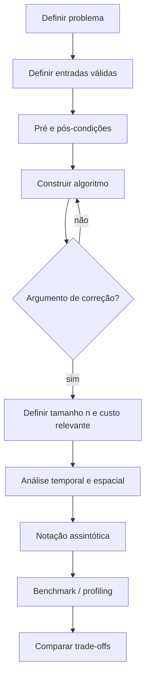

<a id="inicio"></a>

# Correção e Análise de Algoritmos

> **Classificação:** `[C → D] Conhecer e dominar progressivamente`  
> **Legenda curricular:** `[D]` = obrigatório dominar; `[C]` = obrigatório conhecer; `[E]` = extensão/recomendado; setas como `[C → D]` indicam progressão esperada de proficiência.  
> **Nível:** C — Algoritmos e Estruturas de Dados  
> **Posição na taxonomia:** tópico 24 — primeiro tópico do Nível C  
> **Pré-requisitos principais:** T02 — Fundamentos de Algoritmos; T06/T07 — Fluxo de Controle e Repetição; T08 — Padrões Fundamentais de Construção de Algoritmos; T12 — Rastreamento e Raciocínio sobre Execução; T17 — Recursão; T20 — Testes e Verificação; T23 — Modelo Básico de Execução  
> **Aprofundamentos posteriores:** T25 — ADTs e estruturas; T26 — Busca; T27/T28 — estruturas e ordenação; T29–T35 — algoritmos e estruturas de dados avançados do currículo; extensões formais de análise em 24.11

---

## Resumo executivo

Até o T23, a pergunta predominante era:

```text
"o programa funciona?"
```

No Nível C, essa pergunta deixa de ser suficiente. Para um algoritmo, é preciso separar pelo menos três dimensões:

```text
CORREÇÃO
→ ele produz o resultado exigido para toda entrada válida?

CUSTO
→ como tempo e memória crescem quando a entrada cresce?

EVIDÊNCIA EMPÍRICA
→ o que uma implementação concreta realmente apresentou em um ambiente concreto?
```

Essas dimensões se relacionam, mas **não são intercambiáveis**.

- um algoritmo pode ser correto e lento;
- pode ser rápido em alguns testes e incorreto no domínio geral;
- pode possuir bom crescimento assintótico e perder para outro algoritmo em entradas pequenas;
- pode usar mais memória para reduzir tempo;
- pode passar em milhares de casos de teste e ainda não possuir um argumento geral de correção.

O modelo central deste tópico é:

```text
PROBLEMA
  ↓
ENTRADAS VÁLIDAS + PRÉ-CONDIÇÕES
  ↓
ALGORITMO
  ↓
ARGUMENTO DE CORREÇÃO
  ├── invariantes
  ├── preservação de propriedades
  └── término
  ↓
MODELO DE CUSTO
  ├── tamanho da entrada
  ├── operação relevante
  ├── tempo
  └── espaço
  ↓
ANÁLISE ASSINTÓTICA
  ↓
MEDIÇÃO EMPÍRICA
  ↓
DECISÃO / TRADE-OFF
```

A ordem é importante: **não faz sentido otimizar um algoritmo cuja especificação ou correção ainda está errada**.

---

## Visão rápida

| Pergunta | Conceito principal | Exemplo de resposta |
|---|---|---|
| O que o algoritmo recebe? | entrada e domínio | sequência de inteiros |
| O que deve ser verdadeiro antes? | pré-condição | sequência ordenada |
| O que deve ser verdadeiro ao terminar? | pós-condição | alvo encontrado ou ausência sinalizada |
| Por que a resposta está correta? | argumento de correção | propriedade preservada + término |
| O que permanece verdadeiro no laço? | invariante | prefixo processado satisfaz uma propriedade |
| O que significa `n`? | tamanho da entrada | número de elementos |
| O que estamos contando? | operação relevante | comparações |
| Como o trabalho cresce? | complexidade temporal | `Θ(n)` |
| Como a memória cresce? | complexidade espacial | `Θ(1)` auxiliar |
| É limite superior, inferior ou justo? | `O`, `Ω`, `Θ` | `Θ(n)` quando ambos coincidem |
| Qual cenário está sendo analisado? | melhor/médio/pior caso | pior caso da busca linear |
| O cronômetro confirma Big O? | não | mede uma implementação concreta |
| Mais memória pode economizar trabalho? | trade-off tempo × espaço | cache/memoização |

---

## Quatro separações que evitam erros conceituais

```text
TESTE ≠ PROVA / ARGUMENTO DE CORREÇÃO
```

Teste observa um conjunto finito de execuções. Um argumento de correção explica por que a estratégia satisfaz a especificação para o domínio considerado.

```text
BIG O ≠ TEMPO EM SEGUNDOS
```

Big O descreve uma relação de crescimento assintótico. Segundos dependem de implementação, hardware, runtime, carga e muitos outros fatores.

```text
O / Ω / Θ ≠ PIOR / MELHOR / MÉDIO CASO
```

As notações descrevem **limites de funções**. Melhor, médio e pior caso dizem **qual função de custo** estamos analisando.

```text
ANÁLISE ≠ BENCHMARK
```

Análise cria um modelo abstrato. Benchmark mede uma implementação em um ambiente real. Um não substitui o outro.

---

## Regra de ouro

> **Especifique antes de provar; prove/argumente antes de otimizar; modele antes de medir; meça antes de concluir sobre uma implementação real.**

---

## Decisão rápida

Ao analisar um algoritmo, faça as perguntas nesta ordem:

1. qual problema está sendo resolvido?
2. quais entradas são válidas?
3. quais pré-condições existem?
4. qual pós-condição deve ser garantida?
5. por que a estratégia preserva as propriedades necessárias?
6. ela termina?
7. qual parâmetro representa o tamanho da entrada?
8. qual operação/recurso está sendo contado?
9. estamos falando de melhor, médio, pior ou outro caso?
10. o limite é superior, inferior ou justo?
11. a memória contada é auxiliar ou total?
12. o benchmark mede exatamente a hipótese que queremos avaliar?

---

## Como estudar este tópico

Este T24 funciona em três rotas complementares, sem exigir leitura linear de todas as seções em cada consulta:

```text
PRIMEIRO CONTATO
→ Resumo executivo
→ Visão rápida
→ Visão panorâmica
→ 24.1–24.10 na ordem
→ LABs essenciais

CONSULTA
→ Visão panorâmica
→ seção conceitual específica
→ Matriz de análise (§41)
→ Troubleshooting
→ Glossário

APROFUNDAMENTO
→ exemplos progressivos
→ PR-* / TS-*
→ LABs completos
→ exercícios
→ 24.11 [E]
```

A rota de aprofundamento não transforma extensões em pré-requisito. Para o núcleo curricular, priorize **especificação → correção/término → modelo de custo → análise assintótica → medição → trade-offs**.

---

<a id="visao-panoramica-t24"></a>

## 🗺️ Visão panorâmica — o mapa antes dos detalhes

Esta seção é o **caderno rápido de consulta** do T24. Ela não substitui o aprofundamento posterior: organiza o domínio inteiro em alto nível para que correção, custo e evidência empírica não sejam misturados.

### Mapa do domínio

```text
PROBLEMA / CONTRATO                                      [24.1]
├── domínio de entradas válidas
├── tamanho relevante da entrada
├── pré-condições
└── pós-condição esperada
        ↓
CORREÇÃO                                                 [24.2]
├── testes e contraexemplos = evidência finita
├── argumento de correção = justificativa geral
└── correção total = resultado correto + término
        ↓
INVARIANTES                                              [24.3]
├── inicialização
├── manutenção
└── término → pós-condição
        ↓
MODELO DE CUSTO                                          [24.4]
├── o que significa n, m, |V|, |E| ...?
└── o que será contado: comparações, acessos, chamadas, bytes ...?
        ↓
RECURSOS                                                 [24.5]
├── tempo
└── espaço — total ou auxiliar, conforme declarado
        ↓
LIMITES ASSINTÓTICOS                                     [24.6]
├── O(g(n))  → limite superior
├── Ω(g(n))  → limite inferior
└── Θ(g(n))  → limite assintoticamente justo
        ↓
CLASSES DE CRESCIMENTO                                   [24.7]
O(1) → O(log n) → O(n) → O(n log n) → O(n²) / outras potências polinomiais → O(2^n) → O(n!)
        ↓
CASO ANALISADO                                           [24.8]
├── melhor
├── médio / esperado — exige hipóteses de distribuição
└── pior
        ↓
EVIDÊNCIA EMPÍRICA                                       [24.9]
├── benchmark = implementação + máquina + runtime + carga
└── análise assintótica = tendência do modelo para crescimento da entrada
        ↓
TRADE-OFFS                                               [24.10]
└── tempo ↔ espaço
        ↓
EXTENSÕES                                                [24.11]
└── little-o/ω, amortizada, recorrências, Master Theorem, P/NP, reduções
```

### Fluxo mental de análise

```text
1. ESPECIFIQUE
   problema → entrada válida → pré-condição → pós-condição

2. ARGUMENTE CORREÇÃO
   propriedade preservada → término → pós-condição

3. DEFINA O MODELO
   tamanho da entrada + operação/recurso contado + caso analisado

4. DERIVE O CRESCIMENTO
   T(n), S(n) → O / Ω / Θ

5. MEÇA QUANDO NECESSÁRIO
   implementação real → benchmark/profiling

6. DECIDA
   correção + custo + restrições + trade-offs
```

> **Ordem de segurança conceitual:** otimizar uma solução cuja especificação ou correção está errada apenas torna o erro mais eficiente.

### Tabela de consulta rápida

| Pergunta | Conceito | Regra curta | Erro típico |
|---|---|---|---|
| O que é entrada válida? | domínio / pré-condição | declare antes da análise | analisar busca binária sem exigir ordenação |
| O que deve ser verdade no fim? | pós-condição | descreva comportamento, não implementação | “retorna índice” sem tratar ausência |
| Como sei que funciona para todo o domínio? | correção | testes não substituem argumento geral | generalizar de poucos testes |
| O que permanece verdadeiro durante o laço? | invariante | inicialização + manutenção + término | invariante verdadeiro, mas fraco demais |
| O algoritmo termina? | terminação | identifique progresso/medida decrescente | provar resultado “se terminar” e esquecer que pode não terminar |
| O que significa `n`? | tamanho da entrada | declare explicitamente | usar só `n` para grafo com `|V|` e `|E|` |
| O que estou contando? | modelo de custo | escolha operação/recurso relevante | considerar toda linha como `O(1)` |
| Como o tempo cresce? | complexidade temporal | modele T(n) | confundir com segundos |
| Como a memória cresce? | complexidade espacial | diga se é total ou auxiliar | ignorar call stack |
| É superior, inferior ou justo? | `O`, `Ω`, `Θ` | não use O como “igual a” | “O(n²) é a complexidade exata” |
| Qual caso? | melhor/médio/pior | notação e caso são dimensões distintas | “Ω = melhor caso” |
| O médio é válido? | distribuição | declare hipótese probabilística | média sem distribuição |
| O benchmark prova Big O? | medição empírica | não; ele mede amostras concretas | ajustar curva com 3 pontos e declarar prova |
| Mais memória pode reduzir tempo? | trade-off | compare recursos separadamente | chamar cache de “gratuito” |

### Pergunta prática → onde olhar primeiro

| Se você observar... | Comece por... | Depois confirme... |
|---|---|---|
| saída errada apenas para alguns casos | 24.1 + 24.2 | pré/pós-condição, contraexemplo e invariante |
| off-by-one em laço | 24.3 | inicialização, manutenção e condição de término |
| laço que pode nunca terminar | 24.2/24.3 | medida de progresso e condição de saída |
| análise “O(n)” que parece quadrática | 24.4 | custo escondido em operação interna |
| algoritmo “rápido” que usa muita memória | 24.5 + 24.10 | espaço auxiliar/total e trade-off |
| discussão “O ou Θ?” | 24.6 | se o limite é apenas superior ou é justo |
| desempenho depende muito dos dados | 24.8 | melhor/médio/pior e distribuição |
| benchmark contradiz expectativa | 24.9 | modelo, warm-up, ruído, I/O, JIT/GC e tamanho usado |
| automação cresce mal com dispositivos × verificações | 24.4 | use parâmetros separados, por exemplo `n × m` |

### Não confundir

```text
ALGORITMO CORRETO ≠ IMPLEMENTAÇÃO SEM BUG
```

Um algoritmo pode estar correto sob seu contrato e uma implementação concreta introduzir um defeito.

```text
TESTE ≠ PROVA DE CORREÇÃO
```

Testes podem refutar uma afirmação de correção por contraexemplo, mas um conjunto finito de testes não demonstra automaticamente correção para todo um domínio ilimitado.

```text
CORREÇÃO PARCIAL ≠ CORREÇÃO TOTAL
```

Correção parcial diz, em essência, “se terminar, o resultado satisfaz a pós-condição”. Correção total inclui também a terminação.

```text
O / Ω / Θ ≠ PIOR / MELHOR / MÉDIO CASO
```

A notação descreve limites de uma função; o caso diz qual função está sendo considerada.

```text
BIG O ≠ SEGUNDOS
```

`O(n)` não informa quantos milissegundos uma execução levará.

```text
BENCHMARK ≠ ANÁLISE ASSINTÓTICA
```

Benchmark mede uma implementação em condições concretas. Análise assintótica explica crescimento sob um modelo.

```text
UMA LINHA DE CÓDIGO ≠ O(1)
```

Uma chamada curta pode percorrer, copiar, ordenar, alocar ou executar processos externos.

```text
ESPAÇO AUXILIAR ≠ ESPAÇO TOTAL
```

Declare qual convenção está sendo usada.

### Microexemplos canônicos

**1. Pré-condição antes da complexidade**

```text
binary_search(data, target)
pré-condição: data está ordenada pelo mesmo critério de comparação
```

Sem a pré-condição, discutir `O(log n)` é secundário: a resposta pode estar errada.

**2. Invariante de varredura**

```text
antes da iteração i:
max_value é o maior valor entre os elementos já processados
```

Se a propriedade vale inicialmente, é preservada a cada passo e ao término cobre todos os elementos, ela sustenta o argumento de correção.

**3. Invariante ≠ variante de término**

```text
invariante
→ propriedade que deve permanecer verdadeira

variante / medida de progresso
→ grandeza bem-fundada que progride estritamente em direção ao término
```

Para `while value > 1: value = floor(value / 2)`, o próprio `value` pode servir como medida de progresso: permanece inteiro positivo e diminui estritamente enquanto o laço executa.

**4. Custo escondido**

```python
for item in items:         # n vezes
    if item in other:      # pode custar O(m), conforme a estrutura
        ...
```

Não é seguro concluir `O(n)` olhando apenas para o laço externo.

**5. Dois parâmetros são melhores que um parâmetro artificial**

```text
n = número de dispositivos
m = número de verificações por dispositivo
custo aproximado do padrão duplo → Θ(nm)
```

Isso comunica mais informação do que inventar um único `N` sem explicar sua relação com `n` e `m`.

### Problemas reais representativos

| ID | Problema | Conceito dominante | Destino principal |
|---|---|---|---|
| `PR-T24-01` | busca binária recebe sequência não ordenada | contrato / pré-condição | 24.1 |
| `PR-T24-02` | poucos testes verdes são tratados como prova | correção | 24.2 |
| `PR-T24-03` | laço parece correto, mas quebra uma propriedade no meio | invariante | 24.3 |
| `PR-T24-04` | algoritmo correto “se terminar”, mas pode entrar em loop | terminação | 24.2/24.3 |
| `PR-T24-05` | `n` foi definido de forma errada ou insuficiente | modelo de entrada | 24.4 |
| `PR-T24-06` | uma operação curta esconde custo proporcional à entrada | modelo de custo | 24.4/24.5 |
| `PR-T24-07` | `O`, `Ω`, `Θ` e casos são misturados | notação assintótica | 24.6/24.8 |
| `PR-T24-08` | “caso médio” é declarado sem distribuição | análise de casos | 24.8 |
| `PR-T24-09` | benchmark é usado como prova de classe assintótica | evidência empírica | 24.9 |
| `PR-T24-10` | reduzir tempo aumenta memória sem registrar o trade-off | tempo × espaço | 24.10 |

### Entrada rápida de troubleshooting

```text
resultado incorreto?
→ volte ao contrato e procure um contraexemplo mínimo

laço suspeito?
→ escreva o invariante + condição de término + medida de progresso

complexidade suspeita?
→ defina n e expanda o custo das operações chamadas

benchmark estranho?
→ separe setup, warm-up, I/O, runtime, GC/JIT, tamanho e repetição

memória crescendo?
→ diferencie entrada, saída, espaço auxiliar, retenção e call stack
```

O diagnóstico completo está em [Troubleshooting sistemático](#troubleshooting-sistematico).

### Transferência entre Python, JavaScript, Java e Bash

O raciocínio algorítmico é transferível; o custo concreto de cada operação **não deve ser presumido idêntico**.

| Conceito transferível | Python | JavaScript / Node.js | Java | GNU Bash |
|---|---|---|---|---|
| definir entrada/tamanho | `len(...)`, domínio explícito | `.length`, domínio explícito | `.length`/`.size()` | `$#`, `${#array[@]}`, linhas/bytes conforme problema |
| contar operações | contador explícito | contador explícito | contador explícito | aritmética do shell |
| medir tempo real | `timeit` / `perf_counter` | `performance.now()` | `System.nanoTime()` | palavra reservada `time` |
| memória / objetos | depende do runtime/estrutura | depende do engine/estrutura | depende da JVM/estrutura | frequentemente inclui processos/utilitários externos |
| chamada curta | pode esconder trabalho em C/Python | pode acionar built-ins/JIT | biblioteca/JVM | pode criar processo externo |

> **Regra de transferência:** transfira o **modelo**, depois revalide a semântica e o custo da operação concreta na linguagem/runtime usados.

### Modo consulta × modo estudo

**Para consulta rápida:** use o mapa do domínio, a tabela de consulta, “Não confundir” e a entrada de troubleshooting.

**Para estudo progressivo:** siga 24.1 → 24.10 nesta ordem; trate 24.11 como extensão. Execute os LABs somente depois de conseguir declarar contrato, invariante/modelo de custo e caso analisado sem depender do código.

### Fronteiras deste tópico

- T24 **não** substitui T20: testes fornecem evidência; T24 acrescenta raciocínio geral de correção e custo.
- T24 **não** substitui T25–T35: ele fornece as ferramentas usadas para analisar as estruturas e estratégias posteriores.
- provas formais avançadas, análise amortizada aprofundada, recorrências formais, Master Theorem e teoria de complexidade permanecem extensões de 24.11.
- benchmark de produção, profiling avançado e observabilidade de sistemas são disciplinas maiores; aqui entram apenas como contraste necessário à análise assintótica.

[↑ Voltar ao índice](#índice)

---

# Índice

  - [Resumo executivo](#resumo-executivo)
  - [Visão rápida](#visão-rápida)
  - [Quatro separações que evitam erros conceituais](#quatro-separações-que-evitam-erros-conceituais)
  - [Regra de ouro](#regra-de-ouro)
  - [Decisão rápida](#decisão-rápida)
  - [Como estudar este tópico](#como-estudar-este-tópico)
  - [🗺️ Visão panorâmica — o mapa antes dos detalhes](#visao-panoramica-t24)
- [1. Posição deste assunto na trilha](#1-posição-deste-assunto-na-trilha)
  - [1.1 Fronteira com T20 — Testes e Verificação](#11-fronteira-com-t20--testes-e-verificação)
  - [1.2 Fronteira com T23 — Modelo de Execução](#12-fronteira-com-t23--modelo-de-execução)
  - [1.3 Fronteira com T25 — ADTs e estruturas](#13-fronteira-com-t25--adts-e-estruturas)
  - [1.4 Fronteira com T26–T35](#14-fronteira-com-t26t35)
  - [1.5 O que não pertence ao núcleo deste tópico](#15-o-que-não-pertence-ao-núcleo-deste-tópico)
- [2. Modelo mental — especificação, correção, custo e evidência](#2-modelo-mental--especificação-correção-custo-e-evidência)
  - [2.1 Correção vem antes de eficiência](#21-correção-vem-antes-de-eficiência)
  - [2.2 Custo não é uma propriedade única](#22-custo-não-é-uma-propriedade-única)
  - [2.3 Medição não corrige modelo ruim](#23-medição-não-corrige-modelo-ruim)
  - [2.4 Um diagrama de decisão](#24-um-diagrama-de-decisão)
- [3. 24.1 — Problema, entrada e pré-condições `[D]`](#3-241--problema-entrada-e-pré-condições-d)
  - [3.1 Problema não é implementação](#31-problema-não-é-implementação)
  - [3.2 Entrada válida](#32-entrada-válida)
  - [3.3 Pré-condição](#33-pré-condição)
  - [3.4 Pós-condição](#34-pós-condição)
  - [3.5 Pré-condição não é validação automática](#35-pré-condição-não-é-validação-automática)
  - [3.6 Exemplo progressivo — soma de uma sequência](#36-exemplo-progressivo--soma-de-uma-sequência)
  - [3.7 Quatro linguagens — contrato equivalente, semântica concreta diferente](#37-quatro-linguagens--contrato-equivalente-semântica-concreta-diferente)
- [4. Do contrato ao argumento de correção](#4-do-contrato-ao-argumento-de-correção)
  - [4.1 Um contrato simples](#41-um-contrato-simples)
  - [4.2 O que precisa ser explicado](#42-o-que-precisa-ser-explicado)
  - [4.3 Estado vazio](#43-estado-vazio)
- [5. 24.2 — Correção `[C → D]`](#5-242--correção-c--d)
  - [5.1 Correção parcial e correção total](#51-correção-parcial-e-correção-total)
  - [5.2 Testes aumentam confiança; não generalizam automaticamente](#52-testes-aumentam-confiança-não-generalizam-automaticamente)
  - [5.3 Um contraexemplo basta para refutar correção](#53-um-contraexemplo-basta-para-refutar-correção)
  - [5.4 Correção não significa robustez de produção](#54-correção-não-significa-robustez-de-produção)
  - [5.5 Falácia — "passou nos testes, então está provado"](#55-falácia--passou-nos-testes-então-está-provado)
  - [5.6 Término e função variante — demonstração mínima](#56-término-e-função-variante--demonstração-mínima)
- [6. 24.3 — Invariantes `[C]`](#6-243--invariantes-c)
  - [6.1 Invariante da soma de prefixo](#61-invariante-da-soma-de-prefixo)
  - [6.2 Invariante não precisa mencionar cada variável](#62-invariante-não-precisa-mencionar-cada-variável)
  - [6.3 Invariante pode ser verdadeiro e insuficiente](#63-invariante-pode-ser-verdadeiro-e-insuficiente)
  - [6.4 Invariante conceitual do Insertion Sort](#64-invariante-conceitual-do-insertion-sort)
  - [6.5 Como descobrir um invariante](#65-como-descobrir-um-invariante)
  - [6.6 Invariantes e debugging](#66-invariantes-e-debugging)
  - [6.7 Assertions como instrumento de observação](#67-assertions-como-instrumento-de-observação)
- [7. Invariante × assertion × teste × tipo](#7-invariante--assertion--teste--tipo)
  - [7.1 Não reduza invariante a `assert`](#71-não-reduza-invariante-a-assert)
  - [7.2 Não use assertion como validação de usuário](#72-não-use-assertion-como-validação-de-usuário)
  - [7.3 Tipo não prova pós-condição](#73-tipo-não-prova-pós-condição)
- [8. 24.4 — Tamanho da entrada e operação relevante `[D]`](#8-244--tamanho-da-entrada-e-operação-relevante-d)
  - [8.1 Exemplos de tamanho](#81-exemplos-de-tamanho)
  - [8.2 Não comprima dois parâmetros sem necessidade](#82-não-comprima-dois-parâmetros-sem-necessidade)
  - [8.3 Operação relevante](#83-operação-relevante)
  - [8.4 Modelo RAM](#84-modelo-ram)
  - [8.5 O custo de uma operação pode depender do domínio](#85-o-custo-de-uma-operação-pode-depender-do-domínio)
  - [8.6 Bash exige atenção especial ao modelo real](#86-bash-exige-atenção-especial-ao-modelo-real)
- [9. Contagem de operações — um modelo didático](#9-contagem-de-operações--um-modelo-didático)
  - [9.1 Linear](#91-linear)
  - [9.2 Quadrático](#92-quadrático)
  - [9.3 Sequencial](#93-sequencial)
  - [9.4 Logarítmico](#94-logarítmico)
- [10. Contadores executáveis nas quatro linguagens](#10-contadores-executáveis-nas-quatro-linguagens)
  - [10.1 Python](#101-python)
  - [10.2 JavaScript](#102-javascript)
  - [10.3 Java](#103-java)
  - [10.4 GNU Bash](#104-gnu-bash)
  - [10.5 Observação](#105-observação)
- [11. 24.5 — Complexidade temporal e espacial `[D]`](#11-245--complexidade-temporal-e-espacial-d)
  - [11.1 Complexidade temporal](#111-complexidade-temporal)
  - [11.2 Complexidade espacial](#112-complexidade-espacial)
  - [11.3 Recursão e espaço](#113-recursão-e-espaço)
  - [11.4 Saída também pode dominar espaço](#114-saída-também-pode-dominar-espaço)
  - [11.5 Tempo e espaço são funções diferentes](#115-tempo-e-espaço-são-funções-diferentes)
- [12. Como derivar uma complexidade simples](#12-como-derivar-uma-complexidade-simples)
  - [12.1 Passo 1 — defina `n`](#121-passo-1--defina-n)
  - [12.2 Passo 2 — escolha operação relevante](#122-passo-2--escolha-operação-relevante)
  - [12.3 Passo 3 — conte em função de `n`](#123-passo-3--conte-em-função-de-n)
  - [12.4 Passo 4 — escolha o caso](#124-passo-4--escolha-o-caso)
  - [12.5 Passo 5 — expresse a ordem de crescimento](#125-passo-5--expresse-a-ordem-de-crescimento)
  - [12.6 Passo 6 — documente hipóteses](#126-passo-6--documente-hipóteses)
- [13. 24.6 — Big O, Big Omega e Big Theta `[C → D]`](#13-246--big-o-big-omega-e-big-theta-c--d)
  - [13.1 Big O — limite superior assintótico](#131-big-o--limite-superior-assintótico)
  - [13.2 Big Omega — limite inferior assintótico](#132-big-omega--limite-inferior-assintótico)
  - [13.3 Big Theta — limite justo assintótico](#133-big-theta--limite-justo-assintótico)
  - [13.4 `Θ` é frequentemente a descrição mais informativa](#134-θ-é-frequentemente-a-descrição-mais-informativa)
  - [13.5 Erro clássico — O não significa "caso pior"](#135-erro-clássico--o-não-significa-caso-pior)
  - [13.6 Notação de conjunto × uso informal](#136-notação-de-conjunto--uso-informal)
  - [13.7 Constantes e termos de menor ordem](#137-constantes-e-termos-de-menor-ordem)
- [14. Regras práticas para análise de código simples](#14-regras-práticas-para-análise-de-código-simples)
  - [14.1 Blocos sequenciais](#141-blocos-sequenciais)
  - [14.2 Laços aninhados dependentes](#142-laços-aninhados-dependentes)
  - [14.3 Laços consecutivos](#143-laços-consecutivos)
  - [14.4 Redução multiplicativa do problema](#144-redução-multiplicativa-do-problema)
  - [14.5 Recursão](#145-recursão)
- [15. 24.7 — Classes fundamentais de crescimento `[D]`](#15-247--classes-fundamentais-de-crescimento-d)
  - [15.1 Constante — `Θ(1)`](#151-constante--θ1)
  - [15.2 Logarítmica — `Θ(log n)`](#152-logarítmica--θlog-n)
  - [15.3 Linear — `Θ(n)`](#153-linear--θn)
  - [15.4 Linear-logarítmica — `Θ(n log n)`](#154-linear-logarítmica--θn-log-n)
  - [15.5 Quadrática — `Θ(n²)`](#155-quadrática--θn²)
  - [15.6 Crescimento polinomial — `Θ(n^k)`](#156-crescimento-polinomial--θnk)
  - [15.7 Exponencial — `Θ(2^n)`](#157-exponencial--θ2n)
  - [15.8 Fatorial — `Θ(n!)`](#158-fatorial--θn)
- [16. Escala — por que a classe importa](#16-escala--por-que-a-classe-importa)
  - [16.1 Cuidado com leitura literal](#161-cuidado-com-leitura-literal)
  - [16.2 Constantes ainda importam](#162-constantes-ainda-importam)
  - [16.3 Assintótico significa comportamento para crescimento](#163-assintótico-significa-comportamento-para-crescimento)
- [17. Reconhecendo padrões sem decorar fórmulas](#17-reconhecendo-padrões-sem-decorar-fórmulas)
  - [17.1 Um acesso](#171-um-acesso)
  - [17.2 Uma varredura](#172-uma-varredura)
  - [17.3 Dividir por dois](#173-dividir-por-dois)
  - [17.4 Varredura × redução logarítmica](#174-varredura--redução-logarítmica)
  - [17.5 Todos os pares](#175-todos-os-pares)
  - [17.6 Todas as escolhas binárias](#176-todas-as-escolhas-binárias)
  - [17.7 Todas as ordens](#177-todas-as-ordens)
- [18. 24.8 — Melhor, médio e pior caso `[C]`](#18-248--melhor-médio-e-pior-caso-c)
  - [18.1 Busca linear como modelo](#181-busca-linear-como-modelo)
  - [18.2 Caso médio exige distribuição](#182-caso-médio-exige-distribuição)
    - [18.2.1 Exemplo calculado — busca linear com alvo presente](#1821-exemplo-calculado--busca-linear-com-alvo-presente)
  - [18.3 Caso esperado não é sinônimo automático de caso médio](#183-caso-esperado-não-é-sinônimo-automático-de-caso-médio)
  - [18.4 Pior caso não é sempre a única métrica útil](#184-pior-caso-não-é-sempre-a-única-métrica-útil)
- [19. Exemplo executável — busca linear e contagem de comparações](#19-exemplo-executável--busca-linear-e-contagem-de-comparações)
  - [19.1 Python](#191-python)
  - [19.2 JavaScript](#192-javascript)
  - [19.3 Java](#193-java)
  - [19.4 GNU Bash](#194-gnu-bash)
  - [19.5 Casos observáveis](#195-casos-observáveis)
- [20. 24.9 — Medição empírica × análise assintótica `[C]`](#20-249--medição-empírica--análise-assintótica-c)
  - [20.1 O que um benchmark pode revelar](#201-o-que-um-benchmark-pode-revelar)
  - [20.2 O que um benchmark não prova sozinho](#202-o-que-um-benchmark-não-prova-sozinho)
  - [20.3 Não compare linguagens com microbenchmark ingênuo](#203-não-compare-linguagens-com-microbenchmark-ingênuo)
  - [20.4 Meça tempo decorrido com relógio apropriado](#204-meça-tempo-decorrido-com-relógio-apropriado)
  - [20.5 Python — exemplo mínimo de medição](#205-python--exemplo-mínimo-de-medição)
  - [20.6 JavaScript / Node.js](#206-javascript--nodejs)
  - [20.7 Java](#207-java)
  - [20.8 GNU Bash — exemplo mínimo de medição](#208-gnu-bash--exemplo-mínimo-de-medição)
  - [20.9 Benchmark mínimo bem desenhado](#209-benchmark-mínimo-bem-desenhado)
- [21. Análise × profiling × benchmarking](#21-análise--profiling--benchmarking)
  - [21.1 Profiling encontra gargalo concreto](#211-profiling-encontra-gargalo-concreto)
  - [21.2 Otimização prematura de classe errada](#212-otimização-prematura-de-classe-errada)
- [22. 24.10 — Tempo × espaço `[C]`](#22-2410--tempo--espaço-c)
  - [22.1 Exemplo conceitual — consulta repetida](#221-exemplo-conceitual--consulta-repetida)
  - [22.2 Detectar duplicados — dois modelos](#222-detectar-duplicados--dois-modelos)
  - [22.3 "In-place" precisa de definição](#223-in-place-precisa-de-definição)
  - [22.4 Cópia pode ser escolha correta](#224-cópia-pode-ser-escolha-correta)
- [23. Exemplo de trade-off — duplicados nas quatro linguagens](#23-exemplo-de-trade-off--duplicados-nas-quatro-linguagens)
  - [23.1 Python](#231-python)
  - [23.2 JavaScript](#232-javascript)
  - [23.3 Java](#233-java)
  - [23.4 GNU Bash](#234-gnu-bash)
- [24. O que significa "mesma complexidade"?](#24-o-que-significa-mesma-complexidade)
  - [24.1 Complexidade é uma abstração de crescimento](#241-complexidade-é-uma-abstração-de-crescimento)
  - [24.2 Classe melhor pode perder em `n` pequeno](#242-classe-melhor-pode-perder-em-n-pequeno)
  - [24.3 Classe pior continua sendo risco de escala](#243-classe-pior-continua-sendo-risco-de-escala)
- [25. Complexidade de chamadas de biblioteca](#25-complexidade-de-chamadas-de-biblioteca)
  - [25.1 Sintaxe curta não implica custo constante](#251-sintaxe-curta-não-implica-custo-constante)
  - [25.2 Evite inventar complexidade da biblioteca](#252-evite-inventar-complexidade-da-biblioteca)
- [26. Strings, Unicode e o significado de `n`](#26-strings-unicode-e-o-significado-de-n)
  - [26.1 Por que importa](#261-por-que-importa)
  - [26.2 Regra](#262-regra)
- [27. Matrizes e múltiplas dimensões](#27-matrizes-e-múltiplas-dimensões)
  - [27.1 Não confunda dimensão com quantidade total](#271-não-confunda-dimensão-com-quantidade-total)
  - [27.2 Complexidade deve declarar o modelo de entrada](#272-complexidade-deve-declarar-o-modelo-de-entrada)
- [28. Grafos — por que `n` pode não bastar](#28-grafos--por-que-n-pode-não-bastar)
- [29. Custos ocultos por composição](#29-custos-ocultos-por-composição)
  - [29.1 Função auxiliar também entra na análise](#291-função-auxiliar-também-entra-na-análise)
  - [29.2 Operação de string/coleção pode esconder laço](#292-operação-de-stringcoleção-pode-esconder-laço)
  - [29.3 Shell e processos externos](#293-shell-e-processos-externos)
- [30. Erros comuns de análise](#30-erros-comuns-de-análise)
  - [30.1 "Tem dois loops, então é O(n²)"](#301-tem-dois-loops-então-é-on²)
  - [30.2 "Big O é o pior caso"](#302-big-o-é-o-pior-caso)
  - [30.3 "Ω é o melhor caso"](#303-ω-é-o-melhor-caso)
  - [30.4 "Θ é o caso médio"](#304-θ-é-o-caso-médio)
  - [30.5 "O(1) significa rápido"](#305-o1-significa-rápido)
  - [30.6 "Ignorar constantes significa que constantes não importam"](#306-ignorar-constantes-significa-que-constantes-não-importam)
  - [30.7 "Benchmark prova Big O"](#307-benchmark-prova-big-o)
  - [30.8 "Mesmo Big O significa mesmo desempenho"](#308-mesmo-big-o-significa-mesmo-desempenho)
  - [30.9 "Uma linha de código custa O(1)"](#309-uma-linha-de-código-custa-o1)
  - [30.10 "Toda operação de hash é O(1) garantido"](#3010-toda-operação-de-hash-é-o1-garantido)
  - [30.11 "Espaço é só heap"](#3011-espaço-é-só-heap)
  - [30.12 "Recursão não usa memória porque não criei array"](#3012-recursão-não-usa-memória-porque-não-criei-array)
  - [30.13 "Medi 3 pontos; logo a curva é n²"](#3013-medi-3-pontos-logo-a-curva-é-n²)
  - [30.14 "Otimizar antes de validar correção"](#3014-otimizar-antes-de-validar-correção)
- [31. 24.11 — Extensões `[E]`](#31-2411--extensões-e)
  - [31.1 Little-o](#311-little-o)
  - [31.2 Little-omega](#312-little-omega)
  - [31.3 "Little-theta"](#313-little-theta)
  - [31.4 Análise amortizada](#314-análise-amortizada)
  - [31.5 Recorrências](#315-recorrências)
  - [31.6 `P`, `NP`, `NP-Complete`](#316-p-np-np-complete)
  - [31.7 Reduções formais](#317-reduções-formais)
  - [31.8 Por que não aprofundar agora](#318-por-que-não-aprofundar-agora)
- [32. Linguagens canônicas — o que é universal e o que não é](#32-linguagens-canônicas--o-que-é-universal-e-o-que-não-é)
  - [32.1 Universal](#321-universal)
  - [32.2 Não universal](#322-não-universal)
  - [32.3 Python](#323-python)
  - [32.4 JavaScript / ECMAScript](#324-javascript--ecmascript)
  - [32.5 Java](#325-java)
  - [32.6 GNU Bash](#326-gnu-bash)
- [33. Comparação didática — crescimento por duplicação de `n`](#33-comparação-didática--crescimento-por-duplicação-de-n)
  - [33.1 Regra prática](#331-regra-prática)
  - [33.2 Contagem determinística é ótima para aprender](#332-contagem-determinística-é-ótima-para-aprender)
- [34. Exemplo progressivo integrado — máximo de uma sequência](#34-exemplo-progressivo-integrado--máximo-de-uma-sequência)
  - [34.1 Especificação](#341-especificação)
  - [34.2 Implementação correta](#342-implementação-correta)
  - [34.3 Invariante](#343-invariante)
  - [34.4 Custo temporal](#344-custo-temporal)
  - [34.5 Espaço auxiliar](#345-espaço-auxiliar)
  - [34.6 Implementação incorreta clássica](#346-implementação-incorreta-clássica)
- [35. Transferência do exemplo de máximo](#35-transferência-do-exemplo-de-máximo)
  - [35.1 JavaScript](#351-javascript)
  - [35.2 Java](#352-java)
  - [35.3 GNU Bash](#353-gnu-bash)
  - [35.4 O que realmente foi transferido](#354-o-que-realmente-foi-transferido)
- [36. Correção e complexidade são propriedades diferentes](#36-correção-e-complexidade-são-propriedades-diferentes)
  - [36.1 Primeiro corrija o quadrante](#361-primeiro-corrija-o-quadrante)
  - [36.2 Otimização pode quebrar invariante](#362-otimização-pode-quebrar-invariante)
- [37. Guardrails para benchmarking](#37-guardrails-para-benchmarking)
  - [37.1 Não misture setup com trecho medido sem intenção](#371-não-misture-setup-com-trecho-medido-sem-intenção)
  - [37.2 Repita](#372-repita)
  - [37.3 Observe distribuição](#373-observe-distribuição)
  - [37.4 Evite I/O no núcleo quando medir CPU](#374-evite-io-no-núcleo-quando-medir-cpu)
  - [37.5 Cuidado com otimização do compilador/JIT](#375-cuidado-com-otimização-do-compiladorjit)
  - [37.6 Registre versões](#376-registre-versões)
  - [37.7 Não use benchmark como argumento de correção](#377-não-use-benchmark-como-argumento-de-correção)
- [38. Problemas reais — como a análise muda decisões](#38-problemas-reais--como-a-análise-muda-decisões)
  - [38.1 Inventário pequeno versus milhões de registros](#381-inventário-pequeno-versus-milhões-de-registros)
  - [38.2 Automação de rede](#382-automação-de-rede)
  - [38.3 Processamento de logs](#383-processamento-de-logs)
  - [38.4 Front-end](#384-front-end)
  - [38.5 Banco de dados](#385-banco-de-dados)
  - [Inventário formal de problemas reais `PR-T24-*`](#inventario-pr-t24)
  - [🔎 Troubleshooting sistemático](#troubleshooting-sistematico)
- [39. Dúvidas naturais e respostas curtas](#39-dúvidas-naturais-e-respostas-curtas)
  - [39.1 "Big O é sempre pior caso?"](#391-big-o-é-sempre-pior-caso)
  - [39.2 "Se é O(n), também é O(n²)?"](#392-se-é-on-também-é-on²)
  - [39.3 "Por que usamos O se Θ é mais preciso?"](#393-por-que-usamos-o-se-θ-é-mais-preciso)
  - [39.4 "Big O ignora input pequeno?"](#394-big-o-ignora-input-pequeno)
  - [39.5 "O(log n) é sempre base 2?"](#395-olog-n-é-sempre-base-2)
  - [39.6 "O(1) usa memória zero?"](#396-o1-usa-memória-zero)
  - [39.7 "Espaço auxiliar inclui entrada?"](#397-espaço-auxiliar-inclui-entrada)
  - [39.8 "Posso descobrir Big O só executando?"](#398-posso-descobrir-big-o-só-executando)
  - [39.9 "Por que Bash parece tão mais lento no mesmo laço?"](#399-por-que-bash-parece-tão-mais-lento-no-mesmo-laço)
  - [39.10 "Invariante é só para algoritmos acadêmicos?"](#3910-invariante-é-só-para-algoritmos-acadêmicos)
- [40. Antipadrões e correções](#40-antipadrões-e-correções)
- [41. Matriz de análise de um algoritmo](#41-matriz-de-análise-de-um-algoritmo)
- [42. Prática guiada — classifique sem executar](#42-prática-guiada--classifique-sem-executar)
  - [42.1 Trecho A](#421-trecho-a)
  - [42.2 Trecho B](#422-trecho-b)
  - [42.3 Trecho C](#423-trecho-c)
  - [42.4 Trecho D](#424-trecho-d)
  - [42.5 Trecho E](#425-trecho-e)
  - [42.6 Trecho F](#426-trecho-f)
- [43. Prática guiada — encontre a especificação ausente](#43-prática-guiada--encontre-a-especificação-ausente)
- [44. Prática guiada — prove um invariante simples](#44-prática-guiada--prove-um-invariante-simples)
- [45. Segurança e consumo de recursos](#45-segurança-e-consumo-de-recursos)
  - [45.1 Entrada não confiável pode controlar `n`](#451-entrada-não-confiável-pode-controlar-n)
  - [45.2 Regex, parsers e algoritmos patológicos](#452-regex-parsers-e-algoritmos-patológicos)
  - [45.3 Complexidade não substitui controles](#453-complexidade-não-substitui-controles)
- [46. Visão panorâmica do T24](#46-visão-panorâmica-do-t24)
- [47. Laboratórios](#47-laboratórios)
  - [🧪 LAB 1 — especificação antes do código](#-lab-1--especificação-antes-do-código)
  - [🧪 LAB 2 — invariante de soma de prefixo](#-lab-2--invariante-de-soma-de-prefixo)
  - [🧪 LAB 3 — contagem determinística de crescimento](#-lab-3--contagem-determinística-de-crescimento)
  - [🧪 LAB 4 — melhor e pior caso observável](#-lab-4--melhor-e-pior-caso-observável)
  - [🧪 LAB 5 — Big O frouxo versus Theta](#-lab-5--big-o-frouxo-versus-theta)
  - [🧪 LAB 6 — benchmark com hipótese limitada](#-lab-6--benchmark-com-hipótese-limitada)
  - [🧪 LAB 7 — tempo versus espaço na detecção de duplicados](#-lab-7--tempo-versus-espaço-na-detecção-de-duplicados)
  - [🧪 LAB 8 — análise completa de um algoritmo pequeno](#-lab-8--análise-completa-de-um-algoritmo-pequeno)
- [48. Exercícios](#48-exercícios)
- [49. Evidências de domínio](#49-evidências-de-domínio)
- [50. Checklist de domínio](#50-checklist-de-domínio)
- [51. Glossário](#51-glossário)
- [52. Auditoria de cobertura da taxonomia](#52-auditoria-de-cobertura-da-taxonomia)
  - [52.1 Fronteira preservada com T25](#521-fronteira-preservada-com-t25)
  - [52.2 Fronteira preservada com T26](#522-fronteira-preservada-com-t26)
  - [52.3 Fronteira preservada com ordenação](#523-fronteira-preservada-com-ordenação)
  - [52.4 Fronteira preservada com teoria avançada](#524-fronteira-preservada-com-teoria-avançada)
- [53. Auditoria da File Library](#53-auditoria-da-file-library)
  - [53.1 Fontes locais efetivamente consultadas](#531-fontes-locais-efetivamente-consultadas)
    - [53.1.1 Reconsulta material executada na revisão `0.2.0` — 2026-09-15](#5311-reconsulta-material-executada-na-revisão-020--2026-09-15)
    - [53.1.2 Reconsulta material executada na R3 (`0.3.0`) — 2026-09-19](#5312-reconsulta-material-executada-na-r3-030--2026-09-19)
  - [53.2 Como a biblioteca alterou o documento](#532-como-a-biblioteca-alterou-o-documento)
  - [53.3 Fontes localizadas mas não usadas para inflar bibliografia](#533-fontes-localizadas-mas-não-usadas-para-inflar-bibliografia)
  - [53.4 Atualidade e natureza da fonte](#534-atualidade-e-natureza-da-fonte)
  - [53.5 Reconsulta material executada na R4 (`0.3.1`) — 2026-09-19](#535-reconsulta-material-executada-na-r4-031--2026-09-19)
- [54. Referências](#54-referências)
  - [54.1 Contratos canônicos do projeto](#541-contratos-canônicos-do-projeto)
  - [54.2 Literatura acadêmica/local efetivamente consultada](#542-literatura-acadêmicalocal-efetivamente-consultada)
  - [54.3 Python — medição oficial](#543-python--medição-oficial)
  - [54.4 JavaScript / Node.js — medição oficial](#544-javascript--nodejs--medição-oficial)
  - [54.5 Java — medição oficial](#545-java--medição-oficial)
  - [54.6 GNU Bash — medição oficial](#546-gnu-bash--medição-oficial)
  - [54.7 Revalidação de documentação versionada — 2026-09-15](#547-revalidação-de-documentação-versionada--2026-09-15)
    - [54.7.1 Revalidação documental da R3 — 2026-09-19](#5471-revalidação-documental-da-r3--2026-09-19)
    - [54.7.2 Revalidação documental da R4 (`0.3.1`) — 2026-09-19](#5472-revalidação-documental-da-r4-031--2026-09-19)
  - [54.8 Hierarquia usada nesta revisão](#548-hierarquia-usada-nesta-revisão)
- [55. QA e evidências](#55-qa-e-evidências)
  - [55.1 `[D]` Evidência documental](#551-d-evidência-documental)
  - [55.2 `[S]` Validação estrutural/estática](#552-s-validação-estruturalestática)
  - [55.3 `[R]` Reprodução em runtime](#553-r-reprodução-em-runtime)
  - [55.4 Limitações e estados explícitos](#554-limitações-e-estados-explícitos)
  - [55.5 Final Gate R5 — iteração `0.3.2`](#555-final-gate-r5--iteração-032)
- [56. Histórico de versões](#56-histórico-de-versões)

# 1. Posição deste assunto na trilha

T24 inicia uma mudança de perspectiva. O algoritmo deixa de ser apenas uma sequência que "parece funcionar" e passa a ser um objeto que pode ser **especificado, justificado e analisado**.

```text
NÍVEL B
programar corretamente
        ↓
T24
raciocinar sobre correção + custo
        ↓
NÍVEL C
escolher estruturas e algoritmos conscientemente
```

## 1.1 Fronteira com T20 — Testes e Verificação

T20 ensina a construir casos de teste, assertions, repetibilidade e regressão.

T24 acrescenta uma pergunta diferente:

> "Mesmo que todos os testes escolhidos passem, por que a estratégia deveria funcionar para **todas** as entradas válidas previstas pela especificação?"

Portanto:

```text
T20 → evidência experimental por casos
T24 → raciocínio geral sobre propriedades + custo
```

Os dois se complementam.

## 1.2 Fronteira com T23 — Modelo de Execução

T23 explica runtime, memória, processo e execução concreta.

T24 usa um **modelo de custo abstrato**. Ele não tenta simular todos os detalhes de cache, JIT, scheduler, CPU ou kernel.

Essa abstração não significa que detalhes reais sejam irrelevantes. Significa que são separados de propósito para responder outra pergunta:

> "como o custo cresce quando o tamanho do problema cresce?"

## 1.3 Fronteira com T25 — ADTs e estruturas

T25 perguntará:

- qual abstração representa o problema?
- quais operações são necessárias?
- qual estrutura oferece essas operações e com quais custos?

T24 prepara o vocabulário para responder "com quais custos?", mas não antecipa a taxonomia completa de estruturas de dados.

## 1.4 Fronteira com T26–T35

Busca, ordenação, hash tables, árvores, heaps, grafos e estratégias algorítmicas usarão repetidamente:

- pré-condições;
- invariantes;
- tamanho da entrada;
- custo temporal;
- custo espacial;
- análise de casos;
- trade-offs.

T24 é, portanto, uma **ferramenta transversal** para o restante do Nível C.

## 1.5 O que não pertence ao núcleo deste tópico

Ficam como extensão ou aprofundamento posterior:

- provas formais completas em lógica de Hoare;
- análise amortizada detalhada;
- solução sistemática de recorrências;
- Master Theorem em profundidade;
- teoria de complexidade `P`, `NP`, `NP-Complete`;
- reduções formais;
- lower bounds avançados;
- modelos de cache, I/O complexity e paralelismo;
- análise probabilística avançada.

Esses temas podem ser apresentados em 24.11 apenas para **posicionamento conceitual**, não como pré-requisito obrigatório para avançar no currículo.

[↑ Voltar ao índice](#índice)

# 2. Modelo mental — especificação, correção, custo e evidência

Um algoritmo não existe no vazio. Ele resolve um problema definido sobre um domínio de entradas.

```text
ESPECIFICAÇÃO
    ↓
"o que conta como resposta correta?"
    ↓
ALGORITMO
    ↓
"como produzir a resposta?"
    ↓
CORREÇÃO
    ↓
"por que funciona?"
    ↓
ANÁLISE
    ↓
"quanto custa quando cresce?"
    ↓
MEDIÇÃO
    ↓
"como esta implementação se comporta aqui?"
```

## 2.1 Correção vem antes de eficiência

Considere duas funções:

```text
A → resposta correta em 10 ms
B → resposta errada em 1 ms
```

B não é "melhor algoritmo" apenas porque termina antes. Eficiência só é comparável depois que o contrato de correção é respeitado.

## 2.2 Custo não é uma propriedade única

"Qual é a complexidade?" é uma pergunta incompleta.

Pode ser necessário especificar:

- complexidade temporal;
- espaço auxiliar;
- espaço total;
- número de comparações;
- número de acessos;
- número de chamadas;
- quantidade de I/O;
- melhor/pior/médio caso;
- tamanho da entrada e seus parâmetros.

## 2.3 Medição não corrige modelo ruim

Se você mede `n = 10`, `20` e `30`, isso não prova que um algoritmo é `Θ(n)`.

Duas funções diferentes podem parecer próximas em uma faixa pequena:

```text
10n
n²
```

Para `n = 5`, `10n = 50` e `n² = 25`.

Para `n = 1000`, `10n = 10000` e `n² = 1000000`.

O comportamento relativo muda com a escala.

## 2.4 Um diagrama de decisão



Descrição textual: primeiro a especificação delimita o problema. Depois o algoritmo é justificado. Só então se escolhe um modelo de custo, faz-se análise assintótica e, por fim, mede-se uma implementação concreta para observar constantes, overheads e características reais.

[↑ Voltar ao índice](#índice)

# 3. 24.1 — Problema, entrada e pré-condições `[D]`

Antes de escrever `O(...)`, é necessário definir **o que está sendo resolvido**.

Uma especificação mínima precisa responder:

```text
DOMÍNIO DE ENTRADA
→ quais entradas são válidas?

PRÉ-CONDIÇÕES
→ o que precisa ser verdadeiro antes da execução?

RESULTADO
→ o que deve ser produzido?

PÓS-CONDIÇÕES
→ o que deve ser verdadeiro quando o algoritmo termina corretamente?
```

## 3.1 Problema não é implementação

Problema:

```text
Dada uma sequência de números, devolver a soma de seus valores.
```

Implementações possíveis:

- laço `for`;
- função de biblioteca;
- processamento paralelo;
- acumulação incremental;
- solução distribuída.

A especificação descreve **o que** precisa ser obtido; o algoritmo descreve **como**.

## 3.2 Entrada válida

"Recebe uma lista" ainda pode ser ambíguo.

Perguntas úteis:

- pode estar vazia?
- aceita negativos?
- aceita duplicados?
- aceita `null`/`None`?
- elementos têm tamanho limitado?
- existe ordenação prévia?
- a coleção pode ser modificada?
- o texto é tratado em bytes, caracteres Unicode ou outra unidade?

A análise depende dessas decisões.

## 3.3 Pré-condição

Uma **pré-condição** é uma propriedade assumida antes da execução do algoritmo.

Exemplo conceitual de busca binária:

```text
entrada:
    sequência indexável + alvo

pré-condição:
    a sequência está ordenada segundo o mesmo critério de comparação usado pela busca
```

Se a sequência não estiver ordenada, a pergunta principal não é "ainda é `O(log n)`?". O algoritmo pode simplesmente deixar de satisfazer sua especificação.

## 3.4 Pós-condição

A **pós-condição** descreve uma propriedade esperada quando a operação termina de acordo com o contrato.

Exemplo:

```text
retorno >= 0
→ retorno referencia uma ocorrência válida do alvo

retorno = -1
→ o alvo não ocorre na sequência
```

A convenção concreta pode variar. O ponto essencial é tornar o contrato explícito.

## 3.5 Pré-condição não é validação automática

Declarar uma pré-condição não significa necessariamente que a função deve verificar essa condição internamente em toda chamada.

Há dois cenários diferentes:

```text
CONTRATO DO ALGORITMO
→ "funciona se a entrada estiver ordenada"

VALIDAÇÃO DE FRONTEIRA
→ "este componente verifica se a entrada externa está ordenada"
```

O T09 já trata validação de entrada. Aqui o foco é especificar o domínio necessário ao raciocínio de correção.

## 3.6 Exemplo progressivo — soma de uma sequência

Especificação:

```text
Entrada:
    sequência finita de inteiros

Pré-condição:
    cada elemento pertence ao domínio numérico definido pelo programa

Pós-condição:
    retorno = soma matemática dos elementos segundo a semântica numérica adotada
```

A frase "soma matemática" precisa ser qualificada em código real: inteiros de Java podem overflow; `Number` em JavaScript usa ponto flutuante IEEE 754; Python `int` tem precisão arbitrária limitada por memória; Bash usa aritmética inteira da implementação. **O algoritmo abstrato e a representação concreta não são a mesma camada.**

## 3.7 Quatro linguagens — contrato equivalente, semântica concreta diferente

### Python

```python
def sum_values(values: list[int]) -> int:
    total = 0
    for value in values:
        total += value
    return total
```

### JavaScript

```javascript
function sumValues(values) {
  let total = 0;

  for (const value of values) {
    total += value;
  }

  return total;
}
```

### Java

```java
static long sumValues(long[] values) {
    long total = 0L;

    for (long value : values) {
        total += value;
    }

    return total;
}
```

### GNU Bash

Bash não possui uma assinatura de função equivalente a `list[int]`. Um contrato natural para Shell pode receber inteiros como argumentos. **Neste capítulo, exemplos aritméticos Bash pressupõem entrada já validada** como inteiro decimal canônico (por exemplo, `0`, `7`, `-12`, sem prefixos de base/zeros à esquerda ambíguos) e dentro da faixa inteira suportada pelo shell. Entrada externa não validada não deve ser entregue diretamente ao contexto aritmético.

```bash
sum_values() {
    local total=0
    local value

    for value in "$@"; do
        (( total += value ))
    done

    printf '%d\n' "$total"
}
```

O conceito universal é a acumulação. Tipo, overflow, passagem de argumentos e formato de retorno pertencem à semântica concreta de cada linguagem/runtime.

[↑ Voltar ao índice](#índice)

# 4. Do contrato ao argumento de correção

Para raciocinar sobre correção, separe quatro peças:

```text
PRÉ-CONDIÇÃO
↓
ESTRATÉGIA
↓
PROPRIEDADES PRESERVADAS
↓
PÓS-CONDIÇÃO
```

## 4.1 Um contrato simples

Para `sum_values(values)`:

```text
pré:
    values é uma sequência finita de valores válidos

pós:
    retorno = soma de todos os elementos de values
```

## 4.2 O que precisa ser explicado

Não basta dizer:

> "o laço passa por todos os elementos, então funciona."

Uma explicação melhor identifica uma propriedade intermediária:

> depois de processar os primeiros `i` elementos, `total` contém exatamente a soma desses `i` elementos.

Essa propriedade é um invariante de laço e conecta a execução parcial ao resultado final.

## 4.3 Estado vazio

Quando `values` está vazio:

```text
nenhum elemento é processado
→ total permanece 0
→ 0 é o elemento neutro da adição
→ pós-condição continua satisfeita
```

Casos de borda não são detalhes decorativos. Muitas vezes revelam a forma correta do invariante e da inicialização.

[↑ Voltar ao índice](#índice)

# 5. 24.2 — Correção `[C → D]`

Correção pergunta:

> **sob as pré-condições declaradas, o algoritmo produz uma saída que satisfaz a pós-condição?**

Para algoritmos que podem não terminar, existe ainda a questão de término.

## 5.1 Correção parcial e correção total

Uma distinção útil, sem transformar este capítulo em lógica formal:

```text
CORREÇÃO PARCIAL
→ se o algoritmo terminar, o resultado satisfaz a pós-condição

TÉRMINO
→ o algoritmo efetivamente termina para as entradas do domínio

CORREÇÃO TOTAL
→ correção parcial + término
```

No currículo deste guia, o objetivo é conseguir **argumentar** sobre essas propriedades em algoritmos fundamentais, não escrever provas formais completas para cada função cotidiana.

## 5.2 Testes aumentam confiança; não generalizam automaticamente

Suponha uma função que passe em:

```text
[]
[1]
[1, 2, 3]
[-5, 0, 5]
```

Isso mostra comportamento correto nesses casos. Não demonstra sozinho que **todo** input válido será tratado corretamente.

Teste e argumento de correção respondem perguntas diferentes:

| Ferramenta | Pergunta principal |
|---|---|
| caso de teste | "o que aconteceu nesta entrada?" |
| property-based test | "muitas entradas satisfazem esta propriedade?" |
| argumento de correção | "por que a estratégia preserva a propriedade para o domínio?" |
| prova formal | "a propriedade foi demonstrada dentro de um sistema lógico/formal?" |

## 5.3 Um contraexemplo basta para refutar correção

Para afirmar que um algoritmo está correto, precisamos cobrir o domínio declarado.

Para mostrar que ele **não** está correto, basta encontrar uma entrada válida que viole a pós-condição.

Exemplo:

```text
algoritmo promete retornar o máximo de qualquer lista não vazia
inicializa máximo = 0
entrada válida = [-7, -3, -10]
retorno = 0
```

`0` nem sequer pertence à entrada. O contraexemplo revela que a inicialização viola o contrato.

## 5.4 Correção não significa robustez de produção

Um algoritmo abstrato pode ser correto sob seu modelo e ainda exigir cuidados de implementação:

- overflow;
- representação de ponto flutuante;
- memória insuficiente;
- concorrência;
- I/O parcial;
- codificação textual;
- limites de runtime.

Essas questões não tornam inútil a análise abstrata. Apenas mostram que **correção do algoritmo e correção do sistema inteiro são camadas diferentes**.

## 5.5 Falácia — "passou nos testes, então está provado"

Evite:

```text
1000 testes passaram
→ logo o algoritmo está matematicamente correto
```

Prefira:

```text
1000 testes passaram
→ não encontramos falha nesses casos

argumento/invariante
→ explica por que esperamos correção para o domínio declarado
```

## 5.6 Término e função variante — demonstração mínima

Para correção total, não basta saber que o estado preserva uma propriedade: também precisamos justificar que a execução **não pode continuar indefinidamente** para entradas válidas.

Considere:

```text
pré-condição:
    value é inteiro e value ≥ 1

enquanto value > 1:
    value = floor(value / 2)
```

Uma **função variante** (ou medida de progresso) útil é o próprio `value`:

```text
1. enquanto o laço executa, value é um inteiro positivo;
2. se value > 1, floor(value / 2) < value;
3. portanto, value diminui estritamente a cada iteração;
4. não existe sequência infinita estritamente decrescente de inteiros positivos;
5. logo, a condição value > 1 eventualmente se torna falsa.
```

O papel é diferente do invariante:

| Mecanismo | Pergunta |
|---|---|
| invariante | o que permanece verdadeiro? |
| variante / medida de progresso | o que progride de forma bem-fundada para impedir execução infinita? |
| condição de término | em que estado o laço para? |

> Neste nível, não é necessário formalizar toda a teoria de relações bem-fundadas. É necessário saber **identificar uma grandeza cujo progresso estrito sustente o argumento de término** quando o algoritmo não possui número de passos obviamente finito pela própria construção.

[↑ Voltar ao índice](#índice)

# 6. 24.3 — Invariantes `[C]`

Um **invariante** é uma propriedade que permanece verdadeira em pontos definidos da execução.

Em laços, o modelo clássico é:

```text
INICIALIZAÇÃO
→ o invariante é verdadeiro antes da primeira iteração

MANUTENÇÃO
→ se é verdadeiro antes de uma iteração,
  continua verdadeiro antes da próxima

TÉRMINO
→ quando o laço termina,
  o invariante + condição de término ajuda a obter a pós-condição
```

Esse padrão aparece explicitamente em *Introduction to Algorithms* e é uma forma de raciocínio análoga à indução matemática.

## 6.1 Invariante da soma de prefixo

Para:

```text
total = 0
para cada value:
    total = total + value
```

use:

> **Antes de cada iteração, `total` é a soma exata dos elementos já processados.**

Inicialização:

```text
nenhum elemento processado
→ soma do prefixo vazio = 0
→ total = 0
```

Manutenção:

```text
total = soma dos já processados
+ próximo value
→ novo total = soma do prefixo agora processado
```

Término:

```text
todos os elementos foram processados
→ prefixo = sequência inteira
→ total = soma da sequência inteira
```

## 6.2 Invariante não precisa mencionar cada variável

Um bom invariante captura **a propriedade necessária para conectar o estado intermediário à pós-condição**.

Ele não precisa ser uma descrição completa da memória.

## 6.3 Invariante pode ser verdadeiro e insuficiente

Exemplo fraco:

> "`i` nunca é negativo."

Isso pode ser verdadeiro, mas talvez não ajude em nada a demonstrar que o algoritmo encontra o máximo ou ordena a coleção.

Pergunte:

> **se eu combinar este invariante com a condição de término, obtenho uma propriedade próxima da pós-condição?**

## 6.4 Invariante conceitual do Insertion Sort

O Guia v2.1.0 usa como exemplo:

> antes de cada iteração principal, a parte já processada do array está ordenada e contém exatamente os elementos originalmente presentes naquela parte.

O ponto aqui não é ensinar o Insertion Sort inteiro — isso pertence ao tópico de ordenação. O ponto é perceber duas dimensões do invariante:

```text
ORDEM
→ o prefixo está ordenado

CONSERVAÇÃO
→ não perdemos nem inventamos elementos
```

## 6.5 Como descobrir um invariante

Uma heurística útil:

1. escreva a pós-condição;
2. imagine o algoritmo parado no meio;
3. pergunte "qual parte da pós-condição já deveria estar estabelecida?";
4. formule essa propriedade para um prefixo/subconjunto/intervalo processado;
5. verifique inicialização;
6. verifique manutenção;
7. conecte ao término.

## 6.6 Invariantes e debugging

Invariantes também são úteis fora de provas.

Se a propriedade deveria ser verdadeira antes de cada iteração e deixa de ser na iteração 17, você encontrou uma **fronteira de divergência** para depuração.

Isso conecta T24 a T19 sem transformar invariantes em mera ferramenta de logging.

## 6.7 Assertions como instrumento de observação

Em ambiente controlado, uma assertion pode tornar um invariante executável para teste/debug:

```python
total = 0
processed = []

for value in values:
    processed.append(value)
    total += value
    assert total == sum(processed)
```

Esse código é didático e ineficiente: recalcular `sum(processed)` altera o custo. **Uma assertion usada para verificar um invariante durante desenvolvimento não deve ser confundida com a complexidade do algoritmo original.**

[↑ Voltar ao índice](#índice)

# 7. Invariante × assertion × teste × tipo

Esses mecanismos podem expressar propriedades relacionadas, mas têm funções diferentes.

| Mecanismo | Papel típico |
|---|---|
| invariante | propriedade lógica que deve permanecer verdadeira |
| assertion | verificação executável de uma condição em um ponto |
| teste | execução controlada para observar comportamento |
| tipo | restrição/descrição sobre valores e operações no sistema de tipos |
| validação | verificação de dados que cruzam uma fronteira de confiança/contrato |

## 7.1 Não reduza invariante a `assert`

O invariante existe no raciocínio mesmo que nenhuma assertion seja codificada.

## 7.2 Não use assertion como validação de usuário

T20/T22 já distinguem assertions de validação obrigatória. Em algumas linguagens assertions podem ser desabilitadas ou ter semântica própria.

## 7.3 Tipo não prova pós-condição

Uma assinatura como:

```python
def max_value(values: list[int]) -> int:
```

não prova que o retorno é realmente o maior elemento.

Tipos ajudam a excluir classes de erro, mas não substituem a especificação algorítmica.

[↑ Voltar ao índice](#índice)

# 8. 24.4 — Tamanho da entrada e operação relevante `[D]`

Antes de contar custo, defina o que cresce.

A letra `n` é uma convenção. **Ela não possui significado universal.**

## 8.1 Exemplos de tamanho

| Problema | Parâmetro possível |
|---|---|
| percorrer array | `n` = número de elementos |
| processar texto | `n` = bytes, code units ou code points conforme o modelo |
| matriz quadrada | `n` = dimensão; total de células = `n²` |
| matriz retangular | `r` linhas e `c` colunas |
| grafo | `|V|` vértices e `|E|` arestas |
| inteiro em algoritmo numérico | número de bits pode ser mais relevante que o valor numérico |
| duas coleções | `n` e `m` podem precisar permanecer separados |

## 8.2 Não comprima dois parâmetros sem necessidade

Se um algoritmo compara cada item de A com cada item de B:

```text
|A| = n
|B| = m
```

custo natural:

```text
Θ(nm)
```

Dizer simplesmente `Θ(n²)` pressupõe `n` e `m` da mesma ordem ou redefine artificialmente o tamanho.

## 8.3 Operação relevante

O modelo também precisa dizer **o que está sendo contado**.

Exemplo de busca em uma coleção:

- comparações com o alvo;
- acessos a elementos;
- chamadas de comparador;
- bytes lidos, se os dados estiverem fora da memória;
- tempo real, em benchmark.

Em análise introdutória, contar comparações costuma ser suficiente para certas buscas. Em sistemas reais, custo de comparação pode variar bastante.

## 8.4 Modelo RAM

Livros de algoritmos frequentemente usam uma máquina RAM abstrata em que operações elementares têm custo constante e acesso à memória é simplificado.

O modelo é propositalmente irreal em vários detalhes:

- caches existem;
- memória é hierárquica;
- multiplicações podem ter custos diferentes conforme representação;
- runtimes otimizam;
- alocações e GC variam;
- comandos externos em Shell criam overheads relevantes.

Ainda assim, o modelo é útil porque abstrai detalhes suficientes para comparar **taxas de crescimento**.

## 8.5 O custo de uma operação pode depender do domínio

Adicionar dois inteiros de tamanho fixo pode ser modelado como `O(1)`.

Adicionar inteiros arbitrariamente grandes não é literalmente custo constante se o número de bits cresce com a entrada.

Regra:

> **Toda análise depende de um modelo. Declare as hipóteses relevantes quando elas alterarem a conclusão.**

## 8.6 Bash exige atenção especial ao modelo real

Este laço:

```bash
for item in "${items[@]}"; do
    printf '%s\n' "$item"
done
```

possui `n` iterações, mas a medição real pode ser dominada por I/O.

Pior ainda, se cada iteração iniciar um comando externo caro, "uma iteração" deixa de representar um custo pequeno comparável a uma soma inteira.

A análise assintótica continua possível; só precisa modelar corretamente a operação dominante.

[↑ Voltar ao índice](#índice)

# 9. Contagem de operações — um modelo didático

Cronômetros são ruidosos. Para aprender crescimento, muitas vezes é melhor começar contando uma operação determinística.

## 9.1 Linear

```text
para i de 1 até n:
    operação()
```

Contagem:

```text
n
```

Logo, sob esse modelo:

```text
Θ(n)
```

## 9.2 Quadrático

```text
para i de 1 até n:
    para j de 1 até n:
        operação()
```

Contagem:

```text
n × n = n²
```

Logo:

```text
Θ(n²)
```

## 9.3 Sequencial

```text
laço de n
laço de n²
```

Custo:

```text
n + n²
```

Assintoticamente:

```text
Θ(n²)
```

O termo dominante cresce mais rápido.

## 9.4 Logarítmico

```text
while n > 1:
    n = floor(n / 2)
```

Cada iteração reduz o problema aproximadamente pela metade.

Número de iterações:

```text
≈ log₂(n)
```

Portanto:

```text
Θ(log n)
```

A base do logaritmo altera apenas um fator constante quando a base é fixa e maior que 1, por isso normalmente é omitida na classe assintótica.

[↑ Voltar ao índice](#índice)

# 10. Contadores executáveis nas quatro linguagens

O objetivo destes exemplos é tornar o crescimento observável **sem depender de ruído de tempo**.

## 10.1 Python

```python
def linear_steps(n: int) -> int:
    steps = 0
    for _ in range(n):
        steps += 1
    return steps


def quadratic_steps(n: int) -> int:
    steps = 0
    for _ in range(n):
        for _ in range(n):
            steps += 1
    return steps


def logarithmic_steps(n: int) -> int:
    steps = 0
    while n > 1:
        n //= 2
        steps += 1
    return steps
```

## 10.2 JavaScript

```javascript
function linearSteps(n) {
  let steps = 0;
  for (let i = 0; i < n; i += 1) {
    steps += 1;
  }
  return steps;
}

function quadraticSteps(n) {
  let steps = 0;
  for (let i = 0; i < n; i += 1) {
    for (let j = 0; j < n; j += 1) {
      steps += 1;
    }
  }
  return steps;
}

function logarithmicSteps(n) {
  let steps = 0;
  while (n > 1) {
    n = Math.floor(n / 2);
    steps += 1;
  }
  return steps;
}
```

## 10.3 Java

```java
static long linearSteps(int n) {
    long steps = 0;
    for (int i = 0; i < n; i++) {
        steps++;
    }
    return steps;
}

static long quadraticSteps(int n) {
    long steps = 0;
    for (int i = 0; i < n; i++) {
        for (int j = 0; j < n; j++) {
            steps++;
        }
    }
    return steps;
}

static int logarithmicSteps(int n) {
    int steps = 0;
    while (n > 1) {
        n /= 2;
        steps++;
    }
    return steps;
}
```

## 10.4 GNU Bash

```bash
linear_steps() {
    local n=$1
    local steps=0
    local i

    for (( i = 0; i < n; i++ )); do
        (( steps += 1 ))
    done

    printf '%d\n' "$steps"
}

quadratic_steps() {
    local n=$1
    local steps=0
    local i j

    for (( i = 0; i < n; i++ )); do
        for (( j = 0; j < n; j++ )); do
            (( steps += 1 ))
        done
    done

    printf '%d\n' "$steps"
}

logarithmic_steps() {
    local n=$1
    local steps=0

    while (( n > 1 )); do
        (( n /= 2 ))
        (( steps += 1 ))
    done

    printf '%d\n' "$steps"
}
```

## 10.5 Observação

Os quatro trechos tornam a **contagem lógica** comparável. Isso não significa que uma iteração custa o mesmo tempo real nas quatro linguagens.

```text
mesma ordem assintótica
≠ mesmo tempo absoluto
```

[↑ Voltar ao índice](#índice)

# 11. 24.5 — Complexidade temporal e espacial `[D]`

## 11.1 Complexidade temporal

Descreve como a quantidade de trabalho cresce em função do tamanho da entrada, sob um modelo de custo.

Exemplo:

```text
T(n) = 3n + 7
```

Para crescimento assintótico:

```text
T(n) = Θ(n)
```

Os fatores `3` e `7` continuam afetando tempo real. Eles apenas não mudam a **classe de crescimento**.

## 11.2 Complexidade espacial

Descreve como o consumo de memória cresce.

É essencial declarar o que está sendo contado.

### Espaço total

Pode incluir:

- entrada;
- saída;
- memória auxiliar;
- pilha de chamadas;
- estruturas internas relevantes.

### Espaço auxiliar

Conta memória adicional usada pelo algoritmo além da entrada e, conforme convenção, além da saída necessária.

Um algoritmo pode ter:

```text
espaço total Θ(n)
espaço auxiliar Θ(1)
```

se recebe uma coleção de `n` elementos e usa apenas algumas variáveis extras.

## 11.3 Recursão e espaço

Recursão pode usar espaço adicional devido às chamadas pendentes.

Exemplo conceitual:

```text
profundidade de recursão = n
→ até Θ(n) frames/contextos pendentes sob o modelo usual
```

T17 já trata recursão. Aqui o ponto é incluir a pilha de chamadas no modelo espacial quando ela cresce com a entrada.

## 11.4 Saída também pode dominar espaço

Se o problema exige gerar todas as permutações de `n` itens, a própria saída é enorme.

Não faz sentido anunciar "espaço `O(1)`" ignorando uma saída que cresce fatorialmente, a menos que a análise esteja explicitamente falando **apenas de espaço auxiliar** e da forma de geração/streaming.

## 11.5 Tempo e espaço são funções diferentes

Um algoritmo pode ter:

```text
tempo: Θ(n)
espaço auxiliar: Θ(1)
```

Outro:

```text
tempo esperado: Θ(n)
espaço auxiliar: Θ(n)
```

A escolha depende de requisitos, tamanho, memória disponível, latência e outras restrições.

[↑ Voltar ao índice](#índice)

# 12. Como derivar uma complexidade simples

Use um procedimento explícito.

## 12.1 Passo 1 — defina `n`

```text
n = número de elementos do array
```

## 12.2 Passo 2 — escolha operação relevante

```text
comparação de um elemento com o alvo
```

## 12.3 Passo 3 — conte em função de `n`

```text
no máximo n comparações
```

## 12.4 Passo 4 — escolha o caso

```text
pior caso
```

## 12.5 Passo 5 — expresse a ordem de crescimento

```text
T_worst(n) = Θ(n)
```

## 12.6 Passo 6 — documente hipóteses

Exemplo:

```text
cada comparação é tratada como custo constante
acesso sequencial ao array é tratado como custo constante por elemento
```

Esse hábito evita respostas soltas como "é O(n)" sem dizer **o que foi analisado**.

[↑ Voltar ao índice](#índice)

# 13. 24.6 — Big O, Big Omega e Big Theta `[C → D]`

As notações assintóticas descrevem relações de crescimento.

## 13.1 Big O — limite superior assintótico

Informalmente:

```text
f(n) ∈ O(g(n))
```

quando, a partir de algum ponto, `f(n)` não cresce mais rápido que uma constante multiplicada por `g(n)`.

Uma formulação padrão:

```text
existem c > 0 e n₀ tais que
0 ≤ f(n) ≤ c·g(n)
para todo n ≥ n₀
```

## 13.2 Big Omega — limite inferior assintótico

```text
f(n) ∈ Ω(g(n))
```

quando, a partir de algum ponto, `f(n)` é pelo menos uma constante positiva multiplicada por `g(n)`.

```text
existem c > 0 e n₀ tais que
0 ≤ c·g(n) ≤ f(n)
para todo n ≥ n₀
```

## 13.3 Big Theta — limite justo assintótico

```text
f(n) ∈ Θ(g(n))
```

quando `g(n)` é simultaneamente limite superior e inferior na mesma ordem de crescimento.

```text
existem c₁ > 0, c₂ > 0 e n₀ tais que
0 ≤ c₁·g(n) ≤ f(n) ≤ c₂·g(n)
para todo n ≥ n₀
```

## 13.4 `Θ` é frequentemente a descrição mais informativa

Se:

```text
T(n) = 3n + 7
```

é correto dizer:

```text
T(n) ∈ O(n)
T(n) ∈ Ω(n)
T(n) ∈ Θ(n)
```

Também é matematicamente verdadeiro que:

```text
T(n) ∈ O(n²)
```

mas esse limite é frouxo e menos informativo.

## 13.5 Erro clássico — O não significa "caso pior"

Isto é incorreto:

```text
O = pior caso
Ω = melhor caso
Θ = caso médio
```

O correto é separar eixos:

```text
EIXO 1 — qual função?
melhor caso / médio / pior caso

EIXO 2 — qual relação assintótica?
O / Ω / Θ
```

Exemplo de busca linear:

```text
T_best(n) = Θ(1)
T_worst(n) = Θ(n)
```

Podemos ainda dizer:

```text
T_worst(n) ∈ O(n²)
```

embora seja um limite superior frouxo.

## 13.6 Notação de conjunto × uso informal

Tecnicamente, `O(g(n))` denota um conjunto de funções. É comum a literatura escrever:

```text
T(n) = O(n)
```

como convenção informal para "T pertence a O(n)".

Neste material, a notação tradicional será usada, mas a interpretação correta será preservada.

## 13.7 Constantes e termos de menor ordem

```text
7n² + 30n + 500
```

é:

```text
Θ(n²)
```

porque, para `n` suficientemente grande, o termo quadrático domina a taxa de crescimento.

Isso não significa que `30n + 500` "não existe" em execução real. Apenas não muda a classe assintótica.

[↑ Voltar ao índice](#índice)

# 14. Regras práticas para análise de código simples

Estas regras são atalhos pedagógicos, não substitutos para declarar o modelo.

## 14.1 Blocos sequenciais

```text
Θ(f(n)) + Θ(g(n))
→ normalmente domina o termo de maior crescimento
```

Exemplo:

```text
Θ(n) + Θ(n²) = Θ(n²)
```

## 14.2 Laços aninhados dependentes

Nem todo laço aninhado é automaticamente `Θ(n²)`.

Exemplo:

```text
for i = 1..n:
    for j = 1..i:
        operação
```

Contagem:

```text
1 + 2 + ... + n
= n(n+1)/2
= Θ(n²)
```

## 14.3 Laços consecutivos

```text
for i in n: ...
for j in n: ...
```

é:

```text
Θ(n) + Θ(n) = Θ(n)
```

Não `Θ(n²)`.

## 14.4 Redução multiplicativa do problema

```text
n = n / 2
```

repetida até chegar a uma constante tende a produzir número logarítmico de etapas.

## 14.5 Recursão

Recursão não possui uma complexidade única.

A complexidade depende de:

- quantas chamadas são criadas;
- quanto o problema diminui;
- quanto trabalho não recursivo ocorre por chamada;
- se há recomputação;
- profundidade da árvore de chamadas.

T17 ensina mecanismo de recursão. Recorrências formais ficam em 24.11.

[↑ Voltar ao índice](#índice)

# 15. 24.7 — Classes fundamentais de crescimento `[D]`

Estas classes precisam ser reconhecidas visualmente e relacionadas à escala.

| Classe | Nome | Intuição |
|---|---|---|
| `Θ(1)` | constante | custo não cresce com `n` sob o modelo |
| `Θ(log n)` | logarítmica | reduz problema por fator constante |
| `Θ(n)` | linear | trabalho proporcional à entrada |
| `Θ(n log n)` | linear-logarítmica | `n` itens × estrutura logarítmica |
| `Θ(n²)` | quadrática | pares/duas dimensões proporcionais a `n` |
| `Θ(n^k)` | crescimento polinomial (`k` inteiro fixo ≥ 1) | família de potências como `n`, `n²`, `n³`, ... |
| `Θ(2^n)` | exponencial | possibilidades dobram a cada elemento |
| `Θ(n!)` | fatorial | enumeração de permutações |

## 15.1 Constante — `Θ(1)`

Exemplo conceitual:

```text
retornar primeiro elemento de um array não vazio por índice
```

Sob o modelo usual de array:

```text
Θ(1)
```

`Θ(1)` não significa "instantâneo". Uma operação constante pode custar 1 ns ou 1 s; apenas não cresce com `n` naquele modelo.

## 15.2 Logarítmica — `Θ(log n)`

Surge quando cada etapa reduz o espaço restante por um fator constante.

Exemplo conceitual:

```text
n
n/2
n/4
n/8
...
1
```

O número de reduções é proporcional a `log₂ n`.

## 15.3 Linear — `Θ(n)`

Percorrer todos os `n` elementos uma vez com custo constante por elemento é o padrão mais simples.

## 15.4 Linear-logarítmica — `Θ(n log n)`

É comum em algoritmos eficientes de ordenação por comparação, como Merge Sort, mas o detalhamento pertence ao tópico de ordenação.

Uma estrutura sintética que mostra a classe:

```text
repetir n vezes:
    executar trabalho logarítmico
```

## 15.5 Quadrática — `Θ(n²)`

Aparece frequentemente quando se examinam todos os pares de uma coleção ou uma grade `n × n`.

## 15.6 Crescimento polinomial — `Θ(n^k)`

Neste capítulo, ao falar em **crescimento polinomial**, usamos `k` como **inteiro fixo `k ≥ 1`**:

```text
n
n²
n³
n^5
```

`Θ(n²)` não é uma categoria externa à família polinomial: é um de seus casos. A separação em subseções existe por valor pedagógico, porque linear e quadrático aparecem com muita frequência no primeiro contato.

> Para qualquer constante real fixa `c > 0`, vale `n^c ≤ n^⌈c⌉` para `n ≥ 1`; portanto, `n^c` é **polinomialmente limitada** mesmo quando `c` não é inteiro. Isso não transforma `n^c` em um polinômio literal. Para a taxonomia introdutória, `Θ(n^k)` com `k` inteiro fixo evita essa ambiguidade terminológica.

## 15.7 Exponencial — `Θ(2^n)`

Uma árvore de escolhas binárias independentes pode gerar até `2^n` combinações.

Aumentar `n` em 1 aproximadamente dobra o espaço de possibilidades.

## 15.8 Fatorial — `Θ(n!)`

Enumerar todas as ordens possíveis de `n` elementos produz `n!` permutações.

Cresce ainda mais rapidamente que exponenciais de base constante como `2^n`.

[↑ Voltar ao índice](#índice)

# 16. Escala — por que a classe importa

Considere apenas valores aproximados de contagem, ignorando constantes.

| `n` | `log₂ n` | `n` | `n log₂ n` | `n²` | `2^n` |
|---:|---:|---:|---:|---:|---:|
| 10 | 3,3 | 10 | 33 | 100 | 1 024 |
| 20 | 4,3 | 20 | 86 | 400 | 1 048 576 |
| 50 | 5,6 | 50 | 282 | 2 500 | ≈ 1,13 × 10¹⁵ |
| 100 | 6,6 | 100 | 664 | 10 000 | ≈ 1,27 × 10³⁰ |

## 16.1 Cuidado com leitura literal

A tabela **não** afirma que um algoritmo `Θ(n log n)` executará exatamente `n log₂ n` instruções.

Ela mostra a diferença de **taxa de crescimento**.

## 16.2 Constantes ainda importam

Compare:

```text
A(n) = 1000n
B(n) = n²
```

Para entradas pequenas, B pode ser numericamente menor.

Assintoticamente, entretanto, `n²` ultrapassa qualquer constante multiplicando `n` para `n` suficientemente grande.

## 16.3 Assintótico significa comportamento para crescimento

Big O não é uma previsão de latência para `n = 5`.

Ele ajuda a responder:

> "o que tende a acontecer quando aumentamos significativamente a escala?"

[↑ Voltar ao índice](#índice)

# 17. Reconhecendo padrões sem decorar fórmulas

## 17.1 Um acesso

```text
obter um elemento por posição conhecida em array
→ constante sob o modelo usual
```

## 17.2 Uma varredura

```text
examinar cada item uma vez
→ linear
```

## 17.3 Dividir por dois

```text
reduzir domínio pela metade a cada etapa
→ logarítmico
```

## 17.4 Varredura × redução logarítmica

```text
para cada item, executar uma operação logarítmica
→ n log n
```

## 17.5 Todos os pares

```text
para cada item, comparar com todos os demais
→ quadrático no modelo simples
```

## 17.6 Todas as escolhas binárias

```text
incluir/excluir cada um de n itens
→ até 2^n possibilidades
```

## 17.7 Todas as ordens

```text
escolher uma permutação de n itens
→ n!
```

A habilidade importante não é decorar uma tabela, e sim reconhecer **como a estrutura do algoritmo expande ou reduz o espaço de trabalho**.

[↑ Voltar ao índice](#índice)

# 18. 24.8 — Melhor, médio e pior caso `[C]`

O custo pode variar entre entradas do mesmo tamanho.

## 18.1 Busca linear como modelo

Para uma coleção com `n` elementos:

```text
melhor caso:
    alvo é o primeiro
    → 1 comparação
    → Θ(1)

pior caso:
    alvo é o último ou está ausente
    → n comparações
    → Θ(n)
```

## 18.2 Caso médio exige distribuição

"Em média" é uma afirmação probabilística e precisa de hipóteses.

Perguntas:

- o alvo sempre existe?
- cada posição tem mesma probabilidade?
- ausência tem qual probabilidade?
- entradas são independentes?
- a distribuição muda com `n`?

Sem essas hipóteses, "caso médio" pode ser apenas uma impressão.

### 18.2.1 Exemplo calculado — busca linear com alvo presente

Suponha explicitamente:

```text
- a coleção possui n posições;
- o alvo existe exatamente uma vez;
- cada posição é equiprovável.
```

O número de comparações possíveis é `1, 2, ..., n`. Logo:

```text
E[C]
= (1 + 2 + ... + n) / n
= n(n + 1) / (2n)
= (n + 1) / 2
∈ Θ(n)
```

Se também admitirmos ausência com probabilidade `p_ausente`, e condicionarmos a presença a posições equiprováveis:

```text
E[C]
= p_ausente·n + (1 - p_ausente)·(n + 1)/2
∈ Θ(n)
```

O valor exato mudou porque o **modelo probabilístico mudou**. Neste modelo específico, para qualquer `p_ausente ∈ [0, 1]` — mesmo que varie com `n` — a expectativa permanece entre `(n + 1)/2` e `n`, portanto continua em `Θ(n)`. Se a **distribuição das posições**, o contrato de presença ou outro componente do modelo mudar com `n`, a nova hipótese deve ser declarada e a expressão recalculada.

## 18.3 Caso esperado não é sinônimo automático de caso médio

Algoritmos randomizados também podem ter **tempo esperado** sobre suas próprias escolhas aleatórias, mesmo para uma entrada fixa.

Isso pertence a análise probabilística mais avançada, mas a distinção evita confundir:

```text
média sobre distribuição de entradas
≠ expectativa sobre aleatoriedade interna do algoritmo
```

## 18.4 Pior caso não é sempre a única métrica útil

Pior caso fornece garantia forte, mas sistemas reais podem também exigir:

- p50/p95/p99 de latência;
- throughput;
- custo esperado;
- comportamento amortizado;
- limites de memória;
- deadlines.

Essas métricas pertencem a camadas diferentes da análise assintótica introdutória.

[↑ Voltar ao índice](#índice)

# 19. Exemplo executável — busca linear e contagem de comparações

O objetivo aqui é analisar o **número de comparações**, não ensinar busca como tópico completo. T26 fará o aprofundamento.

## 19.1 Python

```python
def find_index(values: list[int], target: int) -> tuple[int, int]:
    comparisons = 0

    for index, value in enumerate(values):
        comparisons += 1
        if value == target:
            return index, comparisons

    return -1, comparisons
```

## 19.2 JavaScript

```javascript
function findIndexWithCount(values, target) {
  let comparisons = 0;

  for (let index = 0; index < values.length; index += 1) {
    comparisons += 1;
    if (values[index] === target) {
      return { index, comparisons };
    }
  }

  return { index: -1, comparisons };
}
```

## 19.3 Java

```java
record SearchResult(int index, int comparisons) {}

static SearchResult findIndexWithCount(int[] values, int target) {
    int comparisons = 0;

    for (int index = 0; index < values.length; index++) {
        comparisons++;
        if (values[index] == target) {
            return new SearchResult(index, comparisons);
        }
    }

    return new SearchResult(-1, comparisons);
}
```

## 19.4 GNU Bash

Bash trabalha naturalmente com status, stdout e arrays do shell. Uma versão didática pode imprimir `index comparisons`:

```bash
find_index_with_count() {
    local target=$1
    shift

    local -a values=("$@")
    local comparisons=0
    local index

    for (( index = 0; index < ${#values[@]}; index++ )); do
        (( comparisons += 1 ))

        if [[ ${values[index]} == "$target" ]]; then
            printf '%d %d\n' "$index" "$comparisons"
            return 0
        fi
    done

    printf '%d %d\n' -1 "$comparisons"
    return 1
}
```

## 19.5 Casos observáveis

Para:

```text
[10, 20, 30, 40, 50]
```

esperado:

```text
alvo 10  → 1 comparação
alvo 30  → 3 comparações
alvo 50  → 5 comparações
alvo 99  → 5 comparações
```

Esses resultados mostram variação por entrada. Eles não substituem o argumento geral:

```text
melhor caso = Θ(1)
pior caso = Θ(n)
```

[↑ Voltar ao índice](#índice)

# 20. 24.9 — Medição empírica × análise assintótica `[C]`

Análise e benchmark se complementam.

```text
ANÁLISE ASSINTÓTICA
→ abstrai máquina e implementação
→ explica tendência de crescimento

BENCHMARK
→ mede código real
→ em ambiente real
→ com dados reais/sintéticos definidos
```

## 20.1 O que um benchmark pode revelar

- fatores constantes;
- overhead de runtime;
- alocação;
- cache;
- JIT/warmup;
- garbage collection;
- I/O;
- criação de processos;
- comportamento de biblioteca;
- diferença entre implementações da mesma classe assintótica.

## 20.2 O que um benchmark não prova sozinho

Medir tempos para alguns valores de `n` não demonstra formalmente:

```text
T(n) ∈ Θ(n log n)
```

Uma curva limitada pode ajustar-se a várias funções.

## 20.3 Não compare linguagens com microbenchmark ingênuo

Este experimento é fraco:

```text
Python: 10 ms
JavaScript: 4 ms
Java: 2 ms
Bash: 300 ms
→ "Java é 5× melhor que Python"
```

Sem controlar:

- trabalho equivalente;
- versões;
- warmup;
- JIT;
- otimização;
- I/O;
- processos externos;
- compilação;
- ambiente;
- número de repetições;
- variabilidade;

não existe base para uma conclusão geral sobre as linguagens.

## 20.4 Meça tempo decorrido com relógio apropriado

Para duração, use relógios monotônicos/de desempenho quando disponíveis, não relógio civil sujeito a ajustes.

- Python: `time.perf_counter()` / `timeit`;
- Node.js: `performance.now()` em `node:perf_hooks`/Web Performance API do runtime;
- Java: `System.nanoTime()` para intervalos;
- Bash: palavra reservada `time` mede pipeline/comando segundo a semântica do shell; ferramentas externas também existem e variam por plataforma.

## 20.5 Python — exemplo mínimo de medição

```python
from time import perf_counter

start = perf_counter()
total = 0

for value in range(1_000_000):
    total += value

elapsed = perf_counter() - start

print(total)
print(f"elapsed={elapsed:.6f}s")
```

A saída de tempo é **não determinística**.

## 20.6 JavaScript / Node.js

```javascript
import { performance } from 'node:perf_hooks';

const start = performance.now();
let total = 0;

for (let i = 0; i < 1_000_000; i += 1) {
  total += i;
}

const elapsedMs = performance.now() - start;
console.log(total);
console.log(`elapsed=${elapsedMs.toFixed(3)}ms`);
```

O snippet usa **ECMAScript Modules (ESM)**. Em um projeto CommonJS, a importação pode ser adaptada para `const { performance } = require('node:perf_hooks');`; isso não altera o princípio de medição.

## 20.7 Java

```java
long start = System.nanoTime();
long total = 0L;

for (int i = 0; i < 1_000_000; i++) {
    total += i;
}

long elapsedNanos = System.nanoTime() - start;
System.out.println(total);
System.out.println("elapsed_ns=" + elapsedNanos);
```

`nanoTime()` é apropriado para medir intervalos dentro da mesma JVM; o valor absoluto não representa horário civil.

## 20.8 GNU Bash — exemplo mínimo de medição

```bash
time bash -c '
    total=0
    for (( i = 0; i < 100000; i++ )); do
        (( total += i ))
    done
    printf "%d\n" "$total" >/dev/null
'
```

O formato e detalhes de `time` dependem do shell/ambiente. Neste exemplo, `time bash -c '...'` inclui também o custo de iniciar uma nova instância do Bash e interpretar o bloco; por isso ele é uma **demonstração mínima de medição**, não uma tentativa de isolar apenas o custo aritmético do laço. Para experimentos reproduzíveis, registre versões e configuração.

> **Os quatro snippets acima demonstram instrumentos de medição; não formam um benchmark comparativo entre linguagens.** Os tamanhos usados também não precisam coincidir, porque a finalidade aqui é mostrar APIs/mecanismos de medição. Mesmo quando o trabalho lógico é aproximado, representação numérica, otimização/JIT, runtime, loop e custos de infraestrutura continuam diferentes.

## 20.9 Benchmark mínimo bem desenhado

Um experimento melhor registra:

```text
hipótese
→ o que esperamos observar?

dados
→ quais tamanhos e distribuições?

ambiente
→ hardware, SO, runtime, versão

procedimento
→ warmup, repetições, ordem, isolamento

métrica
→ tempo, memória, comparações, throughput...

resultado
→ distribuição, não apenas um único número

limitações
→ o que o experimento não permite concluir?
```

[↑ Voltar ao índice](#índice)

# 21. Análise × profiling × benchmarking

São atividades relacionadas, mas diferentes.

| Atividade | Foco |
|---|---|
| análise assintótica | crescimento teórico do algoritmo/modelo |
| benchmark | desempenho de uma implementação sob cenário controlado |
| profiling | onde uma execução real gasta tempo/recursos |
| tracing | sequência/eventos de execução |
| teste | correção observada em casos/propriedades |

## 21.1 Profiling encontra gargalo concreto

Você pode analisar uma função como `Θ(n)`, mas descobrir via profiler que 95% do tempo real está em parsing, I/O ou chamada externa.

Isso não "refuta" `Θ(n)` do algoritmo analisado; revela que o **sistema medido contém outros custos**.

## 21.2 Otimização prematura de classe errada

Se o problema dominante é um laço `Θ(n²)` em `n = 1_000_000`, economizar 5% em uma função `Θ(n)` periférica provavelmente não resolve o gargalo principal.

Análise ajuda a identificar risco de escala; profiling mostra onde a implementação real gasta recursos.

[↑ Voltar ao índice](#índice)

# 22. 24.10 — Tempo × espaço `[C]`

Algoritmos frequentemente trocam memória por recomputação.

```text
RECALCULAR
→ menos armazenamento
→ mais trabalho repetido

ARMAZENAR
→ mais memória
→ menos recomputação
```

## 22.1 Exemplo conceitual — consulta repetida

Cenário:

```text
mesma transformação cara solicitada milhares de vezes
```

Opções:

```text
A — recalcular sempre
memória extra menor
trabalho repetido maior

B — guardar resultados
memória extra maior
trabalho futuro menor
```

A melhor decisão depende de:

- frequência de repetição;
- quantidade de chaves possíveis;
- custo da transformação;
- memória disponível;
- validade temporal do resultado;
- concorrência;
- custo de invalidação.

## 22.2 Detectar duplicados — dois modelos

### Estratégia ingênua

Comparar cada item com os seguintes:

```text
tempo pior caso: Θ(n²)
espaço auxiliar: Θ(1)
```

### Guardar elementos já vistos

Com uma estrutura de conjunto hash adequada e hipóteses usuais sobre `search`/`insert` esperados `O(1)`, o algoritmo pode encerrar antes de processar toda a entrada. Portanto, o custo também depende da posição em que o primeiro duplicado é detectado:

```text
melhor caso esperado:
    Θ(1)
    → duplicado detectado logo no início

pior caso em relação aos dados,
sob custo hash esperado O(1):
    Θ(n)
    → todos os n elementos precisam ser processados

limite superior esperado:
    O(n)

espaço auxiliar:
    O(n) no pior caso
```

Não há uma distribuição de entradas declarada aqui, portanto não chamamos `Θ(n)` de "caso médio" universal. Aprofundamento de hash table pertence ao T29. Aqui interessa o trade-off:

```text
mais memória
↔
menos comparações esperadas por operação/hash
```

## 22.3 "In-place" precisa de definição

Dizer que um algoritmo é "in-place" normalmente sugere espaço auxiliar constante ou pequeno, mas definições específicas variam conforme literatura e algoritmo.

Prefira declarar diretamente:

```text
usa Θ(1) espaço auxiliar
```

quando essa for a propriedade que realmente interessa.

## 22.4 Cópia pode ser escolha correta

Evitar mutação pode exigir uma cópia `Θ(n)` adicional. Isso pode valer a pena para:

- preservar entrada;
- facilitar raciocínio;
- evitar efeitos colaterais;
- permitir concorrência/imutabilidade;
- simplificar rollback.

Complexidade é parte da decisão, não um mandamento para minimizar todo byte.

[↑ Voltar ao índice](#índice)

# 23. Exemplo de trade-off — duplicados nas quatro linguagens

Este exemplo é deliberadamente curto. Estruturas hash serão aprofundadas em T29.

## 23.1 Python

```python
def has_duplicate(values: list[int]) -> bool:
    seen: set[int] = set()

    for value in values:
        if value in seen:
            return True
        seen.add(value)

    return False
```

## 23.2 JavaScript

```javascript
function hasDuplicate(values) {
  const seen = new Set();

  for (const value of values) {
    if (seen.has(value)) {
      return true;
    }
    seen.add(value);
  }

  return false;
}
```

## 23.3 Java

```java
static boolean hasDuplicate(int[] values) {
    Set<Integer> seen = new HashSet<>();

    for (int value : values) {
        if (!seen.add(value)) {
            return true;
        }
    }

    return false;
}
```

Imports:

```java
import java.util.HashSet;
import java.util.Set;
```

## 23.4 GNU Bash

Bash 4+ possui arrays associativos. Neste exemplo, os valores são inteiros já validados pelo contrato de entrada:

```bash
has_duplicate() {
    local -A seen=()
    local value

    for value in "$@"; do
        if [[ -v "seen[$value]" ]]; then
            return 0
        fi
        seen["$value"]=1
    done

    return 1
}
```

### Limitação importante

Não transforme este exemplo em promessa universal de `Θ(1)` para toda operação hash. A análise depende do modelo, implementação, função de hash, colisões e semântica da estrutura concreta.

Além disso, `has_duplicate` possui **saída antecipada**: se o primeiro duplicado aparece após um prefixo de tamanho `k`, apenas esse prefixo é processado. O limite `O(n)` é válido para qualquer entrada sob as hipóteses usuais de hashing; `Θ(n)` caracteriza as entradas em que o percurso precisa consumir uma fração linear — em particular, todos os `n` elementos.

Neste tópico, basta compreender:

```text
estrutura auxiliar cresce com n
→ pode reduzir recomputação/comparações
```

[↑ Voltar ao índice](#índice)

# 24. O que significa "mesma complexidade"?

Duas implementações `Θ(n)` podem ter desempenhos muito diferentes.

Considere:

```text
A(n) = 2n
B(n) = 1000n
```

Ambas:

```text
Θ(n)
```

mas B executa muito mais trabalho sob essa constante hipotética.

## 24.1 Complexidade é uma abstração de crescimento

Ela não captura sozinha:

- constantes;
- cache locality;
- alocação;
- vetorização;
- JIT;
- chamadas de sistema;
- I/O;
- paralelismo;
- branch prediction;
- representação dos dados.

## 24.2 Classe melhor pode perder em `n` pequeno

Um algoritmo `Θ(n log n)` pode ter overhead maior que um `Θ(n²)` para coleções muito pequenas.

Bibliotecas reais podem usar algoritmos híbridos por esse motivo.

Não conclua:

```text
menor Big O
→ sempre mais rápido em toda entrada real
```

## 24.3 Classe pior continua sendo risco de escala

Mesmo quando uma solução quadrática vence em `n = 10`, crescimento `n²` pode tornar-se inviável quando `n` aumenta muito.

A análise assintótica funciona como **alerta estrutural de escala**.

[↑ Voltar ao índice](#índice)

# 25. Complexidade de chamadas de biblioteca

Um erro comum é olhar para uma linha e tratá-la como `O(1)` porque há apenas uma chamada visível.

```python
values.sort()
```

A linha é curta; o trabalho interno não é.

## 25.1 Sintaxe curta não implica custo constante

Pergunte:

- qual é o contrato da operação?
- a documentação fornece garantia de complexidade?
- a implementação é relevante?
- a operação copia dados?
- percorre coleção?
- ordena?
- aloca?
- faz I/O?

## 25.2 Evite inventar complexidade da biblioteca

Se a complexidade não for prometida pela especificação/documentação, não derive garantia apenas por "parecer uma hash table" ou por uma implementação atual.

Essa regra será essencial no T25 em diante:

```text
ABSTRAÇÃO
≠ REPRESENTAÇÃO CONCRETA
≠ GARANTIA DOCUMENTADA
```

[↑ Voltar ao índice](#índice)

# 26. Strings, Unicode e o significado de `n`

"Tamanho do texto" pode significar coisas diferentes.

Possíveis unidades:

- bytes;
- code units;
- Unicode code points;
- grapheme clusters percebidos pelo usuário.

## 26.1 Por que importa

Um algoritmo que percorre uma string por índice pode estar contando unidades diferentes em Python, JavaScript e Java.

Logo, declarar:

```text
Θ(n)
```

sem definir `n` pode esconder uma diferença importante.

## 26.2 Regra

Para problemas textuais:

> **defina a unidade semântica do tamanho antes de comparar algoritmos ou linguagens.**

Aprofundamento completo de Unicode não pertence ao T24, mas a análise precisa reconhecer que "um caractere" não é uma unidade universal trivial.

[↑ Voltar ao índice](#índice)

# 27. Matrizes e múltiplas dimensões

Uma matriz `r × c` possui:

```text
r linhas
c colunas
r·c células
```

Percorrer todas as células:

```text
Θ(rc)
```

Se for quadrada e `r = c = n`:

```text
Θ(n²)
```

## 27.1 Não confunda dimensão com quantidade total

Se você define:

```text
n = total de células
```

então a mesma varredura é:

```text
Θ(n)
```

As duas descrições podem estar corretas porque **o parâmetro foi definido de forma diferente**.

## 27.2 Complexidade deve declarar o modelo de entrada

A notação sem definição de tamanho é incompleta.

[↑ Voltar ao índice](#índice)

# 28. Grafos — por que `n` pode não bastar

Em grafos, a literatura costuma manter dois parâmetros:

```text
|V| = número de vértices
|E| = número de arestas
```

Um algoritmo pode ter custo:

```text
Θ(|V| + |E|)
```

Reduzir isso automaticamente a `Θ(n)` pode esconder estrutura importante.

O aprofundamento de grafos pertence aos tópicos posteriores. T24 precisa apenas estabelecer a regra:

> **quando a entrada tem dimensões independentes relevantes, preserve parâmetros independentes.**

[↑ Voltar ao índice](#índice)

# 29. Custos ocultos por composição

Considere:

```text
para cada item:
    chama uma função que percorre a coleção inteira
```

O laço externo é `n`, mas a chamada interna também custa `n`:

```text
n × n
→ Θ(n²)
```

## 29.1 Função auxiliar também entra na análise

Não analise apenas a função visível no nível superior.

## 29.2 Operação de string/coleção pode esconder laço

Concatenação, slicing, cópia, ordenação e busca podem percorrer estruturas internamente.

## 29.3 Shell e processos externos

Em Bash:

```bash
for file in ...; do
    external_command "$file"
done
```

O custo real inclui iniciar/executar `external_command` `n` vezes. Dependendo da tarefa, uma ferramenta capaz de processar muitos itens em uma única invocação pode reduzir overhead constante de forma enorme, mesmo que a ordem assintótica permaneça linear.

[↑ Voltar ao índice](#índice)

# 30. Erros comuns de análise

## 30.1 "Tem dois loops, então é O(n²)"

Errado quando são sequenciais:

```text
loop n
loop n
→ Θ(2n)
→ Θ(n)
```

## 30.2 "Big O é o pior caso"

Errado. Big O é limite superior assintótico de uma função escolhida.

## 30.3 "Ω é o melhor caso"

Errado pelo mesmo motivo.

## 30.4 "Θ é o caso médio"

Errado. `Θ` indica limite assintótico justo.

## 30.5 "O(1) significa rápido"

Não necessariamente. Significa apenas que o custo não cresce com `n` sob o modelo.

## 30.6 "Ignorar constantes significa que constantes não importam"

Constantes importam para desempenho real. São descartadas apenas para a classe assintótica.

## 30.7 "Benchmark prova Big O"

Não. Benchmark é evidência empírica sobre uma faixa e ambiente.

## 30.8 "Mesmo Big O significa mesmo desempenho"

Não.

## 30.9 "Uma linha de código custa O(1)"

Não. A chamada pode esconder trabalho dependente de `n`.

## 30.10 "Toda operação de hash é O(1) garantido"

Depende da estrutura, contrato e modelo. Muitas análises usam tempo esperado/amortizado sob hipóteses específicas.

## 30.11 "Espaço é só heap"

Não. Dependendo do modelo, entram stack/frames, estruturas auxiliares, buffers, cópias e saída.

## 30.12 "Recursão não usa memória porque não criei array"

Chamadas pendentes também ocupam recursos.

## 30.13 "Medi 3 pontos; logo a curva é n²"

Poucos pontos e ruído não identificam de forma confiável uma classe assintótica.

## 30.14 "Otimizar antes de validar correção"

Uma resposta errada mais rápida continua errada.

[↑ Voltar ao índice](#índice)

# 31. 24.11 — Extensões `[E]`

Esta seção existe para **reconhecimento e orientação**, não para exigir domínio agora.

## 31.1 Little-o

`f(n) ∈ o(g(n))` expressa crescimento assintoticamente estritamente menor em um sentido formal mais forte que `O(g(n))` frouxo.

Exemplo, escrevendo explicitamente as funções:

```text
f(n) = n
g(n) = n²
→ f ∈ o(g)
```

A escrita informal `n = o(n²)` aparece em literatura matemática, mas aqui preferimos nomear as funções para não confundir **valor da variável** com **função de crescimento**.

## 31.2 Little-omega

`f(n) ∈ ω(g(n))` expressa crescimento assintoticamente estritamente maior. Exemplo: se `f(n)=n²` e `g(n)=n`, então `f ∈ ω(g)`.

## 31.3 "Little-theta"

A literatura padrão usa `Θ` para limite justo; "little-theta" não é uma notação universalmente padronizada como `o` e `ω`. Se alguma fonte usar símbolo/termo adicional, confirme a convenção local antes de reproduzi-la.

> O Guia lista "little-theta" entre extensões; neste documento a observação é mantida com a ressalva terminológica para não fabricar uma norma inexistente.

## 31.4 Análise amortizada

Analisa o custo de uma **sequência de operações**, podendo demonstrar que operações ocasionalmente caras são compensadas por muitas operações baratas.

Não é o mesmo que caso médio e não precisa de distribuição probabilística.

## 31.5 Recorrências

Algoritmos recursivos frequentemente geram equações como:

```text
T(n) = 2T(n/2) + Θ(n)
```

Métodos de substituição, árvore de recursão e Master Theorem ajudam a resolvê-las em classes de problemas apropriadas.

## 31.6 `P`, `NP`, `NP-Complete`

Esses conceitos pertencem à teoria da complexidade computacional e tratam classes de problemas e relações de redução, não apenas "algoritmos lentos".

Evite simplificações como:

```text
NP = não polinomial
```

Isso é incorreto.

## 31.7 Reduções formais

Reduções mostram como transformar instâncias de um problema em outro preservando propriedades relevantes, sendo ferramenta central para comparar dificuldade computacional.

## 31.8 Por que não aprofundar agora

T24 precisa garantir primeiro domínio de:

- especificação;
- correção;
- invariantes;
- tamanho;
- custo;
- `O/Ω/Θ`;
- classes fundamentais;
- casos;
- benchmark;
- trade-offs.

As extensões só fazem sentido sobre essa base.

[↑ Voltar ao índice](#índice)

# 32. Linguagens canônicas — o que é universal e o que não é

## 32.1 Universal

As quatro linguagens podem implementar algoritmos cuja análise usa:

- tamanho de entrada;
- número de operações;
- invariantes;
- custo temporal;
- custo espacial;
- melhor/pior caso;
- análise assintótica.

## 32.2 Não universal

Não é universal:

- custo concreto de uma operação;
- representação numérica;
- custo de alocação;
- otimização JIT;
- garbage collection;
- estrutura interna de coleções;
- custo de subprocessos;
- comportamento de strings;
- limites de recursão;
- tamanho de inteiros.

## 32.3 Python

Pontos que podem afetar medição real:

- objetos e alocação;
- inteiros arbitrariamente grandes;
- implementação CPython versus outras;
- funções de biblioteca implementadas em C;
- garbage collection/referência.

A análise de um algoritmo Python deve distinguir **algoritmo abstrato** de detalhes de CPython quando estes forem relevantes.

## 32.4 JavaScript / ECMAScript

A especificação define semântica da linguagem; engine e host determinam estratégias de execução e APIs de medição.

Node.js não é sinônimo de ECMAScript.

## 32.5 Java

A JVM, JIT e bibliotecas afetam medição real. `System.nanoTime()` mede intervalo; microbenchmark sério em Java costuma exigir metodologia especializada de warmup e harness, fora do escopo deste capítulo.

## 32.6 GNU Bash

Bash é especialmente sensível à diferença entre:

```text
builtin / operação aritmética do shell
≠ comando externo / processo
```

Um algoritmo que invoca `grep`, `awk`, `sed`, `sort` ou outro utilitário em cada iteração pode ter custos concretos dominados por criação de processos e I/O.

A análise assintótica continua útil; o modelo de operação precisa ser honesto.

**Guardrail de transferência para os exemplos Bash deste T24:**

```text
sequência conceitual
→ transportada por argumentos/arrays conforme o exemplo

resultado textual
→ normalmente via stdout

sucesso/falha
→ pode usar exit status, separado do valor textual

aritmética
→ inteira e sujeita às regras/faixa do Bash

entrada externa
→ validar antes de entrar em contexto aritmético

`printf '%d'` / formatação numérica
→ pressupõe valor já validado como inteiro no contrato do exemplo

comando externo dentro do laço
→ contabilizar processo/I/O no modelo concreto
```

[↑ Voltar ao índice](#índice)

# 33. Comparação didática — crescimento por duplicação de `n`

Se dobramos `n`:

| Classe | Crescimento aproximado do termo dominante |
|---|---:|
| `Θ(1)` | ×1 |
| `Θ(log n)` | aumenta aditivamente |
| `Θ(n)` | ×2 |
| `Θ(n log n)` | pouco mais de ×2 |
| `Θ(n²)` | ×4 |
| `Θ(n³)` | ×8 |
| `Θ(2^n)` | eleva ao quadrado o número de combinações quando `n` dobra, pois `2^(2n)=(2^n)²` |

## 33.1 Regra prática

Observar razões ao dobrar `n` pode ajudar a **formular hipótese** sobre crescimento em experimento.

Não transforma a hipótese em prova.

## 33.2 Contagem determinística é ótima para aprender

Para as funções `linear_steps`, `quadratic_steps` e `logarithmic_steps`:

```text
n = 16
linear = 16
quadratic = 256
log₂ = 4

n = 32
linear = 32
quadratic = 1024
log₂ = 5
```

A relação aparece sem ruído de cronômetro.

[↑ Voltar ao índice](#índice)

# 34. Exemplo progressivo integrado — máximo de uma sequência

## 34.1 Especificação

```text
Entrada:
    sequência não vazia de números comparáveis

Pós-condição:
    retorno pertence à sequência
    e nenhum elemento da sequência é maior que o retorno
```

## 34.2 Implementação correta

Python:

```python
def max_value(values: list[int]) -> int:
    if not values:
        raise ValueError("values must not be empty")

    current_max = values[0]

    for index in range(1, len(values)):
        if values[index] > current_max:
            current_max = values[index]

    return current_max
```

## 34.3 Invariante

Antes de cada iteração sobre o restante da sequência:

> `current_max` é o maior valor entre os elementos já processados.

Inicialização:

```text
processamos conceitualmente o primeiro elemento
→ ele é o máximo do prefixo de tamanho 1
```

Manutenção:

```text
se novo valor > current_max
→ atualiza
senão
→ current_max permanece maior ou igual ao novo valor
```

Término:

```text
todos os elementos processados
→ current_max é máximo da sequência inteira
```

## 34.4 Custo temporal

Para `n ≥ 1`:

```text
n - 1 comparações relevantes
→ Θ(n)
```

## 34.5 Espaço auxiliar

Além da entrada, a implementação canônica de §34.2 usa apenas:

```text
current_max + index/referências constantes
→ Θ(1) auxiliar
```

Uma alternativa semanticamente correta, porém **não equivalente em custo espacial**, seria:

```python
for value in values[1:]:
    ...
```

A expressão `values[1:]` em Python cria uma nova lista e adiciona `Θ(n)` de cópia/armazenamento auxiliar concreto. Por isso, o slicing é mantido aqui como **armadilha de implementação**, não como versão canônica do exemplo.

Esse detalhe mostra por que **a implementação concreta pode alterar o custo espacial mesmo quando a ideia algorítmica é a mesma**.

## 34.6 Implementação incorreta clássica

```python
def wrong_max(values: list[int]) -> int:
    current_max = 0

    for value in values:
        if value > current_max:
            current_max = value

    return current_max
```

Contraexemplo:

```text
[-10, -3, -8]
```

Retorna `0`, que não pertence à entrada.

A falha está na inicialização: o suposto invariante já nasce falso.

[↑ Voltar ao índice](#índice)

# 35. Transferência do exemplo de máximo

## 35.1 JavaScript

```javascript
function maxValue(values) {
  if (values.length === 0) {
    throw new RangeError('values must not be empty');
  }

  let currentMax = values[0];

  for (let index = 1; index < values.length; index += 1) {
    if (values[index] > currentMax) {
      currentMax = values[index];
    }
  }

  return currentMax;
}
```

## 35.2 Java

```java
static int maxValue(int[] values) {
    if (values.length == 0) {
        throw new IllegalArgumentException("values must not be empty");
    }

    int currentMax = values[0];

    for (int index = 1; index < values.length; index++) {
        if (values[index] > currentMax) {
            currentMax = values[index];
        }
    }

    return currentMax;
}
```

## 35.3 GNU Bash

```bash
max_value() {
    (( $# > 0 )) || {
        printf '%s\n' 'max_value: at least one value is required' >&2
        return 2
    }

    local current_max=$1
    shift

    local value
    for value in "$@"; do
        if (( value > current_max )); then
            current_max=$value
        fi
    done

    printf '%d\n' "$current_max"
}
```

## 35.4 O que realmente foi transferido

Não foi a sintaxe.

Foi o raciocínio:

```text
pré-condição
→ sequência não vazia

inicialização
→ máximo = primeiro elemento

invariante
→ máximo dos já processados

manutenção
→ comparar próximo

término
→ máximo global

tempo
→ Θ(n)

espaço auxiliar
→ Θ(1) sob implementações sem cópia da coleção
```

[↑ Voltar ao índice](#índice)

# 36. Correção e complexidade são propriedades diferentes

Um algoritmo pode cair em quatro quadrantes:

| | eficiente | ineficiente |
|---|---|---|
| **correto** | objetivo desejado | funciona, mas pode não escalar |
| **incorreto** | rapidamente errado | lentamente errado |

## 36.1 Primeiro corrija o quadrante

A prioridade lógica é:

```text
1. especificação
2. correção
3. custo
4. otimização concreta
```

## 36.2 Otimização pode quebrar invariante

Ao trocar uma implementação `Θ(n²)` por outra `Θ(n log n)`, é necessário repetir:

- testes;
- raciocínio de correção;
- verificação de pré-condições;
- análise de edge cases.

Melhorar complexidade não preserva automaticamente semântica.

[↑ Voltar ao índice](#índice)

# 37. Guardrails para benchmarking

## 37.1 Não misture setup com trecho medido sem intenção

Se você quer medir busca, não inclua geração aleatória da coleção dentro do intervalo medido, a menos que esse custo faça parte da pergunta.

## 37.2 Repita

Uma única medição pode capturar ruído do sistema.

## 37.3 Observe distribuição

Média isolada pode esconder outliers.

Conforme contexto, registre:

- mínimo;
- mediana;
- média;
- percentis;
- desvio/variabilidade.

## 37.4 Evite I/O no núcleo quando medir CPU

`print()`/`console.log()`/`System.out.println()`/`printf` podem dominar a medição.

## 37.5 Cuidado com otimização do compilador/JIT

Código cujo resultado nunca é usado pode ser otimizado de forma inesperada em alguns ambientes.

## 37.6 Registre versões

```text
SO
CPU
runtime
versão
flags
entrada
número de repetições
```

## 37.7 Não use benchmark como argumento de correção

"Foi rápido" não implica "está correto".

[↑ Voltar ao índice](#índice)

# 38. Problemas reais — como a análise muda decisões

## 38.1 Inventário pequeno versus milhões de registros

Uma solução quadrática pode ser aceitável para 20 itens e inviável para milhões.

## 38.2 Automação de rede

Em um inventário com milhares de dispositivos, fazer uma busca linear repetida dentro de outro laço pode criar um custo quadrático silencioso.

Pergunta útil:

```text
estou varrendo toda a coleção para cada equipamento?
```

Uma indexação adequada pode trocar memória por tempo, assunto aprofundado em T25/T29.

## 38.3 Processamento de logs

Uma pipeline Shell pode ser linear no número de linhas, mas o custo real depende também de:

- tamanho total em bytes;
- parsing;
- número de processos;
- ordenação intermediária;
- I/O de disco;
- locale;
- memória disponível.

## 38.4 Front-end

Uma operação `Θ(n²)` sobre dezenas de componentes pode ser invisível. Sobre milhares de elementos e em cada frame/evento, pode tornar-se perceptível.

## 38.5 Banco de dados

Uma análise puramente de loops na aplicação pode ignorar que a operação dominante é uma consulta remota. O modelo correto precisa incluir a camada relevante.

T24 não ensina otimização de banco; ensina a pergunta:

> **qual operação realmente domina o custo no modelo que importa?**

[↑ Voltar ao índice](#índice)

<a id="inventario-pr-t24"></a>

## Inventário formal de problemas reais `PR-T24-*`

O inventário abaixo fecha a cobertura prática/operacional desta iteração. `FECHADO` significa que o problema possui destino didático materializado no documento, mecanismo explicativo e forma de validação; não significa que o tópico inteiro esteja editorialmente `final`.

| ID | Falha/problema real | Mecanismo central | Destino | Estado |
|---|---|---|---|---|
| `PR-T24-01` | busca binária usada sem garantir ordenação | contrato violado | 24.1 / busca binária conceitual | `FECHADO` |
| `PR-T24-02` | generalizar correção a partir de poucos testes | evidência finita ≠ argumento geral | 24.2 / T20 | `FECHADO` |
| `PR-T24-03` | propriedade necessária deixa de valer durante o laço | invariante incorreto ou não preservado | 24.3 | `FECHADO` |
| `PR-T24-04` | algoritmo satisfaz a pós-condição se terminar, mas não há garantia de término | correção parcial sem terminação | 24.2/24.3 | `FECHADO` |
| `PR-T24-05` | análise usa tamanho de entrada inadequado | parâmetro `n` mal definido | 24.4, strings, matrizes e grafos | `FECHADO` |
| `PR-T24-06` | complexidade subestimada por operação de biblioteca/processo externo | custo oculto por composição | 24.4/24.5 e seção 29 | `FECHADO` |
| `PR-T24-07` | `O`, `Ω`, `Θ` são tratados como “pior/melhor/médio” | mistura de dimensões | 24.6/24.8 | `FECHADO` |
| `PR-T24-08` | “caso médio” sem modelo probabilístico | expectativa sem distribuição | 24.8 | `FECHADO` |
| `PR-T24-09` | benchmark curto é usado para “provar Big O” | medição concreta ≠ prova assintótica | 24.9 + guardrails | `FECHADO` |
| `PR-T24-10` | solução reduz tempo, mas cria crescimento de memória ignorado | trade-off não registrado | 24.10 | `FECHADO` |

### Gate de Cobertura Prática / Operacional

```text
TOTAL_PR: 10
FECHADO: 10
NÃO_AVALIADO: 0
SEM_DESTINO: 0
PENDENTE_MATERIAL: 0
GATE DE COBERTURA PRÁTICA: FECHADO
```

### Auditoria bidirecional `PR-* ↔ conteúdo`

- todo `PR-T24-*` possui seção de destino acima;
- as classes materiais de falha levantadas em especificação, correção, invariantes, modelo de custo, notação, casos, benchmark e trade-off estão representadas no inventário;
- extensões `[E]` não foram artificialmente promovidas a problema obrigatório do núcleo;
- nenhum `PR-*` desta iteração depende de ferramenta indisponível para ser compreendido ou validado conceitualmente.

<a id="troubleshooting-sistematico"></a>

## 🔎 Troubleshooting sistemático

Troubleshooting aqui significa diagnosticar **por que uma análise, argumento de correção ou medição está produzindo conclusão inconsistente**. Não é apenas uma lista de erros comuns.

### `TS-T24-01` — algoritmo passa em exemplos, mas falha em uma entrada válida

**Sintoma:** vários testes passam, mas aparece um contraexemplo.

**Hipóteses:** pré-condição incompleta; pós-condição ambígua; caso de fronteira não representado; estratégia incorreta.

**Diagnóstico:**
1. reduza o contraexemplo ao menor caso que ainda falha;
2. escreva explicitamente entrada válida, pré-condição e pós-condição;
3. trace o estado até a primeira divergência;
4. determine se a falha está no algoritmo ou só na implementação.

**Validação:** o argumento corrigido deve cobrir o contraexemplo e os casos anteriores.

**Regressão:** adicione o contraexemplo mínimo à suíte de testes.

### `TS-T24-02` — erro de limite / off-by-one em laço

**Sintoma:** primeiro/último elemento é ignorado, repetido ou acessado fora da faixa.

**Hipóteses:** invariante mal formulado; intervalo aberto/fechado confundido; condição de término incompatível.

**Diagnóstico:** escreva o conjunto de elementos que já deve estar processado **antes** de cada iteração e teste manualmente `n = 0`, `1`, `2` quando pertencentes ao domínio.

**Validação:** inicialização, manutenção e término devem levar à pós-condição sem “ajuste especial” inexplicado.

**Regressão:** preserve testes específicos de fronteira.

### `TS-T24-03` — algoritmo correto “se terminar”, mas execução pode não terminar

**Sintoma:** laço/recursão permanece ativo para determinada entrada.

**Hipóteses:** medida de progresso não diminui; atualização pode manter o mesmo estado; caso-base inalcançável.

**Diagnóstico:** identifique uma quantidade bem fundada que deve progredir em direção ao término e verifique se **toda** transição relevante a aproxima do limite.

**Validação:** demonstre que a medida não pode progredir indefinidamente dentro do domínio considerado.

**Regressão:** teste a menor entrada que antes causava não terminação usando limite seguro de tempo/iterações.

### `TS-T24-04` — código classificado como `O(n)`, mas contagem revela comportamento quadrático

**Sintoma:** ao dobrar `n`, a contagem relevante cresce perto de quatro vezes.

**Hipóteses:** chamada interna custa `Θ(n)`; busca linear escondida; cópia/concatenação repetida.

**Diagnóstico:** expanda cada operação não trivial e escreva seu custo em função do tamanho que ela recebe.

**Validação:** derive a soma/produto correto das operações e confirme com contador determinístico, não apenas cronômetro.

**Regressão:** mantenha teste de contagem para tamanhos pequenos conhecidos.

### `TS-T24-05` — “O(1)” é interpretado como rápido ou como garantia absoluta de tempo constante

**Sintoma:** operação classificada como constante apresenta latência elevada ou comportamento dependente da implementação.

**Hipóteses:** constante grande; cache/I/O/runtime; operação não é realmente constante sob o modelo concreto; bound é amortizado/esperado e foi omitido.

**Diagnóstico:** recupere o contrato de complexidade da estrutura/API e identifique qual modelo e qual caso ele descreve.

**Validação:** reescreva a afirmação com caso, modelo e recurso corretos.

**Regressão:** proíba frases sem qualificador quando a garantia não for absoluta.

### `TS-T24-06` — benchmark é instável ou contraditório

**Sintoma:** resultados variam muito entre execuções ou invertem a ordem das alternativas.

**Hipóteses:** warm-up/JIT, GC, processos concorrentes, I/O, setup dentro da região medida, frequência de CPU, tamanho pequeno demais.

**Diagnóstico:** isole setup; repita; registre versões/ambiente; use relógio de tempo decorrido apropriado; aumente o trabalho sem alterar o problema medido.

**Validação:** a conclusão deve sobreviver a múltiplas repetições e ser descrita como propriedade da implementação/ambiente medidos.

**Regressão:** guarde o protocolo de benchmark junto do resultado, não apenas o número final.

### `TS-T24-07` — “caso médio” sem média bem definida

**Sintoma:** documento declara complexidade média sem explicar probabilidade das entradas.

**Hipótese principal:** média intuitiva foi confundida com valor esperado formal.

**Diagnóstico:** pergunte “média sobre quais entradas e com quais probabilidades?”.

**Validação:** forneça distribuição/modelo probabilístico ou remova a afirmação de caso médio.

**Regressão:** toda afirmação de caso médio/esperado deve registrar a hipótese correspondente.

### `TS-T24-08` — uso de memória cresce sem aparecer na análise

**Sintoma:** algoritmo parece temporalmente aceitável, mas pressiona memória ou falha em entradas maiores.

**Hipóteses:** cópia integral, cache crescente, retenção acidental, saída materializada, call stack recursiva.

**Diagnóstico:** separe memória de entrada, saída, espaço auxiliar e stack; identifique a estrutura cujo tamanho cresce com a entrada.

**Validação:** produza `S(n)` sob convenção explícita e teste crescimento com entradas sintéticas seguras.

**Regressão:** documente espaço auxiliar e total quando a distinção afetar a decisão.

### `TS-T24-09` — Bash tem mesma classe assintótica, mas é muito mais lento

**Sintoma:** laço Bash e laço de outra linguagem têm crescimento semelhante, porém tempos absolutos muito diferentes.

**Hipóteses:** criação de processos externos por iteração; parsing/expansões; I/O dominante; utilitário chamado possui custo próprio.

**Diagnóstico:** conte comandos externos e inspecione a pipeline; diferencie operação builtin de processo externo.

**Validação:** mantenha a classe assintótica separada das constantes e do modelo de execução.

**Regressão:** benchmark deve registrar implementação e número de processos externos relevantes.

### `TS-T24-10` — `n` representa “caracteres”, mas Unicode muda a unidade

**Sintoma:** análise e implementação discordam sobre comprimento de texto.

**Hipóteses:** bytes, code units, code points e grapheme clusters foram tratados como a mesma coisa.

**Diagnóstico:** defina explicitamente a unidade que `n` representa e verifique como a linguagem/API mede a sequência.

**Validação:** use entradas com caracteres fora de ASCII e confirme o modelo adotado.

**Regressão:** preserve caso Unicode representativo quando a unidade for material ao algoritmo.

### `TS-T24-11` — análise de grafo usa apenas `n` e perde informação estrutural

**Sintoma:** duas entradas com mesmo número de vértices exibem trabalho muito diferente.

**Hipótese:** custo depende também do número de arestas.

**Diagnóstico:** expresse o tamanho como `|V|` e `|E|` quando ambos participarem do trabalho.

**Validação:** compare grafos esparso e denso com o mesmo `|V|`.

**Regressão:** não colapse múltiplos parâmetros sem declarar a relação entre eles.

### `TS-T24-12` — otimização reduz operações, mas quebra correção

**Sintoma:** versão “otimizada” é mais rápida e produz resposta errada em alguma fronteira.

**Hipóteses:** invariante deixou de ser preservado; pré-condição foi fortalecida silenciosamente; estado compartilhado/cache ficou inconsistente.

**Diagnóstico:** compare contrato e invariante antes/depois da mudança; encontre a primeira transição que viola a propriedade necessária.

**Validação:** correção vem antes do ganho de desempenho; execute suíte de regressão incluindo o contraexemplo.

**Regressão:** toda otimização material deve preservar testes de correção e revalidar o argumento/invariante afetado.

### Fechamento do troubleshooting

```text
CASOS TS-T24: 12
CASOS COM SINTOMA: 12/12
CASOS COM HIPÓTESE: 12/12
CASOS COM MÉTODO DE DIAGNÓSTICO: 12/12
CASOS COM VALIDAÇÃO: 12/12
CASOS COM TESTE/CRITÉRIO DE REGRESSÃO: 12/12
TROUBLESHOOTING MATERIAL SEM DESTINO: 0
```

[↑ Voltar ao índice](#índice)

# 39. Dúvidas naturais e respostas curtas

## 39.1 "Big O é sempre pior caso?"

Não. Você pode aplicar `O`, `Ω` e `Θ` à função de melhor, médio, pior ou outro caso definido.

## 39.2 "Se é O(n), também é O(n²)?"

Como limite superior frouxo, sim, para funções não negativas adequadas e `n` suficientemente grande. Mas `Θ(n)` comunica muito mais precisamente a taxa de crescimento linear.

## 39.3 "Por que usamos O se Θ é mais preciso?"

Às vezes só conhecemos/precisamos de limite superior; outras vezes a comunidade usa O informalmente como ordem de crescimento. O importante é não perder a distinção formal.

## 39.4 "Big O ignora input pequeno?"

A análise assintótica concentra-se no comportamento para `n` grande. Isso não significa que entradas pequenas sejam irrelevantes para engenharia real.

## 39.5 "O(log n) é sempre base 2?"

Não. Em notação assintótica, bases constantes maiores que 1 diferem por fator constante. Em algoritmos específicos, a base pode ajudar na interpretação do mecanismo.

## 39.6 "O(1) usa memória zero?"

Não. Pode usar uma quantidade fixa de memória que não cresce com `n`.

## 39.7 "Espaço auxiliar inclui entrada?"

Normalmente não; espaço total pode incluir. Declare a convenção.

## 39.8 "Posso descobrir Big O só executando?"

Você pode formular hipóteses a partir de medições; análise estrutural fornece justificativa muito mais forte sobre crescimento.

## 39.9 "Por que Bash parece tão mais lento no mesmo laço?"

Porque tempo absoluto envolve runtime e operações concretas. Ordem assintótica não promete constantes iguais entre linguagens.

## 39.10 "Invariante é só para algoritmos acadêmicos?"

Não. É uma ferramenta geral para pensar sobre estado que deve permanecer válido, inclusive em código de produção, debugging e estruturas de dados.

[↑ Voltar ao índice](#índice)

# 40. Antipadrões e correções

| Antipadrão | Problema | Correção |
|---|---|---|
| "é O(n)" sem definir `n` | análise ambígua | declarar tamanho da entrada |
| contar linhas de código | linhas não equivalem a custo | contar operações relevantes |
| ignorar função interna | custo oculto | compor custos |
| usar O como "exato" | pode ser limite frouxo | preferir Θ quando conhecido |
| chamar Ω de melhor caso | mistura eixos | separar caso de limite |
| benchmark único | ruído | repetir e registrar distribuição |
| incluir I/O sem querer | mede outra coisa | isolar trecho relevante |
| comparar runtimes sem metodologia | conclusão fraca | controlar ambiente e hipótese |
| ignorar espaço recursivo | subestima memória | contar chamadas pendentes |
| assumir biblioteca | garantia inexistente | consultar documentação |
| otimizar antes de corrigir | acelera erro | fechar contrato/correção primeiro |

[↑ Voltar ao índice](#índice)

# 41. Matriz de análise de um algoritmo

Use esta ficha antes de registrar uma complexidade.

| Campo | Pergunta |
|---|---|
| Problema | o que deve ser resolvido? |
| Entrada | quais objetos chegam? |
| Domínio | quais entradas são válidas? |
| Pré-condição | o que já precisa ser verdadeiro? |
| Pós-condição | o que deve ser verdadeiro ao terminar? |
| Invariante | o que se mantém durante a execução? |
| Término | por que o algoritmo para? |
| Tamanho | o que significa `n`/`m`/`|V|`/`|E|`? |
| Operação | o que estamos contando? |
| Caso | melhor, médio, pior, esperado...? |
| Tempo | como cresce o trabalho? |
| Espaço | auxiliar ou total? |
| Assintótico | O, Ω ou Θ? |
| Empírico | o que foi medido? |
| Limitações | quais hipóteses sustentam a conclusão? |

[↑ Voltar ao índice](#índice)

# 42. Prática guiada — classifique sem executar

Para cada trecho, defina `n` como indicado.

## 42.1 Trecho A

```text
x = values[0]
```

Modelo: acesso por índice constante em array.

Resultado:

```text
Θ(1)
```

## 42.2 Trecho B

```text
for value in values:
    consume(value)
```

Se `consume` é `Θ(1)`:

```text
Θ(n)
```

## 42.3 Trecho C

```text
for a in values:
    for b in values:
        compare(a, b)
```

Se `compare` é `Θ(1)`:

```text
Θ(n²)
```

## 42.4 Trecho D

```text
while n > 1:
    n = floor(n / 2)
```

```text
Θ(log n)
```

## 42.5 Trecho E

```text
for i in values:
    linear_scan(values)
```

Se `linear_scan` é `Θ(n)`:

```text
Θ(n²)
```

## 42.6 Trecho F

```text
for i in values:
    do_constant(i)

for j in values:
    do_constant(j)
```

```text
Θ(n)
```

[↑ Voltar ao índice](#índice)

# 43. Prática guiada — encontre a especificação ausente

Considere:

```python
def middle(values):
    return values[len(values) // 2]
```

Antes de analisar complexidade, faltam decisões:

- `values` pode estar vazio?
- para tamanho par, qual dos dois centrais é escolhido?
- `values` suporta acesso por índice em custo constante?
- a operação pretende retornar elemento central por posição ou mediana estatística?

"Elemento do meio" e "mediana" não são sinônimos.

A lição é:

> **complexidade de uma solução para um problema mal definido não resolve a ambiguidade do problema.**

[↑ Voltar ao índice](#índice)

# 44. Prática guiada — prove um invariante simples

Algoritmo conceitual:

```text
count = 0
para cada value em values:
    se value > 0:
        count++
retornar count
```

Invariante:

> antes de cada iteração, `count` é a quantidade de valores positivos no prefixo já processado.

Inicialização:

```text
prefixo vazio
→ 0 positivos
→ count = 0
```

Manutenção:

```text
novo value positivo
→ incrementa

novo value não positivo
→ mantém
```

Término:

```text
todo o array foi processado
→ count é a quantidade de positivos da entrada inteira
```

Custo:

```text
tempo Θ(n)
espaço auxiliar Θ(1)
```

[↑ Voltar ao índice](#índice)

# 45. Segurança e consumo de recursos

Complexidade também é relevante para segurança e disponibilidade.

## 45.1 Entrada não confiável pode controlar `n`

Se um atacante pode enviar uma entrada enorme, um algoritmo `Θ(n²)` pode consumir tempo excessivo.

## 45.2 Regex, parsers e algoritmos patológicos

Algumas técnicas podem apresentar pior caso muito superior ao comportamento comum. Quando uma entrada adversarial explora deliberadamente esse crescimento para consumir CPU/memória, o problema pode aparecer como **ataque de complexidade algorítmica / negação de serviço por consumo de recursos**. Exemplos especializados incluem backtracking catastrófico em certas engines Regex e cenários de colisão patológica em estruturas hash; esses mecanismos pertencem aos tópicos específicos.

Tópicos específicos tratarão esses mecanismos. A regra geral é:

```text
entrada não confiável
→ considerar limite de tamanho
→ considerar pior caso
→ aplicar timeout/quota quando pertinente
→ evitar consumo de recurso não limitado
```

## 45.3 Complexidade não substitui controles

Mesmo um algoritmo `Θ(n)` pode sofrer abuso se `n` não tiver limite prático.

Segurança exige também:

- autenticação/autorização quando aplicável;
- limites de recursos;
- isolamento;
- validação;
- monitoramento;
- tratamento seguro de falhas.

[↑ Voltar ao índice](#índice)

# 46. Visão panorâmica do T24

```text
PROBLEMA
├── entrada válida
├── pré-condições
└── pós-condição
        ↓
CORREÇÃO
├── exemplos/testes
├── argumento
├── invariantes
└── término
        ↓
MODELO DE CUSTO
├── tamanho n/m/|V|/|E|
├── operação relevante
├── tempo
└── espaço
        ↓
ASSINTÓTICO
├── O
├── Ω
├── Θ
├── classes de crescimento
└── melhor/médio/pior caso
        ↓
EMPÍRICO
├── benchmark
├── profiling
├── ambiente
└── ruído/constantes
        ↓
TRADE-OFFS
└── tempo ↔ espaço
```

Se uma análise não deixa claro em qual ramo está, provavelmente mistura conceitos.

[↑ Voltar ao índice](#índice)

# 47. Laboratórios

Os LABs usam dados sintéticos e tamanhos pequenos o suficiente para execução segura. O objetivo é observar propriedades, não criar benchmarks competitivos entre linguagens.

## 🧪 LAB 1 — especificação antes do código

### Objetivo

Transformar uma descrição vaga em contrato analisável.

### Pré-requisitos

T02, T09 e conceitos 24.1.

### Estado inicial

Problema vago:

```text
"encontre o maior valor"
```

### Tarefa

Definir entrada, domínio, pré-condições e pós-condição.

### Procedimento

1. decida se entrada vazia é permitida;
2. decida quais tipos/valores são válidos;
3. defina o que acontece com duplicatas;
4. escreva a pós-condição;
5. só depois implemente a função em uma linguagem canônica.

### O que observar

A complexidade não pode compensar uma especificação ambígua.

### Testes

Inclua:

- um elemento;
- todos negativos;
- máximo repetido;
- entrada vazia conforme o contrato escolhido.

### Explicação

A inicialização correta depende da pré-condição "sequência não vazia" ou de uma política explícita para vazio.

### Variação / transferência

Implemente em uma segunda linguagem e preserve o contrato, adaptando apenas semântica e tratamento de falha.

### Limpeza

Nenhum arquivo permanente é necessário.

---

## 🧪 LAB 2 — invariante de soma de prefixo

### Objetivo

Praticar inicialização, manutenção e término.

### Pré-requisitos

24.2 e 24.3.

### Estado inicial

Use a função `sum_values`.

### Tarefa

Escrever um invariante e verificá-lo em uma versão didática.

### Procedimento

1. mantenha índice do prefixo processado;
2. após cada iteração, calcule a soma esperada apenas para conferência;
3. compare com o acumulador;
4. remova a verificação extra ao concluir o LAB.

### O que observar

A verificação didática pode aumentar a complexidade da versão instrumentada.

### Testes

Use:

```text
[]
[5]
[1, 2, 3]
[-4, 10, -6]
```

### Explicação

O invariante conecta o estado intermediário à pós-condição.

### Variação / transferência

Troque soma por contagem de positivos e formule novo invariante.

### Limpeza

Remova a instrumentação de verificação que não pertence à implementação final.

---

## 🧪 LAB 3 — contagem determinística de crescimento

### Objetivo

Observar `Θ(n)`, `Θ(n²)` e `Θ(log n)` sem cronômetro.

### Pré-requisitos

24.4–24.7.

### Estado inicial

Use `linear_steps`, `quadratic_steps` e `logarithmic_steps`.

### Tarefa

Executar para:

```text
n = 8, 16, 32, 64
```

### Procedimento

Registre uma tabela com os passos retornados.

### O que observar

Ao dobrar `n`:

- linear dobra;
- quadrático quadruplica;
- logarítmico cresce aproximadamente uma unidade quando `n` é potência de 2.

### Testes

Confirme exatamente:

```text
linear_steps(16) = 16
quadratic_steps(16) = 256
logarithmic_steps(16) = 4
```

### Explicação

A contagem isola o modelo algorítmico do ruído do sistema.

### Variação / transferência

Implemente em duas linguagens e confirme que a contagem lógica coincide, embora o tempo real possa diferir.

### Limpeza

Nenhuma.

---

## 🧪 LAB 4 — melhor e pior caso observável

### Objetivo

Separar caso de análise de notação assintótica.

### Pré-requisitos

24.6 e 24.8.

### Estado inicial

Use `find_index_with_count` com 100 elementos.

### Tarefa

Medir comparações para:

- primeiro elemento;
- elemento central;
- último elemento;
- ausente.

### Procedimento

Registre índice e comparações.

### O que observar

O mesmo algoritmo e o mesmo `n` produzem custos diferentes conforme a entrada.

### Testes

Confirme:

```text
primeiro → 1
último → n
ausente → n
```

### Explicação

"Pior caso" seleciona uma função de custo. `Θ(n)` descreve o crescimento dessa função.

### Variação / transferência

Altere a probabilidade de ausência em um gerador sintético e discuta por que "caso médio" exige hipótese de distribuição.

### Limpeza

Remova dados sintéticos se foram gravados em arquivo.

---

## 🧪 LAB 5 — Big O frouxo versus Theta

### Objetivo

Distinguir limite superior válido de limite justo.

### Pré-requisitos

24.6.

### Estado inicial

Considere:

```text
f(n) = 3n + 7
```

### Tarefa

Classificar afirmações:

```text
f ∈ O(n)
f ∈ O(n²)
f ∈ Ω(n)
f ∈ Θ(n)
f ∈ Θ(n²)
```

### Procedimento

Justifique cada resposta por crescimento, não por experimentação.

### O que observar

`O(n²)` pode ser verdadeiro e ainda ser informação ruim por ser frouxa.

### Testes

Resposta esperada:

```text
O(n)    verdadeiro
O(n²)   verdadeiro
Ω(n)    verdadeiro
Θ(n)    verdadeiro
Θ(n²)   falso
```

### Explicação

`Θ` comunica o limite assintótico justo quando superior e inferior coincidem.

### Variação / transferência

Repita para `f(n)=5n²+2n+100`.

### Limpeza

Nenhuma.

---

## 🧪 LAB 6 — benchmark com hipótese limitada

### Objetivo

Medir sem confundir benchmark com prova assintótica.

### Pré-requisitos

24.9.

### Estado inicial

Escolha uma função linear simples e sem I/O no núcleo.

### Tarefa

Medir para tamanhos crescentes.

### Procedimento

1. use relógio apropriado à linguagem;
2. faça warmup quando runtime/JIT justificar;
3. execute múltiplas repetições;
4. registre versão do runtime;
5. registre mediana ou distribuição simples;
6. não compare linguagens diferentes neste LAB.

### O que observar

Tempos apresentam ruído mesmo quando a contagem lógica é determinística.

### Testes

Verifique se o resultado funcional é usado/validado para evitar medir código irrelevante ou otimizado de forma surpreendente.

### Explicação

A medição caracteriza uma implementação concreta no ambiente observado.

### Variação / transferência

Compare duas implementações da **mesma função** e mesma linguagem que tenham a mesma classe assintótica, discutindo constantes.

### Limpeza

Remova resultados temporários; não publique medições sem contexto de ambiente.

---

## 🧪 LAB 7 — tempo versus espaço na detecção de duplicados

### Objetivo

Observar um trade-off clássico.

### Pré-requisitos

24.10 e noção básica de conjuntos/mapas do T15; não requer aprofundamento de hash tables.

### Estado inicial

Crie dados sintéticos sem duplicata e com duplicata tardia.

### Tarefa

Implementar:

```text
A — comparar pares, sem estrutura auxiliar proporcional a n
B — guardar itens já vistos
```

### Procedimento

Conte comparações/inserções em vez de depender apenas de tempo.

### O que observar

A usa menos memória auxiliar e pode fazer `Θ(n²)` comparações; B usa `Θ(n)` memória auxiliar e, sob hipóteses de hash usuais, reduz o trabalho esperado.

### Testes

Inclua:

- vazio;
- um item;
- duplicata no início;
- duplicata no fim;
- sem duplicata.

### Explicação

Mais memória pode reduzir trabalho repetido.

### Variação / transferência

Repita usando ordenação + varredura e discuta como mutação/cópia e custo de sort mudam o modelo.

### Limpeza

Nenhuma, salvo fixtures temporárias.

---

## 🧪 LAB 8 — análise completa de um algoritmo pequeno

### Objetivo

Integrar especificação, correção, custo e medição.

### Pré-requisitos

Todo T24.

### Estado inicial

Escolha `max_value` ou `count_positive`.

### Tarefa

Produzir uma ficha completa com:

```text
problema
entrada
domínio
pré-condição
pós-condição
invariante
término
n
operação relevante
melhor/pior caso
tempo
espaço auxiliar
benchmark controlado
limitações
```

### Procedimento

1. escreva a ficha antes do benchmark;
2. implemente;
3. teste casos-limite;
4. reproduza contagem de operações;
5. faça medição apenas como complemento;
6. confronte observação com análise.

### O que observar

Uma análise boa é rastreável: cada conclusão depende de uma definição anterior.

### Testes

Inclua entradas mínimas, típicas e maiores, sem criar carga excessiva no computador.

### Explicação

Este LAB reproduz o fluxo completo do Nível C: correção → custo → evidência.

### Variação / transferência

Implemente a mesma ideia em outra linguagem e compare **o modelo algorítmico**, não apenas milissegundos.

### Limpeza

Remova arquivos de benchmark/fixtures e preserve apenas resultados/documentação que tenham contexto suficiente para interpretação.

[↑ Voltar ao índice](#índice)

# 48. Exercícios

1. Defina problema, pré-condição e pós-condição para uma função que retorna o menor elemento de uma sequência não vazia.
2. Explique por que uma busca binária em dados não ordenados pode manter baixo número de iterações e ainda estar incorreta.
3. Diferencie teste, argumento de correção e prova formal.
4. Dê um contraexemplo para `current_max = 0` quando a entrada aceita apenas números negativos.
5. Formule um invariante para contagem de valores pares em uma sequência.
6. Mostre inicialização, manutenção e término desse invariante.
7. Para uma matriz `r × c`, explique por que percorrer todas as células é `Θ(rc)`.
8. Se a matriz é quadrada `n × n`, reescreva o custo.
9. Explique por que `O(n²)` pode ser um limite verdadeiro, porém frouxo, para `3n+7`.
10. Diferencie `O`, `Ω` e `Θ`.
11. Refute a frase "Ω sempre significa melhor caso".
12. Explique por que dois laços sequenciais de `n` não formam automaticamente `Θ(n²)`.
13. Analise `1 + 2 + ... + n` assintoticamente.
14. Explique por que dividir `n` por 2 repetidamente produz número logarítmico de passos.
15. Compare `n`, `n log n` e `n²` quando `n` cresce.
16. Explique por que `Θ(1)` não significa "rápido".
17. Explique por que benchmark não prova classe assintótica.
18. Liste cinco variáveis ambientais que podem contaminar um microbenchmark.
19. Explique a diferença entre espaço total e espaço auxiliar.
20. Dê exemplo em que recursão adiciona espaço mesmo sem criar coleções auxiliares.
21. Dê exemplo conceitual de troca de memória por tempo.
22. Explique por que strings exigem definição cuidadosa de `n` entre linguagens.
23. Para grafos, explique por que `|V|` e `|E|` são frequentemente melhores que um único `n`.
24. Explique por que uma chamada de biblioteca em uma única linha pode custar `Θ(n log n)` ou mais.
25. Diferencie análise assintótica, benchmarking e profiling.
26. Explique por que `System.nanoTime()`/`performance.now()`/`perf_counter()` são usados para intervalos e não para obter horário civil.
27. Dê um exemplo em Bash em que processos externos dominem o tempo apesar de um laço linear.
28. Explique por que "mesmo Big O" não significa "mesmo desempenho".
29. Classifique `f(n)=7n³+2n+9` em `Θ`.
30. Explique, sem entrar em teoria avançada, o que análise amortizada tenta medir.
31. Por que `NP` não significa "não polinomial"?
32. Explique por que little-o e little-omega foram classificados como extensão.
33. Refaça a ficha da seção 41 para um algoritmo simples de sua escolha.
34. Dê uma situação profissional em que pior caso de consumo de recursos tenha implicação de segurança/disponibilidade.
35. Explique por que a correção deve ser reavaliada depois de uma otimização estrutural.
36. Para `while value > 1: value = floor(value / 2)`, proponha uma função variante e justifique o término.
37. Em uma busca linear em que o alvo existe uma vez e cada posição é equiprovável, derive o número esperado de comparações.

[↑ Voltar ao índice](#índice)

# 49. Evidências de domínio

Você demonstra domínio progressivo do T24 quando consegue:

- especificar domínio de entrada, pré-condição e pós-condição antes de analisar custo;
- explicar por que testes e argumentos de correção são evidências diferentes;
- formular e verificar um invariante simples por inicialização, manutenção e término;
- justificar término com uma medida de progresso/função variante simples quando necessário;
- identificar contraexemplos que refutam uma estratégia incorreta;
- definir explicitamente o tamanho da entrada;
- preservar múltiplos parâmetros quando necessário;
- escolher uma operação relevante para contagem;
- separar complexidade temporal de espacial;
- separar espaço auxiliar de total;
- incluir pilha de chamadas quando ela cresce;
- usar `O`, `Ω` e `Θ` sem associá-los automaticamente a pior/melhor/médio caso;
- reconhecer limites frouxos;
- reconhecer `1`, `log n`, `n`, `n log n`, `n²`, polinomial, `2^n` e `n!`;
- explicar melhor, médio e pior caso com hipóteses explícitas;
- calcular um caso médio simples quando uma distribuição explícita é fornecida;
- distinguir análise assintótica de benchmark e profiling;
- montar benchmark básico sem I/O acidental no núcleo;
- explicar por que linguagens/runtimes diferentes não devem ser comparados por microbenchmark ingênuo;
- analisar trade-off tempo × espaço;
- identificar custos ocultos em funções auxiliares e bibliotecas;
- transferir o mesmo raciocínio para Python, JavaScript, Java e Bash sem assumir custos concretos iguais;
- reconhecer que little-o, amortização, recorrências, Master Theorem e classes de complexidade são extensões, não lacunas do núcleo atual.

[↑ Voltar ao índice](#índice)

# 50. Checklist de domínio

- [ ] Sei definir o problema antes da implementação.
- [ ] Sei declarar quais entradas são válidas.
- [ ] Sei escrever pré-condições.
- [ ] Sei escrever pós-condições.
- [ ] Não confundo pré-condição com validação automática.
- [ ] Sei diferenciar correção parcial, término e correção total em nível conceitual.
- [ ] Não trato testes como prova geral de correção.
- [ ] Sei usar um contraexemplo para refutar correção.
- [ ] Sei formular um invariante de laço simples.
- [ ] Sei verificar inicialização, manutenção e término.
- [ ] Sei propor uma medida de progresso/função variante simples para justificar término quando necessário.
- [ ] Sei dizer o que `n` significa em cada análise.
- [ ] Sei usar mais de um parâmetro quando necessário.
- [ ] Sei escolher a operação relevante.
- [ ] Sei explicar o papel de um modelo de custo.
- [ ] Sei definir complexidade temporal.
- [ ] Sei definir complexidade espacial.
- [ ] Sei separar espaço auxiliar de espaço total.
- [ ] Sei considerar espaço de recursão.
- [ ] Sei explicar Big O como limite superior assintótico.
- [ ] Sei explicar Big Omega como limite inferior assintótico.
- [ ] Sei explicar Big Theta como limite justo.
- [ ] Sei por que O não significa automaticamente pior caso.
- [ ] Sei por que Ω não significa automaticamente melhor caso.
- [ ] Sei por que Θ não significa caso médio.
- [ ] Sei reconhecer limite superior frouxo.
- [ ] Sei descartar constantes/termos inferiores apenas no contexto assintótico.
- [ ] Reconheço `Θ(1)`.
- [ ] Reconheço `Θ(log n)`.
- [ ] Reconheço `Θ(n)`.
- [ ] Reconheço `Θ(n log n)`.
- [ ] Reconheço `Θ(n²)`.
- [ ] Reconheço crescimento polinomial.
- [ ] Reconheço `Θ(2^n)`.
- [ ] Reconheço `Θ(n!)`.
- [ ] Sei diferenciar melhor, médio e pior caso.
- [ ] Sei que caso médio exige hipóteses de distribuição.
- [ ] Sei calcular um valor esperado simples quando a distribuição é explicitada.
- [ ] Sei diferenciar análise, benchmark e profiling.
- [ ] Sei que benchmark não prova Big O.
- [ ] Sei registrar ambiente e repetições de uma medição.
- [ ] Sei evitar I/O acidental no núcleo de um benchmark.
- [ ] Sei explicar trade-off tempo × espaço.
- [ ] Sei identificar custo escondido em uma chamada de biblioteca.
- [ ] Sei explicar por que Bash exige atenção a processos externos.
- [ ] Sei definir `n` com cuidado para strings, matrizes e grafos.
- [ ] Sei reconhecer implicações de complexidade para consumo de recursos e disponibilidade.
- [ ] Sei quais temas de 24.11 são apenas extensão nesta etapa.

[↑ Voltar ao índice](#índice)

# 51. Glossário

| Termo | Definição no contexto deste tópico |
|---|---|
| Algoritmo | procedimento bem definido destinado a resolver uma classe de problemas; para satisfazer integralmente uma especificação de correção total, deve também terminar para toda entrada válida do domínio |
| Especificação | descrição do problema, entradas válidas e propriedades esperadas do resultado |
| Domínio | conjunto de entradas consideradas válidas/pertinentes |
| Pré-condição | propriedade assumida verdadeira antes da execução |
| Pós-condição | propriedade que deve ser verdadeira no término correto |
| Correção | conformidade do algoritmo com a especificação sob as condições declaradas |
| Correção parcial | se o algoritmo termina, sua saída satisfaz a pós-condição |
| Correção total | correção parcial mais garantia de término |
| Contraexemplo | entrada válida que refuta uma afirmação universal de correção |
| Invariante | propriedade que permanece verdadeira em pontos definidos da execução |
| Função variante / medida de progresso | função que associa estados relevantes a valores em um conjunto bem-fundado (por exemplo, inteiros não negativos) e progride estritamente na direção que impede uma execução infinita |
| Inicialização | demonstração de que o invariante vale antes da primeira iteração |
| Manutenção | demonstração de que cada iteração preserva o invariante |
| Término (etapa do argumento por invariante) | ponto em que a condição de saída, combinada com o invariante, permite derivar a pós-condição |\n| Terminação (propriedade) | garantia de que a execução alcança um estado final em número finito de passos para toda entrada do domínio considerado |
| Tamanho da entrada | parâmetro usado para descrever escala, como `n`, `m`, `|V|`, `|E|` |
| Operação relevante | operação escolhida como unidade de custo no modelo |
| Modelo RAM | abstração de máquina usada em análise de algoritmos com operações elementares simplificadas |
| Complexidade temporal | crescimento do trabalho/tempo abstrato em função da entrada |
| Complexidade espacial | crescimento da memória usada em função da entrada |
| Espaço auxiliar | memória adicional além da entrada (e conforme convenção, saída) |
| Big O | conjunto/limite superior assintótico |
| Big Omega | conjunto/limite inferior assintótico |
| Big Theta | limite assintótico justo |
| Termo dominante | termo que determina a maior taxa de crescimento assintótico |
| Melhor caso | menor custo entre entradas de determinado tamanho, conforme definição |
| Pior caso | maior custo entre entradas de determinado tamanho |
| Caso médio | custo médio sob uma distribuição de entradas explicitamente assumida |
| Tempo esperado | valor esperado sobre fonte probabilística definida, que pode ser aleatoriedade do algoritmo |
| Benchmark | experimento de desempenho sobre implementação e ambiente concretos |
| Profiling | medição/instrumentação para localizar onde recursos são consumidos em execução real |
| Trade-off | troca consciente entre propriedades, como tempo e memória |
| In-place | termo para algoritmo que usa pouca memória auxiliar; definição exata depende da convenção |
| Little-o | relação assintótica de crescimento estritamente menor |
| Little-omega | relação assintótica de crescimento estritamente maior |
| Análise amortizada | análise que limita o custo agregado de uma sequência e distribui esse custo para obter custo amortizado por operação, sem pressupor distribuição probabilística das entradas |
| Recorrência | equação que expressa custo em termos de instâncias menores |
| Master Theorem | ferramenta para resolver certas recorrências de divisão e conquista |
| P | classe de problemas de decisão solucionáveis em tempo polinomial por modelo determinístico padrão |
| NP | classe de problemas de decisão cujas soluções podem ser verificadas em tempo polinomial sob definição padrão; não significa "não polinomial" |
| NP-Complete | problemas em NP que são pelo menos tão difíceis quanto todos os problemas em NP sob reduções apropriadas |
| Redução | transformação entre problemas usada para relacionar sua dificuldade |

[↑ Voltar ao índice](#índice)

# 52. Auditoria de cobertura da taxonomia

| Nó canônico | Requisito do Guia v2.1.0 | Cobertura neste documento |
|---|---|---|
| 24 | Correção e análise de algoritmos | documento inteiro |
| 24.1 | problema, entrada e pré-condições | seções 3–4, LAB 1 |
| 24.2 | correção | seções 4–5, 34–36, LABs 1–2 |
| 24.3 | invariantes | seções 6–7, 34–35, LAB 2 |
| 24.4 | tamanho da entrada e operação relevante | seções 8–10, 26–29, LAB 3 |
| 24.5 | complexidade temporal e espacial | seções 11–12, 22–24 |
| 24.6 | Big O, Big Omega e Big Theta | seções 13–14, LAB 5 |
| 24.7 | classes fundamentais de crescimento | seções 15–17, 33, LAB 3 |
| 24.8 | melhor, médio e pior caso | seções 18–19, LAB 4 |
| 24.9 | medição empírica × análise assintótica | seções 20–21, 37, LAB 6 |
| 24.10 | tempo × espaço | seções 22–23, LAB 7 |
| 24.11 | extensões | seção 31 |

## 52.1 Fronteira preservada com T25

O documento usa conjuntos/hash apenas como **exemplo de trade-off**, sem antecipar definição completa de ADT, representação, invariantes estruturais e garantias de implementação do T25/T29.

## 52.2 Fronteira preservada com T26

Busca linear/binária aparece apenas como exemplo de pré-condição e análise de casos. Algoritmos de busca serão ensinados sistematicamente em T26.

## 52.3 Fronteira preservada com ordenação

Insertion Sort e Merge Sort aparecem apenas como exemplos canônicos de invariante/classe. Implementações e comparações de algoritmos de ordenação permanecem no tópico próprio.

## 52.4 Fronteira preservada com teoria avançada

24.11 posiciona little-o, amortização, recorrências, Master Theorem, P/NP/NP-Complete e reduções sem exigir domínio formal nesta etapa.

[↑ Voltar ao índice](#índice)

# 53. Auditoria da File Library

## 53.1 Fontes locais efetivamente consultadas

A pesquisa bibliográfica foi executada antes do fechamento do conteúdo. Foram **abertos e consultados** materiais diretamente pertinentes:

1. CORMEN, Thomas H.; LEISERSON, Charles E.; RIVEST, Ronald L.; STEIN, Clifford. *Introduction to Algorithms*. 4th ed. MIT Press, 2022.
   - papel: invariante de laço; inicialização/manutenção/término; análise de algoritmos; notações `O`, `Ω`, `Θ`; crescimento; casos e fundamentos de correção.
2. CORMEN, Thomas H.; LEISERSON, Charles E.; RIVEST, Ronald L.; STEIN, Clifford. *Algoritmos: Teoria e Prática*. edição disponível na biblioteca.
   - papel: apoio terminológico em português para invariantes, análise e notação assintótica; não usado como autoridade de atualização quando a 4ª edição em inglês estava disponível.
3. SKIENA, Steven S. *The Algorithm Design Manual*. 3rd ed. Springer, 2020.
   - papel: raciocínio sobre correção; modelo RAM; melhor/médio/pior caso; análise independente de linguagem/máquina e importância prática de modelagem e análise.
4. LA ROCCA, Marcello. *Grokking Data Structures*. Manning MEAP, 2024.
   - papel: contraste entre profiling e análise assintótica; crescimento; modelo RAM; pior/médio caso; aplicação didática a estruturas de dados.
5. BHARGAVA, Aditya Y. *Entendendo Algoritmos*. Novatec, 2017.
   - papel: introdução visual à notação Big O, classes de crescimento e impacto de escala.

### 53.1.1 Reconsulta material executada na revisão `0.2.0` — 2026-09-15

A revisão `0.2.0` não presumiu que a auditoria bibliográfica da versão anterior bastava. Foram **reabertos e consultados** trechos pertinentes da File Library:

1. **CORMEN et al. — *Introduction to Algorithms*, 4th ed., 2022**
   - contribuição nesta rodada: correção por invariantes; inicialização/manutenção/término; distinção precisa de `O`, `Ω` e `Θ`; cuidado para não omitir o caso ao declarar um bound.
2. **SKIENA — *The Algorithm Design Manual*, 3rd ed., 2020**
   - contribuição nesta rodada: modelo RAM como abstração deliberadamente simplificada; análise independente de linguagem/máquina; melhor/pior/médio caso como funções distintas sobre instâncias de mesmo tamanho.
3. **LA ROCCA — *Grokking Data Structures*, 2024**
   - contribuição nesta rodada: separação operacional entre profiling/benchmark e análise assintótica; modelo RAM; explicitação de recursos medidos e distinção entre average-case e amortized analysis.

As referências em português de CLRS e Bhargava permanecem válidas no histórico bibliográfico da `0.1.0`, mas **não são declaradas como reconsultadas nesta rodada**.

### 53.1.2 Reconsulta material executada na R3 (`0.3.0`) — 2026-09-19

A R3 reabriu a File Library de forma proporcional aos findings e ao domínio, sem adicionar referências apenas para aumentar bibliografia. Foram **abertos e consultados novamente**:

1. **CORMEN et al. — *Introduction to Algorithms*, 4th ed., 2022**
   - capítulos 1–3 como referência principal para o papel dos algoritmos, análise de running time, invariantes e notação assintótica;
   - reforça que correção e eficiência são perguntas distintas e que a análise exige declarar o modelo e o tamanho da entrada.
2. **SKIENA — *The Algorithm Design Manual*, 3rd ed., 2020**
   - §1.3 (*Reasoning about Correctness*) e Chapter 2 (*Algorithm Analysis*);
   - reforça raciocínio por correção, RAM model, melhor/pior/médio caso e limites do modelo assintótico para comparar implementações concretas.
3. **LA ROCCA — *Grokking Data Structures*, material 2024**
   - Chapter 4 (*Big-O notation*) e o fluxo problema → solução correta → solução eficiente;
   - reforça a distinção entre estimar ordem de crescimento e simplesmente cronometrar execuções isoladas.

A reconsulta **não revelou lacuna curricular nova** nos nós 24.1–24.11. Seu papel nesta rodada foi resolver o finding de verificabilidade bibliográfica e confirmar que as correções R3 podem permanecer localizadas.

#### Matriz de contribuição da síntese multifonte

| Necessidade didática | Fonte mais útil nesta rodada | Contribuição incorporada |
|---|---|---|
| provar laços sem excesso de formalismo | CLRS 2022 | inicialização → manutenção → término |
| evitar `O` como “complexidade exata” | CLRS 2022 | superior × inferior × justo; caso deve ser nomeado |
| explicar por que abstrair hardware ainda é útil | Skiena 2020 | modelo RAM útil apesar das simplificações |
| separar análise de medição concreta | La Rocca 2024 | design/análise × profiling de implementação |
| construir exemplo canônico | síntese das três | contrato → correção → modelo → assintótico → medição |

**Protocolo anti-colagem aplicado:** exemplos e afirmações só foram combinados quando semanticamente compatíveis. Onde uma fonte adota simplificação pedagógica, o documento preserva a simplificação como modelo e declara seu limite, em vez de transformá-la em descrição literal da máquina real.

## 53.2 Como a biblioteca alterou o documento

A consulta local levou a reforçar:

- a separação **teste × argumento de correção**;
- o método de invariante em três etapas: inicialização, manutenção e término;
- o modelo RAM como **abstração útil, não descrição física literal**;
- a separação entre **profiling e análise assintótica**;
- a leitura de Big O como crescimento, e não como tempo em segundos;
- a necessidade de declarar melhor/médio/pior caso separadamente da notação `O/Ω/Θ`;
- a separação explícita entre correção parcial e total, com terminação tratada como obrigação independente;
- o tratamento de `n` como parte do modelo, evitando colapsar parâmetros relevantes como `|V|` e `|E|`;
- o cuidado de não transformar extensões acadêmicas em pré-requisito obrigatório do primeiro contato.

## 53.3 Fontes localizadas mas não usadas para inflar bibliografia

A File Library contém outros livros de programação e estruturas de dados. Eles não foram adicionados automaticamente quando não acrescentavam contribuição material aos nós 24.1–24.11.

## 53.4 Atualidade e natureza da fonte

T24 trata principalmente fundamentos matemáticos/algorítmicos estáveis. Por isso, literatura acadêmica é autoridade apropriada conforme a hierarquia do Prompt Mestre.

Para APIs concretas de medição, referências atuais oficiais foram usadas separadamente:

- Python 3.14 — `time` / `timeit`;
- Node.js v26.9.0 — Performance Measurement APIs;
- Java SE 27 — `System.nanoTime()`;
- GNU Bash 5.3 — palavra reservada `time` e semântica do shell.

## 53.5 Reconsulta material executada na R4 (`0.3.1`) — 2026-09-19

A R4 reabriu fontes locais apenas para os findings materiais aceitos, sem expandir o escopo curricular:

1. **CORMEN et al. — *Introduction to Algorithms*, 4th ed., 2022**
   - Chapter 5 / exercícios de análise probabilística: sustenta a exigência de declarar uma distribuição para average-case e oferece busca linear como caso clássico de expectativa;
   - Chapter 16: reforça que análise amortizada trata uma sequência de operações e difere de average-case por não depender de probabilidade.
2. **SKIENA — *The Algorithm Design Manual*, 3rd ed., 2020**
   - reforça a separação prática entre modelar/analisar custo e medir implementações concretas;
   - mantém foco em raciocínio útil sem transformar o T24 em curso completo de teoria da complexidade.
3. **LA ROCCA — *Grokking Data Structures*, 2024**
   - seção de worst-case × average-case × amortized: reforça a distinção didática entre expectativa probabilística e garantia amortizada sobre uma sequência.
4. **FREE SOFTWARE FOUNDATION — *GNU Bash Reference Manual 5.3***
   - §3.5.5/§6.5: confirma que expressões aritméticas passam por expansões do shell e seguem a semântica inteira do Bash; por isso os exemplos desta revisão tornam explícita a pré-validação da entrada aritmética.

A reconsulta confirmou que os ajustes R4 podem permanecer **locais**: não surgiu novo nó curricular, mudança de classificação ou motivo para promover 24.11 `[E]` ao núcleo.

[↑ Voltar ao índice](#índice)

# 54. Referências

## 54.1 Contratos canônicos do projeto

- `PROMPT_MESTRE_LOGICA_FUNDAMENTOS_ALGORITMOS_E_ESTRUTURAS_DE_DADOS_v1.11.0.md`
- `GUIA_LOGICA_FUNDAMENTOS_ALGORITMOS_E_ESTRUTURAS_DE_DADOS_v2.1.0.md`

## 54.2 Literatura acadêmica/local efetivamente consultada

- CORMEN, Thomas H.; LEISERSON, Charles E.; RIVEST, Ronald L.; STEIN, Clifford. *Introduction to Algorithms*. 4th ed. MIT Press, 2022.
- CORMEN, Thomas H.; LEISERSON, Charles E.; RIVEST, Ronald L.; STEIN, Clifford. *Algoritmos: Teoria e Prática*. edição disponível na File Library.
- SKIENA, Steven S. *The Algorithm Design Manual*. 3rd ed. Springer, 2020.
- LA ROCCA, Marcello. *Grokking Data Structures*. Manning MEAP, 2024.
- BHARGAVA, Aditya Y. *Entendendo Algoritmos: Um guia ilustrado para programadores e outros curiosos*. Novatec, 2017.
- FREE SOFTWARE FOUNDATION. *GNU Bash Reference Manual*. Edition 5.3, 2025 — reconsultado na R4 para shell arithmetic e efeitos das expansões sobre exemplos aritméticos.
- KUMAR, Amruth N. et al. *Computer Science Curricula 2023*. ACM / IEEE Computer Society / AAAI, 2024. DOI 10.1145/3664191 — referência curricular externa complementar para Algorithmic Foundations: <https://doi.org/10.1145/3664191>.

## 54.3 Python — medição oficial

- Python 3.14.7 — `time`: <https://docs.python.org/3/library/time.html>
- Python 3.14.7 — `timeit`: <https://docs.python.org/3/library/timeit.html>

## 54.4 JavaScript / Node.js — medição oficial

- Node.js v26.9.0 — Performance Measurement APIs: <https://nodejs.org/api/perf_hooks.html>
- Node.js v26.9.0 — release de 16/09/2026: <https://nodejs.org/en/blog/release/v26.9.0>

## 54.5 Java — medição oficial

- Java SE 27 — `java.lang.System`: <https://docs.oracle.com/en/java/javase/27/docs/api/java.base/java/lang/System.html>
- Oracle Java Downloads — JDK 27: <https://www.oracle.com/java/technologies/downloads/>
- JDK 27 Release Notes: <https://www.oracle.com/java/technologies/javase/27-relnote-issues.html>

## 54.6 GNU Bash — medição oficial

- GNU Bash Reference Manual 5.3: <https://www.gnu.org/software/bash/manual/bash.html>
- GNU Bash — Pipelines / reserved word `time`: <https://www.gnu.org/software/bash/manual/html_node/Pipelines.html>

## 54.7 Revalidação de documentação versionada — 2026-09-15

Na revisão `0.2.0`, as APIs concretas usadas como exemplos de medição foram revalidadas nas fontes primárias atuais:

- Python **3.14.7** — `timeit` continua usando `time.perf_counter()` como timer padrão e documenta repetição/ruído de medição;
- Node.js **26.8.2** — `node:perf_hooks` permanece `Stability: 2 - Stable`, com `performance.now()` para timestamp monotônico relativo ao processo;
- Java — **JDK 26** permanece a versão mais recente disponibilizada pela Oracle neste checkpoint, enquanto as especificações **Java SE 27** já estão publicadas; `System.nanoTime()` da baseline operacional Java SE 26 continua apropriado para tempo decorrido;
- GNU Bash **5.3** — a palavra reservada `time` continua medindo pipeline e reportando tempo decorrido, usuário e sistema.

Essas referências validam **instrumentos de medição**, não as afirmações matemáticas de correção ou complexidade.

### 54.7.1 Revalidação documental da R3 — 2026-09-19

A fotografia documental da R3 foi atualizada sem reescrever o registro histórico de 15/09/2026:

- **Python 3.14.7** — `time.perf_counter()` permanece documentado como contador de alta resolução apropriado para medir curta duração; `timeit` continua sendo a ferramenta padrão para pequenos trechos;
- **Node.js 26.9.0 (Current)** — release publicado em **16/09/2026**; `node:perf_hooks` permanece a API oficial usada pelos exemplos de medição;
- **Java SE/JDK 27** — JDK 27 foi lançado em **15/09/2026** e agora é a release mais recente da plataforma Java SE na página oficial da Oracle; `System.nanoTime()` continua destinado à medição de tempo decorrido, não a relógio de parede;
- **GNU Bash 5.3** — a palavra reservada `time` continua medindo pipeline e reportando elapsed/user/system conforme o manual 5.3.

Portanto, a afirmação histórica “JDK 26 permanece a versão mais recente” era correta no checkpoint anterior, mas **não é mais verdadeira em 19/09/2026**. A baseline documental corrente deste T24 passa a usar Java SE/JDK 27.

Essas fontes versionadas validam APIs e comportamento de medição. A correção matemática e as classes assintóticas continuam apoiadas em literatura acadêmica apropriada.

### 54.7.2 Revalidação documental da R4 (`0.3.1`) — 2026-09-19

Para os trechos alterados nesta R4:

- **Python 3.14.7** — `time.perf_counter()` continua documentado como contador de alta resolução para medir durações; o exemplo Python foi alinhado ao mesmo **kernel lógico de acumulação explícita** usado nos exemplos JavaScript/Java, sem converter isso em benchmark entre linguagens;
- **Node.js** — `node:perf_hooks` documenta `performance.now()` como timestamp de alta resolução relativo ao processo Node; a nota ESM/CommonJS desta revisão altera apenas a forma de importação, não a semântica do relógio;
- **Java SE/JDK 27** — `System.nanoTime()` permanece destinado a medir tempo decorrido dentro da JVM;
- **GNU Bash 5.3** — o manual confirma a semântica de arithmetic expansion/shell arithmetic e a necessidade de modelar honestamente expansões, inteiros, comandos externos e I/O.

As mudanças sobre **função variante, caso médio e análise amortizada** foram revalidadas em literatura acadêmica/local, não em documentação de runtime.

## 54.8 Hierarquia usada nesta revisão

```text
correção / invariantes / análise assintótica
→ literatura acadêmica de algoritmos

APIs concretas de medição
→ documentação oficial atual do runtime/linguagem

ordem / classificação / fronteira curricular
→ Guia v2.1.0

metodologia / QA / forma editorial
→ Prompt Mestre v1.11.0
```

[↑ Voltar ao índice](#índice)

# 55. QA e evidências

## 55.1 `[D]` Evidência documental

A revisão `0.3.1` / R4 cobre documentalmente:

- Prompt Mestre **v1.11.0**, inclusive o ciclo multimodelo e a obrigação de persistir a reconciliação;
- Guia curricular **v2.1.0**, incluindo os nós 24.1–24.11 e a classificação `[C → D]`;
- pareceres R4 externos vinculados à baseline exata `T24_CORRECAO_E_ANALISE_DE_ALGORITMOS_v0.3.0.md` e pareceres R5 externos vinculados à baseline exata `T24_CORRECAO_E_ANALISE_DE_ALGORITMOS_v0.3.1.md`, sempre com reprodução no Markdown bruto antes de qualquer correção;
- File Library efetivamente reaberta nesta R4: CLRS 2022, Skiena 2020, La Rocca 2024 e GNU Bash Reference Manual 5.3;
- documentação oficial atual de Python 3.14.7, Node.js 26.9.0, Java SE/JDK 27 e GNU Bash 5.3 para mecanismos concretos de medição;
- CS2023 / Algorithmic Foundations como referência curricular externa complementar para análise de complexidade e eficiência;
- CLRS 4ª ed. e Skiena 3ª ed. reconsultados na R5 para separar custo esperado das operações hash, caso da entrada e saída antecipada.

Afirmações matemáticas recebem argumento e suporte bibliográfico; não são promovidas a `PASS` apenas porque um exemplo pequeno executou. A reconciliação externa da saturação está persistida em `R5_RECONCILIACAO_T24.md`; `R4_RECONCILIACAO_T24.md` e a reconciliação R3 permanecem preservadas como evidência histórica.

## 55.2 `[S]` Validação estrutural/estática

Resultados da passagem final da `0.3.2` / R5:

```text
YAML_FRONT_MATTER: PASS
TAXONOMIA_24_1_A_24_11: PASS
VISAO_PANORAMICA_EXATA: PASS
TROUBLESHOOTING_SISTEMATICO: PASS
PR_T24: 10/10 FECHADOS
TS_T24: 12/12 MATERIALIZADOS
GATE_COBERTURA_PRATICA: FECHADO
CODE_FENCES: PASS (472 delimitadores; 236 blocos; desbalanceados=0)
ANCHORS_EXPLICITOS_DUPLICADOS: 0
LINKS_INTERNOS_NAO_RESOLVIDOS: 0 (363 links internos verificados)
LINKS_EXTERNOS_PRESENTES: 10
LINKS_EXTERNOS_VERIFICADOS_DIRETAMENTE: 7
LINKS_EXTERNOS_CORROBORADOS_EM_FONTE_OFICIAL_EQUIVALENTE: 3
LINKS_EXTERNOS_COM_ERRO_MATERIAL_CONHECIDO: 0
MERMAID_BLOCKS: 1
MERMAID_FENCE: PASS
MERMAID_PARSE: NOT_RUN
MERMAID_RENDER: NOT_RUN
HEADINGS_BASELINE_V0_3_1: 422
HEADINGS_FINAIS_V0_3_2: 422
HEADINGS_BASELINE_PRESERVADOS_LITERALMENTE: 420/422
HEADINGS_RENOMEADOS_DELIBERADAMENTE: 2
HEADINGS_ADICIONADOS_R5: 0
REGRESSAO_MATERIAL_CONHECIDA: 0
```

A discrepância histórica `380/382` da R3 permanece registrada como **histórico**, não como medição corrente. A comparação reproduzível desta rodada é `v0.3.1 → v0.3.2` e usa o Markdown bruto como baseline.

Renomeações deliberadas na R5:

| Heading na `0.3.1` | Heading na `0.3.2` | Motivo |
|---|---|---|
| `## 20.8 GNU Bash` | `## 20.8 GNU Bash — exemplo mínimo de medição` | explicita que o snippet mede também startup/interpretação do shell e não é benchmark comparativo |
| `## 55.5 Gate 2 — iteração 0.3.1` | `## 55.5 Final Gate R5 — iteração 0.3.2` | identifica a rodada de saturação/final gate corrente |

A validação externa de links na R5 abriu diretamente as referências Python, Node.js e Oracle/Java. Os dois endpoints HTML do GNU Bash não puderam ser abertos pelo fetcher usado nesta execução, mas seu conteúdo/versão foi corroborado pelo **GNU Bash Reference Manual 5.3** oficial. O DOI de CS2023 retornou bloqueio HTTP ao fetcher, porém foi corroborado pela página oficial CS2023/ACM-IEEE-AAAI e pelo PDF oficial do relatório. Nenhum desses três casos é promovido artificialmente a `PASS_HTTP` direto.

Mudanças deliberadas de capacidade nesta R5:

- qualifica corretamente o detector de duplicados com hashing: `O(n)` esperado como limite superior sob operações hash esperadas `O(1)`, melhor caso `Θ(1)` e pior caso em relação aos dados `Θ(n)`;
- explicita a saída antecipada de `has_duplicate` e evita chamar `Θ(n)` de caso médio universal sem distribuição de entradas;
- refina o exemplo probabilístico de busca linear: `p_ausente` fica nomeado e a própria fórmula mostra que variar apenas essa probabilidade não altera `Θ(n)` no modelo declarado;
- torna a observação sobre `n^c` matematicamente explícita via `n^c ≤ n^⌈c⌉` para `n ≥ 1`;
- reclassifica o snippet Bash como exemplo mínimo de medição e explicita custo de startup/interpretação;
- separa no glossário `término` como etapa do argumento por invariante de `terminação` como propriedade de execução finita;
- torna a trilha de QA mais auditável com renomeações de headings, estados Mermaid e verificação/corroboração dos links externos;
- adiciona a referência curricular formal de CS2023 e aponta a reconciliação R5 como pacote de evidência;
- preserva integralmente nós 24.1–24.11, PRs, TSs, 8 LABs, exercícios, evidências, checklist e referências já aprovadas.

Os findings de expansão ampla repetidos na R5 — indução formal, weakening/strengthening, curso de algoritmos randomizados, ampliação de Unicode/amortização, novos diagramas, soluções extensas, divisão em múltiplos arquivos ou remoção de itens 24.11 — foram classificados como `OPTIONAL`, `DUPLICADO` ou incompatíveis com o contrato/taxonomia. Não geraram expansão artificial na baseline.

## 55.3 `[R]` Reprodução em runtime

Na R5, como o patch residual altera principalmente precisão textual/QA e não os kernels executáveis centrais, foram repetidas verificações controladas nas versões disponíveis localmente para confirmar ausência de regressão nos exemplos afetados:

```text
Python: 3.13.5
Node.js: 22.16.0
Java/javac: OpenJDK/javac 21.0.11
GNU Bash: 5.2.37
```

Os mesmos casos determinísticos centrais foram executados em **Python, Node.js, Java e GNU Bash** no ambiente local. Casos reproduzidos nesta rodada:

- contagem linear cresce proporcionalmente a `n`;
- contagem quadrática cresce proporcionalmente a `n²`;
- redução sucessiva pela metade produz crescimento logarítmico no contador;
- busca linear diferencia primeiro elemento e ausência;
- exemplo de máximo preserva pós-condição também com valores negativos;
- caso de custo escondido `n × m` produz a contagem esperada;
- testes seguros de fronteira exercitam `n = 0/1/2` onde o contrato permite;
- o exemplo de `max_value` sem slicing mantém `Θ(1)` de espaço auxiliar no modelo do capítulo;
- o laço de redução por metade termina para amostras positivas e sua medida de progresso diminui estritamente;
- os snippets de medição relevantes em Python/Node.js/Java/Bash executam/são sintaticamente válidos nas versões locais registradas.

**Estado:** `PASS` para os casos executados; esses testes validam os exemplos e o harness, não constituem prova das afirmações assintóticas gerais.

## 55.4 Limitações e estados explícitos

Estados usados nesta revisão:

```text
PASS             = verificação executada e satisfeita
FAIL             = verificação executada e não satisfeita
NOT_RUN          = verificação/ferramenta não executada
PASS_DOCUMENTAL  = afirmação revalidada em fonte adequada sem runtime equivalente local
UNSUPPORTED      = versão/recurso citado não está disponível no ambiente local
PENDENTE_USUARIO = decisão editorial final que exige aval explícito do usuário
```

Nenhum `NOT_RUN`, `PASS_DOCUMENTAL`, `UNSUPPORTED` ou `PENDENTE_USUARIO` é convertido em `PASS`.

- `ShellCheck`: **NOT_RUN** — ferramenta indisponível no ambiente;
- Mermaid CLI (`mmdc`): **NOT_RUN** — ferramenta indisponível no ambiente; blocos foram inspecionados estruturalmente;
- Python 3.14.7, Node.js 26.9.0, Java SE/JDK 27 e Bash 5.3: **PASS_DOCUMENTAL** para a semântica/versionamento citados;
- Python 3.14.7, Node.js 26.9.0, Java SE/JDK 27 e Bash 5.3: **UNSUPPORTED localmente** quando a versão exata não está instalada; os runtimes locais são registrados em §55.3;
- benchmarks absolutos: resultados dependem de ambiente; não são tratados como reproduzíveis universalmente.

## 55.5 Final Gate R5 — iteração `0.3.2`

```text
FAIL BLOQUEANTE: 0
FINDINGS_R5_NÃO_AVALIADOS: 0
FINDINGS_R5_SEM_DESTINO: 0
FINDINGS_R5_PENDENTE_MATERIAL: 0
PR-* NÃO_AVALIADO: 0
PR-* SEM_DESTINO: 0
PR-* PENDENTE_MATERIAL: 0
TROUBLESHOOTING MATERIAL SEM DESTINO: 0
NÃO_AVALIADO MATERIAL: 0
SEM_DESTINO MATERIAL: 0
PENDENTE_MATERIAL: 0
REGRESSÃO MATERIAL CONHECIDA: 0
DIVERGÊNCIA MATERIAL NÃO RESOLVIDA: 0
NOT_RUN VISÍVEL:
- Mermaid parse/render via CLI
- ShellCheck
ESTADO: R5 SATURADA / FINAL GATE TÉCNICO FECHADO
BASELINE DE FECHAMENTO: 0.3.2
STATUS TÉCNICO: baseline-estavel
STATUS EDITORIAL FINAL: PENDENTE_USUARIO
```

`baseline-estavel` significa aqui que a R5 alcançou **saturação material**: não permaneceu motivo técnico verificável que exija nova rodada externa antes do congelamento. `MINOR`/`OPTIONAL` isolados não reabrem o ciclo. **Isso ainda não equivale à finalização editorial**, porque o Prompt Mestre v1.11.0 exige aval explícito do usuário para declarar o T24 `finalizado`/`congelado`.

[↑ Voltar ao índice](#índice)

# 56. Histórico de versões

<details>
<summary><strong>Histórico</strong></summary>

| Versão | Data | Alterações |
|---|---|---|
| `0.3.4` | 2026-09-26 | Patch controlado de preflight da camada de publicação: normaliza para Unicode NFC as ocorrências de `corroboração` que estavam em sequência decomposta; não altera conteúdo algorítmico, taxonomia, PR/TS/LABs, exemplos, evidências ou referências. |
| `0.3.3` | 2026-09-22 | Gate Global Delta: corrige 4 remissões curriculares de hashing/indexação de T30 para T29, conforme a taxonomia do Guia; preserva conteúdo algorítmico, taxonomia local, PR/TS/LABs e evidências. |
| `0.3.2` | 2026-09-19 | R5 de saturação/final gate: corrige a qualificação de custo esperado do detector de duplicados com hashing e sua saída antecipada; refina o modelo probabilístico da busca linear (`p_ausente`); explicita o limite polinomial de `n^c` para `c` real fixo; reclassifica o snippet Bash como medição ilustrativa com custo de startup; separa `término`/`terminação` no glossário; restaura rastreabilidade das renomeações de headings; registra estados Mermaid e verificação/corroboração de links externos; adiciona referência formal de CS2023; fecha R5 com saturação material e mantém apenas o aval editorial explícito do usuário como pendência. |
| `0.3.1` | 2026-09-19 | Fechamento da R4/convergência: reconcilia oito pareceres externos contra a baseline exata `0.3.0`; rejeita falsos positivos de representação após reprodução no Markdown bruto; materializa função variante para término e cálculo explícito de caso médio; refina família polinomial, little-o/ω, análise amortizada e glossário; alinha o kernel Python de medição; explicita contrato aritmético Bash; corrige o exemplo canônico de máximo para `Θ(1)` auxiliar sem slicing; adiciona rota de leitura; reabre CLRS, Skiena, La Rocca e Bash Manual 5.3; reexecuta QA/regressão sem remover nós, PRs, TSs ou LABs; mantém `baseline-estavel` e finalização editorial pendente. |
| `0.3.0` | 2026-09-19 | Fechamento da R3 sob Prompt Mestre v1.11.0: reconcilia os pareceres externos contra a baseline exata `0.2.0`; corrige a rastreabilidade do QA de headings; reabre CLRS 2022, Skiena 2020 e La Rocca 2024 na File Library; atualiza Node.js 26.8.2 → 26.9.0 e Java SE/JDK 26 → 27; mantém a orientação prática já existente para `little-theta`; formaliza `PASS_DOCUMENTAL`/`UNSUPPORTED`; reexecuta runtime e QA estrutural sem regressão material; promove o estado técnico para `baseline-estavel`, mantendo finalização editorial pendente de aval explícito do usuário. |
| `0.2.0` | 2026-09-15 | Auditoria integral contra Prompt Mestre v1.9.0; nova Visão Panorâmica como caderno rápido e contrato de cobertura; inventário `PR-T24-01`–`PR-T24-10` com Gate de Cobertura Prática fechado; Troubleshooting sistemático `TS-T24-01`–`TS-T24-12`; reconsulta efetiva da File Library (CLRS 2022, Skiena 2020, La Rocca 2024); revalidação das APIs atuais de medição; QA/Gate 2 reexecutados; conteúdo da v0.1.0 preservado salvo mudanças deliberadas de governança e expansão. |
| `0.1.0` | 2026-09-14 | Criação integral do T24 conforme Prompt Mestre v1.7.0 e Guia v2.1.0; cobertura de 24.1–24.11; auditoria obrigatória da File Library; especificação, correção, invariantes, tamanho/modelo de custo, complexidade temporal e espacial, notações `O/Ω/Θ`, classes de crescimento, melhor/médio/pior caso, medição empírica, trade-off tempo × espaço e extensões; exemplos progressivos nas quatro linguagens, 8 LABs, exercícios, evidências de domínio, checklist, glossário, referências e QA `[D]/[S]/[R]`. |

</details>

[↑ Voltar ao índice](#índice)

---

**Fim — Correção e Análise de Algoritmos v0.3.4**
