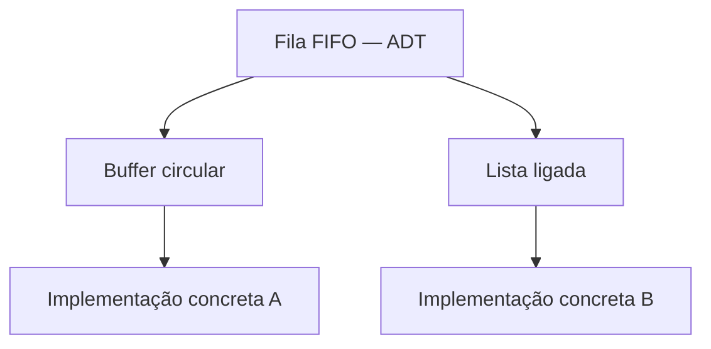
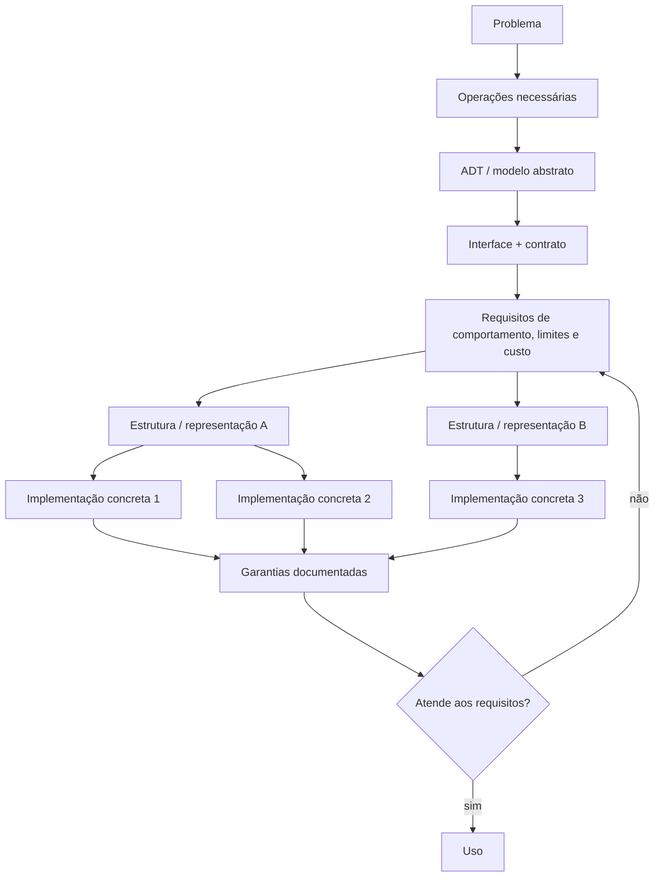
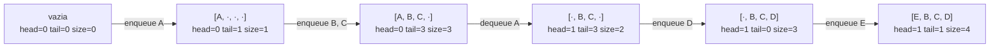
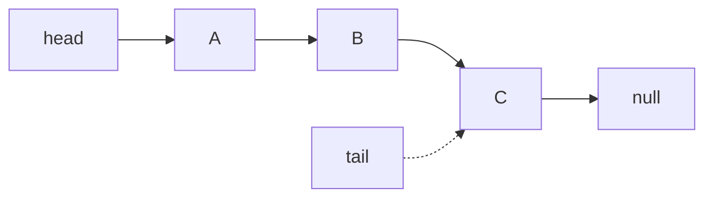
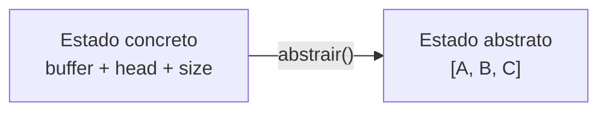

<a id="inicio"></a>

# Tipos Abstratos de Dados, Estruturas e Implementações

> **Classificação:** `[D] Obrigatório dominar conceitualmente`  
> **Nível:** C — Algoritmos e Estruturas de Dados  
> **Posição na taxonomia:** tópico 25 — segundo tópico do Nível C  
> **Pré-requisitos principais:** T10 — Estruturas de Dados Elementares; T14 — Estado, Escopo, Referências e Mutabilidade; T15 — Coleções e Manipulação de Dados; T16 — Modularização e Abstração; T20 — Testes e Verificação; T24 — Correção e Análise de Algoritmos  
> **Aprofundamentos posteriores:** T26 — Busca; T28 — Estruturas Lineares; T29 — Estruturas Associativas, Conjuntos e Hashing; T30 — Filas de Prioridade e Heaps; T31 — Árvores; T32 — Grafos; T35 — Modelagem, Escolha de Estruturas e Trade-offs

---

## Resumo executivo

Este tópico ensina uma distinção que precisa ficar estável antes de estudar estruturas específicas:

```text
PROBLEMA
→ quais operações e garantias são necessárias?

ADT / TAD
→ qual é o modelo abstrato e o comportamento observável?

INTERFACE + CONTRATO
→ como o consumidor acessa a abstração?
→ o que cada operação significa, permite, proíbe e garante?

ESTRUTURA / REPRESENTAÇÃO
→ como o estado é organizado internamente?

IMPLEMENTAÇÃO CONCRETA
→ qual código, tipo, classe, módulo ou mecanismo do runtime realiza a representação?
```

> **Regra de ouro:** comece pelas operações e pelo contrato. Escolha a representação conscientemente. Só então escolha a implementação concreta da linguagem.

A fila FIFO será o estudo canônico do capítulo porque permite observar, no mesmo problema, contrato, estado abstrato, relação de abstração, invariantes, custos, troca de representação e transferência entre linguagens.

---

<a id="como-estudar"></a>

## Como estudar este tópico — duas rotas

### 🎓 Estou aprendendo pela primeira vez

Siga esta ordem:

```text
1. Resumo executivo + Visão panorâmica
2. Parte I — contexto e modelo mental
3. Parte II — ADT, interface, contrato e representação
4. Parte III — estudo canônico da fila
5. Parte IV — transferência entre linguagens
6. Parte V — testes, substituição e decisão
7. Parte VI — LABs e exercícios
8. Apêndices apenas quando precisar aprofundar, diagnosticar ou auditar
```

O objetivo é que você **não precise decidir sozinho o que pode pular**. A estrada principal já está indicada.

### 🔎 Já conheço e quero consultar

Use esta rota:

```text
Visão panorâmica
→ Índice essencial
→ seção conceitual ou linguagem desejada
→ Processo de decisão (§34)
→ Problemas Reais / Troubleshooting
→ Glossário
```

---

<a id="visao-panoramica"></a>

## 🗺️ Visão panorâmica — o mapa antes dos detalhes

### Mapa do domínio

```text
REQUISITO DO PROBLEMA
        ↓
ADT / MODELO ABSTRATO
        ↓
INTERFACE + CONTRATO
        ↓
ESTRUTURA / REPRESENTAÇÃO
        ↓
GARANTIAS E CUSTOS
        ↓
IMPLEMENTAÇÃO CONCRETA
        ↓
CONSUMIDOR
```

A figura acima é uma **rota de raciocínio**, não uma afirmação de que toda fonte acadêmica use exatamente a mesma quantidade de “camadas”.

### Conceito → pergunta principal → risco

| Conceito | Pergunta principal | Risco ao confundir |
|---|---|---|
| requisito | o que o problema realmente precisa? | escolher estrutura por hábito |
| ADT/TAD | quais estados/valores, operações e leis observáveis definem a abstração? | confundir conceito com classe |
| interface | como o consumidor acessa a abstração? | achar que assinatura é contrato completo |
| contrato | o que as operações significam e garantem? | depender de política não prometida |
| estrutura/representação | como o estado é organizado/codificado? | atribuir custo universal ao ADT |
| implementação | qual mecanismo concreto realiza a representação? | generalizar detalhe de biblioteca/runtime |

### Não confundir

```text
ADT / TAD
≠ interface nominal
≠ estrutura de dados
≠ representação
≠ implementação concreta
≠ nome de biblioteca
```

```text
propriedade semântica observável
≠ invariante de representação
```

Exemplo:

```text
FIFO
→ propriedade observável da fila

0 <= head < capacity
→ possível invariante de uma representação concreta
```

### Relação de abstração em uma frase

```text
estado concreto
buffer + head + size
        │
        │ abstrair()
        ▼
estado abstrato
[A, B, C]
```

O consumidor deve raciocinar principalmente sobre o estado abstrato e o contrato; o implementador precisa garantir que a representação concreta continue descrevendo corretamente esse estado.

### Mesmo ADT, representações diferentes



Fallback textual:

```text
Fila FIFO
├─ buffer circular → implementação A
└─ lista ligada   → implementação B
```

### Microexemplo canônico

```text
Problema:
processar eventos na ordem de chegada

ADT:
fila FIFO

Contrato:
enqueue(x) → adiciona ao fim
dequeue()  → remove/retorna o mais antigo
is_empty() → informa vazio

Representação possível:
buffer circular

Implementação concreta:
depende da linguagem e das garantias exigidas
```

### Transferência entre linguagens

| Linguagem | Realização/abordagem didática | Cuidado principal |
|---|---|---|
| Python | `collections.deque` ou wrapper próprio | `queue.Queue` adiciona contrato de sincronização |
| JavaScript | encapsular representação própria | não existe `Queue` built-in padrão |
| Java | interface + implementação concreta (`Queue`, `Deque`, `ArrayDeque`) | política de `null`, vazio e custos dependem da API |
| Bash | funções + estado + status/`REPLY` | `$(...)` tradicional executa em subshell |

> **Bash não “carece do ADT fila”**. O que ele não oferece é uma API/tipo padrão de fila pronta; o programa pode modelar o mesmo contrato por funções e estado.

### Entrada rápida de troubleshooting

```text
FIFO quebrou
→ revise contrato e ordem lógica

troca de representação quebrou testes internos
→ verifique se o teste está acoplado à representação

custo ficou inesperado
→ confirme qual camada oferece a garantia

Bash não preservou mutação
→ verifique subshell / command substitution

vazio confundido com dado válido
→ revise política de erro/sentinela
```

---

<a id="visão-rápida"></a>
<a id="a-separação-central"></a>
<a id="regra-de-ouro"></a>

## Decisão rápida

Antes de escolher uma estrutura concreta, responda:

1. quais operações são necessárias?
2. qual comportamento observável precisa ser preservado?
3. quais casos inválidos e políticas de erro fazem parte do contrato?
4. quais custos ou limites são realmente necessários?
5. quais representações conseguem cumprir isso?
6. o que a documentação da implementação concreta realmente garante?

> **Para aprender:** siga o núcleo na ordem.  
> **Para consultar:** use a Visão Panorâmica, o Índice essencial e os apêndices.

# Índice

## Índice essencial

- [Como estudar este tópico](#como-estudar)
- [Visão panorâmica](#visao-panoramica)
- [PARTE I — Contexto e modelo mental](#parte-i)
- [PARTE II — ADT, interface, representação e invariantes](#parte-ii)
- [PARTE III — Estudo canônico, custos e garantias](#parte-iii)
- [PARTE IV — Transferência entre linguagens](#parte-iv)
- [PARTE V — Contratos, substituição, decisão e diagnóstico](#parte-v)
- [PARTE VI — LABs, exercícios e critérios de domínio](#parte-vi)
- [APÊNDICES — auditoria, referências, QA e histórico](#apendices)

<details>
<summary><strong>Índice detalhado — abrir para navegação completa</strong></summary>

- [Resumo executivo](#resumo-executivo)
  - [🗺️ Visão panorâmica — o mapa antes dos detalhes](#visao-panoramica)
  - [Decisão rápida](#decisão-rápida)
- [1. Posição deste assunto na trilha](#1-posição-deste-assunto-na-trilha)
  - [1.1 O que T24 entregou](#11-o-que-t24-entregou)
  - [1.2 Fronteira com T15 — Coleções](#12-fronteira-com-t15--coleções)
  - [1.3 Fronteira com T16 — Abstração](#13-fronteira-com-t16--abstração)
  - [1.4 Fronteira com T28–T32](#14-fronteira-com-t28t32)
  - [1.5 Fronteira com T35](#15-fronteira-com-t35)
  - [1.6 O que não pertence ao núcleo deste tópico](#16-o-que-não-pertence-ao-núcleo-deste-tópico)
- [2. Modelo mental — do problema ao código concreto](#2-modelo-mental--do-problema-ao-código-concreto)
  - [2.1 Seis perguntas em camadas](#21-seis-perguntas-em-camadas)
  - [2.2 Exemplo — processamento FIFO](#22-exemplo--processamento-fifo)
  - [2.3 Um diagrama das camadas](#23-um-diagrama-das-camadas)
  - [2.4 Onde entra a análise de complexidade](#24-onde-entra-a-análise-de-complexidade)
  - [2.5 Onde entra a correção](#25-onde-entra-a-correção)
- [3. 25.1 — Tipo Abstrato de Dados — ADT `[D]`](#3-251--tipo-abstrato-de-dados--adt-d)
  - [3.1 Definição operacional](#31-definição-operacional)
  - [3.2 Quatro componentes úteis do ADT](#32-quatro-componentes-úteis-do-adt)
  - [3.3 Estado abstrato](#33-estado-abstrato)
  - [3.4 Operações](#34-operações)
  - [3.5 Contrato](#35-contrato)
  - [3.6 Estado vazio faz parte do contrato](#36-estado-vazio-faz-parte-do-contrato)
  - [3.7 ADT não é sinônimo de classe](#37-adt-não-é-sinônimo-de-classe)
  - [3.8 ADT não é sinônimo de tipo nominal da linguagem](#38-adt-não-é-sinônimo-de-tipo-nominal-da-linguagem)
  - [3.9 ADT não é uma lista de nomes de métodos](#39-adt-não-é-uma-lista-de-nomes-de-métodos)
  - [3.10 Exemplo — pilha como ADT](#310-exemplo--pilha-como-adt)
  - [3.11 Exemplo — dicionário como ADT](#311-exemplo--dicionário-como-adt)
  - [3.12 Capacidade de transferência](#312-capacidade-de-transferência)
- [4. Do requisito do problema ao ADT](#4-do-requisito-do-problema-ao-adt)
  - [4.1 Comece pelos verbos do problema](#41-comece-pelos-verbos-do-problema)
  - [4.2 Não comece pela estrutura favorita](#42-não-comece-pela-estrutura-favorita)
  - [4.3 Critérios além da operação principal](#43-critérios-além-da-operação-principal)
  - [4.4 Contrato mínimo versus conveniências](#44-contrato-mínimo-versus-conveniências)
  - [4.5 Regra prática](#45-regra-prática)
- [5. Estudo canônico — fila como ADT](#5-estudo-canônico--fila-como-adt)
  - [5.1 Estado abstrato](#51-estado-abstrato)
  - [5.2 Operação `enqueue(D)`](#52-operação-enqueued)
  - [5.3 Operação `dequeue()`](#53-operação-dequeue)
  - [5.4 Propriedade FIFO](#54-propriedade-fifo)
  - [5.5 O que a definição ainda não decidiu](#55-o-que-a-definição-ainda-não-decidiu)
- [6. 25.2 — Interface × representação `[D]`](#6-252--interface--representação-d)
  - [6.1 Interface no sentido conceitual](#61-interface-no-sentido-conceitual)
  - [6.2 Representação](#62-representação)
  - [6.3 Representação A — array circular conceitual](#63-representação-a--array-circular-conceitual)
  - [6.4 Representação B — lista ligada conceitual](#64-representação-b--lista-ligada-conceitual)
  - [6.5 Mesma interface, estado interno diferente](#65-mesma-interface-estado-interno-diferente)
  - [6.6 Independência de representação](#66-independência-de-representação)
  - [6.7 Contrato observável versus detalhe interno](#67-contrato-observável-versus-detalhe-interno)
  - [6.8 Interface pequena reduz acoplamento](#68-interface-pequena-reduz-acoplamento)
- [7. Interface não é implementação](#7-interface-não-é-implementação)
  - [7.1 Pergunta 1 — que operações preciso?](#71-pergunta-1--que-operações-preciso)
  - [7.2 Pergunta 2 — que estrutura oferece essas operações?](#72-pergunta-2--que-estrutura-oferece-essas-operações)
  - [7.3 Pergunta 3 — com quais custos?](#73-pergunta-3--com-quais-custos)
  - [7.4 Pergunta 4 — o que a biblioteca realmente promete?](#74-pergunta-4--o-que-a-biblioteca-realmente-promete)
  - [7.5 Por que a ordem importa](#75-por-que-a-ordem-importa)
- [8. Custos pertencem à realização, não apenas ao nome abstrato](#8-custos-pertencem-à-realização-não-apenas-ao-nome-abstrato)
  - [8.1 Fila não possui uma única tabela universal de custos](#81-fila-não-possui-uma-única-tabela-universal-de-custos)
  - [8.2 Exemplo conceitual](#82-exemplo-conceitual)
  - [8.3 Custo amortizado é uma garantia diferente](#83-custo-amortizado-é-uma-garantia-diferente)
  - [8.4 Custo documentado versus custo inferido](#84-custo-documentado-versus-custo-inferido)
  - [8.5 Implementação pode mudar entre versões](#85-implementação-pode-mudar-entre-versões)
- [9. Estado abstrato × estado de representação](#9-estado-abstrato--estado-de-representação)
  - [9.1 Estado abstrato de uma fila](#91-estado-abstrato-de-uma-fila)
  - [9.2 Possível estado de representação circular](#92-possível-estado-de-representação-circular)
  - [9.3 Relação de abstração](#93-relação-de-abstração)
  - [9.4 Por que isso ajuda a depurar](#94-por-que-isso-ajuda-a-depurar)
  - [9.5 Não é necessário formalismo pesado](#95-não-é-necessário-formalismo-pesado)
- [10. 25.3 — Invariantes da estrutura `[C]`](#10-253--invariantes-da-estrutura-c)
  - [10.1 Definição prática](#101-definição-prática)
  - [10.2 Diferença para invariante de laço](#102-diferença-para-invariante-de-laço)
  - [10.3 Exemplos do Guia](#103-exemplos-do-guia)
  - [10.4 Invariante não é mera preferência estética](#104-invariante-não-é-mera-preferência-estética)
  - [10.5 Exemplo — fila circular](#105-exemplo--fila-circular)
  - [10.6 Exemplo — lista ligada](#106-exemplo--lista-ligada)
  - [10.7 Exemplo — dicionário](#107-exemplo--dicionário)
  - [10.8 Operações devem preservar invariantes](#108-operações-devem-preservar-invariantes)
  - [10.9 Verificação local](#109-verificação-local)
  - [10.10 Propriedade abstrata e invariante de representação](#1010-propriedade-abstrata-e-invariante-de-representação)
- [11. Preservação de invariantes por operação](#11-preservação-de-invariantes-por-operação)
  - [11.1 Método de raciocínio](#111-método-de-raciocínio)
  - [11.2 Exemplo — `enqueue`](#112-exemplo--enqueue)
  - [11.3 Exemplo — `dequeue`](#113-exemplo--dequeue)
  - [11.4 Sequências importam](#114-sequências-importam)
- [12. Encapsulamento e independência de representação](#12-encapsulamento-e-independência-de-representação)
  - [12.1 Encapsular não significa obrigatoriamente usar classe](#121-encapsular-não-significa-obrigatoriamente-usar-classe)
  - [12.2 O objetivo](#122-o-objetivo)
  - [12.3 Exposição indevida](#123-exposição-indevida)
  - [12.4 Benefício para manutenção](#124-benefício-para-manutenção)
  - [12.5 Benefício para teste](#125-benefício-para-teste)
- [13. Comportamento público × invariantes internos](#13-comportamento-público--invariantes-internos)
  - [13.1 Propriedades públicas](#131-propriedades-públicas)
  - [13.2 Invariantes internos da representação](#132-invariantes-internos-da-representação)
  - [13.3 O consumidor depende do comportamento público](#133-o-consumidor-depende-do-comportamento-público)
  - [13.4 O implementador precisa preservar os dois níveis](#134-o-implementador-precisa-preservar-os-dois-níveis)
- [14. Quatro linguagens — mecanismos diferentes para abstração](#14-quatro-linguagens--mecanismos-diferentes-para-abstração)
  - [14.1 Conceito universal](#141-conceito-universal)
  - [14.2 Mecanismo de linguagem](#142-mecanismo-de-linguagem)
  - [14.3 Idiomatismo](#143-idiomatismo)
  - [14.4 Comparativo inicial](#144-comparativo-inicial)
- [15. Python — abstração e implementação concreta](#15-python--abstração-e-implementação-concreta)
  - [15.1 `list` não é "o ADT lista" universal](#151-list-não-é-o-adt-lista-universal)
  - [15.2 `collections.deque`](#152-collectionsdeque)
  - [15.3 Exemplo — fila usando `deque`](#153-exemplo--fila-usando-deque)
  - [15.4 A abstração é maior que o tipo concreto](#154-a-abstração-é-maior-que-o-tipo-concreto)
  - [15.5 Troca interna](#155-troca-interna)
- [16. JavaScript — contrato sem `Queue` padrão](#16-javascript--contrato-sem-queue-padrão)
  - [16.1 ECMAScript possui `Array`, `Map` e `Set`](#161-ecmascript-possui-array-map-e-set)
  - [16.2 Não confundir `Array` com representação física obrigatória](#162-não-confundir-array-com-representação-física-obrigatória)
  - [16.3 Fila simples por encapsulamento](#163-fila-simples-por-encapsulamento)
  - [16.4 O exemplo é didático, não implementação universal](#164-o-exemplo-é-didático-não-implementação-universal)
  - [16.5 `Map` é outro bom exemplo](#165-map-é-outro-bom-exemplo)
- [17. Java — interface e implementação explícitas](#17-java--interface-e-implementação-explícitas)
  - [17.1 Java Collections Framework evidencia as camadas](#171-java-collections-framework-evidencia-as-camadas)
  - [17.2 Exemplo](#172-exemplo)
  - [17.3 Variável declarada pela interface](#173-variável-declarada-pela-interface)
  - [17.4 Nem toda implementação é semanticamente idêntica em todos os detalhes](#174-nem-toda-implementação-é-semanticamente-idêntica-em-todos-os-detalhes)
  - [17.5 `Deque` pode servir como fila ou pilha](#175-deque-pode-servir-como-fila-ou-pilha)
- [18. GNU Bash — abstração por disciplina de funções e estado](#18-gnu-bash--abstração-por-disciplina-de-funções-e-estado)
  - [18.1 Bash não possui uma interface `Queue`](#181-bash-não-possui-uma-interface-queue)
  - [18.2 Arrays Bash têm semântica própria](#182-arrays-bash-têm-semântica-própria)
  - [18.3 Fila didática com estado global controlado](#183-fila-didática-com-estado-global-controlado)
  - [18.4 Por que usar `REPLY`](#184-por-que-usar-reply)
  - [18.5 Limite de adequação](#185-limite-de-adequação)
- [19. Mesmo ADT, mecanismos diferentes](#19-mesmo-adt-mecanismos-diferentes)
  - [19.1 Mesmo contrato — visão operacional lado a lado](#191-mesmo-contrato--visão-operacional-lado-a-lado)
  - [19.2 Políticas concretas que não devem ser apagadas](#192-políticas-concretas-que-não-devem-ser-apagadas)
  - [19.3 O que realmente é transferível](#193-o-que-realmente-é-transferível)
- [20. 25.4 — Biblioteca ≠ implementação universal `[D]`](#20-254--biblioteca--implementação-universal-d)
  - [20.1 Regra central do nó 25.4](#201-regra-central-do-nó-254)
  - [20.2 `list`, `List`, Array e "lista"](#202-list-list-array-e-lista)
  - [20.3 `Map` / `dict` / array associativo](#203-map--dict--array-associativo)
  - [20.4 Confirme a garantia na documentação correta](#204-confirme-a-garantia-na-documentação-correta)
  - [20.5 Não extrapole de uma implementação para a linguagem inteira](#205-não-extrapole-de-uma-implementação-para-a-linguagem-inteira)
  - [20.6 Não extrapole de um benchmark](#206-não-extrapole-de-um-benchmark)
- [21. Python — `list`, `deque`, `dict` e a camada correta](#21-python--list-deque-dict-e-a-camada-correta)
  - [21.1 `list`](#211-list)
  - [21.2 `deque`](#212-deque)
  - [21.3 `dict`](#213-dict)
  - [21.4 O erro conceitual a evitar](#214-o-erro-conceitual-a-evitar)
  - [21.5 Quando documentar o tipo concreto](#215-quando-documentar-o-tipo-concreto)
- [22. JavaScript — semântica padronizada não implica layout padronizado](#22-javascript--semântica-padronizada-não-implica-layout-padronizado)
  - [22.1 `Array`](#221-array)
  - [22.2 `Map`](#222-map)
  - [22.3 O que não está prometido universalmente](#223-o-que-não-está-prometido-universalmente)
  - [22.4 Consequência prática](#224-consequência-prática)
- [23. Java — uma interface pode ter várias implementações](#23-java--uma-interface-pode-ter-várias-implementações)
  - [23.1 `List`](#231-list)
  - [23.2 `ArrayList`](#232-arraylist)
  - [23.3 `LinkedList`](#233-linkedlist)
  - [23.4 `Deque`](#234-deque)
  - [23.5 Lição](#235-lição)
- [24. Bash — indexed array e associative array não são ADTs universais](#24-bash--indexed-array-e-associative-array-não-são-adts-universais)
  - [24.1 Indexed array](#241-indexed-array)
  - [24.2 Associative array](#242-associative-array)
  - [24.3 Ausência de classes/interfaces](#243-ausência-de-classesinterfaces)
  - [24.4 Shell é excelente para composição, não para imitar toda estrutura acadêmica](#244-shell-é-excelente-para-composição-não-para-imitar-toda-estrutura-acadêmica)
- [25. Miniestudo — dicionário/mapeamento como abstração](#25-miniestudo--dicionáriomapeamento-como-abstração)
  - [25.1 Contrato mínimo](#251-contrato-mínimo)
  - [25.2 Possíveis estruturas](#252-possíveis-estruturas)
  - [25.3 Python](#253-python)
  - [25.4 JavaScript](#254-javascript)
  - [25.5 Java](#255-java)
  - [25.6 Bash](#256-bash)
  - [25.7 Mesma intenção, semânticas diferentes](#257-mesma-intenção-semânticas-diferentes)
  - [25.8 Ausência também faz parte do contrato](#258-ausência-também-faz-parte-do-contrato)
- [26. Ordem de iteração é parte do contrato apenas quando prometida](#26-ordem-de-iteração-é-parte-do-contrato-apenas-quando-prometida)
  - [26.1 Não suponha ordem incidental](#261-não-suponha-ordem-incidental)
  - [26.2 Quando a linguagem promete ordem](#262-quando-a-linguagem-promete-ordem)
  - [26.3 Quando o problema exige ordenação](#263-quando-o-problema-exige-ordenação)
  - [26.4 Não confunda ordem de armazenamento com ordem lógica](#264-não-confunda-ordem-de-armazenamento-com-ordem-lógica)
- [27. Mutabilidade também faz parte do desenho do contrato](#27-mutabilidade-também-faz-parte-do-desenho-do-contrato)
  - [27.1 Operação mutável](#271-operação-mutável)
  - [27.2 Operação funcional](#272-operação-funcional)
  - [27.3 ADT não obriga uma única política de mutabilidade](#273-adt-não-obriga-uma-única-política-de-mutabilidade)
  - [27.4 Referências compartilhadas](#274-referências-compartilhadas)
- [28. Erros e casos inválidos no contrato](#28-erros-e-casos-inválidos-no-contrato)
  - [28.1 Fila vazia](#281-fila-vazia)
  - [28.2 Chave ausente](#282-chave-ausente)
  - [28.3 Capacidade cheia](#283-capacidade-cheia)
  - [28.4 Valor inválido](#284-valor-inválido)
  - [28.5 Por que isso é T25](#285-por-que-isso-é-t25)
- [29. Testes de contrato](#29-testes-de-contrato)
  - [29.1 Objetivo](#291-objetivo)
  - [29.2 Sequência básica FIFO](#292-sequência-básica-fifo)
  - [29.3 Teste de representação é diferente](#293-teste-de-representação-é-diferente)
  - [29.4 Vantagem](#294-vantagem)
- [30. Troca de implementação sem trocar o consumidor](#30-troca-de-implementação-sem-trocar-o-consumidor)
  - [30.1 Cenário](#301-cenário)
  - [30.2 Implementação A](#302-implementação-a)
  - [30.3 Implementação B](#303-implementação-b)
  - [30.4 O consumidor](#304-o-consumidor)
  - [30.5 O que ainda precisa ser reavaliado](#305-o-que-ainda-precisa-ser-reavaliado)
  - [30.6 Substituição semântica não implica equivalência operacional total](#306-substituição-semântica-não-implica-equivalência-operacional-total)
- [31. Garantias de desempenho e documentação](#31-garantias-de-desempenho-e-documentação)
  - [31.1 Uma garantia é parte importante da escolha](#311-uma-garantia-é-parte-importante-da-escolha)
  - [31.2 Python `deque`](#312-python-deque)
  - [31.3 Java `ArrayDeque`](#313-java-arraydeque)
  - [31.4 JavaScript `Map`](#314-javascript-map)
  - [31.5 Bash arrays](#315-bash-arrays)
  - [31.6 Regra](#316-regra)
- [32. Falácias comuns](#32-falácias-comuns)
  - [32.1 "ADT é uma classe"](#321-adt-é-uma-classe)
  - [32.2 "estrutura de dados e ADT são sinônimos"](#322-estrutura-de-dados-e-adt-são-sinônimos)
  - [32.3 "se chama Map, é hash table"](#323-se-chama-map-é-hash-table)
  - [32.4 "se implementa a mesma interface, o desempenho é igual"](#324-se-implementa-a-mesma-interface-o-desempenho-é-igual)
  - [32.5 "se duas estruturas têm o mesmo Big O, são equivalentes"](#325-se-duas-estruturas-têm-o-mesmo-big-o-são-equivalentes)
  - [32.6 "array significa sempre memória contígua"](#326-array-significa-sempre-memória-contígua)
  - [32.7 "a representação interna não importa nunca"](#327-a-representação-interna-não-importa-nunca)
  - [32.8 "Bash precisa ter equivalente natural para toda estrutura"](#328-bash-precisa-ter-equivalente-natural-para-toda-estrutura)
- [33. Antipadrões de design](#33-antipadrões-de-design)
  - [33.1 Escolher por familiaridade](#331-escolher-por-familiaridade)
  - [33.2 Expor estado interno](#332-expor-estado-interno)
  - [33.3 Misturar contrato com otimização](#333-misturar-contrato-com-otimização)
  - [33.4 Documentar complexidade sem fonte/modelo](#334-documentar-complexidade-sem-fontemodelo)
  - [33.5 Duplicar a lógica de estrutura pelos consumidores](#335-duplicar-a-lógica-de-estrutura-pelos-consumidores)
  - [33.6 Tornar operação inválida comum](#336-tornar-operação-inválida-comum)
- [34. Processo de decisão recomendado](#34-processo-de-decisão-recomendado)
  - [34.1 Passo 1 — escreva as operações necessárias](#341-passo-1--escreva-as-operações-necessárias)
  - [34.2 Passo 2 — identifique o ADT e sua política](#342-passo-2--identifique-o-adt-e-sua-política)
  - [34.3 Passo 3 — defina interface e contrato](#343-passo-3--defina-interface-e-contrato)
  - [34.4 Passo 4 — declare requisitos de garantia e custo](#344-passo-4--declare-requisitos-de-garantia-e-custo)
  - [34.5 Passo 5 — compare estruturas/representações candidatas](#345-passo-5--compare-estruturasrepresentações-candidatas)
  - [34.6 Passo 6 — escolha a implementação concreta](#346-passo-6--escolha-a-implementação-concreta)
  - [34.7 Passo 7 — escreva testes de contrato](#347-passo-7--escreva-testes-de-contrato)
  - [34.8 Passo 8 — valide a adequação](#348-passo-8--valide-a-adequação)
  - [34.9 Passo 9 — meça quando necessário](#349-passo-9--meça-quando-necessário)
- [35. Mini-caso aplicado — fila de eventos](#35-mini-caso-aplicado--fila-de-eventos)
  - [35.1 Requisito](#351-requisito)
  - [35.2 ADT](#352-adt)
  - [35.3 Operações](#353-operações)
  - [35.4 Operação desnecessária](#354-operação-desnecessária)
  - [35.5 Representação](#355-representação)
  - [35.6 Implementação concreta](#356-implementação-concreta)
- [36. Mini-caso aplicado — lookup por identificador](#36-mini-caso-aplicado--lookup-por-identificador)
  - [36.1 Requisito](#361-requisito)
  - [36.2 Abstração](#362-abstração)
  - [36.3 Operações essenciais](#363-operações-essenciais)
  - [36.4 Estrutura possível](#364-estrutura-possível)
  - [36.5 Fronteira](#365-fronteira)
- [37. Robustez na fronteira do contrato](#37-robustez-na-fronteira-do-contrato)
  - [37.1 Limites de capacidade](#371-limites-de-capacidade)
  - [37.2 Entrada não confiável](#372-entrada-não-confiável)
  - [37.3 Sentinelas ambíguas](#373-sentinelas-ambíguas)
  - [37.4 Estado interno não confiável](#374-estado-interno-não-confiável)
  - [37.5 Não transformar T25 em capítulo de segurança](#375-não-transformar-t25-em-capítulo-de-segurança)
- [38. Síntese de transferência — conceito × linguagem](#38-síntese-de-transferência--conceito--linguagem)
- [39. Exemplo progressivo — uma fila com contrato comum](#39-exemplo-progressivo--uma-fila-com-contrato-comum)
  - [39.1 Contrato de referência](#391-contrato-de-referência)
  - [39.2 Python](#392-python)
  - [39.3 JavaScript](#393-javascript)
  - [39.4 Java](#394-java)
  - [39.5 Bash](#395-bash)
  - [39.6 O que foi transferido](#396-o-que-foi-transferido)
  - [39.7 O que não foi transferido mecanicamente](#397-o-que-não-foi-transferido-mecanicamente)
- [40. Dúvidas naturais](#40-dúvidas-naturais)
  - [40.1 "ADT é a mesma coisa que interface Java?"](#401-adt-é-a-mesma-coisa-que-interface-java)
  - [40.2 "Toda estrutura de dados implementa um ADT?"](#402-toda-estrutura-de-dados-implementa-um-adt)
  - [40.3 "Array é ADT ou estrutura?"](#403-array-é-adt-ou-estrutura)
  - [40.4 "Se duas implementações passam os mesmos testes, são iguais?"](#404-se-duas-implementações-passam-os-mesmos-testes-são-iguais)
  - [40.5 "Posso depender de detalhe interno se for mais rápido?"](#405-posso-depender-de-detalhe-interno-se-for-mais-rápido)
- [Índice operacional de Problemas Reais — `PR-T25-*`](#pr-t25-indice)
  - [`PR-T25-01` — fila FIFO para processamento de eventos](#pr-t25-01--fila-fifo-para-processamento-de-eventos)
  - [`PR-T25-02` — lookup por identificador](#pr-t25-02--lookup-por-identificador)
  - [`PR-T25-03` — substituição de implementação sem regressão do consumidor](#pr-t25-03--substituição-de-implementação-sem-regressão-do-consumidor)
  - [`PR-T25-04` — fila Python: `list` ou `deque`?](#pr-t25-04--fila-python-list-ou-deque)
  - [`PR-T25-05` — Java: interface comum, implementação consciente](#pr-t25-05--java-interface-comum-implementação-consciente)
  - [`PR-T25-06` — JavaScript: fila sem `Queue` padrão ECMAScript](#pr-t25-06--javascript-fila-sem-queue-padrão-ecmascript)
  - [`PR-T25-07` — Bash: remover item e preservar mutação no shell chamador](#pr-t25-07--bash-remover-item-e-preservar-mutação-no-shell-chamador)
  - [`PR-T25-08` — fila circular e preservação de invariantes](#pr-t25-08--fila-circular-e-preservação-de-invariantes)
  - [`PR-T25-09` — estado vazio sem sentinela ambígua](#pr-t25-09--estado-vazio-sem-sentinela-ambígua)
  - [`PR-T25-10` — mapeamento sem dependência em layout interno](#pr-t25-10--mapeamento-sem-dependência-em-layout-interno)
  - [🔎 Troubleshooting sistemático](#troubleshooting-sistematico)
- [41. 🧪 LAB 1 — Separar ADT, estrutura e implementação](#41--lab-1--separar-adt-estrutura-e-implementação)
  - [Objetivo](#objetivo)
  - [Pré-requisitos](#pré-requisitos)
  - [Estado inicial](#estado-inicial)
  - [Tarefa](#tarefa)
  - [Procedimento](#procedimento)
  - [O que observar](#o-que-observar)
  - [Testes](#testes)
  - [Explicação](#explicação)
  - [Variação / transferência](#variação--transferência)
  - [Limpeza](#limpeza)
- [42. 🧪 LAB 2 — Especificar o ADT fila antes do código](#42--lab-2--especificar-o-adt-fila-antes-do-código)
  - [Objetivo](#objetivo-1)
  - [Pré-requisitos](#pré-requisitos-1)
  - [Estado inicial](#estado-inicial-1)
  - [Tarefa](#tarefa-1)
  - [Procedimento](#procedimento-1)
  - [O que observar](#o-que-observar-1)
  - [Testes](#testes-1)
  - [Explicação](#explicação-1)
  - [Variação / transferência](#variação--transferência-1)
  - [Limpeza](#limpeza-1)
- [43. 🧪 LAB 3 — Python: `list` versus `deque` para FIFO](#43--lab-3--python-list-versus-deque-para-fifo)
  - [Objetivo](#objetivo-2)
  - [Pré-requisitos](#pré-requisitos-2)
  - [Estado inicial](#estado-inicial-2)
  - [Tarefa](#tarefa-2)
  - [Procedimento](#procedimento-2)
  - [O que observar](#o-que-observar-2)
  - [Testes](#testes-2)
  - [Explicação](#explicação-2)
  - [Variação / transferência](#variação--transferência-2)
  - [Limpeza](#limpeza-2)
- [44. 🧪 LAB 4 — JavaScript: preservar contrato ao mudar representação](#44--lab-4--javascript-preservar-contrato-ao-mudar-representação)
  - [Objetivo](#objetivo-3)
  - [Pré-requisitos](#pré-requisitos-3)
  - [Estado inicial](#estado-inicial-3)
  - [Tarefa](#tarefa-3)
  - [Procedimento](#procedimento-3)
  - [O que observar](#o-que-observar-3)
  - [Testes](#testes-3)
  - [Explicação](#explicação-3)
  - [Variação / transferência](#variação--transferência-3)
  - [Limpeza](#limpeza-3)
- [45. 🧪 LAB 5 — Java: interface comum, implementações diferentes](#45--lab-5--java-interface-comum-implementações-diferentes)
  - [Objetivo](#objetivo-4)
  - [Pré-requisitos](#pré-requisitos-4)
  - [Estado inicial](#estado-inicial-4)
  - [Tarefa](#tarefa-4)
  - [Procedimento](#procedimento-4)
  - [O que observar](#o-que-observar-4)
  - [Testes](#testes-4)
  - [Explicação](#explicação-4)
  - [Variação / transferência](#variação--transferência-4)
  - [Limpeza](#limpeza-4)
- [46. 🧪 LAB 6 — Bash: fila e armadilha de subshell](#46--lab-6--bash-fila-e-armadilha-de-subshell)
  - [Objetivo](#objetivo-5)
  - [Pré-requisitos](#pré-requisitos-5)
  - [Estado inicial](#estado-inicial-5)
  - [Tarefa](#tarefa-5)
  - [Procedimento](#procedimento-5)
  - [O que observar](#o-que-observar-5)
  - [Testes](#testes-5)
  - [Explicação](#explicação-5)
  - [Variação / transferência](#variação--transferência-5)
  - [Limpeza](#limpeza-5)
- [47. 🧪 LAB 7 — Mesmo ADT de mapeamento em quatro linguagens](#47--lab-7--mesmo-adt-de-mapeamento-em-quatro-linguagens)
  - [Objetivo](#objetivo-6)
  - [Pré-requisitos](#pré-requisitos-6)
  - [Estado inicial](#estado-inicial-6)
  - [Tarefa](#tarefa-6)
  - [Procedimento](#procedimento-6)
  - [O que observar](#o-que-observar-6)
  - [Testes](#testes-6)
  - [Explicação](#explicação-6)
  - [Variação / transferência](#variação--transferência-6)
  - [Limpeza](#limpeza-6)
- [48. 🧪 LAB 8 — Teste de contrato contra duas implementações](#48--lab-8--teste-de-contrato-contra-duas-implementações)
  - [Objetivo](#objetivo-7)
  - [Pré-requisitos](#pré-requisitos-7)
  - [Estado inicial](#estado-inicial-7)
  - [Tarefa](#tarefa-7)
  - [Procedimento](#procedimento-7)
  - [O que observar](#o-que-observar-7)
  - [Testes](#testes-7)
  - [Explicação](#explicação-7)
  - [Variação / transferência](#variação--transferência-7)
  - [Limpeza](#limpeza-7)
- [49. Exercícios](#49-exercícios)
  - [49.1 Conceituais](#491-conceituais)
  - [49.2 Aplicação](#492-aplicação)
  - [49.3 Transferência entre linguagens](#493-transferência-entre-linguagens)
  - [49.4 Diagnóstico](#494-diagnóstico)
- [50. Evidências de domínio](#50-evidências-de-domínio)
- [51. Checklist de domínio](#51-checklist-de-domínio)
  - [51.1 Núcleo `[D]`](#511-núcleo-d)
  - [51.2 Conhecimento `[C]`](#512-conhecimento-c)
  - [51.3 Transferência](#513-transferência)
  - [51.4 Integração com T24](#514-integração-com-t24)
- [52. Glossário](#52-glossário)
- [53. Auditoria de cobertura da taxonomia](#53-auditoria-de-cobertura-da-taxonomia)
  - [53.1 Fronteira preservada com T26](#531-fronteira-preservada-com-t26)
  - [53.2 Fronteira preservada com T28](#532-fronteira-preservada-com-t28)
  - [53.3 Fronteira preservada com T29](#533-fronteira-preservada-com-t29)
  - [53.4 Fronteira preservada com T30–T32](#534-fronteira-preservada-com-t30t32)
  - [53.5 Fronteira preservada com T35](#535-fronteira-preservada-com-t35)
- [54. Auditoria da File Library](#54-auditoria-da-file-library)
  - [54.1 Fontes locais efetivamente consultadas](#541-fontes-locais-efetivamente-consultadas)
  - [54.2 Como a biblioteca alterou o documento](#542-como-a-biblioteca-alterou-o-documento)
  - [54.3 Fontes localizadas e não adicionadas artificialmente](#543-fontes-localizadas-e-não-adicionadas-artificialmente)
  - [54.4 Atualidade e hierarquia](#544-atualidade-e-hierarquia)
  - [54.5 Revalidação documental atual — 2026-09-19](#545-revalidação-documental-atual--2026-09-19)
  - [54.6 Reconsulta focal da R4 (0.3.1) — 2026-09-19](#546-reconsulta-focal-da-r4-031--2026-09-19)
  - [54.7 Transição editorial 0.4.x — escopo da revalidação](#547-transição-editorial-04x--escopo-da-revalidação)
- [55. Referências](#55-referências)
  - [55.1 Contratos canônicos do projeto](#551-contratos-canônicos-do-projeto)
  - [55.2 Literatura local efetivamente consultada](#552-literatura-local-efetivamente-consultada)
  - [55.3 Python — documentação oficial](#553-python--documentação-oficial)
  - [55.4 JavaScript / ECMAScript — especificação e referência](#554-javascript--ecmascript--especificação-e-referência)
  - [55.5 Java — documentação oficial](#555-java--documentação-oficial)
  - [55.6 GNU Bash — documentação oficial](#556-gnu-bash--documentação-oficial)
  - [55.7 Hierarquia usada nesta revisão](#557-hierarquia-usada-nesta-revisão)
- [56. QA e evidências](#56-qa-e-evidências)
  - [56.1 `[D]` Evidência documental](#561-d-evidência-documental)
  - [56.2 `[S]` Validação estrutural/estática](#562-s-validação-estruturalestática)
  - [56.3 `[R]` Reprodução em runtime](#563-r-reprodução-em-runtime)
  - [56.4 Limitações de reprodução](#564-limitações-de-reprodução)
  - [56.5 Gate de Cobertura Prática / Operacional](#565-gate-de-cobertura-prática--operacional)
  - [56.6 Gate 2 — estado da v0.4.4](#566-gate-2--estado-da-v044)
  - [56.7 Métricas finais — iteração 0.4.4](#567-métricas-finais--iteração-044)
  - [56.8 Regras pedagógicas vigentes na arquitetura 0.4.x](#568-regras-pedagógicas-vigentes-na-arquitetura-04x)
- [57. Histórico de versões](#57-histórico-de-versões)

</details>


<a id="parte-i"></a>

# PARTE I — Contexto e modelo mental

> **Objetivo:** entender onde T25 se encaixa e aprender a sair do problema até a abstração antes de pensar em biblioteca.

# 1. Posição deste assunto na trilha

## 1.1 O que T24 entregou

T24 ensinou a perguntar quanto uma solução custa e como justificar sua correção.

T25 adiciona a pergunta:

> **qual abstração de dados e qual organização de estado tornam as operações necessárias naturais, corretas e sustentáveis?**

## 1.2 Fronteira com T15 — Coleções

T15 ensina uso e manipulação de coleções em nível de fundamentos de programação.

T25 muda o foco:

```text
T15
→ como trabalhar com coleções existentes

T25
→ como separar contrato, estrutura e implementação
```

## 1.3 Fronteira com T16 — Abstração

T16 apresenta abstração e modularização como princípios gerais.

T25 aplica isso especificamente a **organização de dados e operações**.

## 1.4 Fronteira com T28–T32

T25 não deve absorver os capítulos que aprofundarão estruturas específicas.

Aqui pilha, fila, dicionário, heap, árvore e tabela associativa aparecem como **exemplos para explicar camadas**.

Implementação sistemática, algoritmos próprios e trade-offs completos permanecem nos tópicos específicos.

## 1.5 Fronteira com T35

T25 fornece a linguagem conceitual necessária para T35:

```text
operações exigidas
→ ADT
→ alternativas de estrutura
→ garantias/custos
→ implementação concreta
→ trade-off contextual
```

T35 transformará isso em processo sistemático de escolha.

## 1.6 O que não pertence ao núcleo deste tópico

Não é objetivo aqui dominar:

- árvores balanceadas;
- estratégias de hashing e colisão;
- heaps e heapify;
- algoritmos de grafos;
- concorrência em coleções;
- estruturas persistentes/imutáveis avançadas;
- provas formais de refinamento de ADTs;
- design de bibliotecas genéricas completas.

[↑ Voltar ao índice](#índice)

# 2. Modelo mental — do problema ao código concreto

## 2.1 Seis perguntas em camadas

```text
1. O QUE O PROBLEMA EXIGE?
   ↓
2. QUAL ADT EXPRESSA ESSAS OPERAÇÕES?
   ↓
3. QUAL INTERFACE E CONTRATO PRECISAM SER EXPOSTOS?
   ↓
4. QUAIS GARANTIAS E LIMITES SÃO REQUISITOS?
   ↓
5. QUAIS ESTRUTURAS/REPRESENTAÇÕES SÃO CANDIDATAS?
   ↓
6. QUAL IMPLEMENTAÇÃO CONCRETA DOCUMENTA AS GARANTIAS NECESSÁRIAS?
```

A palavra **requisito** pertence à decisão antes da escolha; **garantia prometida** pertence à validação da implementação concreta e de sua documentação.

## 2.2 Exemplo — processamento FIFO

Requisito:

```text
processar eventos na mesma ordem em que chegam
```

Contrato conceitual:

```text
enqueue(x)
dequeue()
peek()
is_empty()
```

Política:

```text
primeiro a entrar → primeiro a sair
```

Isso descreve uma **fila**, não diz ainda:

- se há array;
- se há nós;
- se existe capacidade máxima;
- se os elementos estão contíguos em memória;
- se há uma classe chamada `Queue`;
- qual é o custo concreto de cada operação.

## 2.3 Um diagrama das camadas



A sequência é uma **ordem didática de raciocínio**. Na prática, a escolha pode ser iterativa: se a implementação candidata não documenta a garantia necessária, volta-se à seleção da representação/implementação.

## 2.4 Onde entra a análise de complexidade

A complexidade de uma operação normalmente depende de **como o ADT é realizado**.

Por isso:

```text
"fila"
```

não basta para concluir universalmente:

```text
remover da frente custa X
```

É necessário conhecer a estrutura/implementação e sua garantia.

## 2.5 Onde entra a correção

Toda implementação válida deve preservar o contrato do ADT.

Trocar uma representação por outra só é uma substituição correta se o comportamento observável exigido continuar válido.

[↑ Voltar ao índice](#índice)

> **✅ Fechamento da Parte I — o que deve ter ficado claro**
>
> - começar pelas operações do problema, não pela biblioteca favorita;
> - distinguir ADT de implementação concreta;
> - explicar por que interface e contrato precisam ser definidos antes da escolha do mecanismo;
> - usar as seis perguntas como roteiro de decisão;
> - saber onde T25 termina e onde T28–T35 aprofundam as estruturas específicas.

<a id="parte-ii"></a>

# PARTE II — ADT, interface, representação e invariantes

> **Objetivo:** construir o vocabulário central e separar comportamento observável de estado interno.

# 3. 25.1 — Tipo Abstrato de Dados — ADT `[D]`

## 3.1 Definição operacional

Um Tipo Abstrato de Dados descreve **um conjunto de valores/estados e as operações permitidas sobre eles**, em termos do comportamento que interessa ao usuário da abstração.

A definição não precisa revelar como os dados são fisicamente armazenados.

## 3.2 Quatro componentes úteis do ADT

Para este currículo, descreva um ADT por:

```text
ESTADO / VALORES ABSTRATOS POSSÍVEIS
+
OPERAÇÕES
+
CONTRATO DAS OPERAÇÕES
+
LEIS / PROPRIEDADES OBSERVÁVEIS
```

Neste T25, **propriedade observável do ADT** e **invariante de representação** não são sinônimos:

```text
FIFO
→ lei/propriedade semântica observável da fila

0 <= head < capacity
→ possível invariante interno de uma representação concreta
```

A primeira restringe o comportamento que o consumidor pode observar. O segundo restringe estados internos válidos de uma realização e será tratado explicitamente nas seções de representação/invariantes.

## 3.3 Estado abstrato

O estado abstrato é aquilo que precisamos imaginar para explicar o comportamento da estrutura sem compromisso com sua representação interna.

Para uma fila:

```text
front → [A, B, C] ← rear
```

O estado abstrato é a sequência ordenada `A, B, C` sob política FIFO.

Não precisamos saber se internamente existem:

- índices `head/tail`;
- ponteiros;
- blocos de memória;
- múltiplos arrays;
- nós;
- buffers segmentados.

## 3.4 Operações

Uma operação de ADT deve ser descrita pelo que faz ao estado abstrato.

Fila:

| Operação | Efeito conceitual |
|---|---|
| `enqueue(x)` | adiciona `x` ao final |
| `dequeue()` | remove e retorna o elemento mais antigo |
| `peek()` | observa o elemento mais antigo sem remover |
| `is_empty()` | informa se não há elementos |

## 3.5 Contrato

O contrato precisa declarar o que o consumidor pode depender.

Exemplo:

```text
dequeue()
pré-condição/política:
  a fila não está vazia OU o contrato define explicitamente o caso vazio

pós-condição em sucesso:
  retorna o elemento que estava há mais tempo na fila
  remove exatamente esse elemento
  preserva a ordem relativa dos restantes
```

## 3.6 Estado vazio faz parte do contrato

Estas são decisões diferentes:

```text
dequeue em fila vazia
→ lança exceção
→ retorna sentinela
→ retorna resultado opcional
→ devolve status e saída por parâmetro
```

Nenhuma dessas políticas é automaticamente "a definição de fila".

Elas fazem parte do **contrato concreto adotado**.

## 3.7 ADT não é sinônimo de classe

É possível modelar um ADT com:

- classe;
- interface;
- módulo;
- conjunto de funções;
- closure;
- biblioteca procedural;
- protocolo/documentação;
- convenção disciplinada.

A abstração conceitual existe independentemente do mecanismo sintático escolhido.

## 3.8 ADT não é sinônimo de tipo nominal da linguagem

Python não precisa possuir um tipo nominal chamado `Queue` para que o conceito de fila exista.

Java possui interfaces como `Queue` e `Deque`, mas **a interface Java não é a definição matemática universal do ADT fila**: é uma API concreta do Java Collections Framework.

## 3.9 ADT não é uma lista de nomes de métodos

O contrato inclui semântica.

Duas APIs podem ter métodos `push()` e `pop()` e ainda apresentar diferenças em:

- tratamento de vazio;
- mutabilidade;
- tipo de retorno;
- capacidade;
- concorrência;
- ordem de iteração;
- aceitação de `null`/`None`;
- garantias de complexidade.

## 3.10 Exemplo — pilha como ADT

```text
operações essenciais:
  push(x)
  pop()
  peek()
  is_empty()

política:
  LIFO
```

A política LIFO pertence à abstração.

A escolha entre array dinâmico e lista ligada é outra camada.

## 3.11 Exemplo — dicionário como ADT

Em uma formulação fundamental:

```text
insert/update(key, value)
lookup(key)
delete(key)
contains(key)
```

A abstração é chave → valor.

Hash table, árvore balanceada ou outra estrutura são possíveis formas de realizar o contrato, dependendo das operações e garantias desejadas.

## 3.12 Capacidade de transferência

Dominar ADT significa conseguir olhar para um problema e dizer:

> "eu preciso de acesso FIFO"

antes de dizer:

> "vou usar `collections.deque`".

[↑ Voltar ao índice](#índice)

# 4. Do requisito do problema ao ADT

## 4.1 Comece pelos verbos do problema

Exemplo:

```text
"receber chamados e processá-los na ordem de chegada"
```

Verbos/ações relevantes:

- inserir novo chamado;
- obter próximo chamado;
- consultar próximo sem remover;
- saber se existem chamados pendentes.

Essas ações sugerem um contrato FIFO.

## 4.2 Não comece pela estrutura favorita

Antipadrão:

```text
"sei usar dict; vou resolver com dict"
```

Pergunta correta:

```text
"quais operações e propriedades o problema exige?"
```

## 4.3 Critérios além da operação principal

Também podem importar:

- ordem;
- unicidade;
- duplicatas;
- capacidade máxima;
- estabilidade de referências;
- iteração;
- mutabilidade;
- necessidade de mínimo/máximo;
- necessidade de busca por chave;
- frequência relativa de operações.

## 4.4 Contrato mínimo versus conveniências

Um ADT deve separar:

```text
operações essenciais
≠
operações convenientes
```

Uma fila não deixa de ser fila porque uma biblioteca oferece `size()`, iteração ou remoção por ocorrência.

Mas essas operações extras podem tornar uma API concreta maior do que a abstração mínima estudada.

## 4.5 Regra prática

> **quanto mais uma solução depende de uma operação que não pertence naturalmente ao ADT escolhido, maior o sinal de que a abstração pode estar errada para o problema.**

[↑ Voltar ao índice](#índice)

> **✅ Fechamento da Parte II — o que deve ter ficado claro**
>
> - definir um ADT por estado abstrato, operações e comportamento observável;
> - separar interface de contrato;
> - distinguir estrutura, representação e implementação;
> - reconhecer que a mesma abstração pode possuir várias realizações;
> - classificar corretamente propriedade observável versus invariante de representação.

<a id="parte-iii"></a>

# PARTE III — Estudo canônico, custos e garantias

> **Objetivo:** usar uma única fila como fio condutor para contrato, representação, invariantes e custo.

# 5. Estudo canônico — fila como ADT

## 5.1 Estado abstrato

```text
Q = [A, B, C]
```

`A` é o elemento que está há mais tempo aguardando.

## 5.2 Operação `enqueue(D)`

Antes:

```text
[A, B, C]
```

Depois:

```text
[A, B, C, D]
```

## 5.3 Operação `dequeue()`

Antes:

```text
[A, B, C, D]
```

Resultado:

```text
A
```

Estado depois:

```text
[B, C, D]
```

## 5.4 Propriedade FIFO

Se `A` entrou antes de `B` e ambos permanecem na fila até a retirada de `A`, então `A` deve ser retirado antes de `B`.

Essa propriedade precisa permanecer verdadeira independentemente da representação.

## 5.5 O que a definição ainda não decidiu

A definição acima não determina:

- array circular;
- lista ligada;
- `deque`;
- `ArrayDeque`;
- capacidade fixa ou dinâmica;
- sincronização;
- persistência;
- estratégia de alocação.

[↑ Voltar ao índice](#índice)

# 6. 25.2 — Interface × representação `[D]`

## 6.1 Interface no sentido conceitual

> **Interface é a fronteira de acesso oferecida ao consumidor.** Em uma API concreta, essa fronteira é materializada por operações, nomes, parâmetros, tipos e formas de invocação.

O **contrato** é mais amplo: descreve o que essas operações significam e quais pré/pós-condições, políticas de erro, restrições e garantias o consumidor pode assumir — por exemplo FIFO, comportamento no vazio, aceitação de `null`/`None`, ordem e mutabilidade.

```text
INTERFACE
→ como acessar

CONTRATO
→ o que esse acesso significa e garante

REPRESENTAÇÃO / IMPLEMENTAÇÃO
→ como o mecanismo produz esse comportamento
```

Não significa obrigatoriamente a palavra-chave `interface` de Java. Uma interface nominal pode expressar parte do contrato, mas não torna automaticamente iguais todas as garantias das implementações concretas.

## 6.2 Representação

> **Convenção terminológica deste material:** usamos **ADT/TAD** para a especificação comportamental; **estrutura** para a estratégia de organização dos dados; **representação** para a codificação concreta do estado; e **implementação** para o código/API/runtime que realiza essa representação. Outras fontes podem usar “estrutura de dados” em sentido mais amplo; ao comparar bibliografias, identifique a definição adotada.

Representação é a forma como o estado abstrato é codificado internamente.

Uma fila pode manter o mesmo estado abstrato:

```text
[A, B, C]
```

usando representações muito diferentes.

## 6.3 Representação A — array circular conceitual

Uma convenção possível é manter `head`, `size` e `tail`, onde `tail` aponta para o **próximo slot de inserção**:

```text
capacity = 8
head = 6
size = 3
tail = 1    # próximo slot de inserção

índices físicos:
0 1 2 3 4 5 6 7
C . . . . . A B
↑           ↑
|          head
└─ último elemento lógico após o wrap-around
```

O estado abstrato é:

```text
[A, B, C]
```

Nesta convenção:

```text
tail = (head + size) % capacity
```

A ordem lógica não coincide necessariamente com a disposição visual linear do array.

### Visualização — fila circular por estados

O ponto importante não é “desenhar um círculo”, e sim enxergar como a **ordem lógica permanece FIFO enquanto os índices físicos dão a volta**:



Fallback textual:

```text
capacity = 4

vazia
[·, ·, ·, ·]
 h/t

enqueue A
[A, ·, ·, ·]
 h   t

enqueue B, C
[A, B, C, ·]
 h         t

dequeue A
[·, B, C, ·]
    h      t

enqueue D
[·, B, C, D]
 t  h

enqueue E  -> wrap-around
[E, B, C, D]
 t  h

ordem lógica final:
[B, C, D, E]
```

Para avançar um índice:

```text
proximo_indice = (indice_atual + 1) % capacity
```

O operador módulo (`%`) faz o índice voltar ao início. O buffer físico pode parecer “fora de ordem”; a relação de abstração reconstrói a sequência lógica que o consumidor observa.

> Nesta convenção, `head == tail` pode ocorrer tanto no vazio (`size == 0`) quanto no cheio (`size == capacity`); **`size` é o discriminador**.

## 6.4 Representação B — lista ligada conceitual

A mesma sequência abstrata `[A, B, C]` pode ser realizada por nós encadeados:



Fallback textual:

```text
estado abstrato:
[A, B, C]

representação:
head
 ↓
[A | •] -> [B | •] -> [C | null]
                         ↑
                        tail
```

A política FIFO continua a mesma. O que mudou foi **como o estado está organizado e representado internamente**.

## 6.5 Mesma interface, estado interno diferente

Consumidor:

```text
enqueue("A")
enqueue("B")
assert dequeue() == "A"
```

Se o contrato não expõe a representação, o consumidor não deveria precisar saber se a fila é circular ou ligada.

## 6.6 Independência de representação

A ideia central é:

> **mudar detalhes internos sem obrigar todos os consumidores a mudar, desde que o contrato permaneça válido.**

Isso não significa que toda troca de representação seja gratuita.

Custos, uso de memória, concorrência e propriedades adicionais podem mudar.

## 6.7 Contrato observável versus detalhe interno

Exemplo de contrato observável:

```text
FIFO
```

Exemplo de detalhe interno:

```text
capacidade dobra por fator X
```

A menos que a API documente explicitamente o fator de crescimento como garantia, o consumidor não deve basear a correção do programa nesse detalhe.

## 6.8 Interface pequena reduz acoplamento

Se consumidores dependem apenas de:

```text
enqueue
dequeue
peek
is_empty
```

fica mais fácil trocar a representação.

Se consumidores dependem de:

```text
queue._internal_array[17]
queue.head_index
```

a representação deixou de estar encapsulada.

[↑ Voltar ao índice](#índice)

# 7. Interface não é implementação

## 7.1 Pergunta 1 — que operações preciso?

Essa pergunta vem do problema.

## 7.2 Pergunta 2 — que estrutura oferece essas operações?

Essa pergunta compara representações candidatas.

## 7.3 Pergunta 3 — com quais custos?

Essa pergunta usa T24.

## 7.4 Pergunta 4 — o que a biblioteca realmente promete?

Essa pergunta exige documentação da linguagem/runtime.

## 7.5 Por que a ordem importa

Começar pela biblioteca pode criar raciocínio invertido:

```text
"essa linguagem tem ArrayList"
→ "logo o problema deve ser resolvido com ArrayList"
```

O processo correto é:

```text
problema
→ operações
→ ADT
→ requisitos de custo
→ estrutura candidata
→ implementação concreta
```

[↑ Voltar ao índice](#índice)

# 8. Custos pertencem à realização, não apenas ao nome abstrato

## 8.1 Fila não possui uma única tabela universal de custos

> **Nuance importante:** o nome do ADT, sozinho, não determina a complexidade. Porém, uma API ou especificação concreta **pode incluir garantias de custo em seu contrato documentado**. O erro é inferir a garantia apenas do nome “fila”, “mapa” ou “lista”.

O ADT fila determina **ordem de acesso**, não uma implementação única.

## 8.2 Exemplo conceitual

| Representação | `enqueue` | `dequeue` | Observação |
|---|---:|---:|---|
| array circular adequado | `O(1)` sem redimensionamento; `O(1)` amortizado se houver crescimento dinâmico | pode ser `O(1)` | detalhes dependem do desenho |
| lista ligada com `head/tail` | `O(1)` | `O(1)` | exige nós/referências |
| array usado removendo posição 0 e deslocando tudo | pode ser barato no fim | tipicamente linear na representação | deslocamento pode dominar |

A tabela é **modelo de representações**, não contrato universal de todas as bibliotecas de todas as linguagens.

## 8.3 Custo amortizado é uma garantia diferente

> **Amortizado ≠ esperado.** Em um crescimento por redimensionamento, uma operação ocasional pode custar `O(n)`, mas o custo total de uma longa sequência permite atribuir `O(1)` amortizado por operação. Isso não exige uma distribuição probabilística das entradas.

Uma operação pode ser:

```text
O(1) amortizado
```

sem possuir o mesmo custo em cada chamada individual.

## 8.4 Custo documentado versus custo inferido

Preferir:

```text
documentação promete X
```

a:

```text
"rodei três vezes e parece O(1)"
```

## 8.5 Implementação pode mudar entre versões

Se uma API documenta apenas a semântica, detalhes internos podem mudar sem quebrar compatibilidade.

Esse é um dos motivos para não confundir implementação observada com contrato público.

[↑ Voltar ao índice](#índice)

# 9. Estado abstrato × estado de representação

## 9.1 Estado abstrato de uma fila

```text
[A, B, C]
```

## 9.2 Possível estado de representação circular

```text
buffer = [C, _, _, A, B]
head = 3
size = 3
```

## 9.3 Relação de abstração

Precisamos conseguir interpretar o estado concreto como o estado abstrato esperado.

Conceitualmente:

```text
interpretar(buffer, head, size)
→ [A, B, C]
```


### Visualização — relação de abstração



Fallback textual:

```text
(buffer, head, size)
        │
        │ interpretar / abstrair
        ▼
   [A, B, C]
```

A implementação está correta quando as operações concretas preservam uma representação válida do resultado esperado no nível abstrato.

## 9.4 Por que isso ajuda a depurar

Um bug estrutural muitas vezes significa:

```text
estado de representação
→ deixou de corresponder a qualquer estado abstrato válido
```

Exemplo:

```text
size = 3
mas só existem 2 posições válidas ocupadas
```

## 9.5 Não é necessário formalismo pesado

No nível deste tópico, basta aprender a perguntar:

- o que o usuário da abstração pensa que existe?
- como isso está codificado internamente?
- quais relações internas precisam continuar verdadeiras?

[↑ Voltar ao índice](#índice)

# 10. 25.3 — Invariantes da estrutura `[C]`

## 10.1 Definição prática

Um **invariante da representação/estrutura** é uma propriedade que deve permanecer verdadeira em todos os estados válidos relevantes da estrutura.

## 10.2 Diferença para invariante de laço

T24 usou invariantes para raciocinar sobre iterações.

Aqui o foco é:

```text
estrutura permanece bem formada
```

mesmo após sequências de operações.

## 10.3 Exemplos do Guia

Os exemplos abaixo descrevem **famílias de invariantes internos da representação**, não propriedades observáveis do ADT:

- heap: relações de prioridade exigidas entre posições pai/filho;
- BST: relações internas de ordenação e conectividade entre subárvores;
- hash table: consistência de buckets/slots e das relações de sondagem, encadeamento ou marcação exigidas pela representação escolhida;
- fila circular: relações válidas entre `head`, `tail`, `size`, `capacity` e ocupação física.

A propriedade “uma chave inserida e não removida continua recuperável” pertence ao **comportamento/correção observável do mapeamento**; os invariantes internos que tornam isso possível dependem da implementação concreta e são aprofundados em T29.

## 10.4 Invariante não é mera preferência estética

Se um invariante necessário quebra, operações posteriores podem:

- retornar elemento errado;
- perder dados;
- duplicar dados;
- entrar em laço;
- acessar estado inválido;
- produzir custo inesperado;
- falhar apenas muito depois da operação que introduziu a corrupção.

## 10.5 Exemplo — fila circular

Uma formulação possível, dependendo do desenho:

```text
0 <= size <= capacity
0 <= head < capacity
0 <= tail < capacity
ordem lógica preservada ao avançar índices módulo capacity
```

Não existe uma única fórmula universal porque implementações de fila circular podem representar `tail` e estado cheio/vazio de maneiras diferentes.

## 10.6 Exemplo — lista ligada

Dependendo da representação:

```text
lista vazia
→ head == null
→ tail == null

lista não vazia
→ head != null
→ tail != null
→ tail.next == null
```

Em lista duplamente ligada, entram relações adicionais entre `next` e `prev`.

## 10.7 Exemplo — dicionário

O ADT dicionário exige que uma chave válida inserida e não removida continue podendo ser localizada segundo o contrato.

A propriedade interna exata depende da estrutura escolhida:

```text
hash table
≠
árvore de busca
≠
array ordenado
```

## 10.8 Operações devem preservar invariantes

Raciocínio útil:

```text
ESTADO VÁLIDO
  ↓ operação
NOVO ESTADO
  ↓
INVARIANTE AINDA VERDADEIRO?
```

## 10.9 Verificação local

Durante desenvolvimento, uma implementação própria pode usar assertions/testes internos para verificar invariantes em pontos estratégicos.

Isso ajuda a detectar a operação que introduziu o estado inválido.

<a id="1010-invariante-público-e-privado"></a>

## 10.10 Propriedade abstrata e invariante de representação

Algumas propriedades fazem parte do comportamento público:

```text
FIFO
```

Outras existem apenas para tornar uma representação específica correta:

```text
0 <= head < capacity
```

Separar as duas evita expor detalhes desnecessários.

[↑ Voltar ao índice](#índice)

# 11. Preservação de invariantes por operação

## 11.1 Método de raciocínio

Para cada operação mutável:

1. assuma que o estado inicial é válido;
2. identifique quais campos/relações serão alterados;
3. execute mentalmente a transformação;
4. confira se o estado final continua satisfazendo os invariantes.

## 11.2 Exemplo — `enqueue`

Em fila circular:

```text
antes:
size < capacity

operação:
escrever no local de inserção
avançar índice apropriado
incrementar size

após:
size <= capacity
ordem FIFO preservada
```

## 11.3 Exemplo — `dequeue`

```text
antes:
size > 0

operação:
ler elemento da frente
liberar/marcar posição conforme representação
avançar head
reduzir size

após:
ordem dos restantes preservada
size >= 0
```

## 11.4 Sequências importam

Um teste isolado de `enqueue` não prova que a estrutura se comporta corretamente após:

```text
enqueue
enqueue
dequeue
enqueue
dequeue
dequeue
```

Estruturas de dados precisam ser testadas por **sequências de operações**.

[↑ Voltar ao índice](#índice)

# 12. Encapsulamento e independência de representação

## 12.1 Encapsular não significa obrigatoriamente usar classe

Encapsulamento pode ser obtido por:

- API de módulo;
- closure;
- objeto;
- classe;
- interface + implementação;
- funções que controlam acesso ao estado.

## 12.2 O objetivo

Reduzir o conjunto de coisas em que o consumidor pode depender.

## 12.3 Exposição indevida

Ruim:

```text
consumer lê queue.head_index diretamente
```

Melhor:

```text
consumer chama peek()
```

## 12.4 Benefício para manutenção

Se amanhã a representação muda de array circular para outra estrutura, `peek()` continua representando a mesma intenção.

## 12.5 Benefício para teste

Testes de contrato podem permanecer estáveis mesmo que testes internos de representação mudem.

[↑ Voltar ao índice](#índice)

# 13. Comportamento público × invariantes internos

<a id="13-contrato-público--contrato-de-representação"></a>

<a id="131-contrato-público"></a>

## 13.1 Propriedades públicas

São comportamentos e garantias que o consumidor pode observar ou dos quais pode depender.

Exemplos em uma fila:

- FIFO;
- `peek` não remove;
- `dequeue` remove exatamente um elemento;
- a política de falha no vazio é explícita.

<a id="132-contrato-de-representação"></a>

## 13.2 Invariantes internos da representação

São condições que precisam permanecer verdadeiras para a representação concreta continuar válida.

Exemplos possíveis:

- `head` e `tail` permanecem em faixa válida;
- `size` corresponde à quantidade lógica de elementos;
- ligações entre nós permanecem coerentes;
- estado vazio e cheio não são confundidos.

<a id="133-usuário-da-estrutura-não-deve-depender-do-segundo"></a>

## 13.3 O consumidor depende do comportamento público

O consumidor não deveria precisar conhecer índices, nós, buckets, ponteiros ou campos privados para usar corretamente a abstração.

<a id="134-desenvolvedor-da-estrutura-precisa-conhecê-lo"></a>

## 13.4 O implementador precisa preservar os dois níveis

O implementador deve:

1. entregar o comportamento público prometido;
2. manter os invariantes internos que tornam a representação válida;
3. impedir que detalhes internos vazem e virem dependências acidentais do consumidor.

> **✅ Fechamento da Parte III — o que deve ter ficado claro**
>
> - acompanhar a mesma fila do estado abstrato até a representação concreta;
> - interpretar `head`, `tail`, `size` e wrap-around sem confundi-los com o contrato FIFO;
> - explicar a relação de abstração entre estado concreto e estado abstrato;
> - verificar que operações preservam invariantes;
> - associar custos e garantias à realização documentada, não apenas ao nome do ADT.

<a id="parte-iv"></a>

# PARTE IV — Transferência entre linguagens

> **Objetivo:** preservar o conceito ao mudar de linguagem sem fabricar equivalências entre APIs.

# 14. Quatro linguagens — mecanismos diferentes para abstração

## 14.1 Conceito universal

```text
ADT
→ contrato e comportamento abstrato
```

## 14.2 Mecanismo de linguagem

Cada linguagem oferece ferramentas diferentes para expressar esse contrato.

## 14.3 Idiomatismo

A forma mais natural de representar a mesma abstração pode variar muito.

## 14.4 Comparativo inicial

| Linguagem | Forma idiomática possível | Observação |
|---|---|---|
| Python | protocolo informal, classe, `collections.deque`, ABC/Protocol quando necessário | tipagem estrutural/nominal depende do desenho |
| JavaScript | objeto/classe/closure/módulo; `Array`, `Map`, `Set` como built-ins | não há `Queue` padrão equivalente no ECMAScript |
| Java | interfaces (`Queue`, `Deque`, `Map`, `List`) + classes concretas | separação interface/implementação é explícita no framework |
| GNU Bash | funções + arrays/indexed/associative arrays + disciplina de estado | não há sistema de interfaces/classes para ADTs comparável ao Java |

[↑ Voltar ao índice](#índice)

# 15. Python — abstração e implementação concreta

## 15.1 `list` não é "o ADT lista" universal

`list` é um tipo concreto da linguagem Python com semântica própria.

Pode ser usado para várias políticas de acesso, mas isso não significa que seja a melhor realização de todas elas.

## 15.2 `collections.deque`

A documentação Python 3.14 descreve `deque` como contêiner semelhante a lista com inserções/remoções rápidas nas duas extremidades e desempenho aproximadamente `O(1)` nessas operações.

Isso o torna uma implementação natural para filas FIFO locais quando não é necessário acrescentar um contrato de sincronização.

A biblioteca padrão também oferece `queue.Queue` e `queue.SimpleQueue` para cenários específicos, especialmente comunicação segura entre threads. A existência dessas classes **não transforma `Queue` em definição universal do ADT fila**: elas acrescentam políticas próprias de sincronização/bloqueio ao contrato concreto. Essa diferença reforça a regra do T25 de separar abstração funcional de garantias operacionais da implementação.

## 15.3 Exemplo — fila usando `deque`

```python
from collections import deque

queue = deque()
queue.append("A")
queue.append("B")

first = queue.popleft()

assert first == "A"
assert list(queue) == ["B"]
```

## 15.4 A abstração é maior que o tipo concreto

O consumidor pode programar contra uma API própria e esconder `deque` como detalhe de representação.

A **implementação canônica completa** deste wrapper aparece em [§39.2](#392-python). Aqui importa a separação:

```text
contrato da fila
→ enqueue / dequeue / is_empty

representação concreta
→ collections.deque
```

Essa separação permite trocar o detalhe interno sem obrigar o consumidor a conhecer `deque`.

## 15.5 Troca interna

Uma futura versão poderia mudar `_items`, desde que preserve o contrato público e as garantias que tenham sido prometidas.

[↑ Voltar ao índice](#índice)

# 16. JavaScript — contrato sem `Queue` padrão

## 16.1 ECMAScript possui `Array`, `Map` e `Set`

Mas não define um built-in padrão chamado `Queue` equivalente ao `java.util.Queue`.

## 16.2 Não confundir `Array` com representação física obrigatória

A especificação ECMAScript descreve `Array` como um **Array exotic object** com semântica especial para propriedades de índice e `length`.

Ela não exige que todo `Array` seja um bloco contíguo de memória como um array de baixo nível.

## 16.3 Fila simples por encapsulamento

Como ECMAScript não fornece um `Queue` built-in padrão, podemos encapsular uma representação própria e expor apenas:

```text
enqueue(value)
dequeue()
isEmpty()
```

A implementação canônica completa com `#items` + `#head` está em [§39.3](#393-javascript).

O ponto pedagógico desta seção é:

```text
consumidor
→ conhece a API da fila

representação
→ continua privada e pode evoluir
```

## 16.4 O exemplo é didático, não implementação universal

O exemplo acima **limpa a referência do slot consumido** e reinicia o armazenamento quando a fila fica vazia. Isso evita reter os objetos removidos e impede crescimento histórico em ciclos que drenam a fila completamente.

Ainda assim, ele não executa compactação periódica enquanto a fila permanece continuamente não vazia. Em uma fila de longa duração com `enqueue`/`dequeue` intercalados, `#head` e o comprimento físico do array podem crescer com o histórico de operações. Uma implementação de produção pode usar compactação controlada, buffer circular ou uma estrutura especializada.

Isso ilustra precisamente o ponto de T25:

```text
contrato FIFO
permanece

enquanto
representação pode evoluir
```

## 16.5 `Map` é outro bom exemplo

ECMAScript exige semântica de coleção chave/valor e acesso médio sublinear, mas não obriga toda implementação a usar uma hash table específica.

Logo:

```text
Map
≠
"hash table concreta universal"
```

[↑ Voltar ao índice](#índice)

# 17. Java — interface e implementação explícitas

## 17.1 Java Collections Framework evidencia as camadas

```text
Queue<E>
→ interface

ArrayDeque<E>
LinkedList<E>
...
→ implementações que podem cumprir partes desse contrato
```

## 17.2 Exemplo

```java
import java.util.ArrayDeque;
import java.util.Queue;

public class QueueExample {
    public static void main(String[] args) {
        Queue<String> queue = new ArrayDeque<>();

        queue.add("A");
        queue.add("B");

        String first = queue.remove();

        assert first.equals("A");
        assert queue.peek().equals("B");
    }
}
```

Neste exemplo, `ArrayDeque` é a realização concreta e **não aceita elementos `null`**. Essa restrição pertence à implementação escolhida e não deve ser inferida como propriedade universal de qualquer ADT fila ou de toda implementação de `Queue`.

Os `assert` do Java são desabilitados por padrão. Para que as verificações didáticas acima sejam realmente executadas:

```bash
java -ea QueueExample
```

## 17.3 Variável declarada pela interface

```java
Queue<String> queue
```

expressa melhor a dependência do consumidor do que:

```java
ArrayDeque<String> queue
```

quando o consumidor só precisa do contrato `Queue`.

## 17.4 Nem toda implementação é semanticamente idêntica em todos os detalhes

Implementações podem divergir em:

- aceitação de `null`;
- limites de capacidade;
- concorrência;
- custo;
- métodos adicionais;
- serialização;
- detalhes de iteração.

Por isso "implementa a mesma interface" não significa "é intercambiável em qualquer contexto sem análise".

## 17.5 `Deque` pode servir como fila ou pilha

A documentação Java recomenda `Deque` em preferência à classe legada `Stack` para uso LIFO.

Isso mostra como uma interface concreta pode suportar mais de uma visão operacional.

[↑ Voltar ao índice](#índice)

# 18. GNU Bash — abstração por disciplina de funções e estado

## 18.1 Bash não possui uma interface `Queue`

Não existe mecanismo nominal equivalente ao Java Collections Framework.

## 18.2 Arrays Bash têm semântica própria

GNU Bash oferece:

- arrays indexados unidimensionais;
- arrays associativos.

Índices de arrays indexados não precisam ser contíguos.

Logo, não é correto inferir automaticamente o mesmo modelo físico de um array contíguo de baixo nível.

## 18.3 Fila didática com estado global controlado

Em Bash, o contrato pode ser expresso por funções e estado disciplinado:

```text
queue_enqueue valor
queue_dequeue
  sucesso → status 0 + REPLY válido
  vazio   → status != 0 + REPLY limpo
queue_is_empty
```

A implementação canônica completa aparece em [§39.5](#395-bash).

O exemplo usa índices `head`/`tail`, remove slots consumidos e recicla o estado quando a fila é totalmente drenada. Uma fila continuamente não vazia exigiria outra estratégia para uso prolongado, como compactação ou representação circular.

## 18.4 Por que usar `REPLY`

Evite isto se a função precisa alterar o estado do shell atual:

```bash
value=$(queue_dequeue)
```

A forma tradicional de substituição de comando `$(...)` executa em ambiente de subshell; mudanças de estado feitas dentro dela não atualizam a fila do shell chamador. O Bash 5.3 também documenta uma forma alternativa de command substitution que executa no ambiente corrente; ela é específica do Bash e não altera a semântica de `$(...)` nem deve ser tratada como comportamento POSIX universal.

A API didática acima usa:

```text
status da função
+
variável REPLY
```

## 18.5 Limite de adequação

Bash pode ensinar o contrato e demonstrar a abstração, mas **não é a linguagem natural para implementar estruturas de dados complexas em memória em grande escala**.

Não fabricar equivalências é parte do aprendizado.

[↑ Voltar ao índice](#índice)

# 19. Mesmo ADT, mecanismos diferentes

## 19.1 Mesmo contrato — visão operacional lado a lado

Esta tabela é um **cartão de transferência**, não uma afirmação de equivalência entre APIs. As implementações completas e testadas permanecem canônicas em [§39.2–§39.5](#39-exemplo-progressivo--uma-fila-com-contrato-comum).

| Intenção | Python | JavaScript | Java | Bash |
|---|---|---|---|---|
| criar a fila do exemplo | `q = Queue()` | `const q = new Queue()` | `Queue<String> q = new ArrayDeque<>();` | estado inicializado pelas variáveis da fila |
| inserir | `q.enqueue(x)` | `q.enqueue(x)` | `q.add(x)` | `queue_enqueue "$x"` |
| remover | `q.dequeue()` | `q.dequeue()` | `q.remove()` | `queue_dequeue` + `REPLY` |
| testar vazio | `q.is_empty()` | `q.isEmpty()` | `q.isEmpty()` | `queue_is_empty` |

O que fica igual é a **intenção do contrato**. O mecanismo concreto muda.

## 19.2 Políticas concretas que não devem ser apagadas

| Questão | Python | JavaScript | Java | Bash |
|---|---|---|---|---|
| vazio no exemplo canônico | `IndexError` | `RangeError` | `NoSuchElementException` | status diferente de `0`; `REPLY` limpo |
| forma de devolver o valor | `return` | `return` | `return` | variável `REPLY` + status |
| encapsulamento | classe + `deque` privado | campos privados da classe | interface + classe concreta | funções + estado disciplinado |
| representação canônica | `collections.deque` | array + índice `head` | `ArrayDeque` | array indexado + `head`/`tail` |
| observação importante | custo vem da API concreta | compactação é uma política adicional | `null` é proibido neste contrato didático | `$(...)` tradicional cria subshell |

> **Leitura correta:** “mesmo ADT” não significa “mesmos nomes”, “mesmas exceções”, “mesma representação” ou “mesmos custos”.

## 19.3 O que realmente é transferível

Transferimos:

```text
política FIFO
operações
semântica do contrato
propriedades observáveis
requisitos de custo
```

Não transferimos mecanicamente:

```text
invariantes de representação
layout interno
nomes de métodos
tipos de exceção
sintaxe
idiomatismos
```

Essa distinção é essencial: **propriedades do ADT atravessam implementações; invariantes internos pertencem à representação concreta**.

[↑ Voltar ao índice](#índice)

# 20. 25.4 — Biblioteca ≠ implementação universal `[D]`

## 20.1 Regra central do nó 25.4

> **Nome parecido não garante representação, contrato completo nem custo idêntico.**

## 20.2 `list`, `List`, Array e "lista"

Esses nomes vivem em camadas diferentes:

```text
Python list
→ tipo concreto Python

Java List<E>
→ interface do Java Collections Framework

JavaScript Array
→ built-in ECMAScript com semântica própria

"lista" em teoria de estruturas
→ conceito que precisa ser definido no contexto
```

## 20.3 `Map` / `dict` / array associativo

Todos podem atender parte da necessidade:

```text
chave → valor
```

mas diferem em:

- tipos de chave;
- comparação de chaves;
- ordem de iteração;
- ausência de chave;
- APIs;
- garantias de desempenho;
- representação concreta.

## 20.4 Confirme a garantia na documentação correta

Quando a escolha depende de desempenho ou semântica:

```text
Python
→ documentação Python

ECMAScript
→ ECMA-262; documentação do runtime quando detalhe é do runtime

Java
→ Javadocs/especificação Java

Bash
→ GNU Bash Reference Manual / POSIX quando pertinente
```

## 20.5 Não extrapole de uma implementação para a linguagem inteira

Exemplo errado:

```text
"Map em JavaScript é hash table O(1)"
```

A especificação exige acesso médio **sublinear**, permitindo mecanismos diferentes.

## 20.6 Não extrapole de um benchmark

Observar bom desempenho em uma engine/versão não transforma o detalhe em contrato normativo.

[↑ Voltar ao índice](#índice)

# 21. Python — `list`, `deque`, `dict` e a camada correta

## 21.1 `list`

É uma sequência mutável concreta do Python.

## 21.2 `deque`

É um contêiner especializado com operações eficientes nas duas extremidades, apropriado para fila/deque.

## 21.3 `dict`

É o tipo de mapeamento padrão concreto do Python.

## 21.4 O erro conceitual a evitar

```text
"fila = deque"
```

Melhor:

```text
fila
→ ADT FIFO

deque
→ uma implementação concreta muito apropriada no Python
```

## 21.5 Quando documentar o tipo concreto

Se o código público exige operações específicas de `deque`, então essa dependência é real e deve ser documentada.

Se só exige o contrato FIFO, esconder o detalhe aumenta liberdade de implementação.

[↑ Voltar ao índice](#índice)

# 22. JavaScript — semântica padronizada não implica layout padronizado

## 22.1 `Array`

ECMAScript define comportamento observável de arrays como objetos exóticos com tratamento especial de índices e `length`.

## 22.2 `Map`

ECMAScript define:

- pares chave/valor;
- unicidade de chave pela semântica especificada;
- ordem de iteração associada à inserção;
- exigência de acesso médio sublinear.

## 22.3 O que não está prometido universalmente

Não é correto transformar isso automaticamente em:

```text
"todo Map é uma hash table com exatamente O(1)"
```

## 22.4 Consequência prática

Escolha `Map` pela semântica e pelas garantias documentadas, não por uma imagem interna inventada.

[↑ Voltar ao índice](#índice)

# 23. Java — uma interface pode ter várias implementações

## 23.1 `List`

`List<E>` define uma coleção ordenada com acesso posicional e outras operações.

Implementações conhecidas incluem `ArrayList` e `LinkedList`.

## 23.2 `ArrayList`

A documentação o descreve como implementação de `List` baseada em array redimensionável.

## 23.3 `LinkedList`

A documentação o descreve como implementação duplamente ligada de `List` e `Deque`.

## 23.4 `Deque`

`ArrayDeque` é uma implementação de `Deque` baseada em array redimensionável.

## 23.5 Lição

```text
interface comum
≠
representação comum
≠
custos idênticos
```

[↑ Voltar ao índice](#índice)

# 24. Bash — indexed array e associative array não são ADTs universais

## 24.1 Indexed array

Bash oferece índices aritméticos e permite índices não contíguos.

## 24.2 Associative array

`declare -A` permite chaves string.

## 24.3 Ausência de classes/interfaces

O contrato precisa ser imposto por:

- funções;
- nomes;
- documentação;
- testes;
- controle de acesso convencional.

## 24.4 Shell é excelente para composição, não para imitar toda estrutura acadêmica

Se o problema passa a exigir estruturas complexas em memória, uma linguagem de propósito geral pode ser mais adequada.

Isso é uma conclusão de engenharia, não falha do Bash.

[↑ Voltar ao índice](#índice)

> **✅ Fechamento da Parte IV — o que deve ter ficado claro**
>
> - transferir o mesmo conceito entre Python, JavaScript, Java e Bash;
> - separar intenção abstrata de sintaxe e idiomatismo;
> - reconhecer que bibliotecas e interfaces concretas adicionam políticas próprias;
> - consultar a documentação correta antes de generalizar comportamento ou custo;
> - evitar equivalências falsas entre APIs apenas porque os nomes parecem semelhantes.

<a id="parte-v"></a>

# PARTE V — Contratos, substituição, decisão e diagnóstico

> **Objetivo:** aplicar o modelo mental a outra abstração, testar contratos, trocar implementações e diagnosticar falhas.

# 25. Miniestudo — dicionário/mapeamento como abstração

## 25.1 Contrato mínimo

```text
put(key, value)
get(key)
contains(key)
remove(key)
```

## 25.2 Possíveis estruturas

Dependendo das operações:

- tabela hash;
- árvore de busca;
- array ordenado;
- outras estruturas especializadas.

## 25.3 Python

```python
ports = {"dns": 53, "https": 443}
assert ports["dns"] == 53
```

## 25.4 JavaScript

```javascript
const ports = new Map([
  ["dns", 53],
  ["https", 443],
]);

console.assert(ports.get("dns") === 53);
```

## 25.5 Java

```java
import java.util.HashMap;
import java.util.Map;

Map<String, Integer> ports = new HashMap<>();
ports.put("dns", 53);
ports.put("https", 443);

assert ports.get("dns") == 53;
```

## 25.6 Bash

```bash
declare -A ports=(
  [dns]=53
  [https]=443
)

printf '%s\n' "${ports[dns]}"
```

## 25.7 Mesma intenção, semânticas diferentes

Não conclua que esses quatro mecanismos são internamente iguais.

A abstração transferida é:

```text
associar chave → valor
```

[↑ Voltar ao índice](#índice)


## 25.8 Ausência também faz parte do contrato

Um lookup precisa distinguir **“chave ausente”** de **“valor legítimo que parece ausência”**.

Exemplo conceitual em JavaScript:

```javascript
const ports = new Map();
ports.set("optional", undefined);

ports.get("optional"); // undefined
ports.get("missing");  // undefined

ports.has("optional"); // true
ports.has("missing");  // false
```

Logo, `get(key) === undefined` sozinho não responde se a chave existe.

A mesma pergunta aparece em outras APIs com `null`, `None`, exceções, valores opcionais ou métodos separados como `contains`/`has`. **A política de ausência pertence ao contrato concreto.**

# 26. Ordem de iteração é parte do contrato apenas quando prometida

## 26.1 Não suponha ordem incidental

Uma implementação pode hoje produzir determinada ordem por acidente.

## 26.2 Quando a linguagem promete ordem

Então ela se torna comportamento do qual o consumidor pode depender dentro do escopo documentado.

## 26.3 Quando o problema exige ordenação

Se ordem é requisito central, registre-a explicitamente no contrato do ADT/aplicação.

## 26.4 Não confunda ordem de armazenamento com ordem lógica

Uma fila circular é o melhor exemplo: ordem física dos índices pode "dar a volta", enquanto a ordem lógica FIFO permanece linear.

[↑ Voltar ao índice](#índice)

# 27. Mutabilidade também faz parte do desenho do contrato

## 27.1 Operação mutável

```text
enqueue(x)
→ modifica a fila existente
```

## 27.2 Operação funcional

Outra API poderia conceitualmente retornar uma nova fila.

## 27.3 ADT não obriga uma única política de mutabilidade

Mas a política precisa ser clara para o consumidor.

## 27.4 Referências compartilhadas

Ao armazenar objetos mutáveis, a estrutura pode conter referências para objetos cujo estado muda independentemente.

Isso pertence à semântica da linguagem e ao contrato concreto, não apenas ao nome do ADT.

[↑ Voltar ao índice](#índice)

# 28. Erros e casos inválidos no contrato

## 28.1 Fila vazia

O que `dequeue()` faz?

## 28.2 Chave ausente

O que `get(key)` faz?

## 28.3 Capacidade cheia

Uma fila limitada bloqueia, rejeita, retorna status ou cresce?

## 28.4 Valor inválido

`null`/`None` é elemento legítimo ou sentinela reservada?

## 28.5 Por que isso é T25

T18 ensina mecanismos de falha.

T25 pergunta **qual comportamento de falha pertence ao contrato da abstração concreta**.

[↑ Voltar ao índice](#índice)

# 29. Testes de contrato

## 29.1 Objetivo

Testar comportamento observável sem acoplar o teste à representação.

## 29.2 Sequência básica FIFO

```text
enqueue(A)
enqueue(B)
enqueue(C)

dequeue() == A
peek() == B
dequeue() == B
dequeue() == C
is_empty() == true
```

## 29.3 Teste de representação é diferente

Se você implementa um array circular próprio, pode haver testes internos para:

- wrap-around;
- `head`;
- `tail`;
- `size`;
- expansão.

Esses testes não devem substituir os testes do contrato público.

## 29.4 Vantagem

Duas implementações podem executar a **mesma suíte de contrato**.

Se ambas passam, aumenta a evidência de substituibilidade no comportamento testado.

[↑ Voltar ao índice](#índice)

# 30. Troca de implementação sem trocar o consumidor

## 30.1 Cenário

Aplicação depende apenas de:

```text
enqueue
dequeue
is_empty
```

## 30.2 Implementação A

Array circular.

## 30.3 Implementação B

Lista ligada.

## 30.4 O consumidor

Idealmente não muda.

## 30.5 O que ainda precisa ser reavaliado

- garantias de custo;
- consumo de memória;
- concorrência;
- limites de capacidade;
- falhas;
- serialização;
- propriedades adicionais.

## 30.6 Substituição semântica não implica equivalência operacional total

Esse é um guardrail importante.

[↑ Voltar ao índice](#índice)

# 31. Garantias de desempenho e documentação

## 31.1 Uma garantia é parte importante da escolha

Se o algoritmo depende de remoção eficiente nas extremidades, a documentação da estrutura precisa sustentar a hipótese.

## 31.2 Python `deque`

A documentação atual fornece garantia explícita de desempenho aproximadamente constante nas extremidades.

## 31.3 Java `ArrayDeque`

A documentação atual afirma tempo amortizado constante para a maioria das operações.

## 31.4 JavaScript `Map`

ECMAScript exige acesso médio sublinear; não obriga uma implementação específica.

## 31.5 Bash arrays

O manual define semântica de arrays, mas não deve ser usado como base para inventar uma tabela universal de complexidades algorítmicas das operações internas do shell.

## 31.6 Regra

> **se a complexidade é requisito de correção arquitetural/desempenho, dependa apenas de garantias adequadamente documentadas ou de uma implementação que você controla e analisa.**

[↑ Voltar ao índice](#índice)

# 32. Falácias comuns

## 32.1 "ADT é uma classe"

Falso. Classe é uma forma possível de implementação/organização de API.

## 32.2 "estrutura de dados e ADT são sinônimos"

Inadequado para este currículo. A separação entre contrato e organização é justamente o objetivo do T25.

## 32.3 "se chama Map, é hash table"

Não universalmente.

## 32.4 "se implementa a mesma interface, o desempenho é igual"

Falso.

## 32.5 "se duas estruturas têm o mesmo Big O, são equivalentes"

Falso. Constantes, memória, cache/localidade, distribuição das operações e garantias de pior caso podem diferir.

## 32.6 "array significa sempre memória contígua"

Não use a palavra de uma linguagem de alto nível para inferir automaticamente layout físico universal.

## 32.7 "a representação interna não importa nunca"

Ela importa para custo, memória, invariantes e limites. O ponto é **não expô-la desnecessariamente ao consumidor**.

## 32.8 "Bash precisa ter equivalente natural para toda estrutura"

Não. Ensinar transferência inclui reconhecer quando uma equivalência é artificial.

[↑ Voltar ao índice](#índice)

# 33. Antipadrões de design

## 33.1 Escolher por familiaridade

```text
"uso array para tudo"
```

## 33.2 Expor estado interno

```text
consumer manipula índices privados
```

## 33.3 Misturar contrato com otimização

```text
"fila significa exatamente este layout"
```

## 33.4 Documentar complexidade sem fonte/modelo

```text
"é O(1) porque sempre vi assim"
```

## 33.5 Duplicar a lógica de estrutura pelos consumidores

Se cada consumidor precisa saber como avançar `head/tail`, a abstração está vazando.

## 33.6 Tornar operação inválida comum

Se um algoritmo precisa frequentemente de acesso aleatório ao meio, talvez uma fila pura não seja a abstração correta.

[↑ Voltar ao índice](#índice)

# 34. Processo de decisão recomendado

## 34.1 Passo 1 — escreva as operações necessárias

Não escreva nomes de classes ainda.

## 34.2 Passo 2 — identifique o ADT e sua política

FIFO? LIFO? chave→valor? prioridade? sequência indexada? conjunto?

## 34.3 Passo 3 — defina interface e contrato

Declare operações, significado, vazio/ausência, falhas, mutabilidade e limites relevantes.

## 34.4 Passo 4 — declare requisitos de garantia e custo

Exemplo:

```text
enqueue: muito frequente
dequeue: muito frequente
peek: ocasional
busca arbitrária: não necessária
```

## 34.5 Passo 5 — compare estruturas/representações candidatas

Use T24 para raciocinar sobre custos e trade-offs.

## 34.6 Passo 6 — escolha a implementação concreta

Confirme na documentação da linguagem/runtime quais garantias são realmente prometidas.

## 34.7 Passo 7 — escreva testes de contrato

Proteja comportamento observável.

## 34.8 Passo 8 — valide a adequação

Se alguma garantia necessária não for atendida, volte à comparação de estruturas/implementações.

## 34.9 Passo 9 — meça quando necessário

T35 aprofundará a decisão contextual.

[↑ Voltar ao índice](#índice)

<a id="35-problema-real--fila-de-eventos"></a>

# 35. Mini-caso aplicado — fila de eventos

## 35.1 Requisito

Eventos chegam e precisam ser processados na ordem de chegada.

## 35.2 ADT

Fila FIFO.

## 35.3 Operações

```text
enqueue(event)
dequeue()
is_empty()
```

## 35.4 Operação desnecessária

```text
ordenar toda a fila a cada inserção
```

não faz parte do requisito.

## 35.5 Representação

Escolhida conforme escala, ambiente e garantias.

## 35.6 Implementação concreta

Depende da linguagem.

[↑ Voltar ao índice](#índice)

<a id="36-problema-real--lookup-por-identificador"></a>

# 36. Mini-caso aplicado — lookup por identificador

## 36.1 Requisito

Dado `device_id`, recuperar metadados rapidamente.

## 36.2 Abstração

Mapeamento/dicionário.

## 36.3 Operações essenciais

```text
put(id, metadata)
get(id)
contains(id)
remove(id)
```

## 36.4 Estrutura possível

Hashing é uma possibilidade, mas não a única em teoria.

## 36.5 Fronteira

T29 aprofundará conjuntos, estruturas associativas e hashing.

Aqui o objetivo é reconhecer que **dicionário é abstração; hash table é uma estrutura possível**.

[↑ Voltar ao índice](#índice)

<a id="37-segurança-e-robustez-na-fronteira-da-abstração"></a>

# 37. Robustez na fronteira do contrato

## 37.1 Limites de capacidade

Uma estrutura que pode crescer sem controle pode esgotar memória.

## 37.2 Entrada não confiável

Dados inseridos ainda precisam respeitar validação de domínio quando aplicável.

## 37.3 Sentinelas ambíguas

Se `null`/`None` pode ser elemento válido, usá-lo como sinal de "vazio" pode criar ambiguidade.

## 37.4 Estado interno não confiável

Não permita que consumidores modifiquem invariantes privados diretamente.

## 37.5 Não transformar T25 em capítulo de segurança

A mensagem aqui é apenas:

> **o contrato também deve especificar limites e falhas relevantes; abstração ruim pode esconder riscos.**

[↑ Voltar ao índice](#índice)

# 38. Síntese de transferência — conceito × linguagem

A comparação detalhada já está em [§19](#19-mesmo-adt-mecanismos-diferentes). Aqui fica apenas a regra de fechamento:

```text
CONCEITO UNIVERSAL
≠
SINTAXE
≠
SEMÂNTICA DA BIBLIOTECA
≠
IDIOMATISMO
```

Python, JavaScript, Java e Bash podem realizar o mesmo contrato com mecanismos distintos. A transferência correta preserva **semântica e propriedades observáveis**, não nomes nem detalhes internos.

[↑ Voltar ao índice](#índice)

# 39. Exemplo progressivo — uma fila com contrato comum

## 39.1 Contrato de referência

Para que a comparação entre as quatro linguagens seja realmente equivalente, esta progressão usa **valores textuais não nulos/não ausentes** como domínio do exemplo (`"dns"`, `"dhcp"` etc.). Isso evita misturar a política de fila com diferenças locais de `None`/`null`/`undefined`/sentinelas.

```text
pré-condição de enqueue(value):
  value pertence ao domínio textual definido para este exemplo

enqueue(value)
  adiciona value ao fim

dequeue()
  remove/retorna o elemento mais antigo
  falha explicitamente se vazio

is_empty()
  informa ausência de elementos
```

A restrição de domínio serve apenas para tornar a suíte multilíngue comparável; **não é uma propriedade universal do ADT fila**.

Para manter a progressão mínima, §39 usa um **subconjunto do contrato completo** apresentado antes: `peek()` foi deliberadamente omitido porque não é necessário para demonstrar equivalência comportamental nesta suíte.

A suíte exercita apenas o domínio textual declarado. **Nem todos os wrappers validam essa pré-condição dinamicamente**; quando a fronteira exigir enforcement, a implementação concreta deve validá-la explicitamente. No Bash deste exemplo, `queue_enqueue` pressupõe exatamente um argumento.

## 39.2 Python

```python
from collections import deque

class Queue:
    def __init__(self) -> None:
        self._items = deque()

    def enqueue(self, value: str) -> None:
        self._items.append(value)

    def dequeue(self) -> str:
        if not self._items:
            raise IndexError("queue is empty")
        return self._items.popleft()

    def is_empty(self) -> bool:
        return not self._items

queue = Queue()
queue.enqueue("dns")
queue.enqueue("dhcp")
assert queue.dequeue() == "dns"
assert queue.dequeue() == "dhcp"
assert queue.is_empty()
```

## 39.3 JavaScript

> **Implementação didática com limitação conhecida:** preserva o contrato FIFO e evita `Array.shift()`, mas não executa compactação periódica enquanto a fila permanece continuamente não vazia. O LAB 4 mostra uma política explícita de compactação para uso prolongado.

```javascript
class Queue {
  #items = [];
  #head = 0;

  enqueue(value) {
    this.#items.push(value);
  }

  dequeue() {
    if (this.isEmpty()) {
      throw new RangeError("queue is empty");
    }

    const index = this.#head;
    const value = this.#items[index];
    this.#items[index] = undefined;
    this.#head += 1;

    if (this.#head === this.#items.length) {
      this.#items = [];
      this.#head = 0;
    }

    return value;
  }

  isEmpty() {
    return this.#head === this.#items.length;
  }
}

import assert from "node:assert/strict";

const queue = new Queue();
queue.enqueue("dns");
queue.enqueue("dhcp");
assert.equal(queue.dequeue(), "dns");
assert.equal(queue.dequeue(), "dhcp");
assert.equal(queue.isEmpty(), true);
```

O exemplo limpa a referência removida e reinicia o armazenamento quando a fila fica vazia. Ele continua sendo uma implementação didática: se a fila permanecer não vazia por tempo indefinido, uma estratégia de compactação ou representação circular pode ser necessária para impedir crescimento físico associado ao histórico de operações.

## 39.4 Java

```java
import java.util.ArrayDeque;
import java.util.Objects;

interface FifoQueue<E> {
    /**
     * Adiciona value ao fim lógico da fila.
     *
     * @throws NullPointerException se value for null
     */
    void enqueue(E value);

    /**
     * Remove e retorna o elemento mais antigo.
     *
     * @throws java.util.NoSuchElementException se a fila estiver vazia
     */
    E dequeue();

    boolean isEmpty();
}

final class ArrayDequeQueue<E> implements FifoQueue<E> {
    private final ArrayDeque<E> items = new ArrayDeque<>();

    public void enqueue(E value) {
        items.addLast(Objects.requireNonNull(value, "value"));
    }

    public E dequeue() {
        return items.removeFirst();
    }

    public boolean isEmpty() {
        return items.isEmpty();
    }
}

public class QueueContract {
    public static void main(String[] args) {
        FifoQueue<String> queue = new ArrayDequeQueue<>();
        queue.enqueue("dns");
        queue.enqueue("dhcp");

        assert queue.dequeue().equals("dns");
        assert queue.dequeue().equals("dhcp");
        assert queue.isEmpty();
    }
}
```

Neste contrato didático, `null` fica fora do domínio comparado em §39.1; `FifoQueue<E>` reforça essa pré-condição em runtime com `Objects.requireNonNull`. `dequeue()` usa `ArrayDeque.removeFirst()`, que lança `NoSuchElementException` se a fila estiver vazia. Assim, o wrapper não depende de `null` como sentinela de vazio.

Execute o contrato com assertions habilitadas:

```bash
java -ea QueueContract
```

## 39.5 Bash

```bash
#!/usr/bin/env bash
set -u

queue_head=0
queue_tail=0
declare -a queue_items=()
REPLY=''

queue_enqueue() {
  queue_items[queue_tail]=$1
  ((queue_tail += 1))
}

queue_dequeue() {
  if (( queue_head >= queue_tail )); then
    REPLY=''
    return 1
  fi

  REPLY=${queue_items[queue_head]}
  unset 'queue_items[queue_head]'
  ((queue_head += 1))

  if (( queue_head >= queue_tail )); then
    queue_head=0
    queue_tail=0
    queue_items=()
  fi
}

queue_is_empty() {
  (( queue_head >= queue_tail ))
}

assert_eq() {
  local expected=$1
  local actual=$2

  if [[ $actual != "$expected" ]]; then
    printf 'assertion failed: expected=%q actual=%q\n' "$expected" "$actual" >&2
    return 1
  fi
}

queue_enqueue dns
queue_enqueue dhcp

queue_dequeue || exit 1
assert_eq dns "$REPLY" || exit 1

queue_dequeue || exit 1
assert_eq dhcp "$REPLY" || exit 1

queue_is_empty || exit 1
```

## 39.6 O que foi transferido

- FIFO;
- operações;
- comportamento no vazio;
- testes de contrato.

## 39.7 O que não foi transferido mecanicamente

- tipo concreto;
- sintaxe;
- mecanismo de erro;
- encapsulamento;
- representação;
- garantias de custo.

[↑ Voltar ao índice](#índice)

# 40. Dúvidas naturais

## 40.1 "ADT é a mesma coisa que interface Java?"

Não. Uma interface Java é um mecanismo de linguagem/API. Ela pode representar parte do contrato de um ADT.

## 40.2 "Toda estrutura de dados implementa um ADT?"

Uma estrutura pode ser discutida por suas propriedades próprias e pode servir de implementação para um ou vários ADTs. A relação não precisa ser um-para-um.

## 40.3 "Array é ADT ou estrutura?"

**Regra operacional deste currículo:** trate `array` como estrutura/tipo concreto, salvo quando a fonte declarar explicitamente que está definindo um **Array ADT**. Outras bibliografias podem usar o termo em outro nível de abstração; identifique a convenção antes de comparar afirmações.

## 40.4 "Se duas implementações passam os mesmos testes, são iguais?"

Não. Isso fornece evidência sobre o comportamento testado; custos, limites e propriedades não cobertas podem divergir.

## 40.5 "Posso depender de detalhe interno se for mais rápido?"

Pode, mas então essa dependência precisa ser explícita e você perde parte da independência de representação. Deve ser uma decisão consciente.

[↑ Voltar ao índice](#índice)


<a id="pr-t25-indice"></a>

# Índice operacional de Problemas Reais — `PR-T25-*`

Este inventário fecha a diferença entre **explicar o conceito** e **resolver necessidades concretas**. Os blocos abaixo reutilizam e apontam para aprofundamentos já existentes no documento; não renomeiam microexemplos ou LABs artificialmente como `PR-*`.

| ID | Problema / necessidade | Capacidades combinadas | Destino de aprofundamento | Evidência | Estado |
|---|---|---|---|---|---|
| `PR-T25-01` | processar eventos na ordem de chegada sem acoplar o consumidor à representação | ADT, FIFO, contrato, implementação | [fila de eventos](#35-mini-caso-aplicado--fila-de-eventos) + [fila comum](#39-exemplo-progressivo--uma-fila-com-contrato-comum) | `[D][S][R]` | `FECHADO` |
| `PR-T25-02` | recuperar metadados por `device_id` sem confundir dicionário com hash table | contrato chave→valor, operações, representação | [lookup por identificador](#36-mini-caso-aplicado--lookup-por-identificador) | `[D][S]` | `FECHADO` |
| `PR-T25-03` | trocar a implementação interna sem quebrar consumidores | independência de representação, testes de contrato | [troca de implementação](#30-troca-de-implementação-sem-trocar-o-consumidor) + [testes de contrato](#29-testes-de-contrato) | `[D][S][R]` | `FECHADO` |
| `PR-T25-04` | escolher `list` × `deque` para fila Python conforme o perfil de operações | abstração, custo, API concreta | [Python](#21-python--list-deque-dict-e-a-camada-correta) + [LAB 3](#43--lab-3--python-list-versus-deque-para-fifo) | `[D][R]` | `FECHADO` |
| `PR-T25-05` | programar para `Queue`/`Deque` em Java e escolher implementação conscientemente | interface, implementação, vazio, custo | [Java](#17-java--interface-e-implementação-explícitas) + [implementações Java](#23-java--uma-interface-pode-ter-várias-implementações) | `[D][R]` | `FECHADO` |
| `PR-T25-06` | implementar uma fila JavaScript sem presumir `Queue` padrão nem layout de `Array` | contrato, encapsulamento, semântica ECMAScript | [JavaScript](#16-javascript--contrato-sem-queue-padrão) + [LAB 4](#44--lab-4--javascript-preservar-contrato-ao-mudar-representação) | `[D][R]` | `FECHADO` |
| `PR-T25-07` | manter estado de uma fila Bash quando o consumidor precisa receber o valor removido | funções, estado, subshell, status | [Bash](#18-gnu-bash--abstração-por-disciplina-de-funções-e-estado) + [LAB 6](#46--lab-6--bash-fila-e-armadilha-de-subshell) | `[D][R]` | `FECHADO` |
| `PR-T25-08` | preservar uma fila circular após sequências de `enqueue`/`dequeue` | invariantes, estado de representação, bordas | [fila circular](#105-exemplo--fila-circular) + [preservação por operação](#11-preservação-de-invariantes-por-operação) | `[D][S][R]` | `FECHADO` |
| `PR-T25-09` | definir comportamento no vazio sem confundir ausência com valor legítimo | contrato, erros, sentinelas, tipos concretos | [erros e casos inválidos](#28-erros-e-casos-inválidos-no-contrato) | `[D][R]` | `FECHADO` |
| `PR-T25-10` | usar mapeamento chave→valor sem depender de uma representação interna não prometida | ADT, biblioteca, garantias versionadas | [miniestudo de mapeamento](#25-miniestudo--dicionáriomapeamento-como-abstração) + [biblioteca ≠ implementação universal](#20-254--biblioteca--implementação-universal-d) | `[D][S]` | `FECHADO` |

## `PR-T25-01` — fila FIFO para processamento de eventos

**Necessidade:** eventos chegam em ordem temporal e precisam ser processados na mesma ordem.  
**Contrato:** `enqueue`, `dequeue`, `is_empty`; o primeiro elemento inserido ainda presente é o próximo removido.  
**Estratégia:** definir fila como ADT antes de escolher representação.  
**Alternativas:** array circular, lista ligada com head/tail, implementação de biblioteca adequada.  
**Trade-off material:** mesmas operações observáveis podem ter custos, limites e mecanismos de erro diferentes.  
**Testes:** A/B/C deve sair A/B/C; vazio deve seguir a política documentada; sequência longa deve preservar FIFO.  
**Destino detalhado:** [seção 35](#35-mini-caso-aplicado--fila-de-eventos) e [seção 39](#39-exemplo-progressivo--uma-fila-com-contrato-comum).

## `PR-T25-02` — lookup por identificador

**Necessidade:** dado `device_id`, recuperar metadados associados.  
**Contrato:** `put`, `get`, `contains`, `remove`; definir chave ausente e política de sobrescrita.  
**Estratégia:** tratar "dicionário/mapeamento" como abstração chave→valor.  
**Alternativas:** hashing, árvore de busca ou outra estrutura que cumpra o contrato e custo exigidos.  
**Trade-off material:** lookup rápido médio, ordem de iteração, pior caso, memória e mutabilidade não são a mesma garantia.  
**Testes:** inserir/consultar/remover; chave ausente; atualização da mesma chave; iteração apenas se fizer parte do contrato.  
**Destino detalhado:** [seção 36](#36-mini-caso-aplicado--lookup-por-identificador) e [seção 25](#25-miniestudo--dicionáriomapeamento-como-abstração).

## `PR-T25-03` — substituição de implementação sem regressão do consumidor

**Necessidade:** trocar uma representação interna por outra para melhorar custo, memória ou manutenção.  
**Contrato:** consumidores devem observar as mesmas operações e políticas relevantes.  
**Estratégia:** isolar interface, executar a mesma suíte de contrato nas duas implementações e reavaliar garantias não funcionais.  
**Alternativas:** manter implementação atual quando o ganho não justifica risco/migração.  
**Trade-off material:** equivalência funcional não implica equivalência de desempenho, ordem, capacidade ou concorrência.  
**Testes:** mesma sequência normal, vazia, limite e regressão contra ambas as implementações.  
**Destino detalhado:** [seção 30](#30-troca-de-implementação-sem-trocar-o-consumidor) e [seção 29](#29-testes-de-contrato).

## `PR-T25-04` — fila Python: `list` ou `deque`?

**Necessidade:** implementar FIFO com remoções frequentes pela esquerda.  
**Contrato:** FIFO; a escolha concreta deve sustentar as operações predominantes.  
**Estratégia canônica:** `collections.deque` para append/popleft nas extremidades; a documentação Python 3.14.7 descreve essas operações como aproximadamente `O(1)` e contrasta `list.pop(0)`/`insert(0, v)` com custo de movimentação `O(n)`.  
**Alternativa:** `list` quando o perfil real for predominantemente acesso/indexação no fim ou quando FIFO pela esquerda não for requisito.  
**Testes:** ordem A/B/C; vazio; comportamento com valores legítimos como `None` quando permitido pelo contrato próprio.  
**Destino detalhado:** [seção 21](#21-python--list-deque-dict-e-a-camada-correta) e [LAB 3](#43--lab-3--python-list-versus-deque-para-fifo).

## `PR-T25-05` — Java: interface comum, implementação consciente

**Necessidade:** desacoplar o consumidor de uma classe específica de fila.  
**Contrato:** declarar dependência por `Queue<E>` ou `Deque<E>` conforme operações exigidas; escolher `ArrayDeque`, `LinkedList` ou outra implementação pelas garantias necessárias.  
**Estratégia:** manter a variável/assinatura no nível da interface quando o consumidor não precisa de operações específicas da implementação.  
**Trade-off material:** `ArrayDeque` proíbe `null` e documenta a maioria das operações como tempo constante amortizado; outras implementações podem ter políticas diferentes.  
**Testes:** FIFO, vazio, elemento inválido e operações realmente usadas pelo consumidor.  
**Destino detalhado:** [seções 17](#17-java--interface-e-implementação-explícitas) e [23](#23-java--uma-interface-pode-ter-várias-implementações).

## `PR-T25-06` — JavaScript: fila sem `Queue` padrão ECMAScript

**Necessidade:** oferecer FIFO em JavaScript sem fingir que uma classe padrão universal existe.  
**Contrato:** encapsular estado e expor somente operações necessárias.  
**Estratégia:** usar `Array`/índice de cabeça ou biblioteca apropriada como detalhe de implementação; não transformar o layout interno de uma engine em contrato.  
**Trade-off material:** sintaxe simples não implica garantia universal de custo de toda operação.  
**Testes:** FIFO, vazio, troca da representação interna sem mudança do consumidor.  
**Destino detalhado:** [seção 16](#16-javascript--contrato-sem-queue-padrão) e [LAB 4](#44--lab-4--javascript-preservar-contrato-ao-mudar-representação).

## `PR-T25-07` — Bash: remover item e preservar mutação no shell chamador

**Necessidade:** uma função deve devolver o item removido **e** atualizar a fila mantida no shell atual.  
**Armadilha:** `value=$(queue_dequeue)` executa a forma tradicional de command substitution em subshell; a mutação da função não atualiza o estado do shell pai.  
**Estratégia canônica neste material:** chamada direta + variável de retorno disciplinada (`REPLY`) + status.  
**Nota de versão:** Bash 5.3 introduziu/documenta uma forma alternativa de command substitution que executa no ambiente corrente; ela é específica do Bash e não deve ser confundida com a semântica de `$(...)` nem com comportamento POSIX universal.  
**Testes:** comparar chamada direta com `$()` e verificar `head/tail` no processo pai.  
**Destino detalhado:** [seção 18](#18-gnu-bash--abstração-por-disciplina-de-funções-e-estado) e [LAB 6](#46--lab-6--bash-fila-e-armadilha-de-subshell).

## `PR-T25-08` — fila circular e preservação de invariantes

**Necessidade:** reutilizar posições sem perder a distinção entre ordem lógica, vazio e cheio.  
**Contrato:** FIFO permanece observável independentemente do wrap-around.  
**Invariantes possíveis:** `0 <= count <= capacity`; `head` e `tail` permanecem em faixa; estratégia de `count` ou slot reservado distingue vazio de cheio.  
**Falha típica:** usar `head == tail` simultaneamente para vazio e cheio sem informação adicional.  
**Testes:** encher, retirar parcialmente, dar wrap-around, encher novamente, esvaziar e conferir a sequência completa.  
**Destino detalhado:** [seções 10](#10-253--invariantes-da-estrutura-c) e [11](#11-preservação-de-invariantes-por-operação).

## `PR-T25-09` — estado vazio sem sentinela ambígua

**Necessidade:** representar ausência de elemento de forma inequívoca.  
**Risco:** usar `None`, `null`, string vazia ou outro valor legítimo como "não há elemento" sem declarar restrição.  
**Estratégia:** exceção, resultado estruturado, método `is_empty`, status separado ou sentinela impossível dentro do domínio.  
**Transferência:** Python `deque` aceita `None`; Java `Queue.poll()` usa `null` como sinal de vazio e `ArrayDeque` proíbe elementos `null`; JavaScript permite `null` como valor; Bash precisa separar status e dado quando string vazia for válida.  
**Testes:** vazio e elemento sentinela potencial devem produzir resultados distinguíveis.  
**Destino detalhado:** [seção 28](#28-erros-e-casos-inválidos-no-contrato).

## `PR-T25-10` — mapeamento sem dependência em layout interno

**Necessidade:** armazenar e recuperar chave→valor com garantias explícitas.  
**Contrato:** semântica de chave, atualização, remoção, ausência e — somente se necessário — ordem de iteração.  
**Estratégia:** separar o ADT de mapeamento da implementação concreta. ECMAScript 2026, por exemplo, exige para `Map` mecanismos que forneçam acesso médio sublinear, mas não obriga uma única representação como "hash table".  
**Alternativas:** estruturas concretas diferentes podem cumprir o mesmo contrato abstrato com custos adicionais diferentes.  
**Testes:** inserção/atualização/consulta/remoção; ordem somente quando documentada e exigida.  
**Destino detalhado:** [seções 20](#20-254--biblioteca--implementação-universal-d) e [25](#25-miniestudo--dicionáriomapeamento-como-abstração).

### Gate de Cobertura Prática / Operacional

```text
TOTAL_PR: 10
FECHADO: 10
PARCIAL_COM_LIMITAÇÃO_EXPLÍCITA: 0
EXCLUÍDO_COM_JUSTIFICATIVA: 0
NÃO_APLICÁVEL: 0
NÃO_AVALIADO: 0
SEM_DESTINO: 0
PENDENTE_MATERIAL: 0

GATE DE COBERTURA PRÁTICA / OPERACIONAL: FECHADO
```

A auditoria bidirecional confirmou que os blocos acima representam necessidades concretas, e não apenas snippets renomeados. LABs continuam sendo prática guiada e não substituem o inventário `PR-*`.

[↑ Voltar ao índice](#índice)

<a id="troubleshooting-sistematico"></a>

## 🔎 Troubleshooting sistemático

O diagnóstico aqui segue o ciclo **reproduzir → observar → formular hipótese → isolar → corrigir → validar → testar regressão**. Como T25 é fortemente conceitual, vários casos são falhas de **modelagem e contrato**, além de falhas de runtime.

### `TS-T25-01` — "Map/dict é uma hash table, então posso depender dos buckets"

**Sintoma:** design, testes ou documentação mencionam buckets, capacidade interna ou política de colisão embora a API usada só prometa um mapeamento.  
**Reprodução mínima:** escreva um consumidor que precisa consultar `key → value` e acrescente uma asserção sobre número de buckets internos.  
**Hipótese:** o nome da abstração foi confundido com uma estrutura concreta.  
**Como observar:** procure acesso/reflexão a campos internos ou argumentos do tipo "sempre é hash" sem fonte da implementação exata.  
**Interpretação:** o consumidor depende de algo fora do contrato público.  
**Causa/mecanismo:** mistura entre ADT, estrutura e implementação.  
**Correção:** expresse requisitos observáveis — lookup, ordem, custo, chaves, mutabilidade — e escolha implementação que os documente.  
**Validação:** substitua a implementação por outra compatível; o consumidor deve continuar correto.  
**Regressão:** teste apenas o contrato; mantenha teste específico de implementação separado quando realmente necessário.  
**Transferência:** vale para Python `dict`, ECMAScript `Map`, Java `Map` e abstrações próprias.

### `TS-T25-02` — fila perde FIFO depois de trocar representação

**Sintoma:** após migrar de array simples para circular/lista ligada, itens saem fora da ordem.  
**Reprodução mínima:** `enqueue(A)`, `enqueue(B)`, `enqueue(C)`, duas remoções, nova inserção D, esvaziamento.  
**Hipóteses:** head/tail atualizados na ordem errada; consumidor manipula índice privado; wrap-around incorreto.  
**Como observar:** registre estado abstrato esperado `[A,B,C]` e estado de representação após cada operação.  
**Interpretação:** se a sequência abstrata diverge primeiro após uma mutação específica, essa operação não preservou o contrato.  
**Causa/mecanismo:** invariante ou relação de abstração quebrados.  
**Correção:** centralize mutações no módulo/objeto da fila e restaure a regra de avanço.  
**Validação:** execute a mesma suíte de contrato contra ambas as representações.  
**Regressão:** inclua caso com wrap-around ou remoção/inserção intercaladas.

### `TS-T25-03` — vazio é confundido com um elemento válido

**Sintoma:** `dequeue()` retorna `None`/`null`/`""` e o chamador não sabe se a fila estava vazia ou se esse era o dado.  
**Reprodução mínima:** insira explicitamente o valor usado como sentinela e depois remova-o.  
**Hipótese:** a política de vazio não faz parte do contrato ou a sentinela pertence ao domínio válido.  
**Como observar:** compare `is_empty` antes da remoção e o valor retornado.  
**Interpretação:** dois estados abstratos diferentes colapsaram na mesma representação de resultado.  
**Correção:** use exceção, status separado, resultado estruturado ou proíba/documente o valor no contrato.  
**Validação:** "vazio" e "um elemento igual à antiga sentinela" devem ser distinguíveis.  
**Regressão:** teste ambos os estados.  
**Transferência:** em Java, `Queue.poll()` usa `null` para vazio e `ArrayDeque` proíbe `null`; em Python/JavaScript o domínio pode admitir `None`/`null`; Bash frequentemente precisa separar status de stdout/dado.

### `TS-T25-04` — fila Python degrada ao remover da frente com `list.pop(0)`

**Sintoma:** comportamento funcional correto, mas tempo cresce muito quando a fila aumenta.  
**Reprodução mínima:** compare uma sequência de remoções pela esquerda em `list` com `deque.popleft()`; não use o benchmark isolado como prova universal, apenas como observação local.  
**Hipótese:** a implementação concreta não é adequada à operação dominante.  
**Como observar:** confirme primeiro a documentação Python 3.14.7: `deque` oferece operações nas extremidades aproximadamente `O(1)`, enquanto `list.pop(0)` envolve movimentação `O(n)`.  
**Interpretação:** o ADT fila continua correto; o custo pertence à realização concreta.  
**Correção:** use `collections.deque` quando FIFO nas extremidades for o perfil relevante.  
**Validação:** mantenha os mesmos testes funcionais e avalie o custo somente com método de medição apropriado.  
**Regressão:** teste funcional + um limite operacional separado quando desempenho for requisito.

### `TS-T25-05` — consumidor Java depende de `null` em uma fila que usa `ArrayDeque`

**Sintoma:** `NullPointerException` ao inserir ou ambiguidade ao interpretar `poll()`.  
**Reprodução mínima:** tente `new ArrayDeque<>().add(null)`.  
**Hipótese:** o contrato do consumidor admite `null`, mas a implementação escolhida o proíbe.  
**Como observar:** leia `Queue` e `ArrayDeque` da versão usada; compare política da interface com a classe concreta.  
**Interpretação:** duas implementações da mesma família de interfaces podem ter restrições adicionais.  
**Correção:** elimine `null` do domínio da fila, use representação explícita de ausência ou escolha outra implementação somente se isso for requisito consciente.  
**Validação:** inserção de elementos válidos + estado vazio + tentativa de `null` devem seguir o contrato documentado.  
**Regressão:** teste restrições concretas que sejam realmente requisito da aplicação.

### `TS-T25-06` — `value=$(queue_dequeue)` não atualiza a fila Bash

**Sintoma:** o valor removido parece correto, mas `queue_head`/array permanecem inalterados no shell chamador.  
**Reprodução mínima:** chame uma função mutável diretamente e depois via `$(...)`; compare o estado do pai.  
**Hipótese:** a forma tradicional de command substitution executou a função em subshell.  
**Como observar:** imprima `BASHPID`, `queue_head` e o conteúdo antes/depois.  
**Interpretação:** a saída foi capturada, mas a mutação ocorreu em outro ambiente de execução.  
**Causa/mecanismo:** semântica de `$()` no Bash.  
**Correção:** para este padrão, chame diretamente, devolva o dado em `REPLY` e use status para sucesso/falha.  
**Validação:** o valor e o estado do pai devem mudar na mesma chamada.  
**Regressão:** mantenha um teste que compare chamada direta × `$()`.  
**Nota Bash 5.3:** existe nova forma alternativa de command substitution em ambiente corrente; trate-a como recurso específico/versionado, não como semântica de `$()` nem como solução portátil automática.

### `TS-T25-07` — fila circular não distingue vazio de cheio

**Sintoma:** ao atingir a capacidade, a fila "parece vazia" ou sobrescreve dados ainda não removidos.  
**Reprodução mínima:** capacidade 3, insira até o limite, remova, faça wrap-around e insira novamente.  
**Hipótese:** `head == tail` está sendo usado simultaneamente para dois estados abstratos.  
**Como observar:** registre `head`, `tail`, `count` e sequência lógica após cada operação.  
**Interpretação:** a representação perdeu informação suficiente para distinguir estados.  
**Correção:** adote `count`, flag explícita ou estratégia de deixar um slot livre; documente o invariante.  
**Validação:** vazio, parcialmente cheio, cheio e wrap-around devem ser distinguíveis.  
**Regressão:** execute sequência que percorra a fronteira física do array mais de uma vez.

### `TS-T25-08` — testes quebram ao trocar representação, mas o contrato continua correto

**Sintoma:** refatoração de `list` para `deque`/array circular falha em testes que verificam `head`, tamanho do buffer ou layout interno.  
**Reprodução mínima:** mantenha saída FIFO idêntica e altere somente a representação.  
**Hipótese:** a suíte mistura teste de contrato com teste de implementação.  
**Como observar:** classifique cada asserção como comportamento público ou detalhe privado.  
**Interpretação:** falha pode ser do teste, não do comportamento abstrato.  
**Correção:** separe suíte pública de contrato de testes internos específicos da implementação.  
**Validação:** a suíte pública deve passar nas duas implementações; a suíte interna pode ser diferente.  
**Regressão:** mantenha ambas explicitamente rotuladas.

### `TS-T25-09` — Big O é atribuído ao ADT como se fosse universal

**Sintoma:** documentação afirma "`dequeue` é O(1)" sem dizer qual estrutura/implementação ou hipótese sustenta a afirmação.  
**Reprodução mínima:** implemente fila com duas representações válidas que tenham custos diferentes para remover da frente.  
**Hipótese:** custo da realização foi promovido a propriedade universal da abstração.  
**Como observar:** procure o sujeito da frase de complexidade: "fila" ou uma implementação identificada?  
**Interpretação:** o contrato funcional não fixa sozinho a complexidade.  
**Correção:** associe custo à estrutura/modelo/implementação e cite a garantia apropriada.  
**Validação:** tabela de custos deve nomear claramente o nível analisado.  
**Regressão:** revisão editorial deve rejeitar Big O sem sujeito/modelo explícito quando houver ambiguidade.

### `TS-T25-10` — consumidor depende de ordem de iteração não declarada no contrato

**Sintoma:** resultados mudam ao trocar um mapeamento por outro semanticamente compatível para lookup.  
**Reprodução mínima:** processe pares assumindo que a iteração retornará ordem específica, mas não registre essa ordem como requisito.  
**Hipótese:** ordem incidental virou dependência oculta.  
**Como observar:** compare documentação da API com a expectativa do consumidor.  
**Interpretação:** "chave→valor" e "iteração em ordem X" são propriedades diferentes.  
**Correção:** torne ordem parte do contrato e escolha API que a prometa, ou ordene explicitamente no ponto apropriado.  
**Validação:** teste a ordem apenas quando ela for requisito.  
**Regressão:** qualquer troca de implementação deve revalidar garantias de iteração.

### `TS-T25-11` — consumidor corrompe invariante ao receber referência para estado interno

**Sintoma:** operações públicas passam isoladamente, mas depois de o consumidor modificar a coleção exposta a estrutura entra em estado impossível.  
**Reprodução mínima:** retorne diretamente o backing array/lista e remova/inverta elementos fora da API da estrutura.  
**Hipótese:** encapsulamento insuficiente permitiu bypass das operações que preservam invariantes.  
**Como observar:** identifique quem alterou o estado e se a mutação passou por uma operação autorizada.  
**Interpretação:** independência de representação foi perdida.  
**Correção:** não exponha estado mutável interno sem contrato explícito; use cópia, visão controlada, iterador ou API específica.  
**Validação:** consumidor não deve conseguir invalidar a estrutura por uma referência não documentada.  
**Regressão:** inclua teste de encapsulamento/alias quando a linguagem permitir essa fuga.

### `TS-T25-12` — decisão depende de detalhe de implementação não documentado ou de versão antiga

**Sintoma:** atualização de runtime/biblioteca muda desempenho ou comportamento que o projeto tratava como garantido.  
**Reprodução mínima:** localize uma afirmação do tipo "essa classe usa internamente X" sem fonte oficial/versionada ou apoiada apenas em benchmark.  
**Hipótese:** detalhe observado foi confundido com contrato estável.  
**Como observar:** consulte documentação/especificação da versão atual e procure a propriedade exata.  
**Interpretação:** ausência de promessa significa que a dependência precisa ser assumida explicitamente como específica da implementação, ou removida.  
**Correção:** dependa de garantias documentadas; se o detalhe interno for indispensável, fixe runtime/implementação e monitore a dependência.  
**Validação:** atualizar/reexecutar testes e revalidar documentação na mudança de versão.  
**Regressão:** registrar a baseline versionada junto da afirmação sensível.

### Matriz de fechamento do troubleshooting

| Classe de falha material | Caso |
|---|---|
| confusão ADT × implementação | `TS-T25-01` |
| contrato FIFO quebrado | `TS-T25-02` |
| sentinela/vazio ambíguos | `TS-T25-03` |
| estrutura inadequada ao custo | `TS-T25-04` |
| restrição concreta Java | `TS-T25-05` |
| subshell/estado Bash | `TS-T25-06` |
| invariante circular | `TS-T25-07` |
| teste acoplado à representação | `TS-T25-08` |
| complexidade atribuída à camada errada | `TS-T25-09` |
| ordem incidental | `TS-T25-10` |
| alias/encapsulamento | `TS-T25-11` |
| versão/detalhe não prometido | `TS-T25-12` |

Todas as classes materiais conhecidas desta revisão possuem destino. Casos predominantemente conceituais usam `[R] = NOT_APPLICABLE` quando não há execução útil a realizar; casos com mecanismo de runtime representativo foram reproduzidos no QA desta iteração.

[↑ Voltar ao índice](#índice)


> **✅ Fechamento da Parte V — o que deve ter ficado claro**
>
> - tratar ausência, vazio, ordem e mutabilidade como decisões de contrato quando forem relevantes;
> - escrever testes de contrato sem acoplá-los à representação;
> - trocar implementação sem assumir equivalência operacional total;
> - escolher estruturas a partir das operações e garantias necessárias;
> - diagnosticar violações de contrato, invariantes e dependências acidentais.

<a id="parte-vi"></a>

# PARTE VI — LABs, exercícios e critérios de domínio

> **Objetivo:** sair da leitura passiva e demonstrar que você consegue modelar, implementar, testar e explicar as decisões.

> **Como usar os LABs em autoestudo:** tente primeiro sem abrir os blocos recolhidos. Se travar, abra apenas a **Dica**. Depois compare sua solução com os **Critérios de aceite**. A **Solução de referência** deve ser usada por último: ela representa uma solução válida, não necessariamente a única solução correta.


# 41. 🧪 LAB 1 — Separar ADT, estrutura e implementação

## Objetivo

Treinar a identificação das três camadas em exemplos concretos.

## Pré-requisitos

T15, T16 e leitura das seções 2–8.

## Estado inicial

Considere os termos: fila FIFO, `collections.deque`, array circular, `java.util.Queue`, `ArrayDeque`, dicionário, hash table, JavaScript `Map`.

## Tarefa

Classifique cada item como abstração/contrato, estrutura/representação ou implementação/API concreta. Quando o item puder aparecer em mais de uma camada conforme a fonte, registre a ambiguidade.

## Procedimento

1. crie uma tabela com três colunas;
2. justifique cada classificação em uma frase;
3. marque nomes cujo significado depende do contexto;
4. confira documentação oficial quando o termo for de biblioteca.

## O que observar

Nomes semelhantes não garantem a mesma camada conceitual.

## Testes

Sua tabela deve explicar por que `Queue` em Java e fila como ADT não são exatamente a mesma coisa.

## Explicação

A habilidade principal é **nomear a camada antes de raciocinar sobre garantias**.

## Variação / transferência

Repita com pilha, conjunto e dicionário.

## Limpeza

Nenhuma.


## Critérios de aceite

- [ ] ADT/contrato não foi confundido com API concreta.
- [ ] representação foi separada de implementação.
- [ ] ambiguidades terminológicas foram registradas, não escondidas.
- [ ] pelo menos uma classificação foi justificada com documentação oficial.

<details>
<summary><strong>💡 Dica</strong></summary>

Pergunte sempre: **“isto descreve comportamento, organização interna ou um mecanismo concreto de uma linguagem?”**

</details>

<details>
<summary><strong>🔎 Solução de referência</strong></summary>

| Item | Classificação principal | Observação |
|---|---|---|
| fila FIFO | ADT/contrato | política de ordem |
| array circular | estrutura/representação | uma realização possível da fila |
| `collections.deque` | implementação/API concreta | tipo concreto Python |
| `java.util.Queue` | interface concreta Java | mecanismo nominal, não definição universal do ADT |
| `ArrayDeque` | implementação concreta Java | realiza contratos de `Deque`/fila |
| dicionário/mapeamento | ADT/abstração | associação chave→valor |
| hash table | estrutura/representação | uma realização possível de mapeamento |
| JavaScript `Map` | API/tipo concreto ECMAScript | semântica padronizada sem layout universal |

</details>

[↑ Voltar ao índice](#índice)

# 42. 🧪 LAB 2 — Especificar o ADT fila antes do código

## Objetivo

Escrever um contrato independente de linguagem.

## Pré-requisitos

Seções 3–5.

## Estado inicial

Sistema recebe eventos e precisa processá-los por ordem de chegada.

## Tarefa

Defina estado abstrato, operações, comportamento de vazio e propriedades observáveis.

## Procedimento

1. não cite nenhuma linguagem;
2. defina `enqueue`, `dequeue`, `peek`, `is_empty`;
3. escreva uma pós-condição para `dequeue`;
4. defina como estado vazio é sinalizado;
5. crie uma sequência de exemplo.

## O que observar

É possível especificar uma fila completa o suficiente para uso sem escolher sua representação.

## Testes

Verifique a sequência `A, B, C` e confirme que a retirada é `A, B, C`.

## Explicação

O ADT é uma ferramenta de modelagem anterior à biblioteca.

## Variação / transferência

Mude a política para LIFO e identifique quais partes do contrato mudam.

## Limpeza

Nenhuma.


## Critérios de aceite

- [ ] contrato não cita linguagem.
- [ ] `enqueue`, `dequeue`, `peek` e `is_empty` têm semântica explícita.
- [ ] vazio possui política definida.
- [ ] FIFO aparece como propriedade observável.
- [ ] sequência `A, B, C` produz retirada `A, B, C`.

<details>
<summary><strong>💡 Dica</strong></summary>

Escreva primeiro o **estado abstrato** como uma sequência finita. Só depois defina as operações sobre essa sequência.

</details>

<details>
<summary><strong>🔎 Solução de referência</strong></summary>

```text
Estado abstrato:
sequência finita Q

enqueue(Q, x):
pós → Q' = Q seguido de x

dequeue(Q):
pré → Q não vazia
retorno → primeiro(Q)
pós → Q' = Q sem o primeiro elemento

peek(Q):
pré → Q não vazia
retorno → primeiro(Q)
pós → Q não muda

is_empty(Q):
retorno → verdadeiro sse Q não possui elementos

Lei:
elementos saem na mesma ordem em que entraram — FIFO
```

</details>

[↑ Voltar ao índice](#índice)

# 43. 🧪 LAB 3 — Python: `list` versus `deque` para FIFO

## Objetivo

Relacionar contrato de fila a implementações concretas documentadas.

## Pré-requisitos

Python básico e T24.

## Estado inicial

Duas implementações possíveis: `list` com remoção no início e `collections.deque`.

## Tarefa

Implemente o mesmo contrato e compare semântica/custos documentados.

## Procedimento

1. implemente sequência FIFO com `list`;
2. implemente com `deque`;
3. execute a mesma suíte de contrato;
4. consulte a documentação Python sobre `popleft()` e `pop(0)`;
5. registre por que `deque` é mais natural para a operação exigida.

## O que observar

A abstração permanece FIFO; a escolha concreta muda o custo.

## Testes

Use pelo menos: fila vazia, um elemento, três elementos e sequência intercalada de inserção/remoção.

## Explicação

O ADT não escolhe sozinho sua implementação.

## Variação / transferência

Substitua strings por objetos simples e confirme que a política FIFO permanece.

## Limpeza

Nenhuma.


## Critérios de aceite

- [ ] as duas implementações passam a mesma suíte funcional.
- [ ] a comparação de custo usa documentação e/ou T24, não apenas cronômetro.
- [ ] `list.pop(0)` e `deque.popleft()` não são tratados como semanticamente diferentes quanto a FIFO.
- [ ] a conclusão separa **mesmo contrato** de **custos diferentes**.

<details>
<summary><strong>💡 Dica</strong></summary>

Mantenha a sequência de teste idêntica e troque somente a realização concreta.

</details>

<details>
<summary><strong>🔎 Solução de referência</strong></summary>

```python
from collections import deque

list_q = []
deque_q = deque()

for value in ("A", "B", "C"):
    list_q.append(value)
    deque_q.append(value)

assert list_q.pop(0) == "A"
assert deque_q.popleft() == "A"
```

As duas realizações preservam FIFO; a diferença relevante está no custo documentado da remoção no início.

</details>

[↑ Voltar ao índice](#índice)

# 44. 🧪 LAB 4 — JavaScript: preservar contrato ao mudar representação

## Objetivo

Separar API pública do array interno.

## Pré-requisitos

JavaScript com classes e arrays.

## Estado inicial

Use a classe `Queue` da seção 39.

## Tarefa

Adicione uma política de compactação interna sem mudar `enqueue`, `dequeue` e `isEmpty`.

## Procedimento

1. crie testes antes da alteração;
2. faça várias inserções e remoções;
3. compacte internamente quando `head >= 1024` e `head * 2 >= items.length`, ou justifique outro limiar;
4. rode novamente os mesmos testes de contrato.

## O que observar

A representação mudou; o consumidor não precisou mudar.

## Testes

Inclua pelo menos 1.000 operações intercaladas e compare com uma lista-modelo de resultados esperados.

## Explicação

Esse é um exemplo concreto de independência de representação.

## Variação / transferência

Reescreva usando closure em vez de classe, mantendo a mesma API conceitual.

## Limpeza

Nenhuma.


## Critérios de aceite

- [ ] API pública permanece `enqueue` / `dequeue` / `isEmpty`.
- [ ] FIFO permanece correto antes e depois da compactação.
- [ ] a representação não cresce proporcionalmente a todo o histórico em uso prolongado.
- [ ] 1.000 operações intercaladas preservam os resultados do modelo de referência.

<details>
<summary><strong>💡 Dica</strong></summary>

Compacte apenas quando o prefixo consumido for grande o suficiente para justificar a cópia.

</details>

<details>
<summary><strong>🔎 Solução de referência</strong></summary>

Dentro de `dequeue()`, depois de avançar `#head`:

```javascript
if (this.#head === this.#items.length) {
  this.#items = [];
  this.#head = 0;
} else if (
  this.#head >= 1024 &&
  this.#head * 2 >= this.#items.length
) {
  this.#items = this.#items.slice(this.#head);
  this.#head = 0;
}
```

A compactação muda a representação, não o contrato.

</details>

[↑ Voltar ao índice](#índice)

# 45. 🧪 LAB 5 — Java: interface comum, implementações diferentes

## Objetivo

Observar explicitamente a separação interface/implementação do Java Collections Framework.

## Pré-requisitos

Java genéricos básicos.

## Estado inicial

`Queue<String>` como tipo de referência.

## Tarefa

Execute uma suíte de contrato com `ArrayDeque` e depois com outra implementação adequada de `Queue`, observando diferenças documentadas.

## Procedimento

1. declare consumidor em termos de `Queue<String>`;
2. use `ArrayDeque`;
3. rode os testes;
4. troque a classe concreta;
5. confirme quais comportamentos permanecem e quais detalhes mudam.

## O que observar

Interface comum melhora substituição, mas não iguala todas as propriedades não declaradas pela interface.

## Testes

FIFO, vazio e `peek` sem remoção.

## Explicação

Java torna visível em sua própria sintaxe uma ideia que existe conceitualmente em todas as linguagens.

## Variação / transferência

Repita com `List<String>` usando `ArrayList` e `LinkedList`, sem fazer benchmark simplista.

## Limpeza

Remova classes temporárias compiladas.


## Critérios de aceite

- [ ] consumidor depende de `Queue<String>`, não da classe concreta.
- [ ] duas implementações adequadas passam a mesma suíte funcional.
- [ ] diferenças de `null`, concorrência, capacidade e custo são tratadas como contratos concretos, não ignoradas.
- [ ] assertions são executadas com `-ea` quando usadas.

<details>
<summary><strong>💡 Dica</strong></summary>

Troque apenas o construtor concreto e preserve a variável declarada pela interface.

Não use `PriorityQueue` como substituta da fila FIFO deste LAB: ela implementa `Queue`, mas sua política de remoção é por prioridade, não FIFO geral. Isso é um exemplo de **compatibilidade nominal sem compatibilidade semântica suficiente para este contrato**.

</details>

<details>
<summary><strong>🔎 Solução de referência</strong></summary>

```java
Queue<String> q = new ArrayDeque<>();
q.add("A");
q.add("B");
assert q.remove().equals("A");
assert q.peek().equals("B");
```

Depois substitua a implementação por outra `Queue` adequada e execute o mesmo contrato. A aprovação funcional não autoriza assumir custos ou políticas não declaradas pela interface/documentação.

</details>

[↑ Voltar ao índice](#índice)

# 46. 🧪 LAB 6 — Bash: fila e armadilha de subshell

## Objetivo

Implementar um contrato simples sem fabricar mecanismo de classes e reconhecer o efeito de command substitution.

## Pré-requisitos

Bash arrays, funções, status e T23.

## Estado inicial

Use a fila da seção 18.

## Tarefa

Compare chamada direta de `queue_dequeue` com tentativa de capturar via `$(...)`.

## Procedimento

1. inicialize a fila;
2. faça dequeue por chamada direta e leia `REPLY`;
3. reinicialize;
4. experimente `value=$(queue_dequeue)` em uma versão que imprime o valor;
5. inspecione `queue_head` no shell chamador;
6. explique a diferença.

## O que observar

A forma tradicional `$(...)` cria ambiente de subshell; alterações de estado feitas ali não persistem no shell pai. No Bash 5.3 existem também as formas específicas `${ command; }` e `${| command; }`, que executam no ambiente corrente; a primeira pode preservar efeitos colaterais e a segunda usa `REPLY` para formar o resultado. Elas não são substitutas portáveis de `$(...)`; mantenha as semânticas explicitamente separadas.

## Testes

Verifique explicitamente `queue_head` antes e depois.

## Explicação

A abstração precisa respeitar o modelo de execução real da linguagem.

## Variação / transferência

Reescreva a API para retornar valor por variável nomeada passada pelo chamador, usando recurso Bash apropriado, e documente riscos de nomes.

## Limpeza

`unset queue_head queue_tail queue_items REPLY`.


## Critérios de aceite

- [ ] chamada direta altera a fila do shell chamador.
- [ ] `$(...)` tradicional demonstra a perda dos efeitos de estado no pai.
- [ ] status e `REPLY` têm significados separados.
- [ ] a explicação não generaliza comportamento específico do Bash 5.3 para POSIX.

<details>
<summary><strong>💡 Dica</strong></summary>

Imprima `queue_head` antes e depois de cada forma de chamada.

</details>

<details>
<summary><strong>🔎 Solução de referência</strong></summary>

```bash
queue_enqueue A
queue_enqueue B

printf 'antes=%d\n' "$queue_head"
queue_dequeue
printf 'direta=%s head=%d\n' "$REPLY" "$queue_head"
```

A versão executada dentro de `value=$(...)` ocorre em subshell na forma tradicional; a mutação interna não atualiza o estado do shell pai.

</details>

[↑ Voltar ao índice](#índice)

# 47. 🧪 LAB 7 — Mesmo ADT de mapeamento em quatro linguagens

## Objetivo

Transferir intenção chave→valor sem presumir implementação interna comum.

## Pré-requisitos

Coleções nas quatro linguagens.

## Estado inicial

Mapa de serviço→porta com dados sintéticos.

## Tarefa

Representar `dns→53`, `https→443` e implementar lookup/contains/delete.

## Procedimento

1. Python `dict`;
2. JavaScript `Map`;
3. Java `Map` com uma implementação concreta escolhida;
4. Bash `declare -A`;
5. documente diferenças de chave, ausência e API.

## O que observar

A intenção comum não elimina diferenças semânticas.

## Testes

Chave existente, chave ausente, atualização e remoção.

## Explicação

Transferência correta preserva o conceito e reestuda a semântica concreta.

## Variação / transferência

Inclua uma chave numérica e investigue como cada linguagem trata o tipo da chave.

## Limpeza

Nenhuma além dos arquivos temporários usados.


## Critérios de aceite

- [ ] as quatro versões modelam associação chave→valor.
- [ ] ausência de chave é testada explicitamente.
- [ ] diferenças de tipos de chave e política de ordem não são apagadas.
- [ ] nenhuma implementação interna é inferida apenas pelo nome `Map`/`dict`.

<details>
<summary><strong>💡 Dica</strong></summary>

Compare **semântica de lookup/contains/delete**, não apenas sintaxe.

</details>

<details>
<summary><strong>🔎 Solução de referência</strong></summary>

```text
Python      → dict
JavaScript  → Map
Java        → Map + implementação concreta
Bash        → declare -A
```

Em todos os casos o objetivo é preservar `chave → valor`, mas ausência, coerção de chaves, ordem e garantias de desempenho precisam ser reestudadas em cada ambiente.

</details>

[↑ Voltar ao índice](#índice)

# 48. 🧪 LAB 8 — Teste de contrato contra duas implementações

## Objetivo

Demonstrar que a suíte de comportamento pode ser reutilizada após troca de representação.

## Pré-requisitos

T20 e seções 29–30.

## Estado inicial

Duas implementações de uma fila na linguagem em que você tiver maior domínio.

## Tarefa

Escrever uma função de teste que receba uma fábrica de fila e execute o mesmo contrato.

## Procedimento

1. implemente fábrica A;
2. implemente fábrica B;
3. rode a mesma sequência de testes;
4. provoque deliberadamente um bug em B;
5. confirme que a suíte detecta a quebra;
6. restaure a implementação.

## O que observar

Teste de contrato protege comportamento público e facilita mudança interna.

## Testes

Vazio, um item, vários itens, sequência intercalada e erro em vazio.

## Explicação

Substituibilidade precisa de contrato observável, não apenas nomes iguais.

## Variação / transferência

Adicione `peek()` e confirme que ele não remove o elemento.

## Limpeza

Remova a mutação proposital e arquivos temporários.


## Critérios de aceite

- [ ] a mesma função de teste recebe fábricas diferentes.
- [ ] a suíte cobre vazio, um item, vários itens, intercalamento e erro no vazio.
- [ ] um bug proposital em B é detectado sem alterar os testes.
- [ ] a validação não inspeciona campos privados.
- [ ] quando possível, um **modelo de referência independente** é usado para comparar resultados.

<details>
<summary><strong>💡 Dica</strong></summary>

Use uma representação simples como **oráculo de referência**; não valide B comparando apenas com A.

</details>

<details>
<summary><strong>🔎 Solução de referência — esqueleto em Python</strong></summary>

```python
def contract(factory):
    q = factory()
    model = []

    assert q.is_empty()

    for value in ("A", "B", "C"):
        q.enqueue(value)
        model.append(value)

    while model:
        expected = model.pop(0)
        assert q.dequeue() == expected

    assert q.is_empty()
```

O mesmo `contract()` deve ser executado contra duas fábricas. O modelo simples serve como referência independente do detalhe interno das implementações testadas.

</details>

[↑ Voltar ao índice](#índice)

# 49. Exercícios

## 49.1 Conceituais

1. Explique com suas palavras a diferença entre ADT, estrutura de dados e implementação concreta.
2. Por que `Queue` em Java não é sinônimo universal de "fila"?
3. Dê dois exemplos de representações capazes de realizar o mesmo ADT.
4. Explique por que custo de operação não deve ser deduzido apenas do nome do ADT.
5. Diferencie propriedade observável do ADT e invariante de representação.
6. Por que `Map` não deve ser tratado automaticamente como "hash table" em qualquer linguagem?
7. O que significa independência de representação?
8. Por que uma suíte de contrato deve evitar inspecionar campos privados?

## 49.2 Aplicação

1. Modele um histórico `undo` como ADT e liste operações.
2. Modele um scheduler FIFO mínimo.
3. Modele catálogo `id→objeto` sem escolher implementação.
4. Liste operações necessárias para um sistema que precisa obter sempre o maior elemento.
5. Para cada caso, diga qual tópico posterior aprofundará a estrutura candidata.

## 49.3 Transferência entre linguagens

Implemente a mesma política FIFO em Python, JavaScript, Java e Bash e registre:

- mecanismo de encapsulamento;
- sinalização de vazio;
- tipo concreto usado;
- garantias documentadas;
- limitações idiomáticas.

> **🧭 Rubrica de autoavaliação para 49.1–49.3**
>
> Uma resposta é considerada suficientemente completa quando:
>
> - [ ] identifica corretamente a abstração/ADT;
> - [ ] descreve operações e comportamento observável sem depender da linguagem;
> - [ ] separa contrato de estrutura/representação;
> - [ ] trata vazio/ausência ou outra política inválida quando pertinente;
> - [ ] não atribui custos ou garantias à camada errada;
> - [ ] nas questões multilíngues, distingue o que foi transferido do que é idiomático/local.
>
> **Não compare seu texto palavra por palavra com um gabarito.** Compare as decisões e os critérios.

## 49.4 Diagnóstico

Para cada afirmação, diga se é correta:

```text
A. Toda fila é uma lista ligada.
B. Todo Map é uma hash table.
C. Duas implementações da mesma interface têm os mesmos custos.
D. Um ADT pode ser descrito sem escolher linguagem.
E. Uma representação pode mudar sem mudar o contrato público.
F. Bash precisa de classe para representar uma fila.
```

<details>
<summary><strong>✅ Respostas esperadas</strong></summary>

```text
A falso
B falso
C falso
D verdadeiro
E verdadeiro, se a substituição preservar as garantias prometidas
F falso
```

</details>

[↑ Voltar ao índice](#índice)

# 50. Evidências de domínio

Você atingiu domínio conceitual do T25 quando consegue demonstrar, sem decorar nomes de biblioteca:

- [ ] explicar ADT como contrato abstrato de estado/valores + operações + propriedades;
- [ ] separar ADT, estrutura e implementação concreta;
- [ ] derivar operações a partir do problema;
- [ ] descrever uma fila sem citar linguagem;
- [ ] propor duas representações possíveis para a mesma fila;
- [ ] explicar por que custos podem mudar entre representações;
- [ ] identificar invariantes estruturais relevantes;
- [ ] distinguir comportamento público de detalhe interno;
- [ ] explicar independência de representação;
- [ ] reconhecer que interfaces Java são mecanismos concretos, não a definição universal de ADT;
- [ ] explicar por que `Map` ECMAScript não implica uma hash table específica;
- [ ] explicar por que arrays Bash não autorizam inferência de memória contígua universal;
- [ ] testar o mesmo contrato contra duas implementações;
- [ ] consultar documentação da implementação antes de assumir garantias de custo;
- [ ] escolher uma estrutura começando pelas operações, não pela API favorita.

[↑ Voltar ao índice](#índice)

# 51. Checklist de domínio

## 51.1 Núcleo `[D]`

- [ ] 25.1 — ADT compreendido conceitualmente.
- [ ] 25.2 — interface × representação distinguida.
- [ ] 25.4 — biblioteca ≠ implementação universal internalizado.

## 51.2 Conhecimento `[C]`

- [ ] 25.3 — invariantes estruturais reconhecidos e explicados.

## 51.3 Transferência

- [ ] consigo mapear fila entre Python, JavaScript, Java e Bash sem fabricar equivalências;
- [ ] consigo distinguir contrato comum de idiomatismos locais;
- [ ] consigo justificar quando uma linguagem não oferece equivalente natural.

## 51.4 Integração com T24

- [ ] consigo perguntar qual operação precisa ser eficiente;
- [ ] consigo separar custo do ADT de custo da realização concreta;
- [ ] consigo reconhecer garantia documentada versus observação empírica.

[↑ Voltar ao índice](#índice)

# 52. Glossário

| Termo | Definição no contexto deste tópico |
|---|---|
| ADT / TAD | Tipo Abstrato de Dados; especificação abstrata de estados/valores, operações e comportamento |
| Estado abstrato | representação conceitual do que a abstração contém/representa |
| Operação | transformação/consulta permitida pelo contrato |
| Contrato | significado das operações e conjunto de pré/pós-condições, políticas de falha, restrições e garantias observáveis das quais o consumidor pode depender |
| Interface conceitual | fronteira de operações visível ao consumidor, independentemente de sintaxe específica |
| Estrutura de dados | estratégia de organização dos dados e de suas relações escolhida para sustentar determinadas operações e custos |
| Representação | codificação interna do estado abstrato |
| Implementação concreta | código/classe/módulo/runtime específico que realiza uma abstração |
| Independência de representação | capacidade de mudar detalhes internos preservando contrato externo |
| Invariante de representação | propriedade que deve permanecer verdadeira em estados internos válidos |
| FIFO | First In, First Out; primeiro a entrar é o primeiro a sair |
| LIFO | Last In, First Out; último a entrar é o primeiro a sair |
| Fila | ADT cuja política fundamental de retirada é FIFO; uma implementação de fila é uma realização concreta desse contrato |
| Pilha | ADT cuja política fundamental de retirada é LIFO; uma implementação de pilha é uma realização concreta desse contrato |
| Dicionário / mapa | abstração de associação chave→valor com operações de consulta/manutenção |
| Sentinela | valor especial usado para sinalizar condição, quando o contrato o permite sem ambiguidade |
| Array circular | representação que reutiliza posições de um array de forma modular |
| Lista ligada | estrutura baseada em nós conectados por referências/links |
| Substituibilidade | capacidade de trocar implementação preservando comportamento/garantias exigidos |
| Biblioteca | conjunto concreto de APIs; não é sinônimo de teoria/ADT |
| Garantia | propriedade explicitamente prometida por contrato/documentação |
| Detalhe de implementação | característica interna que pode não fazer parte da API estável |
| Custo amortizado | custo atribuído a uma operação quando um gasto ocasional maior é distribuído sobre uma sequência de operações; não é sinônimo de custo esperado |
| Ausência | condição em que um elemento/chave/valor esperado não existe; deve ser distinguida de um valor legítimo que se pareça com uma sentinela quando o contrato exigir |

[↑ Voltar ao índice](#índice)

> **✅ Fechamento da Parte VI — o que você deve conseguir demonstrar**
>
> - classificar ADT, estrutura/representação e implementação em exemplos reais;
> - implementar e testar uma política FIFO nas quatro linguagens sem fabricar equivalências;
> - explicar por que duas implementações podem preservar o mesmo contrato e ainda ter custos diferentes;
> - usar critérios de aceite para avaliar sua própria solução;
> - consultar a solução de referência somente depois de tentar e comparar o raciocínio, não apenas o código.

<a id="apendices"></a>

# APÊNDICES — Auditoria, referências, QA e histórico

> Esta parte preserva rastreabilidade e governança sem interromper a estrada principal de aprendizagem.

# 53. Auditoria de cobertura da taxonomia

| Nó canônico | Requisito do Guia v2.1.0 | Cobertura neste documento |
|---|---|---|
| 25 | Tipos Abstratos de Dados, estruturas e implementações | documento inteiro |
| 25.1 | Tipo Abstrato de Dados — ADT | seções 3–5, 39–40, LABs 1–2 |
| 25.2 | Interface × representação | seções 6–9, 12–19, 29–31, LABs 3–6 e 8 |
| 25.3 | Invariantes da estrutura | seções 9–13, LABs 4 e 8 |
| 25.4 | Biblioteca ≠ implementação universal | seções 20–24 e 31–40, LABs 3–7 |

## 53.1 Fronteira preservada com T26

Busca aparece apenas como possível operação de ADT/estrutura. Algoritmos de busca não são ensinados sistematicamente aqui.

## 53.2 Fronteira preservada com T28

Pilha, fila, array circular e lista ligada são usados para distinguir camadas; implementação e análise aprofundada das estruturas lineares permanecem em T28.

## 53.3 Fronteira preservada com T29

Dicionário/mapa aparece como ADT. Estratégias de hashing, colisão, fatores de carga e conjuntos ficam em T29.

## 53.4 Fronteira preservada com T30–T32

Heap, BST e grafos aparecem apenas como exemplos de invariantes/estruturas. O tratamento completo permanece nos tópicos próprios.

## 53.5 Fronteira preservada com T35

T25 ensina a linguagem conceitual da escolha. T35 consolidará modelagem, critérios e trade-offs entre estruturas.

[↑ Voltar ao índice](#índice)

# 54. Auditoria da File Library

## 54.1 Fontes locais efetivamente consultadas

A File Library foi **reconsultada na revisão 0.2.0**, reaberta seletivamente na **R3 (`0.3.0`)** e novamente na **R4 (`0.3.1`)**. Essas rodadas ocorreram sob o **Prompt Mestre v1.11.0**. A arquitetura `0.4.x` passou a usar o **Prompt Mestre v1.12.0**, criado a partir das lições pedagógicas da transição para a `0.4.0`.

As rodadas anteriores não apenas herdaram bibliografia: os trechos materialmente relacionados aos findings foram reabertos e confrontados com o artefato.

Foram abertos e consultados materiais diretamente pertinentes:

1. LA ROCCA, Marcello. *Grokking Data Structures*. Manning MEAP, 2024.
   - papel: distinção explícita entre ADT, data structure e implementation; arrays em diferentes níveis de abstração; stack/queue/dictionary como ADTs; múltiplas estruturas para realizar o mesmo contrato; impacto da representação nos custos.
2. SKIENA, Steven S. *The Algorithm Design Manual*. 3rd ed. Springer, 2020.
   - papel: containers, stacks, queues e dictionaries como abstrações; múltiplas implementações funcionalmente equivalentes; isolamento da interface da implementação; trade-offs entre arrays e estruturas ligadas.
3. CORMEN, Thomas H.; LEISERSON, Charles E.; RIVEST, Ronald L.; STEIN, Clifford. *Introduction to Algorithms*. 4th ed. MIT Press, 2022.
   - papel: estruturas elementares; arrays, stacks, queues, linked lists; dynamic sets; múltiplas estruturas para operações semelhantes; custos dependentes da representação.
4. CORMEN, Thomas H.; LEISERSON, Charles E.; RIVEST, Ronald L.; STEIN, Clifford. *Algoritmos: Teoria e Prática*. edição disponível na File Library.
   - papel: apoio terminológico em português e contraste com a edição atual; não usado como autoridade de atualização quando a 4ª edição estava disponível.

Na rodada 0.2.0 foram reabertos especificamente:

- La Rocca, cap. 7, para a hierarquia **ADT → data structure → implementation** e a relação um-para-muitos entre camadas;
- Skiena, seção de dicionários, para isolamento explícito entre interface e implementação e critérios de escolha por perfil de operações;
- CLRS, seção 10.1.3, para fila/pilha como políticas abstratas e uma realização concreta por array circular, incluindo estados de underflow/overflow.

Na **R3 (0.3.0)** a Passagem B foi reaberta de forma focal:

- La Rocca, caps. 7 e 9, para ADTs e para a diferença entre política FIFO e representações por lista/array circular, inclusive o problema de espaço não reutilizado em filas lineares;
- Skiena, cap. 15, especialmente §15.1, para o ADT dicionário e a recomendação de isolar interface de implementação;
- GNU Bash Reference Manual 5.3, §3.5.4, para reproduzir diretamente a semântica de `$(command)` e das formas alternativas `${ command; }` / `${| command; }`.

O finding externo que pedia verificação independente das fontes locais foi, portanto, encerrado por reconsulta efetiva. Os artefatos da File Library não expõem hashes locais reutilizáveis neste Markdown; por isso a rastreabilidade registra **obra, edição e seção/capítulo consultado**, sem inventar hash inexistente.

## 54.2 Como a biblioteca alterou o documento

A consulta bibliográfica levou a reforçar:

- a separação **ADT → data structure → implementation** como eixo do capítulo;
- a possibilidade de uma mesma abstração possuir várias estruturas/implementações;
- a distinção entre interface estável e representação substituível;
- a ideia de que a escolha da representação muda custos sem necessariamente mudar o comportamento abstrato;
- fila, pilha e dicionário como exemplos de contratos antes da implementação;
- o cuidado com termos que podem aparecer em mais de um nível de abstração, como "array";
- a necessidade de testar sequências de operações, não apenas chamadas isoladas.

## 54.3 Fontes localizadas e não adicionadas artificialmente

A biblioteca contém outras obras de programação e algoritmos. Elas não foram incluídas apenas para aumentar a bibliografia quando não acrescentavam material específico aos nós 25.1–25.4 além das fontes acima.

## 54.4 Atualidade e hierarquia

Os fundamentos de ADTs e estruturas são estáveis e apropriados para literatura acadêmica/técnica.

Para garantias concretas de bibliotecas atuais, foram consultadas fontes primárias separadas:

- Python 3.14.7;
- ECMAScript 2026;
- Java SE 27;
- GNU Bash 5.3.


## 54.5 Revalidação documental atual — 2026-09-19

As garantias sensíveis a versão foram rechecadas em fontes primárias:

- **Python 3.14.7:** `collections.deque` continua documentado como generalização de pilha/fila, com inserções e remoções eficientes nas duas extremidades e desempenho aproximadamente `O(1)`; a documentação contrasta `list.pop(0)`/`insert(0, v)` com movimentação `O(n)`.
- **ECMAScript 2026:** `Map` define semântica de pares chave→valor e exige mecanismos que, em média, forneçam acesso sublinear no número de elementos, sem impor uma única representação concreta. `Array` continua especificado semanticamente como **Array exotic object**, não como promessa universal de layout físico C-like.
- **Java SE/JDK 27:** JDK 27 entrou em disponibilidade geral em **15/09/2026** e é a release Java SE mais recente na data desta revisão. As referências de `Queue`, `Deque`, `ArrayDeque`, `List`, `ArrayList`, `LinkedList` e `Map` foram promovidas para a API Java SE 27; o runtime local continua Java 21 e é tratado separadamente no QA.
- **GNU Bash 5.3:** o manual oficial confirma que a forma tradicional `$(command)` executa em ambiente de subshell. Ele também documenta as formas alternativas `${ command; }` e `${| command; }`, que executam no ambiente corrente; efeitos colaterais da primeira podem persistir, enquanto a segunda usa `REPLY` como valor da expansão. Essas formas são específicas do Bash 5.3 e não devem ser tratadas como sintaxe POSIX portátil.

Essa revalidação não transforma detalhes internos não documentados em contrato. Onde uma especificação fixa semântica sem fixar representação, o documento preserva essa distinção.

## 54.6 Reconsulta focal da R4 (0.3.1) — 2026-09-19

A R4 reabriu apenas fontes diretamente relacionadas aos findings materiais da rodada:

- **La Rocca, cap. 7:** confirmou a hierarquia ADT → data structure → implementation e a ideia de interface/contrato como fronteira do consumidor, sem exigir que interface nominal e contrato semântico sejam tratados como sinônimos;
- **Skiena, cap. 15 / §15.1:** reforçou o isolamento entre interface e implementação e o valor de poder trocar realizações de um mesmo dicionário sem espalhar detalhes concretos pelo consumidor;
- **Python 3.14.7 — `queue`:** confirmou `Queue`/`SimpleQueue` como filas sincronizadas voltadas especialmente a troca segura entre threads, distinguindo-as do uso local simples de `collections.deque`;
- **Java `ArrayDeque`:** revalidou a proibição de `null`, `removeFirst()` como operação que falha explicitamente no vazio e o caráter amortizado de tempo constante para a maioria das operações.

Nenhuma dessas fontes justificou ampliar a taxonomia do T25 com LSP, Design by Contract, especificação algébrica, concorrência detalhada, ADTs persistentes ou iteradores. Esses temas permanecem referências laterais ou aprofundamentos de outros tópicos, não pendências materiais desta R4.
## 54.7 Transição editorial `0.4.x` — escopo da revalidação

As versões `0.4.0`–`0.4.3` reorganizam e refinam principalmente **arquitetura pedagógica, terminologia, navegação, comparação multilíngue e QA**. Elas não introduzem uma nova taxonomia nem uma nova família de garantias sensíveis a versão.

Por isso, esta etapa não inventa uma nova Passagem B bibliográfica: preserva as fontes já reabertas na R3/R4 e revalida apenas a coerência entre as afirmações mantidas, as referências registradas e o artefato atual.

Cronologia do contrato:

```text
0.3.0 / R3 → Prompt Mestre v1.11.0
0.3.1 / R4 → Prompt Mestre v1.11.0
0.4.0+     → Prompt Mestre v1.12.0
```

### Decisão definitiva de escopo para este T25

Não pertencem ao escopo curricular deste tópico:

- LSP como estudo formal;
- Design by Contract formal;
- especificação algébrica formal;
- fail-fast de iteradores;
- hard real-time;
- `Set` e `PriorityQueue` como novos nós curriculares;
- comparação aprofundada `HashMap` × `TreeMap`.

Esses assuntos podem aparecer em tópicos próprios quando a taxonomia exigir, mas **não são pendências do T25**. O T25 ensina o vocabulário operacional necessário — contrato, pré/pós-condições, propriedades observáveis, invariantes, substituição de representação e garantias — sem transformar o capítulo em uma introdução formal a essas áreas.

[↑ Voltar ao índice](#índice)

# 55. Referências

## 55.1 Contratos canônicos do projeto

- `PROMPT_MESTRE_LOGICA_FUNDAMENTOS_ALGORITMOS_E_ESTRUTURAS_DE_DADOS_v1.12.0.md`
- `GUIA_LOGICA_FUNDAMENTOS_ALGORITMOS_E_ESTRUTURAS_DE_DADOS_v2.1.0.md`

## 55.2 Literatura local efetivamente consultada

- LA ROCCA, Marcello. *Grokking Data Structures*. Manning MEAP, 2024.
- SKIENA, Steven S. *The Algorithm Design Manual*. 3rd ed. Springer, 2020.
- CORMEN, Thomas H.; LEISERSON, Charles E.; RIVEST, Ronald L.; STEIN, Clifford. *Introduction to Algorithms*. 4th ed. MIT Press, 2022.
- CORMEN, Thomas H.; LEISERSON, Charles E.; RIVEST, Ronald L.; STEIN, Clifford. *Algoritmos: Teoria e Prática*. 3ª edição traduzida disponível na File Library.

## 55.3 Python — documentação oficial

- Python 3.14.7 — `collections`: <https://docs.python.org/3.14/library/collections.html>
- Python 3.14.7 — tipos embutidos: <https://docs.python.org/3.14/library/stdtypes.html>
- Python 3.14.7 — `queue` (`Queue`, `SimpleQueue`): <https://docs.python.org/3.14/library/queue.html>
- Python 3.14.7 — visão de data types: <https://docs.python.org/3.14/library/datatypes.html>

## 55.4 JavaScript / ECMAScript — especificação e referência

- ECMAScript 2026 — ECMA-262: <https://tc39.es/ecma262/2026/>
- ECMAScript — Array exotic objects: <https://tc39.es/ecma262/2026/multipage/ordinary-and-exotic-objects-behaviours.html#sec-array-exotic-objects>
- ECMAScript — keyed collections / `Map`: <https://tc39.es/ecma262/2026/multipage/keyed-collections.html>
- MDN — `Map` como apoio didático: <https://developer.mozilla.org/en-US/docs/Web/JavaScript/Reference/Global_Objects/Map>

## 55.5 Java — documentação oficial

- Java SE 27 — `Queue`: <https://docs.oracle.com/en/java/javase/27/docs/api/java.base/java/util/Queue.html>
- Java SE 27 — `Deque`: <https://docs.oracle.com/en/java/javase/27/docs/api/java.base/java/util/Deque.html>
- Java SE 27 — `ArrayDeque`: <https://docs.oracle.com/en/java/javase/27/docs/api/java.base/java/util/ArrayDeque.html>
- Java SE 27 — `List`: <https://docs.oracle.com/en/java/javase/27/docs/api/java.base/java/util/List.html>
- Java SE 27 — `ArrayList`: <https://docs.oracle.com/en/java/javase/27/docs/api/java.base/java/util/ArrayList.html>
- Java SE 27 — `LinkedList`: <https://docs.oracle.com/en/java/javase/27/docs/api/java.base/java/util/LinkedList.html>
- Java SE 27 — `Map`: <https://docs.oracle.com/en/java/javase/27/docs/api/java.base/java/util/Map.html>
- Oracle Java Downloads — JDK 27 como release Java SE mais recente em 2026-09-19: <https://www.oracle.com/java/technologies/downloads/>
- Java SE 27 — API: <https://docs.oracle.com/en/java/javase/27/docs/api/>

## 55.6 GNU Bash — documentação oficial

- GNU Bash Reference Manual 5.3 — Arrays: <https://www.gnu.org/software/bash/manual/html_node/Arrays.html>
- GNU Bash Reference Manual 5.3: <https://www.gnu.org/software/bash/manual/bash.html>
- GNU Bash — Command Substitution: <https://www.gnu.org/software/bash/manual/html_node/Command-Substitution.html>
- GNU Bash 5.3 release announcement — nova forma de command substitution: <https://lists.gnu.org/archive/html/bug-bash/2025-07/msg00005.html>

## 55.7 Hierarquia usada nesta revisão

```text
ADT / estruturas / invariantes / trade-offs conceituais
→ literatura de estruturas de dados e algoritmos

semântica e garantias de tipos/APIs concretas
→ documentação/especificação oficial atual

ordem, classificação e fronteira curricular
→ Guia v2.1.0

metodologia, File Library, QA e forma editorial
→ Prompt Mestre v1.12.0
```

[↑ Voltar ao índice](#índice)

# 56. QA e evidências

## 56.1 `[D]` Evidência documental

Foram confrontados:

- Prompt Mestre v1.12.0;
- Guia v2.1.0 e nós 25.1–25.4;
- File Library efetivamente consultada;
- La Rocca para a separação ADT/data structure/implementation;
- Skiena para containers/dictionaries e isolamento interface/implementação;
- CLRS 4ª ed. para estruturas elementares e custos por representação;
- Python 3.14.7 para `deque` e tipos concretos;
- ECMAScript 2026 para `Array` e `Map`;
- Java SE 27 para `Queue`, `Deque`, `List`, `Map` e implementações;
- GNU Bash 5.3 para indexed/associative arrays e command substitution.

## 56.2 `[S]` Validação estrutural/estática

A validação foi reexecutada sobre o artefato exato `0.4.4`.

Verificado:

- Front Matter YAML válido;
- `version: 0.4.4`, `status: baseline-estavel`, `editorial_status: pendente-usuario`;
- Prompt Mestre v1.12.0 e taxonomia `25`–`25.4`;
- links internos extraídos pelo parser Markdown e resolvidos contra headings/anchors;
- anchors explícitos, code fences, Mermaid e `<details>`;
- `PR-T25-01`–`PR-T25-10`, `TS-T25-01`–`TS-T25-12` e 8 LABs;
- ausência de regressão material conhecida.

## 56.3 `[R]` Reprodução em runtime

| Suite | Runtime local | Execução positiva | Controle negativo do harness |
|---|---|---|---|
| Python | 3.13.5 | `PASS` | `NOT_APPLICABLE` nesta rodada |
| JavaScript / Node.js | 22.16.0 | `PASS` | `PASS` — expectativa adulterada produz exit != 0 |
| Java | OpenJDK / `javac` 21.0.11 | `PASS` com `-ea` | `NOT_APPLICABLE` nesta rodada |
| GNU Bash | 5.2.37 | `PASS` | `PASS` — expectativa adulterada produz exit != 0 |

Estados adicionais:

- Mermaid CLI (`mmdc`): `NOT_RUN` — ferramenta indisponível;
- ShellCheck: `NOT_RUN` — ferramenta indisponível;
- garantias documentais de versões atuais permanecem `MANUAL` quando não reproduzidas localmente;
- Bash 5.3 alternativo permanece `UNSUPPORTED` local / `MANUAL` documental.

O controle negativo desta rodada prova:

```text
implementação correta
→ harness aceita
→ exit 0

expectativa propositalmente incorreta
→ harness rejeita
→ exit != 0
```

## 56.4 Limitações de reprodução

- execução local não prova complexidade assintótica;
- runtime local não substitui documentação normativa;
- Mermaid foi validado estruturalmente, não renderizado por CLI;
- ShellCheck não foi executado;
- controles negativos validam o harness, não substituem a suíte funcional.

## 56.5 Gate de Cobertura Prática / Operacional

```text
TOTAL_PR = 10
FECHADO = 10
NÃO_AVALIADO = 0
SEM_DESTINO = 0
PENDENTE_MATERIAL = 0

TS-T25 = 12/12
LABs = 8/8

GATE OPERACIONAL = FECHADO
```

## 56.6 Gate 2 — estado da v0.4.4

O Gate 2 técnico fica fechado porque:

- §10.3 não classifica mais recuperabilidade como invariante interno;
- os harnesses JavaScript e Bash falham de forma observável quando uma asserção é falsa;
- controles negativos confirmam a capacidade de detecção dos dois harnesses;
- a métrica de links internos é derivada diretamente do parser Markdown;
- links, fences, exemplos canônicos e inventários permanecem íntegros;
- `NÃO_AVALIADO = 0`, `SEM_DESTINO = 0`, `PENDENTE_MATERIAL = 0`.

```text
STATUS TÉCNICO = baseline-estavel
STATUS EDITORIAL FINAL = PENDENTE_USUARIO
```

## 56.7 Métricas finais — iteração 0.4.4

| Métrica | `0.4.3` | `0.4.4` | Estado |
|---|---:|---:|---|
| linhas | 4.752 | 4785 | `PASS` |
| headings | 451 | 451 | `PASS` |
| anchors explícitos | 24 | 24 | `PASS` |
| links internos pelo parser Markdown | 513 | 513 | `PASS` — 0 destinos inexistentes |
| delimitadores de code fence | 288 | 290 | `PASS` — balanceados |
| blocos Mermaid | 5 | 5 | `PASS` estrutural / `NOT_RUN` CLI |
| `<details>` | 19/19 | 19/19 | `PASS` |
| URLs externos únicos | 21 | 21 | `PASS` estrutural |
| LABs / PR / TS | 8 / 10 / 12 | 8 / 10 / 12 | `PASS` |

```text
YAML_FRONT_MATTER ............ PASS
MARKDOWN_PARSE ............... PASS
INTERNAL_LINK_MODEL .......... PASS (513 / 0 unresolved)
ANCHORS_DUPLICADOS ........... 0
FENCES ....................... PASS (290 / 0 desbalanceados)

Python 3.13.5 ................ PASS
Node.js 22.16.0 .............. PASS
Node negative control ........ PASS
OpenJDK 21.0.11 + -ea ........ PASS
GNU Bash 5.2.37 .............. PASS
Bash negative control ........ PASS

Mermaid CLI .................. NOT_RUN
ShellCheck ................... NOT_RUN
```

Evidências externas desta rodada:

```text
QA JSON ...................... R9_T25_QA.json
SHA-256 MANIFEST ............. R9_T25_SHA256SUMS.txt
RECONCILIAÇÃO ................ R9_RECONCILIACAO_T25.md
```

## 56.8 Regras pedagógicas vigentes na arquitetura `0.4.x`

Permanecem vigentes:

1. learner-first;
2. consulta sem releitura;
3. modularização interna no mesmo Markdown canônico;
4. uma explicação canônica por conceito;
5. diagramas somente quando reduzem carga cognitiva;
6. código completo em ponto canônico;
7. LAB com tentativa, critérios, dica e solução de referência;
8. governança depois do núcleo didático;
9. crescimento controlado;
10. zero regressão.

Na finalização:

```text
novo conteúdo
→ somente para corrigir finding material

nova evidência
→ precisa provar exatamente a conclusão declarada
```


# 57. Histórico de versões

<details>
<summary><strong>Histórico</strong></summary>

| Versão | Data | Alterações |
|---|---|---|
| **0.4.4** | 2026-09-20 | Saneamento final de conteúdo e evidência: §10.3 separa invariantes internos de propriedades observáveis; JavaScript usa `node:assert/strict`; Bash propaga falhas de asserção; QA inclui controles negativos dos harnesses e recalcula links internos diretamente pelo parser Markdown. Sem expansão curricular, pedagógica ou taxonômica. |
| **0.4.3** | 2026-09-20 | Saneamento final estritamente corretivo: §19 deixa de transferir invariantes de representação; modelo de seis perguntas separa requisitos de garantias documentadas; §34 alinhada ao modelo central; §38 consolidada para remover redundância; §39 esclarece contrato reduzido, enforcement de pré-condição e aridade Bash; fila circular explicita `head == tail` em vazio/cheio; §54.7 transforma aprofundamentos laterais em decisão definitiva de escopo. Sem novos nós, LABs, diagramas ou famílias conceituais. |
| **0.4.2** | 2026-09-19 | Finalização pedagógica da arquitetura 0.4.x: diagrama de estados da fila circular; visualização Mermaid da lista ligada; matriz compacta “mesmo contrato, quatro linguagens”; domínio comparável explicitado no exemplo progressivo; fechamento de aprendizagem das Partes I–VI; instrução de uso progressivo de dicas/soluções; rubrica de autoavaliação dos exercícios; refinamento do glossário e pequenos saneamentos finais, sem expansão da taxonomia 25.1–25.4. |
| **0.4.1** | 2026-09-19 | Patch de saneamento da arquitetura `0.4.x`: sincronização do índice com headings atuais; seis perguntas no modelo mental; remoção de duplicação em §6.1 e resíduo em §40.3; fila circular inequívoca com `head`/`tail`/`size` e módulo; exercício 49.1 alinhado à terminologia atual; aviso explícito na fila JavaScript didática; contrato Java de `null` tornado inequívoco; cronologia R3/R4 restaurada para Prompt Mestre v1.11.0; aliases legados preservados e links atuais apontando para headings canônicos; QA global reexecutado. |
| **0.4.0** | 2026-09-19 | Primeira baseline do T25 sob Prompt Mestre v1.12.0. Reestruturação pedagógica learner-first: duas rotas (aprendizagem × consulta), modularização interna no mesmo Markdown canônico, índice essencial + detalhado, deduplicação de exemplos, três visualizações funcionais, conjunto canônico de implementações por linguagem, critérios de aceite/dicas/soluções recolhidas nos LABs, refinamentos terminológicos e preservação integral da taxonomia 25.1–25.4. |
| `0.3.1` | 2026-09-19 | R4 de convergência sob Prompt Mestre v1.11.0 contra oito pareceres externos sobre a `0.3.0`: separação explícita entre propriedade observável do ADT e invariante de representação; distinção interface × contrato; correção do custo de fila circular para amortizado (sem confundir com esperado); nota `deque` × `queue.Queue`/`SimpleQueue`; padronização de `isEmpty()` em JavaScript; contrato Java com `null` explícito, `removeFirst()` no vazio e execução de `assert` com `-ea`; `REPLY` limpo e reciclagem de índices no Bash; correção de resíduo narrativo do QA; reconsulta focal de La Rocca/Skiena e revalidação de Python/Java; regressão estrutural, runtime e Gate 2 reexecutados. |
| `0.3.0` | 2026-09-19 | R3 contra os pareceres externos do pacote `PARECERES_R3`: correção da fila JavaScript para liberar referências consumidas e resetar armazenamento ao esvaziar; ressalva explícita sobre compactação em filas continuamente não vazias; reconsulta focal da File Library; reprodução e rejeição do falso positivo de taxonomia do front matter; confirmação oficial e sintaxe das formas alternativas de command substitution do Bash 5.3; promoção documental para Java SE/JDK 27 após GA de 15/09/2026; atualização do contrato para Prompt Mestre v1.11.0; distinção explícita entre baseline documental e runtimes locais; reconciliação R3, regressão e Gate 2 reexecutados. |
| `0.2.0` | 2026-09-15 | Auditoria incremental contra Prompt Mestre v1.9.0; inclusão da Visão Panorâmica como caderno rápido; inventário formal `PR-T25-01`–`PR-T25-10` e Gate de Cobertura Prática; troubleshooting sistemático `TS-T25-01`–`TS-T25-12`; nova consulta efetiva da File Library; revalidação de Python 3.14.7, ECMAScript 2026, Java 26/27 e Bash 5.3; precisão da semântica de command substitution do Bash 5.3; QA, regressão e Gate 2 reexecutados sem marcar o tópico como final. |
| `0.1.0` | 2026-09-14 | Criação integral do T25 conforme Prompt Mestre v1.7.0 e Guia v2.1.0; cobertura de 25.1–25.4; auditoria obrigatória da File Library; distinção ADT × estrutura × implementação; interface × representação; invariantes; independência de representação; biblioteca ≠ implementação universal; comparação entre Python, JavaScript, Java e Bash; 8 LABs; exercícios; evidências de domínio; checklist; glossário; referências e QA `[D]/[S]/[R]`. |

</details>

[↑ Voltar ao índice](#índice)

---

**Fim — Tipos Abstratos de Dados, Estruturas e Implementações v0.4.4**
