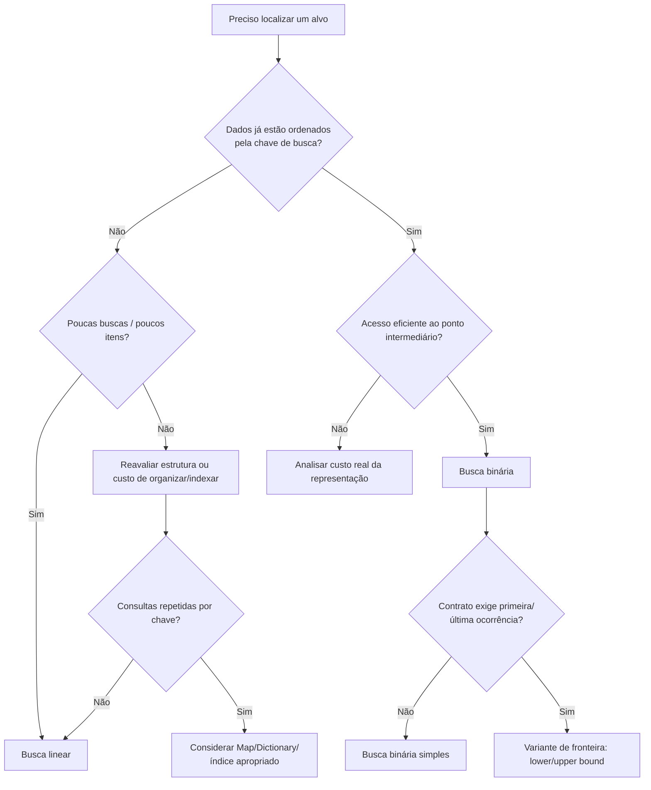

<a id="inicio"></a>

# Algoritmos de Busca

> **Classificação:** `[D] Obrigatório dominar no nível fundamental`  
> **Nível:** C — Algoritmos e Estruturas de Dados  
> **Posição na taxonomia:** tópico 26 — terceiro tópico do Nível C  
> **Pré-requisitos principais:** T06 — Fluxo de Controle; T07 — Estruturas de Repetição; T10 — Estruturas de Dados Elementares; T12 — Rastreamento, Verificação e Raciocínio sobre Execução; T17 — Recursão; T20 — Testes e Verificação; T24 — Correção e Análise de Algoritmos; T25 — Tipos Abstratos de Dados, Estruturas e Implementações  
> **Aprofundamentos posteriores:** T27 — Algoritmos de Ordenação; T28–T32 — estruturas específicas; T35 — Modelagem, Escolha de Estruturas e Trade-offs

---

## Resumo executivo

Buscar significa responder a alguma pergunta sobre um conjunto de candidatos.

A forma mais simples é examinar candidatos um a um:

```text
BUSCA LINEAR
candidato 0 → candidato 1 → candidato 2 → ...
```

Ela funciona sem exigir que os dados estejam ordenados e, no pior caso típico, examina `n` elementos:

```text
O(n)
```

Quando os dados estão **ordenados de forma compatível com a comparação usada pela busca** e a representação permite acessar eficientemente uma posição intermediária, a busca binária pode eliminar aproximadamente metade do espaço restante a cada passo:

```text
n
↓
n/2
↓
n/4
↓
n/8
↓
...
```

Seu número de passos cresce tipicamente como:

```text
O(log n)
```

Mas a frase "busca binária é mais rápida" é incompleta. A escolha correta depende de:

- pré-condições;
- representação dos dados;
- custo para manter ordenação;
- quantidade de buscas;
- necessidade de primeira/última ocorrência;
- semântica do retorno;
- estrutura mais adequada ao problema.

A habilidade central deste tópico é:

> **identificar o contrato da busca, verificar as pré-condições e escolher o algoritmo/estrutura de acordo com o problema — não por memorização de código.**

---

## Como estudar este tópico — duas rotas

Este arquivo atende a dois usos sem criar versões concorrentes do conteúdo.

### Rota A — primeiro contato

Siga esta ordem:

```text
Visão panorâmica
→ contrato da busca
→ busca linear
→ busca binária
→ invariante + complexidade
→ duplicatas e fronteiras
→ APIs reais
→ escolha prática
→ LABs
→ critérios de domínio
```

Se algum termo parecer abstrato, priorize o **rastro de execução** e os exemplos canônicos antes de consultar as APIs de biblioteca.

### Rota B — consulta / revisão

Use diretamente:

- [Visão rápida](#visão-rápida);
- [Decisão rápida](#decisão-rápida);
- [Visão panorâmica](#visao-panoramica);
- [Matriz de decisão](#22-matriz-de-decisão);
- [Regras de ouro](#35-regras-de-ouro);
- [Troubleshooting sistemático](#troubleshooting-t26);
- [Glossário](#48-glossário).

> **Regra de leitura:** a primeira rota ensina; a segunda localiza. Ambas apontam para o mesmo conteúdo canônico.

---

## Visão rápida

| Pergunta | Resposta curta |
|---|---|
| A coleção precisa estar ordenada para busca linear? | não |
| A busca linear pode parar antes em dados ordenados? | sim, em alguns contratos, mas o pior caso continua linear |
| A busca binária exige ordenação? | sim, compatível com a comparação usada |
| Ordenar e depois fazer uma única busca é sempre melhor? | não |
| Busca binária é sempre `O(log n)` em qualquer estrutura? | não; o modelo de acesso à posição intermediária importa |
| Duplicatas mudam o algoritmo? | mudam o contrato se for preciso primeira/última ocorrência ou intervalo |
| `bisect_left()` em Python é uma busca "encontrou/não encontrou" pronta? | não; retorna ponto de inserção e usa ordenação |
| `Arrays.binarySearch()` em Java garante qual duplicata será retornada? | não |
| ECMAScript possui `Array.prototype.binarySearch()` padrão? | não |
| Bash possui builtin de busca binária em array? | não |
| Map/Dictionary pode ser melhor para consultas repetidas por chave? | frequentemente, conforme contrato/garantias da implementação |

---

## Regra de ouro

> **Antes de otimizar a busca, defina o que significa “encontrar”, quais garantias os dados possuem e qual estrutura oferece as operações de que o problema realmente precisa.**

---

## Decisão rápida

```text
PRECISO ENCONTRAR ALGO
        │
        ├── poucos dados / uma busca / sem ordenação
        │       └── busca linear é candidata natural
        │
        ├── dados já ordenados + acesso eficiente ao meio
        │       └── busca binária é candidata natural
        │
        ├── muitas consultas por chave
        │       └── considerar Map/Dictionary/índice apropriado
        │
        └── estrutura é árvore/grafo
                └── usar algoritmo de percurso/busca adequado à estrutura
```


<a id="visao-panoramica"></a>

## 🗺️ Visão panorâmica — o mapa antes dos detalhes

Esta visão foi reconstruída na revisão `0.2.0` e revalidada na R3 (`0.3.0`) para funcionar como **caderno rápido de consulta, modelo mental e contrato de cobertura**. Ela sintetiza o Guia v2.1.0, a literatura de algoritmos reconsultada nesta rodada e as semânticas atuais das APIs citadas. Nenhuma fonte isolada determina o mapa: cada uma contribui onde é mais forte — modelo mental, variante, custo, contrato ou comportamento versionado.

### Mapa do domínio — do problema à estratégia de busca

```text
PRECISO LOCALIZAR / DECIDIR ALGO
        ↓
DEFINIR O CONTRATO
        │  existe ou não?
        │  retornar valor, índice, primeira ocorrência, última ocorrência?
        │  retornar ponto de inserção ou faixa?
        ↓
CARACTERIZAR OS DADOS
        │  ordenados?
        │  ordenação compatível com a comparação?
        │  duplicatas?
        │  mutáveis entre consultas?
        ↓
CARACTERIZAR A REPRESENTAÇÃO
        │  acesso sequencial?
        │  acesso eficiente por índice/meio?
        │  dados em memória ou externos?
        ↓
ESCOLHER A ESTRATÉGIA
        ├── varredura sequencial → busca linear
        ├── descarte por ordem → busca binária
        ├── fronteiras → lower/upper bound
        └── outra estrutura → Map/Dictionary/índice/árvore/grafo
        ↓
PROVAR / VALIDAR
        │  pré-condições
        │  invariante
        │  progresso / término
        │  casos de borda
        ↓
ANALISAR O CUSTO DO WORKFLOW INTEIRO
        busca + ordenação + atualizações + representação + memória
```

A relação essencial é:

```text
BUSCA LINEAR
→ exige apenas uma forma de percorrer candidatos
→ pior caso típico: Θ(n) comparações

BUSCA BINÁRIA
→ exige ordem compatível + acesso apropriado ao intervalo/meio
→ reduz o conjunto candidato aproximadamente pela metade
→ pior caso típico em array/indexação adequada: Θ(log n)
```

### Fluxo operacional da busca binária

```text
INTERVALO CANDIDATO [low .. high]
        ↓
ESCOLHER middle
        ↓
COMPARAR current COM target
        ├── igual   → contrato de sucesso satisfeito?
        │              ├── sim → retornar
        │              └── não → continuar buscando fronteira
        ├── menor   → descartar low..middle
        │              low = middle + 1
        └── maior   → descartar middle..high
                       high = middle - 1
        ↓
INTERVALO DEVE DIMINUIR ESTRITAMENTE
        ↓
low > high
→ alvo ausente no intervalo original
```

O descarte só é correto porque a **ordenação e o comparador são compatíveis**. Sem essa pré-condição, a comparação com o meio não autoriza eliminar metade dos candidatos.

### Consulta rápida — contrato × mecanismo × risco

| Dúvida | Mecanismo inicial | Regra central | Risco típico |
|---|---|---|---|
| coleção pequena/desordenada, uma busca | busca linear | percorra até encontrar ou esgotar | otimizar sem necessidade |
| dados já ordenados e indexados | busca binária | descarte metade somente com ordem válida | usar dados não ordenados |
| preciso da primeira ocorrência | lower bound / variante de fronteira | encontrar qualquer duplicata não basta | retornar ocorrência arbitrária |
| preciso contar duplicatas | duas fronteiras | `upper - lower` | expandir linearmente e perder logaritmo |
| preciso saber onde inserir | ponto de inserção | inserção e igualdade são contratos diferentes | tratar insertion point como match |
| muitas consultas por chave | reavaliar estrutura | custo do workflow importa | repetir busca quando um índice/Map seria melhor |
| sequência ligada | analisar custo de acesso | `O(log n)` de comparações não implica `O(log n)` de acesso | fingir acesso aleatório |
| dados mudam muito | incluir manutenção da ordem | busca rápida pode cobrar nas atualizações | medir só a consulta |
| registros com chave | comparador/key coerente | ordenar e buscar com a mesma relação | comparador incompatível |
| dados externos | declarar modelo de custo | RAM/array não modela automaticamente I/O | transferir Big O sem contexto |

### Pergunta prática → onde começar

| Se a pergunta for... | Primeiro mecanismo | Destino principal |
|---|---|---|
| "Esse alvo existe?" | definir retorno e igualdade | [problema antes do algoritmo](#2-o-problema-de-busca-antes-do-algoritmo) |
| "Posso usar busca binária?" | validar ordem + acesso + comparador | [pré-condições](#6-262--busca-binária-d) |
| "Por que posso descartar metade?" | invariante + ordem | [invariante](#8-invariante-da-busca-binária) |
| "Por que meu último elemento nunca aparece?" | convenção de intervalo | [off-by-one](#11-convenções-de-intervalo-e-erros-off-by-one) |
| "Tenho duplicatas; qual índice retorno?" | explicitar contrato | [duplicatas](#12-duplicatas-mudam-o-contrato) |
| "`bisect_left` encontrou o item?" | ponto de inserção + confirmação | [Python `bisect`](#13-biblioteca-python--bisect) |
| "Java retornou número negativo" | decodificar insertion point | [Java `Arrays.binarySearch`](#14-biblioteca-java--arraysbinarysearch) |
| "JavaScript tem binary search padrão?" | separar algoritmo de API | [ECMAScript](#15-javascript--ecmascript--o-que-a-linguagem-padrão-oferece) |
| "Busca binária em `LinkedList` continua logarítmica?" | separar comparações de travessias | [representação](#20-a-representação-muda-a-análise) |
| "Ordeno ou faço várias varreduras?" | custo total e frequência de operações | [custo de ordenar](#19-o-custo-de-ordenar-antes-de-buscar) |

### Não confundir

```text
BUSCA BINÁRIA
≠ "qualquer busca em dados ordenados"

DADOS ORDENADOS
≠ pré-condição suficiente se o comparador de busca for diferente

O(log n) COMPARAÇÕES
≠ O(log n) DE TEMPO EM TODA REPRESENTAÇÃO

QUALQUER OCORRÊNCIA
≠ PRIMEIRA OCORRÊNCIA
≠ ÚLTIMA OCORRÊNCIA
≠ PONTO DE INSERÇÃO

bisect_left(...)
≠ "função de igualdade"

Arrays.binarySearch(...)
≠ retorno -1 simples quando ausente

Array.prototype.findIndex(...)
≠ busca binária

ORDENAR + BUSCAR
≠ custo apenas da busca

BENCHMARK CONCRETO
≠ prova de complexidade assintótica
```

### Microexemplos canônicos

**Busca linear — ausência só pode ser concluída depois do espaço relevante:**

```text
[8, 3, 9, 5], alvo = 4
 8 ✗ → 3 ✗ → 9 ✗ → 5 ✗ → ausente
```

**Busca binária — o valor da ordem está no descarte:**

```text
[2, 5, 8, 12, 17, 21, 30], alvo = 17
             12
             ↓
17 > 12 → descarte [2, 5, 8, 12]

[17, 21, 30]
     21
     ↓
17 < 21 → descarte [21, 30]

[17] → encontrou
```

**Duplicatas — encontrar uma ocorrência não resolve todos os contratos:**

```text
[2, 5, 5, 5, 9]
       ↑
"achei 5" pode retornar índice 1, 2 ou 3

primeira ocorrência → 1
última ocorrência   → 3
lower bound         → 1
upper bound         → 4
quantidade          → 4 - 1 = 3
```

**Representação muda o custo:**

```text
ARRAY INDEXADO
acessar meio → custo apropriado para busca binária clássica

LISTA LIGADA
"chegar ao meio" → exige travessia
→ reduzir comparações não elimina o custo de navegar pelos nós
```

### Problemas reais representativos

O inventário `PR-T26-*` materializado adiante cobre, entre outros:

- localizar uma chave em pequena coleção desordenada sem impor ordenação artificial;
- consultar um catálogo já ordenado preservando a pré-condição da busca binária;
- encontrar primeira/última ocorrência e intervalo de duplicatas;
- interpretar corretamente `bisect_left` como fronteira/ponto de inserção;
- interpretar retorno negativo de `Arrays.binarySearch`;
- escolher entre varredura repetida e ordenar/indexar uma vez;
- evitar busca binária clássica quando a representação não oferece acesso eficiente ao meio;
- manter ordenação e busca sob o mesmo comparador/chave;
- evitar o `sort()` lexical padrão do JavaScript em dados numéricos;
- transferir o contrato para Bash sem confundir índice em `stdout` com status de sucesso/falha.

### Falha típica → primeira investigação

| Sintoma | Primeira hipótese | Primeira verificação |
|---|---|---|
| elemento existe, mas busca binária retorna ausência | pré-condição de ordenação violada | imprima/valide ordem pela mesma chave usada na busca |
| último/único elemento nunca é encontrado | off-by-one | trace `low`, `middle`, `high` |
| laço não termina | intervalo não diminui | procure `low = middle` / `high = middle` na convenção fechada |
| duplicata errada é retornada | contrato pede fronteira, algoritmo pede qualquer match | compare contrato com `lower_bound`/`upper_bound` |
| `bisect_left` aponta para alvo ausente | insertion point foi confundido com igualdade | cheque `i < len(a) and a[i] == x` |
| Java retornou `-4` e código tratou como índice | semântica da API ignorada | decodifique `-result - 1` |
| JavaScript falha após `sort()` | ordenação lexical padrão | teste `[2, 10, 3].sort()` e use comparador numérico |
| busca ficou lenta em lista ligada | custo de acesso ao meio domina | identifique representação e custo de acesso posicional |
| "otimização" ficou mais cara que varredura | custo de ordenar/manter índice omitido | some todos os custos do workflow |
| benchmark contradiz Big O | faixas/constantes/runtime diferentes | separe análise assintótica de medição concreta |

### Transferência entre linguagens

| Linguagem | Mecanismo relevante | Diferença material |
|---|---|---|
| Python | laços, `bisect_left/right` | `bisect` procura fronteiras por ordem; não chama `__eq__()` para decidir match |
| JavaScript | implementação manual, `find`/`findIndex`, `sort` | ECMAScript 2026 não define `Array.prototype.binarySearch()`; `findIndex` percorre por índice |
| Java | `Arrays.binarySearch`, `Collections.binarySearch` | retorno ausente codifica insertion point; `Collections` distingue listas de acesso aleatório e sequencial |
| Bash | indexed arrays, aritmética, status | transferência é didática; shell não oferece builtin genérico de busca binária |

### Modo consulta × modo estudo

```text
CONSULTA RÁPIDA
1. defina o contrato
2. cheque ordem/representação
3. escolha linear/binária/fronteira/estrutura alternativa
4. veja "Não confundir"
5. vá ao troubleshooting se houver sintoma

ESTUDO COMPLETO
1. contrato de busca
2. linear + prova
3. binária + invariante + complexidade
4. intervalos/off-by-one
5. duplicatas/fronteiras
6. APIs reais
7. decisão por custo total
8. PR-* + LABs + troubleshooting + QA
```

[↑ Voltar ao índice](#índice)

---

<a id="índice"></a>

# Índice essencial

- [🗺️ Visão panorâmica — o mapa antes dos detalhes](#visao-panoramica)
- [PARTE I — Contexto e contrato da busca](#parte-i)
- [PARTE II — Busca linear: mecanismo, correção e transferência](#parte-ii)
- [PARTE III — Busca binária: pré-condições, invariante, custo e duplicatas](#parte-iii)
- [PARTE IV — APIs reais, representação e escolha prática](#parte-iv)
- [PARTE V — Erros, decisão, problemas reais e troubleshooting](#parte-v)
- [PARTE VI — LABs, exercícios e critérios de domínio](#parte-vi)
- [APÊNDICES — Auditoria, referências, QA e histórico](#apendices)

<details>
<summary><strong>Índice detalhado</strong></summary>

- [Resumo executivo](#resumo-executivo)
  - [Visão rápida](#visão-rápida)
  - [Regra de ouro](#regra-de-ouro)
  - [Decisão rápida](#decisão-rápida)
  - [🗺️ Visão panorâmica — o mapa antes dos detalhes](#visao-panoramica)
- [1. Posição deste assunto na trilha](#1-posição-deste-assunto-na-trilha)
  - [1.1 O que T24 entregou](#11-o-que-t24-entregou)
  - [1.2 O que T25 entregou](#12-o-que-t25-entregou)
  - [1.3 Fronteira com T27 — Ordenação](#13-fronteira-com-t27--ordenação)
  - [1.4 Fronteira com T29 — Hashing e estruturas associativas](#14-fronteira-com-t29--hashing-e-estruturas-associativas)
  - [1.5 Fronteira com T31/T32](#15-fronteira-com-t31t32)
  - [1.6 O que não pertence ao núcleo deste tópico](#16-o-que-não-pertence-ao-núcleo-deste-tópico)
- [2. O problema de busca antes do algoritmo](#2-o-problema-de-busca-antes-do-algoritmo)
  - [2.1 Buscar não significa sempre a mesma coisa](#21-buscar-não-significa-sempre-a-mesma-coisa)
  - [2.2 Contratos de retorno comuns](#22-contratos-de-retorno-comuns)
  - [2.3 Não misture sentinela com domínio válido](#23-não-misture-sentinela-com-domínio-válido)
  - [2.4 A chave de comparação faz parte do problema](#24-a-chave-de-comparação-faz-parte-do-problema)
  - [2.5 Igualdade e ordenação precisam ser coerentes](#25-igualdade-e-ordenação-precisam-ser-coerentes)
- [3. 26.1 — Busca linear `[D]`](#3-261--busca-linear-d)
  - [3.1 Definição operacional](#31-definição-operacional)
  - [3.2 Exemplo rastreado](#32-exemplo-rastreado)
  - [3.3 Pré-condições](#33-pré-condições)
  - [3.4 Pós-condição](#34-pós-condição)
  - [3.5 Melhor caso](#35-melhor-caso)
  - [3.6 Pior caso](#36-pior-caso)
  - [3.7 Caso médio intuitivo](#37-caso-médio-intuitivo)
  - [3.8 Espaço adicional](#38-espaço-adicional)
  - [3.9 Busca linear em dados ordenados](#39-busca-linear-em-dados-ordenados)
  - [3.10 Força da busca linear](#310-força-da-busca-linear)
  - [3.11 Limitação principal](#311-limitação-principal)
- [4. Correção da busca linear](#4-correção-da-busca-linear)
  - [4.1 Invariante útil](#41-invariante-útil)
  - [4.2 Inicialização](#42-inicialização)
  - [4.3 Manutenção](#43-manutenção)
  - [4.4 Término por sucesso](#44-término-por-sucesso)
  - [4.5 Término por esgotamento](#45-término-por-esgotamento)
  - [4.6 O teste não substitui o argumento](#46-o-teste-não-substitui-o-argumento)
- [5. Busca linear nas quatro linguagens](#5-busca-linear-nas-quatro-linguagens)
  - [5.1 Python](#51-python)
  - [5.2 JavaScript / ECMAScript](#52-javascript--ecmascript)
  - [5.3 Java](#53-java)
  - [5.4 GNU Bash](#54-gnu-bash)
  - [5.5 Conceito universal versus sintaxe](#55-conceito-universal-versus-sintaxe)
- [6. 26.2 — Busca binária `[D]`](#6-262--busca-binária-d)
  - [6.1 Ideia central](#61-ideia-central)
  - [6.2 Redução do espaço](#62-redução-do-espaço)
  - [6.3 Pré-condição 1 — ordenação compatível](#63-pré-condição-1--ordenação-compatível)
  - [6.4 Pré-condição 2 — acesso adequado ao meio](#64-pré-condição-2--acesso-adequado-ao-meio)
  - [6.5 Pré-condição 3 — relação de ordem e comparador](#65-pré-condição-3--relação-de-ordem-e-comparador)
  - [6.6 Pré-condição 4 — intervalo bem definido](#66-pré-condição-4--intervalo-bem-definido)
- [7. Busca binária iterativa com intervalo fechado](#7-busca-binária-iterativa-com-intervalo-fechado)
  - [7.1 Estado](#71-estado)
  - [7.2 Condição do laço](#72-condição-do-laço)
  - [7.3 Meio](#73-meio)
  - [7.4 Três decisões](#74-três-decisões)
  - [7.5 Por que `+1` e `-1` importam](#75-por-que-1-e--1-importam)
  - [7.6 Término por ausência](#76-término-por-ausência)
- [8. Invariante da busca binária](#8-invariante-da-busca-binária)
  - [8.1 Formulação útil](#81-formulação-útil)
  - [8.2 Inicialização](#82-inicialização)
  - [8.3 Manutenção — alvo maior que o meio](#83-manutenção--alvo-maior-que-o-meio)
  - [8.4 Manutenção — alvo menor que o meio](#84-manutenção--alvo-menor-que-o-meio)
  - [8.5 Término](#85-término)
  - [8.6 Correção depende da pré-condição](#86-correção-depende-da-pré-condição)
- [9. Complexidade da busca binária](#9-complexidade-da-busca-binária)
  - [9.1 Tempo em representação indexada](#91-tempo-em-representação-indexada)
  - [9.2 Melhor caso](#92-melhor-caso)
  - [9.3 Pior caso](#93-pior-caso)
  - [9.4 Espaço — iterativa](#94-espaço--iterativa)
  - [9.5 Espaço — recursiva](#95-espaço--recursiva)
  - [9.6 Tempo assintótico não é tempo de relógio](#96-tempo-assintótico-não-é-tempo-de-relógio)
- [10. 26.3 — Exemplo comparativo: mesma busca binária](#10-263--exemplo-comparativo-mesma-busca-binária)
  - [10.1 Python](#101-python)
  - [10.2 JavaScript / ECMAScript](#102-javascript--ecmascript)
  - [10.3 Java](#103-java)
  - [10.4 GNU Bash](#104-gnu-bash)
  - [10.5 O que é igual conceitualmente](#105-o-que-é-igual-conceitualmente)
  - [10.6 O que não é igual](#106-o-que-não-é-igual)
  - [10.7 Por que Bash está aqui](#107-por-que-bash-está-aqui)
- [11. Convenções de intervalo e erros off-by-one](#11-convenções-de-intervalo-e-erros-off-by-one)
  - [11.1 Intervalo fechado](#111-intervalo-fechado)
  - [11.2 Intervalo meio aberto](#112-intervalo-meio-aberto)
  - [11.3 O problema não é qual convenção escolher](#113-o-problema-não-é-qual-convenção-escolher)
  - [11.4 Sintoma clássico — último elemento nunca é examinado](#114-sintoma-clássico--último-elemento-nunca-é-examinado)
  - [11.5 Sintoma clássico — loop infinito](#115-sintoma-clássico--loop-infinito)
  - [11.6 Instrumentação para depurar](#116-instrumentação-para-depurar)
- [12. Duplicatas mudam o contrato](#12-duplicatas-mudam-o-contrato)
  - [12.1 "Qualquer ocorrência"](#121-qualquer-ocorrência)
  - [12.2 Primeira ocorrência](#122-primeira-ocorrência)
  - [12.3 Última ocorrência](#123-última-ocorrência)
  - [12.4 Limite inferior — lower bound](#124-limite-inferior--lower-bound)
  - [12.5 Limite superior — upper bound](#125-limite-superior--upper-bound)
  - [12.6 Contar duplicatas](#126-contar-duplicatas)
  - [12.7 Exemplo de `lower_bound` em Python](#127-exemplo-de-lower_bound-em-python)
  - [12.8 Invariante de `lower_bound`](#128-invariante-de-lower_bound)
- [13. Biblioteca Python — `bisect`](#13-biblioteca-python--bisect)
  - [13.1 O nome pode enganar](#131-o-nome-pode-enganar)
  - [13.2 `bisect_left`](#132-bisect_left)
  - [13.3 Confirmar igualdade continua necessário](#133-confirmar-igualdade-continua-necessário)
  - [13.4 `bisect_right`](#134-bisect_right)
  - [13.5 Comparação usada](#135-comparação-usada)
  - [13.6 Inserção não vira `O(log n)`](#136-inserção-não-vira-olog-n)
  - [13.7 Segurança concorrente](#137-segurança-concorrente)
- [14. Biblioteca Java — `Arrays.binarySearch`](#14-biblioteca-java--arraysbinarysearch)
  - [14.1 Pré-condição documentada](#141-pré-condição-documentada)
  - [14.2 Duplicatas](#142-duplicatas)
  - [14.3 Retorno quando ausente](#143-retorno-quando-ausente)
  - [14.4 Exemplo](#144-exemplo)
  - [14.5 Decodificando ausência](#145-decodificando-ausência)
  - [14.6 Biblioteca não substitui entendimento](#146-biblioteca-não-substitui-entendimento)
- [15. JavaScript / ECMAScript — o que a linguagem padrão oferece](#15-javascript--ecmascript--o-que-a-linguagem-padrão-oferece)
  - [15.1 Não existe `Array.prototype.binarySearch()` padrão](#151-não-existe-arrayprototypebinarysearch-padrão)
  - [15.2 `find` e `findIndex` não são busca binária](#152-find-e-findindex-não-são-busca-binária)
  - [15.3 Implementação própria ou biblioteca externa](#153-implementação-própria-ou-biblioteca-externa)
  - [15.4 Não confunda `sort()` com pré-condição gratuita](#154-não-confunda-sort-com-pré-condição-gratuita)
- [16. GNU Bash — transferência conceitual e limites práticos](#16-gnu-bash--transferência-conceitual-e-limites-práticos)
  - [16.1 Não há builtin `binary_search`](#161-não-há-builtin-binary_search)
  - [16.2 O exemplo é didático](#162-o-exemplo-é-didático)
  - [16.3 Dados de texto muitas vezes pedem ferramentas Unix](#163-dados-de-texto-muitas-vezes-pedem-ferramentas-unix)
  - [16.4 Status de saída é informação útil](#164-status-de-saída-é-informação-útil)
- [17. Busca binária recursiva](#17-busca-binária-recursiva)
  - [17.1 Estrutura](#171-estrutura)
  - [17.2 Relação com T17](#172-relação-com-t17)
  - [17.3 Iterativa versus recursiva](#173-iterativa-versus-recursiva)
  - [17.4 Não existe superioridade universal de estilo](#174-não-existe-superioridade-universal-de-estilo)
- [18. Busca linear versus binária — comparação correta](#18-busca-linear-versus-binária--comparação-correta)
  - [18.1 `O(log n)` não vence automaticamente](#181-olog-n-não-vence-automaticamente)
  - [18.2 Muitas buscas mudam a conta](#182-muitas-buscas-mudam-a-conta)
  - [18.3 Estrutura diferente pode vencer ambos](#183-estrutura-diferente-pode-vencer-ambos)
- [19. O custo de ordenar antes de buscar](#19-o-custo-de-ordenar-antes-de-buscar)
  - [19.1 Uma única consulta](#191-uma-única-consulta)
  - [19.2 Muitas consultas](#192-muitas-consultas)
  - [19.3 Dados mudam frequentemente](#193-dados-mudam-frequentemente)
  - [19.4 Não faça conta só com a operação favorita](#194-não-faça-conta-só-com-a-operação-favorita)
- [20. A representação muda a análise](#20-a-representação-muda-a-análise)
  - [20.1 Array e acesso indexado](#201-array-e-acesso-indexado)
  - [20.2 Lista ligada](#202-lista-ligada)
  - [20.3 Regra prática](#203-regra-prática)
  - [20.4 Java documenta essa diferença](#204-java-documenta-essa-diferença)
- [21. 26.4 — Escolha prática `[D]`](#21-264--escolha-prática-d)
  - [21.1 "Provável" é palavra importante](#211-provável-é-palavra-importante)
  - [21.2 Critérios adicionais](#212-critérios-adicionais)
- [22. Matriz de decisão](#22-matriz-de-decisão)
- [23. Erros frequentes na busca linear](#23-erros-frequentes-na-busca-linear)
  - [23.1 Parar cedo sem ordenação](#231-parar-cedo-sem-ordenação)
  - [23.2 Retornar `-1` dentro do laço cedo demais](#232-retornar--1-dentro-do-laço-cedo-demais)
  - [23.3 Confundir índice com valor](#233-confundir-índice-com-valor)
  - [23.4 Comparação inadequada](#234-comparação-inadequada)
- [24. Erros frequentes na busca binária](#24-erros-frequentes-na-busca-binária)
  - [24.1 Usar sequência não ordenada](#241-usar-sequência-não-ordenada)
  - [24.2 Ordenação e comparador incompatíveis](#242-ordenação-e-comparador-incompatíveis)
  - [24.3 Limites inconsistentes](#243-limites-inconsistentes)
  - [24.4 Intervalo não diminui](#244-intervalo-não-diminui)
  - [24.5 Assumir primeira ocorrência](#245-assumir-primeira-ocorrência)
  - [24.6 Somar limites sem necessidade em inteiro limitado](#246-somar-limites-sem-necessidade-em-inteiro-limitado)
  - [24.7 Ordenar dentro de cada chamada](#247-ordenar-dentro-de-cada-chamada)
  - [24.8 Medir e concluir complexidade](#248-medir-e-concluir-complexidade)
- [25. Casos de teste mínimos](#25-casos-de-teste-mínimos)
  - [25.1 Busca linear](#251-busca-linear)
  - [25.2 Busca binária](#252-busca-binária)
  - [25.3 Teste de pré-condição](#253-teste-de-pré-condição)
  - [25.4 Teste orientado por propriedade](#254-teste-orientado-por-propriedade)
- [26. Contando comparações para enxergar crescimento](#26-contando-comparações-para-enxergar-crescimento)
  - [26.1 Linear](#261-linear)
  - [26.2 Binária](#262-binária)
  - [26.3 Instrumentação Python](#263-instrumentação-python)
- [27. Ordenação, mutabilidade e cópias](#27-ordenação-mutabilidade-e-cópias)
  - [27.1 Ordenar pode alterar estado observável](#271-ordenar-pode-alterar-estado-observável)
  - [27.2 Copiar para preservar ordem também custa](#272-copiar-para-preservar-ordem-também-custa)
  - [27.3 Índices mudam após ordenação](#273-índices-mudam-após-ordenação)
  - [27.4 Exemplo](#274-exemplo)
- [28. Comparadores e registros](#28-comparadores-e-registros)
  - [28.1 Buscar por chave](#281-buscar-por-chave)
  - [28.2 Python com `key=` e chave pré-computada](#282-python-com-key-e-chave-pré-computada)
  - [28.3 Java com `Comparator`](#283-java-com-comparator)
  - [28.4 JavaScript](#284-javascript)
  - [28.5 Bash](#285-bash)
- [29. Busca exata versus busca por faixa](#29-busca-exata-versus-busca-por-faixa)
  - [29.1 Busca exata](#291-busca-exata)
  - [29.2 Primeiro valor maior ou igual](#292-primeiro-valor-maior-ou-igual)
  - [29.3 Uso prático](#293-uso-prático)
  - [29.4 Cuidado de escopo](#294-cuidado-de-escopo)
- [30. Busca e dados externos](#30-busca-e-dados-externos)
  - [30.1 Complexidade abstrata assume um modelo de custo](#301-complexidade-abstrata-assume-um-modelo-de-custo)
  - [30.2 Não transfira diretamente o modelo de array em RAM](#302-não-transfira-diretamente-o-modelo-de-array-em-ram)
  - [30.3 Limite curricular](#303-limite-curricular)
- [31. Segurança e robustez pertinentes](#31-segurança-e-robustez-pertinentes)
  - [31.1 Entrada não confiável e tamanho](#311-entrada-não-confiável-e-tamanho)
  - [31.2 Comparadores fornecidos externamente](#312-comparadores-fornecidos-externamente)
  - [31.3 Logs de debugging](#313-logs-de-debugging)
  - [31.4 Não existe risco especial que justifique inflar o capítulo](#314-não-existe-risco-especial-que-justifique-inflar-o-capítulo)
- [32. Diagrama de decisão](#32-diagrama-de-decisão)
- [33. Tabela de transferência entre linguagens](#33-tabela-de-transferência-entre-linguagens)
- [34. Antipadrões](#34-antipadrões)
- [35. Regras de ouro](#35-regras-de-ouro)
- [Índice operacional de Problemas Reais — `PR-T26-*`](#pr-t26-indice)
- [🔎 Troubleshooting sistemático](#troubleshooting-sistematico-t26)
- [36. 🧪 LAB 1 — Rastrear busca linear](#36--lab-1--rastrear-busca-linear)
  - [Objetivo](#objetivo)
  - [Pré-requisitos](#pré-requisitos)
  - [Estado inicial](#estado-inicial)
  - [Tarefa](#tarefa)
  - [Procedimento](#procedimento)
  - [O que observar](#o-que-observar)
  - [Testes](#testes)
  - [Explicação](#explicação)
  - [Variação / transferência](#variação--transferência)
  - [Limpeza](#limpeza)
- [37. 🧪 LAB 2 — Provar o descarte da busca binária](#37--lab-2--provar-o-descarte-da-busca-binária)
  - [Objetivo](#objetivo-1)
  - [Pré-requisitos](#pré-requisitos-1)
  - [Estado inicial](#estado-inicial-1)
  - [Tarefa](#tarefa-1)
  - [Procedimento](#procedimento-1)
  - [O que observar](#o-que-observar-1)
  - [Testes](#testes-1)
  - [Explicação](#explicação-1)
  - [Variação / transferência](#variação--transferência-1)
  - [Limpeza](#limpeza-1)
- [38. 🧪 LAB 3 — Implementar nas quatro linguagens](#38--lab-3--implementar-nas-quatro-linguagens)
  - [Objetivo](#objetivo-2)
  - [Pré-requisitos](#pré-requisitos-2)
  - [Estado inicial](#estado-inicial-2)
  - [Tarefa](#tarefa-2)
  - [Procedimento](#procedimento-2)
  - [O que observar](#o-que-observar-2)
  - [Testes](#testes-2)
  - [Explicação](#explicação-2)
  - [Variação / transferência](#variação--transferência-2)
  - [Limpeza](#limpeza-2)
- [39. 🧪 LAB 4 — Encontrar primeira ocorrência](#39--lab-4--encontrar-primeira-ocorrência)
  - [Objetivo](#objetivo-3)
  - [Pré-requisitos](#pré-requisitos-3)
  - [Estado inicial](#estado-inicial-3)
  - [Tarefa](#tarefa-3)
  - [Procedimento](#procedimento-3)
  - [O que observar](#o-que-observar-3)
  - [Testes](#testes-3)
  - [Explicação](#explicação-3)
  - [Variação / transferência](#variação--transferência-3)
  - [Limpeza](#limpeza-3)
- [40. 🧪 LAB 5 — Python `bisect`](#40--lab-5--python-bisect)
  - [Objetivo](#objetivo-4)
  - [Pré-requisitos](#pré-requisitos-4)
  - [Estado inicial](#estado-inicial-4)
  - [Tarefa](#tarefa-4)
  - [Procedimento](#procedimento-4)
  - [O que observar](#o-que-observar-4)
  - [Testes](#testes-4)
  - [Explicação](#explicação-4)
  - [Variação / transferência](#variação--transferência-4)
  - [Limpeza](#limpeza-4)
- [41. 🧪 LAB 6 — Java `Arrays.binarySearch`](#41--lab-6--java-arraysbinarysearch)
  - [Objetivo](#objetivo-5)
  - [Pré-requisitos](#pré-requisitos-5)
  - [Estado inicial](#estado-inicial-5)
  - [Tarefa](#tarefa-5)
  - [Procedimento](#procedimento-5)
  - [O que observar](#o-que-observar-5)
  - [Testes](#testes-5)
  - [Explicação](#explicação-5)
  - [Variação / transferência](#variação--transferência-5)
  - [Limpeza](#limpeza-5)
- [42. 🧪 LAB 7 — Ordenar uma vez ou varrer várias vezes?](#42--lab-7--ordenar-uma-vez-ou-varrer-várias-vezes)
  - [Objetivo](#objetivo-6)
  - [Pré-requisitos](#pré-requisitos-6)
  - [Estado inicial](#estado-inicial-6)
  - [Tarefa](#tarefa-6)
  - [Procedimento](#procedimento-6)
  - [O que observar](#o-que-observar-6)
  - [Testes](#testes-6)
  - [Explicação](#explicação-6)
  - [Variação / transferência](#variação--transferência-6)
  - [Limpeza](#limpeza-6)
- [43. 🧪 LAB 8 — Suíte de regressão para off-by-one](#43--lab-8--suíte-de-regressão-para-off-by-one)
  - [Objetivo](#objetivo-7)
  - [Pré-requisitos](#pré-requisitos-7)
  - [Estado inicial](#estado-inicial-7)
  - [Tarefa](#tarefa-7)
  - [Procedimento](#procedimento-7)
  - [O que observar](#o-que-observar-7)
  - [Testes](#testes-7)
  - [Explicação](#explicação-7)
  - [Variação / transferência](#variação--transferência-7)
  - [Limpeza](#limpeza-7)
- [44. Exercícios fundamentais](#44-exercícios-fundamentais)
  - [44.1 Conceituais](#441-conceituais)
  - [44.2 Rastreamento](#442-rastreamento)
  - [44.3 Implementação](#443-implementação)
  - [44.4 Diagnóstico](#444-diagnóstico)
  - [44.5 Decisão](#445-decisão)
- [45. Exercícios de transferência entre linguagens](#45-exercícios-de-transferência-entre-linguagens)
  - [45.1 Python → JavaScript](#451-python--javascript)
  - [45.2 JavaScript → Java](#452-javascript--java)
  - [45.3 Java → Bash](#453-java--bash)
  - [45.4 Bash → Python](#454-bash--python)
- [46. Evidências de domínio](#46-evidências-de-domínio)
- [47. Checklist de domínio](#47-checklist-de-domínio)
- [48. Glossário](#48-glossário)
- [49. Auditoria de cobertura da taxonomia](#49-auditoria-de-cobertura-da-taxonomia)
  - [49.1 Fronteira preservada com T27](#491-fronteira-preservada-com-t27)
  - [49.2 Fronteira preservada com T29](#492-fronteira-preservada-com-t29)
  - [49.3 Fronteira preservada com T31/T32](#493-fronteira-preservada-com-t31t32)
  - [49.4 Fronteira preservada com T35](#494-fronteira-preservada-com-t35)
- [50. Auditoria da File Library](#50-auditoria-da-file-library)
  - [50.1 Fontes locais efetivamente consultadas](#501-fontes-locais-efetivamente-consultadas)
  - [50.2 Como a biblioteca alterou o documento](#502-como-a-biblioteca-alterou-o-documento)
  - [50.3 Fontes localizadas e não adicionadas artificialmente](#503-fontes-localizadas-e-não-adicionadas-artificialmente)
  - [50.4 Atualidade e hierarquia](#504-atualidade-e-hierarquia)
  - [50.5 Reconsulta efetiva na revisão `0.2.0`](#505-reconsulta-efetiva-na-revisão-020)
  - [50.6 Reconsulta efetiva na R3 (`0.3.0`)](#506-reconsulta-efetiva-na-r3-030)
  - [50.7 Política bibliográfica da R4/R5](#507-política-bibliográfica-da-r4r5)
- [51. Referências](#51-referências)
  - [51.1 Contratos canônicos do projeto](#511-contratos-canônicos-do-projeto)
  - [51.2 Literatura local efetivamente consultada](#512-literatura-local-efetivamente-consultada)
  - [51.3 Python — documentação oficial](#513-python--documentação-oficial)
  - [51.4 JavaScript / ECMAScript — especificação](#514-javascript--ecmascript--especificação)
  - [51.5 Java — documentação oficial](#515-java--documentação-oficial)
  - [51.6 GNU Bash — documentação oficial](#516-gnu-bash--documentação-oficial)
  - [51.7 Hierarquia usada nesta revisão](#517-hierarquia-usada-nesta-revisão)
- [52. QA e evidências](#52-qa-e-evidências)
  - [52.1 `[D]` Evidência documental](#521-d-evidência-documental)
  - [52.2 `[S]` Validação estrutural/estática](#522-s-validação-estruturalestática)
  - [52.3 `[R]` Reprodução em runtime](#523-r-reprodução-em-runtime)
  - [52.4 Limitações de reprodução](#524-limitações-de-reprodução)
  - [52.5 Gate de Cobertura Prática / Operacional](#525-gate-de-cobertura-prática--operacional)
  - [52.6 Gate 2 — estado da R5](#526-gate-2--estado-da-r5)
  - [52.7 Métricas finais da iteração `0.3.2`](#527-métricas-finais-da-iteração-032)
- [53. Histórico de versões](#53-histórico-de-versões)

</details>

<a id="parte-i"></a>

# PARTE I — Contexto e contrato da busca

> **Objetivo:** entender o problema de busca antes de escolher um algoritmo.

# 1. Posição deste assunto na trilha

## 1.1 O que T24 entregou

T24 forneceu linguagem para discutir:

- correção;
- invariantes;
- tamanho da entrada;
- `O`, `Ω`, `Θ`;
- pior/médio/melhor caso;
- análise assintótica versus medição.

T26 aplica esse repertório a um problema concreto e fundamental: **localizar um alvo entre candidatos**.

## 1.2 O que T25 entregou

T25 separou:

```text
abstração
≠
estrutura de dados
≠
implementação concreta
```

Essa separação impede um erro recorrente:

> comparar algoritmos de busca ignorando a estrutura sobre a qual eles operam.

## 1.3 Fronteira com T27 — Ordenação

T26 pode exigir que os dados **já estejam ordenados**, mas não ensina sistematicamente algoritmos de ordenação.

T27 tratará:

- insertion sort;
- selection sort;
- merge sort;
- quicksort;
- estabilidade;
- comparação entre estratégias.

Aqui a ordenação aparece apenas como **pré-condição/custo associado** à busca binária.

## 1.4 Fronteira com T29 — Hashing e estruturas associativas

T26 pode concluir que consultas repetidas por chave sugerem outra estrutura.

Mas não aprofunda:

- função hash;
- colisões;
- fator de carga;
- open addressing;
- chaining.

Esses mecanismos pertencem ao T29.

## 1.5 Fronteira com T31/T32

Árvores e grafos possuem buscas/percurso próprios.

T26 não deve transformar "algoritmos de busca" em um capítulo de BFS/DFS ou árvores de busca.

## 1.6 O que não pertence ao núcleo deste tópico

Ficam fora do núcleo obrigatório:

- busca interpolada;
- exponential search;
- ternary search;
- busca binária em espaço de resposta como técnica geral;
- árvores B/B+;
- índices de banco de dados;
- full-text search;
- algoritmos de matching de strings;
- BFS/DFS;
- mecanismos internos de motores de busca.

Esses temas podem ser citados apenas para delimitar escopo.

[↑ Voltar ao índice](#índice)

# 2. O problema de busca antes do algoritmo

## 2.1 Buscar não significa sempre a mesma coisa

Considere uma sequência:

```text
[2, 5, 5, 5, 8, 12]
```

A pergunta "procure 5" ainda é ambígua.

Pode significar:

1. existe algum `5`?
2. qual é um índice que contém `5`?
3. qual é a primeira ocorrência?
4. qual é a última ocorrência?
5. quantas ocorrências existem?
6. onde `5` deveria ser inserido preservando a ordem?
7. qual é o primeiro elemento `>= 5`?
8. qual é o primeiro elemento `> 5`?

O algoritmo precisa corresponder ao **contrato**.

## 2.2 Contratos de retorno comuns

| Contrato | Exemplo de retorno |
|---|---|
| pertinência | `true/false` |
| índice ou ausência | `2` / `-1` |
| elemento ou ausência | objeto / `None` / `null` / status |
| primeira ocorrência | menor índice igual ao alvo |
| última ocorrência | maior índice igual ao alvo |
| ponto de inserção | posição que preserva ordenação |
| intervalo de iguais | `[first, last]` ou `[left, right)` |

## 2.3 Não misture sentinela com domínio válido

Se `-1` representa "não encontrado", ele precisa ser impossível como índice válido no contrato escolhido.

Em APIs diferentes, a ausência pode ser indicada por:

- `-1`;
- `None`;
- `null`;
- exceção;
- status de saída;
- iterador/end iterator;
- valor codificado, como em `Arrays.binarySearch()`.

A semântica deve ser lida, não presumida pelo nome da função.

## 2.4 A chave de comparação faz parte do problema

Buscar registros por `id` é diferente de comparar o objeto inteiro.

Exemplo conceitual:

```text
Registro
├── id
├── hostname
├── address
└── status
```

Se a coleção está ordenada por `id`, uma busca binária por `hostname` **não herda magicamente a ordenação necessária**.

## 2.5 Igualdade e ordenação precisam ser coerentes

Busca linear por igualdade precisa de uma noção de correspondência.

Busca binária precisa de uma relação de ordenação consistente com a decisão:

```text
alvo < meio
alvo == meio
alvo > meio
```

Se o comparador for inconsistente, o algoritmo pode descartar a região que contém o alvo.

[↑ Voltar ao índice](#índice)

> **✅ Fechamento da Parte I — você deve conseguir**
>
> - definir o contrato da busca antes do mecanismo;
> - distinguir valor, índice, fronteira e ponto de inserção;
> - reconhecer que igualdade, chave e ordenação precisam ser compatíveis;
> - localizar as fronteiras curriculares com T27, T29, T31/T32 e T35.

<a id="parte-ii"></a>

# PARTE II — Busca linear: mecanismo, correção e transferência

> **Objetivo:** dominar a varredura sequencial, seu argumento de correção e sua transferência entre linguagens.

# 3. 26.1 — Busca linear `[D]`

## 3.1 Definição operacional

Busca linear percorre candidatos em sequência até:

- encontrar o alvo; ou
- esgotar o espaço de busca.

Pseudocódigo:

```text
linear_search(values, target):
    para cada índice i em values:
        se values[i] == target:
            retornar i
    retornar NOT_FOUND
```

## 3.2 Exemplo rastreado

```text
values = [8, 3, 9, 5]
target = 9

índice 0 → 8 == 9? não
índice 1 → 3 == 9? não
índice 2 → 9 == 9? sim
             ↑
          retornar 2
```

## 3.3 Pré-condições

A busca linear clássica exige pouco:

- uma sequência/coleção percorrível;
- uma regra de correspondência;
- acesso aos candidatos.

Ela **não exige ordenação**.

## 3.4 Pós-condição

Para um contrato "índice ou -1":

```text
se retorno >= 0
→ values[retorno] corresponde ao alvo

se retorno == -1
→ para todo índice válido i no domínio da busca,
  values[i] não corresponde ao alvo
```

A pós-condição descreve a **garantia final sobre o domínio pesquisado**, não apenas sobre os candidatos que uma implementação decidiu examinar.

## 3.5 Melhor caso

Se o primeiro elemento é o alvo:

```text
1 comparação
→ Θ(1)
```

## 3.6 Pior caso

Se o alvo está no final ou não existe:

```text
n comparações
→ Θ(n)
```

## 3.7 Caso médio intuitivo

Sob hipóteses simplificadoras sobre posição e existência do alvo, a busca pode examinar uma fração linear da entrada.

Não é necessário decorar uma fórmula universal para o nível deste tópico.

A conclusão relevante é:

```text
crescimento continua linear
```

## 3.8 Espaço adicional

Uma implementação iterativa simples usa tipicamente:

```text
Θ(1) espaço auxiliar
```

além da própria entrada.

## 3.9 Busca linear em dados ordenados

Ordenação pode permitir **parada antecipada**.

Exemplo:

```text
values = [2, 5, 8, 12, 17]
target = 7

2 < 7 → continuar
5 < 7 → continuar
8 > 7 → parar: 7 não aparecerá depois
```

Isso pode melhorar algumas execuções, mas o pior caso ainda pode percorrer toda a sequência:

```text
Θ(n)
```

## 3.10 Força da busca linear

A busca linear é excelente quando:

- os dados são pequenos;
- a busca acontece poucas vezes;
- a coleção não está ordenada;
- ordenar custaria mais do que a busca economizaria;
- o acesso é naturalmente sequencial;
- a estrutura não oferece acesso aleatório eficiente.

## 3.11 Limitação principal

Em coleções grandes e muitas consultas, examinar candidatos repetidamente pode dominar o custo total.

[↑ Voltar ao índice](#índice)

# 4. Correção da busca linear

## 4.1 Invariante útil

Antes de examinar `values[i]`:

> **nenhuma posição anterior a `i` contém uma ocorrência que o algoritmo deveria ter retornado.**

## 4.2 Inicialização

Antes da primeira iteração, não existem posições anteriores a `0`.

O invariante é verdadeiro.

## 4.3 Manutenção

Se `values[i]` não corresponde ao alvo, após avançar:

```text
0 ... i
```

todas as posições já examinadas são conhecidas como não correspondentes.

## 4.4 Término por sucesso

Se `values[i] == target`, retornar `i` satisfaz o contrato.

## 4.5 Término por esgotamento

Se o laço termina sem sucesso, todas as posições foram examinadas.

Logo, para o domínio percorrido, o alvo não existe segundo a relação de correspondência usada.

## 4.6 O teste não substitui o argumento

Executar casos de teste dá evidência de implementação.

O invariante explica **por que a estratégia é correta para qualquer entrada dentro do contrato**.

[↑ Voltar ao índice](#índice)

# 5. Busca linear nas quatro linguagens

## 5.1 Python

```python
def linear_search(values: list[int], target: int) -> int:
    for index, value in enumerate(values):
        if value == target:
            return index
    return -1
```

## 5.2 JavaScript / ECMAScript

```javascript
function linearSearch(values, target) {
  for (let index = 0; index < values.length; index += 1) {
    if (values[index] === target) {
      return index;
    }
  }

  return -1;
}
```

## 5.3 Java

```java
static int linearSearch(int[] values, int target) {
    for (int index = 0; index < values.length; index++) {
        if (values[index] == target) {
            return index;
        }
    }

    return -1;
}
```

## 5.4 GNU Bash

```bash
linear_search() {
    local target=$1
    shift
    local values=("$@")
    local index

    for ((index = 0; index < ${#values[@]}; index++)); do
        if (( values[index] == target )); then
            printf '%d\n' "$index"
            return 0
        fi
    done

    printf '%d\n' -1
    return 1
}
```

Neste exemplo didático:

- `stdout` comunica o índice;
- status `0` comunica sucesso;
- status não zero comunica ausência.

Isso é mais idiomático para Shell do que tentar imitar cegamente uma API de outra linguagem.

## 5.5 Conceito universal versus sintaxe

```text
CONCEITO
→ percorrer até encontrar/esgotar

PYTHON
→ for + enumerate

JAVASCRIPT
→ for indexado

JAVA
→ for indexado

BASH
→ laço aritmético + indexed array + exit status
```

O algoritmo é transferível; a interface concreta não precisa ser idêntica.

[↑ Voltar ao índice](#índice)

> **✅ Fechamento da Parte II — você deve conseguir**
>
> - rastrear busca linear até sucesso ou esgotamento;
> - justificar `Θ(n)` no pior caso típico;
> - formular o invariante de que candidatos anteriores já foram descartados corretamente;
> - transferir o algoritmo sem confundir sintaxe com contrato.

<a id="parte-iii"></a>

# PARTE III — Busca binária: pré-condições, invariante, custo e duplicatas

> **Objetivo:** entender por que o descarte pela metade é correto e quando ele deixa de ser válido.

# 6. 26.2 — Busca binária `[D]`

## 6.1 Ideia central

Busca binária usa informação de **ordem** para eliminar uma parte grande do espaço de busca.

Exemplo:

```text
values = [2, 5, 8, 12, 17, 21, 30]
target = 17

low=0                    high=6
                 middle=3
                  value=12

17 > 12
→ índices 0..3 não podem conter 17 na posição correta da ordem
→ continuar em 4..6
```

## 6.2 Redução do espaço

A cada comparação decisiva:

```text
n
≈ n/2
≈ n/4
≈ n/8
...
```

Depois de `k` reduções:

```text
n / 2^k
```

Quando o intervalo fica com tamanho aproximadamente `1`:

```text
2^k ≈ n
k ≈ log₂(n)
```

Por isso o número de iterações cresce logaritmicamente.

## 6.3 Pré-condição 1 — ordenação compatível

Não basta dizer "está ordenado".

A ordenação deve ser compatível com a mesma relação usada para decidir esquerda/direita.

Exemplo correto:

```text
ordenado por id crescente
+
busca compara id crescente
```

Exemplo incompatível:

```text
ordenado por hostname
+
busca decide esquerda/direita comparando id
```

## 6.4 Pré-condição 2 — acesso adequado ao meio

Em array/lista com acesso indexado eficiente:

```text
middle = low + (high - low) / 2
```

pode ser obtido diretamente.

Em uma estrutura cujo acesso ao k-ésimo elemento exige percorrer `k` nós, a análise muda.

Logo:

> **"busca binária = O(log n)" pressupõe um modelo de acesso em que localizar o meio não custa linearmente a cada etapa.**

## 6.5 Pré-condição 3 — relação de ordem e comparador

O algoritmo precisa confiar que a sequência está ordenada segundo a **mesma relação usada pela busca**.

Não basta que o comparador seja determinístico — isto é, que o mesmo par produza sempre a mesma resposta. Também não basta citar apenas transitividade de forma isolada.

Para a **busca binária exata de três vias** ensinada neste tópico, a comparação precisa induzir uma ordem coerente e total sobre o domínio relevante, de modo que cada confronto necessário determine uma das três situações:

```text
menor
equivalente
maior
```

A transitividade continua essencial. Um ciclo como:

```text
A < B
B < C
C < A
```

pode ser determinístico e, ainda assim, destruir a justificativa do descarte.

A regra operacional para a busca exata é:

```text
mesma relação na preparação e na busca
+
ordem total/coerente no domínio relevante
+
equivalência definida pelo contrato
→ esquerda / equivalência / direita são decidíveis
→ descarte justificável
```

Para **variantes de fronteira** (`lower_bound`, `upper_bound` e equivalentes), a formulação útil é ligeiramente mais geral: a preparação dos dados e a predicação usada devem produzir uma **partição monotônica** do intervalo. O algoritmo procura então a fronteira dessa partição, não necessariamente uma igualdade.

## 6.6 Pré-condição 4 — intervalo bem definido

A implementação precisa escolher e manter uma convenção de intervalo.

Duas comuns:

```text
fechado
[low, high]

meio aberto
[low, high)
```

Misturar convenções é uma fonte clássica de erros off-by-one.

[↑ Voltar ao índice](#índice)

# 7. Busca binária iterativa com intervalo fechado

## 7.1 Estado

Usaremos:

```text
low  → primeiro índice candidato
high → último índice candidato
```

Intervalo:

```text
[low, high]
```

## 7.2 Condição do laço

Enquanto houver pelo menos um candidato:

```text
low <= high
```

## 7.3 Meio

Forma robusta em linguagens de inteiro limitado:

```text
middle = low + (high - low) / 2
```

Em Java inteiro:

```java
int middle = low + (high - low) / 2;
```

Essa forma evita somar diretamente `low + high` antes da divisão.

## 7.4 Três decisões

```text
current == target
→ sucesso

current < target
→ low = middle + 1

target < current
→ high = middle - 1
```

## 7.5 Por que `+1` e `-1` importam

Se `middle` já foi comparado e não é o alvo, mantê-lo no próximo intervalo pode impedir progresso.

Exemplo defeituoso:

```text
low = middle
```

em um intervalo pequeno pode repetir o mesmo `middle` indefinidamente.

## 7.6 Término por ausência

Quando:

```text
low > high
```

o intervalo candidato está vazio.

[↑ Voltar ao índice](#índice)

# 8. Invariante da busca binária

## 8.1 Formulação útil

Para o contrato "encontrar qualquer ocorrência":

> **se o alvo existe na sequência ordenada, então ele está dentro do intervalo candidato `[low, high]`.**

## 8.2 Inicialização

No início:

```text
low = 0
high = n - 1
```

Todo o array está no intervalo candidato.

## 8.3 Manutenção — alvo maior que o meio

Se:

```text
values[middle] < target
```

pela ordenação:

```text
values[0..middle] <= values[middle] < target
```

Logo, o alvo não pode estar nessa região.

É seguro fazer:

```text
low = middle + 1
```

## 8.4 Manutenção — alvo menor que o meio

Se:

```text
target < values[middle]
```

pela ordenação, a região do meio para a direita não pode conter o alvo como valor igual.

É seguro fazer:

```text
high = middle - 1
```

## 8.5 Término

Há dois finais:

```text
values[middle] == target
→ encontrado

low > high
→ conjunto candidato vazio
→ não encontrado
```

## 8.6 Correção depende da pré-condição

Se a sequência não estiver ordenada segundo a mesma relação, o argumento de descarte não vale.

O código pode terminar normalmente e ainda retornar resposta errada.

[↑ Voltar ao índice](#índice)

# 9. Complexidade da busca binária

## 9.1 Tempo em representação indexada

Com acesso ao meio em tempo constante no modelo adotado:

```text
T(n) = T(n/2) + Θ(1)
→ Θ(log n)
```

## 9.2 Melhor caso

Se o primeiro meio já é o alvo:

```text
Θ(1)
```

## 9.3 Pior caso

A redução continua até o intervalo esvaziar ou restar um candidato:

```text
Θ(log n)
```

## 9.4 Espaço — iterativa

A versão iterativa usa tipicamente:

```text
Θ(1) espaço auxiliar
```

## 9.5 Espaço — recursiva

Uma versão recursiva adiciona frames de chamada:

```text
Θ(log n) profundidade de chamadas
```

quando a entrada é reduzida pela metade a cada nível.

## 9.6 Tempo assintótico não é tempo de relógio

`O(log n)` não significa "x milissegundos".

T24 já separou:

```text
análise assintótica
≠
benchmark de implementação
```

Essa separação continua válida aqui.

[↑ Voltar ao índice](#índice)

# 10. 26.3 — Exemplo comparativo: mesma busca binária

O Guia v2.1.0 exige explicitamente a comparação nas quatro linguagens.

O contrato adotado aqui é:

```text
entrada
→ sequência crescente de inteiros
→ target inteiro

saída
→ índice de uma ocorrência do target
→ -1 quando ausente
```

Duplicatas são permitidas, mas **não há promessa de retornar a primeira ou a última ocorrência**.

## 10.1 Python

```python
def binary_search(values: list[int], target: int) -> int:
    low = 0
    high = len(values) - 1

    while low <= high:
        middle = low + (high - low) // 2
        current = values[middle]

        if current == target:
            return middle
        if current < target:
            low = middle + 1
        else:
            high = middle - 1

    return -1
```

## 10.2 JavaScript / ECMAScript

```javascript
function binarySearch(values, target) {
  let low = 0;
  let high = values.length - 1;

  while (low <= high) {
    const middle = low + Math.floor((high - low) / 2);
    const current = values[middle];

    if (current === target) {
      return middle;
    }

    if (current < target) {
      low = middle + 1;
    } else {
      high = middle - 1;
    }
  }

  return -1;
}
```

## 10.3 Java

```java
static int binarySearch(int[] values, int target) {
    int low = 0;
    int high = values.length - 1;

    while (low <= high) {
        int middle = low + (high - low) / 2;
        int current = values[middle];

        if (current == target) {
            return middle;
        }

        if (current < target) {
            low = middle + 1;
        } else {
            high = middle - 1;
        }
    }

    return -1;
}
```

## 10.4 GNU Bash

```bash
binary_search() {
    local target=$1
    shift
    local values=("$@")
    local low=0
    local high=$((${#values[@]} - 1))
    local middle current

    while (( low <= high )); do
        middle=$((low + (high - low) / 2))
        current=${values[middle]}

        if (( current == target )); then
            printf '%d\n' "$middle"
            return 0
        elif (( current < target )); then
            low=$((middle + 1))
        else
            high=$((middle - 1))
        fi
    done

    printf '%d\n' -1
    return 1
}
```

## 10.5 O que é igual conceitualmente

Nas quatro versões:

- há um intervalo candidato;
- o meio é examinado;
- metade incompatível é descartada;
- o intervalo diminui estritamente;
- retorno de sucesso corresponde a uma posição válida;
- ausência corresponde a intervalo vazio.

## 10.6 O que não é igual

| Aspecto | Python | JavaScript | Java | Bash |
|---|---|---|---|---|
| representação usada | `list[int]` | `Array` | `int[]` | indexed array |
| divisão inteira | `//` | `Math.floor(...)` | `/` entre `int` | aritmética `(( ))` |
| ausência no exemplo | `-1` | `-1` | `-1` | `-1` + status `1` |
| API padrão específica discutida depois | `bisect` | não há binary search padrão em `Array` | `Arrays.binarySearch` | não há builtin equivalente |

## 10.7 Por que Bash está aqui

O exemplo Bash existe para **transferência conceitual**.

Ele não implica que Bash seja escolha natural para construir uma biblioteca genérica de algoritmos ou processar grandes coleções em memória.

[↑ Voltar ao índice](#índice)

# 11. Convenções de intervalo e erros off-by-one

## 11.1 Intervalo fechado

```text
[low, high]
```

Regras típicas:

```text
low = 0
high = n - 1
while low <= high
```

## 11.2 Intervalo meio aberto

Outra formulação possível:

```text
[low, high)
```

com `high` exclusivo.

Essa convenção é especialmente útil para variantes que retornam ponto de inserção.

## 11.3 O problema não é qual convenção escolher

Ambas podem estar corretas.

O problema é misturar:

```text
high = n
```

com lógica que assume:

```text
high é índice válido inclusivo
```

## 11.4 Sintoma clássico — último elemento nunca é examinado

Pode ocorrer quando o laço usa:

```text
low < high
```

mas a lógica foi escrita para intervalo fechado que exige examinar o caso `low == high`.

## 11.5 Sintoma clássico — loop infinito

Pode ocorrer quando o intervalo não encolhe:

```text
low = middle
```

sem garantir que `middle > low`.

## 11.6 Instrumentação para depurar

Durante estudo:

```text
imprima/logue
→ low
→ high
→ middle
→ values[middle]
```

O objetivo é verificar a propriedade:

```text
novo intervalo é estritamente menor
```

[↑ Voltar ao índice](#índice)

# 12. Duplicatas mudam o contrato

## 12.1 "Qualquer ocorrência"

Para:

```text
[2, 5, 5, 5, 8]
```

uma busca binária simples pode retornar qualquer índice correspondente, dependendo da implementação.

Se o contrato aceita "qualquer ocorrência", isso é suficiente.

## 12.2 Primeira ocorrência

Se o contrato exige o primeiro `5`, encontrar igualdade não encerra necessariamente a busca.

É preciso continuar explorando a esquerda.

## 12.3 Última ocorrência

Analogamente, para a última ocorrência, a igualdade ainda permite explorar a direita.

## 12.4 Limite inferior — lower bound

Um contrato útil é:

> menor índice `i` tal que `values[i] >= target`.

Se nenhum existir, o resultado pode ser `n`.

## 12.5 Limite superior — upper bound

Outro contrato:

> menor índice `i` tal que `values[i] > target`.

## 12.6 Contar duplicatas

Se:

```text
left = lower_bound(target)
right = upper_bound(target)
```

então:

```text
quantidade = right - left
```

Essa abordagem mantém custo logarítmico para localizar as fronteiras em representação apropriada.

## 12.7 Exemplo de `lower_bound` em Python

```python
def lower_bound(values: list[int], target: int) -> int:
    low = 0
    high = len(values)

    while low < high:
        middle = low + (high - low) // 2

        if values[middle] < target:
            low = middle + 1
        else:
            high = middle

    return low
```

Observe a mudança de contrato e de intervalo:

```text
[low, high)
```

## 12.8 Invariante de `lower_bound`

Uma formulação útil:

```text
índices < low
→ conhecidos como < target

índices >= high
→ conhecidos como >= target
```

O intervalo `[low, high)` contém a fronteira ainda desconhecida.

[↑ Voltar ao índice](#índice)

> **✅ Fechamento da Parte III — você deve conseguir**
>
> - explicar por que ordenação compatível autoriza o descarte;
> - manter um intervalo candidato que diminui estritamente;
> - distinguir `qualquer ocorrência`, primeira/última ocorrência e `lower/upper bound`;
> - separar número de comparações do custo de acesso da representação.

<a id="parte-iv"></a>

# PARTE IV — APIs reais, representação e escolha prática

> **Objetivo:** relacionar o algoritmo canônico às APIs e aos custos reais de cada ambiente.

# 13. Biblioteca Python — `bisect`

## 13.1 O nome pode enganar

O módulo `bisect` usa bisseção, mas suas funções principais são desenhadas para encontrar **pontos de inserção** em sequência ordenada.

Elas não são simplesmente uma função "retorne índice do elemento ou -1".

## 13.2 `bisect_left`

Para sequência ordenada, retorna a posição que mantém a ordem colocando `x` **antes** das entradas equivalentes existentes.

Exemplo:

```python
from bisect import bisect_left

values = [2, 5, 5, 5, 8]
position = bisect_left(values, 5)
print(position)  # 1
```

## 13.3 Confirmar igualdade continua necessário

Para transformar ponto de inserção em busca exata:

```python
from bisect import bisect_left


def index_of(values: list[int], target: int) -> int:
    index = bisect_left(values, target)

    if index != len(values) and values[index] == target:
        return index

    return -1
```

## 13.4 `bisect_right`

Retorna o ponto de inserção à direita das entradas equivalentes.

Logo:

```text
bisect_right(values, x) - bisect_left(values, x)
```

pode produzir a quantidade de ocorrências de `x` em uma lista ordenada.

## 13.5 Comparação usada

A documentação atual do Python deixa explícito que as funções de bisseção usam a relação de ordenação (`__lt__`) para localizar o ponto; não chamam `__eq__()` para decidir se "encontraram" o valor.

Isso reforça a separação:

```text
localizar fronteira de ordenação
≠
confirmar igualdade segundo o contrato da aplicação
```

## 13.6 Inserção não vira `O(log n)`

`insort_*` localiza o ponto em tempo logarítmico, mas inserir em uma `list` exige deslocamentos.

A documentação Python ressalta que a etapa `O(log n)` da busca é dominada pela inserção `O(n)`.

## 13.7 Segurança concorrente

A documentação Python 3.14 também alerta que as funções `bisect` não são thread-safe para uso concorrente sobre a mesma sequência mutável.

Esse ponto é de runtime/biblioteca, não propriedade matemática da busca binária.

[↑ Voltar ao índice](#índice)

# 14. Biblioteca Java — `Arrays.binarySearch`

## 14.1 Pré-condição documentada

Em Java SE 27, `Arrays.binarySearch(...)` exige que o array esteja previamente ordenado de forma compatível.

Se não estiver, a documentação diz que os resultados são indefinidos.

## 14.2 Duplicatas

A documentação também declara:

> quando há múltiplos elementos iguais, não existe garantia de qual deles será encontrado.

Logo, não use a função como sinônimo de "primeira ocorrência" sem adaptar o contrato.

## 14.3 Retorno quando ausente

A API não usa simplesmente `-1`.

Ela retorna:

```text
-(insertion_point) - 1
```

quando a chave não está presente.

Isso permite derivar o ponto de inserção.

## 14.4 Exemplo

```java
import java.util.Arrays;

class SearchDemo {
    public static void main(String[] args) {
        int[] values = {2, 5, 8, 12, 17};

        int found = Arrays.binarySearch(values, 12);
        int missing = Arrays.binarySearch(values, 9);

        System.out.println(found);
        System.out.println(missing);
    }
}
```

## 14.5 Decodificando ausência

```java
int result = Arrays.binarySearch(values, target);

if (result >= 0) {
    System.out.println("found at " + result);
} else {
    int insertionPoint = -result - 1;
    System.out.println("missing; insertion point = " + insertionPoint);
}
```

## 14.6 Biblioteca não substitui entendimento

Usar `Arrays.binarySearch()` em produção pode ser melhor do que reimplementar o algoritmo.

Mas estudar a implementação conceitual continua necessário para dominar:

- pré-condição;
- invariante;
- término;
- duplicatas;
- limites;
- custo.

[↑ Voltar ao índice](#índice)

# 15. JavaScript / ECMAScript — o que a linguagem padrão oferece

## 15.1 Não existe `Array.prototype.binarySearch()` padrão

ECMAScript 2026 define operações como:

- `find`;
- `findIndex`;
- `indexOf`;
- `some`;
- `sort`.

Não define um método padrão `binarySearch` em `Array.prototype`.

## 15.2 `find` e `findIndex` não são busca binária

Essas operações avaliam elementos segundo predicado/ordem definida por sua especificação; não assumem uma sequência previamente ordenada para descartar metades.

Portanto:

```text
nome "find"
≠
algoritmo de busca binária
```

## 15.3 Implementação própria ou biblioteca externa

Se o problema realmente pede busca binária em JavaScript, opções incluem:

- implementar conscientemente o algoritmo;
- usar biblioteca cuja API/garantias sejam adequadas;
- mudar a estrutura do problema, se consultas por chave sugerirem `Map` ou outro índice.

## 15.4 Não confunda `sort()` com pré-condição gratuita

Se os dados não estavam ordenados, fazer:

```javascript
values.sort((a, b) => a - b);
```

possui custo próprio e também **muda a ordem da coleção**.

A decisão precisa considerar se isso é permitido e se haverá buscas suficientes para justificar o custo.

[↑ Voltar ao índice](#índice)

# 16. GNU Bash — transferência conceitual e limites práticos

## 16.1 Não há builtin `binary_search`

GNU Bash 5.3 oferece indexed arrays e aritmética de shell, mas não uma biblioteca padrão de busca binária equivalente a Python `bisect` ou Java `Arrays.binarySearch`.

## 16.2 O exemplo é didático

A implementação do Guia demonstra que:

```text
mesmo algoritmo
→ pode ser expresso em Bash
```

Isso não significa:

```text
Bash é a escolha natural para estruturas/algoritmos genéricos em memória
```

## 16.3 Dados de texto muitas vezes pedem ferramentas Unix

Se o problema real é consultar texto/linhas/arquivos, utilitários especializados podem ser mais naturais do que transportar todos os dados para um array Bash.

A escolha depende do problema, e ferramentas específicas ficam fora do núcleo algorítmico deste tópico.

## 16.4 Status de saída é informação útil

Uma função Bash pode comunicar:

```text
stdout
→ posição

exit status
→ encontrou/não encontrou
```

No exemplo canônico deste T26, `target` e elementos são **inteiros válidos para aritmética Bash**; a implementação não é uma busca genérica de strings. A função canônica **assume essa pré-condição e não executa a validação**. Entrada externa deve ser validada antes de entrar em contexto aritmético.

Consuma posição e status como partes diferentes do contrato:

```bash
if index=$(binary_search 8 2 5 8 12 17); then
    printf 'encontrado no índice %s\n' "$index"
else
    printf 'não encontrado\n'
fi
```

Isso respeita o modelo da linguagem/shell em vez de copiar mecanicamente convenções de outras linguagens.

[↑ Voltar ao índice](#índice)

# 17. Busca binária recursiva

## 17.1 Estrutura

Busca binária pode ser escrita recursivamente:

```text
binary_search(low, high):
    se low > high:
        ausência

    middle = ...

    se middle é alvo:
        sucesso

    se alvo é maior:
        buscar metade direita
    senão:
        buscar metade esquerda
```

## 17.2 Relação com T17

Esse formato reutiliza conceitos de:

- caso base;
- progresso;
- pilha de chamadas;
- recorrência.

## 17.3 Iterativa versus recursiva

Para busca binária fundamental, a versão iterativa costuma ser direta e evita frames adicionais.

A versão recursiva é pedagogicamente útil para enxergar divisão do problema.

## 17.4 Não existe superioridade universal de estilo

A decisão depende de:

- clareza;
- linguagem;
- limites de recursão;
- requisitos de memória;
- padrões da base de código.

[↑ Voltar ao índice](#índice)

# 18. Busca linear versus binária — comparação correta

| Critério | Busca linear | Busca binária |
|---|---|---|
| exige ordenação | não | sim |
| acesso sequencial | natural | pode não ser suficiente para custo logarítmico |
| pior caso em array indexado | `Θ(n)` | `Θ(log n)` |
| melhor caso | `Θ(1)` | `Θ(1)` |
| preparação necessária | mínima | dados ordenados/compatíveis |
| fácil em dados mutáveis | sim | ordenação precisa ser preservada/reconstruída |
| duplicatas | fácil achar alguma; primeira naturalmente se varrer da esquerda | contrato precisa dizer qualquer/primeira/última |
| implementação | simples | propensa a erros de limites |

## 18.1 `O(log n)` não vence automaticamente

Se você possui uma coleção pequena e fará uma única busca, ordenar antes pode custar mais do que varrer.

## 18.2 Muitas buscas mudam a conta

Se os dados ficam estáveis e serão consultados muitas vezes, pagar o custo de manter/obter ordem pode ser vantajoso.

## 18.3 Estrutura diferente pode vencer ambos

Para consulta repetida por chave exata, uma estrutura associativa apropriada pode ser melhor.

Isso depende de contrato, memória, garantias e operações além da busca.

[↑ Voltar ao índice](#índice)

# 19. O custo de ordenar antes de buscar

## 19.1 Uma única consulta

Denote por:

```text
C_sort(n)
→ custo da estratégia de ordenação adotada
```

Estratégia A:

```text
linear search
→ O(n)
```

Estratégia B:

```text
ordenar
+
binary search
→ C_sort(n) + O(log n)
```

Sob a hipótese didática comum de uma ordenação eficiente por comparação com custo `O(n log n)`:

```text
C_sort(n) = O(n log n)

logo:

ordenar + binary search
→ O(n log n) + O(log n)
```

O T26 não transforma `O(n log n)` em propriedade universal de “ordenar”; os algoritmos e custos específicos de ordenação pertencem ao T27.

Se a única finalidade da ordenação é responder uma única busca, a estratégia B pode ser pior que uma varredura linear.

## 19.2 Muitas consultas

Para `q` consultas sobre dados que permanecem ordenados:

```text
preparação
→ C_sort(n)

q buscas binárias
→ q · O(log n)

workflow
→ C_sort(n) + q · O(log n)
```

No modelo usual em que `C_sort(n) = O(n log n)`:

```text
workflow
→ O(n log n + q log n)
```

versus:

```text
q buscas lineares
→ q · O(n)
```

O ponto de equilíbrio depende de escala, constantes, atualização dos dados, representação e implementação.

## 19.3 Dados mudam frequentemente

Manter uma coleção ordenada pode aumentar custo de inserções/remoções.

La Rocca destaca esse trade-off em arrays ordenados: busca melhora, mas manter a ordem tem preço.

## 19.4 Não faça conta só com a operação favorita

O sistema realiza um conjunto de operações:

```text
buscar
inserir
remover
atualizar
iterar
ordenar/manter ordem
```

A estrutura precisa ser escolhida pelo perfil completo.

[↑ Voltar ao índice](#índice)

# 20. A representação muda a análise

## 20.1 Array e acesso indexado

Busca binária clássica é natural quando:

```text
acessar values[middle]
→ custo eficiente
```

## 20.2 Lista ligada

Em uma lista simplesmente ligada, obter o elemento na posição `middle` pode exigir percorrer nós.

Repetir esse custo muda a análise total.

## 20.3 Regra prática

> **Não transfira a complexidade de um algoritmo para outra representação sem analisar o custo das operações primitivas usadas por ele.**

## 20.4 Java documenta essa diferença

A API `List` do Java alerta que acesso posicional pode ser proporcional ao índice em algumas implementações, como `LinkedList`.

Esse é um exemplo concreto de T25 aplicado a T26:

```text
mesma interface conceitual de sequência/lista
≠
mesmo custo de acesso
```

[↑ Voltar ao índice](#índice)

# 21. 26.4 — Escolha prática `[D]`

O Guia v2.1.0 resume quatro situações fundamentais.

| Situação | Estratégia provável | Justificativa |
|---|---|---|
| poucos itens, sem ordenação | busca linear | menor preparação e implementação direta |
| dados ordenados e acesso indexado | busca binária | elimina frações grandes do espaço |
| consultas repetidas por chave | considerar Map/Dictionary/índice | estrutura pode tornar consulta natural |
| grafo/árvore | percurso adequado à estrutura | busca depende da topologia/organização |

## 21.1 "Provável" é palavra importante

A tabela é uma heurística inicial, não uma lei absoluta.

## 21.2 Critérios adicionais

Pergunte:

- quantos elementos existem?
- quantas buscas serão feitas?
- os dados já estão ordenados?
- mudam com frequência?
- a ordem original precisa ser preservada?
- duplicatas existem?
- qual ocorrência importa?
- acesso ao meio é eficiente?
- a chave é exata ou envolve intervalo/prefixo/predicado?
- existe uma estrutura que modele melhor o problema?

[↑ Voltar ao índice](#índice)

# 22. Matriz de decisão

| Cenário | Linear | Binária | Estrutura/índice alternativo |
|---|---:|---:|---:|
| 20 itens, uma consulta | forte candidata | só se já ordenado | geralmente desnecessário |
| 1 milhão de itens ordenados, muitas consultas | possível, mas cara | forte candidata | depende do contrato |
| 1 milhão de itens desordenados, uma consulta | forte candidata | ordenar só para isso tende a não compensar | depende |
| catálogo estático ordenado | possível | forte candidata | talvez |
| tabela chave→valor com muitas consultas | possível | exige ordem/acesso | Map/Dictionary pode ser natural |
| linked list sem índice | natural | custo do meio prejudica vantagem | considerar estrutura diferente |
| árvore de busca | não é o modelo principal | algoritmo próprio da árvore | T31 |
| grafo | não é o modelo principal | não se aplica como array ordenado | BFS/DFS e outros — T32 |

[↑ Voltar ao índice](#índice)

> **✅ Fechamento da Parte IV — você deve conseguir**
>
> - usar `bisect` e `Arrays.binarySearch` sem impor contrato que as APIs não prometem;
> - reconhecer que ECMAScript e Bash não fornecem uma busca binária genérica nativa equivalente;
> - incluir ordenação, atualizações e representação no custo do workflow;
> - escolher uma estratégia provável sem transformar heurística em regra universal.

<a id="parte-v"></a>

# PARTE V — Erros, decisão, problemas reais e troubleshooting

> **Objetivo:** diagnosticar falhas de contrato, pré-condição, intervalo, API e modelo de custo.

# 23. Erros frequentes na busca linear

## 23.1 Parar cedo sem ordenação

Erro:

```text
se current > target:
    parar
```

Isso só é justificável se a ordem garantir que nenhum elemento posterior pode ser o alvo.

## 23.2 Retornar `-1` dentro do laço cedo demais

Defeito:

```python
def wrong(values, target):
    for index, value in enumerate(values):
        if value == target:
            return index
        return -1
```

A função examina apenas o primeiro elemento.

## 23.3 Confundir índice com valor

```text
retornar values[index]
```

não cumpre contrato "retornar posição".

## 23.4 Comparação inadequada

Comparar objeto inteiro quando o contrato é "buscar por id" pode produzir semântica errada mesmo com laço correto.

[↑ Voltar ao índice](#índice)

# 24. Erros frequentes na busca binária

## 24.1 Usar sequência não ordenada

O algoritmo pode retornar resultado incorreto sem qualquer exceção.

## 24.2 Ordenação e comparador incompatíveis

Ordenar por uma chave e buscar por outra quebra a justificativa do descarte.

## 24.3 Limites inconsistentes

Misturar `[low, high]` e `[low, high)` gera off-by-one.

## 24.4 Intervalo não diminui

Atualizações que mantêm `middle` podem causar loop infinito.

## 24.5 Assumir primeira ocorrência

Busca simples com duplicatas não garante isso.

## 24.6 Somar limites sem necessidade em inteiro limitado

Em Java, prefira:

```java
low + (high - low) / 2
```

em vez de depender de `low + high` não ultrapassar o intervalo de `int`.

## 24.7 Ordenar dentro de cada chamada

Uma função chamada `binarySearch` que sempre copia/ordena a entrada antes de buscar possui custo bem diferente do `O(log n)` normalmente atribuído à busca sobre dados já ordenados.

## 24.8 Medir e concluir complexidade

Benchmark em algumas entradas não prova `Θ(log n)`.

Use análise para crescimento e medição para implementação concreta.

[↑ Voltar ao índice](#índice)

# 25. Casos de teste mínimos

## 25.1 Busca linear

Teste:

1. lista vazia;
2. um elemento — presente;
3. um elemento — ausente;
4. alvo no início;
5. alvo no meio;
6. alvo no fim;
7. alvo ausente;
8. duplicatas — verificar contrato da primeira ocorrência, se aplicável.

## 25.2 Busca binária

Inclua:

1. lista vazia;
2. um elemento presente;
3. um elemento ausente;
4. alvo no primeiro índice;
5. alvo no último índice;
6. alvo no meio;
7. alvo menor que todos;
8. alvo maior que todos;
9. alvo ausente entre dois valores;
10. número par de elementos;
11. número ímpar de elementos;
12. duplicatas conforme o contrato.

## 25.3 Teste de pré-condição

Uma suíte pedagógica deve demonstrar também que:

```text
entrada não ordenada
→ não satisfaz o contrato da busca binária
```

Não é necessário exigir que toda implementação verifique isso em runtime; a pré-condição pode ser responsabilidade do chamador.

## 25.4 Teste orientado por propriedade

A propriedade depende do **contrato da operação**.

Para uma busca exata cujo contrato seja “índice encontrado ou ausência”:

```text
retorno >= 0
→ values[retorno] corresponde ao alvo
```

Para ausência em coleção válida:

```text
retorno indica ausência
→ nenhuma posição do domínio de busca corresponde ao alvo
```

Para uma operação de fronteira ou ponto de inserção, `retorno >= 0` **não implica igualdade**. O teste deve validar a fronteira específica.

Exemplo para `lower_bound(target)` retornando `i`:

```text
para todo j < i:
values[j] < target

e, se i < len(values):
values[i] >= target
```

Assim, `bisect_left([2, 5, 8, 12], 9) == 3` pode estar correto mesmo que `values[3] != 9`.

[↑ Voltar ao índice](#índice)

# 26. Contando comparações para enxergar crescimento

## 26.1 Linear

Para alvo ausente:

```text
n elementos
→ n comparações
```

## 26.2 Binária

Aproximadamente:

```text
n = 8      → até ~4 decisões relevantes
n = 16     → até ~5
n = 32     → até ~6
n = 1024   → cerca de 11
n = 1.048.576 → cerca de 21
```

O ponto não é decorar números.

É perceber que dobrar `n` adiciona aproximadamente **um passo** ao comportamento logarítmico.

## 26.3 Instrumentação Python

```python
def binary_search_with_count(values: list[int], target: int) -> tuple[int, int]:
    low = 0
    high = len(values) - 1
    comparisons = 0

    while low <= high:
        middle = low + (high - low) // 2
        comparisons += 1

        if values[middle] == target:
            return middle, comparisons

        if values[middle] < target:
            low = middle + 1
        else:
            high = middle - 1

    return -1, comparisons
```

Esse contador ajuda a observar o mecanismo; ele não substitui a análise assintótica.

[↑ Voltar ao índice](#índice)

# 27. Ordenação, mutabilidade e cópias

## 27.1 Ordenar pode alterar estado observável

Em algumas APIs, `sort()` modifica a coleção original.

Antes de "ordenar para buscar", pergunte:

```text
a ordem original tem significado?
```

## 27.2 Copiar para preservar ordem também custa

Estratégia:

```text
copiar
→ ordenar a cópia
→ buscar
```

adiciona tempo e memória.

## 27.3 Índices mudam após ordenação

Se o contrato exige o **índice na ordem original**, ordenar a coleção destrói diretamente essa correspondência, a menos que você preserve metadados.

## 27.4 Exemplo

```text
original:
[(id=30,pos=0), (id=10,pos=1), (id=20,pos=2)]

ordenado por id:
[(10,pos=1), (20,pos=2), (30,pos=0)]
```

Encontrar índice `0` no array ordenado não significa posição original `0`.

[↑ Voltar ao índice](#índice)

# 28. Comparadores e registros

## 28.1 Buscar por chave

Para registros ordenados por `id`:

```text
compare(record.id, target_id)
```

## 28.2 Python com `key=` e chave pré-computada

Desde o Python 3.10, `bisect_left()` e funções relacionadas aceitam `key=`.

```python
from bisect import bisect_left

records = [
    {"id": 10, "name": "alpha"},
    {"id": 20, "name": "beta"},
    {"id": 30, "name": "gamma"},
]

index = bisect_left(records, 20, key=lambda record: record["id"])
```

A função `key` é aplicada aos **elementos da sequência**, não ao valor `x` pesquisado. Portanto, `20` já está no domínio da chave.

Chaves pré-computadas continuam sendo uma alternativa válida, especialmente quando a extração é cara e haverá muitas buscas:

```python
ids = [record["id"] for record in records]
index = bisect_left(ids, 20)
```

A escolha é de engenharia:

```text
key=
→ código direto e expressivo

chaves pré-computadas
→ evita recomputar uma transformação cara em buscas repetidas
```

## 28.3 Java com `Comparator`

APIs genéricas de Java podem receber comparador, mas a coleção precisa estar ordenada de acordo com esse mesmo comparador antes da busca.

Além disso:

```text
comparator.compare(a, b) == 0
```

significa **equivalência segundo a relação de ordenação do comparador**. Isso não precisa ser idêntico a `a.equals(b)`.

Se o contrato da aplicação exige igualdade de domínio além da equivalência de ordenação, confirme-a separadamente.

## 28.4 JavaScript

Como não há binary search padrão de `Array`, uma função própria pode receber uma função de comparação.

## 28.5 Bash

Para registros textuais, Shell frequentemente pede outra representação/ferramenta. Forçar comparadores genéricos complexos em arrays Bash tende a reduzir clareza.

[↑ Voltar ao índice](#índice)

# 29. Busca exata versus busca por faixa

## 29.1 Busca exata

Pergunta:

```text
existe target?
```

## 29.2 Primeiro valor maior ou igual

Pergunta:

```text
qual é a primeira posição cuja chave >= target?
```

## 29.3 Uso prático

Essa fronteira permite responder:

- onde inserir;
- onde começa um grupo de duplicatas;
- primeiro valor que atende a um limite.

## 29.4 Cuidado de escopo

O T26 ensina apenas a variante fundamental de fronteira porque ela aprofunda o entendimento de busca binária e duplicatas.

Técnicas avançadas de "binary search on answer" ficam fora do núcleo.

[↑ Voltar ao índice](#índice)

# 30. Busca e dados externos

## 30.1 Complexidade abstrata assume um modelo de custo

Quando dados estão em:

- disco;
- rede;
- banco de dados;
- armazenamento remoto;

custo de acesso pode dominar comparações.

## 30.2 Não transfira diretamente o modelo de array em RAM

Dizer:

```text
binary search = O(log n)
```

não descreve sozinho latência, I/O, cache, round trips ou layout externo.

## 30.3 Limite curricular

Estruturas para armazenamento externo e índices de banco não serão desenvolvidos aqui.

A regra aprendida é suficiente:

> **defina as operações primitivas e seus custos antes de transferir uma análise.**

[↑ Voltar ao índice](#índice)

# 31. Segurança e robustez pertinentes

## 31.1 Entrada não confiável e tamanho

Uma busca linear sobre entrada controlada externamente pode consumir tempo proporcional ao tamanho recebido.

Limites de tamanho continuam sendo parte de robustez.

## 31.2 Comparadores fornecidos externamente

Se código aceita lógica de comparação configurável/plugin, a propriedade de ordenação depende dessa função.

Não confie em comparador não validado para preservar invariantes importantes.

## 31.3 Logs de debugging

Ao instrumentar busca, não registre dados sensíveis indiscriminadamente apenas para mostrar `low/high/middle`.

## 31.4 Não existe risco especial que justifique inflar o capítulo

Busca linear/binária, por si, não exige uma seção extensa de segurança. O que importa aqui é aplicar os princípios já aprendidos em T22 sem desviar do domínio algorítmico.

[↑ Voltar ao índice](#índice)

# 32. Diagrama de decisão



Fallback textual:

```text
dados ordenados pela chave?
├─ não
│  ├─ poucas buscas / poucos itens?
│  │  ├─ sim → busca linear
│  │  └─ não → reavaliar estrutura ou custo de organizar/indexar
│  │            ├─ consultas repetidas por chave → considerar Map/Dictionary/índice
│  │            └─ caso contrário → busca linear pode continuar adequada
└─ sim
   ├─ acesso eficiente ao ponto intermediário?
   │  ├─ não → analisar o custo real da representação
   │  └─ sim → busca binária
   │           ├─ qualquer ocorrência → busca binária simples
   │           └─ primeira/última/fronteira → lower/upper bound
```

[↑ Voltar ao índice](#índice)

# 33. Tabela de transferência entre linguagens

| Conceito | Python | JavaScript | Java | Bash |
|---|---|---|---|---|
| sequência do exemplo | `list` | `Array` | `int[]` | indexed array |
| busca linear manual | laço/`enumerate` | `for` | `for` | `for ((...))` |
| busca binária manual | natural | natural | natural | didática, mas possível |
| bisseção padrão | `bisect` | não há em `Array` | `Arrays.binarySearch` / `Collections.binarySearch` | não há builtin |
| primeira ocorrência | `bisect_left` + confirmação | implementar | implementar/adaptar ou usar estratégia específica | implementar se fizer sentido |
| ponto de inserção | `bisect_left/right` | implementar | codificado em retorno negativo de `Arrays.binarySearch` | implementar |
| ausência no exemplo manual | `-1` | `-1` | `-1` | `-1` + status |

[↑ Voltar ao índice](#índice)

# 34. Antipadrões

| Antipadrão | Por que está errado | Destino canônico |
|---|---|---|
| “busca binária é sempre melhor” | ignora preparação, representação e perfil de operações | [§18](#18-busca-linear-versus-binária--comparação-correta), [§19](#19-o-custo-de-ordenar-antes-de-buscar) |
| “ordenar dentro da função mantém a operação em `O(log n)`” | conta só a busca e esconde `C_sort(n)` | [§19](#19-o-custo-de-ordenar-antes-de-buscar), [§24.7](#247-ordenar-dentro-de-cada-chamada) |
| “se está ordenado, qualquer comparador serve” | ordenação e comparação precisam definir relação coerente e compatível | [§6.5](#65-pré-condição-3--relação-de-ordem-e-comparador), [§24.2](#242-ordenação-e-comparador-incompatíveis) |
| “se encontrei um duplicado, encontrei o primeiro” | qualquer ocorrência ≠ primeira/última/fronteira | [§12](#12-duplicatas-mudam-o-contrato) |
| “array, list e linked list têm o mesmo custo de acesso” | a representação altera o custo das operações primitivas | [§20](#20-a-representação-muda-a-análise) |
| “`binarySearch` retorna `-1` quando não acha” | Java codifica o insertion point em valor negativo | [§14](#14-biblioteca-java--arraysbinarysearch) |
| “`bisect_left` procura igualdade” | ele encontra fronteira/ponto de inserção pela ordem | [§13](#13-biblioteca-python--bisect) |
| “benchmark provou `O(log n)`” | medição concreta não substitui análise assintótica | [§9.6](#96-tempo-assintótico-não-é-tempo-de-relógio), [§26](#26-contando-comparações-para-enxergar-crescimento) |

Esta seção agora funciona apenas como **índice de antipadrões**; as explicações completas permanecem nos destinos canônicos.

[↑ Voltar ao índice](#índice)

# 35. Regras de ouro

1. **Defina o contrato da busca antes do código.**
2. **Busca linear não exige ordenação.**
3. **Busca binária exige ordem compatível com a comparação.**
4. **Analise o custo de acessar o meio na representação concreta.**
5. **Não misture convenções de intervalo.**
6. **Garanta que o intervalo diminua a cada iteração.**
7. **Duplicatas exigem contrato explícito.**
8. **Ordenar possui custo e pode alterar estado/índices.**
9. **Uma API de biblioteca possui semântica própria; leia a documentação.**
10. **Estrutura adequada pode eliminar a necessidade de repetir busca linear/binária.**
11. **Teste bordas, mas use invariantes para raciocinar sobre correção.**
12. **Bash demonstra transferência conceitual, não equivalência de ecossistema.**

[↑ Voltar ao índice](#índice)


<a id="pr-t26-indice"></a>

# Índice operacional de Problemas Reais — `PR-T26-*`

Este inventário fecha a distância entre **saber explicar busca** e **resolver necessidades concretas de busca sob contrato**. Os destinos aprofundados permanecem nas seções já existentes; os blocos abaixo tornam explícitos problema, estratégia, validação e trade-offs.

| ID | Problema / necessidade | Capacidades | Destino principal | Evidência | Estado |
|---|---|---|---|---|---|
| `PR-T26-01` | localizar item em pequena coleção desordenada sem custo artificial de preparação | contrato, busca linear, término | [busca linear](#3-261--busca-linear-d) | `[D][S][R]` | `FECHADO` |
| `PR-T26-02` | consultar repetidamente coleção já ordenada com descarte seguro | pré-condições, busca binária, invariante | [busca binária](#6-262--busca-binária-d) | `[D][S][R]` | `FECHADO` |
| `PR-T26-03` | encontrar primeira ocorrência em presença de duplicatas | lower bound, contrato de fronteira | [duplicatas](#12-duplicatas-mudam-o-contrato) | `[D][S][R]` | `FECHADO` |
| `PR-T26-04` | contar ocorrências em bloco ordenado sem varredura linear do bloco | lower + upper bound | [contar duplicatas](#126-contar-duplicatas) | `[D][S][R]` | `FECHADO` |
| `PR-T26-05` | usar Python `bisect` sem confundir ponto de inserção com igualdade | API, chave, confirmação | [Python `bisect`](#13-biblioteca-python--bisect) | `[D][S][R]` | `FECHADO` |
| `PR-T26-06` | interpretar retorno ausente de Java `Arrays.binarySearch` | insertion point codificado, pré-condição | [Java](#14-biblioteca-java--arraysbinarysearch) | `[D][S][R]` | `FECHADO` |
| `PR-T26-07` | decidir entre buscas lineares repetidas e organizar uma vez para consultar muitas vezes | custo total, frequência, mutabilidade | [custo de ordenar](#19-o-custo-de-ordenar-antes-de-buscar) | `[D][S]` | `FECHADO` |
| `PR-T26-08` | evitar promessa de tempo logarítmico em representação de acesso sequencial | representação, acesso ao meio | [representação](#20-a-representação-muda-a-análise) | `[D][S][R]` | `FECHADO` |
| `PR-T26-09` | buscar registros usando exatamente a mesma relação de ordem usada na preparação | chave, comparador, coerência | [comparadores e registros](#28-comparadores-e-registros) | `[D][S][R]` | `FECHADO` |
| `PR-T26-10` | transferir busca para JavaScript/Bash sem assumir APIs/semânticas inexistentes | transferência, sort numérico, status/índice | [transferência](#33-tabela-de-transferência-entre-linguagens) | `[D][S][R]` | `FECHADO` |

<a id="pr-t26-01"></a>
## `PR-T26-01` — localizar item em coleção pequena e desordenada

**Problema:** encontrar uma entrada por chave em uma coleção curta cuja ordem não é requisito do domínio.  
**Requisitos:** preservar a ordem original, não criar índice auxiliar sem necessidade e distinguir sucesso de ausência.  
**Estratégia canônica:** busca linear com retorno explícito e término somente ao encontrar o alvo ou esgotar os candidatos.  
**Por que funciona:** cada candidato relevante é examinado exatamente até o ponto em que o contrato pode ser decidido.  
**Alternativas:** ordenar ou criar Map/Dictionary pode ser válido se o perfil de consultas mudar.  
**Trade-off:** `Θ(n)` no pior caso em troca de zero custo de preparação e ampla aplicabilidade.  
**Testes:** vazio, primeiro, meio, último, ausente e duplicatas conforme o contrato.  
**Linguagens:** natural nas quatro linguagens.  
**Estado:** `FECHADO`.

<a id="pr-t26-02"></a>
## `PR-T26-02` — consultar coleção já ordenada por chave

**Problema:** executar muitas consultas em coleção que já está ordenada pela mesma chave usada na busca.  
**Requisitos:** ordem compatível, acesso eficiente ao ponto intermediário e comparador consistente.  
**Estratégia canônica:** busca binária mantendo o invariante de que, se o alvo existe, permanece dentro do intervalo candidato.  
**Por que funciona:** a comparação com o meio, combinada com a ordem, prova que uma metade não pode conter o alvo.  
**Alternativas:** estrutura associativa, árvore de busca ou índice podem ser melhores conforme mutabilidade e operações exigidas.  
**Trade-off:** busca `Θ(log n)` no modelo adequado; manutenção da ordem pode custar mais nas atualizações.  
**Testes:** vazio, um elemento, bordas, alvo ausente abaixo/acima da faixa e valor central.  
**Estado:** `FECHADO`.

<a id="pr-t26-03"></a>
## `PR-T26-03` — primeira ocorrência em dados com duplicatas

**Problema:** retornar o primeiro índice de uma chave repetida, e não uma ocorrência arbitrária.  
**Requisitos:** coleção ordenada e contrato de fronteira explícito.  
**Estratégia canônica:** variante `lower_bound`: procurar a primeira posição cujo valor/chave seja `>= target`, depois confirmar igualdade quando o contrato for "encontrar".  
**Por que funciona:** a busca mantém uma fronteira entre posições definitivamente menores que o alvo e posições que ainda podem ser a resposta.  
**Alternativas:** busca linear encontra a primeira ocorrência sem ordenação, porém com pior caso linear.  
**Trade-off:** mais cuidado com invariantes em troca de preservar custo logarítmico em dados ordenados.  
**Testes:** duplicatas no início, meio, fim, todos iguais e alvo ausente.  
**Estado:** `FECHADO`.

<a id="pr-t26-04"></a>
## `PR-T26-04` — contar duplicatas por duas fronteiras

**Problema:** determinar quantas vezes uma chave ocorre em array ordenado sem caminhar por todo o bloco de duplicatas.  
**Estratégia:** localizar `lower_bound(target)` e `upper_bound(target)` e calcular `right - left`.  
**Por que funciona:** em coleção ordenada, todas as ocorrências equivalentes formam um intervalo contíguo segundo a relação de ordem.  
**Alternativa:** encontrar uma ocorrência e expandir para os lados custa `O(log n + s)` e pode degradar para linear quando `s = Θ(n)`.  
**Testes:** zero, uma, várias e todas as posições iguais.  
**Estado:** `FECHADO`.

<a id="pr-t26-05"></a>
## `PR-T26-05` — usar `bisect_left` como fronteira, não como igualdade

**Problema:** localizar onde uma chave deveria entrar numa `list` Python já ordenada e, opcionalmente, decidir se ela existe.  
**Estratégia:** `i = bisect_left(values, target)`; para igualdade, validar `i != len(values) and values[i] == target`.  
**Mecanismo:** a documentação Python 3.14.7 define `bisect` em termos de ordenação/ponto de inserção e informa que as funções de busca não chamam `__eq__()` para decidir encontro.  
**Trade-off:** a busca do ponto é `O(log n)`, mas inserir numa `list` continua `O(n)` e domina `insort`.  
**Limite operacional:** uso concorrente sobre a mesma sequência mutável não é thread-safe segundo a documentação atual.  
**Estado:** `FECHADO`.

<a id="pr-t26-06"></a>
## `PR-T26-06` — interpretar `Arrays.binarySearch` sem perder o insertion point

**Problema:** uma busca Java retorna valor negativo e o consumidor precisa saber onde a chave seria inserida.  
**Estratégia:** quando `result < 0`, calcular `insertionPoint = -result - 1`.  
**Contrato atual:** a API Java SE 27 exige array ordenado; em duplicatas não garante qual ocorrência é retornada; ausência é codificada como `-(insertion point) - 1`.  
**Alternativa:** API própria com tipo de retorno explícito pode melhorar legibilidade em domínios complexos.  
**Testes:** chave presente, ausência entre elementos, antes do primeiro e depois do último.  
**Estado:** `FECHADO`.

<a id="pr-t26-07"></a>
## `PR-T26-07` — várias buscas: varrer sempre ou organizar uma vez?

**Problema:** uma coleção desordenada receberá `q` consultas e poucas ou nenhuma atualização.  
**Estratégias candidatas:** `q` buscas lineares; ordenar uma vez + `q` buscas binárias; construir estrutura/indexação apropriada.  
**Análise:** não comparar apenas `O(n)` contra `O(log n)`; incluir preparação, atualizações, memória, preservação da ordem e quantidade de consultas.  
**Trade-off:** para `q` pequeno, preparação pode não se pagar; para muitas consultas, organização/indexação pode dominar positivamente. Não existe limiar numérico universal sem custos concretos.  
**Validação:** derivar custo simbólico e depois medir o contexto real se necessário.  
**Estado:** `FECHADO`.

<a id="pr-t26-08"></a>
## `PR-T26-08` — não prometer tempo logarítmico quando chegar ao meio é caro

**Problema:** aplicar "busca binária" a uma representação sequencial e anunciar `O(log n)` de tempo.  
**Diagnóstico:** separar número de comparações de custo de acesso posicional.  
**Evidência concreta:** Java `Collections.binarySearch` documenta `log(n)` para listas de acesso aleatório e, para lista grande sem `RandomAccess`, busca baseada em iterador com `O(n)` travessias de links e `O(log n)` comparações.  
**Estratégia:** escolher representação/estrutura apropriada ou aceitar o custo real explicitamente.  
**Estado:** `FECHADO`.

<a id="pr-t26-09"></a>
## `PR-T26-09` — busca por registro com comparador/chave consistente

**Problema:** registros foram ordenados por uma chave, mas a busca compara por outra relação ou normalização.  
**Requisito:** a relação que justifica o descarte deve ser a mesma usada para estabelecer a ordem.  
**Estratégia:** centralizar `key`/`Comparator` e reutilizar a mesma semântica na preparação e na busca.  
**Falhas típicas:** case-fold em um lado e comparação sensível a caixa no outro; número armazenado como texto; ordenação por nome e busca por ID.  
**Testes:** pares próximos na ordem, valores equivalentes, duplicatas e bordas.  
**Estado:** `FECHADO`.

<a id="pr-t26-10"></a>
## `PR-T26-10` — transferência para JavaScript e Bash sem falsa equivalência

**Problema:** portar o conceito sem inventar APIs padrão ou importar semântica de outra linguagem.  
**JavaScript:** ECMAScript 2026 oferece `find`, `findIndex`, `sort` e outras operações de `Array`, mas não `Array.prototype.binarySearch()`. Para números, `sort()` sem comparador não deve ser tratado como preparação numérica correta.  
**Bash:** o algoritmo pode ser demonstrado com indexed arrays e aritmética; para uso real em dados textuais, ferramentas Unix ou outra estrutura podem ser mais naturais. Índice impresso e exit status devem ter contratos separados.  
**Trade-off:** preservar o modelo mental sem fingir equivalência de bibliotecas/ecossistemas.  
**Estado:** `FECHADO`.

### Gate de Cobertura Prática / Operacional

```text
TOTAL_PR = 10
FECHADO = 10
PARCIAL_COM_LIMITAÇÃO_EXPLÍCITA = 0
EXCLUÍDO_COM_JUSTIFICATIVA = 0
NÃO_APLICÁVEL = 0
PR_NÃO_AVALIADO = 0
PR_SEM_DESTINO = 0
PENDENTE_MATERIAL = 0
GATE DE COBERTURA PRÁTICA / OPERACIONAL = FECHADO
```

[↑ Voltar ao índice](#índice)


<a id="troubleshooting-sistematico-t26"></a>

<a id="troubleshooting-t26"></a>

## 🔎 Troubleshooting sistemático

Os casos abaixo aplicam o ciclo **reproduzir → observar → formular hipótese → isolar → corrigir → validar → testar regressão** a falhas específicas de busca. Eles complementam as listas de erros frequentes das seções 23–24; não as substituem.

<a id="ts-t26-01"></a>
### `TS-T26-01` — busca binária diz "ausente" para valor presente

**Sintoma:** o alvo existe, mas a função retorna `-1`/ausência.  
**Reprodução mínima:** use `[3, 1, 2]` e procure `3` com uma busca binária numérica convencional.  
**Hipóteses:** sequência não ordenada; ordem foi quebrada depois da preparação; comparador diferente.  
**Como observar:** registre a sequência e valide monotonicidade pela mesma chave/comparador.  
**Interpretação:** sem ordem compatível, descartar uma metade não é logicamente autorizado.  
**Correção:** restaurar/manter a ordem ou usar outra estratégia.  
**Validação:** repetir a busca e adicionar teste que quebre deliberadamente a pré-condição.  
**Regressão:** teste de contrato para `is_sorted_by(search_key)` quando essa garantia não for estrutural.

<a id="ts-t26-02"></a>
### `TS-T26-02` — ordem parece correta, mas o comparador de busca é diferente

**Sintoma:** falhas aparecem apenas para registros específicos.  
**Reprodução:** ordenar por uma chave normalizada e buscar pela forma bruta, ou ordenar por `name` e comparar por `id`.  
**Hipótese:** relação de ordem e relação de comparação não coincidem.  
**Como observar:** imprima a chave usada no `sort` e a chave usada em cada comparação.  
**Correção:** uma única função `key`/`Comparator` deve definir a relação relevante.  
**Validação:** testes com valores adjacentes e equivalentes segundo a normalização.  
**Regressão:** suíte compartilhada para preparação + busca.

<a id="ts-t26-03"></a>
### `TS-T26-03` — último ou único elemento nunca é encontrado

**Sintoma:** casos de meio passam; último índice ou array de um elemento falha.  
**Reprodução:** `[5]`, alvo `5`; depois `[2, 5]`, alvo `5`.  
**Hipótese:** condição `low < high` usada com algoritmo que espera intervalo fechado `low <= high`, ou atualização incorreta de limites.  
**Como observar:** trace `(low, middle, high)` em cada iteração.  
**Correção:** escolher uma convenção de intervalo e manter condição, cálculo e atualizações coerentes.  
**Validação:** vazio, um elemento, primeiro e último.  
**Regressão:** mutação controlada `<=` → `<` deve ser detectada pela suíte.

<a id="ts-t26-04"></a>
### `TS-T26-04` — busca binária entra em loop

**Sintoma:** `low` e `high` param de mudar.  
**Reprodução:** em intervalo fechado, use por engano `low = middle` quando `current < target`.  
**Hipótese:** o intervalo candidato não diminui estritamente.  
**Como observar:** limite temporário de iterações + trace dos três índices.  
**Correção:** excluir o elemento já comparado: `low = middle + 1` ou `high = middle - 1`, conforme o ramo.  
**Validação:** provar progresso e testar intervalo com dois elementos.  
**Regressão:** teste com timeout/limite de iterações em mutante defeituoso.

<a id="ts-t26-05"></a>
### `TS-T26-05` — "primeira ocorrência" retorna uma duplicata do meio

**Sintoma:** o valor está correto, mas o índice é maior que o primeiro índice equivalente.  
**Reprodução:** `[2, 5, 5, 5, 9]`, alvo `5`.  
**Hipótese:** algoritmo de "qualquer ocorrência" usado para contrato de fronteira.  
**Como observar:** compare o retorno com `lower_bound`.  
**Correção:** ao encontrar igualdade, continuar reduzindo a fronteira apropriada ou usar variante de lower bound.  
**Validação:** duplicatas no início/meio/fim e todos os elementos iguais.  
**Regressão:** propriedade: nenhum índice anterior pode conter valor equivalente.

<a id="ts-t26-06"></a>
### `TS-T26-06` — `bisect_left` é tratado como "encontrou"

**Sintoma:** código afirma que alvo ausente existe porque recebeu um índice válido.  
**Reprodução:** `bisect_left([2, 5, 8, 12], 9)` retorna o ponto em que `9` entraria.  
**Hipótese:** ponto de inserção confundido com teste de igualdade.  
**Como observar:** examine o valor em `a[i]` quando `i < len(a)`.  
**Correção:** confirmar igualdade separadamente.  
**Validação:** alvos presentes, entre dois elementos e acima do máximo.  
**Regressão:** teste explícito de alvo ausente que produz índice interno.

<a id="ts-t26-07"></a>
### `TS-T26-07` — retorno negativo de Java é usado como índice

**Sintoma:** `ArrayIndexOutOfBoundsException` ou lógica incorreta após `Arrays.binarySearch`.  
**Reprodução:** em `[2, 5, 8, 12, 17]`, buscar `9` produz retorno negativo correspondente ao insertion point.  
**Hipótese:** consumidor espera `-1` simples ou usa o valor negativo diretamente.  
**Como observar:** logue `result` e `-result - 1`.  
**Correção:** distinguir `result >= 0` de ausência e decodificar insertion point quando necessário.  
**Validação:** ausência antes, no meio e depois da faixa.  
**Regressão:** teste fixo para a codificação de ausência.

<a id="ts-t26-08"></a>
### `TS-T26-08` — "busca O(log n)" ficou lenta numa lista sequencial

**Sintoma:** poucas comparações, mas tempo/travessias continuam altos.  
**Reprodução:** use `Collections.binarySearch` sobre `LinkedList` grande ou simule acesso ao meio por travessia.  
**Hipótese:** custo de localizar posições foi omitido.  
**Como observar:** separe comparações de travessias/acessos.  
**Correção:** usar representação de acesso aleatório, estrutura apropriada ou aceitar custo documentado.  
**Validação:** comparar contagem de comparações e acessos entre representações.  
**Regressão:** teste/benchmark específico da representação, sem transformar medição em prova assintótica universal.

<a id="ts-t26-09"></a>
### `TS-T26-09` — ordenar dentro da função mascara o custo real

**Sintoma:** função chamada `binary_search` parece rápida em análise local, mas workflow escala como ordenação repetida.  
**Reprodução:** faça `sort()` a cada consulta antes da busca.  
**Hipótese:** análise contou somente a fase de busca.  
**Como observar:** decomponha preparação, consulta e atualização.  
**Correção:** manter estrutura ordenada quando fizer sentido, ordenar uma vez, ou escolher outra estrutura.  
**Validação:** comparar custo total para várias quantidades de consultas.  
**Regressão:** revisão de complexidade deve nomear o escopo da operação analisada.

<a id="ts-t26-10"></a>
### `TS-T26-10` — JavaScript numérico falha depois de `sort()` sem comparador

**Sintoma:** array "ordenado" visualmente não está em ordem numérica esperada; busca binária numérica falha.  
**Reprodução:** `[2, 10, 3].sort()` produz ordem baseada na semântica padrão de `sort`, não a ordem numérica crescente desejada.  
**Hipótese:** preparação e comparação usam ordens diferentes.  
**Como observar:** imprima o array após `sort()` e compare com `sort((a, b) => a - b)`.  
**Correção:** fornecer comparador numérico quando esse for o contrato.  
**Validação:** incluir números com quantidade diferente de dígitos.  
**Regressão:** caso `[2, 10, 3]` ou equivalente.

<a id="ts-t26-11"></a>
### `TS-T26-11` — resultado Bash mistura dado e status

**Sintoma:** consumidor não sabe distinguir "índice 0" de sucesso/falha ou perde o status em uma pipeline/command substitution.  
**Reprodução:** faça a função imprimir índice e também retornar status; observe separadamente `stdout` e `$?`.  
**Hipótese:** dois canais com papéis diferentes foram tratados como um único retorno.  
**Como observar:** capture saída e status explicitamente.  
**Correção:** documentar `stdout = índice`, `status 0 = encontrado`, `status != 0 = ausente/erro`, ou escolher um contrato ainda mais simples.  
**Validação:** alvo no índice `0`, alvo em outro índice e ausência.  
**Regressão:** caso de índice zero é obrigatório para evitar confusão com status zero.

<a id="ts-t26-12"></a>
### `TS-T26-12` — benchmark é usado para "provar" a complexidade

**Sintoma:** conclusão assintótica muda ao trocar máquina, tamanho pequeno ou runtime.  
**Reprodução:** meça linear e binária apenas para poucos tamanhos e observe ruído/constantes.  
**Hipótese:** evidência experimental foi confundida com argumento assintótico.  
**Como observar:** conte comparações deterministicamente e compare com medição de relógio separada.  
**Correção:** usar invariante/contagem/recorrência para complexidade e profiling/benchmark para implementação concreta.  
**Validação:** ampliar `n` e confirmar que o argumento teórico independe da máquina.  
**Regressão:** toda afirmação de Big O/Theta deve declarar modelo e caso analisado.

### Matriz de fechamento do troubleshooting

| Classe de falha material | Caso |
|---|---|
| pré-condição de ordenação | `TS-T26-01` |
| comparador/chave incompatível | `TS-T26-02` |
| off-by-one | `TS-T26-03` |
| não progresso / loop infinito | `TS-T26-04` |
| duplicatas / contrato de fronteira | `TS-T26-05` |
| Python `bisect` / insertion point | `TS-T26-06` |
| Java retorno negativo | `TS-T26-07` |
| representação de acesso sequencial | `TS-T26-08` |
| custo de preparação omitido | `TS-T26-09` |
| JavaScript `sort` incompatível | `TS-T26-10` |
| Bash dado × status | `TS-T26-11` |
| benchmark × complexidade | `TS-T26-12` |

Todas as classes materiais identificadas nesta revisão possuem destino explícito. O QA final reproduz os mecanismos executáveis nas versões locais disponíveis e mantém `MANUAL`, `UNSUPPORTED` e `NOT_RUN` visíveis quando a reprodução correspondente não é possível.

[↑ Voltar ao índice](#índice)

> **✅ Fechamento da Parte V — você deve conseguir**
>
> - reconhecer off-by-one e ausência de progresso;
> - diagnosticar comparador incompatível e pré-condição violada;
> - interpretar corretamente pontos de inserção e retornos negativos;
> - escolher a primeira investigação a partir do sintoma observado.

<a id="parte-vi"></a>

# PARTE VI — LABs, exercícios e critérios de domínio

> **Objetivo:** transformar leitura em execução, explicação, teste e decisão.

# 36. 🧪 LAB 1 — Rastrear busca linear

## Objetivo

Entender exatamente quais candidatos são examinados e quando ocorre término.

## Pré-requisitos

T07, T12 e seções 2–5 deste tópico.

## Estado inicial

Use:

```text
[8, 3, 9, 5, 12]
```

## Tarefa

Rastreie buscas pelos alvos `8`, `9`, `12` e `7`.

## Procedimento

1. registre índice e valor em cada comparação;
2. conte comparações;
3. identifique melhor e pior caso entre os exemplos;
4. repita em Python ou outra linguagem canônica.

## O que observar

Ausência e alvo no final exigem percorrer toda a entrada no algoritmo clássico.

## Testes

Confirme que a função retorna índice correto ou `-1` conforme contrato.

## Explicação

O laboratório conecta fluxo de controle com análise `Θ(n)`.

## Variação / transferência

Repita com strings e igualdade exata.

## Limpeza

Nenhuma.

**Critérios de aceite**
- `8 → 0` com 1 comparação;
- `9 → 2` com 3 comparações;
- `12 → 4` com 5 comparações;
- `7 → -1` após 5 comparações;
- a explicação distingue término por sucesso de término por esgotamento.

<details>
<summary><strong>💡 Dica</strong></summary>

Monte uma tabela `índice | valor | comparação | decisão` e só conclua ausência depois do último candidato relevante.

</details>

<details>
<summary><strong>🔎 Solução de referência</strong></summary>

Para `[8, 3, 9, 5, 12]`: `8` é encontrado no índice `0`; `9` no índice `2`; `12` no índice `4`; `7` não aparece e retorna `-1`. O melhor caso entre os exemplos faz 1 comparação; ausência e alvo no fim fazem 5.

</details>

[↑ Voltar ao índice](#índice)

# 37. 🧪 LAB 2 — Provar o descarte da busca binária

## Objetivo

Relacionar ordenação a correção.

## Pré-requisitos

T24 e seções 6–9.

## Estado inicial

```text
[2, 5, 8, 12, 17, 21, 30]
```

## Tarefa

Rastreie a busca por `21` e justifique cada região descartada.

## Procedimento

1. anote `low`, `high`, `middle`;
2. anote `values[middle]`;
3. escreva por que a metade descartada não pode conter o alvo;
4. repita para alvo ausente `19`.

## O que observar

A comparação com o meio só autoriza descarte porque existe ordenação compatível.

## Testes

O intervalo deve diminuir estritamente em cada passo.

## Explicação

Esse é o núcleo do argumento de correção.

## Variação / transferência

Embaralhe dois elementos e identifique qual parte da prova deixa de valer.

## Limpeza

Restaure a sequência ordenada ao terminar.

**Critérios de aceite**
- cada descarte é justificado pela ordenação;
- `21` é encontrado sem examinar todos os elementos;
- `19` termina com intervalo vazio;
- o rastro mostra redução estrita do intervalo.

<details>
<summary><strong>💡 Dica</strong></summary>

Antes de atualizar `low` ou `high`, escreva: “esta região pode ser descartada porque a ordenação e o comparador excluem o alvo dali”.

</details>

<details>
<summary><strong>🔎 Solução de referência</strong></summary>

Para `21`: `[0..6]`, `middle=3 → 12`, então `low=4`; `[4..6]`, `middle=5 → 21`, sucesso.  
Para `19`: `12 < 19 → low=4`; `21 > 19 → high=4`; `17 < 19 → low=5`; agora `low > high`, logo ausência.

</details>

[↑ Voltar ao índice](#índice)

# 38. 🧪 LAB 3 — Implementar nas quatro linguagens

## Objetivo

Transferir o algoritmo sem traduzir mecanicamente sintaxe.

## Pré-requisitos

Fundamentos das quatro linguagens e seção 10.

## Estado inicial

Use o contrato canônico deste tópico.

## Tarefa

Implemente busca binária em Python, JavaScript, Java e Bash.

## Procedimento

1. use nomes de identificadores em inglês;
2. preserve `[low, high]` nas quatro versões;
3. teste vazio, início, meio, fim e ausência;
4. em Bash, use também o exit status para sucesso/ausência.

## O que observar

O invariante é o mesmo; interfaces e idiomatismos não são idênticos.

## Testes

Todas as versões devem concordar sobre presença/ausência e retornar índice válido quando encontrarem.

## Explicação

Transferência de conceito é diferente de tradução textual.

## Variação / transferência

Adicione contagem de comparações.

## Limpeza

Remova binários `.class` e arquivos temporários gerados.

**Critérios de aceite**
- as quatro versões preservam o mesmo contrato `[low, high]`;
- vazio, início, meio, fim e ausência passam;
- o Bash distingue índice em `stdout` de sucesso/ausência pelo status;
- nenhuma versão depende de comportamento específico de outra linguagem.

<details>
<summary><strong>💡 Dica</strong></summary>

Use §10.1–§10.4 como implementação canônica e compare primeiro o estado do algoritmo; só depois compare a sintaxe.

</details>

<details>
<summary><strong>🔎 Solução de referência</strong></summary>

Uma solução válida é reproduzir as quatro implementações canônicas da §10 sem alterar o contrato. Para `[]` e alvo qualquer, todas retornam ausência; para `[2,5,8,12,17]`, teste `2`, `8`, `17` e `9`. No Bash, ausência deve produzir `-1` e status diferente de zero.

</details>

[↑ Voltar ao índice](#índice)

# 39. 🧪 LAB 4 — Encontrar primeira ocorrência

## Objetivo

Perceber como duplicatas alteram o contrato.

## Pré-requisitos

Seção 12.

## Estado inicial

```text
[2, 5, 5, 5, 8, 12]
```

## Tarefa

Implemente `lower_bound` e use-o para retornar a primeira ocorrência exata.

## Procedimento

1. implemente intervalo `[low, high)`;
2. retorne a primeira posição `>= target`;
3. depois confirme igualdade;
4. teste `5`, `2`, `12`, `7`, `1`, `20`.

## O que observar

Ponto de inserção e igualdade são contratos distintos.

## Testes

Para `5`, o retorno deve apontar para o primeiro índice que contém `5`.

## Explicação

A fronteira é encontrada sem varrer linearmente o bloco de duplicatas.

## Variação / transferência

Implemente `upper_bound` e conte ocorrências por diferença.

## Limpeza

Nenhuma.

**Critérios de aceite**
- `lower_bound(5) == 1`;
- `lower_bound(2) == 0`;
- `lower_bound(12) == 5`;
- `7`, `1` e `20` produzem pontos de inserção válidos, mas não falso match;
- a confirmação de igualdade é separada da busca da fronteira.

<details>
<summary><strong>💡 Dica</strong></summary>

Ao encontrar valor `>= target`, não termine: mova a borda direita para preservar a primeira posição possível.

</details>

<details>
<summary><strong>🔎 Solução de referência</strong></summary>

Em `[2,5,5,5,8,12]`, os `lower_bound` são: `5→1`, `2→0`, `12→5`, `7→4`, `1→0`, `20→6`. Só há match exato quando `i < len(values)` e `values[i] == target`. Para `5`, `upper_bound=4` e a contagem é `4-1=3`.

</details>

[↑ Voltar ao índice](#índice)

# 40. 🧪 LAB 5 — Python `bisect`

## Objetivo

Comparar algoritmo estudado com API real de biblioteca.

## Pré-requisitos

Python e seção 13.

## Estado inicial

```python
values = [2, 5, 5, 5, 8, 12]
```

## Tarefa

Explore `bisect_left`, `bisect_right` e busca exata construída sobre elas.

## Procedimento

1. obtenha os dois pontos para `5`;
2. calcule quantidade de ocorrências;
3. teste alvo ausente `7`;
4. confirme que o índice retornado para `7` ainda é um ponto de inserção válido;
5. leia a documentação oficial sobre `__lt__` e ausência de `__eq__` na bisseção.

## O que observar

A API não possui o mesmo contrato da implementação manual "índice ou -1".

## Testes

Verifique que inserir `7` na posição retornada preservaria a ordenação.

## Explicação

Entender contrato evita uso errado de uma API correta.

## Variação / transferência

Repita com registros ordenados por uma chave simples.

## Limpeza

Nenhuma.

**Critérios de aceite**
- `bisect_left(values, 5) == 1`;
- `bisect_right(values, 5) == 4`;
- a quantidade de `5` é `3`;
- `bisect_left(values, 7) == 4`, mas a busca exata informa ausência;
- inserir `7` no ponto retornado preserva a ordenação.

<details>
<summary><strong>💡 Dica</strong></summary>

Trate `bisect_left` como “onde começa a região `>= x`”, não como “encontrei x”.

</details>

<details>
<summary><strong>🔎 Solução de referência</strong></summary>

Com `values = [2,5,5,5,8,12]`: esquerda `1`, direita `4`, quantidade `3`. Para `7`, o ponto é `4`; como `values[4] == 8`, `7` está ausente. A inserção resulta em `[2,5,5,5,7,8,12]`.

</details>

[↑ Voltar ao índice](#índice)

# 41. 🧪 LAB 6 — Java `Arrays.binarySearch`

## Objetivo

Interpretar corretamente retorno e pré-condições de uma API padrão.

## Pré-requisitos

Java e seção 14.

## Estado inicial

```java
int[] values = {2, 5, 8, 12, 17};
```

## Tarefa

Busque valores presentes e ausentes.

## Procedimento

1. busque `12`;
2. busque `9`;
3. para retorno negativo, decodifique `-result - 1`;
4. verifique onde `9` seria inserido;
5. repita com duplicatas e confirme que a API não promete primeira ocorrência.

## O que observar

Um retorno negativo carrega mais informação do que simples `-1`.

## Testes

O ponto decodificado deve preservar a ordem se o alvo fosse inserido.

## Explicação

A semântica da biblioteca precisa ser lida na documentação oficial.

## Variação / transferência

Use um array de objetos e `Comparator`, garantindo que a ordenação use o mesmo comparador.

## Limpeza

Remova `.class` gerados.

**Critérios de aceite**
- `Arrays.binarySearch(values, 12)` retorna índice `3`;
- para `9`, o resultado é negativo;
- `-result - 1` produz insertion point `3`;
- o aluno não exige primeira ocorrência em caso de duplicatas.

<details>
<summary><strong>💡 Dica</strong></summary>

Para ausência, não compare o retorno diretamente com `-1`; decodifique primeiro o insertion point.

</details>

<details>
<summary><strong>🔎 Solução de referência</strong></summary>

Em `{2,5,8,12,17}`, `12` está no índice `3`. Para `9`, o ponto de inserção é `3`, portanto a codificação é `-(3)-1 = -4`. Decodificar `-(-4)-1` devolve `3`.

</details>

[↑ Voltar ao índice](#índice)

# 42. 🧪 LAB 7 — Ordenar uma vez ou varrer várias vezes?

## Objetivo

Analisar custo total de uma estratégia.

## Pré-requisitos

T24, T27 não é necessário.

## Estado inicial

Considere `n` elementos desordenados e `q` consultas.

## Tarefa

Compare simbolicamente:

```text
q buscas lineares
```

com:

```text
uma ordenação + q buscas binárias
```

## Procedimento

1. escreva os custos assintóticos;
2. avalie `q=1`, `q=10`, `q=1000` conceitualmente;
3. liste hipóteses ignoradas pela análise simples;
4. não conclua um limiar numérico universal sem benchmark/contexto.

## O que observar

O algoritmo de uma operação não define sozinho o custo de todo o workflow.

## Testes

Sua conclusão deve mencionar atualizações, memória e preservação da ordem original.

## Explicação

Essa é aplicação direta de T24 à escolha prática de T26.

## Variação / transferência

Inclua custo de inserções entre consultas.

## Limpeza

Nenhuma.

**Critérios de aceite**
- `q` buscas lineares são modeladas como `Θ(qn)` no pior caso típico;
- ordenar uma vez + `q` buscas binárias é modelado como `Θ(n log n + q log n)` sob as hipóteses declaradas;
- a conclusão discute atualizações, memória e preservação da ordem;
- nenhum limiar numérico universal é inventado.

<details>
<summary><strong>💡 Dica</strong></summary>

Compare o **workflow inteiro**. A pergunta não é “qual busca é menor?”, mas “qual soma de custos atende ao padrão de uso?”.

</details>

<details>
<summary><strong>🔎 Solução de referência</strong></summary>

Para uma consulta, pagar `Θ(n log n)` para ordenar pode ser pior que uma varredura `Θ(n)`. Para muitas consultas estáticas, o pré-processamento pode ser amortizado. Inserções frequentes ou necessidade de preservar ordem original podem alterar a decisão.

</details>

[↑ Voltar ao índice](#índice)

# 43. 🧪 LAB 8 — Suíte de regressão para off-by-one

## Objetivo

Usar testes para proteger uma implementação de busca binária.

## Pré-requisitos

T20 e seção 25.

## Estado inicial

Uma implementação correta da seção 10.

## Tarefa

Crie uma suíte que falhe quando você introduzir deliberadamente um erro de limite.

## Procedimento

1. escreva casos para vazio, um elemento, primeira e última posição;
2. confirme PASS;
3. troque temporariamente `low <= high` por `low < high`;
4. execute novamente;
5. observe qual caso detecta a regressão;
6. restaure o código correto.

## O que observar

Casos de borda têm alto valor para algoritmos com índices/intervalos.

## Testes

A mutação deliberada deve ser detectada por pelo menos um teste.

## Explicação

T20 e T26 se complementam: raciocínio explica correção; testes protegem a implementação.

## Variação / transferência

Introduza `low = middle` no lugar de `middle + 1` em ambiente controlado com limite de iterações e detecte não progresso.

## Limpeza

Restaure a versão correta; não mantenha mutações defeituosas no arquivo final.

**Critérios de aceite**
- a suíte passa com a implementação correta;
- a mutação `low <= high → low < high` é detectada;
- pelo menos um caso de um elemento ou último candidato falha com a mutação;
- o código correto é restaurado ao final.

<details>
<summary><strong>💡 Dica</strong></summary>

O caso mínimo `[5]` procurando `5` é especialmente forte: com `low < high`, o corpo nem executa quando `low == high == 0`.

</details>

<details>
<summary><strong>🔎 Solução de referência</strong></summary>

Uma suíte mínima inclui `[]`, `[5]` procurando `5` e valor ausente, além de alvo no primeiro/último índice de uma sequência maior. Após a mutação para `low < high`, `[5]` procurando `5` deve falhar, provando que a suíte detecta o off-by-one.

</details>

[↑ Voltar ao índice](#índice)

# 44. Exercícios fundamentais

## 44.1 Conceituais

1. Por que busca binária exige ordenação compatível?
2. Por que busca linear não exige ordenação?
3. Em que situação ordenar antes de uma única busca pode ser desperdício?
4. Por que uma linked list muda a análise da busca binária clássica?
5. Qual a diferença entre "qualquer ocorrência" e "primeira ocorrência"?
6. Por que `bisect_left` não é simplesmente uma função de igualdade?
7. O que significa o retorno negativo de `Arrays.binarySearch`?
8. Por que `O(log n)` não informa milissegundos?

## 44.2 Rastreamento

Para:

```text
[3, 7, 11, 18, 24, 31, 45, 60]
```

rastreie busca binária por:

- `3`;
- `60`;
- `24`;
- `10`;
- `100`.

## 44.3 Implementação

Implemente:

1. busca linear retornando primeira ocorrência;
2. busca binária retornando qualquer ocorrência;
3. `lower_bound`;
4. `upper_bound`;
5. contagem de duplicatas por fronteiras.

## 44.4 Diagnóstico

Explique o defeito:

```python
while low <= high:
    middle = (low + high) // 2
    if values[middle] < target:
        low = middle
```

## 44.5 Decisão

Para cada cenário, escolha uma estratégia e justifique:

- 30 itens desordenados, uma consulta;
- 10 milhões de itens já ordenados, milhares de consultas;
- catálogo mutável consultado por chave exata;
- linked list muito grande;
- grafo de dependências.

[↑ Voltar ao índice](#índice)

# 45. Exercícios de transferência entre linguagens

## 45.1 Python → JavaScript

Converta a busca binária preservando:

- contrato;
- intervalo;
- invariante;
- casos de teste.

Não traduza `//` literalmente; use mecanismo apropriado de divisão inteira do cálculo do índice.

## 45.2 JavaScript → Java

Explique por que a expressão de `middle` merece atenção adicional quando índices são `int`.

## 45.3 Java → Bash

Adapte o retorno para aproveitar exit status sem perder o índice em `stdout`.

## 45.4 Bash → Python

Explique quais detalhes eram idiomatismos de Shell e quais pertenciam ao algoritmo.

[↑ Voltar ao índice](#índice)

# 46. Evidências de domínio

Você domina o núcleo de T26 quando consegue, sem copiar código:

1. definir busca linear e binária;
2. explicar pré-condições da busca binária;
3. escrever uma busca linear correta;
4. escrever uma busca binária iterativa correta;
5. justificar o descarte de metade usando ordenação;
6. formular um invariante simples para cada algoritmo;
7. explicar `O(n)` versus `O(log n)` no modelo apropriado;
8. detectar erros de limite;
9. explicar duplicatas e primeira/última ocorrência;
10. distinguir busca exata de ponto de inserção;
11. escolher entre linear/binária conforme o cenário;
12. perceber quando uma estrutura associativa é candidata melhor;
13. explicar por que representação afeta custo;
14. interpretar `bisect_left` e `Arrays.binarySearch` corretamente;
15. transferir o algoritmo entre Python, JavaScript, Java e Bash sem fabricar equivalência.

[↑ Voltar ao índice](#índice)

# 47. Checklist de domínio

- [ ] Sei definir o contrato antes de implementar a busca.
- [ ] Sei implementar busca linear.
- [ ] Sei explicar melhor e pior caso da busca linear.
- [ ] Sei implementar busca binária iterativa.
- [ ] Sei explicar por que os dados precisam estar ordenados.
- [ ] Sei manter uma convenção de intervalo consistente.
- [ ] Sei verificar que o intervalo diminui.
- [ ] Sei explicar `Θ(log n)` no modelo de array indexado.
- [ ] Sei explicar por que linked list muda a análise.
- [ ] Sei tratar coleção vazia e um único elemento.
- [ ] Sei explicar duplicatas.
- [ ] Sei escrever/entender `lower_bound`.
- [ ] Sei distinguir ponto de inserção de igualdade.
- [ ] Sei interpretar Python `bisect`.
- [ ] Sei interpretar retorno de Java `Arrays.binarySearch`.
- [ ] Sei que ECMAScript não possui `Array.prototype.binarySearch()` padrão.
- [ ] Sei que Bash não possui builtin equivalente.
- [ ] Sei analisar custo de ordenar antes de buscar.
- [ ] Sei escolher estratégia prática conforme perfil de operações.
- [ ] Sei testar off-by-one e regressões de limites.

[↑ Voltar ao índice](#índice)

# 48. Glossário

| Termo | Definição no contexto deste tópico |
|---|---|
| busca | processo de localizar/decidir algo sobre candidatos segundo um contrato |
| alvo / target | valor/chave procurado |
| chave | atributo usado para comparação/identificação |
| busca linear | exame sequencial de candidatos |
| busca binária | busca que usa ordem para descartar aproximadamente metade do intervalo candidato |
| intervalo candidato | região ainda possível de conter a resposta |
| `low` | limite inferior do intervalo |
| `high` | limite superior do intervalo |
| `middle` | posição intermediária examinada |
| pré-condição | propriedade exigida antes da operação |
| pós-condição | propriedade garantida após execução correta |
| invariante | propriedade preservada ao longo das iterações |
| off-by-one | erro de uma unidade em limites/índices |
| busca exata | busca por elemento igual ao alvo |
| ponto de inserção | posição que preserva ordenação ao inserir |
| lower bound | primeira posição cujo valor/chave não é menor que o alvo |
| upper bound | primeira posição cujo valor/chave é maior que o alvo |
| duplicata | múltiplas ocorrências equivalentes segundo a chave/comparação |
| acesso aleatório/indexado | capacidade de acessar posição por índice com custo apropriado ao modelo |
| comparador | regra que determina relação de ordem entre chaves/elementos |
| `bisect_left` | API Python que encontra fronteira/ponto de inserção à esquerda |
| `Arrays.binarySearch` | API Java de busca binária em arrays ordenados com retorno codificado para ausência |

[↑ Voltar ao índice](#índice)

> **✅ Fechamento da Parte VI — você deve conseguir demonstrar**
>
> - implementar e testar busca linear/binária nas quatro linguagens;
> - explicar a prova informal de correção e os casos de borda;
> - adaptar o contrato para duplicatas e fronteiras;
> - comparar varredura, ordenação + busca e outra estrutura com base no workflow;
> - usar testes para detectar mutações de limite.

<a id="apendices"></a>

# APÊNDICES — Auditoria, referências, QA e histórico

> Esta parte preserva rastreabilidade sem interromper a rota principal de aprendizagem.

# 49. Auditoria de cobertura da taxonomia

| Nó canônico | Requisito do Guia v2.1.0 | Cobertura neste documento |
|---|---|---|
| 26 | Algoritmos de busca | documento inteiro |
| 26.1 | Busca linear `[D]` | seções 3–5, 18, 23, 25–26, LAB 1 |
| 26.2 | Busca binária `[D]` | seções 6–9, 11–12, 17–20, 24–30, LABs 2, 4, 8 |
| 26.3 | Exemplo comparativo — mesma busca binária | seção 10 e LAB 3 |
| 26.4 | Escolha prática `[D]` | seções 18–22, 27, 30, LAB 7 |

## 49.1 Fronteira preservada com T27

Ordenação aparece como pré-condição/custo, mas algoritmos de ordenação não são ensinados aqui.

## 49.2 Fronteira preservada com T29

Map/Dictionary/índices são citados como alternativas para consultas por chave, sem ensinar hashing.

## 49.3 Fronteira preservada com T31/T32

Árvores e grafos são encaminhados aos tópicos específicos; BFS/DFS não são absorvidos por T26.

## 49.4 Fronteira preservada com T35

T26 oferece critérios de decisão locais. T35 consolidará escolha de estruturas e trade-offs de forma sistemática.

[↑ Voltar ao índice](#índice)

# 50. Auditoria da File Library

## 50.1 Fontes locais efetivamente consultadas

Na criação `0.1.0`, a File Library foi pesquisada **antes da redação**, conforme o Prompt Mestre v1.7.0. Na revisão `0.2.0`, as fontes centrais foram **reabertas e reconsultadas** sob o contrato v1.9.0; a revisão não presume que uma referência antiga tenha sido novamente consultada sem evidência.

Foram abertos e consultados materiais diretamente pertinentes:

1. SKIENA, Steven S. *The Algorithm Design Manual*. 3rd ed. Springer, 2020.
   - papel: busca binária como algoritmo fundamental; redução do espaço; custo logarítmico; variantes para duplicatas/fronteiras; comparação com busca sequencial.
2. LA ROCCA, Marcello. *Grokking Data Structures*. Manning MEAP, 2024.
   - papel: busca linear e binária em arrays ordenados; limites esquerdo/direito; duplicatas; primeira ocorrência; trade-off entre manter array ordenado e acelerar buscas; comparação com profiling/análise.
3. CORMEN, Thomas H.; LEISERSON, Charles E.; RIVEST, Ronald L.; STEIN, Clifford. *Introduction to Algorithms*. 4th ed. MIT Press, 2022.
   - papel: base acadêmica para análise assintótica, busca linear como exercício fundamental, busca binária e estruturas de busca; relação com fundamentos consolidados em T24.
4. CORMEN, Thomas H.; LEISERSON, Charles E.; RIVEST, Ronald L.; STEIN, Clifford. *Algoritmos: Teoria e Prática*. edição em português disponível na File Library.
   - papel: apoio terminológico e de consulta em português; a 4ª edição em inglês foi priorizada para a referência acadêmica mais atual disponível localmente.

## 50.2 Como a biblioteca alterou o documento

A consulta bibliográfica levou a reforçar:

- busca como contrato antes do algoritmo;
- busca linear em array ordenado com possibilidade de parada antecipada, sem mudar o pior caso linear;
- busca binária como redução disciplinada do intervalo candidato;
- importância de limites esquerdo/direito e progresso estrito;
- duplicatas como mudança de contrato, não mero detalhe;
- uso de duas buscas de fronteira para contar ocorrências em tempo logarítmico;
- trade-off entre manter ordenação e acelerar consultas;
- separação entre análise assintótica e profiling/medição.

## 50.3 Fontes localizadas e não adicionadas artificialmente

Outras obras foram encontradas durante a busca na biblioteca. Elas não foram incluídas apenas para aumentar a bibliografia quando repetiam material já coberto por fontes mais atuais/específicas para 26.1–26.4.

## 50.4 Atualidade e hierarquia

Busca linear/binária são fundamentos estáveis e a literatura acadêmica é autoridade adequada para o algoritmo.

Para APIs e comportamentos concretos atuais, foram consultadas fontes primárias separadas:

- Python 3.14.7 — `bisect`;
- ECMAScript 2026 — métodos de `Array`;
- Java SE/JDK 27 — `Arrays.binarySearch`, `Collections.binarySearch` e `List`;
- GNU Bash 5.3 — arrays e aritmética do shell.

## 50.5 Reconsulta efetiva na revisão `0.2.0`

Nesta rodada foram reabertos, e não apenas herdados da bibliografia anterior:

- **Skiena, 3ª ed. (2020)** — seção de binary search e variantes: redução pela metade, contagem de ocorrências por fronteiras e custo logarítmico; também foi reconsultada a discussão de representação que exige acesso eficiente ao meio.
- **La Rocca (2024)** — capítulos de sorted arrays/binary search: contraste com linear search, guards `left/right`, dificuldade real de bordas e impacto das duplicatas.
- **CLRS, 4ª ed. (2022)** — exercício canônico que deriva binary search pelo descarte de metade e pede demonstração de `Θ(lg n)`; também foi revalidado o trade-off de arrays ordenados em conjuntos dinâmicos.

A síntese desta versão usa esses papéis de forma complementar:

```text
SKIENA
→ variante/fronteiras + intuição divide-and-conquer + representação

LA ROCCA
→ progressão didática linear → binária + guards + duplicatas

CLRS
→ formulação acadêmica do descarte e custo assintótico

DOCUMENTAÇÃO OFICIAL
→ semântica versionada das APIs concretas
```

A revisão também revalidou externamente as fontes primárias atuais citadas em 51.3–51.6.

[↑ Voltar ao índice](#índice)

## 50.6 Reconsulta efetiva na R3 (`0.3.0`)

A R3 reabriu as fontes locais materialmente ligadas aos findings e ao núcleo do tópico:

- **Skiena, 3ª ed. (2020):** §5.1 — busca binária e variantes; catálogo §17.2 — busca sequencial × binária e critérios de escolha;
- **La Rocca (2024):** busca em arrays ordenados, duplicatas e relação entre busca rápida e custo de manter ordenação;
- **CLRS, 4ª ed. (2022):** exercício 2.3-6 — formulação de busca binária e pior caso `Θ(lg n)`.

Também foram revalidadas as fontes primárias correntes das APIs citadas. A File Library fornece os arquivos consultados; IDs internos de armazenamento não são tratados como referência bibliográfica portátil, por isso o capítulo registra edição/seção e usa as referências bibliográficas normais.

A R3 não encontrou razão para ampliar a taxonomia 26.1–26.4.

[↑ Voltar ao índice](#índice)

## 50.7 Política bibliográfica da R4/R5

A R4 e a R5 **reutilizam a Passagem B efetivamente documentada na R3**. Nessas rodadas, foram revalidados apenas os claims afetados pelos novos findings e pelas fontes primárias já registradas.

Nenhuma nova lacuna bibliográfica material exigiu ampliar a File Library.

```text
R3
→ reconsulta bibliográfica seletiva efetiva

R4/R5
→ reutilização da evidência pertinente
→ revalidação dos claims alterados
→ sem nova expansão da biblioteca
```

Essa distinção evita confundir **reconsulta de fontes** com **reuso controlado de evidência já persistida**.

[↑ Voltar ao índice](#índice)


# 51. Referências

## 51.1 Contratos canônicos do projeto

- `PROMPT_MESTRE_LOGICA_FUNDAMENTOS_ALGORITMOS_E_ESTRUTURAS_DE_DADOS_v1.12.0.md`
- `GUIA_LOGICA_FUNDAMENTOS_ALGORITMOS_E_ESTRUTURAS_DE_DADOS_v2.1.0.md`

## 51.2 Literatura local efetivamente consultada

- SKIENA, Steven S. *The Algorithm Design Manual*. 3rd ed. Springer, 2020.
- LA ROCCA, Marcello. *Grokking Data Structures*. Manning MEAP, 2024.
- CORMEN, Thomas H.; LEISERSON, Charles E.; RIVEST, Ronald L.; STEIN, Clifford. *Introduction to Algorithms*. 4th ed. MIT Press, 2022.
- CORMEN, Thomas H.; LEISERSON, Charles E.; RIVEST, Ronald L.; STEIN, Clifford. *Algoritmos: Teoria e Prática*. edição em português disponível na File Library.

## 51.3 Python — documentação oficial

- Python 3.14.7 — `bisect`: <https://docs.python.org/3.14/library/bisect.html>
- Python 3.14.7 — `list` / tipos embutidos: <https://docs.python.org/3.14/library/stdtypes.html>

## 51.4 JavaScript / ECMAScript — especificação

Convenção deste tópico:

- **snapshot anual citado para a revisão:** ECMAScript 2026 — <https://tc39.es/ecma262/2026/>;
- **Indexed Collections / `Array` no snapshot 2026:** <https://tc39.es/ecma262/2026/multipage/indexed-collections.html>;
- **living specification atual:** <https://tc39.es/ecma262/>.

O snapshot anual é usado para reprodutibilidade documental; a living specification é indicada explicitamente como fonte evolutiva, sem tratá-las como URLs intercambiáveis.

## 51.5 Java — documentação oficial

- Java SE 27 — `Arrays`: <https://docs.oracle.com/en/java/javase/27/docs/api/java.base/java/util/Arrays.html>
- Java SE 27 — `Collections`: <https://docs.oracle.com/en/java/javase/27/docs/api/java.base/java/util/Collections.html>
- Java SE 27 — `List`: <https://docs.oracle.com/en/java/javase/27/docs/api/java.base/java/util/List.html>
- Java SE/JDK 27 — índice oficial de especificações: <https://docs.oracle.com/en/java/javase/27/docs/specs/index.html>
- Java SE Specifications — releases publicadas: <https://docs.oracle.com/javase/specs/>

> **Baseline documental desta revisão:** Java SE/JDK 27. A divergência histórica da `0.2.0` entre páginas regionais/downloads e a publicação do JDK 27 foi encerrada; a revisão atual usa a versão 27 de forma consistente.

## 51.6 GNU Bash — documentação oficial

- GNU Bash Reference Manual 5.3 — Arrays: <https://www.gnu.org/software/bash/manual/html_node/Arrays.html>
- GNU Bash Reference Manual 5.3: <https://www.gnu.org/software/bash/manual/bash.html>

## 51.7 Hierarquia usada nesta revisão

```text
algoritmos / correção / complexidade / variantes
→ literatura acadêmica e técnica de algoritmos

semântica de APIs concretas
→ documentação/especificação oficial atual

ordem e fronteira curricular
→ Guia v2.1.0

metodologia, Visão Panorâmica, `PR-*`, troubleshooting, File Library e QA
→ Prompt Mestre v1.12.0
```

[↑ Voltar ao índice](#índice)

# 52. QA e evidências

## 52.1 `[D]` Evidência documental

Foram confrontados nesta R5:

- Prompt Mestre v1.12.0;
- Guia v2.1.0 e nós 26.1–26.4;
- os oito pareceres externos desta rodada, reconciliados em `R5_RECONCILIACAO_T26.md`;
- a Passagem B reaberta na R3 e reutilizada de forma controlada conforme §50.7;
- Skiena 3ª ed. (2020), especialmente §5.1 e §17.2;
- La Rocca (2024), busca em arrays ordenados, duplicatas e análise de custo;
- CLRS 4ª ed. (2022), exercício 2.3-6;
- Python 3.14.7 para `bisect`, incluindo `key=`;
- ECMAScript 2026 para métodos padronizados de `Array` e coerência de comparação;
- Java SE/JDK 27 para `Arrays.binarySearch`, `Collections.binarySearch`, `List` e `Comparator`;
- GNU Bash 5.3 para arrays, aritmética e exit status usados na transferência didática.

## 52.2 `[S]` Validação estrutural/estática

A validação da `0.3.2` foi executada sobre o artefato exato desta rodada.

Verificado:

- Front Matter YAML válido;
- `version: 0.3.2`, `status: baseline-estavel`, `editorial_status: pendente-usuario`;
- Prompt Mestre v1.12.0;
- taxonomia 26.1–26.4 preservada;
- pós-condição da busca linear formulada sobre todo o domínio;
- §6.5 distingue busca exata de três vias e variantes de fronteira;
- arquitetura `learner-first-dual-path`;
- um único Markdown canônico;
- `PR-T26-*` e `TS-T26-*` completos;
- 8 LABs preservados;
- links internos, anchors explícitos, code fences e `<details>`;
- fallback textual do Mermaid;
- histórico/footer da versão.

## 52.3 `[R]` Reprodução em runtime

Os exemplos canônicos foram extraídos do próprio Markdown e reexecutados.

| Suite | Runtime local | Resultado |
|---|---|---|
| Python | 3.13.5 | `PASS` |
| JavaScript / Node.js | 22.16.0 | `PASS` |
| Java | OpenJDK 21.0.11 | `PASS` |
| GNU Bash | 5.2.37 | `PASS` |

Também foram reproduzidos:

- `lower_bound`;
- `bisect_left`/`bisect_right`;
- `bisect_left(..., key=...)`;
- `Arrays.binarySearch` com insertion point;
- `sort()` lexical versus comparador numérico;
- Bash com índice em `stdout` + exit status;
- controle negativo `low <= high → low < high`, detectado no caso de um elemento.

## 52.4 Limitações de reprodução

- runtime não prova complexidade assintótica universal;
- nem todo bloco cercado é executável;
- benchmark concreto não vira prova de `O`, `Ω` ou `Θ`;
- versões documentais atuais não são todas iguais aos runtimes locais disponíveis;
- `ShellCheck`: `NOT_RUN` — ferramenta indisponível;
- Mermaid CLI (`mmdc`): `NOT_RUN` — ferramenta indisponível;
- o fallback textual mantém o fluxo de decisão legível mesmo sem renderização Mermaid.

## 52.5 Gate de Cobertura Prática / Operacional

```text
TOTAL_PR = 10
FECHADO = 10
PR_NÃO_AVALIADO = 0
PR_SEM_DESTINO = 0
PENDENTE_MATERIAL = 0

TS-T26 = 12/12
LABs = 8/8

FERRAMENTAS_NOT_RUN = 2
→ Mermaid CLI
→ ShellCheck

GATE OPERACIONAL = FECHADO
```

## 52.6 Gate 2 — estado da R5

O Gate 2 técnico da R5 fica fechado porque:

- taxonomia 26.1–26.4 preservada;
- a pós-condição da busca linear cobre todo o domínio pesquisado;
- a busca binária exata exige relação de ordem total/coerente no domínio relevante;
- variantes de fronteira são descritas pela partição monotônica que sustenta a fronteira;
- custo de preparação mantém `C_sort(n)` e só especializa para `O(n log n)` sob hipótese explícita;
- propriedades de teste distinguem busca exata de fronteira/insertion point;
- `bisect(..., key=...)` está explicitado como disponível desde Python 3.10;
- Bash deixa claro que a função canônica assume, mas não valida, seu domínio inteiro;
- política bibliográfica R4/R5 registrada em §50.7;
- reconciliação externa persistida fora do corpo canônico;
- links internos sem destinos inexistentes;
- exemplos canônicos reproduzidos nos runtimes locais;
- estados `NOT_RUN` continuam visíveis e separados de `PR_NÃO_AVALIADO`.

```text
STATUS TÉCNICO = baseline-estavel
STATUS EDITORIAL FINAL = PENDENTE_USUARIO
```

## 52.7 Métricas finais da iteração `0.3.2`

| Métrica | Resultado |
|---|---:|
| linhas | 4447 |
| headings | 375 |
| anchors explícitos | 35 |
| links internos | 433 |
| links não resolvidos | 0 |
| delimitadores de code fence | 300 |
| blocos Mermaid | 1 |
| `<details>` | 18/18 |
| URLs externos únicos | 12 |
| `PR-T26-*` | 10/10 |
| `TS-T26-*` | 12/12 |
| LABs | 8/8 |

```text
YAML_FRONT_MATTER ............ PASS
MARKDOWN_PARSE ............... PASS
INTERNAL_LINK_MODEL .......... PASS (433 / 0 unresolved)
ANCHORS_DUPLICADOS ........... 0
FENCES ....................... PASS (300 / 0 desbalanceados)

Python 3.13.5 ................ PASS
Node.js 22.16.0 .............. PASS
OpenJDK 21.0.11 .............. PASS
GNU Bash 5.2.37 .............. PASS
Python bisect key= ........... PASS
Off-by-one negative control .. PASS

Mermaid CLI .................. NOT_RUN
ShellCheck ................... NOT_RUN

PR_NÃO_AVALIADO .............. 0
PR_SEM_DESTINO ............... 0
PENDENTE_MATERIAL ............ 0
REGRESSÃO MATERIAL CONHECIDA . 0
```

**Gate 2 técnico da R5: FECHADO.**


# 53. Histórico de versões

<details>
<summary><strong>Histórico</strong></summary>

| Versão | Data | Alterações |
|---|---|---|
| `0.3.2` | 2026-09-20 | R5 de saturação: pós-condição da busca linear fortalecida para todo o domínio; §6.5 distingue ordem total/coerente na busca exata de três vias de partição monotônica nas variantes de fronteira; `bisect key=` marcado como disponível desde Python 3.10; Bash explicita que assume, mas não valida, o domínio inteiro; nomenclatura do Gate uniformizada; política bibliográfica R4/R5 persistida; QA e rastreabilidade reexecutados sem expansão curricular. |
| `0.3.1` | 2026-09-20 | R4 de rigor e consolidação: comparador coerente/transitivo; `C_sort(n)` no custo de preparação; propriedade de teste separada para busca exata versus fronteira; `bisect(..., key=...)` preservando chaves pré-computadas; nota de equivalência de `Comparator`; fallback textual do Mermaid; Bash com domínio inteiro e consumo de status; §34 consolidada; QA distingue PR não avaliados de ferramentas `NOT_RUN`. |
| `0.3.0` | 2026-09-20 | R3 sob Prompt Mestre v1.12.0; migração para arquitetura learner-first dual-path; modularização interna em Partes I–VI + Apêndices; LABs com critérios/dica/solução; alinhamento documental para Java SE/JDK 27; convenção ECMAScript explicitada; reconsulta seletiva da File Library; QA e runtime reexecutados sem expansão da taxonomia 26.1–26.4. | 
| `0.2.0` | 2026-09-15 | Auditoria incremental contra Prompt Mestre v1.9.0; inclusão da Visão Panorâmica como caderno rápido e contrato de cobertura; inventário formal `PR-T26-01`–`PR-T26-10` com Gate de Cobertura Prática fechado; troubleshooting sistemático `TS-T26-01`–`TS-T26-12`; reconsulta efetiva de Skiena 2020, La Rocca 2024 e CLRS 2022; revalidação de Python 3.14.7, ECMAScript 2026, Java SE 26/27 e Bash 5.3; QA, regressão e Gate 2 reexecutados sem marcar o tópico como final. |
| `0.1.0` | 2026-09-14 | Criação integral do T26 conforme Prompt Mestre v1.7.0 e Guia v2.1.0; cobertura de 26.1–26.4; auditoria obrigatória da File Library; busca linear e binária; invariantes, complexidade, pré-condições, intervalos, duplicatas, lower/upper bound, APIs Python/Java, diferenças JavaScript/Bash, critérios práticos; comparação nas quatro linguagens; 8 LABs; exercícios; evidências de domínio; checklist; glossário; referências e QA `[D]/[S]/[R]`. |

</details>

[↑ Voltar ao índice](#índice)

---

**Fim — Algoritmos de Busca v0.3.2**
