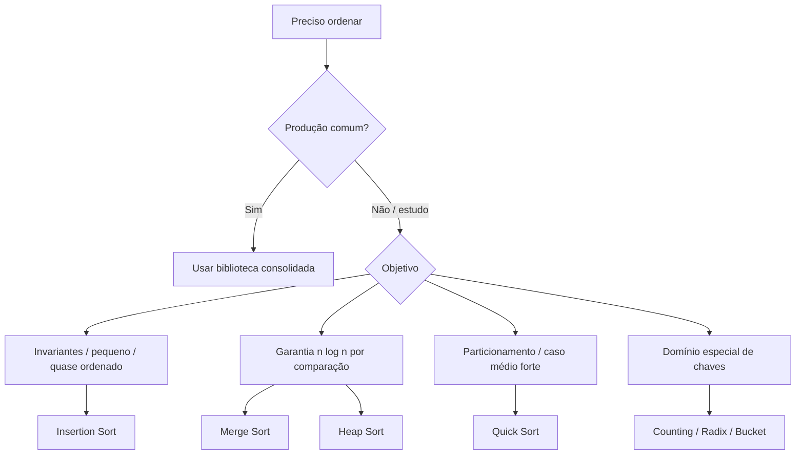

<a id="inicio"></a>

# Algoritmos de Ordenação

> **Classificação geral:** `[C] Obrigatório conhecer; alguns algoritmos servem principalmente como laboratório conceitual`  
> **Nível:** C — Algoritmos e Estruturas de Dados  
> **Posição na taxonomia:** tópico 27 — quarto tópico do Nível C  
> **Pré-requisitos principais:** T07 — Estruturas de Repetição; T10 — Estruturas de Dados Elementares; T12 — Rastreamento, Verificação e Raciocínio sobre Execução; T17 — Recursão; T20 — Testes e Verificação; T24 — Correção e Análise de Algoritmos; T25 — Tipos Abstratos de Dados, Estruturas e Implementações; T26 — Algoritmos de Busca  
> **Aprofundamentos posteriores:** T28 — Estruturas Lineares; T29 — Estruturas Associativas, Conjuntos e Hashing; T30 — Heaps e Filas de Prioridade; T31 — Árvores; T35 — Modelagem, Escolha de Estruturas e Trade-offs

---

## Resumo executivo

Ordenar não é apenas “colocar números do menor para o maior”. Um algoritmo de ordenação recebe uma coleção e produz uma permutação de seus elementos que respeita uma **relação de ordenação**.

Para avaliar uma estratégia de ordenação, é preciso observar mais do que o tempo assintótico:

- qual é a estratégia;
- se a ordenação é estável;
- quanto de memória adicional usa;
- melhor, médio e pior caso;
- comportamento em dados já ou quase ordenados;
- custo de implementação e manutenção;
- propriedades das chaves;
- se a biblioteca da linguagem já fornece uma implementação adequada.

Os algoritmos clássicos têm papéis diferentes:

```text
Insertion Sort   → excelente laboratório de invariantes e bom em entradas pequenas/quase ordenadas
Selection Sort   → simples e previsível, mas quadrático
Bubble Sort      → didático para trocas adjacentes; não é algoritmo central de produção
Merge Sort       → divide and conquer, O(n log n), naturalmente estável na forma clássica
Quick Sort       → particionamento, excelente na prática, pior caso quadrático em versões desfavoráveis
Heap Sort        → O(n log n) no pior caso, conexão direta com heap/priority queue
Counting/Radix/
Bucket Sort      → exploram propriedades das chaves e podem fugir do limite dos sorts por comparação
```

A conclusão prática é tão importante quanto os algoritmos:

> **implementar algoritmos clássicos é excelente para aprender; em software real, a escolha padrão deve ser a biblioteca consolidada da linguagem/ambiente, salvo motivo técnico concreto para fazer diferente.**

---

## Visão rápida

| Pergunta | Resposta curta |
|---|---|
| Todo algoritmo de ordenação é `O(n log n)`? | não |
| Existe limite `Ω(n log n)` para todo tipo de ordenação? | não; o limite clássico vale para ordenação baseada apenas em comparações no modelo correspondente |
| Estável significa “rápido”? | não; estabilidade preserva a ordem relativa de elementos com chaves equivalentes |
| In-place significa “sem memória nenhuma”? | não; normalmente significa memória auxiliar pequena em relação a `n`, mas detalhes variam |
| Insertion Sort é sempre ruim por ser `O(n²)`? | não; pode ser excelente em entradas pequenas ou quase ordenadas |
| Selection Sort melhora muito em dados quase ordenados? | não no modelo clássico; continua fazendo essencialmente o mesmo número de comparações |
| Bubble Sort deve ser algoritmo central? | não; neste currículo ele é `[E — didático]` |
| Merge Sort pode ser estável? | sim; a implementação clássica é naturalmente estável quando o merge resolve empates corretamente |
| Quick Sort garante `O(n log n)`? | não na forma clássica; o pior caso pode ser `O(n²)` |
| Heap Sort é estável? | normalmente não |
| Counting/Radix/Bucket dependem de hipóteses adicionais? | sim |
| Devo reimplementar sort em produção? | em geral, não; prefira a biblioteca da linguagem/ambiente |

---

## Como estudar este tópico

O T27 possui duas rotas sobre o **mesmo Markdown canônico**:

| Se você... | Rota recomendada |
|---|---|
| está aprendendo ordenação pela primeira vez | **Rota A:** Visão Panorâmica → Partes I–III → APIs da Parte IV → LABs essenciais da Parte VI |
| já conhece os algoritmos e quer consultar | **Rota B:** Índice essencial → tabela comparativa → linguagem/API → PR/TS → referência |

### Rota A — primeiro contato

```text
mapa do problema
→ contrato de ordenação
→ estabilidade / memória / casos
→ algoritmos quadráticos
→ Merge / Quick / Heap
→ Counting / Radix / Bucket
→ bibliotecas reais
→ prática
→ critérios de domínio
```

Não é necessário memorizar todas as implementações. A meta é reconhecer **estratégia, contrato, invariante, custo e trade-off**.

### Rota B — consulta

Procure diretamente:

```text
“qual algoritmo?”       → §15 e §16
“estabilidade?”         → §4
“Python?”               → §17
“JavaScript?”           → §18
“Java?”                 → §19
“GNU sort?”             → §20
“produção?”             → §22
“algo deu errado?”      → PR-T27-* / Troubleshooting
```

## Regra de ouro

> **Compare algoritmos pelo contrato completo — correção, estabilidade, memória, forma dos dados e garantias de pior caso — e não apenas por uma única coluna de Big O.**

---

## Decisão rápida

```text
PRECISO ORDENAR
      │
      ├── código de produção comum
      │      └── usar biblioteca consolidada
      │
      ├── estudar invariantes / entrada pequena ou quase ordenada
      │      └── Insertion Sort é ótimo laboratório
      │
      ├── quero garantia O(n log n) por comparação
      │      ├── Merge Sort → estabilidade e memória auxiliar clássica
      │      └── Heap Sort  → pior caso O(n log n), normalmente não estável
      │
      ├── quero particionamento / desempenho prático forte
      │      └── Quick Sort → cuidar de pivô, partições e pior caso
      │
      └── chaves têm domínio/estrutura especial
             └── considerar Counting / Radix / Bucket
```

---


<a id="visao-panoramica"></a>

## 🗺️ Visão panorâmica — o mapa antes dos detalhes

Esta seção é o **caderno rápido de consulta** do T27. Ela não substitui as seções detalhadas: concentra o modelo mental, as decisões, os riscos e os pontos de transferência que devem estar disponíveis antes de estudar cada algoritmo isoladamente.

### Mapa do domínio — ordenar é cumprir um contrato, não apenas mover valores

```text
PROBLEMA DE ORDENAÇÃO
│
├── 1. CONTRATO
│   ├── o que é um elemento / registro?
│   ├── qual é a chave?
│   ├── crescente, decrescente ou ordem customizada?
│   ├── como resolver empates?
│   └── estabilidade é requisito?
│
├── 2. MODELO ALGORÍTMICO
│   ├── por comparação
│   │   ├── Insertion
│   │   ├── Selection
│   │   ├── Bubble [didático]
│   │   ├── Merge
│   │   ├── Quick
│   │   └── Heap
│   └── usando estrutura adicional da chave/domínio
│       ├── Counting
│       ├── Radix
│       └── Bucket
│
├── 3. GARANTIAS / CUSTOS
│   ├── correção: saída ordenada + mesma multiconjunto/permutação
│   ├── estabilidade
│   ├── tempo: melhor / médio / esperado / pior
│   ├── memória auxiliar
│   ├── in-place ou out-of-place
│   ├── adaptatividade / presortedness
│   └── custo de chave/comparador
│
├── 4. FORMA DA ENTRADA
│   ├── pequena
│   ├── quase ordenada
│   ├── reversa
│   ├── muitos empates
│   ├── domínio inteiro compacto
│   ├── distribuição conhecida
│   └── dados maiores que a memória
│
└── 5. DECISÃO DE ENGENHARIA
    ├── biblioteca consolidada resolve? → preferir biblioteca
    ├── existe requisito que a API não atende?
    ├── existe hipótese de domínio que justifica algoritmo especializado?
    ├── pior caso é requisito operacional?
    └── benchmark/profiling confirma necessidade de customização?
```

A propriedade mínima de correção não é apenas “a saída parece crescente”. Para uma sequência de entrada `A` e saída `B`, a verificação conceitual precisa combinar:

```text
ORDENADA(B)
+
B contém exatamente os mesmos elementos de A
+
ordem respeita chave/comparador acordado
+
se estabilidade foi prometida, empates preservam a ordem relativa
```

### Fluxo mental — da necessidade para a estratégia

```text
Preciso ordenar
    ↓
Definir chave / comparador / direção / empate
    ↓
Estabilidade é requisito?
    ↓
Qual memória auxiliar é aceitável?
    ↓
Preciso de garantia forte de pior caso?
    ↓
A entrada tem propriedades exploráveis?
    ├── pequena / quase ordenada → Insertion pode ser excelente laboratório/estratégia local
    ├── domínio inteiro compacto → Counting pode ser candidato
    ├── dígitos/campos estruturados → Radix pode ser candidato
    └── distribuição conhecida → Bucket pode ser candidato
    ↓
Caso geral de produção
    ↓
usar biblioteca consolidada e programar contra o contrato público da API
```

### Tabela de consulta rápida

| Estratégia | Ideia central | Tempo típico relevante | Memória auxiliar clássica | Estabilidade clássica | Quando lembrar |
|---|---|---|---|---|---|
| Insertion Sort | inserir cada item no prefixo já ordenado | melhor `Θ(n)`; pior `Θ(n²)` | `O(1)` | sim, se empates não forem atravessados | pequeno, quase ordenado, invariantes |
| Selection Sort | selecionar extremo restante | `Θ(n²)` comparações | `O(1)` | normalmente não | poucas trocas; laboratório de seleção |
| Bubble Sort | trocar inversões adjacentes | até `Θ(n²)`; versão com flag pode detectar entrada ordenada | `O(1)` | pode ser | visualização didática; não central |
| Merge Sort | dividir, ordenar, mesclar | `Θ(n log n)` clássico | `O(n)` clássico | natural na versão usual | estabilidade + garantia forte de tempo |
| Quick Sort | particionar em torno de pivô | esperado/médio `Θ(n log n)`; pior `Θ(n²)` clássico | depende da variante/pilha | normalmente não | particionamento, locality, prática |
| Heap Sort | heap + extrações sucessivas | `Θ(n log n)` | `O(1)` clássico sobre array | não | pior caso forte com pouca memória auxiliar |
| Counting Sort | contar ocorrências por chave | `Θ(n+k)` | `Θ(n+k)` na forma estável comum | pode ser | inteiros/faixa compacta |
| Radix Sort | ordenar por partes/dígitos em passagens | depende de `d`, `n`, `k` | depende do sort interno | exige estabilidade no esquema LSD clássico | chaves decomponíveis |
| Bucket Sort | distribuir por faixas e ordenar buckets | médio pode ser linear sob hipóteses fortes | depende | depende | distribuição conhecida/adequada |

> `k` representa o tamanho/faixa efetiva do domínio usado por algoritmos como Counting Sort; `d`, o número de dígitos/campos/passagens relevantes no modelo de Radix Sort.

### Pergunta → mecanismo / padrão

| Se a pergunta for... | Investigue primeiro... |
|---|---|
| “Por que os registros empatados mudaram de ordem?” | estabilidade + regra de empate no comparador/merge |
| “Por que Quick Sort ficou muito lento nesta entrada?” | pivô, particionamento, duplicatas, profundidade e padrão adversarial |
| “Por que Counting Sort consumiu memória absurda?” | relação entre `k` e `n`; domínio esparso/grande |
| “Por que Radix Sort ficou incorreto?” | estabilidade de cada passe + ordem dos dígitos/campos |
| “Por que JavaScript colocou `10` antes de `2`?” | ausência de comparador numérico em `Array.prototype.sort()` |
| “Por que dois runtimes ordenam de maneira diferente?” | contrato de comparador, locale/collation, API e guarantees públicas |
| “Por que ordenar uma lista ligada diretamente foi caro?” | representação + estratégia da biblioteca; não confundir ADT com acesso aleatório |
| “Qual algoritmo devo implementar em produção?” | normalmente nenhum: primeiro verifique a biblioteca e seus contratos |
| “Benchmark mostrou `O(n²)` mais rápido. Big O estava errado?” | tamanho pequeno, constantes, cache, distribuição e ruído; assintótica ≠ cronômetro local |
| “Como provar que o sort não perdeu elementos?” | ordenar + verificar multiconjunto/permutação, não apenas monotonicidade |

### Não confundir

| Conceitos | Diferença essencial |
|---|---|
| **correto** × **estável** | um sort pode ordenar corretamente e ainda trocar a ordem relativa de chaves equivalentes |
| **in-place** × **zero memória** | in-place costuma limitar memória auxiliar ligada a `n`; pilha, temporários e detalhes da implementação ainda podem existir |
| **caso médio** × **tempo esperado** | caso médio depende de um modelo/distribuição de entradas; tempo esperado pode depender da aleatoriedade interna do algoritmo |
| **médio/esperado `O(n log n)`** × **pior `O(n log n)`** | são garantias diferentes; Quick Sort clássico é o exemplo central |
| **`O(n)` auxiliar** × **mesmo perfil real de alocação** | a classe assintótica pode ser a mesma, mas slicing/temporários/GC podem aumentar constantes e pressão de memória |
| **comparison sort** × **todo sort** | o limite `Ω(n log n)` do modelo de comparação não proíbe Counting/Radix/Bucket sob hipóteses extras |
| **comparador retorna `0`** × **objetos são iguais** | equivalência para ordenação não precisa ser identidade/equality do objeto |
| **algoritmo acadêmico** × **API de biblioteca** | uma API pode usar algoritmo híbrido e mudar implementação sem mudar seu contrato público |
| **ordenar cópia** × **ordenar in-place** | preservar a entrada e mutá-la são contratos distintos |
| **locale/collation** × **ordem de bytes** | texto pode ter ordem diferente conforme regras linguísticas/locale |

### Microexemplos canônicos

**Estabilidade realmente observável:**

```text
entrada por prioridade:
A:2, B:1, C:2, D:1

sort estável por prioridade:
B:1, D:1, A:2, C:2

entre os empates:
B continua antes de D
A continua antes de C
```

**JavaScript — ordem textual padrão não é ordem numérica:**

```javascript
[2, 10, 3].sort();              // [10, 2, 3]
[2, 10, 3].sort((a, b) => a-b); // [2, 3, 10]
```

**Counting Sort — `O(n+k)` só é vantagem quando `k` faz sentido:**

```text
n = 10
chaves entre 0 e 20        → domínio compacto: plausível
chaves entre 0 e 1_000_000_000 → array de contagem direto: péssima escolha
```

**Propriedade que um teste de sort deve preservar:**

```text
entrada = [3, 1, 3, 2]
saída   = [1, 2, 3, 3]

monotônica? sim
mesmo multiconjunto? sim
```

Uma saída `[1, 2, 3]` seria monotônica, mas **incorreta**, porque perdeu um elemento.

### Falha típica → primeira investigação

| Sintoma | Primeira investigação |
|---|---|
| chaves iguais invertidas | condição de deslocamento/merge e estabilidade |
| saída perde/duplica item | propriedade de permutação + índices do swap/partition |
| Quick Sort estoura profundidade | pivô/partições não balanceadas/duplicatas |
| Merge Sort usa memória demais | cópias por nível, buffers e implementação concreta |
| Counting falha com negativos | normalização da faixa ou contrato da implementação |
| Counting usa memória demais | `max-min+1` versus quantidade real de itens |
| Radix falha após vários passes | sort intermediário não estável ou direção dos passes |
| `sort` do shell muda resultado entre máquinas | `LC_ALL`/`LC_COLLATE`, opções `-n`, `-k`, `-s` |
| JavaScript ordena números “estranhamente” | comparator omitido |
| Java lança erro de comparador | verificar total ordering/transitividade/coerência |

### Transferência entre Python, JavaScript, Java e GNU Bash

| Ambiente | Contrato prático a lembrar |
|---|---|
| Python 3.14.7 | `list.sort()` muta; `sorted()` cria nova lista; ordenação é estável; `key=` é calculada uma vez por registro segundo a documentação oficial |
| ECMAScript 2026 | `Array.prototype.sort()` muta; `toSorted()` produz cópia; com comparador consistente, a ordem especificada é estável; o algoritmo concreto é implementation-defined |
| Java SE/JDK 27 | `List.sort()` é estável; arrays de objetos possuem contratos de estabilidade nas APIs correspondentes; arrays primitivos têm implementação/contrato distinto; `Comparator` precisa impor ordem coerente |
| GNU Bash + Coreutils | Bash orquestra; GNU `sort` ordena linhas; `-n` altera semântica numérica, `-k` escolhe chave, `-s` preserva empates de chave e locale influencia collation |

**Checkpoint Java:** o JDK 27, liberado em 15/09/2026, é a baseline documental deste tópico. A validação normativa usa a documentação canônica Java SE 27; páginas regionais ou notas de implementação não substituem o contrato público da API.

### Consulta × estudo

**Modo consulta:** use o fluxo mental, a tabela comparativa, “Não confundir”, a matriz de sintomas e o índice `PR-T27-*`.

**Modo estudo:** percorra as seções 2–29 e os LABs; implemente os algoritmos clássicos para compreender invariantes, particionamento, heap, estabilidade e análise — sem transformar a implementação acadêmica em padrão automático de produção.

### Síntese multifonte desta revisão

A base multifonte consolidada desde a revisão `0.2.0` e revalidada nas rodadas posteriores não foi construída copiando uma única referência:

- **CLRS 4ª ed.** foi reconsultado para Counting/Radix, estabilidade, `Θ(n+k)` e a fronteira do limite de comparação;
- **Skiena 3ª ed.** foi reconsultado para a pragmática de sorting, estabilidade, comparadores, escolha de biblioteca e sorting como laboratório de paradigmas;
- **La Rocca 2024** foi reconsultado para a leitura incremental do Insertion Sort e conexão com arrays ordenados;
- **documentações oficiais atuais** governam semântica de APIs: Python 3.14.7, ECMAScript 2026, Java SE/JDK 27 e GNU Coreutils.

Quando literatura didática e API corrente tratam níveis diferentes do assunto, elas são usadas como fontes **complementares**, não intercambiáveis.

### Ponte para problemas reais e troubleshooting

Os cenários de uso e falha material deste tópico foram formalizados em `PR-T27-01` a `PR-T27-10`. O diagnóstico operacional correspondente está em [Troubleshooting sistemático](#troubleshooting-sistematico-t27).

---

# Índice

## Índice essencial

- [PARTE I — Contexto, contrato e critérios de comparação](#parte-i)
- [PARTE II — Algoritmos quadráticos e invariantes](#parte-ii)
- [PARTE III — Algoritmos `n log n`, heap e ordenação especializada](#parte-iii)
- [PARTE IV — APIs reais, transferência e decisão de implementação](#parte-iv)
- [PARTE V — Medição, riscos, problemas reais e troubleshooting](#parte-v)
- [PARTE VI — LABs, exercícios e critérios de domínio](#parte-vi)
- [APÊNDICES — taxonomia, fontes, QA e histórico](#apendices)

Atalhos:

- [Tabela comparativa dos algoritmos](#15-tabela-comparativa-dos-algoritmos-clássicos)
- [Biblioteca antes de reimplementar](#22-279--biblioteca-antes-de-reimplementar-d)
- [PR-T27-*](#pr-t27-indice)
- [Troubleshooting sistemático](#troubleshooting-sistematico-t27)
- [Glossário](#48-glossário)

<details>
<summary><strong>Índice detalhado</strong></summary>

- [🗺️ Visão panorâmica — o mapa antes dos detalhes](#visao-panoramica)
- [Índice operacional de Problemas Reais — PR-T27-*](#pr-t27-indice)
- [🔎 Troubleshooting sistemático](#troubleshooting-sistematico-t27)
- [1. Posição deste assunto na trilha](#1-posição-deste-assunto-na-trilha)
  - [1.1 O que T24 entregou](#11-o-que-t24-entregou)
  - [1.2 O que T25 entregou](#12-o-que-t25-entregou)
  - [1.3 O que T26 entregou](#13-o-que-t26-entregou)
  - [1.4 Fronteira com T28–T31](#14-fronteira-com-t28t31)
  - [1.5 Fronteira com T35](#15-fronteira-com-t35)
  - [1.6 O que não pertence ao núcleo de T27](#16-o-que-não-pertence-ao-núcleo-de-t27)
- [2. O problema de ordenação antes do algoritmo](#2-o-problema-de-ordenação-antes-do-algoritmo)
  - [2.1 Contrato mínimo](#21-contrato-mínimo)
  - [2.2 Ordenar por valor não é o único contrato](#22-ordenar-por-valor-não-é-o-único-contrato)
  - [2.3 Ordem natural, chave e comparador](#23-ordem-natural-chave-e-comparador)
  - [2.4 Comparador precisa ser coerente](#24-comparador-precisa-ser-coerente)
  - [2.5 Ordenação crescente e decrescente](#25-ordenação-crescente-e-decrescente)
- [3. 27.1 — O que comparar `[D]`](#3-271--o-que-comparar-d)
  - [3.1 Estratégia](#31-estratégia)
  - [3.2 Estabilidade](#32-estabilidade)
  - [3.3 Memória auxiliar](#33-memória-auxiliar)
  - [3.4 Melhor, médio e pior caso](#34-melhor-médio-e-pior-caso)
  - [3.5 Dados quase ordenados](#35-dados-quase-ordenados)
  - [3.6 Custo de implementação e manutenção](#36-custo-de-implementação-e-manutenção)
  - [3.7 Biblioteca adequada](#37-biblioteca-adequada)
- [4. Estabilidade com um exemplo que realmente mostra diferença](#4-estabilidade-com-um-exemplo-que-realmente-mostra-diferença)
  - [4.1 Entrada](#41-entrada)
  - [4.2 Por que isso importa](#42-por-que-isso-importa)
  - [4.3 Estável não significa “duplicatas ficam no mesmo índice”](#43-estável-não-significa-duplicatas-ficam-no-mesmo-índice)
  - [4.4 Estabilidade é propriedade da implementação/API](#44-estabilidade-é-propriedade-da-implementaçãoapi)
- [5. 27.2 — Insertion Sort `[C]`](#5-272--insertion-sort-c)
  - [5.1 Ideia central](#51-ideia-central)
  - [5.2 Invariante](#52-invariante)
  - [5.3 Implementação canônica em Python](#53-implementação-canônica-em-python)
  - [5.4 JavaScript](#54-javascript)
  - [5.5 Java](#55-java)
  - [5.6 GNU Bash — transferência conceitual](#56-gnu-bash--transferência-conceitual)
  - [5.7 Complexidade](#57-complexidade)
  - [5.8 Estabilidade](#58-estabilidade)
  - [5.9 Quando faz sentido](#59-quando-faz-sentido)
- [6. Correção do Insertion Sort](#6-correção-do-insertion-sort)
  - [6.1 Inicialização](#61-inicialização)
  - [6.2 Manutenção](#62-manutenção)
  - [6.3 Término](#63-término)
  - [6.4 Um teste que protege estabilidade](#64-um-teste-que-protege-estabilidade)
- [7. 27.3 — Selection Sort `[C]`](#7-273--selection-sort-c)
  - [7.1 Ideia central](#71-ideia-central)
  - [7.2 Invariante](#72-invariante)
  - [7.3 Implementação em Python](#73-implementação-em-python)
  - [7.4 Comparações](#74-comparações)
  - [7.5 Trocas](#75-trocas)
  - [7.6 Estabilidade](#76-estabilidade)
  - [7.7 Papel pedagógico](#77-papel-pedagógico)
- [8. 27.4 — Bubble Sort `[E — didático]`](#8-274--bubble-sort-e--didático)
  - [8.1 Ideia central](#81-ideia-central)
  - [8.2 Implementação didática com parada antecipada](#82-implementação-didática-com-parada-antecipada)
  - [8.3 Complexidade](#83-complexidade)
  - [8.4 Por que não é algoritmo central](#84-por-que-não-é-algoritmo-central)
- [9. 27.5 — Merge Sort `[C]`](#9-275--merge-sort-c)
  - [9.1 Modelo divide and conquer](#91-modelo-divide-and-conquer)
  - [9.2 Merge como operação central](#92-merge-como-operação-central)
  - [9.3 Python](#93-python)
  - [9.4 JavaScript](#94-javascript)
  - [9.5 Java](#95-java)
  - [9.6 Por que não forçar Bash aqui](#96-por-que-não-forçar-bash-aqui)
  - [9.7 Complexidade](#97-complexidade)
  - [9.8 Memória](#98-memória)
  - [9.9 Estabilidade](#99-estabilidade)
- [10. Correção do Merge Sort](#10-correção-do-merge-sort)
  - [10.1 Caso-base](#101-caso-base)
  - [10.2 Hipótese recursiva](#102-hipótese-recursiva)
  - [10.3 Invariante do merge](#103-invariante-do-merge)
  - [10.4 Término](#104-término)
  - [10.5 Cuidado com estabilidade](#105-cuidado-com-estabilidade)
- [11. 27.6 — Quick Sort `[C]`](#11-276--quick-sort-c)
  - [11.1 Modelo](#111-modelo)
  - [11.2 Particionamento](#112-particionamento)
  - [11.3 Implementação didática funcional em Python](#113-implementação-didática-funcional-em-python)
  - [11.4 Versão conceitual in-place](#114-versão-conceitual-in-place)
  - [11.5 Complexidade](#115-complexidade)
  - [11.6 Escolha de pivô importa](#116-escolha-de-pivô-importa)
  - [11.7 Duplicatas importam](#117-duplicatas-importam)
  - [11.8 Memória](#118-memória)
  - [11.9 Estabilidade](#119-estabilidade)
  - [11.10 Por que ele é importante](#1110-por-que-ele-é-importante)
- [12. 27.7 — Heap Sort `[C]`](#12-277--heap-sort-c)
  - [12.1 Conexão com estrutura de dados](#121-conexão-com-estrutura-de-dados)
  - [12.2 Etapas](#122-etapas)
  - [12.3 Complexidade](#123-complexidade)
  - [12.4 Memória](#124-memória)
  - [12.5 Estabilidade](#125-estabilidade)
  - [12.6 Por que fica antes de T30](#126-por-que-fica-antes-de-t30)
- [13. 27.8 — Counting, Radix e Bucket Sort `[E]`](#13-278--counting-radix-e-bucket-sort-e)
  - [13.1 Counting Sort](#131-counting-sort)
  - [13.2 Counting Sort estável](#132-counting-sort-estável)
  - [13.3 Radix Sort](#133-radix-sort)
  - [13.4 Complexidade do Radix Sort](#134-complexidade-do-radix-sort)
  - [13.5 Bucket Sort](#135-bucket-sort)
  - [13.6 Não existe milagre assintótico gratuito](#136-não-existe-milagre-assintótico-gratuito)
- [14. Limite inferior da ordenação por comparação](#14-limite-inferior-da-ordenação-por-comparação)
  - [14.1 Intuição](#141-intuição)
  - [14.2 O que o limite não diz](#142-o-que-o-limite-não-diz)
  - [14.3 Consequência curricular](#143-consequência-curricular)
- [15. Tabela comparativa dos algoritmos clássicos](#15-tabela-comparativa-dos-algoritmos-clássicos)
- [16. Quase ordenado, reverso e duplicatas](#16-quase-ordenado-reverso-e-duplicatas)
  - [16.1 Entrada já ordenada](#161-entrada-já-ordenada)
  - [16.2 Entrada reversa](#162-entrada-reversa)
  - [16.3 Muitos duplicados](#163-muitos-duplicados)
  - [16.4 Dados pequenos](#164-dados-pequenos)
  - [16.5 Dados gigantes](#165-dados-gigantes)
- [17. Ordenação em Python](#17-ordenação-em-python)
  - [17.1 `sorted()` versus `list.sort()`](#171-sorted-versus-listsort)
  - [17.2 `key=`](#172-key)
  - [17.3 Estabilidade garantida](#173-estabilidade-garantida)
  - [17.4 Timsort](#174-timsort)
  - [17.5 Não usar comparator estilo C diretamente](#175-não-usar-comparator-estilo-c-diretamente)
- [18. Ordenação em JavaScript / ECMAScript](#18-ordenação-em-javascript--ecmascript)
  - [18.1 Armadilha do sort padrão](#181-armadilha-do-sort-padrão)
  - [18.2 Estabilidade](#182-estabilidade)
  - [18.3 Algoritmo concreto não é padronizado](#183-algoritmo-concreto-não-é-padronizado)
  - [18.4 Comparador consistente](#184-comparador-consistente)
  - [18.5 `toSorted()`](#185-tosorted)
- [19. Ordenação em Java](#19-ordenação-em-java)
  - [19.1 `List.sort()`](#191-listsort)
  - [19.2 `Arrays.sort()` para objetos](#192-arrayssort-para-objetos)
  - [19.3 `Arrays.sort()` para primitivos](#193-arrayssort-para-primitivos)
  - [19.4 `Comparator`](#194-comparator)
  - [19.5 Natural ordering e `Comparable`](#195-natural-ordering-e-comparable)
- [20. Ordenação no ecossistema GNU Bash / Shell](#20-ordenação-no-ecossistema-gnu-bash--shell)
  - [20.1 `sort` não é builtin do Bash](#201-sort-não-é-builtin-do-bash)
  - [20.2 Ordenação lexical](#202-ordenação-lexical)
  - [20.3 Ordenação numérica](#203-ordenação-numérica)
  - [20.4 Chaves](#204-chaves)
  - [20.5 Estabilidade](#205-estabilidade)
  - [20.6 Locale](#206-locale)
  - [20.7 Por que isso é mais idiomático que reimplementar Quick Sort em Bash](#207-por-que-isso-é-mais-idiomático-que-reimplementar-quick-sort-em-bash)
- [21. Mesmo problema nas quatro linguagens](#21-mesmo-problema-nas-quatro-linguagens)
  - [21.1 Python](#211-python)
  - [21.2 JavaScript](#212-javascript)
  - [21.3 Java](#213-java)
  - [21.4 GNU Bash + GNU sort](#214-gnu-bash--gnu-sort)
  - [21.5 Conceito universal](#215-conceito-universal)
  - [21.6 O que muda](#216-o-que-muda)
- [22. 27.9 — Biblioteca antes de reimplementar `[D]`](#22-279--biblioteca-antes-de-reimplementar-d)
  - [22.1 Regra prática](#221-regra-prática)
  - [22.2 O algoritmo da biblioteca pode ser híbrido](#222-o-algoritmo-da-biblioteca-pode-ser-híbrido)
  - [22.3 Garantias públicas versus implementação interna](#223-garantias-públicas-versus-implementação-interna)
  - [22.4 Biblioteca não elimina conhecimento algorítmico](#224-biblioteca-não-elimina-conhecimento-algorítmico)
- [23. Comparador, chave e igualdade](#23-comparador-chave-e-igualdade)
  - [23.1 Comparar pelo atributo certo](#231-comparar-pelo-atributo-certo)
  - [23.2 Chaves múltiplas](#232-chaves-múltiplas)
  - [23.3 Empate intencional](#233-empate-intencional)
  - [23.4 Comparadores com efeitos colaterais](#234-comparadores-com-efeitos-colaterais)
- [24. In-place, out-of-place e memória](#24-in-place-out-of-place-e-memória)
  - [24.1 In-place não é sinônimo de O(1) total em qualquer linguagem](#241-in-place-não-é-sinônimo-de-o1-total-em-qualquer-linguagem)
  - [24.2 Merge Sort clássico](#242-merge-sort-clássico)
  - [24.3 Quick Sort clássico](#243-quick-sort-clássico)
  - [24.4 Heap Sort](#244-heap-sort)
  - [24.5 APIs que retornam cópia](#245-apis-que-retornam-cópia)
- [25. Medição empírica sem confundir com complexidade](#25-medição-empírica-sem-confundir-com-complexidade)
  - [25.1 O que medir](#251-o-que-medir)
  - [25.2 Comparações e movimentos podem ser melhores que relógio](#252-comparações-e-movimentos-podem-ser-melhores-que-relógio)
  - [25.3 Relógio ainda é útil](#253-relógio-ainda-é-útil)
  - [25.4 Aquecimento e runtimes](#254-aquecimento-e-runtimes)
  - [25.5 Checklist anti-conclusão-prematura](#255-checklist-anti-conclusão-prematura)
- [26. Erros conceituais frequentes](#26-erros-conceituais-frequentes)
  - [26.1 “Quick Sort é O(n log n)” sem qualificador](#261-quick-sort-é-on-log-n-sem-qualificador)
  - [26.2 “Merge Sort é sempre in-place”](#262-merge-sort-é-sempre-in-place)
  - [26.3 “Selection Sort melhora muito se a entrada já está ordenada”](#263-selection-sort-melhora-muito-se-a-entrada-já-está-ordenada)
  - [26.4 “Bubble Sort é obrigatório porque todo curso ensina”](#264-bubble-sort-é-obrigatório-porque-todo-curso-ensina)
  - [26.5 “Estável significa que o algoritmo não move empates”](#265-estável-significa-que-o-algoritmo-não-move-empates)
  - [26.6 “Todo sort padrão é numérico”](#266-todo-sort-padrão-é-numérico)
  - [26.7 “Sort do Bash”](#267-sort-do-bash)
  - [26.8 “`Ω(n log n)` prova que Counting Sort é impossível”](#268-ωn-log-n-prova-que-counting-sort-é-impossível)
- [27. Segurança e robustez operacional](#27-segurança-e-robustez-operacional)
  - [27.1 Entradas gigantes](#271-entradas-gigantes)
  - [27.2 Comparador caro](#272-comparador-caro)
  - [27.3 Shell e arquivos](#273-shell-e-arquivos)
  - [27.4 Dados sensíveis](#274-dados-sensíveis)
- [28. Mermaid — mapa mental de decisão](#28-mermaid--mapa-mental-de-decisão)
- [29. Como praticar este bloco](#29-como-praticar-este-bloco)
- [30. LAB 1 — Rastrear Insertion Sort](#30-lab-1--rastrear-insertion-sort)
  - [Objetivo](#objetivo)
  - [Pré-requisitos](#pré-requisitos)
  - [Estado inicial](#estado-inicial)
  - [Tarefa](#tarefa)
  - [Procedimento](#procedimento)
  - [O que observar](#o-que-observar)
  - [Testes](#testes)
  - [Explicação](#explicação)
  - [Variação / transferência](#variação--transferência)
  - [Limpeza](#limpeza)
- [31. LAB 2 — Comparar Selection e Insertion por contadores](#31-lab-2--comparar-selection-e-insertion-por-contadores)
  - [Objetivo](#objetivo-1)
  - [Pré-requisitos](#pré-requisitos-1)
  - [Estado inicial](#estado-inicial-1)
  - [Tarefa](#tarefa-1)
  - [Procedimento](#procedimento-1)
  - [O que observar](#o-que-observar-1)
  - [Testes](#testes-1)
  - [Explicação](#explicação-1)
  - [Variação / transferência](#variação--transferência-1)
  - [Limpeza](#limpeza-1)
- [32. LAB 3 — Provar estabilidade com identidade separada da chave](#32-lab-3--provar-estabilidade-com-identidade-separada-da-chave)
  - [Objetivo](#objetivo-2)
  - [Pré-requisitos](#pré-requisitos-2)
  - [Estado inicial](#estado-inicial-2)
  - [Tarefa](#tarefa-2)
  - [Procedimento](#procedimento-2)
  - [O que observar](#o-que-observar-2)
  - [Testes](#testes-2)
  - [Explicação](#explicação-2)
  - [Variação / transferência](#variação--transferência-2)
  - [Limpeza](#limpeza-2)
- [33. LAB 4 — Merge Sort e custo do merge](#33-lab-4--merge-sort-e-custo-do-merge)
  - [Objetivo](#objetivo-3)
  - [Pré-requisitos](#pré-requisitos-3)
  - [Estado inicial](#estado-inicial-3)
  - [Tarefa](#tarefa-3)
  - [Procedimento](#procedimento-3)
  - [O que observar](#o-que-observar-3)
  - [Testes](#testes-3)
  - [Explicação](#explicação-3)
  - [Variação / transferência](#variação--transferência-3)
  - [Limpeza](#limpeza-3)
- [34. LAB 5 — Quick Sort e qualidade das partições](#34-lab-5--quick-sort-e-qualidade-das-partições)
  - [Objetivo](#objetivo-4)
  - [Pré-requisitos](#pré-requisitos-4)
  - [Estado inicial](#estado-inicial-4)
  - [Tarefa](#tarefa-4)
  - [Procedimento](#procedimento-4)
  - [O que observar](#o-que-observar-4)
  - [Testes](#testes-4)
  - [Explicação](#explicação-4)
  - [Variação / transferência](#variação--transferência-4)
  - [Limpeza](#limpeza-4)
- [35. LAB 6 — Bibliotecas e garantias de estabilidade](#35-lab-6--bibliotecas-e-garantias-de-estabilidade)
  - [Objetivo](#objetivo-5)
  - [Pré-requisitos](#pré-requisitos-5)
  - [Estado inicial](#estado-inicial-5)
  - [Tarefa](#tarefa-5)
  - [Procedimento](#procedimento-5)
  - [O que observar](#o-que-observar-5)
  - [Testes](#testes-5)
  - [Explicação](#explicação-5)
  - [Variação / transferência](#variação--transferência-5)
  - [Limpeza](#limpeza-5)
- [36. LAB 7 — Counting Sort e domínio das chaves](#36-lab-7--counting-sort-e-domínio-das-chaves)
  - [Objetivo](#objetivo-6)
  - [Pré-requisitos](#pré-requisitos-6)
  - [Estado inicial](#estado-inicial-6)
  - [Tarefa](#tarefa-6)
  - [Procedimento](#procedimento-6)
  - [O que observar](#o-que-observar-6)
  - [Testes](#testes-6)
  - [Explicação](#explicação-6)
  - [Variação / transferência](#variação--transferência-6)
  - [Limpeza](#limpeza-6)
- [37. LAB 8 — Escolha prática e biblioteca antes da reimplementação](#37-lab-8--escolha-prática-e-biblioteca-antes-da-reimplementação)
  - [Objetivo](#objetivo-7)
  - [Pré-requisitos](#pré-requisitos-7)
  - [Estado inicial](#estado-inicial-7)
  - [Tarefa](#tarefa-7)
  - [Procedimento](#procedimento-7)
  - [O que observar](#o-que-observar-7)
  - [Testes](#testes-7)
  - [Explicação](#explicação-7)
  - [Variação / transferência](#variação--transferência-7)
  - [Limpeza](#limpeza-7)
- [38. Prática guiada — matriz de decisão](#38-prática-guiada--matriz-de-decisão)
- [39. Exercícios fundamentais](#39-exercícios-fundamentais)
  - [39.1 Rastreio](#391-rastreio)
  - [39.2 Comparações do Selection Sort](#392-comparações-do-selection-sort)
  - [39.3 Estabilidade](#393-estabilidade)
  - [39.4 Merge](#394-merge)
  - [39.5 Quick Sort](#395-quick-sort)
  - [39.6 Heap Sort](#396-heap-sort)
  - [39.7 Counting Sort](#397-counting-sort)
  - [39.8 JavaScript](#398-javascript)
  - [39.9 Bash](#399-bash)
  - [39.10 Biblioteca](#3910-biblioteca)
- [40. Desafios de transferência](#40-desafios-de-transferência)
  - [40.1 CH — Ordenação por múltiplas chaves](#401-ch--ordenação-por-múltiplas-chaves)
  - [40.2 CH — Detectar quebra de estabilidade](#402-ch--detectar-quebra-de-estabilidade)
  - [40.3 CH — Quase ordenado](#403-ch--quase-ordenado)
  - [40.4 CH — Domínio especializado](#404-ch--domínio-especializado)
- [41. Você deve conseguir explicar](#41-você-deve-conseguir-explicar)
- [42. Você deve conseguir implementar](#42-você-deve-conseguir-implementar)
- [43. Você deve conseguir rastrear](#43-você-deve-conseguir-rastrear)
- [44. Você deve conseguir depurar](#44-você-deve-conseguir-depurar)
- [45. Você deve conseguir transferir](#45-você-deve-conseguir-transferir)
- [46. Evidências de domínio](#46-evidências-de-domínio)
- [47. Checklist de domínio](#47-checklist-de-domínio)
  - [Conceitos](#conceitos)
  - [Algoritmos](#algoritmos)
  - [Análise](#análise)
  - [Bibliotecas](#bibliotecas)
- [48. Glossário](#48-glossário)
- [49. Auditoria de cobertura da taxonomia](#49-auditoria-de-cobertura-da-taxonomia)
  - [49.1 Fronteira preservada com T28](#491-fronteira-preservada-com-t28)
  - [49.2 Fronteira preservada com T30](#492-fronteira-preservada-com-t30)
  - [49.3 Fronteira preservada com T35](#493-fronteira-preservada-com-t35)
- [50. Auditoria da File Library](#50-auditoria-da-file-library)
  - [50.1 Fontes locais efetivamente consultadas](#501-fontes-locais-efetivamente-consultadas)
  - [50.2 Como a biblioteca alterou o documento](#502-como-a-biblioteca-alterou-o-documento)
  - [50.3 Fontes localizadas e não infladas artificialmente](#503-fontes-localizadas-e-não-infladas-artificialmente)
  - [50.4 Hierarquia de autoridade](#504-hierarquia-de-autoridade)
- [51. Referências](#51-referências)
  - [51.1 Contratos canônicos](#511-contratos-canônicos)
  - [51.2 Literatura local efetivamente consultada](#512-literatura-local-efetivamente-consultada)
  - [51.3 Python — documentação oficial](#513-python--documentação-oficial)
  - [51.4 ECMAScript — especificação](#514-ecmascript--especificação)
  - [51.5 Java — documentação oficial](#515-java--documentação-oficial)
  - [51.6 GNU / Shell](#516-gnu--shell)
- [52. QA e evidências](#52-qa-e-evidências)
  - [52.1 `[D]` Evidência documental](#521-d-evidência-documental)
  - [52.2 `[S]` Validação estrutural/estática](#522-s-validação-estruturalestática)
  - [52.3 `[R]` Reprodução em runtime](#523-r-reprodução-em-runtime)
  - [52.4 Limitações](#524-limitações)
- [53. Histórico de versões](#53-histórico-de-versões)

</details>

<a id="parte-i"></a>

# PARTE I — Contexto, contrato e critérios de comparação

# 1. Posição deste assunto na trilha

## 1.1 O que T24 entregou

T24 estabeleceu correção, invariantes, tamanho da entrada, modelos de custo, complexidade temporal/espacial, notações `O`, `Ω`, `Θ` e análise de casos.

T27 reutiliza essas ferramentas em um dos laboratórios clássicos de algoritmos: ordenação.

## 1.2 O que T25 entregou

T25 separou ADT, estrutura de dados e implementação concreta. Essa distinção importa porque a ordenação ocorre sobre uma **representação** e sua eficiência depende das operações que essa representação suporta.

## 1.3 O que T26 entregou

T26 mostrou que busca binária depende de dados ordenados. T27 agora responde:

> como obter e manter uma ordem, com quais custos e garantias?

## 1.4 Fronteira com T28–T31

T27 usa arrays/listas, heaps e relações de ordem como suporte conceitual, mas não substitui os tópicos específicos de estruturas lineares, heaps ou árvores.

## 1.5 Fronteira com T35

T27 ensina critérios locais de escolha entre algoritmos de ordenação. T35 consolidará decisões sistêmicas de modelagem, estrutura e trade-offs.

## 1.6 O que não pertence ao núcleo de T27

Ficam fora do núcleo:

- external sorting aprofundado;
- ordenação paralela/distribuída;
- algoritmos de ordenação especializados por hardware;
- provas formais completas do limite inferior por árvore de decisão;
- implementação industrial de Timsort/introsort/dual-pivot quicksort;
- tuning de cache e SIMD;
- algoritmos externos para datasets maiores que memória.

Esses assuntos podem ser citados como contexto, não absorvidos como requisito curricular.

[↑ Voltar ao índice](#índice)

# 2. O problema de ordenação antes do algoritmo

## 2.1 Contrato mínimo

Uma ordenação recebe uma sequência:

```text
A = [a0, a1, ..., an-1]
```

e produz uma permutação:

```text
A' = [a'0, a'1, ..., a'n-1]
```

tal que:

1. nenhum elemento válido seja perdido;
2. nenhum elemento novo seja inventado;
3. a relação de ordenação seja satisfeita entre elementos consecutivos.

Para ordem crescente:

```text
A'[i] <= A'[i+1]
```

quando a relação `<=` é adequada ao domínio.

## 2.2 Ordenar por valor não é o único contrato

Registros frequentemente são ordenados por uma chave:

```text
(nome, prioridade, timestamp)
```

A coleção pode ser ordenada por:

- prioridade;
- nome;
- timestamp;
- combinação de múltiplas chaves.

Logo, o algoritmo não deve ser confundido com uma única relação fixa de comparação.

## 2.3 Ordem natural, chave e comparador

Três modelos comuns:

```text
ORDEM NATURAL
objeto define como se compara

KEY FUNCTION
objeto → chave comparável

COMPARATOR
(a, b) → negativo / zero / positivo
```

Esses modelos não são semanticamente idênticos entre linguagens.

## 2.4 Comparador precisa ser coerente

Um comparador inconsistente pode tornar o resultado indefinido, implementation-defined, inválido ou lançar erro, conforme linguagem/API.

Propriedades desejáveis incluem coerência de sinal, transitividade e consistência suficiente para formar uma ordem total ou a ordem exigida pela API.

## 2.5 Ordenação crescente e decrescente

“Inverter” uma ordenação não deve ser feito criando comparadores numericamente perigosos como:

```text
return b - a
```

em qualquer contexto onde overflow, coerção ou domínio numérico possam causar problemas.

Prefira mecanismos idiomáticos da linguagem ou comparadores corretos.

[↑ Voltar ao índice](#índice)

# 3. 27.1 — O que comparar `[D]`

O Guia v2.1.0 exige que o estudo de ordenação compare explicitamente:

- estratégia;
- estabilidade;
- uso de memória;
- melhor/médio/pior caso;
- comportamento em dados quase ordenados;
- custo de implementação/manutenção;
- disponibilidade de biblioteca adequada.

## 3.1 Estratégia

A estratégia responde “como o algoritmo cria ordem?”.

| Algoritmo | Estratégia central |
|---|---|
| Insertion | inserir cada novo elemento na região já ordenada |
| Selection | selecionar repetidamente o extremo restante |
| Bubble | trocar vizinhos fora de ordem |
| Merge | dividir, ordenar partes e combinar |
| Quick | particionar ao redor de pivô |
| Heap | manter heap e extrair extremo |
| Counting | contar frequências por chave inteira/domínio |
| Radix | ordenar por dígitos/posições usando sort estável intermediário |
| Bucket | distribuir em baldes segundo hipótese sobre domínio/distribuição |

## 3.2 Estabilidade

Ordenação estável preserva a ordem relativa de elementos cujas chaves comparam como equivalentes.

Entrada:

```text
[(Ana, 10), (Bia, 20), (Caio, 10)]
```

Ordenando por nota de forma estável:

```text
[(Ana, 10), (Caio, 10), (Bia, 20)]
```

Ana continua antes de Caio porque ambos têm a mesma chave `10`.

## 3.3 Memória auxiliar

Distinguir:

- estrutura original;
- memória auxiliar proporcional a `n`;
- pilha de recursão;
- buffers temporários;
- cópias produzidas pela própria API.

A expressão “in-place” não elimina toda memória auxiliar; ela normalmente indica que o algoritmo não necessita de uma segunda estrutura de tamanho proporcional à entrada para armazenar todo o resultado.

## 3.4 Melhor, médio e pior caso

Uma única classe de complexidade não descreve todos os algoritmos.

Exemplo:

```text
Insertion Sort
melhor caso: Θ(n) em implementação adaptativa sobre dados já ordenados
pior caso:   Θ(n²)
```

Já Selection Sort clássico realiza `Θ(n²)` comparações mesmo se a entrada já estiver ordenada.

## 3.5 Dados quase ordenados

Esse critério é prático. Alguns algoritmos detectam ou exploram ordem já existente; outros quase não se beneficiam.

Insertion Sort e algoritmos adaptativos de biblioteca podem se beneficiar fortemente de presortedness.

## 3.6 Custo de implementação e manutenção

O algoritmo teoricamente interessante pode ser a pior decisão de engenharia se:

- houver biblioteca consolidada;
- a implementação própria estiver pouco testada;
- estabilidade/locale/comparador forem esquecidos;
- o ganho esperado for irrelevante diante do custo de manutenção.

## 3.7 Biblioteca adequada

Em produção, o primeiro candidato deve normalmente ser:

```text
Python      → sorted() / list.sort()
JavaScript  → Array.prototype.sort() / toSorted()
Java        → List.sort() / Arrays.sort()
Shell       → utilitário sort do ambiente (por exemplo GNU Coreutils), quando apropriado
```

[↑ Voltar ao índice](#índice)

# 4. Estabilidade com um exemplo que realmente mostra diferença

## 4.1 Entrada

Considere eventos já em ordem de chegada:

```text
id=A prioridade=2
id=B prioridade=1
id=C prioridade=2
id=D prioridade=1
```

Ordenar apenas por prioridade com estabilidade produz:

```text
B 1
D 1
A 2
C 2
```

Dentro da prioridade `1`, B permanece antes de D. Dentro da prioridade `2`, A permanece antes de C.

## 4.2 Por que isso importa

Estabilidade permite ordenar em múltiplas passagens.

Exemplo:

```text
1. ordenar por chave secundária
2. ordenar por chave primária com algoritmo estável
```

A segunda passagem preserva a ordenação secundária dentro dos empates da chave primária.

## 4.3 Estável não significa “duplicatas ficam no mesmo índice”

Os elementos podem mudar de posição globalmente. A garantia é apenas sobre a ordem relativa entre elementos equivalentes para a comparação usada.

## 4.4 Estabilidade é propriedade da implementação/API

Não assumir que o nome abstrato do algoritmo define automaticamente toda variante concreta.

Por exemplo:

- Merge Sort pode ser implementado de forma estável ou quebrar estabilidade se o merge resolver empates incorretamente;
- Selection Sort clássico por troca geralmente não é estável;
- Quick Sort clássico normalmente não é estável;
- Counting Sort pode ser estável quando a construção da saída preserva a ordem de ocorrências.

[↑ Voltar ao índice](#índice)

> **✅ Fechamento da Parte I**
>
> Antes de avançar, você deve conseguir explicar: o contrato de ordenação; o que estabilidade preserva; diferença entre chave, comparador e igualdade; e por que tempo assintótico não é o único critério.

<a id="parte-ii"></a>

# PARTE II — Algoritmos quadráticos e invariantes

# 5. 27.2 — Insertion Sort `[C]`

## 5.1 Ideia central

Insertion Sort mantém uma região prefixa ordenada e insere o próximo elemento na posição correta.

```text
[ 5 | 2 4 6 1 3 ]
[ 2 5 | 4 6 1 3 ]
[ 2 4 5 | 6 1 3 ]
[ 2 4 5 6 | 1 3 ]
[ 1 2 4 5 6 | 3 ]
[ 1 2 3 4 5 6 ]
```

## 5.2 Invariante

Antes de cada iteração externa `i`:

> o prefixo `A[0:i]` está ordenado e contém exatamente os elementos que originalmente ocupavam esse prefixo, apenas possivelmente permutados.

Esse invariante faz do algoritmo um excelente laboratório de correção.

## 5.3 Implementação canônica em Python

```python
from collections.abc import MutableSequence


def insertion_sort(values: MutableSequence[int]) -> None:
    for i in range(1, len(values)):
        current = values[i]
        j = i - 1

        while j >= 0 and values[j] > current:
            values[j + 1] = values[j]
            j -= 1

        values[j + 1] = current
```

## 5.4 JavaScript

```javascript
function insertionSort(values) {
  for (let i = 1; i < values.length; i += 1) {
    const current = values[i];
    let j = i - 1;

    while (j >= 0 && values[j] > current) {
      values[j + 1] = values[j];
      j -= 1;
    }

    values[j + 1] = current;
  }
}
```

## 5.5 Java

```java
static void insertionSort(int[] values) {
    for (int i = 1; i < values.length; i++) {
        int current = values[i];
        int j = i - 1;

        while (j >= 0 && values[j] > current) {
            values[j + 1] = values[j];
            j--;
        }

        values[j + 1] = current;
    }
}
```

## 5.6 GNU Bash — transferência conceitual

```bash
insertion_sort() {
    local -n __t27_values_ref=$1
    local i j current

    for ((i = 1; i < ${#__t27_values_ref[@]}; i++)); do
        current=${__t27_values_ref[i]}
        j=$((i - 1))

        while ((j >= 0 && __t27_values_ref[j] > current)); do
            __t27_values_ref[j + 1]=${__t27_values_ref[j]}
            j=$((j - 1))
        done

        __t27_values_ref[j + 1]=$current
    done
}
```

> **Transferência conceitual — não receita de produção:** para ordenar linhas/arquivos no shell, normalmente prefira o utilitário `sort`. O exemplo acima existe para mostrar que o mecanismo de deslocamento do Insertion Sort também pode ser expresso em Bash.

Pré-condições e limites do exemplo:

- `local -n` usa *nameref* e requer **Bash 4.3+**;
- o argumento deve ser um **array indexado Bash denso**, com índices inteiros contíguos `0..n-1`; arrays esparsos e arrays associativos estão fora do contrato desta implementação didática;
- `__t27_values_ref` é um **identificador interno reservado pelo exemplo**: não use esse nome para o array do chamador, pois uma colisão exata de *nameref* pode produzir *circular name reference*;
- o prefixo `__t27_` reduz a chance de colisão com nomes comuns do chamador, mas não torna colisões exatas impossíveis;
- os elementos devem ser inteiros decimais em forma canônica **e caber na faixa inteira representável pela aritmética Bash do ambiente**;
- a função **não detecta overflow aritmético**; valores fora da faixa representável estão fora do contrato;
- strings numéricas com zero à esquerda, como `08` e `09`, não pertencem ao domínio canônico do exemplo, pois contexto aritmético Bash pode interpretá-las por regras de base numérica;
- para inteiros arbitrariamente grandes, não use esta implementação baseada em aritmética Bash;
- entrada externa deve ser validada/normalizada antes da chamada;
- `j=$((j - 1))` é usado no lugar de `((j--))` para não transformar o valor aritmético `0` em status de falha sob `set -e`.

## 5.7 Complexidade

| Caso | Tempo |
|---|---:|
| já ordenado, implementação usual com condição de deslocamento adequada | `Θ(n)` |
| médio típico | `Θ(n²)` |
| reverso | `Θ(n²)` |
| memória auxiliar | `O(1)` para a versão iterativa clássica |

## 5.8 Estabilidade

A versão acima é estável porque move elementos somente quando:

```text
values[j] > current
```

Não quando são iguais.

Trocar `>` por `>=` pode quebrar a estabilidade.

## 5.9 Quando faz sentido

- entradas pequenas;
- dados quase ordenados;
- construção incremental;
- algoritmo auxiliar dentro de estratégias híbridas;
- ensino de invariantes e deslocamentos.

[↑ Voltar ao índice](#índice)

# 6. Correção do Insertion Sort

## 6.1 Inicialização

Antes de `i = 1`, o prefixo de tamanho 1 já está ordenado por definição.

## 6.2 Manutenção

A cada iteração:

1. guarda-se o elemento atual;
2. deslocam-se para a direita os elementos do prefixo maiores que ele;
3. insere-se o elemento na lacuna correta.

O prefixo cresce mantendo ordenação e preservando os mesmos elementos.

## 6.3 Término

Quando `i == n`, o prefixo ordenado corresponde a toda a sequência.

## 6.4 Um teste que protege estabilidade

Use registros com chave igual e identidade distinta:

```text
(A,2), (B,1), (C,2), (D,1)
```

Após ordenar por chave:

```text
(B,1), (D,1), (A,2), (C,2)
```

Se C aparecer antes de A, ou D antes de B por causa de empates, a implementação deixou de ser estável.

[↑ Voltar ao índice](#índice)

# 7. 27.3 — Selection Sort `[C]`

## 7.1 Ideia central

A cada posição `i`:

1. localizar o menor elemento da região ainda não ordenada;
2. trocar esse elemento com `A[i]`;
3. avançar a fronteira da região ordenada.

```text
[ 5 3 4 1 2 ]
  ^ encontrar mínimo = 1
[ 1 | 3 4 5 2 ]
      ^ mínimo = 2
[ 1 2 | 4 5 3 ]
...
```

## 7.2 Invariante

Antes da iteração `i`:

> `A[0:i]` contém os `i` menores elementos da entrada em suas posições definitivas.

## 7.3 Implementação em Python

```python
def selection_sort(values: list[int]) -> None:
    n = len(values)

    for i in range(n - 1):
        min_index = i

        for j in range(i + 1, n):
            if values[j] < values[min_index]:
                min_index = j

        if min_index != i:
            values[i], values[min_index] = values[min_index], values[i]
```

## 7.4 Comparações

No modelo clássico:

```text
(n-1) + (n-2) + ... + 1
= n(n-1)/2
= Θ(n²)
```

Isso ocorre mesmo se a entrada já estiver ordenada.

## 7.5 Trocas

Uma característica interessante é que Selection Sort pode fazer poucas trocas: no máximo uma por iteração externa.

Isso não compensa, em geral, o custo quadrático de comparações para grandes coleções, mas é um exemplo de trade-off entre métricas distintas.

## 7.6 Estabilidade

A versão clássica baseada em trocar o mínimo com `A[i]` **não é estável em geral**.

## 7.7 Papel pedagógico

Selection Sort é útil para:

- entender seleção repetida de extremos;
- analisar somatórios;
- distinguir comparações de trocas;
- preparar a conexão conceitual com heapsort.

[↑ Voltar ao índice](#índice)

# 8. 27.4 — Bubble Sort `[E — didático]`

## 8.1 Ideia central

Compara pares adjacentes e troca aqueles fora de ordem.

Em uma passagem crescente, elementos grandes “migram” para a direita.

## 8.2 Implementação didática com parada antecipada

```python
def bubble_sort(values: list[int]) -> None:
    n = len(values)

    for end in range(n - 1, 0, -1):
        swapped = False

        for i in range(end):
            if values[i] > values[i + 1]:
                values[i], values[i + 1] = values[i + 1], values[i]
                swapped = True

        if not swapped:
            return
```

## 8.3 Complexidade

- melhor caso com flag de parada: `Θ(n)`;
- pior caso: `Θ(n²)`;
- espaço auxiliar: `O(1)`;
- pode ser estável quando troca apenas se `>`.

## 8.4 Por que não é algoritmo central

O valor principal aqui é visualizar:

- inversões locais;
- trocas adjacentes;
- invariantes simples;
- efeito de uma otimização de parada antecipada.

Ele não deve ser elevado ao mesmo peso de Merge Sort, Quick Sort ou Heap Sort apenas por tradição de cursos introdutórios.

[↑ Voltar ao índice](#índice)

> **✅ Fechamento da Parte II**
>
> Você deve conseguir rastrear Insertion, Selection e Bubble Sort, identificar seus invariantes e explicar por que “quadrático” não significa que eles tenham o mesmo comportamento em toda entrada.

<a id="parte-iii"></a>

# PARTE III — Algoritmos `n log n`, heap e ordenação especializada

# 9. 27.5 — Merge Sort `[C]`

## 9.1 Modelo divide and conquer

```text
DIVIDIR
→ ordenar metade esquerda
→ ordenar metade direita
→ combinar duas sequências ordenadas
```

## 9.2 Merge como operação central

Dadas:

```text
left  = [1, 4, 7]
right = [2, 3, 8]
```

o merge compara as cabeças e produz:

```text
[1, 2, 3, 4, 7, 8]
```

em tempo linear no total de elementos combinados.

## 9.3 Python

```python
def merge_sort(values: list[int]) -> list[int]:
    if len(values) <= 1:
        return values.copy()

    middle = len(values) // 2
    left = merge_sort(values[:middle])
    right = merge_sort(values[middle:])

    result: list[int] = []
    i = 0
    j = 0

    while i < len(left) and j < len(right):
        if left[i] <= right[j]:
            result.append(left[i])
            i += 1
        else:
            result.append(right[j])
            j += 1

    result.extend(left[i:])
    result.extend(right[j:])
    return result
```

## 9.4 JavaScript

```javascript
function mergeSort(values) {
  if (values.length <= 1) return [...values];

  const middle = Math.floor(values.length / 2);
  const left = mergeSort(values.slice(0, middle));
  const right = mergeSort(values.slice(middle));
  const result = [];

  let i = 0;
  let j = 0;

  while (i < left.length && j < right.length) {
    if (left[i] <= right[j]) {
      result.push(left[i]);
      i += 1;
    } else {
      result.push(right[j]);
      j += 1;
    }
  }

  return result.concat(left.slice(i), right.slice(j));
}
```

## 9.5 Java

```java
static int[] mergeSort(int[] values) {
    if (values.length <= 1) {
        return values.clone();
    }

    int middle = values.length / 2;
    int[] left = mergeSort(java.util.Arrays.copyOfRange(values, 0, middle));
    int[] right = mergeSort(java.util.Arrays.copyOfRange(values, middle, values.length));
    int[] result = new int[values.length];

    int i = 0, j = 0, k = 0;
    while (i < left.length && j < right.length) {
        if (left[i] <= right[j]) {
            result[k++] = left[i++];
        } else {
            result[k++] = right[j++];
        }
    }
    while (i < left.length) result[k++] = left[i++];
    while (j < right.length) result[k++] = right[j++];
    return result;
}
```

## 9.6 Por que não forçar Bash aqui

É possível implementar Merge Sort em Bash, mas isso deslocaria o foco para limitações e peculiaridades do shell. Para o objetivo curricular, Bash deve reconhecer o paradigma e usar ferramentas adequadas para ordenar dados textuais.

## 9.7 Complexidade

No modelo clássico:

```text
T(n) = 2T(n/2) + Θ(n)
     = Θ(n log n)
```

## 9.8 Memória

A implementação clássica sobre arrays usa memória auxiliar proporcional à entrada para o merge, além da pilha recursiva.

## 9.9 Estabilidade

Ao resolver empate preferindo o elemento da esquerda:

```text
left[i] <= right[j]
```

preserva-se a ordem relativa entre elementos equivalentes que vieram das duas metades.

[↑ Voltar ao índice](#índice)

# 10. Correção do Merge Sort

## 10.1 Caso-base

Sequência de tamanho `0` ou `1` já está ordenada.

## 10.2 Hipótese recursiva

Assume-se que as duas metades menores serão corretamente ordenadas pelas chamadas recursivas.

## 10.3 Invariante do merge

Durante o merge:

> `result` contém exatamente os menores elementos já consumidos de `left` e `right`, em ordem correta.

## 10.4 Término

Quando uma metade termina, todo elemento restante da outra metade é maior ou igual ao último elemento já emitido segundo a relação usada.

## 10.5 Cuidado com estabilidade

Trocar:

```text
<=
```

por:

```text
<
```

na decisão que escolhe a metade esquerda pode fazer elementos equivalentes da direita ultrapassarem elementos equivalentes da esquerda.

[↑ Voltar ao índice](#índice)

# 11. 27.6 — Quick Sort `[C]`

## 11.1 Modelo

```text
escolher pivô
→ particionar
→ ordenar recursivamente partições
```

## 11.2 Particionamento

A ideia é reorganizar elementos para estabelecer uma propriedade em torno do pivô, por exemplo:

```text
menores ou iguais | pivô | maiores
```

A variante concreta define detalhes importantes.

## 11.3 Implementação didática funcional em Python

```python
def quick_sort(values: list[int]) -> list[int]:
    if len(values) <= 1:
        return values.copy()

    pivot = values[len(values) // 2]
    lower = [value for value in values if value < pivot]
    equal = [value for value in values if value == pivot]
    higher = [value for value in values if value > pivot]

    return quick_sort(lower) + equal + quick_sort(higher)
```

Essa versão é boa para visualizar a estratégia, mas usa memória adicional e não representa o quicksort in-place clássico.

> **Estabilidade desta variante:** no contrato canônico desta função (`list[int]`), `<`, `==` e `>` pertencem à mesma ordem dos inteiros; como `lower`, `equal` e `higher` percorrem a entrada na ordem original, a variante preserva a ordem relativa dos valores equivalentes.
>
> **Ao generalizar para objetos**, essa conclusão só continua válida se `<`, `==` e `>` representarem a **mesma relação de ordenação**, com `==` coincidindo com a equivalência da chave usada para ordenar. Se igualdade do objeto e equivalência da chave divergirem, a implementação pode deixar de ser estável e pode até deixar elementos fora das três partições. Tipos/valores que não garantem uma das três relações — por exemplo, `NaN` em adaptações para ponto flutuante — também ficam fora desse contrato.
>
> **Não generalize essa propriedade para o Quick Sort clássico in-place**, cujas variantes usuais de particionamento normalmente não são estáveis.

## 11.4 Versão conceitual in-place

Uma versão in-place normalmente:

1. escolhe pivô;
2. rearranja o intervalo;
3. obtém fronteiras de partição;
4. aplica recursão aos subintervalos.

## 11.5 Complexidade

| Situação | Tempo típico |
|---|---:|
| partições equilibradas | `Θ(n log n)` |
| caso médio sob um modelo adequado de distribuição das entradas | `Θ(n log n)` |
| tempo esperado em variantes randomizadas adequadas | `Θ(n log n)` |
| partições extremamente desbalanceadas | `Θ(n²)` |

**Caso médio** e **tempo esperado** não são sinônimos: o primeiro depende de um modelo probabilístico para as entradas; o segundo pode decorrer da aleatoriedade interna do próprio algoritmo.

## 11.6 Escolha de pivô importa

Estratégias incluem:

- primeiro/último elemento;
- elemento central;
- aleatório;
- mediana de pequenas amostras.

Não existe “pivô mágico” universal.

## 11.7 Duplicatas importam

Muitos valores iguais podem exigir estratégia de particionamento apropriada. Particionamento em três vias é uma alternativa útil:

```text
< pivô | = pivô | > pivô
```

## 11.8 Memória

Versões in-place podem usar pouca memória auxiliar para os dados, mas a pilha recursiva continua relevante.

Partições ruins podem aumentar a profundidade de recursão.

## 11.9 Estabilidade

Quick Sort clássico in-place normalmente não é estável — diferentemente da propriedade **condicional** da variante funcional de §11.3, válida apenas quando igualdade e equivalência da ordenação estão alinhadas.

## 11.10 Por que ele é importante

Mesmo quando a biblioteca não usa exatamente quicksort para todos os tipos, o algoritmo ensina:

- particionamento;
- randomized algorithms;
- divide and conquer;
- análise de caso médio versus pior caso;
- impacto de detalhes de implementação.

[↑ Voltar ao índice](#índice)

# 12. 27.7 — Heap Sort `[C]`

## 12.1 Conexão com estrutura de dados

Heap Sort usa a propriedade de heap para selecionar repetidamente o próximo extremo.

Uma visão útil:

```text
Selection Sort
→ precisa localizar extremo repetidamente em O(n)

Heap Sort
→ organiza candidatos em heap
→ localizar/remover extremo custa O(log n)
```

## 12.2 Etapas

Para ordem crescente com max-heap:

```text
1. construir max-heap
2. trocar raiz com último elemento da região ativa
3. reduzir região ativa
4. restaurar propriedade de heap
5. repetir
```

## 12.3 Complexidade

- construção eficiente do heap: `O(n)`;
- `n` extrações/restaurações: `O(n log n)`;
- pior caso total: `Θ(n log n)`.

## 12.4 Memória

A versão baseada em heap implícito no próprio array pode ser in-place, desconsiderando pequena memória auxiliar de controle.

## 12.5 Estabilidade

Heap Sort clássico normalmente não é estável.

## 12.6 Por que fica antes de T30

T27 ensina Heap Sort como algoritmo de ordenação e mostra a conexão com heap.

T30 aprofundará heap e priority queue como estrutura/ADT, incluindo suas operações e usos além da ordenação.

[↑ Voltar ao índice](#índice)

# 13. 27.8 — Counting, Radix e Bucket Sort `[E]`

Esses algoritmos mostram por que a frase “ordenar custa pelo menos `Ω(n log n)`” precisa de contexto.

O limite clássico se aplica a modelos de **ordenação por comparação**. Se o algoritmo explora estrutura adicional da chave, pode obter outros limites.

## 13.1 Counting Sort

Hipótese típica:

```text
chaves inteiras em intervalo conhecido 0..k
```

Estratégia:

```text
contar frequência por chave
→ acumular posições
→ produzir saída
```

Complexidade clássica:

```text
Θ(n + k)
```

Isso só é vantajoso quando `k` é adequado ao problema.

## 13.2 Counting Sort estável

A versão que constrói a saída usando contagens acumuladas e percorre a entrada na direção apropriada pode ser estável.

Essa propriedade é crucial quando Counting Sort é usado como etapa de Radix Sort.

## 13.3 Radix Sort

Ordena por componentes da chave — por exemplo, dígitos — usando uma ordenação estável intermediária.

Uma forma LSD (*least significant digit first*):

```text
unidades
→ dezenas
→ centenas
→ ...
```

Se a etapa intermediária não for estável, a correção do processo pode ser perdida.

## 13.4 Complexidade do Radix Sort

Em um modelo comum:

```text
Θ(d(n + k))
```

onde:

- `d` = número de posições/dígitos;
- `k` = tamanho do alfabeto/radix da posição.

## 13.5 Bucket Sort

Distribui elementos em buckets segundo alguma regra, ordena/processa cada bucket e concatena os resultados.

O desempenho depende fortemente das hipóteses sobre distribuição dos dados.

## 13.6 Não existe milagre assintótico gratuito

Ao fugir do limite de comparação, o algoritmo passa a depender de informação adicional:

- domínio limitado;
- tamanho da chave;
- distribuição;
- memória adicional;
- custo de converter/inspecionar as chaves.

[↑ Voltar ao índice](#índice)

# 14. Limite inferior da ordenação por comparação

## 14.1 Intuição

Para ordenar `n` elementos com **chaves distintas** apenas por comparações, o algoritmo precisa distinguir entre muitas possíveis permutações.

Existem:

```text
n!
```

ordens possíveis.

Uma comparação binária fornece informação limitada. O argumento clássico por árvore de decisão leva ao limite:

```text
Ω(n log n)
```

para o pior caso de ordenação por comparação.

Com chaves repetidas, o número de resultados distinguíveis pode ser menor que `n!`; isso não elimina o limite inferior de pior caso do modelo, porque o conjunto de entradas possíveis inclui instâncias com todas as chaves distintas.

## 14.2 O que o limite não diz

Não diz que:

- todo algoritmo de ordenação é `Ω(n log n)`;
- Counting Sort é impossível em tempo linear;
- entradas com hipóteses adicionais não podem ser exploradas;
- toda implementação prática com `O(n log n)` terá mesmo desempenho.

## 14.3 Consequência curricular

Merge Sort e Heap Sort atingem ordem assintótica ótima no pior caso dentro do modelo de comparação correspondente.

Quick Sort pode ser excelente na prática mesmo sem garantir esse pior caso na versão clássica.

[↑ Voltar ao índice](#índice)

# 15. Tabela comparativa dos algoritmos clássicos

> Os valores abaixo descrevem versões clássicas e precisam ser lidos junto com as observações sobre implementação.

| Algoritmo | Melhor | Médio / esperado* | Pior | Auxiliar típico | Estável? | Observação |
|---|---:|---:|---:|---:|---|---|
| Insertion | `Θ(n)` | `Θ(n²)` | `Θ(n²)` | `O(1)` | sim, na versão usual | excelente em pequenos/quase ordenados |
| Selection | `Θ(n²)` | `Θ(n²)` | `Θ(n²)` | `O(1)` | geralmente não | poucas trocas, muitas comparações |
| Bubble otimizado | `Θ(n)` | `Θ(n²)` | `Θ(n²)` | `O(1)` | pode ser | valor principalmente didático |
| Merge | `Θ(n log n)` | `Θ(n log n)` | `Θ(n log n)` | `O(n)` clássico | pode ser | merge e estabilidade fortes |
| Quick clássico | `Θ(n log n)` | `Θ(n log n)` | `Θ(n²)` | depende da variante | geralmente não | pivô/particionamento importam |
| Heap | `Θ(n log n)` | `Θ(n log n)` | `Θ(n log n)` | `O(1)` clássico no array | não | pior caso forte |
| Counting | `Θ(n+k)` | `Θ(n+k)` | `Θ(n+k)` | `O(n+k)` em versão estável comum | pode ser | chaves inteiras/domínio limitado |
| Radix | depende de `d`, `n`, `k` | idem | idem | depende da etapa | depende | exige sort intermediário adequado |
| Bucket | depende da distribuição | pode ser linear em hipóteses fortes | pode degradar | depende | depende | hipótese sobre distribuição é central |

\* **Médio** = média sob um modelo/distribuição de entradas. **Esperado** = esperança que pode decorrer da aleatoriedade do algoritmo. A coluna compacta reúne os dois conceitos apenas para comparação; leia sempre a observação do algoritmo.

[↑ Voltar ao índice](#índice)

# 16. Quase ordenado, reverso e duplicatas

## 16.1 Entrada já ordenada

Esse caso diferencia algoritmos adaptativos.

Insertion Sort com condição de deslocamento adequada pode fazer apenas trabalho linear de verificação.

Selection Sort clássico continua procurando o mínimo restante em cada iteração.

## 16.2 Entrada reversa

É um caso ruim clássico para Insertion Sort porque cada novo elemento precisa atravessar praticamente todo o prefixo.

## 16.3 Muitos duplicados

Duplicatas afetam:

- estabilidade;
- Quick Sort e estratégia de particionamento;
- comparadores;
- resultados de múltiplas passagens.

## 16.4 Dados pequenos

Constantes e simplicidade importam. Estratégias híbridas frequentemente usam Insertion Sort em partições pequenas.

## 16.5 Dados gigantes

Quando os dados deixam de caber confortavelmente em memória, I/O e external sorting passam a dominar. Isso está fora do núcleo deste tópico, mas explica por que “qual é o melhor sort?” não tem resposta única.

[↑ Voltar ao índice](#índice)

> **✅ Fechamento da Parte III**
>
> Você deve distinguir Merge, Quick e Heap Sort por estratégia, pior caso, memória e estabilidade, além de explicar por que Counting/Radix/Bucket escapam do limite de comparação somente sob hipóteses adicionais.

<a id="parte-iv"></a>

# PARTE IV — APIs reais, transferência e decisão de implementação

# 17. Ordenação em Python

## 17.1 `sorted()` versus `list.sort()`

```python
values = [5, 2, 4, 1]

copy_sorted = sorted(values)
values.sort()
```

- `sorted()` aceita qualquer iterável e retorna nova lista;
- `list.sort()` modifica a própria lista e retorna `None`.

## 17.2 `key=`

```python
records = [
    {"name": "Ana", "priority": 2},
    {"name": "Bia", "priority": 1},
]

records.sort(key=lambda item: item["priority"])
```

A função de chave é o modelo idiomático para muitos casos.

## 17.3 Estabilidade garantida

A documentação Python 3.14.7 garante estabilidade para `sorted()`/`list.sort()`.

Isso permite composição de ordenações por múltiplas chaves.

## 17.4 Timsort

A documentação oficial descreve o algoritmo utilizado por Python como Timsort e destaca sua capacidade de aproveitar ordem já presente nos dados.

Isso é uma característica da implementação/documentação atual, não licença para reimplementar Timsort dentro de T27.

## 17.5 Não usar comparator estilo C diretamente

Python moderno favorece `key=`. Quando existe uma função de comparação legada, `functools.cmp_to_key()` pode adaptá-la.

[↑ Voltar ao índice](#índice)

# 18. Ordenação em JavaScript / ECMAScript

## 18.1 Armadilha do sort padrão

```javascript
const values = [2, 10, 1];
values.sort();
```

Sem comparador, os elementos são comparados após conversão para strings conforme a semântica da especificação. Para valores `Number` finitos em um domínio numérico comum:

```javascript
values.sort((a, b) => a - b);
```

A forma `a - b` é conveniente nesse domínio, mas **não é um comparador universal** para `BigInt`, `NaN`, objetos ou domínios com regras próprias de ordenação.

## 18.2 Estabilidade

ECMAScript 2026 exige que, quando a ordem não cai nos casos definidos como implementation-defined e o comparador é consistente, elementos que comparam como iguais preservem ordem relativa.

## 18.3 Algoritmo concreto não é padronizado

A especificação determina propriedades observáveis, mas deixa a sequência concreta de chamadas/comparações como detalhe de implementação.

Logo:

> **não afirmar que “JavaScript usa Quick Sort” ou “JavaScript usa Timsort” universalmente.**

## 18.4 Comparador consistente

```javascript
const byPriority = (a, b) => a.priority - b.priority;
```

Um comparador com efeitos colaterais ou resultados incoerentes viola o modelo esperado e pode produzir comportamento definido pela implementação.

## 18.5 `toSorted()`

`toSorted()` é padronizado desde **ECMAScript 2023** e permanece disponível na baseline **ECMAScript 2026** como a API não mutante para obter uma cópia ordenada.

Em runtimes antigos que não implementam essa edição da especificação, verifique suporte antes de depender da API.

[↑ Voltar ao índice](#índice)

# 19. Ordenação em Java

## 19.1 `List.sort()`

```java
record Item(String id, int priority) {}

records.sort(
    java.util.Comparator.comparingInt(Item::priority)
);
```

No snippet, `records` é uma `List<Item>` já existente.

A API Java SE 27 especifica que `List.sort()` é estável.

> **Baseline documental:** Java SE/JDK 27. As garantias deste tópico são atribuídas às páginas canônicas da API Java SE 27; notas de implementação não são tratadas como contrato universal.

## 19.2 `Arrays.sort()` para objetos

```java
Item[] recordArray = {
    new Item("A", 2),
    new Item("B", 1),
    new Item("C", 2),
    new Item("D", 1)
};

java.util.Comparator<Item> byPriority =
    java.util.Comparator.comparingInt(Item::priority);

java.util.Arrays.sort(recordArray, byPriority);
```

O tipo `Item` é o mesmo definido em §19.1. Aqui a coleção é explicitamente um `Item[]`, evitando confundir `List.sort()` com as sobrecargas de `Arrays.sort()`.

Para arrays de objetos, a documentação Java SE 27 garante estabilidade.

## 19.3 `Arrays.sort()` para primitivos

Para arrays de tipos primitivos, a documentação Java SE 27 descreve implementação baseada em Dual-Pivot Quicksort.

Não transferir automaticamente garantias de estabilidade dos objetos para primitivos: a noção de identidade relativa entre valores primitivos iguais normalmente não é observável da mesma forma.

## 19.4 `Comparator`

```java
java.util.Comparator<Item> byPriority =
    java.util.Comparator.comparingInt(Item::priority);
```

Aqui `Item` é o mesmo tipo definido em §19.1. O comparador deve impor uma relação coerente com o contrato esperado pela API.

## 19.5 Natural ordering e `Comparable`

Quando não se fornece comparador, elementos podem usar sua ordem natural, se implementarem `Comparable` e forem mutuamente comparáveis.

[↑ Voltar ao índice](#índice)

# 20. Ordenação no ecossistema GNU Bash / Shell

## 20.1 `sort` não é builtin do Bash

No ambiente GNU/Linux comum, `sort` é um utilitário externo do GNU Coreutils, não uma construção semântica da linguagem Bash.

Essa distinção é importante:

```text
Bash
→ organiza pipelines, redirecionamentos, variáveis e comandos

GNU sort
→ programa externo especializado em ordenar linhas
```

## 20.2 Ordenação lexical

```bash
printf '%s\n' beta alfa gamma | LC_ALL=C sort
```

## 20.3 Ordenação numérica

```bash
printf '%s\n' 10 2 1 | LC_ALL=C sort -n
```

Sem `-n`, a ordenação é textual, não numérica.

## 20.4 Chaves

```bash
LC_ALL=C sort -t $'\t' -k2,2n records.tsv
```

## 20.5 Estabilidade

GNU `sort` oferece `--stable` / `-s`, que impede o desempate final pela linha inteira e preserva a ordem original quando as chaves comparadas empatam.

```bash
LC_ALL=C sort -s -t $'\t' -k2,2n records.tsv
```

## 20.6 Locale

A ordem textual depende do locale. Para experimentos determinísticos e exemplos técnicos, `LC_ALL=C` reduz ambiguidade sobre collation.

## 20.7 Por que isso é mais idiomático que reimplementar Quick Sort em Bash

Shell é excelente para composição de ferramentas. Reimplementar algoritmos complexos em arrays Bash é possível, mas geralmente reduz legibilidade, portabilidade e desempenho sem ganho proporcional.

[↑ Voltar ao índice](#índice)

# 21. Mesmo problema nas quatro linguagens

Considere registros com `id` e `priority`, preservando ordem relativa entre empates.

## 21.1 Python

```python
records = [
    {"id": "A", "priority": 2},
    {"id": "B", "priority": 1},
    {"id": "C", "priority": 2},
    {"id": "D", "priority": 1},
]

ordered = sorted(records, key=lambda item: item["priority"])
print([item["id"] for item in ordered])
# ['B', 'D', 'A', 'C']
```

## 21.2 JavaScript

```javascript
const records = [
  { id: "A", priority: 2 },
  { id: "B", priority: 1 },
  { id: "C", priority: 2 },
  { id: "D", priority: 1 },
];

records.sort((a, b) => a.priority - b.priority);
console.log(records.map((item) => item.id));
// [ 'B', 'D', 'A', 'C' ]
```

## 21.3 Java

```java
record Item(String id, int priority) {}

var records = new java.util.ArrayList<>(java.util.List.of(
    new Item("A", 2),
    new Item("B", 1),
    new Item("C", 2),
    new Item("D", 1)
));

records.sort(java.util.Comparator.comparingInt(Item::priority));
System.out.println(records.stream().map(Item::id).toList());
// [B, D, A, C]
```

## 21.4 GNU Bash + GNU sort

Arquivo TSV:

```text
A	2
B	1
C	2
D	1
```

Comando:

```bash
LC_ALL=C sort -s -t $'\t' -k2,2n records.tsv
```

Saída:

```text
B	1
D	1
A	2
C	2
```

## 21.5 Conceito universal

Nos quatro casos existe a mesma intenção:

```text
ordenar por prioridade
+ preservar ordem dos empates
```

## 21.6 O que muda

Mudam:

- API;
- modelo de mutação/cópia;
- forma de fornecer chave/comparador;
- origem da garantia de estabilidade;
- tipo de dado processado;
- papel do runtime/utilitário externo.

[↑ Voltar ao índice](#índice)

# 22. 27.9 — Biblioteca antes de reimplementar `[D]`

## 22.1 Regra prática

Implementar clássicos é treinamento. Produção exige outro critério.

Antes de escrever um sort próprio, perguntar:

1. a biblioteca padrão já resolve?
2. existe requisito não atendido de estabilidade?
3. existe domínio especial que justifica Counting/Radix/Bucket?
4. há necessidade de external sorting?
5. existe evidência de profiling de que o sort padrão é problema?
6. a equipe consegue manter e testar a implementação própria?

## 22.2 O algoritmo da biblioteca pode ser híbrido

Bibliotecas modernas podem combinar estratégias e explorar dados parcialmente ordenados.

Portanto, mapear diretamente:

```text
função sort da linguagem = algoritmo acadêmico X
```

é frequentemente falso ou excessivamente simplificador.

## 22.3 Garantias públicas versus implementação interna

Prioridade de leitura:

```text
contrato público da API
→ estabilidade / mutação / comparador / exceções
→ complexidade documentada, quando houver
→ implementation notes, quando relevantes
```

Não programar contra um detalhe interno que a API não garante.

## 22.4 Biblioteca não elimina conhecimento algorítmico

Conhecer ordenação continua necessário para:

- escolher chave/comparador;
- interpretar estabilidade;
- estimar custo;
- reconhecer quando uma hipótese permite algoritmo especializado;
- depurar resultados inesperados;
- evitar ordenações repetidas desnecessárias;
- selecionar estrutura melhor para o problema.

[↑ Voltar ao índice](#índice)

# 23. Comparador, chave e igualdade

## 23.1 Comparar pelo atributo certo

Erro comum:

```text
ordenar objetos por representação textual inteira
```

quando o requisito real é:

```text
ordenar por prioridade
```

## 23.2 Chaves múltiplas

Ordem lexicográfica por tupla conceitual:

```text
(priority, timestamp, id)
```

pode ser mais clara que sucessivas condições manuais.

## 23.3 Empate intencional

Se estabilidade é necessária, o comparador deve retornar igualdade quando as chaves principais são equivalentes, permitindo que a API estável preserve a ordem anterior.

Adicionar um desempate por `id` transforma o contrato: os elementos deixam de ser equivalentes para a ordenação.

## 23.4 Comparadores com efeitos colaterais

Evitar comparadores que:

- mutam a coleção;
- dependem de relógio aleatório;
- fazem I/O caro a cada comparação;
- consultam serviço remoto;
- retornam resultados inconsistentes para o mesmo par.

Além de difíceis de raciocinar, eles podem multiplicar custo e gerar comportamento incorreto.

[↑ Voltar ao índice](#índice)

# 24. In-place, out-of-place e memória

## 24.1 In-place não é sinônimo de O(1) total em qualquer linguagem

Uma implementação pode reorganizar o array original e ainda consumir:

- stack recursiva;
- temporários;
- objetos de comparação;
- buffers internos do runtime.

## 24.2 Merge Sort clássico

Frequentemente usa buffer auxiliar `O(n)`.

## 24.3 Quick Sort clássico

Pode particionar o próprio array, mas usa pilha de chamadas cuja profundidade depende das partições e da implementação.

## 24.4 Heap Sort

Pode usar o próprio array como heap implícito, oferecendo perfil de memória auxiliar pequeno.

## 24.5 APIs que retornam cópia

Python `sorted()` e JavaScript `toSorted()` criam resultado separado; isso deve entrar no raciocínio de memória mesmo se o algoritmo interno for eficiente.

[↑ Voltar ao índice](#índice)

> **✅ Fechamento da Parte IV**
>
> Você deve conseguir transferir o contrato de ordenação para Python, JavaScript, Java e GNU `sort` sem assumir que API, mutação, estabilidade ou algoritmo interno são universais.

<a id="parte-v"></a>

# PARTE V — Medição, riscos, problemas reais e troubleshooting

# 25. Medição empírica sem confundir com complexidade

## 25.1 O que medir

Para experimentos didáticos, variar:

- `n`;
- entrada aleatória;
- entrada ordenada;
- entrada reversa;
- poucos valores distintos;
- quase ordenada.

## 25.2 Comparações e movimentos podem ser melhores que relógio

Contadores determinísticos ajudam a enxergar a estrutura algorítmica sem ruído de scheduler, JIT, cache e sistema operacional.

## 25.3 Relógio ainda é útil

Benchmark pode responder:

> qual implementação foi mais rápida neste ambiente e workload?

Não responde sozinho:

> qual é a complexidade assintótica universal?

## 25.4 Aquecimento e runtimes

Em Java/JavaScript, JIT e warm-up podem afetar medições. Em Python e Bash, overhead de interpretação/processos também influencia.

Por isso T27 prioriza raciocínio algorítmico e usa medição apenas como complemento.

## 25.5 Checklist anti-conclusão-prematura

Antes de transformar um benchmark em conclusão:

```text
[ ] varie n por mais de uma escala
[ ] teste ordenada, reversa, aleatória, quase ordenada e muitos empates
[ ] faça múltiplas corridas e observe dispersão
[ ] considere warm-up/JIT quando houver
[ ] separe contagem de operações de tempo de parede
[ ] registre runtime, máquina e workload
[ ] não infira Big O apenas de poucos pontos medidos
```

Benchmark responde sobre **uma implementação, ambiente e workload**; análise assintótica responde outra pergunta.

[↑ Voltar ao índice](#índice)

# 26. Erros conceituais frequentes

## 26.1 “Quick Sort é O(n log n)” sem qualificador

Incorreto como afirmação universal. O pior caso clássico pode ser `Θ(n²)`.

## 26.2 “Merge Sort é sempre in-place”

Incorreto para a implementação clássica sobre arrays com buffer auxiliar.

## 26.3 “Selection Sort melhora muito se a entrada já está ordenada”

Não no modelo clássico: ele continua procurando o mínimo restante.

## 26.4 “Bubble Sort é obrigatório porque todo curso ensina”

Neste currículo ele é extensão didática.

## 26.5 “Estável significa que o algoritmo não move empates”

Ele pode mover ambos. O que deve preservar é a **ordem relativa** entre eles.

## 26.6 “Todo sort padrão é numérico”

Falso em JavaScript e em utilitários textuais sem opção numérica apropriada.

## 26.7 “Sort do Bash”

Bash não possui um builtin universal de ordenação de arrays equivalente a `sorted()`. GNU `sort` é programa externo do Coreutils.

## 26.8 “`Ω(n log n)` prova que Counting Sort é impossível”

O limite de comparação não se aplica quando o algoritmo explora estrutura adicional da chave.

[↑ Voltar ao índice](#índice)

# 27. Segurança e robustez operacional

Ordenação raramente é apresentada como tema de segurança, mas entradas adversariais e consumo de recursos importam.

## 27.1 Entradas gigantes

Ordenar `n` elementos exige CPU e memória. Antes de carregar tudo:

- definir limites;
- validar tamanho;
- considerar processamento externo/streaming quando apropriado;
- evitar múltiplas cópias desnecessárias.

## 27.2 Comparador caro

Se o comparador faz trabalho `O(m)`, o custo real pode se aproximar de:

```text
n log n × m
```

ou pior, dependendo da estratégia.

Calcular uma chave uma vez por elemento pode ser muito melhor que repetir trabalho dentro de comparações.

## 27.3 Shell e arquivos

Ao usar `sort` em arquivos:

- citar caminhos/variáveis corretamente;
- evitar interpretar entrada como opção acidentalmente;
- controlar locale quando reprodutibilidade importa;
- considerar espaço temporário e limites de armazenamento.

## 27.4 Dados sensíveis

Não copiar datasets reais sensíveis para LABs. Use dados sintéticos.

[↑ Voltar ao índice](#índice)


<a id="pr-t27-indice"></a>

# Índice operacional de Problemas Reais — PR-T27-*

O inventário abaixo transforma os conceitos do tópico em situações que exigem decisão, investigação ou validação. Um `PR-*` não é apenas um exemplo: ele precisa ter destino material no documento e estado explícito.

| ID | Problema real | Núcleo técnico | Destino principal | Estado |
|---|---|---|---|---|
| `PR-T27-01` | ordenar registros de produção sem reinventar infraestrutura | biblioteca + contrato público | seções 17–22 | `FECHADO` |
| `PR-T27-02` | preservar ordem entre empates em múltiplas chaves | estabilidade | seções 4, 17–21 | `FECHADO` |
| `PR-T27-03` | entrada pequena ou quase ordenada | adaptatividade / Insertion | seções 5–6, 16 | `FECHADO` |
| `PR-T27-04` | exigir `O(n log n)` no pior caso com trade-off de memória/estabilidade | Merge × Heap | seções 9–12, 15, 24 | `FECHADO` |
| `PR-T27-05` | Quick Sort degrada em entrada/pivô/duplicatas desfavoráveis | particionamento | seção 11 e troubleshooting | `FECHADO` |
| `PR-T27-06` | inteiros em faixa compacta versus domínio enorme e esparso | Counting Sort | seção 13 | `FECHADO` |
| `PR-T27-07` | ordenação por dígitos/campos em múltiplos passes | Radix + estabilidade | seção 13 | `FECHADO` |
| `PR-T27-08` | números e registros em JavaScript | comparator + mutação/cópia | seção 18 | `FECHADO` |
| `PR-T27-09` | diferença entre sort de objetos e primitivos em Java | API + Comparator | seção 19 | `FECHADO` |
| `PR-T27-10` | ordenar arquivos/linhas no shell de forma reprodutível | GNU sort + locale + chave | seção 20 | `FECHADO` |

## PR-T27-01 — Produção comum: biblioteca antes de sort próprio

**Situação:** uma aplicação precisa ordenar registros por prioridade e timestamp.

**Risco:** transformar um exercício acadêmico de Quick/Merge Sort em dependência de produção, assumindo manutenção, corner cases e semântica de comparador que a biblioteca já resolve.

**Decisão:** começar pelo contrato da biblioteca da plataforma e explicitar chave/comparador, estabilidade, mutação e necessidade de cópia.

**Validação:** testes com vazio, um elemento, duplicatas, chaves negativas/limites aplicáveis e empates observáveis.

**Destino:** seções 17–22.

**Estado:** `FECHADO`.

## PR-T27-02 — Ordenação estável de registros com chaves repetidas

**Situação:** eventos chegam na ordem `A:2, B:1, C:2, D:1` e precisam ser ordenados apenas por prioridade.

**Contrato:** a saída estável é `B, D, A, C`.

**Falha material:** um algoritmo “ordena corretamente” pelas prioridades, mas produz `D, B, C, A`.

**Mecanismo:** estabilidade é uma garantia adicional à ordenação; no Insertion Sort usual, deslocar elementos com chave **igual** (`>=`) em vez de apenas maior (`>`) pode quebrá-la.

**Validação:** conferir simultaneamente monotonicidade da chave e ordem original dentro de cada grupo empatado.

**Estado:** `FECHADO`.

## PR-T27-03 — Dados pequenos ou quase ordenados

**Situação:** pequenas listas recebem poucas alterações entre ciclos e permanecem quase ordenadas.

**Risco:** escolher somente pela coluna de pior caso e ignorar presortedness e constantes.

**Mecanismo:** Insertion Sort faz pouco deslocamento quando cada elemento já está próximo de sua posição; bibliotecas adaptativas também podem explorar ordem existente.

**Critério:** esta observação não transforma `Θ(n²)` de pior caso em `Θ(n)` universal.

**Validação:** comparar contagens determinísticas de deslocamentos para entrada ordenada e reversa, sem transformar o resultado em benchmark universal.

**Estado:** `FECHADO`.

## PR-T27-04 — Garantia forte de pior caso: Merge Sort × Heap Sort

**Situação:** uma rotina não pode aceitar degradação quadrática no pior caso.

**Merge Sort:** `Θ(n log n)` clássico, estabilidade natural quando o merge resolve empates pelo lado esquerdo, mas normalmente usa `O(n)` de memória auxiliar na versão ensinada aqui.

**Heap Sort:** `Θ(n log n)` no pior caso e implementação clássica sobre array com memória auxiliar constante, porém normalmente não estável.

**Decisão:** a escolha depende do contrato completo, não apenas de tempo.

**Estado:** `FECHADO`.

## PR-T27-05 — Quick Sort com partições ruins ou muitos empates

**Situação:** uma implementação escolhe sempre uma extremidade como pivô e recebe padrões adversariais.

**Sintoma:** profundidade próxima de `n`, muitas comparações e possível pressão sobre a pilha.

**Mecanismo:** se uma partição tem tamanho `n-1` e a outra `0` repetidamente, a recorrência degrada para comportamento quadrático.

**Mitigações:** estratégia de pivô adequada, randomização quando apropriada, particionamento robusto para duplicatas, limite de profundidade/algoritmo híbrido em bibliotecas.

**Estado:** `FECHADO`.

## PR-T27-06 — Counting Sort: domínio compacto versus domínio gigante

**Situação A:** `n=100_000`, chaves inteiras entre `0` e `10_000`.

**Situação B:** `n=10`, chaves entre `0` e `1_000_000_000`.

**Mecanismo:** `Θ(n+k)` inclui o tamanho `k` do domínio/faixa materializada. O caso B torna uma tabela direta de contagem desproporcional.

**Decisão:** validar faixa real, densidade e memória antes de escolher Counting Sort.

**Estado:** `FECHADO`.

## PR-T27-07 — Radix Sort depende de estabilidade por passe

**Situação:** ordenar registros por vários dígitos/campos do menos significativo para o mais significativo.

**Mecanismo:** depois de ordenar pelo campo menos significativo, o passe seguinte precisa preservar a ordem dos empates para não destruir a informação já organizada.

**Falha:** usar um sort intermediário instável no esquema LSD clássico.

**Validação:** usar conjunto pequeno com colisões em cada dígito e verificar a ordem final completa, não somente cada coluna isolada.

**Estado:** `FECHADO`.

## PR-T27-08 — JavaScript: números, estabilidade e mutação

**Situação:** `const values = [2, 10, 3]`.

**Falha:** `values.sort()` produz ordem baseada na semântica padrão textual, não o contrato numérico pretendido.

**Correção:** `values.sort((a,b) => a-b)` quando a intenção é numérica; usar `toSorted()` quando o contrato pede uma cópia e o runtime suporta a API.

**Garantia:** ECMAScript 2026 exige estabilidade quando não se está em caso de ordem implementation-defined e o comparador é consistente; o algoritmo concreto continua não sendo imposto pela especificação.

**Estado:** `FECHADO`.

## PR-T27-09 — Java: objetos, primitivos e Comparator

**Situação:** a mesma aplicação ordena `List<Item>`, `Item[]` e `int[]`.

**Risco:** assumir que todas as sobrecargas têm o mesmo algoritmo interno e a mesma relevância da propriedade de estabilidade.

**Contrato:** `List.sort()` em Java SE 27 é estável; a API de arrays de objetos também possui garantia de estabilidade; arrays primitivos possuem implementação específica e valores iguais não carregam identidade de registro observável da mesma forma.

**Validação:** testar objetos com chave repetida para estabilidade; testar primitivos para ordenação numérica e não inferir o algoritmo apenas pelo nome da API.

**Estado:** `FECHADO`.

## PR-T27-10 — GNU `sort`: chave, tipo de comparação, estabilidade e locale

**Situação:** arquivo TSV precisa ser ordenado numericamente pela segunda coluna, preservando a ordem de empates.

```bash
LC_ALL=C sort -s -t $'\t' -k2,2n records.tsv
```

**Riscos:** omitir `n`, usar chave errada, esquecer `-s`, ou deixar locale variar entre ambientes.

**Observação:** GNU `sort` compara a linha inteira como desempate final quando todas as chaves empatam; `--stable/-s` desativa esse desempate e preserva a ordem relativa das linhas empatadas nas chaves.

**Estado:** `FECHADO`.

## Gate de Cobertura Prática / Operacional

```text
TOTAL_PR: 10
FECHADO: 10
PARCIAL_COM_LIMITAÇÃO_EXPLÍCITA: 0
EXCLUÍDO_COM_JUSTIFICATIVA: 0
NÃO_APLICÁVEL: 0
NÃO_AVALIADO: 0
SEM_DESTINO: 0
PENDENTE_MATERIAL: 0
GATE DE COBERTURA PRÁTICA / OPERACIONAL: FECHADO
```

Todos os `PR-T27-*` têm destino conceitual/prático no artefato e nenhum estado bloqueante permanece aberto.

<a id="troubleshooting-sistematico-t27"></a>

## 🔎 Troubleshooting sistemático

O objetivo desta seção é diagnosticar falhas de ordenação pelo mecanismo, não por tentativa e erro. Em todos os casos, a validação deve verificar **ordem + preservação dos elementos + requisito de estabilidade quando aplicável**.

### TS-T27-01 — “Está ordenado, mas pelo critério errado”

**Sintoma:** registros aparecem em ordem crescente, porém a prioridade de negócio está incorreta.

**Reprodução mínima:** ordenar objetos por representação textual completa quando o requisito é `priority`.

**Hipóteses:** chave errada; comparador usa campo secundário como primário; direção invertida.

**Observação:** imprimir `(id, chave_calculada)` antes da ordenação; testar pares cujo resultado esperado é inequívoco.

**Mecanismo:** o algoritmo pode estar correto para uma relação de ordem diferente da relação pedida pelo domínio.

**Correção:** centralizar e nomear a função de chave/comparador conforme o requisito.

**Validação:** casos com conflito entre campos, não apenas dados em que todas as ordenações coincidem.

**Regressão:** teste de contrato com registros cuja ordem por `name` difere da ordem por `priority`.

### TS-T27-02 — Estabilidade quebrada silenciosamente

**Sintoma:** chaves estão ordenadas, mas empates mudam de posição relativa.

**Reprodução mínima:** `A:2, B:1, C:2, D:1`.

**Hipóteses:** Insertion desloca `>=`; merge escolhe o lado direito em empate; algoritmo usado é instável por natureza.

**Instrumentação:** anexar índice original a cada registro e observar pares de mesma chave.

**Mecanismo:** estabilidade exige que `i < j` na entrada e `key(i) == key(j)` impliquem a mesma precedência na saída.

**Correção:** ajustar regra de empate ou selecionar API/algoritmo que garanta estabilidade.

**Validação:** `B,D,A,C` no exemplo canônico.

**Regressão:** teste específico com múltiplos grupos de empates.

### TS-T27-03 — Quick Sort degrada para comportamento quadrático

**Sintoma:** tempo/contagens crescem muito mais que o esperado; recursão fica profunda.

**Reprodução mínima:** implementação com pivô extremo sobre entrada já ordenada, conforme a variante.

**Hipóteses:** pivô ruim; particionamento de dois caminhos ruim para muitos iguais; subproblema não reduz de forma equilibrada.

**Instrumentação:** registrar tamanho das partições e profundidade máxima, não apenas tempo de relógio.

**Interpretação:** partições `0` e `n-1` repetidas evidenciam a recorrência ruim.

**Correção:** pivô/randomização/mediana apropriados, three-way partition para muitos empates ou implementação híbrida consolidada.

**Validação:** garantir correção e verificar que o padrão adversarial não mantém a mesma profundidade patológica.

**Regressão:** conjunto ordenado, reverso, todos iguais e muitos duplicados.

### TS-T27-04 — Merge Sort consome memória demais

**Sintoma:** algoritmo correto, mas aloca muito ou pressiona GC/memória.

**Reprodução mínima:** implementação que cria slices/cópias novas a cada chamada recursiva.

**Hipóteses:** buffers repetidos; cópia das metades; retenção temporária além do necessário.

**Instrumentação:** contar/alocar buffers ou usar profiler de memória no runtime real.

**Mecanismo:** a versão clássica usa memória auxiliar linear; detalhes de implementação podem aumentar constantes e alocações transitórias.

**Correção:** reutilizar buffer, trabalhar por índices, ou escolher estratégia/API compatível com o orçamento.

**Validação:** comparar pico de memória e manter os testes de ordenação/permutação.

### TS-T27-05 — Counting Sort explode memória

**Sintoma:** poucos itens exigem tabela enorme ou falham por alocação.

**Reprodução mínima:** dez chaves espalhadas entre `0` e `1_000_000_000`.

**Hipótese principal:** `k` é enorme em relação a `n`.

**Instrumentação:** calcular `min`, `max`, `range = max-min+1` antes de alocar.

**Mecanismo:** `Θ(n+k)` é vantagem somente quando o domínio materializado é compatível com o problema.

**Correção:** comparison sort, hashing/agrupamento ou representação esparsa conforme a operação real.

**Regressão:** faixa compacta e faixa extrema no mesmo conjunto de testes.

### TS-T27-06 — Radix Sort produz ordem final incorreta

**Sintoma:** cada passe parece plausível, mas a sequência final não respeita a chave completa.

**Hipóteses:** ordem dos dígitos invertida; sort intermediário instável; extração de dígito errada; números com largura/sinal não tratados pelo contrato.

**Instrumentação:** salvar estado após cada passe e incluir chaves que empatam no dígito corrente, mas diferem em dígitos anteriores.

**Mecanismo:** no esquema LSD, a estabilidade preserva a informação obtida nos passes menos significativos.

**Correção:** sort estável por passe e definição explícita da representação dos dígitos/campos.

**Regressão:** casos com zeros internos, empates e valores de comprimentos distintos se o contrato os admitir.

### TS-T27-07 — JavaScript ordena `10` antes de `2`

**Sintoma:** `[2, 10, 3].sort()` resulta em `[10, 2, 3]`.

**Causa:** sem comparator, `Array.prototype.sort()` usa a semântica padrão especificada, baseada em conversão/ordenação textual para esses valores.

**Correção:** `sort((a,b) => a-b)` para números.

**Validação:** negativos, zero, duplicatas e números de diferentes quantidades de dígitos.

**Regressão:** teste que falha se a ordenação padrão for usada acidentalmente.

### TS-T27-08 — Comparador inconsistente produz resultado errático

**Sintoma:** resultado muda por runtime, tamanho da entrada ou execução; Java pode detectar violação em certas implementações e JavaScript pode cair em ordem implementation-defined.

**Reprodução mínima:** comparator que às vezes diz `a < b` e `b < a`, depende de estado mutável ou não é transitivo.

**Hipóteses:** efeito colateral; retorno booleano onde API espera número; overflow em subtração em domínios inadequados; regra de empate incoerente.

**Instrumentação:** testar pares/triplas e propriedades de antissimetria/transitividade; logar apenas em dataset mínimo.

**Correção:** comparator puro e consistente; em Java preferir construtores como `Comparator.comparing...` quando adequados.

**Regressão:** property tests sobre triplas representativas.

### TS-T27-09 — Garantia de estabilidade Java transferida para o lugar errado

**Sintoma:** documentação de `List.sort()` é usada como prova sobre qualquer sort/qualquer array Java.

**Diagnóstico:** identificar exatamente a sobrecarga e o tipo: `List<E>`, `Object[]`, ou primitivo como `int[]`.

**Mecanismo:** Java possui contratos e implementation notes diferentes por API/sobrecarga. Para objetos, estabilidade é observável entre registros distintos com chave equivalente; para primitivos iguais, não existe identidade de registro equivalente para observar uma reordenação entre valores indistinguíveis.

**Correção:** documentar a API concreta e testar o requisito no tipo concreto.

**Regressão:** objetos com IDs distintos e mesma chave.

### TS-T27-10 — GNU `sort` muda entre ambientes

**Sintoma:** arquivo textual recebe ordem diferente em máquinas distintas ou empates são reorganizados.

**Hipóteses:** `LC_COLLATE`/`LC_ALL`; `-n` ausente; chave `-k` incorreta; `-s` ausente; separador errado.

**Instrumentação:** registrar `locale`, comando completo e usar `sort --debug` quando apropriado.

**Mecanismo:** locale altera collation; sem `-s`, GNU `sort` pode usar a linha inteira como desempate final após chaves iguais.

**Correção:** fixar locale quando reprodutibilidade exigir e explicitar tipo/chave/estabilidade.

**Regressão:** fixture pequena com `1, 2, 10` e linhas empatadas na chave.

### TS-T27-11 — Benchmark pequeno “desmente” análise assintótica

**Sintoma:** Selection/Insertion vence Merge/Quick em `n` pequeno e conclui-se que `O(n²)` é “melhor”.

**Hipóteses:** constantes; overhead de alocação/recursão; cache; JIT/warm-up; ruído; dataset favorável.

**Instrumentação:** separar contagem de operações do tempo de parede; variar `n` por ordens de grandeza; controlar warm-up e distribuição quando o benchmark for objetivo real.

**Mecanismo:** notação assintótica descreve taxa de crescimento sob modelo; não prediz o vencedor de toda instância pequena.

**Correção:** usar análise para escala e profiling/benchmark disciplinado para implementação concreta.

**Regressão:** manter benchmark como evidência empírica, nunca como “prova” de classe assintótica.

### TS-T27-12 — Resultado monotônico, mas elementos foram perdidos ou duplicados

**Sintoma:** saída está crescente, porém tamanho/multiconjunto mudou.

**Reprodução mínima:** mutação de índice em partition/heapify que sobrescreve um elemento sem preservá-lo.

**Hipóteses:** swap incompleto; limites inclusivo/exclusivo misturados; buffer de merge copiado parcialmente; índice do heap incorreto.

**Instrumentação:** além de `is_sorted`, comparar `Counter`/frequências ou uma assinatura de multiconjunto no teste.

**Mecanismo:** correção de sorting exige **ordenação + permutação da entrada**.

**Correção:** consertar a transformação que viola conservação dos elementos.

**Validação:** tamanho, frequências e ordem.

**Regressão:** vazio, um item, duplicatas, mínimo/máximo repetidos e entrada aleatória determinística.

---

# 28. Mermaid — mapa mental de decisão



Fallback textual:

```text
preciso ordenar
├─ produção comum
│  └─ biblioteca consolidada
└─ estudo / requisito específico
   ├─ pequeno / quase ordenado / invariantes → Insertion Sort
   ├─ pior caso n log n por comparação
   │  ├─ estabilidade + buffer clássico → Merge Sort
   │  └─ pouca memória auxiliar clássica → Heap Sort
   ├─ particionamento / caso médio forte → Quick Sort
   └─ domínio especial de chaves → Counting / Radix / Bucket
```

[↑ Voltar ao índice](#índice)

> **✅ Fechamento da Parte V**
>
> Você deve conseguir diagnosticar chave errada, quebra de estabilidade, partições ruins, domínio inadequado para Counting Sort, locale em `sort` e conclusões inválidas extraídas de benchmarks pequenos.

<a id="parte-vi"></a>

# PARTE VI — LABs, exercícios e critérios de domínio

# 29. Como praticar este bloco

Os LABs seguintes usam uma sequência deliberada:

```text
1. tente resolver sem abrir a solução
2. confira os critérios de aceite
3. use a dica somente se estiver bloqueado
4. execute e compare propriedades, não apenas uma saída
5. abra a solução de referência por último
```

Para algoritmos de ordenação, valide pelo menos:

```text
ordenação
+
preservação do multiconjunto
+
estabilidade, quando prometida
+
complexidade/contadores apenas dentro do modelo declarado
```

A solução de referência é **uma** solução válida, não a única implementação possível.

[↑ Voltar ao índice](#índice)

# 30. LAB 1 — Rastrear Insertion Sort

## Objetivo

Demonstrar o invariante do prefixo ordenado e relacionar número de deslocamentos à forma da entrada.

## Pré-requisitos

T07, T12, T24 e seção 5 deste tópico.

## Estado inicial

Use `values = [5, 2, 4, 6, 1, 3]` em Python.

## Tarefa

Instrumente a implementação para imprimir `i`, `current` e a lista após cada inserção.

## Procedimento

1. copie a implementação canônica;
2. adicione um contador de deslocamentos;
3. execute entrada aleatória, ordenada e reversa;
4. registre o prefixo ordenado em cada passo.

## O que observar

A entrada ordenada quase não desloca elementos; a reversa força deslocamentos máximos. O prefixo cresce mantendo o invariante.

## Testes

- lista vazia;
- um elemento;
- já ordenada;
- reversa;
- duplicatas.

## Explicação

O LAB conecta correção, invariantes e adaptatividade. `O(n²)` de pior caso não significa que toda entrada execute o mesmo trabalho.

## Variação / transferência

Repita em JavaScript ou Java e compare somente a lógica, não a sintaxe.

## Limpeza

Nenhuma limpeza especial além de remover arquivos temporários criados pelo LAB.

<details>
<summary><strong>Critérios de aceite</strong></summary>

- o prefixo `values[0:i+1]` está ordenado após cada inserção;
- a saída final preserva exatamente os elementos da entrada;
- entrada ordenada apresenta `0` deslocamentos na implementação canônica;
- entrada reversa produz o máximo de deslocamentos para o `n` escolhido;
- duplicatas não quebram correção.

</details>

<details>
<summary><strong>💡 Dica</strong></summary>

Conte **deslocamentos**, não apenas iterações. O `current` fica fora da lista temporariamente enquanto elementos maiores caminham uma posição para a direita.

</details>

<details>
<summary><strong>Solução de referência — interpretação esperada</strong></summary>

Para `[5, 2, 4, 6, 1, 3]`, os prefixos ordenados evoluem como:

```text
[2, 5]
[2, 4, 5]
[2, 4, 5, 6]
[1, 2, 4, 5, 6]
[1, 2, 3, 4, 5, 6]
```

O resultado importante é demonstrar que o prefixo permanece ordenado e que a forma da entrada altera o número de deslocamentos.

</details>

[↑ Voltar ao índice](#índice)

# 31. LAB 2 — Comparar Selection e Insertion por contadores

## Objetivo

Separar número de comparações e número de movimentos/trocas.

## Pré-requisitos

Seções 5 e 7.

## Estado inicial

Implemente contadores em duas funções que ordenam a mesma lista.

## Tarefa

Compare entradas ordenada, reversa e aleatória com o mesmo `n`.

## Procedimento

1. conte comparações;
2. conte trocas/deslocamentos;
3. não use relógio inicialmente;
4. repita para diferentes entradas.

## O que observar

Selection mantém aproximadamente o mesmo total de comparações; Insertion varia com presortedness.

## Testes

- `n=0`;
- `n=1`;
- `n=10`;
- muitos duplicados.

## Explicação

A análise mostra por que uma única métrica como “quantas trocas” não substitui a visão completa do algoritmo.

## Variação / transferência

Implemente o mesmo experimento em Java e compare as contagens.

## Limpeza

Nenhuma limpeza especial além de remover arquivos temporários criados pelo LAB.

<details>
<summary><strong>Critérios de aceite</strong></summary>

- Selection Sort contabiliza `n(n-1)/2` comparações no modelo clássico;
- a contagem do Selection não cai apenas porque a entrada já está ordenada;
- Insertion Sort diferencia claramente entrada ordenada e reversa;
- comparações e movimentos/trocas são relatados separadamente;
- o relatório declara explicitamente o que conta como **movimento** e o que conta como **troca** antes de comparar resultados.

</details>

<details>
<summary><strong>💡 Dica</strong></summary>

Para `n = 8`, use a fórmula do Selection como oráculo: `8×7/2 = 28`.

</details>

<details>
<summary><strong>Solução de referência — resultado esperado</strong></summary>

```text
Selection, n=8:
ordenada → 28 comparações
reversa  → 28 comparações

Insertion, n=8:
ordenada → trabalho próximo do melhor caso
reversa  → máximo de deslocamentos do modelo canônico
```

Documente como você definiu “movimento” antes de comparar contagens.

</details>

[↑ Voltar ao índice](#índice)

# 32. LAB 3 — Provar estabilidade com identidade separada da chave

## Objetivo

Testar estabilidade sem confundir valores iguais com objetos indistinguíveis.

## Pré-requisitos

Seção 4.

## Estado inicial

Use registros `(id, priority)` com prioridades repetidas.

## Tarefa

Ordene apenas por `priority` e verifique a sequência de `id` dentro dos empates.

## Procedimento

1. crie A2, B1, C2, D1;
2. ordene de forma estável;
3. espere B,D,A,C;
4. modifique deliberadamente o Insertion Sort para deslocar também em empate.

## O que observar

Uma pequena mudança `>` → `>=` pode quebrar estabilidade sem quebrar a ordem numérica final.

## Testes

- todos com mesma prioridade;
- prioridades únicas;
- combinação de duas chaves.

## Explicação

Estabilidade é uma propriedade observável apenas quando elementos empatados ainda possuem identidade ou dados secundários.

## Variação / transferência

Faça o mesmo com `sorted()`, `Array.prototype.sort()`, `List.sort()` e `sort -s` em dados equivalentes.

## Limpeza

Nenhuma limpeza especial além de remover arquivos temporários criados pelo LAB.

<details>
<summary><strong>Critérios de aceite</strong></summary>

- ordenar `A2, B1, C2, D1` apenas por prioridade produz `B, D, A, C`;
- todos os elementos continuam presentes;
- trocar `>` por `>=` no Insertion Sort é detectado;
- o teste observa identidade (`id`), não apenas as chaves.

</details>

<details>
<summary><strong>💡 Dica</strong></summary>

Se você comparar somente `[1, 1, 2, 2]`, não consegue observar estabilidade. Preserve um `id` distinto.

</details>

<details>
<summary><strong>Solução de referência</strong></summary>

```text
se key(x) == key(y)
e x aparecia antes de y na entrada
→ x continua antes de y na saída
```

No exemplo: `A2, B1, C2, D1 → B1, D1, A2, C2`. O mutante `>=` deve fazer o teste falhar.

</details>

[↑ Voltar ao índice](#índice)

# 33. LAB 4 — Merge Sort e custo do merge

## Objetivo

Relacionar a recorrência `2T(n/2)+Θ(n)` ao trabalho concreto.

## Pré-requisitos

T17, T24 e seção 9.

## Estado inicial

Use a implementação Python de Merge Sort e adicione contador de comparações no merge.

## Tarefa

Registre tamanho das sublistas e comparações por nível da recursão.

## Procedimento

1. execute com tamanhos potência de 2;
2. some comparações por nível;
3. desenhe a árvore de chamadas;
4. compare crescimento com `n log2 n`.

## O que observar

Há `log n` níveis principais e trabalho total linear por nível na análise clássica.

## Testes

- `n=1`;
- `n=2`;
- `n=8`;
- `n=16`;
- duplicatas.

## Explicação

O objetivo não é provar a recorrência apenas por benchmark, mas visualizar a decomposição que sustenta a análise.

## Variação / transferência

Reescreva o merge em JavaScript e preserve estabilidade.

## Limpeza

Nenhuma limpeza especial além de remover arquivos temporários criados pelo LAB.

<details>
<summary><strong>Critérios de aceite</strong></summary>

- a árvore chega a subproblemas de tamanho `1`;
- cada merge recebe duas sequências já ordenadas;
- o trabalho de merge por nível é `Θ(n)` no modelo clássico;
- a quantidade de níveis cresce como `Θ(log n)`;
- a saída preserva o multiconjunto.

</details>

<details>
<summary><strong>💡 Dica</strong></summary>

Agrupe as comparações por **nível da árvore**, não apenas por chamada individual.

</details>

<details>
<summary><strong>Solução de referência — raciocínio</strong></summary>

Para `n = 8`, há três níveis principais de divisão até blocos unitários. Cada nível de combinação processa os `8` elementos no total:

```text
Θ(log n) níveis × Θ(n) por nível = Θ(n log n)
```

O LAB visualiza a recorrência; benchmark não substitui essa análise.

</details>

[↑ Voltar ao índice](#índice)

# 34. LAB 5 — Quick Sort e qualidade das partições

## Objetivo

Observar como o pivô influencia profundidade e tamanho das partições.

## Pré-requisitos

T17, T24 e seção 11.

## Estado inicial

Implemente uma versão didática que registre o tamanho de cada partição.

## Tarefa

Compare pivô fixo na extremidade com pivô central/aleatório em entradas diferentes.

## Procedimento

1. use entrada ordenada;
2. reversa;
3. aleatória;
4. muitos duplicados;
5. registre a maior profundidade observada.

## O que observar

Partições equilibradas levam à estrutura logarítmica; partições degeneradas criam profundidade linear.

## Testes

- `n=0`;
- `n=1`;
- todos iguais;
- valores únicos ordenados.

## Explicação

A qualidade da partição explica por que o mesmo nome “quicksort” pode ter comportamento muito diferente entre variantes.

## Variação / transferência

Implemente particionamento em três vias para muitos duplicados.

## Limpeza

Nenhuma limpeza especial além de remover arquivos temporários criados pelo LAB.

<details>
<summary><strong>Critérios de aceite</strong></summary>

- profundidade e tamanhos das partições são registrados;
- entrada ordenada, reversa, aleatória e todos iguais são testadas;
- o relatório distingue partições equilibradas de `0` e `n-1`;
- nenhuma conclusão assintótica é baseada apenas no relógio.

</details>

<details>
<summary><strong>💡 Dica</strong></summary>

Registre a **maior profundidade** e a sequência de tamanhos `(left, right)`.

</details>

<details>
<summary><strong>Solução de referência — interpretação</strong></summary>

```text
n/2 | n/2
→ profundidade próxima de log n

0 | n-1 repetidamente
→ profundidade linear
→ pior caso quadrático da variante clássica
```

Para muitos duplicados, compare com particionamento em três vias.

</details>

[↑ Voltar ao índice](#índice)

# 35. LAB 6 — Bibliotecas e garantias de estabilidade

## Objetivo

Verificar empiricamente garantias documentadas sem confundir teste com prova normativa.

## Pré-requisitos

Seções 17–20.

## Estado inicial

Crie o mesmo conjunto de registros em Python, JavaScript, Java e TSV para GNU sort.

## Tarefa

Ordene por uma chave com empates e compare a ordem dos IDs.

## Procedimento

1. Python `sorted(key=...)`;
2. JS `.sort(comparator)`;
3. Java `List.sort(comparator)`;
4. GNU `sort -s -k...`;
5. registre os resultados.

## O que observar

Os resultados devem coincidir com as garantias documentadas, mas a documentação continua sendo a autoridade da API.

## Testes

- todos empatados;
- nenhum empate;
- duas chaves.

## Explicação

Runtime demonstra um exemplo concreto; a garantia geral vem da documentação/especificação da API.

## Variação / transferência

Remova `-s` do GNU sort e observe se o desempate final pode alterar a ordem relativa das linhas com mesma chave.

## Limpeza

Nenhuma limpeza especial além de remover arquivos temporários criados pelo LAB.

<details>
<summary><strong>Critérios de aceite</strong></summary>

- Python, JavaScript e `List.sort()` Java preservam `B, D, A, C`;
- GNU `sort -s` preserva a ordem relativa das linhas empatadas pela chave;
- a conclusão separa “observado neste runtime” de “garantido pela documentação”;
- mutação/cópia de cada API é registrada.

</details>

<details>
<summary><strong>💡 Dica</strong></summary>

Use a mesma sequência lógica e uma chave com empates. Em shell, fixe `LC_ALL=C`.

</details>

<details>
<summary><strong>Solução de referência — resultado esperado</strong></summary>

```text
entrada: A:2, B:1, C:2, D:1
saída:   B:1, D:1, A:2, C:2
```

O experimento confirma um caso; a garantia geral pertence à documentação/especificação da API.

</details>

[↑ Voltar ao índice](#índice)

# 36. LAB 7 — Counting Sort e domínio das chaves

## Objetivo

Entender quando `Θ(n+k)` é vantajoso ou desvantajoso.

## Pré-requisitos

T24 e seção 13.

## Estado inicial

Use inteiros não negativos em domínio pequeno e depois aumente artificialmente o maior valor.

## Tarefa

Implemente Counting Sort simples e registre o tamanho do array de contagem.

## Procedimento

1. `n=10`, `k=10`;
2. `n=10`, `k=1_000_000`;
3. compare memória alocada;
4. não conclua apenas pelo tempo em uma execução.

## O que observar

A complexidade depende de `k`. Um domínio esparso gigantesco pode tornar a técnica impraticável apesar de `n` pequeno.

## Testes

- repetidos;
- zero;
- ausência de algumas chaves;
- domínio muito grande.

## Explicação

O LAB mostra que “linear” precisa ser lido em função dos parâmetros corretos do problema.

## Variação / transferência

Adapte para chaves negativas usando deslocamento apenas se o intervalo total continuar controlado.

## Limpeza

Nenhuma limpeza especial além de remover arquivos temporários criados pelo LAB.

<details>
<summary><strong>Critérios de aceite</strong></summary>

- o algoritmo ordena corretamente o domínio compacto;
- a estrutura de contagem é dimensionada pela faixa materializada;
- `n` e `k` são relatados separadamente;
- `n=10` com faixa próxima de `1_000_000` é reconhecido como desproporcional em memória.

</details>

<details>
<summary><strong>💡 Dica</strong></summary>

Calcule `range_size = max_key - min_key + 1` antes de alocar.

</details>

<details>
<summary><strong>Solução de referência — decisão</strong></summary>

```text
n pequeno + faixa pequena
→ Counting Sort pode ser adequado

n pequeno + faixa gigantesca/esparsa
→ tabela direta de contagem desperdiça memória
→ escolha outra estratégia
```

Chaves negativas por deslocamento não removem a dependência do tamanho total da faixa.

</details>

[↑ Voltar ao índice](#índice)

# 37. LAB 8 — Escolha prática e biblioteca antes da reimplementação

## Objetivo

Tomar uma decisão de engenharia justificável entre algoritmo acadêmico e API consolidada.

## Pré-requisitos

Todo T27.

## Estado inicial

Cenário: 200 mil registros com `priority`, vários empates e necessidade de preservar ordem de chegada.

## Tarefa

Escreva uma decisão técnica de até uma página e um protótipo mínimo na linguagem escolhida.

## Procedimento

1. liste requisitos;
2. identifique estabilidade;
3. estime memória;
4. escolha API;
5. justifique por que não escrever sort próprio;
6. defina testes.

## O que observar

A decisão deve citar garantias da API e requisitos do problema, não preferência pessoal por um algoritmo clássico.

## Testes

- entrada vazia;
- todos empatados;
- já ordenada;
- reversa;
- grande volume sintético.

## Explicação

Conhecimento algorítmico serve para escolher e validar a ferramenta, não para obrigar reimplementação.

## Variação / transferência

Repita a decisão para um cenário de chaves inteiras limitadas em que Counting Sort poderia ser justificável.

## Limpeza

Nenhuma limpeza especial além de remover arquivos temporários criados pelo LAB.

<details>
<summary><strong>Critérios de aceite</strong></summary>

A decisão identifica:

- volume e forma dos dados;
- chave/comparador;
- estabilidade;
- mutação versus cópia;
- memória aceitável;
- API concreta e garantia documental;
- testes para vazio, empates, já ordenado, reverso e grande volume sintético;
- motivo explícito para não reimplementar um sort acadêmico.

</details>

<details>
<summary><strong>💡 Dica</strong></summary>

Comece pelo contrato e pela biblioteca da plataforma. O algoritmo interno só importa se alguma garantia específica depender dele.

</details>

<details>
<summary><strong>Solução de referência — esqueleto</strong></summary>

Para `200_000` registros com empates e ordem de chegada relevante:

```text
requisito central → estabilidade
caso geral         → biblioteca consolidada
implementação      → key/comparator por priority
testes             → IDs distintos nos empates
não reimplementar  → API já oferece contrato e manutenção
```

Counting Sort só entra como candidato se o domínio de chaves também justificar seu custo de memória.

</details>

[↑ Voltar ao índice](#índice)

# 38. Prática guiada — matriz de decisão

Preencha antes de escolher uma estratégia:

| Pergunta | Resposta do problema |
|---|---|
| `n` esperado | ... |
| dados já têm alguma ordem? | ... |
| estabilidade é requisito? | ... |
| memória auxiliar é limitada? | ... |
| pior caso previsível é requisito? | ... |
| chaves têm domínio pequeno? | ... |
| comparador é barato? | ... |
| biblioteca oferece contrato suficiente? | ... |

A resposta deve levar a uma decisão explicável.

[↑ Voltar ao índice](#índice)

# 39. Exercícios fundamentais

## 39.1 Rastreio

Rastreie Insertion Sort para:

```text
[8, 3, 5, 3, 1]
```

Mostre o prefixo ordenado após cada iteração.

## 39.2 Comparações do Selection Sort

Derive o número exato de comparações para `n=8` e compare com `n(n-1)/2`.

## 39.3 Estabilidade

Dê um contraexemplo que mostre por que Selection Sort clássico por troca não é estável.

## 39.4 Merge

Faça manualmente o merge de:

```text
[1, 4, 7, 9]
[2, 2, 8, 10]
```

Preserve estabilidade identificando as duas ocorrências de `2`.

## 39.5 Quick Sort

Mostre uma entrada em que escolher sempre o primeiro elemento como pivô cria partições extremamente desbalanceadas.

## 39.6 Heap Sort

Explique por que substituir a busca linear pelo mínimo por uma priority queue muda a ordem assintótica da estratégia de seleção.

## 39.7 Counting Sort

Para `n=100` e `k=10^9`, explique por que `Θ(n+k)` não é atraente.

## 39.8 JavaScript

Explique o resultado potencialmente surpreendente de:

```javascript
[2, 10, 1].sort()
```

## 39.9 Bash

Explique a diferença entre:

```bash
sort
sort -n
sort -s -k2,2n
```

## 39.10 Biblioteca

Dado um sistema real comum sem requisito especial, justifique por que usar a biblioteca padrão é normalmente superior a reimplementar Quick Sort.

[↑ Voltar ao índice](#índice)

# 40. Desafios de transferência

## 40.1 CH — Ordenação por múltiplas chaves

Modele registros com:

```text
severity DESC
created_at ASC
id ASC
```

Implemente usando mecanismos idiomáticos da linguagem escolhida.

## 40.2 CH — Detectar quebra de estabilidade

Escreva uma suíte que falhe se uma implementação estável passar a inverter registros com mesma chave.

## 40.3 CH — Quase ordenado

Crie uma entrada de tamanho `n` que esteja ordenada exceto por cinco elementos deslocados. Compare contagem de movimentos entre Insertion Sort e Selection Sort.

## 40.4 CH — Domínio especializado

Projete um caso em que Counting Sort seja claramente melhor que um sort por comparação e outro em que seja claramente pior.

[↑ Voltar ao índice](#índice)

# 41. Você deve conseguir explicar

- o contrato de ordenação;
- estabilidade;
- in-place versus memória auxiliar;
- diferença entre melhor/médio/pior caso;
- por que presortedness importa;
- estratégia de Insertion, Selection, Bubble, Merge, Quick e Heap;
- por que Counting/Radix/Bucket fogem do modelo puro de comparação;
- por que `Ω(n log n)` não vale para toda forma possível de ordenação;
- por que biblioteca deve vir antes de implementação própria.

# 42. Você deve conseguir implementar

- Insertion Sort;
- Selection Sort;
- um Bubble Sort didático com parada antecipada;
- Merge Sort;
- uma versão didática de Quick Sort;
- uso correto da biblioteca de ordenação da linguagem principal;
- teste de estabilidade com registros identificáveis.

# 43. Você deve conseguir rastrear

- prefixo ordenado do Insertion Sort;
- região definitiva do Selection Sort;
- passagens do Bubble Sort;
- árvore de divisão do Merge Sort;
- partições do Quick Sort;
- etapas principais do Heap Sort.

# 44. Você deve conseguir depurar

- comparador inconsistente;
- ordenação numérica tratada como textual;
- quebra de estabilidade;
- erro de limite no merge/particionamento;
- base recursiva ausente;
- Counting Sort com domínio inadequado;
- resultados dependentes de locale no shell.

# 45. Você deve conseguir transferir

- a mesma estratégia de ordenação entre Python, JavaScript e Java;
- o conceito de estabilidade para GNU `sort -s` sem fingir que `sort` é builtin Bash;
- análise assintótica para diferentes representações;
- critérios de escolha para APIs reais de biblioteca.

[↑ Voltar ao índice](#índice)

# 46. Evidências de domínio

Considere o tópico dominado no nível esperado quando você consegue demonstrar, sem copiar uma receita:

```text
[ ] Explico estabilidade com um exemplo em que os elementos empatados têm identidade distinta.
[ ] Rastreio Insertion Sort e formulo seu invariante.
[ ] Explico por que Selection Sort faz Θ(n²) comparações mesmo em entrada ordenada.
[ ] Justifico Bubble Sort como extensão didática, não como algoritmo central.
[ ] Derivo intuitivamente Θ(n log n) do Merge Sort.
[ ] Explico por que Quick Sort pode cair para Θ(n²).
[ ] Relaciono Heap Sort a heap/priority queue.
[ ] Explico como Counting/Radix/Bucket usam informação adicional das chaves.
[ ] Diferencio análise assintótica de benchmark.
[ ] Uso corretamente sorted/list.sort, Array.sort/toSorted, List.sort/Arrays.sort e GNU sort conforme o contexto.
[ ] Não atribuo um algoritmo interno universal a uma API cuja especificação não o garante.
[ ] Prefiro biblioteca consolidada em produção quando não há requisito técnico para implementação própria.
```

[↑ Voltar ao índice](#índice)

# 47. Checklist de domínio

## Conceitos

- [ ] sei definir ordenação como permutação que respeita uma relação;
- [ ] sei diferenciar chave, comparador e ordem natural;
- [ ] sei explicar estabilidade;
- [ ] sei explicar in-place com cuidado;
- [ ] sei distinguir sort por comparação de sort por distribuição/domínio.

## Algoritmos

- [ ] Insertion Sort;
- [ ] Selection Sort;
- [ ] Bubble Sort como extensão didática;
- [ ] Merge Sort;
- [ ] Quick Sort;
- [ ] Heap Sort;
- [ ] noções de Counting, Radix e Bucket.

## Análise

- [ ] comparo melhor/médio/pior caso;
- [ ] considero memória auxiliar;
- [ ] considero presortedness;
- [ ] considero duplicatas;
- [ ] considero estabilidade;
- [ ] considero custo do comparador/chave.

## Bibliotecas

- [ ] Python;
- [ ] JavaScript;
- [ ] Java;
- [ ] GNU sort no contexto shell;
- [ ] sei distinguir garantia pública de detalhe de implementação.

[↑ Voltar ao índice](#índice)

# 48. Glossário

| Termo | Significado |
|---|---|
| ordenação | reorganização dos elementos segundo uma relação definida |
| chave | valor derivado do elemento usado para ordenar |
| comparador | função/relação que determina ordem relativa entre dois elementos |
| estabilidade | preservação da ordem relativa entre elementos que comparam como equivalentes |
| in-place | reorganização principalmente na própria estrutura, com memória auxiliar limitada conforme o modelo/implementação |
| presortedness | grau de ordem já existente na entrada |
| inversão | par de elementos que aparece em ordem contrária à desejada |
| partição | divisão/reorganização usada pelo Quick Sort em torno de pivô |
| pivô | elemento/referência usada para particionar no Quick Sort |
| merge | combinação de sequências já ordenadas |
| heap | estrutura com propriedade parcial de ordem usada no Heap Sort |
| comparison sort | algoritmo cuja informação de ordem vem essencialmente de comparações entre chaves |
| Counting Sort | ordenação que usa contagens por chave de domínio controlado |
| Radix Sort | ordenação por posições/dígitos usando estágios intermediários adequados |
| Bucket Sort | ordenação que distribui elementos em baldes segundo domínio/distribuição |
| Timsort | algoritmo híbrido/adaptativo documentado como usado por Python para sorting |
| comparator consistency | propriedades que tornam a relação de comparação coerente para a API |
| locale | configuração cultural que pode afetar collation textual em ferramentas como GNU sort |

[↑ Voltar ao índice](#índice)

> **✅ Fechamento da Parte VI**
>
> Você deve conseguir escolher uma estratégia justificável, implementar os algoritmos canônicos pedidos pelo Guia, testar ordenação + preservação do multiconjunto + estabilidade quando aplicável e explicar por que biblioteca costuma ser a decisão de produção.

<a id="apendices"></a>

# APÊNDICES — Taxonomia, fontes, QA e histórico

# 49. Auditoria de cobertura da taxonomia

| Nó canônico | Requisito do Guia v2.1.0 | Cobertura neste documento |
|---|---|---|
| 27 | Algoritmos de ordenação | documento inteiro |
| 27.1 | O que comparar `[D]` | seções 3–4, 15–16, 23–25 |
| 27.2 | Insertion Sort `[C]` | seções 5–6, LABs 1–3 |
| 27.3 | Selection Sort `[C]` | seção 7, LAB 2 |
| 27.4 | Bubble Sort `[E — didático]` | seção 8 |
| 27.5 | Merge Sort `[C]` | seções 9–10, LAB 4 |
| 27.6 | Quick Sort `[C]` | seção 11, LAB 5 |
| 27.7 | Heap Sort `[C]` | seção 12 |
| 27.8 | Counting, Radix e Bucket Sort `[E]` | seções 13–14, LAB 7 |
| 27.9 | Biblioteca antes de reimplementar `[D]` | seções 17–22, LABs 6 e 8 |

## 49.1 Fronteira preservada com T28

Arrays/listas são usados como representação dos exemplos, mas estruturas lineares não são aprofundadas aqui.

## 49.2 Fronteira preservada com T30

Heap é introduzido apenas o suficiente para compreender Heap Sort. Priority Queue/heap como estrutura pertence a T30.

## 49.3 Fronteira preservada com T35

A escolha local de algoritmo é ensinada; modelagem global e trade-offs sistêmicos ficam para T35.

[↑ Voltar ao índice](#índice)

# 50. Auditoria da File Library

## 50.1 Fontes locais efetivamente consultadas

A File Library foi pesquisada antes da redação original da `v0.1.0`. A revisão `v0.2.0` também consultou/revalidou fontes e consolidou a base bibliográfica usada no tópico. A partir da **R3 / `v0.3.0`**, essa reconsulta passou a ter registro persistido, explícito e rastreável em §50.5.

Foram abertos e usados materiais diretamente pertinentes:

1. CORMEN, Thomas H.; LEISERSON, Charles E.; RIVEST, Ronald L.; STEIN, Clifford. *Introduction to Algorithms*. 4th ed. MIT Press, 2022.
   - papel: Insertion Sort, Merge Sort, Heap Sort, Quick Sort, limite inferior de ordenação por comparação, Counting/Radix/Bucket e estabilidade.
2. SKIENA, Steven S. *The Algorithm Design Manual*. 3rd ed. Springer, 2020.
   - papel: pragmática de sorting, Selection/Insertion, Heap/Merge/Quick, critérios de escolha, dados grandes, biblioteca antes de reimplementar e comportamento prático.
3. LA ROCCA, Marcello. *Grokking Data Structures*. Manning MEAP, 2024.
   - papel: Insertion Sort a partir de inserção em arrays ordenados, custos de estruturas e contexto de heapsort.
4. BHARGAVA, Aditya. *Entendendo Algoritmos*. Novatec, 2017.
   - papel: apoio didático para Selection Sort, Quick Sort, divide and conquer e comparação entre crescimento quadrático e `n log n`.

## 50.2 Como a biblioteca alterou o documento

A auditoria bibliográfica levou a reforçar:

- sorting como laboratório de paradigmas algorítmicos;
- diferença entre comparações, movimentos e memória;
- presortedness;
- papel da estabilidade;
- limite inferior apenas para comparison sorts no modelo correspondente;
- Counting/Radix/Bucket como algoritmos dependentes de propriedades extras das chaves;
- biblioteca antes de reimplementação própria;
- comparação prática sem confundir Big O com benchmark.

## 50.3 Fontes localizadas e não infladas artificialmente

Versões antigas de obras também apareceram na biblioteca. Quando havia edição mais atual disponível localmente, ela foi priorizada. Outras fontes repetitivas não foram incluídas apenas para aumentar a bibliografia.

## 50.4 Hierarquia de autoridade

```text
algoritmos / correção / análise
→ literatura acadêmica/técnica

semântica atual de APIs
→ documentação/especificação oficial

ordem e classificação curricular
→ Guia v2.1.0

workflow / QA / File Library
→ Prompt Mestre v1.12.0
```


## 50.5 Reconsulta efetiva da File Library — R3 / `0.3.0` (registro histórico)

Esta subseção registra historicamente a reconsulta executada na **R3 / `0.3.0`**. A R4 e a R5 não ampliaram a File Library porque os findings posteriores foram resolvidos por reprodução, coerência interna e documentação oficial já estabelecida.

Nesta R3 foram **reabertas e confrontadas** fontes locais diretamente pertinentes:

1. **Cormen et al. — *Introduction to Algorithms*, 4ª ed. (2022)**
   - Insertion Sort e invariantes;
   - Heap Sort e Quick Sort;
   - limite inferior de comparison sorting;
   - Counting, Radix e Bucket Sort;
   - papel da estabilidade em algoritmos por distribuição.
2. **Steven S. Skiena — *The Algorithm Design Manual*, 3ª ed. (2020)**
   - sorting como problema fundamental;
   - escolha prática entre algoritmos;
   - Merge/Quick/Heap e distribution sorting;
   - influência de implementação, cache/memória e escala.
3. **Marcello La Rocca — *Grokking Data Structures* (material local 2024)**
   - arrays ordenados, custo de manutenção da ordem e busca;
   - heaps como organização parcial útil a seleção eficiente.
4. **Aditya Bhargava — *Entendendo Algoritmos*, 1ª ed. local (2017)**
   - Selection Sort;
   - Quick Sort, caso-base, particionamento e divide and conquer;
   - contraste didático entre crescimento quadrático e `n log n`.

Bhargava foi **reaberto nesta R3**, eliminando a ambiguidade anterior entre “bibliografia histórica” e “fonte efetivamente consultada”.

Os PDFs da File Library não estão expostos como bytes no runtime desta geração; por isso não são inventados hashes. A rastreabilidade registra obra, edição e papel. Semânticas atuais de APIs permanecem subordinadas às fontes oficiais.

[↑ Voltar ao índice](#índice)

# 51. Referências

## 51.1 Contratos canônicos

- `PROMPT_MESTRE_LOGICA_FUNDAMENTOS_ALGORITMOS_E_ESTRUTURAS_DE_DADOS_v1.12.0.md`
- `GUIA_LOGICA_FUNDAMENTOS_ALGORITMOS_E_ESTRUTURAS_DE_DADOS_v2.1.0.md`

## 51.2 Literatura local efetivamente consultada

- CORMEN, Thomas H.; LEISERSON, Charles E.; RIVEST, Ronald L.; STEIN, Clifford. *Introduction to Algorithms*. 4th ed. MIT Press, 2022.
- SKIENA, Steven S. *The Algorithm Design Manual*. 3rd ed. Springer, 2020.
- LA ROCCA, Marcello. *Grokking Data Structures*. Manning MEAP, 2024.
- BHARGAVA, Aditya. *Entendendo Algoritmos*. Novatec, 2017.

## 51.3 Python — documentação oficial

- Python 3.14.7 — Sorting Techniques: <https://docs.python.org/3.14/howto/sorting.html>
- Python 3.14.7 — built-in `sorted()`: <https://docs.python.org/3.14/library/functions.html#sorted>
- Python 3.14.7 — `list.sort()`: <https://docs.python.org/3.14/library/stdtypes.html#list.sort>

## 51.4 ECMAScript — especificação

- ECMAScript 2026 — `Array.prototype.sort`, `SortIndexedProperties` e `CompareArrayElements`: <https://tc39.es/ecma262/2026/multipage/indexed-collections.html#sec-array.prototype.sort>

## 51.5 Java — documentação oficial

- Java SE 27 — `List.sort`: <https://docs.oracle.com/en/java/javase/27/docs/api/java.base/java/util/List.html#sort(java.util.Comparator)>
- Java SE 27 — `Arrays.sort`: <https://docs.oracle.com/en/java/javase/27/docs/api/java.base/java/util/Arrays.html>
- Java SE 27 — `Comparator`: <https://docs.oracle.com/en/java/javase/27/docs/api/java.base/java/util/Comparator.html>

## 51.6 GNU / Shell

- GNU Coreutils 9.11 — manual oficial, `sort`: <https://www.gnu.org/software/coreutils/manual/html_node/sort-invocation.html>
- GNU Bash Reference Manual 5.3: <https://www.gnu.org/software/bash/manual/bash.html>

## 51.7 Checkpoint de versões desta revisão

```text
Python documental:      3.14.7
ECMAScript documental:  2026
Java documental:        Java SE / JDK 27 — liberado em 15/09/2026
GNU Coreutils manual:   9.11

Runtimes locais usados no QA:
Python:                 3.13.5
Node.js:                22.16.0
OpenJDK / javac:        21.0.11
GNU Bash:               5.2.37
GNU Coreutils sort:     9.7
```

A diferença entre baseline documental e runtime local é intencionalmente visível; ausência da versão corrente localmente não é convertida em `PASS`.

[↑ Voltar ao índice](#índice)

# 52. QA e evidências

## 52.1 `[D]` Evidência documental

Foram confrontados nesta R6:

- Prompt Mestre v1.12.0;
- Guia v2.1.0 e taxonomia 27.1–27.9;
- os oito pareceres externos desta rodada, reconciliados em `R6_RECONCILIACAO_T27.md`;
- documentação oficial já estabelecida para Python 3.14.7, ECMAScript 2026, Java SE/JDK 27, GNU Bash e GNU Coreutils 9.11;
- cadeia histórica da File Library refinada em §50.1/§50.5;
- runtime local separado da baseline documental.

Os downgrades de versão sugeridos por um parecer não foram aplicados porque contradizem as baselines oficiais já verificadas nesta série. As expansões de Heap/Counting/Radix/external sorting foram tratadas como **melhorias curriculares opcionais**, não como correções desta patch.

## 52.2 `[S]` Validação estrutural/estática

A validação final da `v0.3.3` verifica:

- Front Matter YAML e metadados de versão/contrato;
- taxonomia 27.1–27.9 preservada;
- arquitetura `learner-first-dual-path`;
- sequência 1–53 preservada;
- Quick Sort funcional restrito ao contrato `list[int]` e com pré-condição explícita para generalização a objetos;
- §11.9 conectado à propriedade condicional da variante de §11.3;
- caso médio separado conceitualmente de tempo esperado;
- Bash exigindo array indexado denso `0..n-1`;
- identificador `__t27_values_ref` declarado reservado pelo exemplo;
- domínio numérico Bash anterior preservado;
- comparador JavaScript `a - b` delimitado ao domínio numérico apropriado;
- `java.util.Comparator` padronizado em §19.4;
- checklist de benchmark presente em §25.5;
- §50.1 sem tensão com o histórico de `v0.2.0`;
- `PR-T27-01`–`PR-T27-10`;
- `TS-T27-01`–`TS-T27-12`;
- 8 LABs preservados;
- code fences balanceados;
- IDs HTML explícitos sem duplicação;
- links internos resolvidos;
- histórico e rodapé coerentes com `v0.3.3`.

## 52.3 `[R]` Reprodução em runtime

Ambiente local disponível:

```text
Python 3.13.5
Node.js 22.16.0
OpenJDK 21.0.11
javac 21.0.11
GNU Bash 5.2.37
GNU Coreutils sort 9.7
```

Reproduções desta R6:

1. Insertion Sort em Python/JavaScript/Java/Bash → `PASS`;
2. Selection Sort e Bubble Sort em Python → `PASS`;
3. Merge Sort em Python/JavaScript/Java → `PASS`;
4. Quick Sort canônico sobre inteiros → `PASS`;
5. estabilidade do Insertion Sort → `PASS`;
6. mutante `>` → `>=` quebrando estabilidade → `DETECTADO / PASS`;
7. Quick Sort funcional sob **contrato alinhado de igualdade/chave** → `PASS`;
8. Quick Sort com igualdade do objeto diferente da equivalência da chave → `FALHA_REPRODUZIDA / PASS` do controle negativo;
9. Java `List.sort()`/`Arrays.sort(Item[])` → `PASS`;
10. GNU `sort -n` e `sort -s -k...` → `PASS`;
11. Insertion Sort Bash sob `set -euo pipefail` → `PASS`;
12. caller Bash com nome comum `array_ref` → `PASS`;
13. caller usando exatamente `__t27_values_ref` → `OUT_OF_CONTRACT / WARNING_REPRODUCED`;
14. array Bash esparso sob `set -u` → `OUT_OF_CONTRACT / FAILURE_REPRODUCED`;
15. `08`/`09` → `OUT_OF_CONTRACT / HAZARD_REPRODUCED`;
16. inteiro acima da faixa representável → `OUT_OF_CONTRACT / HAZARD_REPRODUCED`.

### Cobertura de LABs versus execução

```text
LABS_PRESENTES ................. 8/8
LABS_COM_CRITERIOS ............. 8/8
LABS_COM_DICA .................. 8/8
LABS_COM_SOLUCAO_REFERENCIA .... 8/8
LABS_EXECUTADOS_INTEGRALMENTE .. NOT_CLAIMED
```

`NOT_CLAIMED` significa que **não se afirma** ter executado automaticamente cada roteiro de LAB ponta a ponta, em ambiente limpo. Os LABs têm estrutura suficiente para execução manual; o QA automatizado cobre algoritmos canônicos, exemplos de API e regressões materiais selecionadas.

## 52.4 Limitações

- Python documental é 3.14.7; runtime local é 3.13.5;
- Java documental é Java SE/JDK 27; runtime local é OpenJDK 21.0.11;
- ECMAScript 2026 é baseline normativa; Node.js 22.16.0 é o runtime local;
- GNU Coreutils 9.11 é a baseline documental; `sort` local é 9.7;
- ShellCheck: `NOT_RUN` — ferramenta indisponível;
- Mermaid CLI (`mmdc`): `NOT_RUN` — ferramenta indisponível; existe fallback textual;
- benchmark local não é prova de Big O;
- pseudocódigo, diagramas e saídas esperadas não são marcados como runtime `PASS`;
- o exemplo Bash não promete arrays esparsos/associativos, colisão com o identificador interno reservado, zeros à esquerda, inteiros fora da faixa representável ou inteiros arbitrariamente grandes;
- o `O(n)` auxiliar do Merge Sort descreve classe assintótica de pico; implementações didáticas com slicing podem ter constantes de alocação/GC significativamente maiores que versões com buffer reutilizado;
- mudanças amplas de hierarquia de headings/slugs e expansões de Heap/Radix/Counting permanecem editoriais/curriculares, não correções materiais desta R6.

## 52.5 Gate de Cobertura Prática / Operacional

```text
TOTAL_PR = 10
FECHADO = 10
PR_NÃO_AVALIADO = 0
PR_SEM_DESTINO = 0
PENDENTE_MATERIAL = 0

TS-T27 = 12/12

LABS_PRESENTES = 8/8
LABS_COM_SOLUCAO_REFERENCIA = 8/8
LABS_EXECUTADOS_INTEGRALMENTE = NOT_CLAIMED

FERRAMENTAS_NOT_RUN = 2
→ Mermaid CLI
→ ShellCheck

GATE OPERACIONAL = FECHADO
ESCOPO DO FECHAMENTO = QA VALIDADO NESTA R6
```

## 52.6 Gate 2 — estado da R6

O Gate 2 técnico da R6 fica fechado porque:

- a alegação de estabilidade do Quick Sort funcional foi restringida ao contrato que realmente a sustenta;
- existe controle negativo reproduzível para igualdade de objeto diferente da equivalência da chave;
- o contrato Bash agora exige array indexado denso `0..n-1`;
- colisão exata do nome interno de *nameref* é explicitamente fora do contrato e reproduzida no QA;
- caso médio e tempo esperado são diferenciados;
- comparador numérico JavaScript está delimitado ao domínio adequado;
- §19.4 foi padronizada para `java.util.Comparator`;
- §50.1 foi reconciliada com o histórico de `v0.2.0`;
- §25.5 fornece um checklist curto de disciplina de benchmark;
- links internos continuam íntegros;
- exemplos canônicos e controles negativos foram reexecutados;
- `NOT_RUN` permanece explícito para ferramentas indisponíveis;
- não resta finding material conhecido **no escopo validado desta R6**.

```text
STATUS TÉCNICO = baseline-estavel
R6 = FECHADA
SATURAÇÃO = SEM FINDING MATERIAL CONHECIDO NO ESCOPO VALIDADO
STATUS EDITORIAL FINAL = PENDENTE_USUARIO
```

## 52.7 Métricas finais — iteração `0.3.3`

| Métrica | Resultado |
|---|---:|
| linhas | 4215 |
| headings estruturais, excluído o H1 principal | 375 |
| headings totais | 376 |
| anchors explícitos | 11 |
| links internos | 380 |
| links não resolvidos | 0 |
| delimitadores de code fence | 226 |
| blocos Mermaid | 1 |
| `<details>` reais | 26/26 |
| URLs externos únicos | 9 |
| `PR-T27-*` | 10/10 |
| `TS-T27-*` | 12/12 |
| LABs presentes | 8/8 |
| método/reprodução | `R6_T27_QA_REPRO.py` + `R6_T27_QA.json` |

```text
YAML_FRONT_MATTER ............ PASS
MARKDOWN_PARSE ............... PASS
INTERNAL_LINK_MODEL .......... PASS (380 / 0 unresolved)
ANCHORS_DUPLICADOS ........... 0
FENCES ....................... PASS (226 / 0 desbalanceados)

Python 3.13.5 ................ PASS
Node.js 22.16.0 .............. PASS
OpenJDK 21.0.11 .............. PASS
GNU Bash 5.2.37 .............. PASS
GNU sort 9.7 ................. PASS

Quick aligned equality/key ... PASS
Quick mismatched equality .... PASS
Bash dense-array contract .... PASS
Bash sparse-array control .... PASS
Bash ordinary caller name .... PASS
Bash exact internal collision  PASS
Bash leading-zero control .... PASS
Bash overflow control ........ PASS
Stability negative control ... PASS

Mermaid CLI .................. NOT_RUN
ShellCheck ................... NOT_RUN

PR_NÃO_AVALIADO .............. 0
PR_SEM_DESTINO ............... 0
PENDENTE_MATERIAL ............ 0
REGRESSÃO MATERIAL CONHECIDA . 0
```

**Gate 2 técnico da R6: FECHADO NO ESCOPO VALIDADO.**


# 53. Histórico de versões

<details>
<summary><strong>Histórico</strong></summary>

| Versão | Data | Alterações |
|---|---|---|
| `0.3.3` | 2026-09-20 | R6 de fechamento pontual: contrato de estabilidade do Quick Sort funcional restringido e controle negativo de igualdade/chave adicionado; Bash passa a exigir array indexado denso `0..n-1` e reserva o identificador interno de `nameref`; caso médio separado de tempo esperado; comparador numérico JavaScript delimitado; `java.util.Comparator` padronizado; §50.1 reconciliada com o histórico; checklist de benchmark em §25.5; QA explicita escopo do Gate e método reproduzível; sem expansão curricular. |
| `0.3.2` | 2026-09-20 | R5 de saturação: §19.2 Java tornado autocontido com `Item[]`; cadeia de evidência §50.1/§50.5 corrigida; contrato Bash ampliado para faixa representável/overflow e *nameref* interno não colidente; PR-T27-09 normalizado para `Item`; §12.3 uniformizado em `Θ(n log n)`; `toSorted()` contextualizado desde ES2023; nota de estabilidade da variante funcional de Quick Sort; modo estudo atualizado até §29; LAB 2 explicita a definição de movimento/troca; QA reexecutado e R5 saturada sem expansão curricular. |
| `0.3.1` | 2026-09-20 | R4 de saneamento material e auditabilidade: corrigido Insertion Sort Bash para `set -e`; domínio numérico/Bash 4.3+ documentado; snippets Java normalizados para `Item`; criada §29 sem renumerar o restante; limite `n!` qualificado para chaves distintas; Heap pior caso ajustado para `Θ(n log n)`; `toSorted()` alinhado à baseline ECMAScript 2026; QA separa cobertura dos LABs de execução integral; exemplos e regressões reexecutados; sem expansão curricular. |
| `0.3.0` | 2026-09-20 | R3 sob Prompt Mestre v1.12.0: arquitetura learner-first dual-path; Índice essencial + detalhado; Partes I–VI + Apêndices; fechamentos por Parte; LABs com critérios, dica e solução de referência; fallback textual do Mermaid; reconsulta de CLRS/Skiena/La Rocca/Bhargava; fonte Java canônica sem dependência regional; GNU Coreutils documental atualizado para 9.11; QA estrutural/runtime reexecutado; status técnico `baseline-estavel`, editorial `pendente-usuario`. |
| `0.2.0` | 2026-09-15 | Auditoria e evolução sob Prompt Mestre v1.9.0; nova Visão Panorâmica como caderno rápido; inventário `PR-T27-01`–`PR-T27-10` e Gate prático fechado; troubleshooting `TS-T27-01`–`TS-T27-12`; reconsulta efetiva de CLRS/Skiena/La Rocca; revalidação oficial de Python 3.14.7, ECMAScript 2026, Java SE/JDK 27 e GNU Coreutils; migração da baseline Java para JDK 27 no dia de seu lançamento; QA executável e regressão estrutural refeitos; status permanece `em-revisao`. |
| `0.1.0` | 2026-09-14 | Criação integral do T27 conforme Prompt Mestre v1.7.0 e Guia v2.1.0; cobertura de 27.1–27.9; auditoria obrigatória da File Library; estabilidade, memória, casos, presortedness; Insertion, Selection, Bubble, Merge, Quick, Heap, Counting, Radix e Bucket; APIs atuais de Python/ECMAScript/Java/GNU sort; 8 LABs; exercícios; evidências de domínio; checklist; glossário; referências e QA `[D]/[S]/[R]`. |

</details>

[↑ Voltar ao índice](#índice)

---

**Fim — Algoritmos de Ordenação v0.3.3**
