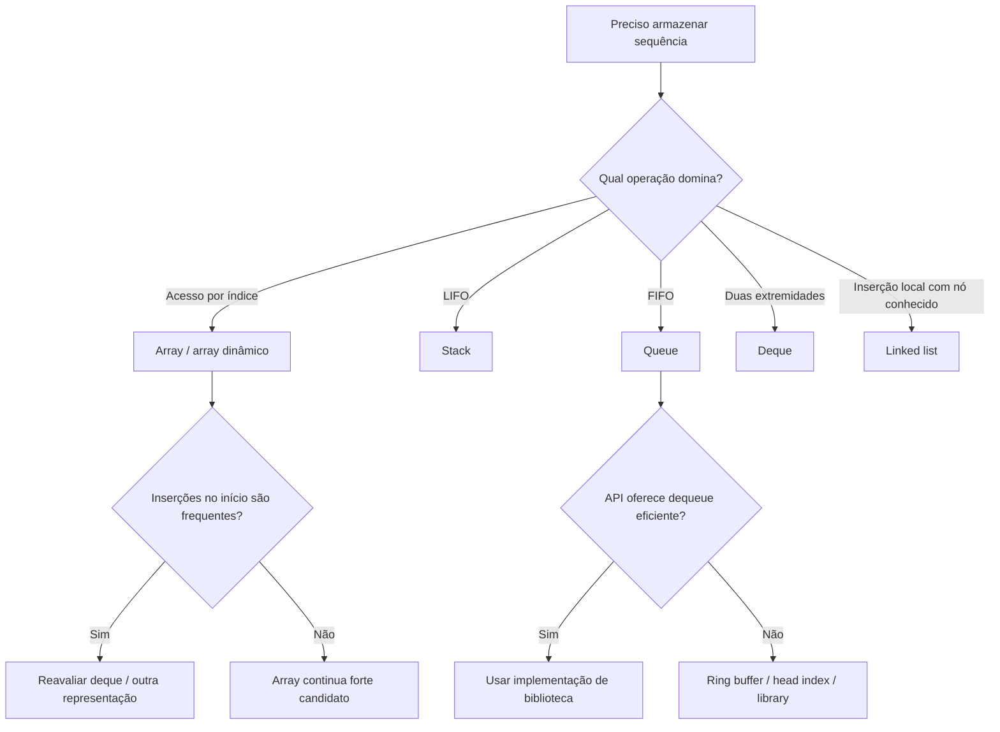

<a id="inicio"></a>

# Estruturas Lineares

> **Classificação geral:** `[D] no uso; [C] na implementação interna inicial`  
> **Nível:** C — Algoritmos e Estruturas de Dados  
> **Posição na taxonomia:** tópico 28 — quinto tópico do Nível C  
> **Pré-requisitos principais:** T10 — Estruturas de Dados Elementares; T14 — Estado, Escopo, Referências e Mutabilidade; T15 — Coleções e Manipulação de Dados; T17 — Recursão; T20 — Testes e Verificação; T24 — Correção e Análise de Algoritmos; T25 — Tipos Abstratos de Dados, Estruturas e Implementações; T26 — Algoritmos de Busca; T27 — Algoritmos de Ordenação  
> **Aprofundamentos posteriores:** T29 — Estruturas Associativas, Conjuntos e Hashing; T30 — Filas de Prioridade e Heaps; T31 — Árvores; T32 — Grafos e Percursos Fundamentais; T35 — Modelagem, Escolha de Estruturas e Trade-offs

---

## Resumo executivo

Estruturas lineares organizam elementos em uma sequência lógica: há uma noção de **antes/depois**, extremidades e, dependendo da representação, acesso por posição.

O ponto central deste tópico é separar quatro perguntas:

```text
qual é a política de acesso?
        ↓
qual ADT resolve o problema?
        ↓
qual estrutura representa esse ADT?
        ↓
qual implementação concreta a linguagem/runtime oferece?
```

As estruturas fundamentais deste tópico são:

```text
array estático/dinâmico → acesso por índice; bom uso de localidade; custo para deslocar elementos
lista ligada           → elementos conectados por ligações; acesso sequencial; atualização local de links
pilha                   → política LIFO
fila                    → política FIFO
deque                   → inserção/remoção em ambas as extremidades
```

Uma conclusão prática atravessa todo o documento:

> **não escolha uma estrutura pelo nome; escolha pelas operações que precisam ser eficientes e pelas garantias concretas da implementação disponível.**

---


<a id="visao-panoramica"></a>
## 🗺️ Visão panorâmica — o mapa antes dos detalhes

Esta seção funciona como **caderno rápido de consulta**, **modelo mental**, **índice conceitual**, **contrato de cobertura**, **ponte prática**, **ponte entre linguagens** e **referência de auditoria**. A leitura detalhada continua nas seções numeradas; aqui o objetivo é conseguir recuperar a estrutura do assunto em aproximadamente 30 segundos.

### O domínio inteiro em uma tela

```text
ESTRUTURAS LINEARES
│
├── sequência indexável / baseada em array
│   ├── array conceitualmente estático
│   └── array dinâmico
│       ├── size ≠ capacity
│       ├── crescimento / realocação
│       └── custo amortizado
│
├── sequência ligada
│   ├── singly linked list
│   ├── doubly linked list
│   ├── linear
│   └── circular
│
├── políticas de acesso
│   ├── stack  → LIFO
│   ├── queue  → FIFO
│   └── deque  → duas extremidades
│
├── implementações auxiliares importantes
│   ├── head/tail explícitos
│   ├── buffer circular
│   ├── sentinelas / nós auxiliares quando aplicável
│   └── capacidade limitada ou crescimento dinâmico
│
└── linguagens
    ├── Python      → list / collections.deque
    ├── JavaScript  → Array + política explícita de índices
    ├── Java        → ArrayList / LinkedList / Deque / ArrayDeque
    └── Bash        → arrays indexados + convenções; sem biblioteca geral de ADTs
```

### Modelo mental mínimo

A pergunta correta não é apenas **“qual estrutura conheço?”**. É:

```text
quais operações dominam?
        ↓
qual contrato de ordem preciso?
        ↓
preciso de acesso por índice?
        ↓
preciso operar nas extremidades?
        ↓
preciso preservar capacidade fixa ou crescer?
        ↓
qual custo aceito por operação?
        ↓
qual representação/API da linguagem realiza isso sem esconder custo relevante?
```

Uma mesma política pode ter múltiplas implementações:

```text
STACK (LIFO)
├── array estático
├── array dinâmico
└── linked list

QUEUE (FIFO)
├── buffer circular
├── deque
├── linked list com head + tail
└── array com índice de cabeça
```

Logo:

```text
ADT / política ≠ estrutura concreta ≠ implementação/API
```

### Tabela de consulta rápida

| Necessidade dominante | Candidato natural | Observação crítica |
|---|---|---|
| acesso frequente por índice | array / array dinâmico | acesso costuma ser `O(1)`; inserções no meio podem deslocar elementos |
| append frequente com crescimento | array dinâmico | append costuma ser amortizado `O(1)`, não pior caso individual `O(1)` universal |
| inserir/remover junto de nó conhecido | linked list | a atualização local pode ser `O(1)`; localizar o nó pode custar `O(n)` |
| LIFO | stack | política; pode usar array/deque/lista ligada |
| FIFO | queue | evitar implementação que desloque toda a coleção a cada remoção frontal |
| duas extremidades | deque | generaliza operações típicas de stack e queue |
| capacidade fixa + FIFO | buffer circular | exige invariantes corretos de `head`, `tail`, tamanho e wrap-around |
| script Bash pequeno | array indexado + convenção | índices podem ser esparsos; não assumir vetor contíguo |
| processamento algorítmico complexo | Python/JavaScript/Java | normalmente mais natural que simular estruturas extensas em Bash |

### Custos: a leitura correta

| Estrutura/operação | Custo conceitual típico | Caveat |
|---|---:|---|
| array — acesso por índice | `O(1)` | depende da representação adequada |
| array dinâmico — append | amortizado `O(1)` | uma realocação individual pode custar `O(n)` |
| array — inserir/remover no início/meio | `O(n)` | deslocamento dos elementos posteriores |
| singly linked list — acesso ao k-ésimo | `O(k)` / `O(n)` | não há acesso aleatório por índice |
| singly linked list — inserir no head | `O(1)` | desde que o head esteja disponível |
| linked list — remover valor arbitrário | geralmente `O(n)` | busca/predecessor domina o custo |
| stack — push/pop na extremidade adequada | `O(1)` típico/amortizado | depende da implementação |
| queue/deque — extremidades apropriadas | `O(1)` típico/amortizado | depende da implementação/API |

> **Regra:** Big O pertence à combinação **operação + representação + premissas**, não ao nome isolado da estrutura.

### Não confundir

| Não confundir | Diferença |
|---|---|
| sequência linear × memória contígua | uma linked list é linear logicamente, mas não precisa ser contígua fisicamente |
| `size` × `capacity` | tamanho lógico usado não é a mesma coisa que espaço reservado |
| `O(1)` local × operação total | mudar dois links pode ser `O(1)`, mas encontrar o ponto de mudança pode ser `O(n)` |
| pior caso × amortizado | uma operação cara ocasional pode coexistir com custo amortizado constante |
| stack × call stack | stack é um ADT; a pilha de chamadas é uma aplicação/runtime específico |
| queue × priority queue | FIFO não usa prioridade; priority queue pertence ao T30 |
| deque × lista | deque é contrato de duas extremidades; a representação pode variar |
| JavaScript `Array` × array contíguo normativo | ECMAScript especifica comportamento, não uma representação física única |
| Bash array × vetor C/Java | Bash permite índices não contíguos |
| `null`/`None` como dado × sentinela de vazio | APIs diferentes tratam esses valores de maneira diferente |

### Microexemplo 1 — append amortizado não é append sempre constante

```text
capacity = 4
size     = 4
append(x)

1. não há espaço
2. alocar área maior
3. copiar/mover referências existentes
4. inserir x
```

A operação que dispara resize é mais cara; a sequência de muitos appends pode continuar tendo custo amortizado `O(1)` por append.

### Microexemplo 2 — a linked list não “ganha O(1)” por mágica

```text
head → A → B → C → D
               ↑ remover C
```

Se já existe referência para `B`, trocar `B.next` é local. Se o contrato fornece apenas o valor `C`, primeiro é necessário localizar `C` e seu predecessor: a busca pode ser linear.

### Microexemplo 3 — queue que degrada por deslocamento

```text
[A, B, C, D]
 dequeue A
[B, C, D, _]   ← implementação ingênua pode deslocar B/C/D
```

Alternativas comuns:

```text
head index:   [A, B, C, D]
                  ↑ head

circular:     capacidade fixa + head/tail com módulo

deque:        operação explícita na extremidade
```

### Microexemplo 4 — buffer circular

```text
capacidade = 4
índices     = 0 1 2 3

head = 3
rear = 1

ordem lógica:
[índice 3] → [índice 0]
```

A ordem lógica pode atravessar o fim físico do array. Isso é **wrap-around**, não corrupção.

### Pergunta → mecanismo

| Pergunta | Mecanismo que deve vir à mente |
|---|---|
| “Preciso do elemento k imediatamente” | acesso indexado |
| “Preciso adicionar no fim várias vezes” | array dinâmico + amortização |
| “Preciso inserir/remover em posição já conhecida” | links ou estrutura apropriada |
| “O último que entrou deve sair primeiro” | stack / LIFO |
| “O primeiro que entrou deve sair primeiro” | queue / FIFO |
| “Preciso das duas pontas” | deque |
| “Tenho capacidade fixa e tráfego contínuo” | ring/circular buffer |
| “O consumo cresce sem limite” | política de capacidade/backpressure/overflow |
| “O índice Bash 9 existe, então há dez itens?” | não necessariamente; índice pode ser esparso |

### Ponte entre linguagens

**Python**

```text
list
→ boa para índice e extremidade direita

deque
→ adequada para operações frequentes nas duas extremidades
```

**JavaScript / ECMAScript**

```text
Array
→ oferece push/pop/shift/unshift
→ a especificação descreve a semântica
→ não transforma shift() em garantia de O(1)
→ para FIFO intensiva, head index ou estrutura própria evita deslocamento lógico repetido
```

**Java**

```text
List        → contrato de sequência indexável
ArrayList   → implementação baseada em array redimensionável
LinkedList  → lista duplamente ligada + List/Deque
Deque       → contrato de duas extremidades
ArrayDeque  → implementação redimensionável recomendável para stack/queue em muitos casos
```

**GNU Bash**

```text
declare -a values
values[0]=A
values[9]=B

# dois elementos atribuídos; não dez elementos contíguos
```

### Problemas reais cobertos nesta revisão

O inventário formal `PR-T28-*` fecha, no mínimo:

- resize e custo amortizado;
- deslocamentos em arrays;
- custo de localização em linked lists;
- invariantes `next`/`prev`/head/tail;
- underflow de stack/queue;
- queue ingênua por deslocamento frontal;
- wrap-around e ambiguidade cheio/vazio;
- deque × priority queue;
- arrays esparsos/quoting em Bash;
- crescimento sem limite e política de capacidade.

### Entrada rápida para troubleshooting

Quando o comportamento estiver errado, classifique primeiro:

```text
ordem errada?
→ verificar LIFO/FIFO/extremidade usada

índice errado?
→ verificar size/capacity/head/tail/wrap-around

operação ficou lenta?
→ verificar deslocamento, busca por posição, resize ou escolha de estrutura

estado corrompido?
→ verificar invariantes de links/head/tail e exposição de nós internos

memória cresce?
→ verificar capacidade, retenção de referências e fila sem limite
```

O procedimento completo está em [Troubleshooting sistemático](#troubleshooting-sistematico).

### Duas rotas de uso — resumo

**Consulta rápida:** Visão Panorâmica → matriz de decisão → troubleshooting → referência da linguagem.

**Primeiro contato:** use a rota learner-first descrita em [Como estudar este tópico](#como-estudar-este-tópico--duas-rotas), antes de percorrer os LABs.

---

## Visão rápida

| Pergunta | Resposta curta |
|---|---|
| Array e lista são sinônimos? | não |
| Array dinâmico significa crescimento gratuito? | não; redimensionamentos ocasionais existem |
| `append` em array dinâmico costuma ser `O(1)`? | amortizado, em implementações que crescem geometricamente |
| Inserir no início de um array costuma ser barato? | não; normalmente exige deslocamentos |
| Lista ligada dá acesso aleatório `O(1)`? | não |
| Inserção em lista ligada é sempre `O(1)`? | somente quando a posição/nó relevante já é conhecido; localizar o ponto pode custar `O(n)` |
| Stack é uma estrutura física específica? | não; é um ADT/política LIFO que pode ter diferentes representações |
| Queue é “array com `shift`”? | não; FIFO é o contrato, e a representação deve respeitar o custo desejado |
| Deque substitui stack e queue em muitos casos? | sim, quando a API/implementação oferece ambas as extremidades eficientemente |
| Python `list` é boa fila pelo início? | não; a documentação recomenda `collections.deque` |
| JavaScript tem `Deque` padrão no ECMAScript? | não |
| Java recomenda `Stack` para novas pilhas? | `ArrayDeque` costuma ser a alternativa preferível |
| Bash tem ADTs stack/queue/deque nativos? | não; tem arrays indexados e é possível simular as políticas |

---

## Como estudar este tópico — duas rotas

O T28 possui duas rotas sobre o **mesmo Markdown canônico**.

| Se você... | Rota recomendada |
|---|---|
| está aprendendo estruturas lineares pela primeira vez | **Rota A:** mapa → sequência/representação → arrays/listas → stack/queue/deque → APIs reais → falhas → LABs |
| já conhece o assunto e quer consultar | **Rota B:** Índice essencial → matriz de decisão → linguagem/API → PR/TS → referências |

### Rota A — primeiro contato

```text
sequência e posição
→ array estático/dinâmico
→ lista ligada
→ stack / queue / deque
→ buffer circular
→ custos e amortização
→ APIs concretas
→ diagnóstico
→ prática
→ critérios de domínio
```

Não memorize estruturas como uma lista de nomes. Para cada uma, responda:

```text
qual contrato?
qual representação?
quais operações dominam?
qual custo depende de localização/deslocamento/resize?
qual garantia vem da API concreta?
```

### Rota B — consulta

```text
“array ou linked list?”       → §8 e §17
“stack?”                       → §9–§11
“queue?”                       → §12–§14
“deque?”                       → §15
“Bash?”                        → §16
“Java?”                        → §18
“Python?”                      → §19
“JavaScript?”                  → §20
“algo deu errado?”             → PR-T28-* / Troubleshooting
“qual escolher?”               → §28–§29
```

## Regra de ouro

> **A complexidade pertence à operação sobre uma representação concreta, não ao nome informal usado no código.**

---

## Decisão rápida

```text
PRECISO ARMAZENAR UMA SEQUÊNCIA
            │
            ├── acesso frequente por índice
            │      └── array / array dinâmico / lista baseada em array
            │
            ├── inserção/remoção junto a nó conhecido
            │      └── lista ligada pode fazer sentido
            │
            ├── último que entra é o primeiro que sai
            │      └── stack / pilha
            │
            ├── primeiro que entra é o primeiro que sai
            │      └── queue / fila
            │
            └── preciso operar eficientemente nas duas pontas
                   └── deque
```

---

# Índice

## Índice essencial

- [PARTE I — Contexto, arrays e listas ligadas](#parte-i)
- [PARTE II — Stack, queue, buffer circular, deque e Bash](#parte-ii)
- [PARTE III — Custos, APIs reais e semântica de uso](#parte-iii)
- [PARTE IV — Falhas, robustez, troubleshooting e decisão](#parte-iv)
- [PARTE V — LABs, exercícios e evidências de domínio](#parte-v)
- [APÊNDICES — taxonomia, fontes, QA e histórico](#apendices)

Atalhos:

- [Matriz de decisão](#28-matriz-de-decisão)
- [Troubleshooting sistemático](#troubleshooting-sistematico)
- [Inventário PR-T28-*](#258-inventário-formal-pr-t28-)
- [Complexidade comparativa](#17-complexidade-comparativa)
- [Glossário](#42-glossário)

<details>
<summary><strong>Índice detalhado</strong></summary>

- [1. Posição deste assunto na trilha](#1-posição-deste-assunto-na-trilha)
  - [1.1 O que T25 entregou](#11-o-que-t25-entregou)
  - [1.2 O que T24 entregou](#12-o-que-t24-entregou)
  - [1.3 O que T26 e T27 entregaram](#13-o-que-t26-e-t27-entregaram)
  - [1.4 Fronteira com T29](#14-fronteira-com-t29)
  - [1.5 Fronteira com T30](#15-fronteira-com-t30)
  - [1.6 Fronteira com T31 e T32](#16-fronteira-com-t31-e-t32)
  - [1.7 Fronteira com T35](#17-fronteira-com-t35)
- [2. Modelo mental: sequência, posição e política de acesso](#2-modelo-mental-sequência-posição-e-política-de-acesso)
  - [2.1 Linear não significa necessariamente contíguo](#21-linear-não-significa-necessariamente-contíguo)
  - [2.2 Posição lógica e endereço físico são conceitos diferentes](#22-posição-lógica-e-endereço-físico-são-conceitos-diferentes)
  - [2.3 A política pode restringir uma estrutura mais geral](#23-a-política-pode-restringir-uma-estrutura-mais-geral)
  - [2.4 Ordem de armazenamento não é ordem de prioridade](#24-ordem-de-armazenamento-não-é-ordem-de-prioridade)
- [3. 28.1 — Arrays estáticos e dinâmicos `[D]`](#3-281--arrays-estáticos-e-dinâmicos-d)
  - [3.1 Array estático — ideia central](#31-array-estático--ideia-central)
  - [3.2 Array dinâmico — tamanho lógico versus capacidade](#32-array-dinâmico--tamanho-lógico-versus-capacidade)
  - [3.3 Crescimento](#33-crescimento)
  - [3.4 Operações típicas](#34-operações-típicas)
  - [3.5 Por que inserir no meio custa](#35-por-que-inserir-no-meio-custa)
  - [3.6 Localidade](#36-localidade)
  - [3.7 “Array” de uma linguagem pode não ser o array clássico do livro](#37-array-de-uma-linguagem-pode-não-ser-o-array-clássico-do-livro)
- [4. Array dinâmico didático](#4-array-dinâmico-didático)
  - [4.1 Objetivo da implementação](#41-objetivo-da-implementação)
  - [4.2 Pseudocódigo](#42-pseudocódigo)
  - [4.3 Contagem de cópias](#43-contagem-de-cópias)
  - [4.4 Não confundir amortizado com pior caso individual](#44-não-confundir-amortizado-com-pior-caso-individual)
- [5. Arrays/listas baseadas em array nas quatro linguagens](#5-arrayslistas-baseadas-em-array-nas-quatro-linguagens)
  - [5.1 Python](#51-python)
  - [5.2 JavaScript / ECMAScript](#52-javascript--ecmascript)
  - [5.3 Java](#53-java)
  - [5.4 GNU Bash](#54-gnu-bash)
- [6. 28.2 — Listas ligadas `[C]`](#6-282--listas-ligadas-c)
  - [6.1 Ideia central](#61-ideia-central)
  - [6.2 Lista duplamente ligada](#62-lista-duplamente-ligada)
  - [6.3 Lista circular](#63-lista-circular)
  - [6.4 Custos típicos](#64-custos-típicos)
  - [6.5 A frase perigosa: “inserção em linked list é O(1)”](#65-a-frase-perigosa-inserção-em-linked-list-é-o1)
  - [6.6 Invariantes de uma lista simplesmente ligada](#66-invariantes-de-uma-lista-simplesmente-ligada)
  - [6.7 Invariantes de uma lista duplamente ligada](#67-invariantes-de-uma-lista-duplamente-ligada)
- [7. Lista simplesmente ligada — implementação didática](#7-lista-simplesmente-ligada--implementação-didática)
  - [7.1 Python](#71-python)
  - [7.2 JavaScript](#72-javascript)
  - [7.3 Java](#73-java)
  - [7.4 Por que não forçar uma linked list “real” em Bash](#74-por-que-não-forçar-uma-linked-list-real-em-bash)
- [8. Arrays versus listas ligadas](#8-arrays-versus-listas-ligadas)
  - [8.1 Comparação resumida](#81-comparação-resumida)
  - [8.2 Não existe vencedor universal](#82-não-existe-vencedor-universal)
  - [8.3 “Mover ponteiro” não encerra a análise](#83-mover-ponteiro-não-encerra-a-análise)
- [9. 28.3 — Stack / Pilha `[D]`](#9-283--stack--pilha-d)
  - [9.1 Contrato LIFO](#91-contrato-lifo)
  - [9.2 Operações conceituais](#92-operações-conceituais)
  - [9.3 Invariante central](#93-invariante-central)
  - [9.4 Casos de uso](#94-casos-de-uso)
  - [9.5 Underflow](#95-underflow)
- [10. Pilha nas quatro linguagens](#10-pilha-nas-quatro-linguagens)
  - [10.1 Python — `list`](#101-python--list)
  - [10.2 JavaScript — `Array`](#102-javascript--array)
  - [10.3 Java — `Deque` / `ArrayDeque`](#103-java--deque--arraydeque)
  - [10.4 GNU Bash — array indexado](#104-gnu-bash--array-indexado)
  - [10.5 Conceito universal versus API](#105-conceito-universal-versus-api)
- [11. Exemplo de pilha — balanceamento de delimitadores](#11-exemplo-de-pilha--balanceamento-de-delimitadores)
  - [11.1 Problema](#111-problema)
  - [11.2 Algoritmo](#112-algoritmo)
  - [11.3 Complexidade](#113-complexidade)
  - [11.4 Python](#114-python)
- [12. 28.4 — Queue / Fila `[D]`](#12-284--queue--fila-d)
  - [12.1 Contrato FIFO](#121-contrato-fifo)
  - [12.2 Operações conceituais](#122-operações-conceituais)
  - [12.3 Usos](#123-usos)
  - [12.4 A armadilha da fila baseada em deslocamento do início](#124-a-armadilha-da-fila-baseada-em-deslocamento-do-início)
  - [12.5 Alternativas](#125-alternativas)
- [13. Fila nas quatro linguagens](#13-fila-nas-quatro-linguagens)
  - [13.1 Python — `collections.deque`](#131-python--collectionsdeque)
  - [13.2 JavaScript — head index em vez de `shift()` repetido](#132-javascript--head-index-em-vez-de-shift-repetido)
  - [13.3 Java — `ArrayDeque`](#133-java--arraydeque)
  - [13.4 GNU Bash — fila com índices e tamanho explícitos](#134-gnu-bash--fila-com-índices-e-tamanho-explícitos)
  - [13.5 Limite da simulação Bash](#135-limite-da-simulação-bash)
- [14. Buffer circular](#14-buffer-circular)
  - [14.1 Motivação](#141-motivação)
  - [14.2 Exemplo visual](#142-exemplo-visual)
  - [14.3 Vazio versus cheio](#143-vazio-versus-cheio)
  - [14.4 Operações](#144-operações)
  - [14.5 Python didático](#145-python-didático)
- [15. 28.5 — Deque `[C]`](#15-285--deque-c)
  - [15.1 Contrato](#151-contrato)
  - [15.2 Relação com stack e queue](#152-relação-com-stack-e-queue)
  - [15.3 Usos](#153-usos)
  - [15.4 Python](#154-python)
  - [15.5 Java](#155-java)
  - [15.6 JavaScript](#156-javascript)
  - [15.7 Bash](#157-bash)
- [16. 28.6 — Bash e estruturas lineares](#16-286--bash-e-estruturas-lineares)
  - [16.1 O que Bash realmente oferece](#161-o-que-bash-realmente-oferece)
  - [16.2 Stack é uma convenção](#162-stack-é-uma-convenção)
  - [16.3 Queue exige cuidado adicional](#163-queue-exige-cuidado-adicional)
  - [16.4 Arrays esparsos](#164-arrays-esparsos)
  - [16.5 Quando sair do Bash](#165-quando-sair-do-bash)
- [17. Complexidade comparativa](#17-complexidade-comparativa)
  - [17.1 Tabela conceitual](#171-tabela-conceitual)
  - [17.2 “Típico” não substitui documentação](#172-típico-não-substitui-documentação)
  - [17.3 Custo amortizado](#173-custo-amortizado)
- [18. Java: `ArrayList`, `LinkedList` e `ArrayDeque`](#18-java-arraylist-linkedlist-e-arraydeque)
  - [18.1 `ArrayList`](#181-arraylist)
  - [18.2 `LinkedList`](#182-linkedlist)
  - [18.3 `ArrayDeque`](#183-arraydeque)
  - [18.4 Escolha de interface](#184-escolha-de-interface)
- [19. Python: `list` e `collections.deque`](#19-python-list-e-collectionsdeque)
  - [19.1 `list`](#191-list)
  - [19.2 `deque`](#192-deque)
  - [19.3 Acesso por índice em deque](#193-acesso-por-índice-em-deque)
  - [19.4 `maxlen`](#194-maxlen)
- [20. JavaScript / ECMAScript: Arrays sem inventar garantias físicas](#20-javascript--ecmascript-arrays-sem-inventar-garantias-físicas)
  - [20.1 `Array` é parte da linguagem](#201-array-é-parte-da-linguagem)
  - [20.2 O que a especificação não promete](#202-o-que-a-especificação-não-promete)
  - [20.3 `shift()` é semanticamente diferente de `pop()`](#203-shift-é-semanticamente-diferente-de-pop)
  - [20.4 Queue por índice de cabeça](#204-queue-por-índice-de-cabeça)
- [21. Mesma política nas quatro linguagens — fila FIFO](#21-mesma-política-nas-quatro-linguagens--fila-fifo)
  - [21.1 Python](#211-python)
  - [21.2 JavaScript](#212-javascript)
  - [21.3 Java](#213-java)
  - [21.4 GNU Bash](#214-gnu-bash)
  - [21.5 O conceito que não muda](#215-o-conceito-que-não-muda)
  - [21.6 O que muda](#216-o-que-muda)
- [22. Capacidade, crescimento e limites](#22-capacidade-crescimento-e-limites)
  - [22.1 Crescimento sem limite lógico não significa memória infinita](#221-crescimento-sem-limite-lógico-não-significa-memória-infinita)
  - [22.2 Estruturas limitadas podem ser melhores](#222-estruturas-limitadas-podem-ser-melhores)
  - [22.3 Política de overflow](#223-política-de-overflow)
- [23. Mutabilidade, referências e cópias](#23-mutabilidade-referências-e-cópias)
  - [23.1 Estrutura mutável contém referências ou valores conforme a linguagem](#231-estrutura-mutável-contém-referências-ou-valores-conforme-a-linguagem)
  - [23.2 Cópia rasa não duplica profundamente a estrutura dos objetos](#232-cópia-rasa-não-duplica-profundamente-a-estrutura-dos-objetos)
  - [23.3 Linked list e ownership](#233-linked-list-e-ownership)
- [24. Iteração e modificação durante percurso](#24-iteração-e-modificação-durante-percurso)
  - [24.1 Problema geral](#241-problema-geral)
  - [24.2 Não universalizar comportamento](#242-não-universalizar-comportamento)
  - [24.3 Regra prática](#243-regra-prática)
- [25. Falhas e casos de borda](#25-falhas-e-casos-de-borda)
  - [25.1 Estrutura vazia](#251-estrutura-vazia)
  - [25.2 Um único elemento](#252-um-único-elemento)
  - [25.3 Capacidade um](#253-capacidade-um)
  - [25.4 Wrap-around](#254-wrap-around)
  - [25.5 Duplicatas](#255-duplicatas)
  - [25.6 Valores `null`/`None`](#256-valores-nullnone)
  - [25.7 Índices inválidos](#257-índices-inválidos)
  - [25.8 Inventário formal `PR-T28-*`](#258-inventário-formal-pr-t28-)
- [26. Segurança e robustez](#26-segurança-e-robustez)
  - [26.1 Crescimento controlado](#261-crescimento-controlado)
  - [26.2 Nunca confiar em índice externo sem validação](#262-nunca-confiar-em-índice-externo-sem-validação)
  - [26.3 Não expor estado interno mutável sem necessidade](#263-não-expor-estado-interno-mutável-sem-necessidade)
  - [26.4 Bash e expansão de palavras](#264-bash-e-expansão-de-palavras)
- [27. Erros conceituais frequentes](#27-erros-conceituais-frequentes)
  - [27.1 “Array e list são a mesma coisa”](#271-array-e-list-são-a-mesma-coisa)
  - [27.2 “Linked list sempre insere em O(1)”](#272-linked-list-sempre-insere-em-o1)
  - [27.3 “Fila em JavaScript é `push` + `shift` e pronto”](#273-fila-em-javascript-é-push--shift-e-pronto)
  - [27.4 “Stack precisa de uma classe Stack”](#274-stack-precisa-de-uma-classe-stack)
  - [27.5 “Deque é fila de prioridade”](#275-deque-é-fila-de-prioridade)
  - [27.6 “Bash array é um vetor contíguo”](#276-bash-array-é-um-vetor-contíguo)
  - [27.7 “O(1) significa instantâneo”](#277-o1-significa-instantâneo)
  - [27.8 “Amortizado é caso médio”](#278-amortizado-é-caso-médio)
  - [🔎 Troubleshooting sistemático](#troubleshooting-sistematico)
- [28. Matriz de decisão](#28-matriz-de-decisão)
  - [28.1 A pergunta correta](#281-a-pergunta-correta)
- [29. Mermaid — mapa de escolha](#29-mermaid--mapa-de-escolha)
- [30. LAB 1 — Visualizar crescimento de um array dinâmico](#30-lab-1--visualizar-crescimento-de-um-array-dinâmico)
  - [Objetivo](#objetivo)
  - [Pré-requisitos](#pré-requisitos)
  - [Estado inicial](#estado-inicial)
  - [Tarefa](#tarefa)
  - [Procedimento](#procedimento)
  - [O que observar](#o-que-observar)
  - [Testes](#testes)
  - [Explicação](#explicação)
  - [Variação / transferência](#variação--transferência)
  - [Limpeza](#limpeza)
- [31. LAB 2 — Rastrear uma lista simplesmente ligada](#31-lab-2--rastrear-uma-lista-simplesmente-ligada)
  - [Objetivo](#objetivo-1)
  - [Pré-requisitos](#pré-requisitos-1)
  - [Estado inicial](#estado-inicial-1)
  - [Tarefa](#tarefa-1)
  - [Procedimento](#procedimento-1)
  - [O que observar](#o-que-observar-1)
  - [Testes](#testes-1)
  - [Explicação](#explicação-1)
  - [Variação / transferência](#variação--transferência-1)
  - [Limpeza](#limpeza-1)
- [32. LAB 3 — Stack e delimitadores balanceados](#32-lab-3--stack-e-delimitadores-balanceados)
  - [Objetivo](#objetivo-2)
  - [Pré-requisitos](#pré-requisitos-2)
  - [Estado inicial](#estado-inicial-2)
  - [Tarefa](#tarefa-2)
  - [Procedimento](#procedimento-2)
  - [O que observar](#o-que-observar-2)
  - [Testes](#testes-2)
  - [Explicação](#explicação-2)
  - [Variação / transferência](#variação--transferência-2)
  - [Limpeza](#limpeza-2)
- [33. LAB 4 — Fila ingênua versus índice de cabeça](#33-lab-4--fila-ingênua-versus-índice-de-cabeça)
  - [Objetivo](#objetivo-3)
  - [Pré-requisitos](#pré-requisitos-3)
  - [Estado inicial](#estado-inicial-3)
  - [Tarefa](#tarefa-3)
  - [Procedimento](#procedimento-3)
  - [O que observar](#o-que-observar-3)
  - [Testes](#testes-3)
  - [Explicação](#explicação-3)
  - [Variação / transferência](#variação--transferência-3)
  - [Limpeza](#limpeza-3)
- [34. LAB 5 — Buffer circular com wrap-around](#34-lab-5--buffer-circular-com-wrap-around)
  - [Objetivo](#objetivo-4)
  - [Pré-requisitos](#pré-requisitos-4)
  - [Estado inicial](#estado-inicial-4)
  - [Tarefa](#tarefa-4)
  - [Procedimento](#procedimento-4)
  - [O que observar](#o-que-observar-4)
  - [Testes](#testes-4)
  - [Explicação](#explicação-4)
  - [Variação / transferência](#variação--transferência-4)
  - [Limpeza](#limpeza-4)
- [35. LAB 6 — Deque como stack, queue e janela limitada](#35-lab-6--deque-como-stack-queue-e-janela-limitada)
  - [Objetivo](#objetivo-5)
  - [Pré-requisitos](#pré-requisitos-5)
  - [Estado inicial](#estado-inicial-5)
  - [Tarefa](#tarefa-5)
  - [Procedimento](#procedimento-5)
  - [O que observar](#o-que-observar-5)
  - [Testes](#testes-5)
  - [Explicação](#explicação-5)
  - [Variação / transferência](#variação--transferência-5)
  - [Limpeza](#limpeza-5)
- [36. LAB 7 — Arrays esparsos no Bash](#36-lab-7--arrays-esparsos-no-bash)
  - [Objetivo](#objetivo-6)
  - [Pré-requisitos](#pré-requisitos-6)
  - [Estado inicial](#estado-inicial-6)
  - [Tarefa](#tarefa-6)
  - [Procedimento](#procedimento-6)
  - [O que observar](#o-que-observar-6)
  - [Testes](#testes-6)
  - [Explicação](#explicação-6)
  - [Variação / transferência](#variação--transferência-6)
  - [Limpeza](#limpeza-6)
- [37. LAB 8 — Escolher estrutura a partir das operações](#37-lab-8--escolher-estrutura-a-partir-das-operações)
  - [Objetivo](#objetivo-7)
  - [Pré-requisitos](#pré-requisitos-7)
  - [Estado inicial](#estado-inicial-7)
  - [Tarefa](#tarefa-7)
  - [Procedimento](#procedimento-7)
  - [O que observar](#o-que-observar-7)
  - [Testes](#testes-7)
  - [Explicação](#explicação-7)
  - [Variação / transferência](#variação--transferência-7)
  - [Limpeza](#limpeza-7)
- [38. Exercícios de fixação](#38-exercícios-de-fixação)
  - [38.1 Conceituais](#381-conceituais)
  - [38.2 Análise de custo](#382-análise-de-custo)
  - [38.3 Transferência entre linguagens](#383-transferência-entre-linguagens)
  - [38.4 Diagnóstico de design](#384-diagnóstico-de-design)
  - [38.5 Linked list](#385-linked-list)
- [39. Antipadrões e guardrails](#39-antipadrões-e-guardrails)
  - [39.1 Escolher pelo nome conhecido](#391-escolher-pelo-nome-conhecido)
  - [39.2 Reimplementar biblioteca sem motivo](#392-reimplementar-biblioteca-sem-motivo)
  - [39.3 Ocultar operação cara atrás de API conveniente](#393-ocultar-operação-cara-atrás-de-api-conveniente)
  - [39.4 Expor representação](#394-expor-representação)
  - [39.5 Forçar equivalência em Bash](#395-forçar-equivalência-em-bash)
- [40. Evidências de domínio](#40-evidências-de-domínio)
- [41. Checklist de domínio](#41-checklist-de-domínio)
  - [Arrays](#arrays)
  - [Linked lists](#linked-lists)
  - [Stack](#stack)
  - [Queue](#queue)
  - [Deque](#deque)
  - [Linguagens](#linguagens)
- [42. Glossário](#42-glossário)
- [43. Auditoria de cobertura da taxonomia](#43-auditoria-de-cobertura-da-taxonomia)
  - [43.1 Fronteira preservada com T29](#431-fronteira-preservada-com-t29)
  - [43.2 Fronteira preservada com T30](#432-fronteira-preservada-com-t30)
  - [43.3 Fronteira preservada com T31/T32](#433-fronteira-preservada-com-t31t32)
  - [43.4 Fronteira preservada com T35](#434-fronteira-preservada-com-t35)
- [44. Auditoria da File Library](#44-auditoria-da-file-library)
  - [44.1 Fontes locais efetivamente reconsultadas na R3](#441-fontes-locais-efetivamente-reconsultadas-na-r3)
  - [44.2 Como a biblioteca sustenta o documento](#442-como-a-biblioteca-sustenta-o-documento)
  - [44.3 Fontes com papéis diferentes](#443-fontes-com-papéis-diferentes)
  - [44.4 Hierarquia de autoridade](#444-hierarquia-de-autoridade)
- [45. Referências](#45-referências)
  - [45.1 Contratos canônicos](#451-contratos-canônicos)
  - [45.2 Literatura local efetivamente consultada](#452-literatura-local-efetivamente-consultada)
  - [45.3 Python — documentação oficial](#453-python--documentação-oficial)
  - [45.4 ECMAScript — especificação](#454-ecmascript--especificação)
  - [45.5 Java — documentação oficial](#455-java--documentação-oficial)
  - [45.6 GNU Bash](#456-gnu-bash)
- [46. QA e evidências](#46-qa-e-evidências)
  - [46.1 `[D]` Evidência documental](#461-d-evidência-documental)
  - [46.2 `[S]` Validação estrutural/estática](#462-s-validação-estruturalestática)
  - [46.3 `[R]` Reprodução em runtime](#463-r-reprodução-em-runtime)
  - [46.4 Limitações](#464-limitações)
  - [46.5 Gate de Cobertura Operacional](#465-gate-de-cobertura-operacional)
  - [46.6 Gate 2 — estado da R5](#466-gate-2--estado-da-r5)
  - [46.7 Métricas finais — iteração `0.3.2`](#467-métricas-finais--iteração-032)
- [47. Histórico de versões](#47-histórico-de-versões)

</details>

<a id="parte-i"></a>

# PARTE I — Contexto, arrays e listas ligadas

# 1. Posição deste assunto na trilha

## 1.1 O que T25 entregou

T25 separou **ADT/TAD, estrutura de dados e implementação concreta**. T28 aplica essa separação repetidamente.

Exemplo:

```text
ADT: fila FIFO
     ↓
pode ser realizada por
     ├── buffer circular baseado em array
     ├── lista ligada com head/tail
     └── deque de biblioteca
```

A fila não deixa de ser FIFO quando a representação muda.

## 1.2 O que T24 entregou

T24 estabeleceu tamanho da entrada, modelo de custo e análise assintótica. Aqui essas ferramentas são aplicadas às operações de estruturas lineares.

Perguntas típicas:

- quanto custa acessar a posição `i`?
- quanto custa inserir no início?
- quanto custa remover no final?
- qual custo é de pior caso e qual é amortizado?
- quanto de memória extra a representação exige?

## 1.3 O que T26 e T27 entregaram

Busca e ordenação dependem fortemente da representação. Busca binária pressupõe acesso adequado ao ponto intermediário; ordenações movem/reescrevem elementos de formas diferentes.

T28 torna explícito **por que** uma representação linear favorece certas operações e penaliza outras.

## 1.4 Fronteira com T29

T28 é sobre estruturas **sequenciais/lineares**. `set`, `map`, dicionários, hashing, colisões e load factor pertencem ao T29.

## 1.5 Fronteira com T30

Fila FIFO e deque pertencem aqui. **Priority Queue** não é FIFO; sua política é determinada por prioridade e será tratada com heaps no T30.

## 1.6 Fronteira com T31 e T32

T28 usa referências/links em listas, mas não transforma a estrutura em árvore ou grafo. Árvores e grafos têm relações estruturais diferentes e tópicos próprios.

## 1.7 Fronteira com T35

T28 ensina trade-offs locais. T35 consolidará a escolha de estruturas com requisitos completos de modelagem, manutenção, tempo e espaço.

[↑ Voltar ao índice](#índice)

# 2. Modelo mental: sequência, posição e política de acesso

## 2.1 Linear não significa necessariamente contíguo

Uma estrutura pode ser linear porque seus elementos formam uma sequência lógica:

```text
A → B → C → D
```

Isso não obriga que os elementos estejam fisicamente lado a lado na memória.

Um array clássico modela uma região contígua; uma lista ligada pode espalhar nós e conectar a sequência por referências.

## 2.2 Posição lógica e endereço físico são conceitos diferentes

Em um array conceitualmente contíguo, a posição `i` pode ser mapeada diretamente para uma posição de memória em modelos tradicionais.

Em uma lista simplesmente ligada, chegar ao elemento lógico `i` exige seguir ligações:

```text
head → node0 → node1 → ... → nodei
```

## 2.3 A política pode restringir uma estrutura mais geral

Uma estrutura subjacente pode permitir várias operações, enquanto o ADT expõe apenas algumas.

Exemplo:

```text
array dinâmico
   └── interface Stack
          ├── push
          ├── pop
          └── peek
```

O fato de o array permitir acesso por índice não significa que o consumidor da pilha deva depender desse detalhe.

## 2.4 Ordem de armazenamento não é ordem de prioridade

Fila FIFO:

```text
A entra, B entra, C entra
A sai, B sai, C sai
```

Fila de prioridade:

```text
ordem de saída depende da prioridade
```

A segunda pertence ao T30.

[↑ Voltar ao índice](#índice)

# 3. 28.1 — Arrays estáticos e dinâmicos `[D]`

## 3.1 Array estático — ideia central

No modelo clássico, um array contém uma quantidade definida de posições de mesmo tamanho lógico e permite acesso por índice.

```text
índice:   0    1    2    3
        +----+----+----+----+
valor:  | A  | B  | C  | D  |
        +----+----+----+----+
```

A propriedade pedagógica importante é:

```text
índice → posição diretamente localizável
```

sob o modelo de memória da estrutura.

## 3.2 Array dinâmico — tamanho lógico versus capacidade

Um array dinâmico adiciona uma distinção:

```text
size     = número de elementos válidos
capacity = quantidade de posições atualmente reservadas
```

Exemplo:

```text
size = 3
capacity = 8

[A][B][C][ ][ ][ ][ ][ ]
```

Adicionar `D` não exige nova alocação enquanto houver capacidade.

## 3.3 Crescimento

Quando não há espaço, uma estratégia comum é:

1. alocar armazenamento maior;
2. copiar/mover os elementos existentes;
3. inserir o novo elemento;
4. liberar/deixar de usar o armazenamento antigo.

Uma implementação que cresce geometricamente pode oferecer `append` com **custo amortizado `O(1)`**, apesar de algumas operações individuais custarem `O(n)`.

A taxa exata de crescimento é detalhe da implementação e não deve ser inventada quando a API não a especifica.

## 3.4 Operações típicas

| Operação | Array/array dinâmico — custo típico |
|---|---:|
| acesso por índice | `O(1)` |
| atualização por índice | `O(1)` |
| append | `O(1)` amortizado em implementações usuais |
| remover do final | frequentemente `O(1)` |
| inserir no início | `O(n)` |
| remover do início | `O(n)` |
| inserir/remover no meio | `O(n)` |
| busca linear por valor | `O(n)` |

> Esses custos são modelos usuais. A API concreta continua sendo a autoridade para uma implementação específica.

## 3.5 Por que inserir no meio custa

Para inserir `X` antes de `C`:

```text
antes:
[A][B][C][D][ ]

movimentos:
D → direita
C → direita

após:
[A][B][X][C][D]
```

O custo vem dos elementos que precisam ser deslocados, não da escrita de `X` em si.

## 3.6 Localidade

Arrays contíguos costumam ter boa localidade espacial: elementos vizinhos logicamente também estão próximos na representação.

Isso pode favorecer caches de CPU, mas:

> **complexidade assintótica e desempenho de cache são dimensões diferentes.**

Duas estruturas com `O(n)` podem ter desempenho real muito diferente.

## 3.7 “Array” de uma linguagem pode não ser o array clássico do livro

É perigoso transferir automaticamente o modelo físico para toda API chamada `Array`, `List` ou equivalente.

Exemplos:

- Java `ArrayList` documenta explicitamente uma implementação por array redimensionável;
- ECMAScript `Array` é especificado como objeto exótico indexado, não como promessa normativa de armazenamento contíguo;
- Bash indexed arrays podem ser esparsos e seus índices não precisam ser contíguos;
- Python `list` oferece os custos operacionais documentados pelo projeto Python, mas detalhes internos além do contrato não devem ser universalizados para toda implementação Python.

[↑ Voltar ao índice](#índice)

# 4. Array dinâmico didático

## 4.1 Objetivo da implementação

A implementação abaixo não tenta substituir bibliotecas. Ela existe para tornar visíveis:

- `size`;
- `capacity`;
- redimensionamento;
- custo ocasional `O(n)`;
- custo amortizado de uma sequência de appends.

## 4.2 Pseudocódigo

```text
append(value):
    if size == capacity:
        new_capacity = max(1, capacity * 2)
        new_storage = allocate(new_capacity)
        copy storage[0:size] to new_storage
        storage = new_storage
        capacity = new_capacity

    storage[size] = value
    size += 1
```

A multiplicação por `2` é apenas uma estratégia didática. Bibliotecas reais podem usar políticas diferentes.

## 4.3 Contagem de cópias

Começando com capacidade `1` e duplicando:

```text
append #1 → sem cópia prévia
append #2 → copia 1
append #3 → copia 2
append #5 → copia 4
append #9 → copia 8
...
```

A soma das cópias ao longo de muitos appends forma uma série geométrica e permanece proporcional ao número total de inserções.

## 4.4 Não confundir amortizado com pior caso individual

```text
append comum          → O(1)
append que redimensiona → O(n)
sequência de appends  → O(1) amortizado por append
```

Isso é exatamente o tipo de distinção introduzido no T24.

[↑ Voltar ao índice](#índice)

# 5. Arrays/listas baseadas em array nas quatro linguagens

## 5.1 Python

Python oferece `list` como sequência mutável de uso geral.

Pilha idiomática:

```python
stack: list[str] = []
stack.append("A")
stack.append("B")

assert stack.pop() == "B"
assert stack[-1] == "A"
```

Para fila pelo início, não usar repetidamente `pop(0)` em cargas relevantes; a própria documentação recomenda `collections.deque`.

## 5.2 JavaScript / ECMAScript

`Array` oferece `push`, `pop`, `shift` e `unshift`.

```javascript
const values = [];
values.push("A");
values.push("B");

console.assert(values.pop() === "B");
```

A especificação de `shift()` descreve a movimentação conceitual dos índices subsequentes para a esquerda. Portanto, para filas grandes, não é prudente assumir que remover da frente tenha o mesmo perfil de custo de `pop()`.

## 5.3 Java

`ArrayList<E>` é documentado como implementação redimensionável de `List<E>` baseada em array.

```java
import java.util.ArrayList;
import java.util.List;

List<String> values = new ArrayList<>();
values.add("A");
values.add("B");

if (!values.get(0).equals("A")) {
    throw new AssertionError("expected first element A");
}
```

A documentação atual informa acesso/`set` em tempo constante e `add` ao final em tempo constante amortizado; detalhes exatos da política de crescimento não são contrato público.

## 5.4 GNU Bash

Bash possui arrays indexados:

```bash
declare -a values=("A" "B" "C")
printf '%s\n' "${values[1]}"
```

Mas o modelo não deve ser chamado de “array contíguo clássico”. O manual permite índices não contíguos:

```bash
declare -a sparse=()
sparse[2]="B"
sparse[100]="Z"
```

Isso é uma diferença semântica importante.

[↑ Voltar ao índice](#índice)

# 6. 28.2 — Listas ligadas `[C]`

## 6.1 Ideia central

Uma lista ligada representa a sequência por **nós conectados**.

Lista simplesmente ligada:

```text
head
 │
 v
[A|•] → [B|•] → [C|∅]
```

Cada nó possui:

```text
dado + ligação para o próximo
```

## 6.2 Lista duplamente ligada

```text
∅ ← [A] ⇄ [B] ⇄ [C] → ∅
```

Cada nó conhece predecessor e sucessor.

Isso pode facilitar remoções e navegação em ambas as direções, ao custo de mais metadados e mais invariantes para manter.

## 6.3 Lista circular

Em uma lista circular, a extremidade volta a alguma posição anterior, tipicamente ao início:

```text
[A] → [B] → [C]
 ↑           │
 └───────────┘
```

Circularidade muda o critério de término de percursos: não existe `null`/`None` terminal obrigatório.

## 6.4 Custos típicos

| Operação | Lista simplesmente ligada |
|---|---:|
| acessar posição `i` | `O(n)` |
| buscar por valor | `O(n)` |
| inserir no início | `O(1)` |
| remover no início | `O(1)` |
| inserir após nó conhecido | `O(1)` |
| remover após predecessor conhecido | `O(1)` |
| obter último sem `tail` | `O(n)` |

A lista duplamente ligada com `head` e `tail` pode oferecer operações `O(1)` nas duas extremidades.

## 6.5 A frase perigosa: “inserção em linked list é O(1)”

Isso só é verdade quando o ponto relevante já está disponível.

Se o requisito for:

```text
"insira depois do elemento de índice 900000"
```

em uma lista ligada, primeiro pode ser necessário percorrer a estrutura até esse ponto.

Portanto:

```text
localizar posição → O(n)
atualizar links    → O(1)
operação completa → O(n)
```

## 6.6 Invariantes de uma lista simplesmente ligada

Exemplos:

- `head == None` se e somente se a lista está vazia;
- cada nó alcançável pelo `head` pertence à sequência;
- o último nó tem `next == None` em uma lista linear;
- o número de nós alcançáveis deve coincidir com `size`, se `size` for armazenado;
- não deve existir ciclo acidental em uma lista declarada linear.

## 6.7 Invariantes de uma lista duplamente ligada

Para nós adjacentes `x` e `y`:

```text
x.next == y
⇒
y.prev == x
```

Se a estrutura mantém `head` e `tail`:

```text
head.prev == null
tail.next == null
```

na variante linear.

[↑ Voltar ao índice](#índice)

# 7. Lista simplesmente ligada — implementação didática

## 7.1 Python

```python
from dataclasses import dataclass
from typing import Optional

@dataclass
class Node:
    value: str
    next: Optional["Node"] = None

class SinglyLinkedList:
    def __init__(self) -> None:
        self.head: Optional[Node] = None
        self.size: int = 0

    def push_front(self, value: str) -> None:
        self.head = Node(value=value, next=self.head)
        self.size += 1

    def pop_front(self) -> str:
        if self.head is None:
            raise IndexError("empty list")

        value = self.head.value
        self.head = self.head.next
        self.size -= 1
        return value
```

## 7.2 JavaScript

```javascript
class Node {
  constructor(value, next = null) {
    this.value = value;
    this.next = next;
  }
}

class SinglyLinkedList {
  constructor() {
    this.head = null;
    this.size = 0;
  }

  pushFront(value) {
    this.head = new Node(value, this.head);
    this.size += 1;
  }

  popFront() {
    if (this.head === null) {
      throw new RangeError("empty list");
    }

    const value = this.head.value;
    this.head = this.head.next;
    this.size -= 1;
    return value;
  }
}
```

## 7.3 Java

```java
public final class SinglyLinkedList {
    private static final class Node {
        final String value;
        Node next;

        Node(String value, Node next) {
            this.value = value;
            this.next = next;
        }
    }

    private Node head;
    private int size;

    public void pushFront(String value) {
        head = new Node(value, head);
        size++;
    }

    public String popFront() {
        if (head == null) {
            throw new IllegalStateException("empty list");
        }
        String value = head.value;
        head = head.next;
        size--;
        return value;
    }
}
```

## 7.4 Por que não forçar uma linked list “real” em Bash

Bash não possui o mesmo modelo natural de objetos/referências usado acima. É possível simular nós com arrays associativos e identificadores, mas isso transforma o exemplo em engenharia de representação de shell, não em explicação clara de linked list.

Neste currículo, o comportamento correto é:

- entender o conceito;
- reconhecer seus custos;
- não inventar uma equivalência idiomática inexistente;
- usar Python/JavaScript/Java para implementação pedagógica direta;
- em Bash, preferir estruturas e ferramentas naturais ao shell.

[↑ Voltar ao índice](#índice)

# 8. Arrays versus listas ligadas

## 8.1 Comparação resumida

| Critério | Array / array dinâmico | Lista ligada |
|---|---|---|
| acesso por índice | excelente, tipicamente `O(1)` | `O(n)` |
| append | tipicamente amortizado `O(1)` com capacidade | depende da representação; com `tail`, pode ser `O(1)` |
| inserir/remover no meio após localizar posição | deslocamentos `O(n)` | atualização local de links `O(1)` |
| localizar posição | `O(1)` por índice | `O(n)` |
| overhead por elemento | geralmente menor | referências/links adicionais |
| localidade | geralmente melhor | geralmente pior |
| redimensionamento | pode ocorrer | nós crescem individualmente |

## 8.2 Não existe vencedor universal

A escolha depende do padrão de operações.

Se o sistema faz milhões de acessos aleatórios por índice e poucas inserções no meio, array dinâmico é forte candidato.

Se mantém referências diretas a nós e realiza muitas remoções locais, uma estrutura ligada pode ser adequada.

## 8.3 “Mover ponteiro” não encerra a análise

Embora atualizar links seja barato, aplicações reais também pagam:

- alocação de nós;
- overhead de referências;
- pior localidade;
- pressão no garbage collector, quando aplicável;
- maior complexidade de invariantes.

É por isso que uma estrutura teoricamente favorável em uma operação não é automaticamente mais rápida em toda carga real.

[↑ Voltar ao índice](#índice)

> **✅ Fechamento da Parte I**
>
> Antes de avançar, você deve conseguir explicar: linearidade lógica × contiguidade física; `size` × `capacity`; custo amortizado; diferença entre acesso por índice e travessia; e por que “linked list insere em O(1)” depende de já conhecer o ponto de atualização.

<a id="parte-ii"></a>

# PARTE II — Stack, queue, buffer circular, deque e Bash

# 9. 28.3 — Stack / Pilha `[D]`

## 9.1 Contrato LIFO

**Last In, First Out**:

```text
push A
push B
push C

pop → C
pop → B
pop → A
```

## 9.2 Operações conceituais

```text
push(value)
pop()
peek()/top()
is_empty()
size()
```

Nem toda API usa exatamente esses nomes.

## 9.3 Invariante central

O próximo elemento removido é sempre o elemento atualmente no topo.

Se `S` é a sequência lógica da base ao topo:

```text
S = [a, b, c]
```

então:

```text
pop(S) = c
```

## 9.4 Casos de uso

- call stack;
- undo;
- matching de delimitadores;
- avaliação de expressões;
- backtracking explícito;
- DFS iterativa;
- reversão de ordem.

## 9.5 Underflow

Executar `pop` em pilha vazia precisa ter contrato definido:

- lançar exceção;
- retornar sentinela claramente documentada;
- retornar status + valor;
- impedir a operação por pré-condição.

Não esconder o caso vazio.

[↑ Voltar ao índice](#índice)

# 10. Pilha nas quatro linguagens

## 10.1 Python — `list`

```python
stack: list[str] = []
stack.append("config")
stack.append("commit")

last = stack.pop()
assert last == "commit"
```

`append()` + `pop()` no final formam uma pilha natural.

## 10.2 JavaScript — `Array`

```javascript
const stack = [];
stack.push("config");
stack.push("commit");

console.assert(stack.pop() === "commit");
```

## 10.3 Java — `Deque` / `ArrayDeque`

```java
import java.util.ArrayDeque;
import java.util.Deque;

Deque<String> stack = new ArrayDeque<>();
stack.push("config");
stack.push("commit");

String popped = stack.pop();
if (!popped.equals("commit")) {
    throw new AssertionError("expected LIFO value commit");
}
```

A documentação de `ArrayDeque` informa que ele provavelmente é mais rápido que a classe legada `Stack` quando usado como pilha.

> **Por que não usar `assert stack.pop()...`?** Em Java, assertions ficam desabilitadas por padrão e a expressão pode nem ser avaliada. Operações com efeito colateral, como `pop()`/`remove()`, ficam fora de `assert`: execute a operação primeiro e valide o resultado depois.

## 10.4 GNU Bash — array indexado

```bash
declare -a stack=()
stack_size=0

stack_push() {
    stack[$stack_size]=$1
    stack_size=$((stack_size + 1))
}

stack_pop() {
    local output_var=$1

    if ((stack_size == 0)); then
        printf 'stack underflow\n' >&2
        return 1
    fi

    stack_size=$((stack_size - 1))
    printf -v "$output_var" '%s' "${stack[$stack_size]}"
    unset 'stack[stack_size]'
}

stack_push "config"
stack_push "commit"

value=
if ! stack_pop value; then
    exit 1
fi

[[ $value == "commit" ]]
```

Aqui `stack_size` é parte explícita do estado lógico. `stack_pop` retorna status diferente de zero em **underflow** em vez de acessar um índice inválido ou produzir valor vazio silenciosamente.

A simulação pressupõe que o array seja manipulado pelas operações da própria pilha; mutações externas podem quebrar seus invariantes.

## 10.5 Conceito universal versus API

```text
conceito universal → LIFO
Python             → list.append / list.pop
JavaScript         → Array.push / Array.pop
Java               → Deque.push / Deque.pop
Bash               → convenção sobre array indexado
```

[↑ Voltar ao índice](#índice)

# 11. Exemplo de pilha — balanceamento de delimitadores

## 11.1 Problema

Verificar se:

```text
([]{})
```

está balanceado, mas:

```text
([)]
```

não está.

## 11.2 Algoritmo

```text
stack = vazia

para cada caractere:
    se abertura:
        push
    se fechamento:
        se stack vazia: falso
        opening = pop
        se par incompatível: falso

retornar stack vazia
```

## 11.3 Complexidade

Para `n` caracteres:

```text
tempo  → O(n)
espaço → O(n) no pior caso
```

## 11.4 Python

```python
def is_balanced(text: str) -> bool:
    pairs = {")": "(", "]": "[", "}": "{"}
    stack: list[str] = []

    for char in text:
        if char in "([{":
            stack.append(char)
        elif char in pairs:
            if not stack or stack.pop() != pairs[char]:
                return False

    return not stack

assert is_balanced("([]{})")
assert not is_balanced("([)]")
```

[↑ Voltar ao índice](#índice)

# 12. 28.4 — Queue / Fila `[D]`

## 12.1 Contrato FIFO

**First In, First Out**:

```text
enqueue A
enqueue B
enqueue C

dequeue → A
dequeue → B
dequeue → C
```

## 12.2 Operações conceituais

```text
enqueue(value)
dequeue()
front()/peek()
is_empty()
size()
```

## 12.3 Usos

- processamento de tarefas em ordem de chegada;
- buffers;
- BFS;
- filas de eventos;
- pipelines;
- escalonamento FIFO em modelos específicos.

## 12.4 A armadilha da fila baseada em deslocamento do início

Uma implementação ingênua pode fazer:

```text
append no final
remove índice 0
```

Se remover o índice `0` exige mover todos os demais elementos, cada `dequeue` custa `O(n)`.

Isso transforma processar `n` elementos em potencial trabalho quadrático.

## 12.5 Alternativas

- deque de biblioteca;
- buffer circular;
- lista ligada com `head` + `tail`;
- array + índice lógico de cabeça com compactação ocasional.

[↑ Voltar ao índice](#índice)

# 13. Fila nas quatro linguagens

## 13.1 Python — `collections.deque`

```python
from collections import deque

queue: deque[str] = deque()
queue.append("A")
queue.append("B")

assert queue.popleft() == "A"
```

A documentação oficial descreve appends/pops em ambas as extremidades com desempenho aproximadamente `O(1)` e recomenda `deque` para filas.

## 13.2 JavaScript — head index em vez de `shift()` repetido

ECMAScript não possui uma classe `Queue` padrão.

Uma implementação simples pode evitar mover fisicamente a frente a cada remoção, liberar a referência consumida e compactar o prefixo periodicamente:

```javascript
class Queue {
  constructor() {
    this.items = [];
    this.head = 0;
  }

  enqueue(value) {
    this.items.push(value);
  }

  dequeue() {
    if (this.head >= this.items.length) {
      throw new RangeError("empty queue");
    }

    const value = this.items[this.head];
    this.items[this.head] = undefined;
    this.head += 1;

    if (this.head === this.items.length) {
      this.items = [];
      this.head = 0;
    } else if (this.head >= 1024 && this.head * 2 >= this.items.length) {
      this.items = this.items.slice(this.head);
      this.head = 0;
    }

    return value;
  }

  isEmpty() {
    return this.head >= this.items.length;
  }
}
```

A atribuição `undefined` remove a referência lógica ao item consumido. A compactação evita que o prefixo já processado cresça indefinidamente.

> **O limiar `1024` é apenas uma política didática**, não uma constante universal. Uma implementação de produção deve escolher a política de compactação de acordo com workload, memória, latência e biblioteca disponível.

## 13.3 Java — `ArrayDeque`

```java
import java.util.ArrayDeque;
import java.util.Queue;

Queue<String> queue = new ArrayDeque<>();
queue.add("A");
queue.add("B");

String removed = queue.remove();
if (!removed.equals("A")) {
    throw new AssertionError("expected FIFO value A");
}
```

`ArrayDeque` é uma implementação redimensionável de `Deque`; a documentação indica custo amortizado constante para a maioria das operações.

## 13.4 GNU Bash — fila com índices e tamanho explícitos

```bash
declare -a queue=()
head=0
tail=0
queue_size=0

enqueue() {
    queue[$tail]=$1
    tail=$((tail + 1))
    queue_size=$((queue_size + 1))
}

dequeue() {
    local output_var=$1

    if ((queue_size == 0)); then
        printf 'queue underflow\n' >&2
        return 1
    fi

    printf -v "$output_var" '%s' "${queue[$head]}"
    unset 'queue[head]'
    head=$((head + 1))
    queue_size=$((queue_size - 1))

    if ((queue_size == 0)); then
        queue=()
        head=0
        tail=0
    fi
}

enqueue "A"
enqueue "B"

value=
if ! dequeue value; then
    exit 1
fi

[[ $value == "A" ]]
```

Isso demonstra FIFO sem reconstruir o array inteiro em todo `dequeue` e deixa o **underflow** explícito: fila vazia retorna falha e não avança o estado lógico.

## 13.5 Limite da simulação Bash

Bash arrays podem ser esparsos. Por isso `head`, `tail` e `queue_size` são partes explícitas do estado lógico, e o algoritmo não deve deduzir vazio/cheio apenas de `${#queue[@]}` ou do maior índice.

Para processamento longo ou massivo, prefira fluxo (`while read`, `awk`, pipelines) ou uma estrutura de uma linguagem mais adequada, em vez de transformar Bash em um container de longa duração.

[↑ Voltar ao índice](#índice)

# 14. Buffer circular

## 14.1 Motivação

Em um array de capacidade fixa, remover da frente por deslocamento desperdiça trabalho.

Um buffer circular mantém índices:

```text
front → próximo elemento a remover
rear  → próxima posição para inserir
size  → quantidade de elementos válidos
```

## 14.2 Exemplo visual

Capacidade `5`:

```text
índices: 0   1   2   3   4
        [ ][B][C][D][ ]
           ↑       ↑
         front    rear
```

Ao chegar ao fim físico, o índice pode voltar ao início:

```text
next = (index + 1) % capacity
```

## 14.3 Vazio versus cheio

Se apenas `front` e `rear` forem mantidos, alguns designs têm ambiguidade quando ambos são iguais.

Soluções comuns:

- guardar `size`;
- reservar uma posição vazia;
- manter um flag adicional.

A implementação precisa declarar qual invariante utiliza.

## 14.4 Operações

Em um buffer circular de capacidade fixa:

```text
enqueue → O(1)
dequeue → O(1)
front   → O(1)
```

sem deslocar todos os elementos.

## 14.5 Python didático

```python
class CircularQueue:
    def __init__(self, capacity: int) -> None:
        if capacity <= 0:
            raise ValueError("capacity must be positive")
        self._data: list[str | None] = [None] * capacity
        self._front = 0
        self._rear = 0
        self._size = 0

    def enqueue(self, value: str) -> None:
        if value is None:
            raise TypeError("None is reserved as empty-slot marker")
        if self._size == len(self._data):
            raise OverflowError("queue full")
        self._data[self._rear] = value
        self._rear = (self._rear + 1) % len(self._data)
        self._size += 1

    def dequeue(self) -> str:
        if self._size == 0:
            raise IndexError("queue empty")
        value = self._data[self._front]
        self._data[self._front] = None
        self._front = (self._front + 1) % len(self._data)
        self._size -= 1
        assert value is not None
        return value
```

Nesta implementação didática, `None` é um **marcador interno de slot vazio**, não um payload válido. O `type hint` público continua sendo `str`; a validação em runtime torna explícito o contrato caso alguém ignore a tipagem estática.

[↑ Voltar ao índice](#índice)

# 15. 28.5 — Deque `[C]`

## 15.1 Contrato

Deque significa **double-ended queue**.

Permite operações nas duas extremidades:

```text
push_front
push_back
pop_front
pop_back
peek_front
peek_back
```

## 15.2 Relação com stack e queue

Um deque pode expressar:

```text
stack → usar uma única extremidade
queue → inserir em uma ponta e remover na outra
deque → usar ambas
```

## 15.3 Usos

- janela deslizante;
- histórico limitado;
- worklists;
- schedulers round-robin;
- BFS bidirecional em determinados algoritmos;
- monotonic queue/deque em técnicas mais avançadas.

## 15.4 Python

```python
from collections import deque

d = deque(["B", "C"])
d.appendleft("A")
d.append("D")

assert d.popleft() == "A"
assert d.pop() == "D"
```

## 15.5 Java

```java
import java.util.ArrayDeque;
import java.util.Deque;

Deque<String> d = new ArrayDeque<>();
d.addFirst("B");
d.addFirst("A");
d.addLast("C");

String first = d.removeFirst();
String last = d.removeLast();

if (!first.equals("A")) {
    throw new AssertionError("expected first value A");
}
if (!last.equals("C")) {
    throw new AssertionError("expected last value C");
}
```

## 15.6 JavaScript

**ECMAScript 2026 não padroniza um tipo built-in `Deque`.** Runtimes ou bibliotecas externas podem oferecer implementações próprias. Arrays têm operações nas duas pontas, mas `shift`/`unshift` têm semântica que reorganiza propriedades indexadas no modelo da especificação.

Para cargas em que ambas as extremidades precisam ser eficientes, use uma implementação/library adequada ao ambiente ou implemente um ring buffer/deque com invariantes claros.

## 15.7 Bash

Também não existe ADT `deque` nativo. É possível simular com índices de frente/trás, mas o shell não é o ambiente natural para uma estrutura de dados interna sofisticada.

[↑ Voltar ao índice](#índice)

# 16. 28.6 — Bash e estruturas lineares

## 16.1 O que Bash realmente oferece

O GNU Bash 5.3 oferece:

- arrays indexados unidimensionais;
- arrays associativos;
- índices de arrays indexados que não precisam ser contíguos;
- índices negativos relativos ao maior índice em determinados contextos;
- expansão de valores e índices.

## 16.2 Stack é uma convenção

A implementação canônica de §10.4 mantém `stack_size` explícito:

```text
stack_size == 0
→ vazio / pop retorna falha

stack_size > 0
→ topo está em stack_size - 1
```

Isso torna o **underflow** parte do contrato, em vez de inferi-lo por um acesso inválido. A técnica continua sendo uma convenção sobre array indexado Bash e pressupõe que somente as operações da pilha mutem esse estado.

## 16.3 Queue exige cuidado adicional

Uma fila baseada em `unset 'queue[0]'` e depois em `${queue[0]}` falha porque os índices restantes não são automaticamente renumerados.

A implementação canônica de §13.4 mantém `head`, `tail` e `queue_size` explícitos:

```text
queue_size == 0
→ dequeue retorna falha / underflow

queue_size > 0
→ queue[head] é a próxima posição lógica
```

Esse estado explícito é mais seguro do que inferir vazio a partir da esparsidade física do array.

## 16.4 Arrays esparsos

```bash
declare -a a=()
a[5]="five"
a[100]="hundred"

printf 'count=%d\n' "${#a[@]}"
printf 'indexes=%s\n' "${!a[*]}"
```

A contagem de elementos é `2`, mas o maior índice é `100`.

## 16.5 Quando sair do Bash

Se o problema exige:

- milhares/milhões de operações internas de estrutura;
- representação de nós complexos;
- invariantes sofisticados;
- algoritmos intensivos;
- biblioteca especializada;

Python, JavaScript/Node ou Java tendem a ser escolhas mais naturais.

Isso não torna Bash “pior”; significa respeitar o domínio da ferramenta.

[↑ Voltar ao índice](#índice)

> **✅ Fechamento da Parte II**
>
> Você deve distinguir LIFO, FIFO e deque pelo contrato; explicar underflow/overflow; rastrear `head`/`tail`/`size` em um ring buffer; e reconhecer onde Bash está simulando uma política em vez de fornecer um ADT nativo.

<a id="parte-iii"></a>

# PARTE III — Custos, APIs reais e semântica de uso

# 17. Complexidade comparativa

## 17.1 Tabela conceitual

| Operação | Array dinâmico | Lista simplesmente ligada | Lista duplamente ligada com head/tail | Deque adequado |
|---|---:|---:|---:|---:|
| acesso por índice | `O(1)` | `O(n)` | `O(n)` | não é objetivo central |
| append final | `O(1)` amortizado | `O(n)` sem tail / `O(1)` com tail | `O(1)` | `O(1)` típico |
| pop final | `O(1)` típico | `O(n)` | `O(1)` | `O(1)` típico |
| inserir início | `O(n)` | `O(1)` | `O(1)` | `O(1)` típico |
| remover início | `O(n)` | `O(1)` | `O(1)` | `O(1)` típico |
| inserir após nó conhecido | não se aplica do mesmo modo | `O(1)` | `O(1)` | não é contrato principal |
| buscar valor | `O(n)` | `O(n)` | `O(n)` | `O(n)` |

## 17.2 “Típico” não substitui documentação

A tabela descreve modelos clássicos. APIs reais podem:

- impor limites;
- lançar exceções;
- usar buffers segmentados;
- sincronizar operações;
- otimizar casos especiais;
- não garantir determinada complexidade formalmente.

Quando o T28 cita custos de Python `list`, a baseline é a página oficial de complexidade do **CPython para tipos built-in exatos**; isso não transforma esses custos em promessa universal de toda implementação Python.

Sempre verifique o contrato concreto quando a decisão depende de desempenho.

## 17.3 Custo amortizado

Um custo amortizado descreve a média por operação **sobre uma sequência de operações**, sem pressupor entrada aleatória.

Isso é diferente de:

- caso médio probabilístico;
- benchmark;
- pior caso individual.

[↑ Voltar ao índice](#índice)

# 18. Java: `ArrayList`, `LinkedList` e `ArrayDeque`

> **Baseline documental:** Java SE/JDK **27**, usando exclusivamente a documentação canônica da API. O runtime local de QA é OpenJDK 21.0.11; o documento distingue garantia documental atual de reprodução local.

## 18.1 `ArrayList`

A documentação Java SE 27 define `ArrayList` como implementação redimensionável de `List`.

Garantias relevantes documentadas:

- `size`, `isEmpty`, `get`, `set`, `getFirst`, `getLast`, `removeLast` em tempo constante;
- `add`/`addLast` em tempo constante amortizado;
- demais operações aproximadamente lineares;
- política exata de crescimento não especificada.

> **Compatibilidade:** `List.getFirst()`, `getLast()`, `removeFirst()` e `removeLast()` fazem parte das operações sequenciadas introduzidas no **JDK 21**. Elas estão presentes na baseline Java SE 27 e também podem ser reproduzidas no OpenJDK 21 local; runtimes anteriores a 21 não possuem esse contrato na interface `List`.

## 18.2 `LinkedList`

`LinkedList` é lista duplamente ligada que implementa `List` e `Deque`.

Operações indexadas percorrem desde o início ou fim, conforme o que estiver mais próximo.

Isso torna perigoso escrever algoritmos indexados sobre `List` assumindo que toda implementação tem `get(i)` em `O(1)`.

Antipadrão clássico:

```java
for (int i = 0; i < list.size(); i++) {
    consume(list.get(i));
}
```

Em uma `LinkedList`, repetir `get(i)` ao longo de `n` posições pode transformar uma travessia conceitualmente linear em **`O(n²)`**. Para percorrer sequencialmente, prefira o `for-each`/`Iterator`, que segue a estrutura sem refazer uma busca indexada a cada elemento.

## 18.3 `ArrayDeque`

`ArrayDeque` é implementação redimensionável da interface `Deque`.

A documentação informa:

- sem limite fixo de capacidade;
- cresce conforme necessário;
- maioria das operações em tempo constante amortizado;
- não thread-safe sem sincronização externa;
- não permite `null`;
- costuma ser preferível à classe `Stack` para pilhas e a `LinkedList` para filas.

## 18.4 Escolha de interface

Quando o requisito é fila:

```java
Queue<String> queue = new ArrayDeque<>();
```

Quando o requisito precisa das duas extremidades:

```java
Deque<String> deque = new ArrayDeque<>();
```

A variável expõe o contrato necessário, não toda capacidade de uma classe concreta.

[↑ Voltar ao índice](#índice)

# 19. Python: `list` e `collections.deque`

## 19.1 `list`

A tabela de complexidade oficial atual documenta, entre outras operações:

```text
l[k]          → O(1)
l.append(x)   → O(1) amortizado
l.pop(k)      → O(n - k)
l.insert(k,x) → O(n - k)
```

Isso explica por que o final da lista funciona bem como topo de pilha.

## 19.2 `deque`

`collections.deque` é descrito como generalização de stacks e queues.

A documentação informa appends/pops em ambas as extremidades com desempenho aproximadamente `O(1)`.

## 19.3 Acesso por índice em deque

Acesso às extremidades é eficiente, mas a documentação informa que acesso indexado desacelera para `O(n)` no meio.

Portanto:

```text
preciso random access frequente → list
preciso operações nas pontas    → deque
```

é uma heurística útil.

## 19.4 `maxlen`

Um deque pode ser limitado:

```python
from collections import deque

recent = deque(maxlen=3)
for value in [1, 2, 3, 4]:
    recent.append(value)

assert list(recent) == [2, 3, 4]
```

Isso implementa naturalmente um histórico com retenção fixa.

[↑ Voltar ao índice](#índice)

# 20. JavaScript / ECMAScript: Arrays sem inventar garantias físicas

## 20.1 `Array` é parte da linguagem

ECMAScript padroniza operações de Array, incluindo:

- `push`;
- `pop`;
- `shift`;
- `unshift`;
- indexação por propriedades adequadas;
- `length`.

## 20.2 O que a especificação não promete

A especificação não exige uma única representação física universal de `Array` para todas as engines.

Portanto, não escreva no material canônico:

> “um Array JavaScript é sempre um bloco contíguo que dobra sua capacidade”.

Essa frase mistura um modelo clássico de array dinâmico com detalhes de implementação de engines.

## 20.3 `shift()` é semanticamente diferente de `pop()`

O algoritmo especificado de `shift()` percorre índices subsequentes e os move conceitualmente para a posição anterior.

Isso é evidência suficiente para não escolher repetidos `shift()` como desenho de fila de alta escala sem avaliar a implementação concreta.

## 20.4 Queue por índice de cabeça

O exemplo canônico está em [§13.2](#132-javascript--head-index-em-vez-de-shift-repetido).

O ponto de engenharia é separar três operações:

```text
avanço lógico do head
+
liberação da referência consumida
+
compactação ocasional do prefixo
```

Isso evita o custo de reindexar toda a fila em cada `dequeue`, sem fingir que o armazenamento físico desaparece sozinho. O limiar de compactação é uma **política da implementação**, não uma garantia do ECMAScript.

[↑ Voltar ao índice](#índice)

# 21. Mesma política nas quatro linguagens — fila FIFO

## 21.1 Python

> Nos snippets Python, `assert` é usado como **checagem didática**. Código de produção não deve depender dele para validação operacional, pois a execução otimizada (`python -O`) pode removê-lo.

```python
from collections import deque

queue = deque(["A", "B"])
queue.append("C")
assert queue.popleft() == "A"
```

## 21.2 JavaScript

```javascript
const queue = ["A", "B"];
let head = 0;
queue.push("C");

const removed = queue[head];
queue[head] = undefined;
head += 1;

console.assert(removed === "A");
```

Este é um **exemplo comparativo abreviado**. Para fila reutilizável com reset e compactação periódica, use a implementação canônica de [§13.2](#132-javascript--head-index-em-vez-de-shift-repetido).

## 21.3 Java

```java
import java.util.ArrayDeque;
import java.util.Queue;

Queue<String> queue = new ArrayDeque<>();
queue.add("A");
queue.add("B");
queue.add("C");

String removed = queue.remove();
if (!removed.equals("A")) {
    throw new AssertionError("expected FIFO value A");
}
```

## 21.4 GNU Bash

```bash
# Exemplo comparativo abreviado:
declare -a queue=("A" "B" "C")
head=0
queue_size=${#queue[@]}

if ((queue_size == 0)); then
    printf 'queue underflow\n' >&2
    exit 1
fi

value=${queue[$head]}
[[ $value == "A" ]]
```

Para mutação completa com `enqueue`, `dequeue`, `head`, `tail`, `queue_size` e contrato de underflow, use [§13.4](#134-gnu-bash--fila-com-índices-e-tamanho-explícitos).

## 21.5 O conceito que não muda

```text
FIFO
```

## 21.6 O que muda

- API;
- representação;
- contrato de falha em estrutura vazia;
- garantias de complexidade;
- gerenciamento de memória;
- disponibilidade de uma biblioteca especializada.

[↑ Voltar ao índice](#índice)

# 22. Capacidade, crescimento e limites

## 22.1 Crescimento sem limite lógico não significa memória infinita

Uma estrutura “unbounded” em uma API normalmente significa:

> não há um limite lógico fixo declarado pela estrutura.

Ainda existem limites físicos e operacionais:

- memória disponível;
- limites do processo;
- limites do runtime;
- tamanho máximo de índices;
- política de aplicação.

## 22.2 Estruturas limitadas podem ser melhores

Um buffer com capacidade explícita pode oferecer:

- previsibilidade de memória;
- backpressure;
- detecção clara de overflow;
- menor risco de crescimento não controlado.

## 22.3 Política de overflow

Quando a estrutura está cheia:

```text
rejeitar novo item?
bloquear?
descartar o mais antigo?
redimensionar?
propagar erro?
```

Isso faz parte do contrato da aplicação, não apenas da estrutura.

[↑ Voltar ao índice](#índice)

# 23. Mutabilidade, referências e cópias

## 23.1 Estrutura mutável contém referências ou valores conforme a linguagem

Ao armazenar um objeto mutável em uma coleção, alterar o objeto pode ser observado através da coleção sem substituir a posição.

Isso já foi discutido no T14; aqui aparece como consequência prática das estruturas.

## 23.2 Cópia rasa não duplica profundamente a estrutura dos objetos

Exemplo Python:

```python
items = [[1], [2]]
copy = items.copy()
copy[0].append(9)

assert items[0] == [1, 9]
```

O container externo foi copiado; o objeto interno continua compartilhado.

## 23.3 Linked list e ownership

Ao remover um nó, considere:

- quem ainda possui referência para ele?
- a linguagem tem GC?
- há recursos externos associados?
- referências antigas podem violar invariantes?

Isso é parte da implementação interna, não do ADT abstrato.

[↑ Voltar ao índice](#índice)

# 24. Iteração e modificação durante percurso

## 24.1 Problema geral

Modificar a estrutura enquanto ela é percorrida pode:

- pular elementos;
- repetir elementos;
- invalidar iteradores;
- lançar exceção;
- produzir comportamento dependente da API.

## 24.2 Não universalizar comportamento

Java collections podem usar iteradores fail-fast em vários casos, mas isso não é uma lei universal de todas as linguagens.

Python e JavaScript têm regras próprias por operação/iterador.

## 24.3 Regra prática

Quando precisar remover vários elementos:

- use API documentada para isso;
- filtre para nova coleção;
- percorra em direção apropriada quando trabalhar por índice;
- não dependa de comportamento acidental.

[↑ Voltar ao índice](#índice)

> **✅ Fechamento da Parte III**
>
> Você deve transferir o mesmo conceito para Python, JavaScript, Java e Bash sem inventar equivalência física entre implementações, e deve separar custo típico, custo documentado, custo amortizado e detalhe de runtime.

<a id="parte-iv"></a>

# PARTE IV — Falhas, robustez, troubleshooting e decisão

# 25. Falhas e casos de borda

## 25.1 Estrutura vazia

Teste:

```text
pop em stack vazia
dequeue em queue vazia
pop_front/pop_back em deque vazio
```

## 25.2 Um único elemento

Após remover o único elemento:

```text
head/tail/front/rear
```

precisam retornar ao estado de vazio definido pela implementação.

## 25.3 Capacidade um

Buffers circulares frequentemente revelam bugs quando `capacity == 1`.

## 25.4 Wrap-around

Teste a sequência:

```text
enqueue até quase o fim físico
dequeue alguns
enqueue novamente
```

para forçar índices circulares.

## 25.5 Duplicatas

Estruturas lineares normalmente permitem duplicatas. Não confundir com `set` do T29.

## 25.6 Valores `null`/`None`

A política depende da API.

`ArrayDeque` Java, por exemplo, proíbe `null`, enquanto outras estruturas podem aceitar.

## 25.7 Índices inválidos

Acesso fora do domínio deve seguir o contrato da linguagem/API; nunca depender de memória “vizinha” ou comportamento indefinido.

[↑ Voltar ao índice](#índice)


## 25.8 Inventário formal `PR-T28-*`

O inventário abaixo materializa o **Gate de Cobertura Prática / Operacional** desta revisão. `FECHADO` significa que existe destino didático, diagnóstico e critério de correção no documento; não significa que toda implementação possível foi explorada.

| ID | Falha / problema real | Sintoma típico | Destino principal | Estado |
|---|---|---|---|---|
| `PR-T28-01` | resize de array dinâmico tratado como se todo append fosse pior caso `O(1)` | picos ocasionais de custo são interpretados como contradição | 3.2–4.4, 17.3, LAB 1 | `FECHADO` |
| `PR-T28-02` | inserção/remoção no início/meio de array ignora deslocamentos | fila/coleção degrada conforme `n` cresce | 3.4–3.5, 12.4, LAB 4 | `FECHADO` |
| `PR-T28-03` | “linked list insere/remove em `O(1)`” sem contabilizar localização | custo real vira linear por busca/predecessor | 6.4–6.7, 8.3, LAB 2 | `FECHADO` |
| `PR-T28-04` | atualização incorreta de `head`/`tail`/`next`/`prev` | nó perdido, ciclo acidental ou extremidade obsoleta | 6.6–6.7, 25.1–25.4, LAB 2 | `FECHADO` |
| `PR-T28-05` | underflow de stack/queue sem contrato explícito | exceção/retorno especial inesperado | 9.5, 12, 25.1 | `FECHADO` |
| `PR-T28-06` | FIFO implementada com remoção frontal que desloca elementos | custo acumulado desnecessário | 12.4–13.5, LAB 4 | `FECHADO` |
| `PR-T28-07` | buffer circular erra wrap-around ou confunde cheio com vazio | sobrescrita, perda, leitura de slot inválido | 14, 25.3–25.4, LAB 5 | `FECHADO` |
| `PR-T28-08` | deque confundido com priority queue ou endpoints trocados | ordem de consumo viola contrato | 15, 27.5, LAB 6 | `FECHADO` |
| `PR-T28-09` | Bash tratado como array contíguo e expansões não protegidas | tamanho/índice inferido errado ou palavras quebradas | 16, 26.4, LAB 7 | `FECHADO` |
| `PR-T28-10` | fila/buffer cresce sem política de limite | memória cresce continuamente e latência aumenta | 22, 26.1, LABs 4–6 | `FECHADO` |

### Gate de Cobertura Prática / Operacional

```text
TOTAL_PR: 10
FECHADO: 10
NÃO_AVALIADO: 0
SEM_DESTINO: 0
PENDENTE_MATERIAL: 0
GATE DE COBERTURA PRÁTICA: FECHADO
```

Critério de fechamento aplicado:

1. cada problema possui ao menos um destino material no documento;
2. os problemas executáveis possuem reprodução ou teste representativo quando o ambiente permite;
3. diferenças de versão/runtime ficam marcadas como `MANUAL`, `UNSUPPORTED` ou `NOT_RUN` quando apropriado;
4. não se usa benchmark isolado para “provar” complexidade assintótica.


# 26. Segurança e robustez

## 26.1 Crescimento controlado

Uma fila alimentada por entrada externa pode crescer sem limite se produtores forem mais rápidos que consumidores.

Risco:

```text
entrada não confiável
      ↓
fila cresce
      ↓
memória esgota
      ↓
indisponibilidade
```

Mitigações dependem do sistema:

- capacidade máxima;
- backpressure;
- timeout;
- descarte controlado;
- quotas;
- monitoramento.

## 26.2 Nunca confiar em índice externo sem validação

Um índice vindo de usuário/arquivo/rede precisa ser validado contra o domínio permitido antes do acesso.

## 26.3 Não expor estado interno mutável sem necessidade

Se uma API retorna diretamente sua estrutura interna, consumidores podem quebrar invariantes.

Considere:

- iteradores/controladores;
- views somente leitura quando disponíveis;
- cópias quando justificadas;
- métodos que preservam o contrato.

## 26.4 Bash e expansão de palavras

Ao manipular arrays Bash, use quoting correto:

```bash
printf '%s\n' "${values[@]}"
```

Não trate dados externos como código e não use `eval` para “simular estruturas”.

[↑ Voltar ao índice](#índice)

# 27. Erros conceituais frequentes

## 27.1 “Array e list são a mesma coisa”

Não. O nome da API pode esconder representações diferentes.

## 27.2 “Linked list sempre insere em O(1)”

Somente a atualização local de links é `O(1)` quando o ponto já é conhecido.

## 27.3 “Fila em JavaScript é `push` + `shift` e pronto”

Isso implementa FIFO semanticamente, mas pode não oferecer o perfil de custo desejado para alta escala.

## 27.4 “Stack precisa de uma classe Stack”

Não. Stack é um contrato LIFO e pode ser implementada por array, lista ligada ou deque.

## 27.5 “Deque é fila de prioridade”

Não. Deque diz respeito às duas extremidades; prioridade é outro critério de remoção.

## 27.6 “Bash array é um vetor contíguo”

Não como garantia da linguagem. Bash permite arrays indexados esparsos.

## 27.7 “O(1) significa instantâneo”

Não. Significa crescimento assintótico constante no modelo considerado.

## 27.8 “Amortizado é caso médio”

Não. Amortização distribui custo de operações caras por uma sequência, sem exigir distribuição probabilística de entradas.

[↑ Voltar ao índice](#índice)


<a id="troubleshooting-sistematico"></a>
## 🔎 Troubleshooting sistemático

Use a sequência **sintoma → hipótese → evidência → correção → reteste**. A tabela abaixo não substitui os LABs; ela serve como runbook rápido.

| ID | Sintoma | Hipótese prioritária | Como diagnosticar | Correção / critério de fechamento |
|---|---|---|---|---|
| `TS-T28-01` | append normalmente rápido apresenta pico | resize/realocação do array dinâmico | registrar `size`, `capacity` e pontos de expansão; evitar concluir por cronômetro único | explicar pior caso individual versus amortizado e validar sequência de crescimento |
| `TS-T28-02` | remoções no início ficam progressivamente caras | deslocamento de elementos | contar quantos elementos precisam mudar de posição por operação | usar deque/head index/buffer circular quando FIFO domina; retestar ordem |
| `TS-T28-03` | linked list “O(1)” está lenta | a operação inclui busca por nó/predecessor | separar tempo/custo de **localizar** do custo de **reencadear** | manter referência adequada quando o contrato permite ou aceitar `O(n)` da busca |
| `TS-T28-04` | elemento desaparece após inserção/remoção | `next`/`prev`/head/tail quebrado | percorrer a estrutura e verificar invariantes antes/depois da mutação | corrigir ordem das atribuições e testar vazio, 1 elemento, head, middle e tail |
| `TS-T28-05` | stack devolve item em ordem inesperada | push/pop em extremidades diferentes | executar `push A, push B, pop` | deve retornar `B`; documentar underflow |
| `TS-T28-06` | queue devolve item mais novo primeiro | contrato LIFO usado por engano | executar `enqueue A, enqueue B, dequeue` | deve retornar `A`; revisar endpoints |
| `TS-T28-07` | buffer circular perde item ao cruzar o fim | módulo/wrap-around incorreto | testar capacidade pequena (`1`, `2`, `3`) e múltiplas voltas | índices devem permanecer no intervalo e ordem FIFO deve ser preservada |
| `TS-T28-08` | buffer não distingue cheio/vazio | `head == tail` usado para ambos sem estado adicional | reproduzir transições vazio→cheio→vazio | usar `size`, slot reservado ou flag explícita e documentar a convenção |
| `TS-T28-09` | Java `ArrayDeque` falha ao inserir `null` | API proíbe `null` | reproduzir `add(null)` no runtime disponível e conferir API da baseline | não usar `null` como dado/sentinela; usar contrato adequado |
| `TS-T28-10` | queue JavaScript funciona mas degrada em carga | `shift()` repetido está reindexando propriedades segundo a semântica do Array | comparar modelo com head index; inspecionar algoritmo, não só benchmark | usar head index/estrutura própria quando o custo importa; compactar periodicamente se necessário |
| `TS-T28-11` | Bash mostra “2 itens”, mas maior índice é `9` ou mais | array indexado esparso | comparar `${#a[@]}` com `${!a[@]}` | nunca inferir contiguidade/tamanho lógico pelo maior índice; iterar índices atribuídos |
| `TS-T28-12` | memória da fila cresce indefinidamente | consumidor não acompanha produtor ou não há limite | medir tamanho lógico ao longo do tempo e observar retenção | definir capacidade, descarte, backpressure ou outra política de overflow apropriada |

### Checklist de diagnóstico em 60 segundos

```text
1. Qual é o contrato? sequência / LIFO / FIFO / duas pontas?
2. Qual é a representação real?
3. Qual extremidade/índice está sendo alterado?
4. Existe custo escondido de busca, deslocamento ou resize?
5. Head/tail/size/capacity continuam coerentes?
6. O caso vazio e o caso de um elemento funcionam?
7. Há política para cheio/overflow?
8. A API da linguagem tem semântica especial (`null`, sparse index, shift, maxlen)?
9. O teste reproduz a falha sem depender de timing instável?
10. Depois da correção, os invariantes e a ordem foram retestados?
```


# 28. Matriz de decisão

| Requisito dominante | Estrutura candidata | Motivo |
|---|---|---|
| random access frequente | array/array dinâmico | acesso por índice |
| append e pop no final | array dinâmico | operações naturais na extremidade |
| LIFO | stack | política expressa o requisito |
| FIFO | queue | política expressa o requisito |
| ambas as extremidades | deque | contrato direto |
| inserção/remoção junto a nó conhecido | linked list | alteração local de links |
| histórico de tamanho fixo | deque limitado/ring buffer | retenção controlada |
| processamento em shell simples | Bash array + funções | suficiente quando escala/complexidade são pequenas |
| processamento algorítmico intensivo | estrutura de biblioteca em linguagem generalista | melhor ecossistema e garantias |

## 28.1 A pergunta correta

Não pergunte:

> “qual estrutura é mais rápida?”

Pergunte:

> “quais operações são dominantes, com quais limites e garantias, para esta carga?”

[↑ Voltar ao índice](#índice)

# 29. Mermaid — mapa de escolha



Fallback textual:

```text
preciso armazenar sequência
├─ acesso por índice → array / array dinâmico
│  ├─ muita inserção no início → reavaliar deque/outra representação
│  └─ caso contrário → array continua forte candidato
├─ LIFO → stack
├─ FIFO → queue
│  ├─ dequeue eficiente disponível → biblioteca
│  └─ não → ring buffer / head index / implementação adequada
├─ duas extremidades → deque
└─ inserção local junto a nó conhecido → linked list
```


[↑ Voltar ao índice](#índice)

> **✅ Fechamento da Parte IV**
>
> Você deve conseguir diagnosticar deslocamento frontal, busca escondida em linked list, corrupção de links, wrap-around incorreto, fila sem limite, `null` proibido em `ArrayDeque` e esparsidade de arrays Bash.

<a id="parte-v"></a>

# PARTE V — LABs, exercícios e evidências de domínio

# 30. LAB 1 — Visualizar crescimento de um array dinâmico

## Objetivo

Entender `size`, `capacity`, redimensionamento e custo amortizado de `append`.

## Pré-requisitos

T24 — análise amortizada em nível conceitual; loops e arrays.

## Estado inicial

Comece com capacidade `1` e uma sequência de 16 inserções.

## Tarefa

Implemente um simulador que apenas conte capacidade e quantidade de cópias quando a capacidade dobra.

## Procedimento

1. Inicialize `size=0`, `capacity=1`, `copies=0`.
2. Antes de cada append, se `size == capacity`, some `size` a `copies` e dobre a capacidade.
3. Incremente `size`.
4. Registre cada redimensionamento.

## O que observar

Observe que algumas inserções são caras, mas o total de cópias cresce proporcionalmente ao número de appends.

## Testes

Teste `n=0`, `1`, `2`, `3`, `8`, `16` e confirme que o número total de cópias não cresce quadraticamente.

## Explicação

A sequência torna visível por que pior caso individual e custo amortizado são conceitos diferentes.

## Variação / transferência

Troque o fator de crescimento didático e compare quantidade de redimensionamentos e capacidade ociosa.

## Limpeza

Nenhum arquivo persistente é necessário.

<details>
<summary><strong>Critérios de aceite</strong></summary>

- `size` nunca excede `capacity`;
- resize ocorre somente quando `size == capacity` antes do append;
- para `n = 0, 1, 2, 3, 8, 16`, as cópias totais são `0, 0, 1, 3, 7, 15` com capacidade inicial `1` e duplicação;
- o relatório separa pior caso de uma operação de custo amortizado da sequência.

</details>

<details>
<summary><strong>💡 Dica</strong></summary>

No resize, some à contagem exatamente o número de elementos já existentes (`size`) antes de dobrar a capacidade.

</details>

<details>
<summary><strong>Solução de referência — resultados esperados</strong></summary>

```text
n=0  → copies=0
n=1  → copies=0
n=2  → copies=1
n=3  → copies=3
n=8  → copies=7
n=16 → copies=15
```

As cópias acumuladas seguem `1 + 2 + 4 + ...`, portanto permanecem proporcionais ao total de appends.

</details>

[↑ Voltar ao índice](#índice)

# 31. LAB 2 — Rastrear uma lista simplesmente ligada

## Objetivo

Dominar a atualização de referências em inserção/remoção no início.

## Pré-requisitos

Referências, mutabilidade e classes/objetos básicos.

## Estado inicial

Lista vazia e valores `A`, `B`, `C`.

## Tarefa

Implemente `push_front`, `pop_front` e travessia.

## Procedimento

1. Insira `A`, `B`, `C` no início.
2. Desenhe `head` após cada operação.
3. Remova duas vezes.
4. Compare `size` com número de nós alcançáveis.

## O que observar

Cada operação de ponta altera poucos links, enquanto o percurso completo continua linear.

## Testes

Cubra vazio, um elemento, vários elementos e underflow.

## Explicação

O custo constante vale para a atualização local; buscar uma posição continua custando percurso.

## Variação / transferência

Adicione `tail` e explique quais operações mudam de custo.

## Limpeza

Descarte apenas objetos/arquivos temporários criados para o exercício.

<details>
<summary><strong>Critérios de aceite</strong></summary>

- `push_front(A)`, `push_front(B)`, `push_front(C)` produz `C → B → A`;
- dois `pop_front()` retornam `C` e depois `B`;
- ao final, `head` aponta para `A` e `size == 1`;
- em toda etapa, `size` coincide com o número de nós alcançáveis;
- underflow é detectado quando a lista fica vazia.

</details>

<details>
<summary><strong>💡 Dica</strong></summary>

Desenhe primeiro a referência `head`. Em `push_front`, o novo nó aponta para o antigo `head` antes de `head` ser substituído.

</details>

<details>
<summary><strong>Solução de referência — rastreio</strong></summary>

```text
início       ∅
push A       A
push B       B → A
push C       C → B → A
pop          B → A      retorna C
pop          A          retorna B
```

O custo local é `O(1)` porque o ponto de atualização é a cabeça já conhecida.

</details>

[↑ Voltar ao índice](#índice)

# 32. LAB 3 — Stack e delimitadores balanceados

## Objetivo

Usar uma pilha porque a política LIFO corresponde ao problema.

## Pré-requisitos

Strings, loops e condicionais.

## Estado inicial

Entradas sintéticas como `([]{})`, `([)]`, `(((` e string vazia.

## Tarefa

Implemente `is_balanced` e justifique cada `push`/`pop`.

## Procedimento

1. Empilhe aberturas.
2. Ao ver fechamento, valide o topo.
3. Falhe se a pilha estiver vazia ou o par for incompatível.
4. No fim, exija pilha vazia.

## O que observar

A pilha representa aberturas ainda não fechadas; o topo é a abertura mais recente.

## Testes

Inclua string vazia, apenas aberturas, apenas fechamentos, nesting válido e cruzamento inválido.

## Explicação

O invariante é: a pilha contém exatamente os delimitadores de abertura ainda pendentes.

## Variação / transferência

Implemente em uma segunda linguagem canônica.

## Limpeza

Nenhum estado persistente.

<details>
<summary><strong>Critérios de aceite</strong></summary>

- `""` é aceito;
- `([]{})` é aceito;
- `([)]`, `(((` e `]` são rejeitados;
- o algoritmo nunca faz `pop` sem testar a pilha;
- ao final de uma entrada válida, a pilha está vazia.

</details>

<details>
<summary><strong>💡 Dica</strong></summary>

A pilha representa **aberturas ainda pendentes**. Ao ler um fechamento, ele precisa corresponder exatamente ao topo.

</details>

<details>
<summary><strong>Solução de referência</strong></summary>

Use a implementação canônica de §11.4. O invariante é:

```text
após processar qualquer prefixo da string,
stack contém exatamente as aberturas ainda não fechadas desse prefixo
```

Tempo `O(n)` e espaço `O(n)` no pior caso.

</details>

[↑ Voltar ao índice](#índice)

# 33. LAB 4 — Fila ingênua versus índice de cabeça

## Objetivo

Entender por que remover fisicamente o primeiro elemento pode ser uma má representação para FIFO.

## Pré-requisitos

T24 e arrays.

## Estado inicial

Uma sequência de pelo menos 10.000 itens sintéticos.

## Tarefa

Compare uma fila baseada em remoção da frente com uma baseada em `head` lógico, sem transformar benchmark local em garantia universal.

## Procedimento

1. Implemente as duas estratégias.
2. Conte deslocamentos conceituais ou operações, além do tempo.
3. Processe todos os itens.
4. Verifique a mesma ordem de saída.

## O que observar

A representação muda o trabalho necessário para preservar FIFO.

## Testes

Teste também entrada vazia e poucos elementos.

## Explicação

Contadores determinísticos são evidência melhor do modelo do que um único tempo de relógio.

## Variação / transferência

Implemente compactação quando `head` ultrapassar um limiar e discuta retenção de memória.

## Limpeza

Remova arquivos de benchmark se tiver criado algum.

<details>
<summary><strong>Critérios de aceite</strong></summary>

- ambas as filas produzem exatamente a mesma ordem FIFO;
- o modelo com remoção frontal contabiliza deslocamentos;
- para processar `n` elementos removendo sempre o índice `0`, os deslocamentos conceituais totalizam `n(n-1)/2`;
- a estratégia com `head` não desloca os itens remanescentes a cada dequeue;
- benchmark de relógio é tratado apenas como complemento.

</details>

<details>
<summary><strong>💡 Dica</strong></summary>

Conte trabalho determinístico: quando restam `m` itens e você remove o primeiro de um array compacto, `m-1` posições precisam avançar no modelo clássico.

</details>

<details>
<summary><strong>Solução de referência — modelo</strong></summary>

```text
fila por remoção frontal:
(n-1) + (n-2) + ... + 1 + 0
= n(n-1)/2 deslocamentos

fila por head lógico:
head = head + 1 por dequeue
```

A segunda estratégia ainda precisa de política de compactação/retenção para uso prolongado.

</details>

[↑ Voltar ao índice](#índice)

# 34. LAB 5 — Buffer circular com wrap-around

## Objetivo

Implementar fila fixa com operações `O(1)` por índice circular.

## Pré-requisitos

Arrays, módulo e invariantes.

## Estado inicial

Capacidade `3`.

## Tarefa

Implemente `enqueue`/`dequeue` com `front`, `rear` e `size`.

## Procedimento

1. Enfileire `A,B,C`.
2. Remova `A,B`.
3. Enfileire `D,E`.
4. Confirme que os índices deram a volta.
5. Remova tudo.

## O que observar

O armazenamento físico é reutilizado sem deslocar os elementos restantes.

## Testes

Teste vazio, cheio, overflow, underflow e capacidade `1`.

## Explicação

O invariante `0 <= size <= capacity` deve permanecer verdadeiro após toda operação.

## Variação / transferência

Troque a política de overflow para “descartar o mais antigo” e documente a mudança de contrato.

## Limpeza

Nenhum arquivo persistente.

<details>
<summary><strong>Critérios de aceite</strong></summary>

- capacidade `3` aceita `A,B,C` e rejeita um quarto item enquanto cheia;
- após remover `A,B` e inserir `D,E`, ocorre wrap-around sem deslocamentos;
- a saída final é `C,D,E`;
- `0 <= size <= capacity` permanece verdadeiro;
- capacidade `1`, underflow e overflow são testados.

</details>

<details>
<summary><strong>💡 Dica</strong></summary>

Atualize índices sempre com módulo da capacidade:

```text
next = (index + 1) % capacity
```

Mantenha `size` para distinguir cheio de vazio.

</details>

<details>
<summary><strong>Solução de referência — sequência</strong></summary>

```text
cap=3
+ A B C  → cheio
- A B    → resta C
+ D E    → wrap-around
saída    → C, D, E
```

A implementação canônica de §14.5 materializa esse contrato.

</details>

[↑ Voltar ao índice](#índice)

# 35. LAB 6 — Deque como stack, queue e janela limitada

## Objetivo

Reconhecer que o mesmo ADT mais geral pode realizar políticas diferentes.

## Pré-requisitos

Stack, queue e APIs de deque.

## Estado inicial

Valores `A,B,C,D` e janela de tamanho `3`.

## Tarefa

Use Python `deque` ou Java `ArrayDeque` para três cenários distintos.

## Procedimento

1. Use uma ponta como stack.
2. Use pontas opostas como queue.
3. Mantenha apenas os três itens mais recentes.

## O que observar

As políticas são determinadas pelas operações expostas/selecionadas.

## Testes

Confirme ordem de saída em cada cenário.

## Explicação

Uma implementação pode suportar mais operações do que o contrato que sua aplicação deveria expor.

## Variação / transferência

Reproduza em outra linguagem e registre onde não existe deque padrão.

## Limpeza

Nenhum arquivo persistente.

<details>
<summary><strong>Critérios de aceite</strong></summary>

- como stack, o último inserido é removido primeiro;
- como queue, o primeiro inserido é removido primeiro;
- com janela limitada de tamanho `3`, após `A,B,C,D` permanecem apenas `B,C,D`;
- o relatório identifica quais operações da API foram usadas em cada política.

</details>

<details>
<summary><strong>💡 Dica</strong></summary>

O deque é mais geral que stack e queue; o contrato da aplicação pode deliberadamente expor apenas um subconjunto das operações.

</details>

<details>
<summary><strong>Solução de referência</strong></summary>

Em Python:

```text
stack  → append / pop
queue  → append / popleft
janela → deque(maxlen=3)
```

Para a janela, `A,B,C,D → [B,C,D]`.

</details>

[↑ Voltar ao índice](#índice)

# 36. LAB 7 — Arrays esparsos no Bash

## Objetivo

Evitar tratar array Bash como vetor contíguo clássico.

## Pré-requisitos

Bash arrays e quoting.

## Estado inicial

Array vazio.

## Tarefa

Crie índices `2`, `10` e `100`, liste valores, quantidade e índices.

## Procedimento

1. Use `declare -a`.
2. Atribua os três índices.
3. Mostre `${#a[@]}`.
4. Mostre `${!a[@]}`.
5. Remova um índice com `unset`.

## O que observar

Quantidade de elementos e maior índice são grandezas diferentes.

## Testes

Use valores com espaços para verificar quoting correto.

## Explicação

O experimento explica por que simulações de queue em Bash precisam de estado explícito.

## Variação / transferência

Implemente uma pequena fila com `head` sem renumerar os elementos.

## Limpeza

`unset` as variáveis ao terminar se estiver em shell interativo.

<details>
<summary><strong>Critérios de aceite</strong></summary>

- índices atribuídos inicialmente: `2 10 100`;
- `${#a[@]}` retorna `3`, não `101`;
- após remover o índice `10`, restam `2` elementos e os índices `2 100`;
- valores com espaços são preservados por quoting;
- nenhuma lógica depende de índices serem contíguos.

</details>

<details>
<summary><strong>💡 Dica</strong></summary>

Compare sempre:

```bash
${#a[@]}   # quantidade de elementos
${!a[@]}   # índices realmente atribuídos
```

</details>

<details>
<summary><strong>Solução de referência — propriedade</strong></summary>

```text
count = número de elementos atribuídos
max(index) = maior subscript existente
```

Essas grandezas são independentes em arrays indexados Bash.

</details>

[↑ Voltar ao índice](#índice)

# 37. LAB 8 — Escolher estrutura a partir das operações

## Objetivo

Tomar decisão orientada a requisitos em vez de preferência pessoal.

## Pré-requisitos

T24–T28.

## Estado inicial

Quatro cenários: histórico undo, fila de jobs, tabela com acesso por posição, janela recente.

## Tarefa

Para cada cenário, proponha duas representações e escolha uma.

## Procedimento

1. Liste operações dominantes.
2. Declare limites de tamanho.
3. Compare tempo e espaço.
4. Identifique a API de biblioteca disponível.
5. Registre um risco de implementação.

## O que observar

A mesma estrutura não vence todos os cenários.

## Testes

Sua justificativa deve mencionar ao menos uma operação e seu custo esperado.

## Explicação

A evidência de domínio é a justificativa técnica, não apenas o nome escolhido.

## Variação / transferência

Refaça um cenário alterando o requisito dominante e observe se a escolha muda.

## Limpeza

Nenhum arquivo persistente.

<details>
<summary><strong>Critérios de aceite</strong></summary>

Para cada cenário, a justificativa contém:

- operações dominantes;
- limite de tamanho/capacidade;
- custo relevante;
- API/representação concreta;
- pelo menos uma alternativa descartada com motivo;
- um risco de implementação ou contrato.

</details>

<details>
<summary><strong>💡 Dica</strong></summary>

Comece pelas operações, não pelo nome da estrutura. Pergunte “o que precisa ser barato?” antes de escolher.

</details>

<details>
<summary><strong>Solução de referência — uma decisão possível</strong></summary>

```text
undo/history         → stack/deque
fila de jobs         → queue/deque
acesso por posição   → array/lista baseada em array
últimos N eventos    → deque limitado / ring buffer
```

Outras respostas podem ser corretas se satisfizerem o contrato e justificarem os trade-offs.

</details>

[↑ Voltar ao índice](#índice)

# 38. Exercícios de fixação

## 38.1 Conceituais

1. Explique por que uma lista ligada é linear mesmo quando seus nós não são contíguos.
2. Diferencie `size` e `capacity` em um array dinâmico.
3. Explique por que `append` pode ser `O(1)` amortizado e `O(n)` em uma operação individual.
4. Explique por que “inserção em linked list é `O(1)`” é uma frase incompleta.
5. Diferencie stack, queue e deque pelo contrato, não pela implementação.
6. Explique por que priority queue não é uma queue FIFO.
7. Dê um exemplo de problema cuja política natural é LIFO.
8. Dê um exemplo cuja política natural é FIFO.
9. Explique por que acesso por índice em linked list é `O(n)`.
10. Explique a vantagem de um ring buffer para fila de capacidade fixa.

## 38.2 Análise de custo

Para cada sequência abaixo, indique o custo esperado na estrutura clássica apropriada:

1. 1.000 acessos por índice em array;
2. 1.000 remoções do início de array;
3. 1.000 `pop` do final de array dinâmico;
4. inserção após um nó conhecido em linked list;
5. procurar o 900º nó e inserir depois dele;
6. `enqueue`/`dequeue` em buffer circular.

## 38.3 Transferência entre linguagens

Implemente uma queue FIFO em duas linguagens canônicas diferentes e responda:

- qual API representa a operação de inserir?
- qual API representa remover?
- existe deque padrão?
- qual é o contrato para fila vazia?
- há garantia documentada de complexidade?

## 38.4 Diagnóstico de design

Avalie:

```javascript
const queue = [];

function enqueue(value) {
  queue.push(value);
}

function dequeue() {
  return queue.shift();
}
```

Perguntas:

1. a semântica FIFO está correta?
2. qual preocupação de representação existe?
3. como você mudaria a implementação mantendo o mesmo ADT?

## 38.5 Linked list

Desenhe o estado antes/depois de remover `B` de:

```text
A ⇄ B ⇄ C
```

Liste todos os links que precisam ser atualizados em uma lista duplamente ligada.

[↑ Voltar ao índice](#índice)

# 39. Antipadrões e guardrails

## 39.1 Escolher pelo nome conhecido

“Use linked list porque inserção é rápida” não é justificativa suficiente.

Declare:

- onde insere;
- como encontra o ponto;
- com que frequência;
- quais outras operações dominam.

## 39.2 Reimplementar biblioteca sem motivo

Implementação própria é ótima para estudo. Em produção, uma estrutura padrão bem testada costuma ser melhor quando satisfaz o contrato.

## 39.3 Ocultar operação cara atrás de API conveniente

Uma linha curta pode fazer trabalho linear.

Exemplos conceituais:

```text
remove primeiro elemento de array
inserir no meio
copiar coleção inteira
```

Sintaxe curta não implica custo constante.

## 39.4 Expor representação

Se o consumidor depende de `head`, `tail`, `capacity` ou nó interno quando só precisava de FIFO, a abstração está vazando.

## 39.5 Forçar equivalência em Bash

Não reproduza classes e ponteiros apenas para “ter o mesmo código nas quatro linguagens”. Ensine o conceito e mostre a forma natural da linguagem.

[↑ Voltar ao índice](#índice)

# 40. Evidências de domínio

O estudante demonstra domínio fundamental quando consegue:

- explicar array estático versus dinâmico;
- distinguir `size` de `capacity`;
- justificar acesso por índice em `O(1)` no modelo clássico de array;
- explicar por que inserções/remoções internas deslocam elementos;
- explicar custo amortizado de append;
- rastrear uma lista simplesmente ligada;
- explicar singly, doubly, linear e circular;
- separar custo de localizar o nó do custo de atualizar links;
- implementar e usar stack LIFO;
- implementar e usar queue FIFO;
- reconhecer quando deque é a melhor abstração;
- evitar fila ingênua baseada em remoção cara do início quando escala importa;
- usar `collections.deque` em Python quando apropriado;
- usar `Deque`/`ArrayDeque` em Java conscientemente;
- reconhecer que ECMAScript não padroniza um `Deque`;
- reconhecer arrays esparsos do Bash e suas implicações;
- justificar uma escolha por operações e custos.

[↑ Voltar ao índice](#índice)

# 41. Checklist de domínio

## Arrays

- [ ] diferencio array estático e dinâmico;
- [ ] diferencio size e capacity;
- [ ] sei explicar append amortizado;
- [ ] sei explicar deslocamentos em inserção/remoção;
- [ ] entendo localidade como dimensão distinta de Big O.

## Linked lists

- [ ] entendo nó e ligação;
- [ ] diferencio singly e doubly linked list;
- [ ] entendo listas circulares;
- [ ] sei que acesso por índice é linear;
- [ ] separo busca pelo ponto de atualização local dos links.

## Stack

- [ ] domino LIFO;
- [ ] domino push/pop/peek;
- [ ] trato underflow;
- [ ] reconheço usos típicos.

## Queue

- [ ] domino FIFO;
- [ ] domino enqueue/dequeue/front;
- [ ] reconheço a armadilha de deslocar o início de arrays;
- [ ] entendo buffer circular;
- [ ] trato vazio/cheio.

## Deque

- [ ] entendo operações nas duas extremidades;
- [ ] consigo usá-lo como base para stack ou queue;
- [ ] sei quando uma biblioteca oferece implementação adequada.

## Linguagens

- [ ] Python: `list` versus `deque`;
- [ ] JavaScript: Array e ausência de Deque padrão;
- [ ] Java: `ArrayList`, `LinkedList`, `Deque`, `ArrayDeque`;
- [ ] Bash: arrays indexados esparsos e simulação consciente.

[↑ Voltar ao índice](#índice)

# 42. Glossário

| Termo | Significado |
|---|---|
| estrutura linear | estrutura cujos elementos possuem uma ordem/sequência lógica |
| array | coleção indexada modelada classicamente por posições contíguas |
| array dinâmico | array cuja capacidade pode crescer por realocação/redimensionamento |
| size | número de elementos logicamente armazenados |
| capacity | quantidade de espaço atualmente reservado pela representação |
| amortização | distribuição do custo de operações ocasionais caras por uma sequência de operações |
| linked list | sequência representada por nós conectados por ligações |
| singly linked list | lista em que cada nó mantém ligação para o próximo |
| doubly linked list | lista em que cada nó mantém ligações para próximo e anterior |
| circular list | lista em que ligações formam ciclo intencional |
| node | unidade de uma estrutura ligada contendo dado e links/metadados |
| head | referência/índice para o início lógico |
| tail | referência/índice para o final lógico |
| stack | ADT com política LIFO |
| LIFO | last in, first out |
| queue | ADT com política FIFO |
| FIFO | first in, first out |
| deque | double-ended queue; estrutura com operações nas duas extremidades |
| ring buffer | buffer circular que reutiliza posições por índices modulares |
| wrap-around | retorno lógico do índice ao início do armazenamento circular |
| underflow | tentativa de remover elemento de estrutura vazia |
| overflow | tentativa de exceder capacidade de estrutura limitada |
| localidade | proximidade de acessos/dados relevante para hierarquia de memória/cache |
| random access | acesso direto por posição sem percorrer elementos anteriores |
| sparse array | coleção indexada em que nem todos os índices intermediários precisam existir |

[↑ Voltar ao índice](#índice)

> **✅ Fechamento da Parte V**
>
> Você deve conseguir implementar/rastrear os exemplos canônicos, validar invariantes e escolher uma estrutura com justificativa baseada nas operações dominantes — não no nome mais familiar.

<a id="apendices"></a>

# APÊNDICES — Taxonomia, fontes, QA e histórico

# 43. Auditoria de cobertura da taxonomia

| Nó canônico | Requisito do Guia v2.1.0 | Cobertura neste documento |
|---|---|---|
| 28 | Estruturas lineares | documento inteiro |
| 28.1 | Arrays estáticos e dinâmicos `[D]` | seções 3–5, 17–20, LAB 1 |
| 28.2 | Listas ligadas `[C]` | seções 6–8, LAB 2 |
| 28.3 | Stack / Pilha `[D]` | seções 9–11, LAB 3 |
| 28.4 | Queue / Fila `[D]` | seções 12–14, LABs 4–5 |
| 28.5 | Deque `[C]` | seção 15, LAB 6 |
| 28.6 | Bash e estruturas lineares | seção 16, LAB 7 e transferências ao longo do documento |

## 43.1 Fronteira preservada com T29

Sets, maps, hashing, colisões e load factor não foram absorvidos.

## 43.2 Fronteira preservada com T30

Queue FIFO e deque foram tratados; priority queue e heap permanecem no tópico seguinte apropriado.

## 43.3 Fronteira preservada com T31/T32

Listas usam links, mas árvores e grafos não foram tratados como simples variações de linked list.

## 43.4 Fronteira preservada com T35

A escolha local foi ensinada sem antecipar toda a modelagem multicritério de T35.

[↑ Voltar ao índice](#índice)

# 44. Auditoria da File Library

## 44.1 Fontes locais efetivamente reconsultadas na R3

A R3 reabriu fontes locais diretamente pertinentes ao T28:

1. **Cormen et al. — *Introduction to Algorithms*, 4ª ed. (2022)**
   - Cap. 10.1: arrays, stacks e queues baseados em array;
   - Cap. 10.2: linked lists;
   - Cap. 16.4: dynamic tables e análise amortizada de crescimento.
2. **Steven S. Skiena — *The Algorithm Design Manual*, 3ª ed. (2020)**
   - §3.2: stacks e queues como containers definidos pela ordem de retirada;
   - §3.3 e §15.1: trade-offs de arrays × linked lists e impacto de localidade/cache.
3. **Marcello La Rocca — *Grokking Data Structures* (material local 2024)**
   - Cap. 5: dynamic arrays;
   - Cap. 6: linked lists;
   - Cap. 8: stacks;
   - Cap. 9: queues e alternativas de representação.
4. **Luciano Ramalho — *Fluent Python*, 2ª ed. (2022)**
   - Cap. 2: sequências;
   - “When a List Is Not the Answer”;
   - “Deques and Other Queues”.

A edição brasileira CLRS 3ª ed. permanece referência histórica herdada, mas **não foi reaberta nesta R3**.

Os objetos da File Library não estão expostos como bytes copiáveis no runtime desta geração; por isso **não são inventados hashes internos**. A rastreabilidade registra obra, edição e seções/capítulos efetivamente usados.

## 44.2 Como a biblioteca sustenta o documento

A reconsulta reforça:

- array clássico como acesso indexado direto no modelo RAM;
- custo amortizado de crescimento de tabelas/arrays dinâmicos;
- stack e queue como ADTs/políticas que admitem diferentes representações;
- custo de localização separado do custo local de reencadear nós;
- linked structures com pior localidade de cache em implementações comuns;
- buffer circular e estado de frente/traseira como alternativas ao deslocamento frontal;
- uso de containers de biblioteca antes de reimplementação de produção.

## 44.3 Fontes com papéis diferentes

```text
CLRS
→ modelo clássico, invariantes e amortização

Skiena
→ decisão prática e trade-offs de representação

La Rocca
→ progressão visual de arrays/listas/stacks/queues

Ramalho
→ uso idiomático de sequências/deques em Python

documentação oficial
→ semântica e garantias atuais das APIs
```

As fontes não são tratadas como autoridades intercambiáveis.

## 44.4 Hierarquia de autoridade

```text
fundamentos / análise
→ literatura acadêmica/técnica

semântica atual de APIs
→ documentação/especificação oficial

ordem e classificação curricular
→ Guia v2.1.0

workflow / QA / File Library
→ Prompt Mestre v1.12.0
```

## 44.5 Política de persistência da R3

A R3 registra explicitamente o que foi reaberto nesta rodada. Conteúdo correto herdado da `0.2.0` foi preservado quando a nova consulta não trouxe conflito material.

Nenhuma fonte foi adicionada apenas para aumentar a bibliografia.

**Gatilho de re-revisão:** reabrir a evidência documental quando uma baseline canônica mudar, uma API alterar seu contrato público, uma nova edição relevante substituir a referência usada ou surgir finding material que dependa daquela fonte.

[↑ Voltar ao índice](#índice)

# 45. Referências

## 45.1 Contratos canônicos

- `PROMPT_MESTRE_LOGICA_FUNDAMENTOS_ALGORITMOS_E_ESTRUTURAS_DE_DADOS_v1.12.0.md`
- `GUIA_LOGICA_FUNDAMENTOS_ALGORITMOS_E_ESTRUTURAS_DE_DADOS_v2.1.0.md`

## 45.2 Literatura local efetivamente consultada

- CORMEN, Thomas H.; LEISERSON, Charles E.; RIVEST, Ronald L.; STEIN, Clifford. *Introduction to Algorithms*. 4th ed. MIT Press, 2022. — **reconsultada na R3**: Caps. 10.1, 10.2 e 16.4.
- SKIENA, Steven S. *The Algorithm Design Manual*. 3rd ed. Springer, 2020. — **reconsultada na R3**: §§3.2, 3.3 e 15.1.
- LA ROCCA, Marcello. *Grokking Data Structures*. Manning MEAP, material local 2024. — **reconsultada na R3**: Caps. 5, 6, 8 e 9.
- RAMALHO, Luciano. *Fluent Python*. 2nd ed. O’Reilly, 2022. — **reconsultada na R3**: Cap. 2, especialmente sequências, listas e deques.
- CORMEN et al. *Algoritmos: Teoria e Prática*. 3ª ed. Elsevier, 2012. — referência histórica herdada; **não reaberta na R3**.

## 45.3 Python — documentação oficial

- Python 3.14.7 — Data Structures: <https://docs.python.org/3.14/tutorial/datastructures.html>
- Python 3.14.7 — `collections.deque`: <https://docs.python.org/3.14/library/collections.html#collections.deque>
- Python 3.14.7 — Time Complexity of operations on built-in types: <https://docs.python.org/3.14/builtins/time-complexity.html>

> A URL histórica `/3.14/library/time-complexity.html` atualmente redireciona para o caminho canônico `/3.14/builtins/time-complexity.html`; a R3 registra diretamente o destino canônico.

## 45.4 ECMAScript — especificação

- ECMAScript 2026 — Indexed Collections / Array Objects: <https://tc39.es/ecma262/2026/multipage/indexed-collections.html>

## 45.5 Java — documentação oficial

- Java SE 27 — `List`: <https://docs.oracle.com/en/java/javase/27/docs/api/java.base/java/util/List.html>
- Java SE 27 — `ArrayList`: <https://docs.oracle.com/en/java/javase/27/docs/api/java.base/java/util/ArrayList.html>
- Java SE 27 — `LinkedList`: <https://docs.oracle.com/en/java/javase/27/docs/api/java.base/java/util/LinkedList.html>
- Java SE 27 — `Deque`: <https://docs.oracle.com/en/java/javase/27/docs/api/java.base/java/util/Deque.html>
- Java SE 27 — `ArrayDeque`: <https://docs.oracle.com/en/java/javase/27/docs/api/java.base/java/util/ArrayDeque.html>
- Java SE 27 — New API List / métodos introduzidos por release: <https://docs.oracle.com/en/java/javase/27/docs/api/new-list.html>

## 45.6 GNU Bash

- GNU Bash Reference Manual — Arrays: <https://www.gnu.org/software/bash/manual/html_node/Arrays.html>
- GNU Bash Reference Manual 5.3: <https://www.gnu.org/software/bash/manual/bash.html>

## 45.7 Baselines documentais desta revisão

| Ecossistema | Baseline documental | Observação |
|---|---|---|
| Python | 3.14.7 | custos de `list` validados na página oficial de complexidade do CPython/tipos nativos exatos; `deque` na documentação de `collections` |
| ECMAScript | 2026 | `Array` tratado pela semântica normativa, sem inferir layout físico único nem Big O não especificado |
| Java | Java SE/JDK 27 | `getFirst`/`getLast`/`removeFirst`/`removeLast` de `List` existem desde JDK 21; runtime local 21 permite reproduzir esse subconjunto |
| GNU Bash | 5.3 | arrays indexados podem ser esparsos; não há requisito de índices contíguos |

[↑ Voltar ao índice](#índice)

# 46. QA e evidências

## 46.1 `[D]` Evidência documental

Nesta R5 foram confrontados o Prompt Mestre v1.12.0, o Guia v2.1.0, os oito pareceres externos desta rodada, as baselines documentais já estabelecidas e os artefatos de QA da R4.

Findings materiais aceitos:

1. Stack/Queue Bash não possuíam contrato executável de underflow;
2. exemplos Java colocavam operações mutantes em `assert`, embora assertions sejam desabilitadas por padrão;
3. typo objetivo `remissões` → `remoções`.

Não foram promovidos como correção: genericidade da `CircularQueue`, reforma global de headings, concorrência, cache quantitativo, iteradores, complexidade espacial em bytes, bibliotecas npm, Linked List em Bash ou downgrade de baselines.

## 46.2 `[S]` Validação estrutural/estática

A validação final da `v0.3.2` verifica Front Matter, taxonomia 28.1–28.6, PR/TS/LABs, ausência de `assert` Java em snippet executável, contratos Bash de underflow, code fences, anchors, links internos e histórico.

## 46.3 `[R]` Reprodução em runtime

Ambiente local:

```text
Python 3.13.5
Node.js 22.16.0
OpenJDK 21.0.11
javac 21.0.11
GNU Bash 5.2.37
```

`R5_T28_QA_REPRO.py` reproduz linked list, stack, queue, deque, CircularQueue, JS compactação, Java sem `-ea`, underflow Bash com/sem `set -u`, array Bash esparso, modelo de cópias e o controle negativo do antigo `assert queue.remove()`.

### Cobertura de LABs versus execução

```text
LABS_PRESENTES ................. 8/8
LABS_COM_CRITERIOS ............. 8/8
LABS_COM_DICA .................. 8/8
LABS_COM_SOLUCAO_REFERENCIA .... 8/8
LABS_EXECUTADOS_INTEGRALMENTE .. NOT_CLAIMED
```

## 46.4 Limitações

- Python documental 3.14.7; runtime local 3.13.5;
- Java documental SE/JDK 27; runtime local OpenJDK 21.0.11;
- ECMAScript 2026 como baseline normativa; Node.js 22.16.0 local;
- GNU Bash 5.3 documental; Bash 5.2.37 local;
- Mermaid CLI: `NOT_RUN`;
- ShellCheck: `NOT_RUN`;
- hierarquia de headings continua dívida editorial deliberada;
- `CircularQueue` permanece didática/especializada em `str`;
- `assert` Python é checagem didática, não validação operacional.

## 46.5 Gate de Cobertura Operacional

```text
TOTAL_PR = 10
FECHADO = 10
PR_NÃO_AVALIADO = 0
PR_SEM_DESTINO = 0
PENDENTE_MATERIAL = 0

TS-T28 = 12/12
LABS_PRESENTES = 8/8
LABS_COM_SOLUCAO_REFERENCIA = 8/8
LABS_EXECUTADOS_INTEGRALMENTE = NOT_CLAIMED

FERRAMENTAS_NOT_RUN = 2
→ Mermaid CLI
→ ShellCheck

GATE DE COBERTURA OPERACIONAL = FECHADO
ESCOPO DO GATE = QA VALIDADO NESTA R5
```

## 46.6 Gate 2 — estado da R5

O Gate 2 técnico fica fechado porque os dois findings executáveis foram corrigidos e reproduzidos, o typo foi fechado, links continuam íntegros e `NOT_RUN` permanece explícito.

```text
STATUS TÉCNICO = baseline-estavel
R5 = FECHADA
SATURAÇÃO = SEM FINDING MATERIAL CONHECIDO NO ESCOPO VALIDADO
STATUS EDITORIAL FINAL = PENDENTE_USUARIO
```

## 46.7 Métricas finais — iteração `0.3.2`

| Métrica | Resultado |
|---|---:|
| linhas | 4013 |
| headings totais | 333 |
| H1 | 55 |
| H2 | 259 |
| H3 | 19 |
| anchors explícitos | 9 |
| links internos (`markdown-it`) | 360 |
| links não resolvidos | 0 |
| delimitadores de code fence | 252 |
| blocos Mermaid | 1 |
| `<details>` reais | 26/26 |
| URLs externos únicos | 12 |
| `PR-T28-*` | 10/10 |
| `TS-T28-*` | 12/12 |
| LABs presentes | 8/8 |
| método/reprodução | `R5_T28_QA_REPRO.py` + `R5_T28_QA.json` + `R5_T28_QA_README.md` |

```text
YAML_FRONT_MATTER ............ PASS
MARKDOWN_PARSE ............... PASS
INTERNAL_LINK_MODEL .......... PASS (360 / 0 unresolved)
ANCHORS_DUPLICADOS ........... 0
FENCES ....................... PASS (252 / 0 desbalanceados)

Python 3.13.5 ................ PASS
Node.js 22.16.0 .............. PASS
OpenJDK 21.0.11 .............. PASS
GNU Bash 5.2.37 .............. PASS

Bash stack underflow ......... PASS
Bash stack underflow set -u .. PASS
Bash queue underflow ......... PASS
Bash queue underflow set -u .. PASS
Java snippets sem -ea ........ PASS
Java assert-side-effect ctrl . PASS
JS periodic compaction ....... PASS
CircularQueue / wrap ......... PASS
Bash sparse array ............ PASS
Dynamic-array copy model ..... PASS

Mermaid CLI .................. NOT_RUN
ShellCheck ................... NOT_RUN

PR_NÃO_AVALIADO .............. 0
PR_SEM_DESTINO ............... 0
PENDENTE_MATERIAL ............ 0
REGRESSÃO MATERIAL CONHECIDA . 0
```

**Gate 2 técnico da R5: FECHADO NO ESCOPO VALIDADO.**

[↑ Voltar ao índice](#índice)

# 47. Histórico de versões

<details>
<summary><strong>Histórico</strong></summary>

| Versão | Data | Alterações |
|---|---|---|
| `0.3.3` | 2026-09-22 | Gate Global Delta: corrige 2 destinos de links internos do inventário PR-T28-* conforme o slug GitHub atual; preserva headings, conteúdo didático, taxonomia, PR/TS/LABs e evidências. |
| `0.3.2` | 2026-09-20 | R5: underflow explícito em Stack/Queue Bash; operações Java removidas de `assert` com efeito colateral; typo `remissões` corrigido; §21 comparativo clarificado; escopo CPython/Deque ECMAScript refinado; QA ampliado; sem expansão curricular. |
| `0.3.1` | 2026-09-20 | R4 de blindagem e auditabilidade: QA reproduzível ampliado para métricas estruturais e suíte runtime; definição explícita de links internos; Gate renomeado/qualificado pelo escopo; Queue JavaScript libera referências e compacta periodicamente; CircularQueue rejeita `None` reservado como sentinela; antipadrão `LinkedList.get(i)` repetido explicitado; controle Bash push/pop/push/pop adicionado; gatilho de re-revisão documental registrado; sem expansão curricular. |
| `0.3.0` | 2026-09-20 | R3 sob Prompt Mestre v1.12.0: arquitetura learner-first dual-path; Índice essencial + detalhado; Partes I–V + Apêndices; fechamentos por Parte; LABs com critérios, dica e solução de referência; fallback textual do Mermaid; reconsulta de CLRS 4e/Skiena/La Rocca/Ramalho; URL Python de complexidade verificada e canonicalizada; métodos sequenciados Java marcados como JDK 21+; histórico 0.1.0 reconciliado com Prompt v1.7.0; QA estrutural/runtime reexecutado; status técnico `baseline-estavel`, editorial `pendente-usuario`. |
| `0.2.0` | 2026-09-15 | Auditoria incremental sob Prompt Mestre v1.9.0; Visão Panorâmica materializada; inventário `PR-T28-01`–`PR-T28-10`; Gate de Cobertura Prática; Troubleshooting `TS-T28-01`–`TS-T28-12`; reconsulta da File Library; atualização da baseline Java para SE/JDK 27; revalidação oficial Python 3.14.7, ECMAScript 2026 e Bash 5.3; QA estrutural/runtime e regressão. |
| `0.1.0` | 2026-09-14 | Criação integral do T28 conforme Prompt Mestre v1.7.0 e Guia v2.1.0; cobertura de 28.1–28.6; auditoria obrigatória da File Library; arrays estáticos/dinâmicos, listas ligadas, pilhas, filas, deques, buffer circular, diferenças entre Python/ECMAScript/Java/Bash, 8 LABs, exercícios, evidências de domínio, checklist, glossário, referências e QA `[D]/[S]/[R]`. |

</details>

[↑ Voltar ao índice](#índice)

---

**Fim — Estruturas Lineares v0.3.3**
