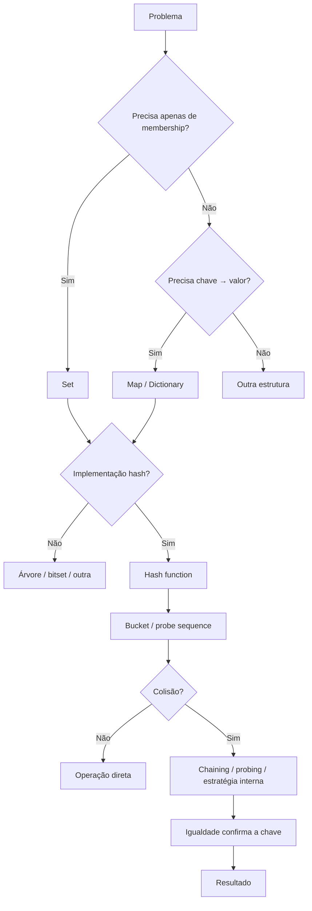

<a id="inicio"></a>

# Estruturas Associativas, Conjuntos e Hashing

> **Classificação geral:** `[D] no uso; [C → D] no mecanismo`  
> **Nível:** C — Algoritmos e Estruturas de Dados  
> **Posição na taxonomia:** tópico 29 — sexto tópico do Nível C  
> **Pré-requisitos principais:** T10 — Estruturas de Dados Elementares; T14 — Estado, Escopo, Referências e Mutabilidade; T15 — Coleções e Manipulação de Dados; T20 — Testes e Verificação; T24 — Correção e Análise de Algoritmos; T25 — Tipos Abstratos de Dados, Estruturas e Implementações; T26 — Algoritmos de Busca; T28 — Estruturas Lineares  
> **Aprofundamentos posteriores:** T30 — Filas de Prioridade e Heaps; T31 — Árvores; T32 — Grafos e Percursos Fundamentais; T33 — Estratégias Algorítmicas; T35 — Modelagem, Escolha de Estruturas e Trade-offs

---

## Resumo executivo

Estruturas associativas respondem a uma necessidade diferente das estruturas lineares: em vez de perguntar principalmente **"qual elemento está na posição `i`?"**, frequentemente perguntamos **"existe este valor?"** ou **"qual valor está associado a esta chave?"**.

Dois ADTs aparecem repetidamente:

```text
SET
valor → pertence / não pertence

MAP / DICTIONARY
chave → valor associado
```

Uma implementação extremamente comum desses ADTs é a **hash table**, mas é essencial não fundir os conceitos:

```text
ADT / contrato
Set ou Map
       ↓
pode ser implementado por
       ├── hash table
       ├── árvore balanceada
       ├── vetor/bitset em domínios específicos
       └── outras representações
```

Hashing adiciona outro nível:

```text
chave
  ↓
função hash
  ↓
valor hash / informação de localização
  ↓
bucket / sequência de sondagem / estrutura interna
  ↓
comparação de igualdade quando necessário
```

O ganho de desempenho não vem de uma frase mágica como **"hash é O(1)"**. Ele depende de hipóteses sobre distribuição, fator de carga, estratégia de colisão, custo do hash, igualdade e comportamento da implementação.

---

## Visão rápida

| Pergunta | Resposta curta |
|---|---|
| `Set` serve para quê? | unicidade e teste de pertinência; também operações de conjuntos quando a API oferece |
| `Map` / `Dictionary` serve para quê? | associação `chave → valor` |
| Set e Map são obrigatoriamente hash tables? | não |
| Hash function precisa ser criptográfica? | não para uma tabela hash comum; os objetivos são diferentes |
| Duas chaves diferentes podem ter o mesmo hash? | sim; colisões são inevitáveis no modelo geral |
| Hash igual significa chave igual? | não |
| Chaves iguais devem produzir hash compatível? | sim, conforme o contrato da implementação/linguagem |
| Colisão é erro? | não; é uma condição normal que precisa de estratégia de resolução |
| Chaining e open addressing são a mesma coisa? | não |
| Load factor mede o quê? | relação entre ocupação e capacidade segundo o modelo da tabela |
| Rehash é sempre apenas “recalcular um número”? | não; pode envolver redimensionar e redistribuir vários elementos |
| Hash table é `O(1)` no pior caso? | não como regra universal |
| Python `dict` preserva ordem de inserção? | sim, como garantia da linguagem atual |
| ECMAScript `Map` é obrigatoriamente uma hash table? | não; a especificação exige acesso médio sublinear, não uma representação física única |
| Java `HashMap` é explicitamente baseado em hash table? | sim |
| Bash tem arrays associativos? | sim; isso não autoriza inferir detalhes internos de hashing não documentados |
| Hashing pode ter implicação de segurança? | sim; colisões adversariais podem degradar desempenho em implementações vulneráveis |

---

## Regra de ouro

> **Set/Map descrevem o contrato; hashing descreve uma família de mecanismos para realizar associações. Não trate API, ADT e implementação interna como sinônimos.**

---

## Decisão rápida

```text
QUAL É A NECESSIDADE PRINCIPAL?
          │
          ├── preciso apenas de valores únicos / membership
          │       └── Set
          │
          ├── preciso associar chave → valor
          │       └── Map / Dictionary
          │
          ├── preciso manter chaves ordenadas / range queries
          │       └── uma estrutura ordenada pode ser melhor que hash
          │
          └── preciso entender por que Set/Map são rápidos em uma implementação hash
                  ↓
              estudar hashing
                  ├── função hash
                  ├── igualdade
                  ├── colisão
                  ├── load factor
                  ├── rehash
                  └── caso esperado × pior caso
```

---

<a id="visao-panoramica"></a>
## 🗺️ Visão panorâmica — o mapa antes dos detalhes

Esta seção funciona como **caderno rápido de consulta**, **modelo mental**, **índice conceitual**, **contrato de cobertura**, **ponte prática**, **ponte entre linguagens** e **referência de auditoria**. O detalhamento permanece nas seções numeradas; aqui o objetivo é recuperar o domínio em aproximadamente 30 segundos e saber para onde ir quando uma dúvida aparecer.

### O domínio inteiro em uma tela

```text
ESTRUTURAS ASSOCIATIVAS, CONJUNTOS E HASHING
│
├── ADTs / contratos
│   ├── Set
│   │   ├── unicidade
│   │   ├── membership
│   │   └── união / interseção / diferença
│   └── Map / Dictionary
│       ├── chave → valor
│       ├── lookup
│       ├── insert/update
│       └── delete
│
├── semântica da chave
│   ├── igualdade
│   ├── hashability / estabilidade da chave
│   ├── hash compatível com igualdade
│   └── ordem, quando houver, é outro contrato
│
├── implementação hash-based
│   ├── hash function
│   │   ├── determinística durante o uso da estrutura
│   │   ├── distribuição adequada
│   │   └── custo de cálculo
│   ├── colisões
│   │   ├── chaining
│   │   └── open addressing / probing
│   ├── ocupação
│   │   ├── load factor
│   │   ├── resize
│   │   └── rehash
│   └── custo
│       ├── esperado / amortizado
│       └── pior caso
│
├── segurança
│   ├── hash flooding / colisões adversariais
│   ├── amplificação de CPU
│   ├── limites de entrada
│   └── mitigação do runtime + desenho da aplicação
│
└── linguagens
    ├── Python      → set / frozenset / dict
    ├── JavaScript  → Set / Map; SameValueZero
    ├── Java        → Set/Map interfaces; HashSet/HashMap entre implementações
    └── Bash        → declare -A; associação textual, sem API geral de Set/hash
```

### Modelo mental mínimo

```text
qual pergunta preciso responder?
        ↓
unicidade / pertence? ───────→ Set
chave → valor? ──────────────→ Map / Dictionary
ordem/range/predecessor? ────→ talvez estrutura ordenada, não hash table
        ↓
se a implementação é hash-based:
        ↓
qual é a semântica de igualdade da chave?
        ↓
como a chave vira posição/candidato?
        ↓
como colisões são resolvidas?
        ↓
qual é o load factor e quando há resize/rehash?
        ↓
qual custo é esperado/amortizado e qual é o pior caso?
        ↓
a entrada pode ser adversarial?
```

A cadeia correta de raciocínio é:

```text
REQUISITO
→ ADT
→ semântica de chave/igualdade
→ estrutura/implementação
→ estratégia de colisão
→ ocupação/rehash
→ perfil de custo
→ robustez/segurança
```

### Tabela de consulta rápida

| Necessidade / conceito | Ideia central | Pergunta de controle | Destino detalhado |
|---|---|---|---|
| `Set` | valores distintos | preciso de unicidade/membership ou de chave→valor? | 3–5 |
| `Map` / Dictionary | `chave → valor` | a chave identifica unicamente o registro? | 6–8 |
| hash function | reduz/transforma a chave para localizar candidatos | igualdade e hash obedecem ao contrato da linguagem? | 9–10 |
| colisão | chaves distintas chegam à mesma região | qual estratégia preserva ambas as entradas? | 13–17 |
| chaining | bucket guarda múltiplas entradas | o custo da cadeia está crescendo? | 14 |
| open addressing | entradas ficam na própria tabela e seguem probing | deletion preserva a sequência de busca? | 15–17 |
| load factor | relaciona ocupação/capacidade conforme o modelo | a tabela está perto demais de cheia? | 18 |
| rehash | redistribui entradas para a nova capacidade/regra | todos os itens continuam recuperáveis? | 19 |
| custo esperado | depende de hipóteses de distribuição/ocupação | estou chamando `O(1)` de garantia universal? | 20–21 |
| segurança | entrada escolhida pode piorar colisões/custo | existe limite de volume e mitigação do runtime? | 22 e 32 |

### Não confundir

| Não confundir | Diferença operacional |
|---|---|
| Set × “lista sem repetição” | Set expressa unicidade/membership; ordem e indexação não fazem parte do contrato geral |
| Map × hash table | Map é ADT; pode ser realizado por hash table, árvore e outras estruturas |
| hash × igualdade | hash reduz candidatos; igualdade decide se a chave realmente corresponde |
| hash igual × chave igual | colisões permitem hashes/slots iguais para chaves distintas |
| colisão × duplicata | colisão é problema de localização; duplicata depende da igualdade/contrato de chave |
| hash de tabela × hash criptográfico | objetivos e propriedades são diferentes |
| expected `O(1)` × worst-case `O(1)` | expectativa/amortização não elimina entradas desfavoráveis ou rehash |
| average-case × amortized | média probabilística e distribuição de custo por sequência são conceitos distintos |
| insertion order × sorted order | preservar ordem de inserção não significa ordenar por chave |
| hashability × imutabilidade absoluta | depende do contrato da linguagem; o requisito essencial é estabilidade compatível com igualdade/hash durante o uso como chave |

### Pergunta → mecanismo / padrão

| Pergunta prática | Mecanismo / candidato | O que verificar antes de fechar a escolha |
|---|---|---|
| “já vi este valor?” | Set | semântica de igualdade e custo de construção |
| “qual registro pertence a este ID?” | Map | chave estável e ausência versus valor nulo/vazio |
| “quantas vezes ocorreu?” | Map `valor → contador` | inicialização e atualização corretas |
| “quero união/interseção” | Set | API da linguagem e custo de materialização |
| “preciso de chaves em faixa ordenada” | árvore/mapa ordenado ou outra estrutura | hash table comum não fornece range query por natureza |
| “lookup ficou lento” | medir distribuição/load factor/rehash | não inferir causa apenas por um benchmark |
| “delete quebrou buscas posteriores” | revisar open addressing/tombstone | slot vazio pode encerrar probing cedo demais |
| “duas chaves diferentes se misturaram” | revisar collision resolution + equality | nunca usar hash como prova de igualdade |
| “estrutura explode sob input externo” | limites + mitigação de hash flooding | volume, tamanho das chaves, CPU e estratégia da implementação |

### Microexemplos que fixam o modelo

**Set — unicidade:**

```python
seen = {"dns", "dhcp"}
seen.add("dns")
assert len(seen) == 2
assert "dhcp" in seen
```

**Map — associação:**

```javascript
const retries = new Map();
retries.set("radius", 2);
retries.set("radius", retries.get("radius") + 1);
console.assert(retries.get("radius") === 3);
```

**Colisão não é igualdade:**

```text
k1 ──hash──┐
           ├── mesmo bucket
k2 ──hash──┘

k1 != k2 ainda pode ser verdade
→ a estrutura precisa comparar a chave real
```

**Open addressing — deletion:**

```text
A → slot 2
B → slot 2 ocupado → slot 3

apagar A:
slot 2 = VAZIO     ← pode quebrar a busca por B
slot 2 = TOMBSTONE ← preserva a continuidade do probing
```

### Transferência entre as quatro linguagens

| Linguagem | Abstrações úteis | Semântica que merece atenção |
|---|---|---|
| Python | `set`, `frozenset`, `dict` | elementos/chaves hashable; igualdade compatível com hash; `dict` preserva inserção, `set` não promete ordem |
| JavaScript | `Set`, `Map` | distinção por `SameValueZero`; objetos são chaves por identidade de referência; a especificação não exige hash table física |
| Java | `Set`, `Map`, `HashSet`, `HashMap` | interface ≠ implementação; `equals()`/`hashCode()` precisam permanecer coerentes; não depender da ordem de `HashMap`/`HashSet` |
| Bash | `declare -A` | chaves são strings e não podem ser vazias; quoting e teste de existência importam; não há promessa de API de hash/Set |

### Falhas que precisam de destino explícito

As classes práticas desta revisão estão formalizadas em `PR-T29-01`–`PR-T29-10`. As mais importantes são:

```text
ADT confundido com implementação
hash usado como igualdade
chave mutável / hash inconsistente
colisão sem resolução
open addressing sem tombstone correto
load factor ignorado
"HashMap = O(1)" universal
ordem de iteração presumida
semântica de chave específica da linguagem ignorada
hash flooding / amplificação de recursos
```

Quando o problema já está ocorrendo, vá direto para **[🔎 Troubleshooting sistemático](#troubleshooting-sistematico)**.

### Duas rotas de uso

**Consulta rápida:**

```text
Visão panorâmica
→ tabela de consulta
→ Não confundir
→ PR-T29-* / Troubleshooting
→ seção numerada específica
```

**Estudo completo:**

```text
ADT Set/Map
→ chave/igualdade
→ hash function
→ colisões
→ chaining/open addressing
→ load factor/rehash
→ custos
→ segurança
→ diferenças de linguagem
→ LABs
→ QA
```

### Síntese multifonte desta revisão

As fontes foram usadas de forma complementar, não por colagem:

- **CLRS**: formaliza colisões, chaining, open addressing, load factor e expected × worst-case;
- **Skiena**: conecta hashing à escolha prática de implementação de dictionaries e aos trade-offs de memória/desempenho;
- **La Rocca**: constrói a ponte pedagógica ADT → estrutura → hash table e mostra chaining/probing passo a passo;
- **Ramalho**: aprofunda o contrato de hashability/igualdade e as consequências reais de `dict`/`set` em Python;
- **documentação oficial atual**: decide a semântica vigente de Python 3.14.7, ECMAScript 2026, Java SE/JDK 27 e GNU Bash 5.3.

Nenhuma fonte isolada é tratada como suficiente para definir simultaneamente teoria geral, implementação interna e semântica atual de todas as linguagens.

---

# Índice

## Índice essencial

- [PARTE I — Contexto, Set/Map e abstrações](#parte-i)
- [PARTE II — Hashing, colisões, probing, load factor e complexidade](#parte-ii)
- [PARTE III — Segurança e semântica nas linguagens](#parte-iii)
- [PARTE IV — Antipadrões, troubleshooting, decisão e exemplos](#parte-iv)
- [PARTE V — LABs, exercícios e evidências de domínio](#parte-v)
- [APÊNDICES — taxonomia, fontes, QA e histórico](#apendices)

Atalhos:

- [Visão panorâmica](#visao-panoramica)
- [Inventário PR-T29-*](#inventario-pr-t29)
- [Troubleshooting sistemático](#troubleshooting-sistematico)
- [Comparativo conceitual de custos](#21-comparativo-conceitual-de-custos)
- [Glossário](#45-glossário)

<details>
<summary><strong>Índice detalhado</strong></summary>

- [🗺️ Visão panorâmica — o mapa antes dos detalhes](#visao-panoramica)
- [21.1 Inventário formal de problemas reais — `PR-T29-*`](#inventario-pr-t29)
- [🔎 Troubleshooting sistemático](#troubleshooting-sistematico)
- [1. Posição deste assunto na trilha](#1-posição-deste-assunto-na-trilha)
  - [1.1 O que T25 entregou](#11-o-que-t25-entregou)
  - [1.2 O que T26 entregou](#12-o-que-t26-entregou)
  - [1.3 O que T28 entregou](#13-o-que-t28-entregou)
  - [1.4 Fronteira com T30](#14-fronteira-com-t30)
  - [1.5 Fronteira com T31](#15-fronteira-com-t31)
  - [1.6 Fronteira com T35](#16-fronteira-com-t35)
- [2. Modelo mental — valor, chave, igualdade e localização](#2-modelo-mental--valor-chave-igualdade-e-localização)
  - [2.1 Estrutura associativa não é “array com índice bonito”](#21-estrutura-associativa-não-é-array-com-índice-bonito)
  - [2.2 Chave, valor e registro](#22-chave-valor-e-registro)
  - [2.3 Set pode ser visto como associação sem valor separado](#23-set-pode-ser-visto-como-associação-sem-valor-separado)
  - [2.4 Igualdade e hash resolvem perguntas diferentes](#24-igualdade-e-hash-resolvem-perguntas-diferentes)
  - [2.5 Hash não é identidade global](#25-hash-não-é-identidade-global)
- [3. 29.1 — Set `[D]`](#3-291--set-d)
  - [3.1 Contrato essencial](#31-contrato-essencial)
  - [3.2 Unicidade](#32-unicidade)
  - [3.3 Pertinência / membership](#33-pertinência--membership)
  - [3.4 Deduplicação não é a única utilidade](#34-deduplicação-não-é-a-única-utilidade)
  - [3.5 Set não significa “lista sem repetição”](#35-set-não-significa-lista-sem-repetição)
  - [3.6 Set e ordem](#36-set-e-ordem)
- [4. Operações de conjunto](#4-operações-de-conjunto)
  - [4.1 União](#41-união)
  - [4.2 Interseção](#42-interseção)
  - [4.3 Diferença](#43-diferença)
  - [4.4 Diferença simétrica](#44-diferença-simétrica)
  - [4.5 Relações](#45-relações)
  - [4.6 Não substituir automaticamente por loops manuais](#46-não-substituir-automaticamente-por-loops-manuais)
- [5. Set nas quatro linguagens canônicas](#5-set-nas-quatro-linguagens-canônicas)
  - [5.1 Python — `set` e `frozenset`](#51-python--set-e-frozenset)
  - [5.2 JavaScript / ECMAScript — `Set`](#52-javascript--ecmascript--set)
  - [5.3 Java — `Set` e `HashSet`](#53-java--set-e-hashset)
  - [5.4 GNU Bash — simulação por array associativo](#54-gnu-bash--simulação-por-array-associativo)
- [6. 29.2 — Map / Dictionary `[D]`](#6-292--map--dictionary-d)
  - [6.1 Contrato essencial](#61-contrato-essencial)
  - [6.2 Indexar registros por ID](#62-indexar-registros-por-id)
  - [6.3 Contar ocorrências](#63-contar-ocorrências)
  - [6.4 Agrupar dados](#64-agrupar-dados)
  - [6.5 Cache](#65-cache)
  - [6.6 Configuração](#66-configuração)
- [7. Map / Dictionary nas quatro linguagens](#7-map--dictionary-nas-quatro-linguagens)
  - [7.1 Python — `dict`](#71-python--dict)
  - [7.2 JavaScript — `Map`](#72-javascript--map)
  - [7.3 Java — `Map` / `HashMap`](#73-java--map--hashmap)
  - [7.4 GNU Bash — array associativo](#74-gnu-bash--array-associativo)
  - [7.5 Ausência versus valor nulo/vazio](#75-ausência-versus-valor-nulovazio)
- [8. Set e Map como ADTs — não como implementações universais](#8-set-e-map-como-adts--não-como-implementações-universais)
  - [8.1 Um Map pode ser árvore](#81-um-map-pode-ser-árvore)
  - [8.2 Um Set pode ser bitset](#82-um-set-pode-ser-bitset)
  - [8.3 Por que a abstração importa](#83-por-que-a-abstração-importa)
  - [8.4 O erro do nome](#84-o-erro-do-nome)
- [9. 29.3 — Hash function `[C]`](#9-293--hash-function-c)
  - [9.1 Ideia central](#91-ideia-central)
  - [9.2 Determinismo no contexto da estrutura](#92-determinismo-no-contexto-da-estrutura)
  - [9.3 Distribuição](#93-distribuição)
  - [9.4 Custo do hash](#94-custo-do-hash)
  - [9.5 Hash de tabela não é hash criptográfico](#95-hash-de-tabela-não-é-hash-criptográfico)
- [10. Igualdade e contrato de hash](#10-igualdade-e-contrato-de-hash)
  - [10.1 Regra geral](#101-regra-geral)
  - [10.2 Python — `__eq__` e `__hash__`](#102-python--__eq__-e-__hash__)
  - [10.3 Java — `equals()` e `hashCode()`](#103-java--equals-e-hashcode)
  - [10.4 JavaScript — `Map`/`Set` não expõem um protocolo `hashCode`](#104-javascript--mapset-não-expõem-um-protocolo-hashcode)
  - [10.5 Bash — não inventar contrato de hash público](#105-bash--não-inventar-contrato-de-hash-público)
- [11. Hash table didática — estrutura mínima](#11-hash-table-didática--estrutura-mínima)
  - [11.1 Componentes](#111-componentes)
  - [11.2 Invariantes](#112-invariantes)
  - [11.3 Pseudocódigo — busca com chaining](#113-pseudocódigo--busca-com-chaining)
  - [11.4 Pseudocódigo — inserção](#114-pseudocódigo--inserção)
  - [11.5 Separar didática de produção](#115-separar-didática-de-produção)
- [12. Implementação didática por chaining — Python](#12-implementação-didática-por-chaining--python)
  - [12.1 O que este código ensina](#121-o-que-este-código-ensina)
  - [12.2 O que ele não ensina ainda](#122-o-que-ele-não-ensina-ainda)
- [13. 29.4 — Colisões são inevitáveis no modelo geral `[C]`](#13-294--colisões-são-inevitáveis-no-modelo-geral-c)
  - [13.1 Princípio](#131-princípio)
  - [13.2 Colisão não significa chave duplicada](#132-colisão-não-significa-chave-duplicada)
  - [13.3 Uma boa função reduz concentração, não elimina a necessidade de resolução](#133-uma-boa-função-reduz-concentração-não-elimina-a-necessidade-de-resolução)
  - [13.4 Consequência didática](#134-consequência-didática)
- [14. Chaining](#14-chaining)
  - [14.1 Ideia](#141-ideia)
  - [14.2 Busca](#142-busca)
  - [14.3 Load factor em chaining](#143-load-factor-em-chaining)
  - [14.4 Vantagens conceituais](#144-vantagens-conceituais)
  - [14.5 Custos e limites](#145-custos-e-limites)
- [15. Open addressing / probing](#15-open-addressing--probing)
  - [15.1 Ideia](#151-ideia)
  - [15.2 Busca precisa repetir a mesma lógica](#152-busca-precisa-repetir-a-mesma-lógica)
  - [15.3 Linear probing](#153-linear-probing)
  - [15.4 Outras estratégias](#154-outras-estratégias)
  - [15.5 Clustering](#155-clustering)
  - [15.6 Load factor é especialmente importante](#156-load-factor-é-especialmente-importante)
- [16. Remoção em open addressing — a armadilha do slot vazio](#16-remoção-em-open-addressing--a-armadilha-do-slot-vazio)
  - [16.1 Por que simplesmente apagar pode quebrar buscas](#161-por-que-simplesmente-apagar-pode-quebrar-buscas)
  - [16.2 Tombstone / marcador de removido](#162-tombstone--marcador-de-removido)
  - [16.3 Estado adicional aumenta a complexidade](#163-estado-adicional-aumenta-a-complexidade)
- [17. Implementação didática — linear probing](#17-implementação-didática--linear-probing)
  - [17.1 A regra crucial ao reutilizar tombstones](#171-a-regra-crucial-ao-reutilizar-tombstones)
- [18. 29.5 — Load factor e rehash `[C]`](#18-295--load-factor-e-rehash-c)
  - [18.1 Definição conceitual](#181-definição-conceitual)
  - [18.2 Por que importa](#182-por-que-importa)
  - [18.3 Resize](#183-resize)
  - [18.4 Rehash](#184-rehash)
  - [18.5 Custo episódico](#185-custo-episódico)
  - [18.6 Java `HashMap`](#186-java-hashmap)
  - [18.7 Não transportar constantes entre linguagens](#187-não-transportar-constantes-entre-linguagens)
- [19. Rehash didático passo a passo](#19-rehash-didático-passo-a-passo)
  - [19.1 Consequência](#191-consequência)
  - [19.2 Invariante após resize](#192-invariante-após-resize)
- [20. 29.6 — Complexidade esperada × pior caso `[C]`](#20-296--complexidade-esperada--pior-caso-c)
  - [20.1 A frase proibida](#201-a-frase-proibida)
  - [20.2 Formulação melhor](#202-formulação-melhor)
  - [20.3 Chaining clássico](#203-chaining-clássico)
  - [20.4 Pior caso](#204-pior-caso)
  - [20.5 Open addressing](#205-open-addressing)
  - [20.6 Hashing não elimina o custo da chave](#206-hashing-não-elimina-o-custo-da-chave)
  - [20.7 Complexidade do ADT não é igual em toda implementação](#207-complexidade-do-adt-não-é-igual-em-toda-implementação)
- [21. Comparativo conceitual de custos](#21-comparativo-conceitual-de-custos)
- [22. 29.7 — Segurança `[C]`](#22-297--segurança-c)
  - [22.1 Por que hashing entra em segurança](#221-por-que-hashing-entra-em-segurança)
  - [22.2 Hash flooding / collision attack — modelo mental](#222-hash-flooding--collision-attack--modelo-mental)
  - [22.3 Python — randomização de hash](#223-python--randomização-de-hash)
  - [22.4 Java — colisões continuam relevantes](#224-java--colisões-continuam-relevantes)
  - [22.5 ECMAScript](#225-ecmascript)
  - [22.6 Bash](#226-bash)
  - [22.7 Defesa em profundidade](#227-defesa-em-profundidade)
- [23. Python — detalhes importantes para T29](#23-python--detalhes-importantes-para-t29)
  - [23.1 Chaves precisam ser hashable](#231-chaves-precisam-ser-hashable)
  - [23.2 Ordem do `dict`](#232-ordem-do-dict)
  - [23.3 Ordem de `set`](#233-ordem-de-set)
  - [23.4 Hash randomization](#234-hash-randomization)
  - [23.5 Chave mutável por estado lógico](#235-chave-mutável-por-estado-lógico)
- [24. JavaScript / ECMAScript — detalhes importantes para T29](#24-javascript--ecmascript--detalhes-importantes-para-t29)
  - [24.1 `Map` não é `Object`](#241-map-não-é-object)
  - [24.2 SameValueZero](#242-samevaluezero)
  - [24.3 Sublinear médio, não hash table obrigatória](#243-sublinear-médio-não-hash-table-obrigatória)
  - [24.4 Ordem de iteração](#244-ordem-de-iteração)
  - [24.5 Não inventar `hashCode()`](#245-não-inventar-hashcode)
- [25. Java — detalhes importantes para T29](#25-java--detalhes-importantes-para-t29)
  - [25.1 `Map` versus `HashMap`](#251-map-versus-hashmap)
  - [25.2 `HashSet`](#252-hashset)
  - [25.3 Load factor](#253-load-factor)
  - [25.4 `equals` / `hashCode`](#254-equals--hashcode)
  - [25.5 Chaves mutáveis](#255-chaves-mutáveis)
  - [25.6 Ordem](#256-ordem)
- [26. GNU Bash — arrays associativos com limites claros](#26-gnu-bash--arrays-associativos-com-limites-claros)
  - [26.1 Criação](#261-criação)
  - [26.2 Inserção e atualização](#262-inserção-e-atualização)
  - [26.3 Teste de presença](#263-teste-de-presença)
  - [26.4 Iteração](#264-iteração)
  - [26.5 Chave vazia](#265-chave-vazia)
  - [26.6 Set simulado](#266-set-simulado)
  - [26.7 Quando não insistir em Bash](#267-quando-não-insistir-em-bash)
- [27. “HashMap = O(1)” e outros antipadrões](#27-hashmap--o1-e-outros-antipadrões)
  - [27.1 Antipadrão — complexidade sem hipótese](#271-antipadrão--complexidade-sem-hipótese)
  - [27.2 Antipadrão — hash igual significa igualdade](#272-antipadrão--hash-igual-significa-igualdade)
  - [27.3 Antipadrão — chave mutável](#273-antipadrão--chave-mutável)
  - [27.4 Antipadrão — usar lista para membership intenso](#274-antipadrão--usar-lista-para-membership-intenso)
  - [27.5 Antipadrão — Set para preservar multiplicidade](#275-antipadrão--set-para-preservar-multiplicidade)
  - [27.6 Antipadrão — confiar na ordem acidental](#276-antipadrão--confiar-na-ordem-acidental)
  - [27.7 Antipadrão — reimplementar por “performance” sem medir](#277-antipadrão--reimplementar-por-performance-sem-medir)
- [28. Escolha prática — Set, Map ou outra estrutura?](#28-escolha-prática--set-map-ou-outra-estrutura)
  - [28.1 Critérios adicionais](#281-critérios-adicionais)
- [29. Exemplo progressivo — de busca linear a índice associativo](#29-exemplo-progressivo--de-busca-linear-a-índice-associativo)
  - [29.1 Estado inicial — lista de registros](#291-estado-inicial--lista-de-registros)
  - [29.2 Construir índice](#292-construir-índice)
  - [29.3 Acrescentar conjunto](#293-acrescentar-conjunto)
  - [29.4 Não duplicar fontes de verdade sem política](#294-não-duplicar-fontes-de-verdade-sem-política)
- [30. Exemplo comparativo — contagem de ocorrências nas quatro linguagens](#30-exemplo-comparativo--contagem-de-ocorrências-nas-quatro-linguagens)
  - [30.1 Python](#301-python)
  - [30.2 JavaScript](#302-javascript)
  - [30.3 Java](#303-java)
  - [30.4 Bash](#304-bash)
  - [30.5 Transferência](#305-transferência)
- [31. Diagrama — do ADT à colisão](#31-diagrama--do-adt-à-colisão)
- [32. Segurança e robustez — checklist operacional](#32-segurança-e-robustez--checklist-operacional)
- [33. 🧪 LAB 1 — Deduplicação e membership com Set](#33--lab-1--deduplicação-e-membership-com-set)
  - [Objetivo](#objetivo)
  - [Pré-requisitos](#pré-requisitos)
  - [Estado inicial](#estado-inicial)
  - [Tarefa](#tarefa)
  - [Procedimento](#procedimento)
  - [O que observar](#o-que-observar)
  - [Testes](#testes)
  - [Explicação](#explicação)
  - [Variação / transferência](#variação--transferência)
  - [Limpeza](#limpeza)
- [34. 🧪 LAB 2 — Mapa de contagens](#34--lab-2--mapa-de-contagens)
  - [Objetivo](#objetivo-1)
  - [Pré-requisitos](#pré-requisitos-1)
  - [Estado inicial](#estado-inicial-1)
  - [Tarefa](#tarefa-1)
  - [Procedimento](#procedimento-1)
  - [O que observar](#o-que-observar-1)
  - [Testes](#testes-1)
  - [Explicação](#explicação-1)
  - [Variação / transferência](#variação--transferência-1)
  - [Limpeza](#limpeza-1)
- [35. 🧪 LAB 3 — Colisões com chaining](#35--lab-3--colisões-com-chaining)
  - [Objetivo](#objetivo-2)
  - [Pré-requisitos](#pré-requisitos-2)
  - [Estado inicial](#estado-inicial-2)
  - [Tarefa](#tarefa-2)
  - [Procedimento](#procedimento-2)
  - [O que observar](#o-que-observar-2)
  - [Testes](#testes-2)
  - [Explicação](#explicação-2)
  - [Variação / transferência](#variação--transferência-2)
  - [Limpeza](#limpeza-2)
- [36. 🧪 LAB 4 — Open addressing e tombstone](#36--lab-4--open-addressing-e-tombstone)
  - [Objetivo](#objetivo-3)
  - [Pré-requisitos](#pré-requisitos-3)
  - [Estado inicial](#estado-inicial-3)
  - [Tarefa](#tarefa-3)
  - [Procedimento](#procedimento-3)
  - [O que observar](#o-que-observar-3)
  - [Testes](#testes-3)
  - [Explicação](#explicação-3)
  - [Variação / transferência](#variação--transferência-3)
  - [Limpeza](#limpeza-3)
- [37. 🧪 LAB 5 — Load factor e rehash](#37--lab-5--load-factor-e-rehash)
  - [Objetivo](#objetivo-4)
  - [Pré-requisitos](#pré-requisitos-4)
  - [Estado inicial](#estado-inicial-4)
  - [Tarefa](#tarefa-4)
  - [Procedimento](#procedimento-4)
  - [O que observar](#o-que-observar-4)
  - [Testes](#testes-4)
  - [Explicação](#explicação-4)
  - [Variação / transferência](#variação--transferência-4)
  - [Limpeza](#limpeza-4)
- [38. 🧪 LAB 6 — Igualdade, hash e chaves mutáveis](#38--lab-6--igualdade-hash-e-chaves-mutáveis)
  - [Objetivo](#objetivo-5)
  - [Pré-requisitos](#pré-requisitos-5)
  - [Estado inicial](#estado-inicial-5)
  - [Tarefa](#tarefa-5)
  - [Procedimento](#procedimento-5)
  - [O que observar](#o-que-observar-5)
  - [Testes](#testes-5)
  - [Explicação](#explicação-5)
  - [Variação / transferência](#variação--transferência-5)
  - [Limpeza](#limpeza-5)
- [39. 🧪 LAB 7 — Colisões adversariais e custo observado](#39--lab-7--colisões-adversariais-e-custo-observado)
  - [Objetivo](#objetivo-6)
  - [Pré-requisitos](#pré-requisitos-6)
  - [Estado inicial](#estado-inicial-6)
  - [Tarefa](#tarefa-6)
  - [Procedimento](#procedimento-6)
  - [O que observar](#o-que-observar-6)
  - [Testes](#testes-6)
  - [Explicação](#explicação-6)
  - [Variação / transferência](#variação--transferência-6)
  - [Limpeza](#limpeza-6)
- [40. 🧪 LAB 8 — Escolha Set/Map por requisito](#40--lab-8--escolha-setmap-por-requisito)
  - [Objetivo](#objetivo-7)
  - [Pré-requisitos](#pré-requisitos-7)
  - [Estado inicial](#estado-inicial-7)
  - [Tarefa](#tarefa-7)
  - [Procedimento](#procedimento-7)
  - [O que observar](#o-que-observar-7)
  - [Testes](#testes-7)
  - [Explicação](#explicação-7)
  - [Variação / transferência](#variação--transferência-7)
  - [Limpeza](#limpeza-7)
- [41. Exercícios de fixação](#41-exercícios-de-fixação)
- [42. Questões de diagnóstico](#42-questões-de-diagnóstico)
  - [42.1 Cenário A](#421-cenário-a)
  - [42.2 Cenário B](#422-cenário-b)
  - [42.3 Cenário C](#423-cenário-c)
  - [42.4 Cenário D](#424-cenário-d)
  - [42.5 Cenário E](#425-cenário-e)
- [43. Evidências de domínio](#43-evidências-de-domínio)
- [44. Checklist de domínio](#44-checklist-de-domínio)
- [45. Glossário](#45-glossário)
- [46. Auditoria de cobertura da taxonomia](#46-auditoria-de-cobertura-da-taxonomia)
  - [46.1 Fronteira preservada com T30](#461-fronteira-preservada-com-t30)
  - [46.2 Fronteira preservada com T31](#462-fronteira-preservada-com-t31)
  - [46.3 Fronteira preservada com T35](#463-fronteira-preservada-com-t35)
  - [46.4 Bash sem equivalência artificial](#464-bash-sem-equivalência-artificial)
- [47. Auditoria da File Library](#47-auditoria-da-file-library)
  - [47.1 Fontes locais efetivamente consultadas](#471-fontes-locais-efetivamente-consultadas)
  - [47.2 Como a biblioteca alterou o documento](#472-como-a-biblioteca-alterou-o-documento)
  - [47.3 Fontes encontradas, mas não usadas como autoridade normativa](#473-fontes-encontradas-mas-não-usadas-como-autoridade-normativa)
  - [47.4 Hierarquia de autoridade](#474-hierarquia-de-autoridade)
- [48. Referências](#48-referências)
  - [48.1 Contratos canônicos](#481-contratos-canônicos)
  - [48.2 Literatura local efetivamente consultada](#482-literatura-local-efetivamente-consultada)
  - [48.3 Python — documentação oficial](#483-python--documentação-oficial)
  - [48.4 ECMAScript — especificação oficial](#484-ecmascript--especificação-oficial)
  - [48.5 Java — documentação oficial](#485-java--documentação-oficial)
  - [48.6 GNU Bash](#486-gnu-bash)
- [49. QA e evidências](#49-qa-e-evidências)
  - [49.1 `[D]` Evidência documental](#491-d-evidência-documental)
  - [49.2 `[S]` Validação estrutural/estática](#492-s-validação-estruturalestática)
  - [49.3 `[R]` Reprodução em runtime](#493-r-reprodução-em-runtime)
  - [49.4 Limitações](#494-limitações)
- [50. Histórico de versões](#50-histórico-de-versões)

</details>

<a id="parte-i"></a>

# PARTE I — Contexto, Set/Map e abstrações

# 1. Posição deste assunto na trilha

## 1.1 O que T25 entregou

T25 separou **ADT/TAD**, **estrutura de dados** e **implementação concreta**. Essa distinção é indispensável aqui.

```text
Map / Dictionary = ADT
Hash table        = uma possível estrutura/implementação
TreeMap           = outra família de implementação
```

Portanto, a expressão "um Map é uma hash table" é ampla demais. Um `Map` pode ser implementado por hashing, árvore, estrutura persistente ou outro mecanismo que satisfaça seu contrato.

## 1.2 O que T26 entregou

T26 mostrou que o custo de encontrar uma informação depende da representação e de suas pré-condições. Hashing é outra estratégia para reduzir o espaço de busca, mas troca ordenação estrutural por uma função que direciona a procura.

## 1.3 O que T28 entregou

T28 trabalhou sequências, posição lógica e políticas como LIFO/FIFO. T29 muda a pergunta principal:

```text
T28 → onde está na sequência?
T29 → este valor existe? / qual valor corresponde a esta chave?
```

## 1.4 Fronteira com T30

Priority Queue e Heap pertencem ao T30. Um Map pode ser usado como índice auxiliar para uma fila de prioridade, mas isso não transforma hashing em heap.

## 1.5 Fronteira com T31

Árvores de busca podem implementar dicionários e conjuntos ordenados. T29 menciona essa alternativa apenas para impedir a equivalência "Map = hash table"; árvores serão aprofundadas no T31.

## 1.6 Fronteira com T35

T29 ensina critérios locais de escolha — membership, associação, ordenação, custo esperado e segurança. A modelagem multicritério e seleção sistemática de estruturas fica para T35.

[↑ Voltar ao índice](#índice)

# 2. Modelo mental — valor, chave, igualdade e localização

## 2.1 Estrutura associativa não é “array com índice bonito”

Um array tradicional usa uma posição numérica dentro de um domínio relativamente compacto:

```text
array[0]
array[1]
array[2]
```

Um dicionário pode receber chaves de um domínio muito maior:

```text
"router-pe-001" → registro
"client-8721"   → sessão
"dns-zone-A"    → configuração
```

Reservar uma posição física para toda chave possível seria inviável. Hashing tenta comprimir esse universo de chaves em uma tabela muito menor.

## 2.2 Chave, valor e registro

Em um Map:

```text
chave → valor
```

A chave identifica logicamente a associação. O valor pode ser qualquer dado permitido pelo contrato da linguagem/API.

Exemplo conceitual:

```text
"edge-01" → {site: "lab-a", status: "up"}
"edge-02" → {site: "lab-b", status: "down"}
```

## 2.3 Set pode ser visto como associação sem valor separado

Conceitualmente, um Set registra apenas a presença do elemento:

```text
"10.0.0.1" ∈ allowed_addresses
```

Uma implementação pode reaproveitar mecanismos de Map internamente, mas isso é detalhe de implementação e não a definição do ADT.

## 2.4 Igualdade e hash resolvem perguntas diferentes

Uma função hash produz uma informação resumida usada para acelerar a localização. Igualdade decide se duas chaves representam a mesma chave segundo o contrato.

```text
hash(k1) != hash(k2)
→ em muitos modelos, k1 e k2 certamente não são iguais

hash(k1) == hash(k2)
→ ainda NÃO prova que k1 == k2
```

É justamente por isso que colisões precisam ser resolvidas.

## 2.5 Hash não é identidade global

Um hash de tabela:

- não é necessariamente único;
- não é necessariamente estável entre processos;
- não é necessariamente persistente;
- não é necessariamente criptograficamente seguro;
- não deve ser usado como substituto automático de ID, checksum criptográfico ou assinatura.

[↑ Voltar ao índice](#índice)

# 3. 29.1 — Set `[D]`

## 3.1 Contrato essencial

Um Set representa uma coleção em que cada valor distinto ocorre no máximo uma vez segundo a relação de igualdade adotada pela estrutura.

Operações conceituais:

```text
add(x)
remove(x)
contains(x)
size()
```

Quando disponíveis:

```text
union(A, B)
intersection(A, B)
difference(A, B)
symmetric_difference(A, B)
```

## 3.2 Unicidade

Se o problema é "quero apenas itens únicos", Set expressa diretamente a intenção.

### Exemplo mínimo — Python

```python
addresses: set[str] = {"192.0.2.10", "192.0.2.10", "198.51.100.20"}
print(len(addresses))
```

Saída esperada:

```text
2
```

## 3.3 Pertinência / membership

Problema:

> já vi este identificador?

Em vez de percorrer uma lista inteira a cada consulta, um Set apropriado permite modelar a pergunta de forma direta.

```python
seen: set[str] = {"REQ-100", "REQ-101"}
print("REQ-101" in seen)
```

## 3.4 Deduplicação não é a única utilidade

Sets também representam naturalmente:

- permissões/capacidades;
- tags;
- conjuntos de IDs ativos;
- nós visitados em algoritmos;
- diferença entre inventários;
- interseção entre grupos.

## 3.5 Set não significa “lista sem repetição”

Uma lista ainda possui posição e multiplicidade. Um Set modela outra abstração.

```text
["A", "A", "B"]
→ sequência; multiplicidade importa

{"A", "B"}
→ conjunto; multiplicidade não faz parte do estado abstrato
```

## 3.6 Set e ordem

A ordem faz parte do contrato de algumas implementações e não de outras. Não conclua que "Set é sempre desordenado" em sentido de iteração física, nem que a ordem observada seja uma garantia quando a documentação não a promete.

[↑ Voltar ao índice](#índice)

# 4. Operações de conjunto

## 4.1 União

```text
A = {A, B, C}
B = {B, C, D}

A ∪ B = {A, B, C, D}
```

## 4.2 Interseção

```text
A ∩ B = {B, C}
```

## 4.3 Diferença

```text
A - B = {A}
B - A = {D}
```

Diferença não é comutativa.

## 4.4 Diferença simétrica

Itens presentes em exatamente um dos conjuntos:

```text
A △ B = {A, D}
```

## 4.5 Relações

Dependendo da API, também aparecem:

- subconjunto;
- superconjunto;
- disjunção.

## 4.6 Não substituir automaticamente por loops manuais

Quando a linguagem/biblioteca possui operação de conjunto que expressa diretamente a intenção, ela costuma produzir código mais declarativo e menos sujeito a erros do que múltiplos loops com flags.

[↑ Voltar ao índice](#índice)

# 5. Set nas quatro linguagens canônicas

## 5.1 Python — `set` e `frozenset`

```python
active: set[str] = {"r1", "r2", "r3"}
maintenance: set[str] = {"r3", "r4"}

print(active & maintenance)
print(active - maintenance)
print(active | maintenance)
```

Pontos importantes:

- os elementos precisam ser hashable;
- `set` é mutável;
- `frozenset` é imutável/hashable quando seus elementos também permitem isso;
- a ordem de iteração de `set` não é uma garantia de linguagem;
- `dict`, diferentemente de `set`, preserva ordem de inserção nas versões atuais.

## 5.2 JavaScript / ECMAScript — `Set`

```javascript
const active = new Set(["r1", "r2", "r3"]);
active.add("r3");
console.log(active.size); // 3
console.log(active.has("r2")); // true
```

ECMAScript define a unicidade por **SameValueZero**. Isso tem consequências específicas:

```javascript
const values = new Set([NaN, NaN, +0, -0]);
console.log(values.size); // 2
```

Objetos são comparados conforme identidade/referência no modelo da linguagem:

```javascript
const a = { id: 1 };
const b = { id: 1 };
const values = new Set([a, b]);
console.log(values.size); // 2
```

A especificação não exige uma hash table específica: exige mecanismo com acesso médio sublinear.

Na baseline ECMAScript 2026, `Set` também expõe operações nativas de composição/relacionamento, como:

```javascript
const left = new Set(["r1", "r2", "r3"]);
const right = new Set(["r3", "r4"]);

console.log(left.intersection(right)); // Set {"r3"}
console.log(left.union(right));        // Set {"r1", "r2", "r3", "r4"}
console.log(left.difference(right));   // Set {"r1", "r2"}
console.log(left.isDisjointFrom(new Set(["x"]))); // true
```

Esses métodos são parte da API de `Set`; continuam sem transformar `Set` em uma garantia de representação física específica.

## 5.3 Java — `Set` e `HashSet`

> **Nota de execução dos snippets Java:** blocos Java curtos neste tópico podem ser fragmentos destinados ao **JShell** ou ao corpo de um método. Quando um exemplo se pretender uma *compilation unit* completa, isso será indicado explicitamente.

```java
import java.util.HashSet;
import java.util.Set;

Set<String> active = new HashSet<>();
active.add("r1");
active.add("r1");
System.out.println(active.size()); // 1
```

`Set` é a interface; `HashSet` é uma implementação baseada em hash table. Não confunda os dois níveis.

## 5.4 GNU Bash — simulação por array associativo

Bash não oferece um ADT `Set` separado. Uma convenção possível é usar as chaves de um array associativo:

```bash
declare -A seen=()
seen["r1"]=1
seen["r2"]=1
seen["r1"]=1

if [[ -v 'seen[r2]' ]]; then
  printf '%s\n' 'r2 presente'
fi
```

Isso é uma **transferência conceitual**, não prova que Bash expõe o mesmo contrato/API de `Set` das demais linguagens.

[↑ Voltar ao índice](#índice)

# 6. 29.2 — Map / Dictionary `[D]`

## 6.1 Contrato essencial

Um Map associa chaves distintas a valores:

```text
key → value
```

Operações conceituais:

```text
put(key, value)
get(key)
contains_key(key)
remove(key)
size()
```

## 6.2 Indexar registros por ID

```text
id → registro
```

Exemplo:

```python
devices: dict[str, dict[str, str]] = {
    "PE-01": {"site": "LAB-A", "status": "up"},
    "PE-02": {"site": "LAB-B", "status": "down"},
}
```

A pergunta deixa de ser "em qual posição está PE-02?" e passa a ser "qual registro está associado à chave PE-02?".

## 6.3 Contar ocorrências

Map é uma das estruturas mais naturais para histogramas:

```text
valor → quantidade observada
```

```python
counts: dict[str, int] = {}
for status in ["up", "down", "up", "up"]:
    counts[status] = counts.get(status, 0) + 1
```

## 6.4 Agrupar dados

```text
site → lista de equipamentos
```

O Map fornece o índice; a coleção associada ao valor representa o grupo.

## 6.5 Cache

```text
entrada → resultado já calculado
```

Esse padrão aparece em memoização, caches locais e tabelas de consulta. Cache, porém, adiciona políticas de expiração, tamanho, concorrência e coerência que não pertencem integralmente a T29.

## 6.6 Configuração

Map também aparece em configurações:

```text
"timeout" → 30
"retries" → 3
```

Mas um Map genérico não substitui validação de esquema ou tipos quando o domínio exige garantias mais fortes.

[↑ Voltar ao índice](#índice)

# 7. Map / Dictionary nas quatro linguagens

## 7.1 Python — `dict`

```python
status_by_device: dict[str, str] = {
    "PE-01": "up",
    "PE-02": "down",
}

status_by_device["PE-03"] = "up"
print(status_by_device["PE-02"])
```

Pontos importantes:

- chaves precisam ser hashable;
- inserir novamente a mesma chave atualiza o valor;
- a ordem de inserção é garantida pelas versões atuais da linguagem;
- igualdade de dicionários é baseada nos pares chave/valor, não na ordem.

## 7.2 JavaScript — `Map`

```javascript
const statusByDevice = new Map();
statusByDevice.set("PE-01", "up");
statusByDevice.set("PE-02", "down");

console.log(statusByDevice.get("PE-02"));
```

Um `Map` aceita valores ECMAScript arbitrários como chaves:

```javascript
const device = { id: "PE-01" };
const metadata = new Map();
metadata.set(device, { owner: "lab" });
```

Isso é diferente de usar um objeto comum (`{}`) como simples tabela de propriedades.

## 7.3 Java — `Map` / `HashMap`

```java
import java.util.HashMap;
import java.util.Map;

Map<String, String> statusByDevice = new HashMap<>();
statusByDevice.put("PE-01", "up");
statusByDevice.put("PE-02", "down");
System.out.println(statusByDevice.get("PE-02"));
```

A interface `Map` não prescreve uma única implementação. `HashMap`, `LinkedHashMap` e `TreeMap` oferecem contratos/perfis diferentes.

## 7.4 GNU Bash — array associativo

```bash
declare -A status_by_device=()
status_by_device["PE-01"]="up"
status_by_device["PE-02"]="down"

printf '%s\n' "${status_by_device[PE-02]}"
```

Bash oferece arrays associativos com chaves string. A API e as semânticas de expansão do shell são próprias; não trate essa estrutura como cópia de `dict`, `Map` ou `HashMap`.

## 7.5 Ausência versus valor nulo/vazio

Uma questão transversal:

```text
chave não existe
≠
chave existe e o valor é vazio / null / None
```

A API de cada linguagem precisa ser interpretada corretamente. Em Java, por exemplo, `HashMap.get()` pode retornar `null` tanto para ausência quanto para uma chave mapeada explicitamente a `null`; `containsKey()` diferencia os casos.

[↑ Voltar ao índice](#índice)

# 8. Set e Map como ADTs — não como implementações universais

## 8.1 Um Map pode ser árvore

Um dicionário ordenado pode ser implementado por árvore balanceada. Isso pode ser preferível quando o problema exige:

- chaves em ordem;
- predecessor/sucessor;
- menor/maior chave;
- range queries.

## 8.2 Um Set pode ser bitset

Quando o universo é pequeno e conhecido, pertinência pode ser representada por bits:

```text
U = {0, 1, 2, ..., 63}
```

Nesse domínio, um bitset pode ser extremamente eficiente.

## 8.3 Por que a abstração importa

Se o restante do programa depende apenas do contrato:

```text
put/get/remove
```

é mais fácil trocar a implementação quando requisitos de ordenação, memória ou desempenho mudam.

## 8.4 O erro do nome

Nomes de classes não devem ser usados como teoremas de complexidade.

```text
Map       → interface/ADT
HashMap   → implementação concreta Java
TreeMap   → implementação concreta ordenada Java
Map JS    → contrato ECMAScript com mecanismo físico não fixado pela especificação
```

[↑ Voltar ao índice](#índice)

> **✅ Fechamento da Parte I**
>
> Você deve conseguir distinguir Set, Map/Dictionary e suas implementações; explicar por que hashing é apenas uma família de mecanismos; e escolher Set versus Map a partir da pergunta do domínio, sem confundir ADT com API concreta.

<a id="parte-ii"></a>

# PARTE II — Hashing, colisões, probing, load factor e complexidade

# 9. 29.3 — Hash function `[C]`

## 9.1 Ideia central

Uma função hash transforma a chave em um valor usado pela estrutura para reduzir a região onde procurar.

Modelo didático:

```text
key
 ↓
hash(key)
 ↓
integer hash value
 ↓
index = hash_value mod capacity
 ↓
bucket[index]
```

O `mod capacity` é uma simplificação didática comum; implementações reais podem fazer outras transformações.

## 9.2 Determinismo no contexto da estrutura

Para a mesma chave enquanto ela permanece válida na tabela, o mecanismo precisa conseguir reencontrar a localização compatível.

Isso não significa que o hash precise ser igual:

- entre versões da linguagem;
- entre processos;
- entre máquinas;
- após mudar dados que participam da igualdade/hash da chave.

## 9.3 Distribuição

Uma função ruim pode concentrar muitas chaves nos mesmos buckets.

Exemplo extremo:

```text
hash(key) = 0
```

Todas as chaves colidem.

## 9.4 Custo do hash

Calcular um hash também custa tempo. Se a chave for grande, esse custo pode ser material.

Portanto:

```text
custo total de lookup
=
calcular hash
+
localizar região
+
resolver colisões
+
comparar igualdade quando necessário
```

## 9.5 Hash de tabela não é hash criptográfico

Objetivos diferentes:

| Hash de tabela | Hash criptográfico |
|---|---|
| distribuir chaves eficientemente | resistência a propriedades adversariais específicas |
| geralmente prioriza velocidade | prioriza garantias criptográficas definidas |
| colisões são esperadas e tratadas | colisões têm significado de segurança diferente |
| usado para indexação | pode participar de mecanismos de integridade, de construções de autenticação como HMAC, de assinaturas e de outros protocolos conforme o algoritmo |

> **Guardrail:** um hash criptográfico isolado **não autentica** uma mensagem ou uma origem. Autenticação exige uma construção apropriada — por exemplo, HMAC com uma chave secreta ou um esquema de assinatura — conforme o protocolo e o modelo de ameaça.

Não use `hash()` de linguagem como checksum persistente ou senha.

[↑ Voltar ao índice](#índice)

# 10. Igualdade e contrato de hash

## 10.1 Regra geral

Em estruturas hash que combinam hash e igualdade:

> se duas chaves são consideradas iguais, seus hashes precisam ser compatíveis com essa igualdade.

O inverso não vale:

> hashes iguais não obrigam chaves diferentes a serem iguais.

## 10.2 Python — `__eq__` e `__hash__`

Python exige chaves hashable para `dict` e elementos de `set`.

Uma classe mutável que redefine igualdade frequentemente não deve ser usada como chave hashable se o estado relevante puder mudar.

Exemplo de tipo imutável apropriado:

```python
from dataclasses import dataclass

@dataclass(frozen=True)
class DeviceKey:
    site: str
    device_id: str
```

## 10.3 Java — `equals()` e `hashCode()`

O contrato de `Object.hashCode()` exige que objetos iguais por `equals()` produzam o mesmo hash code enquanto o estado relevante não muda.

Exemplo usando `record`:

```java
record DeviceKey(String site, String deviceId) {}
```

Records fornecem `equals`/`hashCode` coerentes com seus componentes conforme o contrato da linguagem.

## 10.4 JavaScript — `Map`/`Set` não expõem um protocolo `hashCode`

ECMAScript usa **SameValueZero** para discriminar chaves/valores no contrato de `Map`/`Set`.

O programador não implementa um método `hashCode()` para ensinar um `Map` ECMAScript nativo a considerar dois objetos distintos como a mesma chave.

```javascript
const a = { id: 1 };
const b = { id: 1 };
console.log(a === b); // false
```

## 10.5 Bash — não inventar contrato de hash público

Arrays associativos aceitam strings como subscritos, mas o manual do Bash não fornece ao programador um protocolo público equivalente a `__hash__()` ou `hashCode()`.

Ensine a API documentada, não detalhes internos presumidos.

[↑ Voltar ao índice](#índice)

# 11. Hash table didática — estrutura mínima

## 11.1 Componentes

Uma tabela didática por chaining pode ter:

```text
buckets: array de listas
capacity: quantidade de buckets
size: quantidade de pares armazenados
hash(key): valor hash
index(key): hash(key) mod capacity
```

> **Nota de portabilidade:** em Python, com `capacity > 0`, `hash(key) % capacity` já produz índice não negativo. Não transporte essa expressão literalmente para toda linguagem: em Java, por exemplo, `%` pode preservar sinal negativo; `Math.floorMod(hash, capacity)` é uma alternativa segura. Em ECMAScript, `Map`/`Set` nativos não expõem um hash público para a aplicação.

## 11.2 Invariantes

Exemplos:

1. cada entrada está em um bucket compatível com a função de indexação vigente;
2. uma chave aparece no máximo uma vez se o ADT é Map sem duplicatas;
3. `size` corresponde à quantidade de chaves presentes;
4. após resize, todas as entradas continuam acessíveis.

## 11.3 Pseudocódigo — busca com chaining

```text
GET(key):
    i = INDEX(key)
    for entry in buckets[i]:
        if entry.key == key:
            return entry.value
    return NOT_FOUND
```

## 11.4 Pseudocódigo — inserção

```text
PUT(key, value):
    i = INDEX(key)
    for entry in buckets[i]:
        if entry.key == key:
            entry.value = value
            return UPDATED

    append (key, value) to buckets[i]
    size += 1
    return INSERTED
```

## 11.5 Separar didática de produção

Essa implementação ensina o mecanismo. Não é justificativa para substituir `dict`, `Map`, `HashMap` ou bibliotecas consolidadas em produção.

[↑ Voltar ao índice](#índice)

# 12. Implementação didática por chaining — Python

```python
from __future__ import annotations
from dataclasses import dataclass
from typing import Generic, TypeVar

K = TypeVar("K")
V = TypeVar("V")

@dataclass
class Entry(Generic[K, V]):
    key: K
    value: V

class ChainedHashMap(Generic[K, V]):
    def __init__(self, capacity: int = 8) -> None:
        if capacity <= 0:
            raise ValueError("capacity must be positive")
        self._buckets: list[list[Entry[K, V]]] = [
            [] for _ in range(capacity)
        ]
        self._size = 0

    def _index(self, key: K) -> int:
        return hash(key) % len(self._buckets)

    def put(self, key: K, value: V) -> None:
        bucket = self._buckets[self._index(key)]
        for entry in bucket:
            if entry.key == key:
                entry.value = value
                return
        bucket.append(Entry(key, value))
        self._size += 1

    def get(self, key: K) -> V:
        bucket = self._buckets[self._index(key)]
        for entry in bucket:
            if entry.key == key:
                return entry.value
        raise KeyError(key)

    def __len__(self) -> int:
        return self._size
```

## 12.1 O que este código ensina

- hash reduz a região de busca;
- colisões compartilham bucket;
- igualdade resolve a chave final;
- atualizar uma chave existente não aumenta `size`;
- a implementação física está escondida pela API.

## 12.2 O que ele não ensina ainda

- resize automático;
- load factor adaptativo;
- proteção adversarial;
- otimizações de memória/cache;
- concorrência;
- detalhes das implementações reais de Python.

> **Ponte para a prática:** o **LAB 5** retoma deliberadamente esta implementação didática e acrescenta **resize/rehash**. A ausência desses mecanismos nesta seção é uma decisão de progressão pedagógica; não é uma recomendação para uma implementação de produção.

[↑ Voltar ao índice](#índice)

# 13. 29.4 — Colisões são inevitáveis no modelo geral `[C]`

## 13.1 Princípio

Se o universo de chaves possíveis é maior do que o conjunto de posições/buckets, pelo princípio da casa dos pombos haverá pares de chaves que mapeiam para a mesma posição.

```text
muitos valores possíveis de chave
            ↓
menos buckets
            ↓
algumas chaves compartilham bucket/posição
```

## 13.2 Colisão não significa chave duplicada

```text
key_A != key_B
hash_region(key_A) == hash_region(key_B)
```

As duas chaves continuam distintas e precisam coexistir.

## 13.3 Uma boa função reduz concentração, não elimina a necessidade de resolução

Mesmo uma distribuição excelente não permite prometer ausência absoluta de colisões em um domínio maior do que a tabela.

## 13.4 Consequência didática

Uma tabela hash sem estratégia de colisão está incompleta.

[↑ Voltar ao índice](#índice)

# 14. Chaining

## 14.1 Ideia

Cada bucket guarda zero ou mais entradas.

```text
bucket 0 → [A]
bucket 1 → [B] → [F] → [K]
bucket 2 → []
bucket 3 → [C]
```

## 14.2 Busca

Depois de localizar o bucket, a implementação examina as entradas necessárias até encontrar a chave ou concluir ausência.

## 14.3 Load factor em chaining

Modelo clássico:

```text
α = n / m

n = número de elementos
m = número de buckets
```

Sob hipóteses adequadas de distribuição, o comprimento médio dos chains se relaciona a `α`.

## 14.4 Vantagens conceituais

- tratamento de colisões é visualmente simples;
- a tabela pode guardar mais elementos do que buckets;
- remoção é relativamente direta quando o bucket é uma coleção apropriada.

## 14.5 Custos e limites

- ponteiros/objetos adicionais podem aumentar overhead;
- má distribuição cria chains longos;
- localidade de memória pode piorar em certas representações;
- pior caso pode se aproximar de busca linear.

[↑ Voltar ao índice](#índice)

# 15. Open addressing / probing

## 15.1 Ideia

As entradas permanecem dentro da própria tabela. Quando a posição inicial está ocupada, uma sequência de sondagem procura outra posição.

Exemplo didático de linear probing:

```text
index inicial = 3
3 ocupado → tenta 4
4 ocupado → tenta 5
5 livre   → insere
```

## 15.2 Busca precisa repetir a mesma lógica

Não basta conhecer o hash inicial. A busca deve seguir a mesma sequência de probing compatível com a inserção.

## 15.3 Linear probing

Forma didática:

```text
index_i = (h(key) + i) mod m
```

## 15.4 Outras estratégias

A literatura inclui variantes como:

- quadratic probing;
- double hashing;
- estratégias específicas de implementações modernas.

O T29 precisa reconhecer a família, não decorar todas as variantes.

## 15.5 Clustering

Algumas sequências de probing podem formar regiões densas e aumentar o número de posições examinadas.

## 15.6 Load factor é especialmente importante

Conforme a tabela se aproxima da ocupação total, encontrar uma posição utilizável tende a ficar mais caro. No **modelo clássico sem deleções/tombstones**, `α = n/m < 1` garante que existe ao menos uma posição `_EMPTY` e é a condição usada nas análises clássicas de open addressing.

Com tombstones, porém, é preciso separar as métricas ensinadas em §18.2:

```text
active_load < 1
≠
garantia de que existe _EMPTY
```

As posições que não estão ativas podem estar todas marcadas como `_DELETED`. Nesse caso, uma inserção ainda pode reutilizar um tombstone, mas `occupied_load = 1` indica que não existe posição `_EMPTY`. Portanto, **`active_load`, `occupied_load`, `_EMPTY` e `_DELETED` não devem ser tratados como sinônimos**.

[↑ Voltar ao índice](#índice)

# 16. Remoção em open addressing — a armadilha do slot vazio

## 16.1 Por que simplesmente apagar pode quebrar buscas

Considere linear probing:

```text
A foi inserido na posição 3
B colidiu e foi para 4
C colidiu e foi para 5
```

Se removermos B e marcarmos 4 como "nunca usado":

```text
busca por C
3: A != C
4: vazio → poderia parar incorretamente
```

## 16.2 Tombstone / marcador de removido

Uma solução didática é distinguir:

```text
EMPTY   → nunca ocupado nesta cadeia de probing
DELETED → já ocupado; busca deve continuar
VALUE   → entrada ativa
```

## 16.3 Estado adicional aumenta a complexidade

Open addressing não é apenas "coloque no próximo slot". Inserção, busca, remoção e resize precisam preservar as invariantes da sequência de probing.

[↑ Voltar ao índice](#índice)

# 17. Implementação didática — linear probing

```python
from dataclasses import dataclass
from typing import Generic, TypeVar

K = TypeVar("K")
V = TypeVar("V")

_EMPTY = object()
_DELETED = object()

@dataclass
class Pair(Generic[K, V]):
    key: K
    value: V

class LinearProbingMap(Generic[K, V]):
    def __init__(self, capacity: int = 8) -> None:
        if capacity <= 0:
            raise ValueError("capacity must be positive")
        self._slots: list[object] = [_EMPTY] * capacity
        self._size = 0

    def _probe(self, key: K):
        start = hash(key) % len(self._slots)
        for step in range(len(self._slots)):
            yield (start + step) % len(self._slots)

    def put(self, key: K, value: V) -> None:
        first_deleted: int | None = None

        for index in self._probe(key):
            slot = self._slots[index]

            if slot is _EMPTY:
                target = first_deleted if first_deleted is not None else index
                self._slots[target] = Pair(key, value)
                self._size += 1
                return

            if slot is _DELETED:
                if first_deleted is None:
                    first_deleted = index
                continue

            assert isinstance(slot, Pair)
            if slot.key == key:
                slot.value = value
                return

        if first_deleted is not None:
            self._slots[first_deleted] = Pair(key, value)
            self._size += 1
            return

        raise OverflowError("hash table full")

    def get(self, key: K) -> V:
        for index in self._probe(key):
            slot = self._slots[index]
            if slot is _EMPTY:
                break
            if slot is _DELETED:
                continue
            assert isinstance(slot, Pair)
            if slot.key == key:
                return slot.value
        raise KeyError(key)

    def delete(self, key: K) -> None:
        for index in self._probe(key):
            slot = self._slots[index]
            if slot is _EMPTY:
                break
            if slot is _DELETED:
                continue
            assert isinstance(slot, Pair)
            if slot.key == key:
                self._slots[index] = _DELETED
                self._size -= 1
                return
        raise KeyError(key)

    def __len__(self) -> int:
        return self._size
```

## 17.1 A regra crucial ao reutilizar tombstones

Ao inserir, encontrar `_DELETED` **não encerra a probe sequence**.

A implementação:

1. guarda a posição do primeiro tombstone em `first_deleted`;
2. continua procurando a chave;
3. se encontrar a chave mais adiante, atualiza o valor existente;
4. somente ao encontrar `_EMPTY` — ou após percorrer a tabela inteira — reutiliza o primeiro tombstone.

Isso evita um erro sutil:

```text
slot 1 = DELETED
slot 2 = Pair(K, valor_antigo)

put(K, valor_novo)

ERRADO:
→ inserir K imediatamente no slot 1
→ passam a existir duas ocorrências lógicas de K

CORRETO:
→ memorizar slot 1
→ continuar probing
→ encontrar K no slot 2
→ atualizar slot 2
```

O exemplo continua deliberadamente **sem resize automático** e sem política de load factor de produção. Quando não há `_EMPTY` nem `_DELETED` reutilizável, `put()` lança `OverflowError`.

[↑ Voltar ao índice](#índice)

# 18. 29.5 — Load factor e rehash `[C]`

## 18.1 Definição conceitual

No modelo clássico:

```text
load_factor = quantidade_de_elementos / capacidade
```

A interpretação exata de capacidade depende da estratégia e da implementação.

## 18.2 Por que importa

Mais ocupação tende a significar:

- mais colisões;
- chains maiores em chaining;
- sequências de probing maiores em open addressing;
- menor espaço ocioso, mas potencial aumento de custo.

Em **open addressing com tombstones**, uma única razão `n/m` pode esconder parte do estado relevante. É útil distinguir conceitualmente:

```text
active_load
=
entradas_ativas / capacidade

occupied_load
=
(entradas_ativas + tombstones) / capacidade
```

Exemplo:

```text
capacidade = 100
ativos     = 40
tombstones = 50

active_load   = 0,40
occupied_load = 0,90
```

A tabela possui apenas 40 entradas vivas, mas a probe sequence ainda encontra 90 posições que não são `_EMPTY`. Implementações reais podem usar métricas, limiares e políticas diferentes; o ponto didático é que **tombstones continuam afetando probing até serem reutilizados ou eliminados por reconstrução/rehash**.

## 18.3 Resize

Uma implementação dinâmica pode aumentar a tabela quando um limiar é atingido.

## 18.4 Rehash

Depois de mudar a capacidade, a posição derivada da chave pode mudar:

```text
hash_value mod 8  !=  hash_value mod 16
```

Por isso, aumentar o array físico e simplesmente copiar slots para a mesma posição geralmente não preserva a tabela.

## 18.5 Custo episódico

Um resize/rehash pode custar `O(n)` para redistribuir muitas entradas.

Separe duas análises:

```text
expected
→ depende de hipóteses sobre hashing/distribuição/probing

amortized
→ distribui eventos caros, como resize, ao longo de uma sequência
```

Assim, uma inserção sem resize pode ter custo **esperado próximo de `O(1)`** sob hipóteses adequadas, enquanto uma política de crescimento geométrico pode permitir **`O(1)` amortizado por inserção ao longo de uma sequência**, apesar de um resize individual custar `O(n)`.

## 18.6 Java `HashMap`

A documentação Java SE 27 expõe diretamente capacidade e load factor. O padrão `0.75` é descrito como um compromisso entre tempo e espaço; ao exceder o limiar derivado de capacidade × load factor, a estrutura é reconstruída com mais buckets.

## 18.7 Não transportar constantes entre linguagens

O fato de Java documentar `0.75` não significa que Python, ECMAScript ou Bash usem o mesmo limiar ou sequer exponham o mesmo conceito publicamente.

[↑ Voltar ao índice](#índice)

# 19. Rehash didático passo a passo

Considere:

```text
capacity = 4
keys hashes didáticos = {A: 1, B: 5, C: 9}
```

Com `mod 4`:

```text
A → 1
B → 1
C → 1
```

Após resize para 8:

```text
A → 1
B → 5
C → 1
```

A distribuição mudou.

## 19.1 Consequência

Rehash é uma reconstrução lógica da distribuição, não apenas uma cópia byte a byte.

## 19.2 Invariante após resize

Para toda chave armazenada:

```text
GET(key) continua encontrando o mesmo valor
```

Essa é uma propriedade que testes podem verificar.

[↑ Voltar ao índice](#índice)

# 20. 29.6 — Complexidade esperada × pior caso `[C]`

## 20.1 A frase proibida

```text
HashMap = O(1)
```

Sem qualificação, essa frase é tecnicamente incompleta.

## 20.2 Formulação melhor

Não use `expected` e `amortized` como sinônimos.

```text
lookup/search
→ custo esperado próximo de O(1), sob hipóteses adequadas

inserção sem resize
→ custo esperado próximo de O(1), sob hipóteses adequadas

sequência de inserções com crescimento geométrico
→ pode ter O(1) amortizado por operação

resize/rehash individual
→ pode custar O(n)

pior caso
→ pode degradar significativamente
```

`Expected` depende de um modelo probabilístico/hipóteses sobre distribuição; `amortized` distribui eventos caros ao longo de uma sequência de operações.

## 20.3 Chaining clássico

Com `n` elementos, `m` buckets e `α = n/m`, a análise clássica sob hashing uniforme relaciona a busca média a `Θ(1 + α)`.

## 20.4 Pior caso

Se muitas chaves caem no mesmo bucket:

```text
bucket → [k1, k2, k3, ..., kn]
```

uma busca pode se aproximar de percorrer `n` elementos.

## 20.5 Open addressing

O custo esperado depende fortemente do load factor e das hipóteses sobre a sequência de probing. À medida que `α` cresce, o número esperado de probes também tende a crescer.

## 20.6 Hashing não elimina o custo da chave

Se produzir o hash de uma chave de tamanho `L` exige examinar seus dados, esse custo também entra na operação.

## 20.7 Complexidade do ADT não é igual em toda implementação

```text
Map por hash table        → perfil esperado típico
Map por árvore balanceada → perfil logarítmico e ordenado
Map por lista             → perfil linear
```

Por isso a análise precisa nomear a implementação e as hipóteses.

[↑ Voltar ao índice](#índice)

# 21. Comparativo conceitual de custos

| Estrutura/representação | Lookup | Inserção | Remoção | Ordenação de chaves | Observação |
|---|---:|---:|---:|---|---|
| hash table bem distribuída | esperado próximo de `O(1)` | esperado próximo de `O(1)` sem resize; pode ser `O(1)` amortizado numa sequência com crescimento adequado | esperado próximo de `O(1)` | normalmente não é o objetivo | pior caso pode degradar; resize individual pode ser `O(n)` |
| árvore de busca balanceada | `O(log n)` típico garantido pela estrutura apropriada | `O(log n)` | `O(log n)` | sim | permite ranges |
| array/lista não ordenada | `O(n)` | depende da posição | depende da posição | não | simples para poucos itens |
| array ordenado | `O(log n)` para busca binária | `O(n)` típico para inserir mantendo ordem | `O(n)` típico | sim | boa leitura, escrita cara |

A tabela é uma orientação conceitual. Cada biblioteca concreta pode acrescentar detalhes, garantias ou custos adicionais.

[↑ Voltar ao índice](#índice)


<a id="inventario-pr-t29"></a>
## 21.1 Inventário formal de problemas reais — `PR-T29-*`

O inventário abaixo materializa o **Gate de Cobertura Prática / Operacional** desta revisão. `FECHADO` significa que existe destino didático, diagnóstico e critério de correção no documento; não significa que toda implementação de hash table existente foi explorada.

| ID | Falha / problema real | Sintoma típico | Destino principal | Estado |
|---|---|---|---|---|
| `PR-T29-01` | Set/Map confundido com hash table | requisito de ordem/range é atendido pela estrutura errada | 8, 20–21, 27–28 | `FECHADO` |
| `PR-T29-02` | hash tratado como prova de igualdade | chaves distintas são confundidas quando colidem | 9–10, 13–14, LAB 3 | `FECHADO` |
| `PR-T29-03` | chave mutável ou contrato equality/hash inconsistente | entrada existe fisicamente, mas lookup deixa de encontrá-la | 10, 23, 25, LAB 6 | `FECHADO` |
| `PR-T29-04` | colisões não possuem estratégia correta de resolução | entrada sobrescreve outra ou desaparece | 13–17, LAB 3 | `FECHADO` |
| `PR-T29-05` | remoção em open addressing marca slot como vazio e quebra probing | chave posterior à remoção vira “ausente” | 16–17, LAB 4 | `FECHADO` |
| `PR-T29-06` | load factor/ocupação ignorados | chains/probes aumentam e a latência degrada | 18–19, LAB 5 | `FECHADO` |
| `PR-T29-07` | “HashMap = O(1)” usado como garantia universal | análise ignora pior caso, custo do hash e rehash | 20–21, 27, LAB 7 | `FECHADO` |
| `PR-T29-08` | código depende de ordem de iteração não garantida | saída muda entre estruturas, runtimes ou execuções | 5–7, 23–26, 27 | `FECHADO` |
| `PR-T29-09` | semântica da chave específica da linguagem é ignorada | lookup diverge entre objetos visualmente iguais / chave não hashable | 23–26, LAB 6 | `FECHADO` |
| `PR-T29-10` | colisões adversariais/volume externo amplificam CPU e memória | throughput cai ou serviço fica indisponível | 22, 32, LAB 7 | `FECHADO` |

### Gate de Cobertura Prática / Operacional

```text
TOTAL_PR: 10
FECHADO: 10
NÃO_AVALIADO: 0
SEM_DESTINO: 0
PENDENTE_MATERIAL: 0
GATE DE COBERTURA PRÁTICA: FECHADO
```

Critério de fechamento aplicado:

1. cada problema possui destino material no documento;
2. problemas reproduzíveis têm teste controlado ou LAB correspondente;
3. semântica dependente de versão é validada documentalmente quando o runtime exato não está disponível;
4. `MANUAL`, `UNSUPPORTED` e `NOT_RUN` permanecem visíveis;
5. nenhum benchmark isolado é usado como prova de complexidade assintótica.

> **✅ Fechamento da Parte II**
>
> Você deve conseguir explicar hash function, igualdade, colisões, chaining, open addressing, tombstones, load factor, rehash e a diferença entre custo esperado, custo amortizado e pior caso — sem escrever simplesmente “HashMap = O(1)”.

<a id="parte-iii"></a>

# PARTE III — Segurança e semântica nas linguagens

# 22. 29.7 — Segurança `[C]`

## 22.1 Por que hashing entra em segurança

Se uma aplicação recebe muitas chaves controladas por terceiros e a implementação permite que elas produzam colisões concentradas, o custo de operações que normalmente parecem baratas pode crescer drasticamente.

Isso pode transformar consumo de CPU em vetor de negação de serviço.

## 22.2 Hash flooding / collision attack — modelo mental

```text
entrada normal
→ hashes distribuídos
→ buckets curtos
→ trabalho pequeno por operação

entrada adversarial
→ muitas colisões escolhidas
→ bucket/probing muito longo
→ trabalho elevado por operação
→ consumo de CPU
```

## 22.3 Python — randomização de hash

Python atual randomiza por padrão hashes de `str` e `bytes` **por processo**. A semente é escolhida/inicializada quando o processo começa; para aquela execução, os hashes relevantes permanecem consistentes, condição necessária para `dict`/`set` continuarem funcionando. Entre processos com sementes diferentes, os valores podem mudar. A própria documentação relaciona essa medida à mitigação de ataques de negação de serviço que exploravam casos patológicos de hashing.

Isso não significa:

- que qualquer objeto tenha hash criptograficamente seguro;
- que pior caso matemático deixe de existir;
- que `PYTHONHASHSEED` deva ser fixado em produção sem entender a consequência;
- que validação e limites de entrada deixem de ser necessários.

## 22.4 Java — colisões continuam relevantes

A documentação de `HashMap` alerta explicitamente que muitas chaves com o mesmo `hashCode()` degradam o desempenho. Implementações modernas podem usar comparação entre chaves `Comparable` para ajudar a quebrar empates em determinadas condições, mas isso não autoriza escrever "HashMap tem pior caso sempre O(log n)" como regra universal.

## 22.5 ECMAScript

A especificação não expõe ao programa uma função hash para `Map`/`Set` nem exige uma estratégia física única. Portanto, mitigação de colisões é assunto de implementação do engine, não de uma API `hashCode()` da linguagem.

## 22.6 Bash

Arrays associativos são úteis, mas scripts que processam entrada não confiável precisam continuar aplicando:

- limites de volume;
- quoting correto;
- validação de domínio;
- cuidado com expansões do shell;
- escolha de ferramenta mais apropriada quando o volume/complexidade excede o papel do shell.

## 22.7 Defesa em profundidade

Hash randomization ou estrutura robusta não substituem:

- rate limiting quando aplicável;
- limites de tamanho/quantidade;
- timeouts;
- validação;
- observabilidade;
- arquitetura de recursos coerente.

[↑ Voltar ao índice](#índice)

# 23. Python — detalhes importantes para T29

## 23.1 Chaves precisam ser hashable

Exemplos normalmente hashable:

- `str`;
- `int`;
- tuplas cujos elementos também sejam hashable;
- objetos imutáveis com contrato apropriado.

Exemplos normalmente não hashable:

- `list`;
- `dict`;
- `set` mutável.

```python
mapping = {}
# mapping[[1, 2]] = "x"  # TypeError: unhashable type: 'list'
```

## 23.2 Ordem do `dict`

Dicionários preservam ordem de inserção nas versões atuais da linguagem. Isso é **semântica observável do `dict`**, mas não redefine o conceito geral de hash table como estrutura ordenada por chave.

## 23.3 Ordem de `set`

Não existe garantia equivalente de ordem de iteração para `set`.

## 23.4 Hash randomization

`str` e `bytes` recebem sal aleatório **por processo** por padrão. A semente não é trocada a cada chamada de `hash()`: ela permanece fixa naquela execução. `PYTHONHASHSEED` permite controlar a semente usada pelo processo; `0` desabilita a randomização.

## 23.5 Chave mutável por estado lógico

Mesmo um objeto tecnicamente hashable pode quebrar expectativas se dados usados por igualdade/hash forem alterados de forma inconsistente. A regra prática é preferir chaves de identidade lógica estável enquanto permanecem na tabela.

[↑ Voltar ao índice](#índice)

# 24. JavaScript / ECMAScript — detalhes importantes para T29

## 24.1 `Map` não é `Object`

Para associação geral de chaves arbitrárias, `Map` possui contrato próprio.

```javascript
const map = new Map();
const key = { id: 1 };
map.set(key, "value");
console.log(map.get(key));
```

Assim como em outras APIs de mapa, **valor retornado e presença são perguntas diferentes**:

```javascript
const status = new Map();
status.set("PE-01", undefined);

console.log(status.get("PE-01")); // undefined
console.log(status.get("PE-99")); // undefined

console.log(status.has("PE-01")); // true
console.log(status.has("PE-99")); // false
```

Logo, `map.get(key) === undefined` sozinho não prova ausência quando `undefined` é um valor permitido.

## 24.2 SameValueZero

Consequências:

- `NaN` é considerado equivalente a `NaN` para `Map`/`Set`;
- `+0` e `-0` são equivalentes;
- objetos distintos continuam chaves distintas mesmo que tenham propriedades iguais.

## 24.3 Sublinear médio, não hash table obrigatória

ECMAScript 2026 exige que `Map` e `Set` sejam implementados por hash tables **ou outros mecanismos** que, em média, forneçam acesso sublinear no número de elementos.

Logo:

```text
Map ECMAScript
≠
garantia de uma tabela hash específica
```

## 24.4 Ordem de iteração

`Map` e `Set` possuem semântica de iteração definida em termos da ordem de inserção observável. Isso não contradiz o fato de a estrutura interna poder ser hash-based ou híbrida.

## 24.5 Não inventar `hashCode()`

Não existe protocolo padrão `hashCode()` para chaves de `Map` nativo equivalente ao Java.

[↑ Voltar ao índice](#índice)

# 25. Java — detalhes importantes para T29

## 25.1 `Map` versus `HashMap`

```text
Map     → interface
HashMap → implementação baseada em hash table
```

## 25.2 `HashSet`

`HashSet` implementa `Set` e é apoiado por uma hash table — concretamente, pela documentação atual, um `HashMap` interno.

## 25.3 Load factor

`HashMap` documenta:

- capacidade inicial;
- load factor;
- padrão de `0.75`;
- resize/rehash após ultrapassar o limiar apropriado.

## 25.4 `equals` / `hashCode`

Se `a.equals(b)` for verdadeiro, `a.hashCode()` e `b.hashCode()` precisam ser iguais conforme o contrato.

O inverso não é exigido.

## 25.5 Chaves mutáveis

A interface `Map` alerta para alterações em objetos usados como chave quando a mutação afeta comparações de igualdade.

Exemplo de risco:

```java
final class MutableKey {
    String id;

    MutableKey(String id) {
        this.id = id;
    }

    @Override
    public boolean equals(Object other) {
        return other instanceof MutableKey key && id.equals(key.id);
    }

    @Override
    public int hashCode() {
        return id.hashCode();
    }
}
```

Se `id` mudar depois da inserção, a estrutura pode não conseguir localizar a entrada pela nova localização derivada.

## 25.6 Ordem

`HashMap` não promete ordem de iteração estável. Se ordem de encontro for requisito, escolha uma implementação cujo contrato a forneça.

[↑ Voltar ao índice](#índice)

# 26. GNU Bash — arrays associativos com limites claros

## 26.1 Criação

```bash
declare -A status_by_device=()
```

## 26.2 Inserção e atualização

```bash
status_by_device["PE-01"]="up"
status_by_device["PE-01"]="maintenance"
```

A segunda atribuição atualiza a associação da mesma chave textual.

## 26.3 Teste de presença

```bash
if [[ -v 'status_by_device[PE-01]' ]]; then
  printf '%s\n' 'present'
fi
```

## 26.4 Iteração

```bash
for key in "${!status_by_device[@]}"; do
  printf '%s -> %s\n' "$key" "${status_by_device[$key]}"
done
```

Não derive lógica de negócio de uma ordem de iteração que o contrato não garante.

## 26.5 Chave vazia

Arrays associativos Bash não aceitam string vazia como chave.

## 26.6 Set simulado

```bash
declare -A unique_sites=()
unique_sites["LAB-A"]=1
unique_sites["LAB-B"]=1
```

O valor é um marcador; o estado conceitual relevante são as chaves presentes.

## 26.7 Quando não insistir em Bash

Quando a tarefa exigir:

- milhões de chaves;
- estruturas aninhadas complexas;
- serialização robusta;
- tipos ricos;
- algoritmos de hashing experimentais;
- controle de memória fino;

Python, JavaScript ou Java normalmente fornecem ferramentas mais naturais.

[↑ Voltar ao índice](#índice)

> **✅ Fechamento da Parte III**
>
> Você deve conseguir explicar as diferenças de contrato entre Python, ECMAScript, Java e Bash, incluindo hashability, SameValueZero, `equals/hashCode`, arrays associativos e o papel de mitigação contra colisões adversariais.

<a id="parte-iv"></a>

# PARTE IV — Antipadrões, troubleshooting, decisão e exemplos

# 27. “HashMap = O(1)” e outros antipadrões

## 27.1 Antipadrão — complexidade sem hipótese

Errado:

```text
HashMap é O(1).
```

Melhor:

```text
Lookup e operações regulares podem ter custo esperado próximo de constante
sob hipóteses adequadas de distribuição e ocupação.

Uma sequência de inserções pode ter custo amortizado próximo de constante
quando eventos caros, como resize, são distribuídos ao longo da sequência.

O pior caso ainda pode degradar.
```

## 27.2 Antipadrão — hash igual significa igualdade

```text
hash(a) == hash(b)
```

não prova:

```text
a == b
```

## 27.3 Antipadrão — chave mutável

Modificar estado que participa de equality/hash enquanto o objeto é chave pode tornar a associação logicamente inacessível ou inconsistente.

## 27.4 Antipadrão — usar lista para membership intenso

Se a operação dominante é testar presença em um conjunto grande, uma lista com busca linear pode ser a estrutura errada.

## 27.5 Antipadrão — Set para preservar multiplicidade

Se a quantidade de ocorrências é requisito, Set sozinho destrói essa informação. Use Map de contagens ou outra estrutura adequada.

## 27.6 Antipadrão — confiar na ordem acidental

A ordem observada em uma execução não é garantia se a API/documentação não a especifica.

## 27.7 Antipadrão — reimplementar por “performance” sem medir

Bibliotecas consolidadas geralmente incorporam anos de trabalho em colisões, resize, memória e segurança. Reimplemente para aprender ou por requisito específico demonstrável, não por intuição.

[↑ Voltar ao índice](#índice)


<a id="troubleshooting-sistematico"></a>
## 🔎 Troubleshooting sistemático

Use a sequência **sintoma → hipótese → evidência → correção → reteste**. O objetivo é separar erro de contrato, erro de chave/igualdade, erro da implementação da tabela e problema operacional.

| ID | Sintoma | Hipótese prioritária | Como diagnosticar | Correção / critério de fechamento |
|---|---|---|---|---|
| `TS-T29-01` | duplicata permanece ou elemento “some” do Set | igualdade usada não corresponde ao requisito do domínio | crie pares de valores que deveriam ser iguais/diferentes e teste membership | definir/canonicalizar chave adequada; retestar duplicatas e valores limítrofes |
| `TS-T29-02` | Python lança `TypeError: unhashable type` | lista/dict/set mutável foi usado como chave/elemento | executar `hash(key)` ou inspecionar composição de tuple/frozenset | usar representação hashable e semanticamente estável; não “converter só para calar o erro” |
| `TS-T29-03` | Java `HashMap.get(key)` falha depois de alterar a chave | campo participante de `equals/hashCode` mudou após inserção | medir `hashCode()` antes/depois e reproduzir `put → mutate → get` | usar chave imutável/estável ou remover e reinserir sob nova chave; lookup deve voltar a ser consistente |
| `TS-T29-04` | JavaScript `Map.get({id:1})` retorna `undefined` embora “a mesma” chave pareça existir | objetos distintos têm identidades distintas | compare `const a={id:1}; const b={id:1}; a===b` e use ambos como chaves | reutilizar a mesma referência ou usar chave primitiva/canonicalizada coerente com o domínio |
| `TS-T29-05` | inserir chave colidente sobrescreve outra entrada | implementação usa apenas o slot/hash, sem verificar chave real | force hash constante para duas chaves diferentes | manter bucket/probing e comparar a chave real; ambas devem permanecer recuperáveis |
| `TS-T29-06` | lookup falha após deletar outro item em open addressing | slot foi convertido diretamente em EMPTY e cortou a sequência de probing | construa duas chaves colidentes, remova a primeira e procure a segunda | usar tombstone/estratégia de deletion correta; a segunda chave deve continuar acessível |
| `TS-T29-07` | latência cresce rapidamente conforme a tabela enche | load factor alto, clustering ou chains longas | registrar `n`, capacidade, distribuição de buckets/probes e eventos de resize | ajustar política de capacidade/rehash ou trocar estratégia; retestar distribuição e custo |
| `TS-T29-08` | algumas entradas desaparecem depois de resize/rehash | índices antigos foram copiados sem recomputar a localização | compare conjunto de pares antes/depois e faça lookup de todos | reinserir/recomputar localização sob a nova capacidade; round-trip de todas as entradas deve passar |
| `TS-T29-09` | saída iterada muda ou parece “fora de ordem” | código depende de ordem que a API não garante | conferir contrato da estrutura concreta, não a aparência de uma execução | usar estrutura com ordem contratual ou ordenar explicitamente; não inferir ordem de Set/HashMap/Bash associative array |
| `TS-T29-10` | Bash confunde chave ausente com valor vazio | teste verifica valor em vez de existência da chave | compare `[[ -v 'map[$key]' ]]`/expansão de presença com uma entrada `""` | separar existência de conteúdo; citar/quotar subscritos e valores corretamente |
| `TS-T29-11` | operação “O(1)” mostra picos ou degradação `O(n)` | colisões, rehash, hash caro ou premissa de distribuição não vale | contar probes/chains e distinguir evento de resize de custo regular | corrigir premissa/implementação e documentar expected × amortized × worst case |
| `TS-T29-12` | input externo causa CPU elevada com muitas chaves | hash flooding/colisões adversariais ou volume sem limite | reproduzir somente em escala segura com hashes controlados; observar CPU/probes e limites | manter mitigação do runtime, limitar entrada/recursos e evitar hash previsível próprio sem necessidade; reteste deve ficar bounded |

### Runbook mínimo em 10 perguntas

```text
1. O requisito é Set, Map ou uma estrutura ordenada?
2. Qual é a chave real do domínio?
3. Qual igualdade define duas chaves como “a mesma”?
4. O hash respeita essa igualdade e permanece estável?
5. A implementação resolve colisões preservando todas as chaves?
6. Deletion preserva a cadeia/probe sequence?
7. Qual é o load factor e quando ocorre resize/rehash?
8. A ordem de iteração é contratual ou acidental?
9. A análise diz expected, amortized ou worst case?
10. Entrada externa pode forçar trabalho/memória desproporcionais?
```

# 28. Escolha prática — Set, Map ou outra estrutura?

| Requisito dominante | Estrutura conceitual inicial | Pergunta seguinte |
|---|---|---|
| remover duplicatas | Set | ordem é requisito? |
| membership frequente | Set | implementação hash ou ordenada? |
| associar ID → registro | Map | precisa de ordenação/range? |
| contar ocorrências | Map `item → count` | volume e concorrência importam? |
| agrupar | Map `key → collection` | qual coleção para os grupos? |
| chaves em intervalo ordenado | Map/Set ordenado | árvore/estrutura ordenada pode ser melhor |
| domínio inteiro pequeno | bitset/direct addressing | memória é aceitável? |
| poucas entradas | estrutura simples pode bastar | otimização é realmente necessária? |

## 28.1 Critérios adicionais

Pergunte:

- preciso manter ordem?
- preciso buscar por faixa?
- quantas inserções e remoções?
- quais tipos de chave?
- o hash é caro?
- as chaves são controladas por terceiros?
- a memória importa?
- preciso de thread safety?
- a biblioteca já resolve isso melhor?

[↑ Voltar ao índice](#índice)

# 29. Exemplo progressivo — de busca linear a índice associativo

## 29.1 Estado inicial — lista de registros

```python
devices = [
    {"id": "PE-01", "status": "up"},
    {"id": "PE-02", "status": "down"},
    {"id": "PE-03", "status": "up"},
]
```

Para cada consulta por ID, uma busca linear percorre a sequência.

## 29.2 Construir índice

```python
by_id = {device["id"]: device for device in devices}
```

Agora o programa expressa diretamente:

```text
ID → registro
```

## 29.3 Acrescentar conjunto

Se também precisamos apenas dos sites únicos:

```python
sites = {"LAB-A", "LAB-B", "LAB-A"}
```

A abstração muda conforme a pergunta.

## 29.4 Não duplicar fontes de verdade sem política

Criar `devices` e `by_id` simultaneamente introduz duas representações do mesmo domínio. Se ambas forem mutáveis, o programa precisa definir como mantê-las coerentes.

Uma estrutura mais rápida pode criar novo risco de consistência se a modelagem for descuidada.

[↑ Voltar ao índice](#índice)

# 30. Exemplo comparativo — contagem de ocorrências nas quatro linguagens

## 30.1 Python

```python
items = ["up", "down", "up", "up"]
counts: dict[str, int] = {}
for item in items:
    counts[item] = counts.get(item, 0) + 1
print(counts)
```

## 30.2 JavaScript

```javascript
const items = ["up", "down", "up", "up"];
const counts = new Map();
for (const item of items) {
  counts.set(item, (counts.get(item) ?? 0) + 1);
}
console.log(counts.get("up"));
```

## 30.3 Java

```java
import java.util.HashMap;
import java.util.Map;

Map<String, Integer> counts = new HashMap<>();
for (String item : new String[]{"up", "down", "up", "up"}) {
    counts.merge(item, 1, Integer::sum);
}
System.out.println(counts.get("up"));
```

## 30.4 Bash

```bash
declare -A counts=()
for item in up down up up; do
  (( counts["$item"] = ${counts["$item"]:-0} + 1 ))
done
printf '%s\n' "${counts[up]}"
```

## 30.5 Transferência

O conceito universal é:

```text
item → contador
```

A sintaxe, a semântica de ausência e as APIs diferem por linguagem.

[↑ Voltar ao índice](#índice)

# 31. Diagrama — do ADT à colisão



O diagrama não descreve toda implementação real. Ele organiza os conceitos do tópico.

**Fallback textual equivalente:**

```text
problema
├── unicidade / membership → Set
├── chave → valor          → Map / Dictionary
└── outra necessidade      → outra estrutura

se Set/Map usar hashing:
chave → hash → bucket/probe → colisão? → resolução → igualdade confirma chave → resultado
```

[↑ Voltar ao índice](#índice)

# 32. Segurança e robustez — checklist operacional

Antes de colocar estruturas associativas em um caminho controlado por entrada externa, pergunte:

- existe limite de número de chaves?
- existe limite de tamanho de cada chave?
- a implementação possui mitigação conhecida contra colisões adversariais?
- a chave possui igualdade/hash estáveis?
- logs podem crescer proporcionalmente à entrada maliciosa?
- a construção de mapas/set ocorre antes de autenticação ou rate limiting?
- resize em massa pode provocar picos de memória?
- há timeout/limite de request quando aplicável?
- a estrutura é compartilhada entre threads/processos?
- existe risco de manter dados indefinidamente sem política de expiração?

T29 introduz a mentalidade. A arquitetura de segurança completa depende do sistema concreto.

[↑ Voltar ao índice](#índice)

> **✅ Fechamento da Parte IV**
>
> Você deve conseguir diagnosticar chave mutável, colisão mal resolvida, deletion incorreta, rehash incompleto, dependência de ordem acidental, ausência versus valor vazio e degradação adversarial; além de escolher Set, Map ou uma estrutura ordenada conforme o requisito dominante.

<a id="parte-v"></a>

# PARTE V — LABs, exercícios e evidências de domínio

# 33. 🧪 LAB 1 — Deduplicação e membership com Set

## Objetivo

Modelar explicitamente unicidade e pertinência, comparando uma solução por lista com uma solução por Set.

## Pré-requisitos

T15 e noção de complexidade do T24.

## Estado inicial

Use uma sequência sintética de IDs: `R1, R2, R1, R3, R2, R4`.

## Tarefa

Produza os IDs únicos e responda se `R3` e `R9` pertencem ao conjunto.

## Procedimento

1. Implemente primeiro uma lista de únicos com busca manual.
2. Implemente depois com `set`/`Set`/`HashSet`.
3. Em Bash, use chaves de array associativo como marcador.
4. Compare clareza e número de operações conceituais.

## O que observar

Observe que Set expressa o requisito de unicidade diretamente. A estrutura de saída não deve ser usada para inferir uma ordem não garantida.

## Testes

- entrada vazia;
- todos iguais;
- todos diferentes;
- consulta presente;
- consulta ausente.

## Explicação

O ganho central é de modelagem antes de ser de performance: o ADT comunica a invariável `sem duplicatas`.

## Variação / transferência

Repita com endereços de documentação `192.0.2.x` e compare conjunto ativo versus conjunto em manutenção.

## Limpeza

Nenhum recurso externo persistente é criado.

<details>
<summary><strong>Critérios de aceite</strong></summary>

- IDs únicos correspondem exatamente a `R1, R2, R3, R4`, sem exigir ordem para Set;
- membership de `R3` é verdadeiro e de `R9` é falso;
- caso vazio, todos iguais e todos distintos são cobertos;
- a solução não usa a ordem de iteração do Set como requisito implícito;
- em Bash, presença é representada pelas chaves do array associativo.

</details>

<details>
<summary><strong>💡 Dica</strong></summary>

Separe duas perguntas: **“quais valores são únicos?”** e **“este valor pertence?”**. Se a resposta natural usa essas duas operações, Set é o ADT que expressa o requisito diretamente.

</details>

<details>
<summary><strong>Solução de referência — resultado</strong></summary>

```text
entrada: R1 R2 R1 R3 R2 R4
conjunto lógico: {R1, R2, R3, R4}
R3 pertence? sim
R9 pertence? não
```

A versão por lista precisa procurar antes de inserir; a versão por Set delega unicidade e membership ao contrato da estrutura.

</details>

[↑ Voltar ao índice](#índice)

# 34. 🧪 LAB 2 — Mapa de contagens

## Objetivo

Usar Map/Dictionary para transformar uma sequência em histograma.

## Pré-requisitos

T15, loops e 29.2.

## Estado inicial

Sequência: `up, down, up, maintenance, up, down`.

## Tarefa

Construir `status → quantidade` nas quatro linguagens.

## Procedimento

1. Comece com mapa vazio.
2. Para cada item, leia contador atual ou zero.
3. Some um.
4. Ao final, confirme as frequências.

## O que observar

Observe a diferença entre chave ausente e chave presente com valor zero/nulo/vazio.

## Testes

- sequência vazia;
- um único status;
- vários status;
- chave não consultada anteriormente.

## Explicação

Um Map é natural quando cada categoria precisa de um estado agregado próprio.

## Variação / transferência

Troque contador por `site → lista de devices` e discuta quando o valor precisa ser outra coleção.

## Limpeza

Descartar estruturas em memória ao terminar.

<details>
<summary><strong>Critérios de aceite</strong></summary>

- resultado final é `up → 3`, `down → 2`, `maintenance → 1`;
- entrada vazia produz mapa vazio;
- uma chave ausente começa logicamente em zero sem ser confundida com chave presente de valor zero;
- a solução usa uma associação `status → quantidade`, não uma lista de pares percorrida linearmente a cada atualização.

</details>

<details>
<summary><strong>💡 Dica</strong></summary>

A operação recorrente é: **ler contador atual ou zero → somar um → gravar na mesma chave**.

</details>

<details>
<summary><strong>Solução de referência — estado final</strong></summary>

```text
up          → 3
down        → 2
maintenance → 1
```

Em Python, `counts[item] = counts.get(item, 0) + 1` materializa diretamente esse padrão.

</details>

[↑ Voltar ao índice](#índice)

# 35. 🧪 LAB 3 — Colisões com chaining

## Objetivo

Visualizar por que colisão não é erro e como chaining preserva chaves diferentes.

## Pré-requisitos

29.3 e 29.4.

## Estado inicial

Use capacidade `5` e hash didático `h(k) = k mod 5` para as chaves inteiras `1, 6, 11, 2`.

## Tarefa

Inserir as quatro chaves e desenhar os buckets resultantes.

## Procedimento

1. Calcule cada índice.
2. Insira pares `(key, value)` no bucket.
3. Busque `11`.
4. Busque uma chave ausente que caia no mesmo bucket.

## O que observar

`1`, `6` e `11` colidem, mas permanecem chaves distintas; igualdade termina a busca dentro do bucket.

## Testes

- busca no primeiro item do chain;
- busca no último;
- ausência;
- atualização de chave existente.

## Explicação

O hash reduz a região de busca; ele não substitui a comparação da chave.

## Variação / transferência

Implemente a mesma tabela com strings usando um hash didático simples apenas para laboratório — nunca como recomendação de produção.

## Limpeza

Remover qualquer arquivo temporário de saída, se criado.

<details>
<summary><strong>Critérios de aceite</strong></summary>

- com `h(k)=k mod 5`, `1`, `6` e `11` aparecem no mesmo bucket;
- `2` aparece em outro bucket;
- lookup de `11` percorre o bucket até comparar a chave correta;
- busca por chave ausente no mesmo bucket termina sem confundir colisão com igualdade;
- atualizar uma chave existente não duplica a chave lógica.

</details>

<details>
<summary><strong>💡 Dica</strong></summary>

Faça duas etapas visíveis: primeiro escolha o **bucket** pelo hash; depois compare **chaves reais** dentro daquele bucket.

</details>

<details>
<summary><strong>Solução de referência — buckets</strong></summary>

```text
0 → []
1 → [(1,...), (6,...), (11,...)]
2 → [(2,...)]
3 → []
4 → []
```

A ordem interna do chain pode variar conforme a política de inserção; o requisito é preservar e recuperar todas as chaves distintas.

</details>

[↑ Voltar ao índice](#índice)

# 36. 🧪 LAB 4 — Open addressing e tombstone

## Objetivo

Entender probing e por que remoção precisa preservar a cadeia lógica de busca.

## Pré-requisitos

29.4 e seção de open addressing.

## Estado inicial

Tabela de tamanho `7`, linear probing e chaves didáticas que compartilham índice inicial.

## Tarefa

Inserir três chaves colidentes, remover a chave intermediária e demonstrar:

1. o efeito de `EMPTY` versus `DELETED` na busca;
2. a reutilização correta de um tombstone durante `put()`;
3. por que a inserção **não pode parar no primeiro `DELETED`** se a mesma chave pode existir mais adiante na probe sequence.

## Procedimento

1. Monte os slots manualmente.
2. Busque a terceira chave.
3. Substitua o slot removido por `EMPTY` e repita.
4. Use `DELETED` e repita novamente.
5. Crie o estado `DELETED → mesma chave mais adiante → EMPTY`.
6. Execute `put()` para essa chave.
7. Verifique que o valor existente foi **atualizado**, sem criar uma segunda ocorrência da chave.
8. Teste inserção quando a tabela não possui `_EMPTY`, mas ainda possui tombstone reutilizável.

## O que observar

Com EMPTY incorreto, a busca pode parar cedo; tombstone informa que a cadeia de probing continua.

## Testes

- remoção da primeira;
- remoção da intermediária;
- reutilização do tombstone;
- tombstone antes de uma chave lógica já existente;
- tabela sem `_EMPTY`, mas com tombstone reutilizável;
- tabela completamente cheia, sem `_EMPTY` nem `_DELETED`.

## Explicação

Open addressing introduz estados e invariantes que não aparecem na versão ingênua do algoritmo.

## Variação / transferência

Compare linear probing com uma sequência de probing diferente em pseudocódigo.

## Limpeza

Nenhum estado precisa persistir após o laboratório.

<details>
<summary><strong>Critérios de aceite</strong></summary>

- três chaves colidentes ficam acessíveis antes da remoção;
- trocar o slot removido por `EMPTY` demonstra uma busca incorreta para uma chave posterior;
- usar `DELETED` mantém a busca correta;
- o teste cobre remoção da primeira e da intermediária;
- `put()` guarda o primeiro tombstone, mas continua probing para procurar uma chave existente;
- atualizar uma chave existente após um tombstone **não aumenta `size`** e não duplica a chave;
- tombstone pode ser reutilizado quando nenhuma ocorrência da chave existe adiante;
- tabela cheia sem `_EMPTY`/`_DELETED` é detectada explicitamente.

</details>

<details>
<summary><strong>💡 Dica</strong></summary>

`EMPTY` significa **“nenhuma chave desta probe sequence passou daqui”**; `DELETED` significa **“havia algo aqui, então continue procurando”**.

</details>

<details>
<summary><strong>Solução de referência — invariante</strong></summary>

```text
BUSCA
EMPTY   → pode encerrar
DELETED → deve continuar
VALUE   → compare a chave

INSERÇÃO
first_deleted = NONE

DELETED
→ memorizar o primeiro
→ continuar probing

VALUE com mesma chave
→ atualizar
→ terminar

EMPTY
→ inserir no first_deleted, se houver
→ senão inserir no EMPTY
→ terminar

fim da tabela sem EMPTY
→ reutilizar first_deleted, se houver
→ senão sinalizar tabela cheia
```

A remoção correta preserva a possibilidade de alcançar chaves inseridas depois de uma colisão anterior; a inserção correta preserva também o invariante de **uma única ocorrência por chave lógica**.

</details>

[↑ Voltar ao índice](#índice)

# 37. 🧪 LAB 5 — Load factor e rehash

## Objetivo

Observar o custo episódico do resize e verificar que todas as associações sobrevivem ao rehash.

## Pré-requisitos

29.5 e T24.

## Estado inicial

Implemente uma tabela chaining didática com capacidades 4 e 8.

## Tarefa

Inserir chaves suficientes para disparar um limiar definido para o laboratório e reconstruir a tabela.

## Procedimento

1. Registre capacidade, tamanho e `α`.
2. Ao exceder o limiar, crie buckets novos.
3. Reinsira todas as entradas.
4. Valide cada lookup anterior.

## O que observar

O resize individual pode tocar todos os elementos, embora o perfil amortizado de uma sequência de operações possa continuar eficiente.

## Testes

- nenhuma perda de chave;
- mesmo valor antes/depois;
- `size` preservado;
- distribuição alterada.

## Explicação

Rehash existe porque o índice depende da capacidade ou de dados internos relacionados à tabela.

## Variação / transferência

Compare com Java `HashMap`, mas não assuma que seu laboratório replica os detalhes internos do JDK.

## Limpeza

Apagar arquivos de trace/benchmark se usados.

<details>
<summary><strong>Critérios de aceite</strong></summary>

- `size` é preservado durante o rehash;
- todos os pares antes do resize continuam recuperáveis depois;
- o novo índice é recalculado com a nova capacidade;
- pelo menos uma chave muda de bucket no cenário escolhido;
- o relatório separa custo episódico `O(n)` do resize do perfil amortizado da sequência.

</details>

<details>
<summary><strong>💡 Dica</strong></summary>

Não copie entradas para o mesmo índice antigo. Crie a nova tabela e **reinsira** cada par usando a função de indexação vigente para a nova capacidade.

</details>

<details>
<summary><strong>Solução de referência — propriedade de fechamento</strong></summary>

```text
antes:  pares = {(k1,v1), ..., (kn,vn)}
rehash
após:   para todo ki, GET(ki) == vi
        size_antes == size_depois
```

Essa propriedade é mais importante do que a distribuição específica dos buckets.

</details>

[↑ Voltar ao índice](#índice)

# 38. 🧪 LAB 6 — Igualdade, hash e chaves mutáveis

## Objetivo

Demonstrar que contrato de igualdade/hash faz parte da correção de uma tabela hash.

## Pré-requisitos

29.3, Python classes e Java `equals/hashCode`.

## Estado inicial

Crie uma chave com campo `id` usado por igualdade e hash.

## Tarefa

Inserir a chave, alterar o campo e tentar recuperar a associação.

## Procedimento

1. Faça o experimento em Java com classe mutável.
2. Faça versão equivalente em Python apenas se implementar `__hash__` de modo explícito.
3. Compare com uma chave imutável (`record`/dataclass frozen).

## O que observar

A estrutura organizou a chave com base em um estado; alterar esse estado quebra a suposição usada para reencontrá-la.

## Testes

- chave imutável;
- duas chaves iguais;
- duas chaves diferentes com mesmo hash;
- atualização de valor sem mudar chave.

## Explicação

Mutabilidade de chave é problema de correção, não apenas de performance.

## Variação / transferência

No JavaScript, discuta por que objetos distintos continuam chaves distintas em `Map`, em vez de tentar implementar `hashCode()` inexistente.

## Limpeza

Descartar as estruturas em memória.

<details>
<summary><strong>Critérios de aceite</strong></summary>

- chave imutável permanece recuperável;
- duas chaves iguais obedecem ao contrato de igualdade/hash;
- duas chaves diferentes com mesmo hash coexistem;
- mutar o campo usado por equality/hash reproduz lookup inconsistente em Java/Python controlados;
- atualizar apenas o **valor** associado não altera a identidade da chave.

</details>

<details>
<summary><strong>💡 Dica</strong></summary>

Registre `hash` e igualdade **antes e depois** da mutação. O problema aparece quando a tabela foi organizada usando um estado que a chave deixa de representar.

</details>

<details>
<summary><strong>Solução de referência — regra</strong></summary>

```text
se a == b
→ hashes precisam ser compatíveis conforme o contrato

se o estado que participa de igualdade/hash muda enquanto a chave está na tabela
→ a estrutura pode não reencontrar a associação
```

Prefira chaves de identidade lógica estável.

</details>

[↑ Voltar ao índice](#índice)

# 39. 🧪 LAB 7 — Colisões adversariais e custo observado

## Objetivo

Medir comparações em cenário normal e em cenário propositalmente colidente sem realizar ataque real contra serviço externo.

## Pré-requisitos

29.6, 29.7 e T24.

## Estado inicial

Use uma classe local de laboratório cujo hash seja propositalmente constante e um contador de chamadas de igualdade.

## Tarefa

Inserir um conjunto pequeno e sintético de chaves e comparar quantidade de comparações com chaves bem distribuídas.

## Procedimento

1. Execute tudo localmente.
2. Mantenha `n` pequeno.
3. Conte comparações, não tente saturar CPU/memória.
4. Relacione o resultado ao pior caso conceitual.

## O que observar

Muitas colisões aumentam o trabalho de resolução; o laboratório demonstra mecanismo sem reproduzir negação de serviço.

## Testes

- `n = 0, 1, 10, 50`;
- lookup presente;
- lookup ausente;
- confirmar limite seguro definido antes do teste.

## Explicação

Segurança pode depender de propriedades algorítmicas internas; compreender estruturas ajuda a definir limites e mitigações.

## Variação / transferência

Observe a randomização de hash de strings do Python entre dois processos, sem tentar descobrir/contornar a semente.

## Limpeza

Nenhum tráfego de rede ou serviço externo deve ser usado.

<details>
<summary><strong>Critérios de aceite</strong></summary>

- o teste é local, sintético e limitado a `n <= 50`;
- não envia tráfego nem tenta degradar serviço externo;
- cenário de hash constante produz mais comparações que o cenário bem distribuído;
- lookup presente e ausente são medidos separadamente;
- conclusão fala em mecanismo/pior caso, não em “provar” a complexidade universal por benchmark.

</details>

<details>
<summary><strong>💡 Dica</strong></summary>

Instrumente `__eq__`/comparações, não CPU em escala agressiva. O objetivo é **ver a quantidade de trabalho crescer**, não simular um ataque real.

</details>

<details>
<summary><strong>Solução de referência — interpretação</strong></summary>

```text
hashes distribuídos → poucas comparações por operação
hash constante      → muitas chaves disputam a mesma região
```

O experimento demonstra por que expected, amortized e worst case precisam permanecer separados e por que limites de entrada fazem parte da defesa.

</details>

[↑ Voltar ao índice](#índice)

# 40. 🧪 LAB 8 — Escolha Set/Map por requisito

## Objetivo

Consolidar a capacidade de escolher a abstração sem depender do nome de uma biblioteca específica.

## Pré-requisitos

T25, T28 e T29.

## Estado inicial

Cenário sintético: inventário de dispositivos, tags, status, IDs vistos e necessidade de range por timestamp.

## Tarefa

Escolher uma estrutura para cada requisito e justificar operação dominante, complexidade, ordem e risco.

## Procedimento

1. Liste as operações.
2. Classifique se o estado é sequência, Set ou Map.
3. Decida se hashing é adequado.
4. Identifique quando ordenação/range exige alternativa.
5. Mapeie para Python, JS, Java e Bash sem forçar equivalência.

## O que observar

A mesma aplicação pode usar várias estruturas porque cada uma atende uma pergunta diferente.

## Testes

Valide pelo menos um caso em que HashMap/Map não seja a melhor escolha devido à exigência de ordenação por chave.

## Explicação

A estrutura certa é consequência dos requisitos; biblioteca concreta vem depois.

## Variação / transferência

Substitua o inventário por um problema de logs ou catálogo e repita a análise.

## Limpeza

Nenhuma limpeza necessária.

<details>
<summary><strong>Critérios de aceite</strong></summary>

- IDs únicos vistos → Set;
- ID → registro/status → Map;
- tag → coleção de devices → Map cujo valor é outra coleção;
- necessidade de range por timestamp **não** é forçada para HashMap/Map sem contrato ordenado;
- a justificativa menciona operação dominante, ordem, complexidade esperada/pior caso e natureza das chaves;
- a transferência para Bash explicita seus limites em vez de simular todas as APIs das outras linguagens.

</details>

<details>
<summary><strong>💡 Dica</strong></summary>

Comece pelas perguntas do domínio: **membership? associação? multiplicidade? ordem/range?** Só depois escolha implementação e linguagem.

</details>

<details>
<summary><strong>Solução de referência — exemplo de decisão</strong></summary>

```text
IDs vistos              → Set
ID → registro           → Map
status → quantidade     → Map
site → devices          → Map<site, coleção>
range temporal ordenado → estrutura ordenada / índice apropriado
```

Hashing é excelente para associação/membership sob hipóteses adequadas, mas não substitui uma estrutura ordenada quando range/predecessor/sucessor são requisitos.

</details>

[↑ Voltar ao índice](#índice)

# 41. Exercícios de fixação

1. Explique por que `Set` e `Map` são ADTs e uma hash table é uma possível implementação.
2. Dê três problemas em que Set comunica melhor a intenção que uma lista.
3. Explique por que `hash(a) == hash(b)` não implica `a == b`.
4. Por que uma estratégia de colisão é obrigatória no modelo geral?
5. Compare chaining e open addressing em termos conceituais.
6. Defina load factor no modelo clássico e explique por que ele influencia desempenho.
7. Por que resize pode exigir rehash?
8. Qual é o problema em afirmar apenas `HashMap = O(1)`?
9. Dê um exemplo em que Map por árvore seja mais apropriado que Map por hash.
10. Explique por que uma chave mutável pode quebrar uma tabela hash.
11. Em Python, por que `list` não pode normalmente ser chave de `dict`?
12. Em ECMAScript, por que `{id: 1}` e outro `{id: 1}` são chaves diferentes de `Map`?
13. Em Java, qual relação deve existir entre `equals()` e `hashCode()`?
14. Em Bash, como simular Set com array associativo sem afirmar que Bash possui um ADT Set nativo?
15. Explique como colisões adversariais podem produzir risco de disponibilidade.
16. Por que hash de tabela não deve substituir hash criptográfico?
17. Qual diferença entre ausência de chave e chave mapeada a valor nulo/vazio?
18. Explique por que ordem de iteração precisa ser lida na documentação da implementação.
19. Uma tabela com `n=90` e `m=100` tem qual `α` no modelo clássico?
20. Por que uma medição local não prova a complexidade assintótica universal de uma biblioteca?

[↑ Voltar ao índice](#índice)

# 42. Questões de diagnóstico

## 42.1 Cenário A

Um programa possui 100 mil IDs e faz milhões de testes "já vi este ID?".

Pergunta: qual ADT aparece naturalmente?

**Resposta esperada:** Set. A implementação concreta depende das garantias necessárias.

## 42.2 Cenário B

É necessário listar todos os registros entre as chaves `1000` e `2000` em ordem.

Pergunta: uma hash table é automaticamente a melhor estrutura?

**Resposta esperada:** não. Range query/ordenação pode favorecer uma estrutura ordenada.

## 42.3 Cenário C

Um objeto Java é usado como chave e, depois de inserido, um campo usado por `equals/hashCode` é alterado.

Pergunta: por que o lookup pode falhar?

**Resposta esperada:** a posição lógica da chave foi determinada pelo estado anterior; a mutação viola a estabilidade esperada pelo contrato.

## 42.4 Cenário D

Dois objetos JavaScript têm os mesmos campos e valores.

Pergunta: `Map` os considera a mesma chave?

**Resposta esperada:** não; objetos distintos têm identidade distinta no algoritmo SameValueZero.

## 42.5 Cenário E

Um endpoint aceita número ilimitado de parâmetros controlados externamente e os coloca em uma estrutura associativa.

Pergunta: além da correção funcional, que dimensão precisa ser considerada?

**Resposta esperada:** limites de recursos/segurança e resistência a comportamentos adversariais, incluindo colisões dependendo da implementação.

[↑ Voltar ao índice](#índice)

# 43. Evidências de domínio

O estudante domina T29 quando consegue, sem depender de decorar APIs:

- distinguir Set, Map/Dictionary e hash table;
- escolher Set para unicidade/membership;
- escolher Map para associação chave→valor;
- explicar função hash sem chamá-la de identificador único;
- explicar colisão como condição normal;
- descrever chaining e open addressing;
- explicar tombstones em probing;
- definir load factor e sua relação com resize;
- explicar por que rehash pode redistribuir todos os itens;
- qualificar corretamente custo esperado, custo amortizado e pior caso;
- respeitar contratos de igualdade/hash;
- reconhecer o risco de chaves mutáveis;
- explicar diferenças reais entre Python, ECMAScript, Java e Bash;
- identificar quando uma estrutura ordenada é mais apropriada;
- relacionar colisões adversariais a disponibilidade/DoS sem transformar o material em instrução ofensiva;
- preferir bibliotecas consolidadas para produção quando não há requisito específico para reimplementação.

[↑ Voltar ao índice](#índice)

# 44. Checklist de domínio

Marque somente quando conseguir explicar e aplicar:

- [ ] Sei diferenciar Set de sequência.
- [ ] Sei diferenciar Map/Dictionary de Set.
- [ ] Sei diferenciar Map/Dictionary de hash table.
- [ ] Entendo a função de uma hash function.
- [ ] Sei que hash igual não implica igualdade.
- [ ] Sei por que chaves iguais precisam de hashes compatíveis em estruturas que usam esse contrato.
- [ ] Entendo colisões.
- [ ] Consigo explicar chaining.
- [ ] Consigo explicar open addressing/probing.
- [ ] Entendo a função de tombstones na remoção.
- [ ] Sei definir load factor.
- [ ] Entendo resize e rehash.
- [ ] Sei qualificar `O(1)` como esperado ou amortizado quando pertinente.
- [ ] Sei que pior caso pode degradar.
- [ ] Entendo o risco de chave mutável.
- [ ] Sei usar Set/Map idiomaticamente em Python.
- [ ] Sei usar `Set`/`Map` em ECMAScript sem presumir hash table física obrigatória.
- [ ] Sei diferenciar `Map` de `HashMap`/`HashSet` em Java.
- [ ] Sei usar array associativo Bash dentro de seus limites.
- [ ] Consigo justificar quando uma árvore/estrutura ordenada é preferível.
- [ ] Entendo por que colisões podem ter impacto de segurança.
- [ ] Sei que hash de tabela não é substituto de hash criptográfico.

[↑ Voltar ao índice](#índice)

# 45. Glossário

| Termo | Definição no contexto deste tópico |
|---|---|
| Set | ADT/coleção de valores distintos segundo a relação de igualdade adotada |
| Map / Dictionary | ADT que associa chaves a valores |
| key / chave | identificador lógico usado para localizar uma associação |
| value / valor | dado associado à chave |
| hash function | função/mecanismo que produz informação usada para distribuir/localizar chaves |
| hash value / hash code | valor produzido pelo hashing antes/como parte do mapeamento interno |
| bucket | região/slot lógico que pode receber uma ou mais entradas dependendo da estratégia |
| collision / colisão | situação em que chaves distintas competem pela mesma região/resultado de localização |
| chaining | resolução de colisão mantendo múltiplas entradas associadas ao mesmo bucket |
| open addressing | família em que as entradas permanecem nos slots da própria tabela e colisões usam probing |
| probing | sequência de posições examinadas em open addressing |
| tombstone | marcador que representa slot removido sem encerrar prematuramente a cadeia de probing |
| load factor | relação de ocupação da tabela, tipicamente `n/m` no modelo clássico |
| resize | alteração da capacidade da estrutura |
| rehash | reconstrução/redistribuição das associações após mudança relevante da tabela |
| expected time | custo esperado sob um modelo probabilístico/hipóteses declaradas |
| amortized time | custo médio por operação ao distribuir eventos caros por uma sequência de operações |
| hash flooding | degradação causada por concentração adversarial de colisões |
| hashable | em Python, objeto com hash estável segundo o contrato e que pode participar de coleções hash apropriadas |
| SameValueZero | relação de comparação usada por `Map`/`Set` ECMAScript |
| `equals/hashCode` | contrato Java usado por estruturas hash para igualdade e distribuição de chaves |

[↑ Voltar ao índice](#índice)

# 46. Auditoria de cobertura da taxonomia

| Nó | Exigência do Guia | Cobertura principal |
|---|---|---|
| 29 | Estruturas associativas, conjuntos e hashing | documento inteiro |
| 29.1 | Set `[D]` | seções 3–5, LAB 1 |
| 29.2 | Map / Dictionary `[D]` | seções 6–8, 29–30, LAB 2 |
| 29.3 | Hash function `[C]` | seções 9–12, LABs 3 e 6 |
| 29.4 | Colisões `[C]` | seções 13–17, LABs 3–4 |
| 29.5 | Load factor e rehash `[C]` | seções 18–19, LAB 5 |
| 29.6 | Complexidade esperada × pior caso `[C]` | seções 20–21, LAB 7 |
| 29.7 | Segurança `[C]` | seções 22 e 32, LAB 7 |

## 46.1 Fronteira preservada com T30

Priority Queue e Heap não foram absorvidos.

## 46.2 Fronteira preservada com T31

Árvores foram citadas apenas como implementação alternativa para mapas/conjuntos ordenados; sua estrutura e algoritmos ficam no T31.

## 46.3 Fronteira preservada com T35

A decisão local foi ensinada sem antecipar a modelagem completa de trade-offs do T35.

## 46.4 Bash sem equivalência artificial

Arrays associativos foram tratados como mecanismo real do Bash para associação textual e como base para simular membership; não foi inventado um `Set`, `HashMap` ou protocolo de hash inexistente.

[↑ Voltar ao índice](#índice)

> **✅ Fechamento da Parte V**
>
> Você deve conseguir implementar/rastrear mecanismos didáticos, validar invariantes, reproduzir colisões/tombstones/rehash com segurança e justificar a estrutura escolhida em um cenário novo.

<a id="apendices"></a>

# APÊNDICES — Taxonomia, fontes, QA e histórico

# 47. Auditoria da File Library

## 47.1 Fontes locais efetivamente consultadas

A **Passagem B completa** foi executada na **R3 histórica (`v0.3.0`)**, conforme Prompt Mestre v1.12.0. Nesta **R5 (`v0.3.2`)**, as fontes locais materialmente pertinentes aos findings residuais foram **reabertas de forma dirigida** na File Library e reconfrontadas com o capítulo:

1. **Cormen et al. — *Introduction to Algorithms*, 4ª ed. (2022), Capítulo 11 — Hash Tables**
   - papel na R5: revalidar open addressing, `α < 1` sob o modelo clássico **sem deleções**, probing e o uso explícito de `DELETED` na remoção.
2. **Skiena — *The Algorithm Design Manual*, 3ª ed. (2020), §3.3 Dictionaries e §3.7 Hashing**
   - papel na R5: reconfirmar colisões, hashing prático, escolha de estrutura e limites de desempenho.
3. **La Rocca — *Grokking Data Structures* (2024), Capítulo 12 — Dictionaries and Hash Tables**
   - papel na R5: reconfirmar a ponte ADT → hash table, desempenho médio × pior caso e risco de entradas adversariais.
4. **Ramalho — *Fluent Python*, 2ª ed. (2022), Capítulo 3 — Dictionaries and Sets**
   - papel na R5: reconfirmar hashability, `__eq__`/`__hash__`, estabilidade do hash durante o uso como chave e consequências práticas de `dict`/`set`.

**Transparência:** *Python Distilled* (Beazley) permanece na bibliografia herdada da `0.1.0`, mas **não foi reaberto nesta R5** e não é contabilizado como fonte efetivamente reconsultada nesta iteração.

## 47.2 Como a biblioteca alterou o documento

A auditoria bibliográfica levou a reforçar:

- Set/Map como ADTs separados de hash table;
- colisões como condição inevitável no modelo geral;
- chaining e open addressing como famílias diferentes;
- relação entre load factor e custo esperado;
- pior caso linear apesar do excelente desempenho esperado;
- riscos de hash flooding;
- escolha de uma estrutura ordenada quando o problema exige ranges/ordenação;
- contratos de hashabilidade e igualdade em Python;
- necessidade de não transformar detalhes de uma implementação em regra universal.

As R4/R5 preservaram essa base e reforçaram ainda:

- diferença entre hash/equality e identidade de chave;
- deletion em open addressing como caso material de troubleshooting;
- distinção explícita entre `SameValueZero` do ECMAScript e `equals/hashCode` do Java;
- ordem de iteração como contrato independente da associação por chave;
- necessidade de separar mitigação do runtime de limites de aplicação contra input adversarial.

## 47.3 Fontes encontradas, mas não usadas como autoridade normativa

Foram localizados materiais antigos e exemplos de linguagem específicos. Eles não foram usados para definir comportamento atual quando havia documentação oficial mais recente.

Exemplo: literatura Python anterior às garantias atuais de ordenação de `dict` é útil historicamente, mas não pode ser autoridade para o comportamento vigente.

## 47.4 Hierarquia de autoridade

```text
fundamentos de hashing / análise
→ literatura acadêmica/técnica

semântica atual de APIs e linguagem
→ documentação/especificação oficial

ordem e classificação curricular
→ Guia v2.1.0

workflow / QA / File Library
→ Prompt Mestre v1.12.0
```

[↑ Voltar ao índice](#índice)

# 48. Referências

## 48.1 Contratos canônicos

- `PROMPT_MESTRE_LOGICA_FUNDAMENTOS_ALGORITMOS_E_ESTRUTURAS_DE_DADOS_v1.12.0.md`
- `GUIA_LOGICA_FUNDAMENTOS_ALGORITMOS_E_ESTRUTURAS_DE_DADOS_v2.1.0.md`

## 48.2 Literatura local efetivamente consultada

- CORMEN, Thomas H.; LEISERSON, Charles E.; RIVEST, Ronald L.; STEIN, Clifford. *Introduction to Algorithms*. 4th ed. MIT Press, 2022.
- SKIENA, Steven S. *The Algorithm Design Manual*. 3rd ed. Springer, 2020.
- LA ROCCA, Marcello. *Grokking Data Structures*. Manning MEAP, 2024.
- RAMALHO, Luciano. *Fluent Python: Clear, Concise, and Effective Programming*. 2nd ed. O'Reilly, 2022.

## 48.2.1 Referência local herdada da `0.1.0` (não reaberta nesta rodada)

- BEAZLEY, David M. *Python Distilled*. Pearson, 2021/2022.

## 48.3 Python — documentação oficial

- Python 3.14.7 — Built-in Types / `dict` e `set`: <https://docs.python.org/3.14/builtins/stdtypes.html>
- Python 3.14.7 — Data Model / `__hash__`: <https://docs.python.org/3.14/reference/datamodel.html>
- Python 3.14.7 — `PYTHONHASHSEED`: <https://docs.python.org/3.14/using/cmdline.html#envvar-PYTHONHASHSEED>

## 48.4 ECMAScript — especificação oficial

- ECMAScript 2026 — especificação: <https://tc39.es/ecma262/2026/>
- ECMAScript 2026 — Keyed Collections / `Map` e `Set`: <https://tc39.es/ecma262/2026/multipage/keyed-collections.html>

## 48.5 Java — documentação oficial

- Java SE 27 — `Map`: <https://docs.oracle.com/en/java/javase/27/docs/api/java.base/java/util/Map.html>
- Java SE 27 — `HashMap`: <https://docs.oracle.com/en/java/javase/27/docs/api/java.base/java/util/HashMap.html>
- Java SE 27 — `HashSet`: <https://docs.oracle.com/en/java/javase/27/docs/api/java.base/java/util/HashSet.html>
- Java SE 27 — `Object.hashCode()` / `equals()`: <https://docs.oracle.com/en/java/javase/27/docs/api/java.base/java/lang/Object.html>

### Baseline Java — estabelecida na R3 histórica e mantida na R5

A **R3 histórica** adotou **Java SE/JDK 27** como baseline documental corrente. Nesta **R5**, a documentação oficial Java SE 27 pertinente a `Map`/`HashMap` foi revalidada e a baseline foi mantida. O runtime local usado para reprodução continua podendo ser anterior; esse desvio é registrado no QA e **não** é convertido em falso `PASS` para a baseline documental completa.

## 48.6 GNU Bash

- GNU Bash Reference Manual 5.3 — Arrays: <https://www.gnu.org/software/bash/manual/html_node/Arrays.html>
- GNU Bash Reference Manual 5.3: <https://www.gnu.org/software/bash/manual/bash.html>

[↑ Voltar ao índice](#índice)

# 49. QA e evidências

## 49.1 `[D]` Evidência documental

Nesta R5 foram confrontados:

- Prompt Mestre v1.12.0;
- Guia v2.1.0 e nós 29.1–29.7;
- baseline exata `T29 ... v0.3.1`;
- pareceres históricos do `PARECERES_R3.zip`, para garantir que findings antigos não fossem reintroduzidos;
- pareceres atuais substantivos de **V0, DeepSeek, GPT, Grok, Lumo, Mistral, Qwen e Claude**; o arquivo do Copilot estava vazio e, portanto, não gerou finding;
- `voce.md`, usado como reconciliação preliminar da rodada;
- CLRS 4ª ed., Skiena 3ª ed., La Rocca 2024 e Ramalho 2ª ed. reabertos de forma dirigida na File Library;
- documentação oficial corrente de Python 3.14.7, ECMAScript 2026, Java SE/JDK 27 e GNU Bash 5.3 nos pontos versionados materialmente relevantes.

A reconciliação formal e a decisão por finding foram persistidas em `R5_RECONCILIACAO_T29.md`. A R5 aceitou somente correções justificadas e rejeitou falsos positivos ou expansão sem necessidade material.

Findings incorporados nesta `v0.3.2`:

1. remoção dos placeholders residuais do relatório de QA e inclusão do controle **template token residual = 0**;
2. adoção de âncora explícita estável para o inventário `PR-T29-*` e correção dos dois links do índice;
3. ajuste do modelo de links do QA para não mascarar o hífen final produzido por headings como `` `PR-T29-*` ``;
4. precisão de `α < 1` em open addressing com tombstones, distinguindo `active_load`, `occupied_load`, `_EMPTY` e `_DELETED`;
5. esclarecimento da rastreabilidade **R3 histórica → R4 → R5**;
6. nota de contexto de execução dos snippets Java;
7. guardrail explícito: **hash criptográfico isolado não fornece autenticação**;
8. ponte explícita entre a implementação didática por chaining e o **LAB 5** de resize/rehash.

## 49.2 `[S]` Validação estrutural/estática

A validação final da `v0.3.2` verifica:

- Front Matter YAML válido;
- `version: 0.3.2`, `status: baseline-estavel`, `status_scope: tecnico`, `editorial_status: pendente-usuario`;
- Prompt Mestre v1.12.0;
- taxonomia 29.1–29.7 preservada;
- arquitetura `learner-first-dual-path`;
- Partes I–V + Apêndices no mesmo Markdown canônico;
- `PR-T29-01`–`PR-T29-10`;
- `TS-T29-01`–`TS-T29-12`;
- 8 LABs preservados;
- âncora explícita `inventario-pr-t29`;
- links internos resolvidos pelo modelo de slug GitHub-style usado na R5, sem `strip("-")` final;
- anchors explícitos não duplicados;
- fences e `<details>` balanceados;
- tokens residuais compatíveis com o padrão `__[A-Z0-9_]+__` ausentes;
- seção de métricas materializada, sem campos de template;
- `LinearProbingMap` com `put`, `get`, `delete` e `__len__`;
- distinção `expected` × `amortized` × pior caso preservada;
- `active_load` × `occupied_load` e a nuance `_EMPTY` × `_DELETED` preservadas;
- nenhuma regressão curricular para T30/T31/T35.

O harness R5 também executa **self-tests negativos**: link interno quebrado, anchor explícito duplicado, Front Matter inválido, fence desbalanceada, token de template residual e fixture de slug terminado em hífen precisam ser detectados pelo próprio QA.

## 49.3 `[R]` Reprodução em runtime

Ambiente disponível nesta R5:

```text
Python 3.13.5
Node.js 22.16.0
OpenJDK 21.0.11
GNU Bash 5.2.37
```

A reprodução selecionada cobre:

- `ChainedHashMap` didático e colisões controladas;
- `LinearProbingMap.put()`/`get()`/`delete()`;
- atualização após tombstone;
- reutilização de tombstone sem `_EMPTY`;
- tabela cheia → `OverflowError`;
- randomização de hash Python por processo;
- `SameValueZero` e métodos modernos de composição de `Set` no Node disponível;
- `Map.get()` × `Map.has()` quando o valor é `undefined`;
- `HashMap`/`HashSet` e `Math.floorMod` no JDK disponível;
- arrays associativos Bash, presença de chaves com pontuação/espaço e rejeição de chave vazia.

Esses testes reproduzem comportamento no **runtime local**, não promovem o runtime local à baseline normativa das linguagens.

## 49.4 Limitações

```text
BASELINE DOCUMENTAL PYTHON ....... 3.14.7
RUNTIME LOCAL PYTHON ............. 3.13.5

BASELINE DOCUMENTAL ECMASCRIPT ... 2026
RUNTIME LOCAL NODE ............... 22.16.0

BASELINE DOCUMENTAL JAVA ......... SE/JDK 27
RUNTIME LOCAL JAVA ............... OpenJDK 21.0.11

BASELINE DOCUMENTAL BASH ......... 5.3
RUNTIME LOCAL BASH ............... 5.2.37

Mermaid CLI ...................... NOT_RUN — ferramenta indisponível
ShellCheck ....................... NOT_RUN — ferramenta indisponível
LABs executados integralmente .... NOT_CLAIMED
```

`NOT_RUN` e `NOT_CLAIMED` não são convertidos em `PASS`. Semântica versionada continua sustentada pela documentação/especificação oficial correspondente.

## 49.5 Gate de cobertura operacional — escopo real

```text
PR-T29-* MAPEADOS ................. 10/10
TS-T29-* MAPEADOS ................. 12/12
LABS PRESENTES .................... 8/8

FERRAMENTAS_NOT_RUN ............... 2
→ Mermaid CLI
→ ShellCheck

GATE DE COBERTURA OPERACIONAL ..... FECHADO
ESCOPO DO GATE .................... QA VALIDADO NESTA R5

GATE DE EXECUÇÃO INTEGRAL DOS LABS  NÃO AVALIADO
GATE DE RENDERIZAÇÃO MERMAID ....... NOT_RUN
GATE DE ANÁLISE ESTÁTICA BASH ...... NOT_RUN
```

## 49.6 Gate 2 — estado da R5

O Gate 2 técnico da R5 fica fechado porque:

- os dois defects materiais de última milha da `v0.3.1` — placeholders e links/slug — possuem correção aplicada e teste de regressão;
- o QA passa a falhar diante de template residual e possui self-test para demonstrar o detector;
- o modelo de navegação não depende mais do slug frágil do heading `PR-T29-*`;
- a nuance `α < 1` × tombstones está coerente com `active_load`/`occupied_load`;
- os refinamentos de rastreabilidade e didática foram aplicados sem alterar a taxonomia;
- findings externos rejeitados possuem decisão e justificativa persistidas;
- exemplos e controles selecionados foram reexecutados;
- `NOT_RUN` permanece explícito para ferramentas indisponíveis;
- não há finding material conhecido aberto no escopo validado desta R5.

```text
STATUS TÉCNICO = baseline-estavel
R5 = FECHADA
STATUS EDITORIAL FINAL = PENDENTE_USUARIO
```

## 49.7 Métricas finais — iteração `0.3.2`

| Métrica | Resultado |
|---|---:|
| linhas | 3920 |
| headings totais | 329 |
| anchors explícitos | 10 |
| links internos | 359 |
| links não resolvidos | 0 |
| delimitadores de code fence | 270 |
| blocos Mermaid | 1 |
| `<details>` reais | 26/26 |
| URLs externos únicos | 11 |
| tokens de template residuais | 0 |
| `PR-T29-*` | 10/10 |
| `TS-T29-*` | 12/12 |
| LABs presentes | 8/8 |
| método/reprodução | `R5_T29_QA_REPRO.py` + `R5_T29_QA.json` + `R5_T29_QA_README.md` |
| hashes de evidência | `R5_T29_SHA256SUMS.txt` |

```text
YAML_FRONT_MATTER ............ PASS
MARKDOWN_PARSE ............... PASS
TEMPLATE_TOKENS_RESIDUAIS .... 0
INTERNAL_LINK_MODEL .......... PASS (359 / 0 unresolved)
ANCHORS_DUPLICADOS ........... 0
FENCES ....................... PASS (270 / 0 desbalanceados)
QA_SELF_TESTS_NEGATIVOS ...... PASS

Python 3.13.5 ................ PASS
Node.js 22.16.0 .............. PASS
OpenJDK 21.0.11 .............. PASS
GNU Bash 5.2.37 .............. PASS

ChainedHashMap ............... PASS
LinearProbingMap ............. PASS
Tombstone duplicate control .. PASS
Tombstone reuse/full table ... PASS
PYTHONHASHSEED control ....... PASS
SameValueZero / Set methods .. PASS
Map undefined/has control .... PASS
Java HashMap/HashSet ......... PASS
Bash associative array ....... PASS
Bash empty-key control ....... PASS

Mermaid CLI .................. NOT_RUN
ShellCheck ................... NOT_RUN

PR_NÃO_AVALIADO .............. 0
PR_SEM_DESTINO ............... 0
PENDENTE_MATERIAL ............ 0
REGRESSÃO MATERIAL ENCONTRADA
NO ESCOPO VALIDADO ........... 0
```

**Gate 2 técnico da R5: FECHADO NO ESCOPO VALIDADO.**

[↑ Voltar ao índice](#índice)

# 50. Histórico de versões

<details>
<summary><strong>Histórico</strong></summary>

| Versão | Data | Alterações |
|---|---|---|
| `0.3.2` | 2026-09-20 | R5 de saturação/fechamento técnico: placeholders do QA materializados; âncora estável para `PR-T29-*` e modelo de links corrigido; self-tests negativos adicionados ao harness; precisão de `α < 1` com tombstones; rastreabilidade R3→R4→R5 esclarecida; contexto dos snippets Java, hash criptográfico ≠ autenticação isolada e ponte §12→LAB 5 explicitados; sem expansão curricular; Gate 2 técnico fechado, editorial ainda `pendente-usuario`. |
| `0.3.1` | 2026-09-20 | R4 de convergência: `LinearProbingMap.put()`/`delete()` completos no escopo didático; regra `first_deleted` fecha duplicação lógica após tombstone; LAB 4 ampliado; `expected` × `amortized` separados; active load × occupied load adicionados; Gate qualificado pelo escopo; `Map.get()` × `has()` com `undefined`; métodos modernos de composição de `Set`; nota de portabilidade do módulo; QA reproduzível ampliado; sem expansão curricular. |
| `0.3.0` | 2026-09-20 | R3 sob Prompt Mestre v1.12.0: arquitetura learner-first dual-path; Índice essencial + detalhado; Partes I–V + Apêndices; fechamentos por Parte; LABs com critérios, dica e solução de referência; fallback textual do Mermaid; reconsulta de CLRS 4e/Skiena/La Rocca/Ramalho; referência ECMAScript padronizada para TC39 2026; randomização Python explicitada como por processo; QA estrutural/runtime reexecutado; status técnico `baseline-estavel`, editorial `pendente-usuario`. |
| `0.2.0` | 2026-09-15 | Evolução incremental para Prompt Mestre v1.9.0; nova Visão Panorâmica como caderno rápido; inventário `PR-T29-01`–`PR-T29-10` e Gate de Cobertura Prática; `TS-T29-01`–`TS-T29-12`; auditoria File Library reexecutada; revalidação Python 3.14.7, ECMAScript 2026, Java SE/JDK 27 e Bash 5.3; QA estrutural/runtime/regressivo refeito sem promover o status editorial para `final`. |
| `0.1.0` | 2026-09-14 | Criação integral do T29 conforme Prompt Mestre v1.7.0 e Guia v2.1.0; cobertura de 29.1–29.7; auditoria obrigatória da File Library; Set, Map/Dictionary, hash function, igualdade/hash, chaining, open addressing, tombstones, load factor, rehash, complexidade esperada × pior caso, segurança contra colisões adversariais, diferenças entre Python/ECMAScript/Java/Bash, 8 LABs, exercícios, evidências de domínio, checklist, glossário, referências e QA `[D]/[S]/[R]`. |

</details>

[↑ Voltar ao índice](#índice)

---

**Fim — Estruturas Associativas, Conjuntos e Hashing v0.3.1**
