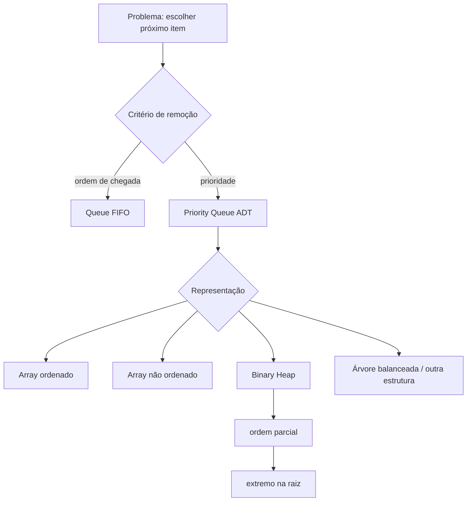

<a id="inicio"></a>

# Filas de Prioridade e Heaps

> **Classificação geral:** `[C] Obrigatório conhecer`  
> **Nível:** C — Algoritmos e Estruturas de Dados  
> **Posição na taxonomia:** tópico 30 — sétimo tópico do Nível C  
> **Pré-requisitos principais:** T10 — Estruturas de Dados Elementares; T24 — Correção e Análise de Algoritmos; T25 — Tipos Abstratos de Dados, Estruturas e Implementações; T27 — Algoritmos de Ordenação; T28 — Estruturas Lineares  
> **Aprofundamentos posteriores:** T31 — Árvores; T32 — Grafos e Percursos Fundamentais; T33 — Estratégias Fundamentais de Resolução Algorítmica; T35 — Modelagem, Escolha de Estruturas e Trade-offs

---

## Resumo executivo

Uma **fila de prioridade** (*priority queue*) é um **Tipo Abstrato de Dados** em que a próxima remoção não é determinada obrigatoriamente pela ordem de chegada. O contrato seleciona o item de maior ou menor prioridade conforme a política definida.

```text
fila FIFO
entrada: A, B, C
saída:   A, B, C

fila de prioridade (menor valor = maior prioridade)
entrada: (A, 30), (B, 10), (C, 20)
saída:   B, C, A
```

O **binary heap** é uma implementação muito comum desse ADT porque mantém apenas a ordem necessária para localizar rapidamente o extremo prioritário. Ele não tenta ordenar todos os elementos.

```text
Priority Queue = contrato / ADT
Heap           = uma estrutura de dados que pode implementar esse contrato
```

No binary heap clássico:

- o formato é de **árvore binária completa** (*complete binary tree*);
- a representação natural pode ser um **array**;
- o extremo prioritário fica na raiz;
- inserir e extrair o extremo custam tipicamente `O(log n)`;
- consultar o extremo custa `O(1)`;
- construir um heap por *heapify* bottom-up custa `O(n)`.

---

<a id="como-estudar"></a>
## Como estudar este tópico — duas rotas

### 🎓 Estou aprendendo pela primeira vez

Siga esta ordem:

```text
1. Resumo executivo + Visão panorâmica
2. PARTE I — Priority Queue, contrato e escolha de representação
3. PARTE II — Binary heap, invariantes, operações e custos
4. PARTE III — Aplicações, comparações e fronteiras
5. PARTE IV — Transferência entre linguagens
6. PARTE V — Testes, troubleshooting, robustez e decisão
7. PARTE VI — LABs, exercícios e critérios de domínio
8. Apêndices apenas para auditoria, fontes, QA e histórico
```

A rota principal já está ordenada para que **Priority Queue como ADT** venha antes de **heap como implementação**. Não comece pelas APIs das linguagens: primeiro fixe contrato, invariante e operações.

### 🔎 Já conheço e quero consultar

Use esta rota curta:

```text
Visão panorâmica
→ Índice essencial
→ operação / custo / linguagem desejada
→ PR-T30-* ou Troubleshooting
→ Glossário / Referências, se necessário
```

---

## Visão rápida

| Pergunta | Resposta curta |
|---|---|
| Priority Queue é fila FIFO? | não necessariamente |
| Priority Queue é heap? | não; Priority Queue é ADT, heap é uma implementação comum |
| Heap precisa ser árvore de ponteiros? | não; binary heap é naturalmente representável em array |
| Min-heap mantém tudo ordenado? | não; garante apenas relação pai ≤ filhos |
| Max-heap mantém tudo ordenado? | não; garante apenas relação pai ≥ filhos |
| Menor elemento de min-heap fica onde? | na raiz |
| Inserção em binary heap | `O(log n)` típico/pior caso clássico |
| Extração do extremo | `O(log n)` |
| Consulta do extremo | `O(1)` |
| Construção bottom-up | `O(n)` |
| Inserir `n` itens um a um | `O(n log n)` no limite superior clássico |
| Heap é BST? | não |
| Heap Sort é a mesma coisa que Priority Queue? | não; usa heap como mecanismo |
| Python possui biblioteca de heap? | sim, `heapq` |
| Python 3.14 possui APIs max-heap diretas? | sim; foram adicionadas em 3.14 |
| ECMAScript possui `PriorityQueue` padrão? | não na especificação ECMAScript 2026 |
| Java possui `PriorityQueue`? | sim |
| Bash possui Priority Queue nativa? | não; a transferência é conceitual/implementação manual |

---

## Regra de ouro

> **A fila de prioridade define qual elemento deve sair primeiro; o heap é uma maneira eficiente de manter apenas a ordem parcial necessária para cumprir esse contrato.**

---

## Decisão rápida

```text
PRECISO PROCESSAR ELEMENTOS EM QUAL ORDEM?
          │
          ├── ordem de chegada
          │       └── Queue / FIFO
          │
          ├── ordem inversa de chegada
          │       └── Stack / LIFO
          │
          ├── menor/maior prioridade disponível
          │       └── Priority Queue
          │              │
          │              ├── poucas operações / n pequeno
          │              │       └── várias representações podem bastar
          │              │
          │              └── muitas inserções + extrações
          │                      └── heap é escolha clássica
          │
          └── preciso consultar por chave/range/ordem total
                  └── provavelmente outra estrutura
```

---


---

<a id="visao-panoramica"></a>
## 🗺️ Visão panorâmica — o mapa antes dos detalhes

Esta seção funciona simultaneamente como **caderno rápido de consulta**, **modelo mental inicial**, **índice conceitual**, **contrato de cobertura**, **ponte prática**, **ponte entre linguagens** e **referência de auditoria**. O detalhamento permanece nas seções numeradas; aqui o objetivo é recuperar o domínio em aproximadamente 30 segundos e saber onde investigar quando algo não funciona.

### O domínio inteiro em uma tela

```text
FILAS DE PRIORIDADE E HEAPS
│
├── contrato / ADT
│   └── Priority Queue
│       ├── insert(x, priority)
│       ├── peek_min / peek_max
│       ├── extract_min / extract_max
│       ├── política de empate
│       └── estabilidade somente se o contrato a definir
│
├── implementação clássica
│   └── binary heap
│       ├── forma: árvore binária completa (*complete binary tree*)
│       ├── representação natural: array
│       ├── min-heap: pai <= filhos
│       ├── max-heap: pai >= filhos
│       └── raiz = extremo global
│
├── manutenção do invariante
│   ├── insert → colocar na próxima folha → sift-up
│   ├── extract → mover última folha para raiz → sift-down
│   ├── heapify bottom-up → folhas já são heaps
│   └── update priority → localizar item + reparar direção apropriada
│
├── custos típicos do binary heap
│   ├── peek extremo          → O(1)
│   ├── insert               → O(log n)
│   ├── extract extremo      → O(log n)
│   ├── busca arbitrária     → O(n) no geral
│   └── build-heap bottom-up → O(n)
│
├── usos reais
│   ├── scheduler por prioridade
│   ├── processamento de eventos
│   ├── top-k
│   ├── k-way merge
│   └── Dijkstra / Prim com implementação apropriada
│
├── escolhas / trade-offs
│   ├── Queue FIFO           → ordem de chegada
│   ├── heap                 → extremo prioritário repetidamente
│   ├── array ordenado       → ordem total, inserção mais cara
│   ├── árvore ordenada      → ranges/predecessor/successor
│   └── estrutura especializada → quando decrease-key/range de chaves domina
│
└── linguagens
    ├── Python      → heapq; min-heap e APIs max-heap desde 3.14
    ├── JavaScript  → sem PriorityQueue padrão no ECMAScript 2026; implementação/biblioteca
    ├── Java        → java.util.PriorityQueue
    └── Bash        → sem ADT nativo; transferência didática com arrays
```

### Modelo mental mínimo

```text
qual item deve sair agora?
        ↓
ordem de chegada? ─────────────→ Queue / FIFO
ordem inversa? ────────────────→ Stack / LIFO
menor/maior prioridade atual? ─→ Priority Queue
        ↓
qual implementação atende ao perfil de operações?
        ↓
heap é suficiente?
        ↓
forma completa + heap-order
        ↓
insert: sift-up
extract: sift-down
coleção pronta: heapify bottom-up
        ↓
validar invariante + política de empate + capacidade
```

A sequência correta de raciocínio é:

```text
REQUISITO DE RETIRADA
→ ADT / contrato
→ política de prioridade e empate
→ representação
→ invariante
→ operação de reparo
→ custo
→ validação
→ limites operacionais
```

### Tabela de consulta rápida

| Pergunta / mecanismo | Regra central | Custo típico no binary heap | Destino detalhado |
|---|---|---:|---|
| Priority Queue | ADT escolhe o próximo item pela prioridade | depende da implementação | 3–5 |
| raiz do min-heap | contém o menor elemento | `O(1)` para consultar | 6–8, 12 |
| raiz do max-heap | contém o maior elemento | `O(1)` para consultar | 6–8, 12 |
| inserção | adicionar na próxima posição estrutural e subir | `O(log n)` | 9 |
| extração | substituir raiz pela última folha e descer | `O(log n)` | 10 |
| heapify bottom-up | reparar nós internos do fim para a raiz | `O(n)` | 11 |
| busca arbitrária | heap não dá ordem entre irmãos/subárvores suficientes | `O(n)` geral | 8, 19 |
| top-k | manter heap limitado ao tamanho `k` | use `k_eff=min(k,n)` para entrada finita: `k=0` vazio; `k_eff=1` `O(n)`; `k_eff>=2` `O(n log k_eff)`; com `k>=n` conhecido, todos os itens são selecionados e um fast path pode evitar o heap | 15–16, LAB 6 |
| k-way merge | um candidato ativo por fonte | `k=0`: vazio; `k=1`: `O(n)`; `k>=2`: `O(n log k)` | 15, 17, LAB 7 |
| mudança de prioridade | localizar + reparar o heap | depende também de localizar o item | 12.2–12.3, 14 |
| empates | não presumir FIFO/estabilidade | depende do tie-breaker | 4, LAB 5 |

### Não confundir

| Não confundir | Diferença operacional |
|---|---|
| Priority Queue × heap | Priority Queue é contrato; heap é uma implementação possível |
| Priority Queue × Queue FIFO | uma escolhe pela prioridade; a outra pela ordem de chegada |
| heap × array ordenado | heap mantém somente ordem parcial suficiente para o extremo |
| heap × BST | heap prioriza extremo; BST preserva relação de busca entre subárvores |
| heap × “heap de memória” | aqui `heap` é estrutura de dados, não região de alocação/GC |
| min-heap × “menor em todo pai/irmão” | pai <= filhos; irmãos não precisam estar ordenados |
| `heapify O(n)` × `insert O(1)` | construção global linear não muda o custo de inserção individual |
| estabilidade × prioridade | prioridades iguais não preservam ordem de chegada automaticamente |
| atualização de campo × update-key | mutar payload/prioridade fora da API pode quebrar o invariante |
| top-k maiores × max-heap de tamanho k | para manter os `k` maiores, frequentemente o útil é um **min-heap** limitado a `k` |

### Pergunta prática → mecanismo / primeira decisão

| Pergunta | Mecanismo / candidato | Verificação essencial |
|---|---|---|
| “qual tarefa mais urgente agora?” | Priority Queue | critério de prioridade é válido e autorizado? |
| “quero os 100 maiores valores de um stream” | min-heap de tamanho 100 | raiz representa o pior entre os mantidos? |
| “quero combinar k streams ordenados” | min-heap com um candidato por stream | guardar também origem/posição |
| “quero iterar tudo já ordenado” | sort / estrutura ordenada | heap não promete iteração ordenada |
| “quero buscar item por ID” | Map/Dictionary | heap não é índice por chave arbitrária |
| “mudei a prioridade e nada aconteceu” | update/reinsert/lazy deletion | item foi reparado/reindexado? |
| “pop devolve ordem errada” | verificar heap-order + comparator | escolher filho correto no sift-down |
| “empates variam” | tie-breaker explícito | estabilidade faz parte do contrato? |
| “fila cresce sem limite” | capacidade/backpressure | política operacional não é função do heap sozinho |

### Microexemplos canônicos

**Heap válido não precisa estar ordenado:**

```text
[1, 4, 3, 9, 7, 8, 6]

1 <= 4 e 3
4 <= 9 e 7
3 <= 8 e 6

válido como min-heap
não está totalmente ordenado
```

**Inserção:**

```text
[2, 5, 4, 9, 7]
insert(1)
→ colocar no fim: [2, 5, 4, 9, 7, 1]
→ 1 < pai 4: swap
→ [2, 5, 1, 9, 7, 4]
→ 1 < pai 2: swap
→ [1, 5, 2, 9, 7, 4]
```

**Top-k maiores:**

```text
k < 0 → entrada inválida
k = 0 → resultado vazio; não existe raiz a comparar
k = 3
stream = 8, 2, 11, 5, 20

manter min-heap com no máximo 3 elementos
raiz = menor entre os atuais top-3
novo valor < raiz  → descartar
novo valor = raiz  → para valores escalares, não altera o multiconjunto selecionado
novo valor > raiz  → substituir raiz
```

Se identidade/estabilidade entre itens empatados fizer parte do requisito, compare a **chave completa de seleção** — por exemplo `(priority, sequence)` — em vez de apenas o valor numérico.

### Transferência entre as quatro linguagens

| Linguagem | Mecanismo principal | Diferença material |
|---|---|---|
| Python | `heapq` sobre `list` | min-heap é o modelo histórico; Python 3.14 adicionou APIs max-heap diretas; empates com payloads exigem tie-breaker quando os payloads não são comparáveis |
| JavaScript | implementação/biblioteca | ECMAScript 2026 não define `PriorityQueue`; não confundir `Array.prototype.sort()` recorrente com heap |
| Java | `java.util.PriorityQueue` | cabeça é o menor segundo ordenação/comparator; empates não são FIFO por contrato; iterator não é ordenado |
| Bash | array indexado + funções | uso pedagógico; a forma tradicional `$(...)` de command substitution executa em subshell e pode perder mutações; sem biblioteca Priority Queue nativa |

### Problemas reais que precisam de destino explícito

Esta revisão formaliza `PR-T30-01`–`PR-T30-10`. As classes centrais são:

```text
ADT confundido com implementação
heap tratado como coleção totalmente ordenada
fórmulas de índice base zero/base um misturadas
sift-up/sift-down quebrando invariante
heapify O(n) substituído por inserção repetida sem perceber o custo
empates/estabilidade sem contrato
prioridade mutada sem reparo
orientação errada no top-k
k-way merge sem estado de origem
fila prioritária sem capacidade/backpressure/validação
```

Quando o problema já está ocorrendo, vá direto para **[🔎 Troubleshooting sistemático](#troubleshooting-sistematico)**.

### Duas rotas de uso

**Consulta rápida:**

```text
Visão panorâmica
→ tabela de consulta
→ Não confundir
→ PR-T30-* / Troubleshooting
→ seção numerada específica
```

**Estudo completo:**

```text
Priority Queue como ADT
→ heap e invariantes
→ representação em array
→ sift-up / sift-down
→ heapify
→ custos
→ empates e mutação de prioridade
→ aplicações
→ linguagens
→ LABs
→ QA
```

### Síntese multifonte desta revisão

As fontes foram usadas de forma complementar, não por colagem:

- **CLRS 4ª ed.**: formaliza heap-order, altura `Θ(log n)`, `HEAPIFY`, `BUILD-HEAP` linear e operações de Priority Queue;
- **Skiena 3ª ed.**: enfatiza o heap como representação implícita em array e compara implementações de Priority Queue conforme o padrão de operações;
- **La Rocca 2024**: fornece progressão didática ADT → heap → push-down/heapify e reforça a ideia de ordem parcial;
- **documentação oficial atual**: decide a semântica vigente de Python 3.14.7, ECMAScript 2026, Java SE/JDK 27 e GNU Bash 5.3.

Nenhuma fonte isolada é usada para definir simultaneamente teoria geral, custo, implementação e APIs atuais das quatro linguagens.

# Índice

## Índice essencial

- [Como estudar este tópico](#como-estudar)
- [🗺️ Visão panorâmica — o mapa antes dos detalhes](#visao-panoramica)
- [PARTE I — Contexto, Priority Queue e contratos](#parte-i)
- [PARTE II — Binary heap, invariantes, operações e custos](#parte-ii)
- [PARTE III — Aplicações, comparações e fronteiras](#parte-iii)
- [PARTE IV — Transferência entre linguagens](#parte-iv)
- [PARTE V — Verificação, troubleshooting, robustez e decisão](#parte-v)
- [PARTE VI — LABs, exercícios e critérios de domínio](#parte-vi)
- [APÊNDICES — taxonomia, fontes, QA e histórico](#apendices)
- [Inventário `PR-T30-*`](#pr-t30-inventario)
- [Troubleshooting sistemático](#troubleshooting-sistematico)
- [Glossário](#49-glossário)

<details>
<summary><strong>Índice detalhado — abrir para navegação completa</strong></summary>

- [🗺️ Visão panorâmica — o mapa antes dos detalhes](#visao-panoramica)
- [1. Posição deste assunto na trilha](#1-posição-deste-assunto-na-trilha)
  - [1.1 O que T25 entregou](#11-o-que-t25-entregou)
  - [1.2 O que T27 entregou](#12-o-que-t27-entregou)
  - [1.3 O que T28 entregou](#13-o-que-t28-entregou)
  - [1.4 Fronteira com T31 — Árvores](#14-fronteira-com-t31--árvores)
  - [1.5 Fronteira com T32 — Grafos](#15-fronteira-com-t32--grafos)
  - [1.6 Fronteira com T35 — escolha estrutural](#16-fronteira-com-t35--escolha-estrutural)
- [2. Modelo mental — ordem total não é necessária](#2-modelo-mental--ordem-total-não-é-necessária)
  - [2.1 O problema fundamental](#21-o-problema-fundamental)
  - [2.2 Ordem total × ordem parcial](#22-ordem-total--ordem-parcial)
  - [2.3 Fluxo conceitual](#23-fluxo-conceitual)
  - [2.4 Informação mínima suficiente](#24-informação-mínima-suficiente)
- [3. 30.1 — Priority Queue é um ADT `[C]`](#3-301--priority-queue-é-um-adt-c)
  - [3.1 Contrato essencial](#31-contrato-essencial)
  - [3.2 Item e prioridade não são necessariamente a mesma coisa](#32-item-e-prioridade-não-são-necessariamente-a-mesma-coisa)
  - [3.3 Peek e extract são operações diferentes](#33-peek-e-extract-são-operações-diferentes)
  - [3.4 Min-priority × max-priority](#34-min-priority--max-priority)
  - [3.5 Prioridade é parte do contrato](#35-prioridade-é-parte-do-contrato)
  - [3.6 Priority Queue não promete iteração ordenada](#36-priority-queue-não-promete-iteração-ordenada)
- [4. Empates, estabilidade e desempate](#4-empates-estabilidade-e-desempate)
  - [4.1 Prioridades iguais são inevitáveis](#41-prioridades-iguais-são-inevitáveis)
  - [4.2 Estabilidade não deve ser presumida](#42-estabilidade-não-deve-ser-presumida)
  - [4.3 Desempate evita comparar payloads incompatíveis](#43-desempate-evita-comparar-payloads-incompatíveis)
  - [4.4 Java também não garante FIFO nos empates](#44-java-também-não-garante-fifo-nos-empates)
- [5. Implementações possíveis do ADT](#5-implementações-possíveis-do-adt)
  - [5.1 Array não ordenado](#51-array-não-ordenado)
  - [5.2 Array ordenado](#52-array-ordenado)
  - [5.3 Binary heap](#53-binary-heap)
  - [5.4 Árvore balanceada](#54-árvore-balanceada)
  - [5.5 A “melhor” implementação depende da carga](#55-a-melhor-implementação-depende-da-carga)
- [6. 30.2 — Heap é uma implementação comum `[C]`](#6-302--heap-é-uma-implementação-comum-c)
  - [6.1 Binary heap possui duas famílias de propriedades](#61-binary-heap-possui-duas-famílias-de-propriedades)
  - [6.2 Propriedade estrutural](#62-propriedade-estrutural)
  - [6.3 Propriedade de min-heap](#63-propriedade-de-min-heap)
  - [6.4 Propriedade de max-heap](#64-propriedade-de-max-heap)
  - [6.5 A raiz é o extremo global](#65-a-raiz-é-o-extremo-global)
  - [6.6 Subárvores também satisfazem o invariante](#66-subárvores-também-satisfazem-o-invariante)
- [7. Representação em array](#7-representação-em-array)
  - [7.1 Por que ponteiros são desnecessários no binary heap](#71-por-que-ponteiros-são-desnecessários-no-binary-heap)
  - [7.2 Exemplo base zero](#72-exemplo-base-zero)
  - [7.3 Fórmulas base um](#73-fórmulas-base-um)
  - [7.4 Altura](#74-altura)
- [8. Heap não é array ordenado](#8-heap-não-é-array-ordenado)
  - [8.1 O invariante é local](#81-o-invariante-é-local)
  - [8.2 Irmãos não precisam estar ordenados](#82-irmãos-não-precisam-estar-ordenados)
  - [8.3 Buscar valor arbitrário não vira logarítmico automaticamente](#83-buscar-valor-arbitrário-não-vira-logarítmico-automaticamente)
  - [8.4 Ordem parcial é o recurso, não uma deficiência](#84-ordem-parcial-é-o-recurso-não-uma-deficiência)
- [9. Inserção — sift-up / bubble-up](#9-inserção--sift-up--bubble-up)
  - [9.1 Passo 1 — preservar a forma](#91-passo-1--preservar-a-forma)
  - [9.2 Passo 2 — restaurar a ordem](#92-passo-2--restaurar-a-ordem)
  - [9.3 Exemplo](#93-exemplo)
  - [9.4 Complexidade](#94-complexidade)
  - [9.5 Invariante útil para raciocinar](#95-invariante-útil-para-raciocinar)
- [10. Extração do extremo — sift-down / bubble-down](#10-extração-do-extremo--sift-down--bubble-down)
  - [10.1 Remover a raiz cria dois problemas](#101-remover-a-raiz-cria-dois-problemas)
  - [10.2 Estratégia clássica](#102-estratégia-clássica)
  - [10.3 Por que escolher o filho mais prioritário](#103-por-que-escolher-o-filho-mais-prioritário)
  - [10.4 Exemplo](#104-exemplo)
  - [10.5 Complexidade](#105-complexidade)
- [11. Heapify — construir em `O(n)`](#11-heapify--construir-em-on)
  - [11.1 Duas estratégias diferentes](#111-duas-estratégias-diferentes)
  - [11.2 Por que não é `n * log n`](#112-por-que-não-é-n--log-n)
  - [11.3 Último nó interno em base zero](#113-último-nó-interno-em-base-zero)
  - [11.4 Heapify é operação do heap, não requisito do ADT](#114-heapify-é-operação-do-heap-não-requisito-do-adt)
  - [11.5 Cuidado terminológico](#115-cuidado-terminológico)
- [12. 30.3 — Custos típicos `[C]`](#12-303--custos-típicos-c)
  - [12.1 Tabela principal](#121-tabela-principal)
  - [12.2 Alterar prioridade](#122-alterar-prioridade)
  - [12.3 Mapeamento item → índice](#123-mapeamento-item--índice)
  - [12.4 Custos de biblioteca não devem ser inventados](#124-custos-de-biblioteca-não-devem-ser-inventados)
- [13. Complexidade × detalhes de implementação](#13-complexidade--detalhes-de-implementação)
  - [13.1 Crescimento do array](#131-crescimento-do-array)
  - [13.2 Comparação pode não ser `O(1)`](#132-comparação-pode-não-ser-o1)
  - [13.3 Cache e localidade](#133-cache-e-localidade)
  - [13.4 `O(log n)` não significa “sempre rápido”](#134-olog-n-não-significa-sempre-rápido)
  - [13.5 Complexidade espacial](#135-complexidade-espacial)
- [14. Prioridade mutável e invariantes quebrados](#14-prioridade-mutável-e-invariantes-quebrados)
  - [14.1 Alterar objeto por fora pode invalidar o heap](#141-alterar-objeto-por-fora-pode-invalidar-o-heap)
  - [14.2 Três estratégias comuns](#142-três-estratégias-comuns)
  - [14.3 Lazy deletion exige identidade/versão](#143-lazy-deletion-exige-identidadeversão)
- [15. 30.4 — Usos reais `[C]`](#15-304--usos-reais-c)
  - [15.1 Agendamento por prioridade](#151-agendamento-por-prioridade)
  - [15.2 Processamento de eventos](#152-processamento-de-eventos)
  - [15.3 Top-k](#153-top-k)
  - [15.4 Merge de múltiplas sequências ordenadas](#154-merge-de-múltiplas-sequências-ordenadas)
  - [15.5 Dijkstra e Prim](#155-dijkstra-e-prim)
- [16. Top-k — por que o heap tem orientação “invertida”](#16-top-k--por-que-o-heap-tem-orientação-invertida)
  - [16.1 Manter os k maiores](#161-manter-os-k-maiores)
  - [16.2 Exemplo](#162-exemplo)
  - [16.3 Regra de projeto](#163-regra-de-projeto)
- [17. K-way merge](#17-k-way-merge)
  - [17.1 Problema](#171-problema)
  - [17.2 Candidatos ativos](#172-candidatos-ativos)
  - [17.3 Heap de tamanho k](#173-heap-de-tamanho-k)
  - [17.4 Relação com streams](#174-relação-com-streams)
- [18. Priority Queue × Queue FIFO](#18-priority-queue--queue-fifo)
  - [18.1 FIFO responde “quem chegou primeiro?”](#181-fifo-responde-quem-chegou-primeiro)
  - [18.2 Priority Queue responde “quem é prioritário agora?”](#182-priority-queue-responde-quem-é-prioritário-agora)
  - [18.3 FIFO pode ser codificado como prioridade](#183-fifo-pode-ser-codificado-como-prioridade)
- [19. 30.5 — Heap ≠ árvore de busca binária `[C]`](#19-305--heap--árvore-de-busca-binária-c)
  - [19.1 Invariantes diferentes](#191-invariantes-diferentes)
  - [19.2 Perguntas que cada estrutura responde bem](#192-perguntas-que-cada-estrutura-responde-bem)
  - [19.3 Forma da árvore](#193-forma-da-árvore)
  - [19.4 Busca arbitrária](#194-busca-arbitrária)
- [20. Heap × array ordenado](#20-heap--array-ordenado)
  - [20.1 Array ordenado mantém mais informação](#201-array-ordenado-mantém-mais-informação)
  - [20.2 Inserção](#202-inserção)
  - [20.3 Iteração ordenada](#203-iteração-ordenada)
  - [20.4 Escolha](#204-escolha)
- [21. Heap × Heapsort](#21-heap--heapsort)
  - [21.1 Relação](#211-relação)
  - [21.2 Não confundir estrutura e algoritmo](#212-não-confundir-estrutura-e-algoritmo)
  - [21.3 Fronteira com T27](#213-fronteira-com-t27)
- [22. Python — `heapq`](#22-python--heapq)
  - [22.1 Modelo atual](#221-modelo-atual)
  - [22.2 Operações min-heap](#222-operações-min-heap)
  - [22.3 `heapify()`](#223-heapify)
  - [22.4 Max-heap em Python 3.14+](#224-max-heap-em-python-314)
  - [22.5 Priority Queue com payload e desempate](#225-priority-queue-com-payload-e-desempate)
  - [22.6 `heappushpop()` e `heapreplace()` não são sinônimos](#226-heappushpop-e-heapreplace-não-são-sinônimos)
  - [22.7 `nlargest()` e `nsmallest()`](#227-nlargest-e-nsmallest)
  - [22.8 `heapq.merge()` e o k-way merge](#228-heapqmerge-e-o-k-way-merge)
- [23. JavaScript / ECMAScript — sem Priority Queue padrão](#23-javascript--ecmascript--sem-priority-queue-padrão)
  - [23.1 ECMAScript 2026 não define `PriorityQueue`](#231-ecmascript-2026-não-define-priorityqueue)
  - [23.2 MinHeap didático](#232-minheap-didático)
  - [23.3 Comparator é evolução natural](#233-comparator-é-evolução-natural)
  - [23.4 Não usar `sort()` a cada inserção por reflexo](#234-não-usar-sort-a-cada-inserção-por-reflexo)
- [24. Java — `PriorityQueue`](#24-java--priorityqueue)
  - [24.1 Estrutura da biblioteca](#241-estrutura-da-biblioteca)
  - [24.2 Exemplo](#242-exemplo)
  - [24.3 Custos documentados](#243-custos-documentados)
  - [24.4 Max-priority com `Comparator`](#244-max-priority-com-comparator)
  - [24.5 Empates](#245-empates)
  - [24.6 Iterator não é saída ordenada](#246-iterator-não-é-saída-ordenada)
- [25. GNU Bash — transferência conceitual sem equivalência artificial](#25-gnu-bash--transferência-conceitual-sem-equivalência-artificial)
  - [25.1 Bash não fornece Priority Queue nativa](#251-bash-não-fornece-priority-queue-nativa)
  - [25.2 Min-heap didático com array indexado](#252-min-heap-didático-com-array-indexado)
  - [25.3 Por que não usar command substitution para mutação](#253-por-que-não-usar-command-substitution-para-mutação)
  - [25.4 Escopo realista](#254-escopo-realista)
- [26. Comparação entre as quatro linguagens canônicas](#26-comparação-entre-as-quatro-linguagens-canônicas)
- [27. Exemplo canônico nas quatro linguagens](#27-exemplo-canônico-nas-quatro-linguagens)
  - [27.1 Python](#271-python)
  - [27.2 JavaScript](#272-javascript)
  - [27.3 Java](#273-java)
  - [27.4 Bash](#274-bash)
  - [27.5 Transferência do conceito](#275-transferência-do-conceito)
- [28. Invariantes que devem ser testados](#28-invariantes-que-devem-ser-testados)
  - [28.1 Invariante estrutural](#281-invariante-estrutural)
  - [28.2 Invariante de min-heap](#282-invariante-de-min-heap)
  - [28.3 Invariante de max-heap](#283-invariante-de-max-heap)
  - [28.4 Invariante da Priority Queue](#284-invariante-da-priority-queue)
  - [28.5 Verificador Python](#285-verificador-python)
- [29. Casos de borda](#29-casos-de-borda)
  - [29.1 Heap vazio](#291-heap-vazio)
  - [29.2 Um elemento](#292-um-elemento)
  - [29.3 Dois elementos](#293-dois-elementos)
  - [29.4 Duplicatas](#294-duplicatas)
  - [29.5 Valores negativos](#295-valores-negativos)
  - [29.6 Prioridades extremas](#296-prioridades-extremas)
- [30. Erros frequentes](#30-erros-frequentes)
  - [`E-T30-01` — Tratar heap como sorted array](#e-t30-01--tratar-heap-como-sorted-array)
  - [`E-T30-02` — Misturar fórmulas base zero e base um](#e-t30-02--misturar-fórmulas-base-zero-e-base-um)
  - [`E-T30-03` — Sift-down com filho errado](#e-t30-03--sift-down-com-filho-errado)
  - [`E-T30-04` — Esquecer o último elemento ao extrair](#e-t30-04--esquecer-o-último-elemento-ao-extrair)
  - [`E-T30-05` — Alterar prioridade sem reparar o heap](#e-t30-05--alterar-prioridade-sem-reparar-o-heap)
  - [`E-T30-06` — Presumir estabilidade](#e-t30-06--presumir-estabilidade)
  - [`E-T30-07` — Reordenar a coleção inteira após cada `push`](#e-t30-07--reordenar-a-coleção-inteira-após-cada-push)
  - [`E-T30-08` — Confundir `heapify O(n)` com “cada operação é O(1)”](#e-t30-08--confundir-heapify-on-com-cada-operação-é-o1)
  - [`E-T30-09` — Usar heap para busca arbitrária](#e-t30-09--usar-heap-para-busca-arbitrária)
- [🔎 Troubleshooting sistemático](#troubleshooting-sistematico)
- [31. Segurança, robustez e consumo de recursos](#31-segurança-robustez-e-consumo-de-recursos)
  - [31.1 Priority Queue pode crescer sem limite](#311-priority-queue-pode-crescer-sem-limite)
  - [31.2 Prioridade fornecida pelo usuário não implica autorização](#312-prioridade-fornecida-pelo-usuário-não-implica-autorização)
  - [31.3 Comparator não confiável](#313-comparator-não-confiável)
  - [31.4 Dados sensíveis](#314-dados-sensíveis)
- [32. Decisão de estrutura](#32-decisão-de-estrutura)
  - [32.1 Regra prática](#321-regra-prática)
  - [32.2 Inventário formal de problemas reais — `PR-T30-*`](#pr-t30-inventario)
- [33. Exercício guiado — construir um min-heap manualmente](#33-exercício-guiado--construir-um-min-heap-manualmente)
- [34. Exercício guiado — build-heap bottom-up](#34-exercício-guiado--build-heap-bottom-up)
- [35. Verificação empírica de custos](#35-verificação-empírica-de-custos)
  - [35.1 O que medir](#351-o-que-medir)
  - [35.2 Inserção](#352-inserção)
  - [35.3 Extração](#353-extração)
  - [35.4 Heapify](#354-heapify)
- [36. Microexemplos de transferência](#36-microexemplos-de-transferência)
  - [36.1 “Menor deadline primeiro”](#361-menor-deadline-primeiro)
  - [36.2 “Maior severidade primeiro”](#362-maior-severidade-primeiro)
  - [36.3 “Mais próximo primeiro”](#363-mais-próximo-primeiro)
  - [36.4 “Mesmo nível → FIFO”](#364-mesmo-nível--fifo)
  - [36.5 “Top 100 maiores”](#365-top-100-maiores)
- [37. LAB 1 — Verificar o invariante de min-heap](#37-lab-1--verificar-o-invariante-de-min-heap)
  - [Objetivo](#objetivo)
  - [Pré-requisitos](#pré-requisitos)
  - [Estado inicial](#estado-inicial)
  - [Tarefa](#tarefa)
  - [Procedimento](#procedimento)
  - [O que observar](#o-que-observar)
  - [Testes](#testes)
  - [Explicação](#explicação)
  - [Variação / transferência](#variação--transferência)
  - [Limpeza](#limpeza)
- [38. LAB 2 — Inserção e sift-up](#38-lab-2--inserção-e-sift-up)
  - [Objetivo](#objetivo-1)
  - [Pré-requisitos](#pré-requisitos-1)
  - [Estado inicial](#estado-inicial-1)
  - [Tarefa](#tarefa-1)
  - [Procedimento](#procedimento-1)
  - [O que observar](#o-que-observar-1)
  - [Testes](#testes-1)
  - [Explicação](#explicação-1)
  - [Variação / transferência](#variação--transferência-1)
  - [Limpeza](#limpeza-1)
- [39. LAB 3 — Extração e sift-down](#39-lab-3--extração-e-sift-down)
  - [Objetivo](#objetivo-2)
  - [Pré-requisitos](#pré-requisitos-2)
  - [Estado inicial](#estado-inicial-2)
  - [Tarefa](#tarefa-2)
  - [Procedimento](#procedimento-2)
  - [O que observar](#o-que-observar-2)
  - [Testes](#testes-2)
  - [Explicação](#explicação-2)
  - [Variação / transferência](#variação--transferência-2)
  - [Limpeza](#limpeza-2)
- [40. LAB 4 — Construção incremental × heapify bottom-up](#40-lab-4--construção-incremental--heapify-bottom-up)
  - [Objetivo](#objetivo-3)
  - [Pré-requisitos](#pré-requisitos-3)
  - [Estado inicial](#estado-inicial-3)
  - [Tarefa](#tarefa-3)
  - [Procedimento](#procedimento-3)
  - [O que observar](#o-que-observar-3)
  - [Testes](#testes-3)
  - [Explicação](#explicação-3)
  - [Variação / transferência](#variação--transferência-3)
  - [Limpeza](#limpeza-3)
- [41. LAB 5 — Priority Queue estável por desempate](#41-lab-5--priority-queue-estável-por-desempate)
  - [Objetivo](#objetivo-4)
  - [Pré-requisitos](#pré-requisitos-4)
  - [Estado inicial](#estado-inicial-4)
  - [Tarefa](#tarefa-4)
  - [Procedimento](#procedimento-4)
  - [O que observar](#o-que-observar-4)
  - [Testes](#testes-4)
  - [Explicação](#explicação-4)
  - [Variação / transferência](#variação--transferência-4)
  - [Limpeza](#limpeza-4)
- [42. LAB 6 — Top-k em fluxo](#42-lab-6--top-k-em-fluxo)
  - [Objetivo](#objetivo-5)
  - [Pré-requisitos](#pré-requisitos-5)
  - [Estado inicial](#estado-inicial-5)
  - [Tarefa](#tarefa-5)
  - [Procedimento](#procedimento-5)
  - [O que observar](#o-que-observar-5)
  - [Testes](#testes-5)
  - [Explicação](#explicação-5)
  - [Variação / transferência](#variação--transferência-5)
  - [Limpeza](#limpeza-5)
- [43. LAB 7 — K-way merge](#43-lab-7--k-way-merge)
  - [Objetivo](#objetivo-6)
  - [Pré-requisitos](#pré-requisitos-6)
  - [Estado inicial](#estado-inicial-6)
  - [Tarefa](#tarefa-6)
  - [Procedimento](#procedimento-6)
  - [O que observar](#o-que-observar-6)
  - [Testes](#testes-6)
  - [Explicação](#explicação-6)
  - [Variação / transferência](#variação--transferência-6)
  - [Limpeza](#limpeza-6)
- [44. LAB 8 — Scheduler local com capacidade](#44-lab-8--scheduler-local-com-capacidade)
  - [Objetivo](#objetivo-7)
  - [Pré-requisitos](#pré-requisitos-7)
  - [Estado inicial](#estado-inicial-7)
  - [Tarefa](#tarefa-7)
  - [Procedimento](#procedimento-7)
  - [O que observar](#o-que-observar-7)
  - [Testes](#testes-7)
  - [Explicação](#explicação-7)
  - [Variação / transferência](#variação--transferência-7)
  - [Limpeza](#limpeza-7)
- [45. Exercícios de fixação](#45-exercícios-de-fixação)
  - [45.1 Conceituais](#451-conceituais)
  - [45.2 Rastreamento](#452-rastreamento)
  - [45.3 Implementação](#453-implementação)
  - [45.4 Escolha de estrutura](#454-escolha-de-estrutura)
- [46. Antipadrões e guardrails](#46-antipadrões-e-guardrails)
- [47. Evidências de domínio](#47-evidências-de-domínio)
- [48. Checklist de domínio](#48-checklist-de-domínio)
- [49. Glossário](#49-glossário)
- [50. Auditoria de cobertura da taxonomia](#50-auditoria-de-cobertura-da-taxonomia)
  - [50.1 Fronteira preservada com T31](#501-fronteira-preservada-com-t31)
  - [50.2 Fronteira preservada com T32](#502-fronteira-preservada-com-t32)
  - [50.3 Fronteira preservada com T35](#503-fronteira-preservada-com-t35)
  - [50.4 Linguagens canônicas](#504-linguagens-canônicas)
- [51. Auditoria da File Library](#51-auditoria-da-file-library)
  - [51.1 Fontes locais efetivamente consultadas](#511-fontes-locais-efetivamente-consultadas)
  - [51.2 Como os livros alteraram o documento](#512-como-os-livros-alteraram-o-documento)
  - [51.3 Fontes localizadas mas não usadas como autoridade normativa](#513-fontes-localizadas-mas-não-usadas-como-autoridade-normativa)
  - [51.4 Hierarquia de autoridade aplicada](#514-hierarquia-de-autoridade-aplicada)
- [52. Referências](#52-referências)
  - [52.1 Contratos canônicos](#521-contratos-canônicos)
  - [52.2 Literatura local efetivamente consultada](#522-literatura-local-efetivamente-consultada)
  - [52.3 Python — documentação oficial](#523-python--documentação-oficial)
  - [52.4 ECMAScript](#524-ecmascript)
  - [52.5 Java](#525-java)
  - [52.6 GNU Bash](#526-gnu-bash)
- [53. QA e evidências](#53-qa-e-evidências)
  - [53.1 `[D]` Evidência documental](#531-d-evidência-documental)
  - [53.2 `[S]` Validação estrutural/estática](#532-s-validação-estruturalestática)
  - [53.3 `[R]` Reprodução em runtime](#533-r-reprodução-em-runtime)
  - [53.4 Limitações](#534-limitações)
- [54. Histórico de versões](#54-histórico-de-versões)

</details>

<a id="parte-i"></a>
# PARTE I — Contexto, Priority Queue e contratos

> **Objetivo desta parte:** partir do requisito de retirada, separar o ADT da implementação e compreender prioridades, empates e representações candidatas antes de estudar o binary heap.

# 1. Posição deste assunto na trilha

## 1.1 O que T25 entregou

T25 separou **ADT**, **estrutura** e **implementação concreta**. T30 depende diretamente dessa distinção:

```text
ADT: Priority Queue
        ↓ pode ser realizada por
estrutura: binary heap
        ↓ pode aparecer como
API concreta: heapq / PriorityQueue / implementação própria
```

Dizer apenas “priority queue é heap” apaga a fronteira entre contrato e representação.

## 1.2 O que T27 entregou

T27 mostrou que ordenação total tem custo e propriedades próprias. Uma fila de prioridade normalmente não precisa saber a posição exata de todos os itens; precisa saber **qual é o próximo extremo**.

Essa diferença de informação exigida explica por que um heap pode manter menos ordem que um array totalmente ordenado e ainda cumprir seu objetivo.

## 1.3 O que T28 entregou

T28 trabalhou `Queue` FIFO. T30 generaliza a política de remoção:

```text
Queue FIFO        → remove o mais antigo
Priority Queue    → remove o mais prioritário
```

Uma Priority Queue pode, inclusive, simular FIFO se a prioridade incorporar um contador monotônico de chegada. Isso não significa que ela deva substituir uma fila comum quando FIFO é o único requisito.

## 1.4 Fronteira com T31 — Árvores

Binary heaps são visualizáveis como árvores, mas T30 ensina somente o necessário para compreender o heap:

- raiz;
- pai e filhos;
- níveis;
- altura;
- forma de árvore binária completa.

BST, balanceamento, AVL, Red-Black Tree, percursos gerais e outras propriedades de árvores pertencem ao T31.

## 1.5 Fronteira com T32 — Grafos

Dijkstra e Prim são citados como usos reais de filas de prioridade, mas os algoritmos de grafos e suas provas não são ensinados aqui. O objetivo é reconhecer **por que** uma Priority Queue é útil quando um algoritmo precisa obter repetidamente o candidato de menor custo.

## 1.6 Fronteira com T35 — escolha estrutural

T30 compara representações localmente. A modelagem sistemática e a escolha global entre estruturas permanecem no T35.

[↑ Voltar ao índice](#índice)

# 2. Modelo mental — ordem total não é necessária

## 2.1 O problema fundamental

Suponha tarefas com prioridades:

```text
Tarefa A → 40
Tarefa B → 10
Tarefa C → 30
Tarefa D → 20
```

Se **menor número significa maior prioridade**, para processar o próximo item basta saber que `B` possui o menor valor. Não é obrigatório manter todas as demais tarefas totalmente ordenadas entre si a cada instante.

## 2.2 Ordem total × ordem parcial

Array ordenado:

```text
10 20 30 40
```

Min-heap válido possível:

```text
       10
      /  \
    20    30
   /
 40
```

Representação em array:

```text
[10, 20, 30, 40]
```

Outro heap também válido:

```text
       10
      /  \
    30    20
   /
 40
```

Array:

```text
[10, 30, 20, 40]
```

Ambos satisfazem o mesmo invariante de min-heap. Heap **não define uma ordenação única do array inteiro**.

## 2.3 Fluxo conceitual



**Fallback textual do diagrama:**

```text
problema: escolher o próximo item
→ identificar o critério de remoção
   ├─ ordem de chegada → Queue FIFO
   └─ prioridade       → Priority Queue (ADT)
                         → escolher representação
                            ├─ array ordenado
                            ├─ array não ordenado
                            ├─ binary heap
                            └─ árvore/outra estrutura
                         → se binary heap:
                            ordem parcial → extremo na raiz
```

## 2.4 Informação mínima suficiente

A ideia algorítmica é importante:

> **Não mantenha mais informação do que a operação realmente exige sem uma razão concreta.**

Uma Priority Queue baseada em heap evita o custo de ordenar completamente a coleção após cada alteração.

[↑ Voltar ao índice](#índice)

# 3. 30.1 — Priority Queue é um ADT `[C]`

## 3.1 Contrato essencial

Uma forma conceitual de min-priority queue:

```text
insert(item, priority)
peek_min()
extract_min()
is_empty()
size()
```

Uma max-priority queue troca o extremo:

```text
peek_max()
extract_max()
```

## 3.2 Item e prioridade não são necessariamente a mesma coisa

Exemplo:

```text
(item="backup", priority=30)
(item="alarme", priority=1)
```

A estrutura pode armazenar registros contendo:

```text
prioridade
sequência de desempate
payload / item
```

Misturar payload e prioridade sem contrato claro cria bugs quando o objeto precisa ser ordenado por um campo específico.

## 3.3 Peek e extract são operações diferentes

```text
peek   → consulta sem remover
extract/pop/poll → consulta + remove
```

Em binary heap, a consulta da raiz é `O(1)`, enquanto a remoção exige restaurar o invariante e é `O(log n)`.

Nomes de APIs variam. Não deduza complexidade apenas pelo nome `top`, `pop`, `poll` ou `remove`.

## 3.4 Min-priority × max-priority

Não existe uma orientação “mais correta”. O contrato depende do domínio:

- menor deadline primeiro → min-priority;
- maior severidade primeiro → max-priority;
- menor custo estimado → min-priority;
- maior score → max-priority.

## 3.5 Prioridade é parte do contrato

Antes de escolher a estrutura, responda:

1. menor ou maior valor vence?
2. empates precisam preservar ordem de chegada?
3. prioridade pode mudar depois da inserção?
4. elementos precisam ser removidos arbitrariamente?
5. a coleção tem limite de tamanho?

Essas respostas alteram a implementação necessária.

## 3.6 Priority Queue não promete iteração ordenada

Uma Priority Queue pode garantir qual é o **próximo extremo**, sem garantir que iterar internamente produza todos os elementos em ordem de prioridade.

Isso é explícito, por exemplo, em `java.util.PriorityQueue`: seu `Iterator` não garante traversal em ordem da fila.

[↑ Voltar ao índice](#índice)

# 4. Empates, estabilidade e desempate

## 4.1 Prioridades iguais são inevitáveis

```text
A → 5
B → 5
C → 5
```

O ADT precisa de uma política se a ordem entre empates for observável.

## 4.2 Estabilidade não deve ser presumida

Uma Priority Queue não é automaticamente estável.

Se a aplicação exige “mesma prioridade → primeiro que chegou sai primeiro”, uma técnica comum é adicionar um contador crescente:

```text
(priority, sequence, item)
```

Para min-priority:

```text
(5, 10, A)
(5, 11, B)
(5, 12, C)
```

## 4.3 Desempate evita comparar payloads incompatíveis

Em Python, tuplas são comparadas lexicograficamente. Se duas prioridades empatam e o segundo campo for um objeto sem ordem definida, o heap pode tentar comparar esses objetos e falhar.

Adicionar um `sequence` numérico único evita depender da comparação do payload.

## 4.4 Java também não garante FIFO nos empates

A documentação de `PriorityQueue` informa que, quando vários elementos empatam como menores, a cabeça será **um** deles; o desempate é arbitrário.

Se estabilidade importa, ela precisa estar no comparador/chave lógica.

[↑ Voltar ao índice](#índice)

# 5. Implementações possíveis do ADT

## 5.1 Array não ordenado

Estratégia:

```text
insert → append
extract_min → varrer tudo, localizar mínimo, remover
```

Custos aproximados:

| Operação | Custo |
|---|---:|
| insert | `O(1)` amortizado em array dinâmico |
| peek/extract min | `O(n)` para localizar |

Boa escolha quando há muitas inserções e pouquíssimas extrações, dependendo do contexto.

## 5.2 Array ordenado

Estratégia:

```text
insert → achar posição + deslocar
peek/extract extremo → direto em uma extremidade
```

| Operação | Custo típico |
|---|---:|
| insert | `O(n)` por deslocamento |
| peek extremo | `O(1)` |
| remover extremo adequado | `O(1)` ou `O(n)` conforme extremidade/representação |

## 5.3 Binary heap

Equilibra os custos principais:

| Operação | Binary heap |
|---|---:|
| peek extremo | `O(1)` |
| insert | `O(log n)` |
| extract extremo | `O(log n)` |
| build-heap bottom-up | `O(n)` |

## 5.4 Árvore balanceada

Uma árvore de busca balanceada também pode implementar operações de prioridade, especialmente se a aplicação precisa simultaneamente de:

- mínimo/máximo;
- busca arbitrária;
- predecessor/sucessor;
- ranges;
- iteração ordenada.

Esse conjunto de capacidades é diferente do foco minimalista de um heap.

## 5.5 A “melhor” implementação depende da carga

```text
muitas inserções + raras consultas ao mínimo
→ array não ordenado pode ser suficiente

muitas operações insert + extract
→ heap é frequentemente excelente

precisa de ordenação global / range queries
→ árvore/estrutura ordenada pode ser mais adequada
```

[↑ Voltar ao índice](#índice)

<a id="parte-ii"></a>
# PARTE II — Binary heap, invariantes, operações e custos

> **Objetivo desta parte:** entender por que o binary heap funciona, como o array representa a árvore, como sift-up/sift-down preservam o invariante e de onde vêm os custos clássicos.

# 6. 30.2 — Heap é uma implementação comum `[C]`

## 6.1 Binary heap possui duas famílias de propriedades

Um binary heap clássico combina:

1. **propriedade estrutural** — forma de árvore binária completa;
2. **propriedade de heap** — relação local de prioridade entre pai e filhos.

## 6.2 Propriedade estrutural

Um binary heap clássico possui forma de **árvore binária completa** (*complete binary tree*): todos os níveis estão preenchidos, exceto possivelmente o último, que é ocupado da esquerda para a direita. Algumas traduções em português usam “quase completa” para essa mesma ideia; neste guia, **árvore binária completa** é o termo canônico e não representa um segundo invariante diferente.

Essa forma é o que permite representar a árvore compactamente em um array sem ponteiros explícitos.

## 6.3 Propriedade de min-heap

Para todo nó válido, o pai não é maior que seus filhos:

```text
parent <= left_child
parent <= right_child
```

## 6.4 Propriedade de max-heap

O inverso:

```text
parent >= left_child
parent >= right_child
```

## 6.5 A raiz é o extremo global

Em min-heap, seguir a propriedade pai ≤ filhos ao longo de qualquer caminho garante que nenhum descendente pode ser menor que a raiz.

Em max-heap, nenhum descendente pode ser maior que a raiz.

## 6.6 Subárvores também satisfazem o invariante

Cada subárvore enraizada em um nó de um heap válido também respeita a propriedade de heap. Essa observação sustenta operações como *sift-down* e a construção bottom-up.

[↑ Voltar ao índice](#índice)

# 7. Representação em array

## 7.1 Por que ponteiros são desnecessários no binary heap

A forma de árvore binária completa determina implicitamente onde filhos e pais ficam. Logo, um array basta.

Para índice base zero, usado naturalmente em Python, JavaScript e Java:

```text
parent(i) = (i - 1) // 2      para i > 0
left(i)   = 2*i + 1
right(i)  = 2*i + 2
```

## 7.2 Exemplo base zero

```text
índice:  0  1  2  3  4  5  6
valor:   2  5  3  9  8  7  6
```

Visualização:

```text
        2          [0]
      /   \
     5     3       [1] [2]
    / \   / \
   9   8 7   6     [3] [4] [5] [6]
```

## 7.3 Fórmulas base um

Literatura clássica frequentemente usa arrays começando em `1`:

```text
parent(i) = floor(i / 2)
left(i)   = 2*i
right(i)  = 2*i + 1
```

Não misture fórmulas de base zero e base um.

## 7.4 Altura

Como a árvore é completa nesse sentido estrutural, a altura cresce em `Θ(log n)`. Isso explica por que operações que percorrem no máximo um caminho raiz↔folha custam `O(log n)`.

[↑ Voltar ao índice](#índice)

# 8. Heap não é array ordenado

## 8.1 O invariante é local

Considere:

```text
[2, 7, 3, 10, 9, 8, 5]
```

É um min-heap válido:

```text
        2
      /   \
     7     3
    / \   / \
   10  9 8   5
```

Mas o array não está crescente.

## 8.2 Irmãos não precisam estar ordenados

Em min-heap:

```text
pai <= filho esquerdo
pai <= filho direito
```

Não existe obrigação de:

```text
filho esquerdo <= filho direito
```

## 8.3 Buscar valor arbitrário não vira logarítmico automaticamente

Se você procura um valor qualquer que não seja o extremo, o heap não fornece a mesma propriedade de descarte de uma BST.

Uma busca arbitrária pode precisar examinar muitos elementos, chegando a `O(n)`.

## 8.4 Ordem parcial é o recurso, não uma deficiência

Manter menos relações de ordem reduz o trabalho de atualização. O heap é eficiente justamente porque não tenta oferecer tudo que uma estrutura totalmente ordenada oferece.

[↑ Voltar ao índice](#índice)

# 9. Inserção — sift-up / bubble-up

## 9.1 Passo 1 — preservar a forma

O novo elemento entra na próxima posição livre do array. Isso preserva a forma de árvore binária completa.

## 9.2 Passo 2 — restaurar a ordem

Em min-heap, enquanto o novo valor for menor que o pai:

```text
swap(child, parent)
child = parent
```

## 9.3 Exemplo

Heap inicial:

```text
[3, 8, 5, 12, 10]
```

Inserir `4`:

```text
[3, 8, 5, 12, 10, 4]
```

`4 < 5`, troca:

```text
[3, 8, 4, 12, 10, 5]
```

Agora `4 >= 3`; termina.

## 9.4 Complexidade

O elemento sobe no máximo a altura do heap:

```text
O(log n)
```

Em muitos casos sobe menos; `O(log n)` é o limite assintótico clássico da operação.

## 9.5 Invariante útil para raciocinar

Antes da inserção, o heap é válido. Após anexar o novo elemento, a única possível violação está no caminho do novo nó até a raiz.

Isso restringe a correção a um único caminho.

[↑ Voltar ao índice](#índice)

# 10. Extração do extremo — sift-down / bubble-down

## 10.1 Remover a raiz cria dois problemas

Se simplesmente apagarmos a raiz:

1. a forma compacta quebra;
2. o invariante de prioridade precisa ser restaurado.

## 10.2 Estratégia clássica

Em min-heap:

1. guardar a raiz;
2. mover o último elemento para a raiz;
3. reduzir o tamanho;
4. comparar a nova raiz com seus filhos;
5. trocar com o filho de menor prioridade numérica quando necessário;
6. repetir até restaurar o invariante.

## 10.3 Por que escolher o filho mais prioritário

Se a raiz temporária viola ambos os filhos e trocarmos com o filho errado, podemos preservar uma violação imediatamente.

Para min-heap, compare primeiro os filhos e escolha o menor.

## 10.4 Exemplo

```text
[2, 4, 3, 9, 8, 7, 6]
```

Extrair `2`; mover `6` para a raiz:

```text
[6, 4, 3, 9, 8, 7]
```

Menor filho é `3`; troca:

```text
[3, 4, 6, 9, 8, 7]
```

Heap restaurado.

## 10.5 Complexidade

No máximo percorremos raiz→folha:

```text
O(log n)
```

[↑ Voltar ao índice](#índice)

# 11. Heapify — construir em `O(n)`

## 11.1 Duas estratégias diferentes

Construir um heap com `n` elementos pode ser feito por:

### Inserção incremental

```text
heap vazio
para cada elemento:
    insert
```

Limite superior clássico:

```text
O(n log n)
```

### Bottom-up heapify

```text
copiar/usar o array existente
começar no último nó interno
aplicar sift-down caminhando para trás até a raiz
```

Custo:

```text
O(n)
```

## 11.2 Por que não é `n * log n`

É seguro dizer que cada `sift-down` custa no máximo `O(log n)`, mas multiplicar esse pior caso por todos os nós é um limite frouxo.

A maioria dos nós está perto das folhas e pode descer pouquíssimo. Somando o trabalho por altura, o custo total é linear.

## 11.3 Último nó interno em base zero

Para `n` elementos:

```text
last_internal = n // 2 - 1
```

Folhas começam aproximadamente em `n // 2`.

## 11.4 Heapify é operação do heap, não requisito do ADT

Uma Priority Queue abstrata não precisa prometer “heapify”. Essa operação existe porque estamos usando uma implementação heap e já possuímos um lote de elementos.

## 11.5 Cuidado terminológico

Algumas bibliotecas e livros usam “heapify” para:

- construir um heap inteiro;
- ou restaurar a propriedade a partir de um nó.

No documento, quando houver risco de ambiguidade, usamos:

- **build-heap / heapify bottom-up** para construção global;
- **sift-down** para reparo local descendente.

[↑ Voltar ao índice](#índice)

# 12. 30.3 — Custos típicos `[C]`

## 12.1 Tabela principal

Para binary heap clássico:

| Operação | Custo |
|---|---:|
| `peek_min` / `peek_max` | `O(1)` |
| `insert` — pior caso | `O(log n)` |
| `extract_min` / `extract_max` — pior caso | `O(log n)` |
| `build-heap` bottom-up | `O(n)` |
| buscar elemento arbitrário | `O(n)` no caso geral |
| remover elemento arbitrário sem índice auxiliar | `O(n)` para localizar + reparo |

## 12.2 Alterar prioridade

Operações como `decrease-key` ou `increase-key` podem ser `O(log n)` **se a implementação souber onde o item está**.

Se for necessário primeiro localizar o item por varredura, o custo global pode ser `O(n)`.

## 12.3 Mapeamento item → índice

Algoritmos clássicos como Dijkstra podem se beneficiar de uma estrutura auxiliar que mapeia cada objeto para sua posição atual no heap.

Mas isso acrescenta invariantes:

```text
heap troca elementos
→ mapa de índices também precisa ser atualizado
```

## 12.4 Custos de biblioteca não devem ser inventados

Uma API pode prometer custos específicos diferentes do modelo didático. Use a documentação da implementação real quando performance for requisito.

[↑ Voltar ao índice](#índice)

# 13. Complexidade × detalhes de implementação

## 13.1 Crescimento do array

Heaps em array dinâmico podem ocasionalmente redimensionar o armazenamento. Isso não muda a análise conceitual usual de `insert`, mas detalhes de alocação pertencem à implementação concreta.

## 13.2 Comparação pode não ser `O(1)`

A notação tradicional assume comparação de prioridades com custo constante ou abstraído.

Se comparar chaves enormes ou executar comparadores caros, o custo real inclui esse trabalho.

## 13.3 Cache e localidade

Heap em array tende a possuir boa compactação em relação a uma árvore de nós com ponteiros. Isso pode ajudar localidade de memória, mas não transforma análise assintótica em benchmark universal.

## 13.4 `O(log n)` não significa “sempre rápido”

Para decisões reais, também importam:

- constantes;
- custo do comparador;
- alocações;
- tamanho dos objetos;
- frequência das operações;
- concorrência;
- comportamento do runtime.

## 13.5 Complexidade espacial

Para um binary heap com `n` elementos, o armazenamento da própria estrutura é `O(n)`. O **espaço auxiliar** depende de como a operação é implementada:

| Situação | Espaço | Observação |
|---|---:|---|
| heap armazenando `n` itens | `O(n)` | é o espaço da estrutura, não “overhead auxiliar” |
| `sift-up` / `sift-down` iterativos | `O(1)` auxiliar | além do array/lista que contém o heap |
| build-heap **in-place** iterativo | `O(1)` auxiliar | quando reutiliza o armazenamento recebido |
| build-heap que copia a entrada | até `O(n)` adicional | depende da API/implementação |
| reparo recursivo até a altura do heap | `O(log n)` de pilha | quando a implementação usa recursão |

Assim como no tempo, não atribua automaticamente a uma biblioteca concreta o mesmo perfil de memória do modelo didático: confira o contrato e a implementação quando memória for requisito.

[↑ Voltar ao índice](#índice)

# 14. Prioridade mutável e invariantes quebrados

## 14.1 Alterar objeto por fora pode invalidar o heap

Imagine inserir um objeto cujo campo `priority` participa da comparação e depois modificar esse campo diretamente sem notificar a estrutura.

```text
heap válido
↓
priority do item muda fora do heap
↓
ordem pai/filho pode ficar inválida
```

## 14.2 Três estratégias comuns

1. oferecer operação explícita `decrease_key` / `increase_key`;
2. remover e reinserir;
3. inserir uma nova entrada e marcar a antiga como obsoleta (*lazy deletion*), quando a API não oferece atualização eficiente.

## 14.3 Lazy deletion exige identidade/versão

Exemplo conceitual:

```text
heap recebe (prioridade=20, id=A, version=1)
mais tarde recebe (prioridade=5, id=A, version=2)

quando version=1 chega à raiz:
    descartar porque está obsoleta
```

Essa técnica troca simplicidade de atualização por entradas extras e necessidade de limpeza lógica.

Ela também separa **tamanho lógico** de **ocupação física**. Por exemplo:

```text
100 itens ativos
+ 47 versões obsoletas ainda presentes no heap
= 147 entradas físicas
```

Em processos long-lived, limitar apenas “quantos itens ativos existem” pode não limitar a memória real. Lazy deletion precisa de política de limpeza/compactação ou outro limite operacional coerente com o domínio.

[↑ Voltar ao índice](#índice)

<a id="parte-iii"></a>
# PARTE III — Aplicações, comparações e fronteiras

> **Objetivo desta parte:** reconhecer padrões em que a Priority Queue é adequada, comparar heap com estruturas vizinhas e preservar as fronteiras curriculares com T27, T31, T32 e T35.

# 15. 30.4 — Usos reais `[C]`

## 15.1 Agendamento por prioridade

Um scheduler pode sempre selecionar a tarefa de maior prioridade disponível.

Isso não significa que um scheduler real de sistema operacional seja “apenas um heap”: políticas de fairness, deadlines, preempção, afinidade, classes e concorrência podem exigir estruturas mais complexas.

## 15.2 Processamento de eventos

Em simulação discreta:

```text
evento → timestamp
próximo evento = menor timestamp
```

Min-priority queue encaixa naturalmente.

## 15.3 Top-k

Para manter os `k` maiores elementos de um fluxo, um **min-heap limitado a `k` elementos** é uma técnica clássica. Primeiro fixe o domínio do parâmetro:

```text
k < 0 → entrada inválida
k = 0 → resultado vazio; não acessar a raiz
k > 0 → manter no máximo k elementos
```

Para uma entrada finita com `n` itens, defina `k_eff = min(k, n)`. Se `k > n`, todos os `n` itens pertencem ao top-k; em um stream cujo tamanho final ainda não é conhecido, basta manter até `k` itens e, se o fluxo terminar com `n < k`, devolver os `n` itens recebidos.

Para `k >= 1`:

```text
se heap ainda tem menos de k:
    inserir
senão se novo > raiz:
    substituir raiz
```

Para valores escalares, `novo == raiz` pode ser descartado sem mudar o multiconjunto de valores selecionado. Se identidade/estabilidade fizer parte do requisito, a decisão precisa usar a chave completa de seleção/tie-breaker.

Memória para uma entrada finita:

```text
O(k_eff)
```

Tempo sobre `n` itens no algoritmo genérico baseado em heap:

```text
k = 0 → O(1) para produzir o resultado vazio, sem processar o fluxo quando o contrato permitir retorno imediato
k_eff = 1 → O(n)
k_eff >= 2 → O(n log k_eff)
```

Se `n` é conhecido antecipadamente e `k >= n`, todos os itens já pertencem ao resultado: quando não é necessário ordená-los para apresentação, um fast path pode simplesmente devolver/copiar os `n` itens em `O(n)` sem construir o heap. A forma `O(n log k)` continua sendo a descrição clássica do algoritmo genérico no caso não degenerado; os casos de borda precisam ser tratados pelo contrato, não escondidos pela notação.

## 15.4 Merge de múltiplas sequências ordenadas

Para combinar `k` sequências ordenadas:

1. inserir o primeiro item de cada sequência;
2. extrair o menor;
3. inserir o próximo item da sequência de origem;
4. repetir.

Heap mantém apenas `k` candidatos ativos.

## 15.5 Dijkstra e Prim

Esses algoritmos frequentemente usam Priority Queue para recuperar repetidamente o próximo vértice/candidato de menor custo.

A lógica completa fica em T32. Aqui basta reconhecer o padrão:

```text
muitos candidatos
+ prioridade que guia o próximo passo
→ Priority Queue
```

[↑ Voltar ao índice](#índice)

# 16. Top-k — por que o heap tem orientação “invertida”

## 16.1 Manter os k maiores

Parece intuitivo usar max-heap, mas um min-heap de tamanho `k` é frequentemente mais útil.

A raiz representa **o menor entre os atuais k maiores**. Logo, ela é exatamente o candidato a ser descartado quando chega algo maior.

## 16.2 Exemplo

`k = 3`, fluxo:

```text
10, 4, 7, 20, 5, 30
```

Após os três primeiros:

```text
heap contém {4, 7, 10}
raiz = 4
```

Chega `20`:

```text
20 > 4
→ remove 4
→ insere 20
```

No final:

```text
{10, 20, 30}
```

## 16.3 Regra de projeto

A orientação do heap deve facilitar **o elemento que você precisa expulsar/consultar repetidamente**, não necessariamente “o tipo de resultado final” em linguagem natural.

[↑ Voltar ao índice](#índice)

# 17. K-way merge

## 17.1 Problema

Temos listas ordenadas:

```text
A: 1, 4, 9
B: 2, 6, 8
C: 3, 5, 7
```

Queremos uma única sequência ordenada.

## 17.2 Candidatos ativos

No início, só precisamos comparar:

```text
1 de A
2 de B
3 de C
```

Após retirar `1`, o próximo candidato de A passa a ser `4`.

## 17.3 Heap de tamanho k

Cada entrada pode carregar:

```text
(value, source_id, index_within_source)
```

Com `n` elementos totais e `k` fontes:

```text
k = 0 → saída vazia
k = 1 → O(n), pois basta consumir a única fonte
k >= 2 → O(n log k) no modelo clássico
```

Assim, `O(n log k)` deve ser lido no domínio não degenerado `k >= 2`; para `k=1`, a passagem continua linear.

## 17.4 Relação com streams

O padrão é útil quando não queremos concatenar tudo e ordenar de novo, especialmente se cada fonte já está ordenada e pode ser consumida incrementalmente.

[↑ Voltar ao índice](#índice)

# 18. Priority Queue × Queue FIFO

## 18.1 FIFO responde “quem chegou primeiro?”

```text
A, B, C
→ A sai primeiro
```

## 18.2 Priority Queue responde “quem é prioritário agora?”

```text
A: 30
B: 10
C: 20
→ B sai primeiro
```

## 18.3 FIFO pode ser codificado como prioridade

Com contador crescente:

```text
(priority=0, seq=0, A)
(priority=0, seq=1, B)
(priority=0, seq=2, C)
```

Mas se não há outra dimensão de prioridade, usar uma Queue real é mais simples e comunica melhor a intenção.

[↑ Voltar ao índice](#índice)

# 19. 30.5 — Heap ≠ árvore de busca binária `[C]`

## 19.1 Invariantes diferentes

Min-heap:

```text
pai <= filhos
```

BST:

```text
subárvore esquerda < nó < subárvore direita
```

O contrato exato de duplicatas varia, mas a diferença estrutural é essa.

## 19.2 Perguntas que cada estrutura responde bem

Heap:

```text
qual é o mínimo/máximo?
```

BST balanceada:

```text
esta chave existe?
qual é o predecessor?
qual é o sucessor?
quais chaves estão neste intervalo?
```

## 19.3 Forma da árvore

Binary heap clássico possui forma de árvore binária completa por construção.

BST não precisa ser completa; balanceamento é outro problema e será tratado no T31.

## 19.4 Busca arbitrária

Heap não permite descartar metade da estrutura apenas comparando com o nó atual da mesma forma que uma BST ordenada.

Portanto:

```text
heap ≠ substituto geral de BST
BST ≠ substituto geral de heap
```

[↑ Voltar ao índice](#índice)

# 20. Heap × array ordenado

## 20.1 Array ordenado mantém mais informação

Se todos os elementos estão ordenados, sabemos a relação global entre eles.

Heap mantém apenas o necessário para localizar o extremo.

## 20.2 Inserção

Array ordenado em armazenamento contíguo pode exigir deslocamentos `O(n)`.

Heap insere ao fim e corrige um caminho `O(log n)`.

## 20.3 Iteração ordenada

Array ordenado já está pronto para iteração crescente/decrescente.

Heap não está.

## 20.4 Escolha

```text
muitas consultas sequenciais ordenadas
→ array/estrutura ordenada pode ser melhor

muitas inserções e extrações do extremo
→ heap frequentemente é melhor
```

[↑ Voltar ao índice](#índice)

# 21. Heap × Heapsort

## 21.1 Relação

Heapsort usa um heap para obter repetidamente o extremo e posicioná-lo na saída/região correta.

## 21.2 Não confundir estrutura e algoritmo

```text
heap       → estrutura de dados
heapsort   → algoritmo de ordenação
Priority Queue → ADT que heap pode implementar
```

## 21.3 Fronteira com T27

T27 já tratou algoritmos de ordenação. T30 usa heapsort apenas para mostrar que a mesma estrutura pode servir a outro objetivo. Não reabre a comparação completa entre algoritmos de sorting.

[↑ Voltar ao índice](#índice)

<a id="parte-iv"></a>
# PARTE IV — Transferência entre linguagens

> **Objetivo desta parte:** transferir o mesmo contrato para Python, JavaScript, Java e GNU Bash sem fingir que as quatro linguagens expõem a mesma API ou a mesma implementação.

# 22. Python — `heapq`

## 22.1 Modelo atual

`heapq` opera sobre listas Python e mantém o invariante de heap. Em min-heap com base zero:

```text
heap[k] <= heap[2*k + 1]
heap[k] <= heap[2*k + 2]
```

quando os filhos existem.

## 22.2 Operações min-heap

```python
import heapq

heap = []
heapq.heappush(heap, 30)
heapq.heappush(heap, 10)
heapq.heappush(heap, 20)

print(heap[0])          # 10
print(heapq.heappop(heap))  # 10
```

## 22.3 `heapify()`

```python
import heapq

values = [9, 2, 7, 1, 5]
heapq.heapify(values)
print(values[0])
```

A documentação oficial especifica `heapify()` como transformação **in-place em tempo linear**.

## 22.4 Max-heap em Python 3.14+

Python 3.14 adicionou APIs próprias:

```python
heapq.heapify_max(x)
heapq.heappush_max(heap, item)
heapq.heappop_max(heap)
heapq.heappushpop_max(heap, item)
heapq.heapreplace_max(heap, item)
```

A documentação oficial de Python 3.14 marca **as cinco funções acima** como `Added in version 3.14`, e o *What's New in Python 3.14* lista o mesmo conjunto em `heapq`. Na R3 histórica (`0.3.0`), os nomes foram reconferidos diretamente nessas duas fontes; a R5 voltou a verificar a documentação oficial e preservou essa conclusão:

- <https://docs.python.org/3.14/library/heapq.html>
- <https://docs.python.org/3.14/whatsnew/3.14.html#heapq>

Isso é evidência documental `[D]`; o runtime local usado no QA permanece anterior ao 3.14 e, portanto, não é apresentado como reprodução `[R]` dessas APIs.

Antes de 3.14, era comum inverter numericamente a prioridade em casos simples:

```python
heapq.heappush(heap, -priority)
```

Essa técnica não é equivalente universal para chaves complexas e deve ser usada conscientemente.

## 22.5 Priority Queue com payload e desempate

```python
import heapq
from itertools import count

sequence = count()
heap = []

def push_task(priority: int, task: str) -> None:
    heapq.heappush(heap, (priority, next(sequence), task))

push_task(5, "backup")
push_task(1, "alarm")
push_task(5, "report")

while heap:
    priority, _, task = heapq.heappop(heap)
    print(priority, task)
```

## 22.6 `heappushpop()` e `heapreplace()` não são sinônimos

As duas operações combinam remoção e inserção, mas o contrato é diferente:

```python
import heapq

heap = [10]

print(heapq.heappushpop(heap, 3))  # 3
print(heap)                        # [10]

heap = [10]
print(heapq.heapreplace(heap, 3))  # 10
print(heap)                        # [3]
```

Modelo mental:

```text
heappushpop(heap, x)
→ considera x junto com a raiz
→ retorna o menor candidato
→ pode devolver o próprio x sem remover a raiz existente

heapreplace(heap, x)
→ remove obrigatoriamente a raiz atual
→ depois insere x
→ exige heap não vazio
```

Isso importa em top-k: após testar explicitamente que `x > heap[0]`, `heapreplace()` expressa bem “expulsar a fronteira atual e inserir o candidato melhor”. Não substitua uma operação pela outra apenas porque ambas parecem “push + pop”.

## 22.7 `nlargest()` e `nsmallest()`

A biblioteca oferece utilitários de seleção. Eles não tornam todo problema de top-k automaticamente igual; o tamanho de `n`, os dados e o padrão de uso ainda importam.

## 22.8 `heapq.merge()` e o k-way merge

Quando as fontes já estão ordenadas, `heapq.merge()` implementa a mesma família de ideia estudada em §17: mantém uma fronteira de candidatos e produz os itens em ordem de forma incremental.

```python
import heapq

merged = heapq.merge([1, 4, 9], [2, 6, 8], [3, 5, 7])
print(list(merged))
# [1, 2, 3, 4, 5, 6, 7, 8, 9]
```

A existência da API não substitui entender o mecanismo: o LAB 7 continua útil para compreender por que um heap de candidatos resolve o problema.

[↑ Voltar ao índice](#índice)

# 23. JavaScript / ECMAScript — sem Priority Queue padrão

## 23.1 ECMAScript 2026 não define `PriorityQueue`

A especificação ECMAScript padroniza arrays, maps, sets e outras estruturas/objetos, mas não fornece um objeto padrão `PriorityQueue`/`Heap`.

Portanto, existem três caminhos comuns:

1. implementar um binary heap;
2. usar biblioteca externa confiável;
3. usar representação simples quando `n` é pequeno e os requisitos não justificam heap.

## 23.2 MinHeap didático

```javascript
class MinHeap {
  #data = [];

  get size() {
    return this.#data.length;
  }

  peek() {
    return this.#data[0];
  }

  push(value) {
    this.#data.push(value);
    this.#siftUp(this.#data.length - 1);
  }

  pop() {
    if (this.#data.length === 0) return undefined;
    if (this.#data.length === 1) return this.#data.pop();

    const root = this.#data[0];
    this.#data[0] = this.#data.pop();
    this.#siftDown(0);
    return root;
  }

  #siftUp(index) {
    while (index > 0) {
      const parent = Math.floor((index - 1) / 2);
      if (this.#data[parent] <= this.#data[index]) break;
      [this.#data[parent], this.#data[index]] =
        [this.#data[index], this.#data[parent]];
      index = parent;
    }
  }

  #siftDown(index) {
    const n = this.#data.length;
    while (true) {
      const left = 2 * index + 1;
      const right = left + 1;
      let smallest = index;

      if (left < n && this.#data[left] < this.#data[smallest]) {
        smallest = left;
      }
      if (right < n && this.#data[right] < this.#data[smallest]) {
        smallest = right;
      }
      if (smallest === index) break;

      [this.#data[index], this.#data[smallest]] =
        [this.#data[smallest], this.#data[index]];
      index = smallest;
    }
  }
}
```

## 23.3 Comparator é evolução natural

Código de produção frequentemente precisa de:

```text
compare(a, b)
```

em vez de supor números simples. Isso permite prioridade por campos e min/max sem duplicar toda a estrutura.

## 23.4 Não usar `sort()` a cada inserção por reflexo

```javascript
items.push(item);
items.sort(compare);
```

pode ser suficiente para coleções pequenas, mas tem perfil de custo diferente de um heap. Escolha conscientemente.

[↑ Voltar ao índice](#índice)

# 24. Java — `PriorityQueue`

## 24.1 Estrutura da biblioteca

Java SE 27 fornece `java.util.PriorityQueue<E>`, documentada como fila de prioridade não limitada baseada em **priority heap**.

Por padrão, a cabeça é o menor elemento de acordo com a ordem natural ou `Comparator` fornecido.

## 24.2 Exemplo

```java
import java.util.PriorityQueue;

public class PriorityQueueDemo {
    public static void main(String[] args) {
        PriorityQueue<Integer> queue = new PriorityQueue<>();
        queue.offer(30);
        queue.offer(10);
        queue.offer(20);

        System.out.println(queue.peek());
        while (!queue.isEmpty()) {
            System.out.println(queue.poll());
        }
    }
}
```

## 24.3 Custos documentados

Java SE 27 documenta para `PriorityQueue`:

- `offer`, `poll`, `add` e `remove()` em `O(log n)`;
- `peek`, `element` e `size` em tempo constante;
- `remove(Object)` e `contains(Object)` em tempo linear.

Esse é um bom exemplo de por que “heap = tudo `O(log n)`” também seria falso.

## 24.4 Max-priority com `Comparator`

```java
import java.util.Comparator;
import java.util.PriorityQueue;

PriorityQueue<Integer> maxQueue =
    new PriorityQueue<>(Comparator.reverseOrder());
```

> **Nota de execução:** snippets Java curtos deste tópico podem representar trechos para JShell/corpo de método. Quando um bloco pretende ser uma *compilation unit* completa, `class`, `main` e imports necessários são mostrados explicitamente.

## 24.5 Empates

A documentação informa que, se múltiplos itens empatam como menores, a cabeça é um deles e o desempate é arbitrário.

Se FIFO entre empates for requisito, codifique um segundo critério.

## 24.6 Iterator não é saída ordenada

```java
for (Integer value : queue) {
    // não presumir ordem de poll()
}
```

Para obter a sequência de prioridade, remova repetidamente de uma cópia ou use mecanismo apropriado sem destruir a estrutura original, conforme o caso.

> **Concorrência:** `java.util.PriorityQueue` não é sincronizada. Se múltiplas threads modificarem a mesma fila, use sincronização apropriada ou avalie `java.util.concurrent.PriorityBlockingQueue` quando o contrato da aplicação for compatível.

[↑ Voltar ao índice](#índice)

# 25. GNU Bash — transferência conceitual sem equivalência artificial

## 25.1 Bash não fornece Priority Queue nativa

O Bash possui arrays indexados e associativos, mas não define um ADT Priority Queue nem biblioteca de heap comparável a `heapq` ou `java.util.PriorityQueue`.

## 25.2 Min-heap didático com array indexado

> **Pré-condição do exemplo:** as prioridades são **inteiros compatíveis com a aritmética do Bash**. Strings, floats e objetos exigiriam outro mecanismo de comparação; não force equivalência com Python/Java/JavaScript.

```bash
#!/usr/bin/env bash
set -u

heap=()

heap_push() {
    local value=$1
    local i=${#heap[@]}
    heap[i]=$value

    while (( i > 0 )); do
        local parent=$(((i - 1) / 2))
        if (( heap[parent] <= heap[i] )); then
            break
        fi
        local tmp=${heap[parent]}
        heap[parent]=${heap[i]}
        heap[i]=$tmp
        i=$parent
    done
}

heap_pop() {
    local n=${#heap[@]}
    (( n > 0 )) || return 1

    local root=${heap[0]}
    local last=${heap[n-1]}
    unset 'heap[n-1]'
    (( n-- ))

    if (( n > 0 )); then
        heap[0]=$last
        local i=0
        while :; do
            local left=$((2*i + 1))
            local right=$((left + 1))
            local smallest=$i

            (( left < n && heap[left] < heap[smallest] )) && smallest=$left
            (( right < n && heap[right] < heap[smallest] )) && smallest=$right
            (( smallest != i )) || break

            local tmp=${heap[i]}
            heap[i]=${heap[smallest]}
            heap[smallest]=$tmp
            i=$smallest
        done
    fi

    REPLY=$root
}
```

> **Nota de Bash — `unset 'heap[n-1]'`:** em arrays **indexados** do GNU Bash, o subscript é interpretado como **expressão aritmética**. Assim, `n-1` é avaliado usando o valor atual de `n`; as aspas simples protegem a referência contra **pathname expansion/globbing** antes que `unset` interprete o subscript. Sem quoting, caracteres como `[` e `]` podem participar da expansão de nomes de arquivo dependendo do diretório atual. Essa escrita é específica do Bash e não deve ser generalizada automaticamente para POSIX `sh` ou outras linguagens.

## 25.3 Por que não usar command substitution para mutação

Isto é perigoso:

```bash
value=$(heap_pop)
```

A forma tradicional de substituição de comando `$(...)` executa em um **ambiente de subshell**; por isso, alterações feitas no array por `value=$(heap_pop)` não persistem no shell chamador.

O GNU Bash 5.3 também documenta formas alternativas de command substitution que executam no **ambiente corrente** (`${ command; }` e `${| command; }`). Elas ficam fora do escopo deste exemplo; a advertência aqui é especificamente sobre `$(...)`.

O exemplo usa uma variável global `REPLY` para devolver o valor enquanto a função altera o heap no mesmo shell.

## 25.4 Escopo realista

Implementar heap em Bash é excelente como laboratório de índices, invariantes e aritmética. Para sistemas de produção que exigem uma fila de prioridade sofisticada, outra linguagem ou ferramenta especializada tende a ser mais apropriada.

[↑ Voltar ao índice](#índice)

# 26. Comparação entre as quatro linguagens canônicas

| Aspecto | Python | JavaScript / ECMAScript | Java | GNU Bash |
|---|---|---|---|---|
| Priority Queue/heap padrão | `heapq` | não no ECMAScript 2026 | `PriorityQueue` | não |
| orientação padrão | min-heap | depende da implementação | menor segundo natural/comparator | depende da implementação manual |
| estrutura exposta | lista usada por funções `heapq` | implementação própria/biblioteca | objeto `PriorityQueue` | array/funções manuais |
| heapify linear | `heapq.heapify` | implementar/biblioteca | detalhe da construção/API, não contrato genérico do usuário | implementar manualmente |
| max-heap direto | APIs `_max` no Python 3.14+ | custom/comparator | `Comparator.reverseOrder()` | custom |
| estabilidade em empate | precisa codificar | precisa codificar | não garantida por padrão | precisa codificar |
| iteração interna = ordem de extração? | não presumir | depende da implementação | não | depende da implementação manual |
| uso pedagógico de índice base zero | natural | natural | natural | natural |

[↑ Voltar ao índice](#índice)

# 27. Exemplo canônico nas quatro linguagens

Objetivo:

```text
inserir 30, 10, 20
extrair em ordem crescente
resultado esperado: 10, 20, 30
```

## 27.1 Python

```python
import heapq

heap = []
for value in (30, 10, 20):
    heapq.heappush(heap, value)

result = [heapq.heappop(heap) for _ in range(len(heap))]
print(result)
```

## 27.2 JavaScript

Usando a `MinHeap` didática da seção 23:

```javascript
const heap = new MinHeap();
for (const value of [30, 10, 20]) heap.push(value);

const result = [];
while (heap.size > 0) result.push(heap.pop());
console.log(result);
```

## 27.3 Java

```java
PriorityQueue<Integer> heap = new PriorityQueue<>();
heap.offer(30);
heap.offer(10);
heap.offer(20);

while (!heap.isEmpty()) {
    System.out.println(heap.poll());
}
```

## 27.4 Bash

```bash
heap_push 30
heap_push 10
heap_push 20

while ((${#heap[@]} > 0)); do
    heap_pop
    printf '%s\n' "$REPLY"
done
```

## 27.5 Transferência do conceito

A sintaxe muda; o conceito não:

```text
insert
→ preservar forma
→ restaurar prioridade
→ extremo na raiz
→ extract
→ restaurar prioridade novamente
```

[↑ Voltar ao índice](#índice)

<a id="parte-v"></a>
# PARTE V — Verificação, troubleshooting, robustez e decisão

> **Objetivo desta parte:** transformar o modelo mental em testes, diagnóstico sistemático, limites operacionais e critérios de escolha.

# 28. Invariantes que devem ser testados

## 28.1 Invariante estrutural

Para uma representação compacta em array de tamanho `n`, os índices válidos são:

```text
0 .. n-1
```

Não deve haver “buracos” internos no heap clássico.

## 28.2 Invariante de min-heap

Para cada índice `i`:

```text
se left(i) existe:
    heap[i] <= heap[left(i)]

se right(i) existe:
    heap[i] <= heap[right(i)]
```

## 28.3 Invariante de max-heap

Trocar `<=` por `>=`.

## 28.4 Invariante da Priority Queue

Após qualquer sequência de operações válidas:

```text
peek() == extremo correto entre os itens presentes
```

## 28.5 Verificador Python

```python
def is_min_heap(values: list[int]) -> bool:
    n = len(values)
    for i in range(n):
        left = 2 * i + 1
        right = left + 1
        if left < n and values[i] > values[left]:
            return False
        if right < n and values[i] > values[right]:
            return False
    return True
```

[↑ Voltar ao índice](#índice)

# 29. Casos de borda

## 29.1 Heap vazio

Defina claramente o contrato:

- lançar exceção?
- retornar `null`/`None`/`undefined`?
- retornar status não zero?

A escolha depende da API.

## 29.2 Um elemento

`extract` deve remover a raiz sem tentar realizar *sift-down* sobre estrutura inexistente.

## 29.3 Dois elementos

É um excelente caso para erros de índice e para verificar existência do filho direito.

## 29.4 Duplicatas

Duplicatas não violam heap quando a relação permite igualdade.

```text
pai <= filho
```

continua válido com valores iguais.

## 29.5 Valores negativos

Não mudam o algoritmo; mudam apenas comparações numéricas. São úteis para detectar suposições ruins em hacks de max-heap.

## 29.6 Prioridades extremas

Em linguagens com inteiros limitados ou comparadores baseados em subtração, cuidado com overflow. Em Java, prefira `Integer.compare(a, b)` a `a - b` como comparator numérico genérico.

[↑ Voltar ao índice](#índice)

# 30. Erros frequentes

> **Nota de nomenclatura:** os identificadores `E-T30-*` abaixo são editoriais e evitam colisão com os nós curriculares canônicos `30.1`–`30.5` do Guia.

## `E-T30-01` — Tratar heap como sorted array

Sintoma:

```text
acessar heap[1] esperando “segundo menor”
```

Isso não é garantido.

## `E-T30-02` — Misturar fórmulas base zero e base um

Sintoma:

```text
left = 2*i
```

em array base zero. Para `i=0`, isso aponta de volta para a própria raiz.

## `E-T30-03` — Sift-down com filho errado

Em min-heap, trocar com um filho qualquer em vez do menor pode preservar uma violação.

## `E-T30-04` — Esquecer o último elemento ao extrair

Remover a raiz e deslocar o array inteiro perde a principal vantagem da representação heap.

## `E-T30-05` — Alterar prioridade sem reparar o heap

Mutação silenciosa do campo usado no comparator quebra o invariante.

## `E-T30-06` — Presumir estabilidade

Empates podem sair em ordem inesperada.

## `E-T30-07` — Reordenar a coleção inteira após cada `push`

Funciona funcionalmente em muitos casos, mas implementa outra estratégia com outro custo.

## `E-T30-08` — Confundir `heapify O(n)` com “cada operação é O(1)”

Construção global linear não muda os custos de inserção/extração individuais.

## `E-T30-09` — Usar heap para busca arbitrária

Heap é excelente para extremos; não é índice universal por valor.

[↑ Voltar ao índice](#índice)


<a id="troubleshooting-sistematico"></a>
## 🔎 Troubleshooting sistemático

Esta seção não é apenas uma lista de erros. Cada caso segue o ciclo **reproduzir → observar → formular hipótese → isolar → corrigir → validar → testar regressão**.

### `TS-T30-01` — a raiz não contém o extremo esperado

**Sintoma:** `peek()` retorna um item que não é o menor/maior segundo o contrato.

**Reprodução mínima:** construir um heap pequeno e comparar a raiz com `min()`/`max()` da mesma coleção.

**Hipóteses:** comparator invertido; mistura min/max; mutação externa de prioridade; heap nunca foi heapificado.

**Instrumentação:** imprimir apenas `(índice, prioridade, parent)` e executar o verificador do invariante da seção 28.

**Correção:** alinhar orientação e comparator; aplicar `heapify` à coleção inicial ou reconstruir/reinserir após mutação.

**Validação/regressão:** vazio, um item, duplicatas, negativos e sequência aleatória determinística.

### `TS-T30-02` — o array “parece desordenado” e alguém tenta corrigi-lo

**Sintoma:** código chama `sort()` depois de cada operação porque a representação não está totalmente ordenada.

**Causa:** confusão entre **ordem parcial do heap** e ordem total.

**Como interpretar:** se todo pai respeita a relação com seus filhos, o heap pode estar perfeitamente correto mesmo que irmãos ou subárvores não estejam ordenados entre si.

**Correção:** validar o heap-order, não igualdade com `sorted(heap)`.

**Regressão:** usar um heap válido propositalmente não ordenado, por exemplo `[1, 4, 3, 9, 7, 8, 6]`.

### `TS-T30-03` — inserção quebra o heap

**Sintoma:** após `push`, a nova prioridade fica abaixo de um pai incompatível.

**Hipóteses:** fórmula do pai incorreta; loop termina cedo; comparação invertida; índice base zero misturado com base um.

**Observação:** registrar a cadeia de índices percorrida pelo novo item.

**Correção:** em base zero, `parent = (i - 1) // 2`; trocar enquanto a relação pai/filho estiver violada.

**Regressão:** inserir valor que precisa subir 0, 1 e vários níveis.

### `TS-T30-04` — extração devolve sequência incorreta

**Sintoma:** a primeira extração pode funcionar, mas extrações posteriores saem fora da prioridade.

**Hipóteses:** última folha não foi movida para a raiz; sift-down escolhe o filho errado; tamanho lógico não foi reduzido antes do reparo.

**Observação:** após cada `pop`, executar `is_min_heap`/`is_max_heap`.

**Correção:** escolher o **filho mais prioritário** antes de comparar com o elemento que desce.

**Regressão:** nós com dois filhos, apenas filho esquerdo, duplicatas e heap de dois elementos.

### `TS-T30-05` — `heapify` “funciona”, mas o projeto afirma custo linear sem implementá-lo

**Sintoma:** construção é feita por `n` chamadas de `push` e documentada como `O(n)`.

**Causa:** confusão entre construção incremental e bottom-up heapify.

**Observação:** inspecionar o algoritmo, não apenas tempo de relógio.

**Correção:** tratar folhas como heaps triviais e aplicar sift-down do último nó interno até a raiz.

**Regressão:** comparar contagem de reparos entre construção incremental e bottom-up em tamanhos crescentes; não usar benchmark isolado como prova assintótica.

### `TS-T30-06` — prioridades iguais mudam de ordem

**Sintoma:** tarefas com a mesma prioridade saem em ordem diferente da entrada.

**Causa:** estabilidade/FIFO entre empates não faz parte do contrato geral de Priority Queue.

**Correção:** se a regra de negócio exige FIFO no empate, usar chave composta `(priority, sequence)` ou comparator equivalente.

**Regressão:** inserir vários itens com mesma prioridade e conferir `sequence` crescente na saída.

### `TS-T30-07` — Python lança `TypeError` apenas quando aparecem empates

**Sintoma:** tuplas `(priority, payload)` funcionam até duas prioridades empatarem e os payloads não serem comparáveis.

**Causa:** a comparação passa ao segundo componente da tupla.

**Correção:** usar `(priority, sequence, payload)` com `sequence` único e monotônico.

**Regressão:** dois objetos de payload deliberadamente não ordenáveis com mesma prioridade.

### `TS-T30-08` — Java `PriorityQueue` parece “fora de ordem” ao iterar

**Sintoma:** `for (item : pq)` não produz sequência crescente.

**Causa:** o contrato da API não garante ordem do `iterator()`; a garantia se refere à cabeça e às operações de retirada.

**Correção:** para consumir por prioridade, repetir `poll()` em uma cópia quando precisar preservar a fila original.

**Regressão:** comparar iteração direta com sequência obtida por `poll()` até esvaziar.

### `TS-T30-09` — prioridade foi alterada, mas a fila não refletiu a mudança

**Sintoma:** um objeto já inserido tem seu campo `priority` mutado, porém permanece em posição estrutural antiga.

**Causa:** mutação externa não executa sift-up/sift-down nem atualiza índice auxiliar.

**Correção:** remover+reinserir, oferecer operação `update-key`, ou usar lazy deletion/versionamento conforme o domínio.

**Regressão:** alterar um item para se tornar novo mínimo/máximo e verificar que o mecanismo escolhido o promove corretamente.

### `TS-T30-10` — top-k mantém os itens errados

**Sintoma:** ao pedir os `k` maiores, o algoritmo preserva os menores ou cresce para `n` elementos.

**Causa:** orientação do heap incompatível com a fronteira que precisa ser descartada.

**Correção:** validar `k` antes de acessar a raiz: `k < 0` é inválido; `k = 0` produz resultado vazio; para `k >= 1`, manter em geral um **min-heap de tamanho `k`**. A raiz é o menor entre os selecionados e o candidato a descarte. Em empate escalar com a raiz, não substituir; se identidade/estabilidade fizer parte do contrato, usar a chave completa de desempate.

**Regressão:** `k<0`, `k=0`, `k=1`, `k=n`, duplicatas, empate na fronteira e stream com valores crescentes/decrescentes.

### `TS-T30-11` — k-way merge perde/repete elementos

**Sintoma:** saída não contém todos os itens ou quebra a ordenação perto da troca de fontes.

**Causa:** heap guarda apenas o valor e perde `(source_id, position)`; fonte vazia não é tratada; próximo candidato é inserido da fonte errada.

**Correção:** guardar valor + origem + posição/iterador; manter no máximo um candidato ativo por fonte.

**Regressão:** fonte vazia, `k=1`, tamanhos diferentes, duplicatas e valores iguais entre fontes.

### `TS-T30-12` — scheduler prioritário cresce até pressionar memória

**Sintoma:** latência e RSS aumentam continuamente embora o heap continue estruturalmente válido.

**Causa:** invariante de heap não é política de capacidade, backpressure, expiração ou autorização. Com lazy deletion, ainda pode haver diferença entre quantidade lógica de itens ativos e quantidade física de entradas mantidas no heap.

**Correção:** definir limite, rejeição/substituição, quotas e política de prioridade confiável antes de inserir; quando houver lazy deletion, definir também estratégia de limpeza/compactação ou limite sobre a ocupação física.

**Regressão:** capacidade zero/inválida, limite exato, excedente, prioridade fora da faixa e produtor mais rápido que consumidor.

### Matriz de primeira investigação

| Sintoma | Primeira verificação | Caso |
|---|---|---|
| raiz errada | `is_heap` + orientação/comparator | TS-T30-01 |
| “array desordenado” | pai × filhos, não ordem total | TS-T30-02 |
| push quebra | fórmula do pai e trace de índices | TS-T30-03 |
| pop quebra | filho escolhido no sift-down | TS-T30-04 |
| construção lenta | algoritmo usado para build | TS-T30-05 |
| empate muda | contrato de estabilidade/tie-breaker | TS-T30-06/07 |
| Java itera “errado” | contrato do iterator | TS-T30-08 |
| update não move | operação explícita de reparo | TS-T30-09 |
| top-k invertido | orientação do heap e limite `k` | TS-T30-10 |
| merge perde item | origem/posição do candidato | TS-T30-11 |
| memória cresce | capacidade/backpressure | TS-T30-12 |


# 31. Segurança, robustez e consumo de recursos

## 31.1 Priority Queue pode crescer sem limite

Se uma aplicação recebe eventos/tarefas de fonte não confiável e insere tudo sem política de capacidade, a estrutura pode causar exaustão de memória.

Mitigações dependem do domínio:

- limite de tamanho;
- backpressure;
- rejeição/expiração;
- quotas;
- deduplicação quando semanticamente correta.

## 31.2 Prioridade fornecida pelo usuário não implica autorização

Um cliente não deve conseguir marcar sua própria tarefa como “admin/highest priority” apenas porque enviou um campo `priority`.

**Validação de formato ≠ autorização para definir prioridade.**

## 31.3 Comparator não confiável

Comparadores precisam ser consistentes durante a permanência dos itens no heap. Para os mesmos valores, a relação de prioridade deve ser determinística e coerente; em particular, comparações contraditórias ou não transitivas podem tornar impossível manter um invariante estável. Evite também comparadores com efeitos colaterais, dependência de estado mutável inesperado ou custo imprevisível.

Modelo mental mínimo:

```text
se a precede b
e b precede c
→ a relação de prioridade não deve depois exigir c precede a
```

Se a própria chave usada pelo comparator mudar depois da inserção, trate isso como **prioridade mutável** e repare/reinsira a entrada conforme o contrato da estrutura.

## 31.4 Dados sensíveis

Evite registrar payloads completos do heap em logs apenas para depuração quando contêm segredos ou dados pessoais. Registre identificadores sintéticos ou metadados mínimos quando suficiente.

[↑ Voltar ao índice](#índice)

# 32. Decisão de estrutura

| Necessidade dominante | Estrutura candidata |
|---|---|
| FIFO | Queue / deque |
| LIFO | Stack / deque |
| mínimo/máximo repetidamente + inserções | Priority Queue / heap |
| membership / chave→valor | Set / Map |
| range queries / predecessor / successor | árvore ordenada |
| saída totalmente ordenada única | sort pode ser mais simples |
| top-k em fluxo grande | heap limitado a `k` |
| merge de k fluxos ordenados | min-heap com um candidato por fluxo |

## 32.1 Regra prática

Não implemente heap porque “é mais algorítmico”. Use quando seu padrão de operações justifica a estrutura.


<a id="pr-t30-inventario"></a>
## 32.2 Inventário formal de problemas reais — `PR-T30-*`

O inventário abaixo materializa o **Gate de Cobertura Prática / Operacional** desta revisão. `FECHADO` significa que o problema possui destino didático, mecanismo de diagnóstico e critério de validação no documento; não significa que toda família de Priority Queue/heap existente foi coberta.

| ID | Problema real | Sintoma / risco | Destino principal | Estado |
|---|---|---|---|---|
| `PR-T30-01` | Priority Queue confundida com FIFO ou com a implementação heap | contrato de retirada fica incorreto | 3–6, 18–19 | `FECHADO` |
| `PR-T30-02` | heap tratado como array totalmente ordenado ou como índice para busca arbitrária | `sort()` recorrente / expectativa falsa de busca `O(log n)` | 8, 19–21, TS-T30-02 | `FECHADO` |
| `PR-T30-03` | fórmulas base zero/base um misturadas | parent/children incorretos e violações nas bordas | 7, 9–10, LAB 1–3 | `FECHADO` |
| `PR-T30-04` | sift-up/sift-down escolhe comparação ou filho errado | heap quebra após push/pop | 9–10, 28–30, TS-T30-03/04 | `FECHADO` |
| `PR-T30-05` | construção por inserções repetidas é anunciada como heapify linear | custo documentado não corresponde ao algoritmo | 11, 35, LAB 4, TS-T30-05 | `FECHADO` |
| `PR-T30-06` | empate/estabilidade sem contrato explícito | ordem varia ou payload incomparável causa falha | 4, 22, 24, LAB 5, TS-T30-06/07 | `FECHADO` |
| `PR-T30-07` | prioridade de item já inserido é mutada sem reparo | item “mais urgente” permanece escondido | 12.2–12.3, 14, TS-T30-09 | `FECHADO` |
| `PR-T30-08` | orientação/limite incorretos em top-k | estrutura guarda o lado errado ou cresce para `n` | 15–16, LAB 6, TS-T30-10 | `FECHADO` |
| `PR-T30-09` | k-way merge perde metadados de origem | item é repetido/perdido ou a saída deixa de ser ordenada | 17, LAB 7, TS-T30-11 | `FECHADO` |
| `PR-T30-10` | scheduler/fila prioritária recebe entrada ilimitada ou prioridade não confiável | exaustão de memória, starvation ou abuso de precedência | 31, LAB 8, TS-T30-12 | `FECHADO` |

### Gate de Cobertura Prática / Operacional

```text
TOTAL_PR: 10
FECHADO: 10
NÃO_AVALIADO: 0
SEM_DESTINO: 0
PENDENTE_MATERIAL: 0
GATE DE COBERTURA PRÁTICA: FECHADO
```

Critério de fechamento aplicado:

1. cada `PR-*` possui destino material no documento;
2. casos executáveis possuem teste controlado ou LAB correspondente;
3. custos assintóticos são sustentados por análise/literatura, não por benchmark isolado;
4. semântica dependente de versão é revalidada em documentação oficial;
5. `MANUAL`, `UNSUPPORTED` e `NOT_RUN` permanecem explícitos quando aplicáveis.

[↑ Voltar ao índice](#índice)

# 33. Exercício guiado — construir um min-heap manualmente

Entrada:

```text
[8, 3, 6, 1, 5]
```

Inserção incremental:

```text
8
→ [8]

3
→ [8, 3]
→ [3, 8]

6
→ [3, 8, 6]

1
→ [3, 8, 6, 1]
→ [3, 1, 6, 8]
→ [1, 3, 6, 8]

5
→ [1, 3, 6, 8, 5]
```

Verifique:

```text
1 <= 3 e 6
3 <= 8 e 5
```

Não tente “arrumar” para `[1,3,5,6,8]`: isso seria ordenar totalmente, não apenas manter heap.

[↑ Voltar ao índice](#índice)

# 34. Exercício guiado — build-heap bottom-up

Entrada arbitrária:

```text
[9, 4, 7, 1, 3, 6, 2]
```

`n = 7`:

```text
último nó interno = n // 2 - 1 = 2
```

Processar índices:

```text
2, 1, 0
```

Cada `sift-down` recebe subárvores abaixo já heapificadas.

O detalhe importante não é decorar uma sequência específica de swaps; é compreender a indução estrutural:

```text
folhas já são heaps
↓
consertar pais das folhas
↓
subir nível por nível
↓
raiz reparada
↓
heap inteiro válido
```

[↑ Voltar ao índice](#índice)

# 35. Verificação empírica de custos

## 35.1 O que medir

Em laboratório, conte comparações ou passos estruturais em vez de depender apenas de tempo de relógio.

## 35.2 Inserção

Para heaps crescentes, registre quantas subidas ocorrem por inserção.

## 35.3 Extração

Registre quantos níveis o elemento movido da última posição desce.

## 35.4 Heapify

Compare:

```text
A) n inserções
B) build-heap bottom-up
```

Não conclua `O(n)` apenas de um benchmark pequeno. A medição serve para observar o padrão; a complexidade vem da análise.

[↑ Voltar ao índice](#índice)

# 36. Microexemplos de transferência

## 36.1 “Menor deadline primeiro”

```text
priority = deadline_timestamp
min-heap
```

## 36.2 “Maior severidade primeiro”

```text
priority = severity
max-heap
```

ou comparator invertido.

## 36.3 “Mais próximo primeiro”

```text
priority = distance_estimate
min-heap
```

## 36.4 “Mesmo nível → FIFO”

```text
priority_key = (priority, sequence)
```

## 36.5 “Top 100 maiores”

```text
min-heap de tamanho 100
```

[↑ Voltar ao índice](#índice)

<a id="parte-vi"></a>
# PARTE VI — LABs, exercícios e critérios de domínio

> **Como usar os LABs em autoestudo:** tente primeiro sem abrir os blocos recolhidos. Se travar, abra apenas a **Dica**. Depois compare sua solução com os **Critérios de aceite**. A **Solução de referência** deve ser usada por último: ela representa uma solução válida, não necessariamente a única.

| Prioridade de estudo | LABs | Finalidade |
|---|---|---|
| **Núcleo** | 1–4 | invariante, inserção, extração e heapify |
| **Transferência** | 5–7 | estabilidade, top-k e k-way merge |
| **Operacional** | 8 | capacidade, validação e robustez |

# 37. LAB 1 — Verificar o invariante de min-heap

## Objetivo

Implementar um verificador que determine se um array representa um min-heap válido.

## Pré-requisitos

Índices base zero, loops e comparações.

## Estado inicial

Use:

```text
válido:   [2, 5, 3, 9, 8, 7, 6]
inválido: [2, 1, 3]
```

## Tarefa

Para cada pai, verificar filhos existentes.

## Procedimento

1. percorrer índices;
2. calcular `left` e `right`;
3. comparar apenas filhos válidos;
4. retornar `false` na primeira violação;
5. retornar `true` ao final.

## O que observar

O array não precisa estar ordenado para ser heap.

## Testes

Testar vazio, um elemento, duplicatas, válido e inválido.

## Explicação

O teste codifica diretamente o invariante local.

## Variação / transferência

Inverter relações para max-heap.

## Limpeza

Nenhum arquivo permanente necessário.

<details>
<summary><strong>Critérios de aceite</strong></summary>

- retorna verdadeiro para `[]`, um elemento e heaps válidos;
- detecta `[2, 1, 3]` como inválido;
- nunca acessa filho fora do array;
- aceita duplicatas quando `pai <= filho`;
- a versão max-heap inverte corretamente a relação.

</details>

<details>
<summary><strong>💡 Dica</strong></summary>

Você não precisa comparar todos contra todos. Para cada índice `i`, verifique apenas `2*i+1` e `2*i+2` quando existirem.

</details>

<details>
<summary><strong>Solução de referência — regra</strong></summary>

```text
para cada pai i:
    se left existe  e heap[i] > heap[left]  → inválido
    se right existe e heap[i] > heap[right] → inválido
se nenhuma violação apareceu → válido
```

O teste verifica **ordem local pai→filho**, não ordenação total do array.

</details>

[↑ Voltar ao índice](#índice)

# 38. LAB 2 — Inserção e sift-up

## Objetivo

Construir `push` manual em um min-heap.

## Pré-requisitos

LAB 1 e fórmulas de pai/filhos.

## Estado inicial

```text
[3, 8, 5, 12, 10]
```

## Tarefa

Inserir `4` e obter um heap válido.

## Procedimento

1. anexar `4`;
2. comparar com o pai;
3. trocar enquanto houver violação;
4. executar verificador do LAB 1.

## O que observar

Somente o caminho do novo nó à raiz pode precisar de reparo.

## Testes

Inserir valor menor que a raiz, maior que folhas, duplicado e negativo.

## Explicação

A altura limita o número de trocas a `O(log n)`.

## Variação / transferência

Adicionar contador de trocas.

## Limpeza

Remover arquivos temporários se criados.

<details>
<summary><strong>Critérios de aceite</strong></summary>

- `4` é anexado primeiro na próxima posição disponível;
- somente o caminho do novo nó até a raiz é examinado;
- o resultado final satisfaz o verificador do LAB 1;
- inserir o menor valor pode levá-lo à raiz;
- duplicatas não provocam loop nem troca desnecessária após o invariante ser satisfeito.

</details>

<details>
<summary><strong>💡 Dica</strong></summary>

Depois de anexar, use `parent = (i - 1) // 2`. Pare assim que o pai já tiver prioridade maior ou igual à exigida pelo min-heap (`parent <= child`).

</details>

<details>
<summary><strong>Solução de referência — rastreamento</strong></summary>

```text
[3, 8, 5, 12, 10]
append 4 → [3, 8, 5, 12, 10, 4]
4 < 5    → troca
          [3, 8, 4, 12, 10, 5]
4 >= 3   → parar
```

</details>

[↑ Voltar ao índice](#índice)

# 39. LAB 3 — Extração e sift-down

## Objetivo

Implementar `pop_min` manual.

## Pré-requisitos

LABs 1–2.

## Estado inicial

```text
[2, 4, 3, 9, 8, 7, 6]
```

## Tarefa

Extrair `2` e restaurar o heap.

## Procedimento

1. guardar raiz;
2. mover último para a raiz;
3. remover última posição;
4. escolher o menor filho;
5. trocar até restaurar o invariante.

## O que observar

Escolher o filho incorreto é um bug estrutural clássico.

## Testes

Vazio, um elemento, dois elementos, duplicatas e vários níveis.

## Explicação

O elemento desce no máximo a altura do heap.

## Variação / transferência

Criar versão max-heap.

## Limpeza

Sem estado persistente necessário.

<details>
<summary><strong>Critérios de aceite</strong></summary>

- retorna `2` para o estado inicial;
- preserva a forma completa após remover a última posição;
- no sift-down compara os dois filhos existentes e escolhe o menor;
- trata vazio conforme contrato explícito;
- o heap resultante passa no verificador do LAB 1.

</details>

<details>
<summary><strong>💡 Dica</strong></summary>

O erro clássico é trocar com o filho esquerdo por reflexo. Compare os filhos válidos antes de decidir para onde descer.

</details>

<details>
<summary><strong>Solução de referência — sequência</strong></summary>

```text
[2, 4, 3, 9, 8, 7, 6]
remove 2; última folha 6 vai à raiz
[6, 4, 3, 9, 8, 7]
menor filho da raiz = 3
troca → [3, 4, 6, 9, 8, 7]
parar: 6 <= 7
```

</details>

[↑ Voltar ao índice](#índice)

# 40. LAB 4 — Construção incremental × heapify bottom-up

## Objetivo

Comparar duas maneiras corretas de construir heap.

## Pré-requisitos

Inserção e sift-down.

## Estado inicial

Gerar lista determinística com, por exemplo, 1.000 inteiros sintéticos.

## Tarefa

Construir:

```text
A) com push repetido
B) com build-heap bottom-up
```

## Procedimento

1. instrumentar comparações;
2. construir pelos dois métodos;
3. validar invariantes;
4. extrair todos os itens e comparar resultados ordenados.

## O que observar

Ambos produzem heaps válidos, não necessariamente o mesmo arranjo interno.

## Testes

Entradas crescente, decrescente, aleatória determinística e duplicada.

## Explicação

Build-heap bottom-up possui análise `O(n)`.

## Variação / transferência

Comparar também com `heapq.heapify()` em Python.

## Limpeza

Apagar dados temporários gerados.

<details>
<summary><strong>Critérios de aceite</strong></summary>

- as duas construções produzem heaps válidos para todas as famílias de entrada;
- extrair repetidamente dos dois heaps produz a mesma sequência ordenada;
- o experimento não usa cronômetro como “prova” da complexidade assintótica;
- a instrumentação mostra que os arranjos internos podem diferir;
- a conclusão distingue `O(n log n)` do limite por inserções repetidas e `O(n)` do heapify bottom-up clássico.

</details>

<details>
<summary><strong>💡 Dica</strong></summary>

No bottom-up, comece no último nó interno `floor(n/2)-1` e aplique sift-down até a raiz. Folhas já são subheaps válidos.

</details>

<details>
<summary><strong>Solução de referência — interpretação</strong></summary>

```text
mesmos valores
├─ inserção repetida → preserva invariante após cada push
└─ heapify bottom-up → parte de subheaps triviais nas folhas

ambos corretos
≠ mesmo layout obrigatório
```

A razão de `O(n)` do build-heap é analítica; o contador apenas ajuda a observar o mecanismo.

</details>

[↑ Voltar ao índice](#índice)

# 41. LAB 5 — Priority Queue estável por desempate

## Objetivo

Preservar FIFO entre tarefas de mesma prioridade.

## Pré-requisitos

Tuplas/registros e contador monotônico.

## Estado inicial

```text
A priority=5
B priority=1
C priority=5
D priority=5
```

## Tarefa

Extrair:

```text
B, A, C, D
```

## Procedimento

1. manter contador `sequence`;
2. usar chave `(priority, sequence)`;
3. inserir tarefas;
4. extrair até esvaziar.

## O que observar

A estabilidade foi implementada pelo contrato da chave, não fornecida “automaticamente pelo heap”.

## Testes

Múltiplos empates e prioridades diferentes.

## Explicação

O segundo critério só participa quando o primeiro empata.

## Variação / transferência

Implementar com `Comparator` Java.

## Limpeza

Nenhuma.

<details>
<summary><strong>Critérios de aceite</strong></summary>

- a ordem extraída é exatamente `B, A, C, D`;
- a prioridade continua sendo o primeiro critério;
- `sequence` é monotônico e atribuído internamente;
- payloads não precisam ser diretamente comparáveis para desempatar;
- a solução explica que FIFO entre empates foi **adicionado ao contrato**, não “descoberto” no heap.

</details>

<details>
<summary><strong>💡 Dica</strong></summary>

Pense na chave como `(priority, sequence)`. O segundo campo só decide quando o primeiro empata.

</details>

<details>
<summary><strong>Solução de referência — chaves</strong></summary>

```text
A → (5, 0)
B → (1, 1)
C → (5, 2)
D → (5, 3)

extração → B, A, C, D
```

</details>

[↑ Voltar ao índice](#índice)

# 42. LAB 6 — Top-k em fluxo

## Objetivo

Manter apenas os `k` maiores valores de um fluxo.

## Pré-requisitos

Min-heap e análise `O(log k)`.

## Estado inicial

```text
k = 4
stream = [12, 5, 30, 7, 18, 2, 50, 11]
```

## Tarefa

Manter heap com no máximo quatro elementos.

## Procedimento

1. validar `k`: rejeitar `k < 0`; para `k = 0`, retornar resultado vazio sem acessar a raiz;
2. para `k >= 1`, preencher até `k`; se o fluxo terminar antes, o resultado contém todos os itens recebidos;
3. para cada novo item, comparar com a raiz;
4. substituir apenas se o item for maior; em empate escalar, manter o item já presente;
5. ao final, ordenar apenas os `k` resultados para exibição, se necessário.

## O que observar

A raiz é o menor entre os atuais maiores.

## Testes

`k<0`, `k=0`, `k=1`, `k=n`, `k>n`, duplicatas, empate exatamente na raiz e stream vazio.

## Explicação

Para entrada finita, use `k_eff=min(k,n)`: o heap limita memória a `O(k_eff)`. Para `k=1`, o trabalho é linear `O(n)`; para `k_eff>=2`, o algoritmo genérico por heap tem limite `O(n log k_eff)`. Para `k=0`, o contrato retorna imediatamente o conjunto vazio. Se `k>n`, todos os `n` itens recebidos pertencem ao resultado; quando `n` é conhecido de antemão, um fast path pode evitar o heap.

## Variação / transferência

Manter os `k` menores usando max-heap.

## Limpeza

Nenhuma.

<details>
<summary><strong>Critérios de aceite</strong></summary>

- o heap nunca contém mais que `k` elementos;
- para `k=4`, o conjunto final corresponde aos quatro maiores valores do fluxo;
- itens menores que a raiz são descartados; empate escalar com a raiz não substitui o item já mantido;
- `k<0`, `k=0`, `k=1`, `k=n`, `k>n`, duplicatas e entrada vazia são tratados explicitamente;
- `k=0` não acessa raiz; `k=1` executa em `O(n)`; para `k_eff=min(k,n)>=2`, o algoritmo genérico usa `O(n log k_eff)`;
- se `k>n`, o resultado contém todos os `n` itens recebidos;
- memória adicional é `O(k_eff)` para entrada finita.

</details>

<details>
<summary><strong>💡 Dica</strong></summary>

Para manter os `k` **maiores**, use um **min-heap**: a raiz representa justamente o pior candidato ainda aceito.

</details>

<details>
<summary><strong>Solução de referência — resultado</strong></summary>

```text
stream = [12, 5, 30, 7, 18, 2, 50, 11]

k = 0 → {}
k = 1 → {50}
k = 4 → {12, 18, 30, 50}
k = 20 (> n) → {2, 5, 7, 11, 12, 18, 30, 50}
```

A ordem interna do heap não deve ser confundida com a ordem de exibição final. Para `k < 0`, a entrada é inválida neste contrato didático.

</details>

[↑ Voltar ao índice](#índice)

# 43. LAB 7 — K-way merge

## Objetivo

Mesclar sequências ordenadas sem concatenar e ordenar tudo novamente.

## Pré-requisitos

Min-heap com payload.

## Estado inicial

```text
A = [1, 4, 9]
B = [2, 6, 8]
C = [3, 5, 7]
```

## Tarefa

Produzir `1..9` em ordem.

## Procedimento

1. inserir primeiro item de cada fonte junto com identificador e posição;
2. extrair o mínimo;
3. adicionar o próximo da mesma fonte;
4. repetir.

## O que observar

O heap contém no máximo um candidato ativo por fonte.

## Testes

Nenhuma fonte (`k=0`), fonte única (`k=1`), comprimentos diferentes, duplicatas e múltiplas fontes.

## Explicação

Com `n` itens totais e `k` fontes:

```text
k = 0 → saída vazia
k = 1 → Θ(n), pois a única fonte precisa ser consumida
k >= 2 → O(n log k) no modelo clássico
```

## Variação / transferência

Adaptar para iteradores/streams em vez de listas completas.

## Limpeza

Fechar/remover arquivos de teste se fontes forem arquivos.

<details>
<summary><strong>Critérios de aceite</strong></summary>

- a saída para A/B/C é `1,2,3,4,5,6,7,8,9`;
- cada entrada do heap identifica valor, fonte e posição/iterador suficientes para avançar;
- no máximo um candidato ativo por fonte permanece no heap;
- fontes vazias e tamanhos desiguais funcionam;
- a justificativa distingue `k=0`, `k=1` (`Θ(n)`) e `k>=2` (`O(n log k)`).

</details>

<details>
<summary><strong>💡 Dica</strong></summary>

Ao extrair `(valor, fonte, posição)`, só essa fonte precisa fornecer o próximo candidato. Você nunca precisa colocar todos os itens no heap ao mesmo tempo.

</details>

<details>
<summary><strong>Solução de referência — estado do heap</strong></summary>

```text
início: (1,A), (2,B), (3,C)
extrai 1 → insere 4 de A
extrai 2 → insere 6 de B
extrai 3 → insere 5 de C
...
```

O heap funciona como fronteira dos menores candidatos ainda não consumidos de cada fonte.

</details>

[↑ Voltar ao índice](#índice)

# 44. LAB 8 — Scheduler local com capacidade

## Objetivo

Modelar tarefas prioritárias sem permitir crescimento ilimitado.

## Pré-requisitos

Priority Queue, validação e tratamento de falhas.

## Estado inicial

Use tarefas sintéticas com:

```text
id
priority
sequence
```

Defina capacidade, por exemplo `100`.

## Tarefa

Implementar política explícita quando a capacidade for atingida.

## Procedimento

1. validar faixa de prioridade;
2. atribuir sequência internamente;
3. inserir até o limite;
4. rejeitar ou substituir conforme política documentada;
5. registrar apenas IDs sintéticos, não payload sensível.

## O que observar

Estrutura de dados resolve ordenação por prioridade; **não resolve autorização, quotas ou backpressure sozinha**.

## Testes

Capacidade zero/inválida, limite exato, excedente, empates e prioridade fora da faixa.

## Explicação

Robustez exige contrato operacional além do invariante do heap.

## Variação / transferência

Adicionar expiração por deadline em ambiente controlado.

## Limpeza

Descartar fixtures e logs sintéticos.

<details>
<summary><strong>Critérios de aceite</strong></summary>

- capacidade inválida é rejeitada antes do uso;
- o scheduler nunca excede a capacidade documentada;
- a política de excesso é explícita e testada;
- empates usam regra determinística quando isso faz parte do contrato;
- prioridade externa é validada, mas **não** é tratada como autorização;
- logs de teste não armazenam payload sensível;
- os testes cobrem limite exato, excedente e prioridades fora da faixa.

</details>

<details>
<summary><strong>💡 Dica</strong></summary>

Separe três perguntas: **quem tem prioridade?**, **quantos itens posso manter?** e **o que faço quando o limite chega?**. O heap responde apenas à primeira.

</details>

<details>
<summary><strong>Solução de referência — contrato operacional</strong></summary>

```text
entrada válida + há capacidade
→ inserir

entrada inválida
→ rejeitar

capacidade atingida
→ aplicar política documentada
   ├─ rejeitar novo item
   └─ ou substituir item segundo regra explícita

prioridade
≠ autorização
```

</details>

[↑ Voltar ao índice](#índice)

# 45. Exercícios de fixação

## 45.1 Conceituais

1. Explique por que Priority Queue é ADT e heap é estrutura/implementação.
2. Dê um min-heap válido cujo array não esteja ordenado.
3. Por que a raiz é o mínimo global em um min-heap?
4. Por que buscar um valor arbitrário pode custar `O(n)`?
5. Qual a diferença entre `peek` e `extract`?
6. Por que heapify bottom-up é `O(n)` apesar de sift-down ser `O(log n)`?
7. Quando um array ordenado pode ser preferível a heap?
8. Quando uma BST balanceada pode ser preferível?
9. Por que Priority Queue não é automaticamente estável?
10. Qual risco existe ao mutar a prioridade de um item já inserido?

## 45.2 Rastreamento

Para o min-heap:

```text
[2, 7, 4, 10, 9, 8, 6]
```

responda:

1. filhos do índice `2`;
2. pai do índice `5`;
3. resultado após inserir `3`;
4. resultado após extrair a raiz do heap original.

## 45.3 Implementação

Implemente em uma linguagem canônica:

- `is_min_heap`;
- `push`;
- `peek`;
- `pop`;
- `heapify` bottom-up;
- Priority Queue estável com contador de desempate.

## 45.4 Escolha de estrutura

Para cada caso, escolha e justifique:

1. fila de impressão FIFO;
2. urgências por severidade;
3. consultar usuários por ID;
4. manter 10 maiores latências de um fluxo;
5. buscar chaves por intervalo;
6. combinar 100 arquivos já ordenados por timestamp.

[↑ Voltar ao índice](#índice)

# 46. Antipadrões e guardrails

| Antipadrão | Problema | Correção |
|---|---|---|
| “Priority Queue é Heap” | funde ADT e implementação | separar contrato e representação |
| “heap está ordenado” | extrapola invariante local | falar em ordem parcial |
| “heap permite busca `O(log n)`” | confunde heap com BST | distinguir busca arbitrária do extremo |
| ordenar tudo a cada inserção sem avaliar | custo potencialmente desnecessário | escolher pela carga de operações |
| alterar prioridade por fora | quebra invariante | operação explícita ou reinserção/lazy deletion |
| presumir estabilidade | empates podem variar | adicionar sequence/tie-breaker |
| usar comparator `a-b` em Java sem pensar | risco de overflow | `Integer.compare`/Comparator apropriado |
| usar command substitution para heap mutável em Bash | subshell perde mutação no pai | retorno por variável/status/outro contrato |
| usar fila ilimitada com entrada não confiável | risco de memória | capacidade/backpressure/quotas |
| usar heap para ranges | estrutura inadequada | árvore/estrutura ordenada |

[↑ Voltar ao índice](#índice)

# 47. Evidências de domínio

O estudante demonstra domínio adequado do T30 quando consegue:

- explicar Priority Queue como ADT;
- diferenciar Queue FIFO de Priority Queue;
- diferenciar heap de BST;
- descrever min-heap e max-heap;
- mapear uma árvore heap para array base zero;
- calcular pai/filhos corretamente;
- provar informalmente por que a raiz é o extremo;
- executar manualmente sift-up;
- executar manualmente sift-down;
- explicar `peek O(1)`, `insert O(log n)` e `extract O(log n)`;
- explicar por que build-heap bottom-up é `O(n)`;
- reconhecer que busca arbitrária não é a operação forte do heap;
- tratar empates conscientemente;
- reconhecer risco de prioridade mutável;
- usar `heapq` Python sem depender de detalhes falsos;
- usar `PriorityQueue` Java e não presumir iterator ordenado;
- explicar que ECMAScript 2026 não traz Priority Queue padrão;
- transferir o algoritmo para Bash sem inventar API nativa;
- aplicar heap em top-k e k-way merge;
- identificar crescimento de memória como risco operacional.

[↑ Voltar ao índice](#índice)

# 48. Checklist de domínio

- [ ] Sei diferenciar Priority Queue de Queue FIFO.
- [ ] Sei diferenciar Priority Queue de heap.
- [ ] Entendo a propriedade estrutural do binary heap.
- [ ] Entendo o invariante de min-heap.
- [ ] Entendo o invariante de max-heap.
- [ ] Sei por que heap não é array ordenado.
- [ ] Sei calcular pai e filhos em base zero.
- [ ] Sei fazer sift-up manualmente.
- [ ] Sei fazer sift-down manualmente.
- [ ] Sei explicar os custos principais.
- [ ] Sei diferenciar heapify bottom-up de inserção repetida.
- [ ] Sei explicar por que build-heap pode ser `O(n)`.
- [ ] Sei que busca arbitrária pode ser `O(n)`.
- [ ] Sei tratar prioridades iguais com tie-breaker quando necessário.
- [ ] Sei explicar o problema de prioridade mutável.
- [ ] Sei quando usar top-k com heap limitado.
- [ ] Sei explicar k-way merge com heap de tamanho `k`.
- [ ] Sei usar `heapq` em Python.
- [ ] Conheço as APIs max-heap adicionadas no Python 3.14.
- [ ] Sei usar `PriorityQueue` em Java.
- [ ] Sei que `PriorityQueue` Java não garante iteração ordenada nem FIFO em empates.
- [ ] Sei que ECMAScript 2026 não define Priority Queue padrão.
- [ ] Sei implementar o mecanismo conceitual em JavaScript.
- [ ] Sei explicar a transferência para Bash sem equivalência artificial.
- [ ] Sei diferenciar heap de BST.
- [ ] Sei impor limites operacionais quando a fila recebe entrada não confiável.

[↑ Voltar ao índice](#índice)

# 49. Glossário

| Termo | Definição no contexto deste tópico |
|---|---|
| Priority Queue | ADT que seleciona o próximo item segundo prioridade |
| prioridade | chave/critério que determina precedência |
| min-priority queue | menor chave é removida/consultada primeiro |
| max-priority queue | maior chave é removida/consultada primeiro |
| heap | família de estruturas que mantém ordem parcial hierárquica |
| binary heap | heap baseado em árvore binária completa (*complete binary tree*) |
| min-heap | heap no qual pai ≤ filhos |
| max-heap | heap no qual pai ≥ filhos |
| heap invariant | propriedade que deve permanecer verdadeira após operações |
| root / raiz | posição do extremo prioritário em binary heap |
| sift-up | reparo ascendente após inserção/aumento de prioridade conforme orientação |
| sift-down | reparo descendente após extração/substituição da raiz |
| bubble-up/down | nomes alternativos comuns para sift-up/down |
| heapify | termo usado para construir/reparar heap; contexto deve ser explicitado |
| build-heap | construção global de heap a partir de coleção existente |
| peek | consultar extremo sem remover |
| extract / pop / poll | remover e devolver extremo, conforme API |
| tie-breaker | critério adicional usado para desempatar prioridades |
| stability | preservação de ordem relativa entre itens equivalentes segundo o critério principal |
| decrease-key | reduzir a chave/prioridade numérica em uma estrutura orientada ao mínimo |
| increase-key | aumentar a chave/prioridade numérica em estrutura orientada ao máximo/min conforme contrato |
| top-k | manter/selecionar os k melhores itens segundo um critério |
| k-way merge | mesclar k sequências ordenadas usando candidatos ativos |
| complete binary tree | árvore cujos níveis são preenchidos e o último é ocupado da esquerda para a direita |
| BST | binary search tree; possui invariante de busca diferente do heap |

[↑ Voltar ao índice](#índice)

<a id="apendices"></a>
# APÊNDICES — taxonomia, fontes, QA e histórico

> Esta parte registra governança, rastreabilidade e evidências. Ela é importante para manutenção do material, mas não faz parte da rota linear de primeiro contato.

# 50. Auditoria de cobertura da taxonomia

| Nó | Exigência do Guia | Cobertura principal |
|---|---|---|
| 30 | Filas de prioridade e heaps | documento inteiro |
| 30.1 | Priority Queue é um ADT | seções 3–5, 18, 26–27 |
| 30.2 | Heap é uma implementação comum | seções 6–11, 19–21 |
| 30.3 | custos típicos | seções 12–13, LAB 4 |
| 30.4 | usos reais | seções 15–17, LABs 6–8 |
| 30.5 | Heap ≠ árvore de busca binária | seção 19 |

## 50.1 Fronteira preservada com T31

Foram usados apenas conceitos mínimos de árvore necessários ao heap. BST, balanceamento e percursos gerais permanecem no T31.

## 50.2 Fronteira preservada com T32

Dijkstra e Prim aparecem como casos de uso, sem ensinar algoritmos de grafos antes do tópico próprio.

## 50.3 Fronteira preservada com T35

Trade-offs locais foram comparados, mas a modelagem ampla de escolha estrutural não foi antecipada.

## 50.4 Linguagens canônicas

Python, JavaScript/ECMAScript, Java e GNU Bash foram mantidos. Bash é tratado como transferência conceitual/implementação manual, não como se possuísse biblioteca Priority Queue nativa.

[↑ Voltar ao índice](#índice)

# 51. Auditoria da File Library

## 51.1 Fontes locais efetivamente consultadas

A auditoria bibliográfica é **acumulada por rodada**. Na R3 histórica (`0.3.0`), a File Library foi reconsultada sob o Prompt Mestre v1.12.0 e as obras abaixo foram abertas efetivamente para este tópico. Na R4 (`0.3.1`), La Rocca 2024 e Skiena 2020 foram reabertos seletivamente; na R5 (`0.3.2`), CLRS 4ª ed., Skiena 3ª ed. e La Rocca 2024 foram reconsultados de forma dirigida para confirmar Priority Queue, binary heap, top-k/k-way merge e a ausência de necessidade de expansão curricular. A lista mantém edição e localizador de conteúdo para tornar a proveniência auditável sem redistribuir livros protegidos por direitos autorais:

1. CORMEN, Thomas H.; LEISERSON, Charles E.; RIVEST, Ronald L.; STEIN, Clifford. *Introduction to Algorithms*. 4th ed. MIT Press, 2022.
   - **Localizador:** capítulo 6, especialmente §§6.1–6.5 (*Heaps*, *Maintaining the heap property*, *Building a heap*, *Heapsort*, *Priority queues*).
   - **Papel:** heap-order, altura, operações de Priority Queue, `HEAPIFY`, build-heap bottom-up e custos assintóticos.
2. SKIENA, Steven S. *The Algorithm Design Manual*. 3rd ed. Springer, 2020.
   - **Localizador:** capítulo 4, seção de heaps/heapsort e construção de heap; catálogo de estruturas, seção 15.2 (*Priority Queues*).
   - **Papel:** representação implícita em array, bubble-up/down, comparação de implementações e trade-offs práticos.
3. LA ROCCA, Marcello. *Grokking Data Structures*. Manning MEAP, 2024.
   - **Localizador:** capítulo 10 — *Priority queues and heaps: Handling data according to its priority*.
   - **Papel:** progressão didática Priority Queue → heap, min/max heap, representação em array, push-down, heapify e top-k.
4. CORMEN, Thomas H. et al. *Algoritmos: Teoria e Prática*. tradução da 3ª ed. Elsevier, 2012, cópia disponível na File Library.
   - **Localizador:** capítulo 6, especialmente §6.5 — *Filas de prioridades*.
   - **Papel:** terminologia em português e contraponto didático para operações `INSERT`, `MINIMUM/MAXIMUM` e `EXTRACT-*`.

### Rastreabilidade do finding de proveniência da R3

Na R3 histórica, o parecer externo do M365 Copilot observou corretamente que os PDFs locais **não acompanhavam o pacote enviado aos revisores**, portanto aquela parte da auditoria bibliográfica não era reproduzível apenas pelo ZIP de tópicos. O tratamento acumulado ficou assim:

- **R3 (`0.3.0`)** — fontes materialmente pertinentes reabertas; edição e capítulos/seções persistidos no canônico; decisão registrada em `R3_RECONCILIACAO_T30.md`;
- **R4 (`0.3.1`)** — reabertura seletiva de La Rocca 2024 e Skiena 2020 para convergência da baseline;
- **R5 (`0.3.2`)** — reconsulta dirigida de CLRS 4ª ed., Skiena 3ª ed. e La Rocca 2024 para o Final Gate, sem finding bibliográfico que exigisse ampliar a taxonomia 30.1–30.5;
- os próprios livros **não são redistribuídos** nos pacotes de evidências;
- hashes dos objetos mantidos apenas como referências da File Library permanecem `NOT_AVAILABLE` quando a infraestrutura não os fornece e não são inventados.

Essa limitação é de **reprodutibilidade externa do corpus bibliográfico**, não evidência de erro técnico no T30.

## 51.2 Como os livros alteraram o documento

A síntese multifonte confirmou e reforçou:

- Priority Queue como contrato/ADT, não sinônimo de heap;
- heap como **ordem parcial** suficiente para manter o extremo prioritário;
- forma de árvore binária completa como fundamento da representação compacta em array;
- `peek` separado de `extract`;
- sift-up e sift-down como reparos locais do invariante;
- build-heap bottom-up `O(n)` versus inserção repetida `O(n log n)` como estratégias distintas;
- necessidade de mapear item → índice quando atualização eficiente de prioridade exige localizar o item;
- top-k com heap limitado a `k`;
- k-way merge com fronteira de candidatos;
- heap ≠ BST;
- empates e prioridade mutável como decisões de contrato/correção, não detalhes cosméticos.

## 51.3 Fontes localizadas mas não usadas como autoridade normativa

Edições antigas e fontes didáticas continuam úteis para fundamentos estáveis, mas **APIs atuais, nomes de funções, comportamento de runtime e notas de versão** foram confirmados em documentação oficial vigente. A tradução brasileira de CLRS é usada como apoio terminológico, enquanto a 4ª edição inglesa disponível localmente é a referência acadêmica mais atual entre as cópias encontradas.

## 51.4 Hierarquia de autoridade aplicada

```text
fundamentos de heap / complexidade / invariantes
→ literatura acadêmica/técnica

API e comportamento atual de linguagem/runtime
→ documentação/especificação oficial atual

taxonomia e classificação
→ Guia v2.1.0

workflow / arquitetura didática / QA / File Library
→ Prompt Mestre v1.12.0
```

[↑ Voltar ao índice](#índice)

# 52. Referências

## 52.1 Contratos canônicos

- `PROMPT_MESTRE_LOGICA_FUNDAMENTOS_ALGORITMOS_E_ESTRUTURAS_DE_DADOS_v1.12.0.md`
- `GUIA_LOGICA_FUNDAMENTOS_ALGORITMOS_E_ESTRUTURAS_DE_DADOS_v2.1.0.md`

## 52.2 Literatura local efetivamente consultada

- CORMEN, Thomas H.; LEISERSON, Charles E.; RIVEST, Ronald L.; STEIN, Clifford. *Introduction to Algorithms*. 4th ed. MIT Press, 2022.
- SKIENA, Steven S. *The Algorithm Design Manual*. 3rd ed. Springer, 2020.
- LA ROCCA, Marcello. *Grokking Data Structures*. Manning MEAP, 2024.
- CORMEN, Thomas H. et al. *Algoritmos: Teoria e Prática*. tradução da 3ª ed. Elsevier, 2012, disponível na File Library.

## 52.3 Python — documentação oficial

- Python 3.14.7 — `heapq`: <https://docs.python.org/3.14/library/heapq.html>
- Python 3.14 — What's New / max-heap APIs: <https://docs.python.org/3.14/whatsnew/3.14.html#heapq>

## 52.4 ECMAScript

- ECMA-262 — ECMAScript 2026: <https://tc39.es/ecma262/2026/multipage/>
- Standard built-in objects: <https://tc39.es/ecma262/2026/multipage/ecmascript-standard-built-in-objects.html>

## 52.5 Java

- Java SE 27 — `PriorityQueue`: <https://docs.oracle.com/en/java/javase/27/docs/api/java.base/java/util/PriorityQueue.html>
- Java SE 27 — `Queue`: <https://docs.oracle.com/en/java/javase/27/docs/api/java.base/java/util/Queue.html>
- Java SE/JDK 27 — Specifications index: <https://docs.oracle.com/en/java/javase/27/docs/specs/index.html>

## 52.6 GNU Bash

- GNU Bash Reference Manual 5.3 — Arrays: <https://www.gnu.org/software/bash/manual/html_node/Arrays.html>
- GNU Bash Reference Manual 5.3 — Command Substitution: <https://www.gnu.org/software/bash/manual/html_node/Command-Substitution.html>
- GNU Bash Reference Manual 5.3: <https://www.gnu.org/software/bash/manual/bash.html>

[↑ Voltar ao índice](#índice)

# 53. QA e evidências

## 53.1 `[D]` Evidência documental

Nesta R5 foram confrontados:

- Prompt Mestre v1.12.0;
- Guia v2.1.0 e nós 30.1–30.5;
- `T30_FILAS_DE_PRIORIDADE_E_HEAPS_v0.3.1.md` como baseline imediata, com `v0.3.0` e `v0.2.0` mantidas para regressão histórica;
- nove pareceres externos desta rodada (`Copilot`, `DeepSeek`, `GPT`, `Grok`, `Lumo`, `Mistral`, `Qwen`, `V0` e `LobeHub`);
- File Library reaberta de forma dirigida para CLRS 4ª ed., Skiena 3ª ed. e La Rocca 2024;
- documentação oficial atual já referenciada no canônico para Python 3.14.7, ECMA-262/ECMAScript 2026, Java SE/JDK 27 e GNU Bash 5.3.

Findings R5 aceitos e materializados:

1. **LAB 7 ainda generalizava `O(n log k)` para `k=1`** → corrigido; o LAB agora distingue `k=0`, `k=1` e `k>=2` como a seção conceitual 17;
2. **top-k não declarava o contrato para `k>n`** → corrigido com `k_eff=min(k,n)`, sem confundir o algoritmo genérico por heap com o fast path possível quando `n` é conhecido;
3. **marcadores R3/R4 estavam temporalmente ambíguos** → §22.4 e §51 passaram a distinguir explicitamente R3 histórica, R4 e R5;
4. **“command substitution executa em subshell” era amplo demais para a baseline Bash 5.3** → a advertência agora nomeia especificamente `$(...)` e registra que Bash 5.3 possui formas alternativas no ambiente corrente;
5. **terminologia complete/quasi-complete** → normalizada para “árvore binária completa (*complete binary tree*)”, com nota sobre tradução;
6. **comparator** → coerência/determinismo/transitividade operacional foram explicitados sem abrir novo domínio curricular;
7. **Java `PriorityQueue` e concorrência** → nota curta adicionada: a classe não é sincronizada e `PriorityBlockingQueue` é a alternativa padrão quando o contrato concorrente for compatível.

Findings rejeitados após revalidação:

- “Python 3.14.7 não existe” → falso; release oficial de 5 de agosto de 2026;
- “APIs públicas max-heap de Python 3.14 não existem” → falso; `heapify_max`, `heappush_max`, `heappop_max`, `heappushpop_max` e `heapreplace_max` são APIs públicas documentadas desde 3.14;
- “o pacote R4 não contém baselines/scripts/JSON” → falso para o pacote real; a limitação valia apenas para revisores que receberam o `.md` isolado;
- reescrever o heap Bash com `heap_size` físico → rejeitado; não é requisito do ADT nem correção necessária da implementação didática atual;
- alterar `difficulty: intermediario` para forma acentuada → rejeitado; o valor machine-readable permanece alinhado ao contrato/taxonomia do projeto;
- ampliar o tópico para Fibonacci/binomial/pairing heaps, novos LABs ou nova implementação JavaScript genérica → fora do escopo da R5.

A pergunta de saturação da R5 foi: **existe algum problema material verificável que justifique não congelar esta baseline?** Após o patch residual e o QA abaixo, a resposta técnica é **não**.

## 53.2 `[S]` Validação estrutural/estática

PASS. A suíte reproduzível validou estrutura, links GitHub-style, cobertura das três baselines, contratos dos LABs, inventários PR/TS/E e autocontroles negativos das classes de defeito R4/R5.

Métricas materializadas pelo QA reproduzível desta R5:

- linhas: **4084**;
- headings: **357**;
- cobertura da baseline imediata `0.3.1`: **357/357** headings preservados;
- cobertura da baseline `0.3.0`: **355/355** headings por preservação literal ou substituição editorial declarada;
- cobertura da baseline histórica `0.2.0`: **343/343** headings por preservação literal ou substituição editorial declarada;
- links internos: **379**; destinos não resolvidos: **0**;
- anchors HTML explícitos: **12**; duplicados: **0**;
- code fences: **306**, balanceados;
- `<details>`: **26/26**;
- tokens de template residuais após materialização: **0**;
- `PR-T30-*`: **10/10** materializados;
- `TS-T30-*`: **12/12** materializados;
- `E-T30-*`: **9/9** materializados;
- LABs: **8/8**, cada um com Critérios de aceite, Dica e Solução de referência;
- self-tests do QA incluem link quebrado, label com `[C]`, placeholder residual, fence desbalanceada, anchor duplicada, slug GitHub com hífen final, contrato `k>n`, qualificação de LAB 7 e marcador temporal R3/R4;
- Front Matter: `version: 0.3.2`, `status: baseline-estavel`, `status_scope: tecnico`, `editorial_status: pendente-usuario`, arquitetura `learner-first-dual-path`, contrato v1.12.0.

## 53.3 `[R]` Reprodução em runtime

**PASS nos casos representativos executáveis.** Estados específicos `MANUAL_D`/`NOT_RUN` permanecem discriminados no JSON de QA.

Ambiente local detectado pelo QA:

```text
python: Python 3.13.5
node: v22.16.0
java: openjdk version "21.0.11" 2026-04-21
javac: javac 21.0.11
bash: GNU bash, version 5.2.37(1)-release (x86_64-pc-linux-gnu)
```

Reproduções representativas:

- Python: heapify + extrações ordenadas, heap válido não totalmente ordenado, empate de payload incomparável como controle negativo, desempate por sequência, top-k com `k=0`, `k=1`, `k=4` e `k>n`, `heappushpop()` × `heapreplace()` e k-way merge com `k=0`/`k=1`/`k=3`;
- Python 3.14 max-heap APIs: `[R]` somente se disponíveis no runtime local; caso contrário, `[D]` pela documentação oficial, sem falso PASS;
- Node.js: MinHeap manual e sequência de extrações;
- Java: `PriorityQueue` natural/reversa, empate com critério explícito e rejeição de `null`; afirmações Java SE 27 sobre sincronização permanecem `[D]` se o JDK local for anterior;
- Bash: min-heap manual, `unset 'heap[n-1]'` com quoting e controle negativo de mutação via `$(...)`; formas alternativas do Bash 5.3 no ambiente corrente permanecem `[D]` se o runtime local for 5.2;
- `mmdc` e ShellCheck: `PASS` quando disponíveis ou `NOT_RUN` explicitamente.

## 53.4 Limitações

- teste em runtime não prova complexidade assintótica;
- benchmark pequeno não prova `O(n)` ou `O(log n)`;
- ausência de `PriorityQueue` no ECMAScript padrão não implica ausência de bibliotecas no ecossistema;
- exemplos Bash são pedagógicos, usam prioridades inteiras e não são recomendação para workloads algorítmicos intensivos;
- o pacote de evidências não redistribui livros da File Library;
- APIs/documentações mais novas que o runtime local permanecem `[D]`, não falsamente `[R]`;
- detalhes de implementação que não fazem parte do contrato público podem mudar entre runtimes/versões;
- a reprodução **integral** da regressão requer o pacote R5, que inclui o canônico, script/JSON/README de QA, baselines `0.3.1`/`0.3.0`/`0.2.0`, contratos, pareceres R5 e manifesto SHA-256; o `.md` isolado preserva o resultado e a proveniência, mas não substitui o pacote.

### Gate 2 da iteração

**FECHADO tecnicamente para a R5 (`0.3.2`).** A taxonomia 30.1–30.5 permanece íntegra; os findings residuais de LAB 7, `k>n`, rastreabilidade R3→R4→R5 e semântica `$(...)` foram corrigidos; QA estrutural e reproduções representativas passaram; a rodada atingiu saturação material. O `editorial_status` continua `pendente-usuario`, portanto este fechamento técnico não equivale à aprovação editorial do tópico.

[↑ Voltar ao índice](#índice)

# 54. Histórico de versões

<details>
<summary><strong>Histórico</strong></summary>

| Versão | Data | Alterações |
|---|---|---|
| `0.3.2` | 2026-09-20 | R5 de saturação/final gate: LAB 7 sincronizado para `k=0`/`k=1`/`k>=2`; contrato top-k fechado para `k>n` com `k_eff=min(k,n)` e distinção entre algoritmo genérico e fast path; rastreabilidade R3→R4→R5 limpa; `$(...)` qualificado frente às formas alternativas do Bash 5.3; terminologia de *complete binary tree* normalizada; comparator reforçado; nota curta de concorrência em Java; QA/regressão reexecutados contra `0.3.1`/`0.3.0`/`0.2.0`; saturação técnica atingida, mantendo `editorial_status: pendente-usuario`. |
| `0.3.1` | 2026-09-20 | R4 de fechamento: contrato top-k corrigido para `k<0`/`k=0`/`k=1`; complexidade de top-k/k-way merge qualificada; complexidade espacial explicitada; `heappushpop` × `heapreplace` e ponte para `heapq.merge` materializadas; Bash integer-only/pathname expansion precisados; Java `Comparator` autocontido; lazy deletion ligado à ocupação física; colisão editorial `30.x` removida com `E-T30-*`; índice detalhado corrigido; QA passou a contar labels com `[C]/[D]/[S]/[R]`, ganhou self-test específico e pacote autocontido com baselines `0.3.0`/`0.2.0`. |
| `0.3.0` | 2026-09-20 | R3 reconciliada sob Prompt Mestre v1.12.0; findings externos fechados (proveniência bibliográfica qualificada, APIs max-heap Python 3.14 verificadas, nota Bash sobre subscript aritmético); File Library reaberta com localizadores; arquitetura learner-first dual-path; Partes I–VI + Apêndices; índice essencial + detalhado; fallback textual do Mermaid; LABs convertidos para autoestudo com Critérios de aceite/Dica/Solução; QA estrutural/runtime/regressivo refeito; status técnico promovido a `baseline-estavel` sem aprovação editorial automática. |
| `0.2.0` | 2026-09-15 | Evolução incremental para Prompt Mestre v1.9.0; Visão Panorâmica como caderno rápido; inventário `PR-T30-01`–`PR-T30-10` e Gate de Cobertura Prática; `TS-T30-01`–`TS-T30-12`; auditoria File Library reexecutada; baseline documental atualizada para Python 3.14.7, ECMAScript 2026, Java SE/JDK 27 e Bash 5.3; QA estrutural/runtime/regressivo refeito sem promover o status editorial para `final`. |
| `0.1.0` | 2026-09-14 | Criação integral do T30 conforme Prompt Mestre v1.7.0 e Guia v2.1.0; cobertura de 30.1–30.5; auditoria obrigatória da File Library; Priority Queue como ADT, binary heap, min/max heap, representação em array, invariantes, sift-up/down, heapify `O(n)`, custos, empates, prioridade mutável, top-k, k-way merge, usos reais, heap × BST, diferenças entre Python/ECMAScript/Java/Bash, 8 LABs, exercícios, evidências de domínio, checklist, glossário, referências e QA `[D]/[S]/[R]`. |

</details>

[↑ Voltar ao índice](#índice)

---

**Fim — Filas de Prioridade e Heaps v0.3.2**
