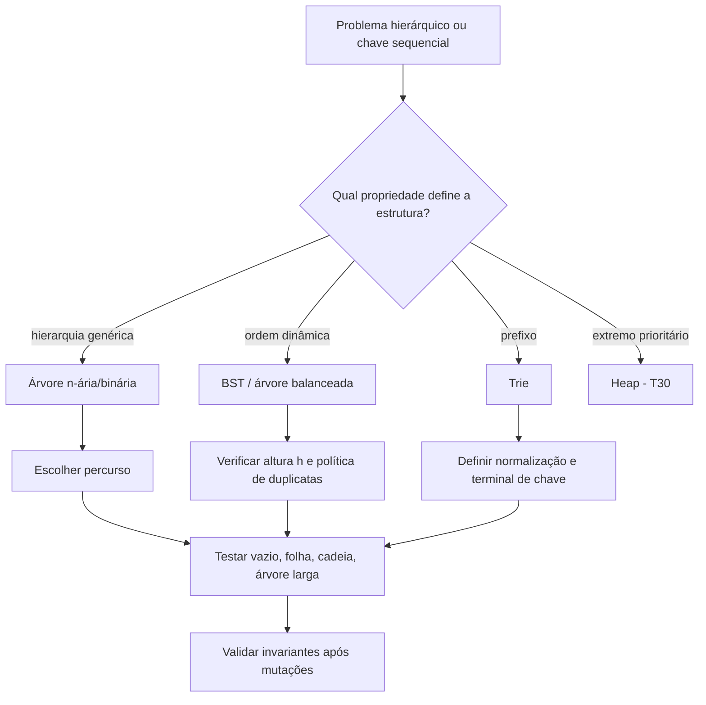
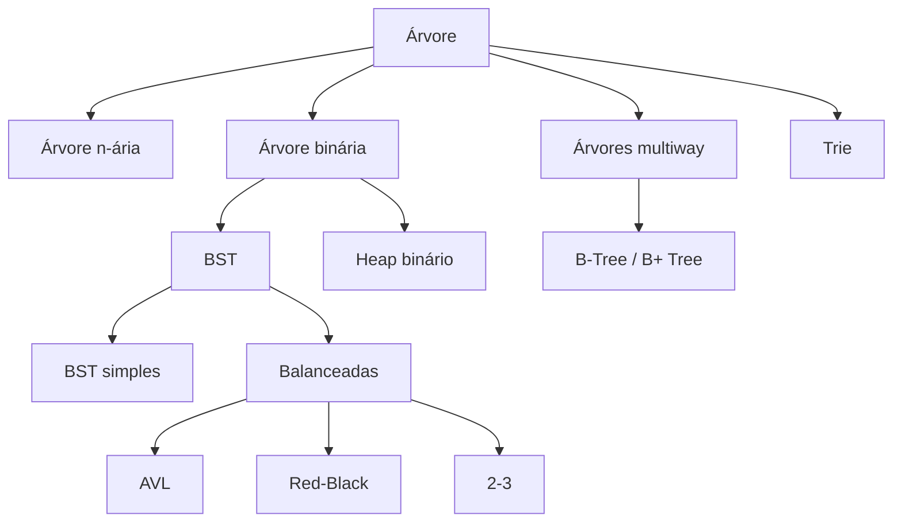

<a id="inicio"></a>

# Árvores

> **Classificação geral:** `[C → D] Conhecer e aplicar no nível fundamental`  
> **Nível:** C — Algoritmos e Estruturas de Dados  
> **Posição na taxonomia:** tópico 31 — oitavo tópico do Nível C  
> **Pré-requisitos principais:** T10 — Estruturas de Dados Elementares; T14 — Estado, Escopo, Referências e Mutabilidade; T17 — Recursão; T24 — Correção e Análise de Algoritmos; T25 — Tipos Abstratos de Dados, Estruturas e Implementações; T28 — Estruturas Lineares; T30 — Filas de Prioridade e Heaps  
> **Aprofundamentos posteriores:** T32 — Grafos e Percursos Fundamentais; T33 — Estratégias Fundamentais de Resolução Algorítmica; T35 — Modelagem, Escolha de Estruturas e Trade-offs

---

## Resumo executivo

Uma **árvore** representa relações hierárquicas e ramificadas. Em uma árvore enraizada, existe uma **raiz** e cada nó diferente dela possui um único pai. Cada filho inicia sua própria **subárvore**, o que torna árvores naturalmente recursivas.

```text
                 A  ← raiz
               / | \
              B  C  D
             / \    |
            E   F   G  ← folhas em E, F, C e G
```

Árvore, árvore binária, Binary Search Tree e heap não são sinônimos:

```text
árvore
  └─ pode ser binária
       ├─ pode ser BST       → invariante de ordenação
       └─ pode ser heap      → invariante de prioridade + forma quase completa
```

No nível fundamental, dominar árvores significa ser capaz de:

- nomear e medir corretamente seus elementos;
- distinguir árvore n-ária, binária, BST e heap;
- executar e explicar pré-ordem, em ordem, pós-ordem e percurso por nível;
- relacionar DFS recursivo com a pilha de chamadas e BFS com uma fila;
- compreender que busca/inserção/remoção em BST dependem da **altura `h`**;
- explicar por que uma BST desbalanceada pode degenerar para comportamento linear;
- conhecer a finalidade de famílias balanceadas sem precisar implementar todas;
- reconhecer Trie como árvore especializada em chaves sequenciais/prefixos;
- identificar primeiro o **invariante**, antes de escolher uma API ou implementação.

---

## Como estudar este tópico — duas rotas

Este T31 funciona em duas rotas complementares. A **rota de estudo** preserva a progressão conceitual; a **rota de consulta** permite recuperar rapidamente uma definição, invariante, custo, caso de borda ou técnica de diagnóstico sem reler o capítulo inteiro.

### Rota A — primeiro contato / estudo sequencial

```text
Resumo executivo
→ Visão panorâmica
→ PARTE I: fundamentos, forma e representação
→ PARTE II: percursos, custos e BST
→ PARTE III: balanceamento, famílias de árvores e Trie
→ PARTE IV: transferência entre linguagens
→ PARTE V: casos de borda, robustez e decisão
→ PARTE VI: LABs, exercícios, troubleshooting e critérios de domínio
→ Apêndices: taxonomia, fontes, QA e histórico
```

### Rota B — consulta rápida

1. abra a [Visão panorâmica](#visao-panoramica);
2. use o **Índice essencial** para ir ao bloco conceitual desejado;
3. para falha concreta, vá ao [Troubleshooting sistemático](#troubleshooting-sistematico);
4. para verificar cobertura operacional, consulte o [inventário `PR-T31-*`](#pr-t31-inventario);
5. para confirmar fonte, versão ou evidência, use os apêndices de referências e QA.

> **Regra de uso:** na primeira passagem, aprenda primeiro a relação **forma → invariante → operação → custo**. As famílias avançadas entram como finalidade e garantia, não como obrigação de implementação completa.

## Visão rápida

| Pergunta | Resposta curta |
|---|---|
| Toda árvore é binária? | não |
| Toda árvore binária é BST? | não |
| Toda BST é balanceada? | não |
| Todo heap binário é BST? | não |
| Raiz tem pai? | não |
| Folha possui filhos? | não |
| Profundidade da raiz neste material | `0` |
| Altura de uma folha neste material | `0` |
| Custo de percorrer todos os `n` nós | `Θ(n)` |
| Busca em BST | `O(h)` |
| BST balanceada com `n` nós | altura `O(log n)` |
| BST degenerada | altura `Θ(n)` |
| Em ordem de uma BST | produz chaves em ordem não decrescente, conforme a política de duplicatas |
| BFS por nível usa naturalmente | fila |
| DFS recursivo usa implicitamente | pilha de chamadas |
| AVL / Red-Black / 2-3 | famílias de árvores balanceadas |
| B/B+ Tree | famílias multiway importantes em armazenamento/índices |
| Trie | árvore orientada por símbolos/prefixos |

---

## Regra de ouro

> **Antes de perguntar “qual API de árvore usar?”, identifique qual propriedade precisa permanecer verdadeira após cada operação. A estrutura só é útil enquanto seu invariante é preservado.**

---

## Decisão rápida

```text
PRECISO REPRESENTAR UMA RELAÇÃO RAMIFICADA?
          │
          ├── não
          │    └── talvez uma estrutura linear/associativa seja suficiente
          │
          └── sim
               │
               ├── hierarquia genérica com vários filhos
               │     └── árvore n-ária
               │
               ├── no máximo dois filhos
               │     └── árvore binária
               │          │
               │          ├── preciso de busca ordenada dinâmica
               │          │     └── BST / árvore balanceada
               │          │
               │          └── preciso apenas do extremo prioritário
               │                └── heap, não BST
               │
               ├── índices externos / muitos filhos por nó
               │     └── B-Tree / B+ Tree (contexto de armazenamento)
               │
               └── chaves por sequência/prefixo
                     └── Trie
```

---

<a id="visao-panoramica"></a>

## 🗺️ Visão panorâmica — o mapa antes dos detalhes

Esta seção é o **mapa de consulta rápida** do T31. Ela não substitui o aprofundamento das seções seguintes; serve para localizar rapidamente o conceito, o invariante, o custo relevante, o risco operacional e a ponte para implementação.

### O domínio inteiro em uma tela

```text
ÁRVORES
│
├─ 31.1 vocabulário estrutural
│  ├─ raiz, nó, aresta
│  ├─ pai, filho, folha
│  ├─ ancestral, descendente
│  ├─ profundidade, altura
│  └─ subárvore
│
├─ 31.2 forma / aridade
│  ├─ árvore n-ária
│  └─ árvore binária
│     └─ no máximo dois filhos por nó
│
├─ 31.3 percursos
│  ├─ pré-ordem     → nó antes das subárvores
│  ├─ em ordem      → esquerda, nó, direita — definido naturalmente para binária
│  ├─ pós-ordem     → subárvores antes do nó
│  └─ por nível     → BFS com fila
│
├─ 31.4 BST
│  ├─ invariante global de ordenação
│  ├─ search / insert / delete / min / max
│  ├─ custo típico expresso em O(h)
│  └─ h pode ser Θ(log n) ou Θ(n)
│
├─ 31.5 famílias balanceadas
│  ├─ AVL
│  ├─ Red-Black
│  ├─ 2-3 tree
│  └─ B-Tree / B+ Tree
│
├─ 31.6 Trie
│  └─ caminho representa sequência/prefixo
│
└─ 31.7 método de estudo
   └─ invariante → operação → manutenção → custo
```

O eixo didático é:

```text
forma da estrutura
      ↓
invariante que deve permanecer verdadeiro
      ↓
operação que explora esse invariante
      ↓
custo em função de n, h, largura ou tamanho da chave
      ↓
representação / biblioteca concreta
```

### Modelo mental mínimo

Uma árvore enraizada comum deve preservar, no mínimo, a ideia de **uma raiz** e de **um único pai para cada nó não raiz**. Se referências mutáveis criarem um ciclo ou fizerem o mesmo nó ter múltiplos pais, a estrutura já não deve ser tratada silenciosamente como uma árvore enraizada ordinária; o problema passou para semântica de grafo/DAG, aprofundada no T32.

Para BST, existe uma segunda camada de contrato: a ordenação é **global por subárvore**, não apenas uma comparação local entre pai e filho. Por isso, este desenho é inválido como BST mesmo que `12 > 5` localmente:

```text
       10
      /
     5
      \
       12   ← 12 está dentro da subárvore esquerda de 10
```

Um validador que verifique somente `left.key <= node.key` e `right.key >= node.key` pode aceitar essa árvore incorretamente. A validação robusta propaga limites permitidos ao descer.

### Fluxo operacional de raciocínio



### Tabela de consulta rápida

| Pergunta | Primeira resposta | Invariante/custo que não pode ser esquecido |
|---|---|---|
| quero visitar pai antes dos descendentes | pré-ordem | `Θ(n)` se todos os nós forem visitados |
| quero visitar filhos antes do pai | pós-ordem | `Θ(n)` |
| quero chaves ordenadas de uma BST | em ordem | depende da BST continuar válida |
| quero visitar por distância à raiz | BFS/por nível | tempo `Θ(n)`; memória depende da largura da fronteira |
| quero buscar chave em BST | compare e descarte uma subárvore | `O(h)`, não `O(log n)` universal |
| entrada pode vir ordenada/adversarial | BST simples pode degenerar | considerar árvore balanceada/biblioteca madura |
| quero mapa/conjunto ordenado em Java | `TreeMap` / `TreeSet` | contrato de comparador e `log(n)` documentado |
| quero prefixos/autocomplete | Trie | custo ligado ao comprimento da chave e à representação dos filhos |
| dataset/índice é externo e muito grande | B/B+ Tree | ramificação alta reduz níveis/acessos externos |
| quero apenas mínimo/máximo prioritário | heap / Priority Queue | heap não oferece ordenação BST — T30 |
| preciso de relações arbitrárias/ciclos | grafo | sair de T31 e aplicar modelo de T32 |

### Não confundir

| A | B | Diferença essencial |
|---|---|---|
| árvore | grafo | árvore enraizada ordinária não admite ciclos nem múltiplos pais |
| árvore binária | BST | binária limita filhos; BST acrescenta invariante de ordenação |
| BST | heap | BST organiza subárvores para busca ordenada; heap preserva prioridade local |
| balanceada | completa | “balanceada” depende da família; “complete” descreve forma de preenchimento |
| perfect | complete | perfect preenche todos os níveis; complete permite último nível parcial à esquerda |
| profundidade | altura | profundidade mede raiz→nó; altura mede nó→folha mais distante, conforme convenção |
| `O(h)` | `O(log n)` | só coincidem quando `h = O(log n)` |
| inorder | “ordenação universal” | inorder ordena uma **BST válida**, não uma árvore binária arbitrária |
| Trie | hash map | Trie explora estrutura sequencial/prefixos; mapa hashado é orientado a chave integral |
| B-Tree | binary tree | B-Tree é multiway e projetada para alta ramificação/armazenamento |

### Pergunta prática → mecanismo / primeira decisão

- **“Busca ficou linear mesmo usando BST.”** Meça `h` e observe a ordem de inserção antes de micro-otimizar comparações.
- **“Inorder não sai ordenado.”** Valide primeiro o invariante global e a política de duplicatas/comparador.
- **“Recursão estourou.”** Meça profundidade real; considere percurso iterativo e investigue degeneração antes de apenas aumentar limite de stack.
- **“BFS usa memória demais.”** Meça a maior fronteira/largura; BFS pode reter muitos nós simultaneamente mesmo com tempo linear.
- **“Delete quebrou a árvore.”** Revalide links, raiz e limites BST depois de cada um dos três casos: folha, um filho e dois filhos.
- **“Prefixo existe, palavra não.”** Em Trie, diferencie caminho existente de marcador de chave completa.
- **“Duas strings visualmente iguais viraram caminhos diferentes.”** Defina normalização Unicode e política de case **antes** da indexação.

### Microexemplos canônicos

**Mesmas chaves, alturas muito diferentes:**

```text
inserção: 1,2,3,4,5          inserção: 3,2,4,1,5

1                            3
 \                          / \
  2                        2   4
   \                      /     \
    3                    1       5
     \
      4
       \
        5

h = 4 (arestas)             h = 2 (arestas)
```

Isso mostra por que a operação fundamental deve ser descrita por `O(h)`. Dizer apenas “BST busca em `O(log n)`” esconde o pior caso que o tópico precisa ensinar.

**Prefixo não é necessariamente chave completa:**

```text
Trie contém: car, card, cat

prefixo "ca" → existe caminho
chave   "ca" → falsa, se o nó de "a" não estiver marcado como terminal
chave  "car" → verdadeira
```

### Transferência entre as quatro linguagens

| Linguagem | Ponte prática | Cuidado específico |
|---|---|---|
| Python | classes próprias para aprendizado; `deque` para BFS | recursão profunda é limitada; aumentar `sys.setrecursionlimit()` sem diagnóstico pode ser perigoso |
| JavaScript | classes/objetos próprios; **fronteiras por nível** para BFS didático; deque de biblioteca quando disponível | ECMAScript 2026 não fornece uma coleção BST padrão equivalente a `TreeMap`; `array + head` evita `shift()`, mas pode reter referências processadas |
| Java | nó próprio para estudo; `TreeMap`/`TreeSet` para coleção ordenada; `ArrayDeque` para BFS | comparador deve representar a mesma noção de identidade/ordem exigida pelo contrato |
| Bash | arrays associativos/indexados podem simular nós pequenos | é transferência conceitual; não é recomendação para árvores grandes/complexas |

### Problemas reais que precisam de destino explícito

Nesta revisão, a cobertura operacional é considerada fechada apenas porque os seguintes riscos têm destino no documento e no inventário `PR-T31-*`:

1. confusão entre árvore, binária, BST e heap;
2. erro de convenção em profundidade/altura;
3. percurso incorreto ou expectativa errada de inorder;
4. validação BST local que ignora restrições dos ancestrais;
5. degeneração por ordem de inserção;
6. política de duplicatas/comparador inconsistente;
7. remoção que perde subárvore ou quebra raiz/links;
8. profundidade adversarial causando overflow de stack;
9. ciclo/múltiplo pai acidental em estrutura mutável;
10. Trie sem terminal, normalização ou controle de crescimento.

### Duas rotas de uso

**Consulta rápida:** use esta Visão Panorâmica → seção específica → troubleshooting correspondente.

**Estudo completo:** siga o índice desde conceitos e percursos até BST, balanceamento, Trie, implementação nas quatro linguagens, LABs e QA.

### Síntese multifonte desta revisão

A literatura consultada se complementa em vez de ser usada como colagem:

- **CLRS 4ª ed.** sustenta o invariante global de BST, os percursos, o custo `O(h)`, as garantias de Red-Black/AVL e o papel de B-Trees; também trata radix tree como trie.
- **Skiena 3ª ed.** reforça o impacto prático da ordem de inserção, a degeneração para lista ligada e a decisão entre estruturas balanceadas e B-Trees.
- **La Rocca 2024** oferece a ponte didática entre vocabulário de árvores, altura, BST e sequências adversariais.
- **documentação oficial atual** fecha diferenças de implementação: Python 3.14.7 para recursão/deque, Java SE/JDK 27 como baseline corrente, ECMAScript 2026 sem árvore ordenada padrão e GNU Bash 5.3 na transferência conceitual.

A síntese preserva uma fronteira importante: T31 usa BFS/DFS em árvores, mas **visited sets, ciclos, componentes e teoria geral de grafos pertencem ao T32**.

### Gate 1 — mapa fechado

**Estado: FECHADO.** A Visão Panorâmica representa os nós 31.1–31.7, os principais invariantes, classes de custo, problemas operacionais, transferência entre linguagens, fronteiras curriculares e destinos de troubleshooting. O aprofundamento abaixo continua sendo a fonte detalhada.

[↑ Voltar ao índice](#índice)

---

# Índice

## Índice essencial

- [🗺️ Visão panorâmica — o mapa antes dos detalhes](#visao-panoramica)
- [PARTE I — Fundamentos, forma e representação](#parte-i)
- [PARTE II — Percursos, custos e Binary Search Tree](#parte-ii)
- [PARTE III — Balanceamento, famílias de árvores e Trie](#parte-iii)
- [PARTE IV — Transferência entre linguagens](#parte-iv)
- [PARTE V — Casos de borda, robustez e decisão](#parte-v)
- [PARTE VI — LABs, exercícios, troubleshooting e critérios de domínio](#parte-vi)
- [Inventário `PR-T31-*`](#pr-t31-inventario)
- [🔎 Troubleshooting sistemático](#troubleshooting-sistematico)
- [APÊNDICES — taxonomia, fontes, QA e histórico](#apendices)

<details>
<summary><strong>Índice detalhado</strong></summary>

- [🗺️ Visão panorâmica — o mapa antes dos detalhes](#visao-panoramica)
- [1. Posição deste assunto na trilha](#1-posição-deste-assunto-na-trilha)
  - [1.1 O que T17 entregou](#11-o-que-t17-entregou)
  - [1.2 O que T25 entregou](#12-o-que-t25-entregou)
  - [1.3 O que T28 entregou](#13-o-que-t28-entregou)
  - [1.4 O que T30 entregou](#14-o-que-t30-entregou)
  - [1.5 Fronteira com T32 — Grafos](#15-fronteira-com-t32--grafos)
  - [1.6 Fronteira com T35 — escolha estrutural](#16-fronteira-com-t35--escolha-estrutural)
- [2. Modelo mental — hierarquia, caminho e subárvore](#2-modelo-mental--hierarquia-caminho-e-subárvore)
  - [2.1 Estrutura linear × estrutura hierárquica](#21-estrutura-linear--estrutura-hierárquica)
  - [2.2 Relação pai-filho](#22-relação-pai-filho)
  - [2.3 Subárvore](#23-subárvore)
  - [2.4 Recursividade estrutural](#24-recursividade-estrutural)
- [3. 31.1 — Conceitos fundamentais `[D]`](#3-311--conceitos-fundamentais-d)
  - [3.1 Raiz](#31-raiz)
  - [3.2 Nó](#32-nó)
  - [3.3 Aresta](#33-aresta)
  - [3.4 Pai e filho](#34-pai-e-filho)
  - [3.5 Folha](#35-folha)
  - [3.6 Ancestral e descendente](#36-ancestral-e-descendente)
  - [3.7 Irmãos](#37-irmãos)
  - [3.8 Profundidade](#38-profundidade)
  - [3.9 Altura](#39-altura)
  - [3.10 Subárvore](#310-subárvore)
- [4. Profundidade, altura e níveis — não misturar as métricas](#4-profundidade-altura-e-níveis--não-misturar-as-métricas)
  - [4.1 Exemplo medido](#41-exemplo-medido)
  - [4.2 Altura controla vários custos](#42-altura-controla-vários-custos)
  - [4.3 `n` não determina sozinho uma altura única](#43-n-não-determina-sozinho-uma-altura-única)
  - [4.4 Convenção é parte do contrato didático](#44-convenção-é-parte-do-contrato-didático)
- [5. Representações de árvores](#5-representações-de-árvores)
  - [5.1 Nós com referências para filhos](#51-nós-com-referências-para-filhos)
  - [5.2 Lista de filhos em árvore n-ária](#52-lista-de-filhos-em-árvore-n-ária)
  - [5.3 Índices em arrays](#53-índices-em-arrays)
  - [5.4 Pai explícito ou implícito](#54-pai-explícito-ou-implícito)
  - [5.5 Representação implícita](#55-representação-implícita)
- [6. 31.2 — Árvore n-ária e binária `[C]`](#6-312--árvore-n-ária-e-binária-c)
  - [6.1 Árvore n-ária](#61-árvore-n-ária)
  - [6.2 Árvore binária](#62-árvore-binária)
  - [6.3 Árvore binária não implica BST](#63-árvore-binária-não-implica-bst)
  - [6.4 BST não implica balanceamento](#64-bst-não-implica-balanceamento)
  - [6.5 Heap binário também não implica BST](#65-heap-binário-também-não-implica-bst)
- [7. Formas úteis de árvore binária](#7-formas-úteis-de-árvore-binária)
  - [7.1 Full / proper](#71-full--proper)
  - [7.2 Perfect](#72-perfect)
  - [7.3 Complete](#73-complete)
  - [7.4 Skewed / degenerada](#74-skewed--degenerada)
  - [7.5 Balanced é uma família de condições, não uma única definição universal](#75-balanced-é-uma-família-de-condições-não-uma-única-definição-universal)
- [8. 31.3 — Percursos `[C → D]`](#8-313--percursos-c--d)
  - [8.1 Árvore canônica dos exemplos](#81-árvore-canônica-dos-exemplos)
- [9. Pré-ordem](#9-pré-ordem)
  - [9.1 Ordem](#91-ordem)
  - [9.2 Pseudocódigo](#92-pseudocódigo)
  - [9.3 Aplicações conceituais](#93-aplicações-conceituais)
  - [9.4 Complexidade](#94-complexidade)
- [10. Em ordem](#10-em-ordem)
  - [10.1 Ordem](#101-ordem)
  - [10.2 Pseudocódigo](#102-pseudocódigo)
  - [10.3 Propriedade especial em BST](#103-propriedade-especial-em-bst)
  - [10.4 Complexidade](#104-complexidade)
- [11. Pós-ordem](#11-pós-ordem)
  - [11.1 Ordem](#111-ordem)
  - [11.2 Pseudocódigo](#112-pseudocódigo)
  - [11.3 Aplicações conceituais](#113-aplicações-conceituais)
  - [11.4 Exemplo — altura](#114-exemplo--altura)
- [12. Percurso por nível — BFS](#12-percurso-por-nível--bfs)
  - [12.1 Ideia](#121-ideia)
  - [12.2 Estrutura auxiliar natural](#122-estrutura-auxiliar-natural)
  - [12.3 Complexidade](#123-complexidade)
  - [12.4 Fronteira com T32](#124-fronteira-com-t32)
- [13. Recursão, stack explícita e queue](#13-recursão-stack-explícita-e-queue)
  - [13.1 DFS recursivo](#131-dfs-recursivo)
  - [13.2 DFS iterativo](#132-dfs-iterativo)
  - [13.3 BFS](#133-bfs)
  - [13.4 Recursão não é requisito da árvore](#134-recursão-não-é-requisito-da-árvore)
- [14. Árvore n-ária — percursos fundamentais](#14-árvore-n-ária--percursos-fundamentais)
  - [14.1 Pré-ordem genérica](#141-pré-ordem-genérica)
  - [14.2 Pós-ordem genérica](#142-pós-ordem-genérica)
  - [14.3 “Em ordem” não possui uma única extensão universal para n-árias](#143-em-ordem-não-possui-uma-única-extensão-universal-para-n-árias)
  - [14.4 Por nível permanece natural](#144-por-nível-permanece-natural)
- [15. Custos de percurso](#15-custos-de-percurso)
  - [15.1 Visitar todos os nós](#151-visitar-todos-os-nós)
  - [15.2 O que muda é a memória auxiliar](#152-o-que-muda-é-a-memória-auxiliar)
  - [15.3 Árvores largas × profundas](#153-árvores-largas--profundas)
  - [15.4 Custo do callback de visita](#154-custo-do-callback-de-visita)
- [16. 31.4 — Binary Search Tree — BST `[C]`](#16-314--binary-search-tree--bst-c)
  - [16.1 A propriedade vale para a subárvore inteira](#161-a-propriedade-vale-para-a-subárvore-inteira)
  - [16.2 Invariante como intervalo](#162-invariante-como-intervalo)
- [17. Busca em BST](#17-busca-em-bst)
  - [17.1 Algoritmo](#171-algoritmo)
  - [17.2 Por que podemos descartar uma subárvore](#172-por-que-podemos-descartar-uma-subárvore)
  - [17.3 Complexidade](#173-complexidade)
  - [17.4 Comparação com binary search em array](#174-comparação-com-binary-search-em-array)
- [18. Inserção em BST](#18-inserção-em-bst)
  - [18.1 Ideia](#181-ideia)
  - [18.2 O novo nó normalmente entra como folha](#182-o-novo-nó-normalmente-entra-como-folha)
  - [18.3 Complexidade](#183-complexidade)
  - [18.4 Ordem de inserção altera a forma](#184-ordem-de-inserção-altera-a-forma)
- [19. Remoção em BST](#19-remoção-em-bst)
  - [19.1 Caso 1 — folha](#191-caso-1--folha)
  - [19.2 Caso 2 — um filho](#192-caso-2--um-filho)
  - [19.3 Caso 3 — dois filhos](#193-caso-3--dois-filhos)
  - [19.4 Invariante primeiro](#194-invariante-primeiro)
  - [19.5 Complexidade](#195-complexidade)
- [20. Mínimo, máximo, predecessor e sucessor](#20-mínimo-máximo-predecessor-e-sucessor)
  - [20.1 Mínimo](#201-mínimo)
  - [20.2 Máximo](#202-máximo)
  - [20.3 Sucessor](#203-sucessor)
  - [20.4 Predecessor](#204-predecessor)
  - [20.5 Relação com percurso em ordem](#205-relação-com-percurso-em-ordem)
- [21. Altura é a variável crítica da BST](#21-altura-é-a-variável-crítica-da-bst)
  - [21.1 Custos em função de `h`](#211-custos-em-função-de-h)
  - [21.2 Caso favorável](#212-caso-favorável)
  - [21.3 Pior caso](#213-pior-caso)
  - [21.4 A forma não é detalhe estético](#214-a-forma-não-é-detalhe-estético)
- [22. Degeneração e sequências adversas](#22-degeneração-e-sequências-adversas)
  - [22.1 Inserção ordenada](#221-inserção-ordenada)
  - [22.2 Comportamento de lista ligada](#222-comportamento-de-lista-ligada)
  - [22.3 Entrada externa pode controlar a forma](#223-entrada-externa-pode-controlar-a-forma)
  - [22.4 Aleatorizar não substitui garantia](#224-aleatorizar-não-substitui-garantia)
- [23. Duplicatas em BST — política obrigatória](#23-duplicatas-em-bst--política-obrigatória)
  - [23.1 O problema](#231-o-problema)
  - [23.2 Estratégias comuns](#232-estratégias-comuns)
  - [23.3 Preferência didática deste tópico](#233-preferência-didática-deste-tópico)
  - [23.4 Comparador também é parte do contrato](#234-comparador-também-é-parte-do-contrato)
- [24. Validação correta de uma BST](#24-validação-correta-de-uma-bst)
  - [24.1 Erro clássico](#241-erro-clássico)
  - [24.2 Estratégia por limites](#242-estratégia-por-limites)
  - [24.3 Por que funciona](#243-por-que-funciona)
  - [24.4 Duplicatas mudam limites](#244-duplicatas-mudam-limites)
- [25. 31.5 — Árvores balanceadas `[E → C]`](#25-315--árvores-balanceadas-e--c)
  - [25.1 Problema que resolvem](#251-problema-que-resolvem)
  - [25.2 Rotações](#252-rotações)
  - [25.3 Não confundir “balanceada” com “perfeitamente simétrica”](#253-não-confundir-balanceada-com-perfeitamente-simétrica)
- [26. AVL `[E → C]`](#26-avl-e--c)
  - [26.1 Ideia](#261-ideia)
  - [26.2 Consequência](#262-consequência)
  - [26.3 Custo do balanceamento](#263-custo-do-balanceamento)
  - [26.4 Nível exigido neste tópico](#264-nível-exigido-neste-tópico)
- [27. Red-Black Tree `[E → C]`](#27-red-black-tree-e--c)
  - [27.1 Ideia](#271-ideia)
  - [27.2 Garantia relevante](#272-garantia-relevante)
  - [27.3 Biblioteca real — Java `TreeMap`](#273-biblioteca-real--java-treemap)
  - [27.4 AVL × Red-Black](#274-avl--red-black)
- [28. 2-3 Tree `[E → C]`](#28-2-3-tree-e--c)
  - [28.1 Estrutura multiway](#281-estrutura-multiway)
  - [28.2 Por que é importante conceitualmente](#282-por-que-é-importante-conceitualmente)
  - [28.3 Relação pedagógica](#283-relação-pedagógica)
  - [28.4 Nível curricular](#284-nível-curricular)
- [29. B-Tree e B+ Tree `[E → C]`](#29-b-tree-e-b-tree-e--c)
  - [29.1 Motivação](#291-motivação)
  - [29.2 B-Tree](#292-b-tree)
  - [29.3 B+ Tree](#293-b-tree)
  - [29.4 Por que não implementar agora](#294-por-que-não-implementar-agora)
- [30. Comparação rápida — BST, AVL, Red-Black, 2-3 e B/B+](#30-comparação-rápida--bst-avl-red-black-2-3-e-bb)
- [31. 31.6 — Trie `[E]`](#31-316--trie-e)
  - [31.6.1 Caminho representa prefixo](#3161-caminho-representa-prefixo)
  - [31.6.2 Buscar chave](#3162-buscar-chave)
  - [31.6.3 Prefix search](#3163-prefix-search)
  - [31.6.4 Custo de memória](#3164-custo-de-memória)
  - [31.6.5 Texto real exige política de símbolos](#3165-texto-real-exige-política-de-símbolos)
- [32. 31.7 — Invariante antes da API](#32-317--invariante-antes-da-api)
  - [32.1 Qual propriedade define a estrutura?](#321-qual-propriedade-define-a-estrutura)
  - [32.2 Qual operação depende dessa propriedade?](#322-qual-operação-depende-dessa-propriedade)
  - [32.3 O que inserção/remoção precisa preservar?](#323-o-que-inserçãoremoção-precisa-preservar)
  - [32.4 Como a altura influencia o custo?](#324-como-a-altura-influencia-o-custo)
- [33. Árvore × Heap × BST — comparação essencial](#33-árvore--heap--bst--comparação-essencial)
  - [33.1 Exemplo de min-heap que não é BST](#331-exemplo-de-min-heap-que-não-é-bst)
  - [33.2 Exemplo de BST que não é min-heap](#332-exemplo-de-bst-que-não-é-min-heap)
- [34. Python — árvore manual e limites de recursão](#34-python--árvore-manual-e-limites-de-recursão)
  - [34.1 Nó binário](#341-nó-binário)
  - [34.2 In-order recursivo](#342-in-order-recursivo)
  - [34.3 Busca iterativa](#343-busca-iterativa)
  - [34.4 Profundidade de recursão é recurso finito](#344-profundidade-de-recursão-é-recurso-finito)
- [35. JavaScript / ECMAScript — árvore manual](#35-javascript--ecmascript--árvore-manual)
  - [35.1 Nó](#351-nó)
  - [35.2 Busca](#352-busca)
  - [35.3 BFS](#353-bfs)
- [36. Java — nós próprios e `TreeMap`](#36-java--nós-próprios-e-treemap)
  - [36.1 Nó didático](#361-nó-didático)
  - [36.2 BST manual para aprender o invariante](#362-bst-manual-para-aprender-o-invariante)
  - [36.3 Biblioteca para problema real](#363-biblioteca-para-problema-real)
  - [36.4 `TreeSet`](#364-treeset)
- [37. GNU Bash — transferência conceitual sem equivalência artificial](#37-gnu-bash--transferência-conceitual-sem-equivalência-artificial)
  - [37.1 Representação por índices](#371-representação-por-índices)
  - [37.2 Limitação prática](#372-limitação-prática)
  - [37.3 Recursão em Shell exige cautela](#373-recursão-em-shell-exige-cautela)
  - [37.4 Processos/subshells](#374-processossubshells)
- [38. Comparação entre as quatro linguagens canônicas](#38-comparação-entre-as-quatro-linguagens-canônicas)
- [39. Exemplo canônico nas quatro linguagens — BST](#39-exemplo-canônico-nas-quatro-linguagens--bst)
  - [39.1 Python](#391-python)
  - [39.2 JavaScript](#392-javascript)
  - [39.3 Java](#393-java)
  - [39.4 Bash](#394-bash)
  - [39.5 Transferência real](#395-transferência-real)
- [40. Mermaid — mapa estrutural do tópico](#40-mermaid--mapa-estrutural-do-tópico)
- [41. Casos de borda](#41-casos-de-borda)
  - [41.1 Árvore vazia](#411-árvore-vazia)
  - [41.2 Um único nó](#412-um-único-nó)
  - [41.3 Apenas filho esquerdo ou direito](#413-apenas-filho-esquerdo-ou-direito)
  - [41.4 BST degenerada](#414-bst-degenerada)
  - [41.5 Duplicata](#415-duplicata)
  - [41.6 Chaves extremas](#416-chaves-extremas)
  - [41.7 Estrutura acidentalmente cíclica](#417-estrutura-acidentalmente-cíclica)
- [42. Erros frequentes](#42-erros-frequentes)
  - [42.1 Chamar qualquer árvore binária de BST](#421-chamar-qualquer-árvore-binária-de-bst)
  - [42.2 Chamar heap de BST](#422-chamar-heap-de-bst)
  - [42.3 Dizer que BST sempre busca em `O(log n)`](#423-dizer-que-bst-sempre-busca-em-olog-n)
  - [42.4 Validar BST só contra filhos imediatos](#424-validar-bst-só-contra-filhos-imediatos)
  - [42.5 Confundir profundidade e altura](#425-confundir-profundidade-e-altura)
  - [42.6 Supor que `inorder` ordena qualquer árvore](#426-supor-que-inorder-ordena-qualquer-árvore)
  - [42.7 Usar BFS sem fila](#427-usar-bfs-sem-fila)
  - [42.8 Usar recursão profunda sem considerar recursos](#428-usar-recursão-profunda-sem-considerar-recursos)
  - [42.9 Não definir política de duplicatas](#429-não-definir-política-de-duplicatas)
  - [42.10 Implementar Red-Black/AVL em produção sem necessidade](#4210-implementar-red-blackavl-em-produção-sem-necessidade)
- [43. Segurança, robustez e consumo de recursos](#43-segurança-robustez-e-consumo-de-recursos)
  - [43.1 Profundidade controlada por entrada](#431-profundidade-controlada-por-entrada)
  - [43.2 Limite de recursão não é “otimização”](#432-limite-de-recursão-não-é-otimização)
  - [43.3 Tamanho máximo](#433-tamanho-máximo)
  - [43.4 Ciclos acidentais](#434-ciclos-acidentais)
  - [43.5 Comparadores](#435-comparadores)
  - [43.6 Trie e dados textuais](#436-trie-e-dados-textuais)
- [44. Decisão de estrutura](#44-decisão-de-estrutura)
  - [44.1 Perguntas antes de escolher](#441-perguntas-antes-de-escolher)
  - [44.2 Inventário formal de problemas reais — PR-T31-*](#pr-t31-inventario)
- [45. Exercício guiado — rastrear quatro percursos](#45-exercício-guiado--rastrear-quatro-percursos)
  - [45.1 Pré-ordem](#451-pré-ordem)
  - [45.2 Em ordem](#452-em-ordem)
  - [45.3 Pós-ordem](#453-pós-ordem)
  - [45.4 Por nível](#454-por-nível)
  - [45.5 Evidência esperada](#455-evidência-esperada)
- [46. Exercício guiado — altura e degeneração](#46-exercício-guiado--altura-e-degeneração)
  - [46.1 Tarefas](#461-tarefas)
  - [46.2 Conclusão esperada](#462-conclusão-esperada)
- [47. Exercício guiado — validar uma BST quebrada](#47-exercício-guiado--validar-uma-bst-quebrada)
  - [47.1 Pergunta](#471-pergunta)
  - [47.2 Raciocínio](#472-raciocínio)
  - [47.3 Regra](#473-regra)
- [48. LAB 1 — Vocabulário, profundidade e altura](#48-lab-1--vocabulário-profundidade-e-altura)
  - [Objetivo](#objetivo)
  - [Pré-requisitos](#pré-requisitos)
  - [Estado inicial](#estado-inicial)
  - [Tarefa](#tarefa)
  - [Procedimento](#procedimento)
  - [O que observar](#o-que-observar)
  - [Testes](#testes)
  - [Explicação](#explicação)
  - [Variação / transferência](#variação--transferência)
  - [Limpeza](#limpeza)
- [49. LAB 2 — Pré-ordem, em ordem e pós-ordem](#49-lab-2--pré-ordem-em-ordem-e-pós-ordem)
  - [Objetivo](#objetivo-1)
  - [Pré-requisitos](#pré-requisitos-1)
  - [Estado inicial](#estado-inicial-1)
  - [Tarefa](#tarefa-1)
  - [Procedimento](#procedimento-1)
  - [O que observar](#o-que-observar-1)
  - [Testes](#testes-1)
  - [Explicação](#explicação-1)
  - [Variação / transferência](#variação--transferência-1)
  - [Limpeza](#limpeza-1)
- [50. LAB 3 — Percurso por nível com fila](#50-lab-3--percurso-por-nível-com-fila)
  - [Objetivo](#objetivo-2)
  - [Pré-requisitos](#pré-requisitos-2)
  - [Estado inicial](#estado-inicial-2)
  - [Tarefa](#tarefa-2)
  - [Procedimento](#procedimento-2)
  - [O que observar](#o-que-observar-2)
  - [Testes](#testes-2)
  - [Explicação](#explicação-2)
  - [Variação / transferência](#variação--transferência-2)
  - [Limpeza](#limpeza-2)
- [51. LAB 4 — BST — busca, inserção e in-order](#51-lab-4--bst--busca-inserção-e-in-order)
  - [Objetivo](#objetivo-3)
  - [Pré-requisitos](#pré-requisitos-3)
  - [Estado inicial](#estado-inicial-3)
  - [Tarefa](#tarefa-3)
  - [Procedimento](#procedimento-3)
  - [O que observar](#o-que-observar-3)
  - [Testes](#testes-3)
  - [Explicação](#explicação-3)
  - [Variação / transferência](#variação--transferência-3)
  - [Limpeza](#limpeza-3)
- [52. LAB 5 — Degeneração e custo `O(h)`](#52-lab-5--degeneração-e-custo-oh)
  - [Objetivo](#objetivo-4)
  - [Pré-requisitos](#pré-requisitos-4)
  - [Estado inicial](#estado-inicial-4)
  - [Tarefa](#tarefa-4)
  - [Procedimento](#procedimento-4)
  - [O que observar](#o-que-observar-4)
  - [Testes](#testes-4)
  - [Explicação](#explicação-4)
  - [Variação / transferência](#variação--transferência-4)
  - [Limpeza](#limpeza-4)
- [53. LAB 6 — Remoção e preservação do invariante](#53-lab-6--remoção-e-preservação-do-invariante)
  - [Objetivo](#objetivo-5)
  - [Pré-requisitos](#pré-requisitos-5)
  - [Estado inicial](#estado-inicial-5)
  - [Tarefa](#tarefa-5)
  - [Procedimento](#procedimento-5)
  - [O que observar](#o-que-observar-5)
  - [Testes](#testes-5)
  - [Explicação](#explicação-5)
  - [Variação / transferência](#variação--transferência-5)
  - [Limpeza](#limpeza-5)
- [54. LAB 7 — Árvore balanceada como biblioteca — Java TreeMap](#54-lab-7--árvore-balanceada-como-biblioteca--java-treemap)
  - [Objetivo](#objetivo-6)
  - [Pré-requisitos](#pré-requisitos-6)
  - [Estado inicial](#estado-inicial-6)
  - [Tarefa](#tarefa-6)
  - [Procedimento](#procedimento-6)
  - [O que observar](#o-que-observar-6)
  - [Testes](#testes-6)
  - [Explicação](#explicação-6)
  - [Variação / transferência](#variação--transferência-6)
  - [Limpeza](#limpeza-6)
- [55. LAB 8 — Trie de prefixos](#55-lab-8--trie-de-prefixos)
  - [Objetivo](#objetivo-7)
  - [Pré-requisitos](#pré-requisitos-7)
  - [Estado inicial](#estado-inicial-7)
  - [Tarefa](#tarefa-7)
  - [Procedimento](#procedimento-7)
  - [O que observar](#o-que-observar-7)
  - [Testes](#testes-7)
  - [Explicação](#explicação-7)
  - [Variação / transferência](#variação--transferência-7)
  - [Limpeza](#limpeza-7)
- [56. Exercícios de fixação](#56-exercícios-de-fixação)
  - [56.1 Conceitos](#561-conceitos)
  - [56.2 Percursos](#562-percursos)
  - [56.3 BST](#563-bst)
  - [56.4 Balanceamento](#564-balanceamento)
  - [56.5 Trie](#565-trie)
- [57. Problemas de diagnóstico](#57-problemas-de-diagnóstico)
  - [57.1 BST retorna falso para chave existente](#571-bst-retorna-falso-para-chave-existente)
  - [57.2 In-order não está ordenado](#572-in-order-não-está-ordenado)
  - [57.3 RecursionError / stack overflow](#573-recursionerror--stack-overflow)
  - [57.4 BFS consome memória demais](#574-bfs-consome-memória-demais)
- [🔎 Troubleshooting sistemático](#troubleshooting-sistematico)
- [58. Evidências de domínio](#58-evidências-de-domínio)
- [59. Checklist de domínio](#59-checklist-de-domínio)
  - [59.1 31.1 — conceitos `[D]`](#591-311--conceitos-d)
  - [59.2 31.2 — n-ária e binária `[C]`](#592-312--n-ária-e-binária-c)
  - [59.3 31.3 — percursos `[C → D]`](#593-313--percursos-c--d)
  - [59.4 31.4 — BST `[C]`](#594-314--bst-c)
  - [59.5 31.5 — balanceadas `[E → C]`](#595-315--balanceadas-e--c)
  - [59.6 31.6 — Trie `[E]`](#596-316--trie-e)
  - [59.7 31.7 — invariante antes da API](#597-317--invariante-antes-da-api)
- [60. Glossário](#60-glossário)
- [61. Auditoria de cobertura da taxonomia](#61-auditoria-de-cobertura-da-taxonomia)
  - [61.1 Fronteira preservada com T30](#611-fronteira-preservada-com-t30)
  - [61.2 Fronteira preservada com T32](#612-fronteira-preservada-com-t32)
  - [61.3 Fronteira preservada com T35](#613-fronteira-preservada-com-t35)
  - [61.4 Classificações preservadas](#614-classificações-preservadas)
- [62. Auditoria da File Library](#62-auditoria-da-file-library)
  - [62.1 Fontes locais efetivamente consultadas](#621-fontes-locais-efetivamente-consultadas)
  - [62.2 Como os livros alteraram o documento](#622-como-os-livros-alteraram-o-documento)
  - [62.3 Fontes antigas/localizadas](#623-fontes-antigaslocalizadas)
  - [62.4 Hierarquia aplicada](#624-hierarquia-aplicada)
- [63. Referências](#63-referências)
  - [63.1 Contratos canônicos](#631-contratos-canônicos)
  - [63.2 Literatura local efetivamente consultada](#632-literatura-local-efetivamente-consultada)
  - [63.3 Python](#633-python)
  - [63.4 ECMAScript](#634-ecmascript)
  - [63.5 Java](#635-java)
  - [63.6 GNU Bash](#636-gnu-bash)
- [64. QA e evidências](#64-qa-e-evidências)
  - [64.1 `[D]` Evidência documental](#641-d-evidência-documental)
  - [64.2 `[S]` Validação estrutural/estática](#642-s-validação-estruturalestática)
  - [64.3 `[R]` Reprodução em runtime](#643-r-reprodução-em-runtime)
    - [64.3.1 Reconciliação R3](#6431-reconciliação-r3)
    - [64.3.2 Reconciliação R4](#6432-reconciliação-r4)
    - [64.3.3 Reconciliação R5](#6433-reconciliação-r5)
    - [64.3.4 Reconciliação extraordinária R6](#6434-reconciliação-extraordinária-r6)
    - [64.3.5 Reconciliação residual R7](#6435-reconciliação-residual-r7)
  - [64.4 Limitações](#644-limitações)
  - [64.5 Gate 2 da iteração](#645-gate-2-da-iteração)
- [65. Histórico de versões](#65-histórico-de-versões)

</details>

<a id="parte-i"></a>

# PARTE I — Fundamentos, forma e representação

# 1. Posição deste assunto na trilha

## 1.1 O que T17 entregou

T17 mostrou que um problema pode ser definido em termos de instâncias menores do mesmo problema. Árvores tornam essa ideia concreta: **cada filho é raiz de uma subárvore**.

```text
height(node)
= 1 + max(height(child_1), ..., height(child_k))
```

Essa estrutura recursiva explica por que percursos em profundidade são frequentemente expressos recursivamente.

## 1.2 O que T25 entregou

T25 separou contrato, estrutura e implementação. Em T31 isso continua essencial:

```text
"mapa ordenado" / "set ordenado"   → contrato observável
BST balanceada                      → possível estrutura
Red-Black Tree                      → possível estratégia concreta
TreeMap                             → API/implementação de biblioteca Java
```

Não se deve concluir que toda coleção ordenada é fisicamente a mesma árvore.

## 1.3 O que T28 entregou

T28 forneceu **Stack, Queue e Deque**. Esses mecanismos reaparecem nos percursos:

- profundidade (DFS) → stack explícita ou pilha de chamadas;
- largura/nível (BFS) → queue.

## 1.4 O que T30 entregou

T30 usou uma árvore quase completa para visualizar binary heaps. T31 amplia o vocabulário de árvores e deixa claro que:

```text
heap property ≠ BST property
```

## 1.5 Fronteira com T32 — Grafos

Árvores podem ser vistas como uma classe estrutural muito restrita de relações entre nós. T32 generalizará para grafos, onde podem existir múltiplos caminhos, ciclos, componentes desconexos e outras relações.

Neste tópico, BFS aparece **apenas como percurso por nível em árvore**. A teoria geral de BFS/DFS em grafos pertence ao T32.

## 1.6 Fronteira com T35 — escolha estrutural

T31 discute trade-offs locais. A modelagem sistemática de requisitos e escolha entre árvore, hash, heap, array, grafo e outras estruturas permanece no T35.

[↑ Voltar ao índice](#índice)

# 2. Modelo mental — hierarquia, caminho e subárvore

## 2.1 Estrutura linear × estrutura hierárquica

Uma lista impõe uma sequência principal:

```text
A → B → C → D
```

Uma árvore permite ramificação:

```text
        A
      / | \
     B  C  D
    / \    |
   E   F   G
```

O caminho `A → B → F` possui significado estrutural diferente de `A → D → G`.

## 2.2 Relação pai-filho

Em uma árvore enraizada bem formada:

- a raiz não possui pai;
- cada outro nó possui exatamente um pai;
- um nó pode possuir zero ou mais filhos conforme a família da árvore;
- não existe caminho descendente que volte ao mesmo nó.

## 2.3 Subárvore

Escolher qualquer nó `x` e todos os seus descendentes forma uma subárvore enraizada em `x`.

```text
árvore inteira
        8
      /   \
     3     10
    / \      \
   1   6      14
      / \    /
     4   7  13

subárvore enraizada em 3
       3
      / \
     1   6
        / \
       4   7
```

## 2.4 Recursividade estrutural

Uma árvore pode ser descrita como:

```text
árvore vazia
OU
nó + coleção de subárvores-filhas
```

Essa definição é conceitualmente mais importante que qualquer classe `Node` específica.

[↑ Voltar ao índice](#índice)

# 3. 31.1 — Conceitos fundamentais `[D]`

## 3.1 Raiz

A **raiz** é o ponto inicial da árvore enraizada. Ela é o único nó sem pai.

## 3.2 Nó

Um **nó** representa uma unidade da estrutura. Pode guardar:

- uma chave;
- um valor;
- metadados;
- referências/índices para filhos;
- eventualmente referência para o pai.

Esses campos dependem da implementação; a ideia de nó não exige uma classe orientada a objetos.

## 3.3 Aresta

Uma **aresta** conecta pai e filho. Em um desenho, normalmente aparece como a linha entre dois nós.

Uma árvore finita com `n > 0` nós possui `n - 1` arestas.

## 3.4 Pai e filho

Se existe uma ligação direta descendente de `P` para `C`:

```text
P = pai de C
C = filho de P
```

Essa relação é local; ancestral e descendente são relações transitivas.

## 3.5 Folha

Uma **folha** é um nó sem filhos.

```text
A
├── B
│   ├── D  ← folha
│   └── E  ← folha
└── C      ← folha
```

## 3.6 Ancestral e descendente

Se `A` está no caminho da raiz até `X`, então `A` é ancestral de `X`; inversamente, `X` é descendente de `A`.

Neste material, quando a distinção importar, diremos **ancestral próprio** para excluir o próprio nó.

## 3.7 Irmãos

Nós que compartilham o mesmo pai são **irmãos** (*siblings*). O termo não aparece explicitamente na taxonomia do Guia, mas é útil para leitura de algoritmos de árvore.

## 3.8 Profundidade

Adotaremos uma convenção explícita:

> **profundidade de um nó = número de arestas da raiz até o nó.**

Logo:

```text
profundidade(raiz) = 0
```

## 3.9 Altura

Adotaremos:

> **altura de um nó = número de arestas no maior caminho descendente desse nó até uma folha.**

Logo:

```text
altura(folha) = 0
altura(árvore não vazia) = altura(raiz)
```

Para facilitar recorrências, pode-se definir a altura da árvore vazia como `-1`. Outras fontes contam nós em vez de arestas; por isso a convenção deve ser declarada antes de comparar fórmulas.

## 3.10 Subárvore

Uma subárvore contém um nó escolhido como raiz local e todos os seus descendentes.

Essa propriedade será central para:

- recursão;
- BST;
- balanceamento;
- Trie;
- provas por indução estrutural.

[↑ Voltar ao índice](#índice)

# 4. Profundidade, altura e níveis — não misturar as métricas

## 4.1 Exemplo medido

```text
nível/profundidade 0:         8
                           /     \
nível/profundidade 1:       3       10
                         /   \        \
nível/profundidade 2:     1     6       14
                             / \      /
nível/profundidade 3:       4   7   13
```

Com a convenção de arestas:

- `depth(8) = 0`;
- `depth(6) = 2`;
- `depth(13) = 3`;
- `height(4) = 0`;
- `height(6) = 1`;
- `height(3) = 2`;
- `height(8) = 3`.

## 4.2 Altura controla vários custos

Em muitas árvores de busca, o custo segue um caminho raiz→descendente:

```text
search / insert / delete  → O(h)
```

Por isso `h` — e não apenas `n` — é uma variável decisiva.

## 4.3 `n` não determina sozinho uma altura única

Com os mesmos `n` elementos, árvores binárias podem ter formas muito diferentes.

Aproximadamente balanceada:

```text
      4
    /   \
   2     6
  / \   / \
 1   3 5   7
```

Degenerada:

```text
1
 \
  2
   \
    3
     \
      4
       \
        5
```

No segundo caso, a altura cresce linearmente.

## 4.4 Convenção é parte do contrato didático

Sempre perguntar:

```text
altura está sendo contada em arestas ou em nós?
```

Sem isso, duas respostas numericamente diferentes podem representar o mesmo conceito sob convenções distintas.

[↑ Voltar ao índice](#índice)

# 5. Representações de árvores

## 5.1 Nós com referências para filhos

Representação natural para árvores dinâmicas:

```text
Node
├── value
├── left  → Node | null
└── right → Node | null
```

## 5.2 Lista de filhos em árvore n-ária

```text
Node
├── value
└── children → [Node, Node, ...]
```

A quantidade de filhos pode variar por nó.

## 5.3 Índices em arrays

Uma implementação pode representar ligações por índices em vez de referências diretas:

```text
value[0] = "A"
children[0] = [1, 2, 3]
```

Isso é especialmente útil em linguagens ou formatos nos quais referências explícitas de objetos não são convenientes.

## 5.4 Pai explícito ou implícito

Guardar `parent` facilita operações ascendentes, mas:

- consome memória adicional;
- introduz mais uma referência que precisa permanecer coerente;
- pode criar ciclos de referências no grafo de objetos da implementação, mesmo que a abstração seja uma árvore.

## 5.5 Representação implícita

O heap de T30 mostrou um caso especial: uma árvore quase completa pode ser representada em array e ter relações pai/filho calculadas por fórmula.

Não generalize isso para qualquer árvore.

[↑ Voltar ao índice](#índice)

# 6. 31.2 — Árvore n-ária e binária `[C]`

## 6.1 Árvore n-ária

Em uma árvore n-ária, um nó pode possuir até `n` filhos, conforme a definição da família.

Exemplos conceituais:

- árvore de diretórios;
- árvore de sintaxe;
- hierarquia organizacional;
- árvore de categorias.

## 6.2 Árvore binária

Uma árvore binária limita cada nó a no máximo dois filhos, convencionalmente chamados:

```text
left
right
```

A posição esquerda/direita faz parte da estrutura, mesmo quando não existe regra de ordenação.

## 6.3 Árvore binária não implica BST

Esta árvore é binária:

```text
       10
      /  \
    500   2
```

Mas não satisfaz a propriedade clássica de uma BST crescente.

## 6.4 BST não implica balanceamento

```text
1
 \
  2
   \
    3
```

é uma BST válida sob o invariante usual, mas possui péssima altura.

## 6.5 Heap binário também não implica BST

Um min-heap exige apenas que cada pai não seja maior que seus filhos. Não existe a regra BST "tudo à esquerda menor, tudo à direita maior".

[↑ Voltar ao índice](#índice)

# 7. Formas úteis de árvore binária

## 7.1 Full / proper

Em uma árvore binária **full**, cada nó interno possui exatamente dois filhos.

## 7.2 Perfect

Em uma árvore binária **perfect**:

- todos os nós internos possuem dois filhos;
- todas as folhas estão na mesma profundidade.

## 7.3 Complete

Em uma árvore binária **complete**, todos os níveis estão preenchidos exceto possivelmente o último, que é preenchido da esquerda para a direita.

Essa é a forma estrutural associada ao binary heap clássico.

## 7.4 Skewed / degenerada

Uma árvore binária pode ter praticamente um único filho por nível, aproximando-se de uma lista ligada.

## 7.5 Balanced é uma família de condições, não uma única definição universal

"Balanceada" não deve ser usada como se todas as famílias aplicassem a mesma regra. AVL, Red-Black, 2-3 e B-Trees mantêm garantias diferentes para limitar a altura.

[↑ Voltar ao índice](#índice)

> **✅ Fechamento da Parte I**
>
> Você deve conseguir nomear a estrutura, distinguir n-ária de binária, medir profundidade/altura e reconhecer como a representação concreta preserva a hierarquia.

<a id="parte-ii"></a>

# PARTE II — Percursos, custos e Binary Search Tree

# 8. 31.3 — Percursos `[C → D]`

Percorrer uma árvore significa definir **em qual ordem os nós serão visitados**.

Para uma árvore binária, os percursos profundos clássicos dependem da posição relativa da visita ao nó `N`:

```text
pré-ordem:  N, esquerda, direita
em ordem:   esquerda, N, direita
pós-ordem:  esquerda, direita, N
```

O percurso por nível visita os nós por profundidade crescente e usa naturalmente uma fila.

## 8.1 Árvore canônica dos exemplos

```text
          8
        /   \
       3     10
      / \      \
     1   6      14
        / \    /
       4   7  13
```

Resultados esperados:

```text
preorder   = 8, 3, 1, 6, 4, 7, 10, 14, 13
inorder    = 1, 3, 4, 6, 7, 8, 10, 13, 14
postorder  = 1, 4, 7, 6, 3, 13, 14, 10, 8
levelorder = 8, 3, 10, 1, 6, 14, 4, 7, 13
```

[↑ Voltar ao índice](#índice)

# 9. Pré-ordem

## 9.1 Ordem

```text
visitar nó
percorrer esquerda
percorrer direita
```

## 9.2 Pseudocódigo

```text
PREORDER(node):
    if node is empty:
        return

    visit(node)
    PREORDER(node.left)
    PREORDER(node.right)
```

## 9.3 Aplicações conceituais

Pré-ordem é útil quando a informação do pai precisa ser processada antes dos descendentes, por exemplo:

- serializações específicas;
- cópia/transformação top-down;
- produção de certas formas prefixas.

## 9.4 Complexidade

Se cada nó é visitado uma vez:

```text
tempo = Θ(n)
```

A memória auxiliar da versão recursiva depende da altura:

```text
pilha de chamadas = O(h)
```

[↑ Voltar ao índice](#índice)

# 10. Em ordem

## 10.1 Ordem

```text
percorrer esquerda
visitar nó
percorrer direita
```

## 10.2 Pseudocódigo

```text
INORDER(node):
    if node is empty:
        return

    INORDER(node.left)
    visit(node)
    INORDER(node.right)
```

## 10.3 Propriedade especial em BST

Se o invariante da BST e a política para duplicatas forem coerentes, o percurso em ordem produz as chaves em ordem não decrescente.

Essa propriedade vem da **BST**, não do percurso isoladamente.

Em uma árvore binária arbitrária, `inorder` não promete saída ordenada.

## 10.4 Complexidade

```text
tempo = Θ(n)
espaço recursivo = O(h)
```

[↑ Voltar ao índice](#índice)

# 11. Pós-ordem

## 11.1 Ordem

```text
percorrer esquerda
percorrer direita
visitar nó
```

## 11.2 Pseudocódigo

```text
POSTORDER(node):
    if node is empty:
        return

    POSTORDER(node.left)
    POSTORDER(node.right)
    visit(node)
```

## 11.3 Aplicações conceituais

É natural quando filhos precisam ser processados antes do pai:

- liberar/desmontar estrutura bottom-up;
- calcular propriedades dependentes das subárvores;
- avaliar certas árvores de expressão.

## 11.4 Exemplo — altura

Uma formulação pós-ordem calcula alturas dos filhos antes da altura do pai:

```text
height(node):
    if node is empty:
        return -1
    return 1 + max(height(node.left), height(node.right))
```

[↑ Voltar ao índice](#índice)

# 12. Percurso por nível — BFS

## 12.1 Ideia

O percurso por nível visita:

```text
profundidade 0
profundidade 1
profundidade 2
...
```

## 12.2 Estrutura auxiliar natural

Uma **fila FIFO** preserva a ordem de descoberta dos nós.

```text
LEVEL_ORDER(root):
    if root is empty:
        return

    queue.enqueue(root)

    while queue is not empty:
        node = queue.dequeue()
        visit(node)

        if node.left exists:
            queue.enqueue(node.left)
        if node.right exists:
            queue.enqueue(node.right)
```

## 12.3 Complexidade

Cada nó entra e sai da fila uma vez:

```text
tempo = Θ(n)
```

A memória depende da largura máxima da árvore:

```text
espaço = O(w)
```

onde `w` é o maior número de nós mantidos simultaneamente na fronteira/fila.

## 12.4 Fronteira com T32

Aqui BFS é somente um percurso em árvore. Em grafos, será necessário controlar explicitamente vértices já descobertos para evitar revisitas/ciclos.

[↑ Voltar ao índice](#índice)

# 13. Recursão, stack explícita e queue

## 13.1 DFS recursivo

A pilha de chamadas guarda implicitamente o caminho ativo.

```text
root
 └─ left
     └─ left
         └─ ...
```

## 13.2 DFS iterativo

A mesma política pode ser implementada com `Stack` explícita, útil para:

- controlar memória de forma mais visível;
- evitar depender do limite de recursão do runtime;
- pausar/retomar percursos;
- instrumentar o estado da fronteira.

## 13.3 BFS

BFS troca LIFO por FIFO:

```text
DFS → Stack
BFS → Queue
```

## 13.4 Recursão não é requisito da árvore

A estrutura é recursiva, mas a implementação de suas operações pode ser iterativa.

Isso é especialmente importante em árvores muito profundas ou degeneradas.

[↑ Voltar ao índice](#índice)

# 14. Árvore n-ária — percursos fundamentais

## 14.1 Pré-ordem genérica

```text
visit(node)
for child in node.children:
    preorder(child)
```

## 14.2 Pós-ordem genérica

```text
for child in node.children:
    postorder(child)
visit(node)
```

## 14.3 “Em ordem” não possui uma única extensão universal para n-árias

`inorder` é naturalmente definido para o caso binário por causa da posição entre `left` e `right`.

Para árvores com muitos filhos, uma ordem “in-order” precisa de uma convenção específica; não existe uma única definição universal equivalente.

## 14.4 Por nível permanece natural

BFS continua válido: enfileire os filhos na ordem definida pela aplicação.

[↑ Voltar ao índice](#índice)

# 15. Custos de percurso

## 15.1 Visitar todos os nós

Se a operação de visita custa `O(1)` por nó:

```text
preorder  = Θ(n)
inorder   = Θ(n)
postorder = Θ(n)
BFS       = Θ(n)
```

## 15.2 O que muda é a memória auxiliar

DFS recursivo/stack:

```text
O(h)
```

BFS/queue:

```text
O(w)
```

## 15.3 Árvores largas × profundas

- árvore muito profunda → pode pressionar a stack;
- árvore muito larga → pode pressionar a queue do BFS.

## 15.4 Custo do callback de visita

Se `visit(node)` não for `O(1)`, o custo total precisa incorporar essa operação.

Exemplo: concatenar strings crescentes dentro do percurso pode criar custo adicional que não pertence ao traversal em si.

[↑ Voltar ao índice](#índice)

# 16. 31.4 — Binary Search Tree — BST `[C]`

Uma **Binary Search Tree** adiciona um invariante de ordenação à árvore binária.

Para simplificar os exemplos canônicos deste tópico, assumiremos **chaves distintas**:

```text
para todo nó N:
    chaves da subárvore esquerda < N.key
    chaves da subárvore direita  > N.key
```

Com duplicatas, é obrigatório escolher uma política explícita: rejeitar, contar multiplicidade, armazenar uma coleção por chave ou definir uma regra consistente de posicionamento.

## 16.1 A propriedade vale para a subárvore inteira

Não basta comparar um nó apenas com seus filhos imediatos.

Esta árvore está errada como BST:

```text
      10
     /  \
    5    20
     \
      15   ← 15 está na subárvore esquerda de 10
```

Embora `15 > 5`, a posição viola a restrição herdada do ancestral `10`.

## 16.2 Invariante como intervalo

Ao descer pela árvore, cada comparação restringe o intervalo permitido:

```text
root 10
left subtree  → (-∞, 10)
right subtree → (10, +∞)
```

Essa visão é excelente para validar uma BST corretamente.

[↑ Voltar ao índice](#índice)

# 17. Busca em BST

## 17.1 Algoritmo

```text
SEARCH(root, target):
    current = root

    while current exists:
        if target == current.key:
            return current
        if target < current.key:
            current = current.left
        else:
            current = current.right

    return not found
```

## 17.2 Por que podemos descartar uma subárvore

Se `target < current.key`, a propriedade BST garante que o alvo não pode estar na subárvore direita.

Isso é a essência da eficiência da estrutura.

## 17.3 Complexidade

A busca percorre no máximo um caminho raiz→descendente:

```text
tempo = O(h)
```

Não declare `O(log n)` sem justificar a altura.

## 17.4 Comparação com binary search em array

Ambos descartam regiões ordenadas, mas a representação e os custos de atualização são diferentes.

```text
sorted array   → acesso indexado + deslocamentos em inserção/remoção
BST            → links + custo dependente da altura
```

[↑ Voltar ao índice](#índice)

# 18. Inserção em BST

## 18.1 Ideia

A inserção segue o mesmo caminho de uma busca até encontrar uma posição vazia.

```text
INSERT(root, key):
    if root is empty:
        return new node

    walk from root:
        key < node.key → go left
        key > node.key → go right
```

## 18.2 O novo nó normalmente entra como folha

Em uma BST simples sem rebalanceamento, a inserção conecta a nova chave no primeiro link vazio encontrado.

## 18.3 Complexidade

```text
O(h)
```

## 18.4 Ordem de inserção altera a forma

Mesmas chaves, ordens diferentes:

```text
4,2,6,1,3,5,7  → árvore aproximadamente balanceada
1,2,3,4,5,6,7  → árvore degenerada
```

O conjunto abstrato de chaves é o mesmo; a forma e o desempenho podem ser radicalmente diferentes.

[↑ Voltar ao índice](#índice)

<a id="bst-remocao"></a>

# 19. Remoção em BST

## 19.1 Caso 1 — folha

Remover a ligação do pai para o nó.

## 19.2 Caso 2 — um filho

Promover/conectar o único filho ao ponto ocupado pelo nó removido.

## 19.3 Caso 3 — dois filhos

Uma estratégia clássica usa:

- sucessor em ordem = menor chave da subárvore direita; ou
- predecessor em ordem = maior chave da subárvore esquerda.

Depois, o problema físico de remoção é reduzido a um caso com no máximo um filho.

## 19.4 Invariante primeiro

O objetivo não é “apagar o objeto” apenas; é preservar:

```text
left < node < right
```

em todas as subárvores afetadas.

## 19.5 Complexidade

Busca do nó + localização do sucessor/predecessor percorrem caminhos limitados pela altura:

```text
O(h)
```

[↑ Voltar ao índice](#índice)

# 20. Mínimo, máximo, predecessor e sucessor

## 20.1 Mínimo

Na BST, siga `left` até não existir outro filho esquerdo.

## 20.2 Máximo

Siga `right` até o fim.

## 20.3 Sucessor

Se o nó possui subárvore direita, o sucessor é o mínimo dessa subárvore.

Sem subárvore direita, pode ser necessário subir por ancestrais — o mecanismo exato depende de a representação guardar ou não referências para o pai.

## 20.4 Predecessor

É o caso simétrico.

## 20.5 Relação com percurso em ordem

Predecessor e sucessor são vizinhos na ordenação produzida pelo percurso em ordem, quando as chaves são distintas.

[↑ Voltar ao índice](#índice)

# 21. Altura é a variável crítica da BST

## 21.1 Custos em função de `h`

| Operação | BST simples |
|---|---:|
| search | `O(h)` |
| insert | `O(h)` |
| delete | `O(h)` |
| min/max | `O(h)` |
| predecessor/successor | `O(h)` |
| traversal completo | `Θ(n)` |

## 21.2 Caso favorável

Quando `h = O(log n)`:

```text
search / insert / delete = O(log n)
```

## 21.3 Pior caso

Quando a BST degenera:

```text
h = Θ(n)
```

logo várias operações passam para `Θ(n)` no pior caso.

## 21.4 A forma não é detalhe estético

Em BST, a forma física controla diretamente o número de comparações e a profundidade das operações.

[↑ Voltar ao índice](#índice)

<a id="bst-degeneracao"></a>

# 22. Degeneração e sequências adversas

## 22.1 Inserção ordenada

Inserir chaves crescentes em uma BST simples:

```text
1, 2, 3, 4, 5
```

pode produzir:

```text
1
 \
  2
   \
    3
     \
      4
       \
        5
```

## 22.2 Comportamento de lista ligada

A estrutura continua sendo formalmente uma BST, mas perde o benefício de descartar aproximadamente metade do espaço de busca a cada nível.

## 22.3 Entrada externa pode controlar a forma

Se a ordem de inserção vem de fonte não confiável, uma BST não balanceada pode sofrer degradação previsível.

Essa é também uma consideração de robustez, não apenas de elegância algorítmica.

## 22.4 Aleatorizar não substitui garantia

Embaralhar entradas pode melhorar comportamento esperado em certos cenários, mas não oferece a mesma garantia estrutural de uma árvore balanceada que mantém invariantes próprios.

[↑ Voltar ao índice](#índice)

<a id="bst-duplicatas"></a>

# 23. Duplicatas em BST — política obrigatória

## 23.1 O problema

Para `key == node.key`, para onde ir?

Sem política explícita, busca, inserção, remoção e validação podem discordar.

## 23.2 Estratégias comuns

- rejeitar duplicatas;
- armazenar contador de ocorrências;
- guardar uma coleção de valores por chave;
- definir duplicatas sempre à esquerda;
- definir duplicatas sempre à direita.

## 23.3 Preferência didática deste tópico

Os exemplos centrais usam **chaves distintas**. Quando duplicatas aparecem, a política é declarada antes do algoritmo.

## 23.4 Comparador também é parte do contrato

Uma árvore de busca ordenada por `Comparator` deve usar a mesma noção de ordem em todas as operações relevantes.

[↑ Voltar ao índice](#índice)

<a id="bst-validacao-global"></a>

# 24. Validação correta de uma BST

## 24.1 Erro clássico

Validar apenas:

```text
left.key < node.key
right.key > node.key
```

não basta.

## 24.2 Estratégia por limites

```text
VALIDATE(node, lower, upper):
    if node is empty:
        return true

    if lower exists and node.key <= lower:
        return false

    if upper exists and node.key >= upper:
        return false

    return VALIDATE(node.left, lower, node.key)
       and VALIDATE(node.right, node.key, upper)

# chamada inicial: nenhum limite ainda foi imposto
VALIDATE(root, NO_BOUND, NO_BOUND)
```

`NO_BOUND` representa **ausência de limite**, não uma chave sentinela como `INT_MIN`/`INT_MAX`. Isso mantém o pseudocódigo compatível com chaves genéricas e comparadores cujo domínio não possui um “menor” ou “maior” valor artificial seguro.

## 24.3 Por que funciona

Os limites acumulam as restrições impostas por **todos os ancestrais**, não apenas pelo pai imediato.

## 24.4 Duplicatas mudam limites

Se a política permitir igualdade de um lado, as desigualdades precisam ser ajustadas coerentemente.

[↑ Voltar ao índice](#índice)

> **✅ Fechamento da Parte II**
>
> Você deve conseguir rastrear DFS/BFS, explicar o custo de visita, aplicar busca/inserção/remoção em BST e justificar por que `h`, e não apenas `n`, controla suas operações fundamentais.

<a id="parte-iii"></a>

# PARTE III — Balanceamento, famílias de árvores e Trie

# 25. 31.5 — Árvores balanceadas `[E → C]`

O objetivo curricular aqui não é implementar todas as árvores balanceadas. É conhecer **por que existem** e **qual garantia estrutural procuram oferecer**.

## 25.1 Problema que resolvem

BST simples:

```text
altura pode chegar a Θ(n)
```

Famílias balanceadas introduzem regras adicionais e operações de reestruturação para manter:

```text
altura = O(log n)
```

sob seus contratos específicos.

## 25.2 Rotações

Uma **rotação** reorganiza localmente links de uma BST preservando a ordem em-order.

Exemplo conceitual:

```text
    y                 x
   / \               / \
  x   C    ↔         A   y
 / \                   / \
A   B                 B   C
```

Rotações são mecanismo; os critérios que determinam quando rotacionar dependem da família da árvore.

## 25.3 Não confundir “balanceada” com “perfeitamente simétrica”

O objetivo é controlar altura/caminhos de acordo com invariantes próprios, não manter duas subárvores com exatamente o mesmo número de nós em todo instante.

[↑ Voltar ao índice](#índice)

# 26. AVL `[E → C]`

## 26.1 Ideia

Uma AVL mantém condição forte de balanceamento por altura. Em formulação comum, para cada nó:

```text
|height(left) - height(right)| <= 1
```

## 26.2 Consequência

A altura permanece `O(log n)`, sustentando buscas, inserções e remoções logarítmicas no pior caso.

## 26.3 Custo do balanceamento

Inserções/remoções podem exigir atualizar alturas e realizar rotações.

## 26.4 Nível exigido neste tópico

É necessário saber:

- finalidade;
- ideia do fator de balanceamento;
- papel das rotações;
- garantia assintótica.

Não é obrigatório memorizar toda a implementação de inserção/remoção AVL nesta primeira passagem.

[↑ Voltar ao índice](#índice)

# 27. Red-Black Tree `[E → C]`

## 27.1 Ideia

Red-Black Tree adiciona metadados de cor e invariantes sobre caminhos para limitar a altura sem exigir a mesma condição local da AVL.

## 27.2 Garantia relevante

A altura permanece `O(log n)`, permitindo operações fundamentais logarítmicas no pior caso.

## 27.3 Biblioteca real — Java `TreeMap`

A baseline documental corrente deste tópico é **Java SE/JDK 27**, lançado em 2026-09-15. A especificação da plataforma 27 está publicada pela Oracle. Para `TreeMap`, a documentação oficial da API mantém o contrato de `NavigableMap` baseado em **Red-Black tree**, com custo garantido `log(n)` para `containsKey`, `get`, `put` e `remove`. Resultados antigos de busca da Oracle ainda podem apontar para documentação das versões **Java SE 25/26**; a baseline corrente é 27 e o documento não infere mudança semântica apenas a partir dessa diferença de indexação.

Isso é exemplo de biblioteca onde o usuário normalmente consome **o contrato ordenado**, não implementa as rotações manualmente.

## 27.4 AVL × Red-Black

Ambas buscam altura logarítmica, mas usam invariantes e políticas de rebalanceamento diferentes. Não existe uma regra honesta dizendo que uma é universalmente “melhor” em toda carga.

[↑ Voltar ao índice](#índice)

# 28. 2-3 Tree `[E → C]`

## 28.1 Estrutura multiway

Uma 2-3 tree permite nós com mais de uma chave e dois ou três filhos conforme o caso.

## 28.2 Por que é importante conceitualmente

Ela mostra que árvore de busca balanceada não precisa ser binária.

## 28.3 Relação pedagógica

2-3 trees ajudam a compreender:

- split de nós;
- caminhos de mesma altura;
- árvores multiway;
- conexão conceitual com B-Trees.

## 28.4 Nível curricular

Conhecer finalidade e garantias. Implementação completa é extensão.

[↑ Voltar ao índice](#índice)

# 29. B-Tree e B+ Tree `[E → C]`

## 29.1 Motivação

Quando cada acesso ao armazenamento externo é muito mais caro que operações em memória, reduzir a altura e o número de acessos a páginas/blocos torna-se central.

B-Trees permitem **muitos filhos por nó**, comprimindo vários passos lógicos em menos níveis.

## 29.2 B-Tree

Em alto nível:

- nós podem guardar várias chaves;
- nós internos podem possuir muitos filhos;
- operações preservam limites de ocupação;
- splits/merges mantêm a estrutura balanceada;
- todas as folhas permanecem na mesma profundidade em formulações clássicas.

## 29.3 B+ Tree

B+ Tree é uma família relacionada muito usada em índices. Em uma formulação típica:

- nós internos orientam a busca;
- registros/entradas efetivas ficam nas folhas;
- folhas podem ser ligadas para facilitar varreduras por intervalo.

Detalhes exatos variam por implementação e sistema de armazenamento.

## 29.4 Por que não implementar agora

O Guia exige conhecer finalidade e garantias. Layout de páginas, concorrência, WAL, split seguro e integração com armazenamento são assuntos muito além deste tópico fundamental.

[↑ Voltar ao índice](#índice)

# 30. Comparação rápida — BST, AVL, Red-Black, 2-3 e B/B+

| Estrutura | Ramificação | Objetivo principal | Altura garantida | Nível T31 |
|---|---:|---|---|---|
| BST simples | até 2 | busca ordenada dinâmica | não | `[C]` |
| AVL | até 2 | BST fortemente balanceada por altura | `O(log n)` | `[E → C]` |
| Red-Black | até 2 | BST balanceada por invariantes de cor | `O(log n)` | `[E → C]` |
| 2-3 | 2 ou 3 filhos em nós internos conforme forma | busca balanceada multiway | `O(log n)` | `[E → C]` |
| B-Tree | muitos | reduzir altura/acessos externos | `O(log n)` em número de chaves; baixa altura prática | `[E → C]` |
| B+ Tree | muitos | índices e range scans em armazenamento | balanceada | `[E → C]` |

A tabela é um mapa mental. Implementações reais possuem parâmetros e detalhes adicionais.

[↑ Voltar ao índice](#índice)

<a id="trie-core"></a>

# 31. 31.6 — Trie `[E]`

Uma **Trie** (*prefix tree*) organiza chaves sequenciais, frequentemente strings, por seus símbolos.

```text
palavras: car, cat, dog

(root)
├── c
│   └── a
│       ├── r*
│       └── t*
└── d
    └── o
        └── g*
```

`*` marca fim de chave completa.

## 31.6.1 Caminho representa prefixo

O caminho `c → a` representa o prefixo `ca`, compartilhado por `car` e `cat`.

## 31.6.2 Buscar chave

Para buscar uma palavra de comprimento `m`, percorremos seus símbolos na árvore. O custo depende também de como cada nó localiza o próximo filho.

Se o acesso ao filho for `O(1)` esperado — por exemplo, com uma tabela hash adequada ao domínio:

```text
busca de uma chave de comprimento m → O(m) esperado
```

Se os filhos forem mantidos em uma estrutura ordenada com busca `O(log σ)`, o custo pode ser `O(m log σ)`; com busca linear entre até `σ` alternativas, pode chegar a `O(mσ)`. Aqui, `σ` representa o número de alternativas relevantes na representação dos filhos.

Assim, a Trie desloca o eixo de custo para o **comprimento da chave e a representação dos filhos**, em vez de depender diretamente do número total de palavras armazenadas.

## 31.6.3 Prefix search

Depois de localizar o nó do prefixo, seus descendentes representam chaves que compartilham esse prefixo.

## 31.6.4 Custo de memória

Tries podem consumir bastante memória devido a muitos nós/links. Representações compactas e estruturas especializadas reduzem esse custo em contextos próprios.

## 31.6.5 Texto real exige política de símbolos

Antes de usar Trie com strings, decidir:

- bytes × caracteres Unicode;
- normalização;
- case folding;
- tokenização;
- locale quando aplicável.

Essas decisões alteram quais sequências são consideradas equivalentes.

[↑ Voltar ao índice](#índice)

# 32. 31.7 — Invariante antes da API

O Guia encerra T31 com quatro perguntas. Elas devem virar hábito.

## 32.1 Qual propriedade define a estrutura?

Exemplos:

```text
BST      → ordem entre subárvores
min-heap → pai <= filhos + forma quase completa
Trie     → caminho codifica sequência/prefixo
AVL      → BST + condição de balanceamento por altura
```

## 32.2 Qual operação depende dessa propriedade?

A busca em BST descarta subárvore porque confia no invariante de ordenação.

Se o invariante estiver quebrado, o algoritmo pode retornar “não encontrado” mesmo quando a chave existe fisicamente em algum nó.

## 32.3 O que inserção/remoção precisa preservar?

Uma operação correta deve preservar **todos** os invariantes relevantes, não apenas produzir saída localmente plausível.

## 32.4 Como a altura influencia o custo?

Sempre que uma operação segue um caminho raiz→descendente:

```text
custo tende a depender de h
```

Por isso balanceamento é mecanismo de desempenho e previsibilidade.

[↑ Voltar ao índice](#índice)

<a id="bst-vs-heap"></a>

# 33. Árvore × Heap × BST — comparação essencial

| Propriedade | Árvore binária genérica | BST | Binary heap |
|---|---|---|---|
| até dois filhos | sim | sim | sim |
| ordem esquerda/direita por chave | não necessariamente | sim | não |
| pai ordenado contra filhos | não necessariamente | consequência parcial, mas não regra de heap | sim conforme min/max heap |
| forma complete/quase complete obrigatória | não | não | sim |
| busca arbitrária eficiente pela ordem | não | `O(h)` | não garantida |
| extremo na raiz | não | não em geral | sim |
| in-order ordenado | não | sim | não |

## 33.1 Exemplo de min-heap que não é BST

```text
      1
     / \
    5   2
```

É um min-heap válido porque `1 <= 5` e `1 <= 2`. Não é uma BST crescente: o filho esquerdo `5` deveria ser menor que a raiz `1`; o filho direito `2` está em uma posição compatível com o invariante BST.

## 33.2 Exemplo de BST que não é min-heap

```text
      5
     / \
    2   8
```

É BST válida, mas não min-heap porque `5 > 2`.

[↑ Voltar ao índice](#índice)

> **✅ Fechamento da Parte III**
>
> Você deve reconhecer a finalidade das principais famílias balanceadas, o papel de rotações/ramificação e quando uma Trie representa melhor chaves sequenciais — sem confundir conhecimento de garantia com obrigação de implementar cada família.

<a id="parte-iv"></a>

# PARTE IV — Transferência entre linguagens

# 34. Python — árvore manual e limites de recursão

Python não exige uma API especial para representar uma árvore. Uma classe simples é suficiente para fins didáticos.

## 34.1 Nó binário

```python
from dataclasses import dataclass


@dataclass
class Node:
    key: int
    left: "Node | None" = None
    right: "Node | None" = None
```

## 34.2 In-order recursivo

```python
def inorder(node: Node | None) -> list[int]:
    result: list[int] = []

    def walk(current: Node | None) -> None:
        if current is None:
            return

        walk(current.left)
        result.append(current.key)
        walk(current.right)

    walk(node)
    return result
```

A implementação visita cada nó uma vez e usa `append()` no acumulador, preservando o custo do percurso em `Θ(n)` — além do espaço `O(n)` da saída — e `O(h)` de stack auxiliar na forma recursiva. Evite a forma recursiva `left_list + [key] + right_list`: as cópias repetidas das listas podem elevar o custo para `O(n log n)` em árvores aproximadamente balanceadas e para `Θ(n²)` em uma árvore degenerada.

## 34.3 Busca iterativa

```python
def contains(root: Node | None, target: int) -> bool:
    current = root

    while current is not None:
        if target == current.key:
            return True
        current = current.left if target < current.key else current.right

    return False
```

## 34.4 Profundidade de recursão é recurso finito

A documentação Python 3.14.7 expõe `sys.getrecursionlimit()` e explica que o limite protege a stack do interpretador contra recursão excessiva. Uma BST degenerada pode tornar um traversal recursivo profundo demais; aumentar o limite cegamente não corrige a causa estrutural.

[↑ Voltar ao índice](#índice)

# 35. JavaScript / ECMAScript — árvore manual

ECMAScript permite modelar nós com objetos/classes; o padrão da linguagem não precisa fornecer uma classe BST para que o conceito seja implementado.

## 35.1 Nó

```javascript
class Node {
  constructor(key) {
    this.key = key;
    this.left = null;
    this.right = null;
  }
}
```

## 35.2 Busca

```javascript
function contains(root, target) {
  let current = root;

  while (current !== null) {
    if (target === current.key) return true;
    current = target < current.key ? current.left : current.right;
  }

  return false;
}
```

## 35.3 BFS

Evite `shift()` repetidamente em filas grandes apenas por conveniência. Para manter a memória auxiliar proporcional à **fronteira viva**, podemos processar uma camada e construir a próxima:

```javascript
function levelOrder(root) {
  if (root === null) return [];

  const result = [];
  let frontier = [root];

  while (frontier.length > 0) {
    const next = [];

    for (const node of frontier) {
      result.push(node.key);

      if (node.left !== null) next.push(node.left);
      if (node.right !== null) next.push(node.right);
    }

    frontier = next;
  }

  return result;
}
```

Durante a execução, `frontier` e `next` retêm apenas níveis adjacentes; o pico permanece `O(w)`, onde `w` é a largura máxima, desconsiderando a própria saída `result`. Um array com `head` monotônico pode evitar `shift()`, mas retém referências a nós já processados e, por isso, pode consumir `O(n)` de armazenamento físico mesmo quando a fila lógica é estreita.

[↑ Voltar ao índice](#índice)

# 36. Java — nós próprios e `TreeMap`

## 36.1 Nó didático

```java
final class Node {
    final int key;
    Node left;
    Node right;

    Node(int key) {
        this.key = key;
    }
}
```

## 36.2 BST manual para aprender o invariante

Implementar uma BST pequena é útil para aprender busca, inserção e percursos.

## 36.3 Biblioteca para problema real

Quando o requisito é um mapa ordenado/navegável, a biblioteca padrão já oferece `TreeMap`.

A baseline documental corrente é **Java SE/JDK 27**. A Oracle publicou as especificações da versão 27 em 2026-09-15. O contrato oficial de `TreeMap` revalidado nesta revisão continua estabelecendo:

- implementação baseada em **Red-Black tree**;
- ordenação por ordem natural ou `Comparator`;
- `containsKey`, `get`, `put` e `remove` com custo garantido `log(n)`.

Resultados antigos de busca da Oracle ainda podem apontar para documentação das versões **Java SE 25/26**; por isso, a revisão separa **versão corrente da plataforma** de **resultado recuperado por índice de busca** e não inventa diferença de API.

O uso da biblioteca é diferente de reimplementar uma Red-Black Tree como exercício.

## 36.4 `TreeSet`

`TreeSet` é uma implementação de `NavigableSet` baseada em `TreeMap` e oferece operações básicas como `add`, `remove` e `contains` com custo `log(n)` documentado.

[↑ Voltar ao índice](#índice)

# 37. GNU Bash — transferência conceitual sem equivalência artificial

GNU Bash não possui uma classe Tree/BST nativa comparável a coleções de bibliotecas de linguagens orientadas a objetos. Ainda assim, os conceitos podem ser representados para estudo usando arrays indexados/associativos e índices de nós.

## 37.1 Representação por índices

O bloco abaixo é um **recorte didático de cinco nós** da sequência canônica. Ele existe apenas para apresentar a técnica de representação por índices; a árvore canônica completa de nove nós é materializada em §39.4.

```bash
values=(8 3 10 1 6)
left=(1 3 -1 -1 -1)
right=(2 4 -1 -1 -1)
root=0
```

Aqui:

```text
node 0 → value 8
left[0] = 1 → node 1 / value 3
right[0] = 2 → node 2 / value 10
```

## 37.2 Limitação prática

Essa representação é útil para **transferir o conceito**, mas Bash não é a escolha natural para implementar árvores complexas de alto desempenho.

## 37.3 Recursão em Shell exige cautela

Recursão profunda acumula frames/estado do shell e tende a ser muito menos apropriada que uma estrutura iterativa simples para grandes volumes.

## 37.4 Processos/subshells

Tal como em T30, mutações realizadas dentro de command substitution podem ocorrer em subshell e não persistir no shell pai. Para algoritmos mutáveis de árvore em Bash, prefira funções que alterem arrays no shell atual.

[↑ Voltar ao índice](#índice)

# 38. Comparação entre as quatro linguagens canônicas

| Aspecto | Python | JavaScript | Java | GNU Bash |
|---|---|---|---|---|
| nó didático | classe/dataclass | object/class | class | arrays + índices |
| BST padrão dedicada | não é núcleo da stdlib | não no ECMAScript padrão | `TreeMap`/`TreeSet` oferecem coleções ordenadas balanceadas | não |
| recursão | disponível; limite de recursão do runtime | disponível; stack finita | disponível; stack finita | disponível, mas pouco idiomática para grandes árvores |
| BFS | `collections.deque` é natural | frontiers por nível ou deque de biblioteca externa | `ArrayDeque` | array + índice/cabeça manual |
| árvore balanceada pronta | bibliotecas externas / outras estruturas padrão não equivalentes | bibliotecas/ecossistema | `TreeMap` / `TreeSet` | não |
| uso didático manual | natural | natural | natural | transferência conceitual |

A comparação não tenta transformar as quatro linguagens em APIs equivalentes. O conceito é universal; a biblioteca e o idiomatismo não são.


> **Verificação normativa ECMAScript 2026:** o índice de [Standard Built-in Objects](https://tc39.es/ecma262/2026/multipage/ecmascript-standard-built-in-objects.html) e a seção [Keyed Collections](https://tc39.es/ecma262/2026/multipage/keyed-collections.html) padronizam coleções como `Map`/`Set`, mas não uma BST/`TreeMap` padrão. Por isso, os exemplos JavaScript deste T31 usam representação própria.

[↑ Voltar ao índice](#índice)

# 39. Exemplo canônico nas quatro linguagens — BST

Chaves de entrada:

```text
8, 3, 10, 1, 6, 14, 4, 7, 13
```

Resultados de referência usados como **oráculo de regressão** para o mesmo conjunto de chaves:

```text
contains(7)  → true
contains(2)  → false
inorder      → 1 3 4 6 7 8 10 13 14
height       → 3   (contando arestas)
```

Os snippets desta seção focam **construção/representação** da mesma BST nas quatro linguagens. Busca, percurso e altura são materializados nas seções específicas e nos LABs; não é requisito que cada bloco abaixo reimplemente sozinho todas as operações do oráculo.

## 39.1 Python

```python
class Node:
    def __init__(self, key: int) -> None:
        self.key = key
        self.left: Node | None = None
        self.right: Node | None = None


def insert(root: Node | None, key: int) -> Node:
    if root is None:
        return Node(key)

    if key < root.key:
        root.left = insert(root.left, key)
    elif key > root.key:
        root.right = insert(root.right, key)

    return root
```

## 39.2 JavaScript

```javascript
function insert(root, key) {
  if (root === null) return { key, left: null, right: null };

  if (key < root.key) root.left = insert(root.left, key);
  else if (key > root.key) root.right = insert(root.right, key);

  return root;
}
```

## 39.3 Java

```java
static Node insert(Node root, int key) {
    if (root == null) return new Node(key);

    if (key < root.key) root.left = insert(root.left, key);
    else if (key > root.key) root.right = insert(root.right, key);

    return root;
}
```

## 39.4 Bash

No Bash, o equivalente didático usa índices em arrays globais. A árvore canônica pode ser representada explicitamente assim:

```bash
key=(8 3 10 1 6 14 4 7 13)
left=(1 3 -1 -1 6 8 -1 -1 -1)
right=(2 4 5 -1 7 -1 -1 -1 -1)
root=0

contains_key() {
    local target=$1
    local i=$root

    while (( i >= 0 )); do
        (( target == key[i] )) && return 0

        if (( target < key[i] )); then
            i=${left[i]}
        else
            i=${right[i]}
        fi
    done

    return 1
}

contains_key 7   # status 0
contains_key 13  # status 0 — exercita o caminho 8 → 10 → 14 → 13
contains_key 2   # status 1
```

A intenção é preservar o invariante BST e transferir o raciocínio de busca; não imitar classes nem recomendar Bash para árvores de produção. A representação acima é a projeção por índices da mesma árvore canônica das seções anteriores: em particular, `13` é filho **esquerdo** de `14`. A suíte de QA valida a estrutura inteira e não apenas os **três** exemplos impressos.

## 39.5 Transferência real

O raciocínio comum é:

```text
comparar chave
→ escolher exatamente uma subárvore
→ repetir até encontrar chave ou posição vazia
```

[↑ Voltar ao índice](#índice)

# 40. Mermaid — mapa estrutural do tópico



**Fallback textual do diagrama:**

```text
árvore
├─ n-ária
├─ binária
│  ├─ BST
│  │  ├─ simples
│  │  └─ balanceadas → AVL / Red-Black / 2-3
│  └─ heap binário → T30
├─ multiway → B-Tree / B+ Tree
└─ Trie → chaves sequenciais/prefixos
```

O diagrama representa relações pedagógicas, não uma taxonomia matemática exaustiva de todas as árvores existentes.

[↑ Voltar ao índice](#índice)

> **✅ Fechamento da Parte IV**
>
> Você deve conseguir transferir o mesmo modelo de árvore para Python, JavaScript, Java e Bash, distinguindo implementação manual, biblioteca real e limitações de cada runtime.

<a id="parte-v"></a>

# PARTE V — Casos de borda, robustez e decisão

# 41. Casos de borda

## 41.1 Árvore vazia

Decidir o contrato:

```text
height(empty) → -1 neste material
traversal(empty) → sequência vazia
search(empty, x) → não encontrado
```

## 41.2 Um único nó

```text
height = 0
depth(root) = 0
preorder = inorder = postorder = levelorder = [root]
```

## 41.3 Apenas filho esquerdo ou direito

Percursos precisam funcionar sem assumir dois filhos.

## 41.4 BST degenerada

Testar entrada crescente/decrescente.

## 41.5 Duplicata

O teste deve refletir a política escolhida; não aceitar comportamento implícito.

## 41.6 Chaves extremas

Evite sentinelas numéricas mágicas quando a linguagem oferece alternativas mais seguras para limites abertos.

## 41.7 Estrutura acidentalmente cíclica

Uma implementação com referências mutáveis pode criar ciclo por bug. Um algoritmo escrito assumindo árvore pode então recursar indefinidamente.

[↑ Voltar ao índice](#índice)

# 42. Erros frequentes

## 42.1 Chamar qualquer árvore binária de BST

Binária descreve quantidade/posição de filhos; BST adiciona ordenação.

## 42.2 Chamar heap de BST

Os invariantes são diferentes.

## 42.3 Dizer que BST sempre busca em `O(log n)`

Sem garantia de altura, o correto é `O(h)`; o pior caso de BST simples pode ser linear.

## 42.4 Validar BST só contra filhos imediatos

É necessário considerar restrições dos ancestrais.

## 42.5 Confundir profundidade e altura

Profundidade mede raiz→nó; altura mede nó→folha mais distante, conforme a convenção escolhida.

## 42.6 Supor que `inorder` ordena qualquer árvore

Isso depende do invariante BST.

## 42.7 Usar BFS sem fila

Pode ser implementado de outras maneiras, mas FIFO torna a política explícita e correta.

## 42.8 Usar recursão profunda sem considerar recursos

Árvore degenerada transforma um percurso aparentemente simples em profundidade `Θ(n)`.

## 42.9 Não definir política de duplicatas

A ambiguidade se espalha por insert/search/delete/validate.

## 42.10 Implementar Red-Black/AVL em produção sem necessidade

Aprender internamente é útil; para coleções reais, bibliotecas maduras normalmente devem ser preferidas quando satisfazem o contrato.

[↑ Voltar ao índice](#índice)

# 43. Segurança, robustez e consumo de recursos

## 43.1 Profundidade controlada por entrada

Uma árvore construída a partir de entrada externa pode ser deliberadamente degenerada. Em uma BST simples isso pode causar:

- `O(n)` por operação;
- recursão profunda;
- maior latência;
- esgotamento de stack em implementações recursivas.

## 43.2 Limite de recursão não é “otimização”

No Python, o limite existe para proteger a stack do interpretador. Aumentá-lo sem compreender a profundidade necessária pode aumentar risco de crash do processo.

## 43.3 Tamanho máximo

Quando árvores representam dados vindos de arquivos, rede ou usuário, estabelecer limites para:

- número de nós;
- profundidade;
- comprimento de chaves;
- fan-out;
- memória total.

## 43.4 Ciclos acidentais

Se a estrutura é mutável, validar ou proteger operações que podem criar referência para ancestral.

## 43.5 Comparadores

Comparadores inconsistentes podem quebrar pressupostos de coleções ordenadas. Em Java, `TreeMap` documenta que a ordenação deve ser consistente com `equals` para obedecer corretamente ao contrato geral de `Map`.

## 43.6 Trie e dados textuais

Normalização de Unicode e política de case devem ser definidas antes de indexar; caso contrário, visualmente “a mesma” palavra pode ocupar caminhos distintos.

[↑ Voltar ao índice](#índice)

# 44. Decisão de estrutura

| Requisito | Estrutura candidata |
|---|---|
| hierarquia genérica | árvore n-ária |
| expressão/AST binária | árvore binária conforme gramática |
| conjunto/mapa ordenado dinâmico | BST balanceada / biblioteca correspondente |
| extremo prioritário | heap / Priority Queue |
| busca por prefixo | Trie |
| índice com alta ramificação em armazenamento | B/B+ Tree |
| relações arbitrárias/cíclicas | grafo — T32 |

## 44.1 Perguntas antes de escolher

1. preciso de ordem total, prefixo, hierarquia ou prioridade?
2. quais operações dominam?
3. preciso de range queries?
4. a entrada pode chegar em ordem adversa?
5. há limite de memória/profundidade?
6. biblioteca madura já atende ao contrato?


<a id="pr-t31-inventario"></a>

## 44.2 Inventário formal de problemas reais — PR-T31-*

O inventário abaixo transforma riscos recorrentes em requisitos de cobertura verificáveis. Um `PR-*` só é fechado quando existe explicação conceitual, procedimento de diagnóstico e destino de validação/regressão no tópico.

| ID | Problema real | Destino principal | Estado |
|---|---|---|---|
| `PR-T31-01` | árvore, árvore binária, BST e heap tratados como equivalentes | [§6](#6-312--árvore-n-ária-e-binária-c), [§16](#16-314--binary-search-tree--bst-c), [§33](#bst-vs-heap) e panorama | `FECHADO` |
| `PR-T31-02` | profundidade/altura com convenção implícita ou off-by-one | [§3](#3-311--conceitos-fundamentais-d), [§4](#4-profundidade-altura-e-níveis--não-misturar-as-métricas); TS-T31-04 | `FECHADO` |
| `PR-T31-03` | percurso errado ou expectativa de inorder ordenado em árvore não-BST | [§8](#8-313--percursos-c--d)–[§15](#15-custos-de-percurso); TS-T31-02/03 | `FECHADO` |
| `PR-T31-04` | validador BST verifica apenas pai-filho e aceita violação global | [validação global](#bst-validacao-global); TS-T31-06 | `FECHADO` |
| `PR-T31-05` | BST simples recebe sequência adversarial e degrada para altura linear | [degeneração](#bst-degeneracao), [§25](#25-315--árvores-balanceadas-e--c) e [§32](#32-317--invariante-antes-da-api); TS-T31-05 | `FECHADO` |
| `PR-T31-06` | duplicatas/comparador usam contratos diferentes em insert/search/delete | [duplicatas](#bst-duplicatas), [§43.5](#435-comparadores); TS-T31-08 | `FECHADO` |
| `PR-T31-07` | remoção, especialmente com dois filhos, perde/reduplica subárvore ou quebra raiz | [remoção em BST](#bst-remocao); LAB 6; TS-T31-07 | `FECHADO` |
| `PR-T31-08` | profundidade controlada por entrada causa `RecursionError`/`StackOverflowError` | [§13](#13-recursão-stack-explícita-e-queue), [§34.4](#344-profundidade-de-recursão-é-recurso-finito), [§43.1](#431-profundidade-controlada-por-entrada); TS-T31-09 | `FECHADO` |
| `PR-T31-09` | ciclo ou nó compartilhado transforma silenciosamente a “árvore” em grafo/DAG | [§2.2](#22-relação-pai-filho), [§41.7](#417-estrutura-acidentalmente-cíclica), [§43.4](#434-ciclos-acidentais); TS-T31-11; fronteira T32 | `FECHADO` |
| `PR-T31-10` | Trie confunde prefixo com chave completa, normalização textual ou crescimento de memória | [Trie](#trie-core); TS-T31-12 | `FECHADO` |

O inventário não transforma T31 em T32: a detecção de um ciclo/múltiplos pais aqui serve para reconhecer que o contrato de árvore foi violado; algoritmos gerais para grafos continuam no tópico seguinte.

### Gate de Cobertura Prática / Operacional

```text
TOTAL_PR = 10
FECHADO = 10
NÃO_AVALIADO = 0
SEM_DESTINO = 0
PENDENTE_MATERIAL = 0
GATE_COBERTURA_PRATICA = FECHADO
```

O Gate está **FECHADO** porque cada classe material de problema possui destino conceitual, procedimento de diagnóstico/troubleshooting e validação ou teste de regressão compatível com seu nível curricular.


[↑ Voltar ao índice](#índice)

# 45. Exercício guiado — rastrear quatro percursos

Considere:

```text
       F
      / \
     B   G
    / \   \
   A   D   I
      / \ /
     C  E H
```

## 45.1 Pré-ordem

Comece pelo nó antes das subárvores.

## 45.2 Em ordem

Visite esquerda, nó, direita.

## 45.3 Pós-ordem

Visite subárvores antes do nó.

## 45.4 Por nível

Registre a fila após cada remoção.

## 45.5 Evidência esperada

O estudante deve conseguir explicar **por que** cada sequência ocorre, não apenas apresentar quatro listas memorizadas.

[↑ Voltar ao índice](#índice)

# 46. Exercício guiado — altura e degeneração

Insira as mesmas chaves em duas ordens:

```text
A = 4,2,6,1,3,5,7
B = 1,2,3,4,5,6,7
```

## 46.1 Tarefas

1. desenhar as duas BSTs;
2. calcular a altura com convenção em arestas;
3. buscar a chave `7` e contar comparações;
4. buscar uma chave ausente `8`;
5. relacionar número de comparações com `h`.

## 46.2 Conclusão esperada

Mesmo `n`, mesma coleção de chaves, **formas e custos diferentes**.

[↑ Voltar ao índice](#índice)

# 47. Exercício guiado — validar uma BST quebrada

Considere:

```text
        10
       /  \
      5    20
     / \
    2   15
```

## 47.1 Pergunta

Por que comparar apenas `15 > 5` não detecta o problema?

## 47.2 Raciocínio

O nó `15` está dentro da **subárvore esquerda de 10**, logo deveria respeitar o limite superior herdado de `10`.

## 47.3 Regra

A validação deve carregar intervalos permitidos ou usar outra técnica equivalente que considere todos os ancestrais relevantes.

[↑ Voltar ao índice](#índice)

> **✅ Fechamento da Parte V**
>
> Você deve conseguir detectar invariantes quebrados, tratar casos de borda, controlar profundidade/recursos e escolher a família de estrutura sem confundir árvore, BST, heap, Trie e grafo.

<a id="parte-vi"></a>

# PARTE VI — LABs, exercícios, troubleshooting e critérios de domínio

# 48. LAB 1 — Vocabulário, profundidade e altura

## Objetivo

Dominar raiz, nó, aresta, pai, filho, folha, ancestral, descendente, profundidade, altura e subárvore em uma estrutura concreta.

## Pré-requisitos

Seções 2–4 e convenção de altura/profundidade adotada neste documento.

## Estado inicial

Use a árvore:

```text
        A
      / | \
     B  C  D
    / \    |
   E   F   G
```

## Tarefa

Rotule todas as relações e calcule `depth` e `height` de cada nó.

## Procedimento

1. marcar raiz e folhas;
2. listar pai/filhos;
3. listar ancestrais de `F`;
4. listar descendentes de `B`;
5. calcular profundidades;
6. calcular alturas bottom-up;
7. identificar subárvore enraizada em `B`.

## O que observar

Altura é naturalmente calculada dos filhos para o pai; profundidade é naturalmente acumulada da raiz para baixo.

## Testes

Confirme que `depth(A)=0`, `height(E)=0` e que a árvore inteira possui `n-1` arestas.

## Explicação

O LAB separa relações estruturais de métricas. Essa separação evita o erro clássico de tratar profundidade e altura como sinônimos.

## Variação / transferência

Repita com uma árvore binária degenerada e com uma árvore n-ária de três níveis.

## Limpeza

Nenhum recurso persistente é criado.

<details>
<summary><strong>Critérios de aceite</strong></summary>

- raiz, folhas, pais e filhos do exemplo foram identificados corretamente;
- `depth(A)=0` e folhas têm altura `0` segundo a convenção deste tópico;
- a altura total foi calculada de baixo para cima sem confundi-la com profundidade;
- a árvore com `n=7` nós possui `n-1=6` arestas;
- a subárvore enraizada em `B` foi identificada como `B, E, F`.

</details>

<details>
<summary><strong>💡 Dica</strong></summary>

Profundidade é acumulada **da raiz para o nó**. Altura é calculada **do nó para a folha mais distante**. Faça as duas anotações em colunas separadas.

</details>

<details>
<summary><strong>Solução de referência — medidas do exemplo</strong></summary>

```text
profundidades: A=0; B=C=D=1; E=F=G=2
alturas:       E=F=C=G=0; B=D=1; A=2
subárvore(B):  {B, E, F}
nós = 7; arestas = 6
```

A solução usa altura em **arestas**, exatamente como definido no capítulo.

</details>

[↑ Voltar ao índice](#índice)

# 49. LAB 2 — Pré-ordem, em ordem e pós-ordem

## Objetivo

Implementar e comparar os três percursos profundos fundamentais em uma árvore binária.

## Pré-requisitos

T17 — Recursão; seções 8–11.

## Estado inicial

Construa a árvore canônica `8,3,10,1,6,14,4,7,13`.

## Tarefa

Produza três sequências de visita e compare a posição do nó em relação às subárvores.

## Procedimento

1. implementar `preorder`;
2. implementar `inorder`;
3. implementar `postorder`;
4. registrar saídas;
5. instrumentar entrada/saída da recursão em um nó interno.

## O que observar

A estrutura visitada é a mesma; somente a posição de `visit(node)` muda.

## Testes

As sequências devem ser:

```text
pre  = 8 3 1 6 4 7 10 14 13
in   = 1 3 4 6 7 8 10 13 14
post = 1 4 7 6 3 13 14 10 8
```

## Explicação

Em uma BST, apenas `inorder` coincide com ordenação crescente por causa do invariante da estrutura.

## Variação / transferência

Reimplemente `preorder` iterativamente usando uma stack explícita.

## Limpeza

Remova apenas arquivos temporários criados para o LAB.

<details>
<summary><strong>Critérios de aceite</strong></summary>

- cada percurso visita cada nó exatamente uma vez;
- as três sequências produzidas coincidem com os resultados esperados do LAB;
- a implementação iterativa de pré-ordem produz a mesma sequência da recursiva;
- foi explicado por que somente o `inorder` de uma **BST válida** produz chaves ordenadas.

</details>

<details>
<summary><strong>💡 Dica</strong></summary>

A estrutura da recursão é quase a mesma; o que muda é **quando visitar o nó**: antes, entre ou depois das subárvores.

</details>

<details>
<summary><strong>Solução de referência — regra dos três DFS</strong></summary>

```text
preorder  = nó → esquerda → direita
inorder   = esquerda → nó → direita
postorder = esquerda → direita → nó
```

Use as sequências já materializadas em **Testes** como oráculo do exemplo canônico.

</details>

[↑ Voltar ao índice](#índice)

# 50. LAB 3 — Percurso por nível com fila

## Objetivo

Relacionar BFS em árvore com Queue/FIFO e medir a fronteira mantida em memória.

## Pré-requisitos

T28 — Queue; seção 12.

## Estado inicial

Use a mesma árvore canônica.

## Tarefa

Implementar `levelOrder` sem recursão.

## Procedimento

1. enfileirar raiz;
2. remover a cabeça;
3. visitar;
4. enfileirar filhos existentes;
5. registrar fila após cada iteração;
6. medir tamanho máximo da fila.

## O que observar

A fila contém a fronteira ainda não processada em ordem de descoberta.

## Testes

Saída esperada:

```text
8 3 10 1 6 14 4 7 13
```

## Explicação

O custo temporal é linear no número de nós; o espaço depende da largura máxima e não da altura diretamente.

## Variação / transferência

Compare uma árvore larga e rasa com outra estreita e profunda.

## Limpeza

Descartar estruturas temporárias ao final.

<details>
<summary><strong>Critérios de aceite</strong></summary>

- a raiz vazia produz sequência vazia sem erro;
- o percurso por nível coincide com a sequência esperada do exemplo;
- a fila contém somente nós ainda não visitados da fronteira;
- a implementação evita remoção custosa do início de um array quando a linguagem oferece fila/deque ou índice de cabeça;
- o aluno consegue explicar por que o pico de memória depende da largura máxima.

</details>

<details>
<summary><strong>💡 Dica</strong></summary>

Pense em uma fila de **fronteira**: retira um nó, visita-o, depois enfileira seus filhos existentes.

</details>

<details>
<summary><strong>Solução de referência — mecanismo</strong></summary>

```text
enfileirar raiz
enquanto fila não vazia:
    nó = desenfileirar
    visitar nó
    enfileirar filhos existentes da esquerda para a direita
```

O algoritmo visita `n` nós em `Θ(n)`; o espaço máximo é proporcional à maior fronteira simultânea.

</details>

[↑ Voltar ao índice](#índice)

# 51. LAB 4 — BST — busca, inserção e in-order

## Objetivo

Construir uma BST simples e demonstrar que o invariante sustenta a busca direcionada.

## Pré-requisitos

Seções 16–18.

## Estado inicial

Entrada:

```text
8 3 10 1 6 14 4 7 13
```

Política: chaves distintas; duplicatas são ignoradas/rejeitadas explicitamente.

## Tarefa

Implementar `insert`, `contains` e `inorder`.

## Procedimento

1. inserir chaves na ordem;
2. testar `contains(7)`;
3. testar `contains(2)`;
4. executar `inorder`;
5. validar intervalos da BST.

## O que observar

Cada comparação escolhe no máximo uma subárvore durante search/insert.

## Testes

`contains(7)=true`, `contains(2)=false` e `inorder` crescente.

## Explicação

A BST não “ordena por mágica”; a sequência ordenada emerge do invariante preservado por cada inserção.

## Variação / transferência

Troque a política de duplicatas por contador por chave e ajuste os testes.

## Limpeza

Nenhum dado sensível; remover arquivos temporários.

<details>
<summary><strong>Critérios de aceite</strong></summary>

- `contains(7)=true` e `contains(2)=false`;
- `inorder` produz sequência crescente para chaves distintas;
- cada inserção segue a política de duplicatas definida antes do LAB;
- um validador por intervalos confirma o invariante global após as inserções;
- o aluno explica por que a busca descarta exatamente uma subárvore a cada comparação.

</details>

<details>
<summary><strong>💡 Dica</strong></summary>

Em cada nó, compare `target` com `node.key`. A comparação decide se o único caminho possível continua à esquerda, à direita ou termina no nó atual.

</details>

<details>
<summary><strong>Solução de referência — propriedade</strong></summary>

```text
para cada nó N:
    todas as chaves da esquerda respeitam o limite superior de N
    todas as chaves da direita respeitam o limite inferior de N
```

A inserção e a busca percorrem um único caminho de comprimento no máximo `h`; o `inorder` visita toda a estrutura.

</details>

[↑ Voltar ao índice](#índice)

# 52. LAB 5 — Degeneração e custo `O(h)`

## Objetivo

Demonstrar empiricamente por contagem de comparações que altura, e não apenas `n`, controla operações da BST simples.

## Pré-requisitos

T24 — análise assintótica; seções 21–22.

## Estado inicial

Use `n=31` chaves distintas.

## Tarefa

Construir uma BST com ordem crescente e outra com ordem de inserção que gere altura muito menor.

## Procedimento

1. contar altura;
2. buscar maior chave;
3. contar comparações;
4. buscar chave ausente;
5. comparar resultados.

## O que observar

Na árvore degenerada, o caminho pode conter praticamente todos os nós.

## Testes

Não use tempo de relógio como única evidência; registre altura e contagem de comparações.

## Explicação

O LAB mede uma propriedade estrutural determinística, evitando confundir ruído de benchmark com complexidade.

## Variação / transferência

Repita com ordens aleatórias e observe a distribuição de alturas sem chamar isso de garantia de pior caso.

## Limpeza

Apagar somente os arquivos gerados pelo experimento.

<details>
<summary><strong>Critérios de aceite</strong></summary>

- inserir `1..31` em uma BST simples produz altura `30` segundo a convenção em arestas;
- buscar o maior elemento na cadeia exige trabalho proporcional a `h`;
- uma ordem de inserção escolhida para produzir árvore mais baixa resulta em altura substancialmente menor;
- o relatório relaciona custo a `h` sem usar cronômetro como prova de Big O;
- nenhuma observação de entrada aleatória é promovida a garantia de pior caso.

</details>

<details>
<summary><strong>💡 Dica</strong></summary>

Compare primeiro **altura e número de comparações**, não tempo de parede. Para `1..31`, cada nova chave segue sempre para a direita.

</details>

<details>
<summary><strong>Solução de referência — contraste</strong></summary>

```text
inserção crescente 1..31:
    h = 30
    busca por 31 percorre ~31 nós

árvore com altura próxima de log2(31):
    h próxima de 4
```

A conclusão correta é `search/insert/delete = O(h)`. Balanceamento controla `h`; não altera o significado da busca BST.

</details>

[↑ Voltar ao índice](#índice)

# 53. LAB 6 — Remoção e preservação do invariante

## Objetivo

Exercitar os três casos de remoção de BST e validar a estrutura após cada operação.

## Pré-requisitos

Seções 19, 20 e 24.

## Estado inicial

Construa uma BST contendo folha, nó com um filho e nó com dois filhos.

## Tarefa

Remover um nó de cada categoria e executar validação por limites após cada remoção.

## Procedimento

1. registrar `inorder` antes;
2. remover folha;
3. validar;
4. remover nó com um filho;
5. validar;
6. remover nó com dois filhos;
7. validar;
8. conferir conjunto de chaves restante.

## O que observar

Uma saída aparentemente ordenada não substitui a validação estrutural após mutações.

## Testes

Cada remoção deve preservar `validateBST(root)=true` e o conjunto de chaves esperado.

## Explicação

A operação de dois filhos reduz-se à substituição lógica por sucessor/predecessor e remoção física de um caso mais simples.

## Variação / transferência

Implemente uma versão que alterna predecessor/sucessor apenas como experimento e compare formas resultantes.

## Limpeza

Restaurar somente o estado criado pelo LAB.

<details>
<summary><strong>Critérios de aceite</strong></summary>

- foram reproduzidos os três casos: folha, um filho e dois filhos;
- após cada remoção, `inorder` preserva a ordem e o validador por limites retorna válido;
- a quantidade de nós diminui exatamente em um;
- no caso de dois filhos, sucessor ou predecessor é escolhido de modo coerente e a remoção física recai em caso mais simples;
- remover chave ausente segue o contrato definido sem corromper a árvore.

</details>

<details>
<summary><strong>💡 Dica</strong></summary>

O caso difícil é “dois filhos”. Escolha o **mínimo da subárvore direita** (sucessor) ou o máximo da esquerda (predecessor), substitua logicamente e depois remova essa chave onde o caso é mais simples.

</details>

<details>
<summary><strong>Solução de referência — decisão por caso</strong></summary>

```text
0 filhos → remover o nó
1 filho   → ligar o pai diretamente ao filho
2 filhos  → copiar sucessor/predecessor e remover esse nó na subárvore
```

Depois de cada mutação, valide o **invariante global**, não apenas pai-filho local.

</details>

[↑ Voltar ao índice](#índice)

# 54. LAB 7 — Árvore balanceada como biblioteca — Java TreeMap

## Objetivo

Distinguir aprender uma Red-Black Tree de consumir uma coleção ordenada madura que já usa balanceamento internamente.

## Pré-requisitos

Java básico; seção 27 e 36.

## Estado inicial

Use chaves `8,3,10,1,6,14,4,7,13` em um `TreeMap<Integer,String>`.

## Tarefa

Testar ordenação, `firstKey`, `lastKey`, `floorKey`, `ceilingKey` e remoção.

## Procedimento

1. inserir pares;
2. iterar `keySet`;
3. consultar limites;
4. remover uma chave;
5. confirmar ordenação;
6. comparar o contrato público com a implementação manual de BST dos LABs anteriores.

## O que observar

O cliente usa operações ordenadas sem manipular cores ou rotações.

## Testes

A iteração de chaves deve estar em ordem crescente; operações básicas devem manter comportamento após remoção.

## Explicação

A baseline documental desta revisão é Java SE/JDK 27. O contrato oficial de `TreeMap` revalidado mantém Red-Black tree e `log(n)` para operações básicas; a reprodução local verifica apenas comportamento funcional e ordenação, não prova a implementação interna nem sua complexidade. O runtime local pode ser anterior ao JDK 27.

## Variação / transferência

Repita com `TreeSet` quando apenas chaves forem necessárias.

## Limpeza

Remover classes `.class` criadas pelo LAB.

<details>
<summary><strong>Critérios de aceite</strong></summary>

- `firstKey()` e `lastKey()` retornam os extremos esperados;
- `floorKey(5)` e `ceilingKey(5)` distinguem predecessor/sucessor aproximados;
- a iteração por `keySet()` permanece ordenada após inserção e remoção;
- o aluno distingue o que foi observado em runtime do que é garantia documental da API;
- nenhuma observação do JDK local é usada para “provar” a implementação interna de Java SE 27.

</details>

<details>
<summary><strong>💡 Dica</strong></summary>

Use apenas a API pública. Você não precisa inspecionar cores/nós internos para demonstrar o contrato de um mapa ordenado.

</details>

<details>
<summary><strong>Solução de referência — exemplo observável</strong></summary>

Para chaves `{8, 3, 10, 1, 6, 14, 4, 7, 13}`:

```text
firstKey()    = 1
lastKey()     = 14
floorKey(5)  = 4
ceilingKey(5)= 6
```

A ordenação/funcionalidade pode ser reproduzida localmente; Red-Black tree e garantias `log(n)` permanecem sustentadas pela documentação Java SE 27.

</details>

[↑ Voltar ao índice](#índice)

# 55. LAB 8 — Trie de prefixos

## Objetivo

Construir uma Trie mínima e diferenciar “prefixo existente” de “palavra completa existente”.

## Pré-requisitos

Seção 31; strings básicas.

## Estado inicial

Palavras sintéticas:

```text
car
cat
care
dog
```

## Tarefa

Implementar `insert`, `containsWord` e `startsWith`.

## Procedimento

1. inserir palavras;
2. testar `containsWord("car")`;
3. testar `containsWord("ca")`;
4. testar `startsWith("ca")`;
5. testar `startsWith("do")`;
6. testar prefixo ausente.

## O que observar

O nó alcançado pelo prefixo não implica que o prefixo seja uma chave completa; é necessário marcador de fim.

## Testes

Esperado: `car=true`, `ca=false` como palavra, `ca=true` como prefixo, `do=true` como prefixo.

## Explicação

Trie codifica sequência nos caminhos; custo de consulta relaciona-se ao comprimento da chave sob acesso adequado aos filhos.

## Variação / transferência

Antes de usar texto Unicode real, defina normalização e política de case.

## Limpeza

Descartar a Trie ao final; nenhum estado persistente necessário.

<details>
<summary><strong>Critérios de aceite</strong></summary>

- `car` é encontrado como palavra;
- `ca` não é palavra quando não há marcador terminal, mas é prefixo;
- `do` é reconhecido como prefixo;
- uma chave ausente falha no primeiro símbolo cujo ramo não existe;
- palavra completa e prefixo são distinguidos por estado terminal;
- a política de normalização/case/símbolos é declarada antes de ampliar o exemplo para texto real.

</details>

<details>
<summary><strong>💡 Dica</strong></summary>

Encontrar todos os nós do caminho prova apenas que o **prefixo existe**. Para afirmar que a palavra existe, verifique também o marcador terminal.

</details>

<details>
<summary><strong>Solução de referência — contrato mínimo</strong></summary>

```text
contains(word):
    percorrer símbolos
    se ramo faltar → false
    ao final → retornar terminal

starts_with(prefix):
    percorrer símbolos
    se ramo faltar → false
    ao final → true
```

Assim, `car=true`, `ca=false` como palavra, `ca=true` como prefixo e `do=true` como prefixo.

</details>

[↑ Voltar ao índice](#índice)

# 56. Exercícios de fixação

## 56.1 Conceitos

1. diferencie raiz, folha e nó interno;
2. diferencie profundidade e altura;
3. explique por que uma subárvore é novamente uma árvore;
4. prove informalmente por que uma árvore com `n>0` nós possui `n-1` arestas.

## 56.2 Percursos

Para uma árvore fornecida pelo instrutor:

- gere preorder;
- gere inorder;
- gere postorder;
- gere level-order;
- identifique stack/queue utilizada.

## 56.3 BST

1. explique o invariante global;
2. construa contraexemplo que passe por validação apenas pai-filho mas não seja BST;
3. compare duas ordens de inserção para as mesmas chaves;
4. explique por que search é `O(h)`.

## 56.4 Balanceamento

Sem implementar:

- descreva problema resolvido por AVL;
- descreva problema resolvido por Red-Black Tree;
- explique por que B-Tree possui alta ramificação em armazenamento;
- explique por que “balanceada” não quer dizer “perfeitamente simétrica”.

## 56.5 Trie

Projete uma Trie para prefixos e identifique o metadado necessário para distinguir prefixo de chave completa.

[↑ Voltar ao índice](#índice)

# 57. Problemas de diagnóstico

## 57.1 BST retorna falso para chave existente

Investigue primeiro:

- invariante violado por inserção anterior;
- comparador diferente entre insert/search;
- duplicatas com política inconsistente;
- mutação da chave depois da inserção;
- links incorretos.

## 57.2 In-order não está ordenado

Isso é forte evidência de:

- não ser BST;
- BST corrompida;
- traversal implementado incorretamente;
- comparador/política divergente.

## 57.3 RecursionError / stack overflow

Perguntar:

- a árvore está degenerada?
- a profundidade é controlada por entrada?
- traversal iterativo resolveria?
- estrutura deveria ser balanceada?

## 57.4 BFS consome memória demais

Investigue a **largura máxima** e o volume de dados retidos por nó.


<a id="troubleshooting-sistematico"></a>

## 🔎 Troubleshooting sistemático

Os casos abaixo usam o mesmo ciclo investigativo: **sintoma → reprodução → hipótese → observação → interpretação → correção → validação → regressão**. Eles complementam, sem substituir, os problemas de diagnóstico 57.1–57.4 já existentes.

### TS-T31-01 — BST informa “ausente” para uma chave visualmente presente

**Sintoma:** `search()`/`contains()` retorna falso embora uma inspeção ou traversal mostre a chave.  
**Reprodução mínima:** insira algumas chaves, altere depois uma chave mutável ou use comparação diferente em busca e inserção.  
**Hipóteses:** invariante já corrompido; comparador divergente; chave mutada; política de duplicatas diferente.  
**Observar:** caminho percorrido e limites válidos em cada ancestral.  
**Interpretação:** uma BST depende da mesma relação de ordenação durante toda a vida da chave.  
**Correção:** tornar chave estável e centralizar comparator/política de duplicatas.  
**Validação:** `validate_bst_by_bounds()` + busca para presente/ausente.  
**Regressão:** teste que insere a mesma amostra e confirma busca após operações de mutação permitidas.

### TS-T31-02 — Inorder deixou de produzir sequência ordenada

**Sintoma:** traversal em ordem resulta, por exemplo, `1, 3, 8, 6, 10`.  
**Reprodução mínima:** construa árvore com violação global ou troque a ordem de uma chamada recursiva.  
**Hipóteses:** não é BST; estrutura corrompida; traversal implementado errado; comparator mudou.  
**Observar:** sequência inorder e validação por limites.  
**Interpretação:** inorder ordenado é consequência do **invariante BST**, não propriedade de qualquer árvore binária.  
**Correção:** reparar a primeira operação que quebrou o invariante ou a ordem esquerda→nó→direita.  
**Validação:** comparar inorder com sequência esperada e validar BST.  
**Regressão:** casos vazio, um nó, árvore balanceada, degenerada e duplicatas conforme política.

### TS-T31-03 — Preorder/postorder/BFS retorna ordem inesperada

**Sintoma:** todos os nós aparecem, mas em ordem semântica errada.  
**Reprodução mínima:** mova `visit(node)` para antes/depois das chamadas ou use stack onde o requisito era nível.  
**Hipóteses:** confusão entre ordem de visita; filhos empilhados em ordem inversa; BFS implementado com LIFO.  
**Observar:** fronteira (stack/queue) a cada passo e momento de `visit`.  
**Interpretação:** a estrutura auxiliar e a posição de processamento definem o percurso.  
**Correção:** alinhar algoritmo ao contrato: preorder, inorder, postorder ou level-order.  
**Validação:** árvore canônica com quatro sequências esperadas conhecidas.  
**Regressão:** preservar essa árvore como fixture em todas as linguagens implementadas.

### TS-T31-04 — Altura/profundidade está sempre um acima ou abaixo

**Sintoma:** folha é reportada com altura `1` enquanto o material espera `0`, ou raiz aparece com profundidade `1`.  
**Reprodução mínima:** misture contagem de **nós** e **arestas** no mesmo algoritmo.  
**Hipóteses:** convenções distintas entre fonte, API e implementação.  
**Observar:** caso-base de árvore vazia/folha e definição usada no chamador.  
**Interpretação:** ambas as convenções existem; erro é misturá-las sem declaração.  
**Correção:** neste documento, profundidade da raiz = `0` e altura de folha = `0`; adapte fórmulas externas explicitamente.  
**Validação:** árvore de um nó e cadeia de três nós.  
**Regressão:** asserts para vazio/folha/cadeia antes dos casos grandes.

### TS-T31-05 — BST “funcionava” e passou a ter comportamento quase linear

**Sintoma:** busca/inserção percorre quase todos os nós; latência cresce após carga ordenada.  
**Reprodução mínima:** inserir `1,2,3,...,n` em BST simples.  
**Hipóteses:** altura `h ≈ n`; entrada adversarial/parcialmente ordenada.  
**Observar:** `n`, `h`, distribuição de profundidades e ordem de inserção.  
**Interpretação:** operações de BST simples são `O(h)`; não existe garantia automática de `O(log n)`.  
**Correção:** usar estrutura balanceada/biblioteca adequada ou revisar estratégia de construção.  
**Validação:** comparar altura da cadeia com uma construção balanceada para as mesmas chaves.  
**Regressão:** incluir sequência crescente/decrescente nos testes de desempenho estrutural.

### TS-T31-06 — Validador aceita uma BST globalmente inválida

**Sintoma:** validador retorna verdadeiro para `10 <- 5 -> 12`, onde `12` continua na subárvore esquerda de `10`.  
**Reprodução mínima:** use validador que verifica somente filhos imediatos.  
**Hipótese:** restrições dos ancestrais não são propagadas.  
**Observar:** intervalo permitido `(min,max)` ao entrar em cada nó.  
**Interpretação:** o invariante BST é sobre **subárvores inteiras**.  
**Correção:** validar por limites acumulados ou inorder com política de duplicatas bem definida.  
**Validação:** o controle negativo deve passar no validador ingênuo e falhar no correto.  
**Regressão:** manter exatamente esse contraexemplo na suíte.

### TS-T31-07 — Remoção de nó com dois filhos perde ou duplica dados

**Sintoma:** após `delete`, inorder perde uma chave não removida, repete outra ou a busca falha em subárvore intacta.  
**Reprodução mínima:** remova a raiz de uma BST com dois filhos e sucessor/predecessor não imediato.  
**Hipóteses:** transplante incompleto; sucessor não removido da posição antiga; raiz/parent atualizado incorretamente.  
**Observar:** links do nó removido, substituto e pais antes/depois.  
**Interpretação:** o caso de dois filhos combina busca do substituto com relink; um erro local quebra invariante global.  
**Correção:** aplicar algoritmo de transplante/substituição coerente com a representação.  
**Validação:** multiconjunto de chaves esperado + `validate_bst_by_bounds()` + inorder.  
**Regressão:** remover folha, um filho, dois filhos e raiz em testes separados.

### TS-T31-08 — Duplicatas ou comparator fazem elementos “sumirem”

**Sintoma:** inserção sobrescreve/recusa item inesperadamente ou `TreeMap`/BST considera duas chaves equivalentes.  
**Reprodução mínima:** comparator retorna `0` para objetos que o domínio pretendia distinguir.  
**Hipóteses:** política de duplicatas não definida; ordem inconsistente com identidade; comparator não transitivo.  
**Observar:** resultados de comparação nos pares críticos e regra usada em insert/search/delete.  
**Interpretação:** estruturas ordenadas dependem de uma relação consistente; em bibliotecas, equivalência de ordenação pode definir unicidade da chave.  
**Correção:** formalizar comparator e política (`<`, `<=`, contador por chave, coleção de valores etc.).  
**Validação:** casos iguais, menores, maiores e equivalentes pelo comparator.  
**Regressão:** teste com duas chaves distintas do domínio que antes produziam comparação `0` indevida.

### TS-T31-09 — `RecursionError` / `StackOverflowError` em traversal

**Sintoma:** DFS/altura recursiva falha apenas em árvore muito profunda.  
**Reprodução mínima:** BST degenerada com profundidade superior à suportada pelo runtime.  
**Hipóteses:** entrada adversarial; ausência de balanceamento; estratégia recursiva inadequada para profundidade não confiável.  
**Observar:** altura real e limite de recursão/stack do ambiente.  
**Interpretação:** `Θ(n)` de tempo não significa stack auxiliar segura; DFS recursivo usa espaço `O(h)` na pilha.  
**Correção:** preferir versão iterativa quando profundidade é não confiável e/ou usar estrutura balanceada. Não “corrigir” cegamente aumentando limite de recursão.  
**Validação:** mesma árvore processada iterativamente sem alterar resultado.  
**Regressão:** cadeia profunda sintética controlada; em Python, respeitar `sys.getrecursionlimit()` e não elevar a valor perigoso.

### TS-T31-10 — BFS consome memória muito maior que DFS

**Sintoma:** processo cresce muito ao atravessar árvore larga por nível.  
**Reprodução mínima:** raiz com grande quantidade de descendentes no mesmo nível.  
**Hipótese:** fronteira máxima `w` é grande.  
**Observar:** tamanho máximo da queue, não apenas `n` total.  
**Interpretação:** BFS é `Θ(n)` em tempo, mas memória auxiliar pode chegar a `O(w)`.  
**Correção:** confirmar se ordem por nível é realmente requisito; processe/descarte dados cedo e imponha limites quando entrada externa puder crescer sem controle.  
**Validação:** registrar `max_queue_size` em árvore larga sintética.  
**Regressão:** limite de largura/fila no caso operacional que recebe dados externos.

### TS-T31-11 — Traversal entra em loop ou visita o mesmo nó várias vezes

**Sintoma:** recursão não termina, BFS cresce indefinidamente ou um nó aparece repetido sem duplicata lógica.  
**Reprodução mínima:** faça `child` apontar de volta para ancestral ou compartilhe o mesmo nó entre dois pais.  
**Hipótese:** estrutura mutável violou o contrato de árvore.  
**Observar:** identidade dos nós/referências; caminho ativo; contagem de pais.  
**Interpretação:** com ciclo ou múltiplos pais, já não existe uma árvore enraizada ordinária; aplicar `visited` apenas mascara a mudança de modelo se ela não for intencional.  
**Correção:** impedir a mutação inválida ou assumir explicitamente grafo/DAG e migrar o raciocínio para T32.  
**Validação:** verificador estrutural detecta ciclo/múltiplo pai antes do traversal normal.  
**Regressão:** tentativa explícita de anexar ancestral e de reutilizar um mesmo nó em dois pais.

### TS-T31-12 — Trie encontra prefixo, mas erra chave completa ou explode memória

**Sintoma:** `contains("ca")` retorna verdadeiro quando apenas `car/card/cat` foram inseridas; ou duas grafias Unicode equivalentes não se encontram; ou memória cresce demais.  
**Reprodução mínima:** omita `is_terminal`; insira texto sem normalização; use um mapa de filhos pesado em cada nó para alfabeto esparso.  
**Hipóteses:** caminho confundido com chave; normalização/case divergente; representação inadequada ao alfabeto e volume.  
**Observar:** marcador terminal, sequência de code points normalizada, número de nós e ocupação dos filhos.  
**Interpretação:** Trie indexa sequências; existência do caminho significa **prefixo**, não necessariamente chave completa.  
**Correção:** manter terminal explícito, definir normalização/case e escolher representação de filhos compatível com o domínio.  
**Validação:** `starts_with("ca") == true`, `contains("ca") == false`, `contains("car") == true`; casos Unicode definidos pelo contrato.  
**Regressão:** conjunto mínimo de prefixo/chave completa + entrada normalizada e não normalizada conforme política.

[↑ Voltar ao índice](#índice)


# 58. Evidências de domínio

O estudante demonstra domínio de T31 quando consegue, sem depender de memorização mecânica:

1. desenhar e nomear componentes de uma árvore;
2. calcular profundidade e altura sob convenção explícita;
3. diferenciar n-ária, binária, BST e heap;
4. executar os quatro percursos fundamentais;
5. explicar stack × queue nos percursos;
6. derivar o resultado `inorder` ordenado a partir do invariante BST;
7. implementar search/insert de BST simples;
8. explicar os três casos de remoção;
9. validar BST usando restrições globais;
10. justificar `O(h)` para operações fundamentais;
11. demonstrar degeneração com entrada ordenada;
12. explicar a finalidade de balanceamento;
13. distinguir AVL, Red-Black, 2-3 e B/B+ no nível exigido;
14. explicar Trie e busca por prefixo;
15. escolher biblioteca pronta quando o problema pede coleção ordenada, sem reimplementar árvore por reflexo;
16. transferir o modelo para Python, JavaScript, Java e Bash respeitando diferenças reais.

[↑ Voltar ao índice](#índice)

# 59. Checklist de domínio

## 59.1 31.1 — conceitos `[D]`

- [ ] identifico raiz, nó, aresta, pai, filho e folha;
- [ ] diferencio ancestral/descendente;
- [ ] calculo profundidade;
- [ ] calculo altura sob convenção explícita;
- [ ] identifico subárvore.

## 59.2 31.2 — n-ária e binária `[C]`

- [ ] sei que nem toda árvore é binária;
- [ ] sei que nem toda árvore binária é BST;
- [ ] diferencio binary tree, BST e heap.

## 59.3 31.3 — percursos `[C → D]`

- [ ] executo preorder;
- [ ] executo inorder;
- [ ] executo postorder;
- [ ] executo level-order;
- [ ] relaciono DFS com stack e BFS com queue;
- [ ] sei que todos visitam `n` nós em `Θ(n)` quando a visita é constante.

## 59.4 31.4 — BST `[C]`

- [ ] explico o invariante global;
- [ ] implemento busca e inserção simples;
- [ ] reconheço os três casos de remoção;
- [ ] explico `O(h)`;
- [ ] reconheço degeneração;
- [ ] defino política para duplicatas.

## 59.5 31.5 — balanceadas `[E → C]`

- [ ] sei por que balanceamento existe;
- [ ] conheço finalidade de AVL;
- [ ] conheço finalidade de Red-Black;
- [ ] reconheço 2-3 tree como multiway balanceada;
- [ ] reconheço B/B+ Tree em armazenamento/índices;
- [ ] não considero obrigatório implementar todas na primeira passagem.

## 59.6 31.6 — Trie `[E]`

- [ ] explico caminho/prefixo;
- [ ] diferencio prefixo de chave completa;
- [ ] reconheço trade-off de memória.

## 59.7 31.7 — invariante antes da API

- [ ] identifico a propriedade definidora;
- [ ] relaciono operação ao invariante;
- [ ] verifico o que mutações precisam preservar;
- [ ] relaciono altura a custo.

[↑ Voltar ao índice](#índice)

# 60. Glossário

| Termo | Definição operacional neste tópico |
|---|---|
| árvore | estrutura hierárquica enraizada de nós e relações pai-filho |
| raiz | único nó sem pai |
| nó | unidade da estrutura |
| aresta | ligação entre pai e filho |
| pai | nó imediatamente acima de um filho |
| filho | nó imediatamente abaixo de um pai |
| folha | nó sem filhos |
| ancestral | nó situado no caminho acima de outro |
| descendente | nó abaixo de outro em sua subárvore |
| sibling / irmão | nó que compartilha o mesmo pai |
| profundidade | número de arestas da raiz ao nó, pela convenção adotada |
| altura | maior número de arestas do nó até uma folha, pela convenção adotada |
| subárvore | nó escolhido como raiz local + todos os descendentes |
| árvore n-ária | árvore com até `n` filhos por nó conforme a família |
| árvore binária | árvore com no máximo dois filhos por nó |
| BST | árvore binária com invariante de ordenação de busca |
| preorder | nó antes das subárvores |
| inorder | esquerda, nó, direita no caso binário |
| postorder | subárvores antes do nó |
| level-order | percurso por profundidade crescente usando FIFO naturalmente |
| árvore degenerada | árvore cuja altura cresce próxima/igual ao número de nós |
| balanceamento | mecanismo/invariante para controlar altura |
| rotação | reestruturação local que preserva a ordem BST |
| AVL | família BST balanceada por condição de altura |
| Red-Black Tree | família BST balanceada por invariantes de cor/caminho |
| 2-3 tree | árvore de busca balanceada multiway com nós 2/3 |
| B-Tree | árvore multiway balanceada adequada a baixa altura em armazenamento |
| B+ Tree | família B-tree em que folhas concentram entradas/dados e podem favorecer ranges |
| Trie | árvore em que caminhos representam sequências/prefixos |
| fan-out | número de filhos/ramificações de um nó |
| invariante | propriedade que deve permanecer verdadeira durante a vida da estrutura |

[↑ Voltar ao índice](#índice)

> **✅ Fechamento da Parte VI**
>
> Você deve conseguir executar os LABs, explicar os resultados, diagnosticar falhas reais e demonstrar domínio por evidência observável — não apenas repetir definições.

<a id="apendices"></a>

# APÊNDICES — taxonomia, fontes, QA e histórico

# 61. Auditoria de cobertura da taxonomia

| Nó | Exigência do Guia | Cobertura principal |
|---|---|---|
| 31 | Árvores | documento inteiro |
| 31.1 | raiz, nó, aresta, pai, filho, folha, ancestral/descendente, profundidade, altura, subárvore | seções 2–5, LAB 1 |
| 31.2 | árvore n-ária e binária | seções 6–7, 14 |
| 31.3 | pré-ordem, em ordem, pós-ordem, nível/BFS | seções 8–15, LABs 2–3 |
| 31.4 | BST e custo `O(h)` | seções 16–24, LABs 4–6 |
| 31.5 | AVL, Red-Black, 2-3, B/B+ | seções 25–30, LAB 7 |
| 31.6 | Trie | seção 31, LAB 8 |
| 31.7 | invariante antes da API | seção 32 e regra transversal |

## 61.1 Fronteira preservada com T30

Heap aparece apenas para comparação de invariantes; Priority Queue/heapify não são reensinados.

## 61.2 Fronteira preservada com T32

BFS é usado em árvore; teoria geral de grafos, visited sets, componentes e ciclos permanece em T32.

## 61.3 Fronteira preservada com T35

Há escolha local de estrutura, mas a modelagem abrangente de trade-offs fica para T35.

## 61.4 Classificações preservadas

- 31.1 `[D]`;
- 31.2 `[C]`;
- 31.3 `[C → D]`;
- 31.4 `[C]`;
- 31.5 `[E → C]`;
- 31.6 `[E]`;
- 31.7 não recebe rótulo próprio no Guia e foi tratado como princípio transversal, sem inventar classificação silenciosamente.

[↑ Voltar ao índice](#índice)

# 62. Auditoria da File Library

## 62.1 Fontes locais efetivamente consultadas

A **Passagem B foi reexecutada na R3 (`0.3.0`)** sob o Prompt Mestre v1.12.0 e **reaberta seletivamente na R4 (`0.3.1`)** para conferir os findings materiais daquela rodada contra o conteúdo canônico. A R5 (`0.3.2`) não introduziu novo claim bibliográfico que exigisse reabertura substantiva da biblioteca; preservou a síntese já validada e concentrou-se em identidade de versão e rastreabilidade interna. Permanecem como fontes locais efetivamente confrontadas com o T31:

1. **Cormen et al. — *Introduction to Algorithms*, 4ª ed. (2022)**
   - Cap. 10.3 — representação de árvores enraizadas;
   - Cap. 12 — Binary Search Trees: definição, consultas, inserção e remoção;
   - Cap. 13 — Red-Black Trees;
   - Cap. 18 — B-Trees;
   - Problema 12-2 — radix tree/trie.
   - papel nesta rodada: invariantes de BST, custos em `O(h)`, mutações, balanceamento e fronteiras entre famílias.
2. **Skiena — *The Algorithm Design Manual*, 3ª ed. (2020)**
   - §3.4 — Binary Search Trees;
   - §3.4.1 — implementação;
   - §3.4.2 — efeito da altura/ordem de inserção;
   - §3.4.3 — balanced search trees;
   - catálogo de tries/suffix trees como apoio para chaves sequenciais.
   - papel nesta rodada: degeneração, garantia de árvores balanceadas, uso como dictionary e comparação prática de estruturas.
3. **La Rocca — *Grokking Data Structures* (MEAP, 2024)**
   - Cap. 11 — Binary Search Trees;
   - percursos pre-order/post-order/in-order;
   - operações em `O(h)` e efeito do balanceamento;
   - predecessor/sucessor e leitura didática de árvores como estruturas recursivas.
   - papel nesta rodada: progressão learner-first, travessias e conexão entre estrutura, percurso e custo.

Esses livros **não são redistribuídos** no pacote de evidências por restrições autorais. Os localizadores bibliográficos acima são persistidos; hashes dos arquivos da File Library permanecem `NOT_AVAILABLE` neste fluxo.

## 62.2 Como os livros alteraram o documento

Nem a R3, a R4 nem a R5 encontraram necessidade de mudar a taxonomia 31.1–31.7. A síntese multifonte continua confirmando o eixo canônico:

```text
árvore / forma
→ percurso
→ BST e invariante global
→ custo em função de h
→ necessidade de balanceamento
→ famílias balanceadas como garantia
→ Trie como especialização para chaves sequenciais
```

A R3 concentrou a intervenção **arquitetural/pedagógica e de QA**. A R4 preservou essa arquitetura e aplicou correções de convergência: complexidade concreta do `inorder()` Python, memória auxiliar do BFS JavaScript, destinos semânticos do inventário `PR-*`, colisão de numeração da Trie, especificação do validador e higiene textual/QA. A R5 foi uma rodada de **saturação**, sem ampliar o domínio. A R6 é uma **correção extraordinária de regressão** aberta após um parecer tardio reproduzir um defeito concreto na representação Bash adicionada na R4 e um falso positivo no harness Bash do QA. A intervenção permanece cirúrgica: corrige a representação, fortalece o oráculo executável e não reabre a taxonomia.

## 62.3 Fontes antigas/localizadas

Fontes locais mais antigas podem continuar úteis como material histórico/comparativo, mas não prevalecem sobre o Guia canônico, o Prompt Mestre atual ou documentação oficial de linguagem/runtime quando há conflito temporal.

## 62.4 Hierarquia aplicada

```text
Prompt Mestre v1.12.0
→ Guia v2.1.0
→ baseline histórica T31 v0.2.0
→ R3 / T31 v0.3.0
→ R4 / T31 v0.3.1
→ pareceres R5 sobre a baseline v0.3.1
→ literatura e documentação oficial já estabilizadas
→ reprodução/QA regressivo e contrato de identidade da versão
→ R5 / T31 v0.3.2
→ parecer tardio LobeHub reproduzido contra a baseline v0.3.2
→ correção da representação Bash + oráculo canônico + harness fail-fast
→ R6 extraordinária / T31 v0.3.3
→ pareceres externos sobre a baseline v0.3.3
→ correção de completude do índice + precisão da evidência regressiva histórica
→ R7 residual / T31 v0.3.4
```

Parecer externo não foi tratado como voto. Cada finding recebeu destino na reconciliação da rodada correspondente, e somente correções reproduzidas/justificadas foram incorporadas.

[↑ Voltar ao índice](#índice)

# 63. Referências

## 63.1 Contratos canônicos

- `PROMPT_MESTRE_LOGICA_FUNDAMENTOS_ALGORITMOS_E_ESTRUTURAS_DE_DADOS_v1.12.0.md`
- `GUIA_LOGICA_FUNDAMENTOS_ALGORITMOS_E_ESTRUTURAS_DE_DADOS_v2.1.0.md`

## 63.2 Literatura local efetivamente consultada

- CORMEN, Thomas H.; LEISERSON, Charles E.; RIVEST, Ronald L.; STEIN, Clifford. *Introduction to Algorithms*. 4th ed. MIT Press, 2022.
- SKIENA, Steven S. *The Algorithm Design Manual*. 3rd ed. Springer, 2020.
- LA ROCCA, Marcello. *Grokking Data Structures*. Manning MEAP, 2024.

## 63.3 Python

- Python 3.14.7 — `sys.getrecursionlimit` / `setrecursionlimit`: <https://docs.python.org/3.14/library/sys.html#sys.getrecursionlimit>
- Python 3.14.7 — `collections.deque`: <https://docs.python.org/3.14/library/collections.html#collections.deque>
- Python 3.14.7 — tutorial, `deque` e BFS: <https://docs.python.org/3.14/tutorial/stdlib2.html>

## 63.4 ECMAScript

- ECMA-262 — ECMAScript 2026: <https://tc39.es/ecma262/2026/multipage/>
- Keyed Collections (`Map`/`Set`): <https://tc39.es/ecma262/2026/multipage/keyed-collections.html>

ECMAScript 2026 não define uma coleção BST/árvore ordenada padrão equivalente a `TreeMap`; exemplos de árvore em JavaScript neste tópico usam representação própria. A afirmação é verificada no índice de [Standard Built-in Objects](https://tc39.es/ecma262/2026/multipage/ecmascript-standard-built-in-objects.html) e em [Keyed Collections](https://tc39.es/ecma262/2026/multipage/keyed-collections.html): a especificação padroniza, entre outras coleções, `Map`/`Set`, mas não uma BST/`TreeMap` padrão.

## 63.5 Java

- Java SE/JDK 27 — Specifications: <https://docs.oracle.com/en/java/javase/27/docs/specs/index.html>
- Java SE/JDK 27 — `TreeMap`: <https://docs.oracle.com/en/java/javase/27/docs/api/java.base/java/util/TreeMap.html>
- Java SE/JDK 27 — `TreeSet`: <https://docs.oracle.com/en/java/javase/27/docs/api/java.base/java/util/TreeSet.html>
- Java SE/JDK 27 — `ArrayDeque`: <https://docs.oracle.com/en/java/javase/27/docs/api/java.base/java/util/ArrayDeque.html>

**Nota de transição:** JDK 27 foi lançado em 2026-09-15. Resultados antigos de busca da Oracle podem apontar para documentação das versões Java SE 25/26. A baseline corrente deste documento é Java SE 27; os contratos `TreeMap`/`TreeSet` usados aqui foram revalidados diretamente na documentação 27, sem inferir mudança semântica não observada.

## 63.6 GNU Bash

- GNU Bash Reference Manual 5.3 — Arrays: <https://www.gnu.org/software/bash/manual/html_node/Arrays.html>
- GNU Bash Reference Manual 5.3: <https://www.gnu.org/software/bash/manual/bash.html>

[↑ Voltar ao índice](#índice)

# 64. QA e evidências

## 64.1 `[D]` Evidência documental

Nesta R7 residual foram confrontados:

- Prompt Mestre v1.12.0;
- Guia v2.1.0 e nós 31.1–31.7;
- baseline exata `T31_ARVORES_v0.3.3.md`, com regressão adicional contra `0.3.2`, `0.3.1`, `0.3.0` e `0.2.0`;
- oito pareceres externos produzidos sobre `0.3.3`, com convergência de que o núcleo algorítmico permanece correto e finding reproduzível de completude do Índice detalhado;
- reconciliações R3, R4, R5 e R6 como evidência histórica, sem reaplicar automaticamente findings superados;
- CLRS 4ª ed., Skiena 3ª ed. e La Rocca 2024 como suporte bibliográfico já persistido;
- documentação oficial das linguagens mantida nas mesmas baselines normativas da R5.

Os livros locais não integram o pacote por restrições autorais. Edição e localizadores ficam persistidos em §62; hashes de arquivos da File Library permanecem `NOT_AVAILABLE`. Os pareceres desta rodada são preservados no pacote R7 como evidência imutável da origem dos findings.

## 64.2 `[S]` Validação estrutural/estática

O QA reproduzível desta revisão verifica:

- Front Matter YAML e campos protegidos;
- identidade coerente entre nome do arquivo, `version: 0.3.3`, rótulo das métricas e Gate da R6;
- arquitetura learner-first de duas rotas;
- Partes I–VI e Apêndices;
- cobertura integral dos headings da baseline `0.2.0`, distinguindo **397 preservados literalmente + 5 renomes intencionais = 402/402**;
- links internos com parser Markdown capaz de lidar com labels que contêm colchetes;
- anchors explícitos e duplicações;
- code fences e `<details>` balanceados;
- fallback textual do Mermaid;
- `PR-T31-01..10`, `TS-T31-01..12` e 8/8 LABs;
- contrato semântico `PR → destino` para os anchors críticos de BST/Trie e ausência de referências `§N` soltas no inventário;
- ausência de homoglifos cirílicos acidentais na prosa;
- implementação canônica Python de `inorder` sem concatenação recursiva de listas;
- BFS JavaScript canônico com fronteiras vivas, sem retenção monotônica `queue + head`;
- representação Bash canônica: índices válidos, árvore alcançável, ausência de múltiplos pais/ciclos e invariante BST global;
- oráculo Bash completo: todas as nove chaves canônicas encontradas, ausentes selecionados rejeitados e `inorder` exato;
- harness Bash fail-fast: toda asserção runtime deve produzir código de saída não zero quando falha;
- ordem **e completude** do Índice detalhado em relação aos headings numerados do corpo;
- cada LAB com Critérios de aceite, Dica e Solução de referência;
- ausência de placeholders residuais;
- self-tests negativos do próprio validador, incluindo identidade de versão, referência `§N` não linkada, representação Bash corrompida e falha de asserção Bash que deve encerrar o processo.

Resultado estrutural da iteração `0.3.4`:

```text
LINES = 4308
BYTES = 158842
HEADINGS = 418
BASELINE_0_3_3_HEADINGS = 417
BASELINE_0_3_3_LITERAL_PRESERVED = 417 / 417
BASELINE_0_3_3_COVERAGE = 417 / 417
BASELINE_0_3_2_HEADINGS = 416
BASELINE_0_3_2_LITERAL_PRESERVED = 416 / 416
BASELINE_0_3_2_COVERAGE = 416 / 416
BASELINE_0_3_1_COVERAGE = 415 / 415
BASELINE_0_3_0_COVERAGE = 414 / 414
BASELINE_0_2_0_HEADINGS = 402
BASELINE_0_2_0_LITERAL_PRESERVED = 397 / 402
BASELINE_0_2_0_INTENTIONAL_RENAMES = 5
BASELINE_0_2_0_COVERAGE = 402 / 402
INTERNAL_LINKS = 476
UNRESOLVED_INTERNAL_LINKS = 0
EXPLICIT_ANCHORS = 17
DUPLICATE_EXPLICIT_ANCHORS = 0
FENCE_DELIMITERS = 248
DETAILS = 26/26
RESIDUAL_TEMPLATE_TOKENS = 0
PR_UNIQUE = 10
TS_UNIQUE = 12
LABS = 8/8
LAB_LEARNER_FIRST_CONTRACT = 8/8
PR_DESTINATION_CONTRACT = PASS
PR_BARE_SECTION_REFERENCE_CONTRACT = PASS
VERSION_IDENTITY_CONTRACT = PASS
CYRILLIC_HOMOGLYPH_CHECK = PASS
PYTHON_INORDER_LINEAR_CONTRACT = PASS
JS_BFS_FRONTIER_SPACE_CONTRACT = PASS
BASH_BST_REPRESENTATION_CONTRACT = PASS
BASH_CANONICAL_ORACLE = PASS
BASH_RUNTIME_FAIL_FAST_CONTRACT = PASS
BST_VALIDATOR_ENTRY_CONTRACT = PASS
TRIE_SUBSECTION_NUMBERING = PASS
DETAILED_TOC_ORDER_CONTRACT = PASS
DETAILED_TOC_COMPLETENESS_CONTRACT = PASS
EMBEDDED_METRICS_CONTRACT = PASS
QA_SELF_TESTS_NEGATIVE = PASS
```

## 64.3 `[R]` Reprodução em runtime

A suíte executa amostras controladas do mecanismo ensinado, sem transformar runtime local em norma de versões que não estão instaladas:

```text
Python 3.13.5 ............ PASS
Node.js 22.16.0 ......... PASS
Java/JDK local .............. PASS
GNU Bash 5.2.37 ........ PASS

Python 3.14.7 ............... MANUAL_D
ECMAScript 2026 ............. MANUAL_D
Java SE/JDK 27 .............. MANUAL_D
GNU Bash 5.3 ................ MANUAL_D
File Library books .......... MANUAL_D_NOT_REDISTRIBUTED
ShellCheck .................. NOT_RUN
Mermaid CLI ................. NOT_RUN
LABs completos .............. NOT_CLAIMED
```

A reprodução cobre BST insert/search/traversals/altura, validação por limites e seu controle negativo, degeneração, Trie, Java `TreeMap`/`TreeSet`, `inorder` Python com acumulador e BFS JavaScript por fronteiras. Na R6, a representação Bash passa por dois níveis adicionais: um validador estrutural/BST sobre os arrays do próprio §39.4 e um oráculo runtime que exige `contains_key` verdadeiro para **todas as nove chaves canônicas**, falso para ausentes selecionados e `inorder` exatamente `1 3 4 6 7 8 10 13 14`. O harness Bash é fail-fast; uma asserção falha deve encerrar o processo com código não zero. Complexidade assintótica e implementação interna de bibliotecas continuam evidência analítica/documental, não conclusão de benchmark.

### 64.3.1 Reconciliação R3

A R3 auditou a baseline `0.2.0`; seu resultado permanece em `R3_RECONCILIACAO_T31.md` como evidência histórica. Seus findings não foram reaplicados automaticamente à baseline atual.

### 64.3.2 Reconciliação R4

A R4 auditou especificamente `T31_ARVORES_v0.3.0.md`. O resultado completo está em `R4_RECONCILIACAO_T31.md`. Em síntese:

- `inorder()` Python com concatenação recursiva de listas → **ACEITO** e substituído por acumulador para preservar `Θ(n)` do percurso;
- BFS JavaScript com `queue + head` retendo referências processadas → **ACEITO** e substituído por fronteiras por nível, mantendo memória auxiliar `O(w)`;
- destinos incorretos do inventário `PR-T31-*` → **ACEITO**; tabela passou a usar links/anchors semânticos e o QA ganhou contrato `PR → destino`;
- homoglifos cirílicos acidentais → **ACEITO**; corrigido e protegido por QA;
- inicialização do validador BST → **ACEITO** com `NO_BOUND`;
- colisão `31.1..31.5` da Trie com os nós curriculares → **ACEITO**; subseções renomeadas para `31.6.1..31.6.5`;
- §39 prometia mais do que materializava localmente → **ACEITO**; escopo explicitado e representação Bash adicionada;
- versões normativas de 2026 seriam “futuras” → **REJEITADO** por contexto temporal incorreto;
- dividir o canônico em vários Markdown / expandir para Radix, Skip List, persistência ou novas famílias → **FORA_DE_ESCOPO** nesta R4.

### 64.3.3 Reconciliação R5

A R5 auditou especificamente `T31_ARVORES_v0.3.1.md` como rodada de saturação. O resultado completo fica em `R5_RECONCILIACAO_T31.md`. Em síntese:

- resíduos `0.3.0` em §62.4/§64.2 → **ACEITO**; identidade atualizada para `0.3.2` e protegida por contrato `filename ↔ front matter ↔ rótulo das métricas ↔ Gate`;
- `PR-T31-05` com `§32` textual não clicável → **ACEITO** como higiene de rastreabilidade; referência convertida em link e novo detector impede `§N` solto no inventário;
- “Todo BST é balanceado?” → **ACEITO** como correção gramatical para “Toda BST é balanceada?”;
- “Heap é BST?” → **ACEITO_PARCIALMENTE** como precisão didática; substituído por “Todo heap binário é BST?”, deixando explícita a não implicação entre invariantes;
- `DETAILS = 27/26` → **INCORRETO**; a ocorrência adicional é código inline e não uma tag estrutural;
- baseline normativa 2026 seria futura → **INCORRETO** no contexto temporal desta revisão;
- generator Python, deque/circular buffer JavaScript, expansão de Trie, benchmarks e novas famílias → **APROFUNDAMENTO_POSTERIOR/FORA_DE_ESCOPO** para a R5.

A R5 não encontrou novo defeito algorítmico material e não reabriu a arquitetura curricular.

### 64.3.4 Reconciliação extraordinária R6

A R6 foi aberta após a conclusão da R5 porque um parecer tardio do LobeHub, originalmente produzido contra `0.3.1`, revelou um finding ainda presente na baseline `0.3.2`. A reprodução confirmou duas falhas encadeadas:

- os arrays de §39.4 posicionavam a chave `13` como filho **direito** de `14`, violando o invariante BST e fazendo `contains_key 13` retornar falso;
- o harness Bash do QA executava uma comparação de `inorder`, mas não era fail-fast: a asserção podia retornar status não zero e o `echo ... PASS` subsequente fazia o processo terminar com código `0`, produzindo um falso `PASS`.

Decisões:

- representação Bash incorreta → **ACEITO** e corrigido: `left[5] = 8`, `right[5] = -1`;
- cobertura Bash por apenas `7` e `2` → **ACEITO** como insuficiente; o runtime agora testa todas as nove chaves canônicas e ausentes selecionados;
- falso positivo do harness → **ACEITO**; assertions Bash agora encerram explicitamente com erro e a suíte possui self-test negativo do mecanismo fail-fast;
- “Gate 3” adicional → **REJEITADO**; o reforço pertence ao Gate 2 e ao QA já definidos pelo Prompt Mestre;
- anchors de LAB, hierarquia de headings e soluções extras de §45–47 → **NÃO BLOQUEANTES/APROFUNDAMENTO_POSTERIOR** nesta correção extraordinária;
- alegação de que o pacote não contém evidências → **INCORRETO** para o pacote real do projeto, que permanece autocontido.

A R6 não acrescenta conteúdo curricular nem muda a taxonomia 31.1–31.7; corrige um bug executável e a classe de falso positivo que o permitiu sobreviver.

### 64.3.5 Reconciliação residual R7

A R7 auditou especificamente `T31_ARVORES_v0.3.3.md` após a correção extraordinária R6. Os oito pareceres convergiram em que o núcleo algorítmico — inclusive a representação Bash e seu harness fail-fast — permaneceu correto. Os findings aceitos foram residuais de navegação, rastreabilidade e consistência didática:

- Índice detalhado sem `64.3.3`, `64.3.4` e `64.5` → **ACEITO**; as entradas foram adicionadas e o QA passou a verificar **completude**, não apenas ordem;
- afirmação de “preservação literal” da baseline `0.2.0` → **ACEITO** como incorreta; o resultado real é `397` headings literais + `5` renomes intencionais = `402/402` cobertos;
- §39.4 dizia “dois exemplos impressos” apesar de três chamadas `contains_key` → **ACEITO** e corrigido;
- Visão Panorâmica ainda apresentava `array + head` como ponte JavaScript principal → **ACEITO** como mensagem stale; alinhada ao exemplo canônico de fronteiras por nível;
- §37.1 usava um recorte de cinco nós sem explicitar a relação com a árvore canônica de nove nós → **ACEITO** como polish de consistência;
- `DETAILS = 27/26` por contagem textual bruta → **INCORRETO**; o QA conta tags estruturais em linhas próprias e permanece `26/26`;
- generator Python, maior detalhamento de B+ Tree/Trie, anchors adicionais de LAB e divisão do canônico → **APROFUNDAMENTO_POSTERIOR/FORA_DE_ESCOPO** para esta rodada residual.

A R7 não modifica taxonomia, algoritmos, invariantes ou requisitos curriculares. O patch fecha uma lacuna objetiva do sistema de navegação/QA e torna explícita a semântica da regressão histórica contra `0.2.0`.

## 64.4 Limitações

- Python local é anterior ao 3.14.7; afirmações específicas da baseline 3.14.7 permanecem `MANUAL_D`;
- Java local é anterior ao JDK 27; implementação Red-Black e garantias documentadas de `TreeMap`/`TreeSet` permanecem `[D]`;
- ECMAScript 2026 é baseline documental; o runtime Node local não substitui a especificação;
- Bash local é anterior ao 5.3; diferenças específicas da versão normativa ficam documentais;
- ShellCheck/Mermaid permanecem `NOT_RUN` quando as ferramentas não estão disponíveis;
- validar ciclo/múltiplos pais protege o contrato de árvore, mas teoria geral de grafos permanece no T32.

## 64.5 Gate 2 da iteração

**Estado: FECHADO tecnicamente para a R7 residual (`0.3.4`).**

Não há finding material R7 sem destino, regressão conhecida no escopo validado, link interno não resolvido ou `NOT_RUN` promovido artificialmente a `PASS`. O Índice detalhado está completo para os headings numerados do corpo e sua ordem continua validada; a regressão histórica contra `0.2.0` distingue corretamente preservação literal de renomes intencionais. A representação Bash canônica permanece aprovada pelo validador estrutural/BST, pelo oráculo completo de busca e `inorder`, e pelo harness fail-fast. Os contratos herdados de identidade de versão, destinos `PR-*`, homoglifos, `inorder` Python, BFS JavaScript, validador BST e numeração Trie permanecem passando. A baseline resultante permanece `baseline-estavel` no escopo técnico e `editorial_status: pendente-usuario`.

[↑ Voltar ao índice](#índice)

# 65. Histórico de versões

<details>
<summary><strong>Histórico</strong></summary>

| Versão | Data | Alterações |
|---|---|---|
| `0.3.4` | 2026-09-20 | R7 residual de fechamento: completa o Índice detalhado com R5/R6/R7 e Gate 2; adiciona contrato automático de completude TOC ↔ headings numerados; corrige a descrição da regressão `0.2.0` para `397` headings literais + `5` renomes intencionais = `402/402`; corrige “dois” para “três” exemplos Bash; alinha a ponte JavaScript panorâmica às fronteiras por nível; marca §37.1 como recorte didático de cinco nós; sem alteração de taxonomia ou algoritmo. |
| `0.3.3` | 2026-09-20 | R6 extraordinária de regressão: corrige a representação Bash de §39.4 (`13` passa a ser filho esquerdo de `14`); amplia o oráculo Bash para todas as nove chaves canônicas, ausentes selecionados e `inorder` exato; torna o harness Bash fail-fast e adiciona controles negativos contra falso `PASS`; preserva integralmente a taxonomia 31.1–31.7 e não expande o conteúdo. |
| `0.3.2` | 2026-09-20 | R5 de saturação: corrige identidade residual `0.3.0` no QA/proveniência; explicita cadeia `0.2.0 → R3/0.3.0 → R4/0.3.1 → R5/0.3.2`; protege `filename ↔ front matter ↔ métricas ↔ Gate`; transforma o `§32` residual do inventário em link verificável; corrige “Toda BST é balanceada?” e precisa “Todo heap binário é BST?”; sem expansão curricular ou novo algoritmo. |
| `0.3.1` | 2026-09-20 | R4 de convergência: corrige `inorder()` Python para preservar `Θ(n)` do percurso; troca BFS JavaScript por fronteiras com memória auxiliar `O(w)`; corrige e ancora semanticamente o inventário `PR-T31-*`; remove homoglyph cirílico; explicita `NO_BOUND` na validação BST; renomeia subseções Trie para `31.6.1..31.6.5`; precisa custo de Trie conforme representação dos filhos; materializa transferência Bash em §39; corrige ordem do índice detalhado; amplia QA com contratos semânticos/regressivos; mantém taxonomia 31.1–31.7, `status: baseline-estavel` e `editorial_status: pendente-usuario`. |
| `0.3.0` | 2026-09-20 | R3 sob Prompt Mestre v1.12.0: arquitetura learner-first dual-path; Índice essencial + detalhado recolhível; Partes I–VI + Apêndices; LABs com Critérios de aceite, Dica e Solução de referência; fallback textual do Mermaid; reconsulta de CLRS 4e/Skiena 3e/La Rocca; ambiguidade Java SE 25/26 corrigida; evidência ECMAScript direta adicionada; QA estrutural/runtime/regressivo reproduzível; `status` técnico promovido a `baseline-estavel` e editorial mantido `pendente-usuario`, sem expansão da taxonomia 31.1–31.7. |
| `0.2.0` | 2026-09-15 | Revisão integral conforme Prompt Mestre v1.9.0, preservando a baseline 0.1.0; nova Visão Panorâmica; síntese multifonte reaberta; `PR-T31-01..10`; Gate de Cobertura Prática; troubleshooting sistemático `TS-T31-01..12`; revalidação Python 3.14.7, ECMAScript 2026, Java SE/JDK 27 e Bash 5.3; QA estrutural/regressivo/runtime e estados explícitos `NOT_RUN/MANUAL/UNSUPPORTED`. |
| `0.1.0` | 2026-09-14 | Criação integral do T31 conforme Prompt Mestre v1.7.0 e Guia v2.1.0; cobertura de 31.1–31.7; auditoria obrigatória da File Library; conceitos de árvore, profundidade/altura, árvores n-árias/binárias, preorder/inorder/postorder/BFS, BST, busca/inserção/remoção, custo `O(h)`, degeneração, validação por limites, balanceamento, AVL, Red-Black, 2-3, B/B+ Tree, Trie, invariante antes da API, diferenças entre Python/ECMAScript/Java/Bash, 8 LABs, exercícios, evidências de domínio, checklist, glossário, referências e QA `[D]/[S]/[R]`. |

</details>

[↑ Voltar ao índice](#índice)

---

**Fim — Árvores v0.3.4**
