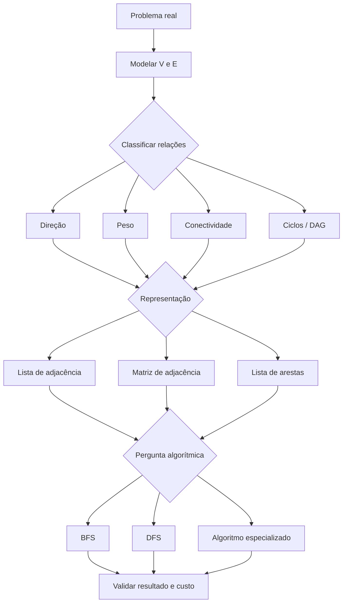
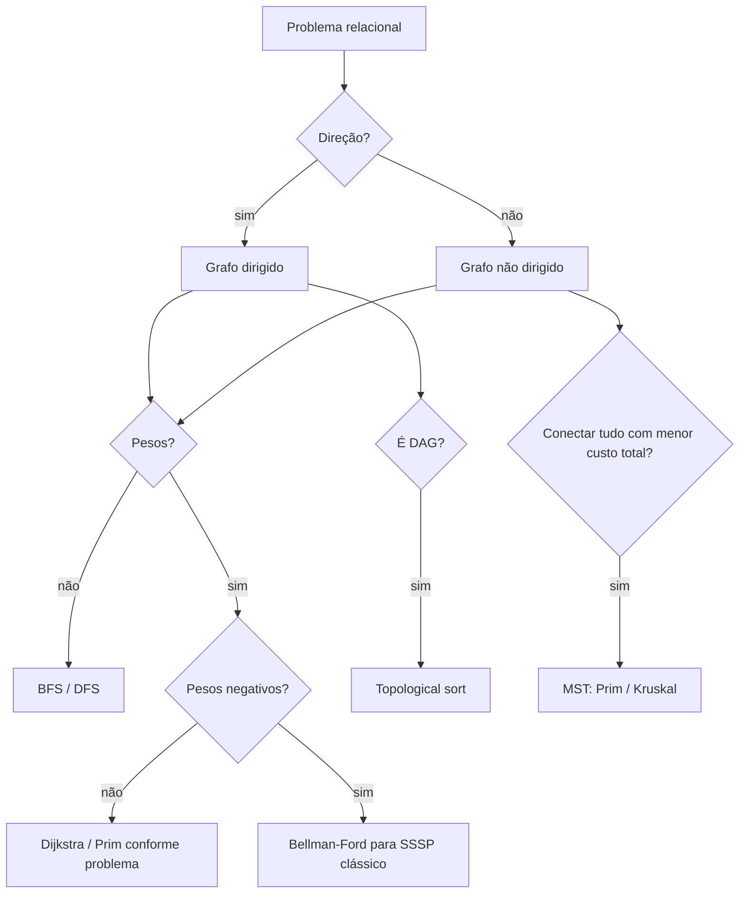

<a id="inicio"></a>

# Grafos e Percursos Fundamentais

> **Classificação geral:** `[C → D] Obrigatório conhecer e aplicar no nível fundamental`  
> **Nível:** C — Algoritmos e Estruturas de Dados  
> **Posição na taxonomia:** tópico 32 — nono tópico do Nível C  
> **Pré-requisitos principais:** T17 — Recursão; T24 — Correção e Análise de Algoritmos; T25 — Tipos Abstratos de Dados, Estruturas e Implementações; T28 — Estruturas Lineares; T29 — Estruturas Associativas, Conjuntos e Hashing; T30 — Filas de Prioridade e Heaps; T31 — Árvores  
> **Aprofundamentos posteriores:** T33 — Estratégias Fundamentais de Resolução Algorítmica; T35 — Modelagem, Escolha de Estruturas e Trade-offs

---

## Resumo executivo

Um **grafo** modela entidades e relações sem exigir a hierarquia rígida de uma árvore. Formalmente, no nível fundamental:

```text
G = (V, E)

V → conjunto de vértices
E → conjunto de arestas
```

Exemplos naturais:

- roteadores e enlaces;
- cidades e estradas;
- tarefas e dependências;
- usuários e conexões;
- páginas e hyperlinks;
- estados e transições;
- serviços e relações de dependência.

O mesmo conjunto de entidades pode exigir modelos distintos conforme a semântica da relação:

```text
R1 -- R2        relação bidirecional
R1 -> R2        relação direcionada
R1 -10-> R2     relação direcionada com peso/custo 10
```

No nível fundamental, dominar grafos significa conseguir:

- identificar corretamente vértices, arestas e a semântica das relações;
- distinguir grafo dirigido/não dirigido, ponderado/não ponderado, conexo/desconexo e cíclico/acíclico;
- escolher entre lista e matriz de adjacência conforme densidade e operações dominantes;
- executar e explicar BFS usando fila;
- executar e explicar DFS usando recursão ou pilha explícita;
- reconstruir caminhos a partir de predecessores;
- reconhecer que BFS minimiza **número de arestas (hops)**; em um problema ponderado, isso também minimiza a soma dos pesos somente quando todas as arestas têm o mesmo custo estritamente positivo;
- analisar BFS/DFS como `O(|V| + |E|)` com lista de adjacência no modelo clássico;
- conhecer problema e pré-condições de Dijkstra, Bellman-Ford, Floyd-Warshall, Prim, Kruskal e topological sort;
- reconhecer quando Bash deixa de ser uma escolha idiomática para a implementação geral.

---

## Como estudar este tópico — duas rotas

Este T32 funciona em duas rotas complementares. A **rota de estudo** preserva a progressão conceitual; a **rota de consulta** permite recuperar rapidamente um modelo, representação, invariante de percurso, custo, pré-condição algorítmica ou diagnóstico sem reler o capítulo inteiro.

### Rota A — primeiro contato / estudo sequencial

```text
Resumo executivo
→ Visão panorâmica
→ PARTE I: modelo, classificações e representações
→ PARTE II: BFS, DFS e complexidade
→ PARTE III: algoritmos de extensão e pré-condições
→ PARTE IV: transferência entre linguagens
→ PARTE V: casos de borda, robustez e decisão
→ PARTE VI: exercícios, LABs, troubleshooting e critérios de domínio
→ Apêndices: taxonomia, fontes, QA e histórico
```

### Rota B — consulta rápida

1. abra a [Visão panorâmica](#visao-panoramica);
2. use o **Índice essencial** para ir ao bloco conceitual desejado;
3. para falha concreta, vá ao [Troubleshooting sistemático](#troubleshooting-sistematico);
4. para cobertura operacional, consulte o [inventário `PR-T32-*`](#pr-t32-inventario);
5. para fonte, versão ou evidência, use os apêndices de referências e QA.

> **Regra de uso:** antes de escolher BFS, DFS ou um algoritmo especializado, fixe primeiro **o que os vértices e arestas significam**, as pré-condições da pergunta e a representação usada. Em grafos, um algoritmo correto sobre o modelo errado continua respondendo à pergunta errada.

---

## Visão rápida

| Pergunta | Resposta curta |
|---|---|
| Grafo precisa ser hierárquico? | não |
| Toda árvore é um grafo? | sim, sob a modelagem usual: conexo e acíclico |
| Todo grafo é árvore? | não |
| Aresta `(u,v)` em grafo dirigido equivale a `(v,u)`? | não |
| BFS usa naturalmente | fila FIFO |
| DFS usa naturalmente | recursão/pilha LIFO |
| BFS não ponderado encontra | menor número de arestas a partir da origem |
| Dijkstra aceita peso negativo genericamente? | não |
| Lista de adjacência é boa para | grafos esparsos e iteração de vizinhos |
| Matriz de adjacência é boa para | grafos densos/consulta direta de aresta |
| Matriz clássica usa | `Θ(|V|²)` memória |
| BFS/DFS com lista de adjacência | `O(|V| + |E|)` como limite geral; `Θ(|V_r| + |E_r|)` para a região alcançável efetivamente percorrida |
| DAG | grafo dirigido acíclico |
| Topological sort existe para | DAGs |
| Bash possui biblioteca padrão de grafos? | não |

---

## Regra de ouro

> **Antes de escolher um algoritmo de grafo, modele corretamente a relação e declare as pré-condições: direção, peso, conectividade, presença de ciclos e representação alteram tanto a correção quanto o custo.**

---

## Decisão rápida

```text
TENHO ENTIDADES E RELAÇÕES ARBITRÁRIAS?
          │
          ├── não
          │    └── talvez lista, mapa, árvore ou outra estrutura seja suficiente
          │
          └── sim
               │
               ├── relação tem direção?
               │     ├── sim → grafo dirigido
               │     └── não → grafo não dirigido
               │
               ├── relação possui custo/distância/capacidade?
               │     ├── sim → grafo ponderado
               │     └── não → grafo não ponderado
               │
               ├── preciso percorrer vizinhos em grafo esparso?
               │     └── lista de adjacência costuma ser natural
               │
               ├── preciso consultar (u,v) diretamente e V é moderado/denso?
               │     └── matriz de adjacência pode ser adequada
               │
               ├── menor número de arestas desde uma origem?
               │     └── BFS
               │
               ├── explorar profundamente / detectar estrutura / DAG?
               │     └── DFS
               │
               └── pesos / MST / todos os pares?
                     └── escolher algoritmo pelas pré-condições, não pelo nome
```

---

<a id="visao-panoramica"></a>

## 🗺️ Visão panorâmica — o mapa antes dos detalhes

Esta seção funciona como **caderno rápido de consulta**, mapa conceitual e contrato de cobertura do T32. A ideia é permitir que uma dúvida operacional seja localizada antes de entrar nos detalhes das seções numeradas.

### O mapa do domínio em uma frase

> **Primeiro modele `G=(V,E)` e as propriedades das relações; depois escolha representação; só então escolha BFS, DFS ou um algoritmo especializado cujas pré-condições realmente correspondam ao problema.**

```text
problema real
   ↓
entidades + relações
   ↓
G = (V, E)
   ↓
classificar o grafo
   ├─ dirigido / não dirigido
   ├─ ponderado / não ponderado
   ├─ conexo / desconexo
   └─ cíclico / acíclico / DAG
   ↓
escolher representação
   ├─ lista de adjacência
   ├─ matriz de adjacência
   └─ lista de arestas / representação auxiliar
   ↓
escolher percurso ou algoritmo
   ├─ BFS → camadas / menor número de arestas
   ├─ DFS → exploração profunda / estrutura
   └─ algoritmo especializado → somente com suas pré-condições
   ↓
validar invariantes + custo + casos de borda
```

### Cobertura canônica 32.1–32.8

| Nó | Pergunta que precisa ficar respondida | Ideia central |
|---|---|---|
| **32.1 Modelo conceitual `[D]`** | o que são `V` e `E` neste problema? | vértices representam entidades; arestas representam relações |
| **32.2 Classificações `[C]`** | que semântica essas arestas carregam? | direção, peso, conectividade e ciclos alteram correção e escolha algorítmica |
| **32.3 Representação `[C]`** | como armazenar o grafo para as operações dominantes? | lista favorece vizinhança/esparsidade; matriz favorece consulta direta e custa `Θ(V²)` memória |
| **32.4 BFS `[C → D]`** | preciso explorar em camadas ou minimizar hops? | fila FIFO, descoberta, predecessor e distância em número de arestas |
| **32.5 DFS `[C → D]`** | preciso explorar profundamente ou extrair estrutura? | recursão/pilha, estados de visita, backtracking e floresta DFS |
| **32.6 Complexidade `[C]`** | qual o custo sob a representação assumida? | BFS/DFS em lista de adjacência: `O(|V|+|E|)` no pior caso global; `Θ(|V_r|+|E_r|)` para a região efetivamente alcançada |
| **32.7 Algoritmos `[E → C]`** | qual problema especializado existe aqui? | reconhecer Dijkstra, Bellman-Ford, Floyd-Warshall, Prim, Kruskal, topological sort e transitive closure com suas pré-condições |
| **32.8 Transferência** | como o conceito muda entre linguagens? | a semântica do grafo permanece; coleções, APIs e idiomatismo mudam |

### Mapa visual — do modelo à operação



**Fallback textual do diagrama:** problema real → modelar `V` e `E` → classificar direção/peso/conectividade/ciclos → escolher lista/matriz/lista de arestas → selecionar BFS, DFS ou algoritmo especializado conforme a pergunta → validar resultado e custo.

O diagrama é propositalmente orientado a **decisão**. Ele não sugere que representação ou algoritmo possam ser escolhidos antes da semântica do problema.

### Pergunta prática → primeira ação

| Se a pergunta for… | Primeira ação correta |
|---|---|
| “quais roteadores estão alcançáveis a partir de `R1`?” | modele direção dos enlaces e execute um percurso a partir de `R1` |
| “qual o menor número de saltos?” | pense em BFS; pesos só importam se fizerem parte da métrica pedida |
| “qual o caminho de menor latência?” | declare os pesos; BFS deixa de ser solução genérica |
| “há dependência circular entre tarefas?” | modele um digrafo e procure ciclo dirigido |
| “em que ordem posso executar dependências?” | confirme que é DAG antes de topological sort |
| “quais partes da rede estão desconectadas?” | repita BFS/DFS a partir de vértices ainda não visitados |
| “existe diretamente a aresta `(u,v)` milhões de vezes?” | avalie matriz/sets/índices conforme densidade e memória |
| “quero conectar todos os pontos com menor custo total” | em grafo não dirigido, ponderado e conexo, pense em MST; se desconexo, MSF/rejeição conforme contrato |

### Não confundir

| Conceitos | Diferença decisiva |
|---|---|
| **árvore × grafo geral** | árvore é um caso especial; grafo geral pode ter ciclos, múltiplos caminhos e componentes |
| **grafo dirigido × não dirigido** | `u→v` não implica `v→u`; no não dirigido a relação é simétrica |
| **não ponderado × ponderado** | hops não representam necessariamente custo total |
| **BFS × DFS** | ambos percorrem; a ordem e as propriedades derivadas são diferentes |
| **BFS × Dijkstra** | BFS minimiza hops; isso equivale a menor soma de pesos apenas com custo uniforme estritamente positivo; Dijkstra trata pesos não negativos |
| **shortest path × MST** | shortest path minimiza caminho(s) a partir de origem; MST minimiza peso total da árvore geradora |
| **DAG × árvore** | DAG pode ter múltiplos pais/caminhos e não precisa ser árvore |
| **componente conexo × SCC** | SCC exige alcançabilidade mútua em digrafo |
| **ordem de visita × resultado semântico** | ordens BFS/DFS podem variar com a ordem dos vizinhos sem mudar propriedades essenciais |
| **algoritmo × representação** | `O(|V|+|E|)` é limite geral sob lista de adjacência; limites `Θ` exigem declarar o escopo efetivamente percorrido |

### Microexemplo 1 — a mesma topologia, perguntas diferentes

Considere:

```text
A -- B -- D
 \  |
  \ C
```

Para **alcançabilidade**, pesos podem ser irrelevantes. Para **menor número de arestas**, BFS resolve o caso não ponderado. Se cada aresta receber latência, o mesmo desenho deixa de responder “menor custo” sem que os pesos sejam considerados.

A regra é:

```text
mesmo desenho ≠ mesmo problema
```

### Microexemplo 2 — BFS pode estar certo e ainda responder à pergunta errada

```text
A --100--> B
 \         ↑
  1        1
   \       |
    ---> C-
```

Em número de arestas:

```text
A → B          = 1 hop
A → C → B      = 2 hops
```

Em peso total:

```text
A → B          = 100
A → C → B      = 2
```

BFS escolhe corretamente o caminho de **1 hop**. O erro seria chamar esse resultado de “menor custo ponderado”.

### Microexemplo 3 — `visited` é parte da correção

No ciclo:

```text
A → B → C
↑       ↓
└───────┘
```

um percurso que não registra descoberta pode continuar recolocando os mesmos vértices. `visited`/estado de cor não é apenas otimização: em grafos gerais, ele participa da **terminação, não duplicação de trabalho e interpretação estrutural**.

### Invariantes rápidos de BFS e DFS

**BFS — núcleo operacional:**

1. a origem recebe distância `0`;
2. um vértice é marcado quando é **descoberto/enfileirado**;
3. cada nova descoberta recebe `distance[v] = distance[u] + 1`;
4. `parent[v] = u` registra uma aresta da árvore/floresta de busca;
5. a fila mantém a fronteira em ordem não decrescente de distância em hops.

**DFS — núcleo operacional:**

1. um vértice passa de não descoberto para em exploração;
2. o algoritmo aprofunda por uma aresta ainda pertinente;
3. só finaliza o vértice depois de processar sua vizinhança;
4. em digrafos, distinguir “em exploração” de “finalizado” permite interpretar back edges/ciclos;
5. uma execução iniciada em um único vértice cobre apenas o conjunto alcançável a partir dele.

### Representação → custo que costuma aparecer primeiro

```text
lista de adjacência
  memória: Θ(V + E)
  iterar vizinhos de u: proporcional ao grau de u
  BFS/DFS: O(V + E) no pior caso global; Θ(V_r + E_r) para a região alcançável efetivamente percorrida

matriz de adjacência
  memória: Θ(V²)
  consultar (u,v): Θ(1) no modelo clássico
  enumerar todos os vizinhos de u: Θ(V)
  traversal que varre linhas: tipicamente Θ(V²)
```

Essas são **hipóteses de modelo**, não promessas independentes da implementação concreta.

### Algoritmos de extensão — reconhecer antes de implementar

| Problema | Família | Pré-condição/cuidado mínimo |
|---|---|---|
| menor caminho, uma origem, pesos não negativos | Dijkstra | não tratar pesos negativos como caso suportado genericamente |
| menor caminho com arestas negativas | Bellman-Ford | ciclo negativo alcançável muda a existência de solução finita |
| menores caminhos entre todos os pares | Floyd-Warshall | aceita arestas negativas; ciclos negativos exigem tratamento explícito; custo clássico cúbico |
| conectar todos os vértices com custo total mínimo | Prim / Kruskal | MST clássica exige grafo não dirigido, ponderado e conexo; se desconexo, MSF/rejeição |
| ordenar dependências | topological sort | exige DAG; saída parcial denuncia ciclo/modelagem incorreta |
| saber alcançabilidade entre muitos pares | transitive closure | responde reachability, não menor caminho por si só |

No nível `[E → C]`, a meta é **saber identificar o problema, declarar a pré-condição e reconhecer quando o algoritmo não se aplica**. Implementações avançadas completas pertencem ao aprofundamento posterior.

### Transferência entre linguagens

```text
conceito                    Python             JavaScript          Java                 Bash
-------------------------------------------------------------------------------------------------
adjacência                  dict/list/set      Map/Array/Set       Map/List/Set         assoc array/texto
fila para BFS               collections.deque  Array + head        ArrayDeque           array + head
pilha para DFS              list               Array               ArrayDeque           array
visitados                   set                Set                 HashSet               assoc array
abstração Graph padrão      não                não                 não no java.base      não
uso geral idiomático        sim                sim                 sim                  limitado
```

A tabela não cria equivalência artificial. Bash serve aqui como **ponte conceitual controlada**; entradas gerais, grandes ou adversariais pedem uma linguagem/estrutura mais apropriada.

### Rota de consulta rápida

Se a dúvida for pontual:

```text
modelagem/classificação → seções 2–11
representação           → seções 12–16
BFS                     → seções 17–21
DFS                     → seções 22–26
DAG/topological sort    → seção 27 e 36
complexidade            → seções 28–30
algoritmos de extensão  → seções 31–38
linguagens              → seções 39–45
casos de borda/erros    → seções 47–50
prática                 → seções 51–61
troubleshooting         → seção 63
```

### Fronteiras curriculares

- **T31 — Árvores:** entrega o caso hierárquico e percursos em estrutura sem ciclos; T32 generaliza para relações arbitrárias.
- **T33 — Estratégias Fundamentais de Resolução Algorítmica:** aprofunda técnicas de projeto; T32 não deve transformar cada algoritmo de grafo em tratado completo.
- **T35 — Modelagem, Escolha de Estruturas e Trade-offs:** integra decisões entre estruturas; T32 fornece evidências concretas de como representação altera custo.

### Gate 1 — cobertura conceitual da Visão Panorâmica

**FECHADO.** O mapa acima representa todos os nós 32.1–32.8, as pré-condições que mais alteram correção, os principais destinos práticos, a relação entre representação e custo, as classes de problemas que alimentam `PR-T32-*`/troubleshooting e a transferência entre as quatro linguagens canônicas.

---

# Índice

## Índice essencial

- [🗺️ Visão panorâmica — o mapa antes dos detalhes](#visao-panoramica)
- [PARTE I — Modelo, classificações e representações](#parte-i)
- [PARTE II — BFS, DFS e complexidade](#parte-ii)
- [PARTE III — Algoritmos de extensão e pré-condições](#parte-iii)
- [PARTE IV — Transferência entre linguagens](#parte-iv)
- [PARTE V — Casos de borda, robustez e decisão](#parte-v)
- [PARTE VI — Exercícios, LABs, troubleshooting e critérios de domínio](#parte-vi)
- [Inventário `PR-T32-*`](#pr-t32-inventario)
- [🔎 Troubleshooting sistemático](#troubleshooting-sistematico)
- [APÊNDICES — taxonomia, fontes, QA e histórico](#apendices)

<details>
<summary><strong>Índice detalhado</strong></summary>


  - [Resumo executivo](#resumo-executivo)
  - [Visão rápida](#visão-rápida)
  - [Regra de ouro](#regra-de-ouro)
  - [Decisão rápida](#decisão-rápida)
  - [🗺️ Visão panorâmica — o mapa antes dos detalhes](#visao-panoramica)
- [1. Posição deste assunto na trilha](#1-posição-deste-assunto-na-trilha)
  - [1.1 O que T31 entregou](#11-o-que-t31-entregou)
  - [1.2 O que T28 entregou](#12-o-que-t28-entregou)
  - [1.3 O que T29 entregou](#13-o-que-t29-entregou)
  - [1.4 O que T30 entregou](#14-o-que-t30-entregou)
  - [1.5 Fronteira com T33](#15-fronteira-com-t33)
  - [1.6 Fronteira com T35](#16-fronteira-com-t35)
- [2. Modelo mental — relações, não hierarquia](#2-modelo-mental--relações-não-hierarquia)
  - [2.1 Vértice](#21-vértice)
  - [2.2 Aresta](#22-aresta)
  - [2.3 Grafo não é desenho](#23-grafo-não-é-desenho)
  - [2.4 Caminho](#24-caminho)
  - [2.5 Comprimento × peso](#25-comprimento--peso)
- [3. 32.1 — Modelo conceitual `[D]`](#3-321--modelo-conceitual-d)
  - [3.1 Definição `G = (V,E)`](#31-definição-g--ve)
  - [3.2 Exemplo — roteadores e enlaces](#32-exemplo--roteadores-e-enlaces)
  - [3.3 Exemplo — dependências de tarefas](#33-exemplo--dependências-de-tarefas)
  - [3.4 Modelagem errada produz algoritmo correto para o problema errado](#34-modelagem-errada-produz-algoritmo-correto-para-o-problema-errado)
- [4. Vocabulário estrutural fundamental](#4-vocabulário-estrutural-fundamental)
  - [4.1 Adjacência](#41-adjacência)
  - [4.2 Grau em grafo não dirigido](#42-grau-em-grafo-não-dirigido)
  - [4.3 `in-degree` e `out-degree`](#43-in-degree-e-out-degree)
  - [4.4 Walk, trail, path — cuidado terminológico](#44-walk-trail-path--cuidado-terminológico)
  - [4.5 Componente](#45-componente)
- [5. Árvore × grafo geral](#5-árvore--grafo-geral)
  - [5.1 Árvore como caso especial](#51-árvore-como-caso-especial)
  - [5.2 O que desaparece no grafo geral](#52-o-que-desaparece-no-grafo-geral)
  - [5.3 Por que `visited` passa a ser crucial](#53-por-que-visited-passa-a-ser-crucial)
- [6. 32.2 — Classificações fundamentais `[C]`](#6-322--classificações-fundamentais-c)
  - [6.1 Não dirigido](#61-não-dirigido)
  - [6.2 Dirigido](#62-dirigido)
  - [6.3 Ponderado](#63-ponderado)
  - [6.4 Não ponderado](#64-não-ponderado)
- [7. Dirigido × não dirigido — impacto operacional](#7-dirigido--não-dirigido--impacto-operacional)
  - [7.1 Inserção de aresta em lista de adjacência](#71-inserção-de-aresta-em-lista-de-adjacência)
  - [7.2 Contagem de arestas](#72-contagem-de-arestas)
  - [7.3 Alcançabilidade não é simétrica em digrafo](#73-alcançabilidade-não-é-simétrica-em-digrafo)
- [8. Ponderado × não ponderado — impacto algorítmico](#8-ponderado--não-ponderado--impacto-algorítmico)
  - [8.1 BFS não substitui Dijkstra em pesos gerais](#81-bfs-não-substitui-dijkstra-em-pesos-gerais)
  - [8.2 Peso negativo muda pré-condições](#82-peso-negativo-muda-pré-condições)
- [9. Conexo × desconexo](#9-conexo--desconexo)
  - [9.1 Grafo conexo não dirigido](#91-grafo-conexo-não-dirigido)
  - [9.2 Grafo desconexo](#92-grafo-desconexo)
  - [9.3 Um único BFS/DFS não percorre necessariamente todo o grafo](#93-um-único-bfsdfs-não-percorre-necessariamente-todo-o-grafo)
- [10. Cíclico × acíclico e DAG](#10-cíclico--acíclico-e-dag)
  - [10.1 Ciclo](#101-ciclo)
  - [10.2 Grafo acíclico](#102-grafo-acíclico)
  - [10.3 DAG](#103-dag)
  - [10.4 DAG não é árvore](#104-dag-não-é-árvore)
- [11. Loops, multiarestas e contrato do modelo](#11-loops-multiarestas-e-contrato-do-modelo)
  - [11.1 Grafo simples](#111-grafo-simples)
  - [11.2 Self-loop](#112-self-loop)
  - [11.3 Arestas paralelas](#113-arestas-paralelas)
  - [11.4 Estrutura deve preservar a semântica necessária](#114-estrutura-deve-preservar-a-semântica-necessária)
- [12. 32.3 — Lista de adjacência × matriz de adjacência `[C]`](#12-323--lista-de-adjacência--matriz-de-adjacência-c)
  - [12.1 Lista de adjacência](#121-lista-de-adjacência)
  - [12.2 Matriz de adjacência](#122-matriz-de-adjacência)
  - [12.3 Escolha é orientada pelas operações](#123-escolha-é-orientada-pelas-operações)
- [13. Lista de adjacência — propriedades](#13-lista-de-adjacência--propriedades)
  - [13.1 Memória típica](#131-memória-típica)
  - [13.2 Percorrer vizinhos](#132-percorrer-vizinhos)
  - [13.3 Testar aresta depende da estrutura dos vizinhos](#133-testar-aresta-depende-da-estrutura-dos-vizinhos)
  - [13.4 Pesos](#134-pesos)
- [14. Matriz de adjacência — propriedades](#14-matriz-de-adjacência--propriedades)
  - [14.1 Memória](#141-memória)
  - [14.2 Consulta direta de aresta](#142-consulta-direta-de-aresta)
  - [14.3 Grafo denso](#143-grafo-denso)
  - [14.4 Pesos e sentinelas](#144-pesos-e-sentinelas)
- [15. Edge list e outras representações auxiliares](#15-edge-list-e-outras-representações-auxiliares)
  - [15.1 Lista de arestas](#151-lista-de-arestas)
  - [15.2 Não substituir automaticamente a lista de adjacência](#152-não-substituir-automaticamente-a-lista-de-adjacência)
  - [15.3 Representações podem coexistir](#153-representações-podem-coexistir)
- [16. Comparação de representações](#16-comparação-de-representações)
  - [16.1 Tabela fundamental](#161-tabela-fundamental)
  - [16.2 Densidade](#162-densidade)
  - [16.3 Não comparar apenas Big O](#163-não-comparar-apenas-big-o)
- [17. 32.4 — Breadth-First Search — BFS `[C → D]`](#17-324--breadth-first-search--bfs-c--d)
  - [17.1 Ideia](#171-ideia)
  - [17.2 Estrutura auxiliar](#172-estrutura-auxiliar)
  - [17.3 Estado mínimo](#173-estado-mínimo)
- [18. BFS passo a passo](#18-bfs-passo-a-passo)
  - [18.1 Grafo canônico](#181-grafo-canônico)
  - [18.2 Execução a partir de `A`](#182-execução-a-partir-de-a)
  - [18.3 Marcar ao descobrir, não ao remover](#183-marcar-ao-descobrir-não-ao-remover)
- [19. Pseudocódigo de BFS](#19-pseudocódigo-de-bfs)
  - [19.1 Versão fundamental](#191-versão-fundamental)
  - [19.2 Invariante operacional](#192-invariante-operacional)
- [20. BFS e caminho mínimo não ponderado](#20-bfs-e-caminho-mínimo-não-ponderado)
  - [20.1 O que é garantido](#201-o-que-é-garantido)
  - [20.2 O que não é garantido](#202-o-que-não-é-garantido)
  - [20.3 Árvore de predecessores](#203-árvore-de-predecessores)
  - [20.4 Reconstrução](#204-reconstrução)
- [21. BFS em grafo desconexo](#21-bfs-em-grafo-desconexo)
  - [21.1 Uma origem cobre um componente alcançável](#211-uma-origem-cobre-um-componente-alcançável)
  - [21.2 Cobertura total](#212-cobertura-total)
  - [21.3 Componentes](#213-componentes)
- [22. 32.5 — Depth-First Search — DFS `[C → D]`](#22-325--depth-first-search--dfs-c--d)
  - [22.1 Ideia](#221-ideia)
  - [22.2 Estrutura auxiliar](#222-estrutura-auxiliar)
  - [22.3 Visitados continuam obrigatórios em grafos gerais](#223-visitados-continuam-obrigatórios-em-grafos-gerais)
- [23. DFS recursivo](#23-dfs-recursivo)
  - [23.1 Pseudocódigo](#231-pseudocódigo)
  - [23.2 Ordem depende dos vizinhos](#232-ordem-depende-dos-vizinhos)
  - [23.3 Profundidade da recursão](#233-profundidade-da-recursão)
- [24. DFS iterativo](#24-dfs-iterativo)
  - [24.1 Pilha explícita](#241-pilha-explícita)
  - [24.2 Ordem pode inverter](#242-ordem-pode-inverter)
  - [24.3 Marcar no push × no pop](#243-marcar-no-push--no-pop)
- [25. DFS, ciclos e estados](#25-dfs-ciclos-e-estados)
  - [25.1 Apenas booleano pode não bastar em digrafos](#251-apenas-booleano-pode-não-bastar-em-digrafos)
  - [25.2 Back edge em DFS dirigido](#252-back-edge-em-dfs-dirigido)
  - [25.3 Não aplicar regra dirigida cegamente ao não dirigido](#253-não-aplicar-regra-dirigida-cegamente-ao-não-dirigido)
- [26. Componentes com DFS](#26-componentes-com-dfs)
  - [26.1 Não dirigido](#261-não-dirigido)
  - [26.2 Floresta DFS](#262-floresta-dfs)
  - [26.3 Componentes fortemente conexos são outro problema](#263-componentes-fortemente-conexos-são-outro-problema)
- [27. Topological sort como aplicação de DAG](#27-topological-sort-como-aplicação-de-dag)
  - [27.1 Definição](#271-definição)
  - [27.2 Não existe se houver ciclo dirigido](#272-não-existe-se-houver-ciclo-dirigido)
  - [27.3 Duas famílias fundamentais](#273-duas-famílias-fundamentais)
  - [27.4 Várias ordens podem ser válidas](#274-várias-ordens-podem-ser-válidas)
- [28. 32.6 — Complexidade básica `[C]`](#28-326--complexidade-básica-c)
  - [28.1 Por que aparecem dois parâmetros](#281-por-que-aparecem-dois-parâmetros)
  - [28.2 BFS com lista de adjacência](#282-bfs-com-lista-de-adjacência)
  - [28.3 DFS com lista de adjacência](#283-dfs-com-lista-de-adjacência)
- [29. Por que `O(V + E)` não vale automaticamente para qualquer representação](#29-por-que-ov--e-não-vale-automaticamente-para-qualquer-representação)
  - [29.1 Matriz de adjacência](#291-matriz-de-adjacência)
  - [29.2 Estrutura de vizinhos importa](#292-estrutura-de-vizinhos-importa)
  - [29.3 Complexidade pertence ao algoritmo + representação + operações assumidas](#293-complexidade-pertence-ao-algoritmo--representação--operações-assumidas)
- [30. Memória de BFS e DFS](#30-memória-de-bfs-e-dfs)
  - [30.1 `visited`, `parent`, `distance`](#301-visited-parent-distance)
  - [30.2 Fila do BFS](#302-fila-do-bfs)
  - [30.3 Stack do DFS](#303-stack-do-dfs)
  - [30.4 Representação domina em matriz](#304-representação-domina-em-matriz)
- [31. 32.7 — Algoritmos de grafos `[E → C]`](#31-327--algoritmos-de-grafos-e--c)
  - [31.1 Objetivo curricular](#311-objetivo-curricular)
  - [31.2 Mapa](#312-mapa)
- [32. Dijkstra — conhecer o problema e a pré-condição](#32-dijkstra--conhecer-o-problema-e-a-pré-condição)
  - [32.1 Problema](#321-problema)
  - [32.2 Estrutura típica](#322-estrutura-típica)
  - [32.3 Ligação com T30](#323-ligação-com-t30)
  - [32.4 Peso negativo](#324-peso-negativo)
- [33. Bellman-Ford — quando pesos negativos importam](#33-bellman-ford--quando-pesos-negativos-importam)
  - [33.1 Problema](#331-problema)
  - [33.2 Ideia](#332-ideia)
  - [33.3 Custo clássico](#333-custo-clássico)
  - [33.4 Valor pedagógico](#334-valor-pedagógico)
- [34. Floyd-Warshall — todos os pares](#34-floyd-warshall--todos-os-pares)
  - [34.1 Problema](#341-problema)
  - [34.2 Estrutura mental](#342-estrutura-mental)
  - [34.3 Custo clássico](#343-custo-clássico)
  - [34.4 Não usar só porque “é simples”](#344-não-usar-só-porque-é-simples)
- [35. Minimum Spanning Tree — Prim e Kruskal](#35-minimum-spanning-tree--prim-e-kruskal)
  - [35.1 Problema](#351-problema)
  - [35.2 Prim](#352-prim)
  - [35.3 Kruskal](#353-kruskal)
  - [35.4 MST ≠ shortest-path tree](#354-mst--shortest-path-tree)
- [36. Topological sort — DAGs](#36-topological-sort--dags)
  - [36.1 Problema](#361-problema)
  - [36.2 Kahn](#362-kahn)
  - [36.3 Detecção de ciclo](#363-detecção-de-ciclo)
- [37. Transitive closure](#37-transitive-closure)
  - [37.1 Pergunta](#371-pergunta)
  - [37.2 Não confundir com shortest path](#372-não-confundir-com-shortest-path)
  - [37.3 Aprofundamento](#373-aprofundamento)
- [38. Escolher pelo problema, não pelo nome do algoritmo](#38-escolher-pelo-problema-não-pelo-nome-do-algoritmo)
  - [38.1 Perguntas mínimas](#381-perguntas-mínimas)
  - [38.2 Exemplo de decisão](#382-exemplo-de-decisão)
- [39. 32.8 — Transferência entre linguagens](#39-328--transferência-entre-linguagens)
  - [39.1 Conceito universal](#391-conceito-universal)
  - [39.2 Implementação é linguagem/runtime](#392-implementação-é-linguagemruntime)
  - [39.3 Idiomatismo importa](#393-idiomatismo-importa)
- [40. Python — representação e BFS/DFS](#40-python--representação-e-bfsdfs)
  - [40.1 Lista de adjacência](#401-lista-de-adjacência)
  - [40.2 BFS](#402-bfs)
  - [40.3 DFS iterativo](#403-dfs-iterativo)
  - [40.4 `deque`](#404-deque)
- [41. JavaScript / ECMAScript — representação e BFS/DFS](#41-javascript--ecmascript--representação-e-bfsdfs)
  - [41.1 `Map` de arrays](#411-map-de-arrays)
  - [41.2 BFS sem `shift()` repetido](#412-bfs-sem-shift-repetido)
  - [41.3 DFS](#413-dfs)
  - [41.4 ECMAScript não fornece `Graph`](#414-ecmascript-não-fornece-graph)
- [42. Java — representação e BFS/DFS](#42-java--representação-e-bfsdfs)
  - [42.1 Estruturas](#421-estruturas)
  - [42.2 BFS](#422-bfs)
  - [42.3 DFS](#423-dfs)
  - [42.4 `ArrayDeque`](#424-arraydeque)
- [43. GNU Bash — transferência conceitual](#43-gnu-bash--transferência-conceitual)
  - [43.1 Limitação explícita](#431-limitação-explícita)
  - [43.2 Adjacência didática](#432-adjacência-didática)
  - [43.3 BFS didático](#433-bfs-didático)
  - [43.4 Por que o exemplo restringe IDs](#434-por-que-o-exemplo-restringe-ids)
- [44. Comparação entre as quatro linguagens canônicas](#44-comparação-entre-as-quatro-linguagens-canônicas)
  - [44.1 Estruturas típicas](#441-estruturas-típicas)
  - [44.2 Conceito não depende da coleção concreta](#442-conceito-não-depende-da-coleção-concreta)
  - [44.3 Ordem observada não é essência do BFS/DFS](#443-ordem-observada-não-é-essência-do-bfsdfs)
- [45. Exemplo canônico nas quatro linguagens — BFS e DFS](#45-exemplo-canônico-nas-quatro-linguagens--bfs-e-dfs)
  - [45.1 Grafo](#451-grafo)
  - [45.2 Saída escolhida pelo documento](#452-saída-escolhida-pelo-documento)
  - [45.3 O que precisa permanecer verdadeiro](#453-o-que-precisa-permanecer-verdadeiro)
- [46. Mermaid — mapa estrutural do tópico](#46-mermaid--mapa-estrutural-do-tópico)
- [47. Casos de borda](#47-casos-de-borda)
  - [47.1 Grafo vazio](#471-grafo-vazio)
  - [47.2 Um único vértice](#472-um-único-vértice)
  - [47.3 Vértice isolado](#473-vértice-isolado)
  - [47.4 Self-loop](#474-self-loop)
  - [47.5 Arestas duplicadas](#475-arestas-duplicadas)
  - [47.6 Destino inexistente](#476-destino-inexistente)
  - [47.7 Grafo desconexo](#477-grafo-desconexo)
  - [47.8 Caminho muito profundo](#478-caminho-muito-profundo)
- [48. Erros frequentes](#48-erros-frequentes)
  - [48.1 Esquecer `visited`](#481-esquecer-visited)
  - [48.2 Marcar visitado tarde demais no BFS](#482-marcar-visitado-tarde-demais-no-bfs)
  - [48.3 Usar BFS em grafo ponderado arbitrário](#483-usar-bfs-em-grafo-ponderado-arbitrário)
  - [48.4 Usar Dijkstra com peso negativo](#484-usar-dijkstra-com-peso-negativo)
  - [48.5 Confundir MST com shortest-path tree](#485-confundir-mst-com-shortest-path-tree)
  - [48.6 Assumir que topological sort sempre existe](#486-assumir-que-topological-sort-sempre-existe)
  - [48.7 Duplicar apenas uma direção em grafo não dirigido](#487-duplicar-apenas-uma-direção-em-grafo-não-dirigido)
  - [48.8 Usar matriz por padrão](#488-usar-matriz-por-padrão)
  - [48.9 Testar ordem exata sem contrato de desempate](#489-testar-ordem-exata-sem-contrato-de-desempate)
- [49. Segurança, robustez e consumo de recursos](#49-segurança-robustez-e-consumo-de-recursos)
  - [49.1 Tamanho de entrada é parte do contrato](#491-tamanho-de-entrada-é-parte-do-contrato)
  - [49.2 Matriz pode amplificar memória quadraticamente](#492-matriz-pode-amplificar-memória-quadraticamente)
  - [49.3 DFS recursivo e stack](#493-dfs-recursivo-e-stack)
  - [49.4 IDs não devem virar código](#494-ids-não-devem-virar-código)
  - [49.5 Pesos e números](#495-pesos-e-números)
  - [49.6 Limite de trabalho](#496-limite-de-trabalho)
- [50. Decisão de representação e algoritmo](#50-decisão-de-representação-e-algoritmo)
  - [50.1 Checklist](#501-checklist)
  - [50.2 Exemplo — rede sintética](#502-exemplo--rede-sintética)
  - [50.3 Exemplo — matriz de permissões/relações densas](#503-exemplo--matriz-de-permissõesrelações-densas)
  - [50.4 Inventário formal de problemas reais — PR-T32-*](#pr-t32-inventario)
    - [Gate de Cobertura Prática / Operacional](#gate-cobertura-pratica)
- [51. Exercício guiado — construir lista e matriz](#51-exercício-guiado--construir-lista-e-matriz)
  - [51.1 Entrada](#511-entrada)
  - [51.2 Lista](#512-lista)
  - [51.3 Matriz](#513-matriz)
  - [51.4 Verificação](#514-verificação)
- [52. Exercício guiado — rastrear BFS e reconstruir caminho](#52-exercício-guiado--rastrear-bfs-e-reconstruir-caminho)
  - [52.1 Grafo](#521-grafo)
  - [52.2 Tabela](#522-tabela)
  - [52.3 Alvo](#523-alvo)
- [53. Exercício guiado — DFS e ciclo](#53-exercício-guiado--dfs-e-ciclo)
  - [53.1 Digrafo](#531-digrafo)
  - [53.2 Tarefa](#532-tarefa)
  - [53.3 Conclusão](#533-conclusão)
- [54. LAB 1 — Modelar uma topologia de rede sintética](#54-lab-1--modelar-uma-topologia-de-rede-sintética)
  - [Objetivo](#objetivo)
  - [Pré-requisitos](#pré-requisitos)
  - [Estado inicial](#estado-inicial)
  - [Tarefa](#tarefa)
  - [Procedimento](#procedimento)
  - [O que observar](#o-que-observar)
  - [Testes](#testes)
  - [Explicação](#explicação)
  - [Variação / transferência](#variação--transferência)
  - [Limpeza](#limpeza)
- [55. LAB 2 — Lista de adjacência × matriz](#55-lab-2--lista-de-adjacência--matriz)
  - [Objetivo](#objetivo-1)
  - [Pré-requisitos](#pré-requisitos-1)
  - [Estado inicial](#estado-inicial-1)
  - [Tarefa](#tarefa-1)
  - [Procedimento](#procedimento-1)
  - [O que observar](#o-que-observar-1)
  - [Testes](#testes-1)
  - [Explicação](#explicação-1)
  - [Variação / transferência](#variação--transferência-1)
  - [Limpeza](#limpeza-1)
- [56. LAB 3 — BFS e menor número de arestas](#56-lab-3--bfs-e-menor-número-de-arestas)
  - [Objetivo](#objetivo-2)
  - [Pré-requisitos](#pré-requisitos-2)
  - [Estado inicial](#estado-inicial-2)
  - [Tarefa](#tarefa-2)
  - [Procedimento](#procedimento-2)
  - [O que observar](#o-que-observar-2)
  - [Testes](#testes-2)
  - [Explicação](#explicação-2)
  - [Variação / transferência](#variação--transferência-2)
  - [Limpeza](#limpeza-2)
- [57. LAB 4 — DFS recursivo × iterativo](#57-lab-4--dfs-recursivo--iterativo)
  - [Objetivo](#objetivo-3)
  - [Pré-requisitos](#pré-requisitos-3)
  - [Estado inicial](#estado-inicial-3)
  - [Tarefa](#tarefa-3)
  - [Procedimento](#procedimento-3)
  - [O que observar](#o-que-observar-3)
  - [Testes](#testes-3)
  - [Explicação](#explicação-3)
  - [Variação / transferência](#variação--transferência-3)
  - [Limpeza](#limpeza-3)
- [58. LAB 5 — Componentes desconexos](#58-lab-5--componentes-desconexos)
  - [Objetivo](#objetivo-4)
  - [Pré-requisitos](#pré-requisitos-4)
  - [Estado inicial](#estado-inicial-4)
  - [Tarefa](#tarefa-4)
  - [Procedimento](#procedimento-4)
  - [O que observar](#o-que-observar-4)
  - [Testes](#testes-4)
  - [Explicação](#explicação-4)
  - [Variação / transferência](#variação--transferência-4)
  - [Limpeza](#limpeza-4)
- [59. LAB 6 — Topological sort e ciclo](#59-lab-6--topological-sort-e-ciclo)
  - [Objetivo](#objetivo-5)
  - [Pré-requisitos](#pré-requisitos-5)
  - [Estado inicial](#estado-inicial-5)
  - [Tarefa](#tarefa-5)
  - [Procedimento](#procedimento-5)
  - [O que observar](#o-que-observar-5)
  - [Testes](#testes-5)
  - [Explicação](#explicação-5)
  - [Variação / transferência](#variação--transferência-5)
  - [Limpeza](#limpeza-5)
- [60. LAB 7 — BFS não é menor custo ponderado](#60-lab-7--bfs-não-é-menor-custo-ponderado)
  - [Objetivo](#objetivo-6)
  - [Pré-requisitos](#pré-requisitos-6)
  - [Estado inicial](#estado-inicial-6)
  - [Tarefa](#tarefa-6)
  - [Procedimento](#procedimento-6)
  - [O que observar](#o-que-observar-6)
  - [Testes](#testes-6)
  - [Explicação](#explicação-6)
  - [Variação / transferência](#variação--transferência-6)
  - [Limpeza](#limpeza-6)
- [61. LAB 8 — Transferência entre Python, JavaScript, Java e Bash](#61-lab-8--transferência-entre-python-javascript-java-e-bash)
  - [Objetivo](#objetivo-7)
  - [Pré-requisitos](#pré-requisitos-7)
  - [Estado inicial](#estado-inicial-7)
  - [Tarefa](#tarefa-7)
  - [Procedimento](#procedimento-7)
  - [O que observar](#o-que-observar-7)
  - [Testes](#testes-7)
  - [Explicação](#explicação-7)
  - [Variação / transferência](#variação--transferência-7)
  - [Limpeza](#limpeza-7)
- [62. Exercícios de fixação](#62-exercícios-de-fixação)
  - [62.1 Conceituais](#621-conceituais)
  - [62.2 Representação](#622-representação)
  - [62.3 Percursos](#623-percursos)
  - [62.4 Algoritmos de extensão](#624-algoritmos-de-extensão)
- [63. Problemas de diagnóstico](#63-problemas-de-diagnóstico)
  - [63.1 BFS usa `list.pop(0)` em Python](#631-bfs-usa-listpop0-em-python)
  - [63.2 DFS recursivo trava em entrada profunda](#632-dfs-recursivo-trava-em-entrada-profunda)
  - [63.3 Dijkstra retorna resultado estranho com peso negativo](#633-dijkstra-retorna-resultado-estranho-com-peso-negativo)
  - [63.4 Topological sort processa menos vértices](#634-topological-sort-processa-menos-vértices)
  - [63.5 Matriz consome memória demais](#635-matriz-consome-memória-demais)
  - [63.6 Bash quebra nomes com espaços](#636-bash-quebra-nomes-com-espaços)
  - [🔎 Troubleshooting sistemático](#troubleshooting-sistematico)
- [64. Evidências de domínio](#64-evidências-de-domínio)
- [65. Checklist de domínio](#65-checklist-de-domínio)
  - [65.1 Modelo](#651-modelo)
  - [65.2 Representação](#652-representação)
  - [65.3 BFS](#653-bfs)
  - [65.4 DFS](#654-dfs)
  - [65.5 Panorama](#655-panorama)
- [66. Glossário](#66-glossário)
  - [66.1 Grafo](#661-grafo)
  - [66.2 Vértice](#662-vértice)
  - [66.3 Aresta](#663-aresta)
  - [66.4 Adjacência](#664-adjacência)
  - [66.5 Caminho](#665-caminho)
  - [66.6 Componente conexo](#666-componente-conexo)
  - [66.7 DAG](#667-dag)
  - [66.8 BFS](#668-bfs)
  - [66.9 DFS](#669-dfs)
  - [66.10 Lista de adjacência](#6610-lista-de-adjacência)
  - [66.11 Matriz de adjacência](#6611-matriz-de-adjacência)
  - [66.12 Relaxamento](#6612-relaxamento)
  - [66.13 MST](#6613-mst)
  - [66.14 Topological sort](#6614-topological-sort)
- [67. Auditoria de cobertura da taxonomia](#67-auditoria-de-cobertura-da-taxonomia)
  - [67.1 32.1 `[D]`](#671-321-d)
  - [67.2 32.2 `[C]`](#672-322-c)
  - [67.3 32.3 `[C]`](#673-323-c)
  - [67.4 32.4 `[C → D]`](#674-324-c--d)
  - [67.5 32.5 `[C → D]`](#675-325-c--d)
  - [67.6 32.6 `[C]`](#676-326-c)
  - [67.7 32.7 `[E → C]`](#677-327-e--c)
  - [67.8 32.8](#678-328)
- [68. Auditoria da File Library](#68-auditoria-da-file-library)
  - [68.1 Fontes locais efetivamente consultadas](#681-fontes-locais-efetivamente-consultadas)
  - [68.2 Como os livros alteraram o documento](#682-como-os-livros-alteraram-o-documento)
  - [68.3 Fontes antigas/localizadas](#683-fontes-antigaslocalizadas)
  - [68.4 Hierarquia aplicada](#684-hierarquia-aplicada)
- [69. Referências](#69-referências)
  - [69.1 Contratos canônicos](#691-contratos-canônicos)
  - [69.2 Literatura local efetivamente consultada](#692-literatura-local-efetivamente-consultada)
  - [69.3 Python](#693-python)
  - [69.4 ECMAScript](#694-ecmascript)
  - [69.5 Java](#695-java)
  - [69.6 GNU Bash](#696-gnu-bash)
- [70. QA e evidências](#70-qa-e-evidências)
  - [70.1 `[D]` Evidência documental](#701-d-evidência-documental)
  - [70.2 `[S]` Validação estrutural/estática](#702-s-validação-estruturalestática)
  - [70.3 `[R]` Reprodução em runtime](#703-r-reprodução-em-runtime)
    - [70.3.1 Reconciliação R3](#7031-reconciliação-r3)
    - [70.3.2 Reconciliação R4](#7032-reconciliação-r4)
    - [70.3.3 Reconciliação R5](#7033-reconciliação-r5)
  - [70.4 Limitações](#704-limitações)
  - [70.5 Gate 2 da iteração `0.3.2`](#705-gate-2-da-iteração-032)
- [71. Histórico de versões](#71-histórico-de-versões)

</details>

<a id="parte-i"></a>

# PARTE I — Modelo, classificações e representações

Esta parte transforma relações do domínio em `G=(V,E)`, fixa vocabulário e classificações e compara representações antes de escolher qualquer percurso.

# 1. Posição deste assunto na trilha

## 1.1 O que T31 entregou

T31 ensinou árvores como estruturas hierárquicas, inclusive BFS por nível e DFS em árvores. Isso é uma base útil, mas árvores possuem restrições que grafos gerais não possuem: não há necessariamente um único pai, podem existir ciclos, múltiplos caminhos e componentes desconectados.

## 1.2 O que T28 entregou

T28 forneceu as estruturas auxiliares centrais aos percursos:

- **fila** para BFS;
- **pilha** ou stack de chamadas para DFS.

T32 aplica essas estruturas a relações arbitrárias.

## 1.3 O que T29 entregou

Maps e Sets são particularmente úteis em grafos:

- mapear vértice → vizinhos;
- registrar `visited`;
- guardar predecessor/distância;
- evitar duplicação de vizinhos quando a modelagem exigir conjunto.

## 1.4 O que T30 entregou

Priority Queue/Heap aparece novamente no panorama de Dijkstra e Prim. T32 não repete T30: apenas conecta a estrutura às pré-condições dos algoritmos de grafos.

## 1.5 Fronteira com T33

T33 estudará estratégias gerais como greedy, divide-and-conquer, programação dinâmica e backtracking. Em T32, Dijkstra/Prim/Kruskal aparecem como problemas/algoritmos de grafo e suas pré-condições, sem transformar o capítulo numa teoria completa de estratégias.

## 1.6 Fronteira com T35

T35 aprofundará decisão e trade-offs. T32 já compara lista/matriz e algoritmos, mas não absorve toda a modelagem arquitetural.

[↑ Voltar ao índice](#índice)

# 2. Modelo mental — relações, não hierarquia

## 2.1 Vértice

Um vértice representa uma entidade relevante para o problema. O identificador precisa ser estável dentro do grafo.

Exemplo de rede sintética:

```text
V = {R1, R2, R3, R4}
```

## 2.2 Aresta

Uma aresta representa uma relação entre dois vértices.

```text
(R1, R2)
```

A semântica dessa relação vem do domínio. Ela pode significar enlace, dependência, rota possível, amizade, transição ou outra coisa.

## 2.3 Grafo não é desenho

O desenho é apenas uma visualização. O grafo é o modelo matemático/computacional. Layout visual não altera adjacência.

Duas figuras diferentes podem representar exatamente o mesmo `V` e `E`.

## 2.4 Caminho

Um caminho é uma sequência de vértices conectados por arestas válidas.

```text
R1 → R2 → R4
```

Em grafo dirigido, a orientação das arestas precisa ser respeitada.

## 2.5 Comprimento × peso

Em grafo não ponderado, o comprimento de um caminho normalmente é contado em número de arestas. Em grafo ponderado, o custo pode ser a soma dos pesos.

Essas duas métricas não devem ser misturadas.

[↑ Voltar ao índice](#índice)

# 3. 32.1 — Modelo conceitual `[D]`

## 3.1 Definição `G = (V,E)`

No nível deste guia:

```text
G = (V, E)
V = conjunto de vértices
E = conjunto de arestas
```

Essa notação separa **quem existe** de **como os elementos se relacionam**.

## 3.2 Exemplo — roteadores e enlaces

```text
R1 ----- R2
 |       |
 |       |
R3 ----- R4
```

Uma representação não dirigida poderia ser:

```text
V = {R1, R2, R3, R4}
E = {(R1,R2), (R1,R3), (R2,R4), (R3,R4)}
```

Os nomes são sintéticos e não representam equipamentos reais.

## 3.3 Exemplo — dependências de tarefas

```text
coletar_dados → validar → publicar
          \→ transformar ↗
```

Aqui a direção possui semântica: uma dependência não é automaticamente reversível.

## 3.4 Modelagem errada produz algoritmo correto para o problema errado

Se um enlace realmente é bidirecional e você o modela com apenas `R1 → R2`, um BFS perfeitamente implementado pode concluir incorretamente que `R2` não alcança `R1`.

O bug está na modelagem, não no BFS.

[↑ Voltar ao índice](#índice)

# 4. Vocabulário estrutural fundamental

## 4.1 Adjacência

Dois vértices são adjacentes quando existe uma aresta relevante entre eles conforme o tipo de grafo.

## 4.2 Grau em grafo não dirigido

O grau de um vértice é a quantidade de arestas incidentes, considerando a convenção adotada para loops/multiarestas quando presentes.

## 4.3 `in-degree` e `out-degree`

Em grafos dirigidos:

- `in-degree(v)` conta arestas que chegam a `v`;
- `out-degree(v)` conta arestas que saem de `v`.

Isso será útil em topological sort por Kahn.

## 4.4 Walk, trail, path — cuidado terminológico

A literatura diferencia caminhadas, trilhas e caminhos simples. Para o núcleo deste tópico, o importante é não assumir unicidade: grafos gerais podem possuir vários caminhos entre os mesmos vértices.

## 4.5 Componente

Em grafo não dirigido, um componente conexo é uma parte maximal em que os vértices são mutuamente alcançáveis por caminhos.

[↑ Voltar ao índice](#índice)

# 5. Árvore × grafo geral

## 5.1 Árvore como caso especial

Uma árvore não dirigida finita pode ser vista como grafo conexo e acíclico.

## 5.2 O que desaparece no grafo geral

No grafo geral não existe, por padrão:

- raiz única;
- pai único;
- caminho único;
- ausência de ciclos;
- conectividade garantida.

## 5.3 Por que `visited` passa a ser crucial

Em árvore enraizada, o próprio relacionamento pai-filho muitas vezes impede retorno ao pai quando o algoritmo está estruturado adequadamente. Em grafo cíclico, sem controle de visitados, o percurso pode revisitar indefinidamente os mesmos vértices.

[↑ Voltar ao índice](#índice)

# 6. 32.2 — Classificações fundamentais `[C]`

## 6.1 Não dirigido

Uma relação não dirigida representa conexão sem orientação:

```text
A -- B
```

Conceitualmente, `A` é vizinho de `B` e `B` de `A`.

## 6.2 Dirigido

```text
A → B
```

Não implica `B → A`.

## 6.3 Ponderado

Cada aresta possui um valor relevante ao problema:

```text
A --7-- B
```

O peso pode representar distância, latência abstrata, custo, tempo ou outra métrica definida pelo problema. Métricas derivadas de capacidade só devem ser transformadas em custo quando houver um contrato ou prova de que a transformação preserva o objetivo; `1/capacidade`, por exemplo, não é uma equivalência universal.

## 6.4 Não ponderado

Arestas são tratadas com custo uniforme para o percurso básico. BFS encontra menor número de arestas desde uma origem nesse modelo.

[↑ Voltar ao índice](#índice)

# 7. Dirigido × não dirigido — impacto operacional

## 7.1 Inserção de aresta em lista de adjacência

Grafo não dirigido:

```text
add u → v
add v → u
```

Grafo dirigido:

```text
add u → v
```

## 7.2 Contagem de arestas

Em lista de adjacência de grafo não dirigido, cada aresta costuma aparecer duas vezes: uma em cada extremidade. Isso afeta raciocínio sobre memória e contadores.

## 7.3 Alcançabilidade não é simétrica em digrafo

Mesmo que `A` alcance `B`, `B` pode não alcançar `A`.

[↑ Voltar ao índice](#índice)

# 8. Ponderado × não ponderado — impacto algorítmico

## 8.1 BFS não substitui Dijkstra em pesos gerais

BFS minimiza número de arestas quando todas têm custo unitário/equivalente. Ele não minimiza automaticamente soma de pesos arbitrários.

Exemplo:

```text
A --100-- B
A --1---- C --1---- B
```

BFS por quantidade de arestas prefere `A → B` com 1 aresta, embora o custo ponderado seja `100`; o caminho por `C` custa `2`.

## 8.2 Peso negativo muda pré-condições

Dijkstra não é genericamente correto com arestas de peso negativo. Bellman-Ford é uma alternativa clássica para caminhos mínimos de fonte única quando pesos negativos podem existir, desde que o problema trate corretamente ciclos negativos alcançáveis.

[↑ Voltar ao índice](#índice)

# 9. Conexo × desconexo

## 9.1 Grafo conexo não dirigido

Todo par de vértices possui algum caminho entre si.

## 9.2 Grafo desconexo

Pode ser decomposto em componentes conexos.

## 9.3 Um único BFS/DFS não percorre necessariamente todo o grafo

Se o ponto inicial estiver em apenas um componente, o percurso alcança apenas aquele componente.

Para cobrir todo o grafo:

```text
for each vertex v:
    if v not visited:
        run traversal(v)
```

[↑ Voltar ao índice](#índice)

# 10. Cíclico × acíclico e DAG

## 10.1 Ciclo

Um ciclo permite retornar ao ponto de partida por uma sequência de arestas válida conforme o tipo de grafo.

## 10.2 Grafo acíclico

Não contém ciclos segundo a definição aplicável ao tipo de grafo.

## 10.3 DAG

**Directed Acyclic Graph** é um grafo dirigido sem ciclos dirigidos.

Aplicações típicas:

- dependências;
- precedências;
- pipelines;
- ordem de compilação;
- workflows.

## 10.4 DAG não é árvore

Um nó em DAG pode possuir múltiplos predecessores, algo incompatível com a propriedade de pai único de uma árvore enraizada.

[↑ Voltar ao índice](#índice)

# 11. Loops, multiarestas e contrato do modelo

## 11.1 Grafo simples

Muitas introduções assumem grafos simples: sem self-loop e sem arestas paralelas. Essa é uma hipótese de modelagem, não uma lei universal.

## 11.2 Self-loop

```text
A → A
```

Pode ser válido em alguns domínios e proibido em outros.

## 11.3 Arestas paralelas

Dois vértices podem ter múltiplas relações distintas em um multigrafo. Uma estrutura `Set<neighbor>` eliminaria essa multiplicidade e mudaria o modelo.

## 11.4 Estrutura deve preservar a semântica necessária

Escolher `Set`, `List`, objeto de aresta ou mapa `neighbor → weight` depende do contrato do domínio.

[↑ Voltar ao índice](#índice)

# 12. 32.3 — Lista de adjacência × matriz de adjacência `[C]`

## 12.1 Lista de adjacência

Para cada vértice, guardam-se seus vizinhos.

```text
A: B C
B: A D
C: A D
D: B C
```

## 12.2 Matriz de adjacência

Para `|V| = n`, usa-se uma matriz `n × n`.

```text
    A B C D
A   0 1 1 0
B   1 0 0 1
C   1 0 0 1
D   0 1 1 0
```

## 12.3 Escolha é orientada pelas operações

Não existe representação universalmente melhor. A densidade e as consultas dominantes importam.

[↑ Voltar ao índice](#índice)

# 13. Lista de adjacência — propriedades

## 13.1 Memória típica

No modelo clássico, lista de adjacência usa espaço proporcional a `Θ(|V| + |E|)` para grafo dirigido; em não dirigido, cada aresta normalmente aparece em duas listas, mantendo a mesma ordem assintótica.

## 13.2 Percorrer vizinhos

É natural iterar apenas os vizinhos realmente existentes.

## 13.3 Testar aresta depende da estrutura dos vizinhos

Se os vizinhos forem uma lista linear, testar `u → v` pode custar proporcionalmente ao grau de `u`. Se forem um set/hash adequado, o perfil muda.

## 13.4 Pesos

Uma lista ponderada pode armazenar pares:

```text
A: (B, 7), (C, 2)
```

[↑ Voltar ao índice](#índice)

# 14. Matriz de adjacência — propriedades

## 14.1 Memória

A matriz clássica ocupa `Θ(|V|²)` posições independentemente de quantas arestas existam.

## 14.2 Consulta direta de aresta

Com índices de vértices conhecidos:

```text
matrix[u][v]
```

é acesso direto no modelo clássico.

## 14.3 Grafo denso

Quando a densidade se aproxima de `|V|²`, a matriz pode ser competitiva e conceitualmente simples.

## 14.4 Pesos e sentinelas

Em grafo ponderado, uma célula pode conter o peso, mas é obrigatório diferenciar corretamente:

- aresta de peso `0`;
- ausência de aresta;
- diagonal.

Usar `0` como “sem aresta” é incorreto se peso zero for permitido.

[↑ Voltar ao índice](#índice)

# 15. Edge list e outras representações auxiliares

## 15.1 Lista de arestas

```text
(A, B, 5)
(B, C, 2)
(A, C, 9)
```

É simples e útil quando o algoritmo processa arestas globalmente, como Kruskal.

## 15.2 Não substituir automaticamente a lista de adjacência

Uma edge list não é ideal para descobrir rapidamente todos os vizinhos de um vértice sem índice adicional.

## 15.3 Representações podem coexistir

Sistemas reais podem manter mais de uma visão se o custo de memória/manutenção for justificado pelas consultas.

[↑ Voltar ao índice](#índice)

# 16. Comparação de representações

## 16.1 Tabela fundamental

| Operação/propriedade | Lista de adjacência | Matriz de adjacência |
|---|---:|---:|
| memória em grafo esparso | muito favorável | `Θ(V²)` |
| iterar vizinhos | proporcional ao grau | percorre linha de `V` posições |
| verificar aresta `(u,v)` | depende da coleção de vizinhos | `O(1)` no modelo clássico |
| grafos densos | adequada, mas menos compacta em alguns cenários | frequentemente natural |
| BFS/DFS clássico | natural | pode levar a `Θ(V²)` pela varredura de linhas |

## 16.2 Densidade

Para grafo simples não dirigido, o máximo de arestas sem loops é proporcional a `V²`; em dirigido simples, também é da ordem de `V²`.

## 16.3 Não comparar apenas Big O

Constantes, layout de memória, linguagem, tamanho real e operações dominantes importam. T35 aprofundará essa decisão.

[↑ Voltar ao índice](#índice)

**Fechamento da Parte I.** O modelo, a semântica das arestas e a representação já estão definidos. A partir daqui, o foco passa a ser como percorrer o grafo preservando propriedades verificáveis.

---

<a id="parte-ii"></a>

# PARTE II — BFS, DFS e complexidade

# 17. 32.4 — Breadth-First Search — BFS `[C → D]`

## 17.1 Ideia

BFS explora o grafo por **camadas de distância em número de arestas** a partir da origem.

```text
nível 0: origem
nível 1: vizinhos diretos
nível 2: vértices alcançados por 2 arestas mínimas
...
```

## 17.2 Estrutura auxiliar

Fila FIFO.

## 17.3 Estado mínimo

Tipicamente:

- `visited` ou estados de descoberta;
- `queue`;
- opcionalmente `distance`;
- opcionalmente `parent`.

[↑ Voltar ao índice](#índice)

# 18. BFS passo a passo

## 18.1 Grafo canônico

```text
A -- B -- D
|    |
C -- E -- F
```

Lista:

```text
A: B C
B: A D E
C: A E
D: B
E: B C F
F: E
```

## 18.2 Execução a partir de `A`

Uma ordem possível, respeitando vizinhos na ordem exibida:

```text
A, B, C, D, E, F
```

As distâncias em arestas são:

```text
A=0
B=1
C=1
D=2
E=2
F=3
```

## 18.3 Marcar ao descobrir, não ao remover

Marcar um vértice como visitado **quando ele entra na fila** evita múltiplos enqueues do mesmo vértice por predecessores diferentes.

[↑ Voltar ao índice](#índice)

# 19. Pseudocódigo de BFS

## 19.1 Versão fundamental

```text
BFS(G, source):
    create empty queue Q
    mark source visited
    distance[source] = 0
    parent[source] = null
    enqueue source into Q

    while Q is not empty:
        u = dequeue Q
        for each v in Adj[u]:
            if v is not visited:
                mark v visited
                distance[v] = distance[u] + 1
                parent[v] = u
                enqueue v into Q
```

## 19.2 Invariante operacional

Quando um vértice é descoberto pela primeira vez, BFS já o alcançou com o menor número de arestas possível desde a origem. Se todas as arestas tiverem o mesmo custo estritamente positivo, essa minimização de hops também minimiza a soma dos pesos; para pesos arbitrários, não.

[↑ Voltar ao índice](#índice)

# 20. BFS e caminho mínimo não ponderado

## 20.1 O que é garantido

BFS encontra caminhos com menor número de arestas a partir da origem quando cada aresta conta igualmente.

## 20.2 O que não é garantido

Não resolve genericamente soma mínima de pesos arbitrários.

## 20.3 Árvore de predecessores

O `parent` produzido pela descoberta forma uma árvore de busca sobre os vértices alcançados.

## 20.4 Reconstrução

Para reconstruir `source → target`, siga `parent[target]` de volta à origem e reverta a sequência.

[↑ Voltar ao índice](#índice)

# 21. BFS em grafo desconexo

## 21.1 Uma origem cobre um componente alcançável

Se o grafo for desconexo, BFS a partir de `A` não visita componentes sem caminho desde `A`.

## 21.2 Cobertura total

```text
for each vertex v:
    if v not visited:
        BFS(G, v)
```

## 21.3 Componentes

Em grafo não dirigido, cada nova execução iniciada em vértice ainda não visitado identifica outro componente conexo.

[↑ Voltar ao índice](#índice)

# 22. 32.5 — Depth-First Search — DFS `[C → D]`

## 22.1 Ideia

DFS segue um caminho o mais profundamente possível antes de retroceder.

## 22.2 Estrutura auxiliar

Pode usar:

- pilha de chamadas por recursão;
- pilha explícita.

## 22.3 Visitados continuam obrigatórios em grafos gerais

Sem `visited`, ciclos podem causar repetição indefinida/estouro de pilha.

[↑ Voltar ao índice](#índice)

# 23. DFS recursivo

## 23.1 Pseudocódigo

```text
DFS(G, u):
    mark u visited
    process u

    for each v in Adj[u]:
        if v is not visited:
            parent[v] = u
            DFS(G, v)
```

## 23.2 Ordem depende dos vizinhos

DFS não possui uma única ordem universal para o mesmo grafo. A ordem da coleção de adjacência e a política de desempate influenciam o percurso.

## 23.3 Profundidade da recursão

Um grafo com caminho muito profundo pode consumir grande stack. A versão iterativa é importante quando profundidade é risco operacional.

[↑ Voltar ao índice](#índice)

# 24. DFS iterativo

## 24.1 Pilha explícita

```text
push source
while stack not empty:
    u = pop
    if u not visited:
        mark visited
        process u
        push desired neighbors
```

## 24.2 Ordem pode inverter

Se você deseja reproduzir uma ordem recursiva específica, a ordem de `push` frequentemente precisa ser inversa à ordem de iteração desejada, porque a pilha é LIFO.

## 24.3 Marcar no push × no pop

Ambas as estratégias podem ser corretas em variantes apropriadas, mas alterar quando `visited` é marcado muda **ordem observada**, duplicações pendentes, detalhes de predecessor e consumo de memória da pilha explícita.

A implementação canônica deste T32 — reproduzida em Python, JavaScript e Java — marca `visited` no **pop**. Essa escolha preserva a ordem didática usada nos exemplos, mas um mesmo vértice ainda não processado pode ser empilhado mais de uma vez. Em grafos densos, a pilha pendente pode crescer até `O(|E|)`.

Uma variante que marca `visited` no **push** impede novas inserções do mesmo vértice depois de sua primeira descoberta: cada vértice entra na pilha no máximo uma vez e a pilha fica em `O(|V|)`. Essa variante também é válida, porém pode mudar a ordem de visita e a árvore de predecessores. Portanto, **não misture as duas políticas sem declarar o contrato**.

[↑ Voltar ao índice](#índice)

# 25. DFS, ciclos e estados

## 25.1 Apenas booleano pode não bastar em digrafos

Para certas aplicações em grafo dirigido, usa-se estado de três cores/conjuntos:

```text
WHITE → não descoberto
GRAY  → descoberto, ainda ativo
BLACK → finalizado
```

## 25.2 Back edge em DFS dirigido

Uma aresta para vértice ainda ativo (`GRAY`) caracteriza evidência de ciclo dirigido na estrutura clássica de DFS.

## 25.3 Não aplicar regra dirigida cegamente ao não dirigido

Em grafo não dirigido, a aresta de volta para o pai aparece naturalmente na representação duplicada. O algoritmo precisa excluí-la quando usa DFS para detectar ciclo.

[↑ Voltar ao índice](#índice)

# 26. Componentes com DFS

## 26.1 Não dirigido

DFS a partir de uma origem visita seu componente conexo.

## 26.2 Floresta DFS

Repetir DFS a partir de cada vértice não visitado cria uma floresta de busca, uma árvore por componente no caso não dirigido.

## 26.3 Componentes fortemente conexos são outro problema

Em digrafos, “componentes fortemente conexos” exigem uma definição mais forte: cada vértice deve alcançar os demais dentro do componente. Algoritmos específicos são aprofundamento além do núcleo T32.

[↑ Voltar ao índice](#índice)

# 27. Topological sort como aplicação de DAG

## 27.1 Definição

Uma ordenação topológica de um DAG coloca cada predecessor antes de seu sucessor.

## 27.2 Não existe se houver ciclo dirigido

Um ciclo cria dependência circular impossível de linearizar respeitando todas as arestas.

## 27.3 Duas famílias fundamentais

- DFS em ordem inversa de finalização;
- algoritmo de Kahn usando `in-degree` e fila.

## 27.4 Várias ordens podem ser válidas

Ordenação topológica não precisa ser única.

[↑ Voltar ao índice](#índice)

# 28. 32.6 — Complexidade básica `[C]`

## 28.1 Por que aparecem dois parâmetros

Grafos são naturalmente medidos por:

```text
|V| → quantidade de vértices
|E| → quantidade de arestas
```

## 28.2 BFS com lista de adjacência

Considere `V_r` e `E_r` como, respectivamente, os vértices alcançáveis a partir da origem e as arestas examinadas dentro dessa região. Com lista de adjacência e operações adequadas:

```text
Θ(|V_r| + |E_r|)
```

para o percurso source-local efetivamente realizado. Como `V_r ⊆ V` e `E_r ⊆ E`, o limite geral de pior caso é:

```text
O(|V| + |E|)
```

Quando o contrato exige cobertura integral do grafo — por exemplo, repetindo o percurso a partir de todo vértice ainda não visitado — a varredura completa fica em `Θ(|V| + |E|)` sob a mesma representação.

Esse limite source-local pressupõe que o estado auxiliar do percurso seja criado **por demanda** ou já esteja disponível. Se a implementação inicializar previamente estruturas de tamanho `|V|` para todos os vértices, esse custo de inicialização deve ser somado separadamente.

## 28.3 DFS com lista de adjacência

A mesma distinção vale para DFS. Partindo de uma única origem, o trabalho apertado sobre a região efetivamente alcançada é:

```text
Θ(|V_r| + |E_r|)
```

e o limite geral de pior caso é `O(|V| + |E|)`. Se o objetivo for cobrir todos os componentes com um laço externo, a varredura completa é `Θ(|V| + |E|)` sob lista de adjacência. A mesma ressalva de inicialização vale aqui: preparar antecipadamente estruturas para todo `|V|` adiciona esse custo ao percurso source-local.

[↑ Voltar ao índice](#índice)

# 29. Por que `O(V + E)` não vale automaticamente para qualquer representação

## 29.1 Matriz de adjacência

Se, para cada vértice, o algoritmo percorre uma linha inteira de `V` células para descobrir vizinhos, o custo pode chegar a `Θ(V²)`.

## 29.2 Estrutura de vizinhos importa

Uma abstração de “lista de adjacência” implementada de modo ineficiente pode alterar custos de operações auxiliares.

## 29.3 Complexidade pertence ao algoritmo + representação + operações assumidas

Não decorar `BFS = O(V+E)` sem declarar o modelo.

[↑ Voltar ao índice](#índice)

# 30. Memória de BFS e DFS

## 30.1 `visited`, `parent`, `distance`

Essas estruturas normalmente usam memória `O(V)`.

## 30.2 Fila do BFS

No pior caso pode conter `O(V)` vértices.

## 30.3 Stack do DFS

Não confunda **profundidade estrutural da exploração** com **quantidade de entradas pendentes na pilha explícita**:

- DFS recursivo: a call stack pode chegar a `O(|V|)` no pior caso, por exemplo em uma cadeia longa;
- DFS iterativo canônico deste T32, com `visited` marcado no **pop**: vértices ainda não processados podem aparecer repetidamente na pilha; em grafo denso, o pico pode chegar a `O(|E|)`;
- DFS iterativo com `visited` marcado no **push**: cada vértice é empilhado no máximo uma vez, permitindo `O(|V|)` para a pilha, com possível mudança de ordem/predecessores.

Assim, para a variante iterativa `visited-on-pop` mostrada aqui, `visited` usa `O(|V|)` e a pilha explícita pode usar `O(|E|)`, totalizando `O(|V| + |E|)` de espaço auxiliar no pior caso.

## 30.4 Representação domina em matriz

Mesmo que estruturas auxiliares usem `O(V)`, a matriz continua ocupando `Θ(V²)`.

[↑ Voltar ao índice](#índice)

**Fechamento da Parte II.** BFS e DFS foram tratados como mecanismos fundamentais; seus custos agora podem ser ligados à representação e às propriedades que cada percurso realmente garante.

---

<a id="parte-iii"></a>

# PARTE III — Algoritmos de extensão e pré-condições

# 31. 32.7 — Algoritmos de grafos `[E → C]`

## 31.1 Objetivo curricular

Neste tópico, o objetivo é **reconhecer o problema e as pré-condições antes de decorar implementação**.

## 31.2 Mapa

| Problema | Algoritmos clássicos | Condição central |
|---|---|---|
| shortest path fonte única, pesos não negativos | Dijkstra | não usar genericamente com peso negativo |
| shortest path fonte única com pesos negativos | Bellman-Ford | detecta ciclo negativo alcançável em formulações clássicas |
| shortest paths todos os pares | Floyd-Warshall | aceita arestas negativas, mas ciclos negativos exigem tratamento; custo cúbico clássico |
| minimum spanning tree | Prim, Kruskal | grafo não dirigido, ponderado e conexo; se desconexo, MSF ou rejeição conforme contrato |
| precedências | topological sort | DAG |
| alcançabilidade entre todos os pares | transitive closure | problema diferente de distância mínima |

[↑ Voltar ao índice](#índice)

# 32. Dijkstra — conhecer o problema e a pré-condição

## 32.1 Problema

Caminhos mínimos de uma origem em grafo ponderado com pesos não negativos, na formulação clássica.

## 32.2 Estrutura típica

Com lista de adjacência e priority queue, o algoritmo relaxa arestas e prioriza a menor distância provisória.

## 32.3 Ligação com T30

A fila de prioridade não é detalhe acidental: permite selecionar eficientemente a próxima menor estimativa.

## 32.4 Peso negativo

A estratégia greedy de “finalizar” a melhor distância atual pode se tornar inválida quando uma aresta negativa permite melhoria posterior.

[↑ Voltar ao índice](#índice)

# 33. Bellman-Ford — quando pesos negativos importam

## 33.1 Problema

Caminho mínimo de fonte única permitindo arestas negativas, desde que não exista ciclo negativo alcançável que torne a noção de menor custo indefinida para certos destinos.

## 33.2 Ideia

Relaxar repetidamente todas as arestas.

## 33.3 Custo clássico

```text
O(VE)
```

## 33.4 Valor pedagógico

Mostra que pré-condição diferente pode exigir estratégia e custo muito diferentes.

[↑ Voltar ao índice](#índice)

# 34. Floyd-Warshall — todos os pares

## 34.1 Problema

Calcular distâncias mínimas entre todos os pares de vértices.

## 34.2 Estrutura mental

Programação dinâmica sobre conjuntos crescentes de vértices intermediários permitidos.

## 34.3 Custo clássico

```text
Θ(V³)
```

## 34.4 Não usar só porque “é simples”

Para grafos grandes/esparsos, o custo cúbico e a matriz `V²` podem ser inviáveis.

Floyd-Warshall admite arestas de peso negativo, mas **ciclos negativos exigem tratamento explícito**. Na inicialização/formulação clássica, depois do processamento:

```text
dist[v][v] < 0
```

indica a presença de ciclo negativo associado a `v`. Para pares que conseguem alcançar esse ciclo e, a partir dele, alcançar o destino, não existe um menor custo finito: repetir o ciclo reduz o custo indefinidamente. Portanto, “todos os pares” não significa que todo par necessariamente possui uma distância mínima finita.

Há uma consequência prática importante: a matriz numérica produzida após as `|V|` etapas ainda pode conter um **valor finito** em `dist[i][j]` mesmo quando `(i,j)` é afetado por ciclo negativo. Esse valor é apenas o resultado de uma quantidade finita de relaxações; **não é uma distância mínima válida**. Na formulação clássica, se existir algum `k` com `dist[k][k] < 0`, todo par `(i,j)` para o qual `i` alcança `k` e `k` alcança `j` deve ser tratado como afetado pelo ciclo negativo.

[↑ Voltar ao índice](#índice)

# 35. Minimum Spanning Tree — Prim e Kruskal

## 35.1 Problema

No problema clássico, dado um grafo **não dirigido, ponderado e conexo**, produzir uma **árvore geradora** — portanto acíclica — que conecta todos os vértices com peso total mínimo. O grafo de entrada pode conter ciclos. Se o grafo for desconexo, não existe uma única MST global; o resultado correspondente é uma **minimum spanning forest (MSF)**, uma árvore por componente, ou uma rejeição explícita quando a API exige uma MST única.

## 35.2 Prim

Expande uma árvore a partir de uma fronteira, frequentemente apoiado por priority queue.

## 35.3 Kruskal

Processa arestas por peso crescente e usa estrutura de conjuntos disjuntos para evitar ciclos.

## 35.4 MST ≠ shortest-path tree

Uma MST minimiza o peso **total da árvore**, não necessariamente a distância da raiz a cada vértice.

[↑ Voltar ao índice](#índice)

# 36. Topological sort — DAGs

## 36.1 Problema

Ordenar tarefas respeitando dependências direcionadas.

## 36.2 Kahn

Mantém `in-degree`; vértices com grau de entrada zero podem entrar na fila.

## 36.3 Detecção de ciclo

Se ao final menos de `|V|` vértices foram processados, existe ciclo dirigido no subgrafo relevante, impedindo ordenação topológica completa.

[↑ Voltar ao índice](#índice)

# 37. Transitive closure

## 37.1 Pergunta

Para cada par `(u,v)`, existe algum caminho de `u` até `v`?

## 37.2 Não confundir com shortest path

Closure responde **alcançabilidade**, não necessariamente distância/custo.

## 37.3 Aprofundamento

Pode ser obtida por variações de Floyd-Warshall booleano ou buscas repetidas, dependendo do contexto.

[↑ Voltar ao índice](#índice)

# 38. Escolher pelo problema, não pelo nome do algoritmo

## 38.1 Perguntas mínimas

Antes de escolher:

1. o grafo é dirigido?
2. é ponderado?
3. pesos podem ser negativos?
4. quero uma origem ou todos os pares?
5. quero distância, conectividade, ordenação, árvore geradora ou outra propriedade?
6. o grafo é esparso ou denso?
7. qual é `|V|` e `|E|`?

## 38.2 Exemplo de decisão

```text
menor número de hops em grafo não ponderado → BFS
menor custo com pesos não negativos → Dijkstra
pesos negativos → considerar Bellman-Ford
precedências sem ciclos → topological sort
conectar tudo com menor peso total em grafo não dirigido, ponderado e conexo → MST; se desconexo → MSF/rejeição
```

[↑ Voltar ao índice](#índice)

**Fechamento da Parte III.** Os algoritmos de extensão foram posicionados por problema e pré-condição, sem transformar T32 em implementação completa de todo o catálogo de grafos.

---

<a id="parte-iv"></a>

# PARTE IV — Transferência entre linguagens

# 39. 32.8 — Transferência entre linguagens

## 39.1 Conceito universal

Vértices, arestas, BFS e DFS não pertencem a Python, JavaScript, Java ou Bash.

## 39.2 Implementação é linguagem/runtime

As coleções usadas mudam:

- Python: `dict`, `set`, `list`, `collections.deque`;
- JavaScript: `Map`, `Set`, `Array` com índice de cabeça para fila simples;
- Java: `Map`, `Set`, `ArrayDeque`;
- Bash: arrays indexados/associativos para exemplos pequenos.

## 39.3 Idiomatismo importa

Bash consegue demonstrar o algoritmo, mas não é escolha idiomática para grafos gerais grandes ou estruturas complexas.

[↑ Voltar ao índice](#índice)

# 40. Python — representação e BFS/DFS

## 40.1 Lista de adjacência

```python
from collections import deque

Graph = dict[str, list[str]]

graph: Graph = {
    "A": ["B", "C"],
    "B": ["A", "D", "E"],
    "C": ["A", "E"],
    "D": ["B"],
    "E": ["B", "C", "F"],
    "F": ["E"],
}
```

## 40.2 BFS

```python
from collections import deque


def bfs(graph: dict[str, list[str]], source: str) -> list[str]:
    visited = {source}
    queue = deque([source])
    order: list[str] = []

    while queue:
        vertex = queue.popleft()
        order.append(vertex)

        for neighbor in graph.get(vertex, []):
            if neighbor not in visited:
                visited.add(neighbor)
                queue.append(neighbor)

    return order
```

## 40.3 DFS iterativo

```python
def dfs(graph: dict[str, list[str]], source: str) -> list[str]:
    visited: set[str] = set()
    stack = [source]
    order: list[str] = []

    while stack:
        vertex = stack.pop()
        if vertex in visited:
            continue

        visited.add(vertex)
        order.append(vertex)
        stack.extend(reversed(graph.get(vertex, [])))

    return order
```

## 40.4 `deque`

A documentação Python 3.14.7 recomenda `collections.deque` para filas eficientes; `popleft()` evita o custo de movimentação associado a `list.pop(0)`.

[↑ Voltar ao índice](#índice)

# 41. JavaScript / ECMAScript — representação e BFS/DFS

## 41.1 `Map` de arrays

```javascript
const graph = new Map([
  ["A", ["B", "C"]],
  ["B", ["A", "D", "E"]],
  ["C", ["A", "E"]],
  ["D", ["B"]],
  ["E", ["B", "C", "F"]],
  ["F", ["E"]],
]);
```

## 41.2 BFS sem `shift()` repetido

```javascript
function bfs(graph, source) {
  const visited = new Set([source]);
  const queue = [source];
  const order = [];
  let head = 0;

  while (head < queue.length) {
    const vertex = queue[head++];
    order.push(vertex);

    for (const neighbor of graph.get(vertex) ?? []) {
      if (!visited.has(neighbor)) {
        visited.add(neighbor);
        queue.push(neighbor);
      }
    }
  }

  return order;
}
```

## 41.3 DFS

```javascript
function dfs(graph, source) {
  const visited = new Set();
  const stack = [source];
  const order = [];

  while (stack.length > 0) {
    const vertex = stack.pop();
    if (visited.has(vertex)) continue;

    visited.add(vertex);
    order.push(vertex);

    const neighbors = graph.get(vertex) ?? [];
    for (let i = neighbors.length - 1; i >= 0; i -= 1) {
      stack.push(neighbors[i]);
    }
  }

  return order;
}
```

## 41.4 ECMAScript não fornece `Graph`

`Map` e `Set` são coleções padrão da linguagem; uma abstração `Graph` e seus algoritmos precisam ser implementados ou fornecidos por biblioteca externa.

[↑ Voltar ao índice](#índice)

# 42. Java — representação e BFS/DFS

## 42.1 Estruturas

```java
import java.util.ArrayDeque;
import java.util.ArrayList;
import java.util.Deque;
import java.util.HashMap;
import java.util.HashSet;
import java.util.List;
import java.util.Map;
import java.util.Set;
```

## 42.2 BFS

```java
static List<String> bfs(Map<String, List<String>> graph, String source) {
    Set<String> visited = new HashSet<>();
    Deque<String> queue = new ArrayDeque<>();
    List<String> order = new ArrayList<>();

    visited.add(source);
    queue.addLast(source);

    while (!queue.isEmpty()) {
        String vertex = queue.removeFirst();
        order.add(vertex);

        for (String neighbor : graph.getOrDefault(vertex, List.of())) {
            if (visited.add(neighbor)) {
                queue.addLast(neighbor);
            }
        }
    }

    return order;
}
```

## 42.3 DFS

```java
static List<String> dfs(Map<String, List<String>> graph, String source) {
    Set<String> visited = new HashSet<>();
    Deque<String> stack = new ArrayDeque<>();
    List<String> order = new ArrayList<>();

    stack.push(source);

    while (!stack.isEmpty()) {
        String vertex = stack.pop();
        if (!visited.add(vertex)) {
            continue;
        }

        order.add(vertex);
        List<String> neighbors = graph.getOrDefault(vertex, List.of());

        for (int i = neighbors.size() - 1; i >= 0; i--) {
            stack.push(neighbors.get(i));
        }
    }

    return order;
}
```

## 42.4 `ArrayDeque`

Java SE/JDK 27 é a baseline documental corrente desta revisão. `ArrayDeque`, `Map` e `Set` continuam sendo as construções de biblioteca usadas pelos exemplos. O JDK 27 alcançou disponibilidade geral em **15 de setembro de 2026**; a validação normativa desta revisão permanece ancorada no índice de especificações Java SE 27, no módulo `java.base` e na documentação de `ArrayDeque`.

[↑ Voltar ao índice](#índice)

# 43. GNU Bash — transferência conceitual

## 43.1 Limitação explícita

Bash não possui `Graph`, `Map` genérico tipado, `Set` genérico ou deque padrão comparável às demais linguagens. Arrays associativos permitem representar grafos pequenos, mas parsing, tipos e desempenho tornam a abordagem inadequada para grafos gerais grandes.

## 43.2 Adjacência didática

Para IDs controlados sem espaços:

```bash
declare -A graph=(
  [A]="B C"
  [B]="A D E"
  [C]="A E"
  [D]="B"
  [E]="B C F"
  [F]="E"
)
```

## 43.3 BFS didático

```bash
bfs() {
  local source=$1
  local -a queue=("$source")
  local head=0 vertex neighbor
  declare -A visited=(["$source"]=1)

  while (( head < ${#queue[@]} )); do
    vertex=${queue[head++]}
    printf '%s ' "$vertex"

    for neighbor in ${graph[$vertex]-}; do
      if [[ -z ${visited[$neighbor]+x} ]]; then
        visited[$neighbor]=1
        queue+=("$neighbor")
      fi
    done
  done
  printf '\n'
}
```

## 43.4 Por que o exemplo restringe IDs

O `for neighbor in ${graph[$vertex]-}` usa divisão de palavras do shell. Isso é aceitável apenas no exemplo controlado com identificadores simples. Não é parser seguro para nomes arbitrários vindos de entrada não confiável.

[↑ Voltar ao índice](#índice)

# 44. Comparação entre as quatro linguagens canônicas

## 44.1 Estruturas típicas

| Conceito | Python | JavaScript | Java | Bash |
|---|---|---|---|---|
| adjacency map | `dict` | `Map` | `Map` | `declare -A` didático |
| visited | `set` | `Set` | `Set` | array associativo |
| fila BFS | `deque` | `Array` + `head` | `ArrayDeque` | array + `head` |
| pilha DFS | `list` | `Array` | `ArrayDeque` | array |
| API de grafo padrão | não | não | não na biblioteca base usada aqui | não |

## 44.2 Conceito não depende da coleção concreta

Trocar a implementação da fila sem alterar FIFO não muda a definição de BFS; pode, porém, mudar desempenho e detalhes operacionais.

## 44.3 Ordem observada não é essência do BFS/DFS

A ordem exata entre vizinhos no mesmo nível/caminho depende da ordem da adjacência. Testes devem validar propriedades quando a ordem não faz parte do contrato.

Nos exemplos iterativos de DFS em Python, JavaScript e Java, `visited` é marcado no **pop** para preservar a mesma política didática. Isso pode acumular entradas duplicadas na pilha e elevar seu pico a `O(|E|)`; marcar no **push** reduz a pilha a `O(|V|)`, mas pode mudar a ordem observada e a árvore de predecessores.

[↑ Voltar ao índice](#índice)

# 45. Exemplo canônico nas quatro linguagens — BFS e DFS

## 45.1 Grafo

```text
A: B C
B: A D E
C: A E
D: B
E: B C F
F: E
```

## 45.2 Saída escolhida pelo documento

Com vizinhos processados na ordem acima:

```text
BFS: A B C D E F
DFS: A B D E C F
```

## 45.3 O que precisa permanecer verdadeiro

Mesmo que a ordem mude por política de adjacência:

- todos os vértices alcançáveis aparecem uma vez;
- BFS preserva camadas de menor número de arestas;
- DFS completa um ramo conforme sua política antes de retroceder;
- nenhum ciclo causa repetição infinita.

[↑ Voltar ao índice](#índice)

# 46. Mermaid — mapa estrutural do tópico



**Fallback textual:** direção separa grafo dirigido de não dirigido; pesos distinguem percursos fundamentais de shortest path/MST ponderados; pesos negativos excluem Dijkstra como escolha genérica; DAG habilita topological sort; em grafo não dirigido, ponderado e conexo, conectar todos os vértices com menor custo total remete a MST; se houver componentes desconexos, o contrato precisa falar em MSF ou rejeição.

[↑ Voltar ao índice](#índice)

**Fechamento da Parte IV.** O algoritmo permanece o mesmo conceito; coleções, APIs e limites de runtime variam entre Python, JavaScript, Java e Bash.

---

<a id="parte-v"></a>

# PARTE V — Casos de borda, robustez e decisão

# 47. Casos de borda

## 47.1 Grafo vazio

Não há origem válida para percorrer.

## 47.2 Um único vértice

BFS/DFS retorna apenas a origem, mesmo sem arestas.

## 47.3 Vértice isolado

Forma componente de tamanho 1 em grafo não dirigido.

## 47.4 Self-loop

`visited` impede que o loop cause repetição infinita.

## 47.5 Arestas duplicadas

Podem causar processamento repetido de arestas; a estrutura escolhida deve refletir se duplicidade é semântica ou ruído.

## 47.6 Destino inexistente

A API deve decidir se retorna ausência, lança erro ou trata como vértice sem adjacência. Não deixar comportamento ambíguo.

## 47.7 Grafo desconexo

Um percurso por origem não é sinônimo de “percorrer todo o grafo”.

## 47.8 Caminho muito profundo

DFS recursivo pode exceder limites de stack; versão iterativa elimina esse risco específico, embora ainda use memória proporcional à busca.

[↑ Voltar ao índice](#índice)

# 48. Erros frequentes

## 48.1 Esquecer `visited`

Em grafo cíclico, pode causar loop/recursão infinita.

## 48.2 Marcar visitado tarde demais no BFS

Pode inserir o mesmo vértice repetidamente na fila.

## 48.3 Usar BFS em grafo ponderado arbitrário

Minimiza hops, não soma de pesos.

## 48.4 Usar Dijkstra com peso negativo

Quebra a pré-condição clássica.

## 48.5 Confundir MST com shortest-path tree

Objetivos são diferentes.

## 48.6 Assumir que topological sort sempre existe

Só existe para DAG.

## 48.7 Duplicar apenas uma direção em grafo não dirigido

Transforma semântica do modelo.

## 48.8 Usar matriz por padrão

Pode causar consumo `V²` desnecessário em grafo esparso.

## 48.9 Testar ordem exata sem contrato de desempate

BFS/DFS podem produzir diferentes ordens válidas dependendo da ordem dos vizinhos.

[↑ Voltar ao índice](#índice)

# 49. Segurança, robustez e consumo de recursos

## 49.1 Tamanho de entrada é parte do contrato

Dados de grafo não confiáveis podem declarar milhões de vértices/arestas. Validar limites antes de alocar estruturas grandes.

## 49.2 Matriz pode amplificar memória quadraticamente

`V = 100_000` torna uma matriz densa conceitual de `10^10` células inviável em ambientes comuns.

## 49.3 DFS recursivo e stack

Profundidade controlada por entrada pode causar exaustão de stack. Para entrada adversarial, considerar percurso iterativo e limites explícitos.

## 49.4 IDs não devem virar código

Nunca use `eval` para transformar nomes de vértices ou expressões de arestas em código executável.

## 49.5 Pesos e números

Validar:

- formato;
- faixa;
- `NaN`/infinito quando aplicável;
- sinal quando o algoritmo exige não negatividade;
- overflow em ambientes/tipos suscetíveis.

## 49.6 Limite de trabalho

Em serviços, considere orçamento de CPU/memória, timeout e tamanho máximo do grafo para evitar consumo de recursos desproporcional.

[↑ Voltar ao índice](#índice)

# 50. Decisão de representação e algoritmo

## 50.1 Checklist

Pergunte:

- quantos vértices?
- quantas arestas?
- esparso ou denso?
- consultas de vizinhos ou consulta `(u,v)`?
- dirigido?
- pesos?
- pesos negativos?
- uma origem ou todos os pares?
- conectividade, caminho, MST ou precedência?

## 50.2 Exemplo — rede sintética

Se a topologia tem milhares de roteadores, mas cada um possui poucos enlaces, uma lista de adjacência tende a refletir melhor a esparsidade do que uma matriz `V²`.

## 50.3 Exemplo — matriz de permissões/relações densas

Se quase todo par pode estar relacionado e consultar `(u,v)` é a operação dominante, matriz pode ser razoável.


<a id="pr-t32-inventario"></a>

## 50.4 Inventário formal de problemas reais — PR-T32-*

O inventário abaixo converte as classes de falha mais importantes do tópico em **destinos auditáveis**. Um `PR-*` só está fechado quando o documento contém explicação, reprodução ou exemplo verificável e uma estratégia de correção/regressão.

| ID | Falha real | Destino principal | Estado |
|---|---|---|---|
| `PR-T32-01` | direção/peso modelados incorretamente | 3.4, 7, 8, TS-T32-01 | `FECHADO` |
| `PR-T32-02` | aresta não dirigida armazenada em um único sentido | 7.1, 48.7, TS-T32-02 | `FECHADO` |
| `PR-T32-03` | representação inadequada para densidade/operação | 12–16, 49.2, TS-T32-09 | `FECHADO` |
| `PR-T32-04` | BFS marca visitado tarde e multiplica enqueues | 18.3, 48.2, TS-T32-03 | `FECHADO` |
| `PR-T32-05` | BFS tratado como menor custo com pesos arbitrários | 8.1, 20, LAB 7, TS-T32-04 | `FECHADO` |
| `PR-T32-06` | DFS recursivo excede stack em caminho profundo | 23.3, 47.8, 49.3, TS-T32-06 | `FECHADO` |
| `PR-T32-07` | uma única origem é confundida com cobertura do grafo inteiro | 9.3, 21, 26, TS-T32-05 | `FECHADO` |
| `PR-T32-08` | ciclo dirigido/topological sort avaliados com estado incorreto | 25, 27, 36, TS-T32-07/08 | `FECHADO` |
| `PR-T32-09` | Dijkstra aplicado com peso negativo | 32.4, 48.4, TS-T32-11 | `FECHADO` |
| `PR-T32-10` | ordem incidental de vizinhos/IDs textuais vira contrato inexistente | 23.2, 24.2, 44.3, 63.6, TS-T32-10/12 | `FECHADO` |

### PR-T32-01 — algoritmo correto sobre modelo errado

**Falha:** representar relação dirigida como não dirigida, ou omitir pesos que fazem parte da pergunta.

**Reprodução mínima:** em dependências `A → B`, adicionar também `B → A` cria alcançabilidade inexistente; em menor custo, apagar pesos transforma custo em hops.

**Correção:** declarar explicitamente a semântica da aresta antes da representação e do algoritmo.

**Regressão:** manter casos assimétricos e um caso ponderado cuja resposta por hops difere da resposta por custo.

### PR-T32-02 — grafo não dirigido armazenado pela metade

**Falha:** adicionar `u→v` e esquecer `v→u` quando a representação usa duas entradas dirigidas para uma aresta não dirigida.

**Sintoma:** BFS/DFS alcança um vértice em um sentido e não no outro.

**Correção:** encapsular `addUndirectedEdge(u,v)` ou validar simetria da estrutura.

**Regressão:** para cada aresta não dirigida `(u,v)`, confirmar `v ∈ Adj[u]` e `u ∈ Adj[v]`.

### PR-T32-03 — estrutura correta, representação errada

**Falha:** usar matriz `V×V` em grafo enorme e esparso sem necessidade de consultas diretas massivas.

**Sintoma:** memória domina antes mesmo de o algoritmo começar.

**Correção:** medir densidade e operações dominantes; preferir lista quando o trabalho natural é percorrer arestas/vizinhos.

**Regressão:** documentar `V`, `E`, memória estimada e operação crítica antes de trocar representação.

### PR-T32-04 — `visited` marcado no momento errado no BFS

**Falha:** marcar um vértice apenas ao removê-lo da fila.

**Reprodução:** no diamante `A→B`, `A→C`, `B→D`, `C→D`, `D` pode ser enfileirado duas vezes.

**Correção:** marcar a primeira descoberta **antes/no enqueue**.

**Regressão:** contar enqueues e exigir uma única entrada por vértice na variante fundamental.

### PR-T32-05 — BFS usado para menor peso

**Falha:** interpretar menor número de arestas como menor soma de pesos.

**Reprodução:** `A→B=100`, `A→C=1`, `C→B=1`.

**Correção:** separar `hop_count` de `total_weight` e escolher algoritmo apropriado ao contrato de pesos.

**Regressão:** manter o contraexemplo em que BFS retorna 1 hop, mas o melhor custo tem 2 arestas.

### PR-T32-06 — profundidade de DFS controlada pela entrada

**Falha:** DFS recursivo em cadeia profunda com profundidade comparável a `V`.

**Sintoma:** stack overflow/limite de recursão antes de visitar todos os vértices.

**Correção:** usar stack explícita quando a profundidade é grande/não confiável ou quando o runtime impõe limite relevante.

**Regressão:** testar uma cadeia maior do que a profundidade recursiva operacional esperada.

### PR-T32-07 — componente alcançável confundido com grafo inteiro

**Falha:** executar BFS/DFS uma vez e concluir que vértices não visitados “não existem”.

**Correção:** para cobertura total, iterar por `V` e iniciar novo percurso em cada vértice ainda não visitado.

**Regressão:** usar grafo com dois componentes mais um vértice isolado.

### PR-T32-08 — ciclo dirigido tratado como simples `visited`

**Falha:** em digrafo, um vértice já visitado pode estar finalizado ou ainda na pilha ativa; esses estados têm significados diferentes.

**Correção:** usar WHITE/GRAY/BLACK, `active`/`finished` ou algoritmo equivalente; em Kahn, verificar se a quantidade processada é `V`.

**Regressão:** comparar um DAG com aresta cruzada contra um digrafo realmente cíclico.

### PR-T32-09 — pré-condição de Dijkstra violada

**Falha:** aceitar aresta negativa em implementação/uso que pressupõe pesos não negativos.

**Correção:** validar o domínio dos pesos antes da execução e redirecionar para algoritmo adequado quando a modelagem realmente exige negativos.

**Regressão:** manter entrada negativa que deve ser recusada/encaminhada, não silenciosamente aceita.

### PR-T32-10 — ordem incidental e parsing textual viram semântica

**Falha:** teste exige uma ordem BFS/DFS específica sem declarar ordem dos vizinhos, ou Bash interpreta IDs por word splitting/globbing.

**Correção:** testar propriedades invariantes — conjunto visitado, distâncias, validade de predecessor — e, quando a ordem for didática, declarar o desempate. Em Bash, restringir/escapar o domínio dos IDs ou não usar representação textual simplificada.

**Regressão:** variar a ordem dos vizinhos e usar IDs sintéticos com espaços/metacaracteres em teste negativo controlado.

<a id="gate-cobertura-pratica"></a>

### Gate de Cobertura Prática / Operacional

| Estado | Quantidade |
|---|---:|
| `FECHADO` | **10** |
| `NÃO_AVALIADO` | **0** |
| `SEM_DESTINO` | **0** |
| `PENDENTE_MATERIAL` | **0** |

```text
TOTAL_PR = 10
FECHADO = 10
NÃO_AVALIADO = 0
SEM_DESTINO = 0
PENDENTE_MATERIAL = 0
GATE_COBERTURA_PRATICA = FECHADO
```

**Gate: FECHADO.** Os 10 problemas materiais possuem destino explícito, mecanismo de falha, correção e estratégia de regressão. O inventário não afirma que toda implementação de grafo do mundo foi coberta; ele fecha as classes de erro necessárias ao escopo curricular do T32.

[↑ Voltar ao índice](#índice)

**Fechamento da Parte V.** Antes da prática, o tópico já explicitou casos de borda, falhas frequentes, consumo de recursos e o checklist de escolha.

---

<a id="parte-vi"></a>

# PARTE VI — Exercícios, LABs, troubleshooting e critérios de domínio

# 51. Exercício guiado — construir lista e matriz

## 51.1 Entrada

```text
V = {A,B,C,D}
E = {(A,B),(A,C),(B,D),(C,D)}
```

Grafo não dirigido.

## 51.2 Lista

```text
A: B C
B: A D
C: A D
D: B C
```

## 51.3 Matriz

```text
    A B C D
A   0 1 1 0
B   1 0 0 1
C   1 0 0 1
D   0 1 1 0
```

## 51.4 Verificação

A matriz é simétrica porque o grafo é não dirigido.

[↑ Voltar ao índice](#índice)

# 52. Exercício guiado — rastrear BFS e reconstruir caminho

## 52.1 Grafo

Use o grafo canônico A–F.

## 52.2 Tabela

Registre a cada iteração:

- fila;
- vértice removido;
- novos descobertos;
- `parent`;
- `distance`.

## 52.3 Alvo

Reconstrua `A → F`.

Resultado esperado com a ordem canônica:

```text
A → B → E → F
```

ou outro caminho com o mesmo número mínimo de arestas se a política de vizinhos produzir empate diferente.

[↑ Voltar ao índice](#índice)

# 53. Exercício guiado — DFS e ciclo

## 53.1 Digrafo

```text
A → B → C
    ↑   ↓
    └── D
```

## 53.2 Tarefa

Use estados WHITE/GRAY/BLACK e identifique a aresta que encontra um vértice GRAY.

## 53.3 Conclusão

Essa back edge evidencia ciclo dirigido na DFS clássica.

[↑ Voltar ao índice](#índice)

# 54. LAB 1 — Modelar uma topologia de rede sintética

## Objetivo

Transformar entidades e relações de um domínio familiar em `G=(V,E)` sem misturar modelagem com algoritmo.

## Pré-requisitos

Seções 2–11.

## Estado inicial

Use cinco roteadores sintéticos `R1`–`R5` e os enlaces:

```text
R1-R2, R1-R3, R2-R4, R3-R4, R4-R5
```

## Tarefa

Definir `V`, `E`, classificar o grafo e justificar se as arestas devem ser dirigidas, não dirigidas, ponderadas ou não ponderadas para três perguntas diferentes.

## Procedimento

1. listar os vértices;
2. declarar a semântica da aresta;
3. construir versão não ponderada;
4. adicionar pesos sintéticos de custo;
5. comparar o que muda na pergunta algorítmica.

## O que observar

A mesma topologia visual pode sustentar modelos distintos conforme a pergunta: conectividade, menor hop ou menor custo.

## Testes

Confirme que todos os vértices citados em arestas pertencem a `V` e que uma aresta não dirigida aparece simetricamente na representação escolhida.

## Explicação

O LAB demonstra que algoritmo correto depende primeiro de um modelo correto.

## Variação / transferência

Troque roteadores por tarefas/dependências e transforme o modelo em dirigido.

## Limpeza

Nenhum recurso persistente é criado.


<details>
<summary><strong>Critérios de aceite</strong></summary>

- `V = {R1,R2,R3,R4,R5}` está explícito;
- cada enlace usa apenas vértices pertencentes a `V`;
- a versão não dirigida preserva simetria;
- a versão ponderada declara o significado do peso;
- a justificativa distingue conectividade, menor número de saltos e menor custo.

</details>

<details>
<summary><strong>💡 Dica</strong></summary>

Escreva primeiro a pergunta em português. Só depois decida se a aresta é dirigida e se precisa de peso. A topologia pode ser a mesma e o modelo algorítmico mudar.

</details>

<details>
<summary><strong>Solução de referência</strong></summary>

Uma solução válida para conectividade usa grafo não dirigido e não ponderado com `E={(R1,R2),(R1,R3),(R2,R4),(R3,R4),(R4,R5)}`. Para menor latência/custo, mantenha a direção adequada ao domínio e associe um peso numérico a cada enlace; nesse caso BFS deixa de representar genericamente o objetivo de menor custo.

</details>

[↑ Voltar ao índice](#índice)

# 55. LAB 2 — Lista de adjacência × matriz

## Objetivo

Comparar memória conceitual e operações dominantes em duas representações.

## Pré-requisitos

Seções 12–16 e T24.

## Estado inicial

Use um grafo não dirigido com 8 vértices e 9 arestas.

## Tarefa

Construir lista e matriz; contar posições/células e operações necessárias para consultar vizinhos e uma aresta específica.

## Procedimento

1. montar a lista;
2. montar a matriz `8×8`;
3. contar entradas não vazias;
4. consultar vizinhos de um vértice;
5. consultar se `(u,v)` existe;
6. justificar a representação preferida para o caso.

## O que observar

A matriz reserva espaço para pares inexistentes; a lista representa principalmente as arestas reais.

## Testes

As duas representações devem produzir o mesmo conjunto de arestas.

## Explicação

A estrutura de dados muda o custo das operações sem mudar o grafo abstrato.

## Variação / transferência

Repita com grafo quase completo.

## Limpeza

Descartar apenas as estruturas locais.


<details>
<summary><strong>Critérios de aceite</strong></summary>

- lista e matriz representam exatamente o mesmo conjunto de arestas;
- em grafo não dirigido, cada aresta aparece nas duas listas de vizinhança e de forma simétrica na matriz;
- a matriz possui `8 × 8 = 64` células;
- a justificativa discute densidade e operação dominante, não apenas preferência pessoal.

</details>

<details>
<summary><strong>💡 Dica</strong></summary>

Conte separadamente **espaço reservado** e **relações efetivamente existentes**. Em grafo esparso essa diferença é o ponto central da comparação.

</details>

<details>
<summary><strong>Solução de referência</strong></summary>

Com 8 vértices e 9 arestas não dirigidas, a lista armazena 18 ocorrências de vizinhança no modelo clássico; a matriz reserva 64 células. Para iterar vizinhos em grafo esparso, a lista é natural. Para consultar repetidamente se `(u,v)` existe, a matriz oferece acesso direto no modelo clássico.

</details>

[↑ Voltar ao índice](#índice)

# 56. LAB 3 — BFS e menor número de arestas

## Objetivo

Implementar BFS, distâncias e predecessores em grafo não ponderado.

## Pré-requisitos

Seções 17–21 e T28.

## Estado inicial

Use o grafo canônico A–F.

## Tarefa

Produzir `order`, `distance` e `parent`; reconstruir caminhos para `D` e `F`.

## Procedimento

1. inicializar fila;
2. marcar origem no enqueue;
3. processar vizinhos;
4. guardar distância/predecessor;
5. reconstruir caminhos;
6. validar número de arestas.

## O que observar

A primeira descoberta ocorre por uma camada mínima em número de arestas.

## Testes

`distance[A]=0`, `distance[D]=2`, `distance[F]=3` no grafo canônico.

## Explicação

Fila FIFO preserva exploração por camadas.

## Variação / transferência

Adicionar outro caminho empatado para `F` e observar que o predecessor pode mudar sem violar a distância mínima.

## Limpeza

Nenhum recurso externo.


<details>
<summary><strong>Critérios de aceite</strong></summary>

- cada vértice alcançável entra na fila no máximo uma vez;
- a origem recebe distância `0`;
- `D` recebe distância `2` e `F` distância `3`;
- `parent` permite reconstruir um caminho mínimo em número de arestas;
- empates de predecessor são aceitos quando preservam a mesma distância mínima.

</details>

<details>
<summary><strong>💡 Dica</strong></summary>

Marque `visited` **no enqueue**, não no dequeue. Se dois predecessores descobrirem o mesmo vértice antes da remoção da fila, marcar tarde produz duplicatas.

</details>

<details>
<summary><strong>Solução de referência</strong></summary>

Para a ordem de vizinhos canônica, uma execução válida é `A B C D E F`, com distâncias `A=0, B=1, C=1, D=2, E=2, F=3`. Um `parent` possível é `B←A`, `C←A`, `D←B`, `E←B`, `F←E`, reconstruindo `A→B→E→F` para `F`.

</details>

[↑ Voltar ao índice](#índice)

# 57. LAB 4 — DFS recursivo × iterativo

## Objetivo

Comparar stack implícita e explícita e entender ordem de vizinhos.

## Pré-requisitos

T17 e seções 22–25.

## Estado inicial

Use o grafo canônico A–F.

## Tarefa

Implementar DFS recursivo e iterativo de forma que produzam a mesma ordem sob uma política de vizinhos declarada.

## Procedimento

1. definir ordem dos vizinhos;
2. executar recursivo;
3. observar ordem;
4. implementar iterativo;
5. ajustar ordem de push;
6. comparar resultados.

## O que observar

Pilha LIFO pode exigir inserir vizinhos em ordem inversa para reproduzir a ordem recursiva.

## Testes

Todos os alcançáveis aparecem exatamente uma vez.

## Explicação

DFS é estratégia; recursão é apenas uma de suas implementações.

## Variação / transferência

Adicionar caminho linear de grande profundidade e discutir risco de stack.

## Limpeza

Nenhum artefato persistente.


<details>
<summary><strong>Critérios de aceite</strong></summary>

- as duas versões visitam todos os alcançáveis exatamente uma vez;
- a política de ordem dos vizinhos é declarada;
- a versão iterativa ajusta a ordem de `push` quando necessário para reproduzir a recursiva;
- o aluno consegue explicar `O(h)` de stack numa árvore e até `O(V)` de profundidade em um grafo/cadeia adversarial.

</details>

<details>
<summary><strong>💡 Dica</strong></summary>

A pilha é LIFO. Para processar `B` antes de `C`, muitas versões iterativas precisam empilhar `C` antes de `B`.

</details>

<details>
<summary><strong>Solução de referência</strong></summary>

Com a adjacência canônica e vizinhos processados na ordem exibida, a versão recursiva pode produzir `A B D E C F`. A iterativa reproduz essa ordem se empilhar os vizinhos em ordem inversa. Outra ordem continua correta se o contrato não exigir desempate específico.

</details>

[↑ Voltar ao índice](#índice)

# 58. LAB 5 — Componentes desconexos

## Objetivo

Percorrer todo o grafo e numerar componentes conexos.

## Pré-requisitos

Seções 9, 21 e 26.

## Estado inicial

```text
A--B--C    D--E    F
```

## Tarefa

Usar BFS ou DFS externo para produzir três componentes.

## Procedimento

1. `visited = ∅`;
2. iterar todos os vértices;
3. iniciar novo percurso quando encontrar não visitado;
4. associar `component_id`;
5. listar componentes.

## O que observar

Cobertura global exige laço externo em grafos desconexos.

## Testes

Resultado possui exatamente três componentes: `{A,B,C}`, `{D,E}`, `{F}`.

## Explicação

Um percurso simples cobre alcançabilidade a partir de uma origem, não necessariamente todo `V`.

## Variação / transferência

Transformar em dirigido e discutir por que componente fortemente conexo é problema diferente.

## Limpeza

Nenhum recurso persistente.


<details>
<summary><strong>Critérios de aceite</strong></summary>

- exatamente três componentes são produzidos;
- nenhum vértice aparece em mais de um componente;
- todos os vértices aparecem em algum componente;
- um novo BFS/DFS só inicia em vértice ainda não visitado.

</details>

<details>
<summary><strong>💡 Dica</strong></summary>

O percurso interno encontra **um componente**. O laço externo sobre `V` é o mecanismo que transforma alcançabilidade local em cobertura global.

</details>

<details>
<summary><strong>Solução de referência</strong></summary>

Uma saída válida é `C1={A,B,C}`, `C2={D,E}`, `C3={F}`. A ordem dos componentes e dos vértices dentro deles pode variar, mas a partição do conjunto `V` deve ser a mesma.

</details>

[↑ Voltar ao índice](#índice)

# 59. LAB 6 — Topological sort e ciclo

## Objetivo

Aplicar precedências em DAG e detectar impossibilidade de ordenação completa.

## Pré-requisitos

Seções 10, 27 e 36.

## Estado inicial

```text
coletar → validar → publicar
coletar → transformar → publicar
```

## Tarefa

Implementar Kahn com `in-degree` e fila.

## Procedimento

1. calcular `in-degree`;
2. enfileirar zeros;
3. remover um vértice;
4. reduzir graus dos sucessores;
5. enfileirar novos zeros;
6. comparar quantidade processada com `|V|`.

## O que observar

Múltiplas ordens topológicas podem ser válidas.

## Testes

Depois, adicionar `publicar → coletar`; a ordenação completa deve falhar por ciclo.

## Explicação

O algoritmo traduz diretamente a pré-condição “sempre existe alguma tarefa sem predecessor restante” em um DAG.

## Variação / transferência

Resolver o mesmo DAG por DFS e ordem inversa de finalização.

## Limpeza

Nenhum recurso persistente.


<details>
<summary><strong>Critérios de aceite</strong></summary>

- `in-degree` é calculado a partir das arestas dirigidas;
- apenas vértices com grau de entrada zero entram inicialmente na fila;
- no DAG, todos os vértices são processados;
- após adicionar `publicar → coletar`, a quantidade processada fica menor que `|V|`, denunciando ciclo.

</details>

<details>
<summary><strong>💡 Dica</strong></summary>

Em Kahn, o próprio número de vértices removidos da fila é um oráculo: se o algoritmo termina antes de processar todo `V`, ainda há dependências cíclicas impedindo grau zero.

</details>

<details>
<summary><strong>Solução de referência</strong></summary>

No DAG original, `coletar` é o primeiro candidato natural; `validar` e `transformar` podem trocar de posição conforme o desempate; `publicar` deve ocorrer depois de ambos. Com `publicar → coletar`, nenhum ordenamento topológico completo existe.

</details>

[↑ Voltar ao índice](#índice)

# 60. LAB 7 — BFS não é menor custo ponderado

## Objetivo

Demonstrar empiricamente a fronteira entre BFS e shortest path ponderado.

## Pré-requisitos

Seções 8, 20, 31–33.

## Estado inicial

```text
A --100-- B
A --1---- C --1---- B
```

## Tarefa

Comparar:

- menor número de arestas;
- menor soma de pesos.

## Procedimento

1. ignorar pesos e executar BFS;
2. contar arestas do caminho encontrado;
3. calcular custo ponderado;
4. comparar com `A-C-B`;
5. explicar por que o objetivo mudou.

## O que observar

“Shortest” precisa declarar a métrica.

## Testes

BFS pode escolher 1 hop (`A-B`) enquanto menor peso total é `2` (`A-C-B`).

## Explicação

O algoritmo só é correto em relação ao problema que suas pré-condições definem.

## Variação / transferência

Adicionar peso negativo e explicar por que Dijkstra deixa de ser escolha genérica.

## Limpeza

Nenhum recurso persistente.


<details>
<summary><strong>Critérios de aceite</strong></summary>

- o aluno registra separadamente número de arestas e soma dos pesos;
- BFS identifica `A-B` como caminho de 1 aresta;
- o custo de `A-B` é `100`;
- `A-C-B` possui 2 arestas e custo total `2`;
- a conclusão declara explicitamente que “shortest” depende da métrica.

</details>

<details>
<summary><strong>💡 Dica</strong></summary>

Faça duas colunas: `hops` e `peso total`. O objetivo do LAB é mostrar que minimizar uma coluna não minimiza automaticamente a outra.

</details>

<details>
<summary><strong>Solução de referência</strong></summary>

Ignorando pesos, BFS pode escolher `A→B` porque usa uma única aresta. Para custo ponderado, `A→C→B` custa `1+1=2`, menor que `100`. Portanto BFS não é solução genérica para menor soma de pesos.

</details>

[↑ Voltar ao índice](#índice)

# 61. LAB 8 — Transferência entre Python, JavaScript, Java e Bash

## Objetivo

Demonstrar que BFS/DFS são conceitos independentes da sintaxe e reconhecer limites idiomáticos.

## Pré-requisitos

Seções 39–45.

## Estado inicial

Use exatamente o mesmo grafo canônico A–F.

## Tarefa

Implementar BFS nas quatro linguagens e DFS em pelo menos três, preservando o contrato de visitados e política de vizinhos.

## Procedimento

1. usar a mesma adjacência;
2. declarar a estrutura de fila/pilha;
3. executar;
4. comparar ordem e propriedades;
5. explicar por que Bash é demonstração e não recomendação para grafos gerais.

## O que observar

O conceito permanece; mudam sintaxe, coleções e idiomatismo.

## Testes

BFS deve visitar `A B C D E F` com a ordem de adjacência canônica.

## Explicação

Transferência real significa reconhecer o mesmo algoritmo sem forçar APIs equivalentes inexistentes.

## Variação / transferência

Trocar IDs simples por objetos/records nas linguagens que suportam naturalmente esse modelo.

## Limpeza

Remover arquivos temporários de compilação Java se criados.


<details>
<summary><strong>Critérios de aceite</strong></summary>

- todas as implementações usam o mesmo grafo A–F e a mesma política de vizinhos;
- BFS visita `A B C D E F` sob a ordem canônica;
- DFS foi implementado em pelo menos três das quatro linguagens, com política de vizinhos e momento de marcação de `visited` declarados;
- `visited` evita processamento repetido em todas as linguagens;
- a fila/pilha concreta de cada linguagem é identificada;
- Bash é apresentado como transferência conceitual com IDs controlados, não como recomendação de produção.

</details>

<details>
<summary><strong>💡 Dica</strong></summary>

Compare primeiro os **estados do algoritmo** (`visited`, fila/pilha, ordem), e só depois a sintaxe. Esse é o núcleo da transferência entre linguagens.

</details>

<details>
<summary><strong>Solução de referência</strong></summary>

Uma referência válida usa `deque` em Python, `Set` + fila indexada em JavaScript, `HashSet` + `ArrayDeque` em Java e array associativo + fila indexada em Bash. Sob a adjacência canônica, BFS deve produzir `A B C D E F`; DFS pode produzir `A B D E C F` se a política de vizinhos for preservada.

</details>

[↑ Voltar ao índice](#índice)

# 62. Exercícios de fixação

## 62.1 Conceituais

1. Explique por que uma árvore é um caso especial de grafo.
2. Diferencie caminho mínimo por hops de caminho mínimo por peso.
3. Dê um exemplo de relação naturalmente dirigida.
4. Explique por que um único BFS não cobre grafo desconexo.
5. Diferencie DAG e árvore.

## 62.2 Representação

6. Converta lista de adjacência em matriz.
7. Converta matriz em lista.
8. Compare custo de testar `(u,v)` nas duas estruturas.
9. Explique como representar pesos zero sem confundir ausência de aresta.

## 62.3 Percursos

10. Rastreie BFS manualmente.
11. Rastreie DFS recursivo e iterativo.
12. Reconstrua caminho por predecessores.
13. Conte componentes.
14. Detecte ciclo dirigido usando estados.

## 62.4 Algoritmos de extensão

15. Escolha entre BFS, Dijkstra e Bellman-Ford para três cenários.
16. Diferencie MST e shortest-path tree.
17. Explique por que topological sort exige DAG.
18. Compare Prim e Kruskal apenas em termos de estratégia/estruturas auxiliares.

[↑ Voltar ao índice](#índice)

# 63. Problemas de diagnóstico

## 63.1 BFS usa `list.pop(0)` em Python

Funciona, mas cria movimentação linear. Diagnóstico: escolha de estrutura inadequada para fila.

## 63.2 DFS recursivo trava em entrada profunda

Diagnóstico: profundidade controlada pelos dados excede stack; considerar versão iterativa e limites.

## 63.3 Dijkstra retorna resultado estranho com peso negativo

Diagnóstico: pré-condição violada, não “bug misterioso” do heap.

## 63.4 Topological sort processa menos vértices

Diagnóstico provável em Kahn: ciclo dirigido ou modelagem/in-degree incorretos.

## 63.5 Matriz consome memória demais

Diagnóstico: representação `V²` aplicada a grafo grande/esparso.

## 63.6 Bash quebra nomes com espaços

Diagnóstico: representação textual simplificada depende de word splitting; não é modelo robusto para entrada arbitrária.

<a id="troubleshooting-sistematico"></a>

## 🔎 Troubleshooting sistemático

O objetivo desta seção não é decorar “erros comuns”, mas seguir um fluxo reproduzível:

```text
sintoma
→ reproduzir com o menor grafo possível
→ declarar hipótese
→ inspecionar representação/estado
→ identificar a primeira divergência
→ corrigir
→ validar propriedade esperada
→ criar regressão
```

### TS-T32-01 — alcançabilidade absurda ou ausente por direção/modelagem

**Sintoma:** `B` alcança `A` quando a relação de domínio só permitiria `A→B`, ou o caminho esperado desaparece.

**Reprodução:** reduza para dois ou três vértices e imprima as arestas exatamente como armazenadas.

**Hipótese:** o modelo foi transformado de dirigido para não dirigido — ou vice-versa — antes mesmo do percurso.

**Observação:** compare a semântica de cada relação real com `Adj[u]`.

**Interpretação:** BFS/DFS pode estar perfeitamente correto para o grafo recebido; o defeito está na construção de `G`.

**Correção:** centralizar a criação de arestas conforme o contrato do domínio.

**Validação:** casos assimétricos devem preservar assimetria; relações bidirecionais devem ter as duas direções na representação adotada.

**Regressão:** teste `A→B` sem `B→A` e um caso não dirigido separado.

### TS-T32-02 — grafo “não dirigido” só funciona em um sentido

**Sintoma:** `reachable(A,B)=true`, mas `reachable(B,A)=false` sem que exista direção no domínio.

**Reprodução:** uma única aresta não dirigida `A—B` basta.

**Hipótese:** apenas `B` foi inserido em `Adj[A]`.

**Observação:** inspecione as duas listas de adjacência.

**Correção:** adicionar ambas as entradas de maneira atômica/lógica.

**Validação:** simetria de adjacência para todas as arestas não dirigidas.

**Regressão:** varrer `E` e checar `u∈Adj[v] ⇔ v∈Adj[u]` quando essa for a representação contratada.

### TS-T32-03 — fila do BFS cresce com duplicatas

**Sintoma:** o mesmo vértice aparece várias vezes na fila; pais podem mudar; consumo de memória aumenta.

**Reprodução:** diamante `A→B`, `A→C`, `B→D`, `C→D`.

**Hipótese:** `visited` é marcado somente no dequeue.

**Observação:** conte quantas vezes `D` entra na fila.

**Correção:** marcar no momento da descoberta/enqueue.

**Validação:** na variante fundamental, cada vértice é enfileirado no máximo uma vez.

**Regressão:** exigir `enqueue_count[D] == 1` no diamante.

### TS-T32-04 — BFS retorna “caminho mínimo” com custo enorme

**Sintoma:** o caminho tem poucos hops, mas soma de pesos pior do que outra rota.

**Reprodução:** `A→B=100`, `A→C=1`, `C→B=1`.

**Hipótese:** o requisito de negócio é menor **peso**, mas o algoritmo minimiza **arestas**.

**Observação:** compare `hop_count` e `weight_sum` para as duas rotas.

**Interpretação:** não é falha de BFS; é algoritmo inadequado ao contrato.

**Correção:** selecionar algoritmo de menor caminho ponderado conforme as pré-condições dos pesos.

**Validação:** o teste deve declarar qual métrica está sendo minimizada.

**Regressão:** preservar um caso em que a rota de menor hop não é a de menor peso.

### TS-T32-05 — percurso “termina cedo” e faltam vértices

**Sintoma:** BFS/DFS visita corretamente uma região, mas `visited.size < |V|`.

**Reprodução:** componentes `{A,B,C}`, `{D,E}` e vértice isolado `F`.

**Hipótese:** uma busca de origem única foi confundida com cobertura global.

**Observação:** liste vértices não visitados após a primeira execução.

**Correção:** para floresta/componentes, iniciar novo percurso em cada vértice ainda não visitado.

**Validação:** ao final, todos os vértices pertencem a exatamente um componente no caso não dirigido.

**Regressão:** exigir três componentes no grafo sintético acima.

### TS-T32-06 — DFS recursivo falha em cadeia profunda

**Sintoma:** exceção/stack overflow mesmo sem ciclo e com algoritmo conceitualmente simples.

**Reprodução:** cadeia `0→1→2→...→N` com `N` controlado pelo teste.

**Hipótese:** a profundidade do grafo excede a capacidade/limite de recursão do runtime.

**Observação:** compare profundidade máxima com limite operacional disponível.

**Correção:** versão iterativa com stack explícita quando a profundidade puder ser alta ou adversarial.

**Validação:** a versão iterativa visita a mesma cadeia sem depender da call stack para cada aresta.

**Regressão:** incluir uma cadeia longa em teste de robustez — sem elevar limites cegamente em produção.

### TS-T32-07 — detector de ciclo dirigido acusa DAG como cíclico, ou perde ciclo real

**Sintoma:** aresta para vértice já visitado é tratada automaticamente como ciclo, ou um retorno para ancestral ativo passa despercebido.

**Reprodução:** compare um DAG com convergência `A→B`, `A→C`, `B→D`, `C→D` e um ciclo `A→B→C→A`.

**Hipótese:** o código usa apenas booleano `visited` quando precisa distinguir **ativo** de **finalizado**.

**Observação:** registre estados WHITE/GRAY/BLACK ou equivalentes.

**Correção:** em digrafo, ciclo DFS é indicado por aresta para vértice ainda ativo/GRAY, sob a formulação clássica.

**Validação:** o DAG convergente deve passar; o ciclo deve falhar.

**Regressão:** manter os dois grafos como par de teste positivo/negativo.

### TS-T32-08 — Kahn devolve menos vértices do que existem

**Sintoma:** a ordenação topológica contém `k < |V|` vértices.

**Hipóteses principais:** existe ciclo dirigido **ou** o cálculo/atualização de `in-degree` está incorreto.

**Reprodução:** primeiro valide o algoritmo em DAG mínimo; depois introduza `C→A` para fechar um ciclo.

**Observação:** registre `in_degree` inicial, decrementos e fila de grau zero.

**Correção:** corrigir modelagem/contagem; se a contagem estiver íntegra e ainda restarem vértices, reportar que o grafo não é DAG.

**Validação:** em DAG, `processed == |V|`; com ciclo, `processed < |V|`.

**Regressão:** um DAG e sua variante com uma única aresta fechando ciclo.

### TS-T32-09 — memória explode antes de BFS/DFS começar

**Sintoma:** alocação muito grande ao montar `V×V`, apesar de poucas arestas reais.

**Reprodução:** estime `V²` antes de alocar; compare com `V+E` para grafo esparso.

**Hipótese:** matriz foi escolhida por conveniência, não pelas operações/densidade.

**Observação:** tamanho de `V`, `E`, densidade e bytes por célula.

**Correção:** lista de adjacência ou representação esparsa quando a pergunta principal é percorrer arestas reais.

**Validação:** medir memória e manter a mesma semântica de `E` após conversão.

**Regressão:** teste de orçamento/limite que rejeita matriz quando o tamanho calculado excede o permitido.

### TS-T32-10 — testes de BFS/DFS falham só porque a ordem mudou

**Sintoma:** todos os vértices corretos são visitados e as distâncias estão corretas, mas o array `order` difere.

**Hipótese:** a ordem de iteração de vizinhos mudou ou nunca foi contratada.

**Observação:** compare `Adj[u]` e a política de desempate.

**Correção:** se a ordem exata fizer parte do exercício, ordene/declarar os vizinhos; em produção, teste propriedades semânticas sempre que a ordem não for requisito.

**Validação:** distâncias, predecessores válidos, conjunto visitado e propriedades do resultado.

**Regressão:** embaralhar a ordem dos vizinhos e confirmar que propriedades essenciais permanecem.

### TS-T32-11 — Dijkstra produz resultado incorreto com aresta negativa

**Sintoma:** uma distância é finalizada cedo e depois surgiria rota melhor por uma aresta negativa.

**Hipótese:** foi violada a pré-condição de pesos não negativos da formulação clássica estudada aqui.

**Observação:** inspecione os pesos antes de iniciar o algoritmo, não só depois de resultado estranho.

**Correção:** rejeitar o domínio inválido ou escolher algoritmo que suporte o problema modelado, como Bellman-Ford quando apropriado.

**Validação:** entradas negativas seguem caminho explícito de erro/algoritmo alternativo.

**Regressão:** caso positivo com pesos não negativos e caso negativo que não pode ser silenciosamente aceito.

### TS-T32-12 — Bash corrompe IDs de vértices por splitting/globbing

**Sintoma:** `"router core"` vira dois tokens; `*` expande para arquivos; arestas passam a apontar para IDs inexistentes.

**Reprodução:** use diretório temporário controlado e IDs sintéticos contendo espaço/asterisco; nunca use dados reais/destrutivos.

**Hipótese:** a representação simplificada serializa vizinhos em uma string e depende de word splitting.

**Observação:** imprima cada token delimitado e compare com o ID original.

**Correção:** restringir explicitamente o domínio didático dos IDs, usar quoting/arrays adequados ou migrar para formato/linguagem apropriados quando a entrada for geral.

**Validação:** parser controlado preserva exatamente os IDs aceitos pelo contrato.

**Regressão:** teste negativo com espaço/metacaractere deve ser rejeitado ou processado por mecanismo robusto, nunca reinterpretado silenciosamente.

### Fechamento do troubleshooting

Os 12 casos cobrem os pontos de falha que mais mudam **correção, terminação, custo ou interpretação** neste nível: modelagem, simetria, estado de visita, métrica de caminho, desconexão, profundidade, ciclos, DAG, memória, determinismo observável, pesos negativos e representação textual. Casos avançados de otimização de algoritmos de grafos permanecem fora do escopo fundamental e são tratados como extensão, não como lacuna.

[↑ Voltar ao índice](#índice)

# 64. Evidências de domínio

O estudante demonstra domínio fundamental quando consegue, sem copiar implementação pronta:

- modelar um problema simples como `G=(V,E)`;
- justificar direção e peso;
- construir lista e matriz de adjacência;
- executar BFS e DFS à mão;
- implementar ambos em pelo menos uma linguagem principal;
- explicar fila × pilha;
- reconstruir caminho BFS;
- detectar que um grafo é desconexo e cobri-lo integralmente;
- calcular `O(V+E)` sob lista de adjacência e explicar quando não vale;
- dizer por que Dijkstra não aceita genericamente peso negativo;
- diferenciar shortest path, MST e topological sort;
- transferir o conceito para outra linguagem sem inventar equivalência.

[↑ Voltar ao índice](#índice)

# 65. Checklist de domínio

## 65.1 Modelo

- [ ] sei definir `V` e `E`;
- [ ] sei distinguir direção e peso;
- [ ] sei explicar caminho e alcançabilidade;
- [ ] sei distinguir árvore de grafo geral.

## 65.2 Representação

- [ ] sei construir lista de adjacência;
- [ ] sei construir matriz de adjacência;
- [ ] sei explicar `Θ(V²)` da matriz;
- [ ] escolho representação pelas operações/densidade.

## 65.3 BFS

- [ ] uso fila;
- [ ] marco visitado no momento apropriado;
- [ ] calculo distâncias em hops;
- [ ] reconstruo caminhos;
- [ ] não aplico a pesos arbitrários como se resolvesse menor custo.

## 65.4 DFS

- [ ] implemento recursivo ou iterativo;
- [ ] uso `visited`;
- [ ] entendo impacto da ordem dos vizinhos;
- [ ] sei aplicar a componentes/ciclos no nível fundamental.

## 65.5 Panorama

- [ ] reconheço Dijkstra, Bellman-Ford, Floyd-Warshall, Prim, Kruskal e topological sort;
- [ ] sei declarar pré-condições principais;
- [ ] não confundo MST com shortest path;
- [ ] entendo limite idiomático de Bash.

[↑ Voltar ao índice](#índice)

# 66. Glossário

## 66.1 Grafo

Estrutura/modelo formado por vértices e arestas.

## 66.2 Vértice

Entidade/nó do grafo.

## 66.3 Aresta

Relação entre vértices.

## 66.4 Adjacência

Relação de vizinhança definida pela presença de aresta.

## 66.5 Caminho

Sequência de vértices conectados por arestas válidas.

## 66.6 Componente conexo

Subconjunto maximal mutuamente alcançável em grafo não dirigido.

## 66.7 DAG

Directed Acyclic Graph — grafo dirigido acíclico.

## 66.8 BFS

Breadth-First Search — busca em largura por camadas usando fila.

## 66.9 DFS

Depth-First Search — busca em profundidade usando recursão/pilha.

## 66.10 Lista de adjacência

Representação que associa cada vértice aos seus vizinhos.

## 66.11 Matriz de adjacência

Matriz `V×V` que registra relação/peso entre pares de vértices.

## 66.12 Relaxamento

Operação de tentar melhorar uma estimativa de distância usando uma aresta.

## 66.13 MST

Minimum Spanning Tree — árvore geradora de peso total mínimo de um grafo não dirigido, ponderado e conexo; em grafo desconexo, o análogo é uma minimum spanning forest (MSF).

## 66.14 Topological sort

Ordem linear de um DAG em que cada aresta `u→v` coloca `u` antes de `v`.

[↑ Voltar ao índice](#índice)

**Fechamento da Parte VI.** A prática cobre modelagem, representação, BFS, DFS, componentes, DAG/topological sort, a fronteira com pesos e transferência entre linguagens. As seções restantes registram taxonomia, fontes, QA e histórico.

---

<a id="apendices"></a>

# APÊNDICES — taxonomia, fontes, QA e histórico

# 67. Auditoria de cobertura da taxonomia

## 67.1 32.1 `[D]`

Coberto por modelo `G=(V,E)`, vértices, arestas, exemplos e modelagem de relações.

## 67.2 32.2 `[C]`

Coberto por dirigido/não dirigido, ponderado/não ponderado, conexo/desconexo, cíclico/acíclico e DAG.

## 67.3 32.3 `[C]`

Coberto por lista e matriz de adjacência, custos, densidade, consultas e edge list complementar.

## 67.4 32.4 `[C → D]`

Coberto por BFS, fila, camadas, predecessor, distância, caminho mínimo não ponderado e componentes.

## 67.5 32.5 `[C → D]`

Coberto por DFS recursivo/iterativo, pilha, visitados, estados, ciclos, componentes e topological sort como aplicação.

## 67.6 32.6 `[C]`

Coberto por `O(|V| + |E|)` como limite geral sob lista de adjacência, `Θ(|V_r| + |E_r|)` para a região source-local efetivamente percorrida e `Θ(|V| + |E|)` quando o contrato exige cobertura integral; inclui memória, hipótese de inicialização do estado auxiliar e diferença para matriz.

## 67.7 32.7 `[E → C]`

Coberto como panorama orientado a problema/pré-condições: Dijkstra, Bellman-Ford, Floyd-Warshall, Prim, Kruskal, topological sort e transitive closure.

## 67.8 32.8

O Guia não atribui rótulo individual ao nó. Foi tratado como transferência entre linguagens, preservando Python, JavaScript, Java e GNU Bash sem equivalência artificial.

[↑ Voltar ao índice](#índice)

# 68. Auditoria da File Library

## 68.1 Fontes locais efetivamente consultadas

A Passagem B foi **reexecutada integralmente na R3**. As obras abaixo foram novamente localizadas e abertas na File Library; os livros não são redistribuídos no pacote de evidências. Nas R4 e R5, não se reivindica uma nova Passagem B integral: foram revalidadas apenas as fontes e afirmações diretamente afetadas pelos findings dessas rodadas.

1. CORMEN, Thomas H.; LEISERSON, Charles E.; RIVEST, Ronald L.; STEIN, Clifford. *Introduction to Algorithms*. 4th ed. MIT Press, 2022.
   - Cap. 20.1 — representações de grafos;
   - Cap. 20.2 — Breadth-First Search;
   - Cap. 20.3 — Depth-First Search;
   - Cap. 20.4 — topological sort;
   - Caps. 21–23 — MST e shortest paths como fronteira de aprofundamento.
2. SKIENA, Steven S. *The Algorithm Design Manual*. 3rd ed. Springer, 2020.
   - Cap. 7 — graph traversal;
   - §7.7 — aplicações de BFS/componentes;
   - §7.8 — DFS e a relação queue × stack;
   - §§7.9–7.10 — aplicações de DFS, ciclos e topological sort.
3. LA ROCCA, Marcello. *Grokking Data Structures*. Manning MEAP, 2024.
   - Cap. 13 — grafos;
   - direção, ciclos, conectividade, representações, BFS/DFS e estados de visita.

A edição em português de Cormen continua registrada como referência histórica, mas não foi necessária como evidência nova nesta R3. A ausência de hashes exportáveis da File Library é registrada como limitação de auditabilidade externa, não convertida em erro factual nem em `PASS` artificial.

## 68.2 Como os livros alteraram o documento

A reconsulta confirmou:

- `G=(V,E)` e a necessidade de medir algoritmos de grafos por `|V|` e `|E|`;
- lista de adjacência como representação compacta para grafos esparsos e matriz com espaço quadrático;
- BFS como exploração por camadas, com predecessor/distância e menor número de arestas; a equivalência com menor soma de pesos exige custo uniforme estritamente positivo;
- DFS como exploração profunda, com árvore/floresta de predecessores e estados úteis para ciclos/topological sort;
- necessidade de laço externo quando o objetivo é cobrir componentes desconexos;
- `O(|V|+|E|)` como limite geral de BFS/DFS sob lista de adjacência, com `Θ(|V_r|+|E_r|)` para a região source-local efetivamente percorrida e `Θ(|V|+|E|)` quando há cobertura integral;
- distinção entre caminho mínimo, MST, topological sort e transitive closure;
- importância de separar a ordem observada do percurso das propriedades semânticas que devem permanecer invariantes.

As fontes são complementares: CLRS sustenta formulação/análise; Skiena reforça decisão prática e diagnóstico de traversal; La Rocca oferece ponte didática entre modelo, representação e estado do percurso.

## 68.3 Fontes antigas/localizadas

A edição 2008 de Skiena foi localizada, mas a 3ª edição de 2020 foi priorizada quando cobria o mesmo material. Fontes antigas não foram adicionadas à evidência ativa apenas para ampliar a bibliografia.

## 68.4 Hierarquia aplicada

```text
taxonomia/classificação
→ Guia v2.1.0

workflow/QA/learner-first/reconciliação
→ Prompt Mestre v1.12.0

fundamentos e algoritmos de grafos
→ literatura acadêmica/técnica reaberta na Passagem B

APIs/versionamento das quatro linguagens
→ documentação oficial corrente

pareceres externos R3, R4 e R5
→ evidência histórica reconciliada, não votação

resultado
→ T32 v0.3.2
```

[↑ Voltar ao índice](#índice)

# 69. Referências

## 69.1 Contratos canônicos

- `PROMPT_MESTRE_LOGICA_FUNDAMENTOS_ALGORITMOS_E_ESTRUTURAS_DE_DADOS_v1.12.0.md`
- `GUIA_LOGICA_FUNDAMENTOS_ALGORITMOS_E_ESTRUTURAS_DE_DADOS_v2.1.0.md`

## 69.2 Literatura local efetivamente consultada

- CORMEN, Thomas H.; LEISERSON, Charles E.; RIVEST, Ronald L.; STEIN, Clifford. *Introduction to Algorithms*. 4th ed. MIT Press, 2022. — **reaberto na R3 / 0.3.0**; afirmações afetadas pelos findings foram revalidadas pontualmente nas R4/R5.
- SKIENA, Steven S. *The Algorithm Design Manual*. 3rd ed. Springer, 2020. — **reaberto na R3 / 0.3.0**; afirmações afetadas pelos findings foram revalidadas pontualmente nas R4/R5.
- LA ROCCA, Marcello. *Grokking Data Structures*. Manning MEAP, 2024. — **reaberto na R3 / 0.3.0**; afirmações afetadas pelos findings foram revalidadas pontualmente nas R4/R5.
- CORMEN, Thomas H. et al. *Algoritmos: Teoria e Prática*. edição em português disponível na File Library. — referência herdada da `0.1.0`, **não reaberta** nesta iteração.

## 69.3 Python

- Python 3.14.7 — `collections.deque`: <https://docs.python.org/3.14/library/collections.html#collections.deque>
- Python 3.14.7 — tutorial de estruturas de dados: <https://docs.python.org/3.14/tutorial/datastructures.html>

## 69.4 ECMAScript

- ECMA-262 — ECMAScript 2026 — Keyed Collections (`Map`/`Set`): <https://tc39.es/ecma262/2026/multipage/keyed-collections.html>

## 69.5 Java

- Java SE/JDK 27 — especificações: <https://docs.oracle.com/en/java/javase/27/docs/specs/index.html>
- Java SE/JDK 27 — módulo `java.base`: <https://docs.oracle.com/en/java/javase/27/docs/api/java.base/module-summary.html>
- Java SE/JDK 27 — `ArrayDeque`: <https://docs.oracle.com/en/java/javase/27/docs/api/java.base/java/util/ArrayDeque.html>

## 69.6 GNU Bash

- GNU Bash Reference Manual 5.3 — Arrays: <https://www.gnu.org/software/bash/manual/html_node/Arrays.html>
- GNU Bash Reference Manual 5.3: <https://www.gnu.org/software/bash/manual/bash.html>

[↑ Voltar ao índice](#índice)

# 70. QA e evidências

## 70.1 `[D]` Evidência documental

Foram confrontados nesta cadeia R3 → R4 → R5:

- Prompt Mestre v1.12.0;
- Guia v2.1.0 e nós 32.1–32.8;
- baselines exatas `T32_GRAFOS_E_PERCURSOS_FUNDAMENTAIS_v0.2.0.md`, `v0.3.0.md` e `v0.3.1.md`;
- cinco pareceres externos R3, sete pareceres externos R4 e oito pareceres externos R5, cada conjunto associado à sua baseline;
- File Library reconsultada integralmente na R3: CLRS 4ª ed., Skiena 3ª ed. e La Rocca 2024; nas R4/R5, revalidação pontual das fontes/afirmações afetadas;
- Python 3.14.7 para `collections.deque`;
- ECMAScript 2026 para `Map`/`Set`;
- Java SE/JDK 27 para `ArrayDeque` e `java.base`;
- GNU Bash 5.3 para arrays indexados/associativos.

A evidência bibliográfica local é registrada por edição/capítulo/seção, sem redistribuir livros protegidos por direitos autorais. A ausência de hash exportável desses arquivos permanece `MANUAL_D_NOT_REDISTRIBUTED` e não é tratada como `PASS` de auditoria externa.

## 70.2 `[S]` Validação estrutural/estática

O QA R5 preserva a suíte R4 e verifica:

- Front Matter YAML, `version: 0.3.2`, contrato v1.12.0 e taxonomia 32.1–32.8;
- `status: baseline-estavel`, `status_scope: tecnico` e `editorial_status: pendente-usuario`;
- arquitetura `learner-first-dual-path`, duas rotas, Partes I–VI e Apêndices;
- cobertura integral dos headings da baseline `0.2.0`, distinguindo preservação literal de renome intencional;
- índice essencial e índice detalhado recolhível;
- âncoras GitHub/HTML e links internos;
- fences e `<details>` estruturais balanceados;
- dois diagramas Mermaid em `flowchart TD` e seus fallbacks textuais;
- `PR-T32-*`, `TS-T32-*` e oito LABs;
- Critérios de aceite, Dica e Solução de referência em todos os LABs;
- ausência de placeholders residuais;
- ausência da URL Oracle transitória removida da bibliografia ativa;
- contratos R4 preservados para métrica do BFS, conectividade de MST/MSF, ciclo negativo em Floyd-Warshall, escopo de complexidade, data do JDK 27, capacidade, contrato GitHub, completude do índice e métricas incorporadas;
- contratos R5 para política/memória do DFS iterativo, escopo de complexidade em §67.6, valores de Floyd-Warshall afetados por ciclo negativo, proveniência da Passagem B, inventário histórico de contratos R4 e aderência tarefa × critérios do LAB 8;
- self-tests negativos do próprio validador.

Resultado estrutural da iteração `0.3.2`:

```text
LINES ............................... 4028
BYTES ............................... 150659
HEADINGS ............................ 456
BASELINE_HEADINGS ................... 455
BASELINE_HEADINGS_LITERAL_PRESERVED . 454/455
BASELINE_INTENTIONAL_RENAMES ......... 1
BASELINE_HEADINGS_COVERAGE ........... 455/455
INTERNAL_LINKS ...................... 489
UNRESOLVED_INTERNAL_LINKS ........... 0
EXPLICIT_ANCHORS .................... 12
DUPLICATE_EXPLICIT_ANCHORS .......... 0
FENCE_DELIMITERS .................... 162
DETAILS ............................. 26/26
PR-T32-* ............................ 10/10
TS-T32-* ............................ 12/12
LABs ................................ 8/8
LAB_LEARNER_FIRST_CONTRACT .......... 8/8
MERMAID_FLOWCHART_CONTRACT .......... PASS
BFS_METRIC_CONTRACT ................. PASS
MST_CONNECTIVITY_CONTRACT ........... PASS
FLOYD_NEGATIVE_CYCLE_CONTRACT ....... PASS
TRAVERSAL_COMPLEXITY_SCOPE_CONTRACT . PASS
JDK27_DATE_CONTRACT .................. PASS
CAPACITY_MODELING_CONTRACT .......... PASS
GITHUB_LINK_CONTRACT_DISCLOSED ...... PASS
DETAILED_TOC_COMPLETENESS_CONTRACT .. PASS
DFS_ITERATIVE_STACK_POLICY_CONTRACT . PASS
PASSAGE_B_PROVENANCE_CONTRACT ....... PASS
R4_CONTRACT_INVENTORY_CONTRACT ...... PASS
LAB8_DFS_ACCEPTANCE_CONTRACT ........ PASS
EMBEDDED_METRICS_CONTRACT ........... PASS
QA_SELF_TESTS_NEGATIVE .............. PASS
```

## 70.3 `[R]` Reprodução em runtime

A suíte `R5_T32_QA_REPRO.py` preserva os controles da R4 e executa amostras representativas em quatro linguagens, com oráculos explícitos e falha de processo quando uma asserção não é satisfeita.

Resultados esperados/registrados pelo JSON da rodada:

```text
Python 3.13.5 ........ PASS
Node.js 22.16.0 ...... PASS
OpenJDK 21.0.11 ...... PASS
GNU Bash 5.2.37 ...... PASS

Python 3.14.7 ........ MANUAL_D
ECMAScript 2026 ...... MANUAL_D
Java SE/JDK 27 ....... MANUAL_D
GNU Bash 5.3 ......... MANUAL_D
ShellCheck ........... NOT_RUN
Mermaid CLI .......... NOT_RUN
LABs completos ....... NOT_CLAIMED
```

A reprodução inclui, entre outros controles:

- BFS canônico `A B C D E F` e distâncias `A=0`, `D=2`, `F=3`;
- DFS canônico sob política explícita de vizinhos;
- componentes desconexos em três conjuntos;
- Kahn em DAG e controle negativo com ciclo;
- controle de `visited` tardio no BFS, que enfileira o mesmo vértice mais de uma vez;
- contraste `1 hop / peso 100` × `2 hops / peso 2` para impedir a inferência “BFS = menor custo ponderado”;
- grafo completo adversarial para provar que DFS iterativo `visited-on-pop` pode acumular `Θ(|E|)` entradas pendentes;
- Floyd-Warshall com ciclo negativo, verificando diagonal negativa e marcação dos pares afetados como sem distância mínima válida;
- representações equivalentes nas quatro linguagens canônicas.

### 70.3.1 Reconciliação R3

- `R3-CLAUDE-T32-001` — `ACEITO`: o Mermaid inicial foi padronizado de `graph TD` para `flowchart TD`.
- `R3-CLAUDE-T32-002` — `ACEITO_PARCIALMENTE`: a URL do anúncio Oracle foi verificada como válida, portanto não havia erro factual; por ser redundante para a evidência normativa, a bibliografia ativa passou a usar especificações/API Java SE 27 e `ArrayDeque` diretamente.
- `R3-M365COPILOT-T32-001` — `ACEITO_PARCIALMENTE`: a limitação de um revisor sem acesso à File Library é real; a Passagem B foi reexecutada e localizadores foram persistidos, sem redistribuição dos livros.
- GPT-5.6 Luna, Grok e Qwen — `JÁ_COBERTO / SEM_FINDING_MATERIAL`; a ausência de finding não foi usada como prova de correção.

A reconciliação completa, com identidade/hashes e destinos, está em `R3_RECONCILIACAO_T32.md`.

### 70.3.2 Reconciliação R4

A R4 revalidou sete pareceres externos contra a baseline exata `0.3.0`; consenso entre modelos não foi usado como prova. O patch `0.3.1` fechou os seguintes findings materiais:

- `R4-T32-01` — `ACEITO`: BFS foi descrito explicitamente como minimizador de **hops**; a equivalência com menor soma de pesos ficou restrita ao caso de custo uniforme estritamente positivo.
- `R4-T32-02` — `ACEITO`: MST clássica agora exige grafo não dirigido, ponderado e conexo; para entrada desconexa, o texto distingue MSF de rejeição conforme contrato.
- `R4-T32-03` — `ACEITO`: Floyd-Warshall passou a registrar arestas negativas, ciclos negativos, teste `dist[v][v] < 0` e ausência de menor custo finito para pares afetados.
- `R4-T32-04` — `ACEITO`: a data do JDK 27 foi corrigida para 15/09/2026, sem alterar a baseline documental Java SE/JDK 27.
- `R4-T32-05` — `ACEITO_PARCIALMENTE`: a análise distingue `O(|V|+|E|)` como limite geral, `Θ(|V_r|+|E_r|)` para percurso source-local e `Θ(|V|+|E|)` para cobertura integral sob lista de adjacência.
- `R4-T32-06` — `ADAPTADO`: “capacidade invertida” deixou de ser tratada como transformação universal de peso; capacidade exige objetivo/transformação semanticamente justificados.
- `R4-T32-07` — `ACEITO_PARCIALMENTE`: o contrato de links foi documentado como GitHub/GitHub Pages; portabilidade universal de slugs não é alegada.

A suíte R4 adicionou **nove contratos/verificações nomeadas**: `BFS_METRIC_CONTRACT`, `MST_CONNECTIVITY_CONTRACT`, `FLOYD_NEGATIVE_CYCLE_CONTRACT`, `TRAVERSAL_COMPLEXITY_SCOPE_CONTRACT`, `JDK27_DATE_CONTRACT`, `CAPACITY_MODELING_CONTRACT`, `GITHUB_LINK_CONTRACT_DISCLOSED`, `DETAILED_TOC_COMPLETENESS_CONTRACT` e `EMBEDDED_METRICS_CONTRACT`, com controles negativos para as classes críticas. A reconciliação integral está em `R4_RECONCILIACAO_T32.md`.

### 70.3.3 Reconciliação R5

A R5 analisou oito pareceres externos contra a baseline exata `0.3.1`. O objetivo foi saturação: procurar motivo material reproduzível para **não** congelar o T32, sem expandir currículo por mera possibilidade de melhoria.

- `R5-T32-01` — `ACEITO`: a variante canônica de DFS iterativo marca `visited` no pop; em grafos densos, duplicatas pendentes podem elevar a pilha explícita a `O(|E|)`. A implementação foi preservada para manter a ordem didática, e o trade-off `visited-on-pop` × `visited-on-push` passou a ser explícito.
- `R5-T32-02` — `ACEITO`: §67.6 ainda usava `Θ(V+E)` genericamente; a auditoria curricular foi alinhada a `O(|V|+|E|)` geral, `Θ(|V_r|+|E_r|)` source-local e `Θ(|V|+|E|)` na cobertura integral.
- `R5-T32-03` — `ACEITO`: a história da R4 dizia “cinco” contratos, enquanto a suíte possui nove contratos/verificações nomeadas; o inventário histórico foi corrigido.
- `R5-T32-04` — `ACEITO_PARCIALMENTE`: a Passagem B integral foi reexecutada na R3; R4/R5 revalidaram apenas fontes/afirmações afetadas. O Gate deixa de sugerir nova reexecução integral não comprovada.
- `R5-T32-05` — `ADAPTADO`: Floyd-Warshall já dizia corretamente que pares afetados por ciclo negativo não têm menor custo finito; agora explicita que um valor numérico finito remanescente na matriz **não** é distância mínima válida.
- `R5-T32-06` — `ACEITO`: o LAB 8 exigia DFS em pelo menos três linguagens, mas seus critérios de aceite não verificavam essa parte da tarefa; o contrato foi fechado.
- `R5-T32-07` — `ACEITO_PARCIALMENTE`: o custo source-local agora declara a hipótese de estado auxiliar por demanda/já disponível; inicialização global de tamanho `|V|` deve ser somada.

O finding de que o pacote R4 não conteria suíte/JSON/baselines foi `REJEITADO` para o pacote real do projeto: a limitação valia ao Markdown isolado fornecido a alguns revisores. Expansões como FAQ, charts, split do canônico, grafos bipartidos e implementações completas de algoritmos `[E → C]` permanecem `APROFUNDAMENTO_POSTERIOR` ou `REJEITADO` quando conflitam com o Prompt Mestre.

A reconciliação integral está em `R5_RECONCILIACAO_T32.md`.

## 70.4 Limitações

- o runtime Python local é anterior à baseline documental 3.14.7;
- o runtime Java local é anterior ao Java SE/JDK 27;
- Node.js local não substitui a especificação ECMAScript 2026;
- Bash local é 5.2.37, enquanto Bash 5.3 permanece referência documental;
- ShellCheck e Mermaid CLI permanecem `NOT_RUN` quando indisponíveis;
- os oito LABs foram auditados estruturalmente e possuem contrato learner-first, mas a suíte não afirma execução integral de todos: `NOT_CLAIMED`;
- Dijkstra, Bellman-Ford, Floyd-Warshall, Prim e Kruskal permanecem no nível curricular `[E → C]`; esta R5 não os promove a implementação completa obrigatória;
- o DFS iterativo canônico preserva `visited-on-pop` por coerência com a ordem didática; sua pilha explícita pode atingir `O(|E|)` em grafos densos, enquanto a variante `visited-on-push` pode restringi-la a `O(|V|)` com possível alteração de ordem/predecessores;
- livros da File Library não são redistribuídos no pacote;
- `UNRESOLVED_INTERNAL_LINKS = 0` é validado segundo o contrato de slugs do alvo **GitHub/GitHub Pages**; isso não é uma afirmação de portabilidade universal para todo renderer Markdown.

## 70.5 Gate 2 da iteração `0.3.2`

Critérios de fechamento técnico:

- [x] taxonomia 32.1–32.8 preservada;
- [x] Visão Panorâmica e Gate 1 preservados;
- [x] arquitetura learner-first dual-path materializada;
- [x] regressão R5 preserva 455/455 headings da baseline `0.3.1`: 454 literais + renome intencional do Gate 2 `0.3.1 → 0.3.2`; `70.3.3 Reconciliação R5` é heading novo e a cobertura histórica R3/R4 permanece preservada;
- [x] `PR-T32-*` e troubleshooting preservados;
- [x] oito LABs possuem critérios de aceite, dica e solução de referência; o LAB 8 agora verifica explicitamente sua exigência de DFS em pelo menos três linguagens;
- [x] Passagem B integral reexecutada na R3 e proveniência preservada; R4/R5 revalidaram pontualmente fontes/afirmações afetadas sem alegar nova reexecução integral;
- [x] todos os findings R3, R4 e R5 possuem decisão e destino;
- [x] política/memória do DFS iterativo, escopo de complexidade, Floyd-Warshall e proveniência de QA reconciliados;
- [x] links internos, anchors, fences, `<details>` e completude do índice detalhado validados;
- [x] QA runtime selecionado executado com estados explícitos e controles adversariais de DFS/Floyd;
- [x] nenhum `MANUAL_D`, `NOT_RUN` ou `NOT_CLAIMED` foi convertido artificialmente em `PASS`.

**Gate 2 técnico da R5: FECHADO.**

O fechamento é técnico. A aprovação editorial continua dependente de manifestação explícita do usuário; por isso `editorial_status` permanece `pendente-usuario`.

[↑ Voltar ao índice](#índice)

# 71. Histórico de versões

<details>
<summary><strong>Histórico</strong></summary>

| Versão | Data | Alterações |
|---|---|---|
| `0.3.3` | 2026-09-22 | Gate Global Delta: regenera 60 destinos de links internos conforme os slugs atuais dos headings GitHub; preserva headings, rótulos, ordem, conteúdo didático, taxonomia, PR/TS/LABs e evidências. |
| `0.3.2` | 2026-09-20 | R5 de saturação: memória do DFS iterativo `visited-on-pop` (`O(|E|)` no pior caso), §67.6 reconciliado com o escopo `O/Θ`, hipótese de inicialização source-local, precisão de Floyd-Warshall para pares afetados por ciclo negativo, proveniência da Passagem B, contrato do LAB 8, inventário histórico dos contratos R4 e QA adversarial revalidado. |
| `0.3.1` | 2026-09-20 | R4 de convergência: precisão de BFS/hops × custo ponderado; MST conectividade/MSF; Floyd-Warshall e ciclos negativos; correção temporal do JDK 27; escopo `O` × `Θ` de BFS/DFS; modelagem cautelosa de capacidade; nove contratos/verificações nomeadas de QA e Gate 2 revalidado. |
| `0.3.0` | 2026-09-20 | R3: migração para Prompt Mestre v1.12.0 e arquitetura learner-first dual-path; Partes I–VI + Apêndices; índice essencial + detalhado recolhível; LABs 8/8 com critérios/dica/solução; padronização Mermaid; Passagem B reexecutada; reconciliação dos pareceres R3; QA/regressão e Gate 2 técnico. |
| `0.2.0` | 2026-09-15 | Revisão incremental conforme Prompt Mestre v1.9.0: Visão Panorâmica obrigatória, síntese multifonte reaberta, `PR-T32-01..10`, Gate de Cobertura Prática, troubleshooting `TS-T32-01..12`, revalidação temporal Python 3.14.7 / ECMAScript 2026 / Java SE-JDK 27 / Bash 5.3, QA executável e auditoria de regressão sem reescrever a baseline. |
| `0.1.0` | 2026-09-14 | Criação integral do T32 conforme Prompt Mestre v1.7.0 e Guia v2.1.0; cobertura de 32.1–32.8; auditoria obrigatória da File Library; modelo `G=(V,E)`, classificações fundamentais, lista/matriz/edge list, BFS, DFS, componentes, ciclos, DAG/topological sort, complexidade `V/E`, panorama de Dijkstra/Bellman-Ford/Floyd-Warshall/Prim/Kruskal/transitive closure, transferência entre Python/JavaScript/Java/Bash, segurança/robustez, 8 LABs, exercícios, evidências de domínio, checklist, glossário, referências e QA `[D]/[S]/[R]`. |

</details>

[↑ Voltar ao índice](#índice)

---

**Fim — Grafos e Percursos Fundamentais v0.3.3**
