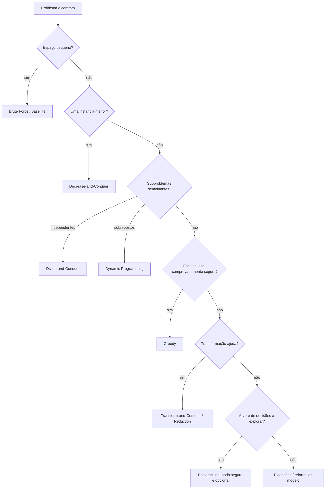
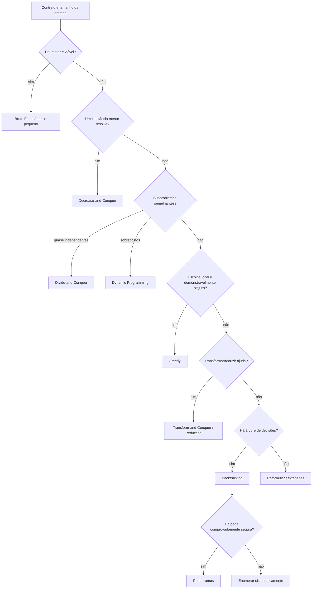

<a id="inicio"></a>

# Estratégias Fundamentais de Resolução Algorítmica

> **Classificação geral:** `[C] Obrigatório conhecer; dominar progressivamente pela prática`  
> **Nível:** C — Algoritmos e Estruturas de Dados  
> **Posição na taxonomia:** tópico 33 — décimo tópico do Nível C  
> **Pré-requisitos principais:** T17 — Recursão; T24 — Correção e Análise de Algoritmos; T26 — Algoritmos de Busca; T27 — Algoritmos de Ordenação; T28–T32 — estruturas e percursos fundamentais  
> **Aprofundamentos posteriores:** T34 — Matching, Busca em Strings e Regex no Mapa Algorítmico; T35 — Modelagem, Escolha de Estruturas e Trade-offs

---

## Resumo executivo

Uma **estratégia algorítmica** é um padrão de raciocínio para transformar um problema em uma solução. Ela não é uma palavra-chave da linguagem, não é uma estrutura de dados e não é, por si só, um algoritmo concreto.

O mesmo `for`, `if`, função recursiva ou `Map` pode aparecer em estratégias completamente diferentes. O que distingue a estratégia é a **forma como o espaço do problema é organizado e explorado**.

Neste tópico, o núcleo é reconhecer e comparar:

```text
Brute Force
    → explorar diretamente possibilidades

Decrease-and-Conquer
    → resolver uma instância menor e ampliar/reaproveitar o resultado

Divide-and-Conquer
    → dividir em subproblemas, resolver e combinar

Greedy
    → tomar escolhas locais justificadamente seguras

Transform-and-Conquer / Reduction
    → transformar a instância, representação ou problema

Dynamic Programming
    → decompor em subproblemas sobrepostos e reutilizar resultados

Backtracking
    → explorar decisões e abandonar ramos inviáveis
```

Ao final, o objetivo não é decorar rótulos. É conseguir olhar para um problema e perguntar:

- qual é o espaço de soluções?
- quais subproblemas aparecem?
- eles são independentes ou sobrepostos?
- existe uma escolha local que pode ser provada segura?
- é possível transformar a entrada ou reduzir o problema?
- uma busca exaustiva ainda é aceitável?
- que trabalho estou trocando por memória?
- recursão ajuda a modelar ou apenas esconde custo/limite?


---

## Como estudar este tópico — duas rotas

Este T33 funciona em duas rotas complementares. A **rota de estudo** preserva a progressão entre reconhecimento do problema, estratégia, prova/justificativa, custo e implementação. A **rota de consulta** permite recuperar rapidamente uma técnica, um risco, um exemplo ou um diagnóstico sem reler o capítulo inteiro.

### Rota A — primeiro contato / estudo sequencial

```text
Resumo executivo
→ Visão panorâmica
→ PARTE I: fundamentos e reconhecimento de estratégias
→ PARTE II: decomposição, escolha e transformação
→ PARTE III: programação dinâmica e backtracking
→ PARTE IV: iteração, recursão, trade-offs e extensões
→ PARTE V: transferência, robustez e decisão
→ PARTE VI: LABs, exercícios, troubleshooting e domínio
→ Apêndices: glossário, taxonomia, fontes, QA e histórico
```

### Rota B — consulta rápida

1. abra a [Visão panorâmica](#visao-panoramica);
2. use o **Índice essencial** para escolher a família de estratégia;
3. para falha concreta, vá ao [Troubleshooting sistemático](#troubleshooting-sistematico);
4. para cobertura operacional, consulte o [inventário `PR-T33-*`](#pr-t33-inventario);
5. para fonte, versão, QA ou histórico, use os apêndices.

> **Regra de uso:** classifique o problema pelas propriedades que ele oferece. Recursão, loops, mapas e tabelas são mecanismos de implementação; não provam que um algoritmo seja divide-and-conquer, greedy, DP ou backtracking.

---

## Visão rápida

| Estratégia | Ideia central | Sinal típico | Risco comum |
|---|---|---|---|
| Brute Force | tentar diretamente | espaço pequeno / baseline | explosão combinatória |
| Decrease-and-Conquer | reduzir para uma instância menor | `n → n-1`, `n/2`, resto | confundir com divide-and-conquer |
| Divide-and-Conquer | dividir, resolver, combinar | subproblemas semelhantes | subproblemas sobrepostos desperdiçados |
| Greedy | escolher agora sem voltar | propriedade de escolha gulosa | “parece bom” sem prova |
| Transform/Reduction | mudar a forma do problema | pré-ordenar, representar, reduzir | transformação custa mais do que economiza |
| Dynamic Programming | armazenar subproblemas | sobreposição + estrutura de solução | estado mal definido / memória excessiva |
| Backtracking | explorar e desfazer | decisões combinatórias + poda | árvore exponencial |
| Iteração/Recursão | forma de execução | estado explícito × stack | tratar como disputa de estilo |

---

## Regra de ouro

> **Não escolha uma estratégia pelo nome ou pela aparência do código. Escolha-a pelas propriedades do problema e justifique por que ela preserva correção e melhora — ou não precisa melhorar — o custo.**

---

## Decisão rápida

```text
TENHO UM PROBLEMA NOVO
        │
        ├── o espaço é pequeno e posso enumerar?
        │       └── Brute Force pode ser suficiente/baseline
        │
        ├── consigo reduzir para UMA instância menor?
        │       └── Decrease-and-Conquer
        │
        ├── consigo dividir em subproblemas semelhantes?
        │       ├── quase independentes → Divide-and-Conquer
        │       └── repetidos/sobrepostos → considerar Dynamic Programming
        │
        ├── existe uma escolha local comprovadamente segura?
        │       └── Greedy
        │
        ├── consigo mudar representação/ordenar/reduzir a outro problema?
        │       └── Transform-and-Conquer / Reduction
        │
        ├── preciso explorar uma árvore de decisões sistematicamente?
        │       └── Backtracking; poda segura pode reduzir o espaço
        │
        └── problema grande/difícil demais para solução exata?
                └── extensões: aproximação, heurísticas, randomização,
                    branch and bound, algoritmos online...
```



---


<a id="visao-panoramica"></a>
## 🗺️ Visão panorâmica — o mapa antes dos detalhes

Esta seção funciona como **caderno rápido de consulta**, índice conceitual e contrato de cobertura de T33. Ela permite recuperar a estratégia provável, as pré-condições, os riscos e o primeiro caminho de diagnóstico sem precisar reler o capítulo inteiro.

### O mapa do domínio em uma frase

> **Projetar um algoritmo é descobrir que estrutura o problema oferece — enumeração, redução, decomposição, escolha local, transformação, reutilização de estados ou exploração sistemática de decisões — e então escolher uma estratégia cuja correção e custo possam ser justificados.**

### Cobertura canônica 33.1–33.10

| Nó | Estratégia / eixo | Pergunta de reconhecimento | Evidência necessária |
|---|---|---|---|
| **33.1** | Brute Force | consigo enumerar candidatos diretamente? | completude da enumeração + custo do espaço |
| **33.2** | Decrease-and-Conquer | o problema vira **uma** instância menor? | progresso/término + reconstrução da resposta |
| **33.3** | Divide-and-Conquer | posso dividir em subproblemas semelhantes e combinar? | divisão válida + combinação + recorrência |
| **33.4** | Greedy | uma decisão local pode ser tomada sem voltar? | propriedade/argumento que garanta correção; contraexemplos |
| **33.5** | Transform-and-Conquer / Reduction | outra representação/instância torna o problema mais simples? | equivalência/preservação do contrato + custo da transformação |
| **33.6** | Dynamic Programming | estados/subproblemas reaparecem? | estado suficiente + recorrência/transição + bases + dependências |
| **33.7** | Backtracking | preciso percorrer uma árvore implícita de decisões? | geração completa; restauração de estado; poda, se houver, segura |
| **33.8** | Iteração × Recursão | onde ficará o estado de execução? | profundidade, stack, clareza e custo |
| **33.9** | Tempo × Espaço | vale armazenar trabalho para não recomputar? | orçamento de memória + ganho de tempo esperado |
| **33.10** | Extensões | a solução exata/básica não basta? | pré-condições e garantia própria de cada técnica |

### Mapa visual — do contrato à estratégia



### Pergunta prática → primeiro mecanismo a investigar

| Pergunta / sintoma | Primeiro caminho |
|---|---|
| “Preciso de uma implementação simples para validar outra solução.” | Brute Force como **oracle** para entradas pequenas |
| “Cada etapa reduz `n` para `n-1`, `n/2` ou um resto.” | Decrease-and-Conquer |
| “Quebro em partes, resolvo cada parte e junto.” | Divide-and-Conquer |
| “Quero escolher o melhor valor local e nunca voltar.” | Greedy **somente após justificar a propriedade** |
| “Ordenar/indexar/mudar representação facilita tudo depois.” | Transform-and-Conquer; inclua o pré-processamento no custo |
| “A recursão recalcula os mesmos `(i, j)` / `(index, restante)`.” | Dynamic Programming / memoização |
| “Tenho escolhas, avanço, desfaço e tento outra.” | Backtracking |
| “Ao aumentar a entrada em 1 o tempo explode.” | medir espaço de busca/recorrência e revisar estratégia |
| “Tenho memória sobrando e muita recomputação.” | avaliar troca tempo × espaço |
| “Quero solução ótima, mas branch-and-bound parece adequado.” | validar **bound** e regra de poda; não confundir com backtracking simples |

### Não confundir

| Conceitos | Diferença essencial |
|---|---|
| **Brute Force × Backtracking** | brute force é enumeração direta; backtracking organiza decisões incrementalmente. Backtracking **pode** enumerar tudo se não houver poda útil. |
| **Decrease-and-Conquer × Divide-and-Conquer** | decrease resolve essencialmente uma instância menor; divide cria múltiplos subproblemas que depois são combinados. |
| **Divide-and-Conquer × Dynamic Programming** | D&C clássico tende a subproblemas novos/quase independentes; DP explora **sobreposição** e reutiliza resultados. |
| **Greedy × heurística** | greedy correto para otimização precisa de argumento/propriedade de correção; uma heurística pode aceitar ausência de garantia formal. |
| **Greedy × DP** | greedy compromete-se com uma escolha; DP compara alternativas por estados e reutiliza subresultados. |
| **Memoização × “qualquer cache”** | memoização exige chave que represente completamente o subproblema; cache incompleto pode produzir resposta errada. |
| **Recursão × estratégia** | recursão é mecanismo de execução; pode implementar D&C, decrease, DP top-down, DFS ou backtracking. |
| **Poda × Backtracking** | poda **não define** backtracking nem é necessária para sua correção; quando usada, deve ser segura para não eliminar soluções válidas. |
| **Backtracking × Branch and Bound** | backtracking costuma podar por impossibilidade/restrição; branch-and-bound usa também um limite de qualidade contra a melhor solução conhecida. |
| **Transformação × custo zero** | ordenar, indexar, copiar ou converter representação consome tempo/memória e pode alterar o contrato da entrada. |

### Microexemplo canônico 1 — greedy que parece plausível, mas falha

Moedas `[1, 3, 4]`, valor `6`:

```text
greedy “pegue a maior moeda possível”
6 → 4 + 1 + 1 = 3 moedas

ótimo
6 → 3 + 3 = 2 moedas
```

O exemplo não “prova DP”, mas derruba **esse** critério greedy para esse sistema de moedas. Brute force/DP em entradas pequenas fornece um oracle útil para procurar contraexemplos.

### Microexemplo canônico 2 — sobreposição sugere reutilização

```text
F(5)
├── F(4)
│   ├── F(3)
│   └── F(2)
└── F(3)   ← reaparece
```

Se o mesmo estado reaparece em vários ramos, armazenar o resultado pode eliminar recomputação. A pergunta correta é: **a chave do cache representa todo o estado que determina a resposta?**

### Microexemplo canônico 3 — poda depende do contrato

Para `subset sum` **somente com valores positivos**:

```text
current_sum > target
→ adicionar outros positivos nunca reduzirá a soma
→ o ramo pode ser podado com segurança
```

Com valores negativos, a mesma regra é incorreta: `6 > 5`, mas `6 + (-1) = 5`. Portanto, a poda não é uma “regra do backtracking”; ela é uma consequência das invariantes daquele problema.

### Falha observada → primeira investigação

| Falha | Primeiro diagnóstico | PR relacionado |
|---|---|---|
| tempo explode ao crescer `n` | tamanho do espaço/recorrência; contagem de estados | `PR-T33-01` |
| greedy falha em caso raro | contraexemplo mínimo + prova da propriedade | `PR-T33-02` |
| DP retorna valor plausível, mas errado | estado/chave, base, transição e ordem | `PR-T33-03` / `PR-T33-04` |
| memória cresce sem limite | cardinalidade do cache/tabela e ciclo de vida | `PR-T33-05` |
| backtracking perde soluções | restauração + poda + geração de candidatos | `PR-T33-06` / `PR-T33-07` |
| branch-and-bound retorna solução subótima | validade do bound e condição de descarte | `PR-T33-08` |
| recursão falha só em entradas grandes | profundidade e stack do runtime | `PR-T33-09` |
| transformação “otimiza”, mas quebra chamador | mutação/ordem/identidade da entrada | `PR-T33-10` |
| implementações divergem por linguagem | números, mutabilidade, igualdade e estruturas | `PR-T33-11` |
| benchmark contradiz Big O | entrada, constante, warm-up, total do pipeline | `PR-T33-12` |

### Transferência entre linguagens

| Necessidade | Python | JavaScript | Java | GNU Bash |
|---|---|---|---|---|
| memoização | `dict`, `functools.cache` | `Map` | `HashMap` / arrays | array associativo em casos pequenos |
| tabulação | `list` | `Array` | arrays / coleções | arrays; custo/ergonomia limitam escala |
| backtracking | lista/set + recursão | `Array`/`Set` + funções | arrays/coleções + métodos | possível didaticamente, pouco idiomático para busca grande |
| stack explícita | `list`/`deque` | `Array` | `ArrayDeque` | array indexado em casos controlados |
| inteiros grandes | `int` arbitrário | `BigInt` quando necessário | `BigInteger` quando necessário | aritmética inteira do shell, limitada pelo ambiente |

A transferência correta preserva o **modelo do problema e as invariantes**, não uma tradução linha a linha. Bash aparece como ponte conceitual; não há obrigação de criar equivalência artificial onde a linguagem não é apropriada.

### Rota de consulta rápida

```text
classificar a estratégia          → seções 2–3 e 45–47
brute force / baseline            → seções 4–6
reduce one instance               → seções 7–8
divide-and-conquer                → seções 9–12
greedy + contraexemplos           → seções 13–16 e 49
transform/reduction               → seções 17–19
dynamic programming              → seções 20–29
backtracking / poda               → seções 30–36
iteração × recursão               → seções 37–39
trade-off tempo × espaço          → seções 40–41
híbridos / extensões              → seções 42–44
linguagens                        → seções 50–55
problemas reais PR-T33-*          → seção 57.5
prática                           → seções 58–67
troubleshooting                   → seção 69 e bloco dedicado
QA / rastreabilidade              → seções 73–77
```

### Fronteiras curriculares

- **T24 — Correção e Análise de Algoritmos:** fornece invariantes, custos e linguagem de prova; T33 aplica isso à escolha de paradigmas.
- **T26/T27 — Busca e Ordenação:** oferecem algoritmos concretos que funcionam como exemplos de várias estratégias.
- **T32 — Grafos:** fornece espaços de estados e percursos; T33 generaliza a escolha de estratégia, sem reabrir todo o conteúdo de grafos.
- **T34 — Matching/Strings/Regex:** aprofundará famílias específicas de matching; T33 só fornece paradigmas reutilizáveis.
- **T35 — Modelagem, Estruturas e Trade-offs:** integra escolha de representação/estrutura/algoritmo; T33 entrega o vocabulário de estratégias.

### Gate 1 — cobertura conceitual da Visão Panorâmica

**FECHADO.** O mapa representa os nós 33.1–33.10, diferencia os paradigmas que mais se confundem, explicita pré-condições que alteram correção, liga sintomas a mecanismos e `PR-T33-*`, apresenta transferência entre as quatro linguagens canônicas e mantém fronteiras claras com T24/T32/T34/T35.

[↑ Voltar ao índice](#índice)

---

## Índice essencial

- [🗺️ Visão panorâmica](#visao-panoramica)
- [PARTE I — Fundamentos e reconhecimento de estratégias](#parte-i)
- [PARTE II — Estratégias de decomposição, escolha e transformação](#parte-ii)
- [PARTE III — Programação dinâmica e backtracking](#parte-iii)
- [PARTE IV — Iteração, recursão, trade-offs e extensões](#parte-iv)
- [PARTE V — Transferência, robustez e decisão](#parte-v)
- [PARTE VI — LABs, exercícios, troubleshooting e domínio](#parte-vi)
- [APÊNDICES — glossário, taxonomia, fontes, QA e histórico](#apendices)
- [Troubleshooting sistemático](#troubleshooting-sistematico)
- [Inventário `PR-T33-*`](#pr-t33-inventario)

<details>
<summary><strong>Índice detalhado</strong></summary>

# Índice

  - [Resumo executivo](#resumo-executivo)
  - [Visão rápida](#visão-rápida)
  - [Regra de ouro](#regra-de-ouro)
  - [Decisão rápida](#decisão-rápida)
  - [🗺️ Visão panorâmica — o mapa antes dos detalhes](#visao-panoramica)
- [1. Posição deste assunto na trilha](#1-posição-deste-assunto-na-trilha)
  - [1.1 O que T24 entregou](#11-o-que-t24-entregou)
  - [1.2 O que T26 e T27 já mostraram](#12-o-que-t26-e-t27-já-mostraram)
  - [1.3 O que T28–T32 adicionaram](#13-o-que-t28t32-adicionaram)
  - [1.4 Fronteira com T34](#14-fronteira-com-t34)
  - [1.5 Fronteira com T35](#15-fronteira-com-t35)
- [2. Estratégia ≠ algoritmo ≠ estrutura de dados ≠ sintaxe](#2-estratégia--algoritmo--estrutura-de-dados--sintaxe)
  - [2.1 Estratégia](#21-estratégia)
  - [2.2 Algoritmo](#22-algoritmo)
  - [2.3 Estrutura de dados](#23-estrutura-de-dados)
  - [2.4 Sintaxe](#24-sintaxe)
  - [2.5 Idiomatismo](#25-idiomatismo)
- [3. Como reconhecer uma estratégia no código](#3-como-reconhecer-uma-estratégia-no-código)
  - [3.1 Pergunte o que acontece com a instância](#31-pergunte-o-que-acontece-com-a-instância)
  - [3.2 Mesmo `for`, estratégias diferentes](#32-mesmo-for-estratégias-diferentes)
  - [3.3 Mesma estratégia, sintaxes diferentes](#33-mesma-estratégia-sintaxes-diferentes)
- [4. 33.1 — Brute Force `[C]`](#4-331--brute-force-c)
  - [4.1 Definição operacional](#41-definição-operacional)
  - [4.2 Brute force como baseline](#42-brute-force-como-baseline)
  - [4.3 Exemplo — dois valores que somam um alvo](#43-exemplo--dois-valores-que-somam-um-alvo)
  - [4.4 Quando `Θ(n²)` é aceitável](#44-quando-θn²-é-aceitável)
  - [4.5 Explosão combinatória](#45-explosão-combinatória)
  - [4.6 Força bruta não é ausência de raciocínio](#46-força-bruta-não-é-ausência-de-raciocínio)
- [5. Brute force nas quatro linguagens](#5-brute-force-nas-quatro-linguagens)
  - [5.1 Python](#51-python)
  - [5.2 JavaScript](#52-javascript)
  - [5.3 Java](#53-java)
  - [5.4 GNU Bash](#54-gnu-bash)
- [6. Brute force como oráculo de teste](#6-brute-force-como-oráculo-de-teste)
  - [6.1 Ideia](#61-ideia)
  - [6.2 Exemplo de estratégia de validação](#62-exemplo-de-estratégia-de-validação)
  - [6.3 Limite](#63-limite)
- [7. 33.2 — Decrease-and-Conquer `[C]`](#7-332--decrease-and-conquer-c)
  - [7.1 Ideia central](#71-ideia-central)
  - [7.2 Decrease by one](#72-decrease-by-one)
  - [7.3 Decrease by factor](#73-decrease-by-factor)
  - [7.4 Variable-size decrease](#74-variable-size-decrease)
  - [7.5 Diferença para divide-and-conquer](#75-diferença-para-divide-and-conquer)
- [8. Exemplo — algoritmo de Euclides](#8-exemplo--algoritmo-de-euclides)
  - [8.1 Python](#81-python)
  - [8.2 JavaScript](#82-javascript)
  - [8.3 Java](#83-java)
  - [8.4 GNU Bash](#84-gnu-bash)
- [9. 33.3 — Divide-and-Conquer `[C]`](#9-333--divide-and-conquer-c)
  - [9.1 Estrutura canônica](#91-estrutura-canônica)
  - [9.2 Base case](#92-base-case)
  - [9.3 Divide](#93-divide)
  - [9.4 Conquer](#94-conquer)
  - [9.5 Combine](#95-combine)
  - [9.6 Merge Sort como referência](#96-merge-sort-como-referência)
  - [9.7 Quick Sort não “combina” da mesma forma](#97-quick-sort-não-combina-da-mesma-forma)
- [10. Divide-and-conquer × decrease-and-conquer × DP](#10-divide-and-conquer--decrease-and-conquer--dp)
  - [10.1 Comparação](#101-comparação)
  - [10.2 Não classificar pelo uso de recursão](#102-não-classificar-pelo-uso-de-recursão)
- [11. Exemplo progressivo — máximo por divide-and-conquer](#11-exemplo-progressivo--máximo-por-divide-and-conquer)
  - [11.1 Modelo](#111-modelo)
  - [11.2 Python](#112-python)
- [12. Recorrências e custo — ligação com T24](#12-recorrências-e-custo--ligação-com-t24)
  - [12.1 Forma típica](#121-forma-típica)
  - [12.2 T33 não repete toda a análise](#122-t33-não-repete-toda-a-análise)
  - [12.3 Exemplo Merge Sort](#123-exemplo-merge-sort)
- [13. 33.4 — Greedy `[C]`](#13-334--greedy-c)
  - [13.1 Definição](#131-definição)
  - [13.2 O erro clássico](#132-o-erro-clássico)
  - [13.3 Propriedade de escolha gulosa](#133-propriedade-de-escolha-gulosa)
  - [13.4 Subestrutura ótima](#134-subestrutura-ótima)
  - [13.5 Prova de troca](#135-prova-de-troca)
  - [13.6 Greedy pode ser correto sem resolver todos os problemas parecidos](#136-greedy-pode-ser-correto-sem-resolver-todos-os-problemas-parecidos)
- [14. Greedy que funciona — seleção de atividades](#14-greedy-que-funciona--seleção-de-atividades)
  - [14.1 Problema](#141-problema)
  - [14.2 Escolha clássica](#142-escolha-clássica)
  - [14.3 Intuição correta](#143-intuição-correta)
  - [14.4 Intuição não substitui prova](#144-intuição-não-substitui-prova)
- [15. Greedy que falha — troco com moedas](#15-greedy-que-falha--troco-com-moedas)
  - [15.1 Sistema de moedas](#151-sistema-de-moedas)
  - [15.2 Greedy pelo maior valor primeiro](#152-greedy-pelo-maior-valor-primeiro)
  - [15.3 Solução ótima](#153-solução-ótima)
  - [15.4 Lição](#154-lição)
- [16. Greedy × programação dinâmica](#16-greedy--programação-dinâmica)
  - [16.1 Semelhança](#161-semelhança)
  - [16.2 Diferença essencial](#162-diferença-essencial)
  - [16.3 Pergunta diagnóstica](#163-pergunta-diagnóstica)
- [17. 33.5 — Transform-and-Conquer / Reduction `[C]`](#17-335--transform-and-conquer--reduction-c)
  - [17.1 Ideia central](#171-ideia-central)
  - [17.2 Pré-ordenar](#172-pré-ordenar)
  - [17.3 Mudar representação](#173-mudar-representação)
  - [17.4 Reduction](#174-reduction)
  - [17.5 Redução não é “converter formato” apenas](#175-redução-não-é-converter-formato-apenas)
  - [17.6 Custo total inclui transformar](#176-custo-total-inclui-transformar)
- [18. Exemplo — detectar duplicatas](#18-exemplo--detectar-duplicatas)
  - [18.1 Brute force](#181-brute-force)
  - [18.2 Transformação por ordenação](#182-transformação-por-ordenação)
  - [18.3 Transformação por hashing](#183-transformação-por-hashing)
  - [18.4 Trade-off](#184-trade-off)
- [19. Transform-and-conquer nas quatro linguagens](#19-transform-and-conquer-nas-quatro-linguagens)
  - [19.1 Python](#191-python)
  - [19.2 JavaScript](#192-javascript)
  - [19.3 Java](#193-java)
  - [19.4 GNU Bash](#194-gnu-bash)
- [20. 33.6 — Programação Dinâmica `[C]`](#20-336--programação-dinâmica-c)
  - [20.1 Definição operacional](#201-definição-operacional)
  - [20.2 Ingredientes frequentes](#202-ingredientes-frequentes)
  - [20.3 Sobreposição é o ganho central](#203-sobreposição-é-o-ganho-central)
  - [20.4 DP não exige recursão](#204-dp-não-exige-recursão)
  - [20.5 “Programming” não significa programação de código](#205-programming-não-significa-programação-de-código)
- [21. Como projetar uma DP](#21-como-projetar-uma-dp)
  - [21.1 Defina o estado](#211-defina-o-estado)
  - [21.2 Escreva a transição](#212-escreva-a-transição)
  - [21.3 Declare casos base](#213-declare-casos-base)
  - [21.4 Escolha top-down ou bottom-up](#214-escolha-top-down-ou-bottom-up)
  - [21.5 Reconstrua a solução quando necessário](#215-reconstrua-a-solução-quando-necessário)
- [22. Exemplo integrador — mínimo de moedas](#22-exemplo-integrador--mínimo-de-moedas)
  - [22.1 Contrato](#221-contrato)
  - [22.2 Recorrência](#222-recorrência)
  - [22.3 Greedy falha, DP encontra ótimo](#223-greedy-falha-dp-encontra-ótimo)
- [23. Bottom-up em Python](#23-bottom-up-em-python)
- [24. Bottom-up em JavaScript](#24-bottom-up-em-javascript)
- [25. Bottom-up em Java](#25-bottom-up-em-java)
- [26. Bottom-up em GNU Bash](#26-bottom-up-em-gnu-bash)
- [27. Memoização top-down](#27-memoização-top-down)
  - [27.1 Modelo](#271-modelo)
  - [27.2 Python com `functools.cache`](#272-python-com-functoolscache)
  - [27.3 Cache sem limite não é gratuito](#273-cache-sem-limite-não-é-gratuito)
- [28. Top-down × bottom-up](#28-top-down--bottom-up)
  - [28.1 Top-down](#281-top-down)
  - [28.2 Bottom-up](#282-bottom-up)
- [29. Otimização de memória em DP](#29-otimização-de-memória-em-dp)
  - [29.1 Tabela completa nem sempre é necessária](#291-tabela-completa-nem-sempre-é-necessária)
  - [29.2 Cuidado com reconstrução](#292-cuidado-com-reconstrução)
- [30. 33.7 — Backtracking `[C]`](#30-337--backtracking-c)
  - [30.1 Ideia central](#301-ideia-central)
  - [30.2 Esqueleto](#302-esqueleto)
  - [30.3 Árvore implícita de decisões](#303-árvore-implícita-de-decisões)
  - [30.4 Poda](#304-poda)
  - [30.5 Poda correta](#305-poda-correta)
- [31. Backtracking × brute force](#31-backtracking--brute-force)
  - [31.1 Sem poda](#311-sem-poda)
  - [31.2 Com poda](#312-com-poda)
  - [31.3 Pior caso](#313-pior-caso)
- [32. Exemplo — subset sum com números positivos](#32-exemplo--subset-sum-com-números-positivos)
  - [32.1 Contrato didático](#321-contrato-didático)
  - [32.2 Python](#322-python)
- [33. Backtracking em JavaScript](#33-backtracking-em-javascript)
- [34. Backtracking em Java](#34-backtracking-em-java)
- [35. Backtracking em GNU Bash](#35-backtracking-em-gnu-bash)
- [36. Backtracking, DFS e grafos implícitos](#36-backtracking-dfs-e-grafos-implícitos)
  - [36.1 Conexão com T32](#361-conexão-com-t32)
  - [36.2 DFS natural](#362-dfs-natural)
  - [36.3 Estado deve ser restaurado](#363-estado-deve-ser-restaurado)
- [37. 33.8 — Iteração × Recursão `[C → D]`](#37-338--iteração--recursão-c--d)
  - [37.1 Não é competição estética](#371-não-é-competição-estética)
  - [37.2 Quando recursão é natural](#372-quando-recursão-é-natural)
  - [37.3 Quando iteração é natural](#373-quando-iteração-é-natural)
  - [37.4 Stack explícita](#374-stack-explícita)
  - [37.5 Tail call não deve ser assumida](#375-tail-call-não-deve-ser-assumida)
- [38. Exemplo — soma iterativa × recursiva](#38-exemplo--soma-iterativa--recursiva)
  - [38.1 Iterativa](#381-iterativa)
  - [38.2 Recursiva](#382-recursiva)
- [39. Recursão profunda e limites](#39-recursão-profunda-e-limites)
  - [39.1 Python](#391-python)
  - [39.2 JavaScript](#392-javascript)
  - [39.3 Java](#393-java)
  - [39.4 Bash](#394-bash)
- [40. 33.9 — Trade-off tempo × espaço `[C]`](#40-339--trade-off-tempo--espaço-c)
  - [40.1 Cache](#401-cache)
  - [40.2 Hashing](#402-hashing)
  - [40.3 Pré-processamento](#403-pré-processamento)
  - [40.4 DP](#404-dp)
  - [40.5 Backtracking](#405-backtracking)
  - [40.6 Não existe almoço grátis](#406-não-existe-almoço-grátis)
- [41. Exemplo — precomputar consultas](#41-exemplo--precomputar-consultas)
  - [41.1 Cenário](#411-cenário)
  - [41.2 Sem pré-processamento](#412-sem-pré-processamento)
  - [41.3 Com Set/Hash](#413-com-sethash)
  - [41.4 Custo oculto](#414-custo-oculto)
- [42. Estratégia híbrida](#42-estratégia-híbrida)
  - [42.1 Algoritmos reais combinam estratégias](#421-algoritmos-reais-combinam-estratégias)
  - [42.2 Rótulos são ferramentas de raciocínio](#422-rótulos-são-ferramentas-de-raciocínio)
- [43. 33.10 — Extensões `[E]`](#43-3310--extensões-e)
  - [43.1 Branch and Bound](#431-branch-and-bound)
  - [43.2 Algoritmos de aproximação](#432-algoritmos-de-aproximação)
  - [43.3 Algoritmos randomizados/estocásticos](#433-algoritmos-randomizadosestocásticos)
  - [43.4 Iterative improvement](#434-iterative-improvement)
  - [43.5 Heurísticas e busca informada](#435-heurísticas-e-busca-informada)
  - [43.6 Algoritmos online](#436-algoritmos-online)
- [44. Extensões — fronteiras e linguagem correta](#44-extensões--fronteiras-e-linguagem-correta)
  - [44.1 Heurística ≠ aproximação](#441-heurística--aproximação)
  - [44.2 Randomizado ≠ não determinístico no sentido cotidiano](#442-randomizado--não-determinístico-no-sentido-cotidiano)
  - [44.3 Online ≠ assíncrono](#443-online--assíncrono)
- [45. Matriz comparativa das estratégias](#45-matriz-comparativa-das-estratégias)
- [46. Mesmo problema, estratégias diferentes](#46-mesmo-problema-estratégias-diferentes)
  - [46.1 Troco de moedas](#461-troco-de-moedas)
  - [46.2 Encontrar duplicata](#462-encontrar-duplicata)
  - [46.3 Busca em array ordenado](#463-busca-em-array-ordenado)
- [47. Greedy, DP e Backtracking — como decidir](#47-greedy-dp-e-backtracking--como-decidir)
  - [47.1 Primeira pergunta](#471-primeira-pergunta)
  - [47.2 Segunda pergunta](#472-segunda-pergunta)
  - [47.3 Terceira pergunta](#473-terceira-pergunta)
- [48. Estado — o coração de DP e backtracking](#48-estado--o-coração-de-dp-e-backtracking)
  - [48.1 Estado insuficiente](#481-estado-insuficiente)
  - [48.2 Estado excessivo](#482-estado-excessivo)
  - [48.3 Regra](#483-regra)
- [49. Contraexemplos como ferramenta de projeto](#49-contraexemplos-como-ferramenta-de-projeto)
  - [49.1 Para greedy](#491-para-greedy)
  - [49.2 Para poda](#492-para-poda)
  - [49.3 Para DP](#493-para-dp)
- [50. Comparação entre linguagens — conceito universal](#50-comparação-entre-linguagens--conceito-universal)
- [51. Python — idiomatismos relevantes](#51-python--idiomatismos-relevantes)
  - [51.1 Memoização](#511-memoização)
  - [51.2 Tabelas](#512-tabelas)
  - [51.3 Backtracking](#513-backtracking)
- [52. JavaScript — idiomatismos relevantes](#52-javascript--idiomatismos-relevantes)
  - [52.1 Memoização](#521-memoização)
  - [52.2 Arrays](#522-arrays)
  - [52.3 Números](#523-números)
- [53. Java — idiomatismos relevantes](#53-java--idiomatismos-relevantes)
  - [53.1 Estado tipado](#531-estado-tipado)
  - [53.2 Recursão](#532-recursão)
  - [53.3 Sentinelas](#533-sentinelas)
- [54. GNU Bash — transferência consciente](#54-gnu-bash--transferência-consciente)
  - [54.1 O que Bash consegue demonstrar](#541-o-que-bash-consegue-demonstrar)
  - [54.2 O que não deve ser fingido](#542-o-que-não-deve-ser-fingido)
  - [54.3 Subshells e estado](#543-subshells-e-estado)
- [55. Segurança e robustez](#55-segurança-e-robustez)
  - [55.1 Explosão de tempo](#551-explosão-de-tempo)
  - [55.2 Explosão de memória](#552-explosão-de-memória)
  - [55.3 Orçamento explícito](#553-orçamento-explícito)
  - [55.4 Entrada não confiável](#554-entrada-não-confiável)
- [56. Anti-padrões](#56-anti-padrões)
  - [56.1 “Tem recursão, então é divide-and-conquer”](#561-tem-recursão-então-é-divide-and-conquer)
  - [56.2 “Greedy é pegar o maior”](#562-greedy-é-pegar-o-maior)
  - [56.3 “DP é uma tabela 2D”](#563-dp-é-uma-tabela-2d)
  - [56.4 “Backtracking é brute force”](#564-backtracking-é-brute-force)
  - [56.5 “Memoizar sempre melhora”](#565-memoizar-sempre-melhora)
  - [56.6 “Transformação é grátis”](#566-transformação-é-grátis)
- [57. Como escolher uma estratégia — checklist de projeto](#57-como-escolher-uma-estratégia--checklist-de-projeto)
  - [57.1 Especifique antes](#571-especifique-antes)
  - [57.2 Caracterize o espaço](#572-caracterize-o-espaço)
  - [57.3 Declare recursos](#573-declare-recursos)
  - [57.4 Só então escolha](#574-só-então-escolha)
  - [57.5 Inventário formal de problemas reais — PR-T33-*](#pr-t33-inventario)
- [58. LAB 1 — Brute Force como baseline](#58-lab-1--brute-force-como-baseline)
  - [Objetivo](#objetivo)
  - [Pré-requisitos](#pré-requisitos)
  - [Estado inicial](#estado-inicial)
  - [Tarefa](#tarefa)
  - [Procedimento](#procedimento)
  - [O que observar](#o-que-observar)
  - [Testes](#testes)
  - [Explicação](#explicação)
  - [Variação / transferência](#variação--transferência)
  - [Limpeza](#limpeza)
- [59. LAB 2 — Decrease-and-Conquer com Euclides](#59-lab-2--decrease-and-conquer-com-euclides)
  - [Objetivo](#objetivo-1)
  - [Pré-requisitos](#pré-requisitos-1)
  - [Estado inicial](#estado-inicial-1)
  - [Tarefa](#tarefa-1)
  - [Procedimento](#procedimento-1)
  - [O que observar](#o-que-observar-1)
  - [Testes](#testes-1)
  - [Explicação](#explicação-1)
  - [Variação / transferência](#variação--transferência-1)
  - [Limpeza](#limpeza-1)
- [60. LAB 3 — Divide-and-Conquer e árvore de chamadas](#60-lab-3--divide-and-conquer-e-árvore-de-chamadas)
  - [Objetivo](#objetivo-2)
  - [Pré-requisitos](#pré-requisitos-2)
  - [Estado inicial](#estado-inicial-2)
  - [Tarefa](#tarefa-2)
  - [Procedimento](#procedimento-2)
  - [O que observar](#o-que-observar-2)
  - [Testes](#testes-2)
  - [Explicação](#explicação-2)
  - [Variação / transferência](#variação--transferência-2)
  - [Limpeza](#limpeza-2)
- [61. LAB 4 — Contraexemplo para Greedy](#61-lab-4--contraexemplo-para-greedy)
  - [Objetivo](#objetivo-3)
  - [Pré-requisitos](#pré-requisitos-3)
  - [Estado inicial](#estado-inicial-3)
  - [Tarefa](#tarefa-3)
  - [Procedimento](#procedimento-3)
  - [O que observar](#o-que-observar-3)
  - [Testes](#testes-3)
  - [Explicação](#explicação-3)
  - [Variação / transferência](#variação--transferência-3)
  - [Limpeza](#limpeza-3)
- [62. LAB 5 — Transform-and-Conquer por ordenação](#62-lab-5--transform-and-conquer-por-ordenação)
  - [Objetivo](#objetivo-4)
  - [Pré-requisitos](#pré-requisitos-4)
  - [Estado inicial](#estado-inicial-4)
  - [Tarefa](#tarefa-4)
  - [Procedimento](#procedimento-4)
  - [O que observar](#o-que-observar-4)
  - [Testes](#testes-4)
  - [Explicação](#explicação-4)
  - [Variação / transferência](#variação--transferência-4)
  - [Limpeza](#limpeza-4)
- [63. LAB 6 — DP top-down × bottom-up](#63-lab-6--dp-top-down--bottom-up)
  - [Objetivo](#objetivo-5)
  - [Pré-requisitos](#pré-requisitos-5)
  - [Estado inicial](#estado-inicial-5)
  - [Tarefa](#tarefa-5)
  - [Procedimento](#procedimento-5)
  - [O que observar](#o-que-observar-5)
  - [Testes](#testes-5)
  - [Explicação](#explicação-5)
  - [Variação / transferência](#variação--transferência-5)
  - [Limpeza](#limpeza-5)
- [64. LAB 7 — Backtracking e poda](#64-lab-7--backtracking-e-poda)
  - [Objetivo](#objetivo-6)
  - [Pré-requisitos](#pré-requisitos-6)
  - [Estado inicial](#estado-inicial-6)
  - [Tarefa](#tarefa-6)
  - [Procedimento](#procedimento-6)
  - [O que observar](#o-que-observar-6)
  - [Testes](#testes-6)
  - [Explicação](#explicação-6)
  - [Variação / transferência](#variação--transferência-6)
  - [Limpeza](#limpeza-6)
- [65. LAB 8 — Escolha de estratégia em cenário integrado](#65-lab-8--escolha-de-estratégia-em-cenário-integrado)
  - [Objetivo](#objetivo-7)
  - [Pré-requisitos](#pré-requisitos-7)
  - [Estado inicial](#estado-inicial-7)
  - [Tarefa](#tarefa-7)
  - [Procedimento](#procedimento-7)
  - [O que observar](#o-que-observar-7)
  - [Testes](#testes-7)
  - [Explicação](#explicação-7)
  - [Variação / transferência](#variação--transferência-7)
  - [Limpeza](#limpeza-7)
- [66. Exercícios fundamentais](#66-exercícios-fundamentais)
  - [66.1 Classificação de estratégia](#661-classificação-de-estratégia)
  - [66.2 Greedy](#662-greedy)
  - [66.3 DP](#663-dp)
  - [66.4 Backtracking](#664-backtracking)
  - [66.5 Transformação](#665-transformação)
- [67. Exercícios de transferência entre linguagens](#67-exercícios-de-transferência-entre-linguagens)
  - [67.1 Memoização](#671-memoização)
  - [67.2 Tabela DP](#672-tabela-dp)
  - [67.3 Backtracking](#673-backtracking)
- [68. Erros frequentes de implementação](#68-erros-frequentes-de-implementação)
  - [68.1 Memoização depois da chamada recursiva errada](#681-memoização-depois-da-chamada-recursiva-errada)
  - [68.2 Chave de cache incompleta](#682-chave-de-cache-incompleta)
  - [68.3 Caso base errado](#683-caso-base-errado)
  - [68.4 `unchoose` ausente](#684-unchoose-ausente)
  - [68.5 Greedy sem prova](#685-greedy-sem-prova)
  - [68.6 Transformação muta entrada indevidamente](#686-transformação-muta-entrada-indevidamente)
- [69. Debug de estratégias](#69-debug-de-estratégias)
  - [69.1 Brute force não encontra solução existente](#691-brute-force-não-encontra-solução-existente)
  - [69.2 DP dá valor incorreto](#692-dp-dá-valor-incorreto)
  - [69.3 Backtracking “vaza” escolhas](#693-backtracking-vaza-escolhas)
  - [69.4 Greedy funciona em quase tudo](#694-greedy-funciona-em-quase-tudo)
  - [69.5 Recursão estoura stack](#695-recursão-estoura-stack)
  - [🔎 Troubleshooting sistemático](#troubleshooting-sistematico)
- [70. Evidências de domínio](#70-evidências-de-domínio)
- [71. Checklist de domínio](#71-checklist-de-domínio)
  - [71.1 Brute force e decomposição](#711-brute-force-e-decomposição)
  - [71.2 Greedy e transformação](#712-greedy-e-transformação)
  - [71.3 Dynamic Programming](#713-dynamic-programming)
  - [71.4 Backtracking](#714-backtracking)
  - [71.5 Transferência](#715-transferência)
- [72. Glossário](#72-glossário)
  - [72.1 Brute Force](#721-brute-force)
  - [72.2 Decrease-and-Conquer](#722-decrease-and-conquer)
  - [72.3 Divide-and-Conquer](#723-divide-and-conquer)
  - [72.4 Greedy](#724-greedy)
  - [72.5 Transform-and-Conquer](#725-transform-and-conquer)
  - [72.6 Reduction](#726-reduction)
  - [72.7 Dynamic Programming](#727-dynamic-programming)
  - [72.8 Memoization](#728-memoization)
  - [72.9 Tabulation](#729-tabulation)
  - [72.10 Backtracking](#7210-backtracking)
  - [72.11 Pruning](#7211-pruning)
  - [72.12 Branch and Bound](#7212-branch-and-bound)
  - [72.13 Heurística](#7213-heurística)
  - [72.14 Algoritmo online](#7214-algoritmo-online)
- [73. Auditoria de cobertura da taxonomia](#73-auditoria-de-cobertura-da-taxonomia)
  - [73.1 33.1 `[C]`](#731-331-c)
  - [73.2 33.2 `[C]`](#732-332-c)
  - [73.3 33.3 `[C]`](#733-333-c)
  - [73.4 33.4 `[C]`](#734-334-c)
  - [73.5 33.5 `[C]`](#735-335-c)
  - [73.6 33.6 `[C]`](#736-336-c)
  - [73.7 33.7 `[C]`](#737-337-c)
  - [73.8 33.8 `[C → D]`](#738-338-c--d)
  - [73.9 33.9 `[C]`](#739-339-c)
  - [73.10 33.10 `[E]`](#7310-3310-e)
  - [73.11 Auditoria bidirecional — Visão Panorâmica ↔ conteúdo detalhado](#7311-auditoria-bidirecional--visão-panorâmica--conteúdo-detalhado)
  - [73.12 Inventário rastreável de capacidades ensinadas](#7312-inventário-rastreável-de-capacidades-ensinadas)
- [74. Auditoria da File Library](#74-auditoria-da-file-library)
  - [74.1 Fontes locais efetivamente consultadas](#741-fontes-locais-efetivamente-consultadas)
  - [74.2 Fonte procurada e não localizada como arquivo independente](#742-fonte-procurada-e-não-localizada-como-arquivo-independente)
  - [74.3 Como os livros alteraram o documento](#743-como-os-livros-alteraram-o-documento)
  - [74.4 Hierarquia aplicada](#744-hierarquia-aplicada)
  - [74.5 Matriz de contribuição multifonte — síntese didática](#745-matriz-de-contribuição-multifonte--síntese-didática)
- [75. Referências](#75-referências)
  - [75.1 Contratos canônicos](#751-contratos-canônicos)
  - [75.2 Literatura local efetivamente consultada](#752-literatura-local-efetivamente-consultada)
  - [75.3 Python](#753-python)
  - [75.4 ECMAScript](#754-ecmascript)
  - [75.5 Java](#755-java)
  - [75.6 GNU Bash](#756-gnu-bash)
  - [75.7 Referências algorítmicas externas de triangulação](#757-referências-algorítmicas-externas-de-triangulação)
- [76. QA e evidências](#76-qa-e-evidências)
  - [76.1 `[D]` Evidência documental](#761-d-evidência-documental)
  - [76.2 `[S]` Validação estrutural/estática](#762-s-validação-estruturalestática)
  - [76.3 `[R]` Reprodução em runtime](#763-r-reprodução-em-runtime)
    - [76.3.1 Reconciliação R3](#7631-reconciliação-r3)
    - [76.3.2 Reconciliação R4](#7632-reconciliação-r4)
    - [76.3.3 Reconciliação R5](#7633-reconciliação-r5)
  - [76.4 Limitações](#764-limitações)
  - [76.5 Gate 2 — qualidade final da iteração `0.3.2`](#765-gate-2--qualidade-final-da-iteração-032)
- [77. Histórico de versões](#77-histórico-de-versões)


</details>

---

<a id="parte-i"></a>
# PARTE I — Fundamentos e reconhecimento de estratégias

# 1. Posição deste assunto na trilha

## 1.1 O que T24 entregou

T24 ensinou a separar **correção** de **eficiência**, declarar tamanho da entrada, analisar tempo/espaço e distinguir `O`, `Ω`, `Θ`, casos e medição empírica.

T33 usa essa base para comparar estratégias. Uma estratégia não é “melhor” abstratamente; ela precisa ser avaliada no problema e no modelo de custo relevantes.

## 1.2 O que T26 e T27 já mostraram

Busca binária, Insertion Sort, Merge Sort e Quick Sort já serviram como exemplos concretos de estratégias diferentes:

- busca binária: redução por fator;
- Insertion Sort: redução por um elemento / construção incremental;
- Merge Sort: dividir e combinar;
- Quick Sort: dividir por particionamento e resolver subproblemas.

T33 nomeia e generaliza esses padrões.

## 1.3 O que T28–T32 adicionaram

Estruturas e grafos mostraram que uma melhora algorítmica frequentemente depende de:

- mudar a representação;
- usar uma estrutura auxiliar;
- armazenar resultados;
- escolher uma ordem de exploração.

Isso prepara diretamente transform-and-conquer, greedy, DP e backtracking.

## 1.4 Fronteira com T34

T34 aplicará raciocínio algorítmico a matching e strings, incluindo busca ingênua, KMP/Boyer-Moore em panorama, LCS como extensão e Regex matching.

T33 pode citar LCS como exemplo clássico de DP, mas **não deve substituir a cobertura específica de T34**.

## 1.5 Fronteira com T35

T35 será o fechamento orientado a **modelagem, escolha de estruturas e trade-offs**. T33 ensina estratégias; T35 integra estratégia + estrutura + restrições do domínio.

[↑ Voltar ao índice](#índice)

# 2. Estratégia ≠ algoritmo ≠ estrutura de dados ≠ sintaxe

## 2.1 Estratégia

É um padrão de projeto da solução.

Exemplo:

```text
DIVIDIR → RESOLVER → COMBINAR
```

Isso descreve divide-and-conquer, não uma implementação específica.

## 2.2 Algoritmo

É uma sequência definida de passos para resolver uma classe de instâncias.

`Merge Sort` é um algoritmo que usa divide-and-conquer.

## 2.3 Estrutura de dados

É uma forma de organizar estado para suportar operações.

Uma heap pode viabilizar uma estratégia gulosa eficiente, mas **heap não é sinônimo de greedy**.

## 2.4 Sintaxe

É a forma de escrever construções em uma linguagem.

Recursão em Python, JavaScript, Java ou Bash pode implementar divide-and-conquer, backtracking ou uma simples repetição. A sintaxe da chamada recursiva não identifica a estratégia.

## 2.5 Idiomatismo

Mesmo quando a estratégia é a mesma, a implementação idiomática pode variar:

- Python pode usar `dict` para memoização;
- JavaScript pode usar `Map`;
- Java pode usar `HashMap` ou arrays/tabelas tipadas;
- Bash pode usar arrays indexados/associativos em exemplos pequenos, mas deixa de ser escolha natural para DP ou busca combinatória pesada.

[↑ Voltar ao índice](#índice)

# 3. Como reconhecer uma estratégia no código

## 3.1 Pergunte o que acontece com a instância

Não comece por “tem recursão?”. Pergunte:

```text
A instância é:
- enumerada?
- reduzida?
- dividida?
- transformada?
- memorizada?
- explorada com poda?
```

## 3.2 Mesmo `for`, estratégias diferentes

Um `for` pode:

- enumerar todas as combinações — brute force;
- construir uma tabela DP — dynamic programming;
- escolher a próxima atividade — greedy;
- realizar partição — divide-and-conquer.

## 3.3 Mesma estratégia, sintaxes diferentes

A busca binária iterativa e a recursiva continuam expressando a mesma redução por fator. Trocar recursão por `while` não muda automaticamente a estratégia.

[↑ Voltar ao índice](#índice)

<a id="parte-ii"></a>
# PARTE II — Estratégias de decomposição, escolha e transformação

# 4. 33.1 — Brute Force `[C]`

## 4.1 Definição operacional

Brute force resolve um problema tentando diretamente candidatos ou percorrendo o espaço sem usar estrutura suficiente para evitar grande parte do trabalho.

Isso não significa “algoritmo ruim”. Para entradas pequenas, uma solução exaustiva pode ser a opção mais simples, correta e econômica de manter.

## 4.2 Brute force como baseline

Uma solução simples é valiosa para:

- validar uma otimização;
- gerar resultados esperados em testes pequenos;
- compreender o espaço de busca;
- estabelecer um limite prático inicial.

## 4.3 Exemplo — dois valores que somam um alvo

Abordagem direta:

```text
para cada i
    para cada j > i
        verificar values[i] + values[j] == target
```

Custo temporal típico:

```text
Θ(n²)
```

## 4.4 Quando `Θ(n²)` é aceitável

Se `n = 20`, comparar todos os pares pode ser irrelevante em termos de custo real. Se `n = 10^7`, deixa de ser razoável.

A análise precisa considerar escala, frequência e orçamento.

## 4.5 Explosão combinatória

Espaços como:

```text
subconjuntos      → 2^n
permutações       → n!
atribuições k^n   → k^n
```

crescem rapidamente. Brute force pode ser conceitualmente correto e operacionalmente inviável.

## 4.6 Força bruta não é ausência de raciocínio

Mesmo uma busca exaustiva precisa de:

- geração sem duplicações indevidas;
- critérios corretos de validade;
- limites;
- tratamento de entradas vazias;
- análise do espaço.

[↑ Voltar ao índice](#índice)

# 5. Brute force nas quatro linguagens

## 5.1 Python

```python
def has_pair_sum(values: list[int], target: int) -> bool:
    for i in range(len(values)):
        for j in range(i + 1, len(values)):
            if values[i] + values[j] == target:
                return True
    return False
```

## 5.2 JavaScript

```javascript
function hasPairSum(values, target) {
  if (!Number.isSafeInteger(target)
      || values.some((value) => !Number.isSafeInteger(value))) {
    throw new RangeError("safe integers required");
  }

  for (let i = 0; i < values.length; i += 1) {
    for (let j = i + 1; j < values.length; j += 1) {
      if (values[i] + values[j] === target) return true;
    }
  }
  return false;
}
```

## 5.3 Java

```java
static boolean hasPairSum(int[] values, long target) {
    for (int i = 0; i < values.length; i++) {
        for (int j = i + 1; j < values.length; j++) {
            long sum = (long) values[i] + values[j];
            if (sum == target) {
                return true;
            }
        }
    }
    return false;
}
```

## 5.4 GNU Bash

```bash
has_pair_sum() {
    (( $# >= 1 )) || return 2

    local target=$1
    shift
    local -a values=("$@")
    local value i j

    # Domínio didático conservador: decimal canônico com até 9 dígitos.
    # Assim, a soma de dois valores permanece segura até em inteiro assinado de 32 bits.
    [[ $target =~ ^-?(0|[1-9][0-9]{0,8})$ ]] || return 2
    for value in "${values[@]}"; do
        [[ $value =~ ^-?(0|[1-9][0-9]{0,8})$ ]] || return 2
    done

    for ((i = 0; i < ${#values[@]}; i++)); do
        for ((j = i + 1; j < ${#values[@]}; j++)); do
            if (( values[i] + values[j] == target )); then
                return 0
            fi
        done
    done

    return 1
}
```

Nesta ponte Bash, `0` significa “par encontrado”, `1` significa “não encontrado” e `2` significa “entrada fora do contrato”. O limite de nove dígitos é **conservador e didático**, não o limite do GNU Bash: ele impede que texto arbitrário seja tratado como expressão aritmética e mantém a soma intermediária dentro de uma faixa segura para o exemplo.

[↑ Voltar ao índice](#índice)

# 6. Brute force como oráculo de teste

## 6.1 Ideia

Para entradas pequenas, uma solução lenta e obviamente correta pode atuar como **oracle** para verificar uma solução otimizada.

## 6.2 Exemplo de estratégia de validação

```text
1. gerar pequenas entradas aleatórias/sistemáticas
2. calcular com brute force
3. calcular com algoritmo otimizado
4. comparar resultados
```

## 6.3 Limite

Concordância em muitos casos não prova correção geral. Ainda assim, essa técnica é excelente para detectar regressões e contraexemplos.

[↑ Voltar ao índice](#índice)

# 7. 33.2 — Decrease-and-Conquer `[C]`

## 7.1 Ideia central

Decrease-and-conquer resolve uma instância menor e usa essa solução para resolver a instância atual.

Formas comuns:

```text
n → n - 1
n → n - c
n → n / b
n → tamanho menor variável
```

## 7.2 Decrease by one

Insertion Sort é o exemplo clássico no currículo:

```text
ordenar os primeiros n-1 elementos
→ inserir o elemento restante na posição correta
```

## 7.3 Decrease by factor

Busca binária reduz aproximadamente pela metade a região candidata a cada passo:

```text
n → n/2 → n/4 → n/8 → ...
```

## 7.4 Variable-size decrease

O algoritmo de Euclides reduz o problema de `gcd(a,b)` para:

```text
gcd(b, a mod b)
```

O tamanho não diminui sempre por uma constante fixa, mas progride para instâncias menores.

## 7.5 Diferença para divide-and-conquer

Decrease-and-conquer normalmente segue **um** subproblema reduzido relevante por etapa. Divide-and-conquer costuma gerar **múltiplos** subproblemas e então combinar seus resultados.

Essa é uma distinção conceitual, não uma regra baseada em “quantos `return` existem no código”.

[↑ Voltar ao índice](#índice)

# 8. Exemplo — algoritmo de Euclides

## 8.1 Python

```python
def gcd(a: int, b: int) -> int:
    a, b = abs(a), abs(b)
    while b != 0:
        a, b = b, a % b
    return a
```

## 8.2 JavaScript

```javascript
function gcd(a, b) {
  if (!Number.isSafeInteger(a) || !Number.isSafeInteger(b)) {
    throw new RangeError("safe integers required");
  }

  a = Math.abs(a);
  b = Math.abs(b);
  while (b !== 0) {
    [a, b] = [b, a % b];
  }
  return a;
}
```

## 8.3 Java

```java
static long gcd(int a, int b) {
    long x = Math.abs((long) a);
    long y = Math.abs((long) b);

    while (y != 0) {
        long next = x % y;
        x = y;
        y = next;
    }
    return x;
}
```

## 8.4 GNU Bash

```bash
gcd() {
    (( $# == 2 )) || return 2

    local a=$1
    local b=$2

    # O domínio conservador evita o caso em que -MIN_INT não é representável.
    [[ $a =~ ^-?(0|[1-9][0-9]{0,8})$ ]] || return 2
    [[ $b =~ ^-?(0|[1-9][0-9]{0,8})$ ]] || return 2

    (( a < 0 )) && a=$((-a))
    (( b < 0 )) && b=$((-b))

    while (( b != 0 )); do
        local next=$((a % b))
        a=$b
        b=$next
    done

    printf '%d\n' "$a"
}
```

A restrição decimal de nove dígitos é parte do **contrato didático Bash**, não uma alegação sobre o maior inteiro suportado pela instalação. Ela garante que a negação e o módulo usados pelo exemplo continuem representáveis sem depender da largura real do inteiro do shell.

[↑ Voltar ao índice](#índice)

# 9. 33.3 — Divide-and-Conquer `[C]`

## 9.1 Estrutura canônica

```text
DIVIDIR
→ RESOLVER SUBPROBLEMAS
→ COMBINAR
```

## 9.2 Base case

A decomposição precisa terminar em instâncias resolvíveis diretamente.

Sem redução real de tamanho, a recursão não progride.

## 9.3 Divide

O problema é separado em subproblemas menores da mesma família ou suficientemente relacionados.

## 9.4 Conquer

Cada subproblema é resolvido, frequentemente recursivamente.

## 9.5 Combine

Os resultados são reunidos para produzir a solução da instância original.

## 9.6 Merge Sort como referência

```text
[8, 3, 5, 1]
   ↓ divide
[8,3]  [5,1]
   ↓
[8] [3] [5] [1]
   ↓ combine ordenado
[3,8]  [1,5]
   ↓
[1,3,5,8]
```

## 9.7 Quick Sort não “combina” da mesma forma

Quick Sort particiona a entrada em regiões e normalmente o trabalho de combinação é trivial em comparação ao Merge Sort.

A estratégia continua sendo divide-and-conquer porque há decomposição em subproblemas e resolução desses subproblemas.

[↑ Voltar ao índice](#índice)

# 10. Divide-and-conquer × decrease-and-conquer × DP

## 10.1 Comparação

| Propriedade | Decrease-and-Conquer | Divide-and-Conquer | Dynamic Programming |
|---|---|---|---|
| subproblemas por etapa | tipicamente um | vários | vários estados |
| sobreposição | não é requisito | idealmente pequena/nenhuma | central ao ganho |
| combinação | simples/expansão | explícita ou implícita | recorrência/tabela |
| armazenamento | não é essencial | não é essencial | essencial ao reaproveitamento |
| exemplo | binary search | merge sort | coin change / knapsack |

## 10.2 Não classificar pelo uso de recursão

Uma função recursiva pode implementar qualquer uma das três estratégias. O critério é a estrutura dos subproblemas.

[↑ Voltar ao índice](#índice)

# 11. Exemplo progressivo — máximo por divide-and-conquer

## 11.1 Modelo

```text
max(A[l..r])
  ├── max(A[l..m])
  └── max(A[m+1..r])
        ↓
      max(left, right)
```

## 11.2 Python

```python
def max_divide(values: list[int], low: int = 0, high: int | None = None) -> int:
    if not values:
        raise ValueError("values must not be empty")

    if high is None:
        high = len(values) - 1

    if low == high:
        return values[low]

    mid = (low + high) // 2
    left = max_divide(values, low, mid)
    right = max_divide(values, mid + 1, high)
    return left if left >= right else right
```

O exemplo é didático. Para obter o máximo de uma lista real, use a operação idiomática da linguagem em vez de reimplementar esse algoritmo.

[↑ Voltar ao índice](#índice)

# 12. Recorrências e custo — ligação com T24

## 12.1 Forma típica

Algoritmos divide-and-conquer frequentemente levam a recorrências como:

```text
T(n) = aT(n/b) + f(n)
```

## 12.2 T33 não repete toda a análise

A solução formal de recorrências pertence à análise algorítmica. Aqui o objetivo é reconhecer que a decomposição cria custos recursivos e custo de divisão/combinação.

## 12.3 Exemplo Merge Sort

```text
T(n) = 2T(n/2) + Θ(n)
     = Θ(n log n)
```

[↑ Voltar ao índice](#índice)

# 13. 33.4 — Greedy `[C]`

## 13.1 Definição

Uma estratégia greedy faz uma escolha local segundo um critério e continua sem explorar todas as alternativas futuras.

## 13.2 O erro clássico

```text
"parece ser a melhor escolha agora"
```

não é prova de que a solução final será ótima.

## 13.3 Propriedade de escolha gulosa

Para justificar um algoritmo greedy ótimo, é necessário argumentar que existe uma solução ótima compatível com a escolha local feita.

## 13.4 Subestrutura ótima

Depois de uma escolha segura, o problema restante precisa manter uma estrutura que permita completar a solução de modo ótimo.

## 13.5 Prova de troca

Uma técnica comum é mostrar que, se uma solução ótima não usa a escolha gulosa, podemos **trocar** parte dela pela escolha greedy sem piorar a solução.

## 13.6 Greedy pode ser correto sem resolver todos os problemas parecidos

Um problema pode ter uma solução greedy ótima, enquanto uma pequena mudança no contrato destrói a propriedade necessária.

[↑ Voltar ao índice](#índice)

# 14. Greedy que funciona — seleção de atividades

## 14.1 Problema

Escolher o maior número de intervalos compatíveis.

## 14.2 Escolha clássica

Selecionar primeiro a atividade que termina mais cedo entre as compatíveis restantes.

## 14.3 Intuição correta

Terminar cedo deixa o máximo possível de espaço temporal para atividades posteriores.

## 14.4 Intuição não substitui prova

A correção formal depende de mostrar que uma solução ótima pode ser transformada para incluir essa escolha sem reduzir a quantidade de atividades.

[↑ Voltar ao índice](#índice)

# 15. Greedy que falha — troco com moedas

## 15.1 Sistema de moedas

```text
coins = [1, 3, 4]
amount = 6
```

## 15.2 Greedy pelo maior valor primeiro

```text
4 + 1 + 1 = 3 moedas
```

## 15.3 Solução ótima

```text
3 + 3 = 2 moedas
```

A estratégia greedy é plausível, rápida e **não ótima** para esse sistema.

## 15.4 Lição

Não generalizar uma regra que funciona em um conjunto específico de moedas para todos os sistemas de denominação.

[↑ Voltar ao índice](#índice)

# 16. Greedy × programação dinâmica

## 16.1 Semelhança

Ambas podem explorar subestrutura ótima.

## 16.2 Diferença essencial

Greedy tenta comprometer-se com uma escolha local segura antes de resolver todas as alternativas de subproblemas.

DP normalmente avalia/combina resultados de estados/subproblemas antes de decidir qual opção produz o melhor resultado.

## 16.3 Pergunta diagnóstica

```text
Posso provar que descartar as outras escolhas agora é seguro?
```

Se não, DP ou busca pode ser necessária.

[↑ Voltar ao índice](#índice)

# 17. 33.5 — Transform-and-Conquer / Reduction `[C]`

## 17.1 Ideia central

Em vez de atacar diretamente a forma original, a estratégia transforma:

- a instância;
- a representação;
- ou o próprio problema.

## 17.2 Pré-ordenar

Para detectar duplicatas:

```text
entrada não ordenada
→ ordenar
→ comparar vizinhos
```

O custo de ordenar pode compensar se a representação ordenada habilitar várias operações posteriores.

## 17.3 Mudar representação

Trocar uma lista por um `Set`/hash pode transformar busca repetida linear em lookup esperado muito mais barato, conforme o modelo e a implementação.

## 17.4 Reduction

Uma redução mostra como resolver problema `A` convertendo-o para uma instância de problema `B`, resolvendo `B` e traduzindo a resposta.

## 17.5 Redução não é “converter formato” apenas

A transformação precisa preservar o significado relevante do problema.

## 17.6 Custo total inclui transformar

```text
custo_total = custo_transformação + custo_solução_transformada
```

Uma transformação cara usada uma única vez pode não compensar.

[↑ Voltar ao índice](#índice)

# 18. Exemplo — detectar duplicatas

## 18.1 Brute force

Comparar todos os pares:

```text
Θ(n²)
```

## 18.2 Transformação por ordenação

```text
ordenar: Θ(n log n)
varrer vizinhos: Θ(n)
```

Total dominado por `Θ(n log n)` no modelo clássico de comparison sort.

## 18.3 Transformação por hashing

Armazenar vistos em um conjunto pode produzir tempo esperado linear sob hipóteses adequadas, usando memória adicional.

## 18.4 Trade-off

A “melhor” transformação depende de:

- memória;
- necessidade de preservar ordem;
- custo de hashing/comparação;
- quantidade de consultas;
- tamanho da entrada.

[↑ Voltar ao índice](#índice)

# 19. Transform-and-conquer nas quatro linguagens

## 19.1 Python

```python
def has_duplicate(values: list[int]) -> bool:
    return len(set(values)) != len(values)
```

## 19.2 JavaScript

```javascript
function hasDuplicate(values) {
  return new Set(values).size !== values.length;
}
```

## 19.3 Java

```java
static boolean hasDuplicate(int[] values) {
    var seen = new java.util.HashSet<Integer>();
    for (int value : values) {
        if (!seen.add(value)) return true;
    }
    return false;
}
```

## 19.4 GNU Bash

```bash
has_duplicate() {
    local -A seen=()
    local value

    for value in "$@"; do
        if [[ -z $value ]]; then
            printf 'entrada inválida: chave vazia\n' >&2
            return 2
        fi
        if [[ -v 'seen[$value]' ]]; then
            return 0
        fi
        seen["$value"]=1
    done

    return 1
}
```

No Bash, arrays associativos não aceitam string vazia como chave. Por isso, esta função transforma a restrição em contrato executável: retorna `2` para entrada inválida, `0` quando encontra duplicata e `1` quando não encontra duplicata.

[↑ Voltar ao índice](#índice)

<a id="parte-iii"></a>
# PARTE III — Programação dinâmica e backtracking

# 20. 33.6 — Programação Dinâmica `[C]`

## 20.1 Definição operacional

Dynamic Programming organiza a solução em **estados/subproblemas**, resolve cada estado necessário e reutiliza seu resultado em vez de recalculá-lo repetidamente.

## 20.2 Ingredientes frequentes

No contexto clássico de otimização:

- subestrutura ótima;
- subproblemas sobrepostos;
- uma recorrência/transição;
- casos base;
- ordem válida de avaliação ou memoização.

## 20.3 Sobreposição é o ganho central

Considere Fibonacci recursivo ingênuo:

```text
fib(6)
├── fib(5)
│   ├── fib(4)
│   └── fib(3)
└── fib(4)   ← repetido
```

Memorizar `fib(4)` evita recomputação.

## 20.4 DP não exige recursão

Pode ser:

```text
TOP-DOWN
recursão + memoização

BOTTOM-UP
tabela/estado construído em ordem de dependência
```

## 20.5 “Programming” não significa programação de código

O termo é histórico e se refere ao planejamento/otimização por estágios, não ao ato genérico de escrever programas.

[↑ Voltar ao índice](#índice)

# 21. Como projetar uma DP

## 21.1 Defina o estado

Pergunta:

```text
qual informação mínima identifica um subproblema?
```

## 21.2 Escreva a transição

Pergunta:

```text
como o estado atual depende de estados menores?
```

## 21.3 Declare casos base

Sem base correta, a recorrência pode ser incompleta ou não terminar.

## 21.4 Escolha top-down ou bottom-up

A escolha considera:

- clareza;
- estados realmente alcançados;
- stack;
- ordem natural de dependência;
- possibilidade de reduzir memória.

## 21.5 Reconstrua a solução quando necessário

Guardar apenas o valor ótimo nem sempre basta. Pode ser necessário armazenar decisão/predecessor.

[↑ Voltar ao índice](#índice)

# 22. Exemplo integrador — mínimo de moedas

## 22.1 Contrato

Dadas moedas positivas e um valor não negativo, retornar a quantidade mínima de moedas ou indicar impossibilidade.

A formulação bottom-up abaixo aloca `amount + 1` estados, portanto exige também que esse tamanho seja representável pela linguagem e caiba no orçamento de memória disponível. Esse orçamento é parte do contrato operacional; não existe um limite universal independente do ambiente.

Exemplo:

```text
coins = [1, 3, 4]
amount = 6
resultado = 2
```

## 22.2 Recorrência

```text
best[0] = 0
best[x] = 1 + min(best[x - coin])
          para coin <= x e estado anterior alcançável
```

## 22.3 Greedy falha, DP encontra ótimo

Esse mesmo exemplo conecta 33.4 e 33.6.

[↑ Voltar ao índice](#índice)

# 23. Bottom-up em Python

```python
def min_coins(coins: list[int], amount: int) -> int | None:
    if amount < 0 or any(coin <= 0 for coin in coins):
        raise ValueError("coins must be positive and amount non-negative")

    unreachable = amount + 1
    best = [unreachable] * (amount + 1)
    best[0] = 0

    for current in range(1, amount + 1):
        for coin in coins:
            if coin <= current and best[current - coin] != unreachable:
                best[current] = min(best[current], best[current - coin] + 1)

    return None if best[amount] == unreachable else best[amount]
```

[↑ Voltar ao índice](#índice)

# 24. Bottom-up em JavaScript

```javascript
function minCoins(coins, amount) {
  if (!Number.isSafeInteger(amount) || amount < 0) {
    throw new RangeError("amount must be a non-negative safe integer");
  }
  if (coins.some((coin) => !Number.isSafeInteger(coin) || coin <= 0)) {
    throw new RangeError("coins must be positive safe integers");
  }

  const tableSize = amount + 1;
  if (!Number.isSafeInteger(tableSize) || tableSize > 0xFFFFFFFF) {
    throw new RangeError("amount is not representable by this array-backed DP table");
  }

  const unreachable = tableSize;
  const best = Array(tableSize).fill(unreachable);
  best[0] = 0;

  for (let current = 1; current <= amount; current += 1) {
    for (const coin of coins) {
      if (coin <= current && best[current - coin] !== unreachable) {
        best[current] = Math.min(best[current], best[current - coin] + 1);
      }
    }
  }

  return best[amount] === unreachable ? null : best[amount];
}
```

[↑ Voltar ao índice](#índice)

# 25. Bottom-up em Java

```java
static Integer minCoins(int[] coins, int amount) {
    if (amount < 0) {
        throw new IllegalArgumentException("amount must be non-negative");
    }
    for (int coin : coins) {
        if (coin <= 0) {
            throw new IllegalArgumentException("coins must be positive");
        }
    }

    int tableSize;
    try {
        tableSize = Math.addExact(amount, 1);
    } catch (ArithmeticException error) {
        throw new IllegalArgumentException("amount is not representable by this array-backed DP table", error);
    }

    int unreachable = tableSize;
    int[] best = new int[tableSize];
    java.util.Arrays.fill(best, unreachable);
    best[0] = 0;

    for (int current = 1; current <= amount; current++) {
        for (int coin : coins) {
            if (coin <= current && best[current - coin] != unreachable) {
                best[current] = Math.min(best[current], best[current - coin] + 1);
            }
        }
    }

    return best[amount] == unreachable ? null : best[amount];
}
```

[↑ Voltar ao índice](#índice)

# 26. Bottom-up em GNU Bash

```bash
min_coins() {
    (( $# >= 1 )) || return 2

    local amount=$1
    shift
    local -a coins=("$@")
    local coin

    # Cap didático deliberado: não é o limite da linguagem nem do host.
    [[ $amount =~ ^(0|[1-9][0-9]{0,4})$ ]] || return 2
    (( amount <= 10000 )) || return 2

    for coin in "${coins[@]}"; do
        [[ $coin =~ ^[1-9][0-9]{0,8}$ ]] || return 2
    done

    local unreachable=$((amount + 1))
    local -a best=()
    local current candidate i

    for ((i = 0; i <= amount; i++)); do
        best[i]=$unreachable
    done
    best[0]=0

    for ((current = 1; current <= amount; current++)); do
        for coin in "${coins[@]}"; do
            if (( coin <= current && best[current - coin] != unreachable )); then
                candidate=$((best[current - coin] + 1))
                (( candidate < best[current] )) && best[current]=$candidate
            fi
        done
    done

    if (( best[amount] == unreachable )); then
        return 1
    fi

    printf '%d\n' "${best[amount]}"
}
```

Bash permite demonstrar a tabela em instâncias pequenas, mas não é a linguagem natural para DP de grande escala. O teto `10000` é um **orçamento didático explícito desta função**, não um limite universal: evita que o exemplo tente materializar uma tabela desproporcional e mantém `amount + 1` dentro do domínio escolhido.

[↑ Voltar ao índice](#índice)

# 27. Memoização top-down

## 27.1 Modelo

```text
resolver(state):
    se state no cache → retornar cache[state]
    se base → retornar base
    calcular por subestados
    cache[state] = resultado
    retornar resultado
```

## 27.2 Python com `functools.cache`

```python
from functools import cache

@cache
def fib(n: int) -> int:
    if n < 2:
        return n
    return fib(n - 1) + fib(n - 2)
```

A documentação Python 3.14 descreve `functools.cache` explicitamente como cache simples e associa essa técnica à memoização.

## 27.3 Cache sem limite não é gratuito

Se o espaço de estados cresce sem controle, memoização pode trocar recomputação por consumo excessivo de memória.

[↑ Voltar ao índice](#índice)

# 28. Top-down × bottom-up

## 28.1 Top-down

Vantagens frequentes:

- segue diretamente a recorrência;
- pode visitar apenas estados alcançáveis;
- costuma ser fácil de derivar de solução recursiva.

Custos/riscos:

- stack;
- overhead de chamadas;
- cache pode crescer.

## 28.2 Bottom-up

Vantagens frequentes:

- elimina recursão;
- ordem de cálculo explícita;
- facilita compressão de memória quando só alguns estados anteriores são necessários.

Custos/riscos:

- pode preencher estados desnecessários;
- ordem de dependência precisa estar correta.

[↑ Voltar ao índice](#índice)

# 29. Otimização de memória em DP

## 29.1 Tabela completa nem sempre é necessária

Se cada estado depende apenas dos dois anteriores:

```text
prev2, prev1 → current
```

é possível usar `O(1)` memória adicional em vez de `O(n)`.

## 29.2 Cuidado com reconstrução

Compressão de memória pode dificultar recuperar quais decisões formaram a solução ótima.

O trade-off precisa ser orientado pelo contrato: só valor ótimo ou solução completa?

[↑ Voltar ao índice](#índice)

# 30. 33.7 — Backtracking `[C]`

## 30.1 Ideia central

Backtracking constrói uma solução parcial, escolhe uma extensão, explora recursivamente e depois desfaz a escolha para tentar alternativas. Conceitualmente, é uma travessia sistemática — normalmente em profundidade — de uma árvore implícita de soluções parciais.

**Poda é opcional.** Sem poda, o algoritmo ainda pode ser correto ao enumerar sistematicamente todas as possibilidades relevantes; a poda existe para evitar ramos que podem ser demonstrados inúteis ou inviáveis.

## 30.2 Esqueleto

```text
ESCOLHER
→ EXPLORAR
→ VIÁVEL?
   ├── sim → continuar
   └── não → DESFAZER / VOLTAR
```

## 30.3 Árvore implícita de decisões

Cada nó representa uma solução parcial. Cada aresta representa uma escolha.

Backtracking normalmente percorre essa árvore em profundidade.

## 30.4 Poda

Quando existe uma condição segura de descarte, a economia vem de não visitar ramos que já podem ser provados inviáveis ou incapazes de melhorar a solução, conforme o problema. A ausência dessa otimização pode afetar fortemente o desempenho, mas **não é requisito definidor do backtracking**.

## 30.5 Poda correta

Uma poda só preserva correção quando a condição demonstra que **nenhuma extensão relevante daquele estado** pode produzir uma solução aceitável — ou, em problemas de otimização, melhorar a melhor solução de acordo com um limite válido.

Poda baseada em palpite pode eliminar a resposta correta. Portanto, a obrigação de prova aparece **quando se decide podar**, não como pré-requisito para chamar uma enumeração sistemática de backtracking.

[↑ Voltar ao índice](#índice)

# 31. Backtracking × brute force

## 31.1 Sem poda

Backtracking pode degenerar em enumeração completa do mesmo espaço de brute force.

## 31.2 Com poda

A árvore de busca pode encolher dramaticamente na prática.

## 31.3 Pior caso

Mesmo com poda, muitos problemas continuam exponenciais no pior caso.

[↑ Voltar ao índice](#índice)

# 32. Exemplo — subset sum com números positivos

## 32.1 Contrato didático

Dado um conjunto/lista de **inteiros positivos** e um alvo não negativo, descobrir se existe subconjunto cuja soma seja o alvo.

A restrição de positividade é importante para a poda:

```text
se current_sum > target
→ não há como adicionar números positivos e voltar para target
```

Se números negativos fossem permitidos, essa poda seria incorreta.

## 32.2 Python

```python
def subset_sum_positive(values: list[int], target: int) -> bool:
    if target < 0 or any(value <= 0 for value in values):
        raise ValueError("positive values and non-negative target required")

    values = sorted(values, reverse=True)

    def search(index: int, current_sum: int) -> bool:
        if current_sum == target:
            return True
        if index == len(values) or current_sum > target:
            return False

        return (
            search(index + 1, current_sum + values[index])
            or search(index + 1, current_sum)
        )

    return search(0, 0)
```

[↑ Voltar ao índice](#índice)

# 33. Backtracking em JavaScript

```javascript
function subsetSumPositive(values, target) {
  if (!Number.isSafeInteger(target) || target < 0) {
    throw new RangeError("target must be a non-negative safe integer");
  }
  if (values.some((value) => !Number.isSafeInteger(value) || value <= 0)) {
    throw new RangeError("values must be positive safe integers");
  }

  const sorted = [...values].sort((a, b) => b - a);

  function search(index, currentSum) {
    if (currentSum === target) return true;
    if (index === sorted.length || currentSum > target) return false;

    return search(index + 1, currentSum + sorted[index])
      || search(index + 1, currentSum);
  }

  return search(0, 0);
}
```

[↑ Voltar ao índice](#índice)

# 34. Backtracking em Java

```java
static boolean subsetSumPositive(int[] values, long target) {
    if (target < 0) {
        throw new IllegalArgumentException("target must be non-negative");
    }

    int[] sorted = values.clone();
    for (int value : sorted) {
        if (value <= 0) {
            throw new IllegalArgumentException("values must be positive");
        }
    }
    java.util.Arrays.sort(sorted);
    reverse(sorted);

    return subsetSearch(sorted, target, 0, 0L);
}

static boolean subsetSearch(int[] values, long target, int index, long currentSum) {
    if (currentSum == target) return true;
    if (index == values.length || currentSum > target) return false;

    return subsetSearch(values, target, index + 1, currentSum + values[index])
        || subsetSearch(values, target, index + 1, currentSum);
}

static void reverse(int[] values) {
    for (int i = 0, j = values.length - 1; i < j; i++, j--) {
        int tmp = values[i];
        values[i] = values[j];
        values[j] = tmp;
    }
}
```

[↑ Voltar ao índice](#índice)

# 35. Backtracking em GNU Bash

```bash
subset_sum_positive() {
    (( $# >= 1 )) || return 2

    local target=$1
    shift
    local -a values=("$@")
    local value

    [[ $target =~ ^(0|[1-9][0-9]{0,8})$ ]] || return 2
    for value in "${values[@]}"; do
        [[ $value =~ ^[1-9][0-9]{0,8}$ ]] || return 2
    done

    _subset_search 0 0 "$target" "${values[@]}"
}

_subset_search() {
    local index=$1
    local current_sum=$2
    local target=$3
    shift 3
    local -a values=("$@")

    (( current_sum == target )) && return 0
    (( index == ${#values[@]} || current_sum > target )) && return 1

    # Para positivos, incluir value quando value > target-current_sum só
    # ultrapassaria o alvo. Testar antes evita formar uma soma intermediária
    # fora do domínio seguro escolhido para este exemplo.
    local remaining=$((target - current_sum))
    if (( values[index] <= remaining )); then
        if _subset_search "$((index + 1))" "$((current_sum + values[index]))" "$target" "${values[@]}"; then
            return 0
        fi
    fi

    _subset_search "$((index + 1))" "$current_sum" "$target" "${values[@]}"
}
```

A versão Bash mantém a transferência conceitual. O contrato aceita apenas alvo decimal não negativo e valores decimais positivos com até nove dígitos; a soma só é construída depois de provar `value <= target - current_sum`, mantendo o estado no domínio escolhido. Em problemas reais com busca combinatória profunda, o custo de cópias/expansões e recursão torna esse desenho pouco idiomático.

[↑ Voltar ao índice](#índice)

# 36. Backtracking, DFS e grafos implícitos

## 36.1 Conexão com T32

Uma árvore de decisões de backtracking pode ser vista como um grafo/árvore implícita de estados.

## 36.2 DFS natural

Depth-first é conveniente porque mantém apenas o caminho atual e estado auxiliar proporcional à profundidade, em vez de armazenar toda uma fronteira larga.

## 36.3 Estado deve ser restaurado

Quando a implementação muta uma solução parcial:

```text
choose
recurse
unchoose
```

esquecer o `unchoose` é um bug clássico.

[↑ Voltar ao índice](#índice)

<a id="parte-iv"></a>
# PARTE IV — Iteração, recursão, trade-offs e extensões

# 37. 33.8 — Iteração × Recursão `[C → D]`

## 37.1 Não é competição estética

Recursão e iteração são mecanismos de expressão/execução. A pergunta é qual forma representa melhor o estado e respeita os limites do runtime.

## 37.2 Quando recursão é natural

- árvores;
- divide-and-conquer;
- backtracking;
- recorrências top-down;
- estruturas naturalmente auto-semelhantes.

## 37.3 Quando iteração é natural

- varreduras lineares;
- DP bottom-up;
- processamento de streams;
- loops com estado simples;
- casos em que profundidade pode exceder a stack.

## 37.4 Stack explícita

Muitas recursões DFS podem ser convertidas para uma stack explícita, deslocando o controle da call stack do runtime para uma estrutura sob controle do programa.

## 37.5 Tail call não deve ser assumida

Não dependa de eliminação de recursão de cauda como otimização universal entre Python, JavaScript, Java e Bash. O comportamento/garantias variam por linguagem e implementação.

[↑ Voltar ao índice](#índice)

# 38. Exemplo — soma iterativa × recursiva

## 38.1 Iterativa

```python
def sum_iterative(values: list[int]) -> int:
    total = 0
    for value in values:
        total += value
    return total
```

## 38.2 Recursiva

```python
def sum_recursive(values: list[int], index: int = 0) -> int:
    if index == len(values):
        return 0
    return values[index] + sum_recursive(values, index + 1)
```

A versão recursiva não é “mais algorítmica”. Para soma linear em Python, a forma iterativa/builtin é mais adequada; a versão recursiva é didática.

[↑ Voltar ao índice](#índice)

# 39. Recursão profunda e limites

## 39.1 Python

CPython possui limite de recursão configurável para proteger a stack do interpretador. Aumentá-lo arbitrariamente pode ser perigoso.

## 39.2 JavaScript

A profundidade máxima de call stack depende da engine/ambiente; não existe um número ECMAScript portátil para assumir.

## 39.3 Java

Recursão consome frames na stack da thread e profundidade excessiva pode levar a `StackOverflowError`.

## 39.4 Bash

Funções podem chamar funções recursivamente, mas isso não torna Bash apropriado para árvores de busca profundas.

[↑ Voltar ao índice](#índice)

# 40. 33.9 — Trade-off tempo × espaço `[C]`

## 40.1 Cache

Guardar resultados usa memória para evitar recomputação.

## 40.2 Hashing

Usar Set/Map pode transformar buscas repetidas à custa de memória adicional e dependência do comportamento da estrutura.

## 40.3 Pré-processamento

Ordenar ou construir índice custa antes para responder consultas futuras mais rapidamente.

## 40.4 DP

Tabelas e memoização são exemplos explícitos de espaço comprado para economizar tempo.

## 40.5 Backtracking

DFS usa pouca memória relativa à largura da árvore, mas pode gastar muito tempo explorando estados.

## 40.6 Não existe almoço grátis

Uma otimização que melhora um eixo pode piorar:

- memória;
- latência inicial;
- complexidade de implementação;
- previsibilidade;
- manutenção.

[↑ Voltar ao índice](#índice)

# 41. Exemplo — precomputar consultas

## 41.1 Cenário

Muitas consultas perguntam se um valor apareceu.

## 41.2 Sem pré-processamento

Cada busca linear:

```text
O(n)
```

Para `q` consultas:

```text
O(qn)
```

## 41.3 Com Set/Hash

Construção esperada:

```text
O(n)
```

Consultas esperadas próximas de constante sob hipóteses adequadas.

## 41.4 Custo oculto

Memória extra e construção inicial.

[↑ Voltar ao índice](#índice)

# 42. Estratégia híbrida

## 42.1 Algoritmos reais combinam estratégias

Um algoritmo pode:

- pré-ordenar a entrada;
- dividir o problema;
- usar brute force em subproblemas pequenos;
- memorizar estados repetidos;
- usar greedy para escolher a próxima expansão.

## 42.2 Rótulos são ferramentas de raciocínio

Não tente forçar um algoritmo complexo a um único rótulo quando ele claramente combina técnicas.

[↑ Voltar ao índice](#índice)

# 43. 33.10 — Extensões `[E]`

## 43.1 Branch and Bound

Explora um espaço de soluções de otimização mantendo uma solução incumbente e calculando **limites (bounds)** para estados parciais. Um ramo pode ser descartado quando um bound válido demonstra que ele não consegue superar a incumbente.

Diferença simplificada:

```text
Backtracking
→ enumeração sistemática de decisões
→ pode podar estados inviáveis ou impossíveis

Branch and Bound
→ busca de otimização + solução incumbente
→ poda por limite de qualidade/otimalidade
```

O modo de percorrer os estados é uma decisão separada: branch-and-bound pode usar profundidade/backtracking ou uma política best-first com fila de prioridade. Um **bound incorreto** pode destruir a correção; um bound correto porém fraco preserva correção, mas poda pouco.

## 43.2 Algoritmos de aproximação

Aceitam solução não necessariamente ótima em troca de eficiência, com garantia de qualidade quando existe fator de aproximação provado.

“aproximado” com garantia matemática ≠ “heurística que parece boa”.

## 43.3 Algoritmos randomizados/estocásticos

Usam aleatoriedade como parte da estratégia. É preciso distinguir:

- aleatoriedade do algoritmo;
- análise probabilística;
- reprodutibilidade por seed;
- garantia esperada/probabilística.

## 43.4 Iterative improvement

Começa com uma solução e realiza melhorias sucessivas segundo uma vizinhança/critério.

## 43.5 Heurísticas e busca informada

Uma heurística orienta a exploração para regiões mais promissoras. Ela pode reduzir trabalho prático sem fornecer, por si só, garantia de optimalidade.

## 43.6 Algoritmos online

Tomam decisões à medida que a entrada chega, sem conhecer necessariamente o futuro completo.

Isso muda o modelo do problema: comparar um algoritmo online a um algoritmo offline exige métricas apropriadas.

[↑ Voltar ao índice](#índice)

# 44. Extensões — fronteiras e linguagem correta

## 44.1 Heurística ≠ aproximação

Uma aproximação formal pode possuir uma razão de qualidade provada. Uma heurística pode não ter tal garantia.

## 44.2 Randomizado ≠ não determinístico no sentido cotidiano

Um algoritmo pseudoaleatório com seed fixa pode ser perfeitamente reproduzível.

## 44.3 Online ≠ assíncrono

“Online algorithm” é uma classificação algorítmica sobre informação disponível ao decidir; não significa simplesmente “conectado à internet” nem “async”.

[↑ Voltar ao índice](#índice)

# 45. Matriz comparativa das estratégias

| Estratégia | Explora tudo? | Reutiliza subproblemas? | Faz escolha irreversível? | Usa transformação? | Caso típico |
|---|---:|---:|---:|---:|---|
| Brute Force | frequentemente | não por definição | não necessariamente | não | entradas pequenas / oracle |
| Decrease-and-Conquer | não | não é requisito | progressiva | redução de instância | binary search, Euclides |
| Divide-and-Conquer | não | normalmente não | não | divide instância | merge sort |
| Greedy | não | raramente como centro | sim | pode usar pré-processamento | activity selection |
| Transform/Reduction | depende | depende | depende | **sim** | ordenar, hashing, redução |
| DP | não enumera repetidamente | **sim** | decisão baseada em estados | às vezes | knapsack, coin change |
| Backtracking | potencialmente | não por definição | desfaz escolhas | não necessariamente | N-Queens, Sudoku |

[↑ Voltar ao índice](#índice)

# 46. Mesmo problema, estratégias diferentes

## 46.1 Troco de moedas

- brute force: enumerar combinações;
- greedy: pegar maior moeda primeiro;
- DP: armazenar melhor resultado por valor;
- backtracking: explorar escolhas e podar;
- transform: mudar denominações ou representação não resolve automaticamente o problema.

## 46.2 Encontrar duplicata

- brute force: todos os pares;
- sort + scan: transform-and-conquer;
- Set/hash: transformar representação;

## 46.3 Busca em array ordenado

- linear scan: abordagem direta;
- binary search: decrease-and-conquer por fator.

[↑ Voltar ao índice](#índice)

# 47. Greedy, DP e Backtracking — como decidir

## 47.1 Primeira pergunta

Existe uma escolha local que pode ser demonstrada como segura?

- sim → greedy é candidato;
- não/duvidoso → não force greedy.

## 47.2 Segunda pergunta

Os mesmos subproblemas reaparecem?

- sim → DP pode evitar recomputação;
- não → divide-and-conquer/backtracking podem ser mais naturais.

## 47.3 Terceira pergunta

O problema é de restrições/combinações e posso detectar inviabilidade cedo?

- sim → backtracking é candidato.

[↑ Voltar ao índice](#índice)

# 48. Estado — o coração de DP e backtracking

## 48.1 Estado insuficiente

Dois subproblemas diferentes colidem no mesmo cache e produzem resposta incorreta.

## 48.2 Estado excessivo

O cache/árvore de busca cresce sem necessidade.

## 48.3 Regra

> **O estado deve conter exatamente a informação necessária para que o futuro dependa apenas dele, segundo o contrato do problema.**

[↑ Voltar ao índice](#índice)

# 49. Contraexemplos como ferramenta de projeto

## 49.1 Para greedy

Tente construir uma entrada pequena em que a escolha local bloqueia uma solução melhor.

## 49.2 Para poda

Tente construir uma entrada em que o ramo aparentemente ruim volta a se tornar viável.

## 49.3 Para DP

Tente encontrar dois caminhos que chegam ao mesmo estado. Se não houver sobreposição significativa, memoização pode não ajudar.

[↑ Voltar ao índice](#índice)

<a id="parte-v"></a>
# PARTE V — Transferência, robustez e decisão

# 50. Comparação entre linguagens — conceito universal

| Conceito | Python | JavaScript | Java | GNU Bash |
|---|---|---|---|---|
| memoização | `dict`, `functools.cache` | `Map` | `HashMap`/array | array associativo |
| tabela DP | `list` | `Array` | array / `List` | array indexado |
| stack explícita | `list`/`deque` | `Array` | `ArrayDeque` | array indexado |
| Set | `set` | `Set` | `HashSet` | simulação/array associativo |
| recursão | sim | sim | sim | funções podem recursar |
| adequação a combinatória grande | boa | boa | boa | limitada |

A tabela mostra **mecanismos disponíveis**, não equivalência de desempenho ou semântica interna.

[↑ Voltar ao índice](#índice)

# 51. Python — idiomatismos relevantes

## 51.1 Memoização

`functools.cache` é apropriado quando:

- argumentos são hashable;
- cache ilimitado é aceitável;
- resultado depende apenas dos argumentos/estado relevante.

## 51.2 Tabelas

Lists e dictionaries são comuns em DP.

## 51.3 Backtracking

Listas mutáveis com `append/pop` podem modelar `choose/unchoose`, desde que restauração seja rigorosa.

[↑ Voltar ao índice](#índice)

# 52. JavaScript — idiomatismos relevantes

## 52.1 Memoização

`Map` é uma escolha natural para estados que não se encaixam convenientemente em índices inteiros densos.

## 52.2 Arrays

`Array` funciona bem para tabelas indexadas; cuidado com criar matrizes usando `fill()` com o mesmo objeto interno compartilhado.

Exemplo problemático:

```javascript
const grid = Array(3).fill([]); // três referências para o MESMO array
```

Preferir:

```javascript
const grid = Array.from({ length: 3 }, () => []);
```

## 52.3 Números

Para problemas de contagem combinatória, `Number` pode perder precisão inteira acima de `Number.MAX_SAFE_INTEGER`; quando a correção depende de aritmética inteira exata, valide com `Number.isSafeInteger`. `BigInt` pode ser necessário quando o domínio precisa ultrapassar essa faixa, mas muda o contrato numérico e não deve ser misturado implicitamente com `Number`.

[↑ Voltar ao índice](#índice)

# 53. Java — idiomatismos relevantes

## 53.1 Estado tipado

Arrays são eficientes para estados densos com domínio inteiro conhecido; `HashMap` é útil para estados esparsos/compostos.

## 53.2 Recursão

Sem otimização de cauda garantida como ferramenta geral, profundidade deve ser avaliada.

## 53.3 Sentinelas

Evite escolher um “infinito” que possa causar overflow ao somar custo. Amplie o tipo antes da operação quando necessário — como `long` para somas de valores `int` — e valide também o tamanho da estrutura que será alocada. Representabilidade numérica e orçamento de memória são contratos diferentes.

[↑ Voltar ao índice](#índice)

# 54. GNU Bash — transferência consciente

## 54.1 O que Bash consegue demonstrar

- recorrência simples;
- tabela indexada;
- array associativo para memoização;
- backtracking pequeno;
- transformação textual.

## 54.2 O que não deve ser fingido

Bash não é uma plataforma algorítmica geral equivalente a Java/Python/JS para grandes tabelas DP e buscas combinatórias profundas. Além disso, `(( ... ))` e `$(( ... ))` são **contextos de avaliação aritmética**, não parsers inertes de texto: valores vindos de argumentos precisam ser validados **antes** de entrar nesses contextos.

Por isso, os snippets aritméticos desta versão usam um **domínio didático conservador**: representação decimal canônica, sem expressões, com magnitude limitada pelos próprios exemplos; `min_coins` ainda aplica um teto explícito de tabela. O objetivo não é reproduzir o maior inteiro possível do host, mas garantir que entradas e resultados intermediários permaneçam representáveis e que texto arbitrário não seja reinterpretado como expressão. Para inteiros maiores, parsing de entrada não confiável ou multiprecisão, use outro contrato/ferramenta.

## 54.3 Subshells e estado

Command substitution e pipelines podem criar ambientes/subshells em que mutações não retornam ao shell pai. Esse detalhe de execução pode quebrar implementações que dependem de estado global do cache.

[↑ Voltar ao índice](#índice)

# 55. Segurança e robustez

## 55.1 Explosão de tempo

Entrada controlada externamente pode induzir:

- `2^n` estados;
- `n!` permutações;
- profundidade recursiva excessiva;
- tabelas enormes.

## 55.2 Explosão de memória

Memoização sem limite pode transformar uma otimização em exaustão de memória.

## 55.3 Orçamento explícito

Soluções reais podem precisar de:

- limite de tamanho de entrada;
- deadline/timeout;
- limite de estados;
- profundidade máxima;
- cancelamento;
- fallback aproximado/heurístico.

## 55.4 Entrada não confiável

Valide pré-condições antes de usar a estratégia. A poda de subset sum deste documento, por exemplo, **só é correta para números positivos**. Em GNU Bash, essa validação precisa ocorrer sobre o **texto recebido** antes de qualquer `(( ... ))`/`$(( ... ))`; contexto aritmético não deve ser usado como substituto de parsing/validação de entrada.

[↑ Voltar ao índice](#índice)

# 56. Anti-padrões

## 56.1 “Tem recursão, então é divide-and-conquer”

Errado. Backtracking, DFS, DP top-down e decrease-and-conquer também podem ser recursivos.

## 56.2 “Greedy é pegar o maior”

Errado. O critério depende do problema e precisa ser justificado.

## 56.3 “DP é uma tabela 2D”

Errado. DP é uma estratégia sobre estados/subproblemas; a representação pode ser escalar, vetor, mapa, tabela multidimensional ou estrutura comprimida.

## 56.4 “Backtracking é brute force”

Backtracking sistematiza busca incremental e pode podar ramos. Sem poda relevante, pode se aproximar de brute force.

## 56.5 “Memoizar sempre melhora”

Se não há sobreposição significativa, o cache acrescenta custo e memória sem benefício material.

## 56.6 “Transformação é grátis”

Pré-ordenar, indexar e converter representações têm custo.

[↑ Voltar ao índice](#índice)

# 57. Como escolher uma estratégia — checklist de projeto

## 57.1 Especifique antes

- qual é a entrada?
- qual é a saída?
- o que significa correto?
- qual é o tamanho `n`?
- há múltiplos parâmetros de tamanho?

## 57.2 Caracterize o espaço

- quantos candidatos existem?
- existe estrutura para descartá-los?
- decisões são independentes?
- o mesmo estado reaparece?

## 57.3 Declare recursos

- memória disponível;
- tempo/latência;
- número de consultas;
- profundidade tolerável;
- necessidade de solução ótima.

## 57.4 Só então escolha

A estratégia vem depois da modelagem, não antes.


<a id="pr-t33-inventario"></a>
## 57.5 Inventário formal de problemas reais — `PR-T33-*`

Os casos abaixo transformam os paradigmas em falhas observáveis de software. Eles não substituem os LABs: funcionam como ponte entre **modelo mental → sintoma → diagnóstico → correção → regressão**.

> **Nota de corpus:** T33 possui **12 `PR-*`**, em vez dos 10 usados em vários tópicos anteriores, porque é um tópico integrador de estratégias. Os dois casos adicionais formalizam classes transversais que aparecem justamente ao combinar paradigmas: **divergência semântica entre linguagens** (`PR-T33-11`) e **benchmark/medição que contradiz apenas aparentemente a análise** (`PR-T33-12`). T34/T35 podem manter contagem própria conforme sua cobertura; a quantidade de `PR-*` é governada por classes materiais de falha, não por quota fixa.

| ID | Falha realista | Primeira suspeita | Estado |
|---|---|---|---|
| `PR-T33-01` | tempo explode com pequena variação de `n` | espaço de busca/recorrência exponencial | coberto |
| `PR-T33-02` | greedy produz solução subótima rara | critério local sem prova | coberto |
| `PR-T33-03` | DP retorna resposta errada apesar de “cachear” | estado/chave incompleta | coberto |
| `PR-T33-04` | tabulação usa valores ainda inválidos | ordem não respeita dependências | coberto |
| `PR-T33-05` | memoização cresce até pressionar memória | cardinalidade/ciclo de vida do cache | coberto |
| `PR-T33-06` | backtracking perde/duplica soluções | `choose/unchoose` ou candidatos | coberto |
| `PR-T33-07` | poda elimina solução válida | predicado depende de hipótese não garantida | coberto |
| `PR-T33-08` | branch-and-bound retorna ótimo incorreto | bound inválido / incumbente errada | coberto |
| `PR-T33-09` | solução recursiva falha apenas em entrada grande | profundidade/stack | coberto |
| `PR-T33-10` | pré-processamento quebra o contrato do chamador | mutação/ordem/identidade da entrada | coberto |
| `PR-T33-11` | versões Python/JS/Java/Bash divergem | semântica numérica/mutabilidade/estado | coberto |
| `PR-T33-12` | benchmark “desmente” análise assintótica | medição incompleta/modelo de entrada | coberto |

### `PR-T33-01` — explosão combinatória escondida por entradas pequenas

**Falha:** uma enumeração funciona em testes de 10–15 elementos, mas adicionar poucos elementos torna a latência impraticável.  
**Diagnóstico:** conte candidatos/estados e estime crescimento (`2^n`, `n!`, ramificação × profundidade) antes de culpar a linguagem.  
**Correção:** procurar estrutura para reduzir, reutilizar estados, podar com prova ou aceitar aproximação/heurística quando o contrato permitir.  
**Regressão:** manter casos pequenos comparados com um oracle brute force e testes de crescimento em tamanhos progressivos.

### `PR-T33-02` — greedy “quase sempre funciona”

**Falha:** a solução local parece boa e passa exemplos comuns, mas falha em um caso pequeno.  
**Reprodução canônica:** moedas `[1,3,4]`, alvo `6`: maior moeda primeiro usa 3 moedas; o ótimo usa 2.  
**Correção:** provar a propriedade greedy aplicável **ou** trocar de estratégia.  
**Regressão:** gerador de entradas pequenas + comparação com solução exata/oracle.

### `PR-T33-03` — chave de memoização não representa o subproblema

**Falha:** a função responde diferente conforme a ordem das chamadas ou reutiliza resposta de outro estado.  
**Exemplo:** cachear mochila apenas por `index` quando a resposta também depende de `remaining_capacity`.  
**Correção:** definir formalmente o estado mínimo **suficiente**, por exemplo `(index, remaining_capacity)`.  
**Regressão:** dois casos com mesmo índice e capacidades diferentes precisam produzir estados distintos.

### `PR-T33-04` — bottom-up preenchido na ordem errada

**Falha:** a tabela contém sentinelas/valores incompletos usados como se já fossem soluções.  
**Diagnóstico:** derive dependências da recorrência e verifique se cada célula lê apenas estados já calculados.  
**Correção:** mudar ordem/loops ou reformular o estado.  
**Regressão:** comparar top-down memoizado e bottom-up em casos pequenos.

### `PR-T33-05` — cache correto, mas sem orçamento de memória

**Falha:** o tempo melhora, mas memória cresce proporcionalmente ao universo de estados e permanece retida por tempo demais.  
**Diagnóstico:** medir quantidade de chaves, tamanho médio de valor e ciclo de vida do cache.  
**Correção:** escopo menor, limpeza/evicção quando semanticamente permitida, compressão de estado/tabela ou estratégia diferente.  
**Regressão:** teste com carga que cubra cardinalidade de estados, não apenas latência.

### `PR-T33-06` — estado mutável vaza entre ramos

**Falha:** soluções aparecem duplicadas, incompletas ou dependem da ordem dos candidatos.  
**Diagnóstico:** registre o estado imediatamente antes de `choose`, antes da chamada recursiva e após `unchoose`.  
**Correção:** restaurar exatamente o estado mutado ou usar cópias controladas quando o custo for aceitável.  
**Regressão:** após retornar de cada ramo, o estado compartilhado deve ser idêntico ao estado de entrada daquele nível.

### `PR-T33-07` — poda válida em um domínio, inválida em outro

**Falha:** `current_sum > target` elimina `6`, mas depois havia `-1` e a solução `6 + (-1) = 5`.  
**Causa:** a prova da poda dependia de “todos os valores restantes são positivos”.  
**Correção:** reforçar a pré-condição **ou** remover/substituir a poda.  
**Regressão:** incluir casos que violam cada hipótese usada pelo predicado de poda.

### `PR-T33-08` — branch-and-bound poda o ótimo

**Falha:** o algoritmo termina rápido e retorna uma solução factível, porém inferior ao oracle.  
**Diagnóstico:** verificar direção e validade matemática do bound, atualização da incumbente e comparação usada para descartar.  
**Correção:** bound deve ser conservador no sentido exigido pelo problema; bound fraco pode ser lento, bound inválido pode ser errado.  
**Regressão:** instâncias pequenas resolvidas exaustivamente precisam concordar com branch-and-bound.

### `PR-T33-09` — profundidade recursiva é controlada pela entrada

**Falha:** o algoritmo é correto para entradas pequenas, mas falha por stack/limite de recursão.  
**Diagnóstico:** relacione profundidade máxima à entrada e ao pior caminho.  
**Correção:** versão iterativa/stack explícita, bottom-up ou decomposição que reduza profundidade quando aplicável.  
**Regressão:** testar próximo do maior tamanho suportado pelo contrato sem assumir limite portátil entre runtimes.

### `PR-T33-10` — transformação viola contrato da entrada

**Falha:** uma função ordena a coleção “só para facilitar” e o chamador observa a ordem original destruída.  
**Diagnóstico:** distinguir transformação lógica de mutação observável.  
**Correção:** copiar quando necessário, documentar mutação ou escolher representação auxiliar.  
**Regressão:** snapshot da entrada antes/depois quando o contrato exige preservação.

### `PR-T33-11` — estratégia correta, tradução semântica incorreta

**Falha:** o mesmo algoritmo concorda em entradas pequenas, mas diverge em números grandes ou com estado mutável.  
**Diagnóstico:** comparar domínio numérico, igualdade/chaves, passagem/aliasing, overflow e estruturas de coleção.  
**Correção:** preservar invariantes com tipos/estruturas adequados (`BigInt`, `BigInteger`, etc., quando necessários).  
**Regressão:** corpus compartilhado entre linguagens incluindo limites numéricos e casos de estado.

### `PR-T33-12` — benchmark mede outra coisa

**Falha:** uma solução assintoticamente melhor perde em `n` pequeno e isso é interpretado como refutação de Big O.  
**Diagnóstico:** separar crescimento assintótico, constantes, alocação, JIT/warm-up, pré-processamento e distribuição de entradas.  
**Correção:** medir pipeline completo e tamanhos suficientes; usar análise e benchmark como evidências complementares.  
**Regressão:** registrar ambiente, corpus, tamanhos e métrica antes de comparar versões.

### Gate de Cobertura Prática / Operacional

| Critério | Resultado |
|---|---:|
| problemas reais formalizados | **12** |
| estratégias centrais representadas | **7/7** |
| casos envolvendo correção, não só performance | **8+** |
| casos com memória/recursos | **3+** |
| casos de transferência entre linguagens | **1 dedicado + transversal** |
| casos ligados a troubleshooting | **12/12** |

**FECHADO.** O inventário cobre falhas de modelagem, correção, estado, poda, recursos, portabilidade e medição. Nenhum `PR-T33-*` permanece sem destino de diagnóstico.

[↑ Voltar ao índice](#índice)

<a id="parte-vi"></a>
# PARTE VI — LABs, exercícios, troubleshooting e domínio

# 58. LAB 1 — Brute Force como baseline

## Objetivo

Construir uma solução direta para `pair sum`, medi-la por número de comparações e usá-la como oracle de uma solução com `Set`.

## Pré-requisitos

- loops;
- arrays/listas;
- Set/HashSet;
- testes básicos.

## Estado inicial

```text
values = [7, 1, 9, 4, 6]
target = 10
```

## Tarefa

Implementar:

1. versão `Θ(n²)`;
2. versão usando conjunto de valores vistos;
3. comparação dos resultados em vários casos pequenos.

## Procedimento

1. conte comparações da versão direta;
2. registre cada valor no conjunto;
3. procure `target - value`;
4. compare resposta e contadores;
5. teste ausência e duplicatas.

## O que observar

A versão otimizada troca memória por redução de trabalho esperado. A versão brute force continua útil como referência de correção.

## Testes

```text
[] target 10            → false
[5] target 10           → false
[5,5] target 10         → true
[7,1,9,4,6] target 10   → true
```

## Explicação

Não é suficiente dizer “Set é mais rápido”. Explique o modelo de custo e a hipótese de lookup esperado.

## Variação / transferência

Implemente primeiro em Python e transfira para JavaScript/Java. Em Bash, mantenha entrada pequena e IDs simples.

<details>
<summary><strong>Critérios de aceite</strong></summary>

- os quatro testes de `pair sum` produzem o resultado esperado;
- a versão direta cobre todos os pares relevantes sem duplicar pares logicamente equivalentes;
- a versão com `Set` preserva a resposta da baseline brute force;
- o aluno explica por que lookup em `Set` é tratado como custo esperado e não garantia universal de `O(1)`.

</details>

<details>
<summary><strong>💡 Dica</strong></summary>

Use a versão `Θ(n²)` como **oracle**, não como código descartável. Primeiro faça a solução otimizada concordar com ela em entradas pequenas; só depois compare custos.

</details>

<details>
<summary><strong>Solução de referência</strong></summary>

Uma referência mínima é: brute force percorre `i < j` e compara `values[i] + values[j]` com o alvo; a versão com `Set` verifica se `target - value` já foi visto antes de inserir o valor atual. Para `[5,5]` e alvo `10`, a segunda ocorrência encontra o primeiro `5`. As duas versões devem concordar nos quatro testes fornecidos.

</details>

## Limpeza

Remova arquivos temporários e dados gerados pelo laboratório.

[↑ Voltar ao índice](#índice)

# 59. LAB 2 — Decrease-and-Conquer com Euclides

## Objetivo

Visualizar a redução de estado em `gcd(a,b)`.

## Pré-requisitos

- operador `%`;
- loops;
- invariantes básicos.

## Estado inicial

```text
a = 252
b = 105
```

## Tarefa

Registrar cada par `(a,b)` até `b == 0`.

## Procedimento

1. imprima o estado inicial;
2. compute `next = a % b`;
3. atualize `(a,b) = (b,next)`;
4. repita;
5. confirme o MDC.

## O que observar

A instância é substituída por outra menor; não há dois subproblemas recursivos a combinar.

## Testes

```text
gcd(252,105) → 21
gcd(17,13)   → 1
gcd(0,5)     → 5
```

## Explicação

Explique por que o resto reduz o problema e por que `b == 0` encerra.

## Variação / transferência

Implemente nas quatro linguagens canônicas e compare apenas a sintaxe — a estratégia permanece a mesma.

<details>
<summary><strong>Critérios de aceite</strong></summary>

- `gcd(252,105) == 21`, `gcd(17,13) == 1` e `gcd(0,5) == 5`;
- cada iteração substitui `(a,b)` por `(b,a % b)` quando `b != 0`;
- o traço mostra progresso até `b == 0`;
- o aluno explica por que existe **uma** instância sucessora, caracterizando decrease-and-conquer de tamanho variável.

</details>

<details>
<summary><strong>💡 Dica</strong></summary>

Registre os pares. Para `252,105`, observe `252 % 105 = 42`; a próxima instância é `(105,42)`.

</details>

<details>
<summary><strong>Solução de referência</strong></summary>

Para `252,105`, um traço válido é `(252,105) → (105,42) → (42,21) → (21,0)`, retornando `21`. O algoritmo pode ser iterativo nas quatro linguagens; a estratégia continua decrease-and-conquer porque cada estado gera uma única instância menor.

</details>

## Limpeza

Não há persistência obrigatória.

[↑ Voltar ao índice](#índice)

# 60. LAB 3 — Divide-and-Conquer e árvore de chamadas

## Objetivo

Rastrear uma solução divide-and-conquer sem confundir recursão com a estratégia.

## Pré-requisitos

- recursão;
- intervalos/índices;
- T24.

## Estado inicial

```text
values = [8, 3, 5, 1, 9, 2]
```

## Tarefa

Implementar `max_divide` e registrar `(low, high)` em cada chamada.

## Procedimento

1. declare o caso base;
2. divida pelo meio;
3. resolva esquerda/direita;
4. combine por `max`;
5. desenhe a árvore de chamadas.

## O que observar

Os subproblemas usam regiões distintas da entrada. Não existe ganho de memoização significativo nesse exemplo.

## Testes

```text
[8,3,5,1,9,2] → 9
[-9,-2,-7]     → -2
[4]            → 4
```

## Explicação

Identifique explicitamente `divide`, `conquer` e `combine`.

## Variação / transferência

Implemente duas variações iterativas: **(A)** uma versão com stack explícita que preserve a decomposição divide-and-conquer e **(B)** uma varredura linear alternativa. Explique por que trocar recursão por iteração, por si só, não muda a estratégia: a versão A preserva o desenho de decomposição; a versão B resolve o mesmo problema por outra estrutura algorítmica.

<details>
<summary><strong>Critérios de aceite</strong></summary>

- os três testes retornam `9`, `-2` e `4` respectivamente;
- o caso base de um único elemento está explícito;
- cada chamada não-base cria duas regiões menores válidas;
- a combinação usa o máximo dos resultados esquerdo/direito;
- o aluno identifica separadamente `divide`, `conquer` e `combine`;
- a variação iterativa distingue mecanismo de execução de estratégia: stack explícita pode preservar divide-and-conquer, enquanto uma varredura linear pode representar outro desenho.

</details>

<details>
<summary><strong>💡 Dica</strong></summary>

Faça o tracing por intervalos, não por cópias de arrays. Isso deixa visível que esquerda e direita são subproblemas distintos.

</details>

<details>
<summary><strong>Solução de referência</strong></summary>

Uma referência divide `[low, high]` no meio, retorna `values[low]` quando `low == high`, resolve recursivamente as duas metades e combina com `max(left_max, right_max)`. Para `[8,3,5,1,9,2]`, o resultado é `9`.

</details>

## Limpeza

Remova logs de tracing gerados para o laboratório.

[↑ Voltar ao índice](#índice)

# 61. LAB 4 — Contraexemplo para Greedy

## Objetivo

Demonstrar empiricamente que uma regra local plausível pode falhar.

## Pré-requisitos

- arrays;
- ordenação;
- loops.

## Estado inicial

```text
coins = [1, 3, 4]
amount = 6
```

## Tarefa

Implementar “maior moeda primeiro” e comparar com a resposta ótima conhecida.

## Procedimento

1. ordene moedas decrescentes;
2. pegue o máximo possível da moeda corrente;
3. conte moedas;
4. compare com `3 + 3`;
5. registre o contraexemplo.

## O que observar

O algoritmo termina e produz solução válida, mas não mínima.

## Testes

```text
amount 6 → greedy 3 moedas; ótimo 2
amount 8 → comparar resultados
```

## Explicação

Diferencie **validade** de **optimalidade**.

## Variação / transferência

Use o mesmo contraexemplo ao revisar a solução DP do LAB 6.

<details>
<summary><strong>Critérios de aceite</strong></summary>

- para `coins=[1,3,4]` e `amount=6`, a regra “maior primeiro” usa `4+1+1` (3 moedas);
- o aluno apresenta a solução ótima `3+3` (2 moedas);
- a implementação greedy termina e produz solução válida, mas o teste registra que ela é subótima;
- validade e optimalidade são explicadas separadamente.

</details>

<details>
<summary><strong>💡 Dica</strong></summary>

Um contraexemplo pequeno vale mais que dezenas de casos favoráveis. O objetivo do LAB é **refutar a regra universal**, não provar que greedy nunca funciona.

</details>

<details>
<summary><strong>Solução de referência</strong></summary>

Ordenando `[4,3,1]`, o greedy escolhe `4`, depois `1`, depois `1`: 3 moedas. A solução `3+3` usa 2. Logo a regra local “pegue a maior moeda que cabe” não é correta para todos os sistemas de moedas.

</details>

## Limpeza

Nenhum dado sensível ou persistente é necessário.

[↑ Voltar ao índice](#índice)

# 62. LAB 5 — Transform-and-Conquer por ordenação

## Objetivo

Comparar detecção de duplicatas por pares, ordenação+scan e Set.

## Pré-requisitos

- T27;
- T29;
- análise de complexidade.

## Estado inicial

```text
values = [9, 2, 7, 4, 2, 8]
```

## Tarefa

Implementar três abordagens e registrar seus custos conceituais.

## Procedimento

1. todos os pares;
2. cópia ordenada + vizinhos;
3. Set de vistos;
4. compare memória e necessidade de preservar ordem.

## O que observar

Ordenar transforma a estrutura do problema; Set transforma a representação de consulta.

## Testes

```text
[1,2,3]       → false
[1,2,1]       → true
[]            → false
```

## Explicação

Inclua o custo da transformação no custo total.

## Variação / transferência

Teste situação de muitas consultas sobre a mesma coleção pré-processada.

<details>
<summary><strong>Critérios de aceite</strong></summary>

- `[1,2,3] → false`, `[1,2,1] → true` e `[] → false` nas três abordagens;
- a versão por pares preserva a entrada e serve como baseline;
- ordenação+scan inclui o custo de ordenar e declara se trabalha sobre cópia;
- a versão com `Set` declara o custo esperado e a memória adicional;
- a comparação inclui efeito sobre ordem/mutabilidade da entrada.

</details>

<details>
<summary><strong>💡 Dica</strong></summary>

Para não misturar estratégia com efeito colateral, ordene uma **cópia** quando o contrato exigir preservação da coleção original.

</details>

<details>
<summary><strong>Solução de referência</strong></summary>

Brute force compara todos os pares; sorting+scan ordena uma cópia e verifica vizinhos iguais; hashing insere valores vistos e encerra ao encontrar repetição. As três respostas devem ser equivalentes nos testes, mas os trade-offs de tempo, memória e mutação são diferentes.

</details>

## Limpeza

Descarte arquivos de benchmark, se criados.

[↑ Voltar ao índice](#índice)

# 63. LAB 6 — DP top-down × bottom-up

## Objetivo

Resolver `min coins` por duas formas e comparar estado, cache, tabela e reconstrução.

## Pré-requisitos

- recursão;
- maps/arrays;
- T24.

## Estado inicial

```text
coins = [1, 3, 4]
amount = 6
```

## Tarefa

Construir:

- top-down com memoização;
- bottom-up com tabela.

## Procedimento

1. defina estado `amount_remaining`;
2. declare base `0`;
3. formule transição;
4. implemente cache;
5. implemente tabela;
6. compare número de estados calculados.

## O que observar

Top-down pode não visitar todos os estados em alguns problemas; bottom-up explicita ordem de dependência.

## Testes

```text
coins [1,3,4], amount 6 → 2
coins [2], amount 3     → impossível
coins [2], amount 0     → 0
```

## Explicação

Mostre por que o greedy do LAB 4 falha e a DP encontra o ótimo.

## Variação / transferência

Transfira a versão bottom-up para as quatro linguagens canônicas.

<details>
<summary><strong>Critérios de aceite</strong></summary>

- top-down e bottom-up retornam `2` para `[1,3,4],6`;
- ambos retornam impossível para `[2],3` e `0` para amount `0`;
- o estado e a transição estão explicitamente definidos;
- o cache top-down usa a chave completa do subproblema;
- a ordem bottom-up só lê estados já calculados;
- o aluno compara estados visitados e memória.

</details>

<details>
<summary><strong>💡 Dica</strong></summary>

Antes de escrever código, escreva a frase: “`dp[x]` significa...”. Se essa frase estiver ambígua, o estado ainda não está bem definido.

</details>

<details>
<summary><strong>Solução de referência</strong></summary>

Uma referência para min-coins usa `dp[0]=0` e, para cada valor `x`, considera `1 + dp[x-coin]` quando `coin <= x` e o estado anterior é alcançável. O top-down memoiza o mesmo estado `remaining`. Para `[1,3,4],6`, ambos chegam a `2`; para `[2],3`, nenhum estado produz solução.

</details>

## Limpeza

Remova caches persistentes se tiver criado qualquer arquivo adicional; o LAB não requer persistência.

[↑ Voltar ao índice](#índice)

# 64. LAB 7 — Backtracking e poda

## Objetivo

Explorar `subset sum` com números positivos e medir o efeito da poda `current_sum > target`.

## Pré-requisitos

- recursão;
- árvores de decisão;
- T32 DFS.

## Estado inicial

```text
values = [8, 7, 6, 5, 4]
target = 13
```

## Tarefa

Conte chamadas:

1. sem poda pelo excesso;
2. com poda válida para positivos.

## Procedimento

1. modele incluir/excluir;
2. incremente contador de nós;
3. aplique a condição de poda;
4. compare;
5. depois introduza um valor negativo e explique por que a poda deixa de ser correta.

## O que observar

A eficiência vem de remover subárvores inteiras, mas a correção depende das pré-condições.

## Testes

```text
[8,7,6,5,4], 13 → true
[8,7,6,5,4], 2  → false
[], 0            → true
```

## Explicação

Descreva a árvore implícita e onde a poda atua.

## Variação / transferência

Implemente uma versão iterativa com stack explícita e compare memória/clareza.

<details>
<summary><strong>Critérios de aceite</strong></summary>

- `[8,7,6,5,4],13 → true`, alvo `2 → false` e `[],0 → true`;
- a versão sem poda e a versão podada concordam no domínio de valores positivos;
- a versão podada visita no máximo o número de nós da versão sem poda;
- ao introduzir valor negativo, o aluno demonstra um caso em que `current_sum > target` deixa de ser poda segura;
- `choose → explore → unchoose` restaura o estado compartilhado.

</details>

<details>
<summary><strong>💡 Dica</strong></summary>

A poda só é correta se você conseguir declarar a hipótese que a torna segura. Pergunte: “depois de exceder o alvo, alguma decisão futura pode reduzir a soma?”

</details>

<details>
<summary><strong>Solução de referência</strong></summary>

Com todos os valores restantes positivos, `current_sum > target` não pode voltar ao alvo e a poda é segura. Ao permitir negativos, `values=[6,-1]`, target `5` produz a solução `6 + (-1)`, que seria perdida por essa poda. O LAB deve registrar essa quebra de pré-condição.

</details>

## Limpeza

Sem estado externo necessário.

[↑ Voltar ao índice](#índice)

# 65. LAB 8 — Escolha de estratégia em cenário integrado

## Objetivo

Tomar uma decisão justificada em vez de aplicar uma técnica por hábito.

## Pré-requisitos

- T24–T33;
- testes;
- documentação de decisão.

## Estado inicial

Cenário sintético: uma ferramenta recebe até `n` tarefas com custo e benefício e precisa responder diferentes consultas sobre combinações possíveis, com `n` pequeno em alguns modos e grande em outros.

## Tarefa

Produzir uma matriz de decisão com pelo menos:

- brute force;
- greedy;
- DP;
- backtracking;
- transformação/pré-processamento.

## Procedimento

1. declare o objetivo exato;
2. defina limites de `n`;
3. identifique se a solução precisa ser ótima;
4. procure subproblemas sobrepostos;
5. procure propriedade greedy;
6. avalie memória;
7. escolha a estratégia e uma alternativa de fallback.

## O que observar

A mesma palavra “otimizar tarefas” pode representar problemas diferentes. Sem contrato, escolher estratégia é adivinhação.

## Testes

Use dados sintéticos pequenos com resultado verificável por brute force e compare a estratégia escolhida.

## Explicação

Registre por que as estratégias descartadas não são adequadas às restrições declaradas.

## Variação / transferência

Implemente a estratégia final em uma linguagem principal e traduza apenas o núcleo para uma segunda linguagem, explicando as diferenças idiomáticas.

<details>
<summary><strong>Critérios de aceite</strong></summary>

- a matriz declara objetivo, limite de `n`, necessidade de optimalidade, memória e número de consultas;
- brute force é usado como oracle em instâncias pequenas quando possível;
- greedy só é escolhido como exato se houver justificativa de correção;
- DP só é proposta quando o estado e a sobreposição/reutilização são identificáveis;
- backtracking declara espaço de decisões e qualquer poda usada;
- transformação/pré-processamento inclui seu custo e efeito sobre a entrada;
- a decisão final apresenta uma estratégia principal e um fallback coerente com as restrições.

</details>

<details>
<summary><strong>💡 Dica</strong></summary>

Não tente “encaixar” todas as estratégias. O objetivo é **eliminar** alternativas com justificativa e registrar o que mudaria sua decisão.

</details>

<details>
<summary><strong>Solução de referência</strong></summary>

Uma solução de referência é uma **matriz de decisão**, não um algoritmo único. Para `n` pequeno e optimalidade obrigatória, brute force/backtracking podem servir de oracle/solução. Se há estados sobrepostos bem definidos, DP pode ser preferível. Greedy só entra como solução exata com prova/propriedade aplicável. Para muitas consultas sobre dados estáveis, transformação/pré-processamento pode compensar. A resposta deve declarar qual hipótese faria a escolha mudar.

</details>

## Limpeza

Apague dados e logs de benchmark gerados localmente.

[↑ Voltar ao índice](#índice)

# 66. Exercícios fundamentais

## 66.1 Classificação de estratégia

Classifique e justifique:

1. binary search;
2. merge sort;
3. insertion sort;
4. memoized Fibonacci;
5. N-Queens;
6. activity selection;
7. detecção de duplicatas após sorting.

## 66.2 Greedy

Encontre um contraexemplo para “sempre pegar o maior valor disponível” em um problema de sua escolha.

## 66.3 DP

Para subir uma escada com passos `{1,2}`, defina:

- estado;
- recorrência;
- casos base;
- ordem bottom-up.

## 66.4 Backtracking

Explique por que “podar quando soma parcial > target” depende da positividade dos valores.

## 66.5 Transformação

Dê um caso em que ordenar antes de responder consultas compense e outro em que não compense.

[↑ Voltar ao índice](#índice)

# 67. Exercícios de transferência entre linguagens

## 67.1 Memoização

Implemente Fibonacci memoizado com:

- Python `dict` ou `cache`;
- JavaScript `Map`;
- Java `HashMap`;
- Bash array associativo.

## 67.2 Tabela DP

Implemente `min_coins` em pelo menos duas linguagens e explique a escolha do sentinela.

## 67.3 Backtracking

Transfira `subset_sum_positive` entre uma linguagem com arrays/listas mutáveis convenientes e Bash. Documente o custo/limitação adicional no shell.

[↑ Voltar ao índice](#índice)

# 68. Erros frequentes de implementação

## 68.1 Memoização depois da chamada recursiva errada

Se o estado não é checado antes de recursar, o cache não evita recomputação.

## 68.2 Chave de cache incompleta

Memorizar apenas `index` quando a resposta também depende de `remaining_capacity` mistura subproblemas diferentes.

## 68.3 Caso base errado

Uma DP/backtracking pode retornar resultado plausível para muitos casos e falhar apenas nos limites.

## 68.4 `unchoose` ausente

Estado mutável de um ramo contamina os ramos seguintes.

## 68.5 Greedy sem prova

Passar em exemplos não confirma optimalidade.

## 68.6 Transformação muta entrada indevidamente

Ordenar “para facilitar” pode violar contrato se o chamador espera preservar a ordem original.

[↑ Voltar ao índice](#índice)

# 69. Debug de estratégias

## 69.1 Brute force não encontra solução existente

Verifique geração do espaço: combinações faltando, índices repetidos, poda acidental.

## 69.2 DP dá valor incorreto

Inspecione:

- definição do estado;
- casos base;
- transição;
- ordem de preenchimento;
- sentinela;
- overflow.

## 69.3 Backtracking “vaza” escolhas

Inspecione estado antes/depois da chamada recursiva e confirme restauração.

## 69.4 Greedy funciona em quase tudo

Procure contraexemplo pequeno sistematicamente; compare com brute force para entradas pequenas.

## 69.5 Recursão estoura stack

Verifique profundidade do problema e considere versão iterativa/stack explícita ou DP bottom-up.


<a id="troubleshooting-sistematico"></a>
## 🔎 Troubleshooting sistemático

Quando uma estratégia falha, diagnostique **contrato → modelo → estado → transição/escolha → término → custo → semântica da linguagem**, nessa ordem. Evite trocar de paradigma antes de provar onde a implementação atual viola uma propriedade.

```text
SINTOMA
  ↓
reproduzir com caso mínimo
  ↓
qual contrato/invariante deveria valer?
  ↓
classificar: geração | estado | escolha | poda | dependência | recurso
  ↓
observar contador/trace/tabela/árvore
  ↓
corrigir a causa
  ↓
comparar com oracle quando possível
  ↓
regressão + caso de borda + tamanho maior
```

### `TS-T33-01` — tempo explode ao aumentar `n`

- **Sintoma:** latência cresce muito mais rápido que o tamanho aparente da entrada.
- **Reprodução:** rode tamanhos progressivos e conte estados/candidatos, não apenas segundos.
- **Hipótese:** enumeração exponencial/fatorial ou recorrência com recomputação.
- **Observação:** número de chamadas/estados cresce na mesma ordem do problema.
- **Correção:** DP, transformação, poda segura, algoritmo diferente ou mudança explícita de requisito.
- **Validação:** curva de crescimento e oracle pequeno.  
**Liga:** `PR-T33-01`.

### `TS-T33-02` — greedy falha em um caso raro

- **Sintoma:** solução factível, mas subótima.
- **Reprodução:** busca sistemática de contraexemplo pequeno.
- **Hipótese:** critério local não satisfaz propriedade greedy para o domínio.
- **Observação:** brute force/DP encontra solução melhor.
- **Correção:** prova correta, novo critério ou outra estratégia.
- **Regressão:** corpus de contraexemplos mínimos.  
**Liga:** `PR-T33-02`.

### `TS-T33-03` — DP/memoização retorna resultado inconsistente

- **Sintoma:** resposta muda conforme histórico de chamadas ou diverge do oracle.
- **Reprodução:** dois subproblemas que compartilham parte da chave, mas não o estado completo.
- **Hipótese:** cache key incompleta ou dependência oculta de estado externo mutável.
- **Observação:** hit do cache ocorre para subproblema semanticamente diferente.
- **Correção:** completar a representação do estado ou remover dependência oculta.
- **Regressão:** estados distintos nunca podem colidir semanticamente.  
**Liga:** `PR-T33-03`.

### `TS-T33-04` — tabela bottom-up usa dependência ainda não calculada

- **Sintoma:** sentinelas/zeros aparecem em posições internas ou apenas certas ordens funcionam.
- **Reprodução:** trace as células lidas e escritas.
- **Hipótese:** ordem de preenchimento viola o grafo de dependências.
- **Observação:** uma transição lê estado “futuro”.
- **Correção:** reordenar loops/estado ou escolher top-down para validar a recorrência.
- **Regressão:** top-down e bottom-up concordam em instâncias pequenas.  
**Liga:** `PR-T33-04`.

### `TS-T33-05` — cache resolve CPU e cria problema de memória

- **Sintoma:** uso de memória cresce monotonicamente.
- **Reprodução:** medir quantidade de estados e retenção após a carga.
- **Hipótese:** universo de estados grande ou cache com vida maior que a necessidade.
- **Observação:** alta taxa de entradas únicas e baixa reutilização/evicção.
- **Correção:** limitar escopo, limpar, comprimir ou abandonar memoização onde não compensa.
- **Regressão:** orçamento de memória vira requisito mensurável.  
**Liga:** `PR-T33-05`.

### `TS-T33-06` — backtracking perde ou duplica soluções

- **Sintoma:** resultado depende da ordem dos candidatos; estado “fica sujo”.
- **Reprodução:** logue `choose → recurse → unchoose` com profundidade.
- **Hipótese:** restauração incompleta ou geração duplicada.
- **Observação:** estado após retorno difere do estado antes da escolha.
- **Correção:** restaurar exatamente o que foi mutado e deduplicar candidatos conforme o contrato.
- **Regressão:** conjunto de soluções comparado com enumeração independente em caso pequeno.  
**Liga:** `PR-T33-06`.

### `TS-T33-07` — poda torna o resultado incorreto

- **Sintoma:** remover a poda “faz a solução reaparecer”.
- **Reprodução:** execute com/sem poda no mesmo caso.
- **Hipótese:** predicado usa hipótese não garantida pelo contrato.
- **Observação:** ramo podado contém solução válida.
- **Correção:** provar/reforçar a pré-condição ou remover a poda.
- **Regressão:** casos adversariais contra cada hipótese da poda.  
**Liga:** `PR-T33-07`.

### `TS-T33-08` — branch-and-bound termina cedo demais

- **Sintoma:** solução factível e rápida, porém diferente do ótimo exaustivo.
- **Reprodução:** instância pequena com ótimo conhecido.
- **Hipótese:** bound inválido, sinal/comparação invertida ou incumbente mal atualizada.
- **Observação:** ótimo está dentro de ramo descartado.
- **Correção:** revisar a prova do bound e a condição de poda.
- **Regressão:** comparação com brute force em universo pequeno.  
**Liga:** `PR-T33-08`.

### `TS-T33-09` — recursão quebra apenas em produção/tamanho alto

- **Sintoma:** stack overflow/limite de recursão.
- **Reprodução:** construir pior caminho de profundidade.
- **Hipótese:** profundidade cresce com `n` e excede o runtime.
- **Observação:** falha ocorre antes de esgotar a lógica do algoritmo.
- **Correção:** iteração/stack explícita/bottom-up quando equivalente.
- **Regressão:** teste de profundidade alinhado ao limite operacional, sem assumir números universais.  
**Liga:** `PR-T33-09`.

### `TS-T33-10` — transformação quebra dados do chamador

- **Sintoma:** ordem/estrutura muda após função que deveria apenas consultar/calcular.
- **Reprodução:** snapshot antes/depois.
- **Hipótese:** sort/rearranjo in-place foi introduzido como otimização.
- **Observação:** identidade ou ordem observável mudou.
- **Correção:** cópia, estrutura auxiliar ou contrato explícito de mutação.
- **Regressão:** assert de preservação quando aplicável.  
**Liga:** `PR-T33-10`.

### `TS-T33-11` — mesma estratégia diverge entre linguagens

- **Sintoma:** corpus idêntico produz respostas diferentes.
- **Reprodução:** isolar primeiro input divergente e serializar estados intermediários.
- **Hipótese:** overflow/precisão, chave/equality, mutabilidade ou semântica da coleção.
- **Observação:** primeira divergência ocorre antes da saída final.
- **Correção:** tipo/estrutura/contrato equivalente, não tradução textual.
- **Regressão:** corpus cross-language com casos-limite.  
**Liga:** `PR-T33-11`.

### `TS-T33-12` — medição contraditória

- **Sintoma:** algoritmo de melhor ordem parece pior em teste curto.
- **Reprodução:** repetir com tamanhos, distribuições e ambiente registrados.
- **Hipótese:** constantes, pré-processamento, JIT/warm-up ou entrada enviesada dominam a faixa medida.
- **Observação:** curvas cruzam ou a medição exclui parte do pipeline.
- **Correção:** medir o contrato real e interpretar junto da análise assintótica.
- **Regressão:** benchmark reproduzível com metadados.  
**Liga:** `PR-T33-12`.

### Matriz `PR-T33-*` ↔ `TS-T33-*`

| Problema | Troubleshooting |
|---|---|
| `PR-T33-01` | `TS-T33-01` |
| `PR-T33-02` | `TS-T33-02` |
| `PR-T33-03` | `TS-T33-03` |
| `PR-T33-04` | `TS-T33-04` |
| `PR-T33-05` | `TS-T33-05` |
| `PR-T33-06` | `TS-T33-06` |
| `PR-T33-07` | `TS-T33-07` |
| `PR-T33-08` | `TS-T33-08` |
| `PR-T33-09` | `TS-T33-09` |
| `PR-T33-10` | `TS-T33-10` |
| `PR-T33-11` | `TS-T33-11` |
| `PR-T33-12` | `TS-T33-12` |

**Gate operacional:** **FECHADO** — 12/12 problemas reais possuem rota explícita de diagnóstico e regressão.

[↑ Voltar ao índice](#índice)

# 70. Evidências de domínio

O estudante demonstra domínio progressivo quando consegue:

- reconhecer uma solução brute force e justificar quando ela é aceitável;
- diferenciar decrease-and-conquer de divide-and-conquer;
- identificar `divide`, `conquer` e `combine` em um algoritmo;
- rejeitar uma solução greedy sem prova/contraexemplo suficiente;
- explicar transformação e incluir seu custo na análise;
- modelar estado, recorrência e base de uma DP simples;
- distinguir memoização de tabulação;
- implementar backtracking com poda correta;
- justificar iteração × recursão por estado, memória e profundidade;
- identificar trade-off tempo × espaço;
- reconhecer extensões sem fingir domínio de tópicos avançados;
- transferir o conceito entre linguagens sem confundir biblioteca com estratégia.

[↑ Voltar ao índice](#índice)

# 71. Checklist de domínio

## 71.1 Brute force e decomposição

- [ ] sei usar brute force como baseline/oracle;
- [ ] reconheço explosão combinatória;
- [ ] diferencio decrease de divide-and-conquer;
- [ ] sei apontar caso base e progresso.

## 71.2 Greedy e transformação

- [ ] não confundo escolha local com prova;
- [ ] procuro greedy-choice property / argumento de troca;
- [ ] sei transformar instância/representação;
- [ ] incluo custo de transformação.

## 71.3 Dynamic Programming

- [ ] defino estado;
- [ ] defino recorrência/transição;
- [ ] declaro casos base;
- [ ] reconheço sobreposição;
- [ ] implemento top-down ou bottom-up simples;
- [ ] avalio memória do cache/tabela.

## 71.4 Backtracking

- [ ] modelo árvore de decisões;
- [ ] diferencio validade parcial de solução completa;
- [ ] podo somente quando a condição é segura;
- [ ] restauro estado mutável.

## 71.5 Transferência

- [ ] explico recursão × iteração sem dogma;
- [ ] reconheço limitações de Bash;
- [ ] uso biblioteca/estrutura sem confundi-la com estratégia;
- [ ] consigo comparar tempo × espaço.

[↑ Voltar ao índice](#índice)

<a id="apendices"></a>
# APÊNDICES — glossário, taxonomia, fontes, QA e histórico

# 72. Glossário

## 72.1 Brute Force

Exploração direta/exaustiva do espaço relevante sem uma técnica suficiente para evitar grande parte do trabalho.

## 72.2 Decrease-and-Conquer

Estratégia que reduz a instância para uma instância menor e constrói/obtém a solução a partir dela.

## 72.3 Divide-and-Conquer

Estratégia que divide em subproblemas, resolve-os e combina os resultados.

## 72.4 Greedy

Estratégia que realiza escolhas locais e segue adiante, correta para optimalidade apenas quando propriedades apropriadas podem ser demonstradas.

## 72.5 Transform-and-Conquer

Estratégia que transforma instância ou representação para tornar a solução mais conveniente/eficiente.

## 72.6 Reduction

Transformação de um problema em outro problema cuja solução permite resolver o original.

## 72.7 Dynamic Programming

Estratégia de resolução por estados/subproblemas, tipicamente explorando sobreposição e reutilização de resultados.

## 72.8 Memoization

Cache top-down de resultados de subproblemas.

## 72.9 Tabulation

Construção bottom-up de resultados em ordem de dependência.

## 72.10 Backtracking

Busca incremental que explora decisões e retorna quando um estado não deve continuar.

## 72.11 Pruning

Eliminação segura de parte do espaço de busca com base em uma condição demonstravelmente válida.

## 72.12 Branch and Bound

Busca que utiliza limites sobre a melhor solução possível em um ramo para descartá-lo quando não pode superar a incumbente.

## 72.13 Heurística

Regra prática que orienta a busca/decisão sem necessariamente oferecer garantia formal de optimalidade.

## 72.14 Algoritmo online

Algoritmo que toma decisões com informação parcial conforme a entrada chega.

[↑ Voltar ao índice](#índice)

# 73. Auditoria de cobertura da taxonomia

## 73.1 33.1 `[C]`

Coberto por definição, baseline/oracle, pair sum, explosão combinatória e implementações nas quatro linguagens.

## 73.2 33.2 `[C]`

Coberto por decrease-by-one/factor/variable-size, Insertion Sort, Binary Search, Euclides e distinção de divide-and-conquer.

## 73.3 33.3 `[C]`

Coberto por divide/conquer/combine, Merge/Quick Sort, máximo recursivo e recorrências.

## 73.4 33.4 `[C]`

Coberto por escolha local, propriedade de escolha gulosa, subestrutura ótima, argumento de troca, seleção de atividades e contraexemplo de moedas.

## 73.5 33.5 `[C]`

Coberto por pré-ordenação, mudança de representação, hashing e reduction.

## 73.6 33.6 `[C]`

Coberto por estado, subestrutura ótima, sobreposição, memoização, tabulação, min coins e compressão de memória.

## 73.7 33.7 `[C]`

Coberto por árvore de decisões, DFS implícito, choose/explore/unchoose, poda e subset sum positivo.

## 73.8 33.8 `[C → D]`

Coberto por comparação iteração/recursão, stack explícita, profundidade e diferenças de runtime.

## 73.9 33.9 `[C]`

Coberto transversalmente por cache, hashing, pré-processamento, DP e memória.

## 73.10 33.10 `[E]`

Coberto em panorama: branch and bound, aproximação, randomização, iterative improvement, heurísticas/busca informada e algoritmos online, sem transformar extensão em núcleo obrigatório.


## 73.11 Auditoria bidirecional — Visão Panorâmica ↔ conteúdo detalhado

| Elemento do mapa | Destino principal | Retorno ao mapa |
|---|---|---|
| Brute Force | 4–6 | baseline/oracle e explosão combinatória |
| Decrease-and-Conquer | 7–8 | redução para uma instância menor |
| Divide-and-Conquer | 9–12 | dividir/resolver/combinar + recorrências |
| Greedy | 13–16, 49 | escolha local + prova/contraexemplo |
| Transform/Reduction | 17–19 | preservação do problema + custo de transformação |
| Dynamic Programming | 20–29 | estado, sobreposição, memoização/tabulação |
| Backtracking | 30–36 | árvore implícita, rollback e poda opcional segura |
| Iteração × Recursão | 37–39 | localização do estado e profundidade |
| Tempo × Espaço | 40–41 | cache/preprocessamento/memória |
| Extensões | 43–44 | B&B, aproximação, randomização, heurísticas, online |
| Problemas reais | 57.5 | `PR-T33-01`…`PR-T33-12` |
| Diagnóstico | troubleshooting após 69 | `TS-T33-01`…`TS-T33-12` |

**Resultado:** não há nó 33.1–33.10 representado apenas no mapa sem aprofundamento correspondente, nem bloco central de conteúdo sem representação recuperável no mapa.

## 73.12 Inventário rastreável de capacidades ensinadas

Ao final, o leitor deve conseguir:

1. classificar problemas por propriedades, não pela sintaxe da implementação;
2. construir brute force como baseline/oracle controlado;
3. distinguir decrease, divide, DP e backtracking por estrutura de subproblemas/estado;
4. exigir justificativa de correção para greedy e poda;
5. modelar estado suficiente e dependências de uma DP;
6. implementar `choose → explore → unchoose` sem vazamento de estado;
7. incluir transformação, cache e pré-processamento no custo total;
8. decidir iteração × recursão com base em profundidade/estado/runtime;
9. diagnosticar falhas com `PR-T33-*` ↔ `TS-T33-*`;
10. transferir as invariantes entre Python, JavaScript, Java e Bash sem equivalência artificial.

A regressão da `0.2.0` deve preservar essas capacidades, não apenas títulos e snippets.


[↑ Voltar ao índice](#índice)

# 74. Auditoria da File Library

## 74.1 Fontes locais efetivamente consultadas

A File Library foi reexecutada integralmente na R3 sob o contrato do Prompt Mestre v1.12.0. A R4 e a R5 preservaram essa evidência herdada e revalidaram apenas as fontes e afirmações diretamente afetadas pelos findings posteriores; não se inventa uma nova Passagem B quando ela não foi necessária. Os arquivos permanecem na File Library do usuário e não são redistribuídos no pacote de evidências. Foram reabertas fontes materialmente pertinentes, priorizando contribuição distinta em vez de inflar bibliografia:

1. CORMEN, Thomas H.; LEISERSON, Charles E.; RIVEST, Ronald L.; STEIN, Clifford. *Introduction to Algorithms*. 4th ed. MIT Press, 2022.
   - papel: divide-and-conquer, elementos de dynamic programming, optimal substructure, overlapping subproblems, greedy e análise das técnicas.
2. SKIENA, Steven S. *The Algorithm Design Manual*. 3rd ed. Springer, 2020.
   - papel: design algorítmico pragmático, combinatorial search/backtracking, search pruning, dynamic programming, heurísticas e seleção de técnicas.
3. BHARGAVA, Aditya Y. *Entendendo Algoritmos*. 1ª ed. local. Novatec, 2017.
   - papel: ponte didática para divide-and-conquer, greedy, aproximação e programação dinâmica; exemplos foram tratados como didática, não como especificação normativa.

## 74.2 Fonte procurada e não localizada como arquivo independente

A taxonomia do Guia utiliza termos fortemente associados à organização didática de Anany Levitin (`decrease-and-conquer`, `transform-and-conquer`). A busca na File Library não localizou uma cópia independente dessa obra; apenas referências bibliográficas em outros materiais.

Isso **não altera a taxonomia**. Os conceitos permanecem ancorados no Guia canônico e são triangulados com a literatura disponível, sem alegar consulta a um arquivo ausente.

## 74.3 Como os livros alteraram o documento

A `0.1.0` registrava “poda como requisito de correção” ao resumir backtracking. A formulação foi corrigida:

- backtracking pode ser entendido como busca sistemática/DFS sobre árvore implícita de soluções parciais;
- **poda não é requisito para a correção da enumeração**;
- quando uma poda é introduzida, **o predicado de poda precisa ser seguro** para preservar correção;
- branch-and-bound foi separado mais claramente de backtracking simples por seu uso de incumbente + bound de qualidade.

Essa mudança evita transformar uma otimização importante em condição definidora do paradigma.

## 74.4 Hierarquia aplicada

```text
taxonomia/classificação
→ Guia v2.1.0

workflow/QA/Visão Panorâmica/PR/troubleshooting
→ Prompt Mestre v1.12.0

fundamentos de design algorítmico
→ literatura acadêmica/técnica + triangulação independente

semântica/APIs/versionamento
→ documentação oficial atual
```

## 74.5 Matriz de contribuição multifonte — síntese didática

| Fonte | Melhor contribuição usada | O que não foi assumido dela |
|---|---|---|
| Guia v2.1.0 | taxonomia 33.1–33.10 e classificação | não substitui prova/definição aprofundada |
| CLRS 4ª ed. | subestrutura ótima, sobreposição, D&C/DP/greedy | não dita idiomatismo das linguagens atuais |
| Skiena 3ª ed. | backtracking como árvore/DFS, pruning e design pragmático | não substitui documentação oficial de APIs |
| Bhargava | exemplos introdutórios/visuais | não é usado como autoridade única de fronteira conceitual |
| NIST DADS | definições independentes de backtracking, B&B, brute force e DP | não determina sequência pedagógica do capítulo |
| docs oficiais | semântica/versionamento de Python, ECMAScript, Java e Bash | não definem o currículo algorítmico |

A síntese segue o protocolo anti-colagem do v1.12.0: contribuições complementares são combinadas somente quando semanticamente compatíveis; divergências de papel são preservadas.
[↑ Voltar ao índice](#índice)

# 75. Referências

## 75.1 Contratos canônicos

- `PROMPT_MESTRE_LOGICA_FUNDAMENTOS_ALGORITMOS_E_ESTRUTURAS_DE_DADOS_v1.12.0.md`
- `GUIA_LOGICA_FUNDAMENTOS_ALGORITMOS_E_ESTRUTURAS_DE_DADOS_v2.1.0.md`

## 75.2 Literatura local efetivamente consultada

- CORMEN, Thomas H.; LEISERSON, Charles E.; RIVEST, Ronald L.; STEIN, Clifford. *Introduction to Algorithms*. 4th ed. MIT Press, 2022.
- SKIENA, Steven S. *The Algorithm Design Manual*. 3rd ed. Springer, 2020.
- BHARGAVA, Aditya Y. *Entendendo Algoritmos*. Novatec, 2017. Edição local usada como apoio didático.

## 75.3 Python

- Python 3.14.7 — `functools.cache`: <https://docs.python.org/3.14/library/functools.html#functools.cache>
- Python 3.14.7 — Programming FAQ / caching: <https://docs.python.org/3.14/faq/programming.html>

## 75.4 ECMAScript

- ECMA-262 — ECMAScript 2026: <https://tc39.es/ecma262/2026/multipage/>
- ECMA-262 — Keyed Collections (`Map`/`Set`): <https://tc39.es/ecma262/2026/multipage/keyed-collections.html>

## 75.5 Java

- Java SE / JDK 27 — specifications: <https://docs.oracle.com/en/java/javase/27/docs/specs/index.html>
- Java SE 27 — API Specification: <https://docs.oracle.com/en/java/javase/27/docs/api/>

> **Nota de baseline:** Java SE/JDK 27 é a baseline documental vigente desta revisão. Afirmações normativas são ancoradas nas especificações e na API oficial, evitando URLs de anúncios de imprensa como dependência documental.

## 75.6 GNU Bash

- GNU Bash Reference Manual 5.3 — Arrays: <https://www.gnu.org/software/bash/manual/html_node/Arrays.html>
- GNU Bash Reference Manual 5.3: <https://www.gnu.org/software/bash/manual/bash.html>

## 75.7 Referências algorítmicas externas de triangulação

- MIT OpenCourseWare — 6.046J *Design and Analysis of Algorithms*: <https://ocw.mit.edu/courses/6-046j-design-and-analysis-of-algorithms-spring-2015/>
- Stanford CS161 — *Design and Analysis of Algorithms*: <https://web.stanford.edu/class/cs161/>
- NIST Dictionary of Algorithms and Data Structures — Backtracking: <https://xlinux.nist.gov/dads/HTML/backtrack.html>
- NIST DADS — Branch and Bound: <https://xlinux.nist.gov/dads/HTML/branchNbound.html>
- NIST DADS — Brute Force: <https://xlinux.nist.gov/dads/HTML/bruteforce.html>
- NIST DADS — Dynamic Programming: <https://xlinux.nist.gov/dads/HTML/dynamicprog.html>
[↑ Voltar ao índice](#índice)

# 76. QA e evidências

## 76.1 `[D]` Evidência documental

Foram confrontados:

- Prompt Mestre v1.12.0;
- Guia v2.1.0 e nós 33.1–33.10;
- File Library reconsultada nesta revisão;
- CLRS 4ª ed. para D&C, DP, greedy e propriedades estruturais;
- Skiena 3ª ed. para design prático, backtracking/combinatorial search e pruning;
- Bhargava para apoio didático;
- NIST DADS como triangulação independente de definições;
- Python 3.14.7, ECMAScript 2026, Java/JDK 27 e GNU Bash 5.3 nas afirmações dependentes de versão.

## 76.2 `[S]` Validação estrutural/estática

O QA automatizado da `0.3.2` verifica:

- Front Matter, filename/title/slug/version;
- contrato **v1.12.0** e taxonomia v2.1.0;
- nós 33.1–33.10 e classificações;
- quatro linguagens canônicas;
- preservação de todos os headings da `0.1.0`;
- exatamente uma `🗺️ Visão panorâmica — o mapa antes dos detalhes`;
- exatamente um `🔎 Troubleshooting sistemático`;
- inventário `PR-T33-*` e gate operacional;
- `TS-T33-*` e mapeamento PR ↔ troubleshooting;
- índice, anchors explícitos e links internos;
- code fences balanceadas;
- Mermaid presente;
- oito LABs preservados e contrato learner-first (`Critérios de aceite` + `Dica` + `Solução de referência`) em 8/8;
- glossário, referências, auditorias e histórico;
- ausência de placeholders editoriais;
- ausência de duplicação exata de prosa longa;
- autoteste negativo do verificador de links/âncoras;
- `CANONICAL_RUNTIME_CONTRACT` para impedir divergência silenciosa entre snippets publicados e harness;
- `ADVERSARIAL_NUMERIC_CONTRACT` para overflow/precisão em Java/JavaScript e controles adversariais gerais;
- `BASH_INPUT_ARITHMETIC_CONTRACT` para rejeitar texto não decimal antes de contexto aritmético;
- `BASH_INTERMEDIATE_OVERFLOW_CONTRACT` para manter operações intermediárias dos snippets Bash dentro do domínio didático seguro;
- `LAB3_STRATEGY_CONTRACT`, `BACKTRACKING_MATRIX_CONTRACT`, `REFERENCE_URL_CONTRACT` e `SECTION_ORDER_CONTRACT`;
- autotestes negativos dos novos detectores.

**Resultados medidos:**

| Verificação | Resultado |
|---|---:|
| headings da `0.3.1` cobertos | `468/468` |
| headings preservados literalmente | `467/468` |
| renomes intencionais | `1` |
| headings totais na `0.3.2` | `469` |
| links internos | `508` |
| links internos não resolvidos | `0` |
| anchors explícitos duplicados | `0` |
| fences Markdown | `184` |
| `<details>` estruturais | `26/26` |
| LABs com contrato learner-first | `8/8` |
| IDs `PR-T33-*` distintos | `12` |
| IDs `TS-T33-*` distintos | `12` |
| placeholders editoriais | `0` |
| `CANONICAL_RUNTIME_CONTRACT` | `PASS` |
| `ADVERSARIAL_NUMERIC_CONTRACT` | `PASS` |
| `BASH_INPUT_ARITHMETIC_CONTRACT` | `PASS` |
| `BASH_INTERMEDIATE_OVERFLOW_CONTRACT` | `PASS` |
| novos autotestes negativos R5 | `PASS` |

## 76.3 `[R]` Reprodução em runtime

A R5 preserva as duas camadas de evidência executável da R4 e amplia especificamente a cobertura adversarial de GNU Bash:

- **`CANONICAL_RUNTIME`** — executa os contratos publicados nos snippets do próprio Markdown, preservando inclusive as convenções de retorno (`None`, `null`, `null` e status `1` para `min_coins` impossível);
- **`ADVERSARIAL_ORACLE`** — executa edge cases e controles negativos destinados a provar que o QA detecta classes de falha como overflow, inteiro não seguro, chave vazia e poda inválida fora do domínio.

O corpus nominal inclui `pair sum`, Euclides, `min_coins` com `[1,3,4]`/`6`, caso impossível e `subset_sum_positive`. O corpus adversarial preserva `Integer.MAX_VALUE + 1`, `Integer.MIN_VALUE` em Java, overflow acumulado de subset sum, valores acima de `Number.MAX_SAFE_INTEGER`, chave vazia em array associativo Bash e o contraexemplo `6 + (-1) = 5`; a R5 acrescenta mínimo inteiro do host Bash, overflow de soma, overflow acumulado, texto não decimal, expressão aritmética fornecida como entrada, argumentos ausentes e teto didático de `min_coins`.

| Runtime local | Versão observada | `CANONICAL_RUNTIME` | `ADVERSARIAL_ORACLE` |
|---|---|---|---|
| Python | `3.13.5` | `PASS` | `PASS` |
| Node.js | `22.16.0` | `PASS` | `PASS` |
| Java / `javac` | `javac 21.0.11 / OpenJDK 21.0.11` | `PASS` | `PASS` |
| GNU Bash | `5.2.37` | `PASS` | `PASS` |
| ShellCheck | `NOT_RUN — não instalado` | lint adicional | — |
| Mermaid CLI | `NOT_RUN — não instalado` | renderização local | — |

**Corpus nominal observado:**

```text
pair_sum=true
gcd(48,18)=6
greedy_coins([1,3,4],6)=3
dp_coins([1,3,4],6)=2
min_coins_impossible=linguagem_específica
subset_positive=true
```

`min_coins_impossible=linguagem_específica` significa que o QA exige exatamente o contrato publicado: Python `None`, JavaScript `null`, Java `null` e Bash status `1`. Não há normalização silenciosa para `-1`.

**Controles adversariais observados:**

```text
java_pair_sum_overflow_rejected=true
java_gcd_min_value=2147483648
java_subset_sum_overflow_false_positive_prevented=true
javascript_unsafe_integer_rejected=true
bash_empty_associative_key_rejected=true
bash_non_decimal_input_rejected=true
bash_arithmetic_expression_rejected=true
bash_pair_sum_overflow_domain_rejected=true
bash_gcd_min_domain_rejected=true
bash_subset_sum_overflow_domain_rejected=true
bash_min_coins_budget_rejected=true
unsafe_negative_prune_counterexample=true
```

`unsafe_negative_prune_counterexample=true` é um oracle independente: demonstra que `6 > 5`, mas `6 + (-1) = 5`; ele não chama `subset_sum_positive`, cujo contrato rejeita números negativos.

### 76.3.1 Reconciliação R3

Os cinco pareceres históricos fornecidos contra a baseline `0.2.0` foram preservados como evidência imutável e reconciliados sem votação entre modelos:

| Finding / origem | Decisão | Destino nesta `0.3.0` |
|---|---|---|
| `R3-CLAUDE-T33-001` — 12 `PR-*` sem justificar diferença de contagem | `ACEITO` | nota explícita em §57.5; T33 possui duas classes transversais adicionais por ser integrador |
| `R3-CLAUDE-T33-002` — URL de anúncio Java 27 possivelmente construída/não verificada | `ACEITO` | URL removida; referências Java ancoradas em Specifications/API oficiais do JDK 27 |
| `R3-CLAUDE-T33-003` — poda opcional no backtracking | `JÁ_COBERTO` | preservada a formulação correta da `0.2.0`: poda melhora busca, mas não define a correção da enumeração |
| `R3-M365COPILOT-T33-001` — livros locais não auditáveis por terceiro | `ACEITO_PARCIALMENTE` | File Library reaberta; edições/localizadores persistidos; livros não redistribuídos; estado `MANUAL_D_NOT_REDISTRIBUTED` |
| GPT-5.6 Luna, Grok e Qwen | `SEM_FINDING_MATERIAL` | registrados como pareceres sem finding material; consenso não foi usado como prova |

A R3 também migrou o tópico para a arquitetura `learner-first-dual-path` do Prompt Mestre v1.12.0, preservando todos os headings da baseline exceto o rename controlado do Gate 2, e adicionando Partes, índice essencial/recolhível e contrato autodidata aos oito LABs.


### 76.3.2 Reconciliação R4

A R4 de convergência reconciliou oito pareceres externos contra a baseline exata `0.3.0`, sem votação entre modelos. O núcleo conceitual foi preservado; os findings materiais concentraram-se em tradução numérica cross-language, fidelidade do harness ao código publicado e alguns resíduos de contrato/estrutura.

| Finding | Decisão | Destino nesta `0.3.1` |
|---|---|---|
| `R4-T33-01` — overflow no `hasPairSum` Java | `ACEITO` | soma promovida para `long`; alvo em `long`; regressão adversarial |
| `R4-T33-02` — `gcd(Integer.MIN_VALUE, 0)` | `ACEITO` | promoção para `long` antes de `Math.abs` |
| `R4-T33-03` — overflow no `subsetSumPositive` Java | `ACEITO` | `target/currentSum` em `long` + regressão adversarial |
| `R4-T33-04` — inteiros não seguros em JavaScript | `ACEITO` | `Number.isSafeInteger` nos exemplos com aritmética inteira exata |
| `R4-T33-05` — runtime R3 misturava snippets, adapters e oracles | `ACEITO` | QA separado em `CANONICAL_RUNTIME` e `ADVERSARIAL_ORACLE`, com corpus explícito |
| `R4-T33-06` — chave vazia no `has_duplicate` Bash | `ACEITO_PARCIALMENTE` | causa corrigida: lookup normal funciona; entrada vazia agora retorna contrato inválido (`2`) |
| `R4-T33-07` — cobertura adversarial insuficiente do `PR-T33-11` | `ACEITO` | `ADVERSARIAL_NUMERIC_CONTRACT` + controles negativos |
| `R4-T33-08` — LAB 3 confundia iteração com mudança de estratégia | `ACEITO` | duas variantes iterativas distinguem mecanismo e estratégia |
| `R4-T33-09` — matriz §45 classificava poda como transformação | `ACEITO` | `não necessariamente` |
| `R4-T33-10` — URL NIST brute force 404 | `ACEITO` | `bruteforce.html` |
| `R4-T33-11` — ordem §74/§75 | `ACEITO` | subseções reordenadas numericamente |
| `R4-T33-12` — representabilidade/orçamento em `min_coins` | `ACEITO_PARCIALMENTE` | contrato de tabela explícito; guardas de representabilidade em JS/Java; orçamento continua dependente do ambiente |

Pareceres que tratavam Python 3.14.7/JDK 27 como versões futuras foram classificados `INCORRETO` para a data desta revisão. `ShellCheck`/Mermaid `NOT_RUN` permanecem visíveis e não são convertidos em `PASS`; o pacote de evidências real inclui script, JSON, baseline, manifesto e reconciliação. Sugestões de expansão curricular — LCS, A*, cache-oblivious, análise amortizada, mais diagramas ou split do canônico — permanecem fora do escopo desta R4.

### 76.3.3 Reconciliação R5

A R5 de saturação reconciliou sete pareceres externos contra a baseline exata `0.3.1`. O núcleo conceitual e as correções Java/JavaScript da R4 permaneceram estáveis; o finding material residual concentrou-se na diferença entre **texto recebido pelo shell** e **aritmética inteira de largura fixa sem verificação de overflow**.

| Finding | Decisão | Destino nesta `0.3.2` |
|---|---|---|
| `R5-T33-01` — `gcd` Bash falha no menor inteiro representável | `ACEITO` | domínio decimal conservador validado antes da negação |
| `R5-T33-02` — `has_pair_sum` Bash pode gerar falso positivo por overflow | `ACEITO` | operandos restringidos a nove dígitos decimais; regressão adversarial |
| `R5-T33-03` — `subset_sum_positive` pode fabricar solução por overflow | `ACEITO` | soma só ocorre após `value <= target-current_sum`; domínio validado |
| `R5-T33-04` — texto não confiável em contexto aritmético Bash | `ACEITO` | validação lexical antes de qualquer `(( ... ))`/`$(( ... ))`; status `2` para contrato inválido |
| `R5-T33-05` — cobertura adversarial Bash insuficiente | `ACEITO` | `BASH_INPUT_ARITHMETIC_CONTRACT` + `BASH_INTERMEDIATE_OVERFLOW_CONTRACT` + controles negativos |
| `R5-T33-06` — proveniência §74.1 ainda fala “nesta R3” | `ACEITO_PARCIALMENTE` | R3 registrada como Passagem B integral; R4/R5 como revalidações pontuais |

O parecer que atribuía falha ao quoting de `[[ -v 'seen[$value]' ]]` foi classificado `INCORRETO`: o lookup normal foi reproduzido com duplicata e ausência de duplicata. Alegações de links Unicode quebrados no GitHub, TOC inválido por backticks e baselines 2026 “futuras” também não se sustentaram no contrato/data do projeto. Melhorias pedagógicas adicionais permanecem editoriais e não foram misturadas à correção R5.

## 76.4 Limitações

- o runtime local não substitui a baseline documental atual: Python local pode ser anterior a 3.14.7 e Java local é anterior ao JDK 27;
- profundidades recursivas máximas não são constantes portáveis;
- Bash é ponte conceitual e não recomendação para DP/busca combinatória grande; os snippets aritméticos usam deliberadamente um domínio decimal conservador, não o limite máximo do host;
- extensões 33.10 permanecem panorama `[E]`, não implementação enciclopédica de cada família;
- `ShellCheck` e `mmdc` são marcados `NOT_RUN` se ausentes;
- testes concretos aumentam confiança de implementação, mas não substituem prova geral de correção do paradigma;
- `CANONICAL_RUNTIME PASS` significa que os contratos publicados foram executados no runtime local indicado; `ADVERSARIAL_ORACLE PASS` significa que os controles negativos previstos detectaram as classes de falha cobertas, não que todos os valores possíveis foram provados corretos.

## 76.5 Gate 2 — qualidade final da iteração `0.3.2`

- [x] Gate 1 da Visão Panorâmica fechado;
- [x] taxonomia 33.1–33.10 preservada;
- [x] conteúdo correto da `0.1.0` preservado;
- [x] regressão por capacidades auditada;
- [x] correção conceitual de backtracking/poda aplicada;
- [x] `PR-T33-*` com cobertura prática fechada;
- [x] troubleshooting sistemático com PR ↔ TS fechado;
- [x] referências locais reconsultadas e triangulação externa registrada;
- [x] pareceres R3 reconciliados com destino explícito e sem votação entre modelos;
- [x] arquitetura learner-first dual-path e contrato autodidata dos 8 LABs materializados;
- [x] baseline Java atualizada para JDK 27;
- [x] QA estrutural e runtime executados onde o ambiente permite;
- [x] snippets canônicos separados de adapters/oracles de teste;
- [x] regressões adversariais de overflow/precisão/chave vazia executadas;
- [x] contrato aritmético Bash validado antes de qualquer contexto `(( ... ))`/`$(( ... ))`;
- [x] overflow intermediário Bash coberto por domínio conservador e oracles adversariais;
- [x] LAB 3, matriz comparativa, referências e numeração residual reconciliados na R4;
- [x] findings R5 reconciliados e proveniência da Passagem B tornada inequívoca;
- [x] limitações e `NOT_RUN` explícitos.

**Gate 2: FECHADO para a iteração técnica `0.3.2`.** O `status` técnico é `baseline-estavel`; `editorial_status: pendente-usuario` preserva a exigência de aval explícito do usuário antes de qualquer finalização editorial.

[↑ Voltar ao índice](#índice)

# 77. Histórico de versões

<details>
<summary><strong>Histórico</strong></summary>

| Versão | Data | Alterações |
|---|---|---|
| `0.3.3` | 2026-09-22 | Gate Global Delta: regenera 58 destinos de links internos conforme os slugs atuais dos headings GitHub; preserva headings, rótulos, ordem, conteúdo didático, taxonomia, PR/TS/LABs e evidências. |
| `0.3.2` | 2026-09-21 | R5 de saturação; fechamento da classe residual de semântica aritmética GNU Bash: validação lexical antes de `(( ... ))`, domínio decimal conservador, proteção contra overflow intermediário em pair-sum/subset-sum, teto didático de `min_coins`, regressões de texto não numérico/expressão aritmética/limites; proveniência da Passagem B esclarecida; QA adversarial Bash ampliado; Gate 2 revalidado. |
| `0.3.1` | 2026-09-21 | R4 de convergência; correção de overflow/representabilidade em Java e JavaScript; `gcd` Java promovido antes de `abs`; subset sum Java com estado `long`; contrato de chave vazia Bash; LAB 3 alinhado à regra “recursão ≠ estratégia”; matriz de Backtracking corrigida; URL NIST brute force reparada; §74/§75 reordenados; runtime separado em snippets canônicos × oracles adversariais; novos controles de `PR-T33-11`; Gate 2 revalidado. |
| `0.3.0` | 2026-09-21 | R3 de descoberta adversarial sob Prompt Mestre v1.12.0; migração learner-first dual-path; Partes e índice essencial/detalhado recolhível; 8 LABs com Critérios/Dica/Solução; justificativa dos 12 `PR-T33-*`; remoção da URL Java não verificável em favor de Specifications/API oficiais; File Library reaberta sem redistribuição; reconciliação dos pareceres R3; QA estrutural/runtime e Gate 2 técnico. |
| `0.2.0` | 2026-09-15 | Revisão modular sob Prompt Mestre v1.12.0; inclusão da Visão Panorâmica multifonte e Gate 1; correção conceitual de backtracking × poda; refinamento de branch-and-bound; inventário `PR-T33-01`–`PR-T33-12` e gate operacional; troubleshooting `TS-T33-01`–`TS-T33-12`; auditorias bidirecionais; reconsulta da File Library; triangulação externa; baseline Java/JDK 27; QA estrutural/runtime e Gate 2 sem regressão intencional das capacidades da `0.1.0`. |
| `0.1.0` | 2026-09-14 | Criação integral do T33 conforme Prompt Mestre v1.7.0 e Guia v2.1.0; cobertura de 33.1–33.10; auditoria obrigatória da File Library; brute force, decrease-and-conquer, divide-and-conquer, greedy, transform-and-conquer/reduction, dynamic programming, memoização/tabulação, backtracking, iteração × recursão, trade-off tempo × espaço e extensões; transferência entre Python/JavaScript/Java/Bash; 8 LABs, exercícios, evidências de domínio, checklist, glossário, referências e QA `[D]/[S]/[R]`. |

</details>

[↑ Voltar ao índice](#índice)

---

**Fim — Estratégias Fundamentais de Resolução Algorítmica v0.3.3**
