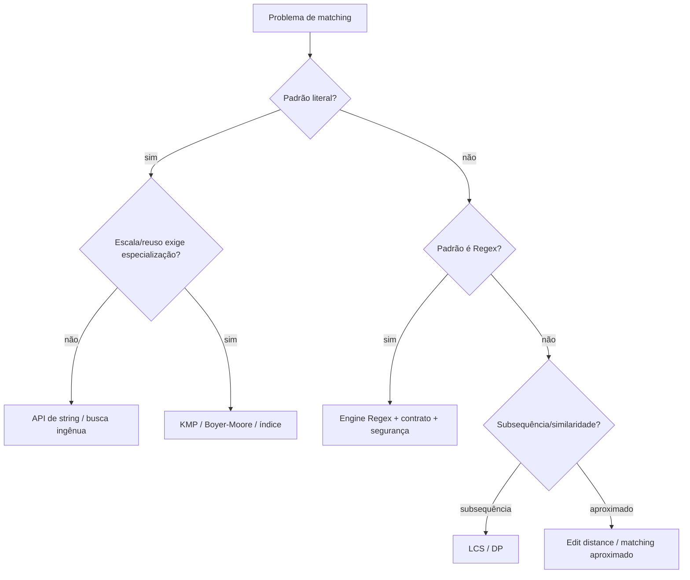
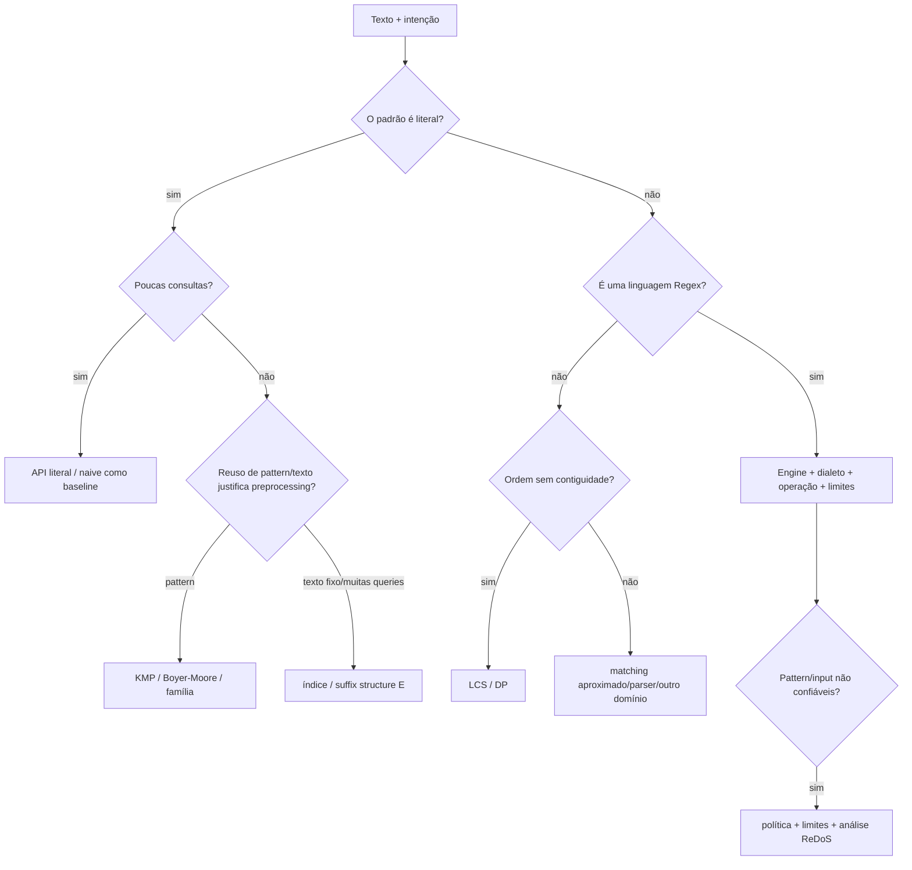

<a id="inicio"></a>

# Matching, Busca em Strings e Regex no Mapa Algorítmico

> **Classificação geral:** `[C] no problema; [E → C] nos algoritmos especializados`  
> **Nível:** C — Algoritmos e Estruturas de Dados  
> **Posição na taxonomia:** tópico 34 — décimo primeiro tópico do Nível C  
> **Pré-requisitos principais:** T15.7 — Expressões Regulares; T24 — Correção e Análise de Algoritmos; T26 — Algoritmos de Busca; T33 — Estratégias Fundamentais de Resolução Algorítmica  
> **Aprofundamento posterior:** T35 — Modelagem, Escolha de Estruturas e Trade-offs

---

## Resumo executivo

**Matching** é uma família de problemas: dada uma sequência, um padrão ou outra sequência, queremos descobrir se existe correspondência, onde ela ocorre, quantas ocorrências existem ou qual relação de similaridade existe entre as entradas.

Neste tópico, o mesmo problema textual aparece sob perspectivas diferentes:

```text
TEXTO + PADRÃO LITERAL
        ↓
busca exata de substring
        ↓
naive / KMP / Boyer-Moore / bibliotecas

DUAS SEQUÊNCIAS
        ↓
subsequência comum
        ↓
LCS / programação dinâmica

TEXTO + LINGUAGEM DE PADRÕES
        ↓
Regex
        ↓
parser/compilação da Regex + engine + estratégia de matching
```

O objetivo não é decorar implementações de algoritmos especializados. É aprender a responder:

- o padrão é **literal** ou é uma **linguagem de padrões**?
- procuro uma substring **contígua** ou uma subsequência **não necessariamente contígua**?
- preciso da primeira ocorrência, de todas, de contagem ou apenas de booleano?
- o padrão muda muito ou o texto muda muito?
- há uma única consulta ou milhares?
- o texto é pequeno ou grande?
- a representação é bytes, code units, code points ou outra abstração?
- a engine de Regex usada possui backtracking, automato, otimizações híbridas ou outra estratégia?
- o input/padrão é controlado ou não confiável?
- existe risco de custo excessivo ou ReDoS?


---

## Como estudar este tópico — duas rotas

Este T34 funciona em duas rotas complementares. A **rota de estudo** começa pelo contrato de matching e progride por busca literal, algoritmos especializados, LCS, Regex, engines, segurança e decisão de ferramenta. A **rota de consulta** permite recuperar rapidamente uma técnica, um risco ou um diagnóstico sem reler o capítulo inteiro.

### Rota A — primeiro contato / estudo sequencial

```text
Resumo executivo
→ Visão panorâmica
→ PARTE I: contrato do problema e busca literal
→ PARTE II: algoritmos especializados e LCS
→ PARTE III: Regex, engines e camadas de interpretação
→ PARTE IV: segurança, workloads e modelagem aplicada
→ PARTE V: transferência, diagnóstico e guardrails
→ PARTE VI: LABs, exercícios e evidências de domínio
→ Apêndices: glossário, taxonomia, fontes, QA e histórico
```

### Rota B — consulta rápida

1. abra a [Visão panorâmica](#visao-panoramica);
2. use o **Índice essencial** para localizar a família do problema;
3. para falha concreta, vá ao [Troubleshooting sistemático](#troubleshooting-sistematico);
4. para cobertura operacional, consulte o [inventário `PR-T34-*`](#pr-t34-inventario);
5. para fonte, versão, QA ou histórico, use os apêndices.

> **Regra de uso:** primeiro defina o contrato — literal × linguagem de padrões, contiguidade, unidade textual, tipo de resultado e workload. Só depois escolha API, algoritmo ou engine.

---

## Visão rápida

| Problema | Entrada | Resultado típico | Ferramenta/estratégia |
|---|---|---|---|
| substring exata | texto + literal | índice/ocorrência | API de string, naive, KMP, Boyer-Moore |
| múltiplos padrões | texto + conjunto de padrões | ocorrências | Aho-Corasick / índices especializados `[E]` |
| subsequência comum | duas sequências | comprimento/solução | LCS por DP `[E]` |
| Regex matching | texto + Regex | match/grupos/posição | engine específica |
| busca literal em CLI | arquivos + literal | linhas/posição | `grep -F` quando apropriado |
| similaridade aproximada | duas sequências | custo/alinhamento | edit distance e afins — fora do núcleo do T34 |

---

## Regra de ouro

> **Antes de escolher Regex ou um algoritmo especializado, declare qual problema de matching você realmente tem e qual contrato precisa preservar.**

Uma busca literal não fica melhor por virar Regex. Uma Regex não vira automaticamente um parser. KMP não é “mais rápido” em todos os cenários apenas por possuir limite linear. E LCS não é busca de substring.

---

## Decisão rápida

```text
PRECISO LOCALIZAR TEXTO
        │
        ├── o padrão é uma string literal?
        │       │
        │       ├── uma ou poucas consultas → API de string / busca simples
        │       │
        │       ├── mesma pattern em texto grande → considerar pré-processar pattern
        │       │                              (KMP/Boyer-Moore/família)
        │       │
        │       └── muitos padrões/textos/consultas → considerar índice/algoritmo especializado
        │
        ├── preciso expressar classes/repetição/alternância?
        │       └── Regex, escolhendo a engine conscientemente
        │
        ├── preciso preservar ordem mas não contiguidade?
        │       └── LCS/subsequence / DP
        │
        └── preciso tolerar erros/edições?
                └── approximate matching / edit distance (aprofundamento)
```



---


<a id="visao-panoramica"></a>
## 🗺️ Visão panorâmica — o mapa antes dos detalhes

Esta seção é o **caderno rápido de consulta** de T34. Ela parte do contrato do matching — e não da ferramenta — para decidir entre busca literal, algoritmo especializado, subsequência, Regex ou aprofundamentos de matching aproximado.

### O mapa do domínio em uma frase

> **Antes de escolher KMP, Regex ou qualquer engine, defina o que significa “corresponder”: literal ou linguagem de padrões; contíguo ou não; primeira ou todas as ocorrências; qual unidade textual; quantas consultas; qual nível de confiança e qual limite de recursos.**

### Cobertura canônica 34.1–34.6

| Nó | Tema | Pergunta central | Risco de erro |
|---|---|---|---|
| **34.1 `[C]`** | busca ingênua | todos os alinhamentos válidos foram considerados? | off-by-one/padrão vazio |
| **34.2 `[E → C]`** | KMP/Boyer–Moore e família | há estrutura/preprocessamento útil no padrão? | especializar sem necessidade/errar preprocessing |
| **34.3 `[E]`** | LCS | procuro ordem preservada sem exigir contiguidade? | confundir subsequence com substring |
| **34.4 `[C]`** | Regex matching | que linguagem de padrões e engine executam o match? | assumir semântica/performance universal |
| **34.5 `[D]`** | string literal × pattern × engine | em qual camada cada caractere é interpretado? | escaping/injeção de pattern |
| **34.6 `[C]`** | segurança/ReDoS | pattern/input podem forçar custo excessivo? | negação de serviço/uso descontrolado de recursos |

### Mapa visual — escolha pelo contrato



### Pergunta prática → primeira ação

| Situação | Primeira ação |
|---|---|
| “Quero achar exatamente `a.b`.” | API literal ou fixed-string; **não** trate `.` como operador Regex |
| “Preciso saber se a linha inteira tem formato `ABC-1234`.” | full match/anchors conforme a engine e contrato |
| “Mesmo padrão literal em textos grandes.” | avaliar preprocessing do pattern e biblioteca antes de reimplementar |
| “Milhares de padrões fixos.” | considerar Aho–Corasick/índice `[E]`, não uma busca por padrão |
| “Texto fixo, muitas queries.” | considerar índice/suffix structure `[E]` |
| “Preciso preservar ordem, não contiguidade.” | LCS/subsequence, não substring search |
| “Usuário fornece texto literal dentro de Regex.” | literalizar/escapar com API adequada |
| “Usuário fornece a própria Regex.” | tratar como capacidade mais poderosa: sintaxe, recursos, timeout/isolamento conforme ecossistema |
| “Regex trava com input curto adversarial.” | reduzir pattern/input, identificar ambiguidades/backtracking e aplicar guardrails |
| “Funciona em Python e quebra em Bash/Java.” | comparar dialeto, operação, quoting, Unicode e unidade de índice |

### Não confundir

| Conceitos | Diferença essencial |
|---|---|
| **literal × Regex** | literal é dado; Regex é uma linguagem de padrões com operadores |
| **substring × subsequence** | substring é contígua; subsequence preserva ordem sem exigir contiguidade |
| **search × full match** | search procura ocorrência; full match exige que o contrato cubra a entrada inteira |
| **pattern source × string da linguagem hospedeira** | escaping pode ocorrer primeiro na linguagem e depois na engine Regex |
| **algoritmo teórico × API real** | uma API pode trocar/combinar implementações sem mudar seu contrato público |
| **Regex clássica × “qualquer engine moderna”** | extensões, backreferences, Unicode e estratégia de execução variam |
| **escaping × validação** | escapar literal evita interpretação como metacaractere; não valida autorização/domínio/tamanho |
| **LCS × Longest Common Substring** | LCS permite lacunas; substring comum exige blocos contíguos |
| **ReDoS × Regex longa** | risco depende de estrutura do pattern, engine e input, não só do comprimento do pattern |
| **Big O × benchmark de biblioteca** | análise do algoritmo e implementação otimizada são evidências complementares |

### Microexemplo 1 — um caractere muda de papel

```text
literal desejado: a.b
Regex crua:       a.b   → '.' pode representar outro caractere
Regex literalizada      → procura o ponto real
```

Se a intenção é fixed-string, use a operação que expressa fixed-string diretamente quando disponível: Python `text.find(pattern)`, JavaScript `text.indexOf(pattern)`, Java `text.indexOf(pattern)` ou GNU grep `grep -F`, conforme o ambiente.

### Microexemplo 2 — substring não é subsequence

```text
A = ABCDEF
B = ACE

"ACE" não é substring de A
"ACE" é subsequence de A
```

O contrato muda o algoritmo: procurar bloco contíguo e calcular LCS são problemas diferentes.

### Microexemplo 3 — duas camadas de escaping

```text
código-fonte/string da linguagem
        ↓
texto do pattern recebido pela engine
        ↓
semântica Regex da engine
```

Ao debugar, registre **o pattern efetivamente recebido pela engine**, não apenas o texto que aparece no código-fonte.

### Falha observada → primeira investigação

| Falha | Primeira investigação | PR |
|---|---|---|
| literal contém `.`/`*` e casa demais | modo literal × Regex / escaping | `PR-T34-01` |
| índices divergem com emoji/Unicode | unidade: bytes/code units/code points | `PR-T34-02` |
| KMP perde ocorrência | LPS/fallback/off-by-one | `PR-T34-03` |
| LCS “acha caracteres separados” quando deveria ser contíguo | contrato substring × subsequence | `PR-T34-04` |
| Regex construída dinamicamente muda significado | literalização/quoting em duas camadas | `PR-T34-05` |
| validação aceita substring em vez da entrada inteira | operação search × full match | `PR-T34-06` |
| Regex degrada CPU com input adversarial | estrutura do pattern + engine + limites | `PR-T34-07` |
| pattern portátil falha em outra linguagem | dialeto/feature/Unicode/anchors | `PR-T34-08` |
| busca repetida é lenta apesar de algoritmo “linear” | preprocessing/reuso/volume de queries | `PR-T34-09` |
| pattern vazio gera divergências | contrato explícito da API/algoritmo | `PR-T34-10` |
| logs ficam enormes/sensíveis durante debug | observabilidade mínima segura | `PR-T34-11` |
| CLI trata argumento começando com `-`/quebras inesperadas | quoting/opções/fixed-string | `PR-T34-12` |

### Transferência entre linguagens e ferramentas

| Intenção | Python | JavaScript | Java | Bash / GNU grep |
|---|---|---|---|---|
| literal simples | `in`, `find` | `includes`, `indexOf` | `contains`, `indexOf` | `grep -F`, glob quando adequado |
| Regex | `re` | `RegExp` | `Pattern`/`Matcher` | `[[ =~ ]]`, `grep -E/-P` conforme necessidade |
| literal dentro de Regex | `re.escape` | `RegExp.escape` — ES2025+; presente no snapshot ECMAScript 2026 | `Pattern.quote` | prefira `grep -F`; quoting de `=~` exige cuidado |
| full match | `re.fullmatch` | anchors/contrato com `RegExp` | `Matcher.matches` | anchors conforme ERE/PCRE e operação |
| grupos | `Match` | match result / named groups conforme feature | `Matcher` | `BASH_REMATCH` / saída de ferramenta |

**GNU grep 3.12** distingue explicitamente BRE (`-G`), ERE (`-E`), fixed strings (`-F`) e PCRE (`-P` quando disponível). Isso é uma boa lembrança de que “grep” também não significa uma única linguagem de patterns.

### Rota de consulta rápida

```text
contrato/unidade textual            → seções 2–3
naive/biblioteca literal            → seções 4–7
KMP/Boyer-Moore/especializados      → seções 8–14
LCS                                 → seções 15–17
Regex e engines                     → seções 18–24 e 28
literal × pattern × engine          → seções 25–26
segurança/ReDoS                     → seção 27
validação/logs/escolha integrada    → seções 29–36
erros/PR-T34-*                      → seção 37
troubleshooting                     → seção 38 + bloco dedicado
boas práticas                       → seção 39
prática                             → seções 40–49
QA/rastreabilidade                  → seções 53–57
```

### Fronteiras curriculares

- **T15.7 — Regex:** fornece sintaxe/fundamentos de uso; T34 reposiciona Regex no mapa algorítmico, com engines/custo/segurança.
- **T24 — Correção e análise:** fornece invariantes e custo usados para naive/KMP/LCS.
- **T26 — Busca:** fornece mentalidade de busca; T34 especializa para sequências textuais.
- **T33 — Estratégias:** entrega brute force, DP, preprocessing e trade-offs que reaparecem aqui.
- **T35 — Modelagem/trade-offs:** decidirá entre literal, Regex, parser, índice e estruturas conforme workload real.

### Gate 1 — cobertura conceitual da Visão Panorâmica

**FECHADO.** Os nós 34.1–34.6 estão representados; o mapa diferencia literal/Regex/subsequence, torna unidade textual e engine parte do contrato, inclui segurança/ReDoS, conecta sintomas a `PR-T34-*`, oferece transferência entre as quatro linguagens e preserva as fronteiras T15.7/T24/T26/T33/T35.

[↑ Voltar ao índice](#índice)

---

## Índice essencial

- [🗺️ Visão panorâmica](#visao-panoramica)
- [PARTE I — Contrato do problema e busca literal](#parte-i)
- [PARTE II — Algoritmos especializados e LCS](#parte-ii)
- [PARTE III — Regex, engines e camadas de interpretação](#parte-iii)
- [PARTE IV — Segurança, workloads e modelagem aplicada](#parte-iv)
- [PARTE V — Transferência, diagnóstico e guardrails](#parte-v)
- [PARTE VI — LABs, exercícios e evidências de domínio](#parte-vi)
- [APÊNDICES — glossário, taxonomia, fontes, QA e histórico](#apendices)
- [Troubleshooting sistemático](#troubleshooting-sistematico)
- [Inventário `PR-T34-*`](#pr-t34-inventario)

<details>
<summary><strong>Índice detalhado</strong></summary>

# Índice

  - [Resumo executivo](#resumo-executivo)
  - [Visão rápida](#visão-rápida)
  - [Regra de ouro](#regra-de-ouro)
  - [Decisão rápida](#decisão-rápida)
  - [🗺️ Visão panorâmica — o mapa antes dos detalhes](#visao-panoramica)
- [1. Posição deste assunto na trilha](#1-posição-deste-assunto-na-trilha)
  - [1.1 O que T15.7 já entregou](#11-o-que-t157-já-entregou)
  - [1.2 O que T24 acrescentou](#12-o-que-t24-acrescentou)
  - [1.3 O que T26 acrescentou](#13-o-que-t26-acrescentou)
  - [1.4 O que T33 acrescentou](#14-o-que-t33-acrescentou)
  - [1.5 Fronteira com T35](#15-fronteira-com-t35)
- [2. 34 — Matching como problema algorítmico](#2-34--matching-como-problema-algorítmico)
  - [2.1 Matching não é sinônimo de Regex](#21-matching-não-é-sinônimo-de-regex)
  - [2.2 Perguntas que definem o contrato](#22-perguntas-que-definem-o-contrato)
  - [2.3 Primeira ocorrência × todas as ocorrências](#23-primeira-ocorrência--todas-as-ocorrências)
  - [2.4 Padrão vazio é decisão de contrato](#24-padrão-vazio-é-decisão-de-contrato)
- [3. Unidade de comparação: string não significa sempre a mesma coisa](#3-unidade-de-comparação-string-não-significa-sempre-a-mesma-coisa)
  - [3.1 Modelo algorítmico abstrato](#31-modelo-algorítmico-abstrato)
  - [3.2 Implementações reais](#32-implementações-reais)
  - [3.3 Dados ASCII sintéticos nos LABs](#33-dados-ascii-sintéticos-nos-labs)
- [4. 34.1 — Busca ingênua de substring `[C]`](#4-341--busca-ingênua-de-substring-c)
  - [4.1 Definição](#41-definição)
  - [4.2 Pseudocódigo](#42-pseudocódigo)
  - [4.3 Complexidade de pior caso](#43-complexidade-de-pior-caso)
  - [4.4 Early mismatch importa na prática](#44-early-mismatch-importa-na-prática)
  - [4.5 Um pior caso intuitivo](#45-um-pior-caso-intuitivo)
  - [4.6 A busca ingênua continua útil](#46-a-busca-ingênua-continua-útil)
- [5. Busca ingênua nas quatro linguagens](#5-busca-ingênua-nas-quatro-linguagens)
  - [5.1 Python](#51-python)
  - [5.2 JavaScript](#52-javascript)
  - [5.3 Java](#53-java)
  - [5.4 GNU Bash](#54-gnu-bash)
- [6. Correção da busca ingênua](#6-correção-da-busca-ingênua)
  - [6.1 Invariante útil](#61-invariante-útil)
  - [6.2 Quando o algoritmo retorna](#62-quando-o-algoritmo-retorna)
  - [6.3 Quando termina com `-1`](#63-quando-termina-com--1)
- [7. Antes de reimplementar: use a biblioteca quando o problema é comum](#7-antes-de-reimplementar-use-a-biblioteca-quando-o-problema-é-comum)
  - [7.1 Python](#71-python)
  - [7.2 JavaScript](#72-javascript)
  - [7.3 Java](#73-java)
  - [7.4 Bash](#74-bash)
  - [7.5 Por que isso importa](#75-por-que-isso-importa)
- [8. 34.2 — Algoritmos especializados `[E → C]`](#8-342--algoritmos-especializados-e--c)
  - [8.1 O objetivo desta etapa](#81-o-objetivo-desta-etapa)
  - [8.2 Ideia comum: não esquecer tudo após um mismatch](#82-ideia-comum-não-esquecer-tudo-após-um-mismatch)
- [9. Knuth–Morris–Pratt — KMP](#9-knuthmorrispratt--kmp)
  - [9.1 Ideia central](#91-ideia-central)
  - [9.2 Exemplo de padrão com autoestrutura](#92-exemplo-de-padrão-com-autoestrutura)
  - [9.3 Pré-processamento](#93-pré-processamento)
  - [9.4 Matching](#94-matching)
  - [9.5 O que KMP compra](#95-o-que-kmp-compra)
  - [9.6 O que KMP não garante magicamente](#96-o-que-kmp-não-garante-magicamente)
- [10. Construindo a tabela LPS](#10-construindo-a-tabela-lps)
  - [10.1 Significado](#101-significado)
  - [10.2 Exemplo](#102-exemplo)
  - [10.3 Por que prefixo próprio](#103-por-que-prefixo-próprio)
  - [10.4 Implementação de referência — Python](#104-implementação-de-referência--python)
- [11. KMP — implementação de referência](#11-kmp--implementação-de-referência)
  - [11.1 Python](#111-python)
  - [11.2 Invariante operacional](#112-invariante-operacional)
  - [11.3 Transferência](#113-transferência)
- [12. Boyer–Moore e família](#12-boyermoore-e-família)
  - [12.1 Ideia central](#121-ideia-central)
  - [12.2 Comparação da direita para a esquerda](#122-comparação-da-direita-para-a-esquerda)
  - [12.3 Por que “família” importa](#123-por-que-família-importa)
  - [12.4 Perfil prático](#124-perfil-prático)
- [13. Outros algoritmos especializados — panorama](#13-outros-algoritmos-especializados--panorama)
  - [13.1 Rabin–Karp](#131-rabinkarp)
  - [13.2 Aho–Corasick](#132-ahocorasick)
  - [13.3 Suffix arrays/trees](#133-suffix-arraystrees)
  - [13.4 Escopo](#134-escopo)
- [14. Comparativo de matching literal](#14-comparativo-de-matching-literal)
  - [14.1 Não compare só Big O](#141-não-compare-só-big-o)
- [15. 34.3 — Longest Common Subsequence — LCS `[E]`](#15-343--longest-common-subsequence--lcs-e)
  - [15.1 Substring × subsequence](#151-substring--subsequence)
  - [15.2 Exemplo canônico](#152-exemplo-canônico)
  - [15.3 Por que entra aqui](#153-por-que-entra-aqui)
  - [15.4 Recorrência](#154-recorrência)
  - [15.5 Custo clássico](#155-custo-clássico)
  - [15.6 Reconstrução custa informação](#156-reconstrução-custa-informação)
- [16. LCS — implementações de comprimento](#16-lcs--implementações-de-comprimento)
  - [16.1 Python](#161-python)
  - [16.2 JavaScript](#162-javascript)
  - [16.3 Java](#163-java)
  - [16.4 GNU Bash](#164-gnu-bash)
- [17. LCS não é Longest Common Substring](#17-lcs-não-é-longest-common-substring)
  - [17.1 Exemplo](#171-exemplo)
  - [17.2 Erro comum](#172-erro-comum)
  - [17.3 Relação com matching aproximado](#173-relação-com-matching-aproximado)
- [18. 34.4 — Regex matching `[C]`](#18-344--regex-matching-c)
  - [18.1 Regex descreve um conjunto de padrões](#181-regex-descreve-um-conjunto-de-padrões)
  - [18.2 Do ponto de vista algorítmico](#182-do-ponto-de-vista-algorítmico)
  - [18.3 Teoria clássica](#183-teoria-clássica)
  - [18.4 Regex semanticamente equivalentes podem custar diferente](#184-regex-semanticamente-equivalentes-podem-custar-diferente)
- [19. Fixed string antes de Regex](#19-fixed-string-antes-de-regex)
  - [19.1 Se o usuário digitou um literal](#191-se-o-usuário-digitou-um-literal)
  - [19.2 Preferência](#192-preferência)
  - [19.3 Python](#193-python)
  - [19.4 JavaScript — ECMAScript 2026](#194-javascript--ecmascript-2026)
  - [19.5 Java](#195-java)
  - [19.6 GNU grep](#196-gnu-grep)
  - [19.7 Bash puro](#197-bash-puro)
- [20. Engines e sabores — mapa mínimo](#20-engines-e-sabores--mapa-mínimo)
  - [20.1 Não use “Regex” como nome de uma engine única](#201-não-use-regex-como-nome-de-uma-engine-única)
  - [20.2 Portabilidade é requisito separado](#202-portabilidade-é-requisito-separado)
- [21. Python `re` — perspectiva algorítmica](#21-python-re--perspectiva-algorítmica)
  - [21.1 Compilar e reutilizar](#211-compilar-e-reutilizar)
  - [21.2 `search` × `match` × `fullmatch`](#212-search--match--fullmatch)
  - [21.3 Recursos atuais relevantes](#213-recursos-atuais-relevantes)
- [22. ECMAScript `RegExp` — perspectiva algorítmica](#22-ecmascript-regexp--perspectiva-algorítmica)
  - [22.1 Regex literal](#221-regex-literal)
  - [22.2 Construtor dinâmico](#222-construtor-dinâmico)
  - [22.3 Estado com `g`/`y`](#223-estado-com-gy)
  - [22.4 Snapshot atual](#224-snapshot-atual)
- [23. Java `Pattern` e `Matcher`](#23-java-pattern-e-matcher)
  - [23.1 Separação explícita](#231-separação-explícita)
  - [23.2 Reuso](#232-reuso)
  - [23.3 Três contratos de match](#233-três-contratos-de-match)
- [24. Bash `=~` e GNU grep](#24-bash--e-gnu-grep)
  - [24.1 Bash `=~`](#241-bash)
  - [24.2 Quoting muda o pattern](#242-quoting-muda-o-pattern)
  - [24.3 `BASH_REMATCH`](#243-bash_rematch)
  - [24.4 GNU grep não é Bash](#244-gnu-grep-não-é-bash)
- [25. 34.5 — String literal × padrão × engine `[D]`](#25-345--string-literal--padrão--engine-d)
  - [25.1 Os três níveis](#251-os-três-níveis)
  - [25.2 Python raw string](#252-python-raw-string)
  - [25.3 JavaScript literal × string](#253-javascript-literal--string)
  - [25.4 Java](#254-java)
  - [25.5 Bash](#255-bash)
  - [25.6 Mecanismo do erro](#256-mecanismo-do-erro)
- [26. Construção dinâmica de Regex](#26-construção-dinâmica-de-regex)
  - [26.1 Risco sem escaping](#261-risco-sem-escaping)
  - [26.2 Distinga dois casos](#262-distinga-dois-casos)
  - [26.3 Escape não é validação semântica](#263-escape-não-é-validação-semântica)
- [27. 34.6 — Segurança `[C]`](#27-346--segurança-c)
  - [27.1 ReDoS](#271-redos)
  - [27.2 Exemplo didático de padrão arriscado](#272-exemplo-didático-de-padrão-arriscado)
  - [27.3 Por que falha tardia é perigosa](#273-por-que-falha-tardia-é-perigosa)
  - [27.4 Dois eixos de não confiabilidade](#274-dois-eixos-de-não-confiabilidade)
  - [27.5 Mitigações](#275-mitigações)
  - [27.6 Não existe mitigação universal “adicione `^$`”](#276-não-existe-mitigação-universal-adicione)
  - [27.7 Não execute benchmark agressivo em produção](#277-não-execute-benchmark-agressivo-em-produção)
- [28. Automatos, backtracking e engines híbridas](#28-automatos-backtracking-e-engines-híbridas)
  - [28.1 Modelo teórico útil](#281-modelo-teórico-útil)
  - [28.2 Backtracking](#282-backtracking)
  - [28.3 Não rotule sem evidência](#283-não-rotule-sem-evidência)
  - [28.4 GNU grep como exemplo de implementação sofisticada](#284-gnu-grep-como-exemplo-de-implementação-sofisticada)
- [29. Regex para validação: forma × domínio](#29-regex-para-validação-forma--domínio)
  - [29.1 Forma](#291-forma)
  - [29.2 Semântica](#292-semântica)
  - [29.3 Melhor pipeline](#293-melhor-pipeline)
  - [29.4 Matching não é autorização](#294-matching-não-é-autorização)
- [30. Busca textual em logs — escolher ferramenta pelo problema](#30-busca-textual-em-logs--escolher-ferramenta-pelo-problema)
  - [30.1 Literal conhecido](#301-literal-conhecido)
  - [30.2 Classe de mensagens](#302-classe-de-mensagens)
  - [30.3 Campo estruturado](#303-campo-estruturado)
  - [30.4 Regra](#304-regra)
- [31. Matching exato × aproximado](#31-matching-exato--aproximado)
  - [31.1 Exato](#311-exato)
  - [31.2 Aproximado](#312-aproximado)
  - [31.3 Edit distance](#313-edit-distance)
  - [31.4 Não tente resolver typo tolerance com uma Regex gigante](#314-não-tente-resolver-typo-tolerance-com-uma-regex-gigante)
- [32. Muitas consultas mudam o problema](#32-muitas-consultas-mudam-o-problema)
  - [32.1 Mesmo pattern, muitos textos](#321-mesmo-pattern-muitos-textos)
  - [32.2 Mesmo texto, muitos patterns](#322-mesmo-texto-muitos-patterns)
  - [32.3 Muitos patterns, cada texto chega uma vez](#323-muitos-patterns-cada-texto-chega-uma-vez)
  - [32.4 Trade-off](#324-trade-off)
- [33. Comparação rápida: Regex × parser × algoritmo literal](#33-comparação-rápida-regex--parser--algoritmo-literal)
  - [33.1 Regex não substitui parser](#331-regex-não-substitui-parser)
  - [33.2 Parser não substitui busca simples](#332-parser-não-substitui-busca-simples)
- [34. Comparação de APIs Regex entre linguagens](#34-comparação-de-apis-regex-entre-linguagens)
  - [34.1 Não confunda APIs que retornam coisas diferentes](#341-não-confunda-apis-que-retornam-coisas-diferentes)
- [35. Exemplo integrado — extrair interface e estado](#35-exemplo-integrado--extrair-interface-e-estado)
  - [35.1 Python](#351-python)
  - [35.2 JavaScript](#352-javascript)
  - [35.3 Java](#353-java)
  - [35.4 Bash](#354-bash)
  - [35.5 O que não é equivalente](#355-o-que-não-é-equivalente)
- [36. Problema real — busca em catálogo de comandos](#36-problema-real--busca-em-catálogo-de-comandos)
  - [36.1 Se a consulta é literal](#361-se-a-consulta-é-literal)
  - [36.2 Se há filtros flexíveis](#362-se-há-filtros-flexíveis)
  - [36.3 Se o catálogo é estável e queries são muitas](#363-se-o-catálogo-é-estável-e-queries-são-muitas)
  - [36.4 Não escolha KMP só porque existe](#364-não-escolha-kmp-só-porque-existe)
- [37. Erros comuns de modelagem](#37-erros-comuns-de-modelagem)
  - [37.1 Usar Regex para literal](#371-usar-regex-para-literal)
  - [37.2 Confundir substring com subsequence](#372-confundir-substring-com-subsequence)
  - [37.3 Assumir que `O(n+m)` vence sempre](#373-assumir-que-onm-vence-sempre)
  - [37.4 Assumir que qualquer Regex tem custo linear](#374-assumir-que-qualquer-regex-tem-custo-linear)
  - [37.5 Assumir que Regex em todas as linguagens é a mesma](#375-assumir-que-regex-em-todas-as-linguagens-é-a-mesma)
  - [37.6 Construir Regex com input literal não escapado](#376-construir-regex-com-input-literal-não-escapado)
  - [37.7 Tratar ReDoS como “Regex muito longa”](#377-tratar-redos-como-regex-muito-longa)
  - [37.8 Inventário formal de problemas reais — `PR-T34-*`](#pr-t34-inventario)
- [38. Debug de matching](#38-debug-de-matching)
  - [38.1 Primeiro reproduza o contrato](#381-primeiro-reproduza-o-contrato)
  - [38.2 Inspecione o pattern que realmente chegou à engine](#382-inspecione-o-pattern-que-realmente-chegou-à-engine)
  - [38.3 Reduza o input](#383-reduza-o-input)
  - [38.4 Para KMP](#384-para-kmp)
  - [38.5 Para LCS](#385-para-lcs)
  - [🔎 Troubleshooting sistemático](#troubleshooting-sistematico)
- [39. Boas práticas e guardrails](#39-boas-práticas-e-guardrails)
  - [39.1 Escolha API pelo contrato](#391-escolha-api-pelo-contrato)
  - [39.2 Não otimize antes de medir o caso real](#392-não-otimize-antes-de-medir-o-caso-real)
  - [39.3 Separe literal de Regex na API do seu sistema](#393-separe-literal-de-regex-na-api-do-seu-sistema)
  - [39.4 Pattern versionado merece testes](#394-pattern-versionado-merece-testes)
  - [39.5 Não registre dados sensíveis só para debugar Regex](#395-não-registre-dados-sensíveis-só-para-debugar-regex)
- [40. LAB 1 — Busca ingênua como baseline](#40-lab-1--busca-ingênua-como-baseline)
  - [Objetivo](#objetivo)
  - [Pré-requisitos](#pré-requisitos)
  - [Estado inicial](#estado-inicial)
  - [Tarefa](#tarefa)
  - [Procedimento](#procedimento)
  - [O que observar](#o-que-observar)
  - [Testes](#testes)
  - [Explicação](#explicação)
  - [Variação / transferência](#variação--transferência)
  - [Limpeza](#limpeza)
- [41. LAB 2 — Tabela LPS e KMP](#41-lab-2--tabela-lps-e-kmp)
  - [Objetivo](#objetivo-1)
  - [Pré-requisitos](#pré-requisitos-1)
  - [Estado inicial](#estado-inicial-1)
  - [Tarefa](#tarefa-1)
  - [Procedimento](#procedimento-1)
  - [O que observar](#o-que-observar-1)
  - [Testes](#testes-1)
  - [Explicação](#explicação-1)
  - [Variação / transferência](#variação--transferência-1)
  - [Limpeza](#limpeza-1)
- [42. LAB 3 — Biblioteca literal × implementação manual](#42-lab-3--biblioteca-literal--implementação-manual)
  - [Objetivo](#objetivo-2)
  - [Pré-requisitos](#pré-requisitos-2)
  - [Estado inicial](#estado-inicial-2)
  - [Tarefa](#tarefa-2)
  - [Procedimento](#procedimento-2)
  - [O que observar](#o-que-observar-2)
  - [Testes](#testes-2)
  - [Explicação](#explicação-2)
  - [Variação / transferência](#variação--transferência-2)
  - [Limpeza](#limpeza-2)
- [43. LAB 4 — LCS e diferença para substring](#43-lab-4--lcs-e-diferença-para-substring)
  - [Objetivo](#objetivo-3)
  - [Pré-requisitos](#pré-requisitos-3)
  - [Estado inicial](#estado-inicial-3)
  - [Tarefa](#tarefa-3)
  - [Procedimento](#procedimento-3)
  - [O que observar](#o-que-observar-3)
  - [Testes](#testes-3)
  - [Explicação](#explicação-3)
  - [Variação / transferência](#variação--transferência-3)
  - [Limpeza](#limpeza-3)
- [44. LAB 5 — Mesmo padrão Regex, engines diferentes](#44-lab-5--mesmo-padrão-regex-engines-diferentes)
  - [Objetivo](#objetivo-4)
  - [Pré-requisitos](#pré-requisitos-4)
  - [Estado inicial](#estado-inicial-4)
  - [Tarefa](#tarefa-4)
  - [Procedimento](#procedimento-4)
  - [O que observar](#o-que-observar-4)
  - [Testes](#testes-4)
  - [Explicação](#explicação-4)
  - [Variação / transferência](#variação--transferência-4)
  - [Limpeza](#limpeza-4)
- [45. LAB 6 — Escaping da linguagem hospedeira](#45-lab-6--escaping-da-linguagem-hospedeira)
  - [Objetivo](#objetivo-5)
  - [Pré-requisitos](#pré-requisitos-5)
  - [Estado inicial](#estado-inicial-5)
  - [Tarefa](#tarefa-5)
  - [Procedimento](#procedimento-5)
  - [O que observar](#o-que-observar-5)
  - [Testes](#testes-5)
  - [Explicação](#explicação-5)
  - [Variação / transferência](#variação--transferência-5)
  - [Limpeza](#limpeza-5)
- [46. LAB 7 — ReDoS em escala segura e limitada](#46-lab-7--redos-em-escala-segura-e-limitada)
  - [Objetivo](#objetivo-6)
  - [Pré-requisitos](#pré-requisitos-6)
  - [Estado inicial](#estado-inicial-6)
  - [Tarefa](#tarefa-6)
  - [Procedimento](#procedimento-6)
  - [O que observar](#o-que-observar-6)
  - [Testes](#testes-6)
  - [Explicação](#explicação-6)
  - [Variação / transferência](#variação--transferência-6)
  - [Limpeza](#limpeza-6)
- [47. LAB 8 — Escolha integrada para análise de logs](#47-lab-8--escolha-integrada-para-análise-de-logs)
  - [Objetivo](#objetivo-7)
  - [Pré-requisitos](#pré-requisitos-7)
  - [Estado inicial](#estado-inicial-7)
  - [Tarefa](#tarefa-7)
  - [Procedimento](#procedimento-7)
  - [O que observar](#o-que-observar-7)
  - [Testes](#testes-7)
  - [Explicação](#explicação-7)
  - [Variação / transferência](#variação--transferência-7)
  - [Limpeza](#limpeza-7)
- [48. Exercícios fundamentais](#48-exercícios-fundamentais)
  - [48.1 Matching ingênuo](#481-matching-ingênuo)
  - [48.2 KMP](#482-kmp)
  - [48.3 Boyer–Moore](#483-boyermoore)
  - [48.4 LCS](#484-lcs)
  - [48.5 Regex](#485-regex)
  - [48.6 Segurança](#486-segurança)
- [49. Exercícios de transferência](#49-exercícios-de-transferência)
  - [49.1 Literal search](#491-literal-search)
  - [49.2 KMP](#492-kmp)
  - [49.3 Regex contract](#493-regex-contract)
  - [49.4 LCS](#494-lcs)
- [50. Evidências de domínio](#50-evidências-de-domínio)
- [51. Checklist de domínio](#51-checklist-de-domínio)
  - [51.1 Problema](#511-problema)
  - [51.2 Algoritmos](#512-algoritmos)
  - [51.3 LCS](#513-lcs)
  - [51.4 Regex](#514-regex)
  - [51.5 Transferência](#515-transferência)
- [52. Glossário](#52-glossário)
  - [52.1 Matching](#521-matching)
  - [52.2 Pattern](#522-pattern)
  - [52.3 Substring](#523-substring)
  - [52.4 Subsequence](#524-subsequence)
  - [52.5 Shift / alinhamento](#525-shift--alinhamento)
  - [52.6 Prefix function / LPS](#526-prefix-function--lps)
  - [52.7 KMP](#527-kmp)
  - [52.8 Boyer–Moore](#528-boyermoore)
  - [52.9 Rabin–Karp](#529-rabinkarp)
  - [52.10 LCS](#5210-lcs)
  - [52.11 Regex](#5211-regex)
  - [52.12 Engine](#5212-engine)
  - [52.13 Backtracking](#5213-backtracking)
  - [52.14 ReDoS](#5214-redos)
  - [52.15 Fixed string](#5215-fixed-string)
- [53. Auditoria de cobertura da taxonomia](#53-auditoria-de-cobertura-da-taxonomia)
  - [53.1 34.1 `[C]`](#531-341-c)
  - [53.2 34.2 `[E → C]`](#532-342-e--c)
  - [53.3 34.3 `[E]`](#533-343-e)
  - [53.4 34.4 `[C]`](#534-344-c)
  - [53.5 34.5 `[D]`](#535-345-d)
  - [53.6 34.6 `[C]`](#536-346-c)
  - [53.7 Auditoria bidirecional — mapa ↔ conteúdo ↔ prática](#537-auditoria-bidirecional--mapa--conteúdo--prática)
  - [53.8 Inventário rastreável de capacidades](#538-inventário-rastreável-de-capacidades)
- [54. Auditoria da File Library](#54-auditoria-da-file-library)
  - [54.1 Fontes locais efetivamente consultadas](#541-fontes-locais-efetivamente-consultadas)
  - [54.2 Como a biblioteca alterou o documento](#542-como-a-biblioteca-alterou-o-documento)
  - [54.3 Hierarquia aplicada](#543-hierarquia-aplicada)
  - [54.4 Matriz de contribuição multifonte](#544-matriz-de-contribuição-multifonte)
- [55. Referências](#55-referências)
  - [55.1 Contratos canônicos](#551-contratos-canônicos)
  - [55.2 Literatura local efetivamente consultada](#552-literatura-local-efetivamente-consultada)
  - [55.3 Python](#553-python)
  - [55.4 ECMAScript](#554-ecmascript)
  - [55.5 Java](#555-java)
  - [55.6 GNU Bash e GNU grep](#556-gnu-bash-e-gnu-grep)
  - [55.7 Segurança](#557-segurança)
  - [55.8 Nota temporal de baseline](#558-nota-temporal-de-baseline)
- [56. QA e evidências](#56-qa-e-evidências)
  - [56.1 `[D]` Evidência documental](#561-d-evidência-documental)
  - [56.2 `[S]` Validação estrutural/estática](#562-s-validação-estruturalestática)
  - [56.3 `[R]` Reprodução em runtime](#563-r-reprodução-em-runtime)
  - [56.4 Limitações](#564-limitações)
  - [56.5 Gate 2 — iteração `0.3.2`](#565-gate-2--iteração-032)
- [57. Histórico de versões](#57-histórico-de-versões)

[↑ Voltar ao início](#inicio)

---


</details>

---

<a id="parte-i"></a>
# PARTE I — Contrato do problema e busca literal

# 1. Posição deste assunto na trilha

## 1.1 O que T15.7 já entregou

T15.7 já ensinou Regex como ferramenta de Fundamentos de Programação:

- metacaracteres;
- classes;
- quantificadores;
- anchors;
- grupos;
- escaping;
- flags;
- busca, extração, substituição e validação;
- diferenças entre Python `re`, ECMAScript `RegExp`, Java `Pattern`/`Matcher`, Bash `=~`, grep/sed;
- introdução a NFA/DFA/backtracking;
- segurança e ReDoS.

T34 **não repete esse curso de sintaxe**. O foco agora é outra pergunta:

> **onde Regex se encaixa no mapa de problemas e algoritmos de matching?**

## 1.2 O que T24 acrescentou

T24 ensinou a declarar:

- tamanho da entrada;
- modelo de custo;
- complexidade temporal/espacial;
- pior/médio/melhor caso;
- análise assintótica × medição.

T34 usa `n = |text|` e `m = |pattern|` para analisar busca de strings.

## 1.3 O que T26 acrescentou

T26 mostrou que “buscar” não é um único problema. Busca binária depende de ordenação e acesso adequado; busca linear é baseline legítimo.

Em strings ocorre algo semelhante: a representação e o tipo de consulta determinam qual estratégia faz sentido.

## 1.4 O que T33 acrescentou

T33 introduziu brute force, transform-and-conquer, DP e outras estratégias. T34 reaplica essas ideias:

- busca ingênua → baseline direto;
- KMP → pré-processamento do padrão para evitar trabalho repetido;
- Boyer-Moore → informação do padrão para saltar alinhamentos;
- LCS → programação dinâmica;
- Regex → uma linguagem de padrões executada por uma engine.

## 1.5 Fronteira com T35

T35 integrará **modelagem + estrutura + algoritmo + trade-offs**. T34 oferece um domínio excelente para essa integração porque a escolha pode variar entre:

- string API;
- Regex;
- KMP/Boyer-Moore;
- `grep -F`/`grep -E`;
- índices especializados;
- DP;
- parser dedicado.

[↑ Voltar ao índice](#índice)

# 2. 34 — Matching como problema algorítmico

## 2.1 Matching não é sinônimo de Regex

Considere:

```text
text    = "link Gi0/1 state up"
pattern = "state"
```

Esse problema pede uma **busca literal de substring**. Não há necessidade de metacaracteres ou linguagem de padrões.

Regex seria possível, mas acrescentaria um mecanismo que o problema não exige.

## 2.2 Perguntas que definem o contrato

Antes de escolher algoritmo/API, declare:

1. o padrão é literal ou possui sintaxe especial?
2. comparação é case-sensitive?
3. normalização Unicode faz parte do contrato?
4. retorno desejado é booleano, índice, span ou todas as ocorrências?
5. ocorrências sobrepostas contam?
6. padrão vazio é válido?
7. o texto pode ser vazio?
8. o padrão pode ser maior que o texto?
9. há uma consulta ou muitas?
10. padrão/texto são confiáveis?

## 2.3 Primeira ocorrência × todas as ocorrências

Texto:

```text
AAAA
```

Padrão:

```text
AA
```

Ocorrências possíveis iniciam em:

```text
0, 1, 2
```

Se a implementação, após encontrar uma ocorrência, avança `m` posições, ela pode ignorar overlaps.

Logo:

```text
"encontrar"
≠
"encontrar todas"
≠
"encontrar todas incluindo overlaps"
```

## 2.4 Padrão vazio é decisão de contrato

APIs concretas possuem contratos próprios para pattern vazio. Ao implementar manualmente, não invente comportamento no meio do algoritmo.

Escolha e teste explicitamente, por exemplo:

```text
empty pattern → índice 0
```

ou:

```text
empty pattern → erro de contrato
```

O importante é consistência com a API/domínio usado.

[↑ Voltar ao índice](#índice)

# 3. Unidade de comparação: string não significa sempre a mesma coisa

## 3.1 Modelo algorítmico abstrato

Em teoria, tratamos texto e padrão como sequências sobre um alfabeto:

```text
T = t0 t1 ... t(n-1)
P = p0 p1 ... p(m-1)
```

O algoritmo compara unidades da sequência.

## 3.2 Implementações reais

Em linguagens reais, “posição de caractere” pode envolver:

- bytes;
- code units;
- code points;
- grapheme clusters.

O T34 não aprofunda Unicode novamente, mas registra uma consequência:

> **não transporte automaticamente um índice obtido em uma representação para outra representação.**

## 3.3 Dados ASCII sintéticos nos LABs

Para isolar o algoritmo de matching, os LABs principais usam predominantemente ASCII. Isso evita transformar o tópico de algoritmos em um capítulo de Unicode.

[↑ Voltar ao índice](#índice)

# 4. 34.1 — Busca ingênua de substring `[C]`

## 4.1 Definição

Dados:

```text
T = texto, comprimento n
P = padrão, comprimento m
```

A busca ingênua testa cada alinhamento candidato:

```text
s = 0, 1, 2, ..., n-m
```

Em cada alinhamento `s`, compara:

```text
T[s + j] ?= P[j]
```

até:

- encontrar mismatch; ou
- comparar todo o padrão.

## 4.2 Pseudocódigo

```text
NAIVE-FIND(text, pattern)
    se pattern é vazio
        retornar 0

    se tamanho(pattern) > tamanho(text)
        retornar -1

    para start de 0 até n-m
        matched = true

        para offset de 0 até m-1
            se text[start + offset] != pattern[offset]
                matched = false
                parar laço interno

        se matched
            retornar start

    retornar -1
```

## 4.3 Complexidade de pior caso

Existem `n - m + 1` alinhamentos quando `m <= n`.

Cada alinhamento pode comparar até `m` unidades.

Logo, limite simples de pior caso:

```text
O((n - m + 1) · m)
```

frequentemente simplificado para:

```text
O(nm)
```

Skiena apresenta exatamente esse baseline como ponto de partida para pattern matching. CLRS também inicia seu capítulo de string matching pelo algoritmo ingênuo.

## 4.4 Early mismatch importa na prática

O pior caso não significa que todo input executa `m` comparações por alinhamento.

Se o primeiro caractere diverge frequentemente, a maioria das tentativas termina cedo.

## 4.5 Um pior caso intuitivo

Texto:

```text
AAAAAAAAAAAAAB
```

Padrão:

```text
AAAAB
```

Vários alinhamentos conseguem casar muitos `A` antes de falhar próximo ao fim do padrão.

O algoritmo recomeça trabalho já observado.

## 4.6 A busca ingênua continua útil

Ela serve como:

- baseline;
- implementação de referência;
- oracle para testar algoritmo especializado em entradas pequenas;
- solução suficiente para dados pequenos;
- ferramenta didática para entender alinhamentos.

> **Algoritmo simples não é algoritmo errado.**

[↑ Voltar ao índice](#índice)

# 5. Busca ingênua nas quatro linguagens

## 5.1 Python

```python
def naive_find(text: str, pattern: str) -> int:
    if pattern == "":
        return 0

    if len(pattern) > len(text):
        return -1

    for start in range(len(text) - len(pattern) + 1):
        for offset in range(len(pattern)):
            if text[start + offset] != pattern[offset]:
                break
        else:
            return start

    return -1
```

## 5.2 JavaScript

```javascript
function naiveFind(text, pattern) {
  if (pattern === "") return 0;
  if (pattern.length > text.length) return -1;

  for (let start = 0; start <= text.length - pattern.length; start += 1) {
    let matched = true;

    for (let offset = 0; offset < pattern.length; offset += 1) {
      if (text[start + offset] !== pattern[offset]) {
        matched = false;
        break;
      }
    }

    if (matched) return start;
  }

  return -1;
}
```

## 5.3 Java

```java
static int naiveFind(String text, String pattern) {
    if (pattern.isEmpty()) {
        return 0;
    }

    if (pattern.length() > text.length()) {
        return -1;
    }

    for (int start = 0; start <= text.length() - pattern.length(); start++) {
        boolean matched = true;

        for (int offset = 0; offset < pattern.length(); offset++) {
            if (text.charAt(start + offset) != pattern.charAt(offset)) {
                matched = false;
                break;
            }
        }

        if (matched) {
            return start;
        }
    }

    return -1;
}
```

## 5.4 GNU Bash

Para transferência conceitual, limite o exemplo a texto ASCII e strings pequenas:

```bash
naive_find() {
    local text=$1
    local pattern=$2
    local n=${#text}
    local m=${#pattern}
    local start offset

    if (( m == 0 )); then
        printf '0\n'
        return 0
    fi

    if (( m > n )); then
        printf '%s\n' '-1'
        return 1
    fi

    for ((start = 0; start <= n - m; start++)); do
        for ((offset = 0; offset < m; offset++)); do
            if [[ ${text:start+offset:1} != "${pattern:offset:1}" ]]; then
                break
            fi
        done

        if (( offset == m )); then
            printf '%d\n' "$start"
            return 0
        fi
    done

    printf '%s\n' '-1'
    return 1
}
```

Bash é útil aqui para transferência, não como recomendação de engine para processamento textual pesado.

[↑ Voltar ao índice](#índice)

# 6. Correção da busca ingênua

## 6.1 Invariante útil

Antes de testar o alinhamento `start`, todos os alinhamentos anteriores já foram descartados corretamente.

Dentro do laço interno, antes de comparar `offset`, sabemos:

```text
P[0:offset]
=
T[start:start+offset]
```

## 6.2 Quando o algoritmo retorna

Se todas as `m` posições coincidem, então:

```text
T[start:start+m] = P
```

Logo `start` é uma ocorrência válida.

## 6.3 Quando termina com `-1`

Todos os alinhamentos possíveis `0..n-m` foram examinados e rejeitados.

Portanto, sob o modelo escolhido, não existe ocorrência completa.

[↑ Voltar ao índice](#índice)

# 7. Antes de reimplementar: use a biblioteca quando o problema é comum

## 7.1 Python

Para busca literal comum:

```python
index = text.find(pattern)
```

ou:

```python
index = text.index(pattern)
```

com contratos diferentes para ausência.

## 7.2 JavaScript

```javascript
const index = text.indexOf(pattern);
```

## 7.3 Java

```java
int index = text.indexOf(pattern);
```

## 7.4 Bash

Para teste literal de inclusão, sem precisar do índice:

```bash
if [[ $text == *"$needle"* ]]; then
    printf 'found\n'
fi
```

Para arquivos/streams e padrão literal, GNU grep oferece modo de fixed strings:

```bash
grep -F -- 'literal.text[not-regex]' file.txt
```

## 7.5 Por que isso importa

Bibliotecas maduras podem:

- usar algoritmos/otimizações diferentes por caso;
- aproveitar implementação nativa;
- tratar detalhes de representação;
- evoluir sem mudar sua lógica de domínio.

> **Conhecer KMP não obriga reimplementar `indexOf()` no código de produção.**

[↑ Voltar ao índice](#índice)

<a id="parte-ii"></a>
# PARTE II — Algoritmos especializados e LCS

# 8. 34.2 — Algoritmos especializados `[E → C]`

## 8.1 O objetivo desta etapa

Na primeira passagem, você deve conhecer:

- qual desperdício o algoritmo reduz;
- que informação ele pré-processa;
- seu perfil de custo;
- quando ele é relevante.

Não é obrigatório memorizar implementação completa.

## 8.2 Ideia comum: não esquecer tudo após um mismatch

O baseline ingênuo pode abandonar uma tentativa e reiniciar comparações sem reutilizar a informação já obtida.

Algoritmos especializados procuram transformar match parcial/mismatch em **informação para pular trabalho**.

[↑ Voltar ao índice](#índice)

# 9. Knuth–Morris–Pratt — KMP

## 9.1 Ideia central

KMP pré-processa o padrão para saber quanto de um prefixo já conhecido pode ser reutilizado após um mismatch.

Em vez de retornar cegamente ao começo do padrão, usa uma função auxiliar normalmente chamada:

```text
prefix function
π
LPS (longest proper prefix which is also suffix)
```

A terminologia varia por apresentação, mas a ideia é reaproveitar estrutura interna do padrão.

## 9.2 Exemplo de padrão com autoestrutura

```text
ABABAC
```

Depois de casar `ABABA`, um mismatch não significa que nada foi aprendido. Sufixos do trecho casado podem também ser prefixos do padrão.

## 9.3 Pré-processamento

Para padrão de tamanho `m`:

```text
build prefix/LPS table → O(m)
```

## 9.4 Matching

O matching percorre o texto sem precisar retroceder o índice principal do texto após cada mismatch.

CLRS apresenta:

```text
preprocessing Θ(m)
matching Θ(n)
```

resultando em:

```text
Θ(n + m)
```

para a formulação clássica.

## 9.5 O que KMP compra

KMP troca:

```text
memória O(m) + pré-processamento do padrão
```

por:

```text
eliminação de rechecagens desnecessárias em certos alinhamentos
```

## 9.6 O que KMP não garante magicamente

`O(n+m)` não significa:

- menor constante que toda biblioteca;
- melhor cache behavior em qualquer runtime;
- vitória em textos/padrões pequenos;
- melhor algoritmo prático em todo alfabeto/distribuição.

[↑ Voltar ao índice](#índice)

# 10. Construindo a tabela LPS

## 10.1 Significado

Para cada posição `i`, `lps[i]` registra o comprimento do maior prefixo **próprio** do padrão que também é sufixo do prefixo terminado em `i`.

## 10.2 Exemplo

Padrão:

```text
ABABCABAB
```

Uma tabela LPS possível é:

```text
índice: 0 1 2 3 4 5 6 7 8
char : A B A B C A B A B
lps  : 0 0 1 2 0 1 2 3 4
```

## 10.3 Por que prefixo próprio

O prefixo completo não ajuda a descobrir um fallback menor depois de mismatch; precisamos de uma borda menor reutilizável.

## 10.4 Implementação de referência — Python

```python
def build_lps(pattern: str) -> list[int]:
    lps = [0] * len(pattern)
    length = 0
    index = 1

    while index < len(pattern):
        if pattern[index] == pattern[length]:
            length += 1
            lps[index] = length
            index += 1
        elif length > 0:
            length = lps[length - 1]
        else:
            lps[index] = 0
            index += 1

    return lps
```

[↑ Voltar ao índice](#índice)

# 11. KMP — implementação de referência

## 11.1 Python

```python
def kmp_find(text: str, pattern: str) -> int:
    if pattern == "":
        return 0

    lps = build_lps(pattern)
    text_index = 0
    pattern_index = 0

    while text_index < len(text):
        if text[text_index] == pattern[pattern_index]:
            text_index += 1
            pattern_index += 1

            if pattern_index == len(pattern):
                return text_index - pattern_index

        elif pattern_index > 0:
            pattern_index = lps[pattern_index - 1]
        else:
            text_index += 1

    return -1
```

## 11.2 Invariante operacional

No estado `(text_index, pattern_index)`, os `pattern_index` caracteres imediatamente anteriores do texto já coincidem com o prefixo correspondente do padrão.

Após mismatch, a LPS informa quanto desse conhecimento pode sobreviver.

## 11.3 Transferência

JavaScript, Java e Bash podem implementar exatamente o mesmo algoritmo. O conceito não depende de objetos específicos de Python.

O LAB 2 pede essa transferência explicitamente.

[↑ Voltar ao índice](#índice)

# 12. Boyer–Moore e família

## 12.1 Ideia central

Boyer–Moore compara o padrão de forma que mismatches possam permitir **saltos maiores** do alinhamento.

A apresentação clássica usa heurísticas como:

- bad character;
- good suffix.

## 12.2 Comparação da direita para a esquerda

Em vez de começar sempre no primeiro caractere do padrão, a família Boyer–Moore explora informação obtida em posições mais à direita.

Em muitos cenários, isso permite não examinar toda posição do texto.

## 12.3 Por que “família” importa

Na prática existem:

- Boyer–Moore completo;
- Horspool;
- Sunday/Quick Search;
- variantes e otimizações.

Não atribua a todas o mesmo conjunto de garantias ou heurísticas.

## 12.4 Perfil prático

Skiena destaca que qual string-matching algorithm se sai melhor depende de propriedades do texto, padrão e alfabeto.

Logo:

> **Boyer–Moore não é uma substituição universal de KMP; KMP não é uma substituição universal de Boyer–Moore.**

[↑ Voltar ao índice](#índice)

# 13. Outros algoritmos especializados — panorama

## 13.1 Rabin–Karp

Usa fingerprints/hashing para comparar janelas do texto com o padrão.

Ideia:

```text
hash(pattern)
vs
rolling hash(window)
```

Colisões exigem confirmação ou uma política matemática apropriada; hash igual não deve ser confundido automaticamente com string igual.

## 13.2 Aho–Corasick

Adequado quando existe um conjunto de vários padrões e queremos processá-los conjuntamente por um automato.

É uma mudança importante de contrato:

```text
1 padrão
→ KMP/Boyer-Moore etc.

muitos padrões
→ estrutura compartilhada pode ser superior
```

## 13.3 Suffix arrays/trees

Se o **texto permanece fixo** e muitas consultas diferentes serão executadas, pré-processar/indexar o texto pode ser mais interessante que repetir scans completos.

Skiena usa exatamente essa distinção entre “mesmo texto, muitas queries” e “mesmo padrão, muitos textos” para orientar escolha de estrutura.

## 13.4 Escopo

Esses algoritmos são panorama. T34 não exige implementação completa de todos.

[↑ Voltar ao índice](#índice)

# 14. Comparativo de matching literal

| Estratégia | Pré-processa | Busca típica | Memória extra | Ponto forte |
|---|---|---|---|---|
| naive | nada | até `O(nm)` no pior caso simples | `O(1)` | simplicidade/baseline |
| KMP | padrão `O(m)` | `O(n)` após preprocessamento | `O(m)` | limite linear clássico |
| Boyer–Moore/família | padrão | depende da variante | depende da variante | saltos práticos grandes em muitos casos |
| Rabin–Karp | hash do padrão | expected/variant-dependent | pequena a moderada | rolling hash/múltiplos padrões em certas formulações |
| índice de texto | texto | consulta acelerada | potencialmente alta | muitas consultas sobre texto estável |

## 14.1 Não compare só Big O

A escolha pode depender de:

- número de consultas;
- comprimento do padrão;
- alfabeto;
- cache/localidade;
- custo de preprocessing;
- implementação disponível;
- necessidade de todas as ocorrências;
- Unicode/representação;
- memória.

[↑ Voltar ao índice](#índice)

# 15. 34.3 — Longest Common Subsequence — LCS `[E]`

## 15.1 Substring × subsequence

**Substring** exige contiguidade.

```text
ABCDE
  BCD      ← substring
```

**Subsequence** preserva ordem, mas pode pular posições.

```text
ABCDE
A C E      ← subsequence
```

## 15.2 Exemplo canônico

```text
A = ABCBDAB
B = BDCABA
```

Uma LCS possível:

```text
BCBA
```

Pode existir mais de uma LCS com o mesmo comprimento.

## 15.3 Por que entra aqui

LCS conecta matching a:

- programação dinâmica;
- subproblemas sobrepostos;
- reconstrução de solução;
- trade-off tempo × memória;
- comparação entre sequências.

## 15.4 Recorrência

Se `A[i-1] == B[j-1]`:

```text
L[i][j] = L[i-1][j-1] + 1
```

Senão:

```text
L[i][j] = max(L[i-1][j], L[i][j-1])
```

Com base:

```text
L[0][j] = 0
L[i][0] = 0
```

## 15.5 Custo clássico

Tabela completa para comprimentos `m` e `n`:

```text
tempo  → O(mn)
espaço → O(mn)
```

Se queremos apenas o comprimento, pode ser possível reduzir memória mantendo apenas linhas necessárias:

```text
O(min(m,n))
```

na formulação apropriada.

## 15.6 Reconstrução custa informação

Reduzir memória para apenas duas linhas é ótimo para obter o **comprimento**, mas elimina a tabela completa usada pela reconstrução direta mais simples.

Esse é um exemplo concreto de trade-off tempo/espaço/informação.

[↑ Voltar ao índice](#índice)

# 16. LCS — implementações de comprimento

## 16.1 Python

```python
def lcs_length(first: str, second: str) -> int:
    previous = [0] * (len(second) + 1)

    for left in first:
        current = [0]
        for column, right in enumerate(second, start=1):
            if left == right:
                current.append(previous[column - 1] + 1)
            else:
                current.append(max(previous[column], current[-1]))
        previous = current

    return previous[-1]
```

## 16.2 JavaScript

Nesta implementação, a sequência algorítmica é definida sobre **Unicode code points**. Por isso, ambas as strings são convertidas com `Array.from()` antes de dimensionar/indexar a DP. Isso evita misturar `for...of` (code points) com `String.length`/indexação (UTF-16 code units). **Grapheme clusters e normalização Unicode continuam sendo contratos diferentes.**

```javascript
function lcsLength(first, second) {
  const firstUnits = Array.from(first);
  const secondUnits = Array.from(second);
  let previous = new Array(secondUnits.length + 1).fill(0);

  for (const left of firstUnits) {
    const current = [0];

    for (let column = 1; column <= secondUnits.length; column += 1) {
      const right = secondUnits[column - 1];
      current.push(
        left === right
          ? previous[column - 1] + 1
          : Math.max(previous[column], current[current.length - 1]),
      );
    }

    previous = current;
  }

  return previous[secondUnits.length];
}
```

Regressões mínimas do contrato:

```javascript
console.assert(lcsLength("ABCBDAB", "BDCABA") === 4);
console.assert(lcsLength("😀", "😀") === 1);
console.assert(lcsLength("A😀B", "😀") === 1);
console.assert(lcsLength("", "😀") === 0);
console.assert(lcsLength("e\u0301", "\u00E9") === 0); // sem normalização implícita
```

## 16.3 Java

Esta implementação opera consistentemente em **UTF-16 code units** (`String.length()` + `charAt()`). Portanto, o comprimento retornado não deve ser comparado diretamente com uma implementação definida em code points sem antes alinhar o contrato de unidade textual.

```java
static int lcsLength(String first, String second) {
    int[] previous = new int[second.length() + 1];

    for (int row = 1; row <= first.length(); row++) {
        int[] current = new int[second.length() + 1];

        for (int column = 1; column <= second.length(); column++) {
            if (first.charAt(row - 1) == second.charAt(column - 1)) {
                current[column] = previous[column - 1] + 1;
            } else {
                current[column] = Math.max(previous[column], current[column - 1]);
            }
        }

        previous = current;
    }

    return previous[second.length()];
}
```

## 16.4 GNU Bash

Bash pode transferir o conceito para entradas ASCII pequenas, mas não é ferramenta apropriada para DP de strings grande. Nesta versão, o trecho é **deliberadamente didático e restrito a ASCII**: `${#var}` e `${var:offset:length}` dependem do comportamento do shell/locale e não devem ser tratados como uma abstração Unicode equivalente às implementações em code points. Para workloads reais ou strings grandes, prefira uma linguagem/biblioteca apropriada.

```bash
lcs_length() {
    local first=$1 second=$2
    local -a previous current
    local i j left right

    for ((j = 0; j <= ${#second}; j++)); do
        previous[j]=0
    done

    for ((i = 1; i <= ${#first}; i++)); do
        current=(0)
        left=${first:i-1:1}

        for ((j = 1; j <= ${#second}; j++)); do
            right=${second:j-1:1}
            if [[ $left == "$right" ]]; then
                current[j]=$(( previous[j-1] + 1 ))
            elif (( previous[j] > current[j-1] )); then
                current[j]=${previous[j]}
            else
                current[j]=${current[j-1]}
            fi
        done

        previous=("${current[@]}")
    done

    printf '%d\n' "${previous[${#second}]}"
}
```

[↑ Voltar ao índice](#índice)

# 17. LCS não é Longest Common Substring

## 17.1 Exemplo

```text
X = photograph
Y = tomography
```

Uma **common substring** exige trecho contíguo.

Uma **common subsequence** pode pular caracteres.

## 17.2 Erro comum

Implementar a recorrência de LCS e chamar o resultado de “longest common substring” é um erro de modelagem, não apenas de código.

## 17.3 Relação com matching aproximado

Skiena conecta LCS a edit distance em formulações específicas. Isso é aprofundamento e não deve transformar T34 em um curso completo de alinhamento de sequências.

[↑ Voltar ao índice](#índice)

<a id="parte-iii"></a>
# PARTE III — Regex, engines e camadas de interpretação

# 18. 34.4 — Regex matching `[C]`

## 18.1 Regex descreve um conjunto de padrões

Busca literal:

```text
ERROR
```

Regex:

```regex
ERROR|WARN|CRITICAL
```

Agora o padrão não é apenas texto literal: possui operadores e semântica da engine.

## 18.2 Do ponto de vista algorítmico

O fluxo é:

```text
PADRÃO REGEX
    ↓
parse / compile
    ↓
representação interna da engine
    ↓
matching sobre input
    ↓
resultado
```

A estratégia interna pode variar por engine e versão.

## 18.3 Teoria clássica

Expressões regulares clássicas relacionam-se a linguagens regulares e autômatos finitos.

Mas engines modernas frequentemente acrescentam recursos como:

- backreferences;
- lookarounds;
- atomic groups;
- extensões Unicode;
- recursos específicos do dialeto.

Logo, “Regex moderna” não deve ser reduzida de forma simplista ao modelo teórico mais básico.

## 18.4 Regex semanticamente equivalentes podem custar diferente

Duas formas que aceitam o mesmo conjunto de inputs em determinado contexto podem induzir caminhos de execução muito diferentes em uma engine específica.

Consequência:

> **a performance depende da engine, padrão e input — não apenas do comprimento visual da Regex.**

[↑ Voltar ao índice](#índice)

# 19. Fixed string antes de Regex

## 19.1 Se o usuário digitou um literal

Imagine que queremos procurar literalmente:

```text
router[01].example
```

Transformar diretamente esse texto em Regex muda o significado de:

```text
[01]
.
```

## 19.2 Preferência

Se o problema é literal:

- use API literal;
- ou escape o valor antes de inseri-lo em Regex;
- ou use modo fixed-string da ferramenta.

## 19.3 Python

```python
import re

literal = "router[01].example"
pattern = re.compile(re.escape(literal))
```

## 19.4 JavaScript — ECMAScript 2026

A especificação atual define:

```javascript
const pattern = new RegExp(RegExp.escape(literal));
```

`RegExp.escape()` existe justamente para transformar uma string em texto de padrão literal seguro para esse contexto sintático.


> **Disponibilidade de `RegExp.escape`:** a API foi padronizada no ECMAScript 2025 e permanece presente no snapshot ECMAScript 2026; a disponibilidade concreta ainda depende do runtime-alvo; antes de depender dela em produção, verifique o runtime-alvo. No QA local, ausência da API é registrada como `NOT_AVAILABLE_LOCAL`, não como falha da especificação.

## 19.5 Java

```java
Pattern pattern = Pattern.compile(Pattern.quote(literal));
```

## 19.6 GNU grep

```bash
grep -F -- "$literal" file.txt
```

`-F` interpreta os padrões como fixed strings, não Regex.

## 19.7 Bash puro

Se só quer testar substring literal:

```bash
if [[ $text == *"$literal"* ]]; then
    ...
fi
```

Não use `=~` sem necessidade.

[↑ Voltar ao índice](#índice)

# 20. Engines e sabores — mapa mínimo

| Ambiente | Interface principal | Família sintática | Observação |
|---|---|---|---|
| Python | `re` | própria, Perl-like | não é PCRE2 |
| JavaScript | `RegExp` | ECMAScript | semântica definida por ECMA-262 |
| Java | `Pattern` + `Matcher` | `java.util.regex` | Pattern compilado e Matcher stateful |
| Bash | `[[ string =~ regex ]]` | POSIX ERE | quoting do RHS altera significado |
| GNU grep | default BRE, `-E`, `-F`, `-P` | BRE/ERE/fixed/PCRE quando suportado | ferramenta externa ao Bash |

## 20.1 Não use “Regex” como nome de uma engine única

O padrão:

```regex
\d+
```

pode ser válido em uma engine e não ter a mesma semântica em outra.

## 20.2 Portabilidade é requisito separado

Uma Regex correta em Python pode precisar ser reescrita para:

- Bash ERE;
- GNU grep BRE;
- Java;
- ECMAScript.

[↑ Voltar ao índice](#índice)

# 21. Python `re` — perspectiva algorítmica

## 21.1 Compilar e reutilizar

```python
pattern = re.compile(r"^[A-Z]{3}-[0-9]{4}$")
```

Depois:

```python
pattern.fullmatch(text)
```

A documentação Python 3.14.7 informa que objetos compilados podem ser reutilizados e que as funções de módulo também mantêm cache dos padrões recentes.

## 21.2 `search` × `match` × `fullmatch`

Essas APIs resolvem contratos diferentes:

```text
search    → localizar em qualquer posição
match     → tentar a partir do início
fullmatch → exigir toda a string
```

## 21.3 Recursos atuais relevantes

Python `re` atual possui, entre outros:

- grupos atômicos;
- quantificadores possessivos;
- lookarounds;
- backreferences.

Grupos atômicos e quantificadores possessivos foram adicionados no Python 3.11.

[↑ Voltar ao índice](#índice)

# 22. ECMAScript `RegExp` — perspectiva algorítmica

## 22.1 Regex literal

```javascript
const pattern = /^[A-Z]{3}-[0-9]{4}$/;
```

## 22.2 Construtor dinâmico

```javascript
const pattern = new RegExp("^[A-Z]{3}-[0-9]{4}$");
```

Aqui a string hospedeira é analisada antes da gramática Regex.

## 22.3 Estado com `g`/`y`

Objetos `RegExp` possuem a propriedade `lastIndex`. Com as flags `g` e `y`, ela participa do estado observável de `exec()`/`test()` e pode alterar a posição inicial e o resultado de chamadas subsequentes.

## 22.4 Snapshot atual

ECMAScript 2026 define formalmente:

- gramática de patterns;
- flags;
- `RegExpBuiltinExec`;
- match iterators;
- `RegExp.escape()`.

[↑ Voltar ao índice](#índice)


> **Disponibilidade:** ver a nota de `RegExp.escape()` em §19.4; normativamente é ES2025+ e permanece no snapshot ES2026.

# 23. Java `Pattern` e `Matcher`

## 23.1 Separação explícita

```text
Pattern
→ representação compilada da Regex

Matcher
→ estado de matching sobre uma CharSequence
```

## 23.2 Reuso

```java
Pattern pattern = Pattern.compile("^[A-Z]{3}-[0-9]{4}$");
Matcher matcher = pattern.matcher(text);
boolean valid = matcher.matches();
```

A documentação Java/JDK 27 recomenda reusar `Pattern` quando a Regex será aplicada repetidamente, em vez de recompilar via convenience method a cada uso.

## 23.3 Três contratos de match

```text
matches()   → região inteira
lookingAt() → início da região
find()      → próxima subsequência
```

[↑ Voltar ao índice](#índice)

# 24. Bash `=~` e GNU grep

<a id="241-bash"></a>
## 24.1 Bash `=~`

```bash
regex='^[A-Z]{3}-[0-9]{4}$'

if [[ $text =~ $regex ]]; then
    printf 'valid\n'
fi
```

O Bash 5.3 documenta que o RHS é tratado como POSIX extended regular expression.

## 24.2 Quoting muda o pattern

Isto é intencionalmente diferente:

```bash
[[ $line =~ ^"initial string" ]]
```

versus:

```bash
[[ $line =~ "^initial string" ]]
```

No segundo, `^` está quoted e perde seu significado de anchor para a Regex.

## 24.3 `BASH_REMATCH`

Após sucesso:

```bash
BASH_REMATCH[0]
```

contém o match completo, e índices subsequentes refletem grupos de captura suportados pelo padrão.

## 24.4 GNU grep não é Bash

`grep` é ferramenta externa. GNU grep 3.12 documenta:

```text
grep      → BRE por padrão
grep -E   → ERE
grep -F   → fixed strings
grep -P   → PCRE mode quando aplicável
```

Não misture essas gramáticas.

[↑ Voltar ao índice](#índice)

# 25. 34.5 — String literal × padrão × engine `[D]`

## 25.1 Os três níveis

```text
STRING DA LINGUAGEM HOSPEDEIRA
        ↓ parsing / escaping
TEXTO DO PADRÃO
        ↓ parser/compilador Regex
REPRESENTAÇÃO DA ENGINE
        ↓ execução
MATCH RESULT
```

## 25.2 Python raw string

```python
pattern = re.compile(r"\d+\.\d+")
```

`r"..."` reduz interferência do parser de string, mas não transforma a Regex em “raw” para a engine. A engine ainda interpreta `\d`, `\.` etc.

## 25.3 JavaScript literal × string

```javascript
const a = /\d+\.\d+/;
const b = new RegExp("\\d+\\.\\d+");
```

Os dois caminhos sintáticos não atravessam exatamente os mesmos parsers.

## 25.4 Java

```java
Pattern.compile("\\d+\\.\\d+");
```

A string Java precisa produzir para a Regex:

```regex
\d+\.\d+
```

## 25.5 Bash

O shell possui quoting/expansion próprios antes de o pattern chegar à rotina Regex de `[[ =~ ]]`.

Por isso:

```text
shell quoting
≠
regex escaping
```

## 25.6 Mecanismo do erro

Quando “a Regex está certa no site de teste, mas não no programa”, investigue:

1. qual texto o parser da linguagem entregou à engine?
2. qual engine/sabor o site usava?
3. flags são iguais?
4. Unicode/locale é igual?
5. a operação é search ou full match?

[↑ Voltar ao índice](#índice)

# 26. Construção dinâmica de Regex

## 26.1 Risco sem escaping

```text
prefixo fixo + texto externo + sufixo fixo
```

Se o texto externo entra como pattern cru, metacaracteres podem alterar a Regex.

## 26.2 Distinga dois casos

### Usuário fornece literal

Escape/literalize:

- Python `re.escape()`;
- ECMAScript ES2025+ `RegExp.escape()` — presente também no snapshot ES2026;
- Java `Pattern.quote()`;
- GNU grep `-F` quando o problema é fixed-string.

### Usuário fornece Regex

Isso é uma capacidade diferente e muito mais poderosa. Precisa de política específica de:

- sintaxe permitida;
- tamanho;
- recursos;
- tempo;
- segurança.

## 26.3 Escape não é validação semântica

Escapar um literal para inseri-lo em Regex evita que metacaracteres sejam interpretados como operadores naquele contexto.

Não valida:

- autorização;
- lógica de negócio;
- tamanho aceitável;
- encoding esperado;
- intenção do usuário.

[↑ Voltar ao índice](#índice)

<a id="parte-iv"></a>
# PARTE IV — Segurança, workloads e modelagem aplicada

# 27. 34.6 — Segurança `[C]`

## 27.1 ReDoS

**Regular Expression Denial of Service** ocorre quando o custo de matching pode crescer de forma extrema com inputs construídos para explorar o comportamento da engine/padrão.

OWASP usa como exemplo clássico padrões com repetição aninhada/alternativas sobrepostas em engines suscetíveis a backtracking.

## 27.2 Exemplo didático de padrão arriscado

```regex
^(a+)+$
```

Entrada de teste **curta e local**:

```text
aaaaaaaa!
```

O objetivo é entender a estrutura problemática, não gerar carga.

## 27.3 Por que falha tardia é perigosa

O padrão pode consumir muitos `a` por caminhos diferentes e só descobrir perto do final que `!` impede o match completo.

Em uma engine com backtracking e várias decomposições possíveis, isso pode gerar grande quantidade de tentativas.

## 27.4 Dois eixos de não confiabilidade

### Pattern confiável + input não confiável

Ainda existe risco se o pattern fixo tiver comportamento patológico para certos inputs.

### Pattern não confiável + input não confiável

O usuário pode fornecer uma Regex cara e também uma entrada adversarial.

É um nível de risco maior.

## 27.5 Mitigações

Conforme engine/contexto:

- prefira busca literal quando Regex não é necessária;
- simplifique o pattern;
- evite ambiguidades e repetições sobrepostas desnecessárias;
- limite tamanho da entrada;
- limite tamanho/recursos do pattern quando externo;
- teste casos adversariais curtos e representativos;
- use mecanismos de timeout/limites quando a engine/ecossistema os oferecer;
- isole matching não confiável quando necessário;
- escolha engine/algoritmo com garantias adequadas ao risco.

<a id="276-não-existe-mitigação-universal-adicione"></a>
## 27.6 Não existe mitigação universal “adicione `^$`”

Anchors alteram o contrato do match e às vezes reduzem posições candidatas, mas não eliminam automaticamente explosão interna causada pelo pattern.

## 27.7 Não execute benchmark agressivo em produção

Testes de performance/segurança devem ser controlados, com:

- entradas sintéticas;
- limites pequenos;
- ambiente isolado;
- watchdog/timeout quando possível.

[↑ Voltar ao índice](#índice)

# 28. Automatos, backtracking e engines híbridas

## 28.1 Modelo teórico útil

Regex clássica pode ser traduzida para autômatos finitos.

Isso ajuda a entender:

- estados;
- transições;
- matching linear em determinados modelos;
- diferença entre descrição e execução.

## 28.2 Backtracking

Engines que exploram alternativas por backtracking podem guardar pontos de escolha e voltar quando o caminho atual falha.

Esse mecanismo torna recursos como certas extensões convenientes, mas pode criar perfis de custo ruins para padrões ambíguos.

## 28.3 Não rotule sem evidência

Evite:

```text
"Python é NFA"
"JavaScript é DFA"
"grep sempre é Boyer-Moore"
```

como explicações universais.

Melhor:

```text
qual versão?
qual engine/implementação?
qual operação?
qual pattern?
qual input?
qual otimização foi efetivamente documentada?
```

## 28.4 GNU grep como exemplo de implementação sofisticada

O manual e a literatura prática mostram que uma ferramenta madura pode combinar técnicas diferentes conforme o tipo de pattern.

Isso reforça a regra:

> **API estável não implica um único algoritmo interno eterno.**

[↑ Voltar ao índice](#índice)

# 29. Regex para validação: forma × domínio

## 29.1 Forma

```regex
[A-Z]{3}-[0-9]{4}
```

pode expressar uma estrutura lexical.

## 29.2 Semântica

A Regex não sabe se:

```text
ABC
```

é um código autorizado no sistema.

## 29.3 Melhor pipeline

```text
entrada
→ validação de forma
→ parsing/normalização quando necessário
→ validação semântica/domínio
→ autorização
```

## 29.4 Matching não é autorização

Uma Regex que confirma formato de username não concede permissão ao usuário.

[↑ Voltar ao índice](#índice)

# 30. Busca textual em logs — escolher ferramenta pelo problema

## 30.1 Literal conhecido

```bash
grep -F -- 'Connection reset by peer' app.log
```

## 30.2 Classe de mensagens

```bash
grep -E -- 'ERROR|WARN|CRITICAL' app.log
```

## 30.3 Campo estruturado

Se o log é JSON Lines, frequentemente é melhor usar parser JSON do que construir Regex para estruturas arbitrárias.

## 30.4 Regra

> **Quanto mais estruturado o formato, mais forte deve ser a justificativa para tratá-lo como texto livre.**

[↑ Voltar ao índice](#índice)

# 31. Matching exato × aproximado

## 31.1 Exato

```text
pattern deve ocorrer exatamente
```

## 31.2 Aproximado

Aceita diferenças conforme uma função de custo:

- inserção;
- remoção;
- substituição;
- transposição, conforme modelo.

## 31.3 Edit distance

Edit distance é um aprofundamento natural de strings + DP, mas não pertence ao núcleo canônico 34.1–34.6.

## 31.4 Não tente resolver typo tolerance com uma Regex gigante

Se o requisito é proximidade/similaridade, escolha o modelo matemático adequado.

[↑ Voltar ao índice](#índice)

# 32. Muitas consultas mudam o problema

## 32.1 Mesmo pattern, muitos textos

Pré-processar o pattern pode compensar.

KMP é exemplo claro dessa estratégia.

## 32.2 Mesmo texto, muitos patterns

Pré-processar/indexar o texto pode ser mais interessante:

- suffix array;
- suffix tree;
- outros índices.

## 32.3 Muitos patterns, cada texto chega uma vez

Aho-Corasick é um exemplo de automato compartilhando prefixos entre padrões.

## 32.4 Trade-off

```text
preprocessing
+
memória
↔
latência por consulta
```

Esse raciocínio prepara o T35.

[↑ Voltar ao índice](#índice)

# 33. Comparação rápida: Regex × parser × algoritmo literal

| Necessidade | Escolha inicial |
|---|---|
| literal conhecido | string API / fixed-string |
| padrão lexical pequeno | Regex |
| formato estruturado com parser confiável | parser/biblioteca |
| busca literal especializada | KMP/Boyer-Moore/família se houver justificativa |
| muitas queries sobre texto fixo | índice especializado |
| subsequência comum | LCS/DP |
| similaridade com erros | edit distance / approximate matching |

## 33.1 Regex não substitui parser

Estruturas aninhadas/recursivas ou formatos já especificados devem, em geral, usar parser próprio.

## 33.2 Parser não substitui busca simples

Para procurar literal em linha simples, parser completo pode ser exagero.

[↑ Voltar ao índice](#índice)

<a id="parte-v"></a>
# PARTE V — Transferência, diagnóstico e guardrails

# 34. Comparação de APIs Regex entre linguagens

| Intenção | Python | JavaScript | Java | Bash |
|---|---|---|---|---|
| search anywhere | `re.search` | `regex.test(str)` / `regex.exec(str)` *(com `g`/`y`, observe `lastIndex`)* / `str.search(regex)` | `Matcher.find` | `[[ =~ ]]` encontra subsequência compatível |
| início | `re.match` | anchor `^`/sticky conforme contrato | `lookingAt` | anchor `^` |
| input inteiro | `re.fullmatch` | anchors/estrutura apropriada | `matches` | anchors apropriados |
| extrair grupos | `Match.group` | match result/groups | `Matcher.group` | `BASH_REMATCH` |
| literalize dynamic text | `re.escape` | `RegExp.escape` (ES2025+; snapshot ECMAScript 2026) | `Pattern.quote` | prefira glob literal/`grep -F`; `=~` exige cuidado |

## 34.1 Não confunda APIs que retornam coisas diferentes

Em Python `findall()` muda forma do retorno conforme grupos de captura. Em Java `matches()` não é `find()`. Em JavaScript, `test()`/`exec()` podem ser stateful com `g`/`y` por causa de `lastIndex`, enquanto `str.search(regex)` expressa a busca do índice da primeira ocorrência sem reutilizar esse estado como cursor externo. Em Bash, o resultado primário é o status da condição, com capturas em `BASH_REMATCH`.

[↑ Voltar ao índice](#índice)

# 35. Exemplo integrado — extrair interface e estado

Entrada sintética:

```text
2026-09-14 interface=Gi0/1 state=up
```

## 35.1 Python

```python
import re

pattern = re.compile(r"interface=([^ ]+) state=([^ ]+)")
match = pattern.search(line)

if match:
    interface, state = match.groups()
```

## 35.2 JavaScript

```javascript
const pattern = /interface=([^ ]+) state=([^ ]+)/;
const match = pattern.exec(line);

if (match) {
  const [, interfaceName, state] = match;
}
```

## 35.3 Java

```java
Pattern pattern = Pattern.compile("interface=([^ ]+) state=([^ ]+)");
Matcher matcher = pattern.matcher(line);

if (matcher.find()) {
    String interfaceName = matcher.group(1);
    String state = matcher.group(2);
}
```

## 35.4 Bash

```bash
regex='interface=([^[:space:]]+)[[:space:]]state=([^[:space:]]+)'

if [[ $line =~ $regex ]]; then
    interface_name=${BASH_REMATCH[1]}
    state=${BASH_REMATCH[2]}
fi
```

## 35.5 O que não é equivalente

Os patterns são conceitualmente próximos, mas:

- classes/escaping variam;
- APIs retornam resultados diferentes;
- Unicode/locale pode variar;
- Bash usa POSIX ERE, sem os mesmos recursos das outras engines.

[↑ Voltar ao índice](#índice)

# 36. Problema real — busca em catálogo de comandos

Imagine um catálogo local com dezenas de milhares de linhas e consultas frequentes.

## 36.1 Se a consulta é literal

Comece com:

- API literal;
- `grep -F` para arquivo;
- índice simples, se necessário.

## 36.2 Se há filtros flexíveis

Regex pode ser uma interface útil, mas trate pattern externo como uma linguagem executável com custo.

## 36.3 Se o catálogo é estável e queries são muitas

Considere índice/preprocessing.

## 36.4 Não escolha KMP só porque existe

Meça o sistema real depois de modelar corretamente. A biblioteca já pode possuir implementação altamente otimizada.

[↑ Voltar ao índice](#índice)

# 37. Erros comuns de modelagem

## 37.1 Usar Regex para literal

Aumenta complexidade e pode introduzir metacaracteres involuntários.

## 37.2 Confundir substring com subsequence

Muda completamente o problema e o algoritmo.

## 37.3 Assumir que `O(n+m)` vence sempre

Ignora constantes, preprocessing e implementação da biblioteca.

## 37.4 Assumir que qualquer Regex tem custo linear

Falso para várias engines/padrões.

## 37.5 Assumir que Regex em todas as linguagens é a mesma

Falso: sintaxe, features, Unicode, anchors e execução podem variar.

## 37.6 Construir Regex com input literal não escapado

Metacaracteres mudam a linguagem reconhecida.

## 37.7 Tratar ReDoS como “Regex muito longa”

O risco depende da estrutura do pattern, engine e inputs, não só do número de caracteres do pattern.

[↑ Voltar ao índice](#índice)


<a id="pr-t34-inventario"></a>
## 37.8 Inventário formal de problemas reais — `PR-T34-*`

| ID | Problema realista | Causa provável | Estado |
|---|---|---|---|
| `PR-T34-01` | texto literal vira Regex sem querer | metacaracteres não literalizados | coberto |
| `PR-T34-02` | posição/tamanho divergem com Unicode | unidade textual diferente | coberto |
| `PR-T34-03` | KMP perde/repete ocorrência | LPS/fallback incorreto | coberto |
| `PR-T34-04` | algoritmo resolve subsequence quando queria substring | contrato errado | coberto |
| `PR-T34-05` | Regex dinâmica é alterada por input | escaping/quoting incompleto | coberto |
| `PR-T34-06` | “validação” aceita texto extra | search em vez de full match | coberto |
| `PR-T34-07` | Regex consome CPU excessiva | ReDoS/pattern ambíguo/engine suscetível | coberto |
| `PR-T34-08` | pattern funciona em uma engine e falha em outra | dialeto/feature/Unicode | coberto |
| `PR-T34-09` | muitas consultas ficam caras | preprocessing/reuso/índice inadequado | coberto |
| `PR-T34-10` | padrão vazio produz resultados inconsistentes | contrato não definido | coberto |
| `PR-T34-11` | debug expõe payload sensível | logging excessivo | coberto |
| `PR-T34-12` | CLI interpreta busca como opção/Regex | quoting/opções/modo incorreto | coberto |

### `PR-T34-01` — fixed string tratado como Regex
**Falha:** procurar `a.b` casa `axb`.  
**Correção:** usar operação literal ou literalizar o trecho antes de inseri-lo numa Regex.  
**Regressão:** corpus com `. * + ? [ ] ( ) { } ^ $ | \\`.

### `PR-T34-02` — unidade textual não declarada
**Falha:** “posição 2” em uma API não corresponde ao segundo caractere percebido pelo usuário.  
**Diagnóstico:** declarar se índice/comprimento usa bytes, code units, code points ou grapheme clusters.  
**Correção:** escolher abstração/normalização compatível com o contrato.  
**Regressão:** ASCII + acentos + emoji/pares substitutos quando relevantes.

### `PR-T34-03` — preprocessing de KMP incorreto
**Falha:** ocorrência válida é pulada ou loop/fallback fica incorreto.  
**Diagnóstico:** comparar LPS construída com tabela conhecida e executar trace de mismatch.  
**Correção:** separar construção da LPS do matching e preservar o invariante do prefixo/sufixo.  
**Regressão:** padrões com auto-sobreposição, como `ababaca` e sequências repetitivas.

### `PR-T34-04` — substring × subsequence
**Falha:** resultado aceita caracteres separados quando a exigência era bloco contíguo.  
**Correção:** reespecificar problema; LCS não substitui longest common substring/busca literal.  
**Regressão:** `ABCDEF`/`ACE` é caso mínimo didático.

### `PR-T34-05` — construção dinâmica altera a linguagem reconhecida
**Falha:** input literal contém metacaracteres e amplia/restringe o pattern.  
**Correção:** `re.escape`, `RegExp.escape`, `Pattern.quote` ou modo fixed-string, conforme o caso; separar explicitamente o modo “usuário fornece Regex”.  
**Regressão:** entradas com backslash e metacaracteres combinados.

### `PR-T34-06` — search usado como validação
**Falha:** `ABC-1234 lixo` passa porque existe uma substring válida.  
**Correção:** operação de full match/contrato de início-fim adequada à engine.  
**Regressão:** prefixo/sufixo extra, newline e string vazia.

### `PR-T34-07` — ReDoS
**Falha:** CPU cresce dramaticamente em pattern/input adversarial.  
**Diagnóstico:** reproduzir **somente em escala pequena e isolada**, reduzindo pattern e input; observar ambiguidades/repetições/backtracking.  
**Correção:** simplificar, limitar recursos/input/pattern, mudar engine/abordagem ou isolar execução conforme o risco.  
**Regressão:** teste de performance limitado e seguro; nunca carga agressiva em produção.

### `PR-T34-08` — “Regex portátil” que não é portátil
**Falha:** named groups, classes, escapes, anchors ou Unicode mudam entre engines.  
**Correção:** definir engines suportadas e testes por engine; evitar copiar pattern sem validar o dialeto.  
**Regressão:** fixture cross-engine com positivos/negativos/boundaries.

### `PR-T34-09` — workload de consultas ignorado
**Falha:** recompilar/reprocessar em milhares de queries domina o custo.  
**Correção:** reutilizar pattern compilado quando a API/ecossistema permitir, pré-processar pattern/texto ou indexar quando o workload justificar.  
**Regressão:** benchmark separa setup de matching e também mede pipeline total.

### `PR-T34-10` — padrão vazio sem contrato
**Falha:** implementação manual, API nativa e outra linguagem discordam sobre índice/ocorrências.  
**Correção:** documentar semântica desejada e adaptar explicitamente.  
**Regressão:** texto vazio/não vazio × pattern vazio.

### `PR-T34-11` — observabilidade vira vazamento
**Falha:** logs de debug registram texto/pattern completo com dados sensíveis.  
**Correção:** IDs sintéticos, hashes apropriados, spans, tamanhos e versões reduzidas; aplicar política de logs.  
**Regressão:** teste de logging sem payload bruto quando proibido.

### `PR-T34-12` — CLI confunde dado com sintaxe
**Falha:** argumento começando com `-`, shell expansion ou Regex muda a consulta.  
**Correção:** quoting correto, separador `--` quando aplicável e `grep -F` para fixed-string.  
**Regressão:** literais com `-`, espaços, `*`, `[`, backslash e newline conforme o contrato.

### Gate de Cobertura Prática / Operacional

**FECHADO — 12/12.** Há problemas reais para contrato, Unicode/unidade, algoritmos especializados, LCS, Regex dinâmica, validação, ReDoS, portabilidade, workload, casos-limite, observabilidade e CLI; todos possuem rota de troubleshooting correspondente.

[↑ Voltar ao índice](#índice)


# 38. Debug de matching

## 38.1 Primeiro reproduza o contrato

Registre:

```text
text
pattern literal ou regex
engine/versão
flags
operação usada
resultado esperado
resultado observado
```

## 38.2 Inspecione o pattern que realmente chegou à engine

Especialmente quando há:

- string escaping;
- interpolação;
- Bash quoting;
- JSON/YAML/config intermediária.

## 38.3 Reduza o input

Encontre o menor texto/padrão que reproduz o erro.

## 38.4 Para KMP

Inspecione:

- tabela LPS;
- `text_index`;
- `pattern_index`;
- fallback após mismatch.

## 38.5 Para LCS

Inspecione:

- casos base;
- linha anterior/atual;
- escolha da recorrência;
- reconstrução separadamente do comprimento.

[↑ Voltar ao índice](#índice)


<a id="troubleshooting-sistematico"></a>
## 🔎 Troubleshooting sistemático

Diagnostique matching em camadas: **contrato → unidade textual → string produzida pela linguagem hospedeira → pattern recebido pela engine → operação/flags → resultado → custo**.

```text
sintoma
  ↓
caso mínimo reproduzível
  ↓
literal ou Regex? substring ou subsequence?
  ↓
qual texto/pattern chegou de fato à API?
  ↓
qual engine/versão/flags/unidade?
  ↓
trace do algoritmo ou match span/grupos
  ↓
correção
  ↓
regressão + boundary + caso adversarial seguro
```

### `TS-T34-01` — literal casa demais
- verifique se o modo virou Regex;
- imprima de forma segura o pattern final;
- compare com busca fixed-string.  
**Liga:** `PR-T34-01`.

### `TS-T34-02` — índice errado em Unicode
- registre sequência em code points/code units/bytes conforme a API;
- compare tamanho e slicing na mesma unidade;
- não assuma “caractere visível = 1 índice”.  
**Liga:** `PR-T34-02`.

### `TS-T34-03` — KMP perde ocorrência
- valide LPS isoladamente;
- trace `text_index`, `pattern_index` e fallback;
- compare com naive/API em corpus pequeno.  
**Liga:** `PR-T34-03`.

### `TS-T34-04` — resposta correta para o problema errado
- escreva exemplos que distinguem substring de subsequence;
- confirme se contiguidade faz parte do contrato.  
**Liga:** `PR-T34-04`.

### `TS-T34-05` — Regex dinâmica muda após interpolação
- capture `repr`/forma escapada do pattern final;
- se o fragmento é literal, use a API de literalização da engine/ecossistema;
- teste metacaracteres individualmente.  
**Liga:** `PR-T34-05`.

### `TS-T34-06` — validação aceita lixo lateral
- compare `search/find` com full match;
- teste prefixo e sufixo extras;
- valide newline e vazio conforme o contrato.  
**Liga:** `PR-T34-06`.

### `TS-T34-07` — Regex degrada CPU
- **não** faça stress em produção;
- reduza input/pattern em ambiente controlado;
- identifique repetição/alternação ambígua e comportamento da engine;
- aplique limites/isolamento/reescrita conforme o risco.  
**Liga:** `PR-T34-07`.

### `TS-T34-08` — pattern quebra ao trocar engine
- fixe engine/versão;
- compare documentação de grupos, anchors, Unicode e escapes;
- crie testes de compatibilidade em vez de “ajustar até passar”.  
**Liga:** `PR-T34-08`.

### `TS-T34-09` — muitas queries lentas
- separe tempo de compilação/preprocessing de tempo de matching;
- conte quantas vezes pattern/texto se repetem;
- avalie cache/índice apenas depois de medir o workload.  
**Liga:** `PR-T34-09`.

### `TS-T34-10` — pattern vazio diverge
- leia/documente contrato da API;
- teste `""` em texto vazio e não vazio;
- adapte manual implementation à decisão explícita.  
**Liga:** `PR-T34-10`.

### `TS-T34-11` — debug precisa de dados, mas logging é sensível
- registre comprimentos, offsets, IDs e pattern hash/versionado quando suficiente;
- não despeje payload completo por conveniência.  
**Liga:** `PR-T34-11`.

### `TS-T34-12` — `grep`/shell interpreta argumento
- use quoting correto;
- prefira `grep -F` para literal;
- use `--` quando necessário para encerrar opções;
- teste o comando com argumentos sintéticos.  
**Liga:** `PR-T34-12`.

### Matriz PR ↔ troubleshooting

| PR | TS |
|---|---|
| `PR-T34-01` | `TS-T34-01` |
| `PR-T34-02` | `TS-T34-02` |
| `PR-T34-03` | `TS-T34-03` |
| `PR-T34-04` | `TS-T34-04` |
| `PR-T34-05` | `TS-T34-05` |
| `PR-T34-06` | `TS-T34-06` |
| `PR-T34-07` | `TS-T34-07` |
| `PR-T34-08` | `TS-T34-08` |
| `PR-T34-09` | `TS-T34-09` |
| `PR-T34-10` | `TS-T34-10` |
| `PR-T34-11` | `TS-T34-11` |
| `PR-T34-12` | `TS-T34-12` |

**Gate operacional: FECHADO — 12/12.**

[↑ Voltar ao índice](#índice)


# 39. Boas práticas e guardrails

## 39.1 Escolha API pelo contrato

Use `fullmatch`/`matches` quando quer input inteiro, em vez de depender de convenções implícitas.

## 39.2 Não otimize antes de medir o caso real

KMP/Boyer-Moore devem ser ferramentas de raciocínio e opções justificadas, não reflexo automático.

## 39.3 Separe literal de Regex na API do seu sistema

Uma interface como:

```text
mode = literal | regex
```

é mais clara que “tente adivinhar o que o usuário quis”.

## 39.4 Pattern versionado merece testes

Regex de produção deve possuir:

- positivos;
- negativos;
- boundaries;
- Unicode/locale quando relevante;
- casos de performance representativos;
- regressões.

## 39.5 Não registre dados sensíveis só para debugar Regex

Logue spans, IDs sintéticos ou versões reduzidas quando possível.

[↑ Voltar ao índice](#índice)

<a id="parte-vi"></a>
# PARTE VI — LABs, exercícios e evidências de domínio

# 40. LAB 1 — Busca ingênua como baseline

## Objetivo

Implementar busca literal simples e observar alinhamentos.

## Pré-requisitos

- T07 — loops;
- T12 — tracing;
- T24 — complexidade.

## Estado inicial

Use:

```text
text    = "ABAAABCDABC"
pattern = "ABCD"
```

## Tarefa

Implementar `naive_find()` e retornar o índice da primeira ocorrência.

## Procedimento

1. trate pattern vazio;
2. trate `m > n`;
3. percorra alinhamentos;
4. conte comparações;
5. compare resultado com a API nativa da linguagem.

## O que observar

Mismatch cedo reduz trabalho real, mas não altera o limite de pior caso.

## Testes

Cobrir:

- início;
- meio;
- fim;
- ausente;
- pattern vazio;
- texto vazio;
- pattern maior que texto.

## Explicação

Descreva por que existem `n-m+1` alinhamentos candidatos.

## Variação / transferência

Implemente nas quatro linguagens com dados ASCII.

<details>
<summary><strong>Critérios de aceite</strong></summary>

- `ABAAABCDABC` com `ABCD` retorna índice `4`;
- início, meio, fim, ausente, texto vazio, padrão vazio e `m > n` possuem contrato explícito;
- o resultado manual concorda com a API nativa nos casos pequenos;
- o aluno explica por que existem `n-m+1` alinhamentos quando `0 < m <= n`;
- a contagem de comparações é usada como observação, não como prova de custo médio universal.

</details>

<details>
<summary><strong>💡 Dica</strong></summary>

Faça primeiro uma tabela `shift → caracteres comparados → resultado`. O algoritmo fica muito mais fácil de depurar quando o alinhamento está explícito.

</details>

<details>
<summary><strong>Solução de referência</strong></summary>

Uma solução de referência percorre `shift = 0 .. n-m`, compara `pattern[j]` com `text[shift+j]` e retorna o primeiro `shift` cujo padrão inteiro casa. O padrão vazio segue o contrato canônico do tópico e retorna `0`.

</details>

## Limpeza

Sem artefatos persistentes.

[↑ Voltar ao índice](#índice)

# 41. LAB 2 — Tabela LPS e KMP

## Objetivo

Visualizar o conhecimento reutilizado pelo KMP.

## Pré-requisitos

- LAB 1;
- arrays/listas;
- invariantes.

## Estado inicial

Padrão:

```text
ABABCABAB
```

## Tarefa

Gerar:

```text
0 0 1 2 0 1 2 3 4
```

como LPS esperada e usar a tabela no matching.

## Procedimento

1. implemente `build_lps`;
2. imprima estado a cada atualização;
3. implemente KMP;
4. compare com `naive_find` em casos pequenos;
5. gere dezenas de casos sintéticos pequenos e confirme equivalência dos índices.

## O que observar

Após mismatch, `pattern_index` pode recuar sem recuar `text_index`.

## Testes

Inclua padrões:

```text
AAAA
ABAB
ABABCABAB
XYZ
```

## Explicação

Explique o significado de `lps[i]` com suas próprias palavras.

## Variação / transferência

Transfira KMP para JavaScript ou Java. Em Bash, mantenha o dataset pequeno e ASCII.

<details>
<summary><strong>Critérios de aceite</strong></summary>

- a LPS de `ABABCABAB` é `0 0 1 2 0 1 2 3 4`;
- `build_lps` e KMP concordam com `naive_find` em dezenas de casos pequenos;
- o tracing mostra que `text_index` não recua após mismatch;
- padrão vazio e padrão maior que texto seguem o contrato declarado;
- o aluno explica `lps[i]` como comprimento do maior prefixo próprio que também é sufixo de `pattern[0..i]`.

</details>

<details>
<summary><strong>💡 Dica</strong></summary>

Quando houver mismatch durante a construção da LPS, não zere imediatamente: tente reaproveitar `lps[length-1]` até encontrar um prefixo compatível ou chegar a zero.

</details>

<details>
<summary><strong>Solução de referência</strong></summary>

Para `ABABCABAB`, a autoestrutura `AB` e depois `ABAB` explica os valores finais da LPS. No matching, mismatch com `j > 0` troca `j` por `lps[j-1]`; apenas com `j == 0` o índice do texto avança.

</details>

## Limpeza

Remova logs de tracing produzidos no LAB.

[↑ Voltar ao índice](#índice)

# 42. LAB 3 — Biblioteca literal × implementação manual

## Objetivo

Separar aprendizagem de algoritmo de decisão de produção.

## Pré-requisitos

- LAB 1/2;
- T24 benchmarking.

## Estado inicial

Crie textos sintéticos de tamanhos crescentes, sem dados reais.

## Tarefa

Comparar:

- naive manual;
- KMP manual;
- API nativa (`find`/`indexOf` etc.).

## Procedimento

1. aqueça quando fizer sentido ao runtime;
2. repita medições;
3. não use uma única execução;
4. mantenha padrões e datasets registrados;
5. interprete resultado como evidência daquele ambiente, não lei universal.

## O que observar

Implementação nativa pode vencer algoritmos teoricamente “sofisticados” escritos em código interpretado/alto nível.

## Testes

Confirme primeiro que todos retornam o mesmo índice.

## Explicação

Separe corretude de performance.

## Variação / transferência

Repita em duas linguagens e compare apenas dentro de cada runtime; não use o LAB para ranking de linguagens.

<details>
<summary><strong>Critérios de aceite</strong></summary>

- naive, KMP e API nativa retornam o mesmo índice antes de qualquer benchmark;
- cada benchmark usa dataset registrado e múltiplas repetições;
- aquecimento/JIT é documentado quando aplicável;
- resultados são interpretados apenas no runtime/ambiente medido;
- o aluno separa custo assintótico da qualidade da implementação concreta.

</details>

<details>
<summary><strong>💡 Dica</strong></summary>

Se as respostas não forem idênticas, pare o benchmark. Medir implementações com contratos diferentes só produz números sem significado.

</details>

<details>
<summary><strong>Solução de referência</strong></summary>

A solução de referência não escolhe vencedor universal. Bibliotecas nativas podem usar código otimizado e heurísticas; o objetivo é medir o workload real depois de provar equivalência funcional.

</details>

## Limpeza

Apague arquivos/dados temporários de benchmark.

[↑ Voltar ao índice](#índice)

# 43. LAB 4 — LCS e diferença para substring

## Objetivo

Fixar contiguidade × ordem relativa.

## Pré-requisitos

- T33 DP;
- matrizes/arrays.

## Estado inicial

```text
A = ABCBDAB
B = BDCABA
```

## Tarefa

Calcular o comprimento da LCS e reconstruir pelo menos uma solução usando tabela completa.

## Procedimento

1. monte casos base;
2. preencha tabela;
3. confirme comprimento 4;
4. faça backtracking na tabela;
5. compare com uma implementação de longest common substring para não confundir conceitos.

## O que observar

Podem existir múltiplas LCS corretas.

## Testes

Inclua:

- strings iguais;
- totalmente distintas;
- uma vazia;
- caracteres repetidos.

## Explicação

Mostre a recorrência usada.

## Variação / transferência

Implemente apenas o comprimento com duas linhas nas quatro linguagens ou em duas linguagens principais + Bash como transferência curta.

Para a comparação cross-language principal, use ASCII. Se adicionar Unicode não BMP, **declare e alinhe a unidade textual antes de comparar os comprimentos**: a implementação JavaScript canônica usa code points; a Java usa UTF-16 code units; o Bash deste LAB é apenas transferência didática em ASCII.

<details>
<summary><strong>Critérios de aceite</strong></summary>

- o exemplo `ABCBDAB` × `BDCABA` produz comprimento `4`;
- ao menos uma LCS válida é reconstruída;
- strings iguais, distintas, vazias e com repetição são testadas;
- se houver comparação Unicode cross-language, a unidade textual de cada implementação é declarada/alinhada antes de comparar comprimentos;
- o aluno demonstra por que subsequence não exige contiguidade;
- longest common substring é comparada sem confusão conceitual.

</details>

<details>
<summary><strong>💡 Dica</strong></summary>

Para reconstruir, comece em `dp[m][n]`: se os caracteres são iguais, inclua o caractere e ande na diagonal; caso contrário, siga para a célula com maior valor.

</details>

<details>
<summary><strong>Solução de referência</strong></summary>

Uma LCS possível é `BCBA` (há outras de comprimento 4). Se `A[i-1] == B[j-1]`, use `1 + dp[i-1][j-1]`; caso contrário, `max(dp[i-1][j], dp[i][j-1])`.

</details>

## Limpeza

Sem dados externos.

[↑ Voltar ao índice](#índice)

# 44. LAB 5 — Mesmo padrão Regex, engines diferentes

## Objetivo

Demonstrar que “Regex” não é um dialeto universal.

## Pré-requisitos

- T15.7;
- documentação oficial das quatro linguagens.

## Estado inicial

Comece com um padrão deliberadamente portável:

```regex
^[A-Z]{3}-[0-9]{4}$
```

## Tarefa

Executar casos equivalentes em Python, JavaScript, Java e Bash.

## Procedimento

1. confirme positivos e negativos;
2. tente depois um recurso não POSIX ERE, como `\d`;
3. registre a diferença;
4. não “corrija” Bash fingindo que `\d` é universal.

## O que observar

A intenção pode ser transferida; a sintaxe nem sempre.

## Testes

```text
ABC-1234 → true
AB-1234  → false
abc-1234 → false
ABC-12X4 → false
```

## Explicação

Classifique cada diferença como sintaxe, semântica ou API.

## Variação / transferência

Teste comportamento ASCII/Unicode apenas após declarar claramente o contrato.

<details>
<summary><strong>Critérios de aceite</strong></summary>

- `ABC-1234` casa e os três negativos não;
- o padrão portável é executado nas quatro linguagens;
- `\d` é testado como exemplo cuja portabilidade não deve ser presumida em Bash ERE;
- cada diferença é classificada como sintaxe, semântica ou API;
- nenhum resultado é generalizado para todas as engines.

</details>

<details>
<summary><strong>💡 Dica</strong></summary>

Comece pelo menor subconjunto comum do dialeto. Só depois introduza um recurso específico para observar onde a portabilidade quebra.

</details>

<details>
<summary><strong>Solução de referência</strong></summary>

O padrão `^[A-Z]{3}-[0-9]{4}$` é deliberadamente conservador e deve produzir os mesmos quatro resultados no domínio ASCII. O segundo passo mostra que a intenção pode ser transferida mesmo quando a sintaxe precisa mudar.

</details>

## Limpeza

Sem artefatos.

[↑ Voltar ao índice](#índice)

# 45. LAB 6 — Escaping da linguagem hospedeira

## Objetivo

Observar os múltiplos níveis de parsing.

## Pré-requisitos

- T13 sintaxe/semântica;
- T15.7 escaping.

## Estado inicial

Intenção Regex:

```regex
\d+\.\d+
```

## Tarefa

Escrever o padrão corretamente em:

- Python raw string;
- JavaScript literal;
- JavaScript `RegExp` constructor;
- Java string;
- Bash variável para `=~` quando houver equivalente POSIX apropriado.

## Procedimento

1. escreva o pattern conceitual;
2. escreva a string literal;
3. imprima/inspecione o pattern recebido pela engine;
4. teste `"12.34"` e `"12x34"`.

## O que observar

O erro pode nascer antes de a engine Regex começar a trabalhar.

## Testes

Inclua ponto literal e backslash literal.

## Explicação

Desenhe:

```text
source code → string value → regex parser
```

## Variação / transferência

Compare literalização dinâmica com `re.escape`, `RegExp.escape`, `Pattern.quote` ou fixed strings.

<details>
<summary><strong>Critérios de aceite</strong></summary>

- pattern conceitual e representação na linguagem hospedeira aparecem separados;
- `12.34` casa e `12x34` não;
- o valor recebido pela engine é inspecionado;
- ponto literal e backslash literal são testados;
- construção dinâmica usa literalização apropriada quando a entrada deve ser tratada como dado.

</details>

<details>
<summary><strong>💡 Dica</strong></summary>

Escreva três linhas: `intenção`, `valor da string`, `pattern recebido pela engine`. Se as três parecem iguais, provavelmente você ainda não está observando a camada correta.

</details>

<details>
<summary><strong>Solução de referência</strong></summary>

Para a intenção `\d+\.\d+`, Python raw string evita uma camada de escaping; Java precisa duplicar backslashes; JavaScript literal e construtor têm superfícies diferentes. O objetivo é preservar o pattern final, não a grafia do source code.

</details>

## Limpeza

Sem artefatos.

[↑ Voltar ao índice](#índice)

# 46. LAB 7 — ReDoS em escala segura e limitada

## Objetivo

Reconhecer estrutura de risco sem gerar carga ofensiva.

## Pré-requisitos

- Regex básica;
- T24 medição;
- T22 segurança.

## Estado inicial

Pattern didático:

```regex
^(a+)+$
```

Use somente inputs curtos e locais.

## Tarefa

Explicar por que uma string terminada em caractere incompatível pode induzir múltiplas tentativas em engine suscetível a backtracking.

## Procedimento

1. não ultrapasse comprimentos pequenos predefinidos;
2. execute apenas em ambiente local descartável;
3. registre tempo sem tentar produzir degradação significativa;
4. reescreva o requisito com padrão mais simples ou estratégia diferente;
5. documente limite de input.

## O que observar

O objetivo é identificar **tendência e estrutura**, não demonstrar indisponibilidade.

## Testes

Use no máximo alguns tamanhos pequenos, por exemplo 6, 8, 10 e 12 caracteres repetidos + sufixo incompatível.

## Explicação

Relacione repetição aninhada, ambiguidades e falha tardia.

## Variação / transferência

Não compare engines como benchmark competitivo; registre apenas que mecanismos e garantias podem diferir.

<details>
<summary><strong>Critérios de aceite</strong></summary>

- os testes usam apenas tamanhos pequenos predefinidos;
- nenhum teste tenta causar indisponibilidade ou carga significativa;
- o aluno explica o papel de repetição aninhada, ambiguidades e falha tardia em engines suscetíveis;
- pattern/input não confiáveis são tratados como eixos distintos;
- a mitigação declara engine/contexto e limite de recursos.

</details>

<details>
<summary><strong>💡 Dica</strong></summary>

O objetivo é reconhecer **estrutura de risco**, não provar o pior caso com carga crescente. Se o timing já cresce demais, pare.

</details>

<details>
<summary><strong>Solução de referência</strong></summary>

Uma referência identifica `^(a+)+$` como forma ambígua em engines de backtracking sob falha tardia. Mitigação pode incluir reformular o pattern, limitar input, escolher engine apropriada e aplicar orçamento/timeout quando disponível.

</details>

## Limpeza

Apague logs de timing.

[↑ Voltar ao índice](#índice)

# 47. LAB 8 — Escolha integrada para análise de logs

## Objetivo

Escolher mecanismo de matching pelo contrato.

## Pré-requisitos

- T21 I/O;
- T24 análise;
- T33 estratégias;
- T34 completo.

## Estado inicial

Arquivo sintético com linhas:

```text
2026-09-14 level=INFO service=dns message="started"
2026-09-14 level=ERROR service=radius message="timeout"
2026-09-14 level=WARN service=dhcp message="pool high"
```

## Tarefa

Resolver quatro consultas:

1. existe literalmente `timeout`?
2. encontrar `ERROR|WARN`;
3. extrair `service=...`;
4. responder centenas de consultas sobre arquivo estável.

## Procedimento

1. classifique cada consulta;
2. escolha literal, Regex, parser ou índice;
3. justifique o custo;
4. teste resultados;
5. registre quando uma solução deixa de escalar.

## O que observar

Não existe uma ferramenta única ideal para todas as quatro consultas.

## Testes

Inclua valores com caracteres que seriam metacaracteres Regex e confirme que consultas literais continuam literais.

## Explicação

Produza uma matriz requisito → escolha → motivo → risco.

## Variação / transferência

Implemente uma versão CLI com `grep -F/-E` e uma versão em Python/JavaScript/Java.

<details>
<summary><strong>Critérios de aceite</strong></summary>

- `timeout` é tratado como literal por padrão;
- `ERROR|WARN` é reconhecido como alternância quando o requisito pede pattern;
- `service=...` é tratado como extração estruturada e parser é considerado se o formato crescer;
- muitas consultas sobre arquivo estável levam à consideração de pré-processamento/índice;
- a matriz final registra requisito, escolha, custo, risco e condição de mudança.

</details>

<details>
<summary><strong>💡 Dica</strong></summary>

Resolva as quatro consultas separadamente. O erro mais comum é tentar escolher uma única ferramenta para o arquivo inteiro antes de olhar para o contrato de cada consulta.

</details>

<details>
<summary><strong>Solução de referência</strong></summary>

Uma referência usa fixed-string para `timeout`, Regex simples para `ERROR|WARN`, extração estruturada para `service=...` e considera índice/pré-processamento quando o corpus estável recebe muitas consultas. A escolha depende do workload.

</details>

## Limpeza

Remova arquivo sintético gerado.

[↑ Voltar ao índice](#índice)

# 48. Exercícios fundamentais

## 48.1 Matching ingênuo

Para `text = "AAAAA"` e `pattern = "AAA"`, liste todos os alinhamentos e diga quais são matches.

## 48.2 KMP

Construa manualmente a LPS para:

```text
AABAACAABAA
```

## 48.3 Boyer–Moore

Explique, sem implementar, por que informação sobre o caractere de mismatch pode permitir saltar alinhamentos.

## 48.4 LCS

Explique por que `ACE` é subsequence de `ABCDE`, mas não substring.

## 48.5 Regex

Explique por que `router[01]` como Regex não representa o literal `router[01]`.

## 48.6 Segurança

Dê três guardrails para uma API que aceita Regex fornecida pelo usuário.

[↑ Voltar ao índice](#índice)

# 49. Exercícios de transferência

## 49.1 Literal search

Implemente primeira ocorrência sem API nativa em duas linguagens e compare com a biblioteca.

## 49.2 KMP

Implemente LPS em Python e transfira para JavaScript ou Java.

## 49.3 Regex contract

Faça o mesmo validador `ABC-1234` nas quatro linguagens, respeitando cada engine.

## 49.4 LCS

Implemente `lcs_length` em duas linguagens e confirme resultado 4 para o exemplo canônico.

[↑ Voltar ao índice](#índice)

# 50. Evidências de domínio

Você demonstra domínio progressivo quando consegue:

- definir matching e o contrato de uma consulta textual;
- diferenciar literal, Regex, substring e subsequence;
- implementar e analisar busca ingênua;
- explicar o desperdício que KMP evita;
- construir uma tabela LPS simples;
- explicar a ideia de Boyer–Moore sem decorar implementação;
- reconhecer Rabin–Karp/Aho-Corasick/suffix index como ferramentas de outros contratos;
- formular a recorrência de LCS;
- explicar custo `O(mn)` clássico da DP de LCS;
- separar string literal, pattern e engine;
- escolher `search`/`full match`/`find` conforme API;
- explicar por que fixed-string deve ser preferido quando não há linguagem de padrões;
- reconhecer risco de ReDoS;
- transferir o mesmo objetivo entre Python, JavaScript, Java e Bash sem fingir compatibilidade sintática total.

[↑ Voltar ao índice](#índice)

# 51. Checklist de domínio

## 51.1 Problema

- [ ] declaro texto, padrão e resultado desejado;
- [ ] sei se o padrão é literal ou Regex;
- [ ] sei se preciso de primeira ocorrência, todas ou overlaps;
- [ ] trato vazio e limites explicitamente.

## 51.2 Algoritmos

- [ ] implemento busca ingênua;
- [ ] analiso `O(nm)` do baseline;
- [ ] explico KMP e LPS;
- [ ] reconheço a ideia de Boyer–Moore;
- [ ] sei quando preprocessing pode compensar.

## 51.3 LCS

- [ ] diferencio substring de subsequence;
- [ ] escrevo a recorrência;
- [ ] implemento comprimento com DP;
- [ ] entendo trade-off de memória/reconstrução.

## 51.4 Regex

- [ ] separo string literal, padrão e engine;
- [ ] escolho API de match pelo contrato;
- [ ] não trato Regex como universal entre engines;
- [ ] literalizo input quando ele não é pattern;
- [ ] reconheço riscos de backtracking/ReDoS.

## 51.5 Transferência

- [ ] uso `re`, `RegExp`, `Pattern/Matcher` e `[[ =~ ]]` conscientemente;
- [ ] reconheço `grep` como ferramenta externa;
- [ ] não forço recursos Perl-like em POSIX ERE;
- [ ] sei quando Bash é apenas transferência conceitual.

[↑ Voltar ao índice](#índice)

<a id="apendices"></a>
# APÊNDICES — glossário, taxonomia, fontes, QA e histórico

# 52. Glossário

## 52.1 Matching

Processo de verificar ou localizar correspondência entre texto/sequência e um padrão/critério.

## 52.2 Pattern

Descrição da sequência procurada; pode ser literal ou pertencer a uma linguagem como Regex.

## 52.3 Substring

Trecho contíguo de uma string/sequência.

## 52.4 Subsequence

Sequência obtida preservando ordem relativa, sem exigir contiguidade.

## 52.5 Shift / alinhamento

Posição candidata do padrão sobre o texto em string matching exato.

## 52.6 Prefix function / LPS

Estrutura auxiliar do KMP que registra bordas reutilizáveis do padrão.

## 52.7 KMP

Knuth–Morris–Pratt, algoritmo de string matching que usa preprocessing do padrão para evitar reexaminar trabalho desnecessário.

## 52.8 Boyer–Moore

Algoritmo/família de string matching que usa informação de mismatch/sufixos para deslocar o padrão por mais de uma posição quando possível.

## 52.9 Rabin–Karp

Família de matching baseada em hashing/fingerprints de janelas.

## 52.10 LCS

Longest Common Subsequence — maior subsequência comum entre duas sequências.

## 52.11 Regex

Linguagem especializada para descrever padrões textuais, com sintaxe e semântica dependentes do dialeto/engine.

## 52.12 Engine

Implementação responsável por parsear/compilar e executar o matching do padrão.

## 52.13 Backtracking

Estratégia de execução que volta a pontos de escolha para explorar alternativas quando um caminho falha.

## 52.14 ReDoS

Regular Expression Denial of Service — risco de consumo excessivo de recursos provocado por patterns/inputs que induzem matching extremamente caro em engines suscetíveis.

## 52.15 Fixed string

Padrão tratado literalmente, sem metacaracteres Regex.

[↑ Voltar ao índice](#índice)

# 53. Auditoria de cobertura da taxonomia

## 53.1 34.1 `[C]`

Coberto por modelo de alinhamentos, pseudocódigo, prova/invariante, complexidade, implementações nas quatro linguagens e LAB 1.

## 53.2 34.2 `[E → C]`

Coberto por KMP em profundidade conceitual/prática, Boyer–Moore em ideia/família e panorama de Rabin–Karp, Aho-Corasick e suffix indexes sem exigir memorização integral.

## 53.3 34.3 `[E]`

Coberto por diferença substring/subsequence, recorrência, DP, custo, reconstrução e implementações de comprimento nas quatro linguagens.

## 53.4 34.4 `[C]`

Coberto por Regex como linguagem de patterns, parse/compile/engine, automatos/backtracking, engines distintas, APIs e custo dependente de padrão/input/implementação.

## 53.5 34.5 `[D]`

Coberto explicitamente pelo pipeline string literal → pattern → engine e por exemplos de escaping/literalização em Python, JavaScript, Java e Bash.

## 53.6 34.6 `[C]`

Coberto por ReDoS, repetição aninhada, input/pattern não confiável, mitigação, limites e LAB seguro.


## 53.7 Auditoria bidirecional — mapa ↔ conteúdo ↔ prática

| Nó/mapa | Conteúdo | PR/diagnóstico |
|---|---|---|
| 34.1 naive | 4–7 | `PR/TS-T34-10` + baseline em LAB 1 |
| 34.2 especializados | 8–14 | `PR/TS-T34-03`, `09` |
| 34.3 LCS | 15–17 | `PR/TS-T34-04` |
| 34.4 Regex | 18–24, 28 | `PR/TS-T34-06`, `08` |
| 34.5 literal/pattern/engine | 25–26 | `PR/TS-T34-01`, `05`, `12` |
| 34.6 segurança | 27 | `PR/TS-T34-07`, `11` |
| unidade textual | 3 | `PR/TS-T34-02` |

**Resultado:** o mapa não contém nó órfão e os problemas operacionais retornam a uma seção conceitual, um diagnóstico e um teste/regressão.

## 53.8 Inventário rastreável de capacidades

O leitor deve conseguir: definir contrato de matching; distinguir literal/Regex/substring/subsequence; implementar e validar naive/KMP em nível adequado; modelar LCS; explicar engine/dialeto sem generalização indevida; construir Regex dinâmica com literalização correta; reconhecer e mitigar risco de ReDoS em escala segura; diagnosticar diferenças entre Python/JavaScript/Java/Bash/grep; e decidir quando **não** usar Regex/algoritmo especializado.


[↑ Voltar ao índice](#índice)

# 54. Auditoria da File Library

## 54.1 Fontes locais efetivamente consultadas

A File Library foi **reconsultada nesta R3**, sob o Prompt Mestre v1.12.0. Os arquivos permanecem na biblioteca privada do usuário e **não são redistribuídos** no pacote de evidências:

1. CORMEN et al. — *Introduction to Algorithms*, 4th ed. (2022): capítulo 32 para busca ingênua, Rabin–Karp, autômatos, KMP e suffix arrays; §14.4 para LCS.
2. SKIENA — *The Algorithm Design Manual*, 3rd ed. (2020): catálogo de exact/approximate string matching e decisão por workload.
3. JARGAS — *Expressões Regulares: Uma Abordagem Divertida*, 5ª ed. (2016): capítulos 2–5 e 8 para metacaracteres, escaping, sabores e integração com linguagens.
4. FRIEDL — *Mastering Regular Expressions*, 3rd ed. (2006): capítulos 3–6 para flavors, engines, backtracking e eficiência.
5. GOYVAERTS; LEVITHAN — *Regular Expressions Cookbook*, 2nd ed.: interface com linguagem hospedeira, escaping/literalização e diferenças entre sabores.

Fontes antigas sustentam **mecanismo e didática estáveis**; semântica/API corrente é conferida nas documentações oficiais de 2026. Hashes dos PDFs da File Library não são expostos por esta interface e ficam `NOT_AVAILABLE`; edições e localizadores são persistidos para reconsulta.

## 54.2 Como a biblioteca alterou o documento

A revisão reforçou: naive como oracle; preprocessing como parte do custo; KMP como reaproveitamento de informação do pattern; workload como determinante de índice/algoritmo; LCS separado de substring; Regex como linguagem + engine; escaping em duas camadas; portabilidade como requisito; e ReDoS como problema de estrutura/engine/input, não de “Regex longa”.

## 54.3 Hierarquia aplicada

```text
taxonomia/classificação
→ Guia v2.1.0

workflow/QA/Visão Panorâmica/PR/troubleshooting
→ Prompt Mestre v1.12.0

string matching/LCS
→ CLRS + Skiena

Regex didática/mecanismos
→ Jargas + Friedl + Cookbook

semântica/versionamento atual
→ documentação oficial

segurança ReDoS
→ OWASP + documentação da engine/ecossistema
```

## 54.4 Matriz de contribuição multifonte

| Fonte | Contribuição principal | Limite de uso |
|---|---|---|
| Guia | escopo 34.1–34.6 | não substitui especificações |
| CLRS | formalização/complexidade de matching | não dita APIs modernas |
| Skiena | decisão por workload | heurísticas editoriais não são leis universais |
| Jargas | ponte didática PT-BR | dialetos atuais revalidados |
| Friedl | funcionamento/eficiência de engines | edição antiga não define versões 2026 |
| Cookbook | casos aplicados e literalização | exemplos de ferramentas podem envelhecer |
| docs oficiais | semântica atual | não definem currículo |
| OWASP | risco ReDoS | mitigação final depende da engine/contexto |

[↑ Voltar ao índice](#índice)

# 55. Referências

## 55.1 Contratos canônicos

- `PROMPT_MESTRE_LOGICA_FUNDAMENTOS_ALGORITMOS_E_ESTRUTURAS_DE_DADOS_v1.12.0.md`
- `GUIA_LOGICA_FUNDAMENTOS_ALGORITMOS_E_ESTRUTURAS_DE_DADOS_v2.1.0.md`

## 55.2 Literatura local efetivamente consultada

- CORMEN, Thomas H.; LEISERSON, Charles E.; RIVEST, Ronald L.; STEIN, Clifford. *Introduction to Algorithms*. 4th ed. MIT Press, 2022.
- SKIENA, Steven S. *The Algorithm Design Manual*. 3rd ed. Springer, 2020.
- JARGAS, Aurelio Marinho. *Expressões Regulares: Uma Abordagem Divertida*. 5ª ed. Novatec, 2016.
- FRIEDL, Jeffrey E. F. *Mastering Regular Expressions*. 3rd ed. O'Reilly, 2006.
- GOYVAERTS, Jan; LEVITHAN, Steven. *Regular Expressions Cookbook*. 2nd ed. O'Reilly.

## 55.3 Python

- Python 3.14.7 — `re`: <https://docs.python.org/3.14/library/re.html>
- Python 3.14.7 — Regular Expression HOWTO: <https://docs.python.org/3.14/howto/regex.html>
- Python 3.14.7 — `str.find`: <https://docs.python.org/3.14/library/stdtypes.html#str.find>

## 55.4 ECMAScript

- ECMA-262 — ECMAScript 2025 (16ª edição; introdução normativa de `RegExp.escape()`): <https://262.ecma-international.org/16.0/>
- ECMA-262 — ECMAScript 2026, Text Processing / `RegExp`: <https://tc39.es/ecma262/2026/multipage/text-processing.html>
- ECMA-262 — ECMAScript 2026, `RegExp.escape`: <https://tc39.es/ecma262/2026/multipage/text-processing.html#sec-regexp.escape>
- MDN — `RegExp.escape()` compatibility note (Baseline 2025): <https://developer.mozilla.org/en-US/docs/Web/JavaScript/Reference/Global_Objects/RegExp/escape>
- ECMA-262 — ECMAScript 2026, `String.prototype.indexOf`: <https://tc39.es/ecma262/2026/multipage/text-processing.html#sec-string.prototype.indexof>

## 55.5 Java

- Java/JDK 27 — API/specification set: <https://docs.oracle.com/en/java/javase/27/docs/api/>
- Java/JDK 27 — `Pattern`: <https://docs.oracle.com/en/java/javase/27/docs/api/java.base/java/util/regex/Pattern.html>
- Java/JDK 27 — `Matcher`: <https://docs.oracle.com/en/java/javase/27/docs/api/java.base/java/util/regex/Matcher.html>
- Java/JDK 27 — `String`: <https://docs.oracle.com/en/java/javase/27/docs/api/java.base/java/lang/String.html>

## 55.6 GNU Bash e GNU grep

- GNU Bash Reference Manual 5.3 — Conditional Constructs: <https://www.gnu.org/software/bash/manual/html_node/Conditional-Constructs.html>
- GNU Bash Reference Manual 5.3: <https://www.gnu.org/software/bash/manual/bash.html>
- GNU grep 3.12 manual: <https://www.gnu.org/software/grep/manual/grep.html>


> **Escopo da baseline GNU grep:** `grep 3.12` é declarado especificamente em T34 porque o tópico depende de semântica de ferramenta (`-F`, `-E`, `-P`) além da linguagem Bash. Isso não cria uma exigência universal de baseline de utilitários GNU para os demais tópicos do corpus.

## 55.7 Segurança

- OWASP — Regular Expression Denial of Service (ReDoS): <https://owasp.org/www-community/attacks/Regular_expression_Denial_of_Service_-_ReDoS>

## 55.8 Nota temporal de baseline

A baseline documental foi validada inicialmente em **15/09/2026** e **revalidada/consolidada nesta R4 em 21/09/2026**: Python 3.14.7, ECMAScript 2026 como snapshot estável citado pelo capítulo, Java/JDK 27, GNU Bash 5.3 e GNU grep 3.12. O runtime local de QA pode ser anterior e, nesse caso, a afirmação atual permanece documental `[D]`, não reproduzida `[R]`.

[↑ Voltar ao índice](#índice)

# 56. QA e evidências

## 56.1 `[D]` Evidência documental

Foram confrontados Prompt Mestre v1.12.0, Guia v2.1.0/nós 34.1–34.6, T15.7, literatura local reconsultada, Python 3.14.7, ECMAScript 2026, Java/JDK 27, Bash 5.3, GNU grep 3.12 e OWASP ReDoS.

## 56.2 `[S]` Validação estrutural/estática

A `0.3.2` valida: Front Matter; contrato/taxonomia; preservação por capacidade da baseline `0.3.1`; uma Visão Panorâmica e um Troubleshooting; `PR-T34-*`/`TS-T34-*`; links/anchors; fences; Mermaid; 8 LABs; glossário/referências/auditorias/histórico; ausência de placeholders; regressão de conteúdo e autotestes negativos.

> **Definição da métrica de links internos:** o QA parseia o Markdown com `markdown-it`/CommonMark e conta tokens `link_open` cujo `href` começa com `#`; autolinks externos não entram nessa métrica.

| Verificação | Resultado |
|---|---:|
| headings da `0.3.1` cobertos | `416/416` |
| headings preservados literalmente | `415/416` |
| renomes intencionais | `1` |
| headings totais na `0.3.2` | `417` |
| links internos | `432` |
| links internos não resolvidos | `0` |
| anchors explícitos duplicados | `0` |
| fences Markdown | `256` |
| `<details>` estruturais | `26/26` |
| LABs com contrato learner-first | `8/8` |
| IDs `PR-T34-*` distintos | `12` |
| IDs `TS-T34-*` distintos | `12` |
| `UNICODE_UNIT_CONTRACT` | `PASS` |
| `JS_REGEX_API_OWNERSHIP_CONTRACT` | `PASS` |
| `GITHUB_SLUG_CONTRACT` | `PASS` |
| placeholders editoriais | `0` |
| autotestes negativos | `PASS` |

## 56.3 `[R]` Reprodução em runtime

A rodada `0.3.2` reproduz fixtures seguras para naive, KMP, **LCS com regressões Unicode**, Regex de formato, literalização, busca fixed-string, operação de full match e as precisões de API/estado consolidadas na R5. O caso ReDoS permanece **estrutural e limitado**: nenhum teste agressivo é executado.

| Runtime | Versão local | Status |
|---|---|---|
| Python | `3.13.5` | `PASS` |
| Node.js | `22.16.0` | `PASS` |
| Java / javac | `javac 21.0.11 / OpenJDK 21.0.11` | `PASS` |
| GNU Bash | `5.2.37` | `PASS` |
| GNU grep | `GNU grep 3.11` | `PASS` |
| ShellCheck | `NOT_RUN — não instalado` | lint adicional |
| Mermaid CLI | `NOT_RUN — não instalado` | renderização local |

No Node.js local, `RegExp.escape` é verificado separadamente. Se ausente, o resultado é `NOT_AVAILABLE_LOCAL`; sua padronização em ES2025 e permanência no snapshot ES2026 permanecem `[D]`.


### 56.3.1 Reconciliação R3

Os cinco pareceres históricos fornecidos contra a baseline `0.2.0` foram preservados como evidência imutável e reconciliados sem votação entre modelos:

| Finding / origem | Decisão | Destino produzido pela R3 (`0.3.0`) |
|---|---|---|
| `R3-CLAUDE-T34-001` — `RegExp.escape()` associado ao snapshot 2026 sem nota de disponibilidade | `ACEITO` | §19/§22 deixam claro que a API está no snapshot 2026, mas já possui disponibilidade moderna desde 2025 e deve ser verificada no runtime-alvo |
| `R3-CLAUDE-T34-002` — baseline GNU grep parece assimétrica no corpus | `ACEITO` | §55.6 explicita que a baseline é local ao T34 porque o tópico depende diretamente de `-F/-E/-P` |
| `R3-M365COPILOT-T34-001` — livros locais não auditáveis por terceiro | `ACEITO_PARCIALMENTE` | File Library reaberta; edições/localizadores persistidos; PDFs não redistribuídos; hashes `NOT_AVAILABLE` nesta interface |
| GPT-5.6 Luna, Grok e Qwen | `SEM_FINDING_MATERIAL` | registrados como pareceres sem finding material; consenso não foi usado como prova |

A R3 também migrou T34 para a arquitetura `learner-first-dual-path` do Prompt Mestre v1.12.0, preservando a baseline com um rename controlado do Gate 2 e adicionando Partes, índice essencial/detalhado recolhível e contrato autodidata aos oito LABs.

### 56.3.2 Reconciliação R4

Os oito pareceres externos contra a `0.3.0` foram reconciliados sem votação; seis findings foram formalizados e receberam destino explícito nesta versão:

| Finding | Decisão | Destino nesta `0.3.1` |
|---|---|---|
| `R4-T34-01` — LCS JavaScript mistura code points e UTF-16 code units | `ACEITO` | §16.2 passa a operar explicitamente em code points e ganha regressões com caracteres astrais |
| `R4-T34-02` — `search()` atribuído ao objeto `RegExp` | `ACEITO` | §34 separa `RegExp.prototype.test/exec` de `String.prototype.search` |
| `R4-T34-03` — slugger do QA colapsava hífens e divergia do GitHub | `ACEITO` | índice detalhado regenerado; QA passa a usar semântica GitHub-compatible e `GITHUB_SLUG_CONTRACT` |
| `R4-T34-04` — QA não exercitava `PR-T34-02` | `ACEITO` | `UNICODE_UNIT_CONTRACT` adicionado ao runtime |
| `R4-T34-05` — origem de `RegExp.escape()` | `ACEITO_PARCIALMENTE` | texto padronizado para “ES2025+; presente no snapshot ES2026” |
| `R4-T34-06` — 15/09 × 21/09 | `ACEITO_PARCIALMENTE` | §55.8 distingue validação inicial de revalidação/consolidação R4 |

Findings rejeitados incluíram: contagem `427` supostamente misturando links externos; recorrência horizontal da LCS JS; “mesmo bug” na LCS Java; remoção do hífen de `Pré-processamento`/`Trade-off`; timeouts nativos inexistentes em Python `re`/Java `Matcher`; e a alegação de que `RegExp.escape` estaria disponível no Node.js 22.16.0 efetivamente usado pelo QA — nesse runtime, permaneceu `NOT_AVAILABLE_LOCAL`.


### 56.3.3 Reconciliação R5 e fechamento residual

Os oito pareceres externos contra a `0.3.1` foram reconciliados como rodada de saturação. Nenhum novo bug algorítmico/material foi confirmado. Por decisão explícita do usuário, os pontos residuais legítimos foram incorporados nesta `0.3.2` para evitar uma revisão futura separada:

| Finding / observação | Decisão | Destino nesta `0.3.2` |
|---|---|---|
| lista cross-language com `String.indexOf` podia ser lida ambiguamente como API JavaScript | `ACEITO_PARCIALMENTE` | microexemplo passa a rotular Python/JavaScript/Java/GNU grep explicitamente |
| `test()`/`exec()` na linha “search anywhere” exigem lembrar `g`/`y` + `lastIndex` | `ACEITO_PARCIALMENTE` | §22.3 e §34 explicitam o estado e a diferença para `str.search(regex)` |
| frase “com determinados flags possuem `lastIndex`” | `ACEITO_PARCIALMENTE` | §22.3 passa a distinguir existência da propriedade de sua relevância operacional com `g`/`y` |
| LCS Bash podia ser copiada como equivalência Unicode/produção | `ADAPTADO` | §16.4 declara ASCII didático, dependência de shell/locale e não adequação a workload real |
| LAB 4 não repetia localmente o contrato cross-language de unidade textual | `ADAPTADO` | variação e critérios de aceite exigem alinhamento de unidade quando houver Unicode |
| §26.2 ainda dizia apenas “ECMAScript 2026 `RegExp.escape()`” | `ACEITO_PARCIALMENTE` | padronizado para ES2025+, presente também no snapshot ES2026 |
| definição de `links internos = 432` não estava visível no canônico | `ADAPTADO` | §56.2 documenta o parser/critério exato da métrica |
| cabeçalhos/histórico de R3/R4 podiam parecer stale | `ADAPTADO` | R3 passa a dizer “destino produzido pela R3 (`0.3.0`)” e R4 explicita oito pareceres/seis findings |

Foram rejeitadas como novas obrigações técnicas: polyfill simplificado de `RegExp.escape()` que não reproduz a especificação completa; teto universal de tamanho/timeout para ReDoS; expansão para novas APIs/engines; divisão do canônico em múltiplos Markdown; e novas famílias/implementações fora da taxonomia 34.1–34.6.

**Resultado da R5:** nenhum finding material pendente; a `0.3.2` consolida o polimento residual solicitado pelo usuário e é a baseline técnica de encerramento do T34.

## 56.4 Limitações

- runtimes locais podem ser anteriores às baselines documentais;
- índices/comprimentos textuais só são comparáveis entre linguagens quando a unidade (code unit/code point/grapheme) foi alinhada;
- nenhuma conclusão universal sobre complexidade de “Regex” é derivada de um único engine/runtime;
- Boyer–Moore/Rabin–Karp/Aho-Corasick/suffix indexes permanecem no nível curricular indicado;
- ReDoS só é demonstrado conceitualmente/por inputs mínimos e seguros;
- ShellCheck/mmdc permanecem `NOT_RUN` se ausentes.

## 56.5 Gate 2 — iteração `0.3.2`

- [x] Gate 1 fechado;
- [x] 34.1–34.6 preservados;
- [x] regressão estrutural por capacidade executada;
- [x] `PR-T34-*` ↔ `TS-T34-*` fechado;
- [x] File Library reconsultada e síntese multifonte documentada;
- [x] pareceres R3 reconciliados com destino explícito e sem votação entre modelos;
- [x] arquitetura learner-first dual-path e contrato autodidata dos 8 LABs materializados;
- [x] baseline Java atualizada para JDK 27;
- [x] segurança ReDoS mantida em escala segura;
- [x] LCS JavaScript corrigida para unidade textual consistente e regressões Unicode executadas;
- [x] ownership das APIs Regex JavaScript verificado;
- [x] índice detalhado regenerado sob slugger compatível com GitHub e `GITHUB_SLUG_CONTRACT` em `PASS`;
- [x] pareceres R4 reconciliados com destino explícito;
- [x] pareceres R5 reconciliados; nenhum finding material pendente;
- [x] precisões residuais de API/estado, unidade cross-language e métrica de links incorporadas;
- [x] QA `[D]/[S]/[R]` com limitações explícitas.

**Gate 2: FECHADO tecnicamente para a iteração `0.3.2`.** O `status` técnico é `baseline-estavel`; esta iteração incorpora o polimento residual solicitado pelo usuário e não deixa nova rodada técnica planejada. `editorial_status: pendente-usuario` permanece apenas porque a finalização editorial exige aval explícito separado pelo contrato.

[↑ Voltar ao índice](#índice)

# 57. Histórico de versões

<details>
<summary><strong>Histórico</strong></summary>

| Versão | Data | Alterações |
|---|---|---|
| `0.3.3` | 2026-09-22 | Gate Global Delta: corrige 1 destino de âncora interna preservando o underscore de BASH_REMATCH no slug GitHub; preserva headings, conteúdo didático, taxonomia, PR/TS/LABs e evidências. |
| `0.3.2` | 2026-09-21 | R5 de saturação e fechamento residual solicitado pelo usuário; precisão cross-language das APIs fixed-string; semântica `g`/`y` + `lastIndex`; contrato ASCII/locale da LCS Bash; unidade textual reforçada no LAB 4; `RegExp.escape()` padronizado como ES2025+ também em §26.2; definição reproduzível da métrica de links; rastreabilidade R3/R4 clarificada; QA R5 e Gate 2 técnico revalidados. |
| `0.3.1` | 2026-09-21 | R4 de convergência; LCS JavaScript alinhada a Unicode code points; regressões Unicode; ownership `RegExp`/`String.search` corrigido; índice detalhado regenerado com semântica de slug GitHub; `RegExp.escape` precisado como ES2025+ presente em ES2026; proveniência temporal revalidada; novos contratos de QA e Gate 2 técnico revalidado. |
| `0.3.0` | 2026-09-21 | R3 de descoberta adversarial sob Prompt Mestre v1.12.0; migração learner-first dual-path; Partes + índice essencial/detalhado recolhível; 8 LABs com Critérios/Dica/Solução; Passagem B reexecutada; nota de disponibilidade de `RegExp.escape`; escopo específico da baseline GNU grep; reconciliação dos pareceres R3; QA estrutural/runtime e Gate 2 técnico. |
| `0.2.0` | 2026-09-15 | Revisão modular sob Prompt Mestre v1.9.0; Visão Panorâmica + Gate 1; inventário `PR-T34-01`–`12`; troubleshooting `TS-T34-01`–`12`; auditoria bidirecional; reforço de literal × Regex × engine, Unicode/unidade textual e ReDoS; reconsulta multifonte; baseline Java/JDK 27; QA e Gate 2 sem regressão intencional da `0.1.0`. |
| `0.1.0` | 2026-09-14 | Criação integral do T34 conforme Prompt Mestre v1.7.0 e Guia v2.1.0; cobertura 34.1–34.6; auditoria obrigatória da File Library; busca ingênua, KMP, Boyer–Moore/família, panorama de Rabin–Karp/Aho-Corasick/suffix indexes, LCS, Regex no mapa algorítmico, string literal × pattern × engine, segurança/ReDoS; transferência entre Python/JavaScript/Java/Bash; 8 LABs, exercícios, evidências de domínio, checklist, glossário, referências e QA `[D]/[S]/[R]`. |

</details>

[↑ Voltar ao índice](#índice)

---

**Fim — Matching, Busca em Strings e Regex no Mapa Algorítmico v0.3.3**
