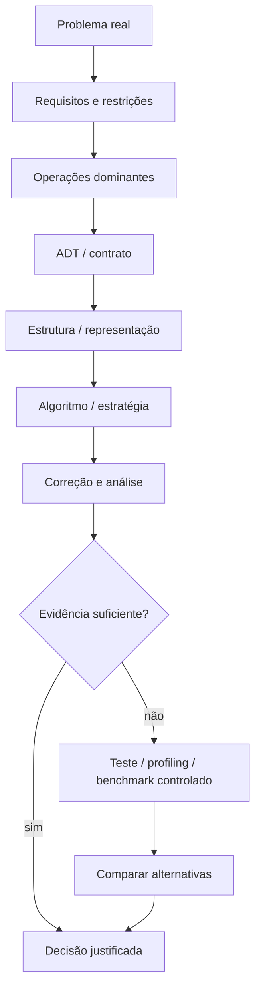
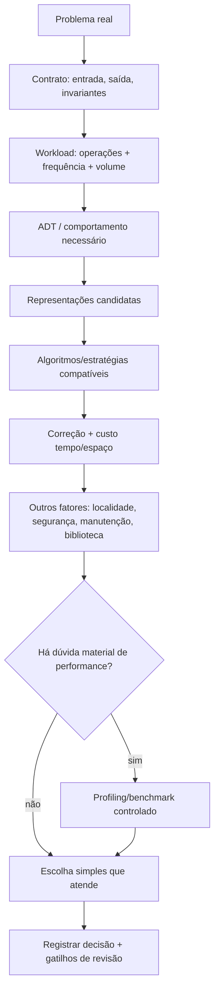

<a id="inicio"></a>

# Modelagem, Escolha de Estruturas e Trade-offs

> **Classificação geral:** `[D] Obrigatório dominar`  
> **Nível:** C — Algoritmos e Estruturas de Dados  
> **Posição na taxonomia:** tópico 35 — décimo segundo e último tópico do Nível C  
> **Pré-requisitos principais:** T24 — Correção e Análise de Algoritmos; T25 — Tipos Abstratos de Dados, Estruturas e Implementações; T26–T34 — algoritmos, estruturas e estratégias fundamentais  
> **Papel curricular:** integração final da taxonomia atual T01–T35; não autoriza consolidação global dos arquivos sem aval explícito do usuário

---

## Resumo executivo

T35 é o ponto em que os tópicos anteriores deixam de ser uma coleção de técnicas isoladas e passam a formar um **processo de decisão**.

O problema real não chega dizendo:

```text
"use uma hash table"
"aplique BFS"
"implemente um heap"
```

Ele chega dizendo:

```text
"não posso processar o mesmo identificador duas vezes"
"preciso encontrar um equipamento rapidamente pelo ID"
"quero atender primeiro o item mais urgente"
"preciso saber quais nós são alcançáveis"
"a ordem de chegada precisa ser preservada"
"o volume pode crescer para milhões de registros"
```

O trabalho algorítmico consiste em transformar requisitos do domínio em um modelo explícito:

```text
PROBLEMA REAL
    ↓
REQUISITOS E RESTRIÇÕES
    ↓
OPERAÇÕES DOMINANTES
    ↓
ADT / CONTRATO
    ↓
ESTRUTURA / REPRESENTAÇÃO
    ↓
ALGORITMO / ESTRATÉGIA
    ↓
CORREÇÃO + CUSTO
    ↓
TESTES + MEDIÇÃO QUANDO NECESSÁRIA
    ↓
TRADE-OFFS
    ↓
DECISÃO JUSTIFICADA
```

A meta não é encontrar uma estrutura “melhor em absoluto”. A meta é escolher uma solução **adequada ao workload, às garantias exigidas e às restrições reais**.


---

## Como estudar este tópico — duas rotas

T35 é o fechamento integrador do Nível C e pode ser usado de duas formas. A **rota de estudo** percorre o processo completo problema → workload → ADT → representação → algoritmo → evidência → trade-offs. A **rota de consulta** parte de uma dúvida prática e salta diretamente para a decisão, o diagnóstico ou o caso integrador correspondente.

### Rota A — primeiro contato / estudo sequencial

```text
Resumo executivo
→ Visão panorâmica
→ PARTE I: problema, workload e requisito → ADT
→ PARTE II: modelagem, invariantes e influência da estrutura
→ PARTE III: análise, medição e trade-offs
→ PARTE IV: transferência entre linguagens + casos integradores + segurança
→ PARTE V: erros de decisão, processo, registro e troubleshooting
→ PARTE VI: LABs, exercícios e evidências de domínio
→ Apêndices: glossário, taxonomia, fontes, QA e histórico
```

### Rota B — consulta rápida

1. comece pela [Visão panorâmica](#visao-panoramica);
2. use o **Índice essencial** para localizar a dimensão da decisão;
3. para uma falha concreta, vá ao [Troubleshooting sistemático](#troubleshooting-sistematico);
4. para cobertura operacional, consulte o [inventário `PR-T35-*`](#pr-t35-inventario);
5. para autoavaliação, consulte o [Checklist de domínio](#51-checklist-de-domínio);
6. para terminologia, abra o [Glossário](#52-glossário);
7. para fontes, QA e histórico, use os apêndices.

> **Regra de uso:** não escolha estrutura pela familiaridade. Declare primeiro operações, frequência, ordem, duplicidade, volume, garantias, memória, segurança e restrições do workload.

---

## Visão rápida

| Pergunta | O que ela revela |
|---|---|
| quais operações dominam? | quais custos devem ser priorizados |
| ordem importa? | sequência ordenada, inserção, FIFO/LIFO, prioridade |
| duplicatas são permitidas? | Set versus sequência/multiset/Map de contagem |
| acesso por índice importa? | necessidade de sequência indexável |
| busca por chave domina? | Map/Dictionary ou estrutura ordenada |
| preciso do menor/maior repetidamente? | Priority Queue / Heap |
| relações são hierárquicas? | Tree pode ser modelo natural |
| relações são arbitrárias? | Graph tende a representar melhor |
| dados cabem em memória? | representação e algoritmo podem precisar mudar |
| pior caso importa? | garantia esperada/amortizada pode não bastar |
| entrada é não confiável? | limites, consumo de memória/CPU e segurança entram no contrato |
| solução está lenta de fato? | medir antes de otimizar |

---

## Regra de ouro

> **Escolha a estrutura a partir do problema, das operações e das garantias necessárias — nunca a partir do nome da estrutura que você acabou de aprender.**

Uma estrutura familiar pode ser tecnicamente correta e ainda ser inadequada ao workload. Uma estrutura sofisticada pode ter Big O atraente e ainda perder para uma alternativa simples no tamanho real dos dados, na linguagem escolhida ou na manutenção do sistema.

---

## Decisão rápida

```text
QUAL É A PERGUNTA DOMINANTE?
        │
        ├── "já vi este valor?"
        │       └── Set / estrutura de pertinência
        │
        ├── "qual registro pertence a esta chave?"
        │       └── Map / Dictionary
        │
        ├── "qual foi o último que entrou?"
        │       └── Stack
        │
        ├── "qual foi o primeiro que entrou?"
        │       └── Queue
        │
        ├── "preciso operar nas duas pontas?"
        │       └── Deque
        │
        ├── "qual é o mais prioritário agora?"
        │       └── Priority Queue / Heap
        │
        ├── "preciso de posição/índice?"
        │       └── Array / List indexável
        │
        ├── "a relação é hierárquica?"
        │       └── Tree
        │
        └── "qualquer entidade pode relacionar-se a várias outras?"
                └── Graph
```



---


<a id="visao-panoramica"></a>
## 🗺️ Visão panorâmica — o mapa antes dos detalhes

T35 é o **caderno de decisão** que fecha o Nível C. O foco não é memorizar mais estruturas, mas transformar um problema real em contrato, workload, ADT, representação, algoritmo e decisão justificável — com critérios explícitos para reavaliá-la depois.

### O mapa do domínio em uma frase

> **A melhor estrutura não existe isoladamente: existe a alternativa que atende o contrato com o melhor conjunto de trade-offs para as operações, volume, garantias, recursos, segurança, linguagem e manutenção do workload real.**

### Cobertura canônica 35.1–35.7

| Nó | Competência | Pergunta de controle |
|---|---|---|
| **35.1 `[D]`** | começar pelo problema | quais operações, invariantes e restrições realmente importam? |
| **35.2** | requisito → ADT/estrutura | qual contrato abstrato representa a necessidade antes da classe concreta? |
| **35.3 `[D]`** | modelar antes de implementar | quais entidades, relações, estados e invariantes existem? |
| **35.4 `[D]`** | estrutura influencia algoritmo | como a representação altera o custo e até a forma do algoritmo? |
| **35.5 `[D]`** | não otimizar no escuro | o gargalo existe e foi localizado com evidência suficiente? |
| **35.6 `[D]`** | fatores além de Big O | memória, constantes, localidade, segurança, biblioteca e manutenção mudam a decisão? |
| **35.7** | evidência de domínio | consigo justificar, testar, medir e registrar a escolha e seus gatilhos de revisão? |

### Fluxo canônico de decisão



### Pergunta prática → candidato inicial, não resposta automática

| Necessidade dominante | Candidato inicial | Pergunta que impede dogma |
|---|---|---|
| membership/uniqueness | Set | ordem/duplicidade/serialização também importam? |
| key → value | Map/Dictionary | preciso de range/order/worst-case específico? |
| FIFO | Queue/Deque | remoção pela frente é realmente eficiente nesta implementação? |
| LIFO | Stack | há limite de memória/profundidade? |
| duas pontas | Deque | preciso também de acesso aleatório frequente? |
| mínimo/máximo repetido | Priority Queue/Heap | atualizações arbitrárias e tie-breaking importam? |
| dados ordenados/range | árvore ordenada / array sorted + busca | inserção é frequente? |
| hierarquia | Tree | a relação é mesmo acíclica/hierárquica? |
| relações gerais | Graph | representação densa ou esparsa? pesos? direção? |
| muitas leituras, poucos writes | preprocessing/índice pode compensar | custo de atualização e memória cabem? |

### Não confundir

| Conceitos | Diferença essencial |
|---|---|
| **ADT × estrutura concreta** | ADT define comportamento/contrato; várias estruturas podem implementá-lo |
| **Big O × tempo real** | Big O descreve crescimento sob modelo; constantes, layout, runtime e workload afetam medição |
| **profiling × benchmark** | profiling localiza onde tempo/recurso é gasto; benchmark compara execução sob condições controladas |
| **média/esperado × pior caso** | a garantia necessária faz parte do contrato; não troque uma pela outra silenciosamente |
| **lookup rápido × sistema rápido** | inserção, remoção, iteração, alocação, cache/localidade e I/O podem dominar |
| **estrutura correta × estrutura adequada** | várias opções podem ser corretas, mas com custos/garantias diferentes |
| **ordem de iteração observada × garantida** | comportamento visto hoje não é contrato se a API não o garante |
| **cache × memória grátis** | cache troca recomputação por retenção e precisa de política/capacidade em sistemas duradouros |
| **otimização × complexidade desnecessária** | mudança só se justifica se atende requisito ou resolve gargalo mensurável |
| **“biblioteca” × “sempre melhor”** | biblioteca é padrão sensato; requisitos/ambiente/estudo podem justificar exceções documentadas |

### Microexemplo 1 — busca logarítmica não torna inserção logarítmica

Em uma lista ordenada, bisseção pode localizar a posição em `O(log n)`, mas inserir fisicamente ainda pode exigir deslocar elementos em `O(n)`. Portanto:

```text
custo da operação composta
= localizar posição + efetivar mutação
= O(log n) + O(n)
= O(n)
```

Esse exemplo evita escolher por uma única operação interna “bonita”.

### Microexemplo 2 — fila funcionalmente correta, estruturalmente inadequada

```text
Python list + pop(0)
→ preserva FIFO
→ mas desloca elementos: custo linear

collections.deque + popleft()
→ preserva FIFO
→ operação eficiente nas extremidades
```

A ADT é a mesma (**Queue**); a implementação muda o custo dominante.

### Microexemplo 3 — modelo antes de BFS

Se o requisito é “quais PEs são alcançáveis a partir de `PE1`?”, antes de escrever BFS:

```text
entidades        → PEs
relação          → adjacência/conectividade
modelo           → Graph
representação    → adjacency list/map se esparso
algoritmo        → BFS/DFS conforme o contrato
estado auxiliar  → Set de visitados + Queue/Stack
```

Sem o modelo correto, otimizar BFS é resolver o problema errado mais rápido.

### Falha → primeira investigação

| Sintoma | Primeira investigação | PR |
|---|---|---|
| estrutura “rápida” fica lenta em produção | operações dominantes/workload real | `PR-T35-01` |
| FIFO degrada conforme a fila cresce | implementação concreta da remoção frontal | `PR-T35-02` |
| deduplicação destrói informação necessária | contrato de ordem/contagem | `PR-T35-03` |
| hash não atende range/order | requisito omitido | `PR-T35-04` |
| lookup some após mutar objeto-chave | estabilidade/hash/equality da chave | `PR-T35-05` |
| priority queue processa empates de forma inesperada | comparator/tie-breaking | `PR-T35-06` |
| memória cresce sem limite | capacidade/eviction/volume máximo | `PR-T35-07` |
| benchmark contradiz análise | metodologia/distribuição/warm-up/pipeline | `PR-T35-08` |
| mesma escolha piora após mudança de produto | workload mudou | `PR-T35-09` |
| ordem “mudou sozinha” entre runtimes/versões | garantia de iteração | `PR-T35-10` |
| solução simples vira gargalo por entrada adversarial | pior caso/limites/DoS | `PR-T35-11` |
| equipe não sabe por que a estrutura existe | decisão não registrada | `PR-T35-12` |

### Transferência entre linguagens — preserve a decisão, não o nome

| ADT/necessidade | Python | JavaScript | Java | GNU Bash |
|---|---|---|---|---|
| sequência indexável | `list` | `Array` | `ArrayList`/array | array indexado |
| membership único | `set` | `Set` | `HashSet` | array associativo como ponte limitada |
| dictionary | `dict` | `Map`/objeto conforme contrato | `Map` (`HashMap`, `TreeMap`...) | array associativo |
| FIFO/deque | `collections.deque` | `Array` exige cuidado com remoção frontal/índice lógico | `ArrayDeque` | possível manualmente em pequena escala |
| priority queue | `heapq` | sem ADT universal equivalente no núcleo ECMAScript; biblioteca/implementação conforme contexto | `PriorityQueue` | não forçar equivalência artificial |
| ordenado + bisseção | `bisect` sobre sequência ordenada | busca binária manual/biblioteca | collections/arrays + APIs adequadas | raramente escolha natural |

### Rota de consulta rápida

```text
problema/workload/contrato          → seções 2–4
requisito → ADT/estrutura           → seções 5–6
modelagem/invariantes               → seções 7–9
estrutura ↔ algoritmo               → seções 10–15
análise/profiling/benchmark         → seções 16–18
fatores além de Big O               → seções 19–22
transferência por linguagem         → seções 23–27
casos integradores                  → seções 28–30
antidogmas/processo/ADR             → seções 31–35
árvore/mapa integrado               → seções 37–39
PR-T35-* + troubleshooting          → após seção 39
LABs/capstone                       → seções 40–47
QA/rastreabilidade                  → seções 53–57
```

### Gate 1 — cobertura conceitual da Visão Panorâmica

**FECHADO.** O mapa cobre 35.1–35.7, diferencia ADT/implementação/análise/medição, explicita workload e fatores não assintóticos, oferece transferência sem equivalência artificial, conecta falhas a `PR-T35-*` e preserva T35 como integração final — sem consolidar automaticamente os 35 arquivos.

[↑ Voltar ao índice](#índice)

---

## Índice essencial

- [🗺️ Visão panorâmica](#visao-panoramica)
- [PARTE I — Problema, workload e requisito → ADT](#parte-i)
- [PARTE II — Modelagem, invariantes e influência da estrutura](#parte-ii)
- [PARTE III — Análise, medição e trade-offs](#parte-iii)
- [PARTE IV — Transferência, casos integradores e segurança](#parte-iv)
- [PARTE V — Processo de decisão, registro e troubleshooting](#parte-v)
- [PARTE VI — LABs, exercícios e evidências de domínio](#parte-vi)
- [APÊNDICES — glossário, taxonomia, fontes, QA e histórico](#apendices)
- [Troubleshooting sistemático](#troubleshooting-sistematico)
- [Inventário `PR-T35-*`](#pr-t35-inventario)

<details>
<summary><strong>Índice detalhado</strong></summary>

# Índice

  - [Resumo executivo](#resumo-executivo)
  - [Visão rápida](#visão-rápida)
  - [Regra de ouro](#regra-de-ouro)
  - [Decisão rápida](#decisão-rápida)
  - [🗺️ Visão panorâmica — o mapa antes dos detalhes](#visao-panoramica)
- [1. Posição deste assunto na trilha](#1-posição-deste-assunto-na-trilha)
  - [1.1 Por que T35 existe](#11-por-que-t35-existe)
  - [1.2 Resultado integrador do Nível C](#12-resultado-integrador-do-nível-c)
  - [1.3 O que T35 não tenta substituir](#13-o-que-t35-não-tenta-substituir)
  - [1.4 Fronteira final da taxonomia atual](#14-fronteira-final-da-taxonomia-atual)
- [2. Modelo mental central: problema antes da estrutura](#2-modelo-mental-central-problema-antes-da-estrutura)
  - [2.1 Uma pergunta ruim](#21-uma-pergunta-ruim)
  - [2.2 Uma pergunta melhor](#22-uma-pergunta-melhor)
  - [2.3 Workload](#23-workload)
  - [2.4 Restrições](#24-restrições)
  - [2.5 Contrato antes da implementação](#25-contrato-antes-da-implementação)
- [3. 35.1 — Começar pelo problema `[D]`](#3-351--começar-pelo-problema-d)
  - [3.1 Quais operações dominam?](#31-quais-operações-dominam)
  - [3.2 Ordem importa?](#32-ordem-importa)
  - [3.3 Duplicidade é permitida?](#33-duplicidade-é-permitida)
  - [3.4 Preciso acessar por índice?](#34-preciso-acessar-por-índice)
  - [3.5 Preciso buscar por chave?](#35-preciso-buscar-por-chave)
  - [3.6 Preciso extrair maior ou menor prioridade?](#36-preciso-extrair-maior-ou-menor-prioridade)
  - [3.7 A relação é hierárquica ou arbitrária?](#37-a-relação-é-hierárquica-ou-arbitrária)
  - [3.8 Haverá muitas inserções e remoções?](#38-haverá-muitas-inserções-e-remoções)
  - [3.9 Os dados cabem em memória?](#39-os-dados-cabem-em-memória)
  - [3.10 Quais garantias importam?](#310-quais-garantias-importam)
  - [3.11 Checklist mínimo antes de escolher](#311-checklist-mínimo-antes-de-escolher)
- [4. Workload: custo ponderado pelas operações](#4-workload-custo-ponderado-pelas-operações)
  - [4.1 Big O por operação não basta](#41-big-o-por-operação-não-basta)
  - [4.2 Frequência muda a decisão](#42-frequência-muda-a-decisão)
  - [4.3 Operação rara pode ser crítica](#43-operação-rara-pode-ser-crítica)
  - [4.4 Pior caso adversarial](#44-pior-caso-adversarial)
- [5. 35.2 — Requisito → ADT/estrutura](#5-352--requisito--adtestrutura)
  - [5.1 Tabela canônica do Guia](#51-tabela-canônica-do-guia)
  - [5.2 “Candidato” não significa receita automática](#52-candidato-não-significa-receita-automática)
  - [5.3 ADT antes da implementação](#53-adt-antes-da-implementação)
  - [5.4 Um requisito pode exigir combinação de estruturas](#54-um-requisito-pode-exigir-combinação-de-estruturas)
  - [5.5 Índice secundário](#55-índice-secundário)
  - [5.6 Redundância consciente](#56-redundância-consciente)
- [6. Matriz de escolha por operação](#6-matriz-de-escolha-por-operação)
  - [6.1 Leitura conceitual](#61-leitura-conceitual)
  - [6.2 Por que a tabela é aproximada](#62-por-que-a-tabela-é-aproximada)
  - [6.3 Não usar tabela sem workload](#63-não-usar-tabela-sem-workload)
- [7. 35.3 — Modelar antes de implementar `[D]`](#7-353--modelar-antes-de-implementar-d)
  - [7.1 Linguagem do domínio](#71-linguagem-do-domínio)
  - [7.2 Linguagem algorítmica](#72-linguagem-algorítmica)
  - [7.3 Modelagem não é renomear substantivos](#73-modelagem-não-é-renomear-substantivos)
  - [7.4 Exemplo — topologia de rede](#74-exemplo--topologia-de-rede)
  - [7.5 Quando matriz de adjacência muda o raciocínio](#75-quando-matriz-de-adjacência-muda-o-raciocínio)
  - [7.6 Exemplo — dependências de tarefas](#76-exemplo--dependências-de-tarefas)
  - [7.7 Exemplo — incidentes por prioridade](#77-exemplo--incidentes-por-prioridade)
  - [7.8 Exemplo — deduplicação de identificadores](#78-exemplo--deduplicação-de-identificadores)
  - [7.9 Exemplo — inventário por ID + ordem de cadastro](#79-exemplo--inventário-por-id--ordem-de-cadastro)
- [8. Modelagem por entidades, relações e operações](#8-modelagem-por-entidades-relações-e-operações)
  - [8.1 Entidades](#81-entidades)
  - [8.2 Cardinalidade](#82-cardinalidade)
  - [8.3 Direção](#83-direção)
  - [8.4 Peso](#84-peso)
  - [8.5 Estado](#85-estado)
- [9. Invariantes como ponte entre modelo e implementação](#9-invariantes-como-ponte-entre-modelo-e-implementação)
  - [9.1 O que é um invariante do modelo](#91-o-que-é-um-invariante-do-modelo)
  - [9.2 O que é um invariante de representação](#92-o-que-é-um-invariante-de-representação)
  - [9.3 Invariantes evitam decisões locais incoerentes](#93-invariantes-evitam-decisões-locais-incoerentes)
  - [9.4 Invariantes devem gerar testes](#94-invariantes-devem-gerar-testes)
  - [9.5 Redundância aumenta capacidade e custo cognitivo](#95-redundância-aumenta-capacidade-e-custo-cognitivo)
- [10. 35.4 — Estrutura influencia algoritmo `[D]`](#10-354--estrutura-influencia-algoritmo-d)
  - [10.1 Mesmo requisito, custo diferente](#101-mesmo-requisito-custo-diferente)
  - [10.2 Algoritmo também pode exigir uma estrutura](#102-algoritmo-também-pode-exigir-uma-estrutura)
  - [10.3 Representação do grafo influencia o percurso](#103-representação-do-grafo-influencia-o-percurso)
  - [10.4 Ordenação muda busca](#104-ordenação-muda-busca)
  - [10.5 Hashing muda lookup](#105-hashing-muda-lookup)
  - [10.6 Heap muda o problema de prioridade](#106-heap-muda-o-problema-de-prioridade)
  - [10.7 Estrutura correta pode eliminar algoritmo desnecessário](#107-estrutura-correta-pode-eliminar-algoritmo-desnecessário)
  - [10.8 Estrutura errada pode mascarar um algoritmo simples](#108-estrutura-errada-pode-mascarar-um-algoritmo-simples)
- [11. Estudo comparativo — membership: List × Set](#11-estudo-comparativo--membership-list--set)
  - [11.1 Problema](#111-problema)
  - [11.2 Solução A — lista](#112-solução-a--lista)
  - [11.3 Solução B — set](#113-solução-b--set)
  - [11.4 A decisão não é somente Big O](#114-a-decisão-não-é-somente-big-o)
  - [11.5 Contar comparações sem benchmark](#115-contar-comparações-sem-benchmark)
- [12. Estudo comparativo — dados ordenados × hash](#12-estudo-comparativo--dados-ordenados--hash)
  - [12.1 Requisito A](#121-requisito-a)
  - [12.2 Requisito B](#122-requisito-b)
  - [12.3 Não exigir de uma estrutura o que ela não promete](#123-não-exigir-de-uma-estrutura-o-que-ela-não-promete)
  - [12.4 A API revela o contrato](#124-a-api-revela-o-contrato)
- [13. Estudo comparativo — fila FIFO](#13-estudo-comparativo--fila-fifo)
  - [13.1 Requisito](#131-requisito)
  - [13.2 Python](#132-python)
  - [13.3 JavaScript](#133-javascript)
  - [13.4 Java](#134-java)
  - [13.5 Bash](#135-bash)
- [14. Estudo comparativo — prioridade](#14-estudo-comparativo--prioridade)
  - [14.1 Requisito](#141-requisito)
  - [14.2 Alternativa ruim por excesso de ordenação](#142-alternativa-ruim-por-excesso-de-ordenação)
  - [14.3 Heap preserva somente a ordem necessária](#143-heap-preserva-somente-a-ordem-necessária)
  - [14.4 Quando ordenar uma vez é melhor](#144-quando-ordenar-uma-vez-é-melhor)
- [15. Representação e localidade de memória](#15-representação-e-localidade-de-memória)
  - [15.1 Big O abstrai detalhes úteis](#151-big-o-abstrai-detalhes-úteis)
  - [15.2 Arrays e localidade](#152-arrays-e-localidade)
  - [15.3 Estruturas ligadas](#153-estruturas-ligadas)
  - [15.4 Não converter localidade em regra absoluta](#154-não-converter-localidade-em-regra-absoluta)
- [16. 35.5 — Não otimizar no escuro `[D]`](#16-355--não-otimizar-no-escuro-d)
  - [16.1 Fluxo canônico](#161-fluxo-canônico)
  - [16.2 Correção vem primeiro](#162-correção-vem-primeiro)
  - [16.3 Clareza vem antes de micro-otimização prematura](#163-clareza-vem-antes-de-micro-otimização-prematura)
  - [16.4 Análise antes de benchmark](#164-análise-antes-de-benchmark)
  - [16.5 Medição quando existe dúvida real](#165-medição-quando-existe-dúvida-real)
  - [16.6 Benchmark não prova complexidade](#166-benchmark-não-prova-complexidade)
  - [16.7 Profiling procura hotspot](#167-profiling-procura-hotspot)
  - [16.8 Otimização orientada por evidência](#168-otimização-orientada-por-evidência)
- [17. Análise assintótica × profiling × benchmark](#17-análise-assintótica--profiling--benchmark)
  - [17.1 Análise assintótica](#171-análise-assintótica)
  - [17.2 Profiling](#172-profiling)
  - [17.3 Benchmark](#173-benchmark)
  - [17.4 As três evidências se complementam](#174-as-três-evidências-se-complementam)
- [18. Exemplo de temporização ilustrativa — não é benchmark de produção](#18-exemplo-de-temporização-ilustrativa--não-é-benchmark-de-produção)
  - [18.1 Python](#181-python)
  - [18.2 JavaScript](#182-javascript)
  - [18.3 Java](#183-java)
  - [18.4 GNU Bash](#184-gnu-bash)
- [19. 35.6 — Fatores além de Big O `[D]`](#19-356--fatores-além-de-big-o-d)
  - [19.1 Tamanho típico dos dados](#191-tamanho-típico-dos-dados)
  - [19.2 Constantes](#192-constantes)
  - [19.3 Localidade de memória e cache](#193-localidade-de-memória-e-cache)
  - [19.4 Overhead de objetos](#194-overhead-de-objetos)
  - [19.5 Alocação e garbage collection](#195-alocação-e-garbage-collection)
  - [19.6 Custo de programação](#196-custo-de-programação)
  - [19.7 Legibilidade](#197-legibilidade)
  - [19.8 Bibliotecas disponíveis](#198-bibliotecas-disponíveis)
  - [19.9 Requisitos de segurança](#199-requisitos-de-segurança)
  - [19.10 Distribuição dos dados](#1910-distribuição-dos-dados)
  - [19.11 Mutabilidade](#1911-mutabilidade)
  - [19.12 Concorrência e paralelismo](#1912-concorrência-e-paralelismo)
  - [19.13 Persistência e serialização](#1913-persistência-e-serialização)
  - [19.14 Determinismo](#1914-determinismo)
- [20. Tempo × espaço](#20-tempo--espaço)
  - [20.1 Trade-off clássico](#201-trade-off-clássico)
  - [20.2 Índices auxiliares](#202-índices-auxiliares)
  - [20.3 Pré-computação](#203-pré-computação)
  - [20.4 Compressão](#204-compressão)
  - [20.5 Não existe direção universalmente correta](#205-não-existe-direção-universalmente-correta)
- [21. Simplicidade × performance](#21-simplicidade--performance)
  - [21.1 Solução simples como baseline](#211-solução-simples-como-baseline)
  - [21.2 Quando simplificar é melhor](#212-quando-simplificar-é-melhor)
  - [21.3 Quando simplicidade não é desculpa](#213-quando-simplicidade-não-é-desculpa)
  - [21.4 Complexidade acidental](#214-complexidade-acidental)
- [22. Biblioteca × implementação própria](#22-biblioteca--implementação-própria)
  - [22.1 Regra padrão](#221-regra-padrão)
  - [22.2 Motivos legítimos para implementar manualmente](#222-motivos-legítimos-para-implementar-manualmente)
  - [22.3 Motivos ruins](#223-motivos-ruins)
  - [22.4 Implementação própria aumenta superfície de QA](#224-implementação-própria-aumenta-superfície-de-qa)
- [23. Python — transferência da decisão](#23-python--transferência-da-decisão)
  - [23.1 List](#231-list)
  - [23.2 Set](#232-set)
  - [23.3 Dict](#233-dict)
  - [23.4 collections.deque](#234-collectionsdeque)
  - [23.5 heapq](#235-heapq)
  - [23.6 bisect](#236-bisect)
  - [23.7 Exemplo de escolha combinada](#237-exemplo-de-escolha-combinada)
- [24. JavaScript / ECMAScript — transferência da decisão](#24-javascript--ecmascript--transferência-da-decisão)
  - [24.1 Array](#241-array)
  - [24.2 Set](#242-set)
  - [24.3 Map](#243-map)
  - [24.4 Queue não é tipo padrão dedicado](#244-queue-não-é-tipo-padrão-dedicado)
  - [24.5 Exemplo combinado](#245-exemplo-combinado)
- [25. Java — transferência da decisão](#25-java--transferência-da-decisão)
  - [25.1 Interface primeiro](#251-interface-primeiro)
  - [25.2 Escolher pela operação](#252-escolher-pela-operação)
  - [25.3 Exemplo combinado](#253-exemplo-combinado)
  - [25.4 Cuidado com o nome da implementação](#254-cuidado-com-o-nome-da-implementação)
- [26. GNU Bash — transferência sem equivalência artificial](#26-gnu-bash--transferência-sem-equivalência-artificial)
  - [26.1 Bash possui arrays reais](#261-bash-possui-arrays-reais)
  - [26.2 Array associativo não transforma Bash em linguagem de estruturas avançadas](#262-array-associativo-não-transforma-bash-em-linguagem-de-estruturas-avançadas)
  - [26.3 Set pode ser simulado por chaves](#263-set-pode-ser-simulado-por-chaves)
  - [26.4 Grafos e heaps em Bash](#264-grafos-e-heaps-em-bash)
  - [26.5 Composição é parte da força do Shell](#265-composição-é-parte-da-força-do-shell)
- [27. Comparação transversal das quatro linguagens](#27-comparação-transversal-das-quatro-linguagens)
  - [27.1 Tabela de transferência](#271-tabela-de-transferência)
  - [27.2 Conceito universal, API não universal](#272-conceito-universal-api-não-universal)
- [28. Caso integrador — topologia de rede](#28-caso-integrador--topologia-de-rede)
  - [28.1 Problema](#281-problema)
  - [28.2 Modelagem](#282-modelagem)
  - [28.3 Python](#283-python)
  - [28.4 JavaScript](#284-javascript)
  - [28.5 Java](#285-java)
  - [28.6 GNU Bash](#286-gnu-bash)
  - [28.7 O que a modelagem resolveu](#287-o-que-a-modelagem-resolveu)
- [29. Caso integrador — fila de trabalho sem duplicação](#29-caso-integrador--fila-de-trabalho-sem-duplicação)
  - [29.1 Requisitos](#291-requisitos)
  - [29.2 Modelo](#292-modelo)
  - [29.3 Invariantes](#293-invariantes)
  - [29.4 Trade-off](#294-trade-off)
  - [29.5 Capacidade](#295-capacidade)
- [30. Segurança na escolha de estruturas](#30-segurança-na-escolha-de-estruturas)
  - [30.1 Segurança também é custo algorítmico](#301-segurança-também-é-custo-algorítmico)
  - [30.2 Limites explícitos](#302-limites-explícitos)
  - [30.3 Fila limitada](#303-fila-limitada)
  - [30.4 Cache também precisa política](#304-cache-também-precisa-política)
  - [30.5 Colisões e entradas adversariais](#305-colisões-e-entradas-adversariais)
  - [30.6 Complexidade como superfície de ataque](#306-complexidade-como-superfície-de-ataque)
  - [30.7 Não armazenar o que não é necessário](#307-não-armazenar-o-que-não-é-necessário)
- [31. Erros comuns de decisão](#31-erros-comuns-de-decisão)
  - [31.1 Escolher pela estrutura favorita](#311-escolher-pela-estrutura-favorita)
  - [31.2 Escolher apenas pelo Big O de uma operação](#312-escolher-apenas-pelo-big-o-de-uma-operação)
  - [31.3 Ignorar custo de atualização](#313-ignorar-custo-de-atualização)
  - [31.4 Ignorar memória](#314-ignorar-memória)
  - [31.5 Otimizar antes de medir](#315-otimizar-antes-de-medir)
  - [31.6 Medir sem metodologia](#316-medir-sem-metodologia)
  - [31.7 Reimplementar biblioteca madura](#317-reimplementar-biblioteca-madura)
  - [31.8 Confundir ADT e implementação](#318-confundir-adt-e-implementação)
  - [31.9 Presumir detalhes físicos da linguagem](#319-presumir-detalhes-físicos-da-linguagem)
  - [31.10 Ignorar dados adversariais](#3110-ignorar-dados-adversariais)
- [32. Antidogma: heurísticas, não religião](#32-antidogma-heurísticas-não-religião)
  - [32.1 “Sempre use Set para membership”](#321-sempre-use-set-para-membership)
  - [32.2 “Linked list é sempre melhor para inserção”](#322-linked-list-é-sempre-melhor-para-inserção)
  - [32.3 “Hash Map é sempre mais rápido”](#323-hash-map-é-sempre-mais-rápido)
  - [32.4 “Nunca otimize cedo”](#324-nunca-otimize-cedo)
  - [32.5 “Use biblioteca sempre”](#325-use-biblioteca-sempre)
- [33. Processo de decisão em sete passos](#33-processo-de-decisão-em-sete-passos)
  - [33.1 Passo 1 — entender o problema](#331-passo-1--entender-o-problema)
  - [33.2 Passo 2 — declarar entradas, saídas e invariantes](#332-passo-2--declarar-entradas-saídas-e-invariantes)
  - [33.3 Passo 3 — listar operações e workload](#333-passo-3--listar-operações-e-workload)
  - [33.4 Passo 4 — mapear ADTs candidatos](#334-passo-4--mapear-adts-candidatos)
  - [33.5 Passo 5 — comparar representações/implementações](#335-passo-5--comparar-representaçõesimplementações)
  - [33.6 Passo 6 — implementar a opção mais simples que atende o contrato](#336-passo-6--implementar-a-opção-mais-simples-que-atende-o-contrato)
  - [33.7 Passo 7 — medir e iterar quando necessário](#337-passo-7--medir-e-iterar-quando-necessário)
- [34. Registro de decisão técnica](#34-registro-de-decisão-técnica)
  - [34.1 Por que registrar](#341-por-que-registrar)
  - [34.2 Formato mínimo](#342-formato-mínimo)
  - [34.3 Exemplo](#343-exemplo)
  - [34.4 Registro não é burocracia para toda variável](#344-registro-não-é-burocracia-para-toda-variável)
- [35. Quando reavaliar a estrutura escolhida](#35-quando-reavaliar-a-estrutura-escolhida)
  - [35.1 Workload mudou](#351-workload-mudou)
  - [35.2 Requisito de ordem apareceu](#352-requisito-de-ordem-apareceu)
  - [35.3 Memória virou gargalo](#353-memória-virou-gargalo)
  - [35.4 Segurança mudou](#354-segurança-mudou)
  - [35.5 Biblioteca evoluiu](#355-biblioteca-evoluiu)
  - [35.6 Evidência contradiz hipótese](#356-evidência-contradiz-hipótese)
- [36. 35.7 — Evidência de domínio](#36-357--evidência-de-domínio)
  - [36.1 Modelar problema em dados e operações](#361-modelar-problema-em-dados-e-operações)
  - [36.2 Propor pelo menos duas soluções plausíveis](#362-propor-pelo-menos-duas-soluções-plausíveis)
  - [36.3 Justificar estrutura + algoritmo](#363-justificar-estrutura--algoritmo)
  - [36.4 Declarar pré-condições](#364-declarar-pré-condições)
  - [36.5 Explicar correção](#365-explicar-correção)
  - [36.6 Analisar crescimento temporal e espacial](#366-analisar-crescimento-temporal-e-espacial)
  - [36.7 Criar testes e casos-limite](#367-criar-testes-e-casos-limite)
  - [36.8 Medir quando necessário](#368-medir-quando-necessário)
  - [36.9 Reconhecer biblioteca melhor testada](#369-reconhecer-biblioteca-melhor-testada)
- [37. Visão panorâmica — árvore de decisão integrada](#37-visão-panorâmica--árvore-de-decisão-integrada)
- [38. Mapa de problemas reais](#38-mapa-de-problemas-reais)
  - [38.1 Deduplicação](#381-deduplicação)
  - [38.2 Frequência](#382-frequência)
  - [38.3 Cache simples](#383-cache-simples)
  - [38.4 Scheduling](#384-scheduling)
  - [38.5 Dependências](#385-dependências)
  - [38.6 Conectividade](#386-conectividade)
  - [38.7 Prefixos](#387-prefixos)
  - [38.8 Ranking estático](#388-ranking-estático)
- [39. Problemas e edge cases que mudam a escolha](#39-problemas-e-edge-cases-que-mudam-a-escolha)
  - [39.1 Dados vazios](#391-dados-vazios)
  - [39.2 Um único elemento](#392-um-único-elemento)
  - [39.3 Duplicatas](#393-duplicatas)
  - [39.4 Chaves mutáveis](#394-chaves-mutáveis)
  - [39.5 Ordem de iteração](#395-ordem-de-iteração)
  - [39.6 Volume máximo](#396-volume-máximo)
  - [39.7 Operação inesperada](#397-operação-inesperada)
  - [39.8 Inventário formal de problemas reais — `PR-T35-*`](#pr-t35-inventario)
  - [🔎 Troubleshooting sistemático](#troubleshooting-sistematico)
- [40. 🧪 Laboratório 1 — Requisito → operações → estrutura](#40--laboratório-1--requisito--operações--estrutura)
  - [40.1 Objetivo](#401-objetivo)
  - [40.2 Pré-requisitos](#402-pré-requisitos)
  - [40.3 Estado inicial](#403-estado-inicial)
  - [40.4 Tarefa](#404-tarefa)
  - [40.5 Procedimento](#405-procedimento)
  - [40.6 O que observar](#406-o-que-observar)
  - [40.7 Testes](#407-testes)
  - [40.8 Explicação](#408-explicação)
  - [40.9 Variação / transferência](#409-variação--transferência)
  - [40.10 Limpeza](#4010-limpeza)
- [41. 🧪 Laboratório 2 — List × Set sem cronômetro](#41--laboratório-2--list--set-sem-cronômetro)
  - [41.1 Objetivo](#411-objetivo)
  - [41.2 Pré-requisitos](#412-pré-requisitos)
  - [41.3 Estado inicial](#413-estado-inicial)
  - [41.4 Tarefa](#414-tarefa)
  - [41.5 Procedimento](#415-procedimento)
  - [41.6 O que observar](#416-o-que-observar)
  - [41.7 Testes](#417-testes)
  - [41.8 Explicação](#418-explicação)
  - [41.9 Variação / transferência](#419-variação--transferência)
  - [41.10 Limpeza](#4110-limpeza)
- [42. 🧪 Laboratório 3 — Modelar topologia antes do BFS](#42--laboratório-3--modelar-topologia-antes-do-bfs)
  - [42.1 Objetivo](#421-objetivo)
  - [42.2 Pré-requisitos](#422-pré-requisitos)
  - [42.3 Estado inicial](#423-estado-inicial)
  - [42.4 Tarefa](#424-tarefa)
  - [42.5 Procedimento](#425-procedimento)
  - [42.6 O que observar](#426-o-que-observar)
  - [42.7 Testes](#427-testes)
  - [42.8 Explicação](#428-explicação)
  - [42.9 Variação / transferência](#429-variação--transferência)
  - [42.10 Limpeza](#4210-limpeza)
- [43. 🧪 Laboratório 4 — Workload muda a escolha](#43--laboratório-4--workload-muda-a-escolha)
  - [43.1 Objetivo](#431-objetivo)
  - [43.2 Pré-requisitos](#432-pré-requisitos)
  - [43.3 Estado inicial](#433-estado-inicial)
  - [43.4 Tarefa](#434-tarefa)
  - [43.5 Procedimento](#435-procedimento)
  - [43.6 O que observar](#436-o-que-observar)
  - [43.7 Testes](#437-testes)
  - [43.8 Explicação](#438-explicação)
  - [43.9 Variação / transferência](#439-variação--transferência)
  - [43.10 Limpeza](#4310-limpeza)
- [44. 🧪 Laboratório 5 — Análise antes de profiling](#44--laboratório-5--análise-antes-de-profiling)
  - [44.1 Objetivo](#441-objetivo)
  - [44.2 Pré-requisitos](#442-pré-requisitos)
  - [44.3 Estado inicial](#443-estado-inicial)
  - [44.4 Tarefa](#444-tarefa)
  - [44.5 Procedimento](#445-procedimento)
  - [44.6 O que observar](#446-o-que-observar)
  - [44.7 Testes](#447-testes)
  - [44.8 Explicação](#448-explicação)
  - [44.9 Variação / transferência](#449-variação--transferência)
  - [44.10 Limpeza](#4410-limpeza)
- [45. 🧪 Laboratório 6 — Fila sem duplicatas](#45--laboratório-6--fila-sem-duplicatas)
  - [45.1 Objetivo](#451-objetivo)
  - [45.2 Pré-requisitos](#452-pré-requisitos)
  - [45.3 Estado inicial](#453-estado-inicial)
  - [45.4 Tarefa](#454-tarefa)
  - [45.5 Procedimento](#455-procedimento)
  - [45.6 O que observar](#456-o-que-observar)
  - [45.7 Testes](#457-testes)
  - [45.8 Explicação](#458-explicação)
  - [45.9 Variação / transferência](#459-variação--transferência)
  - [45.10 Limpeza](#4510-limpeza)
- [46. 🧪 Laboratório 7 — Limite de recursos como requisito](#46--laboratório-7--limite-de-recursos-como-requisito)
  - [46.1 Objetivo](#461-objetivo)
  - [46.2 Pré-requisitos](#462-pré-requisitos)
  - [46.3 Estado inicial](#463-estado-inicial)
  - [46.4 Tarefa](#464-tarefa)
  - [46.5 Procedimento](#465-procedimento)
  - [46.6 O que observar](#466-o-que-observar)
  - [46.7 Testes](#467-testes)
  - [46.8 Explicação](#468-explicação)
  - [46.9 Variação / transferência](#469-variação--transferência)
  - [46.10 Limpeza](#4610-limpeza)
- [47. 🧪 Laboratório 8 — Capstone do Nível C](#47--laboratório-8--capstone-do-nível-c)
  - [47.1 Objetivo](#471-objetivo)
  - [47.2 Pré-requisitos](#472-pré-requisitos)
  - [47.3 Estado inicial](#473-estado-inicial)
  - [47.4 Tarefa](#474-tarefa)
  - [47.5 Procedimento](#475-procedimento)
  - [47.6 O que observar](#476-o-que-observar)
  - [47.7 Testes](#477-testes)
  - [47.8 Explicação](#478-explicação)
  - [47.9 Variação / transferência](#479-variação--transferência)
  - [47.10 Limpeza](#4710-limpeza)
- [48. Exercícios](#48-exercícios)
  - [48.1 Requisito simples](#481-requisito-simples)
  - [48.2 Membership](#482-membership)
  - [48.3 Map ordenado](#483-map-ordenado)
  - [48.4 Heap ou sort](#484-heap-ou-sort)
  - [48.5 Graph representation](#485-graph-representation)
  - [48.6 Índice secundário](#486-índice-secundário)
  - [48.7 Tempo × espaço](#487-tempo--espaço)
  - [48.8 Segurança](#488-segurança)
  - [48.9 Biblioteca](#489-biblioteca)
  - [48.10 Profiling](#4810-profiling)
  - [48.11 Workload](#4811-workload)
  - [48.12 Transferência](#4812-transferência)
  - [48.13 Modelagem](#4813-modelagem)
  - [48.14 Ordem](#4814-ordem)
  - [48.15 Capstone](#4815-capstone)
- [49. Respostas esperadas em alto nível](#49-respostas-esperadas-em-alto-nível)
  - [49.1 Exercício 48.1](#491-exercício-481)
  - [49.2 Exercício 48.2](#492-exercício-482)
  - [49.3 Exercício 48.3](#493-exercício-483)
  - [49.4 Exercício 48.4](#494-exercício-484)
  - [49.5 Exercício 48.5](#495-exercício-485)
  - [49.6 Exercício 48.6](#496-exercício-486)
  - [49.7 Exercício 48.7](#497-exercício-487)
  - [49.8 Exercício 48.8](#498-exercício-488)
  - [49.9 Exercício 48.9](#499-exercício-489)
  - [49.10 Exercício 48.10](#4910-exercício-4810)
- [50. Evidências de domínio](#50-evidências-de-domínio)
  - [50.1 Explicar](#501-explicar)
  - [50.2 Implementar](#502-implementar)
  - [50.3 Rastrear](#503-rastrear)
  - [50.4 Depurar](#504-depurar)
  - [50.5 Transferir](#505-transferir)
  - [50.6 Justificar](#506-justificar)
- [51. Checklist de domínio](#51-checklist-de-domínio)
  - [51.1 Problema e contrato](#511-problema-e-contrato)
  - [51.2 Estrutura](#512-estrutura)
  - [51.3 Algoritmo](#513-algoritmo)
  - [51.4 Evidência](#514-evidência)
  - [51.5 Segurança](#515-segurança)
  - [51.6 Manutenção](#516-manutenção)
  - [51.7 Transferência](#517-transferência)
- [52. Glossário](#52-glossário)
  - [52.1 Workload](#521-workload)
  - [52.2 Requisito](#522-requisito)
  - [52.3 Restrição](#523-restrição)
  - [52.4 ADT / TAD](#524-adt--tad)
  - [52.5 Representação](#525-representação)
  - [52.6 Invariante](#526-invariante)
  - [52.7 Trade-off](#527-trade-off)
  - [52.8 Localidade de memória](#528-localidade-de-memória)
  - [52.9 Profiling](#529-profiling)
  - [52.10 Benchmark](#5210-benchmark)
  - [52.11 Big O](#5211-big-o)
  - [52.12 Índice auxiliar](#5212-índice-auxiliar)
  - [52.13 Hotspot](#5213-hotspot)
  - [52.14 Capacidade](#5214-capacidade)
  - [52.15 Determinismo](#5215-determinismo)
- [53. Auditoria de cobertura da taxonomia](#53-auditoria-de-cobertura-da-taxonomia)
  - [53.1 35.1 `[D]`](#531-351-d)
  - [53.2 35.2 — sem rótulo próprio no Guia](#532-352--sem-rótulo-próprio-no-guia)
  - [53.3 35.3 `[D]`](#533-353-d)
  - [53.4 35.4 `[D]`](#534-354-d)
  - [53.5 35.5 `[D]`](#535-355-d)
  - [53.6 35.6 `[D]`](#536-356-d)
  - [53.7 — evidência de domínio](#537--evidência-de-domínio)
  - [53.8 Auditoria bidirecional — mapa ↔ conteúdo ↔ prática](#538-auditoria-bidirecional--mapa--conteúdo--prática)
  - [53.9 Inventário rastreável de capacidades](#539-inventário-rastreável-de-capacidades)
- [54. Auditoria da File Library](#54-auditoria-da-file-library)
  - [54.1 Fontes locais efetivamente consultadas](#541-fontes-locais-efetivamente-consultadas)
  - [54.2 Como a biblioteca alterou o documento](#542-como-a-biblioteca-alterou-o-documento)
  - [54.3 Hierarquia aplicada](#543-hierarquia-aplicada)
  - [54.4 Matriz de contribuição multifonte](#544-matriz-de-contribuição-multifonte)
- [55. Referências](#55-referências)
  - [55.1 Contratos canônicos](#551-contratos-canônicos)
  - [55.2 Literatura local efetivamente consultada](#552-literatura-local-efetivamente-consultada)
  - [55.3 Python](#553-python)
  - [55.4 ECMAScript](#554-ecmascript)
  - [55.5 Java](#555-java)
  - [55.6 GNU Bash](#556-gnu-bash)
  - [55.7 Segurança](#557-segurança)
  - [55.8 Nota temporal de baseline](#558-nota-temporal-de-baseline)
- [56. QA e evidências](#56-qa-e-evidências)
  - [56.1 `[D]` Evidência documental](#561-d-evidência-documental)
  - [56.2 `[S]` Validação estrutural/estática](#562-s-validação-estruturalestática)
  - [56.3 `[R]` Reprodução em runtime](#563-r-reprodução-em-runtime)
  - [56.4 Limitações](#564-limitações)
  - [56.5 Gate 2 — iteração `0.3.2`](#565-gate-2--iteração-032)
- [57. Histórico de versões](#57-histórico-de-versões)

</details>

---

<a id="parte-i"></a>
# PARTE I — Problema, workload e requisito → ADT

# 1. Posição deste assunto na trilha

## 1.1 Por que T35 existe

T24–T34 apresentaram ferramentas específicas:

- correção e complexidade;
- ADTs e implementações;
- busca;
- ordenação;
- estruturas lineares;
- hashing;
- heaps;
- árvores;
- grafos;
- estratégias algorítmicas;
- matching e Regex no mapa algorítmico.

T35 responde à pergunta que resta:

> **dado um problema que não diz qual técnica usar, como escolho conscientemente?**

## 1.2 Resultado integrador do Nível C

O próprio Guia v2.1.0 define T35 como o resultado integrador do Nível C.

Isso significa que este tópico não deve ser lido como “mais uma estrutura”. Ele é uma camada de raciocínio sobre as estruturas já aprendidas.

## 1.3 O que T35 não tenta substituir

T35 não substitui:

- engenharia de requisitos completa;
- arquitetura de software;
- bancos de dados;
- sistemas distribuídos;
- concorrência avançada;
- análise amortizada/probabilística em profundidade;
- cache-oblivious algorithms;
- otimização de compilador;
- performance engineering profissional completa.

Esses assuntos podem aprofundar decisões futuras, mas não são necessários para cumprir o contrato curricular atual.

## 1.4 Fronteira final da taxonomia atual

A taxonomia canônica termina atualmente em T35.

```text
T35 finaliza o mapa curricular atual
≠
T35 prova que o assunto "algoritmos e estruturas de dados" acabou
```

A área acadêmica e profissional continua muito além deste material.

> **Consolidação global T01–T35:** T35 encerra a taxonomia atual, mas não autoriza automaticamente um documento consolidado. Se o usuário autorizar essa etapa em outro momento, a consolidação deverá seguir o **Prompt Mestre vigente na data da autorização**, preservando os 35 canônicos como fontes de verdade e executando o gate próprio dessa nova tarefa.

[↑ Voltar ao índice](#índice)

# 2. Modelo mental central: problema antes da estrutura

## 2.1 Uma pergunta ruim

```text
"qual estrutura é mais rápida?"
```

A pergunta é incompleta porque não especifica:

- qual operação;
- qual distribuição de dados;
- qual volume;
- qual garantia;
- qual representação;
- qual implementação;
- qual ambiente.

## 2.2 Uma pergunta melhor

```text
"para n registros, com 90% de consultas por chave,
5% de inserções e 5% de remoções,
sem necessidade de ordenação,
qual estrutura atende melhor ao contrato?"
```

Agora existe um **workload** a analisar.

## 2.3 Workload

**Workload** é o perfil real ou esperado de operações sobre os dados.

Exemplo:

```text
1.000.000 operações

850.000 lookups por ID
100.000 inserções
 40.000 atualizações
 10.000 remoções
```

Uma estrutura que favorece inserção sequencial pode não ser adequada quando lookup por chave domina.

## 2.4 Restrições

Além do workload, declare restrições:

- memória máxima;
- latência aceitável;
- throughput necessário;
- previsibilidade de pior caso;
- necessidade de ordem;
- mutabilidade;
- tamanho máximo;
- tipo da chave;
- dados confiáveis ou não confiáveis;
- disponibilidade de biblioteca pronta;
- necessidade de persistência;
- requisitos de manutenção.

## 2.5 Contrato antes da implementação

O contrato descreve o comportamento necessário.

```text
"consultar usuário por ID"
```

é requisito de acesso por chave.

```text
"preservar usuários em ordem de criação"
```

é outro requisito.

Uma solução precisa satisfazer ambos se ambos forem obrigatórios.

[↑ Voltar ao índice](#índice)

# 3. 35.1 — Começar pelo problema `[D]`

## 3.1 Quais operações dominam?

Liste as operações antes de escolher a estrutura.

| Operação | Pergunta |
|---|---|
| lookup | preciso localizar por chave/valor/posição? |
| insert | onde e com que frequência novos itens entram? |
| delete | por chave, por posição, por extremo? |
| iterate | preciso percorrer tudo? em qual ordem? |
| min/max | preciso do extremo repetidamente? |
| membership | preciso apenas saber se existe? |
| neighbor | preciso navegar por relações? |
| range | preciso consultar intervalos ordenados? |

## 3.2 Ordem importa?

“Ordem” pode significar coisas diferentes:

- ordem de inserção;
- ordem natural da chave;
- ordem definida por comparador;
- ordem de chegada;
- prioridade;
- ordem topológica;
- posição em sequência.

Não trate todas como o mesmo requisito.

## 3.3 Duplicidade é permitida?

Se duplicatas não têm significado, Set pode expressar melhor o domínio.

Se duplicatas representam frequência, um Map de contagem pode ser adequado.

Se duplicatas precisam ser preservadas em ordem, uma sequência pode ser necessária.

```text
mesmos dados aparentes
≠
mesmo contrato
```

## 3.4 Preciso acessar por índice?

Acesso por posição favorece estruturas indexáveis.

```text
items[500_000]
```

não possui o mesmo requisito de:

```text
"encontre o item com device_id='PE-17'"
```

## 3.5 Preciso buscar por chave?

Quando a operação dominante é:

```text
key → record
```

um Map/Dictionary é candidato natural.

Mas a implementação concreta depende de outros requisitos:

- ordem por chave;
- pior caso;
- range query;
- memória;
- estabilidade da chave;
- concorrência futura.

## 3.6 Preciso extrair maior ou menor prioridade?

Se a operação dominante é repetidamente:

```text
insert(item)
extract_min()
```

Priority Queue é um ADT mais fiel que manter uma lista inteira reordenada após cada inserção.

## 3.7 A relação é hierárquica ou arbitrária?

Hierarquia tende a sugerir Tree.

Relações many-to-many ou topologias gerais tendem a sugerir Graph.

```text
filesystem → árvore é um modelo útil em muitos contextos
rede de roteadores → grafo costuma representar melhor
```

## 3.8 Haverá muitas inserções e remoções?

Não compare apenas lookup.

Uma estrutura pode acelerar busca e tornar atualizações mais caras.

Essa é a essência do trade-off.

## 3.9 Os dados cabem em memória?

Se não cabem, a escolha muda de escala.

Possíveis consequências:

- processamento em streaming;
- chunking;
- índices externos;
- banco de dados;
- estrutura em disco;
- algoritmo externo.

T35 apenas introduz esse limite. Estruturas externas completas ficam fora do núcleo atual.

## 3.10 Quais garantias importam?

Pergunte se o requisito exige:

- custo esperado;
- custo amortizado;
- pior caso;
- latência máxima;
- memória máxima;
- estabilidade de ordenação;
- determinismo;
- segurança contra entrada adversarial.

Uma média excelente pode ser inadequada quando existe SLA rígido de pior caso.

## 3.11 Checklist mínimo antes de escolher

```text
[ ] operação dominante declarada
[ ] ordem declarada
[ ] duplicatas declaradas
[ ] tamanho típico e máximo estimados
[ ] frequência de mutação conhecida
[ ] consulta por índice/chave/extremo declarada
[ ] relações do domínio modeladas
[ ] restrição de memória conhecida
[ ] garantias temporal/espacial declaradas
[ ] confiança da entrada declarada
```

[↑ Voltar ao índice](#índice)

# 4. Workload: custo ponderado pelas operações

## 4.1 Big O por operação não basta

Considere duas alternativas hipotéticas:

| Operação | Estrutura A | Estrutura B |
|---|---:|---:|
| lookup | `O(1)` esperado | `O(log n)` |
| insert | `O(1)` esperado | `O(log n)` |
| ordered range | ruim/não natural | `O(log n + k)` típico |

Se range query nunca ocorre, a vantagem de B pode não importar.

Se range query é requisito central, A pode ser inadequada apesar do lookup esperado `O(1)`.

## 4.2 Frequência muda a decisão

Defina aproximadamente:

```text
cost_total ≈
    lookup_count × cost_lookup
  + insert_count × cost_insert
  + delete_count × cost_delete
  + range_count  × cost_range
```

Isso não é benchmark nem fórmula universal de tempo real. É um **modelo de raciocínio**.

## 4.3 Operação rara pode ser crítica

Uma operação pode ser rara e mesmo assim ter requisito rígido.

Exemplo:

```text
rebuild do índice: 1 vez por dia
```

Se ele bloqueia serviço por 20 minutos, frequência baixa não significa irrelevância.

## 4.4 Pior caso adversarial

Se a entrada é controlada por usuário externo, considerar somente custo médio pode ser perigoso.

A escolha de estrutura precisa incluir:

- limites de tamanho;
- timeout;
- quotas;
- pior caso conhecido;
- propriedades da implementação;
- possibilidade de colisões/degeneração.

[↑ Voltar ao índice](#índice)

# 5. 35.2 — Requisito → ADT/estrutura

## 5.1 Tabela canônica do Guia

| Requisito | Candidato |
|---|---|
| unicidade | Set |
| chave → valor | Map / Dictionary |
| último a entrar, primeiro a sair | Stack |
| primeiro a entrar, primeiro a sair | Queue |
| acessar extremos nas duas pontas | Deque |
| recuperar maior/menor prioridade | Priority Queue / Heap |
| acesso indexado | Array / List adequada |
| hierarquia | Tree |
| relações gerais | Graph |

## 5.2 “Candidato” não significa receita automática

A tabela inicia a investigação.

Ela não prova que a primeira estrutura escolhida é suficiente.

Exemplo:

```text
requisito: unicidade + preservação de ordem de chegada
```

Somente “Set” pode não expressar tudo dependendo da linguagem/API e do contrato de iteração.

## 5.3 ADT antes da implementação

```text
Queue
≠
ArrayDeque
≠
LinkedList
≠
list + pop(0)
```

Queue é o contrato FIFO.

As demais são possíveis implementações ou formas de realizar o contrato.

## 5.4 Um requisito pode exigir combinação de estruturas

Exemplo:

```text
fila de tarefas sem duplicatas
```

Pode exigir:

```text
Queue → ordem FIFO
Set   → membership rápido
```

A combinação preserva dois contratos diferentes.

## 5.5 Índice secundário

Às vezes o modelo principal é uma sequência, mas uma operação adicional exige índice auxiliar.

```text
events: List<Event>
by_id:  Map<Id, Event>
```

Custo:

- mais memória;
- mais invariantes;
- necessidade de manter as duas estruturas sincronizadas.

Benefício:

- lookup por ID sem perder a ordem sequencial dos eventos.

## 5.6 Redundância consciente

Duplicar informação pode ser correto quando é uma decisão explícita de performance.

Mas toda redundância cria um invariante:

> **as representações redundantes precisam permanecer coerentes.**

[↑ Voltar ao índice](#índice)

# 6. Matriz de escolha por operação

## 6.1 Leitura conceitual

A tabela abaixo usa custos típicos/conceituais, não promessa universal de toda biblioteca.

| Estrutura/ADT | acesso posição | membership | insert típico | remove típico | ordem | uso dominante |
|---|---:|---:|---:|---:|---|---|
| array/lista dinâmica | `O(1)` por índice | `O(n)` | append amortizado `O(1)` | extremo `O(1)`; meio `O(n)` | sequência | posição/percurso |
| linked list | `O(n)` | `O(n)` | `O(1)` com posição/nó conhecido | `O(1)` com contexto adequado | sequência | relinking/local updates |
| hash set | — | esperado `O(1)` | esperado `O(1)` | esperado `O(1)` | depende do contrato da API | pertinência |
| hash map | — | key lookup esperado `O(1)` | esperado `O(1)` | esperado `O(1)` | depende do contrato da API | chave → valor |
| balanced search tree | — | `O(log n)` | `O(log n)` | `O(log n)` | por chave | ordem/ranges |
| heap | — | busca arbitrária não é foco | `O(log n)` | extremo `O(log n)` | parcial | min/max prioritário |
| queue | — | não é foco | enqueue | dequeue | FIFO | processamento por chegada |
| stack | — | não é foco | push | pop | LIFO | reversão/DFS/undo |
| graph adjacency list | — | vizinhança | depende | depende | relacional | grafos esparsos |
| adjacency matrix | `O(1)` para edge(u,v) | edge direto | — | — | relacional | grafos densos/matriz |

## 6.2 Por que a tabela é aproximada

Custos dependem de:

- implementação;
- linguagem/runtime;
- representação;
- resizing;
- hashing/comparison;
- cache;
- alocação;
- tamanho do elemento;
- distribuição da entrada.

## 6.3 Não usar tabela sem workload

A tabela não responde sozinha:

```text
"qual é melhor?"
```

Ela responde:

```text
"quais candidatos merecem comparação diante das operações declaradas?"
```

[↑ Voltar ao índice](#índice)

<a id="parte-ii"></a>
# PARTE II — Modelagem, invariantes e influência da estrutura

# 7. 35.3 — Modelar antes de implementar `[D]`

## 7.1 Linguagem do domínio

Problemas reais falam em:

```text
roteadores
links
cidades
voos
tarefas
dependências
clientes
pedidos
incidentes
interfaces
```

## 7.2 Linguagem algorítmica

Precisamos traduzi-los para:

```text
vértices
arestas
sequências
conjuntos
mapas
filas
árvores
estados
prioridades
```

## 7.3 Modelagem não é renomear substantivos

Dizer:

```text
roteador = vértice
link = aresta
```

é só o começo.

Ainda precisamos responder:

- direção existe?
- peso representa latência, custo ou capacidade?
- links paralelos são possíveis?
- vértices possuem identificador único?
- estado muda no tempo?
- ausência de link significa infinito ou zero?

## 7.4 Exemplo — topologia de rede

Domínio:

```text
PE1 --- PE2 --- PE4
  \      |
   \     |
    PE3--+
```

Uma representação possível:

```text
Graph<String, Link>
```

com lista de adjacência:

```text
PE1 → [PE2, PE3]
PE2 → [PE1, PE3, PE4]
PE3 → [PE1, PE2]
PE4 → [PE2]
```

## 7.5 Quando matriz de adjacência muda o raciocínio

Se o requisito dominante é:

```text
"existe link direto entre u e v?"
```

uma matriz pode tornar essa consulta direta.

Mas em grafo esparso ela pode consumir `Θ(V²)` espaço desnecessariamente.

## 7.6 Exemplo — dependências de tarefas

Domínio:

```text
build depende de test
publish depende de build
```

Modelo:

```text
DAG
```

Problema algorítmico:

```text
ordenação topológica
```

Modelagem correta torna o algoritmo visível.

## 7.7 Exemplo — incidentes por prioridade

Domínio:

```text
P1 antes de P2 antes de P3
```

Modelo:

```text
Priority Queue
```

Se empates precisam FIFO:

```text
(priority, sequence_number, incident)
```

## 7.8 Exemplo — deduplicação de identificadores

Domínio:

```text
"processar cada device_id no máximo uma vez"
```

Modelo:

```text
Set<device_id>
```

Não precisamos de Map se não existe valor associado.

## 7.9 Exemplo — inventário por ID + ordem de cadastro

Requisitos:

```text
lookup por ID rápido
+
preservar sequência de cadastro
```

Modelo possível:

```text
List<Record> + Map<Id, Record>
```

A modelagem cria um novo invariante: os dois índices precisam representar o mesmo conjunto lógico.

[↑ Voltar ao índice](#índice)

# 8. Modelagem por entidades, relações e operações

## 8.1 Entidades

Pergunte:

- o que possui identidade?
- o que é apenas valor?
- o que é atributo?
- o que é relacionamento?

## 8.2 Cardinalidade

Relações podem ser:

- um-para-um;
- um-para-muitos;
- muitos-para-muitos.

Isso influencia representação.

## 8.3 Direção

```text
A depende de B
```

não implica:

```text
B depende de A
```

Graficamente, isso costuma ser uma aresta dirigida.

## 8.4 Peso

Peso pode significar:

- distância;
- custo;
- latência;
- quantidade;
- risco.

Não compare pesos antes de declarar a semântica.

## 8.5 Estado

Se o sistema muda no tempo, pergunte:

- atualizações são frequentes?
- snapshots importam?
- histórico precisa ser mantido?
- inconsistência temporária é aceitável?

T35 só introduz essas perguntas; persistência e concorrência profunda ficam fora do escopo atual.

[↑ Voltar ao índice](#índice)

# 9. Invariantes como ponte entre modelo e implementação

## 9.1 O que é um invariante do modelo

É uma propriedade que precisa permanecer verdadeira.

Exemplo:

```text
cada device_id identifica no máximo um equipamento ativo
```

## 9.2 O que é um invariante de representação

Exemplo:

```text
by_id contém exatamente os itens presentes em devices
```

## 9.3 Invariantes evitam decisões locais incoerentes

Se adicionamos em `devices` e esquecemos `by_id`, o modelo quebra mesmo que cada estrutura isolada esteja válida.

## 9.4 Invariantes devem gerar testes

```text
len(devices) == len(by_id)
```

pode ser uma checagem útil quando IDs são únicos.

## 9.5 Redundância aumenta capacidade e custo cognitivo

Índices auxiliares podem acelerar consultas, mas exigem:

- memória;
- atualização coordenada;
- testes adicionais;
- tratamento de falhas consistente.

[↑ Voltar ao índice](#índice)

# 10. 35.4 — Estrutura influencia algoritmo `[D]`

## 10.1 Mesmo requisito, custo diferente

Guia canônico:

```text
"o item já foi visto?"

lista    → busca linear típica
set/hash → consulta esperada muito mais barata em muitas implementações
```

## 10.2 Algoritmo também pode exigir uma estrutura

BFS naturalmente exige comportamento FIFO.

```text
BFS + Queue
```

DFS iterativo naturalmente combina com LIFO.

```text
DFS + Stack
```

Dijkstra clássico combina com Priority Queue quando precisamos extrair repetidamente a menor distância candidata.

## 10.3 Representação do grafo influencia o percurso

Com lista de adjacência:

```text
BFS/DFS → O(V + E)
```

sob o modelo usual de acesso.

Com matriz de adjacência, examinar todos os possíveis vizinhos pode levar a `Θ(V²)`.

## 10.4 Ordenação muda busca

Manter dados ordenados custa nas atualizações, mas habilita:

- busca binária;
- ranges;
- predecessor/sucessor;
- merge eficiente em certos cenários.

## 10.5 Hashing muda lookup

Hashing pode tornar lookup por chave esperado próximo de constante em implementações adequadas.

Mas pode perder:

- ordem por chave;
- range queries naturais;
- garantia de pior caso simples.

## 10.6 Heap muda o problema de prioridade

Manter lista completamente ordenada para extrair mínimo é mais trabalho do que manter somente a propriedade de heap quando ordenação total não é requisito.

## 10.7 Estrutura correta pode eliminar algoritmo desnecessário

Exemplo:

```text
"preciso evitar duplicatas"
```

Uma sequência seguida de deduplicação repetida pode ser pior que expressar unicidade na própria estrutura desde o início.

## 10.8 Estrutura errada pode mascarar um algoritmo simples

Uma modelagem ruim pode fazer parecer que o problema exige muitos loops e condições quando na verdade falta uma abstração apropriada.

[↑ Voltar ao índice](#índice)

# 11. Estudo comparativo — membership: List × Set

## 11.1 Problema

Precisamos responder repetidamente:

```text
"este identificador já foi processado?"
```

## 11.2 Solução A — lista

```python
processed_ids = []

if device_id not in processed_ids:
    processed_ids.append(device_id)
```

Conceitualmente, membership percorre elementos até encontrar o alvo ou terminar.

## 11.3 Solução B — set

```python
processed_ids = set()

if device_id not in processed_ids:
    processed_ids.add(device_id)
```

O contrato expressa unicidade e membership diretamente.

## 11.4 A decisão não é somente Big O

Para poucos elementos, a diferença pode ser irrelevante.

Set também possui:

- overhead de memória;
- semântica diferente de sequência;
- restrições de hashability na linguagem/implementação.

## 11.5 Contar comparações sem benchmark

Podemos ensinar o crescimento sem usar relógio.

Para `n` IDs únicos inseridos por membership linear, o número acumulado de comparações tende a crescer quadraticamente:

```text
0 + 1 + 2 + ... + (n-1)
```

Isso demonstra estrutura do custo sem confundir com microssegundos de uma máquina específica.

[↑ Voltar ao índice](#índice)

# 12. Estudo comparativo — dados ordenados × hash

## 12.1 Requisito A

```text
lookup por chave exata domina
ordem não importa
```

Hash Map é candidato natural.

## 12.2 Requisito B

```text
lookup + predecessor/sucessor + ranges ordenados
```

Uma árvore balanceada ou estrutura ordenada pode representar melhor o contrato.

## 12.3 Não exigir de uma estrutura o que ela não promete

Map/Dictionary como ADT não significa automaticamente:

- hash table;
- ordem por chave;
- menor chave eficiente;
- range query.

## 12.4 A API revela o contrato

Em Java, `Map`, `HashMap`, `TreeMap` e `LinkedHashMap` representam escolhas distintas.

Isso é um exemplo didático particularmente claro da separação:

```text
interface / ADT
≠
implementação concreta
```

[↑ Voltar ao índice](#índice)

# 13. Estudo comparativo — fila FIFO

## 13.1 Requisito

```text
processar na mesma ordem de chegada
```

Contrato:

```text
Queue
```

## 13.2 Python

`collections.deque` possui operações eficientes nas duas extremidades e é apropriado para filas.

Usar repetidamente `list.pop(0)` implica movimentação linear de elementos.

## 13.3 JavaScript

ECMAScript não fornece um tipo `Queue` padrão.

Uma implementação simples pode usar:

- `Array` + índice lógico de cabeça;
- deque de biblioteca externa;
- estrutura própria quando justificada.

> **Fronteira importante:** `Array + head` é adequado para BFS e filas finitas/de vida curta porque evita `shift()` repetido. Em uma fila contínua, avançar `head` **não remove fisicamente** os slots já consumidos; o array pode continuar crescendo e retendo referências. Para workload long-lived, defina política de compactação, ring buffer/deque de biblioteca ou outra estrutura que recupere o espaço consumido. Não use `slice()`/`splice()` a cada dequeue, pois isso reintroduz trabalho linear recorrente.

## 13.4 Java

`ArrayDeque` implementa `Deque` e pode realizar uma Queue eficientemente.

## 13.5 Bash

Arrays podem simular filas pequenas, mas Bash não possui uma abstração padrão de Queue equivalente às bibliotecas de Python/Java.

Transferência conceitual não significa equivalência de ecossistema.

[↑ Voltar ao índice](#índice)

# 14. Estudo comparativo — prioridade

## 14.1 Requisito

```text
sempre processar o item de menor prioridade numérica
```

Contrato:

```text
Priority Queue
```

## 14.2 Alternativa ruim por excesso de ordenação

```text
inserir item
ordenar lista inteira
remover primeiro
repetir
```

Ordenação total é uma garantia maior do que o requisito pede.

## 14.3 Heap preserva somente a ordem necessária

Min-heap garante acesso ao mínimo no topo sem ordenar globalmente todos os elementos.

## 14.4 Quando ordenar uma vez é melhor

Se o conjunto é estático e faremos apenas leituras sequenciais após preparação, ordenar uma vez pode ser mais simples do que manter uma Priority Queue dinâmica.

A escolha depende do ciclo de vida dos dados.

[↑ Voltar ao índice](#índice)

# 15. Representação e localidade de memória

## 15.1 Big O abstrai detalhes úteis

Duas estruturas podem possuir a mesma ordem assintótica e ainda diferir muito na prática.

## 15.2 Arrays e localidade

Representações contíguas tendem a beneficiar:

- cache locality;
- prefetch;
- menor overhead por nó;
- iteração sequencial.

## 15.3 Estruturas ligadas

Podem facilitar certas atualizações quando existe referência adequada ao ponto de modificação, mas normalmente exigem:

- objetos/nós adicionais;
- links;
- alocações;
- acessos menos contíguos.

## 15.4 Não converter localidade em regra absoluta

Runtime, garbage collector, layout de objetos e otimizações podem alterar detalhes concretos.

A literatura ajuda a construir o modelo; profiling mede a implementação real.

[↑ Voltar ao índice](#índice)

<a id="parte-iii"></a>
# PARTE III — Análise, medição e trade-offs

# 16. 35.5 — Não otimizar no escuro `[D]`

## 16.1 Fluxo canônico

```text
correção
→ clareza
→ análise
→ medição quando necessário
→ otimização orientada por evidência
```

## 16.2 Correção vem primeiro

Uma solução mais rápida que responde errado não é uma solução melhor.

## 16.3 Clareza vem antes de micro-otimização prematura

Código obscuro por uma economia não demonstrada aumenta custo de manutenção sem evidência de benefício.

## 16.4 Análise antes de benchmark

Big O ajuda a detectar escolhas estruturalmente ruins antes de investir em medição.

Exemplo:

```text
membership linear repetido em milhões de registros
```

pode ser um sinal arquiteturalmente mais forte do que um microbenchmark isolado.

## 16.5 Medição quando existe dúvida real

Se duas alternativas são plausíveis, medir pode decidir.

Mas medir exige:

- workload representativo;
- warm-up quando aplicável;
- várias execuções;
- isolamento de I/O quando não faz parte do objeto medido;
- mesma entrada;
- mesma máquina/ambiente quando comparando;
- atenção a variabilidade.

## 16.6 Benchmark não prova complexidade

```text
A levou 2 ms
B levou 4 ms
```

não prova:

```text
A = O(1)
B = O(n)
```

Benchmark mede uma implementação em condições finitas.

## 16.7 Profiling procura hotspot

Profiling responde perguntas como:

- onde o tempo está sendo gasto?
- quais funções são chamadas mais vezes?
- quais alocações dominam?

Não assuma que o trecho “mais sofisticado” é o gargalo.

## 16.8 Otimização orientada por evidência

Uma sequência saudável:

```text
hipótese
↓
medição
↓
identificação do hotspot
↓
alternativa
↓
medição equivalente
↓
regressão funcional
↓
decisão
```

[↑ Voltar ao índice](#índice)

# 17. Análise assintótica × profiling × benchmark

## 17.1 Análise assintótica

Pergunta:

> como o custo cresce em função do tamanho da entrada sob um modelo abstrato?

Vantagem:

- generaliza crescimento.

Limitação:

- abstrai constantes, runtime e hardware.

## 17.2 Profiling

Pergunta:

> onde esta implementação gasta recursos neste workload?

Vantagem:

- localiza hotspots reais.

Limitação:

- resultado depende do ambiente e da entrada.

## 17.3 Benchmark

Pergunta:

> como alternativas concretas se comportam sob um cenário controlado?

Vantagem:

- compara implementações reais.

Limitação:

- facilmente enganoso se metodologia for ruim.

## 17.4 As três evidências se complementam

```text
análise → explica crescimento
profiling → encontra hotspot
benchmark → compara alternativa concreta
```

Nenhuma substitui automaticamente as outras.

[↑ Voltar ao índice](#índice)

# 18. Exemplo de temporização ilustrativa — não é benchmark de produção

## 18.1 Python

```python
from time import perf_counter

values = list(range(100_000))
value_set = set(values)
target = 99_999

list_hits = 0
start = perf_counter()
for _ in range(1_000):
    if target in values:
        list_hits += 1
list_elapsed = perf_counter() - start

set_hits = 0
start = perf_counter()
for _ in range(1_000):
    if target in value_set:
        set_hits += 1
set_elapsed = perf_counter() - start

print(f"list_hits={list_hits} elapsed={list_elapsed}")
print(f"set_hits={set_hits} elapsed={set_elapsed}")
```

Esse trecho é uma **temporização ilustrativa** para tornar concreta a mecânica de medir e manter o resultado observado. Ele não é benchmark metodologicamente completo: não há warm-up controlado, múltiplas amostras, estatística de dispersão nem controle rigoroso do ambiente.

Ele também não é prova formal da complexidade. Para decisão de desempenho real, siga o contrato de §16.5 e o LAB 5: hipótese prévia, workload equivalente, repetição, ambiente registrado e ferramenta apropriada ao runtime.

## 18.2 JavaScript

```javascript
const values = Array.from({ length: 100_000 }, (_, index) => index);
const valueSet = new Set(values);
const target = 99_999;

let arrayHits = 0;
console.time("array");
for (let i = 0; i < 1_000; i += 1) {
  if (values.includes(target)) arrayHits += 1;
}
console.timeEnd("array");

let setHits = 0;
console.time("set");
for (let i = 0; i < 1_000; i += 1) {
  if (valueSet.has(target)) setHits += 1;
}
console.timeEnd("set");

console.log({ arrayHits, setHits });
```

## 18.3 Java

```java
import java.util.ArrayList;
import java.util.HashSet;
import java.util.List;
import java.util.Set;

public class MembershipBenchmark {
    public static void main(String[] args) {
        List<Integer> values = new ArrayList<>();
        for (int index = 0; index < 100_000; index++) {
            values.add(index);
        }

        Set<Integer> valueSet = new HashSet<>(values);
        int target = 99_999;

        int listHits = 0;
        long listStart = System.nanoTime();
        for (int i = 0; i < 1_000; i++) {
            if (values.contains(target)) {
                listHits++;
            }
        }
        long listElapsed = System.nanoTime() - listStart;

        int setHits = 0;
        long setStart = System.nanoTime();
        for (int i = 0; i < 1_000; i++) {
            if (valueSet.contains(target)) {
                setHits++;
            }
        }
        long setElapsed = System.nanoTime() - setStart;

        System.out.printf("list_hits=%d elapsed=%d%n", listHits, listElapsed);
        System.out.printf("set_hits=%d elapsed=%d%n", setHits, setElapsed);
    }
}
```

### 18.3.1 Limite metodológico dos três snippets

Os exemplos acima deliberadamente **não** tentam competir com `timeit`/`pyperf`, suites de benchmark do runtime JavaScript ou JMH. Em runtimes com JIT, otimizações, tiering e GC podem mudar durante a execução; em qualquer runtime, uma amostra única pode refletir ruído do sistema. O propósito aqui é mostrar como tornar o workload observável e como separar setup da operação medida — não produzir números publicáveis de desempenho.

## 18.4 GNU Bash

Bash não é uma boa plataforma para microbenchmark algorítmico fino, mas podemos comparar comportamento conceitual e usar `time` para medições grosseiras quando necessário.

```bash
#!/usr/bin/env bash
set -u

declare -a values=(PE1 PE2 PE3 PE4 PE5)
declare -A seen=([PE1]=1 [PE2]=1 [PE3]=1 [PE4]=1 [PE5]=1)

target="PE5"

for value in "${values[@]}"; do
  if [[ "$value" == "$target" ]]; then
    echo "array: found"
    break
  fi
done

if [[ -v "seen[$target]" ]]; then
  echo "associative: found"
fi
```

O objetivo aqui é transferência do modelo, não alegar que Bash oferece a mesma estrutura/runtime de Python, JavaScript ou Java.

[↑ Voltar ao índice](#índice)

# 19. 35.6 — Fatores além de Big O `[D]`

## 19.1 Tamanho típico dos dados

`n = 20` e `n = 20.000.000` podem justificar decisões diferentes.

## 19.2 Constantes

Dois algoritmos `O(n)` podem ter custos constantes muito distintos.

## 19.3 Localidade de memória e cache

Acesso contíguo frequentemente beneficia hardware moderno.

## 19.4 Overhead de objetos

Nós, wrappers, boxing e metadados consomem memória.

## 19.5 Alocação e garbage collection

Mais objetos temporários podem aumentar custo de alocação e coleta.

## 19.6 Custo de programação

Uma estrutura complexa pode economizar CPU e custar muito em:

- implementação;
- testes;
- debugging;
- manutenção.

## 19.7 Legibilidade

Uma otimização que nenhum mantenedor entende precisa justificar seu custo.

## 19.8 Bibliotecas disponíveis

Uma implementação de biblioteca madura costuma trazer:

- testes;
- correções acumuladas;
- otimizações;
- contratos documentados.

Não reimplemente por reflexo.

## 19.9 Requisitos de segurança

Estruturas podem amplificar consumo de recursos.

Exemplos:

- fila sem limite;
- cache sem política de eviction;
- criação de objetos baseada em tamanho vindo do usuário;
- tabela hash sob entrada adversarial;
- regex/backtracking com padrões não confiáveis.

## 19.10 Distribuição dos dados

Algoritmos e estruturas podem responder de forma diferente a:

- dados já ordenados;
- chaves altamente repetidas;
- valores uniformes;
- distribuição enviesada;
- adversarial input.

## 19.11 Mutabilidade

Dados imutáveis podem habilitar:

- compartilhamento seguro;
- hashing estável;
- caching;
- raciocínio mais simples.

Dados muito mutáveis podem exigir estruturas com atualização eficiente.

## 19.12 Concorrência e paralelismo

O Guia menciona concorrência/paralelismo como fator posterior.

T35 apenas estabelece a pergunta:

> **a estrutura escolhida possui modelo adequado de sincronização/concorrência para o contexto futuro?**

Não desenvolvemos programação concorrente aqui.

## 19.13 Persistência e serialização

Uma estrutura excelente em memória pode não ser a melhor forma de persistência.

Esse trade-off conecta T35 a bancos de dados e formatos externos, fora do núcleo atual.

## 19.14 Determinismo

Ordem de iteração e tie-breaking podem afetar:

- testes;
- reproducibilidade;
- logs;
- resultados observáveis.

Se determinismo é requisito, declare-o.

[↑ Voltar ao índice](#índice)

# 20. Tempo × espaço

## 20.1 Trade-off clássico

Podemos gastar memória para evitar recomputação.

Exemplo:

```text
memoization
```

## 20.2 Índices auxiliares

```text
mais memória
→ lookup mais barato
```

## 20.3 Pré-computação

```text
mais tempo antes
→ consultas posteriores mais rápidas
```

## 20.4 Compressão

```text
menos memória/I/O
→ mais CPU para codificar/decodificar
```

## 20.5 Não existe direção universalmente correta

O melhor trade-off depende do gargalo e das restrições reais.

[↑ Voltar ao índice](#índice)

# 21. Simplicidade × performance

## 21.1 Solução simples como baseline

Começar com uma solução clara permite:

- provar correção;
- criar testes;
- medir;
- comparar alternativas.

## 21.2 Quando simplificar é melhor

Se `n` é pequeno, uma lista pode ser suficiente mesmo quando existe estrutura assintoticamente melhor.

## 21.3 Quando simplicidade não é desculpa

Se o workload torna a solução inviável, “é mais simples” não basta.

## 21.4 Complexidade acidental

Uma estrutura desnecessariamente sofisticada cria:

- estados internos extras;
- invariantes extras;
- bugs extras;
- custo de onboarding.

[↑ Voltar ao índice](#índice)

# 22. Biblioteca × implementação própria

## 22.1 Regra padrão

> **Use a biblioteca quando ela satisfaz o contrato e não existe motivo concreto para reimplementar.**

## 22.2 Motivos legítimos para implementar manualmente

- aprendizado;
- ausência da estrutura necessária;
- requisito de comportamento não fornecido;
- ambiente restrito;
- pesquisa/experimento;
- otimização comprovadamente necessária e bem medida.

## 22.3 Motivos ruins

- “parece fácil”;
- “quero evitar dependência” sem análise;
- “meu código será mais rápido” sem benchmark;
- desconhecimento da biblioteca padrão.

## 22.4 Implementação própria aumenta superfície de QA

Você passa a ser responsável por:

- casos de borda;
- invariantes;
- performance;
- segurança;
- documentação;
- manutenção.

[↑ Voltar ao índice](#índice)

<a id="parte-iv"></a>
# PARTE IV — Transferência, casos integradores e segurança

# 23. Python — transferência da decisão

## 23.1 List

Boa candidata quando precisamos de:

- sequência;
- acesso por índice;
- append;
- iteração ordenada.

## 23.2 Set

Boa candidata para:

- unicidade;
- membership;
- operações de conjuntos.

## 23.3 Dict

Boa candidata para:

```text
key → value
```

## 23.4 collections.deque

A documentação Python 3.14.7 descreve `deque` como container com append/pop eficientes nas duas extremidades.

Útil para:

- Queue;
- Deque;
- BFS.

## 23.5 heapq

Útil quando precisamos manter heap/minimum priority behavior sem ordenar tudo repetidamente.

## 23.6 bisect

Útil para manter uma lista ordenada e localizar pontos de inserção.

Mas a busca logarítmica não torna a inserção em `list` `O(log n)`: a própria documentação Python 3.14.7 registra que a etapa de busca `O(log n)` de `insort()` é dominada pela inserção `O(n)`.

## 23.7 Exemplo de escolha combinada

```python
from collections import deque

by_id: dict[str, dict[str, str]] = {}
pending: deque[str] = deque()
seen: set[str] = set()

for device_id in ["PE1", "PE2", "PE1", "PE3"]:
    if device_id in seen:
        continue

    seen.add(device_id)
    by_id[device_id] = {"state": "new"}
    pending.append(device_id)

print(list(pending))
print(by_id["PE2"])
```

Cada estrutura possui uma responsabilidade distinta.

[↑ Voltar ao índice](#índice)

# 24. JavaScript / ECMAScript — transferência da decisão

## 24.1 Array

É uma estrutura da linguagem com semântica de coleção indexada dinâmica.

Não devemos inferir um layout físico único para todas as engines.

## 24.2 Set

Expressa unicidade/membership.

## 24.3 Map

Expressa chave → valor com chaves que podem ser valores ECMAScript arbitrários.

A especificação ECMAScript exige que `Map` e `Set` usem hash tables **ou outro mecanismo** que forneça, em média, acesso sublinear no número de elementos; isso não equivale a uma promessa normativa de `O(1)` nem obriga todas as engines a usar a mesma estrutura física.

## 24.4 Queue não é tipo padrão dedicado

Para fila simples, uma estratégia com índice lógico evita remoções repetidas do início do array.

```javascript
const queue = ["PE1", "PE2", "PE3"];
let head = 0;

while (head < queue.length) {
  const deviceId = queue[head];
  head += 1;
  console.log(deviceId);
}
```

Este padrão é propositalmente simples para **fila finita/BFS**. Se o mesmo array for reutilizado indefinidamente com novos `push()`, `head` avançará mas os slots antigos continuarão existindo; long-lived queues exigem estratégia explícita de recuperação de espaço.

## 24.5 Exemplo combinado

```javascript
const byId = new Map();
const seen = new Set();
const pending = [];
let head = 0;

for (const deviceId of ["PE1", "PE2", "PE1", "PE3"]) {
  if (seen.has(deviceId)) continue;

  seen.add(deviceId);
  byId.set(deviceId, { state: "new" });
  pending.push(deviceId);
}

while (head < pending.length) {
  console.log(pending[head]);
  head += 1;
}
```

[↑ Voltar ao índice](#índice)

# 25. Java — transferência da decisão

## 25.1 Interface primeiro

Java torna didaticamente visível a diferença entre contrato e implementação:

```text
List           → ArrayList / LinkedList
Set            → HashSet / TreeSet / LinkedHashSet
Map            → HashMap / TreeMap / LinkedHashMap
Queue / FIFO   → ArrayDeque
Priority Queue → PriorityQueue
```

## 25.2 Escolher pela operação

`ArrayList` é array redimensionável e implementa `RandomAccess`.

`PriorityQueue` é baseada em priority heap. Ela implementa a interface `Queue`, mas não representa o contrato FIFO: a ordem de remoção é definida pela prioridade/ordenação.

`TreeMap` atende contratos ordenados por chave.

## 25.3 Exemplo combinado

```java
import java.util.ArrayDeque;
import java.util.HashMap;
import java.util.HashSet;
import java.util.Map;
import java.util.Queue;
import java.util.Set;

public class StructureChoice {
    public static void main(String[] args) {
        Map<String, String> byId = new HashMap<>();
        Set<String> seen = new HashSet<>();
        Queue<String> pending = new ArrayDeque<>();

        for (String deviceId : new String[]{"PE1", "PE2", "PE1", "PE3"}) {
            if (!seen.add(deviceId)) {
                continue;
            }

            byId.put(deviceId, "new");
            pending.add(deviceId);
        }

        while (!pending.isEmpty()) {
            System.out.println(pending.remove());
        }
    }
}
```

## 25.4 Cuidado com o nome da implementação

O fato de `HashMap` ser comum não significa que todo `Map` deve ser `HashMap`.

Se ordenação por chave é parte do contrato, `TreeMap` pode ser candidato melhor.

[↑ Voltar ao índice](#índice)

# 26. GNU Bash — transferência sem equivalência artificial

## 26.1 Bash possui arrays reais

Bash 5.3 possui:

- arrays indexados;
- arrays associativos.

## 26.2 Array associativo não transforma Bash em linguagem de estruturas avançadas

```bash
declare -A state_by_id=(
  [PE1]="up"
  [PE2]="down"
)

printf '%s\n' "${state_by_id[PE2]}"
```

## 26.3 Set pode ser simulado por chaves

```bash
declare -A seen=()

seen[PE1]=1

if [[ -v 'seen[PE1]' ]]; then
  printf '%s\n' 'already seen'
fi
```

Isso é uma técnica idiomática possível; não significa que Bash possua um tipo Set independente.

## 26.4 Grafos e heaps em Bash

Podem ser implementados didaticamente com arrays/funções, mas em produção frequentemente outras ferramentas/linguagens são mais adequadas.

## 26.5 Composição é parte da força do Shell

Às vezes a melhor “estrutura” em um shell script é evitar carregar tudo em memória e compor ferramentas em streaming.

```bash
producer | filter | aggregator
```

Esse é um exemplo de como **o ecossistema e o modelo de execução influenciam a decisão algorítmica**.

[↑ Voltar ao índice](#índice)

# 27. Comparação transversal das quatro linguagens

## 27.1 Tabela de transferência

| Intenção | Python | JavaScript | Java | GNU Bash |
|---|---|---|---|---|
| sequência indexável | `list` | `Array` | `ArrayList` | array indexado |
| unicidade/membership | `set` | `Set` | `HashSet`/outros `Set` | array associativo como técnica |
| chave → valor | `dict` | `Map` | `Map` + implementação | array associativo |
| FIFO | `deque` | Array + head / lib | `ArrayDeque`/Queue | manual / ferramenta |
| prioridade | `heapq` | implementação/lib | `PriorityQueue` | manual, didático |
| ordenação por chave | `sorted`/estruturas externas | sort/estrutura escolhida | `TreeMap`/`TreeSet` | `sort` externo |
| grafo | composição de containers | composição de Map/Set/Array | collections/classes | arrays/funções, escala pequena |

## 27.2 Conceito universal, API não universal

A transferência correta preserva:

- contrato;
- invariantes;
- operações;
- custos relevantes.

Ela não exige a mesma sintaxe ou o mesmo objeto de biblioteca.

[↑ Voltar ao índice](#índice)

# 28. Caso integrador — topologia de rede

## 28.1 Problema

Temos links sintéticos:

```text
PE1 ↔ PE2
PE1 ↔ PE3
PE2 ↔ PE4
PE3 ↔ PE4
```

Queremos responder:

> **quais equipamentos são alcançáveis a partir de PE1 em ordem BFS?**

## 28.2 Modelagem

Entidades:

```text
roteadores → vértices
links bidirecionais → arestas não dirigidas
```

Estruturas:

```text
Map<Vertex, List<Vertex>> → adjacency list
Set<Vertex>               → visited
Queue<Vertex>             → frontier BFS
```

## 28.3 Python

```python
from collections import deque

adjacency = {
    "PE1": ["PE2", "PE3"],
    "PE2": ["PE1", "PE4"],
    "PE3": ["PE1", "PE4"],
    "PE4": ["PE2", "PE3"],
}

visited = {"PE1"}
queue = deque(["PE1"])
order: list[str] = []

while queue:
    current = queue.popleft()
    order.append(current)

    for neighbor in adjacency[current]:
        if neighbor not in visited:
            visited.add(neighbor)
            queue.append(neighbor)

print(" ".join(order))
```

Saída:

```text
PE1 PE2 PE3 PE4
```

## 28.4 JavaScript

```javascript
const adjacency = new Map([
  ["PE1", ["PE2", "PE3"]],
  ["PE2", ["PE1", "PE4"]],
  ["PE3", ["PE1", "PE4"]],
  ["PE4", ["PE2", "PE3"]],
]);

const visited = new Set(["PE1"]);
const queue = ["PE1"];
let head = 0;
const order = [];

while (head < queue.length) {
  const current = queue[head];
  head += 1;
  order.push(current);

  for (const neighbor of adjacency.get(current)) {
    if (!visited.has(neighbor)) {
      visited.add(neighbor);
      queue.push(neighbor);
    }
  }
}

console.log(order.join(" "));
```

Aqui o array com `head` é adequado porque o BFS termina após processar o conjunto finito de vértices alcançáveis. Não generalize esse padrão para uma fila de serviço contínua sem política de compactação/reuso.

## 28.5 Java

```java
import java.util.ArrayDeque;
import java.util.ArrayList;
import java.util.HashMap;
import java.util.HashSet;
import java.util.List;
import java.util.Map;
import java.util.Queue;
import java.util.Set;

public class NetworkBfs {
    public static void main(String[] args) {
        Map<String, List<String>> adjacency = new HashMap<>();
        adjacency.put("PE1", List.of("PE2", "PE3"));
        adjacency.put("PE2", List.of("PE1", "PE4"));
        adjacency.put("PE3", List.of("PE1", "PE4"));
        adjacency.put("PE4", List.of("PE2", "PE3"));

        Set<String> visited = new HashSet<>();
        Queue<String> queue = new ArrayDeque<>();
        List<String> order = new ArrayList<>();

        visited.add("PE1");
        queue.add("PE1");

        while (!queue.isEmpty()) {
            String current = queue.remove();
            order.add(current);

            for (String neighbor : adjacency.get(current)) {
                if (visited.add(neighbor)) {
                    queue.add(neighbor);
                }
            }
        }

        System.out.println(String.join(" ", order));
    }
}
```

## 28.6 GNU Bash

```bash
#!/usr/bin/env bash
set -u

declare -A adjacency=(
  [PE1]="PE2 PE3"
  [PE2]="PE1 PE4"
  [PE3]="PE1 PE4"
  [PE4]="PE2 PE3"
)

declare -A visited=([PE1]=1)
declare -a queue=(PE1)
head=0
order=()

while (( head < ${#queue[@]} )); do
  current="${queue[head]}"
  ((head += 1))
  order+=("$current")

  IFS=' ' read -r -a neighbors <<< "${adjacency[$current]}"
  for neighbor in "${neighbors[@]}"; do
    if [[ ! -v "visited[$neighbor]" ]]; then
      visited[$neighbor]=1
      queue+=("$neighbor")
    fi
  done
done

printf '%s\n' "${order[*]}"
```

Nesta representação didática, cada valor de `adjacency[...]` é uma lista de **IDs simples separados por espaço**. O `read -a` controla a separação e a expansão citada de `"${neighbors[@]}"` impede pathname expansion acidental; IDs com whitespace exigiriam outra representação/serialização.

A saída canônica `PE1 PE2 PE3 PE4` é **uma ordem BFS válida dada a ordem dos vizinhos nesta representação**. Vértices no mesmo nível podem aparecer em outra ordem quando a ordem de iteração dos vizinhos muda.

## 28.7 O que a modelagem resolveu

Sem o modelo, o problema poderia virar loops ad hoc sobre pares de strings.

Com o modelo:

```text
Graph + Set + Queue + BFS
```

o raciocínio fica explícito e verificável.

[↑ Voltar ao índice](#índice)

# 29. Caso integrador — fila de trabalho sem duplicação

## 29.1 Requisitos

- preservar chegada;
- não enfileirar o mesmo ID duas vezes enquanto pendente;
- lookup de estado por ID;
- limitar crescimento da fila.

## 29.2 Modelo

```text
Queue → ordem
Set   → pending membership
Map   → state_by_id
limit → segurança/recursos
```

## 29.3 Invariantes

```text
id em pending_set
↔
id aparece na fila pendente exatamente uma vez
```

## 29.4 Trade-off

Manter Queue + Set usa mais memória, mas evita scan linear da fila para cada enqueue.

## 29.5 Capacidade

Uma fila ilimitada alimentada por entrada externa pode se tornar mecanismo de exaustão de memória.

O limite deve ser parte do contrato quando disponibilidade importa.

[↑ Voltar ao índice](#índice)

# 30. Segurança na escolha de estruturas

## 30.1 Segurança também é custo algorítmico

Entrada não confiável pode controlar:

- número de elementos;
- tamanho de strings;
- profundidade de árvore;
- número de vértices/arestas;
- quantidade de estados;
- chaves para hashing;
- tamanho de filas/caches.

## 30.2 Limites explícitos

```python
MAX_ITEMS = 10_000

if len(items) > MAX_ITEMS:
    raise ValueError("too many items")
```

Validação de limite não substitui autorização ou outros controles, mas reduz consumo não limitado.

## 30.3 Fila limitada

Quando possível, usar estrutura ou política com capacidade máxima evita crescimento ilimitado.

Python `deque(maxlen=...)` é um exemplo de container limitado, mas sua política descarta do lado oposto quando cheio; isso só é correto se o contrato aceitar esse comportamento.

## 30.4 Cache também precisa política

Cache sem limite pode trocar tempo por memória até causar indisponibilidade.

Pergunte:

- tamanho máximo;
- eviction;
- TTL;
- custo para recomputar;
- sensibilidade dos dados.

## 30.5 Colisões e entradas adversariais

Hashing possui trade-offs de pior caso e pode ter relevância de segurança dependendo da implementação.

T29 já abordou hash flooding; T35 apenas integra esse fator à decisão.

## 30.6 Complexidade como superfície de ataque

Um algoritmo com custo explosivo sob entrada controlável pode virar vulnerabilidade de disponibilidade.

## 30.7 Não armazenar o que não é necessário

Minimização de dados também reduz:

- memória;
- superfície de vazamento;
- custo de processamento;
- complexidade de retenção.

[↑ Voltar ao índice](#índice)

<a id="parte-v"></a>
# PARTE V — Processo de decisão, registro e troubleshooting

# 31. Erros comuns de decisão

## 31.1 Escolher pela estrutura favorita

```text
"eu gosto de dict, então uso dict para tudo"
```

Falha: começa na ferramenta, não no problema.

## 31.2 Escolher apenas pelo Big O de uma operação

Falha: ignora workload completo.

## 31.3 Ignorar custo de atualização

Índice rápido precisa ser mantido.

## 31.4 Ignorar memória

`O(1)` esperado em lookup pode exigir muito mais espaço que uma lista simples.

## 31.5 Otimizar antes de medir

Falha: melhora uma parte que talvez não seja gargalo.

## 31.6 Medir sem metodologia

Falha: resultados dominados por I/O, warm-up ou ruído.

## 31.7 Reimplementar biblioteca madura

Falha: aumenta superfície de bugs sem benefício demonstrado.

## 31.8 Confundir ADT e implementação

```text
Map = HashMap
```

é falso como regra universal.

## 31.9 Presumir detalhes físicos da linguagem

Não trate ECMAScript `Map`, Python `dict` ou outras APIs como se a especificação sempre prescrevesse exatamente o layout interno que você imaginou.

## 31.10 Ignorar dados adversariais

Uma estrutura correta em inputs benignos pode degradar sob dados maliciosos ou extremos.

[↑ Voltar ao índice](#índice)

# 32. Antidogma: heurísticas, não religião

## 32.1 “Sempre use Set para membership”

Heurística útil, não lei.

Para três elementos fixos, uma sequência pode ser mais simples e suficiente.

## 32.2 “Linked list é sempre melhor para inserção”

Falso sem contexto.

Encontrar a posição pode ser `O(n)`, e alocação/localidade podem tornar a alternativa pior na prática.

## 32.3 “Hash Map é sempre mais rápido”

Falso.

A pergunta precisa declarar operação, ordem, range, pior caso e memória.

## 32.4 “Nunca otimize cedo”

Não significa ignorar complexidade óbvia.

Escolher um algoritmo quadraticamente inviável para milhões de itens e “medir depois” também é erro.

## 32.5 “Use biblioteca sempre”

Biblioteca é padrão sensato, não dogma.

Há contextos de aprendizado, requisitos específicos e ambientes restritos em que implementar faz sentido.

[↑ Voltar ao índice](#índice)

# 33. Processo de decisão em sete passos

## 33.1 Passo 1 — entender o problema

Escreva o objetivo em linguagem do domínio.

## 33.2 Passo 2 — declarar entradas, saídas e invariantes

Não escolha estrutura antes disso.

## 33.3 Passo 3 — listar operações e workload

Quantifique aproximadamente o que domina.

## 33.4 Passo 4 — mapear ADTs candidatos

Escolha contratos, não classes concretas.

## 33.5 Passo 5 — comparar representações/implementações

Use:

- complexidade;
- memória;
- garantias;
- biblioteca;
- segurança;
- manutenção.

## 33.6 Passo 6 — implementar a opção mais simples que atende o contrato

Crie testes e casos-limite.

## 33.7 Passo 7 — medir e iterar quando necessário

Só otimize com evidência.

[↑ Voltar ao índice](#índice)

# 34. Registro de decisão técnica

## 34.1 Por que registrar

Decisões algorítmicas importantes podem parecer arbitrárias meses depois.

## 34.2 Formato mínimo

```text
Problema:
Operações dominantes:
Restrições:
Alternativas:
Escolha:
Motivo:
Custos aceitos:
Evidência:
Quando reavaliar:
```

## 34.3 Exemplo

```text
Problema:
  impedir processamento duplicado de device_id durante uma janela

Operações dominantes:
  membership + insert

Alternativas:
  List, Set

Escolha:
  Set

Motivo:
  contrato de unicidade + membership esperado eficiente

Custo aceito:
  overhead de memória maior

Evidência:
  análise + teste funcional; medir apenas se necessário

Reavaliar quando:
  memória do conjunto ultrapassar orçamento definido
```

## 34.4 Registro não é burocracia para toda variável

Use quando a decisão possui trade-off relevante ou pode ser questionada futuramente.

[↑ Voltar ao índice](#índice)

# 35. Quando reavaliar a estrutura escolhida

## 35.1 Workload mudou

Exemplo:

```text
antes: 100 itens, 10 lookups/dia
agora: 10 milhões, 10 mil lookups/s
```

## 35.2 Requisito de ordem apareceu

Uma hash-based structure pode deixar de atender ao novo contrato.

## 35.3 Memória virou gargalo

Índices redundantes talvez precisem ser reduzidos.

## 35.4 Segurança mudou

Entrada externa pode exigir limites e garantias mais fortes.

## 35.5 Biblioteca evoluiu

Uma API padrão nova pode substituir implementação própria.

## 35.6 Evidência contradiz hipótese

Profiling pode mostrar que o hotspot real está em outro lugar.

[↑ Voltar ao índice](#índice)

# 36. 35.7 — Evidência de domínio

O Guia define a competência final do Nível C em termos de capacidades, não de memorização de nomes.

## 36.1 Modelar problema em dados e operações

Você deve conseguir transformar linguagem de domínio em:

- entidades;
- relações;
- operações;
- invariantes;
- restrições.

## 36.2 Propor pelo menos duas soluções plausíveis

Uma decisão sem alternativa não demonstra comparação.

## 36.3 Justificar estrutura + algoritmo

A justificativa deve conectar:

```text
requisito
→ operação
→ ADT
→ implementação
→ custo
```

## 36.4 Declarar pré-condições

Exemplo:

```text
busca binária → dados ordenados sob o mesmo critério
```

## 36.5 Explicar correção

Você precisa dizer por que a solução preserva o contrato.

## 36.6 Analisar crescimento temporal e espacial

Sem confundir Big O com benchmark.

## 36.7 Criar testes e casos-limite

Inclua:

- vazio;
- um elemento;
- duplicatas;
- ausência;
- máximo permitido;
- dados adversariais quando relevante.

## 36.8 Medir quando necessário

Não medir por ritual; medir para responder uma dúvida real.

## 36.9 Reconhecer biblioteca melhor testada

Domínio inclui saber **não implementar**.

[↑ Voltar ao índice](#índice)

# 37. Visão panorâmica — árvore de decisão integrada

```text
PROBLEMA
├── Preciso de posição?
│   └── sequência indexável
├── Preciso de unicidade?
│   └── Set
├── Preciso de key → value?
│   ├── ordem não importa → Hash Map candidato
│   └── ordem/range importa → estrutura ordenada candidata
├── Preciso processar por chegada?
│   └── Queue
├── Preciso do último primeiro?
│   └── Stack
├── Preciso operar nas duas pontas?
│   └── Deque
├── Preciso extrair extremo prioritário repetidamente?
│   └── Priority Queue / Heap
├── Relação é hierárquica?
│   └── Tree
└── Relação é geral?
    └── Graph

PARA CADA CANDIDATO
├── corretude / contrato
├── custo temporal
├── custo espacial
├── workload
├── pior caso / garantias
├── localidade / constantes
├── biblioteca existente
├── segurança
├── manutenção
└── medição quando necessário
```

[↑ Voltar ao índice](#índice)

# 38. Mapa de problemas reais

## 38.1 Deduplicação

```text
problema → IDs repetidos
estrutura → Set
trade-off → memória por lookup eficiente
```

## 38.2 Frequência

```text
problema → contar ocorrências
estrutura → Map<Value, Count>
```

## 38.3 Cache simples

```text
problema → evitar recomputação
estrutura → Map
trade-off → memória + eviction necessária em sistemas long-lived
```

## 38.4 Scheduling

```text
problema → executar menor timestamp/prioridade primeiro
estrutura → Priority Queue
```

## 38.5 Dependências

```text
problema → tarefas dependem de tarefas
estrutura → Graph dirigido
algoritmo → topological sort se DAG
```

## 38.6 Conectividade

```text
problema → equipamentos alcançáveis
estrutura → Graph
algoritmo → BFS/DFS
```

## 38.7 Prefixos

```text
problema → muitas buscas por prefixo
candidato → Trie / índice especializado
```

## 38.8 Ranking estático

```text
problema → dados carregados uma vez, consultas por ordem depois
candidato → ordenar uma vez
```

[↑ Voltar ao índice](#índice)

# 39. Problemas e edge cases que mudam a escolha

## 39.1 Dados vazios

A estrutura precisa representar vazio sem estado inconsistente.

## 39.2 Um único elemento

Ajuda a revelar underflow/off-by-one desnecessários.

## 39.3 Duplicatas

Pode mudar Set para multiset/Map de contagem/sequence.

## 39.4 Chaves mutáveis

Podem violar contratos de hashing/lookup em algumas linguagens.

## 39.5 Ordem de iteração

Nunca dependa de ordem não garantida pelo contrato.

## 39.6 Volume máximo

Pode transformar solução em risco de memória.

## 39.7 Operação inesperada

Uma estrutura otimizada para lookup pode ser ruim quando range queries aparecem depois.

[↑ Voltar ao índice](#índice)


<a id="pr-t35-inventario"></a>
## 39.8 Inventário formal de problemas reais — `PR-T35-*`

| ID | Falha realista | Decisão que precisa ser revista | Estado |
|---|---|---|---|
| `PR-T35-01` | estrutura “rápida” degrada no workload real | operações/frequências não modeladas | coberto |
| `PR-T35-02` | FIFO com remoção frontal linear | implementação concreta da Queue | coberto |
| `PR-T35-03` | Set remove informação necessária | ordem/multiplicidade omitida | coberto |
| `PR-T35-04` | Hash Map não atende range/order | ADT/requisito incompleto | coberto |
| `PR-T35-05` | chave mutável quebra lookup | invariantes de chave/hash/equality | coberto |
| `PR-T35-06` | prioridade empata de forma errada | comparator/tie-breaking/estabilidade | coberto |
| `PR-T35-07` | cache/Set cresce sem limite | capacidade/eviction/orçamento | coberto |
| `PR-T35-08` | benchmark leva a conclusão errada | metodologia/corpus/pipeline | coberto |
| `PR-T35-09` | escolha antiga ficou ruim | workload/requisitos mudaram | coberto |
| `PR-T35-10` | código depende de ordem não contratada | garantia da API | coberto |
| `PR-T35-11` | entrada adversarial exaure CPU/memória | limites/pior caso/segurança | coberto |
| `PR-T35-12` | manutenção não entende a escolha | ausência de registro de decisão | coberto |

### `PR-T35-01` — escolher pela operação errada
**Falha:** otimiza lookup, mas 90% do tempo está em inserção/iteração.  
**Correção:** quantificar workload e comparar custo ponderado das operações relevantes.  
**Regressão:** métricas/fixtures representam a distribuição real, não apenas microcasos.

### `PR-T35-02` — Queue implementada por estrutura com remoção frontal cara
**Falha:** FIFO está correto, porém latência cresce com a fila.  
**Correção:** usar implementação apropriada (`deque`, `ArrayDeque`, índice lógico etc.).  
**Regressão:** teste de ordem + custo em tamanhos progressivos.

### `PR-T35-03` — deduplicar com Set destrói semântica
**Falha:** duplicatas representavam contagem, repetição de evento ou ordem relevante.  
**Correção:** Map de contagem, sequence + índice auxiliar ou estrutura compatível com o contrato.  
**Regressão:** entradas duplicadas e ordem esperada explícitas.

### `PR-T35-04` — hash escolhido, depois aparecem range queries
**Falha:** `key → value` funcionava; novo requisito exige “entre A e Z”/ordem.  
**Correção:** estrutura ordenada, índice adicional ou redesign consciente.  
**Regressão:** workload revisado e custo de manter múltiplos índices contabilizado.

### `PR-T35-05` — chave perde estabilidade
**Falha:** objeto usado como chave é mutado de forma incompatível com hash/equality/ordering.  
**Correção:** chaves imutáveis/estáveis ou chave derivada estável.  
**Regressão:** mutações permitidas não podem invalidar lookup.

### `PR-T35-06` — prioridade não define empate
**Falha:** itens com mesma prioridade saem em ordem inesperada, afetando fairness/reprodutibilidade.  
**Correção:** comparator/chave composta com tie-breaker explícito quando o contrato exigir.  
**Regressão:** múltiplos empates e valores extremos.

### `PR-T35-07` — otimização por memória sem orçamento
**Falha:** cache, dedupe Set ou índice cresce indefinidamente.  
**Correção:** capacidade, TTL/eviction quando semanticamente aplicável, persistência/particionamento ou redesign.  
**Regressão:** `MAX-1`, `MAX`, `MAX+1` e política de descarte.

### `PR-T35-08` — benchmark não representa o sistema
**Falha:** microbenchmark favorece uma opção que perde no pipeline real.  
**Correção:** definir hipótese, corpus, warm-up quando relevante, setup, métricas e ambiente; combinar benchmark com profiling/análise.  
**Regressão:** benchmark reproduzível e decisão vinculada à faixa medida.

### `PR-T35-09` — workload mudou
**Falha:** solução era adequada quando reads dominavam; passou a receber muitos writes/range queries.  
**Correção:** reabrir a decisão quando gatilhos registrados ocorrerem.  
**Regressão:** ADR inclui “quando reavaliar”.

### `PR-T35-10` — ordem observada tratada como contrato
**Falha:** refactor/runtime muda ordem e teste/saída quebra.  
**Correção:** usar estrutura com garantia adequada ou ordenar explicitamente.  
**Regressão:** não depender de detalhe não documentado.

### `PR-T35-11` — disponibilidade esquecida
**Falha:** entrada controlada pelo usuário força coleção/caminho de custo desproporcional ou memória excessiva.  
**Correção:** limites de tamanho, quotas/rate limits quando cabíveis, estruturas/algoritmos com garantias adequadas e falha controlada.  
**Regressão:** testes nos limites sem executar carga destrutiva.

### `PR-T35-12` — decisão técnica sem contexto histórico
**Falha:** equipe “simplifica” estrutura e reintroduz problema já resolvido.  
**Correção:** registro mínimo com problema, workload, alternativas, escolha, custos, evidência e gatilhos.  
**Regressão:** decisão versionada junto ao código/documentação relevante.

### Gate de Cobertura Prática / Operacional

**FECHADO — 12/12.** O inventário cobre modelagem, ADT/implementação, workload, corretude, memória, segurança, medição, evolução de requisitos e manutenção; todos possuem troubleshooting correspondente.

[↑ Voltar ao índice](#índice)


<a id="troubleshooting-sistematico"></a>
## 🔎 Troubleshooting sistemático

Antes de trocar uma estrutura, prove **qual contrato está falhando** ou **onde o custo é gasto**.

```text
sintoma
  ↓
reproduzir e medir o contrato afetado
  ↓
quais operações dominam agora?
  ↓
ADT correto? implementação correta? algoritmo correto?
  ↓
correção/invariantes primeiro
  ↓
análise de custo + profiling se necessário
  ↓
comparar alternativas no mesmo workload
  ↓
registrar decisão + gatilho de revisão
```

### `TS-T35-01` — “a estrutura é O(1), mas está lenta”
Verifique se a operação medida é realmente a dominante, se a garantia é média/esperada, e se alocação/iteração/I/O domina. **Liga:** `PR-T35-01`.

### `TS-T35-02` — fila cresce e degrada
Trace enqueue/dequeue e confirme a complexidade da implementação concreta; em Python, `list.pop(0)` e `deque.popleft()` têm perfis diferentes. **Liga:** `PR-T35-02`.

### `TS-T35-03` — deduplicação “perde dados”
Pergunte se duplicidade era erro ou informação. Compare `Set` com Map de contagem/sequence + índice. **Liga:** `PR-T35-03`.

### `TS-T35-04` — nova query não encaixa no índice
Atualize a matriz de operações: point lookup, range, min/max, ordenação, writes. Reavalie ADT/índices. **Liga:** `PR-T35-04`.

### `TS-T35-05` — item inserido não é mais encontrado
Inspecione mutabilidade, hash/equality/comparator e chave derivada. Reproduza antes/depois da mutação. **Liga:** `PR-T35-05`.

### `TS-T35-06` — ordem em empate é instável
Defina se estabilidade/fairness faz parte do contrato; adicione tie-breaker explícito se necessário. **Liga:** `PR-T35-06`.

### `TS-T35-07` — memória sobe continuamente
Conte elementos/bytes aproximados, tempo de retenção e política de eviction. Limite e teste `MAX±1`. **Liga:** `PR-T35-07`.

### `TS-T35-08` — benchmark muda de resultado
Fixe ambiente/corpus/metodologia, separe setup de steady state, compare pipeline total e use profiling para localizar gargalo. **Liga:** `PR-T35-08`.

### `TS-T35-09` — decisão antiga não serve mais
Compare workload atual com o registrado no ADR; se gatilho mudou, a reavaliação é esperada, não “regressão da teoria”. **Liga:** `PR-T35-09`.

### `TS-T35-10` — ordem mudou após upgrade/refactor
Cheque documentação da API e elimine dependência de ordem acidental. **Liga:** `PR-T35-10`.

### `TS-T35-11` — entrada adversarial causa exaustão
Classifique recurso afetado (CPU, memória, fila, conexões), imponha limites/quotas e avalie pior caso. Teste com escala segura. **Liga:** `PR-T35-11`.

### `TS-T35-12` — ninguém sabe por que existe a complexidade
Recupere histórico/medição; se não houver, reconstrua hipótese e registre antes de simplificar. **Liga:** `PR-T35-12`.

### Matriz PR ↔ troubleshooting

| PR | TS |
|---|---|
| `PR-T35-01` | `TS-T35-01` |
| `PR-T35-02` | `TS-T35-02` |
| `PR-T35-03` | `TS-T35-03` |
| `PR-T35-04` | `TS-T35-04` |
| `PR-T35-05` | `TS-T35-05` |
| `PR-T35-06` | `TS-T35-06` |
| `PR-T35-07` | `TS-T35-07` |
| `PR-T35-08` | `TS-T35-08` |
| `PR-T35-09` | `TS-T35-09` |
| `PR-T35-10` | `TS-T35-10` |
| `PR-T35-11` | `TS-T35-11` |
| `PR-T35-12` | `TS-T35-12` |

**Gate operacional: FECHADO — 12/12.**

[↑ Voltar ao índice](#índice)


<a id="parte-vi"></a>
# PARTE VI — LABs, exercícios e evidências de domínio

# 40. 🧪 Laboratório 1 — Requisito → operações → estrutura

## 40.1 Objetivo

Praticar a transformação de requisitos em ADTs antes de implementar.

## 40.2 Pré-requisitos

T24, T25, T28–T32.

## 40.3 Estado inicial

Cenário sintético:

```text
1. IDs de dispositivos não podem repetir.
2. Cada ID possui estado atual.
3. Eventos devem ser processados na ordem de chegada.
4. Incidentes críticos devem ser consultados por prioridade em fluxo separado.
```

## 40.4 Tarefa

Associe cada requisito a uma abstração.

## 40.5 Procedimento

Preencha:

```text
unicidade → ?
ID → estado → ?
ordem de chegada → ?
prioridade → ?
```

Resultado esperado:

```text
Set
Map
Queue
Priority Queue
```

## 40.6 O que observar

Um sistema real pode exigir **várias estruturas simultaneamente**.

## 40.7 Testes

Adicione requisito de ordenação por ID e verifique se a implementação concreta do Map escolhida ainda atende.

## 40.8 Explicação

ADT resolve uma responsabilidade; não espere que uma estrutura cumpra contratos incompatíveis gratuitamente.

## 40.9 Variação / transferência

Mapeie os mesmos requisitos para Python, JavaScript, Java e Bash, registrando onde Bash exige composição/manual.

<details>
<summary><strong>Critérios de aceite</strong></summary>

- os quatro requisitos iniciais são mapeados para `Set`, `Map`, `Queue` e `Priority Queue`;
- a adição de ordenação por ID força reavaliação da implementação concreta do Map;
- o aluno distingue ADT de implementação em pelo menos duas linguagens;
- Bash é tratado como composição limitada, sem equivalência artificial;
- cada escolha inclui pelo menos uma alternativa rejeitada e o motivo.

</details>

<details>
<summary><strong>💡 Dica</strong></summary>

Não procure primeiro a classe da biblioteca. Escreva cada requisito como uma operação/garantia: unicidade, chave→valor, FIFO e prioridade.

</details>

<details>
<summary><strong>Solução de referência</strong></summary>

Uma resposta de referência mapeia unicidade→Set, ID→estado→Map, ordem de chegada→Queue e prioridade→Priority Queue. Se surgir range/ordenação por ID, um hash map simples pode deixar de atender todo o contrato; em Java, por exemplo, `TreeMap` vira candidato quando a ordem por chave é requisito.

</details>

## 40.10 Limpeza

Nenhum artefato persistente.

[↑ Voltar ao índice](#índice)

# 41. 🧪 Laboratório 2 — List × Set sem cronômetro

## 41.1 Objetivo

Visualizar crescimento do trabalho de membership linear.

## 41.2 Pré-requisitos

T24, T29.

## 41.3 Estado inicial

IDs únicos `0..n-1`.

## 41.4 Tarefa

Conte comparações da estratégia “lista + scan” ao inserir somente novos IDs.

## 41.5 Procedimento

Para cada novo ID, percorra os anteriores e incremente um contador.

## 41.6 O que observar

O total cresce como:

```text
n(n-1)/2
```

para esse caso simples.

## 41.7 Testes

Use `n = 0, 1, 2, 10, 100`.

## 41.8 Explicação

O laboratório demonstra crescimento estrutural sem ruído de benchmark.

## 41.9 Variação / transferência

Implemente a mesma contagem nas quatro linguagens.

<details>
<summary><strong>Critérios de aceite</strong></summary>

- para `n = 0,1,2,10,100`, a contagem segue `n(n-1)/2`;
- o laboratório não usa cronômetro para provar crescimento;
- o aluno explica por que a soma `0+1+...+(n-1)` aparece;
- a comparação com Set é feita como mudança de estratégia/estrutura, não como benchmark universal;
- a mesma contagem é reproduzida em pelo menos duas linguagens.

</details>

<details>
<summary><strong>💡 Dica</strong></summary>

Conte apenas as comparações produzidas pelo scan dos elementos anteriores. Para o k-ésimo ID novo, existem exatamente `k` elementos anteriores a verificar.

</details>

<details>
<summary><strong>Solução de referência</strong></summary>

A soma de comparações é `0 + 1 + ... + (n-1) = n(n-1)/2`, portanto cresce quadraticamente. O objetivo não é provar que todo Set é constante, mas mostrar por que eliminar scans repetidos muda a classe de trabalho no caso modelado.

</details>

## 41.10 Limpeza

Nenhum arquivo temporário.

[↑ Voltar ao índice](#índice)

# 42. 🧪 Laboratório 3 — Modelar topologia antes do BFS

## 42.1 Objetivo

Separar domínio, representação e algoritmo.

## 42.2 Pré-requisitos

T32.

## 42.3 Estado inicial

Topologia sintética PE1–PE4 usada na seção 28.

## 42.4 Tarefa

Escreva primeiro:

- vértices;
- arestas;
- direção;
- representação;
- invariante de `visited`.

Só então implemente BFS.

## 42.5 Procedimento

Use adjacency list + Set + Queue.

## 42.6 O que observar

BFS fica simples depois que o modelo está correto.

## 42.7 Testes

- origem isolada;
- ciclo;
- destino inexistente;
- componente desconectado.

## 42.8 Explicação

A modelagem elimina condicionais ad hoc que tentariam inferir relações durante o percurso.

## 42.9 Variação / transferência

Reproduza o mesmo grafo nas quatro linguagens canônicas.

<details>
<summary><strong>Critérios de aceite</strong></summary>

- vértices, arestas, direção e representação são escritos antes do BFS;
- `visited` possui invariante explícito;
- ciclo não produz visita infinita;
- componente desconectado não aparece numa busca iniciada fora dele;
- destino inexistente é tratado por contrato, não por exceção acidental.

</details>

<details>
<summary><strong>💡 Dica</strong></summary>

Antes do código, escreva: `Vertex`, `Edge`, `adjacency`, `visited`, `frontier`. Se isso ainda não está claro, o BFS provavelmente está sendo usado para compensar um modelo incompleto.

</details>

<details>
<summary><strong>Solução de referência</strong></summary>

Uma solução de referência usa adjacency list, Set de visitados marcado na descoberta e Queue FIFO. O invariante é: cada vértice entra na fila no máximo uma vez; assim ciclos não causam processamento infinito.

</details>

## 42.10 Limpeza

Nenhum recurso externo.

[↑ Voltar ao índice](#índice)

# 43. 🧪 Laboratório 4 — Workload muda a escolha

## 43.1 Objetivo

Demonstrar que “melhor estrutura” depende das operações.

## 43.2 Pré-requisitos

T25, T29, T31.

## 43.3 Estado inicial

Dois workloads:

```text
A: 99% lookup exato, 1% insert, sem range
B: 40% lookup, 10% insert, 50% range por chave
```

## 43.4 Tarefa

Compare hash-based map e ordered tree map conceitualmente.

## 43.5 Procedimento

Crie tabela de operações e marque qual requisito cada candidato atende melhor.

## 43.6 O que observar

O candidato pode mudar quando range query passa a dominar.

## 43.7 Testes

Acrescente requisito de pior caso e veja se a decisão precisa ser reavaliada.

## 43.8 Explicação

O workload é parte do problema.

## 43.9 Variação / transferência

Em Java, use `HashMap` e `TreeMap` como exemplos concretos; em outras linguagens, compare as abstrações disponíveis sem forçar equivalência.

<details>
<summary><strong>Critérios de aceite</strong></summary>

- os workloads A e B são comparados operação por operação;
- hash-based map é tratado como candidato para lookup exato, não como vencedor universal;
- ordered tree map é considerado quando range/order domina;
- requisito de pior caso é tratado separadamente de custo esperado;
- nenhuma linguagem é forçada a oferecer a mesma implementação concreta.

</details>

<details>
<summary><strong>💡 Dica</strong></summary>

Monte uma tabela com linhas `lookup`, `insert`, `range`, `ordem`, `pior caso`, `memória`. Só depois escolha.

</details>

<details>
<summary><strong>Solução de referência</strong></summary>

No workload A, um hash-based map é candidato natural se ordem/range não importam e a garantia esperada é aceitável. No workload B, ranges dominantes favorecem estrutura ordenada. Se pior caso rígido entra no contrato, a decisão precisa ser reavaliada novamente.

</details>

## 43.10 Limpeza

Nenhum dado persistente.

[↑ Voltar ao índice](#índice)

# 44. 🧪 Laboratório 5 — Análise antes de profiling

## 44.1 Objetivo

Separar hipótese assintótica de medição.

## 44.2 Pré-requisitos

T24 e seção 16 deste tópico.

## 44.3 Estado inicial

Membership repetido em lista e set.

## 44.4 Tarefa

Antes de medir, escreva a hipótese de crescimento.

## 44.5 Procedimento

1. declare `n`;
2. declare operação medida;
3. execute workload idêntico;
4. repita;
5. registre ambiente;
6. compare sem universalizar.

## 44.6 O que observar

A medição confirma ou desafia uma hipótese sobre a implementação; não redefine a análise matemática.

## 44.7 Testes

Use pelo menos dois tamanhos pequenos e um maior, mantendo segurança de recursos.

## 44.8 Explicação

Profiling/benchmark complementam análise.

## 44.9 Variação / transferência

Use `perf_counter`, `performance.now`/temporização adequada, `System.nanoTime` e `time`/métrica grosseira em Bash quando útil.

<details>
<summary><strong>Critérios de aceite</strong></summary>

- a hipótese de crescimento é escrita antes de qualquer medida;
- a operação medida e `n` são declarados;
- lista e set recebem workload funcionalmente equivalente;
- ambiente/repetições são registrados;
- o aluno não transforma um resultado local de benchmark em lei universal.

</details>

<details>
<summary><strong>💡 Dica</strong></summary>

O benchmark só faz sentido depois que você sabe o que está tentando confirmar ou refutar. Escreva a hipótese antes de abrir o cronômetro.

</details>

<details>
<summary><strong>Solução de referência</strong></summary>

Uma solução de referência espera crescimento linear por consulta na lista para o pior posicionamento modelado e membership esperado mais barato no Set. O benchmark pode mostrar constantes/runtime diferentes, mas não substitui a análise nem prova uma garantia normativa da implementação.

</details>

## 44.10 Limpeza

Remova fixtures temporárias se criadas.

[↑ Voltar ao índice](#índice)

# 45. 🧪 Laboratório 6 — Fila sem duplicatas

## 45.1 Objetivo

Praticar combinação de estruturas e invariantes.

## 45.2 Pré-requisitos

T28, T29.

## 45.3 Estado inicial

Entrada:

```text
PE1 PE2 PE1 PE3 PE2
```

## 45.4 Tarefa

Produzir fila:

```text
PE1 PE2 PE3
```

sem scan linear da fila a cada inserção.

## 45.5 Procedimento

Use Queue + Set.

## 45.6 O que observar

Mais memória compra lookup de membership mais adequado.

## 45.7 Testes

- entrada vazia;
- todos iguais;
- todos únicos;
- limite máximo atingido.

## 45.8 Explicação

O Set é índice auxiliar da fila.

## 45.9 Variação / transferência

Implemente nas quatro linguagens com a estrutura idiomática disponível.

<details>
<summary><strong>Critérios de aceite</strong></summary>

- `PE1 PE2 PE1 PE3 PE2` produz `PE1 PE2 PE3`;
- entrada vazia, todos iguais e todos únicos são cobertos;
- o limite máximo possui comportamento explícito;
- membership não é obtido varrendo a fila a cada inserção;
- o aluno explica o trade-off memória adicional × eliminação de scans repetidos.

</details>

<details>
<summary><strong>💡 Dica</strong></summary>

A Queue responde “quem processar agora?”. O Set responde “já está pendente?”. São responsabilidades diferentes; não tente fazer uma única estrutura responder às duas gratuitamente.

</details>

<details>
<summary><strong>Solução de referência</strong></summary>

Uma solução de referência mantém Queue para ordem FIFO e Set para membership dos itens pendentes. Ao enfileirar, consulta/adiciona no Set; ao definir o ciclo de vida, decide também quando remover do Set, pois isso muda se o item pode ser reenfileirado no futuro.

</details>

## 45.10 Limpeza

Nenhum artefato externo.

[↑ Voltar ao índice](#índice)

# 46. 🧪 Laboratório 7 — Limite de recursos como requisito

## 46.1 Objetivo

Integrar segurança e modelagem.

## 46.2 Pré-requisitos

T22.7 e seção 30 deste tópico.

## 46.3 Estado inicial

Uma API recebe até `N` identificadores por requisição.

## 46.4 Tarefa

Definir:

- `MAX_ITEMS`;
- comportamento ao exceder;
- memória aproximada;
- estrutura usada;
- mensagem de erro sem dados sensíveis.

## 46.5 Procedimento

Use valores sintéticos e limite pequeno em laboratório.

## 46.6 O que observar

Capacidade é parte do contrato, não detalhe operacional tardio.

## 46.7 Testes

- `MAX_ITEMS - 1`;
- `MAX_ITEMS`;
- `MAX_ITEMS + 1`.

## 46.8 Explicação

Limites reduzem risco de alocação controlada por entrada externa.

## 46.9 Variação / transferência

Compare estrutura ilimitada e bounded container onde a biblioteca oferecer comportamento compatível.

<details>
<summary><strong>Critérios de aceite</strong></summary>

- `MAX_ITEMS-1` e `MAX_ITEMS` são aceitos; `MAX_ITEMS+1` é rejeitado;
- comportamento de erro é definido antes da alocação proporcional à entrada;
- a mensagem não ecoa dados sensíveis;
- memória/capacidade são tratadas como requisito funcional de disponibilidade;
- bounded containers só são usados quando sua política de overflow coincide com o contrato.

</details>

<details>
<summary><strong>💡 Dica</strong></summary>

Pense no limite antes da estrutura: o contrato precisa dizer o que acontece quando o recurso chega ao teto. “A biblioteca decide” não é especificação.

</details>

<details>
<summary><strong>Solução de referência</strong></summary>

Uma solução de referência valida quantidade antes de construir estruturas proporcionais ao input e retorna erro controlado acima do teto. `deque(maxlen=...)`, por exemplo, só é válido se descartar automaticamente itens antigos fizer parte do contrato; caso contrário, sua política está errada para o problema.

</details>

## 46.10 Limpeza

Nenhum dado real deve ser utilizado.

[↑ Voltar ao índice](#índice)

# 47. 🧪 Laboratório 8 — Capstone do Nível C

## 47.1 Objetivo

Executar o ciclo completo de T35.

## 47.2 Pré-requisitos

T24–T35.

## 47.3 Estado inicial

Cenário sintético:

```text
Uma operação possui milhares de equipamentos.
Cada equipamento tem ID único.
Links formam uma topologia.
Eventos chegam em ordem.
Incidentes têm prioridade.
Não queremos processar o mesmo evento duas vezes.
```

## 47.4 Tarefa

Propor uma arquitetura algorítmica mínima.

## 47.5 Procedimento

Preencha:

```text
entidades:
relações:
operações dominantes:
ADTs:
estruturas candidatas:
algoritmos:
invariantes:
complexidades:
limites:
alternativas:
trade-offs:
evidência necessária:
```

## 47.6 O que observar

Não existe uma única estrutura que resolva todo o cenário.

## 47.7 Testes

Inclua:

- topologia vazia;
- equipamento isolado;
- IDs duplicados;
- fila no limite;
- prioridade empatada;
- componente desconectado.

## 47.8 Explicação

O objetivo é demonstrar raciocínio de modelagem, não apenas escrever código.

## 47.9 Variação / transferência

Escolha uma implementação em Python, JavaScript ou Java e depois descreva o que mudaria em Bash.

<details>
<summary><strong>Critérios de aceite</strong></summary>

- entidades, relações, operações dominantes e invariantes são escritos;
- pelo menos duas alternativas plausíveis são comparadas;
- estrutura + algoritmo + custo temporal + custo espacial são justificados;
- limites de fila/cache/entrada aparecem no contrato;
- casos vazios, duplicados, prioridades empatadas e componente desconectado são testados;
- a decisão distingue `pending_set` de eventual `seen_set` e declara quando cada item sai de cada índice;
- a decisão registra quais mudanças de workload exigiriam reavaliação.

</details>

<details>
<summary><strong>💡 Dica</strong></summary>

Não comece desenhando classes. Preencha o template do LAB de cima para baixo e só implemente depois que `operações dominantes`, `invariantes` e `trade-offs` estiverem coerentes.

</details>

<details>
<summary><strong>Solução de referência</strong></summary>

Uma arquitetura mínima plausível combina Map por ID, Graph/adjacency list para topologia, Queue para eventos FIFO, `pending_set` para impedir duas cópias simultaneamente pendentes e Priority Queue para incidentes. Um `seen_set` separado só deve existir se o contrato exigir deduplicação global/idempotência histórica, pois isso pode impedir que um evento legítimo volte após ser processado. Ela não é “a resposta única”: o ponto é justificar cada responsabilidade, ciclo de vida, custo, limite e gatilho de reavaliação.

</details>

## 47.10 Limpeza

Use somente dados sintéticos; remova arquivos temporários se houver.

[↑ Voltar ao índice](#índice)

# 48. Exercícios

## 48.1 Requisito simples

Você precisa preservar valores duplicados e ordem de chegada. Por que `Set` sozinho é inadequado?

## 48.2 Membership

Explique quando List ainda pode ser aceitável para membership.

## 48.3 Map ordenado

Compare um hash-based map e uma árvore ordenada quando existem range queries.

## 48.4 Heap ou sort

Quando ordenar uma única vez pode ser melhor que manter Priority Queue?

## 48.5 Graph representation

Compare adjacency list e matrix em grafo esparso.

## 48.6 Índice secundário

Proponha invariantes para `List<Record> + Map<Id, Record>`.

## 48.7 Tempo × espaço

Dê um exemplo de uso de memória para reduzir recomputação.

## 48.8 Segurança

Explique como uma fila ilimitada alimentada por usuário pode afetar disponibilidade.

## 48.9 Biblioteca

Dê dois motivos legítimos para implementar uma estrutura manualmente.

## 48.10 Profiling

Por que um benchmark único não prova Big O?

## 48.11 Workload

Mostre um caso em que uma operação rara continua crítica.

## 48.12 Transferência

Por que Bash não deve receber uma classe `Graph` artificial apenas para igualar Java?

## 48.13 Modelagem

Modele dependências de tarefas como grafo e declare direção das arestas.

## 48.14 Ordem

Liste quatro significados diferentes de “ordem” que podem mudar a escolha da estrutura.

## 48.15 Capstone

Para um sistema de jobs com prioridade, deduplicação e consulta por ID, proponha pelo menos três ADTs e justifique.

[↑ Voltar ao índice](#índice)

# 49. Respostas esperadas em alto nível

## 49.1 Exercício 48.1

Set elimina duplicatas; o contrato pede preservá-las. Uma sequência é necessária, talvez combinada com outro índice.

## 49.2 Exercício 48.2

List pode bastar para poucos elementos, poucas consultas ou quando a sequência já é necessária e o custo é irrelevante no workload.

## 49.3 Exercício 48.3

Hash-based map favorece lookup esperado por chave; árvore ordenada favorece ordem e ranges com garantias logarítmicas típicas.

## 49.4 Exercício 48.4

Conjunto estático, preparação única e consumo sequencial posterior.

## 49.5 Exercício 48.5

Adjacency list tende a economizar espaço em esparsos; matriz oferece teste direto de aresta e custa `Θ(V²)` em armazenamento.

## 49.6 Exercício 48.6

Cada ID aparece uma vez; todo item da lista possui entrada correspondente no mapa; nenhuma entrada do mapa aponta para item ausente.

## 49.7 Exercício 48.7

Memoização, cache ou índice auxiliar.

## 49.8 Exercício 48.8

Pode consumir memória até degradar ou derrubar o serviço; impor capacidade/backpressure/política adequada reduz o risco.

## 49.9 Exercício 48.9

Aprendizado ou requisito não atendido pela biblioteca são exemplos válidos.

## 49.10 Exercício 48.10

Mede uma implementação/entrada/ambiente finitos, não a função assintótica geral.

[↑ Voltar ao índice](#índice)

# 50. Evidências de domínio

## 50.1 Explicar

Você deve conseguir explicar:

- por que começar pelo problema;
- o que é workload;
- diferença entre ADT e implementação;
- por que estrutura influencia algoritmo;
- por que Big O não decide sozinho;
- por que medir somente quando existe pergunta concreta.

## 50.2 Implementar

Você deve conseguir implementar:

- deduplicação com Set;
- lookup por ID com Map;
- Queue/Stack/Deque apropriados;
- BFS com Graph + Set + Queue;
- Priority Queue quando o requisito é extremo prioritário.

## 50.3 Rastrear

Você deve conseguir rastrear:

- como um requisito vira operação;
- como operação vira ADT;
- como ADT vira implementação;
- onde surgem novos invariantes ao combinar estruturas.

## 50.4 Depurar

Você deve conseguir diagnosticar:

- estrutura que não preserva ordem exigida;
- índice auxiliar fora de sincronia;
- fila sem limite;
- lookup degradado por modelagem inadequada;
- benchmark enganoso.

## 50.5 Transferir

Você deve conseguir transferir o mesmo contrato para as quatro linguagens sem exigir APIs idênticas.

## 50.6 Justificar

Você deve conseguir apresentar:

```text
problema
→ requisitos
→ workload
→ alternativas
→ escolha
→ custo
→ evidência
```

[↑ Voltar ao índice](#índice)

# 51. Checklist de domínio

## 51.1 Problema e contrato

- [ ] começo pelo problema, não pela estrutura;
- [ ] declaro entradas e saídas;
- [ ] declaro invariantes;
- [ ] identifico operações dominantes;
- [ ] declaro tamanho típico/máximo.

## 51.2 Estrutura

- [ ] separo ADT de implementação;
- [ ] considero pelo menos duas alternativas quando houver trade-off real;
- [ ] identifico ordem/duplicidade/mutabilidade;
- [ ] verifico memória e pior caso quando relevante.

## 51.3 Algoritmo

- [ ] declaro pré-condições;
- [ ] explico por que funciona;
- [ ] analiso tempo e espaço;
- [ ] verifico se a representação sustenta o custo alegado.

## 51.4 Evidência

- [ ] não confundo teste com prova geral;
- [ ] não confundo benchmark com Big O;
- [ ] meço apenas com pergunta concreta;
- [ ] registro ambiente quando performance importa.

## 51.5 Segurança

- [ ] limito recursos controláveis por entrada não confiável;
- [ ] considero pior caso adversarial;
- [ ] evito caches/filas ilimitados sem política;
- [ ] uso dados sintéticos nos LABs.

## 51.6 Manutenção

- [ ] prefiro biblioteca madura quando atende ao contrato;
- [ ] justifico implementação própria;
- [ ] não sacrifico legibilidade sem evidência;
- [ ] registro decisão relevante e condição de reavaliação.

## 51.7 Transferência

- [ ] Python: conheço list/set/dict/deque/heapq no nível adequado;
- [ ] JavaScript: separo Array/Set/Map de estruturas ausentes no padrão;
- [ ] Java: escolho interface e implementação conscientemente;
- [ ] Bash: transfiro conceito sem fabricar equivalência.

[↑ Voltar ao índice](#índice)

<a id="apendices"></a>
# APÊNDICES — glossário, taxonomia, fontes, QA e histórico

# 52. Glossário

## 52.1 Workload

Distribuição/frequência das operações que uma solução executa no cenário real ou esperado.

## 52.2 Requisito

Propriedade ou comportamento que a solução precisa satisfazer.

## 52.3 Restrição

Limite ou condição que reduz o espaço de soluções aceitáveis.

## 52.4 ADT / TAD

Contrato abstrato definido por operações e comportamento, independente de uma representação concreta específica.

## 52.5 Representação

Forma como dados e relacionamentos são organizados internamente.

## 52.6 Invariante

Propriedade que deve permanecer verdadeira durante estados válidos do sistema/estrutura.

## 52.7 Trade-off

Troca consciente em que melhorar uma dimensão implica custo ou perda em outra.

## 52.8 Localidade de memória

Tendência de acessos próximos no espaço/tempo beneficiarem hierarquias de cache e memória.

## 52.9 Profiling

Medição instrumentada para identificar onde uma implementação consome tempo/recursos.

## 52.10 Benchmark

Experimento controlado para comparar desempenho de implementações/cenários concretos.

## 52.11 Big O

Notação assintótica de limite superior, não sinônimo de tempo em segundos.

## 52.12 Índice auxiliar

Estrutura adicional mantida para acelerar consultas específicas sobre dados já representados em outra estrutura.

## 52.13 Hotspot

Trecho que concentra parte relevante do custo observado de execução.

## 52.14 Capacidade

Limite máximo de elementos/recursos aceitos por uma estrutura ou política.

## 52.15 Determinismo

Propriedade de produzir comportamento observável previsível sob as mesmas condições relevantes.

[↑ Voltar ao índice](#índice)

# 53. Auditoria de cobertura da taxonomia

## 53.1 35.1 `[D]`

Coberto por operações dominantes, ordem, duplicidade, índice, chave, prioridade, relações, mutações, memória e garantias.

## 53.2 35.2 — sem rótulo próprio no Guia

Coberto pela tabela canônica requisito → candidato, distinção ADT/implementação, combinações de estruturas e índices auxiliares.

## 53.3 35.3 `[D]`

Coberto por tradução domínio → abstrações, exemplos de topologia, dependências, incidentes, deduplicação e inventário.

## 53.4 35.4 `[D]`

Coberto por membership list × set, grafos, BFS/DFS, busca em dados ordenados, hashing, heaps e custo dependente da representação.

## 53.5 35.5 `[D]`

Coberto pelo fluxo correção → clareza → análise → medição → otimização e pela distinção análise/profiling/benchmark.

## 53.6 35.6 `[D]`

Coberto por tamanho típico, constantes, cache/localidade, programação/manutenção, bibliotecas, segurança, distribuição, mutabilidade e introdução consciente de concorrência futura.

## 53.7 — evidência de domínio

Coberto por capacidades explícitas, checklist, exercícios e LAB capstone.


## 53.8 Auditoria bidirecional — mapa ↔ conteúdo ↔ prática

| Nó | Conteúdo detalhado | PR/TS representativos |
|---|---|---|
| 35.1 | 2–4 | 01, 09 |
| 35.2 | 5–6 | 03, 04 |
| 35.3 | 7–9 | 05, 12 |
| 35.4 | 10–15 | 02, 04, 06 |
| 35.5 | 16–18 | 08 |
| 35.6 | 19–30 | 07, 10, 11 |
| 35.7 | 31–39 + LAB 8 | 09, 12 |

**Resultado:** todos os nós curriculares aparecem na Visão Panorâmica, no aprofundamento e em evidência prática/diagnóstica. O caminho inverso também existe: cada `PR-T35-*` aponta para conceito, troubleshooting e regressão.

## 53.9 Inventário rastreável de capacidades

O leitor deve conseguir: partir do problema; declarar workload e invariantes; separar ADT de implementação; comparar custos por operação; modelar entidades/relações; conectar estrutura a algoritmo; justificar tempo × espaço; distinguir análise/profiling/benchmark; considerar localidade, memória, segurança e manutenção; transferir a decisão entre linguagens; registrar alternativas/custos; e reconhecer gatilhos para reavaliar uma escolha.


[↑ Voltar ao índice](#índice)

# 54. Auditoria da File Library

## 54.1 Fontes locais efetivamente consultadas

A File Library foi **reconsultada nesta R3**, sob o Prompt Mestre v1.12.0. Os arquivos permanecem na biblioteca privada do usuário e **não são redistribuídos** no pacote de evidências:

1. SKIENA, Steven S. — *The Algorithm Design Manual*, 3rd ed. (2020): prefácio + capítulos de design e catálogo de estruturas; modelagem de problemas reais, decisão por operações, reutilização de implementações e estruturas como parte do design.
2. LA ROCCA, Marcello — *Grokking Data Structures* (material 2024): capítulo introdutório e capítulos de ADTs/arrays/listas/queues/heaps/hash/graphs; processo explícito para escolher estruturas e trade-offs, incluindo ADT → estrutura → implementação.
3. CORMEN et al. — *Introduction to Algorithms*, 4th ed. (2022): Partes III e V, além dos capítulos de análise; estruturas, representações, custos, garantias e time-space trade-offs usados nas comparações.

A idade e o papel das fontes são tratados explicitamente: livros sustentam **modelagem, mecanismo e análise estáveis**; semântica/versionamento de APIs é revalidada nas documentações oficiais de 2026. Hashes dos PDFs da File Library não são expostos por esta interface e ficam `NOT_AVAILABLE`; edições e localizadores são persistidos para reconsulta.

## 54.2 Como a biblioteca alterou o documento

A reconsulta reforçou: workload antes de classe concreta; interface/ADT como ponto de substituição; representação como parte do desempenho; evitar “melhor em absoluto”; análise e medição como complementares; localidade/memória além de Big O; e decisão técnica reavaliável quando requisitos mudam.

## 54.3 Hierarquia aplicada

```text
taxonomia/classificação
→ Guia v2.1.0

workflow/QA/Visão Panorâmica/PR/troubleshooting
→ Prompt Mestre v1.12.0

modelagem e escolha prática
→ Skiena + La Rocca

custos/garantias acadêmicas
→ CLRS 4ª ed.

semântica/versionamento de APIs
→ documentação oficial atual

segurança/disponibilidade
→ OWASP + documentação pertinente
```

## 54.4 Matriz de contribuição multifonte

| Fonte | Papel | Guardrail |
|---|---|---|
| Guia | escopo 35.1–35.7 | não inventar classificação ausente |
| Skiena | escolha pragmática e substituição de estruturas | recomendações dependem do workload |
| La Rocca | progressão ADT → estrutura → implementação | exemplos não substituem specs atuais |
| CLRS | análise/custos/garantias | modelo assintótico não substitui profiling |
| docs Python/ECMAScript/Java/Bash | contratos de APIs atuais | não definem arquitetura do problema |
| OWASP | disponibilidade e resource exhaustion | mitigação depende do sistema completo |

[↑ Voltar ao índice](#índice)

# 55. Referências

## 55.1 Contratos canônicos

- `PROMPT_MESTRE_LOGICA_FUNDAMENTOS_ALGORITMOS_E_ESTRUTURAS_DE_DADOS_v1.12.0.md`
- `GUIA_LOGICA_FUNDAMENTOS_ALGORITMOS_E_ESTRUTURAS_DE_DADOS_v2.1.0.md`

## 55.2 Literatura local efetivamente consultada

- SKIENA, Steven S. *The Algorithm Design Manual*. 3rd ed. Springer, 2020.
- LA ROCCA, Marcello. *Grokking Data Structures*. Manning, material local 2024.
- CORMEN, Thomas H.; LEISERSON, Charles E.; RIVEST, Ronald L.; STEIN, Clifford. *Introduction to Algorithms*. 4th ed. MIT Press, 2022.

## 55.3 Python

- Python 3.14.7 — Data Structures: <https://docs.python.org/3.14/tutorial/datastructures.html>
- Python 3.14.7 — `collections.deque`: <https://docs.python.org/3.14/library/collections.html#collections.deque>
- Python 3.14.7 — `bisect` e Performance Notes: <https://docs.python.org/3.14/library/bisect.html>
- Python 3.14.7 — `heapq`: <https://docs.python.org/3.14/library/heapq.html>

## 55.4 ECMAScript

- ECMA-262 — ECMAScript 2026: <https://tc39.es/ecma262/2026/multipage/>
- ECMA-262 — Keyed Collections (`Map`, `Set`): <https://tc39.es/ecma262/2026/multipage/keyed-collections.html>
- ECMA-262 — Indexed Collections (`Array`): <https://tc39.es/ecma262/2026/multipage/indexed-collections.html>

## 55.5 Java

- Java/JDK 27 — API set: <https://docs.oracle.com/en/java/javase/27/docs/api/>
- Java/JDK 27 — `ArrayList`, `HashMap`, `TreeMap`, `ArrayDeque`, `PriorityQueue`: documentação `java.util` da baseline 27.

## 55.6 GNU Bash

- GNU Bash Reference Manual 5.3 — Arrays: <https://www.gnu.org/software/bash/manual/html_node/Arrays.html>
- GNU Bash Reference Manual 5.3: <https://www.gnu.org/software/bash/manual/bash.html>

## 55.7 Segurança

- OWASP Cheat Sheet Series — Denial of Service: <https://cheatsheetseries.owasp.org/cheatsheets/Denial_of_Service_Cheat_Sheet.html>
- OWASP — Denial of Service: <https://owasp.org/www-community/attacks/Denial_of_Service>

## 55.8 Nota temporal de baseline

A baseline documental foi validada inicialmente em 15/09/2026 e **revalidada nesta R3 em 21/09/2026**: Python 3.14.7, ECMAScript 2026 como snapshot referenciado, Java/JDK 27 e GNU Bash 5.3. Runtimes locais anteriores são usados apenas para `[R]` do comportamento compatível efetivamente executado.

[↑ Voltar ao índice](#índice)

# 56. QA e evidências

## 56.1 `[D]` Evidência documental

Foram confrontados Prompt Mestre v1.12.0, Guia v2.1.0/35.1–35.7, T24–T34 como base curricular, File Library reconsultada, Skiena 3ª ed., La Rocca 2024, CLRS 4ª ed., Python 3.14.7, ECMAScript 2026, Java/JDK 27, Bash 5.3 e OWASP para disponibilidade/limites.

## 56.2 `[S]` Validação estrutural/estática

A `0.3.2` verifica Front Matter; contrato/taxonomia; preservação por capacidade da baseline `0.3.1`; arquitetura learner-first dual-path; Visão Panorâmica; troubleshooting; `PR-T35-*`/`TS-T35-*`; links/anchors; fences; Mermaid; 8 LABs com contrato autodidata; glossário/referências/auditorias/histórico; ausência de placeholders; regressão de capacidades e autotestes negativos. O **Índice detalhado cobre H1/H2**; headings H3+ permanecem na navegação local do corpo e entram na contagem total de headings, mas não no contrato de completude do índice detalhado.

| Verificação | Resultado |
|---|---:|
| headings da `0.3.1` cobertos | `500/500` |
| headings preservados literalmente | `499/500` |
| renomes intencionais | `1` |
| headings totais na `0.3.2` | `501` |
| links internos | `521` |
| links internos não resolvidos | `0` |
| anchors explícitos duplicados | `0` |
| fences Markdown | `272` |
| details estruturais | `26/26` |
| LABs com contrato learner-first | `8/8` |
| IDs `PR-T35-*` distintos | `12` |
| IDs `TS-T35-*` distintos | `12` |
| placeholders editoriais | `0` |
| autotestes negativos | `PASS` |

## 56.3 `[R]` Reprodução em runtime

A rodada reproduz: BFS sobre adjacency map/list + Set + Queue; fila sem duplicatas; limites `MAX_ITEMS-1/MAX/MAX+1`; comparação determinística `n(n-1)/2`; e operações equivalentes de coleção onde a linguagem oferece ADT natural. Sintaxe/compilação precedem execução.

| Runtime | Versão local | Status |
|---|---|---|
| Python | `3.13.5` | `PASS` |
| Node.js | `22.16.0` | `PASS` |
| Java / javac | `javac 21.0.11 / OpenJDK 21.0.11` | `PASS` |
| GNU Bash | `5.2.37` | `PASS` |
| ShellCheck | `NOT_RUN — não instalado` | lint adicional |
| Mermaid CLI | `NOT_RUN — não instalado` | renderização local |

Saídas esperadas para a fixture canônica usada nas implementações equivalentes:

```text
bfs=PE1 PE2 PE3 PE4
dedupe=PE1 PE2 PE3
pairs_n10=45
limit_4=accept
limit_5=accept
limit_6=reject
```


### 56.3.1 Reconciliação R3

Os cinco pareceres históricos fornecidos contra a baseline `0.2.0` foram preservados como evidência imutável e reconciliados sem votação entre modelos:

| Finding / origem | Decisão | Destino produzido pela R3 (`0.3.0`) |
|---|---|---|
| `R3-CLAUDE-T35-001` — não existe procedimento de consolidação global no próprio T35 | `JÁ_COBERTO / ADAPTADO` | §1.4 esclarece que T35 encerra a taxonomia, mas eventual consolidação só ocorre por autorização explícita e sob o Prompt Mestre vigente |
| `R3-CLAUDE-T35-002` — formato de auditoria bidirecional não é uniforme entre alguns tópicos | `REJEITADO COMO DEFEITO LOCAL` | o Prompt Mestre exige a função de rastreabilidade, não um schema visual idêntico; T35 mantém formato adequado ao próprio mapa |
| `R3-M365COPILOT-T35-001` — fontes privadas não auditáveis por terceiro | `ACEITO_PARCIALMENTE` | Passagem B reexecutada; edições/localizadores persistidos; PDFs não redistribuídos; hashes ficam `NOT_AVAILABLE` nesta interface |
| `R3-INT-T35-001` — índice detalhado herdava slugger que colapsava hífens e produzia falsos `PASS` no contrato GitHub | `ACEITO` | índice detalhado regenerado com semântica GitHub-compatible; QA passa a proteger `—`, `×`, `/` e hífen ASCII sem collapse artificial |
| GPT-5.6 Luna, Grok e Qwen | `SEM_FINDING_MATERIAL` | registrados como pareceres sem finding material; consenso não foi usado como prova |

A R3 também migrou T35 para a arquitetura `learner-first-dual-path` do Prompt Mestre v1.12.0, preservando a baseline com um rename controlado do Gate 2 e adicionando Partes, índice essencial/detalhado recolhível e contrato autodidata aos oito LABs. Durante essa migração, o índice detalhado foi revalidado contra a semântica do GitHub e revelou a mesma classe de falso `PASS` já observada em T34; o gerador/detector foi corrigido na causa-raiz, não por patches manuais de links.

A revalidação documental de 2026 confirmou ainda dois guardrails já ensinados pelo tópico: Python `bisect.insort()` continua com inserção `O(n)` apesar da busca `O(log n)`, e ECMAScript `Map`/`Set` exigem apenas acesso médio sublinear, sem prescrever hash table nem prometer normativamente `O(1)`.


### 56.3.2 Reconciliação R4

Os oito pareceres externos contra a `0.3.0` foram preservados como evidência imutável e reconciliados sem votação entre modelos. A R4 confirmou e corrigiu: (1) §18 rotulado como benchmark/medição controlada sem aplicar o próprio contrato metodológico; (2) risco de trabalho não observável em Java/JavaScript; (3) fronteira de retenção do padrão `Array + head` em filas long-lived; (4) ambiguidade `Queue/FIFO` × `PriorityQueue` em Java; (5) diferença entre `pending_set` e `seen_set` no Capstone; (6) pathname expansion no exemplo Bash de adjacency list; e (7) precisão de que a ordem BFS depende da ordem de vizinhos.

Findings rejeitados ou já cobertos incluíram: versões 2026 supostamente inexistentes; Front Matter/filename/link supostamente corrompidos; `deque(maxlen=...)` sem ressalva; ausência de baseline/script no pacote R3; e a ideia de que `NOT_RUN` de ShellCheck/Mermaid bloqueia automaticamente Gate 2.

A R4 permaneceu de convergência: nenhum novo tema curricular foi adicionado. Sistemas distribuídos, CRDTs, concorrência aprofundada, WeakMap/TypedArray, novos LABs e expansão de performance engineering foram mantidos fora do escopo 35.1–35.7.


### 56.3.3 Reconciliação R5 e fechamento residual

Os seis pareceres externos contra a `0.3.1` foram reconciliados como rodada de saturação. Nenhum novo finding material foi confirmado. Por decisão explícita do usuário, os polimentos legítimos restantes foram incorporados nesta `0.3.2`, sem ampliar a taxonomia 35.1–35.7:

| Finding / observação | Decisão | Destino nesta `0.3.2` |
|---|---|---|
| `18.3.1` ausente do índice detalhado | `INCORRETO COMO DEFEITO` | §56.2 explicita que o índice detalhado cobre H1/H2; H3+ entram na contagem total, não no contrato do TOC |
| cabeçalho R3 “Destino nesta 0.3.0” | `ACEITO_PARCIALMENTE` | passa a “Destino produzido pela R3 (`0.3.0`)” |
| “Saídas canônicas esperadas” podia soar como unicidade da ordem BFS | `ACEITO_PARCIALMENTE` | passa a “Saídas esperadas para a fixture canônica” |
| Rota B não apontava diretamente para checklist/glossário | `ADAPTADO` | atalhos para §51 e §52 adicionados |
| `adjacency.get(current)` deveria sempre usar `getOrDefault` | `REJEITADO COMO BUG` | o modelo canônico exige que cada vértice referenciado exista; default vazio poderia mascarar representação malformada |
| compatibilidade com Bash 4.x | `FORA_DA_BASELINE` | baseline documental 5.3 e runtime 5.2.37 já satisfazem o contrato |
| versões Python 3.14.7/JDK 27/ECMAScript 2026 seriam futuras | `INCORRETO` | baselines são atuais para a data da rodada; `[D]` continua separado de `[R]` |
| Front Matter/link/Mermaid supostamente corrompidos | `INCORRETO / SEM_EVIDÊNCIA` | bytes, links e QA da baseline exata não reproduzem os defeitos alegados |

Expansões como novos LABs, benchmarks de produção, sistemas distribuídos, concorrência aprofundada, novas famílias de estruturas ou divisão do canônico foram mantidas fora da R5.

**Resultado da R5:** saturação técnica confirmada. A `0.3.2` é a versão de encerramento técnico/polimento do T35, sem nova rodada técnica planejada.

## 56.4 Limitações

- `[D]` baseline documental e `[R]` runtime local são evidências diferentes; o runtime local pode ser anterior à baseline documental e não é apresentado como execução dessa baseline;
- as temporizações de §18 são ilustrativas e não substituem benchmark rigoroso/workload real;
- cache locality/layout físico dependem de runtime/hardware;
- concorrência/paralelismo continuam fator de decisão futuro, não conteúdo aprofundado;
- segurança de disponibilidade exige visão de sistema, não apenas trocar estrutura;
- ShellCheck/mmdc são `NOT_RUN` se ausentes.

## 56.5 Gate 2 — iteração `0.3.2`

- [x] Gate 1 fechado;
- [x] 35.1–35.7 preservados sem inventar rótulos para 35.2/35.7;
- [x] headings e capacidades da `0.1.0` preservados;
- [x] `PR-T35-*` ↔ `TS-T35-*` fechado;
- [x] File Library reconsultada/multifonte;
- [x] pareceres R3 reconciliados com destino explícito e sem votação entre modelos;
- [x] pareceres R4 reconciliados; findings materiais/semimateriais corrigidos e protegidos por QA;
- [x] pareceres R5 reconciliados; nenhum finding material pendente;
- [x] escopo H1/H2 do índice detalhado e fixture canônica de runtime explicitados;
- [x] atalhos de consulta para checklist de domínio e glossário incorporados;
- [x] arquitetura learner-first dual-path e contrato autodidata dos 8 LABs materializados;
- [x] baseline Java atualizada para JDK 27;
- [x] QA `[D]/[S]/[R]` executado com separação explícita entre baseline documental e runtime local;
- [x] contratos de benchmark ilustrativo, fila JS, semântica Java Queue/PriorityQueue, Bash adjacency e pending/seen executados;
- [x] **nenhuma consolidação global T01–T35 foi realizada**.

**Gate 2: FECHADO tecnicamente para a iteração `0.3.2`.** O `status` técnico é `baseline-estavel`; a R5 confirmou saturação técnica e esta iteração incorpora o polimento residual solicitado pelo usuário. Nenhuma nova rodada técnica do T35 fica planejada. `editorial_status: pendente-usuario` permanece apenas porque a finalização editorial exige aval explícito separado pelo contrato.

[↑ Voltar ao índice](#índice)

# 57. Histórico de versões

<details>
<summary><strong>Histórico</strong></summary>

| Versão | Data | Alterações |
|---|---|---|
| `0.3.2` | 2026-09-21 | R5 de saturação e fechamento residual; índice detalhado explicitado como H1/H2; Rota B ganha atalhos para Checklist de domínio e Glossário; proveniência histórica da R3 clarificada; saídas de runtime descritas como fixture canônica; reconciliação R5 persistida; QA R5 e Gate 2 técnico revalidados. |
| `0.3.1` | 2026-09-21 | R4 de convergência; §18 reclassificado como temporização ilustrativa e resultados tornados observáveis; fronteira long-lived de `Array + head`; `Queue/FIFO` separado de `PriorityQueue`; `pending_set` × `seen_set` refinados; adjacency Bash protegida contra pathname expansion; ordem BFS qualificada; separação `[D]` × `[R]` reforçada; QA R4 e Gate 2 revalidados. |
| `0.3.0` | 2026-09-21 | R3 de descoberta adversarial sob Prompt Mestre v1.12.0; migração learner-first dual-path; Partes + índice essencial/detalhado recolhível; 8 LABs com Critérios/Dica/Solução; Passagem B reexecutada; guardrails oficiais de Python `bisect` e ECMAScript `Map`/`Set` revalidados; slugger/índice GitHub corrigidos na causa-raiz; limite de consolidação global explicitado; reconciliação dos pareceres R3; QA estrutural/runtime e Gate 2 técnico. |
| `0.2.0` | 2026-09-15 | Revisão modular sob Prompt Mestre v1.9.0; Visão Panorâmica + Gate 1; inventário `PR-T35-01`–`12`; troubleshooting `TS-T35-01`–`12`; auditoria bidirecional; reforço de workload, ADT × implementação, medição e disponibilidade; reconsulta multifonte; baseline Java/JDK 27; QA + Gate 2; preservada a restrição de não consolidar T01–T35 sem aval explícito. |
| `0.1.0` | 2026-09-14 | Criação integral do T35 conforme Prompt Mestre v1.7.0 e Guia v2.1.0; cobertura 35.1–35.7; auditoria obrigatória da File Library; integração problema → requisitos → workload → ADT → estrutura → algoritmo → correção/custo → medição → trade-offs; fatores além de Big O; segurança; transferência entre Python/JavaScript/Java/Bash; 8 LABs, exercícios, evidências de domínio, checklist, glossário, referências e QA `[D]/[S]/[R]`. |

</details>

[↑ Voltar ao índice](#índice)

---

**Fim — Modelagem, Escolha de Estruturas e Trade-offs v0.3.2**
